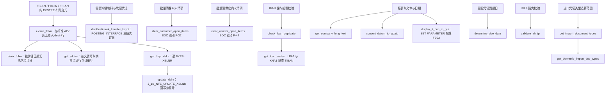
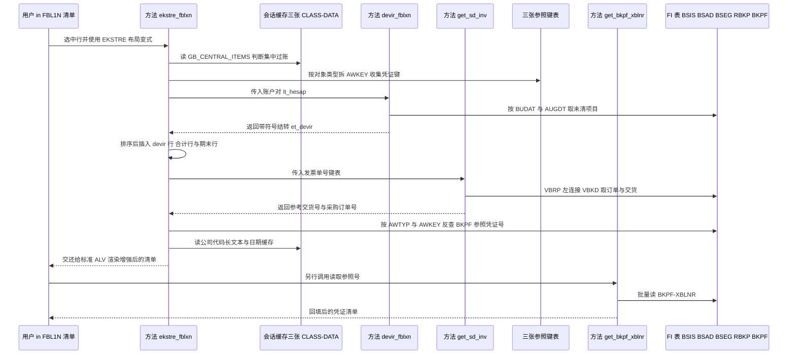

# ZCL_FI_TOOLKIT 源码分析报告

> 分析对象：全局类 `zcl_fi_toolkit`（`PUBLIC`、`FINAL`、`CREATE PUBLIC`）
> 代码规模：约 1700 行，17 个类方法（16 个 `PUBLIC` + 1 个 `PRIVATE`），3 个会话级缓存
> 代码气质：土耳其语 FI 开发者的生产工具箱 —— `##` 伪声明、老式 `DEFINE` 宏、BDC、反射式 `ASSIGN` 与现代 Open SQL 语法混用

## 一、程序定位与业务背景

### 1.1 它替业务解决哪几件事

这不是一个报表，也不是一个业务事务，而是把六条互不相干的 FI 需求收进同一个 `FINAL` 类的**工具箱**：

1. **往来账龄表（Ekstre）增强**。`FBL1N`/`FBL3N`/`FBL5N` 的标准清单里没有"上期结转"行，也没有参照凭证号、采购订单号、交货号这些跨单据追溯字段。这个类把 FI 明细显示程序的标准表 `it_rfposxext` 当成自己的输出介质，直接在上面排序、插行、改字段。
2. **IBAN 唯一性校验**。`TIBAN` 的重复只能在主数据维护时逐笔人工发现，业务需要一个"保存前批量查重"的入口，并且要区分是供应商还是客户撞号。
3. **反向过账（denklik transferi）**。物料凭证、采购发票、销售发票这三类凭证的冲销没有单一标准 FM 覆盖，于是自己用 `POSTING_INTERFACE_START` / `CLEARING` / `END` 三段式过一张反向凭证。
4. **未清项目清账**。`F-32`（客户）/`F-44`（供应商）只能手工操作，这里用 BDC 包装成可被程序调用的方法。
5. **主数据与小工具查询**：公司代码长文本（`T001` + `ADRC` 有效期判断）、日期格式转换、凭证跳转 `FB03`、到期日计算、进口凭证类型选择范围、IFRS 豁免公司代码校验。
6. **参照凭证号（XBLNR）回填**。集成场景下凭证常常缺参照号，这里提供"批量读 `BKPF-XBLNR` → 批量通过 `J_1B_NFE_UPDATE_XBLNR` 回写"的一对方法。

### 1.2 现有方案为什么不够

- 每个 FI 报表都要自己重写一遍 devir 逻辑（`BSIK`/`BSAK`/`BSIS`/`BSAS` 的口径差异、贷方取负、特殊总账过滤）。口径一改，所有报表一起错，而且没人能说清各报表的 devir 是否同口径。
- IBAN 查重没有批量 API，主数据团队只能靠导出表格比对。
- 公司代码长文本要 `T001` + `ADRC` 两次 SELECT 再判有效期，每个报表重写一遍，而 `ADRC` 的有效期边界最容易写漏。
- XBLNR 回写涉及 FM 权限与更新 LUW，散落在各处调用时没人敢保证事务边界。

于是把这些"第二次就不想再写"的片段收进一个类。这个动机是成立的，下面要看的就是实现有没有兑现这个动机。

### 1.3 设计范式一句话定性

**静态方法 + 会话级 `HASHED` 缓存 + 通过 `ASSIGN` 反射绑定 SAP 标准程序全局变量** 的 FI 工具箱类：它用对标准程序内部结构的强耦合，换来了在标准事务运行期间直接改其内存数据的自由。

### 1.4 为什么值得细读

这是活的生产代码而不是教科书示例：里面既有教科书级的缓存用法（`gt_dg_cache`/`gt_company_long_text`），也有恒真的校验条件、误删整张内表的 `DELETE`、用长度截断拼出来的动态字段名。这类代码的 onboarding 价值恰恰在于把**作者意图**和**实际行为**之间的差距一条条标出来。

## 二、程序执行流程总览

这个类没有单一入口（全部 `CLASS-METHODS`），"执行流程"是按业务场景串起来的调用链。左边三条是数据增强链，中间两条是过账链，右边是校验与主数据工具链：



### 责任链表

| 子程序 | 调用者 | 职责 |
| --- | --- | --- |
| `ekstre_fblxn`（方法） | `FBL1N`/`FBL3N`/`FBL5N` 及 ZSDP 增强程序中 `EKSTRE` 布局变式的用户操作 | 改写标准表 `it_rfposxext`：删反向记录、回填自定义列、插 devir 行与期末余额行 |
| `devir_fblxn`（方法） | `ekstre_fblxn` | 按选择屏关键日期，从 `BSIK`/`BSAK`/`BSIS`/`BSAS`/`BSID`/`BSAD` 取上期未清，按公司代码+账户+业务范围汇总成带符号的结转余额 |
| `get_sd_inv`（方法，PRIVATE） | `ekstre_fblxn` | 由交货发票号取 `VBRP` 的参考交货号与采购订单号 |
| `get_bkpf_xblnr`（方法） | 外部报表/批处理 | 批量读 `BKPF-XBLNR` 并回填传入表 |
| `update_xblnr`（方法） | 外部报表/批处理 | 逐张凭证调用 `J_1B_NFE_UPDATE_XBLNR` 写参照号，并按开关决定 COMMIT 粒度 |
| `denklestirerek_transfer_kaydi`（方法） | 需要冲销的 FI 业务场景 | 用 `POSTING_INTERFACE_*` 过一张 `UMBUCHNG` 反向凭证 |
| `clear_customer_open_items`（方法） | 外部批处理/程序 | BDC 驱动 `F-32` 清客户未清项目 |
| `clear_vendor_open_items`（方法） | 外部批处理/程序 | BDC 驱动 `F-44` 清供应商未清项目 |
| `check_iban_duplicate`（方法） | 主数据保存前校验的调用方 | 发现重复即抛 `zcx_fi_iban` |
| `get_iban_codes`（方法） | `check_iban_duplicate` 或独立取数 | 联查 `LFA1`/`LFBK`/`TIBAN` 与 `KNA1`/`LNBK`/`TIBAN` |
| `get_company_long_text`（方法） | 报表打印/ALV 文本列 | 取公司代码长文本（先 `T001-BUTXT`，有地址则拼 `ADRC` 姓名），命中会话缓存 |
| `convert_datum_to_gdatu`（方法） | 需要yyyymmdd 格式日期的工具场景 | 内部日期转外部格式再转 `TCURR-GDATU`，命中会话缓存 |
| `display_fi_doc_in_gui`（方法） | 报表的行跳转 | `SET PARAMETER` 后 `FB03` 跳过首屏显示凭证 |
| `determine_due_date`（方法） | 应收/应付相关计算 | 取 `BSEG` 期限参数调 `DETERMINE_DUE_DATE` 返回 `NETDT` |
| `validate_zhrtip`（方法） | 凭证录入时的用户自定义校验 | 判断公司代码是否 IFRS 豁免，并按科目首字符校验凭证类型 |
| `get_import_document_types`（方法） | 选择范围构造 | 读配置表 `ZFIT_ITH_BLART` 返回哈希表形态的凭证类型范围 |
| `get_domestic_import_doc_types`（方法） | 选择范围构造 | 复用上一个方法的缓存，只取同时标记内贸与外贸的类型 |

下面按这条流程，逐个子程序展开。

---

## 三、分组分析（按程序流程 / 子程序）

### 3.1 类定义段 全局声明区 `zcl_fi_toolkit`（全局声明区）

声明区分三段看：类头的可见性策略、业务常量、以及三个会话级缓存的类型锚点。

```abap
CLASS zcl_fi_toolkit DEFINITION
  PUBLIC
  FINAL
  CREATE PUBLIC .
```

**做什么** — 三行类头确定了实例化策略：对外可见、可被任意程序 `NEW`、禁止继承。

**为什么** — 工具类不该被继承：方法全是 `CLASS-METHODS`，状态只有三张只读缓存，继承拿不到任何东西。`FINAL` 让编译器能在调用点做静态解析，也把"这不是基类"变成编译期事实而不是口头约定。

**风险与改进** — `FINAL` 与 `CREATE PUBLIC` 同时存在是矛盾的组合：`FINAL` 在防继承，`CREATE PUBLIC` 却在开放构造，而这个类的 17 个方法彼此完全无依赖、也不需要实例状态，开放构造没有任何收益，只是给"将来替换依赖"留了一个没有兑现的口子。要支持单测，正确的做法是给有外部依赖的那几个方法定义薄接口（缓存与 DB 访问可注入），而不是开放构造。

```abap
    CONSTANTS c_borc TYPE shkzg VALUE 'S' ##NO_TEXT.
    CONSTANTS c_alacak TYPE shkzg VALUE 'H' ##NO_TEXT.
    CONSTANTS c_mal_hareketi TYPE awtyp VALUE 'MKPF' ##NO_TEXT.
    CONSTANTS c_satinalma_faturasi TYPE awtyp VALUE 'RMRP' ##NO_TEXT.
    CONSTANTS c_satis_faturasi TYPE awtyp VALUE 'VBRK' ##NO_TEXT.
    CONSTANTS c_musteri_hf_talebi TYPE auart VALUE 'ZAH1' ##NO_TEXT.
```

**做什么** — 集中声明六个业务常量：借贷标识 `S`/`H`；三类凭证的 `AWKEY` 对象类型（物料凭证 `MKPF`、采购发票 `RMRP`、销售发票 `VBRK`）；外加一个客户化订单类型 `ZAH1`。

**为什么** — 把 `MKPF`/`RMRP`/`VBRK` 提成常量是对的：这些码在 `AWKEY` 拼接、`BKPF-AWTYP` 反查、`ZZAWTYP` 过滤三处必须完全一致，一旦散落成字面量迟早写错。`##NO_TEXT` 也用得规范，说明作者在意 ATC。

**风险与改进** — 有两个常量是死的：`c_borc`（借方标识）与 `c_musteri_hf_talebi`（订单类型 `ZAH1`）在本类实现段内从未被引用，只在定义段出现一次。前者像是早期用 `SHKGZ` 过滤被 `c_alacak` 重构后留下的残骸，后者是类里唯一带 `Z` 前缀的客户化配置却没接入任何逻辑。死常量比没有常量更糟——后来者会以为存在"按借方标识过滤"或"按订单类型筛选"的功能。顺带一提，PRIVATE 段的 `t_vbkd` 与 `tt_vbkd` 两个类型全文未被使用，`TYPES` 命名也混用 `t_` 与 `ty_` 两种前缀，建议统一为 `ty_`/`tt_` 并清掉未引用项。

```abap
    CLASS-DATA gt_company_long_text TYPE tt_company_long_text .
    CLASS-DATA gt_dg_cache TYPE tt_dg_cache .
    CLASS-DATA gt_import_doc_type_cache TYPE tt_ith_blart .
```

**做什么** — 三个 `CLASS-DATA` 静态缓存：表为公司代码长文本（`HASHED`、唯一键 `BUKRS`），日期转换结果（`HASHED`、唯一键 `DATUM`），进口凭证类型配置（标准表、读入后当只读用）。

**为什么** — 这三个数据源都是"整个会话读一次就够"的小表，用 `CLASS-DATA` 而不是局部变量 + `STATICS`，避免了把缓存作为参数在方法间层层传递。用带 `UNIQUE KEY` 的 `HASHED` 表存，则允许后面用 `ASSIGN buffer[ KEY primary_key COMPONENTS ... ] TO <fs>` 一步完成"定位 + 未命中时置 sy-subrc"，这是本类里最值得学的一段技巧。

**风险与改进** — 缓存一旦装载便不再失效。`gt_import_doc_type_cache` 以 `IS INITIAL` 判空后整表读入，配置表 `ZFIT_ITH_BLART` 若在会话中途被维护，程序仍按旧值构造凭证类型选择范围，必须重开会话才生效；`gt_company_long_text` 同样如此，改 `T001-BUTXT` 或 `ADRC` 姓名后报表标题仍是旧文本。建议至少补一个清缓存入口或在注释中写明"缓存至会话结束"。

### 3.2 类方法 `check_iban_duplicate` — 校验入口

分两步：先取数判定，再组装异常抛出。

```abap
    DATA(lt_tiban) = get_iban_codes(
      it_iban       = it_iban
      iv_get_vendor = iv_get_vendor
      iv_get_client = iv_get_client
      it_lifnr      = it_lifnr
      it_kunnr      = it_kunnr
    ).

    CHECK lt_tiban IS NOT INITIAL.

    ASSIGN lt_tiban[ 1 ] TO FIELD-SYMBOL(<ls_tiban>).
```

**做什么** — 按调用方给的两个开关与两个伙伴区间，委托 `get_iban_codes` 把命中重复的 `TIBAN` 行取回本地表；表非空则取第 1 行作为"重复证据"，表为空则 `CHECK` 直接返回，语义是"没查到重复即校验通过"。

**为什么** — 用异常而非布尔返回值表达校验失败是正确取舍：调用方必须显式 `CATCH`，无法静默忽略；参数用具名实参传递，未来给 `get_iban_codes` 加参数不会破坏这里的调用。

**风险与改进** — 两个问题。①`lt_tiban[ 1 ]` 只抛**第一条**重复：一批 200 个 IBAN 里若有 5 条重复，用户只能看到一条，修完再报错再修下一条。应把所有重复的 IBAN 号与伙伴聚合进异常属性或拼成一条消息。②`CHECK lt_tiban IS NOT INITIAL` 把"空结果"与"校验通过"划等号，而空结果有多种成因（开关为假、区间未传、SQL 未命中），一旦成因是调用方参数问题，校验会静默通过——这一点在 `get_iban_codes` 里被放大成实质缺陷。

```abap
    RAISE EXCEPTION TYPE zcx_fi_iban
      EXPORTING
        textid     = zcx_fi_iban=>already_used
        iban       = <ls_tiban>-iban
        party      = COND #( WHEN <ls_tiban>-kunnr IS NOT INITIAL THEN <ls_tiban>-kunnr
                             WHEN <ls_tiban>-lifnr IS NOT INITIAL THEN <ls_tiban>-lifnr
                           )
        party_type = COND #( WHEN <ls_tiban>-kunnr IS NOT INITIAL THEN TEXT-110
                             WHEN <ls_tiban>-lifnr IS NOT INITIAL THEN TEXT-111
                           ).
```

**做什么** — 抛 `zcx_fi_iban`，携带异常文本 ID `already_used`、重复的 IBAN、业务伙伴号，以及伙伴类型（客户 `TEXT-110` / 供应商 `TEXT-111`）。

**为什么** — 用 `COND #( )` 内联条件在同一表达式里表达"客户优先、供应商其次"，省掉了一串 IF/变量，是 7.50 之后写法迁移留下的好痕迹。`TEXTID` 固定为 `already_used`，使异常类可以把消息文本完全收进自己的消息池，是异常类的标准做法。

**风险与改进** — ①`COND #( )` 没有 `ELSE`，若 `KUNNR` 与 `LIFNR` 都为初始值，`party` 与 `party_type` 会静默变空，异常消息变成"IBAN xxx 已被使用（未知伙伴）"。应补 `ELSE` 分支或至少在异常类里处理空伙伴。②`TEXT-110`/`TEXT-111` 直接写成文本符号而不是 `MESSAGE` 对象，异常类被外部翻译时无法识别这两个编号的语义；更稳的做法是给 `zcx_fi_iban` 增加 `party_type_text` 这类属性，由异常类自己拼消息。③`TEXT-110` 这类无消息类限定的文本符号在类里依赖所在程序池的默认消息类，建议写成 `TEXTID` 枚举。

### 3.3 类方法 `get_iban_codes` — 取重复 IBAN 的两条分支

两个分支结构完全对称，只换业务伙伴主数据表，一次查供应商、一次查客户，结果 `APPEND` 到同一个返回表。

```abap
    IF iv_get_vendor IS NOT INITIAL.

      SELECT lfa1~lifnr, tiban~*
        APPENDING CORRESPONDING FIELDS OF TABLE @rt_tiban
        FROM lfa1
             INNER JOIN lfbk ON lfbk~lifnr = lfa1~lifnr
             INNER JOIN tiban ON tiban~banks = lfbk~banks AND
                                 tiban~bankl = lfbk~bankl AND
                                 tiban~bankn = lfbk~bankn AND
                                 tiban~bkont = lfbk~bkont
        WHERE lfa1~lifnr IN @it_lifnr AND
              tiban~iban IN @it_iban
        ##TOO_MANY_ITAB_FIELDS.

    ENDIF.
```

**做什么** — 供应商分支：把 `LFA1`（供应商主数据）、`LFBK`（供应商银行账户）、`TIBAN`（IBAN 段）三表按银行四元组 `BANKS`/`BANKL`/`BANKN`/`BKONT` 内连接，限定供应商号在 `it_lifnr` 内、IBAN 在 `it_iban` 内，取 `TIBAN` 整行附加到返回表。

**为什么** — `INNER JOIN` 三表是取这类数据的唯一正确姿势：`TIBAN` 里有 `BANKS`/`BANKL`/`BANKN`/`BKONT` 和 `IBAN`，只有通过 `LFBK` 才能把银行账户翻译成供应商号。用 `TIBAN~*` + `CORRESPONDING FIELDS` 一次把 `KUNNR`/`LIFNR`/`BANKN` 等后续需要的字段全部带回，避免二次取数——这也是 `check_iban_duplicate` 里能直接读 `<ls_tiban>-kunnr` 与 `-lifnr` 的原因。

**风险与改进** — ①**默认路径下这个查询必然返回空**。`iv_get_vendor` 与 `iv_get_client` 都默认 `abap_true`，而 `it_lifnr`、`it_kunnr` 都是 `OPTIONAL`；ABAP 里 `WHERE lifnr IN @<初始区间表>` 是"没有可匹配值"，不是"不限制"，所以调用方若只传 `it_iban` 而不传两个伙伴区间，两条查询都返回空，`check_iban_duplicate` 于是永远判定"无重复"。一个看起来在校验、实际不校验的默认路径，比没有校验更危险。至少应改成"两个区间都为空时抛异常"，或把伙伴区间设为必填。②`SELECT lfa1~lifnr` 只为把 `LIFNR` 带出来，但 `LFBK~lifnr` 已在连接条件里，实际可省略；不影响正确性，只是冗余。③银行账户四字段全部参与等值连接是 SAP 标准做法，但建议注释一句"缺一不可"，否则后来者容易只留 `BANKS`/`BANKL`。

```abap
    IF iv_get_client IS NOT INITIAL.

      SELECT kna1~lifnr, tiban~*
        APPENDING CORRESPONDING FIELDS OF TABLE @rt_tiban
        FROM kna1
             INNER JOIN knbk ON knbk~kunnr = kna1~kunnr
             INNER JOIN tiban ON tiban~banks = knbk~banks AND
                                 tiban~bankl = knbk~bankl AND
                                 tiban~bankn = knbk~bankn AND
                                 tiban~bkont = knbk~bkont
        WHERE kna1~lifnr IN @it_kunnr AND
              tiban~iban IN @it_iban
        ##TOO_MANY_ITAB_FIELDS.

    ENDIF.
```

**做什么** — 客户分支：同样三表内连接换成 `KNA1`（客户主数据）+ `LNBK`（客户银行账户）+ `TIBAN`，伙伴区间换成 `it_kunnr`，结果附加到同一张返回表。

**为什么** — 与供应商分支对称，保证"一次调用同时检查客户与供应商侧重复"，调用方不必写两遍取数逻辑。

**风险与改进** — 这段代码有一处必须拿源码与 DDIC 一起核对的高风险点：投影与过滤用的都是 `kna1~lifnr`，而 `KNA1` 的客户主键是 `KUNNR`，`LIFNR` 是供应商编号——这几乎可以确定是从供应商分支复制粘贴后漏改字段名（连接条件 `knbk~kunnr = kna1~kunnr` 就写对了，唯独投影与 `WHERE` 没改）。若系统 DDIC 里 `KNA1` 确实没有 `LIFNR`，这段 SQL 连语法检查都过不了；即便有（某些客户化或旧版对象），用供应商字段去过滤客户区间也是错的：`WHERE kna1~lifnr IN @it_kunnr` 变成"拿客户范围比供应商字段"，纯客户账户的 `LIFNR` 为空，客户 IBAN 永远查不出来，查重功能对客户侧静默失效。修法是这两处都改成 `kna1~kunnr`。另外注意这里的表名是 `LNBK`（客户银行账户），拼写与常见的 `LFBK` 只差一个字母，抄代码时很容易连表名一起抄错。

### 3.4 类方法 `ekstre_fblxn` — 往来账龄表增强（核心方法）

这个方法占全类近三分之一代码，是本类真正的业务主体。它在标准事务运行期间改写标准程序的内存表，分十一步走完"删反向记录 → 算结转 → 补参照字段 → 插结转行 → 补期末余额"的全流程。

#### ① 入口守卫：认布局变式、认 ALV 选择状态

```abap
    CHECK ct_items IS NOT INITIAL.
    CASE sy-cprog.
      WHEN 'RFITEMAP'."FBL1N
        ASSIGN ('(RFITEMAP)X_AISEL') TO FIELD-SYMBOL(<lv_x_aisel>).
        ASSIGN ('(RFITEMAP)PA_VARI') TO FIELD-SYMBOL(<lv_vari>).

      WHEN 'RFITEMGL'."FBL3N
        ASSIGN ('(RFITEMGL)X_AISEL') TO <lv_x_aisel>.
        ASSIGN ('(RFITEMGL)PA_VARI') TO <lv_vari>.

      WHEN 'RFITEMAR'."FBL5N
        ASSIGN ('(RFITEMAR)X_AISEL') TO <lv_x_aisel>.
        ASSIGN ('(RFITEMAR)PA_VARI') TO <lv_vari>.

      WHEN 'ZSDP_RFITEMAR'.
        ASSIGN ('(ZSDP_RFITEMAR)X_AISEL') TO <lv_x_aisel>.
        ASSIGN ('(ZSDP_RFITEMAR)PA_VARI') TO <lv_vari>.

      WHEN OTHERS.
        RETURN.

    ENDCASE.

    IF sy-subrc = 0 AND sy-cprog(5) = 'RFITE'.

      LOOP AT ct_items ASSIGNING FIELD-SYMBOL(<ls_items>)
            WHERE zuonr(3) eq  zcl_fi_omd=>c_zuonr_sanal and
                  zzbstkd IS INITIAL.
         <ls_items>-zzbstkd = <ls_items>-zuonr.
      ENDLOOP.

      IF <lv_vari> CS 'EKSTRE'.

        IF <lv_x_aisel> <> abap_true.
          MESSAGE TEXT-003 TYPE 'I'.
          RETURN.
        ENDIF.
```

**做什么** — 先确认调用方确实传了行，再按 `sy-cprog` 区分四种来源程序（`RFITEMAP`/`RFITEMGL`/`RFITEMAR` 与客户化 `ZSDP_RFITEMAR`），用动态 `ASSIGN` 把各来源程序的全局变量 `X_AISEL`（是否有选中行）与 `PA_VARI`（布局变式名）绑到字段符号上；随后给"销售订单相关行"补一次 `ZZBSTKD`，再判断布局变式名里是否含 `EKSTRE`、以及用户是否真的选了行，两者任一不满足就静默返回。

**为什么** — 用 `sy-cprog` 而不是让调用方传标志位，是因为增强代码就挂在标准程序里，来源程序是既定事实，无需入参。用动态 `ASSIGN` 读标准程序的全局变量，是"不改标准程序就能读到它的内部状态"的唯一办法；`CS 'EKSTRE'` 则让功能只在专门的布局变式下生效，避免污染标准清单。

**风险与改进** — ①这一整套逻辑挂在 `sy-cprog(5) = 'RFITE'` 上做位置截取：`ZSDP_RFITEMAR` 的第 5 位是下划线，永远不等于 `RFITE`，所以这个 `CASE` 分支是死代码，作者为它写的两条 `ASSIGN` 永远不会执行；真正需要支持的客户化程序反而进不来。正确做法是用白名单判断（例如逐个比较完整程序名），不要对程序名做字符截取。②`'EKSTRE'` 用子串匹配，用户把变式改名（改成 `EKSTRE_ALT` 仍然命中，但改成 `YENI_EKSTRE` 也命中；改成 `EKSTRE2` 也命中）就可能意外触发或失效，建议 `EQ` 精确比较。③`MESSAGE TEXT-003` 是信息类消息，在后台批处理中会直接终止作业；且没有消息类限定，文本符号的归属依赖程序池。④`<lv_x_aisel> <> abap_true` 意味着用户必须先选中行才能看到增强结果——功能可用性上应给出可操作提示而不是只留一条消息。

#### ② 删除客户清账产生的反向记录

```abap
        LOOP AT ct_items ASSIGNING <ls_items>
                    WHERE blart = zcl_fi_document_type=>get_customer_clearing_doc_type( ) AND
                          gjahr GE '2018'.
          DELETE ct_items WHERE belnr = <ls_items>-zzstblg AND gjahr = <ls_items>-zzstjah.
          DELETE ct_items.
        ENDLOOP.
        "-----------------------------<

        SORT ct_items BY konto budat ASCENDING.

        IF  ct_items IS INITIAL.
          RETURN.
        ENDIF.
```

**做什么** — 扫出 `2018` 年以后由"客户清账"自动生成的那类凭证行，用它自己的参照凭证号（`ZZSTBLG`/`ZZSTJAH`）把被清掉的那张原始凭证行从清单里删掉；删完按 `KONTO`、`BUDAT` 升序排序，表空了直接返回。

**为什么** — 清账会产生一张反向凭证，原凭证行与反向凭证行同时出现在账龄表里会把金额算重。`HAR-10448` 这次修复的思路是对的：既然反向凭证知道自己顶掉的是谁（`ZZSTBLG` 指向被清凭证），就按这个引用反查删除。排序也必要——后面的 devir 行要插在"同一账户的第一条明细之前"。

**风险与改进** — 这里有一个**致命缺陷**：第二个 `DELETE ct_items.` 后面没有 `WHERE`，ABAP 里这等于**清空整张内表**。执行结果是：循环第一次匹配到清账凭证时，整张清单被一次删光，循环随即结束，报表只剩空表；即便第一轮没匹配到，后续 `SORT` 与整个增强逻辑也都建立在已被清空的表上。作者的原意几乎肯定是 `DELETE <ls_items>.`（删当前行）。这是本类里最需要立即修的一处。

#### ③ 收集账户与中心（集中过账）账户

```abap
        LOOP AT ct_items ASSIGNING <ls_items>.
          CLEAR ls_hesap.
          ls_hesap-sube = <ls_items>-konto.
          COLLECT ls_hesap INTO lt_hesap.
          ls_konto-bukrs = <ls_items>-bukrs.
          ls_konto-konto = <ls_items>-konto.
          COLLECT ls_konto INTO lt_konto.
        ENDLOOP.
        ASSIGN  ('(SAPLFI_ITEMS)GB_CENTRAL_ITEMS') TO FIELD-SYMBOL(<lv_merkez>).
        IF sy-subrc = 0.
          IF <lv_merkez> = abap_true.
            CASE sy-cprog.
              WHEN 'RFITEMAR' OR 'ZSDP_RFITEMAR'.
                SELECT bukrs, kunnr, knrze INTO TABLE @DATA(lt_knb1) FROM knb1
                    FOR ALL ENTRIES IN @lt_hesap
                    WHERE kunnr = @lt_hesap-sube AND
                          knrze <> @space.
                SORT lt_knb1 BY bukrs kunnr.
                LOOP AT lt_knb1 ASSIGNING FIELD-SYMBOL(<ls_knb1>).
                  ls_hesap-sube = <ls_knb1>-kunnr.
                  ls_hesap-merkez = <ls_knb1>-knrze.
                  COLLECT ls_hesap INTO lt_hesap.
                ENDLOOP.

              WHEN 'RFITEMAP'.
                SELECT bukrs, lifnr, lnrze INTO TABLE @DATA(lt_lfb1) FROM lfb1
                    FOR ALL ENTRIES IN @lt_hesap
                    WHERE lifnr = @lt_hesap-sube AND
                          lnrze <> @space.
                SORT lt_lfb1 BY bukrs lifnr.
                LOOP AT lt_lfb1 ASSIGNING FIELD-SYMBOL(<ls_lfb1>).
                  ls_hesap-sube   = <ls_lfb1>-lifnr.
                  ls_hesap-merkez = <ls_lfb1>-lnrze.
                  COLLECT ls_hesap INTO lt_hesap.
                ENDLOOP.

            ENDCASE.
          ENDIF.
        ENDIF.
```

**做什么** — 第一遍扫清单，把出现过的 `KONTO` 收集成"账户对"（`SUBE`）并去重，同时收集"公司代码 + 账户"键供末尾追加期末余额用；再读标准程序的全局变量 `SAPLFI_ITEMS` 里的 `GB_CENTRAL_ITEMS` 开关，若用户勾选了"集中过账项"，就分别从 `KNB1`（客户集中账户 `KNRZE`）或 `LFB1`（供应商集中账户 `LNRZE`）把每个账户的集中过账账户补成 `MERKEZ`，一并加进 `lt_hesap`。

**为什么** — `devir_fblxn` 需要"子账户 + 其集中过账账户"的对应关系才能算出正确的上期结转；先收集后取数（而不是边遍历边查）能把 `KNB1`/`LFB1` 的查询次数从"每行一次"降到"每个账户一次"。`FOR ALL ENTRIES` 前有 `lt_hesap` 非空的隐含保证（`CHECK ct_items IS NOT INITIAL` 加上 `COLLECT` 至少产生一行），避免了 FAE 空表的全表扫描。

**风险与改进** — ①`ASSIGN ('(SAPLFI_ITEMS)GB_CENTRAL_ITEMS')` 把整个增强的可选性绑死在标准程序的一个全局变量上：SAP 升级改名后 `ASSIGN` 失败，`sy-subrc` 判断让功能退化为"不做集中过账"，**静默降级、无人知晓**。建议在降级分支上抛信息或写日志，至少在注释里标注"若 SAPLFI_ITEMS 改名，此增强静默失效"。②`COLLECT` 用在 `tt_hesap`/`tt_konto` 这类标准表上：默认键是**全部字段**，`COLLECT` 每次追加都要全表线性查找并逐字段比较，行数上来后是 O(n²)。改成 `SORTED TABLE ... UNIQUE KEY` 或 `HASHED` 后用 `INSERT ... INTO TABLE` 即可。③`lt_hesap` 在这里用 `CLEAR ls_hesap` + 逐字段赋值再 `COLLECT`，可以直接 `VALUE #( sube = <ls_items>-konto )`，少一层中间变量。④`KNRZE <> @space` 用空格比较，若该字段是 `CHAR10` 且未初始化判断没问题，但更稳妥的是 `IS NOT INITIAL`。

#### ④ 取上期结转并整理成有序表

```abap
        SELECT * FROM t001  INTO TABLE lt_t001.

        zcl_fi_toolkit=>devir_fblxn(
                    EXPORTING it_hesap = lt_hesap
                    IMPORTING et_devir = lt_devir
                                             ).
        SORT lt_devir BY bukrs konto gsber.
        lt_devir_sorted = lt_devir.

        FREE  : lt_devir,lt_hesap.
```

**做什么** — 顺手整表读 `T001` 到 `lt_t001`，然后调 `devir_fblxn` 算出上期未清结转表 `lt_devir`，按 `BUKRS`/`KONTO`/`GSBER` 排序后转存到 `lt_devir_sorted`，最后释放不再需要的两张表。

**为什么** — 排序 + 转换是不可省的一步：后面逐行插入 devir 时要在 `lt_devir_sorted` 上做带条件的 `LOOP AT`，而 `SY-TABIX` 定位插入点依赖"同一账户的行必须物理相邻"这一前提；`SORTED TABLE` + `SORT` 一次把顺序和结构都定下来，比在循环里反复 `READ TABLE` 好。`FREE` 是 ABAP 良好实践，及时释放大内表给后续 `INSERT` 腾内存。

**风险与改进** — ①`SELECT * FROM t001 INTO TABLE lt_t001` 读进来之后**全文再未被使用**：`lt_t001` 只在声明处出现一次（一个带 `##NEEDED` 的 `SORTED TABLE` 声明），说明这是从别处复制来的残留。整表读 `T001` 虽小，但属于无意义的数据库往返，应删除；若确实要公司代码列表，应改成按 `ct_items` 里出现的 `BUKRS` 取数。②`FREE lt_devir` 之后若后续逻辑再读 `lt_devir` 会 dump（`FREE` 后内表处于未初始化状态），目前代码只读 `lt_devir_sorted`，但这个约束没有任何注释，属于隐性契约。③排序键含 `GSBER`，而后面插行时用的是 `lt_devir_sorted ... WHERE bukrs = ... AND konto = ...`——同账户多业务范围的行会连续出现，插入位置取第一条，语义上没错，但值得一句注释说明"业务范围的行会被合并到同一组结转里"。

#### ⑤ 收集三类反向凭证的参照键

```abap
        LOOP AT ct_items ASSIGNING <ls_items>
           WHERE zzawtyp = c_mal_hareketi OR zzawtyp =  c_satinalma_faturasi
               OR  zzawtyp =  c_satis_faturasi.
          IF <ls_items>-zzawtyp = c_mal_hareketi.
            APPEND VALUE #( mblnr = <ls_items>-zzawkey(10)
                            mjahr = <ls_items>-zzawkey+10(4)
                           ) TO lt_mkpf_key.
          ELSEIF <ls_items>-zzawtyp = c_satinalma_faturasi.
            APPEND VALUE #( belnr = <ls_items>-zzawkey(10)
                            gjahr = <ls_items>-zzawkey+10(4)
                           ) TO lt_rbkp_key.
          ELSEIF <ls_items>-zzawtyp = c_satis_faturasi.
            APPEND <ls_items>-zzawkey(10) TO lt_vbrk_key.
          ENDIF.
        ENDLOOP.
        SORT lt_rbkp_key BY belnr gjahr.
        SORT lt_mkpf_key BY mblnr mjahr.
        SORT lt_vbrk_key BY vbeln.
        DELETE ADJACENT DUPLICATES FROM lt_mkpf_key COMPARING mblnr mjahr.
        DELETE ADJACENT DUPLICATES FROM lt_rbkp_key COMPARING belnr gjahr.
        DELETE ADJACENT DUPLICATES FROM lt_vbrk_key COMPARING vbeln.
```

**做什么** — 扫出所有 `ZZAWTYP` 属于物料凭证、采购发票、销售发票的行，把 25 位的参照文档键 `ZZAWKEY` 拆开：前 10 位是凭证号、第 11~14 位是年度，按类型分别压进三张去重键表，随后排序并用 `DELETE ADJACENT DUPLICATES` 去重。

**为什么** — `AWKEY` 是 SAP 把"对象类型 + 凭证号 + 年度"拼成的定长键，反查时必须拆位。这一步先聚合再去查，把后续三次 `SELECT` 的输入规模压到"实际出现过的凭证数"，并且 `SELECT DISTINCT` 之外用 `DELETE ADJACENT DUPLICATES` 手工去重，是处理拼接键的常规手法。

**风险与改进** — ①拆位假设了 `ZZAWKEY` 一定是"10 位凭证 + 4 位年度"。这个假设对 `MKPF`/`RMRP`/`VBRK` 成立（凭证号 10 位、年份 4 位），但它是靠位置猜的：一旦某个对象类型的凭证号不是 10 位（例如某些客户化单据），拆出来的年度就是错的，而且不会报错，只会静默查不到参照凭证。应改为按对象类型分别取 `MKPF-MBLNR`/`MKPF-MJAHR` 等真实字段，或至少注释这个前提。②`DELETE ADJACENT DUPLICATES` 依赖前面 `SORT` 的键与 `COMPARING` 的键一致，这一点作者做对了（`SORT ... BY belnr gjahr` 对 `COMPARING belnr gjahr`），但这个约束是隐式的，改动排序键时极易踩坑，注释一句即可。③`lt_vbrk_key` 直接 `APPEND` 标量（`APPEND <ls_items>-zzawkey(10) TO lt_vbrk_key`），因为其行结构只有一个字段，属于可接受的简写；但与另外两张表的 `APPEND VALUE #( )` 风格不一致。

**（上面第二、三张表只做去重，真正的取数见下一步。）**

#### ⑥ 按键表取回反向凭证信息

```abap
        IF lt_rbkp_key IS NOT INITIAL.

          SELECT belnr, gjahr, stblg, stjah
            FROM rbkp
            FOR ALL ENTRIES IN @lt_rbkp_key
            WHERE
              belnr = @lt_rbkp_key-belnr AND
              gjahr = @lt_rbkp_key-gjahr
            INTO CORRESPONDING FIELDS OF TABLE @lt_rbkp.

          FREE lt_rbkp_key.
        ENDIF.

        IF lt_mkpf_key IS NOT INITIAL.
          SELECT mblnr, mjahr, smbln, sjahr
            FROM mseg
            FOR ALL ENTRIES IN @lt_mkpf_key
            WHERE
              mblnr = @lt_mkpf_key-mblnr AND
              mjahr = @lt_mkpf_key-mjahr
            INTO CORRESPONDING FIELDS OF TABLE @lt_mseg.
          FREE lt_mkpf_key.
        ENDIF.
        IF lt_vbrk_key[] IS NOT INITIAL.
          lt_vbrp = get_sd_inv( lt_vbrk_key ).
          FREE lt_vbrk_key.
        ENDIF.
```

**做什么** — 三次带 `FOR ALL ENTRIES` 的查询：采购发票从 `RBKP` 取"它自己被哪张凭证冲销"（`STBLG`/`STJAH`），物料凭证从 `MSEG` 取 `SMBLN`/`SJAH`，销售发票则调私有方法 `get_sd_inv` 取参考交货号与采购订单号；每次查完立刻 `FREE` 键表。

**为什么** — 查完就 `FREE` 是很实在的内存纪律：这三张键表在后续循环里再也不用，留着只会占工作内存。`MSEG` 而非 `MKPF` 是必须的——只有 `MSEG` 才有行级的 `SMBLN`。销售发票走私有方法而不是本方法内联 SQL，把 `VBRP`/`VBKD` 的三表连接集中到一处，也便于日后单独复用。

**风险与改进** — ①判空写法三种并存：`IS NOT INITIAL`、`[] IS NOT INITIAL`，还有一个地方直接用 `lt_vbrk_key[]` 传给 `get_sd_inv`。语义相同但风格不统一，建议统一为 `IS INITIAL` 反判（`IF lt_vbrk_key IS INITIAL. ... RETURN.` 之类的统一前置拦截）。②`RBKP` 上按 `BELNR`+`GJAHR` 查是主键命中，没问题；但 `MSEG` 的 `FOR ALL ENTRIES` 把 `MJAHR` 一起写进 `WHERE` 是必要的，作者做对了——很多人在这里漏掉年度导致跨年串号，值得肯定。③`lt_vbrp = get_sd_inv( lt_vbrk_key )` 用位置参数传参，与本方法内其他调用的具名实参风格不一致；更重要的是 `get_sd_inv` 的返回表按 `VBELN` 非唯一排序，重复行问题留到 3.6 再说。

#### ⑦ 逐行回填参照凭证号与自定义列

```abap
        SORT ct_items BY konto budat ASCENDING.

        LOOP AT ct_items ASSIGNING <ls_items>.
          lv_tabix = sy-tabix.

          IF <ls_items>-zzawtyp = c_mal_hareketi.
            READ TABLE lt_mseg WITH TABLE KEY mblnr = <ls_items>-zzawkey(10)
                                              mjahr = CONV #( <ls_items>-zzawkey+10(4) )
                                              ASSIGNING FIELD-SYMBOL(<ls_mseg>).
            IF sy-subrc = 0.
              CLEAR lv_awkey.
              IF <ls_mseg>-smbln IS  NOT INITIAL.
                lv_awkey = |{ <ls_mseg>-smbln }{ <ls_mseg>-sjahr }|.
              ELSE.
                READ TABLE lt_mseg WITH KEY smbln = <ls_mseg>-mblnr
                                            sjahr = <ls_mseg>-mjahr
                                            ASSIGNING <ls_mseg>.

                IF sy-subrc = 0.
                  lv_awkey = |{ <ls_mseg>-mblnr }{ <ls_mseg>-mjahr }|.
                ENDIF.
              ENDIF.

            ENDIF.

          ELSEIF <ls_items>-zzawtyp = c_satis_faturasi.
            READ TABLE lt_rbkp WITH TABLE KEY belnr = <ls_items>-zzawkey(10)
                                              gjahr = CONV #( <ls_items>-zzawkey+10(4) )
                                              ASSIGNING FIELD-SYMBOL(<ls_rbkp>).
            IF sy-subrc = 0.
              CLEAR lv_awkey.
              IF <ls_rbkp>-stblg IS  NOT INITIAL.
                lv_awkey = |{ <ls_rbkp>-stblg }{ <ls_rbkp>-stjah }|.
              ELSE.
                READ TABLE lt_rbkp WITH KEY stblg = <ls_rbkp>-belnr
                                            stjah = <ls_rbkp>-gjahr
                                            ASSIGNING <ls_rbkp>.

                IF sy-subrc = 0.
                  lv_awkey = |{ <ls_rbkp>-belnr }{ <ls_rbkp>-gjahr }|.
                ENDIF.
              ENDIF.

            ENDIF.
```

**做什么** — 对每一行按 `ZZAWTYP` 分派：从物料凭证/采购发票行里找到"冲销它的那张凭证号+年度"，拼成 14 位 `AWKEY`；如果这张凭证本身没有被冲销（`SMBLN`/`STBLG` 为空），就反查"谁冲销了它"，同样拼出 `AWKEY`。销售发票行则直接回填交货号与订单号（后面单独展开）。

**为什么** — 这是账龄表最有价值的部分：用户看到一张发票行时，能立刻知道它被哪张反向凭证冲掉了、或它冲掉了哪一张。`lv_awkey` 统一成"凭证号(10)+年度(4)"的形式，是为了让下一步一次 `SELECT` 就能在 `BKPF-AWKEY` 上定位——`BKPF` 上确实有 `AWKEY` 索引，所以这是整条链路上真正落到 `BKPF` 表的唯一一次查询，用得很准。

**风险与改进** — ①`lv_tabix = sy-tabix` 在循环开头记录当前行位置，供后面 `INSERT ... INDEX` 用；但同一个变量在后面的内层循环里被再次赋值（见第 ⑩ 步），外层的插入点会被内层残留值污染，属于典型的变量复用陷阱。②`lv_awkey` 用字符串模板拼出定长 14 位，依赖凭证号 10 位；`MKPF`/`RBKP` 满足，但同样缺少注释。③`READ TABLE ... WITH KEY`（非线性查找）在已排序表上本可写成 `BINARY SEARCH`，`lt_mseg`/`lt_rbkp` 都是 `SORTED TABLE`，这里白白放弃了索引；注意后面第 ③ 步里读 `lt_lfb1`/`lt_knb1` 就用了 `BINARY SEARCH`，同一方法内两种写法并存。④反查分支（`ELSE`）用的是"被冲销凭证号当键再查一次"，逻辑上对，但没注释，读代码时很难看出为什么同一个 `lv_awkey` 被重新赋值。

```abap
          ELSEIF <ls_items>-zzawtyp = c_satis_faturasi.
            READ TABLE lt_vbrp WITH TABLE KEY vbeln = <ls_items>-zzawkey(10)
                                        ASSIGNING FIELD-SYMBOL(<ls_vbrp>).
            IF sy-subrc = 0.
              IF <ls_vbrp>-vgtyp = 'J' OR <ls_vbrp>-vgtyp = 'T'.
                <ls_items>-zzteslimat = <ls_vbrp>-vgbel.
              ENDIF.
              <ls_items>-zzbstkd = <ls_vbrp>-bstkd.
            ENDIF.
          ENDIF.

          IF lv_awkey IS  NOT INITIAL.
            SELECT SINGLE belnr INTO <ls_items>-zzstblg FROM bkpf
                          WHERE awtyp = <ls_items>-zzawtyp AND
                                awkey = lv_awkey
                          ##WARN_OK .
            IF sy-subrc = 0.
              <ls_items>-zzstjah = <ls_items>-gjahr.
            ENDIF.
          ENDIF.
```

**做什么** — 销售发票行：从已取回的 `VBRP` 结果按单号读一行，`VGtyp` 是 `J`（交货单）或 `T`（退货交货单）时把参考交货号 `VGBEL` 写进 `ZZTESLIMAT`，并把采购订单号 `BSTKD` 写进 `ZZBSTKD`。三类凭证共同的收尾是：若拼出了 `AWKEY`，就去 `BKPF` 按"对象类型 + AWKEY"反查那张凭证号写进 `ZZSTBLG`，并把年度写进 `ZZSTJAH`。

**为什么** — 这一步是整条链路上唯一一次真正的 `BKPF` 表查找，放在最后统一做、且只在 `lv_awkey` 非空时才查，避免了每行都打一次数据库。`VGtyp` 只认 `J`/`T` 说明业务上只关心"这张发票是不是由交货单开出来的"。

**风险与改进** — ①`SELECT SINGLE belnr ... FROM bkpf WHERE awtyp = ... AND awkey = ...` **少了公司代码条件**。`AWKEY` 的唯一性范围是"公司代码内"，跨公司代码存在同号凭证，`SELECT SINGLE` 会随机取到另一个公司代码的凭证号，写进 `ZZSTBLG` 后用户在界面上点开就是别人的凭证或直接报错。应加 `AND bukrs = @<ls_items>-bukrs`。②`ZZSTJAH` 取的是**当前行的 `GJAHR`**，而不是被参照凭证自己的年度；`lv_awkey` 里其实已经带着对方的年度（拆 `ZZAWKEY` 时就是这么拆的），所以本行与被参照凭证跨年时会得到错误的年度组合。应在同一条 `SELECT` 里一并取 `GJAHR`。③`lt_vbrp` 的行结构按 `VBELN` **非唯一**排序，一个交货发票有多行时 `READ TABLE` 返回的是任意一条匹配行，`ZZTESLIMAT` 可能来自另一行项目；同一方法末尾的非 EKSTRE 分支又改用 `BINARY SEARCH` 读同一张表，两种写法得到的结果都不确定。正确做法是让 `get_sd_inv` 按单号聚合去重。④`##WARN_OK` 与 `#EC CI_NOORDER` 压掉了快取提示，值得警惕：`BKPF` 的这个查询若真缺索引，在大结果集上会全表扫描。

#### ⑧ 按账户切换点插入结转行

```abap
          IF lv_konto_temp IS INITIAL OR
             lv_konto_temp <> <ls_items>-konto.
            CLEAR : ls_devir,ls_devir_merkez.

            LOOP AT lt_devir_sorted INTO ls_devir
              WHERE bukrs = <ls_items>-bukrs
                AND konto = <ls_items>-konto.

              IF <lv_merkez> IS ASSIGNED.
                IF <lv_merkez> = abap_true.
                  CASE sy-cprog.
                    WHEN 'RFITEMAP'.
                      READ TABLE lt_lfb1 ASSIGNING <ls_lfb1>
                                         WITH KEY bukrs = <ls_items>-bukrs
                                                  lifnr = <ls_items>-konto BINARY SEARCH.
                      IF sy-subrc = 0.
                        LOOP AT lt_devir_sorted ASSIGNING FIELD-SYMBOL(<lfs_devir_sorted_lnrze>)
                                                WHERE bukrs = <ls_items>-bukrs
                                                  AND konto = <ls_lfb1>-lnrze.
                          ADD <lfs_devir_sorted_lnrze>-dmshb TO ls_devir_merkez-dmshb.
                          ADD <lfs_devir_sorted_lnrze>-dmbe2 TO ls_devir_merkez-dmbe2.
                          ADD <lfs_devir_sorted_lnrze>-dmbe3 TO ls_devir_merkez-dmbe3.
                          ADD <lfs_devir_sorted_lnrze>-wrbtr TO ls_devir_merkez-wrbtr.
                        ENDLOOP.
                      ENDIF.
                    WHEN 'RFITEMAR' OR 'ZSDP_RFITEMAR'.
                      READ TABLE lt_knb1 ASSIGNING <ls_knb1>
                                         WITH KEY bukrs = <ls_items>-bukrs
                                                  kunnr = <ls_items>-konto BINARY SEARCH.
                      IF sy-subrc = 0.
                        LOOP AT lt_devir_sorted ASSIGNING FIELD-SYMBOL(<lfs_devir_sorted_knrze>)
                                                WHERE bukrs = <ls_items>-bukrs
                                                  AND konto = <ls_knb1>-knrze.
                          ADD <lfs_devir_sorted_knrze>-dmshb TO ls_devir_merkez-dmshb.
                          ADD <lfs_devir_sorted_knrze>-dmbe2 TO ls_devir_merkez-dmbe2.
                          ADD <lfs_devir_sorted_knrze>-dmbe3 TO ls_devir_merkez-dmbe3.
                          ADD <lfs_devir_sorted_knrze>-wrbtr TO ls_devir_merkez-wrbtr.
                        ENDLOOP.

                      ENDIF.
                  ENDCASE.
                ENDIF.
              ENDIF.
```

**做什么** — 用"上一个处理过的账户"（`LV_KONTO_TEMP`）与当前行账户比较，判断是否进入了新账户；进入新账户就把该"公司代码+账户"的结转行从 `lt_devir_sorted` 里读出来，若是集中过账视图，再把该账户对应的中心账户的结转金额累加到 `ls_devir_merkez`。

**为什么** — "只在账户切换时做一次重活"是这段代码的核心技巧：结转取数、中心账户合并都不按行做，而按账户做一次。中心账户的结转必须并入子账户，是因为集中过账时未清项目记在中心账户上，而清单是按子账户展示的——不并进来，账龄表会凭空少一笔余额。

**风险与改进** — ①**账户切换判据只看 `KONTO`，不看 `BUKRS`**。前面 `SORT ct_items BY konto budat` 的排序键也没有公司代码，于是跨公司代码的 Ekstre（同一 `KONTO` 出现在两个公司代码）里，第二个公司代码永远进不了"新账户"分支，它的结转行不会被插入，该公司代码的账龄表余额直接归零。这是要在 ADT 里重点验证的场景。②中心账户的 `lt_lfb1`/`lt_knb1` 只在 `GB_CENTRAL_ITEMS` 为真时才填充；未填充时 `READ TABLE` 失败、`sy-subrc <> 0`，逻辑上安全，但读的是一张"可能还没装载"的表，语义不如显式判空清楚。③这里给 `ls_devir_merkez` 累加的四个字段（`DMSHB`/`DMBE2`/`DMBE3`/`WRBTR`）与主记录累加的字段完全相同，属于重复代码，可用 `ADD-CORRESPONDING` 或循环字段名收敛。④`lt_devir_sorted` 上两处 `LOOP AT ... WHERE` 都是带条件的线性扫描；因为表是 `SORTED`，写成 `READ TABLE ... WITH KEY` + `BINARY SEARCH` 会更快，但条件里只有一个等值键加范围，收益有限，可不做。

```abap
              CLEAR ls_item_devir.
              IF ls_devir-bukrs IS INITIAL.
                MOVE-CORRESPONDING ls_devir_merkez TO ls_item_devir  ##ENH_OK.
                ls_item_devir-wrshb =  ls_devir_merkez-wrbtr.
                ls_item_devir-waers =  ls_devir_merkez-waers.
              ELSE.
                ADD ls_devir_merkez-dmshb TO ls_devir-dmshb.
                ADD ls_devir_merkez-dmbe2 TO ls_devir-dmbe2.
                ADD ls_devir_merkez-dmbe3 TO ls_devir-dmbe3.
                ADD ls_devir_merkez-wrbtr TO ls_devir-wrbtr.

                MOVE-CORRESPONDING ls_devir TO ls_item_devir  ##ENH_OK.
                ls_item_devir-wrshb =  ls_devir-wrbtr.
                ls_item_devir-waers =  ls_devir-waers.

              ENDIF.

              ls_item_devir-zzname1_ku = <ls_items>-zzname1_ku.
              ls_item_devir-zzname1_li = <ls_items>-zzname1_li.
              ls_item_devir-konto = <ls_items>-konto.
              ls_item_devir-zuonr = TEXT-dvg.
              ls_item_devir-u_bktxt =  ls_item_devir-sgtxt  = |{ TEXT-004 }({ <ls_items>-konto })|.
              ls_item_devir-hwaer = <ls_items>-hwaer.
              ls_item_devir-hwae2 = <ls_items>-hwae2.
              ls_item_devir-hwae3 = <ls_items>-hwae3.
              IF ls_item_devir-dmshb LT 0.
                ls_item_devir-zzalacak_upb = ls_item_devir-dmshb * -1.
                ls_item_devir-zzalacak_2pb = ls_item_devir-dmbe2 * -1.
                ls_item_devir-zzalacak_3pb = ls_item_devir-dmbe3 * -1.
              ELSE.
                ls_item_devir-zzborc_upb = ls_item_devir-dmshb.
                ls_item_devir-zzborc_2pb = ls_item_devir-dmbe2.
                ls_item_devir-zzborc_3pb = ls_item_devir-dmbe3.
              ENDIF.
              ls_item_devir-bukrs = <ls_items>-bukrs.
              ls_item_devir-konto = <ls_items>-konto.
              ls_item_devir-color = lc_green.

              COLLECT ls_item_devir INTO lt_item_devir.

              CLEAR ls_item_sum.
              ls_item_sum-wrshb = ls_item_devir-wrshb.
              ls_item_sum-waers = ls_item_devir-waers.
              ls_item_sum-dmshb = ls_item_devir-dmshb.
              ls_item_sum-hwaer = ls_item_devir-hwaer.
              ls_item_sum_-hwaer = ls_item_sum-hwaer.

              ADD ls_item_sum-dmshb TO ls_item_sum_-dmshb.

              ls_item_sum-color = lc_yellow.
            ENDLOOP.
```

**做什么** — 把结构体 `ty_devir` 的字段搬进标准表行结构 `it_rfposxext`：有中心账户结转就并进 `ls_devir` 再整体搬，没有就只搬中心账户部分；然后补齐账户名称、借/贷金额（按金额正负自动决定填借方列还是贷方列）、公司代码、以及行类型文本 `TEXT-dvg`（"期初"），最后 `COLLECT` 进待插入内表，并做出一行黄色合计行。

**为什么** — `MOVE-CORRESPONDING` 加两行手工赋值是关键：`ty_devir` 用的是凭证货币金额 `WRBTR`，而标准行结构用的是交易货币金额 `WRSHB`，两者不同名也不同口径，所以必须显式桥接。行颜色 `C51`/`C31` 用来在 ALV 上区分"绿色=期初/期末行、黄色=合计行"，这是账龄表能被一眼读懂的关键视觉设计。

**风险与改进** — ①**金额口径错配**：`devir_fblxn` 取的是 `WRBTR`（凭证货币金额），这里直接塞进 `WRSHB`（交易货币金额）并同时带入 `WAERS`。当凭证货币与交易货币不一致（外币凭证、外币重估）时，账龄表的结转金额是错的，而且没有任何提示。正确做法是把 devir 的取数字段换成 `BSIK-HSWB`/`WRBTR` 按需求明确选定一个口径，或者两者都取、在展示时注明。②同样地，devir 查询没有按货币过滤，跨多个交易货币的未清项目会被直接相加，`DMSHB` 与 `DMSHB`/`WRBTR` 的求和失去意义。③`COLLECT ls_item_devir INTO lt_item_devir` 用在标准表上，全字段做键 + 线性查找，结转行多时开销明显；这里只在账户切换时执行，量级可控，但建议改成先 `SORT` 再 `LOOP` 合并。④`TEXT-004`、`TEXT-dvg`、`TEXT-C51` 这类文本符号没有消息类限定，同一方法里 `TEXT-002`/`TEXT-003`/`TEXT-005`/`TEXT-dvg`/`TEXT-dvy`/`TEXT-dng`/`TEXT-dny` 共七八个，全靠编号记忆含义，阅读成本很高，建议集中到消息类里并写明注释。⑤`ls_item_devir-konto` 与 `ls_item_devir-bukrs` 各赋值两次，第二次是多余的。

```abap
            IF sy-subrc <> 0.

              CLEAR ls_item_devir.
              ls_item_devir-bukrs = <ls_items>-bukrs.
              ls_item_devir-konto = <ls_items>-konto.
              ls_item_devir-zuonr = TEXT-dvg.
              ls_item_devir-color = lc_green.
              ls_item_devir-zzname1_ku = <ls_items>-zzname1_ku.
              ls_item_devir-zzname1_li = <ls_items>-zzname1_li.
              ls_item_devir-u_bktxt =  ls_item_devir-sgtxt  = |{ TEXT-004 }({ <ls_items>-konto })|.
              INSERT ls_item_devir INTO ct_items INDEX lv_tabix.

              ls_item_sum_-bukrs = <ls_items>-bukrs.
              ls_item_sum_-konto = <ls_items>-konto.
              ls_item_sum_-zzname1_ku = <ls_items>-zzname1_ku.
              ls_item_sum_-zzname1_li = <ls_items>-zzname1_li.
              ls_item_sum_-zuonr = TEXT-dvy.
              ls_item_sum_-color = lc_yellow.
              ls_item_sum_-u_bktxt =  ls_item_sum_-sgtxt  = |{ TEXT-004 }({ <ls_items>-konto })|.
              INSERT ls_item_sum_ INTO ct_items INDEX lv_tabix + 1.


            ELSE.
              ls_item_sum_-bukrs = <ls_items>-bukrs.
              ls_item_sum_-konto = <ls_items>-konto.
              ls_item_sum_-zzname1_ku = <ls_items>-zzname1_ku.
              ls_item_sum_-zzname1_li = <ls_items>-zzname1_li.
              ls_item_sum_-zuonr = TEXT-dvy.
              ls_item_sum_-color = lc_yellow.

              IF ls_item_sum_-dmshb LT 0.
                ls_item_sum_-zzalacak_upb = ls_item_sum_-dmshb.
              ELSE.
                ls_item_sum_-zzborc_upb = ls_item_sum_-dmshb.
              ENDIF.

              ls_item_sum_-u_bktxt =  ls_item_sum_-sgtxt  = |{ TEXT-004 }({ <ls_items>-konto })|.
              ls_item_devir = ls_item_sum_.
              APPEND ls_item_sum_ TO lt_item_devir.
              INSERT LINES OF lt_item_devir INTO ct_items INDEX lv_tabix.
              FREE lt_item_devir.
            ENDIF.
            CLEAR ls_item_sum_.

          ENDIF.
```

**做什么** — 循环结束后看 `sy-subrc`：如果 `lt_devir_sorted` 里没找到该账户的结转（`sy-subrc = 4`），就插一行"金额全零、但标着期初字样"的占位行加一行黄色合计行，让用户在账龄表上仍能看到"这个账户上期有结转行"这个事实；有结转则把黄色合计行追加到已收集的结转行之后，整批 `INSERT LINES OF ... INDEX lv_tabix` 插到当前明细行之前。

**为什么** — "有结转插金额行、没结转插占位行"是账龄表打印时的常见要求：结转行为空会让对账看不出这个账户是否已经结清过。`INSERT ... INDEX` 而不是在循环末尾统一 `APPEND`，是为了让结转行紧贴它所属账户的第一条明细之前。

**风险与改进** — ①判断"有没有结转"用的是 `sy-subrc`，而这个 `sy-subrc` 是上面那个 `LOOP AT lt_devir_sorted ... ENDLOOP` 留下的；`ENDLOOP` 在未进入循环体时确实置 4，逻辑成立，但中间任何一次 `READ TABLE`/`ADD` 之外的语句都可能覆盖它——现在代码之所以正确，纯粹依赖"`ENDLOOP` 最后写 `sy-subrc`"这一条隐含约定。应显式用 `LOOP ... ENDLOOP` 外层包一个 `READ TABLE` 或自增标志位。②`ls_item_devir = ls_item_sum_` 这一行是纯粹的语法填充（`ls_item_devir` 在此分支已不再使用），删掉即可。③占位分支里 `lv_tabix` 未加 1 就先插结转行再插 `lv_tabix + 1`，而 `INSERT LINES OF` 一次插多行；两处都用 `lv_tabix` 而没有先 `ADD 1`，一旦前面插的行数不是 1，合计行就会插错位置。④`ls_item_sum_` 这个带下划线的变量名是 ABAP 保留命名（结构化内表 `ls_item_sum_` 会被解析成 `ls_item_sum` 的组件 `_`？）——实际上这里它是 `it_rfposxext` 的行结构，名字带尾部下划线极易与"合计"语义混淆，建议改成 `ls_item_total`。

#### ⑨ 行级余额回填

```abap
          IF <ls_items>-shkzg = c_alacak.
            <ls_items>-zzalacak_upb = <ls_items>-dmshb * -1.
            <ls_items>-zzalacak_2pb = <ls_items>-dmbe2 * -1.
            <ls_items>-zzalacak_3pb = <ls_items>-dmbe3 * -1.
          ELSE.
            <ls_items>-zzborc_upb = <ls_items>-dmshb.
            <ls_items>-zzborc_2pb = <ls_items>-dmbe2.
            <ls_items>-zzborc_3pb = <ls_items>-dmbe3.
          ENDIF.

          <ls_items>-zzbakiye_upb =  ls_item_devir-dmshb =
                                     ls_item_devir-dmshb +
                                     <ls_items>-dmshb.

          <ls_items>-zzbakiye_2pb =  ls_item_devir-dmbe2 =
                                     ls_item_devir-dmbe2 +
                                     <ls_items>-dmbe2.

          <ls_items>-zzbakiye_3pb =  ls_item_devir-dmbe3 =
                                     ls_item_devir-dmbe3 +
                                     <ls_items>-dmbe3.


          lv_konto_temp = <ls_items>-konto.
```

**做什么** — 对每一条真实明细行：按 `SHKGZ` 把借方/贷方金额分别写进 `ZZBORC_UPB`/`ZZALACAK_UPB`（含二、三级金额），然后把结转余额累加到该行金额上得到该行的"余额"列；最后把当前账户记到 `LV_KONTO_TEMP`，供下一行判断账户是否切换。

**为什么** — 用链式赋值 `a = b = c + d` 同时更新结转变量与输出字段，省掉一个临时变量，是 ABAP 里少见的紧凑写法（同时也牺牲了可读性）。累加方向依赖 `devir_fblxn` 里已经做过的一次符号翻转：那里把贷方金额乘以 -1，所以这里 `ls_item_devir-dmshb` 与明细的 `DMSHB` 同为"借正贷负"，可以直接相加。

**风险与改进** — ①`lv_konto_temp` 只存 `KONTO` 不存 `BUKRS`，与 ⑧ 中提到的问题同源：跨公司代码同账户时账户切换判据失效。②结转变量在每次账户切换时被 `CLEAR` 重建，但 `ls_item_devir` 在"没有结转"的分支里也会被 `CLEAR` 成初始值，此时 `zzbakiye_*` 退化为"等于本行金额"，语义上是对的（没有上期结转），但这个语义完全依赖变量复用，代码里没有一行注释说明。③`SHKGZ` 判断只区分借/贷，没有处理 `SHKGZ` 为空的情形（理论上不应出现）。④`<ls_items>-zzbakiye_upb` 用链式赋值同时改写输出结构体字段与局部结构体字段，若后续有人在 `ls_item_devir` 上再做 `MOVE-CORRESPONDING`，会得到已被累加过的值——这是个隐藏的可变状态耦合。

#### ⑩ 追加期末余额行

```abap
        FREE : lt_mseg,lt_vbrp,lt_rbkp.
        LOOP AT lt_konto INTO ls_konto.
          REFRESH lt_item_sum.
          CLEAR ls_item_sum.
          CLEAR ls_item_sum_.
          LOOP AT ct_items ASSIGNING <ls_items>
            WHERE bukrs = ls_konto-bukrs
              AND konto = ls_konto-konto.
            lv_tabix = sy-tabix.
            CHECK <ls_items>-color <> lc_yellow.
            CHECK <ls_items>-hwaer IS NOT INITIAL.
            ls_item_sum-bukrs = <ls_items>-bukrs.
            ls_item_sum-konto = <ls_items>-konto.
            ls_item_sum-gsber = <ls_items>-gsber.
            ls_item_sum-wrshb = <ls_items>-wrshb.
            ls_item_sum-waers = <ls_items>-waers.
            ls_item_sum-dmshb = <ls_items>-dmshb.
            ls_item_sum-hwaer = <ls_items>-hwaer.
            ls_item_sum-zuonr = TEXT-dng.
            ls_item_sum-color = lc_green.
            ls_item_sum-u_bktxt =  ls_item_sum-sgtxt  = |{ TEXT-005 }({ <ls_items>-konto })|.

            ls_item_sum_-bukrs = <ls_items>-bukrs.
            ls_item_sum_-konto = <ls_items>-konto.
            ls_item_sum_-u_bktxt =  ls_item_sum-sgtxt  = |{ TEXT-005 }({ <ls_items>-konto })|.
            ls_item_sum_-zuonr = TEXT-dny.
            ls_item_sum_-color = lc_yellow.
            ADD ls_item_sum-dmshb TO ls_item_sum_-dmshb.
            ls_item_sum_-hwaer = ls_item_sum-hwaer.

            COLLECT ls_item_sum INTO lt_item_sum.
          ENDLOOP.

          ADD 1 TO lv_tabix.
          APPEND ls_item_sum_ TO lt_item_sum.
          APPEND INITIAL LINE TO lt_item_sum.

          INSERT LINES OF lt_item_sum INTO ct_items INDEX lv_tabix.

        ENDLOOP.
```

**做什么** — 释放三张中间表，然后按"公司代码+账户"逐个遍历（顺序来自第 ③ 步收集的 `lt_konto`），为每个账户把清单里所有**非黄色**且**有交易货币**的行的借方金额 `COLLECT` 成一行绿色期末行（`TEXT-dng`）加一行黄色合计行（`TEXT-dny`），插到该账户最后一条明细之后。

**为什么** — 期末余额必须"每个账户算一次"，所以这里又回到了账户粒度而非行粒度；`lt_konto` 在第 ③ 步就已经收集好，正好复用。`CHECK <ls_items>-color <> lc_yellow` 是靠颜色码识别"这是我刚插的合计行"——用一个展示属性反过来当控制标记，是能跑但很脆弱的做法。

**风险与改进** — ①`lv_tabix` 是从内层循环残留的值再 `ADD 1` 得到的：当某个账户在清单里**没有任何符合条件的行**时，内层循环一次都不执行，`lv_tabix` 保留的是上一次（别的账户）留下的值，期末行会被插到错误账户的位置。应显式初始化并在内层循环外用 `sy-tabix` 或行号最大值重算。②`APPEND INITIAL LINE TO lt_item_sum` 在合计行后面追加一个全初始的空行，是"留白"的排版技巧，但它同时会被 `COLLECT`/后续读取当成一行数据，属于把"格式"混进"数据"。③`ls_item_sum-sgtxt` 在黄色合计行分支里被赋成了 `TEXT-005`（和绿色行同一个文本），合计行的说明文字因此与期末行相同，语义上应区分。④用颜色码 `lc_yellow` 过滤自家插入的行，等于把 ALV 配色当成内部标记；一旦用户改了颜色方案或 ALV 配置忽略颜色，过滤失效，期末合计会把上一步插入的黄色合计行再加一遍（金额翻倍）。应改用行类型字段（如 `ZUONR = TEXT-dvg`）判断。

#### ⑪ 非 EKSTRE 分支：只补交货号与订单号

```abap
      IF lt_vbrk_key[] IS NOT INITIAL.

        lt_vbrp = get_sd_inv( lt_vbrk_key ).
        FREE lt_vbrk_key.

        LOOP AT ct_items ASSIGNING <ls_items> WHERE zzawtyp = c_satis_faturasi.
          READ TABLE lt_vbrp INTO DATA(ls_vbrp)
                           WITH KEY vbeln = <ls_items>-zzawkey(10)
                                    BINARY SEARCH.
          IF sy-subrc = 0.
            IF ls_vbrp-vgtyp = 'J' OR ls_vbrp-vgtyp = 'T'.
              <ls_items>-zzteslimat = ls_vbrp-vgbel.
            ENDIF.
            <ls_items>-zzbstkd = ls_vbrp-bstkd.
          ENDIF.
        ENDLOOP.
      ENDIF.
    ENDIF.
```

**做什么** — `ELSE` 分支（不是 EKSTRE 变式）：同样收集销售发票单号、调 `get_sd_inv`，但只把交货号与订单号回填到行上，不做任何 devir 计算与插行。

**为什么** — 把"只补字段"的能力从"整套账龄表增强"里剥出来，让所有 FI 清单都能用上这两个追溯字段，EKSTRE 变式只是额外加上结转与合计。这是合理的功能分层。

**风险与改进** — ①和 ⑦ 中同一段逻辑（`VGtyp` 判 `J`/`T` 再回填）在两个分支各写了一遍，`READ TABLE` 一种用 `TABLE KEY`、一种用 `BINARY SEARCH`，结果不确定性也不同；应抽成一个私有方法。②`lt_vbrp` 非唯一键 + `BINARY SEARCH` 命中多条时返回哪一条是未定义的，`ZZTESLIMAT`/`ZZBSTKD` 可能来自同一发票的另一行项目。③这里没有 `FREE lt_mseg, lt_vbrp, lt_rbkp`（那行在 `IF` 主干里），但本分支也没用到它们，无害。

### 3.5 类方法 `devir_fblxn` — 上期未清结转计算

这是账龄表的数学核心：把四个不同视角（客户、供应商、总账、客户视图里的供应商）的未清项目，按"关键日期"口径汇总成一组带符号的结转余额。分七步走。

先看两个结构体，因为后面所有的"位置对齐"都靠它们：

```abap
    TYPES:
      BEGIN OF ty_devir_items,
        belnr TYPE belnr_d,
        gjahr TYPE gjahr,
        buzei TYPE buzei,
        bukrs TYPE bukrs,
        konto TYPE hkont,
        shkzg TYPE shkzg,
        dmshb TYPE dmbtr,
        dmbe2 TYPE dmbe2,
        dmbe3 TYPE dmbe3,
        umskz TYPE umskz,
        filkd TYPE filkd,
        wrbtr TYPE wrbtr,
        waers TYPE waers,
        gsber TYPE gsber,
      END OF ty_devir_items .
```

**做什么** — 定义结转明细的行结构 `ty_devir_items`：凭证三元组（`BELNR`/`GJAHR`/`BUZEI`）、公司代码、**账户**（`KONTO`，类型 `HKONT`）、借贷标识、三个借方金额、特殊总账标记、冲销日期、凭证货币金额、货币、业务范围。注意它比最终返回结构 `ty_devir` 多了 `belnr`/`gjahr`/`buzei`——明细粒度带凭证号，汇总后（`ty_devir`）才丢掉。

**为什么** — 把"明细结构"与"汇总结构"分成两个类型是清晰的做法：汇总结果不需要凭证号，留着会让 `COLLECT` 的键变大、合并变慢。`KONTO` 用 `HKONT`（总账科目 10 位）而不是 `KUNNR`/`LIFNR`，是为了让客户号、供应商号、总账科目三种值都能塞进同一个字段——因为调用方 `ekstre_fblxn` 里的"KONTO"装的就是业务伙伴号。

**风险与改进** — 这个结构里藏着一个**必须靠注释才能维护的约定**：AP/AR 四个 `SELECT` 都没有写 `INTO CORRESPONDING FIELDS`，而是让字段列表与结构**按位置**对齐——第 5 个字段 `lifnr`/`kunnr` 正好落到第 5 个组件 `KONTO` 上（所以供应商号/客户号被存进了 `KONTO`，这与 FI 明细表里 `KONTO` 显示业务伙伴号的行为一致，**结果是对的**）。但这种正确性没有任何注释保护：任何人往字段列表中间插一列，后面所有字段就会静默错位，程序照跑、金额全错。至少应加一行注释说明"第 5 列必须与 KONTO 位置对齐"，更好的做法是全部改成 `INTO CORRESPONDING FIELDS` + `AS konto` 别名（GL 分支已经这么写了，风格不统一）。

#### ① 按来源程序动态绑定选择屏字段

```abap
    CLEAR et_devir.

    CASE sy-cprog.
      WHEN 'RFITEMAP'.
        ASSIGN ('(RFITEMAP)SO_BUDAT[]') TO <lt_budat>.
        ASSIGN ('(RFITEMAP)KD_BUKRS[]') TO <lt_bukrs>.
        ASSIGN ('(RFITEMAP)X_SHBV') TO <lv_odk>.
        ASSIGN ('(RFITEMAP)X_APAR') TO <lv_apar>.

        IF NOT (
          <lt_budat> IS ASSIGNED AND
          <lt_bukrs> IS ASSIGNED AND
          <lv_odk>   IS ASSIGNED AND
          <lv_apar>  IS ASSIGNED
        ).
          RETURN.
        ENDIF.
```

**做什么** — 先清空返回表，再按 `sy-cprog` 用动态 `ASSIGN` 把来源程序的四个全局变量绑过来：过账日期选择范围、公司代码选择范围、是否含特殊总账项 `X_SHBV`、是否含摊销/期间分摊 `X_APAR`；任一绑不上就 `RETURN`。

**为什么** — 结转金额必须与用户选择屏上的过账日期范围对齐，否则"上期"无从谈起，而这份范围只存在于标准程序的全局变量里。用 `ASSIGN` + `IS ASSIGNED` 做前置校验，比绑上之后再判 `sy-subrc` 更直白，也不怕中途被别的语句覆盖 `sy-subrc`。

**风险与改进** — ①整个方法以反射绑定标准程序全局变量为前提，SAP 升级一旦改名，方法**静默返回空表**，账龄表上所有结转行归零且无人报错。这是"增强代码最大的运维风险"，建议至少在返回前发一条 `MESSAGE`/`WRITE` 到应用日志，让失效可观测。②`X_APAR` 只在 AP 与 AR 两个分支绑定，GL 分支不绑定 `<lv_apar>`，而方法后面（⑥）对 `<lv_odk>` 的过滤是无条件的；`<lv_odk>` 在 GL 分支已绑定，逻辑自洽，但"为什么 GL 不需要 APAR"应写一句注释。

```abap
      WHEN 'RFITEMGL'.
        ASSIGN ('(RFITEMGL)SO_BUDAT[]') TO <lt_budat>.
        ASSIGN ('(RFITEMGL)SD_BUKRS[]') TO <lt_bukrs>.
        ASSIGN ('(RFITEMGL)X_SHBV') TO <lv_odk>.

        IF NOT (
          <lt_budat> IS ASSIGNED AND
          <lt_bukrs> IS ASSIGNED AND
          <lv_odk>   IS ASSIGNED
        ).
          RETURN.
        ENDIF.
```

**做什么** — 总账视图分支：绑定过账日期范围 `SO_BUDAT`、公司代码范围 `SD_BUKRS` 与 `X_SHBV`，**不绑定** `X_APAR`，三个字段绑不上就返回。

**为什么** — 总账视图的未清项目记在 `BSIS`/`BSAS`（业务范围层），本来就不涉及客户/供应商的期间分摊项，所以少一个条件判断，逻辑上是对的。

**风险与改进** — 这一段与上一个分支几乎是复制粘贴，只少了 `X_APAR`。这类"按程序名分派 + 逐个绑定"的结构每加一个来源程序就要复制一遍，是反射式耦合的典型维护税；可以改成一张配置表（程序名 → 字段名数组）驱动，把分支数从代码里降到数据里。另一个小问题：三个分支都用 `RETURN` 直接退出，不给调用方任何区分"不支持的来源程序"与"绑不上字段"的手段。

#### ② 取关键日期

```abap
    READ TABLE <lt_budat> INDEX 1 ASSIGNING FIELD-SYMBOL(<ls_budat>).
    IF sy-subrc = 0.
      lv_keydt = <ls_budat>-low - 1.
    ELSE.
      RETURN.
    ENDIF.

    CLEAR :lt_devir,et_devir.
```

**做什么** — 从过账日期范围里取第 1 行的下限，**减一天**作为"关键日期" `LV_KEYDT`；取不到就返回。同时把本地结转表与输出表清空。

**为什么** — `- 1` 是整个方法的业务核心：关键日期取"选择屏起始日的前一天"，使得下面两条查询条件 `BUDAT <= keydt`（期初就已存在）与 `AUGDT > keydt`（在关键日期之后才被清账）恰好覆盖"在关键日期时点仍未清掉"的全部项目。这是标准 FI 里计算"期初未清"的口径，比"取一次当前未清再倒推"更稳。

**风险与改进** — ①`READ TABLE ... INDEX 1` 无条件取范围表第一行：如果选择屏的日期范围第一行是空行、或用户填的是 `LOW = 00000000`（全选），`lv_keydt` 会下溢成 `99999999`，随后两条 `budat LE lv_keydt` 会把**全部历史未清项目**拉进来，金额虚高到不可用；虽然不会 dump，但报表结果完全错误。应校验 `<ls_budat>-low` 是否为初始日期。②`- 1` 在 `DATE` 类型上做减法在日期有效性范围内是安全的，但写法应显式些。③`CLEAR et_devir` 直接清调用方传进来的 `EXPORTING` 参数——语义上是"清输出"，合理，但作为 `EXPORTING` 参数应当在使用前就清空，现在放在最后一句，顺序上更符合其他方法的习惯（应在方法开头做）。

#### ③ 客户视角：取 `BSIK`/`BSAK`

```abap
        SELECT
               belnr
               gjahr
               buzei
               bukrs
               lifnr
               shkzg
               dmbtr
               dmbe2
               dmbe3
               umskz
               filkd
               wrbtr
               waers
               INTO TABLE lt_devir
               FROM bsik
               FOR ALL ENTRIES IN it_hesap
               WHERE bukrs IN <lt_bukrs> AND
                     budat LE lv_keydt AND
                     ( lifnr = it_hesap-sube OR lifnr = it_hesap-merkez ).
        SELECT
               belnr
               gjahr
               buzei
               bukrs
               lifnr
               shkzg
               dmbtr
               dmbe2
               dmbe3
               umskz
               filkd
               wrbtr
               waers
               APPENDING TABLE lt_devir
               FROM bsak
               FOR ALL ENTRIES IN it_hesap
               WHERE bukrs IN <lt_bukrs> AND
                     budat LE lv_keydt AND
                     augdt > lv_keydt AND
                     ( lifnr = it_hesap-sube OR lifnr = it_hesap-merkez ).
```

**做什么** — 两次 `FOR ALL ENTRIES` 查询：`BSIK`（已过账未清）取关键日期前已存在、至今未清的供应商发票；`BSAK`（已清账）取过账日期早于关键日期、但**清账日期晚于关键日期**的项目——即"在那个时点还挂着、后来才被清掉"的那些。两次都限定 `BUKRS` 在选择屏范围内、伙伴号是子账户或其集中过账账户。

**为什么** — `BSIK` + `BSAK` 的组合是 FI 算期初未清的唯一正确取法：只看 `BSIK` 会漏掉"关键日期时存在、现已清账"的项目；只看 `BSAK` 会对不上"关键日期时还不存在"的项目。两条条件一起框定的正是关键日期时点的真实未清集合。

**风险与改进** — ①**`FOR ALL ENTRIES` 里带 `OR` 引用内表字段**（`( lifnr = it_hesap-sube OR lifnr = it_hesap-merkez )`）会让 SQL 层的驱动表变成笛卡尔式扫描，FAE 的"内连接"优化完全失效，数据量大时是本方法最慢的一步；更关键的是：当 `SUBE` 与 `MERKEZ` 相同，或同一个 `LIFNR` 出现在 `IT_HESAP` 的多行里时，同一张凭证会被**重复返回**，后面的 `COLLECT` 会把金额**累加两遍**。建议先把账户对去重（`IT_HESAP` 本身已 `COLLECT` 过，但 `SUBE`/`MERKEZ` 的组合仍可能重复），或改写成两个独立 `FOR ALL ENTRIES` 查询再 `APPEND`。②没有按交易货币过滤，多币种未清项目会被直接相加。③取的是 `DMBTR`（借方金额）而非 `HMWB`/事务货币金额，与后面 `ekstre_fblxn` 塞进 `WRSHB` 的做法叠加后金额口径更加混乱。④`IT_HESAP` 为空的守卫只在 AP/AR 分支（`IF it_hesap IS INITIAL. RETURN.`）有，GL 分支没有——不过 GL 走的是 `HKONT IN <lt_saknr>` 而非 FAE，暂时安全，但两份守卫策略不一致。

#### ④ 总账视角：取 `BSIS`/`BSAS`

```abap
          SELECT
                 belnr
                 gjahr
                 buzei
                 bukrs
                 hkont AS konto
                 shkzg
                 dmbtr AS dmshb
                 dmbe2
                 dmbe3
                 wrbtr
                 waers
                 INTO CORRESPONDING FIELDS OF TABLE lt_devir ##TOO_MANY_ITAB_FIELDS
                 FROM bsis
                 WHERE bukrs IN <lt_bukrs> AND
                       budat LE lv_keydt AND
                       hkont IN <lt_saknr>.
          SELECT
                 belnr
                 gjahr
                 buzei
                 bukrs
                 hkont AS konto
                 shkzg
                 dmbtr AS dmshb
                 dmbe2
                 dmbe3
                 wrbtr
                 waers
                 APPENDING CORRESPONDING FIELDS OF TABLE lt_devir ##TOO_MANY_ITAB_FIELDS
                 FROM bsas
                 WHERE bukrs IN <lt_bukrs> AND
                       budat LE lv_keydt AND
                       augdt > lv_keydt AND
                       hkont IN <lt_saknr>.
```

**做什么** — 总账分支：`BSIS`/`BSAS` 各查一次，条件与 AP 分支同构，只是账户条件换成 `HKONT IN <lt_saknr>`（选择屏上的科目范围），并且用 `AS konto`、`AS dmshb` 别名配合 `INTO CORRESPONDING FIELDS` 映射进同一个结构。

**为什么** — GL 分支用别名 + `CORRESPONDING`，AP/AR 分支用位置对齐，两种写法结果相同但风格分裂（见 ① 的风险说明）。这里的显式别名其实是**更安全的写法**，反而是这个方法里最值得推广的部分。科目范围直接用 `IN <lt_saknr>` 而不是 `FOR ALL ENTRIES`，性能上也更好。

**风险与改进** — ①`##TOO_MANY_ITAB_FIELDS` 压掉 ATC 告警是必要的：`ty_devir_items` 有 `UMSKZ`/`FILKD`/`GSBER` 三列在 `BSIS`/`BSAS` 里不存在，`CORRESPONDING FIELDS` 会抱怨。但压制之后，"结构体多出的列在 GL 分支永远是初始值"这件事没有任何说明——下游 `ekstre_fblxn` 却对所有视角统一做了 `CLEAR umskz`、`filkd` 的处理，等于把 GL 分支的缺失当成了"确实没有"。②`umskz`/`filkd` 在字段列表里被注释掉了（连字段都不取），却又没有在 `ty_devir_items` 里排除对应组件，用结构体的冗余换取取数字段列表统一，代价是每次 `CORRESPONDING` 都要压制告警。③`ASSIGN ('(RFITEMGL)SD_SAKNR[]') TO <lt_saknr>.` 与后面的 `IF sy-subrc = 0.` 之间插了一个 `CASE sy-cprog` 的 WHEN 分支边界，`sy-subrc` 是否仍是那条 `ASSIGN` 的返回值依赖"中间没有任何其他语句改 `sy-subrc`"——当前恰好成立，但这是脆弱的写法，应该在 `ASSIGN` 后面立刻判断。

#### ⑤ 客户/供应商互换视角

```abap
        SELECT
               belnr
               gjahr
               buzei
               bukrs
               kunnr
               shkzg
               dmbtr
               dmbe2
               dmbe3
               umskz
               filkd
               wrbtr
               waers
               gsber
               INTO TABLE lt_devir
               FROM bsid
               FOR ALL ENTRIES IN it_hesap
               WHERE bukrs IN <lt_bukrs> AND
                     budat LE lv_keydt AND
                     ( kunnr = it_hesap-sube OR kunnr = it_hesap-merkez ).
        SELECT
               belnr
               gjahr
               buzei
               bukrs
               kunnr
               shkzg
               dmbtr
               dmbe2
               dmbe3
               umskz
               filkd
               wrbtr
               waers
               gsber
               APPENDING TABLE lt_devir
               FROM bsad
              FOR ALL ENTRIES IN it_hesap
               WHERE bukrs IN <lt_bukrs> AND
                     budat LE lv_keydt AND
                     augdt > lv_keydt AND
                     ( kunnr = it_hesap-sube OR kunnr = it_hesap-merkez ).
```

**做什么** — `AR` 视角分支：与 AP 分支完全同构，只是换成客户表 `BSID`/`BSAD`、伙伴字段换成 `KUNNR`，并且额外取了业务范围 `GSBER`。

**为什么** — `FBL5N`（AR 清单）可以按供应商视角查看，所以"客户视角报表里也要能看到供应商的未清项目"；用 `X_APAR` 开关控制是否追加 `BSIK`/`BSAK`，是因为这类跨视角需求只在勾选了相应选项时才出现。

**风险与改进** — 与 AP 分支同样的 `FOR ALL ENTRIES ... OR` 重复计数问题；此外这个分支的字段列表是 14 列（含 `GSBER`），AP 分支是 13 列（无 `GSBER`），位置对齐下 `AP` 分支的 `GSBER` 保持初始——**两支的列数不同却共用同一个目标结构**，这正是位置对齐最危险的地方：任何人给 AP 分支"顺手补一个字段"，都会把后面所有字段挤错一位。建议在两个分支上都改用 `AS konto` 别名。

#### ⑥ 过滤、符号翻转与汇总

```abap
    IF <lv_odk> IS INITIAL.
      DELETE lt_devir WHERE umskz IS NOT INITIAL.
    ENDIF.

    LOOP AT it_hesap ASSIGNING FIELD-SYMBOL(<ls_hesap>)
            WHERE merkez IS NOT INITIAL.
      DELETE lt_devir WHERE konto = <ls_hesap>-merkez AND filkd <> <ls_hesap>-sube.
    ENDLOOP.

    LOOP AT lt_devir ASSIGNING FIELD-SYMBOL(<ls_devir>).
      IF <ls_devir>-shkzg = c_alacak.
        MULTIPLY <ls_devir>-dmshb BY -1.
        MULTIPLY <ls_devir>-dmbe2 BY -1.
        MULTIPLY <ls_devir>-dmbe3 BY -1.
        MULTIPLY <ls_devir>-wrbtr BY -1.
      ENDIF.
      CLEAR <ls_devir>-shkzg.
      CLEAR <ls_devir>-umskz.
      CLEAR : <ls_devir>-filkd.
      CLEAR ls_devir.
      MOVE-CORRESPONDING <ls_devir> TO ls_devir.
      COLLECT ls_devir INTO et_devir.
    ENDLOOP.
  ENDMETHOD.
```

**做什么** — 三件事：①若用户没勾"含特殊总账项"，删掉所有带 `UMSKZ` 的行；②对集中过账账户，删掉"`KONTO` 是中心账户但 `FILKD` 不是对应子账户"的行——只保留真正挂在子账户上的集中过账分录；③逐行把贷方（`SHKGZ = 'H'`）的四个金额乘 -1，再清掉 `SHKGZ`/`UMSKZ`/`FILKD` 三个"分组维度"字段，最后 `MOVE-CORRESPONDING` 到结构体并 `COLLECT` 汇总——因为分组维度已被清空，`COLLECT` 的默认键退化成"公司代码+账户+业务范围+货币"，金额自动按这个键求和。

**为什么** — 这是全方法最漂亮的一段领域建模：贷方取负 + 清掉借贷标识，等于把"借贷方向"从**数据**降级为**符号**，于是借贷可以相加——这正是复式记账的核心洞察，也直接让上游 `ekstre_fblxn` 的余额累加变成一行加法。第二步的过滤同样有讲究：集中过账账户上的分录 `FILKD` 指向真正的子账户，不按 `FILKD` 过滤就会把同一笔分录在中心和子账户两边各算一次。

**风险与改进** — ①`MULTIPLY ... BY -1` 作用在**本地内表**上，而 `et_devir` 是 `EXPORTING` 参数，`COLLECT` 进去的是被改过的值——这一点正确，但方法文档（注释）里没有任何说明，调用方若误以为 `et_devir` 保留原始借贷方向就会算错账。②`CLEAR ls_devir.` 后紧跟 `MOVE-CORRESPONDING <ls_devir> TO ls_devir.`，先清空目标是为了避免残留，是多余但无害的一行；更简洁的写法是直接 `MOVE-CORRESPONDING`。③`COLLECT` 作用在标准表 `tt_devir` 上，默认键是**全部字段**（含 `DMSHB` 等数值），意味着"相同分组且金额也相同"的行才合并——语义上正确，但性能上是每次追加一次全表线性比较与逐字段比较，汇总行一多就是平方级。应改成先 `SORT ... BY bukrs konto gsber waers` 再手动累加，或把 `TT_DEVIR` 改成 `HASHED`/`SORTED` 并显式指定累加字段。④`et_devir` 上游还会再 `SORT` 一次，两次排序可以省掉一次。

### 3.6 类方法 `get_sd_inv` — 取交货发票的参考交货与订单号

```abap
    CHECK it_vbrk_key IS NOT INITIAL.

    SELECT DISTINCT vbrp~vbeln
                    vbrp~vgtyp
                    vbrp~vgbel
                    vbkd~bstkd
       INTO TABLE rt_vbrp
       FROM vbrp
       LEFT OUTER JOIN vbkd
               ON vbkd~vbeln = vbrp~aubel AND
                  vbkd~posnr = '000000'
       FOR ALL ENTRIES IN it_vbrk_key
       WHERE vbrp~vbeln = it_vbrk_key-vbeln.
  ENDMETHOD.
```

**做什么** — 由一批交货发票号出发，`VBRP` 左外连接 `VBKD`（订单抬头，取 `BSTKD` 采购订单号），投影出单号、参考对象类型 `VGtyp`、参考对象号 `VGBEL`、采购订单号，`DISTINCT` 后装入按 `VBELN` 排序的结果表。

**为什么** — `LEFT OUTER JOIN` 加 `POSNR = '000000'`（订单抬头行）是 SAP 里查"交货发票对应的采购订单"的标准写法：发票行 `AUBEL`/`AUBZE` 指向订单行，但订单号只在抬头 `VBKD` 上，所以要回抬头行取。`FOR ALL ENTRIES` 前有 `CHECK` 空表拦截，避免空表全表扫描——这一步作者做对了。

**风险与改进** — ①`SELECT DISTINCT` 只对**四列完全相同**的行去重。一个交货发票有多行项目时，只要两行的 `VGtyp`/`VGBEL` 不同就会保留多行，而返回表 `tt_vbrp` 的 `VBELN` 键是**非唯一**的，两处调用方都用 `READ TABLE ... WITH KEY/BINARY SEARCH` 取单值——`BINARY SEARCH` 在非唯一键上命中哪一行是未定义的，于是 `ZZTESLIMAT`/`ZZBSTKD` 可能来自同一张发票的另一个项目。应改成按 `VBELN` 聚合（例如 `GROUP BY` 后取 `MIN( vgbel )`）保证单号唯一。②`FOR ALL ENTRIES` 与 `LEFT OUTER JOIN` 组合在 Open SQL 上是性能敏感写法，建议对输入表先排序，或评估是否真的需要外连接（`VBKD` 命中率低时外连接比内连接更慢）。③这个方法没有 `RAISING`，找不到订单号时静默返回空，调用方无法区分"没有订单"与"单号写错"。

### 3.7 类方法 `get_bkpf_xblnr` — 读参照凭证号

```abap
    DATA lt_doc TYPE tt_doc_xblnr.

    CHECK ct_doc[] IS NOT INITIAL.

    SELECT bukrs belnr gjahr xblnr
           INTO CORRESPONDING FIELDS OF TABLE lt_doc
           FROM bkpf
           FOR ALL ENTRIES IN ct_doc
           WHERE bukrs = ct_doc-bukrs
             AND belnr = ct_doc-belnr
             AND gjahr = ct_doc-gjahr.

    SORT lt_doc BY bukrs belnr gjahr.

    LOOP AT ct_doc ASSIGNING FIELD-SYMBOL(<ls_doc_tar>).

      READ TABLE lt_doc ASSIGNING FIELD-SYMBOL(<ls_doc_src>)
                        WITH KEY bukrs = <ls_doc_tar>-bukrs
                                 belnr = <ls_doc_tar>-belnr
                                 gjahr = <ls_doc_tar>-gjahr
                        BINARY SEARCH.

      IF sy-subrc = 0.
        <ls_doc_tar>-xblnr = <ls_doc_src>-xblnr.
      ELSE.
        CLEAR <ls_doc_tar>-xblnr.
      ENDIF.

    ENDLOOP.
```

**做什么** — 传入一批"公司代码+凭证号+年度"，用 `FOR ALL ENTRIES` 一次把 `BKPF-XBLNR` 取进本地表，排序后逐条二分查找回填到调用方的表里；查不到就把 `XBLNR` 清空。

**为什么** — 形态很清楚：**一次批量查询 + 内存内二分匹配**，而不是循环里逐张 `SELECT SINGLE`。`FOR ALL ENTRIES` 的连接键是完整三段（公司代码、凭证号、年度），恰好是 `BKPF` 主键，没有全表扫描；`SORT` 与 `BINARY SEARCH` 的键字段顺序一致，是标准的"排序表+二分"套路。`CHANGING` 参数直接回填调用方数据，调用方无需自己维护结果表。

**风险与改进** — ①没有权限检查：任何能执行本方法的用户都能批量读取任意凭证的参照号，审计上应加 `AUTHORITY-CHECK`。②`CLEAR <ls_doc_tar>-xblnr` 把"未找到"与"确实没有参照号"这两种情况混为一谈，调用方无法分辨；按方法语义（回填参照号）清空是合理的，但建议在方法注释里写明。③`CHECK ct_doc[] IS NOT INITIAL` 用老式 `[]` 写法，与本类其它地方混用；这个检查同时也是 `FOR ALL ENTRIES` 的安全前提，必须保留。④`lt_doc` 的类型是 `WITH DEFAULT KEY` 的标准表，如果 `ct_doc` 里有重复键，`FOR ALL ENTRIES` 返回的行数会多于输入，虽然后面按主键匹配不会出错，但白查了数据；去重可放在入口。

### 3.8 类方法 `update_xblnr` — 写参照凭证号

```abap
    LOOP AT it_xblnr ASSIGNING FIELD-SYMBOL(<ls_xblnr>).

      CALL FUNCTION 'J_1B_NFE_UPDATE_XBLNR'
        EXPORTING
          iv_xblnr = <ls_xblnr>-xblnr
          iv_rbeln = lv_rbeln_initial
          iv_mblnr = lv_mblnr_initial
          iv_vbeln = lv_vbeln_initial
          iv_bukrs = <ls_xblnr>-bukrs
          iv_belnr = <ls_xblnr>-belnr
          iv_gjahr = <ls_xblnr>-gjahr.

      CHECK iv_commit_each_doc = abap_true.
      COMMIT WORK AND WAIT.

    ENDLOOP.

    IF iv_commit_each_doc = abap_false.
      COMMIT WORK AND WAIT.
    ENDIF.
```

**做什么** — 逐张凭证调用土耳其本地化的 FM `J_1B_NFE_UPDATE_XBLNR` 写 `XBLNR`；`IV_COMMIT_EACH_DOC` 为真时每张提交一次，否则全部处理完提交一次。

**为什么** — 用一个开关把"逐张提交"（崩溃后已完成的部分不会全丢）和"整体提交"（性能好）两种策略都留给调用方，是处理长列表更新时非常实用的设计。

**风险与改进** — ①**这个方法无条件 `COMMIT WORK`**，包括 `it_xblnr` 为空的情况。作为一个可复用的工具方法，它会在调用方的 LUW 中途替别人提交——若调用方此前已经写入其它数据，这些数据会被一起提交并从内存中清空（`COMMIT WORK` 会清掉所有非提交的修改），后续逻辑继续操作已失效的变量。这是最需要收敛的一处：应改成"默认不提交，由调用方决定"，或至少把提交动作上移到调用方。②`lv_rbeln_initial`/`lv_mblnr_initial`/`lv_vbeln_initial` 三个变量恒为初始值，等于把 FM 的三个引用文档参数永久传空——要么该 FM 只需要 `IV_XBLNR` + 凭证键（那三个常量变量应直接写成 `initial` 并注释），要么这段逻辑是未完成的（曾经按单据类型分支传不同引用键）。后者可能性更高，需要向作者确认。③`COMMIT WORK AND WAIT` 会同步等待数据库提交完成，在循环里逐张执行时批量场景会非常慢，应给调用方明确的量级预期。④FM 调用后既不检查 `sy-subrc` 也不捕获异常，写失败（凭证不存在、参照号非法、锁定冲突）时静默跳过，调用方会以为全部成功。

### 3.9 类方法 `denklestirerek_transfer_kaydi` — 反向凭证过账

一个 FI 程序员绕开 BDC、直接走 `POSTING_INTERFACE_*` 官方三段式接口过一张冲销凭证的方法。分四步。

#### ① 定义取字段宏

```abap
    DEFINE ftpost.
      CLEAR ls_ftpost.
      ls_ftpost-stype = &1.
      ls_ftpost-count = &2.
      ls_ftpost-fnam = &3.
      WRITE &4 TO ls_ftpost-fval.
      CONDENSE ls_ftpost-fval.
      APPEND ls_ftpost TO lt_ftpost.
    END-OF-DEFINITION.
```

**做什么** — 定义一个四参数的宏：参数一是字段状态（固定传 `K` 表示关键字字段）、二是出现次数、三是 `BKPF` 上的字段名（字符串）、四是字段值。宏体负责清空工作结构、赋值、把值按外部格式写成字符、去空格、追加到 `T_FTPOST` 内表。

**为什么** — `POSTING_INTERFACE_CLEARING` 的 `T_FTPOST` 是"字段名 + 字符值"的动态键值表，用宏封装后调用处只剩一行 `ftpost 'K' '1' 'BKPF-BUKRS' ls_bseg-bukrs.`，比手写六行赋值清晰得多。`WRITE ... TO` 加 `CONDENSE` 是把内表里的数值类型转成 FM 需要的字符格式的标准做法。

**风险与改进** — `DEFINE`/`&1` 是 ABAP 7.40 之前的宏机制，早已不推荐（7.50 起应使用内联声明与真方法）。更严重的是宏定义在**方法体内部**：ABAP 允许这样做，但宏是预处理器级别的、全程序可见的，在方法里定义会让读者以为它有作用域，而且 `ls_ftpost` 等变量被宏隐式引用——把宏的参数个数与实际依赖藏了起来。建议改成私有方法 `set_ftpost( stype count fname value )`。另外 `WRITE` 会受调用用户的日期/数字格式影响，凭证日期格式若与 `sy-ufdym` 不符就会写出错误的字符值，应显式用 `CONV` 与固定格式。

#### ② 查行、拼键、填清账表

```abap
    LOOP AT lt_bseg INTO DATA(ls_bseg) .
      IF sy-tabix = 1.
        DATA: lv_fname(5) TYPE c.
        CONCATENATE 'BLAR' ls_bseg-koart INTO lv_fname.
        DATA: lv_blart TYPE bkpf-blart.
        SELECT SINGLE (lv_fname) FROM t041a INTO lv_blart
          WHERE auglv = 'UMBUCHNG'.

        ftpost 'K' '1' 'BKPF-BUKRS' ls_bseg-bukrs.
        ftpost 'K' '1' 'BKPF-BLART' lv_blart.
        ftpost 'K' '1' 'BKPF-BLDAT' is_bkpf-bldat.
        ftpost 'K' '1' 'BKPF-BUDAT' is_bkpf-budat.
        ftpost 'K' '1' 'BKPF-XBLNR' is_bkpf-xblnr.
        ftpost 'K' '1' 'BKPF-WAERS' is_bkpf-waers.
        ftpost 'K' '1' 'BKPF-BKTXT' is_bkpf-bktxt.
      ENDIF.
      APPEND INITIAL LINE TO lt_ftclear REFERENCE INTO DATA(lr_ftclear).
      lr_ftclear->agkoa = ls_bseg-koart.
      lr_ftclear->agbuk = ls_bseg-bukrs.
      lr_ftclear->selfd = 'BELNR'.
      IF ls_bseg-umskz <> space.
        lr_ftclear->agums = ls_bseg-umskz.

      ENDIF.
      lr_ftclear->xnops = abap_true.
      CONCATENATE ls_bseg-belnr
                  ls_bseg-gjahr
                  ls_bseg-buzei
             INTO lr_ftclear->selvon.
    ENDLOOP.
```

**做什么** — 遍历要冲销的凭证行：第一行时先拼出一个动态字段名 `BLAR`+科目类型，用它从 `T041A`（过账规则表）里查出 `UMBUCHNG`（转账）业务类型的凭证类型，再用宏填 7 个凭证头字段；每一行则往 `T_FTCLEAR` 里加一条清账记录，指明科目类型、公司代码、特殊总账标记，并把"凭证号+年度+行号"拼成 14 位的选择键 `SELVON`。

**为什么** — `POSTING_INTERFACE_CLEARING` 就是靠 `T_FTCLEAR` 描述"要反向哪些行"、靠 `T_FTPOST` 描述"新凭证的头字段"，这里的组装方式正是官方接口的推荐用法。`XNOPOS = 'X'` 表示"不按行反向"，配合 `SELVON` 精确指定行，是最小影响面的冲销方式。

**风险与改进** — 这里有**两个实打实的缺陷**：①`DATA: lv_fname(5) TYPE c.` 只给了 5 个字符，而 `'BLAR'` 已经占掉 4 个，`CONCATENATE 'BLAR' ls_bseg-koart`（`KOART` 是 3 位）拼出 7 位会被**截断成 5 位**，得到的动态字段名几乎不可能是 `T041A` 里的真实字段名（该表是 `BLARG`/`BLARC` 这类 5 位名），`SELECT SINGLE` 于是返回 `sy-subrc = 4` 且 `lv_blart` 保持初始值——而代码既不判 `sy-subrc`，下一行就把空凭证类型填进了过账参数。②`lv_blart` 只在 `sy-tabix = 1` 时算一次，且依赖"进入循环时 `sy-tabix` 为 1"这个隐含约定；应改用 `ON FIRST ITERATION` 修饰符。③新凭证的凭证类型本来就有更可靠来源：`IS_BKPF-BLART` 就是原凭证的凭证类型，用它比去 `T041A` 猜一个转账类型更准确；若确实需要按科目类型区分借贷，应显式拼出完整字段名并判 `sy-subrc`。④`IF ls_bseg-umskz <> space.` 用空格比较特殊总账标记，且命中时把 `agums` 赋值放在空行之后，可读性差。

#### ③ 启动过账会话

```abap
    CALL FUNCTION 'POSTING_INTERFACE_START'
      EXPORTING
        i_function         = 'C'    " Using Call Transaction
        i_group            = lv_group
        i_mode             = lv_mode
        i_update           = 'S'
        i_user             = sy-uname
        i_xbdcc            = 'X'
      EXCEPTIONS
        client_incorrect   = 1
        function_invalid   = 2
        group_name_missing = 3
        mode_invalid       = 4
        update_invalid     = 5
        OTHERS             = 6.
    IF sy-subrc <> 0.
      MESSAGE ID sy-msgid TYPE sy-msgty NUMBER sy-msgno
             WITH sy-msgv1 sy-msgv2 sy-msgv3 sy-msgv4.
    ENDIF.
```

**做什么** — 启动过账会话：函数类型 `C`（内部用 `CALL TRANSACTION` 方式过账）、会话组取 `SY-TCODE`、模式与更新策略来自开头声明的 `lv_mode`（`E`）与固定值 `S`、用户取 `SY-UNAME`、`IXBDCC = 'X'` 表示不做 BDC 时的额外检查。失败时把 FM 的消息原样抛出。

**为什么** — 这三段式接口的顺序是硬性要求（`START` → `CLEARING` → `END`），且中间状态由会话组持有，所以 `i_group` 用事务码命名保证了同事务多次调用可区分，也便于出错后回查。异常列表完整列举 6 个异常并统一转成消息，是调用官方 FM 的标准姿态。

**风险与改进** — ①`MESSAGE` 之后**没有 `RETURN`**，启动失败仍然会继续执行后面的 `CLEARING` 与 `END`，在一个未成功启动的会话上继续调用几乎必然报错，最终用户看到的是后一个 FM 的无关消息。应改为 `MESSAGE ... ` 后 `RETURN`（或抛异常）。②用 `MESSAGE` 而不是抛异常，导致这个方法无法被程序化调用方优雅处理；方法签名里既没有 `RAISING` 也没有返回值，调用方只能靠消息号判断。③`i_xbdcc = 'X'` 注释说"Using Call Transaction"，这里设置的是 BDC 相关标志，注释与参数含义不完全对应，容易误导。

#### ④ 执行清账并结束会话

```abap
    CALL FUNCTION 'POSTING_INTERFACE_CLEARING'
      EXPORTING
        i_auglv                    = 'UMBUCHNG'
        i_tcode                    = 'FB05'
      TABLES
        t_blntab                   = lt_blntab
        t_ftclear                  = lt_ftclear
        t_ftpost                   = lt_ftpost
        t_fttax                    = lt_fttax
      EXCEPTIONS
        clearing_procedure_invalid = 1
        clearing_procedure_missing = 2
        table_t041a_empty          = 3
        transaction_code_invalid   = 4
        amount_format_error        = 5
        too_many_line_items        = 6
        company_code_invalid       = 7
        screen_not_found           = 8
        no_authorization           = 9
        OTHERS                     = 10.
    IF sy-subrc = 0 .
      MESSAGE ID sy-msgid TYPE sy-msgty NUMBER sy-msgno
              WITH sy-msgv1 sy-msgv2 sy-msgv3 sy-msgv4.
    ENDIF.

    CALL FUNCTION 'POSTING_INTERFACE_END'
      EXCEPTIONS
        session_not_processable = 1
        OTHERS                  = 2 ##FM_SUBRC_OK.
  ENDMETHOD.
```

**做什么** — 带着前面组装好的四张内表调用清账过账 FM，业务类型 `UMBUCHNG`、事务码 `FB05`；成功后（`sy-subrc = 0`）把 FM 的成功消息抛出，最后无条件结束会话。

**为什么** — 完整列举 10 个异常说明作者对照过 FM 的接口文档，这种态度值得肯定。`T_FTTAX` 传空内表意味着不单独指定税额，由 FI 清账逻辑自行处理——对冲销场景通常是正确的（反向凭证的税额应与原凭证镜像）。

**风险与改进** — ①**`T_FTTAX` 恒为空**，若原凭证涉及递延或拆分税额，反向凭证的税额可能与原凭证不一致，账税不平；至少应在注释里说明这是有意为之。②成功时 `MESSAGE` 用的是 FM 传出的 `sy-msgty`，成功消息通常是 `S` 类型，在后台作业里会静默丢失、在前台会弹成功提示，符合预期；但失败分支（`sy-subrc <> 0`）**完全没有处理**——过账失败时方法照常执行 `POSTING_INTERFACE_END` 然后返回，调用方拿不到任何异常或消息。这是本方法最严重的健壮性缺口，应补 `ELSE. MESSAGE ... . ENDIF.`。③`POSTING_INTERFACE_END` 上的 `##FM_SUBRC_OK` 压掉了"未检查 `sy-subrc`"的 ATC 告警，等于把会话可能未正确结束这件事隐藏起来。④整个方法没有把过账产生的新凭证号返回给调用方，调用方无法知道冲销凭证是哪一张——加一个 `EXPORTING` 返回凭证号是明显被遗漏的能力。⑤`lv_mode TYPE rfpdo-allgazmd VALUE 'E'` 与 `i_update = 'S'` 是过账策略的核心参数，写死在方法内部；不同业务场景（自动过账 vs 允许用户确认）需要不同组合，应提到方法参数上。

### 3.10 类方法 `clear_customer_open_items` — BDC 清客户未清项

```abap
    TRY.
        DATA(lo_bdc) = NEW zcl_bc_bdc( ).

        lo_bdc->add_scr(
          iv_prg = 'SAPMF05A'
          iv_dyn = '131'
        );

        lo_bdc->add_fld(:
          iv_nam = 'BDC_OKCODE' iv_val = '/00' ),
          iv_nam = 'RF05A-XNOPS'   iv_val = 'X' ),
          iv_nam = 'RF05A-XPOS1(03)'   iv_val = 'X' ),
          iv_nam = 'RF05A-AGKON' iv_val = CONV #( im_kunnr ) ),
          iv_nam = 'BKPF-BUKRS' iv_val = CONV #( im_bukrs ) ).
        lo_bdc->add_fld( iv_nam = 'BKPF-WAERS' iv_val = CONV #( im_waers ) ).

        LOOP AT it_belnr INTO DATA(ls_belnr).
          lo_bdc->add_scr(
            iv_prg = 'SAPMF05A'
            iv_dyn = '731'
          );
          lo_bdc->add_fld(:
            iv_nam = 'BDC_OKCODE' iv_val = '/00' ),
            iv_nam = 'BDC_CURSOR'   iv_val = 'RF05A-SEL01(01)' ),
            iv_nam = 'RF05A-SEL01(01)'   iv_val = CONV #( ls_belnr ) ).
        ENDLOOP.
        lo_bdc->add_fld(:
          iv_nam = 'BDC_OKCODE' iv_val = '=PA' ) .
```

**做什么** — 用 `ZCL_BC_BDC` 搭 BDC 屏序列：先进入 `SAPMF05A/131` 选处理模式（不显示、隐藏行选择、设客户号与公司代码、设货币），然后为 `it_belnr` 里的每张凭证各加一个 `SAPMF05A/731` 的行选择屏并填凭证号，最后加一个 `=PA` 执行清账。

**为什么** — F-32 的老界面没有 BAPI 可用（`FBK2` 只覆盖部分场景），BDC 是当时唯一可行的批处理路径；`XNOPS`/`XPOS1` 是把"逐行清账"模式切到后台可用的组合屏元素。用一个封装好的 BDC 工具类而不是裸写 `CALL SCREEN`/`BDC_START`，说明作者是有意识地在收口 BDC 技术债。

**风险与改进** — ①`TRY.` 后面**没有任何异常处理分支**（既无 `EXCEPTIONS` 也无 `CATCH`），这个 `TRY` 不捕获任何东西，属于误导性代码，应删除或补上处理。②`BKPF-WAERS` 无条件发送：`im_waers` 是 `OPTIONAL`，未传时 `CONV #( im_waers )` 会得到一串空格塞进屏幕字段，可能让 F-32 报错或按空币种处理。供应商版本（3.11）有 `IF im_waers IS NOT INITIAL.` 守卫，客户端版本没有——两个孪生方法在这里不对称，很容易是复制后漏改。③`it_belnr` 为空时没有任何拦截，BDC 仍会进入 `=PA` 执行，此时清账范围完全由屏幕逻辑决定，属于不可预期的副作用，应显式 `CHECK it_belnr IS NOT INITIAL.`。④BDC 在近年的 SAP 版本中限制越来越严，且 `dismode` 设为出错即停意味着任何屏幕差异都会让整个作业失败——这也是本类里唯一应当优先改造为 `POSTING_INTERFACE` 或 BAPI 的部分。

```abap
        lo_bdc->add_scr(
          iv_prg = 'SAPDF05X'
          iv_dyn = '3100'
        );

        lo_bdc->add_fld(:
          iv_nam = 'BDC_OKCODE' iv_val = '=WAIT_USER' ) .

        lo_bdc->submit(
            iv_tcode  = 'F-32'
            is_option = VALUE #( dismode = zcl_bc_bdc=>c_dismode_error )
        );

    ENDTRY.
```

**做什么** — 再加一个 `SAPDF05X/3100` 屏并把 OKCODE 设成 `=WAIT_USER`（保留该屏不继续翻页），然后以 `F-32` 提交整个屏序列，显示模式设为"出错即抛"。

**为什么** — `=WAIT_USER` 与"出错即停"组合起来，等于把 BDC 当成"半自动"用：能自动跑的就跑，遇到需要人工决策的屏停下来交给用户，错误则直接失败。这是当年处理 F-32 批量清账的常见折中。

**风险与改进** — ①`dismode = c_dismode_error` 意味着任何警告都升级为失败；F-32 在很多正常场景下会给信息类消息，一刀切报错会让批处理频繁失败，应至少区分 `E` 与 `W`。②`=WAIT_USER` 在后台作业中不可用，`submit` 时没有区分前台/后台，应在后台强制改成 `dismode` 全自动。③`TRY/ENDTRY` 无处理器（第 ① 条已提），而 `submit` 恰恰是最可能抛异常的地方。④方法没有返回成功/失败，也没有检查 `it_belnr` 里的凭证是否真的都被清掉，调用方无法验证结果。

### 3.11 类方法 `clear_vendor_open_items` — BDC 清供应商未清项

结构与 3.10 完全对称，只把事务码换成 `F-44`，并且多了一处守卫。

```abap
        lo_bdc->add_fld(:
          iv_nam = 'BDC_OKCODE' iv_val = '/00' ),
          iv_nam = 'RF05A-XNOPS'   iv_val = 'X' ),
          iv_nam = 'RF05A-XPOS1(03)'   iv_val = 'X' ),
          iv_nam = 'RF05A-AGKON' iv_val = CONV #( im_lifnr ) ),
          iv_nam = 'BKPF-BUKRS' iv_val = CONV #( im_bukrs ) ).
        IF im_waers IS NOT INITIAL.
          lo_bdc->add_fld( iv_nam = 'BKPF-WAERS' iv_val = CONV #( im_waers ) ).
        ENDIF.
```

**做什么** — 供应商侧设置同样的处理模式与账号字段（`AGKON` 填供应商号），但**货币字段只有传了才发送**。

**为什么** — 供应商未清项可能跨多个交易货币，不指定币种意味着清全部；而客户侧似乎假定币种已知。差异本身可能是有意的业务判断，但代码里没有任何注释说明，读者无法判断这是设计还是遗漏。

**风险与改进** — 这处不对称正好暴露了 3.10 的问题：客户端无条件发送 `WAERS`。建议两个孪生方法抽出共同骨架（伙伴号、屏序列、提交参数），把差异显式化，这样以后改一处不会漏另一处。除此之外，`im_lifnr`/`im_bukrs` 未做格式校验（`CONV #( )` 之外没有 `CHECK` 数字位与非数字位），BDC 里填错会得到一条看不懂的错误消息。

```abap
        lo_bdc->submit(
            iv_tcode  = 'F-44'
            is_option = VALUE #( dismode = zcl_bc_bdc=>c_dismode_error ) "VOL-5818
*            is_option = value #( dismode = zcl_bc_bdc=>c_dismode_all )
        );
```

**做什么** — 以 `F-44` 提交屏序列，错误模式与客户版一致；被注释掉的另一行保留了"全部忽略"的备选方案，注释里还挂着变更单号 `VOL-5818`。

**为什么** — 保留注释掉的备选参数并标注变更单号，是能被审计接受的写法：读者能看出"曾经因为某张单据改成出错即停"，也能看出想放宽时的改法。实践中这比纯注释有用得多。

**风险与改进** — 与 3.10 相同的 `TRY` 无处理器、`it_belnr` 空集合无拦截、后台运行与 `=WAIT_USER` 不兼容等问题，这里都成立；两个方法应该一起改。另外方法名里的 `clear` 有歧义：它做的是"清未清项"（生成清账凭证），不是"删除"，命名上可以考虑 `clear_open_items_by_doc`。

### 3.12 类方法 `convert_datum_to_gdatu` — 日期格式转换（带缓存）

```abap
    DATA lv_datxt TYPE char10.

    ASSIGN gt_dg_cache[
        KEY primary_key
        COMPONENTS datum = iv_datum
    ] TO FIELD-SYMBOL(<ls_cache>).

    IF sy-subrc <> 0.

      DATA(ls_cache) = VALUE t_dg_cache( datum = iv_datum ).

      WRITE iv_datum TO lv_datxt.

      CALL FUNCTION 'CONVERSION_EXIT_INVDT_INPUT'
        EXPORTING
          input  = lv_datxt
        IMPORTING
          output = ls_cache-gdatu.

      INSERT ls_cache INTO TABLE gt_dg_cache ASSIGNING <ls_cache>.

    ENDIF.

    rv_gdatu = <ls_cache>-gdatu.
```

**做什么** — 以内部日期为键查 `HASHED` 缓存；命中直接返回，未命中则先 `WRITE` 成 `CHAR10` 的外部日期串，再调 `CONVERSION_EXIT_INVDT_INPUT` 转回 `TCURR-GDATU`（`YYYYMMDD`），把结果连同原始日期一起 `INSERT` 进缓存（`ASSIGNING` 让字段符号直接指向新插入的行），最后统一从字段符号取值。

**为什么** — "内部日期 → 外部串 → `GDATU`" 这条链路看起来绕，但它复用了 SAP 自己的日期解析 FM，从而**跟随用户的日期格式设置**（`DD.MM.YYYY`、`YYYYMMDD` 等），而不是把格式写死。`INSERT ... ASSIGNING` 这一手很聪明：插入后字段符号自动重指向新行，于是"命中"和"刚算出"两条路径共用同一句 `rv_gdatu = <ls_cache>-gdatu`，省掉一次 `READ TABLE`。整段不到 25 行，是本类里缓存用得最干净的一例。

**风险与改进** — ①`WRITE iv_datum TO lv_datxt` 对初始日期 `00000000` 会写出 `00.00.0000` 之类的串，随后 FM 的行为未定义（可能返回 `00000000`，也可能报错/dump）。日期转换工具最常被喂的就是空日期，应当在入口显式拦截或写一个分支返回初始值。②`WRITE` 受调用用户的 `SY-UFDYM` 字段格式屏蔽影响，不同用户调同一方法可能得到不同长度的输出串；若结果要落库或跨系统传输，不应依赖用户格式，应直接 `CONV d(8)` 或 `sy-datum` 拼接。③返回类型用 `tcurr-gdatu`（货币表的"日期格式"字段，语义是 `YYYYMMDD` 的 8 位字符）承载一个普通日期，属于类型借用：语义校核上 `GDATU` 并不表示"日期"，只是恰好也是 8 位字符，若哪天有代码按 `TCURR` 语义给它套用期间校验就会出错。建议定义自己的类型或用 `T_DATE`/`DATS`。④缓存无失效机制，长会话里会持续增长；影响很小，可接受。

### 3.13 类方法 `get_company_long_text` — 公司代码长文本（带缓存）

```abap
    ASSIGN gt_company_long_text[ KEY primary_key
                                 COMPONENTS bukrs = iv_bukrs
                               ] TO FIELD-SYMBOL(<ls_clt>).

    IF sy-subrc <> 0.

      DATA(ls_clt) = VALUE t_company_long_text( bukrs = iv_bukrs ).

      SELECT SINGLE adrnr, butxt
             INTO @DATA(ls_t001)
             FROM t001
             WHERE bukrs = @iv_bukrs.

      IF sy-subrc <> 0.
        RAISE EXCEPTION TYPE zcx_bc_table_content
          EXPORTING
            textid   = zcx_bc_table_content=>entry_missing
            objectid = CONV #( iv_bukrs )
            tabname  = c_tabname_t001.
      ENDIF.

      ls_clt-text = ls_t001-butxt.

      IF ls_t001-adrnr IS NOT INITIAL.

        SELECT SINGLE name1, name2, name3, name4
               INTO @DATA(ls_adrc)
               FROM adrc
               WHERE addrnumber = @ls_t001-adrnr
                 AND date_from  LE @sy-datum
                 AND date_to    GE @sy-datum
               ##WARN_OK .

        IF ls_adrc-name1 IS NOT INITIAL OR
           ls_adrc-name2 IS NOT INITIAL OR
           ls_adrc-name3 IS NOT INITIAL OR
           ls_adrc-name4 IS NOT INITIAL.

          ls_clt-text = |{ ls_adrc-name1 } { ls_adrc-name2 } { ls_adrc-name3 } { ls_adrc-name4 }|.

        ENDIF.

      ENDIF.

      INSERT ls_clt INTO TABLE gt_company_long_text ASSIGNING <ls_clt>.

    ENDIF.

    rv_text = <ls_clt>-text.
```

**做什么** — 缓存未命中时：先读 `T001` 的地址号与短名称，`T001` 无此公司代码就抛 `zcx_bc_table_content`；短名称先作为兜底文本，若该公司代码有地址号，再去 `ADRC` 取当前有效的四段姓名，拼成完整法人名覆盖它；最后入缓存。

**为什么** — `T001-BUTXT` 只有 30 位短名称，报表抬头往往需要完整法人名，只有 `ADRC` 有全名，这个"短名兜底、长名覆盖"的两级降级链处理得很干净。有效期条件（`date_from` 不晚于今天、`date_to` 不早于今天）是 `ADRC` 作为有效期表的标准用法，写对了。查不到公司代码时抛带 `TEXTID` 与表名的异常，而不是返回空串，让调用方能明确区分"没有名称"和"没有这个公司代码"。

**风险与改进** — ①`date_to` 为初始值（地址长期有效）时，`date_to GE sy-datum` 不成立，这条 `SELECT SINGLE` 命中不到，长名称**静默退化为 `T001` 短名称**——而这恰恰是最常见的数据形态。`ADRC` 里长期有效的记录 `DATE_TO` 可能是 `00000000` 或 `99999999`，两种写法都需要显式兼容（`OR date_to IS INITIAL`）。②四段姓名用 `OR` 串联判断是否存在，再无条件拼成四段，中间空段会留下多余空格（`|{ NAME1 } { NAME2 } { NAME3 } { NAME4 }|` 在 NAME2/NAME3 为空时产生连续空格），打印或比较字符串时可能出问题。应逐段拼接到一个已初始化的字符串里。③`ASSIGN` 一个无类型字段符号拿到结构表行，虽然合法但绕；`READ TABLE ... INTO` 更直白。④缓存同样不失效，改了公司代码名称要重开会话。

### 3.14 类方法 `display_fi_doc_in_gui` — 跳转到凭证显示

```abap
    SET PARAMETER ID: 'BLN' FIELD iv_belnr,
                      'BUK' FIELD iv_bukrs,
                      'GJR' FIELD iv_gjahr.

    CALL TRANSACTION 'FB03' AND SKIP FIRST SCREEN.
```

**做什么** — 用三个内存参数（`BUK` 公司代码、`BLN` 凭证号、`GJR` 年度）填好 SPA/GPA 参数，然后 `FB03` 跳过初始画面直接进明细。

**为什么** — 这是 FI 里最标准的"从报表跳到凭证"写法：`SET PARAMETER ID` 是官方推荐的跨事务传参方式（比 `MEMORY` 或直接改全局变量安全），`AND SKIP FIRST SCREEN` 少了三次回车，用户体验差别很明显。

**风险与改进** — ①`CALL TRANSACTION` 会离开当前程序（除非加 `AND CONTINUE`），在 ALV 的 `USER_COMMAND` 里调用能接受，但若在 AT SELECTION 事件或后台作业中调用会出问题；方法签名没有声明它只能在对话框里用。②方法名为 `display`，但没有检查当前是否已有对话框；批量场景下应提供 `iv_skip_first_screen` 之类的开关或明确文档说明"仅限前台"。③没有返回凭证是否存在，`FB03` 对不存在的凭证会显示初始画面，用户无从判断。④`"#EC CI_CALLTA` 抑制了 CI 规则告警是必要的（`CALL TRANSACTION` 确实应被审查），但更好的是在注释里写明调用前提。

### 3.15 类方法 `determine_due_date` — 计算到期日

```abap
    SELECT SINGLE
        shkzg, koart, zfbdt, zbd1t,
        zbd2t, zbd3t, rebzg, rebzt
      FROM bseg
      WHERE
        bukrs = @im_document-bukrs AND
        gjahr = @im_document-gjahr AND
        belnr = @im_document-belnr AND
        buzei = @im_document-buzei
      INTO CORRESPONDING FIELDS OF @i_faede.
```

**做什么** — 按完整凭证键（公司代码、年度、凭证号、行号）从 `BSEG` 取八个决定到期日的字段——借贷标识、科目类型、三个基期日期（`ZBD1T`~`ZBD3T`）、重定基期参数——用 `CORRESPONDING FIELDS` 映射进 FM 的输入结构 `FAEDE`。

**为什么** — 到期日计算本身不该自己实现：付款条件、账期、重定基期、节假日日历都在标准 FM 里。取字段这一步只负责把 `BSEG` 上的原始参数喂给它。四个键字段全写进 `WHERE`（含年度与行号）是对的，FI 里漏年度是最常见的数据串号来源。

**风险与改进** — ①字段名 `zfbdt` 需要核对：`BSEG` 上的基期基准日期字段是 `ZFBT`，而这里写的是 `ZFBDT`。由于用的是 `INTO CORRESPONDING FIELDS`（按名字隐式映射），若 FM 的 `FAEDE` 结构里没有 `ZFBDT` 这一列，这一列会被**静默丢掉**而不报错，`DETERMINE_DUE_DATE` 就会少一个输入参数算出错日期。建议在 ADT 里对 `FAEDE` 结构做一次确认，把字段名对齐，并在注释里说明这八个字段的语义。②`SELECT SINGLE` 后没有判 `sy-subrc`：凭证行不存在时 `i_faede` 保持初始值，FM 大概率返回异常或空到期日，而代码不区分"算不出"和"没有这笔凭证"。③整个方法没有 `RAISING`，错误只能靠空值体现——见下一步。

```abap
    CALL FUNCTION 'DETERMINE_DUE_DATE'
      EXPORTING
        i_faede                    = i_faede
      IMPORTING
        e_faede                    = e_faede
      EXCEPTIONS
        account_type_not_supported = 1
        OTHERS                     = 2.

    IF sy-subrc <> 0  ##NEEDED.
    ENDIF .

    re_netdt = e_faede-netdt.
```

**做什么** — 调 FM 取回带 `NETDT` 的输出结构，无论成败都把 `NETDT` 返回。

**为什么** — 异常列表写全了 `account_type_not_supported` 与 `OTHERS`，说明作者知道 FM 会失败。

**风险与改进** — ①**错误处理是空的**。这是整个方法最大的问题：`IF sy-subrc <> 0` 里只有一句注释，失败时既不抛异常也不记日志，`re_netdt` 就是初始的 `00000000`——调用方无法把它与"这行本来就没有到期日"区分开。一个金融计算函数静默返回零日期，是很难排查的数据事故源。至少应 `RAISE EXCEPTION`，或在方法签名上补 `RAISING`。②`##NEEDED` 是在压制 ATC 对"空的 IF 体"的告警，把问题藏了起来而不是解决。③返回参数命名 `re_netdt` 与本类其它方法（`rv_gdatu`、`rv_text`、`rt_blart`）的 `rv_` 约定不一致；虽然传参上写的是 `RETURNING VALUE(...)` 所以能用，但风格上应统一。④`i_faede`/`e_faede` 是 FM 的 I/E 结构，直接暴露在实现里没有问题，但如果后面要加"指定日历"或"含现金折扣"等参数，就得复制整个 `FAEDE`，届时应封装成自己的输入结构。

### 3.16 类方法 `validate_zhrtip` — IFRS 豁免与凭证类型校验

```abap
    CHECK NOT ( sy-tcode = 'FB1D' OR
                sy-tcode = 'FB1K' OR
                sy-tcode = 'F.80' OR
                sy-tcode = 'FB08' ).

    SELECT SINGLE mandt
           FROM zfit_ifrs_haric
           WHERE bukrs = @iv_bukrs
           INTO @sy-mandt ##write_ok .

    IF sy-subrc = 0.
      RETURN.
    ENDIF.

    IF ( iv_acc_first_char = '5' AND
         iv_zhrtip(2) <> 'OK' )
       OR
       ( iv_acc_first_char = '9' AND
         iv_zhrtip+1(2) <> 'TH' ).

      RAISE EXCEPTION TYPE zcx_fi_zhrtip.
    ENDIF.
  ENDMETHOD.
```

**做什么** — 三道关：①若当前事务码属于四个"维护/结账"类事务（`FB1D`/`FB1K`/`F.80`/`FB08`），直接跳过校验；②查自定义表 `ZFIT_IFRS_HARIC`，公司代码在豁免名单里就放行；③剩下的按科目首位判断——`5` 开头要求凭证类型头两位是 `OK`，`9` 开头要求第 2~3 位是 `TH`，否则抛 `zcx_fi_zhrtip`。

**为什么** — "按科目首位分类"的规则本身是清晰的会计规则（`5` 开头通常是损益以外的调整/结果科目，`9` 开头是期间调整科目，各有特定的凭证类型约定）。豁免表用 `SELECT SINGLE` 判存在性，也是成本最低的写法。抛自定义异常让调用方能给出针对性提示，方向是对的。

**风险与改进** — ①**`INTO @sy-mandt` 是一个不该做的写法**：为了判断"记录是否存在"而把查询结果写进系统字段 `SY-MANDT`。`SY-MANDT` 后面可能被其它语句使用（例如依赖客户端上下文的调用），被这里篡改属于危险的副作用。正确写法是 `IF EXISTS ( SELECT 1 FROM zfit_ifrs_haric WHERE bukrs = @iv_bukrs )` 或 `SELECT SINGLE mandt INTO @DATA(lv_dummy)`。②**两处偏移长度截取都需要核对字段长度**：ABAP 里 `x(2)` 是"第 2 位起的 1 个字符"，`x+1(2)` 是"第 2~3 位共 2 个字符"。若 `ZHRTIP` 只有 2 位，则 `+1(2)` 越界（`sy-subrc` 非 0、比较值为初始空格），并且 `iv_zhrtip(2) <> 'OK'` 拿 1 位与 2 位字面量比较永远为真——两条分支都会恒成立，等于所有 `5`/`9` 开头科目的凭证全被拒绝。写这段时必须先确认 `ZHRTIP` 的实际长度，并明确规则到底是"前两位"还是"第 2~3 位"，分别用 `iv_zhrtip(1) = 'O' AND iv_zhrtip(2) = 'K'` 这类不会产生歧义的写法。③事务码白名单用 `CHECK NOT ( ... )` 硬编码，客户化的同类事务（Z 包装事务）不在名单里就会走完整校验，作者应确认这是有意为之。④没有 `ELSE` 分支：既不是 `5` 开头也不是 `9` 开头时什么也不做，符合"只校验这两类"的意图，但没注释。⑤方法名 `validate_zhrtip` 与它实际做的两件事（豁免判断 + 类型校验）不完全对应，拆成两个方法会更清楚。

### 3.17 类方法 `get_import_document_types` — 进口凭证类型范围

```abap
    IF gt_import_doc_type_cache IS INITIAL.
      SELECT * FROM zfit_ith_blart INTO TABLE @gt_import_doc_type_cache.
    ENDIF.

    DATA(lt_returnable_blart) = gt_import_doc_type_cache.

    IF iv_include_domestic = abap_false.
      DELETE lt_returnable_blart WHERE is_domestic = abap_true.
    ENDIF.

    IF iv_include_foreign = abap_false.
      DELETE lt_returnable_blart WHERE is_foreign = abap_true.
    ENDIF.

    rt_blart = VALUE #( FOR _blart IN lt_returnable_blart ( _blart-blart ) ).
```

**做什么** — 首次调用时把配置表 `ZFIT_ITH_BLART` 整表读进静态缓存，之后每次都从缓存**复制**一份到局部表，按两个开关删掉不该返回的行（不要内贸就删 `IS_DOMESTIC = 'X'` 的，不要外贸就删 `IS_FOREIGN = 'X'` 的），最后投影出凭证类型列装入 `HASHED` 表返回。

**为什么** — 两个设计选择值得肯定：①复制缓存再 `DELETE`，而不是直接改 `CLASS-DATA`——否则第一个调用方若两个开关都传 `FALSE`，缓存会被清空，第二个调用方就什么都拿不到了，这个"返回值不受调用顺序影响"的细节处理得很到位。②返回 `HASHED` 表（唯一键为 `BLART`），调用方可以直接 `IN` 到选择范围里，与 `RANGE` 结构天然兼容。

**风险与改进** — ①`DELETE ... WHERE is_domestic = abap_true` 只删显式 `X` 的行，若该标记字段是字符型且存在空值/空格（配置表常有这类脏数据），这些行在两个开关任意一个为 `FALSE` 时都会**存活**并混进结果。应改成"只保留 `= abap_true` 的行"（正向筛选）而不是"删掉 `= abap_true` 的行"。②按当前语义无法表达"内贸或外贸任一"的交集需求：同时标记两者的行，只要任一开关为 `FALSE` 就会被删掉，若这是业务想要的语义，应该提供第三种查询方式而不是让调用方自己拼。③`SELECT *` 把配置表结构耦合进缓存类型，新增字段会自动进来（这也是好事），但整表读取没有过滤、没有 `CLIENT` 之外的其它约束，配置表变大后会成为启动开销。④缓存无失效：配置改完必须重开会话。

### 3.18 类方法 `get_domestic_import_doc_types` — 内外贸兼具的凭证类型

```abap
    get_import_document_types( ). " Cache dolsun diye

    rt_blart = VALUE #( FOR _blart IN gt_import_doc_type_cache
                        WHERE ( is_foreign  = abap_true AND
                                is_domestic = abap_true )
                        ( _blart-blart ) ).
```

**做什么** — 空调用一次 `get_import_document_types` 把缓存装上，然后**直接读静态缓存**，筛出同时标记内贸与外贸的凭证类型。

**为什么** — 这是一个纯筛选方法，逻辑本身正确且高效（不复制、不 `DELETE`，一次 `FOR` 表达式完成过滤与投影）。缓存由另一个方法负责装载，避免重复写装载逻辑——注释 `" Cache dolsun diye"`（土耳其语"为了填充缓存"）坦率地说明了这次空调用的意图，这种"我知道这看起来奇怪，我解释一下"的注释是好习惯。

**风险与改进** — ①**依赖"先调另一个方法"的隐式契约**，且这个契约只靠注释维持。更干净的做法是把缓存装载抽成一个私有方法（或用 `INITIALIZE` 事件），两个公开方法都显式调它，谁也不会忘记。②直接访问 `CLASS-DATA` 绕过了另一个方法的过滤逻辑，两个方法对"内外贸兼具"的定义各写一遍且不一致（这里用 `WHERE` 正向筛选，那里用 `DELETE` 反向删除），一旦语义调整极易漏改一处。③方法名 `get_domestic_...` 与实际含义（同时内贸与外贸）不符，叫 `get_domestic_and_foreign_doc_types` 之类更准确。

---

## 四、执行流程全景图（数据视角）

把上一节的流程换成数据视角看，会发现这个类的本质是**一条"从标准表读出 → 在内存里加工 → 写回标准表"的流水线**：`ct_items` 是唯一的数据载体，`devir_fblxn`、`get_sd_inv` 与三张键表是流水线上的三段加工，而三个 `CLASS-DATA` 缓存则横跨在流水线两侧。



这条链上有三个值得注意的数据特征：**结转数据只出不进**（`et_devir` 是纯导出参数，方法内不做任何写入，副作用为零）；**参照凭证号要绕 `BKPF` 一次才能落地**（`AWKEY` 拼接在前、查表在后，是链路上唯一的性能敏感点）；**缓存全部横切在链外**，与业务数据流没有耦合，所以缓存失效不会造成数据错误，只会显示旧值——这与 3.1 里"缓存失效只影响展示、不影响金额"的判断一致。

## 五、问题清单与改进建议（按优先级）

| 优先级 | 所在子程序 | 问题 | 影响 | 改进方向 |
| --- | --- | --- | --- | --- |
| 🔴 | 方法 `ekstre_fblxn` | 清账反向记录处理里的 `DELETE ct_items.` 没有 `WHERE` | 首次匹配即清空整张标准表，账龄表只剩空清单，且后续所有增强逻辑作用在空表上 | 改为 `DELETE <ls_items>.`，并在循环外加空结果保护 |
| 🔴 | 方法 `ekstre_fblxn` | 账户切换判据与排序键都只用 `KONTO`，不带 `BUKRS` | 跨公司代码的 Ekstre 中，第二个公司代码永远进不了新账户分支，其结转行不插入、余额显示为零 | `SORT ct_items BY bukrs konto budat`，并把 `lv_konto_temp` 改成公司代码+账户结构 |
| 🔴 | 方法 `get_iban_codes` | 客户分支投影与过滤都用 `kna1~lifnr` | `LIFNR` 是供应商编号字段，拿客户区间比供应商字段，纯客户账户的 IBAN 永远查不出，客户侧查重静默失效 | 两处改为 `kna1~kunnr`，并在 ADT 中对 `KNA1` 的实际字段做一次确认 |
| 🔴 | 方法 `check_iban_duplicate` 与 `get_iban_codes` | 两个开关默认 `abap_true`，而两个伙伴区间都是 `OPTIONAL` | 只传 IBAN 区间时两条 SQL 都返回空，校验恒通过——一个"看似在校验、实际不校验"的默认路径 | 把伙伴区间改为必填，或在两个区间都为空时抛异常 |
| 🔴 | 方法 `update_xblnr` | 方法结尾无条件 `COMMIT WORK AND WAIT` | 在调用方的更新 LUW 中途替别人提交，会把调用方未提交的修改一起提交并从内存清空，后续逻辑操作失效变量 | 去掉方法内提交，把提交权交还调用方；或至少在 `it_xblnr` 为空时不提交 |
| 🔴 | 方法 `devir_fblxn` 与 `ekstre_fblxn` | 结转取的是 `WRBTR`（凭证货币金额），却被塞进 `WRSHB`（交易货币金额）；且取数不按交易货币过滤 | 凭证货币与交易货币不一致的外币凭证，账龄表结转金额口径错误；同一账户存在多交易货币时金额被直接相加 | 明确选定一个口径（建议 `DMBTR`/`WRBTR` 或 `HMWB`/`WRSHB` 二选一并统一），取数时增加货币维度 |
| 🟠 | 方法 `ekstre_fblxn` | 按 `AWTYP`+`AWKEY` 反查 `BKPF` 时缺 `BUKRS` 条件；`ZZSTJAH` 取的是本行的 `GJAHR` | `AWKEY` 唯一性只在公司代码内成立，跨公司代码可能取到别人的凭证号；跨年凭证的年度组合错误 | `SELECT SINGLE belnr gjahr`，并把 `BUKRS` 加入 `WHERE` |
| 🟠 | 方法 `validate_zhrtip` | `SELECT SINGLE mandt ... INTO @sy-mandt` | 为判断记录存在与否而改写系统字段，后续依赖客户端上下文的语句可能读到被篡改的值 | 改用 `IF EXISTS ( ... )`，或 `INTO @DATA(lv_dummy)` |
| 🟠 | 方法 `validate_zhrtip` | `iv_zhrtip(2) <> 'OK'` 与 `iv_zhrtip+1(2) <> 'TH'` 两处偏移长度截取 | 若 `ZHRTIP` 只有 2 位，前者拿 1 位比 2 位恒真、后者越界取到初始空格，两条分支恒成立，所有 `5`/`9` 开头科目的凭证全被拒绝 | 先确认字段长度与规则本意，再改成无歧义的写法（逐字符比较或 `stridx`） |
| 🟠 | 方法 `denklestirerek_transfer_kaydi` | `lv_fname(5)` 只有 5 位却拼 `'BLAR'`+3 位科目类型；`SELECT SINGLE` 后不判 `sy-subrc` | 动态字段名被截断成无效名，凭证类型取空并直接进入过账参数 | 改用 `IS_BKPF-BLART`，或显式拼完整字段名并检查 `sy-subrc` |
| 🟠 | 方法 `denklestirerek_transfer_kaydi` | `POSTING_INTERFACE_START` 失败后只发消息不 `RETURN`；`CLEARING` 失败分支完全缺失 | 在未成功启动的会话上继续调用，错误信息被后续 FM 覆盖；过账失败对调用方完全静默 | 启动失败即返回；清账失败补 `ELSE` 分支并抛异常 |
| 🟠 | 方法 `devir_fblxn` | `FOR ALL ENTRIES` 的 `WHERE` 里带 `OR` 引用内表字段 | 同一伙伴出现在多行账户对里时同一张凭证被重复返回，`COLLECT` 把金额累加两倍，结转金额虚高 | 先对账户对去重，或拆成两个独立的 `FOR ALL ENTRIES` 查询 |
| 🟠 | 方法 `get_company_long_text` | `ADRC` 的有效期条件 `date_to GE sy-datum` | 长期有效的地址（`DATE_TO` 为初始值）查不到，长名称静默退化为 `T001` 短名称 | 条件加 `OR date_to IS INITIAL`（及上界哨兵值） |
| 🟠 | 方法 `determine_due_date` | 异常处理块是空的，`##NEEDED` 压掉 ATC 告警 | 到期日算不出时返回 `00000000`，调用方无法与"本来就没有到期日"区分 | 补 `RAISING` 与异常文本；确认 `FAEDE` 里是否有 `ZFBDT` 字段 |
| 🟠 | 方法 `clear_customer_open_items` 与 `clear_vendor_open_items` | `TRY` 无任何处理分支；`it_belnr` 为空不拦截；`=WAIT_USER` 与后台作业不兼容；客户版无条件发送 `BKPF-WAERS` 而供应商版有守卫 | 错误无处可查；空集合时清账范围取决于屏幕逻辑；客户版可能因空币种导致 `F-32` 出错 | 两个孪生方法抽公共骨架，补 `CHECK it_belnr IS NOT INITIAL`，按运行上下文切换 `dismode`，客户版补币种守卫 |
| 🟠 | 方法 `get_sd_inv` | `SELECT DISTINCT` 只对四列完全相同的行去重，一个发票可返回多行，而结果表 `VBELN` 键非唯一 | 两处调用方的 `READ TABLE`/`BINARY SEARCH` 命中哪一行未定义，`ZZTESLIMAT`/`ZZBSTKD` 可能来自另一行项目 | 在 SQL 侧按 `VBELN` 聚合，保证单号唯一 |
| 🟠 | 方法 `update_xblnr` | `lv_rbeln_initial`/`lv_mblnr_initial`/`lv_vbeln_initial` 恒传初始值；FM 调用后不检查结果 | 三个引用文档参数永久传空，疑似未完成的实现；写入失败时调用方以为全部成功 | 确认 FM 语义后删除这三个变量或补齐分支逻辑；检查 `sy-subrc` 并抛异常 |
| 🟡 | 方法 `ekstre_fblxn` | `SELECT * FROM t001 INTO TABLE lt_t001` 读进来后全文未使用 | 无意义的数据库往返，并让读者误以为 `T001` 参与了结转计算 | 删除；确需公司代码列表时按 `ct_items` 里的 `BUKRS` 取数 |
| 🟡 | 方法 `ekstre_fblxn` | `lv_tabix` 在外层与内层循环中被反复赋值；期末行的插入位置依赖内层循环的残留值 | 某账户没有符合条件的行时，期末行会插到上一个账户的位置 | 拆成两个变量（外层插入点、内层行号），并在循环外显式重算 |
| 🟡 | 方法 `ekstre_fblxn` | 用颜色码 `lc_yellow` 过滤"自己插入的合计行" | 把展示属性当内部标记；ALV 配色被改或忽略颜色时过滤失效，期末合计金额翻倍 | 改用行类型字段（如 `ZUONR = TEXT-dvg`）作为标记 |
| 🟡 | 方法 `devir_fblxn`、`ekstre_fblxn`、`get_import_document_types` | 多处 `COLLECT` 作用在标准表上（默认键为全部字段） | 每次追加一次全表线性比较与逐字段比较，行数上来后是平方级开销 | 目标表改 `SORTED`/`HASHED` 并显式指定累加字段，或先 `SORT` 再手工合并 |
| 🟡 | 全局声明区与三个缓存方法 | `gt_company_long_text`、`gt_dg_cache`、`gt_import_doc_type_cache` 均无失效机制 | 配置或主数据在会话中途变更后不可见，必须重开会话 | 增加会话级清缓存入口，或用 `INITIALIZE` 事件装载 |
| 🟡 | 方法 `denklestirerek_transfer_kaydi` | 在方法体内使用 `DEFINE` 宏，字段值靠 `WRITE ... TO` 转外部格式 | 宏是已废弃的预处理机制且隐式引用工作结构；`WRITE` 受用户日期格式影响，可能写出错误的字符值 | 改为私有方法；数值与日期转格式改用 `CONV` 与固定格式串 |
| 🟡 | 全局声明区 | `c_borc`、`c_musteri_hf_talebi` 两个常量与 `t_vbkd`、`tt_vbkd` 两个类型全文未被引用；`t_` 与 `ty_` 两种类型前缀混用 | 死代码误导后来者以为存在并不存在的功能 | 删除未引用项，统一为 `ty_`/`tt_` 命名 |
| 🟡 | 方法 `ekstre_fblxn`、`denklestirerek_transfer_kaydi` | 大量 `TEXT-002`~`TEXT-005`、`TEXT-dvg`~`TEXT-dny` 文本符号无消息类限定 | 文本含义全靠编号记忆，阅读成本高；类被复制或改名后可能取不到文本 | 统一用带消息类的 `TEXTID`，或在类属性里集中声明并加注释 |
| 🟢 | 类 `zcl_fi_toolkit` 整体 | 一个 `FINAL` 类同时承载往来账龄增强、IBAN 校验、冲销过账、BDC 清账、主数据查询、IFRS 校验六类职责 | 修改任一功能都要打开同一个类；单测难以隔离；类体积超出可维护上限 | 按业务域拆成四到五个小类，共用一个轻量的 FI 常量接口 |
| 🟢 | 全局声明区与 `update_xblnr` 等方法 | `FINAL` 与 `CREATE PUBLIC` 并存，但所有方法均为静态、无实例状态；缓存与 DB 访问都写死在实现里 | 开放构造没有收益，同时又挡住了单测替换依赖的路 | 保留 `FINAL`，去掉 `CREATE PUBLIC`；对有外部依赖的方法定义可注入接口 |
| 🟢 | 方法 `determine_due_date`、`ekstre_fblxn` | 返回参数用 `re_netdt`、工作结构用 `ls_item_sum_` 这类命名，与本类 `rv_`/`ls_` 约定不一致 | 同一变量名里带尾部下划线，极易与"合计"语义混淆 | 统一 `rv_` 返回值前缀；重命名带下划线的结构变量 |
| 🟢 | 方法 `denklestirerek_transfer_kaydi`、`clear_vendor_open_items` | 土耳其语方法名与英文方法名混用；`clear_*` 的语义（生成清账凭证而非删除）容易被误解 | 英文团队无法凭名字判断功能；`clear` 一词在 SAP 里另有"字段清除"的常见含义 | 统一英文命名并在方法头注释里写明业务含义 |

## 六、整体评价与启发

### 优点

1. **领域建模有两处真正的洞察，不是代码堆砌**。一是 `devir_fblxn` 把借贷方向从数据降级成符号——贷方金额乘 -1 再清掉 `SHKGZ`，于是借贷可以相加，`COLLECT` 直接得到净额，上游的余额也就变成一行加法；二是 `ekstre_fblxn` 把"重活"全部收敛到账户粒度而不是行粒度（收集账户、切换时才计算、每个账户只插一次行），这是把 O(行数) 的重复工作压成 O(账户数) 的正确思路。这两点值得单独记住。
2. **缓存用得漂亮且安全**。三张 `HASHED` 表 + `ASSIGN [ KEY primary_key ... ]` + `INSERT ... ASSIGNING` 的组合，让"命中"与"刚算出"共用同一句取值；`get_import_document_types` 先复制缓存再 `DELETE`，避免了第一个调用方把静态数据改空影响后来者——这个细节很多生产代码都做错了。
3. **对标准接口的边界有清醒判断**。`denklestirerek_transfer_kaydi` 宁可自己拼 `POSTING_INTERFACE_*` 三段式，也不用 BDC；`ekstre_fblxn` 直接改标准表但把风险控制在"插入展示行"而不是"改标准字段的计算"。这不是最优解，但知道 BDC 是要还的债，值得肯定。
4. **错误处理的意识存在，只是执行不彻底**。异常类 + `TEXTID` + 完整列举 FM 异常清单 + 压制 ATC 噪音的注释习惯，说明作者知道正确写法长什么样。

### 短板

1. **对标准程序与 FM 的耦合没有设防**。`ASSIGN ('(RFITEMAP)SO_BUDAT[]')`、`ASSIGN ('(SAPLFI_ITEMS)GB_CENTRAL_ITEMS')`、`sy-cprog` 分派、`POSTING_INTERFACE` 组装——SAP 升级或程序改名时全部静默失效，而失效表现是"结转金额为零""集中过账项不见了"，恰好是最难定位的一类问题。
2. **空值与异常被系统性吞掉**。`COND #( )` 无 `ELSE`、`CHECK lt_tiban IS NOT INITIAL` 把空结果当通过、`determine_due_date` 空的错误分支、启动 FM 失败不 `RETURN`、清账失败不处理——单个看都能跑，合起来就是一个"出错时给你一个看起来正常的数字"的类。
3. **同一个类里同时存在三代技术**：`DEFINE` 宏、BDC、`FOR ALL ENTRIES` 与动态 `ASSIGN`、Open SQL、`COLLECT`、字符串模板。这不是风格问题，而是维护成本的叠加：新人无法用一套心智模型读完这个类，改动也没有统一的手法可循。

### 可以学到的设计经验

- **凡是"结果为空"的路径，都要问一句"空是因为数据没有，还是因为我查错了"**。`get_iban_codes` 的默认参数组合、`get_company_long_text` 的 `DATE_TO` 边界、`get_sd_inv` 的非唯一键，都是同一个病的不同表现：空结果被当成了有效答案。在数据类工具里，空结果的语义必须显式区分。
- **反键、截位、动态字段名是 ABAP 里最贵的三个操作**。`AWKEY` 拆位拼 14 位、`lv_fname(5)` 拼字段名、`iv_zhrtip(2)` 截偏移——这三处的共同点是"错了不报错，只是结果不对"。能不用就不用；非要用不可时，至少用一条注释把长度与语义写死，并加上 `sy-subrc` 判断。
- **反射式耦合必须配一个降级信号**。当方法的正确性依赖 `ASSIGN` 一个可能消失的全局变量时，`RETURN` 不应该是唯一的出口——写一条应用日志或提示消息，让"功能失效"与"没有数据"在运维视角下可区分，这是增强类代码对自己负责的最低要求。
- **位置对齐式的字段映射是高危写法**。`devir_fblxn` 的 AP/AR 分支靠"SELECT 第 5 列刚好落到结构第 5 个组件"把供应商号存进 `KONTO`，结果是正确的，但没有注释保护也没有类型保证；同一个方法里的 GL 分支已经用了更安全的 `AS konto` 别名。**同一份代码里存在两种写法时，危险的不是错误的那一种，而是没有理由的不一致**。