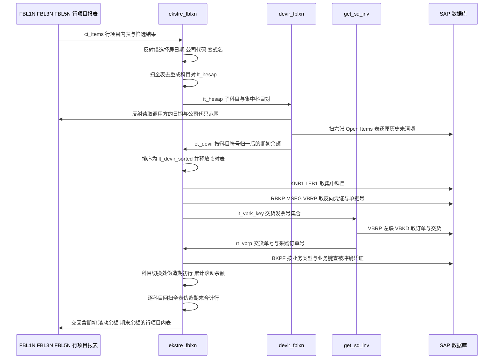

# ZCL_FI_TOOLKIT 代码走读报告

> 源文件：`ZCL_FI_TOOLKIT.abap`，1702 行，一个 `PUBLIC FINAL` 全静态方法类，16 个公开类方法 + 1 个私有类方法。土耳其本地化项目（`sy-datum` 之外的汇率/日期转换、IFRS 增值税类型校验、土耳其语注释与消息文本）。

## 一、程序定位与业务背景

### 1.1 它解决什么问题

`ZCL_FI_TOOLKIT` 不是业务程序，而是 **FI（财务会计）开发层的公共工具箱**。它把散落在几十个增强点、BDC 报表和迁移程序里反复出现的七类脏活收拢成一个 `FINAL` 类：IBAN 查重、公司代码长文本、外部参照号（`BKPF-XBLNR`）读写、到期日计算、清账与结转过账、Open Items 期初余额（devir）还原、行项目报表增强。

真正撑起这个类分量的，是两个"标准事务给不了"的需求。

**需求一：任意历史日期的期初余额。** 土耳其财务期末要出客户/供应商明细账（ekstre），账龄从任意历史日切起，而不是从月初。SAP 标准事务 `FBL1N` / `FBL3N` / `FBL5N` 只支持"按凭证日期区间"列示，没有"把这批未清项目按历史日倒推成期初"的能力。业务要么接受从月初起算（错），要么自己写一套 Open Items 查询。作者选了后者。

**需求二：往标准行项目布局里塞自造的汇总行。** 客户要求在同一张 ALV 里同时看到：期初余额行、逐行滚动余额列、期末余额行，还要区分借方/贷方展示 —— 而不新增事务、不新增布局、不让财务人员多点一次。做法是伪造行塞进标准事务的内表。

### 1.2 为什么现有方案不够

作者放弃了三条常规路径：

- **走标准 FM `FIMAS` / `BSEG` 聚合**：能算，但拿不到 `FBL1N` 选择屏上用户已经输入好的科目区间、日期区间、公司代码范围。重做一套参数录入，财务要学两遍。
- **用 `SUBMIT` / BDC 重跑一次标准报表**：慢、脆、且算出来的期初还是标准格式，塞不回原布局。
- **改标准报表**：不允许。

于是选了第三条：**在标准事务运行过程中，用 `ASSIGN` 反射式地读调用程序的全局变量**。`(RFITEMAP)SO_BUDAT[]`、`(SAPLFI_ITEMS)GB_CENTRAL_ITEMS` 这类带程序名前缀的动态 `ASSIGN`，让工具类"借用"了 `FBL1N` 运行时上下文里的选择屏数据。这是全类最核心也最脆弱的设计决策，后面第五节会把它列为风险源头。

### 1.3 设计范式定性

一句话：**反射式上下文借用 + 行项目伪造 + 静态缓存的 FI 工具类**（reflective context borrowing / row fabrication / static cache）。

它不是"设计模式"意义上的漂亮范式，而是一组务实到近乎粗暴的取舍：不去改标准报表，不去建自己的选单，而是在标准报表的运行时里"偷"它的输入、"骗"它的输出。这个范式的收益是零改造落地，代价是把 SAP 内部变量名变成了本类的隐式接口契约。

### 1.4 全局形状速览

| 维度 | 事实 |
| --- | --- |
| 类形态 | `PUBLIC FINAL CREATE PUBLIC`，全部 `CLASS-METHODS`，无实例状态 |
| 规模 | 1702 行，其中 `ekstre_fblxn` 一个方法约 530 行 |
| 方法数 | 17 个实现（16 公开 + 1 私有 `get_sd_inv`） |
| 数据访问 | 15 处 `FOR ALL ENTRIES`，直连 `BSEG` / `BSIK` / `BSAK` / `BSIS` / `BSAS` / `BSID` / `BSAD` / `BKPF` / `LFA1` / `KNA1` / `TIBAN` / `T001` / `ADRC` |
| 缓存 | 3 个 `CLASS-DATA` 静态表：`gt_company_long_text`、`gt_dg_cache`、`gt_import_doc_type_cache` |
| 本地化 | `CONVERSION_EXIT_INVDT_INPUT`（汇率日期）、`J_1B_NFE_UPDATE_XBLNR`（巴西 NFe）、`ZFIT_*` 自定义表、IFRS 增值税类型校验 |
| 过账方式 | `POSTING_INTERFACE_START` / `CLEARING` / `END` + `FTCLEAR` + `FTPOST`，BDC 驱动 `F-32` / `F-44` |

## 二、执行流程总览

这个类没有单一入口 —— 它是静态工具类，被四类业务场景分别调用。下面这张图按**业务链路**而不是调用顺序组织，节点用「方法名 + 一句话职责」：

```mermaid
flowchart TD
  CA["调用方 A：行项目报表增强 FBL1N FBL3N FBL5N 及定制变体 ZSDP_RFITEMAR"]
  CB["调用方 B：供应商与客户主数据校验"]
  CC["调用方 C：清账、清算、期末结转过账"]
  CD["调用方 D：通用 FI 小工具"]

  EK["ekstre_fblxn：补期初行、订单号、逐行滚动余额、期末余额行"]
  DEV["devir_fblxn：反射借选择屏，按历史日汇总 Open Items 成期初"]
  SDI["get_sd_inv：销售发票行反查交货单号与采购订单号"]

  IB["get_iban_codes：联查银行账号表取已登记的 IBAN"]
  CID["check_iban_duplicate：命中重复即抛 zcx_fi_iban"]

  DEN["denklestirerek_transfer_kaydi：把未清行项结转到新凭证"]
  COC["clear_customer_open_items：BDC 驱动 F-32 清客户未清项"]
  COV["clear_vendor_open_items：BDC 驱动 F-44 清供应商未清项"]
  UPD["update_xblnr：逐凭证写外部参照号并提交"]

  CLT["convert_datum_to_gdatu：业务日期换汇率有效截止日，带哈希缓存"]
  GLT["get_company_long_text：公司代码长文本，T001 与 ADRC 两级兜底，带缓存"]
  GBX["get_bkpf_xblnr：按凭证键回读 BKPF 外部参照号"]
  DDD["determine_due_date：调 FM 计算到期日"]
  ZHR["validate_zhrtip：IFRS 增值税类型与科目首位的合规校验"]
  IDT["get_import_document_types 与 get_domestic_import_doc_types：进出口凭证类型集合"]
  GUI["display_fi_doc_in_gui：带参数跳转 FB03 显示凭证"]

  CA --> EK
  EK --> DEV
  EK --> SDI
  CB --> CID
  CID --> IB
  CC --> DEN
  CC --> COC
  CC --> COV
  CC --> UPD
  CD --> CLT
  CD --> GLT
  CD --> GBX
  CD --> DDD
  CD --> ZHR
  CD --> IDT
  CD --> GUI
```



### 责任链表

| 子程序 | 调用者 | 职责 |
| --- | --- | --- |
| `ekstre_fblxn` | `FBL1N` / `FBL3N` / `FBL5N` / `ZSDP_RFITEMAR` 的用户出口增强（`CHANGING ct_items`） | 判断是否 EKSTRE 变式，剔除冲销对，补订单号与交货号，插期初行，算逐行滚动余额，插期末行 |
| `devir_fblxn` | `ekstre_fblxn` | 反射读取调用方选择屏，定出期初关键日，扫 `BSIK`/`BSAK`/`BSID`/`BSAD`/`BSIS`/`BSAS` 并汇总成 `tt_devir` |
| `get_sd_inv` | `ekstre_fblxn` | 联查 `VBRP` 与 `VBKD`，按交货发票号取参考交货单号与采购订单号 |
| `get_iban_codes` | `check_iban_duplicate` | 联查 `LFA1`+`LFBK`+`TIBAN` 与 `KNA1`+`LNBK`+`TIBAN`，取范围内已登记的 IBAN 明细 |
| `check_iban_duplicate` | 供应商/客户主数据保存前校验 | 调用 `get_iban_codes`，命中即抛 `zcx_fi_iban` 并带出占用方与占用方类型 |
| `denklestirerek_transfer_kaydi` | 期末结转（denk-leştirme）程序 | 构造 `FTCLEAR`/`FTPOST`，用 `POSTING_INTERFACE_CLEARING` 把未清行项结转到一张新凭证 |
| `clear_customer_open_items` | 客户清账程序 | BDC 驱动 `F-32`，按 `AGKON` 选中并冲销一批客户未清凭证 |
| `clear_vendor_open_items` | 供应商清账程序 | BDC 驱动 `F-44`，同上，供应商侧 |
| `update_xblnr` | 外部参照号回写程序 | 逐张凭证调 `J_1B_NFE_UPDATE_XBLNR` 写 `BKPF-XBLNR`，按参数决定逐张还是统一提交 |
| `convert_datum_to_gdatu` | 汇率相关报表与增强 | 用 `CONVERSION_EXIT_INVDT_INPUT` 把 `DATS` 转成 `TCURR-GDATU`，结果进静态哈希缓存 |
| `get_company_long_text` | 报表抬头、ALV 抬头 | `T001-BUTXT` 兜底、`ADRC` 姓名四段升级，静态哈希缓存 |
| `get_bkpf_xblnr` | 需要回读外部参照号的报表 | 按 `BUKRS`+`BELNR`+`GJAHR` 批量回读 `BKPF-XBLNR` 并回填调用方结构 |
| `determine_due_date` | 付款条件与清账增强 | 读 `BSEG` 的基准日与付款条件天数，调 FM 算出 `NETDT` |
| `validate_zhrtip` | FI 记账增强（凭证保存前） | 免检事务与免检公司代码放行，5 位与 9 位科目分别校验增值税类型位 |
| `get_import_document_types` | 凭证类型选择范围构造 | 缓存 `ZFIT_ITH_BLART`，按进出口标志过滤成 `blart` 哈希表 |
| `get_domestic_import_doc_types` | 同上 | 借缓存副作用，取同时标记为进出口的凭证类型 |
| `display_fi_doc_in_gui` | 报表的行点击、ALV 双击 | `SET PARAMETER` 填 `BLN`/`BUK`/`GJR` 后跳 `FB03` |
| 类定义段与私有缓存 | 运行时（`CLASS-DATA` 初始化） | 声明 3 个静态缓存表与全部工作结构，进程内共享 |

下面按这条流程，逐个子程序展开。为了让主线清楚，第三节把重心压在 `ekstre_fblxn` 与 `devir_fblxn` 这条枢纽链路上，其余工具方法按"一句话带过、风险说透"的原则处理。

## 三、分组分析（按程序流程 / 子程序）

### 3.1 类定义段 `CLASS ZCL_FI_TOOLKIT DEFINITION`

这一节分四步看：公开类型与常量、私有工作结构、三个静态缓存、以及必须点名的一批死代码。

#### ① 公开类型与常量

```abap
  TYPES:
    BEGIN OF ty_devir_items,
      belnr TYPE belnr_d,
      gjahr TYPE gjahr,
      buzei TYPE buzei,
      bukrs TYPE bukrs,
      konto TYPE hkont,
      shkzg TYPE shkzg,
      dmshb TYPE dmbtr,
      dmbe2 TYPE dmbe2,
      dmbe3 TYPE dmbe3,
      umskz TYPE umskz,
      filkd TYPE filkd,
      wrbtr TYPE wrbtr,
      waers TYPE waers,
      gsber TYPE gsber,
    END OF ty_devir_items .
  TYPES:
    BEGIN OF ty_devir,
      bukrs TYPE bukrs,
      konto TYPE hkont,
      shkzg TYPE shkzg,
      dmshb TYPE dmbtr,
      dmbe2 TYPE dmbe2,
      dmbe3 TYPE dmbe3,
      umskz TYPE umskz,
      filkd TYPE filkd,
      wrbtr TYPE wrbtr,
      waers TYPE waers,
      gsber TYPE gsber,
    END OF ty_devir .
```

**做什么** — 声明两份期初余额结构：`ty_devir_items` 是行级（带凭证键，用于从 `BSEG` 族表取数后做位置映射），`ty_devir` 是汇总级（只有 `BUKRS`+`KONTO`+金额，用于 `COLLECT` 后交给报表展示）。

**为什么** — 行级与汇总级分开，是因为取数阶段需要凭证键做去重与定位，汇总阶段只按科目聚合。两份结构字段几乎完全重合，作者选择复制而不是 `INCLUDE`/继承，是为了让 `ty_devir` 保持"报表只需要这些"的最小契约，避免 `ekstre_fblxn` 误用行级字段。

**风险与改进** — `konto TYPE hkont` 是一个**语义错配**：`hkont` 是总账科目（10 位），但供应商/客户分支往这个字段里塞的是 `LIFNR`（供应商编号 15 位）或 `KUNNR`（客户编号 10 位）。客户侧恰好同为 10 位不截断，供应商侧超过 10 位就会被静默截断，进而让 `ekstre_fblxn` 里按 `konto` 的等值比较、`DELETE` 与 `READ` 全部落空。字段类型应改为 `TYPE any` 之外的自定义类型（例如直接 `TYPE lifnr` 长度不够时用 `char15`），或至少改名成 `partner` 以免误导。

#### ② 私有工作结构与表键设计

```abap
    TYPES:
    BEGIN OF t_rbkp,
      belnr TYPE rbkp-belnr,
      gjahr TYPE rbkp-gjahr,
      stblg TYPE rbkp-stblg,
      stjah TYPE rbkp-stjah,
    END OF t_rbkp .
    TYPES:
    tt_rbkp
        TYPE SORTED TABLE OF rbkp
        WITH NON-UNIQUE KEY belnr gjahr .

    TYPES:
    BEGIN OF t_mseg,
      mblnr TYPE mseg-mblnr,
      mjahr TYPE mseg-mjahr,
      smbln TYPE mseg-smbln,
      sjahr TYPE mseg-sjahr,
    END OF t_mseg .
    TYPES:
    tt_mseg
        TYPE SORTED TABLE OF mseg
        WITH NON-UNIQUE KEY mblnr mjahr .

    TYPES:
    BEGIN OF ty_vbrp,
      vbeln TYPE vbrp-vbeln,
      vgtyp TYPE vbrp-vgtyp,
      vgbel TYPE vbrp-vgbel,
      bstkd TYPE vbkd-bstkd,
    END OF ty_vbrp .
    TYPES:
    tt_vbrp TYPE SORTED TABLE OF ty_vbrp
                WITH NON-UNIQUE KEY vbeln .
```

**做什么** — 给三张反查表（采购订单 `RBKP`、物料凭证 `MSEG`、销售发票行 `VBRP`）声明投影结构，并各自建成按主查询键排序的 `SORTED TABLE`。

**为什么** — 表键选得很准：`tt_rbkp` 与 `tt_mseg` 的排序键正是 `FOR ALL ENTRIES` 的驱动键，`tt_vbrp` 的排序键正是后续 `BINARY SEARCH` 的查找键。作者清楚"驱动键"和"查找键"是两件事，分别落到排序表键和二分查找上，这比随手写 `STANDARD TABLE` 然后线性 `READ` 高了一个层次。

**风险与改进** — 但排序键只覆盖了一个方向。`ekstre_fblxn` 里还有一处 `READ TABLE lt_mseg WITH KEY smbln = ... sjahr = ...`，用的是**反向参考凭证**（`SMBLN`/`SJAHR`），既不是表键也不是二分键，退化为线性扫描，而且发生在逐行项目的主循环内。另外 `t_vbkd` / `tt_vbkd` 声明后全类无引用 —— `get_sd_inv` 直接联查了 `VBKD`，没用到这个结构。

#### ③ 三个静态缓存

```abap
    CONSTANTS c_tabname_t001 TYPE tabname VALUE 'T001' ##NO_TEXT.
    CLASS-DATA gt_company_long_text TYPE tt_company_long_text .
    CLASS-DATA gt_dg_cache TYPE tt_dg_cache .
    CLASS-DATA gt_import_doc_type_cache TYPE tt_ith_blart .
```

**做什么** — 三个进程内共享的缓存：公司代码长文本、日期到汇率有效日的转换结果、进出口凭证类型配置表。

**为什么** — 这三样都是"读多写极少"的数据，放在 `CLASS-DATA` 里的收益很直接：`get_company_long_text` 在一张报表里可能被调上千次，`T001`+`ADRC` 两次单行查询省掉就是上千次 DB 命中；`convert_datum_to_gdatu` 同理。缓存表都建成 `HASHED TABLE ... UNIQUE KEY`，查找是对数级的，不会退化成"缓存本身也变慢"。

**风险与改进** — 三个缓存都没有失效入口，也没有"已缓存行数"的观测手段，进程一旦跑长（长事务、批处理、调优用的长 ALE 会话）就永远拿着启动时的快照。`gt_company_long_text` 尤其值得警惕：`ADRC` 的姓名带 `DATE_FROM`/`DATE_TO` 有效期，而缓存键**只有 `BUKRS`，不含日期**，一旦某个公司代码换了地址或改名，缓存返回的是旧值，且没有任何办法刷新。建议至少给这三个缓存加一个 `reset_cache` 公开方法，或在类里显式注明"仅限短事务使用"。

#### ④ 死代码与命名不一致

```abap
    CONSTANTS c_borc TYPE shkzg VALUE 'S' ##NO_TEXT.
    CONSTANTS c_alacak TYPE shkzg VALUE 'H' ##NO_TEXT.
    CONSTANTS c_musteri_hf_talebi TYPE auart VALUE 'ZAH1' ##NO_TEXT.
```

**做什么** — 声明借贷常量与一个自定义订单类型常量 `ZAH1`。

**为什么** — 把 `SHKZG` 的 `'S'`/`'H'` 提升为命名常量、而不是在代码里散落字面量，是正确的做法，尤其本类涉及大量借贷方向判断。

**风险与改进** — 但 `c_borc` 与 `c_musteri_hf_talebi` 全类**零引用**（`c_alacak` 用了两处）。`ZAH1` 这个订单类型被声明却没有使用，说明有一条功能线（很可能是"HF 需求单转采购申请"）被删掉但常量留下了，留给后来者一个假线索。命名规范也混着三套前缀：`t_documents` / `ty_hesap` / `tt_hesap` / `t_dg_cache` / `t_company_long_text`，公开段用 `ty_`+`tt_`、私有段用 `t_`，没有一致的约定。

> 到这里，类的"骨架层"交代完了。下面进入真正的业务链路 —— 先看最短的那条：IBAN 查重，它恰好暴露了本类最严重的一个字段级错误。

### 3.2 方法 `check_iban_duplicate`

两步：先取已用 IBAN，再判断并抛异常。

#### ① 取已登记的 IBAN 并判定

```abap
    DATA(lt_tiban) = get_iban_codes(
      it_iban       = it_iban
      iv_get_vendor = iv_get_vendor
      iv_get_client = iv_get_client
      it_lifnr      = it_lifnr
      it_kunnr      = it_kunnr
    ).

    CHECK lt_tiban IS NOT INITIAL.

    ASSIGN lt_tiban[ 1 ] TO FIELD-SYMBOL(<ls_tiban>).

    RAISE EXCEPTION TYPE zcx_fi_iban
      EXPORTING
        textid     = zcx_fi_iban=>already_used
        iban       = <ls_tiban>-iban
        party      = COND #( WHEN <ls_tiban>-kunnr IS NOT INITIAL THEN <ls_tiban>-kunnr
                             WHEN <ls_tiban>-lifnr IS NOT INITIAL THEN <ls_tiban>-lifnr
                           )
        party_type = COND #( WHEN <ls_tiban>-kunnr IS NOT INITIAL THEN TEXT-110
                             WHEN <ls_tiban>-lifnr IS NOT INITIAL THEN TEXT-111
                           ).
```

**做什么** — 把待校验的 IBAN 区间、供应商范围、客户范围原样转交 `get_iban_codes`；只要查回任何一行，就取第一行的 IBAN 号，靠 `COND #` 判断占用方是客户还是供应商，组装成消息参数抛 `zcx_fi_iban`。

**为什么** — 校验逻辑被彻底下沉到取数方法，本方法只负责"有没有"和"是谁占的"。`COND #` 内联条件表达式让"按客户/供应商二选一"的分支不再需要 `IF`，异常消息所需的四个字段一次性成型，调用方拿到异常就能直接提示用户，交互体验是对的。

**风险与改进** — 两点。其一，**只报第一条重复**：`lt_tiban[ 1 ]` 意味着用户一次录入 10 个 IBAN、其中 3 个重复时，只会被告知第 1 个，改完再报错再改，来回三次；应收集全部重复行，或至少在异常里带上"还有 N 条"。其二，**无结果时静默返回**：`CHECK` 在空结果时直接退出，语义上是"没重复就放过"，符合方法名；但 `CHECK` 同样是"跳出当前处理块"语句，放在方法开头容易被误读成"有重复就跳过检查"，用 `IF lt_tiban IS INITIAL. RETURN. ENDIF.` 更直白。

### 3.3 方法 `get_iban_codes`

这一步分两段，两段各有一个真实缺陷，供应商段是全类最干净的一段 SQL。

#### ① 供应商分支

```abap
    IF iv_get_vendor IS NOT INITIAL.

      SELECT lfa1~lifnr, tiban~*
        APPENDING CORRESPONDING FIELDS OF TABLE @rt_tiban
        FROM lfa1
             INNER JOIN lfbk ON lfbk~lifnr = lfa1~lifnr
             INNER JOIN tiban ON tiban~banks = lfbk~banks AND
                                 tiban~bankl = lfbk~bankl AND
                                 tiban~bankn = lfbk~bankn AND
                                 tiban~bkont = lfbk~bkont
        WHERE lfa1~lifnr IN @it_lifnr AND
              tiban~iban IN @it_iban
        ##TOO_MANY_ITAB_FIELDS.

    ENDIF.
```

**做什么** — 以 `LFA1` 为驱动，`INNER JOIN` 供应商银行账号表 `LFBK`，再 `INNER JOIN` IBAN 表 `TIBAN`，用 `BANKS`+`BANKL`+`BANKN`+`BKONT` 四段银行账号标识把 `LFBK` 与 `TIBAN` 拼上，筛出 `LIFNR` 落在传入范围、且 `IBAN` 落在待校验区间内的行，整行追加进返回表。

**为什么** — 这段 SQL 值得单独表扬两点：一是**没有用 `SELECT *` 再在 ABAP 里过滤**，而是把 `IN` 范围直接下推到数据库；二是四段银行账号标识（银行代码、分行代码、账号序号、科目号）而不是只用 `BANKS`+`BKONT`，因为 `TIBAN` 的主键就是这四段，这样写能命中主索引，`LFBK` 的主索引前缀（`LIFNR`）也能用上。`##TOO_MANY_ITAB_FIELDS` 是因为 `tiban~*` 带了返回表用不到的列，属于有意为之的显式豁免。

**风险与改进** — `INNER JOIN` 条件里**没有把业务伙伴号带上**（`tiban~lifnr` 与 `lfbk~lifnr`）。理论上一个 `BKONT` 账号若被两个伙伴共用（联名账户、企业主账户场景），交叉匹配会把 A 的 IBAN 判成 B 的重复。SAP 标准做法是用 `TABNR`（银行账号内部编号）连接 `LFBK-TABNR = TIBAN-TABNR`，既精确又命中索引，建议改。

#### ② 客户分支

```abap
    IF iv_get_client IS NOT INITIAL.

      SELECT kna1~lifnr, tiban~*
        APPENDING CORRESPONDING FIELDS OF TABLE @rt_tiban
        FROM kna1
             INNER JOIN lnbk ON lnbk~kunnr = kna1~kunnr
             INNER JOIN tiban ON tiban~banks = lnbk~banks AND
                                 tiban~bankl = lnbk~bankl AND
                                 tiban~bankn = lnbk~bankn AND
                                 tiban~bkont = lnbk~bkont
        WHERE kna1~lifnr IN @it_kunnr AND
              tiban~iban IN @it_iban
        ##TOO_MANY_ITAB_FIELDS.

    ENDIF.
```

**做什么** — 结构与供应商分支逐字对称，只是驱动表换成 `KNA1`、账号表换成 `LNBK`，作用是把客户已登记的 IBAN 也追加进返回表。

**为什么** — 复刻成两个 `IF` 段而不是先 `UNION`，是为了让调用方能用 `iv_get_vendor` / `iv_get_client` 两个布尔开关**分别**控制只查一侧（IBAN 并不专属供应商），语义上比"查了再筛"更省一次数据库往返。

**风险与改进** — **这是一处 P0 级缺陷**：投影与过滤都用的是 `kna1~lifnr`，而 `LIFNR` 是 `KNA1` 上的**供应商编号**字段（仅在客户同时有供应商角色时才有值），客户主键是 `KUNNR`。于是 `WHERE kna1~lifnr IN @it_kunnr` 变成"拿一个客户范围去比一个供应商字段"：纯客户账户的 `LIFNR` 为空，客户 IBAN **永远查不出来**，查重功能对客户侧静默失效；只有当客户恰好有供应商角色、`LIFNR` 存着另一个供应商号时才会误命中。同时返回表里 `LIFNR` 的投影值来自 `KNA1` 而非 `TIBAN`，与 `check_iban_duplicate` 里依据 `TIBAN-KUNNR`/`TIBAN-LIFNR` 判断占用方的逻辑产生两套来源。修法就是这两处的 `kna1~lifnr` 改成 `kna1~kunnr`。此外两段都没有 `SORT` + 去重，同一伙伴多行账号命中同一区间时会重复返回。

> IBAN 这条链路走到这里就结束了。接下来三个方法是本类里少有的"教科书式"实现，正好用来对比刚才的粗糙之处。


### 3.4 方法 `convert_datum_to_gdatu`

两步：查哈希缓存，未命中则调转换出口再回填。

#### ① 缓存查找

```abap
    DATA lv_datxt TYPE char10.

    ASSIGN gt_dg_cache[
        KEY primary_key
        COMPONENTS datum = iv_datum
    ] TO FIELD-SYMBOL(<ls_cache>).

    IF sy-subrc <> 0.

      DATA(ls_cache) = VALUE t_dg_cache( datum = iv_datum ).

      WRITE iv_datum TO lv_datxt.

      CALL FUNCTION 'CONVERSION_EXIT_INVDT_INPUT'
        EXPORTING
          input  = lv_datxt
        IMPORTING
          output = ls_cache-gdatu.

      INSERT ls_cache INTO TABLE gt_dg_cache ASSIGNING <ls_cache>.

    ENDIF.

    rv_gdatu = <ls_cache>-gdatu.
```

**做什么** — 先在静态哈希表 `gt_dg_cache` 里按 `DATUM` 找；找到直接复用，字段符号就指向表内那一行，找不到就把传入日期写成 10 位字符、调 `CONVERSION_EXIT_INVDT_INPUT` 得到汇率有效截止日 `GDATU`，插入缓存后再从字段符号取回结果。

**为什么** — "查缓存 → 未命中才计算 → `INSERT` 复用同一字段符号取结果"这套写法比常见的 `READ TABLE` + `IF sy-subrc = 0 ... ELSE ... ENDIF` 少一次分支、少一个工作区变量，`INSERT ... ASSIGNING` 让字段符号始终是唯一的出口，缓存为空和缓存命中走同一条 `rv_gdatu =` 收尾。这是 ABAP 7.40 之后 `ASSIGN` + `sy-subrc` 惯用法的正确示范。

**风险与改进** — **缺陷就在 `WRITE` 这一行**：`WRITE iv_datum TO lv_datxt` 把内部日期格式转成字符时，受**当前用户配置文件里的日期格式**影响，土耳其环境下用户很可能设为 `DD.MM.YYYY`。随后 `CONVERSION_EXIT_INVDT_INPUT` 按固定的 `YYYYMMDD` 去解释这 10 位字符，于是得到一个完全错误的日期（差几个月甚至跨年），并且被缓存下来，整个会话一直错下去。正确写法是无视用户格式的 `CONV dats( iv_datum )`。这类 bug 在测试环境（用户恰好用 ISO 格式）不会复现，一旦生产用户按本地格式登录就集体出错，是最难查的一类日期缺陷。

### 3.5 方法 `get_company_long_text`

三步：查缓存、读 `T001`、可选读 `ADRC` 升级文本。

#### ① 缓存与公司代码主记录

```abap
    ASSIGN gt_company_long_text[ KEY primary_key
                                 COMPONENTS bukrs = iv_bukrs
                               ] TO FIELD-SYMBOL(<ls_clt>).

    IF sy-subrc <> 0.

      DATA(ls_clt) = VALUE t_company_long_text( bukrs = iv_bukrs ).

      SELECT SINGLE adrnr, butxt
             INTO @DATA(ls_t001)
             FROM t001
             WHERE bukrs = @iv_bukrs.

      IF sy-subrc <> 0.
        RAISE EXCEPTION TYPE zcx_bc_table_content
          EXPORTING
            textid   = zcx_bc_table_content=>entry_missing
            objectid = CONV #( iv_bukrs )
            tabname  = c_tabname_t001.
      ENDIF.

      ls_clt-text = ls_t001-butxt.
```

**做什么** — 缓存未命中时读 `T001` 的地址号与公司代码名称；`T001` 读不到就抛 `zcx_bc_table_content`（带上表名 `c_tabname_t001` 与公司代码号），读到了先把名称作为兜底文本。

**为什么** — "读不到 `T001` 就抛异常而不是返回空串"是对的：公司代码是所有 FI 事务的前置输入，查不到它意味着调用链上游已经错了，静默返回空串只会让错误漂移到报表深处。异常类选的是通用基类 `zcx_bc_table_content` 并复用其 `entry_missing` 文本标识，等于不造新轮子。

**风险与改进** — 无明显功能风险，一点小毛病：`ls_t001` 用了整行 `T001` 类型却只投影两个字段，虽然 `T001` 也就十几行、代价可忽略，但把整结构暴露给内联声明变量，不如直接用一个 `(bukrs butxt adrnr)` 匿名结构，让字段类型可见。

#### ② 地址名称升级

```abap
      IF ls_t001-adrnr IS NOT INITIAL.

        SELECT SINGLE name1, name2, name3, name4
               INTO @DATA(ls_adrc)
               FROM adrc
               WHERE addrnumber = @ls_t001-adrnr
                 AND date_from  LE @sy-datum
                 AND date_to    GE @sy-datum
               ##WARN_OK .                              "#EC CI_NOORDER

        IF ls_adrc-name1 IS NOT INITIAL OR
           ls_adrc-name2 IS NOT INITIAL OR
           ls_adrc-name3 IS NOT INITIAL OR
           ls_adrc-name4 IS NOT INITIAL.

          ls_clt-text = |{ ls_adrc-name1 } { ls_adrc-name2 } { ls_adrc-name3 } { ls_adrc-name4 }|.

        ENDIF.

      ENDIF.

      INSERT ls_clt INTO TABLE gt_company_long_text ASSIGNING <ls_clt>.
```

**做什么** — `T001-ADRNR` 有值时，按当前日期在 `ADRC` 的有效期内取姓名四段；任一段有值就用四段拼成的长文本覆盖 `T001-BUTXT`，否则保留短名称；最后把结果连同公司代码插入缓存。

**为什么** — `T001-BUTXT` 只有 30 位且是短名称，报表抬头经常需要完整法人名，只有 `ADRC` 才有全名。四段用 `OR` 而不是逐段判空，是"只要有一段有意义就用长名"的正确判定；拼接用字符串模板而非 `CONCATENATE ... INTO`，空格由模板的字面空格提供，比手写分隔符干净。有效期条件（`date_from` 不晚于今天、`date_to` 不早于今天）也写对了 —— `ADRC` 是有效期表，不加条件会读到未来才生效的地址。

**风险与改进** — `##WARN_OK` 抑制了"字段有序但 SQL 无序"的检查，这里 `ADRC` 主键是 `ADDRNUMBER`+`DATE_FROM`，实际顺序与 SQL 的 `WHERE` 一致，豁免属于恰当使用。但**缓存键只有 `BUKRS`、不含有效期**，而 `ADRC` 明确是随日期变化的数据：缓存建立后跨越了公司代码改名或地址生效日，返回的就是过期名称，且没有任何失效入口（见 3.1③）。建议把 `sy-datum` 加进缓存键，或至少在类注释里写明这个限制。


### 3.6 方法 `get_bkpf_xblnr`

一步：批量回读 + 二分回填。

```abap
    DATA lt_doc TYPE tt_doc_xblnr.

    CHECK ct_doc[] IS NOT INITIAL.

    SELECT bukrs belnr gjahr xblnr
           INTO CORRESPONDING FIELDS OF TABLE lt_doc
           FROM bkpf
           FOR ALL ENTRIES IN ct_doc
           WHERE bukrs = ct_doc-bukrs
             AND belnr = ct_doc-belnr
             AND gjahr = ct_doc-gjahr.

    SORT lt_doc BY bukrs belnr gjahr.

    LOOP AT ct_doc ASSIGNING FIELD-SYMBOL(<ls_doc_tar>).

      READ TABLE lt_doc ASSIGNING FIELD-SYMBOL(<ls_doc_src>)
                        WITH KEY bukrs = <ls_doc_tar>-bukrs
                                 belnr = <ls_doc_tar>-belnr
                                 gjahr = <ls_doc_tar>-gjahr
                        BINARY SEARCH.

      IF sy-subrc = 0.
        <ls_doc_tar>-xblnr = <ls_doc_src>-xblnr.
      ELSE.
        CLEAR <ls_doc_tar>-xblnr.
      ENDIF.

    ENDLOOP.
```

**做什么** — 把调用方给的一批凭证键（`BUKRS`+`BELNR`+`GJAHR`）用 `FOR ALL ENTRIES` 一次查回 `XBLNR` 到临时表，按三键排序，然后逐个目标行做二分查找回填；查不到就把目标行的 `XBLNR` 清空。

**为什么** — 两处细节做对了：`CHECK ct_doc[] IS NOT INITIAL` 挡住了 `FOR ALL ENTRIES` 空内表的经典陷阱（空驱动表不报错、只静默返回空结果）；驱动条件是**三字段等值**且顺序与 `BKPF` 主键一致，等于精确主键查找，DB 侧几乎没有优化余地。`INTO CORRESPONDING FIELDS OF TABLE` 让返回表结构与查询字段解耦，比位置映射健壮。

**风险与改进** — 三点。**其一，排序 + 二分只是"半个哈希表"**：目标表条数上千时，用 `HASHED TABLE ... UNIQUE KEY` 一次赋值加无序 `READ` 就是 O(n)，现在是 O(n log n)；而 `BKPF` 是大表，这里的优化收益其实主要在 DB 侧，ABAP 侧再排一次序属于重复劳动。**其二，`ELSE` 分支的 `CLEAR` 有副作用**：本方法是 `CHANGING` 参数，若调用方已用别的来源填好了 `XBLNR`（比如从上游表带下来的），一个在 `BKPF` 里意外查不到的键会把这个值悄悄抹掉，而不是保留原值。**其三，语义隐患**：`XBLNR` 在 `BKPF` 里是"外部参照凭证号"，由 `FB60`/`FB05` 用户输入或增强写入，本方法只读不校验；若某张凭证的 `XBLNR` 是自己填的、而对应的参照凭证根本不存在，这里也会照单全收 —— 查重与存在性校验的职责并不在这个方法里，调用方需自行二次确认。

### 3.7 方法 `determine_due_date`

```abap
    DATA: i_faede TYPE faede,
          e_faede TYPE faede.

    SELECT SINGLE
        shkzg, koart, zfbdt, zbd1t,
        zbd2t, zbd3t, rebzg, rebzt
      FROM bseg
      WHERE
        bukrs = @im_document-bukrs AND
        gjahr = @im_document-gjahr AND
        belnr = @im_document-belnr AND
        buzei = @im_document-buzei
      INTO CORRESPONDING FIELDS OF @i_faede.

    CALL FUNCTION 'DETERMINE_DUE_DATE'
      EXPORTING
        i_faede                    = i_faede
       IMPORTING
        e_faede                    = e_faede
      EXCEPTIONS
        account_type_not_supported = 1
        OTHERS                     = 2.

    IF sy-subrc <> 0  ##NEEDED.
* Implement suitable error handling here
    ENDIF .

    re_netdt = e_faede-netdt.
```

**做什么** — 按四字段键从 `BSEG` 精确取出该行项目的记账方向、科目类型、基准日与三段付款条件天数、返利标记，按字段名对应填进 `FAEDE` 结构，调 FM 算出到期日 `NETDT` 返回。

**为什么** — 不自己写付款条件天数累加，而是复用 FM 是对的：基准日与付款条件期间的重叠规则、供应商/客户各自的条款表，逻辑复杂且随配置变化，自己实现等于给自己埋一个永久的对比口径。`WHERE` 用全四键精确命中，而不是只按凭证取一堆行再在 ABAP 里筛，思路正确。导出 `I_GL_FAEDE` 被注释掉，说明作者知道还有一个总账专用变体，当前不启用。

**风险与改进** — **这是本类里最刺眼的一处"假错误处理"**：`IF sy-subrc <> 0 ##NEEDED.` 的语句体里只有一行注释，`##NEEDED` 又明确告诉 ATC"这里我知道没用"。也就是说 `account_type_not_supported` 和 `OTHERS` 两个异常被捕获后被彻底丢弃，FM 失败时 `e_faede` 保持初始，`re_netdt` 返回 `00000000`，而调用方**没有任何办法区分"这笔业务本来就没有到期日"和"计算失败了"**。默认值写进日期字段，下游要么显示 1900 年 1 月 1 日，要么在别处 dump。另外三处细节：`BSEG` 的 `ZFBDT`（基准日）字段名与 `FAEDE` 里对应字段是否同名，依赖"`FAEDE` 与 `BSEG` 字段对齐"这一隐含约定，而通行的用法是 `SELECT SINGLE *` 整行灌入，靠的是名字对齐的同一约定；投影列表一旦漏字段就是静默置空。经典用法还会加 `AND shkzg = 'H'` 只算贷方行，这里没有方向过滤，借方行也会去调 FM。修法是至少把 `sy-subrc` 变成返回值或抛异常。

### 3.8 方法 `validate_zhrtip`

三步：事务豁免、公司代码豁免、字段位校验。这一节是全类"看起来最简单、实际埋雷最深"的方法。

#### ① 事务与公司代码豁免

```abap
    CHECK NOT ( sy-tcode = 'FB1D' OR
                sy-tcode = 'FB1K' OR
                sy-tcode = 'F.80' OR
                sy-tcode = 'FB08' ).

    " Tabloda Buffer olduğundan, özel Cache'leme yapmadım
    """""""""""""""""""""""""""""""""""""""""""""""""""""""""""""""""
    SELECT SINGLE mandt
           FROM zfit_ifrs_haric
           WHERE bukrs = @iv_bukrs
           INTO @sy-mandt ##write_ok .

    IF sy-subrc = 0.
      RETURN.
    ENDIF.
```

**做什么** — 先看当前事务码是否在硬编码的豁免清单里，是就整段跳过；否则查自定义表 `ZFIT_IFRS_HARIC` 里该公司代码是否被登记为豁免，查到就直接返回。

**为什么** — 用配置表而不是 `IF` 硬编码公司代码列表来管理豁免，是正确的可维护性选择，新公司代码上线时业务方自己维护一行即可，不用找开发改代码。注释也解释了为什么不加缓存 —— 该表已开表缓存。

**风险与改进** — **一处 P0 级地雷**：`SELECT SINGLE mandt ... INTO @sy-mandt` 把查询结果写进**系统字段** `SY-MANDT`（正因为写系统字段才需要 `##write_ok` 豁免）。这是老代码里"借用恒有值字段当哑目标"的经典 hack，但 ABAP 规定 `SELECT SINGLE` 无结果时会把目标置初始 —— 于是**凡是公司代码没有被登记为豁免的正常路径，`SY-MANDT` 都会被清成 `000`**，并且这个副作用会一直留在调用方的整个调用链里。下游任何依赖 `SY-MANDT` 的动态 Open SQL（`CLIENT = sy-mandt`）、跨客户端调用、批处理框架代码都会跟着错，而且错得非常隐蔽。作者大概只想利用 `mandt` 恒非空的特性，却顺手改掉了全局状态；改法极简单：用一个本地 `char3` 或匿名结构接 `mandt`，用 `sy-subrc` 判存在性。另外豁免事务清单里出现的 `'F.80'` 是一个明显带本地化色彩的字面串，与同组的 `FB1D`/`FB1K`/`FB08`（真实事务码）风格不一致，值得向作者确认是不是笔误或翻译残留；用 `CHECK` 承载业务放行逻辑也不如 `RETURN` 直观。

#### ② 字段位校验

```abap
    IF ( iv_acc_first_char = '5' AND
         iv_zhrtip(2) <> 'OK' )
       OR
       ( iv_acc_first_char = '9' AND
         iv_zhrtip+1(2) <> 'TH' ).

      RAISE EXCEPTION TYPE zcx_fi_zhrtip.
    ENDIF.
```

**做什么** — 按科目首位分流：5 位科目要求增值税类型字段第 2 位是 `'OK'`，9 位科目要求第 2 至 3 位是 `'TH'`；任一条不满足就抛 `zcx_fi_zhrtip`。

**为什么** — 用 `IF` 的 `OR` 把两组"科目首位 + 字段位"规则压成一个判定式，避免了嵌套 `IF` 的缩进膨胀；把规则放在一个工具方法里而不是散在各凭证保存增强点，保证了客户与供应商两侧口径一致。

**风险与改进** — 三点。**其一，异常不带参数**：`RAISE EXCEPTION TYPE zcx_fi_zhrtip.` 不传任何信息，调用方拿不到是哪个公司代码、哪个科目、期望值是什么，只能显示一句无上下文的提示 —— 而本方法的入参里明明有这些信息，异常类应当把它们接住。**其二，魔法值无命名**：`'OK'`、`'TH'`、字符偏移 2 和 3 全部硬编码，与本类其他地方把 `SHKZG` 提升为常量的做法自相矛盾；应提升为常量并给偏移量命名。**其一之补充**，入参设计也可商榷：`iv_acc_first_char TYPE char1` 要求调用方自己截取科目首位，调用方很容易传错却无从发现，直接传整个科目、由方法内部截取更安全。


### 3.9 方法 `get_import_document_types` 与 `get_domestic_import_doc_types`

这两个方法共用一个缓存，一个负责真过滤，另一个只是"蹭"缓存。两步看完。

#### ① 缓存与过滤

```abap
    IF gt_import_doc_type_cache IS INITIAL.
      SELECT * FROM zfit_ith_blart INTO TABLE @gt_import_doc_type_cache.
    ENDIF.

    DATA(lt_returnable_blart) = gt_import_doc_type_cache.

    IF iv_include_domestic = abap_false.
      DELETE lt_returnable_blart WHERE is_domestic = abap_true.
    ENDIF.

    IF iv_include_foreign = abap_false.
      DELETE lt_returnable_blart WHERE is_foreign = abap_true.
    ENDIF.

    rt_blart = VALUE #( FOR _blart IN lt_returnable_blart ( _blart-blart ) ).
```

**做什么** — 缓存为空时整表读 `ZFIT_ITH_BLART`，拷一份到局部表，按 `iv_include_domestic` 决定是否删掉标记为境内的行、按 `iv_include_foreign` 决定是否删掉标记为境外的行，再把剩下的凭证类型投影成 `blart` 集合返回。

**为什么** — 返回类型建成 `HASHED TABLE OF blart WITH UNIQUE KEY`，正好匹配调用方的典型用法 —— 把它塞进选择屏的范围表或直接 `IN` 判存在，哈希表判重与查找都最快，比返回标准表再让调用方自己转范围表省一步。过滤用 `DELETE ... WHERE` 而不是嵌套 `FOR` 加 `WHERE`，两段独立 `IF` 天然表达"两个开关互相独立"的语义。

**风险与改进** — 三点。**其一，`IS INITIAL` 当哨兵不严谨**：配置表真的为空时，每次调用都会重新查库，缓存永远建立不起来；应另设一个 `gv_cache_filled` 标志位。**其二，`SELECT *` 且无任何过滤**：`ZFIT_ITH_BLART` 是配置表，量小可以接受，但把整行读进静态内存却只用两个布尔字段，属于把配置表结构泄漏进内存布局。**其三，没有失效入口**：三个静态缓存的通病（见 3.1③），配置表被 `SM30` 改过之后必须重启进程才生效。

#### ② 蹭缓存的"境内进口"方法

```abap
    get_import_document_types( ). " Cache dolsun diye

    rt_blart = VALUE #( FOR _blart IN gt_import_doc_type_cache
                        WHERE ( is_foreign  = abap_true AND
                                is_domestic = abap_true )
                        ( _blart-blart ) ).
```

**做什么** — 空参调用 `get_import_document_types` 纯粹为了让对方把静态缓存填满，然后**直接读那个缓存**，筛出同时标记为"境外"和"境内"的凭证类型，返回。

**为什么** — 避免两次整表读取，一份缓存两处复用，思路本身是省一次 DB 往返。

**风险与改进** — **方法名与判断逻辑语义相反**。方法叫"境内进口凭证类型"，判断条件却是 `is_foreign = abap_true AND is_domestic = abap_true`，取的是"两个标志同时为真"的行；对照 `get_import_document_types` 里"境内 = 删掉 `is_foreign` 为真的行"的口径，同一个词在这两个方法里指的不是一回事。照代码字面理解，这个方法返回的是"既标境外又标境内"的矛盾配置行，实际业务含义只能靠猜。这类命名与实现不一致的缺陷在配置驱动代码里最贵，因为后人不敢改。更麻烦的是那句空参调用：它把"缓存已被填充"当作**隐式契约**依赖在另一个方法身上，一旦有人觉得"每次都查一遍也不慢"而删掉 `gt_import_doc_type_cache` 的写入逻辑，这个方法就会静默返回空集合，且没有任何编译或运行错误。建议改为在类里显式提供一个 `ensure_cache` 私有方法，两处共用。

### 3.10 方法 `display_fi_doc_in_gui`

```abap
    SET PARAMETER ID: 'BLN' FIELD iv_belnr,
                      'BUK' FIELD iv_bukrs,
                      'GJR' FIELD iv_gjahr.

    CALL TRANSACTION 'FB03' AND SKIP FIRST SCREEN.       "#EC CI_NOORDER
```

**做什么** — 把三个参数塞进 SAP 内存里的 `BLN`（凭证号）、`BUK`（公司代码）、`GJR`（年度），然后跳 `FB03` 显示凭证，跳过第一屏。

**为什么** — `SET PARAMETER` + `CALL TRANSACTION` 是"从任意程序跳到标准事务并预填凭证"的标准做法，比 BDC 跳转轻得多；`AND SKIP FIRST SCREEN` 让用户直接落到凭证显示屏幕，不用再按一次回车。这是把 `FB03` 包装成工具方法的正当理由：它把"三个参数 ID 的正确拼写"这个易错点集中了一处。

**风险与改进** — 无明显功能风险，但**位置有争议**：这个方法改变调用方的屏幕流程（离开当前事务、进入 `FB03`），在一个"纯计算工具类"里放一个会 `CALL TRANSACTION` 的方法，等于把 UI 导航职责混进了工具层，也让它无法在批处理或后台调用。更实际的一点是 `SET PARAMETER` 写的是**全局内存**，跳转后不会被清空（依赖后续事务自己清理），如果调用方跳转后又跳到别的 `FB03` 相关场景，可能带着上一次的凭证参数过去。另外 `SKIP FIRST SCREEN` 意味着 `FB03` 的初始页被跳过，如果凭证不存在，用户会看到一张空白的凭证屏幕而不是明确的错误提示。

### 3.11 方法 `denklestirerek_transfer_kaydi`

本节分五步：定义宏、取 `BSEG`、构造凭证头、构造清账行、调过账接口三连。这是全类第二个大方法，也是唯一一个真正"写数据库"的方法。

#### ① 定义取数宏

```abap
    DATA:
      lv_group TYPE apqi-groupid,
      lv_mode  TYPE rfpdo-allgazmd VALUE 'E'.
    DATA:
      lt_blntab  TYPE STANDARD TABLE OF blntab ##NEEDED,
      lt_ftclear TYPE STANDARD TABLE OF ftclear ##NEEDED,
      lt_ftpost  TYPE STANDARD TABLE OF ftpost ##NEEDED,
      ls_ftpost  TYPE  ftpost ##NEEDED,
      lt_fttax   TYPE STANDARD TABLE OF fttax ##NEEDED.

    lv_group = sy-tcode.
    DEFINE ftpost.
      CLEAR ls_ftpost.
      ls_ftpost-stype = &1.
      ls_ftpost-count = &2.
      ls_ftpost-fnam = &3.
      WRITE &4 TO ls_ftpost-fval.
      CONDENSE ls_ftpost-fval.
      APPEND ls_ftpost TO lt_ftpost.
    END-OF-DEFINITION.
```

**做什么** — 准备过账接口需要的五张表（`BLNTAB`/`FTCLEAR`/`FTPOST`/`FTTAX`），并用 `DEFINE` 定义一个叫 `ftpost` 的宏：清空工作区、填记录类型与序号、填字段名、用 `WRITE` 把值转成字符、压缩空白、追加到 `FTPOST` 表。

**为什么** — 把"填一条 `FTPOST` 记录"的六行样板收成一个宏，是这类接口调用里最值得抽象的地方 —— 头字段有七条，没有宏就要复制粘贴七遍。`WRITE ... TO` + `CONDENSE` 这对组合处理的是不同数据类型的统一字符化：日期、金额、字符字段都能塞进同一个 `FVAL`，而 `WRITE` 产生的多余空格必须压掉，否则过账接口按 `LEN` 截取时会带上尾随空格。

**风险与改进** — `DEFINE` 是 ABAP 的**文本宏**，不是编译器实体：不做类型检查、不做语法检查，参数个数写错、类型不匹配全部推迟到运行时，且用现代 Code Assistant / CTS 检查规则会被直接标红。改用内联声明的局部 FORM 或一个私有静态方法（形参 `iv_stype` / `iv_fnam` / `iv_val TYPE any`）能拿到编译期检查。宏体里的 `WRITE &4 TO ls_ftpost-fval` 还有一处隐患：`WRITE` 的输出依赖变量的输出格式，靠的是"`DATS`/`CURR` 等内部格式按字段类型转换"这个隐含行为，写日期最好用 `CONV ftdat( )` 之类的显式转换。另外 `lv_group = sy-tcode` 直接拿事务码当 `POSTING_INTERFACE` 的组名 —— 组是客户端级资源，同一事务码并发执行时会共用同一组，容易出现互相等待或组残留，稳妥做法是用 `sy-uname` 与时间戳拼一个唯一组名。

#### ② 取行项目

```abap
    IF it_bseg IS NOT INITIAL.
      SELECT bukrs ,belnr ,gjahr, buzei, koart,umskz FROM bseg
        INTO TABLE @DATA(lt_bseg)
        FOR ALL ENTRIES IN @it_bseg
        WHERE
          bukrs = @it_bseg-bukrs AND
          belnr = @it_bseg-belnr AND
          gjahr = @it_bseg-gjahr AND
          buzei = @it_bseg-buzei .                      "#EC CI_NOORDER
    ENDIF.
```

**做什么** — 对传入的凭证行键集合做一次 `FOR ALL ENTRIES`，把 `BSEG` 里的公司代码、凭证键、科目类型与特殊总账标识补齐到内表，供后续构造清账行。

**为什么** — 入参 `tt_documents` 只带四个键字段，构造 `FTCLEAR` 需要的 `AGKOA`（科目类型）与 `AGUMS`（特殊总账标识）只能回 `BSEG` 取。用四字段等值作为驱动条件而不是只按凭证取，等于 `BSEG` 的精确主键查找，这个模式在 `BSEG` 这种超大表上是必须的。`IF it_bseg IS NOT INITIAL` 也挡住了空驱动表的陷阱。

**风险与改进** — 查完之后**没有检查 `sy-subrc`，也没有判空**：若 `it_bseg` 为空，`lt_ftclear` 会是空表，方法仍然会一路走到 `POSTING_INTERFACE_CLEARING`，等于提交一张没有任何行项的过账请求，结果要么是 FM 报错（错误信息还很难懂），要么生成一张空凭证。应在开头就 `IF it_bseg IS INITIAL. RETURN. ENDIF.`。另外 `##EC CI_NOORDER` 与 `"#EC CI_NOORDER` 双豁免只压掉了检查器噪音，并没有解释 `WHERE` 里为何把 `BUKRS` 写在最前 —— `BSEG` 的主键顺序是 `BELNR`/`GJAHR`/`BUZEI`，把等值条件按主键顺序书写虽然对优化器无影响，但对读者更友好。


#### ③ 构造凭证头与凭证类型

```abap
    LOOP AT lt_bseg INTO DATA(ls_bseg) .
      IF sy-tabix = 1.
        DATA: lv_fname(5) TYPE c.
        CONCATENATE 'BLAR' ls_bseg-koart INTO lv_fname.
        DATA lv_blart TYPE bkpf-blart.
        SELECT SINGLE (lv_fname) FROM t041a INTO lv_blart
          WHERE auglv = 'UMBUCHNG'.

        ftpost 'K' '1' 'BKPF-BUKRS' ls_bseg-bukrs.
        ftpost 'K' '1' 'BKPF-BLART' lv_blart.
        ftpost 'K' '1' 'BKPF-BLDAT' is_bkpf-bldat.
        ftpost 'K' '1' 'BKPF-BUDAT' is_bkpf-budat.
        ftpost 'K' '1' 'BKPF-XBLNR' is_bkpf-xblnr.
        ftpost 'K' '1' 'BKPF-WAERS' is_bkpf-waers.
        ftpost 'K' '1' 'BKPF-BKTXT' is_bkpf-bktxt.
      ENDIF
```

**做什么** — 遍历取到的 `BSEG` 行，只在第一行（`sy-tabix = 1`）做一次：把科目类型拼成动态字段名 `BLAR`+`KOART`（如 `BLARD`/`BLARK`），从清算规则表 `T041A` 里按 `AUGLV = 'UMBUCHNG'`（转账/改组）查出该科目类型对应的凭证类型；然后用宏往 `FTPOST` 里塞七条凭证头记录（公司代码、凭证类型、凭证日期、记账日期、外部参照号、币种、抬头文本），值全部来自入参 `is_bkpf`。

**为什么** — 动态字段名取 `BLART` 是个很到位的做法：`T041A` 把"清算方式 × 科目类型"对应的凭证类型放在 `BLAR`+`KOART` 这一列里，写死了就只能支持一种科目类型，用拼接就自动适配 `D`/`K`/`S`/`A`/`P` 全部科目类型，不写死就是对的。凭证头与行项分离、头信息取自调用方传入的 `BKPF` 结构，也符合过账接口"头一次、行多次"的模型。

**风险与改进** — **一处 P1 级逻辑缺陷**：`BLART` 只按**第一行**的 `KOART` 查一次，然后作为整张凭证的凭证类型。而方法名 `denklestirerek_transfer_kaydi`（denkleştirerek = 按科目结转）恰恰暗示一行项里可能同时含供应商（`K`）、客户（`D`）、总账（`S`）多种科目类型 —— 此时用第一行的类型去代表整张凭证，对其余科目类型就是错的凭证类型，会影响凭证在报表里的分类与后续自动清算规则。同理，`BKPF-WAERS` 与金额口径取自 `is_bkpf`（调用方给的那张凭证），而行项来自 `lt_bseg`（另一批凭证），两批数据未必属于同一笔业务，这个"头身分离"没有任何一致性校验。此外 `SELECT SINGLE (lv_fname) FROM t041a` **没有检查 `sy-subrc`**：`T041A` 若缺该清算方式与科目类型的配置，`lv_blart` 保持初始，凭证头带着空凭证类型进入过账接口，错误会推迟到 `POSTING_INTERFACE_CLEARING` 才以 `table_t041a_empty` 之类抛出，排查成本高得多 —— 应在查出空值时就抛出带上下文的异常。

#### ④ 构造清账行

```abap
      APPEND INITIAL LINE TO lt_ftclear REFERENCE INTO DATA(lr_ftclear).
      lr_ftclear->agkoa = ls_bseg-koart.
      lr_ftclear->agbuk = ls_bseg-bukrs.
      lr_ftclear->selfd = 'BELNR'.
      IF ls_bseg-umskz <> space.
        lr_ftclear->agums = ls_bseg-umskz.

      ENDIF.
      lr_ftclear->xnops = abap_true.
      CONCATENATE ls_bseg-belnr
                  ls_bseg-gjahr
                  ls_bseg-buzei
             INTO lr_ftclear->selvon.
    ENDLOOP.
```

**做什么** — 每个 `BSEG` 行生成一条 `FTCLEAR`：填科目类型、公司代码、清算选择字段类型 `SELFD = 'BELNR'`，特殊总账标识非空时填 `AGUMS`，把"不记账"标志 `XNOPX` 置真，并把凭证号、年度、行号三段拼成 `SELVON`。

**为什么** — **这是整个方法最关键的一行**：`XNOPX = X` 的语义是"清除时不要按新值过账"，也就是**把被清项目的金额结转到新凭证上**，而不是把金额抹掉。这正是"结转/denkleştirme"与"冲销"的区别 —— 冲销要让金额归零并反向生成一行，结转要让余额跟着走到新凭证上。作者选对了标志，这是全类业务理解最到位的地方之一。用 `APPEND ... REFERENCE INTO` 拿到行引用而不是 `APPEND LINES` 再 `MODIFY`，避免了"改完还要按索引回写"的经典坑，逻辑直白。

**风险与改进** — 两点。**其一，`SELVON` 的格式与 `SELFD` 强绑定**：`SELFD = 'BELNR'` 时 `SELVON` 的长度与语义由 FM 约定，这里塞的是 `凭证号(10) + 年度(4) + 行号(3)` 共 16 位，正是"按行项目定位"的长格式；一旦 FM 侧按 14 位（凭证+年度）解析，多出的 2 位就会被算成金额格式类错误。虽然 `POSTING_INTERFACE_CLEARING` 的异常清单里有 `amount_format_error` 可兜底，但作者既没注释说明这个格式约定，也没有把异常分类处理，等于把这个知识锁在实现里。**其二，`AGUMS` 只在非空时赋值是对的，但没考虑 `AGGAC`**：带特殊总账标识的行通常还需要 `AGBUK`+`AGKOA`+`AGGAC` 三者成套，仅填 `AGUMS` 时若 FM 要求成套字段，会以 `clearing_procedure_invalid` 报错，这类错误排查成本很高，建议至少加注释说明依赖的前提。另外 `IF ... <> space. ... ENDIF` 中间夹了一个空行，属于遗留格式噪声。

#### ⑤ 过账接口三连

```abap
    CALL FUNCTION 'POSTING_INTERFACE_START'
      EXPORTING
        i_function         = 'C'
        i_group            = lv_group
        i_mode             = lv_mode
        i_update           = 'S'
        i_user             = sy-uname
        i_xbdcc            = 'X'
      EXCEPTIONS
        client_incorrect   = 1
        function_invalid   = 2
        group_name_missing = 3
        mode_invalid       = 4
        update_invalid     = 5
        OTHERS             = 6.
    IF sy-subrc <> 0.
      MESSAGE ID sy-msgid TYPE sy-msgty NUMBER sy-msgno
             WITH sy-msgv1 sy-msgv2 sy-msgv3 sy-msgv4.
    ENDIF.

    CALL FUNCTION 'POSTING_INTERFACE_CLEARING'
      EXPORTING
        i_auglv                    = 'UMBUCHNG'
        i_tcode                    = 'FB05'
      TABLES
        t_blntab                   = lt_blntab
        t_ftclear                  = lt_ftclear
        t_ftpost                   = lt_ftpost
        t_fttax                    = lt_fttax
      EXCEPTIONS
        clearing_procedure_invalid = 1
        clearing_procedure_missing = 2
        table_t041a_empty          = 3
        transaction_code_invalid   = 4
        amount_format_error        = 5
        too_many_line_items        = 6
        company_code_invalid       = 7
        screen_not_found           = 8
        no_authorization           = 9
        OTHERS                     = 10.
    IF sy-subrc = 0 .
      MESSAGE ID sy-msgid TYPE sy-msgty NUMBER sy-msgno
              WITH sy-msgv1 sy-msgv2 sy-msgv3 sy-msgv4.
    ENDIF.

    CALL FUNCTION 'POSTING_INTERFACE_END'
      EXCEPTIONS
        session_not_processable = 1
        OTHERS                  = 2 ##FM_SUBRC_OK.
```

**做什么** — 开过账会话（调用事务方式、同步更新、记录操作用户、带 BDC 错误对象），把 `FTCLEAR`+`FTPOST` 交给清算接口以清算方式 `UMBUCHNG`、事务 `FB05` 过账，最后关闭会话。

**为什么** — 三步式的 API 形状决定了"必须配对调用"，因此**无论中途是否出错，都必须保证 `POSTING_INTERFACE_END` 被执行**；否则过账会话悬在内存里，后续同组名的过账会因 `group_name_missing` 或组被占用而连环失败。作者把三步顺序写在一起，读者一眼能看到配对关系，这是好的表达。`i_update = 'S'`（同步更新）而非异步，也是对的：这类期末结转不允许后台出错无人知晓。异常清单写满 10 项而非只写 `OTHERS`，体现作者知道这个 FM 的错误面很宽。

**风险与改进** — **P1 级缺陷有两处**。其一，`POSTING_INTERFACE_START` 出错后**只发 `MESSAGE` 然后继续往下执行**，没有任何 `RETURN` 或 `ELSE`；当 `sy-msgty` 是 `S`/`I` 时 `MESSAGE` 不会终止程序，于是带着一个根本没打开的会话去调 `CLEARING`，错误信息会指向完全错误的方向。其二，`POSTING_INTERFACE_CLEARING` 的判断条件是 `IF sy-subrc = 0. MESSAGE ...` —— **成功时才发消息**。这其实是刻意的：FI 业务消息（如"凭证已过账"）需要冒泡给用户看。但 `MESSAGE` 成功后不检查 `sy-msgty` 是否为 `A`/`E`，在后台作业或更新任务里，一句 `MESSAGE TYPE 'A'` 会直接终止整个作业且不留回滚日志。此外 `POSTING_INTERFACE_END` 的 `OTHERS = 2 ##FM_SUBRC_OK` 明明白白放弃检查：会话关闭失败（`session_not_processable`）意味着会话可能仍开着，方法却当作成功返回。三点改进：给整个方法加 `RAISING`，把成功消息与错误分别用返回标志和异常表达；用 `TRY ... CATCH zcx ...` 之类的结构保证 `END` 一定执行；补一个 `COMMIT WORK` 或至少明确文档化"本方法不提交，提交责任在调用方"，否则调用方在一个更大的 LUW 里崩溃时，会留下已过账未提交的中间状态。


### 3.12 方法 `clear_customer_open_items` 与 `clear_vendor_open_items`

两个方法 95% 逐字重复，只在事务码、账户字段和一处币种处理上不同。这一节把它们并排看，因为差异本身就是缺陷。

#### ① 客户侧 BDC 装配

```abap
    TRY.
        DATA(lo_bdc) = NEW zcl_bc_bdc( ).

        lo_bdc->add_scr(
          iv_prg = 'SAPMF05A'
          iv_dyn = '131'
        ).

        lo_bdc->add_fld(:
          iv_nam = 'BDC_OKCODE' iv_val = '/00' ),
          iv_nam = 'RF05A-XNOPS'   iv_val = 'X' ),
          iv_nam = 'RF05A-XPOS1(03)'   iv_val = 'X' ),
          iv_nam = 'RF05A-AGKON' iv_val = CONV #( im_kunnr ) ),
          iv_nam = 'BKPF-BUKRS' iv_val = CONV #( im_bukrs ) ).
        lo_bdc->add_fld( iv_nam = 'BKPF-WAERS' iv_val = CONV #( im_waers ) ).

        LOOP AT it_belnr INTO DATA(ls_belnr).
          lo_bdc->add_scr(
            iv_prg = 'SAPMF05A'
            iv_dyn = '731'
          ).
          lo_bdc->add_fld(:
            iv_nam = 'BDC_OKCODE' iv_val = '/00' ),
            iv_nam = 'BDC_CURSOR'   iv_val = 'RF05A-SEL01(01)' ),
            iv_nam = 'RF05A-SEL01(01)'   iv_val = CONV #( ls_belnr ) ).
        ENDLOOP.
        lo_bdc->add_fld(:
          iv_nam = 'BDC_OKCODE' iv_val = '=PA' ).
```

**做什么** — 用自建的 BDC 封装类 `zcl_bc_bdc` 装配 `F-32`：先打开 `SAPMF05A` 的 131 屏（选账户），把账户号与公司代码填进 `RF05A-AGKON` 和 `BKPF-BUKRS`，并勾上"不允许负数"与按项目号定位；然后**每张待清凭证追加一个 731 屏**，把凭证号填进选择表的第一行；最后用 `=PA` 执行，再进 `SAPDF05X` 的 3100 屏等待消息。

**为什么** — `add_fld( ... )` 带冒号的批量传参写法，把"一个屏幕的一批字段"压成一条语句，比连续 `add_fld` 清晰得多。`BDC_CURSOR` 显式设为选择表第一行，是 BDC 里容易被忽略但很关键的一步：没有光标定位，动态字段名里的 `(01)` 偏移未必落在预期位置。`RF05A-XNOPS` 勾上是为了禁止生成负数行，这与 FI 语义一致。

**风险与改进** — 三点。**其一，币种字段无条件传值**：客户侧这一行**没有** `IF im_waers IS NOT INITIAL` 保护（供应商侧有，见下），当调用方不传币种时 `CONV #( im_waers )` 得到全空格并被送进选择屏，等于往标准事务的选择条件里塞了一个空白币种。这个不对称本身就说明是从供应商侧复制过来漏改的。**其二，`TRY` 没有任何 `EXCEPTIONS` 处理**：`TRY ... ENDTRY` 不带异常清单等价于什么都没写，内部抛出的异常会以未处理异常结束（short dump），而且两个方法都没有声明 `RAISING`，调用方也无从捕获。这个 `TRY` 块纯属装饰，应删掉或补上真正的处理。**其三，`RF05A-SEL01(01)` 只截取选择行的前 1 个字符**：这是选择表（多值字段）的第一个输入位置，整数 1 是行内字符偏移而非行号，语义正确但极易误读，建议加注释说明。

#### ② 供应商侧差异与提交

```abap
        IF im_waers IS NOT INITIAL.
          lo_bdc->add_fld( iv_nam = 'BKPF-WAERS' iv_val = CONV #( im_waers ) ).
        ENDIF.
```

**做什么** — 供应商侧在填币种前先判非空，非空才追加这一个字段；事务码换成 `F-44`（供应商清账），其余屏幕序列与客户侧完全一致。

**为什么** — 这一处 `IF` 是两个方法之间唯一一处真正有价值的差异，也正是客户侧缺失的那一处。

**风险与改进** — **复制粘贴导致的缺陷**：正确的一侧有保护，错误的一侧没有，而两个方法在同一文件里相距 50 行，评审时极易只读一个。合并成一个私有方法（形参 `iv_tcode`、`iv_agkon`、`iv_bukrs`、`iv_waers`、`it_belnr`）可以从结构上消灭这类不对称 —— 复制粘贴型 BDC 代码的缺陷率天然高于其他代码，因为它靠人眼维持一致。此外还有一个共同风险：`it_belnr` 为空时方法照样提交 BDC，用户会看到 `F-32`/`F-44` 打开后选中行全空、再按 `=PA` 执行，要么无所事事要么误清；应在开头拦截空范围。`=WAIT_USER` 那个 `SAPDF05X` 屏在后台作业里会挂起，方法应显式拒绝非前台调用。

### 3.13 方法 `update_xblnr`

```abap
    DATA: lv_mblnr_initial TYPE mblnr,
          lv_vbeln_initial TYPE vbeln_vl,
          lv_rbeln_initial TYPE re_belnr.

    LOOP AT it_xblnr ASSIGNING FIELD-SYMBOL(<ls_xblnr>).

      CALL FUNCTION 'J_1B_NFE_UPDATE_XBLNR'
        EXPORTING
          iv_xblnr = <ls_xblnr>-xblnr
          iv_rbeln = lv_rbeln_initial
          iv_mblnr = lv_mblnr_initial
          iv_vbeln = lv_vbeln_initial
          iv_bukrs = <ls_xblnr>-bukrs
          iv_belnr = <ls_xblnr>-belnr
          iv_gjahr = <ls_xblnr>-gjahr.

      CHECK iv_commit_each_doc = abap_true.
      COMMIT WORK AND WAIT.

    ENDLOOP.

    IF iv_commit_each_doc = abap_false.
      COMMIT WORK AND WAIT.
    ENDIF.
```

**做什么** — 遍历传入的凭证集合，逐张调 `J_1B_NFE_UPDATE_XBLNR` 把外部参照号写进 `BKPF-XBLNR`；若开关为真则每张之后立刻 `COMMIT WORK AND WAIT`，否则循环结束后统一提交一次。

**为什么** — `iv_commit_each_doc` 这个开关的设计意图是对的：逐张提交适合"长列表要能看到中间进度"的场景，统一提交适合"必须全有或全无"的场景，把选择权交给调用方。同时传 `MABNR`/`VBELN`/`RBELN` 三个恒为初始的参数，说明作者知道这个 FM 不只服务于 FI 凭证，也支持物料、销售、退货三类文档的参照号回写，当前只用了凭证这一路。

**风险与改进** — **P1 级缺陷有三处**。**其一，FM 调用完全没有 `EXCEPTIONS` 清单**：任何异常都会变成未处理异常（short dump），而方法签名上声明的 `RAISING zcx_bc_class_method` **一次都没被抛出过** —— 接口承诺了错误处理，实现却把错误直接甩给运行时；签名与实现不一致比没有签名更危险，调用方会误以为错误已被处理。**其二，无条件提交**：两条 `COMMIT WORK AND WAIT` 合起来意味着**方法一定会提交**，没有任何"不要提交"的选项。对一个被工具类调用的方法来说这是重大设计越界 —— 调用方可能在一个更大的业务 LUW 里用它，一次提交就把别人的半成品工作一起落库了；同时 `COMMIT WORK AND WAIT` 在循环里逐张执行，等待数据库刷盘的代价随凭证数线性增长。**其三，没有部分失败的回滚或报告**：批量回写中途失败时，前面已 `COMMIT` 的部分无法回退，方法也没有告诉调用方"成功到第几张"，调用方拿到的是一个 dump 而不是一份失败清单。合理做法是捕获异常、收集失败清单、返回给调用方，由调用方决定提交时机。另外这个 FM 来自巴西电子发票（NFe）本地化，把一个本地化专用的 FM 当作通用 `XBLNR` 写入器使用，等于把土耳其项目的正确性绑定在巴西增强的稳定性上，值得追问是否有本地化无关的替代路径。


### 3.14 方法 `devir_fblxn`

这是全类最核心的方法，分六步：反射借上下文 → 定关键日 → 扫 Open Items 表 → 过滤 → 归一 → 汇总导出。

#### ① 反射借用调用方的选择屏

```abap
    FIELD-SYMBOLS  : <lt_budat> TYPE range_date_t,
                     <lt_saknr> TYPE fagl_mm_t_range_saknr,
                     <lt_bukrs> TYPE tpmy_range_bukrs,
                     <lv_odk>   TYPE any,
                     <lv_apar>  TYPE any.

    CLEAR et_devir.

    CASE sy-cprog.
      WHEN 'RFITEMAP'.
        ASSIGN ('(RFITEMAP)SO_BUDAT[]') TO <lt_budat>.
        ASSIGN ('(RFITEMAP)KD_BUKRS[]') TO <lt_bukrs>.
        ASSIGN ('(RFITEMAP)X_SHBV') TO <lv_odk>.
        ASSIGN ('(RFITEMAP)X_APAR') TO <lv_apar>.

        IF NOT (
          <lt_budat> IS ASSIGNED AND
          <lt_bukrs> IS ASSIGNED AND
          <lv_odk>   IS ASSIGNED AND
          <lv_apar>  IS ASSIGNED
        ).
          RETURN.
        ENDIF.

      WHEN 'RFITEMGL'.
        ASSIGN ('(RFITEMGL)SO_BUDAT[]') TO <lt_budat>.
        ASSIGN ('(RFITEMGL)SD_BUKRS[]') TO <lt_bukrs>.
        ASSIGN ('(RFITEMGL)X_SHBV') TO <lv_odk>.

        IF NOT (
          <lt_budat> IS ASSIGNED AND
          <lt_bukrs> IS ASSIGNED AND
          <lv_odk>   IS ASSIGNED
        ).
          RETURN.
        ENDIF.
```

**做什么** — 声明五个字段符号并按 `SY-CPROG` 判断当前是从哪个标准程序被调用的，然后用带程序名前缀的动态 `ASSIGN` 去读那些程序自己的全局变量：日期范围、公司代码范围、是否含特殊总账标识、以及是否含往来单位；四个都拿到才继续，任一拿不到就直接 `RETURN`。

**为什么** — 这是本类**最核心也最激进的设计决策**。`FBL1N`/`FBL3N`/`FBL5N` 的选择屏数据本来就在调用程序的全局变量里，用 `ASSIGN ('(程序名)变量[]')` 就能"零成本"拿到，工具类因此完全不需要自己定义选单、不需要从调用方层层透传参数，也不需要 BDC 重跑。括号里的程序名限定符保证只从指定程序的全局内存区取，不会误抓同名的自己的变量。`IS ASSIGNED` 检查也是必要的：`ASSIGN` 失败不抛异常、只置 `SY-SUBRC`，若不检查就直接解引用会 dump。

**风险与改进** — **P0 级设计风险**：这段代码把 SAP 标准程序**内部变量名**变成了本类的隐式接口契约。SAP 完全有权在升级包或新版本里重命名 `SO_BUDAT`、`KD_BUKRS`、`X_SHBV`，而一旦重命名，本方法的反应是**静默 `RETURN`** —— 期初余额算不出来，报表照常显示，只是少了期初行和滚动余额，没有任何错误提示。用户和运维都会以为是数据问题，去查数据。这个失败模式是最坏的一种：无声、延迟、指向错误的方向。可行的加固方式有三：失败时至少 `MESSAGE` 一条警告或写日志；把变量名集中到一个常量区域便于升级时统一核对；或改用 `IMPORT MEMORY` / `SHARED MEMORY` 等正规通道（需要标准程序侧配合改造）。另外方法支持的程序列表只有 `RFITEMAP`/`RFITEMGL`/`RFITEMAR` 三个，而同一文件里 `ekstre_fblxn` 已经处理了第四个定制程序 `ZSDP_RFITEMAR` —— 两处不一致，见 3.16 的 `SY-CPROG(5)` 讨论。

#### ② 定期初关键日

```abap
      READ TABLE <lt_budat> INDEX 1 ASSIGNING FIELD-SYMBOL(<ls_budat>).
      IF sy-subrc = 0.
        lv_keydt = <ls_budat>-low - 1.
      ELSE.
        RETURN.
      ENDIF.

    CLEAR :lt_devir,et_devir.
```

**做什么** — 从借来的日期范围里取第一行的下限，**减一天**作为期初关键日；范围为空则直接返回。同时清空行级与汇总级内表。

**为什么** — 减一天是这里的关键技巧：用户填的日期区间是"从这天开始列示"，期初余额的自然含义就是"这一天之前的全部未清项合计"，也就是 `区间下限 - 1`。这样期初、逐行、期末三段在日期上严丝合缝，不重不漏。取 `INDEX 1` 而不是用 `LOOP ... WHERE low IS NOT INITIAL` 是因为 SAP 选择屏范围的第一行必然是主区间，读索引比遍历更直白。方法开头先 `CLEAR et_devir`、这里再清一次看似重复，实际是刻意防御：后面有多个 `RETURN` 出口，先清一次就保证**任何提前返回都不会给调用方留下脏数据**，这是好习惯。

**风险与改进** — 若用户把日期范围留空（下限为初始值 `00000000`），减一天会溢出成无意义的日期，`budat LE ` 条件几乎必然返回空集，期初余额静默为零。同样，选择屏上"日期未填"与"日期填了但无数据"在这里无法区分，建议在方法入口显式校验下限非初始并给出提示。

#### ③ 扫 Open Items 表（供应商与客户分支）

```abap
        SELECT
               belnr
               gjahr
               buzei
               bukrs
               lifnr
               shkzg
               dmbtr
               dmbe2
               dmbe3
               umskz
               filkd
               wrbtr
               waers
               INTO TABLE lt_devir
               FROM bsik
               FOR ALL ENTRIES IN it_hesap
               WHERE bukrs IN <lt_bukrs> AND
                     budat LE lv_keydt AND
                     ( lifnr = it_hesap-sube OR lifnr = it_hesap-merkez ).
        SELECT
               ...
               APPENDING TABLE lt_devir
               FROM bsak
               FOR ALL ENTRIES IN it_hesap
               WHERE bukrs IN <lt_bukrs> AND
                     budat LE lv_keydt AND
                     augdt > lv_keydt AND
                     ( lifnr = it_hesap-sube OR lifnr = it_hesap-merkez ).
```

**做什么** — 对每个科目对做两次查询追加进同一张内表：先查 `BSIK`（当前仍未清的项目），条件是过账日期不晚于关键日；再查 `BSAK`（已被清账的项目），条件是过账日期不晚于关键日**且清账日期晚于关键日** —— 也就是"关键日当时还开着、后来才被清掉"的项目。两段合起来正好等于"关键日时刻的未清项目全集"。

**为什么** — 这是全类业务理解最好的一段。SAP 的 Open Items 表按"当前状态"分成了两张：`BSIK` 是现在还开着的，`BSAK` 是现在已清的。想还原历史某一天的未清状态，就必须把"当时开着、后来清了"的那部分从 `BSAK` 里捞回来，而判据就是 `AUGDT`（清账日期）晚于关键日 —— 这个条件写得准确无误，是很多人做历史账龄时会漏掉的一半。另外把往来单位条件写成 `( LIFNR = sube OR LIFNR = merkez )` 而不是建两表做 UNION，一次查询就同时覆盖明细科目与集中科目，配合后面的 `DELETE` 做归属裁剪，写法很紧凑。

**风险与改进** — **P0/P1 级缺陷就在这个投影里**：投影的第 5 列是 `LIFNR`，而目标结构 `ty_devir_items` 的第 5 个字段是 `konto TYPE hkont`。因为这条 `SELECT` 用的是 `INTO TABLE`（**位置映射**，没有 `CORRESPONDING`），所以供应商编号被直接写进了声明为总账科目的字段。`KUNNR` 恰好也是 10 位、不会截断，但 `LIFNR` 是 15 位 —— **供应商编号一旦超过 10 位就被静默截断**，随后 `ekstre_fblxn` 里所有按 `konto` 的 `DELETE`、`LOOP ... WHERE`、`MOVE-CORRESPONDING` 都会与传入的科目值对不上，期初余额整段丢失。这正是"字段长度匹配就放过"会漏掉的那类缺陷：不是长度不匹配，而是**语义与长度都不匹配**。同一个方法的总账分支用了 `INTO CORRESPONDING FIELDS OF TABLE` 并把 `dmbtr` 显式改名成 `dmshb`、`hkont` 改名成 `konto`，说明作者知道字段名要显式对齐 —— 只是供应商/客户分支忘了。修法是给 `ty_devir_items` 增加 `lifnr`/`kunnr` 字段并全部改用 `CORRESPONDING`。还有两点性能隐患：**(1)** 查询没有按科目类型（`KOART`）或记账方向（`SHKZG`）设限，`BSIK`/`BSAK` 在大型客户里是千万级表，一次扫全表再在 ABAP 里过滤，代价极高；**(2)** `WHERE BUKRS IN <lt_bukrs>` 里的范围来自选择屏，可以是全公司代码甚至空范围，与 `FOR ALL ENTRIES` 的逐行 `OR` 条件叠加后，实际执行计划很难走索引。建议至少加上 `SHKZG` 与（若有业务含义）金额非零的限定。


#### ④ 总账分支与两种过滤

```abap
          SELECT
                 belnr
                 gjahr
                 buzei
                 bukrs
                 hkont AS konto
                 shkzg
                 dmbtr AS dmshb
                 dmbe2
                 dmbe3
*                 umskz
*                 filkd
                 wrbtr
                 waers
                 INTO CORRESPONDING FIELDS OF TABLE lt_devir ##TOO_MANY_ITAB_FIELDS
                 FROM bsis
                 WHERE bukrs IN <lt_bukrs> AND
                       budat LE lv_keydt AND
                       hkont IN <lt_saknr>.
```

**做什么** — 总账侧换成 `BSIS`/`BSAS`（总账未清项目），科目条件用**刚借来的**调用方科目范围 `<lt_saknr>`（不是 `it_hesap`），字段名用 `AS` 显式改名对齐目标结构，用 `CORRESPONDING` 映射；`UMSKZ` 与 `FILKD` 两列被注释掉。

**为什么** — 总账侧没有"往来单位"概念，`it_hesap` 传的是空的，所以必须另借一份科目范围 —— 作者在这里再次动用了反射，并且借的是 `RFITEMGL` 程序自己的 `SD_SAKNR[]`。这一分支同时示范了 ABAP SQL 的另一种写法：没有 `FOR ALL ENTRIES`，因为驱动条件已经是"借来的范围表 IN"，一次查询就够。

**风险与改进** — 注释掉的两列不是随手注释的，它们揭示了一个**一致性问题**：`UMSKZ`（特殊总账标识）在供应商/客户分支是取了的，随后还要靠 `DELETE lt_devir WHERE umskz IS NOT INITIAL` 参与过滤；总账分支不取 `UMSKZ`，于是同一个"排除特殊总账标识项"的规则在总账侧**完全失效** —— 带特殊标识的总账未清项目会被当成普通项目计入期初。这类"某个分支悄悄少做一步业务规则"的缺陷最难发现，因为两侧的输出格式完全一样。建议要么总账侧也取 `UMSKZ` 并走同一套过滤，要么把过滤规则明确限定为"仅往来单位侧适用"并写进注释。`##TOO_MANY_ITAB_FIELDS` 是因为 `lt_devir` 是 `ty_devir_items` 表、字段比查询结果多，属于合理的显式豁免。

```abap
    IF <lv_odk> IS INITIAL.
      DELETE lt_devir WHERE umskz IS NOT INITIAL.
    ENDIF.

    LOOP AT it_hesap ASSIGNING FIELD-SYMBOL(<ls_hesap>)
            WHERE merkez IS NOT INITIAL.
      DELETE lt_devir WHERE konto = <ls_hesap>-merkez AND filkd <> <ls_hesap>-sube.
    ENDLOOP.
```

**做什么** — 两道过滤：第一道，用户没勾"含特殊总账标识"（`X_SHBV` 为空）就删掉所有 `UMSKZ` 非空的行；第二道，对每个设了集中科目的科目对，删掉"科目等于集中科目、但明细科目标记 `FILKD` 不等于该子科目"的行 —— 也就是把集中科目自己的、以及别的子科目挂在同一集中科目下的行都剔掉，只保留属于当前子科目的那些。

**为什么** — 第一道把"用户没勾就别算"这个交互选择贯彻到数据层；第二道是集中科目（central account）报表的核心语义：集中科目下会挂多个子科目，客户想看的通常是"我这个子科目的账"，而不是"整个集中科目池子的账"。用 `FILKD`（明细科目标记）作为归属判据正是 SAP 的标准做法，`KONTO = 集中科目 AND FILKD <> 子科目` 恰好表达"既不是集中科目本身、也不属于本子科目"的那些行。两道过滤都在汇总之前执行，保证汇总阶段处理的是已经裁剪过的干净集合。

**风险与改进** — 两点。**其一，集中科目过滤依赖上游正确性**：如 ③ 所述，`LIFNR` 被截断时 `KONTO` 值根本对不上，这道 `DELETE` 会**一条都删不掉**，集中科目的账就会整个串进来 —— 上游的数据缺陷在这里被放大成展示错误，故障链条拉长了两层。**其二，`DELETE` 的复杂度是 O(n²)**：`BSIK` 这类表的取数结果可能有几十万行，每条 `DELETE ... WHERE` 都是一次全表扫描，对每个集中科目对都扫一遍。在集中科目用得多的客户上，这一段本身就可能是超时主因。建议改为一次循环打标记、最后 `DELETE WHERE flag = 'X'`，或在 SQL 里带上归属条件。

#### ⑤ 借贷归一与汇总

```abap
    LOOP AT lt_devir ASSIGNING FIELD-SYMBOL(<ls_devir>).
      IF <ls_devir>-shkzg = c_alacak.
        MULTIPLY <ls_devir>-dmshb BY -1.
        MULTIPLY <ls_devir>-dmbe2 BY -1.
        MULTIPLY <ls_devir>-dmbe3 BY -1.
        MULTIPLY <ls_devir>-wrbtr BY -1.
      ENDIF.
      CLEAR <ls_devir>-shkzg.
      CLEAR <ls_devir>-umskz.
      CLEAR : <ls_devir>-filkd.
      CLEAR ls_devir.
      MOVE-CORRESPONDING <ls_devir> TO ls_devir.
      COLLECT ls_devir INTO et_devir.
    ENDLOOP.
```

**做什么** — 逐行处理：贷方（`SHKZG = 'H'`）就把三个金额字段和本币金额全部乘以 -1；然后清掉 `SHKZG`、`UMSKZ`、`FILKD` 三个已经不再需要的字段；把整行拷进一个 `ty_devir` 类型的工作区，最后 `COLLECT` 汇总进导出表。

**为什么** — **统一符号是这里的核心设计**：把所有行都变成"正数 = 借方余额、负数 = 贷方余额"之后，汇总就只是简单相加，不需要区分借贷、不需要分两张表，也不需要在展示层再做符号转换。这一步做完，后面 `ekstre_fblxn` 里才能用 `dmshb` 的正负来推断"这条汇总行该显示成借方还是贷方"。清掉 `SHKZG` 是因为 `COLLECT` 按整行内容做键，留着 `SHKZG` 会让借方汇总与贷方汇总变成两条互不相干的记录，汇总就失去意义了 —— 这一步与符号归一是同一个意图的两面。`MOVE-CORRESPONDING` 把行级结构收敛成汇总级结构，顺手把 `BELNR`/`GJAHR`/`BUZEI` 这些凭证级字段丢掉，正好体现了两种结构的职责分工。

**风险与改进** — **P0 级缺陷：汇总时把币种当成了键的一部分**。`COLLECT` 的比较依据是工作区的**全部**字段，而 `ty_devir` 里含有 `waers`（交易币种）。同一科目下若同时存在本币与外币的未清项目，就会形成**两条独立的汇总记录**，而不是一条；随后 `ekstre_fblxn` 会把这两条的 `DMSHB`（按 `SHKZG` 归一后的数量/金额）**直接相加**，并把币种取成第一条记录的值 —— 也就是说，**不同币种的金额被当成同一种币种加总了**。这是本方法最严重的问题：`DMBTR` 是**交易币种**金额、`WAERS` 是交易币种，要做历史期初的正确做法应当用本币口径（`WRBTR` 配 `HWAER`）或按 `LWAERS` 先做汇率换算。同理，`COLLECT` 会把 `waers` 这个字符字段一并纳入比较，`lt_item_devir` 那种对上千字段的显示结构做 `COLLECT` 更是把整个结构当键比较，代价很高。正确做法是按 `BUKRS`+`KONTO`+`HWAER`（或 `WAERS` 显式转换后）分组汇总。另外两处小问题：`CLEAR ls_devir. MOVE-CORRESPONDING <ls_devir> TO ls_devir.` 这对语句是多余的（`CLEAR` 后立刻被全覆盖），单独 `MOVE-CORRESPONDING` 就够；`CLEAR : <ls_devir>-filkd.` 用了冒号语法却只有一个字段，是从当年多字段 `CLEAR` 改剩的历史痕迹（该行还留着 2016 年的编辑记录注释 `HAR-9421`）。`##NEEDED` 之类的豁免没有出现，说明这些残留语句至少通过了语法检查，只是没必要。


### 3.15 私有方法 `get_sd_inv`

```abap
    CHECK it_vbrk_key IS NOT INITIAL.

    SELECT DISTINCT vbrp~vbeln
                    vbrp~vgtyp
                    vbrp~vgbel
                    vbkd~bstkd
       INTO TABLE rt_vbrp
       FROM vbrp
       LEFT OUTER JOIN vbkd
               ON vbkd~vbeln = vbrp~aubel AND
                  vbkd~posnr = '000000'
       FOR ALL ENTRIES IN it_vbrk_key
       WHERE vbrp~vbeln = it_vbrk_key-vbeln.
```

**做什么** — 接收一批交货发票号，以 `VBRP` 为左表联查 `VBKD`（只取抬头行 `POSNR = '000000'`），把交货号、参考单据类型、参考单据号、采购订单号四个字段用 `DISTINCT` 去重后返回。

**为什么** — 三处都选得对：`LEFT OUTER JOIN` 而不是 `INNER`，保证没有销售订单来源的发票（服务发票、手工开票）也能返回其他字段，而不是整条消失；`POSNR = '000000'` 限定抬头，避免同一订单的明细行把结果炸成多倍；`DISTINCT` 在数据库侧去重，省掉 ABAP 侧的 `DELETE ADJACENT DUPLICATES`。把 `BSTD_K` 挂在 `VBKD` 上而不是 `VBKP`，是因为抬头 `VBKD` 才是权威来源。`CHECK it_vbrk_key IS NOT INITIAL` 是必须的 —— 空驱动表会让 `FOR ALL ENTRIES` 静默返回空集（这里恰好无害，但不写就是埋雷）。

**风险与改进** — **P1 级缺陷：`DISTINCT` 让结果变得不确定**。一张发票的不同行项目可能引用**不同的交货单**（合并开票、分批交货），此时 `VGtyp`+`VGbel` 不同，`DISTINCT` 会保留多行；而返回表 `tt_vbrp` 是按 `VBELN` 非唯一键排序的，调用方 `READ TABLE ... WITH TABLE KEY vbeln = ...` 拿到的是**排序后的第一条**，也就是按内部排序规则"碰巧"排在最前的那个交货单。结果是：功能不报错，但 `ZZTESLIMAT`（交货单号）字段填的是一个与用户所选行项目无关的交货单。更麻烦的是 `ekstre_fblxn` 的两个调用点一个用带 `BINARY SEARCH` 的 `READ`、一个用 `WITH TABLE KEY`，取到的行在多行情况下可能不同，同一段逻辑两处行为不一致。修法是明确取哪一条（例如按行项目号排序取最小的那条），或者把行项目号也带进结构由调用方自行匹配。另外 `LEFT OUTER JOIN` 下 `AUBEL` 为空时 `BSTD_K` 为初始，而调用方会**无条件**把这个值写回行项目（见 3.16①），等于把之前兜底好的采购订单号清空。

### 3.16 方法 `ekstre_fblxn`

全类最长的方法（约 530 行），也是唯一一个 `CHANGING` 传内表、直接改标准事务显示数据的方法。分七步走。

#### ① 变式判定与上下文反射

```abap
    CHECK ct_items IS NOT INITIAL.
    CASE sy-cprog.
      WHEN 'RFITEMAP'."FBL1N
        ASSIGN ('(RFITEMAP)X_AISEL') TO FIELD-SYMBOL(<lv_x_aisel>).
        ASSIGN ('(RFITEMAP)PA_VARI') TO FIELD-SYMBOL(<lv_vari>).

      WHEN 'RFITEMGL'."FBL3N
        ASSIGN ('(RFITEMGL)X_AISEL') TO <lv_x_aisel>.
        ASSIGN ('(RFITEMGL)PA_VARI') TO <lv_vari>.

      WHEN 'RFITEMAR'."FBL5N
        ASSIGN ('(RFITEMAR)X_AISEL') TO <lv_x_aisel>.
        ASSIGN ('(RFITEMAR)PA_VARI') TO <lv_vari>.

      WHEN 'ZSDP_RFITEMAR'.
        ASSIGN ('(ZSDP_RFITEMAR)X_AISEL') TO <lv_x_aisel>.
        ASSIGN ('(ZSDP_RFITEMAR)PA_VARI') TO <lv_vari>.

      WHEN OTHERS.
        RETURN.

    ENDCASE.
```

**做什么** — 按 `SY-CPROG` 分派，反射借两个变量：`X_AISEL`（行项目是否被选中）与 `PA_VARI`（当前使用的显示变式名）；不在支持列表里就整段退出。

**为什么** — 用"变式名包含 `EKSTRE`"作为功能开关，是 FI 开发里的通行做法：变式是用户在选择屏上保存的布局名，财务自己起名就能自己开关某项增强，不需要开发改代码、不需要权限对象，运营成本几乎为零。这是**把开关权交给业务方**的好设计，虽然比配置表脆弱（见风险）。

**风险与改进** — 三点。**其一，开关靠字符串匹配**：`IF <lv_vari> CS 'EKSTRE'` 意味着变式名必须恰好含这个子串，用户把变式改名成 `EKSTRE 2026` 之外的任何形式（比如本地语 `EKSTRE 2026 YILI` 里带空格变体、或干脆叫 `MUTABAKAT`）功能就整体关闭，且无提示。放在配置表里、或至少在类里定义常量并允许配多个别名，会更可控。**其二，程序名用位置缩写判断**：随后的守卫条件是 `IF sy-subrc = 0 AND sy-cprog(5) = 'RFITE'`，即"程序名第 5 位起是 `RFITE`"—— 而支持列表里的 `ZSDP_RFITEMAR` 第 5 位起是 `ZSDPF`，于是**定制变体永远走不到主逻辑**，直接掉进 `ELSE` 分支。结果是：`ZSDP_RFITEMAR` 这个专门为某客户定制的程序，只拿到了"补订单号和交货单号"这一小段功能，期初行、滚动余额、期末行全部没有；而同一个方法后面两处 `CASE` 里却写着 `WHEN 'RFITEMAR' OR 'ZSDP_RFITEMAR'` 走集中科目逻辑 —— 也就是说**集中科目分支里为 `ZSDP_RFITEMAR` 写的代码目前是死代码**，一旦有人把那个位置判断放宽，它就会立即生效，而 `devir_fblxn` 并不支持这个程序名（见 3.14①），期初会静默为空。这类"一半支持一半不支持"的分裂比统一不支持更难排查。**其三，`sy-subrc = 0` 在这里是多余条件**：紧邻的 `CASE` 之前是 `CHECK ct_items IS NOT INITIAL`，再往前是方法入口，`SY-SUBRC` 的值与"反射是否成功"没有因果关系（`CASE` 本身不改 `SY-SUBRC`，真正有意义的赋值是各分支里的 `ASSIGN`，但 `WHEN OTHERS` 分支已经 `RETURN` 了），它给人"检查过反射结果"的错觉，实际什么都没检查。

```abap
       LOOP AT ct_items ASSIGNING FIELD-SYMBOL(<ls_items>)
             WHERE zuonr(3) eq  zcl_fi_omd=>c_zuonr_sanal and
                   zzbstkd IS INITIAL.
           <ls_items>-zzbstkd = <ls_items>-zuonr.
      ENDLOOP.
```

**做什么** — 扫描所有行项目，凡是自己行号（`ZUONR`）前三位等于常量 `c_zuonr_sanal`、且采购订单号字段为空的行，就把行号整段拷进采购订单号字段。

**为什么** — 某些自定义行类型（常量名含 `sanal`，即"手工"）没有独立的采购订单来源，此时用行项目号冒充订单号，好让这些行的订单列不为空、在 ALV 上显示整齐。这是典型的"为显示完整性而做的字段借用"。

**风险与改进** — **两处风险都在"冒充"这个动作上**。其一，这行代码在**所有被支持的程序里都会执行，不受 `EKSTRE` 变式开关约束**（它在 `IF <lv_vari> CS 'EKSTRE'` 之前），也就是说用户没用 EKSTRE 变式、只想看标准明细账，采购订单号列也会被塞满假的行号值 —— 增强行为溢出了开关的授权范围。其二，值来源不可信：`ZUONR` 是行项目号（8 位数字串），被写进语义为采购订单号的字段，两者在下游（导出 Excel、二次接口上传、按订单号做透视）会被当成真的订单号使用，属于**用一个字段承载错误语义**的典型隐患。另外 `WHERE zuonr(3) eq` 是对字符字段做子串比较，在非排序表上是全扫描加逐行子串比较；`zcl_fi_omd=>c_zuonr_sanal` 每次循环都要跨类读常量，ATAD 层面应该能提升，但写成 `ASSIGN` 提升到循环外更稳妥。


#### ② 剔除冲销对

```abap
        LOOP AT ct_items ASSIGNING <ls_items>
                    WHERE blart = zcl_fi_document_type=>get_customer_clearing_doc_type( ) AND
                          gjahr GE '2018'.
          DELETE ct_items WHERE belnr = <ls_items>-zzstblg AND gjahr = <ls_items>-zzstjah.
          DELETE ct_items.
        ENDLOOP.
```

**做什么** — 遍历所有"清算凭证类型"且年度不早于 2018 的行，先按它们自带的冲销凭证键删掉被冲销的那张原凭证，再删掉自己这一行 —— 效果是一对冲销凭证在明细账里整对消失，不重复计入余额。

**为什么** — 业务意图写在代码注释里（`HAR-10448`：客户明细账里 XX 凭证的冲销记录）：客户侧用 XX 类型做的清账凭证会同时留下原凭证和冲销凭证两行，金额一正一负，用户看不懂也不愿看。整对删掉是最符合用户预期的呈现方式。凭证类型通过 `zcl_fi_document_type` 的工厂方法取而不是硬编码，也是对的 —— 配置会变。

**风险与改进** — **P1 级缺陷有三处，都很硬**。**其一，`DELETE ct_items WHERE belnr = ... AND gjahr = ...` 删除的是"当前行之外的行"**：被删的行可能排在游标之后，删除后游标位置与后续行序号发生偏移，`LOOP ... WHERE` 带过滤条件的遍历会因此**跳过某些行或重复处理某些行**。ABAP 对"在循环中修改被遍历的内表"有明确限制（只允许删除当前行这类特例），这里属于越界使用，且失败方式是无声的。**其二，依赖的字段在本方法里还没算出来**：`ZZSTBLG`/`ZZSTJAH` 是本方法后面（在逐行加工阶段）才通过查 `BKPF` 填进去的，这段代码跑在前面，用的是调用方传进来时的值 —— 也就是上一轮增强遗留的、或根本没填过的值。首次运行时这两个字段大概率是初始，`DELETE ... WHERE belnr = 0000000000` 什么也删不掉，**功能整体静默失效**；即便有值，也是"用上一轮的数据做这一轮的删除"，跨轮次依赖。正确做法是把剔除动作挪到字段填好之后，或者干脆不在这里做，而是先在临时表里算出待删凭证键集合、循环结束后一次性 `DELETE` 整段。**其三，`gjahr GE '2018'` 是硬编码年份**：2018 年之前的清算凭证永远走不到这段逻辑，这个年份从哪来、为什么是 2018（某次 bug 修复的起点？某次数据迁移的分界？）没有任何注释或配置支撑，属于典型的"埋在代码里的业务知识"，三年后没人敢动。三个 `DELETE` 之间也没有任何检查或日志，删错了无从察觉。

#### ③ 收集科目与集中科目对

```abap
        LOOP AT ct_items ASSIGNING <ls_items>.
          CLEAR ls_hesap.
          ls_hesap-sube = <ls_items>-konto.
          COLLECT ls_hesap INTO lt_hesap.
          ls_konto-bukrs = <ls_items>-bukrs.
          ls_konto-konto = <ls_items>-konto.
          COLLECT ls_konto INTO lt_konto.
        ENDLOOP.
        ASSIGN  ('(SAPLFI_ITEMS)GB_CENTRAL_ITEMS') TO FIELD-SYMBOL(<lv_merkez>).
        IF sy-subrc = 0.
          IF <lv_merkez> = abap_true.
            CASE sy-cprog.
              WHEN 'RFITEMAR' OR 'ZSDP_RFITEMAR'.
                SELECT bukrs, kunnr, knrze INTO TABLE @DATA(lt_knb1) FROM knb1
                    FOR ALL ENTRIES IN @lt_hesap
                    WHERE kunnr = @lt_hesap-sube AND
                          knrze <> @space.
                SORT lt_knb1 BY bukrs kunnr.
                LOOP AT lt_knb1 ASSIGNING FIELD-SYMBOL(<ls_knb1>).
                  ls_hesap-sube = <ls_knb1>-kunnr.
                  ls_hesap-merkez = <ls_knb1>-knrze.
                  COLLECT ls_hesap INTO lt_hesap.
                ENDLOOP.
```

**做什么** — 第一遍扫全部行项目，把出现过的科目 `COLLECT` 去重成两个集合：交给 `devir_fblxn` 的科目对表 `lt_hesap`（此时只有子科目、集中科目为空）和后面期末汇总要用的 `lt_konto`。然后反射借 `SAPLFI_ITEMS` 的集中科目开关；若开启且当前是客户侧，就查伙伴主数据里的集中科目字段（客户 `KNRZE` / 供应商 `LNRZE`），把"子科目 + 集中科目"补进 `lt_hesap`。

**为什么** — **先汇总科目、再一次性算期初**，比"每个科目算一次期初"好得多：`devir_fblxn` 的四条 `SELECT` 各只发一次，`FOR ALL ENTRIES` 带上整个科目集合；如果按科目循环调用，就是四倍的 SQL 往返。这是本方法在性能上做对的最重要一件事。`COLLECT` 兼做去重也顺带解决了"同一科目出现多次"的问题。集中科目字段选得也对：`KNB1-KNRZE`（客户）和 `LFB1-LNRZE`（供应商）是 SAP 存放"集中科目"的标准字段；查出来后先 `SORT BY bukrs kunnr`，是为了后面在余额加工阶段能 `BINARY SEARCH` 定位（见 3.16⑤），作者在这里就把查找结构准备好了。

**风险与改进** — 三点。**其一，反射借的是另一个程序 `SAPLFI_ITEMS` 的全局变量**：这比借调用方自己的变量更脆 —— `SAPLFI_ITEMS` 是 FI 行项目显示的公共 Include，一旦 SAP 改名或升级重构，集中科目功能整体失效，而且是静默失效（`SY-SUBRC` 不为 0 就跳过）。**其二，在 `LOOP` 里一边遍历 `lt_knb1` 一边 `COLLECT` 进 `lt_hesap`**：`lt_hesap` 在此处既是 `FOR ALL ENTRIES` 的驱动表（已完成使命）又是输出表，虽然 ABAP 允许这么做、也不会产生 FAE 陷阱（查询已经结束），但语义上把一张表同时当前置输出和循环累加目标，可读性差，且一旦以后有人调整代码顺序把查询挪到累加之后，就会直接触发 FAE 空表陷阱 —— 这类"顺序敏感"的代码是定时炸弹，应分成两个变量。**其三，只判 `knrze <> @space` 就当成有集中科目**：没有额外校验集中科目是否落在当前公司代码范围内、是否与子科目同在一个科目表，如果集中科目是另一个公司代码的，`devir_fblxn` 里那几条 `DELETE` 会静默失效。另外 `COLLECT ls_hesap INTO lt_hesap` 在第一遍循环里对**全字段**（此时只有 `sube` 有值）做比较，等于按子科目去重，语义正确但依赖"`merkez` 必须为空"这一隐含前提，值得一句注释。


#### ④ 取期初并排序

```abap
        SELECT * FROM t001  INTO TABLE lt_t001.

        zcl_fi_toolkit=>devir_fblxn(
                    EXPORTING it_hesap = lt_hesap
                    IMPORTING et_devir = lt_devir
                                             ).
        SORT lt_devir BY bukrs konto gsber.
        lt_devir_sorted = lt_devir.

        FREE  : lt_devir,lt_hesap.
```

**做什么** — 先把公司代码表整表读进 `lt_t001`，然后一次性调用 `devir_fblxn` 拿到全部科目的期初余额，按公司代码、科目、业务范围排序并灌进排序表 `lt_devir_sorted`，随即把临时表 `lt_devir` 与科目对表 `lt_hesap` 的内存 `FREE` 掉。

**为什么** — `lt_devir_sorted` 建成 `SORTED TABLE ... WITH NON-UNIQUE KEY bukrs konto`，正好匹配后面逐行加工时 `LOOP AT lt_devir_sorted WHERE bukrs = ... AND konto = ...` 的用法：两个键都在表键里，取某个科目的全部期初分录是顺序读，不需要额外索引。`FREE` 在这里很有必要 —— `BSIK`/`BSAK` 取数结果可能有几十万行，取完之后立刻释放内存是长事务下的正确做法。`SORT lt_devir BY ... gsber` 里的 `GSBER` 是三级排序目标，不在表键里，这一条 `SORT` 实际上是多余的（赋值给排序表时 ABAP 会自己按表键排序），可以直接删掉。

**风险与改进** — **`lt_t001` 是彻底的死代码**：声明为 `SORTED TABLE OF t001 WITH UNIQUE KEY bukrs` 并 `##NEEDED`（暗示作者知道它没被读），`SELECT *` 把整张公司代码表读进内存，然后在全方法里**再也没有任何一处引用**。这是从别的报表复制代码时留下的残骸，白白占内存、多一条 SQL（虽然 `T001` 只有几百行，代价不大，但属于明确的浪费），而且会让读者误以为本方法依赖公司代码数据。直接删掉。

#### ⑤ 收集业务交易键并批量反查

```abap
        LOOP AT ct_items ASSIGNING <ls_items>
           WHERE zzawtyp = c_mal_hareketi OR zzawtyp =  c_satinalma_faturasi
               OR  zzawtyp =  c_satis_faturasi.
          IF <ls_items>-zzawtyp = c_mal_hareketi.
            APPEND VALUE #( mblnr = <ls_items>-zzawkey(10)
                            mjahr = <ls_items>-zzawkey+10(4)
                           ) TO lt_mkpf_key.
          ELSEIF <ls_items>-zzawtyp = c_satinalma_faturasi.
            APPEND VALUE #( belnr = <ls_items>-zzawkey(10)
                            gjahr = <ls_items>-zzawkey+10(4)
                           ) TO lt_rbkp_key.
          ELSEIF <ls_items>-zzawtyp = c_satis_faturasi.
            APPEND <ls_items>-zzawkey(10) TO lt_vbrk_key.
          ENDIF.
        ENDLOOP.

        SORT lt_rbkp_key BY belnr gjahr.
        SORT lt_mkpf_key BY mblnr mjahr.
        SORT lt_vbrk_key BY vbeln.
        DELETE ADJACENT DUPLICATES FROM lt_mkpf_key COMPARING mblnr mjahr.
        DELETE ADJACENT DUPLICATES FROM lt_rbkp_key COMPARING belnr gjahr.
        DELETE ADJACENT DUPLICATES FROM lt_vbrk_key COMPARING vbeln.
```

**做什么** — 扫全部行项目，按 `ZZAWTYP`（业务交易类型）把 `ZZAWKEY` 这个 25 位"通用业务键"按类型拆开：物料凭证取前 10 位作凭证号、第 11 至 14 位作年度；采购发票同理解成凭证号+年度；销售发票只取前 10 位作交货号。三张键表分别 `SORT` 后用 `DELETE ADJACENT DUPLICATES` 去重。

**为什么** — **把 `AWKEY` 拆位是 SAP 的既定约定**：`AWKEY` 是"业务交易键"，不同业务类型的编码规则不同（物料凭证是 10 位凭证号+4 位年度，销售发票是 10 位交货号无年度），代码用字面量偏移把这条隐含约定显式写出来，并用命名常量（`c_mal_hareketi` 等）替代 `'MKPF'`/`'RMRP'`/`'VBRK'` 字面串，可读性是对的。三段"先 SORT 再 `DELETE ADJACENT DUPLICATES`"是去重标准写法，比 `LOOP` 里手动查重干净得多。

**风险与改进** — 两点。**其一，`SORT` + `DELETE ADJACENT DUPLICATES` 只在排序键唯一时才安全**：这里三张键表的主键分别是"物料凭证+年度"、"采购凭证+年度"、"交货号"，去重粒度正确；但 `DELETE ADJACENT DUPLICATES ... COMPARING` 不改变表类型（`tt_mkpf_key` 是无键标准表），后续 `FOR ALL ENTRIES` 依然按标准表的物理顺序驱动，功能正确、可读性一般。**其二，`WHERE zzawtyp = ... OR ... OR ...` 的三分支结构冗余**：既然 `WHERE` 已经把三种类型筛出来了，内层再用 `IF`/`ELSEIF`/`ELSEIF` 重复分派一次，是把同一判断做了两遍；更简洁的写法是 `CASE`。真正的问题是**这段整体是 O(n) 全表扫描 + 逐行子串截取**，而行项目可能有上万行，且紧接着每个键表还要发一次 `FOR ALL ENTRIES` 查询 —— 好在键表去重后通常远小于行数，这一段的性能是可接受的。

```abap
        IF lt_rbkp_key IS NOT INITIAL.

          SELECT belnr, gjahr, stblg, stjah
            FROM rbkp
            FOR ALL ENTRIES IN @lt_rbkp_key
            WHERE
              belnr = @lt_rbkp_key-belnr AND
              gjahr = @lt_rbkp_key-gjahr
            INTO CORRESPONDING FIELDS OF TABLE @lt_rbkp.

          FREE lt_rbkp_key.
        ENDIF.

* ters kayıt olanların m.b. sini bul
        IF lt_mkpf_key IS NOT INITIAL.
          SELECT mblnr, mjahr, smbln, sjahr
            FROM mseg
            FOR ALL ENTRIES IN @lt_mkpf_key
            WHERE
              mblnr = @lt_mkpf_key-mblnr AND
              mjahr = @lt_mkpf_key-mjahr
            INTO CORRESPONDING FIELDS OF TABLE @lt_mseg.
          FREE lt_mkpf_key.
        ENDIF.
        IF lt_vbrk_key[] IS NOT INITIAL.
          lt_vbrp = get_sd_inv( lt_vbrk_key ).
          FREE lt_vbrk_key.
        ENDIF.
```

**做什么** — 三次"判空 → 批量查 → 释放键表"：查 `RBKP` 取参考凭证（退货/后续发票）、查 `MSEG` 取反向凭证（冲销的物料凭证）、调私有方法 `get_sd_inv` 取交货单与采购订单信息。每张键表查完立刻 `FREE`。

**为什么** — 每处查询前都有 `IF ... IS NOT INITIAL` 守卫，这是 `FOR ALL ENTRIES` 的**必备**防护（空驱动表不报错但会静默返回空集，等于把后续所有反查变成"什么都没找到"，是最典型的静默失败），三处一处不落，值得肯定。`INTO CORRESPONDING FIELDS OF TABLE @lt_rbkp` 让私有排序表的结构与查询字段解耦，同时因为目标表是排序表，ABAP 会按表键自动排序，后面 `READ ... WITH TABLE KEY` 就是对数级查找。"查完 `FREE` 键表"的习惯在本方法里贯彻得很好。

**风险与改进** — 性能与正确性各一点。**其一，`MSEG` 的这批查询只取到行项目的凭证级信息**（凭证号、年度、反向凭证号与年度），而 `MSEG` 是**行项目级**表：一张物料凭证可能有几百行，`FOR ALL ENTRIES` 会把每张凭证的**所有行**都拉回来。业务真正需要的只是"这张凭证有没有反向凭证"，用 `MKPF-SMBLN`/`MKPF-SMJAHR` 就够（`MKPF` 是凭证级表，行数少几个数量级），甚至可以先在 `MKPF` 上判一次再决定要不要查 `MSEG`。这是本方法里最值得做的一次优化。**其二，`FREE` 之后键表不可再用**：当前代码恰好符合，但 `FREE` 与后续步骤的隐含契约（"键表到此为止"）没有任何注释保护，后面若有人在 `FREE` 之后再读 `lt_mkpf_key`，会得到空结果而非 dump。


#### ⑥ 逐行反查冲销凭证与单据号

```abap
        LOOP AT ct_items ASSIGNING <ls_items>.
          lv_tabix = sy-tabix.

          IF <ls_items>-zzawtyp = c_mal_hareketi.
            READ TABLE lt_mseg WITH TABLE KEY mblnr = <ls_items>-zzawkey(10)
                                              mjahr = CONV #( <ls_items>-zzawkey+10(4) )
                                              ASSIGNING FIELD-SYMBOL(<ls_mseg>).
            IF sy-subrc = 0.
              CLEAR lv_awkey.
              IF <ls_mseg>-smbln IS  NOT INITIAL.
                lv_awkey = |{ <ls_mseg>-smbln }{ <ls_mseg>-sjahr }|.
              ELSE.
                READ TABLE lt_mseg WITH KEY smbln = <ls_mseg>-mblnr
                                            sjahr = <ls_mseg>-mjahr
                                            ASSIGNING <ls_mseg>.

                IF sy-subrc = 0.
                  lv_awkey = |{ <ls_mseg>-mblnr }{ <ls_mseg>-mjahr }|.
                ENDIF.
              ENDIF.

            ENDIF.

          ELSEIF <ls_items>-zzawtyp = c_satinalma_faturasi.
```

**做什么** — 逐行处理（注意：是在被 `INSERT` 不断修改的同一张表上遍历）：物料凭证行先在 `lt_mseg` 里按凭证键二分查（`WITH TABLE KEY` + 排序表键，命中即 O(log n)），读到反向凭证号就拼成"反向凭证号+反向年度"作为 `AWKEY`；若反向凭证号为空，则反查"谁冲销了我"（用 `SMBLN`/`SJAHR` 反向找），把对方拼成 `AWKEY`。采购发票行走同样的两步，只是换成 `RBKP` 的 `STBLG`/`STJAH`。

**为什么** — **两级查找的思路是对的**：SAP 的冲销既可能是"我冲销了别人"（正向：当前凭证的 `SMBLN` 指向原凭证），也可能是"别人冲销了我"（反向：别人的 `SMBLN` 指向我），只查正向会漏掉后一半，所以先正向、再反向兜底。拼接 `AWKEY` 用字符串模板 `|{ smbln }{ sjahr }|`，一次成型 14 位，正好是 `BKPF-AWKEY` 对物料与采购凭证的编码长度。作者还用字段符号 `ASSIGNING` 省掉一次工作区赋值。

**风险与改进** — **P1 级缺陷两处**。**其一，反向 `READ` 是线性扫描**：`tt_mseg` 的排序键只有 `mblnr mjahr`，`WITH KEY smbln = ... sjahr = ...` 既不是表键也没有 `BINARY SEARCH`，退化为全表线性搜索；而这行代码位于**逐行项目的主循环内部**，复杂度变成 O(行数 × `MSEG` 行数)。`RBKP` 那侧完全一样。修法很直接：再建一张按 `stblg stjah` / `smbln sjahr` 排序的表，或者给 `tt_mseg` 加一个非唯一二级键。**其二，`ASSIGNING <ls_mseg>` 覆盖了同一个字段符号**：外层刚用它拿到当前行，内层立刻用反向查找结果覆盖它。虽然此处覆盖后不再需要原行、逻辑上侥幸正确，但同一个字段符号在两层含义之间切换，是非常容易在后续维护中出错的写法。

```abap
          ELSEIF <ls_items>-zzawtyp = c_satis_faturasi.
            READ TABLE lt_vbrp WITH TABLE KEY vbeln = <ls_items>-zzawkey(10)
                                        ASSIGNING FIELD-SYMBOL(<ls_vbrp>).
            IF sy-subrc = 0.
              IF <ls_vbrp>-vgtyp = 'J' OR <ls_vbrp>-vgtyp = 'T'.
                <ls_items>-zzteslimat = <ls_vbrp>-vgbel.
              ENDIF.
              <ls_items>-zzbstkd = <ls_vbrp>-bstkd.
            ENDIF.
          ENDIF.

          IF lv_awkey IS  NOT INITIAL.
            SELECT SINGLE belnr INTO <ls_items>-zzstblg FROM bkpf
                          WHERE awtyp = <ls_items>-zzawtyp AND
                                awkey = lv_awkey
                          ##WARN_OK .                   "#EC CI_NOORDER
            IF sy-subrc = 0.
              <ls_items>-zzstjah = <ls_items>-gjahr.
            ENDIF.
          ENDIF.
```

**做什么** — 销售发票行从 `lt_vbrp` 取交货单号与采购订单号：参考单据类型为 `J`（交货发票）或 `T`（退货交货发票）时把参考单据号写进交货号字段，采购订单号**无条件**覆盖。随后若 `LV_AWKEY` 非空，就按"业务类型 + 业务键"去 `BKPF` 反查被冲销凭证号写进 `ZZSTBLG`，并把 `ZZSTJAH` 设为**当前行项目自己的年度**。

**为什么** — 用 `AWTYP`+`AWKEY` 组合去 `BKPF` 找凭证，是绕过标准凭证关联字段的标准技巧：`BKPF-AWKEY` 上有索引，而 `BSEG` 的冲销关系（`KOSRS`/`KOBER`）在这个场景下用不上。只在 `LV_AWKEY` 非空时才发这条 SQL，把查询量压到最小。

**风险与改进** — **P0 级缺陷有三处，都必须改**。**其一，`lv_awkey` 从不在循环开头清空**：只有物料凭证与采购发票两个分支里有 `CLEAR lv_awkey.`，销售发票分支和"其他类型"的行都没清。于是上一行（物料凭证）算出的 14 位冲销键会**残留到下一行**，被配上当前行自己的 `AWTYP` 去查 `BKPF` —— 类型不匹配时通常查不到、侥幸无害，但一旦两个业务的 `AWKEY` 编码恰好撞上，就会把**冲销凭证号填到完全无关的行项目上**。这类"跨行残留"的 bug 只在特定数据组合下出现，测试期几乎必然漏过，而一旦出现就是财务数据被污染。修法是在循环体第一行无条件 `CLEAR lv_awkey.`。**其二，`zzstjah` 用错了字段**：`SELECT SINGLE` 只取了 `BELNR`，年度却用 `<ls_items>-gjahr`（当前行项目所在凭证的年度）。跨年冲销正是财务年末最常见的场景 —— 12 月 31 日的凭证被 1 月 1 日冲销，此时 `BKPF` 里那张被冲销凭证的年度是**上一年**，写进去的却是本年；后续所有按 `ZZSTBLG`+`ZZSTJAH` 定位凭证的地方（首先是 3.16② 那段剔除逻辑）都会找错。正确做法是在同一条 `SELECT` 里把 `GJAHR` 也取出来一起写。**其三，`zzbstkd` 被无条件覆盖**：3.16① 里已经用行项目号给"手工行"兜底填过采购订单号，这里一旦 `get_sd_inv` 因为 `AUBEL` 为空而返回初始值，就把兜底值**抹成空白**。应该是"查到非空才覆盖"。另外这条 `SELECT` 是**逐行发起的**，一万行明细账就是一万次单行查询 —— `BKPF` 上有索引所以单次不慢，但往返次数的代价可观，值得按 `AWKEY` 批量查一次。


#### ⑦ 构造并插入期初行

```abap
          IF lv_konto_temp IS INITIAL OR
             lv_konto_temp <> <ls_items>-konto.
            CLEAR : ls_devir,ls_devir_merkez.

            LOOP AT lt_devir_sorted INTO ls_devir
              WHERE bukrs = <ls_items>-bukrs
                AND konto = <ls_items>-konto.

              IF <lv_merkez> IS ASSIGNED.
                IF <lv_merkez> = abap_true.
                  CASE sy-cprog.
                    WHEN 'RFITEMAP'.
                      READ TABLE lt_lfb1 ASSIGNING <ls_lfb1>
                                         WITH KEY bukrs = <ls_items>-bukrs
                                                  lifnr = <ls_items>-konto BINARY SEARCH.
```

**做什么** — 只有当"上一个处理过的科目"与当前科目不同（借助 `lv_konto_temp` 这个游标判断）时才重建期初行：先按 `BUKRS`+`KONTO` 从排序表里顺序读出该科目的全部期初分录；若集中科目功能开启，再按程序类型二分查找伙伴主数据拿到集中科目，把集中科目下的分录逐项累加进一个中转结构 `ls_devir_merkez`。

**为什么** — **`lv_konto_temp` 的游标判断是这个方法在结构上做对的关键**：行项目已经按 `konto budat` 排序，同一科目的行是连续的，所以"科目变了才重算"既正确又省事 —— 每个科目的期初只汇总一次，而不是每行一次。`lt_devir_sorted` 的排序键正好是 `bukrs konto`，`WHERE` 两个条件都命中表键，顺序读高效。`lt_lfb1` 在 3.16③ 里已经 `SORT BY bukrs lifnr`，所以这里 `BINARY SEARCH` 是合法的对数查找 —— 作者在③埋下的排序在这里兑现成性能，这是本方法少有的"埋点与兑现配对"的漂亮处。

**风险与改进** — 三点。**其一，这段代码整体在 `LOOP AT ct_items` 内部，而 `ct_items` 接下来会被 `INSERT` 修改**（见风险与改进的重灾区提示），任何"游标可能失效"的担心都会传导到这里：`lv_konto_temp` 判断本身不依赖 `SY-TABIX`，反而因此比那些依赖 `SY-TABIX` 的写法更稳健。**其二，集中科目累加是无条件的金额相加**：`ADD <lfs_devir_sorted_lnrze>-dmshb TO ls_devir_merkez-dmshb` 把集中科目下所有子科目的分录加在一起，而如 3.14⑤ 所述，这些分录的 `WAERS` 可能不同 —— 这里连 `WAERS` 都没参与比较，等于**明确地**把不同币种金额相加。这是从上游缺陷传导下来的第二次放大。**其三，读 `lt_lfb1`/`lt_knb1` 的条件里把 `<ls_items>-konto`（一个总账科目位的值）当作 `LIFNR`/`KUNNR` 去匹配**：在往来单位报表里"科目"就是伙伴号，语义上成立；但变量名与字段名对不上（`konto` 对 `lifnr`），一旦将来这个方法被复用到真的有总账科目的地方，语义就断了。

#### ⑧ 伪造期初行与滚动余额

```abap
              CLEAR ls_item_devir.
              IF ls_devir-bukrs IS INITIAL.
                MOVE-CORRESPONDING ls_devir_merkez TO ls_item_devir  ##ENH_OK.
                ls_item_devir-wrshb =  ls_devir_merkez-wrbtr.
                ls_item_devir-waers =  ls_devir_merkez-waers.
              ELSE.
                ADD ls_devir_merkez-dmshb TO ls_devir-dmshb.
                ADD ls_devir_merkez-dmbe2 TO ls_devir-dmbe2.
                ADD ls_devir_merkez-dmbe3 TO ls_devir-dmbe3.
                ADD ls_devir_merkez-wrbtr TO ls_devir-wrbtr.

                MOVE-CORRESPONDING ls_devir TO ls_item_devir  ##ENH_OK.
                ls_item_devir-wrshb =  ls_devir-wrbtr.
                ls_item_devir-waers =  ls_devir-waers.

              ENDIF.

              ls_item_devir-zzname1_ku = <ls_items>-zzname1_ku.
              ls_item_devir-zzname1_li = <ls_items>-zzname1_li.
              ls_item_devir-konto = <ls_items>-konto.
              ls_item_devir-zuonr = TEXT-dvg.
              ls_item_devir-u_bktxt =  ls_item_devir-sgtxt  = |{ TEXT-004 }({ <ls_items>-konto })|.
```

**做什么** — 把期初分录（可选叠加集中科目汇总）搬进一个**与标准行项目同类型**的工作区，补上伙伴名称、科目、行号（用消息文本占位）、描述文本（含科目号的拼接），并把本币金额与币种从 `WRBTR`/`WAERS` 搬到显示结构对应的 `WRSHB`/`WAERS` 字段上。

**为什么** — **这是整个类最值得学习的一处技巧**：所有工作变量（`ls_item_devir`、`ls_item_sum`、`ls_item_sum_`）都声明成 `TYPE LINE OF it_rfposxext`，也就是**直接复用标准报表的行项目结构**作为伪造行的载体。这样做的好处极大 —— 不需要新布局、不需要新 ALV、不需要改字段目录，增强后的行和原生行在渲染上完全一致；连颜色、配额、借贷两侧的成对行（字段名带 `-` 后缀的那一套）都是现成的。作者显然对 `FBL1N` 的行项目结构（尤其是 `-` 后缀表示的"同一行的另一侧"这套约定）很熟。

**风险与改进** — 三点。**其一，`MOVE-CORRESPONDING` 加 `##ENH_OK` 是刻意豁免**：`ty_devir` 与 `it_rfposxext` 的同名字段会被隐式搬运，而这两个结构除了金额字段几乎没有交集，搬运的实际内容很少，真正赋值靠的是后面十几行手工赋值。`##ENH_OK` 关掉的是"未使用字段的增强检查"，等于承认这段映射是不可读的。**其二，`MOVE-CORRESPONDING` 有隐式截断风险**：目标 `it_rfposxext` 里若存在与 `ty_devir` 同名但长度更短的字段（例如金额字段从 15 位压到 13 位），赋值会静默截断或抛转换异常，属于"看起来没事、实际丢精度"的典型位置，至少应逐个字段显式赋值。**其三，币种只在没有集中科目时从 `ls_devir_merkez` 取，有集中科目时从 `ls_devir` 取** —— 也就是说**币种取自哪一行取决于当前科目有没有集中科目**，同一科目下多条期初分录币种不同时，展示的币种取决于排序后的第一条，仍然是"任意一条"。

```abap
          IF <ls_items>-shkzg = c_alacak.
            <ls_items>-zzalacak_upb = <ls_items>-dmshb * -1.
            <ls_items>-zzalacak_2pb = <ls_items>-dmbe2 * -1.
            <ls_items>-zzalacak_3pb = <ls_items>-dmbe3 * -1.
          ELSE.
            <ls_items>-zzborc_upb = <ls_items>-dmshb.
            <ls_items>-zzborc_2pb = <ls_items>-dmbe2.
            <ls_items>-zzborc_3pb = <ls_items>-dmbe3.
          ENDIF.

          <ls_items>-zzbakiye_upb =  ls_item_devir-dmshb =
                                     ls_item_devir-dmshb +
                                     <ls_items>-dmshb.
```

**做什么** — 给当前真实行项目填借贷展示字段（贷方取负、放在贷方那组字段；借方原样放借方组），然后用**链式赋值**同时做两件事：把 `ls_item_devir-dmshb`（期初基数）累加当前行金额作为滚动余额写进行项目，并把 `ls_item_devir-dmshb` 本身更新为新的滚动余额，供下一行继续累加。三个金额（本币、第二、第三货币）各做一遍。

**为什么** — 用一条 `a = b = b + c` 同时完成"取用"和"更新"，避免了额外的工作区变量和一次赋值，是老 ABAP 里惯用的省行数写法；把余额累加器放在 `ls_item_devir`（而不是真实行）里，保证了**只有第一次遇到某个科目时才会被初始化**（初始化发生在 3.16⑦ 的科目切换分支里），后续行直接复用 —— 这个"借期初行的工作区当累加器"的设计省掉了一个变量，代价是可读性。

**风险与改进** — **P1 级缺陷就在链式赋值的可读性里**：这条语句的正确执行顺序（ABAP 从右往左赋值：`b` 先得到 `b + c`，`a` 再得到 `b`）完全依赖语言细节，没有任何注释。而且累加器的正确性依赖 3.16⑦ 里那句 `ls_item_devir = ls_item_sum_` —— 它把累加器覆盖成了黄色合计行（此时该行的 `DMSHB` 恰好等于期初值），于是链路"碰巧"接上。这类**靠巧合成立的数据流**是本方法最需要警惕的地方：任何人修改 3.16⑦ 里 `ls_item_sum_` 的字段赋值顺序，滚动余额就会整体偏移，且没有任何报错。强烈建议显式拆成"先把期初写入累加器"和"再累加当前行"两条语句，并加上注释。第二，**展示口径与会计口径混用**：展示金额用的是 `DMSHB`（交易币种金额）+ `WAERS`，而期初汇总在 `devir_fblxn` 里也是按 `DMSHB`/`WAERS` 做的，但同一行还填了 `WRSHB`/`HWAER`（本币）。两套口径同时存在而滚动余额只用其中一套，若财务拿明细账的"借方金额"与总账的"本币金额"对账，对不上的原因就在这里，且报告上不会有任何提示。


#### ⑨ 期初行插回内表

```abap
            ENDLOOP.
            IF sy-subrc <> 0.
              CLEAR ls_item_devir.
              ls_item_devir-bukrs = <ls_items>-bukrs.
              ls_item_devir-konto = <ls_items>-konto.
              ls_item_devir-zuonr = TEXT-dvg.
              ls_item_devir-color = lc_green.
              INSERT ls_item_devir INTO ct_items INDEX lv_tabix.

              ls_item_sum_-bukrs = <ls_items>-bukrs.
              ls_item_sum_-konto = <ls_items>-konto.
              ls_item_sum_-zuonr = TEXT-dvy.
              INSERT ls_item_sum_ INTO ct_items INDEX lv_tabix + 1.

            ELSE.
              ...
              INSERT LINES OF lt_item_devir INTO ct_items INDEX lv_tabix.
              FREE lt_item_devir.
            ENDIF.
```

**做什么** — 读完该科目的期初分录后分两路：判据成立（无期初）就伪造**一条空的绿色期初行**加**一条空的黄色合计行**插到当前行之前；否则把 `lt_item_devir` 里 `COLLECT` 汇总出来的期初行整批插到当前行之前，然后释放这张表。

**为什么** — **"连没有期初的行也要插一条零值期初行"是刻意的用户体验设计**：如果某个科目确实没有期初余额，整段不插行会让报表上这个科目"凭空开始"，用户无法区分"没有期初"和"程序算漏了"。插一条金额为零但带颜色和固定行号的行，视觉上就连续了。`COLOR` 字段用常量 `lc_green = 'C51'` / `lc_yellow = 'C31'` 固定着色，也是标准做法 —— 让用户一眼分清"系统造的汇总行"和"真实业务行"。插入位置用 `lv_tabix`（循环开头抓的 `SY-TABIX`）保证期初行出现在**该科目第一行真实数据之前**。

**风险与改进** — **P0 级缺陷两处，这是全方法最危险的代码**。**其一，在 `LOOP AT ct_items` 内部向 `ct_items` 插入行**：这直接违反了 ABAP "循环中不得修改被遍历内表"的铁律。插入位置在当前行**之前**，当前行及其后所有行的序号都会后移，循环游标随即落到刚插入的期初行上 —— 下一轮迭代处理的不是下一个真实行，而是刚造出来的汇总行。汇总行的 `SHKZG` 为初始、`DMSHB` 为期初值，于是它会走进 3.16⑧ 的分支：被再次填上借方展示字段、再次把期初基数累加一次（`ls_item_devir-dmshb` 此时已被上一轮更新），**期初行自己显示出被重复累加的余额**。而下一个真实行拿到的滚动余额反而是对的 —— 也就是说最终画面是"真实行余额正确、期初行余额翻倍或偏移"，一个只扫一眼就发现不了、只对账才发现的错。这类"在循环里插入"的代码在测试时如果科目数少、只跑几行，很可能看起来完全正常。正确做法是把所有要插入的行先收集到一张独立的结果表，循环结束后再统一 `INSERT ... INTO ct_items`，或者倒序遍历。**其二，用 `SY-SUBRC` 判定"有没有期初"不可靠**：`LOOP ... ENDLOOP` 之后的 `SY-SUBRC` 是**循环体内最后一条语句**留下的值，ABAP 并不保证它的语义；循环体一次都没执行时它还是进入循环之前的残留值。作者手里其实有一个可靠判据 —— 3.16⑦ 里 `IF ls_devir-bukrs IS INITIAL` 已经用"最后读到的分录的公司代码是否为空"准确区分了两种情况，但在这里却改用了 `sy-subrc`。一旦 `sy-subrc` 因为循环体内某个失败语句（比如某个 `READ` 未命中）而为非零，即使该科目确实有期初，也会走"无期初"分支：插一条空的期初行、**并且整段真实期初行被跳过** —— 余额从零开始算，金额直接错。修法是引入一个显式的 `found` 标志位。

```abap
          lv_konto_temp = <ls_items>-konto;

        ENDLOOP.

        FREE : lt_mseg,lt_vbrp,lt_rbkp.
```

**做什么** — 循环体最后一步把当前科目记进游标变量 `lv_konto_temp`，作为下一行"科目是否变了"的判断依据；主循环结束后释放三张反查表。

**为什么** — `lv_konto_temp` 是整个"每科目算一次期初"策略的状态位，一行代码承担了全部状态管理，能用这么轻的写法说明数据已经按科目连续排序，前提是排序真的生效。循环结束后统一 `FREE` 也对：反查表在主循环里被反复二分查找，提前释放会出事，循环一结束就释放是正确的生命周期。

**风险与改进** — `lv_konto_temp` 的初值是初始（空），而科目号理论上也可能为空，此时"科目为空"与"第一个科目"两种状态无法区分，会导致第一个（空科目）行的期初被重复构造。这类状态位用"未初始化"和"合法空值"共存的设计，建议改为 `lv_konto_temp TYPE konto INITIAL` 加一个布尔标志，或者用 `sy-tabix = 1 OR ...` 直接表达"这是该科目第一行"，后者最直白。

#### ⑩ 期末余额汇总

```abap
        LOOP AT lt_konto INTO ls_konto.
          REFRESH lt_item_sum.
          CLEAR ls_item_sum.
          CLEAR ls_item_sum_.
          LOOP AT ct_items ASSIGNING <ls_items>
            WHERE bukrs = ls_konto-bukrs
              AND konto = ls_konto-konto.
            lv_tabix = sy-tabix.
            CHECK <ls_items>-color <> lc_yellow.
            CHECK <ls_items>-hwaer IS NOT INITIAL.
            ...
            COLLECT ls_item_sum INTO lt_item_sum.
          ENDLOOP.

          ADD 1 TO lv_tabix.
          APPEND ls_item_sum_ TO lt_item_sum.
          APPEND INITIAL LINE TO lt_item_sum.

          INSERT LINES OF lt_item_sum INTO ct_items INDEX lv_tabix.

        ENDLOOP.
```

**做什么** — 对去重后的每个科目，再扫一遍全部行项目，跳过黄色的（自己刚插的合计行）和本币字段为空的行，把三个金额字段 `COLLECT` 汇总；最后把黄色合计行与一条空行追加到汇总表，**在最后一个真实行之后** `INSERT` 回去。

**为什么** — "用颜色字段把自己插的行排除掉"是个聪明但脆弱的技巧：伪造的行都带颜色标记，于是下一轮汇总只要 `CHECK color <> lc_yellow` 就能把它们排除，不需要维护任何"哪些行是我造的"的记录。这是全类里少见的、把"标记"和"用途"结合得很紧的设计。期末行必须插在最后一条真实行之后，所以用内层循环结束时的 `SY-TABIX` +1 作为插入点；追加一条初始行则纯粹是视觉分隔。

**风险与改进** — **P1 级缺陷两处**。**其一，`lv_tabix` 在内层循环一次都没命中时是上一轮的残留值**：如果某个科目在 `ct_items` 里只剩下黄色合计行（真实行被 3.16② 的剔除逻辑删光了），内层循环体不执行，`lv_tabix` 保留上一个科目的值，`ADD 1` 之后这个期末合计行就被插到**完全不相干的另一个科目的行中间**。这类"插错位置"的失败是静默的，报表看起来仍有期末行，只是位置诡异、总数对不上。修法是记录 `found` 标志，无命中时用"追加到表尾"或明确跳过。其二，**复杂度是双层全扫描**：`lt_konto` 有多少个科目，就要对已经变长的 `ct_items` 扫多少遍，每遍还带两个 `WHERE` 条件的逐行字符串比较（`ct_items` 不是按 `bukrs konto` 排序的表，`WHERE` 无法走任何索引）。行项目上万、科目上百时，这是 O(科目数 × 行数) 的字符串比较，几十秒起步。正确做法是在主循环里就按科目累计期末余额（一遍扫描，边走边加），或者建一张以 `bukrs konto` 为唯一键的哈希表做累加。另外两处小问题：`REFRESH lt_item_sum` 与随后的 `CLEAR ls_item_sum` 冗余（`ls_item_sum` 是 `lt_item_sum` 的行结构，`REFRESH` 已经清空）；`APPEND INITIAL LINE TO lt_item_sum` 与前面的 `APPEND ls_item_sum_` 之间的空行是遗留噪声。

#### ⑪ 非 EKSTRE 分支

```abap
    ELSE.

      LOOP AT ct_items ASSIGNING FIELD-SYMBOL(<ls_items1>)
          WHERE  zzawtyp =  c_satis_faturasi.
        IF <ls_items1>-zzawtyp = c_satis_faturasi.
          APPEND <ls_items1>-zzawkey(10) TO lt_vbrk_key.
        ENDIF.
      ENDLOOP.

      SORT lt_vbrk_key BY vbeln.
      DELETE ADJACENT DUPLICATES FROM lt_vbrk_key COMPARING vbeln.

      IF lt_vbrk_key[] IS NOT INITIAL.

        lt_vbrp = get_sd_inv( lt_vbrk_key ).
        FREE lt_vbrk_key.

        LOOP AT ct_items ASSIGNING <ls_items> WHERE zzawtyp = c_satis_faturasi.
          READ TABLE lt_vbrp INTO DATA(ls_vbrp)
                           WITH KEY vbeln = <ls_items>-zzawkey(10)
                                    BINARY SEARCH.
```

**做什么** — 当守卫条件不成立（不走 EKSTRE 主逻辑）时，只做一件事：收集销售发票行的交货号、调 `get_sd_inv`、把交货单号与采购订单号回填。这里用 `READ TABLE ... INTO DATA(ls_vbrp) WITH KEY ... BINARY SEARCH`（工作区 + 二分），而主逻辑里用的是 `WITH TABLE KEY ... ASSIGNING`（字段符号 + 表键）。

**为什么** — 拆成 `ELSE` 而不是把这段放进一个独立方法，说明作者清楚"这不是 EKSTRE 功能、而是所有行项目报表都该有的通用增强" —— 订单号和交货号对任何明细账都有价值，而期初余额和滚动余额只对 EKSTRE 有意义。这个职责划分是对的。

**风险与改进** — **P1 级缺陷：定制程序 `ZSDP_RFITEMAR` 只拿到这一小段功能**。如 3.16① 所述，`sy-cprog(5) = 'RFITE'` 这个位置判断把 `ZSDP_RFITEMAR` 挡在了主逻辑之外，于是这个客户定制程序拿到的增强只有"补订单号与交货号"，没有期初、滚动余额、期末余额 —— 而 `ZSDP`（从命名看是某客户的 SD/销售定制副本）恰恰是最需要完整明细账的场景。更矛盾的是，`ZSDP_RFITEMAR` 的用户拿到的 `ZSDP_RFITEMAR` 之外的字段全是空的，功能差异没有任何提示；同时 3.16③ 与 3.16⑦ 里为 `ZSDP_RFITEMAR` 写的集中科目分支成了永远走不到的死代码。此外 `WHERE zzawtyp = c_satis_faturasi` 后面又跟一个 `IF <ls_items1>-zzawtyp = c_satis_faturasi` 的重复判断（与 3.16⑤ 同样的冗余写法），`lt_vbrk_key` 声明在主逻辑块的 `DATA` 里却在 `ELSE` 分支使用 —— ABAP 的声明作用域是方法级所以能编译过，但读代码的人会以为自己看错了花括号。最后，`WITH KEY ... BINARY SEARCH` 与主逻辑的 `WITH TABLE KEY` 两种查找方式并存，在 `get_sd_inv` 返回多行时（见 3.15）两处可能取到不同的行，同一份数据两种结果。


## 四、执行流程全景图（数据视角）

这张图追踪的是数据在子程序之间的流转，重点是"谁从谁那里拿到什么"：



数据视角上有三点值得单独说：

- **数据是双向流动的**：这个类最反直觉的地方在于 `devir_fblxn` 并不从 `ekstre_fblxn` 接收日期和公司代码范围，而是**回头去读调用方报表的全局变量**。图里 `DEV->>RPT` 那条反向箭头就是整个类的设计基石，也是它最大的脆弱点（见 3.14①）。
- **期初余额是"一次性算完再分配"**：不是每个科目调一次 `devir_fblxn`，而是把所有科目收集成一张表、一次 SQL 批量取数、再排序分配到各科目。这条数据流决定了 `devir_fblxn` 的四条 `SELECT` 各只发一次。
- **写入方向只有一处，但破坏力最大**：整条链路只有 `ct_items` 这一张内表是被写入的，而所有的 `INSERT` 都发生在遍历它的过程中。数据流图上看只是一条回环，实现上却是全类最危险的代码。

## 五、问题清单与改进建议（按优先级）

| 优先级 | 所在子程序 | 问题 | 改进建议 |
| --- | --- | --- | --- |
| 🔴 | `validate_zhrtip` | `SELECT SINGLE mandt ... INTO sy-mandt` 把结果写进系统字段，公司代码非豁免时 `SELECT` 无结果会把 `SY-MANDT` 清成 `000`，污染整个调用链 | 改用本地 `char3` 或匿名结构接收 `mandt`，用 `sy-subrc` 判存在性，绝不写系统字段 |
| 🔴 | `get_iban_codes` | 客户分支投影与过滤都用 `kna1~lifnr`（供应商编号字段）配客户范围，纯客户账户查不到任何 IBAN，客户查重整体静默失效 | 两处改为 `kna1~kunnr`；同时给 `INNER JOIN` 补上伙伴号或 `TABNR` 条件 |
| 🔴 | `devir_fblxn` | 供应商与客户分支用 `INTO TABLE` 位置映射，把 15 位的 `LIFNR` 写进声明为 `hkont`（10 位总账科目）的 `KONTO` 字段，编号超长即被截断，期初余额整段丢失 | 给行级结构增加 `lifnr`/`kunnr` 字段，全部改用 `INTO CORRESPONDING FIELDS` 并显式 `AS` 改名 |
| 🔴 | `devir_fblxn` | `COLLECT` 按整行比较，币种字段 `waers` 成为聚合键的一部分，不同交易币种的金额被分成多条、随后在 `ekstre_fblxn` 里直接相加，等于跨币种加总 | 改为按本币口径（`wrbtr` 配 `hwaer`）或先按 `lwaers` 换算再汇总；汇总键显式只保留公司与科目 |
| 🔴 | `ekstre_fblxn` | 在 `LOOP AT ct_items` 内部向同一张表 `INSERT` 行，插入位置在当前行之前，游标随即落到刚插入的期初行上，期初行自身被重复累加、显示错误余额 | 收集到独立结果表、循环结束后统一插入，或改为倒序遍历 |
| 🔴 | `ekstre_fblxn` | 剔除冲销对的那段 `DELETE` 依赖 `zzstblg`/`zzstjah`，而这两个字段在本方法后面才被计算，且删除的是当前行之外的行、破坏 `WHERE` 过滤循环的游标 | 先算出待删凭证键集合，循环结束后一次性删除；或把剔除动作挪到字段填好之后 |
| 🟠 | `ekstre_fblxn` | `lv_awkey` 从不在循环开头清空，只在物料与采购两个分支里清，销售分支沿用上一行的残留值，可能把冲销凭证号填到无关行项目上 | 循环体第一行无条件 `CLEAR lv_awkey.` |
| 🟠 | `ekstre_fblxn` | `zzstjah` 用当前行项目的 `gjahr` 而非查到的 `BKPF` 凭证年度，跨年冲销（年末场景最常见）必然写错，后续定位凭证全部失效 | 同一条 `SELECT` 里把 `gjahr` 一起取出来赋值 |
| 🟠 | `ekstre_fblxn` | 用 `LOOP ... ENDLOOP` 之后的 `sy-subrc` 判断"该科目有没有期初"，该值取决于循环体最后一条语句，可能在确有期初时走进"无期初"分支，整段真实期初被跳过 | 引入显式的 `found` 标志位，或统一用已有的"最后读到分录的公司代码是否为空"判据 |
| 🟠 | `ekstre_fblxn` | 期末汇总用双层全扫描（科目数 × 行数）且内表无适配的排序键，行项目上万时逐行字符串比较耗时数十秒；内层无命中时 `lv_tabix` 为残留值，合计行插到别的科目中间 | 在主循环里边走边按科目累加期末余额；或建以公司与科目为键的哈希表累加 |
| 🟠 | `ekstre_fblxn` | `sy-cprog(5) = 'RFITE'` 这个位置判断把定制程序 `ZSDP_RFITEMAR` 挡在主逻辑外，该程序只得到订单号与交货号增强；而已为其写好的集中科目分支成了死代码 | 改用显式程序名 `CASE` 判断，并让 `devir_fblxn` 同步支持该程序，否则会出现"分支支持、期初不支持"的分裂 |
| 🟠 | `update_xblnr` | `J_1B_NFE_UPDATE_XBLNR` 调用没有任何 `EXCEPTIONS` 清单，异常直接成为未处理异常；签名声明的 `zcx_bc_class_method` 一次都没抛出，接口承诺与实现不符 | 补齐异常清单并转成声明的异常；批量失败应返回失败清单而不是 dump |
| 🟠 | `update_xblnr` | 两条 `COMMIT WORK AND WAIT` 合成"方法一定提交"，没有任何"不提交"的选项；逐张提交还会等待刷盘，代价随凭证数线性增长 | 去掉方法内的 `COMMIT`，把提交时机交给调用方；或新增明确的提交模式参数 |
| 🟠 | `denklestirerek_transfer_kaydi` | `POSTING_INTERFACE_START` 出错后只发 `MESSAGE` 就继续执行，会带着未打开的会话去调清算接口；`POSTING_INTERFACE_END` 用 `##FM_SUBRC_OK` 放弃检查，会话可能残留 | 失败即 `RETURN`；三步用结构保证 `END` 一定执行；给方法加 `RAISING`，把 FI 消息与错误分开表达 |
| 🟠 | `denklestirerek_transfer_kaydi` | 凭证类型 `BLART` 只按第一行 `BSEG` 的科目类型查一次就代表整张凭证，而方法语义（denkleştirerek，按科目结转）恰恰意味着可能混合多种科目类型 | 按科目类型分组生成，或至少校验所有行项 `KOART` 一致后再定凭证类型 |
| 🟡 | `convert_datum_to_gdatu` | `WRITE iv_datum TO lv_datxt` 的输出受用户日期格式影响，随后按 `YYYYMMDD` 解释，得到错误日期并被缓存，整个会话持续错误 | 改用 `CONV dats( iv_datum )`；补一条不同用户格式下的测试用例 |
| 🟡 | `ekstre_fblxn` | 反向查找用 `WITH KEY smbln = ... sjahr = ...`，既非表键也无 `BINARY SEARCH`，退化为线性扫描且位于逐行主循环内，复杂度 O(行数 × 反查表行数) | 为反查表增加按反向键的非唯一二级键，或另建一张排序表 |
| 🟡 | `ekstre_fblxn` | `MSEG` 是行项目级表，`FOR ALL ENTRIES` 按凭证键查询会把每张凭证的所有行都拉回，而业务只需要凭证级的反向凭证信息 | 改查凭证级的 `MKPF`，只在需要行级信息时才落到 `MSEG` |
| 🟡 | `ekstre_fblxn` | `get_sd_inv` 用 `DISTINCT` 去重，一张发票含多个交货单时返回多行，调用方 `READ` 取到的是排序后第一条，交货单号不确定；两处调用点一种用表键一种用二分，还可能取到不同行 | 把行项目号带入结构，或明确按最小行号取一条并在注释里写明规则 |
| 🟡 | `devir_fblxn` | 依赖 `SY-CPROG` 与标准程序内部变量名反射读取选择屏，SAP 升级改名后方法静默返回空，报表只是少了期初行、没有任何提示 | 失败时至少发警告或写日志；把变量名集中到常量区便于升级核对 |
| 🟡 | `devir_fblxn` | 总账分支未投影 `umskz`，导致"排除特殊总账标识项"的规则在总账侧完全失效；多段 `DELETE ... WHERE` 在几十万行结果上是 O(n²) | 总账侧取 `UMSKZ` 并走同一套过滤；过滤改为打标记后一次性删除 |
| 🟡 | `clear_customer_open_items` | 与供应商侧 95% 重复，却漏掉了供应商侧那处 `IF im_waers IS NOT INITIAL`，无币种时把空白币种送进标准选择屏；两者的 `TRY` 都没有 `EXCEPTIONS`，纯属装饰 | 合并为一个私有方法（形参化事务码与账户），从结构上消除不对称 |
| 🟡 | 全类 | `FOR ALL ENTRIES` 后缺少对结果规模的任何防护，`BSIK`/`BSAK`/`MSEG` 都是超大表且查询不带记账方向与金额限定 | 增加 `SHKZG` 与金额非零限定；对超大结果考虑改用分段查询或 CDS 聚合视图 |
| 🟢 | `get_domestic_import_doc_types` | 方法名与判断逻辑相反：取的是"同时标记为境内与境外"的配置行；且靠空参调用另一个方法来填充缓存，把隐式契约写成了跨方法依赖 | 统一"境内/境外"的语义定义；抽出显式的 `ensure_cache` 私有方法 |
| 🟢 | `get_company_long_text` | 缓存键只有公司代码、不含有效期，而 `ADRC` 明确随日期变化，跨生效日后返回过期名称且无失效入口 | 把 `sy-datum` 纳入缓存键，或提供缓存清理方法 |
| 🟢 | `ekstre_fblxn` | `zzbstkd` 被 `get_sd_inv` 的返回值无条件覆盖，`AUBEL` 为空时把前面用行项目号兜底好的采购订单号抹成空白 | 改为查到非空才覆盖 |
| 🟢 | `ekstre_fblxn` | 采购订单号兜底逻辑写在 `EKSTRE` 变式开关**之外**，未启用该变式的用户也会看到被行项目号填充的订单列 | 把兜底逻辑移入开关内，或明确这是所有变式的公共增强 |
| 🟢 | 类定义段与 `ekstre_fblxn` | 死代码与残留：`c_borc` 与 `c_musteri_hf_talebi` 常量零引用、`t_vbkd`/`tt_vbkd` 结构零引用、`lt_t001` 整表读入后从不使用、`SORT lt_devir BY ... gsber` 多余、`REFRESH` 后再 `CLEAR` 冗余 | 删掉这些残留，并在 Code Inspector 里打开"未使用变量"类检查防止回流 |
| 🟢 | `denklestirerek_transfer_kaydi` | `DEFINE` 文本宏无编译期检查、无法被现代检查规则支持；`lv_group = sy-tcode` 复用事务码作为过账组名，并发时可能互相占用 | 改用私有静态方法替代宏；组名改为用户名加时间戳的唯一串 |


## 六、整体评价与启发

### 优点

- **业务理解到位，不是"能跑就行"。** `denklestirerek_transfer_kaydi` 里 `XNOPX = X` 一行就区分开了"冲销"与"结转"；`devir_fblxn` 用 `AUGDT > 关键日` 把 `BSAK` 里"当时开着、后来清了"的项目捞回来补齐历史未清全集；`devir_fblxn` 汇总前把所有行统一成"正数借、负数贷"的符号口径。这三处都涉及 SAP FI 最容易搞混的语义，作者都判断正确。
- **一次性批量取数的纪律很好。** 先扫全表把科目去重、再一次 `devir_fblxn` 算完所有科目期初、再排序分配；反查表一律"判空 → `FOR ALL ENTRIES` → 用完 `FREE`"。这种生命周期意识在工具类里并不常见。
- **用标准显示结构当伪造行的载体，是本类最聪明的一招。** `ls_item_devir` / `ls_item_sum` / `ls_item_sum_` 全部声明成 `TYPE LINE OF it_rfposxext`，连 `-` 后缀的成对行约定和颜色字段都直接复用，于是"不改标准布局、不新增事务"就能把期初行、滚动余额、期末行塞进 `FBL1N`。这是"在约束下做设计"的范本。
- **反射借上下文这个决策本身有现实合理性。** 不定义自己的选单、不要求调用方层层透传参数、不 BDC 重跑报表，直接复用用户已经输入好的选择屏数据 —— 对一个必须"零改造落地"的增强需求来说，这是成本最低的路径。

### 短板

- **失败方式几乎全是静默的。** 反射变量改名 → 期初为空无提示；IBAN 客户字段写错 → 客户查重失效无提示；`WRITE` 受用户格式影响 → 汇率日期错且被缓存；剔除冲销对依赖尚未计算的字段 → 功能整体不生效。P0 级的六个问题里有五个的共同特征是"不报错、只是数字不对"。财务系统的缺陷成本远高于普通系统，这类静默失败是最需要优先处理的。
- **在遍历内表时修改内表，ABAP 明确不允许却反复出现。** 循环里 `INSERT`、循环里按条件 `DELETE` 非当前行、循环里逐行发 `SELECT`，三种都在 `ekstre_fblxn` 里。这是本方法最集中的风险来源，也是最容易通过一次代码评审消除的一类缺陷。
- **字段语义校核缺位。** `LIFNR` 塞进 `konto TYPE hkont`、`WAERS` 混进 `COLLECT` 的聚合键、`zzbstkd` 用行项目号冒充 —— 三处都不是"写得难看"，而是"数字会错"。长度对上了、语法检查过了、ATAD 也过了，唯独语义没对。
- **方法粒度失控。** `ekstre_fblxn` 约 530 行、`devir_fblxn` 约 330 行，中间夹着十几张工作内表、二十多个工作区与字段符号，且没有一处子程序提取。两个方法实际上各自是"一个程序"被塞进了方法体。
- **签名与实现脱节。** `ekstre_fblxn` 与 `update_xblnr` 都声明了 `RAISING`，却一次都没抛；`update_xblnr` 的 FM 调用连 `EXCEPTIONS` 都没写。声明了错误处理契约却不实现，比不声明更危险 —— 调用方会以为错误已被妥善处理。

### 可学到的设计经验

- **"把工具类做成静态方法的公共类"是对的，但要守住两条线**：一是每个方法只做一件事并把契约写在签名里（抛什么异常、改不改参数、要不要提交），二是不要在工具层藏 `COMMIT WORK`、不要在工具层藏 `MESSAGE TYPE 'A'`、不要在工具层藏 `CALL TRANSACTION` —— 这三样都是"调用方无法控制、无法捕获、无法测试"的行为，一旦出现，工具类就从可复用组件变成了耦合源。
- **借用外部上下文（反射读全局变量）是一种高杠杆、高风险的技巧。** 用它换取"零改造"，收益立竿见影；代价是必须补上失败告警、集中声明、以及版本升级时的核对清单。本类缺的正是这个清单。可以提炼成一条通用准则：**任何反射依赖都必须有"依赖不成立"时的可见行为**，否则它就是一个定时炸弹。
- **"借用标准结构伪造数据行"是增强型报表的通用套路**：不新建布局、不改字段目录，直接把结果塞进标准内表，让渲染层完全无感。但要用它就必须同时接受两条纪律 —— 伪造的行必须能被后续逻辑识别（这里是靠颜色字段排除自己造的行），以及插入操作必须放在遍历结束之后（本类恰恰在这一点上失守）。
- **跨越币种、跨越口径的聚合是最容易藏错的地方。** 本类三次踩到同一个坑（`COLLECT` 的隐式全行比较、`MERKEZ` 累加时的裸 `ADD`、展示口径与会计口径混用），说明"聚合"这件事必须显式声明聚合键与金额口径，而不是依赖 `COLLECT` 的默认行为。凡是要相加的金额，先问一句"单位一样吗"。
