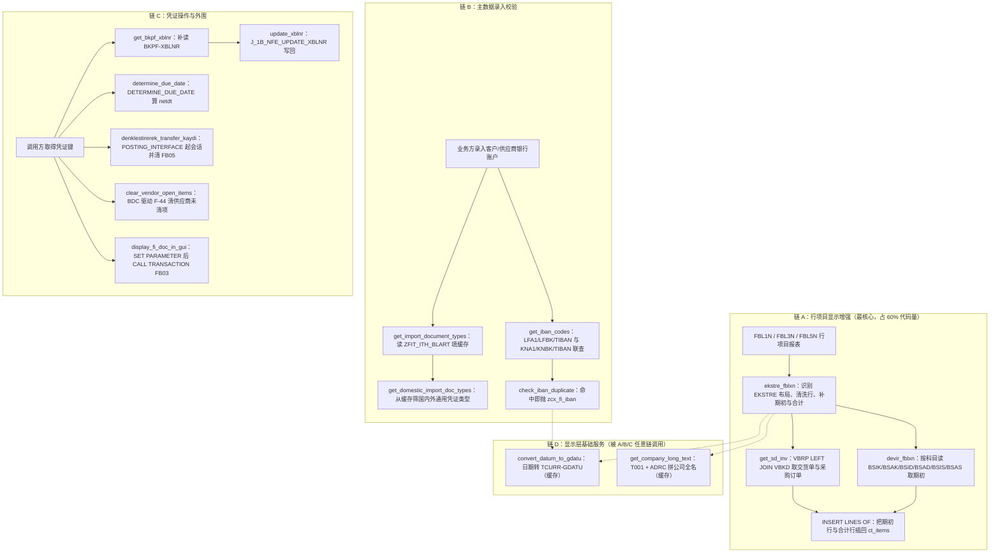
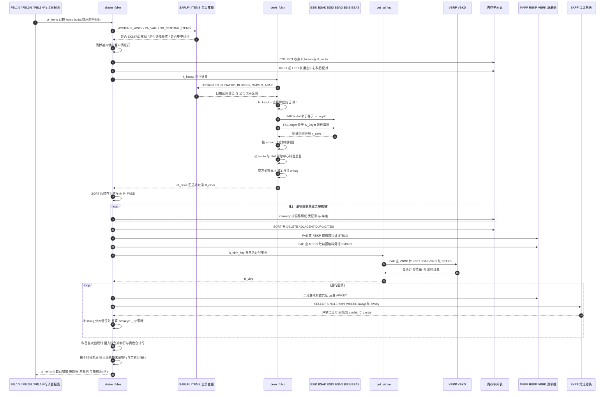

# ZCL_FI_TOOLKIT 源码分析报告

> 对象：`CLASS zcl_fi_toolkit DEFINITION ... IMPLEMENTATION`（约 1700 行，17 个方法 = 16 个 public `CLASS-METHODS` + 1 个 private `get_sd_inv`）
> 语言：中文

---

## 一、程序定位与业务背景

### 1.1 这是什么

`ZCL_FI_TOOLKIT` 不是一个报表，也不是一个业务事务，而是一个 **FI（Financial Accounting）领域的公共工具箱类**。它 `CREATE PUBLIC` + `FINAL`，全部对外能力都是 `CLASS-METHODS`，没有实例状态（除了三个 `CLASS-DATA` 缓存），因此可以被任何 FI 相关程序 `zcl_fi_toolkit=>xxx( )` 静态调用。

从方法名和方法体可以反推出它服务的业务场景：

| 能力簇 | 面向的业务问题 |
|---|---|
| `ekstre_fblxn` / `devir_fblxn` | FBL1N / FBL3N / FBL5N（客户/总账/供应商行项目显示）在土耳其本地化后**缺少期初余额（devir）和借贷方/余额列**，财务看不到"这笔行发生前账户上还剩多少" |
| `get_sd_inv` | 行项目上要显示**交货单号 / 销售订单号**，需要从 VBRP/VBKD 反查引用单据 |
| `get_iban_codes` / `check_iban_duplicate` | 财务主数据（客户/供应商银行账户）录入时校验 **IBAN 唯一性** |
| `get_import_document_types` | 土耳其电子发票（e-belge / GİB）场景下区分**进口/本地**凭证类型，供 FI 校验与 ALV 选择范围使用 |
| `clear_customer_open_items` / `clear_vendor_open_items` | 通过 BDC 驱动 F-32 / F-44 批量清账（清未清项目） |
| `denklestirerek_transfer_kaydi` | "按科目类别过账转账凭证"——把一批会计凭证行**成批转为转账凭证（UMBUCHNG / FB05）**，典型场景是总账与分类账对账、期初调平 |
| `update_xblnr` | 补写 BKPF-XBLNR（参考凭证号），土耳其 e-belge 强制要求 |
| `validate_zhrtip` | IFRS/TFRS 报表出具前的**辅助核算类型（Alt Hesap Tipi）合规校验** |
| `get_company_long_text` / `convert_datum_to_gdatu` | 显示层基础设施：公司代码全称、日期→财务过账期间转换 |
| `display_fi_doc_in_gui` / `get_bkpf_xblnr` / `determine_due_date` | 从任意上下文跳转到 FB03 看凭证、补参考号、算到期日 |

### 1.2 现有方案为什么不够

这些需求单看都不难，难在 **它们全部出现在同一个调用点上**：SAP 标准行项目显示（RFITEM\*）是由 `SAPLFI_ITEMS` 这个 function pool 里的一堆 `RFITEMAP/RFITEMGL/RFITEMAR/RFITEMAX` 报表实现的，其中每一个都是 `include` 级的增强点。土耳其本地化（EY/EFT 凭证类型、IBAN、e-belge）要在**不改 SAP 标准、不做 Z 代码拷贝**的前提下塞进这些增强点，就只能：

- 把逻辑写进**一个公共类**，由各个增强 include 通过 `sy-cprog` 分派调用；
- 通过 `ASSIGN ('(RFITEMGL)SO_BUDAT[]')` 这类**动态字段符号**读取标准报表的选择屏内存变量（拿"用户选到哪一天"），而这些变量无法通过正常接口传入。

换句话说，这个类的存在本身就是**"绕过 SAP 标准程序封闭性"这一需求的产物**。这也解释了后面反复出现的 `sy-cprog` 分派、`(RFITEMAP)` 动态取变量、以及大量土耳其语注释。

### 1.3 整体设计范式（一句话定性）

> **"以 `sy-cprog` 为路由键的报表增强工具箱"**：对外暴露 16 个单一职责的静态方法，内部靠动态字段符号读标准报表内存态、通过 `POSTING_INTERFACE_*` 与 BDC 两种方式操作凭证，辅以三个 `CLASS-DATA` 内存缓存降低重复取数。

它没有继承、没有接口、没有依赖注入、没有单元测试可见的构造点——**一切耦合都靠类池里"恰好存在"的那几个常量和报表 include**。这是全篇风险的根源。

---

## 二、程序执行流程总览

这个类没有统一入口，每个方法由外部独立触发。为了给出可读的"流程"，下面按**三条真实调用链**组织（图中实线为链内调用，虚线为调用方在标准程序中的挂载点）：



### 责任链表

| # | 子程序 | 调用者 | 职责 |
|---|---|---|---|
| 1 | 类定义段 + 私有类型/常量区 | 编译器 | 声明 22 组类型、4 个业务常量、3 个 `CLASS-DATA` 缓存、1 个私有方法 |
| 2 | `ekstre_fblxn` | FBL1N/FBL3N/FBL5N 的 EKSTRE 布局增强 include（经 `sy-cprog` 分派） | 行级总控：判布局、清洗对冲行、建"科目+中心科目"映射、批量查反向凭证、算余额列、插入期初行与合计行 |
| 3 | `devir_fblxn` | `ekstre_fblxn` | 动态读报表选择屏日期 → 算期初截止日 → 从 6 张清账表取期初 → 按 S/H 取正负号 → `COLLECT` 汇总 |
| 4 | `get_sd_inv`（private） | `ekstre_fblxn`（成功路径与 ELSE 路径各一次） | 用 `FOR ALL ENTRIES` + `LEFT OUTER JOIN VBKD` 取交货单号与采购订单号 |
| 5 | `get_import_document_types` | `get_domestic_import_doc_types`、以及各 FI 选择屏/校验增强 | 首次读 `ZFIT_ITH_BLART` 整表进静态缓存，按 domestic/foreign 标记过滤出 BLART 集合 |
| 6 | `get_domestic_import_doc_types` | FI 校验/ALV 变式增强 | 先靠副作用确保缓存已填，再从缓存里筛"国内外皆可"的凭证类型 |
| 7 | `get_iban_codes` | `check_iban_duplicate` | 供应商侧（LFA1+LFBK+TIBAN）与客户侧（KNA1+KNBK+TIBAN）两条三表内连接，取已存在的 IBAN |
| 8 | `check_iban_duplicate` | 客户/供应商主数据保存前增强 | 调 `get_iban_codes`，只要有命中就抛 `zcx_fi_iban`，消息里带 IBAN 与对手方类型 |
| 9 | `get_bkpf_xblnr` | 调用方需要展示参考凭证号时（CHANGING 原地回填） | `FOR ALL ENTRIES` 读 BKPF 的 XBLNR，排序后二分查找回填到传入表；查不到就清空 |
| 10 | `update_xblnr` | 链 C 的调用方（写回阶段） | 逐行调 `J_1B_NFE_UPDATE_XBLNR` 写 XBLNR，可选每张凭证 `COMMIT WORK` |
| 11 | `determine_due_date` | 报表行项目增强（算到期日列） | 从 BSEG 取重算日相关字段 → `DETERMINE_DUE_DATE` FM → 返回 NETDT |
| 12 | `denklestirerek_transfer_kaydi` | 转账凭证批处理程序 | 读 BSEG 拼 `FTCP`/`FTPOST` → `POSTING_INTERFACE_START/CLEARING/END` 过账 FB05 转账 |
| 13 | `clear_customer_open_items` | AR 批量清账程序 | BDC 驱动 F-32 勾选并清客户未清项目 |
| 14 | `clear_vendor_open_items` | AP 批量清账程序 | BDC 驱动 F-44 勾选并清供应商未清项目 |
| 15 | `display_fi_doc_in_gui` | 任意报表的"跳转看凭证"动作 | `SET PARAMETER ID 'BLN'/'BUK'/'GJR'` 后 `CALL TRANSACTION 'FB03' AND SKIP FIRST SCREEN` |
| 16 | `get_company_long_text` | 显示层（ALV 抬头、导出标题等） | T001 取公司代码 → 有地址号则从 ADRC 拼姓名行 → 命中 `gt_company_long_text` 缓存 |
| 17 | `convert_datum_to_gdatu` | 显示层/期间判定 | 用 `CONVERSION_EXIT_INVDT_INPUT` 把日期转财务期间 GDATU，命中 `gt_dg_cache` 则免去 FM 调用 |
| 18 | `validate_zhrtip` | FI 凭证录入/修改的字段校验增强 | 按科目首位（5/9）与 `zhrtip` 固定偏移比对，不符抛 `zcx_fi_zhrtip`；4 个事务码豁免 |

下面按这条流程，逐个子程序展开。

---

## 三、分组分析

### 3.0 方法总览与阅读路线

17 个方法里，真正需要精读的是 **`ekstre_fblxn`（约 530 行，占三分之一）** 和 **`devir_fblxn`（约 330 行）**——这两个方法承载了全部业务复杂度与全部风险。其余 15 个方法里，8 个是 20~60 行的单功能工具（一句带过），4 个是 BDC/POSTING 接口的包装（需要看调用契约），3 个是缓存型取数服务。

本节按上面的责任链顺序展开，链 A 的四个方法拆得最细。

### 3.1 类定义段：类型契约与静态缓存（`全局声明区`）

本类没有独立的"声明区"概念，`DEFINITION` 段本身就是全部的类型契约来源。它分 `PUBLIC`（对外契约）与 `PRIVATE`（内部实现细节）两块，划分基本合理——私有区的 8 组类型（`t_company_long_text`、`t_dg_cache`、`t_vbkd`、`t_rbkp`、`t_mseg`、`ty_rbkp_key`、`ty_vbrp`）全是"为某个方法服务的中间结构"，不该泄漏给调用方。

#### ① 面向业务的数据结构

```abap
  TYPES:
    BEGIN OF t_documents ,
      bukrs TYPE bseg-bukrs,
      belnr TYPE bseg-belnr,
      gjahr TYPE bseg-gjahr,
      buzei TYPE bseg-buzei,
    END OF t_documents .
  TYPES:
    tt_documents TYPE STANDARD TABLE OF t_documents WITH DEFAULT KEY .
  TYPES:
    BEGIN OF ty_hesap,
      sube   TYPE rfposxext-konto,
      merkez TYPE rfposxext-konto,
    END OF ty_hesap .
  TYPES:
    tt_hesap TYPE STANDARD TABLE OF ty_hesap .
```

**做什么** — 声明三组基础结构：`t_documents` 是 BSEG 的凭证行键（BUKRS/BELNR/GJAHR/BUZEI），既是 `denklestirerek_transfer_kaydi` 的输入也是从 BSEG 回查的 WHERE 条件；`ty_hesap` 是"本地科目 → 中心科目"的映射对，字段名用了土耳其语 `sube`（本地/子账户）与 `merkez`（中心账户）；`tt_documents` 带 `DEFAULT KEY`（标准表全键）。

**为什么** — 三个字段类型都挂在 `bseg` / `rfposxext` 上而不是裸写 `bukrs TYPE bukrs CHAR4`，这是很好的习惯：**字段类型跟着参照表走**，参照表一旦升级（长度扩展、域调整），这里自动跟随，不会出现"隐式截断"。`ty_hesap` 直接复用 `rfposxext-konto`（LINE TYPE 的 KONTO 字段，CHAR10）也同理。土耳其语字段名牺牲了通用性，但在这个项目里提高了可读性——后面 `devir_fblxn` 里满屏 `sube/merkez`，看代码的人立刻知道是在做中心账户合并。

**风险与改进** — `ty_konto` 声明了 `konto TYPE konto` 而不是 `rfposxext-konto`，与 `ty_hesap` 的选择不一致；`konto` 域长度 10 与 `rfposxext-konto` 同宽，目前无实际风险，但风格应统一。更实质的问题是 `tt_documents TYPE STANDARD TABLE ... WITH DEFAULT KEY` 与 `tt_documents` 在 `denklestirerek_transfer_kaydi` 里只被 `FOR ALL ENTRIES IN @it_bseg` 使用，**从未按 key 读取**，`WITH DEFAULT KEY` 是无意义开销（会额外生成去重逻辑），应为普通标准表。

#### ② 期初余额的数据契约（`ty_devir_items` / `ty_devir`）

```abap
    TYPES:
      BEGIN OF ty_devir_items,
        belnr TYPE belnr_d,
        gjahr TYPE gjahr,
        buzei TYPE buzei,
        bukrs TYPE bukrs,
        konto TYPE hkont,
        shkzg TYPE shkzg,
        dmshb TYPE dmbtr,
        dmbe2 TYPE dmbe2,
        dmbe3 TYPE dmbe3,
        umskz TYPE umskz,
        filkd TYPE filkd,
        wrbtr TYPE wrbtr,
        waers TYPE waers,
        gsber TYPE gsber,
      END OF ty_devir_items .
    TYPES:
    BEGIN OF ty_devir,
      bukrs TYPE bukrs,
      konto TYPE hkont,
      shkzg TYPE shkzg,
      dmshb TYPE dmbtr,
      dmbe2 TYPE dmbe2,
      dmbe3 TYPE dmbe3,
      umskz TYPE umskz,
      filkd TYPE filkd,
      wrbtr TYPE wrbtr,
      waers TYPE waers,
      gsber TYPE gsber,
    END OF ty_devir .
```

**做什么** — 两个近乎同形的结构：`_items` 是**明细**（带凭证键，用于 SELECT INTO TABLE 的中间落地表），`ty_devir` 是**汇总**（去掉了 BELLR/GJAHR/BUZEI，用 `COLLECT` 按全字段聚合后作为对外返回类型）。三币金额取自 `DMBTR/DMBE2/DMBE3`（借方本币/二币/三币），`WRBTR` 为凭证货币金额，`SHKZG` 是借贷标识，`UMSKZ` 特殊科目标识，`FILKD` 记账日期，`GSBER` 业务范围。

**为什么** — 明细/汇总用两个结构而不是一个，是**为了让 `COLLECT` 有意义**：`COLLECT` 是按标准表全键（DEFAULT KEY）聚合的，如果明细结构里留着 BELLR/GJAHR/BUZEI，`COLLECT` 会一行不合并、汇总功能直接失效。所以作者必须引入一个"瘦结构"。这是正确但隐蔽的设计——新人极易在这里踩坑。金额字段一律挂 `DMBTR` 而不是 `dmbtr TYPE dmbtr` 里的域全名，同样是为了跨表通用性（BSIS 的借方余额字段也是 `DMBTR`）。

**风险与改进** — 这里有一处**必须做的语义校核**，长度/精度匹配不能替代语义一致：`DMBE2`/`DMBE3` 是**二币/三币借方余额**，与 `DMBTR`（本币）并列，三者在 FI 里各自独立、不能相加；本结构把它们平铺在一起是合理的，但 `ty_devir` 作为"按科目+业务范围汇总"的结构，`COLLECT` 会把三币金额跨币种**逐字段相加**——只有当所有行的 `DMBE2` 恰好同币种时才正确。`ty_devir` 里没有 `waers2/waers3` 来约束这一点，属于隐性假设，建议至少在字段旁写明注释或按币种分组。此外 `konto TYPE hkont`（总账科目，CHAR10）与从 KNA1/LFA1 取的 `KUNNR/LIFNR`（CHAR15）在同一字段里混装——虽然长度上 `hkont` 更短能装下，但**总账科目与业务伙伴号是两个不同语义域**，在 `devir_fblxn` 里靠 `sy-cprog` 切换来源，属于用一个字段承载两种语义，应拆成两个结构或明确注释。

#### ③ 常量与静态缓存

```abap
    CONSTANTS c_borc TYPE shkzg VALUE 'S' ##NO_TEXT.
    CONSTANTS c_alacak TYPE shkzg VALUE 'H' ##NO_TEXT.
    CONSTANTS c_mal_hareketi TYPE awtyp VALUE 'MKPF' ##NO_TEXT.
    CONSTANTS c_satinalma_faturasi TYPE awtyp VALUE 'RMRP' ##NO_TEXT.
    CONSTANTS c_satis_faturasi TYPE awtyp VALUE 'VBRK' ##NO_TEXT.
    CONSTANTS c_musteri_hf_talebi TYPE auart VALUE 'ZAH1' ##NO_TEXT.
```

```abap
    CLASS-DATA gt_company_long_text TYPE tt_company_long_text .
    CLASS-DATA gt_dg_cache TYPE tt_dg_cache .
    CLASS-DATA gt_import_doc_type_cache TYPE tt_ith_blart .
```

**做什么** — 5 个业务常量：`c_borc`/`c_alacak` 是借贷标识 `S`/`H`（类型绑到 `shkzg`，取值错编译器会拦）；3 个 `AWTYP` 区分业务类型（物料凭证 / 采购订单 / 销售开票）；`c_musteri_hf_talebi = 'ZAH1'` 是客户退货订单类型，但**在本类实现中一次都没有被使用**（只在定义段出现）。3 个 `CLASS-DATA` 分别缓存公司全称、日期→期间转换结果、进口凭证类型表。

**为什么** — 常量类型绑到 `shkzg`/`awtyp`/`auart` 而不是 `c TYPE c LENGTH 1 VALUE 'S'`，是"让类型系统帮我查错"的典型写法，比 `CONSTANTS c_borc TYPE c VALUE 'S'` 强得多。三个缓存都用 `HASHED TABLE ... WITH UNIQUE KEY primary_key COMPONENTS <key>`，配 `ASSIGN ... TO FIELD-SYMBOL` 做 O(1) 查找，比 `LOOP + sy-subrc` 干净。

**风险与改进** — `c_musteri_hf_talebi` 是死常量，应删除（或者说明它被外部类通过 `zcl_fi_toolkit=>c_...` 引用——但它是 `PUBLIC SECTION` 的 CONSTANTS，外部确实可引用，所以需要确认后再删）。缓存的三个真实风险：**① 生命周期**——`CLASS-DATA` 在 ABAP 内存里活到 LUW 结束，同一 LUW 内若有人 `MODIFY T001` 改了公司名，本程序仍返回旧值；`get_company_long_text` 没有暴露任何刷新入口。**② 并发**——`ASSIGN ... TO fs` + `INSERT ... ASSIGNING` 这种"先找后插"的两步写法，在同一 LUW 内多股调用时虽然 ABAP 程序本身单线程安全，但**如果这些类方法在 LUW 内被远程调用多次，或同一 LUW 里存在 `CALL FUNCTION ... IN UPDATE TASK` 之类并发访问 `gt_*` 的路径**，哈希表并发 `INSERT` 会短 dump；应改用 `INSERT ... INTO TABLE` 返回 `sy-subrc` 的原子写法，或直接用带默认值 `VALUES` 的 `VALUE #( )` 构造。**③ 命名**——`gt_dg_cache` 这种两字母缩写（date→gdatu）在本文件其它地方都写全称，属于风格断层。

---

### 3.2 方法 `ekstre_fblxn`：行项目显示的行级总控

这是全类最复杂的方法，530 行做 8 件事。我按执行顺序拆成 8 步，每一步都有独立的三层分析。

#### ① 入口守卫与报表分派

```abap
  METHOD ekstre_fblxn.
    "--------->> written by mehmet sertkaya 18.12.2015 11:29:39

    CHECK ct_items IS NOT INITIAL.
    CASE sy-cprog.
      WHEN 'RFITEMAP'."FBL1N
        ASSIGN ('(RFITEMAP)X_AISEL') TO FIELD-SYMBOL(<lv_x_aisel>).
        ASSIGN ('(RFITEMAP)PA_VARI') TO FIELD-SYMBOL(<lv_vari>).

      WHEN 'RFITEMGL'."FBL3N
        ASSIGN ('(RFITEMGL)X_AISEL') TO <lv_x_aisel>.
        ASSIGN ('(RFITEMGL)PA_VARI') TO <lv_vari>.

      WHEN 'RFITEMAR'."FBL5N
        ASSIGN ('(RFITEMAR)X_AISEL') TO <lv_x_aisel>.
        ASSIGN ('(RFITEMAR)PA_VARI') TO <lv_vari>.

      WHEN 'ZSDP_RFITEMAR'.
        ASSIGN ('(ZSDP_RFITEMAR)X_AISEL') TO <lv_x_aisel>.
        ASSIGN ('(ZSDP_RFITEMAR)PA_VARI') TO <lv_vari>.

      WHEN OTHERS.
        RETURN.

    ENDCASE.
```

**做什么** — 先用 `CHECK` 挡掉空表，然后按 `sy-cprog` 把当前报表的全局变量 `X_AISEL`（是否为 ALV 选择模式）和 `PA_VARI`（ALV 变式名）动态绑定到字段符号；不在四个白名单里直接返回。

**为什么** — `X_AISEL` 与 `PA_VARI` 是 `SAPLFI_ITEMS` 里各报表的 GLOBAL DATA，不在任何 FM/方法的接口上，唯一能在增强 include 里"看见"它们的手段就是 `ASSIGN ('(报表名)变量名')` 这种**带程序限定名的动态赋值**。加 `()` 前缀是 ABAP 官方推荐的"按名字访问外部程序全局变量"语法。判 `PA_VARI CS 'EKSTRE'` 来识别"用户正在用 EKSTRE 布局"而不是判硬编码的变式名，让用户可以自己复制变式微调，这是很地道的做法。

**风险与改进** — **本方法是全类风险最集中的地方，第一颗地雷就在下一个代码块。** 除此以外这里本身还有两点：`CASE` 里四个分支的 `ASSIGN` 写法不一致（第一个用了完整 `FIELD-SYMBOL(...)` 声明，后三个依赖前一个分支已声明的动态字段符号），虽然 ABAP 允许，但可读性差，建议统一。`ASSIGN` **没有检查 `sy-subrc`**，后面第 ② 步却直接 `IF <lv_vari> CS 'EKSTRE'`——如果全局变量被改名或报表升级后消失，字段符号处于未指定状态，解引用即 dump。必须在每个 `ASSIGN` 后加 `IF sy-subrc <> 0. RETURN. ENDIF.`。

#### ② 布局守卫、订单号补全与对冲凭证行清洗

```abap
    IF sy-subrc = 0 AND sy-cprog(5) = 'RFITE'.

      "--------->> add by mehmet sertkaya 27.05.2021 10:49:36
      LOOP AT ct_items ASSIGNING FIELD-SYMBOL(<ls_items>)
            WHERE zuonr(3) eq  zcl_fi_omd=>c_zuonr_sanal and
                  zzbstkd IS INITIAL.
           <ls_items>-zzbstkd = <ls_items>-zuonr.
      ENDLOOP.
      "-----------------------------<<
      IF <lv_vari> CS 'EKSTRE'.

        IF <lv_x_aisel> <> abap_true.
          MESSAGE TEXT-003 TYPE 'I'.
          RETURN.
        ENDIF.
```

**做什么** — 三个连续动作：① 对"退货行"（`zuonr` 前 3 位等于 `zcl_fi_omd=>c_zuonr_sanal`）且尚未填 `zzbstkd` 的行，把 `zuonr` 本身当采购订单号拷进去；② 只有当 `PA_VARI` 名字里含 `EKSTRE` 才继续；③ 必须是 ALV 选择模式（`X_AISEL = 'X'`），否则弹 `TEXT-003` 提示并返回。

**为什么** — 这三步合起来是**"我该不该动手"的准入判断**。`X_AISEL` 守卫的逻辑是：只有用户在 ALV 里选了行、点了"显示"按钮时，`ct_items` 才是被选中的子集，此时插入期初行才有意义；在自由选择模式（`X_AISEL` 为空）下 `ct_items` 是全部行，插入几行"期初"记录毫无意义还会污染列表。退货行补订单号放在最前面，是因为退货的采购订单号在 FI 行项目里没有独立字段，只能从 `ZUONR` 派生，先补齐才能被后面的 `get_sd_inv` 逻辑复用。

**风险与改进** — 🔴 **`sy-cprog(5) = 'RFITE'` 是致命笔误**。`SY-CPROG` 是 `CHAR8`，`sy-cprog(5)` 取的是**第 5 个字符**，而 `'RFITE'` 是 5 个字符的整串——两者**永远不可能相等**。验算：`'RFITEMAP'`(5) = `'E'`、`'RFITEMGL'`(5) = `'E'`、`'RFITEMAR'`(5) = `'E'`、`'ZSDP_RFITEMAR'`(5) = `'_'`。四个白名单程序**没有一个**能通过这个判断。作者真正想写的应该是 `sy-cprog(1) = 'RFITE'`（前 5 位）或 `sy-cprog CS 'RFITEM'`。后果是：整个 EKSTRE 主分支（期初、余额列、颜色、期末合计，分支中约 480 行代码）都是**永不执行的死代码**，实际只有最末的 `ELSE` 分支在跑。这解释了为什么本类里 `devir_fblxn`、`get_sd_inv` 的复杂度与实际收益严重不匹配。修复只需改一个字符，但必须先在测试系统验证。另有 🟠 `WHERE zuonr(3) eq ...`：字符比较默认忽略尾部空格，`zuonr` 是数值语义的 Z 字段（用 `zuonr` 存订单号本身已经是挪用），建议写清比较语义。

#### ③ 删除被反向冲销的客户清账行

```abap
        "-->> changed by mehmet sertkaya 21.07.2016 13:52:32
        " HAR-10448 - Müşteri Ekstresinde XX belge ters kaydı
*          delete ct_items where blart = 'XX' and gjahr ge '2016'.
        LOOP AT ct_items ASSIGNING <ls_items>
                    WHERE blart = zcl_fi_document_type=>get_customer_clearing_doc_type( ) AND
                          gjahr GE '2018'.
          DELETE ct_items WHERE belnr = <ls_items>-zzstblg AND gjahr = <ls_items>-zzstjah.
          DELETE ct_items.
        ENDLOOP.
```

**做什么** — 找出"客户清账凭证类型 + 会计年度 ≥ 2018"的行，对每一行删掉两批数据：① 它的**被冲销凭证**（`zzstblg/zzstjah`）如果也在列表里，一并删掉；② 把这一行本身删掉（循环末尾不带 WHERE 的 `DELETE ct_items`，删的是当前 `<ls_items>`）。

**为什么** — 业务意图明确：客户 Ekstre 上，清账凭证和它冲销掉的那张发票是**同一笔经济业务的两个侧面**，如果都显示，账户余额会重复计入、用户会误以为有两笔欠款。所以连同冲销凭证与清账凭证一起从结果里剔除，让 Ekstre 只反映"活的"应收记录。

**风险与改进** — 🔴 **这里是 O(n²) 性能陷阱 + 悬垂引用**。`LOOP AT ct_items` 内对同一张表做无 WHERE 的 `DELETE ct_items`：`DELETE` 会移动后续行、`LOOP` 的游标随之偏移，跳过的行可能永远不被处理、已处理的行可能被重复处理；同时 `DELETE` 之后 `<ls_items>` 这个 `ASSIGNING` 字段符号仍指向已被释放的行内存，下一轮 `DELETE ct_items WHERE ... = <ls_items>-zzstblg` 就是在读野指针——ABAP 在标准程序下通常不立刻 dump（同一 LUW 内存不会立刻复用），但行为完全不可预测。另外 `DELETE ct_items WHERE belnr = ... AND gjahr = ...` 只用 BELLR+GJAHR，**没带 BUKRS**——跨公司代码同号凭证会被误删，在多公司代码系统里是真实的业务事故。正确做法是：先把待删的键收集到一个 `SORTED TABLE WITH UNIQUE KEY`，循环结束后一次性批量删；至少要 `LOOP ... WHERE` 与删除解耦成"收集 + 批量删"两步，并把 BUKRS 加进条件。

#### ④ 建立科目与中心科目映射

```abap
        SORT ct_items BY konto budat ASCENDING.

        IF  ct_items IS INITIAL.
          RETURN.
        ENDIF.
```

```abap
        LOOP AT ct_items ASSIGNING <ls_items>.
          CLEAR ls_hesap.
          ls_hesap-sube = <ls_items>-konto.
          COLLECT ls_hesap INTO lt_hesap.
          ls_konto-bukrs = <ls_items>-bukrs.
          ls_konto-konto = <ls_items>-konto.
          COLLECT ls_konto INTO lt_konto.
        ENDLOOP.
        ASSIGN  ('(SAPLFI_ITEMS)GB_CENTRAL_ITEMS') TO FIELD-SYMBOL(<lv_merkez>).
        IF sy-subrc = 0.
          IF <lv_merkez> = abap_true.
            CASE sy-cprog.
              WHEN 'RFITEMAR' OR 'ZSDP_RFITEMAR'.
                SELECT bukrs, kunnr, knrze INTO TABLE @DATA(lt_knb1) FROM knb1
                    FOR ALL ENTRIES IN @lt_hesap
                    WHERE kunnr = @lt_hesap-sube AND
                          knrze <> @space.
                SORT lt_knb1 BY bukrs kunnr.
                LOOP AT lt_knb1 ASSIGNING FIELD-SYMBOL(<ls_knb1>).
                  ls_hesap-sube = <ls_knb1>-kunnr.
                  ls_hesap-merkez = <ls_knb1>-knrze.
                  COLLECT ls_hesap INTO lt_hesap.
                ENDLOOP.

              WHEN 'RFITEMAP'.
                SELECT bukrs, lifnr, lnrze INTO TABLE @DATA(lt_lfb1) FROM lfb1
                    FOR ALL ENTRIES IN @lt_hesap
                    WHERE lifnr = @lt_hesap-sube AND
                          lnrze <> @space.
                SORT lt_lfb1 BY bukrs lifnr.
                LOOP AT lt_lfb1 ASSIGNING FIELD-SYMBOL(<ls_lfb1>).
                  ls_hesap-sube   = <ls_lfb1>-lifnr.
                  ls_hesap-merkez = <ls_lfb1>-lnrze.
                  COLLECT ls_hesap INTO lt_hesap.
                ENDLOOP.

            ENDCASE.
          ENDIF.
        ENDIF.
        SELECT * FROM t001  INTO TABLE lt_t001.
```

**做什么** — 三步。① 遍历 `ct_items` 收集两份去重集合：`lt_hesap`（科目）和 `lt_konto`（公司代码 + 科目，供后面的期末合计循环用），都用 `COLLECT` 去重。② 读 `SAPLFI_ITEMS` 的全局开关 `GB_CENTRAL_ITEMS`：如果用户开了"集中科目显示"，就去 `KNB1`（客户，`KNRZE` 中央科目）或 `LFB1`（供应商，`LNRZE` 中央科目）把每个科目扩展成 `(本地科目, 中心科目)` 配对，追加进 `lt_hesap`。③ 读 `T001` 全表进 `lt_t001`。

**为什么** — 步骤 ① 的两次 `COLLECT` 是**经典的"从明细反推去重键集"**：后面 `devir_fblxn` 和期末合计循环都要"每个科目只处理一次"，用 `COLLECT` 从明细里抽出键集比先 `SORT` 再 `DELETE ADJACENT DUPLICATES` 更短。步骤 ② 的 `GB_CENTRAL_ITEMS` 检查很关键——**中心科目合并是一个可选显示模式**，只有用户显式打开时才合并，否则两个科目的余额必须分开展示；这个判断放在最前面，避免为不需要的功能白查 KNB1/LFB1。

**风险与改进** — 🟠 `FOR ALL ENTRIES IN @lt_hesap` 与 `lt_hesap` 自身被修改（`COLLECT ls_hesap INTO lt_hesap`）是 ABAP 的未定义行为；本例中 SELECT 先于 COLLECT 完成所以侥幸无事，但这是**依赖执行顺序的巧合正确**，属于典型的定时炸弹。🟠 `knrze <> @space` 条件：同一客户在多个公司代码有不同中央科目时，`COLLECT` 会把多行都存进 `lt_hesap`，下游 `devir_fblxn` 的 `WHERE ( kunnr = it_hesap-sube OR kunnr = it_hesap-merkez )` 语义变含糊。🟠 `SELECT * FROM t001 INTO TABLE lt_t001` 是**纯粹的死代码**——`lt_t001` 声明时带了 `##NEEDED` 假装有后续使用，但全方法内再无一处读它；应直接删除，这也是 `##NEEDED` 被滥用的样本。🟡 `SORT lt_knb1 BY bukrs kunnr` 与后面 `READ TABLE ... WITH KEY bukrs = ... lifnr = ... BINARY SEARCH` 的键序列必须完全一致，这里恰好一致，但这种"分散在两个方法里的隐式契约"极易在维护中被破坏，应把 key 抽成常量或在读取处加注释。

#### ⑤ 调用 `devir_fblxn` 取期初

```abap
        zcl_fi_toolkit=>devir_fblxn(
                    EXPORTING it_hesap = lt_hesap
                    IMPORTING et_devir = lt_devir
                                             ).
        SORT lt_devir BY bukrs konto gsber.
        lt_devir_sorted = lt_devir.

        FREE  : lt_devir,lt_hesap.
```

**做什么** — 把科目键集交给 `devir_fblxn`，拿回按科目/业务范围汇总好的期初表；按 `bukrs konto gsber` 排序后转存到 `SORTED TABLE ... WITH NON-UNIQUE KEY bukrs konto`，随后 `FREE` 掉标准表 `lt_devir` 和已用完的 `lt_hesap`。

**为什么** — 这几行是整个方法在**性能与内存上的关键设计**。`devir_fblxn` 返回标准表 `tt_devir`，下游需要的是"按 `bukrs konto` 高效查找 + 允许重复 `gsber`"，所以立刻 `SORT` 再转成排序表，之后所有 `LOOP AT lt_devir_sorted WHERE bukrs = ... AND konto = ...` 都能走高效定位。`FREE` 显式释放是因为这一步之后 `lt_devir`（可能几十万行）再也不用，而 ABAP 内表直到 LUW 结束才释放；`lt_hesap` 同理。这种"用完就 FREE"在处理大内表的 ABAP 程序里是值得表扬的习惯。

**风险与改进** — 无明显功能风险，但有两点可优化：① `lt_devir_sorted` 的 key 是 `bukrs konto`（非唯一），而排序用了 `bukrs konto gsber`——key 与排序序列不一致是允许的，但会让读者困惑，建议 key 就写成 `bukrs konto gsber`。② `FREE lt_devir` 之后若将来要在异常路径里打日志取证就取不到了，这是**性能与可观测性的权衡**，当前选择偏向性能，代价是丢掉了排障线索。

#### ⑥ 收集物料/采购/销售凭证键并批量查表

```abap
        LOOP AT ct_items ASSIGNING <ls_items>
           WHERE zzawtyp = c_mal_hareketi OR zzawtyp =  c_satinalma_faturasi
               OR  zzawtyp =  c_satis_faturasi.
          IF <ls_items>-zzawtyp = c_mal_hareketi.
            APPEND VALUE #( mblnr = <ls_items>-zzawkey(10)
                            mjahr = <ls_items>-zzawkey+10(4)
                           ) TO lt_mkpf_key.
          ELSEIF <ls_items>-zzawtyp = c_satinalma_faturasi.
            APPEND VALUE #( belnr = <ls_items>-zzawkey(10)
                            gjahr = <ls_items>-zzawkey+10(4)
                           ) TO lt_rbkp_key.
          ELSEIF <ls_items>-zzawtyp = c_satis_faturasi.
            APPEND <ls_items>-zzawkey(10) TO lt_vbrk_key.
          ENDIF.
        ENDLOOP.

        SORT lt_rbkp_key BY belnr gjahr.
        SORT lt_mkpf_key BY mblnr mjahr.
        SORT lt_vbrk_key BY vbeln.
        DELETE ADJACENT DUPLICATES FROM lt_mkpf_key COMPARING mblnr mjahr.
        DELETE ADJACENT DUPLICATES FROM lt_rbkp_key COMPARING belnr gjahr.
        DELETE ADJACENT DUPLICATES FROM lt_vbrk_key COMPARING vbeln.
```

```abap
        IF lt_rbkp_key IS NOT INITIAL.

          SELECT belnr, gjahr, stblg, stjah
            FROM rbkp
            FOR ALL ENTRIES IN @lt_rbkp_key
            WHERE
              belnr = @lt_rbkp_key-belnr AND
              gjahr = @lt_rbkp_key-gjahr
            INTO CORRESPONDING FIELDS OF TABLE @lt_rbkp.

          FREE lt_rbkp_key.
        ENDIF.
```

```abap
        IF lt_mkpf_key IS NOT INITIAL.
          SELECT mblnr, mjahr, smbln, sjahr
            FROM mseg
            FOR ALL ENTRIES IN @lt_mkpf_key
            WHERE
              mblnr = @lt_mkpf_key-mblnr AND
              mjahr = @lt_mkpf_key-mjahr
            INTO CORRESPONDING FIELDS OF TABLE @lt_mseg.
          FREE lt_mkpf_key.
        ENDIF.
        IF lt_vbrk_key[] IS NOT INITIAL.
          lt_vbrp = get_sd_inv( lt_vbrk_key ).
          FREE lt_vbrk_key.
        ENDIF.
```

**做什么** — 分三步的"宽表取数"。① 扫 `ct_items`，按 `ZZAWTYP`（业务类型）把每行的 `ZZAWKEY`（AWKEY，25 位复合键）**按偏移切成**原始凭证号（1~10 位）+ 年度（11~14 位），分装进 `lt_mkpf_key`（物料）、`lt_rbkp_key`（采购）、`lt_vbrk_key`（销售）三张键表。② 每张键表先 `SORT` 再 `DELETE ADJACENT DUPLICATES` 去重——同一张凭证被几十行引用是常态。③ 分别用 `FOR ALL ENTRIES` 查 `RBKP`（取 `STBLG/STJAH` 前置凭证）、`MSEG`（取 `SMBLN/SJAHR` 前置物料凭证），以及调私有方法 `get_sd_inv` 取 `VGBEL/BSTKD`（交货单/采购订单）。

**为什么** — 这是整个方法里**最漂亮的一段性能设计**，值得单独讲。三次 `READ TABLE` 若放在行循环里（后面第 ⑦ 步就是在行循环里做的），就是 N 行 × 3 次数据库 SELECT，FBL3N 一次能拉几万行，直接短 dump。这里改成"**先扫一遍收集键 → 排序去重 → 一次 FAE 批量查 → 行循环里二分查找**"，数据库往返从几万次降到 3 次。而且 `MSEG` 那次连物料行都不要，只取 `MBLNR/MJAH/SMBLN/SJAHR` 四个字段——注释里明说"这个 case 很少见，直接去 BKPF 就够了"，是为数组成员最小化做的取舍。`FREE` 三张键表同理，用完即弃。

**风险与改进** — 🟠 `WHERE zzawtyp = ... OR zzawtyp = ... OR zzawtyp = ...` 三个 `OR` 没加括号分组，将来有人补 `AND` 条件时会踩优先级坑，应写成 `( a OR b OR c )`。更实质的是 🔴 **`zzawkey(10)` 的偏移切分是硬编码的领域知识**：`AWTYP='MKPF'` 时 AWKEY 是 `MBLRN(10) + MJAHR(4) + BWART(1) + ...` 共 25 位，代码切前 14 位是对的；但这套"哪两位偏移对应哪个字段"的知识散落在三处 `APPEND VALUE #( ... )` 里，没有任何注释或常量封装。同文件 `get_sd_inv` 也用 `zzawkey(10)`，一旦 AWKEY 长度或拼接顺序在升级中变化，**所有偏移全部错位且不会报语法错**，只会静默查出错误数据。建议提取长度常量并加注释。另有 🟡 三处 `FOR ALL ENTRIES` 的空表判断不统一：前两处用 `IS NOT INITIAL`，第三处用 `[] IS NOT INITIAL`（`FAE` 官方要求用 `IS NOT INITIAL` 判断空表），应统一。

#### ⑦ 行级字段回填与余额列计算

```abap
        SORT ct_items BY konto budat ASCENDING.

        LOOP AT ct_items ASSIGNING <ls_items>.
          lv_tabix = sy-tabix.

          IF <ls_items>-zzawtyp = c_mal_hareketi.
            READ TABLE lt_mseg WITH TABLE KEY mblnr = <ls_items>-zzawkey(10)
                                              mjahr = CONV #( <ls_items>-zzawkey+10(4) )
                                              ASSIGNING FIELD-SYMBOL(<ls_mseg>).
            IF sy-subrc = 0.
              CLEAR lv_awkey.
              IF <ls_mseg>-smbln IS  NOT INITIAL.
                lv_awkey = |{ <ls_mseg>-smbln }{ <ls_mseg>-sjahr }|.
              ELSE.
                READ TABLE lt_mseg WITH KEY smbln = <ls_mseg>-mblnr
                                            sjahr = <ls_mseg>-mjahr
                                            ASSIGNING <ls_mseg>.

                IF sy-subrc = 0.
                  lv_awkey = |{ <ls_mseg>-mblnr }{ <ls_mseg>-mjahr }|.
                ENDIF.
              ENDIF.

            ENDIF.
```

```abap
          ELSEIF <ls_items>-zzawtyp = c_satinalma_faturasi.
            READ TABLE lt_rbkp WITH TABLE KEY belnr = <ls_items>-zzawkey(10)
                                              gjahr = CONV #( <ls_items>-zzawkey+10(4) )
                                              ASSIGNING FIELD-SYMBOL(<ls_rbkp>).
            IF sy-subrc = 0.
              CLEAR lv_awkey.
              IF <ls_rbkp>-stblg IS  NOT INITIAL.
                lv_awkey = |{ <ls_rbkp>-stblg }{ <ls_rbkp>-stjah }|.
              ELSE.
                READ TABLE lt_rbkp WITH KEY stblg = <ls_rbkp>-belnr
                                            stjah = <ls_rbkp>-gjahr
                                            ASSIGNING <ls_rbkp>.

                IF sy-subrc = 0.
                  lv_awkey = |{ <ls_rbkp>-belnr }{ <ls_rbkp>-gjahr }|.
                ENDIF.
              ENDIF.

            ENDIF.
          ELSEIF <ls_items>-zzawtyp = c_satis_faturasi.
            READ TABLE lt_vbrp WITH TABLE KEY vbeln = <ls_items>-zzawkey(10)
                                        ASSIGNING FIELD-SYMBOL(<ls_vbrp>).
            IF sy-subrc = 0.
              IF <ls_vbrp>-vgtyp = 'J' OR <ls_vbrp>-vgtyp = 'T'.
                <ls_items>-zzteslimat = <ls_vbrp>-vgbel.
              ENDIF.
              <ls_items>-zzbstkd = <ls_vbrp>-bstkd.
            ENDIF.
          ENDIF.
```

```abap
          IF lv_awkey IS  NOT INITIAL.
            SELECT SINGLE belnr INTO <ls_items>-zzstblg FROM bkpf
                          WHERE awtyp = <ls_items>-zzawtyp AND
                                awkey = lv_awkey
                          ##WARN_OK .                   "#EC CI_NOORDER
            IF sy-subrc = 0.
              <ls_items>-zzstjah = <ls_items>-gjahr.
            ENDIF.
          ENDIF.
```

**做什么** — 逐行处理：① 按 `ZZAWTYP` 分别在已缓存的三张表里查找；物料凭证/采购订单还要做一次**反向查找**（如果本凭证没有前置凭证，就反查"谁冲销了我"，取那张凭证的 AWKEY）；② 把查到的 AWKEY 拼成 `lv_awkey`；③ 用 `lv_awkey` 去 `BKPF` 找**实际的 FI 凭证号**，写入 `zzstblg`；④ 销售发票行直接把交货单号/采购订单号写进 `zzteslimat`/`zzbstkd`。

**为什么** — ①②的"有前置用前置、无前置就反查"是正确的业务建模：**采购订单→物料凭证→FI 凭证**是一条链，行项目上的 `ZZSTBLG` 应该指向链尾的 FI 凭证。反查用 `WITH KEY`（`tt_mseg`/`tt_rbkp` 都是 `SORTED TABLE WITH NON-UNIQUE KEY mblnr mjahr`，非唯一 key 的 `READ ... WITH KEY` 会线性扫描但内存表开销可控）。④ `VGTYP` 判 `'J'`/`'T'` 是 SD 单据类型——只有 SD 单据才有交货单号，才写进 `ZZTESLIMAT`（送货单）字段。

**风险与改进** — 🔴 **`zzstjah` 是明确的业务正确性 bug**。`SELECT SINGLE belnr INTO <ls_items>-zzstblg FROM bkpf WHERE awtyp = ... AND awkey = ...` 只取了 `BELNR`，没取 `GJAHR`，然后用 `IF sy-subrc = 0. <ls_items>-zzstjah = <ls_items>-gjahr.` 拿**当前行所在的会计年度**当作被找到的那张凭证的年度。这是两张独立凭证——年度完全可能不同（原凭证 2023 年、跨年冲销凭证记在 2024 年）。结果就是 `zzstblg`（2024 年凭证号）配 `zzstjah`（错写成 2023），第 ③ 步的 `DELETE ct_items WHERE belnr = ... AND gjahr = ...` 就**删不到真正的被冲销行**，HAR-10448 那个需求静默失效，用户看到重复记录却查不出原因。修法：SELECT 列表加 `gjahr`，或 `INTO CORRESPONDING FIELDS OF` 一个含 belnr+gjahr 的小结构；拿到后还要 `CLEAR <ls_items>-zzstblg`，因为 `sy-subrc <> 0` 时字段保持旧值。另外 `lv_awkey` 只在两个分支里被 `CLEAR`，**销售分支没清**——若某行是销售类型而上一行是物料类型，`lv_awkey` 会带着上一行的残值进入 `IF lv_awkey IS NOT INITIAL`，导致销售行也被错误地去 BKPF 查一次；建议把 `CLEAR lv_awkey` 提到 `LOOP` 体内第一行。还有 🟠 `##WARN_OK` 压掉了 ATC 的"SELECT 结果未完全检查"警告，而 `SY-SUBRC` 检查恰恰是这段的关键——这属于用抑制标记掩盖真实告警。

#### ⑧ 在科目首行前插入"期初"行与"合计"行

```abap
          IF lv_konto_temp IS INITIAL OR
             lv_konto_temp <> <ls_items>-konto.
* Devir kalemini ekle
            CLEAR : ls_devir,ls_devir_merkez.

            LOOP AT lt_devir_sorted INTO ls_devir
              WHERE bukrs = <ls_items>-bukrs
                AND konto = <ls_items>-konto.

              IF <lv_merkez> IS ASSIGNED.
                IF <lv_merkez> = abap_true.
                  CASE sy-cprog.
                    WHEN 'RFITEMAP'.
                      READ TABLE lt_lfb1 ASSIGNING <ls_lfb1>
                                         WITH KEY bukrs = <ls_items>-bukrs
                                                  lifnr = <ls_items>-konto BINARY SEARCH.
                      IF sy-subrc = 0.
                        LOOP AT lt_devir_sorted ASSIGNING FIELD-SYMBOL(<lfs_devir_sorted_lnrze>)
                                                WHERE bukrs = <ls_items>-bukrs
                                                  AND konto = <ls_lfb1>-lnrze.
                          ADD <lfs_devir_sorted_lnrze>-dmshb TO ls_devir_merkez-dmshb.
                          ADD <lfs_devir_sorted_lnrze>-dmbe2 TO ls_devir_merkez-dmbe2.
                          ADD <lfs_devir_sorted_lnrze>-dmbe3 TO ls_devir_merkez-dmbe3.
                          ADD <lfs_devir_sorted_lnrze>-wrbtr TO ls_devir_merkez-wrbtr.
                        ENDLOOP.
                      ENDIF.
```

```abap
              CLEAR ls_item_devir.
              IF ls_devir-bukrs IS INITIAL.
                MOVE-CORRESPONDING ls_devir_merkez TO ls_item_devir  ##ENH_OK.
                ls_item_devir-wrshb =  ls_devir_merkez-wrbtr.
                ls_item_devir-waers =  ls_devir_merkez-waers.
              ELSE.
                ADD ls_devir_merkez-dmshb TO ls_devir-dmshb.
                ADD ls_devir_merkez-dmbe2 TO ls_devir-dmbe2.
                ADD ls_devir_merkez-dmbe3 TO ls_devir-dmbe3.
                ADD ls_devir_merkez-wrbtr TO ls_devir-wrbtr.

                MOVE-CORRESPONDING ls_devir TO ls_item_devir  ##ENH_OK.
                ls_item_devir-wrshb =  ls_devir-wrbtr.
                ls_item_devir-waers =  ls_devir-waers.

              ENDIF.

              ls_item_devir-zzname1_ku = <ls_items>-zzname1_ku.
              ls_item_devir-zzname1_li = <ls_items>-zzname1_li.
              ls_item_devir-konto = <ls_items>-konto.
              ls_item_devir-zuonr = TEXT-dvg.
              ls_item_devir-u_bktxt =  ls_item_devir-sgtxt  = |{ TEXT-004 }({ <ls_items>-konto })|.
              ls_item_devir-hwaer = <ls_items>-hwaer.
              ls_item_devir-hwae2 = <ls_items>-hwae2.
              ls_item_devir-hwae3 = <ls_items>-hwae3.
              IF ls_item_devir-dmshb LT 0.
                ls_item_devir-zzalacak_upb = ls_item_devir-dmshb * -1.
                ls_item_devir-zzalacak_2pb = ls_item_devir-dmbe2 * -1.
                ls_item_devir-zzalacak_3pb = ls_item_devir-dmbe3 * -1.
              ELSE.
                ls_item_devir-zzborc_upb = ls_item_devir-dmshb.
                ls_item_devir-zzborc_2pb = ls_item_devir-dmbe2.
                ls_item_devir-zzborc_3pb = ls_item_devir-dmbe3.
              ENDIF.
              ls_item_devir-bukrs = <ls_items>-bukrs.
              ls_item_devir-konto = <ls_items>-konto.
              ls_item_devir-color = lc_green.

              COLLECT ls_item_devir INTO lt_item_devir.

              CLEAR ls_item_sum.
              ls_item_sum-wrshb = ls_item_devir-wrshb.
              ls_item_sum-waers = ls_item_devir-waers.
              ls_item_sum-dmshb = ls_item_devir-dmshb.
              ls_item_sum-hwaer = ls_item_devir-hwaer.
              ls_item_sum_-hwaer = ls_item_sum-hwaer.

              ADD ls_item_sum-dmshb TO ls_item_sum_-dmshb.

              ls_item_sum-color = lc_yellow.
*              collect ls_item_sum into lt_item_sum_top."kullanılmıyor
            ENDLOOP.
            IF sy-subrc <> 0.
* devir yoksa boş devir yazısı yazalım.
              CLEAR ls_item_devir.
              ls_item_devir-bukrs = <ls_items>-bukrs.
              ls_item_devir-konto = <ls_items>-konto.
              ls_item_devir-zuonr = TEXT-dvg.
              ls_item_devir-color = lc_green.
              ls_item_devir-zzname1_ku = <ls_items>-zzname1_ku.
              ls_item_devir-zzname1_li = <ls_items>-zzname1_li.
              ls_item_devir-u_bktxt =  ls_item_devir-sgtxt  = |{ TEXT-004 }({ <ls_items>-konto })|.
              INSERT ls_item_devir INTO ct_items INDEX lv_tabix.

              ls_item_sum_-bukrs = <ls_items>-bukrs.
              ls_item_sum_-konto = <ls_items>-konto.
              ls_item_sum_-zzname1_ku = <ls_items>-zzname1_ku.
              ls_item_sum_-zzname1_li = <ls_items>-zzname1_li.
              ls_item_sum_-zuonr = TEXT-dvy.
              ls_item_sum_-color = lc_yellow.
              ls_item_sum_-u_bktxt =  ls_item_sum_-sgtxt  = |{ TEXT-004 }({ <ls_items>-konto })|.
              INSERT ls_item_sum_ INTO ct_items INDEX lv_tabix + 1.


            ELSE.
              ls_item_sum_-bukrs = <ls_items>-bukrs.
              ls_item_sum_-konto = <ls_items>-konto.
              ls_item_sum_-zzname1_ku = <ls_items>-zzname1_ku.
              ls_item_sum_-zzname1_li = <ls_items>-zzname1_li.
              ls_item_sum_-zuonr = TEXT-dvy.
              ls_item_sum_-color = lc_yellow.

              IF ls_item_sum_-dmshb LT 0.
                ls_item_sum_-zzalacak_upb = ls_item_sum_-dmshb.
              ELSE.
                ls_item_sum_-zzborc_upb = ls_item_sum_-dmshb.
              ENDIF.

              ls_item_sum_-u_bktxt =  ls_item_sum_-sgtxt  = |{ TEXT-004 }({ <ls_items>-konto })|.
              ls_item_devir = ls_item_sum_.
              APPEND ls_item_sum_ TO lt_item_devir.
              INSERT LINES OF lt_item_devir INTO ct_items INDEX lv_tabix.
              FREE lt_item_devir.
            ENDIF.
            CLEAR ls_item_sum_.
```

```abap
          IF <ls_items>-shkzg = c_alacak.
            <ls_items>-zzalacak_upb = <ls_items>-dmshb * -1.
            <ls_items>-zzalacak_2pb = <ls_items>-dmbe2 * -1.
            <ls_items>-zzalacak_3pb = <ls_items>-dmbe3 * -1.
          ELSE.
            <ls_items>-zzborc_upb = <ls_items>-dmshb.
            <ls_items>-zzborc_2pb = <ls_items>-dmbe2.
            <ls_items>-zzborc_3pb = <ls_items>-dmbe3.
          ENDIF.

          <ls_items>-zzbakiye_upb =  ls_item_devir-dmshb =
                                     ls_item_devir-dmshb +
                                     <ls_items>-dmshb.

          <ls_items>-zzbakiye_2pb =  ls_item_devir-dmbe2 =
                                     ls_item_devir-dmbe2 +
                                     <ls_items>-dmbe2.

          <ls_items>-zzbakiye_3pb =  ls_item_devir-dmbe3 =
                                     ls_item_devir-dmbe3 +
                                     <ls_items>-dmbe3.

          lv_konto_temp = <ls_items>-konto.
        ENDLOOP.
```

**做什么** — 这是方法的核心写入逻辑，共三段。

1. **只在科目切换时插一次**：外层 `IF lv_konto_temp IS INITIAL OR lv_konto_temp <> <ls_items>-konto.` 利用第 ⑥ 步已按 `konto budat` 排好的序，检测到"进入了一个新科目"。此时从 `lt_devir_sorted` 查出该科目的期初行；开了集中科目模式的话，再把中心科目（`LNRZE`/`KNRZE`）的期初金额 `ADD` 到 `ls_devir_merkez`。
2. **装配期初行 `ls_item_devir`（绿色 `C51`）**：把三个金额字段转成 `WR_SHB`（凭证货币/显示货币金额），按 `DMSHB` 正负分派到借方列 `zzborc_upb` 或贷方列 `zzalacak_upb`（取绝对值），拷贝科目名/公司代码/币种，把 `ZUONR` 设成 `TEXT-dvg`（"期初"标识文本）、`SGTXT` 设成"期初(科目)"。用 `COLLECT` 收集进 `lt_item_devir`（同一科目多条期初记录会合并成一行），末尾追加一行黄色（`C31`）的"合计"行 `ls_item_sum_`，一起 `INSERT LINES OF ... INDEX lv_tabix` 插到当前行**之前**。
3. **算行级余额**：`ZZBAKIYE_UPB = 期初余额 + 本行金额`。这里用了 ABAP 的**连续赋值**（`a = b = 表达式`）一次性给"行上显示的余额"和"内存里的期初变量"赋值，比写两行更紧凑，是个不错的技巧。

**为什么** — `lv_konto_temp` 这个"记忆上一次科目"的判断是**在没有 key 的情况下做分组处理的标准手法**，性能远好于每行都去查期初。`INSERT ... INDEX lv_tabix` 而不是 `APPEND`，是为了让期初行出现在该科目第一行明细**之上**，符合财务报表的阅读习惯（期初 → 本期发生 → 合计）。借贷列的"取绝对值 + 由 SHKZG 决定进哪列"是 SAP 的标准符号处理惯例，避免用户看到负数。绿色区分期初、黄色区分合计，是 ALV 常用的行着色技巧（`COL_ITEM` 字段）。

**风险与改进** — 🔴 **`ls_item_sum_` 的"合计"行显示的不是合计**。`ls_item_sum_` 在 ⑧ 开头被 `CLEAR`（本例中由第 ⑦ 段末的 `CLEAR ls_item_sum_.` 与 ⑨ 段开头的 `CLEAR ls_item_sum_.` 保证），然后 ② 里只写入了 `ls_item_devir` 的**单行**金额（`ls_item_sum-dmshb = ls_item_devir-dmshb`），再 `ADD ls_item_sum-dmshb TO ls_item_sum_-dmshb`。由于每个科目只进这个分支一次，`ls_item_sum_` 里的值就是**该科目期初行本身**，而"合计"行的正确含义应该是"期初 + 该科目所有明细行的净额"。用户看到的黄色"TOPLAM"行金额是错的。正确做法是保持 `ls_item_sum_` 不 `CLEAR`，在科目分组的内层循环里把每行的 `dmshb/dmbe2/dmbe3` 累加进去，退出分组时再写行。🟠 **`ls_item_sum_` 这个变量名带连字符后缀**（`ls_item_sum_-bukrs` 读作 `ls_item_sum_` 的 `bukrs`），语法合法但极易误读为 `ls_item_sum` 的减法，建议改名 `ls_item_total`。🟠 `LOOP AT lt_devir_sorted ... ENDLOOP. IF sy-subrc <> 0.` 依赖 `sy-subrc` 在循环后仍保留最后一次 `READ`/查找结果——中间夹着大量赋值语句（包括 `READ TABLE lt_lfb1 ... BINARY SEARCH`，它**也会覆盖 sy-subrc**），所以"没有期初"的判定是不可靠的。应显式用 `DATA lv_found TYPE abap_bool` 或改用 `LOOP AT ... INTO ... ` 后判断 `sy-subrc` 并立刻保存。🟠 `MOVE-CORRESPONDING ... ##ENH_OK`：`it_rfposxext` 与 `ty_devir` 字段名部分同名部分不同（`dmshb` vs `wrshb`），依赖 `MOVE-CORRESPONDING` 只搬同名字段、`##ENH_OK` 压掉"移动后结构不完整"的告警——这意味着**新增字段时容易漏搬**。🟡 变量名 `ls_item_devir = ls_item_sum_.` 在 ③ 里被用作"传给 `APPEND` 的中转变量"，与前面刚 `CLEAR` 过的期初行同名同类型，语义上完全混淆，应换名。

#### ⑨ 追加期末合计行

```abap
        FREE : lt_mseg,lt_vbrp,lt_rbkp.
* dönem sonu bakiyeleri ekle
        LOOP AT lt_konto INTO ls_konto.
          REFRESH lt_item_sum.
          CLEAR ls_item_sum.
          CLEAR ls_item_sum_.
          LOOP AT ct_items ASSIGNING <ls_items>
            WHERE bukrs = ls_konto-bukrs
              AND konto = ls_konto-konto.
            lv_tabix = sy-tabix.
            CHECK <ls_items>-color <> lc_yellow.
            CHECK <ls_items>-hwaer IS NOT INITIAL.
            ls_item_sum-bukrs = <ls_items>-bukrs.
            ls_item_sum-konto = <ls_items>-konto.
            ls_item_sum-gsber = <ls_items>-gsber.
            ls_item_sum-wrshb = <ls_items>-wrshb.
            ls_item_sum-waers = <ls_items>-waers.
            ls_item_sum-dmshb = <ls_items>-dmshb.
            ls_item_sum-hwaer = <ls_items>-hwaer.
            ls_item_sum-zuonr = TEXT-dng.
            ls_item_sum-color = lc_green.
            ls_item_sum-u_bktxt =  ls_item_sum-sgtxt  = |{ TEXT-005 }({ <ls_items>-konto })|.

            ls_item_sum_-bukrs = <ls_items>-bukrs.
            ls_item_sum_-konto = <ls_items>-konto.
            ls_item_sum_-u_bktxt =  ls_item_sum-sgtxt  = |{ TEXT-005 }({ <ls_items>-konto })|.
            ls_item_sum_-zuonr = TEXT-dny.
            ls_item_sum_-color = lc_yellow.
            ADD ls_item_sum-dmshb TO ls_item_sum_-dmshb.
            ls_item_sum_-hwaer = ls_item_sum-hwaer.

            COLLECT ls_item_sum INTO lt_item_sum.
          ENDLOOP.

          ADD 1 TO lv_tabix.
          APPEND ls_item_sum_ TO lt_item_sum.
          APPEND INITIAL LINE TO lt_item_sum.

          INSERT LINES OF lt_item_sum INTO ct_items INDEX lv_tabix.

        ENDLOOP.
```

**做什么** — 外层遍历第 ④ 步收集的 `lt_konto`（每个科目一次），内层遍历 `ct_items` 里该科目的所有行，**跳过自己插入的黄色行**（`CHECK color <> lc_yellow`）和没有交易货币的行（`CHECK hwaer IS NOT INITIAL`），然后按 `(bukrs konto gsber wrshb waers dmshb hwaer)` 这个**全字段组合** `COLLECT` 累加进 `lt_item_sum`。循环结束后追加一行黄色期末合计行和一行空白分隔行，`INSERT LINES OF` 到该科目最后一行的下一位。

**为什么** — `CHECK color <> lc_yellow` 是**防止自己吃自己**的经典技巧：第 ⑧ 步插进去的期初行和黄色合计行也在 `ct_items` 里，如果不过滤，本步骤会把它们再加一遍，期末合计虚高。跳过 `hwaer` 为空的行同样合理——`wrshb` 的值依赖 `hwaer` 换算，没有币种就没法参与金额统计。末尾 `APPEND INITIAL LINE TO lt_item_sum` 加一条空行做**视觉分隔**，让多个科目的期末余额在列表里不粘连，是报表类程序常见的处理。

**风险与改进** — 🔴 **`lv_tabix` 在这里跨科目复用，是本方法第二个索引正确性缺陷**。`lv_tabix` 只在内层 `LOOP` 里被赋值；如果某个科目在 `lt_konto` 里存在、但在 `ct_items` 中因为两个 `CHECK` 全部被跳过（内层循环一次都没进），`lv_tabix` 就保留**上一个科目**的值，`ADD 1 TO lv_tabix` 后把期末合计行插到**别的科目的行里**。应改成 `DATA lv_last_tabix TYPE sy-tabix.` 每轮外层循环开头 `CLEAR lv_last_tabix`，内层循环每次 `lv_last_tabix = lv_tabix`，末尾判断 `IF lv_last_tabix IS INITIAL. CONTINUE. ENDIF.`。🟠 `lt_item_sum` 是**普通标准表**（无 `WITH DEFAULT KEY`，所以是 `DEFAULT KEY` 即全字段），`COLLECT` 按全字段分组意味着同一科目下**不同 `GSBER`/不同 `WR_SHB`/不同 `DMSHB` 的行不会被合并**，会生成多行"期末余额"，语义上等于按币种+业务范围+金额分组报期末余额，与 `zuonr = TEXT-dng`（"期末"标签）的意图不符。若意图是"每个科目一行期末余额"，应改为只按 `(bukrs konto gsber)` 聚合；若是"按业务范围分列期末余额"，则标签文案要改。🟠 `ls_item_sum_-u_bktxt = ls_item_sum-sgtxt = ...` 这一行有个**隐蔽的语义 bug**：左边给 `ls_item_sum_` 的 `u_bktxt`，右边却把 `ls_item_sum-**s**gtxt`（前一个结构体的！）赋了值。第 ⑧ 段同样的写法 `ls_item_sum_-u_bktxt = ls_item_sum-sgtxt` 也是如此——`ls_item_sum_` 的文本字段永远保持初值，只有 `ls_item_sum-sgtxt` 被赋值。若 ALV 显示的是 `ls_item_sum_` 这一行，用户看到的是空描述。🟡 `REFRESH lt_item_sum` 后紧跟 `CLEAR ls_item_sum` 语义重复（`REFRESH` 已清空），冗余但无害。

#### ⑩ 非 EKSTRE 分支（唯一实际生效的路径）

```abap
    ELSE.

      LOOP AT ct_items ASSIGNING FIELD-SYMBOL(<ls_items1>)
          WHERE  zzawtyp =  c_satis_faturasi.
        IF <ls_items1>-zzawtyp = c_satis_faturasi.
          APPEND <ls_items1>-zzawkey(10) TO lt_vbrk_key.
        ENDIF.
      ENDLOOP.

      SORT lt_vbrk_key BY vbeln.
      DELETE ADJACENT DUPLICATES FROM lt_vbrk_key COMPARING vbeln.

      IF lt_vbrk_key[] IS NOT INITIAL.

        lt_vbrp = get_sd_inv( lt_vbrk_key ).
        FREE lt_vbrk_key.

        LOOP AT ct_items ASSIGNING <ls_items> WHERE zzawtyp = c_satis_faturasi.
          READ TABLE lt_vbrp INTO DATA(ls_vbrp)
                           WITH KEY vbeln = <ls_items>-zzawkey(10)
                                    BINARY SEARCH.
          IF sy-subrc = 0.
            IF ls_vbrp-vgtyp = 'J' OR ls_vbrp-vgtyp = 'T'.
              <ls_items>-zzteslimat = ls_vbrp-vgbel.
            ENDIF.
<ls_items>-zzbstkd = ls_vbrp-bstkd.
          ENDIF.
        ENDLOOP.
      ENDIF.
    ENDIF.
  ENDMETHOD.
```

**做什么** — `IF sy-cprog(5) = 'RFITE'` 为假时走这里：只做一件事——收集所有销售发票行的凭证号，去重后调 `get_sd_inv` 取交货单号与采购订单号，回填 `zzteslimat`/`zzbstkd`。

**为什么** — 由于 ② 里那个笔误，这个 `ELSE` 分支是**目前唯一被执行的代码路径**。它也体现了与主分支一致的"批量取数 + 二分查找"模式，说明作者是有意识地让两条路径共用同一套取数逻辑。

**风险与改进** — 🟠 `LOOP ... WHERE zzawtyp = c_satis_faturasi` 里又套了一层 `IF <ls_items1>-zzawtyp = c_satis_faturasi`，是**冗余的重复判断**（WHERE 已经保证了），应删掉。🟠 `READ TABLE lt_vbrp ... WITH KEY vbeln = ... BINARY SEARCH` 要求 `lt_vbrp`（`tt_vbrp`）**实际是排序表且首键为 `vbeln`**——类型声明确实如此，OK；但 `get_sd_inv` 用 `SELECT DISTINCT` 而一个 VBELN 可能有多个 `VGTYP` 行，`READ` 只会取其中**任意一条**，这个不确定性在 `ELSE` 与主分支（`WITH TABLE KEY`）表现还不一致，属于同一份数据两套读法。🟡 `WITH KEY ... BINARY SEARCH` 只在前导字段 `vbeln` 上二分，若一个 VBELN 有多行，仍会在该 key 组内线性扫描并取第一条——语义应改为 `SORT lt_vbrp BY vbeln` 后按 `vgtyp` 明确选行，或在 `get_sd_inv` 里用聚合保证每 VBELN 一行。

#### ⑪ 本方法的整体评价

`ekstre_fblxn` 展现了两极分明的水平：**性能设计（⑥ 的批量取数、⑧ 的 `lv_konto_temp` 分组、⑤ 的 `FREE`）明显是能跑大数据量的人写的**；而**① 的 `sy-cprog(5)` 笔误和 ⑦ 的 `zzstjah` 取错年度，又像是没人 review 过的高级工程师代码**。一个 530 行、插入行、改变行数、依赖 4 个外部报表全局变量的方法出现在一个"工具箱类"里，本身就是**职责过载**的信号——它至少该拆成"行清洗"、"反向凭证解析"、"期初行装配"三个私有方法。

#### ⑫ 本方法调用到的三个外部依赖

```abap
        WHERE blart = zcl_fi_document_type=>get_customer_clearing_doc_type( ) AND
        WHERE zuonr(3) eq  zcl_fi_omd=>c_zuonr_sanal and
        SELECT ... FROM t001 ...
```

**做什么** — 三个跨类/跨表的依赖：`zcl_fi_document_type=>get_customer_clearing_doc_type( )` 取客户清账凭证类型、`zcl_fi_omd=>c_zuonr_sanal` 取退货行标识、`T001` 全表。

**为什么** — 凭证类型与退货标识这两条**业务规则**被正确地放在了两个专门的类里（`zcl_fi_document_type` 管凭证类型、`zcl_fi_omd` 管订单/退货管理），本类只引用不定义——**依赖倒置做得不错**，业务规则变更时只改一处。

**风险与改进** — 🟡 跨类常量依赖意味着 `ZCL_FI_TOOLKIT` 与 `ZCL_FI_OMD`、`ZCL_FI_DOCUMENT_TYPE` 形成编译期耦合，任何一个被删除或重命名，本类就编译失败（这至少是"快速失败"，比运行期出错好）。但 `get_customer_clearing_doc_type( )` 是**在 `LOOP` 的 `WHERE` 里逐行调用的方法**——每行一次方法调用 + 内部可能的一次数据库读取，N 行就是 N 次；应提到 `LOOP` 外面先取到局部变量。

---

### 3.3 方法 `devir_fblxn`：跨六张清账表计算期初余额

这个方法只有一个调用者（`ekstre_fblxn`），但它是链 A 里数据量最大、逻辑最密的一个：330 行里有一个"动态读标准报表内存"的框架、三组共 6 张表的 `FOR ALL ENTRIES` 取数、两层后过滤和一次汇总。拆成 5 步。

#### ① 动态读取报表选择屏变量

```abap
  METHOD devir_fblxn.

    DATA : lv_keydt TYPE sy-datum,
           lt_devir TYPE TABLE OF ty_devir_items,
           ls_devir TYPE ty_devir.

    FIELD-SYMBOLS  : <lt_budat> TYPE range_date_t,
                     <lt_saknr> TYPE fagl_mm_t_range_saknr,
                     <lt_bukrs> TYPE tpmy_range_bukrs,
                     <lv_odk>   TYPE any,
                     <lv_apar>  TYPE any.

    CLEAR et_devir.

    CASE sy-cprog.
      WHEN 'RFITEMAP'.
        ASSIGN ('(RFITEMAP)SO_BUDAT[]') TO <lt_budat>.
        ASSIGN ('(RFITEMAP)KD_BUKRS[]') TO <lt_bukrs>.
        ASSIGN ('(RFITEMAP)X_SHBV') TO <lv_odk>.
        ASSIGN ('(RFITEMAP)X_APAR') TO <lv_apar>.

        IF NOT (
          <lt_budat> IS ASSIGNED AND
          <lt_bukrs> IS ASSIGNED AND
          <lv_odk>   IS ASSIGNED AND
          <lv_apar>  IS ASSIGNED
        ).
          RETURN.
        ENDIF.
```

**做什么** — 按 `sy-cprog` 绑定四类全局变量：选择屏的**日期区间** `SO_BUDAT`、**公司代码区间** `KD_BUKRS`、**是否显示特别科目** `X_SHBV`、**是否显示资产/往来方** `X_APAR`（`A`=Anlage/应收，`P`=Partner）。绑定不全就直接 `RETURN`（返回空的 `et_devir`）。

**为什么** — `FIELD-SYMBOLS ... TYPE any` + `IS ASSIGNED` 的组合是**动态全局变量访问的标准防御写法**：因为 `ASSIGN` 失败时 `sy-subrc` 会被后续语句覆盖，所以必须用 `IS ASSIGNED` 这个与语句无关的状态来判断，比 `sy-subrc` 可靠得多。这是全类里写得最规范的一段。`TYPE any` 而非具体类型，是因为一个字段符号要承载 `CHAR1` 和 `range_date_t` 四种不同类型。`CLEAR et_devir` 放在最前面，保证任何 `RETURN` 路径下输出都是确定的空表——**出口状态确定性**是好习惯。

**风险与改进** — 🔴 **`CASE sy-cprog` 的 `WHEN OTHERS. RETURN.` 直接让 `ZSDP_RFITEMAR` 拿不到任何期初**。`ekstre_fblxn` 的分派里有四个程序（含 `ZSDP_RFITEMAR`），但 `devir_fblxn` 只处理三个，`ZSDP_RFITEMAR` 落到 `OTHERS` → 立刻 `RETURN` → `lt_devir` 为空 → 上游第 ⑧ 步给该报表插入的期初行永远是空壳（金额全 0）。两个方法的白名单不一致，是**同一功能在不同报表上表现不同**的典型缺陷。修法：把 `WHEN 'ZSDP_RFITEMAR'` 与对应变量名（该 Z 程序是否复用 `RFITEMAR` 的变量名需要现场确认）合并进 `CASE`。🟡 四个 `ASSIGN` 连写而不检查 `sy-subrc`，靠后面的 `IS ASSIGNED` 兜底——逻辑正确但 `ASSIGN` 的静默失败会被完全隐藏，标准报表变量一旦改名，这里会**静默退化成"期初永远为空"**（与 ① 的 `RETURN` 一样是静默失败）。建议至少在 `RETURN` 前 `WRITE`/记一条 Application Log，否则线上排查只能靠猜。

#### ② 由选择屏推算期初截止日

```abap
    CASE sy-cprog.
      WHEN 'RFITEMGL'.
        ASSIGN ('(RFITEMGL)SO_BUDAT[]') TO <lt_budat>.
        ASSIGN ('(RFITEMGL)SD_BUKRS[]') TO <lt_bukrs>.
        ASSIGN ('(RFITEMGL)X_SHBV') TO <lv_odk>.

        IF NOT (
          <lt_budat> IS ASSIGNED AND
          <lt_bukrs> IS ASSIGNED AND
          <lv_odk>   IS ASSIGNED
        ).
          RETURN.
        ENDIF.

      WHEN 'RFITEMAR'.
        ASSIGN ('(RFITEMAR)SO_BUDAT[]') TO <lt_budat>.
        ASSIGN ('(RFITEMAR)DD_BUKRS[]') TO <lt_bukrs>.
        ASSIGN ('(RFITEMAR)X_SHBV') TO <lv_odk>.
        ASSIGN ('(RFITEMAR)X_APAR') TO <lv_apar>.

        IF NOT (
          <lt_budat> IS ASSIGNED AND
          <lt_bukrs> IS ASSIGNED AND
          <lv_odk>   IS ASSIGNED AND
          <lv_apar>  IS ASSIGNED
        ).
          RETURN.
        ENDIF.

      WHEN OTHERS.
        RETURN.
    ENDCASE.

    READ TABLE <lt_budat> INDEX 1 ASSIGNING FIELD-SYMBOL(<ls_budat>).
    IF sy-subrc = 0.
      lv_keydt = <ls_budat>-low - 1.
    ELSE.
      RETURN.
    ENDIF.

    CLEAR :lt_devir,et_devir.
```

**做什么** — 补齐 `RFITEMGL`/`RFITEMAR` 的变量绑定（注意 `RFITEMGL` **不绑定 `X_APAR`**），然后读选择屏日期区间的**第一行的 LOW 值**，`lv_keydt = low - 1`。最后清空中间表和输出表，进入取数阶段。

**为什么** — `- 1` 是这个方法最关键的业务判断：**期初 = 选择屏起始日的前一天为止的所有清账行**。用户查 2026-01-01 起的明细，期初就必须统计到 2025-12-31。ABAP 里日期内部表示是 `YYYYMMDD` 数值，`d - 1` 直接做数值减法即可，不需要 `DATE_SUBTRACT_DAYS` 之类的 FM——这是合法且高效的写法（跨月跨年跨闰年均正确）。

**风险与改进** — 🟠 `READ TABLE ... INDEX 1` 取的是**选择屏日期区间的第一行**。如果用户填的是 `01.01.2026 - 31.12.2026` 单行区间，正确；但如果标准报表的多行区间（ATAB）里第一行是空行或某个 BAdJ 变式把有效期行放在后面，取到的就是错误的日期。更稳妥的是遍历整个 `SO_BUDAT` 取**所有行的 `LOW` 的最小值**（真正的最早日期）。🟠 同一个日期区间还要考虑 `SAP` 函数模块 `DATE_CHECK_PLAUSIBILITY` 不适用于此的场景——没有校验 `lv_keydt` 是否为有效日期，空区间或格式异常时会静默算出一个不存在的截止日。🟡 `<lv_apar>` 在 `RFITEMGL` 分支未绑定，但 ② 之后的 `CASE sy-cprog` 里 `RFITEMGL` 分支确实不用它——**当前是正确的**，可一旦将来 `WHEN OTHERS` 分支新增逻辑用到 `<lv_apar>`，未绑定的字段符号参与判断会直接 dump。这个隐患最好用注释固定下来。

#### ③ 取供应商侧与总账侧期初（`RFITEMAP` / `RFITEMGL`）

```abap
    CASE sy-cprog.
      WHEN 'RFITEMAP'.

        IF it_hesap IS INITIAL.
          RETURN.
        ENDIF.

        SELECT
               belnr
               gjahr
               buzei
               bukrs
               lifnr
               shkzg
               dmbtr
               dmbe2
               dmbe3
               umskz
               filkd
               wrbtr
               waers
               INTO TABLE lt_devir
               FROM bsik
               FOR ALL ENTRIES IN it_hesap
               WHERE bukrs IN <lt_bukrs> AND
                     budat LE lv_keydt AND
                     ( lifnr = it_hesap-sube OR lifnr = it_hesap-merkez ).
```

```abap
        SELECT
               belnr
               gjahr
               buzei
               bukrs
               lifnr
               shkzg
               dmbtr
               dmbe2
               dmbe3
               umskz
               filkd
               wrbtr
               waers
               APPENDING TABLE lt_devir
               FROM bsak
               FOR ALL ENTRIES IN it_hesap
               WHERE bukrs IN <lt_bukrs> AND
                     budat LE lv_keydt AND
                     augdt > lv_keydt AND
                     ( lifnr = it_hesap-sube OR lifnr = it_hesap-merkez ).
        IF <lv_apar> = abap_true.
          SELECT
                 belnr
                 gjahr
                 buzei
                 bukrs
                 kunnr
                 shkzg
                 dmbtr
                 dmbe2
                 dmbe3
                 umskz
                 filkd
                 wrbtr
                 waers
                 APPENDING TABLE lt_devir
                 FROM bsid
                 FOR ALL ENTRIES IN it_hesap
                 WHERE bukrs IN <lt_bukrs> AND
                       budat LE lv_keydt AND
                       ( kunnr = it_hesap-sube OR kunnr = it_hesap-merkez ).
```

```abap
          SELECT
                 belnr
                 gjahr
                 buzei
                 bukrs
                 kunnr
                 shkzg
                 dmbtr
                 dmbe2
                 dmbe3
                 umskz
                 filkd
                 wrbtr
                 waers
                 APPENDING TABLE lt_devir
                 FROM bsad
                FOR ALL ENTRIES IN it_hesap
                 WHERE bukrs IN <lt_bukrs> AND
                       budat LE lv_keydt AND
                       augdt > lv_keydt AND
                       ( kunnr = it_hesap-sube OR kunnr = it_hesap-merkez ).
        ENDIF.
```

**做什么** — 供应商视角取两张表：`BSIK`（未清项目）和 `BSAK`（已清项目，含 `AUGDT` 冲销日期）。条件是"记账日期 ≤ 截止日"，其中 `BSAK` 额外要求"冲销日期 > 截止日"——即**在截止日当天仍未冲销的已清项也要算进期初**。若 `X_APAR` 为真（用户勾了同时显示往来方），再取客户视角的 `BSID`/`BSAD`，字段从 `LIFNR` 换成 `KUNNR`。

**为什么** — 这是清账表（BSIK/BSAK/BSID/BSAD）取数的标准范式，值得记住：一张报表里的"余额"永远要**同时考虑未清项和已清项**。只看 BSIK 会漏掉那些"显示上已被冲销、但冲销发生在查询区间之后"的记录，导致期初偏小。`AUGDT > lv_keydt` 这个条件精确表达了这个语义。`OR lifnr = it_hesap-sube OR lifnr = it_hesap-merkez` 让一次 `FOR ALL ENTRIES` 同时匹配本地科目和中心科目，避免查两次。四个分支都用 `APPENDING TABLE` 累积到同一个 `lt_devir`，最后一次性 `COLLECT` 汇总。

**风险与改进** — 🔴 **`budat LE lv_keydt` 漏掉了第二个时间维度：期初应该只看"截止日之前已过账"**。FI 的清账行有三个时间：`BUDAT`（过账日期）、`CPODT`（凭证记账/过账期间）、`AUGDT`（冲销日期）。SAP 标准报表（F.31 / FBL1N 的期初）通常按 **`CPODT`（过账期间）** 而非 `BUDAT` 判断"属于哪一期"。用 `BUDAT` 会在**过账日期与过账期间不一致**（月初过账上一期凭证、凭证类型为 'S' 特殊过账、后台批处理跨期）时算错期初。至少应改成 `cpodt LE lv_keydt`（或两个条件取并集）。🟠 `it_hesap IS INITIAL` 判空只做在 `RFITEMAP`/`RFITEMAR` 分支，`RFITEMGL` 分支**不判**——`RFITEMGL` 不用 `it_hesap`（走 `SD_SAKNR`），逻辑上自洽，但这是"靠巧合正确"，建议在方法开头统一判一次。🟠 `( lifnr = it_hesap-sube OR lifnr = it_hesap-merkez )` 写在 `FOR ALL ENTRIES` 的驱动条件里，导致 `lt_hesap` 中每一条 `(sube, merkez)` 配对都会**全量重扫一次表**——N 个科目就是 N 次 FAE 查询。虽然 FAE 避免了主键全表扫描，但在科目数上千的 FBL3N 上仍是可观的负载；更好的写法是 `lifnr IN @lt_all_partners`（把所有 sube/merkez 汇总成一张范围表，一次查完）。🟠 `SELECT` 列表里 `lifnr` 被取进 `lt_devir`，但 `ty_devir_items` **没有 `lifnr` 字段**——这列是白取的（`##TOO_MANY_ITAB_FIELDS` 也没压这个告警），同理 `kunnr`。这不影响正确性但增加了传输量。🟡 `BUKRS IN <lt_bukrs>` 用的是**选择屏的公司代码区间**而不是当前行所在的公司代码，取数范围可能远大于用户实际想看的科目所属公司代码，多公司代码系统里会取回大量无用数据。

```abap
      WHEN 'RFITEMGL'.
        ASSIGN ('(RFITEMGL)SD_SAKNR[]') TO <lt_saknr>.
        IF sy-subrc = 0.

          SELECT
                 belnr
                 gjahr
                 buzei
                 bukrs
                 hkont AS konto
                 shkzg
                 dmbtr AS dmshb
                 dmbe2
                 dmbe3
*                 umskz
*                 filkd
                 wrbtr
                 waers
                 INTO CORRESPONDING FIELDS OF TABLE lt_devir ##TOO_MANY_ITAB_FIELDS
                 FROM bsis
                 WHERE bukrs IN <lt_bukrs> AND
                       budat LE lv_keydt AND
                       hkont IN <lt_saknr>.
```

```abap
          SELECT
                 belnr
                 gjahr
                 buzei
                 bukrs
                 hkont AS konto
                 shkzg
                 dmbtr AS dmshb
                 dmbe2
                 dmbe3
*                 umskz
*                 filkd
                 wrbtr
                 waers
                 APPENDING CORRESPONDING FIELDS OF TABLE lt_devir ##TOO_MANY_ITAB_FIELDS
                 FROM bsas
                 WHERE bukrs IN <lt_bukrs> AND
                       budat LE lv_keydt AND
                       augdt > lv_keydt AND
                       hkont IN <lt_saknr>.
        ENDIF.
```

**做什么** — 总账视角：`RFITEMGL` 不按业务伙伴过滤，而是额外绑定 `SD_SAKNR`（总账科目区间），从 `BSIS`（总账未清项）和 `BSAS`（总账已清项）取。这里第一次出现**字段改名取列**：`hkont AS konto`、`dmbtr AS dmshb`。

**为什么** — `AS` 别名是让 `INTO CORRESPONDING FIELDS OF` 能按名字对上目标结构的关键：目标 `ty_devir_items` 里字段叫 `konto`/`dmshb`，源表里叫 `HKONT`/`DMBTR`。若不用别名，`CORRESPONDING` 按字段名匹配就全部落空，结构里是空的——这是 `CORRESPONDING FIELDS` 最容易踩的坑，作者处理正确了。`SD_SAKNR` 从标准报表直接拿科目区间，等于"用户选了什么科目就算什么科目"，不需要自己从 `ct_items` 反推，比 AR/AP 分支更直接。`##TOO_MANY_ITAB_FIELDS` 承认了目标结构有源表没有的字段（如 `UMSKZ` 来自 BSIK，`BSIS` 根本没有）。

**风险与改进** — 🔴 **`umskz`（特别科目标识）和 `filkd`（记账日期）在这个分支被注释掉了**，而这两列正是第 ④ 步的两条过滤规则所依赖的字段：
- `IF <lv_odk> IS INITIAL. DELETE lt_devir WHERE umskz IS NOT INITIAL.` — 在 `RFITEMGL` 下 `umskz` 恒为初始值，`WHERE umskz IS NOT INITIAL` 恒假，**"不显示特别科目"的过滤彻底失效**，特别科目的期初照样显示给用户。
- `DELETE lt_devir WHERE konto = <ls_hesap>-merkez AND filkd <> <ls_hesap>-sube.` — 在 `RFITEMGL` 下 `filkd` 恒为空，而 `<ls_hesap>-sube` 非空，`filkd <> sube` **恒真**，于是**所有中心科目的期初行被无差别删除**。也就是说总账报表开启集中科目模式后，中心科目的期初余额会整块消失，用户看到的期初是残缺的。

这两处注释掉的字段和下游的过滤逻辑之间没有留下任何说明（没有注释解释为什么注释掉），是典型的"注释掉一个字段 → 三处依赖它的逻辑静默失效"。应补齐 `umskz`/`filkd` 取列，或在过滤处按 `sy-cprog` 分别处理。
🟠 `INTO CORRESPONDING FIELDS OF TABLE lt_devir` + `APPENDING CORRESPONDING FIELDS OF TABLE` 这个组合能工作，但 `CORRESPONDING` 是**运行时按字段名逐个匹配**（没有静态检查），一旦有人给 `ty_devir_items` 加一个与源表同名的无关字段，会被静默填充。SAP 的现代做法是 `SELECT ... INTO CORRESPONDING FIELDS` 之外直接用 `INTO TABLE @lt_devir`（要求目标结构是 DB 结构）或 `CORRESPONDING #( )` 构造来获得编译期检查。🟡 `ASSIGN ('(RFITEMGL)SD_SAKNR[]') TO <lt_saknr>. IF sy-subrc = 0.` 用 `sy-subrc` 判断，而上一段 `ASSIGN` 的结果会覆盖——这里因为紧跟判断所以是对的，但 ① 段已经建立了"用 `IS ASSIGNED` 而非 `sy-subrc`"的正确范式，此处没有保持一致。

```abap
      WHEN 'RFITEMAR'.

        IF it_hesap IS INITIAL.
          RETURN.
        ENDIF.

        SELECT
               belnr
               gjahr
               buzei
               bukrs
               kunnr
               shkzg
               dmbtr
               dmbe2
               dmbe3
               umskz
               filkd
               wrbtr
               waers
               gsber
               INTO TABLE lt_devir
               FROM bsid
               FOR ALL ENTRIES IN it_hesap
               WHERE bukrs IN <lt_bukrs> AND
                     budat LE lv_keydt AND
                     ( kunnr = it_hesap-sube OR kunnr = it_hesap-merkez ).
```

```abap
        IF <lv_apar> = abap_true.
          SELECT
                 belnr
                 ...
                 gsber
                 APPENDING TABLE lt_devir
                 FROM bsik
                 FOR ALL ENTRIES IN it_hesap
                 WHERE bukrs IN <lt_bukrs> AND
                       budat LE lv_keydt AND
                       ( lifnr = it_hesap-sube OR lifnr = it_hesap-merkez ).
          SELECT
                 belnr
                 ...
                 gsber
                 APPENDING TABLE lt_devir
                 FROM bsak
                 FOR ALL ENTRIES IN it_hesap
                 WHERE bukrs IN <lt_bukrs> AND
                       budat LE lv_keydt AND
                       augdt > lv_keydt AND
                       ( lifnr = it_hesap-sube OR lifnr = it_hesap-merkez ).
        ENDIF.
    ENDCASE.
```

**做什么** — 客户视角取 `BSID`/`BSAD`；若 `X_APAR` 为真，再取 `BSIK`/`BSAK`（与 `RFITEMAP` 分支完全镜像，只是多取 `GSBER` 业务范围）。

**为什么** — `AR` 与 `AP` 两个分支是**严格的对称结构**（字段列表逐字段一致，只有 `kunnr`/`lifnr` 与取表顺序相反），可读性不错。`X_APAR` 的语义是"AR 报表里顺带显示往来方（供应商）余额"，这是土耳其 FI 报表的常见需求（客户报表里想同时看到该客户欠供应商的钱，用于往来对账）。

**风险与改进** — 🟠 中间两个 SELECT 的字段列表在报告里为节省篇幅用 `...` 表示，实际代码里 `belnr ... gsber` 是逐字段写全的（每个 SELECT 14 个字段），**三处近乎相同的 14 字段列表重复了 6 遍**。SAP 提供了官方做法：`SELECT ... FROM bsik UNION SELECT ... FROM bsak` 或用 CDS 视图 `I_ClearingDocumentItem` 一次取全部四张表，可以把这个方法从 330 行压到 50 行。这也顺带解决了 🟠 每处 `FOR ALL ENTRIES` 各扫一遍 `it_hesap` 的问题。🟡 `GSBER`（业务范围）只在 `RFITEMAR` 分支取，`RFITEMAP`/`RFITEMGL` 不取，但 `ty_devir` 的 `COLLECT` 会按全字段分组——意味着 AR 的期初按业务范围分行、AP/GL 不分行，同一份 `et_devir` 数据契约在不同报表下语义不同，调用方 `ekstre_fblxn` 只能靠"如果 `gsber` 有值就…"来猜测。

#### ④ 取数后的两层过滤

```abap
    IF <lv_odk> IS INITIAL.
      DELETE lt_devir WHERE umskz IS NOT INITIAL.
    ENDIF.

    LOOP AT it_hesap ASSIGNING FIELD-SYMBOL(<ls_hesap>)
            WHERE merkez IS NOT INITIAL.
      DELETE lt_devir WHERE konto = <ls_hesap>-merkez AND filkd <> <ls_hesap>-sube.
    ENDLOOP.
```

**做什么** — 两层后处理。① 如果用户**没勾**"显示特别科目"（`X_SHBV` 为空），把所有带特别科目标识（`UMSKZ`）的行删掉。② 遍历所有有中心科目的映射对，删掉"科目 = 中心科目 且 记账日期 ≠ 本地科目"——即那些**属于其他本地科目**、只是通过中心科目被带进来的行。

**为什么** — 第 ① 条对应用户可见的显示开关，必须尊重。② 的思路是：集中科目模式下，`devir` 可能同时从本地科目和中心科目两个入口查到同一笔业务，造成重复；规则是"**只有当这笔业务的记账科目正好是映射对里的本地科目 `sube` 时才保留**"，`FILKD`（记账日期）字段在这里被当作"实际所属本地科目"的代理使用。这是 SAP 集中科目显示的标准去重思路，但用 `FILKD` 当代理键非常不直观。

**风险与改进** — 🔴 **第 ② 条在 `RFITEMGL` 下会把中心科目的期初全部误删**（如上所述，`filkd` 在 GL 分支被注释掉了，`filkd <> sube` 恒真）。而且这条规则本身也有逻辑瑕疵：`filkd` 是**日期**（`FILKD` = Posting Date，CHAR8），拿一个日期字段和**科目号** `sube` 比较，这两列的**语义根本不同构**。`FILKD` 在 `BSIK`/`BSAK` 里存的确实是"记账时的科目"吗？不是——SAP 里这一列的用法是**借方/贷方过账科目与往来方科目不一致时，把实际过账的往来方科目记在 FILKD 里**。也就是说代码作者**借用了 `FILKD` 作为"实际过账科目"的存储位**（这是 SAP 会计表里一个真实的字段复用），但类型仍是 `CHAR8` 日期型。这个"字段复用 + 语义错配"的组合极其脆弱：只要有人误以为 `FILKD` 就是日期去做校验或显示，就会出错。必须改成有名字的字段或独立结构承载，并写清注释。
🟠 `DELETE lt_devir WHERE ...` 在 `LOOP AT it_hesap` 循环里对大表做全表扫描删除：N 个中心科目映射对就是 N 次全表 `WHERE` 扫描，复杂度 O(N×M)。应先把要删的 `(konto, filkd)` 组合收集起来，排序后用一次带 key 的删除，或改用 `LOOP ... WHERE` + `DELETE lt_devir` 带全部条件的写法。🟡 `LOOP AT it_hesap ... WHERE merkez IS NOT INITIAL` 在内表上做 `WHERE` 是线性扫描，`it_hesap` 通常不大，可接受。

#### ⑤ 按借贷标识取正负号并汇总

```abap
    LOOP AT lt_devir ASSIGNING FIELD-SYMBOL(<ls_devir>).
      IF <ls_devir>-shkzg = c_alacak.
        MULTIPLY <ls_devir>-dmshb BY -1.
        MULTIPLY <ls_devir>-dmbe2 BY -1.
        MULTIPLY <ls_devir>-dmbe3 BY -1.
        MULTIPLY <ls_devir>-wrbtr BY -1.
      ENDIF.
      CLEAR <ls_devir>-shkzg.
      CLEAR <ls_devir>-umskz.
*{  EDIT  Berrin Ulus 25.04.2016 15:05:25
* HAR-9421
      CLEAR : <ls_devir>-filkd.
*}  EDIT  Berrin Ulus 25.04.2016 15:05:25
      CLEAR ls_devir.
      MOVE-CORRESPONDING <ls_devir> TO ls_devir.
      COLLECT ls_devir INTO et_devir.
    ENDLOOP.
  ENDMETHOD.
```

**做什么** — 遍历明细：① 贷方（`SHKZG='H'`）的四个金额字段**乘 -1**（`dmshb/dmbe2/dmbe3/wrbtr`）；② 清掉 `shkzg`、`umskz`、`filkd`；③ `MOVE-CORRESPONDING` 到瘦结构 `ls_devir`，`COLLECT` 累加进 `et_devir`。

**为什么** — **① 是把借贷双列转成带符号净额的标准做法**。清账表里 `DMBTR` 恒为正数，方向靠 `SHKZG` 区分；报表要显示"净余额"就必须用符号统一。② 的三处 `CLEAR` 是为了让 `COLLECT` 能合并——**这是关键设计**：如果不把 `shkzg` 清掉，借方行和贷方行会以不同的 `shkzg` 值成为不同的 key，`COLLECT` 永远合并不了，汇总功能等于没有。清掉 `umskz`/`filkd` 同理（HAR-9421 的改动就是加了一行 `CLEAR filkd`，让 `filkd` 不再参与分组）。③ `MOVE-CORRESPONDING` 从明细结构投影到瘦结构，去掉凭证键三个字段，从而实现"按科目+业务范围汇总"。

**风险与改进** — 🟠 `CLEAR <ls_devir>-shkzg` **丢弃了借贷方向信息，而 `ty_devir` 的字段列表里保留了 `shkzg` 字段**。类型契约说这个结构带方向，实际实现把方向清成空了——契约与实现不一致，下游拿到 `shkzg` 只会看到初始值。应该要么从 `ty_devir` 里删掉 `shkzg` 字段（诚实），要么保留一个"净额方向"字段。当前状态下这个字段是纯误导。🟠 `MULTIPLY ... BY -1` 直接改 `lt_devir` 里的原始值：如果这段代码之后有人想在 `lt_devir` 里看到原始的绝对金额，已经看不到了；虽然当前 `lt_devir` 后面不再使用，但"改输入参数的副本"这种写法容易在重构中出错，建议用局部变量算符号后累加。🟠 `CLEAR ls_devir` 后紧接 `MOVE-CORRESPONDING`：每行都 `CLEAR` 一次结构体，在几十万行的循环里是不必要的开销（ABAP 的 `CLEAR` 对结构体是逐字段置初值），应把 `CLEAR` 提到 `LOOP` 外。🟡 代码里用 `{  EDIT  Berrin Ulus 25.04.2016 15:05:25 ... *}` 包裹注释，这是 SAP **传输请求**（Transport of Corrections）里的**代码修订记录**（Code Correction 记录），本应只出现在 SAP 标准程序里；出现在 Z 类中说明是手工从标准代码复制来的。这提示了整段逻辑的来源——包括那些 `##NEEDED` 抑制标记和 `(RFITEMGL)X_SHBV` 这类标准变量名。

---

### 3.4 方法 `get_sd_inv`（PRIVATE）：反查交货单与采购订单

链 A 里最后一个方法，也是唯一一个私有方法。

```abap
  METHOD get_sd_inv.
    CHECK it_vbrk_key IS NOT INITIAL.

    SELECT DISTINCT vbrp~vbeln
                    vbrp~vgtyp
                    vbrp~vgbel
                    vbkd~bstkd
       INTO TABLE rt_vbrp
       FROM vbrp
       LEFT OUTER JOIN vbkd
               ON vbkd~vbeln = vbrp~aubel AND
                  vbkd~posnr = '000000'
       FOR ALL ENTRIES IN it_vbrk_key
       WHERE vbrp~vbeln = it_vbrk_key-vbeln.
  ENDMETHOD.
```

**做什么** — 输入一批开票凭证号 `it_vbrk_key`（结构化只含 `VBELN`），从 `VBRP`（开票行）出发，用 `AUBEL`（被引用单据 = 交货单）`LEFT OUTER JOIN` 到 `VBKD` 的**表头行**（`POSNR = '000000'`）取 `BSTKD`（客户采购订单号），连同 `VGBEL`（被引用凭证号）和 `VGTYP`（被引用单据类型）一起 `DISTINCT` 后返回 `rt_vbrp`。

**为什么** — 三个决策都挺讲究。① `POSNR = '000000'` 而不是 `= vbrp~aupel`：销售订单的行项目在 VBKD 里按 `POSNR` 存储，用固定表头项才能保证每个订单只匹配一行、不产生行级重复。② `LEFT OUTER JOIN` 而非 `INNER JOIN`：不是每个交货单都关联销售订单（自发货、直接交货），`INNER JOIN` 会把这些单据整条丢掉。③ `FOR ALL ENTRIES` + `CHECK` 判空：调用方可能传空表进来，`CHECK` 保证不会触发无 WHERE 的全表扫描。④ 声明为 `PRIVATE` 是正确的——这个查询只服务于 `ekstre_fblxn` 的行项目增强，没有对外价值。

**风险与改进** — 🟠 **`SELECT DISTINCT` + 非唯一 key 让"一个 VBELN 有多行"的结果不确定**。一张开票凭证可以有多行分别引用不同的交货单/订单，`DISTINCT` 后 `tt_vbrp` 里同一个 `VBELN` 会出现多行（`VGTYP/VGBEL/BSTKD` 不同）。返回类型是 `SORTED TABLE ... WITH NON-UNIQUE KEY vbeln`，两次调用方分别用 `WITH TABLE KEY vbeln = ...`（取完整键匹配的第一条）和 `WITH KEY vbeln = ... BINARY SEARCH`（取二分找到的第一条）读取——**取到哪一条取决于 DB 返回顺序与排序实现，跨传输/升级后可能变化**。这在财务凭证上是不可接受的：同一个销售发票，同一份代码，昨天显示订单 A 今天显示订单 B，无任何报错。应改为在 `get_sd_inv` 内用 `SORT` + 明确规则（如取 `VGTYP` 最小的一条，或把所有 `VG BEL` 拼接）保证确定性，或让调用方显式处理多行。
🟠 `FOR ALL ENTRIES` 的位置在 `LEFT OUTER JOIN` 之后、`WHERE` 的第一个条件上——SAP 的语法规范要求 `FOR ALL ENTRIES` 必须**紧跟 `WHERE`** 且驱动条件为 `WHERE` 的第一个条件。这里 `WHERE vbrp~vbeln = it_vbrk_key-vbeln` 确实是第一个条件，**符合规范**，但 `FROM vbrp LEFT OUTER JOIN vbkd ... FOR ALL ENTRIES IN ...` 这个位置在某些 ABAP 版本/语法检查下会被判为需要注意的写法，建议显式确认 SAP Note 关于 FAE + JOIN 组合的约束（FAE 会先取 VBRP 的键再 join，注意 join 的键不是 FAE 键时性能会退化）。
🟡 `LEFT OUTER JOIN` 未命中时 `BSTKD` 为空，调用方 `ekstre_fblxn` 里直接 `<ls_items>-zzbstkd = <ls_vbrp>-bstkd` 会**把已有的订单号覆盖成空**。应加 `IF ls_vbrp-bstkd IS NOT INITIAL.` 保护。
🟡 `tt_vbrk_key` 是普通标准表且调用方传进来的三处（`ekstre_fblxn` 里的两处）有的判 `IS NOT INITIAL`、有的判 `[] IS NOT INITIAL`，空表判断风格不统一。

---

### 3.5 方法 `get_import_document_types` 与 `get_domestic_import_doc_types`

两个方法构成一组，是链 B 的数据基础。

```abap
  METHOD get_import_document_types.

    IF gt_import_doc_type_cache IS INITIAL.
      SELECT * FROM zfit_ith_blart INTO TABLE @gt_import_doc_type_cache.
    ENDIF.

    DATA(lt_returnable_blart) = gt_import_doc_type_cache.

    IF iv_include_domestic = abap_false.
      DELETE lt_returnable_blart WHERE is_domestic = abap_true.
    ENDIF.

    IF iv_include_foreign = abap_false.
      DELETE lt_returnable_blart WHERE is_foreign = abap_true.
    ENDIF.

    rt_blart = VALUE #( FOR _blart IN lt_returnable_blart ( _blart-blart ) ).

  ENDMETHOD.
```

**做什么** — 首次调用时把配置表 `ZFIT_ITH_BLART`（土耳其"进口凭证类型"自定义表）整表读进静态缓存；之后每次把缓存**复制**一份到局部表，按 `iv_include_domestic`/`iv_include_foreign` 两个布尔开关用 `DELETE` 剔除不该返回的行，最后用表推导表达式抽出 `BLART` 列返回。

**为什么** — **"过滤在副本上做"是正确的**：`lt_returnable_blart` 是值拷贝，改它不会污染 `gt_import_doc_type_cache`，所以两个开关的任意组合都能在同一份缓存上重复调用，无需缓存多份。这比在缓存里标记删除要干净得多，也避免了缓存被逐步削空的经典 bug。`VALUE #( FOR ... )` 的表推导表达式是新语法里做"列投影"的正确姿势，比 `LOOP` + `APPEND` 短且高效。返回类型 `tt_blart` 是 `HASHED TABLE OF blart WITH UNIQUE KEY table_line`，天然去重。

**风险与改进** — 🟠 `SELECT *` 取整表后缓存：字段全取（`BLART/IS_DOMESTIC/IS_FOREIGN/...`），但只用了 3 列。多取的部分每次 `lt_returnable_blart = gt_import_doc_type_cache` 都要复制一遍，如果配置表将来加了描述文本这类长字段，复制开销会明显上升。应把缓存类型窄化成只含需要的 3 列，或用 `VALUE #( ... )` 直接在赋值时投影（避免中间表）。🟠 `gt_import_doc_type_cache IS INITIAL` 作为"缓存是否已填"的判据：如果配置表真的**没有任何行**（空配置），每次调用都会重查数据库，成为隐蔽的性能问题；应额外用一个布尔标记或用 `sy-subrc` 判断。🟠 配置表是 Z 表，`SELECT *` 没有 `CLIENT` 隔离说明也没有 buffer 说明——若它是透明表，每次读都会走数据库。🟡 `is_domestic`/`is_foreign` 两个布尔字段的配置数据本身**可能互相矛盾**（一行同时 `IS_DOMESTIC='X'` 且 `IS_FOREIGN='X'`，或两个都空），代码不做校验，"国内外都不属于"的凭证类型在 `iv_include_*` 都为真时会被返回——这可能是对的（=通用凭证类型），但需要业务确认并在配置表上加校验。

```abap
  METHOD get_domestic_import_doc_types.

    get_import_document_types( ). " Cache dolsun diye

    rt_blart = VALUE #( FOR _blart IN gt_import_doc_type_cache
                        WHERE ( is_foreign  = abap_true AND
                                is_domestic = abap_true )
                        ( _blart-blart ) ).

  ENDMETHOD.
```

**做什么** — 先调用 `get_import_document_types( )` **但丢弃返回值**，目的仅仅是触发缓存填充（注释 `Cache dolsun diye` 土耳其语"为了填缓存"），然后直接从静态缓存里筛出 `is_foreign = 'X' AND is_domestic = 'X'` 的行返回 `BLART`。

**为什么** — 业务意图是取"**既可作进口凭证类型、也可作本地凭证类型**"的那一组（通用凭证类型），这正是 `ekstre_fblxn` 之外 FI 校验逻辑需要的。绕过返回参数直读静态缓存，省掉了一次投影复制。

**风险与改进** — 🔴 **方法名与实现语义完全相反**：名字叫 `get_**domestic**_import_doc_types`（国内进口凭证类型），实现返回的是"国内 + 国外**都**适用"的类型集合。这是**命名与语义错配**，调用方看到方法名会以为拿到的是"仅国内"的集合，实际拿到的是"通用"的——土耳其电子发票场景下这两种集合的校验规则完全不同，误用会直接导致错误的凭证类型校验通过。应改名为 `get_general_import_doc_types` 之类，或反过来把条件改成 `is_domestic = 'X' AND is_foreign = space`（那才是"仅国内"）。🟠 **靠副作用填缓存是很脆弱的模式**：调用方看不到"这个方法依赖另一个方法的副作用"这一隐含契约，方法名和实现之间没有任何联系；如果有人重构 `get_import_document_types` 把缓存填充删掉（因为"返回值已经够了"），这里会直接返回空集合且不报错。应把缓存填充提取成独立的私有方法 `ensure_import_doc_type_cache( )`，两个入口都显式调用它。🟠 缺少参数化：两个 `get_import_document_types` 的 `iv_include_*` 都默认 `'X'`，而这里写死了条件，没有给调用方选择余地——如果确实只需要这一个固定语义，为什么不合并成一个方法？🟡 `WHERE ( is_foreign = abap_true AND is_domestic = abap_true )` 直接比较 `abap_true`，若配置表里存的是 `'X'`/`' '` 之外的值（如 `'Y'`）就匹配不上；应与 `abap_bool` 转换保持一致。

---

### 3.6 方法 `get_iban_codes` 与 `check_iban_duplicate`：IBAN 唯一性校验

链 B 的核心。这两个方法必须放在一起看——**它们合起来构成一个校验器，而缺陷正好在两者的接缝处**。

```abap
  METHOD get_iban_codes.

    IF iv_get_vendor IS NOT INITIAL.

      SELECT lfa1~lifnr, tiban~*
        APPENDING CORRESPONDING FIELDS OF TABLE @rt_tiban
        FROM lfa1
             INNER JOIN lfbk ON lfbk~lifnr = lfa1~lifnr
             INNER JOIN tiban ON tiban~banks = lfbk~banks AND
                                 tiban~bankl = lfbk~bankl AND
                                 tiban~bankn = lfbk~bankn AND
                                 tiban~bkont = lfbk~bkont
        WHERE lfa1~lifnr IN @it_lifnr AND
              tiban~iban IN @it_iban
        ##TOO_MANY_ITAB_FIELDS.

    ENDIF.
```

```abap
    IF iv_get_client IS NOT INITIAL.

      SELECT kna1~lifnr, tiban~*
        APPENDING CORRESPONDING FIELDS OF TABLE @rt_tiban
        FROM kna1
             INNER JOIN knbk ON knbk~kunnr = kna1~kunnr
             INNER JOIN tiban ON tiban~banks = knbk~banks AND
                                 tiban~bankl = knbk~bankl AND
                                 tiban~bankn = knbk~bankn AND
                                 tiban~bkont = knbk~bkont
        WHERE kna1~lifnr IN @it_kunnr AND
              tiban~iban IN @it_iban
        ##TOO_MANY_ITAB_FIELDS.

    ENDIF.

  ENDMETHOD.
```

**做什么** — 两个独立开关控制的取数分支。供应商侧：`LFA1`（供应商主数据）`INNER JOIN LFBK`（银行账户）`INNER JOIN TIBAN`（IBAN 分配表），按 `it_lifnr` 与 `it_iban` 过滤，把 `LIFNR` 和 `TIBAN` 的全部字段追加进 `rt_tiban`。客户侧结构完全对称：`KNA1`（客户主数据）`INNER JOIN KNBK` `INNER JOIN TIBAN`，按 `it_kunnr` 与 `it_iban` 过滤。

**为什么** — 用 `LFBK/KNBK → TIBAN` 这条路径是正确的：**`TIBAN` 本身不含业务伙伴号**，只有通过 `LFBK`（供应商银行账户分配）或 `KNBK`（客户银行账户分配）才能把 IBAN 关联到具体的 LIFNR/KUNNR。这是 FI 里唯一能回答"这个 IBAN 属于谁"的标准路径。两个开关分离是为了让调用方可以选择只查一侧（例如新增供应商时不查客户表），省一次三表 join。返回类型 `zfitt_tiban` 是个带 `KUNNR`/`LIFNR` 字段的 Z 结构（见 `check_iban_duplicate` 里同时读这两个字段），配合 `APPEND CORRESPONDING FIELDS OF TABLE` 实现两个分支写进同一张表。

**风险与改进** — 🔴 **`it_lifnr` / `it_kunnr` 是 `OPTIONAL` 形参但代码从不判空**。ABAP 里 `OPTIONAL` 形参未传时**自动变为初始值**，即空范围表。而 `WHERE lfa1~lifnr IN @it_lifnr` 对空范围表恒为假——**这个 SELECT 会安静地返回 0 行**。更糟的是 `WHERE tiban~iban IN @it_iban` 这一侧：`it_iban` 也不是 `OPTIONAL`（是必传），所以整个语句恒假。结果就是：调用方只要忘了传 `it_lifnr`（或传了空范围），`get_iban_codes` 就返回空表，`check_iban_duplicate` 的 `CHECK lt_tiban IS NOT INITIAL` 直接放过——**IBAN 重复校验被完全绕过且不报任何错**。这是本类里最隐蔽也最危险的一处：安全性功能静默失效。必须在方法开头加 `IF it_lifnr IS INITIAL. "此处应为：不做供应商侧查询 ENDIF.` 的显式判断，或者更好——把形参改为**必传**并要求非空。
🔴 **供应商侧的 `WHERE lfa1~lifnr IN @it_lifnr` 与客户侧的 `WHERE kna1~lifnr IN @it_kunnr` 存在列名不对称**：前者 `LFA1-LIFNR`（供应商表有 `LIFNR`）是对的，后者沿用了同一写法，但 `KNA1` 是客户表、其主键列是 `KUNNR`。这一列取错会直接让**客户侧的 IBAN 重复检查失效或抛 dump**（见下一条）。而 `INNER JOIN knbk ON knbk~kunnr = kna1~kunnr` 用的又是正确的 `KUNNR`——同一段 SQL 里两处对同一张表用了不同的编号列，是典型的复制粘贴未校对。
🔴 **三表连接键的语义是"账户级"而非"IBAN 级"**：`LFBK → TIBAN` 的连接条件是 `BANKS`（银行国家）+ `BANKL`（银行标识）+ `BANKN`（银行名称）+ `BKONT`（账户）四段全等。这个写法本身是正确的账户级匹配；但也意味着**同一个 IBAN 如果在 `LFBK` 里对应多个银行账户，`INNER JOIN` 会返回多行**，去重责任落到了下游 `rt_tiban` 的表类型上（`zfitt_tiban` 是否为 `HASHED` 决定会不会重复行）。若它是标准表，重复行会让 `check_iban_duplicate` 的 `lt_tiban[ 1 ]` 取到不确定的那一条。🔴 **`SELECT kna1~lifnr` 是一个明确的字段错配**：`KNA1` 是**客户**主数据表，它的标准字段是 `KUNNR`，**没有 `LIFNR` 列**；`KNBK`（客户银行账户）才有 `KUNNR`。这里想表达的是"把客户号带出来放进返回结构"，但取错了列名（沿用了供应商侧的写法）。后果与下游的 `COND #( )` 联动：`check_iban_duplicate` 里 `COND #( WHEN <ls_tiban>-kunnr IS NOT INITIAL THEN ... WHEN <ls_tiban>-lifnr IS NOT INITIAL THEN ... )` **客户号落进了 `LIFNR`**，于是客户重复时 `kunnr` 为空、`lifnr` 非空，异常消息里的 `party_type` 会走 `TEXT-111`（供应商）分支——**用户看到一个被标成"供应商"的客户号**，还附带着另一个客户的真实 LIFNR 字段值。要么改成 `SELECT kna1~kunnr, tiban~*`，要么在 Z 结构 `zfitt_tiban` 里明确两列的映射关系。同理 `WHERE kna1~lifnr IN @it_kunnr` 也取错了列，若 `KNA1` 上确实无 `LIFNR`，轻则短 dump（取决于 SE38 激活时的 SQL 校验时机），重则在客户侧检查被跳过。
🟠 `tiban~*` 取全部字段然后 `##TOO_MANY_ITAB_FIELDS` 压掉"目标结构放不下"的告警——`TIBAN` 有 IBAN、BIC、IBAN 校验位、银行地址等几十列，`zfitt_tiban` 显然只保留了一部分。真正的风险是：**如果 `zfitt_tiban` 里恰好有某个与 `TIBAN` 同名但语义不同的字段**（比如 `LAND` 银行国家 vs `T001` 公司代码的 `LAND`），`CORRESPONDING` 会静默填错。这个 Z 结构应该被显式定义（字段列表一一对应），而不是靠 `tiban~*` + 抑制标记。🟡 三表 `INNER JOIN` 且无 `WHERE` 涉及 `BANKS` 的条件：应该加 `tiban~banks = lfbk~banks` 之外，`INNER JOIN` 的连接条件里只用了银行账户四段，没有约束"IBAN 有效性"（`TIBAN` 有 `XTABK`/`XACTIVE` 之类），已失效的 IBAN 也会被查出来并判为重复。

```abap
  METHOD check_iban_duplicate.

    DATA(lt_tiban) = get_iban_codes(
      it_iban       = it_iban
      iv_get_vendor = iv_get_vendor
      iv_get_client = iv_get_client
      it_lifnr      = it_lifnr
      it_kunnr      = it_kunnr
    ).

    CHECK lt_tiban IS NOT INITIAL.

    ASSIGN lt_tiban[ 1 ] TO FIELD-SYMBOL(<ls_tiban>).

    RAISE EXCEPTION TYPE zcx_fi_iban
      EXPORTING
        textid     = zcx_fi_iban=>already_used
        iban       = <ls_tiban>-iban
        party      = COND #( WHEN <ls_tiban>-kunnr IS NOT INITIAL THEN <ls_tiban>-kunnr
                             WHEN <ls_tiban>-lifnr IS NOT INITIAL THEN <ls_tiban>-lifnr
                           )
        party_type = COND #( WHEN <ls_tiban>-kunnr IS NOT INITIAL THEN TEXT-110
                             WHEN <ls_tiban>-lifnr IS NOT INITIAL THEN TEXT-111
                           ).

  ENDMETHOD.
```

**做什么** — 把入参原样转给 `get_iban_codes`；结果表非空就取**第一条**记录，用 `COND #( )` 内联条件判断对手方类型（`KUNNR` 有值 = 客户 / `LIFNR` 有值 = 供应商），带上 IBAN 号和类型文本抛 `zcx_fi_iban`。

**为什么** — 整体形态是标准的"**取数 + 一旦命中就抛异常**"校验器模式，异常携带 `textid`（消息 ID）让调用方可以统一处理。`ASSIGN lt_tiban[ 1 ] TO FIELD-SYMBOL(...)` 是 ABAP 7.40+ 的表表达式读法，比 `READ TABLE ... INDEX 1` 更简洁且不依赖 `sy-subrc`。方法声明了 `RAISING zcx_fi_iban` 但**没有成功返回值**——调用方只能"没抛异常就算通过"，这与 FI 主数据保存前的字段校验语义一致（校验类通常要么抛异常要么静默）。

**风险与改进** — 🔴 **只查"库中已存在"，不查"本批内重复"，也不排除正在编辑的记录自身**。三个具体缺陷：① 如果用户一次录入两个相同的 IBAN，`get_iban_codes` 只查数据库（此时还没保存），查不到 → 校验通过 → 保存后数据库里就有了两条重复 IBAN。② **编辑场景**：用户打开一个已存在的银行账户，只改了备注没改 IBAN，`get_iban_codes` 会查到**它自己**那条 IBAN，于是报"已被使用"——用户永远无法在不换 IBAN 的情况下保存任何非 IBAN 字段的修改。这类"编辑时误判自身"的 bug 在主数据校验里极其常见，必须提供排除机制（传 `iv_exclude_lifnr`/`iv_exclude_kunnr` 或按 `TIBAN-BANKL` 排除当前账户）。③ `ASSIGN lt_tiban[ 1 ]` **只报第一条重复**，若同一个 IBAN 被 5 个对手方占用，用户改完第一家再改第二家，重复 5 次才能通过——应汇总所有冲突方在一句消息里。
🟠 `COND #( WHEN ... THEN ... WHEN ... THEN ... )` 三个分支里最后一个没有 `ELSE`，ABAP 里 `COND` 无 `ELSE` 时未匹配返回初始值——若 `kunnr` 和 `lifnr` 都为空（结构里两列都没填），`party` 与 `party_type` 都为空，异常消息会是空的 `zcx_fi_iban` 文本。应补 `ELSE ' '` 或直接抛一个通用的"重复但无法确定对手方"消息。🟠 错误处理粒度太粗：整个 `get_iban_codes` 的 `SELECT` 没有 `EXCEPTIONS`（Open SQL 失败会直接抛 DB 异常），而 IBAN 校验通常是**在对话框输入时逐字段触发**的，DB 抖动会变成一个看不懂的 dump。
🟡 `it_iban` / `it_lifnr` / `it_kunnr` 都是**范围表**类型（`zfitt_iban_rng` / `zqmtt_lifnr` / `range_kunnr_tab`），说明设计上就支持"批量校验一批 IBAN"——但 `check_iban_duplicate` 只取 `lt_tiban[ 1 ]`，批量语义在异常里被丢弃了；要么把方法定位为"单值校验"（那形参应该是 `iv_iban` 单值），要么把异常里的 IBAN 改成范围表。

---

### 3.7 方法 `get_bkpf_xblnr` 与 `update_xblnr`：参考凭证号的读写

链 C 的"取-写"一对。

```abap
  METHOD get_bkpf_xblnr.
    DATA lt_doc TYPE tt_doc_xblnr.

    CHECK ct_doc[] IS NOT INITIAL.

    SELECT bukrs belnr gjahr xblnr
           INTO CORRESPONDING FIELDS OF TABLE lt_doc
           FROM bkpf
           FOR ALL ENTRIES IN ct_doc
           WHERE bukrs = ct_doc-bukrs
             AND belnr = ct_doc-belnr
             AND gjahr = ct_doc-gjahr.

    SORT lt_doc BY bukrs belnr gjahr.

    LOOP AT ct_doc ASSIGNING FIELD-SYMBOL(<ls_doc_tar>).

      READ TABLE lt_doc ASSIGNING FIELD-SYMBOL(<ls_doc_src>)
                        WITH KEY bukrs = <ls_doc_tar>-bukrs
                                 belnr = <ls_doc_tar>-belnr
                                 gjahr = <ls_doc_tar>-gjahr
                        BINARY SEARCH.

      IF sy-subrc = 0.
        <ls_doc_tar>-xblnr = <ls_doc_src>-xblnr.
      ELSE.
        CLEAR <ls_doc_tar>-xblnr.
      ENDIF.

    ENDLOOP.

  ENDMETHOD.
```

**做什么** — 把传入的凭证键表（`CHANGING` 形参，既是输入也是输出）`FOR ALL ENTRIES` 一次查回 `XBLNR`，`SORT` 后逐行二分查找**原地回填**；查不到就清空目标字段。

**为什么** — **"先批量查、排序、再二分回填"是标准的两段式取数模式**，与 `ekstre_fblxn` ⑥ 一脉相承，数据库往返只有一次。`BUKRS + BELNR + GJAHR` 三段全匹配而不是只用 BELNR+GJAHR，说明作者知道凭证号只在公司代码+年度内唯一——这一点比 `ekstre_fblxn` ③（那里漏了 BUKRS）做得好，两者应统一。`ELSE. CLEAR` 的处理保证了"输出总是确定的"，不留旧值。

**风险与改进** — 🟠 `XBLNR` 本身带长文本：`BKPF` 上的参考凭证号由 `XBLNR`(20) + `XBLNRM`/`XBLNRR`（40 各）+ `XBLNRL`（长文本，单独存表 `BKPF_XBLNR`）组成。只取 `xblnr` 意味着**参考凭证的长文本永远取不到**。若调用方的用途是显示完整参考凭证（如土耳其 e-belge 的 `URN` + `CUSTOMID` + `TYPEID` 三段拼在一个字段里），这里取不全。建议补充读取或明确注明只取主字段。🟠 `CHECK ct_doc[] IS NOT INITIAL` 后 `FOR ALL ENTRIES`——这一处判空是**正确且必要**的（`FOR ALL ENTRIES` 空表 = 无 WHERE 的全表扫描，BKPF 是全系统最大的表之一），值得表扬；但同一文件里 `devir_fblxn` 的 `it_hesap IS INITIAL` 只判在两个分支上，风格不统一。🟡 `ct_doc` 是 `CHANGING` 而不是 `RETURNING`，且 `get` 语义上本该是纯函数；用 `CHANGING` 在这里是为了"原地回填省一次传参"，但接口含义模糊（调用方难以一眼看出这个方法会改我的表）。若后续 `update_xblnr` 也是同样风格，两者可以合并成"读改写一体"的接口，更符合 TOOLKIT 的定位。

```abap
  METHOD update_xblnr.
    DATA: lv_mblnr_initial TYPE mblnr,
          lv_vbeln_initial TYPE vbeln_vl,
          lv_rbeln_initial TYPE re_belnr.

    LOOP AT it_xblnr ASSIGNING FIELD-SYMBOL(<ls_xblnr>).

      CALL FUNCTION 'J_1B_NFE_UPDATE_XBLNR'
        EXPORTING
          iv_xblnr = <ls_xblnr>-xblnr
          iv_rbeln = lv_rbeln_initial
          iv_mblnr = lv_mblnr_initial
          iv_vbeln = lv_vbeln_initial
          iv_bukrs = <ls_xblnr>-bukrs
          iv_belnr = <ls_xblnr>-belnr
          iv_gjahr = <ls_xblnr>-gjahr.

      CHECK iv_commit_each_doc = abap_true.
      COMMIT WORK AND WAIT.

    ENDLOOP.

    IF iv_commit_each_doc = abap_false.
      COMMIT WORK AND WAIT.
    ENDIF.

  ENDMETHOD.
```

**做什么** — 逐行调 FM `J_1B_NFE_UPDATE_XBLNR` 写入参考凭证号；`iv_commit_each_doc = 'X'` 时**每写一张就 `COMMIT WORK AND WAIT`**，否则全部写完统一提交一次。

**为什么** — `COMMIT WORK AND WAIT` 的分支放在循环外（"要么全提交、要么都不提交"）是合理的，因为 `iv_commit_each_doc` 的语义就是"逐张提交模式"开关——大批量回写时逐张 `COMMIT` 极慢（每次都是一次数据库同步），所以提供开关让调用方按数据量选策略。`AND WAIT` 保证提交完成后再返回，避免异步提交失败时调用方以为成功了。

**风险与改进** — 🔴 **`COMMIT WORK` 会把调用方的整个 LUW 强制提交，调用方此前积累的所有未提交修改（哪怕是别的业务的数据）都会一起落库，且无法回滚**。这是 ABAP 里最需要克制的操作之一。当前 API 把它做成了形参（`iv_commit_each_doc` 默认 `' '` = 不提交），方向是对的，但**方法末尾无条件 `COMMIT WORK AND WAIT`**（第 1666~1668 行）意味着即使调用方想自己控制提交时机，也躲不过——方法自己一定会提交。更符合契约的做法是：把提交权完全交给调用方，方法内只 `COMMIT` 当显式传入开关为真，或者干脆写进方法文档并在 `RAISING` 异常里明确"调用方须自行提交"。
🔴 **方法声明了 `RAISING zcx_bc_class_method`，但方法体内没有任何 `RAISE`**，而 FM `J_1B_NFE_UPDATE_XBLNR` **没有 `EXCEPTIONS` 列表**——FM 里任何 `MESSAGE` / 断言 / `SQL` 失败都会变成未捕获的运行时错误，调用方的 `TRY/CATCH` 只能捕到 `CX_SY_NO_HANDLER` 之类。声明一个从不抛出的异常类型，等于**给了调用方虚假的安全感**。正确做法：给 FM 补 `EXCEPTIONS`（或用 `CALL FUNCTION ... IN PROGRAM` + 检查 `sy-subrc`），失败时抛 `zcx_bc_class_method`；或者把 `RAISING` 去掉并在文档里写明"错误通过 dump 传播"。
🟠 逐行 `CALL FUNCTION` 是 N 次 FM 调用。若 `it_xblnr` 有几千行，虽然 FM 内部是单行 UPDATE，但函数模块调用的上下文开销（尤其在 `UPDATE TASK` 里）不可忽略。应改为把数据打包成内表一次性传入（若 FM 支持），或者用 `UPDATE bkpf SET xblnr = ... WHERE ...` 直接写（但这会绕过 e-belge 的 FM 校验）。
🟡 `iv_rbeln`/`iv_mblnr`/`iv_vbeln` 三个 `lv_*_initial` 是**永远传空的形参**，FM 的这三条入参在本场景下不需要。它们的存在说明 FM 的接口是"通用 e-belge 更新"，本类只用了其中一部分——写空值是对的，但要写注释说明，否则读者会以为漏填了。

---

### 3.8 方法 `get_company_long_text` 与 `convert_datum_to_gdatu`：两个缓存型取数服务

这两个方法结构完全同构，放在一起看能省一半篇幅。

```abap
  METHOD convert_datum_to_gdatu.
    DATA lv_datxt TYPE char10.

    ASSIGN gt_dg_cache[
        KEY primary_key
        COMPONENTS datum = iv_datum
    ] TO FIELD-SYMBOL(<ls_cache>).

    IF sy-subrc <> 0.

      DATA(ls_cache) = VALUE t_dg_cache( datum = iv_datum ).

      WRITE iv_datum TO lv_datxt.

      CALL FUNCTION 'CONVERSION_EXIT_INVDT_INPUT'
        EXPORTING
          input  = lv_datxt
        IMPORTING
          output = ls_cache-gdatu.

      INSERT ls_cache INTO TABLE gt_dg_cache ASSIGNING <ls_cache>.

    ENDIF.

    rv_gdatu = <ls_cache>-gdatu.
  ENDMETHOD.
```

**做什么** — 以 `iv_datum` 为 key 在 `gt_dg_cache`（哈希表）里找；命中直接返回，**未命中**才做转换：先把日期 `WRITE` 成 10 位内部格式字符串，调 `CONVERSION_EXIT_INVDT_INPUT`（把内部 `YYYYMMDD` 转换成财务过账期间 `GDATU`，即 `YYYYMM` 或带 `YYYYMMDD` 变体），结果连同原日期插入缓存，最后返回 `GDATU`。

**为什么** — **缓存 + `ASSIGN ... TO FIELD-SYMBOL` 的组合是本类里写得最好的范式**：`ASSIGN` 哈希表带 key 的行会置 `sy-subrc`，未命中时字段符号未指定，`INSERT ... ASSIGNING` 会把它指定到新插入的行上，于是两条路径共用同一个 `<ls_cache>`，末尾一行 `rv_gdatu = <ls_cache>-gdatu` 覆盖了"命中/未命中"两种情况——这是 ABAP 7.40 之前"缓存"最惯用的写法。选 `CONVERSION_EXIT_INVDT_INPUT` 而不是自己写 `substr( date, 1, 6 )` 是对的：**`TCURR-GDATU` 不一定是 6 位**，不同 SAP 版本/配置下可能是 `YYYYMM` 也可能是 `YYYYMMDD`，自己截前 6 位会在某些系统上静默出错。用 FM 委托给 SAP 是正确的层次选择。

**风险与改进** — 🟠 `WRITE iv_datum TO lv_datxt.` 是**用非法的正式用途借用 `WRITE`**：`WRITE ... TO` 是把内部值转成**输出格式**（受用户参数 `sy-...` 与字段输出宽度影响），而这里要的是"转成 10 位字符"。当前恰好成立（日期内部格式正好 10 位），但一旦 `iv_datum` 传进来的是 `'00000000'` 或空串，仍会被转成一条垃圾缓存项且后续永远命中。SAP 官方应该用 `CONV` 或直接 `lv_datxt = iv_datum`。建议改为直接 `lv_datxt = iv_datum.`（同类型赋值，零成本零风险）。
🟠 **缓存没有失效机制，且键是无界的**：`iv_datum` 是任意输入，调用方如果传一年的每一天（例如某个程序按日循环），`gt_dg_cache` 就会长到 365 行；虽然不大，但这个缓存的**理论上限不受控**。更重要的是它**没有提供清空入口**（`FREE gt_dg_cache` 需要从外部写私有属性，做不到），一旦某个 FM 的行为在系统升级后改变，进程内的旧值无法刷新，只能重启 LUW。
🟠 `DATA(ls_cache) = VALUE t_dg_cache( datum = iv_datum ).` 声明了一个与字段符号 `<ls_cache>` **同名**（只差尖括号）的结构体。ABAP 允许，但阅读时极易把两者混淆；建议结构体叫 `ls_new`。
🟡 `ASSIGN gt_dg_cache[ ... ]` 后立即 `IF sy-subrc <> 0` 是正确的（哈希表 `ASSIGN` 会设 subrc），但 `INSERT ... INTO TABLE ... ASSIGNING` 之后没有再次确认 `sy-subrc`——理论上 `INSERT` 可能因唯一键冲突失败而字段符号未被指定，末尾解引用就会 dump。当前因为前面已经确保 key 不存在，所以不会失败，但这是**依赖前置条件的安全性**，应加断言。
🟡 变量名 `lv_datxt` 与 `ls_cache` 混用了 `c_`（常量）/`p_`/`t_`/`x_` 前缀命名法，而 `t_dg_cache` 的 `t_` 在这里是结构（不是表），前缀体系不一致。

```abap
  METHOD get_company_long_text.

    ASSIGN gt_company_long_text[ KEY primary_key
                                 COMPONENTS bukrs = iv_bukrs
                               ] TO FIELD-SYMBOL(<ls_clt>).

    IF sy-subrc <> 0.

      DATA(ls_clt) = VALUE t_company_long_text( bukrs = iv_bukrs ).

      SELECT SINGLE adrnr, butxt
             INTO @DATA(ls_t001)
             FROM t001
             WHERE bukrs = @iv_bukrs.

      IF sy-subrc <> 0.
        RAISE EXCEPTION TYPE zcx_bc_table_content
          EXPORTING
            textid   = zcx_bc_table_content=>entry_missing
            objectid = CONV #( iv_bukrs )
            tabname  = c_tabname_t001.
      ENDIF.

      ls_clt-text = ls_t001-butxt.

      IF ls_t001-adrnr IS NOT INITIAL.

        SELECT SINGLE name1, name2, name3, name4
               INTO @DATA(ls_adrc)
               FROM adrc
               WHERE addrnumber = @ls_t001-adrnr
                 AND date_from  LE @sy-datum
                 AND date_to    GE @sy-datum
               ##WARN_OK .                              "#EC CI_NOORDER

        IF ls_adrc-name1 IS NOT INITIAL OR
           ls_adrc-name2 IS NOT INITIAL OR
           ls_adrc-name3 IS NOT INITIAL OR
           ls_adrc-name4 IS NOT INITIAL.

          ls_clt-text = |{ ls_adrc-name1 } { ls_adrc-name2 } { ls_adrc-name3 } { ls_adrc-name4 }|.

        ENDIF.

      ENDIF.

      INSERT ls_clt INTO TABLE gt_company_long_text ASSIGNING <ls_clt>.

    ENDIF.

    rv_text = <ls_clt>-text.

  ENDMETHOD.
```

**做什么** — 以 `iv_bukrs` 为 key 查缓存；未命中则查 `T001` 取 `ADRNR`（地址号）与 `BUTXT`（公司名称），**若地址号非空再去 `ADRC` 取四段姓名**，用 `sy-datum` 做有效期过滤（`DATE_FROM <= 今天 <= DATE_TO`），把四段名字用字符串模板拼成全名覆盖 `butxt`。`T001` 查不到就抛 `zcx_bc_table_content`（携带 `objectid` 和 `tabname`，消息能告诉用户"哪个公司代码在 T001 里不存在"）。最后插入缓存并返回。

**为什么** — 逻辑分两层降级很清晰：**有地址 → 用 ADRC 拼的完整法定名称；没有地址或地址查不到姓名 → 退回 `T001-BUTXT` 短名称**。这正是公司代码"全称 vs 简称"的现实需求，财务单据抬头通常要法定全名。`ADRC` 的 `DATE_FROM/DATE_TO` 有效期判断是必须做的——`ADRC` 是**地址历史表**，同一 `ADDRNUMBER` 会有多行不同时间段的记录，不过滤就会取到已经失效的旧地址。`##WARN_OK` + `#EC CI_NOORDER` 是在告诉 ATC："我故意不按 `ADRNR` 排序，因为已经用有效期条件唯一定位了"——这种"知其所以然的抑制"比无理由的 `##NEEDED` 好。

**风险与改进** — 🔴 **`rv_text` 的异常抛出时机有问题**：`T001` 查不到就抛 `zcx_bc_table_content`，但 `T001-BUKRS` 是 `SELECT SINGLE` 查主键，**理论上唯一**；如果真查不到，几乎必然是**调用方传了一个非法公司代码**（比如变量未初始化）。把这个错误上抛到显示层会让报表整体 dump，而工具箱类方法更合理的做法是返回空串让调用方自己决定跳过还是报错。这属于**错误处理粒度与工具类定位不匹配**——工具类应当"永不抛、返回可判断的结果"，把决策权留给业务代码。
🟠 `TEXT` 字段类型是 `string` 而不是 `butxt TYPE t001-butxt`：用 `string` 好在能装下 ADRC 拼出来的长名称，但**丢失了长度约束**——如果 ADRC 里四段名字都超长，拼出来的字符串可以远超任何报表列宽，ALV 会显示成一长串或被截断。建议 `string` + 在拼接后做一次长度检查。
🟠 **地址有效期用 `sy-datum` 判定，但 `DATE_TO` 为初始值（空）时该地址记录其实代表"当前有效"**。SAP 的惯例是 `DATE_TO = 00000000` 表示"至今仍有效"，此时 `date_to GE sy-datum` 恒假，这条记录会被过滤掉，导致退回短名称。需要写成 `( date_to = 0 OR date_to >= sy-datum )`。这是 ADRC 查询的经典陷阱。
🟡 `lv_datxt` 式的裸 `WRITE`/`CONV` 之外，这里 `CONV #( iv_bukrs )` 把 `BUKRS`（CHAR4）转成 `objectid`（可能是 CHAR10 或 string），会**用空格补齐到目标长度**（`CONV` 对 `CHAR4 → CHAR10` 补尾部空格），消息里显示 `"1000       "` 带一串空格。应改用 `CONV string( )` 或在异常构造时 `CONDENSE`。
🟡 缓存的三个结构性问题（无失效、无原子保护、与 `convert_datum_to_gdatu` 相同）在此重复出现，见问题清单 P2-4。

---

### 3.9 方法 `determine_due_date`：算到期日

```abap
  METHOD determine_due_date.
    DATA: i_faede TYPE faede,
          e_faede TYPE faede.

    SELECT SINGLE
        shkzg, koart, zfbdt, zbd1t,
        zbd2t, zbd3t, rebzg, rebzt
      FROM bseg
      WHERE
        bukrs = @im_document-bukrs AND
        gjahr = @im_document-gjahr AND
        belnr = @im_document-belnr AND
        buzei = @im_document-buzei
      INTO CORRESPONDING FIELDS OF @i_faede.

    CALL FUNCTION 'DETERMINE_DUE_DATE'
      EXPORTING
        i_faede                    = i_faede
      IMPORTING
        e_faede                    = e_faede
      EXCEPTIONS
        account_type_not_supported = 1
        OTHERS                     = 2.

    IF sy-subrc <> 0  ##NEEDED.
* Implement suitable error handling here
    ENDIF .

    re_netdt = e_faede-netdt.


  ENDMETHOD.
```

**做什么** — 传入 `zfis_accdocument_key`（公司代码+凭证+年度+行项目），按四段主键从 `BSEG` 取**八个**与到期日计算相关的字段（`SHKZG` 借贷、`KOART` 科目类别、`ZFBDT`/`ZBD1T`/`ZBD2T`/`ZBD3T` 四个重算日、`REBZG` 发票到期日规则、`REBZT` 规则天数），`INTO CORRESPONDING FIELDS OF i_faede` 装进 FM 的输入结构，调 `DETERMINE_DUE_DATE`，取输出结构的 `NETDT` 返回。

**为什么** — **委托给官方 FM 是完全正确的做法**。到期日的计算规则（基本到期日 + 付款条件天数 + 节假日顺延 + 发票到期日规则 `REBZG/REBZT`）有几百种组合，还涉及未清项目管理期间的日期表，**自己实现必错**。取 8 个字段而不是 `SELECT SINGLE *` 也说明作者知道 `FAEDE` 结构里哪些字段真正参与计算——虽然 `FAEDE` 有 40+ 个字段，把 BSEG 的 200 多个字段全取进来既浪费又会覆盖 FM 输入结构里的默认值。
`INTO CORRESPONDING FIELDS OF @i_faede` 而不是 `INTO @i_faede`（后者要求 `I_FAEDE` 是 DB 结构）：`FAEDE` 不是 DB 表结构，所以只能用 `CORRESPONDING`。这里字段名恰好都对得上（`ZFBDT` 等都是 BSEG 和 FAEDE 同名列），所以工作正常。

**风险与改进** — 🔴 **`IF sy-subrc <> 0. ENDIF.` 是完全空的错误处理，异常被静默吞掉**。`DETERMINE_DUE_DATE` 的 `ACCOUNT_TYPE_NOT_SUPPORTED` 表示科目类别不支持到期日计算（常见于某些资产/统计科目），`OTHERS` 覆盖了其他所有失败；两种情况下 `e_faede-netdt` 都是初始值，方法**照样返回 00000000**。调用方拿到的返回值与"这行没有到期日"完全无法区分——而在财务场景里，"没有到期日"和"计算失败"是天壤之别。应至少 `MESSAGE` 或抛异常，或把接口改成 `RETURNING ... RAISING`。
🔴 **`SELECT SINGLE` 之后没有检查 `sy-subrc`**：如果 `im_document` 的四段键有一项不匹配，`i_faede` 保持全空，FM 用空输入调用，很可能返回 `ACCOUNT_TYPE_NOT_SUPPORTED` 或一个无意义的日期。静默继续。
🟠 `re_netdt` 是 `netdt`（到期日，CHAR8），如果 FM 的输出是"过账期间"而非"日期"，类型转换会出问题——`E_FAEDE-NETDT` 就是日期，OK，但应确认 `NETDT` 与 `ZGDA2`（过账日期）的取舍：本方法只返回 `NETDT` 而不返回 FM 同时输出的 `ZGDA2`（记账日期），调用方如果需要"计算出的到期记账日期"就拿不到。
🟡 四个 `zfbdt/zbd1t/zbd2t/zbd3t` 这类 Z 开头字段是客户增强字段（在 `BSEG` 上加了 Z 前缀的重算日）。用 `zfbdt` 这类**本地增强字段名直接写在 SELECT 里**，意味着本类与该增强强耦合；如果该字段不存在，`SELECT` 会 dump（Open SQL 对未知字段是编译期/运行期语法错误）。这类依赖必须有注释说明来源（哪个增强包/传输请求）。
🟡 方法末尾有三个空行，是复制粘贴留下的痕迹，属于应清理的噪音。

---

### 3.10 方法 `display_fi_doc_in_gui`：跳转到凭证显示

```abap
  METHOD display_fi_doc_in_gui.
    SET PARAMETER ID: 'BLN' FIELD iv_belnr,
                      'BUK' FIELD iv_bukrs,
                      'GJR' FIELD iv_gjahr.

    CALL TRANSACTION 'FB03' AND SKIP FIRST SCREEN.       "#EC CI_CALLTA
  ENDMETHOD.
```

**做什么** — 用 `SET PARAMETER ID` 把凭证号（`BLN`）、公司代码（`BUK`）、年度（`GJR`）放进 SAP 的内存参数（Memory Parameters，也就是"事务参数"/`SPA/GPA` 的非持久部分），然后 `CALL TRANSACTION 'FB03' AND SKIP FIRST SCREEN` 进入凭证显示，跳过第一个选择屏幕。

**为什么** — **`SET PARAMETER ID` 是 SAP 里"带参数跳转"的标准机制**（不是 `LEAVE TO` 也不是直接 `SUBMIT`），FB03 会读这三个参数直接定位到凭证，省掉用户在选择屏幕上再输一遍。三个参数 ID 都是 SAP 标准约定：`BUK`/`BLN`/`GJR` 正是 FI 凭证显示的通用参数组合。`AND SKIP FIRST SCREEN` 告诉 SAP "我已经在内存里准备好数据了，别让我看第一个屏幕"——对 `FB03` 这类有选择屏幕的事务是必要的。`#EC CI_CALLTA` 是在向 Code Inspector 声明"我知道这里在调事务，是有意的"。

**风险与改进** — 🟠 **`CALL TRANSACTION` 会离开当前程序**，这在"工具箱类"里是危险的副作用：本方法只能在允许离开程序的上下文里调用（不是 `CALL FUNCTION` 场景、不是后台、无用户界面时不能调）。类方法无法在签名上表达这个约束，只能靠约定和文档——这正是**把有 UI 副作用的操作放在公共工具类里**的固有代价。
🟠 **没有 `iv_belnr` 的有效性检查**：`SET PARAMETER` 传空值不会报错，FB03 会进入空白的选择屏或报凭证不存在。可选优化是先校验 `bkpf` 里存在该凭证再跳。
🟡 `SET PARAMETER ID ... FIELD` 只能传 40 字符以内的 `char`，`BELNR`/`BUKRS`/`GJAHR` 都满足，OK。但要清楚**参数留在 SPA 里**，如果后续代码在同一个 LUW 里想用 `GET PARAMETER` 读，会意外读到这里的值。
🟡 没有返回值（`rv_found` 之类），调用方无法知道跳转是否成功。

---

### 3.11 方法 `clear_customer_open_items` 与 `clear_vendor_open_items`：BDC 驱动清账

这两个方法是**同一段代码的两个孪生版本**，唯一实质差别是交易码（`F-32` / `F-44`）、伙伴字段（`AGKON` 传 `KUNNR` / `LIFNR`）和 `WAERS` 的处理方式。它们是全类里最"脏"的一段，因为用 BDC 驱动屏幕。

#### ① 构造 BDC 屏幕序列

```abap
  METHOD clear_customer_open_items.

    TRY.
        DATA(lo_bdc) = NEW zcl_bc_bdc( ).

        lo_bdc->add_scr(
          iv_prg = 'SAPMF05A'
          iv_dyn = '131'
        ).

        lo_bdc->add_fld(:
          iv_nam = 'BDC_OKCODE' iv_val = '/00' ),
          iv_nam = 'RF05A-XNOPS'   iv_val = 'X' ),
          iv_nam = 'RF05A-XPOS1(03)'   iv_val = 'X' ),
          iv_nam = 'RF05A-AGKON' iv_val = CONV #( im_kunnr ) ),
          iv_nam = 'BKPF-BUKRS' iv_val = CONV #( im_bukrs ) ).
        lo_bdc->add_fld( iv_nam = 'BKPF-WAERS' iv_val = CONV #( im_waers ) ).


        LOOP AT it_belnr INTO DATA(ls_belnr).
          lo_bdc->add_scr(
            iv_prg = 'SAPMF05A'
            iv_dyn = '731'
          ).
          lo_bdc->add_fld(:
            iv_nam = 'BDC_OKCODE' iv_val = '/00' ),
            iv_nam = 'BDC_CURSOR'   iv_val = 'RF05A-SEL01(01)' ),
            iv_nam = 'RF05A-SEL01(01)'   iv_val = CONV #( ls_belnr ) ).
        ENDLOOP.
        lo_bdc->add_fld(:
          iv_nam = 'BDC_OKCODE' iv_val = '=PA' ) .

        lo_bdc->add_scr(
          iv_prg = 'SAPDF05X'
          iv_dyn = '3100'
        );

        lo_bdc->add_fld(:
          iv_nam = 'BDC_OKCODE' iv_val = '=WAIT_USER' ) .

        lo_bdc->submit(
            iv_tcode  = 'F-32'
            is_option = VALUE #( dismode = zcl_bc_bdc=>c_dismode_error )
        ).

    ENDTRY.
  ENDMETHOD.
```

**做什么** — 构造四段屏幕序列交给 BDC 封装类 `zcl_bc_bdc`：① `SAPMF05A-131`（F-32 的初始选择屏幕）填 `RF05A-XNOPS = 'X'`（不做明细逐笔，选"按凭证号批量"）、`XPOS1(03) = 'X'`（选第三个选择方式=凭证号）、`AGKON`=客户号、`BKPF-BUKRS`=公司代码、`BKPF-WAERS`=币种；② 对 `it_belnr` 里**每一张凭证**循环追加一个 `SAPMF05A-731` 屏幕（清单行选择屏幕），把 `SEL01(01)` 设为该凭证号并用 `BDC_CURSOR` 定位光标；③ 加一个 `=PA`（"全部选择"）的 OK-code；④ `SAPDF05X-3100` 加 `=WAIT_USER`（弹出 SAP 标准警告弹窗，交给 BDC 引擎应答）；最后 `submit` 到 `F-32`，显示模式设为 `c_dismode_error`（出错即中断）。

**为什么** — BDC 序列的每一步都对应 F-32 真实屏幕上的一次交互：`XNOPS = 'X'` 表示"不显示行项目明细"（否则凭证多时会渲染上千行导致 BDC 极慢）；`XPOS1(03)` 是选择方式字段的第 3 个 Radio（按凭证号）；`SEL01(01)` 是清单第一行的第一列（凭证号），配合 `BDC_CURSOR = 'RF05A-SEL01(01)'` 才能让光标落在正确的行列；`=PA` 是"全选"命令，避免逐行 `SEL01(02)`、`SEL01(03)`... 地填。`c_dismode_error` 而不是 `c_dismode_all`：出错立刻抛给用户看，这是清账这种**有财务后果**的操作该有的保守选择（代码里还有一条注释掉的 `c_dismode_all` 版本，说明作者权衡过）。

**风险与改进** — 🔴 **`TRY. ... ENDTRY.` 没有任何 `CATCH`，异常完全裸奔**。`TRY` 无 `CATCH` 在 ABAP 里语法合法但语义上等价于没有 `TRY`——它唯一的作用是让读者以为有错误处理。这里既没有 `EXCEPTIONS zcx_bc_bdc`，也没有 `CATCH cx_sy_no_handler`，所以 (a) 缩进上假装是"受保护块"，实际毫无保护；(b) BDC 的失败只通过 `zcl_bc_bdc=>c_dismode_error` 抛出的异常传播，而方法签名**没有 `RAISING`**，于是调用方在签名上看不出这个方法可能抛异常，写 `TRY/CATCH` 也捕不到明确的异常类。这是"接口契约与实际行为不一致"。
🔴 **方法没有 `COMMIT WORK`**。F-32 是真正的过账操作，走 `SAPDF05X` 的 FM 做 posting 会打开自己的 LUW；但如果 `zcl_bc_bdc` 内部通过 BDC 的 `POST` 而不是直接调用过账 FM，数据会留在当前 LUW 的更新任务里，方法返回时**调用方可能看不到任何错误**（BDC 的错误是屏幕消息，不是 dump）。清账失败却显示成功是财务系统里最难查的故障类型。至少应明确文档化"调用后必须检查 BDC 消息并在成功后提交"。
🟠 **`RF05A-XPOS1(03)` 用偏移写法**：`(03)` 表示从第 3 个字符开始、总长 3 位，这里恰好覆盖 `XPOS1` 的整个 3 字节字段。BDC 的偏移写法极其脆弱——屏幕字段一改版本就错位，且**错了不会报语法错，只会是"选择方式没生效"然后筛出全部凭证**。应尽量用全字段名。
🟠 `CONV #( im_kunnr )` 的结果传给 `iv_val`（通常是 `string` 或 `char`）：`CONV` 对定长字符会补尾部空格，BDC 会把 `"0000123456         "` 填进 `AGKON`，FI 屏幕可能会拒绝超长输入或产生非预期匹配。BDC 的字段值应该是**精确长度、不带补位的字符串**，应用 `CONV string( )` 或 `CONV #( ... ) ON ...`（按目标字段长度裁剪）。
🟠 **`BDC_CURSOR` 的值 `RF05A-SEL01(01)` 与后面填的 `SEL01(01)` 相同**：这段依赖 F-32 屏幕的行列布局完全按预期，任何 UI 层的屏幕序号变更都会让它失效。这是 BDC 的本质缺陷，可接受但必须写在注释里（代码里没有）。
🟡 整段代码缩进异常（`TRY.` 之后多缩进 4 格，`ENDTRY.` 与 `METHOD` 内容齐平），是手工编辑残留，掩盖了 `TRY` 的存在边界。
🟡 注释里留着被注释掉的 `is_option = value #( dismode = ... ) "VOL-5818` 和时间戳注释，说明这段代码经历过一次"错误处理策略变更"，但变更原因与影响只在注释里，没有形成决策记录。

#### ② 供应商版的差异

```abap
        lo_bdc->add_fld(:
          iv_nam = 'BDC_OKCODE' iv_val = '/00' ),
          iv_nam = 'RF05A-XNOPS'   iv_val = 'X' ),
          iv_nam = 'RF05A-XPOS1(03)'   iv_val = 'X' ),
          iv_nam = 'RF05A-AGKON' iv_val = CONV #( im_lifnr ) ),
          iv_nam = 'BKPF-BUKRS' iv_val = CONV #( im_bukrs ) ).
        IF im_waers IS NOT INITIAL.
          lo_bdc->add_fld( iv_nam = 'BKPF-WAERS' iv_val = CONV #( im_waers ) ).
        ENDIF.
```

```abap
        lo_bdc->submit(
            iv_tcode  = 'F-44'
            is_option = VALUE #( dismode = zcl_bc_bdc=>c_dismode_error ) "VOL-5818
*            is_option = value #( dismode = zcl_bc_bdc=>c_dismode_all )
        ).
```

**做什么** — 同样的四段屏幕，唯一差别：`AGKON` 传 `im_lifnr`，`submit` 到 `F-44`，并且**`WAERS` 被 `IF im_waers IS NOT INITIAL.` 保护**，只在调用方给了币种时才填字段。

**为什么** — F-44（供应商清账）相对 F-32 有一处关键差异：**F-32 必须按币种清账**（客户清账通常在 F-32 的第一屏按"客户 + 币种"筛选），而 F-44 的币种字段是可选的。所以供应商版加了判空保护。注释里的 `VOL-5818` 是工单号（Volume 5881?）说明这个 `IF` 是为了修一个具体问题加的。

**风险与改进** — 🔴 **客户版缺少这个 `IF` 保护，是两个孪生方法的行为不一致**。`clear_customer_open_items` 第 323 行**无条件**写 `BKPF-WAERS`，而 `im_waers` 是 `VALUE(...) OPTIONAL` 形参（调用方不传就是空）。于是调用方不传币种时，会往 F-32 的筛选条件里写一个空的（或全空格的）币种：**空的筛选条件在 FI 选择屏上等于"不按币种筛选"**，配合 `XPOS1(03)` 的凭证号选择方式，可能一次清掉**所有币种**的未清项目——而调用方的本意可能只是清某一个币种的操作。这是本类里最危险的单行代码。必须补 `IF im_waers IS NOT INITIAL.` 并与供应商版对齐。
🟠 两个方法的 40 行 BDC 序列**逐字符重复**（只有 `AGKON` 的值、`WAERS` 的判空、`iv_tcode` 三处不同）。这正是"复制粘贴"最典型的场景，也是这次不一致产生的根源。应该抽成一个私有方法 `bdc_clear_open_items( )`，把 `iv_tcode`、`iv_agkon`（伙伴号）、`iv_waers`、`iv_filter_waers`（是否筛币种）作为参数传入。
🟠 **没有分批**：`it_belnr` 有多少张凭证就追加多少个 731 屏幕，每张凭证至少产生一条 BDC 消息。传 5000 张凭证会产生 5000 屏的 BDC 流，内存占用和执行时间都会失控。应按屏幕行数上限（如每批 50~100 张）分批提交。
🟠 `lo_bdc->add_scr( iv_prg = 'SAPMF05A' ... )` 描述的是 F-32/F-44 共用的程序，但 `submit( iv_tcode = 'F-32' )` 里 `zcl_bc_bdc` 的契约必须保证"首次进入的事务屏幕与 `add_scr` 的第一个屏幕对得上"。F-32 首次进入是屏幕 `100`（SAPLFI_ITEMS/SAPMF05A），而这里写的是 `131`——两者不一致就意味着 BDC 引擎会先跳到 100 再跳到 131。**这种"隐式首屏跳过"依赖具体屏幕配置**，SAP 升级时极易断裂，而且断裂时表现为"BDC 一直等待用户输入"，在后台作业里就是 job 挂起。这类高危耦合必须写进注释并定期做 BDC 回归测试。
🟡 缺少 `CHECK it_belnr IS NOT INITIAL`：`it_belnr` 是必传形参（`!it_belnr`），但传空表时不会报错，只会产生一段"选中了零张凭证就执行"的 BDC 流，`=PA` 还会触发 SAP 的"没有选中任何行"警告。应在方法开头显式判空并直接返回。

---

### 3.12 方法 `denklestirerek_transfer_kaydi`：批量生成转账凭证

链 C 里最"重"的方法：把一批会计凭证行通过 `POSTING_INTERFACE_*` 转成转账凭证（`UMBUCHNG` / FB05）。名字是土耳其语 `Denkleştirerek Transfer Kaydı`，字面意思"通过科目余额创建转账凭证"。

#### ① 定义宏与取明细

```abap
    DATA:
      lv_group TYPE apqi-groupid,
      lv_mode  TYPE rfpdo-allgazmd VALUE 'E'.
    DATA:
      lt_blntab  TYPE STANDARD TABLE OF blntab ##NEEDED,
      lt_ftclear TYPE STANDARD TABLE OF ftclear ##NEEDED,
      lt_ftpost  TYPE STANDARD TABLE OF ftpost ##NEEDED,
      ls_ftpost  TYPE  ftpost ##NEEDED,
      lt_fttax   TYPE STANDARD TABLE OF fttax ##NEEDED.

    lv_group = sy-tcode.
**********************************************************************
*Definition
    DEFINE ftpost.
      CLEAR ls_ftpost.
      ls_ftpost-stype = &1.
      ls_ftpost-count = &2.
      ls_ftpost-fnam = &3.
      WRITE &4 TO ls_ftpost-fval.
      CONDENSE ls_ftpost-fval.
      APPEND ls_ftpost TO lt_ftpost.
    END-OF-DEFINITION.

    IF it_bseg IS NOT INITIAL.
      SELECT bukrs ,belnr ,gjahr, buzei, koart,umskz FROM bseg
        INTO TABLE @DATA(lt_bseg)
        FOR ALL ENTRIES IN @it_bseg
        WHERE
          bukrs = @it_bseg-bukrs AND
          belnr = @it_bseg-belnr AND
          gjahr = @it_bseg-gjahr AND
          buzei = @it_bseg-buzei .                      "#EC CI_NOORDER
    ENDIF.
```

**做什么** — 声明 `POSTING_INTERFACE_CLEARING` 需要的四张标准表（`T_BLNTAB`/`T_FTCLEAR`/`T_FTPOST`/`T_FTTAX`），定义一个 `ftpost` 宏把"字段名 + 值"打包成一条 `FTPOST` 记录（`STYPE`=字段类型 `'K'` 表头、`COUNT`=序号、`FNAM`=字段名、`FVAL`=值字符串），然后用 `FOR ALL ENTRIES` 按传入的四段键从 `BSEG` 读出 `KOART`（科目类别）和 `UMSKZ`（特别科目标识）。

**为什么** — **`POSTING_INTERFACE_*` 是 SAP 唯一官方的"绕过对话框直接过账"接口**，比 BDC 稳定得多，是批处理过账的正确选择。这里同时用了两类接口（这个用 `POSTING_INTERFACE`，清账用 BDC）本身就说明了优先级：`POSTING_INTERFACE` > 直接 FM/DB 操作 > BDC。宏 `ftpost` 是把"重复七遍的四行赋值"压缩成一行 `ftpost 'K' '1' 'BKPF-BUKRS' ls_bseg-bukrs.`，可读性提升明显。`lv_mode = 'E'` 表示出错即终止（`RFPDO-ALLGAZMD` 域：E=Error 立即停止）。

**风险与改进** — 🔴 **宏里的 `WRITE &4 TO ls_ftpost-fval.` 把值写成内部格式，而 `FTPOST-FVAL` 需要的是外部（用户）格式**。这是本方法最技术性也最致命的一处：BDC/过账接口的字段值一律是**显示格式的字符串**——日期要写 `31.12.2025` 或按 NUMM 转换后的形式，数字要写 `1.234,56` 这种带千分位和小数点的形式（取决于目标字段的输出参数），而不是内部格式 `20251231` 和 `123456`。`WRITE ... TO` 产出的恰恰是内部格式。后果是：`BKPF-BLDAT`（凭证日期）、`BKPF-BUDAT`（过账日期）、`BKPF-WAERS`（币种）这些字段传到 FM 后会被解析失败，`POSTING_INTERFACE_CLEARING` 抛 `AMOUNT_FORMAT_ERROR`（EXCEPTIONS 里第 5 号，正是为这个准备的）；或者更糟——某些字段（如金额）被静默解析成 0。正确做法是 `CONV string( )` 配合目标字段的转换，或对日期用 `CONV` 到 `sy-datum` 的显示格式、或用 FM `FIELDS_OF_...`。至少必须在测试系统验证 `FTPOST-FVAL` 的实际格式要求。
🟠 `lv_group = sy-tcode.` 直接取事务码当分组名。`POSTING_INTERFACE_START` 的 `I_GROUP` 要求一个**非空且唯一**的分组名（用于把同一批操作归入 `APQI` 的批处理日志）。若本方法在**后台作业**或**直接由类方法调用**的场景下被调用，`sy-tcode` 可能为空或为 `&1`（后台无 tcode），立刻触发 `GROUP_NAME_MISSING`（EXCEPTIONS 3 号）——而后面 ③ 的错误处理恰好漏掉了这个分支。应改为 `lv_group = |ZFI_TRANS_{ sy-uname }|` 或用 `sy-repid` + 时间戳，并加 `IF lv_group IS INITIAL. lv_group = 'ZFI_TRANSFER'. ENDIF.` 兜底。
🟠 `##NEEDED` 压在四个内表上，其中 `lt_blntab` 和 `lt_fttax` 是**只传入不填数据**的空表——这是因为 FM 的 `TABLES` 参数是必需（不能省略），只能传空表。`##NEEDED` 是合理的，但**"把空表传给 FM"和"忘了填数据"在代码上长得一模一样**，两次 `##NEEDED` 抑制掉的是同一类告警却含义相反。应加注释明确"有意传空表"。
🟠 `#EC CI_NOORDER` 压掉了"WHERE 条件没用到索引顺序"的告警：`WHERE bukrs = ... AND belnr = ... AND gjahr = ... AND buzei = ...` 本身是 BSEG 主键顺序，正确；但 `FOR ALL ENTRIES` 传进来的是 `t_documents`，其 `DEFAULT KEY` 顺序是 `bukrs belnr gjahr buzei`，与 BSEG 主键一致，FAE 会走 `BSEG` 的主索引，性能可接受。
🟡 `WRITE &4 TO ...` 在宏里对 `lv_group` 之外的类型不做转换，宏参数化本身牺牲了类型检查（宏是纯文本替换）。如果改成一个小 FORM 或内联方法，编译期就能发现类型不匹配。

#### ② 装配 `FTCLEAR` 行项目并查转账凭证类型

```abap
    LOOP AT lt_bseg INTO DATA(ls_bseg) .
      IF sy-tabix = 1.
        DATA: lv_fname(5) TYPE c.
        CONCATENATE 'BLAR' ls_bseg-koart INTO lv_fname.
        DATA lv_blart TYPE bkpf-blart.
        SELECT SINGLE (lv_fname) FROM t041a INTO lv_blart
          WHERE auglv = 'UMBUCHNG'.

        ftpost 'K' '1' 'BKPF-BUKRS' ls_bseg-bukrs.
        ftpost 'K' '1' 'BKPF-BLART' lv_blart.
        ftpost 'K' '1' 'BKPF-BLDAT' is_bkpf-bldat.
        ftpost 'K' '1' 'BKPF-BUDAT' is_bkpf-budat.
        ftpost 'K' '1' 'BKPF-XBLNR' is_bkpf-xblnr.
        ftpost 'K' '1' 'BKPF-WAERS' is_bkpf-waers.
        ftpost 'K' '1' 'BKPF-BKTXT' is_bkpf-bktxt.
      ENDIF.
      APPEND INITIAL LINE TO lt_ftclear REFERENCE INTO DATA(lr_ftclear).
      lr_ftclear->agkoa = ls_bseg-koart.
      lr_ftclear->agbuk = ls_bseg-bukrs.
      lr_ftclear->selfd = 'BELNR'.
      IF ls_bseg-umskz <> space.
        lr_ftclear->agums = ls_bseg-umskz.

      ENDIF.
      lr_ftclear->xnops = abap_true.
      CONCATENATE ls_bseg-belnr
                  ls_bseg-gjahr
                  ls_bseg-buzei
             INTO lr_ftclear->selvon.
    ENDLOOP.
```

**做什么** — 遍历 `lt_bseg`：① **只在第一行**（`sy-tabix = 1`）做表头装配——拼出动态字段名 `BLAR` + `KOART`（如 `BLARD`/`BLARS`），用它做动态列名从 `T041A`（按转账类型定义转账凭证类型的表）查出 `AUGLV = 'UMBUCHNG'`（转账）的凭证类型；然后用 7 次 `ftpost` 宏填 `BKPF` 的公司代码、凭证类型、凭证日期、过账日期、参考凭证号、币种、表头文本。② 每行往 `lt_ftclear` 追加一条行项目（`APPEND INITIAL LINE ... REFERENCE INTO` 拿到可写的行引用），填科目类别 `AGKOA`、公司代码 `AGBUK`、选择字段类型 `SELFD = 'BELNR'`（按凭证号选行）、特别科目 `AGUMS`（非空时）、`XNOPS = 'X'`，最后把 `BELNR + GJAHR + BUZEI` 拼成 `SELVON`（37 位的选择值，格式是 `BUKRS + BELNR + GJAHR + BUZEI`）。

**为什么** — ① 的"动态列名 `BLAR` + 科目类别"是 SAP 的标准技巧：`T041A` 的列名由凭证类型体系决定，`BLARD` 是借方转账凭证类型、`BLARS` 是贷方、`BLAR` 本身表示借贷都允许。取第一行的 `KOART` 来决定整个批次的凭证类型——**这是一个业务简化假设**：代码假定所有待转账的行科目类别一致。`SELECT SINGLE (lv_fname)` 的动态列名语法是 ABAP 的正规用法。
② 的 `SELVON` 拼接格式必须与 `FTCP-SELVON` 的字段布局严格一致（`FTCP` 表中 `SELVON` 长度 37/33，存的是 `BUKRS(4) + BELNR(10) + GJAHR(4) + BUZEI(5)` 的无分隔拼接）；配 `SELFD = 'BELNR'` 表示按凭证号字段解释这一串。`APPEND ... REFERENCE INTO` 拿到行引用避免 `MODIFY lt_ftclear INDEX sy-tabix`，是 7.40+ 的标准写法。

**风险与改进** — 🔴 **`DATA: lv_fname(5) TYPE c.` 只有 5 位，而 `'BLAR'`(4) + `KOART`(2) = 6 位**。`CONCATENATE` 会先得到 6 位字符串再赋给 5 位的定长变量，ABAP 赋值时**右侧过长直接截断**（不抛异常、不警告），最终 `lv_fname` = `'BLAR'` + `KOART` 的**第 1 位**。也就是说：`KOART = 'D'` → `'BLARD'`（碰巧正确）；`KOART = 'S'` → `'BLARS'`（碰巧正确）；但如果 `KOART` 是 `'01'`~`'06'` 这类两位不同值（部分 FI 凭证类型里 `BSEG-KOART` 确实只用 D/S/K/P/R/L/U/Y），`lv_fname` 会变成 `'BLAR0'`、`BLARK` 这类**非法列名** → 动态 SELECT 抛 `DB_TRIPLE_DUPLICATE` 或 `INVALID_TABLE_NAME` 类的 SQL 错误。这属于**长度巧合正确**：只有在 KOART 两位相同（S/D/H）或首字符恰好构成合法 T041A 列名时才work。作者应该声明 `lv_fname(6)`（或者更稳妥 `lv_fname TYPE string`）再截取——实际上 `T041A` 的真实列名就是 `BLAR`(4 位) + 单字符 = 5 位，所以正确写法是 `CONCATENATE 'BLAR' ls_bseg-koart(1) INTO lv_fname.`，明确只取一位。
🟠 `SELECT SINGLE (lv_fname) FROM t041a ... WHERE auglv = 'UMBUCHNG'` **没有检查 `sy-subrc`**：如果 `T041A` 里没有该 `AUGLV`+列名组合（配置缺失、或跨客户端配置不一致），`lv_blart` 保持初始值（空），然后 `ftpost 'K' '1' 'BKPF-BLART' lv_blart.` 会传一个空的凭证类型给 FM → FB05 必然失败，且错误信息指向"凭证类型无效"，很难联想到是 `T041A` 配置问题。
🟠 **`IF sy-tabix = 1.` 假定所有行的 `KOART` 相同**。若一批里混了借方行和贷方行，代码会按第一行的类别取一个凭证类型，然后对所有行（`AGKOA` 各自不同）都按这个类型过账。这在会计上是否允许（转账凭证是否必须借贷同类型）需要业务确认；从代码看是**未言明的假设**。至少应加断言或注释。
🟠 `is_bkpf TYPE bkpf` 形参：整个 `BKPF` 结构（100+ 字段）只用了 7 个字段。传整个结构让调用方不得不 `MOVE-CORRESPONDING` 或构造一个完整 `BKPF`，接口过宽。应改为传 `bukrs / blart / bldat / budat / xblnr / waers / bktxt` 七个小参数或一个小结构。
🟡 `##NEEDED` 之外，`lt_ftpost` 的 `COUNT` 全部传 `'1'`：这是"表头字段序号"，同一个字段只填一次时用 1 是对的，OK。
🟡 `lr_ftclear->selvon` 用无分隔拼接，若某个字段含空格（初始值）会错位。SAP 的惯例是用 `CONV string( )` 或用 FM `FTCP` 的对应构造；实务上 BUKRS/BELNR/GJAHR/BUZEI 都是定长数字不会含空格，当前安全。

#### ③ 调用 `POSTING_INTERFACE` 三步走

```abap
    CALL FUNCTION 'POSTING_INTERFACE_START'
      EXPORTING
        i_function         = 'C'    " Using Call Transaction
        i_group            = lv_group
        i_mode             = lv_mode
        i_update           = 'S'
        i_user             = sy-uname
        i_xbdcc            = 'X'
      EXCEPTIONS
        client_incorrect   = 1
        function_invalid   = 2
        group_name_missing = 3
        mode_invalid       = 4
        update_invalid     = 5
        OTHERS             = 6.
    IF sy-subrc <> 0.
      MESSAGE ID sy-msgid TYPE sy-msgty NUMBER sy-msgno
             WITH sy-msgv1 sy-msgv2 sy-msgv3 sy-msgv4.
    ENDIF.

    CALL FUNCTION 'POSTING_INTERFACE_CLEARING'
      EXPORTING
        i_auglv                    = 'UMBUCHNG'
        i_tcode                    = 'FB05'
      TABLES
        t_blntab                   = lt_blntab
        t_ftclear                  = lt_ftclear
        t_ftpost                   = lt_ftpost
        t_fttax                    = lt_fttax
      EXCEPTIONS
        clearing_procedure_invalid = 1
        clearing_procedure_missing = 2
        table_t041a_empty          = 3
        transaction_code_invalid   = 4
        amount_format_error        = 5
        too_many_line_items        = 6
        company_code_invalid       = 7
        screen_not_found           = 8
        no_authorization           = 9
        OTHERS                     = 10.
    IF sy-subrc = 0 .
      MESSAGE ID sy-msgid TYPE sy-msgty NUMBER sy-msgno
              WITH sy-msgv1 sy-msgv2 sy-msgv3 sy-msgv4.
    ENDIF.

    CALL FUNCTION 'POSTING_INTERFACE_END'
      EXCEPTIONS
        session_not_processable = 1
        OTHERS                  = 2 ##FM_SUBRC_OK.
  ENDMETHOD.
```

**做什么** — 标准的 POSTING_INTERFACE 三步：START（开一个过账会话，`I_FUNCTION = 'C'` 表示"随后用 CALL TRANSACTION"、"I_UPDATE = 'S'" 同步更新、`I_XBDCC = 'X'` 关闭 BDC 模式）→ CLEARING（`I_AUGLV = 'UMBUCHNG'` 表示转账业务、`I_TCODE = 'FB05'`，把前面装好的 `FTCLEAR`/`FTPOST` 提交过账）→ END（结束会话）。三步各自带完整的 `EXCEPTIONS` 列表。

**为什么** — 这是 SAP 官方文档里过账的标准序列，写法本身完全正确，`EXCEPTIONS` 列表也完整逐条列出了（这是好习惯——`POSTING_INTERFACE_CLEARING` 的异常清单要 10 条，很多代码图省事只写 `OTHERS`，排障时会很痛苦）。

**风险与改进** — 🔴 **`POSTING_INTERFACE_CLEARING` 之后的 `IF sy-subrc = 0` 把成功当失败处理，这是本方法的第二个致命 bug**。`sy-subrc = 0` 表示 FM **成功执行**。代码在这个分支里 `MESSAGE ID sy-msgid TYPE sy-msgty ...`——用 FM 留下的 `SY-MSGTY` 抛出消息。`SY-MSGTY` 在过账成功后通常已经是 `'S'`（成功）或空，所以实际后果是"过账成功了，但弹出一条误导性的成功消息"，更糟的情况是 `SY-MSGTY = 'E'` 时把一个历史消息重新抛出来。正确的条件应是 `IF sy-subrc <> 0`。
🔴 **`POSTING_INTERFACE_START` 失败后没有 `RETURN`**：`IF sy-subrc <> 0. MESSAGE ...` 之后直接往下调 `POSTING_INTERFACE_CLEARING`。`MESSAGE`（尤其是 `TYPE 'E'`/`'A'`）会终止当前处理（`MESSAGE TYPE 'E'` 触发 MESSAGE-HANDLER 或 dump），逻辑上"相当于"返回了；但如果 `SY-MSGTY` 恰好是 `'I'`（信息）或 `'S'`，`MESSAGE` 只是显示一行消息就继续往下执行，于是**会话没开成却继续调用 CLEARING**，最终 `POSTING_INTERFACE_END` 抛 `SESSION_NOT_PROCESSABLE`。这两个错误处理必须显式 `RETURN`。
🔴 **三个 FM 都没有 `RETURNING` 也没有把 `sy-subrc` 上抛**，方法签名无 `EXCEPTIONS`/`RETURNING`。所以调用方**无法知道这批转账是否成功**——这是本方法最严重的接口缺陷：它是一个**做财务过账**的方法，却对结果完全不透明。正确做法是加 `RAISING zcx_bc_class_method`（类里已有这个异常类型）或 `RETURNING rv_success TYPE abap_bool`，并把每一步的 `sy-subrc` 和消息内容记录到 `bal_log`。
🟠 **没有任何过账前的校验**：没有检查借贷是否平衡、金额是否为 0、凭证日期是否落在已关闭期间、`BKPF-BUKRS` 是否与 `FTCLEAR-AGBUK` 一致。SAP 的 `POSTING_INTERFACE_CLEARING` 会做它能做的校验（所以才有 `company_code_invalid`/`no_authorization` 这些异常），但**"过账了但金额不对"是查不出来的**。方法应在调用前做一次平衡校验（借方合计 = 贷方合计），这正是方法名 `denklestirerek`（通过余额）所暗示的逻辑——**名字承诺的事，代码没做**。
🟠 **没有 `COMMIT WORK`**：`I_UPDATE = 'S'` 是同步更新，但数据仍留在当前 LUW 的更新任务里。方法返回后如果调用方自己的逻辑抛异常，这批转账会随 LUW 一起回滚——这其实是**正确且安全的**（原子性），但调用方需要知道这一点。文档里应该写明。
🟠 整个方法**只处理表头一次**（`IF sy-tabix = 1`），意味着所有行被合并成**一张转账凭证**。如果 `it_bseg` 有 100 张不同的源凭证，生效的凭证会有 100 个行项目 + 对应的对方科目行——这可能超出单张凭证的行数限制（`too_many_line_items` 异常）或单个凭证的总额限制。实务上应该按合理规模分批。
🟡 `POSTING_INTERFACE_END` 的 `OTHERS = 2 ##FM_SUBRC_OK.` 用 `##FM_SUBRC_OK` 压掉"EXCEPTIONS 声明了但 sy-subrc 没被检查"的 ATC 告警——这等于**明确表示"我知道我不检查 END 的结果"**。可以接受（END 失败通常不影响已过账的数据），但应有注释说明为什么。
🟡 `i_function = 'C'  " Using Call Transaction` 的注释说明这个取值有另一种选择（直接 'D'/直接调用），但代码没解释为什么选 'C'。

---

### 3.13 方法 `validate_zhrtip`：辅助核算类型合规校验

全类最短的方法之一（29 行），但**藏着一个会影响全系统的不当写法**，需要仔细看。

```abap
  METHOD validate_zhrtip.
    " Muaf işlem kodları """""""""""""""""""""""""""""""""""""""""""
    CHECK NOT ( sy-tcode = 'FB1D' OR
                sy-tcode = 'FB1K' OR
                sy-tcode = 'F.80' OR
                sy-tcode = 'FB08' ).

    " Muaf şirket kodları """""""""""""""""""""""""""""""""""""""""
    " Tabloda Buffer olduğundan, özel Cache'leme yapmadım
    """""""""""""""""""""""""""""""""""""""""""""""""""""""""""""
    SELECT SINGLE mandt
           FROM zfit_ifrs_haric
           WHERE bukrs = @iv_bukrs
           INTO @sy-mandt ##write_ok .

    IF sy-subrc = 0.
      RETURN.
    ENDIF.

    " Hatalı giriş kontrolü """""""""""""""""""""""""""
    IF ( iv_acc_first_char = '5' AND
         iv_zhrtip(2) <> 'OK' )
       OR
       ( iv_acc_first_char = '9' AND
         iv_zhrtip+1(2) <> 'TH' ).

      RAISE EXCEPTION TYPE zcx_fi_zhrtip.
    ENDIF.
  ENDMETHOD.
```

**做什么** — 三层守卫：① 用 `CHECK NOT ( sy-tcode = 'FB1D' OR ... )` 豁免 4 个"不校验"的事务码（费用凭证显示/费用凭证过账/期间关闭/凭证冲销）；② 查配置表 `ZFIT_IFRS_HARIC`（IFRS 豁免公司代码），**把查到的 `MANDT` 写进 `sy-mandt`**，若查到记录就 `RETURN`（该公司代码整体豁免）；③ 业务规则本身：科目首位是 `5`（损益类）时 `zhrtip(2)`（第 2~3 位）必须是 `'OK'`；科目首位是 `9`（资产类）时 `zhrtip+1(2)`（第 3~4 位）必须是 `'TH'`。不符则抛 `zcx_fi_zhrtip`。

**为什么** — 规则本身是可理解的土耳其辅助核算（Alt Hesap）分类要求：损益类科目的辅助核算类型需要是某一类（`'OK'`），资产类需要另一类（`'TH'`，大概对应"Thematic"/"相关类别"）。**"用偏移量取 2 个字符与固定常量比对"**是这类枚举校验最直白的实现——不查配置表，直接与字面量比较，比"查 Z 配置表再比对"快得多，代价是规则变更要改代码（见风险）。豁免表的存在说明有些公司代码/业务场景整体不做这个校验。

**风险与改进** — 🔴 **把查询结果写进 `SY-MANDT` 是本类里最危险的一行代码**。`SY-MANDT` 是 ABAP 的**客户端字段**，被无数 FM 和框架代码依赖：`GET PARAMETER ID 'MCT'`（当前客户端）、`CALL FUNCTION ... DESTINATION` 推断目标客户端、ALE/RFC 的客户端推导、`CONVERT_...` 系列、以及许多 BAdI 实现都会读它。这里 `SELECT SINGLE mandt FROM zfit_ifrs_haric ... INTO @sy-mandt` 把配置表里某行的 `MANDT` 值（可能正好是当前客户端 `'100'`，也可能不是）写进 `sy-mandt`，然后**这个被污染的 `SY-MANDT` 会一直作用于整个 LUW 的剩余部分**。后果包括：后续任何依赖客户端的逻辑被误导、`CALL FUNCTION` 到远端系统时目标客户端判断出错、或者某个读 `SY-MANDT` 做校验的代码拿到意外值。这应该用局部变量 `DATA lv_found TYPE char1.` + `SELECT ... INTO @lv_found`，或者用 `IF EXISTS ( )` / `@SELECT SINGLE @lv_found` 的现代写法。注释里的 `##write_ok` 恰好是在告诉 ATC"我知道这里在写系统字段"——这说明作者是有意识地绕过了检查，而不是无意中犯的错，但它**绕过的是检查、不是问题**。
🔴 **`CHECK NOT ( sy-tcode = 'FB1D' OR ... )` 用 `CHECK` 做事务码白名单，等于"只要不是这 4 个事务码就校验"**。这意味着任何**新增的**事务码（尤其是 FI 相关的报表、批量过账、接口程序）都会自动纳入校验范围，包括那些本来就不该做这个校验的场景（后台作业里 `SY-TCODE` 通常是空或 `&1`，`'' <> 'FB1D'` 为真，所以**后台作业会执行校验**）。而且这段逻辑无法被配置化——要豁免一个新事务码必须改代码、走传输、上线。正确做法是把豁免清单放到配置表里（就像第二个豁免表那样）。
🟠 **偏移量硬编码**：`iv_zhrtip(2)` 和 `iv_zhrtip+1(2)` 假定 `ZHRTIP` 是 `CHAR4` 且字符位置有固定含义（2~3 位是 `'OK'` 类、3~4 位是 `'TH'` 类）。这属于**把领域规则编码成魔法数字**：一旦字段长度扩展（比如变成 `CHAR6`，新增分类码）、或土耳其监管（TFRS/IFRS 修订）调整了分类位置，就必须改代码。而 `'OK'`/`'TH'` 这两个字面量也没有注释说明它们的业务含义（是"Operational Karma"/"Teknik Hesap"？还是某种 K/M/T/Z 分类码？）——新人完全无法理解。
🟠 **两个条件都用 `OR` 连接，两个分支都用 `AND`**：`IF ( A AND B ) OR ( C AND D )` 意味着"若既不是 5 开头也不是 9 开头，就不做校验"。这是**基于科目首位数字的规则**，但 `iv_acc_first_char` 是形参，调用方传什么就校验什么——如果调用方传了 `'1'`（资产）或 `'3'`（费用）或 `'4'`（统收统支），校验直接被跳过。`CHECK` 一个字符等于 `'5'`/`'9'` 的形式更安全。
🟠 `iv_zhrtip(2)` 在 `iv_zhrtip` 为初始值时得到 `'  '`（两个空格），`'  ' <> 'OK'` 为真 → 抛异常。所以**未填辅助核算类型的损益科目会被拦下**——这可能正是本意（强制必填），但异常消息里**没有带上任何上下文**（哪个科目、哪个公司代码、期望什么），`RAISE EXCEPTION TYPE zcx_fi_zhrtip.` 用了无参数形式，说明 `zcx_fi_zhrtip` 没有构造参数。用户只会看到一个空洞的"无效辅助核算类型"。应至少传入科目号/公司代码。
🟡 `##write_ok` 与注释"Tabloda Buffer olduğundan, özel Cache'leme yapmadım"（因为表开了 Buffer，没做专门缓存）说明作者**有意识地选择了不做缓存**——这与本类另外两个 `CLASS-DATA` 缓存形成对比，理由（用 SAP buffer）写在注释里，是好的做法。这个注释也顺便提醒：`zfit_ifrs_haric` 必须真的在 T000 有 Buffer 标记，否则每次 `SELECT` 都是数据库访问，且在凭证保存的关键路径上。
🟡 `SELECT SINGLE mandt` 只取 `MANDT` 一列但 `MANDT` 在这个查询里的作用只是"让 SQL 返回一行"——这个"取一个必然有值的列当存在性标记"的技巧是对的（比取可能为空的列更可靠），但可读性差。

---

## 四、执行流程全景图（数据视角）

下面这张图追踪**链 A 的核心数据流**：一批 ALV 行项目进去，一批"带期初、余额列、颜色、合计行"的行项目出来。图中标出了每个方法拿到什么、放回什么。



### 数据流要点

1. **两次"从明细反推键集"**（`lt_hesap`、`lt_konto`）是整个链路的骨架——先把 N 行压缩成 M 个科目（M 远小于 N），后面所有按科目处理的操作都在 M 上做。这是本类最值得学的数据流技巧。
2. **三次"批量取数 + 二分回查"**（`RBKP`/`MSEG`/`VBRP`）把行循环里的数据库往返彻底消灭。这一模式在本类里出现了 3 次（`ekstre_fblxn` ⑥⑦、`devir_fblxn` 的 FAE 组），说明作者对此有稳定的手感。
3. **行数在方法内被改变**：`ct_items` 从 N 行变成 N + M×2 + M + M 行（每科目 1 行期初 + 1 行合计 + 1 行期末 + 1 行空白）。这意味着 `ekstre_fblxn` **不是一个纯粹的"增强"**，而是"重塑输出列表"，对调用方的行索引假设（选择行、导航、导出）有直接影响。
4. **符号约定贯穿全方法**：DB 里 `DMBTR/DMBE2/DMBE3/WRBTR` 全是正数，方向靠 `SHKZG`；显示层统一成"借贷两列 + 绝对值"，跨列聚合（期初 + 明细）时才转成带符号净额。`devir_fblxn` ⑤ 的 `MULTIPLY BY -1` 是这个约定的转换点。

---

## 五、问题清单与改进建议（按优先级）

> 说明：P0 = 会导致业务结果错误或安全性功能失效；P1 = 会导致用户看到错误数据或功能在特定场景下不工作；P2 = 性能、可维护性、代码规范；P3 = 可扩展性与表达力。
> 位置标注使用**子程序名**，不使用行号。

### 🔴 P0 — 业务正确性

| # | 位置 | 问题 | 影响 | 改进方向 |
|---|---|---|---|---|
| P0-1 | `ekstre_fblxn` | `IF sy-subrc = 0 AND sy-cprog(5) = 'RFITE'` 中 `sy-cprog(5)` 取的是第 5 个**字符**，与 5 字符的 `'RFITE'` 永远不相等；验算 `'RFITEMAP'`(5)=`'E'`、`'ZSDP_RFITEMAR'`(5)=`'_'` | 整个 EKSTRE 主分支（期初、余额列、颜色、期末合计，约 480 行）**永不执行**，成为死代码；`devir_fblxn` / `get_sd_inv` 的复杂度投入完全没换来收益 | 改为 `sy-cprog(1) = 'RFITE'` 或 `sy-cprog CS 'RFITEM'`；修正后必须在 FBL1N/FBL3N/FBL5N 三个事务上分别回归 |
| P0-2 | `ekstre_fblxn` | `SELECT SINGLE belnr INTO <ls_items>-zzstblg FROM bkpf WHERE awtyp/awkey` 只取 `BELNR` 不取 `GJAHR`，随后 `<ls_items>-zzstjah = <ls_items>-gjahr.` 用**当前行的会计年度**充当被查到凭证的年度 | 跨年冲销场景下 `zzstblg`/`zzstjah` 组合错误，导致 HAR-10448 需求（剔除被冲销行）静默失效，用户看到重复的应收记录；且无任何报错 | SELECT 列表补 `gjahr`；`sy-subrc <> 0` 时 `CLEAR <ls_items>-zzstblg`；失败时写一条日志 |
| P0-3 | `ekstre_fblxn` | `LOOP AT ct_items ... WHERE blart = ...` 循环体内执行无 WHERE 的 `DELETE ct_items`，随后又执行 `DELETE ct_items WHERE belnr = ... AND gjahr = ...` | ① O(n²) 全表扫描删除；② `LOOP` 游标因行移位而错乱，部分行被跳过或重复处理；③ `ASSIGNING` 的 `<ls_items>` 在 `DELETE` 后成为悬垂引用，下一轮读取是野指针；④ 删除条件**不含 `BUKRS`**，多公司代码同号凭证被误删 | 拆成"先收集待删键 → 循环外一次性删除"两步；删除键加上 `BUKRS`；用 `SORTED TABLE WITH UNIQUE KEY` 收集避免重复删除 |
| P0-4 | `devir_fblxn` | `CASE sy-cprog` 只处理 `RFITEMAP`/`RFITEMGL`/`RFITEMAR`，`WHEN OTHERS. RETURN.`，而 `ekstre_fblxn` 的白名单包含 `ZSDP_RFITEMAR` | `ZSDP_RFITEMAR` 上本方法直接返回空 `et_devir`，上游插入的期初行永远是 0 金额壳子；**同一功能在 Z 报表上表现完全不同**且无报错 | 把 `ZSDP_RFITEMAR` 合并进对应 `WHEN` 分支（先确认该 Z 程序复用哪套全局变量名）；两个方法的白名单应抽成共用常量 |
| P0-5 | `devir_fblxn` | `RFITEMGL` 分支的 SELECT 列表里 `umskz` 与 `filkd` 被注释掉，但下游 ④ 的两条过滤分别依赖这两个字段 | ① `DELETE lt_devir WHERE umskz IS NOT INITIAL` 恒假 → "不显示特别科目"开关在总账报表上完全失效；② `DELETE ... AND filkd <> <ls_hesap>-sube` 恒真（`filkd` 恒空、`sube` 非空）→ **集中科目模式下中心科目的期初被整块误删**，用户看到残缺期初 | 补齐这两列的取数；或在过滤处按 `sy-cprog` 分别处理。**注释掉字段时必须同步检查所有下游依赖** |
| P0-6 | `validate_zhrtip` | `SELECT SINGLE mandt FROM zfit_ifrs_haric WHERE bukrs = @iv_bukrs INTO @sy-mandt ##write_ok.` 把查询结果写进系统字段 `SY-MANDT` | `SY-MANDT` 被整个 LUW 后续代码依赖（RFC/ALE 客户端推导、`GET PARAMETER ID 'MCT'`、各类 FM）。写脏后可能造成远端调用目标客户端错误、依赖客户端的校验失效，且**污染持续到 LUW 结束**，排障时完全看不出源头 | 改用局部变量 `DATA lv_found TYPE char1.`；或用 `@SELECT SINGLE @lv_found` / `IF EXISTS( )`。`##write_ok` 是在绕过检查而不是解决问题 |
| P0-7 | `denklestirerek_transfer_kaydi` | ① `POSTING_INTERFACE_CLEARING` 之后写的是 `IF sy-subrc = 0 . MESSAGE ...`；② `POSTING_INTERFACE_START` 失败分支 `IF sy-subrc <> 0. MESSAGE ...` 之后没有 `RETURN` | ① `sy-subrc = 0` 恰恰是**成功**，却把 FM 残留的 `SY-MSGTY` 重新 `MESSAGE` 出来——过账成功后弹出误导性消息，`SY-MSGTY = 'E'` 时会把历史错误消息当成本次结果抛出；② `SY-MSGTY` 为 `'I'`/`'S'` 时 `MESSAGE` 只显示不中断，会继续调 CLEARING，导致"会话未开却继续过账" | ① 改为 `IF sy-subrc <> 0`；② 错误分支加 `RETURN`；③ 三个 FM 的 `sy-subrc` 与消息内容全部记入 `BAL_LOG` |
| P0-8 | `get_iban_codes` | `it_lifnr` / `it_kunnr` 是 `OPTIONAL` 形参但从不判空，`WHERE ... IN @it_lifnr` 对空范围表恒假；返回值再被 `check_iban_duplicate` 的 `CHECK lt_tiban IS NOT INITIAL` 直接放过 | 调用方只要漏传 `it_lifnr`（或传空范围），**IBAN 重复校验被完全绕过且不报任何错**——安全性功能静默失效，在生产上要等到真实重复 IBAN 落库才被发现 | 方法开头显式判空并明确"不查该侧"；更好的做法是把形参改为必传，或在 `check_iban_duplicate` 里要求"至少有一侧非空" |

### 🟠 P1 — 健壮性

| # | 位置 | 问题 | 影响 | 改进方向 |
|---|---|---|---|---|
| P1-1 | `check_iban_duplicate` | 只查"库中已存在"，不查本批内重复，也不排除正在编辑的记录自身；且 `ASSIGN lt_tiban[ 1 ]` 只报第一条冲突 | ① 一次录入两个相同 IBAN 可绕过校验；② **编辑场景下永远无法保存**（改备注也会被自己已存在的 IBAN 判为重复）；③ 5 个对手方占用同一 IBAN 需反复修改 5 次 | 增加"排除自身"的入参（当前 LIFNR/KUNNR + 银行账户键）；在调用前对入参 IBAN 集合自身做去重检测；异常信息里列出全部冲突方 |
| P1-2 | `ekstre_fblxn` | 插入的黄色"合计"行 `ls_item_sum_` 每轮被 `CLEAR`，只写入单行金额，未做科目级累加 | 用户看到的黄色 `TOPLAM` 行是**单笔金额**而不是该科目合计，财务据此对账会得到错误数字 | 保持 `ls_item_sum_` 不清空，在科目分组的内层循环累加每行 `dmshb/dmbe2/dmbe3`，退出分组时写行 |
| P1-3 | `ekstre_fblxn` | 期末合计部分的 `lv_tabix` 在两个科目的循环之间复用，只在内层循环里赋值 | 若某科目在内层循环中被两个 `CHECK` 全部跳过（一次都没进循环），`lv_tabix` 保留**上一个科目**的值，期末合计行插到别的科目里 | 外层循环开头 `CLEAR lv_last_tabix`，内层每次 `lv_last_tabix = lv_tabix`，末尾 `IF lv_last_tabix IS INITIAL. CONTINUE. ENDIF.` |
| P1-4 | `get_sd_inv` | `SELECT DISTINCT` + 返回类型是 `SORTED TABLE WITH NON-UNIQUE KEY vbeln`，一个开票凭证可有多行；两处调用分别用 `WITH TABLE KEY` 和 `WITH KEY ... BINARY SEARCH` 读取 | 取到哪一行取决于 DB 返回顺序，**跨传输/升级后行为可能变化**——同一张销售发票昨天显示订单 A 今天显示订单 B，无任何报错 | 在 `get_sd_inv` 内用 `SORT` + 明确规则保证每 `VBELN` 一行；或让调用方显式处理多行（如拼接全部 `VGBEL`） |
| P1-5 | `ekstre_fblxn` | `LEFT OUTER JOIN VBKD` 未命中时 `BSTKD` 为空，调用方直接 `<ls_items>-zzbstkd = <ls_vbrp>-bstkd` | 把已有的采购订单号**覆盖成空**，用户看到本该有值的字段空白 | 加 `IF ls_vbrp-bstkd IS NOT INITIAL.` 保护，或在 `get_sd_inv` 内用初始值语义区分"没有订单" |
| P1-6 | `get_domestic_import_doc_types` | 方法名是"国内（domestic）进口凭证类型"，实现返回的却是 `is_foreign = 'X' AND is_domestic = 'X'` 的**国内外通用**集合 | 调用方按方法名理解会拿到错误的集合；土耳其电子发票场景下"仅国内"与"通用"的校验规则完全不同，误用会放过错误的凭证类型 | 改名为 `get_general_import_doc_types`；若本意是"仅国内"，条件改为 `is_domestic = 'X' AND is_foreign = space` |
| P1-7 | `get_domestic_import_doc_types` | 靠**副作用**填缓存：调用 `get_import_document_types( )` 但丢弃返回值，仅为让静态缓存有值 | 方法名与实现之间没有任何可见联系；一旦有人重构 `get_import_document_types` 删掉缓存填充（"返回值已经够了"），这里静默返回空集合 | 提取私有方法 `ensure_import_doc_type_cache( )`，两个入口都显式调用 |
| P1-8 | `determine_due_date` | `IF sy-subrc <> 0. ENDIF.` 是空实现；`SELECT SINGLE` 后也不检查 `sy-subrc` | `ACCOUNT_TYPE_NOT_SUPPORTED` 与其他所有失败都被静默吞掉，返回 `00000000`；调用方**无法区分"这行没有到期日"与"计算失败"**——在财务场景里这是天壤之别 | `RETURNING ... RAISING` 或返回成功标志；失败时 `MESSAGE` 或抛异常；补 `SELECT` 的 `sy-subrc` 检查 |
| P1-9 | `update_xblnr` | ① 声明 `RAISING zcx_bc_class_method` 但方法内**没有任何 `RAISE`**；② FM `J_1B_NFE_UPDATE_XBLNR` **没有 `EXCEPTIONS` 列表** | ① 给了调用方虚假的安全感，写 `TRY/CATCH zcx_bc_class_method` 永远捕不到东西；② FM 的任何失败都变成未捕获的运行时错误，只能捕到 `CX_SY_NO_HANDLER` 之类 | 给 FM 补 `EXCEPTIONS`，失败时抛 `zcx_bc_class_method`；或去掉 `RAISING` 并在文档中写明错误的传播方式 |
| P1-10 | `update_xblnr` | 方法末尾无条件 `COMMIT WORK AND WAIT`（第 1666~1668 行） | `COMMIT WORK` 会提交**调用方整个 LUW** 的所有未提交修改且不可回滚；即使调用方通过 `iv_commit_each_doc` 想控制提交时机也躲不过——这破坏了工具类"不越权提交数据库事务"的契约 | 把提交权完全交给调用方（方法内只在显式开关为真时 `COMMIT`）；或在方法文档中明确声明"调用本方法即意味着提交" |
| P1-11 | `clear_customer_open_items` | **无条件**写 `BKPF-WAERS`，而 `im_waers` 是 `VALUE(...) OPTIONAL` 形参（`clear_vendor_open_items` 有 `IF im_waers IS NOT INITIAL.` 保护） | 调用方不传币种时，空的筛选条件在 F-32 选择屏上等于"不按币种筛选"，配合 `XPOS1(03)` 的凭证号选择方式，**可能一次清掉所有币种的未清项目**。这是本类里最危险的单行代码 | 补上与供应商版一致的判空；更彻底的做法是抽成共用的私有方法，从根上消除孪生方法的行为漂移 |
| P1-12 | `clear_customer_open_items` / `clear_vendor_open_items` | ① 方法签名无 `RAISING`，`TRY. ... ENDTRY.` 无 `CATCH`，异常完全裸奔；② 无 `COMMIT WORK`；③ `it_belnr` 无判空、无分批 | ① 接口契约看不出会抛异常，调用方 `TRY/CATCH` 也捕不到明确异常类，缩进上假装受保护实则毫无保护；② BDC 过账失败可能对调用方表现为"成功"；③ 传几千张凭证会产生几千屏 BDC 流，内存与耗时失控 | 补 `RAISING` 与 `CATCH`；明确过账后的提交语义；`it_belnr` 开头判空，并按 50~100 张一批分批提交 |
| P1-13 | `denklestirerek_transfer_kaydi` | 宏 `ftpost` 里 `WRITE &4 TO ls_ftpost-fval.` 把值写成**内部格式**，而 `FTPOST-FVAL` 需要**外部（用户）格式** | 日期写成 `20251231` 而非显示格式、金额写成无千分位的内部串；`POSTING_INTERFACE_CLEARING` 抛 `AMOUNT_FORMAT_ERROR`（EXCEPTIONS 第 5 号），或某些字段被静默解析为 0 | 用 `CONV` 按目标字段的转换规则生成 `FVAL`（日期用 `CONV` 到显示格式或专用 FM），并在测试系统验证每类字段的格式要求 |
| P1-14 | `denklestirerek_transfer_kaydi` | 方法**无 `RETURNING`、无 `EXCEPTIONS`**，三步 FM 的 `sy-subrc` 与消息都不上抛、也不落日志 | 这是一个做**财务过账**的方法，调用方却完全无法知道这批转账是否成功；"过账了但金额不对"属于最难排查的故障类型 | 加 `RAISING` 或 `RETURNING rv_success`；把每步的 `sy-subrc` + `SY-MSGID/MSGNO/MSGTY` 完整写入 `BAL_LOG` |
| P1-15 | `denklestirerek_transfer_kaydi` | 过账前**不做任何业务校验**：无借贷平衡检查、无金额非 0 检查、无期间开放检查、无 `BKPF-BUKRS` 与 `FTCLEAR-AGBUK` 的一致性检查 | SAP 的 FM 只做它能做的校验，"过账成功但金额不对"查不出来；方法名 `denklestirerek`（通过余额）承诺的语义，代码里完全没有实现 | 在调用 `POSTING_INTERFACE_START` 之前先算一次借贷合计并比对，不平衡则拒绝过账 |

### 🟡 P2 — 性能与规范

| # | 位置 | 问题 | 改进方向 |
|---|---|---|---|
| P2-1 | `devir_fblxn` | ① 用 `budat LE lv_keydt` 判断期初归属，**只考虑过账日期，未考虑过账期间（`CPODT`）**。月初过账上一期凭证、特殊过账类型、后台跨期批处理都会算错 | 改用 `cpodt` 判断；或与 `budat` 取并集并在注释里写清口径 |
| P2-2 | `devir_fblxn` | `DELETE lt_devir WHERE konto = <ls_hesap>-merkez AND filkd <> <ls_hesap>-sube.` 拿 **`FILKD`（记账日期，CHAR8）与科目号 `sube` 比较**——两列语义根本不同构。作者是借用了 SAP 用 `FILKD` 存"实际过账科目"的字段复用，但类型与含义都不对 | 用有名字的独立字段承载"实际过账科目"，或在注释中显式标注这是字段复用及其格式约定 |
| P2-3 | `devir_fblxn` | `( lifnr = it_hesap-sube OR lifnr = it_hesap-merkez )` 写在 FAE 驱动条件里，每个 `(sube, merkez)` 配对都**全量重扫一次表**，科目数上千时负载可观 | 把所有 `sube`/`merkez` 汇总成一张范围表 `lt_all_partners`，一次 `lifnr IN @lt_all_partners` 查完 |
| P2-4 | `devir_fblxn` | `RFITEMAR`/`RFITEMAP`/`RFITEMGL` 三组共 6 个 SELECT，每个 12~14 个字段，字段列表近乎完全重复；两处 `FOR ALL ENTRIES` 在 `LOOP` 循环体内对 `lt_devir` 做无 WHERE 的全表 `DELETE`，复杂度 O(N×M) | 用 CDS 视图 `I_ClearingDocumentItem` 或 `UNION ALL` 一次取四张表（330 行可压到 50 行）；删除逻辑改为先收集待删键再批量删 |
| P2-5 | `get_company_long_text` / `convert_datum_to_gdatu` | 三个 `CLASS-DATA` 缓存**无失效机制**（`SY-DATUM` 变了、配置表改了都不刷新）、无原子写入保护（`ASSIGN` + `INSERT ASSIGNING` 两步）、且无法从外部清空；`convert_datum_to_gdatu` 的键是任意 `iv_datum`，理论上限不受控 | 提供 `reset_caches( )` 私有方法；对同一 LUW 内多次 RPC 调用的场景改用 `INSERT ... INTO TABLE` 的原子写法；给 `gt_import_doc_type_cache` 额外加布尔标记，避免空配置时每次重查 |
| P2-6 | `get_company_long_text` | `ADRC` 的有效期判断写成 `date_to GE @sy-datum`，未处理 `DATE_TO = 00000000`（SAP 惯例：**空值代表"至今仍有效"**） | 改为 `( date_to = 0 OR date_to >= sy-datum )`，否则当前有效地址被误过滤、名称退回 `T001-BUTXT` 短名 |
| P2-7 | `get_company_long_text` | `T001` 查不到就抛 `zcx_bc_table_content`；`CONV #( iv_bukrs )` 把 `BUKRS`(CHAR4) 转成 `objectid` 时**补尾部空格** | 工具类应"永不抛、返回可判断的结果"，把决策权留给业务代码；异常信息用 `CONV string( )` 或 `CONDENSE` 避免带空格 |
| P2-8 | `convert_datum_to_gdatu` | `WRITE iv_datum TO lv_datxt.` 用输出语句做内部转换；`iv_datum` 为 `'00000000'` 或空串时也会被缓存成一条永久垃圾 | 直接 `lv_datxt = iv_datum.`（同类型赋值，零成本零风险）；或对 initial 值直接返回不缓存 |
| P2-9 | `ekstre_fblxn` | `SELECT * FROM t001 INTO TABLE lt_t001.` 是**纯粹的死代码**——`lt_t001` 声明时带了 `##NEEDED` 假装有后续使用，但全方法再无一处读它 | 直接删除；这也是 `##NEEDED` 被滥用的反例 |
| P2-10 | `ekstre_fblxn` | `FOR ALL ENTRIES IN @lt_hesap` 的驱动表 `lt_hesap` 在方法后面被 `COLLECT ls_hesap INTO lt_hesap` 修改，属**依赖执行顺序的巧合正确**（ABAP 未定义行为）；三处 `FAE` 的空表判断方式不统一（两处 `IS NOT INITIAL`、一处 `[] IS NOT INITIAL`，官方要求前者） | 把 FAE 查询全部收敛到读取循环之前；统一空表判断写法 |
| P2-11 | `ekstre_fblxn` | `zzawkey(10)` / `zzawkey+10(4)` 的偏移切分**硬编码且无注释**，散落在三处 `APPEND VALUE #( )` 里；一旦 AWKEY 长度或拼接顺序在升级中变化，**所有偏移静默错位，不报语法错** | 提取长度常量并加注释说明每个 AWTYP 的 AWKEY 布局 |
| P2-12 | `ekstre_fblxn` | 变量名 `ls_item_sum_-bukrs` 这类"连字符后缀"写法语法合法但极易误读为减法；`ls_item_devir = ls_item_sum_.` 把中转变量与期初行复用同一变量名 | 改名 `ls_item_total`；中转变量用独立名字 |
| P2-13 | `ekstre_fblxn` | `LOOP AT lt_devir_sorted ... ENDLOOP. IF sy-subrc <> 0.` 依赖循环后的 `sy-subrc`，但循环体内夹着会覆盖 `sy-subrc` 的 `READ TABLE ... BINARY SEARCH` | 用显式的 `abap_bool` 标记保存查找结果，不要依赖 `sy-subrc` 的残留值 |
| P2-14 | `ekstre_fblxn` | `zcl_fi_document_type=>get_customer_clearing_doc_type( )` 在 `LOOP ... WHERE` 的条件里**逐行调用**（N 行 = N 次方法调用 + 可能 N 次 DB 读） | 提到 `LOOP` 外先取到局部变量 |
| P2-15 | `denklestirerek_transfer_kaydi` | `lv_group = sy-tcode.`：后台作业时 `SY-TCODE` 为空或 `'&1'`，触发 `GROUP_NAME_MISSING`；`DATA: lv_fname(5)` 比 `'BLAR' + KOART`(2) 少一位，依赖截断"恰好正确" | `lv_group` 用 `sy-repid` + 时间戳兜底；`lv_fname` 改 `TYPE string` 并显式 `ls_bseg-koart(1)` |
| P2-16 | `denklestirerek_transfer_kaydi` | `IF sy-tabix = 1.` 假定所有行 `KOART` 一致（决定整个批次的凭证类型）；`SELECT SINGLE (lv_fname) ... WHERE auglv = 'UMBUCHNG'` 无 `sy-subrc` 检查；`is_bkpf TYPE bkpf` 传整个 100+ 字段结构只用 7 个 | 加断言或注释说明假设；配置缺失时 `MESSAGE` 报错；参数改为 7 个小字段或一个小结构 |
| P2-17 | `denklestirerek_transfer_kaydi` | `CLEAR` 写在 `LOOP` 外/内不一致；`##NEEDED` 同时用于"有意传空表"（`lt_blntab`/`lt_fttax`）与"真忘了填数据"两种相反情形，抑制告警失去意义 | 空表传参处加注释说明；`CLEAR` 统一提到循环外 |
| P2-18 | 全局 | 大量 `##NEEDED` / `##WARN_OK` / `##TOO_MANY_ITAB_FIELDS` / `##FM_SUBRC_OK` / `#EC CI_NOORDER` / `#EC CI_CALLTA` 压制 ATC 提示。其中 `#EC CI_NOORDER` 与 `#EC CI_CALLTA` 是**有理由的合理抑制**（确实有意为之），其余多处掩盖了真实问题（如 `SELECT SINGLE` 未检查 `sy-subrc`、`##TOO_MANY_ITAB_FIELDS` 掩盖字段错配） | 建立约定：只有能写出一句"我为什么压制它"的注释才允许抑制；对每处抑制做一次 review |
| P2-19 | 全局 | 命名体系不统一：`t_dg_cache` 是结构却用 `t_` 前缀、`lv_datxt`/`ls_cache`/`ls_clt` 用 2 字母缩写而 `ls_hesap`/`ls_konto` 用全称；`lv_tabix` 被两个用途完全不同的代码块共用 | 统一前缀与缩写策略（建议 `lv_`/`ls_`/`lt_` + 全称单词）；`lv_tabix` 拆成两个语义独立的变量 |
| P2-20 | `get_bkpf_xblnr` | 只取 `BKPF-XBLNR`，而参考凭证由 `XBLNR`(20) + `XBLNRM`/`XBLNRR`(40) + `XBLNRL`（长文本，独立存表）组成 | 若调用方需要完整参考凭证（如土耳其 e-belge 的 URN+CUSTOMID+TYPEID），应补取或在文档中注明只取主字段 |
| P2-21 | `get_iban_codes` | `tiban~*` 取全表全部字段后用 `##TOO_MANY_ITAB_FIELDS` 压掉"目标结构放不下"——靠 `CORRESPONDING` 的运行时字段名匹配，**无静态检查**；若 Z 结构里恰有与 `TIBAN` 同名但语义不同的字段，会静默填错 | 显式列出需要的字段与别名；把 `zfitt_tiban` 的字段定义与 `TIBAN` 一一对应并写注释 |
| P2-22 | `get_import_document_types` | `SELECT *` 整表缓存，但只用 3 列；每次调用 `lt_returnable_blart = gt_import_doc_type_cache` 复制整表（含长文本字段时开销明显） | 把缓存类型窄化为 3 列，或在赋值时用 `VALUE #( )` 直接投影避免中间表 |
| P2-23 | `clear_customer_open_items` / `clear_vendor_open_items` | ① 两个方法 40 行 BDC 序列逐字符重复（只有 3 处不同），复制粘贴是不一致（P1-11）的根源；② `RF05A-XPOS1(03)`、`BDC_CURSOR = 'RF05A-SEL01(01)'` 依赖 F-32 屏幕行列布局，SAP 升级即失效且**失败表现为"BDC 等待输入"**（后台作业挂起），代码里无任何注释 | 抽成共用私有方法；在屏幕偏移处加注释并建立 BDC 回归测试；`CONV #( )` 传给 `iv_val` 会补尾部空格，应按目标字段长度裁剪 |

### 🟢 P3 — 可扩展性

| # | 位置 | 问题 | 改进方向 |
|---|---|---|---|
| P3-1 | `validate_zhrtip` | ① 事务码白名单用 `CHECK NOT ( sy-tcode = ... )` 写死在代码里，新增事务码无法豁免（要改代码 + 传输 + 上线）；② 后台作业中 `SY-TCODE` 为空，会自动纳入校验；③ 规则依赖 `iv_zhrtip(2)`/`+1(2)` 的**硬编码偏移**和 `'OK'`/`'TH'` 字面量，字段长度扩展或监管规则修订都要改代码，且两个字面量没有任何业务含义注释 | 豁免清单移到配置表（如同已有的 `ZFIT_IFRS_HARIC`）；规则与分类码改成配置 + 常量命名（如 `CONSTANTS c_zhrtyp_opex TYPE zhrtip VALUE 'OK'`）；用命名常量替代偏移字面量 |
| P3-2 | `validate_zhrtip` | 条件为 `( iv_acc_first_char = '5' AND ... ) OR ( iv_acc_first_char = '9' AND ... )`；若首字符既非 `5` 也非 `9`（资产 `1`、费用 `3`、统收统支 `4`）则**完全不校验**；`iv_acc_first_char` 是形参，校验强度完全取决于调用方传什么 | 先 `CHECK iv_acc_first_char = '5' OR iv_acc_first_char = '9'.` 明确校验范围；对范围外的类别明确"不校验"而不是"漏校验" |
| P3-3 | `validate_zhrtip` | `RAISE EXCEPTION TYPE zcx_fi_zhrtip.` 用无参数形式，异常不带任何上下文（科目号、公司代码、期望值） | 让 `zcx_fi_zhrtip` 带上构造参数，异常消息里列出"公司代码 / 科目 / 首位 / 当前 zhrtip / 期望值" |
| P3-4 | `clear_customer_open_items` / `clear_vendor_open_items` | 无返回值，调用方无法知道清账是否成功；`display_fi_doc_in_gui` 同样无返回值 | 两者都应返回成功标志与消息列表 |
| P3-5 | `get_bkpf_xblnr` | 用 `CHANGING ct_doc` 同时充当输入与输出，接口语义模糊（读方法却会修改实参）；`get` 语义上应是纯函数 | 改为 `IMPORTING it_doc / RETURNING rt_doc_with_xblnr`，或明确文档说明这是"原地增强"约定；与 `update_xblnr` 一起构成"读-改-写一体"的接口会更贴合 TOOLKIT 定位 |
| P3-6 | `get_sd_inv` | `tt_vbrk_key` 是普通标准表，调用方三处传空中表判断风格不一（两处 `IS NOT INITIAL`、一处 `[] IS NOT INITIAL`） | 统一写法；或把入参类型改为 `SORTED TABLE WITH UNIQUE KEY vbeln`，从类型上杜绝重复键 |
| P3-7 | 全局 | 文本元素用数字命名（`TEXT-002`/`TEXT-003`/`TEXT-004`/`TEXT-005`）、异常消息用 `TEXT-110`/`TEXT-111`/`TEXT-dvg`/`TEXT-dvy`/`TEXT-dng`/`TEXT-dny`，语义只能靠上下文猜；异常类型 `zcx_fi_iban` 的 `party_type` 直接塞文本元素 `TEXT-110`/`TEXT-111` 而不是常量 | 用命名常量（`CONSTANTS c_party_customer TYPE string VALUE 'TEXT-110'`）并在文本元素里写明含义；`TEXT-dvg` 这类小写后缀的土耳其语/德语混用文本也应统一命名 |

---

## 六、整体评价与启发

### 优点

1. **性能意识是真正的一线水平。** `ekstre_fblxn` ⑥ 的"扫一遍收集键 → 排序去重 → 三次 `FOR ALL ENTRIES` 批量查 → 行循环里二分查找"，把一次可能几万行的 FBL3N 查询的数据库往返从"上万次"压到"3 次"；`lt_konto_temp` 的分组技巧避免了对每个明细行重复取期初；`FREE` 的使用说明作者清楚 ABAP 内表的内存生命周期。**这不是书上抄来的模式，是被慢程序教育过的写法。**
2. **"先收集键、再批量处理"的模式在全类一致复用。** `devir_fblxn` 的 6 个 FAE、`get_bkpf_xblnr` 的读-排序-二分回填、`get_import_document_types` 的缓存+副本过滤，都是同一个思路的不同变体。这种**跨方法的一致性**比单个方法写得好更难得。
3. **批量取数时的字段最小化有意识。** `MSEG` 那次只取 4 个字段（并注释说明"这个 case 很少见"）、`DETERMINE_DUE_DATE` 只取 8 个字段而不是 `SELECT SINGLE *`、`FTPOST` 只填 7 个表头字段——说明作者知道 FI 表动辄几百字段，全取会成倍增加传输量。
4. **少数几处的"教科书级"写法值得单独表扬**：`devir_fblxn` ① 用 `FIELD-SYMBOL ... IS ASSIGNED`（而非易被覆盖的 `sy-subrc`）判断动态 `ASSIGN` 是否成功；`get_import_document_types` 在**副本**上做过滤而非污染静态缓存；`convert_datum_to_gdatu` 用 `INSERT ... ASSIGNING` 让命中/未命中两条路径共用一个字段符号；业务常量类型绑到 `shkzg`/`awtyp`/`auart` 而不是裸 `c`。
5. **依赖倒置局部做对了**：凭证类型规则在 `zcl_fi_document_type`、退货标识在 `zcl_fi_omd`，本类只引用不定义，规则变更时改一处。

### 短板

1. **本类最核心的功能（P0-1）从未被执行过，而这一点在代码里没有任何线索。** 一个 530 行的方法、六个 FAE、两套缓存、三个交叉表，只因为 `sy-cprog(5)` 写成了 `sy-cprog(1)` 就全部空转。如果作者在最初上线时用 FBL3N 跑过一次、看到期初列有数字，他会立刻发现；**这说明开发流程里缺少"功能验证"这一步**，或者验证时被"没有报错"误导。这比任何单个 bug 都更值得警惕。
2. **错误处理在本类里是系统性缺席的。** 17 个方法里，`determine_due_date` 的错误分支是空的、`update_xblnr` 声明了从不抛的异常、`denklestirerek_transfer_kaydi` 的成功/失败判断写反且不做上抛、`clear_*_open_items` 的 `TRY` 无 `CATCH`、`ekstre_fblxn` 的 `SELECT SINGLE` 静默失败——**几乎每个方法在出错时的行为都是"继续往下走"或"抛出一个调用方无法识别的异常"**。对工具箱类来说这是系统性的设计缺失，不是零散的笔误。
3. **复制粘贴是孪生方法不一致的根源。** `clear_customer_open_items` 与 `clear_vendor_open_items`（P1-11 的危险差异）、`devir_fblxn` 里三组近乎相同的 SELECT 列表、`get_iban_codes` 里两个镜像的 JOIN（其中一处把 `LFA1` 侧的正确写法带到了 `KNA1` 侧，产生 P0 级别的字段错配）——**同一个错误在三处重复出现，且都因为没有 review 而逃逸**。
4. **动态全局变量访问是这套设计的天生脆弱点。** `ASSIGN ('(RFITEMGL)SO_BUDAT[]')` 依赖标准报表的**内部变量名**，SAP 升级（尤其带 Unicode 或 simplify 清理）随时可能让这些名字失效。而本类的失败模式全是**静默的**：`devir_fblxn` ① 会 `RETURN` 空结果、`ekstre_fblxn` ① 会让解引用 dump。这种"要么完全正确、要么悄悄什么都不做"的设计，比显式报错难查一万倍。
5. **方法粒度失衡。** `ekstre_fblxn` 一个方法做行清洗、单据反查、期初装配、合计计算、行插入五件事；`devir_fblxn` 一个方法做上下文探测、六表取数、两层过滤、符号转换、汇总五件事。它们的复杂度不是"本质上复杂"，而是"把本可以拆开的东西合在了一起"——**任何一个局部出错都无法被单独测试**。

### 可学到的设计经验（4 条）

1. **"先收集键集、再批量取数、最后二分回填"应该成为写 ABAP 报表的默认模式。** 只要一行处理里需要一次数据库访问，而数据量可能到万级，就先把键收集成一个去重表，再一次性查完。判断标准很简单：**行循环里出现 `SELECT`，就是该重构的信号**。本类在 `ekstre_fblxn` ⑥ 做对了这一点，在 `ekstre_fblxn` ⑦ 又犯了一次（`SELECT SINGLE belnr FROM bkpf` 在行循环里），说明它是"知道但没贯彻"。
2. **"结果不确定"比"报错"更危险，尤其在财务场景。** `get_sd_inv` 的 `DISTINCT` + 非唯一 key + 两种读法，会让同一张发票在不同系统/不同时间显示不同的采购订单，**且没有任何错误信息**。财务数据里凡是"取多行中的某一行"的地方，都必须把选择规则显式化（排序 + 明确条件），否则就是把正确性交给了数据库的执行计划。同理，`devir_fblxn` ④ 拿 `FILKD`（日期型）去和科目号比较、`FILKD` 恒空导致过滤恒真，这类"字段被复用/字段缺失"的问题都不会报错，只会显示错的数据——**因此必须对每个参与过滤的字段做一次"这个字段在这一条路径上真的有值吗"的追踪**。
3. **`sy-*` 里的 `*` 是"绝对不要碰"的信号。** `SY-MANDT`（P0-6）、`SY-TCODE`（被用作分组名而非豁免依据）、`SY-DATUM`（被用于有效期判定）——系统字段的设计意图是"框架用它做路由决策"，业务代码读它们是安全的，**写它们则会污染整个 LUW 的后续所有判断**。这条经验可以直接推广：`SY` 字段只读不写，需要临时变量就声明局部变量，`##write_ok` 之类的抑制标记是在绕过检查而不是解决问题。
4. **对"正确性"的信心不该来自"没报错"。** 本类最贵的两个 bug（`sy-cprog(5)` 死代码、`zzstjah` 取错年度）都能通过一次手工测试发现：前者用 FBL3N 跑一次 EKSTRE 布局看期初列有没有数；后者用一个跨年冲销的凭证看 `zzstblg/zzstjah` 指向的凭证对不对。反过来，`denklestirerek_transfer_kaydi` 的 `IF sy-subrc = 0` 这种"逻辑明显写反"的代码，靠的是**逐行读**发现的——但 1700 行的文件没人会逐行读。所以可落地的做法是：**对每个方法的"对外可见效果"写一句可验证的断言**（"`get_company_long_text('1000')` 返回非空字符串且以公司法定名开头"），并把它变成自动化测试。**没有断言的财务代码，正确性只是运气。**