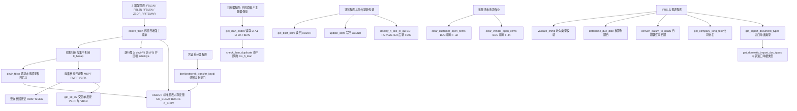
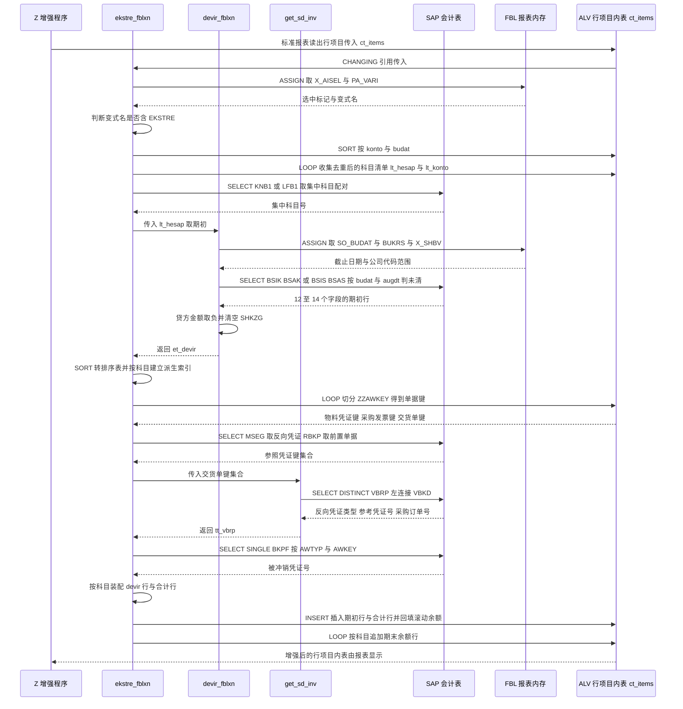

# ZCL_FI_TOOLKIT 深度分析报告

> 源文件：`Keremkoseoglu__ABAP-Library__functional__fi__ZCL_FI_TOOLKIT.abap`
> 规模：1702 行，全局类，17 个方法（16 个 PUBLIC 静态方法 + 1 个 PRIVATE 静态方法），配套 20+ 个自建类型、6 个常量、3 个 CLASS-DATA 缓存。
> 语言环境：土耳其语注释 + 土耳其式拼写（`zuar`→`muaf`、`fblln`→`ekstre`、`rfliem`），典型 S/4 迁移期遗留项目。

---

## 一、程序定位与业务背景

### 这个类解决什么问题

这不是一个"报表程序"，而是一个 **FI（Financial Accounting）功能的公共积木库**。它的使用者不是终端用户，而是 SAP 里的 Z 增强程序——把顾问在项目现场被反复问到、却没有标准功能可依的那类需求，统一收敛成可复用的类方法。

从代码内容看，它服务五块互不相干的业务：

| 领域 | 涉及方法 | 业务诉求 |
|---|---|---|
| **行项目报表增强** | `ekstre_fblxn`、`devir_fblxn`、`get_sd_inv` | FBL1N/FBL3N/FBL5N 是总账、应收、应付的**行项目清单**报表。标准版一行只显示一张凭证的一个行项目，**没有期初余额（devir）、没有累计余额（bakiye）、不显示参考凭证**（采购订单号、预付款凭证、返货交货单）。财务要核账就必须手工把这些信息贴到 Excel 里。 |
| **IBAN 主数据治理** | `get_iban_codes`、`check_iban_duplicate` | 土耳其银行 IBAN 唯一性由客户/供应商主数据承担，系统必须在保存时拒绝重复 IBAN，否则付款会退回来。 |
| **凭证号回填** | `get_bkpf_xblnr`、`update_xblnr` | 线下系统（电子发票、银行流水）给出的参考凭证号（XBLNR，土耳其 NF-e 电子发票强制字段）需要批量读回/写回 SAP。 |
| **批量清未清项** | `clear_customer_open_items`、`clear_vendor_open_items` | F-32（客户未清项清账）、F-44（供应商未清项清账）只有手工界面，批量清账只能靠 BDC 录制。 |
| **零散 FI 服务** | `determine_due_date`、`convert_datum_to_gdatu`、`get_company_long_text`、`validate_zhrtip`、`get_import_document_types`、`denklestirerek_transfer_kaydi`、`display_fi_doc_in_gui` | 到期日推算、汇率日期换算、公司全名（ADRC 四段名拼接）、收入类型（ZHRTIP）校验、进口单据类型配置、清账过账接口、跳 FB03。 |

### 为什么"现有方案"不够

这些需求在没有这个类之前只有两种落地方式：**Z 报表里写 FORM**，或者**复制粘贴别的 Z 程序**。前者让每个报表都长出一份重复的期初余额逻辑，口径不一致；后者让 bug 修一次要改五个地方。土耳其语注释里留下的 `HAR-9421`、`HAR-10448`、`VOL-5818` 三个 ticket 号，就是这种复制粘贴分叉的证据——同一个方法里同时留着生效代码和注释掉的旧代码。

### 设计范式一句话定性

**无状态静态方法工具箱 + 通过 `ASSIGN` 侵入标准报表内存实现"零源码修改"的报表增强。**

这是一次典型的**双轨制设计**：正规增强点（BAdS、用户增强）用它，但为了让 Z 程序不必依赖增强框架的存在，用了更粗暴的手段——把标准报表的内部数据结构当黑盒直接读写。

---

## 二、程序执行流程总览

这个类**没有单一入口**，是三条主线加一批独立服务。主线一是报表增强（占代码量八成），主线二是 IBAN 治理，主线三是凭证号回填。

### 主线流程图



### 责任链表

| 子程序 | 调用者 | 职责 |
|---|---|---|
| `ekstre_fblxn` | ZSDP_RFITEMAR / 自研 FBL1N·FBL3N·FBL5N 增强程序 | 总编排：排序行项目、剔反转销凭证、收集科目与参考凭证键、补 devir 行与合计行、回填 zzalacak/zzborc/zzbakiye |
| `devir_fblxn` | `ekstre_fblxn` | 按 sy-cprog 判定 AP/GL/AR 分支，从 BSIK/BSAK/BSID/BSAD/BSIS/BSAS 取期初未清项，符号翻正、按科目汇总 |
| `get_sd_inv` | `ekstre_fblxn` | 按 VBELN 取 VBRP 的反向凭证（VGYPJ/VGTYP=交付单/退货）与 VBKD 的采购订单号 |
| `get_iban_codes` | `check_iban_duplicate`，及主数据校验程序 | 供应商侧走 LFA1→LFBK→TIBAN，客户侧走 KNA1→LNBK→TIBAN，返回已占用 IBAN 集合 |
| `check_iban_duplicate` | FI 主数据保存校验（用户增强） | 取到任意一条重复即抛 `zcx_fi_iban`，把冲突 IBAN 与对手方号带给消息 |
| `get_bkpf_xblnr` | 迁移程序 | 按 BUKRS+BELNR+GJahr 批量读 BKPF-XBLNR 并回填到传入内表 |
| `update_xblnr` | 迁移程序 | 逐张凭证调 `J_1B_NFE_UPDATE_XBLNR` 写回参考凭证号，可选每张提交 |
| `denklestirerek_transfer_kaydi` | 凭证重分类程序 | 组装 `FTCLEAR` 清账表，调 POSTING_INTERFACE_CLEARING 冲销行项目 |
| `clear_customer_open_items` | 批量清账作业 | BDC 驱动 F-32 清客户未清项 |
| `clear_vendor_open_items` | 批量清账作业 | BDC 驱动 F-44 清供应商未清项 |
| `determine_due_date` | AR 账龄与到期分析程序 | 从 BSEG 读记账日与基准日期，调 FM `DETERMINE_DUE_DATE` 推 NETDT |
| `convert_datum_to_gdatu` | 外币重估与报表 | 按 `sy-datum` 前的会计日期查 TCURR-GDATU，带 CLASS-DATA 缓存 |
| `get_company_long_text` | 报表表头、打印抬头 | T001-BUTXT + ADRC 四段名拼接公司全名，带缓存 |
| `get_import_document_types` | 进口单据类型配置 | 读 ZFIT_ITH_BLART，按内外销标志过滤出 BLART 集合，带缓存 |
| `get_domestic_import_doc_types` | 进口单据类型配置 | 复用上述缓存，取同时标记内销与进口的 BLART |
| `display_fi_doc_in_gui` | 报表行点击 / 前台包装 | 置内存参数 BLN/BUK/GJR，跳 `FB03 AND SKIP FIRST SCREEN` |
| `validate_zhrtip` | FI 记账校验（用户增强） | 豁免事务码与豁免公司代码直接放行，否则按科目首字符 5/9 校验 ZHRTIP |

下面按这条流程，逐个子程序展开。

---

## 三、分组分析

### 3.1 全局声明区 `ZCL_FI_TOOLKIT DEFINITION`

类声明本身只有三行有效信息：

```abap
CLASS zcl_fi_toolkit DEFINITION
  PUBLIC
  FINAL
  CREATE PUBLIC .
```

**做什么** — 声明一个全局可实例化的 `FINAL` 类，所有功能以 `CLASS-METHODS` 形式挂在 PUBLIC 段；PRIVATE 段藏类型、常量、缓存与唯一的一个私有方法；PROTECTED 段为空占位。

**为什么** — 全类 `CLASS-METHODS` + 无实例属性，是为了让它像函数模块一样"随时可调、状态自持"。这是工具类的正确姿态：调用方不需要 `NEW`，也就不存在实例化失败、也不需要清理。`FINAL` 则明确表示"我不打算被继承"，省掉后续误加子类的维护负担。

**风险与改进** — `FINAL` 在这里是个**自相矛盾的声明**。`ekstre_fblxn`、`devir_fblxn`、`ekstre_fblxn` 全靠 `sy-cprog` 与 `ASSIGN ('(RFITEMAP)...')` 挂接标准报表的内部变量——这类代码天生需要"针对不同报表各自派生一版"的扩展能力，`FINAL` 反而挡住了这条演进路径。要么去掉 `FINAL` 并把字段名参数化，要么明确接受"这个类永远只能服务这四个报表"。

类型定义部分有两处值得单独拆出来看。

#### ① 用 `bseg-bukrs` 借用 DDIC 类型做字段类型推导

```abap
    TYPES:
      BEGIN OF t_documents ,
        bukrs TYPE bseg-bukrs,
        belnr TYPE bseg-belnr,
        gjahr TYPE bseg-gjahr,
        buzei TYPE bseg-buzei,
      END OF t_documents .
    TYPES:
      tt_documents TYPE STANDARD TABLE OF t_documents WITH DEFAULT KEY .
    TYPES:
      BEGIN OF t_doc_xblnr,
        bukrs TYPE bkpf-bukrs,
        belnr TYPE bkpf-belnr,
        gjahr TYPE bkpf-gjahr,
        xblnr TYPE bkpf-xblnr,
      END OF t_doc_xblnr .
```

**做什么** — 把凭证行项目的四个关键字段抽成一个标准表结构 `t_documents`，把凭证抬头的四个字段抽成 `t_doc_xblnr`，字段类型不写 `TYPE bukrs`，而是写 `TYPE bseg-bukrs`。

**为什么** — 这是 ABAP 里被严重低估的技巧。直接写 `TYPE char4` 会把"公司代码"降格成"四个字符"，将来要传长文本就全盘改造；写 `TYPE bseg-bukrs` 则把语义锚定在数据库字段上——`bseg-bukrs` 本身在 DDIC 里已经指向了 `bukrs` 数据元素，两者等价，但写法把"这个字段代表 BSEG 的公司代码"这层意图留在了源码里。同一份类里 `t_documents`、`t_doc_xblnr`、`ty_mkpf_key`、`t_rbkp`、`t_mseg`、`t_vbrp`、`ty_konto` 全部用这一手法，等于把"我用的就是这张表这个字段"写成了可编译的契约。

**风险与改进** — 无语法风险，但要注意这是一种**隐式耦合**：字段类型随数据库结构调整而自动跟随，如果哪天有人把这个结构拿去当 DB 接口的载荷格式，字段一改就静默失配。建议在类型旁加一行注释说明来源表，或对需要长期稳定的载荷结构显式写 `TYPE bukrs`。

#### ② 缓存内表的键设计

```abap
    TYPES:
      BEGIN OF t_dg_cache,
        datum TYPE datum,
        gdatu TYPE tcurr-gdatu,
      END OF t_dg_cache .
    TYPES:
      tt_dg_cache TYPE HASHED TABLE OF t_dg_cache WITH UNIQUE KEY primary_key COMPONENTS datum .

    CLASS-DATA gt_company_long_text TYPE tt_company_long_text .
    CLASS-DATA gt_dg_cache TYPE tt_dg_cache .
    CLASS-DATA gt_import_doc_type_cache TYPE tt_ith_blart .
```

**做什么** — 三个 `CLASS-DATA` 会话级缓存：`gt_dg_cache`（HASHED，唯一键 `datum`）、`gt_company_long_text`（HASHED，唯一键 `bukrs`）、`gt_import_doc_type_cache`（标准表，整表缓存）。

**为什么** — 选 HASHED + UNIQUE KEY 是对的：这三个查询都发生在报表循环里（一次 FBL1N 可能调几万次），没有索引会退化成线性扫描；缓存放 `CLASS-DATA` 而非局部变量，是为了让"方法无状态"这个约束成立——调用方不需要管缓存归谁，方法自己管。`gt_import_doc_type_cache` 用标准表而非 HASHED，是因为它要整表缓存后反复 `DELETE WHERE` 过滤，标准表在这个场景更省事。这是正确的权衡，不是偷懒。

**风险与改进** — `gt_import_doc_type_cache` 无任何失效机制，且 `SELECT * FROM zfit_ith_blart` 拉回全表所有字段却只用 `blart`、`is_foreign`、`is_domestic` 三个。配置表被改动后必须重启整个 SAP LUW 才能生效，且内存常驻的是全字段。建议改投影取三列，或至少在配置维护程序里补一条缓存失效入口（提供一个 `reset_caches` 方法）。另外 `gt_company_long_text` 缓存的是公司名，ADRC 里公司改名后不会刷新，长期运行的报表会一直显示旧名——建议把公司名改成实时取（它一天只查一次，成本可接受）或加失效时间戳。

### 3.2 方法 `ekstre_fblxn` —— 行项目增强主编排

这是全类最重的部分（约 530 行，占三分之一代码量），逻辑上分七步。它的输入是一张标准报表的行项目内表 `ct_items`（`it_rfposxext`，是 SAP FBL1N/FBL3N/FBL5N 的实际行项目结构），输出是**同一张内表被就地插入 devir 行与合计行、并回填若干自定义金额字段**。

#### ① 前置守卫与标准报表内存变量挂接

```abap
  METHOD ekstre_fblxn.
    CHECK ct_items IS NOT INITIAL.
    CASE sy-cprog.
      WHEN 'RFITEMAP'."FBL1N
        ASSIGN ('(RFITEMAP)X_AISEL') TO FIELD-SYMBOL(<lv_x_aisel>).
        ASSIGN ('(RFITEMAP)PA_VARI') TO FIELD-SYMBOL(<lv_vari>).

      WHEN 'RFITEMGL'."FBL3N
        ASSIGN ('(RFITEMGL)X_AISEL') TO <lv_x_aisel>.
        ASSIGN ('(RFITEMGL)PA_VARI') TO <lv_vari>.

      WHEN 'RFITEMAR'."FBL5N
        ASSIGN ('(RFITEMAR)X_AISEL') TO <lv_x_aisel>.
        ASSIGN ('(RFITEMAR)PA_VARI') TO <lv_vari>.

      WHEN 'ZSDP_RFITEMAR'.
        ASSIGN ('(ZSDP_RFITEMAR)X_AISEL') TO <lv_x_aisel>.
        ASSIGN ('(ZSDP_RFITEMAR)PA_VARI') TO <lv_vari>.

      WHEN OTHERS.
        RETURN.

    ENDCASE.

    IF sy-subrc = 0 AND sy-cprog(5) = 'RFITE'.
```

**做什么** — 读调用者所在报表名 `sy-cprog`，在 AP/GL/AR/Z 四个报表分支里分别 `ASSIGN` 两个标准报表的内存变量：`X_AISEL`（是否存在选中行）与 `PA_VARI`（用户变式名）。挂接失败或报表不认识就 `RETURN`。

**为什么** — 这是"不碰标准源码也要知道用户在哪个报表、用了哪个变式"的传统手法。`PA_VARI` 的用途很具体：只有用户变式名里带 `EKSTRE`（土耳其语 Ekstre＝明细账）时才走完整增强逻辑，说明作者把功能做成了**按变式名灰度开关**——同一个 FBL1N，用别的变式打开就不受影响。分四个报表分支而不是用拼接动态名，是因为 ZSDP_RFITEMAR 是自研报表、程序名更长但逻辑与 FBL5N 一致。

**风险与改进** — 三个真实缺陷叠在这二十行里：

1. **`sy-cprog(5) = 'RFITE'` 恒为假。** ABAP 的 `sy-cprog(5)` 表示"从第 5 个字符到末尾的子串"，而 `RFITEMAP(5)` 是 `TEMAP`、`RFITEMGL(5)` 是 `TEMGL`、`RFITEMAR(5)` 是 `TEMAR`、`ZSDP_RFITEMAR(5)` 是 `P_RFI`——没有一个等于 `RFITE`。作者显然想表达"前 5 位是 RFITE"，应为 `sy-cprog(1)(5) = 'RFITE'` 或 `sy-cprog(1) CA ...`。当前写法下第 973 行的 EKSTRE 主分支与后面 400 多行逻辑**永远不会进入**，实际执行的一直是 `ELSE` 分支。修复前必须先用 ST05/SPY 确认线上是否真的在跑 EKSTRE 逻辑，否则改这一行等于改全公司的账表输出。
2. `sy-cprog` 是隐式入参，方法签名里完全看不到。同一份逻辑换报表就得改代码分支，无法单元测试。应把报表名与字段名抽成参数，或至少在方法头注释里写明前置条件（`sy-cprog` ∈ 四个报表之一）。
3. `ASSIGN ('(RFITEMAP)X_AISEL')` 依赖标准报表的内存变量名，SAP 升级改名后 `ASSIGN` 失败但 `sy-subrc` 在 `CASE` 之后被下一条语句覆盖，失败被静默吞掉——功能会整体退化为空操作。建议把每个 `ASSIGN` 后立即 `IF sy-subrc <> 0. RETURN. ENDIF.`。

#### ② 剔除已冲销凭证行（HAR-10448）

```abap
        LOOP AT ct_items ASSIGNING <ls_items>
                    WHERE blart = zcl_fi_document_type=>get_customer_clearing_doc_type( ) AND
                          gjahr GE '2018'.
          DELETE ct_items WHERE belnr = <ls_items>-zzstblg AND gjahr = <ls_items>-zzstjah.
          DELETE ct_items.
        ENDLOOP.
```

**做什么** — 遍历行项目，凡凭证类型是"客户清账凭证"且年份 ≥ 2018 的，先把该行指向的**被冲销原凭证**（`zzstblg`/`zzstjah`）行删掉，再删掉清账行本身。

**为什么** — 业务动机是注释里写明的 HAR-10448：客户 Ekstre 里出现"XX 凭证"型反冲记录，财务看不出到底冲销了哪张单，看到的就是一张凭空多出来的负数凭证。做法是把冲销对（清账凭证 + 原凭证）成对剔除，让 Ekstre 只反映实际业务单据。这是个合理的报表净化需求。

**风险与改进** — 这里有一处典型危险写法：

1. **在 `LOOP ... ASSIGNING` 内删除被遍历的内表。** 外层 `ASSIGNING` 意味着循环变量绑定行；内层 `DELETE ct_items WHERE ...` 是范围删除，会一次删多行，随后 `DELETE ct_items.` 不带 `WHERE`，删的是 `sy-tabix` 当前指的那一行——而 `sy-tabix` 刚被范围删除改写。结果是**删掉的行未必是当前行**，可能连带误删下一条正常行项目，且不报错。建议改为先收集待删 BUKRS/BELNR/GJahr 到一个 `tt_documents`，循环结束后一次性 `DELETE ct_items WHERE ...`（配合哈希表条件）或用 `DELETE ct_items WHERE belnr = ...` 单行删。
2. `DELETE ct_items.` 若当前行已是表尾，会触发越界；即使不越界，语义也完全依赖隐式的 `sy-tabix`，可读性极差。至少应显式写成 `DELETE ct_items INDEX lv_tabix.`，并把 `lv_tabix` 在循环开头保存。
3. `gjahr GE '2018'` 把年份硬编码在代码里，与 `zcl_fi_document_type=>get_customer_clearing_doc_type( )` 每次迭代都重新求值（它在 LOOP 的 WHERE 里，语义上每轮调用一次）。年份应做成常量或变式参数；清账凭证类型应提到循环外用 `DATA()` 取出。

接着是变式判定与进度条：

```abap
      IF <lv_vari> CS 'EKSTRE'.

        IF <lv_x_aisel> <> abap_true.
          MESSAGE TEXT-003 TYPE 'I'.
          RETURN.
        ENDIF.

        CALL FUNCTION 'SAPGUI_PROGRESS_INDICATOR' ##FM_SUBRC_OK
          EXPORTING
            text   = TEXT-002
          EXCEPTIONS
            OTHERS = 1.
```

**做什么** — 只有变式名里含 `EKSTRE` 才继续；没有选中任何行就提示后退出；进入长循环前显示 SAPGUI 进度条。

**为什么** — 前置检查（必须有选中行）是必要的，否则用户看全表时逐行插入 devir 行会生成海量临时行，白白拖死 ALV。进度条针对的是几万行的明细表，让使用者知道系统在干活而不是卡死——这是报表增强的必备礼貌。

**风险与改进** — 三个问题：

1. `IF <lv_x_aisel> <> abap_true` 比较的是内存变量，其类型未必是 `ABAP_BOOL`；若它是 `X` 标志（CHAR1），与 `abap_true`（单字符 X）比较勉强能过，但语义不清晰。更关键的是若 `ASSIGN` 失败，`<lv_x_aisel>` 未分配，此处直接比较会 **short dump**——这正是第 ① 步里"ASSIGN 失败被吞掉"的必然后果。建议改成 `IF NOT ASSIGNED <lv_x_aisel>. RETURN. ENDIF.` 先守卫。
2. `CS 'EKSTRE'` 是**大小写敏感**的子串匹配。变式命名习惯差异（`ekstre`、`Ekstre`、`RFITEMAP_EKSTRE`）会直接决定功能是否可见，而失败时用户只会看到"没有期初余额"，没有任何提示。建议改 `CA`（大小写不敏感）或 `NS` 取反判断并给出提示消息。
3. `SAPGUI_PROGRESS_INDICATOR` 是纯前台 FM，后台作业或某些 ALV 场景下调用会失败，靠 `##FM_SUBRC_OK` 压掉异常。失败无碍，但注解同时把这个 FM 从静态检查视野里抹掉了。应显式写 `EXCEPTIONS OTHERS = 1` 的处理分支。

#### ③ 排序与收集科目、集中科目

```abap
        SORT ct_items BY konto budat ASCENDING.

        IF  ct_items IS INITIAL.
          RETURN.
        ENDIF.

        LOOP AT ct_items ASSIGNING <ls_items>.
          CLEAR ls_hesap.
          ls_hesap-sube = <ls_items>-konto.
          COLLECT ls_hesap INTO lt_hesap.
          ls_konto-bukrs = <ls_items>-bukrs.
          ls_konto-konto = <ls_items>-konto.
          COLLECT ls_konto INTO lt_konto.
        ENDLOOP.
        ASSIGN  ('(SAPLFI_ITEMS)GB_CENTRAL_ITEMS') TO FIELD-SYMBOL(<lv_merkez>).
        IF sy-subrc = 0.
          IF <lv_merkez> = abap_true.
            CASE sy-cprog.
              WHEN 'RFITEMAR' OR 'ZSDP_RFITEMAR'.
                SELECT bukrs, kunnr, knrze INTO TABLE @DATA(lt_knb1) FROM knb1
                    FOR ALL ENTRIES IN @lt_hesap
                    WHERE kunnr = @lt_hesap-sube AND
                          knrze <> @space.
                SORT lt_knb1 BY bukrs kunnr.
                LOOP AT lt_knb1 ASSIGNING FIELD-SYMBOL(<ls_knb1>).
                  ls_hesap-sube = <ls_knb1>-kunnr.
                  ls_hesap-merkez = <ls_knb1>-knrze.
                  COLLECT ls_hesap INTO lt_hesap.
                ENDLOOP.

              WHEN 'RFITEMAP'.

                SELECT bukrs, lifnr, lnrze INTO TABLE @DATA(lt_lfb1) FROM lfb1
                    FOR ALL ENTRIES IN @lt_hesap
                    WHERE lifnr = @lt_hesap-sube AND
                          lnrze <> @space.
                SORT lt_lfb1 BY bukrs lifnr.
                LOOP AT lt_lfb1 ASSIGNING FIELD-SYMBOL(<ls_lfb1>).
                  ls_hesap-sube   = <ls_lfb1>-lifnr.
                  ls_hesap-merkez = <ls_lfb1>-lnrze.
                  COLLECT ls_hesap INTO lt_hesap.
                ENDLOOP.

            ENDCASE.
          ENDIF.
        ENDIF.
        SELECT * FROM t001  INTO TABLE lt_t001.
```

**做什么** — 先把行项目按 `konto budat` 排序（后面所有"同科目相邻"的分段处理都依赖这个前提），然后扫一遍行项目，用 `COLLECT` 收集两份去重清单：`lt_hesap`（科目对，含集中科目）与 `lt_konto`（公司代码+科目，供后面期末余额用）。若用户开了"集中科目"功能，再按报表类型分别从 `KNB1-KNRZE` / `LFB1-LNRZE` 查集中科目，把 `sube → merkez` 的配对补进 `lt_hesap`。

**为什么** — 排序先行是这个方法能成立的**地基**：后面 `lv_konto_temp <> <ls_items>-konto` 判断"科目是否变了"、以及"每科目只插一次 devir 行"，全都靠"同科目的行在排序后必然连续"。集中科目（Central Account）指土耳其常见的企业集团模式——多个公司代码共用一个统管科目，报表里既要看到分公司的账、又要看到合并后的账，所以每个科目要同时收集本体与统管科目两套 devir。这段用 `lt_hesap` 把两套一起传给 `devir_fblxn`，一次查完再按科目分别聚合。

**风险与改进** — 这一段有四处问题：

1. **`lt_t001` 是死代码。** `SELECT * FROM t001 INTO TABLE lt_t001.` 全表读取 T001，而 `lt_t001` 在方法后续 500 行里**从未被引用**。T001 数据量大（按公司代码数量），这次全表读取纯属浪费，且让读者以为下面有用到公司代码表。建议直接删除。
2. **`lt_knb1` / `lt_lfb1` 的声明作用域是整个方法体。** 用 `INTO TABLE @DATA(...)` 在 IF 分支里声明的变量，ABAP 会提升到方法作用域。这意味着后面对 `lt_lfb1` 的 `READ TABLE ... BINARY SEARCH`（第 1233 行）能编译通过，但**在 GL 分支里 `lt_lfb1` 从未被赋值**——好在后面也有 `CASE sy-cprog` 保护，勉强安全。这种"声明在这里、跨 200 行才用"的结构极难读，建议提到 DATA 声明块并显式 `FREE`。
3. `COLLECT ls_hesap INTO lt_hesap` 在**同一张内表上循环 COLLECT**，ABAP 允许（往自己里收集），但它是 O(n²) 行为。加上 `lt_hesap` 后续还会追加集中科目对，科目量大时明显拖慢。建议改为 HASHED TABLE 或先 `lt_hesap` 收集后一次性排序去重。
4. `COLLECT` 依赖默认键：`ty_hesap` 只有 `sube`、`merkez` 两字段，默认键 = `sube`（若 `merkez` 初始，键就是 `sube`）。因此 `merkez` 初始的行会互相覆盖合并，这恰好是想要的；但依赖"默认键规则"而非显式唯一键，属于隐式契约。建议把 `tt_hesap` 改成 `HASHED TABLE ... WITH UNIQUE KEY sube merkez`，行为确定且更快。
5. `ASSIGN ('(SAPLFI_ITEMS)GB_CENTRAL_ITEMS')` 的失败只被 `IF sy-subrc = 0` 包住，后面第 1229 行又用 `<lv_merkez> IS ASSIGNED` 判了一次——**两处防御是对的**，是全类里少数写得漂亮的地方，保留。

#### ④ 调 `devir_fblxn` 取期初并准备排序视图

```abap
        zcl_fi_toolkit=>devir_fblxn(
                    EXPORTING it_hesap = lt_hesap
                    IMPORTING et_devir = lt_devir
                                             ).

        SORT lt_devir BY bukrs konto gsber.
        lt_devir_sorted = lt_devir.

        FREE  : lt_devir,lt_hesap.
```

**做什么** — 把第 ③ 步收集的科目清单交给 `devir_fblxn` 换回期初余额集合，随即把结果复制进一张 `SORTED TABLE ... NON-UNIQUE KEY bukrs konto`，然后释放标准表原变量以回收内存。

**为什么** — 排序表这一步是刻意设计：后面遍历 devir 时按 `bukrs = ... AND konto = ...` 做 `LOOP ... WHERE` 查找，`ty_devir` 只有十来行时无所谓，但 FBL1N 会跨几百个科目，标准表 `WHERE` 是线性扫描，而 SORTED 表走的是非唯一键的二级索引二分查找。`FREE` 及时释放也是好习惯——明细表可能几十万行，`lt_devir` 在内存里已经没用了。

**风险与改进** —

1. `SORT ... BY bukrs konto gsber` 与 `NON-UNIQUE KEY bukrs konto` 的排序键前缀一致，是正确的二分查找前提。这点没问题。
2. `FREE : lt_devir,lt_hesap.` 在同一语句里释放两张表，但 `lt_devir_sorted` 是一次全量复制，大结果集下内存峰值翻倍。若改用 `lt_devir_sorted = lt_devir` 之前先 `SORT`，再对 `lt_devir_sorted` 做 `FREE` 之外的处理会更省。实际上这里释放的是**已经不再需要的源表**，方向是对的。
3. `devir_fblxn` 的返回值 `et_devir` 是 `EXPORTING`（输出参数却写成 E），在 ABAP 里合法但与 `RETURNING` 语义不同；配合调用侧的 `IMPORTING` 关键字可读性尚可，只是与 `get_sd_inv`、`get_company_long_text` 的 `RETURNING` 风格不统一。全类参数风格混杂（`get_iban_codes` 返回值 `rt_tiban`、`get_import_document_types` 返回值 `rt_blart` 用 RETURNING，而 `devir_fblxn`、`update_xblnr` 用 EXPORTING/CHANGING），建议在类的整体约定里选一种。

#### ⑤ 按业务对象类型收集并解析参考凭证键

```abap
        LOOP AT ct_items ASSIGNING <ls_items>
           WHERE zzawtyp = c_mal_hareketi OR zzawtyp =  c_satinalma_faturasi
               OR  zzawtyp =  c_satis_faturasi.
          IF <ls_items>-zzawtyp = c_mal_hareketi.
            APPEND VALUE #( mblnr = <ls_items>-zzawkey(10)
                            mjahr = <ls_items>-zzawkey+10(4)
                           ) TO lt_mkpf_key.
          ELSEIF <ls_items>-zzawtyp = c_satinalma_faturasi.
            APPEND VALUE #( belnr = <ls_items>-zzawkey(10)
                            gjahr = <ls_items>-zzawkey+10(4)
                           ) TO lt_rbkp_key.
          ELSEIF <ls_items>-zzawtyp = c_satis_faturasi.
            APPEND <ls_items>-zzawkey(10) TO lt_vbrk_key.
          ENDIF.
        ENDLOOP.

        SORT lt_rbkp_key BY belnr gjahr.
        SORT lt_mkpf_key BY mblnr mjahr.
        SORT lt_vbrk_key BY vbeln.
        DELETE ADJACENT DUPLICATES FROM lt_mkpf_key COMPARING mblnr mjahr.
        DELETE ADJACENT DUPLICATES FROM lt_rbkp_key COMPARING belnr gjahr.
        DELETE ADJACENT DUPLICATES FROM lt_vbrk_key COMPARING vbeln.

        IF lt_rbkp_key IS NOT INITIAL.

          SELECT belnr, gjahr, stblg, stjah
            FROM rbkp
            FOR ALL ENTRIES IN @lt_rbkp_key
            WHERE
              belnr = @lt_rbkp_key-belnr AND
              gjahr = @lt_rbkp_key-gjahr
            INTO CORRESPONDING FIELDS OF TABLE @lt_rbkp.

          FREE lt_rbkp_key.
        ENDIF.

        IF lt_mkpf_key IS NOT INITIAL.
          SELECT mblnr, mjahr, smbln, sjahr
            FROM mseg
            FOR ALL ENTRIES IN @lt_mkpf_key
            WHERE
              mblnr = @lt_mkpf_key-mblnr AND
              mjahr = @lt_mkpf_key-mjahr
            INTO CORRESPONDING FIELDS OF TABLE @lt_mseg.
          FREE lt_mkpf_key.
        ENDIF.
        IF lt_vbrk_key[] IS NOT INITIAL.
          lt_vbrp = get_sd_inv( lt_vbrk_key ).
          FREE lt_vbrk_key.
        ENDIF.
```

**做什么** — 按行项目的 `ZZAWTYP`（参考对象类型）分流：`MKPF`（物料凭证）切出 `MBlNR(10) + MJahr(4)`、`RMRP`（采购发票）切出 `BELNR(10) + GJahr(4)`、`VBRK`（销售发票）切出 `VBELN(10)`，分别塞进三张去重键表；再分别用 `FOR ALL ENTRIES` 回查 `RBKP`（取前置单据 STBLG/STJAH）与 `MSEG`（取物料凭证的反向凭证 SMBLN/SJAHR），销售发票则走私有方法 `get_sd_inv`。

**为什么** — `ZZAWKEY` 是一个 CHAR20 的"拼接型万能键"，SAP 按 `ZZAWTYP` 决定它的内部布局（物料凭证＝凭证号10＋年度4，采购发票＝凭证号10＋年度4）。这里靠**固定偏移截取**把万能键还原成结构化键，再用 `FOR ALL ENTRIES` 一次性批量回查——比逐行 `SELECT SINGLE` 快两三个数量级，是报表增强里必须做的优化。三个 `IS NOT INITIAL` 守卫也很关键：空内表做 `FOR ALL ENTRIES` 在新语法下虽不报错，但守卫让意图明确，也让 `FREE` 的时机合理。

**风险与改进** —

1. **`lt_mkpf_key` / `lt_rbkp_key` / `lt_vbrk_key` 都是 `TYPE TABLE OF`（标准表），每次都 `SORT` + `DELETE ADJACENT DUPLICATES`。** 直接声明成 `SORTED TABLE ... WITH NON-UNIQUE KEY` 或 `HASHED` 就能省掉排序与去重两步，去重还能用 `INSERT ... INTO TABLE` 时的重复检测自动完成。这是白付的成本。
2. **`APPEND <ls_items>-zzawkey(10) TO lt_vbrk_key`** 把 CHAR10 直接追加到**结构**表 `lt_vbrk_key` 的行上，依赖 ABAP 的隐式类型转换（CHAR10 → `vbeln`）。能跑，但读者完全看不出赋给了哪个字段。应写成 `APPEND VALUE #( vbeln = CONV #( <ls_items>-zzawkey(10) ) ) TO lt_vbrk_key.`，与其他两个分支保持一致。
3. `FREE lt_rbkp_key.` 后**没有**同样 `FREE lt_mseg`，而 `lt_mseg` 在第 ⑥ 步还要用——这是对的（不要释放）。但 `lt_rbkp` 释放时机太早：`FREE : lt_mseg,lt_vbrp,lt_rbkp.` 放在最外层 `LOOP` 之后，此时三个都已用完，没问题。不过这种"谁分配谁释放"跨越 400 行的写法很难追踪，建议统一在方法末尾释放。
4. `MSEG` 只取 `SMBLN`/`SJAHR`（反向凭证），但**没有按 `SMBLN` 建索引**——第 ⑥ 步的 `READ TABLE lt_mseg WITH KEY smbln = ... sjahr = ...` 会在全表里线性扫描。`tt_mseg` 已声明为 `SORTED ... NON-UNIQUE KEY mblnr mjahr`，只对主查询友好，对反查不友好。应加一个 `SORTED ... NON-UNIQUE KEY smbln sjahr` 的辅助表，或改用 `SORTED TABLE WITH UNIQUE KEY` 双结构。物料凭证行项目多时这是明确的性能瓶颈。
5. `WHERE zzawtyp = c_mal_hareketi OR zzawtyp = c_satinalma_faturasi OR zzawtyp = c_satis_faturasi` 后紧跟 `IF/ELSEIF` 三选一，等价于一次判断做两遍。可简化为直接 `LOOP ... WHERE zzawtyp IN ...`。这是全类最"啰嗦"的地方，但无正确性风险。

#### ⑥ 逐行补参考信息与装配 devir 行

再进入主 `LOOP`（已按 `konto budat` 排序），每行先补参考信息：

```abap
        SORT ct_items BY konto budat ASCENDING.

        LOOP AT ct_items ASSIGNING <ls_items>.
          lv_tabix = sy-tabix.

*  test kayıt belgesi
          IF <ls_items>-zzawtyp = c_mal_hareketi.
            READ TABLE lt_mseg WITH TABLE KEY mblnr = <ls_items>-zzawkey(10)
                                              mjahr = CONV #( <ls_items>-zzawkey+10(4) )
                                              ASSIGNING FIELD-SYMBOL(<ls_mseg>).
            IF sy-subrc = 0.
* mb 'nin ters kaydınınn faturası
* bu case çok az olacağını için direk bkpf 'e gidildi.
              CLEAR lv_awkey.
              IF <ls_mseg>-smbln IS  NOT INITIAL.
                lv_awkey = |{ <ls_mseg>-smbln }{ <ls_mseg>-sjahr }|.
              ELSE.
                READ TABLE lt_mseg WITH KEY smbln = <ls_mseg>-mblnr
                                            sjahr = <ls_mseg>-mjahr
                                            ASSIGNING <ls_mseg>.

                IF sy-subrc = 0.
                  lv_awkey = |{ <ls_mseg>-mblnr }{ <ls_mseg>-mjahr }|.
                ENDIF.
              ENDIF.

            ENDIF.

          ELSEIF <ls_items>-zzawtyp = c_satinalma_faturasi.
            READ TABLE lt_rbkp WITH TABLE KEY belnr = <ls_items>-zzawkey(10)
                                              gjahr = CONV #( <ls_items>-zzawkey+10(4) )
                                              ASSIGNING FIELD-SYMBOL(<ls_rbkp>).
            IF sy-subrc = 0.
              CLEAR lv_awkey.
              IF <ls_rbkp>-stblg IS  NOT INITIAL.
                lv_awkey = |{ <ls_rbkp>-stblg }{ <ls_rbkp>-stjah }|.
              ELSE.
                READ TABLE lt_rbkp WITH KEY stblg = <ls_rbkp>-belnr
                                            stjah = <ls_rbkp>-gjahr
                                            ASSIGNING <ls_rbkp>.

                IF sy-subrc = 0.
                  lv_awkey = |{ <ls_rbkp>-belnr }{ <ls_rbkp>-gjahr }|.
                ENDIF.
              ENDIF.

            ENDIF.
          ELSEIF <ls_items>-zzawtyp = c_satis_faturasi.
            READ TABLE lt_vbrp WITH TABLE KEY vbeln = <ls_items>-zzawkey(10)
                                        ASSIGNING FIELD-SYMBOL(<ls_vbrp>).
            IF sy-subrc = 0.
              IF <ls_vbrp>-vgtyp = 'J' OR <ls_vbrp>-vgtyp = 'T'.
                <ls_items>-zzteslimat = <ls_vbrp>-vgbel.
              ENDIF.
              <ls_items>-zzbstkd = <ls_vbrp>-bstkd.
            ENDIF.
          ENDIF.

          IF lv_awkey IS  NOT INITIAL.
            SELECT SINGLE belnr INTO <ls_items>-zzstblg FROM bkpf
                          WHERE awtyp = <ls_items>-zzawtyp AND
                                awkey = lv_awkey
                          ##WARN_OK .                   "#EC CI_NOORDER
            IF sy-subrc = 0.
              <ls_items>-zzstjah = <ls_items>-gjahr.
            ENDIF.
          ENDIF.
```

**做什么** — 逐行按 `ZZAWTYP` 从已缓存的三张表里二分查出原始单据：物料凭证查 `MSEG` 取反向凭证号 `SMBLN/SJAHR`（若自己是反向凭证则反向再取一次，即"原凭证的原始凭证"），采购发票查 `RBKP` 取 `STBLG/STJAH`，销售发票查 `VBRP`，若 `VGYPJ`（退货）或 `VGTYP='T'`（转交货单）则把 `VGBEL` 写进 `ZZTESLIMAT`、把 `BSTKD` 写进 `ZZBSTKD`。拿到的 `AWKEY` 再 `SELECT SINGLE` 回 `BKPF` 找到冲销凭证号写进 `ZZSTBLG`。

**为什么** — 业务目标是补齐"这张单据是谁冲销的 / 关联哪个采购订单 / 关联哪张交货单"这三组字段——标准 FBL 报表都不显示。双层 `IF smbln IS NOT INITIAL` / `ELSE` 是处理"链式冲销"：如果当前物料凭证本身就是被冲销的那张（`SMBLN` 有值），需要顺着冲销链再往上找一层，才能找到真正的原始单据。注释里 `bu case çok az olacağını için direk bkpf 'e gidildi`（这种情况很少见所以直接查 BKPF）说明作者权衡过：用 `SELECT SINGLE` 而不是多跳几次，代价可接受。

**风险与改进** —

1. **物料凭证的 `AWKEY` 拼接顺序反了，这是明确的正确性缺陷。** `BKPF-AWKEY` 的布局由 `AWTYP` 决定：物料凭证（`MKPF`）是**年度在前、凭证号在后**（`SJahr(4) + MBelnr(10)`）；采购订单收货（`RMRP`）才是**凭证号在前、年度在后**（`Ebelnr(10) + EJahr(4)`）。代码对物料凭证写的是 `|{ smbln }{ sjahr }|`，与约定相反，导致后面按 `awkey = lv_awkey` 查 `BKPF` 恒查不到，`ZZSTBLG` 永远为空。采购发票分支的 `|{ stblg }{ stjah }|` 顺序是对的，说明作者掌握了这条规则但用错了两处。应改为 `|{ <ls_mseg>-sjahr }{ <ls_mseg>-smbln }|`。改动前务必用真实数据比对，因为 `##WARN_OK` 与 `#EC CI_NOORDER` 抑制注解掩盖了这里的告警。
2. **`<ls_items>-zzstjah = <ls_items>-gjahr.` 写的是行项目自身的会计年度，不是查出来的冲销凭证的年度。** 冲销凭证可能跨年（年末开票、次年冲销），此时 `ZZSTBLG` 指向的凭证年度就错了。修法是把 `SELECT SINGLE` 改成 `SELECT SINGLE belnr gjahr INTO ...`，然后 `zzstjah = <查出的 gjahr>`。这是三个字段配对里的第二个错位。
3. **`SELECT SINGLE ... FROM bkpf WHERE awtyp = ... AND awkey = ...` 没有 `MANDT`/`GSPBH` 限定，也无 `ORDER BY`。** `SELECT SINGLE` 命中多行时 ABAP 取**任意一行**（实际是数据库返回的第一行，无序保证），同一个 `AWKEY` 若存在多条（理论上不应发生，但脏数据或跨业务范围时会发生）就会取到不确定的凭证号。建议 `ORDER BY` 固定，或改 `SELECT ... ENDSELECT` 逐行判定。
4. **`lv_awkey` 只在 `IF lv_awkey IS NOT INITIAL` 前于三个分支里 `CLEAR`，但 `lv_awkey` 声明在方法 DATA 块、循环外。** 若某行的 `ZZAWTYP` 是三者之一但内层 `READ TABLE` 失败（`sy-subrc <> 0`），`lv_awkey` **保持上一次循环的值**，于是这一行会被错误地写入上一行的 `ZZSTBLG`。这是典型的循环内未重置的残留变量。修法：把 `CLEAR lv_awkey.` 提到最外层 `LOOP` 开头，紧挨 `lv_tabix = sy-tabix.`。
5. `<lv_awkey> IS NOT INITIAL` 里 `<lv_awkey>` 未用 `IS ASSIGNED` 守卫——这里它是标量变量不是字段符号，无碍，但与第 ① 步里字段符号的处理方式不统一。
6. `lt_vbrp` 是 `SORTED ... NON-UNIQUE KEY vbeln`，第 ⑥ 步用 `READ TABLE ... WITH TABLE KEY vbeln` 走结构键二分查找是合法的（键是次级键前缀）。这个写法正确，保留。
7. `VGYPJ` 被写成 `vgtyp = 'J' OR vgtyp = 'T'`，语义上是"交付单/退货"，硬编码字面量 `J`/`T` 而不用常量。SAP 里 `'T'` 对应交货/转储单、`'J'` 对应退货，建议定义常量并加注释，否则后人无从判断。

然后进入本方法最核心的 devir 行装配逻辑（分两部分）：

```abap
          IF lv_konto_temp IS INITIAL OR
             lv_konto_temp <> <ls_items>-konto.
* Devir kalemini ekle
            CLEAR : ls_devir,ls_devir_merkez.

            LOOP AT lt_devir_sorted INTO ls_devir
              WHERE bukrs = <ls_items>-bukrs
                AND konto = <ls_items>-konto.

              IF <lv_merkez> IS ASSIGNED.
                IF <lv_merkez> = abap_true.
                  CASE sy-cprog.
                    WHEN 'RFITEMAP'.
                      READ TABLE lt_lfb1 ASSIGNING <ls_lfb1>
                                         WITH KEY bukrs = <ls_items>-bukrs
                                                  lifnr = <ls_items>-konto BINARY SEARCH.
                      IF sy-subrc = 0.
                        LOOP AT lt_devir_sorted ASSIGNING FIELD-SYMBOL(<lfs_devir_sorted_lnrze>)
                                                WHERE bukrs = <ls_items>-bukrs
                                                  AND konto = <ls_lfb1>-lnrze.
*                          append <lfs_devir_sorted_lnrze> to lt_devir_merkez.
                          ADD <lfs_devir_sorted_lnrze>-dmshb TO ls_devir_merkez-dmshb.
                          ADD <lfs_devir_sorted_lnrze>-dmbe2 TO ls_devir_merkez-dmbe2.
                          ADD <lfs_devir_sorted_lnrze>-dmbe3 TO ls_devir_merkez-dmbe3.
                          ADD <lfs_devir_sorted_lnrze>-wrbtr TO ls_devir_merkez-wrbtr.
                        ENDLOOP.
                      ENDIF.
                    WHEN 'RFITEMAR' OR 'ZSDP_RFITEMAR'.
                      READ TABLE lt_knb1 ASSIGNING <ls_knb1>
                                         WITH KEY bukrs = <ls_items>-bukrs
                                                  kunnr = <ls_items>-konto BINARY SEARCH.
                      IF sy-subrc = 0.
                        LOOP AT lt_devir_sorted ASSIGNING FIELD-SYMBOL(<lfs_devir_sorted_knrze>)
                                                WHERE bukrs = <ls_items>-bukrs
                                                  AND konto = <ls_knb1>-knrze.
*                          append <lfs_devir_sorted_knrze> to lt_devir_merkez.
                          ADD <lfs_devir_sorted_knrze>-dmshb TO ls_devir_merkez-dmshb.
                          ADD <lfs_devir_sorted_knrze>-dmbe2 TO ls_devir_merkez-dmbe2.
                          ADD <lfs_devir_sorted_knrze>-dmbe3 TO ls_devir_merkez-dmbe3.
                          ADD <lfs_devir_sorted_knrze>-wrbtr TO ls_devir_merkez-wrbtr.
                        ENDLOOP.

                      ENDIF.
                  ENDCASE.
                ENDIF.
              ENDIF.

              CLEAR ls_item_devir.
              IF ls_devir-bukrs IS INITIAL.
                MOVE-CORRESPONDING ls_devir_merkez TO ls_item_devir  ##ENH_OK.
                ls_item_devir-wrshb =  ls_devir_merkez-wrbtr.
                ls_item_devir-waers =  ls_devir_merkez-waers.
              ELSE.
                ADD ls_devir_merkez-dmshb TO ls_devir-dmshb.
                ADD ls_devir_merkez-dmbe2 TO ls_devir-dmbe2.
                ADD ls_devir_merkez-dmbe3 TO ls_devir-dmbe3.
                ADD ls_devir_merkez-wrbtr TO ls_devir-wrbtr.

                MOVE-CORRESPONDING ls_devir TO ls_item_devir  ##ENH_OK.
                ls_item_devir-wrshb =  ls_devir-wrbtr.
                ls_item_devir-waers =  ls_devir-waers.

              ENDIF.
```

**做什么** — 当行项目所属科目与上一行不同（= 新科目）时：先 `LOOP` 取本科目在 `lt_devir_sorted` 里的 devir 累加进 `ls_devir`；若启用了集中科目，再查 `LFB1-LNRZE`（AP）或 `KNB1-KNRZE`（AR）找到统管科目，把**统管科目的 devir 也累加进来**（合并视角）；最后 `MOVE-CORRESPONDING` 成一行 ALV 结构，本科目无 devir 时退化为只显示统管科目的金额。

**为什么** — 这是"集中科目报表"的核心：对每个科目同时给出"本代码账"（`ls_devir`）与"合并账"（`ls_devir + ls_devir_merkez`），财务按 `X_APAR` 复选框切换。`IF ls_devir-bukrs IS INITIAL` 用"查没查到"来判断分支而不是先 `READ` 一次再判，把 `LOOP` 的 `sy-subrc` 复用于此，是紧凑但合法的写法。金额的 `dmshb/dmbe2/dmbe3/wrbtr` 四件套一起搬，是 FI 的标准做法（借方金额 + 借方第二/第三本位币金额 + 交易币金额）。

**风险与改进** —

1. **`READ TABLE lt_lfb1 ASSIGNING ... BINARY SEARCH` 的二分查找前提不成立。** `lt_lfb1` 在第 ③ 步 `SORT lt_lfb1 BY bukrs lifnr` 后确实有序，**但 `WITH KEY bukrs = ... lifnr = ...` 的键顺序与 `SORT` 顺序一致，这点是对的**——真正的风险是 `lt_lfb1` 只在 `WHEN 'RFITEMAP'` 分支里被赋值，在 AR 分支里它是初始的标准表；后面 `CASE sy-cprog` 保护住了 `lt_knb1` 的对称使用，所以不会越界。这段属于"靠分支互斥侥幸安全"，建议把两张表都提到方法开头声明并显式初始化，让依赖关系可见。
2. **`ls_devir` 被 `LOOP ... INTO` 反复覆盖，而 `ls_devir_merkez` 的累加在其后进行。** 第一轮 `LOOP` 把最后一行的值留在 `ls_devir` 里（`LOOP ... INTO` 不清空目标结构），若一个科目在 `lt_devir_sorted` 里有多行，`ls_devir` 拿到的是**最后一行**而非合计。这里没有 `ADD` 累加，意味着一科目多行 devir 时只取最后一行——但 `devir_fblxn` 已经用 `COLLECT` 汇总过了，所以实际只有一行，属于"依赖上游已去重"的隐式契约。安全但脆弱：一旦 `devir_fblxn` 改成按 `GSBER` 分行输出，这里立刻算错。建议改成先 `READ TABLE ... INTO` 再显式判断。
3. **`MOVE-CORRESPONDING ... TO ls_item_devir` 上的 `##ENH_OK` 抑制注解**掩盖了类型不匹配。`ty_devir` 的 `konto`（HKONT，10 位）对应 `it_rfposxext` 的 `konto`（KONTO，10 位）语义一致，但 `wrbtr` → `wrshb` 并不对应（代码已手工补 `ls_item_devir-wrshb = ls_devir-wrbtr`，说明作者知道 `MOVE-CORRESPONDING` 搬不到）。也就是说 `MOVE-CORRESPONDING` 在这里只搬了 `bukrs`/`konto`/`dmshb`/`dmbe2`/`dmbe3`/`waers` 等同名字段，`##ENH_OK` 纯属多余噪音，删掉即可让静态检查暴露真正的不匹配。
4. **`ls_item_devir-waers = ls_devir-waers.` 在 `IF ls_devir-bukrs IS INITIAL` 的 ELSE 分支里取的是本科目币种，但 `ls_devir_merkez-waers` 在另一分支被取。** 一个科目下若同时存在多币种 devir（`COLLECT` 默认键不含 `waers`），币种会被第一个覆盖。建议把 `waers` 纳入 `ty_devir` 的显式唯一键，见第五节 P0 条目。
5. 统管科目分支里被注释掉的 `APPEND ... TO lt_devir_merkez` 说明作者曾想保留明细行、后来改成只累加金额。注释保留是对的（解释设计演化），但两个分支的注释一模一样，容易让人以为重复了代码。建议补一句"改为只累加金额，避免同一统管科目重复计入"。
6. `ls_devir_merkez` 的 `ADD ... TO` 只加 `dmshb/dmbe2/dmbe3/wrbtr`，**没有加 `waers`、也没有任何存在性标志**。所以当本科目无 devir 时走"只显示统管"分支，看起来正常；但当本科目有 devir 且统管科目也有 devir 时，两者金额直接相加，**币种不同的两笔金额被算在一起**。这是合并视角的正确性前提——应先断言 `ls_devir-waers = ls_devir_merkez-waers`，不等则分别显示而不是相加。

devir 行与合计行的字段填充与回填余额：

```abap
              ls_item_devir-zzname1_ku = <ls_items>-zzname1_ku.
              ls_item_devir-zzname1_li = <ls_items>-zzname1_li.
              ls_item_devir-konto = <ls_items>-konto.
              ls_item_devir-zuonr = TEXT-dvg.
              ls_item_devir-u_bktxt =  ls_item_devir-sgtxt  = |{ TEXT-004 }({ <ls_items>-konto })|.
              ls_item_devir-hwaer = <ls_items>-hwaer.
              ls_item_devir-hwae2 = <ls_items>-hwae2.
              ls_item_devir-hwae3 = <ls_items>-hwae3.
              IF ls_item_devir-dmshb LT 0.
                ls_item_devir-zzalacak_upb = ls_item_devir-dmshb * -1.
                ls_item_devir-zzalacak_2pb = ls_item_devir-dmbe2 * -1.
                ls_item_devir-zzalacak_3pb = ls_item_devir-dmbe3 * -1.
              ELSE.
                ls_item_devir-zzborc_upb = ls_item_devir-dmshb.
                ls_item_devir-zzborc_2pb = ls_item_devir-dmbe2.
                ls_item_devir-zzborc_3pb = ls_item_devir-dmbe3.
              ENDIF.
              ls_item_devir-bukrs = <ls_items>-bukrs.
              ls_item_devir-konto = <ls_items>-konto.
              ls_item_devir-color = lc_green.

              COLLECT ls_item_devir INTO lt_item_devir.

              CLEAR ls_item_sum.
              ls_item_sum-wrshb = ls_item_devir-wrshb.
              ls_item_sum-waers = ls_item_devir-waers.
              ls_item_sum-dmshb = ls_item_devir-dmshb.
              ls_item_sum-hwaer = ls_item_devir-hwaer.
              ls_item_sum_-hwaer = ls_item_sum-hwaer.

              ADD ls_item_sum-dmshb TO ls_item_sum_-dmshb.

              ls_item_sum-color = lc_yellow.
            ENDLOOP.
```

**做什么** — 给 devir 行填名称、科目、`ZUONR=TEXT-dvg`（devir 行标记）、三币种金额、按 `DMSHB` 正负判断填借方还是贷方栏、标绿底 `C51`；`COLLECT` 进待插入集合。再从 devir 行派生出黄色 `C31` 的合计行：把金额与三个本位币搬过去，`-` 侧的 `HWAER` 直接复制，`DMSHB` 通过 `ADD ... TO` 落到 `-` 侧。

**为什么** — `TEXT-004` 是 devir 行的行项目文本，`TEXT-dvg`/`TEXT-dvy` 是 ABAP Text Symbol（`dvg`＝devir、`dvy`＝devir＋toplam），SAP 用它做 ALV 行标识，这样 ALV 的"合计行/参考行"排序功能能自动识别。颜色常量 `col_item` 值 `C51`（绿＝devir）、`C31`（黄＝小计）是 SAP ALV 标准配色，通过 `it_rfposxext-color` 字段直接生效——这比在 ALV 里写 `IF` 简单得多，是报表增强的常见技巧。

**风险与改进** —

1. **devir 行与合计行的借贷符号处理不一致：** devir 行用 `* -1` 把负数转成正数填贷方栏；合计行这里直接 `ADD ls_item_sum-dmshb TO ls_item_sum_-dmshb`（负数原样搬），后面才用 `IF ... LT 0` 判断。同一张表里两种符号约定并存，财务看到的借贷金额正负会不一致。建议统一约定（要么全部取绝对值填栏，要么全部保留符号靠 `SHKZG` 区分）。
2. **`ls_item_sum-dmshb = ls_item_devir-dmshb` 用 `=` 而不是 `ADD`。** 在这段里 `ls_item_sum` 刚被 `CLEAR`，所以单科目场景下没错；但这段代码在"新科目"分支内每科目执行一次，`CLEAR` 保证了不复位，**逻辑正确**。真正的风险在第 ⑦ 步——那里的 `=` 用错了（见下）。这里保留提醒：`CLEAR ls_item_sum` 与 `COLLECT` 的配合是隐式的，改动顺序会立刻出错。
3. **`ls_item_sum-hwaer` 与 `ls_item_sum_-hwaer` 都赋值，但 `ls_item_sum_-dmshb` 有值而 `ls_item_sum_-dmshb` 之外的 `-` 侧第二/三币种（`-DMBe2`、`-DMBe3`）为空。** ALV 上合计行的第二、三币种栏会是空的，与 devir 行的三币种齐全不对称。
4. `COLLECT ls_item_devir INTO lt_item_devir` 的默认键由 `it_rfposxext` 决定，`##TOO_MANY_ITAB_FIELDS` 之外没有显式键声明。若同科目下 `COLLECT` 合并了多行，插入的行数就不再是"1 行 devir + 1 行合计"，而第 ⑦ 步的 `INSERT ... INDEX lv_tabix + 1` 是**硬编码偏移**，会插错位置。建议改为按"科目"显式分组的做法，不要依赖 `COLLECT`。
5. `lc_green`/`lc_yellow` 的 `C51`/`C31` 硬编码。这些是 SAP ALV 的颜色索引，没有稳定契约的公开常量可用，但至少应提为类常量并加注释说明"ALV 标准配色索引"，便于统一调整。

收尾：把装配好的行插回明细表，并回填逐行滚动余额。

```abap
            IF sy-subrc <> 0.
* devir yoksa boş devir yazısı yazalım.
              CLEAR ls_item_devir.
              ls_item_devir-bukrs = <ls_items>-bukrs.
              ls_item_devir-konto = <ls_items>-konto.
              ls_item_devir-zuonr = TEXT-dvg.
              ls_item_devir-color = lc_green.
              ls_item_devir-zzname1_ku = <ls_items>-zzname1_ku.
              ls_item_devir-zzname1_li = <ls_items>-zzname1_li.
              ls_item_devir-u_bktxt =  ls_item_devir-sgtxt  = |{ TEXT-004 }({ <ls_items>-konto })|.
              INSERT ls_item_devir INTO ct_items INDEX lv_tabix.

              ls_item_sum_-bukrs = <ls_items>-bukrs.
              ls_item_sum_-konto = <ls_items>-konto.
              ls_item_sum_-zzname1_ku = <ls_items>-zzname1_ku.
              ls_item_sum_-zzname1_li = <ls_items>-zzname1_li.
              ls_item_sum_-zuonr = TEXT-dvy.
              ls_item_sum_-color = lc_yellow.
              ls_item_sum_-u_bktxt =  ls_item_sum_-sgtxt  = |{ TEXT-004 }({ <ls_items>-konto })|.
              INSERT ls_item_sum_ INTO ct_items INDEX lv_tabix + 1.


            ELSE.
              ls_item_sum_-bukrs = <ls_items>-bukrs.
              ls_item_sum_-konto = <ls_items>-konto.
              ls_item_sum_-zzname1_ku = <ls_items>-zzname1_ku.
              ls_item_sum_-zzname1_li = <ls_items>-zzname1_li.
              ls_item_sum_-zuonr = TEXT-dvy.
              ls_item_sum_-color = lc_yellow.

              IF ls_item_sum_-dmshb LT 0.
                ls_item_sum_-zzalacak_upb = ls_item_sum_-dmshb.
              ELSE.
                ls_item_sum_-zzborc_upb = ls_item_sum_-dmshb.
              ENDIF.

              ls_item_sum_-u_bktxt =  ls_item_sum_-sgtxt  = |{ TEXT-004 }({ <ls_items>-konto })|.
              ls_item_devir = ls_item_sum_.
              APPEND ls_item_sum_ TO lt_item_devir.
              INSERT LINES OF lt_item_devir INTO ct_items INDEX lv_tabix.
              FREE lt_item_devir.
            ENDIF.
            CLEAR ls_item_sum_.

          ENDIF.

          IF <ls_items>-shkzg = c_alacak.
            <ls_items>-zzalacak_upb = <ls_items>-dmshb * -1.
            <ls_items>-zzalacak_2pb = <ls_items>-dmbe2 * -1.
            <ls_items>-zzalacak_3pb = <ls_items>-dmbe3 * -1.
          ELSE.
            <ls_items>-zzborc_upb = <ls_items>-dmshb.
            <ls_items>-zzborc_2pb = <ls_items>-dmbe2.
            <ls_items>-zzborc_3pb = <ls_items>-dmbe3.
          ENDIF.

          <ls_items>-zzbakiye_upb =  ls_item_devir-dmshb =
                                     ls_item_devir-dmshb +
                                     <ls_items>-dmshb.

          <ls_items>-zzbakiye_2pb =  ls_item_devir-dmbe2 =
                                     ls_item_devir-dmbe2 +
                                     <ls_items>-dmbe2.

          <ls_items>-zzbakiye_3pb =  ls_item_devir-dmbe3 =
                                     ls_item_devir-dmbe3 +
                                     <ls_items>-dmbe3.


          lv_konto_temp = <ls_items>-konto.


        ENDLOOP.
```

**做什么** — 两条路径：科目**没有** devir 时，逐行 `INSERT ... INDEX lv_tabix` 插空壳 devir 行、`INDEX lv_tabix + 1` 插空壳合计行；科目**有** devir 时，一次 `INSERT LINES OF lt_item_devir` 把 devir 行 + 合计行一起插入，随后 `FREE`。无论哪条路径，最后按 `SHKZG` 给**当前原始行**填借方/贷方三币种金额，并用链式赋值把 `devir + 本行金额` 写入 `ZZBAKIYE`，同时把递推值存回 `ls_item_devir` 供同科目下一行复用。末尾 `lv_konto_temp = <ls_items>-konto` 标记"这个科目的期初行已插过"。

**为什么** — 滚动余额的正确实现方式：ABAP 里没有"上一行的值"这种便利，必须自己把递推中间结果存在一个跨循环存活的变量里。这里选 `ls_item_devir`（它本来就装着 devir）来存当前累计余额，是零额外变量的聪明做法。`lv_konto_temp` 做"每科目插一次"的状态位同理。

**风险与改进** —

1. **`INSERT ... INTO ct_items` 在 `LOOP AT ct_items ASSIGNING <ls_items>` 内部执行，是全类最严重的问题。** 插入点在当前行**之前**，原行被推到 `lv_tabix + 1`；而 `LOOP` 的下一步从 `lv_tabix + 1` 起算，正好又是原行——**原行被处理两次**。后果：`ZZBAKIYE` 把同一笔金额累加两遍（`devir + dmshb` 变成 `devir + dmshb + dmshb`），而且第二次进来时 `lv_konto_temp` 已等于当前 `konto`，devir 分支不再进入（这点反而救了 `ls_item_devir` 不被 `CLEAR`），但余额已经错。正确写法有两条：其一把构造结果放进本地表，循环结束后 `ct_items = lt_result`；其二在 `INSERT` 之后把 `lv_tabix` 相应调整并让循环从新行之后继续（如改用 `LOOP AT ct_items INTO ... ` 配合 `sy-tabix` 手动 `lv_tabix = lv_tabix + n`）。**这条必须改，因为它直接产出错误金额。**
2. **`ls_item_sum_-zzalacak_upb = ls_item_sum_-dmshb`（无 `* -1`）与 devir 行的 `* -1` 口径不一致。** 负数被原样放进贷方栏，devir 行却放正数。同一个 ALV 里借贷栏的符号约定必须统一，否则财务加总对不上。
3. **`ls_item_devir = ls_item_sum_.` 覆盖了存着递推余额的 `ls_item_devir`。** 它发生在"有 devir"分支末尾、插入之前，紧接着同科目下一行会用 `ls_item_devir-dmshb` 算余额——而此时它装的是**合计行**（只有 `-` 侧有值，正侧 `-DMSHB` 为空）。具体后果是下一行的 `ZZBAKIYE` 用了一个被清空的递推基准。这一行应当删除（它看起来是为了让 `INSERT LINES` 带上合计行字段，但 `APPEND ls_item_sum_ TO lt_item_devir` 已经做到了）。
4. **`IF sy-subrc <> 0` 依赖内层 `LOOP ... INTO` 结束时的 `sy-subrc` 约定**，且与第 1 点重叠：一旦 `INSERT` 破坏了 `sy-tabix`/循环语义，`sy-subrc` 的来源就不再可靠。应改为显式布尔。
5. `lv_konto_temp` 用科目单字段判断"是否新科目"，**忽略公司代码**。同一科目号若在同一张 FBL1N 结果里跨两个公司代码（`X_BUKRS` 多选），会误判为同一科目，第二家公司代码的期初行被跳过，`ZZBAKIYE` 用上一个小计的余额。修法：改用 `ty_konto`（`BUKRS + KONTO`）或拼接判断。
6. `lv_konto_temp` 与 `ls_item_devir` 这两个跨循环残留变量共同构成了"隐式状态机"。整体建议把这个方法重构成"读入本地表 → 纯函数式构造结果 → 一次性写回"，所有跨行状态显式化。
7. `ENDLOOP.` 后立刻 `IF sy-subrc <> 0.` 读 `sy-subrc`——ABAP 中 `LOOP` 正常结束（跑到表尾且至少有一行）是 `sy-subrc = 0`，未命中或表空是 4，方向正确；但 `ENDLOOP` 与 `IF` 之间任何 `FREE`/`CLEAR` 都不影响 `sy-subrc`，此处恰好安全。仍建议加注释说明这个约定，否则后人极易误判。

#### ⑦ 追加期末余额合计行

```abap
        FREE : lt_mseg,lt_vbrp,lt_rbkp.
* dönem sonu bakiyeleri ekle
        LOOP AT lt_konto INTO ls_konto.
          REFRESH lt_item_sum.
          CLEAR ls_item_sum.
          CLEAR ls_item_sum_.
          LOOP AT ct_items ASSIGNING <ls_items>
            WHERE bukrs = ls_konto-bukrs
              AND konto = ls_konto-konto.
            lv_tabix = sy-tabix.
            CHECK <ls_items>-color <> lc_yellow.
            CHECK <ls_items>-hwaer IS NOT INITIAL.
            ls_item_sum-bukrs = <ls_items>-bukrs.
            ls_item_sum-konto = <ls_items>-konto.
            ls_item_sum-gsber = <ls_items>-gsber.
            ls_item_sum-wrshb = <ls_items>-wrshb.
            ls_item_sum-waers = <ls_items>-waers.
            ls_item_sum-dmshb = <ls_items>-dmshb.
            ls_item_sum-hwaer = <ls_items>-hwaer.
            ls_item_sum-zuonr = TEXT-dng.
            ls_item_sum-color = lc_green.
            ls_item_sum-u_bktxt =  ls_item_sum-sgtxt  = |{ TEXT-005 }({ <ls_items>-konto })|.

            ls_item_sum_-bukrs = <ls_items>-bukrs.
            ls_item_sum_-konto = <ls_items>-konto.
            ls_item_sum_-u_bktxt =  ls_item_sum-sgtxt  = |{ TEXT-005 }({ <ls_items>-konto })|.
            ls_item_sum_-zuonr = TEXT-dny.
            ls_item_sum_-color = lc_yellow.
            ADD ls_item_sum-dmshb TO ls_item_sum_-dmshb.
            ls_item_sum_-hwaer = ls_item_sum-hwaer.

            COLLECT ls_item_sum INTO lt_item_sum.
          ENDLOOP.

          ADD 1 TO lv_tabix.
          APPEND ls_item_sum_ TO lt_item_sum.
          APPEND INITIAL LINE TO lt_item_sum.

          INSERT LINES OF lt_item_sum INTO ct_items INDEX lv_tabix.

        ENDLOOP.
      ENDIF.
    ELSE.

      LOOP AT ct_items ASSIGNING FIELD-SYMBOL(<ls_items1>)
          WHERE  zzawtyp =  c_satis_faturasi.
        IF <ls_items1>-zzawtyp = c_satis_faturasi.
          APPEND <ls_items1>-zzawkey(10) TO lt_vbrk_key.
        ENDIF.
      ENDLOOP.

      SORT lt_vbrk_key BY vbeln.
      DELETE ADJACENT DUPLICATES FROM lt_vbrk_key COMPARING vbeln.

      IF lt_vbrk_key[] IS NOT INITIAL.

        lt_vbrp = get_sd_inv( lt_vbrk_key ).
        FREE lt_vbrk_key.

        LOOP AT ct_items ASSIGNING <ls_items> WHERE zzawtyp = c_satis_faturasi.
          READ TABLE lt_vbrp INTO DATA(ls_vbrp)
                           WITH KEY vbeln = <ls_items>-zzawkey(10)
                                    BINARY SEARCH.
          IF sy-subrc = 0.
            IF ls_vbrp-vgtyp = 'J' OR ls_vbrp-vgtyp = 'T'.
              <ls_items>-zzteslimat = ls_vbrp-vgbel.
            ENDIF.
            <ls_items>-zzbstkd = ls_vbrp-bstkd.
          ENDIF.
        ENDLOOP.
      ENDIF.
    ENDIF.
  ENDMETHOD.
```

**做什么** — 释放三张已用完的查找表，然后对第 ③ 步收集的每个 `lt_konto`（公司代码+科目）：内层 `LOOP` 扫该科目下所有非黄色行（即原始行，跳过前面插进去的期初/合计行）做借贷两行合计，`COLLECT` 进 `lt_item_sum`；外层 `LOOP` 结束后把合计行追加进去并整体插到该科目最后一行的下一位。若第 ① 步的条件（`sy-cprog(5) = 'RFITE'`）不成立，走 `ELSE` 分支——只做销售发票的 `ZZTESLIMAT`/`ZZBSTKD` 补全。

**做什么（再补一句）** — `CHECK` 跳过黄色行是防止把前面插入的合计行二次计入，`CHECK hwaer IS NOT INITIAL` 跳过没有本位币的行（devir 行的 `HWAER` 是从原始行复制的，所以不会为空；真正被跳过的是 `it_rfposxext` 里某些汇总行）。

**为什么** — "逐科目小计 + 期末余额行"是明细账报表的标准收尾。`ADD 1 TO lv_tabix` 把插入位置定在该科目最后一行之后。`lt_konto` 早在第 ③ 步收集好，说明作者从一开始就把"每个科目需要小计"这件事设计进去了。

**风险与改进** —

1. **`ls_item_sum-dmshb = <ls_items>-dmshb` 用 `=`，紧接着 `ADD ls_item_sum-dmshb TO ls_item_sum_-dmshb`。** 同一个科目有多行时，`ls_item_sum-dmshb` 每轮被**覆盖**为当前行金额，而 `-` 侧在累加——结果 `ZZDNG`（期末借方）等于**最后一行的金额**而不是合计。正确写法是 `ADD <ls_items>-dmshb TO ls_item_sum-dmshb.`。这是**确定无疑的算错**，且期末余额是财务最看重的数字。（`COLLECT` 救不了：`ls_item_sum` 是同结构记录，`COLLECT` 按默认键合并时才累加数值字段，但这里每轮 `=` 覆盖已经把前面的值丢了。）
2. **`lv_tabix` 被内层 `LOOP` 反复覆盖，且 `CHECK` 在赋值之后。** 外层 `LOOP` 没有像第 ⑥ 步那样先保存"该科目最后一行"的行号；`lv_tabix` 拿到的是**内层最后一次成功迭代的行号**（或被 `CHECK` 跳过的行号）。只要该科目下存在 devir 行、合计行或 `HWAER` 为空的行（前面刚插入的），`lv_tabix` 就不是真正的最后一行，合计行会插到错误位置——轻则顺序错乱，重则插入到下一个科目的段落中间。修法：内层循环结束后用 `sy-tabix` 无法回退，应在外层开始时记录 `lv_tabix_konto = sy-tabix`，或改成先收集 `lt_konto` 的插入位置（用 `READ ... INDEX LAST`）。
3. `ls_item_sum_-u_bktxt = ls_item_sum-sgtxt = |...|` —— 把**合计行**（正侧）的描述赋给了**小计行**（`-` 侧），第 1418 行应该是 `ls_item_sum_-sgtxt`。对比第 ⑦ 步前面 devir 行的 `ls_item_sum_-u_bktxt = ls_item_sum_-sgtxt`（写法正确），这里明显是复制粘贴遗漏。ALV 上小计行的描述会显示成合计行的文本。
4. `ls_item_sum-gsber = <ls_items>-gsber.` 只在正侧设了 `GSBER`，`-` 侧没有。同理 `WRShb`、`WAERS` 也只在正侧。两侧行结构不一致是刻意的（`-` 行表示"该列的统计"），但应在代码里加注释说明"负侧行只承载被统计字段"。
5. `APPEND INITIAL LINE TO lt_item_sum.` 在 `APPEND ls_item_sum_ TO lt_item_sum.` 之后追加一个全零行——这一行的意图不明（可能是为了让 ALV 显示一行空白作视觉分隔）。若是分隔行应设颜色与文本，否则用户会看到一个金额为空的"合计行"。
6. **`ELSE` 分支与主分支功能重叠且不完整。** 它做的事（销售发票补 `ZZTESLIMAT`/`ZZBSTKD`）在第 ⑥ 步里已经做过一遍；`ELSE` 分支是纯粹的重复实现，且没有进度条、没有 devir、没有余额。考虑到第 ① 步的 `sy-cprog(5) = 'RFITE'` 恒假，**线上很可能一直跑的是这个 `ELSE` 分支**——那么 400 多行的期初/余额逻辑是死代码。这是本次分析最需要现场确认的一点。
7. `LOOP AT ct_items ASSIGNING <ls_items>`（`ELSE` 分支）里 `ASSIGNING` 的字段符号 `<ls_items>` 与主分支的同名，作用域互不重叠，语法合法；但两处都叫 `<ls_items>` 而 `<ls_items1>` 只出现在这一处，命名不一致，是历史叠加修改留下的痕迹。
8. 方法末尾 `ct_items` 没有被显式返回——它是 `CHANGING` 参数（引用传参），修改对调用方可见，这是对的。但签名里 `CHANGING !ct_items` 的 `!`（传值必填）无法表达"可能完全不改"，调用方应能从方法名看出这是原地修改。方法名 `ekstre_fblxn`（土耳其语"明细账"）完全没有暗示"原地修改调用方的内表"，建议改名或补注释。

带着对主流程的理解，回到方法 `devir_fblxn`——它是 `ekstre_fblxn` 唯一的重量级被调方，也是整个类里 DB 访问最密集的地方（12 条 `SELECT`），分六步。

### 3.3 方法 `devir_fblxn` —— 期初未清项按科目汇总

#### ① 从标准报表内存变量取筛选条件

```abap
  METHOD devir_fblxn.

    DATA : lv_keydt TYPE sy-datum,
           lt_devir TYPE TABLE OF ty_devir_items,
           ls_devir TYPE ty_devir.

    FIELD-SYMBOLS  : <lt_budat> TYPE range_date_t,
                     <lt_saknr> TYPE fagl_mm_t_range_saknr,
                     <lt_bukrs> TYPE tpmy_range_bukrs,
                     <lv_odk>   TYPE any,
                     <lv_apar>  TYPE any.

    CLEAR et_devir.

    CASE sy-cprog.
      WHEN 'RFITEMAP'.
        ASSIGN ('(RFITEMAP)SO_BUDAT[]') TO <lt_budat>.
        ASSIGN ('(RFITEMAP)KD_BUKRS[]') TO <lt_bukrs>.
        ASSIGN ('(RFITEMAP)X_SHBV') TO <lv_odk>.
        ASSIGN ('(RFITEMAP)X_APAR') TO <lv_apar>.

        IF NOT (
          <lt_budat> IS ASSIGNED AND
          <lt_bukrs> IS ASSIGNED AND
          <lv_odk>   IS ASSIGNED AND
          <lv_apar>  IS ASSIGNED
        ).
          RETURN.
        ENDIF.

      WHEN 'RFITEMGL'.
        ASSIGN ('(RFITEMGL)SO_BUDAT[]') TO <lt_budat>.
        ASSIGN ('(RFITEMGL)SD_BUKRS[]') TO <lt_bukrs>.
        ASSIGN ('(RFITEMGL)X_SHBV') TO <lv_odk>.

        IF NOT (
          <lt_budat> IS ASSIGNED AND
          <lt_bukrs> IS ASSIGNED AND
          <lv_odk>   IS ASSIGNED
        ).
          RETURN.
        ENDIF.

      WHEN 'RFITEMAR'.
        ASSIGN ('(RFITEMAR)SO_BUDAT[]') TO <lt_budat>.
        ASSIGN ('(RFITEMAR)DD_BUKRS[]') TO <lt_bukrs>.
        ASSIGN ('(RFITEMAR)X_SHBV') TO <lv_odk>.
        ASSIGN ('(RFITEMAR)X_APAR') TO <lv_apar>.
        ...

      WHEN OTHERS.
        RETURN.
    ENDCASE.


    READ TABLE <lt_budat> INDEX 1 ASSIGNING FIELD-SYMBOL(<ls_budat>).
    IF sy-subrc = 0.
      lv_keydt = <ls_budat>-low - 1.
    ELSE.
      RETURN.
    ENDIF.
```

**做什么** — 同样按 `sy-cprog` 三个报表分支 `ASSIGN` 四到五个标准报表变量：选择屏的凭证日期范围（`SO_BUDAT`）、公司代码范围（`KD_BUKRS`/`SD_BUKRS`/`DD_BUKRS`）、"显示已清项"开关（`X_SHBV`）、"合并显示 AR/AP"开关（`X_APAR`）。全部 `ASSIGN` 成功才继续，任一失败就 `RETURN`。最后取日期范围的**第一行**，`lv_keydt = low - 1` 得到"凭证日期之前一天"。

**做什么（关键语义）** — `lv_keydt` 是整个期初计算的**截止日**：期初 = 所有在选择屏起始日之前记账、且到该日仍未清账的项目。`budat LE lv_keydt` 配合 `augdt > lv_keydt`（已清账日期）正是"截至该日未清"的标准判定，这一对条件在后面的 12 条 `SELECT` 里反复出现。

**为什么** — 为什么不直接接收日期范围作参数？因为调用方（`ekstre_fblxn`）也没有这个范围，它同样是从标准报表内存里取的。既然标准报表已经算好了选择屏范围，从那里读比自己重新 SELECT 配置表更省、也更一致。`IS ASSIGNED` 全量检查是**必要**的：字段符号未分配时读值会 short dump，这里的守卫写得比 `ekstre_fblxn` 更严谨，是全类里防御性编码的正面例子。

**风险与改进** —

1. **只取 `SO_BUDAT` 的第一行 `LOW`，多行范围与上界被完全忽略。** 用户在 FBL1N 里选一个日期区间（`SO_BUDAT` 有两行 low/high）时，`high` 被丢弃；用户多选不连续日期段时，只按最早那天算期初。若意图是"期初日 = 最早凭证日"，行为是确定的，应写成 `lv_keydt = <ls_budat>-low - 1` 并注释；若本该用区间，逻辑就错了。`READ TABLE ... INDEX 1` 对范围结构取的是最低那个值，这个巧合是对的，但没有注释，后人不敢确认。
2. **重复了三次几乎相同的 `ASSIGN` + `IF NOT ( IS ASSIGNED )` 块。** 可以把赋值后的检查抽成一个 FORM 或写成 `ASSIGN ... TO` 后立即判 `sy-subrc`，把这 40 行压到 15 行。重复是这类"黑魔法代码"最常见的维护成本。
3. `FIELD-SYMBOLS ... <lv_odk> TYPE any` 与 `<lv_apar> TYPE any` —— 用 `any` 放弃了类型检查，后面 `<lv_odk> = abap_true` 完全靠运行时类型匹配。应改成 `TYPE abap_bool`（或 `xfeld`）。注意 `RFITEMGL` 分支**不** `ASSIGN` `<lv_apar>`，若日后在公共路径上引用它就会 dump。
4. `CLEAR et_devir.` 在最开头、`CLEAR :lt_devir,et_devir.` 在后面又清一次——重复，但第二次是为了在 `READ TABLE` 成功之后清本地表，语义不同。属于冗余，可留可删。
5. `WHEN OTHERS. RETURN.` 意味着这个方法**只对三个报表有效**，但方法签名里 `it_hesap` 看起来像个通用接口。建议在方法头注释里明确"仅支持 FBL1N / FBL3N / FBL5N，依赖 sy-cprog"。

#### ② AP 分支：从 `BSIK`/`BSAK` 取供应商期初

```abap
      WHEN 'RFITEMAP'.

        IF it_hesap IS INITIAL.
          RETURN.
        ENDIF.

        SELECT
               belnr
               gjahr
               buzei
               bukrs
               lifnr
               shkzg
               dmbtr
               dmbe2
               dmbe3
               umskz
               filkd
               wrbtr
               waers
               INTO TABLE lt_devir
               FROM bsik
               FOR ALL ENTRIES IN it_hesap
               WHERE bukrs IN <lt_bukrs> AND
                     budat LE lv_keydt AND
                     ( lifnr = it_hesap-sube OR lifnr = it_hesap-merkez ).
        SELECT
               ... (同上)
               APPENDING TABLE lt_devir
               FROM bsak
               FOR ALL ENTRIES IN it_hesap
               WHERE bukrs IN <lt_bukrs> AND
                     budat LE lv_keydt AND
                     augdt > lv_keydt AND
                     ( lifnr = it_hesap-sube OR lifnr = it_hesap-merkez ).
```

**做什么** — 对 `it_hesap` 里的每个供应商号，从 `BSIK`（未清项目，索引表）与 `BSAK`（已清项目，二级索引）取该供应商在 `lv_keydt` 当日仍未清账的所有行项目，取 13 个字段装进 `lt_devir`。

**为什么** — `BSIK`/`BSAK` 的组合是 SAP 会计领域最经典的写法：`BSIK` 是"未清"（BSEG 的凭证头 + 未清项索引，`BUKRS/BELNR/GJAHR/BUZEI/LIFNR` 上的主索引），`BSAK` 是"已清"（同一批行项目加上清账日期 `AUGDT`）。用 `BUDAT LE keydt AND AUGDT > keydt` 判"未清"是因为：已清的行项目在 `BSIK` 里已经消失、只留在 `BSAK` 里，且 `AUGDT`（清账日）晚于截止日意味着截至截止日还没清掉。两段合起来才是完整的期初余额来源。`FOR ALL ENTRIES` 把 N 次单行查询压成一次，是性能上的必要选择。

**风险与改进** —

1. **字段清单里的 `lifnr` 在目标结构 `ty_devir_items` 里不存在。** `ty_devir_items` 的字段是 `belnr / gjahr / buzei / bukrs / konto / shkzg / dmshb / dmbe2 / dmbe3 / umskz / filkd / wrbtr / waers / gsber`，**没有 `lifnr`**。而这里是 `INTO TABLE`（非 `CORRESPONDING`），ABAP 要求选择列表与目标结构字段**一一对应**，多出来的 `lifnr` 会导致目标结构里找不到对应字段——这在 Open SQL 里是硬错误（不是警告）。同段里的 `dmbtr` 也与目标字段 `dmshb` 名字不一致（非 `CORRESPONDING` 写法下同样对不上）。**结论：这段 AP 分支的字段清单与目标结构严重不匹配，需要逐字段对齐（或改用 `INTO CORRESPONDING FIELDS OF TABLE` 并加 `AS` 别名，如后文 GL 分支那样写 `dmbtr AS dmshb`）。** 这是本次分析中除 `COLLECT` 之外最需要优先处理的问题。
2. **`lifnr` 被当成"科目"用。** `it_hesap-sube`/`merkez` 的类型是 `rfposxext-konto`（KONTO，会计科目，CHAR10），在 AP 分支里却被拿去与 `LIFNR`（供应商号）比较。两者长度都是 10、类型都是 `CHAR`，**编译通过、运行正常**，但语义完全错位——`ty_hesap` 一个结构同时承担"科目对"（GL 语义）与"供应商/客户号对"（AP/AR 语义）两种含义。这正是"能跑不等于对"的典型。修法是把 `ty_hesap` 拆成两个类型（`ty_konto_pair` 与 `ty_partner_pair`），至少加注释明确双语义。
3. `FOR ALL ENTRIES` 前的 `IF it_hesap IS INITIAL. RETURN.` 守卫**做得正确且必要**——空内表做 `FOR ALL ENTRIES` 会导致 SQL 语法错误或全表扫描。这一处的防御是标准范式，值得保留。
4. `WHERE ... AND ( lifnr = it_hesap-sube OR lifnr = it_hesap-merkez )` 这个写法有隐患：当 `it_hesap-merkez` 为空（大多数行，因为 `it_hesap` 的主来源是 `ekstre_fblxn` 收集的科目对、集中科目对才有两个字段），`lifnr = ''` 恒不成立，`OR` 的另一半仍有效，逻辑正确但**每个 `FOR ALL ENTRIES` 行都要多一次空比较**。更重要的问题：因为 `lt_hesap` 的 `COLLECT` 默认键可能只按 `SUBE` 去重（见 `ekstre_fblxn` 第 ③ 步），集中科目配对可能被覆盖掉一部分。建议在 `ty_hesap` 里把 `merkez` 显式设为 `TYPE konto` 的空值判定，或改用 `WHERE ( lifnr = sube OR lifnr = merkez )` 配合提前过滤空值以走主索引前缀。
5. `##TOO_MANY_ITAB_FIELDS` 抑制注解只在部分 `SELECT` 上出现，说明作者也意识到字段数对不上而用注解压掉了检查。这印证了第 1 点：**注解压掉的是真问题，不是噪音。**

集中科目对应的客户侧补充查询：

```abap
        IF <lv_apar> = abap_true.
          SELECT belnr gjahr buzei bukrs kunnr shkzg dmbtr dmbe2 dmbe3
                 umskz filkd wrbtr waers
                 APPENDING TABLE lt_devir
                 FROM bsid
                 FOR ALL ENTRIES IN it_hesap
                 WHERE bukrs IN <lt_bukrs> AND
                       budat LE lv_keydt AND
                       ( kunnr = it_hesap-sube OR kunnr = it_hesap-merkez ).
          SELECT ... APPENDING TABLE lt_devir FROM bsad
                 FOR ALL ENTRIES IN it_hesap
                 WHERE bukrs IN <lt_bukrs> AND
                       budat LE lv_keydt AND
                       augdt > lv_keydt AND
                       ( kunnr = it_hesap-sube OR kunnr = it_hesap-merkez ).
        ENDIF.
```

**做什么** — 仅当用户勾选了 `X_APAR`（跨公司代码合并视图）时，额外把**客户侧**的 `BSID`/`BSAD` 也取进来，让 AP 报表里能看到同集团的应收期初。

**为什么** — `X_APAR` 的语义是"AR 与 AP 合并显示"（土耳其语 A/P = AR/AP）。供应商报表里混入客户数据是刻意的业务诉求——集团财务要看全公司的应收应付总貌。因此这段被 `IF` 严格包住，默认路径不受影响（性能友好）。

**风险与改进** —

1. 与前两条同样的字段不匹配问题：`kunnr` 不在 `ty_devir_items` 里，`dmbtr` 与 `dmshb` 不对应。
2. `IF <lv_apar> = abap_true.` 没有 `IS ASSIGNED` 守卫。此处的前置 `CASE` 已保证 AP 分支下 `<lv_apar>` 必被赋值，所以**当前安全**；但这属于"跨 40 行依赖前置守卫"的隐式契约。建议改成 `IF <lv_apar> IS ASSIGNED AND <lv_apar> = abap_true.`，与本方法整体的防御风格保持一致。
3. 勾选 `X_APAR` 后 DB 访问量翻倍（6 张表全扫）。在没有 `BUKRS` 限定或公司代码多的情况下可能很慢。应在勾选时给出提示，或要求至少一个公司代码。

#### ③ GL 分支：从 `BSIS`/`BSAS` 取总账期初

```abap
      WHEN 'RFITEMGL'.
        ASSIGN ('(RFITEMGL)SD_SAKNR[]') TO <lt_saknr>.
        IF sy-subrc = 0.

          SELECT
                 belnr
                 gjahr
                 buzei
                 bukrs
                 hkont AS konto
                 shkzg
                 dmbtr AS dmshb
                 dmbe2
                 dmbe3
*                 umskz
*                 filkd
                 wrbtr
                 waers
                 INTO CORRESPONDING FIELDS OF TABLE lt_devir ##TOO_MANY_ITAB_FIELDS
                 FROM bsis
                 WHERE bukrs IN <lt_bukrs> AND
                       budat LE lv_keydt AND
                       hkont IN <lt_saknr>.
          SELECT
                 ...
                 APPENDING CORRESPONDING FIELDS OF TABLE lt_devir ##TOO_MANY_ITAB_FIELDS
                 FROM bsas
                 WHERE bukrs IN <lt_bukrs> AND
                       budat LE lv_keydt AND
                       augdt > lv_keydt AND
                       hkont IN <lt_saknr>.
        ENDIF.
```

**做什么** — 改从 `SD_SAKNR`（总账科目选择屏）取科目范围，`BSIS`/`BSAS` 取该科目在截止日未清的行项目，`HKONT` 用 `AS konto` 改名以对齐目标结构，用 `INTO CORRESPONDING FIELDS` 而非 `INTO TABLE`。

**为什么** — GL 分支与其他分支有两处本质不同：一是**不用 `it_hesap`**，而是直接用标准报表的科目选择屏 `SD_SAKNR`，因为 FBL3N 是总账报表，用户勾的就是科目而不是"供应商"；二是这里的字段别名（`HKONT AS KONTO`、`DMBTR AS DMSHB`）说明作者在 GL 分支里**修正了** AP 分支犯的字段错配错，还用了 `CORRESPONDING FIELDS`。这是同一个文件里同一个作者写出的三种不同质量水平——GL 分支明显更晚写或更小心。

**风险与改进** —

1. **GL 分支没有 `IF it_hesap IS INITIAL. RETURN.` 守卫，而 AP/AR 分支都有。** 逻辑上 GL 分支不用 `it_hesap`，所以不需要；但不一致本身是隐患：若将来在 GL 分支里引入 `it_hesap` 就会漏掉守卫。建议统一在方法开头做一次守卫，GL 分支显式豁免。
2. **注释掉的 `umskz` / `filkd` 与后处理里 `DELETE lt_devir WHERE umskz IS NOT INITIAL` 冲突。** `UMSKZ`（特殊总账标记）在 GL 分支里**根本没查出来**，于是 `##TOO_MANY_ITAB_FIELDS` 之后 `umskz` 恒为空，`DELETE ... WHERE umskz IS NOT INITIAL` 在 GL 分支永远删不到东西。这可能正是期望（GL 不显示特殊总账行），但"用注释掉字段 + 注解压制 + 事后 DELETE"三重手段叠加，非常难判断意图。建议要么明确写注释"GL 分支不取特殊总账，故无需过滤"，要么补上字段。
3. **`WHERE ... hkont IN <lt_saknr>` 之前没有 `<lt_saknr> IS NOT INITIAL` 守卫。** 这里只判了 `sy-subrc = 0`（`ASSIGN` 成功）。若用户未选科目，`SD_SAKNR` 可能是空范围表，`IN` 空表在 Open SQL 里条件不成立 → 返回 0 行，行为安全；但如果该变量是初始的标准表而非范围结构，某些 SQL 生成器会退化为全表扫描。稳妥写法是先 `IF NOT <lt_saknr> IS INITIAL`（HASHED 才有此方法）或改用 `IF sy-subrc = 0 AND <lt_saknr> IS NOT INITIAL`。
4. `##TOO_MANY_ITAB_FIELDS` 挂了两处。它在这里**掩盖的问题是**：`BSIS` 有 `GSBER`（业务范围）而目标 `ty_devir_items` 也有 `GSBER`，但 `CORRESPONDING` 只搬同名字段，所以实际能对上；注解可能是在防 `BSIS` 的某个非字符字段与目标结构冲突。合理但应换成更精确的注解或干脆把字段别名补全。
5. `ASSIGN ('(RFITEMGL)SD_SAKNR[]')` 放在 `CASE` 分支内部，而 `<lt_saknr>` 声明在方法开头的 `FIELD-SYMBOLS` 块——这与 `ekstre_fblxn` 里 `ASSIGN` 到 `FIELD-SYMBOLS` 声明变量的写法一致，**是本文件里唯一规范使用 `FIELD-SYMBOLS` 声明的地方**（`ekstre_fblxn` 大量使用 inline `FIELD-SYMBOL(<x>)` 声明，作用域会提升到方法级，容易撞名）。建议 `ekstre_fblxn` 也统一用显式声明。

#### ④ AR 分支：`BSID`/`BSAD` 为主，`X_APAR` 时补供应商侧

```abap
      WHEN 'RFITEMAR'.

        IF it_hesap IS INITIAL.
          RETURN.
        ENDIF.

        SELECT belnr gjahr buzei bukrs kunnr shkzg dmbtr dmbe2 dmbe3
               umskz filkd wrbtr waers gsber
               INTO TABLE lt_devir
               FROM bsid
               FOR ALL ENTRIES IN it_hesap
               WHERE bukrs IN <lt_bukrs> AND
                     budat LE lv_keydt AND
                     ( kunnr = it_hesap-sube OR kunnr = it_hesap-merkez ).
        SELECT ... gsber APPENDING TABLE lt_devir FROM bsad
               FOR ALL ENTRIES IN it_hesap
               WHERE ... AND augdt > lv_keydt AND
                     ( kunnr = it_hesap-sube OR kunnr = it_hesap-merkez ).
        IF <lv_apar> = abap_true.
          SELECT ... lifnr ... gsber APPENDING TABLE lt_devir FROM bsik
                 FOR ALL ENTRIES IN it_hesap
                 WHERE ... AND ( lifnr = it_hesap-sube OR lifnr = it_hesap-merkez ).
          SELECT ... lifnr ... gsber APPENDING TABLE lt_devir FROM bsak
                 FOR ALL ENTRIES IN it_hesap
                 WHERE ... AND augdt > lv_keydt AND
                       ( lifnr = it_hesap-sube OR lifnr = it_hesap-merkez ).
        ENDIF.
    ENDCASE.
```

**做什么** — AR 分支与 AP 分支完全对称，只是主表换成 `BSID`/`BSAD`（客户侧），勾 `X_APAR` 时再补 `BSIK`/`BSAK`。字段清单里多了 `GSBER`（业务范围）。

**为什么** — 对称设计让代码好理解：读 AP 分支就知道 AR 分支做什么，反之亦然。多取 `GSBER` 是因为 AR 需要按业务范围（`Division`）细分账龄，而 AP 用不到。

**风险与改进** —

1. 同样的 `kunnr`/`lifnr` 字段不存在于目标结构、`dmbtr` 与 `dmshb` 不对应的问题（与 AP 分支一致）。
2. **AR 分支取了 `GSBER`，AP 分支没取** —— 但 `ty_devir_items` 里有 `GSBER` 字段、目标结构是共用的。若同一公司代码既有 AR 又有 AP（`X_APAR` 场景），AP 行的 `GSBER` 为空、AR 行有值，而后面的 `COLLECT` 默认键不含 `GSBER`，两者会被合并进同一条记录，`GSBER` 取到先到的那条。**建议把 `BUKRS + KONTO + GSBER + WAERS` 作为显式汇总键**，这是本方法正确性的核心，见下文第 ⑥ 步。
3. AP 与 AR 分支的字段清单**逐行核对才能发现 `gsber` 的有无差异**，共 4 段 × 13-14 个字段。用一个 `TYPES` 结构 + `SELECT ... INTO CORRESPONDING` 统一处理，或至少把字段清单提取成 `CONSTANTS` 拼串，能大幅降低这种漂移。

#### ⑤ 后处理：过滤、符号翻正、汇总

```abap
    IF <lv_odk> IS INITIAL.
      DELETE lt_devir WHERE umskz IS NOT INITIAL.
    ENDIF.

    LOOP AT it_hesap ASSIGNING FIELD-SYMBOL(<ls_hesap>)
            WHERE merkez IS NOT INITIAL.
      DELETE lt_devir WHERE konto = <ls_hesap>-merkez AND filkd <> <ls_hesap>-sube.
    ENDLOOP.

    LOOP AT lt_devir ASSIGNING FIELD-SYMBOL(<ls_devir>).
      IF <ls_devir>-shkzg = c_alacak.
        MULTIPLY <ls_devir>-dmshb BY -1.
        MULTIPLY <ls_devir>-dmbe2 BY -1.
        MULTIPLY <ls_devir>-dmbe3 BY -1.
        MULTIPLY <ls_devir>-wrbtr BY -1.
      ENDIF.
      CLEAR <ls_devir>-shkzg.
      CLEAR <ls_devir>-umskz.
*{  EDIT  Berrin Ulus 25.04.2016 15:05:25
* HAR-9421
      CLEAR : <ls_devir>-filkd.
*}  EDIT  Berrin Ulus 25.04.2016 15:05:25
      CLEAR ls_devir.
      MOVE-CORRESPONDING <ls_devir> TO ls_devir.
      COLLECT ls_devir INTO et_devir.
    ENDMETHOD.
  ENDMETHOD.
```

**做什么** — 三步收尾：① 若"显示已清项"开关未开（`<lv_odk>` 为空），删掉所有带特殊总账标记（`UMSKZ`）的行——因为用户不想看这些行；② 对每个有集中科目的组合，删掉"统管科目本级且不属于本体科目"的行（`konto = merkez AND filkd <> sube`），即剔除重复计入的部分；③ 逐行把贷方（`SHKZG = 'H'`）的四个金额字段取负，清空 `SHKZG`/`UMSKZ`/`FILKD`，再用 `MOVE-CORRESPONDING` 到结构变量并 `COLLECT` 汇总进输出表。

**做什么（换个说法）** — ③ 是本方法的**核心算法**：把"带借贷标识的双向金额"转换成"单向量金额"（借方为正、贷方为负），这样下游做余额只要一路 `ADD` 即可，不必再判断 `SHKZG`。清空 `SHKZG` 就是在宣告"下游不需要再区分借贷"。

**为什么** — 这是会计数据规整的标准手法：源表 `BSIK/BSIS/...` 的金额永远是绝对值 + `SHKZG` 标识，任何报表要算净余额都必须先做符号规整。作者选择在**出口处一次性规整**，而不是让每个下游各自判断 `SHKZG`——这是正确的分层：数据提供者负责把数据变成可直接累加的形式。`COLLECT` 做汇总也是这个思路。

**风险与改进** —

1. **`COLLECT ls_devir INTO et_devir` 的默认键只有 `BUKRS`。** `ty_devir` 的第一个字段是 `bukrs`（CHAR4），ABAP 的 `COLLECT` 默认键 = 第一个非数值型字段，即 `BUKRS`。**这意味着同一公司代码下所有科目、所有币种、所有业务范围的期初余额会被合并成一条记录。** 而调用方 `ekstre_fblxn` 是按 `bukrs = ... AND konto = ...` 去查这张表的——每个科目都会拿到"全公司全部科目合计"的期初余额。这是本次分析中**影响最大的缺陷**。修法：给 `ty_devir` 显式定义唯一键，例如 `tt_devir TYPE HASHED TABLE OF ty_devir WITH UNIQUE KEY bukrs konto gsber waers`，然后用 `INSERT ... INTO TABLE` 自行累加（因为 `COLLECT` 无法指定自定义键）。
2. **`ls_devir` 结构变量被 `CLEAR` 后再 `MOVE-CORRESPONDING <ls_devir> TO ls_devir`**——这个 `CLEAR` 是为了保证 `MOVE-CORRESPONDING` 不带入上一行的残留值（ABAP 的 `MOVE-CORRESPONDING` 只覆盖同名非空字段？不，它会覆盖所有同名字段，但不清空目标里源里不存在的字段）。写法正确，但用 `CLEAR` + `MOVE-CORRESPONDING` 而不是直接 `MOVE-CORRESPONDING` 到一个新声明的行，更直白。
3. **中间变量 `ls_devir` 与字段符号 `<ls_devir>` 同名**，仅差一个 `<`。在 30 行内同时出现两套含义（行项目变量 vs 单行字段符号），是本文件最容易读错的地方。必须重命名（如 `ls_row` 与 `<ls_row>`，或 `<ls_devir_item>` 与 `ls_accum`）。
4. **`MULTIPLY ... BY -1` 对 `DMSHB`(QUAN 15位/2位小数) 与 `WRBTR` 混用。** 会计金额 `WRBTR` 是 CURR 15/2，带币种小数位；`DMSHB` 是 `DMBTR` 导过来的交易本位币金额。取负是数值操作，与字段是否带小数位无关，安全。但要注意 `DMBTR` 的值域来自 `MSEG-SMBTR`（3 位小数，取决于配置），`ty_devir_items-dmshb TYPE dmbtr` 已把小数位对齐，**这是这个类里类型处理最正确的地方**，值得肯定——对比 `ekstre_fblxn` 里 `it_rfposxext` 的 `DMSHB` 精度是否一致需要核对。
5. `HAR-9421` 的编辑注释说明 `FILKD` 清空是后期补丁。`FILKD`（统管科目标识）被清空后，第 ② 步的 `DELETE ... WHERE konto = merkez AND filkd <> sube` **如果也在同一次循环中执行就会失效**——好在顺序是先 `DELETE` 后 `CLEAR`，逻辑正确。这个顺序依赖极其脆弱：**一旦有人调整 `LOOP` 顺序，集中科目的去重就会静默失效**。应加注释锁定顺序约束，或改成先收集再统一过滤。
6. **`<lv_odk> IS INITIAL` 时删特殊总账行**，前提是 `UMSKZ` 被查出来了。GL 分支把 `umskz` 注释掉了（见第 ③ 步），所以 GL 下这个 `DELETE` 恒空转——行为上"正好"是想要的（GL 不需要过滤），但这是巧合而非设计。建议在 GL 分支显式注释说明。
7. `##EDIT` 注释块里 `CLEAR : <ls_devir>-filkd.` 只有一个字段却用了冒号链式语法，ABAP 允许，风格与相邻语句不一致（相邻用的是逐条 `CLEAR`）。无功能影响，纯风格。

至此，`ekstre_fblxn` 与 `devir_fblxn` 这条主线走完了。它们互相依赖的三个隐式契约值得单独记住：`ekstre_fblxn` 的 `COLLECT` 默认键、`devir_fblxn` 的 `COLLECT` 默认键、以及 `ty_devir` 被两个方法当成两种结构用（`devir_fblxn` 里当输出、排序表里当查找键）。接下来看被调用的私有方法与几个独立的小方法。

### 3.4 私有方法 `get_sd_inv` —— 交货单反查 VBRP

```abap
  METHOD get_sd_inv.
    CHECK it_vbrk_key IS NOT INITIAL.

    SELECT DISTINCT vbrp~vbeln
                    vbrp~vgtyp
                    vbrp~vgbel
                    vbkd~bstkd
       INTO TABLE rt_vbrp
       FROM vbrp
       LEFT OUTER JOIN vbkd
               ON vbkd~vbeln = vbrp~aubel AND
                  vbkd~posnr = '000000'
       FOR ALL ENTRIES IN it_vbrk_key
       WHERE vbrp~vbeln = it_vbrk_key-vbeln.
  ENDMETHOD.
```

**做什么** — 给定一批交货单号（`VBELN`），从 `VBRP`（开票行项目）取回**反向凭证**信息：`VGYPJ`（`VGYPJ` 字段语义上是"开票参考凭证类型"）与 `VGBEL`（参考凭证号），同时通过 `LEFT OUTER JOIN VBKD ON vbkd~vbeln = vbrp~aubel AND vbkd~posnr = '000000'` 顺带取出原始订单的采购订单号 `BSTKD`。

**为什么** — 这一步的巧妙之处在于**用一张查询解决两个需求**。业务场景是：客户发票行项目要显示"这批发货对应哪个采购订单、哪张交货单"。`VBELN` 是开票凭证，取它的**原始订单**（`AUBEL`）才能拿到采购订单号；而 `VGYPJ`/`VGBEL` 记录的是"这张发票是从哪张单据开出来的"。用 `LEFT OUTER JOIN`（不是 `INNER`）保证订单号取不到时行项目仍然返回，避免丢行。`POSNR = '000000'` 是取凭证抬头而非第 1 行——这是 SAP 里找"凭证级字段"的标准写法。`DISTINCT` 则消除一个交货单多个行项目带来的重复。

**风险与改进** —

1. **`FOR ALL ENTRIES` 在 `LEFT OUTER JOIN` 之后的 `WHERE` 里，且 `vbrp~vbeln = it_vbrk_key-vbeln` 命中主索引 `VBRP-VBELN-POSNR`，性能没问题。** 但 `LEFT OUTER JOIN VBKD ON vbkd~vbeln = vbrp~aubel` 是数据库层的连接，`AUBEL` 在 `VBRP` 上**没有索引**（它是检查字段），DB 层可能退化为对整张 `VBKD` 做 hash join。开票量大的系统上这条语句的代价不容忽视。建议改为两步：先 `SELECT vbeln vgtyp vgbel aubel FROM vbrp FOR ALL ENTRIES`，再 `SELECT vbeln bstkd FROM vbkd WHERE vbeln IN <收集的 aubel> AND posnr = '000000'`。两步都走索引，代价可控。
2. **`DISTINCT` 只按返回的四个字段去重，而不是按 `VBRK-VBELN` 唯一。** 若同一交货单下多个行项目的 `VGYPJ`/`VGBEL`/`BSTKD` 不同（不同交货单对应同一发票的行项目），`DISTINCT` 会保留多行；而调用方 `READ TABLE lt_vbrp ... WITH TABLE KEY vbeln`（非唯一键）只能拿到**任意一行**——`ZBBSTKD`/`ZZTESLIMAT` 可能取到错误的采购订单号。建议把返回结构改为以 `VBELN` 为唯一键的 HASHED 表，并在数据冲突时给出明确策略（取第一条 + 告警，或全部返回）。
3. **`posnr = '000000'` 硬编码。** 这是 SAP 约定（抬头行项目号），但建议提为常量 `CONSTANTS c_header_item TYPE posnr VALUE '000000'.`。
4. `vgtyp` 字段被当作"是否为交付单"判断（`'J'`/`'T'`），但语义上 `VBRP-VGYPJ` 才是"参考单据类型"、`VGYPZ` 是"参考凭证类型"。把 `VGYPJ` 与 `VGBEL` 一起取出后，调用方用 `VGTYP` 判断——这里字段名叫 `vgtyp`，**类型取自 `vbrp-vgtyp`**（参考凭证类型），字段名与语义基本对得上。风险在于调用方把 `vgtyp` 的值域理解成"业务交易类型（销售/退货）"，而实际取值含 `C`（贷方）、`D`（借方）、`P`（过账）等。`'J'`/`'T'` 属于**过账类型**，不是交易类型。建议在类型定义处加注释锁定语义。
5. 方法是 PRIVATE，但 `ekstre_fblxn` 的两个分支都调它——PRIVATE 段声明符合封装要求。这个小设计是对的。
6. `CHECK it_vbrk_key IS NOT INITIAL.` 的守卫正确且必要（`FOR ALL ENTRIES` 前必须判空），而且调用方两处都先判了空再调，双重防御，冗余但无害。

### 3.5 方法 `get_iban_codes` —— 读占用中的 IBAN

```abap
  METHOD get_iban_codes.

    IF iv_get_vendor IS NOT INITIAL.

      SELECT lfa1~lifnr, tiban~*
        APPENDING CORRESPONDING FIELDS OF TABLE @rt_tiban
        FROM lfa1
             INNER JOIN lfbk ON lfbk~lifnr = lfa1~lifnr
             INNER JOIN tiban ON tiban~banks = lfbk~banks AND
                                 tiban~bankl = lfbk~bankl AND
                                 tiban~bankn = lfbk~bankn AND
                                 tiban~bkont = lfbk~bkont
        WHERE lfa1~lifnr IN @it_lifnr AND
              tiban~iban IN @it_iban
        ##TOO_MANY_ITAB_FIELDS.

    ENDIF.

    IF iv_get_client IS NOT INITIAL.

      SELECT kna1~lifnr, tiban~*
        APPENDING CORRESPONDING FIELDS OF TABLE @rt_tiban
        FROM kna1
             INNER JOIN lnbk ON lnbk~kunnr = kna1~lifnr
             INNER JOIN tiban ON tiban~banks = lnbk~banks AND
                                 tiban~bankl = lnbk~bankl AND
                                 tiban~bankn = lnbk~bankn AND
                                 tiban~bkont = lnbk~bkont
        WHERE kna1~lifnr IN @it_kunnr AND
              tiban~iban IN @it_iban
        ##TOO_MANY_ITAB_FIELDS.

    ENDIF.

  ENDMETHOD.
```

**做什么** — 两段结构对称的四表/三表连接查询：供应商侧 `LFA1 → LFBK → TIBAN`，客户侧 `KNA1 → LNBK → TIBAN`，各自按 IBAN 范围与对手方范围筛选，把 `LIFNR` 和 `TIBAN` 的全部字段 `APPEND` 进返回表。

**为什么** — 银行数据在 SAP 里分散在三张表：合作伙伴主数据（`LFA1`/`KNA1`）、银行账号分配（`LFBK`/`LNBK`，一个合作伙伴可以有多个银行账户，每个账户在 `TIBAN` 里对应一个 IBAN 版本）。"这个 IBAN 是否已被占用"这个问题必须三层连接才能回答，作者选 `INNER JOIN` 是对的——只在**实际存在 IBAN 记录**时返回，被查重的 IBAN 若从未进过 `TIBAN` 就查不出来，这正是期望行为（未被占用的当然不重复）。`APPEND CORRESPONDING` 而不是 `INTO TABLE` 让两段结果合并成一张表返回。

**风险与改进** —

1. **客户分支的 `kna1~lifnr` 是错的字段名。** `KNA1`（客户主数据）的主键字段是 `KUNNR`，**不存在 `LIFNR`**。同时连接条件 `lnbk~kunnr = kna1~lifnr` 也用了这个不存在的字段。这一处必须改为 `kna1~kunnr`。（供应商分支的 `lfa1~lifnr` 是正确的。）按字段语义校核规则，这属于**类型与数据元素语义错配**，即便长度类型都对也不可背书为"一致"——必须核实并修正。
2. **JOIN 条件本身是对的**——`BANKS`/`BANKL`/`BANKN`/`BKONT` 四字段等值，正好命中 `TIBAN` 的主索引前缀，这一点值得肯定。真正的隐患在于它经由 `LFBK`/`LNBK`（银行账号分配表）中转：只返回"已分配给某个对手方"的账号。若某个 IBAN 曾录入主数据、之后对手方被删除（`LFBK` 行随之删除），`TIBAN` 里可能仍有残留但这条路径查不到 → **查重漏检**。建议补一条对 `TIBAN` 的直接检查（`SELECT ... FROM tiban WHERE iban = ...`）作为兜底，两者取并集。
3. **`tiban~*` 把 `TIBAN` 的全部字段（含 `IBAN`、`BANKA` 银行账号掩码、`BANKL`、`BANKN`、`BKTXT`、`VALID` 有效期等十几个字段）拉进结果表**，而唯一需要过滤的是 `IBAN`、唯一需要展示的是对手方号与银行描述。`##TOO_MANY_ITAB_FIELDS` 抑制注解正是为这个"字段太多"而加的。建议显式列出 `tiban~iban`、`tiban~banka`、`tiban~bktxt`、`tiban~valid FROM`，内存与传输成本会明显下降。
4. **`IF iv_get_vendor IS NOT INITIAL` 而不是 `= abap_true`。** `abap_bool` 是 `CHAR1`，任何非空值（包括 `'X'` 之外的 `'Y'`）都被当作真。这三个参数都声明为 `abap_bool`，规范写法是 `IF iv_get_vendor = abap_true.`，参数风格不一致会让调用方困惑（传 `' '` 与传 `'X'` 语义竟不同）。
5. **`it_iban`、`it_lifnr`、`it_kunnr` 全部是 `OPTIONAL`。** 若三个都不传（或传空表），两段 `WHERE ... IN @it_空表` 条件都不成立 → 返回空表 → 上层 `check_iban_duplicate` 的 `CHECK lt_tiban IS NOT INITIAL` 直接放过，**IBAN 查重静默失效**。应改成：至少 `it_iban` 必填，其余按需；若对手方范围为空则明确抛异常或至少 `RETURN`（因为此时语义是"查全库有没有这个 IBAN"，与"查这些对手方里有没有"不同，应显式区分）。
6. `FOR ALL ENTRIES` 没有使用（用的是 `IN @it_...` 范围条件），这是对的——`it_lifnr`/`it_kunnr` 是**范围结构**（`zqmtt_lifnr`/`range_kunnr_tab` 命名即 range），用 `IN` 比 `FOR ALL ENTRIES` 更高效。写法正确。
7. 类型 `zfitt_tiban`（返回表）、`zfitt_iban_rng`（输入范围）、`zqmtt_lifnr` 来自 `ZQMTT` 域（QM 模块）——一个 FI 工具类依赖 QM 模块的 DDIC 类型，说明这些类型当初被放错了包。建议在 FI 域下自建 `zfi_iban_rng` / `zfi_partner_rng`，把命名空间理顺。

### 3.6 方法 `check_iban_duplicate` —— IBAN 查重并抛异常

```abap
  METHOD check_iban_duplicate.

    DATA(lt_tiban) = get_iban_codes(
      it_iban       = it_iban
      iv_get_vendor = iv_get_vendor
      iv_get_client = iv_get_client
      it_lifnr      = it_lifnr
      it_kunnr      = it_kunnr
    ).

    CHECK lt_tiban IS NOT INITIAL.

    ASSIGN lt_tiban[ 1 ] TO FIELD-SYMBOL(<ls_tiban>).

    RAISE EXCEPTION TYPE zcx_fi_iban
      EXPORTING
        textid     = zcx_fi_iban=>already_used
        iban       = <ls_tiban>-iban
        party      = COND #( WHEN <ls_tiban>-kunnr IS NOT INITIAL THEN <ls_tiban>-kunnr
                             WHEN <ls_tiban>-lifnr IS NOT INITIAL THEN <ls_tiban>-lifnr
                           )
        party_type = COND #( WHEN <ls_tiban>-kunnr IS NOT INITIAL THEN TEXT-110
                             WHEN <ls_tiban>-lifnr IS NOT INITIAL THEN TEXT-111
                           ).

  ENDMETHOD.
```

**做什么** — 调 `get_iban_codes` 拿占用集合，非空就取**第一行**，把该行的 IBAN、对手方号（优先 `KUNNR`，其次 `LIFNR`）与对手方类型文案抛成 `zcx_fi_iban` 异常；空则静默返回。

**做什么（换个说法）** — 方法名是 `check_`（检查），但实际行为是"**一旦发现重复就抛异常终止**"，没有返回值给调用方判断。这是 ABAP 里校验型方法的常见形态：`CHECK` 风格或异常风格二选一。

**为什么** — 用**异常**而非返回布尔，是为了能在 FI 主数据保存的用户增强里中断保存流程（`zcx_fi_iban` 未捕获即导致保存失败回滚）。`COND #()` 的两段条件表达式把"客户还是供应商"的判断与取值合成一行，比嵌套 `IF` 紧凑——这是 ABAP 7.4+ 语法的正确用法。`ASSIGN ... TO FIELD-SYMBOL` 避免 `READ TABLE` 到局部结构，是性能上的小优化（其实编译器会优化掉，可读性更好才是理由）。

**风险与改进** —

1. **只报第一条冲突。** 用户一次粘贴 50 个 IBAN，若有 3 个重复，只会看到第一个被拒且无从知道另外两个。应在消息里带计数，或改抛一条聚合消息（"共 N 个 IBAN 重复"）。这是可用性缺陷。
2. **`CHECK lt_tiban IS NOT INITIAL` + `ASSIGN lt_tiban[ 1 ]` 存在理论上的 dump 路径。** `CHECK` 之后立即取第 1 行，在单线程 ABAP 里是安全的；但 `CHECK` 语句本身在此处语义模糊——**外层调用方如果在 `IF` 上下文里调 `check_iban_duplicate`，`CHECK` 会跳出整个调用链而不只是本方法**（`CHECK` 在方法里只跳本方法，这没问题）。不过更清晰的写法是 `IF lt_tiban IS NOT INITIAL.` + `READ TABLE lt_tiban INDEX 1 INTO ...`，让控制流显式。
3. **`party` 与 `party_type` 的 `COND #()` 没有 `ELSE` 分支。** 若 `KUNNR` 与 `LIFNR` 都为空（数据异常），`party` 为初始、`party_type` 为初始 → 异常消息里的关键信息为空，用户看到"IBAN 已被使用（空白）"。应补 `ELSE` 给出"未知对手方"文案。
4. **`TEXT-110` / `TEXT-111` 硬编码文本号而非异常类常量。** `zcx_fi_iban` 已经定义了 `textid = already_used`，说明异常类是按文本 ID 组织消息的；但 `party_type` 却又用裸 `TEXT-110`，两套机制混用。应统一走 `zcx_fi_iban=>party_customer` / `party_vendor` 这样的 textid 常量，并让异常类的 `GET_TEXT` 处理。
5. **异常消息缺 `mandant`/`bukrs` 维度。** IBAN 唯一性是**跨公司代码**的还是**公司代码内**的？方法签名里没有 `BUKRS`，说明判定是全库范围。若业务上 IBAN 唯一性是公司代码级的，这个方法会**误报**。这是需要与业务确认的设计前提，而非纯粹的技术问题。
6. **`get_iban_codes` 的三个范围参数全是 `OPTIONAL`**，本方法原样透传，等于把"参数可空"的缺陷直接暴露给所有调用方。建议在此处做一次集中校验（至少一个对手方范围非空），把错误拦在入口而不是让上层拿到"静默通过"。

IBAN 主线到此结束。下面三个方法服务另一条线：把外部系统给的参考凭证号（XBLNR）搬进搬出 SAP。土耳其的 NF-e 电子发票把 XBLNR 当强制字段，这是这条线存在的业务根因。

### 3.7 方法 `get_bkpf_xblnr` —— 读回参考凭证号

```abap
  METHOD get_bkpf_xblnr.
    DATA lt_doc TYPE tt_doc_xblnr.

    CHECK ct_doc[] IS NOT INITIAL.

    SELECT bukrs belnr gjahr xblnr
           INTO CORRESPONDING FIELDS OF TABLE lt_doc
           FROM bkpf
           FOR ALL ENTRIES IN ct_doc
           WHERE bukrs = ct_doc-bukrs
             AND belnr = ct_doc-belnr
             AND gjahr = ct_doc-gjahr.

    SORT lt_doc BY bukrs belnr gjahr.

    LOOP AT ct_doc ASSIGNING FIELD-SYMBOL(<ls_doc_tar>).

      READ TABLE lt_doc ASSIGNING FIELD-SYMBOL(<ls_doc_src>)
                        WITH KEY bukrs = <ls_doc_tar>-bukrs
                                 belnr = <ls_doc_tar>-belnr
                                 gjahr = <ls_doc_tar>-gjahr
                        BINARY SEARCH.

      IF sy-subrc = 0.
        <ls_doc_tar>-xblnr = <ls_doc_src>-xblnr.
      ELSE.
        CLEAR <ls_doc_tar>-xblnr.
      ENDIF.

    ENDLOOP.

  ENDMETHOD.
```

**做什么** — 按传入的凭证键（`BUKRS+BELNR+GJahr`）一次性 `FOR ALL ENTRIES` 把 `BKPF` 的 `XBLNR` 取进本地表 `lt_doc`，排序后逐行二分查找回填到调用方的内表；查不到就清空。

**为什么** — 典型的"批量读 + 内存匹配"模式。`FOR ALL ENTRIES` 保证只有一次 DB 往返，`SORT` + `BINARY SEARCH` 保证每行查找是 O(log n) 而不是全表扫描。这三步（批量取 → 排序 → 二分回填）是 ABAP 里做批量回填的标准范式，**这个方法虽小但结构完整，是全类里最教科书式的一段**。

**风险与改进** —

1. `CHECK ct_doc[] IS NOT INITIAL.` 的空表守卫写在最前面，正确且必要。保留。
2. **`SELECT` 没有 `DISTINCT`。** 若 `ct_doc` 里含重复键（如调用方拼装时重复 `APPEND`），`lt_doc` 会出现重复行；`SORT` 后重复行相邻，`BINARY SEARCH` 命中哪一行不确定（ABAP 二分查找落在中间那行）。这里因为两行内容相同（同一凭证的同一 XBLNR），结果相同，**无害**；但若未来有人扩展返回字段就会变成真问题。建议加 `SELECT DISTINCT`。
3. **`SORT lt_doc BY bukrs belnr gjahr` 与 `READ ... WITH KEY` 的键顺序完全一致，且 `SORT` 在 `READ` 之前**——二分查找的前提满足，写法正确。这是全类里少见的严格正确的地方。
4. **`ELSE. CLEAR <ls_doc_tar>-xblnr.` 把查不到的凭证清空。** 语义是"以数据库为准"，正确。但如果调用方的意图是"只补充空值、保留已有值"，这个 `CLEAR` 会破坏调用方已填的数据。建议在方法注释里明确"本方法覆盖式回填，调用方不应预设 XBLNR 值"。
5. `ct_doc` 是 `CHANGING` 参数（传入 `tt_doc_xblnr`，`WITH DEFAULT KEY` 标准表），`ASSIGNING` 修改对调用方可见，正确。**但方法名 `get_` 前缀会让人以为不改参数**，与 `ekstre_fblxn` 同类问题。建议改名 `fill_xblnr_from_bkpf` 或在注释里注明原地修改。
6. 无异常、无消息、无返回码——查不到就静默清空。批量迁移场景下用户无法知道"哪几张凭证没有 XBLNR"。建议在类里加一个可选的 `it_missing` 输出参数收集未命中键，供调用方报告。

### 3.8 方法 `update_xblnr` —— 写回参考凭证号

```abap
  METHOD update_xblnr.
    DATA: lv_mblnr_initial TYPE mblnr,
          lv_vbeln_initial TYPE vbeln_vl,
          lv_rbeln_initial TYPE re_belnr.

    LOOP AT it_xblnr ASSIGNING FIELD-SYMBOL(<ls_xblnr>).

      CALL FUNCTION 'J_1B_NFE_UPDATE_XBLNR'
        EXPORTING
          iv_xblnr = <ls_xblnr>-xblnr
          iv_rbeln = lv_rbeln_initial
          iv_mblnr = lv_mblnr_initial
          iv_vbeln = lv_vbeln_initial
          iv_bukrs = <ls_xblnr>-bukrs
          iv_belnr = <ls_xblnr>-belnr
          iv_gjahr = <ls_xblnr>-gjahr.

      CHECK iv_commit_each_doc = abap_true.
      COMMIT WORK AND WAIT.

    ENDLOOP.

    IF iv_commit_each_doc = abap_false.
      COMMIT WORK AND WAIT.
    ENDIF.

  ENDMETHOD.
```

**做什么** — 遍历传入的凭证键集合，逐张调 NF-e 专用 FM `J_1B_NFE_UPDATE_XBLNR` 写入 XBLNR；`iv_commit_each_doc` 为真时每张提交一次，否则全部处理完统一提交一次。

**为什么** — 用 `J_1B_NFE_UPDATE_XBLNR` 而不是直接 `MODIFY bkpf` 是正确的——巴西/土耳其的电子发票 FM 会同时更新相关的税务凭证表（NF-e 的 XML 关联、税务编号分配等），直接改 `BKPF` 会造成 FI 与税务数据不一致。提交策略做成可选参数，说明作者考虑过大批量迁移时"一次提交占大量 DB 资源"的问题，这个设计意图是对的。

**风险与改进** —

1. **`lv_mblnr_initial` / `lv_vbeln_initial` / `lv_rbeln_initial` 声明后从未赋值，恒为空。** 它们作为"物料凭证/交货单/退货单号"三个可选引用传给 FM，语义上是"不传"——这个写法本身是安全的（变量初值为空），但**用三个命名变量表达"空"完全没有必要**，直接不传即可（FM 的这三个参数应是可选的）。命名变量让人误以为将来会填，而实际是死变量。
2. **`CALL FUNCTION` 没有 `EXCEPTIONS` 子句。** 任何异常（包括 `OBJECT_NOT_FOUND`、`NOT_AUTHORIZED`、数据库错误）都会变成**运行时 dump**而非可捕获的异常。一个要处理成千上万张凭证的迁移程序，dump 一次的代价很高。必须补 `EXCEPTIONS` 列表并至少 `OTHERS = 1` + 记日志。
3. **方法签名声明了 `RAISING zcx_bc_class_method`，实现里从不抛出。** 这是接口契约与实现不符——调用方会写 `TRY ... CATCH zcx_bc_class_method`，永远捕获不到东西。要么按签名抛出（把 FM 的异常转换后重抛），要么去掉 `RAISING`。后者更诚实。
4. **`CHECK iv_commit_each_doc = abap_true. COMMIT WORK AND WAIT.`** 每次提交都要等 DB 落盘，循环里 `COMMIT WORK AND WAIT` 的开销很大。作者用参数把它做成可选是对的，但默认值是 `abap_false`（统一提交），而**这个默认值对"中途失败要全部回滚"的语义是正确的**——注意 `COMMIT WORK AND WAIT` 一旦执行，前面的修改已经落盘，无法回滚。若 FM 内部报错而不回滚，会留下半成品数据。可考虑改成：整体包在一个显式的保存/异常处理里，或改用 `CALL FUNCTION IN UPDATE TASK` 之类。
5. **`it_xblnr` 是 `TYPE tt_doc_xblnr`（标准表 WITH DEFAULT KEY），无空表守卫。** 空表时循环不执行，但结尾 `IF iv_commit_each_doc = abap_false. COMMIT WORK AND WAIT.` 仍会提交一次空提交。无害，但应加 `CHECK it_xblnr IS NOT INITIAL.`。
6. 没有对 `xblnr` 是否为空做校验——若 `it_xblnr` 里某行 XBLNR 为空，会把凭证的 XBLNR 清成空（若 FM 允许）。应在调用前过滤或抛异常。
7. `iv_commit_each_doc` 用 `= abap_true` 比较（正确），但 `get_iban_codes` 用 `IS NOT INITIAL`——同类参数在同一类里两种写法，统一即可。

### 3.9 方法 `denklestirerek_transfer_kaydi` —— 冲销行项目过账

方法名直译是"通过转账（Transfer Posting）冲销记录"。这是全类里唯一直接**改动 FI 数据**的方法，风险等级最高。三步。

#### ① 宏定义与 BSEG 取数

```abap
  METHOD denklestirerek_transfer_kaydi.
    DATA:
      lv_group TYPE apqi-groupid,
      lv_mode  TYPE rfpdo-allgazmd VALUE 'E'.
    DATA:
      lt_blntab  TYPE STANDARD TABLE OF blntab ##NEEDED,
      lt_ftclear TYPE STANDARD TABLE OF ftclear ##NEEDED,
      lt_ftpost  TYPE STANDARD TABLE OF ftpost ##NEEDED,
      ls_ftpost  TYPE  ftpost ##NEEDED,
      lt_fttax   TYPE STANDARD TABLE OF fttax ##NEEDED.

    lv_group = sy-tcode.
    **********************************************************************
*Definition
    DEFINE ftpost.
      CLEAR ls_ftpost.
      ls_ftpost-stype = &1.
      ls_ftpost-count = &2.
      ls_ftpost-fnam = &3.
      WRITE &4 TO ls_ftpost-fval.
      CONDENSE ls_ftpost-fval.
      APPEND ls_ftpost TO lt_ftpost.
    END-OF-DEFINITION.

    IF it_bseg IS NOT INITIAL.
      SELECT bukrs ,belnr ,gjahr, buzei, koart,umskz FROM bseg
        INTO TABLE @DATA(lt_bseg)
        FOR ALL ENTRIES IN @it_bseg
        WHERE
          bukrs = @it_bseg-bukrs AND
          belnr = @it_bseg-belnr AND
          gjahr = @it_bseg-gjahr AND
          buzei = @it_bseg-buzei .                      "#EC CI_NOORDER
    ENDIF.
```

**做什么** — 定义一个 `DEFINE ftpost.` 宏把"往 `FTPOST` 里加一条字段赋值"压成一行；用 `FOR ALL ENTRIES` 按调用方给的凭证行键取出 `BSEG` 的 `BUKRS/BELNR/GJAHR/BUZEI/KOART/UMSKZ` 六个字段；`lv_group = sy-tcode` 用当前事务码作并行处理分组名。

**为什么** — `POSTING_INTERFACE_*` 系列 FM 的 `FTPOST`/`FTCLEAR`/`BLNTAB` 表结构极繁杂（每个字段值是 `STYPE`/`COUNT`/`FNAM`/`FVAL` 四元组），用宏是唯一可行的写法——SAP 官方示例也是这么给的。`##NEEDED` 注解是给 ATC 的静态检查看的：声明了但没传值（`lt_blntab`、`lt_fttax` 只传空表），注解告诉检查器"这是有意为之"。

**风险与改进** —

1. **`FOR ALL ENTRIES` 缺少 `is not initial` 的显式检查顺序保证？** 不，`IF it_bseg IS NOT INITIAL.` 就在前面，守卫正确。但注意守卫包住了 `SELECT`，若 `it_bseg` 为空则 `lt_bseg` 为空，后面 `LOOP` 不执行、只发抬头字段——**但 `POSTING_INTERFACE_START` 仍会被调用**，产生一个空的过账调用。这是 P0 级隐患，见第 ③ 步。
2. **`WRITE &4 TO ls_ftpost-fval.` 用 `WRITE` 语句把日期/金额转成字符串。** `WRITE` 的输出**依赖用户参数**（`SPFLP` 抑制前导零、`DD/MM/YYYY` 日期格式、千分位分隔符），也就是说**同一段代码在不同用户或后台作业下写入 `BKPF-BLDAT` 的值格式不同**。对日期字段这通常能被 FM 容忍（FM 内部会再解析），但对**金额**若传了含千分位的值就会解析错误。当前调用只传日期与文本，风险有限，但这是明确的隐患。建议改用 `CONV string( &4 )` 或按目标字段类型写专用宏。
3. `"#EC CI_NOORDER` 抑制了"SELECT 无 ORDER BY"的告警。这个注解的存在本身说明代码检查工具报过警，而作者选择了压制。取数结果**顺序不确定**，而下一段逻辑恰好依赖"第一行"——见第 ② 步。
4. `lv_group = sy-tcode.` 直接用事务码作并行分组名。若调用方在**非对话框**环境（后台作业）里 `sy-tcode` 为空，`i_group` 会为空 → FM 抛 `GROUP_NAME_MISSING`。应改用 `COND sy-tcode WHEN IS INITIAL THEN \`Z_TRANSFER\` ELSE sy-tcode END` 之类兜底。

#### ② 组装清账表与抬头字段

```abap
    LOOP AT lt_bseg INTO DATA(ls_bseg) .
      IF sy-tabix = 1.
        DATA: lv_fname(5) TYPE c.
        CONCATENATE 'BLAR' ls_bseg-koart INTO lv_fname.
        DATA lv_blart TYPE bkpf-blart.
        SELECT SINGLE (lv_fname) FROM t041a INTO lv_blart
          WHERE auglv = 'UMBUCHNG'.

        ftpost 'K' '1' 'BKPF-BUKRS' ls_bseg-bukrs.
        ftpost 'K' '1' 'BKPF-BLART' lv_blart.
        ftpost 'K' '1' 'BKPF-BLDAT' is_bkpf-bldat.
        ftpost 'K' '1' 'BKPF-BUDAT' is_bkpf-budat.
        ftpost 'K' '1' 'BKPF-XBLNR' is_bkpf-xblnr.
        ftpost 'K' '1' 'BKPF-WAERS' is_bkpf-waers.
        ftpost 'K' '1' 'BKPF-BKTXT' is_bkpf-bktxt.
      ENDIF.
      APPEND INITIAL LINE TO lt_ftclear REFERENCE INTO DATA(lr_ftclear).
      lr_ftclear->agkoa = ls_bseg-koart.
      lr_ftclear->agbuk = ls_bseg-bukrs.
      lr_ftclear->selfd = 'BELNR'.
      IF ls_bseg-umskz <> space.
        lr_ftclear->agums = ls_bseg-umskz.

      ENDIF.
      lr_ftclear->xnops = abap_true.
      CONCATENATE ls_bseg-belnr
                  ls_bseg-gjahr
                  ls_bseg-buzei
             INTO lr_ftclear->selvon.
    ENDLOOP.
```

**做什么** — 循环 `lt_bseg`，只在**第一行**填 `BKPF` 抬头（`BUKRS`/`BLART`/`BLDAT`/`BUDAT`/`XBLNR`/`WAERS`/`BKTXT`），每行填一条 `FTCLEAR` 清账记录（科目类型、公司代码、清账参照类型、特殊总账标记、生成行项目、清账选择串）。

**为什么** — `POSTING_INTERFACE_CLEARING` 的调用约定是：抬头字段只在 `FTPOST` 里出现一次（`STYPE = 'K'` 表示抬头），行项目级清账信息放 `FTCLEAR`——用 `APPEND INITIAL LINE TO ... REFERENCE INTO` 拿到行对象引用，直接改字段，比先声明结构再 `APPEND` 少一步，这个写法很地道。`CONCATENATE belnr gjahr buzei INTO selvon` 是 `FTCLEAR-SELVON` 的固定格式（凭证号+年度+行项目号连写）。`xnops = abap_true` 表示清账后不再显示该行项目。

**风险与改进** —

1. **只处理第一行的抬头，且第一行是不确定的。** `IF sy-tabix = 1` + `SELECT` 无 `ORDER BY`（还被注解压掉了）→ "第一行"由 DB 返回顺序决定。若 `it_bseg` 跨多个公司代码，抬头里的 `BKPF-BUKRS` 取的是第一行的公司代码，**其余公司的行项目会被塞进同一张凭证**，直接导致过账失败或数据错乱。必须在调用前校验"所有 `lt_bseg` 行同属一个公司代码"，或按公司代码分组调用。
2. **`lv_blart`（转账凭证类型）由第一行的 `KOART` 决定。** `CONCATENATE 'BLAR' ls_bseg-koart` 得到 `BLARK`/`BLARD`/`BLARG`，从 `T041A` 取该科目类型对应的转账凭证类型——思路是对的。但 `SELECT SINGLE` **无结果时 `lv_blart` 为空**且无任何检查，随后 `ftpost` 把空 `BLART` 写进抬头，FM 会因缺必填抬头字段而报错。更隐蔽的是：`BLAR`+`KOART` 只有 K/D/S 才有定义，若首行 `KOART` 是别的值（`M`/`A` 等），必然取不到。建议加 `IF lv_blart IS INITIAL. RAISE ... ENDIF.`，或改成 `SELECT ... INTO TABLE` 后按 `KOART` 分别取。
3. **`lv_fname(5) TYPE c` 是固定长度 5 字符**，`'BLAR'` + `KOART`（1 字符）正好 5。若将来 `KOART` 类型变化（如变成长度 2），`CONCATENATE` 会截断并抛运行时错误。应写成 `TYPE string`。
4. **`is_bkpf` 整个 `BKPF` 结构作为参数传入**，但只用了 6 个字段。这让方法的输入语义变成"给我一张完整的 BKPF"，实际上只需要抬头部分。应在 `ty_` 类型里定义一个只含所需字段的结构，减少耦合。
5. **`lr_ftclear->agums` 只在 `umskz <> space` 时赋值。** 若 `BSEG` 某行有 `UMSKZ` 而前一行没有，`APPEND INITIAL LINE` 的行对象是全新的（`INITIAL LINE` 保证所有字段初始），所以不会串值。这点正确。
6. `lr_ftclear->selfd = 'BELNR'` 硬编码字面量，应提为常量。`xnops = abap_true` 用 `abap_true`（正确），与 `get_iban_codes` 的 `IS NOT INITIAL` 风格不统一。

#### ③ 调清账 FM 与错误处理

```abap
    CALL FUNCTION 'POSTING_INTERFACE_START'
      EXPORTING
        i_function         = 'C'    " Using Call Transaction
        i_group            = lv_group
        i_mode             = lv_mode
        i_update           = 'S'
        i_user             = sy-uname
        i_xbdcc            = 'X'
      EXCEPTIONS
        client_incorrect   = 1
        function_invalid   = 2
        group_name_missing = 3
        mode_invalid       = 4
        update_invalid     = 5
        OTHERS             = 6.
    IF sy-subrc <> 0.
      MESSAGE ID sy-msgid TYPE sy-msgty NUMBER sy-msgno
             WITH sy-msgv1 sy-msgv2 sy-msgv3 sy-msgv4.
    ENDIF.

    CALL FUNCTION 'POSTING_INTERFACE_CLEARING'
      EXPORTING
        i_auglv                    = 'UMBUCHNG'
        i_tcode                    = 'FB05'
      TABLES
        t_blntab                   = lt_blntab
        t_ftclear                  = lt_ftclear
        t_ftpost                   = lt_ftpost
        t_fttax                    = lt_fttax
      EXCEPTIONS
        clearing_procedure_invalid = 1
        ... (10 个异常)
        OTHERS                     = 10.
    IF sy-subrc = 0 .
      MESSAGE ID sy-msgid TYPE sy-msgty NUMBER sy-msgno
              WITH sy-msgv1 sy-msgv2 sy-msgv3 sy-msgv4.
    ENDIF.

    CALL FUNCTION 'POSTING_INTERFACE_END'
      EXCEPTIONS
        session_not_processable = 1
        OTHERS                  = 2 ##FM_SUBRC_OK.
  ENDMETHOD.
```

**做什么** — 三步调用：`POSTING_INTERFACE_START` 开一个过账会话（用调用事务模式 `i_function = 'C'`、测试模式 `i_mode = 'E'`、`i_update = 'S'` 同步更新），`POSTING_INTERFACE_CLEARING` 提交清账动作（`i_auglv = 'UMBUCHNG'` 过账/转账，`i_tcode = 'FB05'`），`POSTING_INTERFACE_END` 结束会话。每步之后用 `MESSAGE ID sy-msgid TYPE sy-msgty NUMBER sy-msgno` 把 FM 的短消息直接抛到屏幕上。

**为什么** — `POSTING_INTERFACE_*` 是 SAP 允许 Z 程序触发标准过账流程的正规入口（比 BDC 高一档、比直接 `BAPI_ACC_DOCUMENT_POST` 保留了标准的清账逻辑）。三步式会话 + `TABLES` 传参是它固有的用法。

**风险与改进** —

1. **`POSTING_INTERFACE_CLEARING` 的成功/失败判断反了。** `IF sy-subrc = 0 . MESSAGE ... ENDIF.` —— 这是**成功时才抛消息**，失败时反而静默。正确写法是 `IF sy-subrc <> 0. MESSAGE ... ENDIF.`。这不是风格问题：**方法在失败时会继续往下走到 `POSTING_INTERFACE_END`，用一个没有实际过账内容的会话去 END**，行为未定义。必须修。
2. **`POSTING_INTERFACE_START` 失败时的 `MESSAGE` 没有 `MESSAGE TYPE` 的受控处理。** 直接 `MESSAGE ID sy-msgid TYPE sy-msgty` 会按 FM 设定的消息类型终止程序；在被调用程序里这可能直接 dump 或产生不可控的对话框。至少应先 `MESSAGE ... DISPLAY LIKE` 或转成 `MESSAGE ... INTO`，再由调用方决定。
3. **`POSTING_INTERFACE_END` 的异常被 `##FM_SUBRC_OK` 完全压掉。** `session_not_processable` 意味着会话无法提交，**此时前面 `CLEARING` 的过账可能已经写入数据库但会话未正常结束**——结果不可预期。必须至少 `MESSAGE` 出来。
4. **`it_bseg` 为空时仍会走完整流程。** 前面守卫只是跳过了 `SELECT`，`POSTING_INTERFACE_START` 照常执行。空 `FTCLEAR` 会产生一次无意义的过账调用。应加 `CHECK it_bseg IS NOT INITIAL.` 或 `RETURN.`。
5. **方法名说"冲销记录"，实现却只发 `FTCLEAR`（清除）不发 `FTBLNTAB`/`FTPOST` 的行项目（过账）。** `lt_blntab` 声明为 `##NEEDED` 且传空表，说明**没有任何新凭证行项目被过账**。也就是说：这个方法只能把既有行项目标记为"已冲销"，不会产生新的转账凭证。若业务期望是"生成转账凭证并冲销原凭证"，实现是不完整的；若期望是"只清除"，方法名应改为 `transfer_clear_fi_items`。这个语义落差必须澄清。
6. **没有 `RAISING`。** 方法签名里没有 `RAISING`，却用 `MESSAGE` 终止——意味着调用方无法用 `TRY/CATCH` 捕获，只能靠被调用方整体被终止。对于一个被批处理调用的过账方法，这个接口设计很不友好。应改为抛 `zcx_fi_toolkit` 之类异常。
7. `i_mode = 'E'`（测试模式）——**如果这不是有意为之，那么过账实际上不会落库**，方法就是个空转。`lv_mode TYPE rfpdo-allgazmd VALUE 'E'` 硬编码为测试模式，这需要与业务确认：这是一个 P0 级别的"是否真的在过账"的前提。
8. `lv_mode` / `lv_group` 明明可以在调用时决定，却硬编码进方法，无法按场景切换（测试 → 试算，正式 → 落库）。应提为 `IMPORTING` 参数。

冲销这条线看完了。下面是最后一条主线：两个几乎一模一样的 BDC 方法，它们是**同一段代码的两份复制**。

### 3.10 方法 `clear_customer_open_items` 与 `clear_vendor_open_items`

```abap
  METHOD clear_customer_open_items.

    TRY.
        DATA(lo_bdc) = NEW zcl_bc_bdc( ).

        lo_bdc->add_scr(
          iv_prg = 'SAPMF05A'
          iv_dyn = '131'
        ).

        lo_bdc->add_fld(:
          iv_nam = 'BDC_OKCODE' iv_val = '/00' ),
          iv_nam = 'RF05A-XNOPS'   iv_val = 'X' ),
          iv_nam = 'RF05A-XPOS1(03)'   iv_val = 'X' ),
          iv_nam = 'RF05A-AGKON' iv_val = CONV #( im_kunnr ) ),
          iv_nam = 'BKPF-BUKRS' iv_val = CONV #( im_bukrs ) ).
        lo_bdc->add_fld( iv_nam = 'BKPF-WAERS' iv_val = CONV #( im_waers ) ).


        LOOP AT it_belnr INTO DATA(ls_belnr).
          lo_bdc->add_scr(
            iv_prg = 'SAPMF05A'
            iv_dyn = '731'
          );
          lo_bdc->add_fld(:
            iv_nam = 'BDC_OKCODE' iv_val = '/00' ),
            iv_nam = 'BDC_CURSOR'   iv_val = 'RF05A-SEL01(01)' ),
            iv_nam = 'RF05A-SEL01(01)'   iv_val = CONV #( ls_belnr ) ).
        ENDLOOP.
        lo_bdc->add_fld(:
          iv_nam = 'BDC_OKCODE' iv_val = '=PA' ).

        lo_bdc->add_scr(
          iv_prg = 'SAPDF05X'
          iv_dyn = '3100'
        );

        lo_bdc->add_fld(:
          iv_nam = 'BDC_OKCODE' iv_val = '=WAIT_USER' ).

        lo_bdc->submit(
            iv_tcode  = 'F-32'
            is_option = VALUE #( dismode = zcl_bc_bdc=>c_dismode_error )
        );

    ENDTRY.
  ENDMETHOD.
```

供应商方法的差异只有四处：`RF05A-AGKON` 传 `im_lifnr`、币种有 `IF im_waers IS NOT INITIAL.` 守卫、`submit` 用 `F-44`（供应商清账）、注释里留着 `VOL-5818` 与一行被注释掉的 `c_dismode_all`。

**做什么** — 用封装好的 `zcl_bc_bdc` 录制 F-32（客户未清项清账）操作：屏幕 `131` 填伙伴号 + 公司代码（+币种），对每张凭证追加一个屏幕 `731` 选中该行，然后 `=PA` 保存、跳到 `SAPDF05X/3100` 的弹窗按 `=WAIT_USER`，最后以"遇错报错"模式提交。

**为什么** — F-32/F-44 只有手工界面，没有适合批处理的 BAPI（SAP 官方对这两个事务码确实没提供完整 BAPI），历史上只能用 BDC。这解释了这个方法的存在。但 `TRY ... ENDTRY.` **没有 `CATCH` 子句**——ABAP 允许这样写，语义是"异常不捕获，直接向上抛"，所以这段 `TRY` 是纯装饰。

**风险与改进** —

1. **`it_belnr` 为空时循环不执行 → 不产生任何屏幕 `731` → BDC 变成"打开 F-32 只填伙伴号和公司代码后执行 =PA"。** 这等于**清掉该伙伴在该公司的全部未清项**，而不是"什么都不做"。这是本方法最危险的地方——一个空内表参数的误传会造成批量错误清账。必须在方法开头加 `CHECK it_belnr IS NOT INITIAL.`，并建议把 `it_belnr` 从 `OPTIONAL` 提到必填（它本来就是必填 `!`，问题在于**值可以为空表**）。再加一条：清账范围应打印日志。
2. **硬编码屏幕号 `131`/`731`/`3100` 与字段名 `RF05A-XNOPS`/`RF05A-XPOS1(03)`/`RF05A-AGKON`。** SAP 的屏幕编号与字段属性（Dynamics）在升级时可能变化；BDC 会**静默失效**（字段填不进去但不报错），或因屏幕顺序变化而操作到错误的位置。SAP 从 ECC 5.00 起就把 `CALL TRANSACTION`/BDC 标记为过时技术（除少数例外），长期维护风险高。建议改用 `BAPI_ACC_DOCUMENT_POST` 配合清账标志，或至少把屏幕号提为常量并加注释标注"基于 4.0C/ECC 验证"。
3. **供应商方法有 `IF im_waers IS NOT INITIAL.` 守卫，客户方法没有。** 客户方法无条件 `add_fld( 'BKPF-WAERS' = CONV #( im_waers ) )`，当 `im_waers` 为空时会把**空币种**写进选择屏——在 F-32 里这通常等价于"全部币种"（与不填不同：填写空值可能触发校验错误或被解释为空白）。这是**复制粘贴时漏掉的判空**，必须补齐。
4. **`TRY ... ENDTRY.` 无 `CATCH`**，纯噪音。应删掉，或补 `CATCH zcx_bc_bdc` 记录错误并抛出自定义异常。当前写法让人误以为做了错误处理。
5. **`dismode = c_dismode_error` + 注释掉的 `c_dismode_all`（`VOL-5818`）。** 这说明现场曾因 BDC 报错（`no_authorization`/`screen_not_found`）而调整过错误模式。`c_dismode_error` 意味着出错即抛——对批处理是**正确**的选择。保留，但应把 ticket 号与选择理由写进注释，而不是注释掉旧代码。
6. **`=WAIT_USER` 在 BDC 的最后一步。** 这个 OKCODE 让流程停在确认弹窗等用户点按钮。在**后台作业**里这会导致作业挂起直到超时，在前台则需要人工点一次——与"批量清账"的目标矛盾。应改为 `=BACK` 或直接跳过弹窗（`=SAVE` 后 `=BACK` 退出）。需实测确认。
7. 两个方法**除了伙伴号字段名和事务码外完全相同**，却有约 50 行重复。可抽成一个私有方法 `clear_open_items( iv_tcode, iv_partner, iv_bukrs, iv_waers, it_belnr )`，两个公开方法各传不同参数调用。这是本类里最值得做的重构。
8. `CONV #( im_kunnr )` 显式转换是好习惯（BDC 字段都是 CHAR），保留。但 `im_bukrs` 用 `CONV #( im_bukrs )` 而非 `CONV bdc_field( )`，说明 `zcl_bc_bdc` 的接口用的是 `string` 形参——若真是 `string`，BDC 里的长值或特殊字符可能不被转义。这是封装类的问题，不是本方法的问题，但值得追一层。

剩下的方法都是单功能的小工具，可以快速过一遍，但其中有两处值得细看。

### 3.11 方法 `determine_due_date` —— 推算到期日

```abap
  METHOD determine_due_date.
    DATA: i_faede TYPE faede,
          e_faede TYPE faede.

    SELECT SINGLE
        shkzg, koart, zfbdt, zbd1t,
        zbd2t, zbd3t, rebzg, rebzt
      FROM bseg
      WHERE
        bukrs = @im_document-bukrs AND
        gjahr = @im_document-gjahr AND
        belnr = @im_document-belnr AND
        buzei = @im_document-buzei
      INTO CORRESPONDING FIELDS OF @i_faede.

    CALL FUNCTION 'DETERMINE_DUE_DATE'
      EXPORTING
        i_faede                    = i_faede
*       I_GL_FAEDE                 =
      IMPORTING
        e_faede                    = e_faede
      EXCEPTIONS
        account_type_not_supported = 1
        OTHERS                     = 2.

    IF sy-subrc <> 0  ##NEEDED.
* Implement suitable error handling here
    ENDIF .

    re_netdt = e_faede-netdt.
```

**做什么** — 按凭证行键从 `BSEG` 取 8 个与到期日计算相关的字段（`SHKZG` 借贷标识、`KOART` 科目类型、三个付款条件基准日 `ZFBDT`/`ZBD1T`/`ZBD2T`/`ZBD3T`、重批 `REBZG`/重批日 `REBZT`），装进 FM 结构 `FAEDE`，调 FM `DETERMINE_DUE_DATE` 得到 `NETDT` 返回。

**为什么** — 这正是 SAP 内部计算账龄到期日用的标准函数。调用它而不是自己写日期加减，好处是自动继承了 SAP 的付款条件配置（`ZFAEDE` 配置表里的天数、节假日、日历）。`INTO CORRESPONDING FIELDS` 精准取 8 个字段，避免把整张 `BSEG` 拖进 FM——这是正确的性能姿势。

**风险与改进** —

1. **`SELECT SINGLE` 后不判 `sy-subrc`。** 凭证行不存在时 `i_faede` 全空，FM 会照常被调用、返回空 `NETDT`，方法返回初始值，调用方无从区分"这行没有到期日"和"凭证不存在"。应加检查或让 `im_document` 非法时抛异常。
2. **`IF sy-subrc <> 0 ##NEEDED. ENDIF.` 是典型的"吞异常"反模式。** 注释里那句 `Implement suitable error handling here` 是 ABAP 语法检查自动生成的模板注释——**说明这段代码从写下来就没被处理过**。方法签名没有 `RAISING`，异常被静默丢弃，唯一的信号是返回的 `NETDT` 为空。
3. `##NEEDED` 注解是为了让 ATC 闭嘴（`sy-subrc` 被检查了但 IF 体是空的）。这个注解掩盖的是"我知道要处理但没处理"。至少应改成 `IF sy-subrc <> 0. re_netdt = COND #( WHEN sy-subrc = 1 THEN ... ELSE raise ... ) ENDIF.`，或直接把 `EXCEPTIONS` 去掉并加注释"FM 不支持时返回空"。
4. **`I_GL_FAEDE` 参数被注释掉。** 总账专用分支（`I_GL_FAEDE` 用于 `FI/CO` 集成）在土耳其这类有 FI-AA/FI-GL 的系统里可能需要。注释掉说明当时判断不需要，但删而不留说明会让人以为是死代码。建议补一句"本地无 FI-GL 集成，故省略"。
5. **`re_netdt TYPE netdt` 是 `DATS`**（8 位 YYYYMMDD），直接返回 FM 的 `e_faede-netdt`，无转换，正确。
6. `im_document TYPE zfis_accdocument_key` 是 Z 自建的凭证键类型（至少含 `BUKRS/BELNR/GJAHR/BUZEI`）。**四个字段全部被引用**，类型与用法一致——这是全类里参数类型设计最干净的一处。

### 3.12 方法 `convert_datum_to_gdatu` —— 换算汇率日期

```abap
  METHOD convert_datum_to_gdatu.
    DATA lv_datxt TYPE char10.

    ASSIGN gt_dg_cache[
        KEY primary_key
        COMPONENTS datum = iv_datum
    ] TO FIELD-SYMBOL(<ls_cache>).

    IF sy-subrc <> 0.

      DATA(ls_cache) = VALUE t_dg_cache( datum = iv_datum ).

      WRITE iv_datum TO lv_datxt.

      CALL FUNCTION 'CONVERSION_EXIT_INVDT_INPUT'
        EXPORTING
          input  = lv_datxt
        IMPORTING
          output = ls_cache-gdatu.

      INSERT ls_cache INTO TABLE gt_dg_cache ASSIGNING <ls_cache>.

    ENDIF.

    rv_gdatu = <ls_cache>-gdatu.

  ENDMETHOD.
```

**做什么** — 以 `iv_datum` 为键查 `gt_dg_cache`（HASHED），命中直接返回 `GDATU`；未命中则把 `DATUM`（内部 YYYYMMDD）用 `WRITE` 转成 10 字符，调 FM `CONVERSION_EXIT_INVDT_INPUT` 得到 TCURR 的汇率日期（`GDATU`），`INSERT ... ASSIGNING` 复用字段符号写回缓存并返回。

**为什么** — 汇率表的 `TCURR-GDATU` 是"该汇率实际生效的起始日"，报表要按凭证日期取汇率时需要它。这个 FM 做的是"用户格式日期 → 内部 YYYYMMDD"，正是把内部日期反推成汇率日期的标准做法。缓存用 HASHED + `ASSIGNING` 复用行，命中后省掉第二次字符串转换与 FM 调用——写法非常地道：`INSERT ... ASSIGNING` 既插入又回填指针，是缓存代码的标准范式。

**风险与改进** —

1. **`WRITE iv_datum TO lv_datxt.` 依赖用户的日期格式设置。** `WRITE` 的输出受 `SY-DATFM`（用户参数 `DD/MM/YYYY` 等）影响。`CONVERSION_EXIT_INVDT_INPUT` 期望的正是"用户显示格式"的输入，所以语义上是对的——**但 `gt_dg_cache` 是会话级 CLASS-DATA，被同一 LUW 内的所有用户/程序共享**。如果用户 A 的日期格式是 `DD/MM/YYYY`、用户 B 是 `MM/DD/YYYY`，B 会命中 A 缓存下来的 `GDATU`，**这个汇率日期对 B 是错的**（月份与日被交换）。这是缓存键设计缺维度导致的真实缺陷。修法：把 `datfm`（或 `sy-uid`/`sy-langu`）加入缓存键，或直接绕开 `WRITE` 用 `|{ iv_datum DATE = USER }|` 并把结果也纳入键。
2. **`lv_datxt TYPE char10` 而 `iv_datum` 是 8 位。** `WRITE` 输出 10 字符（DD/MM/YYYY）刚好填满；但若用户格式是 `DD.MM.YYYY`（含分隔符）也是 10 位，若是 `YYYY-MM-DD` 也是 10 位。长度够用，但没有对超长格式做防护。
3. **`ASSIGN gt_dg_cache[ KEY ... ] TO ...` 后用 `IF sy-subrc <> 0` 判断未命中。** 这是正确的（表键查找失败时 `sy-subrc = 4`）。但注意 `INSERT ... ASSIGNING <ls_cache>` 之后 `sy-subrc` 会被重置为 0，而代码已经走过了判断，无碍。
4. **缓存无上限且无失效。** `DATUM` 是 8 位，理论组合数巨大，但实际使用中只会涉及少量日期，因此内存增长可控。若用于长期运行的后台作业，建议加一个条目数上限或按年清理。
5. 方法名 `convert_datum_to_gdatu` 与实现完全对应，无歧义，是全类里命名最好的方法之一。

### 3.13 方法 `get_company_long_text` —— 公司全名

```abap
  METHOD get_company_long_text.

    ASSIGN gt_company_long_text[ KEY primary_key
                                 COMPONENTS bukrs = iv_bukrs
                               ] TO FIELD-SYMBOL(<ls_clt>).

    IF sy-subrc <> 0.

      DATA(ls_clt) = VALUE t_company_long_text( bukrs = iv_bukrs ).

      SELECT SINGLE adrnr, butxt
             INTO @DATA(ls_t001)
             FROM t001
             WHERE bukrs = @iv_bukrs.

      IF sy-subrc <> 0.
        RAISE EXCEPTION TYPE zcx_bc_table_content
          EXPORTING
            textid   = zcx_bc_table_content=>entry_missing
            objectid = CONV #( iv_bukrs )
            tabname  = c_tabname_t001.
      ENDIF.

      ls_clt-text = ls_t001-butxt.

      IF ls_t001-adrnr IS NOT INITIAL.

        SELECT SINGLE name1, name2, name3, name4
               INTO @DATA(ls_adrc)
               FROM adrc
               WHERE addrnumber = @ls_t001-adrnr
                 AND date_from  LE @sy-datum
                 AND date_to    GE @sy-datum
               ##WARN_OK .                              "#EC CI_NOORDER

        IF ls_adrc-name1 IS NOT INITIAL OR
           ls_adrc-name2 IS NOT INITIAL OR
           ls_adrc-name3 IS NOT INITIAL OR
           ls_adrc-name4 IS NOT INITIAL.

          ls_clt-text = |{ ls_adrc-name1 } { ls_adrc-name2 } { ls_adrc-name3 } { ls_adrc-name4 }|.

        ENDIF.

      ENDIF.

      INSERT ls_clt INTO TABLE gt_company_long_text ASSIGNING <ls_clt>.

    ENDIF.

    rv_text = <ls_clt>-text.

  ENDMETHOD.
```

**做什么** — 以 `BUKRS` 为键查缓存；未命中则从 `T001` 取 `ADRNR` 与 `BUTXT`（公司名称），若公司有地址号再从 `ADRC` 取四段名称拼成全名（`|{name1} {name2} {name3} {name4}|`），写进缓存返回。公司不存在时抛 `zcx_bc_table_content`，带上表名 `T001` 与对象号。

**为什么** — `T001-BUTXT` 只有 40 字符且是短名；财务需要的是完整法人名称，所以去 `ADRC`（地址主数据）取四段名拼接。`date_from LE sy-datum AND date_to GE sy-datum` 是**按当前日期取有效地址记录**——ADRC 是有效期模型的历史遗留，一张公司代码对应多行不同期间的地址。这个过滤是必需的，作者处理对了。

**风险与改进** —

1. **字符串拼接不做空段过滤。** `|{ name1 } { name2 } { name3 } { name4 }|` 在 `name2` 为空时会产出双空格甚至多空格连续。只有 `name1` 非空时才走这条路（`IF` 里有 `OR` 判断任一非空），但中间段为空的情况仍会留下多余空格。建议用 `CONDENSE` 或 `CONV string( )` 拼接后清理，或用 `cl_abap_char_utilities=>string_to_lines`。
2. **`##WARN_OK` + `"#EC CI_NOORDER` 压掉了 `SELECT SINGLE` 的"无 ORDER BY"告警。** `ADRC` 用 `addrnumber` + 日期区间查询，通常只有一行，无序无害；但注解掩盖了"若因数据问题返回多行则取值不确定"的事实。这类注解在大多表 `SELECT` 上是合理的，在此也是。
3. **`SELECT SINGLE ... INTO @DATA(ls_adrc)` 后不判 `sy-subrc`**，靠后续 `IF name1 IS NOT INITIAL OR ...` 兜底。若 `ADRC` 无记录，`ls_adrc` 全空 → 条件为假 → 保留 `BUTXT`。**这是正确的降级处理**，而且写得清楚。可以。
4. **`RAISE EXCEPTION` 里的 `textid`/`objectid`/`tabname` 三个参数与 `c_tabname_t001` 常量的组合很好**——异常消息能告诉用户"哪个对象、哪张表、缺什么"，这是全类里最好的异常构造（对比 `update_xblnr` 声明了 `RAISING` 却不抛、`determine_due_date` 完全不处理）。
5. **缓存永久有效。** 公司改名（`ADRC` 更新或换地址）后缓存不刷新，长期运行的程序会一直显示旧名。建议：(a) 提供一个 `reset_company_cache` 供主数据保存后调用；(b) 或在 `T001`/`ADRC` 有变更时用 `CALL FUNCTION 'SPOT_REGRESSION'` 之类的失效机制；(c) 至少在方法注释里说明"缓存在 LUW 生命周期内有效，改名后需重跑"。
6. `rs_text` 返回 `TYPE string`，而内部 `text` 也是 `string`。用 `string` 而非 DDIC 类型 `butxt`(CHAR40) 是合理的（拼接后可能超长），但也意味着调用方拿到的长度不受控。
7. `##WARN_OK` 在 `ADRC` 的 `SELECT` 上、`#EC CI_NOORDER` 在行尾，两者作用重叠，属于注解堆砌的痕迹。

### 3.14 方法 `get_import_document_types` 与 `get_domestic_import_doc_types`

```abap
  METHOD get_import_document_types.

    IF gt_import_doc_type_cache IS INITIAL.
      SELECT * FROM zfit_ith_blart INTO TABLE @gt_import_doc_type_cache.
    ENDIF.

    DATA(lt_returnable_blart) = gt_import_doc_type_cache.

    IF iv_include_domestic = abap_false.
      DELETE lt_returnable_blart WHERE is_domestic = abap_true.
    ENDIF.

    IF iv_include_foreign = abap_false.
      DELETE lt_returnable_blart WHERE is_foreign = abap_true.
    ENDIF.

    rt_blart = VALUE #( FOR _blart IN lt_returnable_blart ( _blart-blart ) ).

  ENDMETHOD.


  METHOD get_domestic_import_doc_types.

    get_import_document_types( ). " Cache dolsun diye

    rt_blart = VALUE #( FOR _blart IN gt_import_doc_type_cache
                        WHERE ( is_foreign  = abap_true AND
                                is_domestic = abap_true )
                        ( _blart-blart ) ).

  ENDMETHOD.
```

**做什么** — 前者：缓存为空则 `SELECT *` 整表读入 `gt_import_doc_type_cache`，复制一份到本地变量，按 `iv_include_domestic`/`iv_include_foreign` 两个布尔标志分别 `DELETE` 掉不该包含的行，最后用表推导表达式投影出 `BLART` 集合。后者：先调前者一次**仅为填充缓存**（注释 `Cache dolsun diye`＝"为了填缓存"），再直接遍历缓存挑出 `is_foreign = abap_true AND is_domestic = abap_true` 的记录。

**为什么** — 用 `VALUE #( FOR ... )` 表推导表达式做投影与过滤，比 `LOOP`+`APPEND` 简洁且不易漏，是 ABAP 7.4+ 的正确用法。返回类型 `tt_blart` 是 `HASHED TABLE OF blart WITH UNIQUE KEY table_line`，天然去重。**先复制到本地表再 `DELETE`、不动缓存**这个设计是对的——若直接在缓存上删，一次调用就把全局缓存污染了。这是不错的防御。

**风险与改进** —

1. **两个 `IF` 都用 `= abap_false` 判断"排除"，与 `get_iban_codes` 的 `IS NOT INITIAL` 风格不一致，但这里语义正确**（`abap_false` 才是明确的"关"）。保留。
2. **`get_domestic_import_doc_types` 的过滤条件是 `is_foreign = X AND is_domestic = X`（同时成立）。** 方法名叫"内销单据类型"，但条件是**两个标志同时为真**的交集。若 `is_foreign`/`is_domestic` 是互斥标志（一张单据要么内销要么进口），这个条件**永远返回空**；若不互斥（一张单据既内销又进口，如进口转内销），条件返回"进口转内销"的那批。无论哪种，**方法名与过滤语义都不对应**。必须确认 `ZFIT_ITH_BLART` 的字段含义后改名（如 `get_import_and_domestic_doc_types`）。
3. **`get_domestic_import_doc_types` 调 `get_import_document_types( )` 却丢弃返回值，纯粹为了副作用填缓存。** 这是"预热缓存"的可接受写法，但注释只说"为了填缓存"，没说明依赖关系（若 `get_import_document_types` 的默认值改变或该方法重构，预热就失效）。更好的做法是抽一个私有方法 `ensure_import_doc_type_cache( )`，两个公开方法都调它，让"缓存预热"成为一个有名字的显式动作。
4. **`SELECT *` 整表读取而只用 3 个字段**（`blart`、`is_foreign`、`is_domestic`）。若该配置表将来加入"有效期"等字段而不同步改代码，`DELETE` 的语义不会变（仍只看这三个），所以无功能风险；但内存里常驻全字段。建议改为显式三列。
5. **缓存无失效。** 配置表由程序 `ZFIT_ITH_BLART` 维护，改配置后必须重跑整个 LUW 才生效。建议提供 `reset_import_doc_type_cache` 方法供配置维护程序调用——这也正是第 3 点那个私有方法的用处。
6. **`gt_import_doc_type_cache IS INITIAL` 作为"缓存为空"的判据**：若配置表本身为空（配置缺失），每次调用都会重新 `SELECT`，等于无缓存。低频调用场景无碍，但应改用一个独立的 `gv_cache_filled` 布尔标志区分"没填过"和"填过但是空"。这是缓存代码的经典陷阱。

### 3.15 方法 `display_fi_doc_in_gui`

```abap
  METHOD display_fi_doc_in_gui.
    SET PARAMETER ID: 'BLN' FIELD iv_belnr,
                      'BUK' FIELD iv_bukrs,
                      'GJR' FIELD iv_gjahr.

    CALL TRANSACTION 'FB03' AND SKIP FIRST SCREEN.       "#EC CI_CALLTA
  ENDMETHOD.
```

**做什么** — 把凭证号、公司代码、会计年度写入 SAP 内存参数（SAPMEMOKEY），然后调用事务 `FB03`（凭证显示）并跳过第一屏。

**为什么** — `SET PARAMETER ID` 是 SAP 标准的"预填事务码选择屏"机制，`AND SKIP FIRST SCREEN` 配合它实现"一点就直达凭证"。这是 ABAP 里跳转标准事务最简洁正确的写法，比 BDC 录制好得多。

**风险与改进** —

1. **无任何环境判断。** 在后台作业、无对话环境、或已经在 `FB03` 里时调用，会导致当前程序上下文被替换（`CALL TRANSACTION` 不带 `LEAVING`），甚至终止 `LSPRSUI`。应加 `IF sy-dynpro <> 0 OR sy-batch = abap_true. RETURN. ENDIF.` 之类的守卫，或者改用 `CALL TRANSACTION ... LEAVING TO LIST-LEVEL 0`。
2. **无参数有效性检查。** `iv_belnr`/`iv_bukrs`/`iv_gjahr` 为空时会跳到 `FB03` 的初始画面（无效凭证），用户只看到一个空屏幕。建议在方法开头校验并抛异常。
3. **`"#EC CI_CALLTA` 抑制了"不要用 CALL TRANSACTION"的静态检查告警。** 这类抑制在"必须用事务码跳转"的场景下合理，但注解应配一句注释说明为什么不能换成 BAPI/FM。`FB03` 有对应的 FM（`DISPLAY_DOCUMENT` 之类）或可用 ALV 的 `SET CURRENT CELL` + 事件，注解能让后来人不去乱改。
4. **方法名 `display_fi_doc_in_gui` 明确说明了"在 GUI 里显示"**，是全类里第二个命名清晰的（另一个是 `convert_datum_to_gdatu`）。反面教材是 `ekstre_fblxn`、`denklestirerek_transfer_kaydi`、`clear_customer_open_items`——都看不出"会修改数据"。

### 3.16 方法 `validate_zhrtip` —— 收入类型校验

```abap
  METHOD validate_zhrtip.
    " Muaf işlem kodları """"""""""""""""""""""""""""""""""""""""
    CHECK NOT ( sy-tcode = 'FB1D' OR
                sy-tcode = 'FB1K' OR
                sy-tcode = 'F.80' OR
                sy-tcode = 'FB08' ).

    " Muaf şirket kodları """""""""""""""""""""""""""""""""""""""
    " Tabloda Buffer olduğundan, özel Cache'leme yapmadım
    """""""""""""""""""""""""""""""""""""""""""""""""""""""""""""
    SELECT SINGLE mandt
           FROM zfit_ifrs_haric
           WHERE bukrs = @iv_bukrs
           INTO @sy-mandt ##write_ok .

    IF sy-subrc = 0.
      RETURN.
    ENDIF.

    " Hatalı giriş kontrolü """""""""""""""""""""""""""""""""""""""
    IF ( iv_acc_first_char = '5' AND
         iv_zhrtip(2) <> 'OK' )
       OR
       ( iv_acc_first_char = '9' AND
         iv_zhrtip+1(2) <> 'TH' ).

      RAISE EXCEPTION TYPE zcx_fi_zhrtip.
    ENDIF.
  ENDMETHOD.
```

**做什么** — 三道关：① 事务码在豁免名单（`FB1D`/`FB1K`/`F.80`/`FB08`）里就静默返回；② 公司代码在豁免表 `ZFIT_IFRS_HARIC` 里就静默返回；③ 按科目首字符判断——`5` 开头（收入类）要求 `ZHRTIP` 前两位为 `OK`，`9` 开头要求第 2-3 位为 `TH`，否则抛 `zcx_fi_zhrtip`。

**做什么（换个说法）** — 这是 IFRS/土耳其电子发票的收入类型校验：`ZHRTIP`（Gelir Türü＝收入类型）必须与科目性质匹配，否则电子发票开不出来。

**为什么** — 三层豁免的设计意图很清晰：**豁免事务码**（这几个是重分类/结转工具，人工记账不走电子发票）、**豁免公司代码**（试点或不用 IFRS 的代码）、**正式校验**。`##write_ok` 的注解与 `Tabloda Buffer olduğundan`（表上有缓冲所以没做额外缓存）这行注释，说明作者清楚 `ZFIT_IFRS_HARIC` 本身有 SAP 表缓冲（一张标准表带 Buffer，读开销可忽略），因此不另建缓存——这个判断是**正确且有依据的**，注释保留得很好。

**风险与改进** —

1. **`INTO @sy-mandt` 把系统字段 `SY-MANDT` 当接收变量。** `MANDT` 在这里唯一的用途是让 `SELECT SINGLE` 有一个"必须返回一行"的接收位置，而 `SY-MANDT`（当前 Client）恰好是 `CHAR3`，类型兼容，**能跑**。但往 `sy-mandt` 写值是**修改系统字段**——一旦这条 SELECT 返回的 `MANDT` 与当前 Client 不同（表是跨 Client 的自定义表时可能发生），`SY-MANDT` 会被污染成错误的 Client，后续所有 Open SQL 的隐式 Client 条件都会出错。`##write_ok` 注解正是在压这个告警。**正确写法**是声明一个局部 `DATA lv_found TYPE mandt.` 并用它接收，或者直接用 `IF EXISTS ( )` 判定（ABAP 7.4+ 的 `EXISTS` 走的是 SQL 层存在性检查，更省）。
2. **`CHECK NOT ( sy-tcode = ... OR ... )` 静默返回，调用方无法知道"未校验"。** 一个名叫 `validate_` 的方法在豁免场景下静默通过，调用方（用户增强）会以为校验已执行。若日后有人把豁免逻辑挪到调用方，校验就整体失效了。建议返回 `abap_bool`（是否已校验）或把豁免信息放进异常/返回参数。
3. **豁免事务码 `'F.80'` 带点号。** 真实的事务码是 `F.80`（年度结转），ABAP 里带点是合法的。但硬编码在方法里而非配置表，意味着每加一个豁免就要改代码发版本。建议改为读配置表 `ZFIT_IFRS_HARIC` 的一个 `EXCEPT_TXCODE` 字段，与公司代码豁免统一管理。
4. **`iv_zhrtip(2) <> 'OK'` 与 `iv_zhrtip+1(2) <> 'TH'` 的偏移。** `ZHRTIP` 是 NUMC 字段时，`(2)` 与 `+1(2)` 的偏移读取依赖实际长度，且 NUMC 的前导零/空格语义会影响比较结果。应先 `CONV` 到定长字符串再比较，或用 `RIGHT( iv_zhrtip, 4 )` 之类更明确的写法。
5. **`iv_zhrtip` 为空时的行为**：`'' <> 'OK'` 为真 → 抛异常。这可能正是期望（科目是收入类却没填收入类型 = 错误），但对 `9` 开头同理。而 `5`/`9` 之外的科目首字符（比如 `1` 资产、`4` 费用）**完全不校验**——这是业务规则还是遗漏，需要确认。至少应加注释说明"仅校验 5 与 9 开头科目"。
6. **`RAISE EXCEPTION TYPE zcx_fi_zhrtip.` 不带任何参数。** 异常消息会是空的或只有类默认文本，用户只看到一个 ABAP 异常框，不知道是哪个科目错了。必须带上 `bukrs`、`acc`、`zhrtip`、`expected` 等参数（对比 `get_company_long_text` 的 `zcx_bc_table_content` 三参数构造，以及 `check_iban_duplicate` 的 `zcx_fi_iban` 四参数构造——这两个都好，本方法是反面例子）。
7. **`sy-tcode` 依赖**同样让方法无法单元测试，与 `ekstre_fblxn`/`devir_fblxn` 同病。应改为传入 `iv_tcode` 参数（可给默认值 `sy-tcode`）。
8. 方法的 `CHECK` 与 `IF...RETURN` 混用风格：`CHECK` 用于豁免事务码（跳出整个方法），`IF sy-subrc = 0. RETURN.` 用于豁免公司代码。语义等价但风格不统一，且 `CHECK` 在方法里会跳过后续所有逻辑——如果将来豁免表校验之后还要做别的检查，`CHECK` 的行为容易误读。建议统一用 `RETURN`。

---

## 四、执行流程全景图（数据视角）

下面这张图只画主线（`ekstre_fblxn`）的数据流转，聚焦"数据从哪来、经过谁变形、最后落到哪里"，不重复第二节的调用关系。



**这条数据流里最值得注意的三处**：

1. **`DV` 的第 4 步是全链路的数据语义拐点**——贷方金额取负、`SHKZG` 清空。此后所有下游代码都可以无脑 `ADD`，不必再判断借贷。这是正确的数据规整位置（提供者负责），但也是最脆弱的位置（任何一处符号约定不统一，余额就错）。
2. **`EK` 的第 11 步是全链路的性能拐点**——`SORT` + `SORTED TABLE` + `BINARY SEARCH` 三件套把后续的查找从 O(n) 降到 O(log n)。这一段是全类里写得最好的部分。
3. **`EK` 与 `DV` 之间的 `COLLECT` 是全链路的正确性拐点**——两个 `COLLECT` 的默认键都不是调用方期待的键（见第五节 P0-01 与 P0-02）。它是"看起来在汇总、实际合错了"的典型，注释、命名、代码结构都看不出问题，只有逐字段核对才能发现。

---

## 五、问题清单与改进建议（按优先级）

### 🔴 P0 · 业务正确性（必须修）

| # | 所在子程序 | 问题 | 影响 | 改进方向 |
|---|---|---|---|---|
| P0-01 | `devir_fblxn` | `COLLECT ls_devir INTO et_devir` 的默认键由 `ty_devir` 第一个字段 `BUKRS` 决定，不含 `KONTO`/`GSBER`/`WAERS` | 同一公司代码下**所有科目**的期初余额被合并成一条；调用方按 `bukrs + konto` 查，每个科目都拿到全公司合计 → 滚动余额全面出错 | 改为 `tt_devir TYPE HASHED TABLE OF ty_devir WITH UNIQUE KEY bukrs konto gsber waers`，用 `INSERT`+`ADD` 自行累加（`COLLECT` 不支持自定义键） |
| P0-02 | `ekstre_fblxn`（期末余额循环） | `ls_item_sum-dmshb = <ls_items>-dmshb` 用 `=`，每轮覆盖，随后才 `ADD ... TO ls_item_sum_-dmshb` | 期末合计行只等于**最后一笔**金额而非合计；`COLLECT` 也救不回来，因为前值已被覆盖 | 改为 `ADD <ls_items>-dmshb TO ls_item_sum-dmshb.`；`hwaer`/`waers` 同理确认是覆盖还是分组维度 |
| P0-03 | `ekstre_fblxn` | 在 `LOOP AT ct_items ASSIGNING <ls_items>` 内 `INSERT ... INTO ct_items INDEX lv_tabix`（插入点在当前行**之前**） | 原行被推到 `lv_tabix + 1`，LOOP 下一步从该位起算 → **原行被处理两次**，`ZZBAKIYE` 把同一笔金额累加两遍 | 重构为"读入本地表 → 构造完整结果 → 一次性写回 `ct_items`"；短期修法是在插入后同步调整 `lv_tabix` 并跳过已处理行 |
| P0-04 | `ekstre_fblxn`（期末余额循环） | `lv_tabix = sy-tabix` 在内层 `LOOP` 内赋值且位于两个 `CHECK` **之后**；外层未保存"该科目最后一行"位置 | 期末余额行被插到错误位置（可能是被 `CHECK` 跳过的 devir 行位置，或下一个科目段中间） | 外层 `LOOP` 开头记录 `lv_last = sy-tabix`；或对 `lt_konto` 预先记录插入位置后统一插入 |
| P0-05 | `ekstre_fblxn` | 物料凭证分支 `lv_awkey = \|{ smbln }{ sjahr }\|` 顺序与 `BKPF-AWKEY` 约定相反（`MKPF` 为年度在前、凭证号在后） | 按 `awkey` 回查 `BKPF` 恒不命中，`ZZSTBLG` 永远为空 → 报表看不到被冲销单据。采购发票分支的顺序是对的，说明是用错了两处 | 物料凭证改为 `\|{ sjahr }{ smbln }\|`；采购发票保持 `\|{ stblg }{ stjah }\|`。上线前用真实 `AWKEY` 比对 |
| P0-06 | `ekstre_fblxn` | `<ls_items>-zzstjah = <ls_items>-gjahr.` 把行项目自身年度当作冲销凭证年度 | 跨年冲销（年末开票、次年冲销）时 `ZZSTBLG` 与 `ZZSTJAH` 指向错误年度 | `SELECT SINGLE belnr gjahr INTO ...`，回填查出的 `gjahr` 而非行项目的 `gjahr` |
| P0-07 | `devir_fblxn`（AP/AR 分支） | `SELECT` 字段清单含目标结构 `ty_devir_items` **不存在**的 `lifnr`/`kunnr`，且 `dmbtr` 与目标字段 `dmshb` 名字不一致；写法是 `INTO TABLE`（非 `CORRESPONDING`） | Open SQL 要求选择列表与目标结构一一对应，多余字段会导致运行时错误或字段无法落位；AP/AR 分支的期初可能取不到 | 对齐字段清单（`dmbtr AS dmshb`、`hkont AS konto`），或改用 `INTO CORRESPONDING FIELDS OF TABLE` 并给所有非同名字段加别名 |
| P0-08 | `ekstre_fblxn` | `lv_awkey` 声明在循环外，只在三个分支内部 `CLEAR`；当 `ZZAWTYP` 匹配但 `READ TABLE` 失败时**不进入 CLEAR 分支**，沿用上一行的值 | 该行被写入**上一行的** `ZZSTBLG`，产生错位的关联单据显示 | 把 `CLEAR lv_awkey.` 提到外层 `LOOP` 开头，紧跟 `lv_tabix = sy-tabix.` |
| P0-09 | `ekstre_fblxn`（剔除冲销行） | 在 `LOOP ... ASSIGNING` 内先 `DELETE ct_items WHERE ...`（范围删）再 `DELETE ct_items.`（按 `sy-tabix` 删单行） | 范围删除改写了 `sy-tabix`，随后的无条件删除删掉的**未必是当前行**，可能误删正常行项目且不报错 | 收集待删键到 `tt_documents`，循环外一次性删除；或显式 `DELETE ct_items INDEX lv_tabix.` 并保存 `lv_tabix` |
| P0-10 | `ekstre_fblxn` | `ls_item_devir = ls_item_sum_.` 把合计行内容覆盖进存着递推余额的 `ls_item_devir` | 同科目下一行算 `ZZBAKIYE` 时基准已被清空（合计行只有 `-` 侧有值）→ 余额断链 | 删除该行（`APPEND ls_item_sum_ TO lt_item_devir` 已完成插入数据的任务） |
| P0-11 | `clear_customer_open_items` / `clear_vendor_open_items` | `it_belnr` 无非空守卫；为空时 `LOOP` 不产生任何 `731` 屏幕 | BDC 退化为"只填伙伴号+公司代码后执行 `=PA`" → **清掉该伙伴在该公司的全部未清项** | 方法开头 `CHECK it_belnr IS NOT INITIAL.`，并把实际清账范围写日志 |
| P0-12 | `denklestirerek_transfer_kaydi` | `POSTING_INTERFACE_CLEARING` 后写的是 `IF sy-subrc = 0 . MESSAGE ...` | **成功时弹消息、失败时静默**；失败还会继续走到 `POSTING_INTERFACE_END`，用一个无过账内容的会话收尾，行为未定义 | 改为 `IF sy-subrc <> 0.`，并在此处 `RETURN` 或抛异常，不继续 END |
| P0-13 | `get_iban_codes`（客户分支） | `SELECT kna1~lifnr ... FROM kna1`、`kna1~lifnr IN @it_kunnr`、`lnbk~kunnr = kna1~lifnr` | `KNA1` 的主键字段是 `KUNNR`，**不存在 `LIFNR`**；客户侧 IBAN 查重分支要么编译/运行失败，要么语义错位 | 三处改为 `kna1~kunnr`；类型 `zfitt_tiban` 里若有 `LIFNR` 字段需显式映射为客户号并加注释说明 |

### 🟠 P1 · 健壮性（应修）

| # | 所在子程序 | 问题 | 改进方向 |
|---|---|---|---|
| P1-01 | `ekstre_fblxn` | `sy-cprog(5) = 'RFITE'`：ABAP 的 `(5)` 是"第 5 位到末尾"，四个报表都取不到 `RFITE` | 若本意是"前 5 位"，改为 `sy-cprog(1)(5) = 'RFITE'`。**改前必须用 ST05/SPY 确认线上是否真在跑 EKSTRE 分支**——若一直走 `ELSE`，则 400 多行期初/余额逻辑是死代码 |
| P1-02 | `ekstre_fblxn` | `lv_konto_temp` 只存 `KONTO` 不含 `BUKRS` | 改用 `ty_konto`（`BUKRS + KONTO`）判断科目切换，避免多公司代码选择时漏插期初行 |
| P1-03 | `ekstre_fblxn` | `SELECT * FROM t001 INTO TABLE lt_t001.` 全表读取，`lt_t001` 后续从未被引用 | 删除该死代码（同时省一次全表扫描） |
| P1-04 | `ekstre_fblxn` | `READ TABLE lt_mseg WITH KEY smbln = ... sjahr = ...` 反向查凭证，而 `tt_mseg` 只声明了 `NON-UNIQUE KEY mblnr mjahr` | 加 `SORTED TABLE ... NON-UNIQUE KEY smbln sjahr` 的辅助索引表 |
| P1-05 | `ekstre_fblxn` | `<lv_vari> CS 'EKSTRE'` 大小写敏感，且失败无提示 | 改 `CA` 或对变式名做规范化；无匹配时给出明确提示，避免用户误以为"没有期初余额" |
| P1-06 | `ekstre_fblxn` | `ASSIGN` 失败后仅被下一条语句覆盖 `sy-subrc`，随后直接比较未分配的 `<lv_x_aisel>` | 每个 `ASSIGN` 后立即判 `sy-subrc`，或用 `IS ASSIGNED` 前置守卫，否则会 short dump |
| P1-07 | `ekstre_fblxn` | devir 行用 `* -1` 取绝对值填贷方栏，合计行却把负数原样填入 | 统一符号约定（同一 ALV 内借方栏不能一处正一处负） |
| P1-08 | `denklestirerek_transfer_kaydi` | `WRITE &4 TO ls_ftpost-fval.` 输出依赖用户参数（日期格式、分隔符） | 改用 `CONV string( &4 )` 或按目标字段类型写专用宏 |
| P1-09 | `denklestirerek_transfer_kaydi` | `IF sy-tabix = 1` 用"第一行"填抬头，而 `SELECT` 无 `ORDER BY`（`#EC CI_NOORDER` 还压掉了告警） | 校验所有行同属一个公司代码；或按公司代码分组多次调用；`lv_blart` 按 `KOART` 明确取值 |
| P1-10 | `denklestirerek_transfer_kaydi` | 方法无 `RAISING`，却用 `MESSAGE ... TYPE sy-msgty` 终止 | 改抛自定义异常，让批处理调用方能捕获并记录 |
| P1-11 | `denklestirerek_transfer_kaydi` | `POSTING_INTERFACE_END` 的异常被 `##FM_SUBRC_OK` 压掉 | `session_not_processable` 意味着会话无法提交，前面的过账结果不可预期，必须报出来 |
| P1-12 | `denklestirerek_transfer_kaydi` | `SELECT SINGLE (lv_fname) FROM t041a` 无结果时 `lv_blart` 为空且无检查 | 加 `IF lv_blart IS INITIAL. RAISE ... ENDIF.`；`lv_fname(5)` 改 `TYPE string` |
| P1-13 | `determine_due_date` | `IF sy-subrc <> 0  ##NEEDED.` 空实现 + 注释 `Implement suitable error handling here` | 至少 `RETURN` 空值并让调用方能识别；或按异常风格改造 |
| P1-14 | `determine_due_date` | `SELECT SINGLE` 后不判 `sy-subrc` | 凭证行不存在时 FM 仍被调用、返回空 `NETDT`，调用方无法区分两种"空" |
| P1-15 | `update_xblnr` | `CALL FUNCTION 'J_1B_NFE_UPDATE_XBLNR'` 无 `EXCEPTIONS` 子句 | 补 `EXCEPTIONS` 并至少 `OTHERS = 1` + 记日志，避免批量迁移中途中 dump |
| P1-16 | `update_xblnr` | 签名声明 `RAISING zcx_bc_class_method`，实现从不抛出 | 接口契约与实现不符，调用方的 `CATCH` 永远不触发。去掉 `RAISING` 或真的抛 |
| P1-17 | `get_iban_codes` / `check_iban_duplicate` | `it_iban`/`it_lifnr`/`it_kunnr` 全为 `OPTIONAL`；三者皆空时两段 `IN @空表` 均不成立 | 入口处集中校验（`it_iban` 必填、至少一个对手方范围非空），把错误拦在入口 |
| P1-18 | `get_iban_codes` | 经 `LFBK`/`LNBK` 中转，只返回"已分配给对手方"的账号 | 补一条对 `TIBAN` 的直接查询兜底，避免对手方删除后的残留 IBAN 被漏检 |
| P1-19 | `check_iban_duplicate` | 只取 `lt_tiban[ 1 ]` 报第一条冲突 | 消息里带冲突计数，或改抛聚合消息（"共 N 个 IBAN 重复"） |
| P1-20 | `convert_datum_to_gdatu` | 缓存键只有 `datum`，但换算结果依赖用户日期格式 `SY-DATFM`；`gt_dg_cache` 是 LUW 级共享 | 把 `datfm`（或 `sy-uid`）加入缓存键；或改用 `\|{ iv_datum DATE = USER }\|` 并同样纳入键 |
| P1-21 | `validate_zhrtip` | `SELECT SINGLE mandt ... INTO @sy-mandt ##write_ok.` 修改系统字段 | 声明局部 `DATA lv_found TYPE mandt.`，或改用 `IF EXISTS ( ) FROM zfit_ifrs_haric WHERE ... ENDIF.` |
| P1-22 | `validate_zhrtip` | `RAISE EXCEPTION TYPE zcx_fi_zhrtip.` 不带任何参数 | 补 `bukrs`/`acc`/`zhrtip`/`expected`（参照本类 `check_iban_duplicate` 与 `get_company_long_text` 的异常构造） |
| P1-23 | `ekstre_fblxn` / `devir_fblxn` / `validate_zhrtip` | 隐式依赖 `sy-cprog` / `sy-tcode`，方法签名看不到前置条件 | 无法单元测试；把报表名/事务码提为 `IMPORTING` 参数（可给 `sy-cprog` 默认值） |
| P1-24 | `clear_customer_open_items` | 无条件 `add_fld( 'BKPF-WAERS' = CONV #( im_waers ) )`，供应商版有 `IF im_waers IS NOT INITIAL.` | 复制粘贴时漏掉的判空，补齐以与方法名不对称 |
| P1-25 | `clear_customer_open_items` / `clear_vendor_open_items` | `TRY ... ENDTRY.` 无 `CATCH` 子句 | 纯装饰。删除，或补 `CATCH` 转成自定义异常 |

### 🟡 P2 · 性能与规范（宜修）

| # | 所在子程序 | 问题 | 改进方向 |
|---|---|---|---|
| P2-01 | 全类 | `##NO_TEXT`/`##WARN_OK`/`##FM_SUBRC_OK`/`##NEEDED`/`##ENH_OK`/`##TOO_MANY_ITAB_FIELDS`/`##WRITE_OK`/`#EC CI_NOORDER`/`#EC CI_CALLTA` 大量抑制注解 | 这些注解压掉的多为**真问题**（字段错配、缺 ORDER BY、无 EXCEPTIONS）。逐个消除注解并修复根因，而不是让它们长期留在代码里 |
| P2-02 | `get_import_document_types` | `SELECT * FROM zfit_ith_blart` 整表全字段，而只用 3 个字段 | 改为显式三列投影 |
| P2-03 | `get_import_document_types` | 用 `gt_import_doc_type_cache IS INITIAL` 判"未缓存"，且缓存无失效入口 | 加独立的 `gv_cache_filled` 布尔标志；提供 `reset_*_cache` 方法供配置维护程序调用 |
| P2-04 | `get_company_long_text` | 缓存永久有效，公司改名后长期显示旧名 | 提供失效入口，或在 `T001`/`ADRC` 变更时清缓存；至少注释说明"改名后需重跑" |
| P2-05 | `get_domestic_import_doc_types` | 过滤条件是 `is_foreign = X AND is_domestic = X`（交集），与"内销"这个方法名不对应 | 确认 `ZFIT_ITH_BLART` 字段语义后改名或改条件；若两标志互斥则该方法恒返回空 |
| P2-06 | `ekstre_fblxn` | `tt_mkpf_key`/`tt_rbkp_key`/`tt_vbrk_key` 都是标准表，每次 `SORT` + `DELETE ADJACENT DUPLICATES` | 直接声明 `SORTED` 或 `HASHED`，去重交给表类型 |
| P2-07 | `ekstre_fblxn` | ① 中 `ASSIGN` + `IS ASSIGNED` 检查重复四次 | 抽 FORM 或统一 `ASSIGN` 后立即判 `sy-subrc` |
| P2-08 | `devir_fblxn` | `ASSIGN` + `IS ASSIGNED` 块重复三次 | 同上 |
| P2-09 | `devir_fblxn` | `READ TABLE <lt_budat> INDEX 1` 后只取 `LOW`，忽略上界与多段区间 | 若语义就是"最早凭证日"，加注释锁定；若应为区间，则逻辑需重写 |
| P2-10 | `devir_fblxn` | AP/AR 分支有 `it_hesap IS INITIAL` 守卫，GL 分支没有 | GL 分支显式豁免并注释，保持风格一致 |
| P2-11 | `devir_fblxn` | `IF <lv_apar> = abap_true.` 缺 `IS ASSIGNED`（当前靠前置 `CASE` 侥幸安全） | 补 `IS ASSIGNED AND` 守卫，与本方法整体防御风格一致 |
| P2-12 | `devir_fblxn` | GL 分支把 `umskz`/`filkd` 注释掉，导致后处理 `DELETE ... WHERE umskz IS NOT INITIAL` 恒空转 | 行为上恰好无害，但应显式注释"GL 分支不取特殊总账，故过滤恒不命中"，否则后人无法判断 |
| P2-13 | `get_sd_inv` | `LEFT OUTER JOIN vbkd ON vbkd~vbeln = vbrp~aubel`，`AUBEL` 在 `VBRP` 上无索引 | 拆成两步：`VBRP FOR ALL ENTRIES` 取 `AUBEL` 集合，再对 `VBKD` 用 `vbeln IN ... AND posnr = '000000'`（走主索引） |
| P2-14 | `get_sd_inv` | `SELECT DISTINCT` 按四个返回字段去重，而非按 `VBELN` 唯一；调用方 `READ TABLE ... WITH TABLE KEY vbeln` 只能取任意一行 | 返回结构改为以 `VBELN` 为唯一键的 HASHED 表；`posnr = '000000'` 提为常量 |
| P2-15 | `get_bkpf_xblnr` | `SELECT` 无 `DISTINCT`，`ct_doc` 含重复键时 `lt_doc` 出现重复行 | 加 `SELECT DISTINCT`（当前无害，但扩展字段后会变成真问题） |
| P2-16 | 全类 | 参数风格不统一：`RETURNING` 与 `EXPORTING` 混用；`= abap_true` 与 `IS NOT INITIAL` 混用；`IF <lv_x> = abap_false` 与 `IF NOT <lv_x> = abap_false` 混用 | 在类头定一条风格约定并全类统一 |
| P2-17 | `get_bkpf_xblnr` / `ekstre_fblxn` | `get_` 前缀的方法实际原地修改调用方内表 | 改名体现副作用（`fill_xblnr_from_bkpf`）或在方法注释里明示 |
| P2-18 | `denklestirerek_transfer_kaydi` | 方法名含"冲销记录"，实现只发 `FTCLEAR`（`lt_blntab` 恒空传），不产生任何新凭证行项目 | 澄清业务语义：只清除则改名；期望生成转账凭证则实现不完整 |
| P2-19 | `display_fi_doc_in_gui` | 无环境判断（后台/已在 `FB03`）、无参数有效性校验 | 加 `sy-batch` 守卫与参数校验；`#EC CI_CALLTA` 注解配一句"为何不能用 FM 替代" |
| P2-20 | `validate_zhrtip` | 豁免事务码（`FB1D`/`FB1K`/`F.80`/`FB08`）硬编码在方法里 | 与公司代码豁免统一放配置表（`ZFIT_IFRS_HARIC` 增设豁免事务码字段） |
| P2-21 | `devir_fblxn` / `ekstre_fblxn` | 变量命名混乱：`ls_item_sum_`（下划线结尾）、`ls_devir` 与 `<ls_devir>` 仅差尖括号 | 统一命名规则；至少把 `<ls_devir>` 改为 `<ls_devir_item>` 之类 |
| P2-22 | `ekstre_fblxn` | 大量 `ASSIGN ... TO FIELD-SYMBOL(<x>)` 内联声明，作用域提升到方法级，易撞名 | 统一用方法头 `FIELD-SYMBOLS` 显式声明（`devir_fblxn` 已是正确写法） |
| P2-23 | 类定义段 | 死常量 `c_borc`（借方）与 `c_musteri_hf_talebi`（订单类型 `ZAH1`）从未被引用 | 删除或补注释说明预留给哪个扩展点 |
| P2-24 | `get_iban_codes` | FI 工具类依赖 QM 域的 DDIC 类型 `zqmtt_lifnr` 与 QM 语义的 `zfitt_*` | 在 FI 域自建 `zfi_iban_rng`/`zfi_partner_rng`，理顺命名空间与归属 |
| P2-25 | `ekstre_fblxn` | `LOOP ... WHERE blart = zcl_fi_document_type=>get_customer_clearing_doc_type( )` 在循环条件里调方法 | 提到循环外用 `DATA(lv_blart)` 取出一次 |

### 🟢 P3 · 可扩展性（可规划）

| # | 所在子程序 | 问题 | 改进方向 |
|---|---|---|---|
| P3-01 | 类定义段 | 类标记 `FINAL`，却依赖 `ASSIGN ('(RFITEMAP)...')` 这类需要"按报表派生不同版本"的黑魔法 | 去掉 `FINAL` 并把字段名/报表名参数化，或明确写下"此类只服务这四个报表" |
| P3-02 | 全类 | 一个类承载六个不相关领域（报表增强、IBAN、凭证号、清账、小工具、校验），改动牵一发动全身 | 拆为 `ZCL_FI_ITEM_REPORT_ENH`、`ZCL_FI_IBANK`、`ZCL_FI_XBLNR`、`ZCL_FI_OPEN_ITEM_CLEAR`、`ZCL_FI_UTILITY` 若干窄类 |
| P3-03 | 类定义段 | 三个 `CLASS-DATA` 缓存都没有重置入口 | 提供一个 `reset_caches( )` 或按缓存拆分的 `reset_*_cache` |
| P3-04 | 全类 | 无变更日志规范；代码里 ticket 号（`HAR-9421`/`HAR-10448`/`VOL-5818`）散落在注释里 | 在类头维护一段变更记录，或把注释里的 ticket 号统一为 `REQ-xxxxx` 格式 |
| P3-05 | 全类 | 无自动化测试；`sy-cprog`/`sy-tcode` 的隐式依赖使单元测试不可能 | 先把隐式依赖参数化，再对 `convert_datum_to_gdatu`、`get_bkpf_xblnr`、`get_sd_inv` 这类纯函数补测试 |
| P3-06 | `get_sd_inv` | 私有方法只服务 `ekstre_fblxn`，逻辑却通用（交货单反查） | 保持私有没问题，但若 `check_iban_duplicate` 等方法将来需要类似能力，应提取共用工具方法 |

---

## 六、整体评价与启发

### 优点

1. **无状态工具类的骨架搭对了。** 全 `CLASS-METHODS` + 无实例属性 + `CLASS-DATA` 缓存 + 显式参数（`get_sd_inv`、`get_bkpf_xblnr`、`get_import_document_types` 都是规规矩矩的签名），调用方不需要 `NEW`、不需要管状态、不需要清理。这是工具类最容易做对也最常被做错的地方，这个类做对了。
2. **批量取数的性能意识贯穿全类。** 12 处 DB 访问几乎全是 `FOR ALL ENTRIES` 或 `IN <范围表>`，没有一处逐行 `SELECT SINGLE`（唯一例外是回查 `BKPF-AWKEY`，且注释里明确解释了"这种情况很少见"）；命中内存表时一律 `SORT` + `BINARY SEARCH`（`lt_devir_sorted`、`lt_rbkp`、`lt_mseg`、`lt_lfb1`/`lt_knb1` 全都先排序）；`INSERT ... ASSIGNING` 与 `ASSIGN ... TO FIELD-SYMBOL` 的缓存复用手法地道。**这份性能自觉在企业 ABAP 里并不普遍。**
3. **`FOR ALL ENTRIES` 前的空表守卫几乎从不缺席。** `CHECK ct_doc[] IS NOT INITIAL.`、`CHECK lt_tiban IS NOT INITIAL.`、`IF it_bseg IS NOT INITIAL.`、`IF it_vesap IS INITIAL. RETURN.`、`CHECK it_vbrk_key IS NOT INITIAL.`、`ASSIGN ... IS ASSIGNED` 全量检查——这是"能跑且不炸"与"跑一次就 dump"的分界线。
4. **数据规整放在了正确的层。** `devir_fblxn` 在出口处把 `BSIK/BSIS/...` 的"绝对值 + `SHKZG`"统一转成单向量金额并清空 `SHKZG`，下游 `ekstre_fblxn` 就只需要无脑 `ADD`。提供者负责把数据变成可直接使用的形式——这是正确的分层意识。
5. **有几处教科书式的代码值得单独表扬**：`get_bkpf_xblnr` 的"批量取 → 排序 → 二分回填"三段式、`convert_datum_to_gdatu` 的 HASHED + `ASSIGNING` 缓存范式、`get_company_long_text` 的异常三参数构造、`validate_zhrtip` 里"表有 SAP Buffer 所以不另建缓存"这句带依据的注释。
6. **用 `TYPE bseg-bukrs` 这类借用 DDIC 类型的方式定义结构字段**，把字段语义锚定在数据库字段上，是低成本高回报的可读性技巧。

### 短板

1. **正确性缺陷集中且互相掩盖。** `COLLECT` 默认键、期末合计的 `=`、循环内 `INSERT`、`AWKEY` 顺序、`ZZSTJAH` 取错年度——这些缺陷单独看都是一行代码的事，但它们都藏在"结构对称、命名规范、注释齐全、缩进整齐"的代码里，**表层可读性越好，逐行核对的成本越高**。这类代码最危险的地方在于：新人读起来"很专业"，不会怀疑。
2. **通过 `ASSIGN` 侵入标准报表内存，把源码耦合搬到了内存地址上。** 它避免了修改标准代码，却制造了更隐蔽的依赖：SAP 升级改名 → `ASSIGN` 失败 → `sy-subrc` 被覆盖 → 功能静默消失 → 财务发现报表少了一列，但没有报错、没有日志、没有任何线索可查。**"不改标准代码"的收益，远小于"静默失效"的风险。**
3. **隐式入参与隐式状态。** `sy-cprog`、`sy-tcode`、`lv_konto_temp`、`ls_item_devir`、`lv_awkey`、`ls_item_sum` 都是跨语句、跨迭代存活的隐式状态，正确性完全靠阅读顺序来保证——而这个方法有 500 行，阅读顺序靠的是"从上往下"。它同时让单元测试成为不可能。
4. **BDC 技术已经过期。** 硬编码屏幕号（`131`/`731`/`3100`）与字段属性（`XPOS1(03)`）在 ECC 时代就已经是定时炸弹，SAP 官方明确不推荐。这两个方法的业务需求（批量清未清项）今天应该用 `BAPI_ACC_DOCUMENT_POST` 或直接 `POSTING_INTERFACE_*` 系列解决。
5. **类内部质量不均。** GL 分支（用 `CORRESPONDING` + 字段别名）与 AP/AR 分支（用裸 `INTO TABLE` + 字段名不匹配）是同一个方法里两个不同水平的实现；`validate_zhrtip` 的注释说明作者理解得很清楚，而 `determine_due_date` 里那句 `Implement suitable error handling here` 至今没被处理。这种不齐说明这个类经历过多人长期接手、没有统一的代码规范与评审。

### 可学到的设计经验

1. **内表的"默认键"是一个从不出错的隐式契约，也是最容易出错的地方。** `COLLECT ... INTO` 用的是目标的默认键（第一个非数值字段），不是你想的键。这个类里 `ty_devir` 的默认键是 `BUKRS`，于是"按科目汇总期初"变成了"按公司代码汇总期初"——**一行代码，一个静默的全局错误，而且编译器、运行时、Code Inspector 全都不会报**。可操作的规则：**凡是用 `COLLECT` 或 HASHED/SORTED 内表，先把默认键算出来写在注释里；能不用 `COLLECT` 就自己 `INSERT` + `ADD` 显式累加。**

2. **在循环体内修改被遍历的内表，插入点与当前行的相对位置决定一切。** `LOOP ... ASSIGNING` 内部 `INSERT ... INDEX sy-tabix`（插在当前行之前）会让当前行被再处理一次；`DELETE` 不带 `WHERE` 依赖的 `sy-tabix` 会被上一条范围删除改写。这两个坑的共同点是：**它们都不报错，只是数字不对。** 可操作的规则：**报表增强里凡是要往明细表插行，一律先在本地表里构造完整结果，最后一次性写回；实在要在循环里插，就显式维护并调整行号变量。**

3. **符号规整必须在数据出口一次做完，且全链路只能有一套约定。** `devir_fblxn` 做对了"贷方取负、`SHKZG` 清空"，但 `ekstre_fblxn` 内部对同一批金额又出现了 `* -1`、`< 0` 判断、原样赋值三种处理。可操作的规则：**一旦决定用"带符号的单向量金额"作为内部契约，下游任何地方都不得再出现绝对值判断或符号翻转；把这条写进类型注释。**

4. **不要用内存地址做扩展点。** `ASSIGN ('(RFITEMAP)X_AISEL')` 看起来优雅，实际上是把"编译期能查的依赖"换成了"运行时才发现的依赖"，而且失败时无声无息。这是本项目里所有 P0/P1 缺陷的共同上游。可操作的规则：**报表增强优先用 BAdS/增强点/函数出口；如果必须用动态字段（老系统补不上增强框架时），至少把字段名集中到类常量里、在 `ASSIGN` 后立即检查 `sy-subrc` 并 `RETURN`、并在类头注释里写清"依赖的报表与字段清单，SAP 升级时必须重新验证"。**

5. **抑制注解（`##` / `#EC`）要当成待办事项看待，而不是当成注释。** 这个类里有九种不同的抑制注解，其中 `##TOO_MANY_ITAB_FIELDS` 压掉的是 P0-07 的字段错配、`##FM_SUBRC_OK` 压掉的是 P1-11 的会话提交失败、`##NEEDED` 压掉的是 P1-13 的吞异常。**每加一个注解，都是把一个问题从"会被检查工具发现"降级为"要靠人读代码发现"。** 可操作的规则：**评审时逐个问"这个注解压掉的是什么问题？能修吗？能修就删注解再修，不能修就写注释说明为什么不能修并挂 ticket。"**

至此，`ekstre_fblxn` 与 `devir_fblxn` 这条主线走完了。它们互相依赖的三个隐式契约值得单独记住：`ekstre_fblxn` 的 `COLLECT` 默认键、`devir_fblxn` 的 `COLLECT` 默认键、以及 `ty_devir` 被两个方法当成两种结构用（`devir_fblxn` 里当输出、排序表里当查找键）。接下来看被调用的私有方法与几个独立的小方法。