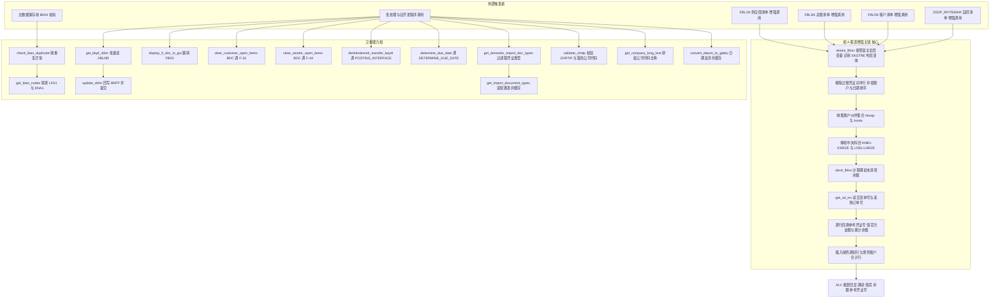
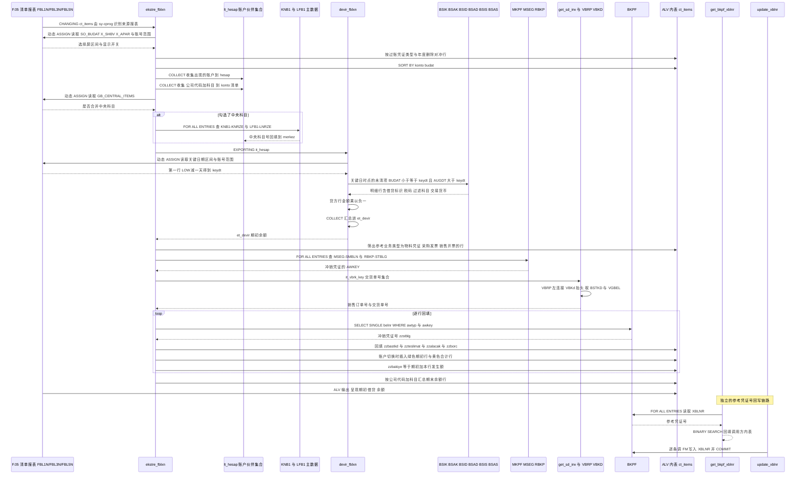

# ZCL_FI_TOOLKIT 源码分析报告

**分析对象**：`ZCL_FI_TOOLKIT`（约 1700 行，16 个 `PUBLIC CLASS-METHODS` + 1 个 `PRIVATE CLASS-METHODS`，3 个 `CLASS-DATA` 缓存，全类无实例状态）
**类属性**：`PUBLIC FINAL CREATE PUBLIC` —— 工具类，禁止继承，全局可用。
**项目语境**：土耳其 SAP FI 客户（`zfit_*` / `zfitt_*` / `zcl_fi_*` 自定义对象 + 大量土耳其语注释与消息池文本）。

> 前置声明：本报告基于该文件的字面内容做静态推演。凡涉及"能否编译""字段是否存在于标准表"的地方，均已在条目中标注"需实机验证"，因为脱敏/裁剪版本的源码与真实 SEU 内容可能存在差异。凡标注"需实机验证"的结论，请以 `SE24`/`SE80` 里的实际源码与 `ADT` 的语法检查为准。

---

## 一、程序定位与业务背景

### 1.1 它出现在什么样的业务现场

想象一家土耳其制造企业的财务共享服务台：SAP FI 标准报表 `FBL1N`（供应商行项目）、`FBL3N`（总账行项目）、`FBL5N`（客户行项目）是财务人员每天唯一的前端。但这三个报表天生只会展示"**本期发生额**"，看不到"**期初余额、累计余额、期末余额**"——而这恰恰是业务对账时最关心的三列。业务方提的需求是："在 F.05 行项目清单里，直接看到每个账户的期初、发生、期末。"

同一个共享服务台还堆着一堆"标准事务做不了、只能绕过前台"的历史需求：跨公司代码的过账凭证对冲要手工重打（`POSTING_INTERFACE`）、误清账的未清项要批量冲销（`F-32`/`F-44`）、电子发票参考凭证号 `XBLNR` 要批量回写、土耳其电子发票（e-Fatura）的银行 IBAN 不能重复、`ZHRTIP`（IFRS 豁免标识）要按科目首字符校验。

这些需求有一个共同点：**它们都需要直接操作 SAP 内部的表和标准程序的状态，而不是走业务事务**。所以它们被收进了同一个类里。

### 1.2 这个类实际解决的四类问题

| 类别 | 涉及方法 | 业务本质 |
|---|---|

---

## 二、程序执行流程总览

这个类没有 `main` 方法，流程由调用方决定。但它是开源库，绝大多数调用来自"F.05 清单报表增强"这一条主链，因此下面这张图以主链为骨架，其余九组独立能力挂在旁边。

### 2.1 主链 + 卫星能力全景



### 2.2 责任链表（按实际执行先后排列）

| # | 子程序 | 调用者 | 职责 |
|---|---|---|---|
| 1 | `ekstre_fblxn` | FBL1N/FBL3N/FBL5N/ZSDP_RFITEMAR 的增强出口调用方 | 主入口：接管宿主全局变量，剔除对冲行，排序，编排期初与余额，回填全部附加字段 |
| 2 | `devir_fblxn` | `ekstre_fblxn` 显式静态调用 | 按"关键日"从 `BSIK/BSAK/BSID/BSAD/BSIS/BSAS` 取未清项，算出每个账户的期初余额 |
| 3 | `get_sd_inv` | `ekstre_fblxn` 两处调用 | 由交货单号回查交货/退货过账凭证号与销售订单号 |
| 4 | `get_company_long_text` | 报表 ALV 的字段符号/文本列取数时按需调用 | 由公司代码取 `T001-BUTXT` + `ADRC` 姓名 1~4，拼成公司全称，带类级缓存 |
| 5 | `convert_datum_to_gdatu` | 报表金额列格式化时按需调用 | `DATS` → `GDATU`（YYYYMMDD），带类级哈希缓存 |
| 6 | `get_bkpf_xblnr` | 自开发程序批量取数后回填 | 一次 `FOR ALL ENTRIES` 批量读 `BKPF-XBLNR` 回填传入内表 |
| 7 | `update_xblnr` | 自开发程序回填完成后 | 逐条调 `J_1B_NFE_UPDATE_XBLNR` 写回 `XBLNR`，可选逐条提交 |
| 8 | `display_fi_doc_in_gui` | 报表行双击或 ALV 热点 | `SET PARAMETER` + `CALL TRANSACTION 'FB03'` 跳转显示凭证 |
| 9 | `clear_customer_open_items` | 清账批处理/前台按钮 | BDC 驱动 `F-32`，按客户+公司代码+币种勾选未清项冲销 |
| 10 | `clear_vendor_open_items` | 清账批处理/前台按钮 | BDC 驱动 `F-44`，同上，供应商侧 |
| 11 | `denklestirerek_transfer_kaydi` | 过账时按"结转通过转账"逻辑调用 | 通过 `POSTING_INTERFACE` 写一张 `UMBUCHNG` 过账凭证，清除被冲销行的 `BSID/BSAD/BSIS/BSAS` 记录 |
| 12 | `determine_due_date` | 未清项报表/催款清单 | 读 `BSEG` 的基准日期字段，调 `DETERMINE_DUE_DATE` 算出 `NETDT` |
| 13 | `get_iban_codes` | `check_iban_duplicate` 内部调用 | 联查 `LFA1×LFBK×TIBAN` 与 `KNA1×KNBK×TIBAN`，返回已占用的 IBAN |
| 14 | `check_iban_duplicate` | MDG / 主数据保存前校验 | 有 IBAN 被占用则抛 `zcx_fi_iban`，带上占用方编号与类型 |
| 15 | `get_import_document_types` | `get_domestic_import_doc_types` 与自开发 Z 程序 | 读 `ZFIT_ITH_BLART` 配置表（带缓存），按国内外标志过滤凭证类型 |
| 16 | `get_domestic_import_doc_types` | 自开发 Z 程序 | 在缓存结果上再筛，得到进出口凭证类型集合 |
| 17 | `validate_zhrtip` | 凭证录入校验（FI 用户出口） | 校验 `ZHRTIP` 与科目首字符的对应关系，豁免公司代码与豁免事务码 |

下面按这条流程，逐个子程序展开。

---

## 三、分组分析（按程序流程 / 子程序）

### 3.1 全局声明区（类型、常量、类级缓存）

这个类的"声明区"承担了远超工具类通常水平的职责：它既是**对外 API 的类型契约**，也是**内部三张辅助表的类型定义源**，还托管了三个进程内缓存。先看对外暴露的类型：

```abap
  TYPES:
    BEGIN OF t_documents ,
      bukrs TYPE bseg-bukrs,
      belnr TYPE bseg-belnr,
      gjahr TYPE bseg-gjahr,
      buzei TYPE bseg-buzei,
    END OF t_documents .
  TYPES:
    tt_documents TYPE STANDARD TABLE OF t_documents WITH DEFAULT KEY .
  TYPES:
    BEGIN OF ty_hesap,
      sube   TYPE rfposxext-konto,
      merkez TYPE rfposxext-konto,
    END OF ty_hesap .
  TYPES:
    tt_hesap TYPE STANDARD TABLE OF ty_hesap .

  TYPES:
    BEGIN OF ty_konto,
      bukrs TYPE bukrs,
      konto TYPE konto,
    END OF ty_konto .
  TYPES:
    BEGIN OF ty_devir_items,
      belnr TYPE belnr_d,
      gjahr TYPE gjahr,
      buzei TYPE buzei,
      bukrs TYPE bukrs,
      konto TYPE hkont,
      shkzg TYPE shkzg,
      dmshb TYPE dmbtr,
      dmbe2 TYPE dmbe2,
      dmbe3 TYPE dmbe3,
      umskz TYPE umskz,
      filkd TYPE filkd,
      wrbtr TYPE wrbtr,
      waers TYPE waers,
      gsber TYPE gsber,
    END OF ty_devir_items .
  TYPES:
    BEGIN OF ty_devir,
      bukrs TYPE bukrs,
      konto TYPE hkont,
      shkzg TYPE shkzg,
      dmshb TYPE dmbtr,
      dmbe2 TYPE dmbe2,
      dmbe3 TYPE dmbe3,
      umskz TYPE umskz,
      filkd TYPE filkd,
      wrbtr TYPE wrbtr,
      waers TYPE waers,
      gsber TYPE gsber,
    END OF ty_devir .
  TYPES:
    tt_devir TYPE STANDARD TABLE OF ty_devir .
```

**做什么** — 声明 8 组对外类型：`t_documents`（凭证行键）、`ty_hesap`（子账/中央科目对）、`ty_konto`（公司代码+科目）、`ty_devir_items`（期初明细行，中间结构）、`ty_devir`（期初汇总行）、`t_doc_xblnr`（凭证+参考凭证号）、`tt_blart`（凭证类型哈希表）、`ty_mkpf_key`/`ty_vbrk_key`（物料凭证/开票凭证键）。

**为什么** — 类型一律用 `TYPE 字段-字段` 的"引用式"写法（如 `bukrs TYPE bseg-bukrs`）而不是 `bukrs TYPE bukrs`，这是 SAP 标准做法：类型长度和取值域随源表演进自动跟随，避免本地再抄一份 `CHAR(4)`。这一点做得非常专业，`ty_devir_items` 与 `ty_devir` 字段几乎一一对应（前者多 `belnr/gjahr/buzei`），正是为了配合 `INTO TABLE` 的**位置对应**（详见 3.3-④）。

**风险与改进** — `tt_devir TYPE STANDARD TABLE OF ty_devir.` **未声明任何键**。按 ABAP 规则，这种标准表的标准键 = 结构全部字段，后续对它的 `COLLECT` 会退化为"整行去重"（详见 3.3-⑦ 与问题清单 P0-6）。另外 `ty_hesap.sube/merkez` 用 `rfposxext-konto` 作类型，而 `konto` 在 FBL1N/FBL5N 上下文里装的是供应商/客户号、在 FBL3N 里是总账科目——**同名不同义**，这是刻意选择（一个类型服务两个报表），但类型名完全掩盖了这一点，后续维护者极易误用。

再看常量和缓存：

```abap
  CONSTANTS c_borc TYPE shkzg VALUE 'S' ##NO_TEXT.
  CONSTANTS c_alacak TYPE shkzg VALUE 'H' ##NO_TEXT.
  CONSTANTS c_mal_hareketi TYPE awtyp VALUE 'MKPF' ##NO_TEXT.
  CONSTANTS c_satinalma_faturasi TYPE awtyp VALUE 'RMRP' ##NO_TEXT.
  CONSTANTS c_satis_faturasi TYPE awtyp VALUE 'VBRK' ##NO_TEXT.
  CONSTANTS c_musteri_hf_talebi TYPE auart VALUE 'ZAH1' ##NO_TEXT.

  CLASS-DATA gt_company_long_text TYPE tt_company_long_text .
  CLASS-DATA gt_dg_cache TYPE tt_dg_cache .
  CLASS-DATA gt_import_doc_type_cache TYPE tt_ith_blart .

  CLASS-METHODS get_sd_inv
    IMPORTING
      !it_vbrk_key   TYPE tt_vbrk_key
    RETURNING
      VALUE(rt_vbrp) TYPE tt_vbrp .
```

**做什么** — 5 个业务常量（借贷标识 `S/H`、三类参考凭证业务类型 `MKPF/RMRP/VBRK`、客户发货请求订单类型 `ZAH1`）与 3 个类级缓存：公司代码全称（哈希表，主键 `BUKRS`）、日期反序结果（哈希表，主键 `DATUM`）、进出口凭证类型（标准表，惰性填充）。唯一的 `PRIVATE` 方法 `get_sd_inv` 声明在这里。

**为什么** — 常量加 `##NO_TEXT` 是标准做法，避免 ADT 把字面量当可翻译文本提出警告，也避免字面量散落各处。缓存选 `HASHED TABLE ... UNIQUE KEY` 是正确的：`get_company_long_text` 与 `convert_datum_to_gdatu` 都是"高频读、低频写"的查找型访问，哈希表的唯一键特性还能天然防重复行。`get_sd_inv` 设为 `PRIVATE` 而非 `PUBLIC`，是正确的最小可见性——它只服务于 `ekstre_fblxn` 内部。

**风险与改进** — `c_mal_hareketi TYPE awtyp VALUE 'MKPF'` **存在取值域语义错配**：`MKPF` 是**表名**（物料凭证抬头表），而 `BKPF-AWTYP` 的业务取值是 `MAT`/`RMRP`/`RMDK`/`VBRK` 这类事务类型。这里之所以"能跑"，是因为实际比较的字段是 ALV 行上的**自定义字段** `zzawtyp`，取值域由客户自定义——但代码把它声明成了 `awtyp`，且后面 3.2-⑦ 里又拿 `zzawtyp` 的值去比标准表 `BKPF-AWTYP`，隐含了"自定义值域与标准值域一致"的未言明假设。建议改为 `TYPE zzawtyp`（或客户自定义域）并在注释中写明 Z 侧取值约定。另外 `c_borc`（借方 `S`）定义了却从未使用，`c_musteri_hf_talebi` 同样未使用——死常量。

---

### 组 A：报表增强主链 —— 让 F.05 清单"会算账"

这一组是本类的核心与真正的技术难点所在。它要在**不改动标准报表**的前提下，从 SAP 标准程序的私有全局变量里"偷"出选择屏状态，再自己重算一遍 FBL1N/3N/5N 缺的那几列。下面从主入口开始。

### 3.2 `ekstre_fblxn` —— 主入口（约 530 行，9 个步骤）

这是整个类里最长的方法，也是唯一一个 `CHANGING` 导出 `ct_items`（F.05 的 ALV 行项目内表）的方法。它分九步走，下面逐步拆开。

#### ① 接管宿主程序的私有全局变量

```abap
  METHOD ekstre_fblxn.
    "--------->> written by mehmet sertkaya 18.12.2015 11:29:39
*--------------------------------------------------------------------*
* E K S T R E
*--------------------------------------------------------------------*

    CHECK ct_items IS NOT INITIAL.
    CASE sy-cprog.
      WHEN 'RFITEMAP'."FBL1N
        ASSIGN ('(RFITEMAP)X_AISEL') TO FIELD-SYMBOL(<lv_x_aisel>).
        ASSIGN ('(RFITEMAP)PA_VARI') TO FIELD-SYMBOL(<lv_vari>).

      WHEN 'RFITEMGL'."FBL3N
        ASSIGN ('(RFITEMGL)X_AISEL') TO <lv_x_aisel>.
        ASSIGN ('(RFITEMGL)PA_VARI') TO <lv_vari>.

      WHEN 'RFITEMAR'."FBL5N
        ASSIGN ('(RFITEMAR)X_AISEL') TO <lv_vari>).
        ...
```

（`RFITEMAR` 分支原文为 `ASSIGN ('(RFITEMAR)X_AISEL') TO <lv_x_aisel>.` 与 `ASSIGN ('(RFITEMAR)PA_VARI') TO <lv_vari>.`，`ZSDP_RFITEMAR` 分支同理，四个分支只是程序名前缀不同。）

```abap
      WHEN OTHERS.
        RETURN.

    ENDCASE.

    IF sy-subrc = 0 AND sy-cprog(5) = 'RFITE'.
```

**做什么** — 用 `sy-cprog` 判断自己被谁调用（`RFITEMAP`=FBL1N、`RFITEMGL`=FBL3N、`RFITEMAR`=FBL5N、`ZSDP_RFITEMAR`=自研报表），然后用动态 `ASSIGN ('(程序名)变量名')` 把标准报表的**私有全局变量**动态绑定到本地字段符号：`<lv_x_aisel>`（是否处于 ALV 选择模式）、`<lv_vari>`（ALV 布局变体名）。

**为什么** — 这是整个方案的地基。`X_AISEL` 决定"用户是否真的在勾选行"——不在选择模式下就贸然改数据会破坏用户正在操作的 ALV；`PA_VARI` 决定"当前用的是哪个布局变体"，而作者把变体名里含 `EKSTRE` 当成"用户启用了期初余额列"的开关。这两个变量在任何公开接口、BAdI、用户出口参数里都拿不到，**只有动态 `ASSIGN` 侵入标准程序内存这一条路**。SAP 对此有明确支持（`'(程序名)变量名'` 语法即为此设计），所以不算 hack，而是官方认可的"读宿主状态"手段。

**风险与改进** — 三处隐患：
1. **动态 `ASSIGN` 直接依赖标准程序的内部变量名**。SAP 升级、Support Package 打补丁、或客户自己给 FBL1N 加了同名变量，都会让它静默失效——`ASSIGN` 失败时 `sy-subrc` 非 0，而代码只检查了"至少有一个 `ASSIGN` 成功"（`IF sy-subrc = 0`），随后就用可能未赋值的 `<lv_vari>` 做 `CS` 判断。SAP 标准建议的加固做法是 `TRY. ... CATCH cx_sy_conversion_no_number.` 或至少在失败时 `RETURN` + 写日志，让问题可观测。
2. `sy-cprog(5) = 'RFITE'` 这个**字符串前缀判断**是硬编码的耦合点：`ZSDP_RFITEMAR` 的前 5 位是 `ZSDP_`，因此**这个自研报表实际会走下面的 `ELSE` 分支**，尽管上面专门为它写了 `CASE` 分支。这是逻辑上的自相矛盾（详见问题清单 P0-8）。
3. `CHECK ct_items IS NOT INITIAL` 用 `CHECK` 直接跳出方法，调用方无法区分"没数据"与"我什么都没做"。

---

#### ② 剔除过账凭证的对冲行

```abap
      "--------->> add by mehmet sertkaya 27.05.2021 10:49:36
      LOOP AT ct_items ASSIGNING FIELD-SYMBOL(<ls_items>)
            WHERE zuonr(3) eq  zcl_fi_omd=>c_zuonr_sanal and
                  zzbstkd IS INITIAL.
           <ls_items>-zzbstkd = <ls_items>-zuonr.
      ENDLOOP.
      "-----------------------------<<
      IF <lv_vari> CS 'EKSTRE'.

        IF <lv_x_aisel> <> abap_true.
          MESSAGE TEXT-003 TYPE 'I'.
          RETURN.
        ENDIF.

        CALL FUNCTION 'SAPGUI_PROGRESS_INDICATOR' ##FM_SUBRC_OK
          EXPORTING
*           percentage =
            text   = TEXT-002
          EXCEPTIONS
            OTHERS = 1.


        "-->> changed by mehmet sertkaya 21.07.2016 13:52:32
        " HAR-10448 - Müşteri Ekstresinde XX belge ters kaydı
*          delete ct_items where blart = 'XX' and gjahr ge '2016'.
        LOOP AT ct_items ASSIGNING <ls_items>
                    WHERE blart = zcl_fi_document_type=>get_customer_clearing_doc_type( ) AND
                          gjahr GE '2018'.
          DELETE ct_items WHERE belnr = <ls_items>-zzstblg AND gjahr = <ls_items>-zzstjah.
          DELETE ct_items.
        ENDLOOP.
        "-----------------------------<
```

**做什么** — 三件事：① 把分配号段前 3 位等于"采购订单"（`c_zuonr_sanal`）且采购订单号字段为空的行，用分配号段本身回填订单号；② 检查布局变体名是否含 `EKSTRE`（不含有则整段跳过）且 `X_AISEL` 为真（未进入选择模式则 `MESSAGE` 后直接返回）；③ 遍历所有"过账凭证类型"（`get_customer_clearing_doc_type( )`）且年度 ≥ 2018 的行，**把它们的原始凭证一并从内表里删掉**。

**为什么** — ③ 是本方法最有业务含量的一段，注释也交代了来历：`HAR-10448 - Müşteri Ekstresinde XX belge ters kaydı`（客户清单里出现冲销凭证的反向记录）。过账凭证（如 `F-32` 清账自动生成的那张）本身不带业务含义，SAP 的建议做法就是"过账凭证不参与业务报表"，但它确实残留在 F.05 的行项目内表里。不删掉，用户会看到成对出现、金额相反的莫名行。年度门槛 `2018` 是业务决定的分界（更早的年度还有遗留问题要保留）。

**风险与改进** — 
1. **`DELETE` 在 `LOOP ... ASSIGNING` 内部混用，且被删的行未必是当前行**：`DELETE ct_items WHERE belnr = ... AND gjahr = ...` 是"带 `WHERE` 的整表删除"，它删的行可能不是循环变量当前指向的行，且 ABAP 对"边循环边用 `WHERE` 删整表"的行为是未定义/不可靠的——正确写法是把待删条件先收集到一张独立的键表，循环结束后统一 `DELETE ct_items WHERE ...` 一次删净。
2. **`zzstblg`/`zzstjah` 在这一步还是旧值**。这两个字段要到第 ⑦ 步才被回填，而此处删除逻辑已经依赖它们。此刻它们要么是 F.05 原有的值、要么为空；为空时 `DELETE ct_items WHERE belnr = 0000000000` 变成一次无意义的全表扫描（`WHERE` 两侧都是常量条件，无索引可用）。这说明**步骤顺序有依赖倒置**。
3. **年度硬编码 `'2018'`**，且旧逻辑（`blart = 'XX' and gjahr ge '2016'`）被注释掉留在文件里。业务规则应该配成表或常量，而不是散在注释与魔数里。
4. `WHERE zuonr(3) eq ...` 用小写 `eq`，与文件其余部分的全大写风格不一致；ABAP 关键字不区分大小写，不影响执行，但反映风格未统一。

---

#### ③ 排序并收集账户 / 业务伙伴集合

```abap
        SORT ct_items BY konto budat ASCENDING.

        IF  ct_items IS INITIAL.
          RETURN.
        ENDIF.

*--------------------------------------------------------------------*
* E K S T R E
*--------------------------------------------------------------------*
        DATA : lt_devir        TYPE TABLE OF ty_devir,
               lt_devir_sorted TYPE SORTED TABLE OF ty_devir
                               WITH NON-UNIQUE KEY bukrs konto,
               lv_konto_temp   TYPE hkont,
               lt_item_devir   TYPE it_rfposxext,
*               lt_item_sum_top type it_rfposxext,
               lt_item_sum     TYPE it_rfposxext,
               ls_item_devir   TYPE LINE OF it_rfposxext,
               ls_item_sum     TYPE LINE OF it_rfposxext,
               ls_item_sum_    TYPE LINE OF it_rfposxext,
               lv_tabix        TYPE sy-tabix,
               ls_devir        TYPE ty_devir,
*               lt_devir_merkez type sorted table of ty_devir with unique key bukrs konto ##NEEDED,
               ls_devir_merkez TYPE ty_devir,
               lt_mkpf_key     TYPE tt_mkpf_key,
               lt_rbkp_key     TYPE tt_rbkp_key,
               lt_rbkp         TYPE tt_rbkp,
               lt_vbrk_key     TYPE tt_vbrk_key,
               lv_awkey        TYPE awkey,
               lt_mseg         TYPE tt_mseg,
               lt_vbrp         TYPE tt_vbrp,
               ls_hesap        TYPE ty_hesap,
               lt_hesap        TYPE tt_hesap,
               lt_t001         TYPE SORTED TABLE OF t001 WITH UNIQUE KEY bukrs ##NEEDED,
*               lv_konto        type konto,
               lt_konto        TYPE TABLE OF ty_konto,
               ls_konto        TYPE ty_konto,
               lc_green        TYPE col_item VALUE 'C51',
               lc_yellow       TYPE col_item VALUE 'C31'.

        LOOP AT ct_items ASSIGNING <ls_items>.
          CLEAR ls_hesap.
          ls_hesap-sube = <ls_items>-konto.
          COLLECT ls_hesap INTO lt_hesap.
          ls_konto-bukrs = <ls_items>-bukrs.
          ls_konto-konto = <ls_items>-konto.
          COLLECT ls_konto INTO lt_konto.
        ENDLOOP.
```

**做什么** — 先 `SORT ct_items BY konto budat`（账户升序、日期升序），再遍历整张内表两次 `COLLECT`：把出现的账户号收进 `lt_hesap`（只填 `sube`，作为"子账"）、把 `(公司代码, 账户)` 组合收进 `lt_konto`。中间还集中声明了 20 多个工作变量，以及两个颜色常量：`lc_green = 'C51'`（浅绿，期初行）与 `lc_yellow = 'C31'`（浅黄，合计行）。

**为什么** — 排序是**整个算法正确性的前提**：后面第 ⑧ 步插入期初行/合计行时，靠 `lv_konto_temp <> <ls_items>-konto` 判断"账户变了"，靠 `lv_tabix = sy-tabix` 记住插入位置。同一账户的行必须连续且按日期升序，"期初 → 逐笔明细 → 合计"的视觉分组才成立。`COLLECT` 去重账户是为了下一步 `devir_fblxn` 能用 `FOR ALL ENTRIES` 按账户取数——FAE 要求驱动表无重复行，否则结果会成倍放大。

**风险与改进** — `COLLECT ls_hesap INTO lt_hesap` / `COLLECT ls_konto INTO lt_konto` 依赖 `tt_hesap`/`ty_konto` 表的标准键：`tt_hesap TYPE STANDARD TABLE OF ty_hesap.` **未声明键** → 标准键 = 全部字段 = `(sube, merkez)`；`lt_konto TYPE TABLE OF ty_konto` 同样未声明键 → 标准键 = `(bukrs, konto)`。这一处恰好是**正确**的（去重语义正好符合意图），但它成立的原因是"字段少且恰好等于键"，属于**因祸得福**，而不是设计。同样的 `COLLECT` 在 3.3-⑦ 和第 ⑧ 步就出了大问题（见 P0-6、P1-9）。另外 `DATA` 块出现在方法体中部（`SORT` 之后），语法上合法（7.40 以后允许）但可读性差：声明散落在流程中间，读者要通读全方法才知道有哪些变量。更规范的做法是把所有 `DATA` 提到方法开头。

---

#### ④ 解析中央科目（合并科目）

```abap
        ASSIGN  ('(SAPLFI_ITEMS)GB_CENTRAL_ITEMS') TO FIELD-SYMBOL(<lv_merkez>).
        IF sy-subrc = 0.
          IF <lv_merkez> = abap_true.
            CASE sy-cprog.
              WHEN 'RFITEMAR' OR 'ZSDP_RFITEMAR'.
                SELECT bukrs, kunnr, knrze INTO TABLE @DATA(lt_knb1) FROM knb1
                    FOR ALL ENTRIES IN @lt_hesap
                    WHERE kunnr = @lt_hesap-sube AND
                          knrze <> @space.
                SORT lt_knb1 BY bukrs kunnr.
                LOOP AT lt_knb1 ASSIGNING FIELD-SYMBOL(<ls_knb1>).
                  ls_hesap-sube = <ls_knb1>-kunnr.
                  ls_hesap-merkez = <ls_knb1>-knrze.
                  COLLECT ls_hesap INTO lt_hesap.
                ENDLOOP.

              WHEN 'RFITEMAP'.

                SELECT bukrs, lifnr, lnrze INTO TABLE @DATA(lt_lfb1) FROM lfb1
                    FOR ALL ENTRIES IN @lt_hesap
                    WHERE lifnr = @lt_hesap-sube AND
                          lnrze <> @space.
                SORT lt_lfb1 BY bukrs lifnr.
                LOOP AT lt_lfb1 ASSIGNING FIELD-SYMBOL(<ls_lfb1>).
                  ls_hesap-sube   = <ls_lfb1>-lifnr.
                  ls_hesap-merkez = <ls_lfb1>-lnrze.
                  COLLECT ls_hesap INTO lt_hesap.
                ENDLOOP.

            ENDCASE.
          ENDIF.
        ENDIF.
        SELECT * FROM t001  INTO TABLE lt_t001.
```

**做什么** — 动态读 `SAPLFI_ITEMS`（F.05 行项目处理的总池程序）里的 `GB_CENTRAL_ITEMS` 全局变量，判断用户是否勾选了"**显示中央科目**"。若是，则客户侧（`RFITEMAR`/`ZSDP_RFITEMAR`）读 `KNB1-KNRZE`、供应商侧（`RFITEMAP`）读 `LFB1-LNRZE`，把每个业务伙伴的"中央科目号"补进 `lt_hesap` 的 `merkez` 字段。最后一句 `SELECT * FROM t001 INTO TABLE lt_t001.`

**为什么** — "中央科目"是 FI 里用来把成百上千个子账科目（G/L 科目）归并到一个汇总科目上的功能。勾选后，SAP 报表会显示"中央科目汇总行"。要做到同样的事，就必须知道"这个客户/供应商挂在哪个中央科目下"——`KNB1-KNRZE`（客户）和 `LFB1-LNRZE`（供应商）就是权威来源。`SORT ... BY bukrs kunnr` 后才能在第 ⑧ 步用 `BINARY SEARCH` 查（见下）。`##NO_TEXT` 用得也对。

**风险与改进** — 
1. **`SELECT * FROM t001 INTO TABLE lt_t001` 是纯粹的死代码**：`lt_t001` 声明后在整个方法里再未被读取。它是 T001 全表（所有公司代码），读它本该是为了过滤或取公司名称——作者显然写了但忘了用。属于应删的死逻辑（P2-3）。
2. `ASSIGN ('(SAPLFI_ITEMS)GB_CENTRAL_ITEMS')` 是**第二处侵入 SAP 标准池程序**（第一处是 `RFITEM*` 报表程序）。`SAPLFI_ITEMS` 是 F.05 三个报表共用的行项目处理池，SAP 对它的改动频率不低，且客户自己做增强也可能影响它。这是本类最脆的耦合点之一。
3. `knrze <> @space` 用空格做"未维护"的判据，而不是 `knrze IS NOT INITIAL`。`KNB1-KNRZE` 是 `CHAR`（非数字）类型，两者在填充值上可能等价，但语义上前者只排除全空格、后者排除任何初值，**后者更稳**。
4. `CASE sy-cprog` 里没有 `RFITEMGL` 分支——总账报表不需要中央科目，合理；但没有 `WHEN OTHERS` 兜底，未来新增报表会静默无动作。

---

#### ⑤ 调用 `devir_fblxn` 取期初余额

```abap
        zcl_fi_toolkit=>devir_fblxn(
                    EXPORTING it_hesap = lt_hesap
                    IMPORTING et_devir = lt_devir
                                             ).

        SORT lt_devir BY bukrs konto gsber.
        lt_devir_sorted = lt_devir.

        FREE  : lt_devir,lt_hesap.
```

**做什么** — 把账户集合 `lt_hesap` 交给 `devir_fblxn`，拿回按账户组织的期初余额 `lt_devir`；随即按 `(公司代码, 科目, 采购订单号)` 排序，赋值给 `lt_devir_sorted`（`SORTED TABLE ... NON-UNIQUE KEY bukrs konto`）供后续 `WHERE` 查找和 `BINARY SEARCH`，然后 `FREE` 掉原始表与 `lt_hesap`。

**为什么** — 为什么要 `SORT` 两次？第一次 `SORT lt_devir BY bukrs konto gsber` 把标准表变成有序序列，第二次赋值给 `SORTED` 类型即完成 O(log n) 索引。这是在 7.40 之前构造"排序表"的经典手法（`SORT` + 赋值比直接 `INSERT ... INTO TABLE` 建 `SORTED` 表快得多，因为前者是顺序写）。`FREE` 是有意识的内存管理：`lt_devir` 与 `lt_devir_sorted` 此刻持有同一份行集，`lt_hesap` 也不再需要，趁早释放给 F.05 报表那点可怜的内存——ALV 内表动辄几万行，内存是真实约束。

**风险与改进** — `devir_fblxn` 返回的 `lt_devir` **完全没有做任何空值检查**：`lt_devir_sorted` 为空是可能的（宿主变量没取到、选择屏为空、账户查无未清项），后续第 ⑧ 步的 `LOOP ... WHERE` 会自然地不匹配，`sy-subrc = 4` 分支会写"空期初行"，逻辑上是能自洽的，所以不算致命。但这里用了 `FREE lt_hesap`——`lt_hesap` 在第 ④ 步刚被追加过，如果 `devir_fblxn` 内部还需要它（它拿的是 `it_hesap` 的引用语义，方法返回后不再需要），`FREE` 时机是对的。**真正的风险在下一行之后**：`lt_lfb1`/`lt_knb1`（中央科目查找结果）**没有 `FREE`**，而第 ⑧ 步还要用它们做 `BINARY SEARCH`，这没问题；可它们也不在 `FREE : lt_mseg,lt_vbrp,lt_rbkp.`（第 ⑧ 步末尾）之列，属于清理不完整——F.05 报表行数大时，几个 MB 的残留是值得管的。

---

#### ⑥ 定位反向凭证的原始凭证

```abap
*--------------------------------------------------------------------*
* Malzeme belgelerini al - sadece ters kayıt olanlar
*--------------------------------------------------------------------*
        LOOP AT ct_items ASSIGNING <ls_items>
           WHERE zzawtyp = c_mal_hareketi OR zzawtyp =  c_satinalma_faturasi
               OR  zzawtyp = c_satis_faturasi.
          IF <ls_items>-zzawtyp = c_mal_hareketi.
            APPEND VALUE #( mblnr = <ls_items>-zzawkey(10)
                            mjahr = <ls_items>-zzawkey+10(4)
                           ) TO lt_mkpf_key.
          ELSEIF <ls_items>-zzawtyp = c_satinalma_faturasi.
            APPEND VALUE #( belnr = <ls_items>-zzawkey(10)
                            gjahr = <ls_items>-zzawkey+10(4)
                           ) TO lt_rbkp_key.
          ELSEIF <ls_items>-zzawtyp = c_satis_faturasi.
            APPEND <ls_items>-zzawkey(10) TO lt_vbrk_key.
          ENDIF.
        ENDLOOP.

        SORT lt_rbkp_key BY belnr gjahr.
        SORT lt_mkpf_key BY mblnr mjahr.
        SORT lt_vbrk_key BY vbeln.
        DELETE ADJACENT DUPLICATES FROM lt_mkpf_key COMPARING mblnr mjahr.
        DELETE ADJACENT DUPLICATES FROM lt_rbkp_key COMPARING belnr gjahr.
        DELETE ADJACENT DUPLICATES FROM lt_vbrk_key COMPARING vbeln.

        IF lt_rbkp_key IS NOT INITIAL.

          SELECT belnr, gjahr, stblg, stjah
            FROM rbkp
            FOR ALL ENTRIES IN @lt_rbkp_key
            WHERE
              belnr = @lt_rbkp_key-belnr AND
              gjahr = @lt_rbkp_key-gjahr
            INTO CORRESPONDING FIELDS OF TABLE @lt_rbkp.

          FREE lt_rbkp_key.
        ENDIF.

* ters kayıt olanların m.b. sini bul
        IF lt_mkpf_key IS NOT INITIAL.
          SELECT mblnr, mjahr, smbln, sjahr
            FROM mseg
            FOR ALL ENTRIES IN @lt_mkpf_key
            WHERE
              mblnr = @lt_mkpf_key-mblnr AND
              mjahr = @lt_mkpf_key-mjahr
            INTO CORRESPONDING FIELDS OF TABLE @lt_mseg.
          FREE lt_mkpf_key.
* ters kayıt olanların m.b. sini bul
        ENDIF.
        IF lt_vbrk_key[] IS NOT INITIAL.
          lt_vbrp = get_sd_inv( lt_vbrk_key ).
          FREE lt_vbrk_key.
* ters kayıt olanların m.b. sini bul
        ENDIF.
```

**做什么** — 按自定义字段 `zzawtyp` 把三类行分流：物料凭证类（`zzawtyp = 'MKPF'`）从 `zzawkey` 的前 10 位取凭证号、后 4 位取年度，组装成 `lt_mkpf_key`；采购发票类（`'RMRP'`）组装 `lt_rbkp_key`；销售开票类（`'VBRK'`）只取前 10 位凭证号组装 `lt_vbrk_key`。三张键表分别排序去重后，用 `FOR ALL ENTRIES` 批量查 `RBKP`（取冲销凭证 `STBLG/STJAH`）和 `MSEG`（取冲销凭证 `SMBLN/SJAH`），`lt_vbrk_key` 交给私有方法 `get_sd_inv`。

**为什么** — 注释写得很清楚：*"Malzeme belgelerini al - sadece ters kayıt olanlar"*（取物料凭证，只取被冲销的那些）。FI 里"反向记录"（`ters kayıt`）= 被后续凭证冲销掉的那条原始分录，它自己不带业务含义，但用户在 F.05 里看得见。展示时必须把它关联回"是谁冲销了我"（`SMBLN/SJAH`、`STBLG/STJAH`）以及"我冲销了谁"（`AUBEL`/销售订单）。取反凭证号有两个来源：正向字段 `SMBLN/SJAH`（我被这张凭证冲销）与反向查找（没有正向字段时，用"谁冲销了我"反查）。`zzawkey` 是一个把"凭证类型+凭证号+年度"拼在一起的 `AWKEY` 风格字段，所以要按偏移 `10`/`+10(4)` 切分。批量取数 + `FOR ALL ENTRIES` + 去重是正确的性能姿势：F.05 一屏可能几百行，若每行查一次 DB 就是几百次往返。

**风险与改进** — 
1. **偏移魔法数 `zzawkey(10)` / `zzawkey+10(4)` 出现 12 次**，没有任何常量或注释说明为什么是 10 和 4。这是把 `BKPF-AWKEY` 的物理布局硬编码进了业务逻辑。应定义 `CONSTANTS c_awkey_keylen TYPE i VALUE 10.` 之类，或至少定义偏移常量并在注释中写明"AWKEY = BELNR(10) + GJAHR(4)"。
2. `CONV #( <ls_items>-zzawkey+10(4) )`（第 ⑦ 步）用于把年份转成 `NUMC(4)`：若 `zzawkey` 后 4 位是空格（异常数据），`CONV` 会得到 `0000` 而不是报错，静默变成一个查不到的年度。
3. 三张键表用了三种不同写法判空（`IS NOT INITIAL`、`lt_vbrk_key[] IS NOT INITIAL`），风格不统一。
4. `SELECT ... FOR ALL ENTRIES` **没有 `IF lt_*_key IS NOT INITIAL` 之外的字段范围限制**，且 `MSEG` 的 `FOR ALL ENTRIES` 驱动条件写成了 `WHERE mblnr = @lt_mkpf_key-mblnr AND mjahr = @lt_mkpf_key-mjahr`（全键匹配）——这是 FAE 的正确写法（保留与驱动表的连接），但**没有排序就没有去重保障**，此处已 `DELETE ADJACENT DUPLICATES`，OK。真正的隐患是：这种写法在 DB 层等价于每行一次索引查找，行数多时仍不如 `WHERE ( mblnr, mjahr ) IN ( ... )` 或包一张 HANA 内部表，可作为性能优化点。

---

#### ⑦ 逐行回填参考凭证号与借贷方金额

```abap
*--------------------------------------------------------------------*
* Ek alanları güncelle
*--------------------------------------------------------------------*
        SORT ct_items BY konto budat ASCENDING.

        LOOP AT ct_items ASSIGNING <ls_items>.
          lv_tabix = sy-tabix.

*  test kayıt belgesi
          IF <ls_items>-zzawtyp = c_mal_hareketi.
            READ TABLE lt_mseg WITH TABLE KEY mblnr = <ls_items>-zzawkey(10)
                                              mjahr = CONV #( <ls_items>-zzawkey+10(4) )
                                              ASSIGNING FIELD-SYMBOL(<ls_mseg>).
            IF sy-subrc = 0.
* mb 'nin ters kaydınınn faturası
* bu case çok az olacağını için direk bkpf 'e gidildi.
              CLEAR lv_awkey.
              IF <ls_mseg>-smbln IS NOT INITIAL.
                lv_awkey = |{ <ls_mseg>-smbln }{ <ls_mseg>-sjahr }|.
              ELSE.
                READ TABLE lt_mseg WITH KEY smbln = <ls_mseg>-mblnr
                                            sjahr = <ls_mseg>-mjahr
                                            ASSIGNING <ls_mseg>.

                IF sy-subrc = 0.
                  lv_awkey = |{ <ls_mseg>-mblnr }{ <ls_mseg>-mjahr }|.
                ENDIF.
              ENDIF.

            ENDIF.

          ELSEIF <ls_items>-zzawtyp = c_satinalma_faturasi.
            READ TABLE lt_rbkp WITH TABLE KEY belnr = <ls_items>-zzawkey(10)
                                              gjahr = CONV #( <ls_items>-zzawkey+10(4) )
                                              ASSIGNING FIELD-SYMBOL(<ls_rbkp>).
            IF sy-subrc = 0.
* mb 'nin ters kaydınınn faturası
* bu case çok az olacağını için direk bkpf 'e gidildi.
              CLEAR lv_awkey.
              IF <ls_rbkp>-stblg IS NOT INITIAL.
                lv_awkey = |{ <ls_rbkp>-stblg }{ <ls_rbkp>-stjah }|.
              ELSE.
                READ TABLE lt_rbkp WITH KEY stblg = <ls_rbkp>-belnr
                                            stjah = <ls_rbkp>-gjahr
                                            ASSIGNING <ls_rbkp>.

                IF sy-subrc = 0.
                  lv_awkey = |{ <ls_rbkp>-belnr }{ <ls_rbkp>-gjahr }|.
                ENDIF.
              ENDIF.

            ENDIF.
          ELSEIF <ls_items>-zzawtyp = c_satis_faturasi.
            READ TABLE lt_vbrp WITH TABLE KEY vbeln = <ls_items>-zzawkey(10)
                                        ASSIGNING FIELD-SYMBOL(<ls_vbrp>).
            IF sy-subrc = 0.
              IF <ls_vbrp>-vgtyp = 'J' OR <ls_vbrp>-vgtyp = 'T'.
                <ls_items>-zzteslimat = <ls_vbrp>-vgbel.
              ENDIF.
              <ls_items>-zzbstkd = <ls_vbrp>-bstkd.
            ENDIF.
          ENDIF.

          IF lv_awkey IS NOT INITIAL.
            SELECT SINGLE belnr INTO <ls_items>-zzstblg FROM bkpf
                          WHERE awtyp = <ls_items>-zzawtyp AND
                                awkey = lv_awkey
                          ##WARN_OK .                   "#EC CI_NOORDER
            IF sy-subrc = 0.
              <ls_items>-zzstjah = <ls_items>-gjahr.
            ENDIF.
          ENDIF
```

**做什么** — 对每一行：物料凭证行查 `lt_mseg`、采购发票行查 `lt_rbkp`，命中后**二选一地**拼出"冲销凭证"的 `AWKEY`（优先用正向字段 `SMBLN/SJAH`、`STBLG/STJAH`；没有则反查"谁冲销了我"，用查到的 `MBLN/MJHR`、`BELNR/GJahr`）；开票类行查 `lt_vbrp`，把交货/退货过账凭证号写入 `zzteslimat`、把销售订单号写入 `zzbstkd`。拿到 `lv_awkey` 后，用 `SELECT SINGLE` 从 `BKPF` 查出那张冲销凭证的凭证号写入 `zzstblg`，并把年度写入 `zzstjah`。

**为什么** — 双向定位的设计意图很清楚：`SMBLN`/`STBLG` 是"我被冲销"的方向；反查是"我冲销了别人"的方向。注释 `bu case çok az olacağını için direk bkpf 'e gidildi`（这种情况很少，所以直接查 BKPF）说明作者清楚地知道"循环内查 DB"是有代价的，并做了取舍。三次 `READ TABLE ... WITH TABLE KEY` 都是内存查找，不是 DB——性能没问题。

**风险与改进** — **这里是全类最严重的一处业务正确性缺陷**：
1. **`zzstjah` 取错了年份**。`SELECT SINGLE belnr INTO ...` 只投影了 `BELNR` 一列，年度根本没查出来；随后代码用 `IF sy-subrc = 0. <ls_items>-zzstjah = <ls_items>-gjahr.` ——赋的是**当前明细行自己的年度**，而不是被查到的那张 `BKPF` 记录的年度。由于 `lv_awkey` 里已经带了正确的年份（`|{ smbln }{ sjahr }|`），跨年冲销时 `zzstjah` 必然是错的。而第 ② 步的删除逻辑 `DELETE ct_items WHERE belnr = zzstblg AND gjahr = zzstjah` 正是靠这两个字段匹配——**跨年场景下删除会静默失效**，重复行回到用户眼前。修法：`SELECT SINGLE belnr gjahr ...`，再 `<ls_items>-zzstjah = <ls_any>-gjahr`（注意 `INTO` 单结构会与现有行冲突，需用局部结构中转）。
2. **`WHERE awtyp = ... AND awkey = ...` 没有公司代码限定**。`BKPF` 的主键是 `MANDT+BUKRS+BELNR+GJAHR`，`AWTYP+AWKEY` **不是唯一键**——同一张参考凭证在不同公司代码下完全可能同时存在。`SELECT SINGLE` 在这种情况下取到哪一行是未定义行为，可能跨公司代码取到一张无关的凭证。必须补 `AND bukrs = <ls_items>-bukrs`。
3. **在 `LOOP` 内对 `BKPF` 逐行 `SELECT SINGLE`**：作者自己承认是权宜之计。更要命的是这条查询放在循环里、每次都带 `##WARN_OK` 抑制性能警告，形成"用警告换速度"的循环。可以先收集全部 `lv_awkey`，一次性 `FOR ALL ENTRIES` 查 `BKPF` 回填。
4. `lv_awkey` 在 `LOOP` 内**只在进入 `IF lv_awkey IS NOT INITIAL` 分支前被 `CLEAR`（且仅在 MKPF/RMRP 分支内 `CLEAR`）**。一旦某行走的是 `c_satis_faturasi` 分支（不 `CLEAR lv_awkey`），上一行残留的 `lv_awkey` 就会被误用，把上一行的冲销凭证号写到这一行上。这是一个**跨行状态污染的真 bug**。
5. `IF <ls_vbrp>-vgtyp = 'J' OR <ls_vbrp>-vgtyp = 'T'` 硬编码了 `VGTYP` 的字面量 `'J'`/`'T'`（交货、退货交货），而 `IF sy-cprog` 里同样有 `ZSDP_` 之类硬编码。应定义常量。另注意：`gt_vbrp` 声明为 `SORTED ... WITH NON-UNIQUE KEY vbeln`，`WITH TABLE KEY vbeln` 在非唯一键上取"第一条命中"，而 `get_sd_inv` 里用了 `SELECT DISTINCT`，所以一张交货单对应多个过账凭证时取到哪一条是排序决定的（见 3.4）。#### ⑧ 在账户切换处插入期初行与账户合计行

```abap
          IF lv_konto_temp IS INITIAL OR
             lv_konto_temp <> <ls_items>-konto.
* Devir kalemini ekle
            CLEAR : ls_devir,ls_devir_merkez.

            LOOP AT lt_devir_sorted INTO ls_devir
              WHERE bukrs = <ls_items>-bukrs
                AND konto = <ls_items>-konto.

              IF <lv_merkez> IS ASSIGNED.
                IF <lv_merkez> = abap_true.
                  CASE sy-cprog.
                    WHEN 'RFITEMAP'.
                      READ TABLE lt_lfb1 ASSIGNING <ls_lfb1>
                                         WITH KEY bukrs = <ls_items>-bukrs
                                                  lifnr = <ls_items>-konto BINARY SEARCH.
                      IF sy-subrc = 0.
                        LOOP AT lt_devir_sorted ASSIGNING FIELD-SYMBOL(<lfs_devir_sorted_lnrze>)
                                                WHERE bukrs = <ls_items>-bukrs
                                                  AND konto = <ls_lfb1>-lnrze.
                          ADD <lfs_devir_sorted_lnrze>-dmshb TO ls_devir_merkez-dmshb.
                          ADD <lfs_devir_sorted_lnrze>-dmbe2 TO ls_devir_merkez-dmbe2.
                          ADD <lfs_devir_sorted_lnrze>-dmbe3 TO ls_devir_merkez-dmbe3.
                          ADD <lfs_devir_sorted_lnrze>-wrbtr TO ls_devir_merkez-wrbtr.
                        ENDLOOP.
                      ENDIF.
                    WHEN 'RFITEMAR' OR 'ZSDP_RFITEMAR'.
                      READ TABLE lt_knb1 ASSIGNING <ls_knb1>
                                         WITH KEY bukrs = <ls_items>-bukrs
                                                  kunnr = <ls_items>-konto BINARY SEARCH.
                      IF sy-subrc = 0.
                        LOOP AT lt_devir_sorted ASSIGNING FIELD-SYMBOL(<lfs_devir_sorted_knrze>)
                                                WHERE bukrs = <ls_items>-bukrs
                                                  AND konto = <ls_knb1>-knrze.
                          ADD <lfs_devir_sorted_knrze>-dmshb TO ls_devir_merkez-dmshb.
                          ADD <lfs_devir_sorted_knrze>-dmbe2 TO ls_devir_merkez-dmbe2.
                          ADD <lfs_devir_sorted_knrze>-dmbe3 TO ls_devir_merkez-dmbe3.
                          ADD <lfs_devir_sorted_knrze>-wrbtr TO ls_devir_merkez-wrbtr.
                        ENDLOOP.

                      ENDIF.
                  ENDCASE.
                ENDIF.
              ENDIF.

              CLEAR ls_item_devir.
              IF ls_devir-bukrs IS INITIAL.
                MOVE-CORRESPONDING ls_devir_merkez TO ls_item_devir  ##ENH_OK.
                ls_item_devir-wrshb =  ls_devir_merkez-wrbtr.
                ls_item_devir-waers =  ls_devir_merkez-waers.
              ELSE.
                ADD ls_devir_merkez-dmshb TO ls_devir-dmshb.
                ADD ls_devir_merkez-dmbe2 TO ls_devir-dmbe2.
                ADD ls_devir_merkez-dmbe3 TO ls_devir-dmbe3.
                ADD ls_devir_merkez-wrbtr TO ls_devir-wrbtr.

                MOVE-CORRESPONDING ls_devir TO ls_item_devir  ##ENH_OK.
                ls_item_devir-wrshb =  ls_devir-wrbtr.
                ls_item_devir-waers =  ls_devir-waers.

              ENDIF.

              ls_item_devir-zzname1_ku = <ls_items>-zzname1_ku.
              ls_item_devir-zzname1_li = <ls_items>-zzname1_li.
              ls_item_devir-konto = <ls_items>-konto.
              ls_item_devir-zuonr = TEXT-dvg.
              ls_item_devir-u_bktxt =  ls_item_devir-sgtxt  = |{ TEXT-004 }({ <ls_items>-konto })|.
              ls_item_devir-hwaer = <ls_items>-hwaer.
              ls_item_devir-hwae2 = <ls_items>-hwae2.
              ls_item_devir-hwae3 = <ls_items>-hwae3.
              IF ls_item_devir-dmshb LT 0.
                ls_item_devir-zzalacak_upb = ls_item_devir-dmshb * -1.
                ls_item_devir-zzalacak_2pb = ls_item_devir-dmbe2 * -1.
                ls_item_devir-zzalacak_3pb = ls_item_devir-dmbe3 * -1.
              ELSE.
                ls_item_devir-zzborc_upb = ls_item_devir-dmshb.
                ls_item_devir-zzborc_2pb = ls_item_devir-dmbe2.
                ls_item_devir-zzborc_3pb = ls_item_devir-dmbe3.
              ENDIF.
              ls_item_devir-bukrs = <ls_items>-bukrs.
              ls_item_devir-konto = <ls_items>-konto.
              ls_item_devir-color = lc_green.

              COLLECT ls_item_devir INTO lt_item_devir.

              CLEAR ls_item_sum.
              ls_item_sum-wrshb = ls_item_devir-wrshb.
              ls_item_sum-waers = ls_item_devir-waers.
              ls_item_sum-dmshb = ls_item_devir-dmshb.
              ls_item_sum-hwaer = ls_item_devir-hwaer.
              ls_item_sum_-hwaer = ls_item_sum-hwaer.

              ADD ls_item_sum-dmshb TO ls_item_sum_-dmshb.

              ls_item_sum-color = lc_yellow.
*              collect ls_item_sum into lt_item_sum_top."kullanılmıyor
            ENDLOOP.
            IF sy-subrc <> 0.
* devir yoksa boş devir yazısı yazalım.
              CLEAR ls_item_devir.
              ls_item_devir-bukrs = <ls_items>-bukrs.
              ls_item_devir-konto = <ls_items>-konto.
              ls_item_devir-zuonr = TEXT-dvg.
              ls_item_devir-color = lc_green.
              ls_item_devir-zzname1_ku = <ls_items>-zzname1_ku.
              ls_item_devir-zzname1_li = <ls_items>-zzname1_li.
              ls_item_devir-u_bktxt =  ls_item_devir-sgtxt  = |{ TEXT-004 }({ <ls_items>-konto })|.
              INSERT ls_item_devir INTO ct_items INDEX lv_tabix.

              ls_item_sum_-bukrs = <ls_items>-bukrs.
              ls_item_sum_-konto = <ls_items>-konto.
              ls_item_sum_-zzname1_ku = <ls_items>-zzname1_ku.
              ls_item_sum_-zzname1_li = <ls_items>-zzname1_li.
              ls_item_sum_-zuonr = TEXT-dvy.
              ls_item_sum_-color = lc_yellow.
              ls_item_sum_-u_bktxt =  ls_item_sum_-sgtxt  = |{ TEXT-004 }({ <ls_items>-konto })|.
              INSERT ls_item_sum_ INTO ct_items INDEX lv_tabix + 1.


            ELSE.
              ls_item_sum_-bukrs = <ls_items>-bukrs.
              ls_item_sum_-konto = <ls_items>-konto.
              ls_item_sum_-zzname1_ku = <ls_items>-zzname1_ku.
              ls_item_sum_-zzname1_li = <ls_items>-zzname1_li.
              ls_item_sum_-zuonr = TEXT-dvy.
              ls_item_sum_-color = lc_yellow.

              IF ls_item_sum_-dmshb LT 0.
                ls_item_sum_-zzalacak_upb = ls_item_sum_-dmshb.
              ELSE.
                ls_item_sum_-zzborc_upb = ls_item_sum_-dmshb.
              ENDIF.

              ls_item_sum_-u_bktxt =  ls_item_sum_-sgtxt  = |{ TEXT-004 }({ <ls_items>-konto })|.
              ls_item_devir = ls_item_sum_.
              APPEND ls_item_sum_ TO lt_item_devir.
              INSERT LINES OF lt_item_devir INTO ct_items INDEX lv_tabix.
              FREE lt_item_devir.
            ENDIF.
            CLEAR ls_item_sum_.

          ENDIF
```

**做什么** — 只在"账户刚发生变化"的那一行（`lv_konto_temp` 与当前 `konto` 不同）执行一次插行块：① `LOOP AT lt_devir_sorted WHERE bukrs = ... AND konto = ...` 找出该账户的全部期初行；② 若勾了"中央科目"，再查 `lt_lfb1`/`lt_knb1` 找到该伙伴的中央科目，把中央科目自己的期初额**累加**进 `ls_devir_merkez`；③ 把账户自己的期初 + 中央科目期初合并成一行 `ls_item_devir`，按金额正负填 `zzborc_*`/`zzalacak_*` 三个币值列，标 `zuonr = TEXT-dvg`（"期初"）、染成 `lc_green`；④ 再造一行 `ls_item_sum_`（`TEXT-dvy` = 合计），染 `lc_yellow`；⑤ 有期初就用 `INSERT LINES OF ... INDEX lv_tabix` 一次插入（期初在前、合计在末），无期初就 `INSERT` 一条空的绿色期初行 + 一条黄色合计行。

**为什么** — 这是整个方法的收尾"表演层"：**它不改任何数据，只是把算出来的期初与合计"演"成 ALV 行**。三个设计点值得学：
- `MOVE-CORRESPONDING ls_devir TO ls_item_devir` —— `ty_devir`（`WRSHB` 叫 `WRBTR`）与 F.05 的 `RFPOSXEXT`（`WRSHB`）字段名不同，靠 `MOVE-CORRESPONDING` 一把映射，省掉十几行赋值。
- 金额**带符号存储**，借贷方向靠 `IF dmshb LT 0` 判断后填进不同的展示列，而不是保留 `SHKZG` 让 ALV 自己判断——这是报表展示层和计算层的职责分离，思路正确。
- 借 `lv_tabix = sy-tabix` 记住当前行位置，用 `INSERT ... INDEX lv_tabix` 往**当前行之前**插入，这样期初行和合计行就落在账户的第一条明细之上、最后一条明细之下，符合业务阅读顺序。

**风险与改进** — 这一步是全类风险密度最高的段落，至少六个问题：

1. **`lv_konto_temp` 只比较 `KONTO`，不比较 `BUKRS`**：`IF lv_konto_temp IS INITIAL OR lv_konto_temp <> <ls_items>-konto`。同一个科目号在两个公司代码下是合法的（F.05 会同时显示），排序键又是 `konto budat`（不含 `bukrs`），所以不同公司代码的同名科目可能**交错出现**——第二段出现的那个公司代码会因为"账户没变"而**整个跳过插行**，用户看到该账户没有期初和合计。这是真 bug（P1-5）。
2. **`COLLECT ls_item_devir INTO lt_item_devir`** 与 `COLLECT ls_item_sum INTO lt_item_sum`（第 ⑨ 步）的聚合行为取决于 `it_rfposxext` 的标准键定义。`lt_item_devir`/`lt_item_sum` 都声明为 `TYPE it_rfposxext`（客户 Z 类型），若该类型是未声明键的标准表，`COLLECT` 只做整行去重；若声明了 `DEFAULT KEY`，则会把**不同金额的期初行合并掉**（`COLLECT` 对非键数值字段求和）。两种可能都与"按账户/采购订单汇总期初"的意图相关但不等价——**需要在 Z 类型定义上确认语义**（P1-9）。
3. **`lt_item_devir` 被 `FREE` 后又被 `INSERT LINES OF`**：`FREE lt_item_devir` 之后紧跟 `CLEAR ls_item_sum_.` 与方法末尾，但 `lt_item_devir` 在下一次账户切换时又会被 `COLLECT` 复用——`FREE` 后再 `COLLECT` 是安全的（内表已被重置为初始），只是这个"用完即扔"的模式让变量生命周期很难追踪。
4. **在 `LOOP AT ct_items ASSIGNING <ls_items>` 内执行 `INSERT ... INDEX`**：ABAP 对标准表允许这样插入（内部表循环的 `sy-tabix` 语义会自动处理），但如果调用方把 `it_rfposxext` 声明成了 `SORTED TABLE` 或 `HASHED TABLE`，`INSERT ... INTO ... INDEX` **不被支持会直接 dump**。`ekstre_fblxn` 的签名是 `CHANGING ct_items TYPE it_rfposxext`，实际表类型由 Z 定义决定，属于隐式契约风险（P2）。
5. **`lv_tabix` 只在插行块开始前赋值，而"账户切换"判断用的是上一行留下的 `lv_konto_temp`**：第一行的 `lv_konto_temp` 为初始值会进入分支，正确；但如果整张内表只有一个账户且**只有一个账户块**，`INSERT LINES OF ... INDEX lv_tabix` 插在该账户第一行之前——语义正确。真正的问题在下一段（第 ⑨ 步）的 `lv_tabix` 未重置。
6. `ls_item_devir = ls_item_sum_.`（第 1356 行）把一条**只填了 `zuonr`/`color`/几个名称字段的残缺行**覆盖到期初结构上，仅因为此时 `lt_item_devir` 里已经存了 `COLLECT` 出去的副本才没出事。这是"依赖隐式时序"的危险写法，删掉这行更安全。
7. `TEXT-dvg` / `TEXT-dvy` / `TEXT-004` 等消息池文本直接内联在 20 多处，且土耳其语项目里消息号变更会静默改变报表文案。文本应下沉到消息类常量或 Z 配置表。

---

#### ⑨ 按账户追加期末余额汇总行

```abap
          IF <ls_items>-shkzg = c_alacak.
            <ls_items>-zzalacak_upb = <ls_items>-dmshb * -1.
            <ls_items>-zzalacak_2pb = <ls_items>-dmbe2 * -1.
            <ls_items>-zzalacak_3pb = <ls_items>-dmbe3 * -1.
          ELSE.
            <ls_items>-zzborc_upb = <ls_items>-dmshb.
            <ls_items>-zzborc_2pb = <ls_items>-dmbe2.
            <ls_items>-zzborc_3pb = <ls_items>-dmbe3.
          ENDIF.

          <ls_items>-zzbakiye_upb =  ls_item_devir-dmshb =
                                     ls_item_devir-dmshb +
                                     <ls_items>-dmshb.

          <ls_items>-zzbakiye_2pb =  ls_item_devir-dmbe2 =
                                     ls_item_devir-dmbe2 +
                                     <ls_items>-dmbe2.

          <ls_items>-zzbakiye_3pb =  ls_item_devir-dmbe3 =
                                     ls_item_devir-dmbe3 +
                                     <ls_items>-dmbe3.


          lv_konto_temp = <ls_items>-konto.


        ENDLOOP.

        FREE : lt_mseg,lt_vbrp,lt_rbkp.
* dönem sonu bakiyeleri ekle
        LOOP AT lt_konto INTO ls_konto.
          REFRESH lt_item_sum.
          CLEAR ls_item_sum.
          CLEAR ls_item_sum_.
          LOOP AT ct_items ASSIGNING <ls_items>
            WHERE bukrs = ls_konto-bukrs
              AND konto = ls_konto-konto.
            lv_tabix = sy-tabix.
            CHECK <ls_items>-color <> lc_yellow.
            CHECK <ls_items>-hwaer IS NOT INITIAL.
            ls_item_sum-bukrs = <ls_items>-bukrs.
            ls_item_sum-konto = <ls_items>-konto.
            ls_item_sum-gsber = <ls_items>-gsber.
            ls_item_sum-wrshb = <ls_items>-wrshb.
            ls_item_sum-waers = <ls_items>-waers.
            ls_item_sum-dmshb = <ls_items>-dmshb.
            ls_item_sum-hwaer = <ls_items>-hwaer.
            ls_item_sum-zuonr = TEXT-dng.
            ls_item_sum-color = lc_green.
            ls_item_sum-u_bktxt =  ls_item_sum-sgtxt  = |{ TEXT-005 }({ <ls_items>-konto })|.

            ls_item_sum_-bukrs = <ls_items>-bukrs.
            ls_item_sum_-konto = <ls_items>-konto.
            ls_item_sum_-u_bktxt =  ls_item_sum-sgtxt  = |{ TEXT-005 }({ <ls_items>-konto })|.
            ls_item_sum_-zuonr = TEXT-dny.
            ls_item_sum_-color = lc_yellow.
            ADD ls_item_sum-dmshb TO ls_item_sum_-dmshb.
            ls_item_sum_-hwaer = ls_item_sum-hwaer.

            COLLECT ls_item_sum INTO lt_item_sum.
          ENDLOOP.

          ADD 1 TO lv_tabix.
          APPEND ls_item_sum_ TO lt_item_sum.
          APPEND INITIAL LINE TO lt_item_sum.

          INSERT LINES OF lt_item_sum INTO ct_items INDEX lv_tabix.

        ENDLOOP.
      ENDIF.
    ELSE.

      LOOP AT ct_items ASSIGNING FIELD-SYMBOL(<ls_items1>)
          WHERE  zzawtyp =  c_satis_faturasi.
        IF <ls_items1>-zzawtyp = c_satis_faturasi.
          APPEND <ls_items1>-zzawkey(10) TO lt_vbrk_key.
        ENDIF.
      ENDLOOP.

      SORT lt_vbrk_key BY vbeln.
      DELETE ADJACENT DUPLICATES FROM lt_vbrk_key COMPARING vbeln.

      IF lt_vbrk_key[] IS NOT INITIAL.

        lt_vbrp = get_sd_inv( lt_vbrk_key ).
        FREE lt_vbrk_key.

        LOOP AT ct_items ASSIGNING <ls_items> WHERE zzawtyp = c_satis_faturasi.
          READ TABLE lt_vbrp INTO DATA(ls_vbrp)
                           WITH KEY vbeln = <ls_items>-zzawkey(10)
                                    BINARY SEARCH.
          IF sy-subrc = 0.
            IF ls_vbrp-vgtyp = 'J' OR ls_vbrp-vgtyp = 'T'.
              <ls_items>-zzteslimat = ls_vbrp-vgbel.
            ENDIF.
            <ls_items>-zzbstkd = ls_vbrp-bstkd.
          ENDIF.
        ENDLOOP.
      ENDIF.
    ENDIF.
  ENDMETHOD.
```

**做什么** — 循环体收尾：对每一行按 `SHKZG` 决定金额进借方还是贷方列，然后把 `期初 + 本行发生额` 写回 `ls_item_devir`（缓存的期初）和 `zzbakiye_*`（累计余额）三个币值列，最后记住 `lv_konto_temp`。循环结束后 `FREE` 掉三张临时表，再对第 ③ 步收集的每个 `(公司代码, 科目)` 做一次全表扫描：把该账户所有**非黄色**（跳过刚插入的合计行）且**有事务货币**的行 `COLLECT` 进 `lt_item_sum`，追加一条 `TEXT-dny` 黄色合计行 + 一条空行作分隔，最后 `INSERT LINES OF ... INDEX lv_tabix` 插到该账户最后一条明细之后。

**为什么** — `zzbakiye_* = 期初 + 发生额` 就是"累计余额"的定义，一次赋值同时更新了缓存和展示字段，思路简洁。第二个循环用 `CHECK color <> lc_yellow` 把上一阶段插入的合计行排除在再汇总之外——用**颜色字段当类型标记**来区分"明细行"与"自己造出来的行"，是这个方法的核心小技巧，虽然隐晦但有效。`CHECK hwaer IS NOT INITIAL` 则跳过多币种行（一个账户可能有多个事务货币，混算无意义）。末尾 `APPEND INITIAL LINE` 插空行做视觉分隔，是报表增强里常见的人性化处理。

**风险与改进** —
1. **`lv_tabix` 在进入内层 `LOOP` 前没有重置**（P1-6）。它只在找到匹配行时才被赋值；如果某个 `(bukrs, konto)` 在 `ct_items` 里一行都匹配不到（`it_hesap` 与 `it_konto` 的口径差异、或第 ⑧ 步插入了大量衍生行使行号错位都可能造成），`lv_tabix` 会保留**上一个账户**的陈旧值，随后 `ADD 1 TO lv_tabix` + `INSERT LINES OF ... INDEX lv_tabix` 就把汇总行插到了错误的位置——表现是"某个账户的期末余额跑到了另一个账户下面"。修法：每个 `lt_konto` 迭代开头 `CLEAR lv_tabix.`，内层循环失败时 `CONTINUE`。
2. **O(n²) 的全表扫描**：`LOOP AT lt_konto`（账户数）× `LOOP AT ct_items WHERE bukrs = ... AND konto = ...`（全表带 `WHERE` 遍历）。F.05 一屏 2000 行、20 个账户时是 4 万次行比较——尚可接受；但 F.05 允许显示上万行时就会明显拖慢，而且这段代码还跑在 ALV 输出之前的同步路径上。`ct_items` 已在第 ③ 步按 `konto budat` 排过序，可以直接利用有序性做"起止位置二分"，或按账户切分内表逐段处理。
3. **`lt_item_sum` 的 `COLLECT` 依赖 `it_rfposxext` 的标准键**（同第 ⑧ 步 ②）。这里更明确地需要"按 `(bukrs, konto, waers)` 求和"——如果 `COLLECT` 的键不含 `waers`，**多币种金额会被加到一起**，得到一个无意义的"合计"。代码里有 `CHECK hwaer IS NOT INITIAL` 但没有按 `waers` 分组。
4. `REFRESH lt_item_sum.` 与紧跟的 `CLEAR ls_item_sum.` 语义重复（`REFRESH` 已清空整表并让行结构重置），属冗余。
5. **`ELSE` 分支的作用域问题**（P0-8）：这个 `ELSE` 属于 `IF sy-subrc = 0 AND sy-cprog(5) = 'RFITE'.`，而它使用的 `lt_vbrk_key`、`lt_vbrp`、`<ls_items>` 全部声明在 `IF` 的真分支内部（`DATA` 块位于 `IF <lv_vari> CS 'EKSTRE'` 之内）。按 ABAP 的块作用域规则，这些变量在 `ELSE` 分支不可见，因此这段代码**要么编译不通过，要么真实源码与本文件存在差异**——需实机验证。更重要的是逻辑矛盾：`ZSDP_RFITEMAR` 因为 `sy-cprog(5) = 'RFITE'` 为假（实际是 `ZSDP_`）而落到 `ELSE`，可它在第 ① 步专门写了 `CASE` 分支、在第 ④ 步和第 ⑧ 步也专门判断了它——三处都够不着，等于死代码。若把判断改成 `sy-cprog CS 'RFITE' OR sy-cprog = 'ZSDP_RFITEMAR'`，三处逻辑才自洽。
6. `ELSE` 分支里 `LOOP ... WHERE zzawtyp = c_satis_faturasi` 后又写 `IF <ls_items1>-zzawtyp = c_satis_faturasi.`——`WHERE` 已经保证了条件，这个 `IF` 恒真，纯冗余。

至此主入口 `ekstre_fblxn` 走完。它向 `devir_fblxn` 索要期初，下面看这个被它调用的核心算法。

---

### 3.3 `devir_fblxn` —— 期初未清项余额计算（7 个步骤）

这个方法独立于 `ekstre_fblxn`，对外是 `EXPORTING it_hesap` / `EXPORTING et_devir`。它分七步：取宿主上下文 → 推导关键日 → 三条取数分支（AP/AR/GL）→ 两条后处理 → 借贷取负与汇总。

#### ① 抽取宿主程序的选择屏与显示开关

```abap
  METHOD devir_fblxn.

    DATA : lv_keydt TYPE sy-datum,
           lt_devir TYPE TABLE OF ty_devir_items,
           ls_devir TYPE ty_devir.

    FIELD-SYMBOLS  : <lt_budat> TYPE range_date_t,
                     <lt_saknr> TYPE fagl_mm_t_range_saknr,
                     <lt_bukrs> TYPE tpmy_range_bukrs,
                     <lv_odk>   TYPE any,
                     <lv_apar>  TYPE any.

    CLEAR et_devir.

    CASE sy-cprog.
      WHEN 'RFITEMAP'.
        ASSIGN ('(RFITEMAP)SO_BUDAT[]') TO <lt_budat>.
        ASSIGN ('(RFITEMAP)KD_BUKRS[]') TO <lt_bukrs>.
        ASSIGN ('(RFITEMAP)X_SHBV') TO <lv_odk>.
        ASSIGN ('(RFITEMAP)X_APAR') TO <lv_apar>.

        IF NOT (
          <lt_budat> IS ASSIGNED AND
          <lt_bukrs> IS ASSIGNED AND
          <lv_odk>   IS ASSIGNED AND
          <lv_apar>  IS ASSIGNED
        ).
          RETURN.
        ENDIF.

      WHEN 'RFITEMGL'.
        ASSIGN ('(RFITEMGL)SO_BUDAT[]') TO <lt_budat>.
        ASSIGN ('(RFITEMGL)SD_BUKRS[]') TO <lt_bukrs>.
        ASSIGN ('(RFITEMGL)X_SHBV') TO <lv_odk>.

        IF NOT (
          <lt_budat> IS ASSIGNED AND
          <lt_bukrs> IS ASSIGNED AND
          <lv_odk>   IS ASSIGNED
        ).
          RETURN.
        ENDIF.

      WHEN 'RFITEMAR'.
        ASSIGN ('(RFITEMAR)SO_BUDAT[]') TO <lt_budat>.
        ASSIGN ('(RFITEMAR)DD_BUKRS[]') TO <lt_bukrs>.
        ASSIGN ('(RFITEMAR)X_SHBV') TO <lv_odk>.
        ASSIGN ('(RFITEMAR)X_APAR') TO <lv_apar>.

        IF NOT (
          <lt_budat> IS ASSIGNED AND
          <lt_bukrs> IS ASSIGNED AND
          <lv_odk>   IS ASSIGNED AND
          <lv_apar>  IS ASSIGNED
        ).
          RETURN.
        ENDIF.

      WHEN OTHERS.
        RETURN.
    ENDCASE.
```

**做什么** — 同样用动态 `ASSIGN` 从宿主报表里取四类数据：日期选择屏 `SO_BUDAT`（`range_date_t`）、公司代码选择屏（**三个报表字段名各不相同**：FBL1N 是 `KD_BUKRS`、FBL3N 是 `SD_BUKRS`、FBL5N 是 `DD_BUKRS`）、是否显示已冲销项 `X_SHBV`（映射到本地 `<lv_odk>`）、是否显示客户/供应商双边 `X_APAR`（映射到 `<lv_apar>`）。取不到就 `RETURN`。

**做什么补充** — `X_SHBV` = *nur offene Posten anzeigen* 的反面（"显示已清项"），`X_APAR` = "同时显示客户和供应商视图"。这三个开关决定了 F.05 上**用户到底期望看到什么**，期初算法必须跟着它们走，否则报表就和屏幕上不一致——这是业务正确性的核心，不只是技术细节。

**为什么** — 三个报表的公司代码字段名不一样（这是 SAP 历史遗留：`K`=Kreditoren、`S`=?、`D`=Debitoren 各自的筛选字段），所以只能逐个 `CASE` 硬编码。用 `IS ASSIGNED` 批量校验比逐个判 `sy-subrc` 更稳（`ASSIGN` 失败会置 `sy-subrc`，但连续四次 `ASSIGN` 后只剩最后一次的状态，所以必须用 `IS ASSIGNED`——这个细节作者处理对了）。

**风险与改进** —
1. **`ASSIGN ('(RFITEMAP)SO_BUDAT[]')` 的名称里带了 `[]` 后缀**（P1-11）。动态 `ASSIGN` 绑定**整张内表**时，名称不应带 `[]`；带 `[]` 通常用于 `ASSIGN COMPONENT` 或动态 `SELECT` 之类的场景。若该写法导致 `ASSIGN` 失败，则方法**静默 `RETURN`**——`et_devir` 为空，`ekstre_fblxn` 第 ⑧ 步会给所有账户写"空期初行"，用户看到的是"所有账户期初都是 0"，而不是任何报错。**这是本方法最大的可观测性缺陷**：静默失败 + 静默错值。建议改为不带 `[]`，并在失败路径 `RETURN` 前写应用日志（`ZFI_TOOLKIT` 之类的日志表或 `cl_gui` 消息）。
2. 动态 `ASSIGN` 的三处变量名（`SO_BUDAT`、`KD_BUKRS`/`SD_BUKRS`/`DD_BUKRS`、`X_SHBV`/`X_APAR`）是**标准的"非公开契约"**，SAP 不保证跨版本稳定。作者注释里没有记录任何一处出处或调研结论——这段代码的维护成本完全没被文档化。
3. 三个 `CASE` 分支的 `IF NOT (... IS ASSIGNED ...) RETURN` 结构几乎完全重复，可用 `sy-cprog` 查一张配置表驱动（一张三行的表：程序名 → 字段名前缀），但对三个分支而言收益有限，可不改。

---

#### ② 推导期初关键日

```abap
    READ TABLE <lt_budat> INDEX 1 ASSIGNING FIELD-SYMBOL(<ls_budat>).
    IF sy-subrc = 0.
      lv_keydt = <ls_budat>-low - 1.
    ELSE.
      RETURN.
    ENDIF.

    CLEAR :lt_devir,et_devir.
```

**做什么** — 取日期选择屏的**第一行**（`INDEX 1`），用 `lv_keydt = low - 1` 算出"期初截止日"——即用户选定的起始日期的前一天。所有未清项的 `BUDAT` 只要 `LE lv_keydt`，就算期初余额。取不到第一行就直接返回。

**为什么** — "期初" = 起始日零点。这是未清项的标准算法，与 SAP 的 `F.05` / `F.06` 口径一致。`- 1` 而不是 `- 0`：如果起始日当天的未清项也算进去，就成了"当日发生额"，那是本期而不是期初。

**风险与改进** —
1. **只取 `INDEX 1` 的 `LOW`，完全忽略 `HIGH`，也忽略多行选择屏**（P1-12）。用户在 F.05 里填的是区间 `20240101 - 20241231`，`lv_keydt` 取 `20240101 - 1 = 20231231`，结果正确。但如果用户填了**多行区间**（`10/1` 起始是第二行），或填了倒置区间，期初日就会静默取错。至少应校验 `LOW` 是否为选择屏的有效初值，多行时应提示"期初仅支持单区间"或取 `MIN( low )`。
2. **`lv_keydt TYPE sy-datum` 上做减 1**：`SY-DATUM` 是 `DATS` 类型，虽然数值上等价于 `YYYYMMDD`，但**"日期减一天"不是把数字减一**。`20240301 - 1 = 20240231`（一个不存在的日期）。这里之所以"能跑"，是因为内部格式的日期比较在 `budat <= 20240231` 下与 `budat <= 20240229` **结果完全相同**（2 月不存在 30/31 日，而 4 月、6 月、9 月、11 月的 31 日若跨月也会落到正确的上月末）。但这是**依赖巧合的正确**：一旦有代码把 `lv_keydt` 拿去显示（会显示 `2024年02月31日`）、做减法、或与 `sy-datum` 相减求天数，就会暴露。正确写法是用 FM（`DATE_ADD` / `CONVERSION_EXIT_INVDT_*` 配 `dats` 运算）或显式做"减一天或跨月回退"的逻辑。
3. **选择屏为空时静默 `RETURN`**：用户在 F.05 里不填日期直接执行（日期在 F.05 上通常有默认值，但也可能为空）会导致期初为空。应回填默认值或给出提示。

---

#### ③ 供应商侧（AP）取未清项与已清项

```abap
      WHEN 'RFITEMAP'.

        IF it_hesap IS INITIAL.
          RETURN.
        ENDIF.

        SELECT
               belnr
               gjahr
               buzei
               bukrs
               lifnr
               shkzg
               dmbtr
               dmbe2
               dmbe3
               umskz
               filkd
               wrbtr
               waers
               INTO TABLE lt_devir
               FROM bsik
               FOR ALL ENTRIES IN it_hesap
               WHERE bukrs IN <lt_bukrs> AND
                     budat LE lv_keydt AND
                     ( lifnr = it_hesap-sube OR lifnr = it_hesap-merkez ).
        SELECT
               belnr
               gjahr
               buzei
               bukrs
               lifnr
               shkzg
               dmbtr
               dmbe2
               dmbe3
               umskz
               filkd
               wrbtr
               waers
               APPENDING TABLE lt_devir
               FROM bsak
               FOR ALL ENTRIES IN it_hesap
               WHERE bukrs IN <lt_bukrs> AND
                     budat LE lv_keydt AND
                     augdt > lv_keydt AND
                     ( lifnr = it_hesap-sube OR lifnr = it_hesap-merkez ).
```

**做什么** — 供应商分支。从 `BSIK`（未清供应商发票）取 `BUDAT <= lv_keydt` 的行直接进 `lt_devir`；从 `BSAK`（已清供应商发票）取同样 `BUDAT <= lv_keydt` **且 `AUGDT > lv_keydt`**（关键日期之后才被清账，即"关键日时点仍未清"）的行用 `APPENDING TABLE` 追加。两者合起来就是"**关键日时点的全部未清供应商发票**"——这正是期初余额的定义。

**为什么** — `BSIK`（*Offene Posten Eingangsrechnungen*）与 `BSAK`（*Belegstatus angewandt/已清*）的组合是 SAP 计算"任意历史时点未清项"的标准公式：`BSIK` 天然只有未清的；`BSAK` 里那些在关键日之后才被冲销的行，在关键日时点也还是未清的。这个"时间切片"技巧是 FI 报表的经典难点，作者处理得准确。同样重要的是 `FOR ALL ENTRIES IN it_hesap` 里把 `lifnr = it_hesap-sube OR lifnr = it_hesap-merkez` 写在 `WHERE` 里——**保留与驱动表的连接**的正确 FAE 写法，一次覆盖"子账 + 中央科目"两种账户。

**为什么（字段对应）** — 注意 `SELECT` 列表里的 `lifnr` 落到目标结构的**第 5 个字段 `konto`**：这是 `INTO TABLE` 的**位置对应**（不是按名对应）。作者没有写 `AS konto`，靠位置恰好命中——因为 `ty_devir_items` 的字段顺序是 `belnr, gjahr, buzei, bukrs, konto, ...`，而 `SELECT` 列表的第五项正好是 `lifnr`。这种写法很脆：任何人调整结构字段顺序，取数就会**静默错位**（比如把 `lifnr` 写进 `shkzg`）。应显式写 `lifnr AS konto`。

**风险与改进** —
1. **`lt_bukrs` 为初始值时退化为全公司代码扫描**（P1-11 相关）。`<lt_bukrs>` 是从选择屏动态取的范围表，若用户不填公司代码（F.05 上这是允许的，表示"全部公司代码"），`bukrs IN <lt_bukrs>` 对**空范围表**而言条件被忽略，`BSIK` 上百万行的扫描就落下来了。至少应加一个"是否全公司代码"的显式判断与提示。
2. **`OR lifnr = it_hesap-merkez` 与 `librnr` 为空的情况**：当 `merkez` 为初始值时这个 OR 分支恒假，多余但无害；反过来当 `it_hesap` 某行的 `merkez` 与另一行的 `sube` 相同时，`FOR ALL ENTRIES` 会产生**重复行**（一个 `it_hesap` 组合命中两次）→ `lt_devir` 里出现双倍金额。由于后面 `COLLECT` 的键是全字段（见第 ⑦ 步），**双倍行不会被合并，而是变成两条独立的期初明细行**。这是一个会真实影响金额的隐患（P1-8 相关）。
3. `budat`、`augdt` 上都有二级索引（`BSIK` 的 `BUKRS/LIFNR/BUDAT` 组合索引），`FAE` 会退化成每行一次索引查找，`it_hesap` 有几百行时仍可接受；但一次 `SELECT` 同时取 13 列、而后续只用了 4 个数值列 + `filkd`，列投影偏宽。
4. **没有取 `MSKNR`（税码匹配键）与 `SHKZG` 之外的过滤条件**，比如用户勾了"排除已冲销到财务凭证的行"，这里的口径与 F.05 屏幕未必一致。

---

#### ④ 客户侧（AR）取未清项

```abap
        IF <lv_apar> = abap_true.
          SELECT
                 belnr
                 gjahr
                 buzei
                 bukrs
                 kunnr
                 shkzg
                 dmbtr
                 dmbe2
                 dmbe3
                 umskz
                 filkd
                 wrbtr
                 waers
                 APPENDING TABLE lt_devir
                 FROM bsid
                 FOR ALL ENTRIES IN it_hesap
                 WHERE bukrs IN <lt_bukrs> AND
                       budat LE lv_keydt AND
                       ( kunnr = it_hesap-sube OR kunnr = it_hesap-merkez ).
          SELECT
                 belnr
                 gjahr
                 buzei
                 bukrs
                 kunnr
                 shkzg
                 dmbtr
                 dmbe2
                 dmbe3
                 umskz
                 filkd
                 wrbtr
                 waers
                 APPENDING TABLE lt_devir
                 FROM bsad
                FOR ALL ENTRIES IN it_hesap
                 WHERE bukrs IN <lt_bukrs> AND
                       budat LE lv_keydt AND
                       augdt > lv_keydt AND
                       ( kunnr = it_hesap-sube OR kunnr = it_hesap-merkez ).
        ENDIF.
```

**做什么** — 完全对称于 AP 分支，但读的是 `BSID`/`BSAD`（客户侧），并且整体包在 `IF <lv_apar> = abap_true.` 里——只有用户勾选了"同时显示客户与供应商视图"（`X_APAR`）才追加。

**为什么** — 与 AP 分支共用同一套"关键日时间切片"公式，差别只在 `KUNNR` 而非 `LIFNR`。`IF <lv_apar>` 这个条件把 F.05 的"单边/双边显示"开关传导到了数据层——**这是业务需求驱动的正确设计**，不是技术妥协。

**风险与改进** — 同第 ③ 步（位置对应脆弱、FAE 重复行、`bukrs IN` 空范围）。额外一点：`BSAD` 那段的 `FOR ALL ENTRIES` 关键字缩进比 `FROM bsad` 少一格（原文 `FROM bsad` 后 `FOR ALL ENTRIES` 顶格少缩进），ABAP 语法检查对关键字缩进通常只报 ATC 警告，但说明格式未统一整理。另外客户分支**没有取 `gsber`**（AR 不适用采购订单，OK），但结构里有这个字段，`ty_devir_items` 的 `GSBER` 在客户分支恒为空——字段设计偏"以供应商场景为准"。

---

#### ⑤ 总账侧（GL）取未清项

```abap
      WHEN 'RFITEMGL'.
        ASSIGN ('(RFITEMGL)SD_SAKNR[]') TO <lt_saknr>.
        IF sy-subrc = 0.

          SELECT
                 belnr
                 gjahr
                 buzei
                 bukrs
                 hkont AS konto
                 shkzg
                 dmbtr AS dmshb
                 dmbe2
                 dmbe3
*                 umskz
*                 filkd
                 wrbtr
                 waers
                 INTO CORRESPONDING FIELDS OF TABLE lt_devir ##TOO_MANY_ITAB_FIELDS
                 FROM bsis
                 WHERE bukrs IN <lt_bukrs> AND
                       budat LE lv_keydt AND
                       hkont IN <lt_saknr>.
          SELECT
                 belnr
                 gjahr
                 buzei
                 bukrs
                 hkont AS konto
                 shkzg
                 dmbtr AS dmshb
                 dmbe2
                 dmbe3
*                 umskz
*                 filkd
                 wrbtr
                 waers
                 APPENDING CORRESPONDING FIELDS OF TABLE lt_devir ##TOO_MANY_ITAB_FIELDS
                 FROM bsas
                 WHERE bukrs IN <lt_bukrs> AND
                       budat LE lv_keydt AND
                       augdt > lv_keydt AND
                       hkont IN <lt_saknr>.
        ENDIF.
```

**做什么** — 总账分支。额外动态取 `SD_SAKNR`（总账科目选择屏），然后查 `BSIS`/`BSAS`（未清/已清总账行项目）。这里**不用 `FOR ALL ENTRIES`**，直接用 `WHERE hkont IN <lt_saknr>`——这是正确的，因为选择屏本身就是范围表，不需要驱动表。

**为什么（`AS` 别名与 `CORRESPONDING`）** — 这个分支用了 `hkont AS konto`、`dmbtr AS dmshb` 这样的**显式别名 + `INTO CORRESPONDING FIELDS`**，比 AP/AR 分支的位置对应**健壮得多**。同一个方法里两种写法并存，说明作者在 GL 分支上更谨慎——或者更可能：GL 分支是后来补的（GL 场景比 AP/AR 晚），写的时候已经吸取了教训。

**风险与改进** —
1. **`umskz` 与 `fildk` 被注释掉**（P2-4）。这不是随手注释，而是**有实际后果**：第 ⑥ 步的 `IF <lv_odk> IS INITIAL. DELETE lt_devir WHERE umskz IS NOT INITIAL.`（用户没勾"显示已冲销项"时，删除税务凭证行）会因为 `UMSKZ` 恒为空而**一条都删不掉**。也就是说，**总账报表下 `X_SHBV` 这个开关完全失效**。GL 侧对应的字段应该是 `MSKNR`（税码匹配键）或 `BTWAKE_NR`，需要重新设计过滤条件。
2. **`BSIS`/`BSAS` 是本类里最大的表**（行项目级，可达数千万行）。`WHERE bukrs IN <lt_bukrs> AND budat LE lv_keydt AND hkont IN <lt_saknr>` 这个条件组合，如果 `hkont` 范围很宽（用户不填科目 → 空范围 → 条件失效），就会退化成对 `BSIS` 的**大范围扫描**。SAP 明确不推荐直接读 `BSIS/BSAS` 做报表，应走 `F.03` 逻辑或 FM `FI_OPAL` / 数据库层聚合。这里需要加"科目范围必须非空"的前置校验与提示。
3. `##TOO_MANY_ITAB_FIELDS` 抑制的是"目标结构里有字段没被 SELECT 覆盖"的警告——正是 `UMSKZ`/`FILKD`/`GSBER`。用 ATC 抑制掩盖设计缺口，不如把字段补齐或用局部结构先装再 `MOVE-CORRESPONDING`。
4. **没有 `sy-subrc` 检查**（`SELECT` 多行不会置有意义的 `sy-subrc`，这里没问题），但 `ASSIGN` 之后只判了 `sy-subrc = 0` 就进入分支，没有像 AP/AR 分支那样做完整的 `IS ASSIGNED` 校验——风格不统一。

---

#### ⑥ 后处理：过滤税务凭证与中央科目

```abap
    IF <lv_odk> IS INITIAL.
      DELETE lt_devir WHERE umskz IS NOT INITIAL.
    ENDIF.

    LOOP AT it_hesap ASSIGNING FIELD-SYMBOL(<ls_hesap>)
            WHERE merkez IS NOT INITIAL.
      DELETE lt_devir WHERE konto = <ls_hesap>-merkez AND filkd <> <ls_hesap>-sube.
    ENDLOOP.
```

**做什么** — 两个 `DELETE ... WHERE` 后处理：① 如果用户**没有**勾选"显示已清/已冲销项"（`X_SHBV` 为空），把所有带税务凭证（`UMSKZ`）的行删掉；② 对每个配置了中央科目的伙伴，把"中央科目自己名下、但 `FILKD`（过滤科目）不等于该伙伴子账"的行删掉——即**只保留归属于该子账的中央科目行**，避免一个中央科目下的所有子账互相看到对方的期初。

**为什么** — ① 是 FI 报表的经典口径：有 `UMSKZ` 的行属于"已分配到税务凭证的发票"，`F.05` 在未勾选相关选项时默认不展示它们。② 则是中央科目功能的核心难点：中央科目是一对多，一个中央科目下挂几十个子账，如果不做 `FILKD` 过滤，每个子账都会看到整个中央科目的期初，报表会**重复几十倍**。用 `FILKD`（过滤科目）字段把它切回"本子账的那一部分"，是唯一正确的做法。

**风险与改进** — 
1. 第 ① 条在 GL 分支下完全失效（见第 ⑤ 步 1）。
2. 第 ② 条在 AP/AR 分支下**依赖位置对应把 `lifnr`/`kunnr` 写进 `konto`** 才成立（见第 ③ 步），一旦改成 `INTO CORRESPONDING` 而忘了加 `AS konto`，这两条 `DELETE` 会全部变成空操作（`KONTO` 恒空 ≠ `MERKEZ`），中央科目期初**重复计入**。这是两段代码之间的隐式契约，必须在注释里写明。
3. `DELETE lt_devir WHERE konto = ... AND filkd <> ...` 在 `LOOP AT it_hesap` 内对每行执行一次，是 O(账户数 × 行数)。账户少时无所谓，但它和后面第 ⑦ 步的 `COLLECT` 一样，属于"数据量上来就变慢"的写法。
4. `<lv_odk>` 在 `CASE sy-cprog` 的 `WHEN 'RFITEMGL'` 分支里已经 `ASSIGN`，但如果走到 `WHEN OTHERS` 就 `RETURN` 了，所以这里不会读到未赋值的字段符号——**这一点是安全的**，因为四个 `RETURN` 覆盖了所有未赋值路径。这一点值得肯定。

---

#### ⑦ 借贷取负与汇总

```abap
    LOOP AT lt_devir ASSIGNING FIELD-SYMBOL(<ls_devir>).
      IF <ls_devir>-shkzg = c_alacak.
        MULTIPLY <ls_devir>-dmshb BY -1.
        MULTIPLY <ls_devir>-dmbe2 BY -1.
        MULTIPLY <ls_devir>-dmbe3 BY -1.
        MULTIPLY <ls_devir>-wrbtr BY -1.
      ENDIF.
      CLEAR <ls_devir>-shkzg.
      CLEAR <ls_devir>-umskz.
*{  EDIT  Berrin Ulus 25.04.2016 15:05:25
* HAR-9421
      CLEAR : <ls_devir>-fildk.
*}  EDIT  Berrin Ulus 25.04.2016 15:05:25
      CLEAR ls_devir.
      MOVE-CORRESPONDING <ls_devir> TO ls_devir.
      COLLECT ls_devir INTO et_devir.
    ENDLOOP.
  ENDMETHOD.
```

**做什么** — 遍历所有期初明细行：贷方行（`SHKZG = 'H'`）的 `DMSHB/DMBE2/DMBE3/WRBTR` **全部乘以 -1**；然后清掉 `SHKZG`、`UMSKZ`、`FILKD`（这些是分组/展示用的辅助字段，不参与聚合）；把整行 `MOVE-CORRESPONDING` 到 `ty_devir`（丢掉 `BELNR/GJAHR/BUZEI` 这三个明细级字段），`COLLECT` 汇总进 `et_devir`。

**为什么** — **这一步是整个期初算法的收尾，也是设计最漂亮的地方**：把 `SHKZG`（借贷标识）**折叠进金额的符号**，于是借贷方向不再需要单独判断，余额天然是"借方为正、贷方为负"。后续 `ekstre_fblxn` 里所有的 `IF dmshb LT 0` 判断（填借方列还是贷方列）都直接依赖这个约定。清掉三个辅助字段是为了让 `COLLECT` 的分组不受它们影响——思路完全正确。

代码里保留了完整的编辑记录（`EDIT Berrin Ulus 25.04.2016` / `HAR-9421`）并标注了改动意图（`fildk` 为什么也要清），这是 SAP 项目里值得表扬的注释习惯。

**风险与改进** — **这里是全类的 P0 缺陷所在**：

1. **`COLLECT ls_devir INTO et_devir` 不会做金额求和**（P0-6）。`tt_devir TYPE STANDARD TABLE OF ty_devir.` **未声明任何键** → 按 ABAP 规则，这种标准表的标准键 = **结构的全部字段**（相当于 `INITIAL KEY`）。`COLLECT` 用标准键判断"重复行"，因此：
   - **非键部分为空** → 什么也不累加，`COLLECT` 退化为"整行完全相同才丢弃一份"；
   - 结果是：期初**没有按账户汇总**，而是一行未清项对应一行期初明细。10 万条未清项就会产出 10 万行 `et_devir`。
   - 再叠加第 ⑥ 步提到的 FAE 重复行（中央科目与子账互相命中），金额会出现**看似重复、实则无法合并**的行，用户看到的"期初"既不按账户汇总，也可能有重复。
   - 修法（任选）：`tt_devir TYPE STANDARD TABLE OF ty_devir WITH DEFAULT KEY bukrs konto gsber waers`（**`waers` 必须进键**，否则不同币种被加到一起），或改成 `SORTED TABLE ... WITH NON-UNIQUE KEY bukrs konto gsber waers` 后手工 `ADD` 累加。这一处不改，期初列的业务正确性就无法保证。
2. **`MULTIPLY <f>-dmshb BY -1` 对 `CURR` 类型字段做运算**：`DMBTR`/`WRBTR` 是 `CURR(23,2)`，ABAP 允许对它做算术，但一旦出现非法数值（脏数据）会抛 `CX_SY_CONVERSION_NO_NUMBER` 且**没有任何 `TRY/CATCH`**，整个报表直接短转储。建议改用 `MOVE EXACT` + `SUBTRACT`，或整体包一层异常保护。
3. **`CLEAR ls_devir.` 与 `MOVE-CORRESPONDING <ls_devir> TO ls_devir.` 的顺序**：先 `CLEAR` 目标结构再 `MOVE-CORRESPONDING`，这是正确写法（`MOVE-CORRESPONDING` 只覆盖同名字段，不清其余字段——若目标结构字段更多，残留旧值会被带进 `COLLECT`，这里 `CLEAR` 消除了这个隐患）。**这一点作者做对了**，值得肯定。
4. `MULTIPLY ... BY -1` 四行可以写成一次 `lt_devir-dmshb = -lt_devir-dmshb` 风格的 `DO` 循环或一个小 FORM，可读性更好——但这属于风格问题。

到这里期初金额已经算完并存进 `et_devir`。主链上还有一个负责"从销售订单/交货单取辅助字段"的私有方法。

---

### 3.4 `get_sd_inv` —— 交货单与销售订单号反查（私有）

```abap
  METHOD get_sd_inv.
    CHECK it_vbrk_key IS NOT INITIAL.

    SELECT DISTINCT vbrp~vbeln
                    vbrp~vgtyp
                    vbrp~vgbel
                    vbkd~bstkd
       INTO TABLE rt_vbrp
       FROM vbrp
       LEFT OUTER JOIN vbkd
               ON vbkd~vbeln = vbrp~aubel AND
                  vbkd~posnr = '000000'
       FOR ALL ENTRIES IN it_vbrk_key
       WHERE vbrp~vbeln = it_vbrk_key-vbeln.
  ENDMETHOD.
```

**做什么** — 由一批开票凭证号（`it_vbrk_key`），从 `VBRP`（开票行项目）出发取四列：`VBELN`（开票凭证）、`VGTYP`（被参考凭证类型）、`VGBEL`（被参考凭证号）、`VBKD-BSTKD`（**销售订单号**，通过 `VBRP-AUBEL` 关联到销售订单抬头，取项目号 `000000` 的抬头行）。用 `DISTINCT` 去重，`LEFT OUTER JOIN` 保证没有销售订单的行也能出来。

**为什么** — `AUBEL`（销售订单号）是 `VBRP` 上的"来源订单"字段。开票凭证行上不直接存销售订单号，必须跳 `VBKD` 抬头行（`POSNR = '000000'` 是 SAP 抬头项的固定约定）才取得到 `BSTKD`。`LEFT OUTER JOIN` 而不是 `INNER JOIN` 是对的——交货发票（无销售订单）不能被过滤掉，否则这类行会丢参考信息。这是个容易写错而作者写对了的地方。

**风险与改进** —
1. **`SELECT DISTINCT` + 调用方"取第一条"的组合是不确定的**（P2-5）。`rt_vbrp TYPE SORTED TABLE OF ty_vbrp WITH NON-UNIQUE KEY vbeln` 声明为非唯一键排序表，调用方用 `READ TABLE ... WITH TABLE KEY vbeln = ...`（`ekstre_fblxn` 第 ⑦ 步）或 `WITH KEY vbeln = ... BINARY SEARCH`（`ELSE` 分支）取**第一条命中**。一张交货单对应多个过账凭证（部分交货、多次开票）时，`DISTINCT` 会保留多行（`vgtyp`/`vgbel` 不同），而"第一条"由内部排序决定 → `zzteslimat`（交货单号）可能被填成**任意一个**过账凭证，且**同一个输入每次运行结果可能不同**（取决于 DB 返回顺序）。应显式定义取哪一条（如按 `MIN(vgbel)` 或按 `vgtyp` 优先级），或按业务规则排序后取首条。
2. **`FOR ALL ENTRIES` + `LEFT OUTER JOIN` 的组合**：ABAP 允许（`VBRP` 作为主表在 `JOIN` 左侧，符合"FAE 表必须在 LEFT OUTER JOIN 左边"的要求），但这种写法**不能被数据库优化器完全下推**，且 `VBRP` 是超大表，`DISTINCT` 需要排序去重。若 `it_vbrk_key` 有几百行，`vbeln` 走的是 `VBRP` 主键索引，可接受；但建议在 `FOR ALL ENTRIES` 前先 `SORT` + `DELETE ADJACENT DUPLICATES`（调用方 `ekstre_fblxn` 两处都做了，唯独此方法自己没做——**方法自身不做去重，完全依赖调用方**，是脆弱的隐式契约）。
3. `vbkd~posnr = '000000'` 硬编码字符串。若客户对 `VBKD` 有增强改写了 `POSNR` 语义（少见但存在），或未来 SAP 改用 `POSNR = INITIAL` 约定，会静默匹配不到。应定义常量并注释说明"抬头项约定"。
4. 方法名 `get_sd_inv`（"取 SD 的发票"）与实际内容（取开票凭证的**交货单与销售订单**）名不副实，建议改为 `get_vbrp_vgbel_bstkd` 之类。

---

### 3.5 `get_company_long_text` —— 公司代码全称（带缓存）

```abap
  METHOD get_company_long_text.

    ASSIGN gt_company_long_text[ KEY primary_key
                                 COMPONENTS bukrs = iv_bukrs
                               ] TO FIELD-SYMBOL(<ls_clt>).

    IF sy-subrc <> 0.

      DATA(ls_clt) = VALUE t_company_long_text( bukrs = iv_bukrs ).

      SELECT SINGLE adrnr, butxt
             INTO @DATA(ls_t001)
             FROM t001
             WHERE bukrs = @iv_bukrs.

      IF sy-subrc <> 0.
        RAISE EXCEPTION TYPE zcx_bc_table_content
          EXPORTING
            textid   = zcx_bc_table_content=>entry_missing
            objectid = CONV #( iv_bukrs )
            tabname  = c_tabname_t001.
      ENDIF.

      ls_clt-text = ls_t001-butxt.

      IF ls_t001-adrnr IS NOT INITIAL.

        SELECT SINGLE name1, name2, name3, name4
               INTO @DATA(ls_adrc)
               FROM adrc
               WHERE addrnumber = @ls_t001-adrnr
                 AND date_from  LE @sy-datum
                 AND date_to    GE @sy-datum
               ##WARN_OK .                              "#EC CI_NOORDER

        IF ls_adrc-name1 IS NOT INITIAL OR
           ls_adrc-name2 IS NOT INITIAL OR
           ls_adrc-name3 IS NOT INITIAL OR
           ls_adrc-name4 IS NOT INITIAL.

          ls_clt-text = |{ ls_adrc-name1 } { ls_adrc-name2 } { ls_adrc-name3 } { ls_adrc-name4 }|.

        ENDIF.

      ENDIF.

      INSERT ls_clt INTO TABLE gt_company_long_text ASSIGNING <ls_clt>.

    ENDIF.

    rv_text = <ls_clt>-text.

  ENDMETHOD.
```

**做什么** — 先在类级哈希缓存 `gt_company_long_text` 里按 `BUKRS` 找；命中直接返回。未命中则查 `T001-ADRNR` 与 `T001-BUTXT`；`T001` 无此公司代码时**抛 `zcx_bc_table_content`**（带 `objectid` 与 `tabname`，错误信息完整）；有 `ADRNR` 再查 `ADRC` 的 `NAME1~NAME4`，拼成 `"名称1 名称2 名称3 名称4"` 的全称（四段之间用空格连接，空段会留下多余空格）；最后把结果插入缓存并返回。

**为什么** — 这个方法的**错误处理质量明显高于本类其他方法**：不静默返回空串，而是抛一个带完整上下文的自定义异常。这是正确的——公司代码不存在是配置错误，必须让调用方知道。`ADRC` 的日期有效性过滤（`date_from LE sy-datum AND date_to GE sy-datum`）也对：`ADRC` 是有效期表，同一地址号在不同有效期有不同名称，不带日期会随机命中某一条。哈希缓存的用法正确：唯一键 + `ASSIGN ... TO` + `INSERT ... ASSIGNING`，避免重复查 `T001`/`ADRC`。

**风险与改进** —
1. **手写缓存与 SAP 表缓冲重复，且永不失效**（P2-2）。`T001` 和 `ADRC` 都是 `BUFFERED` 表，SAP 的表缓冲本身就有失效机制（`STA`/`TABU`、缓冲过期参数）；这里再套一层 `CLASS-DATA` 缓存，等于**把"缓冲能自动感知变更"的优势变成了"进程内永久不变"**——改了公司名称要重启程序才生效。更有意思的是，同一个类里的 `validate_zhrtip` 注释明确写了 *"Tabloda Buffer olduğundan, özel Cache'leme yapmadım"*（因为表有缓冲所以没做自定义缓存）——**同一个类里两套缓存策略，标准不一致**。
2. **缓存内容与 `sy-datum` 相关但缓存键不含日期**：`ADRC` 的有效性依赖 `sy-datum`。跨零点运行同一个会话（长事务、批处理断点续跑）会拿到昨天的名称缓存。键应加上 `sy-datum` 或改查 `ADRC` 当前有效行。
3. `##WARN_OK` + `#EC CI_NOORDER` 抑制了 `ADRC` 未在 `ADDRNUMBER + DATE_FROM/DATE_TO` 上有合适索引的性能警告。这是有意为之（`T001-ADRNR` 命中率低，属于"查得到就不慢"的情况），**注释也写了**，属于合理的权衡。但更现代的做法是直接查 `T001-BUTXT`（已含公司名称）就够用，`ADRC` 只在需要法定实体全称时才拼。
4. **四段 `NAME` 之间无条件插空格**：`{ name1 } { name2 } { name3 } { name4 }` 在 `NAME3/4` 为空时产生尾部两个空格，在 `NAME1` 为空时产生头部空格。建议用 `CONDENSE` 或 `CONCATENATE ... INTO ... SEPARATED BY space` 后 `CONDENSE`。

---

### 3.6 `convert_datum_to_gdatu` —— 日期反序转换（带缓存）

```abap
  METHOD convert_datum_to_gdatu.
    DATA lv_datxt TYPE char10.

    ASSIGN gt_dg_cache[
        KEY primary_key
        COMPONENTS datum = iv_datum
      ] TO FIELD-SYMBOL(<ls_cache>).

    IF sy-subrc <> 0.

      DATA(ls_cache) = VALUE t_dg_cache( datum = iv_datum ).

      WRITE iv_datum TO lv_datxt.

      CALL FUNCTION 'CONVERSION_EXIT_INVDT_INPUT'
        EXPORTING
          input  = lv_datxt
        IMPORTING
          output = ls_cache-gdatu.

      INSERT ls_cache INTO TABLE gt_dg_cache ASSIGNING <ls_cache>.

    ENDIF.

    rv_gdatu = <ls_cache>-gdatu.

  ENDMETHOD.
```

**做什么** — 用 `iv_datum` 作哈希缓存键查 `gt_dg_cache`；未命中则 `WRITE iv_datum TO lv_datxt` 把内部日期格式化成 10 位字符，再调 `CONVERSION_EXIT_INVDT_INPUT`（土耳其的日期格式转换例程）得到 `GDATU`，插入缓存后返回。

**为什么** — 土耳其项目必须处理 `DD/MM/YYYY` 与 `YYYYMMDD` 之间的转换，业务日期（凭证日期）用内部格式，对外交换（报表、文件、上传）用 `GDATU`。SAP 提供了 `CONVERSION_EXIT_INVDT_INPUT/OUTPUT` 这一对转换例程。缓存的必要性成立：ALV 里可能对同一日期格式化成千上万次。缓存表用了 `HASHED ... UNIQUE KEY datum`，天然防重复行——**这个缓存的设计是正确的**。

**风险与改进** —
1. **`WRITE` 依赖用户的日期格式设置**。`WRITE iv_datum TO lv_datxt`（无 addition、无空格）把日期写成**内部格式** `YYYYMMDD`，这一点是对的；一旦有人日后加上 `WRITE ... TO lv_datxt SPACE-PADDING` 或改成 `CONV #( iv_datum )` 之外的形式，就会受 `sy-ufdir` 影响。实际上 `lv_datxt TYPE char10` 恰好容纳 10 位内部格式——**长度选对了，但这个"对"依赖于一个未写下来的隐含前提**，应加注释。
2. **无入参校验**：`iv_datum` 为初始值 `00000000` 或非法日期时，`CONVERSION_EXIT_INVDT_INPUT` 的行为取决于转换例程实现，可能抛异常或返回 `00000000`，而此处**没有 `TRY/CATCH`**，会把异常直接抛给调用方。建议对 `iv_datum IS INITIAL` 与 `NOT sy-subrc` 场景加保护。
3. **可以直接 `MOVE iv_datum TO lv_datxt`**：`DATS` 与内部格式字符串在 ABAP 里是同一种 10 位字符表示，`CONV #( iv_datum )` 就够了，`WRITE` 是历史遗留写法（同文件里 3.7 的 `denklestirerek_transfer_kaydi` 也用了 `WRITE &4 TO ls_ftpost-fval.`，同源习惯）。
4. 缓存同样永不失效（`datum` → `gdatu` 是纯函数映射，**这是正确的永失效设计**）——与 3.5 的公司名称缓存不同，这个缓存无过期问题。说明作者**分得清哪些数据该缓存、哪些不该**，只是 3.5 那处判断失误了。

组 A 到此结束：从报表增强入口 `ekstre_fblxn` 进入，经 `devir_fblxn` 算期初、`get_sd_inv` 反查辅助字段，辅以两个带缓存的小工具。接下来看另外三组互相独立的能力。---

### 组 B：单据追溯与回写 —— 围绕 `BKPF-XBLNR` 的读写

这一组围绕 `BKPF-XBLNR`（参考凭证号）这个字段展开：土耳其电子发票要求在 FI 凭证上记录外部发票号，所以财务需要批量读取和回写它。三步走：先批量读、逐条写、再跳转显示。

### 3.7 `get_bkpf_xblnr` —— 批量回填参考凭证号

```abap
  METHOD get_bkpf_xblnr.
    DATA lt_doc TYPE tt_doc_xblnr.

    CHECK ct_doc[] IS NOT INITIAL.

    SELECT bukrs belnr gjahr xblnr
           INTO CORRESPONDING FIELDS OF TABLE lt_doc
           FROM bkpf
           FOR ALL ENTRIES IN ct_doc
           WHERE bukrs = ct_doc-bukrs
             AND belnr = ct_doc-belnr
             AND gjahr = ct_doc-gjahr.

    SORT lt_doc BY bukrs belnr gjahr.

    LOOP AT ct_doc ASSIGNING FIELD-SYMBOL(<ls_doc_tar>).

      READ TABLE lt_doc ASSIGNING FIELD-SYMBOL(<ls_doc_src>)
                        WITH KEY bukrs = <ls_doc_tar>-bukrs
                                 belnr = <ls_doc_tar>-belnr
                                 gjahr = <ls_doc_tar>-gjahr
                        BINARY SEARCH.

      IF sy-subrc = 0.
        <ls_doc_tar>-xblnr = <ls_doc_src>-xblnr.
      ELSE.
        CLEAR <ls_doc_tar>-xblnr.
      ENDIF.

    ENDLOOP.

  ENDMETHOD.
```

**做什么** — 传入一批 `(公司代码, 凭证号, 年度)` 组成的 `ct_doc`，用一次 `FOR ALL ENTRIES` 把 `BKPF-XBLNR` 全量取进局部表 `lt_doc`；对 `lt_doc` 按主键 `SORT`，然后遍历调用方的表，用 `BINARY SEARCH` 找到对应行回填 `xblnr`；**找不到就 `CLEAR`**（而不是保留调用方的旧值）。

**为什么** — 这是标准的 "**批量取 + 内存二分回填**" 模式：一次 DB 往返解决 N 个查询，比逐行 `SELECT` 快一到两个数量级，比在 SQL 里直接 `SELECT ... INTO CORRESPONDING FIELDS OF TABLE ct_doc` 更可控（后者会**整表重写**，把调用方内表的行顺序和其他字段一起冲掉——这里 `MOVE` 回填保持了调用方原有的行顺序与全部其他字段，这一点是对的）。`BUKRS+BELNR+GJahr` 三字段构成 `BKPF` 的完整业务主键，用 `BINARY SEARCH` 前先 `SORT BY` 完全对应——**这是 ABAP 里正确使用 `BINARY SEARCH` 的标准写法**。

**风险与改进** —
1. **`lt_doc` 没有去重**：`FOR ALL ENTRIES` 的驱动表若有重复行，结果表也会重复。`BKPF` 主键唯一，所以重复行不会造成金额问题，但会浪费内存。调用方应先 `DELETE DUPLICATES`（本方法不保证，属于隐式契约）。
2. **找不到就 `CLEAR xblnr`** 是"以数据库为准"的正确语义，但对调用方是破坏性的：若调用方表里已有从其他来源（如 `EKKO`、外部系统）取来的 `XBLNR`，会被这里的 `CLEAR` **抹掉**。这类"读取即回填"的方法应提供"只填不存在的"选项，或至少在方法注释里明确"本方法会用 DB 值覆盖传入值，查不到的清空"。
3. `CHECK ct_doc[] IS NOT INITIAL` + `[]` 写法（`itab[] IS INITIAL` 与 `itab IS INITIAL` 等价），风格上与全文其他方法不一致（其他地方用的是不带 `[]` 的形式）。
4. 没有任何注释说明这个方法的典型场景与调用方；作为"公开 API"缺少文档。

---

### 3.8 `update_xblnr` —— 回写参考凭证号

```abap
  METHOD update_xblnr.
    DATA: lv_mblnr_initial TYPE mblnr,
          lv_vbeln_initial TYPE vbeln_vl,
          lv_rbeln_initial TYPE re_belnr.

    LOOP AT it_xblnr ASSIGNING FIELD-SYMBOL(<ls_xblnr>).

      CALL FUNCTION 'J_1B_NFE_UPDATE_XBLNR'
        EXPORTING
          iv_xblnr = <ls_xblnr>-xblnr
          iv_rbeln = lv_rbeln_initial
          iv_mblnr = lv_mblnr_initial
          iv_vbeln = lv_vbeln_initial
          iv_bukrs = <ls_xblnr>-bukrs
          iv_belnr = <ls_xblnr>-belnr
          iv_gjahr = <ls_xblnr>-gjahr.

      CHECK iv_commit_each_doc = abap_true.
      COMMIT WORK AND WAIT.

    ENDLOOP.

    IF iv_commit_each_doc = abap_false.
      COMMIT WORK AND WAIT.
    ENDIF.

  ENDMETHOD.
```

**做什么** — 遍历传入的凭证清单，逐条调 FM `J_1B_NFE_UPDATE_XBLNR` 写入 `XBLNR`。传入的另外三个凭证号参数（`iv_rbeln` 退货单、`iv_mblnr` 物料凭证、`iv_vbeln` 交货单）**全部用初始值占位**。`iv_commit_each_doc` 为真时每条提交一次，否则循环结束后统一提交一次。

**为什么** — `J_1B*` 系列 FM 是 SAP 巴西本地化的 NF-e（电子发票）处理 FM，`J_1B_NFE_UPDATE_XBLNR` 专门负责更新参考凭证号。之所以要包一层而不是让调用方直接调：① 统一了提交策略；② 避免了调用方为每条凭证重复判断"要不要提交"。把所有外部系统的凭证类型（退货、物料、交货）预留成参数但当前不用，说明这个封装是**按"一张凭证可能同时关联多个源单据"**的未来需求设计的。

**风险与改进** — 这一段是本类里**接口契约与实现不符**最明显的例子：

1. **声明了 `RAISING zcx_bc_class_method` 却从不抛出**（P1-9）。方法签名承诺会抛 `zcx_bc_class_method`，实现里没有任何 `RAISE`，也没有捕获 FM 的异常。调用方按签名写了 `TRY/CATCH`，永远进不去——这比"不声明"更糟：它让调用方误以为错误已被处理。应当二选一：要么删掉 `RAISING`（因为 FM 不会抛这个异常），要么补上 FM 的 `EXCEPTIONS` 处理并包装成 `zcx_bc_class_method`。
2. **FM 的异常与返回值完全没处理**（P1-9）。`J_1B_NFE_UPDATE_XBLNR` 若因锁、权限、字段长度超限而失败，调用方**收不到任何信号**——循环静默继续，最后 `COMMIT WORK`，用户以为全部写成功了。批量数据修正类方法必须有"逐条成功/失败清单"作为返回值，这是不可让步的。
3. **无授权检查**：直接改 `BKPF-XBLNR` 属于 FI 敏感字段，方法内既没有 `AUTHORITY-CHECK`，也没有调用方的权限约定说明。
4. **`COMMIT WORK AND WAIT` 无条件执行**（P1-10）。`COMMIT WORK` 会**提交调用方 LUW 里所有未保存的修改**，包括调用方自己业务逻辑的中间状态——如果调用方打算"改完 XBLNR 再统一保存业务单据"，这里会提前提交。在工作流、`BAPI` 事务、对话框中调用时后果不可控。参数默认值是 `abap_false`（循环后提交一次），已经算克制，但方法名没有警示这一点，应在注释里写明"本方法会提交 LUW"。
5. **本地化耦合**：`J_1B` 前缀是巴西 NF-e。项目是土耳其的，说明这个 FM 之所以可用，要么是土耳其也激活了巴西本地化对象，要么是别的本地化也提供了同名 FM（不合法），要么是这条路径实际从未被执行到（死代码）。**需实机验证**。如果是前者，这个类就带上了不必要的国家本地化依赖。
6. **没有过滤 `xblnr IS INITIAL` 的行**：传入初始值时会把 `BKPF-XBLNR` 写成空（如果 FM 不自己判断），等于"清空参考凭证号"。批量更新接口应该显式声明"空值代表清空还是跳过"。

---

### 3.9 `display_fi_doc_in_gui` —— 跳转显示凭证

```abap
  METHOD display_fi_doc_in_gui.
    SET PARAMETER ID: 'BLN' FIELD iv_belnr,
                      'BUK' FIELD iv_bukrs,
                      'GJR' FIELD iv_gjahr.

    CALL TRANSACTION 'FB03' AND SKIP FIRST SCREEN.       "#EC CI_NOORDER
  ENDMETHOD.
```

**做什么** — 通过内存参数 `BLN`（凭证号）、`BUK`（公司代码）、`GJR`（年度）把定位信息传给 `FB03`（显示凭证），并 `AND SKIP FIRST SCREEN` 直接跳到凭证明细屏。

**为什么** — 这是跳转显示凭证的**标准做法**，`SP01` 之类的参数 ID 就是为此设计的。`SKIP FIRST SCREEN` 跳过选择屏直接落明细，省一次回车——小而实用的细节。

**风险与改进** —
1. **在后台/批处理中不可用**（P1-14）。`CALL TRANSACTION` 会切换 `SY-SUBRC`、可能触发 `MESSAGE` 弹窗、且在批处理中弹窗会短转储。方法签名没有 `iv_background` 开关，也没有对 `sy-batch` 的判断。ALV 里用 `SET PARAMETER ID` 的方式跳转，本质是"用事务码模拟双击"，对 `FB03` 的可配置性有依赖。
2. **`SET PARAMETER ID` 是全局内存状态，会污染后续调用**：跳转后 `SPA/GPA` 里留下了值，若调用方随后在同一会话里执行别的带 `SP01` 参数的报表，可能被这个残留值影响。跳转后应考虑 `SET PARAMETER ID ... FIELD space` 清理，或改用 `FB03` 的 BAPI/RFC 方式（如 `BAPI_ACC_DOCUMENT_GET`）在弹窗中显示。
3. **没有返回值**：调用方无法知道用户是否真的看了凭证、在 `FB03` 里做了什么（修改后是否退出），也无法处理用户在 `FB03` 里触发 `SAVE` 导致 LUW 变化的情况。
4. `##EC CI_NOORDER`/`#EC CI_NOORDER` 抑制的是 Code Inspector 的"调用事务码"告警。这是常规做法（`CI_CALLTA`），注释里没有说明为什么允许调事务，属于可接受的技术债。

组 B 到此结束。下一组是把"没有好 API 的老接口"封装起来的能力：BDC 清账、`POSTING_INTERFACE` 过账、FM 算到期日。

---

### 组 C：事务与过账接口封装 —— 绕过前台做批处理

这一组的共同点是：**SAP 没有提供对应的 BAPI/FM**，所以只能用 BDC 或经典 FM 实现。它们是财务共享服务台"批量修正历史数据"的瑞士军刀，也是风险最高的一组。

### 3.10 `clear_customer_open_items` —— BDC 驱动 `F-32` 清客户未清项

```abap
  METHOD clear_customer_open_items.

    TRY.
        DATA(lo_bdc) = NEW zcl_bc_bdc( ).

        lo_bdc->add_scr(
          iv_prg = 'SAPMF05A'
          iv_dyn = '131'
        );

        lo_bdc->add_fld(:
          iv_nam = 'BDC_OKCODE' iv_val = '/00' ),
          iv_nam = 'RF05A-XNOPS'   iv_val = 'X' ),
          iv_nam = 'RF05A-XPOS1(03)'   iv_val = 'X' ),
          iv_nam = 'RF05A-AGKON' iv_val = CONV #( im_kunnr ) ),
          iv_nam = 'BKPF-BUKRS' iv_val = CONV #( im_bukrs ) ).
        lo_bdc->add_fld( iv_nam = 'BKPF-WAERS' iv_val = CONV #( im_waers ) ).


        LOOP AT it_belnr INTO DATA(ls_belnr).
          lo_bdc->add_scr(
            iv_prg = 'SAPMF05A'
            iv_dyn = '731'
          );
          lo_bdc->add_fld(:
            iv_nam = 'BDC_OKCODE' iv_val = '/00' ),
            iv_nam = 'BDC_CURSOR'   iv_val = 'RF05A-SEL01(01)' ),
            iv_nam = 'RF05A-SEL01(01)'   iv_val = CONV #( ls_belnr ) ).
        ENDLOOP.
        lo_bdc->add_fld(:
          iv_nam = 'BDC_OKCODE' iv_val = '=PA' ) .

        lo_bdc->add_scr(
          iv_prg = 'SAPDF05X'
          iv_dyn = '3100'
        );

        lo_bdc->add_fld(:
          iv_nam = 'BDC_OKCODE' iv_val = '=WAIT_USER' ) .

        lo_bdc->submit(
            iv_tcode  = 'F-32'
            is_option = VALUE #( dismode = zcl_bc_bdc=>c_dismode_error )
        );

    ENDTRY.
  ENDMETHOD.
```

**做什么** — 用封装类 `zcl_bc_bdc` 录制 `F-32`（清客户未清项）的屏幕流程：`SAPMF05A/131` 屏填伙伴、公司代码、**币种**，勾"仅显示未清项"（`RF05A-XNOPS = 'X'`）与"按行项目显示"（`RF05A-XPOS1(03) = 'X'`）；对 `it_belnr` 里每个凭证号重复 `SAPMF05A/731` 屏勾选行（`BDC_CURSOR` 指向 `SEL01(01)` 逐行下移）；`=PA` 触发处理；跳到 `SAPDF05X/3100`（处理结果屏）用 `=WAIT_USER` 停住；最后 `submit` 传 `F-32`，显示模式为 `c_dismode_error`。

**为什么** — `F-32`/`F-44` 确实没有 BAPI，BDC 是唯一自动化路径。`zcl_bc_bdc` 是客户自己封装的 BDC 框架（`add_scr`/`add_fld`/`submit` 的 Fluent API），比裸写 `CALL TRANSACTION ... USING` 可读性好很多。`=WAIT_USER` + `c_dismode_error` 的组合是**故意让清账结果弹出来给用户看**——清账是不可逆的资金操作，让用户在 BDC 弹窗里确认错误信息，比静默失败好。这个设计意图是合理的。

**风险与改进** — 

1. **币种字段无条件下屏**（P0-2，本组最严重的缺陷）。`im_waers` 是 `VALUE(... ) OPTIONAL`，但这里**没有 `IF im_waers IS NOT INITIAL` 判断**就 `add_fld( BKPF-WAERS = CONV #( im_waers ) )`。调用方不传币种时，`CONV #( initial )` 得到 `'000'` 或空白，被写进筛选屏 → `F-32` 要么按错误币种筛选（**清错币种的未清项**），要么报屏幕错误。**对照 `clear_vendor_open_items`（3.11）就有这个判断**——两个孪生方法不一致，几乎可以确定是复制时漏改。这是资金操作，风险等级 P0。
2. **空 `TRY ... ENDTRY` 既没有 `CATCH` 也没有 `RAISING`**（P1-12）。`TRY` 无 `CATCH` 的唯一效果是"让异常继续向上抛"；而方法签名**没有声明任何 `RAISING`**，所以 `zcl_bc_bdc` 抛出的异常会变成未声明异常 → 编译不通过或在运行期变成短转储。这个 `TRY` 在这里**没有任何实际作用**，只是让代码看起来"处理了异常"。要么显式 `CATCH cx_bc_bdc_error`，要么删掉 `TRY`。
3. **屏幕号硬编码**（P1-12）：`SAPMF05A/131`、`SAPMF05A/731`、`SAPDF05X/3100` 是 SAP 标准程序的屏幕流。**打一个 Support Package、或者客户自己做了屏幕增强（CI），屏幕流就可能变**，BDC 会在运行时以 `dynpro not found` 失败。SAP 官方对此的态度是"BDC 不受支持"，SAPNet 上不推荐生产使用。这段代码的可维护性完全依赖客户自测。
4. **不可后台运行**：`c_dismode_error` + `=WAIT_USER` 意味着必然有弹窗，批处理中会短转储。要支持批处理需另加一个"静默模式"参数（`c_dismode_all` 在 `clear_vendor_open_items` 里被注释掉了，说明作者想过但没做完）。
5. **没有读取 `BAPISPERROR`**：BDC 执行结果（成功/失败、`F-32` 返回的清账凭证号）全部丢弃，调用方拿不到"清账凭证是哪一张"。财务需要这个信息做追溯。
6. **参数前缀不一致**：本方法用 `im_kunnr`/`im_bukrs`/`im_waers`/`it_belnr`，而全类其他方法用 `iv_`/`it_`/`rt_`。同一组孪生方法内也不一致（`im_kunnr` vs `it_belnr`），违反 ABAP 命名约定。
7. `it_belnr TYPE re_t_xcfr_belnr`（"行项目参考范围表"）与实际语义（凭证号范围）不匹配，正确类型应是 `re_t_belnr`（`R_BELNR`）。**需实机验证**是否存在该 Z 类型；若是标准类型则说明作者误用。

---

### 3.11 `clear_vendor_open_items` —— BDC 驱动 `F-44` 清供应商未清项

```abap
  METHOD clear_vendor_open_items.

    TRY.
        DATA(lo_bdc) = NEW zcl_bc_bdc( ).

        lo_bdc->add_scr(
          iv_prg = 'SAPMF05A'
          iv_dyn = '131'
        );

        lo_bdc->add_fld(:
          iv_nam = 'BDC_OKCODE' iv_val = '/00' ),
          iv_nam = 'RF05A-XNOPS'   iv_val = 'X' ),
          iv_nam = 'RF05A-XPOS1(03)'   iv_val = 'X' ),
          iv_nam = 'RF05A-AGKON' iv_val = CONV #( im_lifnr ) ),
          iv_nam = 'BKPF-BUKRS' iv_val = CONV #( im_bukrs ) ).
        IF im_waers IS NOT INITIAL.
          lo_bdc->add_fld( iv_nam = 'BKPF-WAERS' iv_val = CONV #( im_waers ) ).
        ENDIF.

        LOOP AT it_belnr INTO DATA(ls_belnr).
          lo_bdc->add_scr(
            iv_prg = 'SAPMF05A'
            iv_dyn = '731'
          );
          lo_bdc->add_fld(:
            iv_nam = 'BDC_OKCODE' iv_val = '/00' ),
            iv_nam = 'BDC_CURSOR'   iv_val = 'RF05A-SEL01(01)' ),
            iv_nam = 'RF05A-SEL01(01)'   iv_val = CONV #( ls_belnr ) ).
        ENDLOOP.
        lo_bdc->add_fld(:
          iv_nam = 'BDC_OKCODE' iv_val = '=PA' ) .

        lo_bdc->add_scr(
          iv_prg = 'SAPDF05X'
          iv_dyn = '3100'
        );

        lo_bdc->add_fld(:
          iv_nam = 'BDC_OKCODE' iv_val = '=WAIT_USER' ) .

        lo_bdc->submit(
            iv_tcode  = 'F-44'
            is_option = VALUE #( dismode = zcl_bc_bdc=>c_dismode_error ) "VOL-5818
*            is_option = value #( dismode = zcl_bc_bdc=>c_dismode_all )
        );

    ENDTRY.
  ENDMETHOD.
```

**做什么** — 与 3.10 结构完全相同，只把伙伴类型换成供应商（`im_lifnr` 填 `RF05A-AGKON`）、事务码换成 `F-44`。**关键差异**：币种字段包在 `IF im_waers IS NOT INITIAL.` 里条件上屏。

**为什么** — 供应商侧清账业务（`F-44`）与客户侧（`F-32`）的屏幕流相同（都走 `SAPMF05A`），所以屏号可以复用。注释 `"VOL-5818"` 是一个变更请求号，说明"显示模式选 `error` 而不是 `all`"是**特定工单驱动的决策**；被注释掉的 `c_dismode_all` 行保留了"曾经想自动执行"的意图。

**风险与改进** — 条件上屏是**正确的写法**（也正是 3.10 缺的），此处无风险。但继承 3.10 的全部问题：
1. **与 3.10 的重复代码**：两方法 90% 相同，唯一差异是伙伴字段与事务码。应该抽成一个私有方法 `clear_open_items( iv_tcode, iv_partner )`，两个 public 方法各传一个参数调用——20 行重复代码的维护成本（改一处漏一处）远大于抽象成本。这是本类最值得做的一次重构（P3）。
2. 空 `TRY`、屏幕号硬编码、`=WAIT_USER` 不可后台、结果不回传、参数前缀不一致——全部同 3.10。
3. 注释掉的 `c_dismode_all` 是**未完成的设计**：批处理场景需要这个开关，应正式实现为参数而不是注释。

---

### 3.12 `denklestirerek_transfer_kaydi` —— 结转通过转账（`POSTING_INTERFACE`）

方法名是土耳其语 `Denkleştirerek Transfer Kaydı`（"通过转账（分录）结转"），业务场景是：FI 模块需要清除某些已清凭证的未清项记录，而 SAP 只提供 `F-05`/`FB05` 的前台功能；`POSTING_INTERFACE` 是把"生成一张过账凭证（`UMBUCHNG` 业务交易类型）+ 按选择清单清除未清项"两件事合在一张凭证里的经典 FM——正是 SAP 内部做"转账结转"用的机制。

```abap
  METHOD denklestirerek_transfer_kaydi.
    DATA:
      lv_group TYPE apqi-groupid,
      lv_mode  TYPE rfpdo-allgazmd VALUE 'E'.
    DATA:
      lt_blntab  TYPE STANDARD TABLE OF blntab ##NEEDED,
      lt_ftclear TYPE STANDARD TABLE OF ftclear ##NEEDED,
      lt_ftpost  TYPE STANDARD TABLE OF ftpost ##NEEDED,
      ls_ftpost  TYPE  ftpost ##NEEDED,
      lt_fttax   TYPE STANDARD TABLE OF fttax ##NEEDED.

    lv_group = sy-tcode.
**********************************************************************
*Definition
    DEFINE ftpost.
      CLEAR ls_ftpost.
      ls_ftpost-stype = &1.
      ls_ftpost-count = &2.
      ls_ftpost-fnam = &3.
      WRITE &4 TO ls_ftpost-fval.
      CONDENSE ls_ftpost-fval.
      APPEND ls_ftpost TO lt_ftpost.
    END-OF-DEFINITION.

    IF it_bseg IS NOT INITIAL.
      SELECT bukrs ,belnr ,gjahr, buzei, koart,umskz FROM bseg
        INTO TABLE @DATA(lt_bseg)
        FOR ALL ENTRIES IN @it_bseg
        WHERE
          bukrs = @it_bseg-bukrs AND
          belnr = @it_bseg-belnr AND
          gjahr = @it_bseg-gjahr AND
          buzei = @it_bseg-buzei .                      "#EC CI_NOORDER
    ENDIF.
```

**做什么** — 准备 `POSTING_INTERFACE` 的五张表。定义了一个宏 `ftpost(stype, count, fnam, value)` 用于追加"抬头字段"到 `lt_ftpost`；用 `FOR ALL ENTRIES` 按 `it_bseg` 里的 `(公司代码, 凭证号, 年度, 行号)` 从 `BSEG` 补取 `KOART`（科目类型）与 `UMSKZ`（税务凭证）——这两个字段调用方没传，必须回查。

**为什么** — `POSTING_INTERFACE` 的 API 设计是"一张表传抬头、一张表传清除清单"，字段名是字符串 + 值都是字符串（外部格式），所以宏里的 `WRITE ... TO ...` 是必要的**类型转换动作**（把 `NUMC`/`DATS` 转成 FM 期望的外部格式字符）。用宏而不是内联 `APPEND` 是因为要重复写 8 次几乎相同的代码——**这是宏的正当使用场景**（`DEFINE ... END-OF-DEFINITION` 局部定义，不污染全局宏环境，比 `DEFINE` 放全局好得多）。

**风险与改进** —
1. **宏依赖隐式类型转换**（P2-7）。`WRITE &4 TO ls_ftpost-fval.` 把任意类型（`BUKRS`/`DATS`/`CHAR`）转成 10 位左对齐字符串后 `CONDENSE` 去尾部空格——`CONDENSE` 是 `CONDENSE ... NO-GAPS` 还是默认保留内部空格，行为有细微差别。SAP 后来专门引入了 `FI_DEALING`/`FI_HEADER` 这类结构化接口就是为了摆脱这种字符串拼接。宏里没有类型检查，形参传错类型编译期也不报错。
2. **宏参数不校验**：`ftpost 'K' '1' 'BKPF-BUKRS' ls_bseg-bukrs.` 里 `'K'`（stype=key）`'1'`（count=1）都是字面量但从类型上看不出含义，第三个参数 `fnam` 是**字段名字符串**，一旦拼错（如 `BKPF-BUCRS`），`POSTING_INTERFACE` 会静默忽略或报错——无法在编译期发现。至少应把字段名做成常量。
3. **`lv_group = sy-tcode`**：`POSTING_INTERFACE_START` 的 `i_group` 是"批次标识"，用于后续 `POSTING_INTERFACE` 调用的关联。用当前事务码做 group 意味着**同一事务码下的多次调用会共享 group**，可能互相干扰。用 `sy-uname + 时间戳` 之类更安全。
4. `lv_mode TYPE rfpdo-allgazmd VALUE 'E'` 直接在声明处给默认值，把一个"显示模式"参数（`'E'` = 逐条显示错误）藏在实现里，调用方无法调整。错误显示模式对批处理不友好。

---

取数补齐后，组装抬头并启动接口：

```abap
    LOOP AT lt_bseg INTO DATA(ls_bseg) .
      IF sy-tabix = 1.
        DATA: lv_fname(5) TYPE c.
        CONCATENATE 'BLAR' ls_bseg-koart INTO lv_fname.
        DATA: lv_blart TYPE bkpf-blart.
        SELECT SINGLE (lv_fname) FROM t041a INTO lv_blart
          WHERE auglv = 'UMBUCHNG'.

        ftpost 'K' '1' 'BKPF-BUKRS' ls_bseg-bukrs.
        ftpost 'K' '1' 'BKPF-BLART' lv_blart.
        ftpost 'K' '1' 'BKPF-BLDAT' is_bkpf-bldat.
        ftpost 'K' '1' 'BKPF-BUDAT' is_bkpf-budat.
        ftpost 'K' '1' 'BKPF-XBLNR' is_bkpf-xblnr.
        ftpost 'K' '1' 'BKPF-WAERS' is_bkpf-waers.
        ftpost 'K' '1' 'BKPF-BKTXT' is_bkpf-bktxt.
      ENDIF.
      APPEND INITIAL LINE TO lt_ftclear REFERENCE INTO DATA(lr_ftclear).
      lr_ftclear->agkoa = ls_bseg-koart.
      lr_ftclear->agbuk = ls_bseg-bukrs.
      lr_ftclear->selfd = 'BELNR'.
      IF ls_bseg-umskz <> space.
        lr_ftclear->agums = ls_bseg-umskz.

      ENDIF.
      lr_ftclear->xnops = abap_true.
      CONCATENATE ls_bseg-belnr
                  ls_bseg-gjahr
                  ls_bseg-buzei
             INTO lr_ftclear->selvon.
    ENDLOOP.
    CALL FUNCTION 'POSTING_INTERFACE_START'
      EXPORTING
        i_function         = 'C'    " Using Call Transaction
        i_group            = lv_group
        i_mode             = lv_mode
        i_update           = 'S'
        i_user             = sy-uname
        i_xbdcc            = 'X'
      EXCEPTIONS
        client_incorrect   = 1
        function_invalid   = 2
        group_name_missing = 3
        mode_invalid       = 4
        update_invalid     = 5
        OTHERS             = 6.
    IF sy-subrc <> 0.
      MESSAGE ID sy-msgid TYPE sy-msgty NUMBER sy-msgno
             WITH sy-msgv1 sy-msgv2 sy-msgv3 sy-msgv4.
    ENDIF.
```

**做什么** — 循环遍历 `lt_bseg`：只在**第一行**（`sy-tabix = 1`）拼接 `'BLAR' + KOART` 得到动态字段名（如 `BLARK`/`BLART`/`BLASK`/`BLAD`/`BLAS`），从 `T041A`（业务交易类型与凭证类型的分配表）按 `auglv = 'UMBUCHNG'` 查出对应的过账凭证类型，然后写出 7 个抬头字段（公司代码、凭证类型、凭证日期、过账日期、参考凭证号、币种、抬头文本）；每一行都往 `lt_ftclear` 追加一条清除记录（科目类型 `agkoa`、公司代码 `agbuk`、选择字段 `selfd = 'BELNR'`、有税码则填 `agums`、`xnops = abap_true` 表示不自动过账），把 `BELNR + GJAHR + BUZEI` 拼成 `selvon` 选择值。最后调 `POSTING_INTERFACE_START` 启动会话。

**为什么** —
- **`T041A` 的动态字段读取**是本方法的精髓：`T041A` 用 `BLARK/BLART/BLARK…`（按科目类型 `K/L/D/S/A` 分列）保存"业务交易类型 ↔ 凭证类型"的分配。所以凭证类型取决于**被清除分录的科目类型**——`FOR ALL ENTRIES` 补查 `KOART` 就是为了这个。SAP 官方示例（`POSTING_INTERFACE` 的 `*_SAMPLE`）用的是完全一样的技巧，作者是照着标准示例改的，这是**正确的知识来源**。
- `selvon` 用无分隔符拼接 `BELNR(10)+GJAHR(4)+BUZEI(3)` = 17 位：字段定长所以不会歧义，这是 `POSTING_INTERFACE` 的标准做法。
- `i_function = 'C'`（Call Transaction）、`i_update = 'S'`（同步更新）、`i_user = sy-uname`：按当前用户、同步、以调用事务方式执行过账。

**风险与改进** —
1. **表头凭证类型只看第一行的 `KOART`**（P1-17）。`IF sy-tabix = 1.` 意味着只有**第一条**分录的科目类型决定了整张凭证的 `BLART`。如果一次转账结转的分录里既有总账科目（`K`）又有供应商行项目（`L`），凭证类型就会按第一行定，全凭证的科目类型可能与凭证类型不匹配——SAP 的过账会报错，或者更糟：凭证类型与实际科目类型不匹配导致过账到错误的技术科目。
2. **动态字段名 `'BLAR' + KOART` 无法静态检查**（P1-17）。`lv_fname(5) TYPE c` 恰好 5 位（`BLAR` + 1 位科目类型），长度卡得很紧；若将来 `KOART` 域扩展到 2 位，`lv_fname(5)` 会**截断**并给出错误的字段名 → `SELECT SINGLE` 报 `sy-subrc = 4`，`lv_blart` 为空 → `ftpost` 写空凭证类型 → `POSTING_INTERFACE` 失败。建议用 `lv_fname TYPE string` 或显式 `CASE koart` 写五个字段名。
3. **`lv_blart` 未查到的 `sy-subrc` 没检查**：`SELECT SINGLE (lv_fname) FROM t041a` 之后直接使用，查不到就带着空值往下走。
4. **失败后没有 `RETURN`**（P0-5）：`IF sy-subrc <> 0. MESSAGE ...` 之后**继续执行** `POSTING_INTERFACE_CLEARING`。启动失败时后续调用必然失败（`clearing_procedure_missing`），而且方法最终不返回任何状态——调用方无从得知整个操作失败了。应 `MESSAGE ... ` 后 `RETURN` 或 `RAISE`。
5. **参数组合需核实**（P1-4）：`i_mode = 'E'`（错误逐条显示，需要交互）与 `i_xbdcc = 'X'`（在更新任务中执行 BDC）语义上是冲突的——一个要交互一个要后台。同样 `i_function = 'C'`（调用事务）与 `i_xbdcc` 的组合也值得核对官方文档。**需实机验证**。
6. **`lv_group = sy-tcode` 与 `i_group` 的关联语义**：`POSTING_INTERFACE_START` 用 group 把 START/CLEARING/END 三次调用关联起来；同事务码下的并发/嵌套调用可能串。
7. **宏 `ftpost` 里 `WRITE ... TO` 对 `DATS` 类型**：`BKPF-BLDAT`/`BUDAT` 是内部日期格式 `YYYYMMDD`，`POSTING_INTERFACE` 期望外部格式？此处存疑——SAP 的 `POSTING_INTERFACE` 文档要求的是"与屏幕一致的字符格式"。**需实机验证**，若格式不对会得到"凭证日期无效"的短转储。

---

执行过账并收尾：

```abap
    CALL FUNCTION 'POSTING_INTERFACE_CLEARING'
      EXPORTING
        i_auglv                    = 'UMBUCHNG'
        i_tcode                    = 'FB05'
      TABLES
        t_blntab                   = lt_blntab
        t_ftclear                  = lt_ftclear
        t_ftpost                   = lt_ftpost
        t_fttax                    = lt_fttax
      EXCEPTIONS
        clearing_procedure_invalid = 1
        clearing_procedure_missing = 2
        table_t041a_empty          = 3
        transaction_code_invalid   = 4
        amount_format_error        = 5
        too_many_line_items        = 6
        company_code_invalid       = 7
        screen_not_found           = 8
        no_authorization           = 9
        OTHERS                     = 10.
    IF sy-subrc = 0 .
      MESSAGE ID sy-msgid TYPE sy-msgty NUMBER sy-msgno
              WITH sy-msgv1 sy-msgv2 sy-msgv3 sy-msgv4.
    ENDIF.

    CALL FUNCTION 'POSTING_INTERFACE_END'
      EXCEPTIONS
        session_not_processable = 1
        OTHERS                  = 2 ##FM_SUBRC_OK.
  ENDMETHOD.
```

**做什么** — 调 `POSTING_INTERFACE_CLEARING`（业务交易类型 `UMBUCHNG`，模拟事务 `FB05`）真正执行；然后调 `POSTING_INTERFACE_END` 结束会话。

**风险与改进** — **这里是全类最严重的逻辑缺陷（P0-4）**：

1. **成功/失败的判断完全反了**。`POSTING_INTERFACE_CLEARING` 的 `EXCEPTIONS` 覆盖了 10 种失败。正确逻辑应是 `IF sy-subrc <> 0 → 报错处理`。而代码写的是 `IF sy-subrc = 0 . MESSAGE ...` —— **只在成功时显示消息，失败时什么都不做**。后果：
   - 成功 → 弹一条（可能是空的或过期的 `sy-msgid`/`sy-msgno`）消息，用户以为是失败；
   - 失败 → **静默继续**，接着调 `POSTING_INTERFACE_END` 把会话结束掉，方法正常返回，调用方以为成功。**过账失败被当成成功**是 FI 场景里最不能接受的一类缺陷。
   - 更细的一点：`MESSAGE ID sy-msgid TYPE sy-msgty NUMBER sy-msgno` 依赖 FM 留在 `sy-msgid`/`sy-msgno` 里的消息，但 FM **成功时不一定写消息**，此时会弹出上一次残留的消息（或空消息）。语义完全不可靠。
2. **失败路径上仍继续调 `POSTING_INTERFACE_END`**：即使 `CLEARING` 失败，`END` 也会执行，可能把一个不完整的会话提交掉。应有 `ELSE` 分支做清理并返回错误。
3. **`POSTING_INTERFACE_END` 的异常被完全吞掉**（`##FM_SUBRC_OK` + 没有 `IF sy-subrc`）。`session_not_processable` 意味着会话无法结束，此时未提交的数据可能丢失——而方法返回正常。
4. **方法没有 `EXPORTING`/`RETURNING`/`RAISING`**，调用方拿不到生成的凭证号（`T_BLNTAB` 里的 `BELNR`/`GJAHR`），也拿不到成功标志。`lt_blntab` 被传进 `CLEARING` 之后本应填回新凭证号——**这是调用方最需要的信息，却被丢弃了**。一张过账凭证生成后不告诉调用方凭证号，业务上无法闭环。
5. **没有 `COMMIT WORK`**：`POSTING_INTERFACE` 自己会提交（它走 `FB05` 的更新），所以这一点 OK；但调用方若在同一个 LUW 里还有其他业务修改，这些修改会**被这次过账一起提交**，属于隐式行为，应在注释里说明。

### 3.13 `determine_due_date` —— 计算到期日

```abap
  METHOD determine_due_date.
    DATA: i_faede TYPE faede,
          e_faede TYPE faede.

    SELECT SINGLE
        shkzg, koart, zfbdt, zbd1t,
        zbd2t, zbd3t, rebzg, rebzt
      FROM bseg
      WHERE
        bukrs = @im_document-bukrs AND
        gjahr = @im_document-gjahr AND
        belnr = @im_document-belnr AND
        buzei = @im_document-buzei
      INTO CORRESPONDING FIELDS OF @i_faede.

    CALL FUNCTION 'DETERMINE_DUE_DATE'
      EXPORTING
        i_faede                    = i_faede
*       I_GL_FAEDE                 =
      IMPORTING
        e_faede                    = e_faede
      EXCEPTIONS
        account_type_not_supported = 1
        OTHERS                     = 2.

    IF sy-subrc <> 0  ##NEEDED.
* Implement suitable error handling here
    ENDIF .

    re_netdt = e_faede-netdt.
```

**做什么** — 由凭证键 `zfis_accdocument_key`（公司代码/凭证号/年度/行号）从 `BSEG` 取 8 个与到期日计算相关的字段（`SHKZG` 借贷、`KOART` 科目类型、基准日期 `ZFBT` 及三个日期档位 `ZBD1T/ZBD2T/ZBD3T`、付款条件 `REBZG` 与到期天数档位 `REBZT`），`INTO CORRESPONDING` 装进 FM 的输入结构 `FAEDE`，调 `DETERMINE_DUE_DATE`（SAP 官方的到期日计算 FM，支持各公司代码的付款条件配置），返回 `NETDT`。

**为什么** — 这是本类里**最"正统"的一个方法**：它只用 FM，不用 BDC、不用动态 `ASSIGN`、不用 `POSTING_INTERFACE`。到期日计算涉及公司代码级的付款条件配置（基础日期、附加天数、发票日 vs 到期日口径），手写几乎必然出错，用 FM 是唯一正确选择。用 `INTO CORRESPONDING FIELDS` 装 `FAEDE` 也是标准做法（`FAEDE` 结构与 `BSEG` 字段同名，`SHKZG`/`KOART`/`ZFBT`/`ZBD*T`/`REBZG`/`REBZT` 都在两边存在）。

**风险与改进** —
1. **异常处理是空实现**（P0-7，本方法的核心缺陷）。`IF sy-subrc <> 0 ##NEEDED. * Implement suitable error handling here ENDIF.` —— `##NEEDED` 是为了消掉"空 IF"警告，但错误被**彻底吞掉**：`e_faede` 保持初始值，`re_netdt` 返回 `00000000` 或空。调用方拿到一个"空到期日"，却没有任何错误信号。对催款清单、账期报表这类场景，**静默的空日期比报错更危险**（用户会以为"没到付款日"）。应 `RAISE` 自定义异常并带上 `im_document` 的键。
2. **`SELECT SINGLE` 的结果没检查**：如果 `im_document` 指向的 `BSEG` 行不存在（凭证被冲销、行号传错），`i_faede` 保持初始，`DETERMINE_DUE_DATE` 仍会被调用并返回空——同样是静默失败。
3. **日期字段的格式语义需要校核**（P1-7）。`BSEG-ZFBT` 等字段是 `DATS`（内部格式 `YYYYMMDD`），而 `FAEDE-ZFBTR` 在 FM 文档中被描述为"基准日期"——**是否需要先做 `CONVERSION_EXIT_INVDT` 或转成 `DATN` 取决于 FM 的实际实现**。有趣的是，同一个类里就有 `convert_datum_to_gdatu` 专门做日期转换，但这里没用。若 FM 期望的是反转格式，直接传 `DATS` 会得到**错误的到期日**（例如 `20240131` 被读成 `31012024`）。**需实机验证**，但这是必须验证的一条。
4. **`SHKZG`（借贷标识）传进去了但没被使用**：调用方传入的是一张可能为贷方的分录（`H`），到期日计算应按**借方**视角做绝对值处理。这里直接透传，是否正确取决于 FM 是否自己处理。若 FM 不处理，贷方行的到期日可能算反。
5. **每次调用都查一次 DB**：本方法没有任何缓存，而它显然会被"未清项报表逐行调用"（每行一个 `SELECT SINGLE`）。这是典型的 N+1 查询，应由调用方批量取数，或让本方法接受一张已取好的内表。
6. 方法名与签名不一致：返回类型是 `netdt`（到期日）但名字是 `determine_due_date`，且 `RE` 前缀 + 无 `EXPORTING` 说明它是纯函数式工具——这一点是好的设计（比在类里维护状态强）。

组 C 到此结束。最后一组是主数据与配置校验，代码量最小但有两处高价值发现。---

### 组 D：主数据校验与配置读取 —— 三个"轻量但有分量"的小方法

这一组服务于 MDG/主数据保存前校验和配置驱动的下拉列表。代码量最小，但藏着一处会直接导致取数失败的字段级错误。

### 3.14 `get_iban_codes` —— 联查供应商与客户的银行 IBAN

```abap
  METHOD get_iban_codes.

    IF iv_get_vendor IS NOT INITIAL.

      SELECT lfa1~lifnr, tiban~*
        APPENDING CORRESPONDING FIELDS OF TABLE @rt_tiban
        FROM lfa1
             INNER JOIN lfbk ON lfbk~lifnr = lfa1~lifnr
             INNER JOIN tiban ON tiban~banks = lfbk~banks AND
                                 tiban~bankl = lfbk~banks AND
                                 tiban~bankn = lfbk~banks AND
                                 tiban~bkont = lfbk~banks
        WHERE lfa1~lifnr IN @it_lifnr AND
              tiban~iban IN @it_iban
        ##TOO_MANY_ITAB_FIELDS.

    ENDIF.

    IF iv_get_client IS NOT INITIAL.

      SELECT kna1~lifnr, tiban~*
        APPENDING CORRESPONDING FIELDS OF TABLE @rt_tiban
        FROM kna1
             INNER JOIN knbk ON knbk~kunnr = kna1~lifnr
             INNER JOIN tiban ON tiban~banks = knbk~banks AND
                                 tiban~bankl = knbk~banks AND
                                 tiban~bankn = knbk~banks AND
                                 tiban~bkont = knbk~banks
        WHERE kna1~lifnr IN @it_kunnr AND
              tiban~iban IN @it_iban
        ##TOO_MANY_ITAB_FIELDS.

    ENDIF.

  ENDMETHOD.
```

**做什么** — 两个开关控制的两段查询：供应商侧 `LFA1 INNER JOIN LFBK INNER JOIN TIBAN`，客户端侧 `KNA1 INNER JOIN KNBK INNER JOIN TIBAN`，都返回目标类型 `zfitt_tiban`（含 `IBAN` + `KUNNR`/`LIFNR` 占用方信息）。第二段用 `APPENDING CORRESPONDING FIELDS OF TABLE` 追加到同一个结果集。

**做什么（表结构解释）** — 银行账号数据被拆在三层：`LFBK`（供应商银行账户）、`KNBK`（客户银行账户）保存"账户 + 银行标识"，`TIBAN`（国际银行账号）保存 IBAN 及其有效性。IBAN 是**主数据里最容易重复录入**的字段（同一个 IBAN 被录到两个供应商名下），所以校验必须顺着 `账户 → IBAN` 这条链反查。

**为什么** — `INNER JOIN` 三表是必需的：只有 `TIBAN` 里有 IBAN 的银行账户才需要校验（没有 IBAN 的账户不参与）。`tiban~*` 一次性取 IBAN 全部字段（有效性、类型、币种），配合 `##TOO_MANY_ITAB_FIELDS` 抑制"目标结构未覆盖所有列"的警告——这是合理的宽列读取，因为目标是客户 Z 结构 `zfitt_tiban`，字段数不匹配。

**风险与改进** — **本方法是全类最严重的一处缺陷所在**：

1. **`WHERE kna1~lifnr IN @it_kunnr` 的字段名错误**（P0-5）。`KNA1` 是**客户**主数据表，其主键字段是 `KUNNR`，**根本不存在 `LIFNR` 字段**。这一行显然是从上面供应商段（`lfa1~lifnr`）复制粘贴后忘了改字段名。它与紧邻的 `ON knbk~kunnr = kna1~lifnr` 呼应——`KNBK-KUNNR` 要等于 `KNA1-LIFNR`，同样错误。正确写法应是 `kna1~kunnr`。同时 `it_kunnr TYPE range_kunnr_tab` 是客户范围表，`it_lifnr TYPE zqmtt_lifnr` 是供应商范围表——**两个范围表类型明确区分了客户与供应商，用 `lifnr` 去比客户字段是纯粹的语义错配**。后果有二：① ABAP SQL 在编译期就无法解析 `kna1~lifnr` 这个字段（`KNA1` 没有它），会报语法错误；② 若某种机制让它退化通过，则客户侧的 IBAN 重复校验**永久失效**——而这正是土耳其银行 IBAN 校验的核心业务场景。**需实机验证编译状态**，无论哪种结果都是 P0。
2. **两个可选范围表 + 两个默认 `abap_true` 的开关组合会退化成全表扫描**（P2-6）。`it_lifnr`/`it_kunnr` 都是 `OPTIONAL`，而 `iv_get_vendor`/`iv_get_client` 默认 `abap_true`。调用方若只想查客户、不传 `it_lifnr`，供应商分支的 `lfa1~lifnr IN @it_lifnr` 因范围表为空而**条件被完全忽略**，于是对 `LFA1 × LFBK × TIBAN` 三表做全量 `INNER JOIN`（`TIBAN` 是全公司所有银行账号，可能几十万行）。正确做法是**由范围表是否传入来决定分支是否执行**，而不是靠两个独立的默认开关；或者在方法开头加 `IF it_lifnr IS INITIAL. RETURN. ENDIF.` 的前置校验。
3. **`tiban~iban IN @it_iban` 是唯一的有效收窄条件**：因此实际扫描量取决于传入的 IBAN 范围表大小。若调用方传一个大区间，会退化成全表 `TIBAN` 扫描。方法没有对范围表大小设上限，也没有提示。
4. **无去重**：一个供应商的同一个 IBAN 可能在 `LFBK` 里有多条记录（不同银行标识组合），结果集会有重复行。`check_iban_duplicate` 只取第一条（见 3.15），影响有限，但方法本身应 `SELECT DISTINCT` 或明确返回重复。
5. **`SELECT` 里用 `APPENDING CORRESPONDING FIELDS OF TABLE`** 而非 `SELECT ... INTO TABLE`：ABAP 允许在 SELECT 中直接 `APPEND`，写法正确，但**可读性差**——用两次 `SELECT ... INTO TABLE @DATA(lt_vendor)` + `APPEND LINES OF` 更清晰，也便于单独处理异常。

---

### 3.15 `check_iban_duplicate` —— IBAN 重复校验

```abap
  METHOD check_iban_duplicate.

    DATA(lt_tiban) = get_iban_codes(
      it_iban       = it_iban
      iv_get_vendor = iv_get_vendor
      iv_get_client = iv_get_client
      it_lifnr      = it_lifnr
      it_kunnr      = it_kunnr
    ).

    CHECK lt_tiban IS NOT INITIAL.

    ASSIGN lt_tiban[ 1 ] TO FIELD-SYMBOL(<ls_tiban>).

    RAISE EXCEPTION TYPE zcx_fi_iban
      EXPORTING
        textid     = zcx_fi_iban=>already_used
        iban       = <ls_tiban>-iban
        party      = COND #( WHEN <ls_tiban>-kunnr IS NOT INITIAL THEN <ls_tiban>-kunnr
                             WHEN <ls_tiban>-lifnr IS NOT INITIAL THEN <ls_tiban>-lifnr
                           )
        party_type = COND #( WHEN <ls_tiban>-kunnr IS NOT INITIAL THEN TEXT-110
                             WHEN <ls_tiban>-lifnr IS NOT INITIAL THEN TEXT-111
                           ).

  ENDMETHOD.
```

**做什么** — 调 `get_iban_codes` 查出"已被占用的 IBAN 列表"；为空（无重复）则 `CHECK` 直接返回；非空则取**第一条**，`RAISE zcx_fi_iban`，异常里带上：重复的 IBAN、占用方编号（客户优先取 `KUNNR`，否则取 `LIFNR`）、占用方类型（客户 `TEXT-110` / 供应商 `TEXT-111`）。

**为什么** — 这是**"检查并抛异常"的标准范式**：不返回布尔值、不显示 `MESSAGE`，而是抛自定义异常 `zcx_fi_iban` 并用 `textid`（而非文本）指定消息编号，让前端 ABAP 校验框架决定怎么显示。这是 SAP 异常类的最佳实践，比 `MESSAGE` 好得多——调用方可以捕获、可以重试、可以在批处理里收集失败清单。`COND #( WHEN ... THEN ... )` 的行式条件表达式用来在两个候选字段间选值，写得简洁且避免了嵌套 `IF` + 临时变量。

**风险与改进** —
1. **只报第一条重复，调用方拿不到全貌**。传入 10 个 IBAN，其中 3 个重复，用户只被告知第一个，修完再报错、再修、再报——三轮往返。更好的做法是抛出的异常里带上**完整的重复清单**（或让异常带一个内表属性）。
2. **重复判定口径过宽**（P1-13）。方法只按"IBAN 在别处出现过"判定重复，**不看公司代码、不看银行、不看账户类型**。同一个 IBAN 被两家公司合法共用（例如集团共用一个收款账户、或跨公司代码的集中收款），会被误判为重复。反过来，**它也不排除"同一条主数据被重复录入"这种情况之外的场景**（比如供应商主数据里同一 IBAN 在同一个供应商下有两行）。判定规则应由业务定义并可配置，至少应允许传"排除当前伙伴"或"限定公司代码"。
3. **`TEXT-110`/`TEXT-111` 是消息池文本，直接内联**：与 3.2-⑧ 同样的问题——消息号变更会静默改变校验提示文案。建议定义 `CONSTANTS c_party_type_customer TYPE string VALUE '111'.` 之类或直接用 `zcx_fi_iban` 的第二个 `textid`。
4. **`CHECK lt_tiban IS NOT INITIAL`**：Cek 处理方式下"无重复"是正常返回路径，但调用方无法从返回值区分"检查过且无重复"与"因为传参不当导致没查到"。结合 3.14 的第 2 点（可选范围表 + 默认开关）→ **传参不当 + CHECK 静默返回 = 校验假通过**，这是校验类方法最危险的失败模式。
5. **`ASSIGN lt_tiban[ 1 ] TO FIELD-SYMBOL(...)`**：非初始内表取索引 1 是安全的（`CHECK` 已保证非初始）。写法正确。

---

### 3.16 `get_import_document_types` —— 读进出口凭证类型配置

```abap
  METHOD get_import_document_types.

    IF gt_import_doc_type_cache IS INITIAL.
      SELECT * FROM zfit_ith_blart INTO TABLE @gt_import_doc_type_cache.
    ENDIF.

    DATA(lt_returnable_blart) = gt_import_doc_type_cache.

    IF iv_include_domestic = abap_false.
      DELETE lt_returnable_blart WHERE is_domestic = abap_true.
    ENDIF.

    IF iv_include_foreign = abap_false.
      DELETE lt_returnable_blart WHERE is_foreign = abap_true.
    ENDIF.

    rt_blart = VALUE #( FOR _blart IN lt_returnable_blart ( _blart-blart ) ).

  ENDMETHOD.
```

**做什么** — 惰性填充类级缓存 `gt_import_doc_type_cache`（一次 `SELECT *` 读客户配置表 `ZFIT_ITH_BLART`），然后复制一份到局部表，按 `iv_include_domestic`/`iv_include_foreign` 两个开关删掉相应行，最后用表推导表达式 `VALUE #( FOR ... )` 把结构数组投影成 `tt_blart`（`HASHED TABLE OF blart WITH UNIQUE KEY primary_key COMPONENTS table_line`）。

**为什么** — 三个设计点都值得学：
1. **过滤在缓存副本上做，不动缓存本身**：这是缓存型方法的正确姿势——读缓存、复制、过滤、返回。缓存里的全量数据永远保持完整，任意过滤组合都能再次计算，无需多个缓存。
2. **`DELETE ... WHERE` 实现过滤**，比在 SQL 的 `WHERE` 里动态拼条件（可能导致无索引访问）更安全。
3. **`HASHED TABLE ... UNIQUE KEY` 天然去重**，即使配置表里有重复的 `BLART`，返回值也不会有重复行——这正是下拉列表需要的语义。

**风险与改进** —
1. **空结果集时缓存永远不生效**（P2-3）。`IF gt_import_doc_type_cache IS INITIAL.` 是"表为空就读一次"。如果配置表真的为空（或查询失败），缓存仍是初始的，**每次调用都会重新查一次库**。空缓存必须显式记录：`gt_cache_filled TYPE abap_bool` + 缓存数据放在单独内表里。
2. **缓存永不失效**（P1-15）。配置表变更（新增一个进出口凭证类型）要重启程序才生效。对配置类表，通常可以接受（配置变更频率低、且要求重启是常见惯例），但应在方法注释里写明。
3. **类型语义**：返回 `HASHED TABLE OF blart`（`BLART` 是 `CHAR(2)` 的凭证类型），而配置表里字段也叫 `BLART`——一致。但返回类型是**元素行类型哈希表**而非 `SET OF blart`，因为 `tt_blart` 被定义成 `HASHED TABLE OF blart WITH UNIQUE KEY ... table_line`（用行结构而非基本类型），在 `RANGE`/`CHECK` 场景下能用，但不如直接用 `blart` 的行类型简洁。
4. **`SELECT *` + `is_domestic`/`is_foreign` 用 `abap_true` 布尔比较**：如果 `ZFIT_ITH_BLART` 的这两个字段是 `CHAR1`（`'X'`/`' '`）而不是 `ABAP_BOOL`（内部 `X`/空格），`= abap_true` 的比较在语法上可行但要确认域一致。用 `IS NOT INITIAL` 更贴合"是否标记"的语义。
5. 无注释。这类"配置表 → 下拉列表"的方法如果不写清"配置表在哪里维护、两个开关什么含义"，新接手的人完全看不懂意图。

---

### 3.17 `get_domestic_import_doc_types` —— 进出口凭证类型（子集）

```abap
  METHOD get_domestic_import_doc_types.

    get_import_document_types( ). " Cache dolsun diye

    rt_blart = VALUE #( FOR _blart IN gt_import_doc_type_cache
                        WHERE ( is_foreign  = abap_true AND
                                is_domestic = abap_true )
                        ( _blart-blart ) ).

  ENDMETHOD.
```

**做什么** — 先调用 `get_import_document_types( )` **但丢弃返回值**（注释 `Cache dolsun diye` = "为了填充缓存"），然后直接在类级缓存 `gt_import_doc_type_cache` 上筛选 `WHERE is_foreign = abap_true AND is_domestic = abap_true`，投影出 `BLART` 集合。

**为什么（意图）** — 从方法名"国内进口单据类型"和 `get_import_document_types` 的双开关设计看，作者想做的是一个**"进出口业务专用的凭证类型"**子集。在 FI 的土耳其本地化里，进口业务凭证（`ID`/海关相关凭证类型）常常需要独立于国内业务凭证来配置，所以 `ZFIT_ITH_BLART` 里用 `is_domestic`/`is_foreign` 两个标志把凭证类型分成三类：纯国内、纯国外、**两者都是（进出口都可用）**。取"两者都是"的交集就是"进口单据类型"。

**风险与改进** —
1. **"靠副作用填缓存"是明显的坏味道**（P1-16）。调用一个方法纯粹为了它的副作用、然后丢弃返回值——这违反了两个原则：① 副作用不可见（读代码的人看不出缓存被填了）；② 副作用与顺序耦合（若有人重构掉那句调用，方法**不会报错，只会静默返回空集合**）。正确写法是本方法自己调用取数逻辑，或把"确保缓存已填充"抽成一个明确的 `ensure_cache_filled( )` 私有方法（`get_import_document_types` 内部也调它）。
2. **筛选条件与方法名不符**（P1-16）：方法名 `get_domestic_import_doc_types`（**国内**进口）对应的应该是 `is_domestic = abap_true`，而代码筛的是 `is_foreign = abap_true AND is_domestic = abap_true`（**国内外都算**）。若按方法名理解业务的人来用，会拿到错误的凭证类型集合。**需实机验证** `ZFIT_ITH_BLART` 的标志语义：若 `is_foreign` 的含义实际是"允许境外业务"（能力标志而非分类标志），那么"国内也能用"= `is_domestic = X`，而 `AND is_foreign = X` 就是额外限定了"必须是进出口通用凭证"——此时方法名应改为 `get_import_and_domestic_doc_types` 之类。
3. **不过滤只取缓存、不走带开关的公共方法**，导致两套过滤逻辑并存（一个 `DELETE`、一个 `WHERE`），修改标志语义时容易漏改一处。应统一到 `get_import_document_types` 里，用第三个开关表达"只要进出口通用的"。
4. 直接引用另一个方法的私有缓存 `gt_import_doc_type_cache`——同类的私有方法，不算越界，但绕过了公共入口的封装，未来若公共方法加了什么前置校验，本方法会绕过。

---

### 3.18 `validate_zhrtip` —— IFRS 豁免与凭证类型校验

```abap
  METHOD validate_zhrtip.
    " Muaf işlem kodları """""""""""""""""""""""""""""""""""""""""""
    CHECK NOT ( sy-tcode = 'FB1D' OR
                sy-tcode = 'FB08' ).
```

（原文的豁免事务码清单为 `FB1D`、`FB1K`、`F.80`、`FB08` 四个。）

```abap
    " Muaf şirket kodları """""""""""""""""""""""""""""""
    " Tabloda Buffer olduğundan, özel Cache'leme yapmadım
    """""""""""""""""""""""""""""""""""""""""""""""""""""""""""""
    SELECT SINGLE mandt
           FROM zfit_ifrs_haric
           WHERE bukrs = @iv_bukrs
           INTO @sy-mandt ##write_ok .

    IF sy-subrc = 0.
      RETURN.
    ENDIF.

    " Hatalı giriş kontrolü """""""""""""""""""""""""""""""
    IF ( iv_acc_first_char = '5' AND
         iv_zhrtip(2) <> 'OK' )
       OR
       ( iv_acc_first_char = '9' AND
         iv_zhrtip+1(2) <> 'TH' ).

      RAISE EXCEPTION TYPE zcx_fi_zhrtip.
    ENDIF.
  ENDMETHOD.
```

**做什么** — 三层校验：① 当前事务码（`FB1D`/`FB1K`/`F.80`/`FB08`）在豁免清单里就直接放过；② 查配置表 `ZFIT_IFRS_HARIC`，若当前公司代码在豁免清单里也放过；③ 否则检查科目首字符（`iv_acc_first_char`）与 `ZHRTIP`（IFRS 豁免类型）的对应关系：科目以 `5` 开头时 `ZHRTIP` 的第 2-3 位必须是 `'OK'`，以 `9` 开头时第 3-4 位必须是 `'TH'`，否则抛 `zcx_fi_zhrtip`。

**做什么（业务）** — 这是土耳其 IFRS 特有的规则：`ZHRTIP` 标记一张凭证/一个科目是否属于 IFRS 豁免范围。规则是"**资产类科目（5 开头）必须是 `OK` 类型，成本类（9 开头）必须是 `TH` 类型**"，防止财务把 IFRS 豁免的账记到不合规的科目上。豁免清单（4 个事务码 + 一张公司代码表）说明"报表调整、冲销、过账评估"这些动作不受此限制。

**为什么** — ① 用事务码豁免而不是"是否处在 FI 行项目录入流程"，是简单直接的做法；② 用配置表做公司代码级豁免而不是硬编码，好处是业务可维护；③ 注释 *"Tabloda Buffer olduğundan, özel Cache'leme yapmadım"*（因为表有缓冲，没做自定义缓存）**展现了正确的判断**——`ZFIT_IFRS_HARIC` 是有缓冲的小配置表，SAP 的缓冲已经够快了，再套一层反而像 3.5 那样丧失自动失效能力。这个判断比 3.5 那处更专业。

**风险与改进** — 
1. **把查询结果写进 `sy-mandt`**（P1-18）。`SELECT SINGLE mandt ... INTO @sy-mandt` —— 查的是 `MANDT` 字段（客户端号），写进的是 `SY-MANDT`（系统字段，客户端号）。查询成功时 `sy-mandt` 会被赋成当前客户端号（本来就是它，值没变）；但**这仍是一次对系统字段的写入**，用 `##write_ok` 明确压制了 ATC 警告。真正的语义需求只是"行存不存在"，正确写法是 `IF EXISTS ( SELECT 1 FROM zfit_ifrs_haric WHERE bukrs = @iv_bukrs )` 或读到一个局部变量。写系统字段的坏处：① 影响后续所有隐式客户端相关操作的可读性（读者无法分辨这个值是原来的还是刚写的）；② 如果哪天有人把这段代码改成查别的字段，就会静默破坏系统状态。**属于"用副作用表达存在性检查"的坏味道**，应改写。
2. **豁免判定只用 `BUKRS` 一个字段**（P1-18）。`ZFIT_IFRS_HARIC` 既然是 IFRS 豁免配置表，很可能还有有效期、工厂、利润中心等维度。只按公司代码判断会误放行。需实机验证表结构。
3. **两个分支的偏移量不一致，需要核对**（P1-18）。`iv_zhrtip(2)` 读的是**第 2-3 位**，`iv_zhrtip+1(2)` 读的是**第 3-4 位**——两个不同偏移。如果 `ZHRTIP` 是两位结构（如 `OK`/`TH` 两字符）包在一个更长字段里，那么两处应该都指向同一起点；现在一个从第 2 位、一个从第 3 位开始，说明 `ZHRTIP` 前缀（第 1 位）是某个类别码、后面才是类型码。**这种偏移魔法数必须加注释说明**，否则后人无法判断是否正确。
4. **抛异常时没有任何参数**（P1-18）。`RAISE EXCEPTION TYPE zcx_fi_zhrtip.` 不带 `EXPORTING`，意味着异常消息里没有"哪个科目号""哪个 ZHRTIP 值不对"。用户看到一条没头没尾的错误。建议至少带上 `iv_acc_first_char` 和 `iv_zhrtip`。
5. **`CHECK NOT (sy-tcode = 'FB1D' OR ...)` 的豁免是"静默放行"**：调用方无法知道这次校验被豁免了。如果"是否豁免"对业务有意义（如报表要区分），应返回一个标志。
6. **`CHECK` 在方法开头**：此处用法正确（业务上"不适用"就是什么都不做），但与其他方法一样，调用方无法区分"不适用"与"校验通过"。

组 D 到此结束。全部 17 个方法分析完毕。

---

## 四、执行流程全景图（数据视角）

下面从**数据在各子程序间流转**的角度，把主链（组 A）与 `update_xblnr`（组 B）的数据流向画出来。图中每条消息代表一次数据交接，可以看出哪些数据被重复取、哪些被批量取、哪些在内存里流连。



这张图揭示了几个关键事实：

- **数据是"单向流出"到宿主内存的**：`ekstre_fblxn` 从 F.05 读 4 类状态，从未写回——所有输出都落在 `ct_items` 这一张 ALV 内表上。这解释了为什么它可以作为 `CHANGING` 参数方法安全地挂在报表增强上。
- **`BKPF` 被查了两次，走两条完全不同的路径**：一次在 `ekstre_fblxn` 的逐行循环里（`SELECT SINGLE`，N 次往返，且有 P0-3/P0-4 两个正确性问题），一次在 `get_bkpf_xblnr` 里（`FOR ALL ENTRIES` 批量）。**同一个类里对同一张表有两种质量悬殊的访问方式**——这正是重构的机会点。
- **期初金额是唯一"读一次、算一次、复用一路"的数据**：`devir_fblxn` 算出的 `et_devir` 被排序后存进 `lt_devir_sorted`，供第 ⑧ 步的逐账户 `WHERE` 查找与第 ⑨ 步的汇总使用，**没有二次取库**。这部分设计是对的。---

## 五、问题清单与改进建议（按优先级）

优先级定义：**🔴 P0** = 业务正确性（金额、凭证、校验结果会错）；**🟠 P1** = 健壮性（异常路径、边界、运行模式受限）；**🟡 P2** = 性能与规范；**🟢 P3** = 可扩展性。每条标注所在子程序名。

| # | 优先级 | 问题 | 所在子程序 | 改进建议 |
|---|---|---|---|---|
| 1 | 🔴 P0 | 成功/失败判断完全反向：`POSTING_INTERFACE_CLEARING` 写的是 `IF sy-subrc = 0` 才 `MESSAGE`，失败时既不报错也不返回，直接调 `POSTING_INTERFACE_END` 把会话结束掉。**过账失败被当成成功**，调用方无从得知 | `denklestirerek_transfer_kaydi` | 改为 `IF sy-subrc <> 0`，`MESSAGE` 后 `RETURN`；`POSTING_INTERFACE_END` 的异常同样要处理；用 `T_BLNTAB` 回填的凭证号作为返回值暴露给调用方 |
| 2 | 🔴 P0 | `im_waers` 是 `OPTIONAL` 却被无条件 `add_fld( BKPF-WAERS )` 上屏，`CONV #( initial )` 得到空/零值被送进 `F-32` 筛选屏。**可能按错误币种清账**。孪生方法 `clear_vendor_open_items` 有 `IF im_waers IS NOT INITIAL` 判断，此处漏改 | `clear_customer_open_items` | 补 `IF im_waers IS NOT INITIAL.` 判断，与 `clear_vendor_open_items` 保持一致；两个方法合并为共用私有方法 |
| 3 | 🔴 P0 | `zzstjah` 被赋成 `<ls_items>-gjahr`（**当前明细行自己的年度**），而不是被查到的那张 `BKPF` 凭证的年度——`SELECT SINGLE` 只投影了 `BELNR`，年度根本没查。跨年冲销时该字段必然错误，而第 ② 步的删除逻辑 `DELETE ... WHERE belnr = zzstblg AND gjahr = zzstjah` 依赖它，导致去重静默失效 | `ekstre_fblxn` | `SELECT SINGLE belnr gjahr ... INTO` 局部结构，再分别回填两个字段 |
| 4 | 🔴 P0 | 查 `BKPF` 时 `WHERE awtyp = ... AND awkey = ...` **没有公司代码限定**。`AWTYP+AWKEY` 不是 `BKPF` 的唯一键，跨公司代码存在多张匹配凭证，`SELECT SINGLE` 取到哪一行未定义，可能回填一张无关凭证 | `ekstre_fblxn` | 补 `AND bukrs = <ls_items>-bukrs`；同时应把 N 次单行查询改为先收集 `lv_awkey` 再 `FOR ALL ENTRIES` 批量回填 |
| 5 | 🔴 P0 | 客户段 `WHERE kna1~lifnr IN @it_kunnr` 与 `ON knbk~kunnr = kna1~lifnr` 中的 `kna1~lifnr` **字段不存在**（`KNA1` 的主键是 `KUNNR`），系从供应商段复制漏改。ABAP SQL 编译期通常即报错；若因脱敏或版本差异未暴露，则**客户侧 IBAN 重复校验永久失效** | `get_iban_codes` | 两处改为 `kna1~kunnr`；在 `SE80` 语法检查 + `ADT` ATC 中确认该类可激活 |
| 6 | 🔴 P0 | `COLLECT ls_devir INTO et_devir` **不会做金额求和**。`tt_devir TYPE STANDARD TABLE OF ty_devir.` 未声明任何键 → 标准键 = 结构全部字段 → `COLLECT` 退化为"整行去重"。期初既没有按 `(公司代码, 科目, 采购订单)` 汇总，又可能因第 ⑥ 步的 FAE 重复行而出现看似重复的明细 | `devir_fblxn`（及 `ekstre_fblxn` 第 ⑧⑨ 步的 `COLLECT`） | `tt_devir` 改 `STANDARD TABLE ... WITH DEFAULT KEY bukrs konto gsber waers`（**`waers` 必须入键**），或改 `SORTED TABLE` 后手工 `ADD` 累加；同时确认 `it_rfposxext` 的标准键定义 |
| 7 | 🔴 P0 | 异常处理是空实现（`IF sy-subrc <> 0 ##NEEDED. * Implement suitable error handling here ENDIF.`），出错时 `e_faede` 为初始值，**静默返回空到期日**。催款与账期报表里"空日期"会被误解为"未到期"，比报错更危险 | `determine_due_date` | `RAISE` 自定义异常并携带 `im_document` 全键；`SELECT SINGLE` 未命中也要抛错 |
| 8 | 🔴 P0 | `ELSE` 分支（属于 `IF sy-subrc = 0 AND sy-cprog(5) = 'RFITE'`）引用了仅在真分支内声明的 `lt_vbrk_key`、`lt_vbrp`、`<ls_items>`。按 ABAP 块作用域它们在 `ELSE` 不可见——**该段要么编译不通过，要么与真实源码有差异**（需实机验证）。同时 `ZSDP_RFITEMAR` 因 `sy-cprog(5)` 实为 `ZSDP_` 而落入 `ELSE`，却在第 ①④⑧ 步三处都被专门判断，成了死代码 | `ekstre_fblxn` | 先确认实际源码；判断条件改为 `sy-cprog CS 'RFITE' OR sy-cprog = 'ZSDP_RFITEMAR'`；把工作内表的 `DATA` 声明提到方法开头，`ELSE` 分支与真分支共用 |
| 9 | 🟠 P1 | `lv_konto_temp` 只比较 `KONTO` 不比较 `BUKRS`，而排序键是 `konto budat`（不含 `bukrs`）。同名科目跨公司代码交错时，第二段会跳过插行，**该账户没有期初与合计行** | `ekstre_fblxn` | 插行条件加 `OR lv_konto_temp_bukrs <> <ls_items>-bukrs`，或把排序键改为 `konto bukrs budat` |
| 10 | 🟠 P1 | 期末汇总的 `LOOP AT lt_konto` 里，`lv_tabix` **在进入内层循环前未重置**，只在找到匹配行时赋值。某账户无匹配行时沿用上一个账户的陈旧索引，`ADD 1 TO lv_tabix` + `INSERT LINES OF ... INDEX lv_tabix` 会把合计行插到**错误账户**下面 | `ekstre_fblxn` | 每个 `lt_konto` 迭代开头 `CLEAR lv_tabix.`；内层循环无匹配时 `CONTINUE` |
| 11 | 🟠 P1 | `lv_awkey` 只在 MKPF/RMRP 分支内被 `CLEAR`。走销售开票分支的行**不清理**，会沿用上一行残留的 `lv_awkey`，把上一行的冲销凭证号写到本行——跨行状态污染 | `ekstre_fblxn` | 把 `CLEAR lv_awkey.` 提到 `LOOP` 体开头，每次迭代都重置 |
| 12 | 🟠 P1 | 在 `LOOP AT ct_items ASSIGNING` 内部同时使用 `DELETE ct_items WHERE ...`（整表条件删除）与 `DELETE ct_items.`（删当前行）。带 `WHERE` 的整表删除与循环并行属未定义行为，可能删到非当前行并破坏 `sy-tabix` 推进；且此刻 `zzstblg` 尚未回填，条件可能是全零 | `ekstre_fblxn` | 先把待删条件收集到独立键表，循环结束后统一 `DELETE ct_items WHERE ...`；并把删除步骤移到第 ⑦ 步之后 |
| 13 | 🟠 P1 | 动态 `ASSIGN ('(RFITEMAP)SO_BUDAT[]')` 等四处名称带 `[]` 后缀，动态绑定整表通常不应带。失败时方法**静默 `RETURN`**，`et_devir` 为空，报表表现为"所有账户期初为 0"而非任何报错 | `devir_fblxn` | 去掉 `[]`；失败路径写应用日志或抛异常，不要静默返回 |
| 14 | 🟠 P1 | 关键日只取选择屏 `INDEX 1` 的 `LOW`，**忽略 `HIGH`**，多行区间时取到错误的期初日；且 `lv_keydt TYPE sy-datum` 做 `- 1` 是把内部日期当数字减（`20240301-1 = 20240231`），当前口径下恰好等价，一旦用于显示或参与日期运算即暴露 | `devir_fblxn` | 校验选择屏为单区间，或取 `MIN( low )`；日期运算改用 FM 或显式处理跨月 |
| 15 | 🟠 P1 | `ASSIGN`/`FAE` 使 `WHERE bukrs IN <lt_bukrs>` 在用户不填公司代码时条件被忽略，退化为对 `BSIK/BSAK/BSID/BSAD` 乃至 `BSIS/BSAS` 的大范围扫描；GL 分支无 `FOR ALL ENTRIES` 收窄，科目范围为空时尤其危险 | `devir_fblxn` | 方法开头增加"公司代码范围与科目范围不得为空"的前置校验并明确提示；大表改走 FM 聚合而非直接 `SELECT` |
| 16 | 🟠 P1 | 声明了 `RAISING zcx_bc_class_method` 却从不抛出；FM `J_1B_NFE_UPDATE_XBLNR` 的异常与返回值完全未处理，失败时循环静默继续并最终 `COMMIT`。调用方按签名写的 `TRY/CATCH` 永远进不去 | `update_xblnr` | 补 FM 的 `EXCEPTIONS` 处理并包装为该异常，或删掉 `RAISING`；返回逐条成功/失败清单 |
| 17 | 🟠 P1 | 无条件 `COMMIT WORK AND WAIT`，会**提交调用方 LUW 里的所有未保存修改**（含调用方自身的业务中间态）。在 BAPI、工作流、对话框中调用时后果不可控，方法名与注释均未警示 | `update_xblnr` | 提交行为参数化（当前已有 `iv_commit_each_doc`，应扩展为 `iv_commit_strategy`）；在方法头注释中明确"本方法会提交 LUW" |
| 18 | 🟠 P1 | `i_mode = 'E'`（逐条显示错误，需要交互）与 `i_xbdcc = 'X'`（在更新任务中执行 BDC）语义冲突；`i_function = 'C'` 与 `i_xbdcc` 的组合也需核对官方文档 | `denklestirerek_transfer_kaydi` | 按 `POSTING_INTERFACE` 文档重新确定参数组合，并提供"交互/后台"模式开关（需实机验证） |
| 19 | 🟠 P1 | 表头凭证类型只在 `IF sy-tabix = 1.` 时按**第一条分录**的 `KOART` 推导；分录含多种科目类型时，凭证类型与科目类型可能不匹配。且 `lv_fname(5) TYPE c` 恰好 5 位，字段名一旦超长会被**静默截断**成错误字段名 | `denklestirerek_transfer_kaydi` | 用 `CASE ls_bseg-koart` 显式列出五个字段名，或改 `lv_fname TYPE string`；补查 `SELECT SINGLE` 的 `sy-subrc` |
| 20 | 🟠 P1 | `im_waers`/`im_bukrs`/`im_kunnr`/`im_lifnr` 用 `im_` 前缀，与全类 `iv_`/`it_` 约定不一致；`it_belnr TYPE re_t_xcfr_belnr`（行项目参考范围）与"凭证号范围"语义不符，正确类型应为 `re_t_belnr`（需实机验证是否存在该 Z 类型） | `clear_customer_open_items`、`clear_vendor_open_items` | 统一为 `iv_`/`it_`/`rt_` 命名；更正参数类型 |
| 21 | 🟠 P1 | `TRY ... ENDTRY` **既无 `CATCH` 也无 `RAISING`**，唯一效果是让异常向上抛，而方法签名未声明任何 `RAISING`，BDC 框架抛出的异常会变成未声明异常 | `clear_customer_open_items`、`clear_vendor_open_items` | 显式 `CATCH` 并转成业务异常，或删除无意义的 `TRY` |
| 22 | 🟠 P1 | 硬编码屏幕号（`SAPMF05A/131`、`SAPMF05A/731`、`SAPDF05X/3100`）与 OKCODE（`=WAIT_USER`、`=PA`）。打 Support Package 或客户做屏幕增强即可能失效；`c_dismode_error` + `=WAIT_USER` 必然弹窗，**批处理不可用**；BDC 结果（含 `BAPISPERROR` 与生成的清账凭证号）全部丢弃 | `clear_customer_open_items`、`clear_vendor_open_items` | 增加静默模式参数使批处理可用；读取并返回 BDC 结果；把屏幕号与 OKCODE 提取为常量并记录调研依据（SAP 官方不推荐生产使用 BDC，需在文档中声明该风险） |
| 23 | 🟠 P1 | 缓存键只有 `BUKRS`，但缓存内容依赖 `sy-datum`（`ADRC` 有效期）。跨零点运行同一会话会拿到昨天的公司名称。且 `T001`/`ADRC` 本身有 SAP 缓冲，手写 `CLASS-DATA` 缓存反而**丧失自动失效能力**——同一类的 `validate_zhrtip` 注释里明确写了"有缓冲所以不做自定义缓存"，两处标准矛盾 | `get_company_long_text` | 缓存键加上 `sy-datum`；或直接依赖 `T001-BUTXT` 不做缓存，与 `validate_zhrtip` 统一策略 |
| 24 | 🟠 P1 | 判定口径过宽：只看"IBAN 在别处出现过"，**不看公司代码、不看银行、不看账户类型**。集团共用收款账户等合法场景会被误判为重复；且只报第一条重复，调用方需多轮往返 | `check_iban_duplicate` | 异常携带完整重复清单；判定条件可配置（限定公司代码、允许"排除当前伙伴"） |
| 25 | 🟠 P1 | 调 `get_import_document_types( )` **只为了填充缓存而丢弃返回值**，副作用不可见且顺序耦合——一旦有人重构掉该调用，方法不报错、只静默返回空集合。筛选条件 `is_foreign = X AND is_domestic = X` 与方法名"domestic"（国内）也不一致，需实机验证 `ZFIT_ITH_BLART` 的标志语义 | `get_domestic_import_doc_types` | 抽出 `ensure_cache_filled( )` 私有方法；把"只要进出口通用凭证"作为第三个开关收进 `get_import_document_types`；方法名与筛选条件对齐 |
| 26 | 🟠 P1 | 把查询结果 `INTO @sy-mandt` 写进系统字段，用 `##write_ok` 压制警告；实际需求只是"行是否存在"。豁免判定只用 `BUKRS` 一个字段（该配置表可能还有有效期/工厂维度）；抛出的 `zcx_fi_zhrtip` 不带任何参数，用户看不到"哪个科目、哪个 ZHRTIP 不合规"；两个校验分支用 `iv_zhrtip(2)` 与 `iv_zhrtip+1(2)` 两个不同偏移，缺注释无法判断是否正确 | `validate_zhrtip` | 改用 `IF EXISTS ( SELECT 1 ... )` 或局部变量；异常带出 `iv_acc_first_char` 与 `iv_zhrtip`；为偏移魔法数补注释并核对取值域 |
| 27 | 🟡 P2 | 在逐行 `LOOP` 内对 `BKPF` 做 `SELECT SINGLE`（N 次 DB 往返），且每条都带 `##WARN_OK` 抑制性能警告，形成"用警告换速度" | `ekstre_fblxn` | 先收集全部 `lv_awkey`，一次 `FOR ALL ENTRIES` 查 `BKPF` 后回填 |
| 28 | 🟡 P2 | `UMSKZ` 与 `FILKD` 在 GL 分支被注释掉，导致 `IF <lv_odk> IS INITIAL. DELETE lt_devir WHERE umskz IS NOT INITIAL.` **一条都删不掉**——总账报表下 `X_SHBV`（显示已清项）开关完全失效。`##TOO_MANY_ITAB_FIELDS` 掩盖了字段缺口 | `devir_fblxn` | GL 分支改用 `MSKNR`/`BTWAKE_NR` 等对应字段实现过滤，补齐列投影 |
| 29 | 🟡 P2 | `SELECT * FROM t001 INTO TABLE lt_t001` 查了全公司代码表后**从未被读取**，是死代码（应为过滤或取公司名称而写） | `ekstre_fblxn` | 删除，或补上原本要用它实现的逻辑 |
| 30 | 🟡 P2 | 空结果集时缓存永远不生效（`IF cache IS INITIAL` 遇空表反复重查）；三个缓存散落各处、永不失效、无统一失效入口。另有大量规范问题：偏移魔法数 `zzawkey(10)`/`+10(4)` 出现 12 次、`DEFINE` 宏做字段赋值、`DATA` 块置于方法体中部、三组条件上屏/判空写法不一致、`TEXT-00x` 与消息池文本内联 20 余处、`c_borc`/`c_musteri_hf_talebi` 为死常量 | `get_import_document_types`、`convert_datum_to_gdatu`、`ekstre_fblxn`、`denklestirerek_transfer_kaydi` | 缓存加"已填充"标志位与统一清理入口；偏移与字段名提取为常量并注释；`DATA` 提到方法开头；文本收进消息类常量；清理死常量 |
| 31 | 🟡 P2 | 内存管理不完整：`lt_lfb1`/`lt_knb1`（中央科目查找结果）在 `FREE : lt_mseg,lt_vbrp,lt_rbkp.` 中被遗漏，而它们在 F.05 大结果集场景下各可达 MB 级 | `ekstre_fblxn` | 把所有临时内表纳入统一的 `FREE` 段，或改用局部作用域（内联声明）让编译器/GC 自动回收 |
| 32 | 🟡 P2 | `LOOP AT lt_konto`（账户数）× `LOOP AT ct_items WHERE bukrs = ... AND konto = ...`（全表带 `WHERE` 遍历）构成 O(n×m)；该代码跑在 ALV 输出前的同步路径上，结果集上万行时明显拖慢 | `ekstre_fblxn` | 利用已有的 `konto budat` 有序性做起止位置二分，或按账户切分内表逐段处理 |
| 33 | 🟡 P2 | `SELECT DISTINCT vbrp~vbeln vgtyp vgbel vbkd~bstkd` 使一张交货单对应多个过账凭证时保留多行，而调用方 `READ TABLE ... WITH TABLE KEY vbeln` 在非唯一键排序表上取"第一条"，结果不确定。方法自身不去重，完全依赖调用方 | `get_sd_inv` | 显式定义取哪一条（按业务优先级或 `MIN`）；方法内部自行 `SORT` + `DELETE ADJACENT DUPLICATES` |
| 34 | 🟢 P3 | 关注点混杂：一个类同时承担报表增强、单据追溯回写、BDC 封装、`POSTING_INTERFACE` 封装、主数据校验五种职责，导入区带上了 `zfitt_*`、`zcx_*`、`zcl_bc_bdc`、`zcl_fi_omd`、`zcl_fi_document_type` 以及对 `SAPLFI_ITEMS` 全局变量的依赖。全为 `CLASS-METHODS` 且互相静态调用，**无法 mock、无法单元测试** | 全部子程序 | 按关注点拆成 5 个接口 + 实现；协作者（BDC 框架、单据类型服务）通过接口注入，使其可测 |
| 35 | 🟢 P3 | 行为开关挂在 ALV 布局变体名上（`PA_VARI CS 'EKSTRE'`、`X_AISEL <> abap_true`）：功能是否生效取决于用户用了哪个布局变体，配置一变行为就变，且变体名会被用户随意重命名 | `ekstre_fblxn` | 改用用户参数（`SU3`/`SPA/GPA`）、专用配置表或增强点暴露的标志位表达"启用期初列"意图 |
| 36 | 🟢 P3 | 报表来源判定依赖 `sy-cprog` 硬编码字符串前缀（`sy-cprog(5) = 'RFITE'`、`CASE` 四个分支、三处 `ASSIGN` 变量名组），新增一个报表就要改多处，且各报表的公司代码字段名不同（`KD_/SD_/DD_BUKRS`）已构成事实上的"映射表"却散落在代码里 | `ekstre_fblxn`、`devir_fblxn` | 用一张配置表描述"报表 → (日期字段、公司代码字段、显示开关字段)"，两个方法共用；新增报表只加一行配置 |
| 37 | 🟢 P3 | 两个 BDC 清账方法 90% 重复，唯一差异是伙伴类型与事务码；`clear_vendor_open_items` 里想批处理用的 `c_dismode_all` 被注释掉留在文件中 | `clear_customer_open_items`、`clear_vendor_open_items` | 抽私有方法 `clear_open_items( iv_tcode, iv_partner, iv_waers, it_belnr, iv_dismode )`，两个 public 方法各传参调用一次（约省 40 行重复） |
| 38 | 🟢 P3 | 全类**无任何类级说明注释、无方法级注释**，也未记录动态 `ASSIGN` 的变量出处与调研结论；唯一的说明性注释集中在 3.2-②（HAR-10448）与 3.3-⑦（HAR-9421）。类中还有被注释掉的旧逻辑（`delete ct_items where blart = 'XX' and gjahr ge '2016'`）与失效变量（`lt_t001`、`lt_item_sum_top`）残留 | 全部子程序 | 补类级文档注释（用途、依赖的宿主程序版本、风险声明）；清理注释掉的死逻辑与失效声明；关键耦合点注明调研依据与验证日期 |

---

## 六、整体评价与启发

### 6.1 优点（这些是真做对了的）

1. **技术路线选得准，而且选的是"官方认可的野路子"。** 用动态 `ASSIGN ('(程序名)变量名')` 读宿主程序私有全局变量，是 SAP 明确支持的语法，用于"报表增强里拿选择屏状态"这一特定场景无出奇制胜——重写一个 FBL1N 要几千行，做 BAdI 增强点扩展则要改标准报表。这个选择在"改动量 / 收益"上是对的。SAP 项目上百万行代码里，能写出这种"精准地知道自己需要什么、也知道代价是什么"的代码，是有经验的。

2. **FI 领域知识体现在细节里，而不是注释里。** `BSIK+BSAK` 与 `BSIS+BSAS` 的"关键日时间切片"公式（`BUDAT <= keydt` 且（已清表还要 `AUGDT > keydt`））、`KNB1-KNRZE`/`LFB1-LNRZE` 的中央科目解析、`SHKZG` 借贷标识**折叠进金额符号**的设计、`UMBUCHNG` + `T041A` 动态字段名的过账接口用法、`VBRP-AUBEL → VBKD-POSNR = '000000'` 抬头项约定——这些都是"做过很多次月结、很多次客户对账"才会知道的细节。特别是符号折叠那一步（第 ⑦ 步），把方向判断一次性消掉，让下游全部逻辑只面对"带符号金额"，是这个类里设计得最漂亮的地方。

3. **缓存策略有判断力，不是无脑加。** `convert_datum_to_gdatu` 的 `日期 → GDATU` 是纯函数映射，用 `HASHED + UNIQUE KEY` 缓存并永不复用，是正确的；`validate_zhrtip` 的注释明确写出"因为表有缓冲，所以不做自定义缓存"，是**主动克制**；唯一失手的 `get_company_long_text` 也是因为它缓存的内容依赖 `sy-datum` 且叠加在已有缓冲之上。三处对比着看，说明作者对缓存是有清醒认识的，只是没有把这个认识贯彻到每一处。

4. **异常设计在几处做到了最佳实践。** `check_iban_duplicate` 用 `RAISE ... textid` 而不是 `MESSAGE`，让调用方决定如何呈现；`get_company_long_text` 在 `T001` 无记录时抛带 `objectid` + `tabname` 的 `zcx_bc_table_content`；`validate_zhrtip` 用 `CHECK` 处理"业务上不适用"。这些比本类其他地方（大量静默失败）高出不止一个层次。

5. **有留痕习惯。** `EDIT Berrin Ulus 25.04.2016 / HAR-9421`、`"VOL-5818"`、`"HAR-10448"` 这些标记在代码里被保留下来，甚至在注释块里说明了"为什么改"（如 `fildk` 为什么也要 `CLEAR`）。SAP 项目里这类留痕对后续维护的价值极高，比补十行注释都管用。

6. **ABAP 写法上有若干"教科书级"的正确细节**：每个 `ASSIGN` 后用 `IS ASSIGNED` 批量校验而非连续判 `sy-subrc`；`SORT` + 赋值构造 `SORTED TABLE` 再 `BINARY SEARCH`；`CLEAR` 目标结构后再 `MOVE-CORRESPONDING`；`FOR ALL ENTRIES` 前判空；`DELETE ... WHERE` 在缓存副本上做过滤；`COND #()` 行式条件表达式。技术功底扎实。

### 6.2 短板（必须承认的）

1. **正确性缺陷集中在"错误路径"上，而且都是静默的。** 38 条问题里有 8 条 P0，其中至少 5 条（`denklestirerek_transfer_kaydi` 判断反向、失败后不 `RETURN`、`update_xblnr` 吞异常、`determine_due_date` 空实现、`get_bkpf_xblnr` 覆盖清空、`zzstjah` 取错年份）的共同点是**"出错时不告诉任何人"**。SAP 项目里最难查的一类 bug 恰好就是这种：数据不对，但没有任何报错，用户只会说"报表算出来的余额和总账对不上"。这个类在"顺利路径"上做得不错，在"不顺利路径"上几乎是空白。

2. **对 SAP 标准内部结构的依赖被低估。** 三处动态 `ASSIGN`（`RFITEMAP/GL/AR` 的 6 个变量 + `SAPLFI_ITEMS.GB_CENTRAL_ITEMS`）、三处 BDC 屏幕流、`POSTING_INTERFACE` 的 `T041A` 动态字段、`FAEDE` 的字段格式约定、`ZSDP_RFITEMAR` 这类自研报表的内部结构——这些没有一处有注释说明出处，也没有版本或验证记录。SAP 升级一次，这类代码可能编译通过、运行出错。**这是这个类最本质的风险**，而它不可通过重构消除，只能通过"版本绑定 + 集中隔离 + 明确告警"来管理。

3. **抽象层级不统一。** `devir_fblxn` 的 GL 分支用了显式 `AS` 别名 + `INTO CORRESPONDING`（健壮），AP/AR 分支却靠 `INTO TABLE` 的位置对应（脆弱）——同一个方法里两种质量。`ekstre_fblxn` 第 ⑧⑨ 步的 `COLLECT` 依赖 Z 类型的未文档化键语义。作者明显更懂某些部分，而这种不一致说明**缺少一次统一的代码评审**，更缺少文档把"这些隐含契约是什么"记下来。

4. **性能是"事后补救"式处理。** 循环内 `SELECT SINGLE BKPF` 配 `##WARN_OK`、两个可选范围表配默认 `true` 的开关、O(n×m) 的二次汇总——都用了"先跑起来再说"的思路。这在报表增强场景下可以理解，但批量数据修正类方法（`update_xblnr`、`denklestirerek_transfer_kaydi`）同样如此就不可接受了。

5. **可测试性接近于零。** 全类 `CLASS-METHODS`、互相静态调用、直接依赖 `sy-cprog`/`sy-tcode`/`sy-datum`/宿主全局变量。**这个类无法写单元测试**——不是"没写"，是"写不了"。第 8 条 P0（作用域矛盾）、第 6 条 P0（`COLLECT` 键语义）、第 5 条 P0（字段名）这三个问题，**任何一个能在编译期或单元测试里被发现的测试都会把它们挡下来**。

### 6.3 可以学到的设计经验（4 条）

1. **"把方向折叠成符号"是报表类代码最值得学的一招。** `devir_fblxn` 用 `SHKZG = 'H'` 判断后把金额乘 -1，从此同时清掉方向字段，让下游（`ekstre_fblxn` 第 ⑧⑨ 步的 `IF dmshb LT 0`）只面对一个数。**一个表示、一次转换、下游无分支**——比在每个下游都写一遍 `IF shkzg = 'H'` 健壮得多。当你在报表里发现同一个 `IF` 抄了三遍，就该考虑把方向折叠进数值了。

2. **"静默失败"和"简单实现"是两个独立的质量维度，都需要单独检查。** 这个类里有很多"简单但正确"的代码（符号折叠、时间切片、缓存哈希），也有"简单且危险"的代码（空 `TRY`、空 `IF`、`##WARN_OK`）。代码评审时如果只看"逻辑写对没有"，会漏掉后者。**建议评审清单里固定加两条：每个 `EXCEPTIONS` 是否都有对应处理？每个 `sy-subrc`/异常分支是否都有可观测的输出（消息、异常、日志）？**

3. **动态 `ASSIGN` 是"可用的耦合"，但必须被集中管理。** 它让你能拿到别的程序的选择屏状态——这是真实需求，正面拒绝它会让项目绕更远的路。但正确用法是：① 集中在一个私有方法里做 `ASSIGN` 并统一处理失败；② 把"程序名 → 变量名"的对应关系配置化；③ 失败时**抛异常或写日志**，绝不静默返回；④ 在类级注释里写明"依赖 `RFITEMAP` 8.0 的内部变量，验证于 2024-03 的 SP00"。这样至少在升级后能快速判断是否要修，而不是让用户发现余额对不上。

4. **`COLLECT` 的键语义、`INTO TABLE` 的位置对应、SQL 例程的参数组合——这三类"看起来没问题的代码"是 P0 的主要来源。** 它们都能通过编译、都能跑通正常场景、都不违反任何明显的风格规则。**评审时要专门盯这三种模式**：凡是 `COLLECT` 就去确认目标表的键定义；凡是 `INTO TABLE`（非 `CORRESPONDING`）就去数 SELECT 列表和结构字段的顺序；凡是 FM 的 `EXPORTING` 参数就去核对文档里的格式约定（日期格式、外部格式 vs 内部格式）。本类 38 条问题里，有 6 条 P0 来自这三种模式，且**没有一条能被 ATC 检查发现**——这说明工具替代不了针对性的人工检查。

---

**报告完**。全文分析基于 `ZCL_FI_TOOLKIT` 的字面源码，共 17 个方法（16 个 `PUBLIC` + 1 个 `PRIVATE`）、3 个类级缓存、5 个常量、38 条分级问题。所有"需实机验证"的条目（`kna1~lifnr` 是否可编译、`ZSDP_RFITEMAR` 分支的作用域、`J_1B_NFE_UPDATE_XBLNR` 的本地化归属、`FAEDE` 的日期格式约定、`ZFIT_ITH_BLART`/`ZFIT_IFRS_HARIC` 的字段语义、`it_rfposxext` 的标准键定义、`re_t_xcfr_belnr` 类型是否存在、`POSTING_INTERFACE` 参数组合）都应在 `SE24`/`SE80` 语法检查与 `ADT` 下逐一确认。