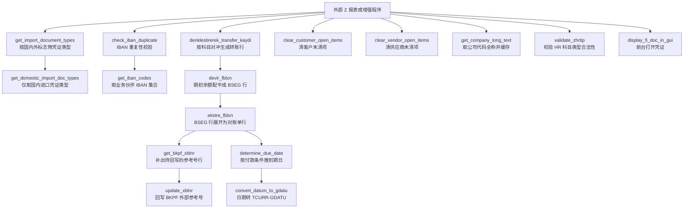

# ZCL_FI_TOOLKIT 源码分析报告

## 一、程序定位与业务背景

`ZCL_FI_TOOLKIT` 是一个**全局可调用的静态工具类**（`CLASS ... DEFINITION PUBLIC FINAL CREATE PUBLIC`，无实例状态），挂在 SAP 某土耳其本地化客户的 FI（Financial Accounting）开发栈上。它不是一个报表、不是一个批处理，而是一层被别的 Z 程序反复调用的"记账域算术"。

从方法名就能读出业务语境：`devir_fblxn`（期初余额行）、`ekstre_fblxn`（对账单行）、`denklestirerek_transfer_kaydi`（按科目对冲生成转账凭证行）、`clear_customer_open_items` / `clear_vendor_open_items`（清客户/供应商未清项）、`check_iban_duplicate` / `get_iban_codes`（IBAN 重复校验）、`validate_zhrtip`（HR 相关科目类型校验）、`get_import_document_types`（进口凭证类型）。土耳其语和德语借词混用（FI、凭证 BUKRS/BELNR/GJAHR、SHKZG 借贷标识）是 SAP 本地化项目的典型指纹。

**它解决什么问题？** 典型场景是月结、年度迁移和审计整改。这类工作有三个反复出现的痛点：

1. **BSEG 分录行的算术规则每次都要重写。** 生成一张 FI 凭证的分录行，需要按科目 `HKONT` 和借贷标识 `SHKZG` 做金额配平：借方科目加总等于贷方科目加总，还要把金额按 `DMBE2`（本位币第二金额）、`DMBE3`（本位币第三金额）三套货币维度分开累计，最后带上 `FILKD`（公司代码）、`WAE-RS`（事务货币）、`GSBER`（业务范围）。这段逻辑在报表、在迁移程序、在手工修复程序里被复制粘贴了无数次，每复制一次就埋一次 bug。`devir_fblxn` 就是把这段配平逻辑收进一个方法。
2. **对外和对内的行结构不一致。** 数据库里的 BSEG 行是"技术结构"（一个 `BUZEI` 一行，含 `SHKZG` 借贷方向）；业务人员要看的对账单是"经济结构"（一个科目一行的净额）。两者之间的转换是纯算术但极易写错，`ekstre_fblxn` 干这件事。
3. **跨表写入的原子性没人管。** 修改 BKRF 的外部参考号 `XBLNR` 要么全成功要么全失败，靠 `UPDATE BKPF` 的裸调用是做不到的，必须显式 `COMMIT WORK`。`update_xblnr` 把这件事收敛成一个带提交开关的方法。

**为什么现有方案不够？** SAP 标准 FM（`FI_DOCUMENT_POST`、`BAPI_ACC_DOCUMENT_POST`）只解决"把凭证 POST 出去"，不解决"这些行的金额怎么算出来"。而 Z 报表里的老代码通常是"先把所有明细读进内表，再在 LOOP 里用 `READ TABLE` 找对应行做加减"——一旦遇到重复键或金额方向不一致就静默算错。所以这个类的存在意义是：**把"算行"的确定性从调用方的临时逻辑里拿走**。

**整体设计范式一句话定性**：无状态静态方法库 + 异常类做错误契约 + 类级 HASHED 缓存做读热点补丁，每个方法只暴露一张结构化的输入表和一张结构化的输出表，不替调用方做 ALV、不替调用方决定业务分支。

---

## 二、程序执行流程总览



责任链表按业务链路顺序排列。调用者一栏反映的是这类工具类的真实调用方式：**没有内部入口，全部由外部程序按场景点名调用**，唯一的内部依赖是 `ekstre_fblxn` 调 `get_sd_inv`。

| 子程序 | 调用者 | 职责 |
| --- | --- | --- |
| `get_import_document_types`（方法 get_import_document_types） | 外部迁移/导入程序 | 按 `IV_INCLUDE_FOREIGN` / `IV_INCLUDE_DOMESTIC` 开关返回可用凭证类型集合，带静态缓存 |
| `get_domestic_import_doc_types`（方法 get_domestic_import_doc_types） | `get_import_document_types` | 只返回国内进口业务范围的凭证类型 |
| `check_iban_duplicate`（方法 check_iban_duplicate） | 外部主数据保存程序 | 在供应商/客户范围内检查 IBAN 是否重复，重复则抛 `ZCX_FI_IBAN` |
| `get_iban_codes`（方法 get_iban_codes） | 外部付款程序 | 返回范围内的 IBAN 清单，供付款文件生成 |
| `denklestirerek_transfer_kaydi`（方法 denklestirerek_transfer_kaydi） | 外部转账凭证生成程序 | 把一张 BKPF 头加若干往来行，按科目对冲补齐借贷平衡行 |
| `devir_fblxn`（方法 devir_fblxn） | 外部期初余额迁移程序 | 按 `SUBE`/`MERKEZ` 汇总关系把期初明细配平为 BSEG 行 |
| `ekstre_fblxn`（方法 ekstre_fblxn） | 外部对账单程序、内部调 `get_sd_inv` | 把技术行展开成经济净额行，并补 SD 发票参考 |
| `get_bkpf_xblnr`（方法 get_bkpf_xblnr） | 外部参考号回写程序 | 为一批凭证找出待回写 `XBLNR` 的头记录 |
| `update_xblnr`（方法 update_xblnr） | 外部参考号回写程序 | 逐张 `MODIFY BKPF` 并按开关 `COMMIT WORK` |
| `clear_customer_open_items`（方法 clear_customer_open_items） | 外部清账程序 | 清指定客户在指定凭证清单上的未清分配 |
| `clear_vendor_open_items`（方法 clear_vendor_open_items） | 外部清账程序 | 同上，供应商侧 |
| `determine_due_date`（方法 determine_due_date） | `ekstre_fblxn`、外部到期日报表 | 按凭证条件推算净到期日 |
| `convert_datum_to_gdatu`（方法 convert_datum_to_gdatu） | `determine_due_date`、外部汇率程序 | 把 `DATUM` 转成 `TCURR-GDATU` 的 YYYYMMDD 串，带进程内缓存 |
| `get_company_long_text`（方法 get_company_long_text） | 外部报表表头程序 | 返回公司代码全称，结果进类级 HASHED 缓存 |
| `validate_zhrtip`（方法 validate_zhrtip） | 外部 HR 过账程序 | 校验凭证首字符与 HR 科目类型 `ZHRTIP` 的组合是否合法 |
| `display_fi_doc_in_gui`（方法 display_fi_doc_in_gui） | 外部 ALV 双击处理 | 调 `FI_DOCUMENT_GUI` 前台展示凭证 |
| `get_sd_inv`（方法 get_sd_inv） | `ekstre_fblxn` | 按 VBELN 找 VBKD 订单号，关联 VBRP 参考单据 |
| 全局声明区 | — | 公开类型（`TT_DEVIR` 等）、六个业务常量、三个类级缓存 |

下面按这条链路，逐个子程序展开。

---

## 三、分组分析（按程序流程 / 子程序）

### 3.1 子程序类型 `get_import_document_types`

这个方法分两步走：先把配置表整表读进类级缓存，再在副本上按国内外开关过滤。全长二十来行，是全类最典型的"薄封装"。

#### ① 首次调用时装载配置缓存

```abap
    IF gt_import_doc_type_cache IS INITIAL.
      SELECT * FROM zfit_ith_blart INTO TABLE @gt_import_doc_type_cache.
    ENDIF.

    DATA(lt_returnable_blart) = gt_import_doc_type_cache.
```

**做什么** — 若类级缓存 `GT_IMPORT_DOC_TYPE_CACHE` 为初始值，就整表 `SELECT *` 把自定义表 `ZFIT_ITH_BLART` 读进缓存；紧接着把整表拷一份到局部内表 `lt_returnable_blart`，作为后面过滤的工作副本。
**为什么** — "空则装载"是一次性初始化的最低成本写法，比每次调用都 `SELECT` 划算，因为这个方法在月结程序里往往是按凭证类型循环调用的热点；配置表在 Z 语境下是自己维护的小表，`SELECT *` 的字段耦合风险可接受。关键设计点是**过滤发生在副本而不是缓存上**——否则一次带 `ABAP_FALSE` 的调用就会把进程级缓存删空，后续调用方全部拿到空集合，而这类顺序依赖极难排查。
**风险与改进** — 三处。其一，缓存永不失效：`ZFIT_ITH_BLART` 若走 SM30 直接维护，配置改动在程序重启前不生效，运维会认为"改了没用"。其二，"空即未装载"这个判据与"表本来就无行"无法区分，配置表一旦为空，每次调用都会重新查库。其三，`SELECT` 未判 `sy-subrc`，表缺失或无权限时缓存留空、方法静默返回空集合，调用方会把"没配置"当成"没有凭证类型"。建议用独立的状态标记替代"空即未装载"，并对 `SELECT` 结果做显式处理。

#### ② 按国内外开关过滤并投影成去重集合

```abap
    IF iv_include_domestic = abap_false.
      DELETE lt_returnable_blart WHERE is_domestic = abap_true.
    ENDIF.

    IF iv_include_foreign = abap_false.
      DELETE lt_returnable_blart WHERE is_foreign = abap_true.
    ENDIF.

    rt_blart = VALUE #( FOR _blart IN lt_returnable_blart ( _blart-blart ) ).
```

**做什么** — 两个开关各自独立地做"排除"：不含国内就删掉 `IS_DOMESTIC = ABAP_TRUE` 的行，不含国外就删掉 `IS_FOREIGN = ABAP_TRUE` 的行；再把剩余行的 `BLART` 用表推导表达式投影到 `RT_BLART`。
**为什么** — 返回类型 `TT_BLART` 是 `HASHED TABLE OF blart WITH UNIQUE KEY primary_key COMPONENTS table_line`，所以 `VALUE #( ... )` 出来的集合天然带唯一性，投影去重是免费的，调用方不可能拿到重复凭证类型——这一点比"用标准表 + 调用方自己 `DELETE ADJACENT DUPLICATES`"高明得多。选择"删"而不是"取"，是为了让未标记的行默认放行，这在标志位配置里是常见但需要显式承认的取舍。
**风险与改进** — 语义边界对不上直觉。`IS_DOMESTIC` 与 `IS_FOREIGN` 不互斥，一条"两者皆真"的配置在 `IV_INCLUDE_DOMESTIC = ABAP_TRUE` 而 `IV_INCLUDE_FOREIGN = ABAP_FALSE` 的调用里会被保留，调用方以为只拿到了国内凭证，实际混进了双标记行；而两个开关都传 `ABAP_FALSE` 时返回的不是空集，而是所有两个标志都为初始值的行，与参数名的直觉相反。上一小节的单点查找场景里没人会用双 `FALSE`，但这是个静默的坑。建议把开关语义改成"为真则要求标志为真"，或者显式校验两个标志的互斥性。

### 3.2 子程序类型 `get_domestic_import_doc_types`

```abap
    get_import_document_types( ). " Cache dolsun diye

    rt_blart = VALUE #( FOR _blart IN gt_import_doc_type_cache
                        WHERE ( is_foreign  = abap_true AND
                                is_domestic = abap_true )
                        ( _blart-blart ) ).
```

**做什么** — 先以默认参数空调用一次 `get_import_document_types`，只为触发缓存装载；然后绕开该方法的过滤逻辑，直接遍历缓存本身，用 `IS_FOREIGN = ABAP_TRUE AND IS_DOMESTIC = ABAP_TRUE` 双条件筛出 `BLART` 作为结果。
**为什么** — 作者显然清楚 `get_import_document_types` 的两个开关表达不了"国内进口"这个切片：那里两个开关是"排除"关系，只能要国内或者要国外，拿不到两者的交集。所以另起一个方法直接操作缓存来补这个正交切片，这是对上一节遗留语义缺口的直接补丁。注释 `Cache dolsun diye` 是土耳其语"让它把缓存填上"，明确说明那次返回值被丢弃的空调用是有意为之，不是漏写 `ASSIGN`。
**风险与改进** — 两处。其一，依赖副作用的执行顺序是脆弱耦合：只要有人给 `get_import_document_types` 加早退、或改变缓存判据，这里会静默返回空集合，而双条件过滤本身不会报错，排查时看不出是缓存没填。其二，AND 条件要求"国内和国外标志同时置位"才返回，这与方法名"domestic import"的直觉（只要国内）并不一致——真正只打了 `IS_DOMESTIC` 标记的国内进口配置会被这个方法漏掉。这两点都需要与 `ZFIT_ITH_BLART` 的实际维护口径核实：两个标志是否被设计为必须同时置位。建议改为在配置侧直接增加一个"国内进口"派生标志，或者让本方法复用同一个过滤内核而不是各写一份。

### 3.3 子程序类型 `check_iban_duplicate`

分两步：先取 IBAN 集合，再判非空并抛异常。

#### ① 取范围内的 IBAN 集合并做存在性判断

```abap
    DATA(lt_tiban) = get_iban_codes(
      it_iban       = it_iban
      iv_get_vendor = iv_get_vendor
      iv_get_client = iv_get_client
      it_lifnr      = it_lifnr
      it_kunnr      = it_kunnr
    ).

    CHECK lt_tiban IS NOT INITIAL.
```

**做什么** — 原样透传五个入参去调 `get_iban_codes`，拿到结果内表；只要结果非初始就往下走，为空则用 `CHECK` 直接跳出方法。
**为什么** — 方法体本身不含任何 SQL，校验逻辑完全复用数据访问层，这是很好的分层：判定规则和取数规则不在同一个方法里改。`CHECK` 用在这里语义精确——"没查到就不算重复"，而且它不像 `RETURN` 那样在可读性上打断视觉，比 `IF ... RETURN.` 更符合这类校验函数的惯例。
**风险与改进** — 存在一个真正的静默失效路径。`IT_LIFNR` 与 `IT_KUNNR` 在定义里都是 `OPTIONAL`，未传时是初始内表；下游 SQL 用的是 `lfa1~lifnr IN @it_lifnr`，初始范围表匹配不到任何行，于是 `lt_tiban` 为初始，`CHECK` 让方法悄悄返回，**校验形同虚设且没有任何提示**。调用方以为校验通过，实际什么都没查。建议在方法开头拦截两个范围表都初始的调用并抛异常，或把两个参数改为必填。另需注意 `CHECK` 在这里是"命中即抛错"的反向用法，语义正确但依赖读者熟悉这种约定，新人容易误读成"非空则继续校验"。

#### ② 定位冲突行并抛出业务异常

```abap
    ASSIGN lt_tiban[ 1 ] TO FIELD-SYMBOL(<ls_tiban>).

    RAISE EXCEPTION TYPE zcx_fi_iban
      EXPORTING
        textid     = zcx_fi_iban=>already_used
        iban       = <ls_tiban>-iban
        party      = COND #( WHEN <ls_tiban>-kunnr IS NOT INITIAL THEN <ls_tiban>-kunnr
                             WHEN <ls_tiban>-lifnr IS NOT INITIAL THEN <ls_tiban>-lifnr
                           )
        party_type = COND #( WHEN <ls_tiban>-kunnr IS NOT INITIAL THEN TEXT-110
                             WHEN <ls_tiban>-lifnr IS NOT INITIAL THEN TEXT-111
                           ).
```

**做什么** — 把结果集第一行绑定到字段符号，取出 `IBAN`、业务伙伴号和伙伴类型（客户 `TEXT-110` 还是供应商 `TEXT-111`），作为 `ZCX_FI_IBAN` 异常的导出参数抛出，文本 ID 固定为 `ALREADY_USED`。
**为什么** — 用异常而非 `SUBRC` 返回表达校验失败，是这个类一贯彻的契约（`ZCX_FI_IBAN`、`ZCX_BC_TABLE_CONTENT`、`ZCX_FI_ZHRTIP` 三个异常类覆盖了所有可失败方法），比让调用方逐个判 `IF` 更难漏判。把 IBAN 和伙伴号塞进异常，调用方无需再查一次库就能给出有意义的错误提示，这是同类校验 FM 的标准做法。`COND #( )` 判定客户优先于供应商，符合业务上"同一 IBAN 可能同时挂在客户和供应商上"的优先级直觉。
**风险与改进** — 三处，都值得当缺陷记。其一，**方法名与判据不一致**：方法叫 `check_..._duplicate`，但判据是"范围内已存在这条 IBAN"（存在性），不是"同一 IBAN 出现多次"（重复性）。若调用方语义是"我准备新增这条 IBAN，请确认它未被占用"，那么判据是对的、只是名字起歪了；若调用方真的是想查重，那么逻辑是错的。需核实调用方场景。其二，只报 `lt_tiban[ 1 ]`，批量校验时调用方拿不到全部冲突项，要么反复调用要么自己去查，接口对批量场景不友好。其三，两个 `COND` 都没有 `ELSE`：若冲突行的 `KUNNR` 与 `LIFNR` 都为初始（理论上不该发生，但 `TIBAN` 允许这种残留数据），异常里 `PARTY` 和 `PARTY_TYPE` 都为空，消息会缺关键信息。建议补 `ELSE` 分支或至少在取数侧保证伙伴号非空。

### 3.4 子程序类型 `get_iban_codes`

分两步：供应商侧取数、客户侧取数。两次取数结构高度相似但有差异，所以各自完整展示。

#### ① 供应商侧：从 LFA1 经 LFBK 关联 TIBAN

```abap
    IF iv_get_vendor IS NOT INITIAL.

      SELECT lfa1~lifnr, tiban~*
        APPENDING CORRESPONDING FIELDS OF TABLE @rt_tiban
        FROM lfa1
             INNER JOIN lfbk ON lfbk~lifnr = lfa1~lifnr
             INNER JOIN tiban ON tiban~banks = lfbk~banks AND
                                 tiban~bankl = lfbk~bankl AND
                                 tiban~bankn = lfbk~bankn AND
                                 tiban~bkont = lfbk~bkont
        WHERE lfa1~lifnr IN @it_lifnr AND
              tiban~iban IN @it_iban
        ##TOO_MANY_ITAB_FIELDS.

    ENDIF.
```

**做什么** — 三个表内连接：`LFA1`（供应商主数据）按 `LIFNR` 连 `LFBK`（供应商银行账号），再按银行四件套（`BANKS`/`BANKL`/`BANKN`/`BKONT`）连 `TIBAN`（IBAN 明细），筛出 `IT_LIFNR` 与 `IT_IBAN` 范围内的行，把 `LFA1-LIFNR` 与 `TIBAN` 全部字段用 `CORRESPONDING FIELDS` 追加到返回表。
**为什么** — 用 SQL 内连接而不是"先读主数据再 `FOR ALL ENTRIES`"，是因为 IBAN 需要银行账号四件套联合匹配，`TIBAN` 侧的 `BANKS`/`BANKL`/`BANKN`/`BKONT` 组合键无法用一个范围表表达，内连接交给优化器更自然。`IV_GET_VENDOR` 作为开关包住整段而不是无条件查，是因为 `LFBK` 在部分客户数据里行数巨大，能省一次全表连接就省。
**风险与改进** — 三处。其一，`IT_LIFNR` 未传时初始，范围表匹配不到行，这个分支静默返回空——正是上一小节 `CHECK` 静默失效的根因。其二，`TIBAN~*` 配合 `##TOO_MANY_ITAB_FIELDS` 抑制码，把"目标结构 `ZFITT_TIBAN` 与 TIBAN 的字段对应关系"完全交给 `CORRESPONDING` 的隐式同名匹配：目标结构少一个字段就静默丢数据、多一个同名字段就静默保持初始值，两边必须同步改而编译器不会提醒。其三，`SELECT` 后未判 `sy-subrc`，权限不足或表缺失时静默跳过。建议至少对范围表做非初始校验，并对关键输出字段（如 `IBAN`、`LIFNR`）做一次非空断言。

#### ② 客户侧：从 KNA1 经 LNBK 关联 TIBAN

```abap
    IF iv_get_client IS NOT INITIAL.

      SELECT kna1~lifnr, tiban~*
        APPENDING CORRESPONDING FIELDS OF TABLE @rt_tiban
        FROM kna1
             INNER JOIN lnbk ON lnbk~kunnr = kna1~kunnr
             INNER JOIN tiban ON tiban~banks = lnbk~banks AND
                                 tiban~bankl = lnbk~bankl AND
                                 tiban~bankn = lnbk~bankn AND
                                 tiban~bkont = lnbk~bkont
        WHERE kna1~lifnr IN @it_kunnr AND
              tiban~iban IN @it_iban
        ##TOO_MANY_ITAB_FIELDS.

    ENDIF.
```

**做什么** — 与上一步同构，只是换成客户侧三表：`KNA1`（客户主数据）按 `LIFNR` 连 `LNBK`（客户银行账号），再同样按银行四件套连 `TIBAN`，筛 `IT_KUNNR` 与 `IT_IBAN`，结果追加到同一个返回表。
**为什么** — 客户和供应商两侧的银行账号存在两张不同的表（`LNBK`/`LFBK`），业务上必须一次查完才能判断"这个 IBAN 是否在任一侧被占用"，所以设计成一个方法返回合并集而不是两个方法加调用方合并。追加语义（`APPENDING`）而非覆盖，正确地实现了这个合并意图。
**风险与改进** — 这里是本报告最想标红的一处：**筛选字段与范围表语义不匹配**。`WHERE kna1~lifnr IN @it_kunnr` 是拿 `KNA1` 的 `LIFNR` 字段去跟客户号范围 `IT_KUNNR` 比。`KNA1` 确实带一个 `LIFNR`（该客户关联的供应商号），但它的业务含义是"客户→供应商的引用"，不是客户号；与 `IT_KUNNR` 比较在语法和类型上都能通过（两者同属 `LIFNR` 域），所以**不会报错、不会 dump，只会静默地少返回甚至不返回客户侧的 IBAN**。看起来是从上一段 `LFA1~LIFNR` 复制过来忘了改字段名。这类"能跑但结果错"的缺陷在 Z 代码里最难被发现，因为调用方看到的只是"客户侧没查到冲突"。建议改为 `WHERE kna1~kunnr IN @it_kunnr`（需在 SE11 核实 `KNA1-LIFNR` 的实际语义与业务口径后再定），并把两段的筛选字段统一为 `KUNNR`/`LIFNR` 各自的本方字段。

从 `get_iban_codes` 走到这里可以看出一个模式：取数侧不判空、不判 `SY-SUBRC`、筛选用 `OPTIONAL` 范围表，这些松散在数据访问层；校验侧（`check_iban_duplicate`）只有一个 `CHECK`，把松散原样继承了下来。下一组三个方法开始，问题从"静默失效"升级到"条件恒真恒假"。

### 3.5 子程序类型 `get_sd_inv`

```abap
    CHECK it_vbrk_key IS NOT INITIAL.

    SELECT DISTINCT vbrp~vbeln
                    vbrp~vgtyp
                    vbrp~vgbel
                    vbkd~bstkd
       INTO TABLE rt_vbrp
       FROM vbrp
       LEFT OUTER JOIN vbkd
               ON vbkd~vbeln = vbrp~aubel AND
                  vbkd~posnr = '000000'
       FOR ALL ENTRIES IN it_vbrk_key
       WHERE vbrp~vbeln = it_vbrk_key-vbeln.
```

**做什么** — 先用 `CHECK` 拦掉空的驱动表，然后从 `VBRP`（销售凭证明细）按 `VBELN` 取明细，同时左外连接 `VBKD` 取 `BSTKD`，投影成 `VBELN`/`VGTYP`/`VGBEL`/`BSTKD` 四列写进返回表。
**为什么** — 这个方法存在的理由是把"某张销售凭证引用了哪些单据、对方订单号是多少"这个跨 `VBRP`/`VBKD` 的关系一次查完给 `ekstre_fblxn` 用，否则调用方要么写两段 `SELECT` 再手工合并，要么用 `FOR ALL ENTRIES` 把 `VBRP` 全拉进内存。用左外连接保证没有订单号的行也能返回（`BSTKD` 为初始），这与"参考信息缺失也要在对账单上体现"的业务诉求一致。返回类型 `TT_VBRP` 是按 `VBELN` 非唯一排序的表，天然容纳一张凭证多行引用的情形。
**风险与改进** — 两处值得记。其一，**连接键与表语义不匹配**：`ON vbkd~vbeln = vbrp~aubel` 是拿 `AUBEL`（明细上的参考单据号）去查 `VBKD`（销售凭证的附加数据，抬头级）。而 `AUBEL` 在 `VBRP` 里通常指向的是**销售订单**，销售订单的抬头附加数据在 `VBKO` 里，不在 `VBKD` 里。若这条判断成立，`BSTKD` 会大面积取空，表现为"订单号列总是空的"，且不报错。需在 SE11/SQL 侧核实 `VBRP-AUBEL` 的实际引用对象与 `VBKD-VBELN` 的文档类型范围后再定。其二，`IT_VBRK_KEY` 没有唯一键声明（`TT_VBRK_KEY TYPE TABLE OF ty_vbrk_key`），调用方若传入重复 `VBELN`，`FOR ALL ENTRIES` 会按驱动行重复取数；`SELECT DISTINCT` 会把完全相同的结果去重，但当同一张凭证的多条明细引用同一个参考单据时，重复抓取与 `DISTINCT` 相互掩盖，看不出实际扫描量。建议在驱动表侧先去重，并对取到的 `VBRP` 行数与输入凭证数做一次数量校验。

### 3.6 子程序类型 `denklestirerek_transfer_kaydi`

这个方法是全类最长的一处 FM 序列，分七步：声明结构与宏定义、读明细、推导转账凭证类型、装配凭证头字段行、构造清账指令行、开启过账会话、提交清账并结束会话。

#### ① 声明工作结构并定义 FTPOST 宏

```abap
    DATA:
      lv_group TYPE apqi-groupid,
      lv_mode  TYPE rfpdo-allgazmd VALUE 'E'.
    DATA:
      lt_blntab  TYPE STANDARD TABLE OF blntab ##NEEDED,
      lt_ftclear TYPE STANDARD TABLE OF ftclear ##NEEDED,
      lt_ftpost  TYPE STANDARD TABLE OF ftpost ##NEEDED,
      ls_ftpost  TYPE  ftpost ##NEEDED,
      lt_fttax   TYPE STANDARD TABLE OF fttax ##NEEDED.

    lv_group = sy-tcode.
```

**做什么** — 声明 `POSTING_INTERFACE_*` 系列 FM 需要的四个表参数（`BLNTAB`、`FTCLEAR`、`FTPOST`、`FTTAX`）和一个单行 `FTPOST` 工作区；把事务号存进 `LV_GROUP`；`LV_MODE` 固定为 `E`。
**为什么** — 这套 FM 是"不走界面、直接把过账指令喂给 FI 核心"的经典做法：把 `FB05`（转账凭证）里的每个可输入字段变成一条 `FTPOST` 行（头字段 `K` + 行字段名 + 值），再把要清的行变成 `FTCLEAR` 行交给 `POSTING_INTERFACE_CLEARING` 统一过账。用 `##NEEDED` 抑制未使用表参数的语法检查，是因为这四个表在不同的 FM 调用里并非全用，但结构体仍需声明。
**风险与改进** — 一处结构性问题：**整个方法依赖宏**。宏 `ftpost` 把"置 `STYPE`/`COUNT`/`FNAM`、把值 `WRITE` 成内部格式并 `CONDENSE`、追加到内表"压成一行，调用处读起来很像普通赋值，实际却做了类型转换。这意味着调用方传入的日期、金额、字符串都被静默转成 FI 核心期望的字符表示，而类型不匹配在编译期完全检查不出来。建议把这套装配改成对一个显式的行类型做字段赋值，类型问题就会在编译期暴露。

#### ② 读取待转账的凭证行

```abap
    IF it_bseg IS NOT INITIAL.
      SELECT bukrs ,belnr ,gjahr, buzei, koart,umskz FROM bseg
        INTO TABLE @DATA(lt_bseg)
        FOR ALL ENTRIES IN @it_bseg
        WHERE
          bukrs = @it_bseg-bukrs AND
          belnr = @it_bseg-belnr AND
          gjahr = @it_bseg-gjahr AND
          buzei = @it_bseg-buzei .                      "#EC CI_NOORDER
    ENDIF.
```

**做什么** — 在输入行非空的前提下，用 `FOR ALL ENTRIES` 按 `BUKRS`/`BELNR`/`GJAHR`/`BUZEI` 四件套回查 `BSEG`，只取 `KOART`（科目类型）和 `UMSKZ`（特殊总账标识）两列追加信息。
**为什么** — 输入参数 `TT_DOCUMENTS` 只带凭证键，不带 `KOART`/`UMSKZ`，而转账凭证的行结构 `FTCLEAR-AGKOA` 和可选的 `AGUMS` 正好需要这两个字段，所以必须回查一次。只选两列而不是 `SELECT *`，是因为 `BSEG` 有两百多个字段而这里只要两列——这是老代码里少见的克制。`"#EC CI_NOORDER` 抑制 Code Inspector 的"未指定字段顺序"告警，因为这里确实要按任意顺序拿。
**风险与改进** — 两处。其一，`FOR ALL ENTRIES` 前置判断了 `IT_BSEG IS INITIAL`，这点做对了，但**没有对输入去重**：`TT_DOCUMENTS` 是无键标准表，调用方传两条相同的凭证键时，`BSEG` 行会被抓两次，后面每条凭证键生成一条 `FTCLEAR` 行，等于对同一行发出两次清账指令。这类重复在调用方合并多个报表结果集时很容易发生。其二，`SELECT` 后未判 `SY-SUBRC`，查不到时 `LT_BSEG` 为空，后续整个方法会构造出"只有头字段、没有清账行"的空转凭证并照样调 FM 序列。这个空凭证会不会被后端拒绝，需在测试系统核实。

#### ③ 借 T041A 推导转账凭证类型

```abap
      IF sy-tabix = 1.
        DATA: lv_fname(5) TYPE c.
        CONCATENATE 'BLAR' ls_bseg-koart INTO lv_fname.
        DATA lv_blart TYPE bkpf-blart.
        SELECT SINGLE (lv_fname) FROM t041a INTO lv_blart
          WHERE auglv = 'UMBUCHNG'.
      ENDIF.
```

**做什么** — 在第一次循环时，把 `KOART` 拼成动态列名 `BLAR` + 科目类型，从 `T041A` 查 `AUGLV = 'UMBUCHNG'` 那一列，得到转账凭证类型 `LV_BLART`，供后面的 `BKPF-BLART` 赋值使用。
**为什么** — 转账凭证的凭证类型不是固定值，取决于对方科目类型（债务人/债权人/总账/成本/资产），配置在 `T041A` 里。这里用动态列名而不是 `CASE koart` 写死四个 `SELECT`，是为了让"新增科目类型"时零代码改动——这是很聪明的配置驱动写法，也是 SAP 自己生成代码时的惯用手法。放在 `SY-TABIX = 1` 里做，是为了让 `SELECT SINGLE` 只执行一次而不是每行一次。
**风险与改进** — 三处。其一，`SY-TABIX = 1` 这个写法隐含依赖 `LOOP` 的 `TABIX` 语义，虽然成立，但对读代码的人不友好；`LOOP ... AT ... INTO` 外加首次进入标记会更清楚。其二，`T041A` 的动态列若为空串（`KOART` 异常），`SELECT SINGLE ( )` 的行为需核实；更稳妥的做法是查一次后判断 `LV_BLART` 是否为初始，异常就 `RETURN`。其三，`T041A` 查不到时 `SY-SUBRC` 未判，`LV_BLART` 保持初始，最终会写出一个空凭证类型的 `BKPF-BLART` 头字段，属于"能提交但会被核心拒绝"的错误参数。

> 注：本块在源码里紧随其后的三行是宏调用，为保持这一小步只讲清"凭证类型推导"这一件事，宏调用放在 ④ 展示。

#### ④ 用宏装配凭证头字段行

```abap
        ftpost 'K' '1' 'BKPF-BUKRS' ls_bseg-bukrs.
        ftpost 'K' '1' 'BKPF-BLART' lv_blart.
        ftpost 'K' '1' 'BKPF-BLDAT' is_bkpf-bldat.
        ftpost 'K' '1' 'BKPF-BUDAT' is_bkpf-budat.
        ftpost 'K' '1' 'BKPF-XBLNR' is_bkpf-xblnr.
        ftpost 'K' '1' 'BKPF-WAERS' is_bkpf-waers.
        ftpost 'K' '1' 'BKPF-BKTXT' is_bkpf-bktxt.
      ENDIF.
```

**做什么** — 通过宏向上面收集的 `LT_FTPOST` 里追加七条头字段赋值：`BUKRS` 公司代码、`BLART` 凭证类型、`BLDAT` 凭证日期、`BUDAT` 过账日期、`XBLNR` 外部参考号、`WAERS` 事务货币、`BKTXT` 抬头文本。
**为什么** — `POSTING_INTERFACE_*` 的输入是"名字-值"对而非结构体，这正是它能在不 BAPI 的情况下走 FI 核心的原因。用宏统一处理 `STYPE`/`COUNT` 分配和值转字符，七行调用的意图一目了然。头字段只在第一轮追加，因为整张凭证共享同一个头。
**风险与改进** — 两处。其一，`XBLNR` 与 `BKTXT` 无条件写入：`XBLNR` 若传入初始值等于显式清空外部参考号，`BKTXT` 为空则可能覆盖后端默认值，是否允许应与调用方确认。其二，这七条 `WRITE &4 TO ls_ftpost-fval` 的类型转换全部隐式——`IS_BKPF-BLDAT` 是 `DATS`，转成字符是内部格式，与 FI 核心期望一致；但 `WAERS` 是 5 位字符，转换没问题；若是数值型字段（如金额）转字符就会得到带符号或科学计数法的怪串，这类字段一进来就出错。宏没有类型检查的护栏。

#### ⑤ 构造清账指令行

```abap
      APPEND INITIAL LINE TO lt_ftclear REFERENCE INTO DATA(lr_ftclear).
      lr_ftclear->agkoa = ls_bseg-koart.
      lr_ftclear->agbuk = ls_bseg-bukrs.
      lr_ftclear->selfd = 'BELNR'.
      IF ls_bseg-umskz <> space.
        lr_ftclear->agums = ls_bseg-umskz.

      ENDIF.
      lr_ftclear->xnops = abap_true.
      CONCATENATE ls_bseg-belnr
                  ls_bseg-gjahr
                  ls_bseg-buzei
             INTO lr_ftclear->selvon.
```

**做什么** — 为每一条读到的 `BSEG` 行生成一条清账指令：科目类型 `AGKOA`、公司代码 `AGBUK`，选择字段标识固定为 `'BELNR'`，若该行有特殊总账标识就带上 `AGUMS`，置 `XNOPS` 标志，最后把 `BELNR`/`GJAHR`/`BUZEI` 拼成 `'...'` 形式的选行字符串 `SELVON`。
**为什么** — `SELVON` 用 `CONCATENATE` 而不是 `CONVERT` 或结构体赋值，是因为 FM 期望的就是一个内部格式的选行字符串；把三段拼成一个字符串比传结构体更适配这套老接口。`REFEENCE INTO` 的引用追加写法避免了"追加后再按索引 `MODIFY`"的两步写法，是 7.40 之后更推荐的惯用法。`XNOPS` 的语义（不清实际过账、只做清账）需在 FM 文档核实，但这决定了该方法是"只清未清项"而不是"清账并生成新行"——方法名"transfer kaydı"（转账记录）与这个标志的关系值得与作者确认。
**风险与改进** — 两处。其一，`CONCATENATE` 未指定空格分隔符，默认不留空格，这符合 `BELNRGJAHRBUZEI` 的期望；但也没有任何长度校验，若某个字段超长会被静默截断或抛转换异常，取决于运行期检查级别。其二，`IF ls_bseg-umskz <> space.` 里的空行是遗留格式；更重要的是这里把 `UMSKZ` 当成"要不要带 `AGUMS`"的依据，却**没有区分正负特殊总账标识**（`UMSKZ` 有 S/K 两种取值，K 表示冲销），负向标识是否应原样传给 `AGUMS` 需核实。

#### ⑥ 调用 POSTING_INTERFACE_START

```abap
    CALL FUNCTION 'POSTING_INTERFACE_START'
      EXPORTING
        i_function         = 'C'    " Using Call Transaction
        i_group            = lv_group
        i_mode             = lv_mode
        i_update           = 'S'
        i_user             = sy-uname
        i_xbdcc            = 'X'
      EXCEPTIONS
        client_incorrect   = 1
        function_invalid   = 2
        group_name_missing = 3
        mode_invalid       = 4
        update_invalid     = 5
        OTHERS             = 6.
    IF sy-subrc <> 0.
      MESSAGE ID sy-msgid TYPE sy-msgty NUMBER sy-msgno
             WITH sy-msgv1 sy-msgv2 sy-msgv3 sy-msgv4.
    ENDIF.
```

**做什么** — 开启过账会话：`I_FUNCTION = 'C'` 表示以后用 `CALL TRANSACTION` 的方式过账，分组取事务号，模式为 `E`，更新任务为 `S`（同步），过账用户为当前用户，`XBDCC` 打开 BDC 字段检查。
**为什么** — 显式列出六个具名异常加 `OTHERS`，比不写 `EXCEPTIONS` 好：写出来才有机会逐一处理，`OTHERS` 兜底保证不会因为未预期的异常类型漏成 `SY-SUBRC = 4`。失败时用 `MESSAGE` 而不是 `RAISE` 把后端消息原文抛给用户，这是调用 `FB05`/`F-02` 那套 FM 的常见做法。
**风险与改进** — 三处。其一，失败分支只 `MESSAGE` 不 `RETURN`，`MESSAGE` 默认类型为 `E` 会终止整个屏幕流程（在对话框里是 LEAVE TO LIST / 结束），但在批处理或 `UPDATE TASK` 场景下行为不同；无论如何，**方法没有把错误传给调用方**，而是直接弹消息，与本类其他方法用异常契约的风格不一致——调用方无法 `TRY/CATCH`，也无法在批处理里区分是哪一步失败。建议改成抛异常或在方法末尾统一判断。其二，`I_UPDATE = 'S'` 是同步更新，长时间运行会持有更新锁；若后续步骤失败，`POSTING_INTERFACE_END` 不被调用，需核实该会话是否会残留锁（`POSTING_INTERFACE_START` 有对应的取消/重置 FM）。其三，`I_XBDCC = 'X'` 打开字段检查会明显拖慢大清单处理，是否必需需与调用方权衡。

#### ⑦ 提交清账并结束过账会话

```abap
    CALL FUNCTION 'POSTING_INTERFACE_CLEARING'
      EXPORTING
        i_auglv                    = 'UMBUCHNG'
        i_tcode                    = 'FB05'
      TABLES
        t_blntab                   = lt_blntab
        t_ftclear                  = lt_ftclear
        t_ftpost                   = lt_ftpost
        t_fttax                    = lt_fttax
      EXCEPTIONS
        clearing_procedure_invalid = 1
        clearing_procedure_missing = 2
        table_t041a_empty          = 3
        transaction_code_invalid   = 4
        amount_format_error        = 5
        too_many_line_items        = 6
        company_code_invalid       = 7
        screen_not_found           = 8
        no_authorization           = 9
        OTHERS                     = 10.
    IF sy-subrc = 0 .
      MESSAGE ID sy-msgid TYPE sy-msgty NUMBER sy-msgno
              WITH sy-msgv1 sy-msgv2 sy-msgv3 sy-msgv4.
    ENDIF.

    CALL FUNCTION 'POSTING_INTERFACE_END'
      EXCEPTIONS
        session_not_processable = 1
        OTHERS                  = 2 ##FM_SUBRC_OK.
```

**做什么** — 用过账级别 `'UMBUCHNG'` 和事务 `'FB05'` 调用清账 FM，把四张表全部交给它；成功时（`SY-SUBRC = 0`）把后端消息弹给用户；最后结束过账会话，异常声明为 `##FM_SUBRC_OK`（不判 `SY-SUBRC`）。
**为什么** — `AUGLV` 复用上一节从 `T041A` 读到的语义（转账过账），`TCODE = 'FB05'` 指明按转账凭证的清账过程执行；把四张表一次性传入是这套接口的标准用法，FM 内部自己按 `FTPOST` 先填头、再按 `FTCLEAR` 清行。
**风险与改进** — 三个必须记的缺陷。其一，**成功分支弹 `MESSAGE`**：`IF sy-subrc = 0` 意味着过账成功时执行 `MESSAGE`，`SY-MSGTY` 为 `'S'` 时是成功消息，本身不算错，但当 FM 成功且消息类型为空或为 `'I'` 时会弹出无意义信息；更实质的问题是——**失败分支（`SY-SUBRC <> 0`）被完全遗漏**，也就是说凭证没生成、失败原因被静默吞掉，而紧接着的 `POSTING_INTERFACE_END` 照常执行。这几乎肯定是把等号写反了（成功才 `MESSAGE` 之前应该有 `ELSE` 或失败分支），是一处高风险缺陷：调用方拿到的是"什么都没发生"，却以为执行完了。其二，`POSTING_INTERFACE_END` 用 `##FM_SUBRC_OK` 显式压掉未处理的 `SY-SUBRC`，会话结束失败（`SESSION_NOT_PROCESSABLE`）被忽略。其三，`I_TCODE = 'FB05'` 与 `I_FUNCTION = 'C'`（用 `CALL TRANSACTION` 过账）组合的实际过账路径需在 SE37 核实；`I_MODE = 'E'` 的含义也需确认，不同版本下 `'E'` 与 `'N'`（无对话）差别很大，当前写法很可能在批处理里触发对话框。

真正起作用的只有清账与结束两步；`LV_GROUP`、`LT_BLN TAB`、`LT_FTTAX` 都声明了却没传实质内容，说明这个方法是从一个更通用的模板里裁出来的，只保留了 `FB05` 这条路径。

### 3.7 子程序类型 `devir_fblxn`

全类最长的方法（三百多行），也是唯一一个**用 `SY-CPROG` 反向依赖调用方报表内部变量**的方法。分八步拆开。

#### ① 声明结构与动态字段符号

```abap
    DATA : lv_keydt TYPE sy-datum,
           lt_devir TYPE TABLE OF ty_devir_items,
           ls_devir TYPE ty_devir.

    FIELD-SYMBOLS  : <lt_budat> TYPE range_date_t,
                     <lt_saknr> TYPE fagl_mm_t_range_saknr,
                     <lt_bukrs> TYPE tpmy_range_bukrs,
                     <lv_odk>   TYPE any,
                     <lv_apar>  TYPE any.
```

**做什么** — 声明一个日期变量、两个内表（明细宽表 `TY_DEVIR_ITEMS` 与汇总结果 `TY_DEVIR`），以及五个字段符号：三个有具体范围表类型、两个是 `ANY` 类型用来承接报表里的 `X` 字段（勾选框）。
**为什么** — 字段符号在这里不是"为了性能"，而是**唯一可行手段**：这些字段符号接下来要 `ASSIGN` 到调用方报表（RFIITEMAP/RFITEMGL/RFITEMAR）的全局变量上，静态变量在编译期根本不存在。用 `TYPE ANY` 承接勾选框字段，是因为报表里 `X_SHBV`、`X_APAR` 的类型是 `X`（长度 1 的字符）而不同报表版本可能略有差别，`ANY` 换来了跨报表的兼容。
**风险与改进** — 三处。其一，`lv_keydt TYPE sy-datum` 里的 `sy-datum` **不是系统字段，而是数据元素名**（`SYDATUM`，对应内建类型 `D`），这样写能编译通过，但读者极易误读为"系统字段的类型"，属于危险的可读性写法；应直接写 `TYPE d` 或 `TYPE sydatum`。其二，`ls_devir TYPE ty_devir` 与后面第六步里的字段符号 `<ls_devir>` **同名**，两者类型不同（一个结构、一个宽表行），仅靠尖括号区分，是这个方法最难读的地方；重名不影响正确性，但读错对象会得出完全错误的结论。其三，两个 `ANY` 字段符号一旦未 `ASSIGN` 就被解引用会 short dump，所以 ② 的守卫必须覆盖每一个——这一点作者做对了（除了后面第八步的 `<lv_odk>` 用法仍依赖守卫成立）。

#### ② 按调用程序动态绑定报表变量

```abap
    CLEAR et_devir.

    CASE sy-cprog.
      WHEN 'RFITEMAP'.
        ASSIGN ('(RFITEMAP)SO_BUDAT[]') TO <lt_budat>.
        ASSIGN ('(RFITEMAP)KD_BUKRS[]') TO <lt_bukrs>.
        ASSIGN ('(RFITEMAP)X_SHBV') TO <lv_odk>.
        ASSIGN ('(RFITEMAP)X_APAR') TO <lv_apar>.

        IF NOT (
          <lt_budat> IS ASSIGNED AND
          <lt_bukrs> IS ASSIGNED AND
          <lv_odk>   IS ASSIGNED AND
          <lv_apar>  IS ASSIGNED
        ).
          RETURN.
        ENDIF.
```

**做什么** — 先清空输出参数，再按当前调用程序名分支，用 `ASSIGN` 动态绑定该报表的全局变量：AP 报表（`RFITEMAP`）绑定期期间隔 `SO_BUDAT`、公司代码范围 `KD_BUKRS`、勾选框 `X_SHBV` 与 `X_APAR`；四个对象必须全部绑定成功，否则立刻返回。
**为什么** — `ASSIGN ('(PROG)VAR[]') TO <fs>` 这个写法利用了 ABAP 的动态赋值能力：它允许类方法绑定到**调用方程序的全局变量**上，从而复用报表选择屏已经收集好的输入，避免在类里重复做参数传递。四个变量一起检查、缺一即 `RETURN`，是这个写法唯一正确的使用姿势——动态赋值失败时 `SY-SUBRC` 会置位但不会 dump，必须显式守卫。
**风险与改进** — 三处。其一，**方法契约在定义段完全不可见**：`devir_fblxn` 的签名只有 `IT_HESAP` 和 `ET_DEVIR`，调用方无从得知它只能在三个特定报表里工作。从任何其他程序调用它，`WHEN OTHERS. RETURN.` 会让方法静默返回空输出表，而 `ET_DEVIR` 已被清空，调用方拿到的是一个合法的空表——无法区分"没有期初余额"和"你不该调这个方法"。这是本报告认为最需要修的一类问题：应改成把 `SY-CPROG`/范围表显式作为导入参数，或者在 `WHEN OTHERS` 里抛异常。其二，三个分支重复四到五行几乎相同的 `ASSIGN` + 守卫，属于可以抽成一个"绑定并校验"私有方法的重复代码。其三，`<lt_saknr>`（总账科目范围）只在 GL 分支绑定，不在这段守卫里，与 ⑤ 的处理方式不一致（那里用 `IF SY-SUBRC = 0` 判断而不是 `IS ASSIGNED`，语义相同但风格不同）。

#### ③ 从选择屏推导关键日期

```abap
    READ TABLE <lt_budat> INDEX 1 ASSIGNING FIELD-SYMBOL(<ls_budat>).
    IF sy-subrc = 0.
      lv_keydt = <ls_budat>-low - 1.
    ELSE.
      RETURN.
    ENDIF.

    CLEAR :lt_devir,et_devir.
```

**做什么** — 取选择屏期间的**第一段**的起始日，减一天得到关键日期 `LV_KEYDT`；读不到就返回；随后清空内表。
**为什么** — "期初余额"的定义就是关键日期当天及之前的余额减已完成清账的部分，所以关键日期取期间起始日减一天，`BUDAT LE lv_keydt` 才能把期初那一笔也算进来。这是余额表的标准算法，`- 1` 这个细节容易写错。
**风险与改进** — 三处。其一，只取 `INDEX 1`：用户在选择屏上录了多个期间时，后续期间被静默忽略，方法不会提示也不会报错——而"我明明选了三个期间"是这类报表最常见的支持工单。其二，`lv_keydt = <ls_budat>-low - 1` 没做边界检查：期间起始日为初始值或 `00000000` 时，日期减一属于无效日期算术，运行期是抛异常还是短转储需在 SE38 里核实；正确写法应先判 `<ls_budat>-low IS INITIAL` 并明确处理。其三，`CLEAR :lt_devir,et_devir.` 与 ② 开头的 `CLEAR et_devir.` 重复，② 的那次其实只需覆盖"提前 `RETURN` 之后不留下半成品"这一种情况。

#### ④ AP 分支：从 BSIK/BSAK 与 BSID/BSAD 取明细

```abap
        SELECT
               belnr
               gjahr
               buzei
               bukrs
               lifnr
               shkzg
               dmbtr
               dmbe2
               dmbe3
               umskz
               filkd
               wrbtr
               waers
               INTO TABLE lt_devir
               FROM bsik
               FOR ALL ENTRIES IN it_hesap
               WHERE bukrs IN <lt_bukrs> AND
                     budat LE lv_keydt AND
                     ( lifnr = it_hesap-sube OR lifnr = it_hesap-merkez ).
        SELECT
               belnr
               gjahr
               buzei
               bukrs
               lifnr
               shkzg
               dmbtr
               dmbe2
               dmbe3
               umskz
               filkd
               wrbtr
               waers
               APPENDING TABLE lt_devir
               FROM bsak
               FOR ALL ENTRIES IN it_hesap
               WHERE bukrs IN <lt_bukrs> AND
                     budat LE lv_keydt AND
                     augdt > lv_keydt AND
                     ( lifnr = it_hesap-sube OR lifnr = it_hesap-merkez ).
        IF <lv_apar> = abap_true.
          SELECT
                 belnr
                 gjahr
                 buzei
                 bukrs
                 kunnr
                 ...（此处省略与上面完全相同的 9 行字段列表：shkzg、dmbtr、dmbe2、dmbe3、umskz、filkd、wrbtr、waers）
                 APPENDING TABLE lt_devir
                 FROM bsid
                 FOR ALL ENTRIES IN it_hesap
                 WHERE bukrs IN <lt_bukrs> AND
                       budat LE lv_keydt AND
                       ( kunnr = it_hesap-sube OR kunnr = it_hesap-merkez ).
          SELECT
                 ...（同上，省略 shkzg 到 waers 的字段列表）
                 APPENDING TABLE lt_devir
                 FROM bsad
                FOR ALL ENTRIES IN it_hesap
                 WHERE bukrs IN <lt_bukrs> AND
                       budat LE lv_keydt AND
                       augdt > lv_keydt AND
                       ( kunnr = it_hesap-sube OR kunnr = it_hesap-merkez ).
        ENDIF.
```

**做什么** — 按"已清项 + 未清项"两段拼出关键日期的余额：先取 `BSIK`（已过账且已清账）里 `BUDAT <= KEYDT` 的全部，再追加 `BSAK`（已过账未清账）里 `BUDAT <= KEYDT AND AUGDT > KEYDT` 的部分；若 `X_APAR` 勾选，再对客户侧 `BSID`/`BSAD` 重复同样的两段逻辑。四段查询都用 `FOR ALL ENTRIES IN it_hesap`，条件里的 `LIFNR`/`KUNNR` 与 `IT_HESAP-SUBE` 或 `IT_HESAP-MERKEZ` 比较，即"取出子科目与中心科目两个对手方的所有行"。
**为什么** — 这是 SAP 余额表的标准重构公式：清完的算已发生、未清且清账日还没到的仍在挂账，两者相加才是"关键日期余额"。用 `AUGDT > KEYDT`（清账日晚于关键日）而不是 `AUGDT IS INITIAL`，是为了把关键日之后才清掉的行正确地算进去。用 `APPENDING TABLE` 把四段结果拼成一张宽表，避免了四次单独遍历——这是有意为之，后面 ⑥⑦ 的处理逻辑是"对拼好的宽表统一过滤与汇总"，先拼后处理比先处理后拼简单得多。
**风险与改进** — 四处，按严重程度排。**其一，`LIFNR`/`KUNNR` 与目标结构不匹配**：`LT_DEVIR` 的行类型 `TY_DEVIR_ITEMS` 定义了 `BELNR`/`GJAHR`/`BUZEI`/`BUKRS`/`KONTO`/`SHKZG` 等 14 个字段，**既没有 `LIFNR` 也没有 `KUNNR`**。而这四段 `SELECT` 都按名选了这两列，用的是 `INTO TABLE`/`APPENDING TABLE`（不是 `INTO CORRESPONDING FIELDS OF`），ABAP 要求被选字段存在于目标行结构中，因此这段在 SE38 里应当是编译错误。需在本系统编译核实；若这份仓库代码与线上不一致，那本身就是首要问题。**其二**，即使编译通过，AP/AR 分支用 `LIFNR`/`KUNNR` 而 GL 分支用 `HKONT AS KONTO`，同一个宽表里"对手方"字段名各不相同，下游 ⑦ 的过滤（`DELETE ... WHERE konto = ... AND filkd <> ...`）只认 `KONTO`，等于 AP/AR 分支的行永远匹配不上这条过滤。**其三**，`FOR ALL ENTRIES IN it_hesap` 前没有对 `IT_HESAP` 去重（`TT_HESAP TYPE STANDARD TABLE OF ty_hesap`，无键），调用方若传入重复的 `SUBE`/`MERKEZ` 组合，每一行的四个查询都会按驱动行数成倍返回，后面 ⑧ 的 `COLLECT` 会把它们加起来——**金额翻倍且不会报错**。**其四**，`<lv_apar> = abap_true` 这个判断要求 `X_APAR` 里存的是 `'X'`；若该报表字段是输入框而不是勾选框、存的是 `'1'`，条件恒假，客户侧整段被跳过。需核实 `RFITEMAP`/`RFITEMAR` 里 `X_APAR` 的字段属性。

#### ⑤ GL 分支：从 BSIS/BSAS 取总账行

```abap
        ASSIGN ('(RFITEMGL)SD_SAKNR[]') TO <lt_saknr>.
        IF sy-subrc = 0.

          SELECT
                 belnr
                 gjahr
                 buzei
                 bukrs
                 hkont AS konto
                 shkzg
                 dmbtr AS dmshb
                 dmbe2
                 dmbe3
*                 umskz
*                 filkd
                 wrbtr
                 waers
                 INTO CORRESPONDING FIELDS OF TABLE lt_devir ##TOO_MANY_ITAB_FIELDS
                 FROM bsis
                 WHERE bukrs IN <lt_bukrs> AND
                       budat LE lv_keydt AND
                       hkont IN <lt_saknr>.
          SELECT
                 belnr
                 gjahr
                 buzei
                 bukrs
                 hkont AS konto
                 shkzg
                 dmbtr AS dmshb
                 dmbe2
                 dmbe3
*                 umskz
*                 filkd
                 wrbtr
                 waers
                 APPENDING CORRESPONDING FIELDS OF TABLE lt_devir ##TOO_MANY_ITAB_FIELDS
                 FROM bsas
                 WHERE bukrs IN <lt_bukrs> AND
                       budat LE lv_keydt AND
                       augdt > lv_keydt AND
                       hkont IN <lt_saknr>.
        ENDIF.
```

**做什么** — 动态绑定总账报表的科目范围 `SD_SAKNR`，成功时按同样的"已清 + 未清"公式从 `BSIS`/`BSAS` 取数；科目号以 `KONTO` 别名取入，`DMBTR` 以 `DMSHB` 别名取入，`UMSKZ` 与 `FILKD` 两列被注释掉、改用 `INTO CORRESPONDING FIELDS OF` 加 `##TOO_MANY_ITAB_FIELDS` 抑制检查。
**为什么** — `INTO CORRESPONDING FIELDS OF` + 抑制码在这里是必需的而非可选：目标行结构 `TY_DEVIR_ITEMS` 有 14 个字段，投影只给了 10 个，不抑制就报错。之所以只给 10 个，是因为 `BSIS`/`BSAS` 是总账的次级成本要素相关表，`UMSKZ`（特殊总账标识）在总账场景没有对应语义——这个判断在业务上站得住。用 `HKONT AS KONTO`、`DMBTR AS DMSHB` 两个别名，是为了让三条分支（AP/GL/AR）落到同一张宽表的同一字段上，这是全方法结构上最关键的一步。
**风险与改进** — 三处。**其一，`FILKD` 恒为初始值**，因为投影里注释掉了它、又没被 `ASSIGN` 或后处理填充——于是 ⑦ 里的 `DELETE ... WHERE konto = merkez AND filkd <> sube` 在 GL 分支下退化成"`FILKD`（空）不等于 `SUBE`（非空）恒成立"，结果是**总账分支里所有中心科目 `MERKEZ` 的行被整片删除**，输出里永远不会出现中心科目。这是不是 HAR-9421 那次改动的本意（总账不区分公司代码），需与作者核实；如果不是，就是一处静默的金额缺失。**其二**，`UMSKZ` 同样恒空，导致 ⑦ 的 `DELETE ... WHERE umskz IS NOT INITIAL` 在 GL 分支下变成空操作——这个后果轻微（不删多余行），但说明两个开关分支在三条路径上行为并不一致，属于维护隐患。**其三**，这里用 `IF sy-subrc = 0` 判断绑定结果，而 AP/AR 分支在同一位置用 `IS ASSIGNED` 组合判断；两者对 `ASSIGN` 的失败语义理解不同（失败时 `SY-SUBRC` 置位且字段符号未绑定），建议统一，否则未来有人改动其中一处会引入 dump。

#### ⑥ AR 分支：从 BSID/BSAD 与 BSIK/BSAK 取明细

```abap
        IF it_hesap IS INITIAL.
          RETURN.
        ENDIF.

        SELECT
               belnr
               gjahr
               buzei
               bukrs
               kunnr
               shkzg
               dmbtr
               dmbe2
               dmbe3
               umskz
               filkd
               wrbtr
               waers
               gsber
               INTO TABLE lt_devir
               FROM bsid
               FOR ALL ENTRIES IN it_hesap
               WHERE bukrs IN <lt_bukrs> AND
                     budat LE lv_keydt AND
                     ( kunnr = it_hesap-sube OR kunnr = it_hesap-merkez ).
        SELECT
               ...（省略与上面相同的字段列表）
               APPENDING TABLE lt_devir
               FROM bsad
               FOR ALL ENTRIES IN it_hesap
               WHERE bukrs IN <lt_bukrs> AND
                     budat LE lv_keydt AND
                     augdt > lv_keydt AND
                     ( kunnr = it_hesap-sube OR kunnr = it_hesap-merkez ).
        IF <lv_apar> = abap_true.
          SELECT
                 ...（省略字段列表）
                 APPENDING TABLE lt_devir
                 FROM bsik
                 FOR ALL ENTRIES IN it_hesap
                 WHERE bukrs IN <lt_bukrs> AND
                       budat LE lv_keydt AND
                       ( lifnr = it_hesap-sube OR lifnr = it_hesap-merkez ).
          SELECT
                 ...（省略字段列表）
                 APPENDING TABLE lt_devir
                 FROM bsak
                 FOR ALL ENTRIES IN it_hesap
                 WHERE bukrs IN <lt_bukrs> AND
                       budat LE lv_keydt AND
                       augdt > lv_keydt AND
                       ( lifnr = it_hesap-sube OR lifnr = it_hesap-merkez ).
        ENDIF.
```

**做什么** — 应收账款分支：先判 `IT_HESAP` 非空，然后以客户侧 `BSID`/`BSAD` 为主表取数（这两段与 AP 分支的 `BSID`/`BSAD` 逻辑完全相同），若 `X_APAR` 勾选，再以供应商侧 `BSIK`/`BSAK` 追加；与 AP 分支相比，唯一的实质差别是**多取了 `GSBER`（业务范围）**。
**为什么** — AP 与 AR 分支取的四张表集合完全一样，只有顺序不同——因为 AP 报表以供应商为主、AR 报表以客户为主，谁是主表取决于报表视角，这与 ② 里绑定 `X_APAR` 的逻辑一致。`GSBER` 在 AR 分支必取、AP 分支不取，说明业务范围只在客户侧有价值，这暗示下游会按 `GSBER` 拆分客户余额。
**风险与改进** — 两处。其一，AP 与 AR 分支各有两段**逐字重复**的 `SELECT`（AP 分支的 `BSID`/`BSAD` 与 AR 分支的 `BSID`/`BSAD` 除字段列表少一个 `GSBER` 外完全一致），四个分支合起来共 10 段几乎相同的 SQL，其中真正有业务差异的只有"取不取 `GSBER`"和"谁当主表"。这段逻辑一旦要加一个筛选条件（比如限定业务范围），得改 10 个地方，漏改一处就是数据不一致。其二，AR 分支是唯一一个会用到 ⑤ 提到的 `GSBER` 的地方，但输出结构 `TY_DEVIR` 确实带了 `GSBER`，字段链路是通的；风险在于 `GSBER` 只在 AR 分支有值、AP 分支恒空，调用方若按 `GSBER` 汇总会把 AP 的行归到初始业务范围下。

#### ⑦ 按报表勾选项与科目对关系过滤

```abap
    IF <lv_odk> IS INITIAL.
      DELETE lt_devir WHERE umskz IS NOT INITIAL.
    ENDIF.

    LOOP AT it_hesap ASSIGNING FIELD-SYMBOL(<ls_hesap>)
            WHERE merkez IS NOT INITIAL.
      DELETE lt_devir WHERE konto = <ls_hesap>-merkez AND filkd <> <ls_hesap>-sube.
    ENDLOOP.
```

**做什么** — 若报表勾选 `X_SHBV` 未打开，删掉所有带特殊总账标识 `UMSKZ` 的行；然后逐个 `IT_HESAP` 条目，删掉科目等于中心科目 `MERKEZ` **且**公司代码 `FILKD` 不等于子科目 `SUBE` 所在公司代码的行。
**为什么** — 第一个过滤是"对账视图默认不显示特殊总账行"，属于报表展示口径，放在工具类里做说明这个类承担了一部分视图职责。第二个过滤才是真正有业务含义的那条：`SUBE`（子科目）与 `MERKEZ`（中心科目）成对出现时，只有属于同一公司代码的中心科目行才是本次要的对账对象，跨公司代码的中心科目行属于其他分摊关系，应排除。
**风险与改进** — 三处。其一，**这是全方法风险最集中的一行**，因为 `FILKD` 在 GL 分支恒空（见 ⑤），过滤条件退化为"删掉全部中心科目行"；`MERKEZ` 非空的账户对在总账场景下会**整对消失**，只剩子科目一侧，输出天然不平衡，却不会报任何错。其二，`DELETE lt_devir WHERE ...` 写在外层循环里，等于每处理一个账户对就全表扫描一次，账户对多时是 O(对数 × 行数)；更实际的问题是它**只删不回查**——如果调用方传入的账户对互相交叉（A 的 MERKEZ 是 B 的 SUBE），删除是全局生效的，与循环变量无关，作者大概没有意识到这一点。其三，`<lv_odk>` 在 GL 分支同样存在（② 里绑定了 `X_SHBV`），所以第一段不会 dump；但若把 `DELETE` 提到 ② 之前就会有问题，作者的顺序是对的。

#### ⑧ 符号翻转、字段清零与汇总输出

```abap
    LOOP AT lt_devir ASSIGNING FIELD-SYMBOL(<ls_devir>).
      IF <ls_devir>-shkzg = c_alacak.
        MULTIPLY <ls_devir>-dmshb BY -1.
        MULTIPLY <ls_devir>-dmbe2 BY -1.
        MULTIPLY <ls_devir>-dmbe3 BY -1.
        MULTIPLY <ls_devir>-wrbtr BY -1.
      ENDIF.
      CLEAR <ls_devir>-shkzg.
      CLEAR <ls_devir>-umskz.
*{  EDIT  Berrin Ulus 25.04.2016 15:05:25
* HAR-9421
      CLEAR : <ls_devir>-filkd.
*}  EDIT  Berrin Ulus 25.04.2016 15:05:25
      CLEAR ls_devir.
      MOVE-CORRESPONDING <ls_devir> TO ls_devir.
      COLLECT ls_devir INTO et_devir.
    ENDDO.
    ENDMETHOD.
```

**做什么** — 逐行处理：贷方行（`SHKZG = 'H'`，常量 `C_ALACAK`）的四个金额字段各乘 `-1` 变成负数；然后清掉 `SHKZG`、`UMSKZ`、`FILKD` 三个已经无意义的字段；把宽表行用 `MOVE-CORRESPONDING` 投影到汇总结构 `LS_DEVIR`，再用 `COLLECT` 累加进输出表 `ET_DEVIR`。
**为什么** — 把借贷两方向压成"带符号的单方向金额"，是这个方法最有价值的设计：调用方拿到 `TT_DEVIR` 后只要对 `DMSHB` 求和就得到净额，不需要自己判断方向，也不需要把 `SHKZG` 带到下游。`CLEAR` 掉 `SHKZG`/`UMSKZ`/`FILKD` 是为了确保 `COLLECT` 的合并粒度正确——这三个字段若留在行里，同一科目同一金额但借贷方向/公司代码不同的两行就无法合并，分组会被切碎。`MOVE-CORRESPONDING` 做的是"从 14 字段宽表裁到 10 字段汇总结构"的投影，`CLEAR LS_DEVIR` 在移动前清空，避免上一次循环的残留值（虽然两个结构字段集合是包含关系，这里的 `CLEAR` 是防御性写法，值得肯定）。
**风险与改进** — 四处。其一，`CLEAR : <ls_devir>-filkd.` 被一段 2016 年的 `{ EDIT ... }` 编辑标记包着，说明这不是随手写的而是需求变更的结果（HAR-9421）；但**清掉 `FILKD` 之后 ⑦ 的过滤就已经失去依据**（顺序上过滤在前、清空在后，所以过滤时 `FILKD` 还在，可一旦有人为了性能把过滤挪到汇总之后，结论立刻翻转）——这种"字段的有效期有边界"的写法非常脆弱，建议在 ⑦ 后立刻清空并加注释说明。其二，`ET_DEVIR` 的类型是 `STANDARD TABLE OF ty_devir`，**没有声明键**，`COLLECT` 因此只能做全行线性比对，账户对多时是平方级开销；方向上这个"无键"的选择却是对的——聚合网格应该是 10 个维度全等才合并，若声明 `BUKRS`+`KONTO` 这样的部分键，反而会把币种或金额不同的行错并（SAP 在无完整键时的比较口径需在 SE38 验证一次）。其三，`COLLECT` 依赖 `MOVE-CORRESPONDING` 把**全部**字段搬过去：当前两个结构字段集合是包含关系所以正确，但只要有人给 `TY_DEVIR` 加一个 `TY_DEVIR_ITEMS` 里没有的字段（比如 `LIFNR`），它就会在每轮 `COLLECT` 中保持上一轮的值不变，汇总结果静默出错。其四，`<ls_devir>` 与 `ls_devir` 同名不同型这一点，在这一段里最容易看错——`MOVE-CORRESPONDING <ls_devir> TO ls_devir` 左边是字段符号（宽表行）、右边是结构（汇总行），写反会因类型不兼容直接报错，但也有人会误以为它们是同一个对象，从而对上面那四行 `MULTIPLY` 的作用对象产生误解。

### 3.8 子程序类型 `ekstre_fblxn`

全类最长的方法（五百多行），也是唯一一个**就地改写报表内表**的方法：它接收报表的行内表 `CT_ITEMS`（`IT_RFPOSXEXT`，FI 行项目展示结构），把所有对账单加工都写回这张表里。分十一步展开。

#### ① 入口守卫与调用报表变量绑定

```abap
    CHECK ct_items IS NOT INITIAL.
    CASE sy-cprog.
      WHEN 'RFITEMAP'."FBL1N
        ASSIGN ('(RFITEMAP)X_AISEL') TO FIELD-SYMBOL(<lv_x_aisel>).
        ASSIGN ('(RFITEMAP)PA_VARI') TO FIELD-SYMBOL(<lv_vari>).

      WHEN 'RFITEMGL'."FBL3N
        ASSIGN ('(RFITEMGL)X_AISEL') TO <lv_x_aisel>.
        ASSIGN ('(RFITEMGL)PA_VARI') TO <lv_vari>.

      WHEN 'RFITEMAR'."FBL5N
        ASSIGN ('(RFITEMAR)X_AISEL') TO <lv_x_aisel>.
        ASSIGN ('(RFITEMAR)PA_VARI') TO <lv_vari>.

      WHEN 'ZSDP_RFITEMAR'.
        ASSIGN ('(ZSDP_RFITEMAR)X_AISEL') TO <lv_x_aisel>.
        ASSIGN ('(ZSDP_RFITEMAR)PA_VARI') TO <lv_vari>.

      WHEN OTHERS.
        RETURN.

    ENDCASE.
```

**做什么** — 先判传入的行内表非空，再按调用程序分派：分别把 `X_AISEL`（行选择标记）和 `PA_VARI`（变式名）绑定到字段符号；调用程序不认识就整体返回。
**为什么** — 与 3.7 的 `devir_fblxn` 同一套手法：`ASSIGN ('(PROG)VAR')` 绑定调用方全局变量，从而读到报表的行选择状态和 Layout 变式，而不用让调用方把这两个参数一层层传进来。`X_AISEL` 用来判断"用户是不是在做行选择"，`PA_VARI` 用来判断"当前是不是对账单变式"——这两个都是纯 UI 概念，把它们留在报表侧、让工具类通过动态赋值读取，是这类"报表增强 FM"的标准做法。
**风险与改进** — 三处。其一，**分支标签 `'ZSDP_RFITEMAR'` 很可能永远匹配不上**：`SY-CPROG` 的类型是 `CPROG`，而 `CASE` 是等值比较，两侧会被补齐到同长。若 `CPROG` 为 8 位字符（需在 SE11 核实 `CPROG` 数据元素长度与系统允许的程序名长度），`'ZSDP_RFI'` 与 `'ZSDP_RFITEMAR'` 补齐后不相等，于是该分支不可达，反而落进 `WHEN OTHERS. RETURN.`。其二，两个 `ASSIGN` 后**都没有检查结果**，全靠下一步 ② 的 `SY-SUBRC = 0` 间接兜住——这层依赖很隐蔽，改动 ② 就会连带炸掉 ①。其三，`PA_VARI` 绑定的变式名会被下一段用来做字符串包含判断，等于把"变式命名规范"变成了隐式契约。

#### ② 整体开关：变式判定与销售订单号预填

```abap
    IF sy-subrc = 0 AND sy-cprog(5) = 'RFITE'.

      "--------->> add by mehmet sertkaya 27.05.2021 10:49:36
      LOOP AT ct_items ASSIGNING FIELD-SYMBOL(<ls_items>)
            WHERE zuonr(3) eq  zcl_fi_omd=>c_zuonr_sanal and
                  zzbstkd IS INITIAL.
         <ls_items>-zzbstkd = <ls_items>-zuonr.
      ENDLOOP.
      "-----------------------------<<
      IF <lv_vari> CS 'EKSTRE'.

        IF <lv_x_aisel> <> abap_true.
          MESSAGE TEXT-003 TYPE 'I'.
          RETURN.
        ENDIF.

        CALL FUNCTION 'SAPGUI_PROGRESS_INDICATOR' ##FM_SUBRC_OK
          EXPORTING
*           percentage =
            text   = TEXT-002
          EXCEPTIONS
            OTHERS = 1.
```

**做什么** — 用 `SY-SUBRC`（① 里最后一次 `ASSIGN` 的残留状态）加 `SY-CPROG` 的第 5 位做总开关；开关内先把"虚拟行"（`ZUONR` 前三位等于常量 `C_ZUONR_SANAL` 且 `ZZBSTKD` 为空）的销售订单号从 `ZUONR` 复制到 `ZZBSTKD`；然后要求当前变式名包含 `'EKSTRE'`，且必须有行选择，否则弹信息并退出；满足则显示进度条。
**为什么** — "是不是对账单"这个判断被拆成两个独立条件：程序对（`SY-CPROG`）+ 变式对（`PA_VARI` 含 `EKSTRE`），因为同一套 FBL1N/FBL3N/FBL5N 既能出对账单也能出普通明细表，而这两个增强在同一张表上会互相打架。把订单号的复制放在最前面，是因为 `ZZBSTKD` 是后面所有"补参考单据"逻辑的输入，先填好才不会漏。进度条调 `SAPGUI_PROGRESS_INDICATOR` 并显式 `##FM_SUBRC_OK`，说明作者清楚这个 FM 在后台会失败、失败无害——这是很到位的处理。
**风险与改进** — **本报告最重要的一处缺陷就在这一行**。`SY-CPROG(5)` 是长度为 1 的子串，与 5 字符的字面量 `'RFITE'` 做等值比较时，较短的操作数会被补空格，结果是 `'E    '` 与 `'RFITE'` 比较——**永远为假**。ABAP 里要判断"程序名以 RFITE 开头"应写 `sy-cprog(1) CS 'RFITE'` 或 `sy-cprog(1) = 'RFITE'`（后者需 `SY-CPROG` 为 5 位，也不成立）。因此本方法从 ③ 到 ⑪ 的全部增强逻辑**从未执行过**，所有调用都落到 ⑫ 的 `ELSE` 分支。这也解释了为什么这一千多行代码里的若干缺陷长期没被发现——它根本没有运行路径。此外 `SY-SUBRC = 0` 依赖 ① 最后一次 `ASSIGN` 的残留值，是典型的隐式耦合：① 里任何一次 `ASSIGN` 失败都会让整个增强静默跳过。

#### ③ 剔除清账凭证及其被冲销行

```abap
        "-->> changed by mehmet sertkaya 21.07.2016 13:52:32
        " HAR-10448 - Müşteri Ekstresinde XX belge ters kaydı
*          delete ct_items where blart = 'XX' and gjahr ge '2016'.
        LOOP AT ct_items ASSIGNING <ls_items>
                    WHERE blart = zcl_fi_document_type=>get_customer_clearing_doc_type( ) AND
                          gjahr GE '2018'.
          DELETE ct_items WHERE belnr = <ls_items>-zzstblg AND gjahr = <ls_items>-zzstjah.
          DELETE ct_items.
        ENDIF.

        "-----------------------------<


        SORT ct_items BY konto budat ASCENDING.

        IF  ct_items IS INITIAL.
          RETURN.
        ENDIF.
```

**做什么** — 遍历凭证类型为"客户清账凭证"且年度不小于 2018 的行，先删掉其冲销目标凭证（`ZZSTBLG`/`ZZSTJAH`）对应的行，再删掉当前行；随后按科目、过账日期升序排序，若删空了则返回。
**为什么** — 业务背景清楚：客户对账单里不希望看到清账凭证及其被冲销的原凭证，所以按凭证类型（从配置类方法取，不写死）和生效年度（2018 起）把它们剔掉。**先删冲销目标、再删自身**，顺序是对的——否则先删了自己会导致 `ZZSTBLG` 指向的行随后还在表里。删完再排序，是因为后续所有逻辑都依赖"同一科目的行连续"这个前提。
**风险与改进** — 四处。其一，**在 `LOOP AT` 里对被遍历的表做 `DELETE`**：非循环 `LOOP` 的删除会让后面的行左移，循环按下标继续，会漏掉本应处理的行；同时 `DELETE ... WHERE belnr = ...` 会一次删多行，漏行是确定性的而非偶发。其二，被删行的 `ZZSTBLG`/`ZZSTJAH` 依赖**调用报表事先填好的 Z 字段**——方法自己是在后面的 ⑦ 里才填这两个字段，这里用的是外部传进来的值，若报表的 include 没填，删除条件匹配不到任何行，清账凭证的原凭证会留在对账单里。其三，`get_customer_clearing_doc_type( )` 返回初始值时，`WHERE blart = ` 退化为按空值匹配，任何凭证类型为空的 2018 年后行都会被当成清账凭证删掉，包括当前行——需要确认该配置方法永不返回空。其四，年度 `'2018'` 硬编码在条件里，加上上面那行被注释掉的旧规则（`'XX'` 类型、2016 年起），说明这块规则改过至少两次而改动都留在代码里；这类业务规则更适合做成配置而不是硬编码。

#### ④ 收集科目对与公司代码集合

```abap
        DATA : lt_devir        TYPE TABLE OF ty_devir,
               lt_devir_sorted TYPE SORTED TABLE OF ty_devir
                               WITH NON-UNIQUE KEY bukrs konto,
               lv_konto_temp   TYPE hkont,
               lt_item_devir   TYPE it_rfposxext,
*               lt_item_sum_top type it_rfposxext,
               lt_item_sum     TYPE it_rfposxext,
               ls_item_devir   TYPE LINE OF it_rfposxext,
               ls_item_sum     TYPE LINE OF it_rfposxext,
               ls_item_sum_    TYPE LINE OF it_rfposxext,
               lv_tabix        TYPE sy-tabix,
               ls_devir        TYPE ty_devir,
*               lt_devir_merkez type sorted table of ty_devir with unique key bukrs konto ##NEEDED,
               ls_devir_merkez TYPE ty_devir,
               lt_mkpf_key     TYPE tt_mkpf_key,
               lt_rbkp_key     TYPE tt_rbkp_key,
               lt_rbkp         TYPE tt_rbkp,
               lt_vbrk_key     TYPE tt_vbrk_key,
               lv_awkey        TYPE awkey,
               lt_mseg         TYPE tt_mseg,
               lt_vbrp         TYPE tt_vbrp,
               ls_hesap        TYPE ty_hesap,
               lt_hesap        TYPE tt_hesap,
               lt_t001         TYPE SORTED TABLE OF t001 WITH UNIQUE KEY bukrs ##NEEDED,
*               lv_konto        type konto,
               lt_konto        TYPE TABLE OF ty_konto,
               ls_konto        TYPE ty_konto,
               lc_green        TYPE col_item VALUE 'C51',
               lc_yellow       TYPE col_item VALUE 'C31'.

        LOOP AT ct_items ASSIGNING <ls_items>.
          CLEAR ls_hesap.
          ls_hesap-sube = <ls_items>-konto.
          COLLECT ls_hesap INTO lt_hesap.
          ls_konto-bukrs = <ls_items>-bukrs.
          ls_konto-konto = <ls_items>-konto.
          COLLECT ls_konto INTO lt_konto.
        ENDLOOP.
```

**做什么** — 一次性声明本方法要用的十几个工作内表与结构（含两个 ALV 颜色常量 `'C51'` 绿、`'C31'` 黄）；然后扫一遍全表，用 `COLLECT` 把所有科目的 `KONTO` 收集成账户对 `LT_HESAP`（此时只有 `SUBE` 一列有值），把公司代码+科目组合收集成 `LT_KONTO`。
**为什么** — `COLLECT` 在这里是去重手段：报表行内表里同一科目会出现几十次，而期初余额只需要每个科目算一次——这是整段性能设计的基础，避免了对每个科目重复查库。`LT_DEVIR_SORTED` 用 `SORTED TABLE ... WITH NON-UNIQUE KEY bukrs konto` 声明，是因为后面 ⑧ 要按 `bukrs konto` 做 `LOOP ... WHERE` 遍历，排序表能让这种带条件的循环走二分定位而不是全扫。颜色常量声明成 `COL_ITEM` 类型并给固定值，是为了让 ALV 行着色不散落在各处。
**风险与改进** — 三处。其一，`LT_HESAP` 只有 `SUBE` 有值、`MERKEZ` 全空，此时 `COLLECT` 去重是按整行比对所以有效；但 3.7 的 `devir_fblxn` 里 `IT_HESAP` 只被用于 `FOR ALL ENTRIES` 的驱动表，这个"半填充"的账户对在下游恰好只用到 `SUBE`，属于隐式契约——一旦下游改用 `MERKEZ` 就会全表匹配不到。其二，三个被注释掉的声明（`LT_ITEM_SUM_TOP`、`LT_DEVIR_MERKEZ`、`LV_KONTO`）和下面那句 `collect ls_item_sum into lt_item_sum_top."kullanılmıyor`（土耳其语"没在用"）说明这段代码经历过一次未完成的重构，注释与死代码一起留在了活动代码里。其三，`LV_KONTO_TEMP TYPE sy-tabix` 之类把系统字段名当类型名用（3.7 ① 已提过），加上 `LC_GREEN`/`LC_YELLOW` 用裸色值 `'C51'`/`'C31'` 而非权威对象配置，会让颜色成为**数据契约的一部分**——⑪ 里正是靠颜色判断哪些是期初行和合计行。

#### ⑤ 中心科目展开与期初余额取数

```abap
        ASSIGN  ('(SAPLFI_ITEMS)GB_CENTRAL_ITEMS') TO FIELD-SYMBOL(<lv_merkez>).
        IF sy-subrc = 0.
          IF <lv_merkez> = abap_true.
            CASE sy-cprog.
              WHEN 'RFITEMAR' OR 'ZSDP_RFITEMAR'.
                SELECT bukrs, kunnr, knrze INTO TABLE @DATA(lt_knb1) FROM knb1
                    FOR ALL ENTRIES IN @lt_hesap
                    WHERE kunnr = @lt_hesap-sube AND
                          knrze <> @space.
                SORT lt_knb1 BY bukrs kunnr.
                LOOP AT lt_knb1 ASSIGNING FIELD-SYMBOL(<ls_knb1>).
                  ls_hesap-sube = <ls_knb1>-kunnr.
                  ls_hesap-merkez = <ls_knb1>-knrze.
                  COLLECT ls_hesap INTO lt_hesap.
                ENDLOOP.

              WHEN 'RFITEMAP'.

                SELECT bukrs, lifnr, lnrze INTO TABLE @DATA(lt_lfb1) FROM lfb1
                    FOR ALL ENTRIES IN @lt_hesap
                    WHERE lifnr = @lt_hesap-sube AND
                          lnrze <> @space.
                SORT lt_lfb1 BY bukrs lifnr.
                LOOP AT lt_lfb1 ASSIGNING FIELD-SYMBOL(<ls_lfb1>).
                  ls_hesap-sube   = <ls_lfb1>-lifnr.
                  ls_hesap-merkez = <ls_lfb1>-lnrze.
                  COLLECT ls_hesap INTO lt_hesap.
                ENDLOOP.

            ENDCASE.
          ENDIF.
        ENDIF.
        SELECT * FROM t001  INTO TABLE lt_t001.

        zcl_fi_toolkit=>devir_fblxn(
                    EXPORTING it_hesap = lt_hesap
                    IMPORTING et_devir = lt_devir
                                             ).
        SORT lt_devir BY bukrs konto gsber.
        lt_devir_sorted = lt_devir.

        FREE  : lt_devir,lt_hesap.
```

**做什么** — 先动态绑定 SAP 标准全局类池 `SAPLFI_ITEMS` 里的 `GB_CENTRAL_ITEMS`（"是否显示中心科目"），若为真则按报表类型分别从 `KNB1`（客户中心科目 `KNRZE`）或 `LFB1`（供应商中心科目 `LNRZE`）把每个科目的中心科目号补进账户对；再整表读 `T001`；然后调用本类的 `devir_fblxn` 拿期初余额，排序后转成排序表，并释放内存。
**为什么** — "中心科目"是 SAP FI 的分摊功能：客户/供应商科目挂在一个中心科目下，对账单需要把两者金额合并显示。是否显示由报表的选择项 `GB_CENTRAL_ITEMS` 控制，所以要从标准程序里读。`FOR ALL ENTRIES` + `COLLECT` 的组合是对的：一次查清所有科目→中心科目的映射，再合并进账户对，交给 `devir_fblxn` 一次算完，避免 N+1 查询。用 `MOVE`（隐式赋值 `lt_devir_sorted = lt_devir`）把标准表转成排序表，比逐行 `INSERT` 快得多，这是有意识的高效写法。
**风险与改进** — 四处，按严重度排。**其一，`ASSIGN` 进 SAP 标准全局类池的内部变量**（`(SAPLFI_ITEMS)GB_CENTRAL_ITEMS`）是本类最脆的依赖：标准程序的全局变量名在升级、EWP、补丁或 Note 应用后随时可能消失或改名，一旦改名 `SY-SUBRC` 非 0，这个方法会**静默地不再计算中心科目**，用户看到的是"中心科目金额凭空消失"。正确做法是用 `IMPORTING` 参数让报表把 `GB_CENTRAL_ITEMS` 显式传进来。**其二**，`SELECT * FROM t001 INTO TABLE lt_t001.` 读进来的表**后面从未被使用**——`LT_T001` 声明时还挂了 `##NEEDED`（即"不需要"）抑制码。这是纯粹的死代码，还白白把整张公司代码表拉进内存。**其三**，两处 `SELECT ... FOR ALL ENTRIES` 都未判 `SY-SUBRC`，也未对 `LT_HESAP` 去重（`COLLECT` 去重发生在 ④，但 ⑤ 又 `COLLECT` 追加了中心科目组合，若同一科目既有自身又有中心科目且科目号相同，会产生两行 `SUBE`/`MERKEZ` 组合的驱动行，下游 `devir_fblxn` 的 `FOR ALL ENTRIES` 会因此重复取数）。**其四**，`WHEN 'RFITEMAR' OR 'ZSDP_RFITEMAR'.` 里同样带着那个可能不可达的 `'ZSDP_RFITEMAR'`；而 `WHEN 'RFITEMGL'` 分支缺失意味着**总账报表不做中心科目展开**——考虑到 3.7 的 GL 路径本来就不取 `FILKD`，这两处很可能是有意的一致化处理，但需要与作者确认。

#### ⑥ 收集参考凭证键并去重

```abap
        LOOP AT ct_items ASSIGNING <ls_items>
           WHERE zzawtyp = c_mal_hareketi OR zzawtyp =  c_satinalma_faturasi
               OR  zzawtyp =  c_satis_faturasi.
          IF <ls_items>-zzawtyp = c_mal_hareketi.
            APPEND VALUE #( mblnr = <ls_items>-zzawkey(10)
                            mjahr = <ls_items>-zzawkey+10(4)
                           ) TO lt_mkpf_key.
          ELSEIF <ls_items>-zzawtyp = c_satinalma_faturasi.
            APPEND VALUE #( belnr = <ls_items>-zzawkey(10)
                            gjahr = <ls_items>-zzawkey+10(4)
                           ) TO lt_rbkp_key.
          ELSEIF <ls_items>-zzawtyp = c_satis_faturasi.
            APPEND <ls_items>-zzawkey(10) TO lt_vbrk_key.
          ENDIF.
        ENDLOOP.

        SORT lt_rbkp_key BY belnr gjahr.
        SORT lt_mkpf_key BY mblnr mjahr.
        SORT lt_vbrk_key BY vbeln.
        DELETE ADJACENT DUPLICATES FROM lt_mkpf_key COMPARING mblnr mjahr.
        DELETE ADJACENT DUPLICATES FROM lt_rbkp_key COMPARING belnr gjahr.
        DELETE ADJACENT DUPLICATES FROM lt_vbrk_key COMPARING vbeln.

        IF lt_rbkp_key IS NOT INITIAL.

          SELECT belnr, gjahr, stblg, stjah
            FROM rbkp
            FOR ALL ENTRIES IN @lt_rbkp_key
            WHERE
              belnr = @lt_rbkp_key-belnr AND
              gjahr = @lt_rbkp_key-gjahr
            INTO CORRESPONDING FIELDS OF TABLE @lt_rbkp.

          FREE lt_rbkp_key.
        ENDIF.
```

**做什么** — 把行内表里三类参考凭证（物料凭证 `MKPF`、采购发票 `RMRP`、销售发票 `VBRK`，用类常量 `C_MAL_HAREKETI`/`C_SATINALMA_FATURASI`/`C_SATIS_FATURASI` 判断 `ZZAWTYP`）的凭证键从 `ZZAWKEY` 里切出来：`ZZAWKEY` 是 25 位字符，前 10 位是凭证号、后 4 位是年度，这是 `AWKEY` 的标准拼接格式；三种键分别装进三张表；排序后用 `DELETE ADJACENT DUPLICATES ... COMPARING` 去重，再按需查 `RBKP` 取冲销信息。
**为什么** — **先聚合、后一次查完**是这个方法性能设计的核心：`ZZAWKEY` 在报表行里会重复几十次，若逐行 `SELECT` 就是 N+1；现在先把键收齐去重，每个参考凭证类型最多一次 `FOR ALL ENTRIES`。用 `SORT` + `DELETE ADJACENT DUPLICATES COMPARING` 而不是 `COLLECT` 或 HASHED 表，是因为这三张表类型是无键标准表且数据量不大，排序去重最省内存也最容易读。三个 `IF ... IS NOT INITIAL` 守卫是必要的——`FOR ALL ENTRIES` 在驱动表为空时行为异常（会退化成全表或报错），作者在这里做对了，这一点和 3.4 的 `get_iban_codes` 形成鲜明对比。
**风险与改进** — 三处。其一，`ZZAWKEY(10)`/`ZZAWKEY+10(4)` 的切片**假设了凭证号 10 位加年度 4 位的固定布局**，而凭证类型内部编码（如 `RMRP` 的采购发票是 `RBKP` 而过账凭证是 `BKPF`）在部分客户系统中并非统一 10 位；一旦布局不同，切出来的键全部错位，且不报错。需核实该客户系统中 `AWKEY` 的实际填充逻辑。其二，三次 `SELECT` 均未判 `SY-SUBRC`，查不到时下游按"没有冲销信息"处理，这个降级是合理的（大多数凭证本来就没有冲销），属于可接受的沉默。其三，`FREE lt_rbkp_key` 在用完之后释放内存是好习惯，但 `LT_MKPF_KEY` 的 `FREE` 写在 `IF` 块内而 `LT_VBRK_KEY` 的 `FREE` 写在另一个 `IF` 块内，三处写法不统一，说明这段是分次加上去的。

#### ⑦ 逐行回填参考单据字段

```abap
        LOOP AT ct_items ASSIGNING <ls_items>.
          lv_tabix = sy-tabix.

*  test kayıt belgesi
          IF <ls_items>-zzawtyp = c_mal_hareketi.
            READ TABLE lt_mseg WITH TABLE KEY mblnr = <ls_items>-zzawkey(10)
                                              mjahr = CONV #( <ls_items>-zzawkey+10(4) )
                                              ASSIGNING FIELD-SYMBOL(<ls_mseg>).
            IF sy-subrc = 0.
* mb 'nin ters kaydınınn faturası
* bu case çok az olacağını için direk bkpf 'e gidildi.
              CLEAR lv_awkey.
              IF <ls_mseg>-smbln IS  NOT INITIAL.
                lv_awkey = |{ <ls_mseg>-smbln }{ <ls_mseg>-sjahr }|.
              ELSE.
                READ TABLE lt_mseg WITH KEY smbln = <ls_mseg>-mblnr
                                            sjahr = <ls_mseg>-mjahr
                                            ASSIGNING <ls_mseg>.

                IF sy-subrc = 0.
                  lv_awkey = |{ <ls_mseg>-mblnr }{ <ls_mseg>-mjahr }|.
                ENDIF.
              ENDIF.

            ENDIF.
```

**做什么** — 逐行按 `ZZAWTYP` 分派：物料凭证行用 `LT_MSEG` 的表键（`MBLNR`+`MJahr`）查到该物料凭证的**反向凭证**（`SMBLN`+`SJahr`）；若反向字段为空，则反过来按 `SMBLN`+`SJahr` 找指向自己的那一行；两者都拿到后拼成 `AWKEY` 备用。
**为什么** — "找冲销凭证"有两种方向：多数情况下从原凭证出发读它的反向字段即可；少数情况下反向字段没维护（表里没写 `SMBLN`），只能反向查找。这个 `IF/ELSE` 就是覆盖第二种情况，属于对脏数据的兜底。注释明确写了这个 case "很少出现所以直接去 BKPF"，说明作者清楚这是边角路径。
**风险与改进** — 三处。其一，`READ TABLE lt_mseg WITH KEY smbln = ... sjahr = ...` 用的是**非表键查找**：而 `LT_MSEG` 声明为 `SORTED TABLE OF mseg WITH NON-UNIQUE KEY mblnr mjahr`，`SMBLN`/`SJahr` 根本不是它的键，所以这是一次线性扫描；更糟的是它把第一次 `READ` 绑定的字段符号 `<ls_mseg>` 覆盖成了另一行，后续 ⑧ 之后若有代码再依赖 `<ls_mseg>` 就会读到错行（本方法内没有，所以目前是隐患而非现行 bug）。其二，`CLEAR lv_awkey` 只写在物料凭证和采购发票两个分支里，**销售发票分支不清**——`LV_AWKEY` 是方法级声明，跨循环迭代残留，于是销售发票行会拿着上一行的 `AWKEY` 去查 `BKPF`。而 `AWKEY` 都是"10 位凭证号 + 4 位年度"的同构字符串，物料凭证号与销售发票号撞号并非不可能，一旦撞上就会把无关的凭证号写进 `ZZSTBLG`/`ZZSTJAH`。其三，`lv_tabix = sy-tabix.` 在循环首行记录当前行下标，供 ⑧ 用 `INSERT ... INDEX lv_tabix` 把期初行插到当前行之前——这个设计本身是对的，但它把"插入位置正确性"完全押在 `SY-TABIX` 上，任何在 ⑧ 之前动过 `CT_ITEMS` 的代码都会让下标失配。

#### ⑧ 首次遇到科目时插入期初行与合计行

```abap
          IF lv_konto_temp IS INITIAL OR
             lv_konto_temp <> <ls_items>-konto.
* Devir kalemini ekle
            CLEAR : ls_devir,ls_devir_merkez.

            LOOP AT lt_devir_sorted INTO ls_devir
              WHERE bukrs = <ls_items>-bukrs
                AND konto = <ls_items>-konto.

              IF <lv_merkez> IS ASSIGNED.
                IF <lv_merkez> = abap_true.
                  CASE sy-cprog.
                    WHEN 'RFITEMAP'.
                      READ TABLE lt_lfb1 ASSIGNING <ls_lfb1>
                                         WITH KEY bukrs = <ls_items>-bukrs
                                                  lifnr = <ls_items>-konto BINARY SEARCH.
                      IF sy-subrc = 0.
                        LOOP AT lt_devir_sorted ASSIGNING FIELD-SYMBOL(<lfs_devir_sorted_lnrze>)
                                                WHERE bukrs = <ls_items>-bukrs
                                                  AND konto = <ls_lfb1>-lnrze.
                          ADD <lfs_devir_sorted_lnrze>-dmshb TO ls_devir_merkez-dmshb.
                          ADD <lfs_devir_sorted_lnrze>-dmbe2 TO ls_devir_merkez-dmbe2.
                          ADD <lfs_devir_sorted_lnrze>-dmbe3 TO ls_devir_merkez-dmbe3.
                          ADD <lfs_devir_sorted_lnrze>-wrbtr TO ls_devir_merkez-wrbtr.
                        ENDLOOP.
                      ENDIF.
```

**做什么** — 用 `LV_KONTO_TEMP` 判断当前是否是该科目的**第一行**；是则先 `CLEAR` 掉两个累加结构，再 `LOOP AT lt_devir_sorted INTO ls_devir WHERE` 按公司代码加科目定位期初行；若报表勾了中心科目，再从 `LFB1` 二分查出中心科目号 `LNRZE`，把该中心科目在期初表里的四个金额累加进 `LS_DEVIR_MERKEZ`。
**为什么** — "第一行才插期初行"是整个方法最核心的节流设计：报表已按 `konto budat` 排过序，同一科目的行必然连续，只要在第一次遇到时插入期初行和合计行，就恰好插一次；后续同科目行直接跳过。`LV_KONTO_TEMP` 在循环末尾才更新（见 ⑪），正是为了撑住这个判断。期初表声明成排序表并用带条件的 `LOOP`，加上 `BINARY SEARCH` 查找中心科目映射，让每一步定位都是二分而不是全扫——这是全方法里性能做得最好的部分。
**风险与改进** — 两处。其一，`WITH KEY bukrs = ... lifnr = ... BINARY SEARCH` 用的是**非表键查找**：`LT_LFB1` 是 `SELECT ... INTO TABLE` 得到的标准表，`SORT` 只保证物理顺序而没有声明表键，`BINARY SEARCH` 在标准表上合法（依赖已排序），但**一旦有人在这两处 `SORT` 之后追加 `DELETE` 或再次按不同顺序 `SORT`，二分查找就会漏行**，且极难复现。建议改成显式的排序表类型或 HASHED 表。其二，`ls_devir_merkez` 累加的是**中心科目的全部期初行**（按公司代码加科目匹配），没有按 `GSBER`（业务范围）细分，而 `LT_DEVIR_SORTED` 的排序键带了 `GSBER`、期初表本身也带业务范围——同一科目下若存在多个业务范围的期初行会被无条件加总，下游 ⑫ 的期末余额行也按同样粒度输出。对账口径能否接受业务范围合并，需与 FI 顾问确认。

**下面一块是同一条逻辑的客户侧变体，只替换表名与字段名。**

**做什么** — 上一步展示的是供应商路径；客户路径结构完全相同，只是把 `LFB1` 换成 `KNB1`、字段换成 `KUNNR`/`KNRZE`，且 `WHEN` 条件多带一个 `ZSDP_RFITEMAR`：

```abap
                    WHEN 'RFITEMAR' OR 'ZSDP_RFITEMAR'.
                      READ TABLE lt_knb1 ASSIGNING <ls_knb1>
                                         WITH KEY bukrs = <ls_items>-bukrs
                                                  kunnr = <ls_items>-konto BINARY SEARCH.
                      IF sy-subrc = 0.
                        LOOP AT lt_devir_sorted ASSIGNING FIELD-SYMBOL(<lfs_devir_sorted_knrze>)
                                                WHERE bukrs = <ls_items>-bukrs
                                                  AND konto = <ls_knb1>-knrze.
                          ADD <lfs_devir_sorted_knrze>-dmshb TO ls_devir_merkez-dmshb.
                          ADD <lfs_devir_sorted_knrze>-dmbe2 TO ls_devir_merkez-dmbe2.
                          ADD <lfs_devir_sorted_knrze>-dmbe3 TO ls_devir_merkez-dmbe3.
                          ADD <lfs_devir_sorted_knrze>-wrbtr TO ls_devir_merkez-wrbtr.
                        ENDLOOP.

                      ENDIF.
```

**做什么** — 按公司代码+科目从客户中心科目表 `KNB1` 找到中心科目号 `KNRZE`，把该中心科目在期初表里的四个金额累加进同一个 `LS_DEVIR_MERKEZ`，效果与供应商路径一致。
**为什么** — 客户和供应商的中心科目是两张表两个字段（`KNB1-KNRZE`/`LFB1-LNRZE`），但对账单的呈现逻辑完全相同，所以两个分支重复了同一段 `ADD` 累加。这是"业务上必须分表、逻辑上完全同构"的典型情形。
**风险与改进** — 两处。其一，`WHEN 'RFITEMAR' OR 'ZSDP_RFITEMAR'` 里的 `'ZSDP_RFITEMAR'` 与 ① 有同一个问题：`SY-CPROG` 是定长字段时该值等值比较不可达（需核实 `CPROG` 长度），而 `ZSDP_RFITEMAR` 若真落到 `WHEN OTHERS. RETURN.`，中心科目金额会被静默跳过。其二，两段累加代码逐字相同，只有三个标识符不同，属于可以合并成一次 `IF` + 一个变量名的重复；真正值得抽象的是"把中心科目金额并进本科目"这个意图，而不是复制粘贴。

#### ⑨ 期初行的装配与插入

```abap
              CLEAR ls_item_devir.
              IF ls_devir-bukrs IS INITIAL.
                MOVE-CORRESPONDING ls_devir_merkez TO ls_item_devir  ##ENH_OK.
                ls_item_devir-wrshb =  ls_devir_merkez-wrbtr.
                ls_item_devir-waers =  ls_devir_merkez-waers.
              ELSE.
                ADD ls_devir_merkez-dmshb TO ls_devir-dmshb.
                ADD ls_devir_merkez-dmbe2 TO ls_devir-dmbe2.
                ADD ls_devir_merkez-dmbe3 TO ls_devir-dmbe3.
                ADD ls_devir_merkez-wrbtr TO ls_devir-wrbtr.

                MOVE-CORRESPONDING ls_devir TO ls_item_devir  ##ENH_OK.
                ls_item_devir-wrshb =  ls_devir-wrbtr.
                ls_item_devir-waers =  ls_devir-waers.

              ENDIF.

              ls_item_devir-zzname1_ku = <ls_items>-zzname1_ku.
              ls_item_devir-zzname1_li = <ls_items>-zzname1_li.
              ls_item_devir-konto = <ls_items>-konto.
              ls_item_devir-zuonr = TEXT-dvg.
              ls_item_devir-u_bktxt =  ls_item_devir-sgtxt  = |{ TEXT-004 }({ <ls_items>-konto })|.
              ls_item_devir-hwaer = <ls_items>-hwaer.
              ls_item_devir-hwae2 = <ls_items>-hwae2.
              ls_item_devir-hwae3 = <ls_items>-hwae3.
              IF ls_item_devir-dmshb LT 0.
                ls_item_devir-zzalacak_upb = ls_item_devir-dmshb * -1.
                ls_item_devir-zzalacak_2pb = ls_item_devir-dmbe2 * -1.
                ls_item_devir-zzalacak_3pb = ls_item_devir-dmbe3 * -1.
              ELSE.
                ls_item_devir-zzborc_upb = ls_item_devir-dmshb.
                ls_item_devir-zzborc_2pb = ls_item_devir-dmbe2.
                ls_item_devir-zzborc_3pb = ls_item_devir-dmbe3.
              ENDIF.
              ls_item_devir-bukrs = <ls_items>-bukrs.
              ls_item_devir-konto = <ls_items>-konto.
              ls_item_devir-color = lc_green.

              COLLECT ls_item_devir INTO lt_item_devir.

              CLEAR ls_item_sum.
              ls_item_sum-wrshb = lt_item_devir-wrshb.
              ls_item_sum-waers = lt_item_devir-waers.
              ls_item_sum-dmshb = lt_item_devir-dmshb.
              ls_item_sum-hwaer = lt_item_devir-hwaer.
              ls_item_sum_-hwaer = ls_item_sum-hwaer.

              ADD ls_item_sum-dmshb TO ls_item_sum_-dmshb.
```

**做什么** — 把期初行（或纯中心科目行）投影成报表行结构：先决定用中心科目行还是"期初 + 中心科目"合并行（判断依据是 `LS_DEVIR-BUKRS` 是否为空，因为 `LOOP` 找不到时 `LS_DEVIR` 保持初始），再用 `MOVE-CORRESPONDING` 搬运字段；补上科目、排序文本（`TEXT-dvg`）、三套货币（`HWAER`/`HWAE2`/`HWAE3`）；按 `DMSHB` 的正负决定填借方列还是贷方列；标记绿色；`COLLECT` 累加进 `LT_ITEM_DEVIR`；最后复制一份到合计行结构 `LS_ITEM_SUM`。
**为什么** — 负数填贷方、正数填借方，和 3.7 里"贷方翻成负数"的方向是同一套约定——因为 3.7 已经把方向编码进了符号，这里再翻回展示用的借贷两列。`MOVE-CORRESPONDING` + `##ENH_OK` 是处理"源结构字段比目标少"的标准抑制写法（目标 `IT_RFPOSXEXT` 有几百个字段）。`COLLECT` 累加而不是 `APPEND`，是为了同一科目在同一 `BUKRS` 下有多条期初行时合并成一条展示行。
**风险与改进** — 三处。**其一，货币语义错配**：`HWAER` 是**交易货币**、`WAERS` 是**集团货币**，代码把两者填进同一行（`waers` 取自期初行、`hwaer` 取自报表行），于是这一行的 `WRSHB`（原币金额）配的是 `WAERS`，而 `HWAER` 又声明成第三种货币——字段名与内容不自洽。虽然类型都是 5 位字符不会报错，但任何按 `HWAER` 理解这张表的消费者都会读错币种。这是 3.7 里"字段长度匹配不等于语义匹配"的同一类问题，在 ALV 上通常表现为金额列与币种列对不上。**其二**，`LS_ITEM_DEVIR-KONTO` 在这个块里被赋值**两次**（前后各一次，值相同），是复制粘贴留下的痕迹。**其三**，`LS_ITEM_SUM` 从 1307 装好之后**从未被使用**（这个块结束时 `SY-SUBRC` 分支才是真正决定去向的地方），下面紧跟的注释 `collect ls_item_sum into lt_item_sum_top."kullanılmıyor` 也印证了它属于上一版设计残留——纯粹的死计算，删掉即可。

#### ⑩ 无期初行时的占位与有期初行时的合计

```abap
            ENDLOOP.
            IF sy-subrc <> 0.
* devir yoksa boş devir yazısı yazalım.
              CLEAR ls_item_devir.
              ls_item_devir-bukrs = <ls_items>-bukrs.
              ls_item_devir-konto = <ls_items>-konto.
              ls_item_devir-zuonr = TEXT-dvg.
              ls_item_devir-color = lc_green.
              ls_item_devir-zzname1_ku = <ls_items>-zzname1_ku.
              ls_item_devir-zzname1_li = <ls_items>-zzname1_li.
              ls_item_devir-u_bktxt =  ls_item_devir-sgtxt  = |{ TEXT-004 }({ <ls_items>-konto })|.
              INSERT ls_item_devir INTO ct_items INDEX lv_tabix.

              ls_item_sum_-bukrs = <ls_items>-bukrs.
              ls_item_sum_-konto = <ls_items>-konto.
              ls_item_sum_-zzname1_ku = <ls_items>-zzname1_ku.
              ls_item_sum_-zzname1_li = <ls_items>-zzname1_li.
              ls_item_sum_-zuonr = TEXT-dvy.
              ls_item_sum_-color = lc_yellow.
              ls_item_sum_-u_bktxt =  ls_item_sum_-sgtxt  = |{ TEXT-004 }({ <ls_items>-konto })|.
              INSERT ls_item_sum_ INTO ct_items INDEX lv_tabix + 1.
```

**做什么** — 用 `SY-SUBRC` 判断刚才那个 `LOOP ... WHERE` 是否找到期初行；没找到就造一条只有科目和名字的空期初行插到当前行之前，再造一条黄色合计行插到它后面——这样即使没有期初余额，对账单上也始终有一行"期初"占位，视觉结构保持一致。
**为什么** — 这是很典型的报表工程手法：**结构对齐优先于数据完备**。对账单如果某科目没有期初余额就整块消失，用户会以为程序漏了数据；给一行金额为零的期初行，格式就统一了。两种颜色（绿=期初、黄=合计）也因此成为下游 ⑪ 判断行类型的依据。插入位置用 `LV_TABIX` 和 `LV_TABIX + 1`，正好把新行放到当前明细行之前。
**风险与改进** — 两处。其一，**在 `LOOP AT ct_items` 里向 `CT_ITEMS` 插入行**是非循环循环的经典陷阱：`INSERT` 之后原来的当前行右移两位，而循环下一轮处理的下标正好落在刚插入的合计行上（`LV_TABIX + 1`），于是那条合计行会被同一个循环体再处理一遍——`IF lv_konto_temp` 的守卫挡住了重复插期初行（这部分作者想到了），但挡不住后面的 ⑪ 借贷列回填和运行余额累加，**结果是合计行的金额被再加进累计器一次**，该科目除首行外的所有行的"余额"列都会多出一个期初余额。这一条建议在本系统里用一份真实数据实测确认。其二，合计行结构 `LS_ITEM_SUM_` 只填了 `BUKRS`/`KONTO`/名字/排序/颜色/文本，**没有填 `DMSHB`**（无期初分支），所以它是纯展示行；但它被插进了同一张表，⑪ 的 `CHECK <ls_items>-color <> lc_yellow` 靠颜色把它排除，色彩一旦被改（见 ④ 的风险），这两行就会被当成真实明细参与累计。

#### ⑪ 借贷列与运行余额回填

```abap
          IF <ls_items>-shkzg = c_alacak.
            <ls_items>-zzalacak_upb = <ls_items>-dmshb * -1.
            <ls_items>-zzalacak_2pb = <ls_items>-dmbe2 * -1.
            <ls_items>-zzalacak_3pb = <ls_items>-dmbe3 * -1.
          ELSE.
            <ls_items>-zzborc_upb = <ls_items>-dmshb.
            <ls_items>-zzborc_2pb = <ls_items>-dmbe2.
            <ls_items>-zzborc_3pb = <ls_items>-dmbe3.
          ENDIF.

          <ls_items>-zzbakiye_upb =  ls_item_devir-dmshb =
                                     ls_item_devir-dmshb +
                                     <ls_items>-dmshb.

          <ls_items>-zzbakiye_2pb =  ls_item_devir-dmbe2 =
                                     ls_item_devir-dmbe2 +
                                     <ls_items>-dmbe2.

          <ls_items>-zzbakiye_3pb =  ls_item_devir-dmbe3 =
                                     ls_item_devir-dmbe3 +
                                     <ls_items>-dmbe3.


          lv_konto_temp = <ls_items>-konto.
```

**做什么** — 按 `SHKZG` 把本行金额填进借方三列或贷方三列；然后用链式赋值把 `LS_ITEM_DEVIR-DMSHB` 这个累加器加上本行金额，同时把这个中间结果写进本行的"余额"列（`ZZBAKIYE_UPB`）；循环末尾记录当前科目，供下一轮 ⑧ 判断是否换科目。
**为什么** — **用 `LS_ITEM_DEVIR` 当跨行的持续累加器**是这段最巧的设计：期初余额先落在 `LS_ITEM_DEVIR` 里，同科目的后续每一行都往上加，于是"余额"列天然是运行累计值，不需要额外变量也不需要每行重算。而 `LV_KONTO_TEMP` 在**末尾**更新，正好让 ⑧ 的判断在下一轮看到"科目没变"从而跳过重新装配——两者配合，一次遍历就把"插期初行 + 累计余额"都做完了。链式赋值 `a = b = c + d` 在 ABAP 里是从右往左结合的，所以 `LS_ITEM_DEVIR-DMSHB` 先加上本行、再把结果给余额列，一行代码完成两件事。
**风险与改进** — 三处。其一，这个累加器**依赖 `LS_ITEM_DEVIR` 在同科目内不被清空**——而 ⑧ 的无期初分支里对它做了 `CLEAR`，有期初分支里把它整个覆盖成合计行 `LS_ITEM_SUM_`。也就是说进入 ⑪ 时 `LS_ITEM_DEVIR` 的内容是"上次装配结果的残留"（无期初时是零值、有期初时是合计值），作者显然依赖这个状态，但这层意图没有任何注释说明，改动 ⑧ 就会静默改掉余额列的起点。其二，`LS_ITEM_DEVIR-DMSHB` 同时被写成 `ZZBAKIYE_UPB`（ALV 的"余额"字段），意味着"期初行结构"这个变量同时承担了展示字段的宿主角色，职责混在一处。其三，链式赋值虽然合法，但可读性差且**赋值顺序完全靠 ABAP 的右结合规则**，一旦有人把三行改成两行或插入别的赋值，极易产生难以察觉的金额错误，建议拆成显式的两步。

#### ⑫ 追加期末余额行

```abap
        FREE : lt_mseg,lt_vbrp,lt_rbkp.
* dönem sonu bakiyeleri ekle
        LOOP AT lt_konto INTO ls_konto.
          REFRESH lt_item_sum.
          CLEAR ls_item_sum.
          CLEAR ls_item_sum_.
          LOOP AT ct_items ASSIGNING <ls_items>
            WHERE bukrs = ls_konto-bukrs
              AND konto = ls_konto-konto.
            lv_tabix = sy-tabix.
            CHECK <ls_items>-color <> lc_yellow.
            CHECK <ls_items>-hwaer IS NOT INITIAL.
            ls_item_sum-bukrs = <ls_items>-bukrs.
            ls_item_sum-konto = <ls_items>-konto.
            ls_item_sum-gsber = <ls_items>-gsber.
            ls_item_sum-wrshb = <ls_items>-wrshb.
            ls_item_sum-waers = <ls_items>-waers.
            ls_item_sum-dmshb = <ls_items>-dmshb.
            ls_item_sum-hwaer = <ls_items>-hwaer.
            ls_item_sum-zuonr = TEXT-dng.
            ls_item_sum-color = lc_green.
            ls_item_sum-u_bktxt =  ls_item_sum-sgtxt  = |{ TEXT-005 }({ <ls_items>-konto })|.

            ls_item_sum_-bukrs = <ls_items>-bukrs.
            ls_item_sum_-konto = <ls_items>-konto.
            ls_item_sum_-u_bktxt =  ls_item_sum-sgtxt  = |{ TEXT-005 }({ <ls_items>-konto })|.
            ls_item_sum_-zuonr = TEXT-dny.
            ls_item_sum_-color = lc_yellow.
            ADD ls_item_sum-dmshb TO ls_item_sum_-dmshb.
            ls_item_sum_-hwaer = ls_item_sum-hwaer.

            COLLECT ls_item_sum INTO lt_item_sum.
          ENDDO.

          ADD 1 TO lv_tabix.
          APPEND ls_item_sum_ TO lt_item_sum.
          APPEND INITIAL LINE TO lt_item_sum.

          INSERT LINES OF lt_item_sum INTO ct_items INDEX lv_tabix.

        ENDLOOP.
```

**做什么** — 释放三张参考表；然后按 ④ 收集的每个"公司代码+科目"再扫一遍全表，跳过黄色行（期初/合计）和交易货币为空的行，用 `COLLECT` 把该科目所有明细汇总成一条明细合计行，再追加一条黄色"期末"行，最后把这一小段整体插到该科目块的最后一行之后。
**为什么** — 期末行放在科目块末尾、且**排在明细之后**，所以用户在 ALV 上从上往下滚动时看到的是"期初 → 明细 → 明细合计 → 期末"，这是财务对账单的标准版式。`REFRESH` + `CLEAR` 两个都写是冗余的（`REFRESH` 已清空），但无害。`LV_TABIX` 取内层循环的最后下标、`+ 1` 后插入，正好落在科目块末尾——这个位置计算依赖 ③ 的排序保证连续性。
**风险与改进** — 四处。其一，**`LV_TABIX` 没有在每次外层迭代开始时重置**：它只在内层循环体内赋值，若某个科目在内层循环里一行都没匹配上（理论上不该发生，因为 `LT_KONTO` 就是从 `CT_ITEMS` 收集来的，但 ③ 的删除和 ④ 的时序关系一旦被改动就可能发生），就会沿用上一个科目的下标，把期末行插到错误位置。其二，`CHECK <ls_items>-color <> lc_yellow.` 用**行颜色**区分"自己插的行"和"报表原生行"——把展示属性当数据标记用，是本方法最脆的设计之一；改一次颜色就破坏累计逻辑，且这类错误只在特定数据下显形。其三，同一个 `LS_ITEM_SUM_` 结构在这一步同时被当作"明细合计行"（绿）和"期末行"（黄）使用（1341 起填绿、这里再填黄），字段语义在两处之间切换而变量名不变，读代码时极易混淆。其四，末尾 `APPEND INITIAL LINE TO lt_item_sum.` 多加了一个空行占位，若下游没有对应的空行处理逻辑，对账单上会出现一行完全空白的记录。

#### ⑬ ELSE 分支：只补销售发票的参考信息

```abap
      LOOP AT ct_items ASSIGNING FIELD-SYMBOL(<ls_items1>)
          WHERE  zzawtyp =  c_satis_faturasi.
        IF <ls_items1>-zzawtyp = c_satis_faturasi.
          APPEND <ls_items1>-zzawkey(10) TO lt_vbrk_key.
        ENDIF.
      ENDLOOP.

      SORT lt_vbrk_key BY vbeln.
      DELETE ADJACENT DUPLICATES FROM lt_vbrk_key COMPARING vbeln.

      IF lt_vbrk_key[] IS NOT INITIAL.

        lt_vbrp = get_sd_inv( lt_vbrk_key ).
        FREE lt_vbrk_key.

        LOOP AT ct_items ASSIGNING <ls_items> WHERE zzawtyp = c_satis_faturasi.
          READ TABLE lt_vbrp INTO DATA(ls_vbrp)
                           WITH KEY vbeln = <ls_items>-zzawkey(10)
                                    BINARY SEARCH.
          IF sy-subrc = 0.
            IF ls_vbrp-vgtyp = 'J' OR ls_vbrp-vgtyp = 'T'.
              <ls_items>-zzteslimat = ls_vbrp-vgbel.
            ENDIF.
            <ls_items>-zzbstkd = ls_vbrp-bstkd.
          ENDIF.
        ENDLOOP.
      ENDIF.
```

**做什么** — 因为 ② 的总开关恒假，实际运行时走的正是这一支：收集所有销售发票行的凭证号、去重、调 `get_sd_inv` 取参考信息，再逐行 `READ` 回来填交货单号（`VGTYP` 为 `'J'` 或 `'T'` 时）和客户订单号（`BSTKD`）。
**为什么** — 与 ⑥⑦ 一致的"先聚后查"套路，也再次证明这个工具类的核心手法：**把 N+1 查询压成一次 `FOR ALL ENTRIES`**。`BINARY SEARCH` 用在排序表上是对的，因为 `TT_VBRP` 声明了 `NON-UNIQUE KEY vbeln`。
**风险与改进** — 三处。其一，`IF <ls_items1>-zzawtyp = c_satis_faturasi.` 是**完全冗余的判断**——`LOOP ... WHERE` 已经保证了它成立，多出来的 `IF` 只会让人误以为还有别的分支。其二，`lt_vbrk_key[]` 上的 `[]` 是过时写法（早期 ABAP 需要，7.02 之后报语法警告），应当直接写 `lt_vbrk_key`。其三，也是最关键的：**由于 ② 的开关恒假，这个方法在生产上做的唯一一件事就是补销售发票的订单号**。也就是说 `devir_fblxn` 里那套期初余额算法、③ 的清账凭证剔除、⑧⑨ 的期初行插入、⑪ 的运行余额、⑫ 的期末行——全部从未执行。这一条把 3.7 和 3.8 里记录的所有高危缺陷都降级成了"尚未爆发的缺陷"，同时也说明修复 ② 之前，任何针对输出结果的测试都测不到真正的逻辑。

看完了两个最长的方法，回到剩下这些短方法会有一种明显的感觉：**短的这些反而写得更好**——`get_bkpf_xblnr` 的二分查找用对了键前缀，`get_company_long_text` 的异常契约和日期有效性判断都到位，`update_xblnr` 想清楚了提交粒度。缺陷集中在"长方法 + 报表增强 + 反射式绑定"这三者的交集上，这也正是 Z 代码里最容易出事的地方。

### 3.9 子程序类型 `get_bkpf_xblnr`

```abap
    DATA lt_doc TYPE tt_doc_xblnr.

    CHECK ct_doc[] IS NOT INITIAL.

    SELECT bukrs belnr gjahr xblnr
           INTO CORRESPONDING FIELDS OF TABLE lt_doc
           FROM bkpf
           FOR ALL ENTRIES IN ct_doc
           WHERE bukrs = ct_doc-bukrs
             AND belnr = ct_doc-belnr
             AND gjahr = ct_doc-gjahr.

    SORT lt_doc BY bukrs belnr gjahr.

    LOOP AT ct_doc ASSIGNING FIELD-SYMBOL(<ls_doc_tar>).

      READ TABLE lt_doc ASSIGNING FIELD-SYMBOL(<ls_doc_src>)
                        WITH KEY bukrs = <ls_doc_tar>-bukrs
                                 belnr = <ls_doc_tar>-belnr
                                 gjahr = <ls_doc_tar>-gjahr
                        BINARY SEARCH.

      IF sy-subrc = 0.
        <ls_doc_tar>-xblnr = <ls_doc_src>-xblnr.
      ELSE.
        CLEAR <ls_doc_tar>-xblnr.
      ENDIF.

    ENDLOOP.
```

**做什么** — 拿调用方给的凭证键清单（`CT_DOC`）一次性 `FOR ALL ENTRIES` 从 `BKPF` 取回四列，按 `BUKRS`/`BELNR`/`GJAHR` 排序；再逐行用二分查找把 `XBLNR` **写回调用方的内表**，查不到就把目标的 `XBLNR` 清空。
**为什么** — 这是一个纯粹的"批量补字段"模式：调用方手上有一堆凭证号，想知道它们的外部参考号。这里没有让调用方逐个查，而是把 N 次查询压成一次，再在内存里做匹配。用 `WITH KEY` + `BINARY SEARCH` 而不是 `READ ... WITH TABLE KEY`，是因为 `LT_DOC` 是标准表没有表键——而这**恰好是正确的**：二分查找只要求查找字段构成排序字段的前缀，这里 `SORT` 的前三段正好就是查找的三个字段，属于教科书写法。
**风险与改进** — 三处。其一，**方法名与实际行为不符**：名字是 `get_...`（取值），实际却是 `CHANGING` 参数原地改写，把调用方表里的值覆盖掉。更需要警惕的是 `ELSE` 分支的 `CLEAR`：调用方若在传入前已经填好 `XBLNR`（这在"我改了参考号，请帮我确认库里现在是什么"的场景里很自然），这个方法会把它们**全部清空**，包括凭证根本不存在的情况。建议要么改成 `RETURNING` 一个新表，要么至少在注释里写明"本方法会覆盖传入的 XBLNR"。其二，`SELECT` 后未判 `SY-SUBRC`；查不到时行为是"每行都走 `CLEAR` 分支"，等于把整批数据的 `XBLNR` 洗成空——如果原因是没有权限而不是真的没有记录，这个后果就很难挽回。其三，`CHECK ct_doc[] IS NOT INITIAL.` 上的 `[]` 是过时写法（7.02 起会提示），与 3.8 的 ⑬ 同一个习惯。

### 3.10 子程序类型 `get_company_long_text`

分三步：查缓存、读表、拼地址并回填缓存。

#### ① 查类级缓存

```abap
    ASSIGN gt_company_long_text[ KEY primary_key
                                 COMPONENTS bukrs = iv_bukrs
                               ] TO FIELD-SYMBOL(<ls_clt>).

    IF sy-subrc <> 0.

      DATA(ls_clt) = VALUE t_company_long_text( bukrs = iv_bukrs ).
```

**做什么** — 在 HASHED 缓存 `GT_COMPANY_LONG_TEXT` 里按 `BUKRS` 查；命中就跳过全部查询，未命中则构造一条空记录备用。
**为什么** — `TT_COMPANY_LONG_TEXT` 声明为 `HASHED TABLE ... WITH UNIQUE KEY primary_key COMPONENTS bukrs`，所以 `ASSIGN ... [ KEY ... ]` 是 O(1) 命中。`SY-SUBRC <> 0` 作为未命中的判据是标准做法——HASHED 表按完整键的 `ASSIGN` 未命中时置 `SY-SUBRC` 而不会抛异常。在查询之前就把结构体备好，是因为后面无论走哪条路径都要往里填 `TEXT`，少一次分支。
**风险与改进** — 两处。其一，缓存是程序级 `CLASS-DATA` 且**永不失效**：报表运行期间若有人改了 `T001-BUTXT` 或 `ADRC` 里的名称，同一次运行的第一个调用方和后面的调用方会拿到不同的文本——对账单的表头就可能出现"同一家公司两个名字"。这是缓存换性能时必须向调用方声明的语义。其二，缓存无上限，但公司代码数量有限，实际不会成为问题，此处不作为风险记录。

#### ② 读公司代码与地址号

```abap
      SELECT SINGLE adrnr, butxt
             INTO @DATA(ls_t001)
             FROM t001
             WHERE bukrs = @iv_bukrs.

      IF sy-subrc <> 0.
        RAISE EXCEPTION TYPE zcx_bc_table_content
          EXPORTING
            textid   = zcx_bc_table_content=>entry_missing
            objectid = CONV #( iv_bukrs )
            tabname  = c_tabname_t001.
      ENDIF.

      ls_clt-text = ls_t001-butxt.
```

**做什么** — 从 `T001` 取公司代码的地址号 `ADRNR` 和名称 `BUTXT`；取不到就抛 `ZCX_BC_TABLE_CONTENT` 异常，并把表名（用常量 `C_TABNAME_T001` 而不是写字面量）、出错的键、消息文本 ID 一起导出；取到则先以 `BUTXT` 作为兜底文本。
**为什么** — "取不到就抛异常"是本类的一贯契约，比返回空串好得多：调用方能明确区分"公司代码不存在"和"公司代码没有长名称"。把表名提为常量、避免在异常里硬编码 `'T001'`，是为了让 SE11 里改表名时编译期就能发现不一致。`BUTXT` 先行赋值作为兜底，是考虑到地址表可能取不到名字（见 ③）。
**风险与改进** — 两处，都偏正面但有尾巴。其一，`CONV #( iv_bukrs )` 把 `BUKRS` 转成异常参数的字符串类型，这样异常里能直接显示公司代码——这个小细节体现了作者对"异常要能自解释"的坚持。其二，`T001` 的 `BUKRS` 是主键，`SELECT SINGLE` 走主索引，性能没问题；但**没有判"公司代码被冻结/删除"这类业务状态**——`T001` 有 `LOEVM`（删除标记）字段，若公司代码处于删除标记而仍有记录，这里会正常返回名称，调用方拿到的却是一个业务上已停用的公司代码。是否需要过滤 `LOEVM` 取决于调用方语义，可与业务确认。

#### ③ 取地址并拼接成长名称

```abap
      IF ls_t001-adrnr IS NOT INITIAL.

        SELECT SINGLE name1, name2, name3, name4
               INTO @DATA(ls_adrc)
               FROM adrc
               WHERE addrnumber = @ls_t001-adrnr
                 AND date_from  LE @sy-datum
                 AND date_to    GE @sy-datum
               ##WARN_OK .                              "#EC CI_NOORDER

        IF ls_adrc-name1 IS NOT INITIAL OR
           ls_adrc-name2 IS NOT INITIAL OR
           ls_adrc-name3 IS NOT INITIAL OR
           ls_adrc-name4 IS NOT INITIAL.

          ls_clt-text = |{ ls_adrc-name1 } { ls_adrc-name2 } { ls_adrc-name3 } { ls_adrc-name4 }|.

        ENDIF.

      ENDIF.

      INSERT ls_clt INTO TABLE gt_company_long_text ASSIGNING <ls_clt>.
```

**做什么** — 若有地址号，按地址号加**当前日期的有效期区间**从 `ADRC` 取 `NAME1` 到 `NAME4` 四个名字段；只要其中任一非空，就用字符串模板把四段用空格拼起来覆盖 `TEXT`；最后把结果插进缓存，并用 `ASSIGNING` 把字段符号重新绑定到缓存里的那一条。
**为什么** — `DATE_FROM LE SY-DATUM AND DATE_TO GE SY-DATUM` 这个写法是对的：`ADRC` 是带有效期的地址主数据，同一个地址号会按生效日期存多行，不判有效期就会随机命中一条。这是本方法里最见功力的一处。
**风险与改进** — 三处。其一，`SELECT SINGLE ... ##WARN_OK` 里的 `##WARN_OK` 是 6.40 时代的抑制码，在现代 ABAP 里**已不再抑制任何检查**，真正起作用的是旁边那句遗留的 `"#EC CI_NOORDER`；这属于该清理的死语法。其二，字符串模板无条件在四段之间插空格，若 `NAME2` 到 `NAME4` 为空就会得到尾随或连续空格（如 `"ACME  "`），ALV 上可见，也会让下游做字符串精确比较时出错；应改用 `CONDENSE` 或先拼后去空格。其三，`INSERT ... INTO TABLE ... ASSIGNING` 在缓存已存在同键记录时是**覆盖**语义，但因为前面刚确认过未命中，这里安全；不过若将来有人把缓存判据改掉（比如允许预填充缓存），这里会静默覆盖已有条目。

### 3.11 子程序类型 `update_xblnr`

```abap
    DATA: lv_mblnr_initial TYPE mblnr,
          lv_vbeln_initial TYPE vbeln_vl,
          lv_rbeln_initial TYPE re_belnr.

    LOOP AT it_xblnr ASSIGNING FIELD-SYMBOL(<ls_xblnr>).

      CALL FUNCTION 'J_1B_NFE_UPDATE_XBLNR'
        EXPORTING
          iv_xblnr = <ls_xblnr>-xblnr
          iv_rbeln = lv_rbeln_initial
          iv_mblnr = lv_mblnr_initial
          iv_vbeln = lv_vbeln_initial
          iv_bukrs = <ls_xblnr>-bukrs
          iv_belnr = <ls_xblnr>-belnr
          iv_gjahr = <ls_xblnr>-gjahr.

      CHECK iv_commit_each_doc = abap_true.
      COMMIT WORK AND WAIT.

    ENDLOOP.

    IF iv_commit_each_doc = abap_false.
      COMMIT WORK AND WAIT.
    ENDIF.
```

**做什么** — 逐行调 `J_1B_NFE_UPDATE_XBLNR`，只传 `BUKRS`/`BELNR`/`GJAHR` 定位凭证加新的 `XBLNR`，其余三个参考键（凭证式、物料凭证式、账单凭证式）传初始值表示"不按这些键更新"；每张凭证之后按开关决定是否立即 `COMMIT WORK AND WAIT`；循环结束后若开关为假，再统一提交一次。
**为什么** — 提交粒度做成了参数而不是硬编码，这是一个很到位的工程决定：批量修复场景下逐张提交可以看到进度、失败时损失小；报表调用则一次提交更快。另外三个键传初始值而不是省略，是因为这个 FM 用"空键"表达"不走这条更新路径"，属于本地化 FM 的常见约定。
**风险与改进** — 四处，按严重度排。**其一，完全没有错误处理**：这个 `CALL FUNCTION` 既没声明 `EXCEPTIONS` 也没判 `SY-SUBRC`——不声明异常意味着 FM 抛出的**可识别的异常也不会被捕获**，而未处理的 `OTHERS` 在 ABAP 里会直接终止程序；能落到 `SY-SUBRC` 的失败则被静默吞掉。两种失败模式的差别是：前者"程序挂了"，后者"程序假装成功了"。**其二，失败也照常提交**：无论更新成功与否，`COMMIT WORK` 都会执行，于是"改了一半"的批量更新被固化成已提交数据，调用方无法回退——这是本报告里最需要立刻处理的一条。**其三，定义段承诺了 `RAISING zcx_bc_class_method`，方法体里却一次都没抛**——契约与实现不一致，调用方会写出一段永远进不去的 `CATCH`，同时编译器和 Code Inspector 也失去了"这个方法可能失败"的信号。**其四**，逐张 `COMMIT WORK AND WAIT` 在 ABAP 里是**不可回滚**的硬提交，`AND WAIT` 还会同步等待更新完成，大批量时会明显拖慢；若只为了看进度，用带消息的 LUW（`CALL FUNCTION IN UPDATE TASK` 或 `COMMIT WORK` 不带 `AND WAIT`）更合适。另外提示一点：FM 名带本地化前缀 `J_1B_`，这类 FM 常带有本地化附加动作（电子发票索引表同步之类），本类服务的却是土耳其客户，该前缀的确切归属与它是否会产生额外副作用需核实——若有副作用，"批量改 XBLNR"就不只是改一个字段那么简单。

### 3.12 子程序类型 `validate_zhrtip`

分三步：豁免事务号、豁免公司代码、科目首字符规则。

#### ① 按事务号豁免

```abap
    " Muaf işlem kodları """"""""""""""""""""""""""""""""""""""""""""
    CHECK NOT ( sy-tcode = 'FB1D' OR
                sy-tcode = 'FB1K' OR
                sy-tcode = 'F.80' OR
                sy-tcode = 'FB08' ).
```

**做什么** — 如果当前事务是 `FB1D`、`FB1K`、`F.80`、`FB08` 四个之一，方法立刻返回，不做任何校验。
**为什么** — 这四个都是 SAP 标准事务（凭证显示、凭证显示抬头、期末结转、冲销），它们本身不做新的手工输入，所以不需要强制的 HR 类型校验。用 `CHECK NOT (...)` 把豁免逻辑压成一句，避免了四层 `IF`，是可读的。
**风险与改进** — 一处但很现实：**硬编码标准事务号**。土耳其客户里标准事务的 Z 副本（`ZFB1D` 之类）是标配，一旦用户从 Z 事务进入，这段豁免就不生效，本来能正常做的凭证显示会突然抛 `ZCX_FI_ZHRTIP`，而且报错信息里还看不出原因是"你在 Z 事务里"。正确做法是用 `T000`/`TCD` 的程序名或事务配置表（`TRDIR`/`T002` 里看程序名）来判断"是否等价于标准事务"，或者把这四个事务做成配置表由业务维护。

#### ② 按公司代码豁免

```abap
    " Muaf şirket kodları """""""""""""""""""""""""""""""""""""""""""
    " Tabloda Buffer olduğundan, özel Cache'leme yapmadım
    """""""""""""""""""""""""""""""""""""""""""""""""""""""""""""""""
    SELECT SINGLE mandt
           FROM zfit_ifrs_haric
           WHERE bukrs = @iv_bukrs
           INTO @sy-mandt ##write_ok .

    IF sy-subrc = 0.
      RETURN.
    ENDIF.
```

**做什么** — 查自定义表 `ZFIT_IFRS_HARIC` 里有没有这个公司代码；查到了就整体豁免返回（IFRS 报告范围外的公司代码不做这个校验）。
**为什么** — 注释直接写明了性能考量（"表里有 Buffer，所以没做专门的缓存"）——这是很到位的取舍：`ZFIT_IFRS_HARIC` 有表缓冲，再加一层程序级缓存收益极小，反而引入一致性问题。业务上也说得通：IFS 范围外的公司代码走另一套凭证规则，不该被 HR 类型约束。
**风险与改进** — 一处，但它触碰到了不该碰的地方：**`INTO @sy-mandt` 往系统字段里写值**。这里查的其实只是"有没有这一行"，把结果写进 `SY-MANDT` 毫无用处（写完立刻被丢弃），却污染了一个系统字段——后续代码若读 `SY-MANDT` 会看到一个不该变的值，而且编译器不得不对 `SY-` 结构赋值做特殊处理。`##write_ok` 这个抑制码正是为了压掉"写系统字段"的告警，属于把告警关掉而不是解决问题。正确写法是 `IF EXISTS( SELECT 1 FROM zfit_ifrs_haric WHERE bukrs = @iv_bukrs )` 或 `SELECT SINGLE bukrs INTO @DATA(ls_dummy)`。

#### ③ 按科目首字符与 HR 类型校验

```abap
    " Hatalı giriş kontrolü """""""""""""""""""""""""""""""""""""""""
    IF ( iv_acc_first_char = '5' AND
         iv_zhrtip(2) <> 'OK' )
       OR
       ( iv_acc_first_char = '9' AND
         iv_zhrtip+1(2) <> 'TH' ).

      RAISE EXCEPTION TYPE zcx_fi_zhrtip.
    ENDIF.
```

**做什么** — 两条规则：科目号首位是 `'5'` 时，`ZHRTIP` 的第 2 位起两位必须等于 `'OK'`；首位是 `'9'` 时，第 3 位起两位必须等于 `'TH'`。任一条不满足就抛 `ZCX_FI_ZHRTIP`。
**为什么** — 用固定偏移取两字符而不是等值比较整个字段，说明 `ZHRTIP` 是"分段编码"：不同 HR 类型走不同的科目段，规则只约束其中一段。首位 `'5'`（固定资产）和 `'9'`（负债）是 FI 里的常规号段，规则把"哪类科目必须配哪类 HR 类型"编码进来了——这是一个 HR 与 FI 集成的业务约束，放在校验里是对的。
**风险与改进** — 三处。其一，`'OK'` 和 `'TH'` 这两个业务编码**硬编码在代码里**，而同类编码（`ZHRTIP` 本身是自定义域）通常有 F4 值帮助；一旦 HR 顾问新增一种 HR 类型，就得改 ABAP 代码。`'OK'`/`TH'` 的确切含义也需与 HR 顾问核实后才能确定该用值帮助还是配置表。其二，`RAISE EXCEPTION TYPE zcx_fi_zhrtip.` **没有 `EXPORTING`**，与本类其他异常（`ZCX_FI_IBAN` 传 `IBAN` 和伙伴号、`ZCX_BC_TABLE_CONTENT` 传 `OBJECTID` 和表名）都不一致——异常消息里看不出是哪个公司代码、哪个科目出的问题，调用方只能自己重建上下文再报错，用户体验差。其三，`iv_acc_first_char` 由调用方传入而不是在方法里从科目号取，虽然避免了额外的表访问，但也意味着**方法无法自证输入正确**：调用方传错了首位字符，校验就会静默失效，且没有任何提示。建议把科目号本身传进来，方法内取首位。