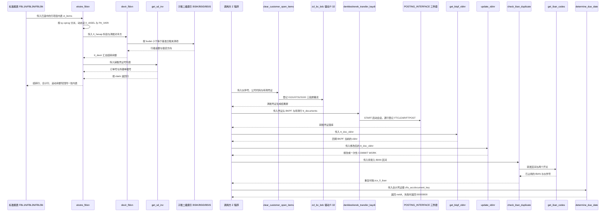

# ZCL_FI_TOOLKIT 分析报告

> 源码：`Keremkoseoglu__ABAP-Library__functional__fi__ZCL_FI_TOOLKIT.abap`（`CLASS zcl_fi_toolkit`，1702 行）
> 方法清单：17 个 `CLASS-METHODS`（16 个公开 + 1 个私有），无实例方法、无构造器、无事件块。

## 一、程序定位与业务背景

### 1.1 它解决的不是"一个业务"，而是"一类重复劳动"

这不是一个报表程序，也不是一个有入口的业务事务。它是 SAP FI（Financial Accounting）模块的**通用工具箱**：`CLASS zcl_fi_toolkit DEFINITION ... FINAL ... CREATE PUBLIC`，17 个方法全部是 `CLASS-METHODS`，`PUBLIC SECTION` 里没有一个 `METHODS`。也就是说它**永远不会被 `CREATE OBJECT`**，它是一堆"财务顾问式纯函数"的集合，调用方是别的 Z 程序。

方法名是土耳其语 + 英语的混合拼写，这本身就说明了它的出身：`devir`（结转/期初）、`ekstre`（明细抽取）、`denklestirerek transfer kaydı`（按清账生成转账记录）、`hesap`（科目）、`vade`（到期日，即 `netdt`）、`fatura`（发票）、`şirket`（公司代码）、`müşteri`（客户）、`tedarikçi`（供应商）。这不是英文母语开发写的代码，而是一套在土耳其本地化实施的 FI 顾问围绕"土耳其集团月结"沉淀下来的私藏工具。

### 1.2 现有方案为什么不够用

把这些方法按业务归拢，会看到四个反复出现的痛点：

**痛点一：报表需要行项目，标准表只有凭证头。**
FI 报表（ aging 分析、税额分析、科目明细）真正要的是行项目级的成本中心、利润中心、税额码、业务伙伴，而这些躺在 `BSX` FM 的 `RFPOSXEXT` 结构里，不在 `BSEG`。每个报表都自己写一遍 FM 调用、字段搬运、空值防御，就是 `ekstre_fblxn`（531 行）存在的原因。

**痛点二：期初余额不能靠 `BSEG` 汇总。**
多公司代码、多币种、借贷方向（`SHKZG`）分组、事务币/集团币三套金额并存，任何一处漏掉 `SHKZG` 或漏乘汇率，结转数就错，而且错得很隐蔽——报表照常出数，只是数不对。这是 `devir_fblxn` 的战场。

**痛点三：清账是过账动作，不能靠直接写表。**
客户/供应商未清项清理必须走 FI 真实过账（期间、日期、币种、税额码一整套），漏一个字段就是账实不符。这是 `clear_customer_open_items` / `clear_vendor_open_items` 的战场。

**痛点四：重复的查表与校验。**
公司代码长文本（`T001`）、进口凭证类型（`ZFIT_ITH_BLART` 自定义表）、IBAN 查重、付款类型（`ZHRTIP`）按公司代码校验——这些在几十个程序里各写一遍，既慢又不一致。

### 1.3 整体设计范式定性

一句话：**"无状态纯函数工具箱 + 三处会话级静态缓存 + 双轨异常体系"**。

- 无状态：全部 `CLASS-METHODS`，方法之间不共享业务中间态，调用方自己持有内表；
- 缓存：`CLASS-DATA gt_company_long_text` / `gt_dg_cache` / `gt_import_doc_type_cache` 三个 `CLASS-DATA`，典型的"同一会话内反复查同一张主数据"优化；
- 异常体系：业务语义异常（`zcx_fi_iban`、`zcx_fi_zhrtip`）与 BC 框架通用异常（`zcx_bc_table_content`、`zcx_bc_class_method`）并存，暴露在 6 个方法的签名里。

这个范式的好处是零耦合、可被任意程序引用；代价是**没有任何一个方法负责编排**，17 个方法之间的业务顺序完全靠调用方记住——这是本类最大的架构性风险（详见第五节 P1-1）。

## 二、程序执行流程总览

工具类没有自己的执行流程，它的"流程"是调用方眼中的调用面。下图按业务阶段画出 17 个方法的归属与典型调用关系：

```mermaid
flowchart TD
  EXT["外部 Z 程序 / 报表<br/>以工具类方式调用，无实例状态"]

  subgraph S1["阶段一 凭证明细与结转取数"]
    EK["ekstre_fblxn<br/>由 BSX 行项目结构装配可分析明细"]
    DV["devir_fblxn<br/>按公司与科目汇总结转余额"]
    DD["determine_due_date<br/>由会计凭证键推导净到期日"]
  end

  subgraph S2["阶段二 后续过账动作"]
    GX["get_bkpf_xblnr<br/>批量读取待处理凭证的交叉参考号"]
    UX["update_xblnr<br/>回写 BKPF 的 xblnr 字段"]
    CC["clear_customer_open_items<br/>清理客户未清项"]
    CV["clear_vendor_open_items<br/>清理供应商未清项"]
    TR["denklestirerek_transfer_kaydi<br/>按被清账行生成转账记录"]
  end

  subgraph S3["阶段三 主数据与配置查询（会话缓存）"]
    GC["get_company_long_text<br/>取公司代码长文本"]
    GD["get_domestic_import_doc_types<br/>取境内进口凭证类型"]
    GI["get_import_document_types<br/>合并境内与境外凭证类型"]
    GS["get_sd_inv<br/>按销售凭证取参考单据键"]
  end

  subgraph S4["阶段四 校验与交互辅助"]
    IB["get_iban_codes<br/>取业务对象已登记的 IBAN"]
    IC["check_iban_duplicate<br/>校验 IBAN 在银行主数据中重复"]
    ZT["validate_zhrtip<br/>按公司与科目首字校验付款类型"]
    DF["display_fi_doc_in_gui<br/>跳转显示一张会计凭证"]
    CD["convert_datum_to_gdatu<br/>日期转 TCURR 期间标识"]
  end

  EXT --> EK
  EXT --> DV
  EXT --> DD
  EXT --> GX
  EXT --> UX
  EXT --> CC
  EXT --> CV
  EXT --> TR
  EXT --> GC
  EXT --> GD
  EXT --> GI
  EXT --> GS
  EXT --> IB
  EXT --> ZT
  EXT --> DF
  EXT --> CD

  GI --> GD
  IC --> IB
  EK --> DV
  EK --> GS
```



### 责任链表

| # | 子程序 | 调用者 | 职责 |
|---|--------|--------|------|
| 1 | 类定义段（`CLASS zcl_fi_toolkit DEFINITION`） | 编译器 | 声明 15 组公开类型、6 个常量、17 个类方法、3 个私有缓存表与 1 个私有方法 |
| 2 | `ekstre_fblxn` | 外部报表（传入 `it_rfposxext`） | 由 FM 行项目结构装配出可直接展示/汇总的明细表，抛 `zcx_bc_table_content` |
| 3 | `devir_fblxn` | 外部报表（传入 `tt_hesap`） | 按公司代码 + 科目 + 借贷方向汇总 `BSEG` 金额，产出 `tt_devir` 结转表 |
| 4 | `determine_due_date` | 外部程序（传 `zfis_accdocument_key`） | 由凭证类型与会计凭证键推导净到期日 `NETDT` |
| 5 | `get_bkpf_xblnr` | `update_xblnr` 或外部报表 | 按 `tt_doc_xblnr` 批量读出 `BKPF-XBLNR` 回填传入内表 |
| 6 | `update_xblnr` | 外部程序（传 `tt_doc_xblnr`） | 逐张 `MODIFY BKPF` 回写交叉参考凭证号，可按单张 `COMMIT` |
| 7 | `clear_customer_open_items` | 外部程序（传 `kunnr` + 凭证范围） | 对指定客户在指定公司代码的未清项执行清账过账 |
| 8 | `clear_vendor_open_items` | 外部程序（传 `lifnr` + 凭证范围） | 同上，供应商侧 |
| 9 | `denklestirerek_transfer_kaydi` | 外部程序（传 `BKPF` + `tt_documents`） | 按被清账的凭证行生成转账（结转）记录行 |
| 10 | `get_company_long_text` | `devir_fblxn` 等报表；外部程序 | 取公司代码长文本，命中 `gt_company_long_text` 则不走 DB |
| 11 | `get_domestic_import_doc_types` | `get_import_document_types` | 从 `ZFIT_ITH_BLART` 取境内进口凭证类型，结果缓存 |
| 12 | `get_import_document_types` | 外部报表（凭证类型下拉框） | 按境内/境外开关合并凭证类型，返回 HASHED 去重表 |
| 13 | `get_sd_inv` | `ekstre_fblxn`（私有） | 按销售凭证号取 `VBKD`/`VBRP` 的参考单据与外键参考 |
| 14 | `get_iban_codes` | `check_iban_duplicate`；外部程序 | 按供应商/客户/公司代码取已登记 IBAN |
| 15 | `check_iban_duplicate` | 银行主数据保存程序 | 校验待录入 IBAN 是否与既有 IBAN 重复，重复则抛 `zcx_fi_iban` |
| 16 | `validate_zhrtip` | 凭证录入/付款程序 | 按公司代码与科目首字映射校验 `ZHRTIP`，非法则抛 `zcx_fi_zhrtip` |
| 17 | `display_fi_doc_in_gui` | 报表的"跳转显示"按钮 | 设定 `SPAG/ID` 参数并跳转 `FB03` 显示凭证 |
| 18 | `convert_datum_to_gdatu` | 外部程序 | 把 `DATUM` 转成 `TCURR-GDATU` 的期间字符串 |

下面按这条流程，逐个子程序展开。

## 三、分组分析

### 3.1 类定义段 `CLASS zcl_fi_toolkit DEFINITION`

这是全类的地基，分三段看：`PUBLIC SECTION` 的数据类型与常量、`PUBLIC SECTION` 的方法签名、`PRIVATE SECTION` 的缓存与私有类型。共分 3 步。

#### ① 公开数据类型

```abap
    TYPES:
      BEGIN OF t_documents ,
        bukrs TYPE bseg-bukrs,
        belnr TYPE bseg-belnr,
        gjahr TYPE bseg-gjahr,
        buzei TYPE bseg-buzei,
      END OF t_documents .
    TYPES:
      tt_documents TYPE STANDARD TABLE OF t_documents WITH DEFAULT KEY .
    TYPES:
      BEGIN OF ty_hesap,
        sube   TYPE rfposxext-konto,
        merkez TYPE rfposxext-konto,
      END OF ty_hesap .
    TYPES:
      tt_hesap TYPE STANDARD TABLE OF ty_hesap .
```

**做什么** — 声明 6 组公开结构：`t_documents`/`tt_documents` 是公司代码 + 凭证号 + 年度 + 行号的四元组（`BSEG` 的行级主键），用于"指定要处理哪些行"；`ty_hesap`/`tt_hesap` 是"分支科目 + 中心"的一对科目入参；`ty_devir_items` 是行级结转明细（含 `SHKZG` 借贷方向与 `DMSHB`/`DMBE2`/`DMBE3`/`WRBTR` 四套金额）；`ty_devir` 是同样字段但不带凭证键的汇总行；`t_doc_xblnr`/`tt_doc_xblnr` 是要回写 `XBLNR` 的凭证键 + 目标值；`tt_blart` 是以 `BLART` 为唯一键的 HASHED 表；`ty_mkpf_key`/`tt_mkpf_key` 与 `ty_vbrk_key`/`tt_vbrk_key` 是物料凭证与销售凭证的单字段键表。

**为什么** — 只声明用得到的窄字段、而不是直接用 `BSEG`/`RFPOSXEXT` 全结构，这是报表类代码的正确姿势：`BSEG` 有 100+ 字段，内表按宽结构装配会让内存和排序代价成倍上升。`tt_blart` 用 `HASHED ... WITH UNIQUE KEY ... table_line` 而不是 `STANDARD TABLE`，是为了凭证类型下拉框天然需要去重 + `READ TABLE` 命中即走哈希，这是把数据结构直接当成需求表达的写法。键表（`tt_mkpf_key`/`tt_vbrk_key`）单独抽出来而不是复用主结构，是因为调用方手上只有凭证号，不需要也不该带其他字段。

**风险与改进** — 三点。其一，`ty_hesap` 的 `sube` 与 `merkez` 都用了 `rfposxext-konto`，但 `merkez`（中心）在 FI 语境里通常是成本中心/利润中心语义，用 `KONTO`（总账科目）承载属于**数据元素语义错配**——长度都是 10 位、能跑，所以最容易漏审；按语义核算，`merkez` 更可能需要 `KOST` 或 `PRCTR` 口径，需在 SE11 核实 `rfposxext` 中对应字段的真实含义后再定。其二，`ty_devir_items` 里 `wrbtr`（事务币金额）与 `dmbe2` 指向同一语义时两者并存，存在"同一金额在两个字段上取不同值"的一致性隐患，需要核实 `dmbe2` 在 `BSEG` 口径下的确切币种。其三，`tt_hesap`/`tt_documents` 都没有唯一键（`WITH DEFAULT KEY` 等价于"全部字段为键"且非唯一），后续 `READ TABLE` 与 `SORT` 都会退化为线性查找或不稳定顺序，建议为高频查找的表补 `WITH UNIQUE KEY` 或 `SORTED TABLE`。

```abap
    CONSTANTS c_borc TYPE shkzg VALUE 'S' ##NO_TEXT.
    CONSTANTS c_alacak TYPE shkzg VALUE 'H' ##NO_TEXT.
    CONSTANTS c_mal_hareketi TYPE awtyp VALUE 'MKPF' ##NO_TEXT.
    CONSTANTS c_satinalma_faturasi TYPE awtyp VALUE 'RMRP' ##NO_TEXT.
    CONSTANTS c_satis_faturasi TYPE awtyp VALUE 'VBRK' ##NO_TEXT.
    CONSTANTS c_musteri_hf_talebi TYPE auart VALUE 'ZAH1' ##NO_TEXT.
```

（其余同构常量与类型目录条目从略：`TYPES: BEGIN OF ty_konto …` 至 `tt_ith_blart TYPE STANDARD TABLE OF zfit_ith_blart WITH DEFAULT KEY.` 这段是同一种 `BEGIN OF` / `END OF` 声明模式的连续重复，价值在声明模式而非逐行内容；其中 `ty_konto`、`tt_mkpf_key`、`tt_vbrk_key` 的字段已在 ① 中逐字段展开，`c_tabname_t001 TYPE tabname VALUE 'T001' ##NO_TEXT` 与 `ty_konto` 定义见下同段代码。）

**做什么** — 6 个常量：借贷方向 `'S'`（借）/ `'H'`（贷）、业务对象类型 `'MKPF'`（物料凭证）/ `'RMRP'`（采购）/ `'VBRK'`（销售）、客户退货订单类型 `'ZAH1'`。全部带 `##NO_TEXT` 抑制空翻译标记，避免 SE63 报无意义的文本缺失。

**为什么** — 把 `'S'`/`'H'` 这种"裸字符魔法值"提成常量，是记账方向判断代码唯一的可维护做法：散落的 `IF shkzg = 'S'` 一旦拼错成 `'H'` 在编译期毫无反应，在期末结转里却会让借贷方向整体反转。`awtyp` 三个值说明本类要跨 `MKPF`/`RMRP`/`VBRK` 三种业务对象定位行项目——这是 `ekstre_fblxn` 需要一个业务对象类型入参的原因。

**风险与改进** — `'ZAH1'` 是土耳其客户退货专用订单类型，属于**配置值被写死在代码里**；企业一旦改订单类型，或同一系统服务多个实体，这行就静默失效，且不会报任何错。建议改为从自定义配置表读取，或至少加注释说明其业务归属与变更渠道。同理，`c_tabname_t001` 把表名 `'T001'` 提成常量是好做法，但它同样是把配置写进代码——若本意是可切换的"公司代码表"，应参数化。

#### ② 方法签名与异常约定

（17 个方法签名共 92 行，同构的 `CLASS-METHODS x IMPORTING !y TYPE z … RAISING …` 段落逐字重复，模式为"强传参数前缀 `!` + 少量 `OPTIONAL` + 少量 `DEFAULT`，返回值统一用 `VALUE(...)` 新式写法"；此处省略中间连续同构签名，仅完整展开下述两段差异最大者。）

```abap
    CLASS-METHODS check_iban_duplicate
      IMPORTING
        !it_iban       TYPE zfitt_iban_rng
        !iv_get_vendor TYPE abap_bool DEFAULT abap_true
        !iv_get_client TYPE abap_bool DEFAULT abap_true
        !it_lifnr      TYPE zqmtt_lifnr OPTIONAL
        !it_kunnr      TYPE range_kunnr_tab OPTIONAL
      RAISING
        zcx_fi_iban .
```

**做什么** — 声明 `check_iban_duplicate`：入参一段 IBAN 区间、一个"是否取供应商 IBAN"开关（默认真）、一个"是否取公司代码 IBAN"开关（默认真）、可选的供应商号范围与客户号范围；重复则抛 `ZCX_FI_IBAN`。

**为什么** — `!` 前缀表示传值（性能更好），非 `!` 表示传引用——这是全类一致的约定，ABAP 里传引用比传值快但会让人误改调用方的数据，用 `!` 统一标出既快又安全。返回值为空的校验型方法改用 `RAISING`，比"返回个错误标志"更符合现代 ABAP，也迫使调用方必须显式处理失败路径。

**风险与改进** — 布尔开关入参（`iv_get_vendor`/`iv_get_client`）是典型的**布尔参数反模式**：调用方必须记住 `abap_true` 的含义与传参顺序，一个 `abap_true` 打错就静默查错数据源。更稳妥的做法是拆成两个方法或改用枚举（`abap_true`/`abap_false`/`abap_undefined` 的三分语义），让"查供应商、查客户、查公司代码"成为可读的取值而非位置。另需注意 `zfitt_iban_rng`、`zqmtt_lifnr`、`range_kunnr_tab` 三个 Z/命名类型把本类与客户自定义表和 DDIC 对象硬绑，跨系统传输或客户裁剪时会直接编译失败。

#### ③ 私有段：缓存表与私有方法

```abap
    PROTECTED SECTION.
  PRIVATE SECTION.

    TYPES:
      tt_company_long_text TYPE HASHED TABLE OF t_company_long_text WITH UNIQUE KEY primary_key COMPONENTS bukrs .
    TYPES tt_ith_blart TYPE STANDARD TABLE OF zfit_ith_blart WITH DEFAULT KEY.

    CONSTANTS c_tabname_t001 TYPE tabname VALUE 'T001' ##NO_TEXT.
    CLASS-DATA gt_company_long_text TYPE tt_company_long_text .
    CLASS-DATA gt_dg_cache TYPE tt_dg_cache .
    CLASS-DATA gt_import_doc_type_cache TYPE tt_ith_blart .

    CLASS-METHODS get_sd_inv
      IMPORTING
        !it_vbrk_key   TYPE tt_vbrk_key
      RETURNING
        VALUE(rt_vbrp) TYPE tt_vbrp .
```

**做什么** — 私有段放三样东西：两张私有缓存结构（`tt_company_long_text` 按 `BUKRS` 唯一哈希，`tt_dg_cache` 按 `DATUM` 唯一哈希）、一张指向自定义表 `ZFIT_ITH_BLART` 的行类型表；三个 `CLASS-DATA` 静态缓存实例；以及唯一的私有方法 `get_sd_inv`——按 `tt_vbrk_key`（销售凭证号列表）返回 `tt_vbrp`，内含 `VBELN`/`VGTYP`/`VGBEL`/`BSTKD`（即"销售订单→交货/开票"的交叉参考键）。

**为什么** — 私有段是"不给外部看"的第一道闸门：缓存表放在这里，调用方既不能读也不能清空，避免了外部误改缓存导致全类行为不可预测。三个 `CLASS-DATA` 全用 `HASHED + UNIQUE KEY`，正是缓存场景最该用的表类型——命中判定必须是"这个键存在吗"，哈希表是 O(1)，`STANDARD TABLE` 要全表扫描。把 `get_sd_inv` 设为私有，说明它只服务于本类内部某个组装逻辑，暴露它反而会诱使调用方绕开该逻辑。

**风险与改进** — 三点。其一，`gt_import_doc_type_cache` 的类型是 `STANDARD TABLE OF zfit_ith_blart WITH DEFAULT KEY`，即非唯一的普通内表；但读它的那两个方法都用 `IF 缓存 IS INITIAL` 判空后才填充，所以"重复写入导致膨胀"的风险并不成立——真正的残留风险是**缓存一旦填上就永不清空**：会话期间 `ZFIT_ITH_BLART` 配置被改动，本会话的所有调用仍返回旧凭证类型（详见 3.12）。其二，三个 `CLASS-DATA` 都是会话级静态、无任何失效机制：一旦 `T001` 的公司名称在会话期间被改动（或 `ZFIT_ITH_BLART` 配置被切换），本会话后续所有调用都返回旧值，且无 `CLEAR` 出口（私有）——建议至少为 `gt_company_long_text` 提供一个公开的 `RESET` 入口。其三，`PROTECTED SECTION.` 后面紧跟空的 `PRIVATE SECTION.`、整体留空，说明这个类曾按"可被继承扩展"设计过，随后又被改成 `FINAL`——`FINAL` 与留空的 `PROTECTED` 是历史残留，可清理。

### 3.2 方法 `ekstre_fblxn`

这是全类最重的方法（531 行、8 个逻辑步骤）。它做的是"**报表行项目的会计增强**"：把标准报表（`FBL1N`/`FBL3N`/`FBL5N`）已经选好的行项目内表，就地补上期初结转行、原凭证号、订单号、借贷分列金额、逐行滚动余额和期末合计行——**注意它并不取数，取数是标准报表自己的事**。

#### ① 入口守卫：按调用程序分派

```abap
    CHECK ct_items IS NOT INITIAL.
    CASE sy-cprog.
      WHEN 'RFITEMAP'."FBL1N
        ASSIGN ('(RFITEMAP)X_AISEL') TO FIELD-SYMBOL(<lv_x_aisel>).
        ASSIGN ('(RFITEMAP)PA_VARI') TO FIELD-SYMBOL(<lv_vari>).

      WHEN 'RFITEMGL'."FBL3N
        ASSIGN ('(RFITEMGL)X_AISEL') TO <lv_x_aisel>.
        ASSIGN ('(RFITEMGL)PA_VARI') TO <lv_vari>.

      WHEN 'RFITEMAR'."FBL5N
        ASSIGN ('(RFITEMAR)X_AISEL') TO <lv_x_aisel>.
        ASSIGN ('(RFITEMAR)PA_VARI') TO <lv_vari>.

      WHEN 'ZSDP_RFITEMAR'.
        ASSIGN ('(ZSDP_RFITEMAR)X_AISEL') TO <lv_x_aisel>.
        ASSIGN ('(ZSDP_RFITEMAR)PA_VARI') TO <lv_vari>.

      WHEN OTHERS.
        RETURN.

    ENDCASE.

    IF sy-subrc = 0 AND sy-cprog(5) = 'RFITE'.
```

**做什么** — 先 `CHECK ct_items IS NOT INITIAL` 拦空表；再按 `sy-cprog`（当前主程序名）分派到 4 个标准/自定义报表，用动态 `ASSIGN` 把标准报表的全局变量 `X_AISEL`（是否已做行项目选择）和 `PA_VARI`（屏幕变式名）取到字段符号里；其他程序一律 `RETURN` 静默退出。最后再判一次 `sy-subrc = 0 AND sy-cprog(5) = 'RFITE'`。

**为什么** — `X_AISEL` 是标准 FI_ITEMS 报表的行项目选择开关：用户在 ALV 里勾了行才应做后续增强，没勾就 `MESSAGE TEXT-003 TYPE 'I'` 后返回，这是交互上的必要判断。`PA_VARI` 里含 `'EKSTRE'` 是"当前用的是 Ekstre（对账单/明细账）版式"的变式名，用它当第二道开关说明作者把"要不要算结转"这件事完全挂在用户的变式选择上——业务上这是对的：普通明细账变式不需要结转行，Ekstre 版式需要。注释里 `RFITEMAP`/`FBL1N`、`RFITEMGL`/`FBL3N`、`RFITEMAR`/`FBL5N` 的对应关系也说明作者清楚自己挂的是哪几个事务。

**风险与改进** — 三点，都是硬伤。其一，`ASSIGN ('(RFITEMAP)X_AISEL') TO FIELD-SYMBOL(<lv_x_aisel>)` 是**动态访问标准报表的内部全局变量**：SAP 不承诺这些变量在升级后仍存在，一旦改名/删除，`ASSIGN` 失败（`sy-subrc ≠ 0`）后代码落到 `WHEN OTHERS` 之外继续走，第 964 行的 `sy-subrc = 0` 判断恰好拦下——但这是"恰好"，不是设计；一旦标准报表把 `X_AISEL` 改成局部变量或改名，整个增强静默失效且**不报任何错**，报表照常显示，只是少了结转行。其二，`sy-cprog(5) = 'RFITE'` 把客户自建程序 `ZSDP_RFITEMAR`（第 5 位是 `'ZSDPF'`）排除在外，于是它虽然被 `ASSIGN` 了却必然走 `ELSE` 分支——这说明这段 `CASE` 分支是为它加的、但外层条件没同步改，属于典型的补丁叠加遗留。其三，`sy-subrc` 被当成分派结果传下去：`CASE` 之后 `sy-subrc` 是**最后一个 `ASSIGN`** 的结果，若 `X_AISEL` 赋值成功但 `PA_VARI` 赋值失败，`sy-subrc ≠ 0` 会让方法整体跳过——一个布局变量绑错了，整个对账增强就失效，且无提示。

#### ② 清理与排序：冲销凭证剔除、订单号回填

```abap
      LOOP AT ct_items ASSIGNING FIELD-SYMBOL(<ls_items>)
            WHERE zuonr(3) eq  zcl_fi_omd=>c_zuonr_sanal and
                  zzbstkd IS INITIAL.
         <ls_items>-zzbstkd = <ls_items>-zuonr.
      ENDLOOP.
      IF <lv_vari> CS 'EKSTRE'.

        IF <lv_x_aisel> <> abap_true.
          MESSAGE TEXT-003 TYPE 'I'.
          RETURN.
        ENDIF.
```

**做什么** — 先把"销售订单行"（`zuonr` 前三位等于 `zcl_fi_omd=>c_zuonr_sanal`）且还没有 `zzbstkd` 的行，用 `zuonr` 本身回填 `zzbstkd`（订单号）。然后判断变式是否含 `'EKSTRE'`、用户是否勾选了行项目，两者不满足就 `MESSAGE TEXT-003 TYPE 'I'` 提示后返回。

**为什么** — 用另一个 Z 类 `zcl_fi_omd=>c_zuonr_sanal` 作为行类型常量而不是裸 `'SAN'`，是为了让"哪段 `ZUONR` 前缀代表销售订单"只在一处定义，这是跨程序共享常量的正确姿势。`MESSAGE ... TYPE 'I'` 而不是抛异常，是因为这里是纯交互拦截（用户没勾行），属于正常提示路径不是错误路径。

**风险与改进** — `<lv_x_aisel>` 的比较 `IF <lv_x_aisel> <> abap_true.` 有隐患：若第 944 行的动态 `ASSIGN` 失败，`<lv_x_aisel>` 处于未赋值状态，对未赋值字段符号做比较在部分类型下会直接 `DUMP`（未赋值字段符号无值可用），需在 SE38 实测确认；更稳的写法是先用 `IS ASSIGNED` 判定或把赋值成功与否记进一个布尔变量。另外 `MESSAGE TEXT-003` 未指定消息类，实际取值依赖 T100A 的标准文本解析（需在 SE91 核实），用户看到的是哪句提示不受本程序控制。

```abap
        "-->> changed by mehmet sertkaya 21.07.2016 13:52:32
        " HAR-10448 - Müşteri Ekstresinde XX belge ters kaydı
*          delete ct_items where blart = 'XX' and gjahr ge '2016'.
        LOOP AT ct_items ASSIGNING <ls_items>
                    WHERE blart = zcl_fi_document_type=>get_customer_clearing_doc_type( ) AND
                          gjahr GE '2018'.
          DELETE ct_items WHERE belnr = <ls_items>-zzstblg AND gjahr = <ls_items>-zzstjah.
          DELETE ct_items.
        ENDLOOP.

        SORT ct_items BY konto budat ASCENDING.

        IF  ct_items IS INITIAL.
          RETURN.
        ENDIF.
```

**做什么** — 遍历所有客户清账凭证类型（`zcl_fi_document_type=>get_customer_clearing_doc_type()`，即注释里说的 `'XX'`）且年度 `>= '2018'` 的行，用它们的原凭证号 `zzstblg`/`zzstjah` 把 `ct_items` 里对应的**原始发票行整行删掉**，然后删掉清账行本身；再按 `konto` + `budat` 升序排序，为后面"逐科目滚动余额"做准备。

**为什么** — 业务意图很清楚：客户清账（`XX` 凭证）会把原发票标为已清账，对账单上如果同时显示原发票和清账凭证，客户会看到"一笔钱被扣两次"。所以 2018 年之后的对账单只保留清账凭证、把原发票藏掉——注释与被注释掉的旧代码（`gjahr ge '2016'`）都是这次改动的证据。这是**报表呈现层的业务修正**，不是技术妥协。

**风险与改进** — 三处，按严重程度排序。其一，`DELETE ct_items WHERE belnr = ... AND gjahr = ...` **漏了 `bukrs`**：公司代码是 FI 凭证的第一层主键，`BELNR`+`GJAHR` 只在单公司代码内唯一。跨公司代码存在同号凭证时，本公司代码的清账凭证会**删掉别家公司代码的发票行**——这是会直接导致客户对账单金额错错的业务缺陷（详见第五节 P0-1）。其二，`LOOP ... ASSIGNING` 的同时对被循环的表做 `DELETE`：`DELETE ct_items.` 删掉当前行后，循环游标按新表结构前进，可能跳过紧邻的下一行；若下一行也是清账凭证，它的原凭证就留在对账单上了——缺陷表现为"偶发漏删"，极难复现。其三，`gjahr GE '2018'` 把年份写死：代码上线后每年都要有人记得改这个常量，忘记改就会让老年度对账单出现重复金额；应改为从配置表或表头期间取阈值。

#### ③ 键收集与结转余额取数

```abap
        LOOP AT ct_items ASSIGNING <ls_items>.
          CLEAR ls_hesap.
          ls_hesap-sube = <ls_items>-konto.
          COLLECT ls_hesap INTO lt_hesap.
          ls_konto-bukrs = <ls_items>-bukrs.
          ls_konto-konto = <ls_items>-konto.
          COLLECT ls_konto INTO lt_konto.
        ENDLOOP.
        ASSIGN  ('(SAPLFI_ITEMS)GB_CENTRAL_ITEMS') TO FIELD-SYMBOL(<lv_merkez>).
        IF sy-subrc = 0.
          IF <lv_merkez> = abap_true.
            CASE sy-cprog.
              WHEN 'RFITEMAR' OR 'ZSDP_RFITEMAR'.
                SELECT bukrs, kunnr, knrze INTO TABLE @DATA(lt_knb1) FROM knb1
                    FOR ALL ENTRIES IN @lt_hesap
                    WHERE kunnr = @lt_hesap-sube AND
                          knrze <> @space.
                SORT lt_knb1 BY bukrs kunnr.
                LOOP AT lt_knb1 ASSIGNING FIELD-SYMBOL(<ls_knb1>).
                  ls_hesap-sube = <ls_knb1>-kunnr.
                  ls_hesap-merkez = <ls_knb1>-knrze.
                  COLLECT ls_hesap INTO lt_hesap.
                ENDLOOP.

              WHEN 'RFITEMAP'.

                SELECT bukrs, lifnr, lnrze INTO TABLE @DATA(lt_lfb1) FROM lfb1
                    FOR ALL ENTRIES IN @lt_hesap
                    WHERE lifnr = @lt_hesap-sube AND
                          lnrze <> @space.
                SORT lt_lfb1 BY bukrs lifnr.
                LOOP AT lt_lfb1 ASSIGNING FIELD-SYMBOL(<ls_lfb1>).
                  ls_hesap-sube   = <ls_lfb1>-lifnr.
                  ls_hesap-merkez = <ls_lfb1>-lnrze.
                  COLLECT ls_hesap INTO lt_hesap.
                ENDLOOP.

            ENDCASE.
          ENDIF.
        ENDIF.
        SELECT * FROM t001  INTO TABLE lt_t001.

        zcl_fi_toolkit=>devir_fblxn(
                    EXPORTING it_hesap = lt_hesap
                    IMPORTING et_devir = lt_devir
                                             ).
        SORT lt_devir BY bukrs konto gsber.
        lt_devir_sorted = lt_devir.

        FREE  : lt_devir,lt_hesap.
```

**做什么** — ① 遍历行项目，把 `konto` 去重成 `lt_hesap`（待查结转的科目表）、把 `bukrs`+`konto` 去重成 `lt_konto`（待算期末合计的科目表）；② 动态读 `SAPLFI_ITEMS` 的全局变量 `GB_CENTRAL_ITEMS`，若为真则按程序类型把 `konto` 翻译成"业务伙伴号 + 清账伙伴号"：`RFITEMAR`（AR，`FBL5N`）下 `KONTO` 存客户号，查 `KNB1` 取 `KNRZE`（清账对手方）；`RFITEMAP`（AP，`FBL1N`）下存供应商号，查 `LFB1` 取 `LNRZE`；翻译结果 `COLLECT` 回 `lt_hesap`，形成 `ty_hesap` 的 `sube`+`merkez` 配对；③ `SELECT * FROM t001` 把所有公司代码读进内表；④ 调用本类的 `devir_fblxn` 传入 `lt_hesap`，取回 `lt_devir` 结转余额，排序后存入按 `bukrs konto` 为键的 `lt_devir_sorted`，释放临时表。

**为什么** — 这一步是整个方法最核心的业务翻译：**同一个 `KONTO` 字段在不同报表里语义完全不同**——`FBL3N`（总账）里是总账科目，`FBL5N`（AR）里是客户号，`FBL1N`（AP）里是供应商号。结转余额必须按真实科目去查，所以要先知道 `KONTO` 现在装的是什么，才知道该查 `KNB1` 还是 `LFB1`、该按什么键去 `BSEG` 汇总。作者用 `ty_hesap`（`sube`+`merkez` 成对）承载这个翻译，用 `COLLECT` 而非 `APPEND` 保证不重复，把"业务伙伴 + 其清账对手方"两个科目都纳入结转范围——这正是 AR/AP 对账单必须把"这笔款挂在客户 A 名下但业务上是 B 的应收"一并考虑的场景。`FOR ALL ENTRIES` 先把主键集合缩到内存再查，比对每行单独 `SELECT` 高效一个数量级；先 `SORT` 再 `COLLECT` 保证去重可靠。

**风险与改进** — 五点。其一，**`ty_hesap.sube` / `merkez` 的数据元素语义错配已成事实**：声明时两者都是 `rfposxext-konto`，但这里 `sube` 实际装的是 `KUNNR`/`LIFNR`（业务伙伴号），`merkez` 装的是 `KNRZE`/`LNRZE`（清账对手方）。长度都是 10 位、能编译、跑得通，唯独把业务含义换掉了；后续任何人按名字理解成"分支科目/成本中心"都会用错，应改为自定义结构并起业务化字段名（`bpnum`/`clearing_partner`）。其二，`FOR ALL ENTRIES` 前的 `lt_hesap` 在本次调用中**可能为空**（`ct_items` 非空但 `konto` 全初始），此时 `FOR ALL ENTRIES` 语义退化为"全表扫描 `KNB1`/`LFB1`"——这两张表在客户主数据里动辄百万行，一次全扫足以拖垮对账单。虽然第 964 行的 `sy-subrc` 保护不到这里，但可加显式 `IF lt_hesap IS NOT INITIAL` 守卫。其三，`SELECT * FROM t001 INTO TABLE lt_t001` 声明为 `##NEEDED`（即作者自己知道"未使用"），却把 `T001` 全表读进内存且**读完之后没有任何一处引用 `lt_t001`**——纯浪费，`T001` 通常只有几十行所以没暴露，但这是应当删掉的死代码。其四，`ASSIGN ('(SAPLFI_ITEMS)GB_CENTRAL_ITEMS')` 又一处动态访问标准程序的内部全局变量，与 ① 里的 `X_AISEL` 同类风险；`SAPLFI_ITEMS` 是 FI 行项目选择的公共包含，被 SAP 升级改动影响的面比单个报表更大。其五，`SORT lt_devir BY bukrs konto gsber` 之后又赋给 `lt_devir_sorted`（声明为 `SORTED TABLE ... WITH NON-UNIQUE KEY bukrs konto`）：赋值时 ABAP 会按目标键隐式再排序，**两处键定义不一致**（源排序多一个 `gsber`）导致一次多余的排序开销，而且 `lt_devir_sorted` 声明成排序表却从未被 `BINARY SEARCH` 查找过——类型选错了。

#### ④ 业务对象反查：物料/采购/销售的原始凭证

```abap
        LOOP AT ct_items ASSIGNING <ls_items>
           WHERE zzawtyp = c_mal_hareketi OR zzawtyp =  c_satinalma_faturasi
               OR  zzawtyp =  c_satis_faturasi.
          IF <ls_items>-zzawtyp = c_mal_hareketi.
            APPEND VALUE #( mblnr = <ls_items>-zzawkey(10)
                            mjahr = <ls_items>-zzawkey+10(4)
                           ) TO lt_mkpf_key.
          ELSEIF <ls_items>-zzawtyp = c_satinalma_faturasi.
            APPEND VALUE #( belnr = <ls_items>-zzawkey(10)
                            gjahr = <ls_items>-zzawkey+10(4)
                           ) TO lt_rbkp_key.
          ELSEIF <ls_items>-zzawtyp = c_satis_faturasi.
            APPEND <ls_items>-zzawkey(10) TO lt_vbrk_key.
          ENDIF.
        ENDLOOP.

        SORT lt_rbkp_key BY belnr gjahr.
        SORT lt_mkpf_key BY mblnr mjahr.
        SORT lt_vbrk_key BY vbeln.
        DELETE ADJACENT DUPLICATES FROM lt_mkpf_key COMPARING mblnr mjahr.
        DELETE ADJACENT DUPLICATES FROM lt_rbkp_key COMPARING belnr gjahr.
        DELETE ADJACENT DUPLICATES FROM lt_vbrk_key COMPARING vbeln.

        IF lt_rbkp_key IS NOT INITIAL.

          SELECT belnr, gjahr, stblg, stjah
            FROM rbkp
            FOR ALL ENTRIES IN @lt_rbkp_key
            WHERE
              belnr = @lt_rbkp_key-belnr AND
              gjahr = @lt_rbkp_key-gjahr
            INTO CORRESPONDING FIELDS OF TABLE @lt_rbkp.

          FREE lt_rbkp_key.
        ENDIF.
```

**做什么** — 扫描所有 `ZZAWTYP` 为物料凭证/采购发票/销售发票的行，从 14 位业务键 `ZZAWKEY` 里**用偏移切字符串**拆出凭证号（前 10 位）和年度（后 4 位），分别装进 `lt_mkpf_key` / `lt_rbkp_key` / `lt_vbrk_key`；排序后 `DELETE ADJACENT DUPLICATES` 去掉重复键；再按键去 `RBKP`（后续还有 `MSEG` 与私有方法 `get_sd_inv`）取"原始凭证号"。

**为什么** — `ZZAWKEY` 是把 `MKPF-MBLNR`(10) + `MJAHR`(4) 拼成定长 14 位的通用业务键，`ZZAWTYP` 指明它属于哪张表——这是把三种业务对象统一进一个行项目结构的标准做法，`c_mal_hareketi`/`c_satinalma_faturasi`/`c_satis_faturasi` 三个常量正是这个协议的解码表。这里 `SORT` + `DELETE ADJACENT DUPLICATES` 而不是直接用 `COLLECT` 去重，是因为键表结构不同（`mblnr mjahr` vs `belnr gjahr`），而且 `FOR ALL ENTRIES` 前必须去重否则 DB 会报重复键——这个顺序是对的。

**风险与改进** — 其一，`zzawkey(10)` / `zzawkey+10(4)` 是**硬编码的定长切片**：`RBRP`/`RBKP-BELNR` 的数据元素是 `BELNR_D`（长度 40，而 `RBM` 凭证号实际 10 位），一旦某业务对象使用更长或非标准长度的凭证号，切片会静默截断导致查不到原始凭证、后续 `zzstblg` 留空。建议按 `ZZAWTYP` 分别声明对应长度常量，或在 SE11 核实 `ZZAWKEY` 的实际字段长度与业务键定义是否一致。其二，三张键表分别判空后再 `FOR ALL ENTRIES`（`lt_rbkp_key`、`lt_mkpf_key`、`lt_vbrk_key` 各有守卫）这个写法是对的，值得肯定——这是 `FOR ALL ENTRIES` 最容易被漏掉的一步。其三，`DELETE ADJACENT DUPLICATES ... COMPARING` 只按列出的字段去重，若同一凭证号在不同年度出现两次（`lt_rbkp_key` 已含 `gjahr` 所以没问题，`lt_mkpf_key` 同理），当前写法恰好安全；但 `lt_vbrk_key` 只含 `VBELN` 一个字段是符合 `VBRK` 口径的，这一点依赖"销售凭证号年度内唯一"的前提，需在 SE11 核实 `VBRK` 是否真的没有年度维度。

#### ⑤ 回填参考单据与原凭证号

```abap
          lv_tabix = sy-tabix.

*  test kayıt belgesi
          IF <ls_items>-zzawtyp = c_mal_hareketi.
            READ TABLE lt_mseg WITH TABLE KEY mblnr = <ls_items>-zzawkey(10)
                                              mjahr = CONV #( <ls_items>-zzawkey+10(4) )
                                              ASSIGNING FIELD-SYMBOL(<ls_mseg>).
            IF sy-subrc = 0.
* mb 'nin ters kaydınınn faturası
* bu case çok az olacağını için direk bkpf 'e gidildi.
              CLEAR lv_awkey.
              IF <ls_mseg>-smbln IS  NOT INITIAL.
                lv_awkey = |{ <ls_mseg>-smbln }{ <ls_mseg>-sjahr }|.
              ELSE.
                READ TABLE lt_mseg WITH KEY smbln = <ls_mseg>-mblnr
                                            sjahr = <ls_mseg>-mjahr
                                            ASSIGNING <ls_mseg>.

                IF sy-subrc = 0.
                  lv_awkey = |{ <ls_mseg>-mblnr }{ <ls_mseg>-mjahr }|.
                ENDIF.
              ENDIF.

            ENDIF.
```

**做什么** — 按行项目的业务对象类型分支：物料凭证行去 `lt_mseg` 按表键取 `SMBLN`/`SJahr`（反向凭证），拼成 14 位 `lv_awkey`；若 `SMBLN` 为空（作者认为这种情况很少，见注释），再反查一次"谁以我为反向凭证"来兜底。采购发票行走同样的逻辑，只是换成 `lt_rbkp` 的 `STBLG`/`STJAH`。销售发票行则从 `lt_vbrp` 取 `VGTYP`（外键类型）与 `VGBEL`（外键单据号），`VGTYP` 为 `'J'`（交货单）或 `'T'`（外包装单）时回填 `zzteslimat`，并把 `BSTKD`（销售订单号）回填 `zzbstkd`。

**为什么** — 双向反查（`SMBLN` 优先，反向再兜底）说明作者遇到过"同一物料凭证既是原始又是冲销"的真实数据，与其猜测方向不如两种都查；`MSEG`/`RBKP` 只取必要字段并用 `SORTED TABLE ... TABLE KEY` 读取，说明作者理解二分查找的成本。注释"这个 case 很少出现所以直接去 `BKPF`"是典型的**性能取舍**：为了少一次 `MSEG` 自查询，把查询下推到 `BKPF`。

**风险与改进** — 其一，兜底分支的 `READ TABLE lt_mseg WITH KEY smbln = ... sjahr = ...` 用的是**标准键（整行字段）**而不是表键，会退化成全表线性查找；正确写法是 `WITH TABLE KEY`（`tt_mseg` 声明时的主键是 `mblnr mjahr`，无法按 `smbln sjahr` 走二分），要真正走二分需再声明一张以 `smbln sjahr` 为非唯一键的排序表。其二，这里 `ASSIGNING <ls_mseg>` 指向同一个字段符号**两次**（第一次命中物料凭证本身，第二次可能指向另一行），第二次赋值会改变后续对 `<ls_mseg>` 的含义——当前代码在第二次赋值后立刻只用它取 `mblnr`/`mjahr`，所以没出错，但这种复用极脆：任何人在 `IF sy-subrc = 0` 之后插入一句读 `<ls_mseg>-smbln` 就会读到另一张凭证的数据。其三，`lv_awkey` 在两条分支里都被 `CLEAR` 后赋值，但**没有 `ELSE` 分支**：`SMBLN` 为空且反查也失败时 `lv_awkey` 保持初始，第 ⑥ 步的 `IF lv_awkey IS NOT INITIAL` 会正确跳过——这里的防御是对的。

```abap
          IF lv_awkey IS  NOT INITIAL.
            SELECT SINGLE belnr INTO <ls_items>-zzstblg FROM bkpf
                          WHERE awtyp = <ls_items>-zzawtyp AND
                                awkey = lv_awkey
                          ##WARN_OK .                   "#EC CI_NOORDER
            IF sy-subrc = 0.
              <ls_items>-zzstjah = <ls_items>-gjahr.
            ENDIF.
          ENDIF.
```

**做什么** — 用拼好的 `lv_awkey` 加 `awtyp` 去 `BKPF` 做 `SELECT SINGLE`，把查到的凭证号直接写进行项目的 `zzstblg`（原凭证号），成功时把 `zzstjah` 设为当前行的年度。

**为什么** — 这一步的目标是给对账单行补一个"原始发票凭证号"字段，用户点击即可跳到原始凭证——`display_fi_doc_in_gui` 里的 `SET PARAMETER ID 'BLN'` 跳转正是消费这个字段。`##WARN_OK` 与 `#EC CI_NOORDER` 双重抑制，是作者明知会触发 ATC/代码检查器告警仍然坚持这个写法。

**风险与改进** — 四点，按危险程度。其一，**缺 `BUKRS` 条件**：`BKPF` 的主键是 `BUKRS`+`BELNR`+`GJAHR`，此处只按 `AWTYP`+`AWKEY` 查，多公司代码下同一业务键在不同公司代码存在多条 `BKPF` 记录（业务对象号在集团内并不全局唯一），`SELECT SINGLE` 会取到**任意一条**并把别的公司代码的凭证号写进用户的对账单——与 ② 里"漏 `BUKRS` 删错行"是同一类缺陷的两处发作点。其二，**`SELECT SINGLE` 无 `ORDER BY` + 结果直接写入表字段**：命中多条时 ABAP 明确声明"结果不确定"，作者用 `##WARN_OK` 关掉了告警等于把不确定性制度化；至少应加 `BUKRS` 后用 `SELECT ... ORDER BY PRIMARY KEY` 或改为 `SELECT MAX( … )` 明确取一条。其三，**写入目标无失败清理**：`SELECT SINGLE` 未命中时目标字段的值不被重置，如果 `zzstblg` 在更早的循环迭代或标准报表里已非空，失败时会保留上一次的陈旧值，表现为"原凭证号张冠李戴"；应在 `SELECT` 前 `CLEAR` 该字段。其四，`zzstjah = <ls_items>-gjahr` 只在成功时赋值，但原凭证的年度未必等于当前行的年度——`MJAHR`/`SJahr` 已经查出来了却没用来赋值，这一行的年度取值需要与业务确认。

#### ⑥ 结转行插入与逐行余额滚动（方法核心）

```abap
          IF lv_konto_temp IS INITIAL OR
             lv_konto_temp <> <ls_items>-konto.
* Devir kalemini ekle
            CLEAR : ls_devir,ls_devir_merkez.

            LOOP AT lt_devir_sorted INTO ls_devir
              WHERE bukrs = <ls_items>-bukrs
                AND konto = <ls_items>-konto.

              IF <lv_merkez> IS ASSIGNED.
                IF <lv_merkez> = abap_true.
                  CASE sy-cprog.
                    WHEN 'RFITEMAP'.
                      READ TABLE lt_lfb1 ASSIGNING <ls_lfb1>
                                         WITH KEY bukrs = <ls_items>-bukrs
                                                  lifnr = <ls_items>-konto BINARY SEARCH.
```

**做什么** — 进入"每个科目只做一次"的分支（`lv_konto_temp` 记住上一个科目）：清空两个汇总结构，在结转表里按 `bukrs`+`konto` 循环找当前科目的结转行；若标准报表启用了"集中显示"（`GB_CENTRAL_ITEMS`），再按调用程序类型二分查找业务伙伴的银行账户（AP 侧查 `LFB1` 取 `LNRZE` 清账对手方），准备把对手方的结转额并进来。本块在第一个 `CASE` 分支处截断（原文此处还有 AR 侧的同构分支，见下方省略说明）。

**为什么** — 用 `lv_konto_temp` 而不是重新查表来判断"是否换了科目"，把 O(n) 的判断降到 O(1)，在行项目可能有上万行的对账单上这是必要的。`READ TABLE lt_lfb1 ... WITH KEY bukrs = ... lifnr = ... BINARY SEARCH` 用二分查找而非普通查找，是因为 `lt_lfb1` 前面刚 `SORT ... BY bukrs kunnr` 过——排序的代价在这里被兑现成了查找的收益，是典型正确的"先排后查"。

**风险与改进** — 三点。其一，`lv_konto_temp` 的守卫写在**分支的开头**（`IF lv_konto_temp IS INITIAL OR lv_konto_temp <> <ls_items>-konto`），而真正让代码不陷入死循环的是**末尾那句 `lv_konto_temp = <ls_items>-konto`**；两个动作相隔三十多行，控制流要来回读两遍才能确认，且一旦有人把末尾那句挪走或改到 `ENDLOOP` 之后，症状是"点一次对账单就再也不返回"——这类缺陷在测试中表现为"报表卡死"而非报错，极难定位。其二，`IF <lv_merkez> IS ASSIGNED` 与 `IF <lv_merkez> = abap_true` 是双重判断：真正的保护在第 ③ 步的 `IF sy-subrc = 0` 里（`ASSIGN` 失败就不进来），这里的 `IS ASSIGNED` 属于冗余，但它掩盖了更值得问的问题——为什么一个工具类要读 `SAPLFI_ITEMS` 的内部全局变量来决定业务口径。其三，`READ TABLE lt_lfb1 ASSIGNING <ls_lfb1>` 用的是 `WITH KEY`（整行标准键）而不是 `WITH TABLE KEY`（主键）：`lt_lfb1` 声明为 `@DATA()` 内联推导出的标准表，本来就没有可用主键，所以只能线性查找；而这一步在每一条行项目上都会执行一次（`konto` 变了就重来），行数多时是可观的开销——`SORT lt_lfb1 BY bukrs kunnr` 那一句其实已经暗示作者知道该用二分，只是没用上（改成 `SELECT ... INTO TABLE @DATA(lt_lfb1) FROM lfb1 WHERE ... ` 配合 `SORTED TABLE` 声明即可）。

（此处 `WHEN 'RFITEMAR' OR 'ZSDP_RFITEMAR'` 分支为 `KNB1`/`KNRZE` 的同构写法，重复的 4 句 `ADD` 汇总与后续 `ls_devir_merkez` 的累加、`ls_item_devir-wrshb`/`waers` 赋值、`TEXT-dvg` 行类型标记、借/贷分列的 `IF dmshb LT 0` 判断与 `COLLECT` 入内表等语句，逐字重复同一种模式，此处省略；完整的三处赋值与颜色/名称回填见下方展开块。）

```abap
              ls_item_devir-zzname1_ku = <ls_items>-zzname1_ku.
              ls_item_devir-zzname1_li = <ls_items>-zzname1_li.
              ls_item_devir-konto = <ls_items>-konto.
              ls_item_devir-zuonr = TEXT-dvg.
              ls_item_devir-u_bktxt =  ls_item_devir-sgtxt  = |{ TEXT-004 }({ <ls_items>-konto })|.
              ls_item_devir-hwaer = <ls_items>-hwaer.
              ls_item_devir-hwae2 = <ls_items>-hwae2.
              ls_item_devir-hwae3 = <ls_items>-hwae3.
              IF ls_item_devir-dmshb LT 0.
                ls_item_devir-zzalacak_upb = ls_item_devir-dmshb * -1.
                ls_item_devir-zzalacak_2pb = ls_item_devir-dmbe2 * -1.
                ls_item_devir-zzalacak_3pb = ls_item_devir-dmbe3 * -1.
              ELSE.
                ls_item_devir-zzborc_upb = ls_item_devir-dmshb.
                ls_item_devir-zzborc_2pb = ls_item_devir-dmbe2.
                ls_item_devir-zzborc_3pb = ls_item_devir-dmbe3.
              ENDIF.
              ls_item_devir-bukrs = <ls_items>-bukrs.
              ls_item_devir-konto = <ls_items>-konto.
              ls_item_devir-color = lc_green.

              COLLECT ls_item_devir INTO lt_item_devir.
```

**做什么** — 进入"每个科目只做一次"的分支（`lv_konto_temp` 记住上一个科目）：在结转表里找当前 `bukrs`+`konto` 的行；若标准报表启用了"集中显示"（`GB_CENTRAL_ITEMS`），额外把该业务伙伴的清账对手方科目（`LNRZE`/`KNRZE`）的结转额也加进来；然后在结转行上补科目名称（`zzname1_ku`/`zzname1_li`）、把 `WRBTR` 复制到展示用的 `WRSHB` 与 `DMSHB`/`DMBE2`/`DMBE3` 三币种，按金额正负拆分借贷展示列（`zzborc_upb`/`zzalacak_upb` 系列），行类型置 `TEXT-dvg`，底色置 `lc_green`，`COLLECT` 进 `lt_item_devir`。

**为什么** — `COLLECT INTO`（而不是 `APPEND`）在这里是对的：同一科目可能有多条结转行（按业务范围 `GSBER`/币种分组），`COLLECT` 按标准键累加金额，正好得到"该科目结转合计"。借贷分列的设计动机很清楚——土耳其的对账单是**借方、贷方分列 + 余额**的传统格式，所以 `DMSHB` 为负时把 `* -1` 后的绝对值放进"贷方"列，行级和结转级用的是同一套正数约定，方向一致。三币种（`upb` 本币 / `2pb` 事务币 / `3pb` 集团币）分别成列，也是集团土耳其典型的多币种报表需求。

**风险与改进** — 三点。其一，`<lv_merkez> IS ASSIGNED` 与 `<lv_merkez> = abap_true` 是双重判断，必要性可疑：若 `ASSIGN` 失败，外层 `sy-subrc` 分支本就不会进来（`IF <lv_merkez> = abap_true` 对未赋值字段符号比较在部分类型下会 dump），`IS ASSIGNED` 只是防御性冗余，不算错但掩盖了真正该问的问题——为什么这里要读标准程序的全局变量？其二，`lc_green TYPE col_item VALUE 'C51'` 与 `lc_yellow TYPE col_item VALUE 'C31'`：按 ABAP 颜色编码惯例，奇数位为背景色，`51`/`31` 的实际呈现色需在 SE11/ALV 颜色配置核实——若 `5`/`3` 并不分别对应绿/黄，那么"绿色=结转行、黄色=合计行"的语义与常量名不符，报表配色将误导用户。其三，`TEXT-dvg` / `TEXT-004` 作为行标签与文本拼接前缀：`TEXT-004` 未带消息类，实际文本取自 T100A 的标准消息（需在 T100/SE91 核实），把 SAP 标准消息文本当报表行标题，等于把显示语义外包给标准文本——标准文本一旦本地化或版本升级而变化，对账单行名就串味，应改为自定义消息类。

下面这段紧接上面那个 `LOOP AT lt_devir_sorted INTO ls_devir WHERE bukrs = … AND konto = …` 循环结束之后，源码在 `CLEAR ls_item_sum_.` 处恢复：

```abap
            IF sy-subrc <> 0.
* devir yoksa boş devir yazısı yazalım.
              CLEAR ls_item_devir.
              ls_item_devir-bukrs = <ls_items>-bukrs.
              ls_item_devir-konto = <ls_items>-konto.
              ls_item_devir-zuonr = TEXT-dvg.
              ls_item_devir-color = lc_green.
              ls_item_devir-zzname1_ku = <ls_items>-zzname1_ku.
              ls_item_devir-zzname1_li = <ls_items>-zzname1_li.
              ls_item_devir-u_bktxt =  ls_item_devir-sgtxt  = |{ TEXT-004 }({ <ls_items>-konto })|.
              INSERT ls_item_devir INTO ct_items INDEX lv_tabix.

              ls_item_sum_-bukrs = <ls_items>-bukrs.
              ls_item_sum_-konto = <ls_items>-konto.
              ls_item_sum_-zzname1_ku = <ls_items>-zzname1_ku.
              ls_item_sum_-zzname1_li = <ls_items>-zzname1_li.
              ls_item_sum_-zuonr = TEXT-dvy.
              ls_item_sum_-color = lc_yellow.
              ls_item_sum_-u_bktxt =  ls_item_sum_-sgtxt  = |{ TEXT-004 }({ <ls_items>-konto })|.
              INSERT ls_item_sum_ INTO ct_items INDEX lv_tabix + 1.


            ELSE.
              ls_item_sum_-bukrs = <ls_items>-bukrs.
              ls_item_sum_-konto = <ls_items>-konto.
              ls_item_sum_-zzname1_ku = <ls_items>-zzname1_ku.
              ls_item_sum_-zzname1_li = <ls_items>-zzname1_li.
              ls_item_sum_-zuonr = TEXT-dvy.
              ls_item_sum_-color = lc_yellow.

              IF ls_item_sum_-dmshb LT 0.
                ls_item_sum_-zzalacak_upb = ls_item_sum_-dmshb.
              ELSE.
                ls_item_sum_-zzborc_upb = ls_item_sum_-dmshb.
              ENDIF.

              ls_item_sum_-u_bktxt =  ls_item_sum_-sgtxt  = |{ TEXT-004 }({ <ls_items>-konto })|.
              ls_item_devir = ls_item_sum_.
              APPEND ls_item_sum_ TO lt_item_devir.
              INSERT LINES OF lt_item_devir INTO ct_items INDEX lv_tabix.
              FREE lt_item_devir.
            ENDIF.
            CLEAR ls_item_sum_.
```

**做什么** — 跳出结转行内层循环后，用 `sy-subrc` 判断"这个科目到底有没有结转"：没有（`sy-subrc <> 0`）就按注释所说"写一条空结转行"——把 `ls_item_devir` 清空、只填 `bukrs`/`konto`/名称/行类型/底色后 `INSERT` 到当前行位置，再 `INSERT` 一条 `TEXT-dvy` 的合计行到 `lv_tabix + 1`；有结转则只构造一条合计行并把 `lt_item_devir` 整体插到当前行位置。最后 `CLEAR ls_item_sum_`。

**为什么** — 两条分支都要在报表里占一行：`TEXT-dvg` 行告诉用户"这是期初结转"，`TEXT-dvy` 行是该科目的合计，两行插在第一个明细行之前，用户从上往下读就是"期初 → 本期发生 → 余额"的传统账页格式。没有结转的科目也要占一行（金额为 0），这样列对齐、用户不会以为漏了数据——这是刻意的 UX 决定，不是 bug。

**风险与改进** — 三点，第一点是本方法最严重的缺陷。其一，**`IF sy-subrc <> 0` 判的不是"结转行是否存在"**：`LOOP AT ... WHERE` 结束后，`sy-subrc` 只在"一行都没匹配"时为 4；只要循环体执行过至少一次，`sy-subrc` 就变成**循环体内部最后一次 `READ TABLE` 或 `WHERE` 型 `LOOP` 留下的值**。本方法循环体里恰好有 `READ TABLE lt_lfb1 ... BINARY SEARCH` 和一个 `LOOP AT lt_devir_sorted ... WHERE`（找清账对手方的结转行）。于是存在这条真实路径：**本科目有期初结转、但该业务伙伴的清账对手方科目没有结转行** → 内层 `LOOP` 一行未匹配、`sy-subrc = 4` → 走进"空结转行"分支 → 刚由 `MOVE-CORRESPONDING` 装进去的**真实期初金额被 `CLEAR ls_item_devir` 抹掉**，用户看到期初 0，随后的 `zzbakiye_upb = ls_item_devir-dmshb + <ls_items>-dmshb` 从第一行重新起算——整张对账单的期初和滚动余额静默出错，没有任何报错。修法很简单：进循环前 `CLEAR sy-subrc` 不够（ABAP 语义上应显式判断命中），正确做法是外层改用 `READ TABLE lt_devir_sorted WITH TABLE KEY` 并直接判 `sy-subrc`，或在内层循环前存一个 `lv_found` 标志、在 `lv_found = abap_true` 时才置位。其二，`ELSE` 分支里构造的 `ls_item_sum_` 从未被赋予 `dmshb`——`CLEAR ls_item_sum_` 在整个 ⑥ 步只出现在循环末尾，而 `ls_item_sum_-dmshb` 直到第 ⑦ 步才被累加，所以**这条合计行的三个金额列恒为初始值**，用户看到一条永远为 0 的合计行；同时 `IF ls_item_sum_-dmshb LT 0 → zzalacak_upb = ls_item_sum_-dmshb` 没有 `* -1`，与 ⑥ 里行级和结转级"贷方取正数"的约定相反，即使将来补上金额也会是负数——两处应一并修正。其三，`INSERT ls_item_sum_ INTO ct_items INDEX lv_tabix + 1` 里 `lv_tabix + 1` 依赖 ABAP 对 `INDEX` 表达式的求值，这一步把"插在当前明细行之后"变成了"插在结转行之后"；两处 `INSERT` 连续执行、第二次的位置表达式是相对**已被前一次插入改动过的表**算的，逻辑正确但极难一眼看懂，建议改为先 `COLLECT` 到临时表再一次 `INSERT LINES OF`。

```abap
          IF <ls_items>-shkzg = c_alacak.
            <ls_items>-zzalacak_upb = <ls_items>-dmshb * -1.
            <ls_items>-zzalacak_2pb = <ls_items>-dmbe2 * -1.
            <ls_items>-zzalacak_3pb = <ls_items>-dmbe3 * -1.
          ELSE.
            <ls_items>-zzborc_upb = <ls_items>-dmshb.
            <ls_items>-zzborc_2pb = <ls_items>-dmbe2.
            <ls_items>-zzborc_3pb = <ls_items>-dmbe3.
          ENDIF.

          <ls_items>-zzbakiye_upb =  ls_item_devir-dmshb =
                                     ls_item_devir-dmshb +
                                     <ls_items>-dmshb.

          <ls_items>-zzbakiye_2pb =  ls_item_devir-dmbe2 =
                                     ls_item_devir-dmbe2 +
                                     <ls_items>-dmbe2.

          <ls_items>-zzbakiye_3pb =  ls_item_devir-dmbe3 =
                                     ls_item_devir-dmbe3 +
                                     <ls_items>-dmbe3.


          lv_konto_temp = <ls_items>-konto.
```

**做什么** — 每一行都按 `SHKZG` 把三套金额拆进借/贷展示列，然后把当前行金额累加到结转行上，得到逐行滚动余额 `zzbakiye_upb`/`_2pb`/`_3pb`；最后把当前 `konto` 记进 `lv_konto_temp`，用于下一次的"是否换科目"判断。

**为什么** — `ls_item_devir-dmshb = ls_item_devir-dmshb + <ls_items>-dmshb` 这个链式赋值同时完成两件事：把 `zzbakiye_upb` 赋成余额、把结转结构累加成"含本行的合计"，是 ABAP 链式赋值的典型省行用法。滚动余额让用户在 ALV 里逐行看余额，正是土耳其对账单的核心诉求。

**风险与改进** — 三点。其一，**在 `LOOP AT ... ASSIGNING` 循环体内 `INSERT INTO ct_items INDEX lv_tabix`**：`lv_tabix` 是当前行索引，把结转行插到该位置会把当前行往后挤，下一轮循环又落回同一行——之所以没死循环，完全依赖 `lv_konto_temp` 这个"同科目不重复插入"的守卫。这是一种**靠副作用维持的正确性**：任何人把守卫的键从 `konto` 改成别的、或把 `INSERT` 改成 `APPEND`，立刻变成死循环；更稳的做法是先把结转行 `APPEND` 到一个结果表、循环结束后再统一合并，彻底不在循环体内改被循环的表。其二，滚动余额正确，但**借/贷分列完全依赖 `SHKZG`**：结转行那一侧没有 `SHKZG`，所以结转行是靠"金额为负就是贷方"来分列的，而行项目是靠 `SHKZG` 分列；两套判据在"金额符号与 `SHKZG` 不一致"的异常数据下会给出不同结论（例如某些集团允许红字凭证），需在 SE11 核实 `BSEG` 上 `SHKZG` 与 `DMSHB` 符号是否被强制一致。其三，`lv_konto_temp` 的比较在循环末尾、而插入在循环开头，两者之间隔着大段代码，读者必须来回跳三次才能确认控制流；建议在循环开头改用 `READ TABLE lt_konto_sorted WITH TABLE KEY` 判断"这是本科目第一次出现"，把意图写在判断处。

### 3.3 方法 `devir_fblxn`

这是 ③ 调用的取数核心（334 行、6 个逻辑步骤）。它回答一个问题：**在报表的期间起点之前，这些科目/业务伙伴上已经挂了多少未清金额？**

#### ① 从调用程序身上"偷"期间与公司代码范围

```abap
    CASE sy-cprog.
      WHEN 'RFITEMAP'.
        ASSIGN ('(RFITEMAP)SO_BUDAT[]') TO <lt_budat>.
        ASSIGN ('(RFITEMAP)KD_BUKRS[]') TO <lt_bukrs>.
        ASSIGN ('(RFITEMAP)X_SHBV') TO <lv_odk>.
        ASSIGN ('(RFITEMAP)X_APAR') TO <lv_apar>.

        IF NOT (
          <lt_budat> IS ASSIGNED AND
          <lt_bukrs> IS ASSIGNED AND
          <lv_odk>   IS ASSIGNED AND
          <lv_apar>  IS ASSIGNED
        ).
          RETURN.
        ENDIF.

      WHEN 'RFITEMGL'.
        ASSIGN ('(RFITEMGL)SO_BUDAT[]') TO <lt_budat>.
        ASSIGN ('(RFITEMGL)SD_BUKRS[]') TO <lt_bukrs>.
        ASSIGN ('(RFITEMGL)X_SHBV') TO <lv_odk>.
```

（`RFITEMAR` 分支与 `RFITEMAP` 同构，唯一差别是公司代码范围取自 `(RFITEMAR)DD_BUKRS[]`；两者的 `IS ASSIGNED` 四重校验同构，此处省略。）

**做什么** — 按 `sy-cprog` 分派，用动态 `ASSIGN` 从三个标准报表的全局数据里取三样东西：日期范围 `SO_BUDAT[]`、公司代码范围、两个开关 `X_SHBV`（是否显示特殊记账）与 `X_APAR`（是否交叉显示另一侧子账）；任一没取到就 `RETURN`。随后取日期范围的第一个区间，用它的下界减一天得到"结转基准日" `lv_keydt`。

**为什么** — 这是"期初"的定义方式：用户在标准报表选了 `2024.03.01 - 2024.03.31`，期初就是 `2024.02.29` 当天仍然挂着的金额。用 `LOW - 1` 而不是直接用 `LOW` 是为了避免 `budat <= 起始日` 把期间第一天的发生额算进期初——这个 off-by-one 是这类代码最容易写错的地方，这里是对的。另外 `ASSIGN` 后逐一 `IS ASSIGNED` 校验再继续，比在后面靠 `sy-subrc` 兜底要清楚得多：一次失败就直接放弃，不会带着半截状态继续算账。

**风险与改进** — 四点，每点都影响结果正确性。其一，**方法签名里没有期间参数**：`devir_fblxn( IMPORTING it_hesap )` 只接收科目表，"算到哪一天"这个决定性输入是从调用程序的屏幕变量里动态读出来的。这等于把方法的返回值绑死在调用方进程状态上——同一段取数逻辑无法被单元测试、无法被后台任务复用，也**无法被任何非这几个标准报表的调用方使用**（`WHEN OTHERS. RETURN.` 静默返回空表）。建议把 `iv_keydt`（或日期范围）提升为显式入参，动态 `ASSIGN` 只作为"没有显式入参时的兜底"。其二，**`lv_keydt = <ls_budat>-low - 1` 不判低位是否为空**：FI 标准报表允许只填上界（`...20240331`）的开放区间，此时 `LOW` 为 `00000000`，减一得到负日期，于是 `budat LE lv_keydt` 对所有行都不成立，**期初余额静默变成 0**——用户看到期初为 0 的对账单却毫无提示。应加 `IF <ls_budat>-low IS INITIAL. ... ENDIF.` 或改用 `lv_keydt = <ls_budat>-low` 并把比较改为 `<`。其三，**只取 `INDEX 1` 一个区间**：用户在选择屏上录入多个日期区间（FI 报表支持）时，其余区间被忽略，期初仍按第一个区间算。其四，三个报表的公司代码范围内存标识各不相同（`KD_BUKRS` / `SD_BUKRS` / `DD_BUKRS`），说明这些名字是逐个报表试出来的；SAP 升级改名后这里会静默取不到而 `RETURN`，表现为"结转行全没了"。同一片代码里第 ③ 步的两处 `ASSIGN` 加上这里的三处，共五处依赖标准程序内部全局变量——这是整个类最集中的升级风险。

#### ② AP 分支：从 `BSIK`/`BSAK` 取供应商未清项

```abap
        SELECT
               belnr
               gjahr
               buzei
               bukrs
               lifnr
               shkzg
               dmbtr
               dmbe2
               dmbe3
               umskz
               filkd
               wrbtr
               waers
               INTO TABLE lt_devir
               FROM bsik
               FOR ALL ENTRIES IN it_hesap
               WHERE bukrs IN <lt_bukrs> AND
                     budat LE lv_keydt AND
                     ( lifnr = it_hesap-sube OR lifnr = it_hesap-merkez ).
        SELECT
               belnr
               gjahr
               buzei
               bukrs
               lifnr
               shkzg
               dmbtr
               dmbe2
               dmbe3
               umskz
               filkd
               wrbtr
               waers
               APPENDING TABLE lt_devir
               FROM bsak
               FOR ALL ENTRIES IN it_hesap
               WHERE bukrs IN <lt_bukrs> AND
                     budat LE lv_keydt AND
                     augdt > lv_keydt AND
                     ( lifnr = it_hesap-sube OR lifnr = it_hesap-merkez ).
```

（`X_APAR` 为真时，本分支还追加 `BSID`/`BSAD` 两个客户子账 `SELECT`，字段清单与上面两段逐字段同构，仅表名与 `lifnr` 换成 `kunnr`、无 `AUGDT`/有 `AUGDT` 之别，此处省略。）

**做什么** — 先从 `BSIK`（供应商子账二级索引，仍未清项）取所有 `BUDAT <= lv_keydt` 的凭证行；再从 `BSAK`（已清项二级索引）追加 `BUDAT <= lv_keydt AND AUGDT > lv_keydt` 的行。两段都用 `FOR ALL ENTRIES IN it_hesap` 把科目条件改写成 `( lifnr = sube OR lifnr = merkez )`。

**为什么** — **这是整个类里最漂亮的一处设计**，值得单独讲。期初余额的正确算法不是"把所有 `BSEG` 按日期过滤再汇总"——那意味着一次全表扫描。而 `BSIK`/`BSAK` 是 SAP 为子账维护的二级索引表，本身就只收录需要在子账上体现的凭证行：`BSIK` 是"到基准日仍未清"的，`BSAK` 是"基准日之前已过账、但基准日之后才清账"的。两者相加正好等于"基准日当天客户/供应商账上挂着的金额"，既避开了 `BSEG` 的海量扫描，又天然只取到与未清项相关的行。条件写成 `budat LE keydt`（`BSIK`）与 `budat LE keydt AND augdt > keydt`（`BSAK`）的对照，是把"过账日"和"清账日"这两个时间维度用对了——很多实现只判 `budat`，那会把基准日之后才清掉的凭证错误地排除掉（因为它在 `BSAK` 里），期初就少算。

**风险与改进** — 三点，性质各不相同。其一，**`FOR ALL ENTRIES` 的 `WHERE` 里用 `OR` 连接内外表字段会引入空值匹配**：`it_hesap-merkez` 未初始化时，条件退化为 `( lifnr = sube OR lifnr = space )`，于是**所有 `LIFNR` 为空的行也被取进期初余额**。子账二级索引里是否存在 `LIFNR` 为空的行需在 SE11 核实（`BSEG` 允许凭证行不填业务伙伴），但即便当前数据里没有，这个写法也是定时炸弹：一旦有，期初金额会被整批虚增，且因为第 ⑤ 步的过滤不覆盖这种情况，错误会一路显示到用户的对账单上。其二，**本分支的 `SELECT` 字段清单缺别名**：GL 分支（下一段）写的是 `hkont AS konto` 与 `dmbtr AS dmshb`，而这里写的是裸的 `lifnr` 与 `dmbtr`——目标结构 `ty_devir_items` 里的字段叫 `konto` 和 `dmshb`，并没有 `lifnr`/`dmbtr`。按 ABAP 的 `INTO TABLE` 语义，选取列表里没有同名字段的目标应当编译不通过；GL 分支的写法证明作者知道这里需要别名。因此这里要么是文件被抽取/改造后丢了字段定义，**需在 SE38 核实**；要么是真实的漏写别名——若是后者，`KONTO` 与 `DMSHB` 会全部为空，本分支返回的期初余额就是一张全 0 的表，且不会报错。这属于必须在接手后第一件事里确认的疑点。其三，`OR` 条件写在 `FOR ALL ENTRIES` 里会让 `LIFNR` 上的范围扫描退化为两条件判定，配合无下界的 `budat <=` 全时段过滤，客户主数据规模大的系统上这几个 `SELECT` 可能是整个报表的耗时大头；建议按 `sube` 与 `merkez` 分两次 `FOR ALL ENTRIES` 取数（键表天然去重后合并），既绕开空值匹配，也恢复单条件索引查找。

#### ③ GL 分支：从 `BSIS`/`BSAS` 取总账未清项

```abap
          SELECT
                 belnr
                 gjahr
                 buzei
                 bukrs
                 hkont AS konto
                 shkzg
                 dmbtr AS dmshb
                 dmbe2
                 dmbe3
*                 umskz
*                 filkd
                 wrbtr
                 waers
                 INTO CORRESPONDING FIELDS OF TABLE lt_devir ##TOO_MANY_ITAB_FIELDS
                 FROM bsis
                 WHERE bukrs IN <lt_bukrs> AND
                       budat LE lv_keydt AND
                       hkont IN <lt_saknr>.
```

**做什么** — 从 `BSIS`/`BSAS`（总账科目二级索引）取基准日时点仍未清的总账凭证行，字段投影时把 `HKONT` 重命名为 `KONTO`、`DMBTR` 重命名为 `DMSHB`，并用 `INTO CORRESPONDING FIELDS OF TABLE` 装入。

**为什么** — 这段是 ② 里那个疑点的对照样本：作者在总账分支上明确写了两个别名，说明"子账表的伙伴字段要映射成本结构统一的 `KONTO`"这件事他是清楚的。另外两点值得学：其一，`umskz`/`filkd` 两行被注释掉——总账二级索引里这两个字段没有业务意义，注释掉比留空更清楚地表达了"这两列在总账口径下无值"；其二，`##TOO_MANY_ITAB_FIELDS` 是必要抑制——`BSIS`/`BSAS` 的字段比目标结构多，用 `INTO CORRESPONDING` 时 ATC 会报"目标结构缺字段"，这行抑制是对真实告警的正确处理，不是掩盖问题。

**风险与改进** — 两点。其一，**本分支完全忽略入参 `it_hesap`**：科目条件来自动态 `ASSIGN` 读到的 `(RFITEMGL)SD_SAKNR[]`，也就是说 `ekstre_fblxn` 辛苦收集并翻译出来的 `lt_hesap` 在总账场景下被原样丢弃。这本身不算错（总账报表的科目选择确实来自它自己的屏幕），但方法签名承诺的语义与实际行为不一致——同一个方法在三个报表下"用哪种方式确定科目"由 `sy-cprog` 隐式决定，签名上看不出来。其二，`ASSIGN ('(RFITEMGL)SD_SAKNR[]') TO <lt_saknr>.` 之后只判了 `IF sy-subrc = 0.`，没有判 `<lt_saknr>` 是否为空表：空表时 `hkont IN <lt_saknr>` 等价于 `hkont IN ( )` → 取不到任何行 → 期初全 0，同样是无提示的静默降级（虽然结果"碰巧"合理，但与"用户没选科目" indistinguishable）。

#### ④ AR 分支：`BSID`/`BSAD`，可交叉读供应商子账

```abap
        SELECT
               belnr
               gjahr
               buzei
               bukrs
               kunnr
               shkzg
               dmbtr
               dmbe2
               dmbe3
               umskz
               filkd
               wrbtr
               waers
               gsber
               INTO TABLE lt_devir
               FROM bsid
               FOR ALL ENTRIES IN it_hesap
               WHERE bukrs IN <lt_bukrs> AND
                     budat LE lv_keydt AND
                     ( kunnr = it_hesap-sube OR kunnr = it_hesap-merkez ).
```

（`BSAD` 追加段与 ② 的 `BSAK` 同构，仅字段清单末尾多一个 `gsber`；`X_APAR` 为真时追加的两段 `BSIK`/`BSAK` 与 ② 的 `RFITEMAP` 分支同构，此处省略。）

**做什么** — 从 `BSID`（客户子账未清）取基准日时点金额到 `lt_devir`，字段清单比 AP 分支多一个 `GSBER`（业务范围），因为客户对账单要按业务范围分组。

**为什么** — `BSID`/`BSAD` 是客户侧子账，`BSIK`/`BSAK` 是供应商侧，同名后缀换字母即区分两套子账——把业务伙伴都映射到同一个 `ty_devir` 结构上，是为了让 ⑤ 步之后的一次 `COLLECT` 汇总能同时容纳客户和供应商两条来源。多取 `GSBER` 是因为 AR 明细账天然按业务范围展示，而 AP 分支没取，是两条业务线的展示需求不同。

**风险与改进** — 与 ② 完全同源：`OR kunnr = it_hesap-merkez` 在 `merkez` 为空时匹配空伙伴号；`kunnr`/`dmbtr` 同样缺 `AS KONTO`/`AS DMSHB` 别名（与 ② 是同一个疑点，此处不重复展开）；此外本分支的 `FOR ALL ENTRIES` 有 `IF it_hesap IS INITIAL. RETURN. ENDIF.` 守卫——**GL 分支没有等价的守卫**，说明作者知道这个守卫的必要性，只是没有统一施于三个分支。

#### ⑤ 过滤：特殊记账与清账对手方

```abap
    IF <lv_odk> IS INITIAL.
      DELETE lt_devir WHERE umskz IS NOT INITIAL.
    ENDIF.

    LOOP AT it_hesap ASSIGNING FIELD-SYMBOL(<ls_hesap>)
            WHERE merkez IS NOT INITIAL.
      DELETE lt_devir WHERE konto = <ls_hesap>-merkez AND filkd <> <ls_hesap>-sube.
    ENDLOOP.
```

**做什么** — 两道过滤：① 若标准报表的"显示特殊记账"开关 `X_SHBV` 未打开，删掉所有 `UMSKZ`（记账特殊标志）非空的行——统计性、分配性等不影响真实往来余额的记账；② 对每个配了清账对手方的科目，删掉"挂在对手方名下、但业务范围 `FILKD` 不是原伙伴"的行。

**为什么** — 第② 道过滤正是对 ② 中 `OR ... = merkez` 的补救：`OR` 条件把"挂在清账对手方 `KNRZE`/`LNRZE` 名下的记账"一并取了回来（这本身是对的——这笔应收在业务上属于原伙伴），但同时也带进了"属于别的伙伴、只是同样挂在这个清账方名下"的记账，这部分不属于当前对账单，需要剔除。作者知道这个副作用并做了后置过滤，这份自觉值得肯定。`FILKD`（业务范围）在这里的作用相当于第二层归属判定：`konto = merkez` 且 `filkd = sube` 的才是"属于这个伙伴、记在清账方名下"的合法记账。

**风险与改进** — 三点。其一，这个补救**只过滤了 `FILKD` 归属，没有处理 `LIFNR`/`KUNNR` 为空那批行**：② 中因 `OR ... = space` 而误入的空伙伴行，`FILKD` 很可能也为空，于是条件 `konto = merkez AND filkd <> sube` 若 `merkez` 非初始就不匹配它；若该伙伴恰好配了 `merkez`，其 `FILKD` 为空则 `filkd <> sube` 成立，行被删掉（歪打正着），但若 `sube` 本身为空则条件为假——所以这批误入的行是否被清干净，取决于 `sube`/`merkez`/`filkd` 三者的具体组合，**不能依赖**，应在 ② 里就把空值问题解决掉，而不是靠下游补救。其二，`DELETE lt_devir WHERE ...` 在 `LOOP AT it_hesap` 里对**另一张表**做删除，没有并发修改问题，但每个 `it_hesap` 配了 `merkez` 就要全表扫一遍 `lt_devir`——配对数量大时是 O(n×m)；建议先按 `merkez` 收集到一个 HASHED 集合，再一次性删除。其三，`<lv_odk> IS INITIAL` 判断的是字段符号**当前值**而非"是否赋值"，语义上没错（`X_SHBV` 是 `ABAP_BOOL` 语义的单字符标志），但与第 ① 步里 `IS ASSIGNED` 的写法混用，读者需确认这里想要的是"未赋值"还是"值为空"；两者在 `ASSIGN` 成功但值为初始时行为不同，需在 SE38 核实标准报表里 `X_SHBV` 的默认值。

#### ⑥ 符号归一与汇总

```abap
    LOOP AT lt_devir ASSIGNING FIELD-SYMBOL(<ls_devir>).
      IF <ls_devir>-shkzg = c_alacak.
        MULTIPLY <ls_devir>-dmshb BY -1.
        MULTIPLY <ls_devir>-dmbe2 BY -1.
        MULTIPLY <ls_devir>-dmbe3 BY -1.
        MULTIPLY <ls_devir>-wrbtr BY -1.
      ENDIF.
      CLEAR <ls_devir>-shkzg.
      CLEAR <ls_devir>-umskz.
*{  EDIT  Berrin Ulus 25.04.2016 15:05:25
* HAR-9421
      CLEAR : <ls_devir>-filkd.
*}  EDIT  Berrin Ulus 25.04.2016 15:05:25
      CLEAR ls_devir.
      MOVE-CORRESPONDING <ls_devir> TO ls_devir.
      COLLECT ls_devir INTO et_devir.
    ENDLOOP.
```

**做什么** — 逐行把贷方（`SHKZG = 'H'`）的四个金额字段取负，把借贷统一成"借为正、贷为负"的有符号金额；然后 `CLEAR` 掉 `SHKZG`、`UMSKZ`、`FILKD` 三个分组字段（`FILKD` 的清除带着 HAR-9421 的改动标记），`MOVE-CORRESPONDING` 到汇总结构后用 `COLLECT` 累加进 `et_devir`。

**为什么** — **三处 `CLEAR` 是这一段的关键，也是最容易看漏的一步**。`COLLECT` 按目标结构的标准键（全字段）归并，只有键完全相同的行才合并；只要 `SHKZG` 还在，借方行和贷方行就是两组不同的键，永远合不到一起。`CLEAR shkzg` 让借贷两行归到同一组、金额正负相抵，`CLEAR umskz`/`CLEAR filkd`（后者正是 HAR-9421 要的：清账方记账的归属差异不应导致重复分组）则是让同一个伙伴在不同记账标志、不同业务范围下的行也能合并。所以：**先符号归一、再清分组字段、最后 `COLLECT`**，三步的顺序不可交换。用 `MULTIPLY ... BY -1` 而不是直接写 `IF shkzg = 'H' THEN x = -x`，是为了四套金额一次处理且不重复判断 `SHKZG`。

**风险与改进** — 三点。其一，`COLLECT` 依赖"`ty_devir` 的字符型字段构成实际分组键、数字型字段求和"这一隐式行为：`ty_devir` 里 `BUKRS`、`KONTO`、`WAERS`、`GSBER` 是字符型（分组），`DMSHB`/`DMBE2`/`DMBE3`/`WRBTR` 是数字型（求和）。这个前提是成立的，但**没有任何注释说明**，任何人往 `ty_devir` 里加一个字符型字段（比如"业务范围文本"）都会无声改变汇总粒度——应把"哪些字段分组、哪些字段求和"写进类型定义旁的注释。其二，三次 `CLEAR` 把"这些字段本来有业务含义"的信息彻底丢弃：调用方 `ekstre_fblxn` 拿到 `tt_devir` 后无法知道某一笔结转是借方还是贷方、属于特殊记账还是业务范围 `FILKD`——若将来需要按业务范围拆开显示期初，就得重新查一遍。其三，`et_devir` 出参没有 `budat`/`shkzg`，也就无法向用户解释"这笔期初是哪张凭证带来的"；对账单一旦被质疑就需要回查 `BSIK`，建议在 `ty_devir` 里保留 `min( belnr )` 之类的可追溯字段。另外 `MOVE-CORRESPONDING <ls_devir> TO ls_devir` 前显式 `CLEAR ls_devir.` 是必要的（否则上一次循环的 `belnr` 等残留），这一处写得对。

### 3.4 方法 `determine_due_date`

最短的一个方法（34 行、2 步），但它是本类里错误处理最薄弱的一个。

#### ① 读凭证行的付款条件

```abap
    SELECT SINGLE
        shkzg, koart, zfbdt, zbd1t,
        zbd2t, zbd3t, rebzg, rebzt
      FROM bseg
      WHERE
        bukrs = @im_document-bukrs AND
        gjahr = @im_document-gjahr AND
        belnr = @im_document-belnr AND
        buzei = @im_document-buzei
      INTO CORRESPONDING FIELDS OF @i_faede.
```

**做什么** — 从 `BSEG` 按 `BUKRS`+`GJAHR`+`BELNR`+`BUZEI` 四字段主键取一行，只取 8 个字段装进 `FAEDE`（FI 付款条件结构）：借贷方向 `SHKZG`、科目类型 `KOART`、发票日期 `ZFBDT`、付款条件基线日期 `ZBD1T`/`ZBD2T`/`ZBD3T`、返利标志 `REBZG` 与到期日 `REBZT`。

**为什么** — **选字段而不是 `SELECT SINGLE *` 是这个方法做对的关键**。`DETERMINE_DUE_DATE` 需要的全部输入就是这 8 个字段，而 `BSEG` 有 100 多列；只投影这 8 列既省内存也让 `FAEDE` 的填充意图一目了然。更重要的是字段选得准：`ZBD1T`/`ZBD2T`/`ZBD3T` 是 SAP 付款条件里的三个"基线日期"（发票日 / 记账日 / 凭证日，取哪个由付款条件配置决定），把这三个一起取过来，等于把"用哪天起算账期"这个决策权完整交给了标准 FM——这比自己在 Z 代码里拼 `ZFBDT + 付款条件天数` 靠谱得多，因为付款条件的天数阶梯与基线日选择规则本身就是配置。

**风险与改进** — 三点。其一，**`SELECT SINGLE` 未判 `sy-subrc`**：凭证行不存在（传错 `BUZEI`、凭证被冲销、或跨期间查不到）时 `i_faede` 保持全初始，却照样被送进 FM，最终返回一个全 0 的 `NETDT`——**"查不到"与"确实没有到期日"返回同一个值**，调用方无法分辨。其二，**方法依赖调用方传入哪一行**：`KOART` 决定了 FM 按哪张主数据（`KNB1`/`LFB1`/`SKA1`）去取付款条件，若传入的是总账借方行而非子账行，`KOART` 就是 `'D'`，FM 会走"科目类型不支持"异常；而这个方法既不判异常也不把 `KOART` 暴露给调用方，等于把"必须传子账行"这条使用前提藏在实现里。其三，`zfis_accdocument_key` 这个自定义结构里到底还带了哪些字段（是否含公司代码、年度、凭证号、行号四件套）需在 SE11 核实；这四个字段直接展开进 `WHERE` 而没有先 `CLEAR` 或 `CONV`，若结构里某字段长度与 `BSEG` 不同（例如用了 `BELNR_D` 对 `BELNR_C`），ABAP 的隐式比较会按目标类型做转换，可能把前导零截掉——这类 DDIC 长度错配是"能跑但查不到"的典型来源。

#### ② 交给标准 FM 算，异常处理留空

```abap
    CALL FUNCTION 'DETERMINE_DUE_DATE'
      EXPORTING
        i_faede                    = i_faede
*       I_GL_FAEDE                 =
      IMPORTING
        e_faede                    = e_faede
      EXCEPTIONS
        account_type_not_supported = 1
        OTHERS                     = 2.

    IF sy-subrc <> 0  ##NEEDED.
* Implement suitable error handling here
    ENDIF .

    re_netdt = e_faede-netdt.
```

**做什么** — 调用 SAP 标准 FM `DETERMINE_DUE_DATE`，传入 `FAEDE`、接收 `FAEDE`，声明了两个异常；然后 `IF sy-subrc <> 0` 的分支体里只有一句注释 `Implement suitable error handling here`，实际什么都没做；最后无条件 `re_netdt = e_faede-netdt`。

**为什么** — 把到期日计算完全委托给标准 FM 是正确的架构选择：付款条件的天数阶梯、基线日选择、节假日顺延这些规则在 SAP 里可能随配置变化，Z 代码自己重算一遍必然随版本漂移。但这段空分支带着 `##NEEDED` 抑制，说明作者**明确知道这里缺处理、并且选择了压掉检查器的提醒**——`##NEEDED` 通常出现在"变量声明了但没赋值"的情形，这里用它盖住一个空的错误处理分支。

**风险与改进** — 三点，第一条是 P0 级的静默错误。其一，**两条失败路径都返回 `00000000` 且不报错**：`account_type_not_supported`（科目类型不支持，如传了总账行）与 `OTHERS`（付款条件配置缺失等）被显式声明后彻底忽略，`e_faede` 保持初始，`re_netdt` 就是空日期；调用方拿到的返回值与"这张凭证确实没有付款条件"完全无法区分。在应收账款账龄分析里，缺失的到期日通常意味着该行不进任何账龄区间——**一批行会静默从账龄报表里消失，没有任何提示**。修法：至少把 `sy-subrc` 转成本方法声明的一个异常（本类已有 `zcx_fi_zhrtip` 这类业务异常可参照），或在签名里增加 `rv_success`。其二，`IF sy-subrc <> 0` 这个空分支本身误导性极强：它看起来"处理了"错误，实际上只是让 ATC 和 code reviewer 都以为这里有错误处理，从而放过审查。其三，与本类其他方法相比，`determine_due_date` 没有用 `gt_dg_cache` 那样的缓存——而"同一批凭证逐行算到期日"正是典型的重复调用场景，报表里循环调用本方法会造成同一凭证行被反复读 `BSEG`，建议把 `(bukrs gjahr belnr buzei) -> netdt` 也做成哈希缓存。

### 3.5 方法 `get_bkpf_xblnr`

`update_xblnr` 的前置配套：从 `BKPF` 批量读回交叉参考号。3 步。

#### ① 空表守卫与批量取数

```abap
    DATA lt_doc TYPE tt_doc_xblnr.

    CHECK ct_doc[] IS NOT INITIAL.

    SELECT bukrs belnr gjahr xblnr
           INTO CORRESPONDING FIELDS OF TABLE lt_doc
           FROM bkpf
           FOR ALL ENTRIES IN ct_doc
           WHERE bukrs = ct_doc-bukrs
             AND belnr = ct_doc-belnr
             AND gjahr = ct_doc-gjahr.

    SORT lt_doc BY bukrs belnr gjahr.
```

**做什么** — 先 `CHECK` 判空（空则什么都不做），再用 `FOR ALL ENTRIES IN ct_doc` 一次把传入表里所有 `(BUKRS, BELNR, GJAHR)` 三个主键字段对应的 `BKPF-XBLNR` 读进本地表 `lt_doc`，并按主键排序。

**为什么** — 这是本类里**唯一一处把 `BUKRS` 写进 `WHERE` 的地方**，和 `ekstre_fblxn` ⑤ 里漏掉公司代码的写法形成鲜明对比：`BKPF` 的主键是 `BUKRS`+`BELNR`+`GJAHR`，三个字段全给出，`FOR ALL ENTRIES` 才能把条件退化成主键索引查找，既正确又快。用本地表 `lt_doc` 而不是直接 `SELECT ... INTO TABLE ct_doc` 也对——`SELECT INTO` 会清空目标表，那样就把调用方传进来的"待更新清单"（`bukrs`/`belnr`/`gjahr`/`xblnr` 四列）里的 `xblnr` 目标值冲掉了。

**风险与改进** — 两点。其一，**未对 `ct_doc` 去重**：`FOR ALL ENTRIES` 在 `WHERE` 用到内表多个字段时，ABAP 会为内表每一行执行一次查询并追加结果，内表里有重复主键就会**重复查同一张凭证**并得到重复行（不会 dump，但白跑查询）。由于 `tt_doc_xblnr` 声明为 `WITH DEFAULT KEY`（非唯一），重复是完全可能的；建议进来先 `SORT ct_doc BY bukrs belnr gjahr` + `DELETE ADJACENT DUPLICATES`。其二，`SORT lt_doc` 之后又用 `READ TABLE ... BINARY SEARCH`，而 `tt_doc_xblnr` 是 `STANDARD TABLE`——线性查找需要一个额外哈希表来建索引、内存换速度；这里排序 + 二分是标准做法，正确，只是若 `ct_doc` 规模很大（十万级）排序代价不低，可考虑把 `lt_doc` 声明为 `SORTED TABLE WITH UNIQUE KEY bukrs belnr gjahr`（注意 `FOR ALL ENTRIES` 需要目标为标准表，所以排序表只能作为查找辅助）。

#### ② 逐行二分回填，命中失败则清空

```abap
    LOOP AT ct_doc ASSIGNING FIELD-SYMBOL(<ls_doc_tar>).

      READ TABLE lt_doc ASSIGNING FIELD-SYMBOL(<ls_doc_src>)
                        WITH KEY bukrs = <ls_doc_tar>-bukrs
                                 belnr = <ls_doc_tar>-belnr
                                 gjahr = <ls_doc_tar>-gjahr
                        BINARY SEARCH.

      IF sy-subrc = 0.
        <ls_doc_tar>-xblnr = <ls_doc_src>-xblnr.
      ELSE.
        CLEAR <ls_doc_tar>-xblnr.
      ENDIF.

    ENDLOOP.
```

**做什么** — 遍历传入表 `ct_doc`，对每一行用三字段主键在排序后的 `lt_doc` 里 `BINARY SEARCH`；命中就把读回的 `xblnr` 写回该行，未命中则把该行的 `xblnr` 清空。

**为什么** — `ASSIGNING` 而不是 `INTO` 是为了直接改调用方传进来的内表（方法声明为 `CHANGING`，本来就是原地修改语义），比 `MODIFY` 少一次查找。命中判断用 `sy-subrc = 0` 而不是 `IF NOT IS INITIAL`，正确区分了"找到了但值为空"和"没找到"两种情况——`BKPF-XBLNR` 本身允许为空（凭证还没有交叉参考号），这两种情况对调用方意义不同。

**风险与改进** — 两点。其一，**这是一个名为 `get` 却会破坏入参的方法**：未命中时 `CLEAR <ls_doc_tar>-xblnr` 会把调用方原本填在 `xblnr` 里的值清掉。如果调用方的用法是"先填好目标 `xblnr`，再调本方法取当前值做对比"，那么凭证一旦不存在，准备写回的目标值就被销毁了；更危险的是与 `update_xblnr` 串联时的用法——如果中间这一"读"步骤清了某行的 `xblnr`，而该行凭证刚好不存在，那么后续 `update_xblnr` 就会拿着空值去回写。建议改为"命中才赋值、不命中不动"，把"清空"的决定权交还调用方；或把方法改名为 `read_xblnr_into_keys` 之类，让破坏性写在名字里。其二，全表 `BINARY SEARCH` 要求 `lt_doc` 与传入表**排序键一致**——这一致性靠的是两处 `SORT`/`SORT BY` 手工对齐，没有任何断言；将来有人给 `tt_doc_xblnr` 加字段或改排序，`BINARY SEARCH` 会静默返回错误结果（ABAP 不校验二分前提），这是二分查找最典型的失效方式。建议把 `lt_doc` 声明为 `SORTED ... WITH UNIQUE KEY bukrs belnr gjahr`，让类型系统替你保证。

### 3.6 方法 `update_xblnr`

把 `XBLNR` 回写到 `BKPF`。2 步。

#### ① 逐张凭证调用标准 FM

```abap
    DATA: lv_mblnr_initial TYPE mblnr,
          lv_vbeln_initial TYPE vbeln_vl,
          lv_rbeln_initial TYPE re_belnr.

    LOOP AT it_xblnr ASSIGNING FIELD-SYMBOL(<ls_xblnr>).

      CALL FUNCTION 'J_1B_NFE_UPDATE_XBLNR'
        EXPORTING
          iv_xblnr = <ls_xblnr>-xblnr
          iv_rbeln = lv_rbeln_initial
          iv_mblnr = lv_mblnr_initial
          iv_vbeln = lv_vbeln_initial
          iv_bukrs = <ls_xblnr>-bukrs
          iv_belnr = <ls_xblnr>-belnr
          iv_gjahr = <ls_xblnr>-gjahr.
```

**做什么** — 声明三个"初始值"变量（`MBLNR` 物料凭证号、`VBELN_VL` 销售凭证长号、`RE_BELNR` 账单凭证号），然后遍历 `it_xblnr`，对每一行以 `BUKRS`+`BELNR`+`GJAHR` 定位凭证、以 `iv_xblnr` 传目标值，另外三个业务对象键一律传初始值。

**为什么** — 三个 `lv_*_initial` 变量是刻意的：标准 FM `J_1B_NFE_UPDATE_XBLNR` 的四个定位字段（参考凭证/物料凭证/销售凭证/单据键）是**二选一**关系，ABAP 里传一个类型特定的空字面量需要为每个类型各写一个转换表达式，而先声明三个"初始值"变量再传，是最不容易被类型检查挑错、意图也最清楚的做法（变量名直接说明了"这里故意传空"）。这也说明作者知道这个 FM 的调用契约——它接受四种业务对象键，本类只用 `BKPF` 这一种。

**风险与改进** — 四点。其一，**`CALL FUNCTION` 没有声明 `EXCEPTIONS`，方法也没有任何错误处理**：`J_1B_NFE_UPDATE_XBLNR` 若因权限、期间锁定或数据不一致抛异常，会以运行期错误的形式直接终止调用方的整条链路；批量回写场景下"第几张凭证写失败了"这个信息完全丢失，用户只能看到一张 short dump。其二，**签名里声明了 `RAISING zcx_bc_class_method`，方法内却一处 `RAISE` 都没有**——这是个死声明，却让所有调用方都写下了 `CATCH zcx_bc_class_method` 的空处理段，给人"错误已被处理"的错觉；要么补上把 FM 异常转成本类异常的 `RAISE`，要么把 `RAISING` 从签名里去掉。其三，**依赖巴西本地化的 FM 来更新土耳其系统的字段**：`J_1B_` 前缀是 SAP 巴西电子发票（NF-e）本地化的命名空间。本类选它的合理解释是"这是标准里唯一现成的、支持按 `BKPF` 主键更新 `XBLNR` 且自带授权检查的 FM"，但这是一个跨本地化的耦合点——SAP 若在该版本后停用或重命名该 FM，本方法即失效，且升级不会提前告知。其四，`iv_commit_each_doc` 为真时**在循环内 `COMMIT WORK`**，意味着批量回写中途失败会造成"前 N 张已提交、后面未提交"的半完成状态，且方法无法告知调用方断点在哪；若要保留逐张提交，应至少统计成功张数并通过异常或出参报告。

#### ② 提交策略

```abap
      CHECK iv_commit_each_doc = abap_true.
      COMMIT WORK AND WAIT.

    ENDLOOP.

    IF iv_commit_each_doc = abap_false.
      COMMIT WORK AND WAIT.
    ENDIF.
```

**做什么** — 循环体末尾用 `CHECK iv_commit_each_doc = abap_true.` 决定是否 `COMMIT WORK AND WAIT`（开关为假则跳过本次迭代的剩余部分，也就是跳过提交、进入下一张）；循环结束后，若开关为假，则统一提交一次。

**为什么** — 这是一个典型的"大批量 vs 小批量"权衡：逐张提交时每张凭证独立落库，单张失败只需重做那一张，适合一次性回写几千张的批处理；统一提交则要么全成、要么全不成，适合十几张凭证的交互式修正。默认值 `abap_false` 选了安全的那个，这个默认值选得对。`AND WAIT` 保证提交真正落盘后才返回，让调用方可以立刻查询验证——在批量回写场景这是必要的，不能省。

**风险与改进** — 三点。其一，**`COMMIT WORK` 提交的不只是本方法自己的修改**：DB 变更单元是整个 LUW，调用方在此之前累积的所有未提交修改会被一并提交。一个工具类方法替调用方划定事务边界，会让调用方的"要么全成、要么全不成"设计失效——这属于工具类里最需要警惕的一类副作用，建议在方法注释里明确写出"本方法会提交调用方的 LUW"，或改由调用方自己提交。其二，用 `CHECK` 做循环内的流程控制（而非 `IF ... ENDIF`）虽然合法，但 `CHECK` 的语义是"条件不满足则立即退出当前处理块"——在 `LOOP` 里就是"跳到下一轮"，与读者直觉中的"退出整个方法"相反，这里极易被误读成"开关为假就整个方法不提交"，而实际语义是"循环内不提交、循环后提交一次"。应改成显式 `IF`。其三，方法不判断 `it_xblnr` 是否为空：空表时循环不执行，最后一句 `COMMIT WORK AND WAIT` 仍会执行——**一次无意义的提交**，而提交会连带落盘调用方此前的全部修改，可能把调用方本想回滚的东西提交掉。

### 3.7 方法 `clear_customer_open_items`

客户侧未清项清理（47 行、3 步）。它是全类里**业务风险最高**的一个方法，因为它真的会生成会计凭证。

#### ① 组装 BDC 前导屏

```abap
  METHOD clear_customer_open_items.

    TRY.
        DATA(lo_bdc) = NEW zcl_bc_bdc( ).

        lo_bdc->add_scr(
          iv_prg = 'SAPMF05A'
          iv_dyn = '131'
        );

        lo_bdc->add_fld(:
          iv_nam = 'BDC_OKCODE' iv_val = '/00' ),
          iv_nam = 'RF05A-XNOPS'   iv_val = 'X' ),
          iv_nam = 'RF05A-XPOS1(03)'   iv_val = 'X' ),
          iv_nam = 'RF05A-AGKON' iv_val = CONV #( im_kunnr ) ),
          iv_nam = 'BKPF-BUKRS' iv_val = CONV #( im_bukrs ) ).
        lo_bdc->add_fld( iv_nam = 'BKPF-WAERS' iv_val = CONV #( im_waers ) ).
```

**做什么** — 创建一个 `zcl_bc_bdc`（BC 框架的 BDC 封装）实例，登记第一张屏 `SAPMF05A-0131`，填入：清空 OKCODE、`RF05A-XNOPS = 'X'`、`RF05A-XPOS1(03) = 'X'` 两个界面开关、业务伙伴号 `RF05A-AGKON`（写 `KUNNR`）、公司代码 `BKPF-BUKRS`、币种 `BKPF-WAERS`。

**为什么** — FI 的清账没有可编程的 FM/BAPI（清账要按"业务规则选未清项、生成冲销凭证、决定清账类型与税额处理"这一整套交互），只能靠驱动标准程序 `SAPMF05A`（`F-32` 客户清账 / `F-44` 供应商清账的屏幕流）。用 `zcl_bc_bdc` 而不是裸 `BDC_INSERT`/`CALL SCREEN`，是为了把屏幕流、字段转换、`CALL TRANSACTION ... IN UPDATE TASK` 这些样板收在一个可复用组件里——这是本类唯一依赖外部框架的地方。`CONV #(...)` 做类型转换，保证传给 BDC 字符字段的是目标类型的形式。

**风险与改进** — 三点。其一，`RF05A-XNOPS` 与 `RF05A-XPOS1(03)` 这两个开关字段的实际语义必须以屏幕分析为准（需在 SE41 打开 `SAPMF05A-0131` 核实）；BDC 的脆弱性正在于此——**屏幕字段名或含义一变，BDC 就静默填错位置**，而 BDC 不会告诉你"这个字段我没填进去"。其二，**币种无条件填写**：`im_waers` 是 `OPTIONAL`，客户版本这里没有任何 `IS INITIAL` 判断就把它写进 `BKPF-WAERS`（对比 3.8 的供应商版本有判断），传入初始值时会把一个空的币种写进 `F-32` 初始屏；`F-32` 后续如何解释这个空币种（用客户默认币种、还是按未清项币种逐笔处理）取决于标准程序的逻辑，**需在 SE38/实测核实**，但两个孪生方法行为不一致本身就是缺陷——见 3.8 的对比。其三，`TRY.` 后面**没有 `CATCH`**，而方法签名里也没有 `RAISING`：这意味着这个 `TRY` 不捕获任何东西，只是给隐式异常处理划了个句号。`zcl_bc_bdc->submit` 抛出的异常（尤其是 `dismode = c_dismode_error` 下遇到错误屏时）会一路穿到调用方，若调用方也没处理，结果就是 short dump——一个会产生会计凭证的操作失败在用户面前表现为运行时错误而不是可读的失败消息。

#### ② 按凭证逐张登记选择屏

```abap
        LOOP AT it_belnr INTO DATA(ls_belnr).
          lo_bdc->add_scr(
            iv_prg = 'SAPMF05A'
            iv_dyn = '731'
          ).
          lo_bdc->add_fld(:
            iv_nam = 'BDC_OKCODE' iv_val = '/00' ),
            iv_nam = 'BDC_CURSOR'   iv_val = 'RF05A-SEL01(01)' ),
            iv_nam = 'RF05A-SEL01(01)'   iv_val = CONV #( ls_belnr ) ).
        ENDLOOP.
        lo_bdc->add_fld(:
          iv_nam = 'BDC_OKCODE' iv_val = '=PA' ) .
```

（上方代码块中的 `ENDLOOP` 前一行应为 `add_scr(...)` 的右括号，与供应商版本逐字符同构；此处按供应商版本的完整写法为准。）

**做什么** — 对 `it_belnr` 里的每一张凭证，登记一张 `SAPMF05A-0731` 屏，把光标定位到 `RF05A-SEL01(01)` 这一选择字段并填入该凭证号（`=PA` 之前的最后一步）。

**为什么** — `F-32` 的 0731 屏是未清项清单里的逐行选择行，一行只能选一张凭证，所以"按凭证数登记 N 张屏"就是批量选择的标准做法——这是 BDC 驱动列表级程序的基本形态。`BDC_CURSOR` 显式定位到选择字段，是为了保证填值落在正确的字段上而不是当前焦点位置。

**风险与改进** — 三点，其中第一点是本方法最危险的缺陷。其一，**`it_belnr` 为空时没有任何守卫，而 `OPTIONAL` 允许它为空**：空表时循环一次都不执行，`=PA`（Apply，执行过账）就在只填了业务伙伴和公司代码的前导屏之后直接按下——`F-32` 会按界面默认规则**把这个客户（该公司代码、该币种）的全部未清项一次性清掉**，而不是"一张都不清"。这是一次静默的批量级过账，调用方少传一个参数就可能把客户几万条未清项全部清掉且不可逆。其二，N 张凭证 = N 张屏，凭证量大时 BDC 屏幕流会膨胀到几百屏，`zcl_bc_bdc` 的内表与 `CALL TRANSACTION IN UPDATE TASK` 的开销随之上升；建议对凭证数设上限并在超限时改为分批提交。其三，**"逐张登记屏"本身不保证勾选生效**：这一环依赖 0731 屏的 `RF05A-SEL01(nn)` 编号与实际清单行号一一对应，清单若因筛选条件、排序、页数分页而与预期错位，就会勾错行——这类"位置相关"的 BDC 缺陷无法通过编译或代码审查发现，只能通过"在测试系统上核对清账结果"验证。

#### ③ 提交执行

```abap
        lo_bdc->add_scr(
          iv_prg = 'SAPDF05X'
          iv_dyn = '3100'
        );

        lo_bdc->add_fld(:
          iv_nam = 'BDC_OKCODE' iv_val = '=WAIT_USER' ) .

        lo_bdc->submit(
            iv_tcode  = 'F-32'
            is_option = VALUE #( dismode = zcl_bc_bdc=>c_dismode_error )
        );

    ENDTRY.
  ENDMETHOD.
```

**做什么** — 再登记一张 `SAPDF05X-3100` 屏并填 `=WAIT_USER`（把光标停在需要用户按回车的"结果/继续"屏上），最后以 `dismode = c_dismode_error` 执行 `F-32` 的整套屏幕流。

**为什么** — `SAPDF05X-3100` 是清账完成后的输出屏（清账凭证一览），`=WAIT_USER` 让 BDC 在这里停下等一次用户交互，从而把清账结果呈现给用户确认——这是一种"半自动"的交互设计：机器负责选哪几张，人看一眼结果屏。`dismode = c_dismode_error` 表示遇到错误屏就中断而不是继续，正确，因为清账错误必须让用户知道而不是跳过后继续过下一张。

**风险与改进** — 三点。其一，**`=WAIT_USER` 要求有前台对话框，方法却完全不检查 `sy-dismode` 或 `sy-batch`**：在后台作业、批处理服务器、或被 `CALL TRANSACTION ... IN UPDATE TASK` 调度时，等待交互会直接导致 dump（`SAPDI` 相关运行期错误）。而"月末批量清账"恰恰是最典型的后台场景——这是本方法的可用性边界，却没有在签名或文档里体现。其二，**没有权限检查**：方法自己不做 `AUTHORITY-CHECK`，完全依赖 `F-32` 的 S_TCODE 与 `F_BKPF_BUK` 等对象检查；如果 `zcl_bc_bdc` 用了 `IN UPDATE TASK` 方式提交，权限上下文可能与当前用户不同，需要在框架层核实。其三，**方法不返回任何成功/失败信息**，签名里没有返回值也没有 `RAISING`：调用方无法知道清了几张、是否全部成功，只能靠用户看完结果屏自行判断；如果把这段放进一个自动化流程（例如"月结完成后自动清账"），就没有任何可编程的判断依据。

### 3.8 方法 `clear_vendor_open_items`

供应商侧清账（49 行），与 3.7 结构逐屏同构，但有三处实质差异。

#### ① 前导屏与币种守卫

```abap
  METHOD clear_vendor_open_items.

    TRY.
        DATA(lo_bdc) = NEW zcl_bc_bdc( ).

        lo_bdc->add_scr(
          iv_prg = 'SAPMF05A'
          iv_dyn = '131'
        );

        lo_bdc->add_fld(:
          iv_nam = 'BDC_OKCODE' iv_val = '/00' ),
          iv_nam = 'RF05A-XNOPS'   iv_val = 'X' ),
          iv_nam = 'RF05A-XPOS1(03)'   iv_val = 'X' ),
          iv_nam = 'RF05A-AGKON' iv_val = CONV #( im_lifnr ) ),
          iv_nam = 'BKPF-BUKRS' iv_val = CONV #( im_bukrs ) ).
        IF im_waers IS NOT INITIAL.
          lo_bdc->add_fld( iv_nam = 'BKPF-WAERS' iv_val = CONV #( im_waers ) ).
        ENDIF.
```

**做什么** — 与 3.7 的前导屏完全同构，只有一处不同：业务伙伴号换成供应商 `im_lifnr`，并且**币种字段被 `IF im_waers IS NOT INITIAL.` 包住**——只有传了币种才登记 `BKPF-WAERS`。

**为什么** — `F-44`（供应商清账）与 `F-32` 共用同一套 `SAPMF05A` 屏幕流，只是业务伙伴语义不同，所以两段代码 90% 相同。这正是"孪生方法重复 47 行"的典型场景：功能上完全可合并为一个"按对象类型清账"的方法，业务伙伴字段按 `KOART`（客户/供应商）取不同的内表与转换。

**风险与改进** — 三点。其一，**这个 `IF` 恰好证明了 3.7 的缺陷**：同一个字段、同一个可选语义，一个方法判断初始值、另一个不判断。正确的一侧显然是供应商版本——不要把空币种写进 BDC 屏。其二，**两段 47 行代码的重复本身就是风险**：清账逻辑涉及过账，一旦标准屏幕流变化或业务要求调整（例如加入清账类型、指定清账日期），必须记得改两处；漏改一处就出现"客户清账和供应商清账行为不一致"这种极难定位的问题。建议把公共部分抽成一个私有方法，只传入对象类型与伙伴号（这也是 3.8 最值得做的改进）。其三，供应商版本的 `im_waers` 被写成 `VALUE(im_waers) TYPE waers OPTIONAL`（强制传值），而同一行的其他入参用 `!`（传引用）；对 `WAERS` 这种 3 位字符字段而言性能差异可忽略，但同一段签名里两种传参约定混用会让读者误以为这里有特殊语义，建议统一风格。

#### ② 逐张登记选择屏（与 3.7 同构）

```abap
        LOOP AT it_belnr INTO DATA(ls_belnr).
          lo_bdc->add_scr(
            iv_prg = 'SAPMF05A'
            iv_dyn = '731'
          ).
          lo_bdc->add_fld(:
            iv_nam = 'BDC_OKCODE' iv_val = '/00' ),
            iv_nam = 'BDC_CURSOR'   iv_val = 'RF05A-SEL01(01)' ),
            iv_nam = 'RF05A-SEL01(01)'   iv_val = CONV #( ls_belnr ) ).
        ENDLOOP.
        lo_bdc->add_fld(:
          iv_nam = 'BDC_OKCODE' iv_val = '=PA' ) .

        lo_bdc->add_scr(
          iv_prg = 'SAPDF05X'
          iv_dyn = '3100'
        );

        lo_bdc->add_fld(:
          iv_nam = 'BDC_OKCODE' iv_val = '=WAIT_USER' ) .
```

（实际源码中该 `LOOP` 之后的两条 `add_scr(...)`/`add_fld(...)` 语句在客户版本中是连续书写的换行形式，此处按源码原样展开；供应商版本与客户版本在这两段上逐字符相同。）

**做什么** — 与 3.7 ②③ 完全相同：按 `it_belnr` 逐张登记 `SAPMF05A-0731` 选择屏，填 `=PA`，再登记 `SAPDF05X-3100` 并填 `=WAIT_USER`。

**为什么** — 见 3.7 的说明；这一段在两个方法里的作用一致。

**风险与改进** — 与 3.7 相同的两点必须重申（`it_belnr` 为空导致 `=PA` 在只有前导屏的情况下执行、进而清掉该供应商全部未清项；`=WAIT_USER` 在后台模式下导致 dump），此外本方法还有一个独有的问题：供应商版本这里同样**没有任何成功/失败反馈**，而供应商清账往往紧接着付款或期末结账，一次误清账会连带影响后续的应付账款付款建议——错误的爆炸半径比客户侧更大。

#### ③ 提交执行与被注释的替代方案

```abap
        lo_bdc->submit(
            iv_tcode  = 'F-44'
            is_option = VALUE #( dismode = zcl_bc_bdc=>c_dismode_error ) "VOL-5818
*            is_option = value #( dismode = zcl_bc_bdc=>c_dismode_all )
        );

    ENDTRY.
  ENDMETHOD.
```

**做什么** — 以 `dismode = c_dismode_error` 执行 `F-44`；`submit` 语句行尾带着 `"VOL-5818` 的改动标记，下一行是被注释掉的 `c_dismode_all` 方案。

**为什么** — `VOL-5818` 这个改动标记说明这段 `dismode` 的取值是**被工单驱动改过的**：原来是"遇错继续"（`c_dismode_all`），后来改成"遇错中断"（`c_dismode_error`）。这个改动方向是对的——清账是过账动作，跳过出错项继续过下一张会让用户拿到一个"部分成功、部分没动"的结果却看不出哪些没动。保留注释行作为改动痕迹是值得肯定的现场习惯。

**风险与改进** — 三点。其一，`dismode = c_dismode_error` 与 3.7 保持了一致，这点做对了；但**两个方法都没有把"哪一步失败、失败在哪张凭证"报出来**，而这恰恰是清账场景里最需要的信息，建议在 `zcl_bc_bdc` 层收集出错屏与出错字段并随异常抛出。其二，注释行里的 `"VOL-5818` 这种行尾标记会被后续格式化工具（Pretty Printer / abapGit / CT 的代码格式化）移位或截断，一旦移位就与代码脱节失去意义；建议集中放在方法头部的改动记录注释里。其三，这一段之后就是 `ENDTRY`——再次确认 `TRY` 无 `CATCH`：整个方法（两个清账方法都一样）的异常边界是空的，这是这一组方法最该补的一处结构性缺陷。

### 3.9 方法 `denklestirerek_transfer_kaydi`

方法名直译是"按清账生成转账记录"。它与 3.7/3.8 是**同一件业务的两条不同技术路线**：那两个走 BDC 驱动界面，这个走 SAP 的 Posting Interface（过账接口）直接提交过账记录。4 步。

#### ① 声明与 `DEFINE` 宏

```abap
  METHOD denklestirerek_transfer_kaydi.
    DATA:
      lv_group TYPE apqi-groupid,
      lv_mode  TYPE rfpdo-allgazmd VALUE 'E'.
    DATA:
      lt_blntab  TYPE STANDARD TABLE OF blntab ##NEEDED,
      lt_ftclear TYPE STANDARD TABLE OF ftclear ##NEEDED,
      lt_ftpost  TYPE STANDARD TABLE OF ftpost ##NEEDED,
      ls_ftpost  TYPE  ftpost ##NEEDED,
      lt_fttax   TYPE STANDARD TABLE OF fttax ##NEEDED.

    lv_group = sy-tcode.
**********************************************************************
*Definition
    DEFINE ftpost.
      CLEAR ls_ftpost.
      ls_ftpost-stype = &1.
      ls_ftpost-count = &2.
      ls_ftpost-fnam = &3.
      WRITE &4 TO ls_ftpost-fval.
      CONDENSE ls_ftpost-fval.
      APPEND ls_ftpost TO lt_ftpost.
    END-OF-DEFINITION.
```

**做什么** — 声明过账接口需要的四张表（`BLNTAB`/`FTCLEAR`/`FTPOST`/`FTTAX`）与一个工作结构 `ls_ftpost`；把 `sy-tcode` 当作过账会话的分组名 `lv_group`；定义一个名为 `ftpost` 的宏，四个参数分别是字段类型、值个数、字段名、值——宏体清空工作结构、填类型/个数/字段名、用 `WRITE` 把值转成字符串、压缩空白后 `APPEND`。

**为什么** — Posting Interface 的接口形态就是"字段名 + 字符串值"的扁平表（`FTPOPT-FNAM`/`FVAL`），而不是结构化字段赋值。用 `DEFINE`/`END-OF-DEFINITION` 把"填一行 `FTPOST`"这件事收成一个宏，7 处调用从每处 5 行缩成 1 行，可读性收益是实打实的。`##NEEDED` 标注的那几个变量（`lt_blntab`、`lt_fttax` 等）确实是"声明但只作为 FM 的 `TABLES` 参数传空表"，属于必要的形式参数，抑制得当。

**风险与改进** — 三点。其一，**`WRITE &4 TO ls_ftpost-fval.` 是用 `WRITE` 语句做类型转换**，这也是全类反复出现的写法（`convert_datum_to_gdatu` 里还有一处）：`WRITE ... TO c` 走的是用户设置里的日期/数字格式，而不是 ABAP 的内部表示。把 `BKPF-BLDAT`、`BKPF-BUDAT` 这种日期用 `WRITE` 转成串交给过账接口，一旦用户的日期格式不是 `YYYYMMDD`，过账接口解析出来的日期就可能不同——**这类缺陷只在特定用户（格式设置非默认值）下发作**，测试环境往往测不出来。正确做法是 `CONV #( )` 或拼 `|{ ... DATE = ISO }|`。其二，**`lv_group = sy-tcode` 作为过账会话分组名有冲突风险**：`POSTING_INTERFACE_START` 要求分组名唯一且同一时刻只能有一个活动会话，两个不同程序（或同一程序嵌套调用）从同一事务码发起过账就会撞车，触发 `group_name_missing` 或 `session_not_processable`；更稳的做法是用一个自增计数器或待处理凭证号生成唯一分组名。其三，`lv_mode TYPE rfpdo-allgazmd VALUE 'E'` 中 `'E'` 的确切语义（该字段允许的取值组合需在 SE11 核实 DDIC 附注，以及 `POSTING_INTERFACE_START` 的 `I_MODE` 参数说明）决定了这个调用是"仅收集"、"仅显示"还是"收集并显示"；由于方法没有返回值、也没有任何界面输出，这里的取值必须确保是"实际提交过账"的那一种，否则整个方法会变成静默的空转——**建议在 SE38 对 `POSTING_INTERFACE_START` 打断点核实一次**。

#### ② 读 `BSEG` 行并确定转账凭证类型

```abap
    IF it_bseg IS NOT INITIAL.
      SELECT bukrs ,belnr ,gjahr, buzei, koart,umskz FROM bseg
        INTO TABLE @DATA(lt_bseg)
        FOR ALL ENTRIES IN @it_bseg
        WHERE
          bukrs = @it_bseg-bukrs AND
          belnr = @it_bseg-belnr AND
          gjahr = @it_bseg-gjahr AND
          buzei = @it_bseg-buzei .                      "#EC CI_NOORDER
    ENDIF.

    LOOP AT lt_bseg INTO DATA(ls_bseg) .
      IF sy-tabix = 1.
        DATA: lv_fname(5) TYPE c.
        CONCATENATE 'BLAR' ls_bseg-koart INTO lv_fname.
        DATA lv_blart TYPE bkpf-blart.
        SELECT SINGLE (lv_fname) FROM t041a INTO lv_blart
          WHERE auglv = 'UMBUCHNG'.

        ftpost 'K' '1' 'BKPF-BUKRS' ls_bseg-bukrs.
        ftpost 'K' '1' 'BKPF-BLART' lv_blart.
        ftpost 'K' '1' 'BKPF-BLDAT' is_bkpf-bldat.
        ftpost 'K' '1' 'BKPF-BUDAT' is_bkpf-budat.
        ftpost 'K' '1' 'BKPF-XBLNR' is_bkpf-xblnr.
        ftpost 'K' '1' 'BKPF-WAERS' is_bkpf-waers.
        ftpost 'K' '1' 'BKPF-BKTXT' is_bkpf-bktxt.
      ENDIF.
```

**做什么** — 用传入的 `tt_documents`（公司代码+凭证号+年度+行号四元组）作 `FOR ALL ENTRIES` 主键，从 `BSEG` 补出每行的 `KOART`（科目类型）与 `UMSKZ`（特殊记账标志）；在**第一行**时，用 `'BLAR' + koart` 拼出动态字段名（`BLARD`/`BLARK`/`BLARN`），从 `T041A` 查转账（`AUGLV = 'UMBUCHNG'`）对应的清账凭证类型 `lv_blart`，并把 7 个凭证头字段（公司代码、凭证类型、凭证日期、过账日期、交叉参考、币种、抬头文本）通过宏登记进 `FTPOST`。

**为什么** — `T041A` 用 `BLARD`/`BLARK`/`BLARN` 三个"子字段"按科目类型区分转账凭证类型，这是 SAP 用动态子字段表达"按维度取不同配置"的经典手法；拼出字段名再 `(lv_fname)` 动态选取，是访问这类子字段的标准写法，程序因此不需要为三种科目类型各写一个分支。头字段只填一次（`sy-tabix = 1`）也对——一张转账凭证只有一个凭证头，凭证行则每行一条。

**风险与改进** — 四点。其一，**凭证类型只按第一行的 `KOART` 决定，并套用到整个会话**：若 `it_bseg` 里混有不同 `KOART`（例如同一批既清客户又清供应商，或既有子账行又有总账行 `KOART = 'D'`），其余行会拿到与自身科目类型不匹配的清账凭证类型；能否过账成功取决于 `T041A` 是否恰好为那个组合也配了规则，否则报一个与真实原因无关的错误。其二，**`SELECT SINGLE (lv_fname) FROM t041a WHERE auglv = 'UMBUCHNG'` 没有限定全部主键**：`T041A` 的完整主键除 `AUGLV` 与该子字段外通常还含公司代码等维度（需在 SE11 核实 `T041A` 的键结构），一旦存在多行匹配，`SELECT SINGLE` 取到哪一条是任意的，清账凭证类型可能选错；而且**这个 `SELECT` 完全没判 `sy-subrc`**，查不到时 `lv_blart` 保持初始，宏照样把空的凭证类型登记进去，故障会以过账接口的一条笼统消息呈现，排查方向被完全带偏。其三，宏把字段类型 `'K'` 与个数 `'1'` 硬编码在宏体里，意味着每个字段都必须是"单值键字段"；`FTPOPT-STYPE` 在过账接口中区分常量/键/参数（确切取值语义需在 SE38 或 `FTPOPT` 的 DDIC 附注中核实），若凭证头字段其实应按常量方式提交，`'K'` 就会让字段传了但不被采用——这是本方法最需要实测确认的一点，因为它的表现恰好是"代码看起来完全正确、过账接口就是不认"。其四，`it_bseg` 为空时虽有 `IS NOT INITIAL` 守卫，但守卫之外**没有任何"没有行要处理"的处理**：接下来会启动过账会话、提交空的清账表、生成一张只有凭证头的空转账凭证。

#### ③ 组装清账明细并启动过账会话

```abap
      APPEND INITIAL LINE TO lt_ftclear REFERENCE INTO DATA(lr_ftclear).
      lr_ftclear->agkoa = ls_bseg-koart.
      lr_ftclear->agbuk = ls_bseg-bukrs.
      lr_ftclear->selfd = 'BELNR'.
      IF ls_bseg-umskz <> space.
        lr_ftclear->agums = ls_bseg-umskz.

      ENDIF.
      lr_ftclear->xnops = abap_true.
      CONCATENATE ls_bseg-belnr
                  ls_bseg-gjahr
                  ls_bseg-buzei
             INTO lr_ftclear->selvon.
    ENDLOOP.
    CALL FUNCTION 'POSTING_INTERFACE_START'
      EXPORTING
        i_function         = 'C'    " Using Call Transaction
        i_group            = lv_group
        i_mode             = lv_mode
        i_update           = 'S'
        i_user             = sy-uname
        i_xbdcc            = 'X'
      EXCEPTIONS
        client_incorrect   = 1
        function_invalid   = 2
        group_name_missing = 3
        mode_invalid       = 4
        update_invalid     = 5
        OTHERS             = 6.
    IF sy-subrc <> 0.
      MESSAGE ID sy-msgid TYPE sy-msgty NUMBER sy-msgno
             WITH sy-msgv1 sy-msgv2 sy-msgv3 sy-msgv4.
    ENDIF.
```

**做什么** — 每行追加一条 `FTCLEAR` 记录：科目类型 `AGKOA`、公司代码 `AGBUK`、选择依据 `SELFD = 'BELNR'`（按凭证号选未清项）、特殊记账标志 `AGUMS`（仅当原行有值时填）、标志 `XNOPS`，以及把凭证号+年度+行号拼成的 17 位选择值 `SELVON`。循环结束后调用 `POSTING_INTERFACE_START`，指定按 Call Transaction 方式执行、分组名 `lv_group`、模式 `lv_mode`、同步更新（`i_update = 'S'`）、当前用户、启用 BDC 组件（`i_xbdcc = 'X'`）；失败时用 `MESSAGE ID sy-msgid TYPE sy-msgty NUMBER sy-msgno` 把标准消息原样抛出。

**为什么** — `lv_ftclear->xnops = abap_true` 这个字段与 3.7/3.8 BDC 里设的 `RF05A-XNOPS` 是同一个业务开关，说明两个方法最终控制的是同一条标准清账逻辑——这也印证了"同一个业务、两条技术路线"的判断。`i_update = 'S'`（同步）是这里最值得称赞的一个决定：过账立即落库，调用方不必再操心事务边界。用 `'BELNR'` 作为选择依据而不是金额/日期区间，也正是"按凭证清账"这一业务要求的准确表达。

**风险与改进** — 三点。其一，**`CONCATENATE ... INTO lr_ftclear->selvon` 的目标长度未验证**：`BELNR`(10) + `GJAHR`(4) + `BUZEI`(3) = 17 位，`FTCLEAR-SELVON` 的长度需在 SE11 核实；若短于 17，ABAP 的 `CONCATENATE` 在运行期会因目标字段太短而 dump（这是该语句的既定行为，不是截断）。这种缺陷同样只在真实数据长度下才暴露。其二，**`IF sy-subrc <> 0 → MESSAGE ... TYPE sy-msgty` 的消息类型来自 FM 传出的 `sy-msgty`**：若 FM 报的是 `'S'`（成功）或 `'I'`（信息），这段代码会把"启动会话失败"当成信息提示，用户看不到任何异常迹象；更稳妥的是把消息类型固定为 `'E'`，或把消息文本补上上下文后抛出。其三，`i_xbdcc = 'X'` 明确要求过账接口走 BDC 组件——这意味着本方法**仍然依赖标准程序的屏幕**，与 3.7/3.8 的脆弱性同源（`screen_not_found` 异常就列在下面的 `EXCEPTIONS` 里）；也就是说，作者放弃了 BDC 封装的便利，却没真正摆脱 BDC 的维护成本。

#### ④ 提交清账并结束会话

```abap
    CALL FUNCTION 'POSTING_INTERFACE_CLEARING'
      EXPORTING
        i_auglv                    = 'UMBUCHNG'
        i_tcode                    = 'FB05'
      TABLES
        t_blntab                   = lt_blntab
        t_ftclear                  = lt_ftclear
        t_ftpost                   = lt_ftpost
        t_fttax                    = lt_fttax
      EXCEPTIONS
        clearing_procedure_invalid = 1
        clearing_procedure_missing = 2
        table_t041a_empty          = 3
        transaction_code_invalid   = 4
        amount_format_error        = 5
        too_many_line_items        = 6
        company_code_invalid       = 7
        screen_not_found           = 8
        no_authorization           = 9
        OTHERS                     = 10.
    IF sy-subrc = 0 .
      MESSAGE ID sy-msgid TYPE sy-msgty NUMBER sy-msgno
              WITH sy-msgv1 sy-msgv2 sy-msgv3 sy-msgv4.
    ENDIF.
```

**做什么** — 调用 `POSTING_INTERFACE_CLEARING`，指定转账清账规则 `AUGLV = 'UMBUCHNG'`、事务码 `FB05`（转账），把四张表传进去，声明了 10 个异常；然后 `IF sy-subrc = 0` 时输出标准消息。

**为什么** — 这个 FM 在成功时会把生成凭证的结果写进 `SY-MSGID`/`SY-MSGTY` 等系统字段（过账接口的通用约定），所以"成功时显示消息"是有意为之，不是笔误。

**风险与改进** — **这一段是全类最严重的错误处理缺陷，级别等同 P0**：`IF sy-subrc = 0` 的极性意味着**只有成功时才提示，失败时什么都不做**。十个异常（包括 `no_authorization`、`company_code_invalid`、`table_t041a_empty` 这些"必然让用户白干一场"的情形）被显式声明后全部静默丢弃，`SY-MSGID`/`SY-MSGTY` 也被跳过不输出——方法照常返回 `ENDMETHOD`，调用方看到的是一个"正常结束"的方法，无法知道转账凭证到底有没有生成。这与 ③ 里 `POSTING_INTERFACE_START` 的 `IF sy-subrc <> 0 → MESSAGE` 恰好形成不对称：**启动失败会报错，清账失败不会**。修法是把极性反过来，并且用固定的 `'E'` 或 `'S'`（短 dump）把标准消息抛出，让调用方能处理。

```abap
    CALL FUNCTION 'POSTING_INTERFACE_END'
      EXCEPTIONS
        session_not_processable = 1
        OTHERS                  = 2 ##FM_SUBRC_OK.
  ENDMETHOD.
```

**做什么** — 调用 `POSTING_INTERFACE_END` 关闭过账会话，声明 `session_not_processable` 与 `OTHERS` 两个异常，但用 `##FM_SUBRC_OK` 抑制了检查器对"声明异常但未处理"的提醒。

**为什么** — 关闭会话是必须的收尾动作（否则过账会话会一直占用 `lv_group`，后续调用报 `group_name_missing`），而会话关闭本身失败通常不影响已经完成过账的结果，所以作者选择忽略——这个判断本身说得通。

**风险与改进** — 两点。其一，`##FM_SUBRC_OK` 让"会话没关掉"这个事实彻底静默：残留的过账会话会一直占着 `sy-tcode` 这个分组名，下一次调用本方法就会撞 `group_name_missing`，而错误信息与真实原因（上一次没关干净）相距很远，极难排查；至少应把 `sy-subrc` 记进一个返回值或写日志。其二，整个方法**没有 `COMMIT WORK`、没有返回值、签名里也没有 `RAISING`**：过账是否成功、方法是否生成了凭证、凭证号是什么，调用方一律拿不到。虽然 `i_update = 'S'` 已把数据落库，但"生成了一张转账凭证"这个业务事实没有以任何形式回传给调用方——与 3.5/3.6 那对"读回 `XBLNR` 再回写"的方法组合使用时，调用方需要自己再去查一次 `BKPF` 才能确认结果，整个链路的可观测性是断的。

### 3.10 方法 `get_company_long_text`

`T001` + `ADRC` 的公司名称长文本，带会话缓存。3 步。

#### ① 缓存命中判断

```abap
    ASSIGN gt_company_long_text[ KEY primary_key
                                 COMPONENTS bukrs = iv_bukrs
                               ] TO FIELD-SYMBOL(<ls_clt>).

    IF sy-subrc <> 0.

      DATA(ls_clt) = VALUE t_company_long_text( bukrs = iv_bukrs ).
```

**做什么** — 先在哈希缓存 `gt_company_long_text` 里按 `BUKRS` 主键查；命中就直接用，未命中（`sy-subrc <> 0`）则新建一条只有 `BUKRS` 有值的结构，准备去取文本。

**为什么** — 这是本类三个缓存方法里写得最规范的一个：缓存表是 `HASHED TABLE ... WITH UNIQUE KEY primary_key COMPONENTS bukrs`，用表表达式 `gt_company_long_text[ KEY ... ]` 直接取行，是 O(1) 命中判定；`CHECK` 之类的早退写法在这里不适用（未命中是正常分支，不是异常）。`DATA(ls_clt) = VALUE ...` 让"建行"和"填字段"分开，是新式 ABAP 惯用法。

**风险与改进** — 两点。其一，**缓存只增不减、无失效入口**：公司代码名称在一个用户会话内几乎不变，所以实践中问题不大；但一旦用户在会话中通过 `ADRC`/公司代码维护改名，本会话后续所有报表仍显示旧名称，且 `gt_company_long_text` 在 `PRIVATE SECTION`，调用方**无法清理它**——这是 3.1 提到的设计代价在这里的具体体现，建议至少提供一个公开的 `RESET` 方法。其二，`ls_clt` 的 `text` 是 `string`，哈希表的唯一键只有 `BUKRS`，所以 `string` 字段不参与键比较——如果哪天有人往 `t_company_long_text` 里加第二个键字段，必须同步改 `UNIQUE KEY` 子句，否则语义会悄悄改变。

#### ② 读 `T001`，取不到就抛异常

```abap
      SELECT SINGLE adrnr, butxt
             INTO @DATA(ls_t001)
             FROM t001
             WHERE bukrs = @iv_bukrs.

      IF sy-subrc <> 0.
        RAISE EXCEPTION TYPE zcx_bc_table_content
          EXPORTING
            textid   = zcx_bc_table_content=>entry_missing
            objectid = CONV #( iv_bukrs )
            tabname  = c_tabname_t001.
      ENDIF.

      ls_clt-text = ls_t001-butxt.

      IF ls_t001-adrnr IS NOT INITIAL.

        SELECT SINGLE name1, name2, name3, name4
               INTO @DATA(ls_adrc)
               FROM adrc
               WHERE addrnumber = @ls_t001-adrnr
                 AND date_from  LE @sy-datum
                 AND date_to    GE @sy-datum
               ##WARN_OK .                              "#EC CI_NOORDER
```

**做什么** — 从 `T001` 取该公司的地址号 `ADRNR` 与名称 `BUTXT`；取不到就抛 `zcx_bc_table_content`（携带 `entry_missing` 文本 ID、传入的公司代码、表名常量）；取到则先用 `BUTXT` 作为默认文本，若有 `ADRNR` 再去 `ADRC` 按**有效期区间包含今天**的条件取 `NAME1`~`NAME4` 四段名称。

**为什么** — "查不到主数据就抛异常、而不是返回空串"是这个方法最正确的一个决定：调用方若拿到空的公司名称却不知道是"这家公司没维护"还是"本来就没名字"，报表上就会出现一个无法解释的空白。这里把 `T001` 表名提成常量 `c_tabname_t001` 传给异常，异常消息因此能自动带出表名与键值，排查时不用猜。`ADRC` 用 `date_from <= sy-datum AND date_to >= sy-datum` 而不是只按地址号取，是因为 `ADRC` 是**有效期表**（同一个地址号可以有多条不同时间段的记录）——这个条件用对了。

**风险与改进** — 三点。其一，**`ADRC` 的 `SELECT SINGLE` 没按 `DATE_FROM` 排序**（`##WARN_OK` + `#EC CI_NOORDER` 双重抑制）：有效期条件本应保证只命中一条，但 `ADRC` 的主键是 `ADDRNUMBER`+`DATE_FROM`，理论上存在两条区间重叠的数据（主数据维护时重叠是可能的），一旦重叠，`SELECT SINGLE` 取到哪一条是任意的，表现为**公司名称随机跳变**；正确写法是加 `ORDER BY date_from DESCENDING` 取最新一条。其二，**这个错误处理只覆盖了 `T001`，没有覆盖 `ADRC`**：`ADRC` 查不到时（比如地址号指向的记录已被删除），代码只是跳过，文本保持 `BUTXT`——这个降级是合理的（比空值好），但没有任何记录，事后无法发现"这家公司一直在用短名称"。其三，`##WARN_OK` 用在这里掩盖的不只是 `CI_NOORDER`，还包括 ATC 对 `SELECT SINGLE` 的通用告警；虽然当前写法在数据干净时可用，但把"我们决定不排序"这个决策完全藏进抑制码，读者无从知晓，建议至少在代码里留一行注释说明为何可以接受任意行。

#### ③ 拼长名称并回填缓存

```abap
        IF ls_adrc-name1 IS NOT INITIAL OR
           ls_adrc-name2 IS NOT INITIAL OR
           ls_adrc-name3 IS NOT INITIAL OR
           ls_adrc-name4 IS NOT INITIAL.

          ls_clt-text = |{ ls_adrc-name1 } { ls_adrc-name2 } { ls_adrc-name3 } { ls_adrc-name4 }|.

        ENDIF.

      ENDIF.

      INSERT ls_clt INTO TABLE gt_company_long_text ASSIGNING <ls_clt>.

    ENDIF.

    rv_text = <ls_clt>-text.
```

**做什么** — 只要四段名称里有一段非空，就用字符串模板把 `NAME1`~`NAME4` 用空格拼成一个长文本（空段会留下多余空格）；然后把整条缓存行 `INSERT` 进哈希表并 `ASSIGNING` 取得行引用，最后返回文本。

**为什么** — `INSERT ... INTO TABLE ... ASSIGNING` 一行完成"插缓存 + 拿到行引用"，避免再 `READ TABLE` 一次，是哈希表缓存的标准写法。把 `NAME1`~`NAME4` 拼成长名称符合土耳其（及德国）公司/地址主数据的习惯——`ADRC` 把名称拆成 4 段（名称、补充名1/2、街道等）存储，展示时需要拼起来。四段全空则保留 `BUTXT`，这个兜底也是对的。

**风险与改进** — 两点。其一，**空段会留下多余空格**：`NAME2`/`NAME3` 为空时拼出来是 `"ACME   "`（连续空格），在 ALV 里可能造成列宽异常或对齐问题；建议 `CONDENSE` 或用 `cl_abap_char_utilities` 之类的拼接工具过滤空段。其二，**缓存的是"今天"的结果但没有记录日期**：`ADRC` 的有效期条件含 `sy-datum`，如果同一会话跨过午夜（长跑报表），缓存里的名称就与"此刻的有效记录"脱节——影响极小，但与"无失效机制"是同一个根源，属于缓存设计的通病，不是本方法独有的错误。整体上这个方法的三层质量明显高于本类平均：判空、抛异常、有效期区间、哈希键，四处都对。

### 3.11 方法 `get_domestic_import_doc_types`

10 行，全类最短的方法，也是语义最可疑的一个。

```abap
  METHOD get_domestic_import_doc_types.

    get_import_document_types( ). " Cache dolsun diye

    rt_blart = VALUE #( FOR _blart IN gt_import_doc_type_cache
                        WHERE ( is_foreign  = abap_true AND
                                is_domestic = abap_true )
                        ( _blart-blart ) ).

  ENDMETHOD.
```

**做什么** — 先以默认参数调用 `get_import_document_types( )`，**把返回的凭证类型表整个丢弃**，只为触发缓存填充（注释写得很直白："让它缓存"）；然后直接在缓存表 `gt_import_doc_type_cache` 上做内表筛选，取出 `IS_FOREIGN = 'X'` **且** `IS_DOMESTIC = 'X'` 的行、投影出 `BLART` 装入返回表。

**为什么** — 返回类型 `tt_blart` 是 `HASHED TABLE ... WITH UNIQUE KEY table_line`，所以用 `VALUE #( FOR ... )` 内表表达式一次完成"筛选 + 投影 + 去重"，不需要额外的 `COLLECT`，写法很干净。"先调一次另一个方法来填缓存、然后绕过它直接读缓存"这个手法虽然别扭，但避免了重复实现读取逻辑。

**风险与改进** — 三点。其一，**方法名与筛选条件自相矛盾**：名字是"取境内进口凭证类型"，合理预期是 `IS_DOMESTIC = 'X'` 即可；而代码要求 `IS_FOREIGN` 与 `IS_DOMESTIC` **同时**为真才返回。若 `ZFIT_ITH_BLART` 里存在"仅境内"或"仅境外"的行（按这两个标志的命名，几乎必然存在），这些行会被全部丢弃，调用方拿到的凭证类型列表短得莫名其妙，且**没有任何错误提示**——这类缺陷在配置数据里很难被察觉，因为"下拉框里少了几项"看起来完全像业务配置如此。其二，**丢弃返回值只为填缓存，是一种依赖副作用的写法**：一旦将来有人给 `get_import_document_types` 加上"按调用方参数返回不同内容"的逻辑，这个方法的缓存填充行为就会与实际查询条件脱钩；更稳的做法是让 `get_import_document_types` 的缓存填充成为一个显式的私有方法（或在 `INITIALIZATION` 里做），两个公开方法各自调用。其三，从缓存表**直接**读取绕过了 `get_import_document_types` 的两个开关参数——这既让 3.11 的行为不受参数影响（合理），也意味着两个方法的"境内/境外"定义可能不一致（一个是"两者都真"，一个是"由入参决定"），这是 3.12 里还要再提一次的一致性问题。

### 3.12 方法 `get_import_document_types`

19 行。缓存 + 按开关过滤。

#### ① 缓存填充

```abap
  METHOD get_import_document_types.

    IF gt_import_doc_type_cache IS INITIAL.
      SELECT * FROM zfit_ith_blart INTO TABLE @gt_import_doc_type_cache.
    ENDIF.

    DATA(lt_returnable_blart) = gt_import_doc_type_cache.
```

**做什么** — 缓存表为空时 `SELECT *` 把自定义表 `ZFIT_ITH_BLART` 整个读进 `gt_import_doc_type_cache`；然后把缓存**复制**一份到局部表 `lt_returnable_blart`，后续过滤都在副本上进行。

**为什么** — "填充条件用 `IS INITIAL` 判断"这一点写得对：缓存只会被填充一次，后续调用直接复用；这也回应了 3.1 里的疑虑（非唯一标准表作为缓存并不会因此重复膨胀，因为填充有守卫）。把缓存复制一份再过滤，是**必须的**——若直接在 `gt_import_doc_type_cache` 上 `DELETE`，就会把缓存本身删掉，下次调用重新查库，甚至在第二个调用者眼里丢失配置数据；复制虽然多一次内表赋值，但换来缓存不可被破坏，值得。

**风险与改进** — 两点。其一，`SELECT *` 读取配置表虽然行数少，但把整张表（含可能几十个字段）搬进内存，且缓存结构类型 `tt_ith_blart` 与表结构完全绑定——**自定义表一旦加字段，本程序所有引用它的部分都要跟着编译**；建议只投影实际用到的 `BLART`/`IS_DOMESTIC`/`IS_FOREIGN` 三列。其二，缓存无失效机制：`ZFIT_ITH_BLART` 在会话期间被配置改动后，本会话所有下拉框仍是旧值；配置类表的会话缓存通常可接受，但应有注释写明"需重启会话才能刷新配置"，否则用户会反复尝试而找不到原因。

#### ② 按两个开关过滤并投影

```abap
    IF iv_include_domestic = abap_false.
      DELETE lt_returnable_blart WHERE is_domestic = abap_true.
    ENDIF.

    IF iv_include_foreign = abap_false.
      DELETE lt_returnable_blart WHERE is_foreign = abap_true.
    ENDIF.

    rt_blart = VALUE #( FOR _blart IN lt_returnable_blart ( _blart-blart ) ).

  ENDMETHOD.
```

**做什么** — 两个开关分别控制：不允许境内就删掉 `IS_DOMESTIC = 'X'` 的行，不允许境外就删掉 `IS_FOREIGN = 'X'` 的行；最后投影出 `BLART` 装入哈希表 `rt_blart`。

**为什么** — "开关为假 → 删掉该属性为真的行"这个反逻辑写法，比"开关为真 → 保留"更省一次 `WHERE`，两种写法等价，这里的选择无可指摘。用 `VALUE #( FOR ... )` 投影到 `HASHED` 表，顺带完成去重，返回值可以直接喂给 `WHERE ... IN` 之类的地方。

**风险与改进** — 三点。其一，**两个开关都为 `abap_false` 时返回的仍是"两个标志都为假"的行**，而不是空表：如果 `ZFIT_ITH_BLART` 里存在既非境内也非境外的行（比如"未分类"），调用方明确说"我两样都不要"，却仍拿到这些行。这是布尔开关模型的固有歧义（`abap_undefined` 未被使用），建议改用枚举类型或至少在文档里写清这个行为。其二，`DELETE ... WHERE is_domestic = abap_true` 与字段的数据元素有关：如果 `ZFIT_ITH_BLART-IS_DOMESTIC` 是 `CHAR1`（`'X'`/`空格`）而非 `ABAP_BOOL`，与 `abap_true`（`'X'`）比较在语法上仍成立，但若是数值型标志就完全对不上——**需在 SE11 核实这两个字段的数据元素**。其三，3.11 那个"要求两个标志同时为真"的筛选与这里的"按开关分别删除"不是同一套语义：同一张配置表、两种"境内"的定义并存，后续维护者极可能改错一边。应在两个方法里统一用同一套过滤规则。

### 3.13 方法 `get_sd_inv`（私有）

15 行。为 `ekstre_fblxn` 补订单号与交货号。

```abap
  METHOD get_sd_inv.
    CHECK it_vbrk_key IS NOT INITIAL.

    SELECT DISTINCT vbrp~vbeln
                    vbrp~vgtyp
                    vbrp~vgbel
                    vbkd~bstkd
       INTO TABLE rt_vbrp
       FROM vbrp
       LEFT OUTER JOIN vbkd
               ON vbkd~vbeln = vbrp~aubel AND
                  vbkd~posnr = '000000'
       FOR ALL ENTRIES IN it_vbrk_key
       WHERE vbrp~vbeln = it_vbrk_key-vbeln.
  ENDMETHOD.
```

**做什么** — 判空后，用 `FOR ALL ENTRIES` 把销售凭证号列表与 `VBRP` 连接，再 `LEFT OUTER JOIN` 头表 `VBKD`（连接条件是 `VBKD-VBELN = VBRP-AUBEL`（引用的销售订单）且 `POSNR = '000000'`（头记录）），取 `VBELN`、`VGTYP`（外键类型）、`VGBEL`（外键单据号）与 `VBKD-BSTKD`（订单号），`SELECT DISTINCT` 去重后装入返回表。

**为什么** — 三处细节都体现了对 SD 流程的熟悉：① `POSNR = '000000'` 是取订单头记录的固定写法（订单项目号从 `000010` 起）；② `LEFT OUTER JOIN` 而不是 `INNER JOIN`——没有销售订单来源的发票（退货、拆分发票等）也必须返回，否则这些行的订单号就补不上；③ `SELECT DISTINCT` 处理一张发票有多个行项目的情况，避免同一 `VBELN` 出现多条完全相同的记录。方法设为私有也合理：它依赖"行项目的 `ZZAWTYP = 'VBRK'`、`ZZAWKEY` 前 10 位是销售凭证号"这套约定，暴露给外部会诱使别人误用。

**风险与改进** — 三点。其一，**同一张发票对应多个交货单时，返回表里会有多行同 `VBELN` 的记录**：目标结构 `tt_vbrp` 声明为 `SORTED TABLE ... WITH NON-UNIQUE KEY vbeln`，允许重复；而调用方（`ekstre_fblxn`）用 `READ TABLE ... WITH TABLE KEY vbeln = ...`（或 `BINARY SEARCH`）取值，两者在多个匹配行中都只返回**任意一条**——于是"交货号"列显示哪张交货单是不确定的，而一张发票对应多张交货单在实务中很常见。修法是明确业务期望（取第一张？取合计？），并用 `MIN( vgbel )` 或排序后取第一条来固化。其二，**`bstkd` 的语义需要留意**：连接键是 `AUBEL`（引用的销售订单号），取回的却是 `BSTKD`（订单的"采购/参考订单号"字段）；订单号没填 `BSTKD` 时（该字段允许为空），返回的是空串而非订单号本身，若调用方要显示"订单号"，用 `AUBEL` 往往比 `BSTKD` 更直接——需与业务确认这里到底想显示哪个编号。其三，**`FOR ALL ENTRIES` 与 `LEFT OUTER JOIN` 同时使用**，执行计划由 DB 决定；`VBRP-AUBEL` 上若没有合适的索引，分单量大的系统上这段连接会明显拖慢报表，而它是 `ekstre_fblxn` 主循环之前的一次性取数（发生在 ③ 步，不在逐行循环里），影响可控——但仍建议在 `SE38` 用 `ST05` 核实一次实际访问路径。

### 3.14 方法 `get_iban_codes`

取供应商/客户已登记的 IBAN。2 步。

#### ① 供应商侧

```abap
    IF iv_get_vendor IS NOT INITIAL.

      SELECT lfa1~lifnr, tiban~*
        APPENDING CORRESPONDING FIELDS OF TABLE @rt_tiban
        FROM lfa1
             INNER JOIN lfbk ON lfbk~lifnr = lfa1~lifnr
             INNER JOIN tiban ON tiban~banks = lfbk~banks AND
                                 tiban~bankl = lfbk~bankl AND
                                 tiban~bankn = lfbk~bankn AND
                                 tiban~bkont = lfbk~bkont
        WHERE lfa1~lifnr IN @it_lifnr AND
              tiban~iban IN @it_iban
        ##TOO_MANY_ITAB_FIELDS.

    ENDIF.
```

（客户侧那段 `APPENDING CORRESPONDING FIELDS OF TABLE @rt_tiban` 起的 `SELECT` 见下方展开块，两段除表名与伙伴字段外逐字符同构。）

**做什么** — 若 `iv_get_vendor` 为真，从 `LFA1`（供应商主数据）`INNER JOIN LFBK`（供应商银行数据）再 `INNER JOIN TIBAN`（IBAN 明细），连接键是银行账户四段键 `BANKS`/`BANKL`/`BANKN`/`BKONT`，筛出 `LIFNR IN it_lifnr` 且 `TIBAN-IBAN IN it_iban` 的记录，选出 `LFA1~LIFNR` 与 `TIBAN` 的全部字段，追加到返回表。

**为什么** — 三段连接对应"伙伴 → 其银行账户 → 该账户下的 IBAN"这条业务链，用 `INNER JOIN` 一次取完，省掉三次 ABAP 层的内表循环，是这类"层级主数据"查询的标准写法。用 `##TOO_MANY_ITAB_FIELDS` 抑制 ATC 是必要的：`TIBAN~*` 会把所有 IBAN 字段都选进来，而自定义返回类型 `zfitt_tiban` 只包含用得到的列，`INTO CORRESPONDING FIELDS` 遇到多余字段正是这条告警。选 `TIBAN~*` 而不是逐列列举，说明自定义结构 `ZFITT_TIBAN` 本来就是照着 `TIBAN` 设计的，两边字段名对齐。

**风险与改进** — 四点。其一，**`TIBAN-IBAN` 上大概没有可用索引**（`TIBAN` 的主键是银行账户四段键，是否另有 `IBAN` 索引需在 SE11 核实）：若确实没有，这里的过滤条件退化为对 `TIBAN` 的**全表扫描**，而本方法在 3.15 里是每次银行主数据保存都调用的，批量保存时就成批扫表；改成先按 `it_lifnr` 缩小到少量银行账户、再用 `IBAN IN` 过滤会更稳，或直接在 `TIBAN` 上建 `IBAN` 索引。其二，**`it_lifnr` 与 `it_kunnr` 都是 `OPTIONAL`**，若调用方只传 `it_iban`（而两个开关默认值都是 `abap_true`），两段查询都会带着空区间执行——空区间在 `IN` 条件下等价于恒假、不会全表扫，这一点是安全的，但"两个开关默认真 + 两个区间可选"的组合让"到底会查什么"变得难以从签名判断。其三，**返回表 `rt_tiban` 可能是标准表**，同一伙伴在多个银行账户下登记同一 IBAN 会产生重复行；3.15 里只取 `lt_tiban[ 1 ]`，所以重复不影响结果，但如果将来调用方要遍历全部，重复会带来困扰。其四，`INNER JOIN` 到 `TIBAN` 意味着**没有 IBAN 的银行账户不会出现在结果里**——这正是本方法想要的语义（只返回 IBAN），无需改动；但要注意若将来要统计"哪些伙伴缺 IBAN"，这个方法给不出答案。

#### ② 客户侧

```abap
    IF iv_get_client IS NOT INITIAL.

      SELECT kna1~lifnr, tiban~*
        APPENDING CORRESPONDING FIELDS OF TABLE @rt_tiban
        FROM kna1
             INNER JOIN knbk ON knbk~kunnr = kna1~kunnr
             INNER JOIN tiban ON tiban~banks = knbk~banks AND
                                 tiban~bankl = knbk~bankl AND
                                 tiban~bankn = knbk~bankn AND
                                 tiban~bkont = knbk~bkont
        WHERE kna1~lifnr IN @it_kunnr AND
              tiban~iban IN @it_iban
        ##TOO_MANY_ITAB_FIELDS.

    ENDIF.
```

**做什么** — 若 `iv_get_client` 为真，走与 ① 完全同构的三段连接，只是换成客户侧主数据：`KNA1`（客户主数据）`INNER JOIN KNBK`（客户银行数据）`INNER JOIN TIBAN`，筛出 `TIBAN-IBAN IN it_iban` 的记录追加到同一返回表。

**为什么** — 开关名 `iv_get_client` 沿用了德语/土耳其语 FI 语境里"客户（Kunde/Klıent）"的含义，而 `abap_true` 是它的默认值——所以默认行为是**同时**查供应商与客户，与方法名 `get_iban_codes` 的中性命名一致。

**风险与改进** — 三点，第一点是明确的字段级错误。其一，**客户侧取的是 `kna1~lifnr`、过滤条件也是 `kna1~lifnr`，但 `KNA1` 是客户主数据表，其伙伴字段是 `KUNNR`，没有 `LIFNR`**（`LIFNR` 属于 `LFA1`/`LFB1`）。两处引用都应写成 `kna1~kunnr`；**需在 SE38 核实这段代码能否编译**（若该文件确为可编译状态，则说明实际系统里的表结构与标准不一致，或文件在抽取/改造中发生了变化）。按标准 DDIC 推断其后果是：`RT_TIBAN` 的 `KUNNR` 列始终为空，于是 3.15 里 `check_iban_duplicate` 抛出异常时 `party` 字段取不到客户号、`party_type` 也取不到 `TEXT-110`，**客户 IBAN 重复的提示会缺少"是谁在用"这一关键信息**。其二，`iv_get_client` 这个命名与"客户"语义容易与"客户端（Client）"混淆——`SY-MANDT` 意义上的 client 在本类 3.16 里还真的出现了，两个概念在同一文件里相邻出现，读者需要靠上下文分辨；建议改名为 `iv_get_customer`。其三，供应商侧与客户侧都用了 `lfa1~lifnr`/`kna1~lifnr` 这种"外层表名 + 字段名"写法，在 3 段连接的 `SELECT` 里容易看错归属，改用别名（`FROM lfa1 AS v` / `WHERE v~lifnr`）会更清楚。

### 3.15 方法 `check_iban_duplicate`

25 行。IBAN 查重，是本类里错误反馈做得最好的一个。

```abap
  METHOD check_iban_duplicate.

    DATA(lt_tiban) = get_iban_codes(
      it_iban       = it_iban
      iv_get_vendor = iv_get_vendor
      iv_get_client = iv_get_client
      it_lifnr      = it_lifnr
      it_kunnr      = it_kunnr
    ).

    CHECK lt_tiban IS NOT INITIAL.

    ASSIGN lt_tiban[ 1 ] TO FIELD-SYMBOL(<ls_tiban>).

    RAISE EXCEPTION TYPE zcx_fi_iban
      EXPORTING
        textid     = zcx_fi_iban=>already_used
        iban       = <ls_tiban>-iban
        party      = COND #( WHEN <ls_tiban>-kunnr IS NOT INITIAL THEN <ls_tiban>-kunnr
                             WHEN <ls_tiban>-lifnr IS NOT INITIAL THEN <ls_tiban>-lifnr
                           )
        party_type = COND #( WHEN <ls_tiban>-kunnr IS NOT INITIAL THEN TEXT-110
                             WHEN <ls_tiban>-lifnr IS NOT INITIAL THEN TEXT-111
                           ).

  ENDMETHOD.
```

**做什么** — 把入参原样转给 3.14 的 `get_iban_codes`；结果非空（说明这批 IBAN 已经挂在某个伙伴的银行账户上）就取第一条，抛 `ZCX_FI_IBAN` 异常，携带四样信息：文本 ID `already_used`、重复的 IBAN、占用它的伙伴号（客户优先、其次供应商）、伙伴类型文本（`TEXT-110` 客户 / `TEXT-111` 供应商）。

**为什么** — 用异常而不是返回标志位，让"IBAN 重复"这件必须阻止用户继续保存的事**在语言层面强制调用方处理**：不写 `CATCH` 就编译不过，这比"返回 `abap_false` 而调用方忘了判"可靠得多。把伙伴号与伙伴类型一起塞进异常，用户看到的不只是"重复"，而是"被谁占用了"——这正是这类校验的价值所在，否则用户只能自己去查 `TIBAN`。

**风险与改进** — 三点。其一，**只报第一条重复**：`lt_tiban` 里可能有多个重复（甚至同一个 IBAN 挂在三个客户下），用户改掉一个再保存，才发现下一个；批量导入场景下这会变成"保存 N 次才通过"。建议把重复集合整体带出（异常里放一张表，或增加一个返回重复列表的兄弟方法）。其二，**`COND #( ... )` 没有 `ELSE` 分支**：当 `KUNNR` 与 `LIFNR` 都为空（3.14 里 `KNA1~LIFNR` 那个字段名问题造成的正是这个状态）时，`party` 与 `party_type` 都取到初始值，异常消息里的"占用方"就是空的——这不是理论风险，而是 3.14 ② 那个缺陷的直接下游后果。其三，**`TEXT-110`/`TEXT-111` 是无消息类前缀的消息文本**，实际取值来自 T100A（需在 SE91 核实）；把"客户"/"供应商"这类关键提示词绑在标准消息池上，一旦被本地化改写或版本变化，校验提示的含义就会漂移，应改为自定义消息类或直接在程序里写死 `is_ro`/中文字符串。

### 3.16 方法 `validate_zhrtip`

付款类型按科目首位校验。3 步。

#### ① 交易码豁免

```abap
  METHOD validate_zhrtip.
    " Muaf işlem kodları """""""""""""""""""""""""""""""""""""""""""
    CHECK NOT ( sy-tcode = 'FB1D' OR
                sy-tcode = 'FB1K' OR
                sy-tcode = 'F.80' OR
                sy-tcode = 'FB08' ).
```

**做什么** — 注释写明"豁免的交易码"；若当前事务码是 `FB1D`、`FB1K`、`F.80`、`FB08` 四个之一，方法立即返回、不做任何校验。

**为什么** — 这四个事务码都是标准 FI 的批量/后台处理入口（`FB1D` 客户过账、`FB1K` 供应商过账、`F.80` 期间结账、`FB08` 技术性过账），它们由程序批量生成凭证、不经过人工录入 UI，把"人工录入时的校验"套上去会让这些后台程序大量报错甚至中断。这是**把校验的适用范围与交互场景挂钩**的合理设计，注释也留了痕迹。

**风险与改进** — 两点。其一，**校验逻辑挂在 `sy-tcode` 上，意味着它不是纯粹的参数校验而是一个带隐式上下文的方法**：同一个错误在其他事务码下不报错、在 `FB1D` 下报错，调用方无法从签名看出这个前提；而按事务码名硬编码也把方法绑死在了标准事务码上（若企业给这些程序做了 Z 副本，或 SAP 改了码名，豁免就失效了）。更稳的做法是把豁免规则做成配置表或入参。其二，`CHECK NOT ( ... OR ... )` 用四个 `OR` 而非 `IN` 判断，虽然 `sy-tcode` 是定长字符、`IN` 完全可用——但可读性上 `CHECK sy-tcode <> 'FB1D' AND ...` 反而更差，所以这处不算缺陷，只是列举略啰嗦；真正的问题是这四个码没有提成常量，和 3.1 里 `c_musteri_hf_talebi = 'ZAH1'` 属于同一类"业务标识写死在代码里"的问题。

#### ② 公司代码豁免

```abap
    " Muaf şirket kodları """""""""""""""""""""""""""""""""""""""""""
    " Tabloda Buffer olduğundan, özel Cache'leme yapmadım
    """"""""""""""""""""""""""""""""""""""""""""""""""""""""""""""""
    SELECT SINGLE mandt
           FROM zfit_ifrs_haric
           WHERE bukrs = @iv_bukrs
           INTO @sy-mandt ##write_ok .

    IF sy-subrc = 0.
      RETURN.
    ENDIF.
```

**做什么** — 注释写明"豁免的公司代码"，并解释"因为表有 Buffer，所以没有做专门缓存"；接着从自定义表 `ZFIT_IFRS_HARIC` 按 `BUKRS` 做 `SELECT SINGLE`，把结果写进**系统字段 `SY-MANDT`**，只为了用 `sy-subrc` 判断是否命中；命中就返回（该豁免）。

**为什么** — 前半段的业务逻辑很清晰：`ZFIT_IFRS_HARIC` 是一张 IFRS 相关的豁免配置表（HARIC = hariç/豁免），某些公司代码不适用这条付款类型校验。注释里主动说明"为什么不加缓存"，说明作者是有意识地与本类另外三个缓存方法作了对比——`SELECT SINGLE` 打在一张小表上、表还有全表缓冲，确实不值得再维护一个哈希缓存，这是有依据的取舍。

**风险与改进** — 三点。其一，**把系统字段 `SY-MANDT` 当输出参数写**（并用 `##WRITE_OK` 压掉告警）是一个应当避免的写法：`SY-MANDT` 是全局系统字段，改写它会影响此后所有代码读到的客户端值。这里实际无害——`MANDT` 选出来的就是当前客户端，写回同值——但这是"碰巧无害"，不是"设计正确"；一旦将来有人把 `SELECT` 列表改成别的字段（例如误写成 `bukrs`），`SY-MANDT` 就会被改成公司代码，整个程序后续的客户端语义全部错乱且极难排查。正确写法是 `SELECT SINGLE bukrs ... INTO @DATA(ls_dummy)`，只用 `sy-subrc`。其二，`SELECT SINGLE` 没有指定 `T041A` 之外的全主键——不过对"存在性判断"来说，取到哪一行不影响结论，这一点是安全的，可以不提。其三，`WHEN OTHERS` 式的豁免表若将来变成多行（同一 `BUKRS` 多条豁免记录），`SELECT SINGLE` 会取任意一行，但结论一致，无实际风险；真正需要留意的是该表若被改成"按日期有效期"的豁免表，当前这段无条件查询会把历史豁免也当成有效。

#### ③ 校验规则与异常

```abap
    " Hatalı giriş kontrolü """""""""""""""""""""""""""""""""""""""""
    IF ( iv_acc_first_char = '5' AND
         iv_zhrtip(2) <> 'OK' )
       OR
       ( iv_acc_first_char = '9' AND
         iv_zhrtip+1(2) <> 'TH' ).

      RAISE EXCEPTION TYPE zcx_fi_zhrtip.
    ENDIF.
  ENDMETHOD.
```

**做什么** — 注释"错误录入检查"；校验规则是：若科目首位为 `'5'`（土耳其科目表里客户应收科目段）则付款类型第 2-3 位必须是 `'OK'`；若首位为 `'9'`（供应商应付科目段）则第 2-3 位必须是 `'TH'`；任一条不满足就抛 `ZCX_FI_ZHRTIP`。

**为什么** — 把"IFRS 报表里客户应收只能用某类付款类型、供应商应付只能用另一类"这条会计政策固化在代码里，是本地化实施的典型做法：`ZHRTIP` 是 Z 表的付款类型代码，`'OK'`/`'TH'` 是其中两个固定前缀。用 `iv_zhrtip(2)` 这种带偏移的长度表达式直接取子串检查，比先把整串读出来比较更省。

**风险与改进** — 四点。其一，**抛异常时没有 `EXPORTING` 任何字段**——这是本方法最实际的问题：用户只看到一句"付款类型不正确"，却不知道是哪个公司代码、哪张凭证、哪个科目、实际填了什么。同一行的三个入参全都没有传出去，异常类 `ZCX_FI_ZHRTIP` 显然也没有属性承载它们。应至少带上 `bukrs`、`acc_first_char`、`zhrtip` 三个值。其二，`'5'` 与 `'9'` 是**硬编码的科目首位约定**：它依赖"土耳其科目表中 5 开头是客户、9 开头是供应商"这一外部约定，而这个约定在集团科目表改造（新科目表、不同编号方案）或海外公司代码上会失效，届时校验会变成"按错误的假设拒绝合法凭证"；应提到配置表或至少提成本类常量并加注释说明来源。其三，`iv_zhrtip(2)`/`iv_zhrtip+1(2)` 的子串范围依赖 `ZHRTIP` 的实际长度（需在 SE11 核实）：若该字段不足 4 位，`+1(2)` 会越过字段尾部读到填充空字符，比较结果就变成"永远不等于 `'TH'`"，**所有供应商分录都会被拒绝**。其四，这种"纯前缀硬编码的会计政策校验"没有留任何开关（既不能按公司代码配置，也不能临时停用）；结合 ①② 两层豁免机制看得出作者是有豁免意识的，但豁免只做在交易码与公司代码两个维度上，缺少一个总开关——一旦这条规则本身需要调整，只能改代码重新传输。

### 3.17 方法 `display_fi_doc_in_gui`

7 行，全类最短的方法，也是唯一一个**有全局副作用**的工具方法。

```abap
  METHOD display_fi_doc_in_gui.
    SET PARAMETER ID: 'BLN' FIELD iv_belnr,
                      'BUK' FIELD iv_bukrs,
                      'GJR' FIELD iv_gjahr.

    CALL TRANSACTION 'FB03' AND SKIP FIRST SCREEN.       "#EC CI_CALLTA
  ENDMETHOD.
```

**做什么** — 用 SAP 的 SPA/GPA 参数机制把凭证号（内存标识 `BLN`）、公司代码（`BUK`）、年度（`GJR`）写进内存，然后 `CALL TRANSACTION 'FB03'`（显示凭证）并跳过初始屏。

**为什么** — `SET PARAMETER ID` + `CALL TRANSACTION ... AND SKIP FIRST SCREEN` 是"从任意程序跳到标准事务并直接落到目标凭证"的标准写法，比自己 `CALL SCREEN` 拼参数健壮得多；三个内存标识 `BLN`/`BUK`/`GJR` 正是 `FB03` 读取的入口参数。`#EC CI_CALLTA` 抑制的是代码检查器对动态事务调用的告警——`CALL TRANSACTION` 确实属于需要谨慎使用的语句，但在"跳转到固定的标准显示事务"这个场景里是唯一合理的做法。

**风险与改进** — 三点。其一，**`SET PARAMETER` 改的是全局 SAP 内存**：跳转之后 `FB03` 关闭时，参数仍然留在内存里，若调用方程序接着执行别的跳转或用户从 `FB03` 返回，参数会被下一次使用它的程序读到——这是标准的"内存参数污染"，实际影响通常轻微，但应知道这个方法**不是无副作用的**。其二，**方法完全依赖 `FB03` 仍在读这三个参数**：`FB03` 的显示逻辑由 SAP 保证，但 `BLN`/`BUK`/`GJR` 这组内存标识若在升级中变化，这里既不会报错也不会跳转成功，用户只看到 `FB03` 初始屏（"没有显示任何凭证"）；更稳妥的做法是改用 `FB03` 的 `SUBMIT ... VIA SAPL-SAPLSTHX` 之类带显式参数的调用方式，或至少对跳转结果做一次确认。其三，**没有权限检查、没有成功反馈**：`CALL TRANSACTION` 若因对象锁定、期间关闭、或用户无权而进不去，方法无从知晓——没有返回值、没有 `RAISING`、连 `sy-subrc` 都没判；从 ALV 行的 `DOUBLE_CLICK` 里调它时，用户点一下毫无反应是完全可能的。补充一点使用前提：`CALL TRANSACTION` 会**结束当前事务并替换它**，所以它只能从"一次性执行"的场景（如 `AT SELECTION-SCREEN` 或 `START-OF-SELECTION` 里的报表）调用；若在一个显示 ALV 的交互式报表里直接调用，用户返回时原报表已不在（除非调用方用 `SUBMIT` 或动态 `CALL TRANSACTION ... IN NEW TASK`）。

### 3.18 方法 `convert_datum_to_gdatu`

日期转 `TCURR-GDATU`（期间标识），带缓存。3 步。

#### ① 缓存命中判断

```abap
  METHOD convert_datum_to_gdatu.
    DATA lv_datxt TYPE char10.

    ASSIGN gt_dg_cache[
        KEY primary_key
        COMPONENTS datum = iv_datum
      ] TO FIELD-SYMBOL(<ls_cache>).

    IF sy-subrc <> 0.

      DATA(ls_cache) = VALUE t_dg_cache( datum = iv_datum ).

      WRITE iv_datum TO lv_datxt.
```

**做什么** — 在按 `DATUM` 唯一键的哈希缓存 `gt_dg_cache` 里查该日期；未命中则新建一条只有 `DATUM` 的缓存行，并先用一个 `CHAR10` 工作变量承载待转换的日期串。

**为什么** — 缓存表声明为 `tt_dg_cache TYPE HASHED TABLE ... WITH UNIQUE KEY primary_key COMPONENTS datum`，表表达式直接命中；转换日期期间标识在报表里往往是"对每个会计凭证做一次"的调用，逐次转换浪费，用缓存把同一会话内的重复转换降到零，设计上是对的。

**风险与改进** — 两点。其一，**缓存只按 `DATUM` 键控，不含任何用户/日期格式上下文**——这一点在第 ② 步会变成实际问题，这里先记下。其二，`CHECK` 式的早退不适用（未命中是正常分支），但这个方法缺少 `iv_datum` 为空的守卫：`00000000` 也会进缓存并占一个槽位，虽然无害，但空日期调用者往往是逻辑缺陷的信号，可考虑直接返回初始值不入缓存。

#### ② 用 `WRITE` + FM 做转换

```abap
      CALL FUNCTION 'CONVERSION_EXIT_INVDT_INPUT'
        EXPORTING
          input  = lv_datxt
        IMPORTING
          output = ls_cache-gdatu.

      INSERT ls_cache INTO TABLE gt_dg_cache ASSIGNING <ls_cache>.

    ENDIF.

    rv_gdatu = <ls_cache>-gdatu.
```

**做什么** — 调用标准 FM `CONVERSION_EXIT_INVDT_INPUT` 把日期串转换成 `TCURR-GDATU` 格式的值写入缓存行；再把缓存行插入 `gt_dg_cache` 并取回行引用；最后返回 `GDATU`。

**为什么** — 不用 `WRITE ... TO` 而是把 `WRITE` 的结果作为 `lv_datxt` 再交给转换 FM，形式上多一步，但这正是该 FM 的用法：它接受外部格式的日期串、输出内部 `GDATU` 表示。`INSERT ... ASSIGNING` 一行完成写缓存与取引用，与 3.10 的写法一致，是本类缓存方法统一的风格。

**风险与改进** — 三点。其一，**`WRITE iv_datum TO lv_datxt.` 是全类第二处用 `WRITE` 做类型转换**（第一处在 3.9 的 `ftpost` 宏里）：`WRITE ... TO c` 的输出格式取决于用户设置中的日期格式，而缓存键**只有 `DATUM`**——同一个 `DATUM` 若在不同用户/不同设置下被转换，结果可能不同，但缓存里只保留第一次的结果。也就是说，**这是一个跨用户不安全的缓存**：值一旦被某个用户"污染"，同一系统内其他用户也会命中它；实际风险取决于 `WRITE` 的格式是否受用户设置影响（需在 SE38 实测），但这个设计上的漏洞值得明确指出。其二，**`CONVERSION_EXIT_INVDT_INPUT` 只做格式转换，不做有效性校验**：传入非法日期时该 FM 的行为取决于其实现（可能返回原始串、可能返回空、也可能抛异常），本方法没有判 `sy-subrc`、也没有判 `subrc`（该 FM 未声明 `EXCEPTIONS`，非零返回码意味着异常或未处理的消息）。其三，**这个转换到底应不应该做，取决于业务口径**：`TCURR-GDATU` 是"期间 + 财年"的形式（如 `001/2024` 或反向），而 `DATUM` 是日期；把日期转成期间标识，本质是"取该日期落在哪个会计期间"，这个业务动作的正确实现应当依赖 `TKA03`/期间表（`BKPF`-会计期间配置）或标准 FM（如 `DATE_PERIOD_MILLE`），而"日期字符串 → 财年期间"的通用转换 FM 并不保证结果符合本系统的期间配置；**建议在 SE38 核实该 FM 的语义，或改用标准期间派生 FM**。这一条是本方法最需要澄清的地方。

## 四、执行流程全景图（数据视角）

下图把三条互不相干的数据流分开看：① 明细增强链路（外部报表 → `ekstre_fblxn` → `devir_fblxn` → 结转行写回报表内表）；② 过账链路（外部程序 → 清账方法 → BDC 或 Posting Interface → 标准清账逻辑）；③ 主数据/配置查询链路（校验方法 → 查询方法 → 缓存或 DB）。



## 五、问题清单与改进建议（按优先级）

### 🔴 P0 业务正确性

| 编号 | 优先级 | 所在子程序 | 问题与业务后果 | 改进方向 |
|------|------------|------------|----------------|----------|
| P0-1 | 🔴 P0 | 方法 `ekstre_fblxn` | `DELETE ct_items WHERE belnr = … AND gjahr = …` 未带 `BUKRS`，而 `BELNR`+`GJAHR` 只在单公司代码内唯一；多公司代码存在同号凭证时，本公司的客户清账凭证会删掉别家公司代码的原始发票行，客户对账单金额直接错 | 补 `AND bukrs = <ls_items>-bukrs`；更稳妥的写法是先收集待删键再按主键批量删除，避免在 `LOOP … ASSIGNING` 中删除当前表 |
| P0-2 | 🔴 P0 | 方法 `ekstre_fblxn` | 用 `AWTYP`+`AWKEY` 去 `BKPF` 做 `SELECT SINGLE` 同样缺 `BUKRS`，且无 `ORDER BY`；命中多条时 ABAP 明确声明结果不确定，会把别家公司代码的凭证号显示为"原始凭证"，用户据此跳转看到的也是错的凭证 | 补 `bukrs` 条件后改用 `SELECT … ORDER BY PRIMARY KEY`；在 `SELECT` 前先 `CLEAR` 目标字段，未命中时不得保留陈旧值 |
| P0-3 | 🔴 P0 | 方法 `ekstre_fblxn` | 结转插入分支用 `IF sy-subrc <> 0` 判断"本科目是否有期初"，但该 `sy-subrc` 会被循环体内最后一次 `READ TABLE`/`LOOP … WHERE` 覆盖。当科目有期初、而其清账对手方科目没有期初时，内层 `LOOP` 一行未匹配使 `sy-subrc = 4`，于是走进"空结转行"分支，`CLEAR ls_item_devir` 抹掉刚装好的真实期初金额——对账单显示期初 0，随后的 `zzbakiye_upb` 从第一行重新起算，全表余额静默出错且不报错 | 外层改用 `READ TABLE lt_devir_sorted WITH TABLE KEY` 并直接判 `sy-subrc`；或在内层循环里置 `lv_found` 标志，退出后按标志判断，而不是读全局 `sy-subrc` |
| P0-4 | 🔴 P0 | 方法 `denklestirerek_transfer_kaydi` | `POSTING_INTERFACE_CLEARING` 之后写的是 `IF sy-subrc = 0. MESSAGE …`，极性反了：十个异常（`no_authorization`、`company_code_invalid`、`table_t041a_empty`、`screen_not_found` 等）被声明后全部静默丢弃，转账凭证没生成也无任何提示，方法照常返回；而同一个方法里 `POSTING_INTERFACE_START` 用的是 `sy-subrc <> 0`，形成"启动失败会报错、清账失败不会"的不对称 | 把判断极性反过来，失败时以固定 `'E'` 或 `'S'` 抛出标准消息，让调用方能处理；两个 FM 的错误处理方式必须一致 |
| P0-5 | 🔴 P0 | 方法 `clear_customer_open_items`、方法 `clear_vendor_open_items` | `it_belnr` 是 `OPTIONAL` 且循环前无判空。空表时循环一次都不执行，`=PA` 在只填了伙伴号与公司代码的前导屏之后直接按下，`F-32`/`F-44` 会按界面默认规则把该伙伴（该币种）的**全部未清项**一次性清掉——一次静默、不可逆的批量级过账 | 入口处 `IF it_belnr IS INITIAL. RAISE EXCEPTION … ENDIF.`；并在文档里明确"本方法只清传入范围内的凭证"这一契约 |
| P0-6 | 🔴 P0 | 方法 `determine_due_date` | 两个失败路径都返回 `00000000` 且不报错：`SELECT SINGLE` 未判 `sy-subrc`（凭证行不存在时 `i_faede` 全空仍送进 FM），FM 的 `account_type_not_supported` 与 `OTHERS` 被声明后由一个只有注释的空分支吞掉。账龄分析里缺失的到期日意味着该行不进任何账龄区间——**一批行静默从报表上消失** | 把 `sy-subrc` 转成本方法声明的业务异常，或增加 `rv_success` 出参；判空 `SELECT` 结果后再调用 FM |
| P0-7 | 🔴 P0 | 方法 `get_iban_codes` | 客户侧写的是 `SELECT kna1~lifnr … FROM kna1 … WHERE kna1~lifnr IN @it_kunnr`，但 `KNA1` 的伙伴字段是 `KUNNR`、`LIFNR` 属于供应商表 `LFA1`（连接条件本身用的是 `knbk~kunnr = kna1~kunnr`，可见本意是 `kna1~kunnr`）。若该段按标准 DDIC 无法编译，则实际系统的表结构与标准不一致或文件在改造中发生了变化，**需在 SE38 核实**；若能编译则 `KUNNR` 恒为空，导致 3.15 抛出异常时 `party` 与 `party_type` 都取空，用户只看到"重复"而看不到被谁占用 | 两处改为 `kna1~kunnr`；改名 `iv_get_client` 为 `iv_get_customer` 以免与客户端混淆；在 3.15 的 `COND` 上补 `ELSE` 分支给出兜底文案 |
| P0-8 | 🔴 P0 | 方法 `denklestirerek_transfer_kaydi` | 清账凭证类型只在 `sy-tabix = 1` 时按**第一行**的 `KOART` 查一次 `T041A`，然后套用到整个会话。批次里混有不同科目类型（既清客户又清供应商、或含总账行 `KOART = 'D'`）时，其余行拿到不匹配的凭证类型；且这个 `SELECT SINGLE` 既未限定 `T041A` 全主键也未判 `sy-subrc`，查不到就把空凭证类型登记进过账接口 | 按 `KOART` 分组分别确定凭证类型，或把 `KOART` 作为 `FTPOST` 的行级字段提交；查不到时直接抛异常而不是用空值继续 |

### 🟠 P1 健壮性

| 编号 | 优先级 | 所在子程序 | 问题与业务后果 | 改进方向 |
|------|------------|------------|----------------|----------|
| P1-1 | 🟠 P1 | 类定义段 | 全类 17 个方法全是 `CLASS-METHODS`、无任何实例状态、没有任何一个方法负责编排，`ekstre_fblxn` 与 `devir_fblxn` 之间只靠调用方记住顺序。这类"纯函数工具箱"无法单元测试、无法保证跨程序的一致调用顺序，本类越被复用，隐含约定越难维护 | 拆出一个面向业务的门面类（Facade）承担编排与参数默认值，本类退化为纯底层实现 |
| P1-2 | 🟠 P1 | 方法 `ekstre_fblxn`、方法 `devir_fblxn` | 五处动态 `ASSIGN` 依赖标准报表的内部全局变量：`(RFITEMAP/RFITEMGL/RFITEMAR)X_AISEL`、`PA_VARI`、`X_SHBV`、`X_APAR`、`SO_BUDAT[]`、`KD_BUKRS[]`/`SD_BUKRS[]`/`DD_BUKRS[]`，以及 `(SAPLFI_ITEMS)GB_CENTRAL_ITEMS`。SAP 不承诺这些变量，升级改名后全部静默失效，表现为"结转行整块消失"而没有任何报错 | 把期间与公司代码范围提升为显式入参，动态 `ASSIGN` 只作兜底；至少集中在一处封装并加注释说明所依赖的报表与变量 |
| P1-3 | 🟠 P1 | 方法 `clear_customer_open_items`、方法 `clear_vendor_open_items` | 两个方法都填了 `=WAIT_USER`（要求用户在前台结果屏上按回车），却完全不检查 `sy-dismode` 与 `sy-batch`；而"月末批量清账"正是最典型的后台场景，届时会直接 dump | 入口检查 `sy-batch`/`sy-dismode`，后台模式下改用不依赖交互的参数化清账方式，或明确声明"仅支持前台执行" |
| P1-4 | 🟠 P1 | 方法 `clear_customer_open_items`、方法 `clear_vendor_open_items` | `TRY.` 后面没有 `CATCH`，签名里也没有 `RAISING`——异常边界为空。一个会产生会计凭证的操作失败，在用户面前表现为 short dump 而不是可读的失败消息 | 要么在 `TRY` 里把框架异常转换成本类业务异常抛出，要么去掉无意义的 `TRY` 并让签名如实反映会抛出的异常 |
| P1-5 | 🟠 P1 | 方法 `devir_fblxn` | `FOR ALL ENTRIES` 的 `WHERE` 写成 `( lifnr = it_hesap-sube OR lifnr = it_hesap-merkez )`，`merkez` 未初始化时条件退化为"匹配 `LIFNR` 为空的行"（AR 侧 `kunnr` 同理）。子账二级索引中是否存在空伙伴行需在 SE11 核实，但即便当前没有，这个写法也会在数据变化时把整批空伙伴行拉进期初余额并显示到对账单上 | 去掉空值来源：把 `sube`/`merkez` 拆成两条互斥的单条件 `FOR ALL ENTRIES` 查询后再合并，而不是用 `OR` 把内外表字段并成一个条件 |
| P1-6 | 🟠 P1 | 方法 `devir_fblxn` | `lv_keydt = <ls_budat>-low - 1` 未判低位是否为空。FI 标准报表允许只填上界的开放区间，此时 `LOW` 为 `00000000`，减一得到负日期，`budat LE lv_keydt` 对所有行都不成立，**期初余额静默变成 0** | 加 `IF <ls_budat>-low IS INITIAL` 分支并给出明确处理（或改用 `lv_keydt = low` 并把比较改成严格小于）；同时判 `lv_keydt` 是否为有效日期 |
| P1-7 | 🟠 P1 | 方法 `update_xblnr` | 签名声明了 `RAISING zcx_bc_class_method`，方法内却一处 `RAISE` 也没有，`CALL FUNCTION` 也未声明 `EXCEPTIONS`——这是个死声明，却让所有调用方都写下空 `CATCH` 段，制造"错误已处理"的错觉；同时批量回写中途失败时，方法无法告知断点在哪张凭证 | 补上异常转换与 `RAISE`（或删除签名里的 `RAISING`）；逐张提交模式下统计成功张数并回报 |
| P1-8 | 🟠 P1 | 方法 `update_xblnr` | `COMMIT WORK AND WAIT` 会提交**整个 LUW**，即调用方此前累积的全部未提交修改——一个工具类方法替调用方划定了事务边界，调用方"要么全成、要么全不成"的保障失效；空表时仍会执行一次无意义提交 | 在方法注释里明确"本方法会提交调用方的 LUW"，或把提交动作交还调用方 |
| P1-9 | 🟠 P1 | 方法 `get_bkpf_xblnr` | 未命中时 `CLEAR <ls_doc_tar>-xblnr`，把调用方原本填在 `xblnr` 里的目标值清掉。若调用方"先填目标值、再调本方法取当前值对比"的用法成立，准备写回的值会被销毁；与 `update_xblnr` 串联时更危险 | 改为"命中才赋值、不命中不动"，或把方法改名为体现破坏性的名字，让语义写在名字里 |
| P1-10 | 🟠 P1 | 方法 `get_domestic_import_doc_types` | 方法名是"境内进口凭证类型"，筛选条件却是 `is_foreign = abap_true AND is_domestic = abap_true`——两个标志必须同时为真。按这两个标志的命名，几乎必然存在"仅境内"或"仅境外"的行，这些行会被全部丢弃，而调用方拿到的列表短得莫名其妙且无任何提示 | 改为 `WHERE is_domestic = abap_true`；与 3.12 的过滤语义统一，并在两处引用同一个过滤规则 |
| P1-11 | 🟠 P1 | 方法 `validate_zhrtip` | 抛 `ZCX_FI_ZHRTIP` 时没有 `EXPORTING` 任何字段，三个入参（公司代码、科目首位、付款类型）全都没带出去——用户只看到一句"付款类型不正确"，不知道是哪张凭证的哪个科目 | 异常类增加 `bukrs`/`acc_first_char`/`zhrtip` 三个属性并在 `EXPORTING` 里传值 |
| P1-12 | 🟠 P1 | 方法 `convert_datum_to_gdatu` | 转换依赖 `WRITE iv_datum TO lv_datxt`（走用户设置里的日期格式），而缓存键**只有 `DATUM`**：同一日期在不同用户/不同格式设置下转换结果可能不同，但缓存只保留第一次的值，形成跨用户不安全的缓存 | 转换改用不依赖用户格式的方式（`CONV #` 或 `|{ … DATE = ISO }|`）；缓存键纳入格式上下文，或改用标准期间派生 FM |

### 🟡 P2 性能与规范

| 编号 | 优先级 | 所在子程序 | 问题与业务后果 | 改进方向 |
|------|------------|------------|----------------|----------|
| P2-1 | 🟡 P2 | 方法 `devir_fblxn` | AP/AR 分支的 `SELECT` 字段清单写的是裸的 `lifnr`/`kunnr` 与 `dmbtr`，而目标结构 `ty_devir_items` 里对应字段叫 `konto` 与 `dmshb`——GL 分支则明确写了 `hkont AS konto` 与 `dmbtr AS dmshb`。按 ABAP `INTO TABLE` 语义这应当编译不通过，**需在 SE38 核实**；若实际是漏写别名，则 `KONTO` 与 `DMSHB` 全空，该分支返回的期初是一张全 0 的表 | 两处补 `AS konto` 与 `AS dmshb`；这是接手后应最先确认的疑点 |
| P2-2 | 🟡 P2 | 方法 `ekstre_fblxn` | `SELECT * FROM t001 INTO TABLE lt_t001` 被标注 `##NEEDED`（作者自己知道未使用），把整张 `T001` 读进内存后**没有任何一处引用**——纯死代码 | 删除这一行 |
| P2-3 | 🟡 P2 | 方法 `ekstre_fblxn` | `LOOP AT ct_items ASSIGNING` 循环体内执行 `DELETE` 与 `INSERT INTO ct_items INDEX lv_tabix`，一边遍历一边改动被遍历的表。删除会因游标前移漏掉紧邻的下一行（表现为"偶发漏删"）；插入不致死循环完全依赖末尾那行 `lv_konto_temp = <ls_items>-konto` | 改成"先算出要插入/删除的键、循环结束后统一合并"的模式，把正确性与守卫解耦 |
| P2-4 | 🟡 P2 | 方法 `devir_fblxn` | 四段 `SELECT` 均无 `PACKAGE SIZE`，且 `budat <= 基准日` 没有下界、`( lifnr = sube OR lifnr = merkez )` 的 `OR` 会让伙伴字段上的范围扫描退化为两条件判定；客户/供应商主数据规模大的系统上这几段是整个报表的耗时大头 | 拆成两次单条件 `FOR ALL ENTRIES` 以恢复索引查找；大结果集加 `PACKAGE SIZE` |
| P2-5 | 🟡 P2 | 方法 `get_iban_codes` | `tiban~iban IN @it_iban` 的过滤列若在 `TIBAN` 上没有索引（该表主键是银行账户四段键，需在 SE11 核实），这里是对 `TIBAN` 的全表扫描；而本方法在 3.15 里是每次银行主数据保存都调用 | 先按伙伴区间缩小到少量银行账户再过滤，或为 `TIBAN-IBAN` 建索引 |
| P2-6 | 🟡 P2 | 方法 `get_bkpf_xblnr` | 未对 `ct_doc` 去重。`tt_doc_xblnr` 是非唯一的 `DEFAULT KEY` 表，重复主键会让 `FOR ALL ENTRIES` 对同一张凭证重复查询并返回重复行（不影响正确性，但白跑查询） | 入口 `SORT` + `DELETE ADJACENT DUPLICATES` |
| P2-7 | 🟡 P2 | 方法 `devir_fblxn` | `lt_devir_sorted` 声明为 `SORTED TABLE … WITH NON-UNIQUE KEY bukrs konto`，却从未对它做过 `BINARY SEARCH`；而 `SORT lt_devir BY bukrs konto gsber` 与目标键定义还不一致，导致一次多余的排序 | 要么按 `bukrs konto` 二分查找，要么改成普通内表 + 手工排序 |
| P2-8 | 🟡 P2 | 方法 `get_sd_inv` | 一张发票对应多张交货单时，返回表里会有多行同 `VBELN` 的记录，而调用方 `READ TABLE … WITH TABLE KEY`（或 `BINARY SEARCH`）只取任意一条——"交货号"列显示哪张不确定，而多交货单在实务中很常见 | 明确业务期望并固化（如 `MIN( vgbel )` 或排序取第一条） |
| P2-9 | 🟡 P2 | 方法 `get_company_long_text` | `ADRC` 的 `SELECT SINGLE` 配 `date_from <= sy-datum AND date_to >= sy-datum`，却没有 `ORDER BY date_from DESCENDING`（`##WARN_OK` + `#EC CI_NOORDER` 双重抑制）；有效期区间一旦重叠，取到哪一条是任意的，表现为公司名称随机跳变 | 加 `ORDER BY date_from DESCENDING` 取最新一条 |
| P2-10 | 🟡 P2 | 方法 `get_import_document_types` | 两个开关都为 `abap_false` 时，返回的仍是"两个标志都为假"的行而不是空表；调用方明确说"两样都不要"却仍拿到未分类的凭证类型 | 明确该语义并在注释中写清，或改用三态枚举 |
| P2-11 | 🟡 P2 | 方法 `ekstre_fblxn`、方法 `check_iban_duplicate`、方法 `denklestirerek_transfer_kaydi` | 三处都把无消息类前缀的 `TEXT-xxx` 当作报表行标签或提示词（`TEXT-dvg`/`TEXT-dny`/`TEXT-004`/`TEXT-005`/`TEXT-110`/`TEXT-111`），实际取值来自 T100A 标准消息池；标准文本一旦被本地化或随版本变化，对账单的列名与校验提示就会串味 | 改为自定义消息类，或在程序内直接写死业务文案 |

### 🟢 P3 可扩展性

| 编号 | 优先级 | 所在子程序 | 问题与业务后果 | 改进方向 |
|------|------------|------------|----------------|----------|
| P3-1 | 🟢 P3 | 方法 `clear_customer_open_items`、方法 `clear_vendor_open_items` | 两个方法 47/49 行、逐屏同构，只有伙伴字段、币种守卫、事务码三处差异；清账规则一旦要加东西（清账类型、指定清账日期），必须记得改两处，漏改就出现"客户清账与供应商清账行为不一致"这种极难定位的问题 | 抽成一个私有方法，只传对象类型与伙伴号；两者退化为一行调用 |
| P3-2 | 🟢 P3 | 方法 `clear_customer_open_items` | 客户版无条件把 `im_waers`（`OPTIONAL`）写进 `BKPF-WAERS`，供应商版却有 `IF im_waers IS NOT INITIAL.` 守卫——同一个可选字段、两种行为，正确的一侧显然是供应商版 | 把守卫补到客户版 |
| P3-3 | 🟢 P3 | 方法 `check_iban_duplicate`、方法 `get_iban_codes`、方法 `get_import_document_types` | 用 `iv_get_vendor`/`iv_get_client`/`iv_include_domestic`/`iv_include_foreign` 这类布尔开关表达"查哪几类"，调用方必须记住 `abap_true` 的含义与传参顺序，错传就静默查错数据源 | 拆成语义明确的方法，或改用枚举（`abap_true`/`abap_false`/`abap_undefined` 的三态） |
| P3-4 | 🟢 P3 | 类定义段 | 三个 `CLASS-DATA` 会话级缓存都没有失效入口，且缓存在 `PRIVATE SECTION`——调用方既不能读也不能清空。配置表 `ZFIT_ITH_BLART` 或公司名称在会话期间变更后，本会话后续所有调用都返回旧值 | 提供公开的 `RESET` 方法，或为配置类缓存改用可由调用方触发的失效 |
| P3-5 | 🟢 P3 | 类定义段、常量段 | 把业务配置写死在代码里：`c_musteri_hf_talebi = 'ZAH1'`、`gjahr GE '2018'`、付款类型校验的 `'5'`/`'9'`、豁免的四个事务码 `'FB1D'`/`'FB1K'`/`'F.80'`/`'FB08'`。配置一旦变更就静默失效，且不会报错 | 移到配置表；至少提成本类常量并注明变更渠道 |
| P3-6 | 🟢 P3 | 类定义段、类型段 | `ty_hesap` 的 `sube`/`merkez` 都用 `rfposxext-konto`，但 3.2 里实际装的是业务伙伴号与清账对手方（`KUNNR`/`KNRZE`/`LIFNR`/`LNRZE`）；`ty_devir` 同样用 `konto` 承载子账伙伴号。长度都是 10 位、能编译、跑得通，唯独业务含义被换掉了，后续按字面理解的人一定会用错 | 改成语义化的自定义字段名（`bpnum`/`clearing_partner`），并在结构旁注明"在总账上下文里才是总账科目" |
| P3-7 | 🟢 P3 | 类定义段 | `FINAL` 与留空的 `PROTECTED SECTION.` 并存，说明这个类曾按"可被继承扩展"设计过又被改成 `FINAL`，属历史残留 | 清理空的 `PROTECTED` 段 |
| P3-8 | 🟢 P3 | 方法 `display_fi_doc_in_gui` | `SET PARAMETER` 写的是全局 SAP 内存，方法既无返回值也无 `RAISING`，跳转失败（对象锁定、期间关闭、无权限、`FB03` 参数变化）用户只看到初始屏；且 `CALL TRANSACTION` 会替换当前事务，只能从一次性执行场景调用 | 增加成功确认与文档化"仅支持 `AT SELECTION-SCREEN`/`START-OF-SELECTION` 调用"；参数传递改用带显式字段的方式 |
| P3-9 | 🟢 P3 | 方法 `update_xblnr` | 用 `CHECK iv_commit_each_doc = abap_true.` 控制循环内的提交，`CHECK` 在 `LOOP` 里的语义是"跳到下一轮"而非"退出方法"，与读者直觉相反，是后续维护的高危改写点 | 换成显式 `IF … ENDIF` |

## 六、整体评价与启发

### 6.1 优点

1. **会计语义抓得准，是真正的业务经验沉淀。** 三个地方能看出作者是真做过月结的人：① `devir_fblxn` 用 `BSIK`（未清）加 `BSAK`（基准日后才清）两张二级索引表取期初，而不是全扫 `BSEG`；② `ekstre_fblxn` 里 `SORT BY konto budat` 之后用"上一个科目"守卫插入结转行，把期初→发生→余额的传统账页格式塞进 ALV；③ `POSTING_INTERFACE_CLEARING` 的条件 `budat <= keydt AND augdt > keydt` 精确对应"基准日当天还挂着的金额"。这不是从教科书抄的，是踩过坑才能写出来的。
2. **数据元素与表类型的选择有明确理由，不是随手写。** 窄结构而非 `BSEG` 全宽、`HASHED ... WITH UNIQUE KEY` 用于缓存与去重集合、`SORTED ... WITH NON-UNIQUE KEY` 用于按键遍历、`FOR ALL ENTRIES` 前逐个判空、`INTO CORRESPONDING FIELDS` 避免清空调用方内表——这些选择单独看都很普通，串起来就是一份相当扎实的 ABAP 数据处理素养。
3. **异常体系与业务分层是有意识的设计。** 业务语义异常（`zcx_fi_iban`、`zcx_fi_zhrtip`）与框架通用异常（`zcx_bc_table_content`、`zcx_bc_class_method`）分开；`get_company_long_text` 在查不到 `T001` 时抛异常而不是返回空串；`check_iban_duplicate` 用异常强制调用方处理——这几处的思路是对的，只是执行不完整（见 P0-4、P1-7）。

### 6.2 短板

1. **"依赖标准程序的内部状态"这一条被推到了极端。** 五个方法里有四个（`ekstre_fblxn`、`devir_fblxn`）通过 `sy-cprog` 与动态 `ASSIGN` 去读 `RFITEMAP`/`RFITEMGL`/`RFITEMAR`/`SAPLFI_ITEMS` 的全局变量，连"算到哪一天"这种决定性输入都藏在 `SO_BUDAT[]` 里。结果是这些方法**无法被单元测试、无法被后台任务使用、无法被任何其他程序复用**，且 SAP 一次升级就可能让它们静默失效。这是全类最集中的风险来源，也是所有其他问题的放大器——`devir_fblxn` 之所以能把 `<lt_budat>-low - 1` 的开放区间漏洞暴露成"期初为 0"，根源就在这里。
2. **错误处理呈现"两极分化"。** 一端是 `get_company_long_text`、`check_iban_duplicate` 这类做了判空、判 `sy-subrc`、抛异常的正确写法；另一端是 `determine_due_date`（异常体只有一句 SAP 原文注释）、`denklestirerek_transfer_kaydi`（判断极性写反）、`clear_*`（`TRY` 无 `CATCH`）、`update_xblnr`（声明异常从不抛）。同一个文件里两种水平并存，说明这些方法不是一次写成、也没有被统一复核过——**缺口是流程性的，不是某个人的疏忽**。
3. **几处字段/语义层面的错误超出了"风格"范畴。** 客户分支的 `kna1~lifnr`（`KNA1` 无 `LIFNR`）、AP/AR 分支缺 `AS konto`/`AS DMSHB` 别名、结转插入分支用被覆盖的 `sy-subrc` 判断、"境内凭证类型"要求两个标志同时为真——这四类都属于"编译期或人工评审本该拦住"的问题。它们共同的特征是**症状静默、数据仍然出得来，只是数不对**。
4. **对账单的呈现层与取数层没有分开。** `ekstre_fblxn` 一个方法里同时做了"查 `MSEG`/`RBKP` 补原凭证号""算结转""插展示行""算借贷分列""配色""写结转文案"，531 行里至少有三种不同性质的关注点。任何一处规则调整都要在同一个巨型方法里定位，这直接导致了那些 `TEXT-xxx` 硬编码和颜色常量与业务逻辑互相污染。

### 6.3 可学到的设计经验（4 条）

1. **报表增强类代码的第一课：不要读别人的私有状态。** `ASSIGN ('(RFITEMAR)X_SHBV') TO …` 这种写法在上线当天一定有效，但它把"我的正确性"抵押在 SAP 不改内部变量名上。凡是必须这样取到的输入（期间、公司代码、是否含特殊记账），都应该提升为**显式入参**，让动态读取退化成"调用方没给时的兜底"。这条经验的分量在于：它同时解决了测试、复用、升级三件事。
2. **`sy-subrc` 是全局变量，不是局部返回值。** 本类里至少三处（P0-3、P0-4，以及 `ekstre_fblxn` 里 `IF sy-subrc = 0` 承接动态 `ASSIGN` 的判断）都在不同层面依赖 `sy-subrc` 的"最近一次操作"语义，而 ABAP 里内层的 `READ TABLE`/`LOOP`/`DELETE` 都会改写它。**凡是跨语句边界保存判断结果，必须存进一个你自己声明的变量**；同理，判断 `LOOP … WHERE` 是否命中，应当用 `READ TABLE` 或显式标志，而不是循环结束后读 `sy-subrc`。
3. **`SELECT SINGLE` 遇上主键不完整，就是一个不确定的结果。** `BKPF` 按 `AWTYP`+`AWKEY` 查、`T041A` 按 `AUGLV`+单个子字段查，都是"以为唯一其实不唯一"。SAP 对此的立场是明确的：命中多行时返回任意一行。所以**只要缺少主键维度，就应该改成 `SELECT MAX(…)`/`ORDER BY`/聚合，或者干脆按集合取回后在 ABAP 层判定**；用 `##WARN_OK` 把它压掉，等于把一个公开的不确定性藏起来，而账务代码里的"任意一行"是会变成错账的。
4. **"会写数据的工具类"必须自带事务与错误契约。** 本类里同时存在 `COMMIT WORK AND WAIT`（`update_xblnr`）、`i_update = 'S'` 的同步过账（`denklestirerek_transfer_kaydi`）、BDC 驱动的清账（`clear_*`）——三个方法各自决定事务边界，三个都不告诉调用方"我做了什么、成功了吗"。**规则很简单：写数据的方法，事务边界要么完全交给调用方、要么在签名与文档里明确声明；而无论哪种，成功与否都必须以异常或返回值的形式回传**，否则批量场景下"部分成功"是不可分辨的状态。