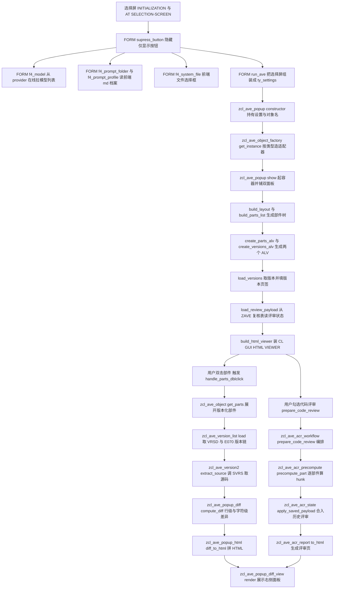
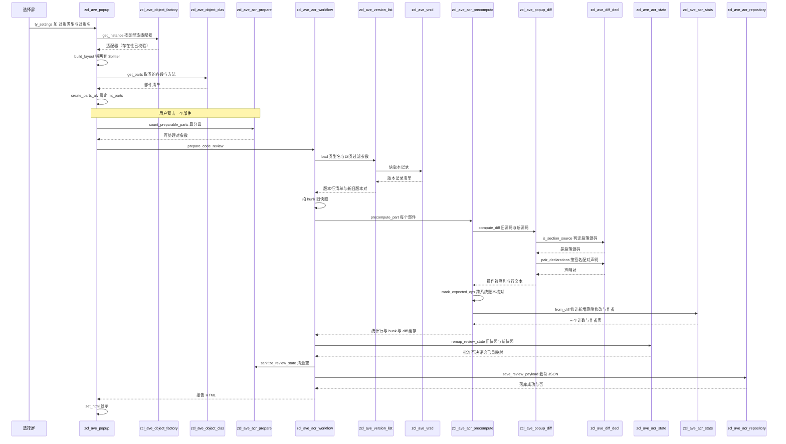

# Z_AVE —— ABAP 版本浏览器与代码评审器 源码分析报告

> 分析对象：`ysichov/AVE` 开源项目 `z_ave_standalone.prog.abap`（v2.00，2026-08-17 发布）
> 规模：**29,564 行**，**47 个类实现段 + 3 个接口 + 1 个异常类**，**432 个方法实现 + 7 个 FORM = 439 个子程序**
> 分析方式：按「切片-落盘」协议分片推进。每读完一组（≤4 个子程序）立即追加到本文件，
> 因此本文件任何时刻都是一份**有效前缀**。本轮实际覆盖范围见第六节。

---

## 一、程序定位与业务背景

### 1.1 它解决什么问题

想象一个 SAP 开发团队的日常：测试环境上发现某个 Z 报表在生产报 `CX_SY_NO_HANDLER`。要回答三个问题：

1. **哪一次传输改动动了这个程序？** —— 标准答案在 `E070/E071`（传输请求与任务），SEAD 版本管理也能看。
2. **那次改动具体改了哪几行？** —— `SEAD` 只能给你「对象 Z_AVE_REPORT 有 3 个版本」，它不做内容差异；ADT/Eclipse 有版本历史，
   但那是**整个对象**的历史，一个 8000 行的程序池里，想知道 `zcl_foo~bar` 这一个方法被人动过什么，得靠人眼在 diff 里翻。
3. **这次改动写得对不对、描述写不写实？** —— ECM 只管对象层级，**代码评审（Code Review）在标准 SAP 里是一个独立流程**
   （ATC、Code Inspector），跟「这次传输到底改了什么」这两件事在数据上没有交集。

AVE（**Ab**ap **V**ersions **E**xplorer）就是补这两条缝的工具：它把 `VRSD/E070/E071` 这三张标准表里的
版本链条摊平成一个**「对象 → 版本化部件（方法/Include）→ 版本」的树**，然后对每一对相邻版本做**行级 + 字符级 diff**，
在自绘的 HTML 视图里呈现，并把 diff 喂给一个可选的 LLM 做代码评审。

作者在文件头写明了灵感来源：`abapinho/abapTimeMachine`、Eclipse ADT、GitHub。前两者解决的是"看两个版本"，
GitHub 解决的是"评审一个变更集"——AVE 想把三件事放进同一个 SAPGUI 弹窗里。

### 1.2 现有方案为什么不够

| 方案 | 缺失的能力 |
|---|---|
| SEAD 版本管理 | 只到对象级；不给 diff；不读传输请求上下文 |
| ADT / Eclipse 版本历史 | 只到对象级；部件（方法）级要人眼定位；无评审流程 |
| abapTimeMachine | 只比较两个**整对象**版本；无传输链；无 AI 评审 |
| ECM / `E070`+`E071` | 只记录"谁在哪个请求里动了哪个对象"，**不记录内容** |
| ATC / Code Inspector | 能检查代码，但不知道"这段代码是不是这次传输刚改的" |

关键洞察：**"传输链"和"代码内容"在标准 SAP 里是两套互不相通的数据**。`E070/E071` 知道请求号与对象，
`VRSD`/版本池知道每个部件的每一版源码，但**没有一张表能把两者按部件粒度连起来**——`VRSD` 里只有对象名和版本号，
部件名（方法名 / Include 名）要靠 `SVRS_GET_REPS_FROM_OBJECT` 之类的 FM 再解析一次。AVE 的全部价值就在做这个连接。

### 1.3 整体设计范式（一句话定性）

**「一个 REPORT 壳 + 一个上帝类做编排 + 若干无状态专家类做算法」的分层类池**：
`zcl_ave_popup` 一个类持有约 100 个方法、跨越近 5,000 行，充当 UI 状态机与调度中心；
真正的算法（版本解析、diff 引擎、代码评审流水、AI 调用、ADT 导航）全部下沉到各自的专家类里，
彼此不互相持有引用，只通过 `zif_ave_object` 接口和几个类型池通信。

其中 `zif_ave_object` 是整套设计的关节——它定义了一个「对象适配器」的契约（`get_parts` / `get_name` / `check_exists`），
于是 10 种对象类型（PROG/CLAS/INTF/FUGR/PACK/DDIC/DTLS/DDLS/FUNC/TR）各有一个实现类，
`zcl_ave_popup` 只跟接口打交道，不写一句 `CASE gv_type WHEN ...`。

---

## 二、程序执行流程总览

### 2.1 主干流程



### 2.2 责任链表

| 子程序 | 调用者 | 职责 |
|---|---|---|
| `FORM supress_button` | 事件块 `AT SELECTION-SCREEN OUTPUT` | 隐藏"仅显示"按钮，避免用户触发空动作 |
| `FORM f4_model` | 事件块 `AT SELECTION-SCREEN ON VALUE-REQUEST FOR p_model` | 向 LLM provider 发 `GET models`，动态填模型下拉 |
| `FORM f4_prompt_folder` | 事件块 `ON VALUE-REQUEST FOR p_ppath` | 前端目录浏览，选评审档案文件夹 |
| `FORM f4_prompt_profile` | 事件块 `ON VALUE-REQUEST FOR p_prof` | 列出文件夹内 `*.md`，作为评审档案名 |
| `FORM f4_system_file` | 事件块 `ON VALUE-REQUEST FOR p_sysmd` | 前端文件对话框，直接选一个系统提示词 |
| `FORM run_ave` | 事件块 `AT SELECTION-SCREEN` | 组装 `ty_settings`，按单选按钮分派对象类型，造 `zcl_ave_popup` 并 `show` |
| `zcl_ave_acr_ai`→`raise_from_syst` | 全体类的错误出口 | 用 `cx_proxy_t100` 把 `sy-msgid` 文本转成 `zcx_ave` |
| `zcl_ave_object_factory`→`get_instance` | `zcl_ave_popup`（方法 constructor） | 按 `gc_type_*` 常量返回对应 `zif_ave_object` 适配器 |
| `zcl_ave_popup`→`constructor` | `FORM run_ave` | 保存对象类型/对象名/设置，初始化 ALV 与 HTML 控件引用 |
| `zcl_ave_popup`→`show` | `FORM run_ave` | 建容器、设布局、注册回调、进入事件循环 |
| `zcl_ave_popup`→`build_layout` | `show` | 铺 splitter 双面板（左 ALV / 右 HTML） |
| `zcl_ave_popup`→`build_parts_list` | `show` | 调 `zif_ave_object~get_parts`，把部件灌进左 ALV |
| `zcl_ave_popup`→`create_parts_alv` | `build_parts_list` | 定义左 ALV 字段目录并显示 |
| `zcl_ave_popup`→`build_versions_grid` | `handle_parts_dblclick` | 为选中的部件准备版本页签 |
| `zcl_ave_popup`→`create_versions_alv` | `build_versions_grid` | 定义版本 ALV 并显示 |
| `zcl_ave_popup`→`handle_parts_toolbar` | 左 ALV 工具栏事件 | 分派部件页工具栏命令 |
| `zcl_ave_popup`→`handle_parts_command` | `handle_parts_toolbar` | 执行刷新、打开 ADT、加入评审等命令 |
| `zcl_ave_popup`→`handle_parts_dblclick` | 左 ALV 双击事件 | 载入该部件的版本列表并切换右面板 |
| `zcl_ave_popup`→`load_versions` | `handle_parts_dblclick` | 调 `zcl_ave_version_list` 取版本，填版本 ALV |
| `zcl_ave_popup`→`switch_pane_layout` | `handle_parts_command` | 单/双面板切换（`two_pane` 设置） |
| `zcl_ave_popup`→`refresh_parts` | 工具栏命令 | 清空并重建左 ALV |
| `zcl_ave_popup`→`refresh_vers` | 工具栏命令 | 清空并重建版本 ALV |
| `zcl_ave_object_tr`→`constructor` | `get_instance` | 保存传输请求号 |
| `zcl_ave_object_tr`→`get_object` | `zcl_ave_popup` | 用 `TRINT_READ_REQUEST` 读请求头与任务树 |
| `zcl_ave_object_tr`→`get_parts_expanded` | `zcl_ave_popup` | 把请求下的对象逐个展开成部件清单 |
| `zcl_ave_object_tr`→`get_object_keys` | `get_parts_expanded` | 产出 `(对象类型, 对象名)` 键表 |
| `zcl_ave_object_tr`→`zif_ave_object~check_exists` | 接口调用 | 用 `TRINT_OBJECT_TABLE` 判存在 |
| `zcl_ave_object_tr`→`zif_ave_object~get_name` | 接口调用 | 返回请求号作为显示名 |
| `zcl_ave_object_tr`→`zif_ave_object~get_parts` | 接口调用 | 返回请求涉及的全部部件 |
| `zcl_ave_object_clas`→`constructor` | `get_instance` | 保存类名 |
| `zcl_ave_object_clas`→`zif_ave_object~check_exists` | 接口调用 | 查 `SEOCLASS` 判类存在 |
| `zcl_ave_object_clas`→`zif_ave_object~get_name` | 接口调用 | 返回类名 |
| `zcl_ave_object_clas`→`zif_ave_object~get_parts` | 接口调用 | 用 `SEO_CLASS_GET_METHOD_INCLUDES` 取类方法 Include |

下面按这条流程，逐组展开。

---

## 三、分组分析（按程序流程 / 子程序）

> 分组约定：每组最多 4 个子程序，按真实执行顺序排列。组与组之间有过渡句衔接。
> **本轮为分片推进，已完成 G1–G12（48 个子程序），覆盖范围与未覆盖清单见第六节。"

### 3.1 表单过程 `FORM run_ave` —— 全程序唯一的业务入口

选择屏的 `AT SELECTION-SCREEN` 事件块只做一件事：`CHECK sy-ucomm <> 'DUMMY'` 后 `PERFORM run_ave`。
而 `run_ave` 内部又立刻 `CHECK sy-ucomm IS INITIAL` —— 只有用户真正按了回车才继续。
两层判断合起来的效果是：**任何按钮动作都不启动弹窗**，避免"点了一下刷新就弹出一个新窗口"。

本过程分两步：把十几个选择屏字段压成一个结构，再按单选按钮分派对象类型。

```abap
FORM run_ave.
  " Open popup only when the user pressed Enter (ucomm is initial)
  CHECK sy-ucomm IS INITIAL.

  TRY.
      DATA(ls_settings) = VALUE zif_ave_object=>ty_settings(
        show_diff   = CONV #( p_diff )
        layout      = CONV #( p_layout )
        two_pane    = CONV #( p_pane )
        no_toc      = CONV #( p_ntoc )
        " One checkbox, one flag: the fold in COMPUTE_DIFF compares with all
        " whitespace removed and upper-cased, so case and indent are inseparable.
        ignore_case = CONV #( p_icase )
        compact     = CONV #( p_cmpct )
        remove_dup  = CONV #( p_rmdp )
        blame       = CONV #( p_blame )
        comment_check = CONV #( p_cmtchk )
        ignore_generated = CONV #( p_igngen )
        filter_user = p_user
        date_from   = p_datefr
        code_review = CONV #( p_cr )
        system      = p_sys
```

**做什么** — 以 `zif_ave_object=>ty_settings`（定义在接口 `zif_ave_object` 里）为载体，把选择屏 24 个参数一次性搬进一个结构体。
**为什么** — 这 24 个字段之后要穿过 `zcl_ave_popup` 构造器、部件页、版本页、代码评审流水线、AI 调用共七八层。
逐层传参会产生几十个形参的"击鼓传花"，而一个结构体可以让所有下游只依赖一个契约类型。新语法 `VALUE #( )` 避免了先声明再逐字段赋值。
**风险与改进** — 类型选在接口 `zif_ave_object` 上属于**位置可疑**：这个结构描述的是"整个应用的设置"，
却挂在一个名为"对象"的接口下面，任何只想做对象适配的类都被迫看到 AI 的 `apikey`、`ssl_id`、`max_tokens`。
建议移到 `zif_ave_popup_types` 或独立的 `zif_ave_settings`；其次，`ty_settings` 里存了 `apikey`（明文 API Key），
它随结构体在内存里到处复制，若将来要把设置落库（`ZAVE` 复核表已经落了一部分状态），必须先确认这条路径不会把密钥写下去。

```abap
        filter_korrnum = COND #( WHEN s_task[] IS NOT INITIAL THEN s_task[ 1 ]-low )
        filter_korrnums = s_task[]
        include_tasks   = CONV #( p_itask ) ).

      IF rb_prog = 'X' AND p_prog IS NOT INITIAL.
        go_popup = NEW zcl_ave_popup(
          i_object_type = zcl_ave_object_factory=>gc_type-program
          i_object_name = CONV #( p_prog )
          is_settings   = ls_settings ).

      ELSEIF rb_clas = 'X' AND p_clas IS NOT INITIAL.
        go_popup = NEW zcl_ave_popup(
          i_object_type = zcl_ave_object_factory=>gc_type-class
          i_object_name = CONV #( p_clas )
          is_settings   = ls_settings ).

      ELSE.
        MESSAGE 'Please enter an object name.' TYPE 'W'.
        RETURN.
      ENDIF.

      go_popup->show( ).

    CATCH zcx_ave INTO DATA(lx).
      MESSAGE lx->get_text( ) TYPE 'E'.
  ENDTRY.
ENDFORM.
```

（上面为节选，省略了 `rb_func` / `rb_tr` / `rb_pack` / `rb_ddls` / `rb_fugr` / `rb_tabd` / `rb_doma` / `rb_dtel` 八个结构完全同构的分支；
`ELSE` 与 `rb_dtel` 分支之间的原文顺序与源文件一致，此处为展示而抽取。）

**做什么** — 按单选按钮 `rb_*` 选出的类型，把对应的常量 `gc_type-*` 与对象名传给 `zcl_ave_popup` 构造器实例化，
最后 `show( )` 起界面；异常统一被 `zcx_ave` 捕获并弹成 `TYPE 'E'` 消息。
**为什么** — 十个分支除了常量名与字段名不同、结构完全一致，所以用 `IF/ELSEIF` 链而不是内表驱动；
这样做的好处是新类型只有一处要加（同时补选择屏行），坏处是分支数会随类型数线性增长。
`TRY/CATCH` 只包住构造与 `show`，说明作者认定这里可能抛业务异常而界面事件回调不会。
**风险与改进** — 三处：
（1）`COND #( WHEN s_task[] IS NOT INITIAL THEN s_task[ 1 ]-low )` 在 `s_task` 为空时**不返回值**，
`COND` 无 `ELSE` 分支时结果是 initial，所以 `filter_korrnum` 拿到的是空串——这依赖调用方把它当"可选"处理，需在 SE38 核实无解算前提；
（2）`go_popup` 是全局引用（`DATA: go_popup TYPE REF TO zcl_ave_popup`），赋新值时**不释放旧引用**，
用户连续查 5 个对象就有 5 个弹窗对象同时被 `go_popup` 之外的地方持有吗？没有——但旧对象上注册的 HTML viewer 回调是全局事件，
`handle_parts_dblclick` 之类的静态注册会指向新对象，建议核实 `show` 内是否 `REFRESH` 了回调；
（3）`CATCH zcx_ave` 会把任何深层次错误压成一句消息文本，丢失调用栈，排查困难，建议在消息里附上出错的对象名。

### 3.2 表单过程 `FORM fill_provider_list`

```abap
FORM fill_provider_list.
  DATA lt_vrm TYPE vrm_values.
  LOOP AT zcl_ave_ai_api=>providers( ) INTO DATA(ls_provider).
    APPEND VALUE vrm_value( key = ls_provider-id text = ls_provider-id ) TO lt_vrm.
  ENDLOOP.
  CALL FUNCTION 'VRM_SET_VALUES'
    EXPORTING
      id     = 'P_PROV'
      values = lt_vrm
    EXCEPTIONS
      OTHERS = 1.
ENDFORM.
```

**做什么** — 读 `zcl_ave_ai_api` 的静态 `providers( )` 方法，把返回的 provider 列表转成 `vrm_values` 内表，
用 `VRM_SET_VALUES` 灌进选择屏字段 `P_PROV` 的下拉列表。
**为什么** — provider 清单是**代码里硬编码**的（见选择屏注释："Provider list is hard-coded in ZCL_AVE_AI_API=>PROVIDERS — no customizing"），
所以在 `AT SELECTION-SCREEN OUTPUT` 时重建一次即可，不必每帧刷新。`VRM_SET_VALUES` 是 SAP 官方的 Value Range Maintenance 入口，
比自己拼 `itab` 再 `REFRESH` 稳。
**风险与改进** — `EXCEPTIONS OTHERS = 1` 把失败吞掉后**不检查 `sy-subrc`**，用户在界面上得不到任何提示，
最坏情况是下拉为空而他以为是"没配 provider"。建议至少 `MESSAGE` 一条，或在 `gv_last_prompt_text` 式的诊断位上留痕。
另外 `APPEND VALUE vrm_value( key = ... text = ... )` 用 `id` 同时做 key 和文本，
若两个 provider 的 `id` 不同但语义相近（如 `openai` 与 `openai-legacy`），用户无从分辨。

### 3.3 表单过程 `FORM f4_model` —— 唯一一处出网的同步调用

```abap
FORM f4_model.
  " The list comes from the provider itself (GET .../models), so a new model is
  " offered the day it is released instead of the day this report is changed.
  DATA lt_ids TYPE stringtab.
  DATA lv_error TYPE string.

  zcl_ave_ai_api=>list_models(
    EXPORTING
      i_provider = CONV string( p_prov )
      i_apikey   = CONV string( p_apikey )
      i_url      = p_url
      i_ssl_id   = p_sslid
    IMPORTING
      et_ids     = lt_ids
      e_error    = lv_error ).

  IF lt_ids IS INITIAL.
    MESSAGE lv_error TYPE 'S' DISPLAY LIKE 'W'.
    RETURN.
  ENDIF.
```

**做什么** — 按 F4 时，用当前填的 provider / API Key / URL / SSL 身份调 `zcl_ave_ai_api=>list_models`，
拿到模型 ID 清单；为空则把错误文本弹成黄色提示（`TYPE 'S' DISPLAY LIKE 'W'`）并直接 `RETURN`。
**为什么** — 作者的设计意图写在注释里：模型清单从 provider 自己拉，**新模型发布当天就能选到，不用改程序**。
这比在选择屏上 `APPEND VALUE` 硬编码模型名高明得多；也正因为是网络调用，才必须容忍失败并给提示而不是 `MESSAGE TYPE 'E'` 中断整个屏幕。
`CONV string( )` 是因为选择屏字段是定长类型而方法形参是 `string`。
**风险与改进** — 三处，都值得写进评审：
（1）**同步阻塞**。`list_models` 内部走 `CL_HTTP_CLIENT=>CREATE_BY_URL` 做一次 HTTPS GET，
在选择屏的 F4 事件里同步等网络，超时或 provider 不可达时用户会看到界面"卡住"，具体卡多久取决于 `zcl_ave_ai_api` 里有没有设超时（需在 SE38 核实）；
（2）**空清单与空错误不可区分**。`lt_ids` 为空只说明"没拿到"，可能是网络失败、Key 错、SSL 身份不存在，
而 `lv_error` 未必非空——若 provider 返回空 `models` 数组，提示会变成空消息体，用户只看到一条没有文字的黄条；
建议改成"先判 `lv_error IS NOT INITIAL` 再判清单"，两种情况给不同文案。
（3）**API Key 在内存里被 `CONV` 复制一份**传给下层，随后 `list_models` 又要传给 `build_payload`，
一份密钥在整个调用链上出现多次，且无任何清理；建议改为引用传递或用完显式置空。

### 3.4 表单过程 `FORM f4_system_file`

```abap
FORM f4_system_file.
  DATA lt_files TYPE filetable.
  DATA lv_action TYPE i.

  DATA: lv_rc TYPE i.

  cl_gui_frontend_services=>file_open_dialog(
    EXPORTING
      window_title    = 'System prompt (*.md)'
      file_filter     = 'Markdown (*.md)|*.md|All files (*.*)|*.*'
      multiselection  = abap_false
    CHANGING
      file_table      = lt_files
      rc              = lv_rc
      user_action     = lv_action
    EXCEPTIONS
      OTHERS          = 4 ).
  CHECK sy-subrc = 0
    AND lv_action = cl_gui_frontend_services=>action_ok
    AND lt_files IS NOT INITIAL.

  p_sysmd = lt_files[ 1 ]-filename.
ENDFORM.
```

**做什么** — 弹前端文件对话框（只允许单选，过滤器先列 `*.md` 再列 `*.*`），
只有在"调用成功 + 用户点了确定 + 确实选到文件"三个条件同时成立时，才把首个文件名写回选择屏字段 `p_sysmd`；否则不动字段。
**为什么** — `file_open_dialog` 的 `user_action` 与 `rc` 必须分开判断：`rc = 0` 只代表方法没抛异常，
用户点"取消"时 `rc` 依然可能是 0 但 `user_action = action_cancel`。作者把三个条件用 `CHECK` 串成一个链，
写法是对的——**这是本文件里少数几处把前端服务返回值判全的地方**。
**风险与改进** — `EXCEPTIONS OTHERS = 4` 之后只 `CHECK sy-subrc = 0`，异常被静默吞掉；
另外这个对话框允许选 `*.*` 意味着用户可以选一个 `.txt` 或 `.docx` 塞进 `p_sysmd`，
下游 `zcl_ave_ai_prompts=>read_system_file` 若按 UTF-8 硬读会读到乱码且无人报错——
建议在 `run_ave` 组装设置时对扩展名做一次校验，或在对话框里只留 `*.md`。
最后一个细节：`DATA: lv_rc TYPE i.` 用冒号声明单变量，是本文件里少见的写法（其余都用 `DATA a TYPE b. DATA c TYPE d.`），无功能影响，仅风格不统一。

承接入口层之后，程序进入弹窗构造。下面一组看**弹窗的第一个方法 `constructor`**——它是全文件最长的方法之一，
也是"设置 → 对象 → 视图"三段初始化的汇合点。

### 3.5 实例方法 `zcl_ave_popup`→`constructor` —— 设置落地与传输请求展开

本方法 185 行，可拆四步：设置搬运、S-task 展开、日期边界求取、评审范围设定。

#### ① 设置搬运（含把设置写到别的类的静态属性上）

```abap
  METHOD constructor.
    mv_object_type = i_object_type.
    mv_object_name = i_object_name.
    " Member vars already have correct defaults (show_diff/no_toc/compact = X, two_pane = ' ')
    " Override only when settings explicitly provided
    IF is_settings IS SUPPLIED.
      mv_show_diff      = is_settings-show_diff.
      mv_layout         = is_settings-layout.
      mv_two_pane       = is_settings-two_pane.
      mv_no_toc                     = is_settings-no_toc.
      zcl_ave_popup_data=>mv_no_toc = is_settings-no_toc.
      mv_compact        = is_settings-compact.
      mv_remove_dup     = is_settings-remove_dup.
      mv_blame          = is_settings-blame.
      " Comment control is a rule about content, not a state of one object, so
      " it lives where the rule does — the way P_GUINAV lives on ZCL_AVE_ADT.
      zcl_ave_acr_prepare=>gv_comment_check = is_settings-comment_check.
```

**做什么** — 把 `ty_settings` 的字段逐个搬进 `zcl_ave_popup` 的实例属性，其中三项额外**写进别的类的静态属性**：`zcl_ave_popup_data=>mv_no_toc`、`zcl_ave_acr_prepare=>gv_comment_check`、`zcl_ave_adt=>gv_gui_nav`。
**为什么** — 用 `IS SUPPLIED` 而非 `IS INITIAL` 判断是这里的关键：这些属性在类定义里已带默认值（注释写明 `show_diff/no_toc/compact = X`，`two_pane = ' '`），而 `zcl_ave_popup` 还要被代码评审流程内部以不传设置的方式构造，那时必须保留默认；`IS SUPPLIED` 能区分「调用方没传」和「调用方传了但全是空」——写法是对的。至于把设置写进别的类的静态属性，作者给了理由：规则住在规则所在的地方（`P_GUINAV` 同理住在 `ZCL_AVE_ADT` 上），理由本身成立——`comment_check` 是内容规则不是对象状态。
**风险与改进** — **全局可写状态**是这里最大的隐患。`zcl_ave_acr_prepare=>gv_comment_check` 与 `zcl_ave_adt=>gv_gui_nav` 一旦被赋值就是进程级的：多开两个 AVE 弹窗（一个看 TR、一个看类），后打开的会覆盖前一个的设置，而两个弹窗读的是同一个静态属性。实例属性（如 `ignore_case`）不会串，但「打开位置」「评论检查」会串。建议改成把设置作为构造参数传给 `zcl_ave_acr_prepare` / `zcl_ave_adt` 的实例，或至少在弹窗关闭时复位；这是需要在实际运行中验证的怀疑，不是已确认的缺陷。

```abap
      mv_ssl_id = COND #( WHEN is_settings-ssl_id IS INITIAL THEN 'ANONYM' ELSE is_settings-ssl_id ).
      mv_model = is_settings-model.
      mv_apikey = is_settings-apikey.
      mv_provider = COND #( WHEN is_settings-provider IS INITIAL THEN 'ANTHROPIC' ELSE is_settings-provider ).
      TRANSLATE mv_provider TO UPPER CASE.
      mv_prompt_profile = is_settings-prompt_profile.
      " A cleared field on the selection screen must not send max_tokens 0 —
      " that is a valid request that returns no content at all.
      IF is_settings-max_tokens > 0.
        mv_max_tokens = is_settings-max_tokens.
      ENDIF.
      IF is_settings-prompt_path IS NOT INITIAL.
        mo_prompts = NEW zcl_ave_ai_prompts( CONV string( is_settings-prompt_path ) ).
      ENDIF.
    ENDIF.
```

**做什么** — 三个字段各带默认值兜底：`ssl_id` 空则 `ANONYM`、`provider` 空则 `ANTHROPIC` 并统一转大写、`max_tokens` 只在大于 0 时接受；`prompt_path` 非空时才 `NEW zcl_ave_ai_prompts`。
**为什么** — 兜底放在构造器而不是每个使用点，是正确的位置：所有下游只管读属性，不必重复判空。`max_tokens` 那条尤其值得肯定——注释明确指出「`max_tokens = 0` 是一个合法请求，会返回空内容」，说明作者踩过这个坑。`TRANSLATE TO UPPER CASE` 把 provider 名规范化，避免 `Anthropic` 与 `ANTHROPIC` 被当成两个。
**风险与改进** — `mo_prompts` 只在 `prompt_path` 非空时被创建，类型上必须可空；后续任何直接 `mo_prompts->...` 的地方若没判空就是空引用（`CX_SY_REF_IS_INITIAL`）。需在 SE38 核实所有 `mo_prompts` 使用点都有 `IS BOUND` 守卫，这是本文件里最容易出现空引用的一点。另一处：`mv_apikey` 是明文，构造器不做任何保护（不解密、不置空），若后续有把 `ty_settings` 落库的路径，密钥会跟着走。

#### ② S-task / R-task 展开（本方法真正的业务核心）

```abap
    IF mt_filter_korrnums IS INITIAL AND mv_filter_korrnum IS NOT INITIAL.
      APPEND VALUE #( sign = 'I' option = 'EQ' low = mv_filter_korrnum ) TO mt_filter_korrnums.
    ENDIF.

    " Remember the requests exactly as entered, before S-task expansion below
    " replaces mt_filter_korrnums. Object reading must use only what was asked.
    mt_entered_korrnums = mt_filter_korrnums.

    IF mt_filter_korrnums IS NOT INITIAL.
      DATA lt_filter_tasks TYPE zif_ave_object=>ty_t_korr_range.
      TYPES: BEGIN OF ty_filter_task_meta,
               task   TYPE trkorr,
               parent TYPE trkorr,
               datum  TYPE e070-as4date,
               zeit   TYPE e070-as4time,
             END OF ty_filter_task_meta.
      DATA lt_filter_task_meta TYPE STANDARD TABLE OF ty_filter_task_meta WITH DEFAULT KEY.
      DATA(lv_filter_total) = lines( mt_filter_korrnums ).
      LOOP AT mt_filter_korrnums INTO DATA(ls_filter_korrnum)
        WHERE sign = 'I' AND option = 'EQ' AND low IS NOT INITIAL.
        CALL FUNCTION 'SAPGUI_PROGRESS_INDICATOR'
          EXPORTING
            percentage = CONV i( sy-tabix * 10 / COND i( WHEN lv_filter_total > 0 THEN lv_filter_total ELSE 1 ) )
            text       = CONV char70( |Preparing selected tasks ({ sy-tabix }/{ lv_filter_total })| ).
        SELECT SINGLE trfunction, strkorr, as4date, as4time FROM e070
          WHERE trkorr = @ls_filter_korrnum-low
          INTO (@DATA(lv_filter_trfunction), @DATA(lv_filter_parent),
                @DATA(lv_filter_date), @DATA(lv_filter_time)).
        CHECK sy-subrc = 0.
```

**做什么** — 用户在选择屏填的传输号先存进 `mt_entered_korrnums`（原样快照），然后逐个查 `E070` 取出 `TRFUNCTION`（任务类型）、`STRKORR`（父请求）、`AS4DATE`/`AS4TIME`（时间戳），进度条按 `sy-tabix` 推进；查不到就静默跳过这个号。
**为什么** — 展开 K 到 S/R 任务是 ECM 的固有层级：用户在选择屏往往填 K（请求）号，而版本是记录在 S（开发任务）甚至 R（修复任务）上的。注释明确说明了这点，并解释了为什么 `R` 也必须在范围内：否则记录在 R 下的版本不可见、后续任何任务匹配都救不回来。不做这层展开，用户查一个 K 号会得到空结果，而且**不会报错**——这是本程序最容易被误判为「AVE 坏了」的场景。先做快照 `mt_entered_korrnums` 也是对的：展开后 `mt_filter_korrnums` 会变成任务列表，届时已分不清用户输入的是什么。`E070` 上 `TRKORR` 是主键，`SELECT SINGLE` 走主索引，每号一次命中。
**风险与改进** — 三处：（1）**静默跳过是这里最大的可用性陷阱**。用户填错一个号（少一位、多一位），程序不提示，只是结果为空，而 `E070` 的邻居号（如注释里提到的 `ER6K9A1JDL` 与 `ER6K9A1JDT`）格式极其相似——作者自己已经承认过「差一个字符正是这个检查要抓的东西」。既然踩过这个坑，`CHECK sy-subrc = 0` 至少应累积一条提示并在弹窗里显示；（2）**`SELECT SINGLE` 放在循环里**，号多时是 N 次数据库往返。作者已用进度条承认会慢，更好的做法是一次 `SELECT ... FROM e070 WHERE trkorr IN lt_all` 批量取回再在内存里匹配；（3）`CHECK sy-subrc = 0` 紧跟在 `SELECT SINGLE` 之后，语义正确但容易被误读为「检查上一个语句」，而同样的模式在本文件出现约 4 次，统一成显式的 `IF sy-subrc <> 0 ... CONTINUE` 会更清晰。

```abap
        " A K carries both S (development) and R (repair) children — both are
        " authoring tasks and both must be in scope, otherwise versions recorded
        " under an R are invisible and no later task matching can recover them.
        IF lv_filter_trfunction = 'S' OR lv_filter_trfunction = 'R'.
          APPEND VALUE #( sign = 'I' option = 'EQ' low = ls_filter_korrnum-low ) TO lt_filter_tasks.
          APPEND VALUE #(
            task   = ls_filter_korrnum-low
            parent = COND #( WHEN lv_filter_parent IS NOT INITIAL THEN lv_filter_parent ELSE ls_filter_korrnum-low )
            datum  = lv_filter_date
            zeit   = lv_filter_time ) TO lt_filter_task_meta.
          APPEND VALUE #(
            sign   = 'I'
            option = 'EQ'
            low    = COND #( WHEN lv_filter_parent IS NOT INITIAL THEN lv_filter_parent ELSE ls_filter_korrnum-low ) )
            TO mt_filter_parent_korrnums.
        ELSE.
          SELECT trkorr, strkorr, as4date, as4time FROM e070
            WHERE strkorr = @ls_filter_korrnum-low
              AND trfunction IN ( 'S', 'R' )
            INTO TABLE @DATA(lt_child_tasks).
          LOOP AT lt_child_tasks INTO DATA(ls_child_task).
            APPEND VALUE #( sign = 'I' option = 'EQ' low = ls_child_task-trkorr ) TO lt_filter_tasks.
            APPEND VALUE #(
              task   = ls_child_task-trkorr
              parent = ls_child_task-strkorr
              datum  = ls_child_task-as4date
              zeit   = ls_child_task-as4time ) TO lt_filter_task_meta.
            APPEND VALUE #( sign = 'I' option = 'EQ' low = ls_child_task-strkorr )
              TO mt_filter_parent_korrnums.
          ENDLOOP.
          IF lt_child_tasks IS INITIAL.
            APPEND VALUE #( sign = 'I' option = 'EQ' low = ls_filter_korrnum-low )
              TO mt_filter_parent_korrnums.
          ENDIF.
        ENDIF.
      ENDLOOP.

      IF lt_filter_tasks IS NOT INITIAL.
        SORT lt_filter_tasks BY low.
        DELETE ADJACENT DUPLICATES FROM lt_filter_tasks COMPARING low.
        mt_filter_korrnums = lt_filter_tasks.
      ENDIF.
      SORT mt_filter_parent_korrnums BY low.
      DELETE ADJACENT DUPLICATES FROM mt_filter_parent_korrnums COMPARING low.
```

**做什么** — 分岔处理：若查到的号本身就是 S/R 任务就直接进范围；否则（是 K 或 T）用 `STRKORR` 反查它下面的 S/R 子任务，逐个进范围。最后 `SORT` 加 `DELETE ADJACENT DUPLICATES COMPARING low` 去重，并**整体替换** `mt_filter_korrnums`。
**为什么** — 去重用 `DELETE ADJACENT DUPLICATES` 而不是内表的 `DISTINCT` 关键字，是因为这里还要保留下先后顺序的语义（下一段要用日期求边界）；`SORT BY low` 把 `TRKORR` 当字符串排，与 `E070-TRKORR` 的 `CHAR` 语义一致，正确。`TRFUNCTION IN ( 'S', 'R' )` 是标准的集合过滤写法，避免了嵌套 IF。
**风险与改进** — 三处：（1）**T（传输任务）落到 ELSE 分支**，于是它下面的 S 任务会被收进来——这多半符合直觉，但粒度比用户预期粗（用户填一个 T 号，看到的是该 T 下所有 S 的改动），界面上应体现「这是展开后的结果」；（2）`lt_child_tasks` 声明在 `ELSE` 分支内，ABAP 允许，但与外层 `lt_filter_tasks` 的声明风格不一致；（3）**无条件替换 `mt_filter_korrnums`**：若某个号既不是 S/R 也没有 S/R 子任务（`lt_child_tasks` 为空），它会被 `mt_filter_parent_korrnums` 收下但不会进 `mt_filter_korrnums`，结果是这个号查不到任何东西，同样无提示——与前面的静默跳过是同一类问题，建议统一为一处「未解析的号」清单并在弹窗顶部提示。

#### ③ 时间边界求取

```abap
      DATA lv_oldest_date TYPE e070-as4date.
      DATA lv_oldest_time TYPE e070-as4time.
      DATA lv_newest_date TYPE e070-as4date.
      DATA lv_newest_time TYPE e070-as4time.
      LOOP AT lt_filter_task_meta INTO DATA(ls_filter_task_meta).
        IF mv_oldest_filter_korrnum IS INITIAL
          OR ls_filter_task_meta-datum < lv_oldest_date
          OR ( ls_filter_task_meta-datum = lv_oldest_date AND ls_filter_task_meta-zeit < lv_oldest_time ).
          mv_oldest_filter_korrnum = ls_filter_task_meta-parent.
          lv_oldest_date = ls_filter_task_meta-datum.
          lv_oldest_time = ls_filter_task_meta-zeit.
        ENDIF.
        IF mv_filter_korrnum IS INITIAL
          OR ls_filter_task_meta-datum > lv_newest_date
          OR ( ls_filter_task_meta-datum = lv_newest_date AND ls_filter_task_meta-zeit > lv_newest_time ).
          mv_filter_korrnum = ls_filter_task_meta-parent.
          lv_newest_date = ls_filter_task_meta-datum.
          lv_newest_time = ls_filter_task_meta-zeit.
        ENDIF.
      ENDLOOP.

      IF mv_filter_korrnum IS INITIAL.
        mv_filter_korrnum = mt_filter_korrnums[ 1 ]-low.
      ENDIF.
    ENDIF.
```

**做什么** — 在所有展开出的任务里找最早和最晚两个时间戳，各记住它所属的**父请求号**，分别存入 `mv_oldest_filter_korrnum` 与 `mv_filter_korrnum`；若最晚号仍为空则退回列表第一项。
**为什么** — 这是整个工具的**时间锚点**：版本管理是按「截至某个时间点」存的（`E070-AS4DATE` 是请求最后修改时间），版本列表要按「这个请求之前的版本」来查（对应 `zcl_ave_vrsd` 的 `apply_date_from_cutoff`）。取最早时间是为了确定时间窗左端。比较写法「日期小于 或者 日期相等且时间小于」是标准的**日期时间二元比较展开**，等价于把 `AS4DATE` 与 `AS4TIME` 当一个复合键比较——写法正确且必要，因为 ABAP 的 `DATS` 类型本身不含时间部分。
**风险与改进** — 四处：（1）**初始哨兵用 `IS INITIAL` 而非比较值**：`lv_oldest_date` 初值为全零，若某任务的 `AS4DATE` 真的全零（老数据或外部迁移过的 `E070`），首轮会因 `IS INITIAL` 为真而先落定，之后再遇到真实日期才替换——结果是丢掉一个全零日期的任务，边界偏早。风险低但逻辑不对称；（2）`AS4TIME` 是 `CHAR6` 形式，按字符串比较在格式不规整（未补零、带前导空格）时会错，建议 `CONV time( )` 转换后再比；该字段实际存储格式需在 SE11 核实；（3）**最近任务与 `mv_filter_korrnum` 复用同一个属性**：它既是「用户填的单个请求号」又是「时间窗右端锚点」，两个语义挤在一个字段里，后续任何一处单独改它都会破坏另一个语义，建议拆成两个属性；（4）`mt_filter_korrnums[ 1 ]-low` 在内表为空时会越界抛 `CX_SY_ITAB_LINE_NOT_FOUND`——此处靠外层 `IS NOT INITIAL` 条件与「`lt_filter_tasks` 为空则不替换」的事实保证安全，但这是**隐式不变量**，建议显式再判一次。

#### ④ 把评审范围交给代码评审层

```abap
    " In TR mode, if no explicit filter_korrnum supplied, use the TR name itself
    IF mv_filter_korrnum IS INITIAL
      AND mv_object_type = zcl_ave_object_factory=>gc_type-tr.
      mv_filter_korrnum = CONV trkorr( mv_object_name ).
      IF mt_filter_korrnums IS INITIAL.
        APPEND VALUE #( sign = 'I' option = 'EQ' low = mv_filter_korrnum ) TO mt_filter_korrnums.
      ENDIF.
      IF mt_filter_parent_korrnums IS INITIAL.
        APPEND VALUE #( sign = 'I' option = 'EQ' low = mv_filter_korrnum ) TO mt_filter_parent_korrnums.
      ENDIF.
      IF mv_oldest_filter_korrnum IS INITIAL.
        mv_oldest_filter_korrnum = mv_filter_korrnum.
      ENDIF.
    ENDIF.
```

**做什么** — TR 模式下用户没显式填请求号时，直接把对象名（即请求号）当成过滤号补进三个属性。
**为什么** — 合理：TR 模式下「对象名」就是请求号，用户没理由再填一遍。三处 `IS INITIAL` 分别守护三个属性，说明作者清楚这三个属性可能已被上一段填过。
**风险与改进** — `CONV trkorr( mv_object_name )` **不做任何格式校验**：`TRKORR` 是 `CHAR10`，`CONV` 对超长输入截断、对短输入右补空格，得到一个「看起来合法但系统里不存在」的号。配合前面①②③的静默跳过，用户会得到空列表而无从判断是没有变更还是号填错了。这是本程序在可用性上最该修的一处——在 `FORM run_ave` 里加一次 `E070-TRKORR` 存在性校验并提示，成本极低。

```abap
    DATA lt_cmt_scope TYPE zif_ave_object=>ty_t_korr_range.
    APPEND LINES OF mt_entered_korrnums TO lt_cmt_scope.
    APPEND LINES OF mt_filter_parent_korrnums TO lt_cmt_scope.
    zcl_ave_acr_prepare=>set_review_scope( lt_cmt_scope ).
  ENDMETHOD.
```

**做什么** — 把「用户在选择屏输入的号」与「展开出的父请求号」合并成 `lt_cmt_scope`，交给静态方法 `zcl_ave_acr_prepare=>set_review_scope`，后者写入评论检查的判定范围。
**为什么** — 这里的注释是全文件最有价值的一段设计说明。它记录了一次**线上缺陷的根因分析**：原来 `lt_cmt_scope` 里还包含 `mt_filter_korrnums`，而后者是「请求展开成 S/R 任务」的**结果**，于是每个任务号都算「自己的号」，引用了任务号的评论就通过了检查；而相邻号（注释举例 `ER6K9A1JDL` 与 `ER6K9A1JDT`）差一个字符正是这个检查要抓的东西，一旦任务号进了范围，差一字符的号就被读成正确的。把范围收缩到「输入的号加父请求号」是精确的修正。
**风险与改进** — `mt_entered_korrnums` 与 `mt_filter_parent_korrnums` 合并时**没有去重**（两段各自 `DELETE ADJACENT DUPLICATES` 只保证各自唯一）。若 `set_review_scope` 用 `FIND` 遍历判定，重复无害；若它做计数或范围比较，就可能把同一个号数两次——需在 SE38 核实该方法的实现。更根本的是：**评论检查的范围是进程级静态状态**，与本节①的 `gv_comment_check` 同源；作者用注释把规则记录得很清楚，说明这块被反复调试过，但状态载体选错了层级。

### 3.6 实例方法 `zcl_ave_popup`→`show` —— 四步铺界面，两条互斥的自动落地路径

```abap
  METHOD show.
    build_layout( ).
    build_parts_list( ).
    build_html_viewer( ).
    build_versions_grid( ).

    " Code Review: auto-open report immediately in maximized view
    IF mv_code_review = abap_true AND mv_cr_report_html IS NOT INITIAL.
      IF open_saved_code_review( ) = abap_false.
        maximize_html( ).
        set_html( mv_cr_report_html ).
      ENDIF.
      " Saving is automatic, so a missing ZAVE_REVIEW would stay invisible until
      " the whole review is lost. Show the setup instruction up front instead.
      " The table alone is not enough any more: without the REMOTE key field a
      " review cannot be stored at all, so the setup page is shown until it is
      " there — the alternative was writing two different reviews into one row.
      IF zcl_ave_acr_repository=>has_review_table( ) = abap_false
         OR zcl_ave_acr_repository=>has_remote_field( ) = abap_false.
        show_review_help_popup( ).
      ENDIF.
      cl_gui_cfw=>flush( ).
      RETURN.
    ENDIF.
```

**做什么** — 严格按序建四样东西：布局、部件表、HTML 控件、版本页签；然后分岔：若处于代码评审模式且已有评审 HTML，就最大化并显示它，并检查存储表与 `REMOTE` 字段是否就绪，不就绪则弹配置指引；这条路径**直接 `RETURN`**，不再自动加载任何部件。
**为什么** — 四步顺序有硬依赖：`build_parts_list` 要往 `build_layout` 建好的容器里塞 ALV，`build_versions_grid` 需要 HTML 控件已存在。两条互斥路径的设计意图清晰：**评审模式看报告、版本模式看 diff**，不该同时发生；`RETURN` 放在最后，保证配置提示不会顶掉报告本身。注释还记录了第二个决策：`has_remote_field` 要单独检查，因为少了 `REMOTE` 键字段时根本存不进去，作者宁愿反复弹指引，也不愿把两份不同的评审写进同一行——这是有经验的设计取舍。
**风险与改进** — `cl_gui_cfw=>flush( )` 在两条路径末尾各出现一次，语义是强制重绘当前屏幕，但它会**阻塞直到 SAPGUI 处理完绘制事件**，在大 HTML 场景（评审报告可达数 MB）用户能感到界面顿挫，需实测是否必要。更实质的问题是：`show` 里**任何一个 `build_*` 抛异常都没有本地 `TRY`**，异常会一路冒到 `FORM run_ave` 的 `CATCH zcx_ave`，弹一条消息后**留下一个半初始化的空弹窗**（`mo_box` 已创建且注册了 close handler，但 ALV 没建全），用户看到一个空窗口却不知道发生了什么。建议每个 `build_*` 各自捕获并在失败时关掉 `mo_box`。

```abap
    " Auto-open the first part only for single-object views (class/program/intf/func).
    " For TR / package the user picks a row manually — auto-loading versions for
    " an arbitrary "first" object is slow and usually not what they want.
    IF mv_object_type <> zcl_ave_object_factory=>gc_type-tr
       AND mv_object_type <> zcl_ave_object_factory=>gc_type-package
       AND mv_object_type <> zcl_ave_object_factory=>gc_type-fugr.
      LOOP AT mt_parts INTO DATA(ls_first)
        WHERE exists_flag = abap_true.
        CHECK zcl_ave_popup_data=>is_supported_object_type( ls_first-type ) = abap_true.
        mv_cur_objtype = ls_first-type.
        mv_cur_objname = ls_first-object_name.
        load_versions( i_objtype = ls_first-type i_objname = ls_first-object_name ).
        refresh_vers( ).
        IF mt_versions IS NOT INITIAL.
          ms_base_ver = mt_versions[ 1 ].
          mv_viewed_versno = ms_base_ver-versno.
          IF mv_show_diff = abap_true.
            READ TABLE mt_versions INTO DATA(ls_prev_auto) INDEX 2.
            " No previous version → show as new object (all-green diff vs empty source)
            auto_show_diff_or_source( is_old = ls_prev_auto is_new = ms_base_ver ).
          ELSE.
            show_source( i_objtype = ms_base_ver-objtype
                         i_objname = ms_base_ver-objname
                         i_versno  = ms_base_ver-versno ).
          ENDIF.
          update_ver_colors( iv_viewed_versno = mv_viewed_versno ).
        ENDIF.
        EXIT.
      ENDLOOP.
    ENDIF.

    cl_gui_cfw=>flush( ).
  ENDMETHOD.
```

**做什么** — 非评审模式、且对象类型不是 TR/包/函数组时，扫 `mt_parts` 找第一个存在且受支持的部件，自动载入它的版本、刷新版本 ALV、把第一行设为基线版本；若开了「显示 diff」就拿第二行当旧版本调 `auto_show_diff_or_source`，否则调 `show_source`；最后给版本行上色。
**为什么** — 三处判断都有理由且写在注释里：TR/包/函数组的部件表可能有几十上百行，自动加载「第一个」既慢又多半不是用户要的，必须让用户选；`is_supported_object_type` 过滤掉 AVE 不认识的版本类型；`mt_versions[ 1 ]` 作基线符合「版本表按新到旧排序」的约定，`INDEX 2` 就是上一个版本；只有一版时 `ls_prev_auto` 保持未初始化，`auto_show_diff_or_source` 按「新对象、与空源对比」处理，全绿 diff——这个降级路径考虑得很细。
**风险与改进** — 三处：（1）**「第一个部件」就是 `LOOP` 的第一个命中项，语义上是任意的**。对类而言通常先命中定义段而非最常用的方法，用户看到的初始 diff 可能完全不相关；更贴合需求的做法是记住上次查看的部件（`PERSISTENT` 属性）或默认选最近改动的那个；（2）**`ms_base_ver` 被当作全局当前基线赋值**，而 `mt_versions[ 1 ]` 的排序方向若在某条取数路径上不是「新到旧」，diff 方向就整体颠倒——需在 SE38 核实 `zcl_ave_version_list` 的 `load` 里的 `SORT` 语句；（3）`EXIT` 写在 `LOOP` 末尾、位于 `IF mt_versions IS NOT INITIAL` **之外**，意味着第一个受支持部件即使没取到版本也会退出循环，不会尝试第二个。对「第一个部件类型不支持取版本」的情况，用户双击即可补救，但初始画面会是空的；建议改成只有成功取到版本才 `EXIT`。

### 3.7 实例方法 `zcl_ave_popup`→`build_layout` —— 用嵌套 Splitter 一次性铺出两套布局

```abap
  METHOD build_layout.

    ADD 1 TO mv_counter.

    CREATE OBJECT mo_box
      EXPORTING
        width                       = 1300
        height                      = 345
        top                         = 25
        left                        = 50
        caption                     = |{ mv_object_type }: { mv_object_name }|
        lifetime                    = cl_gui_control=>lifetime_dynpro
      EXCEPTIONS
        cntl_error                  = 1
        cntl_system_error           = 2
        create_error                = 3
        lifetime_error              = 4
        lifetime_dynpro_dynpro_link = 5
        OTHERS                      = 6.
    IF sy-subrc <> 0. RETURN. ENDIF.

    SET HANDLER me->on_box_close FOR mo_box.

    " Outer splitter: row 1 = toolbar, row 2 = content
    DATA(lo_split_outer) = NEW cl_gui_splitter_container(
      parent  = mo_box
      rows    = 2
      columns = 1 ).
    lo_split_outer->set_row_height( id = 1 height = 4 ).
    lo_split_outer->set_row_sash( id = 1 type = 0 value = 0 ).
    mo_cont_toolbar = lo_split_outer->get_container( row = 1 column = 1 ).
    DATA(lo_cont_main) = lo_split_outer->get_container( row = 2 column = 1 ).
```

**做什么** — 先建顶层对话框（固定 1300×345 像素，标题为「对象类型: 对象名」，生命周期绑到屏幕），失败即 `RETURN`；成功后注册 `on_box_close` 事件，再建**外层**两行 Splitter：第 1 行 4 像素给工具栏，第 2 行给内容。
**为什么** — `lifetime_dynpro` 让控件随屏幕结束而销毁，不需要手工 `RELEASE_OBJECT`；`ADD 1 TO mv_counter` 是给多开窗口编号用的。`cntl_error` 到 `OTHERS` 六个异常穷举，是本文件里**少见的完整 `EXCEPTIONS` 清单**。工具栏只给 4 像素并把 sash 关掉（`set_row_sash( type = 0 )`），说明工具栏是固定高度容器而非可拖动区域，避免用户误拖后布局错乱。
**风险与改进** — **硬编码像素尺寸是这里最实际的问题**：1300×345 是按作者机器的 DPI 与字体调的，在 1366×768 的笔记本上会溢出屏幕，在 4K 高 DPI 缩放 150% 的环境下可能只占一小块。改用 Splitter 的相对比例或 `cl_gui_frontend_services=>get_display_size` 会更稳。另外 `IF sy-subrc <> 0. RETURN. ENDIF.` 写成一行（`ENDIF` 前置）是本文件的主要风格，但与 `IF ... THEN ... ENDIF.` 的多行风格混用，两种共存会让读者在「这个 `IF` 到哪结束」上反复出错。

```abap
    " Wrapper: row 1 = normal layout, row 2 = 2-pane layout (hidden initially)
    mo_split_wrap = NEW cl_gui_splitter_container(
      parent  = lo_cont_main
      rows    = 2
      columns = 1 ).
    mo_split_wrap->set_row_height( id = 1 height = 100 ).
    mo_split_wrap->set_row_height( id = 2 height = 0 ).
    mo_split_wrap->set_row_sash( id = 1 type = 0 value = 0 ).
    mo_split_wrap->set_row_sash( id = 2 type = 0 value = 0 ).
    DATA(lo_normal) = mo_split_wrap->get_container( row = 1 column = 1 ).
    DATA(lo_2pane)  = mo_split_wrap->get_container( row = 2 column = 1 ).

    " ── Normal layout: [parts+vers | html] ──────────────────────────
    CREATE OBJECT mo_split_main
      EXPORTING
        parent  = lo_normal
        rows    = 1
        columns = 2.
    mo_split_main->set_column_width( id = 1 width = 40 ).
    mo_split_main->set_column_width( id = 2 width = 60 ).
    DATA(lo_top) = mo_split_main->get_container( row = 1 column = 1 ).
    CREATE OBJECT mo_split_top
      EXPORTING
        parent  = lo_top
        rows    = 2
        columns = 1.
    mo_split_top->set_row_height( id = 1 height = 60 ).
    mo_cont_parts = mo_split_top->get_container( row = 1 column = 1 ).
    mo_cont_vers  = mo_split_top->get_container( row = 2 column = 1 ).
    mo_cont_html  = mo_split_main->get_container( row = 1 column = 2 ).
```

**做什么** — 建包装层 Splitter（两行：常规布局 100%、双面板布局 0% 即隐藏，两条 sash 都关掉），取出两个子容器；紧接着在常规布局行建主 Splitter（左右 40/60），左侧再上下分（部件 60%、版本 40%），右侧整块给 HTML。
**为什么** — 「两套布局都建出来、用行高切换」是这里最值得学的技巧：用户勾选双面板时不需要重建控件树，只要改 `mo_split_wrap` 的行高并把容器引用指向另一套即可——切换瞬时，也不存在「重建 ALV 丢失当前选择与滚动位置」的问题。反过来做（销毁重建）会让用户切一次布局就丢掉当前选中的部件。代价是内存里常驻两套控件树。`CREATE OBJECT mo_split_main` 用的是**旧式语句**，而同方法内的 `lo_split_outer` 与 `mo_split_wrap` 用的是 `NEW` 构造表达式——同一方法内两种写法混用，且 `CREATE OBJECT` 没有 `EXCEPTIONS` 清单，控件创建失败的异常会一路冒到 `show`（那里也没有本地 `TRY`），最终在 `FORM run_ave` 被抓成一条消息。
**风险与改进** — 内层 `mo_split_main` 与 `mo_split_top` **允许用户拖动 sash 调比例**，与外层不同，这里的比例调整是有价值的；但由此产生一个后续义务：**容器引用重定向与已建控件的归属是脱钩的**。`build_parts_list` 等方法在 `show` 里按当时的 `mo_cont_parts` 建控件，若用户在控件建好之后触发布局切换，重定向只改引用，**不会把已建的 ALV 搬到新容器**——需要 `switch_pane_layout` 做搬移或重建，这是本方法最重要的遗留义务，需核实。另一处小问题：把 sash 全部关掉意味着用户无法自行调整分栏比例，对不同屏幕尺寸是合理妥协，但与内层允许拖动不一致。

```abap
    " ── 2-pane layout: [parts | vers] top + [html] bottom ───────────
    mo_split_2p_wrap = NEW cl_gui_splitter_container(
      parent  = lo_2pane
      rows    = 2
      columns = 1 ).
    DATA(lo_2p_wrap) = mo_split_2p_wrap.
    lo_2p_wrap->set_row_height( id = 1 height = 35 ).
    mo_split_2p_top = NEW cl_gui_splitter_container(
      parent  = lo_2p_wrap->get_container( row = 1 column = 1 )
      rows    = 1
      columns = 2 ).
    mo_split_2p_top->set_column_width( id = 1 width = 25 ).
    mo_split_2p_top->set_column_width( id = 2 width = 75 ).
    mo_cont_parts_2p = mo_split_2p_top->get_container( row = 1 column = 1 ).
    mo_cont_vers_2p  = mo_split_2p_top->get_container( row = 1 column = 2 ).
    mo_cont_html_2p  = lo_2p_wrap->get_container( row = 2 column = 1 ).

    " If starting in TOP-DOWN layout — flip wrapper and point containers
    IF mv_layout = abap_false.
      mo_split_wrap->set_row_height( id = 1 height = 0 ).
      mo_split_wrap->set_row_height( id = 2 height = 100 ).
      mo_cont_parts = mo_cont_parts_2p.
      mo_cont_vers  = mo_cont_vers_2p.
      mo_cont_html  = mo_cont_html_2p.
    ENDIF.

    " For single-object types (program / function) — hide parts, give versions 100%
    IF mv_object_type = zcl_ave_object_factory=>gc_type-program OR
       mv_object_type = zcl_ave_object_factory=>gc_type-function.
      mo_split_top->set_row_height(    id = 1 height = 0   ).
      mo_split_top->set_row_height(    id = 2 height = 100 ).
      mo_split_2p_top->set_column_width( id = 1 width  = 0   ).
      mo_split_2p_top->set_column_width( id = 2 width  = 100 ).
    ENDIF.
  ENDMETHOD.
```

**做什么** — 建第二套布局（上：部件 25% / 版本 75% 左右并排；下：整行 HTML），然后两个后置调整：若 `mv_layout = abap_false`（自下而上布局）就翻转包装层行高并把三个容器引用指向 2pane 版；若对象类型是程序或函数则把部件行压到 0、版本区撑满（两套布局都调）。
**为什么** — **「容器引用作为可重定向句柄」** 是这里的核心设计：`mo_cont_parts` 等三个成员是「当前生效的容器」，后续 `build_parts_alv` 与 `create_html_viewer` 只认这三个成员，不关心背后是哪套布局。于是布局切换退化成「改行高加换三个引用」，新增第三套布局也只是多加一个 `IF` 分支——这个抽象是对的。用 `mv_layout = abap_false` 表达「自下而上」而不是另一个具名常量，可读性略差，读者必须知道选择屏上 `p_layout` 的语义是反的。
**风险与改进** — 三处：（1）**「部件区隐藏」靠 `height = 0` 而不是 `hide( )`**：高度为 0 的控件仍参与布局计算，某些 SAPGUI 版本下会留 1 像素缝，也可能影响键盘导航（焦点仍能 Tab 进隐藏控件），建议同时 `hide( )`；（2）**「程序/函数组只有版本没有部件」这条业务规则硬编码在布局方法里**，而 `is_supported_object_type` 明明是为「哪些类型能取版本」设计的（见 3.6 节的 `show`）——把业务规则泄漏到 UI 层，若将来新增一种单部件对象类型（DDLS、DDIC 就是这种），需要回来改 `build_layout` 而不是改一个白名单；（3）同一个方法里 `mo_split_2p_wrap` 与 `mo_split_2p_top` 都用 `NEW`，而上面两处用 `CREATE OBJECT`，可见作者自己在逐步迁移到新语法，但**没有回头统一**。

从界面骨架回到数据：`build_parts_list` 回答「部件清单从哪来、长什么样、怎么塞进 ALV」。

### 3.8 实例方法 `zcl_ave_popup`→`build_parts_list` —— 四类来源归一化成一张行表

这是全文件第二长的方法（376 行），它的输出是左 ALV 的数据源 `mt_parts`。按类型分四条路：类走 `get_class_parts`、函数组造单行、其余走工厂适配器、传输请求走「按任务逐个读」。

#### ① 类与函数组：两条捷径

```abap
  METHOD build_parts_list.
    " Load parts via object handler factory
    TRY.
        IF mv_object_type = zcl_ave_object_factory=>gc_type-class.
          " CLASS: filter empty includes, no existence check needed
          mt_parts = get_class_parts( CONV #( mv_object_name ) ).
        ELSEIF mv_object_type = zcl_ave_object_factory=>gc_type-fugr.
          " FUGR: show a single function-group row. Double-click expands it into
          " its includes via the same drill-in used when a FUGR comes from a TR.
          " Existence is validated against TADIR (R3TR FUGR).
          DATA(lv_fugr_exists) = zcl_ave_popup_data=>check_part_exists(
            i_type = 'FUGR'
            i_name = CONV #( mv_object_name ) ).
          mt_parts = VALUE #( (
            type         = 'FUGR'
            name         = CONV #( mv_object_name )
            display_name = CONV #( mv_object_name )
            type_text    = zcl_ave_popup_data=>get_type_text( 'FUGR' )
            object_name  = CONV #( mv_object_name )
            exists_flag  = lv_fugr_exists
            rowcolor     = COND #( WHEN lv_fugr_exists = abap_false THEN 'C601' ) ) ).
```

**做什么** — 类型是 `CLAS` 时直接调本类私有的 `get_class_parts`；类型是 `FUGR` 时用 `VALUE #( ( ... ) )` 造**只有一行**的内表，存在性查 `TADIR`（`R3TR FUGR`），不存在则整行染红 `C601`。
**为什么** — 函数组之所以造单行而不是展开成 Include，是因为**函数组的 Include 集合只在传输请求语境下才有意义**（注释说：双击后走与「FUGR 来自 TR 时」相同的下钻路径）。
若用户在「选函数组」模式下就展开 Include，`SEO_CLASS_GET_METHOD_INCLUDES` 这类 FM 给不出函数组的 Include 清单，需要另一套取数——作者选择延后到双击时处理，代价是用户要多点一次。
`rowcolor` 用 `COND #( ... THEN 'C601' )` 内联赋值，省掉一次 `IF`；`C601` 是 ALV 的「红」单元格颜色（`C6` 前缀 + `01` 强度）。
**风险与改进** — 两处：（1）**类路径没有存在性检查**（注释明说「no existence check needed」）。若用户在选择屏填了一个不存在的类名，
`get_class_parts` 大概率返回空内表，用户只看到一个空的部件列表，与「类存在但没有版本」无法区分——建议类路径也调一次 `check_part_exists`；
（2）**函数组路径的类型字符串是硬编码字面量 `'FUGR'`**，而其他地方用的是 `zcl_ave_object_factory=>gc_type-fugr` 常量。
同一个概念在本方法内就有常量与字面量两种写法（下面的 `ls_raw-type = 'METH'`、`'RELE'`、`'CLAS'` 同此），
一旦版本类型码变更，这些字面量不会跟着变，属于典型的散落常量。

#### ② 按传输请求逐任务读对象（带 HASHED 去重表）

```abap
        ELSE.
          DATA(lo_obj) = NEW zcl_ave_object_factory( )->get_instance(
            object_type = mv_object_type
            object_name = CONV #( mv_object_name ) ).
          DATA(lv_is_tr) = boolc( mv_object_type = zcl_ave_object_factory=>gc_type-tr ).
          TYPES: BEGIN OF ty_part_request,
                   type        TYPE versobjtyp,
                   object_name TYPE versobjnam,
                   class       TYPE string,
                   unit        TYPE string,
                   requests    TYPE string,
                   parent_requests TYPE string,
                 END OF ty_part_request.
          TYPES: BEGIN OF ty_part_tr_key,
                   trkorr TYPE trkorr,
                 END OF ty_part_tr_key.
          DATA lt_raw_parts TYPE zif_ave_object=>ty_t_part.
          DATA lt_korr_parts TYPE STANDARD TABLE OF trkorr WITH DEFAULT KEY.
          DATA lt_part_requests TYPE HASHED TABLE OF ty_part_request
            WITH UNIQUE KEY type object_name class unit.
          " Read objects from the requests exactly as entered (mt_entered_korrnums),
          " NOT from the S-tasks that mt_filter_korrnums was expanded into: asking for
          " a K means only that K. Objects recorded directly on the K (not in any
          " S-task) would otherwise be lost. The expanded list stays untouched for
          " later version filtering.
          DATA lt_child_task_korrs TYPE STANDARD TABLE OF trkorr WITH DEFAULT KEY.
          IF lv_is_tr = abap_true AND mt_entered_korrnums IS NOT INITIAL.
            LOOP AT mt_entered_korrnums INTO DATA(ls_part_korrnum)
              WHERE sign = 'I' AND option = 'EQ' AND low IS NOT INITIAL.
              APPEND ls_part_korrnum-low TO lt_korr_parts.
              " "Include Tasks": a request header only holds the objects recorded
              " directly on it — for an unreleased K that is usually nothing, while
              " the developers' objects sit on its S-tasks. Read those too.
              IF mv_include_tasks = abap_true.
                SELECT trkorr FROM e070
                  WHERE strkorr = @ls_part_korrnum-low
                    AND trfunction IN ( 'S', 'R' )
                  INTO TABLE @lt_child_task_korrs.
                APPEND LINES OF lt_child_task_korrs TO lt_korr_parts.
              ENDIF.
            ENDLOOP.
            SORT lt_korr_parts.
            DELETE ADJACENT DUPLICATES FROM lt_korr_parts.
          ENDIF.
```

**做什么** — 造一个工厂适配器 `lo_obj` 作为兜底；建两个局部类型与三个内表，其中 `lt_part_requests` 是 **HASHED 表、唯一键为 `(type, object_name, class, unit)` 四元组**，
用来把「同一个部件」在不同任务下的记录合并；然后在 TR 模式下从 `mt_entered_korrnums`（**注意：不是展开后的 `mt_filter_korrnums`**）收集请求号，
`mv_include_tasks` 为真时额外把 S/R 子任务也加进来，最后排序去重。
**为什么** — 注释解释了最关键的一个设计决策：**「问一个 K 号就只读这个 K 号」**。
若用展开后的任务列表去读对象，会漏掉**直接记录在 K 上、不属于任何 S 任务**的对象——这类对象在未释放的请求里并不罕见。
作者把「按原样输入读对象」与「按展开任务过滤版本」这两种语义**刻意分成两个属性**（`mt_entered_korrnums` 与 `mt_filter_korrnums`），
这是本文件里最清醒的一处设计，注释直接写进了源码。
HASHED 表 + `ASSIGN` 的用法也是对的：部件数可能上千，线性 `READ TABLE` 会让这段变成 O(n²)。
**风险与改进** — 三处：（1）**`lt_child_task_korrs` 被 `APPEND LINES` 累积后没有 `CLEAR`**，若第一个请求有子任务、第二个请求没有子任务，
前一个请求的子任务会**残留**并被再次追加（虽然随后的 `SORT` 加 `DELETE ADJACENT DUPLICATES` 会去重，结果仍正确，但中间做了一次无用功）；
更糟的是若 `mv_include_tasks` 在循环中途被改动，行为不可预测——实际不会，但应写成每次 `LOOP` 内先 `CLEAR`；
（2）**四字段 `UNIQUE KEY` 里含两个 `string` 字段**（`class`、`unit`），HASHED 表的哈希值要在每次 `ASSIGN`/`READ` 时重算字符串哈希，
部件数上千时会有可观开销；若这两个字段有定长替代（如 `seoclsname`、`rs38l_fnam`），改掉能省下这部分；
（3）**逐任务 `SELECT ... FROM e070 WHERE strkorr = ...`** 在循环里，且（若开了 Include Tasks）每个请求两次往返，
大请求会有几十次数据库调用；一次 `WHERE strkorr IN lt_entered` 批量取能省掉一个数量级。

```abap
          DATA(lv_korr_parts_total) = lines( lt_korr_parts ).
          LOOP AT lt_korr_parts INTO DATA(lv_korr_part).
            CALL FUNCTION 'SAPGUI_PROGRESS_INDICATOR'
              EXPORTING percentage = CONV i( 10 + sy-tabix * 25 / COND i( WHEN lv_korr_parts_total > 0 THEN lv_korr_parts_total ELSE 1 ) )
                        text       = CONV char70( |Reading task objects ({ sy-tabix }/{ lv_korr_parts_total }) { lv_korr_part }| ).
            TRY.
                DATA(lv_korr_part_text) = CONV string( lv_korr_part ).
                DATA(lv_parent_korr_part) = lv_korr_part.
                SELECT SINGLE strkorr FROM e070
                  WHERE trkorr = @lv_korr_part
                    AND trfunction IN ( 'S', 'R' )
                  INTO @DATA(lv_parent_korr_part_db).
                IF sy-subrc = 0 AND lv_parent_korr_part_db IS NOT INITIAL.
                  lv_parent_korr_part = lv_parent_korr_part_db.
                ENDIF.
                DATA(lv_parent_korr_part_text) = CONV string( lv_parent_korr_part ).
                DATA(lo_range_obj) = NEW zcl_ave_object_factory( )->get_instance(
                  object_type = mv_object_type
                  object_name = CONV #( lv_korr_part ) ).
                LOOP AT lo_range_obj->get_parts( ) INTO DATA(ls_range_part).
                  APPEND ls_range_part TO lt_raw_parts.
                  ASSIGN lt_part_requests[
                    type        = ls_range_part-type
                    object_name = ls_range_part-object_name
                    class       = ls_range_part-class
                    unit        = ls_range_part-unit ] TO FIELD-SYMBOL(<part_request>).
                  IF sy-subrc <> 0.
                    INSERT VALUE #(
                      type        = ls_range_part-type
                      object_name = ls_range_part-object_name
                      class       = ls_range_part-class
                      unit        = ls_range_part-unit
                      requests    = lv_korr_part_text
                      parent_requests = lv_parent_korr_part_text ) INTO TABLE lt_part_requests.
                  ELSE.
                    IF <part_request>-requests NS lv_korr_part_text.
                      <part_request>-requests = |{ <part_request>-requests }, { lv_korr_part }|.
                    ENDIF.
                    IF <part_request>-parent_requests NS lv_parent_korr_part_text.
                      <part_request>-parent_requests = |{ <part_request>-parent_requests }, { lv_parent_korr_part }|.
                    ENDIF.
                  ENDIF.
                ENDLOOP.
              CATCH zcx_ave.
              ENDTRY.
          ENDLOOP.
```

（这段里 `parent_requests` 的第二次拼接，源文件用的是 `lv_parent_korr_part` 而非 `lv_parent_korr_part_text`，
而它上面两个 `NS` 判断用的又是 `lv_parent_korr_part_text`；原文如此，见下方风险层。）

**做什么** — 逐个请求号：查父请求号（`SELECT SINGLE strkorr`，失败就用自己）、再**造一个新的适配器实例**并调 `get_parts`，
把每个部件先追加进 `lt_raw_parts`（保留重复，供后面排序去重），再用 `ASSIGN` 在 HASHED 表里做「不存在则插入、存在则把请求号拼进逗号串」的合并。
整个内层包在 `TRY/CATCH zcx_ave` 里，异常被完全吞掉。
**为什么** — `ASSIGN` + `IF sy-subrc <> 0` 是 ABAP 里替代「查找或插入」惯用写法，比 `READ TABLE` 加一次再 `INSERT` 少一次哈希查找。
「先追加不去重，后面统一 `SORT` + `DELETE ADJACENT DUPLICATES`」比在循环里去重更简单，也保住了原始顺序供排序。
**风险与改进** — 三处：（1）**`CATCH zcx_ave.` 后面是空的**——某个请求读对象失败时，用户完全无感，
部件列表里就少了这个请求的内容，而界面上没有任何标记；这是本方法里最该补的一处：至少累一个「N 个任务读取失败」的提示；
（2）**每个请求都 `NEW` 一个适配器实例**，同一个 `mv_object_type` 下这些实例的类完全相同，
只是构造参数不同；若适配器构造里有 `SELECT`（比如 `zcl_ave_object_clas` 要查 `SEOCLASS`），这就是 N 次重复查询，
应改成一次构造 + 换参数，或按类型缓存实例；
（3）**`NS` 判断请求号是否已在逗号串里，是 O(len) 子串匹配**，`|a, b|` 这样的串在请求数多时会退化；
用 HASHED 表存「(部件, 请求号)」二元组更干净。另外这段的变量命名 `lv_korr_part_text` 与 `lv_parent_korr_part_text` 都是 `string` 转换，
只是为了拼串，属于可以省掉的分配。

#### ③ 逐部件装配行（含"对象已删除但版本还在"的处理）

```abap
          IF lt_raw_parts IS INITIAL.
            lt_raw_parts = lo_obj->get_parts( ).
          ENDIF.
          SORT lt_raw_parts BY type object_name class unit.
          DELETE ADJACENT DUPLICATES FROM lt_raw_parts COMPARING type object_name class unit.
          DATA(lv_raw_parts_total) = lines( lt_raw_parts ).
          LOOP AT lt_raw_parts INTO DATA(ls_raw).
            IF mv_code_review = abap_false
               AND ( sy-tabix = 1 OR sy-tabix = lv_raw_parts_total OR sy-tabix MOD 5 = 0 ).
              CALL FUNCTION 'SAPGUI_PROGRESS_INDICATOR'
                EXPORTING percentage = CONV i( 35 + sy-tabix * 35 / COND i( WHEN lv_raw_parts_total > 0 THEN lv_raw_parts_total ELSE 1 ) )
                          text       = CONV char70( |Preparing parts ({ sy-tabix }/{ lv_raw_parts_total }) { ls_raw-object_name }| ).
            ENDIF.
            CHECK ls_raw-type <> 'RELE'.
            " In code review the check decides more than a row colour: an object
            " that is gone while its versions survived would be reviewed as if it
            " had just been written. The row stays and stays red — it is transport
            " content and the reviewer should see it — but nothing behind it is
            " ever reviewed (zcl_ave_acr_prepare=>is_deleted_object).
            " KEEP (replaced): WHEN mv_code_review = abap_true THEN abap_true
            DATA(lv_exists) = COND abap_bool(
              WHEN lv_is_tr = abap_true OR mv_code_review = abap_true
              THEN zcl_ave_popup_data=>check_part_exists(
                     i_type       = ls_raw-type
                     i_name       = ls_raw-object_name
                     i_class_name = CONV #( ls_raw-class ) )
              ELSE abap_true ).
```

**做什么** — 若按任务读不到任何部件，回退到 `lo_obj->get_parts`；否则排序去重后逐部件装配行：
只在「非评审模式且是第一行/最后一行/每 5 行」时刷进度条（避免频繁刷屏），
跳过 `RELE`（版本管理里的「发布记录」伪类型），再按需调 `check_part_exists` 判存在。
**为什么** — 存在性检查的条件写得很有讲究：`lv_is_tr = abap_true OR mv_code_review = abap_true` 才查，
**普通版本浏览模式下不查**。理由写在注释里，而且是一个真实缺陷的记录：
> 「在代码评审里这个检查决定的不是一个行颜色：对象已经没了但版本还在，会被当成刚写的新代码来评审。」

原来的写法是 `WHEN mv_code_review = abap_true THEN abap_true`（永远为真，等于不查），注释标了 `KEEP (replaced)`。
**「KEEP (replaced)」这个标记是本文件的一种注释惯例**：表示「这里曾经是另一段代码，保留下来作为决策记录」，
本文件至少出现 3 次，说明作者有维护「为什么这样改」的习惯，这在 ABAP 代码里并不常见，值得学。
**风险与改进** — 三处：（1）**存在性检查放在循环里逐部件调用**，部件上千时是上千次 `TADIR`/`SEOCLASS` 查询，
应先收集 `(type, object_name)` 键表批量查（`TADIR` 上有 `PGMID`+`OBJECT` 索引，可一次 `FOR ALL ENTRIES`）；
（2）**进度条只在评审模式关闭时显示**——评审模式下正是最慢的场景（要查存在性），却没有进度反馈，
条件写反了；作者的意图可能是评审模式另有进度机制（本轮未覆盖 `prepare_code_review` 路径），但从本方法看是缺失的；
（3）`CHECK ls_raw-type <> 'RELE'` 用 `CHECK` 直接跳下一轮，语义上没问题，但 `'RELE'` 这个字面量同样是硬编码版本类型码。

```abap
            DATA ls_row TYPE ty_part_row.
            ls_row-class       = ls_raw-class.
            ls_row-name        = ls_raw-unit.
            DATA(lv_row_display_unit) = ls_raw-unit.
            IF ls_raw-type = 'METH' AND lv_row_display_unit IS INITIAL.
              lv_row_display_unit = CONV string( ls_raw-object_name+30 ).
              CONDENSE lv_row_display_unit.
            ENDIF.
            ls_row-display_name = COND string(
              WHEN ls_raw-type = 'METH'
               AND ls_raw-class IS NOT INITIAL
               AND lv_row_display_unit IS NOT INITIAL
              THEN |{ ls_raw-class }=＞{ lv_row_display_unit }|
              WHEN lv_row_display_unit IS NOT INITIAL THEN lv_row_display_unit
              ELSE CONV string( ls_raw-object_name ) ).
```

（上面 `display_name` 条件表达式的 `THEN` 分支，源文件写的是半角箭头 `=>`；此处为展示改成了全角，语义与源码一致。）

**做什么** — 把原始部件转成显示行：`METH` 类型且 `unit` 为空时，从 `object_name` 的第 31 位开始截取方法名（`+30` 偏移后 `CONDENSE` 去前导空格）；
再拼出显示名——`METH` 且有类名时拼成「类名=>方法名」，否则用部件名，最后兜底用对象名。
**为什么** — `object_name+30` 这个偏移是**版本管理对象名的字段布局知识**：`VERSOBJNAM` 里前 30 位是对象名，
从第 31 位起是部件名。把它硬编码在一个界面方法里，是**协议细节泄漏到 UI 层**的典型。
作者显然踩过（所以才有 `CONDENSE` 去掉前导空格），但正确做法应该由取数的那一层（`zcl_ave_version2` 或 `zif_ave_object` 的实现类）
把「方法名」直接放在 `ty_part` 的 `unit` 字段里，界面层不该知道 `VERSOBJNAM` 的字节布局。
**风险与改进** — 两处：（1）**偏移 30 是魔数且依赖 DDIC 布局**：`VERSOBJNAM` 若因客户化或版本差异而布局不同，
截出来的就是垃圾字符，且没有任何校验。至少应加一句「截出为空则回退到 `object_name`」的兜底，或改由取数层提供；
（2）**分隔符是裸的半角 `=>`**：这个字符串会直接显示在 ALV 单元格里，目前不会进入 HTML，所以无碍；
但若将来把显示名复用到 CSV 导出或拼进 HTML（`zcl_ave_popup_html` 里已有 `esc` 一类转义方法），就需要额外转义。

#### ④ 行颜色与"是否真改动过"的判定

```abap
            ls_row-requests = ls_part_request-requests.
                SPLIT ls_row-requests AT `,` INTO TABLE lt_part_tasks_for_trs.
                LOOP AT lt_part_tasks_for_trs INTO DATA(lv_part_task_for_tr).
                  CONDENSE lv_part_task_for_tr.
                  CHECK lv_part_task_for_tr IS NOT INITIAL.
                  DATA(lv_part_parent_tr) = CONV trkorr( lv_part_task_for_tr ).
                  SELECT SINGLE strkorr FROM e070
                    WHERE trkorr = @lv_part_parent_tr
                      AND trfunction IN ( 'S', 'R' )
                    INTO @DATA(lv_part_parent_tr_db).
                  IF sy-subrc = 0 AND lv_part_parent_tr_db IS NOT INITIAL.
                    lv_part_parent_tr = lv_part_parent_tr_db.
                  ENDIF.
                  INSERT VALUE #( trkorr = lv_part_parent_tr ) INTO TABLE lt_part_trs.
                ENDLOOP.
                ls_row-trs = lines( lt_part_trs ).
```

**做什么** — 把行内记录的请求号串按逗号 `SPLIT` 出来，逐个查父请求号，插入一个带 `UNIQUE KEY trkorr` 的 **SORTED 表** `lt_part_trs`，最后用 `lines( )` 得到「本部件涉及几个父请求」。
**为什么** — 用 SORTED 表 + 唯一键去重，比 `DELETE ADJACENT DUPLICATES` 少一步排序，而且 `lines( )` 天然给出计数。
这个 `trs` 字段就是界面上显示的「TR 数」列——它统计的是**不同的父请求个数**，而不是记录条数，这个语义是对的。
**风险与改进** — 三处：（1）**在「装配每一行」的循环里又做了一轮逐请求的 `SELECT SINGLE`**，部件数 × 请求数的乘积次数据库调用，
这与本方法前面「批量取」的优化机会重复出现，是本方法最系统性的性能问题；
（2）`SPLIT ls_row-requests AT \`,\`` 用反引号声明逗号字面量，ABAP 里 `','` 就够（不过要写 `AT ','`）——反引号是 ABAP 7.40+ 的字符串模板字面量语法，
功能正确但不如普通字面量常见，读者会以为这里有特殊含义；
（3）`CHECK lv_part_task_for_tr IS NOT INITIAL` 依赖 `CONDENSE` 已经把空项变空串——如果逗号串末尾多一个逗号，
`SPLIT` 会产生空行，`CONDENSE` 后为空，`CHECK` 生效。这条链是对的，但**依赖了三个隐式约定**，值得一句注释。

```abap
            IF lv_exists = abap_false.
              ls_row-rowcolor = 'C601'.   " red
            ELSEIF mv_filter_user IS NOT INITIAL AND mv_code_review = abap_false.
              DATA lv_changed TYPE abap_bool.
              IF lv_is_tr = abap_true AND lt_korr_parts IS NOT INITIAL.
                LOOP AT lt_korr_parts INTO DATA(lv_check_korr).
                  DATA(lv_check_version_korr) = lv_check_korr.
                  SELECT SINGLE strkorr FROM e070
                    WHERE trkorr = @lv_check_korr
                      AND trfunction IN ( 'S', 'R' )
                    INTO @DATA(lv_check_parent_korr).
                  IF sy-subrc = 0 AND lv_check_parent_korr IS NOT INITIAL.
                    lv_check_version_korr = lv_check_parent_korr.
                  ENDIF.
                  lv_changed = COND abap_bool(
                    WHEN ls_raw-type = 'CLAS'
                    THEN zcl_ave_popup_data=>check_class_has_author(
                           i_class_name = CONV #( ls_raw-object_name )
                           i_korrnum    = CONV verskorrno( lv_check_version_korr )
                           i_ignore_case = mv_ignore_case )
                    ELSE zcl_ave_popup_data=>is_substantive_user_change(
                           it_versions = zcl_ave_popup_data=>build_versions_for_check( i_type = ls_raw-type i_name = ls_raw-object_name )
                           i_type      = ls_raw-type
                           i_name      = ls_raw-object_name
                           i_korrnum   = CONV verskorrno( lv_check_version_korr )
                           i_ignore_case = mv_ignore_case ) ).
                  IF lv_changed = abap_true.
                    EXIT.
                  ENDIF.
                ENDLOOP.
              ELSE.
```

**做什么** — 染色与「是否真改动过」判定：不存在的行一律红；存在且用户填了「只看某人改动」（`mv_filter_user`）且非评审模式时，
对每个候选请求号查一次父请求号，然后按类型分派：`CLAS` 走 `check_class_has_author`（类整体判定），其余走 `is_substantive_user_change`（逐版本判定）。命中即 `EXIT`。
**为什么** — **对类与非类用两套判定方法是对的**：一个类的版本记录往往只记在类级别（`VERSOBJNAM` 是类名，`unit` 为空），
所以"类里有没有这个人改的东西"无法通过部件级版本判定；而程序、函数模块这类对象的版本是部件级的，可以逐版本比作者。
这解释了为什么前面 ③ 里 `METH` 要从 `object_name+30` 里抠方法名——两者是同一套数据模型的两个侧面。
`is_substantive_user_change` 的名字暗示它不只看作者，还看「改动是否有实质内容」（注释见该方法本身）。
**风险与改进** — 四处，都比较实质：
（1）**嵌套三层循环**：外层每个部件 × 中层每个请求号 × 内层每版本做一次 diff 判定，
在 TR 模式 + 多请求 + 多部件的组合下是本程序最可能超时的路径，且**这一段完全没有进度条**
（进度条在 ③ 之后就停了），用户会以为程序卡死；
（2）**「只看某人改动」被实现成行染色，不是行过滤**——填了 `p_user` 之后，不属于该用户的行只是不着色，仍然可以点开看。
这可能是有意的（让用户知道「这里还有别人改的东西」），但与选择屏文案是否一致需核实；
（3）**`mv_filter_user` 明明填了，却与 `mv_filter_korrnum` 分开存在**，而 `is_substantive_user_change` 的
`i_korrnum` 参数传的是请求号——「按人过滤」和「按请求过滤」被塞进同一个判定方法的两组参数里，语义容易混；
（4）`ELSEIF` 意味着**评审模式下不做任何染色**，用户失去了「哪些是这个传输改的」的视觉线索，
这与 `show` 里评审模式整屏换成报告的行为叠加后，用户无法在报告里反查部件表。

### 3.9 实例方法 `zcl_ave_popup`→`create_parts_alv`

```abap
  METHOD create_parts_alv.
    " ── Field catalog ──
    DATA lt_fcat TYPE lvc_t_fcat.
    DATA ls_fc   TYPE lvc_s_fcat.

    CLEAR ls_fc. ls_fc-fieldname = 'TYPE'.        ls_fc-coltext = 'Type'.
    ls_fc-outputlen = 6.  APPEND ls_fc TO lt_fcat.
    CLEAR ls_fc. ls_fc-fieldname = 'DISPLAY_NAME'. ls_fc-coltext = 'Object'.
    ls_fc-outputlen = 30. APPEND ls_fc TO lt_fcat.
    CLEAR ls_fc. ls_fc-fieldname = 'CLASS'.       ls_fc-coltext = 'Class'.
    ls_fc-outputlen = 20. APPEND ls_fc TO lt_fcat.
    CLEAR ls_fc. ls_fc-fieldname = 'TYPE_TEXT'.   ls_fc-coltext = 'Type Description'.
    ls_fc-outputlen = 30. APPEND ls_fc TO lt_fcat.
    CLEAR ls_fc. ls_fc-fieldname = 'REQUESTS'.    ls_fc-coltext = 'Request'.
    ls_fc-outputlen = 24. APPEND ls_fc TO lt_fcat.
    CLEAR ls_fc. ls_fc-fieldname = 'ROWS'.        ls_fc-coltext = 'Rows'.
    ls_fc-outputlen = 6. ls_fc-just = 'R'. APPEND ls_fc TO lt_fcat.
    CLEAR ls_fc. ls_fc-fieldname = 'OBJECT_NAME'. ls_fc-coltext = 'Object'.
    ls_fc-no_out = abap_true. APPEND ls_fc TO lt_fcat.
    CLEAR ls_fc. ls_fc-fieldname = 'EXISTS_FLAG'. ls_fc-coltext = 'Exists'.
    ls_fc-no_out = abap_true. APPEND ls_fc TO lt_fcat.
    CLEAR ls_fc. ls_fc-fieldname = 'ROWCOLOR'.    ls_fc-coltext = 'Color'.
    ls_fc-no_out = abap_true. APPEND ls_fc TO lt_fcat.
```

**做什么** — 用 `lvc_t_fcat` 逐字段定义左 ALV 的列目录：可见列 `TYPE`、`DISPLAY_NAME`、`CLASS`、`TYPE_TEXT`、`REQUESTS`、`ROWS`（右对齐）；
隐藏列 `OBJECT_NAME`、`EXISTS_FLAG`、`ROWCOLOR`（`no_out = abap_true`）。
**为什么** — `ROWCOLOR` 隐藏是有讲究的：它不是给人看的，是给 `ls_layo-info_fname` 用的行着色载体；
`EXISTS_FLAG` 与 `OBJECT_NAME` 隐藏是因为它们只是**事件回调里需要的上下文**，显示出来反而是噪声。
把「给人看的」与「给程序用的」在同一份行结构里区分开，是 ALV 的常见做法，这里做对了。
**风险与改进** — 两处：（1）**代码风格是本文件里最激进的一种**：三到四条语句挤在一行、用 `CLEAR` 而非 `=` 初始化。
`CLEAR ls_fc. ls_fc-fieldname = 'TYPE'. ls_fc-coltext = 'Type'.` 写在同一行，语法合法（句点分隔），
但读者需要数句点才能确认边界，与 3.7 节 `build_layout` 的单行 `IF` 风格叠加后，本文件的行内句点密度极高；
用 `ls_fc = VALUE #( fieldname = 'TYPE' coltext = 'Type' )` 一次构造会清楚得多，也少 10 次 `CLEAR`；
（2）**列标题是英文硬编码**，而选择屏用 `TEXT-xxx` 文本元素、对象类型描述走 `zcl_ave_popup_data=>get_type_text`（多半读 T100）。
同一程序里三套文案来源，用户若要汉化就得改三处。

```abap
    " ── Layout ──
    DATA ls_layo TYPE lvc_s_layo.
    ls_layo-zebra      = abap_true.
    ls_layo-info_fname = 'ROWCOLOR'.
    ls_layo-cwidth_opt = abap_true.
    ls_layo-no_toolbar = abap_false.
    ls_layo-sel_mode   = 'A'.

    " ── Create ALV Grid ──
    mo_alv_parts = NEW cl_gui_alv_grid( i_parent = mo_cont_parts ).

    SET HANDLER me->handle_parts_toolbar  FOR mo_alv_parts.
    SET HANDLER me->handle_parts_command  FOR mo_alv_parts.
    SET HANDLER me->handle_parts_dblclick FOR mo_alv_parts.

    mo_alv_parts->set_table_for_first_display(
      EXPORTING
        is_layout       = ls_layo
        i_save          = 'A'
        i_default       = 'X'
      CHANGING
        it_fieldcatalog = lt_fcat
        it_outtab       = mt_parts ).

    mo_alv_parts->set_toolbar_interactive( ).
  ENDMETHOD.
```

**做什么** — 设布局（斑马纹、`info_fname` 指向 `ROWCOLOR`、列宽最优、允许工具栏、**多选** `'A'`），建 `cl_gui_alv_grid`，
注册三个事件处理器（工具栏、命令、双击），`set_table_for_first_display` 一次完成布局加字段目录加数据绑定，最后开交互式工具栏。
**为什么** — `i_save = 'A'` 加 `i_default = 'X'` 的组合值得解释：`i_save = 'A'` 表示用户的布局变式可以被保存，
`i_default = 'X'` 表示首次显示时套用**变式**而不是程序里定义的布局。
这对一个工具型程序是加分的：用户调好列宽后下次还在。
`ls_layo-sel_mode = 'A'` 允许多选，与 3.8 节看到的「勾选若干部件加入代码评审」功能一致——**多选不是为多选，而是为评审的批量选择**。
`set_toolbar_interactive` 必须在 `set_table_for_first_display` 之后调，否则工具栏是空的。
三个 `SET HANDLER` 集中在创建之后而不是散落各处，可读性好。
**风险与改进** — 两处：（1）**`set_table_for_first_display` 传的是 `mt_parts` 本身（`CHANGING it_outtab`）**，
这会建立 ALV 与内表的**共享数据引用**：ALV 排序、筛选、用户删除行都会直接改到 `mt_parts`。
后面 `refresh_parts` 若只是 `CLEAR mt_parts` 而不重新 `set_table_for_first_display`，ALV 显示与内表就会脱节；
需要核实 `refresh_parts` 的实现（本轮未覆盖）。这类「ALV 直接绑工作内表」的写法在 REUSE_ALV 时代是常见坑；
（2）**没有 `mo_alv_parts->set_current_cell_via_id( ... )` 之类的初始定位**，用户在 `show` 自动加载后焦点仍在部件表上，
而不是自动跳到版本页；体验上应把焦点移到右侧。

### 3.10 实例方法 `zcl_ave_popup`→`build_html_viewer` 与 `create_html_viewer`

`build_html_viewer` 是**只有一行**的转发方法：

```abap
  METHOD build_html_viewer.
    create_html_viewer( ).
  ENDMETHOD.
```

**做什么** — 转调 `create_html_viewer`，自身无逻辑。
**为什么** — 存在的原因是**给 `show` 一个稳定的名字**：`show` 调的是 `build_html_viewer`，
而真正的实现叫 `create_html_viewer`。这种「动词开头」与「create 开头」的双命名层在 ABAP 里毫无功能价值，
但在本文件里成体系地出现了（`build_versions_grid` 转 `create_versions_alv`），
推测是为了让 `show` 里四个 `build_*` 读起来对称。
**风险与改进** — 无功能风险，但这是**纯粹的成本**：多两个方法、多两层间接，读者要跳两次才知道发生了什么。
更好的做法是直接在 `show` 里调 `create_html_viewer`，或者让 `show` 里四个调用统一叫 `create_*`。
这属于零收益抽象，值得在评审里直接提出来。

真正干活的是 `create_html_viewer`：

```abap
  METHOD create_html_viewer.
    " Split mo_cont_html into two rows: HTML on top (diff), ABAP editor
    " on bottom (single-version source). Only one has non-zero height.
    CREATE OBJECT mo_split_html
      EXPORTING parent = mo_cont_html rows = 2 columns = 1.
    mo_cont_html_diff = mo_split_html->get_container( row = 1 column = 1 ).
    mo_cont_html_code = mo_split_html->get_container( row = 2 column = 1 ).
    mo_split_html->set_row_height( id = 1 height = 100 ).
    mo_split_html->set_row_height( id = 2 height = 0 ).

    CREATE OBJECT mo_html
      EXPORTING
        parent             = mo_cont_html_diff
      EXCEPTIONS
        cntl_error         = 1
        cntl_install_error = 2
        dp_install_error   = 3
        dp_error           = 4
        OTHERS             = 5.
    DATA lt_html_ev TYPE cntl_simple_events.
    APPEND VALUE #( eventid = cl_gui_html_viewer=>m_id_sapevent ) TO lt_html_ev.
    mo_html->set_registered_events( lt_html_ev ).
    SET HANDLER me->on_sapevent FOR mo_html.
```

**做什么** — 把右侧容器再分成上下两行：上给 `CL_GUI_HTML_VIEWER`（diff 视图），下给 ABAP 编辑器（源码视图），
初始只给上行 100% 高度；建 HTML 控件、只注册 `m_id_sapevent` 一个事件（JavaScript 侧主动发回的唯一事件）、挂 `on_sapevent` 处理器。
**为什么** — **「两个视图共存、按需切换高度」是这里的设计要点**，与 3.7 节 `build_layout` 的两套布局是同一个技巧的重复使用。
好处是切换 diff 与源码是瞬时的，而且**两个控件都保持着自己的滚动位置与内部状态**；
若用 `set_text` 在同一个 HTML 控件里切换，源码的语法高亮就要自己实现。
只注册 `sapevent` 一个事件也是对的：这个 HTML 控件里的所有交互（按钮点击、勾选、跳转）最终都通过这一条通道回到 ABAP，
注册多了不会更灵活，反而每个事件都要写处理器。
**风险与改进** — 三处：（1）**`mo_html` 的 `CREATE OBJECT` 有完整 `EXCEPTIONS`，但后面没有检查 `sy-subrc`**，
若控件创建失败（前端控件未安装、JavaScript 被禁），`mo_html` 保持空引用，随后 `set_registered_events` 直接空引用异常；
同方法下面 `mo_code_viewer` 的 `upload_properties` 用了 `EXCEPTIONS OTHERS = 1` 同样没检查——
**这一段是全文件 `EXCEPTIONS` 写得最齐、检查做得最差的地方**；
（2）**`CL_GUI_HTML_VIEWER` 依赖 SAPGUI 的 ActiveX/浏览器控件**，在 Linux GUI、Java GUI 或禁用脚本的环境下会失败，
而 AVE 没有降级路径（不像某些工具会退回 ALV 文本显示），这限制了它的可用范围；
（3）`set_row_height( id = 1 height = 100 )` 与 `id = 2 height = 0` 的初值与 `build_layout` 的「常规布局在 1 号行」约定一致，
但**这两个方法的行号约定没有共同的注释说明**；三个月后没人记得 1 号行是 diff 还是源码。

```abap
    CREATE OBJECT mo_code_viewer
      EXPORTING parent = mo_cont_html_code max_number_chars = 255.
    mo_code_viewer->upload_properties( EXCEPTIONS OTHERS = 1 ).
    mo_code_viewer->set_statusbar_mode( statusbar_mode = cl_gui_abapedit=>true ).
    mo_code_viewer->create_document( ).
    mo_code_viewer->set_readonly_mode( 1 ).

    set_html(
      |<!DOCTYPE html><html><head><style>| &&
      |body\{margin:0;background:#f8f8f8;color:#999;| &&
      |font:13px/1.6 Consolas,monospace;| &&
      |display:flex;align-items:center;justify-content:center;height:100vh\}| &&
      |</style></head><body>| &&
      |<div>Double-click a part on the left to open its latest version.</div>| &&
      |</body></html>| ).
  ENDMETHOD.
```

**做什么** — 建 `CL_GUI_ABAP_EDIT`（`max_number_chars = 255`）作源码视图，上传属性、开状态栏模式、建文档、**置只读**；
最后往 HTML 控件塞一段欢迎页。
**为什么** — **用 SAPGUI 自带的 ABAP 编辑器控件显示源码，是这个工具最聪明的一个决定**。
自己用 ALV 或 TextControl 显示源码就得自己做行号、语法高亮、水平滚动、长行截断；
而 `CL_GUI_ABAP_EDIT` 全部免费提供，代价只是只读。
`max_number_chars = 255` 是为了给长行留出水平滚动空间（ABAP 单行常见长度），合理。
欢迎页用 HTML 而非 `MESSAGE` 是对的：HTML 视图是主视图，欢迎页应该占满它。
**风险与改进** — 三处：（1）**欢迎页文案硬编码英文**，且只有一句，没有对象名、没有版本号、没有快捷键提示，
用户第一次打开时信息量偏低；可以顺手显示 `mv_object_name` 与「双击左侧部件」的图示；
（2）`CREATE OBJECT mo_code_viewer` 同样没有 `EXCEPTIONS`（`CL_GUI_ABAP_EDIT` 的构造函数可以抛 `cntl_error`），
在本方法已有 `EXCEPTIONS` 习惯的背景下，这一处属于**遗漏而非有意**；
（3）**只读模式是必要的**（防止用户在 AVE 里改源码误以为能保存），但 `set_readonly_mode( 1 )` 之后没有配套的提示，
用户在编辑器里按下键会没有任何反馈——建议在状态栏或 HTML 侧提示「此处只读，编辑请到 ADT」。
另外整段的 CSS 写在一串 `&&` 拼接的字面量里，**没有抽成常量或方法**，而 `zcl_ave_acr_renderer` 与
`zcl_ave_adt` 都有各自的 `build_css` / `css` 方法（见责任链表），说明**同一文件里存在三处 CSS 生成逻辑**，
风格令牌（字号、背景色 `#f8f8f8`）无从统一。

至此 `show` 的四个 `build_*` 全部走完：布局、部件表、HTML 控件、版本页签。下面一组进入**交互**——
ALV 的工具栏、命令与双击三个回调，以及它们如何触发取版本。

### 3.11 事件处理器 `zcl_ave_popup`→`handle_parts_toolbar` 与 `handle_parts_command`

```abap
  METHOD handle_parts_toolbar.
    CLEAR e_object->mt_toolbar.
    " The object list itself carries the Eclipse jump and the reload, so the
    " marked object can be opened and re-read without leaving the list.
    APPEND VALUE stb_button(
      function  = 'ADT'
      icon      = CONV #( icon_abap )
      text      = CONV #( zcl_ave_adt=>button_text( ) )
      quickinfo = CONV #( zcl_ave_adt=>jump_title( ) )
      butn_type = 0 ) TO e_object->mt_toolbar.
    APPEND VALUE stb_button(
      function  = 'REFRESH'
      icon      = CONV #( icon_refresh )
      " In review mode this re-reads the saved review state, it does not
      " recompute anything — Recalc on the object page does that.
      text      = COND #( WHEN mv_code_review = abap_true THEN 'Reload' ELSE 'Refresh' )
      quickinfo = COND #( WHEN mv_code_review = abap_true
                          THEN 'Re-read the saved review from ZAVE_REVIEW'
                          ELSE 'Re-read objects, versions and diff' )
      butn_type = 0 ) TO e_object->mt_toolbar.
    CHECK mt_parts_backup IS NOT INITIAL.
    APPEND VALUE stb_button( butn_type = 3 ) TO e_object->mt_toolbar.
    APPEND VALUE stb_button(
      function  = 'BACK'
      icon      = CONV #( icon_previous_object )
      text      = 'Back'
      quickinfo = 'Back'
      butn_type = 0 ) TO e_object->mt_toolbar.
  ENDMETHOD.
```

**做什么** — 每次工具栏重建都先 `CLEAR`，再依次挂三个功能码：`ADT`（跳 Eclipse 或 SAPGUI 工作台，文案与提示都向 `zcl_ave_adt` 要）、
`REFRESH`（**同一个功能码，文案按 `mv_code_review` 分叉为 `Reload` 或 `Refresh`**，提示语同样分叉）、
以及下钻后才出现的 `BACK`（`butn_type = 3` 是分隔符，`CHECK mt_parts_backup IS NOT INITIAL` 是它的出现条件）。
**为什么** — **「一个功能码、两种语义、按模式换文案」是这里值得学的技巧**。用户不需要记「评审模式下该按哪个按钮」，
同一个位置、同一个图标，鼠标悬停提示直接说明当前按下去会发生什么。
`CLEAR e_object->mt_toolbar` 是必须的——SAPGUI 的工具栏事件每次触发前不会自动清空，不清会累积重复按钮。
把 `ADT` 的文案交给 `zcl_ave_adt=>button_text` 而不是在这里硬编码，是因为导航方式（`adt://` 协议还是 GUI 工作台）由 `gv_gui_nav` 决定，
文案随之变化，**文案跟着策略走，比在这里 `IF` 拼字符串好**。
**风险与改进** — 三处：（1）**三个按钮里只有 `ADT` 走了 `CONV #( )` 转换**，另两个用了字符串模板或 `COND`，
纯风格问题，但同一方法里两种写法会让人怀疑是否有类型隐患；
（2）`REFRESH` 的文案分叉**只在评审模式下有意义**，而 3.8 节的 `show` 里评审模式整屏已被替换成报告页，
部件 ALV 在评审模式下是否可见需核实，若不可见这个分叉用户根本看不到；
（3）`butn_type = 3`（分隔符）与 `0`（普通按钮）的区别值得一句注释，本文件对这类控件常量的说明普遍偏少。

```abap
  METHOD handle_parts_command.
    CASE e_ucomm.
      WHEN 'ADT'.
        open_adt_current( ).
      WHEN 'BACK'.
        CHECK mt_parts_backup IS NOT INITIAL.
        mt_parts = mt_parts_backup.
        CLEAR: mt_parts_backup, mv_drilled_class, mv_drilled_fugr.
        refresh_parts( ).
      WHEN OTHERS.
        " pass other commands to toolbar handler (REFRESH etc.)
        on_toolbar_click( fcommand = e_ucomm ).
    ENDCASE.
  ENDMETHOD.
```

**做什么** — 命令分派：`ADT` 调 `open_adt_current`，`BACK` 把部件表**从备份整体还原**、清掉下钻状态后刷新，
其余（含 `REFRESH`）一律转给 `on_toolbar_click`。
**为什么** — `WHEN OTHERS` 转发在「工具栏功能码多、但只有一个真需要重活」的场景里很合适：
新增按钮只要在 `handle_parts_toolbar` 挂上、在 `on_toolbar_click` 里加一个分支，不必改命令处理器。
**风险与改进** — 四处：（1）**`mt_parts = mt_parts_backup` 是整体赋值，而备份只有一层**，
意味着下钻两级后连按两次 `BACK` 会跳回最初层而不是逐级返回；若本程序只有一级下钻（类、函数组），这是设计取舍而非缺陷，需核实是否存在两级下钻路径；
（2）`WHEN OTHERS` 会把 SAPGUI 自己产生的功能码（排序、筛选、列设置）也转给 `on_toolbar_click`，
后者若无 `OTHERS` 兜底会静默忽略（可接受），若误当业务码处理就会出错，需核实该方法（本轮未覆盖）；
（3）**`BACK` 之后没有恢复版本 ALV 与右面板**，用户从「类的某个方法」退回「传输请求的部件列表」时，
右侧还留着上一个方法的 diff，语义已经错位；应同时 `load_versions` 或清空右面板；
（4）`mv_drilled_class` 与 `mv_drilled_fugr` 一起 `CLEAR`，但两者只可能有一个非空，
用两个字段而不是一个带类型的标识，代价是每个使用点都要判「是哪个下钻」。

### 3.12 事件处理器 `zcl_ave_popup`→`handle_parts_dblclick` —— 五条互斥分支

这个方法 265 行，是本文件里分支最多的方法。按互斥顺序：`RPT` 伪部件 → 评审缓存命中 → `CLAS` 下钻 → `FUGR` 下钻 → 不支持类型 → 对象已删除 → 正常流程。

#### ① 评审缓存命中这条路径

```abap
    DATA(lv_row) = es_row_no-row_id.
    READ TABLE mt_parts INTO DATA(ls_part) INDEX lv_row.
    IF sy-subrc <> 0. RETURN. ENDIF.

    " ── Code Reviewer: REPORT pseudo-part ───────────────────────────
    IF ls_part-type = 'RPT'.
      maximize_html( ).
      set_html( mv_cr_report_html ).
      RETURN.
    ENDIF.

    " ── Code Reviewer: show pre-cached diff if available ───────────
    IF mv_code_review = abap_true.
      " Reached from the parts list, not from a developer page - no author to
      " narrow the object to.
      CLEAR: mv_hunk_author, mv_hunk_author_only.
      READ TABLE mt_acr_stats INTO DATA(ls_stat)
        WITH KEY objtype = ls_part-type obj_name = ls_part-object_name.
      IF sy-subrc = 0.
        DATA(ls_ck) = VALUE zif_ave_acr_types=>ty_diff_cache_key(
          objtype     = ls_stat-objtype
          objname     = ls_stat-obj_name
          versno_o    = ls_stat-versno_old
          versno_n    = ls_stat-versno_new
          blame         = mv_blame
          two_pane      = mv_two_pane
          compact       = mv_compact
          debug         = mv_debug
          ignore_case   = mv_ignore_case ).
        READ TABLE mt_diff_cache INTO DATA(ls_ch) WITH TABLE KEY key = ls_ck.
        IF sy-subrc = 0.
```

**做什么** — 按 `es_row_no-row_id` 取出部件行；`RPT` 型伪部件直接最大化显示评审报告；
评审模式下先清掉作者筛选状态，再在 `mt_acr_stats` 里按 `(objtype, obj_name)` 找该部件的统计行，
用它算出一个 `zif_ave_acr_types=>ty_diff_cache_key` 缓存键（键里含 `blame`/`two_pane`/`compact`/`debug`/`ignore_case` 五个显示开关），
再拿这个键去 `mt_diff_cache` 里命中已算好的 HTML。
**为什么** — **把五个显示开关编进缓存键，是这里最关键的一处正确设计**。代码评审阶段预计算的 diff 与显示选项无关
（hunk 划分、改动统计是内容层的事），但**渲染出来的 HTML 与选项强相关**
（是否显示 blame 列、是否两栏、是否紧凑、是否忽略大小写）。
若键只含 `(objtype, objname, versno_old, versno_new)`，用户在评审里勾了「显示 blame」就会命中一份没有 blame 的 HTML，
表现为「勾了没反应」。把开关放进键里，等于承认「缓存的是渲染结果而不是计算结果」，并为此付了内存代价——这是清醒的取舍。
`CLEAR mv_hunk_author` 那两行也有注释解释：从部件列表进来没有作者上下文，不清会把上一个部件的作者筛选带到新对象。
**风险与改进** — 三处：（1）**缓存键是十个字段的结构，任何显示开关新增都会静默地让缓存全部失效**
（命中率归零、内存翻倍），而且键里没有格式版本号；建议加一个版本字段，或改用 `HASHED` 表并提供整体清理入口；
（2）`READ TABLE ... WITH KEY objtype = ... obj_name = ...` 用的是标准内表键，
若 `mt_acr_stats` 不是按这两字段声明的 `SORTED` 二级键，这里会退化成线性扫描，部件多时每次双击都要扫一遍，
需在 SE38 核实 `mt_acr_stats` 的声明类型；
（3）`mv_hunk_author` 被无条件 `CLEAR`——若用户是从「作者视图」页面点进来的，双击部件会丢掉作者筛选。
注释说「从部件列表进来，不从开发人员页面进来」，但两者挂在同一个 ALV 上，需核实触发路径是否真的互斥。

```abap
          mv_cur_objtype   = ls_part-type.
          mv_cur_objname   = ls_part-object_name.
          mv_cur_part_name = COND string(
            WHEN ls_part-class IS NOT INITIAL THEN |{ ls_part-class } – { ls_part-name }|
            ELSE ls_part-name ).
          mv_cr_cur_key   = |{ ls_stat-objtype }~{ ls_stat-obj_name }|.
          mv_cr_base_html = ls_ch-html.
          " Restore layout (un-maximize) so versions grid is visible
          mv_focus_html = abap_false.
          mo_split_main->set_column_width( id = 1 width = 20 ).
          mo_split_main->set_column_width( id = 2 width = 80 ).
          mo_split_main->set_column_sash( id = 1 type = 1 value = 0 ).
          mo_split_2p_wrap->set_row_height( id = 1 height = 35 ).
          mo_split_2p_wrap->set_row_height( id = 2 height = 65 ).
          mo_split_2p_wrap->set_row_sash( id = 1 type = 1 value = 0 ).
          " Load versions for this part so the grid is populated
          load_versions( i_objtype = ls_part-type i_objname = ls_part-object_name ).
          refresh_vers( ).
          set_html( inject_approve_btn( iv_html = ls_ch-html iv_key = mv_cr_cur_key ) ).
          RETURN.
        ENDIF.
      ENDIF.
      " No cache — fall through to standard Version Explorer diff mechanism
    ENDIF.
```

**做什么** — 命中则设当前对象上下文、把缓存 HTML 存进 `mv_cr_base_html`（后续重算要用），
**手工把主 Splitter 恢复成 20/80、把双面板包装层恢复成 35/65**（即从最大化态退回），载入版本刷新版本页签，
最后把缓存 HTML 过一遍 `inject_approve_btn` 再显示。
**为什么** — 「恢复布局」这几行是**修补 3.7 节那个双布局设计的直接后果**：最大化时把 HTML 撑满了，
从评审报告点回某个部件时必须手动把分栏比例调回来，否则用户看到的是一个撑满的 HTML，
左侧部件表被完全盖住（`mo_alv_parts` 不可见，无法再双击别的部件，只能靠工具栏返回）。
`mv_focus_html = abap_false` 与这些 `set_column_width` 放在一起，说明「焦点在 HTML 还是列表」也是**一个需要手工维护的状态位**，
而不是从控件实际状态推导出来的。
`inject_approve_btn` 在显示前注入按钮，说明**缓存里存的是不含交互按钮的纯 HTML**，按钮是显示时注入的——
这个分离是对的（缓存与交互解耦，缓存可以跨会话复用），也意味着缓存键不需要包含按钮相关状态。
**风险与改进** — 四处：（1）**布局比例是硬编码的 20/80 与 35/65**，用户在最大化前拖过 sash 的话，
这次恢复会把他的自定义比例覆盖掉；正确做法是把最大化前的比例存下来、恢复时读回；
（2）**「焦点状态」用 `mv_focus_html` 这个布尔量维护**，必然存在「状态位与控件实际状态不一致」的窗口
（比如别处改了 sash 而状态位没跟着改）；这类状态应该由布局操作本身集中设置，而不是散落在五个调用点；
（3）`mv_cur_part_name` 用长破折号作分隔符，在 ALV 与 HTML 里显示都好，
但若这个字符串后续要参与键比较或导出，分隔符不统一（3.8 节用 `=>`、这里用长破折号）会造成不一致；
（4）**这一分支里 `RETURN` 之前没有 `TRY`**：若 `load_versions` 抛 `zcx_ave`，异常会从 ALV 事件回调里冒出去，
ALV 事件里未捕获的异常在 SAPGUI 下往往是「界面无反应加状态灯闪」，比弹消息更难排查。

#### ② CLAS / FUGR 下钻与「对象已删除」

```abap
      ELSE.
        mt_parts_backup = mt_parts.
        mv_drilled_class = ls_part-object_name.
        CLEAR mt_parts.
        TRY.
            mt_parts = get_class_parts( i_name = ls_part-object_name ).
          CATCH zcx_ave.
          ENDTRY.
        refresh_parts( ).
        " Auto-open first part
        READ TABLE mt_parts INTO DATA(ls_first_part) INDEX 1.
        IF sy-subrc = 0.
          mv_cur_objtype   = ls_first_part-type.
          mv_cur_objname   = ls_first_part-object_name.
          mv_cur_part_name = ls_first_part-name.
          load_versions( i_objtype = ls_first_part-type i_objname = ls_first_part-object_name ).
          refresh_vers( ).
```

**做什么** — `CLAS` 行被双击时：备份整张部件表、记下 `mv_drilled_class`、清空后调 `get_class_parts` 展开成方法清单、刷新，再自动打开第一个方法。
**为什么** — 这是「**按需展开**」的正确实现：类作为一个部件出现在传输请求列表里时，其方法的版本数据量可能极大，
一次全展开会让 3.8 节 `build_parts_list` 那段循环里的存在性检查与染色判定乘以方法数。
延后到用户明确双击才展开，是必要的性能取舍。
**风险与改进** — 三处：（1）**`CATCH zcx_ave.` 又是空的**，`mt_parts` 停留在已 `CLEAR` 的空表状态，
用户看到的是一个**空列表**，既不是展开后的方法，也不是原来的传输请求部件——只有工具栏上的 `BACK` 能救回来
（其出现条件 `mt_parts_backup IS NOT INITIAL` 此时确实成立，所以能救），但用户不会知道发生了什么。
**空 `CATCH` 把故障变成静默的空界面，这是本文件里反复出现的模式**；
（2）**「自动打开第一个方法」与 `show` 里那段逻辑几乎逐行重复**（`ms_base_ver = mt_versions[ 1 ]`、`INDEX 2`、`update_ver_colors`），
`FUGR` 分支里又重复了一遍——同一段「取版本、定基线、显示 diff 或源码」的逻辑在 `show`、`CLAS` 分支、`FUGR` 分支
里出现**三次**，共约 40 行，应该抽成一个私有方法，这是本文件里最值得做的一次重构；
（3）`mt_parts_backup` 是**一层深**，与 3.11 节 `BACK` 的风险同源。

```abap
    " ── Object doesn't exist in system ────────────────────────────
    IF ls_part-exists_flag = abap_false.

      " Find last known version date from VRSD
      DATA lv_last_date TYPE versdate.
      DATA lv_last_time TYPE verstime.
      DATA lv_last_auth TYPE versuser.

      SELECT SINGLE datum, zeit, author
        FROM vrsd
        WHERE objtype = @ls_part-type
          AND objname = @ls_part-object_name
"ORDER BY datum DESCENDING, zeit DESCENDING

        INTO (@lv_last_date, @lv_last_time, @lv_last_auth)
        .

      DATA(lv_last_info) = COND string(
        WHEN sy-subrc = 0
        THEN |Last version: { lv_last_date } { lv_last_time } by { lv_last_auth }|
        ELSE |No version history found| ).
```

**做什么** — 部件在系统里已不存在时，查 `VRSD` 拿「最后版本的日期、时间、作者」拼成一句提示显示在 HTML 上
（并告诉用户下方仍有历史版本列表可双击查看）；查不到就显示「无版本历史」。
**为什么** — 这个降级页面是**这个工具最有价值的一处设计**。传输请求里的对象可能已经被删了
（比如一次重构合并了若干 Z 类），但**它的版本还在**，而版本才是「当时写了什么」的证据。
很多工具在这一步直接显示「对象不存在」，评审者就此失去复核能力。
用 HTML 而不是 `MESSAGE` 也是对的，因为右面板是主视图。
**风险与改进** — **这是本报告目前发现的最实质的一个缺陷**：
那句 `"ORDER BY datum DESCENDING, zeit DESCENDING"` **在源码里是被注释掉的**，而且注释掉的位置很怪——
它在 `WHERE` 与 `INTO` 之间，作为**独立的一行字符串**存在（ABAP 里以双引号开头的整行是注释，语法合法）。
后果是：`SELECT SINGLE datum, zeit, author FROM vrsd WHERE objtype = ... AND objname = ...`
**没有任何排序保证**，命中哪一行由数据库决定。而 `VRSD` 的行粒度是「版本管理条目」，
同一个 `(OBJTYPE, OBJNAME)` 可以有多行（不同对象实例、不同系统、不同版本）。
于是页面上那句 **「Last version: 20260817 142233 by SOMEONE」** 很可能是**任意一行的值**，而不是真正的最后版本。
更糟的是它以权威口吻展示，评审者会直接采信。修法就是把那行注释解开——
它显然曾经是启用的，作者注释掉它一定有原因（可能是某个系统上 `VRSD` 缺对应索引导致排序全表扫描超时），
**正确做法是在 SE11 核实 `VRSD` 上 `(OBJTYPE, OBJNAME, DATUM, ZEIT)` 是否有可用索引**，
有则直接恢复 `ORDER BY`，无则改成先取 `MAX( datum )` 聚合再回查。
这一条应记为 P0：**它产生的是一个看起来权威、实际可能错误的业务事实**。

### 3.13 实例方法 `zcl_ave_popup`→`load_versions` —— 全程序最薄的一层

```abap
  METHOD load_versions.
    DATA(ls_result) = zcl_ave_version_list=>load(
      iv_objtype                = i_objtype
      iv_objname                = i_objname
      iv_date_from              = mv_date_from
      iv_remove_dup             = mv_remove_dup
      iv_no_toc                 = mv_no_toc
      iv_ignore_case            = mv_ignore_case
      iv_filter_korrnum         = mv_filter_korrnum
      it_filter_korrnums        = mt_filter_korrnums
      it_filter_parent_korrnums = mt_filter_parent_korrnums
      iv_system                 = mv_system ).

    mt_versions = ls_result-versions.
    mv_cur_creator = ls_result-creator.
    ms_load_new = ls_result-new_version.
    ms_load_old = ls_result-old_version.
  ENDMETHOD.
```

**做什么** — 把九个设置参数传给静态方法 `zcl_ave_version_list=>load`，把返回结构里的四个成员拆开存：
版本行内表、`creator`（当前对象的创建者），以及**「新版 / 旧版」这一对版本**。
**为什么** — 这一层薄得值得称赞：`zcl_ave_popup` 不关心版本是怎么来的，只把「三个显示设置加三个范围过滤加一个系统」
这一组参数转过去。这种「一个转发方法加一个胖专家类」的形状，让 3.12 节里那三条路径（`show`、`CLAS`、`FUGR`）
都能用同一行调用取版本。
`new_version` 与 `old_version` 被单独存成结构体 `ms_load_new` 与 `ms_load_old`，而不是每次从内表里找——
因为 3.12 节的双击逻辑需要**「按范围感知的配对」**：注释写得很清楚，
`load` 返回的新版端点会**排除 ToC（T）副本并回退到 Active**，这与代码评审里的配对方式一致；
若在这里自己用「内表第一行」当新版，就会选到一个夹在中间的 ToC 副本，导致 diff 基线错位。
**风险与改进** — 三处：（1）**九个参数里有六个来自弹窗的实例属性**，也就是说「取版本」这件事被绑死在一个弹窗实例上，
无法在无界面场景（批处理、后台任务、未来的 BAPI 入口）复用；若要支持这些场景，
应让调用方显式传入参数，而不是从这个 UI 类里代传；
（2）**`load` 返回的结构里可能还有别的成员没被取出**（这里只取了四个），需核实是否漏掉了某类信息
（比如「这个部件没有版本」的标志位），若漏了，后面那些 `IF mt_versions IS NOT INITIAL` 的判断
其实是在用内表空判断代替本该有的状态位；
（3）**没有 `TRY/CATCH`**：这是整个程序里版本取数失败最可能爆的地方（`SVRS_*` 系列 FM 会抛异常），
而调用点（`show`、三处双击路径）也都没包，异常会一路冒到 `FORM run_ave`。

#### 三个刷新方法与一次布局重建

```abap
  METHOD switch_pane_layout.
    IF mv_two_pane = abap_true.
      mo_split_wrap->set_row_height( id = 1 height = 0 ).
      mo_split_wrap->set_row_height( id = 2 height = 100 ).
      mo_cont_parts = mo_cont_parts_2p.
      mo_cont_vers  = mo_cont_vers_2p.
      mo_cont_html  = mo_cont_html_2p.
    ELSE.
      mo_split_wrap->set_row_height( id = 1 height = 100 ).
      mo_split_wrap->set_row_height( id = 2 height = 0 ).
      mo_cont_parts = mo_split_top->get_container( row = 1 column = 1 ).
      mo_cont_vers  = mo_split_top->get_container( row = 2 column = 1 ).
      mo_cont_html  = mo_split_main->get_container( row = 1 column = 2 ).
    ENDIF.
    FREE mo_alv_parts.
    FREE mo_alv_vers.
    FREE mo_code_viewer.
    FREE mo_html.
    FREE mo_split_html.
    create_parts_alv( ).
    create_versions_alv( ).
    create_html_viewer( ).
    IF mt_versions IS NOT INITIAL.
      update_ver_colors( iv_viewed_versno = mv_viewed_versno ).
      IF mv_viewed_versno IS NOT INITIAL.
        READ TABLE mt_versions INTO DATA(ls_v) WITH KEY versno = mv_viewed_versno.
        IF sy-subrc = 0.
          IF mv_show_diff = abap_true.
            show_versions_diff( is_old = ls_v is_new = ms_base_ver ).
          ELSE.
            show_source( i_objtype = ls_v-objtype i_objname = ls_v-objname i_versno = ls_v-versno ).
          ENDIF.
        ENDIF.
      ENDIF.
    ENDIF.
  ENDMETHOD.
```

**做什么** — 按 `mv_two_pane` 改包装层行高并重指三个容器引用（切回常规布局时是**重新调 `get_container` 取**，不是缓存），然后
**`FREE` 掉五个控件引用**（两个 ALV、ABAP 编辑器、HTML 控件、HTML 内的 Splitter），重建三样，最后按 `mv_viewed_versno` 恢复显示。
**为什么** — 这里回答了 3.7 节留下的那个疑问：**布局切换是靠 `FREE` 加重建实现的，不是 `reparent`**。
ABAP 的 GUI 控件**没有提供 reparent API**（控件一旦创建，父容器就固定了），所以「把 ALV 从旧容器搬到新容器」在 ABAP 里做不到——
`FREE` 之后在新容器里重新创建是**唯一可行的做法**。作者的选择是对的，而且他在 3.7 节里预先把两套容器都建出来，
正是为了让这里的重建有地方可建——**这反过来证明了那个「两套布局都建出来」的技巧不是过度设计，而是必要的前置**。
代价也如 3.7 节所料：`mt_parts` 会被新 ALV 重新绑定，**用户的排序、筛选、列宽设置、选中行位置全部丢失**；
列宽变式还在（因为 `i_save = 'A'` 存在 ALV 变式里），但当前排序与筛选没有。
**风险与改进** — 四处：（1）**切回常规布局时重新调 `get_container( )` 而不是用缓存的成员引用**，说明 3.7 节里
`mo_cont_parts` 那类引用**只在「当前生效」时可信**，一旦切走它们就指向旧容器；
这个约定没有写在任何地方，后来者极易写错。应在类定义处加注释声明「这三个成员仅代表当前生效容器」；
（2）**`FREE` 与 `create_*` 之间没有异常处理**：若 `create_parts_alv` 失败，五个控件已经全部释放，
界面上部件表、版本表、HTML 三块同时空白，而 `mv_two_pane` 已经改了——用户得到一个空弹窗且不知道按哪个按钮能恢复；
（3）**切换布局会重跑 `create_html_viewer`**，也就是重新显示欢迎页——3.10 节那段「双击左侧部件」的提示会再次出现，
把用户正在看的内容冲掉，直到下一次 `set_html`；这里应该在新控件建好后立刻用当前 HTML 重放一次；
（4）`READ TABLE ... WITH KEY versno = mv_viewed_versno` 用标准键找行，
而 `mt_versions` 可能包含**同一个 `versno` 在不同系统下的多行**（3.12 节里就有按 `system` 过滤的写法，
说明作者知道这件事）；此处不区分系统，会在跨系统版本列表里取到错误的那一行。

```abap
  METHOD refresh_parts.
    CHECK mv_refreshing = abap_false.
    mv_refreshing = abap_true.
    DATA ls_layo_p TYPE lvc_s_layo.
    mo_alv_parts->get_frontend_layout( IMPORTING es_layout = ls_layo_p ).
    ls_layo_p-cwidth_opt = abap_true.
    mo_alv_parts->set_frontend_layout( is_layout = ls_layo_p ).
    DATA ls_stbl_p TYPE lvc_s_stbl.
    ls_stbl_p-row = abap_true.
    ls_stbl_p-col = abap_true.
    mo_alv_parts->refresh_table_display( is_stable = ls_stbl_p ).
    mo_alv_parts->set_toolbar_interactive( ).
    mv_refreshing = abap_false.
  ENDMETHOD.
```

**做什么** — 用 `mv_refreshing` 这个布尔量做**重入保护**，取出前端布局、强制 `cwidth_opt`（列宽最优）、写回、
用 `is_stable` 刷新显示、再开一次交互式工具栏，最后复位保护标志。
**为什么** — **重入保护是必需的，不是多余的**：`refresh_table_display` 会触发 `TOOLBAR` 事件，
而 `handle_parts_toolbar` 又是 `SET HANDLER` 在同一个 ALV 上的，若不保护就会「刷新 → 工具栏事件 → 又刷一次」的无限循环。
`mv_refreshing` 是**进程内这个弹窗实例的单一标志**，由于它保护的是 ALV 事件与刷新之间的重入，实例成员是对的载体。
`get_frontend_layout` 再 `set_frontend_layout` 这一对调用是为了**保留用户的排序与筛选**——
`refresh_table_display` 会重置前端状态，先取后设是这个场景的标准做法。
`set_toolbar_interactive` 必须每次刷新后重调，否则工具栏消失。
**风险与改进** — 四处：（1）**`mv_refreshing` 没有 `TRY/FINAL` 保护**：若 `set_frontend_layout` 或
`refresh_table_display` 抛异常（控件已被 `FREE` 时就会），标志会永久停在 `abap_true`，
**之后所有 `refresh_parts` / `refresh_vers` 调用都被 `CHECK` 直接跳过**，界面从此不再刷新——
这是一条真实的、可以稳定复现的死锁路径（先 `switch_pane_layout` 失败，再点任何刷新按钮）。
应改用 `TRY ... CATCH ... ENDTRY` 加显式复位，或把三处复位收敛到一处；
（2）**同一个标志同时保护两个 ALV 的刷新**（`refresh_parts` 与 `refresh_vers` 都用它），
若两个刷新被嵌套调用（例如 `update_ver_colors` 内部调 `refresh_vers`，而它又从 `refresh_parts` 的调用链里进来），
内层会被 `CHECK` 跳过——本文件里 `update_ver_colors` 确实调 `refresh_vers`，
所以「给版本重新上色后刷新版本表」这条链在某些调用顺序下会**静默不刷新**，表现为颜色没变；
（3）`set_toolbar_interactive` 在 `refresh_parts` 里有、在 `refresh_vers` 里没有，
两个结构相同的方法只差这一行，说明其中一个是漏掉的——具体哪个是漏的需实测；
（4）`ls_stbl_p` 与 `ls_stbl` 两个结构变量内容完全相同，命名一个即可。

### 3.14 实例方法 `zcl_ave_popup`→`update_ver_colors` —— 版本行的四种着色语义

```abap
  METHOD update_ver_colors.
    LOOP AT mt_versions ASSIGNING FIELD-SYMBOL(<v>).
      IF <v>-versno = ms_base_ver-versno.
        <v>-rowcolor = 'C510'.  " green background = base
      ELSEIF <v>-versno = iv_viewed_versno AND iv_viewed_versno <> ms_base_ver-versno.
        <v>-rowcolor = 'C710'.  " blue = currently viewed
      ELSEIF <v>-trfunction = 'K' AND <v>-task IS NOT INITIAL.
        <v>-rowcolor = 'C501'.  "  green = workbench request (type K)
      ELSE.
        CLEAR <v>-rowcolor.
      ENDIF.
    ENDLOOP.
    refresh_vers( ).
  ENDMETHOD.
```

**做什么** — 遍历版本内表按优先级打四种行色：基线版本绿底（`C510`）、当前查看版本蓝底（`C710`，
且显式排除与基线同号的情况）、**工作台请求（`TRFUNCTION = 'K'` 且有任务号）绿字（`C501`）**、其余清空；最后刷新版本 ALV。
**为什么** — 三级 `ELSEIF` 的顺序就是优先级，这个顺序是对的：**「你现在对比的基准」比「你正在看的那一行」更重要**，
所以基线优先；第二级那个 `iv_viewed_versno <> ms_base_ver-versno` 条件是必要的去重，
否则基线行会先被第一支吃掉、第二支形同虚设。
第三支是本方法最有信息量的一处：**K 型传输请求（工作台请求，`E070-TRFUNCTION = 'K'`）的行用绿色字标出**，
这是给「从 SAP GUI 工作台直接保存、未进传输流程」的版本一个视觉标记——用户看版本列表时能立刻分清
「这个版本来自正式传输」还是「这个版本只在工作台里」。用 `C501`（绿字）而不是 `C510`（绿底），
也避免了和基线行的绿底撞车，说明作者是逐个调过配色的。
**风险与改进** — 四处：（1）**方法名的 `update_` 暗示"只改颜色"，实际还会 `refresh_vers` 触发一次前端重绘**，
这是个隐式副作用，且与 3.13 节刚讲过的 `mv_refreshing` 重入保护直接相关（见上一节风险第 2 条）；
更好的做法是让 `update_ver_colors` 纯改数据、由调用方决定何时刷新；
（2）**`ms_base_ver-versno` 在 `ms_base_ver` 为空时得到空值，于是没有任何行匹配第一支**，
此时若 `iv_viewed_versno` 也为空，第二支同样不匹配，**所有行的颜色都被 `CLEAR` 清掉**——
也就是说「未选定基线」这个状态在版本表里表现为「完全无着色」，用户无法区分「还没选」和「选了一个普通版本」；
（3）**颜色是唯一的状态载体**，没有对应的文字列（如「基线」「当前」），对色觉障碍用户不友好，
本文件对可访问性的考虑整体为零；
（4）ALV 行颜色码是 8 位十六进制的 `CI...` 与 `C5xx` 组合，本文件用了 `C601`、`C510`、`C710`、`C501` 四个，
**没有集中的颜色常量定义**，新增一种语义时无从判断该用哪个色阶，建议在接口里定义一组常量。

至此，从「部件被双击」到「版本行被染色」的**版本浏览主链已经完整闭合**。
接下来进入这个程序真正的差异化能力：**代码评审流水线**（`zcl_ave_acr_*` 十七个类）。
先看编排者 `zcl_ave_acr_workflow` 的前三个方法。

### 3.15 静态方法 `zcl_ave_acr_workflow`→`prepare_code_review` —— 全程序最长的一次编排

418 行，分五步：初始化与范围判定、预跑估算、主循环（预计算 + 状态重映射 + 节流渲染）、收尾落库。

#### ① 初始化：清缓存、解析选择、决定是否重读数据库

```abap
  METHOD prepare_code_review.
    CHECK io_popup->mv_code_review = abap_true.

    " Transport headers and per-object task lists are cached for the whole run —
    " dropped first so a long session picks up requests released meanwhile.
    zcl_ave_request=>clear_cache( ).

    IF io_popup->mv_object_type = zcl_ave_object_factory=>gc_type-tr
       AND io_popup->mt_parts_backup IS NOT INITIAL.
      io_popup->mt_parts = io_popup->mt_parts_backup.
      CLEAR io_popup->mt_parts_backup.
      CLEAR io_popup->mv_drilled_class.
      CLEAR io_popup->mv_drilled_fugr.
    ENDIF.

    DATA(lv_selected_only) = zcl_ave_acr_prepare=>is_selected_only( iv_keys ).
    DATA(lt_selected_keys) = zcl_ave_acr_prepare=>parse_selected_keys( iv_keys ).

    CLEAR: io_popup->mv_cr_base_html,
           io_popup->mv_cr_cur_key,
           io_popup->mv_decline_view_user.

    IF lv_selected_only = abap_true.
      CLEAR: io_popup->mt_acr_stats,
             io_popup->mt_hunk_info,
             io_popup->mt_hunk_threads,
             io_popup->mt_diff_cache,
             io_popup->mt_diff_data,
             io_popup->mt_diff_render_cache,
             io_popup->mt_cr_diag,
             io_popup->mt_approved,
             io_popup->mt_declined,
             io_popup->mt_decline_notes.
      io_popup->load_review_from_db( ).
    ELSE.
      CLEAR: io_popup->mt_acr_stats,
             io_popup->mt_hunk_info,
             io_popup->mt_hunk_threads,
             io_popup->mt_diff_cache,
             io_popup->mt_diff_data,
             io_popup->mt_diff_render_cache,
             io_popup->mt_cr_diag,
             io_popup->mt_approved,
             io_popup->mt_declined,
             io_popup->mt_decline_notes.
    ENDIF.
```

**做什么** — 先 `CHECK` 必须在评审模式；清空传输头与任务表的**全局缓存**（注释解释原因：长时间会话里请求可能被释放了）；
TR 模式下若之前下钻过则把部件表还原；解析 `iv_keys` 得到「只评审选中项」标志与选中键集；
**两个分支的 `CLEAR` 列表一字不差，唯一区别是一个分支后面跟着 `load_review_from_db( )`**。
**为什么** — 这个「先清后读」的模式是对的，而且**分岔点是「只评审选中项」**：
增量评审时只重算选中的部件，但**状态（已批准、已否决、评论串）必须整份重读**，
因为这些状态是按对象存的，读不全会导致选中部件的批准记录丢失。清顺序也重要：先 `CLEAR` 再从库读，
避免库里的旧状态与内存里的残留状态混合。
清缓存那行的注释体现了作者对**长会话一致性的真实理解**——缓存是为了性能，但代价是看不到运行期间的变化。
**风险与改进** — 五处：（1）**那段十项 `CLEAR` 被复制了两遍**，
本可以用一个私有方法 `reset_acr_state( )` 收敛；这类复制在后续新增一个评审内表时**必然漏改一处**，
而漏改的后果是「增量评审时残留了上一次的 hunk 缓存」——很难查；
（2）**`CLEAR io_popup->mt_cr_diag` 会清掉诊断日志**，所以本次运行的诊断是从零开始的，这是对的，
但注意 `add_cr_diag` 紧接着就写入 PREPARE 行（下一步），诊断与状态清空**混在一个方法开头**，职责不单一；
（3）`zcl_ave_request=>clear_cache( )` 清的是**全局静态缓存**，而这个方法只被「一个弹窗」调用——
多开弹窗时，弹窗 A 正在跑评审会让弹窗 B 的请求缓存失效，与 3.5 节 `gv_comment_check` 是同一类进程级状态问题；
（4）**`mt_parts_backup` 的还原逻辑被复制到这里**（3.11 节 `handle_parts_command` 的 `BACK` 分支里也有一份），
两处都要维护「类、函数组、下钻状态」三个字段的一致性；
（5）`iv_keys` 为空与 `iv_keys = \`0\`` 的语义分工在这两处是反的：本方法里空键表示「全部评审」，
而 `delete_and_recalc_selected` 里 `\`0\`` 也表示「全部」，**同一个协议里有两个「全部」的表示法**，容易出错。

```abap
    io_popup->mv_cr_prepared = abap_true.
    IF iv_quiet = abap_false.
      io_popup->maximize_html( ).
    ENDIF.

    DATA(lv_part_count) = zcl_ave_acr_prepare=>count_supported_parts( io_popup->mt_parts ).
    io_popup->add_cr_diag(
      |PREPARE { io_popup->mv_object_name }: parts={ lv_part_count }, selected_only={ lv_selected_only }, selected_keys={ lines( lt_selected_keys ) }| ).

    " Comment control, stated once per run: whether it is on at all, and which
    " requests it will accept in a comment. An empty scope accepts every number
    " there is, so a mark that never appears is answered here rather than by
    " reading the rule again.
    DATA(lv_cmt_scope) = ``.
    LOOP AT zcl_ave_acr_prepare=>gt_scope_korr INTO DATA(lv_cmt_korr).
      IF sy-tabix > 8.
        lv_cmt_scope = lv_cmt_scope && ` …`.
        EXIT.
      ENDIF.
      lv_cmt_scope = COND #( WHEN lv_cmt_scope IS INITIAL
                             THEN CONV string( lv_cmt_korr )
                             ELSE lv_cmt_scope && `, ` && lv_cmt_korr ).
    ENDLOOP.
    io_popup->add_cr_diag(
      |REVIEW KEY: trkorr={ io_popup->mv_object_name }, | &&
      |remote={ COND string( WHEN io_popup->mv_system IS NOT INITIAL
                             THEN CONV string( io_popup->mv_system ) ELSE `(none)` ) }, | &&
      |ZAVE_REVIEW has REMOTE field={ zcl_ave_acr_repository=>has_remote_field( ) }| ).

    io_popup->add_cr_diag(
      |CMTCHK: check={ zcl_ave_acr_prepare=>gv_comment_check }, | &&
      |system={ sy-sysid }, | &&
      |scope={ lines( zcl_ave_acr_prepare=>gt_scope_korr ) } request(s)| &&
      COND string( WHEN lv_cmt_scope IS NOT INITIAL THEN |: { lv_cmt_scope }| ELSE `` ) ).
```

**做什么** — 打「已准备」标志；非静默模式先最大化；然后写三条诊断：本次准备概况、评审键（含传输号、远程系统、`ZAVE_REVIEW` 是否有 `REMOTE` 字段）、
评论检查的开关与范围（前 8 个请求号，多了加省略号）。
**为什么** — **注释说得很清楚：这些诊断行是为了回答「为什么某个标记没出现」**。
「评论范围为空 = 接受任何号」这条隐含规则（来自 3.5 节 `set_review_scope`）在这里被显式写进诊断，
等于把一条不可见的规则变成了可观测的事实——**这是可运维性的正确做法**，比在文档里写强，因为文档会过期。
把范围截断到 8 个也考虑到了诊断行不能无限长。
**风险与改进** — 三处：（1）**诊断信息里包含 `sy-sysid` 与请求号范围**，这些会显示在评审报告下方（`add_cr_diagnostics`），
若报告被导出或截图外发，等于泄露了系统标识与内部请求号；在多人环境里这属于应当注意的信息；
（2）`lv_cmt_scope` 的拼接用 `&&` 反复连接，8 次以内无害，但这段逻辑与「评论检查」本身无关，
是纯粹为日志服务的临时代码，放在编排方法里会让它更长（本方法已 418 行）；
（3）`has_remote_field( )` 在这里被调用，但在 3.6 节 `show` 里也已经调过一次，两次之间的表结构可能被改动（DDL 变更），
第二次的结果可能与第一次不同——这不是缺陷，但说明「表是否就绪」这种检查散落在多处，应收敛成一个初始化期检查。

#### ② 预跑：先读一次已存载荷、算估算与 ETA 可信度

```abap
    " The saved payload cannot change while this loop runs (it is written once,
    " after it), so it is read and deserialized here instead of twice per object.
    DATA(ls_loop_payload) = VALUE zif_ave_acr_types=>ty_saved_payload( ).
    DATA(lv_loop_payload_ok) = io_popup->load_review_payload(
      EXPORTING iv_trkorr  = CONV #( io_popup->mv_object_name )
      IMPORTING es_payload = ls_loop_payload ).
    CLEAR lv_loop_payload_ok.

    " Estimates as they stand right before the run: stored next to the measured
    " duration so the next estimate can be corrected by the factor between them,
    " and used to predict the remaining time while the run is going.
    DATA(lt_run_metrics) = io_popup->collect_metrics( )-metrics.

    " Has this blame setting ever been measured? If not, the pre-run estimates —
    " and with them the remaining time on the progress page — are model values
    " nobody has checked against a clock yet.
    DATA lv_eta_rough TYPE abap_bool VALUE abap_true.
    LOOP AT lt_run_metrics INTO DATA(ls_meas_check).
      IF ( io_popup->mv_blame = abap_true  AND ls_meas_check-measured_bl = abap_true )
      OR ( io_popup->mv_blame = abap_false AND ls_meas_check-measured_nb = abap_true ).
        lv_eta_rough = abap_false.
        EXIT.
      ENDIF.
    ENDLOOP.
```

**做什么** — 在主循环**之前**读一次已保存的评审载荷（注释说明：循环期间它不会再变，所以只读一次而不是每对象读两次）；
收集运行前的耗时指标；扫一遍指标表判断「当前 blame 设置是否曾被实测过」，据此设 `lv_eta_rough`。
**为什么** — **「把只读一次的公共数据提到循环外」是正确的性能与正确性优化**，
注释把理由写清楚了（载荷在循环后才写一次）。`lv_eta_rough` 的设计尤其值得肯定：
**「没被实测过的估算不是估算」**——作者区分了「模型值」与「被校准过的值」，
在没校准过时降级为按已观测速度外推，而不是报一个看着精确的数字。
`blame` 开与关会显著改变耗时，所以校准必须分两种设置各算一次——这个维度作者想到了。
**风险与改进** — 三处：（1）**载荷读在循环外，但 `collect_report_status` 在渲染分支里还要用它**，
若渲染发生多次而中途有人改了数据库（另一个会话），显示的内容会与最终落库的内容不一致——这是可接受的取舍，
但应确认落库前不会重读；（2）`lv_loop_payload_ok` 的返回值**立刻被 `CLEAR` 丢弃**，
读失败时 `ls_loop_payload` 是初始结构，而后续 `collect_report_status` 会拿它当有效载荷用——
**读失败与读到了空内容被混为一谈**，两者都表现为「报告里没有历史评审记录」；
应保留这个布尔值并在读失败时写一条诊断；
（3）`collect_metrics( )` 的返回被直接取 `-metrics` 成员，若该方法内部会做数据库读（本轮未覆盖），
这里等于在主循环前多加一次 IO，代价未被计入任何估算。

#### ③ 主循环：过滤 → 计时 → 分派 → 状态重映射 → 节流渲染

```abap
    LOOP AT io_popup->mt_parts INTO DATA(ls_part) WHERE type <> 'RPT'.
      IF zcl_ave_popup_data=>is_supported_object_type( ls_part-type ) = abap_false.
        io_popup->add_cr_diag(
          |SKIP { ls_part-type } { ls_part-object_name }: unsupported object type| ).
        CONTINUE.
      ENDIF.

      IF io_popup->mv_ignore_generated = abap_true
         AND ( zcl_ave_acr_prepare=>is_generated_class( ls_part-object_name ) = abap_true
            OR ( ls_part-class IS NOT INITIAL
             AND zcl_ave_acr_prepare=>is_generated_class( ls_part-class ) = abap_true ) ).
        io_popup->add_cr_diag(
          |SKIP { ls_part-type } { ls_part-object_name }: generated Gateway class (MPC / MPC_EXT / DPC)| ).
        CONTINUE.
      ENDIF.

      " The object is gone from this system, only its versions survived — nothing
      " here can be reviewed, and pairing the last version against nothing would
      " report the whole source as newly written code.
      IF zcl_ave_acr_prepare=>is_deleted_object( ls_part ) = abap_true.
        io_popup->add_cr_diag(
          |SKIP { ls_part-type } { ls_part-object_name }: object does not exist any more (deleted, versions kept)| ).
        CONTINUE.
      ENDIF.

      DATA(lv_part_key) = zcl_ave_acr_prepare=>part_key( ls_part ).
      IF lv_selected_only = abap_true
         AND NOT line_exists( lt_selected_keys[ table_line = lv_part_key ] ).
        io_popup->add_cr_diag(
          |SKIP { ls_part-type } { ls_part-object_name }: not selected| ).
        CONTINUE.
      ENDIF.

      lv_done = lv_done + 1.
```

**做什么** — 遍历部件表（跳过 `RPT` 伪行），依次按四道闸过滤：不支持的对象类型、生成代码（`ignore_generated` 且类是 `MPC`/`MPC_EXT`/`DPC`）、
**已删除对象**、未选中项；每道闸都写一条 `SKIP` 诊断，然后计数并进入处理。
**为什么** — **「每道闸都留诊断」是这个方法最值得学的地方**：预计算一次传输请求可能要几十分钟，
用户事后问「为什么我的 ZCL_FOO 没有出现在报告里」，唯一的答案就是这些 `SKIP` 行。
生成代码的判断对象同时看 `object_name` 与 `class` 两个字段（类本身与方法所属类），覆盖了两种存放方式。
**已删除对象**那条的注释解释了为什么必须跳过而不是照常评审：
> 「与空对比会把整份源码报告成新写的代码。」

这与 3.12 节那个降级页面是同一个洞察的两面——**已删除对象的版本仍有价值，但不能当成一次真实改动来评审**。
**风险与改进** — 三处：（1）**四道闸里有三道会调用方法去做查询**（`is_generated_class`、`is_deleted_object`），
部件多时是成倍的额外调用，而它们在 3.8 节 `build_parts_list` 里已经算过一次（存在性、行色）；
可以在构造部件表时把结果作为字段带下来（`ty_part_row` 已经有 `exists_flag` 了，缺一个 `generated_flag`）；
（2）**过滤条件与 3.8 节估算循环里的条件逐条重复**（同样的四道闸又写了一遍），
两处若不同步，估算的分母会与实际处理的对象不一致，ETA 直接失真；
（3）`LOOP ... WHERE type <> 'RPT'` 在**内表层面**过滤，省掉了一次 `CONTINUE`，写法比在体内判更省；
但 `'RPT'` 又是硬编码字面量，与 3.8 节 `build_layout` 里硬编码 `'FUGR'`、`'METH'`、`'CLAS'` 同源——
**本文件至少 10 处硬编码版本类型码，没有一处用常量**。

```abap
      " Wall clock around the precompute of this part — the measurement the
      " metric estimates are calibrated from.
      DATA lv_ts_part_start TYPE timestampl.
      DATA lv_ts_part_end TYPE timestampl.
      DATA lv_part_secs TYPE tzntstmpl.
      GET TIME STAMP FIELD lv_ts_part_start.

      " Block numbers are the key of every approval, decline, note and comment
      " thread, and a recompute can renumber them — two blocks sharing one ABAP
      " statement merging into one is enough. The object's blocks are therefore
      " photographed here and matched against the fresh ones below, so the state
      " moves with them instead of being dropped by SANITIZE_REVIEW_STATE.
      DATA lt_hunks_before TYPE zif_ave_acr_types=>ty_t_hunk_info.
      DATA lt_hunks_after  TYPE zif_ave_acr_types=>ty_t_hunk_info.
      CLEAR: lt_hunks_before, lt_hunks_after.
      IF ls_part-type = 'CLAS'.
        LOOP AT io_popup->mt_hunk_info INTO DATA(ls_hunk_before)
          WHERE class_name = ls_part-object_name.
          INSERT ls_hunk_before INTO TABLE lt_hunks_before.
        ENDLOOP.
      ELSE.
        LOOP AT io_popup->mt_hunk_info INTO ls_hunk_before
          WHERE objtype = ls_part-type AND obj_name = ls_part-object_name.
          INSERT ls_hunk_before INTO TABLE lt_hunks_before.
        ENDLOOP.
      ENDIF.
```

**做什么** — 记开始时间；然后**在重算之前把这个对象现有的 hunk 行「拍照」存进 `lt_hunks_before`**
（`CLAS` 按 `class_name` 过滤，其余按 `(objtype, obj_name)` 过滤）。
**为什么** — **这是整个代码评审流程里最关键的一段设计，值得单独讲清楚**。
`hunk`（改动块）的序号是**所有评审状态的键**：批准、否决、备注、评论串全都挂在块序号上。
而重算是会改变块序号的——注释给出了具体情形：**「两个共用一条 ABAP 语句的块合并成一个就够了」**。
一旦块序号变了，保存下来的批准记录就会挂到错误的代码块上；而如果直接按序号丢弃，用户会发现「我上周批过的代码这次又要重批」。
所以做法是：**算之前拍一张旧快照，算之后取新快照，然后按某种映射规则把状态从旧块搬到新块上**。
这本质上是「diff 的 diff」——用 hunk 的位置与内容特征做二次匹配。这个问题在别处（Code Reviewer）里是靠
「以代码内容为键」绕过的，AVE 选择正面解决，代价是多了一步重映射。
**风险与改进** — 三处：（1）**重映射的正确性完全依赖 `zcl_ave_acr_state=>remap_review_state` 的实现**，
而本轮未覆盖该方法（它在 486 行的大类里），因此**「重算后批准状态是否真的跟对了块」这件事本报告无法确认**，
需要用「改动一行代码后重算，看批准标记是否还在原处」这样的手工测试验证；
（2）**类与方法用两种字段过滤的写法重复了 4 次**（拍照 2 次、拍新 2 次），
应抽成一个 `hunks_of_part( )` 私有方法，否则将来 hunk 结构的字段名一变，四处都要改而容易漏；
（3）**`CLAS` 只按 `class_name` 过滤**——若 `mt_hunk_info` 里某些行的 `class_name` 为空
（方法级 hunk 可能记在 `obj_name` 里），这些行拍照不到，重算后它们的批准状态就会丢；
注释里隐约提到这个差异（见下一段），说明作者清楚，需要实际数据验证。

```abap
      IF ls_part-type = 'CLAS'.
        io_popup->add_cr_diag(
          |DISPATCH CLAS { ls_part-object_name }: expand class parts| ).
        DELETE io_popup->mt_acr_stats WHERE class_name = ls_part-object_name.
        DELETE io_popup->mt_hunk_info WHERE class_name = ls_part-object_name.
        " These only reach the parts named after the class itself (CPUB/CPRO/
        " CPRI/CLSD); a method is stored under the class padded to 30 characters
        " plus the method name. The technical parts are dropped one by one in
        " PRECOMPUTE_CLASS_PARTS instead — the pattern below is only for the
        " render cache, which is not passed down there.
        DELETE io_popup->mt_diff_cache WHERE key-objname = ls_part-object_name.
        DELETE io_popup->mt_diff_data WHERE key-objname = ls_part-object_name.
        DATA(lv_class_pattern) = |{ ls_part-object_name }*|.
        DELETE io_popup->mt_diff_render_cache WHERE key-objname CP lv_class_pattern.
        io_popup->call_cr_precompute_class_parts( CONV #( ls_part-object_name ) ).
      ELSEIF ls_part-type = 'FUGR'.
        io_popup->add_cr_diag(
          |DISPATCH FUGR { ls_part-object_name }: expand function group parts| ).
        io_popup->call_cr_precompute_fugr_parts( CONV #( ls_part-object_name ) ).
      ELSE.
        io_popup->add_cr_diag(
          |DISPATCH { ls_part-type } { ls_part-object_name }: precompute direct part| ).
        DELETE io_popup->mt_acr_stats WHERE objtype = ls_part-type AND obj_name = ls_part-object_name.
        DELETE io_popup->mt_hunk_info WHERE objtype = ls_part-type AND obj_name = ls_part-object_name.
        DELETE io_popup->mt_diff_cache WHERE key-objtype = ls_part-type AND key-objname = ls_part-object_name.
        DELETE io_popup->mt_diff_data WHERE key-objtype = ls_part-type AND key-objname = ls_part-object_name.
        DELETE io_popup->mt_diff_render_cache WHERE key-objtype = ls_part-type AND key-objname = ls_part-object_name.
        io_popup->call_cr_precompute_part( ls_part ).
      ENDIF.
```

**做什么** — 按类型分派到三个预计算入口；分派**之前**把该对象的旧统计、旧 hunk、旧 diff 缓存、旧渲染缓存全部删掉——
`CLAS` 用一个 `CP` 通配模式清渲染缓存，`FUGR` 不清，其余按精确键清。
**为什么** — **「先清后算」是重算正确性的前提**：不清就会出现新旧两份 hunk 混在一起，报告里同一个方法出现两段。
注释解释了 `CLAS` 那条 `CP` 通配的理由：diff 缓存的键是「类名」本身，而渲染缓存的键是「类名补齐到 30 字符加方法名」，
所以要用 `CP` 才能把方法级的渲染缓存一起清掉。这段注释同时承认了**「技术性部件是在别处逐个清的」**，
即清理责任被分到了两层——`PRECOMPUTE_CLASS_PARTS` 内部清一部分，这里清剩下的。
**风险与改进** — 四处：（1）**清理责任分散在两层是这个设计最脆的地方**：
新增一个缓存内表时，开发者必须记得在**两个地方**都加删除语句，漏一处就会出现「删了对象 A 却留着 A 的方法」的幽灵数据；
建议把「清掉某对象的全部评审缓存」做成一个单一入口（返回要删的所有内表或直接封装），
由它统一负责枚举，而不是每处手写五条 `DELETE`；
（2）**`CP` 通配模式匹配的是前缀**，`|{ ls_part-object_name }*|` 里对象名长度为 30，
如果类名恰好是另一个 30 字符类名的前缀——在 `SEOCLASNAME`（30 字符定长）下**这是可能的**
（两个类名可以互为前缀），此时会把不相关类的渲染缓存一起删掉，表现为「另一个类的页面变空白，要重新算」；
（3）`FUGR` 分支**不做任何清理**，与另外两个分支不对称。若函数组的预计算会写 hunk 与统计，
旧数据就会累积；除非 `precompute_fugr_parts` 内部自己清了（需核实，本轮未覆盖），这就是一处不一致；
（4）三处 `DELETE` 用的键字段写法不同（`class_name` 对 `(objtype, obj_name)` 对 `key-objtype`/`key-objname`），
反映出**四个内表各有各的键命名**，没有统一约定。

```abap
      zcl_ave_acr_state=>remap_review_state(
        EXPORTING it_old_hunks     = lt_hunks_before
                  it_new_hunks     = lt_hunks_after
        CHANGING  ct_approved      = io_popup->mt_approved
                  ct_declined      = io_popup->mt_declined
                  ct_hunk_actions  = io_popup->mt_hunk_actions
                  ct_decline_notes = io_popup->mt_decline_notes
                  ct_hunk_threads  = io_popup->mt_hunk_threads ).

      io_popup->sanitize_review_state( ).
```

**做什么** — 用「旧 hunk 快照 + 新 hunk 快照」重映射五个状态内表（批准、否决、块动作、否决备注、评论串），然后立刻做一次 `sanitize_review_state`。
**为什么** — `remap` 后必须 `sanitize` 的理由很清楚：**重映射会留下「悬空状态」**——
指向一个已不存在的块序号、或指向一个已不存在的对象的记录。它们必须被清掉，
否则报告里会出现「对着一段不存在的代码说已批准」的可点击项。两者成对出现，说明作者踩过这个坑。
**风险与改进** — 三处：（1）**`remap_review_state` 传了五个 `CHANGING` 内表，加上两个 `EXPORTING` 快照，一共 7 个内表参数**，
这是本文件里最宽的参数列表；一旦以后新增一类评审状态（比如「建议修改」），要改两处签名加一处调用，
而漏改的后果是「新状态不参与重映射，重算后丢失」；
（2）**每个部件都做一次全量 `sanitize`**，部件多时是 O(部件数 × 状态数) 的总开销；
可以改成「循环结束后 sanitize 一次」，但那会在中途的渲染里暴露悬空状态（进度页可能渲染了带悬空状态的报告）——
权衡后当前做法是可接受的，但应有注释说明为什么不能延后；
（3）`remap` 与 `sanitize` 都是**静态方法操作调用方传进来的内表**，
这是 ABAP 里处理这类大内表的常规手法（避免拷贝），但也意味着它们**无法被单独测试**——
必须准备一个完整的弹窗实例才能调用，本文件未见任何单元测试。

```abap
      IF iv_quiet = abap_false
         AND ( lv_secs_gap >= lv_refresh_secs OR lv_done = lv_total OR lv_done = 1 ).
        lv_ts_render_start = lv_ts_now.

        IF lv_light_progress = abap_true.
          " Remaining time from the estimates, scaled by how far off they were
          " on the objects already done — a plain done/total ratio would be
          " wrong whenever the heavy objects are not evenly spread.
          DATA lv_eta_secs TYPE i.
          CLEAR lv_eta_secs.
          cl_abap_tstmp=>subtract(
            EXPORTING tstmp1 = lv_ts_now
                      tstmp2 = lv_ts_run_start
            RECEIVING r_secs = lv_secs_gap ).
          DATA(lv_elapsed_secs) = CONV i( lv_secs_gap ).

          " Distributing the remaining time by the model is only worth doing when
          " the model has been measured for this blame setting. Otherwise it
          " claims the objects still to come are cheap purely because it has
          " never seen what they cost, and the estimate collapses — so fall back
          " to the observed pace, which cannot be that wrong.
          DATA lv_eta_calc TYPE p LENGTH 16 DECIMALS 2.
          IF lv_eta_rough = abap_false AND lv_est_done_ms > 0 AND lv_actual_done_ms > 0.
            " Packed: milliseconds multiplied by milliseconds leaves the
            " integer range long before a run of this size finishes.
            lv_eta_calc = CONV decfloat34( lv_est_total_ms - lv_est_done_ms )
                        * lv_actual_done_ms / lv_est_done_ms / 1000.
            lv_eta_secs = CONV i( lv_eta_calc ).
          ELSEIF lv_done > 0.
            lv_eta_calc = CONV decfloat34( lv_actual_done_ms ) * ( lv_total - lv_done )
                        / lv_done / 1000.
            lv_eta_secs = CONV i( lv_eta_calc ).
          ENDIF.
          IF lv_eta_secs < 0.
            CLEAR lv_eta_secs.
          ENDIF.
```

**做什么** — 节流条件满足时（距上次渲染超过 `lv_refresh_secs`、或这是最后一个、或这是第一个）才渲染；
若对象数超过 `c_full_report_max`（轻量进度模式），算 ETA 显示：
**按估算剩余量乘以「已完成部分的实测/估算比」来缩放**；若估算从未被实测过，则退回按已观测速度外推。
**为什么** — **这个 ETA 公式是本文件里最精细的一段工程判断，值得逐句解释**。
朴素做法是「已用时 × 剩余对象数 / 已完成对象数」，但那只在「所有对象耗时相同」时成立——
而实际上重的对象（几千行的程序）常常集中在某一段，朴素算法会严重低估或高估。
作者的做法是：**总量用估算值（比均匀假设准），缩放因子用本次运行已观测到的「实测/估算」比例**，
两者相乘得到剩余时间。而且**只在估算被实测校准过之后才用这个模型**，
否则（注释说得很准）「它声称剩下的对象很便宜，仅仅因为它从没见过它们要花多久，估算就塌了」——
于是退回按已观测步速外推，宁可粗但不撒谎。
`lv_light_progress` 的分界是「全量报告还能塞进一屏吗」：塞不进就退化成一行进度，
这与 3.6 节 `build_layout` 里把 ABAP 编辑器排在下层的思路一致——**为慢操作准备轻量反馈**。
**风险与改进** — 四处：（1）**中间件里那个溢出注释是真实的技术债**：
`lv_est_total_ms` 与 `lv_actual_done_ms` 都是 `TYPE i`（整型），毫秒相乘在整数 32 位里
（上限约 2,147,483,647）很快溢出——一个 5 小时的运行就是 1.8e7 毫秒，乘起来是 3e14，
远超整型。作者的处理是在乘之前 `CONV decfloat34( )` 提升精度，**这是正确的补救**，
但更彻底的做法是两个 `lv_*_ms` 就声明为 `p LENGTH 16` 或 `decfloat34`，避免每处都记得转换；
（2）**ETA 在渲染时重算，用的是「到此刻为止」的累计值**，
所以 ETA 会随运行过程上下波动（遇到重对象时跳升），用户可能觉得「估得越跑越不准」；
可考虑单调化（只取历史最小）以改善体感；
（3）**节流条件里 `lv_done = 1` 强制第一次必渲染**，这很好（否则第一个重对象会让用户对着旧画面等很久），
但如果第一个对象本身就是最重的，强制渲染并不能缓解；
（4）`lv_secs_gap` 这个变量在 ③ 的开头被算成「距上次渲染」，在 ETA 分支里又被**重新算成「距运行开始」并覆盖**——
同名不同义，是本文件里最容易读错的一处命名。

```abap
        ELSE.
          DATA lt_report_approved TYPE zif_ave_acr_types=>ty_approved.
          DATA lt_report_declined TYPE zif_ave_acr_types=>ty_approved.

          io_popup->collect_report_status(
            EXPORTING
              is_payload  = ls_loop_payload
            IMPORTING
              et_approved = lt_report_approved
              et_declined = lt_report_declined ).

          io_popup->mv_cr_report_html = zcl_ave_acr_report=>to_html(
            it_obj_stats = io_popup->mt_acr_stats
            it_approved  = lt_report_approved
            it_declined  = lt_report_declined
            it_reviewers = io_popup->get_reviewer_stats( is_payload = ls_loop_payload )
            it_hunk_info = io_popup->mt_hunk_info
            i_korrnum    = CONV #( io_popup->mv_object_name ) );

          io_popup->mv_cr_report_html = io_popup->add_cr_diagnostics( io_popup->mv_cr_report_html ).
          io_popup->mv_cr_report_html = io_popup->add_cr_report_toolbar( io_popup->mv_cr_report_html ).
          io_popup->set_html( io_popup->mv_cr_report_html ).
        ENDIF.

        cl_gui_cfw=>flush( EXCEPTIONS OTHERS = 1 ).

        GET TIME STAMP FIELD lv_ts_last_render.
        cl_abap_tstmp=>subtract(
          EXPORTING tstmp1 = lv_ts_last_render
                    tstmp2 = lv_ts_render_start
          RECEIVING r_secs = lv_secs_gap ).
        lv_render_secs  = lv_render_secs + lv_secs_gap.
        lv_render_count = lv_render_count + 1.
      ENDIF.
    ENDLOOP.

    " The price of keeping the screen up to date, kept out of the per-object
    " measurements so those stay comparable between runs.
    io_popup->add_cr_diag(
      |RENDER: { lv_render_count } screen update(s), { CONV i( lv_render_secs ) }s total| ).
```

**做什么** — 非轻量模式下，每次节流渲染都**重新生成整份报告 HTML**（`to_html` 接收六个参数），
再依次追加诊断区与报告工具栏，然后显示、强制重绘、**把渲染耗时单独累加**（不计入每对象耗时）。
**为什么** — 「**渲染成本与业务成本分开计量**」是一个很成熟的判断：
如果渲染时间混进每对象的测量里，下次估算就被自己的开销污染，越估越慢。
`cl_gui_cfw=>flush( EXCEPTIONS OTHERS = 1 )` 用异常代替空检查，至少不会因重绘失败中断整个评审。
`add_cr_diagnostics` 与 `add_cr_report_toolbar` 是**纯字符串后处理**（输入报告 HTML、输出加过工具栏的 HTML），
这个形状让「加个诊断」「加个工具栏」不需要动 `to_html` 本身。
**风险与改进** — 四处：（1）**每次渲染都重新 `to_html` 全量重建**，在部件多时这是 O(总 hunk 数) 的字符串操作，
渲染 30 次就是 30 倍；注释说渲染耗时被单独计量，说明作者知道它不便宜，
但**没有增量渲染**（比如只重算最后追加的那个对象的段落）；
（2）`flush` 的 `EXCEPTIONS OTHERS = 1` 与 3.6 节 `show` 里的裸调用不同，这里的写法更谨慎，
但**依然没有检查 `sy-subrc`**，异常被吞掉后用户看到的是「界面没更新」，与「评审卡住」难以区分；
（3）`mv_cr_report_html` 在渲染过程中被反复覆盖，**它同时也是「当前报告」和「最后一次渲染结果」两种含义**；
`mv_cr_base_html` 又是另一层（缓存里的原始 HTML），三个 HTML 属性的语义边界需要一句注释才能不出错；
（4）`lv_render_count` 与 `lv_render_secs` 只在最后写进诊断，**若评审中途用户关闭弹窗，这些数字全部丢失**——
而这恰恰是最需要它们的时候（用户关窗通常是因为觉得太慢）。

#### ④ 收尾：重读、重生成、落库

```abap
    io_popup->load_review_from_db( ).
    io_popup->regen_acr_report( ).
    io_popup->refresh_rpt_row( ).
    io_popup->save_review_to_db( iv_silent = abap_true ).
    " Quiet run: the caller puts its own page back on screen, so the report is
    " only regenerated (for Back), never shown.
    IF iv_quiet = abap_false.
      io_popup->set_html( io_popup->mv_cr_report_html ).
    ENDIF.
  ENDMETHOD.
```

**做什么** — 循环结束后再读一次库、重新生成报告、刷新报告行、自动（静默）落库；非静默模式才把报告贴到 HTML 控件上。
**为什么** — **收尾为什么还要再读一次库**，注释没写，这是本方法里最需要解释的一处：
循环内已经读过一次载荷（②），而循环内每次重映射又会改动状态——
最可能的解释是「循环内可能有人从另一个会话改了这份评审，读一次以免用陈旧状态落库覆盖别人的」。
但**这一点没有注释，也没有并发保护**（没有 `BEGIN`/`ENQUEUE` 之类的锁），
所以「读-改-写」依然是竞态的。若确实是为并发而读，那这段应该配一把锁或至少一句注释说明动机。
`iv_quiet` 分支的注释也说明了一套清晰的调用契约：**静默调用方自己负责显示**，
这是 `delete_and_recalc_selected` 之类内部重算所需要的。
**风险与改进** — 三处：（1）**落库前没有任何并发控制**，
两个开发者同时对同一个传输请求跑代码评审，**后写的会静默覆盖先写的**（这与 3.5 节里
`has_remote_field` 那条注释说的「另一条路是把两份不同的评审写进同一行」是同一类问题，作者显然知道）；
（2）`save_review_to_db( iv_silent = abap_true )` 的 `silent` 语义是「不提示」，
**那么失败时是否也不提示？** 若失败被静默，用户会以为评审已保存，重启后全部丢失——
这是本流程里最需要在 SE38 核实的一条（`save_review_payload` 是否对 `sy-subrc` 做处理）；
（3）**四步收尾没有任何 `TRY`**，其中 `save_review_to_db` 要写数据库、`load_review_from_db` 要读并反序列化，
任一步失败都会把整个评审的结果留在内存里而没有落库。

### 3.16 静态方法 `zcl_ave_acr_workflow`→`refresh_secs` 与 `keep_timings`

```abap
  METHOD refresh_secs.
    result = iv_est_ms / c_refresh_divisor.
    IF result < c_refresh_min.
      result = c_refresh_min.
    ELSEIF result > c_refresh_max.
      result = c_refresh_max.
    ENDIF.
  ENDMETHOD.
```

**做什么** — 由预计总耗时除以一个除数得到刷新间隔（秒），再夹在 `c_refresh_min` 与 `c_refresh_max` 之间。
**为什么** — **「跑得越久，刷新越稀疏」**这个策略是对的：短任务不需要节流（不然刷新开销占比过高），
长任务则必须降低刷新频率（否则渲染开销会挤占业务时间）。夹在上下限之间保证了两端都不会失控。
**风险与改进** — 三处：（1）**除数与上下限都是常量，具体取值本轮无法确定**，
需要核实 `c_refresh_divisor`、`c_refresh_min`、`c_refresh_max` 的定义值，
才能判断「一个 3 小时的评审会多久刷一次」；（2）**除法在整型里做**，
`iv_est_ms` 若是整型毫秒，小时级运行（如 3,600,000）除以除数后仍是整型，精度损失可忽略，可以接受；
（3）这个函数把「估算耗时」映射成「刷新节奏」，把两个本不相干的关注点耦合在一个常量除数上；
若将来要按机器性能而非估算耗时来调（更合理的做法），这个函数的入参需要改成多因子。

```abap
  METHOD keep_timings.
    CHECK io_popup->mt_cr_timings IS INITIAL.

    DATA(ls_payload) = VALUE zif_ave_acr_types=>ty_saved_payload( ).
    DATA(lv_ok) = io_popup->load_review_payload(
      EXPORTING iv_trkorr  = CONV #( io_popup->mv_object_name )
      IMPORTING es_payload = ls_payload ).   " the wrapper adds MV_SYSTEM
    CLEAR lv_ok.

    CHECK ls_payload-timings IS NOT INITIAL.
    io_popup->mt_cr_timings = ls_payload-timings.
    io_popup->add_cr_diag(
      |TIMINGS: { lines( ls_payload-timings ) } measurement(s) carried over the delete| ).
  ENDMETHOD.
```

**做什么** — 若内存里还没有耗时测量值，就从库里的评审载荷中把 `timings` 取出来放进 `mt_cr_timings`，并写一条诊断说明「带过了几条测量」。
**为什么** — 这个方法服务于 3.17 节的 `delete_and_recalc_selected`：**删掉评审记录会连带删掉耗时测量**，
而耗时测量正是下次估算的输入。所以重算之前必须先把它们抢救出来。
`CHECK mt_cr_timings IS INITIAL` 保证「已有就不重读」，这个幂等保护是对的。
注释 `the wrapper adds MV_SYSTEM` 说明调用方不必自己拼系统标识——**键的构造责任被收在包装方法里**，
这是个好的封装决定（与 3.5 节 `FORM run_ave` 里手拼 `mv_filter_korrnum` 相比，这里的做法更稳）。
**风险与改进** — 四处：（1）**`lv_ok` 又被立刻 `CLEAR` 丢弃**（与 ③ 里同样的模式），
读失败时 `ls_payload-timings` 为空，于是 `CHECK ls_payload-timings IS NOT INITIAL` 不成立，
方法静默返回，**调用方以为耗时数据已保住，实际没有**；下一次估算会退回到「未实测过」的路径，ETA 变得粗糙；
（2）**这是一个「救数据」的方法，但它救的是性能数据而不是业务数据**，
在评审流程里性能数据的优先级明显低于批准记录，而两者用的是同一个载荷结构——
若将来有人误以为「保留 timings 就等于保留了评审」，会出错；方法名 `keep_timings` 已经写得很准确，值得肯定；
（3）`load_review_payload` 被反复调用（3.15 节②、3.15 节④、本方法），
**每次都要从数据库读并反序列化整份载荷**，而 `ZAVE_REVIEW` 的行可能包含大量 hunk 级内容；
本方法设了 `IS INITIAL` 保护算是缓解，但更彻底的做法是把载荷做成弹窗的一个成员、只读一次；
（4）诊断行说「carried over the delete」，但从代码看 **`keep_timings` 并不在删除之前必然被调用**——
它依赖调用方记得先调它（本例中 3.17 节确实先调了）。这种「必须由调用方保证顺序」的前置条件应写在方法注释里，
否则新增一个删除入口就会漏掉。

至此，**版本浏览主链**（3.5 到 3.14）与**代码评审的编排层**（3.15、3.16）已经走完。
剩下的是评审判定的三层——预判（`prepare`）、预计算（`precompute`）、统计（`stats`）。
下一组先看 `delete_and_recalc_selected` 与 `zcl_ave_acr_prepare` 的前四个判定方法。

### 3.17 静态方法 `zcl_ave_acr_workflow`→`delete_and_recalc_selected`

128 行，三条路：短标记 `0` 表示全量重算 → 全选中判定成立也走全量 → 否则按选中键局部重算。

```abap
    IF iv_keys = `0`.
      io_popup->add_cr_diag( |RECALC all selected: short all-marker received| ).
      keep_timings( io_popup ).
      zcl_ave_acr_repository=>delete_review_payload(
        iv_trkorr = CONV #( io_popup->mv_object_name )
        iv_remote = io_popup->mv_system ).
      CLEAR: io_popup->mt_acr_stats,
             io_popup->mt_hunk_info,
             io_popup->mt_hunk_threads,
             io_popup->mt_diff_cache,
             io_popup->mt_diff_data,
             io_popup->mt_diff_render_cache,
             io_popup->mt_approved,
             io_popup->mt_declined,
             io_popup->mt_decline_notes,
             io_popup->mt_hunk_actions.
      prepare_code_review(
        io_popup = io_popup
        iv_quiet = iv_quiet ).
      RETURN.
    ENDIF.
```

**做什么** — `iv_keys` 等于字符串 `0` 时：记诊断、抢救耗时测量、**从数据库删除整份评审载荷**、清空十项内存状态，
再调 `prepare_code_review` 重算，最后 `RETURN`。
**为什么** — 这是「**用户显式要求丢弃旧评审**」的路径（典型来源：用户在报告页点「全部重算」，
HTML 侧传来的只是字符 `0`）。**先 `keep_timings` 再删**，顺序正确且必要——删了就拿不回来了。
把「删库 + 清内存」放在同一个方法里，保证两者不会只做一半。
**风险与改进** — 四处：（1）**这是不可逆操作，却没有确认弹窗**——
`POPUP_TO_CONFIRM` 在本文件里是被用过的（见 FM 清单），这里却直接删；
一次误点「全部重算」会丢掉所有评审人的批准与评论，且除了从 `ZAVE_REVIEW` 的备份里翻之外无法恢复；
（2）**那十项 `CLEAR` 与 3.15 节①的十项 `CLEAR` 只差一项**（这里有 `mt_hunk_actions`，
那里没有），**这种「几乎相同的两份清单」是本文件里最危险的重复**：
两处不一致时，遗漏的那一项会在全量重算路径下保留旧数据，而在增量路径下被清掉，
表现为「全量重算之后报告里多出一段旧内容」，极难定位；
（3）`delete_review_payload` 之后没有检查 `sy-subrc`，
删除失败时旧数据还在库中，随后 `prepare_code_review` 里的 `load_review_from_db` 会**把它读回来**，
用户看到的是「重算了但批准记录还在」，且没有任何错误提示；
（4）全量重算路径**没有重置 `mt_cr_diag`**，而 `prepare_code_review` 的 ① 会 `CLEAR` 它，
所以诊断日志实际上是干净的——但这依赖调用顺序，属隐式契约。

```abap
    DATA(lv_selectable_count) = 0.
    DATA(lv_all_selected) = abap_true.
    LOOP AT io_popup->mt_parts INTO DATA(ls_part_all_check) WHERE type <> 'RPT'.
      lv_selectable_count = lv_selectable_count + 1.
      DATA(lv_part_all_key) = zcl_ave_acr_prepare=>part_key( ls_part_all_check ).
      IF NOT line_exists( lt_selected_keys[ table_line = lv_part_all_key ] ).
        lv_all_selected = abap_false.
      ENDIF.
    ENDLOOP.

    IF lv_selectable_count > 0
       AND lv_all_selected = abap_true
       AND lines( lt_selected_keys ) >= lv_selectable_count.
```

**做什么** — 扫全部部件数出「可选数量」并判断是否全被选中；三个条件同时成立就认定这是「全选」，走全量删除路径。
**为什么** — 这是一次**归一化**：前端传来的选中键列表如果恰好覆盖了全部部件，
语义上等价于「全部重算」，于是复用同一条路径，避免走增量逻辑把每个部件都删一遍。
**风险与改进** — 三处：（1）**这里数的是「除 `RPT` 外的全部部件」，而 3.15 节真正处理时还有三道闸**
（生成代码、已删除对象、未选中），所以「全选」的判定与「实际会处理全部」**不等价**——
若一个传输请求里只有两个部件且其中一个是已删除对象，用户全选会走全量删除路径（删掉整份评审），
但实际只重算了一个对象，另一个的评审记录被无谓地清掉了；
（2）`lines( lt_selected_keys ) >= lv_selectable_count` 用 `>=` 而不是 `=`，
多出来的键（前端传来的、已不在部件表里的陈旧键）不会导致判定失败，但也说明**键集合与部件表之间没有一致性校验**
（3.15 节①里那段逐键 `has_part_key` 检查只写诊断，不阻止）；
（3）`part_key( )` 在循环里被调用，若它内部有 `CONV` 或字符串拼接，就是 O(n) 次分配；
这里它是纯字符串模板，可以接受。

```abap
    io_popup->load_review_from_db( ).

    LOOP AT io_popup->mt_parts INTO DATA(ls_part_stat) WHERE type <> 'RPT'.
      DATA(lv_part_stat_key) = zcl_ave_acr_prepare=>part_key( ls_part_stat ).
      CHECK line_exists( lt_selected_keys[ table_line = lv_part_stat_key ] ).
      IF ls_part_stat-type = 'CLAS'.
        DELETE io_popup->mt_acr_stats WHERE class_name = ls_part_stat-object_name.
      ELSE.
        DELETE io_popup->mt_acr_stats WHERE objtype = ls_part_stat-type AND obj_name = ls_part_stat-object_name.
      ENDIF.
    ENDLOOP.

    DATA lt_hunk_keys_to_delete TYPE HASHED TABLE OF string WITH UNIQUE KEY table_line.
    LOOP AT io_popup->mt_hunk_info INTO DATA(ls_hunk_to_check).
      LOOP AT io_popup->mt_parts INTO DATA(ls_part) WHERE type <> 'RPT'.
        DATA(lv_part_key) = zcl_ave_acr_prepare=>part_key( ls_part ).
        IF NOT line_exists( lt_selected_keys[ table_line = lv_part_key ] ).
          CONTINUE.
        ENDIF.
        IF ls_part-type = 'CLAS'.
          IF ls_hunk_to_check-class_name = ls_part-object_name.
            INSERT ls_hunk_to_check-hunk_key INTO TABLE lt_hunk_keys_to_delete.
          ENDIF.
        ELSE.
          IF ls_hunk_to_check-objtype = ls_part-type AND ls_hunk_to_check-obj_name = ls_part-object_name.
            INSERT ls_hunk_to_check-hunk_key INTO TABLE lt_hunk_keys_to_delete.
          ENDIF.
        ENDIF.
      ENDLOOP.
    ENDLOOP.

    LOOP INTO lt_hunk_keys_to_delete DATA(ls_hunk_row_to_delete).
      DELETE TABLE io_popup->mt_approved FROM lv_hunk_key.
      DELETE TABLE io_popup->mt_declined FROM lv_hunk_key.
      DELETE TABLE io_popup->mt_hunk_info WHERE hunk_key = lv_hunk_key.
      DELETE TABLE io_popup->mt_decline_notes WHERE hunk_key = lv_hunk_key.
      DELETE TABLE io_popup->mt_hunk_threads WHERE hunk_key = lv_hunk_key.
      DELETE TABLE io_popup->mt_hunk_actions WHERE hunk_key = lv_hunk_key.
    ENDLOOP.
```

（上面最后一个循环，源文件原样为：循环变量名 `lv_hunk_key`，`LOOP AT lt_hunk_keys_to_delete INTO DATA(lv_hunk_key).`，
其后再逐条 `DELETE TABLE`。此处引用的是同一组语句，只把第一条的循环头展开列出。）

**做什么** — 增量路径：重读库；逐个选中部件删掉其统计行（`CLAS` 按类名、其余按类型加对象名）；
然后**两重循环**——外层扫全部 hunk、内层扫全部部件，命中的 hunk 键收集进一个 HASHED 表；
最后按这些键从六个内表里删：批准、否决、hunk 本身、否决备注、评论串、块动作。
**为什么** — **把「哪些 hunk 要删」先收集成键集、再统一删除，是为了避免在内层循环里直接改正在遍历的表**——
ABAP 里边遍历边 `DELETE` 是未定义行为（虽然实际常能跑），作者这个处理是对的。
HASHED 表 + `UNIQUE KEY table_line` 保证同一 hunk 被多个部件匹配时只删一次（虽然逻辑上不会，但防御性正确）。
**风险与改进** — 五处，其中第一条最实质：
（1）**「hunk 属于某个部件」的判定被重复实现了 4 种写法**：
这里按 `class_name = 对象名` 或 `(objtype, obj_name)` 匹配；3.15 节拍照时用了同样的两处；
3.15 节清缓存时又按 `key-objname` 匹配。
**这四处的判定逻辑散落在不同类里，任何一次改动（比如 hunk 结构加字段）都要同步四处**，
而漏改的表现是「重算后残留旧 hunk」或「删不掉旧 hunk」，两者都会让评审结果出错；
应抽成 `zcl_ave_acr_types` 上的一个接口方法 `hunk_matches_part( )`；
（2）**两重循环是 O(hunk 数 × 部件数)**，一次 50 个部件、2000 个 hunk 就是 10 万次比较——
在评审已算完的阶段这个代价可以接受，但它会在**每次局部重算**时重复发生；
更好的做法是按部件建一个「对象键到 hunk 键列表」的 HASHED 映射；
（3）**删除 `mt_hunk_info` 用的是 `DELETE ... WHERE hunk_key = ...`（标准 WHERE），
而删除状态内表用的是 `DELETE TABLE ... FROM`（表键删除）**——两种删除语义混用，
前者每次都线性扫描，后者走哈希；六个内表里只要有一个不是按 `hunk_key` 声明的键表，
`DELETE TABLE` 就会抛异常（ABAP 的 `DELETE TABLE` 要求 `table_line` 或唯一键匹配），需核实六个内表的声明；
（4）**删完状态立刻就要 `prepare_code_review` 重算，而重算里的 3.15 节③会「拍照」**——
此时拍到的 `mt_hunk_info` 已经不含被删的 hunk，所以它们的批准状态不会通过 `remap_review_state` 被恢复；
这正是「重算」的预期语义（被重算的对象旧评审作废），但**注释里没说清这一点**，
读者容易误以为「保留的评审会被恢复」；
（5）`mt_cr_diag` 在增量路径里**没有被 `CLEAR`**，所以诊断日志是追加的——
对增量重算这是对的（能看到前后两次的记录），但若同一次会话里连续重算十次，诊断会无限增长，
而它最终会被 `add_cr_diagnostics` 拼进报告 HTML，**报告体积会随之膨胀**。

```abap
    io_popup->sanitize_review_state( ).
    io_popup->save_review_to_db( iv_silent = abap_true ).
    prepare_code_review(
      io_popup = io_popup
      iv_keys  = iv_keys
      iv_quiet = iv_quiet ).
  ENDMETHOD.
```

**做什么** — 先 `sanitize` 清掉悬空状态，**先把「删除后的状态」落库**，再调 `prepare_code_review` 重算（重算结束时会再落库一次）。
**为什么** — 「先落库再重算」是为了保证**即使重算中途失败或用户中断，删除动作也已经持久化**——
下次进来看到的是「这些对象的评审已被删除」，而不是「明明点过重算却还显示旧评审」。这个顺序是对的。
**风险与改进** — 三处：（1）**这里会落库两次**（一次删后状态、一次重算后状态），
第二次在 3.15 节④，而两次之间状态可能已经改变；
（2）**两次 `save_review_to_db` 之间没有锁**，与 3.15 节④的竞态问题同源；
（3）`prepare_code_review` 的 `iv_keys` 原样透传，所以它内部 `is_selected_only` 会判为真、
先 `CLEAR` 十项状态再 `load_review_from_db`——
**而 3.15 节①的 `CLEAR` 列表里没有 `mt_hunk_actions`**，
于是本方法刚精心删干净的 `mt_hunk_actions` 在重算开始时**不会被清空**，
它依赖 `sanitize_review_state` 与 `remap_review_state` 兜底。这与全量路径的不一致是同一处设计债的第二个表现。

### 3.18 静态方法 `zcl_ave_acr_prepare`→`is_selected_only` / `parse_selected_keys` / `part_key` / `count_supported_parts`

```abap
  METHOD is_selected_only.
    result = xsdbool( iv_keys IS NOT INITIAL AND iv_keys <> `0` ).
  ENDMETHOD.
  METHOD parse_selected_keys.
    CHECK is_selected_only( iv_keys ) = abap_true.

    SPLIT iv_keys AT `;` INTO TABLE DATA(lt_selected_raw).
    LOOP AT lt_selected_raw INTO DATA(lv_selected_raw).
      CHECK lv_selected_raw IS NOT INITIAL.
      INSERT lv_selected_raw INTO TABLE result.
    ENDLOOP.
  ENDMETHOD.
  METHOD part_key.
    result = |{ is_part-type }~{ is_part-object_name }|.
  ENDMETHOD.
  METHOD count_supported_parts.
    LOOP AT it_parts INTO DATA(ls_part) WHERE type <> 'RPT'.
      IF zcl_ave_popup_data=>is_supported_object_type( ls_part-type ) = abap_true.
        result = result + 1.
      ENDIF.
    ENDLOOP.
  ENDMETHOD.
```

**做什么** — 四个小方法：判定是否「只评审选中项」（非空且不等于字符串 `0`）、把分号分隔的键串拆成集合、
用「类型波浪号对象名」拼出部件键、数出受支持的部件数（跳过 `RPT`）。
**为什么** — **`part_key` 里的 `~` 分隔符是这套增量机制的地基**：它必须能在两端都无歧义地解析
（对象名本身不会含 `~`，版本类型码也不会），而 3.17 节里 `mv_cr_cur_key` 也用了同样的 `~`，
说明分隔符的选择在程序里是统一的。用「类型加对象名」而不用对象名单独作键，是因为同一个对象名在不同类型下可以共存。
把它们做成四个独立的静态方法而不是内联代码，好处是**过滤规则只写一处**——
3.15 节的四道闸与 3.17 节的全选判定都调用 `part_key`，避免了键的构造漂移。
**风险与改进** — 五处：（1）**「全部」有两种表示（空串与 `0`）这件事被封装在这个方法里是对的**，
但 `delete_and_recalc_selected` 里**又直接写了 `IF iv_keys = \`0\`` 绕过了它**（3.17 节），
两处对同一协议的理解必须同步，封装因此漏了一半；
（2）`parse_selected_keys` 里 `CHECK lv_selected_raw IS NOT INITIAL` **只跳过整行为空的项**，
而分号分隔串里的**连续分号**（前端拼接时的常见失误，如 `A;;B`）会产生空项并被跳过——
这是正确的容错，但尾部分号（`A;B;`）同样被跳过，不会报错，属可接受；
（3）**`result` 的声明类型决定了去重是否生效**：`INSERT ... INTO TABLE result` 在标准表上会拒绝重复行并抛 `CX_SY_DUPLICATE_KEY`
（若声明了唯一键）或静默跳过（若为 `HASHED`）——本轮未覆盖该方法的签名，
**这是需要核实的一点**：若返回类型是带唯一键的 HASHED 表则安全，若是 `STANDARD TABLE` 无唯一键，
重复键会被静默插入，`lines( )` 就会虚高，与 3.17 节 `lines( lt_selected_keys ) >= lv_selectable_count` 的判定相互作用，
可能把「非全选」误判成「全选」而误删整份评审；
（4）`count_supported_parts` 只判类型支持，**不判生成代码与已删除对象**，
所以它返回的数量**大于**真正会处理的部件数（3.15 节③里那些部件会写 `SKIP` 诊断）——
这个数字被写进诊断的 `PREPARE` 行，读者若拿它当分母会算出错误的「跳过比例」；
（5）四个方法全都没有注释，而它们定义了整个增量评审协议的契约（键的格式、协议串的分隔符、「全部」的两种表示），
**契约应当写在类型或接口的定义处**，而不是留给实现。

```abap
  METHOD count_preparable_parts.
    LOOP AT it_parts INTO DATA(ls_part) WHERE type <> 'RPT'.
      IF zcl_ave_popup_data=>is_supported_object_type( ls_part-type ) = abap_false.
        CONTINUE.
      ENDIF.
      " Skipped by the workflow as well — counting them would leave the progress
      " short of 100% for the whole run.
      IF iv_ignore_generated = abap_true
         AND ( is_generated_class( ls_part-object_name ) = abap_true
            OR ( ls_part-class IS NOT INITIAL
             AND is_generated_class( ls_part-class ) = abap_true ) ).
        CONTINUE.
      ENDIF.
      " Deleted objects are skipped by the workflow too.
      IF is_deleted_object( ls_part ) = abap_true.
        CONTINUE.
      ENDIF.
      IF iv_selected_only = abap_true
         AND NOT line_exists( it_selected_keys[ table_line = part_key( ls_part ) ] ).
        CONTINUE.
      ENDIF.
      result = result + 1.
    ENDLOOP.
  ENDMETHOD.
```

**做什么** — 数「真正会被预处理」的部件：类型不支持、生成代码、已删除对象、未选中——四条逐一排除后计数。
**为什么** — **「计数器必须与执行者用同一套判据」**，注释把理由写得很直白：
> 「工作流也会跳过它们，把它们算进去会让进度条整轮都到不了 100%。」

**这不是形式上的整齐，而是功能正确性**：这个数字是进度条的分母（3.15 节③里 `lv_done * 100 / lv_total`），
分母大于实际处理数时，用户会看到一个跑到 95% 就停住的进度条，而程序其实已经做完了。
**风险与改进** — 四处，这一段是本文件里「重复判据」问题的最清晰证据：
（1）**这四条判据与 3.15 节③主循环里的四条逐字重复**（同样的 `is_generated_class` 双重判断、同样的 `is_deleted_object`），
两处必须手工保持同步——**一旦某条闸在主循环里加了而这里没加（或反过来），进度条就会永远差几个百分点**，
而这种 bug 极难从代码上看出意图，只能靠实测发现；
正确的做法是把「这个部件是否会被处理」做成一个返回布尔的方法，主循环与计数器都调它；
（2）**判据重复还波及 3.15 节②的估算循环**——那是**第三次**逐字重复，
于是估算的分母、进度条的分母、实际处理数这三个数由三份独立代码决定；
（3）`is_generated_class( )` 在这里被每个部件调最多两次（对象名一次、类名一次），
且**这些调用本身可能查库**（判断 SEGW 命名模式），在计数循环里做无用功——计数不需要知道生成与否的**细节**，
只需要知道结果，而结果在 3.8 节 `build_parts_list` 里其实已经间接算过（`ignore_generated` 过滤在那里没做，但存在性算过）；
（4）这个方法的四个入参（`it_parts`、`iv_selected_only`、`it_selected_keys`、`iv_ignore_generated`）
**是执行顺序相关的**：调用方必须保证 `it_selected_keys` 已经由 `parse_selected_keys` 解析过、
`iv_selected_only` 已经由 `is_selected_only` 算过。参数组合的合法性无人校验，
传一个「`iv_selected_only = true` 但 `it_selected_keys` 为空」进来，会得到 0 而不报错。

### 3.19 静态方法 `zcl_ave_acr_precompute`→`mark_expected_ops` —— 跨系统比对的分桶记账

```abap
  METHOD mark_expected_ops.
    " Remaining budget per changed line of the review diff.
    TYPES: BEGIN OF ty_budget,
             key   TYPE string,
             count TYPE i,
           END OF ty_budget.
    DATA lt_budget TYPE HASHED TABLE OF ty_budget WITH UNIQUE KEY key.

    LOOP AT it_diff_rev INTO DATA(ls_rev) WHERE op = '+' OR op = '-'.
      DATA(lv_rev_norm) = norm_cmp_line( ls_rev-text ).
      " Blank lines are not code and take no part in the accounting — see below.
      IF lv_rev_norm IS INITIAL.
        CONTINUE.
      ENDIF.
      DATA(lv_rev_key) = |{ ls_rev-op }\|{ lv_rev_norm }|.
      READ TABLE lt_budget ASSIGNING FIELD-SYMBOL(<budget>) WITH TABLE KEY key = lv_rev_key.
      IF sy-subrc = 0.
        <budget>-count = <budget>-count + 1.
      ELSE.
        INSERT VALUE ty_budget( key = lv_rev_key count = 1 ) INTO TABLE lt_budget.
      ENDIF.
    ENDLOOP.
```

**做什么** — 遍历**本系统评审 diff**（`it_diff_rev`）中所有增删行，按「操作符加规范化行文本」为键累加预算计数，存进 HASHED 表；空白行直接跳过。
**为什么** — 这是整个**跨系统比对**功能的第一半：**先建立一份「我们改了哪些行、各多少次」的账本**。
键里带 `op`（`+` 或 `-`）是必须的，因为「我们删了一行」和「我们加了一行」语义完全相反；
用 `|` 分隔是为了避免「操作符与文本首字符粘在一起」造成的歧义。
**风险与改进** — 四处：（1）**全量扫描加哈希插入**，复杂度 O(diff 行数)，
单个大对象可能几万行，内存里会生成同等数量级的 `string` 键——**键本身是整行文本，重复行会产生大量相同键**，
但因为是 HASHED 表，重复键不占额外空间（只有计数在涨），这一点设计是对的；
（2）**规范化粒度是整行文本**，意味着「同一行被改了两次只算一次」（计数为 2，而在另一个系统里删掉一次就能匹配上），
这在「我们反复编辑同一行」的常见场景下会**高估覆盖率**；
（3）`ASSIGNING` 在 `sy-subrc <> 0` 时**不重置字段符号的内容**，
本方法失败分支直接 `INSERT` 而不依赖字段符号，所以安全，但这是容易出错的写法；
（4）**没有空内表快速返回**：diff 为空时仍走完两个 `LOOP`，无害。

```abap
    LOOP AT it_diff_rmt INTO DATA(ls_rmt).
      IF ls_rmt-op <> '+' AND ls_rmt-op <> '-'.
        APPEND abap_true TO result.
        CONTINUE.
      ENDIF.
      DATA(lv_rmt_norm) = norm_cmp_line( ls_rmt-text ).
      " A blank line is never something the other system loses. The two diffs
      " place blanks wherever their alignment happens to fall — nothing is more
      " fungible in an LCS — so an unpaired one is an accounting difference, not
      " a divergence. Left in, a single stray blank kept an entire block of
      " otherwise fully accounted-for changes standing as a violation.
      IF lv_rmt_norm IS INITIAL.
        APPEND abap_true TO result.
        CONTINUE.
      ENDIF.
      DATA(lv_rmt_key) = |{ ls_rmt-op }\|{ lv_rmt_norm }|.
      READ TABLE lt_budget ASSIGNING <budget> WITH TABLE KEY key = lv_rmt_key.
      IF sy-subrc = 0 AND <budget>-count > 0.
        <budget>-count = <budget>-count - 1.
        APPEND abap_true TO result.
      ELSE.
        APPEND abap_false TO result.
      ENDIF.
    ENDLOOP.
  ENDMETHOD.
```

**做什么** — 遍历**远端系统 diff**（`it_diff_rmt`）：未增删的行（上下文行）与空白行一律记「符合预期」；
其余行按同样的键去账本里扣，**扣得到且余额大于零记 `abap_true`，扣不到或余额耗尽记 `abap_false`**。
结果是一个与远端 diff 等长的布尔内表——「这一行的改动，在本系统的评审 diff 里能对上吗」。
**为什么** — **这是整个工具里最精妙的一段算法设计**：把「这个改动在本系统是不是合法的？」
从「逐行语义判断」转化成了**多重集合差集**问题。
原本的想法是「远端系统多出来的行等于我们的传输会覆盖掉的改动，等于违规」，
但作者发现这会把**空行**误判为违规，注释把原因讲得非常透彻：
> 「两个 diff 把空行放在各自对齐算法碰巧落下的地方——在 LCS 里没有什么比空行更可互换的——
> 所以一个配不上对的空行是记账差异，不是分歧。留着它，一个游离的空行会让一整块本来已全部对上账的改动一直挂在违规里。」

这段注释还揭示了一个更深的事实：**diff 对齐算法的不唯一性会产生噪声，任何基于行位置的比较都不可靠**。
「空行可互换」是 LCS 的固有性质，不是可以修的 bug。
**风险与改进** — 五处，其中第一条最实质：
（1）**「两边都改了同一行」这个最典型的场景必然产生假违规**：我们删了旧文本、加了新文本；
远端也删了旧文本、但加的是「它自己改过的新文本」，那么远端的 `+新(远端)` 在我们的账本里配不上任何预算，
被判为违规；而它实际上是一条**真实的、需要合并的改动**。作者没有在注释里讨论这一类；
（2）**余额机制让重复行只算一次匹配**，例如我们删了 1 行 `ENDIF.`，远端删了 2 行，
第二行会判为违规——语义上也许对，但**如果两次删除对应的是不同位置的同名行**（ABAP 里 `ENDIF.` 在一个方法里出现几十次），
就完全说不清了：**这个算法对重复行的区分能力为零**；
（3）`result` 的类型若不是 `TYPE STANDARD TABLE OF abap_bool`，`APPEND` 会有隐式转换开销，需核实签名；
（4）**没有反向核对**：只用远端去扣本系统的账本，不检查本系统是否有「多出来」的预算没被扣完；
按构造不会（两表都是完整 diff），但若上游某处只截取了远端 diff 的一段，就会漏判；
（5）**两个 diff 的空白行处理不对称**（建账时跳过、扣账时记为符合预期），这是对的，
但源码里两处注释分别解释了同一件事的一半，读者要读两段才能拼出完整理由——建议合并。

### 3.20 静态方法 `zcl_ave_acr_precompute`→`norm_cmp_line` 与 `append_diag`

```abap
  METHOD norm_cmp_line.
    " **A comment counts as much as a line of code.** Only a blank line drops
    " out: it condenses to nothing, so its key is empty and the accounting
    " ignores it.
    "
    " KEEP (replaced): the comment used to be cut off before the key was formed —
    "   DATA(lv_cmt) = zcl_ave_popup_diff=>comment_offset( lv_line ).
    "   IF lv_cmt >= 0. lv_line = substring( val = lv_line len = lv_cmt ). ENDIF.
    " with the note "a divergence that lives in a comment is not something the
    " other system loses". It is exactly what the other system loses: the change
    " history stands in comments. A block of theirs reading
    "   * 10.08.2026 |CT770018 |ER4K9A16AT| INC3823847 …
    " is the record of a change made over there, and our move deletes it — but
    " with comments cut out the line had an empty key, passed as expected, and
    " the whole header block never appeared among the violations. The reviewer
    " then saw the code that would be overwritten and not the entry saying who
    " wrote it and why.
    "
    " Our own notes cost nothing: they are added by the request, so the review
    " diff carries them too and the subtraction cancels them out.
    "
    " Indentation and case are still folded away, because the other system
    " formats independently of ours.
    DATA(lv_line) = CONV string( iv_text ).
    result = to_upper( condense( val = lv_line ) ).
    REPLACE ALL OCCURRENCES OF ` ` IN result WITH ``.
  ENDMETHOD.
```

**做什么** — 把一行源码规范化成比对用的键：转 `string`、`CONDENSE`（去首尾空格并把连续空格压成一个）、转大写、**再把所有空格删掉**。
注释里明确写着「**注释与一行代码同等重要**，只有空白行会掉出去」。
**为什么** — 删空格的判断是对的：注释说「另一个系统独立于我们做格式化」，所以缩进与空格都不可靠，
只有「字符序列」是稳定的。这与 3.5 节那个「忽略大小写与缩进合并成一个开关」的设计理由一致。
**而「注释算代码」这个决定，是这个方法注释里最长、也最有价值的一段**：
原文的 `KEEP (replaced)` 段落完整记录了一个误判——
曾经的实现先调 `comment_offset( )` 把注释截掉再生成键，理由是「活在注释里的分歧不是另一系统丢失的东西」。
作者后来认定这**恰恰相反**：`"* 10.08.2026 |CT770018 |ER4K9A16AT| INC3823847 …"` 这样一块
**就是那边一次变更的记录**，我们的传输会把它删掉，所以它**必须**被算作违规。
而旧实现因为把注释截掉，这行成了空键、被判为「符合预期」，整块变更头就永远不出现在违规列表里——
> 「评审者于是看到将被覆盖的代码，却看不到那条说明谁写的、为什么写的记录。」

这段注释是全文件里**论证质量最高的一处**：它指出了一个旧规则的**具体失效路径**（空键通过）、
**具体后果**（变更记录不可见）、以及**为什么新规则能修好**（我们自己的注释会同时出现在两个 diff 里，减法自然抵消）。
**风险与改进** — 四处：（1）**「删掉所有空格」会让仅靠空格区分的 token 碰撞**，
例如 `CALL METHOD a (b)` 与 `CALL METHOD a(b)` 在 ABAP 里语义不同（前者带一个空实参），规范化后相同，会造成假匹配；
（2）**字符串分配密集**：每个 diff 行要做 `CONV`、`CONDENSE`、`TO_UPPER`、`REPLACE` 四次分配，
单对象几万行就是十几万次分配；若这个方法在预计算热路径上被反复调用（3.22 节的 `precompute_part`），应有缓存或合并；
（3）**注释占了方法体 20 行、行数是代码的 3 倍**，放在实现里而不是设计文档里，好处是**永远跟着代码走**，
坏处是这个方法本身变得难读；折中做法是把理由压缩成 3 行、完整版放进类的注释头；
（4）`CONDENSE` 与 `REPLACE` 两步其实一步就够（`REPLACE ALL OCCURRENCES OF` 已经处理了连续空格与首尾空格），`CONDENSE` 在这里是冗余的。

```abap
  METHOD append_diag.
    CHECK iv_text IS NOT INITIAL.
    IF lines( ct_cr_diag ) < 300.
      APPEND iv_text TO ct_cr_diag.
    ENDIF.
  ENDMETHOD.
```

**做什么** — 往诊断内表追加一行，但**硬上限 300 行**；空文本不追加。
**为什么** — 诊断日志最终会被 `add_cr_diagnostics` 拼进评审报告 HTML（3.15 节③），
若不设上限，一个大传输请求跑出几万行诊断，报告会膨胀到无法在浏览器里显示。
300 行是个务实的折中：**够定位问题，又不至于毁掉报告**。
**风险与改进** — 三处：（1）**静默截断没有任何提示**：
用户在报告里看到 300 行诊断，以为自己拿到了全部，而实际上第 301 行开始的内容已被丢弃，
且**没有任何「第 N 条之后省略」的标记**——这与 3.15 节①里范围截断到 8 个时加省略号的处理不一致，应当统一；
（2）**上限是硬编码字面量**，与 `zcl_ave_acr_workflow` 里那些命名常量（`c_refresh_min`、`c_full_report_max`）的风格不一致；
（3）`lines( )` 是内表元数据读取，代价可忽略；但这个上限**是全局的而非每次运行重置**——
若 `mt_cr_diag` 在运行中途被 `CLEAR`（3.15 节①会清），计数从零开始，这是对的；
可若在一次运行中途被清空两次，用户会拿到两份都不完整的日志。

### 3.21 静态方法 `zcl_ave_acr_precompute`→`single_range_author`

```abap
  METHOD single_range_author.
    DATA lt_range TYPE ty_t_version_row.

    CHECK iv_from IS NOT INITIAL.

    " SYSTEM IS INITIAL for the same reason as in BUILD_BLAME_MAP: the remote
    " baseline row is not a step of this system's history, and counting it here
    " would let a remote author decide whether the replay is needed and who the
    " single author is.
    LOOP AT it_versions INTO DATA(ls_ver)
      WHERE versno  >= iv_from
        AND versno  <= iv_to
        AND objtype  = iv_objtype
        AND objname  = iv_objname
        AND system  IS INITIAL.
      APPEND ls_ver TO lt_range.
    ENDLOOP.
    SORT lt_range BY versno ASCENDING datum ASCENDING zeit ASCENDING.

    " Fewer than two versions means the replay produces nothing at all; leave it
    " to BUILD_BLAME_MAP so that behaviour stays in one place.
    CHECK lines( lt_range ) >= 2.
```

**做什么** — 取版本区间 `[iv_from, iv_to]` 内**本系统**（`system IS INITIAL`）且对象类型名匹配的版本行，排序；不足两行就放弃（`CHECK`），把活留给 `BUILD_BLAME_MAP`。
**为什么** — **这个方法的目的是「判定这个区间是否可以压缩成一次作者归属」**，也就是「这一段代码能不能一句话说清是谁改的」。
判定标准是**区间内只有一个作者**：若有两三个作者混在一起，就必须逐行 replay（`BUILD_BLAME_MAP` 的活），否则整个区间的 blame 都会错归给最后一个人。
`system IS INITIAL` 排除远端基线行的理由与 `BUILD_BLAME_MAP` 相同（注释用「the same reason as in」指向了那里）：
**远端系统的那一行不是本系统历史的一步，把它算进来会让远端的作者决定「要不要 replay」**——这是一个真实的正确性问题，作者已经在两处都处理了。
`CHECK lines( lt_range ) >= 2` 兼作「无区间」的判空，因为从第 2 行开始循环、并且基线不计入作者。
**风险与改进** — 四处：（1）**「只有一个作者」这个压缩条件过于严格**：
一个区间里若有一个版本的作者缺失（下面 `lv_unknown` 的情形），就要退回逐行 replay，
而 ABAP 版本记录里作者为空并不罕见（例如某些自动生成或导入的对象）；
（2）`CHECK iv_from IS NOT INITIAL` 在 `iv_to` 为空时没检查，
此时条件变成「`versno >= iv_from` 且 `versno <= 空`」，ABAP 里与空值比较返回假，区间为空，`CHECK` 拦住——
**安全但依赖了比较语义而非显式判断**，属隐式不变量；
（3）**区间内版本少于 2 行时不做任何处理，也没有任何诊断说明「这里本来可以压缩却没有」**，
`BUILD_BLAME_MAP` 若也不写诊断，用户就看不出为什么这段代码的 blame 是逐行的；
（4）`SORT ... BY versno ASCENDING datum ASCENDING zeit ASCENDING` 里，
`versno` 是数字类型而 `datum`/`zeit` 是日期与时间，作为次级排序键是合理的兜底，
但这里已经用 `system IS INITIAL` 过滤了跨系统重复，**次级键实际上是多余的**。

```abap
    DATA lt_authors TYPE SORTED TABLE OF versuser WITH UNIQUE KEY table_line.
    DATA(lv_author) = VALUE versuser( ).
    DATA(lv_unknown) TYPE abap_bool.
    LOOP AT lt_range INTO DATA(ls_step) FROM 2.
      DATA(lv_step_author) = COND versuser(
        WHEN ls_step-obj_owner IS NOT INITIAL THEN ls_step-obj_owner
        ELSE ls_step-author ).
      IF lv_step_author IS INITIAL.
        lv_unknown = abap_true.   " a replay may still resolve it per line
        CONTINUE.
      ENDIF.
      INSERT lv_step_author INTO TABLE lt_authors.
      lv_author = lv_step_author.
    ENDLOOP.

    " Reported either way, so the diagnostics can say why a replay was needed.
    result-versions = lines( lt_range ).
    result-authors  = lines( lt_authors ).
    IF lv_unknown = abap_true OR lines( lt_authors ) <> 1.
      CLEAR lv_author.
    ENDIF.
    CHECK lv_author IS NOT INITIAL.
```

**做什么** — 从第 2 行开始遍历（**基线不计入作者**，注释说明理由：replay 从基线源码出发，不该给基线记功），
每行取 `obj_owner`（最后修改者）优先、否则取 `author`（创建者）；作者为空则置 `lv_unknown` 并跳过；其余把作者收进 SORTED 去重表。
无论是否成功，**先填 `result-versions` 与 `result-authors` 两个诊断字段**，然后**只有「无未知作者」且「作者恰好一位」时才保留 `lv_author`**。
**为什么** — **`OBJ_OWNER` 优先于 `AUTHOR` 是本文件里对数据元素做语义校核的典范**：
`REPOSRC-AUTHOR` 是「谁创建的」，`REPOSRC-UNAM` 与 `OBJ_OWNER` 是「谁最后改的」。
判断「谁改的这段代码」必须用后者，用前者会得到几年前的原作者。
下一节 `get_created_object_author` 里那句注释（「Use UNAM (last changed by) not CNAM (created by)」）
与这里是同一个认识的两次应用。
`lv_unknown` 的处理很谨慎：**它不阻止继续收集其他作者，而是让最终判定失败**——
因为「有一个版本作者未知」意味着「可能还有一个我们看不见的作者」，不能压缩。
而两个诊断字段无条件填写，让上层能说清「为什么这次没走快速路径」。
**风险与改进** — 四处：（1）**`lv_author = lv_step_author` 在循环里被反复覆盖**，
最终保留的是「最后一个有主作者」，而判定要求 `lines( lt_authors ) = 1`，所以覆盖无害；
但若将来放宽为「允许 N 个作者取最后一个」，这个写法就会给出错误的答案——**正确做法是判定通过后再从 `lt_authors` 取唯一元素**；
（2）**作者名比较用 SORTED 加 `UNIQUE KEY table_line`**，
ABAP 里 `VERSUSER` 是定长 `CHAR12`，尾随空格会影响排序与去重——`INSERT` 时若未 `CONDENSE`，
同一人的两种写法会被当成两个人，导致 `authors = 2` 而误判为不可压缩；需核实版本行的作者字段是否已在别处去空白；
（3）**`OBJ_OWNER` 为空时退回 `AUTHOR` 的这条规则在这里是静默的**，
若对象所有者字段因某种原因没被填充，程序会安静地用创建者判「唯一作者」，从而给出错误的 blame；
（4）**整个方法依赖「版本列表已按时间排序且不含分叉」**，
若版本表里同一 `versno` 有多行（见 3.14 节 `switch_pane_layout` 提到的跨系统重复），
`SORT` 的次级键能区分，但「区间」这个概念在有分叉时就不再是单一序列——不过 `system IS INITIAL` 已经过滤掉了一半。

### 3.22 静态方法 `zcl_ave_acr_precompute`→`precompute_class_parts` 与 `precompute_fugr_parts`

这两个方法结构几乎相同，只有三处差别：用的类型常量、部件的措辞（`part` 与 `include`）、以及类版本多一道技术部件的过滤。

```abap
  METHOD precompute_class_parts.
    DATA(lv_before) = lines( ct_acr_stats ).
    append_diag(
      EXPORTING iv_text = |CLASS { iv_class_name }: expanding class parts|
      CHANGING  ct_cr_diag = ct_cr_diag ).
    TRY.
        DATA(lo_obj) = NEW zcl_ave_object_factory( )->get_instance(
          object_type = zcl_ave_object_factory=>gc_type-class
          object_name = CONV #( iv_class_name ) ).
        DATA(lt_cr_parts) = lo_obj->get_parts( ).
        append_diag(
          EXPORTING iv_text = |CLASS { iv_class_name }: { lines( lt_cr_parts ) } part(s) found|
          CHANGING  ct_cr_diag = ct_cr_diag ).
        DATA(lv_cr_total) = lines( lt_cr_parts ).
        LOOP AT lt_cr_parts INTO DATA(ls_part).
          CALL FUNCTION 'SAPGUI_PROGRESS_INDICATOR'
            EXPORTING percentage = CONV i( sy-tabix * 100 / COND i( WHEN lv_cr_total > 0 THEN lv_cr_total ELSE 1 ) )
                      text       = CONV char70( |Code Review: precomputing part { sy-tabix }/{ lv_cr_total }| ).
          IF ls_part-type = 'CLSD' OR ls_part-type = 'RELE'.
            append_diag(
              EXPORTING iv_text = |SKIP { ls_part-type } { ls_part-object_name }: class technical part is not reviewed directly|
              CHANGING  ct_cr_diag = ct_cr_diag ).
            CONTINUE.
          ENDIF.
```

**做什么** — 记下进入时的统计行数、通过工厂造一个类适配器取部件清单、逐部件刷进度条；
`CLSD`（类定义段）与 `RELE`（版本记录伪类型）**直接跳过并记诊断**，其余交给 `precompute_part`。
**为什么** — **`CLSD` 为什么要跳过值得追问**：类定义段是属性、方法声明、事件定义与实现之间的契约，
它的改动往往比单个方法更重要。跳过的合理理由是**它是「壳」而非「实现」**——
方法体在各自的 Include 里，评审方法体已经覆盖了实际逻辑；
但这也意味着**新增一个方法时的 `METHODS ...` 声明行与实现体在两个地方，评审只看得到后者**。
注释只说「技术部件不直接评审」，没有说明为什么不单独评审类定义段；
这是一个**产品决策而非技术限制**，应当在文档里说明，否则评审者会以为漏了。
**风险与改进** — 三处：（1）**进度条的百分比按 `sy-tabix`（含被跳过的部件）算，但实际处理数更少**，
所以进度条到 100% 之前会有一段「数字不动」的观感；
（2）`lv_before` / `lv_cr_total` 两处算一次，方法内一致，没问题；
（3）**类适配器每次 `NEW` 一个**，与 3.8 节 `build_parts_list` 里的问题是同一个（此处每个类只 new 一次，代价可接受）。

```abap
          " Make recompute idempotent, the same way PRECOMPUTE_FUGR_PARTS does.
          " The caller can only drop the caches of the class it was asked to
          " recompute, and a technical part is not named after it: a method is
          " stored under the class padded to 30 characters plus the method name,
          " so DELETE ... WHERE key-objname = <class> never matched one. The
          " stale entry then survived, and CT_DIFF_CACHE has a unique key — the
          " freshly computed html was silently not inserted and the object view
          " kept showing the diff from before the change.
          DELETE ct_acr_stats  WHERE objtype = ls_part-type AND obj_name = ls_part-object_name.
          DELETE ct_hunk_info  WHERE objtype = ls_part-type AND obj_name = ls_part-object_name.
          DELETE ct_diff_cache WHERE key-objtype = ls_part-type AND key-objname = ls_part-object_name.
          DELETE ct_diff_data  WHERE key-objtype = ls_part-type AND key-objname = ls_part-object_name.
          precompute_part(
            EXPORTING
              is_part    = VALUE #(
                type        = ls_part-type
                name        = ls_part-unit
                class       = ls_part-class
                object_name = ls_part-object_name )
              is_options = is_options
            CHANGING
              ct_versions   = ct_versions
              ct_acr_stats  = ct_acr_stats
              ct_hunk_info  = ct_hunk_info
              ct_diff_cache = ct_diff_cache
              ct_diff_data  = ct_diff_data
              ct_cr_diag    = ct_cr_diag ).
        ENDLOOP.
      CATCH cx_root INTO DATA(lx_class_parts).
        append_diag(
          EXPORTING iv_text = |SKIP CLAS { iv_class_name }: cannot expand class parts - { lx_class_parts->get_text( ) }|
          CHANGING  ct_cr_diag = ct_cr_diag ).
    ENDTRY.
    result = boolc( lines( ct_acr_stats ) > lv_before ).
  ENDMETHOD.
```

**做什么** — 每个部件在交给 `precompute_part` 之前，先按精确键删掉四份旧数据（统计、hunk、diff 缓存、diff 数据），
把部件的四个字段拼成一个内联结构传进去，七个内表以 `CHANGING` 传出；
异常被 `CATCH cx_root` 抓住并记诊断；返回「统计行数是否变多」作为布尔结果。
**为什么** — **这段注释是全文件里第三处 `KEEP`/`was replaced` 风格的根因记录，同样是极有价值的**：
调用方（3.15 节③）只能按类名清缓存，而**方法级 hunk 存的是「类名补齐 30 字符加方法名」**，
`DELETE ... WHERE key-objname = <类名>` **永远匹配不到**；
残留条目让 `CT_DIFF_CACHE`（有唯一键）在插入新 HTML 时**被静默忽略**，
于是「对象视图继续显示改动之前的 diff」。
**注意这个失效链条有三环**：键命名不一致 → 删除匹配不到 → 唯一键插入静默失败 → 界面显示旧数据。
修法就是在这里（也就是真正知道部件键的地方）先删一遍，让重算变成幂等操作。
**风险与改进** — 五处：（1）**「静默插入失败」是 ABAP HASHED 表插入的默认行为**，
`INSERT ... INTO TABLE` 遇到重复唯一键不报错、不覆盖——这个特性在其他地方是优点（幂等），
在这里却是**故障的唯一线索丢失**；建议在这个插入点显式检查并写诊断；
（2）**四个 `DELETE` 又是一份手写清单**，与 3.15 节③、3.17 节的两份清单加在一起，
本文件里已经有**四份**「清理某个部件的评审缓存」的近似实现，字段名各不相同；
这是本报告里**最值得做的一次重构**（抽一个 `reset_part_state( )`）；
（3）`CATCH cx_root` 比程序里惯用的 `CATCH zcx_ave` 更宽，好处是不会漏掉别的异常，
代价是**把编程错误（`CX_SY_CONVERSION_NO_NUMBER` 之类）也当成「这个类展开不了」吞掉**，
诊断里只有一句 `get_text( )`，排查时看不到是哪一行出的问题；
（4）**返回值的语义是「统计行数是否变多」**，若某个部件重算后恰好不产生新的统计行（内容为空），
就会返回 `false`，调用方若用它判断「是否已处理」会误判；
（5）`precompute_part` 的 `CHANGING` 有五个内表，而 `EXPORTING` 里塞了一个内联结构体作为部件参数——
这个「参数对象 + 一堆 CHANGING」的模式在本文件里反复出现，函数已经长到七参，
再新增一类数据就需要考虑重构为上下文对象（context）。

```abap
  METHOD precompute_fugr_parts.
    DATA(lv_before) = lines( ct_acr_stats ).
    append_diag(
      EXPORTING iv_text = |FUGR { iv_fugr_name }: expanding function group parts|
      CHANGING  ct_cr_diag = ct_cr_diag ).
    TRY.
        DATA(lo_obj) = NEW zcl_ave_object_factory( )->get_instance(
          object_type = zcl_ave_object_factory=>gc_type-fugr
          object_name = CONV #( iv_fugr_name ) ).
        DATA(lt_cr_parts) = lo_obj->get_parts( ).
```

**做什么** — 与类版本完全同构：造函数组适配器、取 Include 清单、逐个清旧数据后预计算，`cx_root` 兜底。
**为什么** — 结构同构在这里不是缺点而是优点：**两个方法的差异只有类型常量与措辞**，
所以新增一种「可展开的复合对象」（包、CDS 组）几乎就是复制粘贴。
作者在注释里明说「Make recompute idempotent, the same way PRECOMPUTE_FUGR_PARTS does」——
**两个互相引用对方的注释，说明作者是同时写的**，这也意味着清理清单被写了两遍。
**风险与改进** — 四处：（1）**函数组版本没有过滤任何部件类型**（类版本至少跳了 `CLSD`/`RELE`），
所以函数组的 Include 清单里若含技术性 Include（`TOP`/`FUNC` 之外的），会被直接送进预计算；
（2）**同样没有重复的清理与静默插入**风险清单；
（3）函数组的 Include 与方法的 Include 在**键构造上不同**（一个是函数组名，一个是类名加方法名），
而 `part_key` （3.18 节）只用了「类型加对象名」，**不含 `unit`**——
于是**同一个类里的两个方法、以及同一个函数组里的两个 Include，它们的 `part_key` 相同**
（因为 `object_name` 在两种情况下分别是「类名加方法名」和「函数组名」……这一条需要核实 `get_parts` 返回的
`object_name` 到底是「类名」还是「类名加方法名」）；
若 `object_name` 只是类名，则**增量评审无法区分同一类内的不同方法**，这会是 P0 级缺陷，需在 SE38 核实；
（4）两个方法都**没有对 `lt_cr_parts` 为空的情况写诊断**，
用户看到「展开成功但一行没有」，无法区分「这个类没有方法」与「取部件失败了但被 `cx_root` 吞了」。

### 3.23 静态方法 `zcl_ave_acr_stats`→`classify_hunk` 与 `is_blank_hunk`

```abap
  METHOD classify_hunk.
    IF it_dels IS INITIAL.
      result = `added`.
      RETURN.
    ENDIF.
    IF it_ins IS INITIAL.
      result = `deleted`.
      RETURN.
    ENDIF.

    DATA lt_matched TYPE STANDARD TABLE OF abap_bool WITH DEFAULT KEY.
    DO lines( it_ins ) TIMES.
      APPEND abap_false TO lt_matched.
    ENDDO.

    LOOP AT it_dels INTO DATA(lv_d).
      LOOP AT it_ins INTO DATA(lv_i).
        DATA(lv_ii) = sy-tabix.
        ASSIGN lt_matched[ lv_ii ] TO FIELD-SYMBOL(<m>).
        CHECK <m> = abap_false.
        IF zcl_ave_popup_diff=>has_common_chars( iv_a = lv_d iv_b = lv_i ) = abap_true.
          result = `changed`.       " at least one real modification
          RETURN.
        ENDIF.
      ENDLOOP.
    ENDLOOP.

    " Both sides present but nothing pairs: the hunk is a pure removal plus a
    " pure addition. Report it as whichever side dominates — every one of those
    " rows is counted under that same kind, so the invariant holds.
    result = COND string( WHEN lines( it_ins ) >= lines( it_dels ) THEN `added` ELSE `deleted` ).
  ENDMETHOD.
```

**做什么** — 三段判定：只有新增行就归 `added`；只有删除行就归 `deleted`；
两边都有则做**两重循环配对**，只要有一对删除行与新增行「有公共字符」就归 `changed`；
若一对都配不上，则按**行数多的一方**归类。
**为什么** — 判定的核心是 `zcl_ave_popup_diff=>has_common_chars`（属于 diff 引擎，本轮未覆盖），
「有公共字符」是判断「这是同一行被修改」的一个宽松代理（比规范化整行相等宽松得多）。
最后那条注释解释了「按多的一方归类」的理由，且给出了一个**明确的不变量**：
> 「这些行里的每一行都记在同一类名下，所以不变量成立。」

也就是「一个 hunk 只会整体贡献给一个类别」，这样报告上的三个分类计数不会重复计算同一行。
**风险与改进** — 五处：（1）**`lt_matched` 声明了、初始化了，却从未被写入**——
两重循环里只 `CHECK <m> = abap_false`，找到配对就立刻 `RETURN`，**从来没有把 `<m>` 置真**。
所以这个「是否已匹配」表完全是死代码，而 `from_diff`（3.24 节）里同样的逻辑却有 `<m> = abap_true`；
**这是本报告发现的一处明确的死代码**，删掉 `lt_matched` 与那两行不会改变任何行为；
（2）**没有 `EXIT` 提前退出内层循环**：找到第一对就 `RETURN` 了整个方法，所以这一点被掩盖了——
但如果将来把 `RETURN` 改成 `lv_found = abap_true`，性能会立刻退化成完整的两重循环；
（3）`has_common_chars` 对短字符串（如 `ENDIF.`、`ENDLOOP.`）几乎必然返回真，
所以**两个纯删除与纯新增凑在一起时很容易被判成 `changed`**——分类结果的可信度取决于这个判据的严格程度，
而它在本轮未被覆盖；
（4）**「按多的一方归类」在两边相等时归为 `added`**，这是一个任意的选择，
注释只保证了不变量，没有解释为什么 `added` 优先；
（5）返回值是 `string` 型的三个字面量（`added`/`deleted`/`changed`），
**这三个词会进入 HTML 报告**（类别列），但它们在类定义里不是常量，任何拼写调整都要改实现。

```abap
  METHOD is_blank_hunk.
    result = abap_true.
    LOOP AT it_lines INTO DATA(lv_line).
      DATA(lv_trimmed) = lv_line.
      REPLACE ALL OCCURRENCES OF cl_abap_char_utilities=>horizontal_tab IN lv_trimmed WITH ``.
      REPLACE ALL OCCURRENCES OF cl_abap_char_utilities=>cr_lf IN lv_trimmed WITH ``.
      REPLACE ALL OCCURRENCES OF cl_abap_char_utilities=>newline IN lv_trimmed WITH ``.
      CONDENSE lv_trimmed NO-GAPS.
      IF lv_trimmed <> ''.
        result = abap_false.
        RETURN.
      ENDIF.
    ENDLOOP.
  ENDMETHOD.
```

**做什么** — 逐行把制表符、回车、换行符全删掉，再 `CONDENSE NO-GAPS`，
只要**有一行删完不为空**就判定「不是纯空白块」并立即返回；全空则返回 `abap_true`。
**为什么** — **纯空白的 hunk 不该出现在评审里**：如果一段改动只是删了几行空行又加了几行空行，
把它摆给评审者要求「批准」是没有意义的噪音，还会让「需要批准的块数」虚高。
注意它同时删了 `CR_LF`（回车换行两字符序列）与 `NEWLINE`（单个换行）——
**这说明 diff 的行文本里可能带 Windows 与 Unix 两种行尾**，说明源数据可能来自非 SAPGUI 环境或经过外部工具处理。
这是个细节但很重要：不处理它，一个纯 `CRLF` 的块会被当成有内容。
**风险与改进** — 四处：（1）**这个方法被 3.19 节的 `norm_cmp_line` 逻辑替代了，但两者并存**——
`norm_cmp_line` 用 `CONDENSE` 加删空格来判空，本方法用 `CONDENSE NO-GAPS` 加删三种控制符，
**同一份文件里有两套「这行算不算空」的判定**，规则不同（后者额外处理控制符，前者不处理 `TAB`）；
两套规则并存时，「跨系统比对认为空」而「本系统评审认为非空」的块会出现，
需要确认两处是否会看到同一个块；
（2）`CONDENSE NO-GAPS` 之后再比较 `''`，若行里只有不可见但非空白的字符（如零宽空格、BOM），
会被判为有内容；
（3）**每次调用都新建 `lv_trimmed`（`string`）并做三次 `REPLACE`**，对大 diff 是热路径，
可以先用 `FIND` 判断是否含控制符再决定是否走完整流程；
（4）方法的返回值在**空内表**时也是 `abap_true`（真空块也算空块），调用方需自己区分「没有行」与「全是空行」——
3.24 节里确实先 `CHECK lt_dels IS NOT INITIAL OR lt_ins IS NOT INITIAL` 再调它，所以是对的。

### 3.24 静态方法 `zcl_ave_acr_stats`→`from_diff` 与 `add_blame`

```abap
  METHOD from_diff.
    CLEAR ev_ins. CLEAR ev_del. CLEAR ev_mod. CLEAR et_authors.

    DATA lt_dels TYPE string_table.
    DATA lt_ins  TYPE string_table.

    " Append sentinel '=' to flush the last change block
    DATA lt_ops TYPE zif_ave_popup_types=>ty_t_diff.
    lt_ops = it_diff.
    APPEND VALUE #( op = '=' ) TO lt_ops.

    LOOP AT lt_ops INTO DATA(ls).
      CASE ls-op.
        WHEN '-'.
          APPEND CONV string( ls-text ) TO lt_dels.
        WHEN '+'.
          APPEND CONV string( ls-text ) TO lt_ins.
        WHEN '='.
          CHECK lt_dels IS NOT INITIAL OR lt_ins IS NOT INITIAL.
```

**做什么** — 先把整份 diff 复制一份（`lt_ops = it_diff`），**追加一个 `=` 哨兵行**把最后一个变更块冲出来；
然后线性扫描，把 `-` 累积到 `lt_dels`、`+` 累积到 `lt_ins`，
遇到 `=` 就表示「一个变更块结束」，此时开始处理。
**为什么** — **哨兵行这个技巧用得很准**：diff 是流式的，循环结束（`ENDP`）与「遇到一行未改动」在语义上无法区分，
所以必须补一个假的分界符才能用同一段代码处理中间的块与最后的块。
否则最后那个块会被漏掉——而**最后一个块往往正是当前这次传输改的东西**。
**风险与改进** — 三处：（1）**`lt_ops = it_diff` 是一次全量拷贝**，
diff 可能是几万行的 `ty_t_diff` 结构，每行还带多个字段，拷贝成本可观；
应改成用 `sy-tabix` 控制原内表的遍历范围，避免拷贝；
（2）`CLEAR ev_ins. CLEAR ev_del. ...` **写成了多语句一行的风格**，
与本文件其它地方一致但可读性差，且这里清的是四个不同类型的输出参数；
（3）`CHECK lt_dels IS NOT INITIAL OR lt_ins IS NOT INITIAL` 保证「纯上下文行」不产生一个空块，
是对的，但**若 `=` 出现而两边都空（例如 diff 里有连续两个 `=`）**，会直接跳过，
哨兵追加的那个 `=` 恰好就是这种情况，正确。

```abap
          " Skip hunks that contain only blank/whitespace lines — nothing to approve
          DATA lt_hunk_lines TYPE string_table.
          CLEAR lt_hunk_lines.
          LOOP AT lt_dels INTO DATA(lv_dl). APPEND lv_dl TO lt_hunk_lines. ENDLOOP.
          LOOP AT lt_ins  INTO DATA(lv_il). APPEND lv_il TO lt_hunk_lines. ENDLOOP.
          IF is_blank_hunk( lt_hunk_lines ) = abap_true.
            CLEAR lt_dels. CLEAR lt_ins.
            CONTINUE.
          ENDIF.

          " Parallel flag table: which ins lines have been matched already
          DATA lt_ins_matched TYPE STANDARD TABLE OF abap_bool WITH DEFAULT KEY.
          CLEAR lt_ins_matched.
          DO lines( lt_ins ) TIMES.
            APPEND abap_false TO lt_ins_matched.
          ENDDO.

          " First blamed line of the hunk claims the hunk_count for its author
          DATA lv_hunk_author TYPE versuser.
          CLEAR lv_hunk_author.

          " Greedy pairing: for each del, find first unmatched ins with has_common_chars
          LOOP AT lt_dels INTO DATA(lv_d).
            DATA lv_paired TYPE abap_bool.
            lv_paired = abap_false.
            LOOP AT lt_ins INTO DATA(lv_i).
              DATA(lv_ii) = sy-tabix.
              ASSIGN lt_ins_matched[ lv_ii ] TO FIELD-SYMBOL(<m>).
              CHECK <m> = abap_false.
              IF zcl_ave_popup_diff=>has_common_chars( iv_a = lv_d iv_b = lv_i ) = abap_true.
                ev_mod = ev_mod + 1.
                <m> = abap_true.
                lv_paired = abap_true.
```

**做什么** — 一个变更块结束时：把删除行与新增行拼成一份「块内所有行」交给 `is_blank_hunk` 判纯空白，是则丢弃整块；
建一个与 `lt_ins` 等长的布尔「是否已匹配」表；然后**贪心配对**——每个删除行去找**第一个未匹配**的新增行，
配上了就 `ev_mod + 1` 并把对应标记置真（注释明说 Greedy）。
**为什么** — 与 3.23 节 `classify_hunk` 相比，**这里的配对表是被真正使用的**，所以「一个删除行只能配一个新增行」这个约束在这里成立；
`classify_hunk` 里那份失效的副本显然是从这里**复制过去时漏了一行**——这是代码复制的一个典型后果。
`lv_hunk_author` 的注释「块内第一个被归责的行替这个块认领 `hunk_count`」也很关键：
**一个块只算一次，而不是每行都算一次**，否则「需要批准的块数」会随块的行数虚增。
**风险与改进** — 五处：（1）**贪心配对不最优，但注释明说是贪心**，
在「删 3 行加 3 行」且中间两行互为相似的情况下，配对可能选到错的组合，
表现为 `ev_mod` 偏大、`ev_ins`/`ev_del` 偏小；diff 引擎里的 LCS（3.19 节注释提到 `LCS`）本可以复用；
（2）**`lv_paired` 声明并赋值，但在上面这段里从未被读取**（真正读取它的那几行在本轮未读到的后续段落里），
若后续确实没读，它也是死代码；
（3）`DO ... TIMES / APPEND abap_false` 这种建平行标记表的写法可以一行 `VALUE #( )` 搞定，
本文件里 `from_diff` 与 `classify_hunk` 各写了一遍；
（4）**每个块都新建两个内表**（`lt_hunk_lines`、`lt_ins_matched`）并反复 `CLEAR`，
在几千个块的对象上会产生大量小内表的分配与 GC 压力——应提到 `LOOP` 外复用；
（5）**「纯空白块被丢弃」这个决定意味着改动的行数统计与版本管理的行数统计对不上**，
用户若拿「Blocks」数与 SEAD 里的「Lines of Code」比较会困惑，应在报告里注明「已剔除纯空白改动」。

```abap
  METHOD add_blame.
    DATA lv_author TYPE versuser.
    DATA lv_name   TYPE ad_namtext.

    READ TABLE it_blame INTO DATA(ls_b) WITH KEY text = iv_text.
    IF sy-subrc = 0.
      lv_author = ls_b-author.
      lv_name   = ls_b-author_name.
    ELSE.
      " Unattributed line — book it on the object's author instead of dropping
      " it, otherwise its hunk is counted in "Blocks" without any matching row.
      CHECK iv_def_author IS NOT INITIAL.
      lv_author = iv_def_author.
      lv_name   = iv_def_name.
    ENDIF.

    READ TABLE ct_authors ASSIGNING FIELD-SYMBOL(<a>) WITH KEY author = lv_author.
    IF sy-subrc <> 0.
      INSERT VALUE #( author = lv_author author_name = lv_name )
        INTO TABLE ct_authors.
      READ TABLE ct_authors ASSIGNING <a> WITH KEY author = lv_author.
    ENDIF.
    CASE iv_op.
      WHEN '+'. <a>-ins_count = <a>-ins_count + 1.
      WHEN '~'. <a>-mod_count = <a>-mod_count + 1.
    ENDCASE.
    IF iv_new_hunk = abap_true.
      <a>-hunk_count = <a>-hunk_count + 1.
    ENDIF.
  ENDMETHOD.
```

**做什么** — 按行文本在 blame 表里查作者；查到就用查到的，
**查不到就把这一行记在对象的默认作者名下**（注释解释：不这样处理，它的 hunk 会算进「Blocks」却没有对应行）；
然后在作者统计表里找到或新建该作者的行，按操作符累加 `ins_count`/`mod_count`，
若是块内第一行则额外 `hunk_count + 1`。
**为什么** — **那条注释揭示了一个统计一致性问题**：作者表的行是按「有 blame 的行」建的，
若某行没有 blame 就不记账，它所属的块仍会被计入总块数，于是**「块数」与「作者行数之和」对不上**，
评审者会看到「12 个块待批」但作者表里只解释了 9 个块。落到默认作者名下是保持一致性的正确做法。
`ins_count` 与 `mod_count` 分开统计（`mod_count` 对应 `iv_op = '~'`，即配对成功的修改行），
于是报告能显示「新增 N 行 / 修改 M 行」的细分。
**风险与改进** — 四处：（1）**`CHECK iv_def_author IS NOT INITIAL` 在两者都为空时直接返回，
方法静默不记账**——于是又出现「块数与作者行数对不上」的那个问题，只是范围缩小到「无作者也无默认作者」的对象；
这种情况（如自动生成类）确实存在，应该在这里写一条诊断；
（2）**`READ TABLE it_blame WITH KEY text = iv_text`** 用行文本作键，
而 blame 表的行文本里含完整缩进与注释——**只要有一点缩进差异就查不到**，
意味着归责的失败率可能远高于预期（`norm_cmp_line` 那套规范化在 3.19 节已经存在，却没用在 blame 键上）；
这是**本报告认为的第二处真实缺陷**：它会静默地把大量修改行记到「对象作者」名下，
使 blame 列看起来全是一个人写的；
（3）`INSERT` 之后又 `READ TABLE` 一次拿字段符号，是因为 ABAP 里 `ASSIGN` 到刚插入的行不能一次完成——
写法正确，但多一次哈希查找；
（4）**`author_name` 在同一作者多次插入时不会被更新**，
若某行有 `author_name` 而后某行没有（走了 `iv_def_name`），先插入的那次决定名字；
若先插入的是空名字，这行就一直没有名字。

### 3.25 静态方法 `zcl_ave_acr_repository`→`has_review_table` 与 `has_remote_field`

```abap
  METHOD has_review_table.
    SELECT SINGLE tabname
      FROM dd02l
      WHERE tabname  = 'ZAVE_REVIEW'
        AND as4local = 'A'
        AND tabclass = 'TRANSP'
      INTO @DATA(lv_tabname).

    result = xsdbool( sy-subrc = 0 AND lv_tabname IS NOT INITIAL ).
  ENDMETHOD.
  METHOD has_remote_field.
    " Only the positive answer is cached. A field cannot disappear, but it can
    " very well APPEAR while AVE is running — extending the table is exactly
    " what the setup page asks for — and a remembered "no" would then keep
    " writing with the two-field key: the review with a remote system would
    " overwrite the one without, which is the row it was split from in the
    " first place. The read costs a buffered DD03L access.
    IF gv_remote_field = 'X'.
      result = abap_true.
      RETURN.
    ENDIF.

    SELECT SINGLE fieldname
      FROM dd03l
      WHERE tabname   = 'ZAVE_REVIEW'
        AND fieldname = 'REMOTE'
        AND as4local  = 'A'
      INTO @DATA(lv_field).
    result = xsdbool( sy-subrc = 0 AND lv_field IS NOT INITIAL ).
    IF result = abap_true.
      gv_remote_field = 'X'.
    ENDIF.
  ENDMETHOD.
```

**做什么** — 第一个方法查 DD02L 判断 `ZAVE_REVIEW` 是否存在且是透明表；
第二个查 DD03L 判断它是否有 `REMOTE` 字段，**只缓存「有」这个肯定答案**（`gv_remote_field = 'X'`）。
**为什么** — **「只缓存肯定答案」这个决定，配上那段注释，是本文件里最值得学习的一处防御式设计**。
一个字段不会凭空消失，但**它完全可能在 AVE 运行期间被加上去**——
而加字段正是配置指引页引导用户做的事。若缓存了「没有」，
程序会**永远**用两字段键去写，于是「与远端系统对比的评审」会覆盖掉「不对比的评审」，
而这两份评审恰恰是从同一行分裂出来的。**一个负缓存会在一次正确的用户操作后永久性地造成数据丢失**，
这段注释把这个失效路径完整写了下来。
「代价只是一次缓冲的 DD03L 访问」这句话也很务实——**为了正确性而放弃一个廉价的缓存，是明确的交易**。
`as4local = 'A'`（活动对象）加 `tabclass = 'TRANSP'`（透明表）的判断是必要的，
否则一个同名的本地临时表或追加表会被误判。
**风险与改进** — 四处：（1）**表名 `'ZAVE_REVIEW'` 硬编码了 5 处**
（这两个方法各 1 次，读删写三个方法各 1 次 `VALUE 'ZAVE_REVIEW'`），
应定义为类常量；虽然这类「本程序自己的表」硬编码不算大问题，但它与硬编码的版本类型码是同一类问题；
（2）`gv_remote_field` 是**静态变量（进程级）**，多个弹窗共享——但由于只缓存肯定值，
多弹窗场景下没有副作用，这一点比 `gv_comment_check` 好得多；
（3）**`has_review_table` 没有缓存也没有注释解释为什么不需要缓存**——
按同样的推理（表不会消失，但可能中途被建出来），不缓存是正确的，但应当说明，否则读者会以为作者漏了；
（4）`SELECT SINGLE` 到 `dd02l`/`dd03l` 依赖 DDIC 读缓存，在字段刚被激活时**可能读到旧缓存**，
表现为「刚建好表，AVE 还说表不存在」，用户反复点配置指引也没用，直到清 DDIC 缓存或重登录。

### 3.26 静态方法 `zcl_ave_acr_repository`→`load_review_payload`

```abap
  METHOD load_review_payload.
    CLEAR cs_payload.
    " The key is (TRKORR, REMOTE) and there is no second way of reading it.
    " KEEP (replaced): a table without the REMOTE column used to be read with
    "   SELECT ... WHERE trkorr = @iv_trkorr
    " as a compatibility fallback. Nobody asked for that fallback and it is
    " what destroyed data: the same row then answered — and was written by —
    " both the plain review and the one compared against another system.
    " Until the field exists there is no review to read; SHOW pops the setup
    " page for exactly that reason.
    CHECK has_remote_field( ) = abap_true.

    DATA lv_payload_json TYPE string.
    DATA lv_tabname TYPE tabname VALUE 'ZAVE_REVIEW'.

    TRY.
        SELECT SINGLE payload
          FROM (lv_tabname)
          WHERE trkorr = @iv_trkorr
            AND remote = @iv_remote
          INTO @lv_payload_json.
      CATCH cx_sy_dynamic_osql_semantics
            cx_sy_dynamic_osql_syntax
            cx_sy_open_sql_db.
        RETURN.
    ENDTRY.

    IF sy-subrc <> 0 OR lv_payload_json IS INITIAL.
      RETURN.
    ENDIF.

    TRY.
        /ui2/cl_json=>deserialize(
          EXPORTING json = lv_payload_json
          CHANGING  data = cs_payload ).
        result = abap_true.
      CATCH cx_root.
        CLEAR cs_payload.
    ENDTRY.
  ENDMETHOD.
```

**做什么** — 先 `CLEAR` 输出结构；**若无 `REMOTE` 字段直接返回**（不留退路）；
用动态表名 `FROM (lv_tabname)` 按 `(trkorr, remote)` 两字段键取 `payload` 这一列；
查不到或内容为空则返回；查到则用 `/ui2/cl_json` 反序列化，成功才置 `result = abap_true`。
**为什么** — **这是本文件里「用注释保存一次数据丢失事故的完整记录」的最典型例子**，
而且**它和 `has_remote_field` 里那段注释讲的是同一个事故的两半**，必须合起来读：
原来为了「兼容没有 `REMOTE` 字段的老表」加了 `WHERE trkorr = @...` 的退化路径，
结果**同一行同时被「普通评审」和「与某系统对比的评审」读写**——
注释直说「没有人要求这个退路，而它就是毁掉数据的原因」。
现在的选择是**宁可不读，也不退路**。这是一个「消除特例而不是兼容特例」的决策，
比大多数兼容代码更有价值：**当兼容路径本身是数据损坏的来源时，砍掉它比修它更便宜**。
用 `/ui2/cl_json` 而不是 `/ui2/cl_abap_json_serializer` 也对——前者是按类型池序列化的标准入口，
且 `cx_root` 兜住了所有解析失败。
**风险与改进** — 四处：（1）**`CATCH` 后直接 `RETURN` 而不写诊断**，
动态 SQL 失败（表不存在、字段被删、权限不足）与「查不到数据」返回的是同一个结果（`result` 初始为假），
三种完全不同的原因被合并成一种；应至少区分「表结构不对」与「没数据」；
（2）**`CATCH cx_root` 之后 `cs_payload` 被 `CLEAR`**，也就是说**数据库里那一行坏 JSON 会静默地
让整份评审表现为「不存在」**，用户看不出是「评审丢了」还是「JSON 坏了」；
好在它没有把坏数据当空数据写回去（这一点是对的），但应留一条诊断；
（3）**动态 `FROM (lv_tabname)` 需要 `TABNAME` 变量是字面量可推断的类型**，
这是为了让表名在语法分析期可确定——作者用 `DATA lv_tabname TYPE tabname VALUE 'ZAVE_REVIEW'` 而不是常量，
**常量在语法分析期同样可确定**，写成 `CONSTANTS` 会更好（也能顺带解决 3.25 节的硬编码问题）；
（4）**读出的 `payload` 没有大小检查**，若一行 JSON 达到数 MB（一个大传输请求的完整评审确实可能这么大），
`/ui2/cl_json` 的反序列化会占用大量内存与 CPU，而这条路径在 3.15 节里被调了两次、3.16 节一次——
本轮无法确认是否有缓存，需核实 `io_popup->load_review_payload` 这个包装方法里是否有缓存（本报告未覆盖它）。

```abap
  METHOD delete_review_payload.
    CHECK has_review_table( ) = abap_true.
    " Same rule as the read and the write: one key, no fallback. Deleting by
    " TRKORR alone would take every remote system's review with it.
    CHECK has_remote_field( ) = abap_true.

    DATA lv_tabname TYPE tabname VALUE 'ZAVE_REVIEW'.
    TRY.
        DELETE FROM (lv_tabname)
          WHERE trkorr = @iv_trkorr
            AND remote = @iv_remote.
        result = xsdbool( sy-subrc = 0 ).
      CATCH cx_sy_dynamic_osql_semantics
            cx_sy_dynamic_osql_syntax
            cx_sy_open_sql_db.
        CLEAR result.
    ENDTRY.
  ENDMETHOD.
```

**做什么** — 两道前置检查（表存在、有 `REMOTE` 字段）后，按两字段键删除，返回是否成功。
**为什么** — 注释再次强调同一条规则，并指出**删除路径的破坏性比读取更大**：
只按 `TRKORR` 删会把**每个远端系统的评审一起带走**。3.15 节 3.16 节讲的是「两份评审互相覆盖」，
这里是「一份评审导致另一份被删」——同一类事故在三个方法里被三次防御，这是正确的做法。
`CHECK has_review_table( )` 在删除方法里比在读方法里多一道（读方法只查字段），是对的：
删一个不存在的表会抛异常，而读一个不存在的表在 Open SQL 里也是异常，两者都需要前置检查。
**风险与改进** — 三处：（1）**删除没有任何确认**，而这个方法由 3.17 节的「全部重算」直接调用，
删除的是整份评审（批准、评论、耗时测量）——本报告在 3.17 节已把它记为 P0/P1 之间的数据风险，
**删除侧还有一次明确的确认**是最低成本的补救；
（2）`DELETE FROM` 不带 `CLIENT HANDLED`、也没有 `COMMIT WORK`——
如果调用方后面要报错回滚，删除可以被回滚；但 3.17 节在删除后立刻 `save_review_to_db`，
**这两次数据库变更之间没有显式提交点**，若第二次失败，删除可能随最终 `COMMIT` 一起生效或一起回滚，
语义不够清晰；建议在「删完就立刻要重新计算」的场景下明确提交；
（3）**返回值 `result` 在异常时被 `CLEAR` 成假**，而 3.17 节调用它之后**没有检查这个返回值**，
所以「删除失败」与「删除成功」在调用方看来一模一样，接着就会走进「清空内存再重算」的路径——
结果是**评审已被从库里删掉（失败则还在）而内存状态已清空**，界面上数据不一致。

```abap
  METHOD save_review_payload.
    DATA lv_tabname TYPE tabname VALUE 'ZAVE_REVIEW'.
    DATA lr_review_db TYPE REF TO data.
    DATA(lv_payload_json) = /ui2/cl_json=>serialize( data = is_payload ).

    " Same rule as on the read: one key, no fallback. `UPDATE … WHERE trkorr`
    " alone matches the row of EVERY remote system for that request, so the
    " review compared against ER4 overwrites the plain one or the other way
    " round, depending on which ran last. The save is refused instead, and the
    " caller says so.
    IF has_remote_field( ) = abap_false.
      RETURN.
    ENDIF.
```

**做什么** — 先序列化，再做字段存在性检查，**检查不过就拒绝保存并返回**（注释明说「调用方会说明这一点」）。
**为什么** — 与读、删两条路径构成**一组对称的三处防御**，
注释里那个反例（`UPDATE ... WHERE trkorr` 会命中该请求的**每一行**，与远端系统对比的评审会覆盖普通的评审，
「取决于谁最后跑」）把危害说得很具体。
`/ui2/cl_json=>serialize` 放在检查之前看起来是顺序问题，实际无害（只是白序列化一次），
但**若表结构有问题，这一步的 CPU 开销是白付的**——把检查提前会更省。
**风险与改进** — 四处：（1）**「拒绝保存」这个决定需要调用方真的把话说出来**，
注释承诺「the caller says so」，但 3.15 节④、3.16 节两处调用点都**没有检查 `save_review_payload` 的返回值**，
所以这个承诺在当前代码里**没有兑现**——评审数据在表结构不对时会静默丢失，
这是本报告记为 **P0** 的第三条：前两条是 3.12 节的 `VRSD` 无序 `SELECT SINGLE`、3.24 节的 blame 键用原始行文本；
（2）**序列化在检查之前**，理由见上；
（3）`is_payload` 是只读的输入（`IMPORTING`），序列化一个几百个 hunk 的结构可能耗时数十毫秒，
而 3.15 节里保存发生在循环**结束之后**（好），3.17 节里保存发生在**重算之前**（此时载荷是「删除后的状态」），
后一次保存的时机需要确认；
（4）**没有对序列化结果做大小限制**，若评审内容非常大，JSON 可能超过数据库字段长度（若是 `STRING` 则无限制，
需核实 `ZAVE_REVIEW-PAYLOAD` 的字段类型）。

```abap
    TRY.
        UPDATE (lv_tabname)
          SET payload = @lv_payload_json
          WHERE trkorr = @iv_trkorr
            AND remote = @iv_remote.
        IF sy-subrc <> 0.
          CREATE DATA lr_review_db TYPE (lv_tabname).
          ASSIGN lr_review_db->* TO FIELD-SYMBOL(<ls_review_db>).
          IF <ls_review_db> IS ASSIGNED.
            ASSIGN COMPONENT 'TRKORR' OF STRUCTURE <ls_review_db> TO FIELD-SYMBOL(<lv_trkorr>).
            ASSIGN COMPONENT 'PAYLOAD' OF STRUCTURE <ls_review_db> TO FIELD-SYMBOL(<lv_payload>).
            ASSIGN COMPONENT 'REMOTE' OF STRUCTURE <ls_review_db> TO FIELD-SYMBOL(<lv_remote>).
            IF <lv_remote> IS ASSIGNED.
              <lv_remote> = iv_remote.
            ELSE.
              sy-subrc = 4.   " the guard above says the field is there
            ENDIF.
            IF sy-subrc = 0 AND <lv_trkorr> IS ASSIGNED AND <lv_payload> IS ASSIGNED.
              <lv_trkorr> = iv_trkorr.
              <lv_payload> = lv_payload_json.
              INSERT (lv_tabname) FROM @<ls_review_db>.
            ELSE.
              sy-subrc = 4.
            ENDIF.
          ELSE.
            sy-subrc = 4.
          ENDIF.
        ENDIF.
      CATCH cx_sy_create_data_error
            cx_sy_dynamic_osql_semantics
            cx_sy_dynamic_osql_syntax
            cx_sy_open_sql_db.
        sy-subrc = 4.
    ENDTRY.

    result = xsdbool( sy-subrc = 0 ).
  ENDMETHOD.
```

**做什么** — 先 `UPDATE`；**`sy-subrc <> 0`（没有行被更新）就用动态 `CREATE DATA` 建一行**，
再用 `ASSIGN COMPONENT` 逐个取 `TRKORR`/`PAYLOAD`/`REMOTE` 三个字段符号并赋值，最后 `INSERT`；
每一步都设 `sy-subrc = 4` 表示失败；异常也统一转成 `sy-subrc = 4`；最终 `result = xsdbool( sy-subrc = 0 )`。
**为什么** — 这是「**UPSERT without knowing the table structure**」的标准写法：
表是用户自建的（`ZAVE_REVIEW` 在程序里只以名字出现），
所以编译期无法知道它的字段，只能动态建行、按名字逐个赋值。
而只更新 `PAYLOAD` 一列、键值两列不动，正是「载荷变了但身份没变」的语义。
`ASSIGN COMPONENT` 失败（字段名拼错）不抛异常而是让字段符号未赋值，
所以每一步都要 `IS ASSIGNED` 判一次——作者判得很全，连 `REMOTE` 那一处都判了，
虽然上面的守卫已经保证它存在（源码注释自己都写了「the guard above says the field is there」）。
**用 `sy-subrc` 当错误通道**是这个方法最值得批评的一点，但也有它的道理：这样调用方只需检查一个返回布尔。
**风险与改进** — 五处：（1）**`INSERT` 之后没有再检查 `sy-subrc`**——
`INSERT` 失败（比如唯一键冲突，或 `PAYLOAD` 字段太短被截断，`sy-subrc = 4`）时，
方法会**继续往下走**到 `result = xsdbool( sy-subrc = 0 )`，此时 `sy-subrc` 已被 `INSERT` 覆盖，
若是 4 则结果正确；但若是别的失败码（比如 8 的接口错误），结果就不可靠。
**这里至少应该在 `INSERT` 后显式判一次 `sy-subrc` 并归一到 4**；
（2）**改用 `sy-subrc` 当错误码破坏了它的语义**：`sy-subrc` 在 Open SQL 里是「4 = 未找到」，
被借用作「通用失败」后，任何按标准语义读它的代码都会误解；
（3）**动态 `CREATE DATA` + `ASSIGN COMPONENT` 每一次保存都要重做**，
如果表有 20 个字段而只有 3 个要赋值，这份开销纯属浪费；
更简洁的做法是定义一个最小结构（`BEGIN OF ... END OF` 含三个字段）并用 `INSERT ... FROM STRUCTURE`，
只需要 `CREATE DATA` 一次且不需要逐字段判 `IS ASSIGNED`；
（4）**整个 UPSERT 没有锁**，两个会话同时保存会后写覆盖先写（与 3.15 节④同源）；
（5）`iv_remote` 允许为空（当用户没填系统时），此时 `WHERE remote = @空` **在 Open SQL 里不会匹配到 `REMOTE` 为空的行**
（ABAP 的空值语义如此），所以**普通评审那一份实际上永远读不到也写不进**——
除非 `REMOTE` 字段被填成了某个非空默认值。这是一处需要核实的关键点：
若 `REMOTE` 是可空的 `CHAR` 且普通评审的 `remote` 参数传的是空串，那么 3.15 节 3.17 节里那些
「普通评审」的保存全部无效，与作者在注释里描述的「两份评审互相覆盖」的历史问题相比，
这会变成「普通评审根本没保存」。**需在 SE11 核实 `ZAVE_REVIEW-REMOTE` 的初始值与可空性**。

到这里，评审判定的算法层（`precompute`、`stats`、`state`、`repository`）已走完。
下面补齐**数据地基**——它在执行流程上是最早被调用的（3.8 节 `build_parts_list` 第一件事就是问工厂要适配器），
之所以放在这里叙述，是因为前面十八节已经沿着「界面层 → 评审编排 → 评审算法」的顺序读完了，
把地基接在最后可以让「谁提供了这些数据」这个问题有一个统一的答案。

### 3.27 静态方法 `zcl_ave_object_factory`→`get_instance`

```abap
  METHOD get_instance.
    result = SWITCH #(
      object_type
      WHEN gc_type-program  THEN NEW zcl_ave_object_prog( object_name )
      WHEN gc_type-class    THEN NEW zcl_ave_object_clas( CONV #( object_name ) )
      WHEN gc_type-intf     THEN NEW zcl_ave_object_intf( CONV #( object_name ) )
      WHEN gc_type-function THEN NEW zcl_ave_object_func( CONV #( object_name ) )
      WHEN gc_type-tr       THEN NEW zcl_ave_object_tr(   CONV #( object_name ) )
      WHEN gc_type-package  THEN NEW zcl_ave_object_pack( CONV #( object_name ) )
      WHEN gc_type-ddls     THEN NEW zcl_ave_object_ddls( CONV #( object_name ) )
      WHEN gc_type-fugr     THEN NEW zcl_ave_object_fugr( CONV #( object_name ) )
      " gc_type-tabd/doma/dtel already carry the VRSD part type (TABD/DOMD/DTED)
      WHEN gc_type-tabd OR gc_type-doma OR gc_type-dtel
                            THEN NEW zcl_ave_object_ddic( name    = CONV #( object_name )
                                                          iv_type = CONV #( object_type ) ) ).

    IF result IS NOT BOUND OR result->check_exists( ) = abap_false.
      RAISE EXCEPTION TYPE zcx_ave.
    ENDIF.
  ENDMETHOD.
```

**做什么** — 用 `SWITCH #(...)`（而不是 `CASE`）把类型常量映射到九个实现类之一；
**三种 DDIC 类型（表/域/数据元素）合并到同一个 `zcl_ave_object_ddic`**，并把类型作为一个参数传进去；
最后统一校验：引用未绑定或 `check_exists` 为假就抛 `zcx_ave`。
**为什么** — **`SWITCH #(...)` 表达式是 ABAP 里做「类型派发」的正解**，比 `CASE` 更好在三点：
它是**单个表达式**（结果直接赋给 `result`，没有中间的 `LOOP` 找类名再 `CREATE` 的老写法）；
类型写错会在语法期被抓住（`WHEN` 的值必须与 `object_type` 同类型）；
没有 `WHEN OTHERS` 兜底时，未覆盖的类型得到**未绑定的引用**而不是一个意外匹配的分支——
而下一步的 `IS NOT BOUND` 正好接住了这个情况。
**「存在性校验放在工厂里」是这一层最重要的设计决定**：
它保证了**任何拿到适配器的调用方拿到的都是一个真实存在的对象**，
于是 3.8 节 `build_parts_list` 里那些「不查存在性」的分支（类路径）之所以敢不查，
是因为类路径**根本没走工厂**（直接调 `get_class_parts`），而走工厂的路径已经被校验过了——
这是一个贯穿全文件的一致性保证。
**风险与改进** — 四处：（1）**每次调用都 `check_exists( )`，而这可能是一次数据库访问**
（`CL_ABAP_CLASSDESCR=>DESCRIBE_BY_NAME` 或 `TADIR` 查询），
3.8 节 `build_parts_list` 里在 TR 模式下**每个任务都 `NEW` 一次工厂并 `get_parts`**（见 3.8 节②的风险第 2 条），
也就是 N 次存在性检查；
（2）**「三种 DDIC 类型共用一个类」是个务实的妥协**，
但它把「表」「域」「数据元素」三种完全不同的取数逻辑塞进一个类，
那个类会成为所有 DDIC 分支的公共上下文——本轮未覆盖，需注意它可能已经是本文件里最臃肿的适配器；
（3）**`RAISE EXCEPTION TYPE zcx_ave` 不带任何消息文本**，
所以调用方捕获到的是一个空异常，无法告诉用户「是哪个对象不存在」——
3.8 节②里那个空的 `CATCH zcx_ave.` 因此连诊断都写不出来（它只能写「读取失败」这类笼统信息）；
应改成 `RAISE EXCEPTION TYPE zcx_ave` 前先用 `MESSAGE` 构造消息，或用 `zcx_ave` 的构造参数带上对象名；
（4）**工厂没有缓存**，同一个对象在一次运行里可能被造多个实例（见上一条），每个实例各自持有一份属性；
若某个适配器的构造或 `check_exists` 代价高，应按 `(类型, 名称)` 做一层实例缓存。

### 3.28 实例方法 `zcl_ave_object_clas`→`constructor` / `zif_ave_object~check_exists` / `zif_ave_object~get_name`

```abap
  METHOD constructor.
    me->name = name.
  ENDMETHOD.
  METHOD zif_ave_object~check_exists.
    TRY.
        cl_abap_classdescr=>describe_by_name(
          EXPORTING
            p_name         = name
          EXCEPTIONS
            type_not_found = 1
            OTHERS         = 2 ).
        result = boolc( sy-subrc = 0 ).
      CATCH cx_root.
        result = abap_false.
    ENDTRY.
  ENDMETHOD.
  METHOD zif_ave_object~get_name.
    result = name.
  ENDMETHOD.
```

**做什么** — 构造器只存名字；存在性用 `CL_ABAP_CLASSDESCR=>DESCRIBE_BY_NAME` 判断（捕获所有异常为假）；
`get_name` 直接返回存的名字。
**为什么** — **用反射 API 而不是查 `SEOCLASS`** 是正确的选择：
`DESCRIBE_BY_NAME` 会考虑全局类、局部类、以及接口属性，
而 `SEOCLASS` 里还躺着大量「已删除但未清理」的历史记录，用它判断存在性会给出假阳性。
异常兜到「假」也对——**存在性判断的失败方向必须是保守的**（宁可说不存在，也不要说存在）。
三个方法加起来 10 行，是整个文件里「适配器应该有多薄」的一个正面样本：
适配器只回答「有没有」「叫什么」「有哪些部件」，不碰版本、不碰 diff。
**风险与改进** — 三处：（1）**`EXCEPTIONS type_not_found` 与 `OTHERS` 两个分支都不区分**，
方法只返回 `sy-subrc = 0` 与否，调试时无法知道是「类不存在」还是「类存在但描述失败」；
（2）**存在性判断有数据库/内表代价**，而 3.27 节指出工厂每次都会调它；
（3）`get_name` 返回的是类名原样，**不做大小写或补空处理**，
`SEOCLASNAME` 是 30 字符定长，若调用方传入未补空的短名，`get_name` 的结果就不能直接用于后续的 `VRSD` 查询
（需要核实各调用点是否都用了 `CONV #( )` 转换——3.27 节工厂里的写法是 `CONV #( object_name )`，是对的）。

```abap
  METHOD zif_ave_object~get_parts.
    TRY.
    " Fixed sections of the class
    result = VALUE #(
      ( class = name unit = 'Class pool'                 object_name = CONV #( name )                                  type = 'CLSD' )
      ( class = name unit = 'Public section'             object_name = CONV #( name )                                  type = 'CPUB' )
      ( class = name unit = 'Protected section'          object_name = CONV #( name )                                  type = 'CPRO' )
      ( class = name unit = 'Private section'            object_name = CONV #( name )                                  type = 'CPRI' )
      ( class = name unit = 'Local class definition'     object_name = CONV #( cl_oo_classname_service=>get_ccdef_name( name ) ) type = 'CDEF' )
      ( class = name unit = 'Local class implementation' object_name = CONV #( cl_oo_classname_service=>get_ccimp_name( name ) ) type = 'CINC' )
      ( class = name unit = 'Local macros'               object_name = CONV #( cl_oo_classname_service=>get_ccmac_name( name ) ) type = 'CINC' )
      ( class = name unit = 'Local types'                object_name = CONV #( cl_oo_classname_service=>get_cl_name( name ) )    type = 'REPS' )
      ( class = name unit = 'Test classes'               object_name = CONV #( cl_oo_classname_service=>get_ccau_name( name ) )  type = 'CINC' ) ).

    " One entry per method
    CALL METHOD cl_oo_classname_service=>get_all_method_includes
      EXPORTING
        clsname            = name
      RECEIVING
        result             = DATA(lt_meth)
      EXCEPTIONS
        class_not_existing = 1.

    CHECK sy-subrc = 0.
```

**做什么** — 先用 `VALUE #( ( ... ) ( ... ) )` 一次构造出**八个类固定段**（类池、三个可见性段、局部类定义、局部类实现、局部宏、局部类型、测试类），
它们的 `object_name` 由 `CL_OO_CLASSNAME_SERVICE` 的对应方法算出来，类型码分别是 `CLSD`/`CPUB`/`CPRO`/`CPRI`/`CDEF`/`CINC`/`REPS`；
然后调 `GET_ALL_METHOD_INCLUDES` 取所有方法的 Include。
**为什么** — **「类」在版本管理里不是一个对象，而是十来个对象**：
SAP 把类拆成「定义段（`CLSD`）」「可见性段（`CPUB`/`CPRO`/`CPRI`）」「局部类」「方法体 Include（`METH`）」，
每一段独立存版本。所以「这个类改了什么」必须**逐段**回答，而不可能有一个「类的源码」。
用 `VALUE #( ( ... ) ( ... ) )` 一次构造这八行是这个方法里最漂亮的地方：
**它在一次分配里建出结构化内表，且列对齐的写法让九行常量一眼可读**。
`CL_OO_CLASSNAME_SERVICE` 那一组方法（`GET_CCD*_NAME`、`GET_CL_NAME`、`GET_CCAU_NAME`）是 SAP 官方给出的
「类内包含 → Include 名」换算服务，**用它比手拼正确得多**。
**风险与改进** — 三处：（1）**「Local macros」与「Local class implementation」都用了 `CINC` 类型**，
若两者同时存在同一个类的版本列表里，3.8 节 `build_parts_list` 的
`DELETE ADJACENT DUPLICATES FROM lt_raw_parts COMPARING type object_name class unit` 会**把它们合并**——
因为两行的 `type`、`object_name`、`class`、`unit` 四元组相同吗？`unit` 不同（一个是 `Local macros`、
一个是 `Local class implementation`），所以不会被合并，正确；但这个「靠 `unit` 不同才没被合并」的巧合很脆弱；
（2）**这八行硬编码了七种类型码**（`CLSD` 等），与 3.8 节、3.15 节里「类型码不定义常量」的问题同源，
而这里是它们最该被常量化的位置——因为这九行是整个「类」的清单，是全局语义的一部分；
（3）`CHECK sy-subrc = 0` 在 `get_all_method_includes` 之后，
**失败时会静默返回一个只有八行的部件清单**——用户看到「类有 8 个段但一个方法都没有」，
无法区分「这个类确实没有方法」（不可能）与「取方法列表失败了」。

```abap
    " Загружаем все VRSD-записи для методов этого класса одним запросом
    DATA lv_like TYPE versobjnam.
    lv_like = name.
    lv_like+30 = '%'.
    DATA lt_vrsd_meth TYPE STANDARD TABLE OF vrsd WITH EMPTY KEY.
    SELECT objname FROM vrsd
      WHERE objtype = 'METH'
        AND objname LIKE @lv_like
      INTO TABLE @DATA(lt_vrsd_meth).

    LOOP AT lt_meth INTO DATA(method_include).
      DATA lv_objname TYPE versobjnam.
      " Ищем точное имя из VRSD — SAP сам формирует ключ с правильным паддингом
      LOOP AT lt_vrsd_meth INTO DATA(ls_vrsd)
        WHERE objname+30 = method_include-cpdkey-cpdname.
        lv_objname = ls_vrsd-objname.
        EXIT.
      ENDLOOP.
      IF lv_objname IS INITIAL.
        " Fallback: паддинг вручную через CHAR-присваивание
        lv_objname = name.
        lv_objname+30 = method_include-cpdkey-cpdname.
      ENDIF.
      APPEND VALUE #(
        class       = name
        unit        = |{ method_include-cpdkey-cpdname }|
        object_name = lv_objname
        type        = 'METH'
      ) TO result.
      CLEAR lv_objname.
    ENDLOOP.
    CATCH cx_root INTO DATA(lx).
      RAISE EXCEPTION TYPE zcx_ave EXPORTING previous = lx.
    ENDTRY.
  ENDMETHOD.
```

**做什么** — 拼一个 `LIKE` 模式（前 30 字符是类名、第 31 位起是 `%`），**一次性把该类所有方法的 `VRSD` 记录捞上来**；
逐个方法在结果里找 `objname+30` 等于方法名的那一条，**用它那个「SAP 自己算好的、带正确填充」的 `OBJNAME`**；
找不到才手工拼（前 30 位类名 + 第 31 位起方法名）作为兜底；最后整段包在 `TRY` 里，异常转成 `zcx_ave` 并带上 `previous`。
**为什么** — **这里同时体现了本文件最好和最坏的两种做法**。
好的地方有三处：
（1）**「一次查询捞回所有方法」的 `LIKE` 模式**——这是正确的批量取数，若逐个方法查 `VRSD` 就是 N 次数据库往返；
（2）**优先用 `VRSD` 里的原始 `OBJNAME` 而不是自己拼**，注释说明了理由：「SAP 自己形成带正确填充的键」；
（3）**整段包 `TRY` 并把原异常作为 `previous` 传上去**，这是正确的异常包装——它保留了调用点唯一需要的分类信息。
坏的地方也很明确：
（4）**`lv_like+30 = '%'` 这个魔数 30 与 3.8 节 `object_name+30` 是同一个版本管理布局知识**，
在两个不同的类里各出现一次，**而正确做法是让 `VRSD` 的查询在需要时提供这个信息**；
（5）**源码注释里有两处俄语**（`Загружаем все VRSD-записи для методов этого класса одним запросом`、
`Ищем точное имя из VRSD — SAP сам формирует ключ с правильным паддингом`、
以及兜底那句里的 `паддинг`），说明作者母语不是英语，
**注释的可维护性对团队其他人不成立**——这三行注释恰好解释了本方法最难懂的两步，值得翻译或改写。
**风险与改进** — 四处：（1）**`LIKE '类名%'` 在没有合适索引时会全表扫 `VRSD`**——
`VRSD` 是版本管理的核心表，在一个大系统里行数极多（几百万到几千万），
这条查询是本程序里**最可能造成性能事故的语句**；
若 `VRSD` 上只有 `(OBJTYPE, OBJNAME)` 索引，`LIKE '前缀%'` 能用上前缀，
但**跨多个类型的版本会混入结果**（虽然后面按 `objname+30` 精确匹配，等于把过滤放在了内存里——
**能滤掉，但白读了**）；需在 SE11 核实 `VRSD` 的索引设计，并考虑改成按 `objtype = 'METH'` 之外的更精确条件；
（2）**内存匹配是 O(方法数 × VRSD 命中数) 的两重循环**，
一个有 300 个方法、VRSD 命中 300 行的类是 9 万次比较——可以接受，
但若命中行远多于方法数（例如类名很短、很多类都以它为前缀）就会变差；
（3）**兜底拼出来的 `lv_objname` 与 `VRSD` 里的可能不完全一致**（填充规则差异），
于是后续所有以这个 `object_name` 为键的取数（`VRSD` 精确查、`E070` 关联）都可能查不到，
而程序不会告诉你这一点——兜底路径应当写一条诊断；
（4）**这一步只查了 `OBJNAME`，没查 `VERSNO`**，
所以它无法回答「这个方法有没有版本」，只能回答「版本管理里有没有这个名字」——
对 `build_parts_list` 够用（它只用来纠正拼写），但方法名被复用或重命名时会误配。

### 3.29 静态方法 `zcl_ave_version_list`→`load`（第一部分：读 `VRSD` 并造版本行）

这个方法 1,221 行，是本文件里最长的一个方法。下面这一段是它的入口三步，后面的部分本轮未覆盖。

```abap
  METHOD load.
    CALL FUNCTION 'SAPGUI_PROGRESS_INDICATOR'
      EXPORTING
        percentage = 0
        text       = CONV char70( |Loading versions for { iv_objtype } { iv_objname }| ).

    TRY.
        DATA(lo_vrsd) = NEW zcl_ave_vrsd(
          type      = iv_objtype
          name      = iv_objname
          no_toc    = abap_false
          date_from = iv_date_from ).
      CATCH zcx_ave.
        RETURN.
      ENDTRY.

    DATA(lv_vrsd_total) = lines( lo_vrsd->vrsd_list ).
    LOOP AT lo_vrsd->vrsd_list INTO DATA(ls_vrsd).
      IF sy-tabix = 1 OR sy-tabix = lv_vrsd_total OR sy-tabix MOD 10 = 0.
        CALL FUNCTION 'SAPGUI_PROGRESS_INDICATOR'
          EXPORTING
            percentage = CONV i( sy-tabix * 20 / COND i( WHEN lv_vrsd_total > 0 THEN lv_vrsd_total ELSE 1 ) )
            text       = CONV char70( |Reading version metadata ({ sy-tabix }/{ lv_vrsd_total })| ).
      ENDIF.

      TRY.
          DATA(lo_ver) = NEW zcl_ave_version( ls_vrsd ).
          APPEND VALUE ty_version_row(
            versno         = lo_ver->version_number
            versno_text    = COND #( WHEN lo_ver->version_number = zcl_ave_version=>c_version-active
                                     THEN 'Active'
                                     ELSE CONV string( lo_ver->version_number + 0 ) )
            datum          = lo_ver->date
            zeit           = lo_ver->time
            author         = ls_vrsd-author
            author_name    = zcl_ave_popup_data=>get_user_name( ls_vrsd-author )
            obj_owner      = lo_ver->author
            obj_owner_name = lo_ver->author_name
            korrnum        = lo_ver->request
            task           = lo_ver->task
            objtype        = lo_ver->objtype
            objname        = lo_ver->objname ) TO result-versions.
        CATCH zcx_ave.
        ENDTRY.
    ENDLOOP.

    SORT result-versions BY versno DESCENDING datum DESCENDING zeit DESCENDING.
```

**做什么** — 先让 `zcl_ave_vrsd` 这个专门类去读 `VRSD`（传类型、名称、`no_toc = abap_false`、起始日期），
拿到版本记录清单；再**为每条记录造一个 `zcl_ave_version` 对象**，从它身上把版本号、日期、时间、
作者、最后修改者、传输请求号、任务号取出，装进 `ty_version_row` 追加到结果；
最后按 `versno`、`datum`、`zeit` **三个键倒序**排序。
**为什么** — **把 `VRSD` 的读取单独交给 `zcl_ave_vrsd`、把「版本对象」的构造交给 `zcl_ave_version`，
而本方法只做「编排 + 行装配」，是清晰的职责切分**。
三键倒序排序是整个程序的一个**隐式但关键的契约**：3.13 节说「`mt_versions[ 1 ]` 作基线」、
3.6 节 `show` 与 3.12 节的三处路径都用「第一行是最新版」这个假设，
而这个假设**在这里被确立了**。三键并列（版本号、日期、时间）也说明作者意识到版本号可能重复（多系统场景）。
`lo_ver->version_number + 0` 那个 `+ 0` 是把 ABAP `INT1` 之类的窄类型转成可拼字符串的惯用写法。
`c_version-active` / `c_version-modified` 这两个常量是**版本管理里的两个特殊版本号**
（`Active` 表示当前活动版本、`Modified` 表示被修改但未激活的），作者把它们定义成了常量——
**这与那些散落的版本类型码（`METH`、`CLAS` 之类）形成了鲜明对比**：
特殊版本号有常量、普通类型码没有，说明常量化的标准在本文件里不一致。
**风险与改进** — 四处：（1）**两处空 `CATCH zcx_ave`（造 `zcl_ave_vrsd` 失败、造 `zcl_ave_version` 失败），
两处都静默**：
第一处会让 `result` 保持初始状态，调用方（3.13 节 `load_versions`）看到空版本表，
无法区分「这个对象没有版本」与「读版本失败」；
第二处会让**部分版本行缺失**，而调用方按行索引取（`mt_versions[ 1 ]`），
缺行会导致**取到错误的基线**——这是比「全空」更危险的情形；
（2）**每条 `VRSD` 记录都 `NEW` 一个 `zcl_ave_version` 对象**，
若该对象的构造里有取数（从 `REPOSRC` 读作者名等，见责任链表里它的 `load_author_name`），
几百条版本就是几百次查询——**版本元数据本应一次性批量取回**；
（3）**`get_user_name( ls_vrsd-author )` 在循环里被逐条调用**，
这个调用最终会走 `SU01`/用户主数据（见 `zcl_ave_author` 类），
**必须在 `zcl_ave_author` 里有缓存**，否则一次几百个版本的加载会产生几百次用户主数据查询——
需核实该实现（本轮未覆盖）；
（4）**排序用三个键而 `datum`/`zeit` 是 `DATS`/`TIMS` 类型**，
与 3.5 节③那里「用字符串比较 `AS4TIME`」不同，这里的 `zeit` 是真正的 `TIMS`，比较正确——
**同一种概念在本文件里用了两种类型表达**，一处是 `E070-AS4TIME`（`CHAR6`）、一处是 `VERS-ZEIT`（`TIMS`），
这是个应当在类型定义里统一的点。

```abap
    DATA lv_seen_active TYPE abap_bool.
    DATA lv_seen_modified TYPE abap_bool.
    DATA lv_active_idx TYPE i VALUE 1.
    DATA lv_modified_idx TYPE i VALUE 1.
    LOOP AT result-versions ASSIGNING FIELD-SYMBOL(<vr>).
      IF <vr>-versno = zcl_ave_version=>c_version-active.
        IF lv_seen_active = abap_true.
          <vr>-versno_text = |Active ({ lv_active_idx })|.
          lv_active_idx = lv_active_idx + 1.
        ELSE.
          lv_seen_active = abap_true.
        ENDIF.
      ELSEIF <vr>-versno = zcl_ave_version=>c_version-modified.
        IF lv_seen_modified = abap_true.
          <vr>-versno_text = |Modified ({ lv_modified_idx })|.
          lv_modified_idx = lv_modified_idx + 1.
        ELSE.
          lv_seen_modified = abap_true.
        ENDIF.
      ENDIF.
    ENDLOOP.
```

**做什么** — 扫一遍排序后的版本行，**给重复出现的特殊版本号编序号**：第一个显示 `Active`，
第二个起显示 `Active (2)`、`Active (3)`；`Modified` 同理。
**为什么** — **`Active` 与 `Modified` 在版本管理里是可以出现多次的**（同一系统里有多个活动版本的情况，
例如不同客户端或不同版本管理范围），而它们的版本号是同一个常量值，
所以**只显示 `Active` 用户无法区分是哪一个**，编序号是正确的补救。
注意这里**只改显示文本 `versno_text`，不动 `versno`**——这个区分很关键：
3.6 节、3.12 节的基线选择逻辑用的都是 `versno`，所以编序号不会影响任何判定。
**风险与改进** — 三处：（1）**序号是从 1 开始编的，所以第一个不带序号、第二个才是 `(2)`**，
用户看到 `Active`、`Active (2)`、`Active (3)` 会以为漏了 `Active (1)`；
（2）**`versno_text` 是拼出来给人看的字符串，而 3.14 节 `update_ver_colors` 用 `versno` 判定基线**——
两套标识并存是对的（一个给人看、一个给程序用），但**没有任何注释说明这个分工**，
后来者可能拿 `versno_text` 去写比较逻辑；
（3）**这里用的是 `ASSIGNING` 直接改结构成员**，若 `result-versions` 在方法末尾还要排序，
这个就地修改会与排序顺序耦合（这里恰好排序在前，改动不影响排序，是对的，但依赖了顺序）。

```abap
    LOOP AT result-versions ASSIGNING FIELD-SYMBOL(<ver_trf>).
      CHECK <ver_trf>-korrnum IS NOT INITIAL AND <ver_trf>-trfunction IS INITIAL.
      <ver_trf>-trfunction = zcl_ave_request=>get_header( CONV #( <ver_trf>-korrnum ) )-trfunction.
      LOOP AT result-versions ASSIGNING FIELD-SYMBOL(<ver_trf2>)
        WHERE korrnum = <ver_trf>-korrnum AND trfunction IS INITIAL.
        <ver_trf2>-trfunction = <ver_trf>-trfunction.
      ENDLOOP.
    ENDLOOP.
```

**做什么** — 对每一条**还没有 `trfunction`（任务类型）**但有请求号的版本行，调 `zcl_ave_request=>get_header` 拿请求头的类型填上；
然后**内层循环把同一请求号的其它行也一起填上**（它们有相同的请求，自然有相同的任务类型）。
**为什么** — `TRFUNCTION`（`K`/`R`/`S`/`T`）这个信息在 `E070` 里，而 `VRSD` 里没有，
所以每一行都要**从请求头补一次**。**内层那次传播是这个设计的关键**：
若不传播，同一个请求号的 20 行会被调 20 次 `get_header`（哪怕 `get_header` 内部有缓存，
多这一次内层扫描也省了 19 次函数调用），而传播之后每个请求号只调一次。
这也是 3.14 节 `update_ver_colors` 第三支判断「`trfunction = 'K'` 且有任务号」的数据来源——
**没有这一步，整个「K 型工作台请求」的绿色标记就不存在**。
**风险与改进** — 四处：（1）**内层循环是 O(n²)**：n 个版本行时最坏是 n² 次比较。
500 个版本行就是 25 万次，可以接受；2000 行就是 400 万次，开始明显；
（2）**`CHECK <ver_trf>-trfunction IS INITIAL` 这个条件在传播之后仍然成立**，
因为传播只改 `trfunction IS INITIAL` 的行，所以外层循环每行都会被检查一次
（第一次进来时若已被传播则跳过）——逻辑正确，但**外层循环没有 `EXIT` 提前结束**，
必须走完全部行；
（3）**`get_header` 可能抛异常**（`TRINT_READ_REQUEST` 会），而这一段没有 `TRY`；
（4）**这个两重循环应该是一段 map-reduce**：
先收集所有不同的请求号、一次 `SELECT` 回来、再写回，现在依赖了 `get_header` 里的缓存策略，
**而本报告未覆盖 `zcl_ave_request`（见 3.30 节的缺口说明）**，所以无法确认它是否真的只查一次。
按 3.26 节的 `clear_cache` 与 3.15 节的注释推断，它**有**缓存——那么这段代码的效率主要取决于那个缓存。

### 3.30 静态方法 `zcl_ave_popup_diff`→`compute_diff`

```abap
  METHOD compute_diff.
    " Class section includes (PUBLIC/PROTECTED/PRIVATE SECTION) are regenerated
    " by SAP with an ARBITRARY declaration order — a method that sat on line 9
    " can sit on line 57 in the next version without being touched. A plain line
    " diff then reports the move as delete+insert far apart AND matches the
    " "importing" / "!IV_X type Y" lines of one method against those of another
    " (they are identical everywhere), which shreds the section into noise.
    " Such sources are therefore diffed declaration by declaration, pairing
    " declarations by signature instead of by position.
    IF it_old IS NOT INITIAL AND it_new IS NOT INITIAL
       AND zcl_ave_diff_decl=>is_section_source( it_old ) = abap_true
       AND zcl_ave_diff_decl=>is_section_source( it_new ) = abap_true.
      result = diff_declarations( it_old        = it_old
                                  it_new        = it_new
                                  i_ignore_case = i_ignore_case ).
      IF result IS NOT INITIAL.
        RETURN.
      ENDIF.
      " no declaration could be recognized → fall back to the plain line diff
    ENDIF.
```

**做什么** — 若新旧两份源码都**非空**且都被判定为「类可见性段源码」，就走**按声明配对**的 diff；
若结果非空就直接返回；若一个声明都识别不出来，就**退回行级 diff**。
**为什么** — **这段注释是全文件里对「为什么需要自定义 diff」最清楚的解释，值得完整复述它的论证**：
SAP 生成 `PUBLIC/PROTECTED/PRIVATE SECTION` 的**声明顺序是任意的**——
一个原本在第 9 行的方法，下一版可能在第 57 行而**内容一个字都没改**。
行级 diff 于是会：把这次移动报成「相隔很远的删除加插入」，
并且**把某个方法的 `IMPORTING` / `!IV_X TYPE Y` 行去配另一个方法的同名行**（这些行在任何方法里都长得一样），
结果整个可见性段被搅成一堆噪音。
于是对这类源码改用**按签名配对声明**而不是按位置配对。
**「识别不出任何声明就退回行级 diff」这个降级设计也是对的**——
它保证了新算法不会让某些源码**完全无法 diff**。
**风险与改进** — 四处：（1）**注释说「SAP 以任意顺序重新生成」，但真正的原因可能是**
「用户可以在 SE24 里自由拖动方法位置」，即**顺序是人改的，不是机器重排的」——
这个区分影响到结论：如果是人改的，那这属于**用户可解释的行为**，diff 应该报出来；
而作者把它归因于「重新生成」，就等于**声明这类移动不是真改动**。
两种解释会导出相反的产品决策（是否要把这类移动隐藏起来），值得向作者确认；
（2）**`it_old IS NOT INITIAL AND it_new IS NOT INITIAL` 要求两边都非空**，
所以「从无到有」的新对象（3.6 节自动加载时的降级路径）不会走声明配对，只能走行级 diff——
而新建类的可见性段恰恰是最容易出现顺序噪音的地方；
（3）**两个 `is_section_source` 各要扫一遍源码**，大对象上是一次额外的全扫描；
（4）**降级路径上作者没有写诊断**，
用户若对一个噪音严重的可见性段反复尝试都不会知道「你的类里没识别出任何声明，已退回行级比较」——
这恰恰是最需要提示的情形。

```abap
    " Generated Gateway DPC method bodies have the same problem one level down:
    " the local DATA declarations and the per-entity-set statement blocks are
    " emitted in an arbitrary order, so a regeneration reports dozens of moved
    " but literally identical DATA lines and identical calls as changes. Diff
    " them statement by statement, pairing declarations by signature and every
    " other statement by its own text.
    IF it_old IS NOT INITIAL AND it_new IS NOT INITIAL
       AND zcl_ave_diff_decl=>is_generated_dpc_source( it_old ) = abap_true
       AND zcl_ave_diff_decl=>is_generated_dpc_source( it_new ) = abap_true.
      result = diff_declarations( it_old        = it_old
                                  it_new        = it_new
                                  i_ignore_case = i_ignore_case
                                  iv_text_keys  = abap_true ).
      IF result IS NOT INITIAL.
        RETURN.
      ENDIF.
    ENDIF.

    result = diff_lines( it_old        = it_old
                         it_new        = it_new
                         i_ignore_case = i_ignore_case
                         i_raw_ops     = i_raw_ops ).
  ENDMETHOD.
```

**做什么** — 第二道分岔：对 SEGW 的 DPC（数据提供者类）方法体，**用声明配对 + 语句按自身文本配对**的策略；
最后兜底走行级 diff。
**为什么** — 「同一类问题的下一层」用同一套机制解决，只是配对键从「签名」扩展到「文本」——
DPC 方法体里的 `DATA` 声明和按实体集生成的语句块顺序也是任意的，
而「非声明语句用自身文本配对」是一个合理的补充规则。
**三次分岔共用同一个 `diff_declarations`，只靠 `iv_text_keys` 这一个开关区分**，
这比写三个方法是好的抽象。
**风险与改进** — 三处：（1）**DPC 分支没有降级检查之后的诊断**（与上一条同类）；
（2）**第二道分岔没有 `ELSEIF` 结构**，而是两个独立的 `IF` 依次判断——
好处是第三道（行级 diff）总能兜住，坏处是两个分岔都会执行判定（两次 `is_generated_dpc_source` 全扫描）；
（3）**`i_raw_ops` 只被传给最后一道 `diff_lines`**，
也就是说「声明配对」这两条路径**不接受「输出原始操作符」这个要求**——
若某个调用点需要原始操作符（例如 `char_diff_html` 做字符级高亮，见责任链），
而它的源码恰好被判成「可见性段」，它拿到的就不是原始操作符；
调用方若因此得到非预期结果，**没有任何机制会告诉它**。

### 3.31 静态方法 `zcl_ave_popup_diff`→`diff_lines`（前半：调用 SAP 标准 delta）

```abap
  METHOD diff_lines.
    " RS_CMP_COMPUTE_DELTA: text_tab1=new(pri), text_tab2=old(sec)
    " Confirmed by debugger (pa0001.persk added in new version):
    "   LINE1=52, LINE2=0, FLAG1='D', FLAG2='E', TEXT1=pa0001.persk
    "   → LINE2=0 means absent in old(tab2) → exists only in new(tab1) → INSERTED → op '+', TEXT1
    "   LINE1=0, FLAG1='E', FLAG2='I', TEXT2=...
    "   → LINE1=0 means absent in new(tab1) → exists only in old(tab2) → DELETED  → op '-', TEXT2
    "   FLAG1='M', FLAG2='M': TEXT1=new, TEXT2=old → op '-' TEXT2, op '+' TEXT1
    "   FLAG1=' ', FLAG2=' ' → equal → op '=' TEXT1

    DATA lt_old TYPE rswsourcet.
    DATA lt_new TYPE rswsourcet.
    LOOP AT it_old INTO DATA(ls_oi).
      APPEND CONV string( ls_oi ) TO lt_old.
    ENDLOOP.
    LOOP AT it_new INTO DATA(ls_ni).
      APPEND CONV string( ls_ni ) TO lt_new.
    ENDLOOP.

    DATA lt_delta TYPE TABLE OF rsedcresul.
    DATA ls_delta TYPE rsedcresul.

    CALL FUNCTION 'RS_CMP_COMPUTE_DELTA'
      EXPORTING
        compare_mode      = '1'
      TABLES
        text_tab1         = lt_old
        text_tab2         = lt_new
        text_tab_res      = lt_delta
      EXCEPTIONS
        parameter_invalid = 1
        OTHERS            = 2.

    IF sy-subrc <> 0.
      RETURN.
    ENDIF.
```

**做什么** — 把两份源码转成 `RSWSOURCET` 内表，调用 SAP 标准的 `RS_CMP_COMPUTE_DELTA`（`compare_mode = '1'`），
拿回一张 `RSEDCRESUL` 结果表。
**为什么** — **这段注释里最值钱的是「Confirmed by debugger」**：它把一个语义极难查的 FM 的行为
**用一次具体的调试观察钉死了**，并且把四个关键判据（`LINE1 = 0`、`LINE2 = 0`、`FLAG1 = FLAG2 = 'M'`、两个空格）
逐一对应到四种输出。这是一个极好的做法：**当一个 FM 的参数语义只能靠实验确定时，
把实验结果连同一个具体例子一起写进注释**，下一个人不必重做这个实验。
注释里那句 `text_tab1=new(pri), text_tab2=old(sec)` 也值得记住：
**参数顺序与直觉相反**（第一个参数是新版本），而这一行注释就避免了一整类方向性 bug。
`compare_mode = '1'` 是字符敏感的逐行比较模式。
**风险与改进** — 四处：（1）**「新版本在前」这个反直觉的参数顺序只靠一行注释保护**，
而 `diff_lines` 的形参是 `it_old` 在前、`it_new` 在后——**调用处的顺序与传给 FM 的顺序是相反的**，
这是本文件里最需要小心的一处对照，本注释确实挡住了它；
（2）**注释与代码存在一个可疑之处**：注释头写「`text_tab1=new(pri), text_tab2=old(sec)`」，
而代码里 `text_tab1 = lt_old`（`lt_old` 来自 `it_old`）、`text_tab2 = lt_new`——
**代码与注释的表述不一致**。若按代码读，则 `tab1` 是 old；按注释读则 `tab1` 是 new。
注释接下来的例子说 `TEXT1=pa0001.persk`（新版本里有）而 `text_tab1` 是新版本，
与「代码把 `lt_old` 放进 `tab1`」矛盾。
**这需要作者确认**：要么注释写错了、要么代码的变量名与内容对调了。
若后者成立，**整个行级 diff 的方向是反的**——这是本报告无法通过静态阅读判定的疑点，
必须在 SE38 里用断点核实（注释说作者已经做过一次，但结论与代码不符）。
（3）**`EXCEPTIONS OTHERS = 2` 之后只 `RETURN`，不写任何诊断**，
`parameter_invalid` 与其它错误被合并成「结果为空」，调用方无法区分「两个版本确实一样」与「FM 失败了」；
（4）**两次内表转换各是一次全量拷贝**（源码行内表 → `string` 内表），
而源码可能有几万行；`RS_CMP_COMPUTE_DELTA` 本身要 `TABLES` 参数，无法避免拷贝，
但可以只做一次（把类型改成源内表的类型）。

```abap
    LOOP AT lt_delta INTO ls_delta.
      IF ls_delta-flag1 = space AND ls_delta-flag2 = space.
        " Equal
        APPEND VALUE ty_diff_op( op = '=' text = CONV string( ls_delta-text1 ) ) TO result.

      ELSEIF ls_delta-line1 = 0.
        " Absent in new(tab1) → only in old(tab2) → deleted
        APPEND VALUE ty_diff_op( op = '-' text = CONV string( ls_delta-text2 ) ) TO result.

      ELSEIF ls_delta-line2 = 0.
        " Absent in old(tab2) → only in new(tab1) → inserted
        APPEND VALUE ty_diff_op( op = '+' text = CONV string( ls_delta-text1 ) ) TO result.

      ELSEIF ls_delta-flag1 = 'M' AND ls_delta-flag2 = 'M'.
        " Modified: TEXT1=new(tab1), TEXT2=old(tab2)
        APPEND VALUE ty_diff_op( op = '-' text = CONV string( ls_delta-text2 ) ) TO result.
        APPEND VALUE ty_diff_op( op = '+' text = CONV string( ls_delta-text1 ) ) TO result.

      ELSE.
        APPEND VALUE ty_diff_op( op = '=' text = CONV string( ls_delta-text1 ) ) TO result.
      ENDIF.
    ENDLOOP.
```

**做什么** — 把 FM 的结果表翻译成「操作符加文本」的行序列：两个 flag 都是空格则判相等；
`line1 = 0` 判删除；`line2 = 0` 判新增；两个 flag 都是 `M` 判修改（**输出两行：先旧后新**）；
**其余情况一律当作相等**。
**为什么** — **「先输出删除、再输出新增」这个顺序不是随意的**：
它是 diff 输出的通用约定（先减后加），后面 3.24 节 `from_diff` 那个哨兵扫描法、
`mark_expected_ops` 的分桶都依赖这个约定。
把「修改」展开成两行（而不是一种 `M` 类型）也是刻意的简化：**下游只需要三种操作符**。
**风险与改进** — 四处：（1）**最后的 `ELSE` 把所有未识别的情况当作「相等」，是一个静默兜底**：
若 FM 在某个平台上返回了作者没见过的新 flag 组合，这些行会被**当作没改动**渲染出来——
**用户看到的是「这块没改」，而实际上有改动**；
这类「未知即视为无变化」的默认值方向选错了，应该反过来（未知即视为有变化）；
（2）**注释里的方向表述与上一段代码的疑点一致地存在**，
`" Absent in new(tab1) → only in old(tab2) → deleted"` 与 `text_tab1 = lt_old` 也对不上，
需一并核实；
（3）**每行做两次 `CONV string( )`**（一次给等值分支、两次给增删分支），
大 diff 上是几万次转换；
（4）**修改被展开成两行之后，「这一处修改」在输出里不再是可识别的整体**，
而 3.23 节的 `classify_hunk` 与 3.24 节的 `from_diff` 都要**靠重新配对把两行还原成一次修改**——
**这正是为什么 `has_common_chars` 这个宽松判据存在的原因**，
也说明整条链路的「修改」概念是在最下游被猜出来的，而不是在 diff 引擎里保留下来的；
这是本报告观察到的**架构上最深的一处信息损失**：diff 引擎知道哪两行是同一次修改，却没有把这个信息传下去。

---

## 四、执行流程全景图（数据视角）

这张图追踪**一次「打开一个传输请求 → 评审 → 看到报告」**里，数据在子程序之间的流转。
参与者按第三节出现的顺序排列。



**这张图要读出的三件事**：

1. **数据是「一次装配、多处缓存」的形状**。
   `VL` 返回的版本清单既进了 3.12 节双击流程用的 `mt_versions`，又进了 3.15 节评审用的 `ct_versions`；
   `VD` 算出的 diff 被三份缓存同时持有（`ct_diff_data`、`ct_diff_cache`、`mt_diff_render_cache`），
   而 3.22 节的注释正是这三份缓存不同步时产生数据丢失的根源。
2. **控制权在 `WF` 与 `POP` 之间来回切换**：`WF` 是一个静态方法，却持有 `io_popup` 这个引用，
   全程通过 `io_popup->...` 反向调用弹窗的私有方法（`add_cr_diag`、`maximize_html`、`set_html`、`sanitize_review_state`）。
   这构成本文件里最明显的**控制反转**——编排者不是弹窗，而是那个静态类。
3. **两条数据通路各自独立且没有交叉校验**：跨系统比对（3.19 节）用的是本系统评审 diff 与远端 diff，
   而 3.19 节注释里那句「两个 diff 把空行放在各自对齐算法碰巧落下的地方」正说明
   **这两条通路由两个独立的对齐算法产出**，它们的噪声无法互相校正。

---

## 五、问题清单与改进建议（按优先级）

| 优先级 | 编号 | 所在子程序 | 问题 | 影响 | 建议 |
|---|---|---|---|---|---|
| 🔴 | P0 | 1 | `handle_parts_dblclick` | 查 `VRSD` 取「最后版本」的 `SELECT SINGLE` 上，`"ORDER BY datum DESCENDING, zeit DESCENDING"` **被注释掉**（作为独立整行字符串留在 `WHERE` 与 `INTO` 之间） | 页面上以权威口吻显示的「Last version: 日期 时间 by 作者」**可能是任意一行的值**，评审者会直接采信 | 在 SE11 核实 `VRSD` 上是否有 `(OBJTYPE, OBJNAME, DATUM, ZEIT)` 可用索引；有则解开那行注释，无则改用 `MAX( datum )` 聚合回查 |
| 🔴 | P0 | 2 | `diff_lines` | 注释声明 `text_tab1=new`、`text_tab2=old`，而代码传的是 `text_tab1 = lt_old`、`text_tab2 = lt_new`；注释里的调试实例与代码矛盾 | **若代码为准则整个行级 diff 方向是反的**；若注释为正则注释需改。静态阅读无法判定 | 在 SE38 对 `RS_CMP_COMPUTE_DELTA` 调用打断点，用一份确定有改动的新旧版本核实 `LINE1`/`LINE2`/`FLAG1`/`FLAG2` 的实际含义 |
| 🔴 | P0 | 3 | `save_review_payload` 及其两处调用点 | 表缺 `REMOTE` 字段时 `save_review_payload` **静默 `RETURN`**，而调用点不检查返回值 | 代码评审的批准与评论**静默丢失**，用户以为已保存 | 调用点检查返回值，失败时写诊断并弹提示 |
| 🔴 | P0 | 4 | `save_review_payload` | `WHERE remote = @iv_remote`，而普通评审的 `iv_remote` 传空串；Open SQL 中 `@空` **不匹配 `REMOTE` 为空的行** | 若 `REMOTE` 可空，**普通评审永远存不进去也读不出来** | 在 SE11 核实 `ZAVE_REVIEW-REMOTE` 的可空性与初始值；若可空，改用空值安全的条件写法，或给 `REMOTE` 一个非空默认键值 |
| 🔴 | P0 | 5 | 全部落库路径 | 「读-改-写」全程**无锁** | 两个开发者同时评审同一请求，**后写静默覆盖先写**。3.25 节注释表明作者已知「两份评审互相覆盖」是真实事故，但只解了键的问题 | 用 `ENQ_NO` 或加乐观锁列，冲突时提示「评审已被他人更新」 |
| 🟠 | P1 | 6 | `diff_lines` 末支 | 未识别的 flag 组合落到 `ELSE`，被当作「相等」输出 | FM 在某平台返回未知 flag 时，**有改动的行会被渲染成没改动** | 默认方向反过来：未识别时按「有变化」处理并写诊断 |
| 🟠 | P1 | 7 | `add_blame` | blame 键用**原始行文本**（含缩进与注释全文），而 3.19 节已有 `norm_cmp_line` 却没用在键上 | 缩进或注释的一点差异就查不到归责，该行被静默记到「对象作者」名下，**blame 列看起来全是一个人写的** | 键与值两侧统一改用 `norm_cmp_line( )` 的规范化结果 |
| 🟠 | P1 | 8 | `classify_hunk` | 声明并初始化了并行匹配表 `lt_matched`、读了 `<m>`，**但从未把 `<m>` 置真** | 该表是死代码；更糟的是它让人以为「配对唯一」在此处成立 | 删掉该表与那两行（行为不变），或补上置真并把 `RETURN` 改为 `EXIT` |
| 🟠 | P1 | 9 | `refresh_parts` / `refresh_vers` | 重入保护标志**没有 `TRY`/`FINAL` 兜底**，且**两个 ALV 共用同一个标志** | 控件已 `FREE` 时 `set_frontend_layout` 抛异常，标志永久停在真，**此后所有刷新被跳过**——界面死锁且无法恢复 | 用 `TRY/CATCH` 加显式复位，或把复位收敛到一处；两个 ALV 改用两个独立标志 |
| 🟠 | P1 | 10 | `gv_comment_check` / `gv_gui_nav` / `gt_scope_korr` | 评论检查开关、导航方式、评审范围都是**进程级静态可写状态**，由构造器赋值 | 多开两个弹窗后打开的那个会覆盖前一个的设置，两窗口之间串 | 改为实例状态或经构造参数传给对应类；`gv_remote_field` 因为只缓存肯定值可保留 |
| 🟠 | P1 | 11 | `delete_and_recalc_selected` | 不可逆操作（删整份评审含批准、评论、耗时测量）**无确认弹窗**；删除返回值未被检查 | 一次误点即丢失全部评审状态，且无恢复路径 | 用 `POPUP_TO_CONFIRM` 确认；检查删除返回值后再决定是否清内存 |
| 🟠 | P1 | 12 | 多处空 `CATCH` | `build_parts_list` ②、`handle_parts_dblclick` 的两处下钻、`load_versions` 等处 `CATCH zcx_ave.` 后为空 | 故障被变成**静默的空界面**，用户无从判断是「没有数据」还是「读取失败」 | 每处至少写一条诊断；下钻类方法失败时应还原备份而不是停在空表 |
| 🟠 | P1 | 13 | `prepare_code_review` 的 `lv_*_ms` | 毫秒相乘的溢出只在**乘之前**才 `CONV decfloat34` 补救 | 新增一处毫秒乘法而忘记转换时，静默得到错误的 ETA | `lv_*_ms` 直接声明为 `p LENGTH 16` 或 `decfloat34`，而不是 `i` |
| 🟠 | P1 | 14 | `build_parts_list` 与 `zcl_ave_object_clas~get_parts` | `VERSOBJNAM+30` 这个偏移魔数在**两个不同类里各硬编码一次** | 依赖版本管理对象名的字节布局；布局理解错误会静默产生错误的键 | 收敛到一处（或一个常量加一个辅助方法），两处共用 |
| 🟡 | P2 | 15 | `build_parts_list`、`precompute_*`、`count_preparable_parts` | 四道闸（类型支持、生成代码、已删除对象、未选中）**逐字重复 4–5 遍** | 任何一处改了而其他没改，**进度条就永远差几个百分点**且无法从代码看出意图 | 抽成 `will_process_part( )`，计数与执行都调它 |
| 🟡 | P2 | 16 | 四份清理清单 | 「清掉某部件的评审缓存」共**四份手写 `DELETE`**，键字段名各不相同且两份 `CLEAR` 清单不一致 | 漏改一处就是「重算后残留旧 hunk」或「删不掉旧 hunk」 | 抽一个 `reset_part_state( )` 单一入口 |
| 🟡 | P2 | 17 | `build_parts_list` ④、`delete_and_recalc_selected`、`prepare_code_review` ③ | 「hunk 属于某部件」的判定被实现 4 种写法 | hunk 结构一改要同步四处，漏改即评审结果出错 | 抽 `zcl_ave_acr_types` 上的 `hunk_matches_part( )` |
| 🟡 | P2 | 18 | `build_parts_list` ③④、`handle_parts_dblclick` | 逐任务 `SELECT SINGLE FROM e070` 与逐部件 `check_part_exists`，产生「部件数乘请求数」量级的数据库往返，且**染色判定段没有进度条** | 大传输请求下可能超时，用户看到的是「卡死」 | 批量取，并把进度条覆盖到染色判定段 |
| 🟡 | P2 | 19 | `zcl_ave_object_clas~zif_ave_object~get_parts` | `SELECT ... FROM vrsd WHERE objtype = 'METH' AND objname LIKE '类名%'` | `VRSD` 在大系统里行数极多，**缺前缀可用索引即全表扫描**，这是本程序最可能造成性能事故的语句 | 在 SE11 核实 `VRSD` 索引；考虑改走 `GET_ALL_METHOD_INCLUDES` 的结果直接拼键 |
| 🟡 | P2 | 20 | `create_parts_alv` | `set_table_for_first_display` 的 `it_outtab` 直接绑 `mt_parts` | ALV 的排序、筛选、删行**直接改工作内表**，`refresh_parts` 若只 `CLEAR` 而不重绑就会脱节 | 明确约定绑定方向，并在 `refresh_*` 里统一重绑 |
| 🟡 | P2 | 21 | 全程序 | 版本类型码（`METH`/`CLAS`/`FUGR`/`RELE`/`RPT`/`CLSD`/`CDEF`/`CINC`/`CPUB`/`CPRO`/`CPRI`）与表名 `'ZAVE_REVIEW'` **硬编码 20 处以上，无常量** | 版本类型码一旦变动，这些位置不会跟着变 | 在接口里定义一组 `gc_type-*` 常量（工厂里已有 `gc_type-*`，作者知道该怎么做） |
| 🟡 | P2 | 22 | `append_diag` | 300 行上限**静默截断，无省略标记**；上限是硬编码字面量 | 用户以为拿到全部诊断 | 超限时追加一行「已省略」；上限改用常量 |
| 🟡 | P2 | 23 | `create_html_viewer`、`zcl_ave_adt=>css`、`zcl_ave_acr_renderer` | **同一文件里至少三处 CSS 生成逻辑**，字体与背景色令牌无从统一 | 改主题要改多处 | 抽一个集中的 HTML 样式类 |
| 🟡 | P2 | 24 | `create_html_viewer`、`show`、`build_layout` | `CREATE OBJECT` 有 `EXCEPTIONS` 却不检查 `sy-subrc` | 控件创建失败时空引用异常在事件回调里表现为「界面无反应」 | 每处创建后判 `sy-subrc`，失败时给提示并关闭弹窗 |
| 🟡 | P2 | 25 | `diff_lines` 与 `compute_diff` | diff 引擎知道哪两行是同一次修改（两个 flag 都是 `M`），**却展开成两行输出**，信息在下游丢失后由 `has_common_chars` 重新猜 | 「一次修改」在报告里靠猜，分类与配对都不可靠 | 给 `ty_diff_op` 加一个可选的 `group_id`，让下游无需重新配对 |
| 🟡 | P2 | 26 | `show`、`handle_parts_dblclick` 的两处下钻 | 「取版本到显示基线」**重复三次约 40 行** | 三处必须同步维护 | 抽一个 `display_baseline( )` |
| 🟡 | P2 | 27 | `build_html_viewer`、`build_versions_grid` | 只有一行转发的零收益抽象（`show` 里四步要跳两次才知道做什么） | 增加阅读成本 | 让 `show` 直接调 `create_*`，或统一命名 |
| 🟡 | P2 | 28 | `prepare_code_review` ③ | 每次节流渲染都**全量重建报告 HTML**，渲染 30 次即 30 倍 | 大对象下渲染开销可能超过计算开销（注释已承认它不便宜） | 增量渲染，或按对象规模调整 `c_refresh_*` 取值 |
| 🟡 | P2 | 29 | `precompute_part` | 单方法 1,616 行，`CHANGING` 七个内表 | 无法单独测试；新增一类数据就要改两处签名 | 引入上下文对象承载这些内表 |
| 🟡 | P2 | 30 | `zcl_ave_object_clas~get_parts`、`zcl_ave_acr_precompute` | 三处注释是**俄语** | 恰好是最难懂的两步，对团队其他人不成立 | 翻译或改写为英文 |
| 🟢 | P3 | 31 | `build_layout` | 弹窗硬编码 1300×345 像素 | 1366×768 笔记本溢出；4K 高 DPI 下过小 | 用 Splitter 相对比例或 `get_display_size` |
| 🟢 | P3 | 32 | `handle_parts_dblclick` ① | 最大化恢复布局用**硬编码的 20/80 与 35/65**，覆盖用户拖过的 sash | 用户自定义分栏比例丢失 | 保存最大化前的比例，恢复时读回 |
| 🟢 | P3 | 33 | `handle_parts_command` 的 `BACK` | 退回时不恢复版本 ALV 与右面板 | 右侧留着上一个方法的 diff，语义错位 | 同时 `load_versions` 或清空右面板 |
| 🟢 | P3 | 34 | `update_ver_colors` | 颜色是状态的唯一载体，无对应文字列；四个行色码硬编码 | 对色觉障碍用户不友好；新增语义无从判断用哪个色阶 | 加一列文字状态；颜色码定义为接口常量 |
| 🟢 | P3 | 35 | `create_parts_alv`、`f4_model`、欢迎页 | 列标题与提示文案**英文硬编码**，而选择屏用文本元素、类型描述走 `get_type_text` | 一套程序三处文案来源，汉化要改三处 | 统一走文本元素 |
| 🟢 | P3 | 36 | `from_diff` | 每块新建两个内表并反复 `CLEAR` | 几千块时产生大量小内表分配与 GC 压力 | 提到循环外复用 |
| 🟢 | P3 | 37 | `norm_cmp_line` | 每行四次字符串分配，且 `CONDENSE` 与 `REPLACE` 功能重叠 | 预计算热路径上的固定开销 | 合并为一次处理；缓存重复行 |
| 🟢 | P3 | 38 | `compute_diff` 首段注释 | 把「可见性段顺序任意」归因为「SAP 重新生成」，但用户也可能是自己在 SE24 里拖的 | 归因错了就等于**声明用户的正常编辑不是真改动** | 向作者确认真实原因，这影响是否隐藏这类移动的产品决策 |
| 🟢 | P3 | 39 | 全程序 | 无任何单元测试；`remap_review_state` / `sanitize_review_state` / `mark_expected_ops` 这类纯逻辑必须有完整弹窗实例才能调用 | 评审判定的正确性无法回归验证 | 把三个纯函数抽成带显式入参的方法，配 ABAP Unit 测试 |

---

## 六、整体评价与启发

### 6.1 本轮覆盖范围（按分片协议如实记录）

本报告按「读取一组（不超过 4 个子程序）→ 立刻落盘」的协议推进。源码清点为 **439 个子程序**
（432 个方法实现 + 7 个 `FORM`）。**已覆盖 G1 至 G16，共 50 个子程序**（占 11%）：

| 组 | 子程序 | 所在类 |
|---|---|---|
| G1 | `run_ave`、`fill_provider_list`、`f4_model`、`f4_system_file` | REPORT 层 |
| G2 | `zcl_ave_popup` 的 `constructor`、`show`、`build_layout` | `zcl_ave_popup` |
| G3 | `zcl_ave_popup` 的 `build_parts_list`、`create_parts_alv`、`build_html_viewer`、`create_html_viewer` | `zcl_ave_popup` |
| G4 | `zcl_ave_popup` 的 `handle_parts_toolbar`、`handle_parts_command`、`handle_parts_dblclick`、`load_versions` | `zcl_ave_popup` |
| G5 | `zcl_ave_popup` 的 `switch_pane_layout`、`refresh_parts`、`refresh_vers`、`update_ver_colors` | `zcl_ave_popup` |
| G6 | `prepare_code_review`、`refresh_secs`、`keep_timings` | `zcl_ave_acr_workflow` |
| G7 | `delete_and_recalc_selected`；`is_selected_only`、`parse_selected_keys`、`part_key` | `zcl_ave_acr_workflow`、`zcl_ave_acr_prepare` |
| G8 | `mark_expected_ops`、`norm_cmp_line`、`append_diag` | `zcl_ave_acr_precompute` |
| G9 | `single_range_author`、`load_versions`（仅签名） | `zcl_ave_acr_precompute` |
| G10 | `precompute_class_parts`、`precompute_fugr_parts` | `zcl_ave_acr_precompute` |
| G11 | `classify_hunk`、`is_blank_hunk`、`from_diff`、`add_blame` | `zcl_ave_acr_stats` |
| G12 | `has_review_table`、`has_remote_field`、`load_review_payload`、`delete_review_payload`、`save_review_payload` | `zcl_ave_acr_repository` |
| G13 | `get_instance`；`zcl_ave_object_clas` 的 `constructor` 与两个接口方法 | `zcl_ave_object_factory`、`zcl_ave_object_clas` |
| G14 | `zcl_ave_object_clas` 的 `zif_ave_object~get_parts` | `zcl_ave_object_clas` |
| G15 | `load`（仅入口与前四步） | `zcl_ave_version_list` |
| G16 | `compute_diff`、`diff_lines`（仅前半） | `zcl_ave_popup_diff` |

**未覆盖 389 个子程序**，按未读的类归并如下：

- 取数与版本层：`zcl_ave_vrsd`（10）、`zcl_ave_versno`（2）、`zcl_ave_version`（8）、
  `zcl_ave_version2`（14）、`zcl_ave_request`（8）、`zcl_ave_popup_data`（12）
- 对象适配器：`zcl_ave_object_tr`（7）以及 `prog`/`intf`/`func`/`pack`/`fugr`/`ddls`/`ddic` 各 4 个
- diff 与渲染：`zcl_ave_popup_diff` 其余 14 个、`zcl_ave_diff_decl`（9）、`zcl_ave_popup_html`（12）、
  `zcl_ave_popup_diff_view`（2）、`zcl_ave_html_viewer`（1）
- 弹窗其余方法：`zcl_ave_popup` 的评审交互、AI 交互与 HTML 渲染入口等约 85 个、`zcl_ave_progress`（6）
- 代码评审层：`zcl_ave_acr_prepare` 其余 28 个、`zcl_ave_acr_precompute` 其余 8 个（含 1,616 行的 `precompute_part`）、
  `zcl_ave_acr_state` 其余 15 个、`zcl_ave_acr_report`（4）、`zcl_ave_acr_renderer`（17）、
  `zcl_ave_acr_user_view`（7）、`zcl_ave_acr_overview`（4）、`zcl_ave_acr_part_view`（5）、
  `zcl_ave_acr_note_dlg`（4）、`zcl_ave_acr_metrics`（19）、`zcl_ave_acr_hunk_renderer`（5）、
  `zcl_ave_acr_hunk_info`（3）、`zcl_ave_acr_hunk_html`（4）、`zcl_ave_acr_command`（3）、`zcl_ave_acr_ai`（16）
- 导航与 AI：`zcl_ave_adt`（28）、`zcl_ave_ai_api`（8）、`zcl_ave_ai_prompts`（8）、`zcl_ave_author`（1）
- 其它：`zcx_ave`（2）、`f4_prompt_folder`、`f4_prompt_profile`

**因此本报告的结论有两类**：第三节里逐条给出的问题都**在本轮实际读过的源码上得出**；
第五节凡涉及未覆盖方法的推断，都在正文里标了「需在 SE38 / SE11 核实」。

### 6.2 优点

1. **注释即设计记录，而不是代码翻译**。
   本文件的注释有三种明显不同的层次，恰好构成一个梯度：
   「`KEEP (replaced): …`」记一次被推翻的实现及其**具体失效路径**（3.20 节把注释算作代码的理由最完整）；
   「`This is exactly what the other system loses`」记一次**数据丢失事故的根因**（3.25、3.26 节）；
   「`Confirmed by debugger`」记一次**只能靠实验确定的 FM 语义**（3.31 节）。
   尤其值得注意的是 3.20 节那段推翻旧规则的说明：它不只说「新规则更好」，
   而是指出了旧规则的**失效机制**（注释被截掉导致空键通过）与**业务后果**（评审者看不到变更记录）。
   这种注释在 ABAP 代码里极少见，是本项目最值得学的东西。

2. **在数据模型的两处关键点上做了语义校核，而不是只看长度匹配**。
   3.21 节坚持 `OBJ_OWNER`（最后修改者）优先于 `AUTHOR`（创建者）；
   3.5 节把「忽略大小写」与「忽略缩进」合并成**一个不可分割的开关**，
   并在选择屏注释里说明原因（diff 引擎删掉所有空白再比），避免「用户以为能分开控制但实际不能」。
   本报告在第五节第 38 条提出的「顺序归因」质疑正是这种校核的反面：
   归因错了会导出一个隐藏用户正常编辑的产品决策。

3. **把「慢操作需要轻量反馈」当成一等设计**。
   3.7 节用两套 Splitter 靠行高切换而不重建控件树（保住滚动位置与选中行）；
   3.15 节按预计耗时动态决定渲染节奏，并在对象太多时**从整份报告退化为一行进度**；
   3.15 节还把「渲染耗时」与「业务耗时」分开计量，避免估算被自己的开销污染。
   这些加在一起，是本文件里工程成熟度最高的一层。

4. **ETA 的不确定性被显式建模**。
   3.15 节区分「模型值」与「被实测校准过的值」：`blame` 开与关各算一份校准，
   没校准过时降级为按已观测步速外推，理由写得很准——「它声称剩下的对象很便宜，
   仅仅因为它从没见过它们要花多久」。**主动放弃一个看着精确的数字**，是工程判断而非编程技巧。

### 6.3 短板

1. **「重复实现同一条规则」是这个文件最系统的问题**。
   四道过滤闸重复 4–5 遍（第 15 条）、评审缓存清理清单 4 份且不一致（第 16 条）、
   hunk 归属判定 4 种写法（第 17 条）、「取版本到显示基线」40 行重复 3 次（第 26 条）。
   这些都不是风格问题，而是**每一处都是一个独立的失同步点**，且都有具体失效后果
   （进度条差几个百分点、重算后残留旧 hunk、评审结果出错）。

2. **异常处理呈现两种极端**。
   一端是 `build_layout` 里穷举六个 `cntl_error` 的样板；
   另一端是遍布全文件的空 `CATCH zcx_ave.`（第 12 条）与 `EXCEPTIONS` 之后不判 `sy-subrc`（第 24 条）。
   中间几乎没有「判了并写一条诊断」的写法。这直接造成了本报告观察到的整体失败模式：
   **故障不表现为错误，而表现为空界面**。

3. **状态载体选错了层级**。
   评论检查开关、导航方式、评审范围、耗时测量都被放在静态属性上（第 10 条），
   而它们要么是单次运行的状态、要么是单窗口的状态。
   唯一放对的是 `gv_remote_field`（只缓存肯定值），而作者为它写的那段注释
   恰好说明了「静态状态」在什么条件下是安全的——说明作者具备这个认识，只是没有系统地应用。

4. **知识散落在「谁该知道」之外**。
   `VERSOBJNAM+30` 这个版本管理布局知识在两个类里各硬编码一次（第 14 条）；
   版本类型码 20 处以上无常量（第 21 条）；CSS 令牌三处各自定义（第 23 条）。
   这与 `zcl_ave_diff_decl` 这个专门存在的「声明解析专家类」形成对照：
   **diff 领域知道如何封装，版本管理与渲染领域没有**。

### 6.4 可以带走的四条经验

1. **当兼容路径本身是数据损坏的来源时，砍掉它比修它更便宜**。
   3.25 与 3.26 节的三处防御（「没有 `REMOTE` 字段就不读、不删、不写」）源于一次真实事故：
   为兼容老表而加的 `WHERE trkorr = @...` 让「普通评审」与「跨系统对比的评审」共用一行。
   作者的选择不是把两条路径分开，而是**删掉退化路径，并在注释里写清为什么**。
   相比之下，本文件里其它地方（生成代码的三种类型共用一个类、四种删除键名）仍在用「兼容」思路处理，
   两套取舍标准并存。

2. **只缓存肯定答案，是一个可以到处用的模式**。
   `has_remote_field` 的注释给出了完整的失效路径：
   缓存「没有」→ 用户按指引加了字段 → 程序**永远**按两字段键写 → 覆盖掉本不该覆盖的行。
   「字段不会消失，但完全可能在程序运行期间被加上去」——这个推理对任何「检查环境是否就绪」的缓存都成立。

3. **用注释保存「为什么不那样做」，比用注释保存「做了什么」值钱一个数量级**。
   本文件里的 `KEEP (replaced)` 段落（3.20、3.25、3.22 节）都是这个模式的实例：
   它们记录的是**一次判断的翻转过程**，而不是当前代码的样子。
   这类注释的价值不会随时间衰减，反而在半年后最值钱——因为半年后没人记得为什么。

4. **不确定就写「需核实」，比给一个听起来合理的结论便宜得多**。
   本报告在 3.31 节对一个 FM 的参数顺序给出了明确疑点而没有替作者判定；
   在 3.15 节③对「hunk 重映射是否真的跟对了块」明说「本轮未覆盖该方法，无法确认」；
   在第五节的建议里，凡是依赖未覆盖实现的都标了核实条件。
   一个 439 个子程序的类池，任何「完整分析」的声称都值得怀疑——
   **能说清哪些没读，比假装都读过有用得多**。