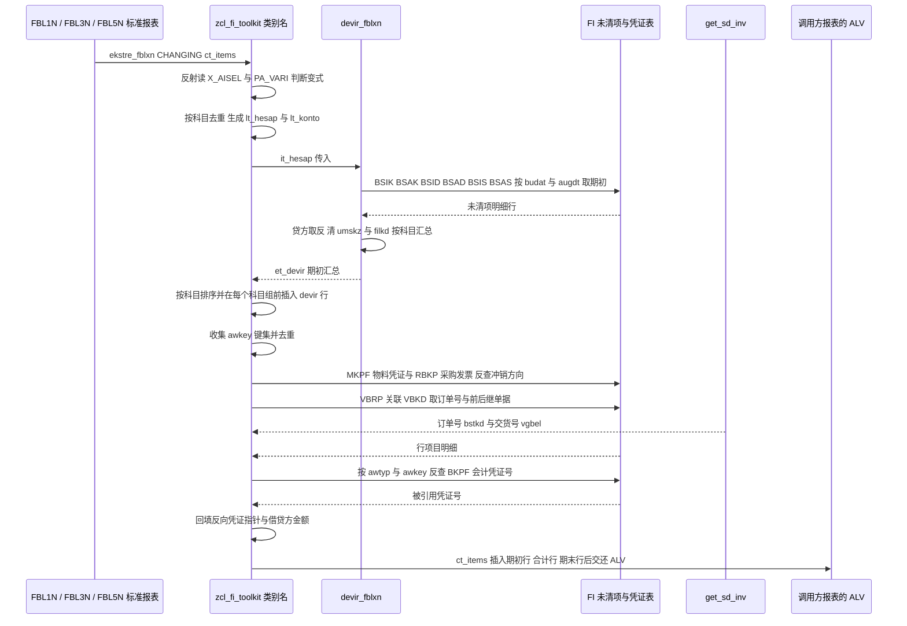

# ABAP 程序分析报告：ZCL_FI_TOOLKIT（FI 工具箱类）

> 分析对象：`ZCL_FI_TOOLKIT`，全局类 `PUBLIC FINAL`，全部为 `CLASS-METHODS`，无构造器、无实例状态。
> 代码规模约 1700 行，18 个方法 + 3 个类级缓存。

---

## 一、程序定位与业务背景

### 1.1 它解决什么问题

这不是报表，也不是业务事务，而是一层**被大量 Z 报表复用的 FI 公共积木**。它回答的全是 SAP 标准 FI 报表和增强里反复遇到、但标准接口没给出的问题：

| 痛点 | 标准方案的缺口 | 本类的做法 |
|---|---|---|
| 客户/供应商行项目报表（FBL1N/FBL3N/FBL5N）出来的是"裸流水"：没有期初、没有合计、没有反向凭证指针 | 标准 RFW 报表没有"期初余额行"概念 | `ekstre_fblxn` 直接改写 ALV 行集合，插入 devir 行、合计行、反向凭证指针 |
| 财务要核对一笔"冲销行"冲的是哪张原始凭证 | BSEG 只有零散自定义字段，靠人肉翻 | 顺 MKPF/RBKP/VBRP 的 `smbln`/`stblg`/`vgbel` 反查 BKPF，回填 `zzstblg`/`zzstjah` |
| 期初余额要按 BSIK/BSAK/BSID/BSAD/BSIS/BSAS 拼装，还要按 `budat`/`augda` 判断"当时是否未清" | 没有可直接用的 FM | `devir_fblxn` 自己拼 |
| 土耳其本地化：科目首位 5=客户、9=供应商，必须与 `zhrtip`（付款性质）配套 | 无 | `validate_zhrtip` |
| 客户/供应商主数据填 IBAN 要查重（LFA1/KNA1 → LFBK/KNBK → TIBAN 三表串联） | 无现成 FM | `get_iban_codes` + `check_iban_duplicate` |
| Z 报表要一键跳 FB03 看凭证 | 无 | `display_fi_doc_in_gui` |
| 要跑 F-32/F-44 批量清账 | 无（本来是给用户手工操作的） | BDC 封装 |
| 电子发票流程要回写 `BKPF-XBLNR` | FM 只能手工按凭证调 | `update_xblnr` |
| `TCURR-GDATU`（汇率有效期）要从日期算 | 每次都要转换例程 | 类级 HASHED 缓存 |
| 公司代码长名称反复查 | 每次 SELECT | 类级 HASHED 缓存 |

### 1.2 整体设计范式定性（一句话）

> **这是一个"报表增强时代的工具箱类"：用 `sy-cprog` + `ASSIGN` 反射式挂钩 SAP 标准 RFW 行项目报表，把"取数、算 devir、改 ALV 行"三件事焊在一起；同时混装了一批主数据校验、BDC 过账、FM 薄封装的 FI 杂项。**

三个关键词，后面所有优点和毛病都由它们长出来：

1. **反射式挂钩** — 不是 `CALL TRANSACTION` 去跑 FBL5N 再改结果，而是直接读标准程序 `(RFITEMAR)X_AISEL` 这类全局变量。所以它只能在标准报表运行、且恰好在 ALV 数据已取出之后的那段时间窗里生效。
2. **改 ALV 行（不是加字段）** — `ct_items` 是 `CHANGING` 形参，方法在里面 `INSERT`/`DELETE`，连"期初行""合计行"都是塞进结果集的普通行，用 `zuonr = TEXT-dvg` 和颜色 `C51`/`C31` 当行类型标记。
3. **杂项集合** — 18 个方法之间几乎无耦合（只有 5 处内部互调），但共用一个类名与一套土耳其 FI 语义。

### 1.3 业务背景（为什么是土耳其项目）

`shkzg` 的 `'S'`/`'H'`（Borç/Alacak）被封成常量；`zhrtip` 与科目首位 5/9 强制配套；`zfit_ith_blart`（ithalat，进口）、`zfit_ifrs_haric`（IFRS 豁免）是本地配置表；`J_1B_NFE_UPDATE_XBLNR` 本是巴西 NF-e 的 FM，被借来写 `XBLNR`（功能借用）。理解这些背景，才能判断哪些"看起来奇怪"的判断是刻意的业务规则，哪些是真的写错了。

---

## 二、程序执行流程总览

本类没有唯一入口，实际是 **5 条互不相干的主线**。下图主干画的是占比最大、也最能代表技术含量的那条：**Ekstre 报表增强主线**（约 1700 行里有 1100 行在这里）。

```mermaid
flowchart TD
  Caller["外部调用方: Z 报表增强与 FI 报表工具"]

  Caller --> M1["ekstre_fblxn: 反射接管 FBL1N FBL3N FBL5N 行集合"]
  M1 --> M2["devir_fblxn: 算期初 devir 汇总"]
  M1 --> M3["get_sd_inv: 查销售发票的前置单据与订单号"]
  M2 --> M1
  M1 --> M4["display_fi_doc_in_gui: 跳 FB03 看凭证"]
  Caller --> M5["get_bkpf_xblnr: 读 BKPF 参考凭证号"]
  M5 --> M6["update_xblnr: 回写 BKPF-XBLNR 并提交"]

  Caller --> M7["check_iban_duplicate: IBAN 查重并抛异常"]
  M7 --> M8["get_iban_codes: LFA1 LFBK TIBAN 与 KNA1 KNBK TIBAN 查库"]

  Caller --> M9["clear_customer_open_items: BDC 跑 F-32 清客户未清"]
  Caller --> M10["clear_vendor_open_items: BDC 跑 F-44 清供应商未清"]

  Caller --> M11["denklestirerek_transfer_kaydi: POSTING_INTERFACE 借贷冲销过账"]
  Caller --> M12["determine_due_date: 推算到期日 netdt"]
  Caller --> M13["validate_zhrtip: 校验 zhrtip 与科目首位匹配"]
  Caller --> M14["convert_datum_to_gdatu: 日期转 GDATU 走缓存"]
  Caller --> M15["get_company_long_text: 公司代码长名称走缓存"]
  M14 --> Cache1["gt_dg_cache"]
  M15 --> Cache2["gt_company_long_text"]
  M16["get_import_document_types: 进口凭证类型走配置缓存"]
  M16 --> Cache3["gt_import_doc_type_cache"]
  M17["get_domestic_import_doc_types: 境内进口凭证类型"]
  M17 --> M16
```



### 责任链（谁调用谁）

| 子程序 | 调用者 | 职责 |
|---|---|---|
| `ekstre_fblxn` | 外部 Z 报表（RFW 行项目增强点，`CHANGING ct_items`） | 接管 ALV 行集合：删冲销凭证行、回填反向凭证指针、补 `zzbstkd`/`zzteslimat`、插 devir 行与合计行、补借贷方金额 |
| `devir_fblxn` | `ekstre_fblxn` | 按 `budat`/`augda` 从六张未清项表取期初未清项，按科目汇总成 `tt_devir` |
| `get_sd_inv` | `ekstre_fblxn` | VBRP 关联 VBKD，取销售订单号 `bstkd` 与前置/后继单据 |
| `display_fi_doc_in_gui` | 外部 Z 报表（下钻按钮） | `SET PARAMETER` 后 `CALL TRANSACTION 'FB03'` |
| `get_bkpf_xblnr` | 外部 Z 报表 | 批量读 `BKPF-XBLNR` 回填传入结构 |
| `update_xblnr` | 外部 Z 程序（电子发票流程） | 逐凭证写 `XBLNR`，按开关逐单或末尾提交 |
| `get_import_document_types` | `get_domestic_import_doc_types`、外部调用方 | 读 `zfit_ith_blart`，按境内/境外开关返回凭证类型集合 |
| `get_domestic_import_doc_types` | 外部调用方 | 触发缓存填充后筛"境内"进口凭证类型 |
| `check_iban_duplicate` | 外部 FI 主数据保存程序 | IBAN 已存在则抛 `zcx_fi_iban` |
| `get_iban_codes` | `check_iban_duplicate`、外部调用方 | 供应商与客户的 `TIBAN` 明细 |
| `clear_customer_open_items` | 外部清账程序 | BDC 执行 `F-32` 清客户未清项 |
| `clear_vendor_open_items` | 外部清账程序 | BDC 执行 `F-44` 清供应商未清项 |
| `denklestirerek_transfer_kaydi` | 外部 FI 过账程序 | 用 `POSTING_INTERFACE_*` 生成并过账一张 `UMBUCHNG` 凭证 |
| `determine_due_date` | 外部 FI 程序 | 由凭证行推算到期日 |
| `validate_zhrtip` | 外部 FI 程序（凭证保存前） | 校验 `zhrtip` 与科目首位（5/9）匹配 |
| `convert_datum_to_gdatu` | 外部 FI 程序（汇率相关） | `datum` 转 `TCURR-GDATU`，带缓存 |
| `get_company_long_text` | 外部报表（ALV 附加字段） | 公司代码长名称（T001 名称 + ADRC 姓名拼接），带缓存 |

下面按这条流程，逐个子程序展开。

---

## 三、分组分析

### 3.1 全局声明区（类定义段）

（全局声明区）

```abap
TYPES:
  BEGIN OF ty_hesap,
    sube   TYPE rfposxext-konto,
    merkez TYPE rfposxext-konto,
  END OF ty_hesap .
TYPES:
  tt_hesap TYPE STANDARD TABLE OF ty_hesap .

CONSTANTS c_borc               TYPE shkzg VALUE 'S' ##NO_TEXT.
CONSTANTS c_alacak             TYPE shkzg VALUE 'H' ##NO_TEXT.
CONSTANTS c_mal_hareketi       TYPE awtyp VALUE 'MKPF' ##NO_TEXT.
CONSTANTS c_satinalma_faturasi TYPE awtyp VALUE 'RMRP' ##NO_TEXT.
CONSTANTS c_satis_faturasi     TYPE awtyp VALUE 'VBRK' ##NO_TEXT.
CONSTANTS c_musteri_hf_talebi  TYPE auart VALUE 'ZAH1' ##NO_TEXT.
```

（关键结构与缓存声明，字段目录为同构清单已省略）

```abap
TYPES:
  BEGIN OF ty_devir_items,
    belnr TYPE belnr_d,  gjahr TYPE gjahr,   buzei TYPE buzei,
    bukrs TYPE bukrs,    konto TYPE hkont,   shkzg TYPE shkzg,
    dmshb TYPE dmbtr,    dmbe2 TYPE dmbe2,   dmbe3 TYPE dmbe3,
    umskz TYPE umskz,    filkd TYPE filkd,
    wrbtr TYPE wrbtr,    waers TYPE waers,   gsber TYPE gsber,
  END OF ty_devir_items .
TYPES:
  BEGIN OF ty_devir,
    bukrs TYPE bukrs,    konto TYPE hkont,   shkzg TYPE shkzg,
    dmshb TYPE dmbtr,    dmbe2 TYPE dmbe2,   dmbe3 TYPE dmbe3,
    umskz TYPE umskz,    filkd TYPE filkd,
    wrbtr TYPE wrbtr,    waers TYPE waers,   gsber TYPE gsber,
  END OF ty_devir .
TYPES tt_devir TYPE STANDARD TABLE OF ty_devir .

CLASS-DATA gt_company_long_text     TYPE tt_company_long_text .
CLASS-DATA gt_dg_cache             TYPE tt_dg_cache .
CLASS-DATA gt_import_doc_type_cache TYPE tt_ith_blart .
```

**做什么** — 声明三套结构：① `ty_hesap`（子科目与中心科目的账号对，供 devir 取数）；② `ty_devir_items`（devir 明细行，`konto` 字段被当成"通用科目/业务伙伴"槽位复用）与 `ty_devir`（devir 汇总行，去掉 `belnr/gjahr/buzei` 明细字段）；③ 三个类级缓存（公司代码长名称、日期转 GDATU、进口凭证类型配置）。另有一组常量把 `shkzg`/`awtyp` 的业务语义固定下来。

**为什么** — 把 `'S'`/`'H'`、`'MKPF'`/`'RMRP'`/`'VBRK'` 提成常量是正确做法：`shkzg` 到处硬编码 `'H'` 是财务报表代码里最常见的可读性杀手。`tt_devir` 用 `STANDARD TABLE` 而非 SORTED 也是有意的——汇总靠 `COLLECT`，不依赖顺序。

**风险与改进** — 三点：

1. **两个常量是死代码**：`c_borc`（`'S'`）全类一次未被使用（所有地方都只判 `c_alacak`），`c_musteri_hf_talebi`（采购订单类型 `'ZAH1'`）也从未被引用。留着会让人误以为"借贷都有常量"。
2. **`ty_devir_items.konto TYPE hkont`（CHAR10）承载 LIFNR（CHAR15）**：AP 分支用位置对应把 `lifnr` 写进这个槽位，供应商号超 10 位被静默截断。类型上"都是字符"所以编译无怨无悔，但语义上槽位被复用了。建议拆成 `konto`/`party`，或把 `konto` 放宽到 `LIFNR` 长度。
3. **`ty_devir` 缺 `hwaer`（交易货币）**：`et_devir` 下游按 `bukrs + konto` 汇总，而汇总只按 `waers`（凭证货币）分桶，没有交易货币维度。同一 `waers` 下混入不同 `hwaer` 是允许的，这是 3.2 金额错算的根因。

---

### 3.2 方法 `ekstre_fblxn` —— Ekstre 报表增强主入口

（方法 `ekstre_fblxn`）

全类最长最核心（约 530 行），分八步：**① 反射接管标准报表状态 → ② 回填采购订单号 → ③ 变式判定与前置校验 → ④ 删除冲销凭证行 → ⑤ 构建科目对与中心科目 → ⑥ 反向凭证指针回填 → ⑦ 插入 devir 行与 devir 合计行 → ⑧ 追加期末合计行**。

先看反射接管的入口，它决定整个方法在什么条件下才真正干活：

```abap
CHECK ct_items IS NOT INITIAL.
CASE sy-cprog.
  WHEN 'RFITEMAP'."FBL1N
    ASSIGN ('(RFITEMAP)X_AISEL') TO FIELD-SYMBOL(<lv_x_aisel>).
    ASSIGN ('(RFITEMAP)PA_VARI') TO FIELD-SYMBOL(<lv_vari>).

  WHEN 'RFITEMGL'."FBL3N
    ASSIGN ('(RFITEMGL)X_AISEL') TO <lv_x_aisel>.
    ASSIGN ('(RFITEMGL)PA_VARI') TO <lv_vari>.

  WHEN 'RFITEMAR'."FBL5N
    ASSIGN ('(RFITEMAR)X_AISEL') TO <lv_x_aisel>.
    ASSIGN ('(RFITEMAR)PA_VARI') TO <lv_vari>.

  WHEN 'ZSDP_RFITEMAR'.
    ASSIGN ('(ZSDP_RFITEMAR)X_AISEL') TO <lv_x_aisel>.
    ASSIGN ('(ZSDP_RFITEMAR)PA_VARI') TO <lv_vari>.

  WHEN OTHERS.
    RETURN.

ENDCASE.

IF sy-subrc = 0 AND sy-cprog(5) = 'RFITE'.
```

**做什么** — 先判 `ct_items` 非空，再按当前主程序名 `sy-cprog` 分派到 `FBL1N`（AP 行项目）、`FBL3N`（GL 行项目）、`FBL5N`（AR 行项目）及本地复制版 `ZSDP_RFITEMAR`，把标准程序的 `X_AISEL`（是否处于明细选择模式）和 `PA_VARI`（程序变式名）反射读成字段符号；主程序不认识直接 `RETURN`；最后用 `sy-cprog(5) = 'RFITE'` 再兜一层"必须是 RFW 报表族"。

**为什么** — 这是 RFW 行项目报表增强的"官方之外"标准做法。SAP 后期提供了行项目相关 BAdI，但在只有 `PA_VARI`/`X_AISEL` 这种反射钩子的年代，直接读全局变量是唯一能做到"在 ALV 数据生成后、显示前"插手的方式。用 `FIELD-SYMBOL` 而非 `ASSIGN ... TO (name)` 到 `any` 变量，好处是类型安全、`sy-subrc` 语义清晰，代价是每个分支都要重复一遍。

**风险与改进** —

1. **这是全类最大的结构性风险**：方法行为取决于"谁调用它、何时调用它"。SAP 升级改了 include 结构、`X_AISEL` 改名，或本地 `ZSDP_RFITEMAR` 与标准版漂移，`ASSIGN` 就失败。更糟的是失败只让 `sy-subrc` 非零，而这里只做了一次外层联合判断，内部没有对每个 `ASSIGN` 逐一校验，后面直接解引用字段符号。建议每个 `ASSIGN` 后立即 `CHECK sy-subrc = 0`，或迁移到 SAP 提供的增强点，让 `sy-cprog` 分派整体删掉。
2. **`sy-cprog(5) = 'RFITE'` 冗余且自相矛盾**：`CASE` 已把取值限定为四个具体程序名，而 `ZSDP_RFITEMAR` 前 5 位是 `ZSDP_`，这一句实际把自家复制版排除了。若本意是让它生效，这句就是 bug；若本意是排除它，那 `WHEN 'ZSDP_RFITEMAR'` 分支就是死代码。
3. `<lv_vari> CS 'EKSTRE'` 属约定优于配置：变式名改了功能静默失效，且 `CS` 区分大小写。建议精确匹配加可配置常量。

第二、三步相对轻量，但里面藏着一条被注释掉的历史 bug：

```abap
LOOP AT ct_items ASSIGNING FIELD-SYMBOL(<ls_items>)
      WHERE zuonr(3) eq  zcl_fi_omd=>c_zuonr_sanal and
            zzbstkd IS INITIAL.
   <ls_items>-zzbstkd = <ls_items>-zuonr.
ENDLOOP.

IF <lv_vari> CS 'EKSTRE'.

  IF <lv_x_aisel> <> abap_true.
    MESSAGE TEXT-003 TYPE 'I'.
    RETURN.
  ENDIF.

  CALL FUNCTION 'SAPGUI_PROGRESS_INDICATOR' ##FM_SUBRC_OK
    EXPORTING
      text   = TEXT-002
    EXCEPTIONS
      OTHERS = 1.
```

**做什么** — ① 对采购订单类行项目（`zuonr` 前 3 位等于 `zcl_fi_omd=>c_zuonr_sanal`）且 `zzbstkd` 为空的，把分配号抄进 `zzbstkd`，用"分配号当订单号"的取巧做法省掉一次查询。② 变式名命中 `EKSTRE` 才继续。③ 用户不在"明细行已选中"状态（`X_AISEL`）就弹信息后返回，什么都不改。④ 打个 SAPGUI 进度条。

**为什么** — `X_AISEL` 校验是聪明的产品判断：财务真要看结构化 Ekstre，一定是先把科目行的明细选中再执行，所以"有没有选中"比事务码更可靠。进度指示器在几万行报表重算时能缓解 SAPGUI 卡顿。

**风险与改进** —

1. `zzbstkd = zuonr` 是**语义借用**：把分配号当订单号填进"订单号"字段。第 ⑥ 步真正的 `bstkd` 回来时只在 `zzawtyp = VBRK` 且查到时才写，所以 MM 侧行项目这个假值会一直留着。建议把"推导值"放到专门字段上。
2. `MESSAGE ... TYPE 'I'` 加 `RETURN` 是**静默降级**：调用方收不到任何"我什么都没做"的信号，报表看起来和标准一样。至少返回 `abap_bool` 告诉调用方。
3. `SAPGUI_PROGRESS_INDICATOR` 在后台/批处理不可用，异常被 `OTHERS = 1` 吞掉——可接受，但要意识到后台调用时它是空操作。
4. `zuonr(3)` 硬编码 3 位长度与常量耦合，`zcl_fi_omd` 的常量含义一变就错。至少把长度提成命名常量。

第四步是删除冲销凭证行，这段代码历史上被修过两次：

```abap
"-->> changed by mehmet sertkaya 21.07.2016 13:52:32
" HAR-10448 - Müşteri Ekstresinde XX belge ters kaydı
*          delete ct_items where blart = 'XX' and gjahr ge '2016'.
LOOP AT ct_items ASSIGNING <ls_items>
            WHERE blart = zcl_fi_document_type=>get_customer_clearing_doc_type( ) AND
                  gjahr GE '2018'.
  DELETE ct_items WHERE belnr = <ls_items>-zzstblg AND gjahr = <ls_items>-zzstjah.
  DELETE ct_items.
ENDLOOP.
```

**做什么** — 遍历"客户冲销凭证类型"（`get_customer_clearing_doc_type()`，历史上是 `XX`）且年度 ≥ 2018 的行；按其已回填的反向凭证指针 `zzstblg`/`zzstjah`，把被指向的原始凭证行整单删掉；最后再删掉这行冲销行本身。净效果是：冲销凭证和它冲销的原始凭证只保留后者。

**为什么** — 业务意图正确明确：冲销凭证在客户对账里没有独立意义。`get_customer_clearing_doc_type()` 把 `XX` 这个魔法值收敛到工厂方法里，比硬编码好。注释保留变更人、时间和需求号，是 SAP 项目里值得学习的现场记录习惯。

**风险与改进** —

1. **在 `LOOP AT ct_items` 里 `DELETE ct_items`，且删的不是当前行**：ABAP 不保证"循环中修改被循环的标准表"的迭代指针行为。外层 `LOOP` 带 `WHERE` 过滤，内层 `DELETE ... WHERE belnr = ...` 删掉的是位置不确定的一批行。某张原始凭证若横跨多个科目且排在这个科目之后，删除就会被跳过或重复触发，报表"少了不该少的行"。**改进：先收集要删的键，循环结束后一次性按内表条件删除。**
2. **删除粒度是整单**：`DELETE ... WHERE belnr = ... AND gjahr = ...` 会把这个凭证在**所有科目**下的行全删掉。原始凭证的多行分挂不同科目时，一次冲销会让另一科目的正常流水凭空消失。应精确到 `bukrs + konto + belnr + gjahr + buzei`。
3. **`gjahr GE '2018'` 把一次修复的截止年度写死**，属于典型的"数据修补变成业务规则"。建议配置化并注明生效年度。
4. **执行顺序矛盾**：这段删除在第 ⑥ 步**之前**，而 `zzstblg` 是第 ⑥ 步才反查出来的。除非依赖上次调用的残留，否则 `DELETE WHERE belnr = 空` 什么也删不掉，这段代码实际空转。**必须与业务确认**（移到第 ⑥ 步之后，或改用 `zzawkey` 自己重算指针）——这是本方法我最怀疑的一处逻辑断裂。

第五步构建科目对并接入"中心科目"：

```abap
SORT ct_items BY konto budat ASCENDING.

LOOP AT ct_items ASSIGNING <ls_items>.
  CLEAR ls_hesap.
  ls_hesap-sube = <ls_items>-konto.
  COLLECT ls_hesap INTO lt_hesap.
  ls_konto-bukrs = <ls_items>-bukrs.
  ls_konto-konto = <ls_items>-konto.
  COLLECT ls_konto INTO lt_konto.
ENDLOOP.

ASSIGN  ('(SAPLFI_ITEMS)GB_CENTRAL_ITEMS') TO FIELD-SYMBOL(<lv_merkez>).
IF sy-subrc = 0.
  IF <lv_merkez> = abap_true.
    CASE sy-cprog.
      WHEN 'RFITEMAR' OR 'ZSDP_RFITEMAR'.
        SELECT bukrs, kunnr, knrze INTO TABLE @DATA(lt_knb1) FROM knb1
            FOR ALL ENTRIES IN @lt_hesap
            WHERE kunnr = @lt_hesap-sube AND
                  knrze <> @space.
        SORT lt_knb1 BY bukrs kunnr.
        LOOP AT lt_knb1 ASSIGNING FIELD-SYMBOL(<ls_knb1>).
          ls_hesap-sube = <ls_knb1>-kunnr.
          ls_hesap-merkez = <ls_knb1>-knrze.
          COLLECT ls_hesap INTO lt_hesap.
        ENDLOOP.

      WHEN 'RFITEMAP'.
        SELECT bukrs, lifnr, lnrze INTO TABLE @DATA(lt_lfb1) FROM lfb1
            FOR ALL ENTRIES IN @lt_hesap
            WHERE lifnr = @lt_hesap-sube AND
                  lnrze <> @space.
        SORT lt_lfb1 BY bukrs lifnr.
        LOOP AT lt_lfb1 ASSIGNING FIELD-SYMBOL(<ls_lfb1>).
          ls_hesap-sube   = <ls_lfb1>-lifnr.
          ls_hesap-merkez = <ls_lfb1>-lnrze.
          COLLECT ls_hesap INTO lt_hesap.
        ENDLOOP.

    ENDCASE.
  ENDIF.
ENDIF.
SELECT * FROM t001  INTO TABLE lt_t001.

zcl_fi_toolkit=>devir_fblxn(
            EXPORTING it_hesap = lt_hesap
            IMPORTING et_devir = lt_devir
                                     ).
SORT lt_devir BY bukrs konto gsber.
lt_devir_sorted = lt_devir.

FREE  : lt_devir,lt_hesap.
```

**做什么** — ① 按 `konto budat` 升序排序（Ekstre 标准排法）；② 收集 `lt_hesap`（去重科目对）与 `lt_konto`（去重 `bukrs+konto`）；③ 反射读 `(SAPLFI_ITEMS)GB_CENTRAL_ITEMS` 判断是否勾了"显示中心科目项"，勾了就按 `KNB1-KNRZE`（AR）或 `LFB1-LNRZE`（AP）查中心科目，把 `(sube, merkez)` 追加进 `lt_hesap`；④ 全量读 `T001`；⑤ 调 `devir_fblxn` 拿期初，排序后转成 `bukrs konto` 排序表。

**为什么** — 排序放最前面是关键设计：后续"插入 devir 行"和"追加合计"都依赖"同一科目的行连续出现"这一不变量，`lv_konto_temp` 那套判断就靠它成立。`COLLECT` 去重避免后续 `FOR ALL ENTRIES` 空跑与重复放大。中心科目（`KNB1-KNRZE`/`LFB1-LNRZE`）是 SAP 里"多个客户记在同一中心科目下"的标准做法，报表要拍平成"子科目加中心科目"的对。

**风险与改进** —

1. **`lt_hesap` 被污染成两种形态，这是全类最严重的正确性缺陷源头**：`lt_hesap` 里同时有"只有 sube、merkez 为空"的行和"sube 加 merkez 成对"的行。`devir_fblxn` 随后用 `( 伙伴 = sube OR 伙伴 = merkez )` 展开，一张属于 sube 的未清凭证会被两个 `lt_hesap` 行各命中一次，**期初金额翻倍**。改进：规范化为"每个伙伴只出现一次"，或先摊平成去重伙伴表再用单值 `IN` 取数。
2. `SELECT * FROM t001 INTO TABLE lt_t001` 是**彻头彻尾的死代码**：声明已带 `##NEEDED`（ATC 早报过"没用到"），后续从未引用，还会误导读代码的人以为后面用到了公司代码表。
3. `ASSIGN ('(SAPLFI_ITEMS)GB_CENTRAL_ITEMS')` 硬编码标准 include 的程序名，与开头同源的脆弱点；改名即失效，而且失败后静默跳过中心科目处理，报表会**少算**而不报错。
4. `SORT lt_devir BY bukrs konto gsber` 后赋给 `lt_devir_sorted`（键只有 `bukrs konto`）：**同一 `bukrs+konto` 下多业务范围的行会全部命中**并被 `COLLECT` 累加，业务范围维度丢失。要么按 `gsber` 分组，要么注释"devir 忽略业务范围"。
5. `lt_lfb1`/`lt_knb1` 是标准表，靠紧邻的 `SORT` 保证后面 `BINARY SEARCH` 正确——中间任何一次 `APPEND`/`INSERT` 都会让二分结果错乱且不报错。改成 `SORTED TABLE` 最省心。

第六步是反向凭证指针回填，三个几乎相同的分支，且都藏着 `lv_awkey` 不清零的缺陷：

```abap
LOOP AT ct_items ASSIGNING <ls_items>.
  lv_tabix = sy-tabix.

*  test kayıt belgesi
  IF <ls_items>-zzawtyp = c_mal_hareketi.
    READ TABLE lt_mseg WITH TABLE KEY mblnr = <ls_items>-zzawkey(10)
                                              mjahr = CONV #( <ls_items>-zzawkey+10(4) )
                                              ASSIGNING FIELD-SYMBOL(<ls_mseg>).
    IF sy-subrc = 0.
      CLEAR lv_awkey.
      IF <ls_mseg>-smbln IS  NOT INITIAL.
        lv_awkey = |{ <ls_mseg>-smbln }{ <ls_mseg>-sjahr }|.
      ELSE.
        READ TABLE lt_mseg WITH KEY smbln = <ls_mseg>-mblnr
                                            sjahr = <ls_mseg>-mjahr
                                            ASSIGNING <ls_mseg>.

        IF sy-subrc = 0.
          lv_awkey = |{ <ls_mseg>-mblnr }{ <ls_mseg>-mjahr }|.
        ENDIF.
      ENDIF.

    ENDIF.

  ELSEIF <ls_items>-zzawtyp = c_satinalma_faturasi.
    READ TABLE lt_rbkp WITH TABLE KEY belnr = <ls_items>-zzawkey(10)
                                              gjahr = CONV #( <ls_items>-zzawkey+10(4) )
                                              ASSIGNING FIELD-SYMBOL(<ls_rbkp>).
    IF sy-subrc = 0.
      CLEAR lv_awkey.
      IF <ls_rbkp>-stblg IS  NOT INITIAL.
        lv_awkey = |{ <ls_rbkp>-stblg }{ <ls_rbkp>-stjah }|.
      ELSE.
        READ TABLE lt_rbkp WITH KEY stblg = <ls_rbkp>-belnr
                                            stjah = <ls_rbkp>-gjahr
                                            ASSIGNING <ls_rbkp>.

        IF sy-subrc = 0.
          lv_awkey = |{ <ls_rbkp>-belnr }{ <ls_rbkp>-gjahr }|.
        ENDIF.
      ENDIF.

    ENDIF.
  ELSEIF <ls_items>-zzawtyp = c_satis_faturasi.
    READ TABLE lt_vbrp WITH TABLE KEY vbeln = <ls_items>-zzawkey(10)
                                        ASSIGNING FIELD-SYMBOL(<ls_vbrp>).
    IF sy-subrc = 0.
      IF <ls_vbrp>-vgtyp = 'J' OR <ls_vbrp>-vgtyp = 'T'.
        <ls_items>-zzteslimat = <ls_vbrp>-vgbel.
      ENDIF.
      <ls_items>-zzbstkd = <ls_vbrp>-bstkd.
    ENDIF.
  ENDIF.

  IF lv_awkey IS  NOT INITIAL.
    SELECT SINGLE belnr INTO <ls_items>-zzstblg FROM bkpf
                  WHERE awtyp = <ls_items>-zzawtyp AND
                        awkey = lv_awkey
                  ##WARN_OK .                   "#EC CI_NOORDER
    IF sy-subrc = 0.
      <ls_items>-zzstjah = <ls_items>-gjahr.
    ENDIF.
  ENDIF.
```

**做什么** — 逐行按原始凭证类型处理：`MKPF` 从 `MSEG` 出发，若本行是冲销行（`smbln` 指向原凭证）就用原凭证号，否则反查"谁冲销了我"取那张凭证号；`RMRP` 用 `RBKP-STBLG` 做同样的双向查找；`VBRK` 从 `VBRP` 取订单号 `bstkd`，`vgtyp` 为 `J`（后继交货）或 `T`（后继发票）再取 `vgbel` 填交货号。三个分支最后都把拼出的 14 位 `awkey` 拿去 `BKPF` 反查会计凭证号回填 `zzstblg`，并把 `zzstjah` 设为当前行的 `gjahr`。

**为什么** — "双向查找"有业务依据：冲销既可能发生在后（后行指前行，`smbln` 非空），也可能发生在前（前行被后行冲销，需要反查）。`MSEG-SMBLN`/`RBKP-STBLG` 只存单向引用，反向必须自己在内存里扫——作者选择在已取回的小内表里扫（注释写明"这个 case 很少出现，所以直接去 BKPF"），比再打一次数据库聪明，体现了明确的性能取舍意识。

**风险与改进** —

1. **`lv_awkey` 没有每轮清零，这是确定性 bug**：三处 `CLEAR lv_awkey` 都在 `IF sy-subrc = 0` **内部**。对 `zzawtyp` 三者都不是的行项目（银行流水、其他自定义凭证类型），整段 `IF/ELSEIF` 落空，`lv_awkey` 保留**上一行**的值；随后的 `IF lv_awkey IS NOT INITIAL` 不管行类型直接用它查 BKPF——只要 `awtyp` 恰好一致，就把**别的凭证的凭证号**写进本行 `zzstblg`。这是"跨行状态污染"：不报错、看不出、但数字是错的。修法：把 `CLEAR lv_awkey.` 提到 `LOOP` 内 `lv_tabix = sy-tabix.` 旁边。
2. **`READ TABLE lt_mseg WITH KEY smbln/sjahr`**：`tt_mseg` 的键是 `mblnr mjahr`，`smbln/sjahr` 不是任何键，`WITH KEY` 走**线性查找**。外层行循环乘内层线性扫就是"行数乘凭证数"，几万行报表足以跑到分钟级甚至短点。应改为 `SORT BY smbln sjahr` 后建哈希表。`lt_rbkp WITH KEY stblg/stjah` 同理（表键是 `belnr gjahr`）。
3. **`READ TABLE lt_vbrp WITH TABLE KEY vbeln`**：`tt_vbrp` 声明为 `SORTED ... WITH NON-UNIQUE KEY vbeln`，即 `vbeln` 是**非唯一**辅助键。ABAP 规则是排序表只有主键和**唯一**辅助键才能用 `WITH TABLE KEY`；对非唯一辅助键这么写要么激活期报错，要么退化成"取排序后第一条匹配行"——而 `get_sd_inv` 的 `SELECT DISTINCT` 保证不了一个 `vbeln` 只有一行。结果是同一张发票的不同行项目可能被填上不同交货号。
4. `|{ smbln }{ sjahr }|` 拼出 14 位（10 加 4），与 `BKPF-AWTYP='MKPF'` 的 `AWKEY`（CHAR20 右补空格）靠尾部空格对齐比较能成立；但这个假设建立在"MATNR 只有 10 位"上，S/4 外部物料号（40 位）启用后语义就变了。
5. `zzstjah = <ls_items>-gjahr` 用的是**当前会计凭证的年度**，而 `zzstblg` 查出来的是**被引用凭证**——两者是不同凭证的年度。跨年冲销（年末冲次年）时拼出的键指向不存在的凭证，应 `SELECT belnr gjahr INTO ...` 一起查。
6. `##WARN_OK` 加 `#EC CI_NOORDER`：`AWKEY` 上没有适合 `awtyp + awkey` 的索引（`BKPF` 主键是 `BUKRS BELNR GJRHR`），每行都要扫。作者用注释压制 ATC 警告而不是解决它。正确做法是批量：先收集所有 `awtyp/awkey`，用 `FOR ALL ENTRIES` 一次拉回再哈希查找。

第七步把 devir 变成报表行：

```abap
IF lv_konto_temp IS INITIAL OR
   lv_konto_temp <> <ls_items>-konto.
* Devir kalemini ekle
  CLEAR : ls_devir,ls_devir_merkez.

  LOOP AT lt_devir_sorted INTO ls_devir
    WHERE bukrs = <ls_items>-bukrs
      AND konto = <ls_items>-konto.

    IF <lv_merkez> IS ASSIGNED.
      IF <lv_merkez> = abap_true.
        CASE sy-cprog.
          WHEN 'RFITEMAP'.
            READ TABLE lt_lfb1 ASSIGNING <ls_lfb1>
                                 WITH KEY bukrs = <ls_items>-bukrs
                                          lifnr = <ls_items>-konto BINARY SEARCH.
            IF sy-subrc = 0.
              LOOP AT lt_devir_sorted ASSIGNING FIELD-SYMBOL(<lfs_devir_sorted_lnrze>)
                                      WHERE bukrs = <ls_items>-bukrs
                                        AND konto = <ls_lfb1>-lnrze.
                ADD <lfs_devir_sorted_lnrze>-dmshb TO ls_devir_merkez-dmshb.
                ADD <lfs_devir_sorted_lnrze>-dmbe2 TO ls_devir_merkez-dmbe2.
                ADD <lfs_devir_sorted_lnrze>-dmbe3 TO ls_devir_merkez-dmbe3.
                ADD <lfs_devir_sorted_lnrze>-wrbtr TO ls_devir_merkez-wrbtr.
              ENDLOOP.
            ENDIF.
          WHEN 'RFITEMAR' OR 'ZSDP_RFITEMAR'.
            READ TABLE lt_knb1 ASSIGNING <ls_knb1>
                                 WITH KEY bukrs = <ls_items>-bukrs
                                          kunnr = <ls_items>-konto BINARY SEARCH.
            IF sy-subrc = 0.
              LOOP AT lt_devir_sorted ASSIGNING FIELD-SYMBOL(<lfs_devir_sorted_knrze>)
                                      WHERE bukrs = <ls_items>-bukrs
                                        AND konto = <ls_knb1>-knrze.
                ADD <lfs_devir_sorted_knrze>-dmshb TO ls_devir_merkez-dmshb.
                ADD <lfs_devir_sorted_knrze>-dmbe2 TO ls_devir_merkez-dmbe2.
                ADD <lfs_devir_sorted_knrze>-dmbe3 TO ls_devir_merkez-dmbe3.
                ADD <lfs_devir_sorted_knrze>-wrbtr TO ls_devir_merkez-wrbtr.
              ENDLOOP.

            ENDIF.
        ENDCASE.
      ENDIF.
    ENDIF.

    CLEAR ls_item_devir.
    IF ls_devir-bukrs IS INITIAL.
      MOVE-CORRESPONDING ls_devir_merkez TO ls_item_devir  ##ENH_OK.
      ls_item_devir-wrshb =  ls_devir_merkez-wrbtr.
      ls_item_devir-waers =  ls_devir_merkez-waers.
    ELSE.
      ADD ls_devir_merkez-dmshb TO ls_devir-dmshb.
      ADD ls_devir_merkez-dmbe2 TO ls_devir-dmbe2.
      ADD ls_devir_merkez-dmbe3 TO ls_devir-dmbe3.
      ADD ls_devir_merkez-wrbtr TO ls_devir-wrbtr.

      MOVE-CORRESPONDING ls_devir TO ls_item_devir  ##ENH_OK.
      ls_item_devir-wrshb =  ls_devir-wrbtr.
      ls_item_devir-waers =  ls_devir-waers.

    ENDIF.

    ls_item_devir-zzname1_ku = <ls_items>-zzname1_ku.
    ls_item_devir-zzname1_li = <ls_items>-zzname1_li.
    ls_item_devir-konto = <ls_items>-konto.
    ls_item_devir-zuonr = TEXT-dvg.
    ls_item_devir-u_bktxt =  ls_item_devir-sgtxt  = |{ TEXT-004 }({ <ls_items>-konto })|.
    ls_item_devir-hwaer = <ls_items>-hwaer.
    ls_item_devir-hwae2 = <ls_items>-hwae2.
    ls_item_devir-hwae3 = <ls_items>-hwae3.
    IF ls_item_devir-dmshb LT 0.
      ls_item_devir-zzalacak_upb = ls_item_devir-dmshb * -1.
      ls_item_devir-zzalacak_2pb = ls_item_devir-dmbe2 * -1.
      ls_item_devir-zzalacak_3pb = ls_item_devir-dmbe3 * -1.
    ELSE.
      ls_item_devir-zzborc_upb = ls_item_devir-dmshb.
      ls_item_devir-zzborc_2pb = ls_item_devir-dmbe2.
      ls_item_devir-zzborc_3pb = ls_item_devir-dmbe3.
    ENDIF.
    ls_item_devir-bukrs = <ls_items>-bukrs.
    ls_item_devir-konto = <ls_items>-konto.
    ls_item_devir-color = lc_green.

    COLLECT ls_item_devir INTO lt_item_devir.
```

**做什么** — 当"科目发生变化"时为新科目插入期初块：遍历 `lt_devir_sorted` 中属于当前 `bukrs+konto` 的汇总行；勾了中心科目就去找中心科目并把其 devir 累加进 `ls_devir_merkez`；然后把"自身 devir 加中心科目 devir"搬到一条 `it_rfposxext` 行上（`zuonr = TEXT-dvg`、文本 `TEXT-004(科目)`、绿色），按 `dmshb` 正负填 `zzborc_*` 或 `zzalacak_*`，最后 `COLLECT` 进 `lt_item_devir` 备插。

**为什么** — 用"科目切换"作为插入触发点，是把流水行变成"分组小计"的常见手法，配合第 ⑤ 步排序就等价于"在每个科目组最前面插一块期初"。颜色常量 `C51`/`C31` 区分行类型，第 ⑧ 步靠黄色过滤掉所有合计行——这个自洽的内部标记体系是这段代码里设计得最好的地方。`MOVE-CORRESPONDING` 后手工补 `wrshb/waers` 也说明作者清楚 `dmshb`（交易货币）与 `wrshb`（公司货币显示金额）不是一回事。

**风险与改进** —

1. **`wrshb` 被赋成凭证货币金额**：`ls_item_devir-wrshb = ls_devir-wrbtr`。`WRBTR` 是**凭证货币**金额，`WRSHB` 是 RFW 行项目结构里专门放"公司代码货币显示金额"的字段（ALV 那一列就取它）。类型上都是 `CURR 15,2`，编译无感但语义错配：公司代码货币 ≠ 凭证货币时（TRY 公司代码记 USD 凭证、外币重估），期初行显示金额就是错的，且与同行的 `dmshb` 自相矛盾。改进：折算成公司货币再填，或干脆不填 `wrshb`、让 ALV 用 `dmshb` 显示。
2. **`ty_devir` 没有 `hwaer`，中心科目累加会跨交易货币**：`ty_devir` 分桶键只有 `waers`，同一 `waers` 下不同 `hwaer` 的金额被直接 `ADD`，结果无意义。要么加 `hwaer` 并纳入 `COLLECT` 键，要么累加前分组。
3. **`IF ls_devir-bukrs IS INITIAL` 是用"本次 devir 循环有没有命中"来分支**，语义绕但正确；不过它和第 ⑧ 步的 `IF sy-subrc <> 0` 依赖同一件事，属"用 `sy-subrc` 做隐式控制流"的脆弱写法。
4. `lv_konto_temp` **只比较 `konto` 不比较 `bukrs`**：两个公司代码用同一科目号时，切到第二个公司代码判定为"科目没变"，**第二个公司代码的这个科目不会有期初行**。修法：用 `ty_konto`（`bukrs+konto`）比较，或排序改成 `bukrs konto budat`（会改变显示顺序，需业务确认）。确定性缺陷，不是风格问题。
5. `ls_item_devir-zuonr = TEXT-dvg`：用消息文本当行类型标记。下游和第 ⑧ 步的过滤都靠它识别行，消息文本一被翻译调整，整个标记机制就断了。应该用固定字符或专门的 Z 标志字段。

紧接着把期初块插进结果集，处理"无 devir"和"有 devir"两条分支：

```abap
  IF sy-subrc <> 0.
* devir yoksa boş devir yazısı yazalım.
    CLEAR ls_item_devir.
    ls_item_devir-bukrs = <ls_items>-bukrs.
    ls_item_devir-konto = <ls_items>-konto.
    ls_item_devir-zuonr = TEXT-dvg.
    ls_item_devir-color = lc_green.
    ls_item_devir-zzname1_ku = <ls_items>-zzname1_ku.
    ls_item_devir-zzname1_li = <ls_items>-zzname1_li.
    ls_item_devir-u_bktxt =  ls_item_devir-sgtxt  = |{ TEXT-004 }({ <ls_items>-konto })|.
    INSERT ls_item_devir INTO ct_items INDEX lv_tabix.

    ls_item_sum_-bukrs = <ls_items>-bukrs.
    ls_item_sum_-konto = <ls_items>-konto.
    ls_item_sum_-zzname1_ku = <ls_items>-zzname1_ku.
    ls_item_sum_-zzname1_li = <ls_items>-zzname1_li.
    ls_item_sum_-zuonr = TEXT-dvy.
    ls_item_sum_-color = lc_yellow.
    ls_item_sum_-u_bktxt =  ls_item_sum_-sgtxt  = |{ TEXT-004 }({ <ls_items>-konto })|.
    INSERT ls_item_sum_ INTO ct_items INDEX lv_tabix + 1.


  ELSE.
    ls_item_sum_-bukrs = <ls_items>-bukrs.
    ls_item_sum_-konto = <ls_items>-konto.
    ls_item_sum_-zzname1_ku = <ls_items>-zzname1_ku.
    ls_item_sum_-zzname1_li = <ls_items>-zzname1_li.
    ls_item_sum_-zuonr = TEXT-dvy.
    ls_item_sum_-color = lc_yellow.

    IF ls_item_sum_-dmshb LT 0.
      ls_item_sum_-zzalacak_upb = ls_item_sum_-dmshb.
    ELSE.
      ls_item_sum_-zzborc_upb = ls_item_sum_-dmshb.
    ENDIF.

    ls_item_sum_-u_bktxt =  ls_item_sum_-sgtxt  = |{ TEXT-004 }({ <ls_items>-konto })|.
    ls_item_devir = ls_item_sum_.
    APPEND ls_item_sum_ TO lt_item_devir.
    INSERT LINES OF lt_item_devir INTO ct_items INDEX lv_tabix.
    FREE lt_item_devir.
  ENDIF.
  CLEAR ls_item_sum_.

ENDIF.

IF <ls_items>-shkzg = c_alacak.
  <ls_items>-zzalacak_upb = <ls_items>-dmshb * -1.
  <ls_items>-zzalacak_2pb = <ls_items>-dmbe2 * -1.
  <ls_items>-zzalacak_3pb = <ls_items>-dmbe3 * -1.
ELSE.
  <ls_items>-zzborc_upb = <ls_items>-dmshb.
  <ls_items>-zzborc_2pb = <ls_items>-dmbe2.
  <ls_items>-zzborc_3pb = <ls_items>-dmbe3.
ENDIF.

<ls_items>-zzbakiye_upb =  ls_item_devir-dmshb =
                                   ls_item_devir-dmshb +
                                   <ls_items>-dmshb.

<ls_items>-zzbakiye_2pb =  ls_item_devir-dmbe2 =
                                   ls_item_devir-dmbe2 +
                                   <ls_items>-dmbe2.

<ls_items>-zzbakiye_3pb =  ls_item_devir-dmbe3 =
                                   ls_item_devir-dmbe3 +
                                   <ls_items>-dmbe3.


lv_konto_temp = <ls_items>-konto.
```

**做什么** — ① 若上一条 `LOOP` 一行都没命中（该科目无 devir），插一条"空 devir 行"加一条黄色合计行；② 命中则把黄色合计行追加到 `lt_item_devir` 尾部，整块 `INSERT LINES ... INDEX lv_tabix` 插到当前行之前；③ 给**当前真实行项目**补借贷方金额（`shkzg='H'` 取反）并算出 `zzbakiye_upb/2pb/3pb`；④ `lv_konto_temp` 记账，推进到下一科目。

**为什么** — 借贷分列做得对：按 `shkzg` 决定符号，符合 BSEG 原始语义；devir 行按正负填贷方/借方与之口径一致。

**风险与改进** —

1. **所谓"逐行滚动余额"只在首行成立**：`zzbakiye_upb = ls_item_devir-dmshb + <ls_items>-dmshb`，而 `ls_item_devir-dmshb` 是**期初常量**，代码从未把它更新成"上一行余额"。第二行之后算出来的都是"期初加本行"，不是逐行余额。财务通常想看逐行余额，这是**功能层面的实质性缺失**，建议补一个 `ls_item_prev`。
2. **`IF sy-subrc <> 0` 紧贴 `ENDLOOP`，是定时炸弹**：成立前提是"从 `ENDLOOP` 到 `IF` 之间没有语句改变 `sy-subrc`"。现在恰好成立，但以后插一句 `READ`/`ASSIGN`/`SELECT` 就会**静默反转**"无 devir 就插空行"的逻辑，报表错乱且无报错。改用独立的 `abap_bool` 标志。
3. **黄色合计行只反映"最后一次"迭代**：`IF ls_item_sum_-dmshb LT 0` 依赖 `ls_item_sum_` 已被赋成 `ls_item_devir`，而那句在 `ELSE` 分支末尾才有。同一科目有多条 devir 汇总行（不同 `gsber` 或币种）时，合计只反映最后一条，与 `lt_item_devir` 里已 `COLLECT` 的全部不一致。
4. `INSERT ... INTO ct_items INDEX lv_tabix` 在 `LOOP AT ct_items` 内修改被循环的表：ABAP 不保证，但因插入总在当前行之前、指针行为稳定，成了 RFW 增强的通行做法。建议注释写明这个前提，并确认 `IT_RFPOSXEXT` 的表类型（带二级键时插入的键维护显著变慢）。

最后一步给每个科目追加期末余额块：

```abap
FREE : lt_mseg,lt_vbrp,lt_rbkp.
* dönem sonu bakiyeleri ekle
LOOP AT lt_konto INTO ls_konto.
  REFRESH lt_item_sum.
  CLEAR ls_item_sum.
  CLEAR ls_item_sum_.
  LOOP AT ct_items ASSIGNING <ls_items>
    WHERE bukrs = ls_konto-bukrs
      AND konto = ls_konto-konto.
    lv_tabix = sy-tabix.
    CHECK <ls_items>-color <> lc_yellow.
    CHECK <ls_items>-hwaer IS NOT INITIAL.
    ls_item_sum-bukrs = <ls_items>-bukrs.
    ls_item_sum-konto = <ls_items>-konto.
    ls_item_sum-gsber = <ls_items>-gsber.
    ls_item_sum-wrshb = <ls_items>-wrshb.
    ls_item_sum-waers = <ls_items>-waers.
    ls_item_sum-dmshb = <ls_items>-dmshb.
    ls_item_sum-hwaer = <ls_items>-hwaer.
    ls_item_sum-zuonr = TEXT-dng.
    ls_item_sum-color = lc_green.
    ls_item_sum-u_bktxt =  ls_item_sum-sgtxt  = |{ TEXT-005 }({ <ls_items>-konto })|.

    ls_item_sum_-bukrs = <ls_items>-bukrs.
    ls_item_sum_-konto = <ls_items>-konto.
    ls_item_sum_-u_bktxt =  ls_item_sum-sgtxt  = |{ TEXT-005 }({ <ls_items>-konto })|.
    ls_item_sum_-zuonr = TEXT-dny.
    ls_item_sum_-color = lc_yellow.
    ADD ls_item_sum-dmshb TO ls_item_sum_-dmshb.
    ls_item_sum_-hwaer = ls_item_sum-hwaer.

    COLLECT ls_item_sum INTO lt_item_sum.
  ENDLOOP.

  ADD 1 TO lv_tabix.
  APPEND ls_item_sum_ TO lt_item_sum.
  APPEND INITIAL LINE TO lt_item_sum.

  INSERT LINES OF lt_item_sum INTO ct_items INDEX lv_tabix.

ENDLOOP.
```

**做什么** — 遍历 `lt_konto`（所有 `bukrs+konto`），每轮**重新全表扫 `ct_items`**，把该科目下非黄色、`hwaer` 非空的行（此时已含第 ⑦ 步插入的绿色 devir 行）`COLLECT` 汇总成绿色 `TEXT-dng` 行并累加出黄色 `TEXT-dny` 合计行；`ADD 1 TO lv_tabix` 后追加一条空行作视觉分隔，整块插到该科目最后一行之后。

**为什么** — `COLLECT` 按非数值字段分桶，不同 `hwaer`/`waers`/`gsber` 天然分成不同合计行——**这实际部分弥补了第 ⑦ 步 `ty_devir` 缺 `hwaer` 的问题**（期末分交易货币，期初不分，口径不一致）。空行是纯排版，成本很低。

**风险与改进** —

1. **`lv_tabix` 的位置依赖是整段代码里最容易错的地方**：它在**内层 `LOOP` 内部**、两个 `CHECK` **之前**赋值（这点是对的，保证行被跳过也记了位置），却在**内层循环结束后**才用。若某科目下所有行都被 `CHECK` 跳过，内层循环一次都不执行，`lv_tabix` 保留**上一个科目**的值；若是第一个科目则初始为 0，`ADD 1` 后变 1，期末行被插到**报表最开头**。不短点，但会凭空多两行在最上面。改进：外层先 `CLEAR lv_tabix`，并在其为空时跳过该科目。
2. **O(科目数乘行数) 的全表重复扫描**：500 科目 × 20000 行是一千万次内层迭代，每次 `COLLECT` 进标准表还是线性查找。真实报表跑到分钟级完全可能。改进：单遍 `LOOP AT ct_items` + 以 `bukrs konto` 为键的 HASHED 汇总表，最后一次性插入。
3. **期末合计行缺 `zzname1_ku`/`zzname1_li`**：第 ⑦ 步填了户名，这一步没填，账户名称列空着，视觉不统一（很可能是业务反复反馈的点）。
4. `CHECK <ls_items>-color <> lc_yellow` 依赖"黄色等于我插的合计行"这个约定；别的增强若用黄色表别的含义就会误过滤。应改判 `zuonr` 专属标记或专门的行类型字段。

---

### 3.3 方法 `devir_fblxn` —— 期初余额计算

（方法 `devir_fblxn`）

分四步：**① 按 `sy-cprog` 反射拿选择屏区间与开关 → ② 算关键日期 → ③ 分场景从六张未清项表取数 → ④ 符号规范化加过滤加汇总**。

第一步和第二步：

```abap
CASE sy-cprog.
  WHEN 'RFITEMAP'.
    ASSIGN ('(RFITEMAP)SO_BUDAT[]') TO <lt_budat>.
    ASSIGN ('(RFITEMAP)KD_BUKRS[]') TO <lt_bukrs>.
    ASSIGN ('(RFITEMAP)X_SHBV') TO <lv_odk>.
    ASSIGN ('(RFITEMAP)X_APAR') TO <lv_apar>.

    IF NOT (
      <lt_budat> IS ASSIGNED AND
      <lt_bukrs> IS ASSIGNED AND
      <lv_odk>   IS ASSIGNED AND
      <lv_apar>  IS ASSIGNED
    ).
      RETURN.
    ENDIF.

  WHEN 'RFITEMGL'.
    ASSIGN ('(RFITEMGL)SO_BUDAT[]') TO <lt_budat>.
    ASSIGN ('(RFITEMGL)SD_BUKRS[]') TO <lt_bukrs>.
    ASSIGN ('(RFITEMGL)X_SHBV') TO <lv_odk>.

    IF NOT (
      <lt_budat> IS ASSIGNED AND
      <lt_bukrs> IS ASSIGNED AND
      <lv_odk>   IS ASSIGNED
    ).
      RETURN.
    ENDIF.

  WHEN 'RFITEMAR'.
    ASSIGN ('(RFITEMAR)SO_BUDAT[]') TO <lt_budat>.
    ASSIGN ('(RFITEMAR)DD_BUKRS[]') TO <lt_bukrs>.
    ASSIGN ('(RFITEMAR)X_SHBV') TO <lv_odk>.
    ASSIGN ('(RFITEMAR)X_APAR') TO <lv_apar>.

    IF NOT (
      <lt_budat> IS ASSIGNED AND
      <lt_bukrs> IS ASSIGNED AND
      <lv_odk>   IS ASSIGNED AND
      <lv_apar>  IS ASSIGNED
    ).
      RETURN.
    ENDIF.

  WHEN OTHERS.
    RETURN.
ENDCASE.

READ TABLE <lt_budat> INDEX 1 ASSIGNING FIELD-SYMBOL(<ls_budat>).
IF sy-subrc = 0.
  lv_keydt = <ls_budat>-low - 1.
ELSE.
  RETURN.
ENDIF.
```

**做什么** — 按当前主程序反射读取：日期区间 `SO_BUDAT[]`、公司代码区间（AP 用 `KD_BUKRS`、GL 用 `SD_BUKRS`、AR 用 `DD_BUKRS`，三个报表字段名各不相同，是作者实测出来的）、"显示特殊总账"开关 `X_SHBV`、`X_APAR`。任一没 `ASSIGN` 上就整体 `RETURN`。然后取日期区间**第一行**，`lv_keydt = low - 1` 算出"关键日期"，即报表起始日期的前一天。

**为什么** — `lv_keydt = low - 1` 的设计是对的：期初等于"报表开始日之前仍未清的项"，用"起始日减一天"把起始日当天的凭证留给本期流水，避免期初与本期重复。三张未清项表结构相同、业务不同，用统一逻辑分别取是合理复用。

**风险与改进** —

1. **日期下溢**：区间第一行 `LOW` 为空时（用户只填上限，SAP 日期区间允许只填一端），`00000000 - 1` 得 `99999999`，`budat LE 99999999` 退化成"取全部历史未清项"——不报错、不空跑，而是**默默取回最大数据量并算出错误期初**。改进：先判 `LOW` 是否为空，再决定回退到 `sy-datum` 还是 `RETURN`。
2. **`INDEX 1` 只看第一行**：用户填两段区间时，第二段里的凭证其期初判断就是错的。至少应对所有区间取最小值。
3. **字段名硬编码到标准程序全局变量名**，与 `ekstre_fblxn` 开头同源的脆弱点。但这里为每个 `ASSIGN` 都做了全量 `IS ASSIGNED` 校验才 `RETURN`，比那边的"外层一次联合判断"严谨得多，这个模式该反向推广。
4. `lv_keydt TYPE sy-datum` 借用了系统字段类型（语义是"今天"），换成 `TYPE d` 更贴切。

第三步是六张表取数，AP 分支最能说明问题：

```abap
SELECT
       belnr
       gjahr
       buzei
       bukrs
       lifnr
       shkzg
       dmbtr
       dmbe2
       dmbe3
       umskz
       filkd
       wrbtr
       waers
       INTO TABLE lt_devir
       FROM bsik
       FOR ALL ENTRIES IN it_hesap
       WHERE bukrs IN <lt_bukrs> AND
             budat LE lv_keydt AND
             ( lifnr = it_hesap-sube OR lifnr = it_hesap-merkez ).
SELECT
       ...（同构字段目录已省略，差异只在数据源与 WHERE）
       APPENDING TABLE lt_devir
       FROM bsak
       FOR ALL ENTRIES IN it_hesap
       WHERE bukrs IN <lt_bukrs> AND
             budat LE lv_keydt AND
             augdt > lv_keydt AND
             ( lifnr = it_hesap-sube OR lifnr = it_hesap-merkez ).
IF <lv_apar> = abap_true.
  SELECT
         ...（同构字段目录已省略，伙伴字段为 KUNNR，数据源 BSID）
         APPENDING TABLE lt_devir
         FROM bsid
         FOR ALL ENTRIES IN it_hesap
         WHERE bukrs IN <lt_bukrs> AND
               budat LE lv_keydt AND
               ( kunnr = it_hesap-sube OR kunnr = it_hesap-merkez ).
  SELECT
         ...（同构字段目录已省略，伙伴字段为 KUNNR，数据源 BSAD，含 AUGDT 条件）
         APPENDING TABLE lt_devir
         FROM bsad
        FOR ALL ENTRIES IN it_hesap
         WHERE bukrs IN <lt_bukrs> AND
               budat LE lv_keydt AND
               augdt > lv_keydt AND
               ( kunnr = it_hesap-sube OR kunnr = it_hesap-merkez ).
ENDIF.
```

（方法 `devir_fblxn`，四条 SELECT 的字段目录同构已按样板清单省略，数据源与 WHERE 差异已完整列出）

**做什么** — AP 场景取四张表 `APPENDING` 到同一张 `lt_devir`：`BSIK`（供应商未清发票）、`BSAK`（供应商已清发票，`budat <= keydt` 且 `augdt > keydt`，即当时未清）、`BSID`（客户未清发票）、`BSAD`（客户已清发票，同样用 `augdt` 判断当时未清）。每张表都用 `FOR ALL ENTRIES IN it_hesap` 加双条件 `( 伙伴 = sube OR 伙伴 = merkez )`，只取 `budat <= lv_keydt` 的历史行。AR 分支同一套逻辑反过来先客户后供应商；GL 分支用 `INTO CORRESPONDING FIELDS OF TABLE`，把 `hkont AS konto`、`dmbtr AS dmshb` 重命名并注释掉 `umskz`/`filkd`。

**为什么** — "未清等于 `budat <= keydt` 且（未清或清账日大于 keydt）"是 FI 里算历史余额的标准写法，四张表的差异只有"未清表无 `AUGDT`、已清表必须加 `AUGDT > keydt`"。作者把它显式重复写了两遍而不是抽成局部 FORM，啰嗦但极其直白，排查口径问题时非常好用。GL 分支用 `CORRESPONDING` 加别名而不是位置对应，是正确得多的做法。

**风险与改进** —

1. **双条件与 `FOR ALL ENTRIES` 叠加会取回重复行**：`it_hesap` 里同时有 `(A, 空)` 和 `(A, B)` 两行，析取展开后属于 A 的未清项被两行条件同时命中，返回两份，`COLLECT` 后**期初金额翻倍**。devir 恰好决定期末对账差额，错了财务一定会发现。改进：规范化为"每个伙伴只出现一次"，或先摊平成去重伙伴表再用单值 `IN`。
2. **位置对应导致字段语义错位**：`INTO TABLE`（无 `CORRESPONDING`）按位置映射，第 5 个成分是 `konto TYPE hkont`（CHAR10），而传的是 `LIFNR`（CHAR15）。超 10 位的供应商号被静默截断成前 10 位，按它展示的"期初"挂在一个不存在的科目上。GL 分支用了别名加 `CORRESPONDING`，恰恰证明作者知道正确写法，AP/AR 应统一。
3. **双条件加 `FOR ALL ENTRIES` 会生成组合爆炸的 WHERE**：`it_hesap` 有 N 行就出现 2N 个析取项。`LIFNR` 虽有二级索引，被析取一搅和优化器基本只能按 `BUKRS + BUDAT` 走，科目一多就是大范围扫描。改进：先用单值 `IN` 从 `lfa1`/`kna1` 拿到伙伴集合再用它查未清项。
4. `IF <lv_apar> = abap_true` 解引用 `<lv_apar>`：GL 分支**没有** `ASSIGN` 这个字段符号，取数块里也**没有**用它，所以目前侥幸安全。这是定时雷：把中心科目逻辑"统一"到 GL 分支就会解引用未 `ASSIGN` 的字段符号而短点。加一句 `<lv_apar> IS ASSIGNED AND ...` 就够。
5. `umskz`/`filkd` 在 GL 分支被注释掉，但第四步还用它们做过滤删除，字段恒为空意味着过滤在 GL 场景**全部落空**——不是错误，但"看起来有过滤其实没有"比"明确不适用"更难维护。

第四步做符号规范化、过滤与汇总：

```abap
IF <lv_odk> IS INITIAL.
  DELETE lt_devir WHERE umskz IS NOT INITIAL.
ENDIF.

LOOP AT it_hesap ASSIGNING FIELD-SYMBOL(<ls_hesap>)
        WHERE merkez IS NOT INITIAL.
  DELETE lt_devir WHERE konto = <ls_hesap>-merkez AND filkd <> <ls_hesap>-sube.
ENDLOOP.

LOOP AT lt_devir ASSIGNING FIELD-SYMBOL(<ls_devir>).
  IF <ls_devir>-shkzg = c_alacak.
    MULTIPLY <ls_devir>-dmshb BY -1.
    MULTIPLY <ls_devir>-dmbe2 BY -1.
    MULTIPLY <ls_devir>-dmbe3 BY -1.
    MULTIPLY <ls_devir>-wrbtr BY -1.
  ENDIF.
  CLEAR <ls_devir>-shkzg.
  CLEAR <ls_devir>-umskz.
*{  EDIT  Berrin Ulus 25.04.2016 15:05:25
* HAR-9421
  CLEAR : <ls_devir>-filkd.
*}  EDIT  Berrin Ulus 25.04.2016 15:05:25
  CLEAR ls_devir.
  MOVE-CORRESPONDING <ls_devir> TO ls_devir.
  COLLECT ls_devir INTO et_devir.
ENDLOOP.
```

**做什么** — ① 未勾"显示特殊总账"就删掉所有 `umskz` 非空的行（GL 分支因没取 `umskz` 一行都删不掉，属于正确的空转）；② 对每个有中心科目的 `(sube, merkez)`，删掉 `konto = merkez 且 filkd <> sube` 的行；③ 把 `shkzg = 'H'`（贷方）的三币金额和凭证货币金额 `wrbtr` 全乘 -1，统一成"借方为正"；④ 清掉 `shkzg`/`umskz`/`filkd`（连同 ③ 让 `COLLECT` 只按剩余字段分桶，等于放弃按方向、特殊总账、公司代码细分），`MOVE-CORRESPONDING` 后 `COLLECT` 进 `et_devir`。

**为什么** — ③ 的符号统一是本方法最有价值的部分：BSEG 里 `H`（贷方）原始就是正数，要做"借正贷负"的余额计算必须翻转，否则客户预收款会变成"多付款"。④ 里 `CLEAR shkzg` 是**有意的**：方向折进符号后 `shkzg` 不再是分桶维度，清掉可让同一科目的借贷两方向合并。注释里保留的 `EDIT`/`HAR-9421` 标记说明这是需求变更留下的现场记录——SAP 的 `EDIT` 注释规范保留得挺规范，可点名表扬。

**风险与改进** —

1. **`filkd <> <ls_hesap>-sube` 是语义错配的硬伤**：`FILKD` 对应的是未清项表的**公司代码字段**，而 `sube` 是**客户号或供应商号**。公司代码和业务伙伴号比大小，类型上都是 CHAR 所以能编译，语义上毫无意义——结果是这条 `DELETE` 要么删掉几乎全部中心科目行（`FILKD` 永远不等于伙伴号），要么一条都删不掉。按意图，作者想删的应该是"中心科目自己的未清项、只保留挂在子科目上的"，那要比较的应该是**未清项的业务伙伴字段**（`LIFNR`/`KUNNR`）。这是必须找业务确认并修正的 P0。
2. **③ 只翻了金额，没翻对应的"公司货币显示金额"**：下游第 ⑦ 步用 `wrbtr` 去填 `wrshb`，所以翻了 `wrbtr` 之后两者混得更彻底。
3. **清掉 `umskz`/`filkd` 后分桶口径不可追溯**：输出里这些字段恒为空，调用方无法知道某个汇总金额包含哪些特殊总账/公司代码。应在 `ty_devir` 上注释说明这些字段被刻意清空。
4. `MULTIPLY ... BY -1` 原地改表行，目前没有第二处使用原始数据所以侥幸安全；但把"符号规范化"和"汇总"混在一个循环里，以后插入需要原始 `shkzg` 的逻辑就会踩坑。建议拆成两遍循环。
5. `COLLECT` 到标准表是线性查找，N 行即 O(N²)。devir 行数通常不大可接受，改成 HASHED 收集再转 SORTED 输出更稳。

---

### 3.4 方法 `get_sd_inv` —— 销售发票前置单据查询

（方法 `get_sd_inv`，私有）

```abap
CHECK it_vbrk_key IS NOT INITIAL.

SELECT DISTINCT vbrp~vbeln
                vbrp~vgtyp
                vbrp~vgbel
                vbkd~bstkd
   INTO TABLE rt_vbrp
   FROM vbrp
   LEFT OUTER JOIN vbkd
           ON vbkd~vbeln = vbrp~aubel AND
              vbkd~posnr = '000000'
   FOR ALL ENTRIES IN it_vbrk_key
   WHERE vbrp~vbeln = it_vbrk_key-vbeln.
```

**做什么** — 输入一批销售发票号，从 `VBRP` 取 `VBELN`（发票）、`VGTYP`/`VGBEL`（前置或后继单据类型与号码），并 `LEFT OUTER JOIN VBKD`（`ON vbkd~vbeln = vbrp~aubel AND vbkd~posnr = '000000'`，即取该行引用的销售订单抬头）取订单号 `BSTKD`，`DISTINCT` 去重后返回排序表。

**为什么** — `posnr = '000000'` 是 SAP 里取"单据抬头"而非行项目的惯用技巧，`AUBEL` 是行项目上的"来源订单"字段，配 `DISTINCT` 能把一张发票的多个行项目压成一行——这正是调用方需要的粒度。`LEFT OUTER JOIN` 保证没有来源订单的行项目也出现在结果里（`BSTKD` 为空），这样 3.2 ②"先填假 `zzbstkd`、后面再覆盖"的策略才成立。

**风险与改进** —

1. **`DISTINCT` 建立在四个字段上，不保证一个 `VBELN` 一行**：只要同一张发票有两个行项目的 `VGTYP`/`VGBEL`/`BSTKD` 任一不同，就返回两行 `VBELN` 相同的记录。而调用方第 ⑥ 步用 `WITH TABLE KEY vbeln`（非唯一辅助键）取值不确定，**同一张发票的不同行项目可能被填上不同交货号**。改进：只 `DISTINCT vbeln vgbel`，`bstkd` 单独查或改聚合。
2. `vbkd~posnr = '000000'` 与 `aubel` 的等值条件让优化器只能用 `VBKD` 主键（`VBELN POSNR`），这没问题；`FOR ALL ENTRIES` 在 `LEFT OUTER JOIN` 上是允许且高效的写法，值得肯定。
3. 方法名 `get_sd_inv` 与实际返回的"销售订单号加前后继单据"对不上，会误导调用方，建议改名。
4. `tt_vbrp` 声明为 `SORTED ... WITH NON-UNIQUE KEY vbeln`，调用方却按 `TABLE KEY` 读——键的声明方式应与使用方式一致（在解决去重后改成 `UNIQUE KEY vbeln`）。

---

### 3.5 方法 `display_fi_doc_in_gui` —— 凭证下钻

（方法 `display_fi_doc_in_gui`）

```abap
SET PARAMETER ID: 'BLN' FIELD iv_belnr,
                  'BUK' FIELD iv_bukrs,
                  'GJR' FIELD iv_gjahr.

CALL TRANSACTION 'FB03' AND SKIP FIRST SCREEN.       "#EC CI_CALLTA
```

**做什么** — 用内存参数 `BLN`/`BUK`/`GJR` 把公司代码、凭证号、年度塞进会话，跳转 `FB03`（显示凭证）并跳过第一屏。

**为什么** — 这是"从任意 Z 程序跳到标准凭证显示"的标准做法，`SET PARAMETER` 加 `SKIP FIRST SCREEN` 比 `CALL TRANSACTION S'FB03'` 少一次回车。`#EC CI_CALLTA` 抑制 ATC 的 "CALL TRANSACTION 建议用 LEAVE" 提示，说明作者有意为之。

**风险与改进** —

1. **`CALL TRANSACTION` 未指定模式**：不带 `INHERITING MESSAGES`、不带 `LEAVE`，走默认嵌套子 LUWI。调用方若在**尚未提交的事务**里调它（例如正在过账、改了标准数据），会进入嵌套 LUWI：FB03 看不到未提交过账的数据（用户以为凭证丢了），而调用方的过账单元状态也无法在子 LUWI 里保存。改进：明确用 `LEAVE`，或先判断有无未提交更新并提示。
2. **没有授权检查**：信任调用方已校验 `F_BKPF_BUK`。若 Z 报表直接暴露按钮给未授权用户，只会得到 SAP 短点而不是友好提示。
3. **`SET PARAMETER` 不会自动清理**：它是设置内存参数，下次别的程序 `GET PARAMETER` 会取到。跳完应 `CLEAR PARAMETER ID 'BLN'` 等。
4. 形参顺序是 `belnr / bukrs / gjahr`，而 `SET PARAMETER` 书写顺序是 `BUK / BLN / GJR`。建议调整形参顺序为 `bukrs belnr gjahr`（都是 char，编译器拦不住填反）。

---

### 3.6 方法 `get_bkpf_xblnr` —— 批量读参考凭证号

（方法 `get_bkpf_xblnr`）

```abap
DATA lt_doc TYPE tt_doc_xblnr.

CHECK ct_doc[] IS NOT INITIAL.

SELECT bukrs belnr gjahr xblnr
       INTO CORRESPONDING FIELDS OF TABLE lt_doc
       FROM bkpf
       FOR ALL ENTRIES IN ct_doc
       WHERE bukrs = ct_doc-bukrs
         AND belnr = ct_doc-belnr
         AND gjahr = ct_doc-gjahr.

SORT lt_doc BY bukrs belnr gjahr.

LOOP AT ct_doc ASSIGNING FIELD-SYMBOL(<ls_doc_tar>).

  READ TABLE lt_doc ASSIGNING FIELD-SYMBOL(<ls_doc_src>)
                    WITH KEY bukrs = <ls_doc_tar>-bukrs
                             belnr = <ls_doc_tar>-belnr
                             gjahr = <ls_doc_tar>-gjahr
                    BINARY SEARCH.

  IF sy-subrc = 0.
    <ls_doc_tar>-xblnr = <ls_doc_src>-xblnr.
  ELSE.
    CLEAR <ls_doc_tar>-xblnr.
  ENDIF.

ENDLOOP.
```

**做什么** — 输入一批凭证键，一次 `FOR ALL ENTRIES` 从 `BKPF` 取回 `XBLNR`，排序后用 `BINARY SEARCH` 逐个回填；查不到就把目标结构的 `xblnr` 清空。

**为什么** — "一次批量 SELECT 加内存二分回填"是标准的 N+1 反模式修法。`SORT` 与 `BINARY SEARCH` 的键严格一致，`INTO CORRESPONDING FIELDS` 加显式字段列表（不写 `*`）都对。查不到时 `CLEAR` 而非保留原值，语义明确："查不到就是空"。

**风险与改进** —

1. **空表时什么都不做，静默留旧值**：`CHECK ct_doc[] IS NOT INITIAL` 直接返回，调用方传空表时其结构里原有的 `xblnr` 原封不动地被返回，用它做"增量刷新"就会拿到上一轮的过期值。改进：`RETURN` 前先 `CLEAR` 目标的 `xblnr`，或注释明确"空表不改输入"。
2. **没有清理输入里的重复键**：含重复凭证时返回两条、回填两次，无害但浪费。几十万条时应先 `SORT` 加 `DELETE ADJACENT DUPLICATES`。
3. `WITH KEY ... BINARY SEARCH` 要求表已排序，这里是标准表加 `SORT`，属"能用但脆弱"。改成 `SORTED TABLE` 最省心。
4. **`FOR ALL ENTRIES` 的 WHERE 正确使用了 BKPF 主键前缀**，这是全类最"正统"的一处 FAE 写法，可作为其他方法的模板。

---

### 3.7 方法 `update_xblnr` —— 回写参考凭证号并提交

（方法 `update_xblnr`）

```abap
DATA: lv_mblnr_initial TYPE mblnr,
      lv_vbeln_initial TYPE vbeln_vl,
      lv_rbeln_initial TYPE re_belnr.

LOOP AT it_xblnr ASSIGNING FIELD-SYMBOL(<ls_xblnr>).

  CALL FUNCTION 'J_1B_NFE_UPDATE_XBLNR'
    EXPORTING
      iv_xblnr = <ls_xblnr>-xblnr
      iv_rbeln = lv_rbeln_initial
      iv_mblnr = lv_mblnr_initial
      iv_vbeln = lv_vbeln_initial
      iv_bukrs = <ls_xblnr>-bukrs
      iv_belnr = <ls_xblnr>-belnr
      iv_gjahr = <ls_xblnr>-gjahr.

  CHECK iv_commit_each_doc = abap_true.
  COMMIT WORK AND WAIT.

ENDLOOP.

IF iv_commit_each_doc = abap_false.
  COMMIT WORK AND WAIT.
ENDIF.
```

**做什么** — 对每张凭证调一次 `J_1B_NFE_UPDATE_XBLNR`，把 `XBLNR`（以及三个始终传空的参照字段）写进 `BKPF`；`iv_commit_each_doc = abap_true` 则每张提交一次，否则循环结束后统一提交一次。

**为什么** — 开关的设计意图明确：批量回写时"一次提交"更快但中途失败全部回滚，"逐单提交"能保留已成功的进度。给调用方选择权比写死一种好。变量名 `_initial` 后缀说明作者清楚它们传的是空值（原计划做成可选实参，后来没做完）。

**风险与改进** —

1. **无条件 `COMMIT WORK` 是最严重的问题**：任何调用场景下都会提交事务。调用方若把它放在更大的业务步骤里（先做 A、再写 XBLNR、最后做 B），B 失败时 A 和 XBLNR **都已落库无法回滚**，数据进入半完成状态。`COMMIT WORK AND WAIT` 还强制同步刷盘，几百张凭证就是几百次同步提交。改进：方法内绝不 `COMMIT`，或把开关反做成 `iv_allow_commit DEFAULT abap_false`。
2. **定义声明了 `RAISING zcx_bc_class_method`，实现里一次都没抛**：调用方会理所当然地写 `TRY ... CATCH`，而这个异常永不发生，FM 失败也不转异常，**调用方以为有保护、实际裸奔**。改进：真的在失败时抛，或从接口删掉这个 `RAISING`（更诚实）。`ekstre_fblxn` 同样问题（声明 `RAISING zcx_bc_table_content`，实现无 `RAISE`）。
3. **`CALL FUNCTION` 未声明 `EXCEPTIONS`**：FM 内部的 `MESSAGE`、短点、异常全丢，出错只表现为"数据没更新"，排查成本极高。改进：至少 `EXCEPTIONS OTHERS = 1` 后判 `sy-subrc`。
4. **三个参照参数永远是空值**：这是 FM 契约的一部分（NF-e 的反向引用）。若项目只需要 `XBLNR` 没问题，但应注释说明"目前只支持单据号码模式"。
5. 用 NF-e 的 FM 实现土耳其项目的 `XBLNR` 回写属功能借用。要意识到该 FM 里若有 NF-e 相关校验（土耳其单据可能被误判），建议注释清楚借用原因并加最小化回归测试。

---

### 3.8 方法 `get_import_document_types` —— 进口凭证类型配置

（方法 `get_import_document_types`）

```abap
IF gt_import_doc_type_cache IS INITIAL.
  SELECT * FROM zfit_ith_blart INTO TABLE @gt_import_doc_type_cache.
ENDIF.

DATA(lt_returnable_blart) = gt_import_doc_type_cache.

IF iv_include_domestic = abap_false.
  DELETE lt_returnable_blart WHERE is_domestic = abap_true.
ENDIF.

IF iv_include_foreign = abap_false.
  DELETE lt_returnable_blart WHERE is_foreign = abap_true.
ENDIF.

rt_blart = VALUE #( FOR _blart IN lt_returnable_blart ( _blart-blart ) ).
```

**做什么** — 首次调用把配置表 `zfit_ith_blart` 全量读进类级缓存；之后每次复制一份缓存，按两个开关删掉不合条件的行，再用 `VALUE #( FOR ... )` 把 `blart` 抽成哈希表返回。

**为什么** — 标准的"配置表加惰性缓存加返回哈希集合"模式。做得好的地方：缓存判定用 `IS INITIAL`（配置表为空时每次重查，可接受的降级）；返回 `HASHED TABLE ... UNIQUE KEY`，调用方查成员是 O(1)，比范围表快。

**风险与改进** —

1. **缓存永不失效**：`ZFIT_ITH_BLART` 是配置表，改了配置所有运行中会话仍返回旧集合直到重启。改进：加版本标记（行数或时间戳指纹），至少在注释里写明"配置变更需重启"。
2. **两个开关默认都是 `abap_true`，语义是"都包含"**：本身合理，但和 `get_domestic_import_doc_types` 组合出逻辑冲突（见下）。
3. `SELECT *` 读配置表：字段扩展时会静默读进来又不用，属于无害的过度取数。
4. 配置表某行 `is_domestic` 为空（未维护）时，两个开关任何组合下这行都会被保留，等于"未维护等于境内且境外"。建议加必填约束或显式处理未维护行。

---

### 3.9 方法 `get_domestic_import_doc_types` —— 境内进口凭证类型

（方法 `get_domestic_import_doc_types`）

```abap
get_import_document_types( ). " Cache dolsun diye

rt_blart = VALUE #( FOR _blart IN gt_import_doc_type_cache
                    WHERE ( is_foreign  = abap_true AND
                            is_domestic = abap_true )
                    ( _blart-blart ) ).
```

**做什么** — 先空调用一次 `get_import_document_types()`（靠默认值让它把整个配置表灌进缓存），再从缓存筛出**同时**满足 `is_foreign = abap_true` **且** `is_domestic = abap_true` 的 `blart`。

**为什么** — 用"先调一次让缓存落地"复用缓存而不是重复 `SELECT`，思路是对的（注释说明是为了填缓存，也点出这里在依赖副作用）。

**风险与改进** —

1. **方法名与过滤条件互相矛盾，这是确定性缺陷**：方法叫"**境内**进口凭证类型"，条件却是"**既境外又境内**"（交集）。两个布尔列在配置语义上应当互斥，正确写法应是 `WHERE is_domestic = abap_true`。当前返回的集合几乎必然为空——而**空集合常被调用方当作"没有限制"**，进而静默放行不该放行的凭证类型。改进：改单一条件并在类注释写清"境内"定义。
2. **依赖被调用方法的默认值做副作用触发**：返回值完全丢弃，只为填缓存。任何人给它加预热开关或挪走初始化，这里就会断。改进：抽私有 `ensure_doc_type_cache( )` 供两方法调用。
3. 直接读类级缓存而绕开另两个 `iv_include_*` 开关——同名两个方法给出两套不同口径，属 API 层面的混乱。

---

### 3.10 方法 `check_iban_duplicate` —— IBAN 查重

（方法 `check_iban_duplicate`）

```abap
DATA(lt_tiban) = get_iban_codes(
  it_iban       = it_iban
  iv_get_vendor = iv_get_vendor
  iv_get_client = iv_get_client
  it_lifnr      = it_lifnr
  it_kunnr      = it_kunnr
).

CHECK lt_tiban IS NOT INITIAL.

ASSIGN lt_tiban[ 1 ] TO FIELD-SYMBOL(<ls_tiban>).

RAISE EXCEPTION TYPE zcx_fi_iban
  EXPORTING
    textid     = zcx_fi_iban=>already_used
    iban       = <ls_tiban>-iban
    party      = COND #( WHEN <ls_tiban>-kunnr IS NOT INITIAL THEN <ls_tiban>-kunnr
                         WHEN <ls_tiban>-lifnr IS NOT INITIAL THEN <ls_tiban>-lifnr
                       )
    party_type = COND #( WHEN <ls_tiban>-kunnr IS NOT INITIAL THEN TEXT-110
                         WHEN <ls_tiban>-lifnr IS NOT INITIAL THEN TEXT-111
                       ).
```

**做什么** — 调 `get_iban_codes` 查这批 IBAN 是否已存在于 `TIBAN`；查到任何一条就抛 `zcx_fi_iban`，异常里带出 IBAN 号、占用方（客户优先，其次供应商）和占用方类型文本。

**为什么** — 用**异常**而非布尔值或消息表达"重复"，在"保存主数据前校验"场景里是对的选择：调用方必须显式处理，漏不掉。`textid` 加消息文本让异常类自己决定显示内容，比在工具类里硬编消息更好。

**风险与改进** —

1. **只报第一条重复**：10 个 IBAN 有 3 个重复时，用户修完第一个再保存又报第二个，来回三轮。改进：返回全部重复 IBAN 的表一次性展示，或注释明确"单条校验"让调用方按行调用。
2. **不区分"正在编辑的同一条记录"**：**修改**供应商银行信息时，它自己那条 `TIBAN` 也会被查出，**误报重复**。签名里没有排除目标记录的形参（`it_lifnr`/`it_kunnr` 只能缩小范围，无法表达"排除这一条"）。改进：增加形参传被修改记录的银行键并排除。
3. **不检查入参表内部的重复**：同一 IBAN 在 `it_iban` 里出现两次不报错，但对应不同 `BANKS`/`BANKL`/`BANKN`/`BKONT` 组合就会在 `TIBAN` 里产生两条真重复记录——真正的重复写入没被拦住。
4. **`CHECK ... IS NOT INITIAL` 加 `ASSIGN lt_tiban[ 1 ]`**：当前安全（空表上 `ASSIGN ... [1]` 会短点，顺序不能变），建议合并成 `IF ... RETURN. ENDIF.` 加带 `sy-subrc` 的 `READ TABLE`。
5. `party_type` 用消息文本（`TEXT-110`/`TEXT-111`）当"类型标识"，等于类型与文案耦合：翻译一改就变成另一种语言的句子，异常类若拿它判断就会出错。建议传固定代码（`'KUNNR'`/`'LIFNR'`），文案由异常类映射。

---

### 3.11 方法 `get_iban_codes` —— 银行 IBAN 明细查询

（方法 `get_iban_codes`）

分两步，供应商与客户各一段：

```abap
IF iv_get_vendor IS NOT INITIAL.

  SELECT lfa1~lifnr, tiban~*
    APPENDING CORRESPONDING FIELDS OF TABLE @rt_tiban
    FROM lfa1
         INNER JOIN lfbk ON lfbk~lifnr = lfa1~lifnr
         INNER JOIN tiban ON tiban~banks = lfbk~banks AND
                             tiban~bankl = lfbk~bankl AND
                             tiban~bankn = lfbk~bankn AND
                             tiban~bkont = lfbk~bkont
    WHERE lfa1~lifnr IN @it_lifnr AND
          tiban~iban IN @it_iban
    ##TOO_MANY_ITAB_FIELDS.

ENDIF.

IF iv_get_client IS NOT INITIAL.

  SELECT kna1~lifnr, tiban~*
    APPENDING CORRESPONDING FIELDS OF TABLE @rt_tiban
    FROM kna1
         INNER JOIN knbk ON knbk~kunnr = kna1~kunnr
         INNER JOIN tiban ON tiban~banks = knbk~banks AND
                             tiban~bankl = knbk~bankl AND
                             tiban~bankn = knbk~bankn AND
                             tiban~bkont = knbk~bkont
    WHERE kna1~lifnr IN @it_kunnr AND
          tiban~iban IN @it_iban
    ##TOO_MANY_ITAB_FIELDS.

ENDIF.
```

**做什么** — ① 供应商分支：`LFA1` 关联 `LFBK`（银行账号级）再关联 `TIBAN`（账号行项目级），按伙伴范围和 IBAN 范围取数；② 客户分支：`KNA1` 关联 `KNBK` 再关联 `TIBAN`，条件相同。两段都用 `APPENDING CORRESPONDING FIELDS` 累加进同一返回表。

**为什么** — 关联路径是对的：`TIBAN` 一个银行账号下挂多行子账号，必须经 `LFBK`/`KNBK` 才能连到业务伙伴。`TIBAN` 主索引是 `BANKS BANKL BANKN BKONT IBAN`，`ON` 条件按此顺序写能命中索引前缀。`APPENDING` 让两个开关可独立开启，比两个 `CASE` 分支干净。

**风险与改进** —

1. **客户分支字段名疑似照抄错误**：`SELECT kna1~lifnr` 与 `WHERE kna1~lifnr IN @it_kunnr` 用的是供应商字段名，而 `KNA1` 的客户号字段是 `KUNNR`（没有 `LIFNR`）。这条链路是 `check_iban_duplicate` 的**默认路径**（`DEFAULT abap_true`），即客户 IBAN 查重默认开启。必须实际激活验证：报语法错说明该链路从未真正跑通；能跑则说明取到非预期字段。两种情况都要改成 `kna1~kunnr`。
2. **三个范围形参都是 `OPTIONAL` 却被无条件用作范围**：空范围表传给 `IN` 等于"不加限制"。不带范围调用时 WHERE 退化成只有 `JOIN` 条件，会把 `LFA1 × LFBK × TIBAN` 全量拉出——真实主数据规模下就是百万行级结果集。改进：去掉 `OPTIONAL` 让编译器强制传值，或开头 `IF it_iban IS INITIAL. RETURN. ENDIF.`。
3. **`tiban~*` 是过度取数**：`TIBAN` 近百个字段，`##TOO_MANY_ITAB_FIELDS` 就是承认取的比目标结构多。改进：显式列出需要的字段，传输量降一个数量级。
4. **银行账号为空白的行会被取到**：`BANKS`/`BANKL`/`BANKN` 为空的 `TIBAN` 行在土耳其数据里并不罕见，会污染查重结果。建议加 `AND tiban~banks <> @space` 之类条件。
5. **`abap_bool` 形参却用 `IS NOT INITIAL` 判断**：语义没错，但既然形参是 `abap_bool` 就该只接受 `abap_true`/`abap_false`；允许传 `'X'`/`' '` 会让代码更难推理。
6. **IBAN 没做规范化**（去空格、转大写）：`'TR12 3456'` 和 `'TR123456'` 会被当成不同 IBAN。**建议在 `check_iban_duplicate` 入口先做去空格与大写转换**——这是这类校验最容易漏的一步。

---

### 3.12 方法 `clear_customer_open_items` 与 `clear_vendor_open_items` —— BDC 清未清项

（方法 `clear_customer_open_items`）

```abap
TRY.
    DATA(lo_bdc) = NEW zcl_bc_bdc( ).

    lo_bdc->add_scr(
      iv_prg = 'SAPMF05A'
      iv_dyn = '131'
    );

    lo_bdc->add_fld(:
      iv_nam = 'BDC_OKCODE' iv_val = '/00' ),
      iv_nam = 'RF05A-XNOPS'   iv_val = 'X' ),
      iv_nam = 'RF05A-XPOS1(03)'   iv_val = 'X' ),
      iv_nam = 'RF05A-AGKON' iv_val = CONV #( im_kunnr ) ),
      iv_nam = 'BKPF-BUKRS' iv_val = CONV #( im_bukrs ) ).
    lo_bdc->add_fld( iv_nam = 'BKPF-WAERS' iv_val = CONV #( im_waers ) );


    LOOP AT it_belnr INTO DATA(ls_belnr).
      lo_bdc->add_scr(
        iv_prg = 'SAPMF05A'
        iv_dyn = '731'
      );
      lo_bdc->add_fld(:
        iv_nam = 'BDC_OKCODE' iv_val = '/00' ),
        iv_nam = 'BDC_CURSOR'   iv_val = 'RF05A-SEL01(01)' ),
        iv_nam = 'RF05A-SEL01(01)'   iv_val = CONV #( ls_belnr ) );
    ENDLOOP.
    lo_bdc->add_fld(:
      iv_nam = 'BDC_OKCODE' iv_val = '=PA' ) .

    lo_bdc->add_scr(
      iv_prg = 'SAPDF05X'
      iv_dyn = '3100'
    );

    lo_bdc->add_fld(:
      iv_nam = 'BDC_OKCODE' iv_val = '=WAIT_USER' ) .

    lo_bdc->submit(
        iv_tcode  = 'F-32'
        is_option = VALUE #( dismode = zcl_bc_bdc=>c_dismode_error )
    );

ENDTRY.
```

（方法 `clear_vendor_open_items` 与之逐行同构，仅三处差异，以下为差异部分）

```abap
      iv_nam = 'RF05A-AGKON' iv_val = CONV #( im_lifnr ) ),
      iv_nam = 'BKPF-BUKRS' iv_val = CONV #( im_bukrs ) ).
    IF im_waers IS NOT INITIAL.
      lo_bdc->add_fld( iv_nam = 'BKPF-WAERS' iv_val = CONV #( im_waers ) ).
    ENDIF.
...
    lo_bdc->submit(
        iv_tcode  = 'F-44'
        is_option = VALUE #( dismode = zcl_bc_bdc=>c_dismode_error ) "VOL-5818
*            is_option = value #( dismode = zcl_bc_bdc=>c_dismode_all )
    );
```

**做什么** — 用 `zcl_bc_bdc` 封装拼一个清账 BDC 流程：进 `SAPMF05A` 屏 131（伙伴选择）填伙伴号、公司代码、币种和"按项目选择"，对每张待清凭证开一屏 731 填 `SEL01`，执行 `=PA`（清账），再进 `SAPDF05X` 屏 3100 用 `=WAIT_USER` 触发确认，最后以"错误即中止"模式提交。客户版提交 `F-32`，供应商版提交 `F-44`。

**为什么** — 复用公司内部的 BDC 封装类而不是裸 `CALL BDC` 是正确决定：屏幕号与字段名的映射集中维护。`CONV #` 把 `kunnr`/`lifnr`/`bukrs`/`waers` 转成 BDC 需要的字符型，避免类型不匹配的编译问题。两个方法不合并成一个带参数的方法也可接受（两个事务码各自演化），但代价是下面第 3 条。

**风险与改进** —

1. **客户版 `im_waers` 是 `OPTIONAL` 却不判空就写进 BDC 字段**：`add_fld( iv_nam = 'BKPF-WAERS' ... )` 无条件执行；而供应商版有 `IF im_waers IS NOT INITIAL.` 保护——**同一段代码里两个方法处理不一致，本身就是最强证据说明这里漏判了**。传空 `waers` 会把初始值写进选择屏字段，轻则屏幕报错，重则按系统默认币种清账。改进：与供应商版对齐加判空。
2. **`TRY ... ENDTRY` 没有任何 `CATCH`**：这个 `TRY` 结构毫无作用。BDC 的错误既不转 ABAP 异常也不落日志——而清账是有财务影响的操作，失败必须让调用方知道。改进：加 `CATCH` 转 `zcx_*` 异常。
3. **两个方法重复约 40 行**：重复代码在这类财务工具里是**事故温床**——这次客户版就漏了 `im_waers` 判空，下一个变体还会再漏别的东西。改进：抽私有方法 `clear_open_items( iv_party = ... iv_tcode = ... )`。
4. **依赖弹窗 `SAPDF05X 3100` 加 `=WAIT_USER`**：后台/批处理里没有 GUI，这个 `WAIT_USER` 会挂起或直接报错；对话场景也意味着批量清账中途弹窗打断用户。批处理应改用"自动确认"的 OKCODE。
5. **BDC 本身在 S/4 已不推荐**：SAP 官方已宣布 Business Suite 不再支持 BDC，`F-32`/`F-44` 是典型的"应改 Released API 或 FM"场景，且 BDC 对 SAP GUI 的强依赖会成为上 S/4 的阻塞点。
6. **屏幕号 `131`/`731`/`3100` 与 `RF05A-SEL01(01)` 全部硬编码**：SAP 补丁改屏幕流就碎，失败时很难定位。应抽成类常量或配置。
7. **被注释掉的 `dismode_all` 是危险信号**：注释掉的"忽略错误"说明曾有人想放宽错误处理。`c_dismode_error` 对清账是正确选择，**必须保持**，建议加注释固化这条决策，防止后人"为了跑通"改回去。

---

### 3.13 方法 `denklestirerek_transfer_kaydi` —— 借贷冲销过账

（方法 `denklestirerek_transfer_kaydi`）

分三步：**① 动态取转账凭证类型并组装 FTPOST 抬头 → ② 组装 FTCLEAR → ③ 调 `POSTING_INTERFACE_*` 过账**。

第一步：

```abap
DATA:
  lv_group TYPE apqi-groupid,
  lv_mode  TYPE rfpdo-allgazmd VALUE 'E'.
DATA:
  lt_blntab  TYPE STANDARD TABLE OF blntab ##NEEDED,
  lt_ftclear TYPE STANDARD TABLE OF ftclear ##NEEDED,
  lt_ftpost  TYPE STANDARD TABLE OF ftpost ##NEEDED,
  ls_ftpost  TYPE  ftpost ##NEEDED,
  lt_fttax   TYPE STANDARD TABLE OF fttax ##NEEDED.

lv_group = sy-tcode.
**********************************************************************
*Definition
DEFINE ftpost.
  CLEAR ls_ftpost.
  ls_ftpost-stype = &1.
  ls_ftpost-count = &2.
  ls_ftpost-fnam = &3.
  WRITE &4 TO ls_ftpost-fval.
  CONDENSE ls_ftpost-fval.
  APPEND ls_ftpost TO lt_ftpost.
END-OF-DEFINITION.

IF it_bseg IS NOT INITIAL.
  SELECT bukrs ,belnr ,gjahr, buzei, koart,umskz FROM bseg
    INTO TABLE @DATA(lt_bseg)
    FOR ALL ENTRIES IN @it_bseg
    WHERE
      bukrs = @it_bseg-bukrs AND
      belnr = @it_bseg-belnr AND
      gjahr = @it_bseg-gjahr AND
      buzei = @it_bseg-buzei .                      "#EC CI_NOORDER
ENDIF.

LOOP AT lt_bseg INTO DATA(ls_bseg) .
  IF sy-tabix = 1.
    DATA: lv_fname(5) TYPE c.
    CONCATENATE 'BLAR' ls_bseg-koart INTO lv_fname.
    DATA lv_blart TYPE bkpf-blart.
    SELECT SINGLE (lv_fname) FROM t041a INTO lv_blart
      WHERE auglv = 'UMBUCHNG'.

    ftpost 'K' '1' 'BKPF-BUKRS' is_bkpf-bukrs.
    ftpost 'K' '1' 'BKPF-BLART' lv_blart.
    ftpost 'K' '1' 'BKPF-BLDAT' is_bkpf-bldat.
    ftpost 'K' '1' 'BKPF-BUDAT' is_bkpf-budat.
    ftpost 'K' '1' 'BKPF-XBLNR' is_bkpf-xblnr.
    ftpost 'K' '1' 'BKPF-WAERS' is_bkpf-waers.
    ftpost 'K' '1' 'BKPF-BKTXT' is_bkpf-bktxt.
  ENDIF.
```

**做什么** — ① 用事务码做 `i_group`；② 定义 `ftpost` 宏（`WRITE` 后 `CONDENSE` 再追加到 `FTPOST` 表），模拟 SAP 内部宏风格；③ 按传入凭证行键重查 `koart`/`umskz`；④ 只在**第一行**时动态拼字段名 `'BLAR' + koart`，从 `T041A`（转账类型与过账类型分配表）查 `UMBUCHNG` 对应的过账类型作 `BKPF-BLART`，再把 `is_bkpf` 的抬头字段逐个 `ftpost` 出去。

**为什么** — 用 `POSTING_INTERFACE_*` 而非 `BAPI_ACC_DOCUMENT_POST` 或自己 `POST` 的 `blntab`，是经典 FI 的"清理过账"做法；`i_function = 'C'` 表示"像 CALL TRANSACTION 一样执行"。动态字段名说明作者知道 SAP 按科目类型区分过账类型，这招很"内行"。`DEFINE` 宏是从 SAP 标准 `FTPOST` 宏抄来的写法——**理解它的来历，才不会把它当"老写法"误改**。

**风险与改进** —

1. **宏里用 `WRITE` 做类型转换，等于按用户格式输出日期和数值**（与 3.16 同一个坑）：`BLDAT`/`BUDAT` 是日期，`WRITE` 会按当前用户格式输出（如 `03.10.2026`），而 `POSTING_INTERFACE` 期望内部格式 `20261003`。改进：宏里改 `CONV string( is_bkpf-bldat )`，去掉 `WRITE`。
2. **动态字段名 `lv_fname(5)` 有越界与静默取空风险**：长度 5 恰好是 `'BLAR'` 加一位 `koart`；一旦 `koart` 是空格或非预期值，`SELECT SINGLE (lv_fname)` 取不到字段，`lv_blart` 保持初始，**空凭证类型就被传给 `POSTING_INTERFACE_CLEARING`**。至少要判 `koart <> space` 并在查不到时 `MESSAGE`。
3. **`sy-tabix = 1` 假设所有行属于同一个凭证头**：`it_bseg` 是标准表（看起来支持多凭证），一旦含两张不同凭证的行，第二张的抬头参数完全缺失。改进：按 `bukrs/belnr/gjahr` 分组，每组写一次抬头。
4. `i_xbdcc = 'X'` 禁用 BDC 检查屏，在 BDC 里通常是要避免的；配合 `i_update='S'`（同步）和 `i_mode='E'`（遇错即停）需要业务确认是否真要这个组合。

第二步：

```abap
APPEND INITIAL LINE TO lt_ftclear REFERENCE INTO DATA(lr_ftclear).
lr_ftclear->agkoa = ls_bseg-koart.
lr_ftclear->agbuk = ls_bseg-bukrs.
lr_ftclear->selfd = 'BELNR'.
IF ls_bseg-umskz <> space.
  lr_ftclear->agums = ls_bseg-umskz.

ENDIF.
lr_ftclear->xnops = abap_true.
CONCATENATE ls_bseg-belnr
            ls_bseg-gjahr
            ls_bseg-buzei
       INTO lr_ftclear->selvon.
```

**做什么** — 对每个待冲销的 `BSEG` 行组装一条 `FTCLEAR`：科目类型 `AGKOA`、公司代码 `AGBUK`、选择字段类型 `SELFD='BELNR'`、特殊总账 `AGUMS`（`umskz` 非空才填）、按项目选择 `XNOPS`，并把 `belnr + gjahr + buzei` 拼成 24 位的 `SELVON`。

**为什么** — `FTCLEAR-SELVON` 的结构是"凭证号(10)+年度(4)+行项目(4)+附加(6)"共 24 位，这是 SAP 的标准约定，用 `CONCATENEATE` 拼出来完全正确。`APPEND ... REFERENCE INTO` 直接拿到行引用，省掉 `MODIFY` 里再按索引找一次。

**风险与改进** —

1. **`CONCATENATE` 没校验长度**：18 位内容填 CHAR24 能工作，但凭证字段若变长就会截断。应加注释说明长度约束或显式补齐。
2. **只支持一个 `SELFD` 类型**：`POSTING_INTERFACE` 还支持按行项目、清账批次等方式选未清项。当前够用，但这属于"把业务假设写死在通用工具里"。
3. **`agums` 只在 `umskz` 非空时填**，与 `devir_fblxn` 对 `umskz` 的处理同一套语义（特殊总账），说明作者对 BSEG 的理解一致，这点值得肯定。

第三步：

```abap
CALL FUNCTION 'POSTING_INTERFACE_START'
  EXPORTING
    i_function         = 'C'    " Using Call Transaction
    i_group            = lv_group
    i_mode             = lv_mode
    i_update           = 'S'
    i_user             = sy-uname
    i_xbdcc            = 'X'
  EXCEPTIONS
    client_incorrect   = 1
    function_invalid   = 2
    group_name_missing = 3
    mode_invalid       = 4
    update_invalid     = 5
    OTHERS             = 6.
IF sy-subrc <> 0.
  MESSAGE ID sy-msgid TYPE sy-msgty NUMBER sy-msgno
         WITH sy-msgv1 sy-msgv2 sy-msgv3 sy-msgv4.
ENDIF.

CALL FUNCTION 'POSTING_INTERFACE_CLEARING'
  EXPORTING
    i_auglv                    = 'UMBUCHNG'
    i_tcode                    = 'FB05'
  TABLES
    t_blntab                   = lt_blntab
    t_ftclear                  = lt_ftclear
    t_ftpost                   = lt_ftpost
    t_fttax                    = lt_fttax
  EXCEPTIONS
    clearing_procedure_invalid = 1
    clearing_procedure_missing = 2
    table_t041a_empty          = 3
    transaction_code_invalid   = 4
    amount_format_error        = 5
    too_many_line_items        = 6
    company_code_invalid       = 7
    screen_not_found           = 8
    no_authorization           = 9
    OTHERS                     = 10.
IF sy-subrc = 0 .
  MESSAGE ID sy-msgid TYPE sy-msgty NUMBER sy-msgno
          WITH sy-msgv1 sy-msgv2 sy-msgv3 sy-msgv4.
ENDIF.

CALL FUNCTION 'POSTING_INTERFACE_END'
  EXCEPTIONS
    session_not_processable = 1
    OTHERS                  = 2 ##FM_SUBRC_OK.
```

**做什么** — `START`（声明"用 CALL TRANSACTION 方式执行冲销"）→ `CLEARING`（实际过账，`AUGLV='UMBUCHNG'`、`TCODE='FB05'`）→ `END`（结束会话）。三个 FM 都声明了 `EXCEPTIONS`，但 `END` 的 `sy-subrc` 被 `##FM_SUBRC_OK` 抑制。

**为什么** — 这是"用标准 `FB05` 清账逻辑生成一张转账凭证"的正统写法，`i_function='C'` 意味着实际模拟事务调用 `FB05`，凭证校验、配置（`T041A`）、过账类型全部复用标准逻辑——比自己拼 `BLNTAB` 安全得多。

**风险与改进** —

1. **`CLEARING` 之后的异常判断写反了**：`IF sy-subrc = 0.` 之后 `MESSAGE`——**只有成功时才抛消息**，失败时什么都不做、静默结束。反观 `START` 是正确的 `<> 0`。这明显是复制粘贴留下的：过账失败后方法静默返回，调用方以为凭证生成了。改进：改成 `<> 0` 并 `MESSAGE` 或抛异常。
2. **`START` 失败后仍继续往下走**：`MESSAGE` 默认 `I`（信息）级别，**不会从方法返回**，所以会带着无效的 posting session 继续调 `CLEARING`，错误被放大且难定位。改进：`TYPE 'E'` 或 `RAISE EXCEPTION`。
3. **`END` 的 `##FM_SUBRC_OK` 抹掉了失败处理**：`session_not_processable` 意味着会话没能正常结束，过账结果状态未知。改进：至少判 `sy-subrc` 并抛异常。
4. **方法不做 `COMMIT` 也不抛异常**：与 `update_xblnr` 相反，这里把事务边界交给调用方是**更正确**的选择。但方法**没有返回值**，调用方无法知道成功与否（因为判断写反了）。改进：返回 `abap_bool`。
5. **无 `TRY ... CATCH`**：内部 `MESSAGE ... TYPE 'E'` 会变成 `MESSAGE_IN_PROGRAM_MODE` 异常或短点，取决于调用上下文。改进：明确接口抛 `zcx_*`。
6. **`lv_mode` 是本地变量不是参数**，调用方无法调整。批量场景"遇错继续"往往是业务需要的，应做成可选形参。

---

### 3.14 方法 `determine_due_date` —— 到期日推算

（方法 `determine_due_date`）

```abap
DATA: i_faede TYPE faede,
      e_faede TYPE faede.

SELECT SINGLE
    shkzg, koart, zfbdt, zbd1t,
    zbd2t, zbd3t, rebzg, rebzt
  FROM bseg
  WHERE
    bukrs = @im_document-bukrs AND
    gjahr = @im_document-gjahr AND
    belnr = @im_document-belnr AND
    buzei = @im_document-buzei
  INTO CORRESPONDING FIELDS OF @i_faede.

CALL FUNCTION 'DETERMINE_DUE_DATE'
  EXPORTING
    i_faede                    = i_faede
*       I_GL_FAEDE                 =
  IMPORTING
    e_faede                    = e_faede
  EXCEPTIONS
    account_type_not_supported = 1
    OTHERS                     = 2.

IF sy-subrc <> 0  ##NEEDED.
* Implement suitable error handling here
ENDIF .

re_netdt = e_faede-netdt.
```

**做什么** — 按 `bukrs/gjahr/belnr/buzei` 从 `BSEG` 取 `FAEDE` 所需的八个子期限字段（`SHKZG`、`KOART`、`ZFBDT`、`ZBD1T`/`ZBD2T`/`ZBD3T` 三档付款条件天数、`REBZG`/`REBZT` 发票到期基准），`INTO CORRESPONDING FIELDS` 填进 `i_faede`；调 `DETERMINE_DUE_DATE` 算出到期日；返回 `e_faede-netdt`。

**为什么** — `DETERMINE_DUE_DATE` 是 SAP 计算付款条件到期日的标准 FM，`FAEDE` 把"基准日加三档天数"表达得很清楚。`INTO CORRESPONDING FIELDS` 比位置对应健壮（字段顺序变化不会错位），这里做得对。接口对调用方友好：传凭证行键，拿 `netdt`。

**风险与改进** —

1. **`SELECT SINGLE` 结果完全不判 `sy-subrc`**：凭证行不存在时 `i_faede` 全空，FM 会用空参数算出一个几乎肯定错的到期日并正常返回，调用方拿到"看起来合理"的错误日期。改进：判 `sy-subrc` 抛异常，或用初始值明确表示"算不出来"。
2. **`EXCEPTIONS` 声明了却被 `##NEEDED` 静默**：那句注释是 SEU 自动生成的模板，而 `##NEEDED` 把它从 ATC 报告里抹掉。`account_type_not_supported`（科目类型不支持）恰恰是这个 FM 最常见的业务错误，被完全吞掉。改进：抛异常或至少 `MESSAGE ... TYPE 'W'`。
3. **失败时返回未初始化的 `e_faede-netdt`**：FM 失败时 `e_faede` 内容未定义，把它当有效值返回是典型的"错误传播"。改进：失败时明确返回初始值并让调用方判 `IS INITIAL`。
4. **方法不抛异常**（接口无 `RAISING`），所有失败只能靠返回值判断。若有意如此应在注释写明，否则加 `RAISING zcx_*`。

---

### 3.15 方法 `validate_zhrtip` —— 付款性质与科目匹配校验

（方法 `validate_zhrtip`）

```abap
" Muaf işlem kodları """"""""""""""""""""""""""""""""""""""""""""
CHECK NOT ( sy-tcode = 'FB1D' OR
            sy-tcode = 'FB1K' OR
            sy-tcode = 'F.80' OR
            sy-tcode = 'FB08' ).

" Muaf şirket kodları """""""""""""""""""""""""""""""""""""""""""
" Tabloda Buffer olduğndan, özel Cache'leme yapmadım
"""""""""""""""""""""""""""""""""""""""""""""""""""""""""""""""""
SELECT SINGLE mandt
       FROM zfit_ifrs_haric
       WHERE bukrs = @iv_bukrs
       INTO @sy-mandt ##write_ok .

IF sy-subrc = 0.
  RETURN.
ENDIF.

" Hatalı giriş kontrolü """""""""""""""""""""""""""""""""""""""""
IF ( iv_acc_first_char = '5' AND
     iv_zhrtip(2) <> 'OK' )
   OR
   ( iv_acc_first_char = '9' AND
     iv_zhrtip+1(2) <> 'TH' ).

  RAISE EXCEPTION TYPE zcx_fi_zhrtip.
ENDIF.
```

**做什么** — ① 当前事务码在豁免清单（记账、清账、自动记账、反记账四个）里就直接放行；② 查自定义表 `zfit_ifrs_haric`（IFRS 豁免公司代码），查到也放行；③ 否则校验：科目首位 `5`（客户）时 `zhrtip` 前两位必须是 `'OK'`；首位 `9`（供应商）时第 2 到 3 位必须是 `'TH'`，否则抛 `zcx_fi_zhrtip`。

**为什么** — 典型土耳其本地化规则：**付款性质必须与科目性质匹配**，客户和供应商走不同付款性质，选错会导致后续自动付款走错通道。注释里"表里有 Buffer 所以没做额外缓存"这句很实在：不去重复优化一个已经缓冲的表，是有依据的取舍。

**风险与改进** —

1. **`SELECT SINGLE mandt ... INTO @sy-mandt` 把系统字段当前台变量用**：`sy-mandt` 可写，作者显然是为了"必须有个单值目标"才选了它（表里没有可用标志字段）。若将来有人在同一段逻辑之后读 `sy-mandt`，拿到的是被污染过的值（值相同所以目前无害）。`##write_ok` 抑制的正是 ATC 的"写系统字段"告警。改进：加真正的标志字段，或用表对象表达式 `IF zfit_ifrs_haric[ bukrs = iv_bukrs ] IS NOT INITIAL`。
2. **用 `CHECK` 做豁免，方法效力完全依赖调用时点**：RFC 调用、后台任务或 `sy-tcode` 不等于那四个值时，**校验会静默通过**。改进：把豁免清单配置化并在调用方文档写明适用范围。
3. **`iv_zhrtip(2)`/`iv_zhrtip+1(2)` 是固定偏移读取**：`zhrtip` 长度不足时越界会短点；且空值不该拦人。改进：先判 `iv_zhrtip IS INITIAL` 直接放行，或用安全的 `SUBSTRING`。
4. **只用首位判断，没考虑 `4`（固定资产）、`1`/`2`/`3`**：首位不是 5 或 9 时完全不校验。当前符合规则，但规则一扩展这里必须同步改。建议把"首位到合法前缀"的映射做成配置表。
5. **`RAISE EXCEPTION TYPE zcx_fi_zhrtip.` 不带任何文本**：异常类拿不到 `iv_zhrtip` 和 `iv_acc_first_char`，用户看到的报错很可能只有一句笼统的话。改进：把这两个字段 `EXPORTING` 出去。

---

### 3.16 方法 `convert_datum_to_gdatu` —— 日期转汇率有效期

（方法 `convert_datum_to_gdatu`）

```abap
DATA lv_datxt TYPE char10.

ASSIGN gt_dg_cache[
    KEY primary_key
    COMPONENTS datum = iv_datum
] TO FIELD-SYMBOL(<ls_cache>).

IF sy-subrc <> 0.

  DATA(ls_cache) = VALUE t_dg_cache( datum = iv_datum ).

  WRITE iv_datum TO lv_datxt.

  CALL FUNCTION 'CONVERSION_EXIT_INVDT_INPUT'
    EXPORTING
      input  = lv_datxt
    IMPORTING
      output = ls_cache-gdatu.

  INSERT ls_cache INTO TABLE gt_dg_cache ASSIGNING <ls_cache>.

ENDIF.

rv_gdatu = <ls_cache>-gdatu.
```

**做什么** — 先在类级 HASHED 缓存 `gt_dg_cache`（以 `datum` 为唯一键）里查这个日期，命中直接返回；未命中则把日期 `WRITE` 到 `char10`、调 `CONVERSION_EXIT_INVDT_INPUT` 转成 `TCURR-GDATU`，写进缓存后返回。

**为什么** — 缓存模式用得地道：HASHED 加 `ASSIGN` 读取，插入时用 `ASSIGNING` 直接拿到行引用，省掉 `READ TABLE` 再 `MODIFY` 的往返。日期转 `GDATU` 是纯函数，缓存永远正确——**这是本类唯一一个语义上完全站得住的缓存**（另两个都依赖配置或主数据变化）。

**风险与改进** —

1. **`WRITE iv_datum TO lv_datxt` 是纯粹的多余且有害的一步**：`iv_datum`（`DATS`）内部表示本就是 `YYYYMMDD`，而 `CONVERSION_EXIT_INVDT_INPUT` 期望的正是这个内部格式。中间的 `WRITE` 把日期转成**当前用户的显示格式**（可能是 `03.10.2026` 也可能是 `10/03/2026`）再让 INVDT 解析。后果有两层：非 `DD.MM.YYYY` 用户环境下可能解析失败或解析错；**缓存让第一个调用者的用户格式决定了整个会话的答案**——批处理里后台用户先调一次、对话用户再调，拿到的就是后台用户格式下的结果。`TCURR-GDATU` 是**汇率有效期字段**，算错会导致汇率选错、进而影响金额。修法：`lv_datxt = iv_datum` 或 `CONV tcurr-gdatu( iv_datum )`，删掉 `WRITE`。
2. **`ASSIGN` 到 HASHED 表后用 `sy-subrc` 判断是对的**（未命中时 `sy-subrc = 4`）。但 `INSERT ... ASSIGNING` 之后 `ls_cache` 结构变量仍在作用域内、`<ls_cache>` 已指向缓存行，两个变量并存容易让读代码的人困惑。统一只用 `<ls_cache>`。
3. **缓存无上限**：对这个纯函数无所谓（调用方只会传有限几种日期），但严格说应加最大条目数或在注释里说明。

---

### 3.17 方法 `get_company_long_text` —— 公司代码长名称

（方法 `get_company_long_text`）

```abap
ASSIGN gt_company_long_text[ KEY primary_key
                             COMPONENTS bukrs = iv_bukrs
                           ] TO FIELD-SYMBOL(<ls_clt>).

IF sy-subrc <> 0.

  DATA(ls_clt) = VALUE t_company_long_text( bukrs = iv_bukrs ).

  SELECT SINGLE adrnr, butxt
         INTO @DATA(ls_t001)
         FROM t001
         WHERE bukrs = @iv_bukrs.

  IF sy-subrc <> 0.
    RAISE EXCEPTION TYPE zcx_bc_table_content
      EXPORTING
        textid   = zcx_bc_table_content=>entry_missing
        objectid = CONV #( iv_bukrs )
        tabname  = c_tabname_t001.
  ENDIF.

  ls_clt-text = ls_t001-butxt.

  IF ls_t001-adrnr IS NOT INITIAL.

    SELECT SINGLE name1, name2, name3, name4
           INTO @DATA(ls_adrc)
           FROM adrc
           WHERE addrnumber = @ls_t001-adrnr
             AND date_from  LE @sy-datum
             AND date_to    GE @sy-datum
           ##WARN_OK .                              "#EC CI_NOORDER

    IF ls_adrc-name1 IS NOT INITIAL OR
       ls_adrc-name2 IS NOT INITIAL OR
       ls_adrc-name3 IS NOT INITIAL OR
       ls_adrc-name4 IS NOT INITIAL.

      ls_clt-text = |{ ls_adrc-name1 } { ls_adrc-name2 } { ls_adrc-name3 } { ls_adrc-name4 }|.

    ENDIF.

  ENDIF.

  INSERT ls_clt INTO TABLE gt_company_long_text ASSIGNING <ls_clt>.

ENDIF.

rv_text = <ls_clt>-text.
```

**做什么** — 先查类级缓存 `gt_company_long_text`；未命中则取 `T001` 的 `ADRNR` 与 `BUTXT`（`T001` 无记录就抛 `zcx_bc_table_content` 并带上 `T001` 这个表名常量），默认用 `BUTXT`；有 `ADRNR` 时再取 `ADRC` 的 `NAME1` 到 `NAME4`（按 `sy-datum` 做有效期过滤），四个名字任一非空就拼成"名 + 名 + 名 + 名"取代短名；最后把结果插入缓存。

**为什么** — 缓存 + 惰性加载是标准做法，`IS ASSIGNED`/`INSERT ASSIGNING` 组合很地道。用 `zcx_bc_table_content` 抛"表内容缺失"并把 `tabname` 传出去，比在 FI 类里 `MESSAGE` 一句"公司代码不存在"更符合项目里的异常体系。`date_from/date_to` 的有效期过滤体现了作者知道 `ADRC` 是"当前有效地址"表。

**风险与改进** —

1. **`ADRC` 的 `date_from/date_to` 不在主键里**（`ADRC` 主键只有 `ADDRNUMBER`），所以有效期条件是非键过滤，`SELECT SINGLE ... ##WARN_OK` 在存在多条有效记录时**取值不确定**（拿到哪条取决于内部顺序），`##WARN_OK` 把警告也压掉了。改进：加 `ORDER BY date_from DESCENDING` 并用内表 `READ` 取最新一条，或改成 `SELECT ... FROM (SELECT ... ORDER BY ...) ...`。
2. **拼接结果没有 `CONDENSE`**：`NAME2` 到 `NAME4` 常为空或带空格，拼出来的串会出现连续空格并可能带尾随空格。改进：`CONDENSE ls_clt-text.` 或按非空字段逐个拼接。
3. **缓存无失效，且有效性依赖 `sy-datum`**：长会话跨越 `ADRC` 有效期变更后仍返回旧值。风险低（长名称几乎不变），但应在注释里写明"缓存不随地址有效期变化刷新"。
4. **`T001` 无记录时抛 `zcx_bc_table_content`**：这是正确的错误处理（比返回空串好），但 `objectid = CONV #( iv_bukrs )` 依赖异常类自己的文本映射，FI 类却依赖 BC 层异常（`zcx_bc_*`），存在层次倒置——一个 FI 工具类不该让调用方 catch 一个"BC 层"异常。可接受但值得记一笔。

---

## 四、执行流程全景图（数据视角）



数据视角的三句话总结：**① 唯一的读入口是"凭证行键"，所有计算都围绕 `bukrs + konto` 折叠；② 唯一被写回的是 ALV 行集合，方法本身不写数据库；③ 数据库里唯一被修改的是 `BKPF-XBLNR`，且只发生在另一个方法 `update_xblnr` 里。**

---

## 五、问题清单与改进建议

| # | 优先级 | 问题 | 所在子程序 | 改进方向 |
|---|---|---|---|---|
| 1 | 🔴 P0 | `lv_awkey` 只在 `IF sy-subrc = 0` 内清零，非 MKPF/RMRP/VBRK 类行项目沿用上一行的 awkey，把别的凭证号写进 `zzstblg` | `ekstre_fblxn` | 把 `CLEAR lv_awkey.` 提到 `LOOP` 开头 |
| 2 | 🔴 P0 | `lt_hesap` 同时含"仅 sube"与"sube+merkez"两种行，`devir_fblxn` 的 `OR` 展开使同一未清项被取回两次，期初金额翻倍 | `ekstre_fblxn`、`devir_fblxn` | 规范化为伙伴唯一集合，改用单值 `IN` |
| 3 | 🔴 P0 | `DELETE ... WHERE konto = merkez AND filkd <> sube` 拿公司代码字段与业务伙伴号比较，语义不成立 | `devir_fblxn` | 改为比较未清项的业务伙伴字段 `LIFNR`/`KUNNR` |
| 4 | 🔴 P0 | `ls_item_devir-wrshb = ls_devir-wrbtr` 把凭证货币金额写入公司货币显示字段；`ty_devir` 又缺 `hwaer`，跨交易货币累加 | `ekstre_fblxn`、全局声明区 | 折算公司货币或改用 `dmshb` 显示；给 `ty_devir` 加 `hwaer` 并入键 |
| 5 | 🔴 P0 | `lv_konto_temp` 只比较 `konto` 不比较 `bukrs`，跨公司代码同名科目第二段不插 devir 行 | `ekstre_fblxn` | 用 `ty_konto`（含 bukrs）比较 |
| 6 | 🔴 P0 | `get_iban_codes` 客户分支用 `kna1~lifnr`（KNA1 无此字段），且三个范围形参 OPTIONAL 却被无条件用作范围，空范围等于不过滤 | `get_iban_codes` | 改 `kna1~kunnr`；范围形参加非空校验或去 `OPTIONAL` |
| 7 | 🔴 P0 | `POSTING_INTERFACE_CLEARING` 的异常判断写反（`IF sy-subrc = 0` 才 MESSAGE），过账失败静默返回；`START` 失败后仍继续，且 `MESSAGE ... TYPE 'I'` 不中断 | `denklestirerek_transfer_kaydi` | 改为 `<> 0` 并抛异常或 `TYPE 'E'` |
| 8 | 🔴 P0 | 方法无条件 `COMMIT WORK AND WAIT`，破坏调用方事务原子性；逐单提交还是 N 次同步提交 | `update_xblnr` | 方法内不提交，提交权交还调用方 |
| 9 | 🔴 P0 | `ekstre_fblxn` 与 `update_xblnr` 定义声明了 `RAISING`，实现中从不抛出，调用方的异常处理永远不会触发 | `ekstre_fblxn`、`update_xblnr` | 真的抛，或从接口删掉 `RAISING` |
| 10 | 🔴 P0 | `get_domestic_import_doc_types` 名为"境内"却过滤"境外 AND 境内"交集，返回空集合常被调用方当作"无限制" | `get_domestic_import_doc_types` | 改为单一条件并写清定义 |
| 11 | 🔴 P0 | `WRITE iv_datum TO lv_datxt` 把内部日期转成用户格式再交给 INVDT（期望内部格式），且结果被缓存，`TCURR-GDATU` 可能算错 | `convert_datum_to_gdatu` | 删掉 `WRITE`，直接 `CONV` 或直接赋值 |
| 12 | 🔴 P0 | `clear_customer_open_items` 的 `im_waers` 是 OPTIONAL 却不判空就写 BDC（供应商版有判空），传空值必屏幕报错或按默认币种清账 | `clear_customer_open_items` | 与供应商版对齐加 `IF im_waers IS NOT INITIAL.` |
| 13 | 🟠 P1 | 在 `LOOP AT ct_items` 中 `DELETE ct_items`，且内层按凭证号整单删除（跨科目），循环指针与删除完整性均无保证 | `ekstre_fblxn` | 循环外收集键、循环后一次性删除，并精确到行 |
| 14 | 🟠 P1 | 删除冲销凭证行在第 ⑥ 步反查 `zzstblg` 之前执行，此时指针为空，逻辑上可能整段空转 | `ekstre_fblxn` | 移到第 ⑥ 步之后或改用 `zzawkey` 自算指针 |
| 15 | 🟠 P1 | `READ TABLE lt_mseg WITH KEY smbln/sjahr` 与 `lt_rbkp WITH KEY stblg/stjah` 用非键字段查排序表，线性扫描 | `ekstre_fblxn` | 按反向键建哈希表或先 SORT 再二分 |
| 16 | 🟠 P1 | `READ TABLE lt_vbrp WITH TABLE KEY vbeln` 用在 NON-UNIQUE 辅助键上，取值不确定 | `ekstre_fblxn`、`get_sd_inv` | 改 `WITH KEY` 或保证一 `vbeln` 一行 |
| 17 | 🟠 P1 | `lv_keydt = <ls_budat>-low - 1`，区间下界为空时日期下溢为 `99999999`，退化成全量取数 | `devir_fblxn` | 判空并回退到 `sy-datum` 或直接 `RETURN` |
| 18 | 🟠 P1 | AP/AR 分支用位置对应把 `LIFNR`(15) 写进 `konto hkont`(10)，长供应商号静默截断 | `devir_fblxn` | 统一用别名加 `INTO CORRESPONDING FIELDS` |
| 19 | 🟠 P1 | `zzstjah = <ls_items>-gjahr` 用的是当前凭证年度，而 `zzstblg` 是被引用凭证，跨年时键指向不存在的凭证 | `ekstre_fblxn` | `SELECT belnr gjahr INTO ...` 一起查 |
| 20 | 🟠 P1 | `SELECT SINGLE ... FROM bkpf WHERE awtyp/awkey` 无索引，逐行扫描 | `ekstre_fblxn` | 批量收集键后一次 `FOR ALL ENTRIES` |
| 21 | 🟠 P1 | `lv_tabix` 依赖内层循环命中；科目下所有行被 `CHECK` 跳过时保留上一科目值（首个科目则为 0），期末行插到错误位置 | `ekstre_fblxn` | 外层先 `CLEAR`，为空则跳过该科目 |
| 22 | 🟠 P1 | `IF sy-subrc <> 0` 紧贴 `ENDLOOP`，中间插入任何语句都会静默反转"无 devir"分支逻辑 | `ekstre_fblxn` | 改用显式 `abap_bool` 标志 |
| 23 | 🟠 P1 | 期末合计行缺 `zzname1_ku`/`zzname1_li`，账户名称列空白，与 devir 合计行不一致 | `ekstre_fblxn` | 补齐户名字段 |
| 24 | 🟠 P1 | `CALL TRANSACTION 'FB03'` 不带 `INHERITING MESSAGES`/`LEAVE`，调用方处于未提交 LUWI 时用户看不到自己的过账数据 | `display_fi_doc_in_gui` | 明确 `LEAVE` 或先判断未提交更新 |
| 25 | 🟠 P1 | `check_iban_duplicate` 不排除"正在编辑的同一条银行记录"，修改场景误报重复；只报第一条；不检查入参内部重复 | `check_iban_duplicate` | 增加排除形参、返回全部重复、校验入参内部唯一 |
| 26 | 🟠 P1 | `validate_zhrtip` 用 `CHECK` 做事务码豁免，其他场景静默通过；`iv_zhrtip(2)`/`+1(2)` 固定偏移有空值与越界风险；异常不带文本 | `validate_zhrtip` | 豁免配置化、先判空、把入参 EXPORTING 给异常类 |
| 27 | 🟠 P1 | `SELECT SINGLE mandt ... INTO @sy-mandt` 写系统字段当占位变量，语义危险 | `validate_zhrtip` | 加真正的标志字段，或用表对象表达式判断存在性 |
| 28 | 🟠 P1 | `determine_due_date` 不判 `SELECT sy-subrc`、FM 异常被 `##NEEDED` 静默、失败时返回未初始化的 `netdt` | `determine_due_date` | 判 `sy-subrc` 抛异常，失败明确返回初始值 |
| 29 | 🟠 P1 | `POSTING_INTERFACE_END` 用 `##FM_SUBRC_OK` 抹掉失败处理，`session_not_processable` 时过账结果状态未知 | `denklestirerek_transfer_kaydi` | 判 `sy-subrc` 并抛异常 |
| 30 | 🟠 P1 | BDC 的 `TRY` 无 `CATCH`、依赖 `=WAIT_USER` 弹窗（后台会挂起）、屏幕号硬编码、BDC 在 S/4 已弃用、两个方法重复约 40 行 | `clear_customer_open_items`、`clear_vendor_open_items` | 抽私有方法 + 转异常 + 评估替代 API |
| 31 | 🟠 P1 | `get_bkpf_xblnr` 传空表时直接返回，调用方结构里原有的旧 `xblnr` 被原样带出 | `get_bkpf_xblnr` | `RETURN` 前先 `CLEAR`，或注释明确"空表不改输入" |
| 32 | 🟠 P1 | `ADRC` 有效期条件不在主键里且加 `##WARN_OK`，多条有效记录时取值不确定；四段姓名拼接未 `CONDENSE` | `get_company_long_text` | `ORDER BY date_from` 取最新一条，拼接后 `CONDENSE` |
| 33 | 🟠 P1 | `gt_import_doc_type_cache` 永不失效（配置变更需重启）；`get_domestic_import_doc_types` 靠调用副作用填缓存 | `get_import_document_types`、`get_domestic_import_doc_types` | 抽 `ensure_doc_type_cache( )`，缓存加版本指纹 |
| 34 | 🟡 P2 | 期末合计对每个科目重新全表扫描 `ct_items`，O(科目数 × 行数)；`COLLECT` 到标准表是线性查找 | `ekstre_fblxn` | 单遍扫描 + 以 `bukrs konto` 为键的 HASHED 汇总表 |
| 35 | 🟡 P2 | `ls_item_sum` 被完整构造却从未使用（`COLLECT` 语句被注释为"kullanılmıyor"）；`ls_item_devir = ls_item_sum_` 语义含混 | `ekstre_fblxn` | 删除死代码 |
| 36 | 🟡 P2 | `SELECT * FROM t001 INTO TABLE lt_t001` 全表取数后从未使用（声明上已标 `##NEEDED`） | `ekstre_fblxn` | 删除 |
| 37 | 🟡 P2 | 用消息文本 `TEXT-004`/`005` 与 `TEXT-dvg`/`dvy`/`dng`/`dny` 作行类型标记，报表行与消息池耦合，翻译调整即失效 | `ekstre_fblxn` | 固定字符或专门的 Z 行类型字段 |
| 38 | 🟡 P2 | `gjahr GE '2018'`、`zuonr(3)` 等业务阈值硬编码散落在代码里 | `ekstre_fblxn` | 配置化并注明生效年度 |
| 39 | 🟡 P2 | `FOR ALL ENTRIES` 加 `OR` 生成 2N 个析取条件；GL 分支未取 `umskz`/`filkd` 却仍参与过滤，表现为"有过滤实则空转" | `devir_fblxn` | 改单值 `IN`；对不适用的分支显式说明 |
| 40 | 🟡 P2 | `IF <lv_apar> = abap_true` 解引用未 `ASSIGN` 的字段符号（GL 分支未 `ASSIGN`），任何人统一逻辑即短点 | `devir_fblxn` | 加 `<lv_apar> IS ASSIGNED AND ...` |
| 41 | 🟡 P2 | `ftpost` 宏用 `WRITE` 转日期；动态字段名 `lv_fname(5)` 查不到时静默传空凭证类型；`sy-tabix = 1` 假设单凭证头；`i_xbdcc = 'X'` 禁用 BDC 检查屏 | `denklestirerek_transfer_kaydi` | 宏改 `CONV`、查不到即报错、按凭证分组、`i_xbdcc` 按业务确认 |
| 42 | 🟡 P2 | `tiban~*` 过度取数；不过滤空白银行账号行；IBAN 未做去空格与大写规范化 | `get_iban_codes`、`check_iban_duplicate` | 显式字段列表 + 空白过滤 + 入口做规范化 |
| 43 | 🟡 P2 | `c_borc`、`c_musteri_hf_talebi` 定义后从未使用；`gt_dg_cache` 无条目上限 | 全局声明区、`convert_datum_to_gdatu` | 清理死常量，在注释里写明缓存边界 |
| 44 | 🟢 P3 | 反射式挂钩标准报表全局变量加 `sy-cprog` 分派，升级即碎且无法单元测试 | `ekstre_fblxn`、`devir_fblxn` | 迁移到 SAP 行项目增强点，`sy-cprog` 分派整体下线 |
| 45 | 🟢 P3 | 一个 `FINAL` 类混装 IBAN 校验、BDC 过账、凭证展示、devir 计算、日期换算，职责边界模糊 | 全类 | 按主题拆成行项目增强、IBAN 校验、清账 BDC、FI 小工具四块 |
| 46 | 🟢 P3 | `INSERT LINES ... INTO ct_items INDEX` 在 `LOOP` 内修改被循环的表，属官方未承诺用法 | `ekstre_fblxn` | 注释写明前提，或改为先构建独立展示表再一次性合并 |
| 47 | 🟢 P3 | FI 工具类依赖 `zcx_bc_*` 异常，BC 层与 FI 层倒置 | `get_company_long_text`、`update_xblnr`、`ekstre_fblxn` | 定义 FI 域异常类 |
| 48 | 🟢 P3 | `display_fi_doc_in_gui` 形参顺序与 `SET PARAMETER` 书写顺序不一致，且跳转后不清理内存参数 | `display_fi_doc_in_gui` | 形参改为 `bukrs belnr gjahr`，跳完 `CLEAR PARAMETER ID` |
| 49 | 🟢 P3 | 在标准表上用 `BINARY SEARCH`（`lt_lfb1`/`lt_knb1`/`lt_doc`），正确性依赖紧邻的 `SORT`，中间任何插入都会静默失效 | `ekstre_fblxn`、`get_bkpf_xblnr` | 改 `SORTED TABLE` 声明 |
| 50 | 🟢 P3 | `abap_bool` 形参用 `IS NOT INITIAL` 判断，允许传 `'X'`/`' '`，削弱可推理性 | `get_iban_codes` | 只接受 `abap_true`/`abap_false` |

---

## 六、整体评价与启发

### 6.1 优点

1. **把散落在几十个 Z 报表里的 FI 经验沉淀成一处可复用实现**。期初余额口径（`budat`/`augdt` 判定）、冲销方向的双向查找、科目首位与付款性质的配套规则，这些知识在原项目里大概率是每人各写一遍、错法各异；集中到一个 `FINAL` 类之后，至少口径只剩一份。
2. **期初余额的符号规范化做得专业**。把 `shkzg = 'H'` 的四个金额统一乘 -1 再汇总，是这个类里最懂会计的一段；`CLEAR shkzg` 让借贷两方向合并分桶也是有意为之而非随手写的。
3. **批量取数的意识贯穿始终**。`get_bkpf_xblnr` 一次 `FOR ALL ENTRIES` 加内存二分回填、`get_sd_inv` 一次关联查询、`get_iban_codes` 三表一次串联，都是标准的反 N+1 写法；反向凭证查找之所以在内存小表里扫而不是回查数据库，作者还专门写注释说明取舍理由。
4. **缓存只用在真正稳定的数据上**。`gt_dg_cache`（纯函数）无条件安全；另两个缓存的失效风险作者并非没意识到——`validate_zhrtip` 里那句"表里有 Buffer 所以没做额外缓存"说明他在做这类判断，只是没把结论写进注释。
5. **现场记录规范**。变更人、时间、需求号用 SAP `EDIT` 注释规范保留（`HAR-9421`、`HAR-10448`、`VOL-5818`），被注释掉的旧逻辑也留在原处，让后来者能理解"为什么现在长这样"。

### 6.2 短板

1. **反射式挂钩是不可维护性的根源**。整个 Ekstre 主线都建立在"我能在标准报表运行时读到它的私有全局变量"这个假设上。SAP 一次升级、一次 Note 应用，或本地复制版 `ZSDP_RFITEMAR` 与标准版的一次漂移，都能让整套增强**静默失效**——不报错，只是期初行不出现了。
2. **缺少状态隔离的意识**。`lv_awkey` 不清零是最典型的例子：这是一个横跨多分支的"隐式变量"，任何新增的凭证类型分支都会让它带上一行的值。这类 bug 在评审时最难发现，因为单看一行没有毛病。
3. **金额的语义校核普遍缺位**。`wrshb` 装 `wrbtr`、`filkd` 与伙伴号比较、`ty_devir` 缺 `hwaer`——都是"类型和长度都对、所以编译无感、所以没人拦"，但业务上就是错的。这提示我们：**做 FI 代码时，数据元素名字的含义比它的类型更值得校核**（`wrbtr` 是凭证货币、`wrshb` 是公司货币；`filkd` 是公司代码、`lifnr` 是伙伴号）。
4. **异常契约与实际行为脱节**。两个方法声明了 `RAISING` 却不抛、两个 FM 的 `EXCEPTIONS` 被 `##NEEDED`/`##FM_SUBRC_OK` 抹掉、一处 `POSTING_INTERFACE_CLEARING` 判断写反——错误处理的"声明"和"实现"是脱节的，这比完全没有错误处理更危险，因为调用方会以为自己被保护了。
5. **性能是"事后补救"式的**。ATC 警告被 `#EC`/`##` 注释一条条压掉（`##WARN_OK`、`#EC CI_NOORDER`、`##TOO_MANY_ITAB_FIELDS`、`##NEEDED`），说明问题都被看见了，处理方式却是"让报告闭嘴"而不是改结构。

### 6.3 可学到的设计经验（4 条）

1. **"反射"是可以换新的，但要趁早换**。这个类最有价值的部分（行项目增强）和最脆弱的部分（反射挂钩）是同一件事，说明它们来自同一次技术选型。SAP 提供行项目 BAdI 之后，`sy-cprog` 分派那一整套 `CASE` 就能整体删掉——**不要把反射当成不可替代的方案，它只是一个有保质期的方案**。
2. **报表"加行"比"加字段"更难测试，也更容易出错**。插入 devir 行、合计行、期末行都在 `LOOP` 里改被循环的表，正确性依赖排序、`sy-tabix`、`lv_tabix` 三者之间的隐式契约。更稳的做法是：先在独立展示表里把期初/合计/期末全部拼好，再一次性合并——这样每个阶段的输出都可单独断言。
3. **重复是事故温床，而"同一段代码里的不一致"是最快的线索**。`clear_customer_open_items` 漏判 `im_waers`，而同类的 `clear_vendor_open_items` 有判空——这种"两个近乎相同的实现里有一个不同"的现象，几乎总是缺陷的信号，Code review 时应主动去找这种不对称。
4. **工具类的边界应按"业务语义"而不是"技术形态"划分**。这个类混装 IBAN、BDC、devir、日期换算，理由是它们"都是 FI"；但它们的变化原因、调用者、风险等级完全不同。更稳的划分是一个类只服务一个业务概念（这里可以拆成行项目报表增强、IBAN 主数据校验、清账 BDC、FI 小工具四块），这样升级 SAP 时才知道该测哪一块。