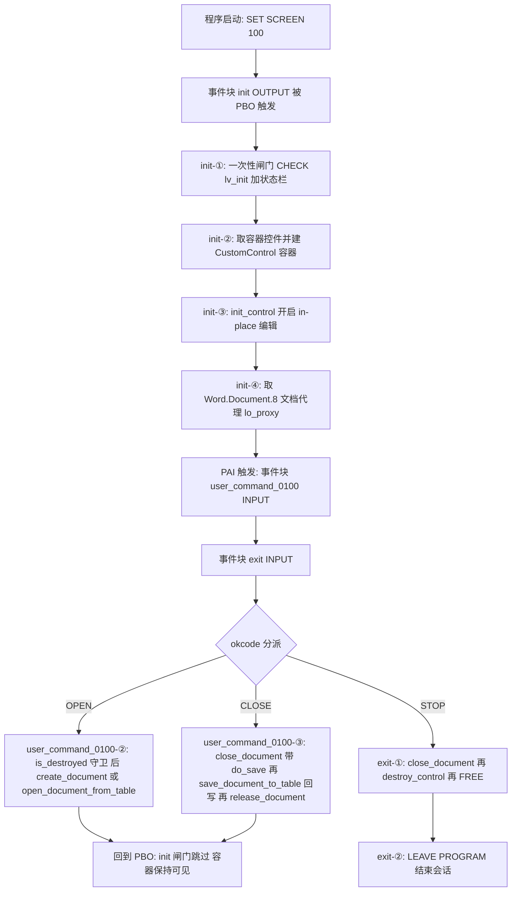
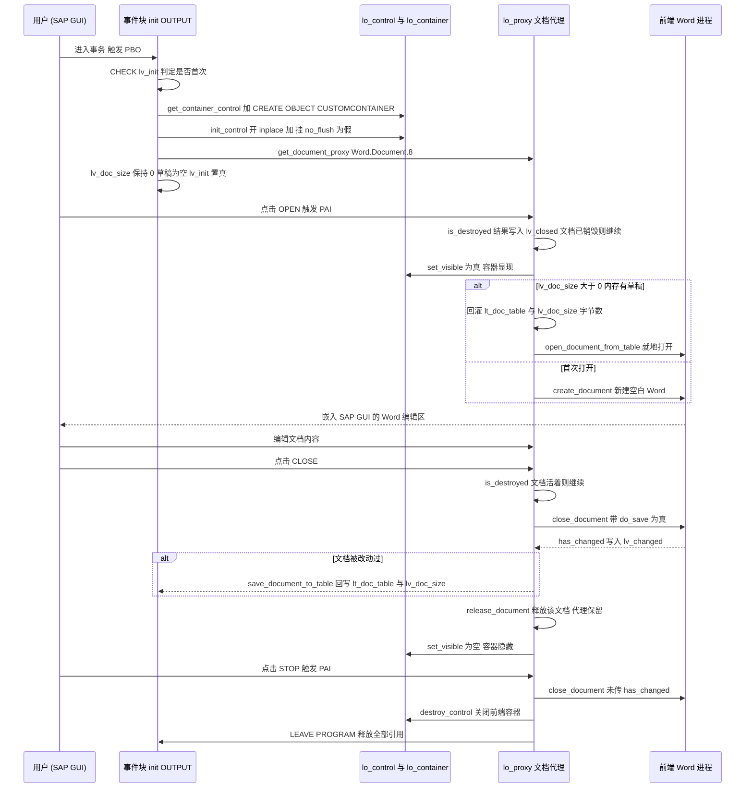

# 程序分析报告：`ZMSA_R_CHAPTER4_8` — 用 DOI 在 ABAP 里集成 Microsoft Word

> 源文件：`PacktPublishing__Mastering-SAP-ABAP__Chapter04__ZMSA_R_CHAPTER4_8.abap`（Pawel Grzeskowiak，Packt《Mastering SAP ABAP》样例，约 160 行）
> 程序类型：**可执行报表（Report / Screen Flow）** —— 经典 PBO + PAI 模块驱动，非 OO，无 ALV，无数据库访问

---

## 一、程序定位与业务背景

### 它解决什么问题

在 SAP GUI 里做一个"能编辑 Word 文档"的界面，按钮是 SAP 的界面，编辑器却是 Word —— 这就是 Desktop Office Integration（DOI，后端接口叫 SAP 的 OI / SAP Office Integration）。SAP 后端 ABAP 不渲染任何像素，它只做一件事：**通过 OLE 与用户前端 PC 上已安装的 Word 进程通信**，把 Word 窗口嵌入（或外挂）到 SAP GUI 的一个 CustomControl 区域里。

反过来问：现有的替代方案为什么不够？

| 替代方案 | 不够的地方 |
| --- | --- |
| 附件目录 + 手工下载/上传 | 用户被迫离开事务上下文，文档版本与业务单据脱钩，无法在编辑后立即回写 |
| `CALL FUNCTION 'OLE2_CREATE'`（老式 OLE2） | 只支持 Windows 桌面 OLE 服务器，不支持 Word 2007+ 的 docx，也不支持"内存态文档" |
| SAPscript / Smart Forms 排版 | 只能输出不可编辑的打印格式，做不了富文本交互编辑 |
| SAP GUI 内嵌 HTML 编辑器 | 排版能力远达不到办公文档要求，且不是 Word 原生格式 |
| 直接在 ABAP 端生成 docx 二进制 | 需要自己拼 OOXML 包、维护复杂，且没有所见即所得的交互编辑 |

所以 **DOI 是唯一"用户在事务里编辑 Office 文档、编辑结果还能被 ABAP 读回来"的标准解法**。这个程序就是它的最小可运行骨架：打开文档、关闭并把内容读回内存、退出清理。

### 它演示的真正业务点

值得注意的是，这个程序没有把文档落到磁盘，而是用 `save_document_to_table` / `open_document_from_table` 这一对方法，把整份 Word 文档的二进制流装进 ABAP 内部表 `lt_doc_table` 里，靠 `lv_doc_size` 记录字节数。这就是所谓的 **"内存态文档"（document in memory, no file）**：关掉 Word 再打开，内容还在 ABAP 内存里。对应的真实业务场景是"草稿保存在会话内，用户中途取消就直接丢弃，不污染应用服务器文件系统"——这一点是后面所有风险分析的源头。

### 一句话设计范式定性

**手工实现的 Screen Flow（`SET SCREEN` + PBO `init` 模块做一次性初始化 + 两个 PAI `INPUT` 模块做 okcode 分派）+ DOI 的"容器控件 → 文档代理"两层对象模型**，全局变量充当会话内状态，文档本体走内存内表。

---

## 二、程序执行流程总览

### 2.1 流程图



> 注意图中的关键：`init` 模块带闸门，`user_command_0100` 与 `exit` 是**平级的兄弟事件块**，都只在 PAI 里跑；`user_command_0100` 与 `exit` 之间的先后完全由屏幕 100 的 PAI 模块列表顺序决定，而这段顺序代码里看不到 —— 这是本程序最大的隐藏依赖。

### 2.2 责任链表

| 子程序（事件块） | 调用者（触发者） | 职责 |
| --- | --- | --- |
| 程序声明区（`TYPE-POOLS: soi` + 全局对象引用 + 文档缓冲） | ABAP 运行时加载程序时 | 引入 SOI 类型池；持有容器控件 / 文档代理引用、okcode 缓冲、文档内存缓冲 |
| `init`（MODULE OUTPUT） | 屏幕 100 的 `PROCESS BEFORE OUTPUT`（PBO） | 首次进入时建容器控件、建 CustomControl、开启 in-place、取得 Word 文档代理；把 `lv_init` 置真以防重入 |
| `user_command_0100`（MODULE INPUT） | 屏幕 100 的 `PROCESS AFTER INPUT`（PAI） | 按 `lv_okcode` 分派：`OPEN` 新建或载入内存文档；`CLOSE` 关闭文档并回写内存缓冲、释放文档、隐藏容器 |
| `exit`（MODULE INPUT） | 屏幕 100 的 `PROCESS AFTER INPUT`（PAI） | 按 `lv_okcode = 'STOP'` 关闭文档、销毁容器控件、释放引用、`LEAVE PROGRAM` |
| `lo_proxy->is_destroyed`（被调用方） | `user_command_0100` 的 OPEN / CLOSE 分支 | 查询当前文档是否已销毁（未打开时为真），做幂等守卫 |
| `c_oi_errors=>show_message`（被调用方） | `init` 与 `user_command_0100` 每一次 OI 调用之后 | 弹出 OI 全局错误栈，是本程序唯一的错误反馈机制 |
| `lo_container->set_visible`（被调用方） | `user_command_0100` 的 OPEN / CLOSE 分支 | 切换 Word 容器的显示与隐藏 |

下面按这条流程，逐个子程序展开。

---

## 三、分组分析

### 3.1 全局声明区 —— 两类对象 + 一块内存缓冲

（全局声明区）

```abap
REPORT zmsa_r_chapter4_8.

TYPE-POOLS: soi.

DATA: lo_container TYPE REF TO cl_gui_custom_container.
DATA: lo_control   TYPE REF TO i_oi_container_control.
DATA: lo_proxy     TYPE REF TO i_oi_document_proxy.

DATA: lv_okcode TYPE syst_ucomm.

DATA: lv_closed  TYPE i.
DATA: lv_init   TYPE boolean.
DATA: lv_changed TYPE i.

TYPES: ty_row TYPE x LENGTH 2048.
DATA: lt_doc_table TYPE STANDARD TABLE OF ty_row.
DATA: lv_doc_size TYPE i.


SET SCREEN 100.
```

**做什么** — 引入 `SOI` 类型池让 `I_OI_CONTAINER_CONTROL`、`I_OI_DOCUMENT_PROXY` 两个接口可解析；声明三个会话级对象引用（GUI 容器、OI 容器控件、文档代理）、三个标志（okcode 缓冲、文档已销毁标志、初始化闸门）；声明"文档行类型 = 2048 字节二进制行"和承载它的标准内表 `lt_doc_table`，以及记录文档字节数的 `lv_doc_size`；最后把屏幕号 100 设为初始显示屏幕。

**为什么** — OI 接口的公开方法/事件在 `SOI` 类型池里，不显式 `TYPE-POOLS` 就无法编译，这是 DOI 程序的硬性前提。三个引用设为全局 DATA 而不是局部，正是因为 DOI 的生命周期跨屏幕轮次：`lo_control` 与 `lo_proxy` 必须在 `init` 创建、在若干次 PAI 中反复复用、在 `exit` 中释放 —— 这就是"ABAP 会话状态"承担"UI 组件状态"的经典手法。`x LENGTH 2048` 不是随手写的：OI 层把二进制文档按固定 2048 字节切成行装表（与 SAP 内部 text table 的行长约定同源），选 `x` 而非 `c`/`string` 是为了避免字节被按字符集转换而破坏 docx 的 ZIP 结构。

**风险与改进**

- 🔴 **`lv_okcode` 声明为 `TYPE syst_ucomm` 但整个程序从未给它赋值**：PBO/PAI 的 okcode 只存在于 `sy-ucomm`，程序里没有任何 `lv_okcode = sy-ucomm`，而 `user_command_0100` 与 `exit` 都直接 `CASE lv_okcode`。结果就是两个 PAI 模块永远走 `CASE` 的"无匹配"分支，OPEN / CLOSE / STOP 三个功能**一个都不会被执行**；末尾那句 `CLEAR: lv_okcode.` 也在给一个从未有值的变量善后。这是本程序最硬的缺陷 —— 要么补 `lv_okcode = sy-ucomm`（若它确为跨 PAI 传递而设计），要么直接改用 `sy-ucomm`。
- 🟠 **`lv_closed` 命名与语义相反**：`is_destroyed` 返回"是否已销毁"，1 表示**没有文档 / 文档已死**，但变量名叫 `lv_closed`（已关闭）读起来像"文档还开着"。同一语义在 `exit` 里又用 `IS INITIAL` 判活（初始 = 未销毁 = 活着），三种表达混用，维护者极易写反判断。建议改成 `lv_doc_destroyed`，并统一 `IF lv_doc_destroyed EQ abap_true THEN ...`。
- 🟡 `lv_closed` / `lv_changed` 用 `TYPE i` 承接接口返回的布尔/整型标志，语义宽泛且容易被后续代码误当数值比较；`lv_init` 已经用了 `boolean`，两者应统一。`boolean`（`abap_bool`）能让 `IF` 判断在语法层就少一个坑。
- 🟡 `ty_row TYPE x LENGTH 2048` 把 OI 的行宽约定硬编码在类型里，但没有任何注释说明"2048 不能改"，后来者极易改成 `string` 或 `x LENGTH 1024`，编译能过、运行时报文档损坏。建议 `CONSTANTS c_doc_row_len TYPE i VALUE 2048.` + 派生类型，并把"末行需按 2048 填充、`lv_doc_size` 是**真实字节数而非行数**"这条语义写进注释 —— 这一点是 `open_document_from_table` 最容易配错的地方。
- 🟢 `SET SCREEN 100` 与屏幕号 0100、PF-STATUS `0100`、TITLEBAR `0100` 三处编号硬编码且无注释指向屏幕的 flow logic；这个程序实际依赖三份外部对象（屏幕 0100、PF-STATUS 0100、TITLEBAR 0100）才能跑，源码里却看不出这个契约。建议在头部注释里列清依赖清单。

---

### 3.2 事件块 `init`（MODULE OUTPUT）—— 四步一次性装配

（事件块 `init` OUTPUT）

这个模块是典型的四步 OI 装配链：闸门 → 状态栏 → 容器 → 代理。它被放在 **PBO** 里而不是一次性 Initialization 段，是因为 PDF/屏幕程序必须靠 PBO 拿到可靠的 GUI 环境（`CL_GUI_CUSTOM_CONTROL` 依赖 SAP GUI 的窗口存在），而程序运行期直接在主体内建 GUI 对象会抛 `CX_GUI_...` 类错误。

#### ① 一次性闸门与状态栏

```abap
MODULE init OUTPUT.

  CHECK lv_init = abap_false.

  SET PF-STATUS '0100'.
  SET TITLEBAR '0100'.
```

**做什么** — 进入即检查 `lv_init`；若已初始化过则 `CHECK` 直接跳出模块、后续语句全不执行；只有首次进入才设置 PF-STATUS `0100` 和标题栏 `0100`。

**为什么** — PBO 每次 PAI 后都会再跑一遍，若不加闸门，容器控件会被反复 `CREATE OBJECT`、`init_control` 会被反复调用，Word 容器会被重建成白屏。所以用"只跑一次"标志位是最直白的解法。`SET PF-STATUS` / `SET TITLEBAR` 放在这里而不是放在 PAI，是为了让状态栏在 PBO 阶段就已生效。

**风险与改进**

- 🟠 **`CHECK` 承担控制流，隐式跳过模块尾部**：`CHECK` 在 MODULE 里成立时等价于 `EXIT` 退出本模块（本例 `lv_init` 为真即跳过，这是意图内的），但读者容易误以为 `CHECK` 只是"跳过一两句"。而且这一行同时把后面 `CLEAR lv_okcode` 之类的收尾也一并跳过，形成跨模块的隐式耦合。写成 `IF lv_init = abap_false. ... ENDIF.` 或把整段抽成 `FORM init_once` 后 `EXIT`，语义会直白得多。
- 🟡 `CHECK lv_init = abap_false` 在 `lv_init` 的类型为 `boolean` 时其实可以直接 `CHECK lv_init EQ abap_false`（或 `CHECK NOT lv_init`），避免"和初值比较"这种容易被后续维护者误抄的写法；更稳妥的是 `IF lv_init IS INITIAL`。
- 🟢 无明显风险：PF-STATUS / TITLEBAR 的编号本身是外部对象依赖，属于可接受的约定。

#### ② 取容器控件并建 CustomControl 容器

```abap
  CALL METHOD c_oi_container_control_creator=>get_container_control
    IMPORTING
      control = lo_control.

  CALL METHOD c_oi_errors=>show_message EXPORTING type = 'E'.

  CREATE OBJECT lo_container
    EXPORTING
      container_name = 'CUSTOMCONTAINER'.
  CALL METHOD lo_container->set_visible EXPORTING visible = ' '.
```

**做什么** — 通过 `C_OI_CONTAINER_CONTROL_CREATOR`（工厂类）取一个 `I_OI_CONTAINER_CONTROL` 存入全局 `lo_control`，立刻调用 `c_oi_errors=>show_message` 把 OI 错误栈弹出；然后 `CREATE OBJECT` 建一个 `CL_GUI_CUSTOM_CONTROL` 类型的 `lo_container`，其 `container_name` 指向屏幕 0100 上名为 `CUSTOMCONTAINER` 的 CustomControl 区域，并立即把它设为不可见。

**为什么** — OI 不允许自己 new 控件（控件背后有前端 ActiveX 的注册与生命周期），必须走工厂类，这是"受管对象"与"自建对象"的边界。`container_name = 'CUSTOMCONTAINER'` 是屏幕上的 CustomControl 标识，Word 最终被嵌进这个屏幕区域。**初始化就隐藏容器**是这个程序设计上的亮点：Word 只在用户点 OPEN 时才 `set_visible` 打开，所以用户第一眼看到的是干净的 SAP 状态栏，而不是一个空白 Word 窗口。

**风险与改进**

- 🟠 **失败路径没有兜底**：`get_container_control` / `CREATE OBJECT` 若失败（最常见的原因是用户前端 PC **没装 Word**、缺少 SAP GUI OI 组件、或 SAP GUI 版本不支持 OI），`lo_control` / `lo_container` 保持初始引用，但程序只弹一个 OI 错误框就继续往下走，后面 `init_control` 会作用在初始引用上。应在每步后加 `IF lo_control IS INITIAL OR lo_container IS INITIAL. MESSAGE e002(zmsa_r_chapter4_8). ENDIF.` 之类的硬退出，或至少置一个 `gv_initializable = abap_false` 阻止后续 OPEN 分支进入。
- 🟠 **`container_name` 与屏幕实际控件名只是字符串约定**：CustomControl 的名字写在屏幕 0100 里，源码这侧只写 `'CUSTOMCONTAINER'`。屏幕被复制或改名后，这里会静默失败（SAP GUI 侧表现为"容器不出现"而不是报错）。建议集中成常量并在注释里标注"必须与屏幕 0100 的 CustomControl 控件名一致"。
- 🟡 `CALL METHOD ... EXPORTING/IMPORTING` 是 4.6 之前的冗长写法，本程序其余代码已混用 `abap_true/abap_false` 新式布尔字面量，风格不统一：`CALL METHOD a->b EXPORTING x = 'X'` 与 `abap_true` 并排出现，会让读者分不清"这里 `visible = ' '` 是关闭还是打开"。统一成 `lo_container->set_visible( visible = abap_false )` 后，意图不再有歧义（`' '` 是假，`'X'` 是真，虽能跑但反直觉）。
- 🟡 `show_message` 被无条件调用：即使上一步成功、错误栈为空，也会进一次 OI 的消息展示路径；更关键的是它**不返回任何状态**，调用方无法据此分支（见 3.3 风险）。

#### ③ 初始化容器控件并开启 in-place 编辑

```abap
  CALL METHOD lo_control->init_control
    EXPORTING
      r3_application_name      = 'R/3 Basis'
      inplace_enabled          = abap_true
      inplace_scroll_documents = abap_true
      parent                   = lo_container
      register_on_close_event  = abap_true
      register_on_custom_event = abap_true
      no_flush                 = abap_false.
```

**做什么** — 把刚建好的 `lo_container` 作为 `parent` 交给 `lo_control->init_control`，并打开 `inplace_enabled`（Word 直接嵌在 SAP GUI 区域内编辑）、`inplace_scroll_documents`（Word 文档滚动与 SAP GUI 页面联动）、`register_on_close_event` 与 `register_on_custom_event`（向容器控件注册关闭/自定义事件），`no_flush = abap_false` 表示不做异步排队、调用立即生效。

**为什么** — 这是全程序技术含量最高的一步。in-place 让用户感觉"在 SAP 里编辑 Word"，而不是"跳出一个 Word 窗口"，体验差别巨大。`no_flush = abap_false` 是 DOI 官方推荐：把 OLE 调用同步执行，后端才能立刻拿到返回状态和错误栈；设成 `abap_true` 时调用被排队，错误会延后甚至丢失，而且此时容器还是隐藏的，异步刷新也无法显示。这里"同步 + 先隐藏容器"的组合是标准做法。

**风险与改进**

- 🟠 **注册了两个事件却没有任何 `SET HANDLER`**：`register_on_close_event` / `register_on_custom_event` 打开后，程序应在创建控件时 `SET HANDLER lo_control->on_close_event FOR lo_control.` 之类挂上处理方法，但源码里一次 `SET HANDLER` 都没有。后果是：当用户**直接在 Word 界面里关闭文档**（Word 标题栏的 X、或 File→Close）时，OI 会回调这个关闭事件而无人处理，ABAP 侧的 `lv_closed` / 容器可见性随即与实际失同步 —— 用户以为文档已关（Word 窗口确实消失了），再点 CLOSE 就会对已销毁文档调 `close_document` 而报错。要么补 handler（把容器隐藏、把 `lv_closed` 置 1），要么把这两个参数显式设为 `abap_false` 并承认不支持"从 Word 侧关闭"。这是 DOI 最经典的一个坑，示例代码里本该给出正确写法。
- 🟡 `r3_application_name = 'R/3 Basis'` 是字符串而非系统字段，在 NetWeaver / S/4 环境里这个名号已过时；它只是 OI 用来标识宿主应用的文本，不影响功能，但换成 `sy-dyntxt` 或常量更贴切。
- 🟡 `inplace_enabled = abap_true` 依赖 SAP GUI 端"启用就地编辑"选项与支持 OI 的 GUI 版本；不满足时 SAP 会回退到外挂 Word 窗口。示例程序不提示这一点，用户容易误判为 Bug。建议在标题栏或注释里写明前置条件。

#### ④ 取得 Word 文档代理并置闸门

```abap
  CALL METHOD lo_control->get_document_proxy
    EXPORTING
      document_type  = 'Word.Document.8'
      no_flush       = abap_false
    IMPORTING
      document_proxy = lo_proxy.

  CALL METHOD c_oi_errors=>show_message EXPORTING type = 'E'.

  lv_init = abap_true.
ENDMODULE.
```

**做什么** — 向容器控件申请一个 `Word.Document.8` 类型的文档代理存入全局 `lo_proxy`，再弹一次 OI 错误栈；最后把 `lv_init` 置真，表示"装配完成，后续 PBO 不再重来"。

**为什么** — OI 的两层对象模型在这里显形：`i_oi_container_control` 管"容器 / 宿主"，`i_oi_document_proxy` 管"一份文档"。**容器只建一次，代理可反复用于创建不同文档** —— 后面 CLOSE 分支的 `release_document` 正是释放"这一份文档"而不是代理本身，所以代理能被 OPEN 复用。闸门放在**最后**一步而非开头，是有讲究的：只有四步全部走完才置真，中间任何一步失败都能在下次 PBO 重试。

**风险与改进**

- 🔴 **闸门置位与失败状态脱钩**：`lv_init = abap_true` 只反映"流程走到了这里"，不反映"每一步都成功"。若 `get_document_proxy` 失败（例如用户机器上 `Word.Document.8` 的 ProgID 未注册），`lo_proxy` 为初始引用但 `lv_init` 已为真，重试机会被永久关闭，之后每次 OPEN 都会在初始引用上调方法。修正方向：置位前校验 `lo_control IS INITIAL OR lo_proxy IS INITIAL`，失败时不置 `lv_init`。
- 🟠 **`document_type = 'Word.Document.8'` 硬编码**：`Word.Document.8` 是 Word 97–2003 的 COM ProgID。装了 Word 2007+ 的机器通常为兼容性仍注册它，所以多数环境可用；但这是**前端机器的注册表状态**，后端源码无法保证。正确的生产做法是把文档类型做成可配置项（或至少 `CONSTANTS`），并在 `get_document_proxy` 失败时给出"前端未安装 Word / 不支持 in-place"的**前端诊断提示**，而不是把 OI 的原始错误框甩给用户。
- 🟡 四步装配里插了三次 `c_oi_errors=>show_message`，但它没有返回值也不清栈语义明确：OI 的错误是**全局栈**，不是每步独立的错误码。这意味着"成功步骤弹过一次之后，后续步骤的 `show_message` 可能把前面遗留的错误一起再弹一次"。要程序化判断应改用 `c_oi_errors=>has_errors( )` 配合 `c_oi_errors=>get_html( )` 自行处理，示例程序里至少该有一处示范这种"可判断"的错误处理。

---

### 3.3 事件块 `user_command_0100`（MODULE INPUT）—— OPEN / CLOSE 两个分支

（事件块 `user_command_0100` INPUT）

这个 PAI 模块承载了程序的业务主体：把 `lv_okcode` 分派到 `OPEN`（新建或载入内存文档）与 `CLOSE`（关闭文档并把内容读回内存）两条路径，最后清 okcode。

#### ① okcode 分派骨架

```abap
MODULE user_command_0100 INPUT.
  CASE lv_okcode.

    WHEN 'OPEN'.
```

**做什么** — 进入模块即按 `lv_okcode` 做 `CASE` 分派，`WHEN 'OPEN'` 进入打开分支；`WHEN 'CLOSE'`（下文 ③）与 `ELSE` 缺省什么都不做。

**为什么** — 不用 `sy-ucomm` 而另设 `lv_okcode` 缓冲，是老式 Screen Flow 程序在 PAI 里"延迟处理 okcode"的常见手法：一个 PAI 里先做输入校验、再做动作，动作阶段读缓冲里的 okcode 而非直接读 `sy-ucomm`。这个设计本身是站得住的，问题在于本程序**只建了缓冲区却忘了往里放值**（见 3.1 风险），骨架与填充脱节。

**风险与改进**

- 🔴 **`CASE lv_okcode` 恒不命中**：如前所述，`lv_okcode` 无任何赋值来源，本段以及 `exit` 里的 `CASE` 都是死代码，整个交互层不工作。修法二选一：(a) 模块首行补 `lv_okcode = sy-ucomm.`；(b) 放弃缓冲变量，全部改用 `sy-ucomm`，同时删掉末尾的 `CLEAR`。
- 🟠 **末尾 `CLEAR: lv_okcode.` 会毁掉同一 PAI 中后续模块的输入**：

```abap
  ENDCASE.
  CLEAR: lv_okcode.
ENDMODULE.
```

  PAI 模块是**按屏幕 100 的模块列表顺序依次调用**的。如果 `exit` 排在 `user_command_0100` 之后（本程序里两个模块都要处理 okcode，这是最自然的排法），用户点"退出"时 `user_command_0100` 先跑完、把 `lv_okcode` 清空，`exit` 随后读到的是初值 → `WHEN 'STOP'` 也不命中 → 程序永远退不出去。即使补上赋值，这行 `CLEAR` 也是 P0 级隐患。规范做法是把 okcode 的清理收敛到**单个** PAI 模块（通常是 `MODULE ... INPUT` + `sy-ucomm` 判断后 `CLEAR sy-uccomm`），或者干脆用 `sy-ucomm` 的"每个 PAI 自动重置"这一系统特性，不自己维护副本。
- 🟡 `CASE` 无 `WHEN OTHERS` / `ELSE` 分支：拼错的 okcode（如保留的 `EXEC`/`PRINT` 按钮）会静默落入空档，界面看起来"点了没反应"。至少加一个 `WHEN OTHERS.` 分支做兜底提示。

#### ② `OPEN` 分支：存活守卫 + 显示容器 + 新建或载入

```abap
      CALL METHOD lo_proxy->is_destroyed
        IMPORTING
          ret_value = lv_closed.

      CHECK NOT lv_closed IS INITIAL.
      CALL METHOD lo_container->set_visible
        EXPORTING
          visible = abap_true.

      IF lv_doc_size > 0.

        CALL METHOD lo_proxy->open_document_from_table
          EXPORTING
            document_table = lt_doc_table
            document_size  = lv_doc_size
            document_title = 'DOI Test Document'
            open_inplace   = abap_true.
      ELSE.


        CALL METHOD lo_proxy->create_document
          EXPORTING
            open_inplace   = abap_true
            document_title = 'DOI Test Document'
            no_flush       = abap_false.
      ENDIF.
      CALL METHOD c_oi_errors=>show_message EXPORTING type = 'E'.
```

**做什么** — 先问代理"当前文档是否已销毁"存入 `lv_closed`，用 `CHECK NOT lv_closed IS INITIAL` 做守卫：**文档仍然活着就退出整个模块**（不再重复打开）；文档已销毁才继续。随后把容器设为可见，再按 `lv_doc_size` 分叉：`> 0` 表示内存里已有文档，用 `open_document_from_table` 把 `lt_doc_table` 的字节流与字节数回灌给 Word；`= 0` 表示首次使用，用 `create_document` 新建一份空白 Word 文档。两条路径都带 `document_title = 'DOI Test Document'` 和 `open_inplace = abap_true`，最后弹 OI 错误栈。

**为什么** — `is_destroyed` 是 OI 生命周期里唯一可靠的"文档还在不在"判据（不能靠自己的标志位，因为文档可能在 Word 侧被关掉）。守卫的意图是**幂等**：连点两次 OPEN 不会开出两个 Word。`lv_doc_size` 作为分支条件也很聪明 —— 它天然充当"内存里有没有草稿"的哨兵：程序启动后 `lv_doc_size` 为 0，走 `create_document`；用户 CLOSE 时若改动过则 `save_document_to_table` 把它写成正数，之后再 OPEN 就走 `open_document_from_table`，内容得以延续。**这就是内存态文档的完整闭环，而整份文档从未在应用服务器的文件系统上留下痕迹。**

**风险与改进**

- 🟠 **守卫方向依赖 `CHECK` 的取反语义，极易写反**：`CHECK NOT lv_closed IS INITIAL` 成立 ⟺ `lv_closed` 非 0 ⟺ 文档**已销毁**，此时才继续打开。这个"用取反的取反表达'没活着'"的写法，对读代码的人是不友好的；直接写 `IF lv_closed EQ 0. " 文档还活着，先关掉再说 / 或直接忽略 ENDIF.` 会清楚得多。更进一步，重复点 OPEN 时程序静默什么都不做（`CHECK` 退出），用户得不到"文档已打开"的反馈。
- 🟠 **初始引用直接解引用**：`lo_proxy->is_destroyed` 与 `lo_container->set_visible` 都未做 `IS INITIAL` 检查。结合 3.2④ 的闸门缺陷（`lv_init` 已为真但 `lo_proxy` 可能为空），这条路径会以 `CX_SY_REF_IS_INITIAL` 短时转储收场 —— 而 OI 明明已经把"Word 不可用"的原因弹给了用户，程序却紧接着崩掉，体验极差。分支开头应加 `CHECK lo_proxy IS INITIAL → 给出友好 message 退出`。
- 🟠 **`lv_doc_size > 0` 只是一个脆弱的"有无草稿"约定**：它把"是否需要新建"与"字节数"两个概念绑在一起。一旦 `save_document_to_table` 回写时因故产出 0 字节（空文档），用户下次 OPEN 会拿到一张空白 Word，而界面上没有任何提示；反过来若 `lv_doc_size` 带了非 0 值但 `lt_doc_table` 是空内表，`open_document_from_table` 会失败。语义应当拆开：显式的 `gv_has_draft TYPE boolean` 表示草稿存在，`lv_doc_size` 只作为字节数传递。
- 🟡 **`document_table` 与 `document_size` 是一对必须一致的契约**：`lt_doc_table` 的行是 2048 字节填充的（末行补零），`lv_doc_size` 传的是**真实字节数**（不是 `lines( lt_doc_table )` 行数，也不是 `2048 * 行数`）。这两者错配的表现很隐蔽 —— 多传则文档尾部出现乱字节，Word 可能报"文件已损坏"；少传则文档被截断。本程序自己写入、自己读取，恰好配对，但源码里没有任何注释固化这条规则，也没有对 `lv_doc_size` 的取值做上限校验。建议在类型定义处注释说明，并对超大文档加一个尺寸上限保护（见 3.1）。
- 🟡 `document_title = 'DOI Test Document'` 硬编码字面量，在 OPEN 与 CLOSE 相关调用之间没有常量；示例可接受，生产应提到常量或从业务数据取（如单据号/物料描述）。
- 🟢 `ELSE` 分支内那个多余空行（`create_document` 前的两个空行）是纯粹的排版噪声；`lv_closed` 被复用为 `is_destroyed` 的输出参数但从不初始化，每次调用都靠 `IMPORTING` 覆写，属于"靠副作用正确"的写法，显式 `CLEAR` 更稳。

#### ③ `CLOSE` 分支：关闭 → 按需回写内存 → 释放文档 → 隐藏容器

```abap
    WHEN 'CLOSE'.
      CALL METHOD lo_proxy->is_destroyed
        IMPORTING
          ret_value = lv_closed.

      IF lv_closed IS INITIAL.
        CALL METHOD lo_proxy->close_document
          EXPORTING
            do_save     = 'X'
          IMPORTING
            has_changed = lv_changed.

        CALL METHOD c_oi_errors=>show_message EXPORTING type = 'E'.

        IF NOT lv_changed IS INITIAL.
          CALL METHOD lo_proxy->save_document_to_table
            CHANGING
              document_table = lt_doc_table
              document_size  = lv_doc_size.
          CALL METHOD c_oi_errors=>show_message EXPORTING type = 'E'.
        ENDIF.

        CALL METHOD lo_proxy->release_document.
        CALL METHOD c_oi_errors=>show_message EXPORTING type = 'E'.
      ENDIF.

      CALL METHOD lo_container->set_visible EXPORTING visible = ' '.
```

**做什么** — 再次用 `is_destroyed` 守卫：文档**没被销毁**（初值，即还活着）才进入关闭流程。先 `close_document` 并传 `do_save = 'X'`，同时取回 `has_changed` 到 `lv_changed`；若文档被改动过，就 `save_document_to_table` 把当前内容写进 `lt_doc_table`、字节数写进 `lv_doc_size`（`CHANGING` 内表参数就地传入传回，不需要预先 `CLEAR`）；无条件 `release_document` 释放这份文档（代理本身保留，可再 OPEN）；最后把容器设为不可见。

**为什么** — 三步的顺序不能乱：**先关闭、且必须按 `has_changed` 决定要不要读回、最后才能 release**。因为 `save_document_to_table` 只能在文档仍处于打开状态时调用，一旦 `release_document`，二进制流就取不回来了。`has_changed` 这个判断的价值在于避免无谓搬运：用户只是看了一眼没改（`lv_changed` 为 0），就不必把几百 KB 的 docx 再走一遍内表。`release_document` 与容器隐藏配合，使得"关闭"之后 `lo_proxy` 回到可复用状态、界面回到干净的 SAP 状态栏，第二次 OPEN 会重新 `create_document`（此时若已有草稿则改走 `open_document_from_table`）。这一整套是本程序里设计意图最完整的一段。

**风险与改进**

- 🟠 **`do_save = 'X'` 但没有提供任何保存目标**：`close_document` 的 `DO_SAVE` 让 Word 自己走一次"保存"，可本程序从未给过文档 URL/文件名。实际行为取决于 Word 的行为模式：要么弹出 Word 自己的 Save As 对话框（一个**脱离 SAP GUI 事务上下文**的原生对话框，用户可以在那里乱选路径，绕过后端所有校验），要么 OI 抛错。而本程序的设计意图明明是"不落盘、只回内存"。正确写法是 `do_save = abap_false` —— 只关闭、把内容交给 `save_document_to_table`，落盘与否由 ABAP 侧显式决定。
- 🟠 **`lv_changed` 与 `lv_closed` 的初值语义陷阱**：`IF NOT lv_changed IS INITIAL` 依赖 `has_changed` 被 `close_document` **成功覆写**。若 `close_document` 本身失败（例如文档已被 Word 侧关闭），`lv_changed` 保持上一轮的残值，程序就可能用一个过期的布尔值决定是否回写。应在调用前 `CLEAR lv_changed.`，让"没拿到结果"与"结果为假"可区分。
- 🟠 **用户改动可能在 CLOSE 与退出两条路径上被丢弃**：CLOSE 分支的 `lv_changed` 只用于决定是否回写内存，而 `exit` 分支（3.4）调 `close_document` 时**连 `has_changed` 都没接**，用户编辑了内容直接点"退出"就彻底丢失，既没回写 `lt_doc_table` 也没提示。这是数据丢失级的设计缺口，示例程序至少应该提示"有未保存修改，是否回写/是否放弃"。
- 🟡 `lv_closed IS INITIAL` 表示"文档还活着"这一判据被埋在 `IF` 的取反位置，可读性一般；与 OPEN 分支的 `CHECK NOT lv_closed IS INITIAL` 是同一语义、两种写法，并列出现时极易改错。建议统一成一处 `IF lv_doc_alive = abap_true.`。
- 🟡 `release_document` 之后没有把 `lv_doc_size` 与 `lt_doc_table` 重置。这本身是**有意的**（保留草稿供下次 OPEN），但源码没有任何注释点明"这里故意不清"，后来者极易以为是漏写而"顺手补上"，从而悄悄断掉内存草稿的延续。这类"故意为之的省略"必须配注释。
- 🟢 `CLEAR lv_okcode.` 的写法带上了冒号列表语法却只有一个变量，属于模板残留；不影响功能。

---

### 3.4 事件块 `exit`（MODULE INPUT）—— 三步清理后离场

（事件块 `exit` INPUT）

（事件块 `exit` INPUT）

#### ① 代理引用判空并关闭文档

```abap
MODULE exit INPUT.
  CASE lv_okcode.
    WHEN 'STOP'.
      IF NOT lo_proxy IS INITIAL.
        CALL METHOD lo_proxy->close_document.
        FREE lo_proxy.
      ENDIF.
```

**做什么** — 只在 `lv_okcode = 'STOP'` 时动作；先判 `lo_proxy` 非初始引用，再调 `close_document` 关闭文档，随即 `FREE lo_proxy` 释放引用。

**为什么** — 这是本程序里**唯一做对了引用判空**的地方：DOI 的清理代码必须防御 `get_document_proxy` 失败带来的初始引用，否则关程序时直接崩。与 3.3② 形成鲜明对比（同样是对 `lo_proxy` 解引用，那里没有判空），说明作者知道要判，只是没判匀。`FREE` 而不是置空，是显式释放对象引用（对 OO 引用而言 `FREE` 与 `= INITIAL` 效果接近，但 `FREE` 语义更明确）。

**风险与改进**

- 🔴 **`close_document` 未显式传 `DO_SAVE`**：`i_oi_document_proxy` 的 `CLOSE_DOCUMENT` 中 `do_save` 是带默认值的可选项（默认倾向为"保存"）。这里省略参数意味着"按接口默认处理"，而这正好是最坏选择 —— 退出会话时可能弹出 Word 侧的保存对话框，或把文档交由 Word 按它自己的方式保存，而 ABAP 侧完全没有拿到内容。即便不考虑默认值，**忽略 `has_changed` 也意味着用户编辑的内容被静默丢弃**（见 3.3③ 的数据丢失缺口）。应显式写 `do_save = abap_false` 并接收 `has_changed`，由 ABAP 决定是否 `save_document_to_table`。
- 🟠 **关闭后没有弹 OI 错误**：`close_document` 是最可能失败的一步（Word 卡住、文档被外部程序占用），却既没有 `c_oi_errors=>show_message`，也没有 `has_changed` 处理，失败完全静默。
- 🟡 与 3.3② 相同的判空不一致：这里判了 `lo_proxy`，那里没判。建议把"代理是否可用"抽成一个小的 `FORM` / `METHOD` 统一守卫。

#### ② 销毁容器控件并释放引用

```abap
      IF NOT lo_control IS INITIAL.
        CALL METHOD lo_control->destroy_control.
        FREE lo_control.
      ENDIF.
      LEAVE PROGRAM.
  ENDCASE.
ENDMODULE.
```

**做什么** — 判 `lo_control` 非初始后调 `destroy_control` 关闭前端 OI 容器控件，再 `FREE` 释放控件引用，最后 `LEAVE PROGRAM` 结束整个 ABAP 程序。

**为什么** — `destroy_control` 是 `init_control` 的对称操作：它让 SAP GUI 侧真正释放 ActiveX 容器与 Word 进程，**漏掉它会在用户端留下一个"Word 已打开但 SAP 事务已退出"的孤儿窗口**。两个 `IF NOT ... IS INITIAL` 判空 + `FREE` 的组合，构成了 DOI 清理的标准范式（先文档、后控件，顺序不可颠倒）。`LEAVE PROGRAM` 而非 `BACK TO` / `EXIT`，直接终止程序实例，避免残留屏幕 100 的 PBO 被再次触发。

**风险与改进**

- 🟠 **`lo_container` 从未被 `FREE`**：`lo_control` 与 `lo_proxy` 都显式释放了，唯独 `lo_container` 靠 `LEAVE PROGRAM` 后的垃圾回收。多数情况下无害（程序结束即销毁），但如果将来把 `exit` 改造成"关闭窗口而不退出程序"，`CL_GUI_CUSTOM_CONTROL` 就会成为悬空控件。三者应一视同仁地清理，风格才一致。
- 🟠 **`destroy_control` 之后没有 `c_oi_errors=>show_message`**：与 `init` 里的三次、`user_command_0100` 里的三次形成反差，`exit` 路径全程零错误反馈。
- 🟡 `CASE` 同样没有 `WHEN OTHERS`：`exit` 若排在 `user_command_0100` 之后且吃到被清空的 `lv_okcode`（3.3① 已述），退出路径静默失效；标准做法是把 `WHEN 'STOP'` 之外的情形交给系统返回（`BACK` / `EXIT`）处理，而不是在这里等值。
- 🟢 无明显风险：`LEAVE PROGRAM` 位置正确（所有资源释放之后），不会提前中断清理。

---

## 四、执行流程全景图（数据视角）



**数据视角的两句话总结**：`lv_doc_size` 是贯穿全程的"状态量" —— 它为 0 时走新建、为正时走载入，其值由 `save_document_to_table` 唯一写点产生，构成内存草稿的生命线；`lv_closed` 则是每次 OI 动作前重新取值的"存活探针"，绝不能被当成持久状态使用。

---

## 五、问题清单与改进建议（按优先级）

### 🔴 P0 业务正确性

1. **`user_command_0100`**：`lv_okcode` 声明为 `syst_ucomm` 却从未被赋值，`CASE lv_okcode` 恒不命中 —— OPEN / CLOSE 两个功能完全不可达。
2. **`user_command_0100`**：末尾 `CLEAR: lv_okcode.` 会清掉同一 PAI 中后续模块的输入；若屏幕 100 的 PAI 模块顺序为 `user_command_0100` → `exit`，退出功能同样不可达。（即使修复第 1 条，这一条仍会独立导致功能失效）
3. **`init` ④**：`lv_init = abap_true` 无条件置位，不校验 `lo_control` / `lo_proxy` 是否创建成功；失败后重试通道关闭，且 `lv_doc_size` 与容器状态被留在半初始化态。

### 🟠 P1 健壮性

4. **`init` ②③④**：`get_container_control` / `CREATE OBJECT` / `init_control` / `get_document_proxy` 全部无判空、无失败退出。最典型的现场是**前端未安装 Word**：OI 弹了错误框，程序继续往下走。
5. **`user_command_0100` ②**：对可能为初始引用的 `lo_proxy->is_destroyed` 与 `lo_container->set_visible` 直接解引用，配合第 3 条会以 `CX_SY_REF_IS_INITIAL` 短时转储收场。
6. **`exit` ①**：`close_document` 未显式传 `do_save = abap_false`，也未接收 `has_changed` —— 用户在关闭前对文档的所有编辑被静默丢弃。
7. **`user_command_0100` ③**：`close_document EXPORTING do_save = 'X'` 但未提供任何保存目标，会引出 Word 原生 Save As 对话框（脱离事务上下文、可任意选路径），与"文档不落盘、只回内存"的设计意图直接冲突。
8. **`init` ③**：`register_on_close_event` / `register_on_custom_event` 已开启，却无任何 `SET HANDLER`；用户在 Word 内直接关闭文档时 ABAP 侧状态失同步，后续 `close_document` 报错。
9. **`user_command_0100` ②③**：`lv_doc_size` 被同时用作"字节数"和"是否有草稿"的哨兵，且与 `lt_doc_table` 的一致性（末行 2048 填充 + 真实字节数）无任何校验或注释；错配会产生静默的空白文档或损坏文档。
10. **`user_command_0100` ③**：`lv_changed` 依赖 `has_changed` 成功覆写，调用前未 `CLEAR`；`close_document` 失败时可能用上轮残值决定是否回写。

### 🟡 P2 性能与规范

11. **`user_command_0100` ②**：`IF lv_doc_size > 0` 语义不清，应引入显式的 `gv_has_draft` 布尔量，与字节数解耦。
12. **`全局声明区`**：`lt_doc_table` 全量驻留 ABAP 扩展内存，无文档大小上限；一份几 MB 的 docx 换算成 2048 字节行即上千行，反复 `save` / `open` 的内存与 CPU 成本不可控。
13. **`全局声明区` / `user_command_0100` ③**：行宽 2048 字节这条 OI 约定硬编码在 `TYPES ty_row` 中且无注释，极易被"顺手优化"成 `string` 而运行时损坏文档。
14. **`init` ④**：`document_type = 'Word.Document.8'` 硬编码，依赖前端注册表兼容性；失败时给不出"前端缺组件"这类可行动的前端诊断。
15. **`init` ④**：`c_oi_errors=>show_message` 被调用四次，但它是全局错误栈 + 弹窗、**无返回值不清栈语义**，既可能重复弹陈旧错误，也无法程序化分支；缺少 `c_oi_errors=>has_errors` 一类的可判断用法示范。
16. **`init` ①**：`CHECK lv_init = abap_false` 用 `CHECK` 承担控制流，且会连带跳过模块尾部；建议改 `IF lv_init IS INITIAL`。
17. **`user_command_0100` ① / `exit` ②**：两个 `CASE` 均无 `WHEN OTHERS` 兜底，未命中即静默无响应。
18. **`全局声明区` / `init` ②`**：`lv_closed` / `lv_changed` 用 `TYPE i` 承接布尔语义，且 `lv_closed` 命名与 `is_destroyed` 的含义相反、判活逻辑在三处以三种写法出现（`NOT ... IS INITIAL` / `IS INITIAL` / `NOT ... IS INITIAL`）；`visible = ' '` 与 `abap_true` 新旧布尔写法在同一程序中混用。
19. **`exit` ②**：`lo_container` 未 `FREE`，与 `lo_proxy` / `lo_control` 的清理风格不一致；`destroy_control` / `close_document` 后未调用 `show_message`，退出路径全程无错误反馈。
20. **`init` ①**：`SET TITLEBAR` 只在首次初始化执行，标题栏不随文档状态（空文档 / 已载入草稿）变化；`r3_application_name = 'R/3 Basis'` 为过时的字符串字面量。
21. **全程序**：无 `AUTHORITY-CHECK`，任何能进入事务的用户都可唤起前端 Word；无对 SAP GUI OI 组件是否启用的前置检查与提示。

### 🟢 P3 可扩展性

22. **全程序**：功能被硬编码为 `OPEN` / `CLOSE` / `STOP` 三个固定 `WHEN`，新增动作（另存、打印、模板、版本快照）必须改 `CASE`；可抽象为动作表 + 派发 FORM。
23. **全局声明区**：程序依赖屏幕 0100、PF-STATUS 0100、TITLEBAR 0100 三份外部对象，但源码头部注释只写了作者与变更历史，未列出依赖清单与 PBO/PAI 模块挂载点。
24. **全程序**：无 ABAP Unit 覆盖。可测的部分其实不少 —— 2048 行长与字节数的一致性、`lv_doc_size` 的状态迁移、okcode 到动作的映射，都能抽成可单测的纯逻辑；而当前这些逻辑全部埋在 PAI 模块里，只能靠手工点按钮验证。

---

## 六、整体评价与启发

### 优点

- **OI 两层对象模型示范得清晰**：`container_control`（宿主）→ `document_proxy`（文档）的分工，以及"容器建一次、代理反复用、文档可 release 后重建"这条生命周期线，三个对象的作用没有任何冗余。
- **in-place + 先隐藏容器 + 同步调用（`no_flush = abap_false`）** 的组合是 DOI 的标准姿势，把"何时可见"和"何时同步"这两个最容易踩的点一次踩对。
- **内存态文档闭环是本程序的最大亮点**：`save_document_to_table` / `open_document_from_table` + `lv_doc_size` 哨兵，实现了不落文件的草稿生命周期，对"预览后放弃""临时草稿"类场景极有价值。
- **CLOSE 分支的三步顺序**（关闭 → 按 `has_changed` 决定回写 → release）逻辑完整，`release_document` 前先把内容取回来这个次序，说明作者理解 OI 的生命周期约束。

### 短板

- **交互层整体失效**：`lv_okcode` 缺赋值 + `CLEAR` 时机错误这两条，让 OPEN / CLOSE / STOP 在最可能的模块顺序下全部不可达。作为教学示例，这比代码风格问题严重得多 —— 读者照抄会得到一个"点了没反应"的程序。
- **成功判据缺位**：全程序没有任何一处检查对象是否创建成功，只有"弹个错误框然后继续"。前端缺 Word 这种最常见的现场，会以短时转储而非友好提示结束。
- **数据丢失无提示**：用户编辑后直接退出，`exit` 分支既不接 `has_changed` 也不回写内存，修改无声消失；CLOSE 分支的 `do_save = 'X'` 又会在 Word 侧引出一个不受控的保存对话框。两条路径都在替用户"决定"文档去向。
- **判空与清理风格不统一**：`exit` 里判空做得很到位，`user_command_0100` 里完全不做；`lo_container` 被两个同类对象之外的存在方式忽略。

### 可学到的设计经验

1. **DOI 的正确顺序是固定的**：工厂取控件 → `CREATE OBJECT` CustomControl（先隐藏）→ `init_control`（`no_flush = abap_false`）→ `get_document_proxy`。任何一步都不能省，且每一步之后都应判空 —— 因为失败原因几乎总是"用户前端的环境问题"。
2. **"是否已销毁"必须问 OI，不能自己记**：`is_destroyed` 是唯一可信的存活判据；但它每次都要重新查询，返回值只当瞬时探针用，**不要**把它当成持久状态缓存。同理，任何 okcode 的副本都必须有明确的赋值点与清理点，否则就是死变量。
3. **内存态文档的关键契约是"行宽 2048 + 真实字节数"**：两者必须同时正确，且只在文档处于打开状态时才能采集。工程上的做法是把它封装成一个小类（`zcl_doc_buffer`），把 `save` / `load` / `is_empty` / `bytes` 收进去并写清注释 —— 顺便也解决了"整份 docx 常驻扩展内存"的可控性问题。
4. **GUI 组件的清理必须对称且判空**：`init_control` 对 `destroy_control`、`create_document` 对 `close_document` + `release_document`，每一对都要 `IS INITIAL` 判断后再 `FREE`。示例代码里最有教学价值的恰恰是那些"检查写对了"的片段 —— 本程序的 `exit` 模块就是正面样板，`user_command_0100` 则是反面教材，把两者对照着看，比读十篇 DOI 文档都管用。