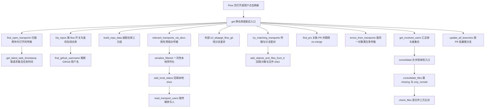
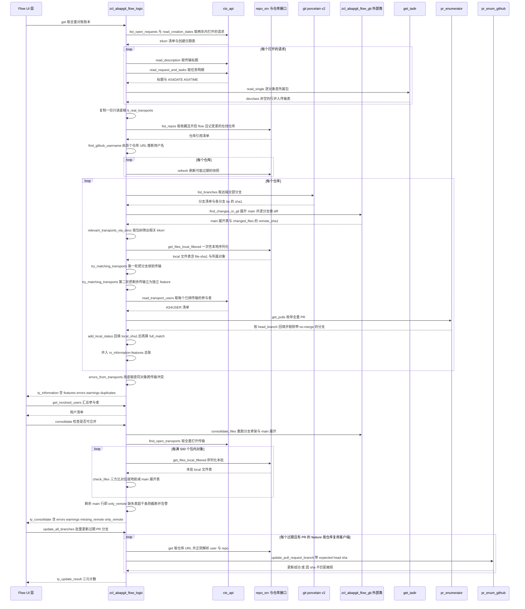

# abapGit Flow Logic 分析报告

> 分析对象：`zcl_abapgit_flow_logic`（abapGit，MIT License）
> 类型：全局 ABAP Object 类（`CLASS ... DEFINITION PUBLIC` + `CLASS ... IMPLEMENTATION`），全静态方法
> 体量：定义段 181 行 / 实现段 930 行，合计 1114 行
> 方法总数：19 个（5 个 PUBLIC + 14 个 PRIVATE）+ 1 个全局声明区

---

## 一、程序定位与业务背景

### 1.1 它在 abapGit 里解决什么问题

SAP 的变更流转模型是 **CTS 传输请求（TR）** 驱动的，而 Git 的流转模型是 **分支 + Pull Request** 驱动的。这两套模型对"一次变更"的表达方式根本不同：

- CTS 眼里，一次变更 = 一个 TRK，里面装着若干对象（`R3TR PROG ZFOO`）；对象在**本地工作副本**里被修改，传输只是往目标系统"寄送"一份。
- Git 眼里，一次变更 = 一个 `feature/*` 分支，里面装着若干 blob（`src/zfoo.prog.abap`）；对象在**远程仓库**里被修改，PR 只是合并请求。

结果就是：一个 ABAP 开发者在本地做完一个功能，代码既在传输请求里、又在工作副本里、还可能有一个没合并的 Git 分支。系统里立刻出现三个"真相来源"互相打架：

1. 对象 X 躺在传输 `K9xxxxxx` 里，远端分支 `feature/new-thing` 上有 X 的改动，本地序列化也拿得到 X。
2. 反过来，同一个 X 同时躺在 `K9000001` 和 `K9000002` 两个传输里。
3. 更糟的是，有人本地改了 X，从没建传输，直接删掉了远端分支上的 X。

abapGit 的 **Flow 功能**要做的就是：站在一个仓库（或一组仓库）的视角，把上面三种情况一次性摊平，回答三个问题——
**哪个分支对应哪个传输？分支上的文件和本地/远端各差什么 sha1？这个改动涉及哪些开发者？**

`zcl_abapgit_flow_logic` 就是这层"摊平"的算法内核。它**不碰 UI、不碰 HTTP 写操作**（写操作只有 `update_all_branches`），纯粹把 CTS 数据、Git 数据、本地序列化数据三方拉到一起做**配对与差异计算**，产出一个巨大的 `ty_information` 结构交给上层渲染。

### 1.2 为什么需要它：现有方案的不足

abapGit 本身只解决"文件同步"（本地 ↔ Git），它对 CTS 是**只读旁观者**。SAP 官方 ALV 传输组织界面（`TMSPLMUI`）能看传输，但它是**传输视角**：以 TRK 为行，看不到"这个 TRK 对应哪个 Git 分支"，更看不到"这个分支还没推上去"。开发者要在三个界面之间人工对照，凭记忆合并。

这个类的价值就是把人工对照变成自动对照。核心难点在于**配对（matching）**：CTS 的 TRK 号和 Git 的分支名之间**没有任何天然关联字段**，唯一的线索是"两边改了同一批对象/同一批文件"。所以这个类的主要工作量都花在配对算法上（`try_matching_transports`、`add_objects_and_files_from_tr`、`serialize_filtered`），而不是取数上。

### 1.3 整体设计范式（一句话定性）

**"三方对账（reconciliation）"式纯函数编排**：以 `get` 为唯一有状态副作用的编排入口，其余全是可独立调用的静态方法，共享同一个 `ty_information` / `ty_feature` 账本，靠"分支 ↔ 传输 ↔ 文件 sha1"三重循环配对把三个异构数据源拼成一张可读的差异表。

---

## 二、程序执行流程总览



### 责任链表

| 子程序 | 调用者 | 职责 |
| --- | --- | --- |
| `get` | Flow UI / `zcl_abapgit_flow` 层（外部） | 唯一总入口：遍历所有 flow 仓库，装配 `ty_information` 全量账本 |
| `find_open_transports` | `get`、`consolidate_files` | 扫 CTS 打开的传输，展平为 (trkorr, object, obj_name, devclass, 时间) 行集 |
| `get_latest_task_timestamp` | `find_open_transports` | 求一个请求下最后一个任务的 UTC 时间戳 |
| `list_repos` | `get` | 取收藏（可选全部）且开启 Flow 的在线仓库，过滤掉不记录传输的包 |
| `find_github_username` | `get` | 由首个仓库 URL 反推 GitHub 用户名，交给 flow_exit 允许改写 |
| `build_repo_data` | `get`、`consolidate_files`、`try_matching_transports` | 把 repo 接口的 name/key/package 三个字段塞进 feature 结构 |
| `relevant_transports_via_devc` | `get` | 用包 + 子包清单过滤传输表，得到"与本仓库有关的 trkorr" |
| `serialize_filtered` | `get` | 把相关传输对象 + 分支改动对象合成过滤表，只做一次本地序列化 |
| `try_matching_transports` | `get` | 两轮匹配：先把分支绑到传输，再把无分支的剩余传输立成独立 feature |
| `add_objects_and_files_from_tr` | `try_matching_transports` | 用传输里的对象清单补全 feature 的 changed_objects / changed_files |
| `find_prs` | `get` | 拉全量 PR，按 head_branch 反查 feature，剔除带 no-merge 标签的 |
| `add_local_status` | `get` | 把本地序列化的 sha1 回填到各分支的 changed_files 上 |
| `read_transport_users` | `get` | 读请求的任务表，抽出所有 AS4USER 作为参与者 |
| `errors_from_transports` | `get` | 全局扫描同一对象是否落在多个传输中，报错并登记去重表 |
| `get_involved_users` | Flow UI（外部，`get` 之后） | 把所有 feature 的参与者摊平成去重用户清单 |
| `consolidate` | "检查是否可合并"按钮 / Flow UI | 合并前体检：跑一遍 `get`，只保留本仓库的两类阻塞错误 |
| `consolidate_files` | `consolidate` | 分批本地序列化 + 比对，算出 missing_remote 与 only_remote 两张表 |
| `check_files` | `consolidate_files` | 单批文件的三方比对：本地 vs main vs 任意分支，并就地删减 main 展开表 |
| `update_all_branches` | "全部更新"按钮 / Flow UI | 对所有过期分支按 PR 号推送，带 expected head sha 做乐观并发 |

> 上表 20 行覆盖了类中全部 19 个方法（`find_github_username` 同时也是 `get` 的直接调用，其余均为一对一）。下面按这条流程，逐个子程序展开。

---

## 三、分组分析（按程序流程 / 子程序）

### 3.1 类定义段 `zcl_abapgit_flow_logic` DEFINITION

这个类的定义段本身就是它的架构说明书：5 个 PUBLIC 方法构成全部对外能力，14 个 PRIVATE 方法全是纯内部的算法零件。先看对外契约。

#### ① 公共 API 全集

```abap
CLASS zcl_abapgit_flow_logic DEFINITION PUBLIC.
  PUBLIC SECTION.
    CLASS-METHODS get
      RETURNING
        VALUE(rs_information) TYPE zif_abapgit_flow_logic=>ty_information
      RAISING
        zcx_abapgit_exception.

    CLASS-METHODS get_involved_users
      IMPORTING
        is_information  TYPE zif_abapgit_flow_logic=>ty_information
      RETURNING
        VALUE(rt_users) TYPE zif_abapgit_flow_logic=>ty_users_tt.

    CLASS-METHODS consolidate
      IMPORTING
        ii_online             TYPE REF TO zif_abapgit_repo_online
      RETURNING
        VALUE(rs_consolidate) TYPE zif_abapgit_flow_logic=>ty_consolidate
      RAISING
        zcx_abapgit_exception.

    TYPES ty_repos_tt TYPE STANDARD TABLE OF REF TO zif_abapgit_repo_online WITH DEFAULT KEY.

    CLASS-METHODS list_repos
      IMPORTING
        iv_favorites_only TYPE abap_bool DEFAULT abap_true
      RETURNING
        VALUE(rt_repos)   TYPE ty_repos_tt
      RAISING
        zcx_abapgit_exception.

    TYPES: BEGIN OF ty_update_result,
             updated TYPE i,
             errors  TYPE i,
             skipped TYPE i,
           END OF ty_update_result.

    CLASS-METHODS update_all_branches
      IMPORTING
        it_features      TYPE zif_abapgit_flow_logic=>ty_features
      RETURNING
        VALUE(rs_result) TYPE ty_update_result
      RAISING
        zcx_abapgit_exception.
  PROTECTED SECTION.
  PRIVATE SECTION.
```

**做什么** — 声明 4 个读取/体检类方法（`get`、`get_involved_users`、`consolidate`、`list_repos`）和 1 个写入类方法（`update_all_branches`），外加 2 个暴露在 PUBLIC 段的类型（`ty_repos_tt`、`ty_update_result`）。所有方法都是 `CLASS-METHODS` 静态方法，没有实例状态；读取类方法全部 `RAISING zcx_abapgit_exception`，把 CTS/Git/HTTP 的失败统一收敛到一个业务异常。

**为什么** — 全静态 + 无状态是这个类最正确的一个决策。`get` 要跑的 CTS 查询、Git porcelain、PR 枚举都是重量级外部调用，如果做成有状态类，就必须考虑失效策略和并发保护；做成纯函数，上层 UI 每次刷新直接重调即可，代价只是慢（后面会看到这里确实慢）。异常只暴露一个自定义类型 `zcx_abapgit_exception`，把 Git 报错、CTS 报错、HTTP 报错的差异全部消化掉，调用方只需要一个 `CATCH`，这在 abapGit 整个项目里是一致的错误模型。

**风险与改进** — `ty_update_result` 只有一个计数器三元组，`update_all_branches` 失败时**不带任何错误原因**，调用方只能告诉用户"N 条失败"，无法告诉用户"哪条分支、为什么失败"。改进方向：加一个 `ty_message` 表（`feature-repo` + `message`），把 `CATCH` 里的 `get_text( )` 收集起来返回。同理 `ty_repos_tt` 放在 PUBLIC 段但只有 `list_repos` 一个使用者，可以下沉到接口 `zif_abapgit_flow_logic` 里与其它类型统一管理。

#### ② 私有声明区与关键常量

```abap
    CONSTANTS c_max_missing_files TYPE i VALUE 1000.

    TYPES: BEGIN OF ty_transport,
             trkorr     TYPE trkorr,
             title      TYPE string,
             object     TYPE tadir-object,
             obj_name   TYPE tadir-obj_name,
             devclass   TYPE tadir-devclass,
             created_on TYPE d,
             changed_at TYPE timestamp,
           END OF ty_transport.

    TYPES ty_transports_tt TYPE STANDARD TABLE OF ty_transport WITH NON-UNIQUE KEY trkorr.

    TYPES ty_trkorr_tt TYPE STANDARD TABLE OF trkorr WITH DEFAULT KEY.
```

（此处省略 `consolidate_files` 等 14 个 PRIVATE 方法的 `CLASS-METHODS` 签名声明部分——完整清单见 `### 3.3`~`### 3.20` 各节开头的调用签名；省略的是全部重复的 `CLASS-METHODS / IMPORTING / CHANGING / RETURNING / RAISING` 样板行，共约 145 行。）

**做什么** — 定义传输的内部行结构 `ty_transport`（传输号、标题、对象类型/名称、包、创建日、最后变动时间戳）、按 `trkorr` 建非唯一键的传输表 `ty_transports_tt`，以及一个纯 `trkorr` 键的 `ty_trkorr_tt`；另加一个显示截断上限常量 `c_max_missing_files = 1000`。

**为什么** — `ty_transports_tt` 显式声明 `WITH NON-UNIQUE KEY trkorr` 是关键设计：一个传输请求包含多个对象，展平后同一个 `trkorr` 必然重复出现多行，而全类有 8 处 `READ TABLE ... WITH KEY trkorr = ...`，声明这个非唯一键让这些查找从线性扫描变成哈希定位。`created_on TYPE d` 与 `changed_at TYPE timestamp` 分开存也是对的：`created_on` 来自 CTS 的请求创建日期（用户看"这个传输什么时候提的"），`changed_at` 来自任务的最后 AS4TIME（用户看"这个传输最后什么时候被人动过"），两者语义不同，不能合并成一个字段。

**风险与改进** — `title TYPE string` 用在会被 `SORT` 和去重的表里：`errors_from_transports` 复制整张表排序时，深拷贝的是每个长字符串，实际内存放大明显；建议内部表用 `ty_transport_title`（`trkorr` 的文本表类型，长度已知）替代 `string`。此外 `c_max_missing_files`、批次大小 500、两年时间窗都藏在实现里（见问题 #16、#18），应提到常量段或配置表，让运维能调。

---

### 3.2 公共编排入口 `get`

这是全类唯一"有全局观"的入口，也是唯一一个把 19 个零件串起来的方法。按执行顺序分七步来看。

#### ① 取传输底稿与仓库清单

```abap
    lt_all_transports = find_open_transports( ).
    lt_real_transports = lt_all_transports.

* list branches on favorite + flow enabled + transported repos
    lt_repos = list_repos( ).
    rs_information-enabled_repositories = lines( lt_repos ).
    rs_information-github_username = find_github_username( lt_repos ).

* Repository instances may contain stale snapshots when Flow is first opened
    LOOP AT lt_repos INTO li_repo_online.
      li_repo_online->zif_abapgit_repo~refresh( ).
    ENDLOOP.
```

**做什么** — 先一次性把两年内打开的所有传输抓成 `lt_all_transports`，并立刻做一份深拷贝 `lt_real_transports` 作为"只读底稿"；再取需要关注的在线仓库清单，写入仓库数量与推断出的 GitHub 用户名；然后对每个仓库实例调一次 `refresh( )` 强制刷新，避免用户首次打开 Flow 时拿到过期快照。

**为什么** — `lt_real_transports` 这份拷贝是整个方法里最容易被忽视但最关键的一行：后续 `try_matching_transports` 会把已经配对成功的传输从 `lt_all_transports` 里 `DELETE` 掉，而 `errors_from_transports` 需要的是**未被消化过的原始传输集合**才能查"同一对象是否落在多个传输"。如果直接把 `lt_all_transports` 传下去，跑过一轮之后剩下的就只有未匹配传输，重复检测就完全失效了。`refresh( )` 那一圈也很务实——Flow 页的第一个用户往往是刷新缓存的牺牲品，先自刷新一遍能消灭一大类"数据显示不对但代码没问题"的工单。

**风险与改进** — `refresh( )` 放在 `LOOP` 里对每个仓库无条件调用，会触发 N 次本地数据库读（N=收藏仓库数），而绝大多数仓库的配置本来就没过期。建议先读配置判断时间戳，配置未变则跳过。另外 `lt_real_transports` 的深拷贝是全表拷贝（含长字符串），在传输数量大时是可观的内存与 CPU 开销，用引用共享一份只读快照或改成 `get( )` 内先算 `errors_from_transports` 更省。

#### ② 逐仓库装配 feature 骨架并算 Git 差异

```abap
    LOOP AT lt_repos INTO li_repo_online.

      lt_branches = zcl_abapgit_git_factory=>get_v2_porcelain( )->list_branches(
        iv_url    = li_repo_online->get_url( )
        iv_prefix = zif_abapgit_git_definitions=>c_git_branch-heads_prefix )->get_all( ).

      CLEAR lt_features.
      LOOP AT lt_branches INTO ls_branch WHERE display_name <> zif_abapgit_flow_logic=>c_main.
        ls_result-repo = build_repo_data( li_repo_online ).
        ls_result-branch-display_name = ls_branch-display_name.
        ls_result-branch-sha1 = ls_branch-sha1.
        INSERT ls_result INTO TABLE lt_features.
      ENDLOOP.

      zcl_abapgit_flow_git=>find_changes_in_git(
        EXPORTING
          iv_url           = li_repo_online->get_url( )
          io_dot           = li_repo_online->zif_abapgit_repo~get_dot_abapgit( )
          iv_package       = li_repo_online->zif_abapgit_repo~get_package( )
          it_branches      = lt_branches
        IMPORTING
          et_main_expanded = lt_main_expanded
        CHANGING
          ct_features      = lt_features ).
```

**做什么** — 对每个仓库列全部分支，过滤掉 `main`；为每条剩余分支建一个 `ty_feature` 记录，先只填仓库三元组、分支显示名和分支 tip 的 sha1；然后交给 `zcl_abapgit_flow_git=>find_changes_in_git`，由外部类负责展开 `main` 的树、逐分支做 `diff main...branch`，把 `changed_files`（含 remote_sha1）回填进每个 feature。

**为什么** — "每条非 main 分支先无条件建记录"这个决定很关键：它让"分支存在但没有任何差异"的情况在数据层面天然可见（空 `changed_files`），上层才能区分"空分支"和"分支不存在"。Git 差异计算外包给 `zcl_abapgit_flow_git` 而不是写在 `get` 里，保持了 `get` 作为纯编排的定位——`get` 自己一行 diff 逻辑都不写，这是可读的来源。

**风险与改进** — `lt_main_expanded` 声明在仓库循环**之外**，每个仓库都把同一个变量交给 `find_changes_in_git` 填充，但函数返回后**没有 `CLEAR`**。该形参声明为 `IMPORTING` 而非 `RETURNING`，如果被调用方是 `APPEND` 语义而非整体赋值，第 2 个仓库起 `lt_main_expanded` 就会累积上一个仓库的 main 文件，后续 `try_matching_transports` 会把别的仓库的文件当成"本仓库 main 上的远端内容"去比对 sha1。改进：在循环内每次 `find_changes_in_git` 之前 `CLEAR lt_main_expanded`，或者让形参改成 `RETURNING` 由调用方用 `=` 赋值。这个问题在 `consolidate_files` 里就不存在（那里变量是方法局部变量，每轮天然重置），两处写法不一致本身就说明问题。

#### ③ 筛相关传输 + 一次性本地序列化

```abap
      lt_relevant_transports = relevant_transports_via_devc(
        ii_repo        = li_repo_online
        it_transports  = lt_all_transports ).

      lt_local = serialize_filtered(
        it_relevant_transports = lt_relevant_transports
        ii_repo                = li_repo_online
        it_features            = lt_features
        it_all_transports      = lt_all_transports ).

      try_matching_transports(
        EXPORTING
          ii_repo          = li_repo_online
          it_local         = lt_local
          it_main_expanded = lt_main_expanded
        CHANGING
          ct_transports    = lt_all_transports
          ct_features      = lt_features ).
```

**做什么** — 先用包/子包清单从 `lt_all_transports` 里筛出与本仓库有关的 trkorr 集合；再把这个集合里的全部对象 + 各分支 `changed_objects` 合成一张对象过滤表，一次性做本地序列化得到 `lt_local`（含 `file-path`、`file-filename`、`file-sha1`、`item-obj_type`、`item-obj_name`）；最后进入传输配对。

**为什么** — `serialize_filtered` 的设计是这个类的性能亮点：本地序列化（读对象、生成 XML/ABAP 源码、算 sha1）是整条链上最贵的操作，如果"每个对象都串行化一遍"会是天量开销。这里把所有对象汇总成一张过滤表**只序列化一次**，然后所有后续步骤（配对、补文件、回填 local_sha1）都复用这同一份 `lt_local`。把 `lt_all_transports` 作为 `CHANGING` 传进配对，同时又在别处保留底稿，正是第一节说的"底稿 vs 工作表"双份模式。

**风险与改进** — `lt_all_transports` 作为工作表被 `try_matching_transports` 就地 `SORT` + `DELETE`，而它在仓库循环外声明。第 2 个仓库开始，`relevant_transports_via_devc` 与 `serialize_filtered` 拿到的都是**已经被前一个仓库消化过的残缺数据**：前一个仓库匹配掉的传输行被删除，后一个仓库如果也有对象在这些传输里，它的过滤表里就不会有那些对象，本地序列化拿不到，`changed_files` 变空，于是 `full_match` 恒为 true，页面显示"已同步"而实际没同步。作者自己留了 `* todo: handling multiple repositories`，这个 todo 的实质就在这里。修法：`ct_transports` 改成 `it_transports`（只读），在 `try_matching_transports` 内部 `DATA lt_matched = ct_transports` 复制一份再改。

#### ④ 关联 PR 并回填本地状态

```abap
      find_prs(
        EXPORTING
          iv_url      = li_repo_online->get_url( )
        CHANGING
          ct_features = lt_features ).

      add_local_status(
        EXPORTING
          it_local     = lt_local
        CHANGING
          ct_features = lt_features ).
```

**做什么** — 用仓库 URL 枚举全部 PR，按 `head_branch` 与 feature 的分支名反查，命中则填 PR 标题/URL/号/草稿态/作者，带 `no-merge` 标签的直接从 feature 表里删掉；接着把 `lt_local` 里的 `file-sha1` 按 (路径+文件名) 回填到每个 feature 的 `changed_files-local_sha1`。

**为什么** — 顺序有讲究：`try_matching_transports` 跑完，`changed_files` 里同时存在"来自 Git 差异的文件（只有 remote_sha1）"和"来自传输对象清单的文件（只有 local_sha1）"两类；`add_local_status` 是在配对之后统一把本地侧补齐，这样 `full_match` 才是在**完整的文件全集**上判定的。若放在配对之前，部分新插入的文件会漏掉本地 sha1，`full_match` 就会假阴性（明明同步了却说没同步）。

**风险与改进** — `add_local_status` 每次 `READ TABLE it_local ASSIGNING <ls_local> WITH KEY file-filename = ... file-path = ...`，如果 `ty_local_files` 不是 (filename, path) 键的标准表，这就是每个分支文件一次全表扫描；乘上分支数就是平方级。序列化结果本身是可预知的（同一仓库内 filename 基本唯一），建议在 `serialize_filtered` 返回时顺手 `SORT ... BY file-filename file-path`，让这次查找变成二分；更好的做法是直接建一个 `filename → file-sha1` 的哈希表。

#### ⑤ 算 full_match 并补参与者

```abap
      LOOP AT lt_features ASSIGNING <ls_feature>.
        <ls_feature>-full_match = abap_true.
        LOOP AT <ls_feature>-changed_files ASSIGNING <ls_path_name>.
          IF <ls_path_name>-remote_sha1 <> <ls_path_name>-local_sha1.
            <ls_feature>-full_match = abap_false.
          ENDIF.
        ENDLOOP.

        IF <ls_feature>-transport-trkorr IS NOT INITIAL.
          <ls_feature>-transport-users = read_transport_users( <ls_feature>-transport-trkorr ).
        ENDIF.
      ENDLOOP.

      INSERT LINES OF lt_features INTO TABLE rs_information-features.
```

**做什么** — 逐 feature 默认置 `full_match = abap_true`，只要有任一文件 `remote_sha1 <> local_sha1` 就置 false（全等则保持 true）；若该 feature 绑定了传输，再读请求的任务表抽出全部 AS4USER 存进 `transport-users`；最后把本仓库的全部 feature 并入总账。

**为什么** — `full_match` 的判定条件是**双端 sha1 严格相等**，这是"内容级一致"而不是"存在级一致"，设计上是正确的：只要有一处内容差异就判定未同步。但这里有个未被处理的语义分支——见 `add_local_status` 一节的风险说明：文件被删除时两端 sha1 都是空串，双等成立，`full_match` 会保持 true。另外 `read_transport_users` 只在有传输时调用，避免了对纯分支 feature 做无意义的 CTS 查询，这个条件判断是对的。

**风险与改进** — `read_transport_users` 对每个有传输的 feature 读一次请求任务表，而同一个 trkorr 很可能同时出现在多个仓库的 feature 里（同一个传输被多个 flow 仓库匹配到），甚至在 `find_open_transports` 阶段已经读过一遍 `read_request_and_tasks`（见 `get_latest_task_timestamp`）。同一个请求的任务数据在一轮 `get` 里被取 2~3 次。建议在 `get` 开头一次性把所有相关 trkorr 的任务表读进一个 `trkorr → tasks` 的哈希表，后续步骤共用。

#### ⑥ 跨仓库重复检测与返回

```abap
    errors_from_transports(
      EXPORTING
        it_all_transports  = lt_real_transports
      CHANGING
        cs_information     = rs_information ).

  ENDMETHOD.
```

**做什么** — 用第 ① 步留下的底稿 `lt_real_transports` 做全局扫描，把"同一对象落在多个传输"的冲突写进 `rs_information-errors`，并把冲突对象登记到 `transport_duplicates` 表，随后整个方法返回。

**为什么** — 放在所有仓库循环**之后**、且用**底稿**而不是工作表，是本方法里最容易被写错却恰好写对了的一处。如果放在循环之前，`rs_information-features` 还是空的，"这个对象是否在某个 flow 仓库里"的前置判断永远为 false，重复冲突会被整体漏报；如果用工作表，前面被 `DELETE` 掉的行又看不到。两处选择缺一不可。

**风险与改进** — 传入的 `cs_information` 已经是累计了所有仓库 feature 的总账，但冲突判断只问"该 trkorr 是否出现在 features 里"，不问"出现在哪个仓库的 feature 里"。于是 A 仓库和 B 仓库各自的对象在同一传输里被同时改动时，跨仓库的耦合不会被识别，页面会分别显示两条独立分支，用户以为互不相干。改进：把 `errors_from_transports` 改成按 `repo-key` 分组后再判断，或在报错文本里带上仓库名。

---

### 3.3 传输底稿扫描 `find_open_transports`

这个方法是整条链路的数据源头之一——所有配对都建立在它产出的传输表上。分四步。

#### ① 限定时间窗并列出请求

```abap
* only look for transports that are created/changed in the last two years
    ls_date-sign = 'I'.
    ls_date-option = 'GE'.
    ls_date-low = sy-datum - zif_abapgit_flow_logic=>c_open_transport_days.
    INSERT ls_date INTO TABLE lt_date.

    lt_trkorr = zcl_abapgit_factory=>get_cts_api( )->list_open_requests( lt_date ).
    lt_created_on = zcl_abapgit_factory=>get_cts_api( )->read_creation_dates( lt_trkorr ).
```

**做什么** — 组装一个 `GE` 日期区间（今天减 `c_open_transport_days`，接口常量，注释写明是两年），交给 CTS 列出该窗口内**打开状态**的请求号；再用这批请求号一次性批量读出创建日期表（`read_creation_dates` 接受请求号表，说明底层是 `TRDIR` 批量读，不是循环单读）。

**为什么** — "打开的"而不是"已释放的"是这个场景唯一正确的筛选：Flow 关心的是**正在进行的变更**，已释放的传输其内容已经在目标系统里，与 Git 分支没有配对意义。两年窗口是性能保护——CTS 的打开请求可以积压到几万条，没有窗口限制会让每次 Flow 刷新都把全系统传输表拉一遍。

**风险与改进** — 两年窗口是一个**硬编码的业务假设**：核心系统里有停留超过两年的打开传输（长期未释放的项目型开发并不罕见），这些传输及其对象会被完全忽略，`serialize_filtered` 不会序列化它们，`consolidate_files` 也不会检测它们的差异，用户因此永远看不到"这个对象在一个被忽略的传输里"。建议窗口做成可配置，或者至少在结果里报告"另有 N 个超出窗口的传输被跳过"。

#### ② 逐请求填元数据

```abap
    LOOP AT lt_trkorr INTO lv_trkorr.
      ls_result-trkorr = lv_trkorr.
      ls_result-title  = zcl_abapgit_factory=>get_cts_api( )->read_description( lv_trkorr ).
      READ TABLE lt_created_on INTO ls_created_on WITH TABLE KEY trkorr = lv_trkorr.
      IF sy-subrc = 0.
        ls_result-created_on = ls_created_on-created_on.
      ELSE.
        CLEAR ls_result-created_on.
      ENDIF.
      ls_result-changed_at = get_latest_task_timestamp( lv_trkorr ).
```

**做什么** — 每个请求读一次描述作为标题；从已批量取回的创建日期表里 `WITH TABLE KEY trkorr` 精确取出创建日（取不到就显式 `CLEAR`）；调用 `get_latest_task_timestamp` 填最后变动时间。

**为什么** — 创建日期走"批量读 + 哈希查表"而不是逐请求单读，避免了 N 次数据库往返，这个对比在下一条里会显得更明显。显式 `CLEAR ls_result-created_on` 而不是留残值，说明作者清楚 `ls_result` 是跨循环复用的工作区——不过更稳妥的做法是每轮循环开头整体 `CLEAR ls_result`，这样将来结构加字段时不会漏。

**风险与改进** — `read_description` 是逐请求调用，CTS 里读取传输标题通常要走 `E070`/文本表，几千个请求就是几千次远程调用，而且这些标题在整轮 Flow 刷新中只用于展示。应改为按请求号表批量读一次文本。`get_latest_task_timestamp` 同样逐请求读任务表（见 `### 3.4`），这是本方法最大的 N+1 来源。

#### ③ 展开传输对象并带出包

```abap
* LIMU skipped here:
" SOTT = Concept (Online Text Repository) - Short Texts for packages are not serialized anyhow
      CLEAR ls_limu_skip.
      ls_limu_skip-sign = 'I'.
      ls_limu_skip-option = 'EQ'.
      ls_limu_skip-low = 'SOTT'.
      INSERT ls_limu_skip INTO TABLE lt_limu_skip.
      lt_objects = zcl_abapgit_factory=>get_cts_api( )->list_r3tr_by_request(
        iv_request         = lv_trkorr
        it_skip_limu_types = lt_limu_skip ).

* R3TR can be skipped here
      LOOP AT lt_objects ASSIGNING <ls_object>
          WHERE object <> 'CINS'
          AND object <> 'NOTE'.
        ls_result-object   = <ls_object>-object.
        ls_result-obj_name = <ls_object>-obj_name.

        lv_obj_name = <ls_object>-obj_name.
        ls_result-devclass = zcl_abapgit_factory=>get_tadir( )->read_single(
          iv_object   = ls_result-object
          iv_obj_name = lv_obj_name )-devclass.
        IF ls_result-devclass IS NOT INITIAL.
          INSERT ls_result INTO TABLE rt_transports.
        ENDIF.
      ENDLOOP.
```

**做什么** — 为每个请求列出它的 R3TR 对象条目，显式排除 LIMU 里的 `SOTT`（包内短文本，不会被序列化）以及 R3TR 里的 `CINS`（对象分配/继承关系）与 `NOTE`（传输备注）；对每个剩余对象查一次 TADIR 取所属包，包非空的行才插入结果表。

**为什么** — 排除这三类是有业务依据的：`SOTT` 不会进 abapGit 序列化产物，`CINS`/`NOTE` 也不是可序列化对象，把它们放进传输表只会污染后续的对象名匹配（`CINS` 的 obj_name 形如 `ZPKG~ZCLS`，永远匹配不上任何文件）。注释写得相当克制准确——"R3TR can be skipped here"和"LIMU skipped here"分开标注了为什么两处过滤必要性不同，这个细节是读过 CTS 传输结构的人才写得出来的。

**风险与改进** — `read_single` 是**每个对象一次 TADIR 查询**，传输里 20 个对象就是 20 次 DB 往返，几千个传输就是几万次；而且 `zcl_abapgit_factory=>get_tadir( )` 在循环体内每次都取一次工厂。TADIR 本来就可以按对象列表批量读（abapGit 的 `get_tadir( )->read( )` 就支持），应改为把这一批传输的所有 (object, obj_name) 汇总后一次性过滤读取，devclass 带回填。另外 `IF ls_result-devclass IS NOT INITIAL` 把 devclass 为初始的条目整条丢弃——**local object（未分配包的程序/类）在 CTS 里合法存在**，它们的传输在这个类里彻底不可见，相关差异既不会被检测也不会被 `consolidate` 报告。

---

### 3.4 最后任务时间戳 `get_latest_task_timestamp`

这是全类最短但有一个明确语义陷阱的方法。

```abap
  METHOD get_latest_task_timestamp.

    DATA lt_tasks    TYPE zif_abapgit_cts_api=>ty_request_and_tasks_tt.
    DATA ls_task     LIKE LINE OF lt_tasks.
    DATA lv_max_date TYPE d.
    DATA lv_max_time TYPE t.

    TRY.
        lt_tasks = zcl_abapgit_factory=>get_cts_api( )->read_request_and_tasks( iv_trkorr ).

        LOOP AT lt_tasks INTO ls_task.
          IF ls_task-as4date > lv_max_date
              OR ( ls_task-as4date = lv_max_date AND ls_task-as4time > lv_max_time ).
            lv_max_date = ls_task-as4date.
            lv_max_time = ls_task-as4time.
          ENDIF.
        ENDLOOP.

        IF lv_max_date IS NOT INITIAL.
          CONVERT DATE lv_max_date TIME lv_max_time INTO TIME STAMP rv_changed_at TIME ZONE sy-zonlo.
        ELSE.
          GET TIME STAMP FIELD rv_changed_at.
        ENDIF.
      CATCH zcx_abapgit_exception.
        GET TIME STAMP FIELD rv_changed_at.
    ENDTRY.

  ENDMETHOD.
```

**做什么** — 读出该请求下的全部任务，用"先比日期、再比时间"的复合条件取 AS4DATE/AS4TIME 的最大值；命中则按 `sy-zonlo` 时区转换成 UTC 时间戳写入；**没有任务**或**读取抛异常**，都回落到"取当前时间戳"。

**为什么** — `AS4DATE`/`AS4TIME` 在 CTS 里是**分开存储**的 UTC 日期与时间，没有直接可比较的组合字段，所以必须做复合比较。这里手写的 `OR (日期相同 AND 时间更大)` 是正确的字典序写法，没有偷懒用字符串拼接（那在 `sy-datum` 时区语义下会错）。`CONVERT ... TIME ZONE sy-zonlo` 的方向也是对的：CTS 存的是 UTC，但输出的 `timestamp` 类型也需要 UTC，所以要把"UTC 的墙上时间"当作"本地时区的墙上时间"解释一次，得到 UTC 戳。

**风险与改进** — **异常回落是本方法最严重的问题**：读失败时返回 `GET TIME STAMP`，也就是"现在"。这个值会一路流到 `ty_feature-transport-changed_at`，用户看到的是"这个传输刚刚被改动过"，而它可能两年前就创建了。这是一个**静默的错误信息**，比抛异常危害大得多——用户会据此判断传输活跃度、做错误决策。正确做法是让异常继续上抛（方法已 `RAISING`），或引入一个明确的"未知"语义（例如 `rv_changed_at = 0` 让上层显示"—"）。另外 "没有任务"和"读取失败"两种完全不同的情况被合并到同一个 `GET TIME STAMP`，也应当区分。

---

### 3.5 仓库清单 `list_repos`

```abap
  METHOD list_repos.

    DATA lt_repos  TYPE zif_abapgit_repo_srv=>ty_repo_list.
    DATA li_repo   LIKE LINE OF lt_repos.
    DATA li_online TYPE REF TO zif_abapgit_repo_online.

    IF iv_favorites_only = abap_true.
      lt_repos = zcl_abapgit_repo_srv=>get_instance( )->list_favorites( abap_false ).
    ELSE.
      lt_repos = zcl_abapgit_repo_srv=>get_instance( )->list( abap_false ).
    ENDIF.

    LOOP AT lt_repos ASSIGNING li_repo.
      IF li_repo->get_local_settings( )-flow = abap_false.
        CONTINUE.
      ELSEIF zcl_abapgit_factory=>get_sap_package( li_repo->get_package( )
          )->are_changes_recorded_in_tr_req( ) = abap_false.
        CONTINUE.
      ENDIF.

      li_online ?= li_repo.
      INSERT li_online INTO TABLE rt_repos.
    ENDLOOP.

  ENDMETHOD.
```

**做什么** — 按 `iv_favorites_only` 决定走收藏列表还是全量列表；逐个检查两项准入条件——本地配置 `flow` 开关必须为真、该包必须开启了"变更记录到传输请求"；通过后把 `zif_abapgit_repo` 引用用 `?=` 转成 `zif_abapgit_repo_online` 插入结果表。

**为什么** — 第二个条件 `are_changes_recorded_in_tr_req` 是这个方法里最有价值的一行业务判断：SAP 里"是否在变更记录中"是包的一个属性（`TDEVC-PLCHCK`），如果一个包关闭了这个属性，那么它的对象变更**根本不会出现在 CTS 传输里**，Flow 也就永远配不上任何传输——对这类仓库展示 Flow 界面只会给用户一堆"有分支但永远没有传输"的困惑行。所以在数据源头就过滤掉，比在 UI 上加免责声明好得多。`iv_favorites_only` 默认 `abap_true` 也合理：Flow 是日常工具，默认全仓库扫描会带来不可接受的耗时。

**风险与改进** — `li_online ?= li_repo` 是**无 `sy-subrc` 检查的条件赋值**。`?=` 会做动态类型转换，失败时目标保持初始值且不抛异常，于是 `rt_repos` 里会混入一个**初始引用**。这个错误不会在 `list_repos` 里暴露，而是延后到 `get` 里 `li_repo_online->zif_abapgit_repo~refresh( )` 或 `->get_url( )` 时才以空对象引用异常（甚至短转储）的形式炸掉，排查成本极高。正确写法是 `li_online ?= li_repo.` 之后紧跟 `IF li_online IS NOT INITIAL` 或 `CHECK sy-subrc = 0`，或者直接 `li_online ?= li_repo.` 换成 `TRY/CATCH cx_sy_move_cast_error`。

---

### 3.6 GitHub 用户名推断 `find_github_username`

```abap
  METHOD find_github_username.

    DATA li_repo_online TYPE REF TO zif_abapgit_repo_online.
    DATA li_exit        TYPE REF TO zif_abapgit_flow_exit.

    READ TABLE it_repos INTO li_repo_online INDEX 1.
    IF sy-subrc = 0.
      TRY.
          rv_username = zcl_abapgit_login_manager=>get_username( li_repo_online->get_url( ) ).
        CATCH zcx_abapgit_exception ##NO_HANDLER.
      ENDTRY.
    ENDIF.

    TRY.
        li_exit = zcl_abapgit_flow_exit=>get_instance( ).
        li_exit->change_github_username( CHANGING cv_username = rv_username ).
      CATCH zcx_abapgit_exception ##NO_HANDLER.
    ENDTRY.

  ENDMETHOD.
```

**做什么** — 取传入仓库列表的**第一个**仓库，用它的 URL 让登录管理器推断当前 GitHub 用户名；无论成功失败，最后都交给 Flow 退出（exit）类，允许它改写这个用户名，用于把"查看全部 PR"链接指向组织名或企业版域名。

**为什么** — "用第一个仓库推断用户名"这个做法在 GitHub 语义下是成立的：abapGit 的 GitHub URL 格式固定为 `https://github.com/{user}/{repo}.git`，同一个系统里所有仓库的 user 段必然相同（除非是跨组织的 fork 场景）。把"可改写"这一层做成 `zif_abapgit_flow_exit` 的钩子而不是写死，同样是这个项目一贯的扩展点设计——GitHub Enterprise 的 API 路径不同，而这里并不假设这一点。

**风险与改进** — 该推断对**列表顺序有隐式依赖**：只要收藏列表里第一个仓库不是 GitHub（是 GitLab / Bitbucket / 内部 Git 服务器），`get_username` 抛异常被 `##NO_HANDLER` 吞掉，`rv_username` 保持初始值，整个 Flow 页的用户名/链接静默为空，用户看到的是"页面坏了"而不是"用户名取不到"。改进：遍历仓库列表直到推断成功，或至少在全部失败时填一个占位提示；更根本的做法是从 Git 配置（`zcl_abapgit_config`）读当前用户，而不是从 URL 反推。

---

### 3.7 仓库数据装配 `build_repo_data`

```abap
  METHOD build_repo_data.
    rs_data-name = ii_repo->get_name( ).
    rs_data-key = ii_repo->get_key( ).
    rs_data-package = ii_repo->get_package( ).
  ENDMETHOD.
```

**做什么** — 从仓库接口取 name、key、package 三个属性填进 `ty_feature-repo`。

**为什么** — 抽出来而不是在 `get`、`consolidate_files`、`try_matching_transports` 三处各写一行三元赋值，是正确的去重：这三处都在构造 feature 骨架，未来若要往 feature 里加"仓库是否为 flow 强制打开"之类的字段，改一处即可。这类三行以下的"抽取"看起来收益微小，但在跨文件维护（abapGit 每个类会被多个 PR 同时改）的项目里意义不小。

**风险与改进** — 无逻辑风险。仅注意 `iv_favorites_only` 之类的输入判空不需要——`ii_repo` 是 `REF TO` 且被调用方保证非空，可以接受。唯一可提的是形参类型是 `zif_abapgit_repo` 而非更窄的 `zif_abapgit_repo_online`，这是刻意的宽接口设计（`consolidate_files` 传的 `li_repo ?= ii_online` 可能只是 `zif_abapgit_repo`），保持了这个方法对本地仓库也可用，属于合理的前瞻性设计。

---

### 3.8 包相关传输筛选 `relevant_transports_via_devc`

```abap
  METHOD relevant_transports_via_devc.

    DATA lt_packages TYPE zif_abapgit_sap_package=>ty_devclass_tt.
    DATA lv_found    TYPE abap_bool.
    DATA lt_trkorr   TYPE ty_transports_tt.

    FIELD-SYMBOLS <ls_trkorr>  LIKE LINE OF it_transports.
    FIELD-SYMBOLS <lv_package> LIKE LINE OF lt_packages.

    lt_trkorr = it_transports.
    SORT lt_trkorr BY trkorr.
    DELETE ADJACENT DUPLICATES FROM lt_trkorr COMPARING trkorr.

    lt_packages = zcl_abapgit_factory=>get_sap_package( ii_repo->get_package( ) )->list_subpackages( ).
    INSERT ii_repo->get_package( ) INTO TABLE lt_packages.

    LOOP AT lt_trkorr ASSIGNING <ls_trkorr>.
      lv_found = abap_false.

      LOOP AT lt_packages ASSIGNING <lv_package>.
        READ TABLE it_transports TRANSPORTING NO FIELDS WITH KEY trkorr = <ls_trkorr>-trkorr devclass = <lv_package>.
        IF sy-subrc = 0.
          lv_found = abap_true.
          EXIT.
        ENDIF.
      ENDLOOP.
      IF lv_found = abap_false.
        CONTINUE.
      ENDIF.

      IF lv_found = abap_true.
        INSERT <ls_trkorr>-trkorr INTO TABLE rt_transports.
      ENDIF.
    ENDLOOP.

  ENDMETHOD.
```

**做什么** — 先把整张传输表复制一份、按 `trkorr` 排序去重，得到唯一请求号序列；取出该包及其**全部子包**的清单；然后对每个请求号，检查它在传输表里是否有一行属于上述任一包；命中就把该请求号放进结果表。

**为什么** — 用"包 + 子包"作为相关性判据是唯一可行的选择：传输表里没有"这个请求属于哪个仓库"的字段，但每个对象行带 `devclass`，只要请求里有一行对象属于本包树，就说明它与本仓库相关。这比"按传输标题模糊匹配"或"按对象名出现在某些文件里"都要稳健得多。`TRANSPORTING NO FIELDS` 只关心存在性不取数据，是正确的查找意图声明，也避免了不必要的结构复制。

**风险与改进** — 三处可以改进：① `IF lv_found = abap_false. CONTINUE. ENDIF.` 紧跟着 `IF lv_found = abap_true. INSERT ... ENDIF.`，第二个判断在 `CONTINUE` 之后**恒为真**，是纯冗余分支，删掉即可；② `lt_trkorr LIKE it_transports`（结构同型）复制的是含长字符串标题的**宽行**，目的只是去重 trkorr，用 `ty_trkorr_tt`（类定义段已经定义好了）作为去重工作表可以省掉大量字符串深拷贝；③ 外层 trkorr × 内层子包的双层循环，若子包数量达到数百（大型包树常见），就是几百次哈希查找的乘积，可以把 `lt_packages` 预先 `SORT`，然后对传输表做一次单遍扫描累积命中的 trkorr，复杂度降到线性。

---

### 3.9 过滤式序列化 `serialize_filtered`

```abap
* from all relevant transports(matched via package)
    LOOP AT it_relevant_transports INTO lv_trkorr.
      LOOP AT it_all_transports ASSIGNING <ls_transport> WHERE trkorr = lv_trkorr.
        APPEND INITIAL LINE TO lt_filter ASSIGNING <ls_filter>.
        <ls_filter>-object = <ls_transport>-object.
        <ls_filter>-obj_name = <ls_transport>-obj_name.
      ENDLOOP.
    ENDLOOP.

* and from git
    LOOP AT it_features INTO ls_feature.
      LOOP AT ls_feature-changed_objects INTO ls_changed_object.
        APPEND INITIAL LINE TO lt_filter ASSIGNING <ls_filter>.
        <ls_filter>-object = ls_changed_object-obj_type.
        <ls_filter>-obj_name = ls_changed_object-obj_name.
      ENDLOOP.
    ENDLOOP.

    SORT lt_filter BY object obj_name.
    DELETE ADJACENT DUPLICATES FROM lt_filter COMPARING object obj_name.

    CREATE OBJECT lo_filter EXPORTING it_filter = lt_filter.
    rt_local = ii_repo->get_files_local_filtered( lo_filter ).

  ENDMETHOD.
```

**做什么** — 汇总两类对象来源：一是 `it_relevant_transports` 里各传输的 (object, obj_name)，二是各分支 feature 的 `changed_objects`；合并后按对象类型 + 名称排序去重，包进 `zcl_abapgit_object_filter_obj` 调一次 `get_files_local_filtered`，返回本地序列化结果（每个文件带路径、文件名、sha1、所属对象类型/名称）。

**为什么** — 这是整个类的性能枢纽。被过滤掉的每一个对象，都意味着一整次"读对象内容 + 生成序列化文件 + 算 sha1"的成本被完全跳过。如果不做这一步，就得对**整个包**（可能几万个对象）全量序列化，然后在配对阶段把绝大部分丢掉。用 `object + obj_name` 作去重键排序后 `DELETE ADJACENT DUPLICATES` 也是标准做法，两类来源里同一个对象（既在传输里又被分支改了）会合并成一行，只序列化一次。注释 `* from all relevant transports` / `* and from git` 把两个来源分得很清楚，读代码时不用猜哪块在干什么。

**风险与改进** — `APPEND INITIAL LINE TO lt_filter ASSIGNING <ls_filter>` 有个经典陷阱：`ASSIGNING` 形式下追加的行**不保证被初始化为初始值**（ABAP 文档对此有明确注意事项），其内容取决于内部动态区的残留状态。这里因为 `object` 与 `obj_name` 两个字段随后都被显式赋值，实际不会出错；但 `ty_tadir_tt` 若将来扩展出第三个字段（如 `pgmid`）而调用方忘记赋值，就会把上一行的脏值带进过滤表，产生"莫名少序列化一个对象"这种极难排查的问题。建议改成 `APPEND VALUE #( object = ... obj_name = ... ) TO lt_filter`，语义明确且避免整行赋值。另一个隐性前提是 `it_all_transports` 必须仍是**未被前序步骤修改**的原始表——见 `get` 中 ③ 的风险说明。

---

### 3.10 传输与分支配对 `try_matching_transports`

这是全类算法含量最高的方法，分两轮匹配共六步。

#### ① 第一轮：把分支绑到传输

```abap
    SORT ct_transports BY object obj_name.

    LOOP AT ct_features ASSIGNING <ls_feature>.
      LOOP AT <ls_feature>-changed_objects ASSIGNING <ls_changed>.
        READ TABLE ct_transports ASSIGNING <ls_transport>
          WITH KEY object = <ls_changed>-obj_type obj_name = <ls_changed>-obj_name BINARY SEARCH.
        IF sy-subrc = 0.
          <ls_feature>-transport-trkorr = <ls_transport>-trkorr.
          <ls_feature>-transport-title = <ls_transport>-title.
          <ls_feature>-transport-created_on = <ls_transport>-created_on.
          <ls_feature>-transport-changed_at = <ls_transport>-changed_at.

          add_objects_and_files_from_tr(
            EXPORTING
              iv_trkorr        = <ls_transport>-trkorr
              it_local         = it_local
              it_main_expanded = it_main_expanded
              it_transports    = ct_transports
            CHANGING
              cs_feature       = <ls_feature> ).

          DELETE ct_transports WHERE trkorr = <ls_transport>-trkorr.
          EXIT.
        ENDIF.
      ENDLOOP.
    ENDLOOP.
```

**做什么** — 把传输表按对象排序；对外层每个分支 feature、内层它改动过的每个对象，二分查找传输表里是否存在同 (object, obj_name) 的行；命中就把该传输的四个字段写到 feature 上，随后调 `add_objects_and_files_from_tr` 补全对象与文件清单，**再把该传输的所有行从传输表里删除**，`EXIT` 跳出内层循环（一个分支只绑一个传输）。

**为什么** — "命中即删除传输行"是这个算法的关键设计：一个传输只应该对应一个分支，否则同一个传输会被重复算进多个分支的差异里，页面上出现多条"看似不同实则同一改动"的记录。删除传输行同时实现了两个目的——消费掉它、以及让后续分支有机会匹配到**下一个**候选传输。`EXIT` 明确了"一个分支最多绑一个传输"的业务约束。

**风险与改进** — `BINARY SEARCH` 用法有问题。`ct_transports` 的类型是 `ty_transports_tt`，它声明的键是 **`trkorr`（非唯一键）**，而这里排序用的是 `object obj_name`、检索用的也是 `object obj_name`。ABAP 对 `READ TABLE ... BINARY SEARCH` 的规定是：检索键必须与表的键相符，排序方式要与键一致，否则**结果不可信**（可能读不到应有的行，或者读到错误行）。正确做法有两条：把 `ty_transports_tt` 补一个二级键 `WITH NON-UNIQUE KEY object obj_name`，然后去掉 `SORT` 和 `BINARY SEARCH`（ABAP 会自动选择二级键算法）；或者保持现在的 sort，但去掉 `BINARY SEARCH` 关键字，让 ABAP 用通用查找（有小规模线性回退，正确但慢）。这个 bug 属于**业务正确性**级别——一旦读错行，分支会被绑到不相干的传输上，用户据此做的操作就是错的。

#### ② 第二轮：剩余传输立成独立 feature

```abap
* unmatched transports
    lt_trkorr = ct_transports.
    SORT lt_trkorr BY trkorr.
    DELETE ADJACENT DUPLICATES FROM lt_trkorr COMPARING trkorr.

    lt_packages = zcl_abapgit_factory=>get_sap_package( ii_repo->get_package( ) )->list_subpackages( ).
    INSERT ii_repo->get_package( ) INTO TABLE lt_packages.

    LOOP AT lt_trkorr INTO ls_trkorr.
      lv_found = abap_false.
      LOOP AT lt_packages INTO lv_package>.
        READ TABLE ct_transports ASSIGNING <ls_transport> WITH KEY trkorr = ls_trkorr-trkorr devclass = lv_package.
        IF sy-subrc = 0.
          lv_found = abap_true.
          EXIT.
        ENDIF.
      ENDLOOP.
      IF lv_found = abap_false.
        CONTINUE.
      ENDIF.

      CLEAR ls_result.
      ls_result-repo = build_repo_data( ii_repo ).
      ls_result-transport-trkorr = <ls_transport>-trkorr.
      ls_result-transport-title = <ls_transport>-title.
      ls_result-transport-created_on = <ls_transport>-created_on.
      ls_result-transport-changed_at = <ls_transport>-changed_at.

      add_objects_and_files_from_tr(
        EXPORTING
          iv_trkorr        = ls_trkorr-trkorr
          it_local         = it_local
          it_main_expanded = it_main_expanded
          it_transports    = ct_transports
        CHANGING
          cs_feature       = ls_result ).

      INSERT ls_result INTO TABLE ct_features.
    ENDLOOP.
```

**做什么** — 上一轮没被消费掉的传输（即没有任何分支改动其中对象的那些），去重后逐个用包相关性筛选；相关的就造一个**没有分支**的 feature 填上传输四字段，补全对象与文件清单，插入 feature 表。

**为什么** — 这一轮产生的正是 Flow 最需要呈现的一类数据：**"有传输但没有分支"**——开发者在本地做完了、建了传输，但忘了在 GitHub 上开分支。这是 abapGit 存在的主要理由之一（帮助 SAP 团队走 Git 流程），如果没有这一轮，这部分变更在界面上完全不可见，用户无从知道该去做什么。同样的包相关性判据在这里被第二次使用，保证造出来的 feature 确实属于本仓库。

**风险与改进** — 三点：① `lt_packages` 与 `relevant_transports_via_devc` 里算的是**同一份数据**（本包 + 子包），在同一轮 `get` 中被重复取了一次 `list_subpackages( )`（系统会读 TDEVC 表树，子包多的包不便宜），应提取为共用方法或在 `get` 里算一次后传下来；② 第二轮循环的 `IF lv_found = abap_false. CONTINUE. ENDIF.` 之后没有冗余的 `IF lv_found = abap_true`，与 `relevant_transports_via_devc` 的写法不一致，说明是两次独立编写留下的差异；③ **模型限制**：`ty_feature` 只有一个 `transport-trkorr` 字段，因此一个分支若改动的是分布在两个不同传输里的对象，第一轮只绑定第一个命中的传输并 `EXIT`，另一个传输的行已在同一次 `DELETE WHERE trkorr = ...` 中被清掉，于是它既不属于任何分支，也进不了第二轮（不在 `ct_transports` 里了）——**这批对象的信息彻底丢失**。要正确表达"一个分支对多个传输"，需要把 feature 改成一对多（加 `ty_transports` 子表），或者在 `ty_feature-changed_objects` 上额外记录每个对象归属的 trkorr。

---

### 3.11 传输文件回填 `add_objects_and_files_from_tr`

这个方法负责把"传输里的对象"翻译成"文件级 sha1 差异"，是配对的最后一环。分五步。

#### ① 遍历传输行并登记改动对象

```abap
    LOOP AT it_transports ASSIGNING <ls_transport> WHERE trkorr = iv_trkorr.
      ls_changed-obj_type = <ls_transport>-object.
      ls_changed-obj_name = <ls_transport>-obj_name.
      INSERT ls_changed INTO TABLE cs_feature-changed_objects.
```

**做什么** — 按传输号（借 `ty_transports_tt` 的 `trkorr` 非唯一键定位，一次定位到整组）遍历该传输的每一行，把 (对象类型, 对象名) 追加进 feature 的 `changed_objects`。

**为什么** — `WHERE trkorr = iv_trkorr` 配合声明的非唯一键，让"传输 → 对象清单"这一步是哈希定位而不是逐行比较。`changed_objects` 是整个配对算法的**比较维度**：第一轮匹配就是拿分支的 `changed_objects` 去撞传输的对象行，所以这里登记得全不全，直接决定后面的绑定准不准。

**风险与改进** — `ls_changed` 是方法级工作区，**没有 `CLEAR`**，而同一个方法后面处理删除的 `ls_item` 却显式 `CLEAR` 了，两处风格不一致。目前 `ty_feature-changed_objects` 若只有 `obj_type`/`obj_name` 两个字段，没有实际影响；但只要这个结构将来加第三个字段（比如 `filename` 或 `progname`），残留值就会混进 feature，而且这种 bug 表现为"某些对象的文件名莫名其妙"，极难定位。更稳的写法是每轮 `CLEAR ls_changed.` 或直接用 `INSERT VALUE #( ... ) INTO TABLE`。另外这里是 `INSERT INTO TABLE` 不去重：如果 CTS 同一请求返回了重复的对象行（`list_r3tr_by_request` 在某些边界情况下可能），`changed_objects` 会有重复行，进而在第一轮匹配里被遍历多次。

#### ② 收集本地仍存在的对象文件

```abap
      LOOP AT it_local ASSIGNING <ls_local>
          WHERE file-filename <> zif_abapgit_definitions=>c_dot_abapgit
          AND item-obj_type = <ls_transport>-object
          AND item-obj_name = <ls_transport>-obj_name.

        CLEAR ls_changed_file.
        ls_changed_file-path       = <ls_local>-file-path.
        ls_changed_file-filename   = <ls_local>-file-filename.
        ls_changed_file-local_sha1 = <ls_local>-file-sha1.

        READ TABLE it_main_expanded ASSIGNING <ls_main_expanded>
          WITH TABLE KEY path_name COMPONENTS
          path = ls_changed_file-path
          name = ls_changed_file-filename.
        IF sy-subrc = 0.
          ls_changed_file-remote_sha1 = <ls_main_expanded>-sha1.
        ENDIF.

        INSERT ls_changed_file INTO TABLE cs_feature-changed_files.
      ENDLOOP.
```

**做什么** — 在本地序列化结果里找出属于这个对象的**所有文件**（排除 `.abapgit` 配置文件本身），逐个写入 path / filename / local_sha1；再去 main 分支的展开表里用复合键 (path, name) 找同名文件，找到就把远端 sha1 一并记上，最后插入 feature 的 `changed_files`。

**为什么** — 排除 `c_dot_abapgit` 是必须的：`.abapgit` 是 abapGit 的包级序列化文件，每个包都有，它不是"传输里的对象"，若混进来会让每个 feature 的 `changed_files` 都多出一条噪音行，破坏 `full_match` 的判定。这里用 `WITH TABLE KEY path_name COMPONENTS` 做复合键查找，比"只按文件名找"严谨得多——同一对象在不同路径下（例如 `/src/` 与子包目录）可能有同名文件。给 `changed_files` 同时装上 local 与 remote 两侧的 sha1，是后面 `add_local_status` 与 `full_match` 能成立的数据基础。

**风险与改进** — 这里写 `local_sha1` 而 `remote_sha1` 只在 main 上有对应文件时才填，语义是"相对 main 的差异"；但当对象是**新增**时 main 上没有对应文件，`remote_sha1` 保持空——此时 `remote_sha1 <> local_sha1` 成立，`full_match` 为 false，符合预期。这一步的逻辑本身是对的。风险在效率：外层是传输行数，内层是 `it_local` 的带条件全扫（`LOOP ... WHERE` 无法走索引），在传输行 × 本地文件两个维度上相乘。一个传输里有 30 个对象、本地序列化出 3000 个文件，就是 9 万次比较，仓库对象多时会明显拖慢。改进：先按 `item-obj_type/item-obj_name` 把 `it_local` 排序并用二分定位每组，或让 `ty_local_files` 带上 (object, name) 键。

#### ③ 判定删除场景并推导文件名模式

```abap
      IF sy-subrc <> 0.
* then its a deletion
        CLEAR ls_item.
        ls_item-obj_type = <ls_transport>-object.
        ls_item-obj_name = <ls_transport>-obj_name.

        IF zcl_abapgit_aff_factory=>get_registry( )->is_supported_object_type( <ls_transport>-object ) = abap_true.
          lv_extension = 'json'.
        ELSE.
          lv_extension = 'xml'.
        ENDIF.

        lv_main_file = zcl_abapgit_filename_logic=>object_to_file(
          is_item = ls_item
          iv_ext  = lv_extension ).
        CONCATENATE '.' lv_extension INTO lv_extension.
        lv_filename = lv_main_file.
        REPLACE FIRST OCCURRENCE OF lv_extension IN lv_filename WITH '*'.

        IF lv_filename = 'package.devc*'.
* this might leave deleted packages in git, but its okay for now
          CONTINUE.
        ENDIF.
```

**做什么** — 若上一段的本地文件循环没有找到任何匹配（作者用 `sy-subrc` 判断），认为这个对象是**被删除**的：用 abapGit 的文件名逻辑推出该对象在 Git 里的主文件名（按对象类型是否支持 ABAP 开发对象文件决定扩展名是 `xml` 还是 `json`），再把扩展名替换成通配符 `*`，得到一个能匹配该对象**全部**序列化文件的模式；若是 `package.devc`（包本身）则直接跳过。

**为什么** — 删除是最难表达的变更：传输里有一个对象，本地没有，Git 上可能还有文件。用"文件名模式 + main 展开表"来重建删除记录，是在没有 Git diff 支持的情况下唯一可行的近似方案。扩展名要区分 `xml`/`json` 是因为 abapGit 现在对支持的类型用 ABAP Development Object（`.json`）格式序列化，其余仍走 XML 格式——文件名不同，通配模式自然也不同，这个判断必须做。用 `zcl_abapgit_filename_logic` 而不是自己拼字符串，是把命名规则收敛到唯一权威实现，避免规则漂移。

**风险与改进** — **这里有一个明确的业务正确性缺陷**：`IF sy-subrc <> 0.` 依赖内层 `LOOP ... ENDLOOP` 结束后的 `sy-subrc`，而这个值是不可靠的。`ENDLOOP` 本身不赋予 `sy-subrc` 任何"循环是否执行过"的语义；循环体内的 `READ TABLE it_main_expanded`（② 中最后一条语句）会重写 `sy-subrc`。于是有两个方向的错误：① 如果本地文件循环执行了至少一次、且最后一次 `READ TABLE it_main_expanded` 没找到（`sy-subrc = 4`），代码会把一个**明明本地存在**的对象当成删除处理，再往 `changed_files` 插入一批 remote-only 文件，与 ② 插入的行混在一起，差异计算彻底失真；② 如果循环一次都没执行（对象确实不在本地），`sy-subrc` 保留进入循环前的值，删除分支**可能不执行**，真正的删除被漏掉。正确写法是用一个显式标志：`DATA lv_found TYPE abap_bool.` 在循环内命中时置真，`ENDLOOP` 后判 `IF lv_found = abap_false.`。这与本方法内其它地方（如 `find_prs` 用 `sy-subrc` 判 `READ TABLE` 的结果）混淆了"查找结果"与"循环结果"两种语义，是典型的 `sy-subrc` 复用陷阱。

#### ④ 在 main 展开表里按模式回收远端文件

```abap
        LOOP AT it_main_expanded ASSIGNING <ls_main_expanded>
            WHERE name CP lv_filename.
          CLEAR ls_changed_file.
          ls_changed_file-filename    = <ls_main_expanded>-name.
          ls_changed_file-path        = <ls_main_expanded>-path.
          ls_changed_file-remote_sha1 = <ls_main_expanded>-sha1.
          INSERT ls_changed_file INTO TABLE cs_feature-changed_files.
        ENDLOOP.
```

**做什么** — 在 main 展开表里按文件名通配模式捞出该对象在远端 main 上的全部文件，只填 path / filename / **remote_sha1**，`local_sha1` 留空——本地已经没有这些文件了。

**为什么** — 保持"有远端无本地"这一侧不填 local_sha1，与 `full_match` 的判定逻辑自洽：`remote_sha1 <> local_sha1` 成立，feature 被判定为未同步，用户看到"这些文件在远端有、本地已删、需要推分支处理"，这正是 Flow 要传达的信息。用通配模式而不是精确文件名，是为了把一个对象在 Git 上的全部序列化变体一次性收齐——同一个 PROG 除了主文件外还有 locals、metadata 等同前缀的派生文件，只有 `name CP` 才能保证删除行被完整登记。

**风险与改进** — 两点：① `LOOP ... WHERE name CP lv_filename` 对每个被判定为删除的对象都要把 `it_main_expanded` 整表扫一遍，而 `it_main_expanded` 是整包展开表（可能上万行），复杂度为"删除对象数 × 全包文件数"，大包删除较多时明显拖慢；建议先按 `name` 排序后用前缀二分，或在调用方预先按对象建索引。② 扩展名由 `is_supported_object_type` 决定，等于把删除检测与 AFF 注册表耦合：若某对象类型的"是否支持 json 序列化"在 abapGit 升级中发生翻转，生成的通配模式（`.xml*` ↔ `.json*`）会与 main 上实际存在的文件名不匹配，删除行被漏登记。这属于跨版本一致性风险，建议在注释中标注该耦合，或改为对两种扩展名都尝试匹配。

#### ⑤ 远端也无文件时的占位兜底

```abap
        IF sy-subrc <> 0.
          CLEAR ls_changed_file.
          ls_changed_file-filename    = lv_main_file.
          ls_changed_file-path        = '/src/'. " todo?
* after its deleted locally and remote then remote and local sha1 will match(be empty)
          INSERT ls_changed_file INTO TABLE cs_feature-changed_files.
        ENDIF.
```

**做什么** — 如果 ④ 的通配扫描也没在 main 上找到这个对象的任何远端文件（说明它本地和远端都已彻底删除），补一条占位记录：文件名取不含通配符的主文件名，路径直接写成 `/src/`，两侧 sha1 全部留空。

**为什么** — 这是删除场景的最后一道兜底，保证"传输里还挂着这个对象、但本地与远端都已消失"的情况在 `changed_files` 里仍留一条可见痕迹。因为两侧 sha1 都空、双等成立，`full_match` 不会被误判为未同步（注释明确写了这一意图），所以这条记录不参与差异计算，主要是让上层 UI 知道"这里曾经有过一个对象"。原注释直接把这个设计意图写在了代码里，是整个方法里少见的"作者主动交代前提"的例子。

**风险与改进** — 路径硬编码 `/src/` 并留了 `" todo?`，abapGit 实际的序列化路径可能带子包层级，这里必然给出一部分错误的文件位置，应改为调用 `zcl_abapgit_filename_logic` 的路径推导接口重算。更值得注意的是这一段与 ③ 用的是同一个反模式：`IF sy-subrc <> 0` 依赖 `ENDLOOP` 之后的 `sy-subrc` 来判断"循环有没有找到东西"，而这个值会被循环体内最后一条 `READ TABLE`/`DELETE` 的执行结果覆盖，方向不确定。两处都应改用显式的 `lv_found TYPE abap_bool` 标志位——这已经成为本方法最需要系统性修正的一类问题。

---

### 3.12 PR 关联与 no-merge 过滤 `find_prs`

这个方法把 GitHub/GitLab 的 PR 数据挂到对应的分支 feature 上，并用 `no-merge` 标签做硬过滤。分三步。

#### ① 空特征表直接返回

```abap
    IF lines( ct_features ) = 0.
      " only main branch
      RETURN.
    ENDIF.

    lt_pulls = zcl_abapgit_pr_enumerator=>new( iv_url )->get_pulls( ).
```

**做什么** — 先判断特征表是否为空，为空则直接返回（注释说明这只可能是"仓库里只有 main 分支"的情况）；否则通过 PR 枚举器按 URL 拉取该仓库全部打开的 PR 列表。

**为什么** — 早退不是可有可无的优化，而是**语义保护**：仓库只有 main 时不存在任何可关联 PR 的分支，拉 PR 是纯浪费的 HTTP 往返。用 `zcl_abapgit_pr_enumerator=>new( iv_url )` 抽象 PR 来源，说明同一段代码可以对接 GitHub、GitLab 等不同平台，不需要 Flow 自己关心平台差异——这个工厂方法承担了"按 URL 判断平台并实例化对应枚举器"的分派职责。

**风险与改进** — `get_pulls( )` 一次性拉全量 PR，没有分页也没有按分支过滤——对于有几百个 PR 的活跃仓库，这个 HTTP 响应体可能相当大，解析也要等全部数据到齐。更好的做法是把"按分支名过滤"下推到枚举器接口，只取与当前分支集相关的 PR；至少应在注释中说明这个全量拉取是有意为之的取舍。

#### ② 按 head_branch 反查并剔除 no-merge

```abap
    LOOP AT ct_features ASSIGNING <ls_branch>.
      lv_index = sy-tabix.

      READ TABLE lt_pulls INTO ls_pull WITH KEY head_branch = <ls_branch>-branch-display_name.
      IF sy-subrc <> 0.
        CONTINUE.
      ENDIF.

      READ TABLE ls_pull-labels WITH KEY table_line = 'no-merge' TRANSPORTING NO FIELDS.
      IF sy-subrc = 0.
        DELETE ct_features INDEX lv_index.
        CONTINUE.
      ENDIF.
```

**做什么** — 遍历每个分支 feature，按分支显示名在 PR 列表里找 head 分支匹配的 PR；找到后检查其 labels 是否含 `'no-merge'`，若含则**把整个分支特征从表里删掉**并跳过，否则继续往下填充 PR 字段。

**为什么** — 用 `head_branch` 反查是 PR 模型里唯一稳定的关联键（PR 的 head 分支名唯一指向源分支），比用标题、分支 sha 之类的间接线索都可靠。`no-merge` 标签的语义是"这个 PR 我不希望被合并"——带此标签的分支不应该出现在 Flow 的处理建议里，所以是物理删除而不是打个标记让上层过滤。这里有一个值得肯定的细节：**用 `lv_index = sy-tabix` 先固定索引再 `DELETE ... INDEX`**，而不是直接 `DELETE ct_features WHERE ...`，既利用了 key-free 的快速删除（不必按条件扫全表），又避免了"field-symbol 被删除后循环指针错乱"这个 ABAP 经典陷阱的写法歧义。

**风险与改进** — `DELETE ct_features INDEX lv_index` 在遍历过程中删行，后续行的物理位置会整体上移，`sy-tabix` 的含义随之改变。这里因为紧接着 `CONTINUE`、且后续行会重新取 `sy-tabix`，ABAP 对 `ASSIGNING` 循环会做指针补偿，实际不会错位；但这种正确性依赖运行时行为而非显式控制流，是**脆弱的隐式契约**，换成 `LOOP ... INTO ls_feature` 的写法就会立刻出问题。更实质的问题是 `'no-merge'` 这个标签名是**裸字面量**硬编码——项目在其它地方（如 `c_main`、`c_dot_abapgit`）都坚持用接口常量，这里却直接写字符串，一旦上游约定改名，这里会静默失效（标签找不到，PR 不再被剔除，用户看到一批本该隐藏的 PR）。应提为 `zif_abapgit_flow_logic=>c_label_no_merge` 之类的常量。

#### ③ 填充 PR 元数据并清理 Markdown

```abap
      <ls_branch>-pr-title_raw = ls_pull-title.

      " remove markdown formatting,
      REPLACE ALL OCCURRENCES OF '`' IN ls_pull-title WITH ''.

      <ls_branch>-pr-title = |{ ls_pull-title } #{ ls_pull-number }|.
      <ls_branch>-pr-url = ls_pull-html_url.
      <ls_branch>-pr-number = ls_pull-number.
      <ls_branch>-pr-draft = ls_pull-draft.
      <ls_branch>-pr-author = ls_pull-user.
    ENDLOOP.
```

**做什么** — 先把原始标题存进 `pr-title_raw`；再把标题里的反引号（Markdown 行内代码标记）全部删掉得到干净标题；然后把清理后的标题与 PR 编号拼成展示标题（`标题 #编号`）；最后填充 URL、编号、草稿状态与作者。

**为什么** — 同时保留 `pr-title_raw` 与清洗后的 `pr-title` 是有意的双版本设计：原始标题可能含 Markdown 语义，而展示层只需纯文本；上层既可以渲染清理版，也可以在需要时引用原始版（比如做搜索）。把 PR 编号直接拼进展示标题，用户一眼就能看到是哪个 PR，无需点进链接——在没有上下文的紧凑列表里，这个信息密度很关键。

**风险与改进** — `REPLACE ... IN ls_pull-title` 直接修改了 `ls_pull` 的字段内容，而 `ls_pull` 是从 `lt_pulls` 里 `READ ... INTO` 出来的**深拷贝**，所以原始列表数据未被破坏——这一点依赖 `READ TABLE INTO` 的拷贝语义，是正确的但不易被后来者察觉。真正的问题是：**这里只清理了反引号，Markdown 还有很多其它标记没处理**（`**加粗**`、`[链接]()`、标题线等）。如果 Flow 页面把 `pr-title` 当纯文本渲染，剩下的标记会以字面符号暴露给用户；反过来如果上层自己会渲染 Markdown，那么这个手工清理反而可能破坏合法格式。这是"数据层做展示层的事"的典型边界不清，应明确约定：清洗只做安全字符剥离并写进 `pr-title`，Markdown 渲染完全交给上层。

---

### 3.13 本地状态回填 `add_local_status`

这个方法只有十几行，但承担了"传输侧与 Git 侧数据合并"的最后一步。

```abap
  METHOD add_local_status.

    FIELD-SYMBOLS <ls_branch>       LIKE LINE OF ct_features.
    FIELD-SYMBOLS <ls_local>        LIKE LINE OF it_local.
    FIELD-SYMBOLS <ls_changed_file> TYPE zif_abapgit_flow_logic=>ty_path_name.


    LOOP AT ct_features ASSIGNING <ls_branch>.
      LOOP AT <ls_branch>-changed_files ASSIGNING <ls_changed_file>.
        READ TABLE it_local ASSIGNING <ls_local>
          WITH KEY file-filename = <ls_changed_file>-filename
          file-path = <ls_changed_file>-path.
        IF sy-subrc = 0.
          <ls_changed_file>-local_sha1 = <ls_local>-file-sha1.
        ENDIF.
      ENDLOOP.
    ENDLOOP.

  ENDMETHOD.
```

**做什么** — 双层循环：对每个分支特征的每个改动文件，用 (文件名, 路径) 二元组在本地序列化结果表 `it_local` 里精确查找，找到就把该文件的本地 sha1 回填到 `changed_files` 记录的 `local_sha1` 字段上；找不到就**保持原值不动**。

**为什么** — 前面几步里 `changed_files` 的两侧填充是分裂的：`zcl_abapgit_flow_git` 填的是 `remote_sha1`（来自 diff），`add_objects_and_files_from_tr` 填的是传输对象对应的 `local_sha1`，而纯 Git 分支（没绑传输）上的文件只有远端侧。`add_local_status` 是唯一一处用**统一的本地序列化结果**把所有文件的本地侧补齐的地方，只有跑完之后 `get` 里的 `full_match` 判定才是在完整的文件全集上进行的。找不到就跳过（而不是清空）也是对的：删除场景下文件本来就不在 `it_local` 里，此时 `local_sha1` 应当保持空，与空的 `remote_sha1` 一起表达"两端都没有"。

**风险与改进** — **性能问题是这个方法的核心隐患**：`READ TABLE it_local ASSIGNING ... WITH KEY file-filename = ... file-path = ...` 能否走索引，完全取决于 `ty_local_files`（定义在接口 `zif_abapgit_flow_logic` 里，本文件看不到）是否把这两个字段声明成了键。如果没有，这就是每个文件一次全表线性扫描，乘上"分支数 × 每分支文件数"两个维度，最坏是平方级。而且这个前提**在代码和注释里都没有任何体现**——读者只看这个方法无从知道它依赖调用方预先建了键。建议两条路：① 在 `serialize_filtered` 返回结果时立即 `SORT ... BY file-filename file-path`，让这里的双字段查找自动走二分（ABAP 对"排序 + 多字段 key"会选二分算法）；② 更好的做法是在 `get` 里把 `lt_local` 转成以 (filename, path) 为标准键的哈希表，后续 `add_local_status` 和 `add_objects_and_files_from_tr` 的查找都走哈希。后者顺带解决了 3.11 ② 的同款问题，属于一处改动收益两处。

---

### 3.14 传输参与者读取 `read_transport_users`

CTS 侧的三个方法（`find_open_transports`、`get_latest_task_timestamp`、`read_transport_users`）到这里就全部走完了。接着看最后一组——从 `get` 派生出来的两个收尾方法。

```abap
  METHOD read_transport_users.

    DATA lt_tasks TYPE zif_abapgit_cts_api=>ty_request_and_tasks_tt.
    DATA ls_task  LIKE LINE OF lt_tasks.

    lt_tasks = zcl_abapgit_factory=>get_cts_api( )->read_request_and_tasks( iv_trkorr ).
    LOOP AT lt_tasks INTO ls_task.
      INSERT ls_task-as4user INTO TABLE rt_users.
    ENDLOOP.

  ENDMETHOD.
```

**做什么** — 按传输请求号读出该请求下的全部任务记录，逐条把任务的 `AS4USER`（执行人）插入结果表，不做任何过滤。

**为什么** — CTS 任务表（`E070`）的每一行代表"某人在某时做了某个动作"，`AS4USER` 就是执行人。Flow 需要知道"这个传输里都有谁动过"，用于判断变更的参与者集合（后续 `get_involved_users` 会把所有 feature 的参与者摊平去重）。这个方法直接复用 `read_request_and_tasks` 而不自己查 `E070`，把 CTS 细节封装在 `zcl_abapgit_cts_api` 后面，是正确的分层——**同一个方法被本类和 `get_latest_task_timestamp` 共用**，说明"读请求+任务"这个原始能力在 CTS API 层是完整提供的，上层各自只取所需字段。

**风险与改进** — 两个问题：① `INSERT INTO TABLE` 不去重，同一个用户在同一个请求里有多个任务行时会被插入多次，返回的用户表含重复项。调用方 `get_involved_users` 只做了"去初始值"而非"去重复"（见 3.16），所以重复项会一路传到 UI。这个方法既然语义是"这个传输的参与者**集合**"，就应该在这里 `SORT` + `DELETE DUPLICATES`，把契约放在正确的一层。② 这个方法是 `get` 里最大的 N+1 来源之一：`find_open_transports` 阶段已经对每个 trkorr 调过一次 `read_request_and_tasks`（在 `get_latest_task_timestamp` 里），现在每个绑定了传输的 feature 又调一次；同一个 trkorr 如果同时匹配到多个仓库的 feature，还会被重复调。建议在 `get` 开头一次性把所有相关 trkorr 的任务表读进一个 `trkorr → tasks` 哈希表，`get_latest_task_timestamp` 与 `read_transport_users` 共用——**一次 CTS 往返，两处消费**。

---

### 3.15 跨传输重复检测 `errors_from_transports`

`get` 走到最后只剩这个方法了。它不产出 feature，只往总账里补两类"坏消息"：给用户看的 `errors` 和给上层渲染用的 `transport_duplicates`。分两步。

#### ① 按对象聚簇后用相邻行检测冲突

```abap
    lt_transports = it_all_transports.
    SORT lt_transports BY object obj_name trkorr.

    LOOP AT lt_transports INTO ls_transport.
      lv_index = sy-tabix + 1.
      READ TABLE lt_transports INTO ls_next INDEX lv_index.
      IF sy-subrc <> 0.
        CONTINUE.
      ENDIF.

      IF ls_next-object = ls_transport-object
          AND ls_next-trkorr <> ls_transport-trkorr
          AND ls_next-obj_name = ls_transport-obj_name.
```

**做什么** — 先把传入的传输表复制一份，按 (对象类型, 对象名, 传输号) 三字段排序；然后逐行遍历，每行都往后看一行（`sy-tabix + 1`），如果这两行的对象类型与对象名相同、但传输号不同，就判定"这个对象同时在两个不同的传输里"。

**为什么** — "同一对象出现在多个传输"是 CTS 开发中的一个经典陷阱：开发者把对象 X 加进了传输 `K9001`，后来又建了 `K9002` 并把 X 也加了进去，于是两个请求都想传输 X，释放时必然冲突——而 SAP 的传输组织界面只会把 X 平铺在一行里，用户根本看不出这个冲突。abapGit Flow 把它显式暴露出来，是这个工具作为"对账工具"最不可替代的价值之一。**算法上**，"排序 + 比较相邻行"是把冲突检测从 O(n²) 降到 O(n) 的经典手法：排序把同对象的行聚到了一起，只需要跟下一行比一次就能覆盖大部分冲突；加第三个排序字段 `trkorr` 是为了让"同一对象在同一传输里的多行"排在一起，从而被 `ls_next-trkorr <> ls_transport-trkorr` 正确排除。`READ TABLE ... INDEX` 用 `sy-tabix + 1` 取下一行避免了 `sy-tabix + 1` 越界时 `READ TABLE` 直接抛 `CX_SY_ITAB_LINE_NOT_FOUND` 的问题——先判 `sy-subrc <> 0` 再 `CONTINUE`，边界处理是对的。

**风险与改进** — **只看相邻行是不完备的**。若同一对象出现在三个传输 `K1`/`K2`/`K3` 里，排序后它们相邻，第一轮能发现 `K1↔K2` 和 `K2↔K3`，这没问题；但若传输表里同一个 (对象, trkorr) 组合本身有重复行（CTS 返回重复对象条目的边界情况），聚簇顺序会变成 `K1,K1,K2`，`K1↔K1` 被正确跳过，但 `K1↔K2` 只会被检测一次，而下一次迭代的 `K1,K1` 配对又跳过——最终 `K2` 那一行之后的冲突**永久漏检**。要彻底解决，应改为"取本对象聚簇的最后一行的 trkorr 作为基准，与其它 trkorr 比对"，或者引入 `ty_transports_tt` 已有的 `trkorr` 非唯一键做一次分组遍历。这个缺陷在常见的"同一对象只出现在两个传输"场景下不会暴露，只在三方冲突或重复行时出现，属于**低频但真实的数据正确性问题**。

#### ② 过滤无关冲突并登记错误与重复表

```abap
        READ TABLE cs_information-features WITH KEY transport-trkorr = ls_transport-trkorr TRANSPORTING NO FIELDS.
        lv_found1 = boolc( sy-subrc = 0 ).
        READ TABLE cs_information-features WITH KEY transport-trkorr = ls_next-trkorr TRANSPORTING NO FIELDS.
        lv_found2 = boolc( sy-subrc = 0 ).
        IF lv_found1 = abap_false AND lv_found2 = abap_false.
          " not in any favorite flow enabled repo
          CONTINUE.
        ENDIF.

        lv_message = |Object <tt>{ ls_transport-object }</tt> <tt>{ ls_transport-obj_name
          }</tt> is in multiple transports: <tt>{ ls_transport-trkorr }</tt> and <tt>{ ls_next-trkorr }</tt>|.
        INSERT lv_message INTO TABLE cs_information-errors.

        CLEAR ls_duplicate.
        ls_duplicate-obj_type = ls_transport-object.
        ls_duplicate-obj_name = ls_transport-obj_name.
        INSERT ls_duplicate INTO TABLE cs_information-transport_duplicates.
      ENDIF.
    ENDLOOP.
```

**做什么** — 对每一组检测到的冲突，先分别检查两个传输号是否至少有一个出现在当前已累计的 feature 表里（代表这个冲突至少与用户关注的某个 flow 仓库有关）；若两个都不在（冲突完全在非收藏/未开启 flow 的仓库里）则跳过；否则构造一条带对象类型、对象名和两个传输号的错误消息插入 `errors`，并把 (对象类型, 对象名) 登记进 `transport_duplicates` 表。

**为什么** — **"至少一个传输与 flow 仓库相关"这个过滤条件是本方法最重要的业务判断**，注释 `" not in any favorite flow enabled repo"` 说得很清楚：如果两个冲突的传输都属于用户没有收藏（或没开 flow）的仓库，对当前用户来说这条冲突完全无关，报出来只是噪音。`boolc( sy-subrc = 0 )` 把 `sy-subrc` 转成布尔值再比较，比展开成 `IF sy-subrc = 0 ... lv_found1 = abap_true ...` 紧凑得多，是 ABAP 里表达"查找成功即真"的标准写法。错误消息用 `<tt>` HTML 标签把对象类型、对象名、传输号都包起来，说明上层是把 `errors` 表直接渲染进 HTML 页面的——这与 `consolidate` 里同样用 `<tt>` 的做法是一致的。

**风险与改进** — 三点：① **`INSERT ls_duplicate` 不去重**，同一个对象出现在三个传输里会产生两行重复记录（`K1↔K2` 和 `K2↔K3` 各插一次）；叠加 ① 里说的相邻行不完备，同一冲突可能被报告多次。上层若直接把 `transport_duplicates` 渲染成"冲突对象列表"，用户会看到重复行——应在插入前查一次，或在方法末尾统一 `SORT` + `DELETE DUPLICATES`。② 消息里内嵌 `<tt>` 标签，把**数据与 HTML 呈现耦合**在了一起：上层若换用 ALV 渲染或 Markdown，这些标签就会裸露成字面文本。同一个项目的 `zif_abapgit_flow_logic` 里如果定义了统一的格式化出口，应该走那个出口而不是在算法层拼标签。③ 这里只问"trkorr 是否出现在 features 里"，**不问"出现在哪个仓库的 feature 里"**——于是 A 仓库和 B 仓库各自的对象在同一传输里被同时改动时，这种跨仓库耦合不会被识别（详见 `get` ⑥ 的风险说明）。改进：报错文本里带上仓库名，或把判断改成按 `repo-key` 分组。

---

### 3.16 参与者汇总 `get_involved_users`

`get` 的账本交出去之后，还有两个方法挂在它后面。第一个是最简单的这个。

```abap
  METHOD get_involved_users.

    FIELD-SYMBOLS <ls_feature> LIKE LINE OF is_information-features.

    DATA lv_user TYPE syuname.

    LOOP AT is_information-features ASSIGNING <ls_feature>.
      LOOP AT <ls_feature>-transport-users INTO lv_user.
        INSERT lv_user INTO TABLE rt_users.
      ENDLOOP.
    ENDLOOP.

    DELETE rt_users WHERE table_line IS INITIAL.

  ENDMETHOD.
```

**做什么** — 双层循环遍历所有分支特征的 `transport-users`，把每个用户插入结果表；最后用 `DELETE rt_users WHERE table_line IS INITIAL` 删掉所有空用户行。

**为什么** — 这是 `get` 之后的"后处理"步骤，把分散在各 feature 上的参与者摊平成一张清单，供上层判断"这个 Flow 涉及哪些开发者"——比如用来决定 PR 的 reviewer、或者做一个"我在等谁"的提醒。它刻意做成独立方法而不是塞进 `get`，是因为它服务的是完全不同的 UI 场景（页面顶部的一行"参与者：…"），让 `get` 的返回结构保持纯粹。

**风险与改进** — **方法名承诺的是"集合"，实现返回的却是"列表"**：`INSERT INTO TABLE` 不去重，同一个用户出现在多个 feature 里（他在三个仓库各改了一行）就会被插入三次。唯一的去重手段是最后那行 `DELETE ... WHERE table_line IS INITIAL`，而它只能删空值，**与去重毫无关系**——它删的是空值，是因为 CTS 任务表里可能存在 `AS4USER` 为空的行（某些系统任务由后台用户执行）。正确写法是把两个诉求都写出来：`SORT rt_users. DELETE DUPLICATES FROM rt_users.` 然后 `DELETE rt_users WHERE table_line IS INITIAL.`；或者干脆依赖 `rt_users` 的表类型（`ty_users_tt`，定义在接口里）自带 `WITH UNIQUE KEY`，让重复插入直接被拒绝。顺带一提，`FIELD-SYMBOLS` 声明写在 `DATA lv_user` 之前——ABAP 允许，但与本类其它方法一律"`DATA` 在前、`FIELD-SYMBOLS` 在后"的顺序不一致，属于纯风格问题。

---

### 3.17 合并前阻塞检查 `consolidate`

到这里 `get` 家族就讲完了。剩下三个方法构成第二条独立的链路：用户点"检查是否可合并"时走 `consolidate` → `consolidate_files` → `check_files`，以及一个写操作 `update_all_branches`。`consolidate` 是这条链的门卫。

```abap
    li_repo ?= ii_online.
    lt_features = get( )-features.

    LOOP AT lt_features INTO ls_feature WHERE repo-key = li_repo->get_key( ).
      " IF ls_feature-branch-display_name IS NOT INITIAL
      "     AND ls_feature-branch-up_to_date = abap_false.
      "   lv_string = |Branch <tt>{ ls_feature-branch-display_name }</tt> is not up to date|.
      "   INSERT lv_string INTO TABLE rs_consolidate-errors.
      " ELSE
      IF ls_feature-branch-display_name IS NOT INITIAL
          AND ls_feature-transport-trkorr IS INITIAL
          AND lines( ls_feature-changed_files ) > 0.
* its okay if the changes are outside the starting folder
        lv_string = |Branch <tt>{ ls_feature-branch-display_name }</tt> has no transport|.
        INSERT lv_string INTO TABLE rs_consolidate-errors.
      ELSEIF ls_feature-transport-trkorr IS NOT INITIAL
          AND ls_feature-branch-display_name IS INITIAL
          AND ls_feature-full_match = abap_false.
        ls_transport = zcl_abapgit_factory=>get_cts_api( )->read( ls_feature-transport-trkorr ).
        lv_string = |Transport <tt>{ ls_feature-transport-trkorr }</tt> has no branch, created {
          ls_transport-as4date DATE = ISO }|.
        INSERT lv_string INTO TABLE rs_consolidate-errors.
      ENDIF.
* todo: branches without pull requests?
    ENDLOOP.
```

**做什么** — 把 `ii_online` 收窄成宽接口引用，取 `get( )` 的全部 feature，只保留 `repo-key` 等于本仓库的那些；然后对每个 feature 检查两类阻塞错误——① **有分支、有改动文件、但没有绑定传输**（"分支有东西但 CTS 里没有对应请求"）；② **有传输、没有分支、且 `full_match = abap_false`**（"CTS 里有请求但 Git 上没有分支，且内容还没同步"），第二类还要再读一次 CTS 拿创建日拼进消息。消息里同样用 `<tt>` 包裹动态值。

**为什么** — 这两类阻塞精确对应了 `get` 建立的 feature 数据模型的两种"半边"形态：`try_matching_transports` 第二轮造出来的"有传输无分支"、和第一轮之外自然存在的"有分支无传输"。把它们识别为**阻塞合并**是合理的——Git 工作流要求每条进 main 的变更都有对应的 PR 和 CTS 请求，任何一边缺失都意味着流程会断在半路。第二个条件 `AND ls_feature-full_match = abap_false` 很关键：只关注"未同步"的那些，已经同步的传输即使没分支也不算问题。第二类消息里带上创建日期，帮用户判断"这是一个三个月前的僵尸传输，该不该直接删掉"。

**风险与改进** — 四点：① **`lt_features = get( )-features` 重跑了一遍整个 `get`**：CTS 查询、Git porcelain 列举、PR 枚举、逐对象 TADIR 查询、本地序列化全部重来一遍，而调用方在 Flow 页面上几乎肯定刚刚跑过一次 `get` 拿到数据渲染页面。把这次结果缓存下来（比如在 `zcl_abapgit_flow` 层保存最近一次 `ty_information`，或让 `consolidate` 接受一个可选的 `is_information` 形参）能省掉这一次全量对账。② **第二类阻塞里又调了一次 `read( trkorr )`**，而 `get` 阶段 `find_open_transports` 已经把 `created_on` 填进 feature 的 `transport-created_on` 字段了，这里等于为同一个值重新发起一次远程调用——直接用 `<ls_feature>-transport-created_on` 即可。③ 文件里留着大段**被注释掉的实现**（`is not up to date` 那一支）和两个 `todo`（`handling multiple repositories`、`branches without pull requests?`）：第一类"分支落后于 main"的阻塞被注释掉了，第三类"有分支但没有 PR"完全没实现——后者是真实的漏检，用户可以在没有任何 PR 的情况下把分支合进 main。④ `consolidate` 本身是 PUBLIC，语义上属于 UI 层的能力，放在算法类里会让 `get` 家族和无状态计算混在一起；按 abapGit 其它地方的惯例，它更适合放进 `zcl_abapgit_flow`。

---

### 3.18 分批比对编排 `consolidate_files`

这个方法是全类第二长的方法（120 行），也是设计上最有意思的一个：它不去做单次比较，而是**把"整包本地序列化"这个昂贵动作切成 500 个对象一批，边切边比**。分四步。

#### ① 建分支骨架并展开 main 树

```abap
    li_repo ?= ii_online.

* find all that exists local, serialize these, skip if no changes or if in any branch
    lt_branches = zcl_abapgit_git_factory=>get_v2_porcelain( )->list_branches(
      iv_url    = ii_online->get_url( )
      iv_prefix = zif_abapgit_git_definitions=>c_git_branch-heads_prefix )->get_all( ).

    CLEAR lt_features.
    LOOP AT lt_branches INTO ls_branch WHERE display_name <> zif_abapgit_flow_logic=>c_main.
      ls_result-repo = build_repo_data( ii_online ).
      ls_result-branch-display_name = ls_branch-display_name.
      ls_result-branch-sha1 = ls_branch-sha1.
      INSERT ls_result INTO TABLE lt_features.
    ENDLOOP.

    zcl_abapgit_flow_git=>find_changes_in_git(
      EXPORTING
        iv_url           = ii_online->get_url( )
        io_dot           = li_repo->get_dot_abapgit( )
        iv_package       = li_repo->get_package( )
        it_branches      = lt_branches
      IMPORTING
        et_main_expanded = lt_main_expanded
      CHANGING
        ct_features      = lt_features ).
```

**做什么** — 列举仓库全部分支，为每条非 main 分支建一个只有仓库信息和分支名/sha1 的 feature 骨架；再调 `find_changes_in_git` 展开 main 的文件树填 `lt_main_expanded`，并为每条分支填充 `changed_files`（含 `remote_sha1`）。

**为什么** — 这一段与 `get` 的 ② 步几乎逐字相同，唯一的区别是变量作用域：`get` 里 `lt_main_expanded` 声明在仓库循环**之外**、导致跨仓库累积（见 `get` ② 的风险说明），而这里它是**方法局部变量**，每次调用天然重置。同样的代码在两处、作用域不同、于是一个有 bug 一个没 bug——这恰好说明 `get` 里那个问题不是设计使然，而是纯粹的作用域疏忽。另外方法头那句注释 `" find all that exists local, serialize these, skip if no changes or if in any branch"` 是整段代码最好的文档：它一句话说清了后面四步在干什么。

**风险与改进** — `build_repo_data( ii_online )` 传的是 `zif_abapgit_repo_online` 而形参声明是 `zif_abapgit_repo`，靠接口继承关系隐式收窄；这本身没问题。但方法里 `li_repo ?= ii_online` 之后，`li_repo` 只在两处被用到（③ 的 `get_files_local_filtered` 和这里的 `get_dot_abapgit`），而 `ii_online->get_url( )` 却绕过它直连——两种写法并存。其中 `get_files_local_filtered` 确实只在宽接口 `zif_abapgit_repo` 上（`serialize_filtered` 的形参声明为 `zif_abapgit_repo` 却能调它，可以佐证），所以 `li_repo` 的存在是必要的；但它同时又把 `get_dot_abapgit` 的调用从 `li_repo` 换成了 `ii_repo->`，让读者需要回查两遍才能确定这两者等价。建议统一走 `li_repo`，或者干脆删掉 `li_repo`、确认 `get_files_local_filtered` 在窄接口上也可见后直接用 `ii_online`。

#### ② 读全包 TADIR 与全量打开传输

```abap
    lt_tadir = zcl_abapgit_factory=>get_tadir( )->read(
      iv_package        = li_repo->get_package( )
      io_dot            = li_repo->get_dot_abapgit( )
      iv_ignore_delflag = abap_true
      iv_check_exists   = abap_false ).

    lt_all_transports = find_open_transports( ).
```

**做什么** — 一次性读取该包下的全部对象（`lt_tadir`），忽略删除标记、不检查存在性；再调 `find_open_transports` 取全系统打开的传输表。

**为什么** — `iv_ignore_delflag = abap_true` 是这个方法与 `get` 的关键区别：**这里要连"已被标记删除"的对象一起读**。原因很实在——`consolidate` 要回答的是"本地和远端 main 差在哪"，而"本地删了一个文件、远端还在"正是需要报告的差异之一，如果按默认行为跳过删除标记的对象，这类差异就永远看不见。`iv_check_exists = abap_false` 同理：不检查对象在 SAP 里是否真的存在，这样已经被物理删除、只剩传输残留的对象也能被比对到。

**风险与改进** — 两点：① `find_open_transports( )` 是**全系统范围**的一次性扫描，它不接受任何过滤参数，所以这里拿到的是整个系统两年内所有打开请求的展开表（可能几万行），而本方法只关心与当前包相关的部分。对比 `get` 的做法——它先经 `relevant_transports_via_devc` 把范围缩到"本仓库相关的 trkorr"，再只展开这些请求的对象。这里完全跳过了这层收窄，等于为一次单仓库体检付了整个系统的扫描代价，且 ③ 里的查找还要在这张大表上做。建议把 `find_open_transports` 改造为接受一个可选的 `it_trkorr` 过滤参数，或至少在这里先取 `relevant_transports_via_devc` 的结果再决定要不要展开对象。② `lt_tadir` 是整包对象表，包越大这张表越大，而它随后既是 `lt_filter` 的来源、又是 ③ 里遍历的主体——这是"整包比对"这个功能定位的固有代价，无法回避，但可以和 ① 一样通过"先把范围收到相关传输"来减少无谓工作。

#### ③ 跳过已在传输中的对象，其余分批序列化并比对

```abap
    LOOP AT lt_tadir ASSIGNING <ls_tadir>.
" skip the object if it is in any open transport
      READ TABLE lt_all_transports WITH KEY object = <ls_tadir>-object obj_name = <ls_tadir>-obj_name TRANSPORTING NO FIELDS.
      IF sy-subrc = 0 AND <ls_tadir>-object <> 'DEVC'.
* todo: this is not correct for AFF enabled objects
        lv_filename = |{ to_lower( <ls_tadir>-obj_name ) }.{ to_lower( <ls_tadir>-object ) }*|.
        DELETE lt_main_expanded WHERE name CP lv_filename.
        CONTINUE.
      ENDIF.

      INSERT <ls_tadir> INTO TABLE lt_filter.

      IF lines( lt_filter ) >= 500.
        CREATE OBJECT lo_filter EXPORTING it_filter = lt_filter.
        lt_local = li_repo->get_files_local_filtered( lo_filter ).
        CLEAR lt_filter.
        check_files(
          EXPORTING
            it_local          = lt_local
            it_features       = lt_features
          CHANGING
            ct_main_expanded  = lt_main_expanded
            ct_missing_remote = cs_information-missing_remote ).
      ENDIF.
    ENDLOOP.
```

**做什么** — 遍历整包对象：先查这个对象是否已经在某个打开的传输里；如果在（且不是包本身 `DEVC`），就把 `lt_main_expanded` 里文件名匹配该对象前缀的行**删除掉**，然后跳过这个对象；否则把它加入过滤表 `lt_filter`，当过滤表攒够 500 个对象时，序列化这批、交给 `check_files` 处理、随即 `CLEAR` 过滤表开始下一批。

**为什么** — **"分批"是本方法最重要的设计决策**，也是它与 `get` 最大的不同：`get` 只序列化"相关传输 + 分支改动"的对象（范围小，一次搞定），而 `consolidate_files` 要比对**整个包**的本地状态与远端 main。一个稍大一些的包就有几千个对象、几万个文件，如果一次性序列化，`lt_local` 会占用可观的 ABAP 内存（每行含路径、文件名、sha1、对象类型与名称，其中路径和文件名都是长字符串），大包上很可能直接内存溢出或超时。切成 500 个一批之后，峰值内存被限制在一批的规模内，而且**每批处理完立刻 `CLEAR lt_filter`**，紧接着 `check_files` 里还会 `DELETE ct_main_expanded` 缩减另一张表——整个方法的内存占用是有界的。第二段"跳过已在传输中的对象"也是重要的剪枝：这些对象的差异已经由 `get` 的 feature 机制呈现了（页面上会以"分支↔传输配对"的形式展示），在这里再比对一遍纯属重复劳动，而且会在 `missing_remote` 里制造噪音。`DEVC` 那个例外也说得通——包本身通常不会作为 R3TR 出现在传输里，若不排除，每个包都会因为"包配置文件不在传输里"而恒定触发一次误报。

**风险与改进** — 三点：① **文件名模式是手工拼的**，格式为 `小写(对象名) + '.' + 小写(对象类型) + '*'`，注释 `" todo: this is not correct for AFF enabled objects"` 自己承认了问题：ABAP Development Object（`.json`）的文件命名规则与这个"名字.类型*"的模式不一致，匹配不上就会 `DELETE` 失败，被传输覆盖的文件仍然留在 `lt_main_expanded` 里，最终被误报成 `only_remote`。正确做法是复用 3.11 ③ 已经用过的 `zcl_abapgit_filename_logic=>object_to_file( ... )`，把命名规则收敛到唯一权威实现——**同一个类里已经有更好的工具，却在另一个方法里手拼了一遍**，这是最值得改的一处不一致。② `READ TABLE lt_all_transports WITH KEY object = ... obj_name = ...` 的键是 `object + obj_name`，而 `ty_transports_tt` 声明的键只有 `trkorr`（见 3.1），**这是一次无索引的全表扫描**（与 3.10 ① 的 `BINARY SEARCH` 同类问题），乘上整包对象数就是几万次比较；补一个 `WITH NON-UNIQUE KEY object obj_name` 即可解决。③ 批大小 `500` 是裸魔数，与 `c_max_missing_files` 那种提到常量段的写法不一致；而且这个值直接决定了内存峰值，属于应该可调的参数（大批次快但吃内存，小批次省内存但往返多），应该提到常量段并写注释说明它的含义与权衡。

#### ④ 收尾批次、超限截断与差集收集

```abap
    IF lines( lt_filter ) > 0.
      CREATE OBJECT lo_filter EXPORTING it_filter = lt_filter.
      lt_local = li_repo->get_files_local_filtered( lo_filter ).
      CLEAR lt_filter.
      check_files(
        EXPORTING
          it_local          = lt_local
          it_features       = lt_features
        CHANGING
          ct_main_expanded  = lt_main_expanded
          ct_missing_remote = cs_information-missing_remote ).
    ENDIF.

    IF lines( cs_information-missing_remote ) > c_max_missing_files.
      lv_warning = |Only first { c_max_missing_files } missing files shown, {
        lines( cs_information-missing_remote ) } total|.
      INSERT lv_warning INTO TABLE cs_information-warnings.

      lv_count = 0.
      LOOP AT cs_information-missing_remote INTO ls_missing_remote.
        lv_count = lv_count + 1.
        IF lv_count > c_max_missing_files.
          DELETE TABLE cs_information-missing_remote FROM ls_missing_remote.
        ENDIF.
      ENDLOOP.
    ENDIF.

* todo: double check, there might have been changes while consolidation is running
* or do smaller batches?

* those left in lt_main_expanded are only in remote, not local
    LOOP AT lt_main_expanded INTO ls_expanded.
      CLEAR ls_only_remote.
      ls_only_remote-path = ls_expanded-path.
      ls_only_remote-filename = ls_expanded-name.
      ls_only_remote-remote_sha1 = ls_expanded-sha1.
      INSERT ls_only_remote INTO TABLE cs_information-only_remote.
    ENDLOOP.
```

**做什么** — 先把不足 500 的最后一批补做掉；然后若 `missing_remote` 超过 `c_max_missing_files`（1000）条，插一条说明总数与截断值的警告，并把超出的行全部删掉；最后把 `lt_main_expanded` 里**剩下的**行逐条收集成 `only_remote` 表（只填路径、文件名、远端 sha1）。

**为什么** — **最后这个循环是整个方法最巧妙的一处**：`lt_main_expanded` 进来时是 main 分支的完整文件列表（全集），`check_files` 在处理每个本地文件时会把"已在 main 上找到的对应行"删掉（见 3.19），跑完之后剩下的行就自动等于"远端有、本地完全没有"的那部分差集。用"全集减掉交集"这种就地消耗的手法得到差集，不需要任何额外的数据结构或第二次全量比较——而且这个技巧只有在分批处理的前提下才成立：因为 `lt_main_expanded` 是跨批次持续累积并被跨批次削减的"工作余额"。截断逻辑也很务实：1000 条对 UI 渲染来说已经够多，而总数信息通过 `warnings` 表回传给用户，不至于让用户误以为"只有 1000 个问题"。注意这里是 `INSERT ... INTO TABLE cs_information-warnings`（**累加**），说明 `warnings` 表接受多条消息，与 `errors` 表的行为一致。

**风险与改进** — 三点：① **截断循环是 O(n²)**：`DELETE TABLE ... FROM ...` 在循环里逐行删除，每次删除都要移动后续所有行，上万行时耗时可观；更好的写法是先 `COPY` 出前 1000 条到一张新表再整体 `cs_information-missing_remote = lt_kept`，或者在 `check_files` 侧就做上限控制（发现已满就 `CONTINUE` 跳过插入）。② 那句 `todo: double check, there might have been changes while consolidation is running` 是一个**自认的竞态条件**：`lt_tadir` 在方法开头读，之后十几秒到几分钟的序列化期间，别的会话可能已经修改了对象，结果就基于一份过期的对象清单。这个问题没有便宜的完美解法，但至少可以在方法开头记录 `sy-timetl` 或对象清单的时间戳，结束时若耗时过长就在 `warnings` 里提示"结果可能已过期，请刷新"。③ `ls_only_remote` 只填 `remote_sha1`、`local_sha1` 留空，与 `missing_remote` 的字段结构保持一致——这是对的，但两类记录语义不同（`missing_remote` 是"本地有的文件在远端状态不对"，`only_remote` 是"远端有的文件本地根本没有"），却共用 `ty_path_name` 并被上层并排展示，容易让用户读反。至少应该在字段或注释上把方向写清楚。

---

### 3.19 三方逐文件比对 `check_files`

分批策略把"整包比对"拆成若干次"单批比对"，每次都由这个方法完成。它只有 40 行，却要在一趟循环里同时回答三个问题：本地文件在 main 上有没有？被某个分支改过没有？以及——顺手把已经比对完的 main 行从 `ct_main_expanded` 里删掉。

```abap
  METHOD check_files.

    DATA ls_missing      LIKE LINE OF ct_missing_remote.
    DATA lv_found_main   TYPE abap_bool.
    DATA ls_feature      LIKE LINE OF it_features.
    DATA lv_found_branch TYPE abap_bool.

    FIELD-SYMBOLS <ls_local> LIKE LINE OF it_local.
    FIELD-SYMBOLS <ls_expanded> LIKE LINE OF ct_main_expanded.

    LOOP AT it_local ASSIGNING <ls_local> WHERE file-filename <> zif_abapgit_definitions=>c_dot_abapgit.
      READ TABLE ct_main_expanded WITH KEY name = <ls_local>-file-filename ASSIGNING <ls_expanded>.
      lv_found_main = boolc( sy-subrc = 0 ).

      lv_found_branch = abap_false.
      LOOP AT it_features INTO ls_feature.
        READ TABLE ls_feature-changed_files TRANSPORTING NO FIELDS
          WITH KEY filename = <ls_local>-file-filename.
        IF sy-subrc = 0.
          lv_found_branch = abap_true.
          EXIT.
        ENDIF.
      ENDLOOP.

      IF lv_found_main = abap_false AND lv_found_branch = abap_false.
        CLEAR ls_missing.
        ls_missing-path = <ls_local>-file-path.
        ls_missing-filename = <ls_local>-file-filename.
        ls_missing-local_sha1 = <ls_local>-file-sha1.
        INSERT ls_missing INTO TABLE ct_missing_remote.
      ELSEIF lv_found_branch = abap_false AND <ls_expanded>-path <> <ls_local>-file-path.
* todo
      ELSEIF lv_found_branch = abap_false AND <ls_expanded>-sha1 <> <ls_local>-file-sha1.
        CLEAR ls_missing.
        ls_missing-path = <ls_local>-file-path.
        ls_missing-filename = <ls_local>-file-filename.
        ls_missing-local_sha1 = <ls_local>-file-sha1.
        ls_missing-remote_sha1 = <ls_expanded>-sha1.
        INSERT ls_missing INTO TABLE ct_missing_remote.
      ENDIF.

      IF lv_found_main = abap_true OR lv_found_branch = abap_true.
        DELETE ct_main_expanded WHERE name = <ls_local>-file-filename AND path = <ls_local>-file-path.
      ENDIF.
    ENDLOOP.

  ENDMETHOD.
```

**做什么** — 遍历本批的每个本地文件（排除 `.abapgit` 自身）：① 按**文件名**在 main 展开表里查一次，用 `boolc` 把结果存成 `lv_found_main`；② 遍历所有分支 feature，在它们的 `changed_files` 里按文件名查一次，命中就置 `lv_found_branch` 并 `EXIT`；③ 按两个标志分三种情况写 `missing_remote`——两端都没有的（只填本地 sha1）、路径不同的（**空实现**）、sha1 不同的（两侧都填）；④ 若 main 或分支里任一处找到了这个文件，就从 main 展开表里删掉对应行。

**为什么** — 方法的判定意图很明确：**只报告"两边都没人管"的文件**。`lv_found_branch` 这个开关是核心——如果一个文件正在某个分支上被开发（`find_changes_in_git` 已经把它填进了那条分支的 `changed_files`），那它不是"未同步"，而是"正在正常流程中"，报出来只会干扰用户；只有"本地存在、但 main 和所有分支都没有"（新文件还没推到任何地方）或"本地存在、main 上内容不同、且没有任何分支在改"（本地改了但既没建分支也没推）这两类才是真正需要用户处理的东西。最后那个 `DELETE` 是 3.18 ④ 差集技巧的执行者——把"已经比对过"的 main 行消耗掉，剩下的自然就是 `only_remote`。整个方法只有一趟主循环、两次内层查找，没有嵌套序列化调用，成本可控。

**风险与改进** — 四点，其中前两点是**明确的正确性缺陷**：① **空 `ELSEIF` 分支把一类差异静默吞掉了**——`lv_found_branch = abap_false AND <ls_expanded>-path <> <ls_local>-file-path`（同名文件但在不同路径）只写了一个 `* todo`，既不报错也不记录。这种情况真实存在：包重构后文件挪了目录，或对象改名后文件名撞上了另一个对象。用户的本地文件既没在 main 上以相同内容出现、也不在任何分支上，却完全不出现在报告里——**这是一次无声的漏报**。② **`<ls_expanded>` 在 `lv_found_main = abap_false` 时可能携带上一轮的残留值**：field-symbol 在 `READ TABLE ... ASSIGNING` 未命中时**不会**被重置，而后续三个分支的条件里都直接解引用 `<ls_expanded>-path` / `<ls_expanded>-sha1`。只要出现"这一轮没找到、上一轮找到了"的交替序列，条件就会拿旧值做比较，可能错误地命中 `ELSEIF` 的路径/内容分支。正确做法是在 `READ TABLE` 之后显式判断，或者把 field-symbol 换成 `DATA ls_expanded` 并在未命中时 `CLEAR`。③ **内层"遍历所有 feature 查 changed_files"是三重循环**（本地文件 × 分支数 × 每分支文件数），且 `WITH KEY filename = ...` 能否走索引取决于 `ty_path_name` 是否以 `filename` 为键；这个前提没有在代码或注释里体现，与 3.13 是同一个未言明的前提。可以在进方法时把所有分支的文件名汇总成一张哈希表（`filename → found`），一次建成、反复查询。④ `DELETE ct_main_expanded WHERE name = ... AND path = ...` 在一张可能上万行的表上做条件删除，每处理一个本地文件就是一次全表扫描；改成按 `(name, path)` 建键、或按 `name` 排序后用二分删除会好很多。综合看，这个方法的三处改进（显式清空、空分支实现、预建文件名哈希表）都属于**低风险高收益**，值得优先做。

---

### 3.20 PR 分支批量更新 `update_all_branches`

这是全类唯一的**写操作**方法，也是唯一会真正改动 GitHub 上状态的代码。它遍历 feature，对每个"分支已过期且有 PR 号"的 feature，调用 GitHub API 把 PR 的 head 分支更新到本地记录的 sha1。分三步。

#### ① 过滤目标并按仓库缓存 GitHub 客户端

```abap
    LOOP AT it_features INTO ls_feature.
      IF ls_feature-branch-up_to_date <> abap_false.
        CONTINUE.
      ENDIF.
      IF ls_feature-pr-number IS INITIAL.
        rs_result-skipped = rs_result-skipped + 1.
        CONTINUE.
      ENDIF.

      IF lv_previous_key <> ls_feature-repo-key.
        li_repo_online ?= zcl_abapgit_repo_srv=>get_instance( )->get( ls_feature-repo-key ).
        lv_url = li_repo_online->get_url( ).

        FIND FIRST OCCURRENCE OF REGEX 'github\.com\/([^\/]+)\/([^\/]+)'
          IN lv_url
          SUBMATCHES lv_user lv_repo ##REGEX_POSIX.
        IF sy-subrc <> 0.
          rs_result-skipped = rs_result-skipped + 1.
          CONTINUE.
        ENDIF.
        lv_repo = replace(
          val = lv_repo
          regex = '\.git$'
          with = '' ) ##REGEX_POSIX.

        CREATE OBJECT lo_github
          EXPORTING
            iv_user_and_repo = |{ lv_user }/{ lv_repo }|
            ii_http_agent    = zcl_abapgit_http_agent=>create( ).
        lv_previous_key = ls_feature-repo-key.
      ENDIF.
```

**做什么** — 遍历 feature：分支不是过期状态就跳过；没有 PR 号就计入 `skipped`；真正要处理时，若当前 feature 的仓库 key 与上一次缓存的不同，就重新从 repo 服务取出仓库、用正则从 URL 里解析出 user 与 repo 两段、剥掉 `.git` 后缀，构造一个 `zcl_abapgit_pr_enum_github` 实例，并把当前 key 记进 `lv_previous_key`。

**为什么** — `lv_previous_key` 是一个手工实现的**粘性缓存**：只在仓库切换时重建 HTTP 客户端，避免同一仓库的多个 feature 反复创建 GitHub API 客户端（每个实例背后是一条 HTTP 连接与认证上下文）。这比"每个 feature 都 new 一个"省得多，代价是**隐式假设了 feature 是按仓库分组连续的**。用正则而不是字符串切分来解析 URL，是因为 GitHub URL 可能有多种形态（`https://github.com/user/repo.git`、`git@github.com:user/repo.git`），正则对路径分隔不敏感，能同时吃下这两种；`##REGEX_POSIX` 显式指定 POSIX 引擎，避免不同后端的正则行为差异——这个注解在 abapGit 里是标准写法。

**风险与改进** — 三点：① **正则硬编码 `github\.com`**，意味着这个方法只对 github.com 有效。GitHub Enterprise（自定义域名）、GitLab、Bitbucket 的仓库会走进 `sy-subrc <> 0` 分支被**静默跳过**（计入 `skipped`）——用户点了"全部更新"，界面上只显示"跳过了 N 个"，却没有任何说明为什么。这些仓库的 PR 永远无法通过这个入口更新。对比 3.6 的 `find_github_username` 至少还留了 `zif_abapgit_flow_exit` 的改写钩子，这里连钩子都没有。正确做法是复用 `zcl_abapgit_pr_enum_provider` 的抽象——`find_prs` 用的是 `zcl_abapgit_pr_enumerator=>new( iv_url )`，它必然已经处理了平台分派；把"拿 PR 枚举器"和"更新 PR 分支"这两个能力都放进同一个 provider 接口，这个类就不需要自己解析 URL 了。② `lv_repo = replace( val = lv_repo regex = '\.git$' ... )` 对**不匹配**的情况返回原值，这是安全的；但它只处理了 URL 结尾的 `.git`，如果 URL 形态更复杂（例如带认证头、query 参数），解析结果就是错的，而代码没有任何校验。③ `li_repo_online ?= zcl_abapgit_repo_srv=>get_instance( )->get( ls_feature-repo-key )` 是**第三处无 `sy-subrc` 检查的条件赋值**（前两处在 `list_repos` 和 `consolidate`/`consolidate_files`）。如果 `get( key )` 返回的不是 `zif_abapgit_repo_online`（例如该仓库已离线），`li_repo_online` 保持初始值，下一行 `->get_url( )` 立刻炸出空对象引用异常——而这**整个方法都没有 `TRY/CATCH` 兜底**，一个离线仓库就会让"全部更新"整体失败。

#### ② 逐条调用 API 并用期望 sha 做乐观并发

```abap
      TRY.
          lo_github->update_pull_request_branch(
            iv_pull_number       = ls_feature-pr-number
            iv_expected_head_sha = ls_feature-branch-sha1 ).
          rs_result-updated = rs_result-updated + 1.
        CATCH zcx_abapgit_exception.
          rs_result-errors = rs_result-errors + 1.
      ENDTRY.
    ENDLOOP.
```

**做什么** — 对每个准备好的 feature 调用 `update_pull_request_branch`，同时传入 PR 号和期望的 head sha1；成功则 `updated` 加一，捕获到 `zcx_abapgit_exception` 则 `errors` 加一，异常被吞下后继续处理下一个。

**为什么** — `iv_expected_head_sha` 是**乐观并发控制**的标准用法：GitHub 在更新 PR 的 head 分支时要求提交"当前 head 的 sha"，如果远端分支在此期间已被别人推进（sha 变了），这个请求会被拒绝。这正是这里最需要的语义——Flow 页面上的 sha 是用户**打开页面那一刻**读到的，如果同事在这期间往同一个分支推了提交，盲目用本地状态覆盖会把别人的工作抹掉。加上 expected sha 之后，这种竞争会被服务端拦下，变成一次显式的失败而不是一次静默的数据丢失。逐条 `TRY/CATCH` 而不是"一条失败就中断"，也符合批处理语义：PR A 更新失败不应该阻止 PR B 的更新。

**风险与改进** — 三点：① **失败原因被完全丢弃**，`errors` 只是一个计数器（回到 3.1 的风险说明）。而在这个方法里，失败原因是**用户最需要知道的信息**——是 expected sha 不匹配（有人抢先推了）？是该分支已关闭？还是权限不足？三种情况的处理方式完全不同，现在用户只能看到"N 条失败"。这是本方法最实际的可用性缺陷。② **`CATCH zcx_abapgit_exception` 之外的异常会逃逸**：网络超时、HTTP 非 2xx 的解析异常等，如果没有被 `zcl_abapgit_pr_enum_github` 统一包装成 `zcx_abapgit_exception`，就会直接中断整个循环、丢掉后面所有 feature 的处理结果。从本文件看不到 `update_pull_request_branch` 的异常契约，这一点需要在实现侧确认并保证收敛（或者在这里补一个 `CATCH cx_root` 兜底）。③ 整个方法**没有任何 `TRY` 保护 ① 段**：仓库取不到、URL 解析崩了、`get_url( )` 炸空引用——这些都会让整个操作在第一条就中断，用户已经知道这是个批处理入口，却因为一个仓库的元数据问题而完全无法推进其余分支。

---

## 四、执行流程全景图（数据视角）



这张图里有三条主线的数据形态各不相同，值得对照着看：

- **第一条（`get`）是"宽进宽出"**：`find_open_transports` 把整个系统两年内的打开请求展平成一张以对象为粒度的宽表，靠 `devclass` 这一行携带的包信息，把"传输视角"翻译成"仓库视角"。它一次性读进所有收藏仓库的数据，最后才用底稿做一次全局冲突检测。
- **第二条（`consolidate`）是"窄进窄出"**：只关心一个仓库，但要把整包对象摊开来看。它靠 `ct_main_expanded` 这一张表贯穿始终——进来时是 main 的完整文件集，过程中被 `check_files` 一批批削减，最后剩下的就是差集。
- **第三条（`update_all_branches`）是唯一一条出站写操作**：它的输入是前两条产出的 `ty_features`，但只消费其中 `branch-up_to_date` 与 `branch-sha1` 两个字段，且必须配上 `expected head sha` 才敢动手。

三条主线共用同一份 `ty_feature` 作为契约，这既是这个类设计的成功之处，也是 P0-3、P0-4 那类作用域污染难以被及时发现的根本原因——数据结构是对的，喂给它的数据生命周期却不受控。

---

## 五、问题清单与改进建议（按优先级）

### 🔴 P0 业务正确性

| # | 所在子程序 | 问题 | 改进建议 |
|---|-----------|------|---------|
| P0-1 | `try_matching_transports`（第一轮匹配） | `ty_transports_tt` 声明的键是 `trkorr`（非唯一），但这里先 `SORT ... BY object obj_name` 再用 `READ TABLE ... WITH KEY object = ... obj_name = ... BINARY SEARCH` 检索。ABAP 要求二分检索键与表键一致，当前写法下结果不可信，可能读不到应有的行或读到错误行，把分支绑到不相干的传输上——用户据此做的推送、释放操作都是错的 | 给 `ty_transports_tt` 补 `WITH NON-UNIQUE KEY object obj_name`，并去掉 `SORT` 与 `BINARY SEARCH`，让 ABAP 自动选用二级键算法；若必须保留通用二分，则显式声明一个"以 object obj_name 为键"的局部表类型，让排序与检索共用同一份表类型 |
| P0-2 | `add_objects_and_files_from_tr`（③ 删除判定、⑤ 兜底判定） | 两处 `IF sy-subrc <> 0` 都用 `ENDLOOP` 之后的 `sy-subrc` 判断"内层循环有没有找到东西"，但该值会被循环体内最后一条 `READ TABLE`（②）与 `DELETE`（④）重写。方向不确定：可能把本地明明存在的对象误判为删除并插入一批 remote-only 行，也可能让真正的删除整个漏判 | 引入显式的 `DATA lv_found TYPE abap_bool`，循环内命中时置真，`ENDLOOP` 之后判 `IF lv_found = abap_false.`；并在注释里点明"这里判断的是循环结果，不是查找结果" |
| P0-3 | `get`（仓库循环内 ② 步） | `lt_main_expanded` 声明在仓库循环**之外**，每轮交给 `zcl_abapgit_flow_git=>find_changes_in_git` 的 `et_main_expanded` 形参去填充，但循环内不 `CLEAR`。从第 2 个仓库起该表可能累积上一个仓库的 main 文件，`add_objects_and_files_from_tr` 会把别的仓库的文件当作"本仓库 main 上的远端内容"去比对 sha1 | 在循环内每次 `find_changes_in_git` 之前 `CLEAR lt_main_expanded.`；更彻底的做法是把它降为方法内、仓库循环之前声明的局部变量（`consolidate_files` 的写法正是对的） |
| P0-4 | `get`（③ 步）与 `try_matching_transports` | `lt_all_transports` 作为 `CHANGING ct_transports` 被 `try_matching_transports` 就地 `SORT` + `DELETE WHERE trkorr = ...`，而它声明在仓库循环之外。第 2 个仓库起，`relevant_transports_via_devc` 与 `serialize_filtered` 拿到的都是已被前序仓库消化过的残缺表：前一个仓库匹配掉的传输行已被删除，后一个仓库若也有对象在这些传输里，其过滤表就缺这些对象，本地序列化拿不到、`changed_files` 变空、`full_match` 恒为真，页面显示"已同步"而实际未同步 | 把 `ct_transports` 改成 `it_transports`（只读），在 `try_matching_transports` 内部 `DATA lt_work = it_transports.` 复制一份再改；`get` 侧始终传底稿。作者自己留的 `* todo: handling multiple repositories` 就是这个问题的自认 |
| P0-5 | `check_files`（三分支判定） | ① 第二个 `ELSEIF`（同名文件但路径不同）只有一行 `* todo`，这类差异既不报错也不记录，属静默漏报——包重构后文件挪了目录的情况会完全不可见；② `<ls_expanded>` 在 `READ TABLE ... ASSIGNING` 未命中时不会被重置，而三个分支的条件都直接解引用 `<ls_expanded>-path` / `-sha1`，一旦出现"本轮未命中、上一轮命中"的交替就会拿旧值比较，可能错误命中内容不一致分支 | ① 补全该分支的实现（路径不同应作为一条 missing 记录，或明确说明为何可忽略）；② 改用 `DATA ls_expanded` 并在未命中时 `CLEAR`，或给每个分支都加上 `lv_found_main = abap_true` 的前置判断 |
| P0-6 | `get_involved_users` | 方法名承诺返回参与者**集合**，实现却是 `INSERT INTO TABLE` 累加，末尾唯一的 `DELETE ... WHERE table_line IS INITIAL` 只删空值、与去重毫无关系。同一用户出现在多个 feature 里就会被插入多次，上层渲染出的"参与者"名单会重复出现 | 在 `ENDLOOP` 之后补 `SORT rt_users. DELETE DUPLICATES FROM rt_users.` 再做去空值；更好的做法是让 `ty_users_tt`（定义在 `zif_abapgit_flow_logic`）声明 `WITH UNIQUE KEY`，从类型层面杜绝重复 |

### 🟠 P1 健壮性

| # | 所在子程序 | 问题 | 改进建议 |
|---|-----------|------|---------|
| P1-1 | `get_latest_task_timestamp` | 读任务失败时 `CATCH zcx_abapgit_exception` 后执行 `GET TIME STAMP`，把"读取失败"伪装成"此刻刚被改动过"。该值一路流到 `ty_feature-transport-changed_at`，用户看到的是一个三年前创建的传输"刚刚被修改"，并据此判断活跃度、做出错误决策——静默的错误信息比抛异常危害更大；此外"无任务"与"读取失败"两种完全不同的情况被合并进同一句 `GET TIME STAMP` | 让异常继续上抛（方法已 `RAISING`），或在 `rv_changed_at` 上引入明确的"未知"语义（置 0 让上层显示占位符），两种情况分别处理 |
| P1-2 | `list_repos` | `li_online ?= li_repo.` 是无 `sy-subrc` 检查的条件赋值，失败时目标保持初始值且不抛异常，`rt_repos` 会混入一个初始引用。问题不在本方法内暴露，而是延后到 `get` 的 `->refresh( )` 或 `->get_url( )` 时以空对象引用异常（老 release 下可能直接短转储）炸掉，排查成本极高 | 赋值后紧跟 `IF li_online IS NOT INITIAL` 或 `CHECK sy-subrc = 0`，失败则 `CONTINUE` 并（可选）记一条 warning |
| P1-3 | `update_all_branches`（① 段） | 第三处无 `sy-subrc` 检查的 `?=`：`li_repo_online ?= zcl_abapgit_repo_srv=>get_instance( )->get( ... )`。仓库已离线时下一行 `->get_url( )` 立刻炸空引用，而**整个方法没有 `TRY` 兜底**，一个仓库的元数据问题就让"全部更新"在第一条就整体中断，后续 feature 全不处理 | 与 P1-2 同样加 `IS NOT INITIAL` 判断并计入 `skipped`；同时给方法体加一层 `CATCH cx_root` 兜底，保证批处理不因单点失败而全盘中断 |
| P1-4 | `find_github_username` | 推断只依赖列表**第一个**仓库，异常又被 `##NO_HANDLER` 吞掉。收藏列表里第一个仓库若不是 GitHub（GitLab / Bitbucket / 内部 Git），`rv_username` 静默保持初始值，用户看到的是"用户名与链接区域空白"而非任何提示 | 遍历仓库列表直到推断成功；全部失败时填一个可识别的占位提示。更根本的做法是从 abapGit 配置读当前用户，而不是从 URL 反推 |
| P1-5 | `errors_from_transports`（② 段） | `INSERT ls_duplicate INTO TABLE transport_duplicates` 不去重。同一对象出现在三个传输时会被报告两次（K1 与 K2、K2 与 K3 各一次），上层把该表渲染成"冲突对象列表"就会出现重复行；叠加相邻行检测的不完备，同一冲突还可能被报更多次 | 方法末尾统一 `SORT` + `DELETE DUPLICATES`；同时把相邻行检测改为按对象聚簇取基准 trkorr 比对，从算法上消除重复来源 |
| P1-6 | `read_transport_users` | `INSERT ls_task-as4user INTO TABLE rt_users` 不去重，同一用户在一个请求里有多个任务行时返回重复项。该方法语义是"参与者集合"，契约应在这一层兑现，而不是依赖调用方 | `LOOP` 之后补 `SORT` + `DELETE DUPLICATES`；`ty_users_tt` 若改为唯一键则本条自动解决 |
| P1-7 | `update_all_branches`（② 段） | `CATCH zcx_abapgit_exception` 只把 `errors` 加一，**失败原因被完全丢弃**。而在这个方法里原因恰恰是用户最需要的信息：是 expected sha 不匹配（同事抢先推了）、分支已关闭、还是权限不足？三种情况处理方式完全不同，用户只能看到"N 条失败"。此外从本文件无法确认 `update_pull_request_branch` 是否把所有底层异常都包装成 `zcx_abapgit_exception`，若有非 abapGit 异常逃逸，整个循环会被中断 | 扩展 `ty_update_result` 或新增一张 `ty_message` 表（`repo-key` + `pr-number` + `get_text( )`）；核对上游方法的异常契约，必要时补 `CATCH cx_root` |
| P1-8 | `find_open_transports`（③ 段） | `IF ls_result-devclass IS NOT INITIAL` 把 devclass 为初始的条目整条丢弃。**local object（未分配包的程序/类）在 CTS 里合法存在**，它们所在的传输在这个类里彻底不可见：既不参与配对，也不参与跨传输冲突检测，`consolidate` 也不会报告——用户看不到"这个对象躺在一个传输里" | 保留这些行并给 devclass 一个明确哨兵值（如 `'$$LOCAL'`），在 `relevant_transports_via_devc` 与 `try_matching_transports` 里同样把 local object 视为"与任何仓库都相关" |
| P1-9 | `find_prs`（② 段） | 遍历 `LOOP ... ASSIGNING` 的同时执行 `DELETE ct_features INDEX lv_index`。当前 ABAP 运行时会对 field-symbol 做指针补偿因而不出错，但这是**依赖运行时行为的隐式契约**，改成 `LOOP ... INTO` 就会立刻失效 | 先把要删的 feature 收集到一张索引表，循环结束后统一删除；或改为 `LOOP ... INTO ls_branch` 配合 `DELETE ... WHERE` 条件删除 |
| P1-10 | `consolidate_files`（③ 段）与 `update_all_branches`（① 段） | 两处把手工拼出的文件名/URL 模式当作业务规则用：前者是 `小写(对象名) + '.' + 小写(对象类型) + '*'`，注释自认 `" this is not correct for AFF enabled objects"`；后者正则硬编码 `github\.com`。前者失配会让本该被传输覆盖的文件被误报为 `only_remote`，后者会让 GitHub Enterprise 与 GitLab 仓库的 PR 永远无法通过此入口更新、只计入 `skipped` 而不作任何解释 | 前者复用 `zcl_abapgit_filename_logic=>object_to_file( ... )`（本类 `add_objects_and_files_from_tr` ③ 已经是这么做的，应统一）；后者改用 `zcl_abapgit_pr_enum_provider` 的平台分派能力，不再自行解析 URL |
| P1-11 | `consolidate_files` | 方法内自认的竞态：`lt_tadir` 在开头读，之后十几秒到几分钟的序列化期间，别的会话可能已经修改了对象，结果就基于一份过期的对象清单。作者留了 `* todo: double check, there might have been changes while consolidation is running / or do smaller batches?` | 这个问题没有廉价的完美解，但可以廉价地"暴露"：记录方法开始时的 `sy-timetl` 与对象清单规模，结束时若耗时超阈值就在 `warnings` 里提示"结果可能已过期，请刷新后重试" |
| P1-12 | `find_prs`（② 段） | `'no-merge'` 这个标签名是裸字面量硬编码。同一文件里 `c_main`、`c_dot_abapgit`、`c_open_transport_days` 都走接口常量，唯独这里直接写字符串——上游一旦改名，这里会静默失效（标签找不到，PR 不再被剔除，用户看到一批本该隐藏的 PR），且没有任何编译期或运行期提示 | 提为 `zif_abapgit_flow_logic` 上的常量（如 `c_label_no_merge`）；`update_all_branches` 里的 `'github\.com'`、`'\.git$'`、`'/src/'` 同理 |

### 🟡 P2 性能与规范

| # | 所在子程序 | 问题 | 改进建议 |
|---|-----------|------|---------|
| P2-1 | `find_open_transports`（③ 段） | 对每个传输里的**每个对象**调一次 `read_single` 查 TADIR，而且 `zcl_abapgit_factory=>get_tadir( )` 在循环体内每次都取一次。一个传输 20 个对象就是 20 次 DB 往返，几千个传输就是几万次 | 把这一批传输的所有 (object, obj_name) 汇总成一张表，用 `get_tadir( )->read( )` 之类的批量接口一次读出，devclass 带回填；工厂取法提到循环外 |
| P2-2 | `find_open_transports`（② 段） | `read_description` 逐请求调用（CTS 传输标题通常要走文本表），几千个请求就是几千次远程调用，而这些标题整轮刷新中只用于展示；`get_latest_task_timestamp` 同样逐请求读任务表 | 标题改为按请求号表批量读一次文本；任务表见 P2-3 |
| P2-3 | `get`（⑤ 步）、`get_latest_task_timestamp`、`read_transport_users` | 同一个请求的任务表在一轮 `get` 里被读 2~3 次：`find_open_transports` 阶段一次、每个绑定了传输的 feature 再一次，而同一个 trkorr 还可能被多个仓库的 feature 重复命中 | 在 `get` 开头一次性把所有相关 trkorr 的任务表读进一个 `trkorr → tasks` 哈希表，两个方法共用；一次 CTS 往返、两处消费 |
| P2-4 | `add_local_status` | `READ TABLE it_local ASSIGNING ... WITH KEY file-filename = ... file-path = ...` 能否走索引取决于 `ty_local_files` 是否把这两个字段声明成键（该类型在接口里，本文件不可见）。若没有键，就是每个文件一次全表扫描，乘上"分支数 × 每分支文件数"为平方级。这个前提在代码与注释里都没有任何体现 | 在 `serialize_filtered` 返回时 `SORT ... BY file-filename file-path` 让查找走二分；或在 `get` 里把 `lt_local` 转成 (filename, path) 标准键的哈希表，顺带解决 P2-5 |
| P2-5 | `add_objects_and_files_from_tr`（② 段） | 外层是传输行数、内层是 `it_local` 的 `LOOP ... WHERE` 带条件全扫（`LOOP ... WHERE` 无法走索引），两个维度相乘。一个传输 30 个对象、本地序列化出 3000 个文件就是 9 万次比较 | 先把 `it_local` 按 (item-obj_type, item-obj_name) 建键或排序后二分定位每组；这与 P2-4 是同一张表，应一并解决 |
| P2-6 | `relevant_transports_via_devc` 与 `try_matching_transports`（第二轮） | 两者算的是**同一份数据**（本包 + 全部子包），在同一轮 `get` 里重复取了一次 `list_subpackages( )`；前者还有 `CONTINUE` 之后恒为真的冗余 `IF lv_found = abap_true`（两次独立编写留下的差异）；前者的去重工作表 `lt_trkorr` 用了含长字符串标题的**宽行**，目的只是去重 trkorr | 提取一个共用方法或在 `get` 里算一次后传下来；删掉冗余分支；去重工作表改用类定义段已经定义好的 `ty_trkorr_tt` |
| P2-7 | `consolidate_files`（③ 段） | `READ TABLE lt_all_transports WITH KEY object = ... obj_name = ...` 用的键在 `ty_transports_tt` 上并不存在（只有 `trkorr`），是一次无索引的全表扫描，乘上整包对象数就是几万次比较。与 P0-1 同源的"键与检索不符" | 给 `ty_transports_tt` 补 `WITH NON-UNIQUE KEY object obj_name`，一次改动同时解决 P0-1 与本条 |
| P2-8 | `consolidate_files`（③ 段） | `DELETE lt_main_expanded WHERE name CP lv_filename` 在一张可能上万行的表上逐对象做条件删除，每次都是全表扫描 | `lt_main_expanded` 若已有 `name` 键则无妨；否则先收集要删的文件名集合再统一处理，或按 `name` 排序后二分定位 |
| P2-9 | `check_files` | 内层"遍历所有 feature 查 `changed_files`"是三重循环（本地文件 × 分支数 × 每分支文件数），且 `WITH KEY filename = ...` 能否走索引取决于 `ty_path_name` 的键声明；末尾的 `DELETE ct_main_expanded WHERE ...` 同样是在大表上做条件删除 | 进方法时先把所有分支的文件名汇总成一张哈希表（`filename → found`），一次建成反复查询；`ct_main_expanded` 按 (name, path) 建键或排序后二分删除 |
| P2-10 | `consolidate_files`（④ 段） | 超限截断用 `DELETE TABLE ... FROM ...` 在循环里逐行删除，每次都要移动后续所有行，上万行时是 O(n²) | 先 `COPY` 出前 1000 条到新表再整体赋值；或在 `check_files` 侧就加上限——发现已满就 `CONTINUE` 跳过插入，顺带省掉整个截断循环 |
| P2-11 | `consolidate_files`（③ 段） | 批大小 `500` 是裸魔数，与已提取为常量的 `c_max_missing_files` 风格不一致；而这个值直接决定内存峰值，属于"快但吃内存"与"省内存但往返多"之间的权衡参数 | 提到常量段并写注释说明其含义与权衡，必要时做成可配置项 |
| P2-12 | `get`（① 步） | 对每个仓库无条件调 `refresh( )`，触发 N 次本地配置读（N = 收藏仓库数），而绝大多数仓库的配置本来就没过期；`lt_real_transports` 的深拷贝是含长字符串标题的整表拷贝，在传输数量大时是可观的内存与 CPU 开销 | 先读配置判断时间戳，未变则跳过；`lt_real_transports` 改为按需复制，或把 `errors_from_transports` 提到仓库循环之前用只读方式传入 |
| P2-13 | `consolidate`（② 步） | 为拿一个创建日期重新调 `read( trkorr )`，而 `get` 阶段 `find_open_transports` 已经把该值填进 feature 的 `transport-created_on` 字段了 | 直接用 `<ls_feature>-transport-created_on`，与 P2-3 一起消掉这次多余的 CTS 往返 |
| P2-14 | `serialize_filtered` | `APPEND INITIAL LINE TO lt_filter ASSIGNING <ls_filter>` 在 `ASSIGNING` 形式下追加的行不保证被初始化为初始值，其内容取决于动态区的残留状态；目前因为两个字段随后都被显式赋值而侥幸无碍，但 `ty_tadir_tt` 一旦扩展出第三个字段（如 `pgmid`）而调用方忘记赋值，就会产生"莫名少序列化一个对象"这种极难排查的问题 | 改成 `APPEND VALUE #( object = ... obj_name = ... ) TO lt_filter`，语义明确且避免整行赋值 |
| P2-15 | `get`（② 步）与 `consolidate_files`（① 步） | "建分支骨架 + `find_changes_in_git`"这一段几乎逐字重复了两遍。重复本身不是错，但两处的 `lt_main_expanded` 作用域不同（一个在仓库循环外、一个是方法局部），于是同一个缺陷在一处出现、另一处正常，后来者很容易只改一处 | 提取为私有方法 `build_features_for_repo( ... )`，同时把 `lt_main_expanded` 变成显式形参，让作用域由签名而非变量声明位置决定——这能一劳永逸地消除 P0-3 |

### 🟢 P3 可扩展性

| # | 所在子程序 | 问题 | 改进建议 |
|---|-----------|------|---------|
| P3-1 | `try_matching_transports`（第一轮）与 `zif_abapgit_flow_logic` 的类型设计 | `ty_feature` 只有一个 `transport-trkorr` 字段，无法表达"一个分支对应多个传输"。当一个分支改动的对象分布在两个不同传输里时，第一轮只绑定第一个命中的传输并 `EXIT`，而另一个传输的行已在同一次 `DELETE WHERE trkorr = ...` 中被清掉——它既不属于任何分支，也进不了第二轮，**这批对象的信息彻底丢失** | 把 feature 的传输信息改成一对多（`ty_transports` 子表），或在 `ty_feature-changed_objects` 上额外记录每个对象归属的 trkorr。这是本类最需要改的数据模型 |
| P3-2 | `errors_from_transports` 与 `consolidate` | 错误消息里直接内嵌 `<tt>` HTML 标签，把**数据与呈现耦合**在一起。上层若换用 ALV 渲染或 Markdown 模板，这些标签就会裸露成字面文本 | 消息只存纯文本与结构化字段，格式化交给上层；若项目已有统一的格式化出口（如 `zcl_abapgit_flow` 层的消息渲染），统一走它 |
| P3-3 | `consolidate` | 文件里留着大段**被注释掉的实现**（`is not up to date` 那一支）与两个 `todo`：第一类阻塞"分支落后于 main"被注释掉了，第三类"有分支但没有 PR"完全未实现——后者是真实的漏检，用户可以在没有任何 PR 的情况下把分支合进 main | 要么补齐三类阻塞，要么把未支持的场景显式列在返回值里（例如 `ty_consolidate` 增加一个 `unsupported TYPE string`），让上层能诚实地告诉用户"这类情况本工具无法判断" |
| P3-4 | `consolidate` | 为了一次体检完整重跑一遍 `get`（CTS 查询、Git porcelain 列举、PR 枚举、逐对象 TADIR 查询、本地序列化全部重来），而调用方在 Flow 页面上几乎肯定刚刚跑过一次 `get` 渲染页面 | 让 `consolidate` 接受一个可选的 `is_information` 形参复用已有结果；或把最近一次 `ty_information` 缓存在 `zcl_abapgit_flow` 层 |
| P3-5 | `update_all_branches`（① 段） | `lv_previous_key` 是一个手工实现的粘性缓存，它**隐含假设 feature 是按仓库分组连续排列的**。一旦上层调整了 feature 的排序（而这个排序完全由 `get` 的内部逻辑决定），同一仓库会被反复重建 HTTP 客户端，缓存彻底失效且很难被发现 | 把"按仓库分组"变成显式结构：先按 `repo-key` 排序 feature 再遍历，或者在进入循环前一次性构建 `repo-key → lo_github` 的哈希表 |
| P3-6 | 类定义段（`ty_update_result`、`ty_repos_tt`） | `ty_update_result` 只有 `updated`/`errors`/`skipped` 三个计数器，失败时**不带任何错误原因**，调用方只能告诉用户"N 条失败"，无法说明"哪条分支、为什么失败"（见 P1-7）；`ty_repos_tt` 放在 PUBLIC 段却只有 `list_repos` 一个使用者 | `ty_update_result` 补一张 `ty_messages` 子表（`repo-key` + `pr-number` + `message`）；`ty_repos_tt` 下沉到 `zif_abapgit_flow_logic` 与其它类型统一管理 |
| P3-7 | `consolidate` 的职责归属 | 它是 PUBLIC 方法，语义上属于 UI 编排层（"用户点了检查按钮 → 组装阻塞清单"），却与纯算法零件混放在同一个类里，让 `get` 家族和无状态计算之间多了一层不该有的耦合 | 按 abapGit 其它地方的惯例，把 `consolidate` 移入 `zcl_abapgit_flow` 或某个 UI 服务类，本类只保留纯计算部分 |
| P3-8 | 全类的可调参数 | 两年时间窗、`c_max_missing_files`、批大小 500、`'/src/'` 硬编码路径、`'.git$'` 正则、两年窗口的假设等散落在实现里，只有 `c_max_missing_files` 一个被提取为常量 | 把这些参数集中到类定义段或 `zif_abapgit_flow_logic` 常量段；其中时间窗与批大小尤其值得做成可配置项——它们承载的是明确的业务假设与资源权衡，不该由代码作者单方面决定 |

---

## 六、整体评价与启发

先给一个定性：**这是一个"想清楚了业务、但还没想清楚数据生命周期"的类。**

业务侧的判断力相当强——知道该看打开状态的传输而不是已释放的，知道要在数据源头用 `are_changes_recorded_in_tr_req` 把根本不可能配对的仓库整批剔掉，知道写操作必须带 expected sha。工程侧的纪律则明显松一截：`sy-subrc` 被当成循环结果复用、两个跨仓库变量声明在了循环之外、失败只有三个计数器没有任何原因。这两半的落差正好解释了为什么 41 条问题分布得如此不均——**它们几乎全部集中在"作用域"和"契约"上，没有一条落在"算法"上**。配对算法本身没有错，错的是喂给它的数据。

### 优点

- **配对算法本身是清醒的，没有过度设计。** CTS 的 trkorr 和 Git 的分支名之间没有任何天然关联字段，能用的线索只有"两边改了同一批对象"这一条。`try_matching_transports` 就老老实实按这条线索做两轮匹配：先绑后删，再把剩下的立成独立 feature；用 `ty_transports_tt` 上已声明的 `trkorr` 非唯一键实现"一次删掉一个传输的全部行"，用 `object + obj_name` 做定位。没有相似度、没有模糊匹配、没有多轮迭代——这是对的，因为一旦引入启发式，用户就无法回答"这个分支为什么配到了这个传输"，而这恰恰是对账工具必须能回答的问题。

- **`serialize_filtered` 与 `list_repos` 都在"昂贵动作之前先收窄"。** 前者把"整包本地序列化"缩到"相关传输 ∪ 分支改动"的交集上；后者用包属性 `are_changes_recorded_in_tr_req` 把不可能配对的仓库整批排除。这两个判断叠加，让 Flow 在核心系统那种"打开的传输请求常年积压到几万条"的场景里还能跑起来。同类工具通常死在第一步的全表扫描上，而这一步的门槛是被业务理解（而不是算法）跨过去的。

- **`consolidate_files` 的分批 + 差集是一次漂亮的组合。** `ct_main_expanded` 进来时是 main 的完整文件集（全集），每批被 `check_files` 就地削减，最后剩下的天然就是"远端有、本地没有"的差集。不需要第二个索引、不需要第二次全量比较、不需要额外的对照表。为了让这个技巧成立，`ct_main_expanded` 必须活过整个方法——所以它在签名上是 `CHANGING` 而非 `RETURNING`，这个选择是对的。

- **注释写的是"为什么"，不是"是什么"。** `" LIMU skipped here: SOTT ... not serialized anyhow"`、`" its okay if the changes are outside the starting folder"`、`" after its deleted locally and remote then remote and local sha1 will match"`、`" this might leave deleted packages in git, but its okay for now"`——这几句把业务前提直接留在了代码里，是全文质量最高的部分。对照那些被注释承认却仍未修的 `todo`，可见作者是有判断力的，只是这些判断最终没有落到类型和签名上。

- **`iv_expected_head_sha` 是全文唯一一处"默认安全"的写操作。** 页面上的 sha 是用户打开 Flow 那一刻读到的，直接拿它去覆盖远端会把同事的提交抹掉；把它作为 expected 条件交给服务端校验，竞态就变成一次显式的失败而不是一次静默的数据丢失。这说明作者清楚写操作与读操作的风险等级完全不同。

- **异常模型统一收敛到 `zcx_abapgit_exception`。** 5 个 PUBLIC 方法的 `RAISING` 完全一致，调用方只需要一个 `CATCH`。在一个同时对接 Git 仓库服务、CTS 远程调用和 HTTP API 的类里，这是正确取舍——代价是丢掉了底层诊断信息，但那属于 P1-7 可以在返回结构上补回来的问题，不构成架构缺陷。

- **`are_changes_recorded_in_tr_req` 这个准入条件值得单独点名。** 它把"这个包的变更根本不会进 CTS 传输"这个 SAP 平台层的事实，写成了一个数据源头的过滤条件。对这类"三方对账"工具来说，**最有价值的优化不是让比对更快，而是让不可能成功的比对根本不发生**。

### 短板

- **数据生命周期不受控，这是全文最集中的问题。** `get` 里 `lt_all_transports` 与 `lt_main_expanded` 都声明在仓库循环**之外**，却被 `CHANGING` 形参就地 `SORT` / `DELETE` / 累积填充。结果是单仓库时一切正常——这正是它能长期没人报 bug 的原因——一旦收藏两个以上仓库就开始互相污染：被前一个仓库消化掉的传输行在第二个仓库里凭空消失，`changed_files` 变空，`full_match` 恒为真，页面显示"已同步"而实际未同步。作者留了 `* todo: handling multiple repositories`，说明这是知道的，只是没排上优先级——**而"收藏两个以上仓库"恰恰是 Flow 页面最常见的默认使用姿势**。

- **`ty_feature` 的数据模型表达力不够。** 一个 feature 只能挂一个 `transport-trkorr`，而现实中一个分支的改动经常分布在两个传输里（两个传输建于不同时间、后来都被加进了同一批分支对象）。第一轮匹配 `EXIT` 掉，第二个传输的行又已被同一次 `DELETE WHERE trkorr = ...` 清走，于是这批对象的信息彻底消失——既不属于任何分支，也不会出现在"未匹配传输"里。类型层面的修复（传输改一对多）比任何算法补丁都优先。

- **`sy-subrc` 被当成两种东西用。** `add_objects_and_files_from_tr` 用 `ENDLOOP` 之后的 `sy-subrc` 判断"循环有没有命中"，而这个值会被循环体内最后一条 `READ TABLE` 覆盖；`check_files` 则把 `READ TABLE ... ASSIGNING` 未命中时**残留**的 field-symbol 值当成有效数据解引用。这两处既不报编译错误也不报运行错误，只会安静地给出错误的 `changed_files`——而错误的 `changed_files` 接着决定 `full_match`，`full_match` 又决定 `consolidate` 的阻塞结论，**错误会被后面三个方法逐级放大**。

- **静默失败是全类的风格倾向。** `get_latest_task_timestamp` 读失败就返回 `GET TIME STAMP`（把"读取失败"伪装成"刚刚被改动过"）、`find_github_username` 用 `##NO_HANDLER` 吞掉异常、三处 `?=` 都不检查 `sy-subrc`、`update_all_branches` 的失败只有三个计数器没有任何原因。单个看都能说过去，叠在一起就是：用户看到的是一个"看起来在正常工作的页面"，而它可能漏掉了半个系统。对一个**对账工具**来说这是最不该有的失败模式——对账工具的全部价值恰恰在于"我不会悄悄漏掉东西"。

- **N+1 查询密集，且优化注意力分配不均。** `find_open_transports` 里每个对象一次 `read_single`、每个请求一次 `read_description` 加一次 `read_request_and_tasks`；`read_transport_users` 把同一个 trkorr 的任务表再读一遍；`add_local_status` 与 `add_objects_and_files_from_tr` 各自对 `it_local` 做不同形式的全表扫描。作者在 `serialize_filtered` 上做了精心的批量优化，却在 CTS 侧和内存表侧没有同等意识——典型的"性能注意力被最显眼的那一环吸引走了"。

- **硬编码的业务假设散落在实现里。** 两年窗口、批大小 500、`'/src/'` 路径、`'no-merge'` 标签、`'github\.com'` 正则、截断上限——其中只有最后一个被提为 `c_max_missing_files`。这些不是"魔数"，每一个都承载一个业务判断或资源权衡，应该是常量、是配置项，或至少是注释里写明理由的具名常量。

- **`consolidate` 职责错位且代价高昂。** 它为了做一次单仓库体检，把 `get` 的全部流程重跑一遍（CTS 全扫、Git 分支列举、PR 枚举、逐对象序列化），而调用方几乎肯定刚刚才跑过一次 `get` 来渲染页面。它是 PUBLIC 方法却属于 UI 编排层，放在这个纯算法类里同时违反了单一职责和性能预期；而它为拿一个创建日期重新调一次 `read( trkorr )`（`transport-created_on` 明明已经在 feature 里），更说明这一段是照着 `get` 抄的而不是按自身需要写的。

- **未实现的场景被注释掉了而不是被声明。** 第一类阻塞"分支落后于 main"整段被注释，第三类"有分支但没有 PR"只有一个 `* todo`。这意味着用户可以在**没有任何 PR** 的情况下把分支合进 main，而 `consolidate` 不会告诉他。对一个专门用来"判断能不能合并"的入口，诚实地返回"这一类我判断不了"比默默跳过更有价值。

### 可学到的设计经验

1. **工作表的作用域必须由签名界定，而不是由变量声明位置决定。** 这个类里有两处"同一段逻辑、一处对一处错"的完美对照组：`consolidate_files` 把 `lt_main_expanded` 声明为方法局部变量，于是差集技巧成立；`get` 把它声明在仓库循环之外，于是第 2 个仓库起就开始累积。同理，`lt_all_transports` 作为工作表被就地 `DELETE`，而 `lt_real_transports` 作为只读底稿完整保留——**"只读底稿 + 可变工作表"这个双份模式本身是正确的**，它也是全局冲突检测能成立的前提（而且冲突检测必须放在所有仓库循环**之后**，否则 features 还是空的，判断的前置条件恒为假）。代价是要付一次含长字符串标题的宽表深拷贝，这个代价应该被明确接受并写进注释，而不是像现在这样只是"顺便做了"。凡是跨迭代复用的数据，一律通过显式形参传递，让编译器来守住作用域。

2. **做性能设计时，先问"这一步能不能不做"，再问"这一步怎么做更快"。** 本类最好的两处优化（`serialize_filtered` 的过滤式序列化、`consolidate_files` 的 500 一批）都不是"算法更快"，而是"要算的东西变少了"和"峰值占用被限制住"。反过来，CTS 侧那一堆逐请求、逐对象的调用就属于"想让它更快但没先问能不能不做"的产物。顺序反了，最后得到的就是一堆精心优化、但被放在根本不该执行的位置上的代码。

3. **ABAP 里判断"循环有没有命中"，永远用显式布尔标志，不要复用 `sy-subrc`。** `sy-subrc` 在不同语句后含义不同：`READ TABLE` / `SELECT` 之后是查找结果，`LOOP ... ENDLOOP` 之后不被定义，`?=` 之后是动态赋值结果。混用时编译器不报错、运行时也不报错，只有当循环体里恰好有一条改写它的语句时逻辑才会翻转——而这正是 P0-2 的成因。同理，`READ TABLE ... ASSIGNING` 的 field-symbol 在未命中时**不会**被重置，解引用之前必须显式 `CLEAR` 或改用 `DATA` 结构（这是 P0-5 的成因）。这两条合起来可以推广成一条约定：**凡是"布尔语义"的结果，都用一个显式命名的 `TYPE abap_bool` 变量承载，不借用系统字段。**

4. **写操作的第一个参数应该是"我读到这个值时的样子"，而不是"我现在想要的值"。** `update_pull_request_branch` 传的是页面加载时读到的 `branch-sha1`，服务端用它做条件更新——这是乐观并发（compare-and-swap）在 HTTP API 上的标准形态，把竞态变成显式失败。反过来说明了一件事：`get` 读到的所有数据都只是**某一瞬间的快照**，那么基于它的所有判断（`full_match`、`branch-up_to_date`、`consolidate` 的三类阻塞）都继承了这个前提，UI 上理应诚实地标注数据时间戳，而不是让用户以为那是"当前状态"。这条经验对任何"读远端—展示—回写"的界面都适用。