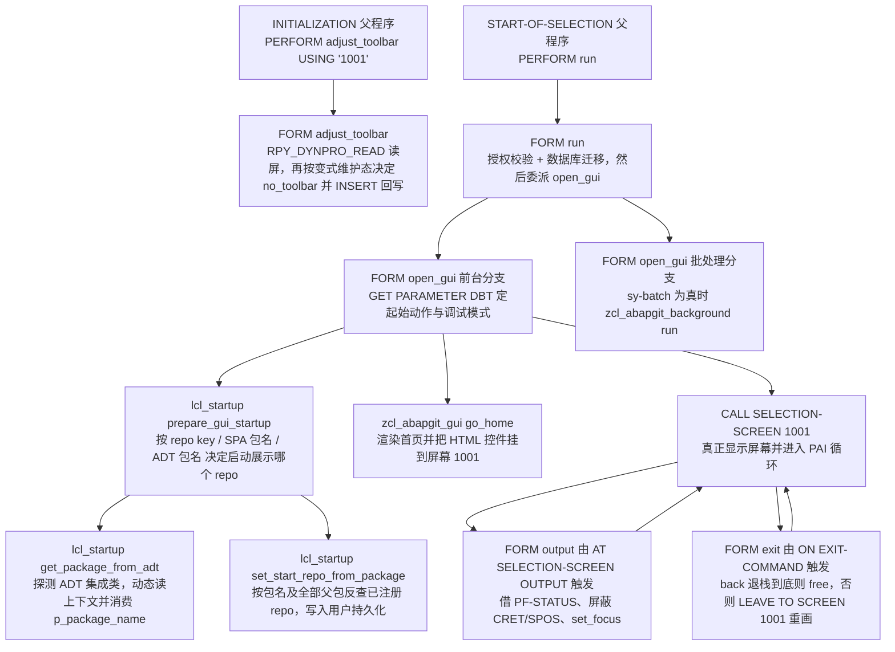
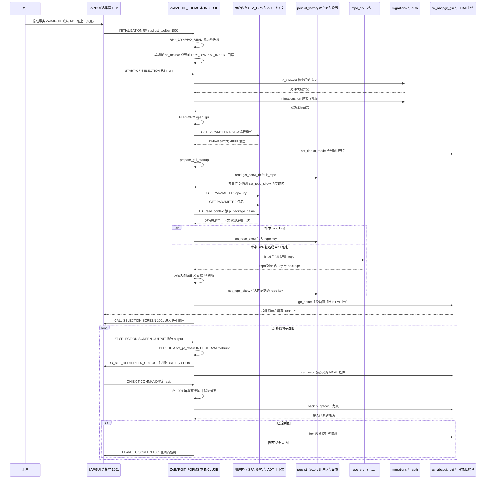

# ABAP 程序分析报告：`ZABAPGIT_FORMS`（INCLUDE 层，FORM 与本地类）

| 项目 | 内容 |
|------|------|
| 对象 | `ZABAPGIT_FORMS`（INCLUDE / `PROGRAM` 层源码） |
| 归属程序 | `ZABAPGIT`（abapGit 主入口 REPORT，MIT 开源项目，abapGit/abapGit `main` 分支） |
| 类型 | GUI 报表的**启动与导航外壳层**：经典过程式 FORM + 一个 INCLUDE 内本地类 |
| 规模 | 331 行，1 个本地类（1 公开 + 2 私有静态方法）、5 个 FORM |
| 被谁调用 | `zabapgit.prog.abap` 用 `INCLUDE zabapgit_forms.`（**无 `IF FOUND`，强制包含**）引入；事件块中 `PERFORM` |
| 关键外部契约 | 选择屏 1001（本文件四处硬编码）、选择屏 1002（`ZABAPGIT_PASSWORD_DIALOG`）、`zif_abapgit_persistence` 用户内存区、SPA/GPA 参数、ADT 集成上下文 |

---

## 一、程序定位与业务背景

### 1.1 它解决什么问题

abapGit 是装在 SAP 系统里的 Git 客户端：把 ABAP 对象序列化成文本、以 Git 仓库形式托管在系统包里。开发者日常的两种入口诉求是：

1. **常规入口**：`SE38`/`SA38` 之外，通常是从 ADT（ABAP Development Tools）里，在某个包的上下文中右键"打开 abapGit"，期望直接落到该包对应的那个 repo 页面，而不是先看到一个空首页再自己点。
2. **故障兜底入口**：当 abapGit 自己的数据库表（repo 注册表）损坏、或用户已经进不去正常首页时，需要一个**绕过首页、直接进数据库工具**的应急模式。

这两个诉求有一个共同的硬约束：abapGit 的界面是 HTML 控件（`cl_gui_control=>create_sapgui_control`）嵌在 SAPGUI 的 dynpro 上，**它本身不是选择屏程序**，而 `ZABAPGIT` 偏偏是一个 REPORT（否则无法分配事务、无法被 ADT 启动、无法做 SPA/GPA 参数跳转）。

于是 `ZABAPGIT_FORMS` 承担的就是这个"胶水层"的全部责任：

- 把 REPORT 的事件块（`INITIALIZATION` / `START-OF-SELECTION` / `AT SELECTION-SCREEN ...`）翻译成 GUI 的启动与退栈动作；
- 提供一个**虚拟选择屏壳**：父程序里那个空的 `SELECTION-SCREEN BEGIN OF SCREEN 1001` 存在的唯一理由，就是给 HTML 控件一个可以安放、并且能让 ABAP 运行时进入 PAI 循环的 dynpro；
- 在启动瞬间改写 dynpro 头，把标准工具栏藏掉（否则用户会看到一个"能保存、能执行"的假选择屏），但在 SPA 变式维护时又必须把它放回来。

### 1.2 为什么不能用现成方案

- **不能直接用 OO 事件类**（`CL_GUI_HTML_VIEWER` 的事件 + 全局类）：ABAP 运行时的事件块（`AT SELECTION-SCREEN ON EXIT-COMMAND` 等）只能写在 REPORT 里，事件块里只能调方法或 `PERFORM`。所以"必须有一层 REPORT"这件事无法绕过，只能把逻辑尽量下沉到类里——这正是本文件里 `FORM run/open_gui/output/exit/adjust_toolbar` 五个极薄 FORM 的存在理由。
- **不能直接改屏幕生成器**：abapGit 是部署到客户系统的 Z 程序，不能假设自己有传输请求、也不能改 dynpro 的持久化定义。所以工具栏的隐藏必须是**运行时局部改写**（`RPY_DYNPRO_INSERT`），而不是"在 SE51 里把工具栏删了再传输"。
- **不能假设 ADT/新 release 存在**：abapGit 同时跑在 NetWeaver 与 S/4HANA 上，所以 ADT 上下文读取必须做**运行时能力探测**（`zcl_abapgit_objects=>exists( )`），而不是写 `IF sy-... = release`。

### 1.3 设计范式一句话定性

> **"经典事件外壳 + INCLUDE 内本地 OO 路由类"的渐进式混合架构**：事件入口保持 FORM/过程式最小化，所有可测试的分支逻辑下沉到 `lcl_startup`（final、纯静态、无状态），对外部世界的全部接触通过工厂（`zcl_abapgit_factory` / `zcl_abapgit_persist_factory` / `zcl_abapgit_repo_srv`）完成。

### 1.4 依赖清单（只列本文件直接触达的）

| 依赖 | 类型 | 本文件用它做什么 |
|------|------|------------------|
| `zcl_abapgit_persist_factory=>get_user( )` | 工厂 + 用户内存区 | 读写"启动时展示哪个 repo"（`set_repo_show`） |
| `zcl_abapgit_persist_factory=>get_settings( )->read( )` | 设置持久化 | 读用户设置 `show_default_repo` |
| `zcl_abapgit_factory=>get_sap_package( )` | 工厂 | 拿包对象（`exists` / `list_superpackages`） |
| `zcl_abapgit_factory=>get_environment( )` | 工厂 | 判断是否处于 SPA 变式维护上下文 |
| `zcl_abapgit_repo_srv=>get_instance( )->list( )` | 单例服务 | 反查包名对应的已注册 repo |
| `zcl_abapgit_objects=>exists( )` | 对象存在性 | 探测 `CL_ADT_GUI_INTEGRATION_CONTEXT` 是否存在 |
| `zcl_abapgit_migrations=>run( )` | 迁移 | 建表/补字段等升级动作 |
| `zcl_abapgit_auth=>is_allowed( )` | 用户出口 | 启动授权 |
| `zcl_abapgit_background=>run( )` | 后台 | `sy-batch` 分流 |
| `zcl_abapgit_ui_factory=>get_gui( )` | 单例 GUI | `go_home` / `set_focus` / `back` / `free` |
| `zcl_abapgit_html=>set_debug_mode( )` | 全局开关 | HTML 调试模式 |
| `zcx_abapgit_exception` / `zcx_abapgit_not_found` | 异常 | 均为 `cx_static_check` 的**兄弟子类**（已核对上游源码：`zcx_abapgit_not_found INHERITING FROM cx_static_check`，`zcx_abapgit_exception INHERITING FROM cx_static_check` 且实现 `if_t100_message` + 结构化 `get_longtext`） |
| `RPY_DYNPRO_READ` / `RPY_DYNPRO_INSERT` | 标准 FM | 运行时改写 dynpro 头 |
| `RS_SET_SELSCREEN_STATUS` | 标准 FM | 运行时设置 PF-STATUS 与排除功能码 |
| `RSDBRUNT` 的 `FORM set_pf_status` | 标准程序内 FORM | 借用其 PF-STATUS |
| SPA/GPA：`ZABAPGIT_REPO_KEY`、`ZABAPGIT_PACKAGE`（常量）、`DBT` | 用户内存 | 启动来源 1/2/3 与应急模式 |
| `CL_ADT_GUI_INTEGRATION_CONTEXT` | ADT 集成类（动态） | 启动来源 3 |

---

## 二、程序执行流程总览

### 2.1 流程图



### 2.2 责任链表

| 子程序 | 调用者 | 职责 |
|--------|--------|------|
| `lcl_startup`（定义段） | 编译期被 `zabapgit.prog.abap` 的 `INCLUDE` 引入 | 声明一个 final、无状态的静态启动路由组件：1 个公开方法 + 2 个私有方法 |
| `FORM adjust_toolbar` | 父程序 `INITIALIZATION` 块：`PERFORM adjust_toolbar USING '1001'` | 运行时读屏幕 1001 的 dynpro，按"是否变式维护"计算期望的 `no_toolbar`，需要时回写 |
| `FORM run` | 父程序 `START-OF-SELECTION` 块：`PERFORM run` | 启动授权检查 → 执行数据库迁移 → 委派 `open_gui`；捕获 abapGit 异常并转成消息 |
| `FORM open_gui` | `FORM run` 内部：`PERFORM open_gui` | `sy-batch` 分流；读 `DBT` 参数决定起始动作（首页/数据库工具）与 HTML 调试模式；调 `prepare_gui_startup`；`go_home` 渲染后 `CALL SELECTION-SCREEN 1001` 启动 PAI 循环 |
| `lcl_startup=>prepare_gui_startup` | `FORM open_gui`（前台分支） | 三种启动来源的优先级仲裁，并把结果写进用户持久化内存区 |
| `lcl_startup=>get_package_from_adt` | `lcl_startup=>prepare_gui_startup`（**无条件**调用） | 运行时探测 ADT 集成类，动态构造其上下文类型，读出并**消费掉** `p_package_name` |
| `lcl_startup=>set_start_repo_from_package` | `lcl_startup=>prepare_gui_startup`（SPA 包名分支与 ADT 包名分支） | 由包名 + 全部父包组成区间表，在全部已注册 repo 中反查匹配项并写 `set_repo_show` |
| `FORM output` | 父程序 `AT SELECTION-SCREEN OUTPUT`（且 `sy-dynnr` ≠ 密码弹窗屏 1002 时） | 借用 PF-STATUS 并屏蔽 `CRET`/`SPOS`，非变式维护时把输入焦点交给 HTML 控件 |
| `FORM exit` | 父程序 `AT SELECTION-SCREEN ON EXIT-COMMAND` | 识别 `CBAC`/`CCAN`，优雅退栈；退到底则 `free( )`，否则 `LEAVE TO SCREEN 1001` |
| （不在本文件）`FORM password_popup` | `zcl_abapgit_password_dialog` 被 `CALL SELECTION-SCREEN 1002` 作为弹窗触发 | 正是 `FORM exit` 里 `sy-dynnr <> 1001` 那道守卫要保护的场景 |

下面按这条流程，逐个子程序展开。

---

## 三、分组分析（按执行流程）

### 3.1 子程序类型 `lcl_startup`（本地类定义段）

```abap
CLASS lcl_startup DEFINITION FINAL.
  PUBLIC SECTION.
    CLASS-METHODS prepare_gui_startup
      RAISING
        zcx_abapgit_exception.
  PRIVATE SECTION.
    CLASS-METHODS set_start_repo_from_package
      IMPORTING
        !iv_package TYPE devclass
      RAISING
        zcx_abapgit_exception.

    CLASS-METHODS get_package_from_adt
      RETURNING
        VALUE(rv_package) TYPE devclass.

ENDCLASS.
```

**做什么** — 在 INCLUDE 里声明一个 `FINAL` 本地类，三个全静态方法：`prepare_gui_startup` 是唯一对外入口（可抛 abapGit 异常）；`set_start_repo_from_package` 接收一个包名并反查 repo；`get_package_from_adt` 无入参、返回包名，且**不抛任何异常**。

**为什么** — 把"启动路由"这段唯一有分支、有环境依赖的逻辑从 FORM 里抽出来，有三个直接收益：① 三个方法可以互相按语义分层，`prepare_gui_startup` 只做仲裁，两个具体获取路径各自封闭；② `FINAL` + 全静态 + 无属性 = 天然无状态，`prepare_gui_startup` 在 PAI 里被反复触发也不会有脏数据；③ `get_package_from_adt` 不在 `RAISING` 列表里，等于在**方法签名上就声明了"ADT 探测失败不算错误"**——这与它的实现（静默 `RETURN`）是自洽的，接口把意图写清楚了，这比注释更可靠。

**风险与改进** — 本地类放在 INCLUDE 里有两个结构性代价：一是**不可单元测试**（abapGit 全局有 `zcl_abapgit_repo_srv` 等可注入/可替身的模式，唯独这里没有注入点）；二是可见性是"整个程序共享的"——`ZABAPGIT` 里同时还有 `lcl_password_dialog`，两个本地类命名风格一致是好事，但本地类一旦超过两三个，INCLUDE 层就会变成第二个全局命名空间。建议：把 `lcl_startup` 提升为全局类 `zcl_abapgit_startup`，把 `zcl_abapgit_persist_factory` / `zcl_abapgit_repo_srv` 作为接口属性注入，即可获得可测性，且不改变调用形态（`lcl_startup=>` 改成 `zcl_abapgit_startup=>` 即可）。这一条属于可测试性/可扩展性改进，不必强行在本次修复。

### 3.2 方法 `lcl_startup=>prepare_gui_startup`（分三步：清场 → 取来源 → 仲裁消费）

这一步是整个 INCLUDE 的业务核心，拆成三段看。

#### ① 按用户设置清掉"上次看的 repo"

```abap
  METHOD prepare_gui_startup.
    DATA: lv_repo_key    TYPE zif_abapgit_persistence=>ty_value,
          lv_package     TYPE devclass,
          lv_package_adt TYPE devclass.

    IF zcl_abapgit_persist_factory=>get_settings( )->read( )->get_show_default_repo( ) = abap_false.
      " Don't show the last seen repo at startup
      zcl_abapgit_persist_factory=>get_user( )->set_repo_show( || ).
    ENDIF.
```

**做什么** — 从**用户设置持久化**里读 `show_default_repo` 开关（`get_settings( )->read( )` 是懒读，走 `zcl_abapgit_persistence` 的 key-value 表）；如果开关为假，就用 `set_repo_show( || )` 把用户内存区里"启动时该展示哪个 repo"的记忆**清空**（`||` 是 7.40 起的"取表达式类型的初值"写法，等价于把该 `ty_value`（`c(12)`）置空，比 `CLEAR` 更不易触发空引用告警）。

**为什么** — 这是"用户记忆"与"显式启动指令"的分层：默认记忆是**弱意图**（上次看的），显式跳转是**强意图**（本次带参数进来）。先按弱意图清场，再让后面的强指令覆盖，才能保证"从 ADT 点进来一定能落到指定 repo"，哪怕用户上次看的是另一个。

**风险与改进** — `get_settings( )->read( )` 每读一个字段都可能触发一次数据库访问（本文件只读一次，可接受），但真正的问题是**这个设置的读取时机**：它在 `START-OF-SELECTION` 里做，等于把一次 DB 往返放在 GUI 冷启动路径上；后续若再加启动相关设置，会变成 N 次往返。建议把 `get_settings( )->read( )` 的结果在整个启动阶段缓存到本类的一个 `CLASS-DATA`（或直接用 `zcl_abapgit_persist_factory` 已有的设置缓存能力），并把"清空记忆"这一步**下移到确定没有显式指令之后**——现在的顺序虽然结果正确，但读代码时要先跳到下一段才知道为什么要清，可读性略差。

#### ② 无条件读取三种启动来源

```abap
    " We have three special cases for gui startup
    "   - open a specific repo by repo key
    "   - open a specific repo by package name
    "   - open a specific repo by package name provided by ADT
    " These overrule the last shown repo

    GET PARAMETER ID zif_abapgit_definitions=>c_spagpa_param_repo_key FIELD lv_repo_key ##EXISTS.
    GET PARAMETER ID zif_abapgit_definitions=>c_spagpa_param_package  FIELD lv_package ##EXISTS.
    lv_package_adt = get_package_from_adt( ).
```

**做什么** — 把三条可能的启动通道**全部读出来**放进三个局部变量，不在这里做判断：① SPA/GPA 参数里的 repo key（`c_spagpa_param_repo_key`）；② SPA/GPA 参数里的包名（`c_spagpa_param_package`）；③ ADT 集成上下文里的 `p_package_name`。参数 ID 用 `zif_abapgit_definitions=>` 常量而非字面量，避免魔法值漂移。

**为什么** — 参数 ID 提到接口常量里是这一段最值得学的地方：SPA/GPA 参数是**跨系统、跨程序、跨人员**的字符串契约，写错一个字母不会编译报错、只在运行时静默失效；集中成常量后，`zcl_abapgit_objects_program` / `zcl_abapgit_flow_logic` 等其它 INCLUDE 写入时也能引用同一份定义。`##EXISTS` 则是把"这个参数可能不存在"显式写成语法的一部分——作者显然在这两点上踩过坑（abapGit 内部跳转就是靠 `SET PARAMETER` + 外部 `SUBMIT`/跳转实现的）。

**风险与改进** — 这里有三个必须点出的问题：

- **`GET PARAMETER` 的输入是不可信的用户内存，而目标是定长字段**。`lv_repo_key` 是 `zif_abapgit_persistence=>ty_value`，上游定义就是 `c LENGTH 12`；`lv_package` 是 `devclass`（`CHAR(30)`）。而 SPA/GPA 参数的值域最宽可达 40 字符，且任何程序、SU3/SU10、`GET PARAMETER`/`SET PARAMETER` 都能写。若被写成超长值，`GET PARAMETER` 的目标类型转换会失败——而这个失败**发生在 `FORM run` 的 `TRY` 里但不被它的 `CATCH` 捕获**（那里只捕获 `zcx_abapgit_exception` 与 `zcx_abapgit_not_found` 两个 abapGit 异常），结果是一次无人接管的启动中断（老 release 为短转储）。`##EXISTS` 只处理"参数不存在"，**不保护类型转换**。改进：用 `c LENGTH 40` 的中转字段承接，再 `LEFT( ... )` 截断并对超长给出明确消息。
- **第三步调用顺序有副作用泄漏**：`lv_package_adt = get_package_from_adt( )` 在 IF/ELSEIF **之前**无条件执行，而 `get_package_from_adt` 的成功路径会**清空 ADT 上下文的参数**。也就是说，当本次启动是通过 SPA/GPA 的 repo key 或包名触发时，ADT 那边的 `p_package_name` 已经被读出来并销毁了，只是因为优先级更高而没被使用。功能上当前无副作用（那一路本来就不会被采纳），但这是典型的"读取即消费"陷阱：以后若有人在 `ELSEIF` 里加逻辑、或让 ADT 优先级更高，就会踩到"值已经没了"。改进：把调用移进 `ELSEIF` 分支（惰性求值），或让 `get_package_from_adt` 提供"只读不消费"的开关。
- **非 ADT 会话也要付出探测成本**：`get_package_from_adt` 内部会做一次对象存在性查询 + 动态类型解析，即使 99% 的启动都是纯 SE38 进入，这一步也照做。这是可接受的（一次轻量查询），但和上面 ② 的惰性问题叠加时，属于"为用不到的场景付费"。

#### ③ 按优先级消费并落库

```abap
    IF lv_repo_key IS NOT INITIAL.

      SET PARAMETER ID zif_abapgit_definitions=>c_spagpa_param_repo_key FIELD '' ##EXISTS.
      zcl_abapgit_persist_factory=>get_user( )->set_repo_show( lv_repo_key ).

    ELSEIF lv_package IS NOT INITIAL.

      SET PARAMETER ID zif_abapgit_definitions=>c_spagpa_param_package FIELD '' ##EXISTS.
      set_start_repo_from_package( lv_package ).

    ELSEIF lv_package_adt IS NOT INITIAL.

      set_start_repo_from_package( lv_package_adt ).

    ENDIF.
  ENDMETHOD.
```

**做什么** — 以 `repo key` > `SPA 包名` > `ADT 包名` 的固定优先级择一执行；每个 SPA/GPA 分支都**先 `SET PARAMETER ... FIELD ''` 把参数清空**，再落地结果；两个包名分支都转调 `set_start_repo_from_package`，由它把包名解析成 repo key 写进用户内存区。

**为什么** — 这是本方法里最见功力的一段。优先级写成了"显式指令优先于 ADT 环境"的自然序，一眼能看出"谁覆盖谁"。"**消费即清空**"（把 SPA/GPA 参数写成空串）是深谋远虑的做法：abapGit 内部跳转时用 `SET PARAMETER` 传参，一旦不清空，下次用户手工启动 abapGit 就还会被上次的跳转劫持——作者用一次 `SET` 换来了"参数只生效一次"的语义，而且 ADT 那一路用"清空 context + 重新 `initialize_instance`"达到同样效果，**语义一致、手段不同**，说明这是有意的设计而不是巧合。

**风险与改进** — ① `SET PARAMETER ... FIELD ''` 的"清空"是**写空串**，不是删除参数，含义是"这个参数存在但为空"；配合 `IS NOT INITIAL` 判定结果正确，但语义上不如"用 `SET PARAMETER` 无值语义"或命名一个 `c_action-consume` 常量清晰。② 关键设计风险在于**结果没有返回值**：这段逻辑的全部产出是"用户内存区被写了"，真正的消费方是后面 `zcl_abapgit_ui_factory=>get_gui( )->go_home( lv_action )`——`go_home` 必须自己去读 `set_repo_show` 并据此跳转。这是一个跨类的**隐式契约**，中间没有任何编译期保证：谁把 `prepare_gui_startup` 挪到 `go_home` 之后、或者 `go_home` 换成不读记忆的实现，启动重定向就会静默退化成"永远打开首页"，而且没有任何报错。改进：让 `prepare_gui_startup` 返回 `ty_value`（repo key），由 `FORM open_gui` 显式传给 `go_home`，把隐式契约变成显式参数。③ 三种来源的优先级用 `IF/ELSEIF` + 注释表达，扩展第四种来源（如"从 URL 打开"、"从传输请求打开"）时成本很低但可读性会下降；可提炼成"来源 = 值 + 类型"的表驱动。

### 3.3 方法 `lcl_startup=>set_start_repo_from_package`（分三步：校验 → 组装区间 → 反查落库）

#### ① 声明与前置校验

```abap
  METHOD set_start_repo_from_package.
    DATA: li_repo          TYPE REF TO zif_abapgit_repo,
          lt_r_package     TYPE RANGE OF devclass,
          ls_r_package     LIKE LINE OF lt_r_package,
          lt_superpackages TYPE zif_abapgit_sap_package=>ty_devclass_tt,
          li_package       TYPE REF TO zif_abapgit_sap_package,
          lt_repo_list     TYPE zif_abapgit_repo_srv=>ty_repo_list.

    FIELD-SYMBOLS: <li_repo>         TYPE LINE OF zif_abapgit_repo_srv=>ty_repo_list,
                   <lv_superpackage> LIKE LINE OF lt_superpackages.

    li_package = zcl_abapgit_factory=>get_sap_package( iv_package ).

    IF li_package->exists( ) = abap_false.
      RETURN.
    ENDIF.
```

**做什么** — 声明五个局部数据对象和两个 field-symbol；通过 `zcl_abapgit_factory` 拿到**包抽象对象**（`REF TO zif_abapgit_sap_package`），立刻判断该包在 TADIR 里是否存在，不存在立刻 `RETURN`（本方法声明了 `RAISING zcx_abapgit_exception` 却一次都没抛）。

**为什么** — 值得单独指出的是 `FIELD-SYMBOLS <li_repo> TYPE LINE OF zif_abapgit_repo_srv=>ty_repo_list` 这个写法：上游接口里 `ty_repo_list TYPE STANDARD TABLE OF REF TO zif_abapgit_repo WITH DEFAULT KEY`，也就是**行类型恰好也是 `REF TO zif_abapgit_repo`**，和局部变量 `li_repo` 的静态类型完全一致。用 field-symbol 遍历引用类型内表是标准手法，能避免把引用类型内表整体 `MOVE` 一遍，也是 `ASSIGNING` + `EXIT` 提前退出的前提。

**风险与改进** — `IF li_package->exists( ) = abap_false. RETURN.` 是**完全静默**的失败：用户在 ADT 里对一个没有 abapGit repo 的包点"打开 abapGit"，或者包名大小写/前导零写错，最终结果是落在首页且**没有任何解释**。而本方法签名明明允许抛 `zcx_abapgit_exception`，甚至上游接口里就有语义匹配的 `zcx_abapgit_not_found`。改进：区分两种情况——包不存在（参数错，提示"包 X 不存在"）与包存在但无匹配 repo（未初始化，提示"该包未安装 abapGit，请先 pull/clone"），后者用 `zcx_abapgit_not_found` 最贴切。

#### ② 组装包与父包的区间表

```abap
    ls_r_package-sign   = 'I'.
    ls_r_package-option = 'EQ'.
    ls_r_package-low    = iv_package.
    INSERT ls_r_package INTO TABLE lt_r_package.

    " Also consider superpackages. E.g. when some open $abapgit_ui, abapGit repo
    " should be found via package $abapgit
    lt_superpackages = li_package->list_superpackages( ).
    LOOP AT lt_superpackages ASSIGNING <lv_superpackage>.
      ls_r_package-low = <lv_superpackage>.
      INSERT ls_r_package INTO TABLE lt_r_package.
    ENDLOOP.
```

**做什么** — 先把自身包作为一条 `EQ` 区间插入 `lt_r_package`，然后调用包抽象的 `list_superpackages( )` 取出**该包的全部上级包**，把每个父包也插进同一张区间表。结果是一张"我自己 + 我所有祖先"的等值区间表，供下一步的 `IN` 判断使用。

**为什么** — 这是整个方法最有业务含量的一段。abapGit 的 repo 是在某个包下 `pull` 出来的，**仓库根包和用户当前所在包经常不是同一个**：用户在 `$ABAPGIT`（源码主包）里改代码，但 repo 实际可能挂在 `$ABAPGIT_UI`；或者开发者在一个子包里做实验。没有父包遍历，`IN` 判断就只会匹配到"repo 恰好注册在当前包"这一种情况，ADT 直达功能在真实项目里会大面积失效。用 `RANGE OF` + `IN` 一步替代"逐个 OR 比较"，是 ABAP 里表达"集合归属"的惯用且高效写法（`IN` 对区间表走的是内部二分/顺序匹配，比写一长串 `OR` 干净得多）。

**风险与改进** — ① `ls_r_package` 只设了 `sign`/`option`/`low`，`high` 保持初始；对 `EQ` 而言 `high` 无意义，这是对的，但**没有 `CLEAR ls_r_package`**，全靠字段初值——一旦后续有人把 `option` 改成 `BT`，就会得到一个"下界为空"的意外区间。建议每个循环用 `CLEAR` + `VALUE #( )` 结构化构造，可读性和健壮性同时提升。② 语义校核：`list_superpackages( )` 返回的是"祖先"还是"直接父包"，取决于上游实现（源码不在本文件内）。若它只返回直接父包，本方法在超过两层层级时仍会漏；若它返回全部祖先则正确。**建议核对上游语义并在注释中写明**——这是一个"名字看起来够用、实际取决于实现"的高风险点。③ 无重复消除：区间表用 `INSERT ... INTO TABLE`，重复插入会报错（`sy-subrc = 1`）但不中断，本例无实际影响。

#### ③ 遍历全部 repo 反查并写入

```abap
    lt_repo_list = zcl_abapgit_repo_srv=>get_instance( )->list( ).

    LOOP AT lt_repo_list ASSIGNING <li_repo>.

      IF <li_repo>->get_package( ) IN lt_r_package.
        li_repo = <li_repo>.
        EXIT.
      ENDIF.

    ENDLOOP.

    IF li_repo IS BOUND.
      zcl_abapgit_persist_factory=>get_user( )->set_repo_show( li_repo->get_key( ) ).
    ENDIF.
  ENDMETHOD.
```

**做什么** — 从 repo 服务单例取**全部已注册 repo**（`list( )`，默认含在线与离线），逐个取其 `get_package( )` 与区间表做 `IN` 判断；命中第一个就把 field-symbol 里的引用**赋值回局部变量 `li_repo`** 并 `EXIT` 跳出循环；循环结束后用 `IS BOUND` 判空——只有绑定成功才把 `li_repo->get_key( )` 写进用户内存区。

**为什么** — 这里有两个漂亮的小技巧值得学：① **复用变量当"是否找到"的标志位**：`li_repo` 既是循环里的候选载体（通过 `<li_repo>`），又是结果变量（靠循环外 `IS BOUND` 判断）。省掉了一个 `lv_found` 或第二份引用变量。② **借 `IS BOUND` 表达"找到没找到"**：没有额外标志位，语义完全由引用是否绑定承载，可读性反而更好——"引用没绑定 = 没找到"对 ABAP 工程师是直观的。

**风险与改进** — ① **静默多命中**：`EXIT` 取第一个匹配项。如果同一个包（或父子包关系）下注册了多个 repo（例如用户先 clone 了一个自建 repo、后来又 pull 了官方包），行为取决于 `list( )` 的返回顺序——不确定、也不报错。建议至少在命中多于一个时给出可诊断的信息（写日志或提示），否则用户会遇到"打开的 repo 不是我以为的那个"这类极难排查的问题。② **`EXIT` 与变量复用是耦合的**：`li_repo = <li_repo>` 只在 `EXIT` 之前保证只赋值一次；一旦有人把 `EXIT` 改成 `CONTINUE`，最后一次赋值会覆盖结果，bug 极隐蔽。建议拆成独立的 `lv_found_repo` 结果变量（成本是一次引用赋值，收益是语义解耦）。③ **性能**：`list( )` 会把**所有** repo 的元数据（含 URL、分支、包、`.abapgit` 配置）读进内存，而这里只需要"包名 → key"的映射。repo 数量大时（大型系统几十个仓库）这是一次明显偏重的读取，而且是每次带包名启动都发生。建议：要么让 repo 服务提供一个只读 `key + package` 的轻量投影，要么在服务内部为"按包反查 key"加一个带索引的查询。

### 3.4 方法 `lcl_startup=>get_package_from_adt`（分三步：能力探测 → 动态读上下文 → 解析并消费）

这是全文件最"魔法"的一段：整条链路没有一处静态类型引用 ADT 的类。

#### ① 运行时能力探测

```abap
  METHOD get_package_from_adt.

    DATA: ls_item    TYPE zif_abapgit_definitions=>ty_item,
          lr_context TYPE REF TO data,
          lt_fields  TYPE tihttpnvp.

    FIELD-SYMBOLS: <lg_context>    TYPE any,
                   <lv_parameters> TYPE string,
                   <ls_field>      LIKE LINE OF lt_fields.


    ls_item-obj_type = 'CLAS'.
    ls_item-obj_name = 'CL_ADT_GUI_INTEGRATION_CONTEXT'.

    IF zcl_abapgit_objects=>exists( ls_item ) = abap_false.
      " ADT is not supported in this NW release
      RETURN.
    ENDIF.
```

**做什么** — 构造一个 `ty_item`（abapGit 通用的"对象类型 + 对象名"结构），填入 `CLAS` / `CL_ADT_GUI_INTEGRATION_CONTEXT`，调用 `zcl_abapgit_objects=>exists( )` 判断这个类在当前系统是否存在；不存在就静默返回初值。

**为什么** — 这是**运行时特性探测**（feature detection）而非版本判断（`sy-... = 7.40` 之类）的典范。ADT 集成类 `CL_ADT_GUI_INTEGRATION_CONTEXT` 是 SAP 的标准类，但在老 NetWeaver release 上不存在；如果直接静态 `CREATE DATA ... TYPE cl_adt_gui_integration_context=>ty_context_info`，**程序在老系统上根本编译不过**，整个 abapGit 就装不上去。用"先查对象是否存在，再动态构造"的两段式，就让一份源码同时跑遍 NW 7.02 到 S/4。注释 `"ADT is not supported in this NW release"` 也说明了这一点。

**风险与改进** — `zcl_abapgit_objects=>exists( )` 是对象库/传输层的存在性查询，成本不高但也不是零；结合前面"无条件调用"的问题，纯 SE38 启动也要付这份成本。此外，`exists( )` 只保证类存在，**不保证 `read_context` / `initialize_instance` 这两个静态方法存在**——ADT 在不同 release 上签名可能演进（返回值类型、参数名都可能变），而这些失败全部落到下一步的 `CATCH cx_root` 里被吞掉（见第 ③ 步的风险）。

#### ② 动态构造上下文并读取

```abap
    TRY.
        CREATE DATA lr_context TYPE ('CL_ADT_GUI_INTEGRATION_CONTEXT=>TY_CONTEXT_INFO').

        ASSIGN lr_context->* TO <lg_context>.
        ASSERT sy-subrc = 0.

        CALL METHOD (ls_item-obj_name)=>read_context
          RECEIVING
            result = <lg_context>.
```

**做什么** — `CREATE DATA` 用**动态类型名** `'CL_ADT_GUI_INTEGRATION_CONTEXT=>TY_CONTEXT_INFO'` 构造一个动态引用（`REF TO data`），再 `ASSIGN` 到 field-symbol `<lg_context>` 取得可解引用的结构视图；随后用**动态方法名** `(ls_item-obj_name)=>read_context` 调用 ADT 集成类，把返回的上下文结构写进 `<lg_context>`。

**为什么** — 三处"去静态化"是一体的：类型名、方法名都来自 `ls_item`，所以整段代码里**没有任何一处对 `CL_ADT_GUI_INTEGRATION_CONTEXT` 的静态引用**，语法检查器也就永远不会因为该类在新 release 上签名变化而报编译错。`lr_context TYPE REF TO data` + `ASSIGN ... TO <lg_context>` 这套写法，是 ABAP 在"类型只能运行时才知道"的标准姿势（比 `ASSIGN COMPONENT` 链更省一层解引用）。

**风险与改进** — ① `ASSERT sy-subrc = 0` 在这里是**冗余的**：`lr_context` 是动态引用，其动态类型由第 ① 步保证存在，`ASSIGN lr_context->*` 实质上不可能返回非 0；而且 `ASSERT` 在生产代码里不执行、在 TRY 内抛出的 `CX_SY_ASSERTION_FAILED` 又会被同一个 `CATCH cx_root` 吞掉（详见下一步）。这类"看起来像检查、实际是装饰"的代码会误导读者以为这里有保护。② 真正的失败点被推给了运行时：`CALL METHOD (...)=>read_context` 若在新 release 上改了签名，报的是 `CX_SY_METHOD_NOT_FOUND` 之类的动态错误，而不是编译错误——**这类问题只能在真实系统上暴露**，属于动态特性探测的固有代价，应配套写清楚"支持哪些 ADT 签名"的注释。

#### ③ 解析参数并"消费"

```abap
        ASSIGN COMPONENT 'PARAMETERS'
               OF STRUCTURE <lg_context>
               TO <lv_parameters>.
        ASSERT sy-subrc = 0.

        lt_fields = cl_http_utility=>string_to_fields( cl_http_utility=>unescape_url( <lv_parameters> ) ).

        READ TABLE lt_fields ASSIGNING <ls_field>
                             WITH KEY name = 'p_package_name'.
        IF sy-subrc = 0.
          rv_package = <ls_field>-value.

          " We want to open the repo just once. Therefore we delete the parameters
          " and initialize the ADT context.
          CLEAR <lv_parameters>.
          CALL METHOD (ls_item-obj_name)=>initialize_instance
            EXPORTING
              context_info = <lg_context>.

        ENDIF.

      CATCH cx_root ##NO_HANDLER.
        " Some problems with dynamic ADT access.
        " Let's ignore it for now and fail silently
    ENDTRY.

  ENDMETHOD.
ENDCLASS.
```

**做什么** — 从上下文结构里取 `PARAMETERS` 组件（一条查询串形态的字符串），**先 URL 反转义再按字段切分**（`cl_http_utility=>unescape_url` + `string_to_fields`，切分符即默认的 `&`），在结果表里找 `name = 'p_package_name'` 的字段；找到就赋给返回变量，然后**把上下文里的参数字符串清空**并调用 `initialize_instance` 重建 ADT 上下文实例，让这次启动只生效一次。整个块被 `CATCH cx_root ##NO_HANDLER` 兜住，任何异常都静默丢弃。

**为什么** — 解析顺序是对的且很关键：**必须先 `unescape_url` 再切分**。ADT 的 parameters 是一段 URL 编码后的查询串，若先切分，值里的 `&`、`=`、`%26` 会被错误拆开。作者显然踩过这个坑。`'p_package_name'` 与第 ① 步探测的类名一样，都是**跨版本、跨程序组的字符串契约**——ADT 侧传什么名字，abapGit 就只能认什么，这里没有接口可以约束，属于被动契约。"清空 + 重建实例"与 `prepare_gui_startup` 里对 SPA/GPA 的处理是同一个"消费即清空"哲学的第三种实现。

**风险与改进** — 这段是全文件风险最集中的地方，至少四条：

- **`CATCH cx_root ##NO_HANDLER` 吞掉一切，包括编程错误**。它把 `CX_DYNAMIC_CHECK`（类/方法不存在）、`CX_SY_CONVERSION_*`（`rv_package` 是 `devclass`，超长包名的隐式转换失败）、`CX_SY_ASSERTION_FAILED`（本块里两个 `ASSERT`）全部变成"什么都不发生"。结果是：**用户从 ADT 点了 abapGit、却停在首页，而日志里什么都没有**，这类问题在真实项目里往往要靠反复加打印才能定位。建议改为捕获具体异常类别（`CX_DYNAMIC_CHECK`、`CX_SY_CONVERSION_NO_NUMBER`、`CX_SY_ITAB_LINE_NOT_FOUND`），或至少保留一条仅在 debug 模式可见的消息。
- **两个 `ASSERT` 在当前结构下永远不可能"报警"**：它们抛出的异常正被同一个 `CATCH cx_root` 捕获。加上 `ASSERT` 在生产代码不执行，这两行是**纯装饰**。要么删掉，要么把 `CATCH` 收窄到真正需要忽略的那一类。
- **`ASSIGN COMPONENT 'PARAMETERS' OF STRUCTURE`** 依赖 ADT 上下文结构里有 `PARAMETERS` 组件；在某些 release 上该组件名/类型可能不同，`ASSIGN` 失败后 `sy-subrc <> 0` → `<lv_parameters>` 保持初始 → `string_to_fields( )` 得到空表 → `READ TABLE` 失败 → 方法静默返回初值。**降级路径是安全的**，但完全不可观测。
- **无诊断出口**：整个方法既不抛异常也不写日志，唯一"可观测"的痕迹是注释 `"Let's ignore it for now and fail silently"`。这句话对读者是诚实的（作者知道这是技术债），但它标记的正是最需要改进的地方。

从 3.2 到 3.4，`prepare_gui_startup` 这条启动路由链就讲完了。它的三条通道最终都收敛到同一件事：**把一个 repo key 写进用户内存区**。接下来看这个"结果"是怎么被消费掉的。

### 3.5 子程序类型 `FORM run`（分两步：授权与迁移 → 委派）

#### ① 授权检查与数据库迁移

```abap
FORM run.

  DATA lx_exception TYPE REF TO zcx_abapgit_exception.
  DATA lx_not_found TYPE REF TO zcx_abapgit_not_found.

  TRY.
      IF zcl_abapgit_auth=>is_allowed( zif_abapgit_auth=>c_authorization-startup ) = abap_false.
        zcx_abapgit_exception=>raise( 'No authorization to start abapGit' ).
      ENDIF.

      zcl_abapgit_migrations=>run( ).
```

**做什么** — 声明两个异常引用变量，进入 `TRY`；先调用 `zcl_abapgit_auth=>is_allowed( zif_abapgit_auth=>c_authorization-startup )` 做启动授权判断，为假就用 `zcx_abapgit_exception=>raise( ... )` 抛异常（而不是 `MESSAGE` 直接中断）；授权通过后执行 `zcl_abapgit_migrations=>run( )`。

**为什么** — 用**异常**而不是 `MESSAGE` 来表达"授权不通过"是对的：`MESSAGE TYPE 'E'` 会立刻终止程序，无法被上层统一处理；而 abapGit 的授权是通过用户出口接口（`ZCL_ABAPGIT_AUTH_EXIT`，父程序里有 `INCLUDE zabapgit_authorizations_exit IF FOUND`）实现的——也就是说**判定逻辑住在客户代码里**，用异常返回可以把这个"来自外部代码的错误"接回 abapGit 自己的错误通道，错误文本还能经 `zcx_abapgit_exception` 的长文本机制带上完整的 Cause / Procedure 结构。`zcl_abapgit_migrations=>run( )` 放在授权之后、GUI 之前也很讲究：数据库升级动作必须在任何读取之前完成，且必须受授权保护。

**风险与改进** — ① **两个异常是兄弟类，不是父子类**。核对上游源码可知 `zcx_abapgit_exception` 与 `zcx_abapgit_not_found` 都直接继承 `cx_static_check`，因此当前 `CATCH` 顺序无所谓；但这个事实**在代码里毫无痕迹**，后来者极易误以为 `not_found` 是 `exception` 的子类而随手调整顺序（或误以为第二个 `CATCH` 是死代码而删掉）。建议在 `CATCH` 处加一行注释点明继承关系，或把两者的公共父类抽成 abapGit 自己的基类。② **`TRY` 的捕获面偏窄**：只捕获 `zcx_abapgit_exception` 与 `zcx_abapgit_not_found`，任何其它 `cx_root` 后代（迁移层里的 DB/转换异常、前面 3.2/3.4 提到的 `GET PARAMETER` 转换失败）都会逃逸成短转储——这是 P0 问题的落点。③ 迁移每次启动都执行，若 `run( )` 内含多次 DB 查询，冷启动成本会被放大；建议确认上游是否已有"版本号比对即返回"的短路。

#### ② 委派并转换错误

```abap
      PERFORM open_gui.
    CATCH zcx_abapgit_exception INTO lx_exception.
      MESSAGE lx_exception TYPE 'E'.
    CATCH zcx_abapgit_not_found INTO lx_not_found.
      MESSAGE lx_not_found TYPE 'E'.
  ENDTRY.

ENDFORM.                    "run"
```

**做什么** — 委派 `PERFORM open_gui`，然后把两类 abapGit 异常各自捕获、**各自以 `MESSAGE ... TYPE 'E'` 上抛**。

**为什么** — `MESSAGE lx_exception TYPE 'E'` 的信息量比 `MESSAGE lx_exception->get_text( )` 大得多：ABAP 对异常对象取 `if_message~get_longtext( )`，而 abapGit 的 `zcx_abapgit_exception` 重写了 `if_message~get_longtext`，会把 T100 长文本里的 `&CAUSE&` / `&SYSTEM_RESPONSE&` / `&WHAT_TO_DO&` / `&SYS_ADMIN&` 占位符替换成实际内容，并**去掉空章节、把换行压平**（这正是为了适配弹窗的单行/多行显示）。也就是说，一句 `raise( 'No authorization to start abapGit' )` 最终在用户面前呈现的是一份结构完整的"原因 / 系统反应 / 处理办法"说明——这是异常类设计与 MESSAGE 消费方式协同的结果，值得单独体会。

**风险与改进** — ① **两个 `CATCH` 体完全相同**，可以合并为 `CATCH zcx_abapgit_exception zcx_abapgit_not_found INTO lx_error.`，同时消掉"两者是否有继承关系"的误解（见 ① 的建议）。② **`MESSAGE TYPE 'E'` 会终止整个 ABAP 处理链**，且不可被外层捕获；结合 `FORM output` / `FORM exit` 里刻意使用的 `TYPE 'S' DISPLAY LIKE 'E'`（非终止错误）对比，这里的"重"是有意的——启动失败确实无可挽回。但后果是：此时 GUI 往往已部分初始化（`zcl_abapgit_ui_factory` 的 `go_gui` 单例可能已创建并留在 `CLASS-DATA` 里），而用户被弹回一个空的选择屏。更好的做法是：若 GUI 已就绪就把错误渲染到 HTML 页面（含日志链接），否则才 `MESSAGE`。③ 变量命名 `lx_exception` / `lx_not_found` 与 `FORM output` 里的 `lx_error` 不一致，风格上应统一为"异常类型名 + lx_"或统一 `lx_error`。④ 两条独立的 `DATA` 语句与本文件其他 FORM 的 `DATA:` 块风格不一致。

授权与迁移这两步做完，`run` 的职责就结束了——它本身不含任何 GUI 逻辑，真正的动作全在下一步。

### 3.6 子程序类型 `FORM open_gui`（分三步：批处理分流 → 模式判定 → 挂屏）

#### ① 批处理与前台分流

```abap
FORM open_gui RAISING zcx_abapgit_exception.

  DATA lv_action TYPE string.
  DATA lv_mode   TYPE tabname.

  IF sy-batch = abap_true.
    zcl_abapgit_background=>run( ).
  ELSE.
```

**做什么** — 声明 `lv_action`（`string`，承载起始动作代码）与 `lv_mode`（`tabname`）；以 `sy-batch` 为准做第一级分流：批处理直接调用后台服务，前台走完整的 GUI 启动流程。

**为什么** — 批处理与前台在 abapGit 里是两套完全不同的用户界面（后台只有 SPA/GPA 参数驱动的 headless 流程），把它们在**最早的时点**劈开，避免了后续所有 SPA/GPA 读取、`go_home`、`CALL SELECTION-SCREEN` 在无 GUI 环境下报错。用 `sy-batch` 判断而不是判断 GUI 服务是否可用（`cl_gui_frontend_services` 之类）也是对的：批处理是硬边界，语义确定。

**风险与改进** — `FORM ... RAISING zcx_abapgit_exception` 对**类异常**而言只是文档性声明（类异常永远会向上传播，`RAISING` 不构成任何编译期强制），它真正约束的只有同程序内声明的非类异常。这里无害且有价值——它把"这个 FORM 会抛 abapGit 异常"写在了签名上，读者一眼可见，不必翻调用方；但要清楚它不是检查。`DATA` 分两条声明同样与文件风格不一致。批处理分支不读 `DBT` 参数、也不执行 `prepare_gui_startup`，这是正确的（后台不该被 GUI 记忆影响），值得肯定。

#### ② 读 `DBT` 参数决定起始动作与调试模式

```abap
* https://docs.abapgit.org/user-guide/reference/database-util.html#emergency-mode
    GET PARAMETER ID 'DBT' FIELD lv_mode.
    CASE lv_mode.
      WHEN 'ZABAPGIT'.
        lv_action = zif_abapgit_definitions=>c_action-go_db.
      WHEN OTHERS.
        lv_action = zif_abapgit_definitions=>c_action-go_home.
    ENDCASE.

    zcl_abapgit_html=>set_debug_mode( boolc( lv_mode = 'HREF' ) ).
```

**做什么** — 从 SPA/GPA 读 `DBT` 参数（abapGit 官方文档里的 **emergency mode / 数据库工具**入口）；值为 `'ZABAPGIT'` 时把起始动作设为常量 `c_action-go_db`（直达数据库工具页），其它值一律 `c_action-go_home`（首页）；同时用 `boolc( lv_mode = 'HREF' )` 判断是否开启 HTML 调试模式，并通过 `zcl_abapgit_html` 这个**类级全局开关**设置。

**为什么** — 这一步同时承载了**两条完全不同的运维诉求**，而且用同一个参数区分，值得学：`ZABAPGIT` 是给"首页都打不开"的顾问用的逃生通道（此时把用户直接送到数据库工具去修表）；`HREF` 是给 abapGit 开发者用的调试通道（打开后 HTML 页面上会出现调试工具栏，能看到生成的链接、AJAX 路由等）。`WHEN OTHERS` 兜底成首页，保证任何脏值都退化为安全行为——**失败方向选对了**。更重要的是：`set_debug_mode` 被放在 `go_home` **之前**，因为 HTML 生成器在渲染页面时就要读这个全局开关，顺序反了调试模式就不生效——这种"看起来无关但顺序致命"的细节，是本文件里最值得记住的一类经验。

**风险与改进** — ① **语义类型错配**：`lv_mode` 声明为 `tabname`（DDIC 类型 `TABNAME`，`CHAR(30)`，语义是"表名"），装的却是 `'ZABAPGIT'` / `'HREF'` 这类运行模式标识。同理，第 ③ 步的 `pv_dynnr TYPE sy-dynnr` 用系统字段做 FORM 形参类型虽然合法可读性尚可，但 `'DBT'`、`'ZABAPGIT'`、`'HREF'` 都是裸字面量，风格上与本文件其它地方用 `zif_abapgit_definitions=>` 常量的做法不一致。② 一个"歪打正着"的好处值得点出：因为 `tabname` 是**定长字符**类型，赋值时 ABAP 会自动去掉尾部空格，所以 `lv_mode = 'HREF'` 恰好不会被尾部空格坑到；**如果将来有人把类型改成 `string`，这个比较会静默失效**（`'HREF '` ≠ `'HREF'`），而这正是最容易被后人"顺手优化"掉的正确性依赖。所以建议**主动改掉**：`lv_mode` 改成 `string` 并对读入值做 `CONDENSE`，或直接用 `zif_abapgit_definitions` 里的模式常量。③ 同样的 `GET PARAMETER` 转换风险在这里也存在：`tabname` 只有 30 字符，`DBT` 参数被写成超长值同样会中断，且发生在 `TRY` 之外（`FORM open_gui` 的 `RAISING` 只影响非类异常，`GET PARAMETER` 的转换错误不是类异常传播路径上的东西）。④ `##EXISTS` 在本文件出现了 4 次、而这里**没有加**——同一类语句防护不一致，值得统一。

#### ③ 启动 GUI 并挂上虚拟选择屏

```abap
    lcl_startup=>prepare_gui_startup( ).
    zcl_abapgit_ui_factory=>get_gui( )->go_home( lv_action ).
    CALL SELECTION-SCREEN 1001. " trigger screen

  ENDIF.

ENDFORM.
```

**做什么** — 先调 `prepare_gui_startup( )` 完成启动重定向，再取 GUI 单例（`zcl_abapgit_ui_factory=>get_gui( )`，返回 `REF TO zcl_abapgit_gui`）调 `go_home( lv_action )` 渲染首页，最后执行 `CALL SELECTION-SCREEN 1001` —— **主动触发那个空的占位选择屏**，让 ABAP 运行时真正显示屏幕并进入 PAI 事件循环。

**为什么** — 这是整个 abapGit 架构的枢纽，也是最反直觉的一行：`CALL SELECTION-SCREEN` 在传统报表里意味着"弹出一个需要用户填的选择屏"，而这里 1001 是父程序里**一个字段都没有的空壳**，`go_home` 早已把 HTML 控件挂在了它上面。这一行的唯一目的就是"让运行时进入 PAI 循环"，注释 `" trigger screen"` 说得非常准。三步的顺序也各有约束：`prepare_gui_startup` 必须在 `go_home` 之前，因为重定向信息是通过用户内存区传递、`go_home` 读取的（见 3.2 第 ③ 步）；`go_home` 必须在 `CALL SELECTION-SCREEN` 之前，因为控件要挂在"当前屏幕"上，而此刻当前屏幕才是 1001。三者任何一步换序都会出问题。

**风险与改进** — ① **屏幕号 1001 是裸字面量**，且在本文件出现两次（这里和 `FORM exit`），加上父程序 `INITIALIZATION` 里的 `'1001'` 和 `SELECTION-SCREEN BEGIN OF SCREEN 1001`，一共四处硬编码、跨两个文件。对比密码弹窗定义了 `lcl_password_dialog=>c_dynnr`——**同一个程序里两种风格**，说明常量化的做法作者是知道的，只是没推广。建议把主屏号提升为 `zif_abapgit_definitions=>c_scrnr_main` 或本 INCLUDE 内的常量。② `get_gui( )` 被多次调用（这里、`FORM output`、`FORM exit`），每次都走一次工厂方法（内部是 `CLASS-DATA go_gui` 惰性创建），开销可忽略但可读性上可以先 `DATA li_gui TYPE REF TO zcl_abapgit_gui.` 接住。③ **`go_home` 的行为依赖于 `prepare_gui_startup` 写进内存区的值**，这是全文件最强的一条隐式契约（3.2 已详述），也是我认为最值得改的一处设计。

### 3.7 子程序类型 `FORM output`（分两步：设状态 → 给焦点）

这个 FORM 由父程序的 `AT SELECTION-SCREEN OUTPUT` 触发，注意父程序在这里先分流：屏幕是 1002（密码弹窗）时走 `lcl_password_dialog=>on_screen_output( )`，**否则**才 `PERFORM output`。所以本 FORM 只会作用在主屏 1001 上。

#### ① 借用 PF-STATUS 并屏蔽危险功能码

```abap
FORM output.

  DATA: lx_error TYPE REF TO zcx_abapgit_exception,
        lt_ucomm TYPE TABLE OF sy-ucomm.

  PERFORM set_pf_status IN PROGRAM rsdbrunt IF FOUND.

  APPEND 'CRET' TO lt_ucomm.  "Button Execute
  APPEND 'SPOS' TO lt_ucomm.  "Button Save

  CALL FUNCTION 'RS_SET_SELSCREEN_STATUS'
    EXPORTING
      p_status  = sy-pfkey
    TABLES
      p_exclude = lt_ucomm.
```

**做什么** — 构造一个 `sy-ucomm` 类型的功能码内表，通过 `PERFORM ... IN PROGRAM rsdbrunt IF FOUND` **借用标准报表 RSDBRUNT 的 `SET_PF_STATUS` FORM** 来设置 PF-STATUS（副作用是把 `sy-pfkey` 设成 RSDBRUNT 选定的状态）；接着把 `CRET`（执行）与 `SPOS`（保存）两个功能码放进排除表，调用 `RS_SET_SELSCREEN_STATUS` 用 `sy-pfkey` 指定的该状态、并禁用这两个功能码。

**为什么** — 为什么要"借" RSDBRUNT？因为 abapGit 需要一个**能容纳工具栏、且有合理按钮**的 PF-STATUS，而它自己的屏幕是空选择屏、没有任何状态可借；RSDBRUNT（列表报表运行时）那个状态是为全屏 HTML + 工具栏场景准备的，尺寸和按钮语义正好匹配。这个 `IN PROGRAM` 借状态是老 SAP GUI 程序里的经典技巧。屏蔽 `CRET`/`SPOS` 则是**功能正确性**要求：用户一旦在 HTML 页面里按了回车（等价于 `CRET`）或工具栏上的保存键，ABAP 会把它当成"执行选择屏"从而结束 `START-OF-SELECTION` 并回到选择屏，HTML 界面直接消失——所以必须主动排除。注释 `"Button Execute"` / `"Button Save"` 直接标注了每个功能码的按钮名，是好习惯。

**风险与改进** — ① **依赖 SAP 标准程序内部实现**：`RSDBRUNT` 是 SAP 标准程序，其 `SET_PF_STATUS` FORM 不在升级承诺范围内；若某次升级删除/改名该 FORM，`IF FOUND` 会让本段静默跳过，于是 `sy-pfkey` 可能保持初始值，接着 `RS_SET_SELSCREEN_STATUS` 用一个无效状态去设置（好在 `adjust_toolbar` 已把工具栏整体关掉，用户可能看不出退化），问题就变成"工具栏上的按钮慢慢少掉"这种极难归因的现象。建议：至少在 `IF FOUND` 不成立时给出一条提示，或干脆在自己的程序里显式定义一个 PF-STATUS（把状态做成传输对象）——代价是增加一个对象，收益是不再受标准程序牵制。② **借状态还带来隐性依赖**：`RSDBRUNT` 的 FORM 可能读它自己的全局变量；跨程序 `PERFORM` 时这些变量不存在。作者能在生产上跑通说明当前恰好不依赖，但这属于"能用但没有契约"的灰色地带。③ **每次 PAI OUTPUT 都重做一遍**：借状态 + 排除表 + `RS_SET_SELSCREEN_STATUS` 每次屏幕输出都执行一次。这本身不贵，但要求 `output` **必须幂等**——尤其 `FORM exit` 里的 `LEAVE TO SCREEN 1001` 会再次触发 `AT SELECTION-SCREEN OUTPUT`，导致本 FORM 重跑、`set_focus` 再次调用。幂等性目前是成立的（重复设状态/重复给焦点都可接受），但这是隐式契约，值得在注释里点明。

#### ② 变式维护场景下跳过聚焦

```abap
  " For variant maintenance we have to omit this because
  " it instantiates controls and hides maintenance screens.
  IF zcl_abapgit_factory=>get_environment( )->is_variant_maintenance( ) = abap_false.
    TRY.
        zcl_abapgit_ui_factory=>get_gui( )->set_focus( ).
      CATCH zcx_abapgit_exception INTO lx_error.
        MESSAGE lx_error TYPE 'S' DISPLAY LIKE 'E'.
    ENDTRY.
  ENDIF.

ENDFORM.
```

**做什么** — 通过环境抽象 `zcl_abapgit_factory=>get_environment( )->is_variant_maintenance( )` 判断当前是否处于 SPA/变式维护上下文；**只有在不是变式维护时**才调 `set_focus( )` 把输入焦点交给 HTML 控件；抛异常时用 `MESSAGE ... TYPE 'S' DISPLAY LIKE 'E'` 以"成功消息"的方式弹出一个"看起来像错误"的提示，且**不中断**处理。

**为什么** — 这是全文件里"防御性上下文感知"的最佳范例。变式维护（用户通过事务 SHD0 / 变式维护入口配置 abapGit 的屏幕变式）时，SAP 的维护框架在后台也会走 PAI/屏幕流程；如果此时 abapGit 抢先 `set_focus`（它会激活并因此实例化 HTML 控件），就会把变式维护自己的控件顶掉、导致维护界面打不开。作者选择**"检测到特殊上下文就完全不做事"**，而不是"做事但小心点"，这是正确的处理层级。另外 `TYPE 'S' DISPLAY LIKE 'E'` 也是一处漂亮的细节：`S` 消息不会让 PAI 流程中断（避免在 PAI 里把用户踢出屏幕），而 `DISPLAY LIKE 'E'` 让它在视觉上仍表现为错误对话框——**要"看起来错"但"行为上温和"**。

**风险与改进** — ① 错误**只呈现、不记录**：abapGit 有完整的 `zif_abapgit_log` 机制，`zcx_abapgit_exception` 甚至自带 `mi_log`（上游异常类里明确有 `READ-ONLY` 的 `mi_log` 与调用栈 `mt_callstack`），但这里只 `MESSAGE` 就完事了。用户看到弹窗、反馈说"报错了"，开发人员却拿不到任何日志，只能靠复现。建议：`MESSAGE` 之外把异常挂到 abapGit 的日志（合并报告页面），并在 `iv_rollback_on_error` 语义下考虑回滚 GUI 状态。② 变量名 `lx_error` 与类型 `zcx_abapgit_exception` 不匹配，建议按类型命名（`lx_abapgit_exception`）或统一用 `lx_error`（同一文件里两种都有）。③ `is_variant_maintenance( )` 每输出一次屏幕就查一次，属于廉价的上下文检测，可接受；但和 `FORM adjust_toolbar` 里同名的检测重复了两处，建议由 `zcl_abapgit_factory` 或本 INCLUDE 提供一个统一入口。

### 3.8 子程序类型 `FORM exit`（分两步：守卫 → 优雅退栈）

由父程序的 `AT SELECTION-SCREEN ON EXIT-COMMAND` 触发——即 SAP 的**返回/ESC 重定向事件**，是 GUI 程序处理"用户想离开"的正规位置。

#### ① 弹窗守卫

```abap
FORM exit.

  DATA lx_error TYPE REF TO zcx_abapgit_exception.

  " The exit logic should only be applied for our 'main' selection screen 1001.
  " All other selection-screens are called as popups and shouldn't influence
  " the gui navigation as it would lead to unpredictable behaviour like dumps.
  IF sy-dynnr <> 1001.
    RETURN.
  ENDIF.
```

**做什么** — 声明异常变量后立刻检查当前屏幕号：不是主屏 1001 就直接 `RETURN`，不执行任何退栈动作。

**为什么** — 这条守卫是**必需**而非可选，因为 abapGit 会用 `CALL SELECTION-SCREEN 1002` 把密码输入弹窗当作选择屏调用（见 `zabapgit_password_dialog.prog.abap`）。用户在该弹窗上按 ESC 时，`ON EXIT-COMMAND` 同样会触发，此时若执行 `back( )` / `free( )`，就会把**主 GUI 的页面栈**也给退掉，产生"弹窗一关，整个界面跳掉甚至 dump"的现象。注释把"会导致不可预测行为甚至 dump"的后果写清楚了，读者不需要去猜为什么要有这道门。

**风险与改进** — 守卫本身正确，但它和 3.7 一样是**裸字面量 1001**；更根本的问题是"哪些屏幕是主屏、哪些是弹窗"这个知识**在两个文件里各自硬编码**：父程序用 `lcl_password_dialog=>c_dynnr` 判断，本 FORM 用 `1001` 判断，而本 FORM 里"弹窗"这一概念是隐含的——没有注释说明"本文件假设除了 1001 之外的所有屏幕都是弹窗"，将来若再加一个 `CALL SELECTION-SCREEN` 的非弹窗屏幕（例如一个新的参数输入屏），这道守卫会误伤。建议：改成"白名单"语义（`IF sy-dynnr = c_scrnr_main` 之外再显式列出允许的屏幕），或引入一个统一的"屏幕上下文"小助手。

#### ② 退栈与释放

```abap
  TRY.
      CASE sy-ucomm.
        WHEN 'CBAC' OR 'CCAN'.  "Back & Escape
          IF zcl_abapgit_ui_factory=>get_gui( )->back( iv_graceful = abap_true ) = abap_true. " end of stack
            zcl_abapgit_ui_factory=>get_gui( )->free( ). " Graceful shutdown
          ELSE.
            LEAVE TO SCREEN 1001.
          ENDIF.
      ENDCASE.
    CATCH zcx_abapgit_exception INTO lx_error.
      MESSAGE lx_error TYPE 'S' DISPLAY LIKE 'E'.
    ENDTRY.

ENDFORM.
```

**做什么** — 在 `TRY` 内按 `sy-ucomm` 分派：`CBAC`（Back）与 `CCAN`（Escape）时调 `back( iv_graceful = abap_true )`；该方法返回 `abap_bool`，**返回真表示页面栈已经退到底**（对照 `zcl_abapgit_gui` 的定义：返回参数名就是 `rv_exit`），此时再调 `free( )` 做优雅关闭（释放 HTML 控件与资源）；返回假表示栈里还有页面，于是 `LEAVE TO SCREEN 1001` 重画占位选择屏、保持 GUI 存活。异常路径与 `FORM output` 完全一致：非终止型错误提示。

**为什么** — "退栈到底才释放、否则重画屏"是这个 GUI 的正确生命周期语义：abapGit 的页面栈（`mt_stack`，元素是 `page` + `bookmark`）支撑"repo 首页 → 文件列表 → 文件详情 → diff → 设置"这类多级导航，用户的 ESC 应该回上一页而不是退出程序。`back( iv_graceful = abap_true )` 把"回退"和"退出判断"合成一次调用，省掉一次额外的栈检查；而把"关闭 GUI"和"关闭程序"解耦（`free( )` 只是释放控件，程序继续留在屏幕 1001 上）是 SAPGUI 应用的惯常收尾方式。`CASE` 而非 `IF` 表明这里预期会继续加动作码，扩展位留足了。注释 `"Back & Escape"` / `"end of stack"` / `"Graceful shutdown"` 把每个动作的业务含义标了出来。

**风险与改进** — ① **异常路径下 GUI 状态不回滚**：`back( )` 抛异常时，`free( )` 不会执行，`zcl_abapgit_ui_factory` 里的 `CLASS-DATA go_gui` 单例与它内部的页面栈会残留在会话中；用户随后继续操作，等于在一个可能已损坏的栈上继续导航。建议在 `CATCH` 里也做一次"尽力释放"（`free( )`，本身不抛异常）或置一个"需要重建 GUI"的标记。注意 `zcl_abapgit_gui` 的构造参数里带有 `iv_rollback_on_error`（默认真），说明**类内部**有回滚机制，但跨类调用失败后的回滚责任仍在调用方。② **功能码覆盖不全**：只处理 `CBAC`/`CCAN`。SAPGUI 里 F12（`CANC`）、F3（`BACK`）、Shift+F3（`EXIT`）是另外的功能码；abapGit 有一层 HTML 控件热键组件（`zif_abapgit_gui_hotkey_ctl`，`zcl_abapgit_gui` 构造时注入）通常会先消费这些键，但在控件未获得焦点、或变式维护等控件不存在的场景下，这些键会漏到 ABAP 层 → 用户按 F12 完全没反应。建议显式覆盖全部导航类功能码，或在 `WHEN OTHERS` 里给出一个统一的退栈处理。③ **`free( )` 后没有 `LEAVE PROGRAM` / `CALL TRANSACTION`**，程序仍停留在屏幕 1001 的 PAI 循环里；空屏幕上按回车会再次走 `START-OF-SELECTION` 重新启动——这可能正是期望行为（"重新初始化 GUI"），但也可能是意外的"重启风暴"，建议显式化。

### 3.9 子程序类型 `FORM adjust_toolbar`（分三步：读屏 → 判定 → 回写）

这是全文件技术含量最高的一个 FORM：它在**不修改任何持久化对象**的前提下，用运行时 FM 改写 dynpro 的头部标志。

#### ① 读取 dynpro 结构

```abap
FORM adjust_toolbar USING pv_dynnr TYPE sy-dynnr.

  DATA: ls_header               TYPE rpy_dyhead,
        lt_containers           TYPE dycatt_tab,
        lt_fields_to_containers TYPE dyfatc_tab,
        lt_flow_logic           TYPE swydyflow,
        lv_no_toolbar           LIKE ls_header-no_toolbar.

  CALL FUNCTION 'RPY_DYNPRO_READ'
    EXPORTING
      progname             = sy-cprog
      dynnr                = pv_dynnr
    TABLES
      containers           = lt_containers
      fields_to_containers = lt_fields_to_containers
      flow_logic           = lt_flow_logic
    EXCEPTIONS
      cancelled            = 1
      not_found            = 2
      permission_error     = 3
      OTHERS               = 4.
  IF sy-subrc IS NOT INITIAL.
    RETURN. " Ignore errors, just exit
  ENDIF.
```

**做什么** — 以 `pv_dynnr` 为目标屏幕号（调用方传 `'1001'`）、`sy-cprog` 为程序名，调用 `RPY_DYNPRO_READ` 把屏幕的**头部结构**（`rpy_dyhead`）读进 `ls_header`，同时把**容器表、字段到容器的映射表、流逻辑表**三张附属表全部读出；任何异常（`sy-subrc <> 0`）都直接 `RETURN`。

**为什么** — 三个 DDIC 类型 `dycatt_tab` / `dyfatc_tab` / `swydyflow` 正是 dynpro 的三张关联表（容器、字段归属、流逻辑），**必须整体读出再整体写回**——因为 `RPY_DYNPRO_INSERT` 是"全量替换"语义：`header` 通过 `IMPORTING` 传，`containers` / `fields_to_containers` / `flow_logic` 通过 `TABLES` 传。如果为了省内存只读 `header` 不读这三张表再回写，屏幕上已有的控件与逻辑会被清空。这是这类 FM 最容易踩的坑，作者显然知道，因此老老实实全读全写。`lv_no_toolbar LIKE ls_header-no_toolbar` 用 `LIKE` 而不是 `TYPE`，就是为了与目标字段同类型（`CHAR(1)`），避免后续赋值时的隐式转换。

**风险与改进** — ① **失败即静默返回**，用户看到的就是"工具栏还在"，没有任何线索。建议在 debug 模式下（可以复用 `zcl_abapgit_html` 的调试开关，或写到 abapGit 日志）留下记录。② 全量读三张表有实际开销，尤其当屏幕上已有大量容器与流逻辑时（本例是空屏，成本很低；但 `FORM adjust_toolbar` 是通用写法、参数可传任意屏幕号）。③ **一个隐含的时序要求**必须点出：本 FORM 由父程序在 `INITIALIZATION` 里调用，而 HTML 控件是稍后 `go_home` 才创建的。控件创建会在该屏幕上**新增容器与流逻辑条目**；如果 `adjust_toolbar` 晚于它执行，回写时携带的就是一份**不含控件信息的陈旧快照**，会把控件的容器/流逻辑抹掉。也就是说，父程序里 `INITIALIZATION` 中的调用顺序不是随意的——它必须早于 `START-OF-SELECTION` 里的 `go_home`。这条因果链在两份源码里都没有注释，属于"隐性知识"，建议补一行注释固化。

#### ② 计算期望标志并短路

```abap
  " Remove toolbar on html screen but re-insert toolbar for variant maintenance.
  " Because otherwise important buttons are missing and variant maintenance is not possible.
  lv_no_toolbar = boolc( zcl_abapgit_factory=>get_environment(
                                           )->is_variant_maintenance( ) = abap_false ).

  IF ls_header-no_toolbar = lv_no_toolbar.
    RETURN. " No change required
  ENDIF.

  ls_header-no_toolbar = lv_no_toolbar.
```

**做什么** — 用 `boolc( ... = abap_false )` 把"当前不是变式维护"折成一个布尔标志赋给 `lv_no_toolbar`（即**期望隐藏工具栏**）；若读回来的 `ls_header-no_toolbar` 已经等于这个期望值，直接 `RETURN` 不做任何修改；否则把它写回头部结构，准备整体回写。

**为什么** — 这里的双重否定（`is_variant_maintenance( ) = abap_false` 再取 `boolc`）确实绕，但它精确表达了一个真实业务规则：**正常模式藏工具栏，变式维护模式露工具栏**（注释说明了原因——否则"重要的按钮不见了，变式维护就做不了"）。这是很地道的运维兼容处理：为了让 abapGit 能被纳入用户的屏幕变式配置，必须在那个特定上下文里恢复标准工具栏，否则用户没法配置。而"**先比对、后写入**"的短路判断把 `RPY_DYNPRO_INSERT`（一个重量级、会重新生成屏幕逻辑的 FM）挡在了绝大多数场景之外——每次启动只在真正需要变更时才付这个代价，是很好的工程习惯。

**风险与改进** — ① `boolc(...)` 的结果类型是 `abap_bool`（`CHAR(1)`，取值 `'X'` 或空格），而 `no_toolbar` 是屏幕头里的 `CHAR(1)` 标志，**两者的取值约定（`'X'`/空）必须一致**，代码是靠"都是 `CHAR(1)`"这个巧合成立的。一旦 SAP 侧用别的取值（例如 `'Y'`），比较会失真 → 每次都判定"需要修改"→ 每次都 INSERT（功能正常、性能浪费）；反之若误判为"无需修改"，工具栏就永远藏不下来。建议写成显式比较 `boolc( ls_header-no_toolbar = abap_true ) = lv_no_toolbar`，把约定点明。② 双重否定降低可读性，可改为 `lv_no_toolbar = boolc( lv_is_variant IS INITIAL )` 之类先算好变量再赋值，或至少把变量名改成 `lv_hide_toolbar` 以直接表达意图——当前的"no_toolbar 是期望值、又是最终值、还兼作比较基准"三重身份，是本段最容易读错的地方。③ 变量名 `lv_no_toolbar` 其实是"期望的 no_toolbar 值"，与 `ls_header-no_toolbar` 是同一语义却不同名字，容易让人误以为是两个不同概念。

#### ③ 回写 dynpro

```abap
  CALL FUNCTION 'RPY_DYNPRO_INSERT'
    EXPORTING
      header                 = ls_header
      suppress_exist_checks  = abap_true
    TABLES
      containers             = lt_containers
      fields_to_containers   = lt_fields_to_containers
      flow_logic             = lt_flow_logic
    EXCEPTIONS
      cancelled              = 1
      already_exists         = 2
      program_not_exists     = 3
      not_executed           = 4
      missing_required_field = 5
      illegal_field_value    = 6
      field_not_allowed      = 7
      not_generated          = 8
      illegal_field_position = 9
      OTHERS                 = 10.
  IF sy-subrc <> 2 AND sy-subrc <> 0.
    RETURN. " Ignore errors, just exit
  ENDIF.

ENDFORM.
```

**做什么** — 把改过的头部结构连同三张附属表一起 `RPY_DYNPRO_INSERT` 回写，`suppress_exist_checks = abap_true`；异常列表**逐个显式列出 10 个**（含 `OTHERS`）；回写后只接受 `sy-subrc = 0`（成功）与 `= 2`（`already_exists`），其余一律 `RETURN`。

**为什么** — 三个细节都值得说：① `header` 里已经带着 `progname` 与 `dynnr`（正是从 `RPY_DYNPRO_READ` 读来的），所以 `EXPORTING` 里不必再单独传程序名与屏幕号——**FM 的数据把手册读全了就能自洽**，这是"读改写"模式的标准做法。② `suppress_exist_checks = abap_true` 是必需的：屏幕 1001 本来就存在，不抑制存在性检查会直接以 `already_exists` 失败。③ **显式列出全部异常而不是只写 `OTHERS`**，让读者一眼看到"这个 FM 到底可能怎么失败"，比 `EXCEPTIONS OTHERS = 1.` 信息量大得多——这是 SAP FM 调用里值得推广的写法。至于接受 `sy-subrc = 2`：既然传了 `suppress_exist_checks`，`already_exists` 理论上不该出现，作者仍把它当作可接受结果，属于**防御性宽容**，无害但可以质疑（也可能只是不知道 suppress 之后还会不会报）。

**风险与改进** — ① **所有失败都被 `RETURN` 吞掉**，包括 `not_generated`（屏幕未生成）、`illegal_field_value`、`field_not_allowed` 这类真正说明"屏幕有问题"的异常。用户侧表现是"工具栏还在 + 没有提示"，属于静默降级。建议：至少在 debug 模式下把 `sy-subrc` 与异常号记进 abapGit 日志。② `RPY_DYNPRO_INSERT` 是一个会**重新生成屏幕逻辑**的重量级 FM，在 `INITIALIZATION` 里同步执行会拖慢冷启动；当前有第 ② 步的短路保护，代价可接受，但如果将来把这个 FORM 用到复杂屏幕上，建议评估开销。③ 整个手法的**本质是会话内临时改写**，好处是零传输成本、零副作用（不污染客户系统里的屏幕定义），风险是"读者不知道它的存在"——新人很容易在 SE51 里看到工具栏就以为配置错了。建议在 FORM 头部补一段说明"这是运行时改写，不是屏幕定义问题"。

至此，五个 FORM 与一个本地类都讲完了。它们的共同点是"薄"，薄到值得单独说一句：**真正有业务含量的逻辑（启动路由的三种来源、包到 repo 的反查、父包展开）几乎全部在 `lcl_startup` 里，FORM 只做事件翻译**。这就是这个 INCLUDE 层值得学的地方——它没有把逻辑塞进 FORM。

---

## 四、执行流程全景图（数据视角）



从这张图能看到数据的三条主线：**启动意图**（SPA/GPA 与 ADT → repo key → 用户内存区 → `go_home`）、**屏幕生命周期**（dynpro 头 → 工具栏可见性 ↔ 变式维护上下文）、**导航栈生命周期**（HTML 事件 → `back` → `free` 或重画屏）。前两条是"配置进来"，第三条是"用完退出"。

---

## 五、问题清单与改进建议（按优先级）

### 🔴 P0 业务正确性

| # | 所在子程序 | 问题 | 改进建议 |
|---|-----------|------|---------|
| P0-1 | `lcl_startup=>prepare_gui_startup`、`FORM open_gui` | SPA/GPA 参数（`repo key`、`包名`、`DBT`）被直接读入定长字段（`ty_value` 即 `c(12)`、`devclass` 即 `CHAR(30)`、`tabname` 即 `CHAR(30)`），而 SPA/GPA 参数值域可达 40 字符且可被任何程序、SU3/SU10 手工写入。超长值会触发类型转换失败，而该失败**不在任何 `CATCH` 的覆盖范围内**——`FORM run` 只捕获 `zcx_abapgit_exception` 与 `zcx_abapgit_not_found`，转换类异常会逃逸为短转储（老 release 不可捕获），导致 abapGit **每次启动都失败**且自身错误处理接不住。`##EXISTS` 只解决"参数不存在"，不解决类型转换 | 用 `c LENGTH 40` 的中转字段承接 `GET PARAMETER`，随后显式 `LEFT( ... )` 截断并对超长给出明确消息；统一在 `FORM run` 外层补 `CATCH cx_root`（或至少 `CX_SY_CONVERSION_*`）兜底；同时确认目标 release 下转换错误的形态并写进注释 |

### 🟠 P1 健壮性

| # | 所在子程序 | 问题 | 改进建议 |
|---|-----------|------|---------|
| P1-1 | `lcl_startup=>get_package_from_adt` | `CATCH cx_root ##NO_HANDLER` 吞掉一切（动态类/方法不存在、字符串转 `devclass` 失败、`ASSERT` 失败），ADT 直达失效时无任何痕迹；同一 `TRY` 内的两个 `ASSERT` 因而被自己的 `CATCH` 吃掉，成为纯装饰（且生产代码中 `ASSERT` 本就不执行） | 收窄为具体异常（`CX_DYNAMIC_CHECK`、`CX_SY_CONVERSION_NO_NUMBER`、`CX_SY_ITAB_LINE_NOT_FOUND`）或至少在 debug 模式留一条消息；删除或重新定位无意义的 `ASSERT` |
| P1-2 | `FORM run` | `CATCH` 只覆盖两个 abapGit 兄弟异常，其余 `cx_root` 后代（迁移层 DB/转换异常、P0-1 的转换失败）逃逸成短转储；两个 `CATCH` 体完全相同，且"兄弟而非父子"的继承关系在代码里毫无痕迹，容易被误改顺序或误删 | 合并为一个 `CATCH ... ... INTO lx_error`，补一行注释点明继承关系，必要时在最外层加 `CATCH cx_root` 记录日志后给出可读提示 |
| P1-3 | `lcl_startup=>prepare_gui_startup` | `lv_package_adt = get_package_from_adt( )` 在分支判定**之前**无条件执行，而该方法会销毁 ADT 上下文参数；即使最终走 SPA/GPA 分支，ADT 参数也已被消费 | 把调用移入对应 `ELSEIF` 分支（惰性求值），或为该方法增加"只读不消费"开关 |
| P1-4 | `lcl_startup=>set_start_repo_from_package` | 包不存在或无匹配 repo 时**完全静默**（方法签名允许抛 `zcx_abapgit_exception`，上游有语义匹配的 `zcx_abapgit_not_found`，却一次未用），用户从 ADT 点进来落在首页且无解释 | 区分两种失败分别提示："包不存在（参数错）"与"包存在但未安装 abapGit repo"；后者用 `zcx_abapgit_not_found` |
| P1-5 | `FORM exit` | `back( )` 抛异常时不执行 `free( )`，`zcl_abapgit_ui_factory` 的 `CLASS-DATA go_gui` 单例与页面栈残留在会话中，后续操作继续在可能已损坏的栈上导航 | 在 `CATCH` 分支中也做一次 `free( )`（该方法自身不抛异常），或置"需重建 GUI"标记 |
| P1-6 | `FORM output`、`FORM exit` | 错误只 `MESSAGE` 不落日志；`zcx_abapgit_exception` 自带 `mi_log` 与调用栈 `mt_callstack` 却未被使用，用户报障时开发侧拿不到任何现场 | 在 `MESSAGE` 之外把异常写入 abapGit 日志（合并报告页），便于自助定位 |
| P1-7 | `FORM adjust_toolbar` | 所有 10 类 `RPY_DYNPRO_INSERT` 异常与 4 类 `RPY_DYNPRO_READ` 异常一律 `RETURN`，用户侧表现为"工具栏还在"且无提示，属静默降级 | 至少在 debug 模式记录 `sy-subrc` 与异常号到 abapGit 日志 |
| P1-8 | `lcl_startup`（定义段） | 本地类依赖全为工厂静态硬编码（`persist_factory`、`abapgit_factory`、`repo_srv`），没有注入点 → 无法单元测试；而同目录的密码弹窗已证明本项目有"本地类 + 可控上下文"的先例 | 提升为全局类并把依赖作为接口属性注入（`zcl_abapgit_repo_srv`、`zif_abapgit_persistence` 天然就是接口），调用点只需改类名前缀 |

### 🟡 P2 性能与规范

| # | 所在子程序 | 问题 | 改进建议 |
|---|-----------|------|---------|
| P2-1 | `FORM adjust_toolbar`、`FORM open_gui`、`FORM exit`、父程序 | 主屏号 `1001` 硬编码四处、跨两个文件；而同文件的密码弹屏用了 `c_dynnr` 常量，风格不统一 | 提升为 `zif_abapgit_definitions` 或本 INCLUDE 的常量，全量替换 |
| P2-2 | `FORM output` | `PERFORM set_pf_status IN PROGRAM rsdbrunt IF FOUND` 依赖 SAP 标准程序内部 FORM，不在升级承诺内；`IF FOUND` 静默降级，失败表现为"工具栏按钮慢慢变少" | 观察到的按钮变化说明可加一条提示；彻底方案是自建 PF-STATUS 作为传输对象 |
| P2-3 | `FORM adjust_toolbar` | `RPY_DYNPRO_READ`/`RPY_DYNPRO_INSERT` 全量读写三张 dynpro 关联表；虽有"先比对后写入"的短路保护，但一旦用于复杂屏幕开销明显 | 保留短路保护；若需推广，考虑用 `SCREEN` 内表 + `MODIFY SCREEN` 或纯 `SET PF-STATUS` 替代 |
| P2-4 | `FORM output` | 每次 PAI OUTPUT 都重做"借状态 + 排除码 + 设置状态"，且 `FORM exit` 的 `LEAVE TO SCREEN 1001` 会再次触发本 FORM，幂等性成为隐式契约 | 首次设置后置标志位跳过；并在 FORM 头注释里写明"必须幂等"的原因 |
| P2-5 | `FORM open_gui` | `lv_mode TYPE tabname` 语义错配（DDIC 表名类型装运行模式）；当前"定长字符自动去尾部空格"恰好让 `= 'HREF'` 安全，属于易被后人"顺手改成 `string`"而静默失效的正确性依赖 | 改为 `string` 并 `CONDENSE`，或用 `zif_abapgit_definitions` 中的模式常量；`'DBT'`、`'ZABAPGIT'`、`'HREF'` 一并常量化 |
| P2-6 | `FORM adjust_toolbar` | `boolc(...)` 生成的 `'X'`/空与 dynpro 头 `CHAR(1)` 标志的取值约定靠巧合成立；变量 `lv_no_toolbar` 兼具"期望值/比较基准/最终值"三重身份，双重否定 `is_variant_maintenance( ) = abap_false` 可读性差 | 显式比较 `boolc( ls_header-no_toolbar = abap_true )`；变量改名 `lv_hide_toolbar` 并先算中间布尔量 |
| P2-7 | `lcl_startup=>set_start_repo_from_package` | `list( )` 为一次"包名 → key"反查加载**全部** repo 元数据（URL/分支/包/`.abapgit` 配置）；且 `EXIT` 取首个匹配，多命中时静默、结果依赖返回顺序 | 让 repo 服务提供只读 `key + package` 的轻量投影或带索引查询；命中多于一个时给可诊断信息 |
| P2-8 | `FORM run`、`FORM output` | 变量命名与类型不符（`lx_error` 实为 `zcx_abapgit_exception`）；`DATA` 分条声明与文件内 `DATA:` 块风格不一致；`'CRET'`/`'SPOS'`/`'p_package_name'`/`'PARAMETERS'` 为裸字面量，与同文件使用 `zif_abapgit_definitions=>` 常量的做法不统一 | 统一命名为 `lx_error`、统一 `DATA:` 块、可枚举字面量全部提为常量 |
| P2-9 | `FORM run` | `MESSAGE ... TYPE 'E'` 终止整个处理链，此时 GUI 可能已部分初始化（`go_gui` 单例残留），用户被弹回空选择屏；且 abapGit 结构化长文本直接面向最终用户 | GUI 已就绪时改为在 HTML 页面渲染错误（含日志链接），仅在 GUI 未建立时才 `MESSAGE` |

### 🟢 P3 可扩展性

| # | 所在子程序 | 问题 | 改进建议 |
|---|-----------|------|---------|
| P3-1 | `lcl_startup=>prepare_gui_startup` 与 `FORM open_gui` 之间 | 启动重定向全靠"写用户内存区 → `go_home` 去读"的**跨类隐式契约**传递，无返回值、无编译期保证；顺序一旦改变即静默退化为"永远打开首页" | 让 `prepare_gui_startup` 返回 `ty_value`，由 `FORM open_gui` 显式传入 `go_home`，把隐式契约变成接口参数 |
| P3-2 | `lcl_startup=>prepare_gui_startup` | 三种启动来源的优先级用注释 + `IF/ELSEIF` 表达；新增来源（如从 URL、从传输请求打开）时容易插错位置 | 提炼为"来源 = 值 + 类型"的表驱动，按 `SORTED` 优先级表取首个命中项 |
| P3-3 | `FORM open_gui` | `RAISING zcx_abapgit_exception` 对类异常只是文档性声明，不构成检查，容易被误读为"受保护" | 保留即可，但补注释说明其性质；真正需要强制时由上层接口或返回值承担 |
| P3-4 | `lcl_startup=>set_start_repo_from_package` | `li_repo` 同时充当"循环候选"与"结果变量"，正确性依赖 `EXIT` 只命中一次；改为 `CONTINUE` 或引入多命中策略即成隐蔽 bug | 拆出独立结果变量（成本一次引用赋值，收益是语义解耦） |
| P3-5 | `lcl_startup=>set_start_repo_from_package` | `list_superpackages( )` 究竟是"直接父包"还是"全部祖先"取决于上游实现（源码不在本文件内）；名字看起来够用但语义决定多深层级的场景能否命中 | 核对上游语义，并在注释中写明；同时对区间条目用 `CLEAR` + 结构化构造，避免 `high` 残留带来的意外 |
| P3-6 | `lcl_startup`（定义段） | 本地类放在 INCLUDE 中使全程序共享同一"局部命名空间"，类一多就退化为第二个全局命名空间 | 与 P1-8 合并处理：提升为全局类，INCLUDE 层只保留事件入口 FORM |

---

## 六、整体评价与启发

### 6.1 优点

1. **分层极其干净**：五个 FORM 加起来不到 120 行且不含业务分支，所有有分支、有环境依赖的逻辑集中在 `lcl_startup`。事件入口只做"事件 → 方法调用"的翻译，是教科书级的"薄入口"写法。
2. **失败方向选对了**：应急模式 `WHEN OTHERS` 退化到首页、ADT 探测失败静默返回、屏幕改写失败静默返回、包匹配不上静默返回——所有"拿不准"的地方都退化为**最保守的行为**，从不进入"做了什么不可逆操作"的状态。这是运维工具类程序最重要的品质。
3. **跨 release 兼容的两种手法都很到位**：ADT 用运行时对象探测 + 动态类型/动态方法名，避免因标准类缺失而编译失败；工具栏用 `RPY_DYNPRO_*` 会话内改写，零传输成本、不污染客户系统的屏幕定义。两处都体现了"Z 程序不能假设自己有传输请求"的现实约束。
4. **上下文感知做得细**：`is_variant_maintenance( )` 在 `FORM output` 与 `FORM adjust_toolbar` 两处一致生效，让 abapGit 能被纳入用户的屏幕变式配置——这种"为运维场景留后门"的意识在开源项目里并不常见。
5. **注释写的是"为什么"而不是"是什么"**：例如 `"These overrule the last shown repo"`、`"We want to open the repo just once"`、`"For variant maintenance we have to omit this because it instantiates controls and hides maintenance screens"`——每一句都补足了代码本身表达不了的决策依据。

### 6.2 短板

1. **错误可观测性不足**：全文件有 6 处 `CATCH`/异常处理，但没有任何一处写 abapGit 日志；`zcx_abapgit_exception` 已经把调用栈和日志对象都准备好了，程序却只 `MESSAGE`。用户报障时开发侧无迹可寻，是最实际的痛点。
2. **跨边界契约全是隐式的**：启动重定向靠"写内存区 → 别人读"传递；`output` 的幂等性靠"没人改它"维持；`get_package_from_adt` 的"读取即消费"副作用靠 IF 顺序规避。这三条任意一条被后人"顺手优化"，都会造成静默功能退化。
3. **输入信任边界处理粗糙**：SPA/GPA 是用户内存、可被任何程序改写，却是唯一被直接读进定长字段的地方，且不在任何异常捕获范围内（P0-1）。
4. **硬编码与魔法值散落**：屏幕号 1001 跨文件四处、`'DBT'`/`'ZABAPGIT'`/`'HREF'`/`'CRET'`/`'SPOS'`/`'p_package_name'` 全是裸字面量，而同一文件里又存在 `zif_abapgit_definitions=>` 常量的正确用法，风格不统一。
5. **可测试性为零**：本地类 + 静态工厂依赖，等于这段逻辑只能靠真机点界面来验证。项目其余部分（全局类 + 接口 + 单例服务）都具备可测形态，唯独启动路由这一段被留在 INCLUDE 里。

### 6.3 可以学到的设计经验（4 条）

1. **"薄 FORM + 胖本地类"是 REPORT 里做 OO 化的最优切法。** ABAP 的事件块无法被类替换，所以程序入口必须是过程式的；但事件块内部完全可以只写一行方法调用。把 80% 的逻辑搬进 INCLUDE 内的 `final` 本地类，既拿到了类带来的分层、封装与静态检查，又不用付出"新建全局类 + 传输"的部署成本。`lcl_startup` 的 `FINAL` + 全静态 + 无状态三件套，是这个模式的正确写法。

2. **"消费即清空"是处理外部调用契约的通用范式。** 无论入口是 SPA/GPA 参数（`SET PARAMETER ... FIELD ''`）还是 ADT 上下文（清 parameters + `initialize_instance`），语义都是"这个跳转意图只生效一次"。凡是"由外部程序/外部工具触发启动"的场景，都必须想清楚：这次跳转是粘性的还是一次性的？abapGit 给出的答案是一致且明确的——一次性。判断新入口该用哪种语义时，可以直接复用这套思路。

3. **对系统运行时环境做"探测"而不是"判断"。** `zcl_abapgit_objects=>exists( )` + 动态类型 + 动态方法调用，让一份源码横跨 NW 到 S/4；反过来，直接静态引用 `cl_adt_gui_integration_context` 会让老系统**根本编译不过**，工具连装都装不上。代价是要接受"编译期不保证、只能在真机暴露"的风险——**探测式兼容不是免费的**，所以必须配上足够好的错误处理与日志，而这正是本文件欠缺的部分。

4. **"保守退化"要贯彻到失败路径的最末端。** 本文件在多数失败点上做得很好（`WHEN OTHERS` 退化首页、屏幕改写失败不抛、ADT 探测失败静默返回），但 P0-1 恰恰是在失败路径末端漏了一环：外部内存的不可信长度一路畅通无阻地进入了定长字段。经验是——**降级策略要覆盖到"输入根本不可信"这一层**，否则前面再多的 `IF sy-subrc` 也救不了。