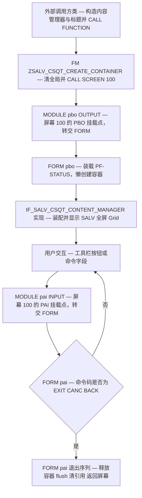
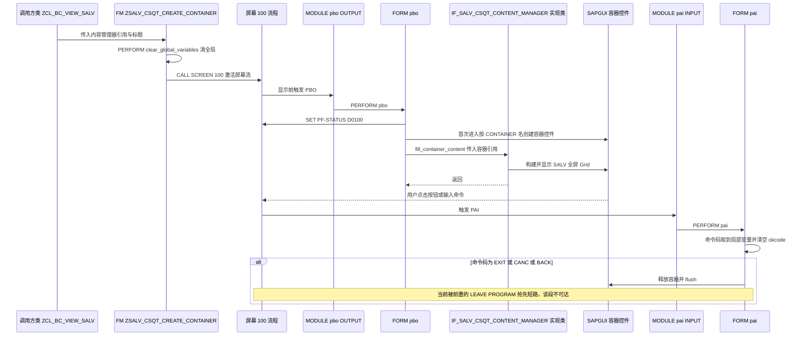

# ABAP 程序分析报告：`LZSALV_CSQT_SCREEN_MANAGERO01` — SALV 全屏 Grid 的"屏幕生命周期管理"

| 项目 | 说明 |
|------|------|
| 源文件 | `LZSALV_CSQT_SCREEN_MANAGERO01`（函数组 `ZSALV_CSQT_SCREEN_MANAGER` 的 O01 INCLUDE） |
| 程序类型 | 模块池（module pool）中的屏幕驱动片段，纯过程式，无类定义 |
| 规模 | 73 行，4 个子程序（2 个 `MODULE` + 2 个 `FORM`），全部为短小 FORM |
| GUI 形态 | **SAPGUI 全屏 Grid**：`SET PF-STATUS` + `CALL SCREEN` + Custom Control 容器 + `CL_SALV_*` |
| 入口 | 同函数组的 `ZSALV_CSQT_CREATE_CONTAINER`（另一 INCLUDE，非本文件）由外部调用方 CALL |
| 外部依赖 | `CL_GUI_CFW`、`CL_SALV_TABLE`、自研接口 `IF_SALV_CSQT_CONTENT_MANAGER`、函数组全局 `gr_container` / `gr_content_manager` / `g_title` |
| 一句话结论 | 结构干净、依赖倒置做得漂亮，但**退出路径存在两处 P0 级功能失效**（清理语句被短路、命令码比较恒假） |

---

## 一、程序定位与业务背景

### 1.1 它在解决什么问题

在 SAP 里用 `CL_SALV_TABLE` 做一个"像 Excel 一样铺满整个屏幕"的查询界面，不是调用一句 `display_fullscreen( )` 就完事。标准做法要求：**一个 dynpro（屏幕）+ 一个定义在该屏幕上的 Custom Control + 一个控制该屏幕生命周期的 module pool**。三件事必须凑齐：

1. 屏幕 100 被 `CALL SCREEN 100` 激活，屏幕流开始；
2. 屏幕显示**之前**（PBO），程序要在 Custom Control 的位置上创建一个容器控件引用，否则画面上什么都没有；
3. 用户点击按钮或输入命令，屏幕流回到 **PAI**，程序要判断"这是不是一个退出命令"，是就必须释放控件、关掉屏幕流，把控制权交还给调用方。

本文件就是第 2、3 件事的全部实现，也就是一个 **"屏幕管家"**：谁调用我、你想显示什么我不管，我负责把一个空容器交给你（`fill_container_content`），并在用户喊"退出"时把容器收摊、把屏幕流还回去。

### 1.2 现有方案为何不够

- **不能直接在业务类里做**：`CALL SCREEN` / PBO / PAI 只允许存在于 REPORT 或 module pool 里。一个全局类里没有自己的屏幕流，它想弹全屏就必须借一个函数组当"壳"。所以有了 `ZSALV_CSQT_SCREEN_MANAGER` 这个函数组，也有了名字里的 `screen_manager`。
- **不能直接用 `CL_SALV_TABLE=>display_fullscreen( )`**：它要求调用方自带屏幕号（dynpro 名称），容器控件也由它内部管理，调用方无法在显示前插自己的逻辑（例如加自定义工具栏、限制某些按钮）。自己搭容器就把这些自由度拿回来了。
- **`REUSE_ALV_*` 方案不合适**：本项目的定位是"教 SALV"，用封装好的 REUSE_ALV 会把这个章节的核心（`IF_SALV_CSQT_CONTENT_MANAGER` 自定义内容装配）架空。

### 1.3 整体设计范式定性

> **依赖倒置的"屏幕管理器 + 内容管理器"分工**：函数组只负责**在哪显示、怎么收摊**（容器与屏幕流），**显示什么**通过接口 `IF_SALV_CSQT_CONTENT_MANAGER` 交给调用方；调用方返回后，本文件不做任何业务动作，把控制权原样交还。

这是全文件最值得学的一点，后面第 3.2 节的 `fill_container_content` 就是这个分工的接缝。

---

## 二、程序执行流程总览

### 2.1 流程图



### 2.2 责任链表

| 子程序 | 调用者 | 职责 |
|--------|--------|------|
| `ZCL_BC_VIEW_SALV`（同目录，未包含在本文） | 业务代码 | 构造查询/聚合/布局，实现内容管理器接口，调用函数组 FM 并传入引用与标题 |
| `ZSALV_CSQT_CREATE_CONTAINER`（同函数组另一 INCLUDE） | 外部调用方 | 清空函数组全局、保存内容管理器与标题、`CALL SCREEN 100` 激活屏幕流 |
| 函数组全局 `gr_container` / `gr_content_manager` / `g_title`（TOP INCLUDE） | 入口 FM 赋值 | 跨 PBO/PAI 保持状态的三个全局量：容器引用、内容管理器引用、标题文本 |
| `MODULE pbo OUTPUT` | ABAP 屏幕流（屏幕 100 显示前） | 把 PBO 事件转交给 `FORM pbo`，自身不含逻辑 |
| `FORM pbo` | `MODULE pbo OUTPUT` | 每次 PBO 装载 `D0100` 状态栏；首次进入时按 Control 名创建容器、设置标题、把容器交给内容管理器装配 |
| `IF_SALV_CSQT_CONTENT_MANAGER` 实现方法 | `FORM pbo` | 拿到容器引用后构建并显示 SALV 全屏 Grid（实现侧不在本文件） |
| `MODULE pai INPUT` | ABAP 屏幕流（用户操作后） | 把 PAI 事件转交给 `FORM pai`，自身不含逻辑 |
| `FORM pai` | `MODULE pai INPUT` | 命令码取到局部变量、清空 `okcode`、对 `EXIT`/`CANC`/`BACK` 分支执行释放控件与屏幕返回 |

下面按这条流程，逐个子程序展开。

---

## 三、分组分析（按程序流程 / 子程序）

### 3.0 入口子程序（外部 INCLUDE）`ZSALV_CSQT_CREATE_CONTAINER`

本文件不是入口，而是被入口 FM 调用的"内层"。先把入口摆出来，后文的全局变量来源才有出处（同函数组另一 INCLUDE，非本文分析对象，但必须交代）。

```abap
FUNCTION ZSALV_CSQT_CREATE_CONTAINER.
*"----------------------------------------------------------------------
*"*"Local Interface:
*"  IMPORTING
*"     REFERENCE(R_CONTENT_MANAGER) TYPE REF TO
*"        IF_SALV_CSQT_CONTENT_MANAGER
*"     REFERENCE(TITLE) TYPE  LVC_TITLE
*"----------------------------------------------------------------------

  PERFORM clear_global_variables.

  gr_content_manager = r_content_manager.
  g_title            = title.

  CALL SCREEN 100.

ENDFUNCTION.
```

**做什么** — 先 `PERFORM clear_global_variables` 把上一次调用遗留的全局状态清干净，再把形参中的内容管理器引用与标题文本存进函数组全局，最后 `CALL SCREEN 100` 激活屏幕流并把控制权交给 ABAP 运行时（此 FM 并不返回，直到屏幕流被 `LEAVE SCREEN` 关闭）。

**为什么** — 这一层把"调用方协议"与"屏幕协议"隔开：调用方只需要"给我一个能往里塞东西的容器 + 一个标题"，屏幕号 100 从此成为函数组内部的实现细节。同时它把 FM 变成一个**阻塞式**调用：`CALL SCREEN` 之后代码不往下走，用户在屏幕上交互的所有回合都由本文件的 PBO/PAI 处理，直到退出序列执行完才返回调用方。用引用形参传接口（而不是具体类）是标准的依赖倒置写法。

**风险与改进** — `REFERENCE` 形参允许传入初始引用，入口这里不做 `IS BOUND` 校验，错误被推迟到 `FORM pbo` 才以短时形式爆出来；`title` 允许初始值，标题栏会为空；`PERFORM clear_global_variables` 存在于另一个 INCLUDE，若它只是 `CLEAR gr_container` 而不 `free`，上一轮的 GUI 控件就泄漏了——这是本文件 P1-3 的真正风险点，建议在入口就 `IF gr_container IS BOUND. gr_container->free( ). ENDIF.`，而不是靠"清全局"了事。

---

### 3.1 事件模块 `MODULE pbo OUTPUT`

```abap
MODULE pbo OUTPUT.
  PERFORM pbo.
ENDMODULE.                    "pbo OUTPUT
```

**做什么** — 屏幕 100 每次显示前，ABAP 运行时按屏幕逻辑调用本模块；模块自身只做一件事：`PERFORM pbo`，把全部逻辑转到 `FORM pbo`。

**为什么** — 这是 SE51 屏幕逻辑里"模块名 = 功能名"的默认模板。分层本身没有价值，但在这类"函数组做屏幕壳"的模式里有一个真实好处：FORM 可以被别的 FORM 或函数直接复用（不必挂到屏幕上），而 MODULE 只负责绑定"哪个屏幕在什么时机触发它"。

**风险与改进** — 无功能性风险，但属于**可读性负债**：模块与 FORM 同名（都是 `pbo`），栈回溯和 ABAP 调试器里两者混在一起，容易让人误以为有两个不同逻辑。建议要么合并（逻辑直接写进 MODULE），要么把 FORM 改名为 `pbo_fill_screen` 之类，让"事件挂载点"与"业务动作"在名字上就分得开。

---

### 3.2 表单 `FORM pbo`

本 FORM 是全文件的主体，按逻辑分三步：① 装载状态栏并进入懒初始化守卫 → ② 离线判定与容器懒创建 → ③ 标题设置与内容装配。三段代码块是同一个 `IF` 嵌套的连续切片，`IF` 结构跨块延续。

#### ① 装载 PF-STATUS 并进入懒初始化守卫

```abap
FORM pbo.

  SET PF-STATUS 'D0100'.

  IF gr_container IS INITIAL.
```

**做什么** — 进入 FORM 后先把 `D0100` 状态栏装配到当前屏幕，再判断全局容器引用是否还是初始值；只有初始值（第一次进入或上一次已被清空）才继续往下做初始化。

**为什么** — `SET PF-STATUS` 放在 PBO 里是硬性要求：每次屏幕重新显示都要重新设置，否则状态栏会丢。`gr_container IS INITIAL` 这个守卫则是全屏 Grid 的标准生命周期模板——容器只需创建一次，但 PBO 会被反复触发（用户每次操作后屏幕都会重画），没有守卫就会重复创建控件、重复装配 SALV 结果。

**风险与改进** — 守卫写法本身没问题，但要注意状态栏名 `'D0100'` 与屏幕号 100 是**跨 INCLUDE 的隐式契约**：入口 FM 里硬编码了 `CALL SCREEN 100`，此处硬编码了 `'D0100'`，屏幕逻辑里还要挂 `D_0100_PBO` 与 `D_0100_PAI` 两个模块，四个地方必须人工对齐，屏幕重新生成时漏挂模块不会有编译错误，只会在运行时"点了没反应"。建议把这三个名字集中成常量并在注释里互相引用。

#### ② 离线判定与容器懒创建

```abap
    IF cl_salv_table=>is_offline( ) EQ if_salv_c_bool_sap=>false.
      CREATE OBJECT gr_container
        EXPORTING
          container_name = 'CONTAINER'.
    ENDIF.
```

**做什么** — 先问 SALV 模型当前是否处于**离线模式**（不能渲染到屏幕）；只有在**非离线**时，才用屏幕上名为 `'CONTAINER'` 的 Custom Control 位置创建一个容器控件引用，存入全局 `gr_container`。

**为什么** — `CL_SALV_TABLE` 的离线模型（典型如为导出/后台构造而创建的模型）没有可显示的 UI，此时创建控件纯属浪费且后续必然出错，所以用静态方法挡一层。容器引用存全局而不是局部，是因为它要活过整个屏幕流的多个 PBO/PAI 回合——这是模块池里唯一可行的持久化方式，也是这个模式必须付出"全局状态"代价的根本原因。

**风险与改进** — **条件只包住了"创建"，没有包住"消费"**：离线分支下 `gr_container` 保持初始引用，但下一步仍然会把它作为实参传出去，直接触发 `CX_SY_REF_IS_INITIAL` 短时；判定条件与后续使用点必须成对出现在同一个 `IF` 里。另外 `cl_salv_table=>is_offline( )` 读的是 **SALV 的全局静态状态**，而那个模型由调用方的内容管理器持有——屏幕管理器越过接口去读别人模型的全局态，是一处耦合外泄，也让这个函数组天然"一次只能伺候一个模型"。建议改为由内容管理器接口暴露 `is_displayable( )`，或把离线模型整段短路在调用方。

#### ③ 标题设置与内容装配

```abap
    SET TITLEBAR 'STANDARD' WITH g_title.

    gr_content_manager->fill_container_content(
        r_container = gr_container ).
  ENDIF.

ENDFORM.                    "pbo
```

**做什么** — 用全局 `g_title` 填充标准标题栏；再把容器引用以**命名参数** `r_container` 传给内容管理器的 `fill_container_content`，由内容管理器在其内部创建 `CL_SALV_TABLE` 全屏控件、设置查询/布局并挂到容器上；`ENDIF` 收尾，整段仅执行一次。

**为什么** — 这一行是整个设计的价值点：屏幕管理器**只认接口** `IF_SALV_CSQT_CONTENT_MANAGER`，不认 `CL_SALV_TABLE` / `CL_SALV_QUERY` 的任何细节，调用方想显示采购订单视图、库存视图还是自研聚合视图，只换实现类即可，函数组一行不用改。用命名参数传参而不是位置参数，是让接口重构（增参数、调顺序）不影响调用点的正确实践，值得肯定。

**风险与改进** — 三点：其一，`gr_content_manager` 未做 `IS BOUND` 校验，入口 FM 的引用形参允许传初始引用，这里会以短时收场，调用方拿不到任何可诊断的错误信息，建议入口或此处先 `IF gr_content_manager IS NOT INITIAL`；其二，`SET TITLEBAR` 被关在 `IS INITIAL` 分支里，标题只在首次 PBO 设置——当前"一次调用一个标题"的场景下成立，但若调用方在同一函数组内换标题重入，标题不会刷新；其三，`g_title` 若为初始值，标题栏会显示成空白而非兜底文案，建议用 `CONDENSE` 或给个默认值。

---

### 3.3 事件模块 `MODULE pai INPUT`

```abap
MODULE pai INPUT.
  PERFORM pai.
ENDMODULE.                    "pai INPUT
```

**做什么** — 用户在屏幕 100 上按下按钮、回车或修改命令字段后，运行时进入 PAI 并调用本模块；模块同样只做一次 `PERFORM pai` 转发。

**为什么** — 与 3.1 对称，是同一套"事件挂载点 / 业务动作"分离模式。PAI 是**唯一**能终止屏幕流的地方，因此退出判断必须落在它身上，模块层保持零逻辑是对的——它一旦开始做条件分支，屏幕逻辑与业务逻辑就纠缠在一起，新人接手时更难定位。

**风险与改进** — 与 3.1 同一处命名问题：模块与 FORM 同名，调试时容易看错对象。除此之外，本模块还缺少一个常被忽略的动作：**在 PAI 里通常要把 `okcode` 清空**，避免同一个命令在下一次 PAI 回合被重复处理；本文件把这个动作放在了 FORM 里（见 3.4 ①），对单层 FORM 没问题，但一旦将来有人在这两个模块之间插入逻辑，就容易踩坑，建议注释说明清空动作的位置与理由。

---

### 3.4 表单 `FORM pai`

本 FORM 分三步：① 命令码取本地并清空 `okcode` → ② 命令码分发 → ③ 退出清理序列。同样是同一段代码的连续切片。

#### ① 命令码取到局部变量并清空屏幕字段

```abap
FORM pai.

  DATA l_okcode LIKE sy-ucomm.

  l_okcode = okcode.
  CLEAR okcode.
```

**做什么** — 声明局部命令码变量，把屏幕 OKCODE 字段 `okcode` 的当前值取到局部变量里，随即把 `okcode` 字段清空。

**为什么** — "先取后清"是 SAP 对话流程的经典套路：命令码被一次性消费并落地到局部变量，清空字段可以避免同一条命令在下一次 PAI 回合（例如界面重绘触发的额外 PAI）被重复触发一次。取本地值还有一个副作用好处——清空后不影响调用方后续若要用 `okcode` 做日志或判断。

**风险与改进** — **类型语义错配，P0 级**：`LIKE sy-ucomm` 继承的是系统字段 `SY-UCOMM` 的数据类型 `CHAR1`（长度为 1 的功能键字段），而屏幕字段 `okcode` 长度是 10。赋值时按目标长度截断，`'EXIT'` 只剩 `'E'`；下一步的 `CASE` 用 4 字符字面量比较，字符型比较按空格补齐后 `'E   '` 仍不等于 `'EXIT'`，**分支恒假**。要比较完整命令码，应写 `DATA l_okcode TYPE sy-okcode.`，或直接 `CASE okcode.`，或 `TYPE c LENGTH 10`。若坚持沿用 `LIKE sy-ucomm` 的写法，则意味着后面只能比较单字符命令。顺带一提：本实现里 `CLEAR okcode` 之后没有任何消费者去"防重复触发"（因为紧接着就 `LEAVE PROGRAM` 了），属于缺少意图说明的死代码，要么删掉，要么加注释说明它是为将来在 FORM 里继续处理命令码预留的。

#### ② 命令码分发

```abap
  CASE l_okcode.
    WHEN 'EXIT' OR 'CANC' OR 'BACK'.
      LEAVE PROGRAM.
```

（本块只截取到分支体首行，分支体其余语句见步骤 ③。）

**做什么** — 以 `CASE` 把当前命令码分流：命中 `EXIT`、`CANC`、`BACK` 三个"离场"命令时进入退出序列；其他命令（`SAVE`、工具栏刷新、F 键回车等）一律不处理，直接走 `ENDCASE` 结束本次 PAI。

**为什么** — 只识别"离场"命令、把其余命令交还给屏幕默认行为，是全屏 Grid 壳层的正确分工：业务命令应该由内容管理器那一侧（ SALV 工具栏回调）去处理，而不是在屏幕壳里堆 `CASE`。用 `CASE` 而非一串 `IF` 也让后续扩展命令码只需加一行 `WHEN`。

**风险与改进** — 这一行是本文件最刺眼的地方：`LEAVE PROGRAM` 排在**所有清理动作之前**。`LEAVE PROGRAM` 会立刻终止整个 ABAP 程序（清空调用栈、返回到初始屏幕），因此紧随其后的 `free`、`flush`、`CLEAR gr_container`、`SET SCREEN 0`、`LEAVE SCREEN` 全部是不可达的死代码。更糟的是语义层面：调用方是通过 `CALL FUNCTION` 进入这个函数组的，它期待的是"函数组把屏幕关掉后**返回调用方**继续往下走"，而 `LEAVE PROGRAM` 会连调用方的程序流一起结束，调用方在 FM 之后的任何清理/提交/提示都执行不到。正确写法是删掉 `LEAVE PROGRAM`，只留 `SET SCREEN 0` + `LEAVE SCREEN`（详见第五章修正示例）。

#### ③ 退出清理序列

```abap
      CALL METHOD gr_container->free.
      CALL METHOD cl_gui_cfw=>flush.

      CLEAR gr_container.

      SET SCREEN 0.
      LEAVE SCREEN.
  ENDCASE.

ENDFORM.                    "pai
```

**做什么** — 依次释放容器控件、把 SAPGUI 的控件创建/销毁请求刷到前端、清空全局容器引用、再用"下一屏置 0 + 离屏"把嵌套的屏幕流关闭，让入口 FM 的 `CALL SCREEN 100` 返回，从而回到调用方。

**为什么** — 这是全屏 SALV 生命周期里**最不能省**的一段：`CL_GUI_CFW` 的控件创建/销毁是异步的，不 `flush` 就返回，对象引用会被拖到下一回合才回收；`gr_container->free` 之后还必须 `CLEAR` 全局，否则下一次 `FORM pbo` 的 `IS INITIAL` 守卫会误判"容器已存在"而跳过初始化，屏幕上留下一块空白区域。`SET SCREEN 0` + `LEAVE SCREEN` 的组合是关闭"由 FM 激活的嵌套屏幕流"的标准写法，比 `LEAVE PROGRAM` 温和得多。

**风险与改进** — 这段的**顺序意图正确但位置错误**：它整段位于 `LEAVE PROGRAM` 之后，永远不执行（见上一步）。即便挪正位置，仍有两处加固空间：一是 `gr_container->free` 未判 `IS BOUND`，在离线分支未创建容器的路径上会短时；二是 `CLEAR gr_container` 之后没有对称地清理 `gr_content_manager`，若函数组被再次调用，内容管理器引用仍指向旧对象；此外这段只处理了三个命令码与"正常退出"路径，异常中断、Shift+F3 之类的其他导航都不会走到这里，清理逻辑分散在"命令码白名单"上而不是集中在一个 teardown 入口里。

---

### 3.5 全局状态与外部协作者

本文件引用的三个全局量与四个外部对象都不在文件里，但决定了它的全部行为：

| 符号 | 来源 | 作用 | 潜在风险 |
|------|------|------|----------|
| `gr_container` | TOP INCLUDE 的全局 `TYPE REF TO cl_gui_simple_container` | 跨 PBO/PAI 保存容器引用；`IS INITIAL` 同时充当"是否已初始化"的标志位 | 既是状态又是标志，职责混在一条语句里；无法表示"已创建但已被释放"的中间态 |
| `gr_content_manager` | 入口 FM 赋值的引用形参 | 持有"把什么装进容器"的策略 | 未 `IS BOUND` 校验，错误延迟到 PBO 才爆 |
| `g_title` | 入口 FM 赋值的 `LVC_TITLE` | 标题栏文本 | 初始值时标题栏空白；被关在 `IS INITIAL` 分支内，后续变更不刷新 |
| `IF_SALV_CSQT_CONTENT_MANAGER` | 自研接口（实现类在同目录 `ZCL_BC_VIEW_SALV` 一侧） | 唯一的显示内容依赖，`fill_container_content` 是接缝方法 | 实现类若抛异常，`FORM pbo` 无回滚，PF-STATUS 已设、容器已建，状态半初始化 |
| `CL_GUI_CFW` | SAP 标准 | 控件创建/销毁与 `flush` | 无 |
| `CL_SALV_TABLE` | SAP 标准 | 只用到一个静态方法 `is_offline( )` 判断可显示性 | 越过接口读 SALV 全局静态状态，耦合外泄（见 3.2 ②） |

**做什么** — 本节不新增代码，只把"谁拥有这些状态"点清楚：容器与内容管理器都归函数组全局所有，也就是说这个函数组**只能同时承载一个全屏 Grid**，不可重入、不可嵌套。

**为什么** — 这是 module pool 屏幕流的固有约束：屏幕号是全局唯一的，PBO/PAI 是全局事件，状态只能挂在全局上。想解决"再打开一个全屏 SALV"的需求（工具栏按钮弹出第二个查询），就必须换设计——把屏幕流交给一个动态创建的独立对话框，或干脆用 `CL_SALV_TABLE` 自带的全屏能力 + 独立屏幕。

**风险与改进** — 嵌套场景下 `gr_container` 会被新容器覆盖，旧容器引用丢失且未 `free`，形成 SAPGUI 控件内存泄漏；建议在覆盖前统一 `IF gr_container IS BOUND. gr_container->free( ). ENDIF.`，或用一份栈结构保存多层容器引用。

---

## 四、执行流程全景图（数据视角）



数据视角的三个关键交接点：**引用**（`gr_container` 从 PBO 流向内容管理器，再在 PAI 里被释放）、**标题**（`g_title` 从入口 FM 一路带进 PBO 的 `SET TITLEBAR`）、**命令码**（从屏幕 OKCODE 字段流向 `FORM pai` 的局部变量，随后字段被清空）。

---

## 五、问题清单与改进建议（按优先级）

| 编号 | 优先级 | 所在子程序 | 问题 | 改进建议 |
|------|--------|-----------|------|----------|
| 1 | 🔴 P0 | `FORM pai` | `LEAVE PROGRAM` 排在清理序列之前，运行时立即终止整个程序，其后 5 条语句（free / flush / CLEAR / SET SCREEN 0 / LEAVE SCREEN）全部不可达；控件与引用永不释放，且调用方的程序流被一并结束 | 删除 `LEAVE PROGRAM`，只保留 `SET SCREEN 0` + `LEAVE SCREEN` 返回调用方 |
| 2 | 🔴 P0 | `FORM pai` | `DATA l_okcode LIKE sy-ucomm` 继承 CHAR1 类型，赋入 10 位的 `okcode` 后被截断为 1 个字符，`CASE` 与 `'EXIT'`/`'CANC'`/`'BACK'` 比较时按空格补齐仍不等 → 分支恒假，退出命令无任何响应 | 改为 `TYPE sy-okcode`（或直接 `CASE okcode`），并复核同函数组其他地方的命令码比较写法 |
| 3 | 🟠 P1 | `FORM pbo` | offline 判定只包住容器创建，未包住消费：离线时 `gr_container` 为初始引用仍被传入 `fill_container_content` → `CX_SY_REF_IS_INITIAL` 短时 | 把 `SET TITLEBAR` 与 `fill_container_content` 一并移入非离线分支 |
| 4 | 🟠 P1 | `FORM pbo` | `gr_content_manager` 未做 `IS BOUND` 校验，而入口 FM 的引用形参允许传初始引用 | 在入口 FM 或 PBO 开头校验并给出可诊断的错误信息（消息或异常） |
| 5 | 🟠 P1 | `FORM pai` | 退出路径不完整：只有三个命令码释放容器；异常中断、其他导航、上层 `clear_global_variables` 直接清全局时都不 `free` → SAPGUI 控件内存泄漏 | 抽出统一 teardown（判 `IS BOUND` → free → flush → 清容器与内容管理器），入口与退出共用 |
| 6 | 🟡 P2 | `FORM pai` | `CLEAR okcode` 在本实现里没有任何后续消费者，属于无意图的死代码；`l_okcode` 局部副本的唯一价值就是这次赋值 | 删掉或补注释说明是为防止同一命令重复触发而预留 |
| 7 | 🟡 P2 | `FORM pbo` | `'CONTAINER'`（Control 名）、`'D0100'`（状态栏）、`'STANDARD'`（标题类型）、屏幕号 100、屏幕逻辑里的模块名分散在多个 INCLUDE，彼此无编译期约束 | 集中为常量并在注释里互相标注依赖；屏幕逻辑变化时一处可查 |
| 8 | 🟡 P2 | `FORM pbo` | `SET TITLEBAR` 关在 `IS INITIAL` 分支内，标题只在首次 PBO 设置；`g_title` 为初始值时标题栏空白 | 标题设置移出守卫或按需刷新；空标题给兜底文案 |
| 9 | 🟡 P2 | `FORM pbo` | 用 `cl_salv_table=>is_offline( )` 读 SALV 全局静态状态来判断可显示性，越过内容管理器接口耦合到调用方拥有的模型 | 由 `IF_SALV_CSQT_CONTENT_MANAGER` 暴露 `is_displayable( )`，屏幕管理器只问接口 |
| 10 | 🟢 P3 | `MODULE pbo` / `MODULE pai` | 两个 MODULE 只做同名 `PERFORM` 转发，模块名与 FORM 名相同，调试与栈回溯易混淆 | 合并进 MODULE，或给 FORM 换成能区分"事件"与"动作"的名字 |
| 11 | 🟢 P3 | `FORM pbo` / `FORM pai` | 函数组全局使全屏流程不可重入：嵌套打开第二个全屏 SALV 时 `gr_container` 被覆盖，旧容器未 `free` | 覆盖前统一释放，或用栈结构管理多层容器 |
| 12 | 🟢 P3 | `FORM pai` | 退出能力绑在命令码白名单上，`D0100` 状态栏每新增一个导航按钮都要同步改 `CASE` | 用命令码常量集合集中维护；或改为在 PAI 统一走 teardown |

两条 P0 的修正示例（供对照，注意这不是原代码，而是建议写法）：

```abap
FORM pai.

  DATA l_okcode TYPE sy-okcode.

  l_okcode = okcode.
  CLEAR okcode.

  CASE l_okcode.
    WHEN 'EXIT' OR 'CANC' OR 'BACK' OR 'RETURN'.
      IF gr_container IS BOUND.
        gr_container->free( ).
        cl_gui_cfw=>flush( ).
        CLEAR gr_container.
      ENDIF.
      SET SCREEN 0.
      LEAVE SCREEN.
  ENDCASE.

ENDFORM.                    "pai
```

**做什么** — 命令码改用 `sy-okcode`（长度 10）承载完整命令；退出分支先判容器是否已绑定，再释放、flush、清引用，最后用 `SET SCREEN 0` + `LEAVE SCREEN` 关闭嵌套屏幕流，返回入口 FM 的调用点。

**为什么** — 两处修正各自对应一个根因：`LIKE sy-ucomm` 是**类型选错**（拿了 1 位字段去装 10 位命令），`LEAVE PROGRAM` 排在前面是**控制流顺序错**。把类型对齐、把"终止程序"换成"结束屏幕流"，这段代码才真正兑现它在函数中的设计意图。

**风险与改进** — 示例里仍有两处刻意保留的判断成本：`IS BOUND` 每次 PAI 都判一次几乎无开销，但它让离线分支的空引用不再短时；`RETURN` 是补充命令码，若项目 PF-STATUS 没有这个功能键可以删掉。真正的收口建议是把这个 `IF gr_container IS BOUND … ENDIF` 段落抽成独立 FORM（例如 `teardown`），供入口 FM 的 `clear_global_variables` 与 PAI 共用，避免两处各写一份、日后走样。

```abap
  IF gr_container IS INITIAL.
    IF cl_salv_table=>is_offline( ) EQ if_salv_c_bool_sap=>false.
      CREATE OBJECT gr_container
        EXPORTING
          container_name = 'CONTAINER'.
      SET TITLEBAR 'STANDARD' WITH g_title.
      gr_content_manager->fill_container_content(
          r_container = gr_container ).
    ENDIF.
  ENDIF.
```

**做什么** — 把"建容器"与"用容器"收进同一个非离线分支：只有模型可显示时才创建容器、设标题、装配内容，三步整体生效或整体跳过。

**为什么** — `IF` 的正确粒度是"这段逻辑的前提条件"，不是"这一条语句的前提条件"。原代码把守卫切在中间，等于把一个原子操作劈成两半，产生了"传了空引用"这个自相矛盾的状态。

**风险与改进** — 这只是把空引用的短时消掉了，`is_offline( )` 读 SALV 全局静态状态这一处耦合仍在（见问题 9），真正的解法是由内容管理器接口暴露可显示性判断。另外若 `gr_content_manager` 为初始引用，这里依旧会短时，建议在同一个守卫前再加一道 `IF gr_content_manager IS NOT INITIAL`，或直接在入口 FM 拒绝空引用传入。

---

## 六、整体评价与启发

### 优点

- **依赖倒置做得干净**：屏幕壳只依赖 `IF_SALV_CSQT_CONTENT_MANAGER`，用命名参数交接容器引用，调用方可替换任意 SALV 实现而函数组零改动——这是全文件最值得抄的设计。
- **生命周期模板正确**：`CALL SCREEN` → PBO 懒创建 → `IS INITIAL` 守卫 → PAI 释放 + `CL_GUI_CFW=>flush` + `CLEAR` 全局 + `SET SCREEN 0`/`LEAVE SCREEN`，这条主干是标准答案，作者的意图和骨架都对。
- **职责边界克制**：PAI 只识别离场命令，不去处理业务命令，把工具栏事件留给内容管理器那一侧，没有出现"屏幕壳里越权做业务"的常见退化。
- **命名参数与 `EQ if_salv_c_bool_sap=>false` 显式比较**这类细节，说明作者对布尔常量与接口可读性是有自觉的。

### 短板

- **退出路径的两处缺陷都是"看起来对、跑起来不对"的类型级问题**：`LIKE sy-ucomm` 与 `LEAVE PROGRAM` 前置，两者叠加后退出功能等于完全失效，而这段代码肉眼读起来非常像标准示例——正因为像示例，评审时更容易放过。
- **清理逻辑没有单一出口**：释放容器这件事散在 PAI 的一个分支里，入口的 `clear_global_variables` 又只做 `CLEAR` 不做 `free`，两次调用之间就是泄漏窗口。
- **命名契约全靠人工**：屏幕号、状态栏名、Control 名、模块名分布在三个 INCLUDE 与屏幕逻辑里，屏幕重新生成一次就可能静默失配。
- **新旧语法混用**：`CREATE OBJECT ... EXPORTING`、`CALL METHOD` 静态调用与命名参数并存，同一个文件里两种年代的写法都有，读起来割裂。

### 可学到的设计经验

1. **"屏幕壳 + 内容管理器"是全屏 SAPGUI 的标准解耦**：凡是 `CL_SALV_*` / `CL_GUI_*` 的全屏需求，都可以抽出一个只管容器与屏幕流的函数组，把"显示什么"用接口交给调用方；这样显示逻辑可单元测试，屏幕壳保持极薄。
2. **守卫的粒度必须是"原子操作"**：一个 `IF` 要么完整包住一个动作（创建 + 装配），要么不包。切在中间就会造出"引用为空却已被使用"这种自相矛盾的状态。
3. **`LIKE` 会连数据类型一起继承**：`LIKE sy-ucomm` 复制的是 CHAR1，不是"命令码"这个语义。命令码比较要用 `sy-okcode`，凡是"看起来像名字"的 `LIKE`，都要回头确认被复制字段的长度与业务语义是否匹配。
4. **退出流程的顺序即正确性**：`LEAVE PROGRAM` / `LEAVE SCREEN` 这类"离开"语句一旦出现在清理之前，后面所有资源释放都是装饰品。写退出代码的习惯应该是：先列资源 → 先释放 → 最后离开，并且用 `SET SCREEN 0` + `LEAVE SCREEN` 返回调用方，而不是终止整个程序。