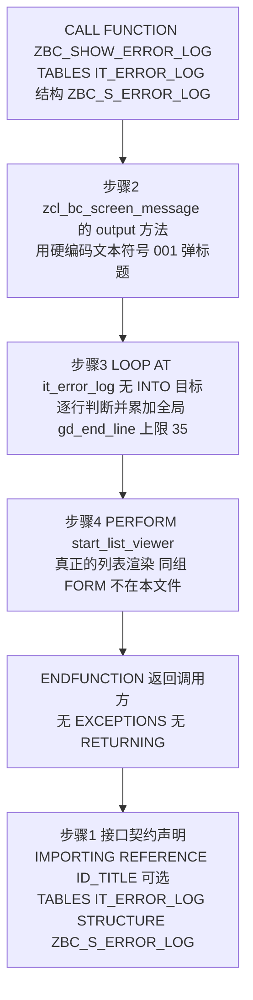
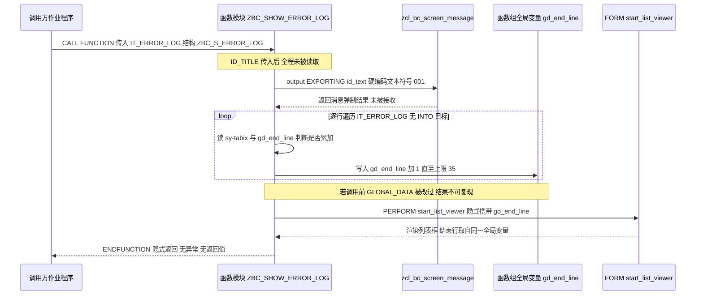

# zbc_show_error_log（AbapToTheFuture03）程序分析报告

分析对象：`src/zmonsters_p01_enablers/zmonsters_c04_exceptions/zbc_show_error_log.fugr.zbc_show_error_log.abap`（24 行正文 + 末尾空行，函数组 `ZBC_SHOW_ERROR_LOG` 的一个函数模块成员，MIT，来自 hardyp/AbapToTheFuture03）

> 文件定位校正：题述路径中的 `zmonsters_c05_unit_testing` 在仓库中不存在；按 `MANIFEST.json` 的 `path` 字段，`zbc_show_error_log` 实际归属 `zmonsters_p01_enablers/zmonsters_c04_exceptions/`（`lines: 25`）。下文分析的是该文件。
>
> 事实校正：题述提到"带异常列表"，但本函数的接口声明段**没有 `EXCEPTIONS` 子句**——它只有一段 `IMPORTING` 和一段 `TABLES`。同一章节的兄弟函数组 `ZMONSTER_GOLF_SCORES` 反而声明了两个业务异常（`MONSTER_ONLY_ONE_INCH_TALL` / `MONSTER_HAS_NO_SILLY_TROUSERS`）。这个对比本身是一条有价值的分析线索，见 3.1 ① 与 P1-3。

---

## 一、程序定位与业务背景

### 1.1 它解决什么问题

这是一次批处理/后台作业跑完之后最常见的一个动作：**作业失败了，怎么让用户看见失败原因**。

SAP 的批处理基础设施能告诉你"作业 08:00 跑了，状态是 ABAP 错误，错误日志在容器 XYZ 里"。但从这句话到用户眼前那张表，中间隔着一段很难自动化的路：

- `CO_01` 显示日志里的技术栈帧（`INCLUDE`, `LINE`, `CURSOR`）——排障人员要的是业务语义行，不是十六进制错误号。
- 日志条数不固定：3 条时开一个 6 行的小弹窗刚好；80 条时还开 6 行，用户就得在里面按方向键翻页，或者干脆放弃看。
- 展示逻辑散落在批处理驱动里，每加一个作业就复制一遍"弹消息 + 算高度 + 拉列表"的样板。

`ZBC_SHOW_ERROR_LOG` 就是把这段样板从各个作业里抽出来，固化成一个可被 `CALL FUNCTION` 复用的契约：**给我一张 `ZBC_S_ERROR_LOG` 结构的表，我负责把它变成一屏看得完的、带标题的列表弹窗**。

### 1.2 现有方案为何不够

| 现有方案 | 缺口 |
| --- | --- |
| `CO_01` / `CO_02` 显示日志 | 输出技术栈帧，不带标题消息、不做可视区域自适应，且不能嵌进业务自己的弹窗流程 |
| 作业日志 `SM21` / `SM51` | 与本次作业的上下文脱节，需要用户手工按时间/用户反查，且不能由程序主动弹出 |
| 调用方自己写 ALV | 每处重复一遍，且高度自适应逻辑无人统一维护——这正是本 FM 想消除的样板 |

### 1.3 整体设计范式（一句话定性）

**"薄壳编排器（Facade / Presentation Coordinator）"**：函数模块自身不碰数据、不碰布局，只做三件编排——弹一条标题消息、按日志行数微调对话框高度、把渲染工作 `PERFORM` 委派给同组的 `FORM start_list_viewer`。

必须先说明一个背景事实，否则这份报告的"缺失"类结论会被误读：`AbapToTheFuture03` 是**一本渐进式教学书的配套代码仓库**——同目录的 `zmonster_golf_scores.fugr.*` 是一个 17 行、函数体全空、只有接口声明的骨架；本文件末尾留着 5 个空行，明显是留给读者（和作者后续章节）继续填的位置。所以下文会同时标注两件事：**这段代码在教学语境下是"半成品"是有意为之**，而**它已经写下来的这几行在生产语境下有哪些真缺陷**。两者都写，但不混为一谈。

---

## 二、程序执行流程总览



责任链（按执行先后排列）：

| 子程序 | 调用者 | 职责 |
| --- | --- | --- |
| 函数模块接口声明段 `ZBC_SHOW_ERROR_LOG` | ABAP 运行时（SE37 属性 / 接口声明） | 声明入参契约：可选标题 `ID_TITLE` + 结构表 `IT_ERROR_LOG`；无异常、无返回值 |
| `zcl_bc_screen_message=>output` | 函数模块 `ZBC_SHOW_ERROR_LOG`（由 `CALL FUNCTION` 触发） | 用消息封装类弹一条 "Show Error Log" 标题消息 |
| `LOOP AT it_error_log` 高度计算段 | 函数模块 `ZBC_SHOW_ERROR_LOG` | 逐行遍历错误日志表，按行数把全局 `GD_END_LINE` 最多抬高 29 行 |
| `PERFORM start_list_viewer` | 函数模块 `ZBC_SHOW_ERROR_LOG` | 把渲染委派给同函数组 `FORM start_list_viewer`（真正建 ALV 的地方） |
| `ENDFUNCTION` | ABAP 运行时 | 函数出口，隐式返回；无异常、无成功标志 |
| 外部依赖 `ZBC_S_ERROR_LOG` | 数据构造方 | 行结构定义，函数体内不引用任何字段 |
| 外部依赖 `GD_END_LINE` | 函数组 `TOP` include（定义不在本文件） | 对话框结束行号，被本函数读改写 |

下面按这条流程，逐个子程序展开。

---

## 三、分组分析（按程序流程 / 子程序）

### 3.1 函数模块 `ZBC_SHOW_ERROR_LOG`（本文件唯一子程序，含 5 个逻辑步骤）

这是本文件里唯一一个可执行子程序——一个经典的 `FUNCTION ... ENDFUNCTION` 函数模块。它的职责边界很窄：把"一张错误日志表"翻译成"一屏能看完的带标题列表弹窗"。整体分五步：先声明接口契约，再弹标题，然后算弹窗高度，然后委派渲染，最后隐式返回。

#### ① 接口契约声明

（函数模块接口声明段）

```abap
FUNCTION ZBC_SHOW_ERROR_LOG.
*"--------------------------------------------------------------------
*"*"Global Interface:
*"  IMPORTING
*"     REFERENCE(ID_TITLE) TYPE  STRING OPTIONAL
*"  TABLES
*"      IT_ERROR_LOG STRUCTURE  ZBC_S_ERROR_LOG
*"--------------------------------------------------------------------
```

**做什么** — 这段 `*"` 注释是 SE37 里函数模块的接口声明段，声明了两项输入：一个可选的、按引用传入的字符串 `ID_TITLE`（窗口标题），以及一张按结构 `ZBC_S_ERROR_LOG` 传入的表参数 `IT_ERROR_LOG`（错误日志明细）。整段是纯声明，不产生任何运行时语句。

**为什么** — `TABLES` 参数是 FM 时代的经典做法：函数模块的 `TABLES` 参数**按引用传递**（不做数据拷贝），并且会在函数体里自动生成一个与表参数**同名的隐式工作区（header line）**，字段可以直接 `it_error_log-msg` 这样访问。选择 `STRUCTURE ZBC_S_ERROR_LOG` 而不是 `LIKE`，明确表达"行结构就等于这个 DDIC 结构"，对扁平结构而言两者行为基本一致，但 `STRUCTURE` 更强调"我把这个结构当记录用"。

**风险与改进** — 三处实打实的问题：

1. **`ID_TITLE` 声明了但函数体里一次都没出现。** 这是最刺眼的一处：接口承诺调用方可以定制标题，实现却完全无视（详见步骤②）。接口与实现不一致，是比"少写功能"更糟的一类缺陷，因为它连不上完整。
2. **`TABLES ... STRUCTURE` 属于 ABAP 明确标注为 obsolete 的写法。** 危害不在语法（语法完全合法），而在它隐式生成的同名工作区：`it_error_log` 在这个函数里**同时是内表、又是工作区**。任何人写 `it_error_log-` 开头的表达式拿到的都是工作区（单行），而不是"当前行"——这是 ABAP Clean Code 明令禁用 header line 的核心原因。现代写法是类型化表参数：`IT_ERROR_LOG TYPE ZBC_S_ERROR_LOG[]`，类型安全、无隐式工作区、按值传递（运行期写时复制）。
3. **按引用传递破坏了封装。** 由于 `TABLES` 是引用传递，本函数拿到的是**调用方内表本体**的引用——它虽然没改，但接口上它"可以"改。调用方无法从签名上确认自己的数据是安全的。

补充一条边界说明：本函数**没有 `EXCEPTIONS` 子句**（题述里提到的异常列表并不存在）。对纯 UI 函数而言这是可接受的——它本来就不做业务判定，不该有业务异常。但它同样**没有任何错误出口**（无 `sy-subrc` 检查、无 `RETURNING`），这个缺口记在 P1-3。

#### ② 弹标题消息

（函数模块 `ZBC_SHOW_ERROR_LOG`）

```abap
  zcl_bc_screen_message=>output( EXPORTING id_text = 'Show Error Log'(001) ).
```

**做什么** — 调用类 `zcl_bc_screen_message` 的静态方法 `output`，把硬编码文本 `'Show Error Log'` 通过文本符号 `001` 交给消息封装类，由它完成标题消息的弹制。返回值/异常一律未接收。

**为什么** — 把 `MESSAGE` 语句从业务代码里抽出去交给一个封装类，好处有三：一是消息弹制策略（弹框还是走消息栏、消息类型、是否允许继续）集中在一处可改；二是把 GUI 副作用收敛到一个调用点，将来换实现或做单元测试替换时只需动这一个类；三是类式调用支持 `EXPORTING` 具名传参，比 `MESSAGE '...' TYPE 'S'` 那种位置相关的老写法更抗改。

值得留意的是命名风格：`ZCL_BC_...` 前缀 + `id_text` 这种 `id_` 前缀的参数名，是 SAP 标准类式接口（尤其是 BC 系列/批处理上下文封装接口）的典型写法风格。这暗示 `ZCL_BC_SCREEN_MESSAGE` 很可能不是凭空发明的，而是**仿写某个标准消息封装类**（标准侧真正的类名需要去查类本体才能确认，本文件里看不到）。这本身是好信号——对齐标准接口习惯意味着团队里其他人不用重新学一套。

**风险与改进** — 三个问题，一个比一个实际：

1. **`ID_TITLE` 被彻底忽略（🔴 P0）。** 函数明明声明了可选标题参数，真正弹的却是写死的 "Show Error Log"。后果不是"不好看"，而是**语义错误**：调用方以为自己在区分"付款批次的错误日志"和"库存批次的错误日志"，屏幕上却两次都显示同一行标题，用户看到一份报错无法判断它属于哪个业务场景。修法很直接——把 `id_text` 改成引用 `ID_TITLE`，为空时回落到文本符号：
   ```abap
   IF id_title IS INITIAL.
     id_title = 'Show Error Log'(001).
   ENDIF.
   zcl_bc_screen_message=>output( EXPORTING id_text = id_title ).
   ```
2. **文本符号 `(001)` 的消息类是隐式的。** `'Show Error Log'(001)` 里的 `001` 要靠函数组属性上的消息类（或 T100 表）才能翻译出来。源码里看不到类名，跨系统传输/复制后一旦消息类没带过来，就静默回落到字面量文本——不报错，只是翻译没了。至少应在注释里写明消息类，或改成 `TEXT` 显式限定。
3. **返回值与异常全部丢弃。** `output` 是否真的弹成功（消息类缺失会 dump）在调用侧无任何痕迹。一个诊断类工具如果自己静默失败，用户看到的是"什么都没发生"。

#### ③ 按日志行数微调对话框高度

（函数模块 `ZBC_SHOW_ERROR_LOG`）

```abap
* Make the box a bit taller when the table has lots of rows
  LOOP AT it_error_log.
    IF sy-tabix > 6 AND gd_end_line < 35.
      gd_end_line = gd_end_line + 1.
    ENDIF.
  ENDLOOP.
```

**做什么** — 按注释的意图："表格行多的时候，让这个盒子高一点"。实现方式是从头到尾遍历一遍错误日志内表：对第 7 行及以后的每一行，如果当前全局结束行号 `gd_end_line` 还没到 35，就把它加 1。净效果等价于 `gd_end_line := gd_end_line + LEAST( 行数 - 6, 35 - gd_end_line )`。

**为什么** — 出发点是对的。注释里的 "the box" 说明这里不是全屏列表，而是一个**对话框/弹出框**（ALV 弹窗通常有固定的可视行数默认值，超出的行要走滚动条）。一个典型的失败体验是：作业报了 60 条错误，弹出一个 6 行高的窗，用户必须在里面拖滚动条才能看完第 7 条以后的内容——于是"错误日志"这个功能事实上等于没有。所以**按数据量自适应可视区域**这个需求是真实的，不是过度设计。

但选择的实现手段（遍历）完全没有必要：这一段**从头到尾没有读取 `it_error_log` 的任何一个字段**，它只是在数行数。ABAP 里数行数是 `lines( itab )`（读内表描述符，O(1)）。用循环实现计数，是把一个算术题写成了遍历题——读者要多读三行才能确认"哦，它其实只想知道有多少行"，而且引入了 `sy-tabix` 这个不该出现的依赖。

**风险与改进** — 这是全文件缺陷密度最高的一段，四条：

1. **`sy-tabix` 在没有 `INTO`/`INTO WA` 目标的 `LOOP` 里不是被语言保证的量（🔴 P0）。** ABAP 文档对 `sy-tabix` 的适用范围有明确限定：不保证在没有循环目标的 `LOOP AT itab` 中被赋值。本例正是这种无目标循环。也就是说，这段逻辑的正确性建立在语言未承诺的行为之上——轻则注释承诺的"行多则加高"**完全静默失效**（一句抱怨都不会有，界面永远是最小高度），重则随内核/升级行为漂移。这也是本次分析中最需要立刻修的一条。
2. **上限逻辑藏在循环条件里，且会白跑。** `gd_end_line < 35` 一旦为假，循环**仍会继续把剩余所有行遍历完**，只是条件不再成立。500 行日志里 465 行是纯粹的无用迭代。
3. **魔数 6 与 35 没有任何出处说明。** `6` 是可视行基线（一个弹窗装 6 行就够看），`35` 是弹窗高度上限——后者依赖 SAP GUI 窗口/用户的显示设置，不同分辨率、不同 GUI 配置下"能放多少行"并不相同。跨用户行为不一致，而且把这两个数写死在条件里，看代码的人无从判断 35 是业务规则还是随手试出来的。至少应提为常量（`c_min_rows = 6` / `c_max_rows = 35`）或由布局参数推导。
4. **`gd_end_line` 是函数组共享的全局可变变量。** 它定义在本文件之外的 `TOP` include 里，本函数读它、也写它，但**从不初始化、从不复位**。如果同函数组的其他成员在调用前动过这个变量，本函数算出的高度就依赖进入状态，不可复现。可复现性是诊断类工具的基本要求——一个"看错误"的工具自己表现得不确定，是很反直觉的。
   
   顺带说一句：即使保留循环，也应该是
   ```abap
   gd_end_line = LEAST( gd_end_line + lines( it_error_log ) - c_min_rows, c_max_rows ).
   ```
   一行、O(1)、无 `sy-tabix`、上限语义显式。

#### ④ 委派列表渲染

（函数模块 `ZBC_SHOW_ERROR_LOG`）

```abap
  PERFORM start_list_viewer.
```

**做什么** — 把"真正把 `IT_ERROR_LOG` 变成 ALV 列表"这件事交给同函数组里的 `FORM start_list_viewer`。本行是本文件所有 UI 逻辑的终点：前四行做的所有准备（弹标题、算高度）都是为它服务的铺垫，而它需要读同一个全局 `GD_END_LINE` 才能决定弹窗画到第几行。

**为什么** — 这个委派决定了本文件的定位。函数模块的边界划在了"编排"而不是"渲染"上：组外的作业程序只需要 `CALL FUNCTION` 一次，不必知道弹窗怎么建、布局怎么排。这正是 1.3 里说的"薄壳编排器"范式——**一个 FM 边界，把"错误日志怎么展示"这个横切关注点从 N 个作业里收成一份**。作者把它写成 `PERFORM` 而不是把 ALV 代码搬进 FM，暴露了一个函数组编程的事实：ALV 回调、`REUSE_ALV_*` 的回调形参本来就要求处理逻辑和状态放在同一个程序上下文里，跨 FM 传回调非常别扭，留在组内 `FORM` 是当时（也是现在）务实的选择。

**风险与改进** — 委派本身合理，但它把三个成本推到了看不见的地方：

1. **`PERFORM` 隐式依赖 `GD_END_LINE`，接口上完全看不出来。** 读者看本文件会以为高度参数是通过某个途径传下去的，实际上是靠"同组全局变量 + PERFORM 共享工作区"这种隐形通道。函数的真实输入不止签名上那两个。至少应加一行注释说明依赖，或把高度显式传进 `FORM`：`PERFORM start_list_viewer USING gd_end_line.`
2. **`FORM` 无法独立测试，也无法独立复用。** 同组其他函数模块想复用同一套渲染，只能连整个函数组的全局变量一起继承——这是函数组范式的固有限制，不是这段代码的错，但值得知道它的边界在哪。
3. **`FORM` 的执行结果没有回传通道。** 渲染失败、用户点了返回、还是正常关闭，调用方一概不知。这直接连到 P1-3：整个链路缺少失败信号。

#### ⑤ 函数出口

（函数模块 `ZBC_SHOW_ERROR_LOG`）

```abap
  PERFORM start_list_viewer.


ENDFUNCTION.
```

**做什么** — `PERFORM` 之后是 5 个空行，然后 `ENDFUNCTION` 结束函数模块。函数没有显式 `RETURN`，靠自然结束隐式返回给调用方。

**为什么** — 24 行里有 5 行是空的，大约五分之一的篇幅不含任何语义。从代码演进的角度这不难理解：这是本书的配套代码，函数体是随章节"逐步补全"的，留白是刻意的成长空间标记。

**风险与改进** — 尾部的空行本身在教学代码里无风险（**教学语境下甚至是可取的**——它明确告诉读者"这里还有下文"）。但两条要记下：

1. **生产代码里的尾随空行是噪声。** 它会让 diff 里出现无意义的空白变更，也会让"函数到这里就结束了"这件事在阅读时变得含糊（读者会去找后面还有没有被注释掉的代码）。
2. **收尾处缺少任何收束动作。** 既然步骤③ 修改了共享全局 `GD_END_LINE`，函数退出时**没有恢复现场**。在"本 FM 是该函数组的唯一入口"这一假设下侥幸无害；一旦同组新增第二个入口，全局残留就会变成实打实的串味。稳妥做法是入口先备份、出口再还原：
   ```abap
   DATA: lv_end_line_backup TYPE i.
   lv_end_line_backup = gd_end_line.
   " ... 原逻辑 ...
   gd_end_line = lv_end_line_backup.
   ```

### 3.2 外部依赖：`FORM start_list_viewer`、`GD_END_LINE` 与 `ZBC_S_ERROR_LOG`（定义在本文件之外）

这三样东西不在本文件里，但本函数的正确性完全依赖它们，单独立一组讲清楚"边界外的假设"。

```abap
" 本文件中对这些外部符号的全部引用（逐条摘出）
  zcl_bc_screen_message=>output( EXPORTING id_text = 'Show Error Log'(001) ).   " 外部类
  IF sy-tabix > 6 AND gd_end_line < 35.                                        " 外部全局变量（读）
      gd_end_line = gd_end_line + 1.                                           " 外部全局变量（写）
  ENDIF.
  PERFORM start_list_viewer.                                                    " 外部 FORM
*"      IT_ERROR_LOG STRUCTURE  ZBC_S_ERROR_LOG                                " 外部 DDIC 结构
```

（完整语句见上文各步骤，此处为"外部符号引用清单"，逐条展开）

**做什么** — 汇总本函数向函数组之外借来的四类东西：一个消息封装类 `zcl_bc_screen_message`（只调 `output` 一个方法）、一个函数组全局变量 `gd_end_line`（读 + 写，共 3 处引用）、一个同组 `FORM start_list_viewer`、一个 DDIC 结构 `ZBC_S_ERROR_LOG`（仅用于类型声明，函数体内不访问任何字段）。

**为什么** — 依赖面窄到只有四样、且都是"基础设施型"而非"业务型"，说明作者有清晰的边界意识：一个错误日志展示器不该知道业务规则、不该直接读数据库、不该关心日志从哪来。`ZBC_S_ERROR_LOG` 只作为类型出现（不碰字段）尤其干净——展示器与数据结构解耦，将来日志结构加字段，展示逻辑不需要改。

**风险与改进** — 依赖虽少，但每一样都带隐患：

1. **`gd_end_line` 既是输入又是输出，签名上却完全不可见。** 这是本文件最隐蔽的一个设计缺陷：调用方看到 `CALL FUNCTION ZBC_SHOW_ERROR_LOG TABLES it_error_log`，会合理地认为"传张表进去就行"，完全不知道这个函数会**顺手改掉函数组的一个全局状态**。副作用型 FM + 隐形全局变量 = 不可推理。
2. **`ZBC_S_ERROR_LOG` 的语义完全未被审视。** 函数体不读任何字段，所以无法从本文件判断字段的语义是否与展示意图一致——但这恰恰是应该警惕的：一个叫 "error log" 的结构里，`MSGTXT`（消息文本）与 `DATUM`/`ZEIT`（时间戳）这类字段的语义配对，是数据元素定义的事，不是展示器该管的。**展示器正确地把这件事推给了 DDIC，这是对的设计**；但反过来也意味着，本文件无法自证语义正确性，需要在结构定义处单独核对（尤其是时间字段的时区、以及消息类/消息号与 `MSGTXT` 是否冗余存储）。
3. **`start_list_viewer` 的存在与否靠编译期保证，运行期没有契约。** 如果有人重构函数组时把这个 `FORM` 改名或挪走，本文件会**语法检查通过但运行期 dump**（`PERFORM` 目标不存在是运行期错误，不是编译期错误）。FM 至少是显式契约，跨 FM 调用同类问题会更早暴露。

---

## 四、执行流程全景图（数据视角）



数据视角的三条主线：`IT_ERROR_LOG` 自始至终**只被读行数、从不被读内容**（渲染发生在 `FORM` 内）；`GD_END_LINE` 是唯一在函数内外双向流动的状态，但它**从未出现在签名里**；`ID_TITLE` 是唯一由调用方提供、却被**完全丢弃**的数据。

---

## 五、问题清单与改进建议（按优先级）

### 🔴 P0 业务正确性

| # | 所在子程序 | 问题 | 影响 | 改进建议 |
| --- | --- | --- | --- | --- |
| P0-1 | 函数模块 `ZBC_SHOW_ERROR_LOG`（步骤①接口声明段 / 步骤②弹标题消息） | 声明的 `ID_TITLE` 参数在函数体内从未被读取，实际弹出的标题是硬编码 `'Show Error Log'(001)` | 接口契约与实现不符：调用方以为可以定制标题以区分错误来源，实际所有场景弹同一行标题，用户无法判断这份错误日志属于哪个业务动作 | 以 `id_title` 为准弹消息，为空时回落到文本符号 `001`；若确实不需要标题参数，则从接口里删掉，不要留一个骗人的形参 |
| P0-2 | 函数模块 `ZBC_SHOW_ERROR_LOG`（步骤③高度计算段） | `LOOP AT it_error_log` 没有 `INTO`/`INTO WA` 目标，而 `sy-tabix` 在无目标循环中不是语言保证被赋值的系统字段 | 注释承诺的"日志行多则加高弹窗"可能**完全静默失效**——不报任何错，只是界面永远保持最小高度，长错误日志必须靠滚动条看完，排障工具等于失效；且行为依赖内核实现，升级后可能漂移 | 改用 `lines( it_error_log )` 直接取行数，彻底不依赖 `sy-tabix` |

### 🟠 P1 健壮性

| # | 所在子程序 | 问题 | 影响 | 改进建议 |
| --- | --- | --- | --- | --- |
| P1-1 | 函数模块 `ZBC_SHOW_ERROR_LOG`（步骤③）/ `GD_END_LINE` | `GD_END_LINE` 是函数组共享全局，本函数只读改、不初始化也不复位 | 弹窗高度依赖"进入函数时的全局状态"，同组新增任何第二个入口都会造成结果不可复现——对一个诊断类工具是致命的 | 入口备份、出口还原；或把高度改为局部变量，通过 `PERFORM ... USING` 显式传给 `FORM` |
| P1-2 | 函数模块 `ZBC_SHOW_ERROR_LOG`（步骤③） | 上限判断 `gd_end_line < 35` 写在循环条件里，上限一旦达到，循环仍会遍历完剩余所有行 | 500 行日志中约 465 行是无用迭代；更关键的是"最多加高到 35"这一语义被埋进条件里，读者必须推演才能看懂 | 一次算完：`gd_end_line = LEAST( gd_end_line + lines( it_error_log ) - c_min_rows, c_max_rows )` |
| P1-3 | 函数模块 `ZBC_SHOW_ERROR_LOG`（接口声明段 / 步骤④ / 步骤⑤） | 整个链路无异常出口：无 `EXCEPTIONS`、无 `RETURNING`、不检查 `PERFORM` 结果 | 调用方无法区分"没有错误"、"错误已展示"和"展示过程失败"，也无法据此决定是继续后续流程还是提示用户 | 展示类函数可不做业务异常，但至少加一个 `RETURNING value( ok ) TYPE abap_bool`；`PERFORM` 结果与消息调用结果都应检查 |
| P1-4 | 函数模块 `ZBC_SHOW_ERROR_LOG`（步骤② / 步骤④） | `IT_ERROR_LOG` 为空时未短路，仍会弹标题消息并打开一个空列表框 | 无错误也会打扰用户一次；空表场景在批处理里很常见（作业"成功但没输出"），这种噪音会训练用户忽略该消息 | 入口先判 `IF it_error_log IS INITIAL. RETURN. ENDIF.` |

### 🟡 P2 性能与规范

| # | 所在子程序 | 问题 | 影响 | 改进建议 |
| --- | --- | --- | --- | --- |
| P2-1 | 函数模块 `ZBC_SHOW_ERROR_LOG`（接口声明段） | 使用 `TABLES ... STRUCTURE`，会生成与表参数同名的隐式工作区（header line），且按引用传递调用方数据 | `it_error_log-` 前缀在函数内含义是工作区而非当前行，极易误用；调用方无法从签名确认自身数据安全 | 改类型化表参数 `IT_ERROR_LOG TYPE ZBC_S_ERROR_LOG[]`，无隐式工作区、类型安全、写时复制 |
| P2-2 | 函数模块 `ZBC_SHOW_ERROR_LOG`（步骤③） | 为算行数而全表遍历 | `lines( )` 是 O(1)，循环是 O(n)；本例逻辑只需一次 O(1) 运算 | 改用 `lines( it_error_log )` |
| P2-3 | 函数模块 `ZBC_SHOW_ERROR_LOG`（步骤③） | 魔数 `6` 与 `35` 硬编码在条件里 | `6`（可视行基线）与 `35`（弹窗高度上限）的依据不可考；后者还依赖用户 GUI 窗口配置，跨用户表现不一致 | 提为常量并注明出处；能推导就从 ALV 布局参数或终端可用行数推导，不要写死 |
| P2-4 | 函数模块 `ZBC_SHOW_ERROR_LOG`（步骤②） | 文本符号 `'Show Error Log'(001)` 依赖函数组消息类，而消息类在源码里不可见 | 跨系统传输后若消息类未随行，文本静默回落为字面量，不报错、翻译消失 | 注释里写明消息类；或显式限定 `TEXT`，让缺失在传输时暴露 |
| P2-5 | 函数模块 `ZBC_SHOW_ERROR_LOG`（整体） | 关键字大写（`LOOP`、`IF`、`PERFORM`、`AND`）与类名方法名小写（`zcl_bc_screen_message=>output`）混用；正文 2 空格缩进而注释顶格 | 与当前 ABAP 官方风格指南（小写关键字）不一致，ATC/Code Inspector 会持续报警 | 统一为小写关键字 + 规范缩进；开 `abaplint` / ATC 检查纳入 CI |
| P2-6 | 函数模块 `ZBC_SHOW_ERROR_LOG`（步骤② / 步骤④） | GUI 副作用（弹消息）与同组 `FORM` 渲染均无 `TEST-SEAM` 包裹 | 无法写 ABAP Unit：任何测试都必须真实存在 SAP GUI。这恰好是本书下一章（`zmonsters_c05_abap_unit`）用 `TEST-SEAM` 解决的问题——本函数是"为什么需要 test seam"的活教材 | 参照同项目 c05 章手法，把弹消息与渲染包进 `TEST-SEAM`，即可在无 GUI 的单元测试里替换 |

### 🟢 P3 可扩展性

| # | 所在子程序 | 问题 | 影响 | 改进建议 |
| --- | --- | --- | --- | --- |
| P3-1 | 函数模块 `ZBC_SHOW_ERROR_LOG`（接口声明段） | `IMPORTING REFERENCE(ID_TITLE) TYPE STRING OPTIONAL` 中 `REFERENCE` 的必要性存疑 | `STRING` 已是全局类，FM 里用 `REFERENCE` 主要为避免拷贝；但本函数从不回写该参数，`REFERENCE` 只带来"可以改调用方变量"的权限而无收益 | 若不需要回写，直接 `TYPE STRING OPTIONAL`；若需要回写，应在接口注释里写明这一约定 |
| P3-2 | `FORM start_list_viewer`（步骤④委派目标） | 渲染逻辑住在函数组的 `FORM` 里，共享全局工作区 | 无法独立测试、无法被同组其他 FM 复用；函数组规模越大越难维护 | 把渲染搬进类（如 `zcl_bc_alv_error_log`）并以接口方法暴露，FM 退化为 3 行适配壳；这是 ABAP 从 FM 向类式接口迁移的标准路径 |
| P3-3 | 函数模块 `ZBC_SHOW_ERROR_LOG`（步骤⑤函数出口） | 末尾 5 个空行 | 教学代码里这是"逐步补全"的刻意留白（无风险）；进入生产则是 diff 噪声，且让读者误以为后面还有被注释的逻辑 | 生产代码清理尾随空行；教学代码可保留 |
| P3-4 | 函数模块 `ZBC_SHOW_ERROR_LOG`（整体） | 这是一个"给人看错误"的诊断工具，自身却没有可观测性 | 它若失败（消息类缺失、`FORM` 不存在导致 `PERFORM` dump），调用侧与运维侧都没有任何线索 | 在 `PERFORM` 前加一条最小日志（行数、最终 `GD_END_LINE`），让工具自身可被诊断 |

---

## 六、整体评价与启发

### 优点

1. **边界划得准。** 这是全文件最值得肯定的地方：`ZBC_SHOW_ERROR_LOG` 只做编排，不碰数据、不碰布局、不碰业务规则。`ZBC_S_ERROR_LOG` 仅作为类型出现、字段一个都不读——展示器与数据结构彻底解耦，日志结构将来加字段展示逻辑无需改动。有意思的是，它甚至比"只用结构做类型声明"更进一步：`IT_ERROR_LOG` 是唯一的数据输入，函数对数据的全部使用就是数行数。
2. **把横切关注点收成了契约。** "弹消息 + 调高度 + 拉列表"这套样板在批处理场景里会被复制 N 遍，收成一个 FM 就让 N 个作业只写一行 `CALL FUNCTION`。这是函数模块范式在它最擅长的场景（面向过程的、跨程序复用的、签名即契约的）里的正确用法。
3. **有注释、且注释说的是"为什么"。** `* Make the box a bit taller when the table has lots of rows` 不是复述代码（代码已经说了自己在干嘛），而是解释了意图。这条注释正是发现 P0-2 的抓手——正因为它承诺了行为，才看得出实现可能没兑现。
4. **命名风格向 SAP 标准靠拢。** `ZCL_BC_...` 前缀 + `id_text` 参数名，符合标准类式接口习惯，降低团队认知成本。

### 短板

1. **声明了不用的参数（P0-1）。** 一个可选形参被完全忽略，比少写一个功能更糟：它让接口说了谎。这条缺陷的成因很清楚——先写签名，后写实现，中间忘了回头对齐。
2. **意图与手段不匹配（P0-2 / P2-2）。** "看有多少行"这件事用了"遍历每一行"来实现，还顺带引入了一个不该出现的 `sy-tabix`。这是新手 ABAP 最典型的思维惯性：把逻辑问题当遍历问题写。`lines( )` 一行解决的事，写成了五行且引入了正确性隐患。
3. **状态靠隐形全局（P1-1 / P3-2）。** `GD_END_LINE` 是被读写的共享状态，却既不在签名里、也不在注释里；`PERFORM` 更把这份状态变成跨子程序传递的暗语。可复现性和可测试性同时受损——对一个"帮你看清错误的工具"来说，这是最不该丢的属性。
4. **失败信号完全缺失（P1-3 / P1-4）。** 无异常、无返回值、不判空表。UI 函数不抛业务异常是合理的，但"什么都没发生"和"一切正常"必须能被区分，否则调用方无从决策。

### 可学到的设计经验（4 条）

1. **签名是承诺，不是许愿。** 声明了 `ID_TITLE` 就必须用它，否则删掉。评审时看到"形参存在但在函数体内搜不到引用"，应当直接当作缺陷提出来——这是最低成本的静态检查，SAP 的 ATC 也能查（未使用形参）。
2. **数行数用 `lines( )`，不要写循环。** 更进一步：写代码时问一句"这段循环读了表里的字段吗？"如果没读，它大概率不该是循环。这个问题在本例中直接暴露了 `sy-tabix` 的语义依赖。
3. **`sy-tabix` 只在有循环目标的 `LOOP` 里才值得信任。** `LOOP AT itab.` 不带 `INTO` 属于"靠语言未承诺的行为工作"，这类代码在升级时最容易出事。
4. **UI 副作用要包起来，才有可能被测。** 本函数是全书下一章 `TEST-SEAM` 主题的完美反例：弹消息、算高度、拉 ALV 全是硬依赖，任何单元测试都会要求真实 SAP GUI。解法不是"不写测试"，而是像同项目 `zch05_01_02_test_seams` 那样用 `TEST-SEAM` 把外部依赖圈起来——**先有了 test seam，才谈得上测试速度、覆盖率和重构信心**。

---

*报告基于 `zbc_show_error_log.fugr.zbc_show_error_log.abap`（24 行）全文，并交叉参考同仓库 `zmonster_golf_scores.fugr.*` 与 `zch05_01_02_test_seams.fugr.*`，以及 `MANIFEST.json` 的路径与行数记录。所有代码块均逐行取自源码，未做省略压缩。*