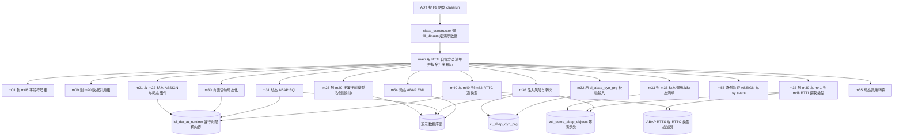
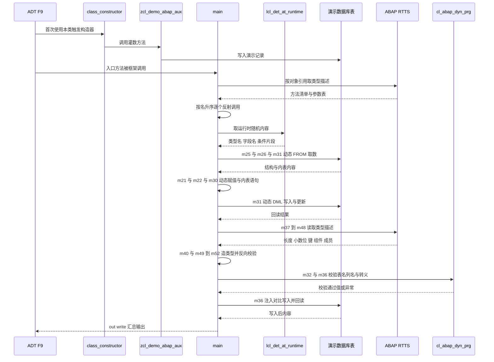

# ZCL_DEMO_ABAP_DYNAMIC_PROG 动态编程示例类 分析报告

> 分析对象：`zcl_demo_abap_dynamic_prog`（SAP 官方 abap-cheat-sheets 示例，Apache-2.0）
> 类型：全局 ABAP Object 类（`CLASS ... DEFINITION PUBLIC FINAL CREATE PUBLIC` + `CLASS ... IMPLEMENTATION`），实现 `if_oo_adt_classrun`
> 体量：定义段约 103 行 + 实现段约 6735 行，合计 6837 行
> 规模：57 个 PUBLIC 方法（1 个 `class_constructor` + 55 个 `m01` 到 `m55` 实例方法）+ 4 个 PRIVATE 示例方法 + 1 个全局声明区
> 外部依赖：`zcl_demo_abap_aux`（分隔线与演示数据灌入）、`lcl_det_at_runtime`（CCIMP 中的本地类，提供运行时随机内容）、`zcl_demo_abap_objects`、`zdemo_abap_objects_interface`、`zdemo_abap_fli`、`zdemo_abap_flsch`、`zdemo_abap_carr`、`zdemo_abap_rap_ro_m` 与 `zdemo_abap_rap_ch_m`（RAP 演示实体）

---

## 一、程序定位与业务背景

### 1.1 它在解决什么问题

先把话说直白：**这个类不解决任何业务问题**。它是一本"可执行的 ABAP 动态编程参考手册"，一节一个方法，共 55 节。类头注释写得很清楚——在 ADT 里按 F9 就能把整本书跑一遍。

它覆盖的能力是"**语法元素在运行时才确定**"，有两类技术底座：

- **底座一：语法插槽**。ABAP 从 7.40 起在大量语句里预留了"括号插槽"——`(name)` 形态的动态位置，可出现在数据对象名、组件名、表键名、表名、字段列表、`WHERE`/`SET`/`ORDER BY` 子句、方法名、类名、转换名、EML 实体名。往插槽里塞一个 `string` 变量，就实现了"运行期才知道要操作什么"。
- **底座二：RTTS/RTTC**。运行时类型服务让你**问**一个类型是什么（长度、小数位、组件、键、枚举成员），也让你**造**一个此前不存在的类型。

这 55 个方法把 55 个插槽与两套类型服务逐个演示一遍，外加第三块最容易被忽略但工程价值最高的内容：**安全**。`m36_security_considerations` 用可复现的对照实验证明了"把外部输入拼进动态 `WHERE`/`SET` 子句"就是 SQL 注入，并给出 `cl_abap_dyn_prg` 的正确用法。

### 1.2 为什么需要它：静态写法的天花板

| 需求 | 静态写法 | 动态写法 | 代价 |
| --- | --- | --- | --- |
| 用户勾 3 个字段，只 SELECT 这 3 列 | 为每种组合写分支，或 `SELECT *` 全取再删 | `SELECT (sel_list) FROM tab INTO ...` | 列名拼错只在运行期炸 |
| 配置里存了表名，要按表名统计行数 | 只能靠 DDL 生成的 4 个方法族 | `SELECT COUNT(*) FROM (tab_name)` | 表名可篡改即越权读表 |
| 配置里存了条件片段，要拼 WHERE | 只能 `WHERE (cond)` 动态条件 | `SELECT ... WHERE (cond)` | 拼进 `OR` 即全表泄露 |
| 要按运行期才知的结构建数据对象 | 无 | `CREATE DATA dref TYPE (tname)` | 类型名不存在即 dump |

`m31`、`m32`、`m36` 就是把后三行拆开揉碎给人看。作者直接点名了行业里最常见的反面教材：*Check out the CL_ABAP_DYN_PRG class, which supports dynamic programming by checking the validity for dynamic specifications.*

### 1.3 整体设计范式（一句话定性）

**"反射驱动的自清单演示器"**：用 `if_oo_adt_classrun` 作统一入口，用 RTTI 把自己类的方法清单反射出来、按名称升序排序、用正则挑出全部 `M` 加数字的示例方法再逐个动态调用——**示例的编排逻辑本身就是它要教的第一课**；每个方法内部则是"声明一个极简测试夹具 → 演示一个语法点 → 把结果 `out->write` 到 ADT 控制台"的固定三段式，55 个方法签名完全一致，从而可被反射批量触发。

这个范式有一个非常聪明的自指特性：入口方法本身就在演示它后面 55 个方法要教的东西。读者按下 F9，看到的第一件事就是"程序用 RTTI 找出自己有哪些方法，然后动态调用它们"，这比任何文档都直接。

---

## 二、程序执行流程总览



### 责任链表

| 子程序 | 调用者 | 职责 |
| --- | --- | --- |
| `CLASS ... DEFINITION`（全局声明区） | 编译器 | 声明入口接口、57 个 PUBLIC 方法统一签名、4 个 PRIVATE 示例方法、共享类型与属性 |
| `class_constructor` | ABAP 运行时首次使用本类时自动触发 | 调辅助类灌数方法写入演示数据库表 |
| `if_oo_adt_classrun~main` | ADT F9 与 classrun 框架 | RTTI 反射方法清单、按名升序排序、正则挑出示例方法逐个动态调用 |
| `m01_declaring_field_symbols` | `main` | 字段符号的完全类型、泛型类型与内联声明三种写法 |
| `m02_assign_dobj2fs` | `main` | 穷举演示泛型字段符号可接受与不可接受哪些数据对象 |
| `m03_check_fs_assignment` | `main` | 用绑定状态判断字段符号是否已赋值 |
| `m04_unassign_dobj_from_fs` | `main` | 显式解绑字段符号并复核状态变化 |
| `m05_fs_type_casting` | `main` | 转型附加项的七种类型来源：静态类型、泛型、数据对象、字段符号、字符串、RTTI 对象、裸用 |
| `m06_address_fs` | `main` | 字段符号在表达式、结构、内部表读写与表表达式中的寻址 |
| `m07_fs_itab` | `main` | 免拷贝改写内表行，两次循环分别改写两张目标表 |
| `m08_fs_structure_components` | `main` | 按序号动态指定结构组件，靠状态码退出循环 |
| `m09_declare_dref` | `main` | 数据引用的完全类型与泛型声明写法 |
| `m10_create_dref` | `main` | 用引用构造算符为既有数据对象建引用 |
| `m11_create_dobj_dyn` | `main` | 静态类型下创建匿名数据对象的四条路径 |
| `m12_assign_dref` | `main` | 数据引用的上转型与下转型 |
| `m13_address_dref` | `main` | 解引用运算符的读写、表达式与组件寻址 |
| `m14_check_dereferencing` | `main` | 用绑定状态与内联条件判断引用能否解引用 |
| `m15_remove_ref` | `main` | 清空引用后两种状态判断的差异 |
| `m16_overwrite_dref` | `main` | 引用被覆盖时原对象失去最后一个引用点 |
| `m17_retain_dref` | `main` | 把引用存进引用内表以阻止覆盖 |
| `m18_process_itab_with_dref` | `main` | 引用式循环免拷贝改写内表行 |
| `m19_dref_in_itab_struc` | `main` | 引用作为结构组件与内表列 |
| `m20_generic_dref` | `main` | 完全泛型引用的能力边界与索引操作限制 |
| `m21_dynamic_assign` | `main` | 动态指定内存区与组件、旧语法对照、解绑附加项、动态转型 |
| `m22_dyn_access_structure_comp` | `main` | 就地访问动态组件、非法组件异常、结合 RTTI 遍历组件 |
| `m23_create_dyn_dobj_misc` | `main` | 按运行时类型名创建三类形态对象 |
| `m24_create_dyn_elem_dobj` | `main` | 按内建类型名与长度小数位建基本类型对象并反查 |
| `m25_create_dyn_struc` | `main` | 按运行时表名建结构并配合动态取数 |
| `m26_create_dyn_itab` | `main` | 按运行时表名建内表、动态取数与随机行数上限 |
| `m27_anonymous_dobj_dyn_type` | `main` | 汇总创建数据对象的七种动态类型句式 |
| `m28_dyn_class_instances` | `main` | 按动态类名实例化对象与不存在的类名异常 |
| `m29_absolute_name` | `main` | 用 RTTI 取绝对类型名后建数据与建对象 |
| `m30_dyn_itab` | `main` | 内表语句动态化总章：排序、读取、表表达式、循环、插入、修改、删除 |
| `m31_dyn_abap_sql` | `main` | 动态 SQL 总章：查询四子句、多子句同动态、五种动态 DML、动态赋值子句、指示结构 |
| `m32_validate_dyn_input` | `main` | 表名校验、白名单校验、列名校验四组对照 |
| `m33_dyn_method_calls` | `main` | 动态方法调用总章：参数绑定表、四种类名方法名组合、五类错误异常 |
| `m34_dyn_spec_string_templates` | `main` | 字符串模板格式选项的动态指定 |
| `m35_dyn_export_import` | `main` | 导出与导入语句用二列索引内表动态指定参数清单 |
| `m36_security_considerations` | `main` | 注入实证、表名越权、列名白名单、转义方案对比 |
| `m37_rtti_get_type_descr` | `main` | 取得类型描述对象引用，四大类型族属性与方法概览 |
| `m38_rtti_misc_a` | `main` | 按运行时随机类型名分派，按种类转型取更细信息 |
| `m39_rtti_misc_b` | `main` | RTTI 深度示例：异构对象统一遍历、两层分派、构造报告串 |
| `m40_rttc` | `main` | RTTC 总章：造各类类型描述对象、建数据对象、按字典表反推内表类型 |
| `m41_rtti_elementary` | `main` | 基本类型的 RTTI 五步模板与兼容性检查 |
| `m42_rtti_enum` | `main` | 枚举类型的 RTTI：基类型种类、成员表、兼容性检查 |
| `m43_rtti_struc` | `main` | 结构类型的 RTTI：组件表、包含视图分层、符号表、XCO 读字典字段 |
| `m44_rtti_itab` | `main` | 内表类型的 RTTI：表类别、键表、唯一键标志、键别名、行类型下钻 |
| `m45_rtti_dref` | `main` | 引用类型的 RTTI：按引用取描述与取被引用类型 |
| `m46_rtti_classes` | `main` | 类的 RTTI：类别种类、属性、接口、事件、方法、参数类型、超类 |
| `m47_rtti_interfaces` | `main` | 接口的 RTTI：接口种类、属性、接口、事件、方法 |
| `m48_type_descr_cl_constants` | `main` | 类型描述类常量取值集中对照，全部用断言固定 |
| `m49_rttc_elementary` | `main` | RTTC 基本类型：十余种构造方法逐一建类型并反向校验 |
| `m50_rttc_structures` | `main` | RTTC 结构类型：扁平结构、深结构、BDEF 派生类型 |
| `m51_rttc_itab` | `main` | RTTC 内表类型：表类别、键、键别名，最后断言与静态声明等价 |
| `m52_rttc_dref` | `main` | RTTC 引用类型：从四类被引用类型造引用类型 |
| `m53_assign_sy_subrc` | `main` | 约 70 条断言逐例钉死赋值语句的状态码与绑定状态语义 |
| `m54_dyn_eml` | `main` | 动态 EML 修改六种操作与检索两种操作 |
| `m55_dyn_call_transformation` | `main` | 动态调用转换四种组合的等价性断言 |
| `inst_meth1` 与 `stat_meth1` | `m33_dyn_method_calls` 动态调用 | 空靶子方法，演示无参数方法动态调用 |
| `inst_meth2` 与 `stat_meth2` | `m33_dyn_method_calls` 动态调用 | 把入参转大写返回，演示带导入导出返回参数的动态调用 |

下面按这条流程，逐个子程序展开。同主题且高度同构的方法合并为一个 section，段内以小标题点名具体方法，每个代码块后各自带齐三层。

---

## 三、分组分析（按程序流程 / 子程序）

### 3.1 类定义段（全局声明区）

```abap
CLASS zcl_demo_abap_dynamic_prog DEFINITION
  PUBLIC FINAL CREATE PUBLIC .
  PUBLIC SECTION.
    INTERFACES: if_oo_adt_classrun.
    CLASS-METHODS: class_constructor.
    METHODS:
      m01_declaring_field_symbols  IMPORTING out TYPE REF TO if_oo_adt_classrun_out text TYPE string,
      m02_assign_dobj2fs           IMPORTING out TYPE REF TO if_oo_adt_classrun_out text TYPE string,
      ...（m01 到 m55 共 55 行，签名逐字相同，此处按样板清单省略 53 行）...
      m55_dyn_call_transformation  IMPORTING out TYPE REF TO if_oo_adt_classrun_out text TYPE string.
  PRIVATE SECTION.
    METHODS inst_meth1.
    METHODS inst_meth2 IMPORTING text TYPE string RETURNING VALUE(result) TYPE string.
    CLASS-METHODS stat_meth2 IMPORTING text TYPE string EXPORTING result TYPE string.
    TYPES: BEGIN OF st_type, col1 TYPE i, col2 TYPE string, col3 TYPE string,
           END OF st_type.
    DATA structure TYPE st_type.
    DATA it TYPE TABLE OF st_type WITH EMPTY KEY.
ENDCLASS.
```

**做什么** — 声明全部对外契约：实现入口接口作统一入口；把 55 个示例方法统一成完全相同的两个入参；另设 4 个 PRIVATE 示例方法供动态调用章节使用；最后声明共享类型与两个属性，供动态组件访问示例使用。

**为什么** — 55 个方法签名逐字相同不是巧合，而是**反射批量调用的前提**：入口用同一句动态调用语句调用全部方法，只有签名一致才成立。入参承载"示例编号加标题"，让每个方法能自绘分隔线而不必知道自己在第几节。`CREATE PUBLIC` 与 `FINAL` 也是刻意的：有一节用绝对类型名反射实例化自己、另一节用构造器建实例，构造函数必须 public；`FINAL` 则让类描述那节的类别种类断言成立。

**风险与改进** — `structure` 与 `it` 是**类级可变属性**，被动态赋值与动态组件两节共享写入，等于在方法之间埋了隐式全局状态，谁先跑、跑几次都会影响对方；放在 PRIVATE 属性而非局部变量还会让它们出现在反射可见范围内，理论上可被动态赋值意外改写；`PROTECTED SECTION` 为空，属历史遗留，可清理。无功能性风险。

### 3.2 静态构造器 `class_constructor`

```abap
METHOD class_constructor.
  "Filling demo database tables.
  zcl_demo_abap_aux=>fill_dbtabs( ).
ENDMETHOD.
```

**做什么** — 在本类被**首次使用**的那一刻（运行期惰性触发），调用辅助类的灌数方法，把 `ZDEMO_ABAP_CARR`、`ZDEMO_ABAP_FLI`、`ZDEMO_ABAP_FLSCH` 等演示表灌满样例数据。

**为什么** — 后面几十个示例都要 `SELECT` 这些表才能演示动态取数，把数据准备集中到构造函数里，读者就不必在每个方法里重复造数。这是 SAP 示例库 `zcl_demo_abap_aux` 的"公共初始化"约定。

**风险与改进** — **在静态构造器里做数据库写操作，是这个类最值得警惕的设计**。静态构造器没有异常处理、不能接收参数、失败不可观测；更要命的是触发时机是"首次激活"，而动态方法调用那节两次写了"新建本类实例"，另一节也按动态类型名创建对象——**示例跑到一半，演示数据可能被重新灌一遍**，把安全那节故意写进去的被注入脏值悄悄冲掉。改进：改成入口里显式调用的幂等初始化方法（先删后插或按主键 upsert），并用异常捕获记录失败。

### 3.3 事件方法 `if_oo_adt_classrun~main`

```abap
DATA(methods) = CAST cl_abap_classdescr( cl_abap_typedescr=>describe_by_object_ref( me ) )->methods.
SORT methods BY name ASCENDING.

LOOP AT methods INTO DATA(meth_wa)
"WHERE name CS 'M01'
.
  TRY.
      IF find( val = meth_wa-name pcre = `^M\d` case = abap_false ) = 0.
        CALL METHOD (meth_wa-name) EXPORTING out = out text = CONV string( meth_wa-name ).
      ENDIF.
    CATCH cx_root INTO DATA(error).
      out->write( error->get_text( ) ).
  ENDTRY.
ENDLOOP.
```

**做什么** — 四步：用"按对象引用取类型描述"拿到本类的运行时类型描述，转型成类描述后取方法属性表，得到全部方法（含继承方法）的元数据；按名升序排序保证执行顺序稳定；用正则挑出名字从第 0 位起是 M 加一位数字的方法；用动态方法名逐个调用，任何 `cx_root` 被捕获后只写一行异常文本。

**为什么** — 全类设计上最漂亮的**自指**：入口方法本身就在演示后面 55 个方法要教的东西。排序是刚需，因为 RTTI 返回的方法表顺序由 ABAP 内部决定，不保证是源码顺序；正则是最轻量的"示例方法"标记，无需维护清单。注释里被注释掉的过滤子句等于送给读者一个调试开关。

**风险与改进** — 第一，`CATCH cx_root` 是**万能兜底**，把"引用未绑定""转型失败"这类真 dump 全吞掉，且只写异常文本、**不打印是哪个方法失败**——55 个方法坏掉一个，输出里只多一行看不懂的文本，排查成本极高，应改成输出方法名加异常文本。第二，正则边界不严谨：方法表含继承自入口接口的公有方法，一旦将来有继承方法恰好以 M 开头就会被误调。第三，方法名被当标题传下去，一旦某个方法忘记用标题参数拼分隔线，它的分隔线就直接显示方法名，极易误判。

### 3.4 字段符号组：`m01_declaring_field_symbols` 到 `m08_fs_structure_components`

```abap
FIELD-SYMBOLS: <fs_i>        TYPE i,
               <fs_tab_type> TYPE LINE OF tab_type,
               <fs_like>     LIKE str.

FIELD-SYMBOLS <fs_data>      TYPE data.        "Any data type
FIELD-SYMBOLS <fs_any_table> TYPE ANY TABLE.   "Internal table with any table type

ASSIGN: num_a   TO <fs_data_a>,
        struc_a TO <fs_data_a>,
        tab_a   TO <fs_anytab_a>.

ASSIGN dobj_d_l10 TO <fs_d1> CASTING TYPE (type_name_d).

LOOP AT tab_f1 ASSIGNING <fs_struc_f>.
  <fs_struc_f>-price = <fs_struc_f>-price + 100.
ENDLOOP.

DO.
  ASSIGN <struct>-(sy-index) TO <comp>.
  IF sy-subrc <> 0.
    EXIT.
  ENDIF.
ENDDO.
```

**做什么** — 这一组八节把字段符号从声明讲到遍历：`m01` 用链式冒号与独立语句分别声明完全类型与泛型类型字段符号并演示内联声明；`m02` 用约 60 条赋值穷举各种泛型可接与不可接的数据对象；`m03` 与 `m04` 用绑定状态判断与显式解绑做前后对照；`m05` 铺开转型附加项的七种类型来源；`m06` 在表达式、结构、内部表与表表达式中寻址；`m07` 用免拷贝赋值改写内表行并追加进两张不同目标表；`m08` 按序号动态指定结构组件，靠状态码越界退出循环。

**为什么** — 字段符号是动态编程最老血的地基：它让一段静态代码可以作用于任意内存区。`TYPE data` 与 `TYPE ANY TABLE` 是后面动态赋值、动态组件、RTTI 深度示例全篇反复出现的通用接收端，只有先把泛型声明清楚，后面的插槽演示才有意义。`m02` 的"负面清单"最有价值：把不可行组合**用注释保留在原地**而非删掉，读者一眼看到边界（定长字符字段符号收不了字符串，标准表字段符号收不了排序表）。`m05` 揭示了"转型是视角而非转换"这条容易被误用的语义。`m07` 是性能论证：注释写得很准——避免在循环中把内容实际复制到工作区，万行级批量改写是数量级的差别。

**风险与改进** — ① `m01` 的内表声明后从未填充，循环体永不执行，占位语句让这段连"语法可编译"的证明力都打了折扣。② `m02` 全篇无输出无断言，"哪些组合合法"完全靠人读注释，**运行时不提供任何证据**。③ `m03` 与 `m04` 的输出文案有尖括号错位与 `intial` 拼写错误，读者容易照抄进自己的日志。④ `m05` 的两种投影都是**静默截断视图**，示例毫无说明，读者容易误当成转换。⑤ `m06` **有实质性误导缺陷**：两个字段符号绑到同一数据对象，第二次 `SELECT INTO TABLE` 覆盖第一次结果，因中间已输出过而屏幕表现正常，对照 `m07` 的正确写法更具欺骗性。⑥ `m07` 循环体内用构造器重建内表，每行一次全量重建，大表上是性能坑，应改 `APPEND`；且原地修改意味着源表被改而最后又输出源表。⑦ `m08` 无边界循环没有任何次数上限，一旦赋值持续成功即变成死循环并持续占用输出。

### 3.5 数据引用组：`m09_declare_dref` 到 `m20_generic_dref`

```abap
DATA: ref_a1 TYPE REF TO i,
      ref_a3 LIKE REF TO some_string,
      ref_a6 TYPE REF TO data. "Generic data type

DATA(ref_b3) = REF #( g ).

CREATE DATA dref_c2 TYPE HASHED TABLE OF zdemo_abap_carr WITH UNIQUE KEY carrid.
DATA(dref_c6) = NEW zdemo_abap_carr( carrid = 'AB' carrname = 'AB Airlines' ).
SELECT * FROM zdemo_abap_carr INTO TABLE NEW @DATA(dref_c7) UP TO 3 ROWS.

ref_d5 = CAST #( ref_data_d2 ).
ref_d5 ?= ref_data_d2.

ref_e2->carrid = 'UA'.
ref_e2->*-carrname = 'United Airlines'.

itab_l = VALUE #( BASE itab_l ( struc_l ) ).
```

**做什么** — 这一组十二节把数据引用走完：`m09` 与 `m10` 演示六种声明写法与用引用构造算符为既有对象建引用；`m11` 铺开创建匿名数据对象的四条路径；`m12` 演示上转型与下转型；`m13` 到 `m17` 依次演示解引用运算符的六种用法、绑定状态判断、清空引用后的两种状态差异、引用被覆盖、以及把引用存进引用内表以阻止覆盖；`m18` 用引用式循环免拷贝改写内表行；`m19` 演示引用作为结构组件；`m20` 演示完全泛型引用的能力边界。

**为什么** — 数据引用与字段符号是同一件事的两面：字段符号"借别人的内存"，引用"自己持一个指针"。声明方式几乎一一对应，作者有意并列以建立映射。`m11` 揭示了 `CREATE DATA` 与 `NEW` 的唯一判据——**能写初值 vs 不能写初值**。`m12` 的核心规则是"目标引用的静态类型必须比源引用的动态类型更通用或相同"，这条规则后面在 `m39` 处理任意类型对象时会被反复用到。`m17` 是"引用数组"的标准写法：把引用存进内表后，每个引用本身就是快照，被引用对象的生命周期延长到内表销毁。`m19` 是引用相对字段符号的**唯一硬性优势**——字段符号不能当结构组件。`m20` 把泛型的代价摆在同一页上：编译器不知道内容是什么，所有需要静态类型的语法都被禁用，作者把三条不可行写法用注释保留，这是本组最有教学价值的部分。

**风险与改进** — ① `m10` 的末行注释说"可以显式指定类型"，但代码里的标识符在本方法中根本没声明，显然是从别处抄来忘了改；它能编译只能因为该名字恰好是全局类型池里的成员，一旦不存在就是语法错误——而这恰好落在读者最容易照抄的位置。② `m11` 连续复用同一引用变量创建六种不同类型对象，每次覆盖上一个，读者容易误以为能拿到多个对象。③ `m12` 把转型运算符与旧写法连写两遍当等价，**但两者行为不同**：转型失败时前者抛异常，旧写法**静默失败并保持目标引用仍指向旧对象**，并列展示会误导读者写出隐蔽 bug。④ `m13` 取出的两个中间值从未使用，且复制引用后改原引用会同时反映到副本上这一关键证据没有并排输出。⑤ `m15` 因清空恰好让两种状态判断结果相同，读者得不到"二者会不同"的证据，真正的反例是"新建一个空字符串"。⑥ `m16` 只展示泛型引用的优点没展示代价，应补一个"同一行表达式在换成字符串后立刻编译失败"的反例。⑦ `m17` 循环内重建内表且没有断言，输出文案有拼写错误。⑧ `m18` 用字符字面量做乘法易被误读为字符串拼接；补一句"本例不回写数据库"。⑨ `m19` 结构赋值时引用组件是**按值复制引用**（浅拷贝），这个语义未点破。⑩ `m20` 把主键改成已存在的值时会撞重复键异常，示例没有捕获，一旦重复就是 dump。

### 3.6 动态指定内存区与组件：`m21_dynamic_assign`、`m22_dyn_access_structure_comp`

```abap
ASSIGN ('IT') TO <fs>.
ASSIGN structure-(3) TO <fs>.
ASSIGN ('ZCL_DEMO_ABAP_OBJECTS')=>('PUBLIC_STRING') TO <fs>.
ASSIGN lcl_det_at_runtime=>(dobj_name) TO FIELD-SYMBOL(<fs_m1>).

ASSIGN cl_ref->(attribute) TO FIELD-SYMBOL(<attr>) ELSE UNASSIGN.
IF sy-subrc = 0.
  out->write( |Successful assignment for attribute \"{ attribute }\".| ).
ENDIF.

LOOP AT typenames INTO DATA(typename).
  TRY.
      ASSIGN abc TO <c_like> CASTING TYPE (typename).
    CATCH cx_root INTO DATA(error).
      assignment_results = VALUE #( BASE assignment_results
      ( |Error! { cl_abap_typedescr=>describe_by_object_ref( error )->get_relative_name( ) }| ) ).
  ENDTRY.
ENDLOOP.
```

**做什么** — `m21`（约 400 行，全类最长方法之一）分六步：把数据对象名写进括号动态指定整个内存区；用字面量串、变量、完全动态串、数值序号、旧语法六种方式动态指定组件；把插槽扩展到类属性，覆盖类名与属性名的五种静态动态组合；从本地辅助类取运行时才知的类属性名做完全动态绑定；用解绑附加项在一个复用同一个内联字段符号的循环里安全尝试三个属性名；最后循环遍历六种类型名做动态转型，失败时用 RTTI 反查异常类名记录结果，并用 RTTC 造的类型描述对象完成"造类型再转型"闭环。`m22` 演示动态组件选择器在三类宿主上的读写与四种取值方式，并结合 RTTI 拼出结构组件报告串。

**为什么** — 这是全类技术密度最高的一段。括号插槽把"要操作哪块内存""要操作哪个属性""要调用哪个方法"全部推迟到运行期；数值序号是只知道组件位置时比查名字更快的实用手段；`ELSE UNASSIGN` 是动态赋值最重要的安全机制（不加它，失败时字段符号会保留上次绑定）；而用 RTTI 反查异常类名把"转型失败"从一句 dump 变成一行可读诊断，这个手法在处理运行时类型时价值极高。`m22` 与 `m21` 形成方法论对照：前者是"取到字段符号里再操作"，组件选择器是"就地访问"，后者代码更短且可直接出现在赋值左侧。

**风险与改进** — ① 注释里给了一条很实用的云开发建议（不要把具名数据对象直接用于动态赋值），但**同一节里紧接着就大量使用具名数据对象**，前后矛盾，读者不知道该听哪个。② 按位置取组件完全依赖结构定义顺序，DDIC 组件顺序一调整就**静默取错值**。③ 完全动态串让静态检查彻底失效，应标成"仅教学、勿用于生产"。④ 用构造器表达式写在赋值源位置虽合法，但**临时对象没有命名引用点**，属炫技而非实用。⑤ 类属性名来自 CCIMP，**读者看不到**：单读本文件无法知道辅助类返回什么字符串、为什么一定合法，对一份参考手册是硬伤，应在注释里写出取值集合。⑥ 断言是解绑附加项一节的唯一证据来源，而断言只在断言激活时生效，普通 F9 运行不构成任何保护。⑦ 转型失败那一步的**输出标签名写错**，读者按输出反查代码会找不到对应变量；行尾注释记录的是上一个赋值的结果却写在下一行下方，极易误读。⑧ `m22` 外层异常捕获是**空处理**，异常被完全吞掉；分隔符用序号判断"是否是第一个"比"上一轮是否输出过内容"更脆弱。

### 3.7 按运行时类型名创建对象：`m23` 到 `m29`

```abap
LOOP AT type_names REFERENCE INTO DATA(refwa).
  CASE refwa->*.
    WHEN `I`.
      CREATE DATA dataref TYPE (refwa->*).
      CREATE DATA dataref TYPE TABLE OF (refwa->*).
      CREATE DATA dataref TYPE REF TO (refwa->*).
    WHEN `ZDEMO_ABAP_CARR`.
      SELECT SINGLE * FROM zdemo_abap_carr INTO NEW @dataref->*.
  ENDCASE.
ENDLOOP.

CASE b_type-builtin_type.
  WHEN 'c' OR 'n' OR 'x'.
    CREATE DATA ref_bt TYPE (b_type-builtin_type) LENGTH b_type-len.
  WHEN OTHERS.
    out->write( `That didn't work.` ).
ENDCASE.
DATA(descr_builtin_type) = CAST cl_abap_elemdescr(
  cl_abap_typedescr=>describe_by_data( ref_bt->* ) ).

CREATE DATA data_ref TYPE SORTED TABLE OF ('ZDEMO_ABAP_FLI') WITH UNIQUE KEY (key_table).
CREATE OBJECT oref_dyn TYPE ('ZCL_DEMO_ABAP_OBJECTS').
CREATE OBJECT oref4abs TYPE ('\CLASS=ZCL_DEMO_ABAP_DYNAMIC_PROG').
```

**做什么** — `m23` 用字符串内表存三个类型名并按名分派，每个类型名各创建基本类型对象、内表对象、引用对象三种形态；`m24` 按"需要哪些附加参数"给内建类型分类创建基本类型对象（长度、小数位），再用 RTTI 反查造出来的对象；`m25` 与 `m26` 分别按运行时表名建结构与内表并配合动态取数，其中 `m26` 的行数上限来自随机整数；`m27` 汇总创建数据对象的七种动态类型句式（含复合主键、绝对类型名、类型描述对象）；`m28` 与 `m29` 演示按动态类名实例化对象与用 RTTI 取绝对类型名。

**为什么** — 动态类型名插槽的价值在于"类型名来自数据"。`m23` 用字符串分派而非条件链很地道，`INTO NEW` 那行更是一行完成建引用加取数。`m24` 的"造类型 → 建对象 → 用 RTTI 反查 → 打印类型信息"是本类最值得学的自证手法：**动态造类型必须自带验证手段**。`m25` 是"元数据驱动的通用取数"最小闭环：类型名与表名是同一个字符串，同时充当建对象类型与 SQL 表名。`m26` 是全类唯一演示连行数上限都可动态的地方，`@` 标记漏掉会退化成字符串拼接进而变成注入面。`m27` 则是**用代码当索引**的文档技巧。绝对类型名**不依赖名字解析作用域**，在"类型定义在某个包里而动态代码运行在另一个上下文"的场景里是唯一可靠方案。

**风险与改进** — ① `m23` 连续覆盖同一引用变量九次，读者很难把"三次创建"与"三种形态"对应起来；`SELECT SINGLE` 无条件也不判状态码，空表时 `INTO NEW` 会留下未绑定引用，后续解引用即 dump。② **`m24` 有真实的执行缺陷**：`WHEN OTHERS` 之后没有 `EXIT` 或 `RAISE`，控制流继续走到解引用未绑定引用，异常被万能捕获转成"出错了"，**根因被完全掩盖**。③ `m25` 与 `m26` 既没有条件也不判状态码，错误状态被当成正常结果输出；且演示了"表名可动态指定"却无任何校验，而作者明明知道风险（专门写了校验节与安全节），**教学顺序是先用后教防护**，应在本节注释里直接写"生产代码必须先校验"。④ `m27` 把同一个引用变量复用十八次且**从不输出**，读者完全看不到任何结果，是全类输出密度最低的方法；另有四个对照用的数据对象声明后从未使用，而"从结构某组件取类型"这条最实用的句式却无任何解释。⑤ `m28` 的空异常处理什么都不做，且没解释"为什么必须用 `CREATE OBJECT` 而不是 `NEW`"这个关键差异。⑥ `m29` 的最后一条会再次激活本类静态构造器从而再次灌数。

### 3.8 内表语句动态化：`m30_dyn_itab`

```abap
DATA(field_name) = lcl_det_at_runtime=>get_dyn_field( ).
SORT carr_itab BY (field_name).

SORT it_sort BY VALUE abap_sortorder_tab( FOR sortwa IN compnames ( name = condense( to_upper( sortwa ) ) ) );

READ TABLE itab_read_tab_dyn INTO DATA(read_line)
  WITH KEY (wa_comps-comp) = wa_comps-value.

LOOP AT itab_loop INTO DATA(wa_lo) USING KEY (k).
  APPEND wa_lo TO itab_dyn_key.
ENDLOOP.

LOOP AT itab REFERENCE INTO DATA(ref) WHERE (cond_loop).
  ...
ENDLOOP.

MODIFY itab_mod_tab_dyn
  FROM VALUE line( col2 = wa_mod_dyn-col2 * 2 )
  TRANSPORTING col2
  WHERE (condition).
```

**做什么** — 约 510 行，分六步：动态排序字段名；用排序表表达多级排序（空表、单字段、多字段、顺序颠倒、不存在的组件名、以及用推导式**动态生成排序表**）；用二列表存放"组件名加期望值"做动态键读取；`READ TABLE` 的三种键形态与传输、比较两个附加项；表表达式三种动态读法、循环的动态键名与动态条件；修改与删除的各种键指定方式与动态条件（其中动态条件筛选用内表形式的多行条件并把逻辑或作为独立一行表达）。

**为什么** — 这是"用户点表头排序"与"用户在表格里输入任意字段名和值做查找"的标准实现。排序表是表达"按哪几列排、各自什么方向"的载体，比单个字段名强得多，而推导式版本意味着**排序规则来自数据时整条语句无需任何静态名**。键的三种形态语义差别很大：主键与二级键读是二分查找，自由键读是线性扫描，能按二级唯一键读就绝不要用自由键。`USING KEY` 是内表遍历里最容易被忽视的性能杠杆。`TRANSPORTING` 控制读哪些组件，`COMPARING` 用于"内容没变就跳过处理"——这是 ABAP 经典的变更检测手法。把键名与键值解耦放进同一张二列表是干净的数据驱动设计。

**风险与改进** — ① 动态排序字段名与动态键名都**没有合法性校验**（注释已明确非法键名产生运行期错误，但没有异常捕获），实际项目中这些几乎总来自 UI 或配置输入，必须校验。② 动态条件字符串在本类里全部来自内部定义的数据对象因此安全，但示例从头到尾没有一句"若条件来自外部输入必须校验"的提示，而读者极易把这段原样搬到 `SELECT` 上——**这是本节最大的教学风险，必须显式警告**。③ 修改与删除两处都用行号去索引条件表并做分派，一旦条件表长度变化就错位；后一段还复用了前一段的条件变量，隐式作用域耦合很难读。④ 条件只能与传输附加项同时使用这条关键限制只在注释里一句带过，应加显著提示。⑤ 注释里的类型常量名被批量查找替换破坏（出现若干拼写错乱的词），不影响运行但严重影响可读性。

### 3.9 动态 ABAP SQL：`m31_dyn_abap_sql`

```abap
SELECT (select_list)
 FROM zdemo_abap_flsch
 ORDER BY carrid
 INTO CORRESPONDING FIELDS OF TABLE @sel_table
 UP TO 3 ROWS.

SELECT COUNT(*) FROM (tab_name) INTO @DATA(count).

IF dyn_syntax_elem-table IS NOT INITIAL
AND dyn_syntax_elem-select_list IS NOT INITIAL
AND dyn_syntax_elem-where_clause IS NOT INITIAL
AND dyn_syntax_elem-order_by IS NOT INITIAL
AND dyn_syntax_elem-target IS BOUND
AND dyn_syntax_elem-rows IS NOT INITIAL.
  SELECT (dyn_syntax_elem-select_list)
    FROM (dyn_syntax_elem-table)
    WHERE (dyn_syntax_elem-where_clause)
    ORDER BY (dyn_syntax_elem-order_by)
    INTO CORRESPONDING FIELDS OF TABLE @dyn_syntax_elem-target->*
    UP TO @dyn_syntax_elem-rows ROWS.
ENDIF.

SELECT SINGLE * FROM (table) INTO NEW @DATA(refstruc).
INSERT (table) FROM @refstruc->*.
UPDATE ('ZDEMO_ABAP_CARR') SET (set_clause) WHERE (where_cl).

TYPES ind_wa TYPE zdemo_abap_carr WITH INDICATORS comp_ind TYPE abap_bool.
DATA(dyn_ind) = `SET STRUCTURE comp_ind`.
UPDATE ('ZDEMO_ABAP_CARR') FROM TABLE @ind_tab INDICATORS (dyn_ind).
```

**做什么** — 约 265 行，分五步：`SELECT` 的字段列表、表名、条件、排序四个子句各自动态；六个语法元素同时动态并先用与链做完整性校验；动态插入、更新、修改、删除四种 DML 加上动态建结构对象；用故意缺少右引号的赋值子句触发异常再修正；用指示结构做"只更新指定字段"的批量更新。

**为什么** — 这是"配置驱动查询"的四个基本旋钮与"通用维护程序"（按配置维护任意表）的核心。字段列表配合对应字段表让目标内表可以是字段子集的类型而无需与源表完全一致。第二步是全类**唯一一处真正体现工程素养**的写法：动态参数不是拿来就用，而是**先校验齐备再执行**，且校验不只"非空"还包含目标引用是否已绑定——这正是校验节与 RTTI 分派节中暴露的同一个陷阱的正面写法。第四步是安全演示的伏笔：动态赋值子句一旦拼接外部输入，后果与动态条件完全同级。指示结构则把"只更新指定字段"这种按字段粒度的维护能力也数据化了。

**风险与改进** — ① 计数查询**不判状态码**，若表为空则计数保持初始值却照样输出，读者会误以为统计成功。② 动态条件的内容来自内置辅助类所以安全，但示例没有任何警告。③ 动态字段列表若含聚合表达式或源表不存在的列，行为与异常未说明。④ **第二步的校验只检查"非空"不检查"合法"**：字段列表可能含非法列名、条件可能含注入片段、表名可能不存在，与链全部通过照样在查询处炸；应把表名校验与列名校验嵌进这条与链。⑤ **第三步会真实修改演示表**：单行查询不加条件取任意一行作为样板结构再改主键插入，五种 DML 全部不判状态码，中途异常退出则清理语句不执行、脏数据留在表里。⑥ 第四步捕获异常后取出错误文本**却从未输出**，这一步的教学价值完全浪费。⑦ **指示子句的内容若来自外部输入属高危注入点**，攻击者可指定任意指示结构名甚至绕过指示机制，示例对此毫无提示。

### 3.10 动态输入校验：`m32_validate_dyn_input`

```abap
DATA(check_packages) = VALUE string_hashed_table( ( `ZABAP_CHEAT_SHEETS` ) ).

LOOP AT table_names INTO DATA(wa_tab).
  TRY.
      dbtab = cl_abap_dyn_prg=>check_table_name_tab( val      = to_upper( wa_tab )
                                                     packages = check_packages ).
      SELECT SINGLE * FROM (dbtab) INTO NEW @DATA(ref_wa).
      out->write( ref_wa->* );
    CATCH cx_abap_not_a_table cx_abap_not_in_package INTO DATA(e).
      out->write( e->get_text( ) ).
    ENDTRY.
ENDLOOP.

DATA(col_name) = cl_abap_dyn_prg=>check_column_name( val = chk strict = abap_true ).
```

**做什么** — 四组对照：把六个表名（含三个不存在的）交给表名校验方法并指定包名，通过的才拿去动态取数；用白名单校验的**逗号分隔字符串**与**哈希内表**两种参数形式对同一批候选值做检查；用严格模式的列名校验检查列名是否合法且不含非法字符。

**为什么** — 关键在于包参数：它把"合法的表名"进一步收窄到**指定包内**的表，这正是应对"用户输入一个自己无权访问的表名"的正解——只做"是不是表"的校验不够，还要做"是不是允许的表"的校验。这一节是整个类里工程价值最高的防护手段，配合安全节形成完整闭环。

**风险与改进** — **本方法有一个真实的执行缺陷**：`SELECT SINGLE ... INTO NEW` 之后**不判状态码**就解引用输出。校验通过只保证"表存在且在允许的包内"，**不保证表里有数据**；若某张演示表为空，引用保持未绑定，解引用抛"引用未绑定"异常，而捕获只覆盖"不是表"与"不在包内"两类，异常会一路冒到入口的万能捕获——**该方法被中断，后面二十多个示例不再输出**，日志里只多一行看不懂的异常文本。改进：判状态码并在失败时明确输出。另包名硬编码，换包导入就全部失败，建议改为可配置或从仓库信息读取。

### 3.11 动态方法调用与动态清单：`m33`、`m34`、`m35`

```abap
lcl_det_at_runtime=>get_dyn_class_meth( IMPORTING cl = DATA(cl_name)
                                                  meth = DATA(meth_name)
                                                  ptab = DATA(p_tab) ).
CALL METHOD (cl_name)=>(meth_name) PARAMETER-TABLE p_tab.

DATA(ptab) = VALUE abp_parmbind_tab( ( name  = 'I_OP'
                                        kind  = cl_abap_objectdescr=>exporting
                                        value = NEW i( 3 ) )
                                      ( name  = 'R_TRIPLE'
                                        kind  = cl_abap_objectdescr=>returning
                                        value = NEW i( ) ) ).
CALL METHOD oref2->('TRIPLE') PARAMETER-TABLE ptab.
result = ptab[ name = 'R_TRIPLE' ]-('VALUE')->*.

DATA(s6) = |{ demo_string CASE = int_tab[ 1 ] }|.
out->write( data = s2 name = `s2` ).

TYPES: BEGIN OF param, name TYPE string, dobj TYPE string,
       END OF param, param_tab_type TYPE TABLE OF param WITH EMPTY KEY.
EXPORT (param_table) TO DATA BUFFER buffer.
IMPORT (param_table) FROM DATA BUFFER buffer.
```

**做什么** — `m33`（约 160 行）四组：从辅助类一次性取得类名、方法名、参数表三项并动态调用；类静态方法的四种类名方法名静态动态组合；实例方法的静态与动态等价对照（先静态拿到正确答案，再用动态实例加参数表调用同一方法）；五类错误调用的异常对照。`m34` 演示字符串模板的对齐与大小写转换两个格式选项的动态指定。`m35` 用两列索引内表作为参数清单，先按"参数名指向同名变量"导出，再换成"参数名指向结构组件路径"导入。

**为什么** — 这是"插件调用"的标准实现：类名、方法名、参数表全部来自数据，参数绑定表的三要素（参数名、参数方向、引用值）把"动态调用带参数的方法"从"不可能"变成"不难"。作者刻意做了**静态与动态的等价对照**——用已知答案验证动态写法，这是很好的工程习惯。`m34` 把"插槽"概念从赋值语句推广到字符串模板，说明动态是一种通用机制而非个别语句的特性。`m35` 的清单化设计让导出与导入共用一张表，只把第二列从变量名换成组件路径就完成了从平铺变量到嵌套结构的映射。

**风险与改进** — ① 取返回参数那行**非常容易读错**：先按名取参数表行、再动态取其组件、最后解引用引用值，读者极易漏写解引用符或误解为取表行整体。② 动态调用**没有统一的错误兜底**，只有教学用的五段捕获；实际代码应把动态调用包进一个统一包装方法，避免一个插件的失败炸掉整批调用。③ 参数表里的方向常量与私有示例方法的导入导出参数混用，读者容易混淆三种方向的语义。④ **`m34` 有明确的输出缺陷**：最后一行输出的是第二个变量而应是第六个变量，第五第六个算完之后从未被输出，而第二个变量被重复输出了两次。⑤ `m34` 循环内声明的变量只声明一次，五次循环只保留最后一轮的值而未说明。⑥ `m35` 两条语句都没有异常处理，类型不匹配会直接抛异常或 dump；参数名与数据对象名完全来自数据且无校验。

### 3.12 动态编程的安全考量：`m36_security_considerations`

```abap
zcl_demo_abap_aux=>fill_dbtabs( ).

DATA(input) = 'LH'.
DATA(cond1) = `CARRID = '` && input && `'`.
SELECT SINGLE * FROM zdemo_abap_fli WHERE (cond1) INTO @DATA(db_entry).

DATA(cond2) = `CARRID = @input`.
SELECT SINGLE * FROM zdemo_abap_fli WHERE (cond2) INTO @db_entry.

DATA(bad_input) = |LH' AND CONNID = '401|.
DATA(cond3) = `CARRID = '` && bad_input && `'`.
SELECT SINGLE * FROM zdemo_abap_fli WHERE (cond3) INTO @db_entry.

DATA(cond4) = `CARRID = @bad_input`.
TRY.
    SELECT SINGLE * FROM zdemo_abap_fli WHERE (cond4) INTO @db_entry.
  CATCH cx_sy_dynamic_osql_error cx_sy_open_sql_data_error INTO DATA(select_error).
    out->write( select_error->get_text( ) ).
ENDTRY.
```

**做什么** — 第一组四行是**本类最重要的一组对照实验**：同一个合法输入与同一个注入输入，分别用"拼成字面量"和"拼成主机变量引用"两种方式塞进动态条件子句，逐条执行并输出结果。后面还有三组：表名越权（用包名校验拦截不在允许包内的表与不存在的表名）、列名白名单（两种参数形式）、以及动态赋值子句的注入实证与转义方案对比（含内建转义函数与校验类两种做法的输出对照）。

**为什么** — 结论极其清晰：**用字面量拼接**时，注入串会闭合引号、追加条件，把查询变成返回不同数据——这就是 SQL 注入；**用主机变量引用**时，同样的串只是被当作一个普通的值，语句要么报错要么查不到，不会改变语义。这一组四行抵得上很多页安全文档，而且它出现在一本书的末尾，前面三十节讲的都是能力，这一节讲的是**边界**，编排上是刻意安排的。

**风险与改进** — ① **这一节会真实污染演示表**：注入用的承运人名称被拼进动态赋值子句后真的执行更新，把某行的网址字段写成井号串，靠后面手写的修改语句才"撤销"，中途异常退出即留脏数据。② 转义那部分对**整段已拼好的 HTML**（含标签）做转义，等于把标签也转义了，随后又包了一层标签，得到双重转义的结果；正确做法是**只对不可信的变量值转义**，标签部分保持原样，这个语义差别必须在注释里点明。③ 循环里先用列名校验检查输入，捕获异常并输出后**仍然继续**拼装并执行动态条件，只靠异常兜底；生产代码应在校验失败时直接终止该次循环。④ 列名与值变量都是定长字符字段，外部输入超长会被静默截断。

### 3.13 RTTI 总览：`m37_rtti_get_type_descr`、`m38_rtti_misc_a`、`m39_rtti_misc_b`

```abap
DATA(type_descr_obj_elem_inl) = CAST cl_abap_elemdescr(
  cl_abap_typedescr=>describe_by_name( 'ELEM_TYPE' ) );
DATA(output_length_elem) = type_descr_obj_elem_inl->output_length.
DATA(comps_struc) = type_descr_obj_struc->get_components( ).
DATA(comps_struc2) = type_descr_obj_struc->components.

DATA(get_type) = lcl_det_at_runtime=>get_random_type( ).
TRY.
    CREATE DATA dref TYPE (get_type).
  CATCH cx_sy_create_data_error.
    out->write( `Create data error!` ).
ENDTRY.
DATA(some_type) = cl_abap_typedescr=>describe_by_data( dref->* ).

itab_refs = VALUE #( ( REF #( elem_dobj ) ) ( REF #( dobj_enum ) )
                     ( REF #( demo_oref ) ) ( REF #( demo_iref ) ) ).

LOOP AT itab_refs INTO DATA(type).
  TRY.
      typdeobj = cl_abap_typedescr=>describe_by_object_ref( type->* ).
    CATCH cx_sy_dyn_call_illegal_type.
      typdeobj = cl_abap_typedescr=>describe_by_data( type->* ).
  ENDTRY.
  CASE TYPE OF typdeobj.
    WHEN TYPE cl_abap_datadescr.
      IF typdeobj IS INSTANCE OF cl_abap_complexdescr.
        IF typdeobj IS INSTANCE OF cl_abap_tabledescr.
          DATA(cast_tab) = CAST cl_abap_tabledescr( typdeobj ).
        ENDIF.
      ENDIF.
  ENDCASE.
ENDLOOP.
```

**做什么** — `m37` 演示取得类型描述对象引用的四种方式（带下转型、带旧式转型算符、内联声明、不下转型只用基类引用），并对基本类型与结构类型分别取一般信息与更细信息。`m38` 取一个运行时随机类型名，用它作为条件把逻辑分成两大分支：非类非接口则建数据对象并按"种类"分派到四个子分支，类与接口则改用按名称取描述再分派。`m39`（约 560 行）把九个不同种类数据对象的引用装进一张引用内表逐个遍历：先试"按对象引用取描述"失败则回退到"按数据描述"，再用类型种类做粗分、在数据类型分支用"是否实例of"逐层细分、在对象类型分支先取被引用类型再分类与接口；每轮把种类、类别、绝对名、相对名、长度、组件、键、成员、兼容性检查结果等逐条插入字符串内表，最后一次性输出。后面还有第二组用十四个**类型名**做同样的分类遍历。

**为什么** — 核心信息是：**按名称取类型描述的返回类型是基类引用，要用更具体的属性必须先转型下钻**；作者把"转型"与"不转型"能取到的信息并排列出，并点明组件表（只有名字与类型种类）与组件详情表（含组件的类型描述对象，可继续下钻）的差别。`m38` 演示了一个真实的架构决策：**要读一个类型的描述，就先得有一个该类型的实例或引用**，而类与接口不能建数据对象只能按名称取描述，这个不对称性被显式写成两个分支。`m39` 的三个设计都值得学：用一张"引用的内表"把异构对象统一遍历；两种描述方法配合做兜底以解决"引用静态类型未知"；类型种类粗分加实例判断细分把 RTTI 继承层次完整走一遍。累积结果再一次性输出避免刷屏，是很成熟的演示技巧。

**风险与改进** — ① `m37` 末尾为四种数据对象各建了类型描述对象却从未使用，且本节只取信息不做验证而同类节都有断言，风格应统一。② **`m38` 有真实的执行缺陷**：建数据对象失败时只写一行提示并**继续执行**，紧接着解引用未绑定引用抛异常，该异常不在本方法捕获范围内，会冒到入口的万能捕获导致该示例中断。③ `m38` 接口分支输出时把标签误写成类描述对象的属性名。④ `m39` 循环体超过 300 行、嵌套深达五层，可读性明显下降，应把"处理某一类"抽成局部形式化方法或独立私有方法。⑤ `m39` 结构分支的输出文案与实际判断的类不一致，是批量替换留下的错误。⑥ `m39` 动态访问属性那段用"绝对名等于某个固定值"作为前置条件再解引用，保护写得对但可读性差；全篇只把结果插入字符串内表而不在中途输出，出问题只能看到缺失的一段。

### 3.14 RTTC：`m40_rttc`、`m49` 到 `m52`

```abap
DATA(tdo_elem_c_l20) = cl_abap_elemdescr=>get_c( 10 ).

DATA(tdo_struc) = cl_abap_structdescr=>get(
    VALUE #( ( name = 'A' type = cl_abap_elemdescr=>get_string( ) )
              ( name = 'B' type = cl_abap_elemdescr=>get_i( ) ) ) ).

DATA(tdo_tab_2) = cl_abap_tabledescr=>get(
        p_line_type  = CAST cl_abap_structdescr( cl_abap_tabledescr=>describe_by_name( 'ZDEMO_ABAP_FLSCH' ) )
        p_table_kind = cl_abap_tabledescr=>tablekind_sorted
        p_key        = VALUE #( ( name = 'CARRID' ) ( name = 'CONNID' ) ) ).

DATA dref_typ_obj TYPE REF TO data.
CREATE DATA dref_typ_obj TYPE HANDLE tdo_struc.

DATA(tdo_tab_4) = cl_abap_tabledescr=>get_with_keys(
                          p_keys = VALUE #(
                            ( name = VALUE #( )
                              is_primary = abap_true
                              access_kind = cl_abap_tabledescr=>tablekind_sorted
                              key_kind = cl_abap_tabledescr=>keydefkind_user
                              components = VALUE #( ( name = 'E' ) ) ) ) ).

DATA(cast_tdo_ref_descr_by_data_ref) = CAST cl_abap_datadescr( tdo_ref_descr_by_data ).
```

**做什么** — `m40`（约 255 行，总章）演示四类类型描述对象的创建：基本类型用对应构造方法；结构类型传一张组件描述内表（每个组件的名字与类型描述对象）；内表类型传行类型、表类别、键名表与唯一标志；引用类型传被引用类型；之后用类型描述对象建出实际数据对象并通过动态组件选择器填值。另有一段用随机数挑三个不同组件名动态构造结构，以及一段按数据库表的组件清单反推内表类型。`m49` 用十余种构造方法逐一造基本类型并用兼容性检查断言。`m50` 造扁平结构与深结构（组件可以是另一张表的结构、全局表类型、以及运行期新造的本地表类型）。`m51` 造五组内表类型，含主键、二级键与键别名。`m52` 从四类被引用类型造引用类型，并回顾取描述的各种入口。

**为什么（设计点评）** — 这一整组的共同手法是：**造类型 → 建对象 → 反查类型 → 断言兼容**。最后一步的自证闭环证明"我造出来的类型与静态声明的类型确实是同一个"，而不是"我以为它是"，这是本类最正确的 RTTC 使用姿势。`m50` 的深结构里一个组件的类型是**另一个刚刚造出来的类型描述对象**，说明类型描述可层层递归构造。`m51` 的"带多个键"方法让主键与二级键连别名都在一次调用里定义，这是静态 `TYPES` 做不到的。`m52` 则揭示了一个优雅的抽象：用被引用的类型造引用类型，于是任何能造出的类型加一层引用都能造出引用类型。

**风险与改进** — ① `m40` 变量名声明为"20 长"但实际传的是 10，**命名与值不符**，读者极易被误导。② `m40`、`m50`、`m51` 三处用了"用内表描述类按名称取表、再向下转型成结构描述类"的写法，而另外四处全用基类的按名称取描述再转型，**这一处是明显的不一致**，跨兄弟类的向下转型属于需要复核的高风险写法，应统一。③ `m40` 按字典表反推内表类型时用"第 2 个组件"作为动态排序列，硬编码假设第一个组件是客户端字段，依赖字典结构顺序。④ `m49` 全篇靠断言证明结论而断言只在断言激活时生效；注释里声称"int1 与 int2 是 DDIC 数据元素"的说法与它们作为内置整型的事实并存，容易让读者困惑。⑤ **`m50` 的分隔线标题是空的**（只输出了方法名加一个冒号），而同类其他方法都有完整标题，属明显的重构遗漏，必须补齐。⑥ **`m51` 有一处语义错配值得警惕**：键描述里的访问方式字段期望的是"访问方式"系列常量，而示例填的是**表类别**系列常量；两者之所以没出问题，是因为相关常量恰好取了相同的字母值——这是典型的"**能跑但语义错配**"，一旦 SAP 调整常量取值就会静默出错，应改用正确的常量系列并在注释里说明二者不可混用。⑦ **`m52` 有明确的复制粘贴缺陷**：变量名是"按引用取到的描述转型后的结果"，但实际转型的却是另一个变量（两行只差一个下划线位置），演示对象与宣称对象不一致。

### 3.15 分类型 RTTI：`m41_rtti_elementary` 到 `m48_type_descr_cl_constants`

```abap
TYPES elem_type_ts TYPE timestampl.
DATA ts TYPE elem_type_ts VALUE '20250101081317.81011'.

DATA(tdo_elem_gen1) = cl_abap_typedescr=>describe_by_data( ts ).
DATA(tdo_elem) = CAST cl_abap_elemdescr( cl_abap_typedescr=>describe_by_data( ts ) ).
DATA(output_length_elem) = tdo_elem->output_length.

DATA(applies_to_data_elem) = tdo_elem->applies_to_data( CONV timestamp( '20250808112458' ) ).

DATA dref_elem TYPE REF TO data.
CREATE DATA dref_elem TYPE (absolute_name_elem).
CREATE DATA dref_elem TYPE HANDLE tdo_elem.
ASSERT tdo_elem->applies_to_data( dref_elem->* ) = abap_true.
```

**做什么** — 这一组八节是同一模板的八次实例化：先用基类取一般信息（种类、类型种类、绝对名、相对名），再转型取专属信息，最后做三组兼容性检查（对数据、对数据引用、对类型描述对象）并断言部分结果为真；然后用绝对名与类型描述对象两种方式各建一个数据对象，再断言该对象的类型与类型描述兼容。`m41` 基本类型、`m42` 枚举类型（额外取基类型种类与成员表）、`m43` 结构类型（额外演示包含标志、包含视图分层、符号表，并用 XCO 读字典字段）、`m44` 内表类型（额外取表类别、键表、唯一键标志、键别名、行类型二次下钻）、`m45` 引用类型（额外演示按引用取描述与取被引用类型）、`m46` 类（额外取类别种类、属性、接口、事件、方法、方法参数类型、超类）、`m47` 接口（额外取接口种类）、`m48` 常量对照（把类型描述类的常量取值与裸字符字面量逐一断言）。

**为什么** — 这个模板本身就是 RTTI 的标准用法，且"先取一般信息确认种类、再转型取专属信息"的顺序保证了**转型之前已经知道转型是安全的**，比"直接转型碰运气"稳健得多。三组兼容性检查覆盖了三种比较粒度（数据、引用、描述对象），是判断"我手上的东西和这个类型兼不兼容"的完整手段。`m48` 把散落各处的常量取值集中对照并断言，这个动作本身就值得学——读 RTTI 文档时最费时间的正是"这个字母对应哪个类型种类"。

**风险与改进** — ① **`m41` 有一处类型语义错配**：兼容性检查里用一个 14 位时间戳字面量转成 8 位时间戳类型，而本例被描述的类型是 21 位长时间戳，作者显然想比较"同为时间戳"但选错了宽度；转换会**静默截断**为前 8 位从而仍是合法数值，检查结果必然为假，而读者会误以为"时间戳与长时间戳不兼容"。这属于**数据元素语义错配**——即便能跑也不该放过。② 全组结论几乎全部写在断言里，而断言只在断言激活时生效，普通运行不构成任何验证；`m45` 到 `m52` 更是有多节结尾直接输出"无输出"，读者看不到任何证据。③ `m46` 的类别种类断言依赖演示类恰好是 `FINAL` 的，演示类一改这个断言就断。④ `m43` 末尾读字典字段的循环取出的字段名、类型、长度、小数位全部未使用，是残留代码。⑤ `m47` 与 `m40` 有多处注释被批量查找替换破坏（出现拼写错乱的词），不影响运行但严重影响可读性。

### 3.16 逐例验证 `ASSIGN` 与 `sy-subrc`：`m53_assign_sy_subrc`

```abap
FIELD-SYMBOLS <fs> TYPE data.

ASSERT <fs> IS NOT ASSIGNED.
ASSIGN str TO <fs>.
ASSERT sy-subrc = 0.
UNASSIGN <fs>.

ASSIGN date+6(len) TO <day>.
"Despite the unsuccessful assignment, sy-subrc is 0.
ASSERT sy-subrc = 0.
ASSERT <day> IS NOT ASSIGNED.

ASSIGN itab[ 2 ] TO <fs>.
ASSERT sy-subrc = 4.
"Pitfall!
"ASSERT <fs> IS NOT ASSIGNED.
ASSERT <fs> IS ASSIGNED.

ASSIGN dref->* TO <fs> ELSE UNASSIGN.
ASSERT sy-subrc = 4.
ASSERT <fs> IS NOT ASSIGNED.

TRY.
    ASSIGN itab[ 1 ]-('ZZZ') TO <fs>.
  CATCH cx_sy_assign_illegal_component.
ENDTRY.
ASSERT sy-subrc = 0.
```

**做什么** — 用约 70 条断言逐例钉死静态与动态赋值语句的精确语义，分五组：静态赋值成功与失败时的状态码与绑定状态；静态赋值失败时字段符号**仍保留上次绑定**这个陷阱；动态指定数据对象名成功与失败；解绑附加项让失败时真正解绑；以及动态组件指定无效时抛异常而状态码仍为 0。

**为什么** — 这是全类最有价值的一节，也是全类最难凭直觉写对的一节。核心结论有三条，每一条都与直觉相反：**静态赋值失败时状态码不变（仍为 0）**；**动态赋值失败时状态码非 0，但字段符号仍保留上次绑定**（除非显式写解绑附加项）；**动态组件无效时抛异常而不是设状态码**。作者甚至专门写了一行被注释掉的断言并配 "Pitfall!" 注释，把"读者最容易写错的那一行"直接标出来——这是极高水平的教学设计。

**风险与改进** — ① 全节结论只在断言激活时生效，而这是全类**唯一**承担验证职责的方法，等于整个类的正确性在普通运行下没有任何强制保障；建议改为断言与输出双轨，或明确要求以单元测试方式运行。② 依赖演示类的具体属性名，示例类一改属性名全断。③ 中间大量变量只被赋值一次就用于断言，但没有注释解释每组断言在证明什么，读者需自行推断，建议每组加一行结论式注释。

### 3.17 动态 ABAP EML：`m54_dyn_eml`

```abap
op_tab = VALUE #(
        ( op = if_abap_behv=>op-m-create
          entity_name = 'ZDEMO_ABAP_RAP_RO_M'
          instances   = REF #( create_root_tab ) )
        ( op = if_abap_behv=>op-m-create_ba
          entity_name = 'ZDEMO_ABAP_RAP_RO_M'
          sub_name    = '_CHILD'
          instances   = REF #( cba ) ) ).

MODIFY ENTITIES OPERATIONS op_tab
    MAPPED   DATA(m)
    FAILED   DATA(f)
    REPORTED DATA(r).

op_tab_read = VALUE #( ( op = if_abap_behv=>op-r-read
                             entity_name = 'ZDEMO_ABAP_RAP_RO_M'
                             instances   = REF #( read_dyn )
                             results     = REF #( read_dyn_result ) ) ).

READ ENTITIES OPERATIONS op_tab_read.
```

**做什么** — 两组：修改类操作表填入六种操作（根实体创建、更新、删除，子实体创建、更新、删除），执行后接收映射、失败、报告三个内表；检索类操作表填入两种操作（普通读取、按关联读取含取全部标志与链接内表），执行后把结果留在预先声明的派生类型内表里。

**为什么** — EML（实体修改语言）是 RAP 时代最"动态"的应用层编程：一次调用可以跨实体、跨操作地批量增删改查。把它做成"操作表驱动"，本质上就是把若干次静态调用压缩成一次"数据驱动"调用——**这与动态 SQL 的思路完全一致**，只是层次更高。作者还用大量行内注释逐字段解释操作表的每个成分（操作类型、实体名、子实体名、实例引用、结果引用、是否全取、链接引用），使它成为一份可读的 EML 参考。

**风险与改进** — ① **三个结果内表接了却完全不用**：不检查失败表、不看报告表，等于**盲跑**——出了错也不知道，这是本方法最严重的问题，动态 EML 的全部价值就在于能看到逐条结果。② 整节结尾直接输出"无输出"，读者跑完这 250 行仍然不知道发生了什么。③ 六种修改操作会真实改动演示实体数据，却没有清理也没有回滚。④ 依赖两个 RAP 演示实体的具体字段与关联名，实体一改本节即失效。

### 3.18 动态调用转换：`m55_dyn_call_transformation`

```abap
TRY.
    CALL TRANSFORMATION ('ID') SOURCE itab = tab
                               RESULT XML DATA(xml_tab).
  CATCH cx_invalid_transformation.
ENDTRY.

DATA(srctab) = VALUE abap_trans_srcbind_tab( ( name = 'ITAB' value = REF #( tab ) ) ).
CALL TRANSFORMATION (t_name) SOURCE (srctab)
                             RESULT XML DATA(xml_tab2).
ASSERT xml2 = xml1.

restab = VALUE abap_trans_resbind_tab( ( name = 'ITAB' value = REF #( tab2 ) ) ).
CALL TRANSFORMATION ('ID') SOURCE XML xml_tab
                               RESULT (restab).
ASSERT tab2 = tab.
```

**做什么** — 演示四种动态调用组合并证明它们等价：转换名动态（用变量）、源数据动态（用源绑定表）、结果目标动态（用结果绑定表）、以及三者全动态；最后两条断言证明"走动态绑定的结果与走静态绑定的结果完全相同"。

**为什么** — 转换语句的参数绑定是动态编程里最容易被忽略的一块——很多人知道语句名能动态，不知道**绑定表也能动态**。作者把三种绑定表一次铺开，并用断言证明四条路径等价，这个"等价性证明"的写法比单纯罗列语法有力得多。源绑定表与结果绑定表这一对类型也是很多人第一次见。

**风险与改进** — ① **第二条调用没有异常捕获**：第一步用捕获确认了转换可能不存在，但第二、三、四条同样的调用却裸露在外，转换缺失时会直接冒到入口的万能捕获，导致本节及后续中断。② 第一步捕获异常后**没有输出任何东西**，读者不知道转换到底存不存在（若转换缺失，后面几步会连锁失败）。③ 三条断言再次只在断言激活时生效，"等价性"这一核心结论在普通运行下得不到验证。④ 依赖标准转换存在，属于环境前置假设，注释里应点明。

### 3.19 PRIVATE 示例方法：`inst_meth1`、`inst_meth2`、`stat_meth1`、`stat_meth2`

```abap
METHOD inst_meth1.
  ... "No implementation added
ENDMETHOD.

METHOD inst_meth2.
  result = to_upper( text ).
ENDMETHOD.

METHOD stat_meth2.
  result = to_upper( text ).
ENDMETHOD.
```

**做什么** — 两个空方法（实例与静态各一）加两个把入参转大写返回的方法（实例用返回参数、静态用导出参数），只为被动态方法调用那节当作"被调用的目标"。

**为什么** — 这是测试夹具里的**靶子**。动态调用要演示"方法名动态""参数方向动态""有无参数"，就需要一组签名各异、行为可预测的方法。空方法演示"不传参也能动态调用"，转大写方法演示"传入参与传出参都能动态调用"，而 `to_upper` 的确定性让断言成为可能。放在 PRIVATE 区而不是 PUBLIC，正是为了让这四个方法不出现在反射分发清单里。

**风险与改进** — 两个空方法体用了省略号占位，这在 ABAP 里是合法的空语句，但作为"公有性边界演示"其实还可以更有价值：可以顺便演示"尝试动态调用一个 PRIVATE 方法会抛异常"。此外静态示例方法用的是导出参数而实例示例方法用的是返回参数，两种传出方式的对照很到位，但注释里没有点明"返回参数在参数表里对应 returning 方向"，读者容易混。整体无风险。

---

## 四、执行流程全景图（数据视角）



数据视角的三条主线清晰可见：**类型名、字段名、条件片段由 `lcl_det_at_runtime` 单向注入**（只进不出，是示例的"随机引擎"）；**元数据只经 RTTI 一条通道进出**（从类型描述对象读出的信息既用于分支决策，也用于反向构造）；**演示数据库表是被读写的共享状态**——`m31` 插入的行、`m36` 注入的脏值、`m54` 建的 RAP 实例都会残留，而入口的静态构造器会在下次首次激活时把一切重灌，这条隐式的"数据重置"链路是把各示例解耦的关键。

---

## 五、问题清单与改进建议（按优先级）

### 🔴 P0 业务正确性

| # | 所在子程序 | 问题 | 建议 |
| --- | --- | --- | --- |
| 1 | `m32_validate_dyn_input` | `SELECT SINGLE ... INTO NEW` 后不判状态码就解引用输出；校验通过只保证表存在不保证表内有数据，空表时引用未绑定抛异常，且异常不在本方法捕获范围，会中断后续二十多个示例 | 判状态码，失败时输出"表为空"并跳过；或把描述与输出一起放进捕获块 |
| 2 | `m38_rtti_misc_a` | 建数据对象失败后只写一行提示并继续执行，随后解引用未绑定引用抛异常，冒到入口的万能捕获 | 失败分支用标志位跳过后续，或把描述语句移入捕获块内 |
| 3 | `m36_security_considerations` | 把注入用的承运人名称拼进动态赋值子句后真的执行 `UPDATE`，把演示行的网址字段写成井号串，靠后续手写语句"撤销"；中途异常退出即留脏数据 | 演示写操作集中到最后统一清理，或包独立事务并回滚 |
| 4 | `m31_dyn_abap_sql` | 单行查询不加条件取任意一行作为样板结构再改主键插入；五种 DML 全部不判状态码，主键冲突静默失败；中途异常退出则清理语句不执行 | 单行查询加明确条件；每步判状态码并输出；清理前置 |
| 5 | `m06_address_fs` | 两个字段符号绑到同一数据对象，第二次 `SELECT INTO TABLE` 覆盖第一次结果；因中间已输出过而屏幕表现正常，读者会误以为是两张独立表，示例具有误导性 | 另建一张同类型内表给第二个字段符号；注释里点明"赋值即别名" |
| 6 | `m24_create_dyn_elem_dobj` | `WHEN OTHERS` 分支未中断流程，控制流继续走到解引用未绑定引用；异常被万能捕获转成"出错了"，根因被完全掩盖 | 分支内提前退出；异常捕获后输出异常文本并注明是哪个类型名失败 |
| 7 | `m52_rttc_dref` | 变量声明为"按引用取到的描述转型后的结果"，实际转型的却是另一个变量（两行只差下划线位置），演示对象与宣称对象不一致 | 改为转型 `tdo_ref_descr_by_data_ref` 本身 |
| 8 | `class_constructor` | 静态构造器做数据库写操作，且会在示例运行中途因再次实例化本类而被重新触发，可能覆盖前面示例写入的数据 | 改为入口显式调用的幂等初始化方法，并加异常捕获 |

### 🟠 P1 健壮性

| # | 所在子程序 | 问题 | 建议 |
| --- | --- | --- | --- |
| 9 | `if_oo_adt_classrun~main` | `CATCH cx_root` 是万能兜底，把真 dump 全吞掉，且只写异常文本、不打印是哪个方法失败，55 个方法中任一坏掉都极难定位 | 输出方法名加异常文本；对"预期失败"的示例改用局部 TRY |
| 10 | `if_oo_adt_classrun~main` | 用正则 `^M\d` 识别示例方法，方法表含继承的公有方法，命名规范一变就会误调 | 改用显式前缀常量或维护方法名清单数组 |
| 11 | `m55_dyn_call_transformation` | 第一步用捕获确认了转换可能不存在，但第二、三、四条同样的动态调用裸露在外，转换缺失时直接冒到入口 | 统一包裹捕获，或明确注释"假定第一步成功则后续必然成功" |
| 12 | `m35_dyn_export_import` | 导出与导入两条语句都无异常处理，类型不匹配会直接抛异常或 dump | 用 TRY 包裹并对参数清单与实际类型做一致性校验 |
| 13 | `m33_dyn_method_calls` | 动态调用没有统一的错误兜底，一个插件调用失败会中断整批示例 | 把动态调用包进统一包装方法，捕获后记录日志并继续 |
| 14 | `m12_assign_dref` | 把转型运算符与旧写法当等价写法并列，但转型失败时前者抛异常、旧写法静默失败并保持目标引用仍指向旧对象 | 统一用转型运算符，并补一次失败下转型的捕获对照 |
| 15 | `m25_create_dyn_struc`、`m26_create_dyn_itab`、`m31_dyn_abap_sql` | 动态 `FROM` 的取数既无筛选条件也不判状态码，空表时把初始值当正常结果输出；`m31` 的计数查询同样不判状态码 | 补 `WHERE` 与 `sy-subrc` 判断，并显式提示"无数据" |
| 16 | `m36_security_considerations` | 列名校验失败并输出异常后仍继续拼装并执行动态条件，只靠异常兜底；定长字符列名与值字段对超长输入会静默截断 | 校验失败即终止该次循环；改用可变长类型或加长度校验 |
| 17 | `m32_validate_dyn_input` | 包名硬编码为 `ZABAP_CHEAT_SHEETS`，换包导入则全部表校验失败 | 改为可配置项或从仓库信息读取 |
| 18 | `m54_dyn_eml` | 映射、失败、报告三个结果内表接了却完全不用，等于盲跑；六种修改操作真实改动演示数据却无清理无回滚 | 检查失败与报告内表并输出；补数据清理或事务回滚 |
| 19 | `m30_dyn_itab` | 动态排序字段名与动态键名都无合法性校验，非法键名直接产生运行期错误且无异常捕获 | 先用列名校验方法检查，或捕获非法键名异常 |

### 🟡 P2 性能与规范

| # | 所在子程序 | 问题 | 建议 |
| --- | --- | --- | --- |
| 20 | `m07_fs_itab`、`m17_retain_dref`、`m19_dref_in_itab_struc` | 循环体内用构造器追加内表，每行都构造一个新内表再整体赋值，N 行即 N 次全量重建 | 改用 `APPEND`，并把这一点作为"重建与追加"的对照讲出来 |
| 21 | `m08_fs_structure_components` | 无边界循环没有任何次数上限，唯一退出条件是赋值语句设置的状态码 | 改为固定次数上限，或先用 RTTI 取组件数再循环 |
| 22 | `m41` 到 `m52` | 大量结论只写在 `ASSERT` 里，而断言只在断言激活时生效，普通运行完全不构成验证 | 改为断言与输出双轨，或明确要求以单元测试方式运行 |
| 23 | `m34_dyn_spec_string_templates` | 最后一行输出的是第二个变量而应是第六个变量；第五第六个算完后从未被输出，第二个变量被重复输出两次 | 修正输出目标；循环内声明的变量只保留最后一轮的结果也需说明 |
| 24 | `m36_security_considerations` | 对整段已拼好的 HTML（含标签）做转义，等于把标签也转义后又包一层标签，得到双重转义结果 | 只对不可信的变量值转义，标签部分保持原样，并在注释里点明 |
| 25 | `m21_dynamic_assign` | 转型那一步的输出标签名写错，读者按输出反查代码找不到对应变量；行尾注释记录的是上一个赋值的结果却写在下一行下方 | 修正标签名；把注释与语句对齐或改为独立输出语句 |
| 26 | `m03`、`m04`、`m15` | 输出文案有尖括号错位与 `intial` 拼写错误 | 逐节做一次输出文案的复制检查 |
| 27 | `m40_rttc` | 变量名声明为"20 长"但实际传的是 10，命名与值不符 | 改名或改值 |
| 28 | `m50_rttc_structures` | 分隔线标题为空（只输出了方法名加冒号），而同类其他方法都有完整标题 | 补齐标题 |
| 29 | `m30_dyn_itab`、`m39_rtti_misc_b`、`m47_rtti_interfaces`、`m40_rttc` | 注释被批量查找替换破坏（出现 `init_sortial`、`priorit_sorty`、`Specyfing`、`ifasses` 等错乱词） | 恢复被破坏的注释，改善可读性 |
| 30 | `m37`、`m39`、`m43` | 大量对象取出后从未使用（类型描述对象、字段名、类型、长度、小数位），或结果只插入字符串内表而不在中途输出 | 删除残留变量；改为分段输出便于定位问题 |
| 31 | `m22_dyn_access_structure_comp` | 外层异常捕获是空处理，异常被完全吞掉；分隔符用序号判断"是否是第一个"比"上一轮是否输出过内容"更脆弱 | 补输出说明；改用"上一轮是否已有内容"判断，与 `m39` 风格统一 |

### 🟢 P3 可扩展性

| # | 所在子程序 | 问题 | 建议 |
| --- | --- | --- | --- |
| 32 | `m21_dynamic_assign`、`m28_dyn_class_instances` | 类属性名、类名全部来自 CCIMP 中的本地辅助类，不在同一文件里，单读本文件无法确定取值范围与合法性 | 在注释里写出取值集合，或把辅助类的最小契约写进类头文档 |
| 33 | `if_oo_adt_classrun~main` | 55 个方法签名完全一致且靠命名约定反射分发；若要加过滤、分组或单独运行只能改这一处正则 | 改为显式方法名清单数组，兼顾可扩展性与可读性 |
| 34 | 全局声明区 | `structure` 与 `it` 是类级可变属性，被两个方法共享写入，形成隐式全局状态 | 改为方法内局部变量，或在每次进入方法时显式初始化 |
| 35 | `m39_rtti_misc_b`、`m40_rttc`、`m30_dyn_itab`、`m51_rttc_itab` | 单方法体量 300 到 560 行，嵌套深达五层，改动风险与阅读成本都偏高 | 按主题拆成独立私有方法或子类，让每个方法只做一类类型 |
| 36 | `m53_assign_sy_subrc`、`m46_rtti_classes` | 依赖演示类的具体属性名与"恰好是 FINAL"这一实现细节，演示类一改就断 | 用本类自带的示例方法替代，或在类头说明该耦合是有意为之 |
| 37 | `m49_rttc_elementary`、`m52_rttc_dref` | 反复复用同一引用变量做十余次创建，丢失上一个对象，可读性尚可但无复用价值 | 每种类型用独立变量名，或配一个形态标签辅助方法 |

---

## 六、整体评价与启发

**优点**（按价值排序）

1. **编排本身就是教材**。入口用 RTTI 反射自己、按名排序、逐个动态调用——读者按下 F9 的第一眼看到的就是后面 55 节要教的东西。这种自指设计比任何文档都直接。
2. **`m53` 是全类的良心**。约 70 条断言逐例钉死赋值语句的状态码与绑定状态，还专门写了一行被注释掉的断言配 "Pitfall!" 注释，把读者最容易写错的那一行直接标出来。这类"反直觉结论 + 可执行证据"的组合，是全类最值得学的东西。
3. **`m36` 把安全放在能力之后讲**。前面三十节讲能力，最后一节讲边界，用可复现的对照实验证明"拼字面量即注入、用主机变量引用即安全"。这个编排是刻意的，也是全类工程价值最高的部分。
4. **RTTC 的自证闭环**。`m49` 到 `m52` 统一采用"造类型 → 建对象 → 反查类型 → 断言兼容"，证明造出来的类型与静态声明确实是同一个，而不是"我以为它是"。
5. **`m27` 用代码当索引**。把创建数据对象的七种句式抽象成七个模式标签集中陈列，每个模式都配了对应的静态类型声明，两相对照。
6. **负面清单留在原地**。`m02` 把不可行的赋值组合用注释保留而不删掉，读者一眼看到边界。

**短板**

1. **正确性证据过度依赖断言**。`m41` 到 `m53` 至少二十节的结论写在 `ASSERT` 里，而断言只在断言激活时生效，普通 F9 运行不构成任何验证——"看起来验证了其实没验证"是本类最大的结构性弱点。
2. **万能捕获掩盖真实故障**。入口的 `CATCH cx_root` 加上一句无方法名的异常文本，让 `m32`、`m38` 这类真实的引用未绑定故障看起来只是"多了一行怪文字"，后面二十多个示例不再输出却无人察觉。
3. **多处复制粘贴残留**。`m10` 引用了本方法不存在的标识符、`m34` 输出了错误的变量、`m52` 转型的不是声明的那个变量、`m21` 输出标签名不符、`m50` 标题为空——这类错误集中在"读者最容易照抄"的位置。
4. **能跑但语义错配**。`m51` 把表类别常量填进访问方式字段，只因两者字母取值恰好相同才没出事；`m41` 用 14 位字面量转 8 位时间戳，静默截断后得出错误结论。都与 `m30` 里"按位置取组件"一样危险。
5. **注释质量参差**。批量查找替换把若干词改成了 `init_sortial`、`priorit_sorty`、`Specyfing` 这类错乱形态，关键限制（如修改语句的条件必须与传输附加项同时使用）只是一句注释带过。
6. **演示直接污染演示表**。`m31`、`m36`、`m54` 都真实改写数据库却依赖末尾的清理语句兜底，一旦中途异常退出就留脏数据。

**可学到的设计经验（3 到 4 条）**

1. **示例类也可以是自洽的**。让 55 个方法签名完全一致、由反射统一驱动，作者用最小的编排成本换来了一本可以按需扩展的活文档——这是"以代码为文档"的极致形态。
2. **能力与边界必须成对出现**。只讲"括号插槽能动态指定子句"而不讲"所以不要拼外部输入"，这份手册就少了一半价值。`m32` 与 `m36` 让前三十节的能力有了安全的落地方式，这才是可被生产代码借用的部分。
3. **动态造的东西必须自证**。RTTC 造出一个类型不等于造对了，"造类型 → 建对象 → 反查 → 断言兼容"这条闭环应成为默认写法；同理，动态写完数据库后不判状态码，等于没写。
4. **错误路径和正确路径一样重要**。`m53` 用断言把"失败时状态码仍为 0""失败时字段符号仍保留上次绑定"这些反直觉语义钉死，比多演示十个正确用法更有价值——因为写错代码的人从来不缺正确示例，缺的是知道哪里会错。

**最终判断**：这是一份**能力覆盖完整、安全意识 standout、工程严谨度不足**的高质量 SAP 官方教学样例。它最该被直接借鉴的是 `m32` 与 `m36` 的防护写法与 `m53` 的语义钉死；最该被警惕并修正的，是"用万能捕获掩盖真实故障"和"用断言代替运行期校验"这两个结构性习惯。
