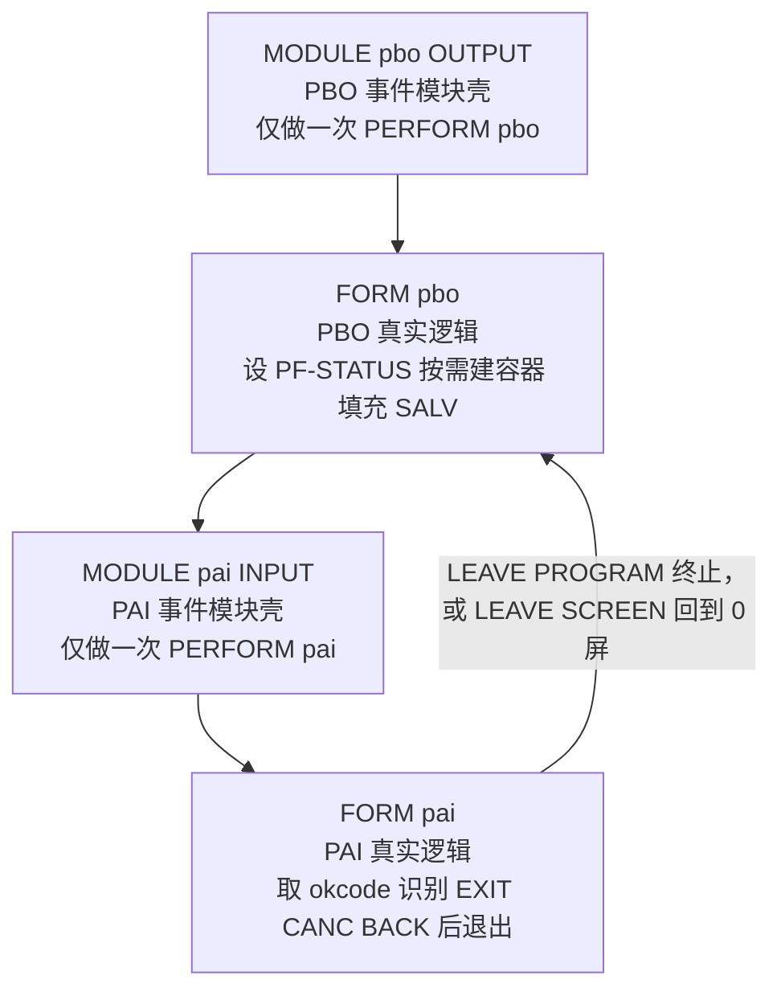
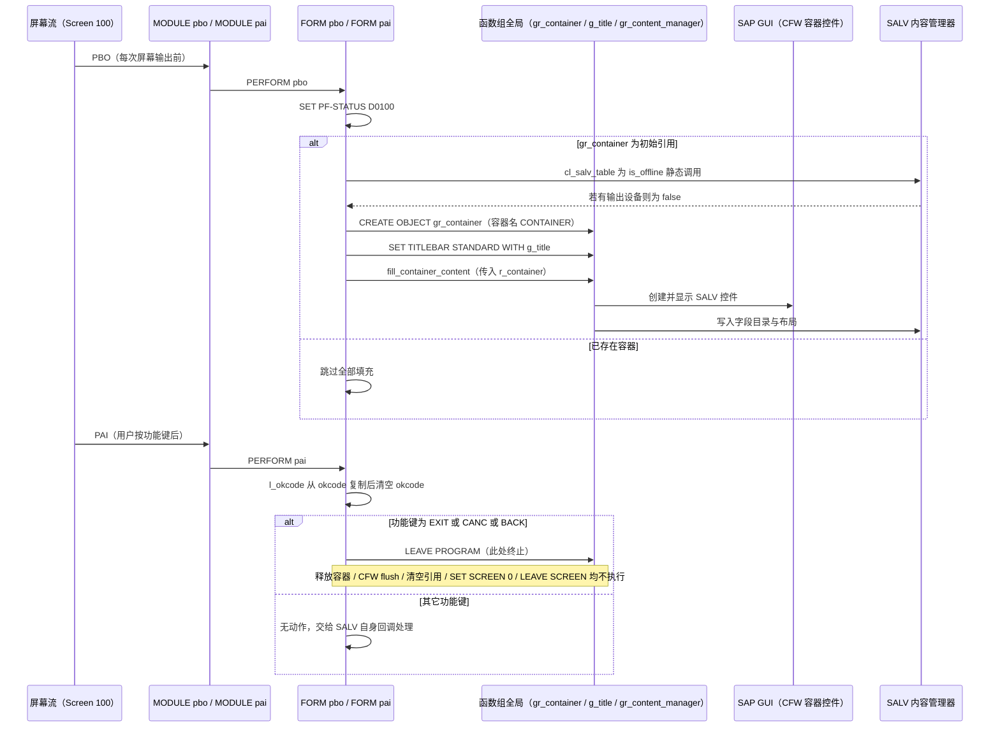

# LZSALV_CSQT_SCREEN_MANAGERO01 分析报告

> 源文件：`zsalv_csqt_screen_manager.fugr.lzsalv_csqt_screen_managero01.abap`（函数组 `ZSALV_CSQT_SCREEN_MANAGER` 的生成类 INCLUDE，73 行）
> 形态：一个被复制到 Z 命名空间的 SAP 标准 ALV 生成代码片段，负责把 SALV 全屏 Grid 挂到屏幕上并处理 PBO/PAI

---

## 一、程序定位与业务背景

### 它解决什么问题

当开发者用 `CL_SALV_TABLE` 或 `CL_SALV_GRID` 生成一个 ALV 对象时，SAP **不会**替你在屏幕上画出来。SALV 只负责"造数据视图"（字段目录、排序、聚合、布局），"放到哪、怎么显示、用户按了系统功能键怎么反应"必须由报表程序自己写。为了让每个报表都少写这几十行样板，SAP 提供了 **"Classical Screen Quick View Tooltip / Screen Manager" 生成器**：在 SE38 里对程序执行 `Utilities → Classical Screen Manager` 生成代码时，SAP 会自动产出一个函数组（形如 `ZSALV_CSQT_SCREEN_MANAGER`）和两个 INCLUDE：

| INCLUDE | 作用 |
|---------|------|
| `..._O01`（本文件，Output/Input） | 屏幕的 `PROCESS BEFORE OUTPUT` 与 `PROCESS AFTER INPUT` 事件块 |
| `..._O02` | 全局声明：容器引用 `gr_container`、内容管理器 `gr_content_manager`、标题 `g_title` |

生成器还会顺带产出一个全屏 Screen（默认 100）、一个 PF-STATUS（默认 `D0100`）和一个带 `CONTAINER` 自定义控件的屏幕。所以本文件的定位非常明确：

> **它不是一个"业务功能"，而是一段自动生成的事件流骨架（Skeleton）——把屏幕生命周期翻译成对 SALV 内容管理器的调用。**

它做两件事：PBO 时"把 SALV 画到容器里"，PAI 时"识别退出功能键并销毁一切"。作者 `hardyp` 在 `AbapToTheFuture03` 的 C10 SALV 章节直接把它复制进自己的教学程序，用来演示"如何在经典可执行程序里全屏显示 SALV"。

### 整体设计范式一句话定性

> **生成式事件骨架（Generated Event Skeleton）**：用 `MODULE`（事件块）→ `PERFORM`（FORM）两层薄壳隔离屏幕事件细节，把真实工作委托给 OO 内容管理器（`gr_content_manager`），使 SALV 与屏幕 100 之间只有一个接缝。

---

## 二、程序执行流程总览



**责任链表**

| 子程序 | 调用者 | 职责 |
|--------|--------|------|
| `MODULE pbo OUTPUT` | SAP 屏幕流（Screen 100 的 `PROCESS BEFORE OUTPUT`） | 事件入口壳，把 PBO 转交给同名 FORM |
| `FORM pbo` | `MODULE pbo OUTPUT` | 设置 `PF-STATUS D0100`；若 `gr_container` 为空则创建 `CONTAINER` 自定义容器，并调用 `gr_content_manager->fill_container_content` 把 SALV 灌进容器；设置标题栏 |
| `MODULE pai INPUT` | SAP 屏幕流（Screen 100 的 `PROCESS AFTER INPUT`，由用户回车或点功能键触发） | 事件入口壳，把 PAI 转交给同名 FORM |
| `FORM pai` | `MODULE pai INPUT` | 复制 `okcode` 到局部变量后清空 `okcode`；对 `EXIT`/`CANC`/`BACK` 三个功能键执行退出（先 `LEAVE PROGRAM`，其后是释放容器的清理动作） |

> 值得注意的是：这个 INCLUDE 里**没有任何 SALV 数据逻辑**。数据在哪、字段目录怎么建、用户点了 ALV 工具栏怎么响应，全在 `gr_content_manager` 指向的那个内容管理器类里。下面按执行顺序展开这四段。

---

## 三、分组分析

### 3.1 PBO 事件模块壳 `MODULE pbo OUTPUT`

#### ① 事件块只做一件事

```abap
*&---------------------------------------------------------------------*
*&      Module  D_0100_PBO  OUTPUT
*&---------------------------------------------------------------------*
*       text
*----------------------------------------------------------------------*
MODULE pbo OUTPUT.
  PERFORM pbo.
ENDMODULE.                    "pbo OUTPUT
```

**做什么** — 声明一个 `OUTPUT` 类型的 `MODULE`（逻辑块），模块体内只有一条 `PERFORM pbo`，把控制权转交给本 INCLUDE 里的同名 `FORM`。

**为什么** — 这是 `PROCESS BEFORE OUTPUT` 流程的强制语法：屏幕上 `PROCESS BEFORE OUTPUT` 段里只能填 `MODULE` 名字，不能直接写逻辑。所以任何经典屏幕程序都必须有一层 `MODULE` 壳。作者选择"壳里只放一条 PERFORM、逻辑全放 FORM"是有道理的——FORM 可以被 `AT SELECTION-SCREEN`、其它屏幕或 `SUBMIT` 复用，而 MODULE 只能挂在屏幕上；同时这也让生成器的 `..._O02` INCLUDE 能把逻辑集中管理。

**风险与改进** — 三个小问题：

1. **注释与代码不一致。** 注释头写的是 `Module D_0100_PBO OUTPUT`（SAP 生成器的标准命名），实际代码是 `MODULE pbo OUTPUT`。生成的 Screen 里必须真的登记了 `pbo` 这个模块名，否则屏幕流走不通。复制代码后如果没同步改 Screen 的模块列表，会得到一个"能激活、能运行但 PBO 不执行"的幽灵程序。建议让注释头与代码同名，或干脆采用 SAP 的 `d_0100_pbo` 命名以保持与生成器一致。
2. **`MODULE` 与 `FORM` 同名（都叫 `pbo`）。** ABAP 允许这样做（SAP 自己生成的代码就是这个形态），不是语法错误，但排错时看到 `PERFORM pbo` 会同时匹配到模块和表单，追踪调用栈容易迷路。建议 `MODULE` 用 `d_0100_pbo`、`FORM` 保持 `pbo`。
3. **注释内容是 `text` 占位符。** 生成器留下的空注释没有信息量。对阅读者来说，"这里将要发生什么"完全看不出来——而这恰恰是事件骨架最需要解释的地方。建议改成一句真实说明（"屏幕输出前：确保 SALV 容器已创建并填充内容"）。

---

### 3.2 `FORM pbo` —— 把 SALV 灌进容器

这一步分三小步：设状态栏、按需建容器、填充内容并设标题。

#### ① 设置状态栏与判断容器是否已存在

```abap
FORM pbo.

  SET PF-STATUS 'D0100'.

  IF gr_container IS INITIAL.
    IF cl_salv_table=>is_offline( ) EQ if_salv_c_bool_sap=>false.
      CREATE OBJECT gr_container
        EXPORTING
          container_name = 'CONTAINER'.
    ENDIF.

    SET TITLEBAR 'STANDARD' WITH g_title.

    gr_content_manager->fill_container_content(
        r_container = gr_container ).
  ENDIF.

ENDFORM.                    "pbo
```

**做什么** — 每次 PBO 先无条件执行 `SET PF-STATUS 'D0100'`；然后检查全局引用 `gr_container` 是否为空，只有在**第一次** PBO（或容器已被释放后）才：① 用静态方法 `cl_salv_table=>is_offline` 判断当前是否有输出设备，若**不是** offline 就 `CREATE OBJECT` 出名为 `CONTAINER` 的自定义容器；② 用全局变量 `g_title` 设置标题栏；③ 调用 `gr_content_manager->fill_container_content` 把 SALV 内容灌进容器。

**为什么** — 关键设计是**"容器只建一次，灌内容也只做一次"**。PBO 在屏幕上每次重绘（换页、返回、窗口切换）都会触发，如果每次都 `CREATE OBJECT`，容器控件会被反复创建，ABAP GUI 会留下一堆同名控件并最终 `CX_SY_CREATE_OBJECT_ERROR`（"控件 CONTAINER 已被占用"）。用 `gr_container IS INITIAL` 做守卫、把填充放在守卫内，是这个生成器代码真正的价值所在。

而 `cl_salv_table=>is_offline( )` 这个判断解决的是另一个真实场景：**批处理服务器上没有 SAP GUI**。`CL_SALV_TABLE` 是纯 OO 的，只要不 `display` 就能在后台跑；但"创建自定义控件"这一步必须有前端。如果在无 GUI 环境里 `CREATE OBJECT` 一个 GUI 控件，会直接抛 `CX_SY_CREATE_OBJECT_ERROR` 变成短时。所以先探测 `is_offline`，offline 时跳过建容器——注意此时它仍会继续调 `fill_container_content( r_container = gr_container )`，传入空引用，依赖内容管理器内部对空容器的容忍（见风险 3）。

**风险与改进** — 四个问题：

1. **🔴 `CREATE OBJECT` 完全没有异常处理。** 这是本文件最可能造成生产短时的语句。`container_name = 'CONTAINER'` 只是一个字符串，ABAP 在运行期才去当前屏幕的控件列表里找；只要出现下面任一情况就抛 `CX_SY_CREATE_OBJECT_ERROR` 而无人 `CATCH`：① 屏幕 100 上没有叫 `CONTAINER` 的控件（复制生成代码时改了屏幕号、或重新生成 Screen 时控件名变化）；② 上一轮遗留的同名控件还没释放（本文件自己的死代码导致，见 3.4）；③ 该程序是从**别的屏幕号**进入的（例如调用方用 `SUBMIT ... AND RETURN`，实际跑在屏幕 1000 上，那里没有 `CONTAINER`）。建议：
   ```abap
   TRY
       CREATE OBJECT gr_container EXPORTING container_name = 'CONTAINER'.
     CATCH cx_sy_create_object_error cx_root.
       MESSAGE e001(zsalv_csqt) WITH 'CONTROL 控件不存在于屏幕 ' sy-dynnr.
   ENDTRY.
   ```
   同时**加一句前置断言**：若 `sy-dynnr <> <本程序屏幕号>` 就不要走 GUI 分支。
2. **🟠 `fill_container_content` 同样没有异常处理。** 内容管理器在设置字段目录、列宽、聚合时会抛 `CX_SALV_ERROR`（例如列目录里有重复的列名、或聚合表达式不合法）。这是应用级逻辑错误，与环境无关，**任何** SALV 程序都可能踩到。SAP 生成的这段代码不带 `CATCH`，意味着一个字段目录笔误就会变成短时 dump 而不是一条可读的 `MESSAGE`。建议同样包裹 `CX_SALV_ERROR`，把它翻译成业务语言。
3. **🟠 offline 分支下 `gr_container` 仍是初始值，却照样调用 `fill_container_content`。** 也就是说 `IF gr_container IS INITIAL` 这个守卫在 offline 时不但没建容器，还把一个空引用传给了内容管理器。如果内容管理器内部解引用它（比如要拿 `container_name` 或调它的 `set_visible`），空引用会直接 `CX_SY_REF_IS_INITIAL`。目前能跑通只是因为 SAP 的内容管理器恰好容忍空容器——**这是靠巧合成立的契约**。建议把 `fill_container_content` 移进 `IF gr_container IS NOT INITIAL`，或用 `ELSE` 分支明确表达"无 GUI 时跳过显示"。
4. **🟡 双重否定可读性差 + 魔数拼写。** `IF cl_salv_table=>is_offline( ) EQ if_salv_c_bool_sap=>false` 是"不在离线 → 也就是有 GUI"。`EQ if_salv_c_bool_sap=>false` 这种用布尔枚举做 `EQ` 比较是 ABAP 的老写法，可读性远不如直接写否定。建议改成 `IF cl_salv_table=>is_offline( ) = abap_false.`，同时去掉 `is_offline( )` 里那个多余的空格。

#### ② 标题栏为什么被关在守卫里

```abap
    SET TITLEBAR 'STANDARD' WITH g_title.

    gr_content_manager->fill_container_content(
        r_container = gr_container ).
```

**做什么** — 用函数组全局变量 `g_title`（由 `..._O02` INCLUDE 声明、由调用方在显示前赋值）设置标题栏；随后调用内容管理器填充容器内容。

**为什么** — `SET TITLEBAR` 必须在 PBO 流程里执行才能在本次屏幕输出生效，这一点作者是对的。`g_title` 这个"外部注入的标题"也是个好设计：屏幕骨架不需要知道调用方的报表叫什么名字，只需要一个字符串。

**风险与改进** — 标题栏和容器填充都被关在 `gr_container IS INITIAL` 守卫内，意味着**只在首次 PBO 生效**。只要用户离开全屏再回来（比如未来在 `FORM pai` 里真的实现了返回调用屏），第二次 PBO 时 `gr_container` 非空、整个 `IF` 块被跳过，`SET TITLEBAR` 与 `SET PF-STATUS` 的效果就不再被显式设定（`SET PF-STATUS` 尚在守卫外，尚可；标题就断了）。而标题恰恰是最容易在"进入详情页—返回列表页"时出错的地方。建议把 `SET TITLEBAR` 移到守卫**外面**——它幂等，代价只有一次字段赋值，换来的是每次 PBO 的确定性。同理，`fill_container_content` 是否应该每次都调（让内容管理器自己判断是否需要重绘）也值得重新权衡。

---

### 3.3 PAI 事件模块壳 `MODULE pai INPUT`

#### ① 事件块转交 PAI

```abap
*----------------------------------------------------------------------*
*  MODULE pai INPUT
*----------------------------------------------------------------------*
*
*----------------------------------------------------------------------*
MODULE pai INPUT.
  PERFORM pai.
ENDMODULE.                    "pai INPUT
```

**做什么** — 声明一个 `INPUT` 类型的逻辑块，模块体只有一条 `PERFORM pai`，把用户交互后的 PAI 转交给同名 `FORM`。

**为什么** — 与 PBO 的 `MODULE` 同构。`INPUT` 类型意味着 SAP 在调用它之前会把屏幕的 `OKCODE` 字段内容（即用户功能键）填入 `sy-ucomm`，并把用户输入的字段值写回屏幕结构——这是 `INPUT` 与 `OUTPUT` 的本质区别，事件壳必须声明正确。

**风险与改进** — 注释里留了一行纯 `*` 空注释，信息量为零。更实质的风险是：**屏幕 100 的 `PROCESS AFTER INPUT` 段必须真的登记了 `pai` 模块，且屏幕必须有一个名为 `OKCODE` 的字段**——因为下一段的 `l_okcode = okcode` 直接依赖 `okcode` 这个变量。这个依赖在代码里没有说明，属于"从生成器继承下来的隐式契约"：手写这个 INCLUDE 而没配 OKCODE 字段，编译能过、运行不报错、`okcode` 永远是空、退出功能全部失灵。建议在注释里写明这条前置条件。

---

### 3.4 `FORM pai` —— 识别退出并收尾

这一步分两小步：取并清空 OKCODE，再处理三个退出功能键。

#### ① 复制并清空 OKCODE

```abap
FORM pai.

  DATA: l_okcode LIKE sy-ucomm.

  l_okcode = okcode.
  CLEAR okcode.

  CASE l_okcode.
    WHEN 'EXIT' OR 'CANC' OR 'BACK'.
      LEAVE PROGRAM.
      CALL METHOD gr_container->free.
      CALL METHOD cl_gui_cfw=>flush.

      CLEAR gr_container.

      SET SCREEN 0.
      LEAVE SCREEN.
  ENDCASE.

ENDFORM.                    "pai
```

**做什么** — 先把屏幕的 `OKCODE` 字段复制到局部变量 `l_okcode`，随即 `CLEAR okcode`；然后 `CASE` 判断三个系统退出功能键 `EXIT`（Shift+F3）、`CANC`（F12）、`BACK`（F3）。命中后：先执行 `LEAVE PROGRAM`，随后依次是释放容器、刷新 CFW、清空容器引用、`SET SCREEN 0`、`LEAVE SCREEN`。

**为什么** — **"复制到局部变量再清空 `okcode`"这个手法本身是值得学习的**。`OKCODE` 屏幕字段在 PAI 之后会残留在屏幕内存里，如果不清空，下次 PBO 再进入 PAI 时 SAP 可能继续用上次的值，导致用户按一次 F3 之后什么都不做、第二次按才退出（老 ABAP 程序的经典毛病）。复制到局部变量后再清空，把"命令的来源"和"命令的生命周期"分开，语义干净。

`CASE` 上只处理这三个键而不处理 `BACK`(F3) 之外的其它键，也是标准做法：ALV 自己的操作（排序、筛选、合计、导出）都通过 `gr_content_manager` 注册的 SALV 事件回调处理，根本不会走 PAI；PAI 的职责只是"用户想离开这个屏幕"。设计上是正确的分层。

**风险与改进** — 四个问题，第一个是致命的：

1. **🔴 `LEAVE PROGRAM.` 之后的所有语句都是死代码。** `LEAVE PROGRAM` 是立即终止当前程序的**非返回**语句：ABAP 在执行到它时就把程序送入结束流程（LEAVE 的中间帧栈在此被丢弃），因此后面的 `gr_container->free`、`cl_gui_cfw=>flush`、`CLEAR gr_container`、`SET SCREEN 0`、`LEAVE SCREEN` **一行都不会执行**。这不是风格问题，而是真实的资源泄漏：自定义容器 `gr_container` 及其内部的 SALV 控件对象从不释放，`gr_content_manager` 持有的回调也不注销。后果是——如果用户在 ALV 上按了 F3 而**没有**用功能键退出而是走菜单/其它路径回到程序，容器控件与 CFW 显示队列残留，可能出现空白容器区、窗口不刷新、甚至下一轮 `CREATE OBJECT` 撞名抛 `CX_SY_CREATE_OBJECT_ERROR`。正确写法是把清理提到前面：
   ```abap
   WHEN 'EXIT' OR 'CANC' OR 'BACK'.
     IF gr_container IS NOT INITIAL.
       gr_container->free( ).
       cl_gui_cfw=>flush( ).
       CLEAR gr_container.
     ENDIF.
     SET SCREEN 0.
     LEAVE SCREEN.
   ```
   若确实要整体退出程序，则把 `LEAVE PROGRAM` 放在 `ENDFORM` 之前，或用 `SUBMIT ... LEAVING` 式的 `LEAVE PROGRAM.` 收尾，且**必须先做清理**。值得强调：这段"先 LEAVE 后清理"正是 SAP **标准生成器自带的经典缺陷**，作者原样复制过来了——所以这不只是作者的问题，更是"不要盲信生成代码"这一课。
2. **🔴 `gr_container->free` 硬编码调用，没有 `IS NOT INITIAL` 守卫。** 一旦执行顺序被修正（清理前移），第一行就可能对初始引用调用方法，直接 `CX_SY_REF_IS_INITIAL`。同理 offline 模式下 `gr_container` 始终是空的。修复第 1 条时必须同时补守卫。
3. **🟠 `LEAVE PROGRAM`、`SET SCREEN 0`、`LEAVE SCREEN` 三个退出语句语义互斥。** `LEAVE SCREEN` 是返回调用它的那个屏幕（全屏程序里就是屏幕 0）；`SET SCREEN 0` 设置下一个要显示的静态屏幕；`LEAVE PROGRAM` 直接结束一切。同时写三个，读者无法判断作者的真实意图：这个程序到底是要**整体退出**（`LEAVE PROGRAM`），还是要**返回到启动它的屏幕**（`LEAVE SCREEN`，供被 `SUBMIT ... RETURN` 的调用方继续）？对 ZMONSTERS 这种被其它程序 `SUBMIT` 调用的报表来说，选错会导致调用方流程断掉。建议只保留一种，并在注释里说明被调用意图。
4. **🟡 `DATA: l_okcode LIKE sy-ucomm.` 是 `sy-ucomm` 的复制而非引用。** 语义上没问题（功能键不超过 4 字符），但 `LIKE sy-ucomm` 表达的是"结构像"，在有 `sy-ucomm` 可直接引用时属于多余的一次间接。更重要的是这里可以直接 `CLEAR okcode` 后判断 `sy-ucomm`，但那样会丢掉"命令来源"这一层显式性——所以现在的写法是**有意的、也是合理的**。唯一建议是补一行注释说明"必须先复制：PAI 后 `OKCODE` 会被屏幕流重新填充，直接判断 `sy-ucomm` 在某些屏幕类型下会失效"。

---

## 四、执行流程全景图（数据视角）



数据视角的核心结论：**`gr_container` 是全流程唯一的可变状态，且它的释放语句被 `LEAVE PROGRAM` 挡在了后面**；`g_title` 只在首次 PBO 被读一次；`okcode` 被读了立刻清空，避免跨 PAI 污染。

---

## 五、问题清单与改进建议

| 优先级 | 所在子程序 | 问题 | 影响 | 改进建议 |
|--------|------------|------|------|----------|
| 🔴 P0 | `FORM pai` | `LEAVE PROGRAM.` 之后才 `free` / `flush` / `CLEAR` / `SET SCREEN 0` / `LEAVE SCREEN`，这 5 行全为死代码 | 容器控件与内容管理器回调从不释放，GUI 残留；后续再进同一程序可能撞控件名抛 `CX_SY_CREATE_OBJECT_ERROR` | 把释放与 flush 前移到 `LEAVE` 之前，并加 `IF gr_container IS NOT INITIAL` 守卫；这是 SAP 标准生成代码自带缺陷，复制时必须修 |
| 🔴 P0 | `FORM pbo` | `CREATE OBJECT gr_container` 无 `TRY` / `CATCH` | 屏幕无 `CONTAINER` 控件、被 `SUBMIT` 从其它屏号调用、或控件名残留时直接短时 `CX_SY_CREATE_OBJECT_ERROR` | 用 `TRY ... CATCH cx_sy_create_object_error` 包裹，转成可读 `MESSAGE`；并前置校验 `sy-dynnr` 是否为本程序屏幕 |
| 🔴 P0 | `FORM pbo` | `gr_content_manager->fill_container_content` 无异常处理 | 字段目录重复、聚合表达式非法等应用级错误会抛 `CX_SALV_ERROR` 变成短时，而非可读消息 | 包裹 `CATCH cx_salv_error`，把错误转成业务语义提示 |
| 🟠 P1 | `FORM pai` | 对初始引用 `gr_container` 硬编码 `->free` | 修正死代码顺序后立即变成 `CX_SY_REF_IS_INITIAL`；offline 模式下也必然为空 | 与 P0 第一条一并修复：先判空再释放 |
| 🟠 P1 | `FORM pbo` | offline 分支里 `gr_container` 仍为空却照样调用 `fill_container_content` | 依赖内容管理器"恰好容忍空引用"的隐式契约，一旦对方版本升级改变实现即 `CX_SY_REF_IS_INITIAL` | 把填充调用移入 `IF gr_container IS NOT INITIAL`，或用 `ELSE` 明确表达无 GUI 时跳过 |
| 🟠 P1 | `FORM pbo` | `SET TITLEBAR` 被关在 `gr_container IS INITIAL` 守卫内 | 标题只在首次 PBO 生效；一旦将来实现了返回/重入，标题不再刷新 | 把 `SET TITLEBAR` 移到守卫外（幂等，代价可忽略），同 `SET PF-STATUS` 一样每次 PBO 执行 |
| 🟠 P1 | `FORM pai` | `LEAVE PROGRAM`、`SET SCREEN 0`、`LEAVE SCREEN` 三个退出语义互斥 | 读者无法判断程序是整体退出还是返回调用屏；对被 `SUBMIT ... RETURN` 的调用方，选错会中断其流程 | 只保留一种并在注释中写明被调用意图 |
| 🟡 P2 | `FORM pbo` | `IF cl_salv_table->is_offline( ) EQ if_salv_c_bool_sap->false` 双重否定 + 多余空格 | 可读性差，等价写法更直接 | 改写为 `IF cl_salv_table->is_offline( ) = abap_false.` |
| 🟡 P2 | `MODULE pbo` / `MODULE pai` | `MODULE` 与 `FORM` 同名，且注释头写 `D_0100_PBO` 而代码为 `pbo` | `PERFORM pbo` 同时匹配模块与表单，调用栈易迷路；注释与实际模块名不符时屏幕流静默失效 | `MODULE` 改用 `d_0100_pbo` / `d_0100_pai`，并让注释头与代码一致 |
| 🟡 P2 | `MODULE pai INPUT`（隐式契约） | 依赖屏幕 100 的 `PROCESS AFTER INPUT` 登记 `pai` 模块、且存在 `OKCODE` 字段，但代码与注释均未说明 | 手工重配屏幕时漏掉 OKCODE 字段，编译通过、运行无错、所有功能键失灵 | 在 INCLUDE 头部注释中写明这两条前置条件 |
| 🟡 P2 | 整个 INCLUDE | 直接把 SAP 标准生成代码复制到 Z 命名空间（屏幕 `D0100` / 状态栏 `D0100` / 标题 `STANDARD` / 容器 `CONTAINER` 全部照抄） | 依赖一组不在本文件里的屏幕与状态栏定义；标准生成器重生成后命名会漂移，Z 副本与真实屏幕脱节 | 优先考虑"100 行屏幕上直接 `cl_salv_table->display( r_container = lo_container )`"，或至少把屏幕号与状态栏参数化 |
| 🟡 P2 | 两个事件模块壳 | 注释内容仍是生成器占位符（`text`、纯 `*` 空注释） | 事件骨架最需要解释的地方反而没有信息 | 改成真实说明（输出前做什么、输入后判断什么） |
| 🟢 P3 | `FORM pai` | 局部 `DATA: l_okcode LIKE sy-ucomm.` 可直接引用 `sy-ucomm` | 多一层间接，无功能收益 | 保留即可（语义清晰），但应补注释说明"为什么必须先复制再清空" |

---

## 六、整体评价与启发

**优点**

1. **容器只建一次、PBO 每次都进但填充只做一次的守卫设计，是这段代码真正的专业之处。** `IF gr_container IS INITIAL` 一个判断同时解决了控件重名、GUI 残留和重复填充三个问题，比手写 SALV 全屏显示的常见做法更稳。
2. **用 `is_offline` 探测输出设备，让同一份程序能同时跑在 GUI 与批处理服务器上**，这是教科书级的"OO ALV 可后台运行"意识，很多人不知道 SALV 能这么用。
3. **"复制 OKCODE 到局部变量再清空"** 是正确的处理命令生命周期的手法，值得记住。
4. **PAI 只管退出功能键，ALV 内部交互交给 SALV 回调**——职责切分干净。

**短板**

1. **一段死代码让整个清理逻辑失效。** `LEAVE PROGRAM` 之后的所有语句都不执行，这是本文件最严重的问题；而且它是 SAP 标准生成器自带的缺陷，属于"复制即继承"的风险。
2. **零异常处理。** 两处会抛异常的调用（建容器、填内容）都裸奔，应用错误和环境错误都会变成短时 dump，而不是可读消息。
3. **状态守卫的位置选错。** 标题栏这种"每次都该确定"的东西被关进了"只做一次"的守卫里。
4. **生成代码的隐式契约没被写下来**：屏幕号、`PROCESS AFTER INPUT` 模块列表、`OKCODE` 字段、状态栏、容器控件名——全部是"必须另行存在"的东西，而这个文件里一个字都没提。

**可学到的设计经验**

- **⚠️ 第一条，也是最值钱的一条：不要盲信"自动生成的代码"。** 这段代码由 SAP 官方生成器产出，它依然带着 `LEAVE PROGRAM` 之后的死代码。**"SAP 标准生成器产出"不等于"正确"**。读任何生成代码，第一件事是顺着执行顺序问一句：这段代码真的会被执行吗？
- **`LEAVE` 系列语句是"不返回"的。** `LEAVE PROGRAM` 之后的一切都是死代码。把清理动作放在终止语句之前，这是 C 语言里"注册 `atexit` 之前先完成初始化"那种顺序敏感性的同构问题——**清理永远要在终止之前**。
- **OO ABAP 依然会抛异常，`CREATE OBJECT` 尤其如此。** 创建 GUI 控件、调用 SALV 内容管理器这类"跨边界"的调用都不是"不会失败的内联代码"。`TRY`/`CATCH` 不是可选装饰，尤其是控件创建这种依赖运行环境（有没有 GUI、有没有那个控件名）的操作。
- **守卫的位置要按"这个操作的语义"来放，不按"顺手"来放。** 幂等且成本极低的状态设置（`SET TITLEBAR`、`SET PF-STATUS`）应该每次 PBO 都做；昂贵且不可重复的操作（`CREATE OBJECT` 容器）才需要守卫。本文件恰好把两者都放反了一半。
- **复制代码时，要连带把"契约"抄下来。** 这段 INCLUDE 能跑，靠的是另一个 INCLUDE 里的全局变量声明、一个屏幕定义、一个状态栏、一个 `OKCODE` 字段。契约不写下来，下一个维护者（包括三个月后的你自己）会踩坑。
