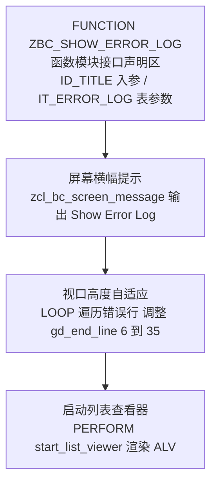
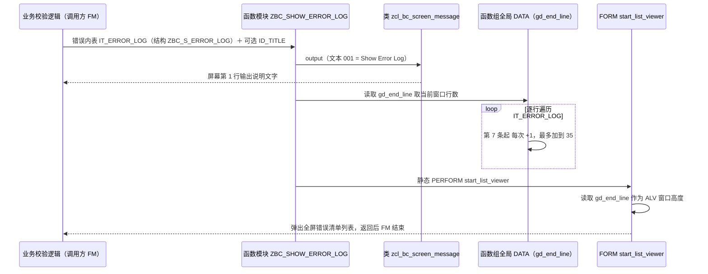

# ZBC_SHOW_ERROR_LOG 分析报告

> 源文件：`zbc_show_error_log.fugr.zbc_show_error_log.abap`（函数组 `ZBC_SHOW_ERROR_LOG` 的主 INCLUDE，24 行）
> 所属项目：ZMONSTERS（C04 例外处理章节）—— 一个用于 SAP 报表数据校验的教学/实战型程序集

---

## 一、程序定位与业务背景

### 它解决什么问题

ZMONSTERS 这类程序本质是"批量跑数据、逐条校验、发现问题就记下来"的批处理或交互式报表。当一条记录校验失败时，处理方式有三种，代价差异很大：

| 方案 | 代价 |
|------|------|
| 直接 `MESSAGE e...` | 一条错误就中断，用户修一条再跑一次；几百条错误时无法使用 |
| `WRITE` 到屏幕上 | 错误会随屏幕翻页丢失，用户记不住第 12 条是什么 |
| 写进日志表 | 用户还得自己 `SE38`/`SM16`/`SU53` 去翻，开发与业务之间的沟通成本高 |

`ZBC_SHOW_ERROR_LOG` 就是第四条路的**入口封装**：调用方把校验失败的所有行塞进一张结构为 `ZBC_S_ERROR_LOG` 的内表，调用这个 FM，它负责把人眼需要的一切先摆好——先在屏幕上喊一句"Show Error Log"，再根据错误有多少条把窗口撑高（少翻页），最后把控制权交给同函数组里的 `start_list_viewer`，渲染成一个全屏列表。

### 为什么现有方案不够 / 现有设计的合理性

真正的横切关注点不在业务里，而在**"错误清单的可视化"**。如果让每个调用方各自实现 ALV，会出现 N 份重复代码、N 种窗口尺寸、N 种空表提示。本文件把这套东西收敛成一个 3 行的门面（Facade），业务代码只需 `CALL FUNCTION 'ZBC_SHOW_ERROR_LOG' TABLES it_error_log = lt_errors.`，这是典型的"**薄门面 + 重实现下沉到 FORM**"分层。

### 一句话设计范式定性

> **函数模块作为 UI 门面（Facade）**：函数体本身不承载任何 ALV 逻辑，只做"打招呼 → 量尺寸 → 踢一脚 PERFORM"三步，把显示实现彻底隔离到 `start_list_viewer`。

---

## 二、程序执行流程总览



**责任链表**

| 子程序 | 调用者 | 职责 |
|--------|--------|------|
| 函数模块接口声明区 `ZBC_SHOW_ERROR_LOG`（头部注释） | SAP 运行时 + SE37 中的调用方 | 用 IMPORTING / TABLES 声明一个可选标题入参与一张固定结构的错误日志表参数 |
| 屏幕横幅提示 | `ZBC_SHOW_ERROR_LOG` 函数体第 9 行，由调用方的校验失败分支触发 | 通过工具类在屏幕上追加一行"Show Error Log"文字，说明接下来要出现什么 |
| 视口高度自适应 | `ZBC_SHOW_ERROR_LOG` 函数体第 12–16 行，紧随消息输出 | 按错误行数把全局变量 `gd_end_line` 从默认 6 逐行抬高，上限 35 |
| 启动列表查看器 | `ZBC_SHOW_ERROR_LOG` 函数体第 18 行，由前述高度计算直接驱动 | 静态 PERFORM 跳到同函数组 `start_list_viewer`，真正把错误行渲染成 ALV 列表 |

> 四个"子程序"里只有后两个有真正的代码逻辑，前两个一个是契约、一个是一句话。下面按这条流程逐个展开。

---

## 三、分组分析

### 3.1 函数模块接口声明区 `ZBC_SHOW_ERROR_LOG`

先看契约本身。这一步分两步读：先看声明了什么参数，再看函数体实际消费了其中几个。

#### ① 声明的入参与表参数

```abap
FUNCTION ZBC_SHOW_ERROR_LOG.
*"--------------------------------------------------------------------
*"*"Global Interface:
*"  IMPORTING
*"     REFERENCE(ID_TITLE) TYPE  STRING OPTIONAL
*"  TABLES
*"      IT_ERROR_LOG STRUCTURE  ZBC_S_ERROR_LOG
*"--------------------------------------------------------------------
```

**做什么** — 声明这个 FM 的对外契约：一个 `STRING` 类型、REFERENCE（引用传递）、OPTIONAL 的入参 `ID_TITLE`；以及一张以 `ZBC_S_ERROR_LOG` 为行结构的表参数 `IT_ERROR_LOG`。没有返回值段，也没有 EXCEPTIONS 段。

**为什么** — 用 `STRUCTURE ZBC_S_ERROR_LOG` 而不是裸 `ANY TABLE`，等于把"错误行长什么样"这件事固化在 FM 契约里：调用方不需要自己 `TYPES` 出内表，直接把自己的错误内表传进来即可，编译期就能发现类型不匹配。`REFERENCE` 传字符串而不是 `TYPE STRING` 的定长字符，是为了避免 `CHAR10` 之类定长截断标题——这是对的细节。整体是一个"窄接口"设计，符合门面应当无状态的直觉。

**风险与改进** — 三个层次的问题，一个比一个隐蔽：

1. **缺少 EXCEPTIONS 段**（接口层）。错误清单的展示本身是会失败的：没有 SAP GUI 的批处理服务器上调用、ALV 控件不可用、输出设备未分配，这些都会让 `start_list_viewer` 抛异常或弹短时。而 FM 没有 `failed` 异常，调用方只能看到一条裸 `MESSAGE`。建议补 `EXCEPTIONS failed = 1`，并在函数体末尾统一处理；这对"报告程序 + 批处理双入口"的程序尤其重要。
2. **`IT_ERROR_LOG` 使用了 `TABLES`（表格参数）**（接口层）。`TABLES` 是 Function Module 里最老的一代参数类型（按引用传递且行类型固定），SAP 自己已在推动淘汰。更实质的问题是**别名暴露**：`TABLES` 参数的表在 FM 与调用方之间共享同一份内存，`start_list_viewer` 里对内表的任何 `DELETE`/`SORT` 都会直接改掉调用方的数据。现代写法是
   ```abap
   "TYPES tt_it_error_log TYPE STANDARD TABLE OF zbc_s_error_log WITH EMPTY KEY.
   "IMPORTING it_error_log TYPE tt_it_error_log READ ONLY
   ```
   `READ ONLY` 让契约本身承担"我不会改你的数据"这个承诺，比口头约定可靠。
3. **`ID_TITLE` 声明后函数体内一次都没用**（契约与实现不符）。这属于"看起来支持、实则无效"的接口谎言，比缺参数更糟：调用方 `EXPORTING id_title = '订单导入失败'` 会编译通过、日志里也不报错，但用户永远看到硬编码的 `'Show Error Log'`。要么在第 9 行用它驱动消息文本，要么删掉它并同步所有调用方。

#### ② 函数体的实际执行序列（先建立全局印象）

```abap
FUNCTION ZBC_SHOW_ERROR_LOG.
*"--------------------------------------------------------------------
*"*"Global Interface:
*"  IMPORTING
*"     REFERENCE(ID_TITLE) TYPE  STRING OPTIONAL
*"  TABLES
*"      IT_ERROR_LOG STRUCTURE  ZBC_S_ERROR_LOG
*"--------------------------------------------------------------------
  zcl_bc_screen_message=>output( EXPORTING id_text = 'Show Error Log'(001) ).

* Make the box a bit taller when the table has lots of rows
  LOOP AT it_error_log.
    IF sy-tabix > 6 AND gd_end_line < 35.
      gd_end_line = gd_end_line + 1.
    ENDIF.
  ENDLOOP.

  PERFORM start_list_viewer.
ENDFUNCTION.
```

**做什么** — 函数体只有三件事：输出一行屏幕消息、遍历一次表参数来调整全局窗口行数、PERFORM 到 `start_list_viewer`。没有任何 ALV field catalog、没有 `REUSE_ALV_GRID_DISPLAY`、没有排序取数逻辑。

**为什么** — 这是刻意的"薄"。所有与"怎么显示"相关的复杂度都推给了 `start_list_viewer`（在同一函数组的其它 INCLUDE 中）。好处是这个 INCLUDE 可以被完整读完，20 行内就能确定 FM 的全部行为；坏处见 3.4 与第五节。

**风险与改进** — 第 19–23 行是 4 行空行加一个注释，属于编辑器手滑或删代码留下的残渣；不影响运行，但会让人误以为"这里本来还有逻辑"。建议清掉。真正的风险在接下来的两段。

---

### 3.2 屏幕横幅提示 `zcl_bc_screen_message=>output`

#### ① 输出一行说明文字

```abap
  zcl_bc_screen_message=>output( EXPORTING id_text = 'Show Error Log'(001) ).
```

**做什么** — 调用工具类 `zcl_bc_screen_message` 的静态方法 `output`，传入文本符号 `001`，把字符串 `'Show Error Log'` 输出到当前屏幕的第 1 行。

**为什么** — 关键在于**为什么不用 `MESSAGE`**。在 ABAP 里 `MESSAGE s001 ...` 会写入 `syst` 的消息缓冲区，下一次 PAI 时系统会弹消息框，而且会继承调用方当时的 `MESSAGE_TYPE`；更麻烦的是 FM 内部发 `MESSAGE` 后，调用方的控制流往往被 `MESSAGE ... IN PROGRAM` 的语义搅乱（消息可能把控制流带回 FM 边界之外）。而把输出动作封装成工具类方法，函数体里只剩一个纯粹的副作用调用，FM 的行为可预测——不会意外中断调用方。这是把"UI 输出"当成普通服务而不是语句的正确姿势。

**风险与改进** — 三点：

1. **标题写死在调用点**（第 9 行）。文本符号 `001` 的内容要去 SE63 改，而调用点本身看不出这句话是可翻译的。至少应加注释说明 `001` 的含义，或干脆用 `id_title`（见 3.1 风险 3）让文案上移一层。
2. **完全依赖 `ID_TITLE` 的缺失来表达"没有自定义标题"**。当前逻辑下，FM 无法区分"调用方传了空标题"和"调用方用了默认标题"两种语义，也没法实现"传了就用、不传才回退"。
3. **空表不提示**。如果调用方在零错误时也调这个 FM，屏幕上会出现一句"Show Error Log"然后弹出一个空列表。这里应该加 `IF it_error_log IS INITIAL. ... RETURN. ENDIF.` 的短路，让调用方可以直接无条件调用而无需自己判断——这正是门面该提供的价值。

---

### 3.3 视口高度自适应 `LOOP AT it_error_log`

这一步是本文件里唯一有"算法"味道的代码，也是缺陷最集中的一段。

#### ① 遍历错误行并累加窗口行数

```abap
* Make the box a bit taller when the table has lots of rows
  LOOP AT it_error_log.
    IF sy-tabix > 6 AND gd_end_line < 35.
      gd_end_line = gd_end_line + 1.
    ENDIF.
  ENDLOOP.
```

**做什么** — 用 `LOOP` 遍历 `it_error_log`，借助 `sy-tabix`（当前循环行号，等价于"已看到的行数"）判断错误条数是否超过 6 条；一旦超过 6，就把全局变量 `gd_end_line` 加 1，但加到 35 就停。结果是：错误第 7 条起，每多一条错误，ALV 窗口就多显示一行，最多显示 35 行。

**为什么** — 设计意图（注释写得很清楚）是"错误多的时候把框撑高一点"，目的是**减少翻页**。ALV list viewer 的窗口高度由 `gd_end_line` 决定，默认 6 行只能看到 6 条错误；把上限放到 35 大致对应标准窗口的可视行数（`sy-listrows` 在标准模式下约 18–38，取决于用户的窗口配置）。所以这是一个"屏幕空间换交互成本"的折中，方向正确。

**风险与改进** — 四个问题，按严重程度排列：

1. **🔴 窗口高度只增不减，这是本文件唯一真正的功能缺陷。** `gd_end_line` 是**函数组的全局 DATA**，函数退出时不会被重置，而这段代码只在满足条件时 `+ 1`、从不做**赋值**。于是：第一次调用报 30 条错误，`gd_end_line` 被抬到 30；第二次调用只报 2 条错误，`sy-tabix > 6` 不成立，一行都不改——ALV 会以 30 行的高度弹出却只有 2 条数据，用户看到一大片空白。这在真实使用中极容易触发（用户反复运行同一个校验报表，错误时多时少）。正确做法是**每次调用重新计算目标高度并赋值**：
   ```abap
   DATA lv_rows TYPE i.
   lv_rows = lines( it_error_log ).
   gd_end_line = cond #( WHEN lv_rows <= 6 THEN 6
                         WHEN lv_rows <= 35 THEN lv_rows
                         ELSE 35 ).
   ```
   这样既幂等（无状态），又保留全部原始意图。
2. **为了拿一个行数而全表 LOOP。** `it_error_log` 在批量校验场景下可能有几千行，这里的 O(n) 遍历是纯浪费——一行 `lines( it_error_log )` 是 O(1) 的（ABAP 内表的行数就是表头里存的那个值）。作者大概率是"想在 LOOP 里顺手用 `sy-tabix`"而没意识到 `sy-tabix` 在循环外的值不可靠（循环正常结束后 `sy-tabix` 保留最后一行行号，循环体一次都没进则保持旧值）。建议直接 `lines( )`。
3. **6 和 35 是无出处的魔数。** 一个是"默认窗口行数"，一个是"屏幕上限"，两个完全不同来源的数字被并排写在一个 `IF` 里，没有任何注释，也没有和 `sy-listrows` 关联。用户把窗口调成 maximized（大屏）时 35 行明显偏矮；调成 tiny 时 35 又会溢出屏幕导致 ALV 自动分页——现象和 bug 混在一起，极难排查。建议提到函数组常量区并注明来源。
4. **状态藏在函数组全局里导致 FM 不可重入。** 一个"显示错误列表"的 FM 读写了跨调用的持久状态，意味着它既不能被并发调用（在同一个 SAP LUW 里通常不会发生，但递归调用或被多个屏幕复用时会），也让单元测试无法独立断言。

---

### 3.4 启动列表视图 `start_list_viewer`

#### ① 静态 PERFORM 跳转到实现

```abap
  PERFORM start_list_viewer.
```

**做什么** — 静态 `PERFORM` 到同一函数组内名为 `start_list_viewer` 的 `FORM`，把错误内表交给它渲染成 ALV list viewer。本 INCLUDE 到此结束，函数返回。

**为什么** — 这是整个门面设计的**唯一接缝**，也是最有价值的一行代码。它把"错误清单怎么显示"与"什么时候要显示"彻底解耦：将来要把 `REUSE_ALV_*` 换成 SALV、换成 Excel 导出、换成 Popup，全部只需改 `start_list_viewer`，所有调用方零改动。这是老式 ABAP 里少见的、值得学习的依赖倒置做法。

**风险与改进** — 三点：

1. **静态 PERFORM 是编译期硬耦合，且失败信息极不友好。** `PERFORM` 不会在语法检查时报"找不到 FORM"，只有在整个函数组 `ACTIVATE` 时才会失败，而且报错文本通常是 `FORM "START_LIST_VIEWER" NOT FOUND` 之类的简短信息，不会告诉你"哪个 FM 调了它"。一旦有人把 `start_list_viewer` 改名或挪出函数组，整个函数组直接激活失败，所有 FM 一起不可用。建议在 FM 头部注释里显式写明"依赖同函数组 FORM start_list_viewer（本 INCLUDE 之外）"，让 IDE 的代码导航能帮上忙。
2. **PERFORM 之后没有任何结果校验。** 列表是否成功渲染、用户是否在 ALV 里点了返回，函数体一概不关心，FM 一律正常返回。需要区分"用户看完了"和"根本没显示出来"的场景（比如据此决定是否清空错误内表），应当让 `start_list_viewer` 通过 `CHANGING` 或 `EXPORTING` 返回状态。
3. **异常边界没画好。** 承接 3.1 风险 1：`start_list_viewer` 内部会创建 ALV 控件（需要 SAP GUI）和 `REUSE_ALV_..._DISPLAY`（可能因输出设备未分配而失败），这些都是会抛异常的经典场景，而它们全部落在 FM 契约的 EXCEPTIONS 之外。建议在 `PERFORM` 之后立即做一次 `CALL FUNCTION 'C_OM_MEMORY_CHECK'` 之外的显式状态判断，并在 FM 的 EXCEPTIONS 中兜住。

---

## 四、执行流程全景图（数据视角）



数据视角的关键点：**`IT_ERROR_LOG` 全程只读不改**（设计上正确），**`GD_END_LINE` 是唯一被写的数据**，而且它是跨调用持久的（缺陷根源）。调用方传入的 `ID_TITLE` 在图中根本没有流向任何终点——这正是 3.1 风险 3 的图形化表现。

---

## 五、问题清单与改进建议

| 优先级 | 所在子程序 | 问题 | 影响 | 改进建议 |
|--------|------------|------|------|----------|
| 🔴 P0 | 视口高度自适应 | `gd_end_line` 为函数组全局变量，代码只 `+1` 不做赋值，导致只增不减 | 第二次报错条数少于 6 条时，ALV 仍以上次的高行数弹出，出现大片空白，观感接近故障 | 改为幂等赋值：用 `lines( it_error_log )` 算出目标行数后直接赋给 `gd_end_line`，并 clamp 到上限 |
| 🟠 P1 | 函数模块接口 | `ID_TITLE` 声明后函数体从未使用 | 调用方传标题无任何效果，构成"看起来支持实则无效"的 API 契约陷阱 | 用 `id_title` 驱动 `zcl_bc_screen_message` 的文本（传空则回退默认），或删除该参数并同步全部调用方 |
| 🟠 P1 | 函数模块接口 | 未声明 `EXCEPTIONS`，展示失败无法传达 | 无 GUI 的批处理服务器上或控件不可用时，调用方收到裸 `MESSAGE`，无法分支处理 | 补 `EXCEPTIONS failed = 1`，在函数体末尾统一判定并返回 |
| 🟠 P1 | 启动列表视图 | 静态 `PERFORM start_list_viewer` 无存在性保证，失败仅在激活函数组时暴露 | FORM 改名或移出即导致整个函数组激活失败、全部 FM 不可用，定位成本高 | 在 FM 头部注释显式声明该依赖；更彻底的做法是把列表构建内联或改用类封装 |
| 🟠 P1 | 视口高度自适应 | 6 与 35 为无出处魔数，且未与 `sy-listrows` 关联 | 用户窗口尺寸变化时窗口过高或溢出，"ALV 溢出分页"与"代码有 bug"现象混淆 | 提取为函数组常量并注明来源；上限改为按 `sy-listrows` 动态推导 |
| 🟡 P2 | 视口高度自适应 | 为取得行数而全表 `LOOP`，O(n) 遍历 | 数千条错误日志时白烧 CPU，与"只是想知道有多少行"的意图严重不匹配 | 一行 `DATA lv_rows TYPE i. lv_rows = lines( it_error_log ).` 取代整个 LOOP |
| 🟡 P2 | 函数模块接口 | 使用已过时的 `TABLES` 参数，按引用暴露内表 | 调用方内表可被 `start_list_viewer` 意外修改；与现代 ABAP 风格不符 | 改用 `TYPE STANDARD TABLE OF zbc_s_error_log WITH EMPTY KEY` + `READ ONLY` |
| 🟡 P2 | 屏幕横幅提示 | 文本符号 `001` 与文案硬编码在调用点 | 换文案要改 FG 源码、丢翻译上下文 | 用类常量或让 `id_title` 上移；至少加注释标明 `001` 语义 |
| 🟡 P2 | 屏幕横幅提示 | 空表不短路，缺 `IF it_error_log IS INITIAL` 提前返回 | 调用方必须自己判空，否则用户看到"Show Error Log"后弹出空列表 | 函数开头加空表判断并直接 `RETURN`，让调用方可无条件调用 |
| 🟢 P3 | 函数模块接口 | 函数组名与函数名同为 `ZBC_SHOW_ERROR_LOG` | 从 SE37 对象列表或调用点反查时容易把 FG 与 FM 搞混 | 函数组改名（如 `ZBC_SHOW_ERROR_LOG_FG`）以区分层次 |

---

## 六、整体评价与启发

**优点**

1. **教科书式的"薄门面"分层。** 24 行里没有一行 ALV 代码，所有显示复杂度下沉到 `PERFORM start_list_viewer`，接口窄、行为可穷举。这是老式 ABAP 里少见的清晰边界划分。
2. **对消息副作用的处理很成熟。** 把 `MESSAGE` 封装成工具类方法而非裸 `MESSAGE` 语句，避免了 FM 内发消息对调用方控制流的意外干扰，这一处比多数生产代码讲究。
3. **交互意图明确且有注释。** "错误多就把框撑高、减少翻页"是一个以屏幕空间换交互成本的合理决策，作者还写下了注释，这在函数组代码里不常见。

**短板**

1. **窗口高度是持久可变状态，只增不减**，是本文件唯一会造成用户可见故障的缺陷（也是全篇最该修的一行）。
2. **接口契约不诚实**：声明了 `ID_TITLE` 却不消费，也没有 `EXCEPTIONS`。前者让调用方白写代码，后者让失败无处安放。
3. **实现手法与意图严重不匹配**：为算行数写了一段 O(n) LOOP 和两个魔数，而正确解只是一行 `lines( )`。这不是"新人写法"，而是**没有把"我要什么"翻译成"最直接的表达"**——这恰恰是可培训的习惯问题。

**可学到的设计经验**

- **"门面应该只做三件事"**：宣告意图（消息）、准备上下文（尺寸）、委托实现（PERFORM）。凡是想在门面上"顺手做更多"的冲动，都是分层开始腐化的信号。
- **状态一旦放在函数组全局里，就必须回答一个问题：谁负责把它改回去？** `gd_end_line` 的问题不是"用了全局变量"，而是"只写不重置"。凡是跨调用持久的值，读取它之前都应该有赋值，否则幂等性无从谈起。
- **性能直觉要落到"我要什么"上**：`LOOP` + `sy-tabix` 是在"绕路取行数"，`lines( )` 是"直接要行数"。写循环前先问一句：内表本身能不能直接给我答案？大部分时候可以。
- **接口即承诺**：ABAP 里声明一个参数（尤其 `OPTIONAL` 或 `REFERENCE`）就是对外做出承诺。宁可少声明，也不要留下"传了等于没传"的参数——调用方不会去看你的函数体。
