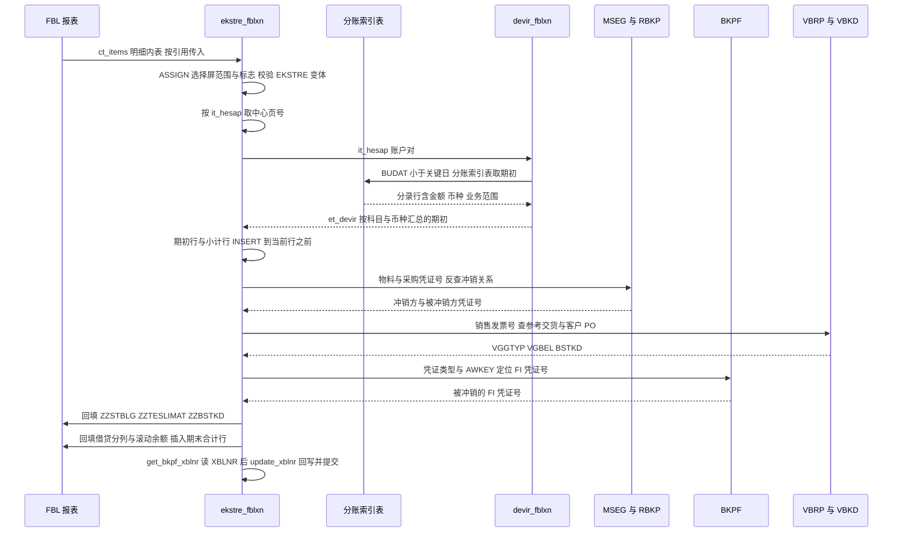

# ZCL_FI_TOOLKIT 分析报告

> 对象：`ZCL_FI_TOOLKIT`（全局 FINAL 工具类，1702 行）｜SAP FI 本地化集团（土耳其业务域，中文注释）

---

## 一、程序定位与业务背景

### 1.1 位置

不是可执行程序，而是 SAP 里最容易被低估的一类对象：**FI 业务工具箱**。无选择屏、无事件块，18 个 `CLASS-METHODS` 供报表/批处理/接口调用。但它并不通用 —— 服务的是**土耳其本地化 FI 集团里，母账与客户/供应商分账打通后的对账工作**。

### 1.2 它解决的真问题

**第一件：分账期初余额。** FBL1N/FBL3N/FBL5N 只显示期间内分录，不显示期初。要报"这个账户期初多少"，得自己去 `BSIK/BSAK/BSID/BSAD/BSIS/BSAS` 按 `BUDAT <= 关键日` 与 `BUKRS IN 范围` 取数、区分本期已清与往期未清、按借贷取符号、再按科目+业务范围+币种汇总。`devir_fblxn` 干这件事，且必须"混进别人的运行时"做 —— 调用它的地方正是 FBLxN 内部，选择屏范围只存在于那些报表的全局变量里。这一条约束决定了本类所有的动态 `ASSIGN` 设计。

**第二件：交叉参考关系。** 财务人员想知道"这笔物料凭证的反冲销凭证是哪张"、"这张交货单对应哪张发票"、"这张销售发票的客户 PO 是多少"。`ekstre_fblxn` 在明细行上补 `ZZSTBLG/ZZSTJAH`、`ZZTESLIMAT`、`ZZBSTKD`、`ZZBAKIYE_*`、`ZZALACAK_UPB/ZZBORC_UPB`，并插入 `TEXT-DVG`（期初）、`TEXT-DNY`（期末）等合计行 —— 一个手工实现的"扩展对账单（Ekstre）"。

**第三件：重复劳动的收口。** IBAN 是否已被其他伙伴占用、公司代码完整名称（含 ADRC 地址四段拼装）、内部日期转 `GDATU`。外加三件补丁型能力：BDC 批量清未清项（F-32/F-44）、通过科目生成冲销凭证、科目 `ZHRTIP` 特性校验。

### 1.3 设计范式定性

一句话：**"以 `sy-cprog` 为路由键、以被调用报表的全局变量为数据源、以 `IT_RFPOSXEXT` 为共享内存契约的侵入式运行时增强层"**。

这个定性同时解释了本类所有巧思与所有坑：必须在 FBLxN 进程内运行 → `ASSIGN ('(RFITEMAP)SO_BUDAT[]')`；直接改调用方明细内表而不返回值（`CHANGING !ct_items`）→ 调用方必须在其 `LOOP ... WHERE` 之前调用；按 `sy-cprog` 分派 → SAP 升级换报表名，所有分支同时失效。

---

## 二、程序执行流程总览

### 2.1 全景流程图

```mermaid
flowchart TD
    A["ekstre_fblxn 扩展对账单装配主入口 挂在 FBL1N FBL3N FBL5N 上"]
    B["devir_fblxn 期初余额取数 动态取选择屏范围后查六张分账索引表"]
    C["get_sd_inv 交货与发票关系反查 VBRP 联接 VBKD"]
    D["get_bkpf_xblnr 批量读取 BKPF 交叉参考字段 XBLNR"]
    E["update_xblnr 回写 XBLNR 并提交"]
    F["check_iban_duplicate IBAN 查重入口 命中即抛 ZCX_FI_IBAN"]
    G["get_iban_codes IBAN 联查 LFA1 LFBK TIBAN 与 KNA1 KNBK TIBAN"]
    H["clear_customer_open_items BDC 清客户未清项 驱动 F-32"]
    I["clear_vendor_open_items BDC 清供应商未清项 驱动 F-44"]
    J["denklestirerek_transfer_kaydi 生成冲销凭证 三段式分录接口"]
    K["determine_due_date 到期日计算 DETERMINE_DUE_DATE"]
    L["get_company_long_text 公司代码长文本 T001 联 ADRC 带缓存"]
    M["convert_datum_to_gdatu 日期格式换算 带缓存"]
    N["display_fi_doc_in_gui 跳转凭证界面 SET PARAMETER 加 FB03"]
    O["get_import_document_types 进口凭证类型配置 读 ZFIT_ITH_BLART 带缓存"]
    P["get_domestic_import_doc_types 境内进口凭证类型 复用 O 的缓存"]
    Q["validate_zhrtip 科目特性校验 按科目首字符判定 ZHRTIP"]

    A --> B
    A --> C
    A --> D
    D --> E
    F --> G
    O --> P
```



### 2.2 责任链表

| # | 子程序 | 调用者 | 职责 |
|---|--------|--------|------|
| 1 | 类定义段 `ZCL_FI_TOOLKIT` | 编译器 / 全部调用方 | 定义 30 余个行结构与 3 张缓存表，确立数据契约 |
| 2 | `ekstre_fblxn` | `FBL1N/FBL3N/FBL5N` 用户增强 | 装配扩展对账单：期初行、滚动余额、借贷分列、期末合计 |
| 3 | `devir_fblxn` | `ekstre_fblxn`（私有协作） | 按关键日与公司代码范围从六张分账索引表取期初并汇总 |
| 4 | `get_sd_inv` | `ekstre_fblxn`（私有方法） | 由交货/发票号反查参考交货号与客户 PO |
| 5 | `get_bkpf_xblnr` | 报表增强 / 迁移程序 | 批量补 `BKPF-XBLNR` 交叉参考字段 |
| 6 | `update_xblnr` | 迁移程序 / 批处理 | 逐张回写 XBLNR 并按需分批提交 |
| 7 | `check_iban_duplicate` | 主数据保存前校验 | IBAN 已占用则抛 `ZCX_FI_IBAN` |
| 8 | `get_iban_codes` | `check_iban_duplicate` | 联查供应商侧与客户侧 TIBAN 全量 IBAN |
| 9 | `clear_customer_open_items` | 清账批处理 / 动作按钮 | BDC 驱动 F-32 清除客户未清项 |
| 10 | `clear_vendor_open_items` | 清账批处理 / 动作按钮 | BDC 驱动 F-44 清除供应商未清项 |
| 11 | `denklestirerek_transfer_kaydi` | 冲销 / 转账批处理 | 通过科目 `UMBUCHNG` 生成冲销凭证 |
| 12 | `determine_due_date` | 账龄 / 催款程序 | 由分录字段推算净到期日 |
| 13 | `get_company_long_text` | 报表抬头 / ALV 打印 | 取 `T001-BUTXT`，优先生成 ADRC 四段地址名 |
| 14 | `convert_datum_to_gdatu` | 汇率换算 / 外币报表 | 内部日期转 `GDATU`，带类级缓存 |
| 15 | `display_fi_doc_in_gui` | 明细双击 / F4 动作 | 跳转 FB03 显示 FI 凭证 |
| 16 | `get_import_document_types` | 凭证类型校验增强 | 读 `ZFIT_ITH_BLART`，按国内外标志过滤 |
| 17 | `get_domestic_import_doc_types` | 进口业务校验增强 | 取标记为进口的类型，复用 16 的缓存 |
| 18 | `validate_zhrtip` | 过账增强 `USERCMD` | 5/9 开头科目的 `ZHRTIP` 合法性校验 |

下面按这条流程，逐个子程序展开。

---

## 三、分组分析

### 3.1 类定义段 `ZCL_FI_TOOLKIT`

分三步：① 公共 API 契约；② 私有数据结构；③ 类级缓存纪律。

#### ① 公共 API 契约与常量

```abap
  PUBLIC SECTION.
    TYPES: BEGIN OF t_documents,
             bukrs TYPE bseg-bukrs,
             belnr TYPE bseg-belnr,
             gjahr TYPE bseg-gjahr,
             buzei TYPE bseg-buzei,
           END OF t_documents .
    TYPES: tt_documents TYPE STANDARD TABLE OF t_documents WITH DEFAULT KEY .
    TYPES: BEGIN OF ty_hesap,
             sube   TYPE rfposxext-konto,
             merkez TYPE rfposxext-konto,
           END OF ty_hesap .
    TYPES: tt_hesap TYPE STANDARD TABLE OF ty_hesap .
    TYPES: BEGIN OF ty_konto,
             bukrs TYPE bukrs,
             konto TYPE konto,
           END OF ty_konto .
    TYPES tt_blart TYPE HASHED TABLE OF blart
                      WITH UNIQUE KEY primary_key COMPONENTS table_line .

    CONSTANTS c_borc              TYPE shkzg VALUE 'S' ##NO_TEXT.
    CONSTANTS c_alacak            TYPE shkzg VALUE 'H' ##NO_TEXT.
    CONSTANTS c_mal_hareketi      TYPE awtyp VALUE 'MKPF' ##NO_TEXT.
    CONSTANTS c_satinalma_faturasi TYPE awtyp VALUE 'RMRP' ##NO_TEXT.
    CONSTANTS c_satis_faturasi    TYPE awtyp VALUE 'VBRK' ##NO_TEXT.
    CONSTANTS c_musteri_hf_talebi TYPE auart VALUE 'ZAH1' ##NO_TEXT.
```

**做什么** — 6 个常量（借贷方向 `S`/`H`、三类业务对象类型、订单类型 `ZAH1`）与三张公共表类型：`tt_documents`（凭证行四元组，给冲销）、`tt_hesap`（子账页/中心账页账户对，给期初）、`ty_konto`（给期末汇总）。

**为什么** — 常量层做得对：`shkzg` 与三种 `awtyp` 提到类级、标注类型与 `##NO_TEXT`，远好过在 500 行里散落 20 个字面量 `'H'`，编译器还能类型检查。`ty_hesap` 的 `sube`/`merkez` 是本类最核心的领域抽象 —— SAP 中心科目功能允许一个伙伴的所有子页在总账汇总到一张中心科目（`KNA1-KNRZE`/`LFA1-LNRZE`），对外只暴露一种类型、内部再翻译，方向对。

**风险与改进** — 这里埋着全类最深的结构性缺陷：**字段类型与语义不符**。

- `ty_hesap-sube/merkez TYPE rfposxext-konto` —— `KONTO` 是 CHAR9 总账科目号，但运行期实际被赋予、也被用作比对条件的是 **CHAR15 的 `KUNNR`/`LIFNR`/`KNRZE`/`LNRZE`**。中心页号在土耳其集团普遍 15 位，赋进 CHAR9 **静默右截断**，随后 `devir_fblxn` 用被截断的值匹配 `konnr = <ls_hesap>-merkez`，匹配不上 → 期初少算一整块中心科目页。编译器沉默，因为两边"类型合法"。**改进**：改用 `buzei-partner`（CHAR15）+ 类型标识字段。
- 凭证号长度混用：`t_documents` 用 `bseg-belnr`（CHAR10），`ty_devir_items` 用 `belnr_d`，`tt_doc_xblnr` 用 `bkpf-belnr`。
- 命名不统一（`t_` 与 `ty_` 混用）；`ty_konto` 实际只是"去重后的账户清单"。
- `c_musteri_hf_talebi`（`ZAH1`）在实现段**从未被引用**。

#### ② 私有数据结构契约

```abap
  PRIVATE SECTION.
    TYPES: BEGIN OF ty_devir,
             bukrs TYPE bukrs,
             konto TYPE hkont,
             shkzg TYPE shkzg,
             dmshb TYPE dmbtr,
             dmbe2 TYPE dmbe2,
             dmbe3 TYPE dmbe3,
             umskz TYPE umskz,
             filkd TYPE filkd,
             wrbtr TYPE wrbtr,
             waers TYPE waers,
             gsber TYPE gsber,
           END OF ty_devir .
    TYPES: tt_devir TYPE STANDARD TABLE OF ty_devir .
    TYPES tt_mseg TYPE SORTED TABLE OF t_mseg WITH NON-UNIQUE KEY mblnr mjahr .
    TYPES tt_rbkp TYPE SORTED TABLE OF t_rbkp WITH NON-UNIQUE KEY belnr gjahr .
    TYPES tt_vbrp TYPE SORTED TABLE OF ty_vbrp WITH NON-UNIQUE KEY vbeln .

    CLASS-DATA gt_company_long_text      TYPE tt_company_long_text .
    CLASS-DATA gt_dg_cache              TYPE tt_dg_cache .
    CLASS-DATA gt_import_doc_type_cache TYPE tt_ith_blart .
    CONSTANTS c_tabname_t001 TYPE tabname VALUE 'T001' ##NO_TEXT.
```

**做什么** — 三类私有结构：① 期初结果结构 `ty_devir`；② 三张预排序 `SORTED TABLE` 支撑调用方 `BINARY SEARCH`；③ 三张 HASHED 缓存表配 `CLASS-DATA`。（`t_mseg`/`t_rbkp`/`ty_vbrp` 字段目录同构，此处省略 `belnr`/`gjahr`/`mblnr`/`mjahr`/`smbln`/`sjahr`/`stblg`/`stjah`/`vgtyp`/`vgbel`/`bstkd` 逐项定义。）

**为什么** — 把中间表声明为 `SORTED TABLE ... WITH NON-UNIQUE KEY` 是本类最好的一处。作者清楚要在 500 行里做几万次二分查找，所以**在声明处保证物理顺序不变式**：`tt_vbrp` 单键 `vbeln` 匹配两处 `WITH KEY vbeln = ...`，`tt_mseg` 的 `mblnr mjahr`、`tt_rbkp` 的 `belnr gjahr` 也逐一匹配。"声明即保证"远优于事后 `SORT`。

**风险与改进** —

- **`ty_devir-dmshb TYPE dmbtr` 是本类第二个语义级缺陷，严重度高于命名问题。** `DMSHB` 的 SAP 语义是"**本位币**金额"，`DMBTR` 是"**交易币**金额"。字段名叫 `dmshb` 却挂了 `dmbtr` 类型，`devir_fblxn` 三处 SELECT 也确实取 `dmbtr`。到 `ekstre_fblxn`，`it_rfposxext` 的 `dmshb` 是**行项目本币金额**，却被 `MOVE-CORRESPONDING` 灌入期初的**交易币**金额，最终 `zzbakiye_upb = 期初.dmshb + 行项目.dmshb` 把两个币种直接相加。只有该账户全部分录交易币等于公司代码本位币时才正确；土耳其集团普遍有 USD/EUR 分录，这一行余额是错的。**改进**：结果结构同时承载本币与交易币，按 `waers` 分组汇总；退一步至少改名 `dmbtr_tr`。
- `umskz`、`filkd` 在结构里存在，但 `devir_fblxn` 出口会 `CLEAR`，GL 分支甚至把两列 SELECT 注释掉 —— **输出结构保留三个恒空字段**，配合 `##TOO_MANY_ITAB_FIELDS` 抑制，读者无法判断是"不需要"还是"忘了取"。
- `t_vbkd`/`tt_vbkd` 声明后从未使用（`ty_vbrp` 自己内嵌了 `bstkd`）。

#### ③ 类级缓存纪律

**做什么** — 三个 `CLASS-DATA` 承载跨方法缓存：公司代码长文本、日期格式换算、进口凭证类型配置。

**为什么** — 三份数据特征相同：读极多、几乎不变、报表内反复读取。类级静态缓存替代"每行一次 DB 读"是标准做法，比传统 `SELECT SINGLE` + 判 `sy-subrc` 干净得多。

**风险与改进** — 三个缓存**都没有失效机制**：后台任务运行期间若有人改 `T001-BUTXT` 或 `ADRC` 有效期，后续输出全是旧值；`get_import_document_types` 用 `IS INITIAL` 作"未加载"标志，配置表真为空时每次调用都重查；日期缓存以日期为键无上界增长。而作者在 `validate_zhrtip` 里注释"Tabloda Buffer olduğundan, özel Cache'leme yapmadım" —— 说明有缓存意识，只是没有贯彻。**改进**：加时间戳或 `iv_refresh`；这几张小表交给 SAP Buffer 就够。

---

### 3.2 子程序方法 `ekstre_fblxn`

全类最重的方法（约 530 行），唯一有真实入口的方法 —— 挂在 FBLxN 用户增强上，直接改写报表明细内表。分五步。

#### ① 上下文绑定与范围判定

```abap
    CHECK ct_items IS NOT INITIAL.
    CASE sy-cprog.
      WHEN 'RFITEMAP'."FBL1N
        ASSIGN ('(RFITEMAP)X_AISEL') TO FIELD-SYMBOL(<lv_x_aisel>).
        ASSIGN ('(RFITEMAP)PA_VARI') TO FIELD-SYMBOL(<lv_vari>).
      WHEN 'RFITEMGL'."FBL3N
        ASSIGN ('(RFITEMGL)X_AISEL') TO <lv_x_aisel>.
        ASSIGN ('(RFITEMGL)PA_VARI') TO <lv_vari>.
      WHEN 'RFITEMAR'."FBL5N
        ASSIGN ('(RFITEMAR)X_AISEL') TO <lv_x_aisel>.
        ASSIGN ('(RFITEMAR)PA_VARI') TO <lv_vari>.
      WHEN 'ZSDP_RFITEMAR'.
        ASSIGN ('(ZSDP_RFITEMAR)X_AISEL') TO <lv_x_aisel>.
        ASSIGN ('(ZSDP_RFITEMAR)PA_VARI') TO <lv_vari>.
      WHEN OTHERS.
        RETURN.
    ENDCASE.

    IF sy-subrc = 0 AND sy-cprog(5) = 'RFITE'.
      LOOP AT ct_items ASSIGNING FIELD-SYMBOL(<ls_items>)
            WHERE zuonr(3) eq  zcl_fi_omd=>c_zuonr_sanal and
                  zzbstkd IS INITIAL.
         <ls_items>-zzbstkd = <ls_items>-zuonr.
      ENDLOOP.
      IF <lv_vari> CS 'EKSTRE'.
```

**做什么** — 按 `sy-cprog` 把四种报表动态绑到内部变量：`<lv_x_aisel>`（是否选择模式）、`<lv_vari>`（ALV 布局变体名）；再把"销售订单尚未回填"的行用 `ZUONR` 补进 `ZZBSTKD`；最后判断变体名是否含 `EKSTRE` 以决定是否进入扩展对账单逻辑。

**为什么** — 这是"侵入式增强"绕不开的代价：行项目内表在全局变量里，报表不提供 API，只有 `sy-cprog` 能标识身份。选择**显式枚举 + `ASSIGN ... TO` 并检查 `sy-subrc`** 而非"绑不上就随便跑"，防御姿态对。`ZUONR` 回填是典型本地化补丁：客户主数据把订单号填在 `ZUONR`，搬到专用字段让 Ekstre 的客户 PO 列能显示。

**风险与改进** —

- **`IF sy-subrc = 0 AND sy-cprog(5) = 'RFITE'` 恒为假。** `sy-cprog(5)` 是"第 5 个字符起、长度 1"，值为 `E`（`RFITEMAP` 第 5 位）或 `R`（`ZSDP_RFITEMAR`）；`= 'RFITE'` 比较 5 字符串，短操作数补空格成 `'E '`，永远不等。作者想表达"程序名以 `RFITE` 开头"，应是 `sy-cprog(1) = 'RFITE'`。结果：**①之后所有步骤与 `devir_fblxn` 调用整段是死代码**，方法永远走 `ELSE`。这是本文件最严重的问题之一 —— 要么功能从未真正生效（无人发现），要么升级后被意外关掉，必须先查生产日志。
- `<lv_vari> CS 'EKSTRE'` 把行为开关藏在报表变体命名约定里，类契约上不可见；未绑定时直接 dump（靠外层 `sy-subrc = 0` 兜住，耦合极紧）。
- `MESSAGE TEXT-003 TYPE 'I'.` 会被后续 `WRITE` 覆盖，用户看不见；未做 TR 翻译。
- 外部依赖 `zcl_fi_omd=>c_zuonr_sanal`、`zcl_fi_document_type=>get_customer_clearing_doc_type()` 的语义本类无法自证，升级这两个类会静默改变行为。

#### ② 清理重复冲销行

```abap
        LOOP AT ct_items ASSIGNING <ls_items>
                    WHERE blart = zcl_fi_document_type=>get_customer_clearing_doc_type( ) AND
                          gjahr GE '2018'.
          DELETE ct_items WHERE belnr = <ls_items>-zzstblg AND gjahr = <ls_items>-zzstjah.
          DELETE ct_items.
        ENDLOOP.
        SORT ct_items BY konto budat ASCENDING.
        IF  ct_items IS INITIAL.
          RETURN.
        ENDIF.
```

**做什么** — 遍历所有"冲销型清账凭证"行（`blart` 等于类方法给出的清账凭证类型且年度 ≥ 2018），按该行的 `ZZSTBLG/ZZSTJAH` 反向删除原始凭证行，并删除清账行本身；随后按 `konto budat` 升序排序。

**为什么** — 业务背景清楚：客户 Ekstre 上冲销清账凭证（`ZR` 一类）与被冲销的原凭证同时显示会重复计行，必须成对剔除。`gjahr GE '2018'` 是需求 HAR-10448 的业务分界，代码里还留着注释掉的 `gjahr ge '2016'` 旧版痕迹。

**风险与改进** — 三处高危：

- **删除条件缺 `BUKRS`。** FI 里凭证号只在"公司代码+年度"内唯一，两个公司代码完全可以有相同 `BELNR`+`GJRHR`，这一行会连带删掉**另一个公司代码**的同名凭证行。必须补 `AND bukrs = <ls_items>-bukrs`。
- **在 `LOOP ... WHERE` 内 `DELETE` 同一内表（两次）。** 第一次 `DELETE ... WHERE` 删掉的可能不满足外层过滤条件的行，第二次删当前行；带 `WHERE` 的 `LOOP` 中结构性修改内表会让索引推进失去意义，可能跳行或 dump。正确写法是先收集待删键，循环后统一删。
- `blart = <func>( )` 写在 `WHERE` 里对每行求值一次；`SORT ... BY konto budat` **不含 `bukrs`**，这在 ④ 会造成实质错误；`gjahr GE '2018'` 硬编码，到 2027 年还需人记得改。

#### ③ 反查凭证参考关系

```abap
        LOOP AT ct_items ASSIGNING <ls_items>
           WHERE zzawtyp = c_mal_hareketi OR zzawtyp = c_satinalma_faturasi
               OR  zzawtyp = c_satis_faturasi.
          IF <ls_items>-zzawtyp = c_mal_hareketi.
            APPEND VALUE #( mblnr = <ls_items>-zzawkey(10)
                            mjahr = <ls_items>-zzawkey+10(4)
                           ) TO lt_mkpf_key.
          ELSEIF <ls_items>-zzawtyp = c_satinalma_faturasi.
            APPEND VALUE #( belnr = <ls_items>-zzawkey(10)
                            gjahr = <ls_items>-zzawkey+10(4)
                           ) TO lt_rbkp_key.
          ELSEIF <ls_items>-zzawtyp = c_satis_faturasi.
            APPEND <ls_items>-zzawkey(10) TO lt_vbrk_key.
          ENDIF.
        ENDLOOP.

        SORT lt_rbkp_key BY belnr gjahr.
        SORT lt_mkpf_key BY mblnr mjahr.
        SORT lt_vbrk_key BY vbeln.
        DELETE ADJACENT DUPLICATES FROM lt_mkpf_key COMPARING mblnr mjahr.
        DELETE ADJACENT DUPLICATES FROM lt_rbkp_key COMPARING belnr gjahr.
        DELETE ADJACENT DUPLICATES FROM lt_vbrk_key COMPARING vbeln.

        IF lt_rbkp_key IS NOT INITIAL.
          SELECT belnr, gjahr, stblg, stjah
            FROM rbkp
            FOR ALL ENTRIES IN @lt_rbkp_key
            WHERE
              belnr = @lt_rbkp_key-belnr AND
              gjahr = @lt_rbkp_key-gjahr
            INTO CORRESPONDING FIELDS OF TABLE @lt_rbkp.
          FREE lt_rbkp_key.
        ENDIF.

        IF lt_mkpf_key IS NOT INITIAL.
          SELECT mblnr, mjahr, smbln, sjahr
            FROM mseg
            FOR ALL ENTRIES IN @lt_mkpf_key
            WHERE
              mblnr = @lt_mkpf_key-mblnr AND
              mjahr = @lt_mkpf_key-mjahr
            INTO CORRESPONDING FIELDS OF TABLE @lt_mseg.
          FREE lt_mkpf_key.
        ENDIF.
        IF lt_vbrk_key[] IS NOT INITIAL.
          lt_vbrp = get_sd_inv( lt_vbrk_key ).
          FREE lt_vbrk_key.
        ENDIF.
```

```abap
        LOOP AT ct_items ASSIGNING <ls_items>.
          lv_tabix = sy-tabix.
          IF <ls_items>-zzawtyp = c_mal_hareketi.
            READ TABLE lt_mseg WITH TABLE KEY mblnr = <ls_items>-zzawkey(10)
                                              mjahr = CONV #( <ls_items>-zzawkey+10(4) )
                                              ASSIGNING FIELD-SYMBOL(<ls_mseg>).
            IF sy-subrc = 0.
              CLEAR lv_awkey.
              IF <ls_mseg>-smbln IS  NOT INITIAL.
                lv_awkey = |{ <ls_mseg>-smbln }{ <ls_mseg>-sjahr }|.
              ELSE.
                READ TABLE lt_mseg WITH KEY smbln = <ls_mseg>-mblnr
                                            sjahr = <ls_mseg>-mjahr
                                            ASSIGNING <ls_mseg>.
                IF sy-subrc = 0.
                  lv_awkey = |{ <ls_mseg>-mblnr }{ <ls_mseg>-mjahr }|.
                ENDIF.
              ENDIF.
            ENDIF.
          ELSEIF <ls_items>-zzawtyp = c_satinalma_faturasi.
            READ TABLE lt_rbkp WITH TABLE KEY belnr = <ls_items>-zzawkey(10)
                                              gjahr = CONV #( <ls_items>-zzawkey+10(4) )
                                              ASSIGNING FIELD-SYMBOL(<ls_rbkp>).
            IF sy-subrc = 0.
              CLEAR lv_awkey.
              IF <ls_rbkp>-stblg IS  NOT INITIAL.
                lv_awkey = |{ <ls_rbkp>-stblg }{ <ls_rbkp>-stjah }|.
              ELSE.
                READ TABLE lt_rbkp WITH KEY stblg = <ls_rbkp>-belnr
                                            stjah = <ls_rbkp>-gjahr
                                            ASSIGNING <ls_rbkp>.
                IF sy-subrc = 0.
                  lv_awkey = |{ <ls_rbkp>-belnr }{ <ls_rbkp>-gjahr }|.
                ENDIF.
              ENDIF.
            ENDIF.
          ELSEIF <ls_items>-zzawtyp = c_satis_faturasi.
            READ TABLE lt_vbrp WITH TABLE KEY vbeln = <ls_items>-zzawkey(10)
                                        ASSIGNING FIELD-SYMBOL(<ls_vbrp>).
            IF sy-subrc = 0.
              IF <ls_vbrp>-vgtyp = 'J' OR <ls_vbrp>-vgtyp = 'T'.
                <ls_items>-zzteslimat = <ls_vbrp>-vgbel.
              ENDIF.
              <ls_items>-zzbstkd = <ls_vbrp>-bstkd.
            ENDIF.
          ENDIF.

          IF lv_awkey IS  NOT INITIAL.
            SELECT SINGLE belnr INTO <ls_items>-zzstblg FROM bkpf
                          WHERE awtyp = <ls_items>-zzawtyp AND
                                awkey = lv_awkey
                          ##WARN_OK .                   "#EC CI_NOORDER
            IF sy-subrc = 0.
              <ls_items>-zzstjah = <ls_items>-gjahr.
            ENDIF.
          ENDIF.
```

**做什么** — 三步：① 扫全表把三类业务对象的 `AWKEY`（10 位凭证号+4 位年度）拆成去重键表；② `FOR ALL ENTRIES` 查 `RBKP`（取 `STBLG/STJAH`）与 `MSEG`（取 `SMBLN/SJahr`），销售发票走 `get_sd_inv`；③ 回到明细行，冲销凭证取对方凭证号、被冲销凭证反查冲销方，组装 `lv_awkey` 后 `SELECT SINGLE` 到 `BKPF` 找出 FI 凭证号回填 `ZZSTBLG/ZZSTJAH`；销售发票行回填 `ZZTESLIMAT`、`ZZBSTKD`。

**为什么** — 全类性能意识最强的一段，值得学：先收集键、`SORT` + `DELETE ADJACENT DUPLICATES` 去重再 `FOR ALL ENTRIES`，把 N 次单行查压成 1 次；三个 `IS NOT INITIAL` 守卫保证 FAE 不因空表退化成全表扫描；中间表用 `SORTED TABLE` 支撑每行 `READ`；`FREE` 及时释放。"没有 `SMBLN` 就反查一次"也正确处理了 SAP 两种冲销建模（正向记录与反向记录）。

**风险与改进** —

- **`lv_awkey` 只在 MKPF/RMRP 两个分支被 `CLEAR`**，销售发票分支与"三类都不匹配"的行都不清。从第二行起，`IF lv_awkey IS NOT INITIAL` 带着**上一行残留的 AWKEY** 再次执行 `SELECT SINGLE ... WHERE awtyp = <当前行 zzawtyp> AND awkey = <上一行 awkey>`，编号空间偶然撞上就会给无关行写上错误的 `ZZSTBLG/ZZSTJAH` —— 用户会照着它去查不相干的凭证。循环开头加一行 `CLEAR lv_awkey.` 即可。这是第二高危缺陷。
- `SELECT SINGLE belnr FROM bkpf WHERE awtyp/awkey` 缺 `BUKRS`，`AWKEY` 在 BKPF 上不唯一（`##WARN_OK` 正压这个告警），可能取到别的公司代码的凭证。必须补 `AND bukrs = <ls_items>-bukrs`。
- `ZZSTJAH = <ls_items>-gjahr` 用的是明细行所属年度而非查到凭证的年度，跨年冲销会写错。
- `|{ smbln }{ sjahr }|` 假定 10+4 位；启用德国长凭证号即崩。`vgtyp = 'J' OR 'T'` 是魔法值，应提常量并补 `C`（贷项）。

#### ④ 装配期初行与滚动余额

```abap
          IF lv_konto_temp IS INITIAL OR
             lv_konto_temp <> <ls_items>-konto.
            CLEAR : ls_devir,ls_devir_merkez.

            LOOP AT lt_devir_sorted INTO ls_devir
              WHERE bukrs = <ls_items>-bukrs
                AND konto = <ls_items>-konto.

              IF <lv_merkez> IS ASSIGNED.
                IF <lv_merkez> = abap_true.
                  CASE sy-cprog.
                    WHEN 'RFITEMAP'.
                      READ TABLE lt_lfb1 ASSIGNING <ls_lfb1>
                                         WITH KEY bukrs = <ls_items>-bukrs
                                                  lifnr = <ls_items>-konto BINARY SEARCH.
                      IF sy-subrc = 0.
                        LOOP AT lt_devir_sorted ASSIGNING FIELD-SYMBOL(<lfs_devir_sorted_lnrze>)
                                                WHERE bukrs = <ls_items>-bukrs
                                                  AND konto = <ls_lfb1>-lnrze.
                          ADD <lfs_devir_sorted_lnrze>-dmshb  TO ls_devir_merkez-dmshb.
                          ADD <lfs_devir_sorted_lnrze>-dmbe2  TO ls_devir_merkez-dmbe2.
                          ADD <lfs_devir_sorted_lnrze>-dmbe3  TO ls_devir_merkez-dmbe3.
                          ADD <lfs_devir_sorted_lnrze>-wrbtr  TO ls_devir_merkez-wrbtr.
                        ENDLOOP.
                      ENDIF.
                    WHEN 'RFITEMAR' OR 'ZSDP_RFITEMAR'.
                      READ TABLE lt_knb1 ASSIGNING <ls_knb1>
                                         WITH KEY bukrs = <ls_items>-bukrs
                                                  kunnr = <ls_items>-konto BINARY SEARCH.
                      IF sy-subrc = 0.
                        LOOP AT lt_devir_sorted ASSIGNING FIELD-SYMBOL(<lfs_devir_sorted_knrze>)
                                                WHERE bukrs = <ls_items>-bukrs
                                                  AND konto = <ls_knb1>-knrze.
                          ADD <lfs_devir_sorted_knrze>-dmshb  TO ls_devir_merkez-dmshb.
                          ADD <lfs_devir_sorted_knrze>-dmbe2  TO ls_devir_merkez-dmbe2.
                          ADD <lfs_devir_sorted_knrze>-dmbe3  TO ls_devir_merkez-dmbe3.
                          ADD <lfs_devir_sorted_knrze>-wrbtr  TO ls_devir_merkez-wrbtr.
                        ENDLOOP.
                      ENDIF.
                  ENDCASE.
                ENDIF.
              ENDIF.

              CLEAR ls_item_devir.
              IF ls_devir-bukrs IS INITIAL.
                MOVE-CORRESPONDING ls_devir_merkez TO ls_item_devir  ##ENH_OK.
                ls_item_devir-wrshb = ls_devir_merkez-wrbtr.
                ls_item_devir-waers = ls_devir_merkez-waers.
              ELSE.
                ADD ls_devir_merkez-dmshb TO ls_devir-dmshb.
                ADD ls_devir_merkez-dmbe2 TO ls_devir-dmbe2.
                ADD ls_devir_merkez-dmbe3 TO ls_devir-dmbe3.
                ADD ls_devir_merkez-wrbtr TO ls_devir-wrbtr.
                MOVE-CORRESPONDING ls_devir TO ls_item_devir  ##ENH_OK.
                ls_item_devir-wrshb = ls_devir-wrbtr.
                ls_item_devir-waers = ls_devir-waers.
              ENDIF.

              ls_item_devir-zzname1_ku = <ls_items>-zzname1_ku.
              ls_item_devir-zzname1_li = <ls_items>-zzname1_li.
              ls_item_devir-konto = <ls_items>-konto.
              ls_item_devir-zuonr = TEXT-dvg.
              ls_item_devir-u_bktxt = ls_item_devir-sgtxt = |{ TEXT-004 }({ <ls_items>-konto })|.
              ls_item_devir-hwaer = <ls_items>-hwaer.
              ls_item_devir-hwae2 = <ls_items>-hwae2.
              ls_item_devir-hwae3 = <ls_items>-hwae3.
              IF ls_item_devir-dmshb LT 0.
                ls_item_devir-zzalacak_upb = ls_item_devir-dmshb * -1.
                ls_item_devir-zzalacak_2pb = ls_item_devir-dmbe2 * -1.
                ls_item_devir-zzalacak_3pb = ls_item_devir-dmbe3 * -1.
              ELSE.
                ls_item_devir-zzborc_upb = ls_item_devir-dmshb.
                ls_item_devir-zzborc_2pb = ls_item_devir-dmbe2.
                ls_item_devir-zzborc_3pb = ls_item_devir-dmbe3.
              ENDIF.
              ls_item_devir-bukrs = <ls_items>-bukrs.
              ls_item_devir-color = lc_green.
              COLLECT ls_item_devir INTO lt_item_devir.

              CLEAR ls_item_sum.
              ls_item_sum-wrshb = ls_item_devir-wrshb.
              ls_item_sum-waers = ls_item_devir-waers.
              ls_item_sum-dmshb = ls_item_devir-dmshb.
              ls_item_sum-hwaer = ls_item_devir-hwaer.
              ls_item_sum_-hwaer = ls_item_sum-hwaer.
              ADD ls_item_sum-dmshb TO ls_item_sum_-dmshb.
              ls_item_sum-color = lc_yellow.
            ENDLOOP.
```

```abap
            IF sy-subrc <> 0.
              CLEAR ls_item_devir.
              ls_item_devir-bukrs  = <ls_items>-bukrs.
              ls_item_devir-konto  = <ls_items>-konto.
              ls_item_devir-zuonr  = TEXT-dvg.
              ls_item_devir-color  = lc_green.
              ls_item_devir-u_bktxt = ls_item_devir-sgtxt = |{ TEXT-004 }({ <ls_items>-konto })|.
              INSERT ls_item_devir INTO ct_items INDEX lv_tabix.
              ls_item_sum_-bukrs = <ls_items>-bukrs.
              ls_item_sum_-konto = <ls_items>-konto.
              ls_item_sum_-zuonr = TEXT-dvy.
              ls_item_sum_-color = lc_yellow.
              ls_item_sum_-u_bktxt = ls_item_sum_-sgtxt = |{ TEXT-004 }({ <ls_items>-konto })|.
              INSERT ls_item_sum_ INTO ct_items INDEX lv_tabix + 1.
            ELSE.
              ls_item_sum_-bukrs = <ls_items>-bukrs.
              ls_item_sum_-konto = <ls_items>-konto.
              ls_item_sum_-zuonr = TEXT-dvy.
              ls_item_sum_-color = lc_yellow.
              IF ls_item_sum_-dmshb LT 0.
                ls_item_sum_-zzalacak_upb = ls_item_sum_-dmshb.
              ELSE.
                ls_item_sum_-zzborc_upb = ls_item_sum_-dmshb.
              ENDIF.
              ls_item_sum_-u_bktxt = ls_item_sum_-sgtxt = |{ TEXT-004 }({ <ls_items>-konto })|.
              ls_item_devir = ls_item_sum_.
              APPEND ls_item_sum_ TO lt_item_devir.
              INSERT LINES OF lt_item_devir INTO ct_items INDEX lv_tabix.
              FREE lt_item_devir.
            ENDIF.
            CLEAR ls_item_sum_.
          ENDIF.

          IF <ls_items>-shkzg = c_alacak.
            <ls_items>-zzalacak_upb = <ls_items>-dmshb * -1.
            <ls_items>-zzalacak_2pb = <ls_items>-dmbe2 * -1.
            <ls_items>-zzalacak_3pb = <ls_items>-dmbe3 * -1.
          ELSE.
            <ls_items>-zzborc_upb = <ls_items>-dmshb.
            <ls_items>-zzborc_2pb = <ls_items>-dmbe2.
            <ls_items>-zzborc_3pb = <ls_items>-dmbe3.
          ENDIF.

          <ls_items>-zzbakiye_upb = ls_item_devir-dmshb =
                                     ls_item_devir-dmshb + <ls_items>-dmshb.
          <ls_items>-zzbakiye_2pb = ls_item_devir-dmbe2 =
                                     ls_item_devir-dmbe2 + <ls_items>-dmbe2.
          <ls_items>-zzbakiye_3pb = ls_item_devir-dmbe3 =
                                     ls_item_devir-dmbe3 + <ls_items>-dmbe3.

          lv_konto_temp = <ls_items>-konto.
        ENDLOOP.
```

**做什么** — 以 `lv_konto_temp` 做"科目是否切换"哨兵，科目一变就从 `lt_devir_sorted` 取该 `(bukrs, konto)` 的期初；若 `SAPLFI_ITEMS` 的 `GB_CENTRAL_ITEMS` 为真（启用中心科目），再按 `LFB1-LNRZE`/`KNB1-KNRZE` 把中心页期初加进来。然后装配成一条 `TEXT-DVG` 期初伪行（含金额、借贷分列、三个本币列、颜色），连同一行小计 `INSERT ... INDEX lv_tabix` 插到当前明细行之前。最后每行按 `SHKZG` 填借贷分列，并把 `期初 + 本行` 累加进 `ZZBAKIYE_UPB/2PB/3PB`，形成逐行滚动余额。

**为什么** — 中心科目叠加是这段真正的难点：分账期初在子页上，总账上又有一张中心页，不加进来总账与分账对不平。作者用本行 konto 去 `LFB1/KNB1` 找中心页号、再去期初表取中心页金额，业务方向对。借贷分列也体现对报表语义的理解：SAP 明细行里贷方金额是**负数**，展示要用 `-1` 取绝对值放进 `ZZALACAK_*`。

**风险与改进** — 全类缺陷最密集处，至少六个独立问题：

- **`IF sy-subrc <> 0` 判"本账户无期初"完全不成立。** 该 `IF` 紧跟一个 `LOOP ... ENDLOOP`，`sy-subrc` 被循环体最后一条语句污染（最后改它的是更早的 `READ ... BINARY SEARCH`），走向随机。讽刺的是**同一个循环体内的 `IF ls_devir-bukrs IS INITIAL` 才是正确判据**（`LOOP ... INTO` 无命中时目标结构保持初始）。作者手里已有正确答案却没用。后果：没期初的账户插不出空行，有期初的反而插空行。
- **在 `LOOP AT ct_items ASSIGNING <ls_items>` 内 `INSERT ... INDEX lv_tabix`。** `lv_tabix` 是当前行位置，插入后当前行下推，循环下一次迭代落到刚插入的期初伪行上，把它当普通明细行再走一遍后半段 —— 期初行自己的借贷分列被覆盖成 `SHKZG` 为空的"借方"，`ZZBAKIYE` 被算成"期初+期初"。正确做法是构造新表再 `INSERT ... INTO TABLE` 一次成型。
- **`lv_konto_temp` 只比较 `KONTO` 不比较 `BUKRS`**，而 ② 的排序也不含 `bukrs`。同科目号出现在两个公司代码时，期初块被跳过，`ls_item_devir` 仍是上一个公司代码的期初。必须 `SORT ... BY bukrs konto budat` 且哨兵同比两字段。
- **多币种期初时小计错。** `lt_devir_sorted` 按 `bukrs konto` 非唯一有序，同一 `(bukrs, konto)` 有多行（不同 `WAERS`/`GSBER`）。循环每行都 `COLLECT`（按币种分键累加，正确），但小计行只取**最后一条**的 `wrshb/waers`，而 `ls_item_sum_-dmshb` 是多币种金额直接相加 —— 金额与币种不自洽。`ls_devir_merkez-wrbtr` 跨币种累加同理。
- **`ls_item_devir-hwaer/hwae2/hwae3` 取明细行本币二/三位，而 `waers` 来自期初表**，外币行的显示币种与金额口径脱节。
- `CLEAR ls_item_sum.` 紧跟其后又被赋值，是多余的；`CLEAR ls_item_sum_.` 写在 `IF/ELSE/ENDIF` 之外，作用域极易误判。`lc_green`/`lc_yellow` 用字面量 `'C51'`/`'C31'` 做行底色，应提常量。

#### ⑤ 期末余额汇总

```abap
        FREE : lt_mseg,lt_vbrp,lt_rbkp.
* dönem sonu bakiyeleri ekle
        LOOP AT lt_konto INTO ls_konto.
          REFRESH lt_item_sum.
          CLEAR ls_item_sum.
          CLEAR ls_item_sum_.
          LOOP AT ct_items ASSIGNING <ls_items>
            WHERE bukrs = ls_konto-bukrs
              AND konto = ls_konto-konto.
            lv_tabix = sy-tabix.
            CHECK <ls_items>-color <> lc_yellow.
            CHECK <ls_items>-hwaer IS NOT INITIAL.
            ls_item_sum-bukrs = <ls_items>-bukrs.
            ls_item_sum-konto = <ls_items>-konto.
            ls_item_sum-gsber = <ls_items>-gsber.
            ls_item_sum-wrshb = <ls_items>-wrshb.
            ls_item_sum-waers = <ls_items>-waers.
            ls_item_sum-dmshb = <ls_items>-dmshb.
            ls_item_sum-hwaer = <ls_items>-hwaer.
            ls_item_sum-zuonr = TEXT-dng.
            ls_item_sum-color = lc_green.
            ls_item_sum-u_bktxt = ls_item_sum-sgtxt = |{ TEXT-005 }({ <ls_items>-konto })|.

            ls_item_sum_-bukrs = <ls_items>-bukrs.
            ls_item_sum_-konto = <ls_items>-konto.
            ls_item_sum_-u_bktxt = ls_item_sum-sgtxt = |{ TEXT-005 }({ <ls_items>-konto })|.
            ls_item_sum_-zuonr = TEXT-dny.
            ls_item_sum_-color = lc_yellow.
            ADD ls_item_sum-dmshb TO ls_item_sum_-dmshb.
            ls_item_sum_-hwaer = ls_item_sum-hwaer.

            COLLECT ls_item_sum INTO lt_item_sum.
          ENDLOOP.

          ADD 1 TO lv_tabix.
          APPEND ls_item_sum_ TO lt_item_sum.
          APPEND INITIAL LINE TO lt_item_sum.

          INSERT LINES OF lt_item_sum INTO ct_items INDEX lv_tabix.
        ENDLOOP.
```

**做什么** — 遍历此前 `COLLECT` 去重出的 `(bukrs, konto)` 清单，对每个账户再扫一遍已装配好的 `ct_items`，跳过黄色行（期初/小计等合成行）并要求本币字段非空，用 `COLLECT` 汇总出合计明细表，再追加两行（`TEXT-DNY` 小计 + 一行空行作分隔）插到该账户最后一行之后。

**为什么** — "先收集账户清单、再按账户分组汇总"等价于一次分组聚合，避免 N² 两两比较。`CHECK <ls_items>-color <> lc_yellow` 用颜色标记区分"真实明细行"与"合成行"，不用额外字段，很省事。

**风险与改进** —

- **`lv_tabix` 在内层 `LOOP` 一行都没匹配时保留上一个账户的值**（无命中的 `LOOP` 不改 `sy-tabix`）。内层带两个 `CHECK`，当某账户全部分录都是黄色行或 `HWAER` 初始（未折算外币凭证常见）时循环体一次都不执行，`lv_tabix` 陈旧 → **两行期末合计被插到别的账户区块中间或更靠前**，期末行顺序与账户分块全乱。必须在本账户循环外独立定位末行索引。
- **`ls_item_sum_-wrshb` 从未被赋值。** 期末小计只 `ADD` 了 `dmshb`，交易币金额与借贷分列都没汇总 → **期末行的交易币列恒为 0**。④ 的期初小计同样缺。
- `COLLECT` 用 `it_rfposxext` 的默认键（全部非数值字段），靠"默认键隐式去重"依赖字段填充顺序，改动任一字段即静默改变汇总结果。
- `CHECK <ls_items>-hwaer IS NOT INITIAL` 会静默丢掉所有未折算外币分录，期末合计不等于明细之和且无提示。
- ④ 的 `lv_tabix` 被 ⑤ 继续沿用，两阶段语义切换无任何注释。

---

### 3.3 子程序方法 `devir_fblxn`

分三步：① 动态绑定选择屏范围；② 取数；③ 过滤、符号化与汇总。

#### ① 动态绑定选择屏范围

```abap
    CLEAR et_devir.

    CASE sy-cprog.
      WHEN 'RFITEMAP'.
        ASSIGN ('(RFITEMAP)SO_BUDAT[]') TO <lt_budat>.
        ASSIGN ('(RFITEMAP)KD_BUKRS[]') TO <lt_bukrs>.
        ASSIGN ('(RFITEMAP)X_SHBV') TO <lv_odk>.
        ASSIGN ('(RFITEMAP)X_APAR') TO <lv_apar>.
        IF NOT (
          <lt_budat> IS ASSIGNED AND
          <lt_bukrs> IS ASSIGNED AND
          <lv_odk>   IS ASSIGNED AND
          <lv_apar>  IS ASSIGNED
        ).
          RETURN.
        ENDIF.
      WHEN 'RFITEMGL'.
        ASSIGN ('(RFITEMGL)SO_BUDAT[]') TO <lt_budat>.
        ASSIGN ('(RFITEMGL)SD_BUKRS[]') TO <lt_bukrs>.
        ASSIGN ('(RFITEMGL)X_SHBV') TO <lv_odk>.
        IF NOT (
          <lt_budat> IS ASSIGNED AND
          <lt_bukrs> IS ASSIGNED AND
          <lv_odk>   IS ASSIGNED
        ).
          RETURN.
        ENDIF.
      WHEN 'RFITEMAR'.
        ASSIGN ('(RFITEMAR)SO_BUDAT[]') TO <lt_budat>.
        ASSIGN ('(RFITEMAR)DD_BUKRS[]') TO <lt_bukrs>.
        ASSIGN ('(RFITEMAR)X_SHBV') TO <lv_odk>.
        ASSIGN ('(RFITEMAR)X_APAR') TO <lv_apar>.
        IF NOT (
          <lt_budat> IS ASSIGNED AND
          <lt_bukrs> IS ASSIGNED AND
          <lv_odk>   IS ASSIGNED AND
          <lv_apar>  IS ASSIGNED
        ).
          RETURN.
        ENDIF.
      WHEN OTHERS.
        RETURN.
    ENDCASE.

    READ TABLE <lt_budat> INDEX 1 ASSIGNING FIELD-SYMBOL(<ls_budat>).
    IF sy-subrc = 0.
      lv_keydt = <ls_budat>-low - 1.
    ELSE.
      RETURN.
    ENDIF.
```

**做什么** — 按 `sy-cprog` 取出四个关键对象：选择屏日期范围 `SO_BUDAT[]`（公司代码范围三种报表字段名各不相同：GL `SD_BUKRS`、AR `KD_BUKRS`、AP `DD_BUKRS`）、"含特殊总账"标志 `X_SHBV`、"含中心科目页"标志 `X_APAR`（GL 分支无）。全部绑定成功才继续，否则 `RETURN`。最后取日期范围第一行下限减 1 作为**关键日 `lv_keydt`**。

**为什么** — "关键日减 1"是对的：选择屏起始日期是用户想看的第一天，期初必须算到**前一天**，否则起始日当天的分录会被重复计入期初与本期。用 `ASSIGN ... TO` + `IS ASSIGNED` 全面校验，是面对不可控调用环境时最负责任的写法：拿不到就安静退出，绝不 dump 前台。把 `lv_keydt` 算好放在方法开头而非散在各 SELECT 里，也是干净的抽象。

**风险与改进** -

- `ASSIGN ('(RFITEMGL)SD_SAKNR[]') TO <lt_saknr>.` 放在第二个 `CASE` 的 `WHEN 'RFITEMGL'` 分支**内部**，只用 `IF sy-subrc = 0` 判断，没有统一做 `IS ASSIGNED` 校验，`sy-subrc` 还可能残留前一条语句的值。
- `<lv_odk>`、`<lv_apar>` 是 `TYPE any` 动态字段符号，末尾被解引用。`ASSIGN` 到其它程序全局变量的字段符号在对方修改该变量时**可能失效**（引用内存地址），FBLxN 此处不改，当前安全，但这是把编译期检查换成运行期运气。
- `CASE` **没有 `ZSDP_RFITEMAR` 分支**，而 3.2 节 ③ 支持它 → 自建报表调用本方法走 `WHEN OTHERS. RETURN.` 得到空期初。两处 `sy-cprog` 白名单不一致。
- `lv_keydt = <ls_budat>-low - 1` 在选择屏起始日为 `00000000`（空选择）时得到巨大负数日期，`budat LE lv_keydt` 恒真 → 全量取数。应显式处理空选择。
- 三个 `CASE` 无任何注释说明为何分两次（第一个取范围、第二个取数），读者需自行推断。

#### ② 取数

```abap
        SELECT belnr gjahr buzei bukrs hkont AS konto
               shkzg dmbtr AS dmshb dmbe2 dmbe3 wrbtr waers
               INTO CORRESPONDING FIELDS OF TABLE lt_devir ##TOO_MANY_ITAB_FIELDS
               FROM bsis
               WHERE bukrs IN <lt_bukrs> AND
                     budat LE lv_keydt AND
                     hkont IN <lt_saknr>.
        SELECT belnr gjahr buzei bukrs hkont AS konto
               shkzg dmbtr AS dmshb dmbe2 dmbe3 wrbtr waers
               APPENDING CORRESPONDING FIELDS OF TABLE lt_devir ##TOO_MANY_ITAB_FIELDS
               FROM bsas
               WHERE bukrs IN <lt_bukrs> AND
                     budat LE lv_keydt AND
                     augdt > lv_keydt AND
                     hkont IN <lt_saknr>.
```

```abap
        SELECT belnr gjahr buzei bukrs lifnr
               shkzg dmbtr dmbe2 dmbe3 umskz filkd wrbtr waers
               INTO TABLE lt_devir
               FROM bsik
               FOR ALL ENTRIES IN it_hesap
               WHERE bukrs IN <lt_bukrs> AND
                     budat LE lv_keydt AND
                     ( lifnr = it_hesap-sube OR lifnr = it_hesap-merkez ).
        SELECT belnr gjahr buzei bukrs lifnr
               shkzg dmbtr dmbe2 dmbe3 umskz filkd wrbtr waers
               APPENDING TABLE lt_devir
               FROM bsak
               FOR ALL ENTRIES IN it_hesap
               WHERE bukrs IN <lt_bukrs> AND
                     budat LE lv_keydt AND
                     augdt > lv_keydt AND
                     ( lifnr = it_hesap-sube OR lifnr = it_hesap-merkez ).
```

**做什么** — 四张分账索引表的组合拳：`BSIS`（总账未清项）按 `BUKRS IN 范围` + `BUDAT <= 关键日`；`BSAS`（总账已清项）再加 `AUGDT > 关键日`（关键日之后才清掉的属历史未清）；`BSIK`/`BSAK`（供应商未清/已清）与 `BSID`/`BSAD`（客户未清/已清）额外用 `FOR ALL ENTRIES IN it_hesap` 加"当前页或中心页"过滤。结果 `APPENDING` 进同一张 `lt_devir`，靠别名映射把 `dmbtr→dmshb`、`hkont/lifnr→konto`。

**为什么** — 这四张表的组合是 SAP 里算"某日期初"的**标准且唯一正确姿势**：未清表给出仍挂账的项目，已清表用 `AUGDT > 关键日` 补回"关键日之后才被清掉"的那些，覆盖全部历史且互不重叠。业务理解到位。用 `INTO TABLE ... APPENDING TABLE` 而非"一条大 SELECT + `UNION`"也务实：Open SQL 的 `UNION` 禁止 `FOR ALL ENTRIES`，而这里必须用 FAE。

**风险与改进** —

- **`FOR ALL ENTRIES` 与 `OR` 组合是非法用法。** Open SQL 要求 FAE 场景下 WHERE 中除 FAE 表字段外的其它比较必须是**单值**，且不允许把 FAE 字段用 `OR` 与其它条件并列 —— FAE 的行数核对依赖谓词可拆分。这里 `( lifnr = it_hesap-sube OR lifnr = it_hesap-merkez )` 直接违反，运行时行为依赖优化器实现，可能退化为**整表扫描**（`BUKRS IN <lt_bukrs>` 挡不住 `LIFNR` 的低选择性），也可能被语法检查拦下。四个分支各出现一次，是性能与稳定性的定时炸弹。**改进**：先展开为去重的 `RANGE OF` 伙伴号后写 `IN`；或把 `lt_hesap` 建 HASHED/SORTED 表后本地过滤。
- **`INTO CORRESPONDING FIELDS` 加 `##TOO_MANY_ITAB_FIELDS` 掩盖了两处真实不匹配。** GL 分支把 `umskz`、`filkd` 注释掉，两列在 GL 行里恒空，而下游 `DELETE lt_devir WHERE umskz IS NOT INITIAL` 对 GL 行是彻底空操作。抑制码意味着日后加字段没人会被告知。
- **币种语义**：取 `dmbtr`（交易币）却映射进名为 `dmshb` 的字段（3.1 节 ② 已详述），这一层是错误源头。
- **AP 分支靠"位置对齐"做隐式映射。** `INTO TABLE`（非 CORRESPONDING）按位置对应，第 5 个被选字段 `lifnr` 落到目标结构第 5 个字段 `konto` —— 依赖 SELECT 列表与 `ty_devir_items` 字段顺序被刻意排成一致。任何结构调整都让分账取数静默错位。GL 分支用了显式 `AS konto`/`AS dmshb`，AP 分支靠位置：同一方法两套映射风格。
- 对比 3.9 节 `BSEG` 的 FAE 四个条件全部来自 FAE 表，是**合规**写法，说明作者知道规则，只是没意识到 `OR` 的问题。

#### ③ 过滤、符号化与汇总

```abap
    IF <lv_odk> IS INITIAL.
      DELETE lt_devir WHERE umskz IS NOT INITIAL.
    ENDIF.

    LOOP AT it_hesap ASSIGNING FIELD-SYMBOL(<ls_hesap>)
            WHERE merkez IS NOT INITIAL.
      DELETE lt_devir WHERE konto = <ls_hesap>-merkez AND filkd <> <ls_hesap>-sube.
    ENDLOOP.

    LOOP AT lt_devir ASSIGNING FIELD-SYMBOL(<ls_devir>).
      IF <ls_devir>-shkzg = c_alacak.
        MULTIPLY <ls_devir>-dmshb BY -1.
        MULTIPLY <ls_devir>-dmbe2 BY -1.
        MULTIPLY <ls_devir>-dmbe3 BY -1.
        MULTIPLY <ls_devir>-wrbtr BY -1.
      ENDIF.
      CLEAR <ls_devir>-shkzg.
      CLEAR <ls_devir>-umskz.
*{  EDIT  Berrin Ulus 25.04.2016 15:05:25
* HAR-9421
      CLEAR : <ls_devir>-filkd.
*}  EDIT  Berrin Ulus 25.04.2016 15:05:25
      CLEAR ls_devir.
      MOVE-CORRESPONDING <ls_devir> TO ls_devir.
      COLLECT ls_devir INTO et_devir.
    ENDLOOP.
```

**做什么** — 三步后处理：① 报表未勾"含特殊总账"时 `DELETE ... WHERE umskz IS NOT INITIAL` 剔除特殊总账行；② 对每个有中心页的账户，删掉"中心页号存在但 `FILKD` 不是当前子页"的行（剔掉别的子页通过特殊总账汇总到中心页的重复额）；③ 逐行把贷方金额 `MULTIPLY BY -1`，然后**把 `SHKZG/UMSKZ/FILKD` 三列清零再 `COLLECT`**，让汇总时这三列不参与默认键。

**为什么** — ① 业务正确：`X_SHBV` 关掉时报表本身也不显示特殊总账行，期初必须同口径否则对不平。② 处理中心科目+特殊总账组合下的重复计入，思路对。③ 是本类最"聪明"也最危险的一段：`COLLECT` 用标准表**默认键（所有非数值字段）**，若不清 `SHKZG`，同科目同币种的借贷行会各自成行，汇总退化成两行而非一行净额。作者用"清零非数值字段"人为扩大合并粒度。

**风险与改进** —

- **`CLEAR <ls_devir>-filkd` 直接抹掉特殊总账的业务语义。** `FILKD` 是"哪个子页通过特殊总账归集到中心页"的标识。金额不受影响，但调用方拿到 `et_devir` 后**无法回答"这笔期初里多少来自特殊总账"**，而这恰恰是财务最常问的问题。HAR-9421 的需求只是"不要把特殊总账的行重复算进中心页"，正确做法是在 ② 的 `DELETE` 里精确处理，而非出口无条件擦字段。
- **清零 `SHKZG` 后无法再区分借贷方向**，调用方只能靠 `DMSHB` 正负号推断，金额恰为 0 的行上失效。
- **`COLLECT` 到标准表 `et_devir` 是 O(n²)**（标准表上 `COLLECT` 需线性查找）。分账未清项动辄几万行，这是整条链最慢一步。应把 `tt_devir` 改成 `SORTED TABLE ... UNIQUE KEY`。
- ② 的 `DELETE ... WHERE` 在**标准表**上逐行全扫，`it_hesap` 有 N 行就是 N 次全表扫描，O(N·M)。
- `CLEAR ls_devir. MOVE-CORRESPONDING <ls_devir> TO ls_devir.` 用了一个与字段符号**同名**的局部变量，两行间只靠 `CLEAR` 保证源结构干净 —— ABAP 里最易看错的写法之一。
- 保留 2016 年的 `{ EDIT Berrin Ulus ... }` 编辑标记块，说明这些行可能从未正式传输，需在生产核对版本。

---

### 3.4 子程序方法 `get_sd_inv`

```abap
    CHECK it_vbrk_key IS NOT INITIAL.

    SELECT DISTINCT vbrp~vbeln
                    vbrp~vgtyp
                    vbrp~vgbel
                    vbkd~bstkd
       INTO TABLE rt_vbrp
       FROM vbrp
       LEFT OUTER JOIN vbkd
               ON vbkd~vbeln = vbrp~aubel AND
                  vbkd~posnr = '000000'
       FOR ALL ENTRIES IN it_vbrk_key
       WHERE vbrp~vbeln = it_vbrk_key-vbeln.
```

**做什么** — 由一批交货/发票号从 `VBRP` 取该交货单的行，取 `VGGTYP`（业务类型）与 `VGBEL`（参考单据号），联接 `VBKD` 取 `BSTKD`（客户 PO），`SELECT DISTINCT` 去重后返回。

**为什么** — 用 `SELECT DISTINCT` 而不是让调用方去重很有效：一份交货单通常几十行 `VBRP`，但 `VGGTYP/VGBEL/BSTKD` 只有有限几种组合，放 DB 层去重传输量小一个数量级。`tt_vbrp` 声明为 `SORTED ... NON-UNIQUE KEY vbeln`，正好支持调用方按 `vbeln` 取首条。用 `LEFT OUTER JOIN` 而非 `INNER JOIN` 也对 —— 没有客户 PO 的交货单仍要返回 `VGBEL`。

**风险与改进** —

- **`ON vbkd~vbeln = vbrp~aubel` 是语义错配。** `VBKD` 是**交货单/开票凭证**的行项目表，其 `VBELN` 是交货凭证号；`VBRP-AUBEL` 是**销售订单号**。这行是拿"销售订单号"去 `VBKD` 里找"交货凭证号"，只有两者数值空间偶然重叠才命中，命中时取到的 `BSTKD` 是**另一张交货单的**客户 PO。`LEFT OUTER JOIN` 让错误被静默掩盖：不命中则 `BSTKD` 为空，Ekstre 客户 PO 列时有时无，日志无痕迹。正确写法应是 `ON vbkd~vbeln = vbrp~vbeln`（取本交货单自己的客户 PO）。两边都是 CHAR10，编译器不报错 —— 正是必须做语义校核的典型。
- **`rt_vbrp` 是 SORTED TABLE 但方法没有 `SORT rt_vbrp BY vbeln`。** 调用方有一处 `READ ... BINARY SEARCH`。当前能工作纯粹因为 `VBRP` 主键首字段就是 `VBELN`、驱动表按主键顺序返回 —— 隐式不变式，一旦加索引提示、改驱动表或换 HANA 优化路径，顺序不再保证，而 `BINARY SEARCH` 会**静默取到错误的行**。**改进**：出口无条件 `SORT rt_vbrp BY vbeln.`。
- `LEFT OUTER JOIN` 与 `FOR ALL ENTRIES` 组合属边界用法：FAE 的行数核对依赖 WHERE 谓词可拆分，外连接引入"补空行"语义。当前 FAE 字段取自左表、方向安全，但需显式注释说明理由，不同版本语法检查判定并不一致。
- `posnr = '000000'` 应写成常量或注明"表头行"。

---

### 3.5 子程序方法 `check_iban_duplicate`

```abap
    DATA(lt_tiban) = get_iban_codes(
      it_iban       = it_iban
      iv_get_vendor = iv_get_vendor
      iv_get_client = iv_get_client
      it_lifnr      = it_lifnr
      it_kunnr      = it_kunnr
    ).

    CHECK lt_tiban IS NOT INITIAL.

    ASSIGN lt_tiban[ 1 ] TO FIELD-SYMBOL(<ls_tiban>).

    RAISE EXCEPTION TYPE zcx_fi_iban
      EXPORTING
        textid     = zcx_fi_iban=>already_used
        iban       = <ls_tiban>-iban
        party      = COND #( WHEN <ls_tiban>-kunnr IS NOT INITIAL THEN <ls_tiban>-kunnr
                             WHEN <ls_tiban>-lifnr IS NOT INITIAL THEN <ls_tiban>-lifnr
                           )
        party_type = COND #( WHEN <ls_tiban>-kunnr IS NOT INITIAL THEN TEXT-110
                             WHEN <ls_tiban>-lifnr IS NOT INITIAL THEN TEXT-111
                           ).
```

**做什么** — 调 `get_iban_codes` 取出所有已存在的 IBAN，只要非空就取**第一条**，组装 `ZCX_FI_IBAN` 抛出，带上 IBAN、伙伴号、伙伴类型（客户/供应商）。

**为什么** — 抛带参数的异常而不是 `MESSAGE`，让调用方（`USERCMD`/BAdI/表单校验）能捕获并转成自己的消息，符合 FI 校验惯例。`CHECK ... IS NOT INITIAL` 用"没查到就静默通过"表达"只在有嫌疑时才拦"，简洁。

**风险与改进** —

- **只报第一条。** 同一 IBAN 若在 3 个供应商的 4 个银行账户下重复，用户只看到一条，修完第一条再保存又冒出下一条，反复三次。应收集全部冲突或至少在异常里带冲突数量。
- **异常没有"排除当前记录"的机制。** 主数据编辑场景下，用户修改自己正在维护的 `LFBK`/`TIBAN`，只要 IBAN 没改，重查必然命中自己 → 永远无法保存。API 里既没有 `iv_exclude_banks/bankl/bankn/bkont`，也没有 `iv_exclude_partner`。这是主数据校验接口最常见的设计遗漏。
- `COND #(...)` 无 `ELSE`，两字段都初始时 `party` 与 `party_type` 为初始，消息里出现空白伙伴 —— 说明 `get_iban_codes` 的输出契约与调用方假设对不上（见 3.6 节）。
- `ASSIGN lt_tiban[ 1 ] TO <ls_tiban>.` 在标准表上按索引取行不检查边界；前面的 `CHECK` 保证了安全，但 `READ TABLE ... INTO` 更直白。

---

### 3.6 子程序方法 `get_iban_codes`

```abap
    IF iv_get_vendor IS NOT INITIAL.
      SELECT lfa1~lifnr, tiban~*
        APPENDING CORRESPONDING FIELDS OF TABLE @rt_tiban
        FROM lfa1
             INNER JOIN lfbk ON lfbk~lifnr = lfa1~lifnr
             INNER JOIN tiban ON tiban~banks = lfbk~banks AND
                                 tiban~bankl = lfbk~bankl AND
                                 tiban~bankn = lfbk~bankn AND
                                 tiban~bkont = lfbk~bkont
        WHERE lfa1~lifnr IN @it_lifnr AND
              tiban~iban IN @it_iban
        ##TOO_MANY_ITAB_FIELDS.
    ENDIF.

    IF iv_get_client IS NOT INITIAL.
      SELECT kna1~lifnr, tiban~*
        APPENDING CORRESPONDING FIELDS OF TABLE @rt_tiban
        FROM kna1
             INNER JOIN knbk ON knbk~kunnr = kna1~kunnr
             INNER JOIN tiban ON tiban~banks = knbk~banks AND
                                 tiban~bankl = knbk~bankl AND
                                 tiban~bankn = knbk~bankn AND
                                 tiban~bkont = knbk~bkont
        WHERE kna1~lifnr IN @it_kunnr AND
              tiban~iban IN @it_iban
        ##TOO_MANY_ITAB_FIELDS.
    ENDIF.
```

**做什么** — 两段对称联查。供应商侧 `LFA1`→`LFBK`→`TIBAN`，条件 `LFA1-LIFNR IN it_lifnr` 且 `TIBAN-IBAN IN it_iban`；客户侧 `KNA1`→`KNBK`→`TIBAN`，条件 `KNA1-LIFNR IN it_kunnr` 且 `TIBAN-IBAN IN it_iban`。结果累积到 `ZFITT_TIBAN` 结构表。

**为什么** — `TIBAN` 不含伙伴号，必须经 `LFBK`/`KNBK` 桥接；三表 `INNER JOIN` 在 `BANKS/BANKL/BANKN/BKONT` 四字段上等值，是唯一正确的关联方式（只用 `BANKS` 关联会把不同账户混在一起）。两个 `INNER JOIN` 把"有 IBAN 的银行账户"条件下推到 DB 层，比先查 `LFBK` 再回查高效。`tiban~iban IN @it_iban` 作为唯一选择性条件放最后，让优化器先收敛。

**风险与改进** —

- **客户分支字段用错了，第三处语义级缺陷。** `it_kunnr` 是 `range_kunnr_tab`，即**客户号**范围；而 SQL 比的是 `kna1~lifnr`，即 `KNA1` 上的**供应商账号**字段。客户与供应商是两个独立主数据表，`KNA1-LIFNR` 只在"该客户同时有供应商账号"时才非初始。结果是匹配不到任何客户行 → **客户侧 IBAN 查重恒返回空** → `check_iban_duplicate` 对客户从不报警。SELECT 列表取的也是 `kna1~lifnr` 而非 `kna1~kunnr`。而 `INNER JOIN knbk ON knbk~kunnr = kna1~kunnr` 是**正确**的 —— 说明这一行从 LFA1 分支复制后只改了 JOIN 条件，漏改 WHERE 与 SELECT 列表。修法：`SELECT kna1~kunnr, tiban~* ... WHERE kna1~kunnr IN @it_kunnr`。
- **两个 `IF iv_get_xxx` 与 `OPTIONAL` 输入的组合没有校验。** `it_lifnr`/`it_kunnr`/`it_iban` 初始时 `IN ( )` 恒假（安全默认），但"空输入 = 校验通过"的语义没有在注释或异常里体现。
- `rt_tiban` 由 `##TOO_MANY_ITAB_FIELDS` + `CORRESPONDING` 填充，`ZFITT_TIBAN` 里任何在 `TIBAN` 中不存在同名字段的列都会静默留空（包括 3.5 节依赖的 `KUNNR`/`LIFNR`）。契约完全靠约定。
- **未去重**：同一伙伴同一 IBAN 出现多行（多个银行账户填同一 IBAN 是常见数据质量问题）会返回多行，配合 3.5 节只取第一条，用户修完又出现。

---

### 3.7 子程序方法 `clear_customer_open_items`

```abap
    TRY.
        DATA(lo_bdc) = NEW zcl_bc_bdc( ).

        lo_bdc->add_scr( iv_prg = 'SAPMF05A' iv_dyn = '131' ).

        lo_bdc->add_fld(:
          iv_nam = 'BDC_OKCODE'         iv_val = '/00' ),
          iv_nam = 'RF05A-XNOPS'        iv_val = 'X' ),
          iv_nam = 'RF05A-XPOS1(03)'    iv_val = 'X' ),
          iv_nam = 'RF05A-AGKON'        iv_val = CONV #( im_kunnr ) ),
          iv_nam = 'BKPF-BUKRS'         iv_val = CONV #( im_bukrs ) ).
        lo_bdc->add_fld( iv_nam = 'BKPF-WAERS' iv_val = CONV #( im_waers ) ).

        LOOP AT it_belnr INTO DATA(ls_belnr).
          lo_bdc->add_scr( iv_prg = 'SAPMF05A' iv_dyn = '731' ).
          lo_bdc->add_fld(:
            iv_nam = 'BDC_OKCODE'      iv_val = '/00' ),
            iv_nam = 'BDC_CURSOR'      iv_val = 'RF05A-SEL01(01)' ),
            iv_nam = 'RF05A-SEL01(01)' iv_val = CONV #( ls_belnr ) ).
        ENDLOOP.
        lo_bdc->add_fld( iv_nam = 'BDC_OKCODE' iv_val = '=PA' ).

        lo_bdc->add_scr( iv_prg = 'SAPDF05X' iv_dyn = '3100' ).
        lo_bdc->add_fld( iv_nam = 'BDC_OKCODE' iv_val = '=WAIT_USER' ).

        lo_bdc->submit(
            iv_tcode  = 'F-32'
            is_option = VALUE #( dismode = zcl_bc_bdc=>c_dismode_error )
        );
    ENDTRY.
```

**做什么** — 用封装好的 `ZCL_BC_BDC` 描述 F-32（清除未清项目）三个屏幕的 BDC 数据流：131 号屏填伙伴号与公司代码并勾"全部未清项"，对每个待清凭证追加一个 731 号屏（填 `RF05A-SEL01(01)`），最后在 `SAPDF05X` 3100 号屏点 `=PA`（清账）与 `=WAIT_USER`（等待后台作业），以 `dismode = error` 提交。

**为什么** — 三处细节说明作者对 F-32 有实际经验：`RF05A-XNOPS` 与 `RF05A-XPOS1(03)` 都填 `X`，共同保证**所有**未清项被覆盖而不只是剩余额；`=WAIT_USER` 让批处理同步等待清账作业完成，避免后续流程读到未清账的中间状态 —— 这是 BDC 驱动异步 FM 最容易漏的一步；`dismode = error` 而非 `all`（3.8 节能看到被注释掉的对照），出错即失败而非忽略。`re_t_xcfr_belnr` 类型名也透露业务：F-32/F-44 的输出表 `XCFR` 里带 `BELNR`，调用方直接喂它自己产生的结果表，天然去重。

**风险与改进** —

- **`TRY. ... ENDTRY.` 没有 `CATCH`。** 看起来想捕获 `ZCL_BC_BDC` 的异常，但不 `CATCH` 时异常仍上抛，而方法签名没有 `RAISING` 子句。合法异常能传播，根异常直接 dump。空 `TRY` 是纯噪音：要么补 `CATCH` 转业务异常，要么删除 `TRY`。
- **`im_waers` 无条件填入 `BKPF-WAERS`。** 参数是 `VALUE(im_waers) TYPE waers OPTIONAL`，初始时 `CONV #` 得到 4 个空格，等于往选择屏塞一个空币种筛选。而 3.8 节供应商版本有 `IF im_waers IS NOT INITIAL.` 守卫。两处一判断一不判断，是复制粘贴漏改的典型特征。
- **731 号屏行号字段硬编码 `RF05A-SEL01(01)`。** ALV 选择屏有行数上限，`it_belnr` 超过这个量会截断或报屏幕字段错误；这里既没分页也没数量上限保护。
- `BDC_CURSOR` 每个 731 屏都设，实际只在首屏需要；参数命名 `im_` 前缀与同类其它方法的 `iv_`/`it_`/`et_` 不统一。

---

### 3.8 子程序方法 `clear_vendor_open_items`

```abap
        lo_bdc->add_fld(:
          iv_nam = 'BDC_OKCODE'      iv_val = '/00' ),
          iv_nam = 'RF05A-XNOPS'     iv_val = 'X' ),
          iv_nam = 'RF05A-XPOS1(03)' iv_val = 'X' ),
          iv_nam = 'RF05A-AGKON'     iv_val = CONV #( im_lifnr ) ),
          iv_nam = 'BKPF-BUKRS'      iv_val = CONV #( im_bukrs ) ).
        IF im_waers IS NOT INITIAL.
          lo_bdc->add_fld( iv_nam = 'BKPF-WAERS' iv_val = CONV #( im_waers ) ).
        ENDIF.
        ...
        lo_bdc->submit(
            iv_tcode  = 'F-44'
            is_option = VALUE #( dismode = zcl_bc_bdc=>c_dismode_error ) "VOL-5818
*            is_option = value #( dismode = zcl_bc_bdc=>c_dismode_all )
        );
```

**做什么** — 与 3.7 节同构：`AGKON` 换成 `im_lifnr`、事务码换成 F-44，并用 `IF im_waers IS NOT INITIAL.` 守卫币种字段；留了一行注释掉的 `c_dismode_all` 与工单号 `VOL-5818`。（屏幕流与 3.7 节完全一致，此处省略。）

**为什么** — 工单号内联在代码里（`"VOL-5818`）是好实践，比一大段 `* changed by ... on ...` 好得多；注释掉的对照参数说明作者曾在这两个错误处理策略之间做过权衡。

**风险与改进** —

- **两个方法 90% 代码重复**，只有 `AGKON` 值与 `iv_tcode` 不同，F-32 与 F-44 的屏幕流完全一致。应抽一个私有 `do_clear_open_items( iv_partner iv_tcode ... )` 参数化差异。当前写法下 3.7 节的 `im_waers` 缺陷正是"复制后漏改"的产物，未来还会再发生。
- 注释掉的 `dismode_all` 留在提交语句正上方，读代码的人会以为"曾用 all 模式出过事"，但无任何说明。死代码应删除并把决策依据写进注释。
- 空 `TRY ... ENDTRY.` 问题与 3.7 节相同；F-44 与 F-32 的 `SAPDF05X-3100` 等待屏是否一致，本类没有验证过，属隐含假设。

---

### 3.9 子程序方法 `denklestirerek_transfer_kaydi`

（约 115 行，分三步。）

#### ① 取数与宏定义

```abap
    lv_group = sy-tcode.
**********************************************************************
*Definition
    DEFINE ftpost.
      CLEAR ls_ftpost.
      ls_ftpost-stype = &1.
      ls_ftpost-count = &2.
      ls_ftpost-fnam = &3.
      WRITE &4 TO ls_ftpost-fval.
      CONDENSE ls_ftpost-fval.
      APPEND ls_ftpost TO lt_ftpost.
    END-OF-DEFINITION.

    IF it_bseg IS NOT INITIAL.
      SELECT bukrs ,belnr ,gjahr, buzei, koart,umskz FROM bseg
        INTO TABLE @DATA(lt_bseg)
        FOR ALL ENTRIES IN @it_bseg
        WHERE
          bukrs = @it_bseg-bukrs AND
          belnr = @it_bseg-belnr AND
          gjahr = @it_bseg-gjahr AND
          buzei = @it_bseg-buzei .                      "#EC CI_NOORDER
    ENDIF.

    LOOP AT lt_bseg INTO DATA(ls_bseg) .
      IF sy-tabix = 1.
        DATA: lv_fname(5) TYPE c.
        CONCATENEATE 'BLAR' ls_bseg-koart INTO lv_fname.
        DATA lv_blart TYPE bkpf-blart.
        SELECT SINGLE (lv_fname) FROM t041a INTO lv_blart
          WHERE auglv = 'UMBUCHNG'.

        ftpost 'K' '1' 'BKPF-BUKRS' is_bkpf-bukrs.
        ftpost 'K' '1' 'BKPF-BLART' lv_blart.
        ftpost 'K' '1' 'BKPF-BLDAT' is_bkpf-bldat.
        ftpost 'K' '1' 'BKPF-BUDAT' is_bkpf-budat.
        ftpost 'K' '1' 'BKPF-XBLNR' is_bkpf-xblnr.
        ftpost 'K' '1' 'BKPF-WAERS' is_bkpf-waers.
        ftpost 'K' '1' 'BKPF-BKTXT' is_bkpf-bktxt.
      ENDIF.
      APPEND INITIAL LINE TO lt_ftclear REFERENCE INTO DATA(lr_ftclear).
      lr_ftclear->agkoa = ls_bseg-koart.
      lr_ftclear->agbuk = ls_bseg-bukrs.
      lr_ftclear->selfd = 'BELNR'.
      IF ls_bseg-umskz <> space.
        lr_ftclear->agums = ls_bseg-umskz.
      ENDIF.
      lr_ftclear->xnops = abap_true.
      CONCATENEATE ls_bseg-belnr ls_bseg-gjahr ls_bseg-buzei INTO lr_ftclear->selvon.
    ENDLOOP.
```

**做什么** — 先用 `FOR ALL ENTRIES` 按四字段取出待冲销行的 `KOART`（科目类别）与 `UMSKZ`（特殊总账）；再定义 `DEFINE ftpost` 宏把"向 BDC 字段数组追加一条"参数化；遍历时只在第一行组装 `BKPF` 表头字段，其中凭证类型 `BLART` 是**动态拼出的字段名**（`'BLAR' + KOART`）去 `T041A` 查 `AUGLV = 'UMBUCHNG'` 的过账方式；每行追加一条 `FTCLEAR`（按凭证+年度+行项目精确选中待清项，特殊总账非空才填 `AGUMS`）。

**为什么** — 三处设计相当老练：**`DEFINE ftpost` 用 `WRITE ... TO` 而不是字符串模板** —— `BUZEI`、`BUKRS` 这类 packed/数值字段转字符串时 `|{ }|` 会给出 `.000` 或千分位，而 BDC 要求**零填充的定长表示**；`WRITE` 到字符型保留内部格式的前导零，再用 `CONDENSE` 去内部空格。**`'BLAR' + KOART` 动态字段名去 `T041A` 查过账方式**，把"冲销凭证该用什么凭证类型"这件配置知识从代码里彻底外置到表 —— 凭证类型是配置，不该硬编码。**`FTCLEAR` 选择变体拼成 `BELNR GJAHR BUZEI` 精确选行**，而不是靠 `XNOPOS` 批选，能确保只冲销指定行。

**风险与改进** -

- **`T041A` 的 `SELECT SINGLE` 完全不检查 `sy-subrc`。** 若 `AUGLV='UMBUCHNG'` + 该 `BLARK`/`BLARD` 组合在配置里缺失（例如只配了总账冲销、没配分账冲销），`lv_blart` 初始，`ftpost 'K' '1' 'BKPF-BLART' <initial>.` 把 4 个空格填进 BDC 字段，FB05 端要么短转储、要么生成一张凭证类型为空的凭证（后者更糟：无意义凭证落库）。必须判 `sy-subrc` 并抛异常。
- `lv_fname(5) TYPE c` 恰好 5 位是巧合式安全，字段名长度假设一变即溢出，应 `TYPE string` 或 `TABNAME`。
- `"#EC CI_NOORDER` 抑制了索引顺序告警。`BSEG` 主索引是 `BELNR GJAHR BUZEI BUKRS`，这里按 `BUKRS BELNR GJAHR BUZEI` 写，靠 FAE 实际执行路径决定命中哪个索引；分录行多时索引顺序直接决定性能，应改成与主索引一致而非压告警。
- `WRITE is_bkpf-bldat TO ls_ftpost-fval.` 对 `DATS` 输出 `YYYYMMDD`（无分隔符），符合 BDC 要求；但 `is_bkpf-bktxt` 是 CHAR25，文本含 `/` 或 `'` 等 BDC 敏感字符时的转义需 `ZCL_BC_BDC` 覆盖。
- `it_bseg` 为空时不取数、`LOOP` 空转，最终仍调三段 FM → **空输入产生一次无意义的分录接口调用**。应 `IF it_bseg IS INITIAL. RETURN. ENDIF.`。

#### ② 三段式调用

```abap
    CALL FUNCTION 'POSTING_INTERFACE_START'
      EXPORTING
        i_function         = 'C'    " Using Call Transaction
        i_group            = lv_group
        i_mode             = lv_mode
        i_update           = 'S'
        i_user             = sy-uname
        i_xbdcc            = 'X'
      EXCEPTIONS
        client_incorrect   = 1
        function_invalid   = 2
        group_name_missing = 3
        mode_invalid       = 4
        update_invalid     = 5
        OTHERS             = 6.
    IF sy-subrc <> 0.
      MESSAGE ID sy-msgid TYPE sy-msgty NUMBER sy-msgno
             WITH sy-msgv1 sy-msgv2 sy-msgv3 sy-msgv4.
    ENDIF.

    CALL FUNCTION 'POSTING_INTERFACE_CLEARING'
      EXPORTING
        i_auglv                    = 'UMBUCHNG'
        i_tcode                    = 'FB05'
      TABLES
        t_blntab                   = lt_blntab
        t_ftclear                  = lt_ftclear
        t_ftpost                   = lt_ftpost
        t_fttax                    = lt_fttax
      EXCEPTIONS
        clearing_procedure_invalid = 1
        clearing_procedure_missing = 2
        table_t041a_empty          = 3
        transaction_code_invalid   = 4
        amount_format_error        = 5
        too_many_line_items        = 6
        company_code_invalid       = 7
        screen_not_found           = 8
        no_authorization           = 9
        OTHERS                     = 10.
    IF sy-subrc = 0 .
      MESSAGE ID sy-msgid TYPE sy-msgty NUMBER sy-msgno
              WITH sy-msgv1 sy-msgv2 sy-msgv3 sy-msgv4.
    ENDIF.

    CALL FUNCTION 'POSTING_INTERFACE_END'
      EXCEPTIONS
        session_not_processable = 1
        OTHERS                  = 2 ##FM_SUBRC_OK.
```

**做什么** — 分录接口三段式：`START` 开启更新任务（`i_function='C'` 用 `CALL TRANSACTION` 而非 BDC、`i_update='S'` 单次更新、`i_xbdcc='X'` 允许 BDC），`CLEARING` 执行 `UMBUCHNG` 过账（`i_tcode='FB05'`），`END` 关闭更新任务。

**为什么** — `i_mode='E'`（错误信息显示）配 `i_function='C'` 是后台批处理的正确组合：后台没有前台可弹窗，错误必须以消息形式返回。`i_update='S'` 表示整个清账在一个更新任务内原子完成，比 `T`（后台更新）更安全 —— 冲销凭证要么全成功要么全回滚。

**风险与改进** - 本文件最严重的健壮性缺陷组合：

- **`CLEARING` 失败（`sy-subrc <> 0`）时什么也不做：不提示、不抛异常、不返回，也不调用 `POSTING_INTERFACE_END`。** `END` 是关闭更新任务的唯一途径，漏掉它意味着更新任务悬挂，后续代码在同一 LUW 里继续操作会计表会拿到未闭合的更新上下文；而调用方因为方法无返回值、无异常，会以为冲销凭证已生成。**这是"财务数据可能不一致"级别的静默失败。**
- **`IF sy-subrc = 0` 才 `MESSAGE`** —— 成功时弹消息。方向对，但 `sy-msgty` 可能是 `'S'`，对话框里成功后弹 `S` 消息会让 COMMIT 前弹出窗口，语义别扭。建议成功时把生成的 `BELNR` 作为返回值抛出。
- **`POSTING_INTERFACE_END` 的异常被 `##FM_SUBRC_OK` 全部吞掉。** 恰恰是这个 END 决定更新任务能否正确关闭 —— 它的失败比 `CLEARING` 的失败更需要处理。
- **`lv_group = sy-tcode`。** 批处理（无 `sy-tcode`）或从已进入 FB05 的流程调用时 `i_group` 为空 → `group_name_missing` 异常。应由调用方传入事务码/批次名。
- `lv_mode` 的取值域（`A`/`E`/`N`）应加注释说明为何选 `E`；`lv_mode` 与 `lv_group` 的声明拆在两行，排版割裂。
- `lt_blntab`、`lt_fttax` 声明后**从未填充**（`##NEEDED` 注明"故意为空"），语义上可接受，但 `lt_fttax` 为空时税务相关过账项按默认处理，需业务确认。
- `i_tcode = 'FB05'` 硬编码；若客户冲销配置指向别的过账事务码这里会失败，而 `transaction_code_invalid` 不区分"配置错"与"数据错"。

---

### 3.10 子程序方法 `determine_due_date`

```abap
    DATA: i_faede TYPE faede,
          e_faede TYPE faede.

    SELECT SINGLE
        shkzg, koart, zfbdt, zbd1t,
        zbd2t, zbd3t, rebzg, rebzt
      FROM bseg
      WHERE
        bukrs = @im_document-bukrs AND
        gjahr = @im_document-gjahr AND
        belnr = @im_document-belnr AND
        buzei = @im_document-buzei
      INTO CORRESPONDING FIELDS OF @i_faede.

    CALL FUNCTION 'DETERMINE_DUE_DATE'
      EXPORTING
        i_faede                    = i_faede
*       I_GL_FAEDE                 =
      IMPORTING
        e_faede                    = e_faede
      EXCEPTIONS
        account_type_not_supported = 1
        OTHERS                     = 2.

    IF sy-subrc <> 0  ##NEEDED.
* Implement suitable error handling here
    ENDIF .

    re_netdt = e_faede-netdt.
```

**做什么** — 按凭证四字段读 `BSEG` 的九个到期日相关字段（借贷标识、科目类别、三个付款条件基准日、两个重记基准日），填进标准结构 `FAEDE`，调 FM `DETERMINE_DUE_DATE` 算出净到期日，返回 `NETDT`。

**为什么** — 用 `INTO CORRESPONDING FIELDS` 而不是手写 9 段赋值是对的做法：`FAEDE` 有几十个字段，映射一对一，手写既冗长又易漏。`im_document` 用自定义结构 `ZFIS_ACCDOCUMENT_KEY` 作为入参，比传 4 个散装参数更能表达"这是一个凭证行"的领域概念。

**风险与改进** -

- **两次错误都被静默吞掉。** 第一次是 `SELECT SINGLE` 后不检查 `sy-subrc` —— 若 `BSEG` 读不到（凭证不存在、已归档、`BUZEI` 传错），`i_faede` 保持初始，带着 `SHKZG`/`KOART` 全空去调 FM。第二次是 `IF sy-subrc <> 0  ##NEEDED.` 里只有一句注释掉的模板代码。净后果：**方法永远返回 8 个 0 或无意义日期，调用方无法区分"该凭证没有到期日"与"计算失败"**。到期日是账龄分析、催款、付款条件打印的依据，假日期会一路错到应付/催款决策上。**改进**：`SELECT SINGLE` 后判 `sy-subrc`；FM 异常时 `RAISE EXCEPTION`。
- SELECT 列表与 `FAEDE` 的对应关系依赖字段名恰好一致；`INTO CORRESPONDING FIELDS` 会**静默忽略**目标结构里源列表没有的字段，BSEG 某字段改名即静默取不到值。
- 注释里的 `I_GL_FAEDE` 参数被注掉，说明总账场景需要额外入参而未实现；本方法**只适用于分账，不适用于总账**，但方法名与公开 API 完全没体现这个限制。
- 未检查 `sy-subrc` 的 `SELECT SINGLE` 会触发 ATC 告警，这里既没加抑制码也没处理，属"生成代码后未清理"。

---

### 3.11 子程序方法 `get_company_long_text`

```abap
    ASSIGN gt_company_long_text[ KEY primary_key
                                 COMPONENTS bukrs = iv_bukrs
                               ] TO FIELD-SYMBOL(<ls_clt>).

    IF sy-subrc <> 0.

      DATA(ls_clt) = VALUE t_company_long_text( bukrs = iv_bukrs ).

      SELECT SINGLE adrnr, butxt
             INTO @DATA(ls_t001)
             FROM t001
             WHERE bukrs = @iv_bukrs.

      IF sy-subrc <> 0.
        RAISE EXCEPTION TYPE zcx_bc_table_content
          EXPORTING
            textid   = zcx_bc_table_content=>entry_missing
            objectid = CONV #( iv_bukrs )
            tabname  = c_tabname_t001.
      ENDIF.

      ls_clt-text = ls_t001-butxt.

      IF ls_t001-adrnr IS NOT INITIAL.

        SELECT SINGLE name1, name2, name3, name4
               INTO @DATA(ls_adrc)
               FROM adrc
               WHERE addrnumber = @ls_t001-adrnr
                 AND date_from  LE @sy-datum
                 AND date_to    GE @sy-datum
               ##WARN_OK .                              "#EC CI_NOORDER

        IF ls_adrc-name1 IS NOT INITIAL OR
           ls_adrc-name2 IS NOT INITIAL OR
           ls_adrc-name3 IS NOT INITIAL OR
           ls_adrc-name4 IS NOT INITIAL.

          ls_clt-text = |{ ls_adrc-name1 } { ls_adrc-name2 } { ls_adrc-name3 } { ls_adrc-name4 }|.

        ENDIF.

      ENDIF.

      INSERT ls_clt INTO TABLE gt_company_long_text ASSIGNING <ls_clt>.

    ENDIF.

    rv_text = <ls_clt>-text.
```

**做什么** — 先按公司代码查 HASHED 缓存；未命中则读 `T001` 取 `BUTXT` 与 `ADRNR`，再读 `ADRC` 按"当前日期落在有效期区间内"取地址 `NAME1..NAME4` 四段姓名，若任一段非空则拼成完整名称覆盖 `BUTXT`；最后写入缓存并返回。

**为什么** — 这是本类**异常处理最规范**的一处，值得作为模板：`T001` 读不到就抛 `ZCX_BC_TABLE_CONTENT`，异常里带 `OBJECTID = 公司代码` 与 `TABNAME = T001`（后者提成常量）—— 用户能直接看到"哪个公司代码在 T001 里不存在"，而不是一句 `ZCX 内部错误`；`ADRC` 读失败**不抛异常**，自然回落到 `T001-BUTXT`。这是正确的降级策略：地址是锦上添花，不该因此让整个报表失败。

**风险与改进** -

- **缓存无失效**（3.1 节 ③ 已详述）。
- **地址有效性过滤是正确的**（`ADRC-DATE_TO` 初始表示 9999-12-31，比较成立），但没处理"同一 `ADDRNUMBER` 存在多条有效期重叠记录"的情形；`SELECT SINGLE` 取首行，`##WARN_OK` 压掉了告警。地址维护数据有重叠时输出名称不确定。
- **四个姓名段用空格拼接，任一段初始时结果带多余空格**（`NAME1` 空而 `NAME2` 有值 → 以空格开头），ALV 列居中对齐时会看出错位。应 `CONDENSE` 或按非空段拼接。
- `ls_clt`（行变量）与 `<ls_clt>`（字段符号）同名，`INSERT ... ASSIGNING <ls_clt>` 后读到的是刚插入的行 —— 正确，但同名双变量多余：`DATA(ls_clt)` 本身就能用。
- `T001` 只有几行且是 SAP 强缓冲表，自建缓存几乎无收益，却引入了失效问题。

---

### 3.12 子程序方法 `convert_datum_to_gdatu`

```abap
    DATA lv_datxt TYPE char10.

    ASSIGN gt_dg_cache[
        KEY primary_key
        COMPONENTS datum = iv_datum
    ] TO FIELD-SYMBOL(<ls_cache>).

    IF sy-subrc <> 0.

      DATA(ls_cache) = VALUE t_dg_cache( datum = iv_datum ).

      WRITE iv_datum TO lv_datxt.

      CALL FUNCTION 'CONVERSION_EXIT_INVDT_INPUT'
        EXPORTING
          input  = lv_datxt
        IMPORTING
          output = ls_cache-gdatu.

      INSERT ls_cache INTO TABLE gt_dg_cache ASSIGNING <ls_cache>.

    ENDIF.

    rv_gdatu = <ls_cache>-gdatu.
```

**做什么** — 以传入 `DATUM` 为键查 HASHED 缓存；未命中则用 `WRITE` 把内部日期写成 10 位字符串，调 `CONVERSION_EXIT_INVDT_INPUT` 得到 `GDATU`（`YYYYMMDD`）并写回缓存；命中或计算完毕都从缓存字段符号取值返回。

**为什么** — 用 `WRITE` 而不是 `|{ iv_datum }|` 取内部日期的字符串表示是最稳妥的写法（模板串对 `D` 类型字段的行为依赖程序语言设置），FM 的 `INPUT` 参数正是要内部格式，配对正确。**缓存日期换算在业务上真正成立**：日期到字符串是纯函数、无副作用、结果恒定，缓存永不过期，只需担心容量。这与 3.11 节的公司代码缓存性质不同 —— 说明作者对"什么样的数据可以缓存"是有判断的。

**风险与改进** -

- **缓存无上界。** 键是日期，若调用方遍历全量凭证的过账日期，几十万条不同日期会全部进缓存并驻留到程序结束。键基数等于数据行数的缓存是反模式。
- **无效日期（`00000000`）会被 `WRITE` 成 8 个 0 并原样缓存** —— 该 FM 对非法输入不抛异常、静默返回入参，缓存里留下一条无意义记录且后续调用都命中它；调用方拿到 `00000000` 也没法知道"这天的换算失败过"。
- **类级 `CLASS-DATA` 在并行场景下每份内存各有一份**，对这个纯函数缓存无害，但若照此模式去缓存 `T001` 就会踩一致性问题 —— 两处缓存安全性不同，不该看起来一样。
- `lv_datxt TYPE char10` 与 FM 的 `INPUT`（`INVDT`/CHAR10）恰好匹配，但靠 `WRITE` 到本地变量做适配；`CONV` 或直接传 `iv_datum` 更直接。
- 方法名与 `gt_dg_cache`/`t_dg_cache` 的"dg"缩写含义不明（date-gdatu？），可读性差。

---

### 3.13 子程序方法 `get_bkpf_xblnr`

```abap
    DATA lt_doc TYPE tt_doc_xblnr.

    CHECK ct_doc[] IS NOT INITIAL.

    SELECT bukrs belnr gjahr xblnr
           INTO CORRESPONDING FIELDS OF TABLE lt_doc
           FROM bkpf
           FOR ALL ENTRIES IN ct_doc
           WHERE bukrs = ct_doc-bukrs
             AND belnr = ct_doc-belnr
             AND gjahr = ct_doc-gjahr.

    SORT lt_doc BY bukrs belnr gjahr.

    LOOP AT ct_doc ASSIGNING FIELD-SYMBOL(<ls_doc_tar>).

      READ TABLE lt_doc ASSIGNING FIELD-SYMBOL(<ls_doc_src>)
                        WITH KEY bukrs = <ls_doc_tar>-bukrs
                                 belnr = <ls_doc_tar>-belnr
                                 gjahr = <ls_doc_tar>-gjahr
                        BINARY SEARCH.

      IF sy-subrc = 0.
        <ls_doc_tar>-xblnr = <ls_doc_src>-xblnr.
      ELSE.
        CLEAR <ls_doc_tar>-xblnr.
      ENDIF.

    ENDLOOP.
```

**做什么** — 以传入的 `(bukrs, belnr, gjahr)` 清单为驱动，`FOR ALL ENTRIES` 一次从 `BKPF` 取回 `XBLNR`，按三字段排序后逐条 `BINARY SEARCH` 回写调用方的 `XBLNR`；未命中则清空。

**为什么** — 这是本类**最干净的一个方法**。"先整批查 → 排序 → 二分回填"是 ABAP 查明细表的标准最优解，把 N 次单行查压成 1 次；方法整体无状态、无副作用、无异常，是可以照抄的样板。

**风险与改进** -

- **`CHANGING !ct_doc` 既是输入又是输出，语义上应拆开。** 调用方传进来一张可能已填 `XBLNR` 的表，无法从签名判断哪些字段会被覆盖。而且"未命中就 `CLEAR xblnr`"意味着调用方**无法区分"凭证存在但 XBLNR 为空"与"凭证根本不存在"**。建议形参改为独立的键结构 `tt_doc_key`，输出用 `tt_doc_xblnr`，或未命中时不动作而另设状态位。
- `CHECK ct_doc[] IS NOT INITIAL` 用 `CHECK` 而非 `IF ... RETURN.`：两者等效，但 `CHECK` 在方法里读起来像"断言"，不利于后续加日志。
- `tt_doc_xblnr` 用 `WITH DEFAULT KEY` 而非 `SORTED TABLE`：改成 SORTED 可直接去掉手写 `SORT`，让 `BINARY SEARCH` 成为类型系统保证的不变式（与 3.1 节 ② 对 `tt_vbrp` 的处理一致）。两处选择不一致。

---

### 3.14 子程序方法 `update_xblnr`

```abap
    DATA: lv_mblnr_initial TYPE mblnr,
          lv_rbeln_initial TYPE re_belnr,
          lv_vbeln_initial TYPE vbeln_vl.

    LOOP AT it_xblnr ASSIGNING FIELD-SYMBOL(<ls_xblnr>).

      CALL FUNCTION 'J_1B_NFE_UPDATE_XBLNR'
        EXPORTING
          iv_xblnr = <ls_xblnr>-xblnr
          iv_rbeln = lv_rbeln_initial
          iv_mblnr = lv_mblnr_initial
          iv_vbeln = lv_vbeln_initial
          iv_bukrs = <ls_xblnr>-bukrs
          iv_belnr = <ls_xblnr>-belnr
          iv_gjahr = <ls_xblnr>-gjahr.

      CHECK iv_commit_each_doc = abap_true.
      COMMIT WORK AND WAIT.

    ENDLOOP.

    IF iv_commit_each_doc = abap_false.
      COMMIT WORK AND WAIT.
    ENDIF.
```

**做什么** — 遍历传入的凭证清单逐张调 `J_1B_NFE_UPDATE_XBLNR` 回写 `XBLNR`，其间按标志决定是否每张提交，最后再补一次提交。

**为什么** — 意图清楚：`true` 时每张单独提交（适合大批量、可断点续跑），`false` 时全部处理完一次性提交。三个 `lv_*_initial` 是给 FM 用的"其它参考凭证号"空值占位。

**风险与改进** - **本文件最确定、最高危的缺陷。**

- **`CHECK iv_commit_each_doc = abap_true.` 在 `LOOP` 体内，而 ABAP 的 `CHECK` 在循环中会终止整个循环并从 `ENDLOOP` 之后继续执行。** 因此当 `iv_commit_each_doc = abap_false`（**默认值**）时：第一次迭代更新了第 1 张后，`CHECK` 条件为假 → **循环立即结束**，循环内的 `COMMIT` 不执行；控制流走到 `ENDLOOP` 之后的 `IF iv_commit_each_doc = abap_false.` → 执行一次提交。最终行为：**`it_xblnr` 里只有第一张凭证被更新，其余全部静默跳过，然后整体提交。** 调用方拿到"部分成功"，无任何提示 —— 对批量回写迁移类这是数据丢失级别的问题。**修复**：改为 `IF iv_commit_each_doc = abap_true. COMMIT WORK AND WAIT. ENDIF.`，一行改动；建议同时比对处理条数与入参条数。
- **`CALL FUNCTION 'J_1B_NFE_UPDATE_XBLNR'` 没有 `EXCEPTIONS`。** FM 抛异常时直接短转储，已处理的那几张因未提交而回滚，现场丢失。
- **循环内 `COMMIT WORK AND WAIT`** 切断 LUW 原子性：`COMMIT WORK` 之后不能再回滚前面的更新。更干净的做法是方法只更新不提交，由调用方在批处理步骤结束时统一提交。
- 值得记住：**ABAP 的 `CHECK` 在循环内与循环外语义完全不同** —— 循环外"退出当前过程"，循环内"跳出当前循环"。同一关键字两套含义，是这类缺陷的高发源头。

---

### 3.15 子程序方法 `display_fi_doc_in_gui`

```abap
    SET PARAMETER ID: 'BLN' FIELD iv_belnr,
                      'BUK' FIELD iv_bukrs,
                      'GJR' FIELD iv_gjahr.

    CALL TRANSACTION 'FB03' AND SKIP FIRST SCREEN.       "#EC CI_NOORDER
```

**做什么** — 通过 `SET PARAMETER ID` 把公司代码、凭证号、年度放进 SAP 内存参数（`BUK`/`BLN`/`GJR`），再 `CALL TRANSACTION 'FB03' AND SKIP FIRST SCREEN` 直接进凭证显示界面并跳过初始屏幕，省去用户重复输入。

**为什么** — 这是 SAP 里"从任意程序跳到某个凭证"的标准最短路径，`SKIP FIRST SCREEN` 告诉系统不停在前台第一屏，三个参数 ID 配 `FB03` 的所有必需字段，是可行的最小集合。相比 BDC 调 FB03，SET PARAMETER 方案没有屏幕流耦合，对 SAP 升级更耐得住 —— 这一点选得对。

**风险与改进** -

- **`SET PARAMETER ID` 写的是当前用户的 SAP 内存，会残留。** 执行完后 `BUK`/`BLN`/`GJR` 仍在内存中，后续用户点的任何依赖这三个参数的报表都会被预填成这张凭证。应通过一个包装程序接收参数、清内存、再调 FB03。
- **`CALL TRANSACTION` 不带 `INHERITING MESSAGES` / `NO MESSAGE`，也没有异常处理。** `FB03` 若因权限不足、`SKIP FIRST SCREEN` 在某种布局下不生效、或凭证被归档，报错会直接中断外层长程序。
- 方法名诚实，但没说明**它只能在有对话窗口的场景调用** —— 批处理里 `CALL TRANSACTION` 以 `dismode = N` 语义静默失败（不短转储、什么都不做）。应加前置条件断言或注释。
- 注释掉的 `"#EC CI_NOORDER` 位置错了 —— 写在 `CALL TRANSACTION` 行末，但这里没有需要抑制的顺序相关检查，属复制粘贴残留。
- 三个参数 ID 硬编码为字面量，可读性依赖读者知道它们对应 `BUKRS`/`BELNR`/`GJAHR`；写成常量或加注释更友好。

---

### 3.16 子程序方法 `get_import_document_types`

```abap
    IF gt_import_doc_type_cache IS INITIAL.
      SELECT * FROM zfit_ith_blart INTO TABLE @gt_import_doc_type_cache.
    ENDIF.

    DATA(lt_returnable_blart) = gt_import_doc_type_cache.

    IF iv_include_domestic = abap_false.
      DELETE lt_returnable_blart WHERE is_domestic = abap_true.
    ENDIF.

    IF iv_include_foreign = abap_false.
      DELETE lt_returnable_blart WHERE is_foreign = abap_true.
    ENDIF.

    rt_blart = VALUE #( FOR _blart IN lt_returnable_blart ( _blart-blart ) ).
```

**做什么** — 首次调用时把配置表 `ZFIT_ITH_BLART` 全量读进类级缓存；随后拷贝一份到本地表，按两个布尔开关删掉"境内"或"进口"的行，再用表推导表达式抽出 `BLART` 填进 HASHED 返回表。

**为什么** — 三个做法都值得肯定：**先拷贝再 `DELETE`**（直接对缓存 `DELETE` 会污染全局状态、影响后续调用，这是缓存类代码最常见的错误而这里没犯）；**返回 HASHED 表**让调用方可直接 `IN` 判定或 `COLLECT` 去重；**`VALUE #( FOR ... ( ... ) )` 投影**在 7.4 之后是"只取需要的列、不建中间结构"的最佳写法。

**风险与改进** -

- **两个 `DELETE` 是"与"逻辑，实现的却是"或"逻辑。** `iv_include_domestic = false` 删 `is_domestic = true` 的行；`iv_include_foreign = false` 删 `is_foreign = true` 的行。都传默认 `abap_true` 时什么都不删；传 `(false, false)` 时删掉所有带任一标志的行。语义可以自洽，但**方法名与参数名不匹配**：`iv_include_domestic` 实际是"排除境内专用凭证类型"。更清晰的做法是直接构造 `WHERE`。
- **`SELECT *` 读全字段**到缓存，之后每次只用三个字段。既然返回值已 HASHED 成 `tt_blart`（元素 `blart`），缓存表也只需这三个字段。
- **`IS INITIAL` 作为"未加载"标志在配置表为空时永不成立**（空表读进来还是空表），于是每次调用都重新 `SELECT`。应加独立的 `gv_loaded` 标志位。
- 缓存无失效（3.1 节 ③）。

---

### 3.17 子程序方法 `get_domestic_import_doc_types`

```abap
    get_import_document_types( ). " Cache dolsun diye

    rt_blart = VALUE #( FOR _blart IN gt_import_doc_type_cache
                        WHERE ( is_foreign  = abap_true AND
                                is_domestic = abap_true )
                        ( _blart-blart ) ).
```

**做什么** — 先以默认参数调 `get_import_document_types` **只为把缓存填满**（注释写明"Cache dolsun diye"），然后直接从 `gt_import_doc_type_cache` 挑出 `is_foreign = true` **且** `is_domestic = true` 的行，返回其 `BLART`。

**为什么** — 复用 3.16 节已建好的缓存而不是再写一份 SELECT，意图是对的；表推导表达式的 `WHERE` 带括号表达复合条件，比写循环清楚。

**风险与改进** -

- **过滤条件与方法名自相矛盾。** 方法名叫"取**境内**进口凭证类型"，条件却是 `is_foreign = true AND is_domestic = true` —— 选出的是"既标记为进口、又被标记为境内"的类型。若 `is_domestic` 的语义是"适用于境内业务"，正确的"境内进口"应是 `is_domestic = true AND is_foreign = false`。当前条件要么选不出任何行（若两列互斥），要么选出语义模糊的类型。**必须查配置表字段文档确认** —— 这是"名字与实现都不足以自证"的典型。
- **直接读 `gt_import_doc_type_cache` 而不是复用 3.16 的返回表**，导致两处各自解释配置语义、彼此不共享；3.16 的过滤规则将来变化时这里不会跟着变。
- **空 `get_import_document_types( ).` 调用是纯副作用**，返回值被丢弃。依赖"先调一次就会填缓存"这个隐式契约很脆弱 —— 3.16 若加了早退或改成不写缓存，这里直接返回空。应加私有 `ensure_import_doc_type_cache( )` 供两者调用。
- 直接访问其它方法的私有静态变量，破坏了 3.16 与 3.17 之间的封装边界。

---

### 3.18 子程序方法 `validate_zhrtip`

```abap
    " Muaf işlem kodları """"""""""""""""""""""""""""""""""""""""
    CHECK NOT ( sy-tcode = 'FB1D' OR
                sy-tcode = 'FB1K' OR
                sy-tcode = 'F.80' OR
                sy-tcode = 'FB08' ).

    " Muaf şirket kodları """"""""""""""""""""""""""""""""
    " Tabloda Buffer olduğundan, özel Cache'leme yapmadım
    """""""""""""""""""""""""""""""""""""""""""""""""""""""""""""
    SELECT SINGLE mandt
           FROM zfit_ifrs_haric
           WHERE bukrs = @iv_bukrs
           INTO @sy-mandt ##write_ok .

    IF sy-subrc = 0.
      RETURN.
    ENDIF.

    " Hatalı giriş kontrolü """""""""""""""""""""""""""""""""""""
    IF ( iv_acc_first_char = '5' AND
         iv_zhrtip(2) <> 'OK' )
       OR
       ( iv_acc_first_char = '9' AND
         iv_zhrtip+1(2) <> 'TH' ).

      RAISE EXCEPTION TYPE zcx_fi_zhrtip.
    ENDIF.
```

**做什么** — 三步：① 若当前事务码在豁免名单（`FB1D`/`FB1K`/`F.80`/`FB08`）里直接跳过；② 查 `ZFIT_IFRS_HARIC`，公司代码在"IFRS 豁免"名单中则放行；③ 否则按科目首字符判定：以 `5` 开头时 `ZHRTIP` 前两位必须是 `OK`，以 `9` 开头时第 2-3 位必须是 `TH`，否则抛 `ZCX_FI_ZHRTIP`。

**为什么** — 分层豁免的思路对：先按"入口"（事务码）豁免调试/批量场景，再按"公司代码"豁免未按 IFRS 实施的实体，最后做科目级规则。这样"哪些公司代码不适用"这个可配置部分由规则表承担，代码里只留不可配置的事务码名单。注释里还说明为什么这一段不做缓存（有表缓冲），是本类少见的把设计理由写进代码的地方。字段截取也体现对 `ZHRTIP` 值域的理解：首位是粗分类（`OK...` 族），第 2-3 位才是细分（`...TH...` 族），两条规则用不同偏移。

**风险与改进** -

- **`SELECT SINGLE mandt ... INTO @sy-mandt` 是把系统字段当"非空落点"用。** 纯 `SELECT SINGLE` 必须有目标字段，作者选了 `sy-mandt` 并用 `##write_ok` 压掉告警。副作用：① 系统字段被写后若后续代码读 `sy-mandt` 会拿到被改写前的同值（这里恰好无害，因为 `WHERE` 未限制 `MANDT`，返回的就是当前 client 的值），但这个"恰好"依赖对 Open SQL client 隐式限定的理解；② 一旦以后加别的字段，会立刻产生难懂的 dump。**改进**：`DATA lv_found TYPE c LENGTH 1.` 后 `SELECT mandt ... INTO lv_found.`，或 `SELECT COUNT(*)`。
- **豁免名单含 `FB08` 值得质疑。** `FB08` 是 FI 的**标准手工记账过账事务码**，把它豁免掉意味着本校验对最主流的过账入口完全无效。合理解读是"校验由 `USERCMD` 挂在其它入口（批处理、空值模板过账）上"，但需与业务确认；否则等于校验形同虚设。名单应提为配置表而非硬编码。
- **首字符不属于 `5`/`9` 时不做任何校验。** 方法签名收了完整的 `iv_zhrtip`，但只有两个首字符规则，其余科目的 `ZHRTIP` 合法性无人负责。若业务上"只有 5/9 类科目需要 ZHRTIP"，应把假设写进注释；否则就是规则缺失。
- **`iv_zhrtip` 为初始值时必然抛异常。** 5 开头科目传入空 `ZHRTIP` → `iv_zhrtip(2)` = `'  '` ≠ `'OK'`。若调用方从非 FI 上下文（如 `FBL1N` 增强）传空值进来，就是"莫名报错"。应加初始值守卫。
- **`RAISE EXCEPTION TYPE zcx_fi_zhrtip` 不带任何 `EXPORTING`。** 异常不带公司代码、科目、`ZHRTIP` 实际值 —— 用户和开发都无从判断该改什么。这是本类里唯一一处异常上下文完全缺失的地方（对比 3.11 节带 `OBJECTID`+`TABNAME`）。
- `ZFIT_IFRS_HARIC` 是否真被 SAP 缓冲需在目标系统确认，注释是作者判断而非事实；缓存策略应基于实际 Buffer 状态。

---

## 四、执行流程全景图（数据视角）



数据视角的三条主线值得单独指出：**金额**（分账索引表 → `ty_devir` → 期初伪行 → 逐行滚动余额 → 期末合计，全程带币种却在 ④ 混用了本币与交易币）；**键**（`AWKEY` 拆分 → `MSEG`/`RBKP` → `BKPF` 三级跳转，决定参考凭证号正确性）；**选择屏范围**（报表全局变量 → 动态 `ASSIGN` → 关键日与公司代码范围，决定期初取数边界，任何一次绑定失败都会静默变成空结果）。

---

## 五、问题清单与改进建议（按优先级）

### 🔴 P0 业务正确性（16 条）

| # | 所在子程序 | 问题 | 影响 | 改进方向 |
|---|-----------|------|------|---------|
| 1 | `update_xblnr` | `CHECK iv_commit_each_doc = abap_true.` 在 `LOOP` 内，标志为假（默认值）时跳出循环 | 只有第一张凭证被更新，其余静默跳过并整体提交 —— 批量回写数据丢失 | 改为 `IF ... ENDIF.`，并比对处理条数与入参条数 |
| 2 | `ekstre_fblxn` | `sy-cprog(5) = 'RFITE'` 偏移/长度混淆，条件恒为假 | 期初装配、余额计算、`devir_fblxn` 调用整段死代码 | 改为 `sy-cprog(1) = 'RFITE'`，先在生产日志核实功能是否曾生效 |
| 3 | `get_sd_inv` | `ON vbkd~vbeln = vbrp~aubel` 拿销售订单号匹配交货凭证号 | Ekstre 客户 PO 列时对时错，错误静默 | 改为 `vbkd~vbeln = vbrp~vbeln` |
| 4 | `get_sd_inv` | `rt_vbrp` 未 `SORT` 而调用方用 `BINARY SEARCH` | 依赖"VBRP 主键顺序"这一隐式不变式，可能静默取错行 | 出口无条件 `SORT rt_vbrp BY vbeln.`，或改 `SORTED TABLE` |
| 5 | `devir_fblxn` | `FOR ALL ENTRIES` 与 `OR` 组合违反 Open SQL 规则（4 处） | 可能退化为整表扫描或被语法检查拦下 | 先展开为去重的 `RANGE OF` 伙伴号后写 `IN` |
| 6 | `ty_hesap` / `ty_devir` | `merkez`/`konto` 声明为 `konto`（CHAR9）却承载 `KUNNR`/`LIFNR`/`KNRZE`（CHAR15） | 中心页号静默右截断，期初少算整块中心科目 | 改用 `buzei-partner`（CHAR15）+ 类型标识字段 |
| 7 | `ty_devir` / `ty_devir_items` | `dmshb TYPE dmbtr`，交易币被当本币使用 | `ZZBAKIYE_* = 期初 + 本行` 跨币种相加，外币账户余额错 | 结果结构同时承载本币与交易币，按 `waers` 分组汇总 |
| 8 | `ekstre_fblxn` | `IF sy-subrc <> 0` 判"无期初"，`sy-subrc` 被循环体污染 | 有期初的账户插空行、没期初的插不出行 | 用循环体内的 `IF ls_devir-bukrs IS INITIAL` 或独立标志位 |
| 9 | `ekstre_fblxn` | 在 `LOOP ... ASSIGNING` 内 `INSERT ... INDEX lv_tabix` | 合成行被回灌进同一循环，借贷分列与 `ZZBAKIYE` 被二次改写 | 构造新表后 `INSERT ... INTO TABLE` 一次成型 |
| 10 | `ekstre_fblxn` | `lv_awkey` 只在两个分支被 `CLEAR` | 后续行写入错误的 `ZZSTBLG` 参考凭证号 | 循环开头加 `CLEAR lv_awkey.` |
| 11 | `ekstre_fblxn` | `lv_konto_temp` 与排序键均不含 `BUKRS` | 跨公司代码同科目时用上一个公司代码的期初 | 排序改 `bukrs konto budat`，哨兵同时比较两字段 |
| 12 | `ekstre_fblxn` | `DELETE ct_items WHERE belnr/gjahr` 缺 `BUKRS` | 误删另一公司代码的同名凭证行 | 补 `AND bukrs = <ls_items>-bukrs` |
| 13 | `ekstre_fblxn` | 带 `WHERE` 的 `LOOP` 内 `DELETE` 同一内表（两次） | 索引推进失效、跳行或 dump | 先收集待删键，循环后统一 `DELETE` |
| 14 | `denklestirerek_transfer_kaydi` | `CLEARING` 失败时无处理且不调 `POSTING_INTERFACE_END` | 更新任务悬挂 + 调用方误以为冲销成功 | 失败即抛异常，并保证 `END` 被调用 |
| 15 | `determine_due_date` | `SELECT SINGLE` 与 FM 异常都静默吞掉 | 账龄/催款拿到假到期日且无法区分 | 判 `sy-subrc` 并 `RAISE EXCEPTION` |
| 16 | `get_iban_codes` | 客户分支用 `kna1~lifnr IN @it_kunnr`（客户号区间比供应商字段） | 客户侧 IBAN 查重恒返回空，从不报警 | 改为 `kna1~kunnr`，SELECT 列表同步修正 |

### 🟠 P1 健壮性（17 条）

| # | 所在子程序 | 问题 | 影响 | 改进方向 |
|---|-----------|------|------|---------|
| 17 | `ekstre_fblxn` | 期末汇总内层 `LOOP` 无匹配时 `lv_tabix` 为陈旧值 | 两行期末合计插到别的账户区块中间 | 每账户独立定位末行索引 |
| 18 | `ekstre_fblxn` | 期末与期初小计行未累加 `wrshb` 与借贷分列 | 小计行的交易币列恒为 0 | 与 `dmshb` 一并累加并按符号填分列 |
| 19 | `ekstre_fblxn` | 多币种期初下小计只取最后一条 `waers`，金额却是多币种相加 | 小计金额与币种不自洽 | 按 `waers` 分别出小计 |
| 20 | `ekstre_fblxn` | `SELECT SINGLE FROM bkpf WHERE awtyp/awkey` 缺 `BUKRS`，`AWKEY` 不唯一 | 可能取到别的公司代码的凭证 | 补 `BUKRS`；用排序表取首条而非 `SELECT SINGLE` |
| 21 | `ekstre_fblxn` | `ZZSTJAH` 取明细行年度而非查到凭证的年度 | 跨年冲销写错年度 | 从 `BKPF` 一并取 `GJAHR` |
| 22 | `ekstre_fblxn` | `ELSE` 分支的 `lt_vbrk_key`/`lt_vbrp` 依赖 IF 分支内声明的可见性 | 隐式声明的元素类型可能与 `tt_vbrk_key` 不兼容 | 把所有 `DATA` 提升到方法开头 |
| 23 | `clear_customer_open_items` / `clear_vendor_open_items` | 空 `TRY ... ENDTRY.` 无 `CATCH` | 根异常直接 dump，或异常传播不可控 | 补 `CATCH` 转业务异常，或删除 `TRY` |
| 24 | `clear_customer_open_items` | `BKPF-WAERS` 无条件填充（vendor 版本有守卫） | 未指定币种时行为与供应商侧不一致 | 补 `IF im_waers IS NOT INITIAL.` |
| 25 | `clear_customer_open_items` / `clear_vendor_open_items` | 731 屏行号字段硬编码，无分页与数量上限 | 凭证过多时截断或屏幕字段错误 | 分批提交或按页拆分 BDC |
| 26 | `denklestirerek_transfer_kaydi` | `T041A` 的 `SELECT SINGLE` 不判 `sy-subrc` | 可能生成凭证类型为空的凭证 | 未命中即抛异常 |
| 27 | `denklestirerek_transfer_kaydi` | `POSTING_INTERFACE_END` 异常被 `##FM_SUBRC_OK` 吞掉；`lv_group = sy-tcode` 可能为空 | 更新任务关闭失败或 `group_name_missing` | 检查 `END` 的 `sy-subrc`；分组名由调用方传入 |
| 28 | `update_xblnr` | FM 无 `EXCEPTIONS` 处理 | 短转储且已处理部分回滚，现场丢失 | 加 `EXCEPTIONS` 并转业务异常 |
| 29 | `devir_fblxn` | `##TOO_MANY_ITAB_FIELDS` 掩盖 GL 分支 `umskz`/`filkd` 恒空 | 日后加字段不会有人被告知 | 显式补齐字段或去掉抑制码 |
| 30 | `devir_fblxn` | `CLEAR filkd` 抹掉特殊总账业务标识 | 调用方无法回答"期初里多少来自特殊总账" | 在上游 `DELETE` 中精确处理，出口保留字段 |
| 31 | `get_domestic_import_doc_types` | `is_foreign AND is_domestic` 过滤与方法名矛盾 | 要么选不出行，要么选出语义模糊的类型 | 查字段文档确认语义后修正 |
| 32 | `validate_zhrtip` | `SELECT SINGLE mandt INTO @sy-mandt` 写系统字段 | 依赖对 client 隐式限定的运气，扩展即 dump | 改用局部变量或 `COUNT(*)` |
| 33 | `validate_zhrtip` | 豁免名单含 `FB08`（标准过账事务码）；异常不带上下文 | 校验可能形同虚设；用户无从判断改什么 | 名单提为配置表；异常带公司代码与账号 |

### 🟡 P2 性能与规范（8 条）

| # | 所在子程序 | 问题 | 影响 | 改进方向 |
|---|-----------|------|------|---------|
| 34 | `ekstre_fblxn` / `devir_fblxn` | `COLLECT` / `DELETE WHERE` 落在标准表上 | 期初行数上万时 O(n²) 甚至 O(N·M)，整条链最慢 | `tt_devir` 改 `SORTED TABLE ... UNIQUE KEY` |
| 35 | `ekstre_fblxn` | `lt_devir_sorted` 外层循环内再嵌一层 `LOOP` | 中心科目路径下二次扫描 | 用一次聚合或键表直查 |
| 36 | `ekstre_fblxn` | `SELECT * FROM t001 INTO TABLE lt_t001` 后从未使用 | 死代码 + 无谓全表读 | 删除 |
| 37 | `ekstre_fblxn` | `gjahr GE '2018'` 硬编码业务年份 | 到期需人工记得改，无代码标记 | 配置表或带日期常量 |
| 38 | `ekstre_fblxn` | `vgtyp = 'J' OR 'T'`、`'C51'`/`'C31'` 等魔法值散落 | 维护与国际化困难 | 提为具名常量 |
| 39 | 全局声明区 | `##TOO_MANY_ITAB_FIELDS` / `##ENH_OK` / `##WARN_OK` / `##FM_SUBRC_OK` / `##NEEDED` 密集 | 抑制掉了本可暴露真实问题的检查 | 逐条确认必要性，多余者删除 |
| 40 | `denklestirerek_transfer_kaydi` | `"#EC CI_NOORDER` 抑制索引顺序告警，字段顺序与 `BSEG` 主索引不一致 | 大批量时索引选择劣化 | 按主键顺序重写或保留告警 |
| 41 | `denklestirerek_transfer_kaydi` | 2016 年的 `{ EDIT ... }` 编辑标记块仍留在类里 | 提示这些行可能从未正式传输 | 核对生产版本，清理残留 |

### 🟢 P3 可扩展性（5 条）

| # | 所在子程序 | 问题 | 影响 | 改进方向 |
|---|-----------|------|------|---------|
| 42 | `ekstre_fblxn` / `get_bkpf_xblnr` | 以 `sy-cprog` 与报表全局变量名硬绑定 FBLxN 内部结构 | SAP 升级或换报表即全线失效 | 集中到一处适配层，或改为报表侧传入范围参数 |
| 43 | `ekstre_fblxn` | `sy-cprog` 白名单在两处不一致（`devir_fblxn` 缺 `ZSDP_RFITEMAR`） | 自建报表静默拿到空期初 | 抽出单一白名单常量 |
| 44 | 全局声明区 | 三张 `CLASS-DATA` 缓存无失效，且 `T001`/`ZFIT_ITH_BLART` 本身已缓冲 | 长运行任务输出陈旧数据 | 加失效条件或改用表缓冲 |
| 45 | `get_bkpf_xblnr` | `CHANGING !ct_doc` 既读又写，未命中即 `CLEAR` | 调用方无法区分"无 XBLNR"与"凭证不存在" | 拆分输入输出形参，另设状态位 |
| 46 | 全局声明区 | 命名与命名空间不统一（`t_`/`ty_`、`im_`/`iv_`、`sg_txt` 后缀行结构）；`c_musteri_hf_talebi`、`t_vbkd`/`tt_vbkd` 未使用 | 阅读成本与死代码 | 统一约定，清理未引用声明 |

---

## 六、整体评价与启发

### 优点

1. **业务理解到位，不是"照抄代码"级别。** `BSIS/BSAS` + `BSIK/BSAK` + `BSID/BSAD` 六表组合、`AUGDT > 关键日` 补历史未清、`STBLG/SMBLN` 双向处理两种冲销建模、F-32 的 `XNOPS`+`XPOS1`+`=WAIT_USER` 组合、`'BLAR'+KOART` 动态字段名去 `T041A` 取过账方式 —— 这些都是"做过 FI 项目、踩过坑"才写得出来的。
2. **部分地方的工程素养很高。** 中间表声明为 `SORTED TABLE` 在类型层保证二分查找不变式；`get_iban_codes` 用三表 `INNER JOIN` 把"有 IBAN 的账户"条件下推到 DB；`get_bkpf_xblnr` 的"整批查→排序→二分回填"是标准最优解；`get_company_long_text` 的"该抛的抛、该降级的降级 + 异常带 `OBJECTID`/`TABNAME`"是本类最值得抄的样板。
3. **有可追溯的注释习惯。** 工单号内联（`"VOL-5818`）、`{ EDIT ... }` 块、需求说明（`HAR-10448`、`HAR-9421`）、以及"为什么不缓存"的解释，都留下了大量现场信息。

### 短板

1. **语义校核系统性缺位。** 全类至少六处"类型合法但语义错误"：`ty_hesap-merkez` 装伙伴号、`ty_devir-dmshb` 装交易币、`get_sd_inv` 拿订单号比交货号、`get_iban_codes` 拿供应商字段比客户号、`ZZSTJAH` 用明细年度、`ls_item_devir-waers` 与 `hw*` 混用。这类问题编译器一条都拦不住，只能靠人读。
2. **`sy-subrc` 与 `CHECK` 被当成"万能状态"滥用。** `CHECK` 在循环内退出循环（3.14 节）、`CHECK` 在方法内退出方法、`sy-subrc` 被当作"循环有没有命中"（3.2 节 ④）—— 三种误用都指向同一个根因：**没有区分"控制流状态"和"业务结果"**。
3. **缺少"跨字段完整性"意识。** 涉及凭证的地方几乎处处缺 `BUKRS`：删除明细、`SELECT SINGLE` 回填、`UPDATE` 回写。这是 FI 代码里最典型也最贵的一类缺陷。
4. **复制粘贴代替抽象。** 两个清账方法 90% 重复，已经因此漏改出一处币种缺陷；`ekstre_fblxn` 的 `ELSE` 分支把同一套 `VBRK → VBRP → BSTKD` 逻辑又写了一遍。

### 可学到的设计经验

1. **"声明即保证不变式"优于"事后维护约定"。** `SORTED TABLE` 让 `BINARY SEARCH` 的正确性由类型系统承担，比"记得先 `SORT`"可靠一个数量级；反过来，`tt_vbrp` 在 `get_sd_inv` 出口忘了 `SORT`，就说明**不变式必须写在所有出口上**。
2. **静默失败在财务场景里等价于数据事故。** 本类里"抛异常但不带上下文"、"空 `CATCH`"、"失败时不调 `POSTING_INTERFACE_END`"三处的共同点是：调用方无法判断发生了什么。**异常设计的第一原则是"调用方能据此决定下一步"，** 参考 `get_company_long_text`。
3. **类型系统救不了你，但可以帮你制造陷阱。** `TYPE konto` 装 `KNRZE` 能跑通，是因为**语义信息没被表达**。当一个字段在不同上下文里承载不同域的对象时，正确做法不是"选一个够长的类型"，而是**显式建模**（伙伴号 + 伙伴类型 + 科目号分开）。
4. **侵入式增强的代价必须被显式记账。** `sy-cprog` 分派 + 动态 `ASSIGN` + 直接改调用方内表，这三件事叠加后，本类的稳定性完全依赖"报表内部结构不变"这一外部假设。任何一条路径（升级、改名、加报表）都会击穿它 —— 而本类已经有两处 `sy-cprog` 白名单不一致的实证。**下次再做这类增强，接口应该在报表侧而不是工具类侧。**
