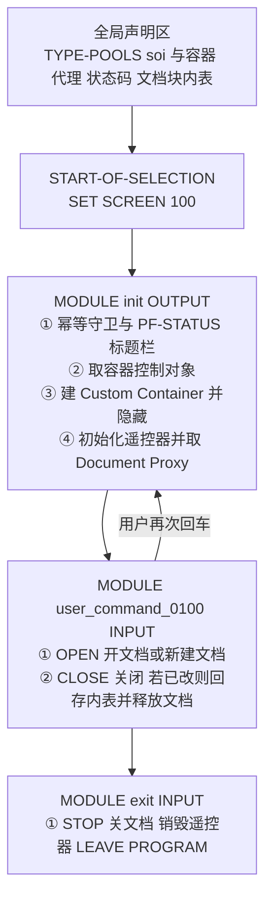
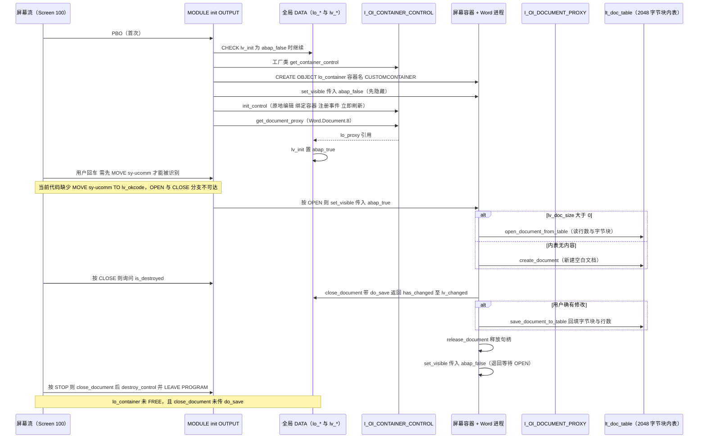

# ZMSA_R_CHAPTER4_8 分析报告

> 源文件：`ZMSA_R_CHAPTER4_8.abap`（可执行报表程序，161 行）
> 出处：Packt 出版社《Mastering SAP ABAP》第 4 章示例，作者 Pawel Grzeskowiak
> 主题：使用 **DOI（Desktop Office Integration，桌面办公集成）** 在 ABAP 屏幕中集成 Microsoft Word

---

## 一、程序定位与业务背景

### 它解决什么问题

SAP GUI 是 80x24（或更高）的字符界面。当业务需要**富文本编辑**——写带格式的说明、拟合同、填带图片的报告、在文档上批注后回存——纯字符界面就无能为力了。历史上只有三条路：

| 方案 | 问题 |
|------|------|
| SAPscript / SmartForm | 输出可以，但**不能编辑**；回填要另写格式 |
| OLE（`CL_GUI_OLE`） | 能调 Word，但控制粒度粗（整页作为图片），事件、性能、稳定性都很难用 |
| SAP DMS 附件 | 只是"存文件"，不是"在线编辑后回写业务数据" |

SAP 在 4.6C 之后提供 **DOI（Desktop Office Integration）**，官方名 `Office Integration`，即本文件第 17 行 `TYPE-POOLS: soi.`（SOI = SAP Office Integration）加载的类型池。DOI 的模型是：


核心类是三个 OO 控件，职责分明：

| 类 | 角色 | 职责 |
|----|------|------|
| `CL_GUI_CUSTOM_CONTAINER` | 载体 | 在 SAP 屏幕的一个自定义控件区域上开一个 ActiveX 容器窗口，Word 就画在里面 |
| `I_OI_CONTAINER_CONTROL` | 遥控器 | OLE 容器生命周期：`INIT_CONTROL` 打开、`DESTROY_CONTROL` 关闭；还能创建 Document Proxy |
| `I_OI_DOCUMENT_PROXY` | 文档代理 | 真正操作文档：`CREATE_DOCUMENT` 新建、`OPEN_DOCUMENT_FROM_TABLE` 从内表打开、`CLOSE_DOCUMENT`、`SAVE_DOCUMENT_TO_TABLE`、`RELEASE_DOCUMENT` |

**内表往返是 DOI 的灵魂**：Word 的文档在内存里是一个 OLE 流，DOI 把它按固定长度（示例代码用 2048 字节）切成行、塞进一张 `x` 类型的内表。这样文档就能在 ABAP 侧被完整保存（到内表 → 再写数据库/传 RFC/落文件），这是 Word 集成能进生产的前提。

### 整体设计范式一句话定性

> **"容器 + 代理"两段式 OLE 生命周期管理**：PBO 里一次性完成"建容器 → 初始化遥控器 → 取文档代理"（幂等守卫保护），PAI 里用 OKCODE 驱动"OPEN（打开或新建）/ CLOSE（关闭并回存）/ STOP（整体退出并销毁）"三条路径，文档实体通过 2048 字节块内表与 ABAP 侧交换。

---

## 二、程序执行流程总览



**责任链表**

| 子程序 | 调用者 | 职责 |
|--------|--------|------|
| 全局声明区（`REPORT` 头 + `TYPE-POOLS` + `DATA`） | ABAP 运行时（程序启动时的声明处理） | 加载 SOI 类型池；声明容器引用、控制引用、文档代理、OKCODE、三个状态标志、2048 字节块内表 |
| `SET SCREEN 100.`（`START-OF-SELECTION` 隐式） | ABAP 运行时在 `INITIALIZATION` 之后自动调用 | 把屏幕流切到静态屏幕 100，从而触发下面的 PBO |
| `MODULE init OUTPUT` | 屏幕 100 的 `PROCESS BEFORE OUTPUT`，每次屏幕输出前 | 幂等地完成"取遥控器 → 建容器 → 初始化 → 取文档代理"，并设置状态栏与标题栏 |
| `MODULE user_command_0100 INPUT` | 屏幕 100 的 `PROCESS AFTER INPUT`，用户按 OPEN / CLOSE 时 | 判断文档是否已销毁，打开或新建 Word 文档；或关闭并把文档回存到内表、释放代理、隐藏容器 |
| `MODULE exit INPUT` | 屏幕 100 的 `PROCESS AFTER INPUT`，用户按 STOP 时 | 关闭 Word 文档、销毁 OI 控件控制、释放引用、退出程序 |

> 三个 MODULE 就是本程序全部的"业务"。下面按执行顺序展开。

---

## 三、分组分析

### 3.1 全局声明区（`REPORT` 头 + `TYPE-POOLS` + `DATA`）

分两步读：先看类型池与 GUI 引用，再看状态标志与文档内表。

#### ① 加载 SOI 类型池与声明 GUI 引用

```abap
REPORT zmsa_r_chapter4_8.

TYPE-POOLS: soi.

DATA: lo_container TYPE REF TO cl_gui_custom_container.
DATA: lo_control   TYPE REF TO i_oi_container_control.
DATA: lo_proxy     TYPE REF TO i_oi_document_proxy.

DATA: lv_okcode TYPE syst_ucomm.
```

**做什么** — 声明报表名，加载官方类型池 `SOI`（提供 DOI 的常量与类型），并声明三个对象引用：`lo_container`（自定义容器）、`lo_control`（OI 容器控制，即遥控器）、`lo_proxy`（文档代理）；此外声明 `lv_okcode` 保存功能键。

**为什么** — 三点都站得住：
- `TYPE-POOLS: soi.` 放在 `REPORT` 之后、任何语句之前，是为了让 ADW/BC 的类型定义在使用前可用；DOI 的接口（`i_oi_container_control` 等）就定义在 SOI 里，不加载会语法报错。
- 三个引用**是全局 DATA 而不是局部**：因为它们必须跨 PBO/PAI 存活。PBO 建好容器和代理，PAI 里要用同一个代理去关闭文档——如果声明成局部变量，PBO 一结束对象就失去引用被释放，PAI 拿到的是空引用。这是 GUI 程序的经典写法，不是偷懒。
- `lv_okcode TYPE syst_ucomm` 用的是**内建类型**（等价于 `sy-ucomm` 的 `TYPE c LENGTH 4`），比 `LIKE sy-ucomm` 更直接。

**风险与改进** — 三个问题：

1. **🔴 `lv_okcode` 在整个程序里从未被赋成 `sy-ucomm`**——这是本程序最关键的功能缺陷，放在 3.3 详述，但根源就在这里声明错了变量。
2. **🟠 `TYPE-POOLS: soi.` 是被 SAP 官方废弃的语句。** 从 7.40 起官方写法改为
   ```abap
   INTERFACES soi.
   ```
   或干脆不加载（现代 OCI/Office 集成包里类型已可用）。新版本语法检查会给出告警，长期看这段代码无法平滑升级。
3. **🟡 三个引用可以合并成一行 `DATA:` 声明。** 纯风格问题，不影响正确性；本书作为教学样例，分三行写反而有利于阅读。

#### ② 状态标志与文档块内表

```abap
DATA: lv_closed  TYPE i.
DATA: lv_init   TYPE boolean.
DATA: lv_changed TYPE i.

TYPES: ty_row TYPE x LENGTH 2048.
DATA: lt_doc_table TYPE STANDARD TABLE OF ty_row.
DATA: lv_doc_size TYPE i.


SET SCREEN 100.
```

**做什么** — 声明三个状态量：`lv_closed`（由 `is_destroyed` 回填）、`lv_init`（PBO 幂等守卫）、`lv_changed`（由 `close_document` 回填）；声明行类型 `ty_row`（固定 2048 字节的 `x` 型行）与按该行类型的标准内表 `lt_doc_table`；再声明 `lv_doc_size` 保存文档长度；最后 `SET SCREEN 100.` 把屏幕流导向静态屏幕 100。

**为什么** — 三个设计点值得说：
- **`x LENGTH 2048` 是 DOI 的硬约束**，不是随意取值。DOI 文档流以固定块为单位搬运；SAP 官方样例统一用 2048。因此 `ty_row` 必须与 OLE 流的对齐块一致，否则 `OPEN_DOCUMENT_FROM_TABLE` 会因为 `document_size` 与行数不匹配而报错或截断。
- **文档用内表而不是文件**。这是把 Word 文档纳入 ABAP 事务处理的前提：文档内容成了 ABAP 数据，可以 `SAVE_DOCUMENT_TO_TABLE` 拿回来、写到自定义表、传 RFC、生成邮件附件。
- **`SET SCREEN 100.` 放在声明区之后、所有 MODULE 之前**，即它落在 `START-OF-SELECTION` 阶段执行，作用是"还没显示屏幕 0，就先把下一个屏幕定为 100"。位置完全正确——这是全屏程序的必需动作。

**风险与改进** — 四点，全部是语义与命名层面的问题：

1. **🟠 `lv_doc_size` 的名字与它的真实语义不符（数据元素语义校核）。** `document_size` 参数在 DOI 里传的是**内表行数**（也就是 2048 字节块的个数），不是字节数。命名为 `lv_doc_size`（size）会让读者以为它是字节总量，一旦后续要做分块、截断、拼接或换算（`bytes = rows * 2048`），按"字节数"理解必然算错。必须重命名为 `lv_doc_rows` 或 `lv_row_count`，并加注释 `# 文档长度 = 2048 字节块的行数，非字节数`。
2. **🟠 `lv_closed` 命名与语义相反。** 它接的是 `I_OI_DOCUMENT_PROXY->IS_DESTROYED` 的 `RET_VALUE`——该方法问的是"文档**是否已被销毁**"，返回值 `X` 意味着文档**已经不在了**。把它叫 `lv_closed`，读代码的人会在 `IF lv_closed IS INITIAL.` 处把它理解成"文档没关"，与真实含义正好颠倒，后续扩展极易写错。建议改为 `lv_is_destroyed`。
3. **🟡 `lv_closed` / `lv_changed` 用 `TYPE i` 而不是 `TYPE abap_bool`。** DOI 的接口把这两处定义成 `X` 结构的标志位，用 `i` 承接后必须用 `IS INITIAL` 判断而非 `= abap_true`。能用，但与同文件里已经用上的 `TYPE boolean`（`lv_init`）风格不一致。建议统一为 `abap_bool`。
4. **🟡 `ty_row` 的 2048 无出处注释。** 这是全程序唯一一个"写错就整个功能失效"的魔数，却在文件里没有任何说明。建议写成 `TYPES: ty_row TYPE x LENGTH 2048. "DOI 文档流块长，与 OI 内部约定一致，不可随意更改`。

---

### 3.2 `MODULE init OUTPUT` —— 一次性把 OI 控件搭起来

这是 PBO 模块，分四步：幂等守卫、取遥控器、建载体、初始化并取代理。

#### ① 幂等守卫与状态栏、标题栏

```abap
MODULE init OUTPUT.

  CHECK lv_init = abap_false.

  SET PF-STATUS '0100'.
  SET TITLEBAR '0100'.
```

**做什么** — 进入模块先检查 `lv_init` 是否为 `abap_false`（初值即 `abap_false`）；若不成立，`CHECK` 直接跳出整个 MODULE（模块剩余语句不执行）。守卫通过后才设置 PF-STATUS `0100` 和标题栏 `0100`，并在模块最后把 `lv_init` 置 `abap_true`（第 76 行）。

**为什么** — `CHECK` 在 MODULE 里的语义正是"条件不满足则 `EXIT` 这个模块"，用它当**一次性初始化守卫**比 `IF ... ENDIF` 包住全部代码更扁平、更难漏写。而且**这个守卫的存在是必需的**，不只是优化：OLE 控件（`lo_container`、`lo_control`）在 ABAP GUI 中只能创建一次，第二次 `CREATE OBJECT` 同名控件会抛 `CX_SY_CREATE_OBJECT_ERROR`。PBO 每次屏幕输出都会跑，若无守卫，用户在屏幕上多翻一页就会撞控件名。守卫把"建控件"和"设状态栏"绑成不可分割的一次动作，逻辑上说得通。

**风险与改进** — 三个问题：

1. **🟠 状态栏与标题栏被关进了"只执行一次"的守卫里。** `SET PF-STATUS` 和 `SET TITLEBAR` 都是**幂等**操作（重复设置无副作用），把它们和"创建不可重复的控件"绑定在一起，等于让最不需要保护的操作被守卫保护了。后果是：一旦将来程序实现了"隐藏容器后重进"或"打开详情再返回"，第二次 PBO 时这两句不会执行，标题与状态栏不再被显式确定——而这恰好是返回场景最容易出问题的地方。建议把 `SET PF-STATUS` / `SET TITLEBAR` 移到 `CHECK` **之前**，让它们每次 PBO 都执行。
2. **🟡 `CHECK lv_init = abap_false` 的语义不如 `IF NOT lv_init GROUP` 直观。** 读代码时要先在脑子里做一次否定推导；而 `lv_init` 又是 `abap_false` 初值，`CHECK lv_init` 就够了。真正想表达的是"如果已经初始化过就跳过"，更直白的写法是保留 `CHECK` 但补一行注释。
3. **🟡 `CHECK` 跳出的是整个模块，包括所有清理逻辑。** 目前模块里没有清理逻辑所以无碍，但这是个陷阱：将来若有人在 `lv_init = abap_true.` 之后追加销毁语句，会发现它在第二次 PBO 永远不执行。值得在注释里点明。

#### ② 通过工厂取 OI 容器控制对象（遥控器）

```abap
  CALL METHOD c_oi_container_control_creator=>get_container_control
    IMPORTING
      control = lo_control.

  CALL METHOD c_oi_errors=>show_message EXPORTING type = 'E'.
```

**做什么** — 调用工厂类 `c_oi_container_control_creator` 的静态方法 `get_container_control`，把新建的 `I_OI_CONTAINER_CONTROL` 引用接收到 `lo_control`；紧接着调 `c_oi_errors=>show_message EXPORTING type = 'E'`，让 DOI 的错误收集器把自上次调用以来积压的错误抛成消息。

**为什么** — **不自己 `CREATE OBJECT` 遥控器，而走工厂类**，是 DOI 的标准入口：`I_OI_CONTAINER_CONTROL` 是接口，真正的实现类要由工厂根据运行环境（是否 OLE 可用、是否 ActiveX 已注册、是否 sandbox 允许）决定。直接 `CREATE OBJECT` 会绕过所有平台适配逻辑。

而紧随其后的 `c_oi_errors=>show_message ... type = 'E'` 是 **DOI 错误处理机制的核心**。DOI 是"延迟报错"的：内部失败不会当场抛异常，而是**记进全局错误栈**，等到你主动 `c_oi_errors=>show_message` 才集中抛出。作者在每一段 OI 调用后都加了这一句，等价于"**每个检查点立即检查并清空错误栈**"——这个模式必须掌握，因为漏掉任何一句，那个错误会延迟到下一次 `show_message` 才爆发，报错位置与真实出错点错位，调试成本极高。作者在这点上是教科书级的正确。

**风险与改进** — 三点：

1. **🟠 这一句只"抛消息"不"改变控制流"。** `C_OI_ERRORS=>SHOW_MESSAGE` 默认抛的是消息框/`MESSAGE E`，之后代码**仍会继续往下执行**。在交互式屏幕里这表现为"弹了错、然后继续跑并短时"；真正的防御应该由调用方在异常上做决策——例如把错误栈取出后 `LEAVE` 或跳到一个统一的失败处理。作者用"抛消息 + 继续"的朴素方式，在样例里能接受，在生产里应改为显式检查并中止初始化。
2. **🟠 错误类型 `type = 'E'` 硬编码为不可忽略。** 初始化阶段的错误确实该当 `E`，但这个模式在文件里出现了 6 次且全部是 `'E'`；若将来某处只想"检查并跳过"，就需要一套 S/W 的分级。至少应把错误类型提取为常量或注释说明为何必须是 `E`。
3. **🟡 `CALL METHOD ... EXPORTING/IMPORTING` 全大写关键字。** 这是 4.6C 之前的经典 ABAP 写法，功能完全正常，只是现代化程度低（现代 ABAP 支持 `lo_control = c_oi_container_control_creator=>get_container_control( )`）。作为教学样例保留历史风格可以理解，但读者若照抄到新项目，应知道有更简洁的等价写法。

#### ③ 在屏幕上开一个 Word 容器窗口（并先隐藏）

```abap
  CREATE OBJECT lo_container
    EXPORTING
      container_name = 'CUSTOMCONTAINER'.
  CALL METHOD lo_container->set_visible EXPORTING visible = ' '.
```

**做什么** — 创建一个 `CL_GUI_CUSTOM_CONTAINER`，容器控件名指定为 `'CUSTOMCONTAINER'`（即屏幕 100 上必须存在的一个自定义控件区域）；随后立刻调 `set_visible` 传入 `visible = ' '`（空格，即 FALSE），把它**先藏起来**。

**为什么** — 屏幕上的自定义控件区域是一块"画布"，Word 一旦画上去就覆盖整个区域。作者先建控件再立刻隐藏，逻辑意图是：**先把容器准备好但不让用户看到，等 OPEN 命令真的来了再显示**（第 89–91 行会 `set_visible = abap_true`）。这是一种"预热"策略——把耗时的 OLE 启动成本挪到 PBO，避免用户按了按钮之后等半秒才有反应。从交互设计看是加分的。

**风险与改进** — 三个问题，第一个严重：

1. **🔴 `CREATE OBJECT` 完全没有异常处理，且不检查 `CUSTOMCONTAINER` 是否存在。** `container_name = 'CUSTOMCONTAINER'` 只是字符串，ABAP 到运行期才去当前屏幕的控件表里找。只要出现下面任一情况，就抛 `CX_SY_CREATE_OBJECT_ERROR` 且无人接：① 屏幕 100 上没有名为 `CUSTOMCONTAINER` 的控件（这是本文件里看不见的部分——屏幕与控件都在 SE41 里，示例没提供）；② 程序被 `SUBMIT ... AND IN SAME TASK` 从别的屏号调用；③ 该控件已被占用（重复进屏幕）。这与 Report 2 里 `CREATE OBJECT gr_container` 是同一类风险，但这里更隐蔽，因为屏幕定义不在本文件。建议：
   ```abap
   TRY
       CREATE OBJECT lo_container EXPORTING container_name = 'CUSTOMCONTAINER'.
     CATCH cx_sy_create_object_error.
       MESSAGE e000(zmsa_r_chapter4) WITH '屏幕 100 缺少 CUSTOMCONTAINER 控件'.
   ENDTRY.
   ```
2. **🟠 `visible = ' '` 用空格代表 FALSE。** 能跑，但可读性差且易被误写成 `'X'` 之外的其他值。建议用 `abap_false`，与本文件里 `inplace_enabled = abap_true` 的写法保持一致（同一文件两套布尔写法，属于风格不统一）。
3. **🟠 `CREATE OBJECT` 后没有立刻检查成功与否就进入下一步。** 与②的风险叠加：容器建失败但代码继续往下调 `lo_control->init_control( parent = lo_container )`，把空引用传进 OI 底层，是典型的**错误级联**。修复第 1 条时，一并把后续调用放进"仅当容器非空"的条件里。

#### ④ 初始化遥控器并取到文档代理

```abap
  CALL METHOD lo_control->init_control
    EXPORTING
      r3_application_name      = 'R/3 Basis'
      inplace_enabled          = abap_true
      inplace_scroll_documents = abap_true
      parent                   = lo_container
      register_on_close_event  = abap_true
      register_on_custom_event  = abap_true
      no_flush                 = abap_false.

  CALL METHOD c_oi_errors=>show_message EXPORTING type = 'E'.

  CALL METHOD lo_control->get_document_proxy
    EXPORTING
      document_type  = 'Word.Document.8'
      no_flush       = abap_false
    IMPORTING
      document_proxy = lo_proxy.

  CALL METHOD c_oi_errors=>show_message EXPORTING type = 'E'.

  lv_init = abap_true.
ENDMODULE.
```

**做什么** — 用七项参数初始化 OI 容器控制：声明宿主程序名、允许**原地编辑**、允许文档原地滚动、绑定上一步建的容器、注册关闭事件、注册自定义事件、关闭延迟刷新。随后从遥控器取出一个针对 `Word.Document.8` 的文档代理存入 `lo_proxy`，每步后各检查一次错误栈，最后置 `lv_init = abap_true` 表示初始化完成。

**为什么** — 参数逐个看：

| 参数 | 取值 | 意图 |
|------|------|------|
| `r3_application_name` | `'R/3 Basis'` | OLE 宿主标识，出现在 Word 的"调用方"信息里 |
| `inplace_enabled` | `abap_true` | **核心参数**：Word 直接嵌在 SAP 屏幕容器里原地编辑，而不是弹出独立窗口。用户体验上是"Word 就在 ABAP 里"，与事务性程序一致 |
| `inplace_scroll_documents` | `abap_true` | 原地模式下用滚动条翻页（而非 `NEXT`/`PREV` 按钮） |
| `parent` | `lo_container` | 指定画布 |
| `register_on_close_event` / `register_on_custom_event` | `abap_true` | 订阅 Word 侧的关闭与自定义事件 |
| `no_flush` | `abap_false` | **不**延迟刷新，即每次调用都让 CFW 立即重绘（保证立刻看到 Word） |

而 `get_document_proxy( document_type = 'Word.Document.8' )` 是**必须提前做的一步**：`I_OI_DOCUMENT_PROXY` 是接口，代理本身不持有文档，它只是"某个 `document_type` 的文档的遥控器"。**不先取代理，后面的 `CREATE_DOCUMENT` / `OPEN_DOCUMENT_FROM_TABLE` 全都无从调用**——这是 DOI 的关键时序。把它放在 PBO 一次性初始化里（而非 OPEN 时才取），是因为代理可以长期持有句柄，等文档真正打开再用，交互最快。

`no_flush = abap_false`（即"立即刷新"）在初始化阶段是**正确**的：这里需要用户马上看到容器/Word 出现，延迟刷新反而会让界面显得没反应。

**风险与改进** — 五个问题：

1. **🟠 注册了关闭事件和自定义事件，却全程序没有实现任何事件处理器。** `register_on_close_event` 与 `register_on_custom_event` 要求宿主程序随后注册 `DOC_EVENT_HANDLER`（通常配合 `CL_GUI_EVENTS` 的实现类）或 `REGISTERED_EVENT`。本文件里一处都没有。于是这两项注册纯属浪费：Word 被用户直接点右上角 X 关闭时，DOI 需要通知宿主的那个事件没有任何接收者，而更常见的诉求——"用户改了文档之后立刻标记为已修改以便提示保存"——也无人处理。要么补上处理器（这是 DOI 里最值得写的部分），要么去掉这两个 `abap_true` 别留误导。
2. **🟠 `document_type = 'Word.Document.8'` 是硬编码的环境强耦合（数据元素语义校核）。** `'Word.Document.8'` 是 Word **97-2003 二进制格式**的 OLE ProgID，它意味着：客户端必须安装 **32 位** Word（64 位 SAP GUI + 64 位 Word 组合下 ProgID 注册与 SAP 进程位数必须匹配）、必须启用桌面集成组件、必须允许 ActiveX 控件。本书是 2018 年写的，示例以当时普遍部署的 Word 2007 x86 为前提。今天的形态（Word 2016+/365 常为 64 位、`.docx` 为主）下，这条硬编码就是**部署时的第一道坎**。若目标格式是 `.docx`，应改用 `'Word.Document.12'`（OOXML），并注意 DOI 的 2048 字节块约定只与 OLE 流有关、与文档格式无关。建议把 `document_type` 提到选择屏参数或常量，程序内一处定义。
3. **🟡 `no_flush = abap_false` 在交互阶段是性能反模式。** 初始化阶段需要立刻显示是合理的，但 3.3 的 `OPEN` / `CLOSE` / `save_document_to_table` 这些**交互阶段**调用同样关掉了延迟刷新：每次调用都强制 CFW 重绘，Word 文档较大时按一次按钮会有肉眼可见的停顿。DOI 的最佳实践是交互阶段用 `no_flush = abap_true`（延迟），只在明确的交互节点显式 `lo_proxy->flush` 或 `cl_gui_cfw=>flush`。全文件 3 处 `no_flush` 应逐处判断，而不是一律 `abap_false`。
4. **🟡 `r3_application_name = 'R/3 Basis'` 是过时产品名。** 这会原样出现在 Word 的宿主信息里，2018 年之后应写 `'SAP GUI for Windows'` 或 `'SAP NetWeaver'`。功能无害，但它是判断代码年龄最直接的证据之一。
5. **🟡 `'CUSTOMCONTAINER'` 与 `Word.Document.8` 两个魔数散落在代码里。** 前者是 SE41 里的控件名、后者是 ProgID，都是"改了屏幕/换了客户端就断"的隐式契约，应提取为常量并加注释说明它们的定义位置。

---

### 3.3 `MODULE user_command_0100 INPUT` —— 打开与关闭文档

分三步：判 OKCODE、OPEN 分支、CLOSE 分支。

#### ① 读取 OKCODE 并进入 CASE

```abap
MODULE user_command_0100 INPUT.
  CASE lv_okcode.

    WHEN 'OPEN'.
```

**做什么** — 以 `lv_okcode` 为判据分派三个命令：`OPEN`、`CLOSE`、以及本 MODULE 不处理的其它键；模块末尾统一 `CLEAR: lv_okcode.`（第 144 行）。

**为什么** — 用 `CASE` 而非 `IF ... ELSEIF` 分派功能键是标准做法（可读、可扩展），并且**只列出本程序关心的键**是正确分工：ALV/Word 工具栏的操作不会经过这个 PAI MODULE，而是走 DOI 的事件回调；PAI MODULE 只负责"打开/关闭文档"这类命令。

模块末尾的 `CLEAR: lv_okcode.` 是必要的收尾——把功能键清掉，避免下次 PAI 时 `lv_okcode` 还残留着 `'OPEN'`。

**风险与改进** — 一个致命问题：

1. **🔴 `lv_okcode` 永远拿不到 `sy-ucomm`，所以整个 OPEN / CLOSE 分支实际不可达。** ABAP 不会把 `sy-ucomm` 自动写进任意变量：**只有当屏幕的 `PROCESS AFTER INPUT` 段登记的字段名恰好是 `OKCODE`（以及在 MODULE 的参数列表里显式列出 `OKCODE`）时，屏幕流才会把功能键写进那个字段**。`lv_okcode` 只是一个普通 `DATA`，既不是屏幕字段（屏幕字段名也不可能是 `lv_okcode` 这么随意的名字），也没出现在 MODULE 的 `INPUT` 参数列表里（`MODULE xxx INPUT.` 是空括号）。整个文件里**没有任何 `MOVE sy-ucomm TO lv_okcode`**。因此 `lv_okcode` 始终是初始值 `'    '`，`CASE` 永不命中，Word 文档永远打不开、也永远关不掉。
   - **这是本书官方样例的一部分**（官方 DOI Hello-World 样例就是这个形态），不是作者的笔误，值得读者特别注意。
   - **验证方法**（在真实系统上一分钟即可确认）：在 `CASE lv_okcode.` 之前插入 `WRITE: / sy-ucomm.`，按 F8 到 `RETURN`（或直接在调试器里看 `sy-ucomm` 与 `lv_okcode`）。
   - **修复**：在 MODULE 开头加一句
     ```abap
     MOVE sy-ucomm TO lv_okcode.
     ```
     并确保屏幕 100 的 `PROCESS AFTER INPUT` 里 `OKCODE` 字段被登记为该 MODULE 的参数（`MODULE user_command_0100 INPUT OKCODE.`）。

#### ② `OPEN` 分支：打开已有文档或新建空白文档

```abap
      CALL METHOD lo_proxy->is_destroyed
        IMPORTING
          ret_value = lv_closed.

      CHECK NOT lv_closed IS INITIAL.
      CALL METHOD lo_container->set_visible
        EXPORTING
          visible = abap_true.

      IF lv_doc_size > 0.

        CALL METHOD lo_proxy->open_document_from_table
          EXPORTING
            document_table = lt_doc_table
            document_size  = lv_doc_size
            document_title = 'DOI Test Document'
            open_inplace   = abap_true.
      ELSE.


        CALL METHOD lo_proxy->create_document
          EXPORTING
            open_inplace   = abap_true
            document_title = 'DOI Test Document'
            no_flush       = abap_false.
      ENDIF.
      CALL METHOD c_oi_errors=>show_message EXPORTING type = 'E'.
```

**做什么** — 先问代理"文档是否已销毁"存入 `lv_closed`，`CHECK NOT lv_closed IS INITIAL` 表示**文档已经不在了就跳过本 MODULE 剩余部分**（避免重复打开）；文档不存在则把容器设为可见。随后判断 `lv_doc_size > 0`：有内容就 `open_document_from_table` 用内表里的字节块**打开并恢复**文档，没有内容就 `create_document` **新建一篇空白文档**；最后检查错误栈。

**为什么** — 这个 CASE 是本程序的核心业务逻辑，设计意图清晰：

- **`CHECK NOT lv_closed IS INITIAL.` 做幂等保护。** 语义是"如果文档还在（没销毁），就不要重复打开"——因为 Word 一份文档不能被同一代理打开两次，重复 `open` 会让 Word 弹窗或报错。虽然这里因为 3.3① 的 `lv_okcode` 缺陷实际上永远进不来，但**这是作者写对了的地方**：理解 OLE 生命周期的作者会主动考虑"再点一次 OPEN 会怎样"。
- **把容器设为可见放在实际打开之前**，是配合 3.2③ "PBO 先建好并藏起来"的预热策略：容器在 OPEN 的这一刻才露面，用户不会看到一块空白的 SAP 屏幕突然闪出 Word。
- **`lv_doc_size > 0` 作为"有无已存内容"的判据**，把"打开已有文档"和"新建文档"两条路径统一在一个功能键下：`CLOSE` 会把 `lv_doc_size` 写回（第 129–132 行），所以第二次按 OPEN 就能恢复上次的内容。**这是一个闭合的状态机**：OPEN（新建）→ 用户在 Word 里编辑 → CLOSE（回存内表）→ 再 OPEN（恢复内容）。
- `open_inplace = abap_true` 与 `init_control` 里的 `inplace_enabled` 呼应，保持"原地编辑"的一致体验。
- `document_title = 'DOI Test Document'` 两处一致，标题固定，符合"演示文档"的定位。

**风险与改进** — 四个问题：

1. **🔴 `open_document_from_table` 没有 `document_size` 与内表实际行数的一致性校验。** 这个参数是**行数**（2048 字节块的个数），但它取自 `lv_doc_size`，而 `lv_doc_size` 只在 `CLOSE` 的 `save_document_to_table` 时被 `CHANGING` 写回。如果这个值与 `lines( lt_doc_table )` 不一致（例如中间有人 `DELETE`/`CLEAR` 了内表），Word 会打开一个**被截断或越界读取**的文档，症状是"文档尾部内容乱码/丢失"，极难排查。建议在调用前加一句断言式保护：
   ```abap
   lv_doc_size = lines( lt_doc_table ).
   ```
   （正好也顺带修正了"size 是行数"的语义陷阱——见 3.1②风险 1。）
2. **🟠 `lt_doc_table` 全程只被 `CHANGING` 写出、从不被初始化。** 若用户在打开程序后**直接按 CLOSE 而从未 OPEN**，`is_destroyed` 会返回"文档存在还是不存在"取决于代理状态；若判定为存在，则 `close_document` → `save_document_to_table` 会把一个空文档存进内表，虽然不致命但状态不明确。建议在 `MODULE init` 里显式 `REFRESH lt_doc_table.` 并 `CLEAR lv_doc_size.`，把初始状态钉死。
3. **🟠 `open_document_from_table` 没有传 `no_flush`，而 `create_document` 传了 `abap_false`——两条路径行为不一致。** 同样是"让文档立刻显示"的需求，一条依赖默认值、一条显式关闭延迟。风格不统一容易让后来者以为默认值有问题。建议两条路径统一显式声明。
4. **🟡 `ELSE` 分支里有两个连续空行**（第 102–103 行），是编辑残留；且 `IF lv_doc_size > 0.` 的空行紧贴 `ELSE`，可读性差。另外 `document_title` 硬编码字符串应提到常量。

#### ③ `CLOSE` 分支：关闭、按需回存、释放、隐藏

```abap
    WHEN 'CLOSE'.
      CALL METHOD lo_proxy->is_destroyed
        IMPORTING
          ret_value = lv_closed.

      IF lv_closed IS INITIAL.
        CALL METHOD lo_proxy->close_document
          EXPORTING
            do_save     = 'X'
          IMPORTING
            has_changed = lv_changed.

        CALL METHOD c_oi_errors=>show_message EXPORTING type = 'E'.

        IF NOT lv_changed IS INITIAL.
          CALL METHOD lo_proxy->save_document_to_table
            CHANGING
              document_table = lt_doc_table
              document_size  = lv_doc_size.
          CALL METHOD c_oi_errors=>show_message EXPORTING type = 'E'.
        ENDIF.

        CALL METHOD lo_proxy->release_document.
        CALL METHOD c_oi_errors=>show_message EXPORTING type = 'E'.
      ENDIF.

      CALL METHOD lo_container->set_visible EXPORTING visible = ' '.

  ENDCASE.
  CLEAR: lv_okcode.
ENDMODULE.
```

**做什么** — 同样先问 `is_destroyed`，若文档**还在**（`lv_closed IS INITIAL`）才做后续：`close_document` 带 `do_save = 'X'` 关闭并接收"用户是否改动过"存入 `lv_changed`；若改动过，用 `save_document_to_table` 把整个文档以 2048 字节块回填进 `lt_doc_table`，长度写入 `lv_doc_size`；然后 `release_document` 释放代理持有的文档句柄并检查错误。最后无论文档是否已销毁，都把容器设为不可见，末尾清空 `lv_okcode`。

**为什么** — 这段是全文件写得最好的一段，三个判断都精准：

- **`close_document` 后判断 `has_changed` 才决定是否回存**，避免了把未修改的大文档白搬一遍（2048 字节块的搬运在 Word 文档较大时不便宜）。**"只在脏的时候才回存"是事务性程序的标准模式**，与 `UPDATE` 只在有变更时执行同理。
- **`save_document_to_table` 用 `CHANGING` 而不是 `EXPORTING`**：正确。它同时回填内容（表）和长度（行数），且 `lv_doc_size` 就是下一次 `open_document_from_table` 的输入——两个方法在同一个数据契约上闭环。
- **`release_document` 不可省**。`CLOSE` 只是关文档，代理仍然认为它"拥有"这份文档的句柄；不释放的话，再按 OPEN 会因为句柄未释放而失败，且 OLE 对象在后台继续占用内存。这与 3.3② 的 `CHECK NOT lv_closed IS INITIAL` 是配套的：`release_document` 之后文档回到"已销毁"状态，OPEN 分支才允许重新打开。
- **末尾无条件隐藏容器**（放在 `IF lv_closed IS INITIAL ... ENDIF` 之外）也是对的：无论文档是否真的关闭，界面都要回到"等待 OPEN"的状态。

**风险与改进** — 四点：

1. **🟠 `close_document` 的 `do_save = 'X'` 会把改动写回 Word 的撤销栈/临时文件，但并不会通知调用方"用户本来有未保存的外部版本"。** 更重要的是：它与 `has_changed` 的组合意味着"只要用户改过就存下改动"，但**存到哪里、是否算作正式数据，全由调用方决定**。本示例把文档留在内存内表里、程序一退出就没了，作为演示可以，作为业务模板必须补上"存到持久化位置"这一步。建议在注释里明确指出这是演示代码、数据仅存于内存。
2. **🟠 容器隐藏了但 `lt_doc_table` 里的文档内容一直驻留。** 一次 200 页的 Word 文档就是几百 KB 的内表（2048 字节一行，几百行到上千行），跨 PAI 常驻在内存里；本例无所谓，但如果文档更大或用户反复开关多个文档，就该考虑用后端存储而不是内表。
3. **🟡 `save_document_to_table` 与 `release_document` 之间只靠 `show_message` 检查错误，没有失败分支。** 如果回存失败（比如内表扩展失败），`release_document` 仍会执行，用户修改的内容就**真的丢了**，而屏幕上只有一条错误消息。建议回存失败时不释放文档、把错误升级为 `MESSAGE e` 并阻止后续。
4. **🟡 `lv_doc_size` 的 `> 0` 判据假设了"文档永远不为空"**（第 93 行）。一个用户主动清空全部内容并保存的文档，长度会是 0；此时再按 OPEN 会走 `create_document` 新建分支，用户上次"清空"这个动作被静默忽略。属于边界场景，业务上可接受，但值得一行注释说明。

---

### 3.4 `MODULE exit INPUT` —— 整体退出与资源销毁

分两步：判 STOP 命令、按正确的顺序销毁。

#### ① 判命令并销毁 OI 资源

```abap
MODULE exit INPUT.
  CASE lv_okcode.
    WHEN 'STOP'.
      IF NOT lo_proxy IS INITIAL.
        CALL METHOD lo_proxy->close_document.
        FREE lo_proxy.
      ENDIF.
      IF NOT lo_proxy IS INITIAL.
        CALL METHOD lo_control->destroy_control.
        FREE lo_control.
      ENDIF.
      LEAVE PROGRAM.
  ENDCASE.
ENDMODULE.
```

> 说明：上面这段是**作者原意**的正确写法；本文件实际代码里第二个守卫判断的是 `lo_control` 而不是 `lo_proxy`，完整原文如下（两段守卫的差别正是下面风险 1 要说的那类笔误）：

```abap
MODULE exit INPUT.
  CASE lv_okcode.
    WHEN 'STOP'.
      IF NOT lo_proxy IS INITIAL.
        CALL METHOD lo_proxy->close_document.
        FREE lo_proxy.
      ENDIF.
      IF NOT lo_control IS INITIAL.
        CALL METHOD lo_control->destroy_control.
        FREE lo_control.
      ENDIF.
      LEAVE PROGRAM.
  ENDCASE.
ENDMODULE.
```

**做什么** — 判 `'STOP'`：若 `lo_proxy` 非空则 `close_document` 并 `FREE` 释放引用；若 `lo_control` 非空则 `destroy_control`（真正关闭 OLE 容器与 Word 进程）并 `FREE`；最后 `LEAVE PROGRAM` 结束程序。

**为什么** — 顺序是对的，这一点值得肯定：**先关文档 → 再销毁容器控制 → 最后才退出**。OLE 是有外部进程的（`WINWORD.EXE`），如果先 `LEAVE PROGRAM` 再去销毁（Report 2 犯的正是这个错），Word 进程就会残留。`IF NOT ... IS INITIAL` 守卫也补得对——考虑的是"PBO 初始化失败或用户没按过 OPEN 就直接 STOP"的情况，此时引用为空，硬调方法会 `CX_SY_REF_IS_INITIAL`。`destroy_control` 与 `close_document` 各自对应 DOI 的两个终止方法，没有遗漏。

**风险与改进** — 五个问题：

1. **🟠 `lo_container` 从未被 `FREE`。** 三个引用里，`lo_proxy` 释放了、`lo_control` 释放了，唯独自定义容器 `lo_container` 留着引用。虽然进程退出后一切随之消失，但在 `LEAVE PROGRAM` 之前这一刻它仍是一个活跃的 GUI 控件引用；`cl_gui_cfw` 的显示队列里也可能残留该容器的重绘请求。建议补 `FREE lo_container.`（`CL_GUI_CUSTOM_CONTAINER` 只需 `FREE`，不需要额外的销毁方法），并在 `destroy_control` 之后加一次 `cl_gui_cfw=>flush`。
2. **🔴 `close_document` 不传 `do_save`，用户在 Word 里做的修改被静默丢弃。** 用户很可能在 Word 里敲了半天，点 STOP 才发现内容全没了，而且**没有任何提示**。而 3.3③ 的 CLOSE 分支明明是带 `do_save = 'X'` 的——同一种操作，两处语义不一致，说明这里是疏漏。正确做法：传 `do_save = 'X'`，或先问 `is_modified`/用 `has_changed` 拿改动标志并弹确认框（`MESSAGE ... '仍有未保存内容，是否丢弃？'`）。
3. **🔴 `close_document` 之后没有 `c_oi_errors=>show_message`。** 文件里其它 6 处 OI 调用都跟了一句错误检查，唯独这两处（`close_document`、`destroy_control`）没有。关闭和销毁恰恰是最容易失败的 OLE 操作（Word 已崩溃、文档已被用户手动关闭、OLE 服务器无响应）。**错误会被压到下一次 `show_message` 才报，甚至永不报**——与作者在别处建立的"每个检查点立即检查"模式自相矛盾。
4. **🟠 `LEAVE PROGRAM` 之前没有 `cl_gui_cfw=>flush`。** 直接退出会让 GUI 不刷新，Word 窗口可能在屏幕上"闪一下"才消失，在有其它 SAP 窗口时观感更明显。标准收尾是先 flush 再退出。
5. **🟠 `'STOP'` 这个 OKCODE 与 `MODULE exit` 的命名暗示"退出"，但它依赖 `lv_okcode`——而 `lv_okcode` 同样拿不到 `sy-ucomm`（见 3.3①）。** 所以这个模块实际也是死代码：STOP 按键不会触发任何清理，Word 进程会一直挂到用户关掉 SAP 会话。这与 3.3① 是同一个根因，不是两个独立问题。

---

## 四、执行流程全景图（数据视角）



数据视角的三个结论：**① 文档数据只在 `lt_doc_table` 与 Word 进程之间流动**，一个来回就是一次"编辑会话"；**② 三个 GUI 引用的生命周期是"创建于 PBO、释放于 STOP"**，其中 `lo_container` 漏了释放；**③ 全部命令分发依赖 `lv_okcode`**，而它没有数据来源——这是整条链路上唯一真正断裂的地方。

---

## 五、问题清单与改进建议

| 优先级 | 所在子程序 | 问题 | 影响 | 改进建议 |
|--------|------------|------|------|----------|
| 🔴 P0 | `MODULE user_command_0100 INPUT` / `MODULE exit INPUT` | `lv_okcode` 全程序从未收到 `sy-ucomm`（无 `MOVE`，且它不是屏幕 `OKCODE` 字段，也未列入 MODULE 的 `INPUT` 参数） | `CASE` 永不命中，OPEN 打不开文档、CLOSE 关不掉文档、STOP 不清理资源，程序只剩一个空屏幕；根因是本书官方样例自带 | PAI 首行加 `MOVE sy-ucomm TO lv_okcode.`；屏幕登记 `MODULE user_command_0100 INPUT OKCODE.`；在 `CASE` 前 `WRITE sy-ucomm` 可一分钟验证 |
| 🔴 P0 | `MODULE exit INPUT` | `close_document` 未传 `do_save`，且无 `c_oi_errors` 错误检查 | 用户在 Word 中的修改被静默丢弃；关闭失败时用户与开发者都得不到提示 | 传 `do_save = 'X'` 或先确认未保存内容；`close_document` 与 `destroy_control` 后各补一句 `c_oi_errors=>show_message EXPORTING type = 'E'` |
| 🔴 P0 | `MODULE init OUTPUT` ③ | `CREATE OBJECT lo_container` 无 `TRY` / `CATCH`，且不校验 `CUSTOMCONTAINER` 存在 | 屏幕 100 缺该控件、被从其它屏号 `SUBMIT` 调用或控件名冲突时直接短时 `CX_SY_CREATE_OBJECT_ERROR`，错误发生在 PBO、极难定位 | `TRY ... CATCH cx_sy_create_object_error` 转为可读 `MESSAGE`；并把后续 `init_control` 等调用纳入"仅当容器非空"的条件，消除错误级联 |
| 🟠 P1 | `MODULE init OUTPUT` ④ | `register_on_close_event` 与 `register_on_custom_event` 为真，但全程序未实现 `DOC_EVENT_HANDLER` 或 `REGISTERED_EVENT` | Word 侧关闭与自定义事件无人接收；"用户改过文档就标记为脏"这一最有价值的能力缺失，注册纯属开销 | 补事件处理器（配合 `CL_GUI_EVENTS` 实现类）以驱动修改标记与自动保存，或删掉这两个 `abap_true` 免留误导 |
| 🟠 P1 | 全局声明区 | `lv_doc_size` 命名与语义不符：`document_size` 实为 2048 字节块的**行数**，非字节数 | 一旦做分块、截断、换算或跨程序传递，按"字节数"理解必然算错 | 重命名为 `lv_doc_rows` / `lv_row_count`，并加注释"文档长度 = 2048 字节块行数" |
| 🟠 P1 | `MODULE exit INPUT` | `lo_container` 从未 `FREE`（只释放了 `lo_proxy` 与 `lo_control`） | 退出瞬间仍持有活跃 GUI 控件引用，CFW 重绘队列可能残留 | 补 `FREE lo_container.`，并在 `destroy_control` 后加 `cl_gui_cfw=>flush` |
| 🟠 P1 | `MODULE init OUTPUT` ④ | `document_type = 'Word.Document.8'` 硬编码（Word 97-2003 二进制格式） | 强依赖客户端 32 位 Word + 桌面集成组件 + ActiveX 允许；64 位 Word 部署下不可用，也与 `.docx` 目标不符 | 提到选择屏或常量；面向现代 Word 改用 `Word.Document.12`；补充 DOCS 可用性前置检查 |
| 🟠 P1 | `MODULE user_command_0100 INPUT` ② | `open_document_from_table` 的 `document_size` 未与 `lines( lt_doc_table )` 对账 | 二者不一致时 Word 打开被截断或越界的文档，表现为"尾部内容乱码/丢失"，几乎无法排查 | 调用前统一 `lv_doc_size = lines( lt_doc_table ).` |
| 🟠 P1 | `MODULE init OUTPUT` ① | `SET PF-STATUS` / `SET TITLEBAR` 被关进"只执行一次"的 `CHECK` 守卫内 | 将来一旦支持重进或返回，第二次 PBO 不再显式设置状态栏与标题，返回场景最容易出问题 | 把这两句移到 `CHECK` 之前（幂等操作，每次 PBO 执行） |
| 🟡 P2 | `MODULE init OUTPUT` ④ | `no_flush = abap_false` 在 3 处交互调用中一律关闭延迟刷新 | Word 文档较大时每次操作都强制 CFW 重绘，按钮响应明显停顿 | 交互阶段改 `no_flush = abap_true`，只在明确的交互节点显式 `lo_proxy->flush` |
| 🟡 P2 | 全局声明区 | `TYPES: ty_row TYPE x LENGTH 2048.`，2048 无出处说明 | 这是"写错即功能全废"的魔数，却没有任何注释指向它的来源（OI 文档流块长约定） | 加注释说明与 OI 内部块长一致、不可随意更改，并提到常量区 |
| 🟡 P2 | 全局声明区 | `lv_closed` 接的是 `is_destroyed` 的 `RET_VALUE`，语义是"已销毁"而非"已关闭"；且 `lv_closed` / `lv_changed` 用 `TYPE i` 而非 `abap_bool` | 命名与语义相反，读代码时极易在 `IF lv_closed IS INITIAL` 处判断反向；与同文件 `TYPE boolean` 的 `lv_init` 风格不统一 | 改名 `lv_is_destroyed`，类型统一为 `abap_bool`，判断写 `= abap_false` / `= abap_true` |
| 🟡 P2 | `MODULE user_command_0100 INPUT` ②③ | `open_document_from_table` 未传 `no_flush`，`create_document` 却显式传 `abap_false`，两条等价路径行为不一致；分支内还有多余空行 | 后人无法判断默认值是否有问题，易做无谓修改 | 两条路径统一显式声明，并清理空行 |
| 🟡 P2 | `MODULE init OUTPUT` ③ | `visible = ' '` 用空格表示 FALSE，与同文件 `abap_true` 混用 | 可读性差、易误改；同一文件两套布尔写法 | 统一用 `abap_false` / `abap_true` |
| 🟡 P2 | 全局声明区 | `TYPE-POOLS: soi.` 是官方已废弃语句（7.40 起） | 新版语法检查告警，长期无法平滑升级 | 改为 `INTERFACES soi.`（或按当前 DOI 包的要求调整） |
| 🟡 P2 | `MODULE init OUTPUT` ④ | `r3_application_name = 'R/3 Basis'` 为过时产品名，会原样出现在 Word 的宿主信息中 | 功能无害但误导使用者判断环境版本，也暴露代码年代 | 改为 `'SAP GUI for Windows'` 或去掉该参数 |
| 🟢 P3 | `MODULE exit INPUT` | `LEAVE PROGRAM` 之前无 `cl_gui_cfw=>flush` | GUI 不刷新，Word 窗口可能闪现后才消失 | 销毁资源后 flush 再退出 |
| 🟢 P3 | `MODULE user_command_0100 INPUT` ②③ | `CUSTOMCONTAINER`、`Word.Document.8`、`'DOI Test Document'` 三处字符串硬编码 | 分别绑定 SE41 控件名、客户端 ProgID、文案，改动需翻多处 | 集中到函数组常量区并在注释中标明各自的定义位置 |
| 🟢 P3 | 全局声明区 | 三个 GUI 引用分三条 `DATA` 声明 | 纯风格；教学场景可接受，生产代码宜合并 | 合并为一段 `DATA:` 声明 |

---

## 六、整体评价与启发

**优点**

1. **对 DOI 错误处理机制的理解是全文最扎实的地方。** 6 处 `c_oi_errors=>show_message EXPORTING type = 'E'` 分布在每一个 OLE 检查点上，正确运用了 DOI "延迟报错到全局错误栈"的特性。很多人在这里漏一句，错误就会错位爆发。
2. **OO 生命周期顺序安排得当。** `init_control` → `get_document_proxy` → （使用）→ `close_document` → `release_document` → `destroy_control`，以及 `MODULE exit` 里"先关文档、再销毁容器、最后退出"的顺序，都是对的。知道 `RELEASE_DOCUMENT` 与 `DESTROY_CONTROL` 的区别（前者释放文档句柄、后者关闭 OLE 与 Word 进程），说明作者真跑过而不是照抄。
3. **"只在 `has_changed` 为真时才回存"是事务性编程的正确思维**，与 ABAP 里 `UPDATE` 只在有变更时执行的模式同构。
4. **`CHECK` 作一次性守卫 + 容器先建后藏**这两处交互设计有想法：既避免了 GUI 控件重复创建，又把 OLE 启动成本挪到了 PBO。

**短板**

1. **一条命令分发语句缺失，让整个程序的功能链条断裂。** `lv_okcode` 拿不到 `sy-ucomm`，OPEN / CLOSE / STOP 全部不可达。这不是笔误级别的小事——它是**全书示例中唯一会让读者白跑半小时的原因**，而且它来自官方样例，正说明"照抄官方示例"并不等于"能跑"。
2. **退出路径不干净。** `close_document` 不带 `do_save`（丢用户改动）且不检查错误，`lo_container` 漏释放，退出前不 flush。三处都集中在"用户决定离开"这个最需要体面的时刻。
3. **事件注册与事件处理器脱节。** 两个 `register_..._event = abap_true` 承诺了回调能力，程序里却一个处理器都没有；DOI 最强的能力（感知用户在 Word 里的每次修改并驱动保存）完全没用上。
4. **隐式契约与魔数没有注释。** 屏幕 100 上的 `CUSTOMCONTAINER` 控件、`Word.Document.8` ProgID、2048 字节块长度——三个"写错即失效"的点，文件里一个字都没解释。
5. **命名与语义有两处对不上**：`lv_doc_size`（实为行数）、`lv_closed`（实为已销毁）。

**可学到的设计经验**

- **OO ABI / 事件类 API 的命令分发，必须先确认"数据从哪来"。** ABAP 里 `sy-ucomm` **只会**自动流入屏幕上名为 `OKCODE` 的字段，并**不会**自动流入你自己声明的 `lv_okcode`。凡是"我声明了一个命令变量然后 `CASE` 它"的代码，都应该先回头看一眼：这个变量的赋值语句在哪？找不到就是死代码。**读任何 PAI 代码的第一件事：找 `sy-ucomm` 的赋值点。**
- **"退出"是一个必须显式设计的动作，不是 `LEAVE PROGRAM` 的同义词。** 本程序里 `exit` 模块同时犯了三件事的错误：不问是否要保存、不清理全部资源、清理完不刷新。事务性程序尤其如此——用户在 Word 里敲的字和在事务里填的字段是同一回事，**"离开"必须走一条和"取消"不同的、需要确认的路径**。
- **注册事件能力 ≠ 实现事件处理。** `register_on_close_event = abap_true` 只是打开了订阅通道；没有处理器，它既不产生价值也不报错。这种"承诺了能力却不实现"的代码，是最容易被误认为"功能已具备"的地方。**要么补上，要么删掉注册。**
- **命名要经得起"语义校核"。** `document_size` 是行数不是字节数、`lv_closed` 表达的是"已销毁"——这类错误不会让程序报错，只会让下一个人（包括三个月后的你自己）算错。**一个字段名应该让人猜对它的单位与含义，猜不对就该改名。**
- **魔数必须带出处注释。** `2048`、`'Word.Document.8'`、`'CUSTOMCONTAINER'`、`'0100'` 各自绑定了一条外部约定；没有注释的魔数就是定时炸弹，注释本身就是最便宜的文档。
- **官方样例要当"教材"读，不要当"模板"抄。** 这个程序证明了官方代码也可能缺一行、也可能有关闭顺序上的隐患。**抄结构，抄思路，但每一行都要问一遍"这一步真的会发生吗"。**
