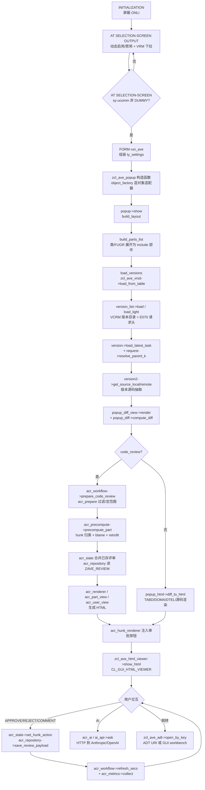
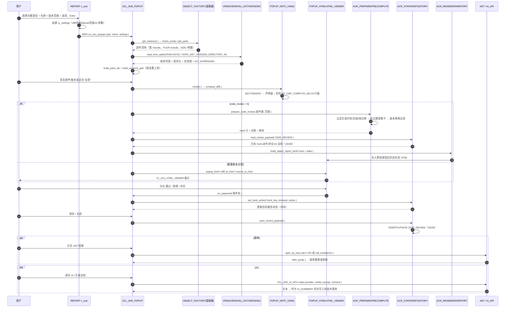

# Z_AVE 单文件版本比较工具 —— 源码分析报告

> 分析对象：`ysichov__AVE__src__z_ave_standalone.prog.abap`（29,564 行，1,278,609 字节）
> 版本标识：`version: 2.00 released 17.08.2026`，作者 Yurii Sychov，开源地址 <https://github.com/ysichov/AVE>
> 结构形态：`REPORT z_ave` + 文件内合并的类池（abapmerge 生成，尾部带 `LIF_ABAPMERGE_MARKER`），共 3 个接口 + 1 个异常类 + 46 个实现类，432 个方法实现。
> 分析范围：报表事件块与 FORM、类池全部实现类与方法、持久化表、HTTP/ADT 外部依赖。

---

## 一、程序定位与业务背景

### 1.1 它是什么

Z_AVE 是一个 **ABAP 对象的"时光机"**：给定一个程序、类、函数模块、包、DDLS、传输请求或传输请求下的某个任务，把该对象在版本管理（VCRM）中的**所有历史版本**拉出来，两两（或与活动版本）做源码差异比较、逐行归责（blame），并在 SAP GUI 里以 ALV + 内嵌 HTML 的形式呈现，最后支持把评审结论（通过 / 拒绝 / 评论）持久化到自定义表，形成一个**轻量级代码评审工作台**。

它替代的是三类工具的组合：

| 传统工具 | 覆盖能力 | AVE 的差异 |
| --- | --- | --- |
| ADT/Eclipse 版本比较 | 官方 diff，语义准确 | AVE 在 GUI 内直接跑，支持跨系统（`VERSYSNAM`）、按任务/用户/日期过滤、可保存评审结论 |
| abapTimeMachine（GitHub） | 历史回放 | AVE 不依赖 Git，直接读 VCRM，支持"任意两版本"与"活动版本"对比 |
| 表单驱动的版本对比报表 | 单对象查询 | AVE 面向开发者的交互式评审：hunk 级通过/拒绝/评论，并回写数据库供团队共享 |

### 1.2 业务动机（从代码注释与参数设计反推）

代码注释密度极高且带设计论证，典型如 `ZCL_AVE_POPUP_DIFF=>COMPUTE_DIFF` 开头解释了为什么 SECTION INCLUDE 与 Gateway 生成代码必须"按声明配对"而不是按行号比较。这些注释显示作者的核心诉求是 **让工具输出"人看得懂的差异"**，而不是复刻 diff 算法本身：

1. 生成代码（SAP 框架 include、`*_MPC`/`*_DPC`）的声明顺序是任意的，按行比较会把"移动"报成"删除+新增"，并把 A 方法的 `IMPORTING` 行匹配到 B 方法上；
2. 传输请求注释在团队里是约定俗成的评审规范（每个变更块要写请求号、首个块写变更说明），但这是"约定"所以程序**只做检查、不做假设**（参数 `p_cmtchk` 默认关闭，注释明确写了理由）；
3. 评审结论需要跨人共享并可追溯，因此落库到 `ZAVE_REVIEW` 表，JSON 结构由 `ZIF_AVE_ACR_TYPES` 统一定义。

### 1.3 关键设计取向

- **单文件交付**：所有类合并进一个报表，部署只需 SE38 传输，代价是 2.9 万行的单文件与大量类级静态状态。
- **HTML 承载 UI**：所有交互（通过/拒绝/评论/AI/跳转/筛选）都通过生成 HTML + 回调事件实现，而不是 ALV 事件。
- **算法内置**：diff、blame、声明配对、LCS 字符差异全部自研，不依赖 abapGit 之类的外部库。
- **AI 增强**：可把 hunk 交给 Anthropic/OpenAI 兼容端点做总结或问答，提示词/Schema 走本地文件夹（review profile）。

---

## 二、执行流程总览

### 2.1 主流程图



### 2.2 分层职责表

| 层 | 代表类/单元 | 职责 | 依赖 |
| --- | --- | --- | --- |
| 报表层 | `REPORT z_ave` 事件块 + `FORM run_ave` | 选择屏幕、动态字段、组装 `zif_ave_object=>ty_settings`、构造入口对象、捕获 `ZCX_AVE` | `ZCL_AVE_POPUP`、`ZCL_AVE_AI_API`（下拉）、前端服务（F4 选文件/目录） |
| 入口/外观层 | `ZCL_AVE_POPUP`（91 方法）、`ZCL_AVE_PROGRESS` | 布局、ALV、事件路由、HTML 展示、评审状态交互、缓存与刷新编排 | 下面所有层 |
| 对象适配层 | `ZCL_AVE_OBJECT_FACTORY` + 10 个 `ZCL_AVE_OBJECT_*` | 把 TRK/PROG/CLAS/FUNC/INTF/PACK/DDLS/TABD/DOMA/DTEL 统一为 `ZIF_AVE_OBJECT`（`check_exists`/`get_name`/`get_parts`） | VCRM、`SEOCOMP`、DDIC |
| 版本数据层 | `ZCL_AVE_VRSD`、`VERSNO`、`VERSION_LIST`、`VERSION`、`VERSION2`、`REQUEST` | 读 `VRSD`+`E070`、补 `SVRS_GET_VERSION_DIRECTORY_46`、版本号内外部换算、请求头/任务解析、按类型抽取版本源码 | VCRM、`SVRS_*`、DDIC 表 |
| 差异算法层 | `ZCL_AVE_POPUP_DIFF`、`ZCL_AVE_DIFF_DECL` | 行差异（`RS_CMP_COMPUTE_DELTA`）、字符级 LCS、blame 映射、声明配对、语义清洗与算子折叠 | `RS_CMP_COMPUTE_DELTA` |
| 渲染层 | `ZCL_AVE_POPUP_HTML`、`POPUP_DIFF_VIEW`、`HTML_VIEWER` | 源码/TABD/DOMA/DTEL/CDS 的 HTML 生成与展示；diff 视图与源码懒加载 | `CL_GUI_HTML_VIEWER` |
| 代码评审（ACR）层 | `ZCL_AVE_ACR_*`（20 类） | 预处理（选部件、范围、过滤）、预计算（hunk/blame/retrofit）、状态机与持久化、统计、渲染、命令、AI | `ZAVE_REVIEW`、ADT、AI API |
| 外部集成层 | `ZCL_AVE_ADT`、`ZCL_AVE_AI_API`、`ZCL_AVE_AI_PROMPTS`、`ZCL_AVE_AUTHOR` | ADT 链接/工作bench跳转；HTTP 调 LLM；提示词 profile 加载；用户名解析 | `CL_GUI_FRONTEND_SERVICES`、`CL_HTTP_CLIENT` |
| 公共层 | `ZCX_AVE` | 把 `sy-subrc`/消息统一转成异常文本 | — |

### 2.3 承接说明

报表层只做"参数翻译 + 交给弹窗"，所有业务编排集中在 `ZCL_AVE_POPUP`；版本数据层与差异算法层不感知 UI，只输出内表；ACR 层以"预计算 + 状态 + 渲染"三段式把重活前置，因此以下分析先看数据层与算法层（第 3.3–3.8 节），再看 ACR 层（第 3.9–3.11 节）与外部集成层（第 3.12–3.13 节）。

---

## 三、分组分析

### 3.1 报表入口与参数装配（报表层）

**做什么**：`INITIALIZATION` 屏蔽 `ONLI`（只允许前台，因为全程依赖 `CL_GUI_HTML_VIEWER` 与前端服务）；`AT SELECTION-SCREEN OUTPUT` 每次 PBO 都重新填 provider 下拉并用 `MODIFY SCREEN` 做字段级联动（按对象类型单选钮启用对应名称字段；`p_diff` 联动 `p_pane`/`p_cmpct`）；F4 事件分别取 AI 模型列表、系统提示词文件、提示词目录与 profile；`AT SELECTION-SCREEN` 在 `sy-ucomm <> 'DUMMY'` 时进入 `FORM run_ave`。

**为什么**：`CHECK sy-ucomm IS INITIAL` 保证只有按 Enter 才启动，避免 PBO 抖动重复弹窗；provider 下拉每次 PBO 重填是因为 `VRM_SET_VALUES` 不随屏幕状态保留；选择屏幕参数与内部 `ty_settings` 一一对应，避免把屏幕字段直接下传到深层类。

**核心代码**：参数定义与内存 ID（这是全程序最敏感的一处，见 P0-1）：

```abap
PARAMETERS: p_url    TYPE text255 MEMORY ID aurl,
            p_sslid  TYPE ssfapplssl DEFAULT 'ANONYM',
            p_model  TYPE text255 MEMORY ID model,
            p_apikey TYPE text255 MEMORY ID api.
```

- **做什么**：把 API Key、模型、端点 URL 声明为选择屏幕参数，并通过 `MEMORY ID` 让 SPA（`AVE` 事务）可以预填；`p_sslid` 指定 STRUST 中的 SSL 应用用于 HTTPS。
- **为什么**：作者明确放弃 SM59 目的地，直接用 `CL_HTTP_CLIENT=>CREATE_BY_URL`，因此只需要端点与 STRUST 的 SSL ID——注释里写得很清楚，这是有意的简化。
- **风险与改进**：`MEMORY ID` 使这些参数进入 SAP 的 SPA/Tspa 参数缓冲区，Key 以明文留存在会话与可能的参数快照中（见 P0-1）；`p_apikey` 同时被 `ZCL_AVE_POPUP=>IS_AI_ENABLED` 与 `ZCL_AVE_AI_API=>ASK` 传递，建议改为从受控自定义表/密钥服务读取，屏幕只留"是否启用"。

**风险与改进**：报表层整体是"参数胶水"，逻辑密度低但分支多（10 个 `ELSEIF` 复制粘贴构造 `NEW zcl_ave_popup`），建议用一张 `(radio → factory 常量 → 字段名)` 的静态表驱动；此外 `FORM run_ave` 只捕获 `ZCX_AVE`，其他异常会直接短 dump，缺少"未选择对象名"以外的兜底提示。

### 3.2 对象适配层（10 个适配类 + 工厂，42 方法）

**做什么**：把 10 种对象类型统一成 `ZIF_AVE_OBJECT`（`CHECK_EXISTS`/`GET_NAME`/`GET_PARTS`）。TR 类额外实现 `GET_OBJECT`（E070 行展开）与 `GET_PARTS_EXPANDED`（把请求下的对象/部件展开成可比较清单）；PACK 与 TR 额外提供 `GET_OBJECT_KEYS`（供 ACR 侧批量取版本）；CLAS/DDLS 覆盖类 include 拆分。

**为什么**：上层（`ZCL_AVE_POPUP`）只面向接口编程，新增对象类型只需加一个类 + 工厂分支；`GET_OBJECT_KEYS` 抽出后，ACR 预计算可以用 `FOR ALL ENTRIES` 一次性取回多对象版本，避免 N 次单对象查询。

| 类 | 方法 | 做什么/为什么 | 风险与改进 |
| --- | --- | --- | --- |
| `ZCL_AVE_OBJECT_FACTORY` | `get_instance` | 按 `gc_type_*` 常量返回适配器，`CHECK_EXISTS` 后返回 | 用 `RAISING zcx_ave` 统一失败路径是好的；但类型常量与工厂分支是两份清单，新增类型易漏，建议由类型常量派生 |
| `ZCL_AVE_OBJECT_TR` | `constructor`,`get_object`,`get_parts_expanded`,`get_object_keys`,`zif_ave_object~check_exists`,`zif_ave_object~get_name`,`zif_ave_object~get_parts` | 请求维度入口：从 E070 取对象清单，按 `TRFUNCTION`/任务展开部件，产出对象键集合 | 展开范围受 `include_tasks` 与 `p_itask` 控制，逻辑正确但分支多；`get_parts_expanded` 与 `ZCL_AVE_REQUEST=>GET_OBJECT_TASKS` 职责重叠，建议合并到一处 |
| `ZCL_AVE_OBJECT_PROG` | `constructor`,`zif_ave_object~check_exists`,`zif_ave_object~get_name`,`zif_ave_object~get_parts` | 单程序：`CHECK_EXISTS` 走程序存在性检查，`GET_PARTS` 返回单 include（空表表示整程序） | 返回空 parts 表让上层"整对象比较"成为默认分支，是隐式契约，建议用显式 flag 表达 |
| `ZCL_AVE_OBJECT_CLAS` | `constructor`,`zif_ave_object~check_exists`,`zif_ave_object~get_name`,`zif_ave_object~get_parts` | 类：把 `CLASS-POOL`/`LOCAL DEFINITIONS`/各 SECTION include 拆成部件 | include 命名与实际激活版本可能不一致（生成类），建议以 `SEOCOMP` 激活状态为准 |
| `ZCL_AVE_OBJECT_PACK` | `constructor`,`get_object`,`get_object_keys`,`zif_ave_object~check_exists`,`zif_ave_object~get_name`,`zif_ave_object~get_parts` | 包：列出包内全部对象，作为"批量比较"入口 | 包内对象数量无上限，超大包会一次性拉全量版本（见 P2-15） |
| `ZCL_AVE_OBJECT_DDLS` | `constructor`,`zif_ave_object~check_exists`,`zif_ave_object~get_name`,`zif_ave_object~get_parts` | DDLS：部件为数据定义源 | DDL 源需从 `DDLS` 表取文本，取源路径与类不同 |
| `ZCL_AVE_OBJECT_DDIC` | `constructor`,`zif_ave_object~check_exists`,`zif_ave_object~get_name`,`zif_ave_object~get_parts` | TABD/DOMA/DTEL 三类 DDIC 统一入口，部件为字段/值/搜索帮助明细 | 字段级比较依赖活动数据（见 P1-6） |
| `ZCL_AVE_OBJECT_INTF` | `constructor`,`zif_ave_object~check_exists`,`zif_ave_object~get_name`,`zif_ave_object~get_parts` | 接口 | 语义最简单，接口变更的可读性直接依赖行 diff |
| `ZCL_AVE_OBJECT_FUNC` | `constructor`,`zif_ave_object~check_exists`,`zif_ave_object~get_name`,`zif_ave_object~get_parts` | 函数模块（`RS38L_FNAM` → 所属函数组） | 函数组归属变化（重命名/移动）会导致历史部件键失配 |
| `ZCL_AVE_OBJECT_FUGR` | `constructor`,`zif_ave_object~check_exists`,`zif_ave_object~get_name`,`zif_ave_object~get_parts` | 函数组：展开 include 链 | FUGR 需展开 include 链，是部件数量膨胀的主要来源（见 P2-18） |
| `ZCL_AVE_OBJECT_CLAS`（同上） | — | 类部件供 ACR 计算 hunk | 与 ACR 部件键强耦合，改名会影响已存评审记录 |

**风险与改进**：这一层结构最干净、可测性最好；主要问题是"空表 = 整对象"这类隐式契约，以及 PROG/PACK/TR 三种"范围不同但接口相同"的语义重载，建议在接口注释里用伪代码固化。

### 3.3 版本数据层（6 个类，43 方法）

**做什么**：`ZCL_AVE_VRSD` 是版本持有者（`VRSD_LIST`/`ALT_KORRNUMS`），负责把版本从 `VRSD`+`E070` 读出来、用 `SVRS_GET_VERSION_DIRECTORY_46` 补齐尚未落 `VRSD` 的版本、补活动/修改版本（00000/99997）、按日期截断、并判定某个版本是否落在评审范围内（`KORR_RESOLVES_INTO_SCOPE`/`IS_RELEASED_KORR`）；`ZCL_AVE_VERSNO` 做版本号内外部换算（0↔99998）；`ZCL_AVE_VERSION_LIST` 做批量版本目录与轻量模式；`ZCL_AVE_VERSION`/`VERSION2` 是"单个版本的属性与源码"两级包装（`VERSION2` 实际承担了绝大部分源码抽取）；`ZCL_AVE_REQUEST` 缓存并解析 `E070` 请求头、`TRFUNCTION`、任务与父任务链。

**为什么这样分**：`VERSION2` 承担源码抽取是历史演进的产物（版本对象拆成"轻属性"与"重源码"两级，源码按需加载）；`REQUEST` 单独成类是为了把"请求头缓存"从版本逻辑里解耦——注释里明确写了"目录里可能有几百条，靠缓存的 header reader"。

**核心代码**：版本源码读取时的作者兜底（见 P0-3）：

```abap
" ZCL_AVE_VERSION2=>GET_SOURCE_LOCAL
author = COND #( WHEN iv_author IS NOT INITIAL THEN iv_author ELSE sy-uname ).
```

- **做什么**：版本表里没有记录作者时（例如合成版本、活动版本、或 TLOG 抽取），用当前登录用户 `sy-uname` 填充作者字段。
- **为什么**：让 blame 图/版本列表总有作者可显示，避免空白列。
- **风险与改进**：这是"把运行时身份写进历史事实"，会让归责与统计（`acr_metrics`、`acr_prepare=>GET_CREATED_OBJECT_AUTHOR`）被污染——用 A 用户跑一次比较，报告里就出现 A 是作者。改进方向：作者缺失时应显式标记为"未知/系统"，而不是回填当前用户；blame 与统计只对有真实作者记录的版本生效。

| 类 | 方法 | 做什么/为什么 | 风险与改进 |
| --- | --- | --- | --- |
| `ZCL_AVE_VRSD` | `constructor`,`load_from_table`,`apply_date_from_cutoff`,`load_active_or_modified`,`determine_request_active_modif`,`get_request_active_modif`,`read_vrsd`,`get_versionable_object`,`get_versionable_object_mode` | 版本集合的读取与归一化：`VRSD` 主查询（`INNER JOIN e070` 仅为取 `TRFUNCTION`）、`SVRS_GET_VERSION_DIRECTORY_46` 补版本并记录 `ALT_KORRNUMS`（同版本号两个请求号）、活动/修改版本加载、日期截断、版本对象与 mode 推导 | `INNER JOIN e070` 会过滤掉 `E070` 中已清理的请求（版本还在、请求头没了），表现为"版本凭空消失"（见 P1-2）；`DETERMINE_REQUEST_ACTIVE_MODIF` 用当前锁推断活动版本归属的请求号（P1-1），应改用版本自身的 `KORRNUM` |
| `ZCL_AVE_VERSNO` | `to_internal`,`to_external` | 内部 0/99997/99998 与外部表示互换，保证排序一致 | 小而正确；建议加断言测试覆盖边界值 |
| `ZCL_AVE_VERSION_LIST` | `load`,`load_light`,`korr_resolves_into_scope`,`is_released_korr`,`map_to_e071_key` | 批量加载版本（`load` 约 1,200 行，含按类型分支与过滤），`load_light` 只取列表所需字段；范围/已释放判定与 E071 键映射供 ACR 使用 | `load` 单方法过长、类型分支可拆；`load` 与 `load_light` 存在字段重复定义，易漂移，建议共用一份 select-list 构造 |
| `ZCL_AVE_VERSION` | `constructor`,`get_source`,`load_ddls_source`,`load_attributes`,`load_latest_task`,`load_author_name` | 单版本的轻属性：任务、作者名、DDLS 源、属性缓存 | `load_author_name` 逐版本查用户名，无批量缓存（见 P2-11） |
| `ZCL_AVE_VERSION2` | `get_source_local`,`get_source_local_compat`,`get_source_remote`,`build_object`,`extract_source`,`extract_tlog_source`,`get_tabd`,`get_doma`,`get_dtel`,`extract_tabd_struct`,`extract_doma_struct`,`extract_dtel_struct`,`extract_tabd_source` | 版本源码抽取：本地 `VRS`/`TLOG`、远端（跨系统版本源）、按类型构造源对象、TABD/DOMA/DTEL 的结构与源文本抽取 | 作者兜底污染（P0-3）；DDIC 走活动数据（P1-6）；`extract_source` 的类型分派是长 `CASE`，建议用对象多态替代 |
| `ZCL_AVE_REQUEST` | `constructor`,`populate_details`,`get_header`,`clear_cache`,`get_object_tasks`,`resolve_parent_k`,`get_task_for_object`,`get_latest_task_for_object` | 请求头/任务链解析与缓存，`RESOLVE_PARENT_K` 递归上溯父任务使子任务版本归属父请求 | 递归上溯无深度上限，异常数据（环）会栈溢出；建议加访问集合防环 |

### 3.4 弹窗骨架与交互（`ZCL_AVE_POPUP` 91 方法 + `ZCL_AVE_PROGRESS` 5 方法）

**做什么**：`ZCL_AVE_POPUP` 是整个程序的中枢（4,600 行、91 方法）：构造时持对象适配器与 `ty_settings`，`show` 建布局（双窗格/目录），`build_parts_list` 把类与函数组展开为 include 部件，ALV 侧建 parts/versions 两个网格并接工具栏、双击、命令事件；源码与 diff 侧交给 `ZCL_AVE_POPUP_DIFF_VIEW`；交互结果（通过/拒绝/评论/AI/跳转/重算）全部回写 ACR 状态并刷新或重渲染；还负责评审数据加载/保存、用户视图切换、指标页、ADT 跳转、SPA 回调（`on_sapevent`）与 HTML 滚动定位。`ZCL_AVE_PROGRESS` 提供停止检查能力（`check`/`was_stopped`/`reset_stop`/`was_stop_requested`）。

**为什么**：把"所有编排"集中在一个类里，好处是事件路由一跳可达（用户点一个按钮要同时更新状态、缓存、HTML、ALV 色标）；代价是这个类承担了视图、控制器、缓存、状态协调四种职责。

| 方法组 | 方法 | 做什么/为什么 | 风险与改进 |
| --- | --- | --- | --- |
| 构造与入口 | `constructor`,`show`,`build_layout`,`build_parts_list`,`create_parts_alv`,`build_html_viewer`,`create_html_viewer`,`build_versions_grid`,`create_versions_alv`,`switch_pane_layout`,`load_versions`,`refresh_parts`,`refresh_vers`,`update_ver_colors` | 一次性建屏：布局 → 部件 ALV → HTML viewer → 版本 ALV，加载版本并按设置上色 | 长耗时集中在 `SHOW` 内同步完成，`ZCL_AVE_PROGRESS` 只提供检查能力而未真正接入进度反馈（见 P2-17）；建议把加载拆成分片 + 进度条 |
| 部件与版本交互 | `handle_parts_toolbar`,`handle_parts_command`,`handle_parts_dblclick`,`handle_vers_toolbar`,`handle_vers_command`,`handle_vers_dblclick`,`show_source`,`show_code_source`,`auto_show_diff_or_source`,`render_cached_diff`,`show_versions_diff`,`get_class_parts`,`get_fugr_parts`,`version_label`,`on_toolbar_click`,`maximize_html`,`back_to_report`,`set_html`,`on_box_close`,`on_help_box_close` | 双击部件 → 选版本 → 渲染 diff 或源码；工具栏驱动对比/目录/布局；ALV 色标表达"有变更/选中" | 事件分发是长 `CASE`，新增命令需同时改多处；建议命令表驱动 |
| 评审状态桥接 | `load_review_payload`,`load_review_from_db`,`sanitize_review_state`,`collect_report_status`,`get_reviewer_stats`,`save_review_to_db`,`inject_approve_btn`,`show_user_declines`,`on_note_dlg_saved`,`on_note_dlg_cancelled`,`on_sapevent`,`after_jump`,`show_review_help_popup`,`show_tr_task_popup` | 把 ACR 状态从库里读出、清洗、与当前 hunk 对齐，回写数据库；关闭/跳转前处理未保存内容 | `on_box_close` 未强制保存（P1-8）：用户关窗即丢意见；建议 dirty 标记 + 关闭前确认 |
| ACR 编排 | `prepare_code_review`,`delete_and_recalc_selected`,`open_adt_current`,`resolve_part_key`,`refresh_cr_object`,`show_recalc_picker`,`collect_metrics`,`show_metrics`,`prepare_band`,`open_saved_code_review`,`refresh_rpt_row`,`show_moving_violations`,`show_class_objects`,`hunk_with_html`,`belongs_to_class`,`build_view_hunks`,`rebuild_missing_retrofit`,`add_moving_violations_link`,`add_cr_report_toolbar`,`build_cr_object_report_html`,`regen_acr_report`,`open_cr_part`,`rerender_cr_current`,`rerender_cr_user_view`,`scroll_last_html_to` | 进入/退出代码评审模式、部件键解析、重算选择器、指标采集、moving violations 视图、类对象视图、retrofit hunk 重建、报告重生成与局部重渲染/滚动定位 | 编排逻辑与 `ZCL_AVE_ACR_WORKFLOW` 职责重叠，建议把"模式切换/重算"整体下沉到 workflow |
| AI 交互 | `is_ai_enabled`,`ai_system`,`ai_schema`,`ai_builtin_instructions`,`get_cr_precompute_options`,`call_cr_precompute_part`,`call_cr_precompute_class_parts`,`call_cr_precompute_fugr_parts`,`refresh_ai_html_progress`,`do_ai_summary`,`do_askai`,`show_ai_hunk_prompt_popup`,`show_ai_prompt`,`save_ai_prompt`,`copy_ai_prompt` | 组装 system prompt / schema / 内置指令，调用预计算（含 AI 模式），弹窗展示/保存/复制提示词，跑总结与问答 | 前端服务与 HTTP 失败统一降级为静默（见 P1-9）；`do_askai` 在 GUI 线程同步等待，长响应期间界面无响应，建议异步化 |
| 诊断 | `add_cr_diag`,`add_cr_timing`,`add_cr_diagnostics` | `p_debug` 打开时收集预计算诊断与耗时，写入 HTML 诊断区 | 诊断写入 HTML 字符串，未做长度上限，极端情况会撑爆 HTML |

`ZCL_AVE_PROGRESS` 的方法为 `constructor`（构造停止标志）、`check`（唯一被外部调用的入口）、`was_stopped`、`reset_stop`、`was_stop_requested`（读/清停止状态）。

**风险与改进**：类级静态字段承载 settings 与 review 状态（P1-5），多弹窗场景（SPA 新开窗口）会互相覆盖；建议改为实例字段 + 显式生命周期。

### 3.5 渲染层（`ZCL_AVE_POPUP_HTML` 12 + `POPUP_DIFF_VIEW` 2 + `HTML_VIEWER` 1 方法）

**做什么**：`ZCL_AVE_POPUP_DIFF_VIEW` 只有 `render`/`load_source` 两个方法，是"渲染入口 + 源码懒加载"；`ZCL_AVE_POPUP_HTML` 负责所有 HTML 生成：源码高亮、TABD 字段级 diff、DOMA 值级 diff、DTEL 搜索帮助 diff、CDS/DDL 源码，以及约 650 行的通用 `diff_to_html` 与调试用 `debug_diff_html`；`ZCL_AVE_HTML_VIEWER` 只做 `show_html`，把字符串塞进 `CL_GUI_HTML_VIEWER`（可选最大化、事件处理、滚动定位）。

**为什么**：把 HTML 生成集中在纯函数式类里（不持有状态），使渲染可独立演进；`debug_diff_html` 保留原始 op 序列以便于排障。

| 方法 | 做什么/为什么 | 风险与改进 |
| --- | --- | --- |
| `render`,`load_source` | 视图入口：按设置选择"直接 diff"或"先列表后 diff"；源码按需加载避免一次拉全 | `render` 参数组合多，建议用设置对象整体传入减少长参数表 |
| `is_comment`,`esc`,`esc_line` | 转义与注释识别，保证 HTML 安全 | 存在两份 `ESC*` 实现（P2-19），建议统一到一个工具 |
| `source_to_html`,`cds_source_to_html` | 源码行号 + 差异着色 | 大对象一次性内联（P2-18） |
| `tabd_field_row`,`tabd_diff_to_html`,`doma_value_row`,`doma_diff_to_html`,`dtel_diff_to_html` | DDIC 三类的"语义级" diff：按字段/值/搜索帮助项对齐，而非按行 | 依赖活动 DDIC 数据（P1-6）；三类实现结构高度相似，可用模板方法统一 |
| `diff_to_html`,`debug_diff_html` | 通用差异渲染与调试渲染（约 650 行/单方法） | 单方法过长，建议按"块渲染 / 表头 / 折叠 / 导航"拆分 |
| `show_html` | 展示 HTML，处理关闭/事件回调 | HTML 事件里用字符串查找定位节点，规模大时线性开销明显 |

### 3.6 差异与 Blame 算法（`ZCL_AVE_POPUP_DIFF` 16 方法）

**做什么**：`compute_diff` 是三级策略入口：SECTION INCLUDE → 声明级 diff；Gateway DPC 生成代码 → 语句级（文本键）diff；否则行级 diff（`diff_lines` 调 `RS_CMP_COMPUTE_DELTA`，把 `RSEDCRESUL` 翻成 `+`/`-`/`=` 算子）。`diff_declarations` 按 `ZCL_AVE_DIFF_DECL` 配对结果逐对切片比较。`char_diff_html` + `emit_eq_run` 做字符级 LCS 高亮，`has_common_chars` 是 LCS 前置剪枝，`build_blame_map` 把版本→行的作者映射建好并给未覆盖行找最近锚点（`is_trivial_anchor`/`count_edit_runs`/`count_char_edit_runs` 判断锚点是否有实际编辑），`pair_change_block`/`pair_commented_twins` 把变更块与其注释孪生块配对，`cleanup_semantic`/`collapse_token_ops` 做语义清洗与算子折叠，`comment_offset` 计算注释偏移以便把评论挂到正确的行。

**为什么**：这一层是全程序技术含量最高的部分，也是作者注释最密集的部分；核心洞察是"生成的/被移动的代码必须按语义配对，否则 diff 全是噪声"。

**核心代码**：行级 diff 的失败处理（P0-2）：

```abap
CALL FUNCTION 'RS_CMP_COMPUTE_DELTA'
  EXPORTING compare_mode = '1'
  TABLES text_tab1 = lt_old text_tab2 = lt_new text_tab_res = lt_delta
  EXCEPTIONS parameter_invalid = 1 OTHERS = 2.

IF sy-subrc <> 0.
  RETURN.
ENDIF.
```

- **做什么**：调用 SAP 标准 delta 计算 FM，把返回的 `RSEDCRESUL` 逐条翻译为 diff 算子；`sy-subrc <> 0` 时直接 `RETURN`，`result` 保持初始空表。
- **为什么**：作者在注释里用调试器实测了 `FLAG1`/`FLAG2`/`LINE1`/`LINE2` 的语义并固化为映射表（这段注释本身就是很好的文档）。但失败分支没有任何提示。
- **风险与改进**：空 `result` 与"两版本完全相同"在调用方**不可区分**，上层会显示"无差异"，用户据此认为该版本无需评审——这是最危险的一类静默失败（P0-2）。改进：`RAISING zcx_ave` 或返回 `ok` 标志，把"diff 计算失败"渲染成明确的错误横幅；同时对输入表做长度上限检查（超过 FM 内部上限也会走异常分支）。

| 方法 | 做什么/为什么 | 风险与改进 |
| --- | --- | --- |
| `compute_diff`,`diff_declarations` | 三级策略选择与声明对比较 | 策略判定是"前置条件 + fallback"链，fallback 触发时用户无感；建议记录降级原因并在 HTML 头部提示 |
| `diff_lines` | 标准 FM 调用与算子翻译 | 见上（P0-2）；另 `i_ignore_case` 未下传给 FM，只在后续归一化里处理，需确认与设置语义一致 |
| `comment_offset`,`esc_html`,`emit_eq_run`,`char_diff_html`,`has_common_chars` | 字符级差异：LCS 表、等值游程输出、前置公共字符剪枝 | LCS 二维表随行宽平方增长（P2-13）；`has_common_chars` 双层循环 O(d×m)（P2-14）；建议对超长行降级为"整行替换" |
| `build_blame_map`,`count_edit_runs`,`count_char_edit_runs`,`is_trivial_anchor` | 版本→作者→行的 blame 映射与锚点回溯 | 锚点回溯按文本键查找，O(n²)（P2-12）；建议先建哈希索引 |
| `pair_change_block`,`pair_commented_twins`,`cleanup_semantic`,`collapse_token_ops` | 变更块与注释块配对、语义清洗、算子合并 | 规则多且相互影响，缺少单测时极易回归；建议用固定的 op 序列快照做单测 |
| 备注 | 原始 op（`i_raw_ops`）与展示 op 分离 | 设计得很好：渲染可以自由美化而不影响统计与持久化，值得保留 |

### 3.7 声明级配对（`ZCL_AVE_DIFF_DECL` 8 方法）

**做什么**：`is_section_source`/`is_generated_dpc_source` 判定源码是否属于"SECTION include"或"Gateway 生成 DPC"；`parse_blocks`+`split_code` 切出声明块；`decl_key` 生成声明签名键（METH/CLAS/FORM/FUNC 等类型 + 名字 + 参数），`param_keys` 容忍参数改名，`align_params` 对齐参数位置差异；`pair_declarations` 用贪心策略把新旧声明配成对（文本键模式下按语句文本配对）。

**为什么**：SECTION include 由 SAP 重新生成、声明顺序任意，按位置比较必然误报；按签名配对能把"移动"还原成"未变更"，是让 AVE 输出可读的关键。

| 方法 | 做什么/为什么 | 风险与改进 |
| --- | --- | --- |
| `is_section_source`,`is_generated_dpc_source` | 通过源码特征（`SECTION` 头、`_DPC` 生成标记、方法体结构）识别需要特殊处理的类型 | 特征判定基于文本启发式，SAP 模板变化会失效；建议把判定结果在 HTML 中标注，便于用户判断是否可信 |
| `parse_blocks`,`split_code` | 切分声明块与语句块 | 解析器对畸形代码（未闭合块、字符串里的关键字）无容错，建议失败时降级为行 diff 并提示 |
| `decl_key`,`param_keys`,`align_params`,`pair_declarations` | 签名键生成、参数容忍、配对 | 贪心配对在"同名不同参"时可能错配；建议对未配对声明单列一节"移动/新增/删除"，而不是静默丢弃 |

### 3.8 数据准备与诊断（`ZCL_AVE_POPUP_DATA` 12 方法）

**做什么**：把版本集合整理成 UI/ACR 可直接用的形态：用户名解析（`get_user_name`）、最新作者、部件存在性检查、类型文本与支持类型缓存、版本去重（`remove_duplicate_versions`）、活动行数、版本源码取用、类作者检查、用于"实质性变更"判定的版本集合构建（`check_class_has_author`/`build_versions_for_check`/`is_substantive_user_change`）。

**为什么**：UI 需要"人能看懂"的标签与颜色，ACR 需要"哪些版本值得算 hunk"的判断；这些属于"派生数据"，因此单独一层而不是散落在各处。

| 方法 | 做什么/为什么 | 风险与改进 |
| --- | --- | --- |
| `get_user_name`,`get_latest_author` | 用户 ID→姓名 | 逐个查用户主数据/缓存，无批量接口，大请求场景多次 DB 命中 |
| `check_part_exists`,`get_type_text`,`is_supported_object_type`,`load_type_cache` | 部件与类型支持性判断、类型文本缓存 | 类型缓存无失效机制（DDIC 类型当天不会变，可接受） |
| `remove_duplicate_versions`,`get_active_line_count` | 版本去重与活动版本行数 | 去重规则若与 `ALT_KORRNUMS` 语义不一致，会隐藏"同版本两请求"的差异 |
| `get_ver_source` | 版本源码统一入口（内部分派到 `VERSION`/`VERSION2`） | 分派集中在这一层是好的，但缺少"源码不可得"的显式状态，导致上层把空源当"空对象" |
| `check_class_has_author`,`build_versions_for_check`,`is_substantive_user_change` | 判定"是否有人做过实质性修改"，用于跳过无意义版本 | "实质性"阈值是启发式的，建议在报告里显示判定依据，否则用户无法复核 |

### 3.9 ACR 代码评审：工作流、预处理、预计算、状态与持久化（68 方法）

**做什么**：`ZCL_AVE_ACR_WORKFLOW`（4）是编排入口——`prepare_code_review` 组装部件→预计算→报告，`refresh_secs`/`keep_timings` 管理秒级缓存与耗时保留，`delete_and_recalc_selected` 支持删掉已有评审结论后重算。`ZCL_AVE_ACR_PREPARE`（31）负责"哪些内容值得评审"：解析选择集、部件键、范围（`set_review_scope`/`korr_in_scope`）、过滤生成代码与 SAP 生成作者、剔除纯注释/空段/删除对象、识别变更描述、评论检查（每个块是否写了请求号、块名是否与请求一致）。`ZCL_AVE_ACR_PRECOMPUTE`（11）把每个部件算成 hunk：`precompute_part`（约 1,600 行）是核心——标记期望算子、归一化比较行、构造诊断与耗时、把版本两两比较产出 hunk 行；`precompute_class_parts`/`precompute_fugr_parts` 做批量编排；`extract_diff_rows` 从 diff 结果抽行；`rebuild_retrofit_hunks`/`collect_retrofit_hunks` 处理"后来补上的评审动作需要回填到早先 hunk"。`ZCL_AVE_ACR_STATE`（13）是评审状态机：`set_hunk_action`/`clear_hunk_action`/`get_hunk_global_action` 处理 hunk 级通过/拒绝/全局动作，`remap_review_state`/`sanitize_review_state` 在版本对变化后重映射旧结论，`is_own_hunk`/`get_last_own_comment`/`get_reviewer_stats` 支撑"我是否已处理"，`apply_saved_payload` 把库里的 JSON 合并进内存，`drop_generated_classes` 清理生成类 hunk，`collect_report_status`/`build_save_payload` 产出报告状态与保存载荷。`ZCL_AVE_ACR_REPOSITORY`（5）是唯一的持久化出口：`has_review_table`/`has_remote_field` 做兼容探测，`load_review_payload`/`save_review_payload`/`delete_review_payload` 读写 `ZAVE_REVIEW`。`ZCL_AVE_ACR_STATS`（4）做 hunk 分类与归责汇总（`classify_hunk`/`is_blank_hunk`/`from_diff`/`add_blame`）。

**为什么**：把"选择/过滤/预计算/状态/持久化"拆成五段，是为了让重计算只做一次、用户交互只改状态——这是全程序最正确的架构决策：交互（点击通过）是纯内存操作，落库是显式动作。

| 类 | 方法 | 做什么/为什么 | 风险与改进 |
| --- | --- | --- | --- |
| `ZCL_AVE_ACR_WORKFLOW` | `prepare_code_review`,`refresh_secs`,`keep_timings`,`delete_and_recalc_selected` | 评审主流程与秒级缓存 | `keep_timings` 让"耗时"跨刷新保留，需确认不会把过期耗时当成本次结果展示 |
| `ZCL_AVE_ACR_PREPARE` | `is_selected_only`,`parse_selected_keys`,`part_key`,`count_supported_parts`,`count_preparable_parts`,`has_part_key`,`get_created_object_author`,`is_empty_section`,`strip_method_wrapper`,`is_comments_only`,`is_generated_ts_line`,`is_sap_generated_author`,`is_generated_class`,`is_deleted_object`,`diff_has_change_descr`,`is_full_line_comment`,`is_opening_statement`,`set_review_scope`,`korr_in_scope`,`block_request_verdict`,`is_other_system_korr`,`korr_type`,`line_request_refs`,`update_stmt_open`,`comment_check_applies`,`line_names_request`,`block_names_request`,`comment_of`,`is_request_number`,`strip_generated_ts_diff`,`flush_ts_run` | 生成代码过滤、时间戳行剥离、空段/纯注释/删除对象剔除、变更描述识别、范围与请求类型判定、评论检查所需的请求号抽取与匹配 | 31 个方法中大量是文本启发式（时间戳行、行注释、UPDATE 语句跨行匹配），彼此耦合但无共享解析层，建议抽出一个"注释/代码结构解析器"复用；`strip_method_wrapper` 之类的方法包装剥离一旦与生成代码格式不符会误删真实代码 |
| `ZCL_AVE_ACR_PRECOMPUTE` | `mark_expected_ops`,`norm_cmp_line`,`append_diag`,`single_range_author`,`load_versions`,`precompute_class_parts`,`precompute_fugr_parts`,`precompute_part`,`extract_diff_rows`,`rebuild_retrofit_hunks`,`collect_retrofit_hunks` | 版本两两比较产出 hunk、诊断、耗时、retrofit 回填 | `precompute_part` 1,600 行（P3-21）；`mark_expected_ops` 与 `diff_lines` 的算子语义重复实现，两处不一致会造成 hunk 边界与展示不一致，建议共享同一算子模型 |
| `ZCL_AVE_ACR_STATE` | `format_timestamp`,`set_hunk_action`,`clear_hunk_action`,`get_hunk_global_action`,`remap_review_state`,`sanitize_review_state`,`is_own_hunk`,`get_last_own_comment`,`get_reviewer_stats`,`apply_saved_payload`,`drop_generated_classes`,`collect_report_status`,`build_save_payload` | 评审状态机与重映射、载荷构建 | 状态以 hunk 键（版本对 + 行区间）索引，版本对变化时 `remap_review_state` 的匹配是启发式，可能把旧评论挂到新 hunk |
| `ZCL_AVE_ACR_REPOSITORY` | `has_review_table`,`has_remote_field`,`load_review_payload`,`delete_review_payload`,`save_review_payload` | `ZAVE_REVIEW` 的存在性与字段兼容探测、读写删 | 表名硬编码（P3-24）；JSON 明文存储（P1-10）；`has_remote_field` 说明表结构在演进，需保证旧行可读 |
| `ZCL_AVE_ACR_STATS` | `classify_hunk`,`is_blank_hunk`,`from_diff`,`add_blame` | hunk 分类（新增/删除/修改/移动）与作者归集 | 分类规则是启发式；统计口径依赖作者字段，作者兜底污染会直接体现在统计上（与 P0-3 联动） |

### 3.10 ACR 视图、渲染与命令（68 方法）

**做什么**：`ZCL_AVE_ACR_REPORT`（4）是单对象报告总入口（`to_html` 约 680 行）；`ZCL_AVE_ACR_RENDERER`（17）提供可复用的 HTML 片段：拒绝评论线程、hunk 动作区、请求徽标、对象描述标记、评论链接与动作元信息、`normalize_diff_html`（把 diff HTML 归一到统一容器）、blame 兜底渲染、评审帮助页、进度条、报告工具栏；`ZCL_AVE_ACR_USER_VIEW`（7）渲染"按人"视图（每位评审人的动作、组序、类型序、版本文本）；`ZCL_AVE_ACR_PART_VIEW`（5）渲染单部件页与"移动违规"页并带独立 CSS；`ZCL_AVE_ACR_OVERVIEW`（4）渲染对象总览（对象报告、请求/任务弹窗、重算选择器）；`ZCL_AVE_ACR_METRICS`（15）计算与渲染指标（范围请求号、是否任务范围内、按部件聚合、耗时估算与校准因子、分档、格式化）；`ZCL_AVE_ACR_HUNK_RENDERER`（4）把审批按钮注入 hunk 单元格（固定版本/整表两种形态与"全部通过"）；`ZCL_AVE_ACR_HUNK_INFO`（2）/ `HUNK_HTML`（4）提供 hunk 元信息与行收集（含移动行过滤与归一化、作者筛选）；`ZCL_AVE_ACR_NOTE_DLG`（3）是评论输入对话框；`ZCL_AVE_ACR_COMMAND`（3）处理作者筛选、跳转后回调与 SPA 事件。

**为什么**：HTML 片段化 + 一个总入口，是让"报告可分享"的关键——报告是自包含 HTML，可以保存、发邮件、贴到 wiki。

| 类 | 方法 | 做什么/为什么 | 风险与改进 |
| --- | --- | --- | --- |
| `ZCL_AVE_ACR_REPORT` | `to_html`,`esc`,`cat_order`,`cat_label` | 组装完整报告 HTML 与分类排序/标签 | `to_html` 单方法近 700 行；分类顺序是硬编码的字符串比较，新增分类需同步多处 |
| `ZCL_AVE_ACR_RENDERER` | `render_decline_thread_html`,`render_hunk_actions_html`,`hunk_adt_link`,`req_badge`,`hunk_req_badge`,`obj_descr_mark`,`descr_mark_html`,`render_comment_links`,`render_comment_action_link`,`render_hunk_action_meta`,`normalize_diff_html`,`render_blame_fallback`,`extract_blame_rows`,`render_hunk_comments_html`,`build_review_help_html`,`build_progress_html`,`add_report_toolbar` | 17 个可复用片段 | `normalize_diff_html` 与 `POPUP_HTML=>ESC/DIFF_TO_HTML` 存在双份实现（P2-19）；`render_blame_fallback` 说明 blame 覆盖不全时会兜底渲染，需保证兜底样式与正常态一致 |
| `ZCL_AVE_ACR_USER_VIEW` | `build_html`,`build_css`,`class_of`,`grp_ord_of`,`grp_key_of`,`type_ord_of`,`format_version_text` | 按评审人组织的视图 | 与单部件视图共用 `format_version_text`（两处定义），建议上提到公共类型工具 |
| `ZCL_AVE_ACR_PART_VIEW` | `build_html`,`build_violations_html`,`build_css`,`get_page_title`,`format_version_text` | 单部件页与移动违规页 | `build_css` 与 `USER_VIEW=>BUILD_CSS`、`ACR_REPORT` 各自一份 CSS 字符串，需统一设计 token |
| `ZCL_AVE_ACR_OVERVIEW` | `has_saved_stat`,`build_object_report_html`,`build_tr_task_popup_html`,`build_recalc_picker_html` | 对象级总览与两个弹窗 | 总览页嵌弹窗 HTML，层数增加，调试困难 |
| `ZCL_AVE_ACR_METRICS` | `class_part_types`,`esc`,`is_class_part`,`scope_korrnums`,`is_task_scope`,`collect`,`estimate_ms`,`timing_ms`,`calib_factor`,`band_of`,`band_keys`,`count_band`,`format_ms`,`format_secs`,`to_html` | 指标采集（含耗时估算与校准）与渲染 | `estimate_ms` 是估算值却与实测混在同一展示里，需明确区分；`calib_factor` 隐含机器性能假设，跨环境不可移植 |
| `ZCL_AVE_ACR_HUNK_RENDERER` | `inject_approve_btn`,`acr_approve_cell`,`acr_approve_fixed`,`build_approveall_btn` | 注入审批控件（三种形态） | 通过字符串注入 HTML 生成控件，事件名拼接需与 `on_sapevent` 分支严格一致，否则点击静默失效 |
| `ZCL_AVE_ACR_HUNK_INFO` | `collect`,`has_visible_change` | hunk 元信息与"是否可见变更" | "可见"定义（折叠/过滤后）需与 UI 一致，否则统计与显示不符 |
| `ZCL_AVE_ACR_HUNK_HTML` | `collect_rows`,`extract_rows`,`filter_moved_lines`,`normalize_moved_line`,`set_author_filter` | 行收集、移动行过滤与归一化、作者筛选 | 移动行归一化是启发式（相似度阈值），需在报告里说明判定方式 |
| `ZCL_AVE_ACR_NOTE_DLG` | `constructor`,`show`,`on_box_close` | 评论对话框 | 取消即丢弃输入（P1-8） |
| `ZCL_AVE_ACR_COMMAND` | `set_author_filter`,`after_jump`,`handle_sapevent` | 筛选、跳转后恢复、SPA 事件分发 | `handle_sapevent` 是事件名到处理器的分发点，新事件必须同步在此登记 |

### 3.11 ACR AI 能力（`ZCL_AVE_ACR_AI` 14 方法）

**做什么**：判断 AI 是否启用、把 DDIC 表格转成文本喂给模型（`is_ddic_type`/`ddic_table_to_text`）、反转义 HTML 文本、构造 hunk 提示词与总结提示词（`build_hunk_prompt`/`build_summary_prompt`）、渲染提示词页、从状态中取 hunk 线程与评论（`get_hunk_thread`/`get_hunk_comment`）、生成滚动锚点（`get_hunk_scroll_anchor`/`get_summary_scroll_anchor`）、渲染与保存 AI 总结（`render_summary_html`/`save_summary`）。

**为什么**：把 AI 输出当作"一条特殊的评论消息"（author = `AI_SUMMARY`）存进同一个状态结构，复用了评论线程、滚动定位与持久化——这是很聪明的复用，避免了第二套数据模型。

| 方法 | 做什么/为什么 | 风险与改进 |
| --- | --- | --- |
| `is_enabled` | 由 provider/url/apikey/model 组合判定是否可调用 | 判定通过才允许发请求，但错误信息处理不一致（P1-9） |
| `is_ddic_type`,`ddic_table_to_text`,`unescape_html` | DDIC 与 HTML 反转义，保证提示词里是干净文本 | 未对提示词做长度裁剪，大 hunk 会超出 `p_maxtok` 导致 JSON 被截断（截断后什么都不解析，注释已提到该风险） |
| `build_hunk_prompt`,`build_summary_prompt`,`build_prompt_page_html` | 提示词构造与展示 | 提示词模板硬编码在代码里，改动需传输程序；建议外置为 profile 文件（与 `AI_PROMPTS` 一致） |
| `get_hunk_thread`,`get_hunk_comment`,`get_summary_key` | 从状态读取线程与单条评论 | 与 `ACR_STATE` 读取路径重复，建议由 state 提供唯一入口 |
| `get_hunk_scroll_anchor`,`get_summary_scroll_anchor`,`render_summary_html`,`save_summary` | 锚点、渲染与落库 | 锚点基于行号/键，版本变化后可能指向错误位置（与 `remap_review_state` 同类问题） |

### 3.12 ADT 跳转（`ZCL_AVE_ADT` 30 方法）

**做什么**：把"对象/方法/行号"翻译成可点击跳转：`is_openable` 判断是否支持跳转；`build_url`/`oo_path`/`prog_path`/`path_of`/`class_of`/`method_of`/`group_of_*`/`url_name` 构造 ADT 资源路径；`anchor_of`/`class_source_line`/`anchor_line_in` 处理行锚点；`ddic_uri`/`read_clif_source` 处理 DDIC 与类源读取；`section_include_of`/`class_part_include` 处理类 include 归组；`open`/`open_by_key`/`open_in_gui`/`call_workbench`/`wb_target_of` 支持三种跳转方式（ADT URI 交给操作系统、SPA 事件回调、GUI workbench）；`link_html`/`buttons_html`/`badge_text`/`button_text`/`jump_title`/`css`/`add_bar` 负责 HTML 呈现。

**为什么**：参数 `p_guinav` 的注释解释了三种方式的取舍——`adt://` 交给 OS 后不回传控制权，因此无法在离开编辑器后自动重算；而 `call_workbench` 回到 SAP GUI workbench，退出编辑器后控制权回到 AVE，可以就地重算。这是把"跳转"和"重算"串成闭环的关键设计。

| 方法 | 做什么/为什么 | 风险与改进 |
| --- | --- | --- |
| `is_openable`,`build_url`,`url_name`,`path_of` | 跳转能力判定与 URL 构造 | ADT 路径随 Eclipse/ABAP 版本变化，版本升级后需回归测试 |
| `oo_path`,`prog_path`,`class_of`,`method_of`,`group_of_include`,`group_of_function`,`group_of_main` | 各类对象的路径与归组 | 归组规则（SECTION/FUGR/主程序）分散在多处字符串判断 |
| `anchor_of`,`class_source_line`,`anchor_line_in` | 行锚点构造与在源中的定位 | 行号在版本间不可比，需在跳转后重新定位 |
| `ddic_uri`,`read_clif_source` | DDIC 与类 include 源读取 | 依赖活动对象源，生成类（DPC）无对应 include |
| `section_include_of`,`class_part_include` | 类 include 解析 | 依赖活动类 include 列表，生成类无对应 include |
| `open`,`open_by_key`,`open_in_gui`,`call_workbench`,`wb_target_of` | 三种跳转执行 | `open_by_key` 在 SAP GUI 分支下会销毁/重建对象，需确保状态已持久化（与 P1-8 相关） |
| `link_html`,`buttons_html`,`badge_text`,`button_text`,`jump_title`,`css`,`add_bar` | HTML 呈现 | 与 ACR 渲染层的 CSS/HTML 风格重复（P2-19 同类） |

### 3.13 AI 基础设施（`ZCL_AVE_AI_API` 8 + `ZCL_AVE_AI_PROMPTS` 10 + `ZCL_AVE_AUTHOR` 1 方法）

**做什么**：`ZCL_AVE_AI_API` 是 provider 无关的 HTTP 客户端：`providers` 返回硬编码列表（Anthropic/OpenAI 等及其 base URL），`wire_of` 选择线路格式（Anthropic `messages` vs OpenAI `chat/completions`），`build_payload` 组装请求体（含 system、schema、max_tokens），`ask` 执行 `CREATE_BY_URL` → 设置鉴权头 → 发送 → 接收 → `parse_response`，每一步失败都返回可读错误文本；`list_models` 供 F4 动态取模型清单；`escape_json` 做手工 JSON 转义。`ZCL_AVE_AI_PROMPTS` 负责 review profile：扫描前端文件夹里的 `<profile>.md`（系统提示词）与 `<profile>.json`（输出 schema），带文件缓存与重建。`ZCL_AVE_AUTHOR` 只提供 `get_name`——统一作者名解析。

**为什么**：provider 差异被收敛到 `wire_of` + `build_payload` + `parse_response` 三处，其余调用方只看到"给提示词、拿文本"。`propertytype_logon_popup = co_disabled` 这一行是踩过坑之后的正确处理（否则 401 会弹 SAP 登录框）。

| 方法 | 做什么/为什么 | 风险与改进 |
| --- | --- | --- |
| `ask`,`build_payload`,`parse_response`,`base_url`,`wire_of`,`providers`,`list_models`,`escape_json` | HTTP 调用全链路 | provider 列表硬编码、缺 customizing（P3-25）；`escape_json` 手工转义，遇控制字符/Unicode 转义易出错，建议改用 ABAP 的 JSON 序列化；错误以字符串返回（`Error: ...`）而非异常，调用方必须靠前缀判断（P1-9） |
| `ZCL_AVE_AI_PROMPTS`：`constructor`,`reload`,`list_profiles`,`get_system`,`get_schema`,`load`,`clear_file_cache`,`read_system_file`,`read_file`,`build_file_path` | 本地 profile 加载与缓存 | 依赖前端服务（SAP GUI 前端），无前端时不可用；路径拼接未做目录穿越校验（本机场景可接受） |
| `ZCL_AVE_AUTHOR`：`get_name` | 作者名解析 | 单方法类，职责过窄，建议并入 `POPUP_DATA=>GET_USER_NAME` |

### 3.14 异常类（`ZCX_AVE` 1 方法）

| 方法 | 做什么/为什么 | 风险与改进 |
| --- | --- | --- |
| `raise_from_syst` | 把 `sy-subrc`/系统消息统一转换为 `ZCX_AVE` 文本，报表层 `CATCH zcx_ave` 后 `MESSAGE ... TYPE 'E'` | 目前仅 `FORM run_ave` 捕获，异常传播范围很窄；算法层（P0-2 处）本该抛异常却直接 `RETURN`，这是异常机制未被贯彻的典型例子 |

---

## 四、执行流程全景图（时序）



---

## 五、问题清单与改进建议

| 优先级 | 位置（子程序） | 问题 | 影响 | 改进建议 |
| --- | --- | --- | --- | --- |
| P0 | `ZCL_AVE_POPUP`（报表参数）、`ZCL_AVE_AI_API=>ASK` | API Key 通过 `PARAMETERS p_apikey ... MEMORY ID api` 声明，明文进入 SPA/Tspa 参数缓冲区 | 密钥随会话参数留存，可能被参数快照、诊断与截图泄露 | 改为从受控自定义表/密钥服务读取；屏幕只保留"启用 AI"开关；必要时对 Key 做掩码显示 |
| P0 | `ZCL_AVE_POPUP_DIFF=>DIFF_LINES` | `RS_CMP_COMPUTE_DELTA` 抛异常时 `IF sy-subrc <> 0. RETURN.`，返回空 diff 与"两版本相同"不可区分 | 用户据此认为该版本无需评审，属于静默给出错误结论 | 改为 `RAISING zcx_ave` 或返回 `ok` 标志；渲染"diff 计算失败"错误横幅；补输入长度上限校验 |
| P0 | `ZCL_AVE_VERSION2=>GET_SOURCE_LOCAL` | 作者缺失时 `ELSE sy-uname` 回填当前登录用户 | 归责、统计、指标被污染，历史版本被记到无关用户名下 | 作者缺失显式标记"未知/系统"；统计仅对有真实作者记录的版本生效 |
| P1 | `ZCL_AVE_VRSD=>DETERMINE_REQUEST_ACTIVE_MODIF`、`GET_REQUEST_ACTIVE_MODIF` | 活动/修改版本的请求归属用当前锁推断，而非版本自身 `KORRNUM` | 归到错误请求下，评论检查与范围判定随之出错 | 以版本记录的 `KORRNUM` 为准，当前锁仅作为兜底并在 UI 标注 |
| P1 | `ZCL_AVE_VRSD=>LOAD_FROM_TABLE` | `SELECT v~* FROM vrsd v INNER JOIN e070 e ON e~trkorr = v~korrnum`，`E070` 中已清理的请求导致版本"消失" | 版本列表不完整且无提示 | 改 `LEFT JOIN` 并对空请求头兜底显示"请求已清理" |
| P1 | `ZCL_AVE_POPUP`（类级静态配置）、`ZCL_AVE_ACR_*` | settings/评审视图等以类属性（静态）保存，跨弹窗实例共享 | SPA 新开窗口或多对象并行时状态互相覆盖 | 改为实例字段，配合显式生命周期与实例 ID 隔离 |
| P1 | `ZCL_AVE_VERSION2=>GET_TABD/GET_DOMA/GET_DTEL` 及 `extract_*_struct` | DDIC 结构/取值来自活动数据，且常按当前语言过滤 | 历史版本的字段描述/取值可能为空或错语言 | 版本相关 DDIC 文本优先读版本快照；语言过滤改为"当前语言 → 空白语言"回退 |
| P1 | `ZCL_AVE_POPUP=>ON_BOX_CLOSE`、`ZCL_AVE_ACR_NOTE_DLG`、`ZCL_AVE_ACR_STATE` | 关闭弹窗/取消对话框不检查 dirty 状态，未保存的通过/拒绝/评论直接丢失 | 评审工作白做 | 引入 dirty 标记，关闭前确认或自动保存；跳转前强制落库 |
| P1 | `ZCL_AVE_AI_API=>ASK`、`ZCL_AVE_ACR_AI`、`ZCL_AVE_POPUP=>DO_ASKAI` | 失败以 `Error: ...` 字符串或空结果返回，调用方多处未提示；`do_askai` 在 GUI 线程同步等待 | 用户以为 AI 已完成，实际什么都没发生；界面长时间无响应 | 统一改为异常或 `ok` 标志 + 明确错误提示；AI 调用异步化并显示进度 |
| P1 | `ZCL_AVE_ACR_REPOSITORY`（`ZAVE_REVIEW`） | 评审数据以 JSON 明文存自定义表，无完整性校验 | 库中评论可被篡改或注入脚本，报告 HTML 会执行其中内容 | 存储前做完整性校验；渲染时对评论文本严格转义；按对象键做访问授权 |
| P1 | `ZCL_AVE_ACR_PREPARE=>SET_REVIEW_SCOPE`、`KORR_IN_SCOPE` | 未选范围时空范围被视为"全部通过"，评论检查可被无意绕过 | 评审质量取决于一个默认值 | 空范围显式提示并要求确认；评论检查默认按"选中的请求 + 其子任务" |
| P2 | `ZCL_AVE_VERSION2`、`ZCL_AVE_POPUP=>LOAD_VERSIONS` | 版本源码按需重复读取（本地版本源/TLOG/远端），无跨版本/跨部件共享缓存 | 大包、大 FUGR 场景 DB 与 RFC 访问量成倍增加 | 引入按"对象 + 版本号"的请求内缓存，部件间复用 |
| P2 | `ZCL_AVE_POPUP_DIFF=>BUILD_BLAME_MAP` + `IS_TRIVIAL_ANCHOR` | 未覆盖行的作者回溯按文本键线性查找 | O(n²)，长文件明显变慢 | 先建文本→行的哈希索引，再做锚点回溯 |
| P2 | `ZCL_AVE_POPUP_DIFF=>CHAR_DIFF_HTML` | 字符级 LCS 使用二维动态表 | 行宽增大时内存平方级膨胀，可能短 dump | 对超长行降级为整行替换；LCS 改用滚动数组或分块 |
| P2 | `ZCL_AVE_POPUP_DIFF=>HAS_COMMON_CHARS` | 双层字符扫描判断公共字符，O(d×m) | 长行/多行场景耗时可观 | 用位图/计数桶把判定降到 O(d+m) |
| P2 | `ZCL_AVE_OBJECT_PACK=>GET_OBJECT_KEYS`、`ZCL_AVE_ACR_PRECOMPUTE=>LOAD_VERSIONS`、`ZCL_AVE_VERSION_LIST` | `FOR ALL ENTRIES` 的组合查询在大结果集下退化为大扫描 | 大包/大请求时 SQL 计划劣化 | 限制单批键数量并分批；对空键集提前短路 |
| P2 | `ZCL_AVE_POPUP=>GET_CLASS_PARTS/GET_FUGR_PARTS`、`ZCL_AVE_ACR_PRECOMPUTE=>PRECOMPUTE_CLASS_PARTS` | 通过 `SEOCOMP` 逐类反射部件，未做包大小上限 | 超过反射限制时静默截断部件 | 显式上限 + 明确的"部件过多，请缩小范围"提示 |
| P2 | `ZCL_AVE_PROGRESS`、`ZCL_AVE_POPUP=>SHOW` | 进度对象只提供停止检查，加载阶段无可见进度，长计算不可中断 | 大对象体验为"卡死" | 接入进度条与分片异步计算；停止标志真正生效 |
| P2 | `ZCL_AVE_POPUP_HTML=>DIFF_TO_HTML`、`ZCL_AVE_ACR_RENDERER`、`ZCL_AVE_ADT=>CSS` | HTML 一次性内联，CSS/转义/组件在多处各写一份 | 大报告内存与滚动性能差；改动需多点同步 | 分片渲染 + 虚拟滚动；抽出共享 HTML/CSS 工具层 |
| P2 | `ZCL_AVE_POPUP_HTML`（`ESC`/`DIFF_TO_HTML`）、`ZCL_AVE_ACR_RENDERER=>NORMALIZE_DIFF_HTML`、`ZCL_AVE_ADT` | 转义、CSS、diff 容器归一化存在双份实现 | 修复一处容易漏另一处，形成不一致的 XSS/样式风险 | 统一到单一工具类，其他类只调用 |
| P3 | `ZCL_AVE_VERSION`、`ZCL_AVE_VERSION2` | 命名与职责倒挂：`VERSION2` 承担几乎全部源码抽取，`VERSION` 只剩轻属性 | 新人难以定位代码；认知负担高 | 重命名为"源码版/元数据版"，或把抽取逻辑下沉到按类型的源对象 |
| P3 | `ZCL_AVE_ACR_PRECOMPUTE=>PRECOMPUTE_PART` | 单方法约 1,600 行 | 难以测试与维护，改动风险高 | 按"取源 → 比较 → 归类 → 归责 → 诊断"拆成私有方法并补单测 |
| P3 | `ZIF_AVE_ACR_TYPES` 及 `ZCL_AVE_ACR_*` | 全局类型定义承担全部 DTO（hunk、动作、线程、状态、载荷） | 任一结构变更影响面大 | 按域拆成 `ty_hunk`/`ty_state`/`ty_payload` 并分层 |
| P3 | `ZCL_AVE_ACR_REPOSITORY` | 表名 `ZAVE_REVIEW` 硬编码 | 无法多环境/多租户配置 | 改为类属性或 customizing 表读取 |
| P3 | `ZCL_AVE_AI_API=>PROVIDERS` | provider 与 base URL 硬编码在方法里 | 接公司网关/Bedrock 需改代码 | 移到 customizing 表；保留 URL 参数覆盖 |

---

## 六、整体评价与启发

### 6.1 优点

1. **领域知识密度极高**：作者把"为什么这样比较"写在代码里（SECTION include 声明顺序任意、DPC 生成代码噪声、时间戳行、传输请求注释约定、ADT 跳转与重算的闭环取舍），这类注释比任何文档都更接近真实意图，是本程序最大的资产。
2. **分层与接口化得当**：对象适配层用 `ZIF_AVE_OBJECT` 抹平 10 种对象类型；版本层、算法层、渲染层、ACR 层之间只传内表/结构，不互相依赖 UI，重计算（`PRECOMPUTE`）与交互（`STATE`）分离是正确取舍。
3. **领域建模细致**：hunk 键（版本对 + 行区间）、动作（通过/拒绝 + 评论）、"移动行"、"moving violations"、"retrofit 回填"这些概念说明作者真的在做多人评审工具，而不是把 diff 贴到屏幕上。
4. **原始数据与展示分离**：`i_raw_ops` 与展示算子分离、`ZCL_AVE_ACR_STATE` 统一产出报告状态，使统计、渲染、持久化三者互不污染。
5. **AI 复用既有模型**：把 AI 输出当作一条特殊评论消息，避免了第二套数据结构，这是很务实的做法。
6. **降级策略务实**：diff 计算有三级策略（声明级 → 语句级 → 行级），每级失败都能回退，且注释解释了回退原因。

### 6.2 不足

1. **静默失败是系统性问题**：diff FM 失败被 `RETURN` 吃掉、DDIC 源缺失当空对象、AI 错误用字符串返回、部件过多被静默截断——这些都会让用户得到"看起来正常但其实错误"的结论，比崩溃更危险。
2. **状态与身份处理不严谨**：作者回填 `sy-uname`、活动版本用当前锁推断请求、把当前用户身份写进历史归责，是正确性而非风格问题。
3. **单文件规模已超出可维护边界**：29,564 行、91 方法的弹窗类、1,600 行的单方法、1,200 行的 `VERSION_LIST=>LOAD`、680 行的 `ACR_REPORT=>TO_HTML`，缺少拆分与单测，任何改动都只能靠人工回归。
4. **性能设计缺失**：无源码共享缓存、O(n²) blame、字符级 LCS 平方内存、`FOR ALL ENTRIES` 组合查询、`SEOCOMP` 逐类反射，在"大包 + 大函数组"这类真实场景会先崩性能再崩体验。
5. **安全与合规**：密钥走选择屏幕参数、评审 JSON 明文入库且会被渲染进 HTML，缺少转义与完整性校验的闭环。
6. **可观测性不足**：有 `p_debug` 诊断与耗时估算，但估算值与实测值混在一起，且没有统一的运行日志来串联一次评审的全过程。

### 6.3 值得借鉴的设计经验

1. **把"约定"变成显式检查而不是隐式假设**：评论检查默认关闭，并在注释里说明"这是团队约定，程序只检查不假设"——这种克制让工具在不同团队都能用。
2. **失败路径要与成功路径一样显眼**：本程序最大的改进空间恰恰在这里——把 diff 失败、源缺失、部件超限、AI 失败都变成可见状态，用户才可能信任结果。
3. **算法选型服务于可读性**：标准 delta 计算之上再叠声明配对与算子折叠，说明"最准的 diff"和"最可用的 diff"不是一回事；把原始 op 与展示 op 分开，是让二者共存的干净做法。
4. **重计算与交互状态分离**：先算好所有 hunk（可缓存、可复算），交互只改状态并持久化，这是任何"离线可分享报告"类工具都应遵循的结构。
5. **外部集成要能降级**：ADT 跳转提供三种方式并解释取舍、AI 调用禁用登录弹窗、错误以可读文本返回——这些"踩过坑"的处理是工具类程序最实用的部分。
6. **单文件交付适合小工具，不适合持续演进**：AVE 作为"拷进系统就能用"的交付形式很成功，但内部必须按可拆分边界组织代码（接口、类型、私有方法、依赖注入点），否则规模增长后无法维护——建议至少先把三个巨型类（`POPUP`、`ACR_PRECOMPUTE`、`ACR_REPORT`）内部拆开，并为 diff/配对/评论检查补上针对固定输入输出的单测。
