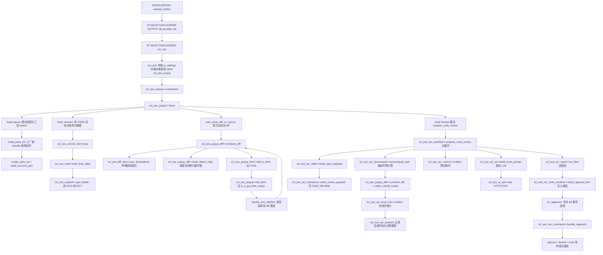

# Z_AVE —— ABAP 对象版本浏览器 / 代码评审器 全量分析报告

> 分析对象：`ysichov__AVE` 项目单文件版 `REPORT z_ave`（AVE = Abap Versions Explorer / Code Reviewer，v2.00，abapmerge 合并产物）
> 规模：29,564 行，一个 `CLASS-POOL` 内含 3 个接口 + 40 个类 + 1 个异常类 + 7 个 FORM
> 分析日期：2026-10-03

---

## 一、程序定位与业务背景

### 1.1 它解决什么问题

想象这样一个场景：周五下午，你要发一个传输请求，里面装着 7 个程序、3 个类、2 张新表和一段 SEGW 服务改动。你要做三件事：

1. **看清楚每个对象最近被谁改过、改了什么** —— SE80 的版本管理只能一次看一个对象，且看不到"这一段代码是哪次改动写进来的"。
2. **在发车前把整批改动过一遍** —— 传统做法是把 diff 导出来贴到邮件里，几百行代码在邮件里根本读不下去。
3. **让评审意见沉淀下来** —— 谁 approve 了哪个代码块、谁 reject 了并写了理由、什么时候做的，这套信息在 ABAP 世界里通常只存在于某个人的本地笔记里。

AVE 就是把这三件事塞进一个 SAP GUI 弹窗：左边列出对象的所有"可版本化部件"（方法、Section Include、函数模块、DDIC 字段），右边是该部件的版本历史，选两个版本就在中间的 HTML 视图里出带 blame（逐行作者）的 diff；如果选了传输请求，它会把这个请求涉及的所有对象**全部**跑一遍，把改动切成一个一个"块"（hunk），生成一份可 approve / decline / 留言的评审报告，存进自定义表 `ZAVE_REVIEW`，多人可以接着上次继续。

作者在注释里写清了灵感来源：`abapTimeMachine`、Eclipse ADT、GitHub。也就是说，**它就是把 Git 的 blame + diff + PR review 三件套搬进 ABAP GUI 的尝试**。

### 1.2 为什么现有方案不够

- **SE80 版本管理**：单对象、单版本对；没有跨对象批量 diff；VRSD 目录里的作者/请求信息没有可视化；无法导出评审结论。
- **`abapTimeMachine`**：基于本地 Git 仓库，需要先 `abapGit` clone，且只覆盖 Git 可管理的对象；不读 E070/E071，做不了"按传输请求"的视角。
- **`abapGit` 的 diff 视图**：按 Git 提交视角，同样要 clone，而且没有"逐行归属到传输请求号"的展示。
- **ADT 的版本比较**：只有两个版本之间的比较，没有 blame，没有跨对象，没有评审状态。

AVE 的差异化在于：**它直接读 VRSD / E070 / E071 / DD03V 这些"版本管理的真相表"，因此可以回答"第 37 行是谁在哪个请求里写的"这种 abapGit 答不了的问题**；并且它把评审结果持久化到自己的表里，让 review 成为一件有状态的事。

### 1.3 整体设计范式一句话定性

**"CLASS-POOL 单体报表 + 策略模式对象适配层 + 无状态 HTML 渲染管线 + 事件驱动的 SAP GUI 对话框"**：一个进程内跑完全部逻辑（无 Function Group、无 RFC service），UI 是手工搭的 `cl_gui_splitter_container` + `cl_gui_alv_grid` + `cl_gui_html_viewer`，所有交互通过 HTML 里的 `sapevent:` 链接回调到 `zcl_ave_acr_command`，最终把渲染结果和评审状态存进一张 JSON blob 表。

---

## 二、程序执行流程总览

### 2.1 主流程图



### 2.2 责任链表

| 子程序 | 调用者 | 职责 |
|---|---|---|
| `FORM supress_button` | INITIALIZATION | 从选择屏状态栏剔除 ONLI 按钮 |
| `FORM fill_provider_list` | AT SELECTION-SCREEN OUTPUT | 用 `zcl_ave_ai_api=>providers( )` 填 P_PROV 下拉 |
| `FORM f4_model` | ON VALUE-REQUEST p_model | 调 `/models` 端点拿模型清单做 F4 |
| `FORM f4_system_file` | ON VALUE-REQUEST p_sysmd | 前端文件选择框挑 system prompt |
| `FORM f4_prompt_folder` | ON VALUE-REQUEST p_ppath | 前端目录浏览挑 profile 目录 |
| `FORM f4_prompt_profile` | ON VALUE-REQUEST p_prof | 列目录内 `*.md` 作为 profile |
| `FORM run_ave` | AT SELECTION-SCREEN | 拼 `ty_settings`，按类型建 popup 并 show |
| `zcl_ave_object_factory=>get_instance` | `FORM run_ave`、`zcl_ave_popup=>build_parts_list` | 按类型字符串返回 `zif_ave_object` 实现 |
| `zcl_ave_object_prog~get_parts` | `get_parts` 经 `zcl_ave_popup=>build_parts_list` | 单程序/Include 的单个 REPS 部件 |
| `zcl_ave_object_clas~get_parts` | 同上 | 类：CLSD/CPUB/CPRO/CPRI/CDEF/CINC + 每个 METH |
| `zcl_ave_object_tr~get_parts_expanded` | `zcl_ave_popup=>build_parts_list` | 读 E071 并把 CLAS/INTF 展开为技术部件 |
| `zcl_ave_object_pack~get_parts` | 同上 | 读 TADIR 展开整个包 |
| `zcl_ave_object_fugr~get_parts` | 同上 | SAPL 主 include + L* 子 include，FM 映射为 FUNC |
| `zcl_ave_object_ddic~get_parts` | 同上 | TABD/DOMD/DTED 各一个部件 |
| `zcl_ave_object_ddls~get_parts` | 同上 | DDLS 单部件 |
| `zcl_ave_object_intf~get_parts` | 同上 | INTF 单部件 |
| `zcl_ave_object_func~get_parts` | 同上 | FUNC 单部件 |
| `zcl_ave_popup=>constructor` | `FORM run_ave` | 保存 settings、判定模式、初始化 AI 绑定 |
| `zcl_ave_popup=>show` | `FORM run_ave` | 建 UI、装载部件、决定首屏内容 |
| `zcl_ave_popup=>build_layout` | `show` | 三层 splitter + 双布局容器 |
| `zcl_ave_popup=>build_parts_list` | `show` | 取 handler、算存在性/行数/颜色 |
| `zcl_ave_popup=>create_parts_alv` | `show` | 建左栏 ALV 与字段目录 |
| `zcl_ave_popup=>build_versions_grid` / `create_versions_alv` | `show` | 建版本 ALV |
| `zcl_ave_popup=>create_html_viewer` | `show` | 建 HTML viewer 与 ABAP editor |
| `zcl_ave_popup=>load_versions` | `show`、`handle_parts_dblclick` | 调 `zcl_ave_version_list=>load` |
| `zcl_ave_version_list=>load` | `load_versions`、`zcl_ave_acr_precompute=>load_versions` | 版本元数据 + 配对 new/old/remote |
| `zcl_ave_version_list=>load_light` | Observer 类外部调用 | 只配对，不做元数据富化 |
| `zcl_ave_vrsd=>load_from_table` | `zcl_ave_version_list=>load` | 读 VRSD + SVRS 目录补齐未落库版本 |
| `zcl_ave_vrsd=>load_active_or_modified` | 同上 | 合成 Active/Modified 伪版本 |
| `zcl_ave_vrsd=>apply_date_from_cutoff` | 同上 | 按日期裁剪历史 |
| `zcl_ave_vrsd=>determine_request_active_modif` | `load_active_or_modified` | 用 TR lock 表反查当前请求号 |
| `zcl_ave_versno=>to_internal` / `to_external` | 全局 | 0 与 99998 互转 |
| `zcl_ave_version=>constructor` | `zcl_ave_version_list=>load` | VRSD 行转版本对象 |
| `zcl_ave_version=>load_latest_task` | `constructor` | 用 E070 覆盖作者为任务负责人 |
| `zcl_ave_version=>get_source` | `zcl_ave_version2`、`zcl_ave_popup_data=>get_ver_source` | 调 `SVRS_GET_REPS_FROM_OBJECT` 取源码 |
| `zcl_ave_version=>load_ddls_source` | `zcl_ave_popup_data=>get_active_line_count`、`show_source` | DDLS 走 `cl_svrs_tlogo_controller` |
| `zcl_ave_request=>get_header` | `zcl_ave_vrsd`、`zcl_ave_version_list`、`zcl_ave_popup_data` | E070+E07T 头信息，带缓存 |
| `zcl_ave_request=>get_object_tasks` | `get_task_for_object` | E071×E070 找承载对象的 S/R 任务，带缓存 |
| `zcl_ave_request=>resolve_parent_k` | `zcl_ave_version_list`、`zcl_ave_acr_prepare` | K / S / R / T 统一解析到父 K |
| `zcl_ave_request=>get_task_for_object` | `zcl_ave_version_list=>load` | 为版本挑最可能的 E070 任务 |
| `zcl_ave_request=>get_latest_task_for_object` | 同上 | 取最近任务 |
| `zcl_ave_request=>populate_details` / `clear_cache` | `constructor` / `zcl_ave_acr_workflow` | 填实例属性 / 清三级缓存 |
| `zcl_ave_version2=>get_source_local` | `zcl_ave_popup_data`、`zcl_ave_acr_precompute` | `SVRS_GET_VERSION_LOCAL` |
| `zcl_ave_version2=>get_source_local_compat` | `zcl_ave_acr_precompute` | SVRS2 失败时回落 VRSD+旧 FM |
| `zcl_ave_version2=>get_source_remote` | retrofit 路径 | `SVRS_GET_VERSION_REMOTE` |
| `zcl_ave_version2=>extract_source` / `extract_tlog_source` / `extract_tabd_source` | `get_source_*` | 从结构里挖源码/TLOGO 反序列化 |
| `zcl_ave_version2=>build_object` | `get_source_*` | 组 `svrs2_versionable_object` |
| `zcl_ave_version2=>get_tabd` / `get_doma` / `get_dtel` | `zcl_ave_acr_precompute`、`zcl_ave_popup` | DDIC 结构化读取 |
| `zcl_ave_version2=>extract_tabd_struct` / `extract_doma_struct` / `extract_dtel_struct` | 同上 | 从 SVRS2 对象抽结构 |
| `zcl_ave_popup_diff=>compute_diff` | `zcl_ave_popup`、`zcl_ave_acr_precompute` | 差分总入口，分派到三条路径 |
| `zcl_ave_popup_diff=>diff_lines` | `compute_diff` | 基于 `RS_CMP_COMPUTE_DELTA` 的行差分 + 折叠 |
| `zcl_ave_popup_diff=>diff_declarations` | `compute_diff` | 声明级切片后逐对差分 |
| `zcl_ave_popup_diff=>cleanup_semantic` / `collapse_token_ops` / `pair_commented_twins` | `diff_lines` | 三个后处理 pass |
| `zcl_ave_popup_diff=>comment_offset` | `zcl_ave_popup_html=>esc_line`、`emit_eq_run` | 找出行内注释起点（跳过字面量） |
| `zcl_ave_popup_diff=>char_diff_html` / `emit_eq_run` | `zcl_ave_popup_html=>diff_to_html` | 行内字符级 diff |
| `zcl_ave_popup_diff=>has_common_chars` / `count_edit_runs` / `count_char_edit_runs` | 配对判定 | 相似度与编辑段计数 |
| `zcl_ave_popup_diff=>pair_change_block` | `diff_to_html` | 块内 del/ins 的 LCS 配对 |
| `zcl_ave_popup_diff=>is_trivial_anchor` | 配对与 `cleanup_semantic` | 屏蔽 `ENDIF.` 之类噪声锚点 |
| `zcl_ave_popup_diff=>build_blame_map` | `zcl_ave_popup_diff_view=>render` | 逐版本回放 diff 建逐行作者表 |
| `zcl_ave_diff_decl=>is_section_source` | `compute_diff` | 判定是否 Section Include |
| `zcl_ave_diff_decl=>is_generated_dpc_source` | `compute_diff` | 判定是否生成的 DPC 方法体 |
| `zcl_ave_diff_decl=>pair_declarations` | `diff_declarations` | 按签名 key 配对两侧声明块 |
| `zcl_ave_diff_decl=>parse_blocks` | `pair_declarations` | 切出声明块（完整覆盖源） |
| `zcl_ave_diff_decl=>decl_key` | `parse_blocks` | 生成 `M:NAME` / `D:NAME` / `T:NAME` key |
| `zcl_ave_diff_decl=>split_code` | `parse_blocks`、`update_stmt_open` | 剥注释并判语句是否以 `.` 结束 |
| `zcl_ave_diff_decl=>align_params` | `pair_declarations` | 参数行按新版本顺序重排旧版本 |
| `zcl_ave_diff_decl=>param_keys` | `align_params` | 每行参数 key（`<组>:<名>`） |
| `zcl_ave_popup_html=>source_to_html` | `zcl_ave_popup=>show_source` | 源码页，带行号列 |
| `zcl_ave_popup_html=>diff_to_html` | `zcl_ave_popup`、`zcl_ave_acr_precompute` | diff 页，单栏/双栏/紧凑三形态 |
| `zcl_ave_popup_html=>esc` / `esc_line` / `is_comment` | 所有渲染 | 转义与注释灰化 |
| `zcl_ave_popup_html=>tabd_field_row` / `tabd_diff_to_html` | `zcl_ave_popup=>show_source` | 表字段级 diff |
| `zcl_ave_popup_html=>doma_value_row` / `doma_diff_to_html` | 同上 | 域固定值级 diff |
| `zcl_ave_popup_html=>dtel_diff_to_html` | 同上 | 数据元素属性级 diff |
| `zcl_ave_popup_html=>cds_source_to_html` | `show_source` | CDS 源码高亮 |
| `zcl_ave_popup_html=>debug_diff_html` | Debug 模式 | 打印配对与编辑段指标 |
| `zcl_ave_popup_diff_view=>render` | `zcl_ave_popup=>show_versions_diff` | 取两侧源码 + diff + blame + HTML |
| `zcl_ave_popup_diff_view=>load_source` | `render` | 版本取源码（本地/远端） |
| `zcl_ave_html_viewer=>show_html` | 全部 HTML 注入点 | 统一 set_data + 可选 scroll |
| `zcl_ave_popup_data=>check_part_exists` | `build_parts_list`、`is_deleted_object` | 按类型判存在性（TADIR/SEOCOMPO/...） |
| `zcl_ave_popup_data=>get_user_name` | 全局 | 用户名→姓名，带缓存 |
| `zcl_ave_popup_data=>get_latest_author` | `build_parts_list` | 取 VRSD 最新作者 |
| `zcl_ave_popup_data=>get_type_text` / `load_type_cache` | `build_parts_list` | 类型描述文本，懒加载 |
| `zcl_ave_popup_data=>is_supported_object_type` | `build_parts_list`、`count_supported_parts` | 可评审类型白名单 |
| `zcl_ave_popup_data=>remove_duplicate_versions` | `build_parts_list` | 折叠源码相同的连续版本 |
| `zcl_ave_popup_data=>get_active_line_count` | `build_parts_list` | 用 `READ REPORT` 数当前有效行数 |
| `zcl_ave_popup_data=>get_ver_source` | `build_blame_map`、`is_substantive_user_change` | 单版本取源码，必要时合成 VRSD 行 |
| `zcl_ave_popup_data=>check_class_has_author` | `build_parts_list` | 类内任一部件有实质改动即算有 |
| `zcl_ave_popup_data=>build_versions_for_check` | `check_class_has_author` | 为判定构造轻量版本表 |
| `zcl_ave_popup_data=>is_substantive_user_change` | 同上 | 最新版本 vs 最近 K 版本的源码比较 |
| `zcl_ave_author=>get_name` | `zcl_ave_version=>load_author_name` | SAP 用户名→显示名，独立缓存 |
| `zcl_ave_progress=>constructor` / `check` / `was_stopped` | 所有长循环 | 阈值后弹窗询问是否继续 |
| `zcl_ave_progress=>reset_stop` / `was_stop_requested` | 全局 | 静态停止标志 |
| `zcl_ave_popup=>handle_parts_toolbar` | ALV toolbar 事件 | 部件列工具栏（ADT/REFRESH/BACK） |
| `zcl_ave_popup=>handle_parts_command` | ALV user_command | 部件列命令分发 |
| `zcl_ave_popup=>handle_parts_dblclick` | ALV double_click | 双击部件 → 载入版本 |
| `zcl_ave_popup=>handle_vers_toolbar` | ALV toolbar 事件 | 版本列工具栏（DIFF_MODE/SET_BASE/TOC/DUP/CASE） |
| `zcl_ave_popup=>handle_vers_command` | ALV user_command | 版本命令分发 |
| `zcl_ave_popup=>handle_vers_dblclick` | ALV double_click | 双击版本 → 设 diff 基准/出 diff |
| `zcl_ave_popup=>on_toolbar_click` | 主工具栏 function_selected | 全部功能码集中处理 |
| `zcl_ave_popup=>on_box_close` / `on_help_box_close` | 对话框 close 事件 | 清理与回退 |
| `zcl_ave_popup=>on_sapevent` | HTML viewer sapevent 事件 | 交给 `zcl_ave_acr_command` |
| `zcl_ave_popup=>show_source` | `show`、`on_toolbar_click` | 单版本源码（含 DDIC 分支） |
| `zcl_ave_popup=>show_code_source` | `show_source` | 大文件改用 `cl_gui_abapedit` |
| `zcl_ave_popup=>show_versions_diff` | `handle_vers_dblclick`、`auto_show_diff_or_source` | 双版本 diff 全流程 |
| `zcl_ave_popup=>render_cached_diff` | `show_versions_diff` | 命中 `mt_diff_render_cache` 直接出 HTML |
| `zcl_ave_popup=>auto_show_diff_or_source` | `show` | 首屏自动选择 diff 或源码 |
| `zcl_ave_popup=>set_html` | 全部显示路径 | 注入 HTML + 焦点 + 进度条收尾 |
| `zcl_ave_popup=>refresh_parts` / `refresh_vers` / `update_ver_colors` | 刷新路径 | 三种刷新 |
| `zcl_ave_popup=>switch_pane_layout` | `on_toolbar_click` | 单栏/双栏切换（行高 0/100） |
| `zcl_ave_popup=>get_class_parts` / `get_fugr_parts` | 下钻路径 | 从 TR 下钻到类/函数组 |
| `zcl_ave_popup=>belongs_to_class` / `build_view_hunks` | `show_class_objects`、`show_user_declines` | 页面级 hunk 过滤与裁剪 |
| `zcl_ave_popup=>version_label` | 各页面渲染 | 版本显示名 |
| `zcl_ave_popup=>hunk_with_html` | `on_note_dlg_saved` | 单个 hunk 现算 HTML |
| `zcl_ave_popup=>rebuild_missing_retrofit` | 打开 retrofit 页时 | 为老评审重算远端 diff |
| `zcl_ave_popup=>prepare_code_review` | `on_toolbar_click`、报告页链接 | 转调 `zcl_ave_acr_workflow` |
| `zcl_ave_popup=>delete_and_recalc_selected` | 报告页链接 | 删除选中部分并重算 |
| `zcl_ave_popup=>prepare_band` | 重算选择器 | 按 L/M/H 带批量准备 |
| `zcl_ave_popup=>show_recalc_picker` | 报告工具栏 | 出可选部件页 |
| `zcl_ave_popup=>collect_metrics` / `show_metrics` | 报告工具栏 | 成本页数据与页面 |
| `zcl_ave_popup=>open_saved_code_review` | `show`、`openreview` | 载入已存评审 |
| `zcl_ave_popup=>load_review_from_db` / `load_review_payload` | `prepare_code_review` | 读 ZAVE_REVIEW 并反序列化 |
| `zcl_ave_popup=>sanitize_review_state` | 保存前 | 丢弃已不存在的 hunk key |
| `zcl_ave_popup=>collect_report_status` | 报告渲染 | 汇总 approve/decline 集合 |
| `zcl_ave_popup=>get_reviewer_stats` | 报告页头 | 评审人统计 |
| `zcl_ave_popup=>save_review_to_db` | `prepare_code_review` 尾部 | 组 payload 并落库 |
| `zcl_ave_popup=>open_adt_current` / `after_jump` / `refresh_cr_object` | ADT 跳转链路 | 跳转 + 回来后重算 |
| `zcl_ave_popup=>resolve_part_key` | `refresh_cr_object` | 把 METH/CPUB 映射到其类所在行 |
| `zcl_ave_popup=>refresh_cr_object` | `zcl_ave_acr_command=>after_jump` | 单对象重算 |
| `zcl_ave_popup=>regen_acr_report` / `add_cr_report_toolbar` / `add_moving_violations_link` | 评审动作后 | 重生成报告与工具栏 |
| `zcl_ave_popup=>build_cr_object_report_html` | 同上 | 单对象报告页 |
| `zcl_ave_popup=>open_cr_part` | 报告页链接 | 打开某部件评审页 |
| `zcl_ave_popup=>rerender_cr_current` / `rerender_cr_user_view` | 显示设置变更后 | 按当前 compact/blame 重绘 |
| `zcl_ave_popup=>show_class_objects` | 开发者页链接 | 某类的全部评审块 |
| `zcl_ave_popup=>show_user_declines` | 报告页链接 | 某人（或评审人）的 decline 列表 |
| `zcl_ave_popup=>show_moving_violations` | 报告页链接 | moving violation 页 |
| `zcl_ave_popup=>back_to_report` / `maximize_html` | Back 按钮 | 视图回退与最大化 |
| `zcl_ave_popup=>show_review_help_popup` / `show_tr_task_popup` | `show`、报告工具栏 | 帮助与 TR 任务页 |
| `zcl_ave_popup=>on_note_dlg_saved` / `on_note_dlg_cancelled` | `zcl_ave_acr_note_dlg` 事件 | 记录 decline 备注 |
| `zcl_ave_popup=>is_ai_enabled` / `ai_system` / `ai_schema` / `ai_builtin_instructions` | AI 相关入口 | AI 前置判定 |
| `zcl_ave_popup=>get_cr_precompute_options` | `call_cr_precompute_*` | settings 转 precompute options |
| `zcl_ave_popup=>call_cr_precompute_part` / `_class_parts` / `_fugr_parts` | `zcl_ave_acr_workflow` | 三种预计算入口 |
| `zcl_ave_popup=>show_ai_prompt` / `save_ai_prompt` / `copy_ai_prompt` | 报告工具栏、hunk 按钮 | AI prompt 页与导出 |
| `zcl_ave_popup=>show_ai_hunk_prompt_popup` | `askai` 事件 | 单块 prompt 页 |
| `zcl_ave_popup=>do_ai_summary` | `aiprompt` 事件 | 逐块问模型并汇总 |
| `zcl_ave_popup=>do_askai` | `askai` 事件 | 单块问模型 |
| `zcl_ave_popup=>refresh_ai_html_progress` | AI 循环 | AI 进度页刷新 |
| `zcl_ave_popup=>scroll_last_html_to` | AI 循环 | 滚到指定锚点 |
| `zcl_ave_popup=>add_cr_diag` / `add_cr_timing` / `add_cr_diagnostics` | 评审运行中 | 诊断日志与耗时计量 |
| `zcl_ave_acr_prepare=>is_selected_only` / `parse_selected_keys` / `part_key` / `has_part_key` | `zcl_ave_acr_workflow` | 选择键解析与校验 |
| `zcl_ave_acr_prepare=>count_supported_parts` / `count_preparable_parts` | 同上 | 进度分母 |
| `zcl_ave_acr_prepare=>is_generated_ts_line` | `strip_generated_ts_diff`、`is_comments_only` | 生成时间戳行识别 |
| `zcl_ave_acr_prepare=>is_sap_generated_author` | 工作流过滤 | `SAP*` 作者识别 |
| `zcl_ave_acr_prepare=>is_generated_class` | 工作流、`precompute_part` | SEGW/FUGR 生成物识别 |
| `zcl_ave_acr_prepare=>is_deleted_object` | 同上 | 已删对象识别 |
| `zcl_ave_acr_prepare=>is_empty_section` / `is_comments_only` / `strip_method_wrapper` | `precompute_part` | 三种"不是真改动"的判定与清洗 |
| `zcl_ave_acr_prepare=>strip_generated_ts_diff` / `flush_ts_run` | 同上 | 中和时间戳对 |
| `zcl_ave_acr_prepare=>diff_has_change_descr` | `zcl_ave_acr_hunk_info=>collect` | 对象级变更说明判定 |
| `zcl_ave_acr_prepare=>comment_check_applies` | 同上 | 注释管控适用范围 |
| `zcl_ave_acr_prepare=>set_review_scope` / `korr_in_scope` / `is_request_number` / `line_request_refs` / `line_names_request` | `block_request_verdict` | 请求号识别与作用域 |
| `zcl_ave_acr_prepare=>is_other_system_korr` / `korr_type` | 同上 | 跨系统与 E070 判定 |
| `zcl_ave_acr_prepare=>block_request_verdict` / `block_names_request` | `zcl_ave_acr_hunk_info=>collect` | 块级注释管控裁决 |
| `zcl_ave_acr_prepare=>update_stmt_open` / `comment_of` / `is_full_line_comment` / `is_opening_statement` | `block_request_verdict`、块分组 | 语句边界与注释提取 |
| `zcl_ave_acr_prepare=>get_created_object_author` | 块级作者推断 | 新建对象的作者 |
| `zcl_ave_acr_precompute=>precompute_part` | 工作流主循环、popup | 单部件全量预计算 |
| `zcl_ave_acr_precompute=>precompute_class_parts` / `precompute_fugr_parts` | 同上 | 类/函数组展开后批量预计算 |
| `zcl_ave_acr_precompute=>load_versions` | `precompute_part` | 取配对版本 |
| `zcl_ave_acr_precompute=>single_range_author` | 同上 | 单作者快路径判定 |
| `zcl_ave_acr_precompute=>append_diag` / `extract_diff_rows` | 同上 | 诊断追加、HTML 行抽取 |
| `zcl_ave_acr_precompute=>mark_expected_ops` / `norm_cmp_line` | `collect_retrofit_hunks` | 跨系统行归一与差集标记 |
| `zcl_ave_acr_precompute=>collect_retrofit_hunks` | `precompute_part`、`rebuild_retrofit_hunks` | 生成 moving violation 块 |
| `zcl_ave_acr_precompute=>rebuild_retrofit_hunks` | `zcl_ave_popup=>rebuild_missing_retrofit` | 老评审现场重算 retrofit |
| `zcl_ave_acr_workflow=>prepare_code_review` | `zcl_ave_popup=>prepare_code_review` | 主循环与节流刷新 |
| `zcl_ave_acr_workflow=>refresh_secs` | 主循环 | 按预估总时长算刷新间隔 |
| `zcl_ave_acr_workflow=>keep_timings` | `delete_and_recalc_selected` | 删除前抢救耗时计量 |
| `zcl_ave_acr_workflow=>delete_and_recalc_selected` | 报告页链接 | 删 payload 并按选中重算 |
| `zcl_ave_acr_stats=>from_diff` | `precompute_part` | 从 diff 算增删改与作者贡献 |
| `zcl_ave_acr_stats=>classify_hunk` / `is_blank_hunk` | 同上 | 块类型分类 |
| `zcl_ave_acr_stats=>add_blame` | `from_diff` | 逐行归作者 |
| `zcl_ave_acr_state=>set_hunk_action` / `clear_hunk_action` / `get_hunk_global_action` | 评审动作 | 单块动作记录 |
| `zcl_ave_acr_state=>remap_review_state` | `delete_and_recalc_selected` | 重编号后迁移评审状态 |
| `zcl_ave_acr_state=>sanitize_review_state` | 保存前 | 清理失效 key |
| `zcl_ave_acr_state=>is_own_hunk` / `get_last_own_comment` | 渲染、命令 | 自己的块判定与最近留言 |
| `zcl_ave_acr_state=>apply_saved_payload` | `load_review_from_db` | 反序列化并灌入内存状态 |
| `zcl_ave_acr_state=>drop_generated_classes` | 同上 | 剔除历史遗留的生成类 |
| `zcl_ave_acr_state=>collect_report_status` / `get_reviewer_stats` | 报告渲染 | 汇总 |
| `zcl_ave_acr_state=>build_save_payload` | `save_review_to_db` | 组装待落库 payload |
| `zcl_ave_acr_state=>format_timestamp` | 渲染 | 时间戳格式化 |
| `zcl_ave_acr_repository=>has_review_table` | `show`、保存链路 | 表是否存在 |
| `zcl_ave_acr_repository=>has_remote_field` | 同上 | REMOTE 键字段是否存在 |
| `zcl_ave_acr_repository=>load_review_payload` | `zcl_ave_popup=>load_review_payload` | 按 (TRKORR, REMOTE) 读并反序列化 |
| `zcl_ave_acr_repository=>delete_review_payload` | `delete_and_recalc_selected` | 同键删除 |
| `zcl_ave_acr_repository=>save_review_payload` | `save_review_to_db` | UPDATE 失败则 INSERT |
| `zcl_ave_acr_hunk_info=>collect` | `precompute_part` | 切块、填元数据、打标 |
| `zcl_ave_acr_hunk_info=>has_visible_change` | 同上 | 过滤纯空白块 |
| `zcl_ave_acr_hunk_html=>collect_rows` | 同上 | 从 diff+HTML 拆出每块行数组 |
| `zcl_ave_acr_hunk_html=>extract_rows` | `collect_rows` | 正则抽 `<tr>` |
| `zcl_ave_acr_hunk_html=>filter_moved_lines` | `collect_rows` | 去掉跨系统搬移行 |
| `zcl_ave_acr_hunk_html=>normalize_moved_line` | 同上 | 归一行文本 |
| `zcl_ave_acr_hunk_renderer=>inject_approve_btn` | 报告/部件页渲染 | 按 `<!--ACR_n-->` 倒序注入按钮 |
| `zcl_ave_acr_hunk_renderer=>acr_approve_cell` / `acr_approve_fixed` | `inject_approve_btn` | 两种按钮形态 |
| `zcl_ave_acr_hunk_renderer=>build_approveall_btn` | 报告对象行 | 对象级"全部批准" |
| `zcl_ave_acr_renderer=>render_hunk_actions_html` | `inject_approve_btn` | 块头动作区 |
| `zcl_ave_acr_renderer=>render_decline_thread_html` / `render_hunk_comments_html` | 同上 | 留言串 |
| `zcl_ave_acr_renderer=>render_comment_links` / `render_comment_action_link` | 同上 | 评论/AI 链接 |
| `zcl_ave_acr_renderer=>req_badge` / `hunk_req_badge` / `obj_descr_mark` / `descr_mark_html` | 报告与部件页 | 注释管控红标 |
| `zcl_ave_acr_renderer=>hunk_adt_link` / `normalize_diff_html` | 部件页 | ADT 徽标与 HTML 归一 |
| `zcl_ave_acr_renderer=>render_blame_fallback` / `extract_blame_rows` | 部件页 | blame 降级展示 |
| `zcl_ave_acr_renderer=>render_hunk_action_meta` | 动作区 | 动作人与时间 |
| `zcl_ave_acr_renderer=>build_progress_html` / `add_report_toolbar` / `build_review_help_html` | 运行中、报告页 | 进度页、工具栏、帮助 |
| `zcl_ave_acr_report=>to_html` | 工作流尾部 | 生成整份评审报告 HTML |
| `zcl_ave_acr_report=>cat_order` / `cat_label` / `esc` | `to_html` | 分区排序、标题、转义 |
| `zcl_ave_acr_user_view=>build_html` | `show_user_declines` | 开发者/评审人页 |
| `zcl_ave_acr_user_view=>build_css` / `class_of` / `grp_ord_of` / `grp_key_of` / `type_ord_of` / `format_version_text` | 同上 | 样式与分组排序 |
| `zcl_ave_acr_part_view=>build_html` | `open_cr_part` | 单部件评审页 |
| `zcl_ave_acr_part_view=>build_violations_html` / `build_css` / `get_page_title` / `format_version_text` | 同上 | moving violation 区块与页头 |
| `zcl_ave_acr_overview=>has_saved_stat` | 报告页 | 该对象是否已有统计 |
| `zcl_ave_acr_overview=>build_object_report_html` | `regen_acr_report` | 整体报告页 HTML |
| `zcl_ave_acr_overview=>build_tr_task_popup_html` | `show_tr_task_popup` | TR 任务页 |
| `zcl_ave_acr_overview=>build_recalc_picker_html` | `show_recalc_picker` | 重算选择器 |
| `zcl_ave_acr_note_dlg=>constructor` / `show` / `on_box_close` | `on_note_dlg_saved` 链路 | 非阻塞备注弹窗 |
| `zcl_ave_acr_metrics=>collect` | `collect_metrics` | 逐部件成本模型 |
| `zcl_ave_acr_metrics=>estimate_ms` / `timing_ms` / `calib_factor` | `collect`、`to_html` | 估时、校准、实测量取 |
| `zcl_ave_acr_metrics=>band_of` / `band_keys` / `count_band` / `format_ms` / `format_secs` / `to_html` | 成本页、选择器 | 分带与展示 |
| `zcl_ave_acr_metrics=>class_part_types` / `is_class_part` / `scope_korrnums` / `is_task_scope` / `esc` | `collect` | 类型/请求口径工具 |
| `zcl_ave_acr_command=>handle_sapevent` | `zcl_ave_popup=>on_sapevent` | HTML 事件总路由 |
| `zcl_ave_acr_command=>set_author_filter` | `handle_sapevent` | 下钻继承作者过滤 |
| `zcl_ave_acr_command=>after_jump` | `handle_sapevent` | 跳转回来后重算 |
| `zcl_ave_acr_ai=>is_enabled` | `zcl_ave_popup=>is_ai_enabled` | 是否可调模型 |
| `zcl_ave_acr_ai=>build_hunk_prompt` / `build_summary_prompt` / `build_prompt_page_html` | `do_askai`、`do_ai_summary` | prompt 构造与页面 |
| `zcl_ave_acr_ai=>get_hunk_thread` / `get_hunk_comment` / `get_summary_key` / `get_hunk_scroll_anchor` / `get_summary_scroll_anchor` | AI 循环与渲染 | 键与锚点 |
| `zcl_ave_acr_ai=>render_summary_html` / `save_summary` | AI 循环 | 汇总渲染与落 threads |
| `zcl_ave_acr_ai=>is_ddic_type` / `ddic_table_to_text` / `unescape_html` | `build_hunk_prompt` | DDIC 特例与反转义 |
| `zcl_ave_ai_api=>ask` | `do_askai`、`do_ai_summary`、`f4_model` | HTTP 调用 LLM |
| `zcl_ave_ai_api=>providers` / `base_url` / `wire_of` | `fill_provider_list`、`ask` | provider 清单与协议判定 |
| `zcl_ave_ai_api=>build_payload` / `escape_json` / `parse_response` | `ask` | 请求体拼装与响应解析 |
| `zcl_ave_ai_api=>list_models` | `FORM f4_model` | 拉 `/models` |
| `zcl_ave_ai_prompts=>constructor` / `list_profiles` / `get_system` / `get_schema` / `load` / `read_file` / `build_file_path` / `reload` | `FORM f4_prompt_profile`、`ai_system` | profile 加载与缓存 |
| `zcl_ave_ai_prompts=>read_system_file` / `clear_file_cache` | `ai_system` | 单文件 system prompt 与缓存 |
| `zcl_ave_adt=>is_openable` | 渲染徽标前 | 该类型有无 ADT 编辑器 |
| `zcl_ave_adt=>build_url` / `path_of` / `oo_path` / `prog_path` / `ddic_uri` | `link_html`、`open` | 造 `adt://` URL |
| `zcl_ave_adt=>anchor_of` / `class_source_line` / `anchor_line_in` / `section_include_of` / `class_part_include` / `read_clif_source` | `build_url` | 行号在类源码中的换算 |
| `zcl_ave_adt=>open` / `open_by_key` / `open_in_gui` / `call_workbench` / `wb_target_of` | `zcl_ave_popup=>open_adt_current` | 跳转与工作台导航 |
| `zcl_ave_adt=>link_html` / `css` / `badge_text` / `button_text` / `jump_title` / `add_bar` / `buttons_html` | 报告与部件页 | 徽标与按钮行 |
| `zcl_ave_adt=>class_of` / `method_of` / `group_of_include` / `group_of_function` / `group_of_main` / `url_name` | URL 构造 | 名称解析工具 |

下面按这条流程，逐个子程序展开。

---

## 三、分组分析

### 3.1 全局声明区：接口、类型、异常与选择屏

本节是整个程序的"契约层"，分四步：异常类、三个接口、选择屏与事件块。

#### ① 异常类 `zcx_ave`（全局声明区）

```abap
CLASS zcx_ave DEFINITION
  INHERITING FROM cx_static_check
  CREATE PUBLIC.

  PUBLIC SECTION.

    METHODS constructor
      IMPORTING
        !textid   LIKE if_t100_message=>t100key OPTIONAL
        !previous LIKE previous OPTIONAL.

    CLASS-METHODS raise_from_syst
      RAISING
        zcx_ave.

ENDCLASS.
```

**做什么** — 定义全程序唯一的业务异常，继承 `cx_static_check`，提供一个把当前 `sy-msgid` 包装成 `zcx_ave` 的工厂方法 `raise_from_syst( )`。

**为什么** — SAP GUI 报表不能靠 `MESSAGE` 表达可预期的失败（异常需要跨越多层调用回到唯一的 `FORM run_ave` 里统一提示），而直接把 `CX_SY_NO_HANDLER` 抛给用户毫无业务含义。继承 `cx_static_check` 而不是 `cx_dynamic_check`，是为了让 `zcx_ave` **不**被宽泛的 `cx_root` 悄悄吞掉——这是有意为之的取舍。

**风险与改进** — `textid` 被声明但 `constructor` 里没有传给 `super->constructor`（只传了 `previous`），所以 `get_text( )` 永远拿不到消息文本，最终 `FORM run_ave` 里的 `MESSAGE lx->get_text( )` 只能得到类名级别的默认文案；`textid` 在 `CATCH zcx_ave` 之前无任何赋值点，等于死参数。建议要么实现消息文本（`zcx_ave=>textid` 配 `sotr`/`T100`），要么删掉该参数避免误导。

#### ② 类型契约接口 `zif_ave_object`（全局声明区）

```abap
INTERFACE zif_ave_object.

  TYPES ty_t_korr_range TYPE RANGE OF trkorr.

  TYPES:
    BEGIN OF ty_settings,
      show_diff       TYPE abap_bool,
      layout          TYPE abap_bool,
      two_pane        TYPE abap_bool,
      no_toc          TYPE abap_bool,
      ignore_case     TYPE abap_bool,
      compact         TYPE abap_bool,
      remove_dup      TYPE abap_bool,
      blame           TYPE abap_bool,
      comment_check   TYPE abap_bool,
      ignore_generated TYPE abap_bool,
      filter_user     TYPE versuser,
      date_from       TYPE versdate,
      code_review     TYPE abap_bool,
      system          TYPE verssysnam,
      filter_korrnum  TYPE trkorr,
      filter_korrnums TYPE ty_t_korr_range,
      include_tasks   TYPE abap_bool,
      url             TYPE text255,
      ssl_id          TYPE ssfapplssl,
      model           TYPE text255,
      apikey          TYPE text255,
      provider        TYPE string,
      prompt_path     TYPE text255,
      prompt_profile  TYPE text255,
      system_file     TYPE text255,
      max_tokens      TYPE i,
      debug           TYPE abap_bool,
      metrics         TYPE abap_bool,
      gui_nav         TYPE abap_bool,
    END OF ty_settings.
```

**做什么** — 定义三类契约：① `ty_settings`——把整个选择屏压成一个结构体，一处贯穿所有层；② `ty_part`——"对象的一个可版本化部件"（类名 / 单元名 / VRSD 对象名 / VRSD 类型）；③ 三个方法 `get_parts` / `get_name` / `check_exists`，其中只有 `get_parts` 声明 `RAISING zcx_ave`。

**为什么** — 这是整个程序最值得学的设计。`ty_settings` 让"选择屏 → 逻辑层"只有**一个**入口参数，而不是把 30 个参数穿到 10 层方法里；`ty_part` 的 `type` 字段直接用 VRSD 命名（`REPS`/`METH`/`CPUB`/`TABD`）而不是 TADIR 命名，因为整个程序的版本管理都活在 VRSD 口径里——作者在 `zcl_ave_adt` 注释里专门强调过"类型映射是 VRSD 那个，不是 TADIR 那个"。

**风险与改进** — 三个缺陷：① `ty_settings` 是个 30 字段的胖结构，且**混杂了三类关注点**（UI 偏好、筛选条件、外部服务凭据），`apikey` 竟然和 `two_pane` 放在同一个结构里传递，凭据的传播路径比 UI 参数更宽；建议拆成 `ty_display` / `ty_filter` / `ty_llm` 三个结构；② `check_exists` 声明为 `RETURNING abap_bool` 而 `get_parts` 会抛异常，两者错误语义不一致——"对象不存在"既是一个返回值又是一个异常，调用方必须同时处理两条路径；③ `ty_part` 用 `WITH DEFAULT KEY`（全部字段做键），部件去重只能靠全字段比较，而实际业务键是 `object_name`，性能与语义都偏弱。

#### ③ 渲染/评审类型接口 `zif_ave_popup_types` 与 `zif_ave_acr_types`（全局声明区）

```abap
INTERFACE ZIF_AVE_ACR_TYPES .

  TYPES ty_approved TYPE HASHED TABLE OF string WITH UNIQUE KEY table_line.

  TYPES ty_t_korr_found TYPE SORTED TABLE OF trkorr WITH UNIQUE KEY table_line.

  TYPES ty_action_code TYPE c LENGTH 1.

  TYPES ty_req_ref TYPE c LENGTH 1.

  TYPES:
    BEGIN OF ty_hunk_info,
      hunk_key        TYPE string,
      objtype         TYPE versobjtyp,
      obj_name        TYPE versobjnam,
      class_name      TYPE seoclsname,
      display_name    TYPE string,
      hunk_no         TYPE i,
      start_line      TYPE i,
      change_count    TYPE i,
      change_kind     TYPE string,
      author          TYPE versuser,
      author_name     TYPE ad_namtext,
      versno_new      TYPE versno,
      versno_old      TYPE versno,
      versno_new_text TYPE string,
      versno_old_text TYPE string,
      html            TYPE string,
      retrofit        TYPE string,
      req_ref         TYPE ty_req_ref,
      obj_descr       TYPE ty_req_ref,
    END OF ty_hunk_info.
  TYPES ty_t_hunk_info TYPE HASHED TABLE OF ty_hunk_info WITH UNIQUE KEY hunk_key.
```

**做什么** — 把差分操作（`ty_diff_op`）、版本行（`ty_version_row`）、blame 行（`ty_blame_entry`）、DDIC 结构（`ty_tabd` / `ty_doma` / `ty_dtel`）、评审块（`ty_hunk_info`）以及落库 payload（`ty_saved_payload`）全部集中定义在接口里。

**为什么** — 注释里给出了这个选择的**硬技术理由**：在 standalone（单文件 abapmerge）构建里，接口先于类出现，所以引用另一个类的类型在"类还没定义完"时会报 `Direct access to components of the global class … is not possible`；接口类型永远在作用域内。这不是洁癖——它把整个单文件构建的编译顺序问题一次性解决了，代价是所有共享类型都必须"退化"成接口成员。

**风险与改进** — ① `ty_hunk_info` 已经 22 个字段，其中 `req_ref` / `obj_descr` 用 `c LENGTH 1` 承载 8 种语义（`X/R/V/N/T/W/-`/空格），注释自己承认"空白不是第三种意见，而是没有意见"——一个字符编码八种业务结论，可读性和可扩展性都很脆，应改为枚举 + 独立字段；② `ty_t_hunk_info` 用 `hunk_key` 作唯一键，而 `hunk_key` 的格式是 `TYPE~NAME~n`，`n` 是块序号，意味着**任何改动块切分规则的重构都会使所有已存评审的 key 失效**；③ `ty_saved_payload` 把 diff 数据、blame 数据、HTML、timing 全部塞进一个结构，落库时整体 JSON 化，单条记录体积不可控。

#### ④ 选择屏与事件块（全局声明区）

```abap
SELECTION-SCREEN BEGIN OF BLOCK b_mode WITH FRAME TITLE TEXT-020.
  PARAMETERS: p_cr RADIOBUTTON GROUP mode  USER-COMMAND umod DEFAULT 'X'.
  PARAMETERS p_ve RADIOBUTTON GROUP mode .
  SELECT-OPTIONS: s_task FOR gv_task NO INTERVALS.
  PARAMETERS p_itask AS CHECKBOX DEFAULT abap_true.
  PARAMETERS p_sys TYPE verssysnam.
  PARAMETERS p_blame AS CHECKBOX DEFAULT abap_true.
  PARAMETERS p_cmtchk AS CHECKBOX.
SELECTION-SCREEN END OF BLOCK b_mode.
```

**做什么** — 五个 block：`b_mode`（CR/VE 模式 + 任务范围）、`b1`（10 种对象类型的单选 + 名称 + F4）、`b2`（双栏/紧凑/布局/GUI 导航）、`b3`（日期/用户/去重/无目录/忽略生成代码/大小写不敏感）、`b4`（AI provider/URL/SSL/model/apikey/token/系统提示/profile）、`b5`（metrics/debug）。

**为什么** — 用 `USER-COMMAND umod` / `utyp` 而不是 `AT SELECTION-SCREEN ON VALUE-REQUEST`，是为了在**不重画选择屏**的前提下更新 `screen-input`——`AT SELECTION-SCREEN OUTPUT` 里那个 `LOOP AT SCREEN` + `MODIFY SCREEN` 就是"逻辑上禁用"而非物理删除，这是老式选择屏最干净的动态禁用写法。`TEXT-xxx` 全部走文本符号，避免硬编码中文，也避免了本地化文件。

**风险与改进** — ① `p_apikey TYPE text255 MEMORY ID api` 用 SPA/GPA 参数传密钥，会进 SAP GUI 的内存参数、可被同一 session 的其他程序读到，也能写进用户 profile；应改为只在报告内传递；② `b1` 十个 radiobutton + 十个输入框用 `MOD IF ID` 手工联动，属于能被 `AT SELECTION-SCREEN OUTPUT` 简化的场合；③ `p_cmtchk`（注释管控）默认关闭是对的（注释里说得很清楚"这是车间约定，不是 ABAP 规则"），但它同时影响 `zcl_ave_acr_prepare=>gv_comment_check` 这个 **CLASS-DATA 全局状态**，意味着同一 session 内跑第二次会沿用第一次的值，除非每次 `set_review_scope` 顺带重置——这是一个真实的跨次污染点。

### 3.2 对象适配层：`zcl_ave_object_factory` 与十个 handler

本节分三步：工厂分派、类/函数组/TR/包四种"会展开"的 handler、以及七种"只有一个部件"的 handler。

#### ① 工厂 `zcl_ave_object_factory=>get_instance`

```abap
CLASS zcl_ave_object_factory IMPLEMENTATION.

  METHOD get_instance.
    result = SWITCH #(
      object_type
      WHEN gc_type-program  THEN NEW zcl_ave_object_prog( object_name )
      WHEN gc_type-class    THEN NEW zcl_ave_object_clas( CONV #( object_name ) )
      WHEN gc_type-intf     THEN NEW zcl_ave_object_intf( CONV #( object_name ) )
      WHEN gc_type-function THEN NEW zcl_ave_object_func( CONV #( object_name ) )
      WHEN gc_type-tr       THEN NEW zcl_ave_object_tr(   CONV #( object_name ) )
      WHEN gc_type-package  THEN NEW zcl_ave_object_pack( CONV #( object_name ) )
      WHEN gc_type-ddls     THEN NEW zcl_ave_object_ddls( CONV #( object_name ) )
      WHEN gc_type-fugr     THEN NEW zcl_ave_object_fugr( CONV #( object_name ) )
      " gc_type-tabd/doma/dtel already carry the VRSD part type (TABD/DOMD/DTED)
      WHEN gc_type-tabd OR gc_type-doma OR gc_type-dtel
                            THEN NEW zcl_ave_object_ddic( name    = CONV #( object_name )
                                                          iv_type = CONV #( object_type ) ) ).

    IF result IS NOT BOUND OR result->check_exists( ) = abap_false.
      RAISE EXCEPTION TYPE zcx_ave.
    ENDIF.
  ENDMETHOD.

ENDCLASS.
```

**做什么** — 按类型字符串返回 `zif_ave_object` 的实现，工厂同时承担"存在性校验"职责：对象不存在就抛 `zcx_ave`。

**为什么** — 这是教科书式的策略模式 + 工厂：`SWITCH` 取代了十一个 `IF/ELSE`，且三种 DDIC 类型共用一个 handler（因为它们在 VRSD 里行为一致：单部件 + 存在性查各自的字典头表 + 源码走 `SVRS_GET_VERSION_LOCAL`）。"存在性检查放在工厂而不是各 handler 的构造函数里"，保证调用方拿到的引用一定是有效的。

**风险与改进** — `SWITCH` 没有 `ELSE` 分支：任何未列出的类型返回 **unbound** 引用，然后被统一包装成 `zcx_ave`。用户看到的是一个没有消息文本的异常（见 3.1 ① 的 `textid` 缺陷），完全不知道"这个类型不支持"。建议显式 `ELSE RAISE EXCEPTION ...` 并给出类型名；同时 `check_exists( )` 会在工厂里对每个对象**额外打一次数据库**，而 `zcl_ave_popup=>build_parts_list` 随后又会通过 `zcl_ave_popup_data=>check_part_exists` 再查一次存在性——同一事实被问了两个不同的实现。

#### ② 类的部件枚举 `zcl_ave_object_clas~get_parts`

```abap
  METHOD zif_ave_object~get_parts.
    TRY.
    " Fixed sections of the class
    result = VALUE #(
      ( class = name unit = 'Class pool'                 object_name = CONV #( name )                                  type = 'CLSD' )
      ( class = name unit = 'Public section'             object_name = CONV #( name )                                  type = 'CPUB' )
      ( class = name unit = 'Protected section'          object_name = CONV #( name )                                  type = 'CPRO' )
      ( class = name unit = 'Private section'            object_name = CONV #( name )                                  type = 'CPRI' )
      ( class = name unit = 'Local class definition'     object_name = CONV #( cl_oo_classname_service=>get_ccdef_name( name ) ) type = 'CDEF' )
      ( class = name unit = 'Local class implementation' object_name = CONV #( cl_oo_classname_service=>get_ccimp_name( name ) ) type = 'CINC' )
      ( class = name unit = 'Local macros'               object_name = CONV #( cl_oo_classname_service=>get_ccmac_name( name ) ) type = 'CINC' )
      ( class = name unit = 'Local types'                object_name = CONV #( cl_oo_classname_service=>get_cl_name( name ) )    type = 'REPS' )
      ( class = name unit = 'Test classes'               object_name = CONV #( cl_oo_classname_service=>get_ccau_name( name ) )  type = 'CINC' ) ).

    " One entry per method
    CALL METHOD cl_oo_classname_service=>get_all_method_includes
      EXPORTING
        clsname            = name
      RECEIVING
        result             = DATA(lt_meth)
      EXCEPTIONS
        class_not_existing = 1.

    CHECK sy-subrc = 0.
```

**做什么** — 先用 `cl_oo_classname_service` 硬编码出 8 个固定部件（CLSD/CPUB/CPRO/CPRI + 4 个本地 include），再用 `get_all_method_includes` 展开每个方法为 `METH` 部件；关键一步是把 `cpdname`（方法名）**翻译回 VRSD 里带正确 padding 的 30+30 长名**。

**为什么** — VRSD 的 `objname` 对 METH 是 `CLSNAME(30) + 空格/= padding + METHODNAME`，手工拼容易错，所以作者用 `lv_like+30 = '%'` 一次捞出该类所有 METH 的 VRSD 记录再按 `objname+30` 反查，拿 SAP 自己生成的 padding。这是正确的做法——**VRSD 的键格式是 SAP 内部约定，不该猜**。`TRY...CATCH cx_root` 包住整个方法，把 `get_all_method_includes` 的异常翻译成 `zcx_ave`，保持了接口承诺。

**风险与改进** — 内层 `LOOP AT lt_vrsd_meth` 没有二分查找，是 `方法数 × 该类 METH 版本行数` 的复杂度；一个 200 方法、每个 30 版本的类就是 6000 次内层扫描，且**这个模式在 3.3 的版本列表里会被再放大一层**（每个部件都要查一次 VRSD）。`lt_vrsd_meth` 只 SELECT 了 `objname` 一列却声明为 `STANDARD TABLE OF vrsd`（`EMPTY KEY`），应改为 `string_table` + `SELECT objname` 投影；同时注释里残留俄语（"Загружаем все VRSD-записи…"），对非俄语团队不友好。

#### ③ 函数组枚举 `zcl_ave_object_fugr~get_parts`

```abap
  METHOD zif_ave_object~get_parts.
    DATA lv_main TYPE trdir-name.
    lv_main = |SAPL{ name }|.

    " ── Main include SAPL<FUGR> (global data / LOAD) ────────────────
    APPEND VALUE #(
      unit        = CONV #( lv_main )
      object_name = CONV #( lv_main )
      type        = 'REPS'
    ) TO result.

    " Map each function-module U-include (L<FUGR>U<nn>) to its function name,
    " so it is shown as a FUNC part (with proper FM versioning) instead of REPS.
    TYPES: BEGIN OF ty_fm_map,
             incl     TYPE versobjnam,
             funcname TYPE rs38l_fnam,
           END OF ty_fm_map.
    DATA lt_fm_map TYPE HASHED TABLE OF ty_fm_map WITH UNIQUE KEY incl.
    SELECT funcname, include FROM tfdir
      WHERE pname = @lv_main
      INTO TABLE @DATA(lt_func).
    LOOP AT lt_func INTO DATA(ls_func).
      INSERT VALUE #(
        incl     = |L{ name }U{ ls_func-include }|
        funcname = ls_func-funcname ) INTO TABLE lt_fm_map.
    ENDLOOP.
```

**做什么** — 输出 `SAPL<area>` 主 include 作为 `REPS`，读 `TFDIR` 建立 `L<area>U<nn>` → 函数名的映射，再读 `TRDIR` 取所有 `L<area>%` 且 `sqlx = 'X'` 的 include，命中的映射成 `FUNC` 部件，其余为 `REPS`。

**为什么** — 这个映射是**必要的**：一个函数模块在 VRSD 里既有 `FUNC` 记录（FM 本体，有独立版本历史）也有对应的 `REPS` include 记录。如果不做映射，用户在版本列表里看到的是 `L<area>U01` 这种无语义的 include 名，点进去才发现是 `FUNCTION`。`sqlx = 'X'` 过滤掉空 include（SAP 会在 TRDIR 里留 `L<area>TOP` 等壳），也是必要的。

**风险与改进** — ① `SELECT ... FROM trdir WHERE name LIKE 'L<area>%'` 是**前缀扫描**，函数组 include 多时（一个 TOP 有 50 个 L include 很常见）会命中大量同前缀的非本组 include，且该查询没有 `ORDER BY` 之外的稳定键保证，部件顺序依赖 DB 顺序；建议改用 `TRDIR-SUBC` 或直接由 TFDIR 反向生成集合。② `lv_mask` 用 `trdir-name`（30 字符）承载 `L<area>%`，函数组名超过 25 字符时会被**静默截断**，导致 include 匹配不到。③ 类型语义上 `type = 'REPS'` 但 `unit = 'SAPL...'`，而 `zcl_ave_acr_prepare=>comment_check_applies` 又把 `SAPL*` 单独豁免——"主程序这个部件在版本管理里到底是什么类型"这个问题在程序里有三种不同答案。

#### ④ 其余 handler（`tr` / `pack` / `prog` / `intf` / `func` / `ddls` / `ddic`）

**做什么** — `zcl_ave_object_tr~get_parts_expanded` 读 E071 得到请求内全部对象，再把 `CLAS` / `INTF` 行**展开成技术部件**（跳过 `CLSD` / `RELE`）；`zcl_ave_object_pack~get_parts` 读 TADIR 展开整个包并通过 `get_object` 递归委派给具体 handler；`prog` / `intf` / `func` / `ddls` / `ddic` 各自返回单个部件（`REPS` / `INTF` / `FUNC` / `DDLS` / `TABD|DOMD|DTED`），并实现 `check_exists`（分别查 TADIR / `cl_abap_classdescr` / `TFDIR` / `TADIR` / `DD02L`+`DD07V`+`DD04V`）与 `get_name`。

**为什么** — TR 和 PACK 的展开是本程序"Code Review 能跨对象工作"的基础：没有它，一个请求里的 7 个程序只能一个一个打开。`tr` 与 `pack` 都实现了私有的 `get_object_keys` / `get_object`，把"遍历键 → 委派 handler"这个递归模式提取成同一形状，是有意的一致性设计。跳过 `CLSD` / `RELE` 的理由写在 `get_parts_expanded` 的注释里：这两类没有可直接 diff 的源码行。

**风险与改进** — ① `tr` / `pack` 的展开把 **E071 的对象类型直接当作 handler 选择依据**，而 `gc_type-*` 常量是 TADIR 语义（`PROG`/`CLAS`/`DEVC`…），`zcl_ave_version_list=>map_to_e071_key` 就是为这个转换而存在的——但 `object_tr~get_object` 里若遇到 `gc_type-*` 未覆盖的 E071 类型（如 `ENHO`、`XSLT`、`SRVD`），会走到工厂的 unbound 分支并抛 `zcx_ave`，整个请求的部件列表就空了。建议对未知类型跳过并写诊断，而不是中断全量展开。② `zcl_ave_object_ddic~check_exists` 需要分别查 DD02L / DD07V / DD04V 三张表，而 `zcl_ave_acr_prepare=>is_deleted_object` 会**对每个部件调用一次** `zcl_ave_popup_data=>check_part_exists`，于是 N 个 DDIC 对象产生 3N 次单行查询；这些检查应在部件列表构建时一次性批量化。③ `prog` / `intf` / `func` / `ddls` / `ddic` 的 `check_exists` 返回空（未处理）时会被工厂当作"不存在"——即"未实现存在性检查"与"对象不存在"在同一条路径上，无法区分。

### 3.3 版本目录层：`zcl_ave_versno` 与 `zcl_ave_vrsd`

#### ① 版本号内外转换 `zcl_ave_versno`（方法 `to_internal` / `to_external`）

```abap
CLASS zcl_ave_versno IMPLEMENTATION.

  METHOD to_internal.
    " 99998 = active/latest externally → 0 in DB
    result = COND #(
      WHEN versno = 99998 THEN 0
      ELSE versno ).
  ENDMETHOD.

  METHOD to_external.
    " 0 in DB → 99998 externally (sorts after real versions)
    result = COND #(
      WHEN versno = 0 THEN 99998
      ELSE versno ).
  ENDMETHOD.

ENDCLASS.
```

**做什么** — 把 VRSD 里"最新版本存 0"的内部约定，转成"外部用 99998（Active）/ 99999（Modified）"，使版本列表能按 `versno` 直接排序而最新在末尾/最前。

**为什么** — 这是版本管理里一个经典的坑：`VRSD-VERSNO = 0` 表示 Active，若直接按数字排序，`0` 会排在最前，看起来像"最早版本"。转成 99998 后 `ORDER BY versno ASCENDING` 天然把伪版本排到末尾，排序逻辑不需要任何特判。方法极小但被全程序调用，是正确的抽象粒度。

**风险与改进** — ① 硬编码字面量 `99998` / `99999`，而同程序 `zcl_ave_version=>c_version` 里已经定义了 `latest = 99998`、`modified = 99999`、`active = 99998`——同一个事实两处定义，**改一处就断**。② `to_internal` 不处理 `99999`（Modified），Modified 版本号内部就是 `99999`，无需转换，这一点靠"恰好相等"成立，但没有任何注释说明，属于隐式契约。③ `zcl_ave_versno` 与 `zcl_ave_version` 的常量互相引用会形成循环依赖风险，目前靠定义顺序规避。

#### ② 读 VRSD `zcl_ave_vrsd=>load_from_table`

```abap
    IF lt_trtype IS INITIAL.
      SELECT v~* FROM vrsd AS v
        INNER JOIN e070 AS e ON e~trkorr = v~korrnum
        WHERE v~objtype = @me->type
          AND v~objname = @me->name
          AND v~versno IN @versno_range
        ORDER BY v~versno
        INTO TABLE @me->vrsd_list.
    ELSE.
      SELECT v~* FROM vrsd AS v
        INNER JOIN e070 AS e ON e~trkorr = v~korrnum
        WHERE v~objtype = @me->type
          AND v~objname = @me->name
          AND v~versno IN @versno_range
          AND e~trfunction IN @lt_trtype
        ORDER BY v~versno
        INTO TABLE @me->vrsd_list.
    ENDIF.

    " Convert internal 0 → external 99998 for consistent sorting
    LOOP AT me->vrsd_list REFERENCE INTO DATA(vrsd).
      vrsd->versno = zcl_ave_versno=>to_external( vrsd->versno ).
    ENDLOOP.

    " Supplement from SVRS_GET_VERSION_DIRECTORY_46 — accepts full OBJNAME (LIKE VRSD-OBJNAME)
    " and returns VERSION_LIST LIKE VRSD. Covers versions not yet written to VRSD
    " (e.g. activated into an unreleased task). Works for long names (METH ≤110 chars).
    DATA lt_dir46   TYPE vrsd_tab.
    DATA lt_lversno TYPE TABLE OF versn.
    CALL FUNCTION 'SVRS_GET_VERSION_DIRECTORY_46'
      EXPORTING
        objtype         = me->type
        objname         = me->name
      TABLES
        lversno_list    = lt_lversno
        version_list    = lt_dir46
      EXCEPTIONS
        no_entry        = 1
        OTHERS          = 2.
```

**做什么** — 两条路径合流：① 直接 `SELECT v~* FROM vrsd`（按需 INNER JOIN E070 以按 `TRFUNCTION = 'T'` 过滤 ToC）；② 再调 `SVRS_GET_VERSION_DIRECTORY_46` 取 SVRS 目录，把尚未写入 VRSD 的版本（激活到未释放任务的）补进来，并顺手把"同一版本号但目录里的本地请求号与 VRSD 里的外来请求号不同"的情况记进 `alt_korrnums`。

**为什么** — 纯 VRSD 是**不完整**的：版本管理目录（`SVRS_GET_VERSION_DIRECTORY_46`）是"SE80 里看到的那个列表"，它包含已激活但尚未落 VRSD 的版本。只读 VRSD 会漏掉开发中最新的那次激活——而那恰恰是开发者最想看的。`alt_korrnums` 的设计尤其好：跨系统 import 的版本在 VRSD 里带着**来源系统**的请求号（ER6 里的 ER4 号），无法与本地评审范围比对，但目录里记的是本地记录它的请求号，两个都留着，让上层自己选。

**风险与改进** — ① `SELECT v~*` 取 VRSD 全字段进内表，VRSD 有 30+ 字段而实际只用 6 个；`INNER JOIN e070` 在 `lt_trtype` 为空时**完全没用**（没有任何 e 字段被引用、也不影响结果集），是纯粹多一次 join。② 整个 SELECT 没有对 `me->name` 做长度/类型校核，而 METH 类型名最长 110 字符，若上层传了未 CONV 的字符串，会被 SQL 隐式截断成"查不到"而非报错。③ `EXCEPTIONS no_entry = 1 OTHERS = 2` 之后只判断 `IF sy-subrc = 0`，两个异常分支被同等对待——目录读失败与"没有版本"对上层是同一个结果（静默返回更少的版本），无法诊断。④ ToC 过滤用 `TRFUNCTION = 'T'` 硬编码，而 `zcl_ave_version_list` 另有 `korr_resolves_into_scope` 处理 ToC 的"其实是本请求内容"的情形，两处口径不统一。

#### ③ 合成 Active / Modified 伪版本（方法 `load_active_or_modified` / `determine_request_active_modif` / `read_vrsd`）

```abap
    IF versno = zcl_ave_version=>c_version-active.
      " Use SVRS_GET_VERSION_DIRECTORY_46 — accepts full OBJNAME (LIKE VRSD-OBJNAME),
      " works for both short (PROG/REPS) and long (METH ≤110 chars) names.
      " versno='00000' in the result = active version with exact korrnum/datum/zeit/author.
      " Do NOT use read_vrsd/SVRS_GET_VERSION_REPOSITORY mode='A' — it may return
      " metadata of the last activated virtual version (e.g. version 19 data).
      DATA lt_dir_a  TYPE vrsd_tab.
      DATA lt_lv_a   TYPE TABLE OF versn.
      CALL FUNCTION 'SVRS_GET_VERSION_DIRECTORY_46'
        EXPORTING  objtype      = me->type
                   objname      = me->name
        TABLES     lversno_list = lt_lv_a
                   version_list = lt_dir_a
        EXCEPTIONS no_entry     = 1  OTHERS = 2.
      IF sy-subrc <> 0.
        RETURN.
      ENDIF.
      " Active version stored internally as versno='00000'
      READ TABLE lt_dir_a INTO DATA(ls_a0)
        WITH KEY versno = '00000'.
      IF sy-subrc <> 0.
        RETURN.
      ENDIF.
```

**做什么** — 为 Active 状态从 SVRS 目录里取 `versno = '00000'` 那一行拿到精确的请求号/日期/时间/作者；Modified 状态改走 `read_vrsd`（`SVRS_GET_VERSION_REPOSITORY` mode `'M'`）拿锁信息，再由 `determine_request_active_modif` 通过 `TR_CHECK_TYPE` + `TRINT_CHECK_LOCKS` 反查当前锁它的传输请求号。已有同 `versno` 行则就地更新，否则追加。

**为什么** — 注释里的 "Do NOT use ... mode='A' — it may return metadata of the last activated virtual version" 是一句非常值钱的话：**它记录了一个靠调试才发现的 SAP 版本管理行为**。这类知识只能靠源码注释传承，注释写得好的开源代码价值就在这里。用 `TR_CHECK_TYPE` + `TRINT_CHECK_LOCKS` 反查请求号也是正确路径——"正在编辑未激活的代码属于哪个请求"这个问题，VRSD 里根本没有答案，只有锁表知道。

**风险与改进** — ① Modified 分支里 `read_vrsd` 失败时静默 `RETURN`，Active 行缺失时也静默 `RETURN`，两种情况在版本列表里都表现为"少了一行"，用户看不出是对象不支持还是读取失败；`zcl_ave_vrsd=>constructor` 用 `TRY ... CATCH zcx_ave` 把 `load_active_or_modified` 的异常也一并吞掉（注释说"CPUB/METH 不支持，已落库版本仍可用"），这个兜底合理但把"部分失败"和"全部成功"混为一谈。② `determine_request_active_modif` 每次构造对象都要走 `TR_GET_PGMID_FOR_OBJECT` + `TR_CHECK_TYPE` + `TRINT_CHECK_LOCKS` 三个 FM，而 `get_request_active_modif` 的结果缓存在实例字段 `request_active_modif` 上——**实例级缓存**，同一个对象被反复 new 时缓存不共享。③ `SVRS_INITIALIZE_DATAPOINTER` 把 `objtype` 直接赋给 `data_pointer`，这依赖"VRSD 类型名 == SVRS 数据指针名"这个内部约定；一旦某类型两者不同名，`read_vrsd` 会静默返回空结构。

#### ④ 按日期裁剪（方法 `apply_date_from_cutoff`）

```abap
    " vrsd_list is sorted ASCENDING by versno at this point.
    " Find the newest regular version whose date is strictly before the cutoff —
    " this is the "predecessor" that must be kept.
    " Everything older than that version (lower versno) is dropped.

    DATA lv_cutoff_versno TYPE versno.

    LOOP AT me->vrsd_list INTO DATA(ls_v).
      " Skip pseudo-versions: active (99998) and modified (99999)
      IF ls_v-versno >= zcl_ave_version=>c_version-active.
        CONTINUE.
      ENDIF.
      IF ls_v-datum < me->date_from.
        lv_cutoff_versno = ls_v-versno.   " keep updating → ends up as the highest such versno
      ENDIF.
    ENDLOOP.

    " If no version predates the cutoff, nothing to remove
    CHECK lv_cutoff_versno IS NOT INITIAL.

    " EXPERIMENT (do not delete): force-keep the newest real K below the cutoff so
    " the baseline could be a K. Disabled — the baseline is the immediate foreign
    " predecessor (kept above), which may be a foreign ToC, not necessarily a K.
    "  DATA lv_keep_k_versno TYPE versno.
    "  DATA lv_trf TYPE e070-trfunction.
    "  LOOP AT me->vrsd_list INTO DATA(ls_kv) WHERE versno < lv_cutoff_versno
    "                                           AND versno < zcl_ave_version=>c_version-modified.
```

**做什么** — 找出"日期严格早于 `date_from` 的最新正式版本"，把它作为"保留的最后前驱"，删掉比它更旧的所有正式版本（伪版本 99998/99999 保留）。

**为什么** — `date_from` 的业务含义是"我只想看某次上线之后的改动"。为了算出一份有意义的 diff，基线必须是**上线前最后一次版本**，而不是上线前随便哪个版本——所以这里精确保留一个前驱。`datum` 是 `DATS` 格式，字符串比较等价于日期比较，`lv_cutoff_versno` 通过"持续覆盖"自然取到最大 versno，逻辑正确且不需要 `SORT`。那段注释掉的 `EXPERIMENT (do not delete)` 代码把"为什么不强制保留 K 版本"的推理留在了原地——这是极好的实践。

**风险与改进** — ① `DELETE ... WHERE versno < lv_cutoff_versno AND versno < c_version-modified` 保留条件是 99999，意味着**若出现 99999 以外的更大值（未来版本号扩展）会被误删**；更本质的是，裁剪依据只有 `datum`，而 `versno` 与 `datum` 在跨系统 import 后不保证单调，日期倒挂的版本序列会让 `lv_cutoff_versno` 落到一个错误的位置。② `CHECK lv_cutoff_versno IS NOT INITIAL` 用 versno 初值 `'000000'` 判空，而 `to_external` 已经把 DB 的 `0` 转成了 `99998`，所以初值判断成立；这是隐式依赖，一旦转换规则变化就会静默失效。③ 裁剪只减不加：`date_from` 早于所有版本时保留全量（合理），但没有任何诊断告诉用户"你的日期把历史全裁掉了"。

### 3.4 版本元数据与请求解析：`zcl_ave_version` / `zcl_ave_version_list` / `zcl_ave_request`

本节分三步：版本对象的元数据富化、请求头与任务的缓存解析、以及版本列表的配对算法（这是整个程序最长的方法，`load` 约 1200 行）。

#### ① 版本对象 `zcl_ave_version`（方法清单与要点）

| 方法 | 一句话 |
|---|---|
| `constructor` | 收 VRSD 行，调 `load_attributes`，再 `load_latest_task` 与 `load_author_name` |
| `get_source` | `SVRS_GET_REPS_FROM_OBJECT` 取该版本源码 |
| `load_ddls_source` | 用 `cl_svrs_tlogo_controller` 取 DDLS 源码（外部版） |
| `load_attributes` | 把 VRSD 字段拷到只读属性 |
| `load_latest_task` | 用 E070 任务的负责人**覆盖** author |
| `load_author_name` | 委托 `zcl_ave_author=>get_name` 取显示名 |

```abap
  METHOD get_source.
    " ...
    CALL FUNCTION 'SVRS_GET_REPS_FROM_OBJECT'
      EXPORTING
        ...
```

**做什么** — `constructor` 把一个 VRSD 行变成"带作者名、带任务号"的版本对象；`load_latest_task` 的注释点明了它的业务动机："任务负责人更能反映谁真正改了代码"。

**为什么** — 这是必要的归因修正：VRSD 的 `AUTHOR` 是**激活者**，而 E070 的 `AS4USER` 是**任务负责人**，两者在多人协作时不同。blame 与"谁 approve 了"都依赖这个字段，所以作者选了任务口径。这个决定把"责任"从"点了激活按钮的人"转移到"拥有这个请求任务的人"，与评审语义一致。

**风险与改进** — ① `load_latest_task` 为**每个版本行**执行一次 E070/E071 查询，而 `zcl_ave_version_list=>load` 要为每个 VRSD 行 new 一个版本对象——即 `版本数 × 部件数` 次查询。作者在 `zcl_ave_request` 里加了三级缓存来救这个（`gt_header_cache` / `gt_obj_task_cache` / `gt_parent_cache`），但 `get_task_for_object` 走的是**实例方法**路径，缓存只在类方法 `get_object_tasks` / `get_header` 生效，两者不完全对齐。② 版本对象是**有状态的一次性对象**（`READ-ONLY` 属性 + 构造即查库），在批量场景里构造开销远大于读取成本；`load_light` 的存在正是对此的补丁。③ 常量块 `c_version` 里 `latest_db = 0`、`latest = 99998`、`active = 99998` 三者语义重叠（`latest` 与 `active` 同值），而 `zcl_ave_versno` 又各自硬编码了一遍 99998/0，构成第三处重复定义。

#### ② 请求解析 `zcl_ave_request`（方法清单与要点）

| 方法 | 一句话 |
|---|---|
| `constructor` / `populate_details` | 建对象并填 description / status |
| `get_header` | 读 `E070 LEFT JOIN E07T`，结果**与未命中**都入缓存 |
| `clear_cache` | 清 header / obj_task / parent 三个缓存 |
| `get_object_tasks` | `E071 INNER JOIN E070` 取承载某对象的 S/R 任务，按对象缓存 |
| `resolve_parent_k` | K→自身、S/R→`STRKORG`、T→CORR/MERG，统一返回 RANGE |
| `get_task_for_object` | 为某版本挑"最可能的任务"，优先单任务请求 |
| `get_latest_task_for_object` | 取最近一次任务 |

```abap
  METHOD get_object_tasks.
    READ TABLE gt_obj_task_cache INTO result
      WITH TABLE KEY object = iv_object obj_name = iv_obj_name.
    IF sy-subrc = 0.
      RETURN.
    ENDIF.

    DATA lt_trf_task_types TYPE RANGE OF e070-trfunction.
    lt_trf_task_types = VALUE #(
      ( sign = 'I' option = 'EQ' low = 'S' )
      ( sign = 'I' option = 'EQ' low = 'R' ) ).

    TYPES: BEGIN OF ty_obj_key,
             object   TYPE e071-object,
             obj_name TYPE e071-obj_name,
           END OF ty_obj_key.
    DATA lt_keys TYPE SORTED TABLE OF ty_obj_key WITH UNIQUE KEY object obj_name.

    INSERT VALUE #( object = iv_object obj_name = iv_obj_name ) INTO TABLE lt_keys.
    IF iv_object = 'PROG'.
      INSERT VALUE #( object = 'REPS' obj_name = iv_obj_name ) INTO TABLE lt_keys.
    ELSEIF iv_object = 'REPS'.
      INSERT VALUE #( object = 'PROG' obj_name = iv_obj_name ) INTO TABLE lt_keys.
    ENDIF.

    CLEAR result.
    result-object   = iv_object.
    result-obj_name = iv_obj_name.
    SELECT e070~trkorr, e070~strkorr, e070~as4user, e070~as4date, e070~as4time
      FROM e071
      INNER JOIN e070 ON e070~trkorr = e071~trkorr
      FOR ALL ENTRIES IN @lt_keys
      WHERE e071~object     = @lt_keys-object
        AND e071~obj_name   = @lt_keys-obj_name
        AND e070~trfunction IN @lt_trf_task_types
      INTO CORRESPONDING FIELDS OF TABLE @result-tasks.

    SORT result-tasks BY as4date DESCENDING as4time DESCENDING.
    INSERT result INTO TABLE gt_obj_task_cache.
  ENDMETHOD.
```

```abap
    " RESULT is a RANGE table: the request number belongs in LOW. Appending it as a
    " plain value fills the flat structure byte by byte instead — SIGN gets the
    " first character, OPTION the next two, and LOW keeps only what is left
    " ('ER6K9A0WAA' → sign E, option R6, low K9A0WAA), so no caller ever matched a
    " resolved parent and every ToC/task resolution silently did nothing.
    CASE lv_trfunction.
      WHEN 'K'.
        APPEND VALUE #( sign = 'I' option = 'EQ' low = iv_trkorr ) TO result.
      WHEN 'S' OR 'R'.
        IF lv_strkorr IS NOT INITIAL.
          APPEND VALUE #( sign = 'I' option = 'EQ' low = lv_strkorr ) TO result.
        ENDIF.
```

**做什么** — `get_object_tasks` 解决一个具体的数据现实：E071 里同一个程序可能以 `PROG` 也以 `REPS` 记录，所以查的时候两个键都塞进 `lt_keys` 再 `FOR ALL ENTRIES`。`resolve_parent_k` 把四种请求类型统一归约到父 K。

**为什么** — 三级缓存是这个类的核心设计，注释里写清了动机："版本列表会为每个 VRSD 行建一个请求对象，没有缓存的话同一个头会被读一次/版本，对一个类来说是版本数 × 技术部件数次。" 这是**用缓存把 N×M 次查询压成 N+M 次**的经典手法，且缓存粒度选得准确（按 `trkorr` / 按 `object+obj_name` / 按 `trkorr`）。`resolve_parent_k` 的注释则记录了一个真实踩过的坑：往 RANGE 表 `APPEND` 一个裸值会按字节填充 `sign`/`option`/`low`，导致所有父 K 解析**静默失效**——这个坑非常隐蔽，作者不仅修了还把机理写在了原地。

**风险与改进** — ① `gt_header_cache` / `gt_obj_task_cache` / `gt_parent_cache` 是 `CLASS-DATA`，**没有失效机制**，只有 `clear_cache` 手动清；长会话里"请求刚被释放"的场景由 `zcl_ave_acr_workflow=>prepare_code_review` 开头统一清一次来兜底，这个兜底点选得对，但它意味着**同一个 session 里跑两次 Code Review 的耗时不同**，而差异对用户不可见。② `get_header` 用 `ORDER BY e07t~as4text, e070~trstatus` 配合 `UP TO 1 ROWS` 取"一行 E07T"——一个请求可能有多条 E07T（不同语言的短文本），**按短文本字典序取第一条**意味着显示的请求描述依赖于语言字段的排序结果，而不是"优先取登录语言"。应改为 `WHERE e07t~spras = @sy-langu` 或按 `LANG` 排序。③ `FOR ALL ENTRIES IN @lt_keys` 前 `lt_keys` 保证非空（先 INSERT 一条），这点正确；但 `e071~object` / `e071~obj_name` 与 FAE 内表同名字段的组合写法依赖了 Open SQL 对 FAE 内表字段的直接引用，可读性差。④ `resolve_parent_k` 的 `CASE` 分支只覆盖 `K`/`S`/`R`，`WHEN 'T'` 的处理在同方法后半段（读 E071 的 CORR/MERG），但主 `CASE` 没有 `WHEN OTHERS` 兜底，未知类型静默返回空表。

#### ③ 版本列表与配对 `zcl_ave_version_list=>load`

```abap
  METHOD load.
    CALL FUNCTION 'SAPGUI_PROGRESS_INDICATOR'
      EXPORTING
        percentage = 0
        text       = CONV char70( |Loading versions for { iv_objtype } { iv_objname }| ).

    TRY.
        DATA(lo_vrsd) = NEW zcl_ave_vrsd(
          type      = iv_objtype
          name      = iv_objname
          no_toc    = abap_false
          date_from = iv_date_from ).
      CATCH zcx_ave.
        RETURN.
      ENDTRY.

    DATA(lv_vrsd_total) = lines( lo_vrsd->vrsd_list ).
    LOOP AT lo_vrsd->vrsd_list INTO DATA(ls_vrsd).
      IF sy-tabix = 1 OR sy-tabix = lv_vrsd_total OR sy-tabix MOD 10 = 0.
        CALL FUNCTION 'SAPGUI_PROGRESS_INDICATOR'
          EXPORTING
            percentage = CONV i( sy-tabix * 20 / COND i( WHEN lv_vrsd_total > 0 THEN lv_vrsd_total ELSE 1 ) )
            text       = CONV char70( |Reading version metadata ({ sy-tabix }/{ lv_vrsd_total })| ).
      ENDIF.

      TRY.
          DATA(lo_ver) = NEW zcl_ave_version( ls_vrsd ).
          APPEND VALUE ty_version_row( ... ) TO result-versions.
        CATCH zcx_ave.
      ENDTRY.
    ENDLOOP.

    SORT result-versions BY versno DESCENDING datum DESCENDING zeit DESCENDING.
```

**做什么** — 约 1200 行的核心方法，分七段：① 建 `zcl_ave_vrsd` 拿目录；② 逐行 new `zcl_ave_version` 富化元数据并进 `result-versions`；③ 给重复的 Active / Modified 编序号（`Active (2)`、`Modified (1)`）；④ 回填 `TRFUNCTION`；⑤ 建任务候选集并按日期就近匹配任务；⑥ 按 `filter_korrnum` / `filter_korrnums` / `filter_parent_korrnums` 做范围过滤（含 `korr_resolves_into_scope`）；⑦ 选出 `new_version` / `old_version` / `remote_version` / `retro_old_version` 四个配对端点。

**为什么** — 第四个端点 `retro_old_version` 是全程序最微妙的设计，注释解释得很清楚：**代码评审的 diff 绝不能因为用户填了远端系统就变一个字符**；远端系统只用于"已经搬过去的代码不算本次评审的改动"这一件事，因此它只参与 retrofit 差分的减法基线（快照 1），不参与评审配对。这是一个把"两个业务语义彻底分离"的典范——很多工具会图省事用远端当基线，结果同一请求在有没有填 `P_SYS` 时给出两份不同的评审。

```abap
    "! Baseline of the RETROFIT comparison alone — the newest local version
    "! whose request the other system already has. Never the review pair:
    "! **the code review must not differ by one character depending on
    "! whether a remote system was entered.** It only widens snapshot 1 of
    "! the subtraction, so requests that are still to move are not reported
    "! as divergences of this one.
    "! Initial when no remote system is given, or when nothing of ours was
    "! found in its version directory.
    retro_old_version TYPE ty_version_row,
```

**风险与改进** — ① 第二段是 `版本数 × 部件数` 级的对象构造 + 多次单行查询，虽然有 `SAPGUI_PROGRESS_INDICATOR` 分段提示，但进度百分比只到 20%，后面 80% 的过滤与配对没有进度反馈；一个 40 部件的类会让用户对着"20%"等很久。② 第三、四段各有一个 `LOOP AT result-versions` 的嵌套扫描（第四段是 O(n²) 回填 `trfunction`），版本数上千时明显。③ 第六段的范围过滤规则分散在 `zcl_ave_version_list=>korr_resolves_into_scope`、`zcl_ave_request=>resolve_parent_k` 和 `zcl_ave_acr_metrics=>scope_korrnums` 三处，三者都实现"K/S/R/T → 父 K"的归约但**没有共用一个函数**，是逻辑重复；一旦 CTS 语义变化（例如新增请求类型），需要改三处。④ `load_light` 作为轻量替代只返回 `new_version` / `old_version`，且**不做范围过滤**（只有 `iv_filter_korrnum`），注释说它服务"Observer quick diff"——即另一个程序；这个跨程序依赖没有版本契约，Observer 侧一旦升级参数含义就会静默错配。

### 3.5 源码读取层：`zcl_ave_version2`

| 方法 | 一句话 |
|---|---|
| `build_object` | 组 `svrs2_versionable_object`，调 `SVRS_INITIALIZE_DATAPOINTER` |
| `get_source_local` | `SVRS_GET_VERSION_LOCAL` + `extract_source` |
| `get_source_local_compat` | SVRS2 失败 → 读 VRSD 合成行 → 回落 `zcl_ave_version=>get_source` |
| `get_source_remote` | `SVRS_GET_VERSION_REMOTE` + `extract_source` |
| `extract_source` | TLOGO / TABD / `ASSIGN COMPONENT` 三分支取源码 |
| `extract_tlog_source` | `cl_svrs_tlogo_db_view` + `unpack_object` 反序列化 DDLS |
| `get_tabd` / `get_doma` / `get_dtel` | DDIC 结构化读取（本地或远端） |
| `extract_tabd_source` | 把表定义渲染成 diff 友好的文本行 |
| `extract_tabd_struct` / `extract_doma_struct` / `extract_dtel_struct` | 从 SVRS2 对象抽结构 |

```abap
  METHOD get_source_local_compat.
    TRY.
        result = get_source_local(
          iv_objtype = iv_objtype
          iv_objname = iv_objname
          iv_versno  = iv_versno ).
        RETURN.
      CATCH zcx_ave.
    ENDTRY.

    DATA lt_vrsd TYPE vrsd_tab.
    DATA(lv_db_versno) = zcl_ave_versno=>to_internal( iv_versno ).
    SELECT * FROM vrsd
      WHERE objtype = @iv_objtype
        AND objname = @iv_objname
        AND versno  = @lv_db_versno
      INTO TABLE @lt_vrsd
      UP TO 1 ROWS.

    IF lt_vrsd IS INITIAL.
      APPEND VALUE vrsd(
        objtype = iv_objtype
        objname = iv_objname
        versno  = lv_db_versno
        korrnum = iv_korrnum
        author  = COND #( WHEN iv_author IS NOT INITIAL THEN iv_author ELSE sy-uname )
        datum   = iv_datum
        zeit    = iv_zeit ) TO lt_vrsd.
    ENDIF.

    result = NEW zcl_ave_version( lt_vrsd[ 1 ] )->get_source( ).
  ENDMETHOD.
```

```abap
    " Dictionary table: render field list as text
    IF is_object-objtype = 'TABD'.
      result = extract_tabd_source( is_object ).
      RETURN.
    ENDIF.

    " Standard ABAP objects: component name = objtype (REPS, FUNC, METH, CLSD ...)
    FIELD-SYMBOLS: <typed>  TYPE any,
                   <source> TYPE abaptxt255_tab.

    ASSIGN COMPONENT is_object-objtype OF STRUCTURE is_object TO <typed>.
    CHECK sy-subrc = 0.

    " Field name for source varies: ABAPTEXT / REPS / XSSRC
    ASSIGN COMPONENT 'ABAPTEXT' OF STRUCTURE <typed> TO <source>.
    IF sy-subrc = 0.
      result = <source>.
      RETURN.
    ENDIF.
```

**做什么** — 两条取源码路径：SVRS2 新接口（`SVRS_GET_VERSION_LOCAL/REMOTE`）与老接口（VRSD + `SVRS_GET_REPS_FROM_OBJECT`），后者是前者的兜底。源码从填充好的 `svrs2_versionable_object` 里"挖"出来：先看有没有 TLOGO 内容（DDLS），再看 `TABD`，最后用 `ASSIGN COMPONENT is_object-objtype` 拿到类型同名组件，再依次试 `ABAPTEXT` / `REPS` / `XSSRC` 三个字段名。

**为什么** — 兜底路径解决的是真实问题：SVRS2 接口在不同 release 上对不同对象类型的支持度不一致，作者用一个 `TRY ... CATCH` + 老路径把整个程序托住，代价是多一层间接。三个候选字段名的存在也说明 SVRS2 结构的内部命名并不统一，这是**依赖 SAP 内部结构**的必然结果——注释诚实地写出了"field name for source varies"，等于承认这是脆弱点。

**风险与改进** — ① `get_source_local_compat` 在 SVRS2 失败后**无条件合成 VRSD 行**：即使传入的是一个真实历史版本号，只要 VRSD 里没有对应行，它也会用调用方给的 `iv_korrnum` / `iv_author` / `iv_datum` 造一行出来，然后交给 `SVRS_GET_REPS_FROM_OBJECT` 读源码。该 FM 对不存在的版本可能返回**当前活动版本**的源码，于是"历史版本"被贴上"当前源码"，diff 会显示为零差异——这是本程序里最隐蔽的一条错误传播路径，`zcl_ave_popup_data=>get_ver_source` 有同样一段。② `ASSIGN COMPONENT is_object-objtype OF STRUCTURE is_object` 把 VRSD 类型名当作 SVRS2 结构里的组件名，若某类型两者不同名，`CHECK sy-subrc = 0` 会让 `extract_source` 返回**空表**而非报错，调用方把空源码当成"空对象"，diff 显示"全部删除"。③ `extract_tlog_source` 用 `TRY ... CATCH cx_root` 整体包裹并且**不设任何返回标志**，反序列化失败与"DDLS 没有源码"在结果上无法区分。④ `get_tabd` / `get_doma` / `get_dtel` 三段结构高度相似（都是"本地读 / 远端 SVRS2 / 字段结构逐个映射"），是明显的复制粘贴；DD03V / DD07V / DD04V 三张表的字段清单以 15 段 `ASSIGN COMPONENT` 形式硬编码，SAP 加字段时会静默漏掉。

### 3.6 差分引擎：`zcl_ave_popup_diff` + `zcl_ave_diff_decl`

本节是程序的技术核心，分三步：三条差分路径的选择、基础行差分与三个后处理 pass、声明感知的配对。

#### ① 三条路径的分派 `compute_diff`

```abap
  METHOD compute_diff.
    " Class section includes (PUBLIC/PROTECTED/PRIVATE SECTION) are regenerated
    " by SAP with an ARBITRARY declaration order — a method that sat on line 9
    " can sit on line 57 in the next version without being touched. A plain line
    " diff then reports the move as delete+insert far apart AND matches the
    " "importing" / "!IV_X type Y" lines of one method against those of another
    " (they are identical everywhere), which shreds the section into noise.
    " Such sources are therefore diffed declaration by declaration, pairing
    " declarations by signature instead of by position.
    IF it_old IS NOT INITIAL AND it_new IS NOT INITIAL
       AND zcl_ave_diff_decl=>is_section_source( it_src = it_old ) = abap_true
       AND zcl_ave_diff_decl=>is_section_source( it_src = it_new ) = abap_true.
      result = diff_declarations( it_old        = it_old
                                  it_new        = it_new
                                  i_ignore_case = i_ignore_case ).
      IF result IS NOT INITIAL.
        RETURN.
      ENDIF.
      " no declaration could be recognized → fall back to the plain line diff
    ENDIF.

    " Generated Gateway DPC method bodies have the same problem one level down:
    " the local DATA declarations and the per-entity-set statement blocks are
    " emitted in an arbitrary order, so a regeneration reports dozens of moved
    " but literally identical DATA lines and identical calls as changes. Diff
    " them statement by statement, pairing declarations by signature and every
    " other statement by its own text.
    IF it_old IS NOT INITIAL AND it_new IS NOT INITIAL
       AND zcl_ave_diff_decl=>is_generated_dpc_source( it_src = it_old ) = abap_true
       AND zcl_ave_diff_decl=>is_generated_dpc_source( it_src = it_new ) = abap_true.
      result = diff_declarations( it_old        = it_old
                                  it_new        = it_new
                                  i_ignore_case = i_ignore_case
                                  iv_text_keys  = abap_true ).
      IF result IS NOT INITIAL.
        RETURN.
      ENDIF.
    ENDIF.

    result = diff_lines( it_old        = it_old
                         it_new        = it_new
                         i_ignore_case = i_ignore_case
                         i_raw_ops     = i_raw_ops ).
  ENDMETHOD.
```

**做什么** — 三级分派：类 Section Include → 声明感知差分；生成的 Gateway DPC 方法体 → 文本 key 的声明差分；其余 → 纯行差分。前两条路径失败（识别不出声明）时**回落到第三条**，保证永远有结果。

**为什么** — 这是全程序最有价值的一段工程判断。SAP 的 `*==========CP` Section Include 里，方法的物理顺序由 SAP 生成器决定，**开发者改一个方法可能让整个 Section 的行号平移几十行**；纯行差分会把所有 `IMPORTING` / `!IV_X TYPE Y` 行互相匹配（这些行在全类范围内逐字相同），把整个 Section 打成一堆噪声块。作者没有去修 `RS_CMP`，而是在其上加了一层"语义配对"——**先按签名把两侧的声明块配成对，再逐对独立差分**，使行匹配永远不跨声明边界。这是用上层语义修补底层算法局限的教科书做法。

**风险与改进** — ① 两次 `is_section_source` / `is_generated_dpc_source` 判断都在 `compute_diff` 里内联，而这两个判定方法自己内部还要扫源文件头部；每次差分至少多扫两遍源开头，量大时可忽略但应该由 `zcl_ave_acr_precompute` 缓存判定结果。② 分派条件要求**两侧都**满足判定，若一侧是新建 Section（只有 `protected section.` 一行），`it_old IS INITIAL` 会直接跳到行差分，此时新类的 Section 会整体显示为"全新增"——这是正确行为，但没有被显式记录为一条设计决策。③ `iv_text_keys = abap_true` 让 DPC 体里**所有非声明语句按自身文本配对**，若一个生成体里有三处相同的 `copy_data_to_ref( )` 调用，它们会被任意配对，diff 结果不可预测；`pair_declarations` 的注释承认了"配成对"但没说清多副本时的歧义如何解决。

#### ② 行差分与三个后处理 `diff_lines` / `cleanup_semantic` / `pair_commented_twins` / `collapse_token_ops`

```abap
  METHOD diff_lines.
    " RS_CMP_COMPUTE_DELTA: text_tab1=new(pri), text_tab2=old(sec)
    " Confirmed by debugger (pa0001.persk added in new version):
    "   LINE1=52, LINE2=0, FLAG1='D', FLAG2='E', TEXT1=pa0001.persk
    "   → LINE2=0 means absent in old(tab2) → exists only in new(tab1) → INSERTED → op '+', TEXT1
    "   LINE1=0, FLAG1='E', FLAG2='I', TEXT2=...
    "   → LINE1=0 means absent in new(tab1) → exists only in old(tab2) → DELETED  → op '-', TEXT2
    "   FLAG1='M', FLAG2='M': TEXT1=new, TEXT2=old → op '-' TEXT2, op '+' TEXT1
    "   FLAG1=' ', FLAG2=' ' → equal → op '=' TEXT1

    DATA lt_old TYPE rswsourcet.
    DATA lt_new TYPE rswsourcet.
    LOOP AT it_old INTO DATA(ls_oi).
      APPEND CONV string( ls_oi ) TO lt_old.
    ENDLOOP.
    LOOP AT it_new INTO DATA(ls_ni).
      APPEND CONV string( ls_ni ) TO lt_new.
    ENDLOOP.

    DATA lt_delta TYPE TABLE OF rsedcresul.
    DATA ls_delta TYPE rsedcresul.

    CALL FUNCTION 'RS_CMP_COMPUTE_DELTA'
      EXPORTING
        compare_mode      = '1'
      TABLES
        text_tab1         = lt_old
        text_tab2         = lt_new
        text_tab_res      = lt_delta
      EXCEPTIONS
        parameter_invalid = 1
        OTHERS            = 2.

    IF sy-subrc <> 0.
      RETURN.
    ENDIF.
```

```abap
    IF i_ignore_case = abap_true.
      TYPES: BEGIN OF ty_fold,
```

**做什么** — 把两个 `abaptxt255_tab` 转成 `rswsourcet`，交给 SAP 的 `RS_CMP_COMPUTE_DELTA`，再把 `RSEDCRESUL` 翻译成三值操作流（`=` / `-` / `+`）；随后当 `i_ignore_case` 打开时，做**块级**折叠：把连续的 `-`/`+` 段里的每一对"去掉全部空白并大写后相同"的行折叠成一条 `=`。

**为什么** — 复用 `RS_CMP_COMPUTE_DELTA` 而不是自己写 LCS 是聪明的：它是 SE80 差异比较用的同一个 FM，行为与用户预期一致，且性能是 C 实现的。注释里那段"Confirmed by debugger"的表格极其重要——它记录了 `LINE1` / `LINE2` / `FLAG1` / `FLAG2` 到操作语义的映射关系，这四个字段的含义在 SAP 文档里是没有的，作者用一次调试换来了后来所有读者的正确理解。块级折叠的设计注释同样到位：它解释了为什么"相邻行对折叠"不够（`RS_CMP` 会把整段重新缩进报成"先一堆删除再一堆插入"）。

**风险与改进** — ① `IF sy-subrc <> 0. RETURN. ENDIF.` 把 FM 失败变成**空 diff**，调用方看到"没有差异"。这是本程序最严重的静默失败之一：一个 3000 行的对象如果因为 `RSWSOURCET` 容量或 FM 内部错误失败，用户会看到一个干净的"无差异"页面并据此认为无需评审。至少应抛出 `zcx_ave` 或至少写一条诊断。② `i_raw_ops` 参数只传给 `diff_lines` 用于**关闭**后处理，但 `compute_diff` 的两条声明感知路径**完全忽略 `i_raw_ops`**——`zcl_ave_acr_precompute` 调用时传了 `i_raw_ops` 期望拿到"未加工"的原始操作，在 Section Include 上却拿不到，语义不一致。③ 三个后处理 pass（`cleanup_semantic` / `pair_commented_twins` / `collapse_token_ops`）各自一趟 `LOOP ... MODIFY/DELETE/INSERT` 遍历操作流，是 O(n) 但常数不小；而 `count_edit_runs` / `count_char_edit_runs` 对每一对候选行都做一次 token 化 + 贪心 LCS，块内 n 对行就是 O(n²) 的 token 比较。

#### ③ 声明感知配对 `zcl_ave_diff_decl`（方法清单与要点）

| 方法 | 一句话 |
|---|---|
| `is_section_source` | 首句是否为 `PUBLIC/PROTECTED/PRIVATE SECTION` |
| `is_generated_dpc_source` | 是否带 Gateway 生成 banner + DPC include 名 |
| `pair_declarations` | 把两侧切成声明块并按签名 key 配成对 |
| `parse_blocks` | 切块，保证完整覆盖源（前置空行/注释归入后续声明） |
| `decl_key` | 生成 `M:CREATE_PROCESS_HEADER` / `D:MT_...` / `T:GT_...` 形式 key |
| `split_code` | 剥注释并判断该行是否以 `.` 结束（字符串字面量外） |
| `align_params` | 按新声明的参数顺序重排旧声明的参数行 |
| `param_keys` | 逐行参数 key（`<组>:<名>`） |

**做什么** — `pair_declarations` 返回一个**完整铺满两侧源**的配对表（`old_from`/`old_to`/`new_from`/`new_to`，`0` 表示单边存在），按新侧顺序排列；删除的声明被放在它在旧源中后继声明旁边。`align_params` 再往下一层，把旧方法声明的参数行按新方法的参数顺序重排，但**不动以 `.` 结束的那一段**，保证句号不往上跑。

**为什么** — "完整铺满"这个不变量是设计核心：配对表必须不重不漏地覆盖两侧所有行，否则切片差分时会丢行。`decl_key` 用 `种类:名字` 而不是行号或文本，保证同一份声明在新旧版本间得到同一个 key。`align_params` 的句号保护体现了一种真实的经验：ABAP 方法声明的最后一个参数后面跟着句号，重排参数时如果不特殊处理，句号会跟着参数跑到方法签名中间。

**风险与改进** — ① `decl_key` 靠字符串模式匹配识别声明种类（`METHODS`→`M`、`DATA`→`D`、`TYPES`→`T`…），没有覆盖全部声明语句（`CLASS-EVENTS`→`E`、`ALIASES`、`INTERFACES`、`CONSTANTS`→`C`、`FIELD-SYMBOLS`→`S`）；识别不出的语句会走"按位置配对"或"按文本配对"，于是 Section 里的事件、别名仍会漂移。② `parse_blocks` 里"前置空行/注释归入后续声明"是一个**约定而非 ABAP 规则**：一个方法末尾的注释会被算进下一个方法，于是"给方法 A 末尾加一行注释"会在 A、B 两个声明块里都出现；`zcl_ave_acr_prepare=>update_stmt_open` 与 `zcl_ave_acr_renderer=>normalize_diff_html` 都在跟这个约定打架。③ `split_code` 判断"行是否以 `.` 结束"用字符扫描而不是 ABAP 词法，链式方法调用、字符串里的句点、`'.'` 字面量都会误判；`update_stmt_open` 因此需要 `c_stmt_bridge_max = 100` 这个"最多桥接 100 行"的天花板来防止误判吞掉整个对象——**用一个魔法上限掩盖词法分析缺陷**是典型的技术债。④ `align_params` 只处理参数行，导入/导出/异常三类参数混在同一序列里靠 `<组>:<名>` 区分，组名识别同样依赖文本匹配。

### 3.7 渲染层：`zcl_ave_popup_html` / `zcl_ave_popup_diff_view` / `zcl_ave_html_viewer`

#### ① 源码页 `source_to_html`

```abap
  METHOD source_to_html.
    DATA lv_rows TYPE string.
    DATA lv_lno  TYPE i.

    LOOP AT it_source INTO DATA(ls_src).
      lv_lno = lv_lno + 1.
      DATA(lv_line) = CONV string( ls_src ).
      REPLACE ALL OCCURRENCES OF `&` IN lv_line WITH `&amp;`.
      REPLACE ALL OCCURRENCES OF `<` IN lv_line WITH `&lt;`.
      REPLACE ALL OCCURRENCES OF `>` IN lv_line WITH `&gt;`.
      lv_rows = lv_rows &&
        |<tr><td class="ln">{ lv_lno }</td>| &&
        |<td class="cd">{ lv_line }</td></tr>|.
    ENDLOOP.
```

**做什么** — 逐行转义后拼成 `<tr>` 行，行号放左列，页面头是内联 CSS（等宽字体、行号灰、hover 高亮）。

**为什么** — 完全自包含的单文件 HTML 是必要的：`cl_gui_html_viewer` 只认 HTML 字符串，无法引用外部 CSS，且这个 HTML 还要被 `zcl_ave_acr_hunk_renderer` 用正则回读（`<!--ACR_n-->` 标记）。行号列与代码列分离（而不是把行号写进代码文本）是后续能做双栏对齐和块切分的前提。

**风险与改进** — ① 逐行三次 `REPLACE` + `&&` 拼接：10000 行源码会产生 10000 次字符串复制，`lv_rows` 在 ABAP 里是**值语义**，`lv_rows = lv_rows && ...` 每行都要复制整个累积串——这是本程序最主要的字符串性能陷阱（`diff_to_html` 与 ACR 报告页同样如此）。应改为 `APPEND` 到内表后 `CONCAT_LINES_OF_TABLE`，或直接用 `string_table` 交给 HTML 控件。② 只转义 `&` / `<` / `>`，**不转义双引号与单引号**；这些行随后被放进 HTML 属性（`title=`）时未闭合的引号会破坏页面结构；在 `cl_gui_html_viewer` 里这不是可执行脚本注入（没有 `<script>` 上下文），但仍会产生错乱渲染与属性注入。③ 页面无 `<meta charset>` 之外的编码处理，源码里若含中文，SAP GUI 的 HTML 控件按 UTF-8 解释而 `abaptxt255` 未必是 UTF-8，中文注释可能乱码。④ `source_to_html` 不接受 `i_blame` 参数，与 `diff_to_html` 的 blame 能力不对称；单版本源码页因此无法显示作者。

#### ② 差分页 `diff_to_html` 与字符级 diff

```abap
  METHOD diff_to_html.
    DATA lv_rows  TYPE string.
    DATA lv_lno   TYPE i.
    DATA(lv_start_line) = COND i( WHEN i_start_line > 0 THEN i_start_line ELSE 1 ).
    lv_lno = lv_start_line - 1.

    " Pre-compute which '=' lines to show in compact mode (within 3 of any change)
    CONSTANTS lc_ctx TYPE i VALUE 3.
    DATA lt_show TYPE TABLE OF abap_bool WITH DEFAULT KEY.
    DATA(lv_ntot) = lines( it_diff ).
    DO lv_ntot TIMES. APPEND abap_false TO lt_show. ENDDO.
    IF i_compact = abap_true.
      DATA lv_ci TYPE i.
      lv_ci = 1.
      LOOP AT it_diff INTO DATA(ls_cm).
        IF ls_cm-op = '-' OR ls_cm-op = '+'.
          DATA lv_from TYPE i.
          DATA lv_to   TYPE i.
          lv_from = lv_ci - lc_ctx.
          lv_to   = lv_ci + lc_ctx.
          IF lv_from < 1. lv_from = 1. ENDIF.
          IF lv_to > lv_ntot. lv_to = lv_ntot. ENDIF.
          DATA lv_fi TYPE i.
          lv_fi = lv_from.
          WHILE lv_fi <= lv_to.
            lt_show[ lv_fi ] = abap_true.
            lv_fi = lv_fi + 1.
          ENDWHILE.
        ENDIF.
        lv_ci = lv_ci + 1.
      ENDLOOP.
    ENDIF.

    DATA(lo_progress) = NEW zcl_ave_progress(
      i_title = 'Rendering diff' i_threshold_secs = 15 ).
```

**做什么** — 约 650 行的渲染器，三种形态：单栏（inline 字符级高亮）、双栏（左右并排、按块内 LCS 配对）、紧凑（只显示变更行 ±3 行上下文）。另有 `i_plain`（跳过字符级高亮，用于超大文件）、`i_start_line`（起始行号偏移）、blame 映射（逐行作者侧栏）、`i_code_review`（插入 `<!--ACR_n-->` 标记供按钮注入）。

**为什么** — 紧凑模式的"预计算可见行"是一次 `O(n)` 前扫 + `DO/APPEND` 布尔数组，把"是否渲染这一行"从渲染期的分支判断变成数组下标，思路正确。双栏形态必须先在块内配对 del/ins（`pair_change_block`）才能左右对齐，而配对规则（`has_common_chars` + token LCS）是"相似即可配"的启发式——作者明确注释了这一点："`pair_change_block` 是 inline 与双栏共用的唯一真相源，两边必须对齐得一模一样"，这解决了"同一份 diff 在两种视图下行号对不上"的经典问题。

**风险与改进** — ① `lv_rows = lv_rows && ...` 的累积拼接在这个方法里出现几十次，且嵌套循环（块 → 行 → 单元格 → span），是一个 3000 行 diff 就会显著卡顿的实现；`i_plain` 参数的存在本身就是对这一点的承认。② `lt_show` 用 `DO lv_ntot TIMES. APPEND` 逐个追加布尔，对 10 万行就是 10 万次内表扩展，应改为 `VALUE #( ... )` 一次性构造或按段计算。③ `CONSTANTS lc_ctx TYPE i VALUE 3` 与 `zcl_ave_acr_hunk_html=>collect_rows` 的 `iv_context DEFAULT 3`、`zcl_ave_acr_precompute` 的上下文行数是三个独立的"3"，同一个业务常量散落三处。④ 渲染过程里直接 `SAPGUI_PROGRESS_INDICATOR` 与 `zcl_ave_progress` 混用：前者无条件更新，后者要等 15 秒才问一次，两套进度机制并存会让用户在 15 秒内看不到任何反馈。⑤ `debug_diff_html` 单独 445 行，输出配对决策与编辑段指标——这是把内部算法暴露成可视页面的好实践，但它也是唯一一个**把内部数据结构直接打印**的页面，一旦内部字段改名就会静默显示空白。

#### ③ 渲染辅助方法清单

| 方法 | 一句话 |
|---|---|
| `esc` | 转义 `&` / `<` / `>` |
| `esc_line` | 调 `comment_offset` 把行内注释灰化 |
| `is_comment` | 首字符为 `"` 或 `*` 判注释行 |
| `tabd_field_row` / `tabd_diff_to_html` | 表字段级 diff（增绿/删红/改琥珀 + 单元格高亮 + 旧值删除线） |
| `doma_value_row` / `doma_diff_to_html` | 域固定值级 diff |
| `dtel_diff_to_html` | 数据元素属性级 diff |
| `cds_source_to_html` | CDS 源码语法高亮 |
| `debug_diff_html` | 调试页 |

```abap
  METHOD esc_line.
    DATA(lv_off) = zcl_ave_popup_diff=>comment_offset( iv_text ).
    IF lv_off < 0.
      result = esc( iv_text ).
      RETURN.
    ENDIF.

    result = esc( substring( val = iv_text len = lv_off ) ) &&
             |<span style="color:#999">| &&
             esc( substring( val = iv_text off = lv_off ) ) &&
             |</span>|.
  ENDMETHOD.
```

**做什么** — `esc_line` 把一行源码拆成"代码部分 + 注释部分"，注释部分包进灰色 `<span>`。`comment_offset` 负责识别行内注释起点，且要**跳过字符串字面量**（`...`、`` `...` ``、`|...|`）里的 `"`。

**为什么** — 这是让 diff 页面"看起来像代码编辑器"的关键一步：不做的话，注释和代码同样颜色，长 diff 里读者的眼睛无法快速跳过无关注释。跳过字面量的必要性体现在注释里：`lv_line = DATA(lo_a) = 'x"y' " real comment`，若不跳过，引号里的字符会被误判为注释起点。

**风险与改进** — ① `comment_offset` 是**字符级扫描**，不区分字符串字面量的边界规则（ABAP 里 `'a''b'` 的转义、`|text|` 里的 `\|`），注释里承认"实现比规则复杂"，实际用 `CONDENSE` + `FIND` 近似处理，遇到模板字符串里的 `"` 会错判；错判的后果是整行注释被当成代码（或反之），仅影响显示，不影响 diff 正确性——可接受。② `tabd_field_row` 用 `lv_ci = sy-tabix` 作为列索引来访问 `lt_olds[ lv_ci ]`，把 `sy-tabix` 当作数据索引是一种脆弱耦合（任何在循环首加的 `READ`/`LOOP` 都会破坏它）；应显式维护列计数。③ 三个 DDIC 渲染方法的行样式（`#eaffea` / `#ffecec` / `#fff8d8`）与 `zcl_ave_acr_renderer` 里的 CSS 是**两套独立的颜色定义**，改主题需要改多个类。

### 3.8 数据判定层：`zcl_ave_popup_data` 与 `zcl_ave_author`

| 方法 | 一句话 |
|---|---|
| `get_user_name` | 用户名→姓名（`USR01`/`AD`），带缓存 |
| `get_latest_author` | 取 VRSD 最新版本作者 |
| `check_part_exists` | 按类型判存在性（`TADIR`/`SEOCOMPO`/DDIC 头表…） |
| `get_type_text` / `load_type_cache` | 类型描述文本，懒加载并缓存 |
| `is_supported_object_type` | 可评审类型白名单 |
| `remove_duplicate_versions` | 折叠源码相同的连续版本，保留指定 korrnum |
| `get_active_line_count` | 用 `READ REPORT` 数当前有效行数 |
| `get_ver_source` | 单版本取源码，必要时**合成 VRSD 行** |
| `check_class_has_author` | 类内任一部件有实质改动即算有 |
| `build_versions_for_check` | 为判定构造轻量版本表 |
| `is_substantive_user_change` | 最新版本 vs 最近 K 版本源码比较 |

```abap
  METHOD get_ver_source.
    DATA lt_vrsd TYPE vrsd_tab.
    DATA(lv_vno) = zcl_ave_versno=>to_internal( i_versno ).
    SELECT * FROM vrsd
      WHERE objtype = @i_objtype
        AND objname = @i_objname
        AND versno  = @lv_vno
      INTO TABLE @lt_vrsd UP TO 1 ROWS.
    IF lt_vrsd IS INITIAL.
      " Synthetic VRSD row so SVRS_GET_REPS_FROM_OBJECT can still resolve the source.
      APPEND VALUE vrsd(
        objtype = i_objtype
        objname = i_objname
        versno  = lv_vno
        korrnum = i_korrnum
        author  = i_author
        datum   = i_datum
        zeit    = i_zeit
      ) TO lt_vrsd.
    ENDIF.
    result = NEW zcl_ave_version( lt_vrsd[ 1 ] )->get_source( ).
  ENDMETHOD.
```

```abap
  METHOD get_active_line_count.
    DATA lv_incname TYPE progname.
    DATA lt_src TYPE TABLE OF string.
    TRY.
        CASE i_type.
          WHEN 'CLSD' OR 'RELE' OR 'DEVC' OR 'FUGR' OR 'CLAS'.
            " Aggregate / header types — no single source.
            RETURN.
          WHEN 'DDLS'.
            result = lines( zcl_ave_version=>load_ddls_source(
              i_objname = i_name
              i_versno  = zcl_ave_version=>c_version-active ) ).
            RETURN.
          WHEN 'INTF'.
            lv_incname = cl_oo_classname_service=>get_interfacepool_name( CONV #( i_name ) ).
          WHEN 'CPUB'.
            lv_incname = cl_oo_classname_service=>get_pubsec_name( CONV #( i_name ) ).
          WHEN 'CPRO'.
            lv_incname = cl_oo_classname_service=>get_prosec_name( CONV #( i_name ) ).
          WHEN 'CPRI'.
            lv_incname = cl_oo_classname_service=>get_prisec_name( CONV #( i_name ) ).
          WHEN 'METH'.
            " i_name layout (VRSD convention): class (30-char, blank-padded) + method
            "IF strlen( i_name ) <= 30.
            "  RETURN.
            "ENDIF.
            "DATA(lv_cls) = CONV seoclsname( i_name(30) ).
            "DATA lv_mtd TYPE seocpdname.
            "lv_mtd = i_name+30.
            "CONDENSE lv_cls.
            "CONDENSE lv_mtd.
            "IF lv_cls IS INITIAL OR lv_mtd IS INITIAL.
            "  RETURN.
            "ENDIF.
            "lv_incname = cl_oo_classname_service=>get_method_include(
            "  mtdkey = VALUE #( clsname = lv_cls cpdname = lv_mtd ) ).
          WHEN OTHERS.
            lv_incname = i_name.
        ENDCASE.
        IF lv_incname IS INITIAL. RETURN. ENDIF.
        READ REPORT lv_incname INTO lt_src.
        IF sy-subrc = 0.
          result = lines( lt_src ).
        ENDIF.
      CATCH cx_root.
    ENDTRY.
  ENDMETHOD.
```

**做什么** — `get_ver_source` 是 blame 回放和"实质改动"判定的数据入口；`get_active_line_count` 决定 auto-open 时是直接出 diff 还是只出源码，也是 metrics 的"行数"来源。

**为什么** — `READ REPORT` 是个巧妙的取法：它给出的是**当前活动的** include 源码行数，正好符合 `get_active_line_count` 的语义（"当前有效行数"），且不需要版本管理接口。`CASE i_type` 把 VRSD 类型映射到 include 名，全部走 `cl_oo_classname_service` 而不是手工拼名字，正确处理了 padding。

**风险与改进** — ① `get_ver_source` 的合成 VRSD 行路径（与 3.5 ① 同一个问题）：查不到行就用调用方参数伪造一行元数据交给 `SVRS_GET_REPS_FROM_OBJECT`。这个方法在 `build_blame_map` 里**对每个版本都调用**，一旦某个历史版本的 VRSD 行被裁掉（`apply_date_from_cutoff` 就可能裁掉）或对象类型不支持版本管理，blame 就会把"当前源码"当历史源码回放，最终 blame 表整片错位。建议在合成行时加一个标记，命中时把 blame 条目标为"未知作者"而不是继续跑。② `get_ver_source` 先 `SELECT * FROM vrsd ... UP TO 1 ROWS` 再 new 一个 `zcl_ave_version`——而 `zcl_ave_version=>get_source` 里可能又读一次 VRSD 相关 FM，同一份元数据被取两遍；`SELECT *` 可降为 6 字段投影。③ `get_active_line_count` 里 `METH` 分支被**整段注释掉**了，意味着 METH 类型走到 `WHEN OTHERS` 用 `lv_incname = i_name`——而 METH 的 `i_name` 是 `CLSNAME30 + METHODNAME` 的长名，不是 include 名，`READ REPORT` 读不到，`lines( lt_src )` 返回 0。也就是说**所有方法部件的行数恒为 0**，而 metrics 的 `lines_est` 会退化为 `gv_assumed_lines = 120`。这是一处"注释掉的代码留下的静默功能缺失"，且注释块里保留着完整可用的实现。④ 整个方法被 `TRY ... CATCH cx_root` 兜住且不设失败标志，`i_type` 传错类型同样返回 0 而非报错。

```abap
  METHOD get_name.
```

**做什么** — `zcl_ave_author=>get_name` 解析 SAP 用户名到显示名，内部有一个 `CLASS-DATA authors` 排序表做缓存。

**为什么** — 版本列表、blame 侧栏、报告里的作者列都需要用户名→姓名，转换一次即可缓存；用 `SORTED TABLE ... UNIQUE KEY uname` 是正确的查找结构。

**风险与改进** — 同一个"用户名→姓名"的转换在本程序里存在**两套缓存**：`zcl_ave_author=>authors`（`CLASS-DATA`，用于版本对象）与 `zcl_ave_popup_data=>get_user_name` 的内部缓存（用于版本列表行），二者无共享也无失效；`zcl_ave_author` 是 `CREATE PUBLIC` 而 `zcl_ave_popup_data` 是 `CREATE PRIVATE`，说明作者本想做统一入口但只完成了一半。缓存同样没有失效机制，用户改了显示名后要重跑报表才生效——这一点尚可接受，但双缓存的分裂是应当合并的技术债。

### 3.9 进度与中断：`zcl_ave_progress`

| 方法 | 一句话 |
|---|---|
| `constructor` | 记标题、阈值秒数、开始时间戳 |
| `check` | 连续工作超阈值后问用户是否继续，返回"应停止" |
| `was_stopped` | 实例级停止标志 |
| `reset_stop` / `was_stop_requested` | `CLASS-DATA` 全局停止标志 |

**做什么** — 协作式中断器：`check( )` 每轮循环调一次，累计时间超过 `i_threshold_secs`（默认 10 秒）后弹窗询问"继续还是停止"，并把同一 `i_confirm_key` 的确认记进 `mt_confirmed_keys`，避免同一个长操作反复弹窗。

**为什么** — 这是 SAP GUI 里做长操作的标准手法：**不能弹模态进度框**（会阻塞事件处理，导致 SAPGUI 不刷新、用户以为死机），只能循环里插一个轻量的 `MESSAGE ... DISPLAY LIKE`，让用户自己决定是否中断。`mv_stop_requested` 是 `CLASS-DATA`，意味着一个请求里任何一处的停止请求会影响到所有其他 `zcl_ave_progress` 实例——这是刻意的：一个 diff 停了，整个查看过程就该停。

**风险与改进** — ① `mv_stop_requested` 是 `CLASS-DATA` 且只有 `reset_stop` 能清，而 `reset_stop` 只在 `zcl_ave_acr_acr_workflow` 之类的入口被调；一旦某处停止后异常退出没有走 `reset_stop`，同一 session 内后续所有 diff 都会立刻"被停止"。② `check` 用的是弹窗确认（同步 MESSAGE），在 HTML viewer 事件回调里调用会与 `sapevent` 处理嵌套，`zcl_ave_acr_command=>handle_sapevent` 的注释里已经指出"系统事件里的 MESSAGE 不会到状态栏"——两处对 MESSAGE 行为的认识不一致。③ 阈值只按**连续工作时长**判定，而 `zcl_ave_popup_diff=>build_blame_map` 里另有 `SAPGUI_PROGRESS_INDICATOR` 的百分比循环，两套进度反馈在同一段代码里交替出现，视觉上会闪烁。④ `zcl_ave_acr_workflow=>refresh_secs` 用另一套常量（`c_refresh_min = 3` / `c_refresh_max = 15` / `c_refresh_divisor = 40000`）控制屏幕刷新频率，而 `zcl_ave_progress` 的阈值是 10 秒固定——同一个"多久给用户一次反馈"的问题有两个答案、两个实现。

### 3.10 控制器（一）：`zcl_ave_popup` 的构造与布局

#### ① 构造函数

```abap
  METHOD constructor.
    " ...
    mv_ssl_id = COND #( WHEN is_settings-ssl_id IS INITIAL THEN 'ANONYM' ELSE is_settings-ssl_id ).
```

**做什么** — 把 `ty_settings` 拆进 60 多个实例属性（`mv_*`），解析对象类型、判定 CR / VE 模式、按需 new `zcl_ave_ai_prompts`、`zcl_ave_adt=>gv_gui_nav` 设为全局、注册 `zcl_ave_acr_command` 的友元访问。

**为什么** — `FRIENDS ZCL_AVE_ACR_WORKFLOW zcl_AVE_ACR_COMMAND` 是这个设计能成立的关键：评审工作流与事件路由需要读写 popup 的 60 多个内部状态，而 popup 又不应该把这些暴露成 PUBLIC。作者用友元把访问权限制在两个协作类内，比 `PUBLIC` 干净，比 `SETTER` 一百个方法实际。这是**为"一个上帝对象"能成立的必要妥协**。

**风险与改进** — ① 一个类持有约 100 个属性 + 12 个控件引用 + 承载全部视图状态，是**单类 4700 行、约 120 方法**的直接原因；`zcl_ave_acr_state` 已经承担了状态持久化，`zcl_ave_acr_command` 承担了事件路由，但视图状态（`mv_cr_cur_key` / `mv_cr_report_scroll` / `mv_user_view_open` / `mv_hunk_author_only` / `mv_pending_decline` …）仍然全在 popup 里，缺少一个显式的"导航状态机"对象。② `zcl_ave_adt=>gv_gui_nav` 是 `CLASS-DATA` 而 `zcl_ave_popup` 是实例属性，同一个设置存在两份状态；`zcl_ave_acr_prepare=>gv_comment_check` 与 `zcl_ave_acr_prepare=>gt_scope_korr` 也是 `CLASS-DATA`，同 session 内多次运行会互相污染。③ `ty_settings` 的 30 个字段被拆成散落各处的属性后，无法再从实例反推"这次运行用了什么设置"（比如 debug / metrics 打开时排障需要），建议保留一份 `ms_settings` 副本。

#### ② 布局构建 `build_layout`（约 100 行）

```abap
  METHOD build_layout.

    ADD 1 TO mv_counter.

    CREATE OBJECT mo_box
      EXPORTING
        width                       = 1300
        height                      = 345
        top                         = 25
        left                        = 50
        caption                     = |{ mv_object_type }: { mv_object_name }|
        lifetime                    = cl_gui_control=>lifetime_dynpro
      EXCEPTIONS
        cntl_error                  = 1
        cntl_system_error           = 2
        create_error                = 3
        lifetime_error              = 4
        lifetime_dynpro_dynpro_link = 5
        OTHERS                      = 6.
    IF sy-subrc <> 0. RETURN. ENDIF.

    SET HANDLER me->on_box_close FOR mo_box.

    " Outer splitter: row 1 = toolbar, row 2 = content
    DATA(lo_split_outer) = NEW cl_gui_splitter_container(
      parent  = mo_box
      rows    = 2
      columns = 1 ).
    lo_split_outer->set_row_height( id = 1 height = 4 ).
    lo_split_outer->set_row_sash( id = 1 type = 0 value = 0 ).
    mo_cont_toolbar = lo_split_outer->get_container( row = 1 column = 1 ).
    DATA(lo_cont_main) = lo_split_outer->get_container( row = 2 column = 1 ).
```

**做什么** — 建一个 1300×345 的对话框，内含"外层 splitter（工具栏行 + 内容行）→ wrapper splitter（普通布局行 + 双栏布局行，初始 100/0）→ 主 splitter（左 40% 右 60%）→ 左侧再纵向拆成部件行 60% / 版本行 40%"，另外建了 `mo_split_html` 把右侧再拆成 diff 区与 ABAP editor 区。

**为什么** — 三层嵌套 splitter 实现了"普通布局 / 双栏布局 / 源码编辑器"三套视图的**零成本切换**：切换只改行高（`0/100`），不销毁重建控件。作者的注释解释了为什么用行高而不是 `set_visible`："z-order tricks with set_visible are unreliable"。工具栏固定 4 行高、外框固定像素尺寸，都是为了让 splitter 在两种布局间切换时不跳动。

**风险与改进** — ① `width = 1300 height = 345` 是**硬编码像素**，在 1366×768 的笔记本上会超出可视区域（SAP GUI 有工具栏与状态栏占用），也没有 `MAXIMIZE` 尝试；应基于 `CL_GUI_DIALOGBOX_CONTAINER` 的屏幕尺寸动态计算或直接最大化。② `IF sy-subrc <> 0. RETURN. ENDIF.` 之后 `show` 仍然继续往下走（`build_parts_list` 等），会把部件装进一个不存在的对话框并静默失败——这是"部分初始化"而非"快速失败"。③ 12 个控件引用（`mo_box` / `mo_split_main` / `mo_split_top` / `mo_cont_*` / `mo_alv_*` / `mo_html` / `mo_code_viewer` / `mo_split_html` / `mo_toolbar`）加三套并行布局容器，其中 `mo_cont_parts_2p` / `mo_cont_vers_2p` / `mo_cont_html_2p` 三者在双栏布局下才用得上；单栏布局长期占用着一套 ALV 与一个 HTML viewer 的内存却从不显示。④ `ADD 1 TO mv_counter` 是个 `CLASS-DATA` 计数器，除此之外没有任何用途（既不是窗口编号也不进 caption）——残留代码。

#### ③ 首屏决策 `show`

```abap
  METHOD show.
    build_layout( ).
    build_parts_list( ).
    build_html_viewer( ).
    build_versions_grid( ).

    " Code Review: auto-open report immediately in maximized view
    IF mv_code_review = abap_true AND mv_cr_report_html IS NOT INITIAL.
      IF open_saved_code_review( ) = abap_false.
        maximize_html( ).
        set_html( mv_cr_report_html ).
      ENDIF.
      " Saving is automatic, so a missing ZAVE_REVIEW would stay invisible until
      " the whole review is lost. Show the setup instruction up front instead.
      " The table alone is not enough any more: without the REMOTE key field a
      " review cannot be stored at all, so the setup page is shown until it is
      " there — the alternative was writing two different reviews into one row.
      IF zcl_ave_acr_repository=>has_review_table( ) = abap_false
         OR zcl_ave_acr_repository=>has_remote_field( ) = abap_false.
        show_review_help_popup( ).
      ENDIF.
      cl_gui_cfw=>flush( ).
      RETURN.
    ENDIF.

    " Auto-open the first part only for single-object views (class/program/intf/func).
    " For TR / package the user picks a row manually — auto-loading versions for
    " an arbitrary "first" object is slow and usually not what they want.
    IF mv_object_type <> zcl_ave_object_factory=>gc_type-tr
       AND mv_object_type <> zcl_ave_object_factory=>gc_type-package
       AND mv_object_type <> zcl_ave_object_factory=>gc_type-fugr.
      LOOP AT mt_parts INTO DATA(ls_first)
        WHERE exists_flag = abap_true.
        CHECK zcl_ave_popup_data=>is_supported_object_type( ls_first-type ) = abap_true.
        mv_cur_objtype = ls_first-type.
        mv_cur_objname = ls_first-object_name.
        load_versions( i_objtype = ls_first-type i_objname = ls_first-object_name ).
        refresh_vers( ).
        IF mt_versions IS NOT INITIAL.
          ms_base_ver = mt_versions[ 1 ].
          mv_viewed_versno = ms_base_ver-versno.
          IF mv_show_diff = abap_true.
            READ TABLE mt_versions INTO DATA(ls_prev_auto) INDEX 2.
            " No previous version → show as new object (all-green diff vs empty source)
            auto_show_diff_or_source( is_old = ls_prev_auto is_new = ms_base_ver ).
          ELSE.
            show_source( i_objtype = ms_base_ver-objtype
                         i_objname = ms_base_ver-objname
                         i_versno  = ms_base_ver-versno ).
          ENDIF.
          update_ver_colors( iv_viewed_versno = mv_viewed_versno ).
        ENDIF.
        EXIT.
      ENDLOOP.
    ENDIF.

