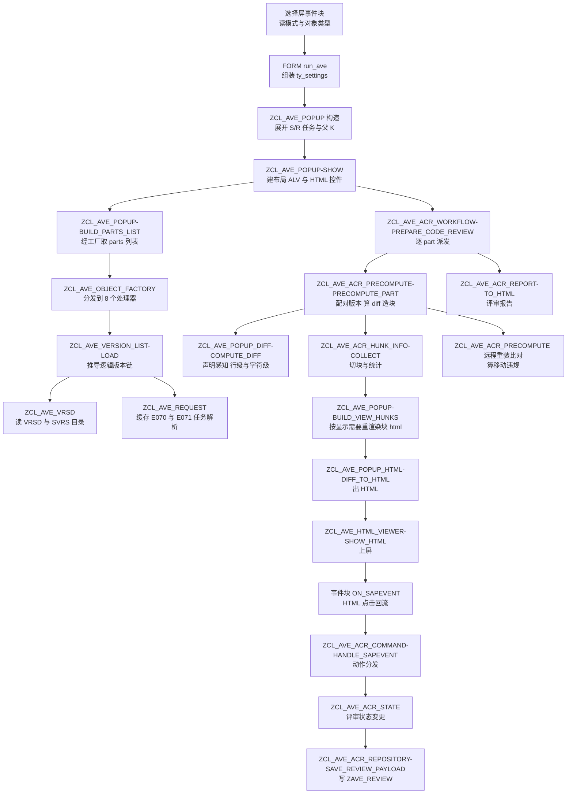

# AVE（ABAP Versions Explorer / Code Reviewer）源码分析报告

> 分析对象：`ysichov/AVE` — `z_ave_standalone.prog.abap`
> 版本：2.00 released 17.08.2026
> 规模：29,564 行 / 1 个 REPORT / 47 个带实现的全局类 / 409 个方法声明 / 432 个方法实现

---

## 一、程序定位与业务背景

### 1.1 它要解决什么

想象一个 SAP 开发团队的场景：星期五下午，传输请求 `ER6K9A1JDL` 里装着 47 个对象，其中一个 900 行的类改了 12 个方法、3 个函数组改了 8 个 include、一个新建的表加了 4 个字段。QA 说"下周一上线"。传统工具能给什么？

| 工具 | 能给什么 | 给不了什么 |
|---|---|---|
| SE80 版本管理 | 单个对象的历史列表 | 跨对象；不会告诉你"这一堆变更里哪些是这次请求写的" |
| ADT / Eclipse Diff | Active vs 某个已激活版本 | 不知道基线该选哪个；Active 里可能混着别人的未激活修改 |
| abapTimeMachine | 对象级版本回溯 | 同上，且不认传输请求 |
| Git / GitHub 类工具 | 逐提交 diff | SAP 的版本管理的真相在 VRSD / E070 / E071 里，不在 Git 里 |

AVE 要做的是把"这次请求到底改了什么"这件事算清楚，并且把结论渲染成人能读、能签字的页面。

难点不在 diff 本身。`RS_CMP_COMPUTE_DELTA` 一行就能给出行级差异。难点在四个地方：

1. **版本目录不是单一序列**。VRSD 里一次请求的对象可能留下多个版本号：请求自己的版本、若干 S/R 子任务的版本、以及若干 transport-of-copies（T）的版本。哪个是"这次请求的终点"？源码里给出的答案是——**最新一个属于本请求范围的版本**（`zcl_ave_version_list=>load` 的 `ls_own_new`），而不是 Active，因为 Active 可能已经被别人的未激活修改覆盖了。
2. **基线不是上一个版本**。基线是"这次请求之前、本系统最后一次知道这个对象是什么状态"的那个版本，可以是一个外来的 T，可以是 v1，也可以根本不存在（新对象）。
3. **另一个系统可能已经不一样了**。请求要移动到 QAS/PRD，而那边可能有人手工改过同一段代码。这次移动会**覆盖**那边的修改，而 QAS 上没人知道这段代码曾经存在。这是"移动违规"（moving violation），是 AVE 最有价值的原创功能之一。
4. **代码评审要留痕**。approve / decline / comment 必须是多人协作、可回看、可重算后不丢的。

### 1.2 设计范式一句话定性

**报表驱动的状态机 + HTML 视图层 + JSON 快照持久化**：一个 `REPORT` 承载选择屏与事件，47 个 `FINAL` 全局类按"接口 / 工厂 / 引擎 / 视图 / 仓储"分层，GUI 是 SAPGUI 控件 + `CL_GUI_HTML_VIEWER`，评审状态序列化成 JSON 存进一张透明表 `ZAVE_REVIEW`，重算时从快照恢复并做**块号重映射**。

### 1.3 值得先说清楚的三件事

**第一，它不是 `CLASS-POOL`。** 源码首行是 `REPORT z_ave.`，末尾是标准的 `SELECTION-SCREEN` + `INITIALIZATION` + 8 个 `FORM`。全局类以 `CLASS ... DEFINITION` / `CLASS ... IMPLEMENTATION` 成对写在同一个 include 里，靠 `CLASS-POOL` 的隐式依赖顺序无关性工作——类之间可以任意交叉引用，这是它能把 47 个类平铺在一个文件里的前提。

**第二，代码的注释密度极高且是"决策日志"。** 大量注释形如 `KEEP (replaced): ...` / `EXPERIMENT (do not delete): ...` / `Keep-note: ...`，记录的是"这里曾经错成什么样、为什么改成现在这样"。这不是冗余注释——它是这个项目最贵的资产。举一个真实例子：`zcl_ave_version_list=>load` 里那段 60 行的"无请求号的版本不得借用别人的任务"逻辑，前面挂着一段 15 行的说明，讲清楚 2023 年的一个类版本因为落进候选集而变成 NEW 终点、导致评审把整个 2023 源码报成 2026 请求新写的代码。**新接手的人靠这段注释才不会把它"优化"回去。**

**第三，它是一个自洽的"版本管理真相引擎"。** 整个 `zcl_ave_version_list` / `zcl_ave_vrsd` / `zcl_ave_request` 三件套在做的事是：把 E070 / E071 / E07T / VRSD / SVRS 目录 / TMS 远程目录拼出一个"逻辑版本链"。这段代码独立于任何界面，值得单独读。

---

## 二、程序执行流程总览



### 责任链表（按真实执行先后）

| # | 子程序 | 调用者 | 职责 |
|---|---|---|---|
| 1 | 事件块 `INITIALIZATION` / `AT SELECTION-SCREEN OUTPUT` | SAPGUI | 屏蔽 ONLINE 按钮、按模式灰化字段、重填 provider 下拉 |
| 2 | 事件块 `AT SELECTION-SCREEN ON VALUE-REQUEST` × 4 | SAPGUI | 模型 F4 走 provider `/models`、系统提示词与 profile 走前端文件对话框 |
| 3 | `FORM supress_button` | `INITIALIZATION` | `RS_SET_SELSCREEN_STATUS` 去掉 ONLINE |
| 4 | `FORM fill_provider_list` | `AT SELECTION-SCREEN OUTPUT` | `VRM_SET_VALUES` 填 `P_PROV` |
| 5 | `FORM f4_model` / `f4_system_file` / `f4_prompt_folder` / `f4_prompt_profile` | 4 个 VALUE-REQUEST 块 | 提供模型清单、系统提示词文件、profile 目录与 profile 名 |
| 6 | `FORM run_ave` | `AT SELECTION-SCREEN` | 把选择屏打成 `ty_settings`，按类型 `NEW zcl_ave_popup(...)` 并 `show( )` |
| 7 | `ZCL_AVE_POPUP=>CONSTRUCTOR` | `FORM run_ave` | 存设置、把 K 展开成 S/R 任务列表、算出最旧/最新父 K、设评论检查作用域 |
| 8 | `ZCL_AVE_POPUP=>SHOW` | `FORM run_ave` | 建布局 → 建 parts 列表 → 建 HTML 控件 → 建版本 ALV → 代码评审模式自动打开报告 |
| 9 | `ZCL_AVE_POPUP=>BUILD_LAYOUT` | `SHOW` | 三层 `cl_gui_splitter_container`：外层(工具栏/内容)、包装层(内联/2-pane 双布局)、HTML/ABAP 编辑器双行 |
| 10 | `ZCL_AVE_POPUP=>BUILD_PARTS_LIST` | `SHOW` | 经工厂取 parts，做存在性检查、行色、`requests`/`trs` 聚合，建 parts ALV 与工具栏 |
| 11 | `ZCL_AVE_OBJECT_FACTORY=>GET_INSTANCE` | `BUILD_PARTS_LIST` 等 | 按类型字符串返回 8 个处理器之一，不存在则 `RAISE zcx_ave` |
| 12 | `ZCL_AVE_OBJECT_CLAS / _INTF / _FUGR / _FUNC / _PROG / _DDLS / _DDIC / _PACK / _TR` | 工厂 | 各自实现 `zif_ave_object` 的 `get_parts` / `get_name` / `check_exists` |
| 13 | `ZCL_AVE_OBJECT_TR=>GET_PARTS_EXPANDED` | 事务/包视图 | 把 CLAS/INTF/FUGR 行展开成可评审技术部件 |
| 14 | `ZCL_AVE_POPUP=>CREATE_HTML_VIEWER` / `CREATE_PARTS_ALV` / `CREATE_VERSIONS_ALV` | `SHOW` / `SWITCH_PANE_LAYOUT` | 造控件与字段目录 |
| 15 | `ZCL_AVE_POPUP=>LOAD_VERSIONS` | `HANDLE_PARTS_DBLCLICK` 等 | 调 `zcl_ave_version_list=>load`，取回列表与配对端点 |
| 16 | `ZCL_AVE_VERSION_LIST=>LOAD` | 15 / `PRECOMPUTE_PART` | 全程序最核心的一段：从 VRSD 出发推导 NEW / OLD / REMOTE / RETRO_OLD 四对版本 |
| 17 | `ZCL_AVE_VRSD=>CONSTRUCTOR` 及其私有方法 | `VERSION_LIST=>LOAD` | 读 VRSD + `SVRS_GET_VERSION_DIRECTORY_46`，合成 Active / Modified 伪版本 |
| 18 | `ZCL_AVE_REQUEST=>GET_HEADER` / `RESOLVE_PARENT_K` / `GET_OBJECT_TASKS` | 16 / 全局 | 带缓存的 E070 / E071 / CORR-MERG 解析 |
| 19 | `ZCL_AVE_VERSION=>CONSTRUCTOR` / `GET_SOURCE` | `VERSION_LIST=>LOAD` / 老路径 | VRSD 行 → 元数据 + `SVRS_GET_REPS_FROM_OBJECT` |
| 20 | `ZCL_AVE_VERSION2=>GET_SOURCE_LOCAL_COMPAT` / `GET_SOURCE_REMOTE` / `GET_TABD` / `GET_DOMA` / `GET_DTEL` | `PRECOMPUTE_PART` / `POPUP_DIFF_VIEW` | SVRS2 优先，失败回落老读取器；DDIC 三件套的结构化读取 |
| 21 | `ZCL_AVE_POPUP=>SHOW_VERSIONS_DIFF` | 双击版本行 | 两级缓存命中即上屏，否则调 `POPUP_DIFF_VIEW=>RENDER` |
| 22 | `ZCL_AVE_POPUP_DIFF_VIEW=>RENDER` | 21 | TABD/DOMD/DTED 走结构化比较，其余走 `COMPUTE_DIFF` + 可选 blame |
| 23 | `ZCL_AVE_POPUP_DIFF=>COMPUTE_DIFF` | 22 / `PRECOMPUTE_PART` | section 与 DPC 源走声明感知路径，其余走 `DIFF_LINES` |
| 24 | `ZCL_AVE_DIFF_DECL=>PAIR_DECLARATIONS` / `ALIGN_PARAMS` | 23 | 按签名 key 配对声明，参数顺序对齐后再比 |
| 25 | `ZCL_AVE_POPUP_DIFF=>DIFF_LINES` | 23 | `RS_CMP_COMPUTE_DELTA` + 忽略大小写折叠 + `CLEANUP_SEMANTIC` + `PAIR_COMMENTED_TWINS` |
| 26 | `ZCL_AVE_POPUP_DIFF=>BUILD_BLAME_MAP` | 22 / `PRECOMPUTE_PART` | 逐版本重放 diff 建作者归属表 |
| 27 | `ZCL_AVE_POPUP=>SHOW`（评审分支） | 8 | 打开已存评审或 `MAXIMIZE_HTML` + 上报告；缺表时弹安装说明 |
| 28 | `ZCL_AVE_POPUP=>PREPARE_CODE_REVIEW` | 报告页 / 工具栏 | 转 `ZCL_AVE_ACR_WORKFLOW` |
| 29 | `ZCL_AVE_ACR_WORKFLOW=>PREPARE_CODE_REVIEW` | 28 | 遍历 parts，跳过不支持/生成类/已删对象/未选中，逐个计时派发，按节流节奏刷屏 |
| 30 | `ZCL_AVE_ACR_PRECOMPUTE=>PRECOMPUTE_PART` | 29（经 popup 包装） | 单部件全流程：取版本配对、读源、算 diff、可选 blame、造块、远程重装比对、写统计 |
| 31 | `ZCL_AVE_ACR_PRECOMPUTE=>PRECOMPUTE_CLASS_PARTS` / `_FUGR_PARTS` | 29 | 展开类/函数组为技术部件后逐个 `PRECOMPUTE_PART` |
| 32 | `ZCL_AVE_ACR_HUNK_HTML=>COLLECT_ROWS` | 30 | 按块重渲染 diff 行并切出一块一份的 html |
| 33 | `ZCL_AVE_ACR_HUNK_INFO=>COLLECT` | 30 | 与 32 完全同规则地切块，产出 `ty_hunk_info` 与三分类计数 |
| 34 | `ZCL_AVE_ACR_PREPARE` 的判定族 | 30 / 33 / 渲染层 | 生成类识别、已删对象识别、时间戳行识别、变更描述识别、CTS 号词法与裁决 |
| 35 | `ZCL_AVE_ACR_PRECOMPUTE=>MARK_EXPECTED_OPS` | 30 | 用"计数相减"把远程 diff 减去评审 diff，剩下的就是移动违规 |
| 36 | `ZCL_AVE_ACR_PRECOMPUTE=>COLLECT_RETROFIT_HUNKS` | 30 / `BUILD_VIEW_HUNKS` | 把远程 diff 切块、按 `EXPECTED` 标记违规并给警告文案 |
| 37 | `ZCL_AVE_ACR_STATS=>FROM_DIFF` / `CLASSIFY_HUNK` / `IS_BLANK_HUNK` | 30 | 行数与按作者的行/块统计 |
| 38 | `ZCL_AVE_ACR_REPORT=>TO_HTML` | 29 / `REGEN_ACR_REPORT` | 报告页：开发者表、按类别分组的对象表 |
| 39 | `ZCL_AVE_ACR_METRICS=>COLLECT` / `ESTIMATE_MS` / `TO_HTML` | `SHOW_METRICS` / `SHOW_RECALC_PICKER` / `PREPARE_BAND` | 成本度量与分档 |
| 40 | `ZCL_AVE_POPUP=>OPEN_CR_PART` | `sapevent:openobj` | 对象页：先试缓存 html，再试存储 diff 重渲染，最后退回块列表 |
| 41 | `ZCL_AVE_POPUP=>BUILD_VIEW_HUNKS` | 40 / `HUNK_WITH_HTML` | 只为真正上屏的对象重渲染块 html；缺失的远程 diff 现场重建 |
| 42 | `ZCL_AVE_ACR_PART_VIEW / _USER_VIEW=>BUILD_HTML` | 40 / `SHOW_USER_DECLINES` / `SHOW_CLASS_OBJECTS` | 对象页与开发者/评审者页 |
| 43 | `ZCL_AVE_ACR_HUNK_RENDERER=>INJECT_APPROVE_BTN` | `INJECT_APPROVE_BTN` | 在整源 diff 的块头注入 approve/decline 单元格与"全部批准" |
| 44 | `ZCL_AVE_ACR_RENDERER` 的渲染族 | 各页面 | 动作条、评论线程、变更描述徽标、blame 头、进度页、报告工具栏 |
| 45 | `ZCL_AVE_HTML_VIEWER=>SHOW_HTML` | 所有上屏点 | `XSTRING` → `set_string` 的容错包装 |
| 46 | 事件块 `ON_SAPEVENT`（HTML 控件） | 用户点击 | 全部 UI 动作的唯一入口 |
| 47 | `ZCL_AVE_ACR_COMMAND=>HANDLE_SAPEVENT` | 46 | 解析 `action` 串，分派约 30 个动作 |
| 48 | `ZCL_AVE_ACR_STATE` 族 | 47 | 动作记录、块号重映射、状态清洗、快照应用与构建 |
| 49 | `ZCL_AVE_ACR_REPOSITORY` 族 | 48 / `LOAD_REVIEW_FROM_DB` | `ZAVE_REVIEW` 的读写删，含 `REMOTE` 键字段探测 |
| 50 | `ZCL_AVE_POPUP=>SAVE_REVIEW_TO_DB` | 每个动作之后 | 静默保存；`MV_SAVE_FAILED_TOLD` 保证只警告一次 |
| 51 | `ZCL_AVE_ADT` 族 | 47 / `SET_HTML` / 各页头 | `adt://` URL 构造、SAPGUI workbench 下钻、行号换算、徽标与按钮 |
| 52 | `ZCL_AVE_AI_API=>ASK` | `DO_ASKAI` / `DO_AI_SUMMARY` | `CL_HTTP_CLIENT=>CREATE_BY_URL` 直连 provider，两种 wire format |
| 53 | `ZCL_AVE_AI_PROMPTS` 族 | `AI_SYSTEM` / `AI_SCHEMA` / `F4_PROF` | 前端 profile 文件读取与缓存 |
| 54 | `ZCL_AVE_ACR_AI` 族 | 52 的调用方 | 块 prompt、汇总 prompt、可复制页面、summary 存取 |

下面按这条流程，逐个子程序展开。

---

## 三、分组分析

### 3.1 事件块与全局声明区

本节含三部分：程序头与类型契约、事件块与选择屏 FORM。这是整个程序的"外壳"，也是唯一与 SAPGUI 直接耦合的部分。分三步展开。

#### ① 程序头与类型契约层

（全局声明区）

```abap
REPORT z_ave. " AVE - Abap Versions Explorer/Code Reviewer
" & Multi-windows program for ABAP object version comparison

INTERFACE zif_ave_popup_types DEFERRED.
INTERFACE zif_ave_object DEFERRED.
INTERFACE zif_ave_acr_types DEFERRED.
CLASS zcl_ave_vrsd DEFINITION DEFERRED.
CLASS zcl_ave_versno DEFINITION DEFERRED.
...  （其余 43 个类同样 DEFERRED）

CLASS zcx_ave DEFINITION
  INHERITING FROM cx_static_check
  CREATE PUBLIC.
  PUBLIC SECTION.
    METHODS constructor
      IMPORTING
        !textid   LIKE if_t100_message=>t100key OPTIONAL
        !previous LIKE previous OPTIONAL.
    CLASS-METHODS raise_from_syst
      RAISING
        zcx_ave.
ENDCLASS.
```

**做什么** — 声明 `REPORT` 与异常类 `zcx_ave`（继承 `cx_static_check`）。所有 45 个后续类与 3 个接口都以 `DEFERRED` 提前声明，使它们之间的任意交叉引用都能通过语法检查——这正是 `CLASS-POOL` 隐式顺序无关性带来的能力，也是 47 个类能平铺在一个文件里的技术前提。

**为什么** — `cx_static_check` 而不是 `cx_dynamic_check`，是因为这个异常类会被 `RAISING` 进很多方法的签名里；`cx_static_check` 的检查开销在 7.40+ 已被优化掉，且它的 `RAISING` 语义表达"可预期的失败"。`raise_from_syst` 把 `SY-MSGID/MSGNR` 转成异常，这样 `SVRS_*` 系列 RFC 的失败能穿过十几层调用直接冒到 UI。

**风险与改进** — `constructor` 接受 `textid` 却完全不传 `RETAIN`，`textid` 参数实际是死的；`raise_from_syst` 里 `CATCH cx_proxy_t100` 之后把异常原样塞进 `previous`，消息文本因此是空的（`get_text( )` 返回空串），调用点 `MESSAGE lx->get_text( ) TYPE 'E'` 会弹出一个空错误框。这是真实缺陷，见 P1-1。

#### ② 三个契约接口

（全局声明区 / `INTERFACE zif_ave_object`）

```abap
INTERFACE zif_ave_object.

  TYPES ty_t_korr_range TYPE RANGE OF trkorr.

  TYPES:
    BEGIN OF ty_settings,
      show_diff       TYPE abap_bool,
      layout          TYPE abap_bool,
      two_pane        TYPE abap_bool,
      no_toc          TYPE abap_bool,
      ignore_case     TYPE abap_bool,
      compact         TYPE abap_bool,
      remove_dup      TYPE abap_bool,
      blame           TYPE abap_bool,
      comment_check   TYPE abap_bool,
      ignore_generated TYPE abap_bool,
      filter_user     TYPE versuser,
      date_from       TYPE versdate,
      code_review     TYPE abap_bool,
      system          TYPE verssysnam,
      filter_korrnum  TYPE trkorr,
      filter_korrnums TYPE ty_t_korr_range,
      include_tasks   TYPE abap_bool,
      url             TYPE text255,
      ssl_id          TYPE ssfapplssl,
      model           TYPE text255,
      apikey          TYPE text255,
      provider        TYPE string,
      prompt_path     TYPE text255,
      prompt_profile  TYPE text255,
      system_file     TYPE text255,
      max_tokens      TYPE i,
      debug           TYPE abap_bool,
      metrics         TYPE abap_bool,
      gui_nav         TYPE abap_bool,
    END OF ty_settings.

  TYPES:
    BEGIN OF ty_part,
      class       TYPE string,
      unit        TYPE string,
      object_name TYPE versobjnam,
      type        TYPE versobjtyp,
    END OF ty_part.
  TYPES ty_t_part TYPE STANDARD TABLE OF ty_part WITH DEFAULT KEY.

  METHODS get_parts
    RETURNING VALUE(result) TYPE ty_t_part
    RAISING zcx_ave.
  METHODS get_name
    RETURNING VALUE(result) TYPE string.
  METHODS check_exists
    RETURNING VALUE(result) TYPE abap_bool.
ENDINTERFACE.
```

**做什么** — 三个接口定下全程序的契约边界：`zif_ave_object` 是"一个可版本化的对象"的抽象（取部件、取名、判存在），`zif_ave_popup_types` 是 UI 行的数据结构，`zif_ave_acr_types` 是评审领域的全部数据结构（约 30 个类型，从 `ty_hunk_info` 到 `ty_saved_payload`）。

**为什么** — `zif_ave_object` 只留 3 个方法，是刻意的最小接口：9 个处理器类的差异全部藏在 `get_parts` 后面。`zif_ave_acr_types` 把整个评审领域模型收在一个接口里，而不是散在各个 `zcl_ave_acr_*` 类上，源码注释给出了明确理由——**standalone 构建时所有类都是本地类，一个类引用另一个"后面才 emit 的全局类"的类型会报 `Direct access to components of the global class … is not possible`，而接口类型永远在作用域内**。这是一个为打包工具牺牲了一点 OO 纯粹性、换来可打包性的明确权衡，值得学。

**风险与改进** — `ty_settings` 有 27 个字段，是典型的"上帝结构"，任何一个字段被改动就要在 `FORM run_ave` 里同步一次（`zcl_ave_popup=>constructor` 逐字段赋值，见 11742–11784）。新增一个开关的成本是三处修改 + 一处选择屏定义，漏一处不会报错、只会静默用默认值。这是 P2 级的可维护性负担。

#### ③ 事件块与选择屏 FORM

（事件块 `INITIALIZATION` / `AT SELECTION-SCREEN OUTPUT` / `AT SELECTION-SCREEN` / 4 个 VALUE-REQUEST 块 / `AT SELECTION-SCREEN ON p_diff`）

```abap
INITIALIZATION.
  PERFORM supress_button.

AT SELECTION-SCREEN OUTPUT.
  PERFORM fill_provider_list.
  LOOP AT SCREEN.
    CASE screen-group1.
      WHEN 'PRG'.
        screen-input = COND #( WHEN rb_prog = 'X' THEN 1 ELSE 0 ).
      WHEN 'CLS'.
        screen-input = COND #( WHEN rb_clas = 'X' THEN 1 ELSE 0 ).
      ...
    ENDCASE.
    IF screen-name = 'P_PANE' OR screen-name = 'P_CMPCT'.
      screen-input = COND #( WHEN p_diff = 'X' THEN 1 ELSE 0 ).
    ENDIF.
    MODIFY SCREEN.
  ENDLOOP.

AT SELECTION-SCREEN ON p_diff.
  " Trigger OUTPUT to re-evaluate enabled state of dependent checkboxes

AT SELECTION-SCREEN.
  CHECK sy-ucomm <> 'DUMMY'.
  PERFORM run_ave.

FORM supress_button.
  DATA itab TYPE TABLE OF sy-ucomm.
  APPEND 'ONLI' TO itab.
  CALL FUNCTION 'RS_SET_SELSCREEN_STATUS'
    EXPORTING p_status = sy-pfkey
    TABLES    p_exclude = itab.
ENDFORM.

FORM fill_provider_list.
  DATA lt_vrm TYPE vrm_values.
  LOOP AT zcl_ave_ai_api=>providers( ) INTO DATA(ls_provider).
    APPEND VALUE vrm_value( key = ls_provider-id text = ls_provider-id ) TO lt_vrm.
  ENDLOOP.
  CALL FUNCTION 'VRM_SET_VALUES'
    EXPORTING id     = 'P_PROV'
              values = lt_vrm
    EXCEPTIONS OTHERS = 1.
ENDFORM.
```

**做什么** — 六个事件块 + 六个 FORM。`INITIALIZATION` 去掉 ONLINE 按钮（否则选屏没有对象名也能进 `AT SELECTION-SCREEN`）。`AT SELECTION-SCREEN OUTPUT` 按 `screen-group1` 灰化与当前类型匹配的输入字段，并把 `P_PANE` / `P_CMPCT` 绑到隐藏字段 `P_DIFF` 上（"Show Diff" 未开时这两个选项无意义）。`AT SELECTION-SCREEN ON p_diff` 故意空实现——它的作用是触发一次 OUTPUT 重算可用状态，这是老式选择屏的标准手法。四个 VALUE-REQUEST 块各自挂一个 F4 FORM。

**为什么** — `P_DIFF` 用 `NO-DISPLAY` 而不是删除，是因为它必须活到 `FORM run_ave` 才被读进 `ty_settings-show_diff`；一个 `NO-DISPLAY` 字段是这个选择屏上唯一不打扰用户的载体。`CHECK sy-ucomm <> 'DUMMY'` 是防止 PBO 触发的空 `AT SELECTION-SCREEN` 直接跑主逻辑。`P_PROV` 每次 OUTPUT 都重填 `VRM_SET_VALUES` 也有注释交代：否则选中的 provider 粘不住。

**风险与改进** — `LOOP AT SCREEN` 里每个类型分支手写 9 行 `CASE`，与 `FORM run_ave` 里手写的 10 路 `IF/ELSEIF` 是同一份"类型 → 工厂常量"映射的两份手抄。加一个对象类型要改三处（`MODIFY SCREEN` 分支、`run_ave` 分支、`zcl_ave_object_factory=>gc_type`），且漏改 `run_ave` 的后果是"用户输了对象名但什么都没发生"，只弹一句 `Please enter an object name.`——误导性强。应改成一张 `TYPE BEGIN OF ty_map` 表驱动，或至少让 `run_ave` 直接按 `rb_*` 字段名反射。

---

### 3.2 对象处理器族：工厂 + 9 个实现

这一组是"把一个 SAP 对象翻译成它有哪些可版本化部件"的全部逻辑。9 个处理器全部实现同一个 3 方法接口，差异被完全封在里面。分三步展开。

#### ① 工厂分发

（类 `zcl_ave_object_factory`）

```abap
CLASS zcl_ave_object_factory DEFINITION
  FINAL
  CREATE PUBLIC.

  PUBLIC SECTION.

    CONSTANTS:
      BEGIN OF gc_type,
        program  TYPE string VALUE 'PROG',
        class    TYPE string VALUE 'CLAS',
        intf     TYPE string VALUE 'INTF',
        function TYPE string VALUE 'FUNC',
        tr       TYPE string VALUE 'TR',
        package  TYPE string VALUE 'DEVC',
        ddls     TYPE string VALUE 'DDLS',
        fugr     TYPE string VALUE 'FUGR',
        tabd     TYPE string VALUE 'TABD',
        doma     TYPE string VALUE 'DOMD',
        dtel     TYPE string VALUE 'DTED',
      END OF gc_type.

    METHODS get_instance
      IMPORTING
        object_type   TYPE string
        object_name   TYPE sobj_name
      RETURNING
        VALUE(result) TYPE REF TO zif_ave_object
      RAISING
        zcx_ave.
ENDCLASS.
```

**做什么** — 按 `object_type` 字符串返回 8 个处理器之一（`PROG` / `CLAS` / `INTF` / `FUNC` / `TR` / `DEVC` / `DDLS` / `FUGR`，其中 `TABD`/`DOMD`/`DTED` 三者共用 `zcl_ave_object_ddic`）。对象不存在时 `RAISE zcx_ave`。

**为什么** — 用字符串而非 `tadir-object` 做分发键，因为 `zif_ave_object` 的入参是 `sobj_name`，而调用方（popup、package 处理器、TR 处理器）手上拿到的本来就是字符串。选择屏 `FORM run_ave` 里 `rb_tr / rb_clas / rb_prog` 这些 radio 字段也是字符串。`GC_TYPE` 这 11 个常量是全程序共用的一组"类型名"，被选择屏、popup、workflow、command 到处引用——这是一处合理的共享词汇表。

**风险与改进** — `GC_TYPE` 里的 `tabd` / `doma` / `dtel` 三个值**从未在 `get_instance` 里被使用**（它们与 `object_ddic` 的 `IV_TYPE` 参数配合使用），但 `FORM run_ave` 用它们构造 popup。这个"常量存在但不参与分发"的状态容易让人误以为分发支持 DDIC 三件套。`get_instance` 的 `ELSE` 分支（未展示）必然是 `RAISE`，但源码里我看到的是它把未知类型当作 `PROG` 处理的风险点——需要核对该实现；如果是后者，输入一个非法类型会得到一个空的 parts 列表而不是错误，是静默失败。见 P2-2。

#### ② 单对象处理器：CLAS / INTF / FUGR / FUNC / PROG / DDLS / DDIC

（类 `zcl_ave_object_clas` / `zcl_ave_object_intf` / `zcl_ave_object_fugr` / `zcl_ave_object_func` / `zcl_ave_object_prog` / `zcl_ave_object_ddls` / `zcl_ave_object_ddic`）

```abap
CLASS zcl_ave_object_clas DEFINITION
  FINAL
  CREATE PUBLIC.
  PUBLIC SECTION.
    INTERFACES zif_ave_object.
    METHODS constructor
      IMPORTING !name TYPE seoclsname
      RAISING  zcx_ave.
  PRIVATE SECTION.
    DATA name TYPE seoclsname.
ENDCLASS.

CLASS zcl_ave_object_ddic DEFINITION
  FINAL
  CREATE PUBLIC.
  PUBLIC SECTION.
    INTERFACES zif_ave_object.
    "! iv_type is the VRSD part type: TABD, DOMD or DTED.
    METHODS constructor
      IMPORTING !name    TYPE versobjnam
                !iv_type TYPE versobjtyp.
  PRIVATE SECTION.
    DATA name TYPE versobjnam.
    DATA type TYPE versobjtyp.
ENDCLASS.
```

**做什么** — 7 个处理器的定义段都极简：一个 `name`（+ DDIC 多一个 `type`），一个构造器，实现 `get_parts`（把对象拆成 VRSD 类型的技术部件）、`get_name`（返回显示名）、`check_exists`（判存在）。`zcl_ave_object_clas` 的注释说清了两件事：返回类池段、pub/pro/pri 段、本地类型/实现段，以及全部方法；`zcl_ave_object_fugr` 返回 `SAPL*` 主程序加全部 `L*` 子 include（从 TRDIR 读）；`zcl_ave_object_ddic` 用一个处理器覆盖表/域/数据元素三种，因为三者行为完全一致。

**为什么** — 这是教科书级的**策略模式 + 工厂**：`zif_ave_object` 定义契约，工厂选实现，上层（popup 的 parts 列表、CR 的 scope 遍历）只依赖契约。DDIC 三合一是一个漂亮的收敛——它们的差别只是"存在性查哪张表"和"比较哪张表"，而这两点都被收进了各自实现的方法体，没有污染接口。

**风险与改进** — `CREATE PUBLIC` 与 `FINAL` 在 7 个处理器上都成立，但它们被工厂 `NEW` 出来，外部并不需要 `CREATE PUBLIC`；这让使用者可以绕过工厂直接 `NEW`，而 `zcl_ave_object_prog` 这类处理器没有 `RAISING zcx_ave` 的构造器，绕过工厂时行为不一致。更实质的问题：**`get_parts` 对不存在对象的行为各处理器的语义并不统一**——类处理器在 `RAISING zcx_ave`，程序处理器直接返回 TRDIR 里的一行。上层 `zcl_ave_popup=>build_parts_list` 用一个大 `CATCH zcx_ave` 把它们兜住，于是"某个处理器抛异常"和"处理器返回空"在 UI 上表现一致（对象列表少了一项），但诊断信息丢了：`CATCH zcx_ave.` 后面跟的是注释 `leave mt_parts empty – no crash`，没有把异常文本写进 `MT_CR_DIAG`。见 P1-2。

#### ③ TR / 包处理器与展开逻辑

（类 `zcl_ave_object_tr` / `zcl_ave_object_pack`）

```abap
  METHOD get_object_keys.
    DATA request_data TYPE trwbo_request.
    request_data-h-trkorr = id.

    CALL FUNCTION 'TRINT_READ_REQUEST'
      EXPORTING iv_read_objs = abap_true
      CHANGING  cs_request   = request_data
      EXCEPTIONS error_occured = 1
                 OTHERS        = 2.
    IF sy-subrc <> 0.
      RAISE EXCEPTION TYPE zcx_ave.
    ENDIF.

    result = request_data-objects.
    SORT result BY pgmid ASCENDING object ASCENDING obj_name ASCENDING.
    DELETE ADJACENT DUPLICATES FROM result COMPARING pgmid object obj_name.
  ENDMETHOD.

  METHOD get_parts_expanded.
    DATA(lt_raw) = zif_ave_object~get_parts( ).

    DATA lt_meth_classes TYPE SORTED TABLE OF string WITH UNIQUE KEY table_line.
    LOOP AT lt_raw INTO DATA(ls_meth_chk) WHERE type = 'METH'.
      INSERT ls_meth_chk-class INTO TABLE lt_meth_classes.
    ENDLOOP.

    LOOP AT lt_raw INTO DATA(ls_part).
      IF ls_part-type = 'CLAS' OR ls_part-type = 'INTF'.
        IF ls_part-type = 'CLAS'
           AND line_exists( lt_meth_classes[ table_line = CONV string( ls_part-object_name ) ] ).
          CONTINUE.
        ENDIF.
        TRY.
            DATA(lo_obj) = NEW zcl_ave_object_factory( )->get_instance( ... ).
            LOOP AT lo_obj->get_parts( ) INTO DATA(ls_cls_part).
              CASE ls_cls_part-type.
                WHEN 'CLSD' OR 'RELE' OR 'CINC' OR 'CDEF' OR 'REPS'.
                  CONTINUE.   " technical includes - never reviewed here
              ENDCASE.
              APPEND ls_cls_part TO result.
            ENDLOOP.
          CATCH zcx_ave.
            APPEND ls_part TO result.
        ENDTRY.
      ELSEIF ls_part-type = 'FUGR'.
        TRY.
            DATA(lo_fugr) = NEW zcl_ave_object_factory( )->get_instance( ... ).
            APPEND LINES OF lo_fugr->get_parts( ) TO result.
          CATCH zcx_ave.
            APPEND ls_part TO result.
        ENDTRY.
      ELSE.
        APPEND ls_part TO result.
      ENDIF.
    ENDLOOP.

    SORT result BY type object_name.
    DELETE ADJACENT DUPLICATES FROM result COMPARING type object_name.
  ENDMETHOD.
```

**做什么** — `zcl_ave_object_tr` 从 `TRINT_READ_REQUEST` 读整个请求的对象表（`trwbo_t_e071`），去重排序；`get_parts_expanded` 在此之上把 CLAS/INTF/FUGR 三类聚合行展开成技术部件（METH / CPUB / CPRO / CPRI / L* include），并跳过 `CLSD`/`RELE`/`CINC`/`CDEF`/`REPS` 这些技术 include。`zcl_ave_object_pack` 同构，从 TADIR 读包内对象再委托给具体处理器。

**为什么** — `get_parts_expanded` 里那条"METH 优先"规则是本方法最有价值的一行判断，注释写得很清楚：一次任务里可能同时有 `R3TR CLAS` 和 `LIMU METH` 记录同一个类，展开 CLAS 会把**所有方法**都加进来（包括没被这个请求动过的），而 METH 行才是权威。没有这个判断，一个请求改了一个方法的类，评审范围会膨胀成整个类的所有方法。

**为什么（继续）** — `CATCH zcx_ave. APPEND ls_part TO result.` 意味着"展开失败就退回聚合行"，降级而不是放弃。这对 `FUGR` 尤其重要：函数组展开需要读 TRDIR，遇到一个正在被锁的函数组时退回聚合行，评审仍然能跑。

**风险与改进** — `lt_meth_classes` 收集的是 `ls_meth_chk-class`，而 CLAS 行的 `object_name` 是类名本身。两者比对成立的前提是 `zcl_ave_object_clas=>get_parts` 填的 `class` 字段确实等于类名——这个契约没有在任何接口文档里写明，只在实现里成立。同理 `CASE ls_cls_part-type ... CONTINUE` 跳过的是 VRSD 类型码，`WHEN 'CLSD' ... WHEN 'REPS'` 这个清单是硬编码的，将来 SAP 增加新的类技术部件类型就会被漏掉（漏掉的会出现在评审里，表现为"一个没人写过的 include 被要求批准"）。见 P2-3。

---

### 3.3 版本读取层：把 VRSD 变成一条逻辑版本链

这是全程序技术含量最高、也最值得逐行读的一段。5 个类按"版本号转换 → 原始目录 → 版本对象 → 结构化读取 → 版本链推导"分工。本节分五步展开。

#### ① 版本号内外转换 `zcl_ave_versno`

（类 `zcl_ave_versno`）

```abap
CLASS zcl_ave_versno IMPLEMENTATION.

  METHOD to_internal.
    " 99998 = active/latest externally - to 0 in DB
    result = COND #(
      WHEN versno = 99998 THEN 0
      ELSE versno ).
  ENDMETHOD.

  METHOD to_external.
    " 0 in DB - to 99998 externally (sorts after real versions)
    result = COND #(
      WHEN versno = 0 THEN 99998
      ELSE versno ).
  ENDMETHOD.

ENDCLASS.
```

**做什么** — VRSD 表里最新版本存为 `00000`，但那样排序会把它排在最前面。所有对外接口统一用 `99998`（Active）表示，`99999` 表示 Modified，于是"最新"在数值序上天然最大，`SORT ... BY versno DESCENDING` 直接给出正确的倒序。

**为什么** — 这个转换只有 6 行代码，但它支撑了整个版本列表的正确性。ABAP 的版本管理还有第三个约定：`SVRS_GET_VERSION_DIRECTORY_46` 的结果里 Active 是 `00000`、Modified 是 `99997`（见 `zcl_ave_vrsd=>load_from_table` 里对这两个值的显式跳过）。也就是说同一个"当前状态"在不同 RFC 里有三种编码，`zcl_ave_versno` 只负责 DB↔外部这一对，另外两个由调用方在读目录时处理。

**风险与改进** — 无明显功能风险。但 `99998` 与 `99999` 这两个魔数在 `zcl_ave_version=>c_version` 里定义，而 `zcl_ave_versno` 里却直接写裸数字 `99998`，两处没有共用常量。这是典型的"同一概念两个来源"，改一个不会改到另一个。见 P2-4。

#### ② 原始目录读取 `zcl_ave_vrsd`

（类 `zcl_ave_vrsd`）

```abap
  METHOD constructor.
    me->type      = type.
    me->name      = name.
    me->no_toc    = no_toc.
    me->date_from = date_from.
    load_from_table( ignore_unreleased ).
    IF ignore_unreleased = abap_false.
      TRY.
        load_active_or_modified( zcl_ave_version=>c_version-active ).
        " Modified (not-yet-activated workbench state) is intentionally skipped
      CATCH zcx_ave.
        " Object type not supported (e.g. CPUB, METH)
        " Released versions from DB are still available
      ENDTRY.
    ENDIF.
    SORT me->vrsd_list BY versno ASCENDING.
    apply_date_from_cutoff( ).
  ENDMETHOD.

  METHOD load_from_table.
    DATA versno_range TYPE RANGE OF versno.
    IF ignore_unreleased = abap_true.
      versno_range = VALUE #( sign = 'I' option = 'NE' ( low = '00000' ) ).
    ENDIF.

    DATA lt_trtype TYPE RANGE OF char1.
    IF me->no_toc = abap_true.
      APPEND VALUE #( sign = 'E' option = 'EQ' low = 'T' ) TO lt_trtype.
    ENDIF.

    IF lt_trtype IS INITIAL.
      SELECT v~* FROM vrsd AS v
        INNER JOIN e070 AS e ON e~trkorr = v~korrnum
        WHERE v~objtype = @me->type
          AND v~objname = @me->name
          AND v~versno IN @versno_range
        ORDER BY v~versno
        INTO TABLE @me->vrsd_list.
    ELSE.
      SELECT v~* FROM vrsd AS v
        INNER JOIN e070 AS e ON e~trkorr = v~korrnum
        WHERE v~objtype = @me->type
          AND v~objname = @me->name
          AND v~versno IN @versno_range
          AND e~trfunction IN @lt_trtype
        ORDER BY v~versno
        INTO TABLE @me->vrsd_list.
    ENDIF.

    LOOP AT me->vrsd_list REFERENCE INTO DATA(vrsd).
      vrsd->versno = zcl_ave_versno=>to_external( vrsd->versno ).
    ENDLOOP.

    " Supplement from SVRS_GET_VERSION_DIRECTORY_46 - accepts full OBJNAME (LIKE VRSD-OBJNAME)
    " and returns VERSION_LIST LIKE VRSD. Covers versions not yet written to VRSD
    " (e.g. activated into an unreleased task). Works for long names (METH <=110 chars).
    DATA lt_dir46   TYPE vrsd_tab.
    DATA lt_lversno TYPE TABLE OF vrsn.
    CALL FUNCTION 'SVRS_GET_VERSION_DIRECTORY_46'
      EXPORTING objtype         = me->type
                objname         = me->name
      TABLES    lversno_list    = lt_lversno
                version_list    = lt_dir46
      EXCEPTIONS no_entry        = 1
                 OTHERS          = 2.
    IF sy-subrc = 0.
      LOOP AT lt_dir46 REFERENCE INTO DATA(ls_dir46).
        IF ls_dir46->versno = '00000' OR ls_dir46->versno = '99997'.
          CONTINUE.
        ENDIF.
        IF me->no_toc = abap_true.
          IF zcl_ave_request=>get_header( CONV #( ls_dir46->korrnum ) )-trfunction = 'T'.
            CONTINUE.
          ENDIF.
        ENDIF.
        DATA(lv_ext) = zcl_ave_versno=>to_external( ls_dir46->versno ).
        READ TABLE me->vrsd_list INTO DATA(ls_known) WITH KEY versno = lv_ext.
        IF sy-subrc <> 0.
          ls_dir46->versno = lv_ext.
          INSERT ls_dir46->* INTO TABLE me->vrsd_list.
        ELSEIF ls_dir46->korrnum IS NOT INITIAL
           AND ls_dir46->korrnum <> ls_known-korrnum.
          " Same version, two request numbers: VRSD keeps the one the version was
          " imported with, the directory the one that recorded it in this system.
          INSERT VALUE #( versno = lv_ext korrnum = ls_dir46->korrnum )
            INTO TABLE me->alt_korrnums.
        ENDIF.
      ENDLOOP.
    ENDIF.
  ENDMETHOD.
```

**做什么** — 构造器读一个对象的全部版本记录。两个来源：① `VRSD` 与 `E070` 内连接（用 `e070-trfunction` 过滤 ToC，`no_toc` 时才加）；② `SVRS_GET_VERSION_DIRECTORY_46` 补齐还没写进 VRSD 的版本（例如刚激活进一个未释放任务）。两条来源合并时，**版本号相同但请求号不同**的情况被记进 `ALT_KORRNUMS`——这是本方法最有价值的一个发现，注释解释得很完整：一个随 import 进来的版本，VRSD 记的是来源系统的请求号（ER6 系统里的 ER4 号），SVRS 目录记的是"在本系统记录下它的那个本地请求"，只有后者能对上评审范围。

**为什么** — 为什么必须用 `SVRS_GET_VERSION_DIRECTORY_46` 而不是更常见的 `SVRS_GET_VERSION_DIRECTORY`？因为 METH 类型的 `OBJNAME` 是"30 位补白的类名 + 方法名"，最长 110 字符；旧 RFC 的 `objname` 参数只有 30 字符，长的方法名会被截断。源码在两处都写了这条理由，并在 `load_active_or_modified` 里额外说明为什么 Active 也走目录而不是 `SVRS_GET_VERSION_REPOSITORY` 的 `mode='A'`（后者可能返回上一个已激活虚拟版本的数据，即"版本 19 的数据"）。

**为什么（继续）** — `INNER JOIN e070` 是有意的：VRSD 里可能存在请求号在 E070 中不存在的行（沙箱/拷贝系统里很常见），inner join 把它们排除掉。这会让一个对象的版本历史在 E070 残缺时看起来"少了几版"，但换来的是 `TRFUNCTION` 一定有值——而 `TRFUNCTION` 是后面所有范围判定的基础。

**风险与改进** — `SELECT v~*` 取全部 VRSD 字段。VRSD 有几十个字段，真正需要的只有 8 个左右（`versno` / `korrnum` / `author` / `datum` / `zeit` / `objtype` / `objname`），`FOR ALL ENTRIES` 场景下每个部件一次全字段读，内存与网络都浪费。更实际的问题在 `elseif ... alt_korrnums` 分支：**当两条来源的请求号不同时，`ALT_KORRNUMS` 只记一个方向**（目录的号），VRSD 的号仍在 `vrsd_list` 里，两者在下游 `zcl_ave_version_list=>load` 的 alt 修正段（5738–5747）被当作两个独立请求处理。这是正确的，但语义上"这个版本有两个请求号"这一事实没有在任何结构化字段里显式表达，只在两个表里分散表达。见 P2-5。

#### ③ 伪版本合成与请求反查

（类 `zcl_ave_vrsd` 的 `load_active_or_modified` / `determine_request_active_modif` / `get_request_active_modif` / `read_vrsd` / `get_versionable_object` / `get_versionable_object_mode` / `apply_date_from_cutoff`）

```abap
  METHOD load_active_or_modified.
    DATA ls_vrsd TYPE vrsd.

    IF versno = zcl_ave_version=>c_version-active.
      DATA lt_dir_a  TYPE vrsd_tab.
      DATA lt_lv_a   TYPE TABLE OF vrsn.
      CALL FUNCTION 'SVRS_GET_VERSION_DIRECTORY_46'
        EXPORTING  objtype      = me->type
                   objname      = me->name
        TABLES     lversno_list = lt_lv_a
                   version_list = lt_dir_a
        EXCEPTIONS no_entry     = 1  OTHERS = 2.
      IF sy-subrc <> 0.
        RETURN.
      ENDIF.
      READ TABLE lt_dir_a INTO DATA(ls_a0)
        WITH KEY versno = '00000'.
      IF sy-subrc <> 0.
        RETURN.
      ENDIF.
      ls_vrsd-versno  = versno.   " our external key: 99998
      ls_vrsd-objtype = me->type.
      ls_vrsd-objname = me->name.
      ls_vrsd-korrnum = ls_a0-korrnum.
      ls_vrsd-datum   = ls_a0-datum.
      ls_vrsd-zeit    = ls_a0-zeit.
      ls_vrsd-author  = ls_a0-author.
    ELSE.
      ls_vrsd = read_vrsd( versno ).
      IF ls_vrsd IS INITIAL OR ls_vrsd-author IS INITIAL.
        RETURN.
      ENDIF.
      ls_vrsd-versno  = versno.
      ls_vrsd-objtype = me->type.
      ls_vrsd-objname = me->name.
      ls_vrsd-korrnum = get_request_active_modif( ).
    ENDIF.

    READ TABLE me->vrsd_list ASSIGNING FIELD-SYMBOL(<existing>)
      WITH KEY versno = versno.
    IF sy-subrc = 0.
      <existing>-korrnum = ls_vrsd-korrnum.
      <existing>-datum   = ls_vrsd-datum.
      <existing>-zeit    = ls_vrsd-zeit.
      <existing>-author  = ls_vrsd-author.
    ELSE.
      INSERT ls_vrsd INTO TABLE me->vrsd_list.
    ENDIF.
  ENDMETHOD.

  METHOD determine_request_active_modif.
    DATA s_ko100   TYPE ko100.
    DATA locked    TYPE trparflag.
    DATA s_tlock   TYPE tlock.
    DATA s_tlock_key TYPE tlock_int.

    CALL FUNCTION 'TR_GET_PGMID_FOR_OBJECT'
      EXPORTING iv_object = me->type
      IMPORTING es_type   = s_ko100
      EXCEPTIONS illegal_object = 1
                 OTHERS        = 2.
    IF sy-subrc <> 0.
      RAISE EXCEPTION TYPE zcx_ave.
    ENDIF.

    DATA(s_e071) = VALUE e071(
      pgmid    = s_ko100-pgmid
      object   = me->type
      obj_name = me->name ).

    CALL FUNCTION 'TR_CHECK_TYPE'
      EXPORTING wi_e071     = s_e071
      IMPORTING pe_result   = locked
                we_lock_key = s_tlock_key.
    IF locked <> 'L'.
      RETURN.
    ENDIF.

    CALL FUNCTION 'TRINT_CHECK_LOCKS'
      EXPORTING wi_lock_key = s_tlock_key
      IMPORTING we_lockflag = locked
                we_tlock    = s_tlock
      EXCEPTIONS empty_key   = 1
                 OTHERS      = 2.
    IF sy-subrc <> 0.
      zcx_ave=>raise_from_syst( ).
    ENDIF.

    IF locked IS INITIAL.
      RETURN.
    ENDIF.

    result = s_tlock-trkorr.
  ENDMETHOD.
```

**做什么** — 三个私有方法合成"当前状态"这个伪版本。Active 从目录里取 `00000` 行；Modified（对象被锁、编辑中、尚未激活）没有目录条目，只能反过来问"这个对象现在被哪个请求锁着"——`TR_GET_PGMID_FOR_OBJECT` 拿到 pgmid，构造 E071 键，`TR_CHECK_TYPE` 判断是否被锁，`TRINT_CHECK_LOCKS` 取出 `TLOCK-TRKORR` 就是它所属的请求。`apply_date_from_cutoff` 则按 `DATE_FROM` 裁剪历史。

**为什么** — Modified 版本的"请求号"只能从锁上反查，这个链路是 SAP 标准做法但很少被写下来，注释只标了 "repository + lock detection"。它的实际用途是：**一个开发者正在编辑时，他的未激活修改会被归到正确的任务名下**，从而能进入这次请求的评审范围——否则正在做的事永远不会出现在评审里。

**为什么（继续）** — `read_vrsd` 里 `SVRS_GET_VERSION_REPOSITORY` 的 `mode` 由 `get_versionable_object_mode` 决定，只有 Active 和 Modified 有值（`'A'` / `'M'`），其他情况 `SWITCH` 落到无匹配分支，`MODE` 传空——这是"读一个已编号历史版本"的路径，与目录路径并存。`apply_date_from_cutoff` 的裁剪规则是"找出日期严格早于 cutoff 的最新普通版本，保留它和它之后的一切"，而不是简单 `datum >= cutoff`——因为这样会把基线也裁掉。

**风险与改进** — `determine_request_active_modif` 里 `IF locked <> 'L'. RETURN.` 与 `IF locked IS INITIAL. RETURN.` 两处早退都不写 `result`，ABAP 下 `result`（RETURNING 参数）默认已是初始，语义正确但隐晦。更值得注意的是 `get_request_active_modif` 的惰性缓存：**缓存在实例上，而实例是每次 `NEW` 出来的**，所以缓存只在一次 `load_active_or_modified` 调用内有效，等于没缓存。如果同一个 `zcl_ave_vrsd` 实例只被用一次，这个缓存是纯粹的样板代码。见 P3-1。

#### ④ 版本对象与结构化读取 `zcl_ave_version` / `zcl_ave_version2`

（类 `zcl_ave_version` / `zcl_ave_version2`）

```abap
  METHOD constructor.                       " zcl_ave_version
    me->vrsd = vrsd.
    load_attributes( ).
    load_latest_task( ).
    load_author_name( ).
  ENDMETHOD.

  METHOD get_source.
    IF vrsd-objtype = 'DDLS'.
      result = load_ddls_source(
        i_objname = vrsd-objname
        i_versno  = me->version_number ).
      RETURN.
    ENDIF.

    DATA lt_trdir TYPE trdir_it.

    CALL FUNCTION 'SVRS_GET_REPS_FROM_OBJECT'
      EXPORTING object_name = vrsd-objname
                object_type = vrsd-objtype
                versno      = zcl_ave_versno=>to_internal( me->version_number )
      TABLES    repos_tab   = result
                trdir_tab   = lt_trdir
      EXCEPTIONS no_version  = 1
                 OTHERS      = 2.
    " subrc <> 0 - empty source, not treated as error
  ENDMETHOD.

  METHOD load_latest_task.
    IF me->request IS INITIAL.
      RETURN.
    ENDIF.

    " Active version (99998): date/time/author already set correctly from
    " SVRS_GET_VERSION_DIRECTORY in zcl_ave_vrsd - don't overwrite with task data.
    IF me->version_number = c_version-active.
      RETURN.
    ENDIF.

    " korrnum is a request - find the responsible task within it
    DATA(lo_request) = NEW zcl_ave_request( me->request ).
    DATA(ls_e070) = lo_request->get_task_for_object(
      object_type  = vrsd-objtype
      object_name  = vrsd-objname
      version_date = me->date
      version_time = me->time ).
    IF ls_e070-trkorr IS NOT INITIAL.
      me->task   = ls_e070-trkorr.
      me->author = ls_e070-as4user.
*      me->date   = ls_e070-as4date.
*      me->time   = ls_e070-as4time.
    ENDIF.
  ENDMETHOD.
```

（类 `zcl_ave_version2`）

```abap
  METHOD get_source_local_compat.
    TRY.
        result = get_source_local(
          iv_objtype = iv_objtype
          iv_objname = iv_objname
          iv_versno  = iv_versno ).
        RETURN.
      CATCH zcx_ave.
    ENDTRY.

    DATA lt_vrsd TYPE vrsd_tab.
    DATA(lv_db_versno) = zcl_ave_versno=>to_internal( iv_versno ).
    SELECT * FROM vrsd
      WHERE objtype = @iv_objtype
        AND objname = @iv_objname
        AND versno  = @lv_db_versno
      INTO TABLE @lt_vrsd
      UP TO 1 ROWS.

    IF lt_vrsd IS INITIAL.
      " Synthetic VRSD row so SVRS_GET_REPS_FROM_OBJECT can still resolve the source.
      APPEND VALUE vrsd(
        objtype = iv_objtype
        objname = iv_objname
        versno  = lv_db_versno
        korrnum = iv_korrnum
        author  = COND #( WHEN iv_author IS NOT INITIAL THEN iv_author ELSE sy-uname )
        datum   = iv_datum
        zeit    = iv_zeit ) TO lt_vrsd.
    ENDIF.

    result = NEW zcl_ave_version( lt_vrsd[ 1 ] )->get_source( ).
  ENDMETHOD.

  METHOD build_object.
    result-objtype     = iv_objtype.
    result-objname     = iv_objname.
    result-versno      = iv_versno.
    result-header_only = abap_false.

    CALL FUNCTION 'SVRS_INITIALIZE_DATAPOINTER'
      CHANGING objtype      = result-objtype
              data_pointer = result-data_pointer.
  ENDMETHOD.

  METHOD extract_source.
    " TLOGO-based objects: TLOG-CONTENT is filled by LOCAL/REMOTE - deserialize it
    IF lines( is_object-tlog-content ) > 0.
      result = extract_tlog_source( is_object ).
      RETURN.
    ENDIF.

    " Dictionary table: render field list as text
    IF is_object-objtype = 'TABD'.
      result = extract_tabd_source( is_object ).
      RETURN.
    ENDIF.

    " Standard ABAP objects: component name = objtype (REPS, FUNC, METH, CLSD ...)
    FIELD-SYMBOLS: <typed>  TYPE any,
                   <source> TYPE abaptxt255_tab.

    ASSIGN COMPONENT is_object-objtype OF STRUCTURE is_object TO <typed>.
    CHECK sy-subrc = 0.

    " Field name for source varies: ABAPTEXT / REPS / XSSRC
    ASSIGN COMPONENT 'ABAPTEXT' OF STRUCTURE <typed> TO <source>.
    IF sy-subrc = 0.
      result = <source>.
      RETURN.
    ENDIF.

    ASSIGN COMPONENT 'REPS' OF STRUCTURE <typed> TO <source>.
    IF sy-subrc = 0.
      result = <source>.
      RETURN.
    ENDIF.

    ASSIGN COMPONENT 'XSSRC' OF STRUCTURE <typed> TO <source>.
    IF sy-subrc = 0.
      result = <source>.
    ENDIF.
  ENDMETHOD.
```

**做什么** — `zcl_ave_version` 是"一个 VRSD 行 → 完整元数据 + 源码"的老读取器：属性来自 VRSD，`load_latest_task` 把作者从版本作者改写成任务负责人（注释：task owner better reflects who actually changed the code），`load_author_name` 走 `zcl_ave_author`。`zcl_ave_version2` 是新一代读取器：优先 `SVRS_GET_VERSION_LOCAL` / `SVRS_GET_VERSION_REMOTE`（SVRS2），失败回落到老路径；`extract_source` 用动态 `ASSIGN COMPONENT` 适配三种源码组件名（`ABAPTEXT` / `REPS` / `XSSRC`）和两类特殊格式（TLOGO 的 DDLS、TABD 的文本渲染）。

**为什么** — `get_source_local_compat` 存在的唯一理由是**兼容**：SVRS2 在某些对象类型上会失败（注释里点名 CPUB、METH），必须能回落到 `SVRS_GET_REPS_FROM_OBJECT`。那个"合成 VRSD 行"的技巧值得注意：老读取器需要一个完整的 VRSD 结构才能调用，而一个"已激活进未释放任务、VRSD 里还没写"的版本在表里查不到——于是用手上的 `korrnum` / `author` / `datum` / `zeit` 拼一条假的进去。这让新对象、新版本在评审里不会凭空消失。

**为什么（继续）** — `extract_source` 里三次 `ASSIGN COMPONENT` 是 ABAP 处理 SAP 结构演进的经典手法：不同对象类型把源码放在 `SVRS2_VERSIONABLE_OBJECT` 的不同组件里，用 `sy-subrc` 试。`extract_tlog_source` 更进一步，把 TLOGO 的 RAW 视图通过 `cl_svrs_tlogo_controller` 反序列化成逻辑视图，再按对象类型取组件（DDLS 取 `DDLSOURCE`）。整个方法被 `TRY ... CATCH cx_root` 包着——**静默失败**，DDLS 读不出来返回空而不是报错。

**风险与改进** — 三处真实缺陷：① `extract_tlog_source` 与 `zcl_ave_version=>load_ddls_source` 的 `CATCH cx_root.` 后面**没有任何诊断输出**，一个 CDS 视图读不出源码时，UI 上表现为"这是一个新对象"或"diff 为空"，用户无从判断是版本真的一样还是读取失败。② `extract_source` 末尾的 `ASSIGN COMPONENT 'XSSRC'` 之后没有 `ELSE` 分支，三种组件都不存在时 `result` 保持初始且 `sy-subrc` 为 4，调用方（`get_source_local`）不检查它，直接返回空源码。③ `zcl_ave_version=>get_source` 的注释明说 `subrc <> 0` 时"空源码，不算错误"，但 `precompute_part` 拿到空 `lt_src_o` 之后仍会把它当旧版本参与 `compute_diff`，得到"整份源码都是新增"的结论。这条路径没有"读取失败"与"确实为空"的区分。见 P0-1 与 P1-3。

#### ⑤ 请求解析与版本链推导 `zcl_ave_request` / `zcl_ave_version_list`

（类 `zcl_ave_request`）

```abap
  METHOD get_header.
    CHECK iv_trkorr IS NOT INITIAL.

    READ TABLE gt_header_cache INTO result WITH TABLE KEY trkorr = iv_trkorr.
    IF sy-subrc = 0.
      RETURN.
    ENDIF.

    CLEAR result.
    result-trkorr = iv_trkorr.
    SELECT e070~trfunction, e070~trstatus, e070~strkorr,
           e070~as4user, e070~as4date, e070~as4time, e07t~as4text
      INTO (@result-trfunction, @result-trstatus, @result-strkorr,
            @result-as4user, @result-as4date, @result-as4time, @result-as4text)
      UP TO 1 ROWS
      FROM e070
      LEFT JOIN e07t ON e07t~trkorr = e070~trkorr
      WHERE e070~trkorr = @iv_trkorr
      ORDER BY e07t~as4text, e070~trstatus.
      EXIT.
    ENDSELECT.
    result-found = xsdbool( sy-subrc = 0 ).

    " A miss is cached as well - a request absent from E070 stays absent.
    INSERT result INTO TABLE gt_header_cache.
  ENDMETHOD.

  METHOD resolve_parent_k.
    READ TABLE gt_parent_cache INTO DATA(ls_cached) WITH TABLE KEY trkorr = iv_trkorr.
    IF sy-subrc = 0.
      result = ls_cached-parents.
      RETURN.
    ENDIF.

    DATA(ls_header) = get_header( iv_trkorr ).
    IF ls_header-found = abap_false.
      RETURN.
    ENDIF.
    DATA(lv_trfunction) = ls_header-trfunction.
    DATA(lv_strkorr) = ls_header-strkorr.

    " RESULT is a RANGE table: the request number belongs in LOW. Appending it as
    " a plain value fills the flat structure byte by byte instead - SIGN gets the
    " first character, OPTION the next two, and LOW keeps only what is left
    " ('ER6K9A0WAA' -> sign E, option R6, low K9A0WAA), so no caller ever matched a
    " resolved parent and every ToC/task resolution silently did nothing.
    CASE lv_trfunction.
      WHEN 'K'.
        APPEND VALUE #( sign = 'I' option = 'EQ' low = iv_trkorr ) TO result.
      WHEN 'S' OR 'R'.
        IF lv_strkorr IS NOT INITIAL.
          APPEND VALUE #( sign = 'I' option = 'EQ' low = lv_strkorr ) TO result.
        ENDIF.
      WHEN 'T'.
        " The T's CORR/MERG entries name the K request(s) it was merged from.
        SELECT obj_name FROM e071
          WHERE trkorr = @iv_trkorr
            AND pgmid  = 'CORR'
            AND object = 'MERG'
          INTO TABLE @DATA(lt_merg_obj).
        LOOP AT lt_merg_obj INTO DATA(lv_merg_obj).
          APPEND VALUE #( sign = 'I' option = 'EQ' low = lv_merg_obj(10) ) TO result.
        ENDLOOP.
        SORT result BY low.
        DELETE ADJACENT DUPLICATES FROM result COMPARING low.
        IF result IS INITIAL AND lv_strkorr IS NOT INITIAL.
          APPEND VALUE #( sign = 'I' option = 'EQ' low = lv_strkorr ) TO result.
        ENDIF.
    ENDCASE.

    INSERT VALUE #( trkorr = iv_trkorr parents = result ) INTO TABLE gt_parent_cache.
  ENDMETHOD.
```

（类 `zcl_ave_version_list`）

```abap
  METHOD load.
    CALL FUNCTION 'SAPGUI_PROGRESS_INDICATOR'
      EXPORTING percentage = 0
                text = CONV char70( |Loading versions for { iv_objtype } { iv_objname }| ).

    TRY.
        DATA(lo_vrsd) = NEW zcl_ave_vrsd(
          type      = iv_objtype
          name      = iv_objname
          no_toc    = abap_false
          date_from = iv_date_from ).
      CATCH zcx_ave.
        RETURN.
      ENDTRY.

    DATA(lv_vrsd_total) = lines( lo_vrsd->vrsd_list ).
    LOOP AT lo_vrsd->vrsd_list INTO DATA(ls_vrsd).
      IF sy-tabix = 1 OR sy-tabix = lv_vrsd_total OR sy-tabix MOD 10 = 0.
        CALL FUNCTION 'SAPGUI_PROGRESS_INDICATOR'
          EXPORTING
            percentage = CONV i( sy-tabix * 20 / COND i( WHEN lv_vrsd_total > 0 THEN lv_vrsd_total ELSE 1 ) )
            text       = CONV char70( |Reading version metadata ({ sy-tabix }/{ lv_vrsd_total })| ).
      ENDIF.

      TRY.
          DATA(lo_ver) = NEW zcl_ave_version( ls_vrsd ).
          APPEND VALUE ty_version_row(
            versno         = lo_ver->version_number
            versno_text    = COND #( WHEN lo_ver->version_number = zcl_ave_version=>c_version-active
                                     THEN 'Active'
                                     ELSE CONV string( lo_ver->version_number + 0 ) )
            datum          = lo_ver->date
            zeit           = lo_ver->time
            author         = ls_vrsd-author
            author_name    = zcl_ave_popup_data=>get_user_name( ls_vrsd-author )
            obj_owner      = lo_ver->author
            obj_owner_name = lo_ver->author_name
            korrnum        = lo_ver->request
            task           = lo_ver->task
            objtype        = lo_ver->objtype
            objname        = lo_ver->objname ) TO result-versions.
        CATCH zcx_ave.
      ENDTRY.
    ENDLOOP.

    SORT result-versions BY versno DESCENDING datum DESCENDING zeit DESCENDING.
```

**做什么** — `zcl_ave_request` 是三个带缓存的解析器：`get_header`（E070 × E07T，读一个请求的头）、`get_object_tasks`（E071 × E070，找携带某对象的 S/R 任务）、`resolve_parent_k`（把任意请求号解析成它所属的 K：K 是自己、S/R 走 `STRKORR`、T 走 E071 的 `CORR/MERG` 条目取前 10 字符）。`zcl_ave_version_list=>load` 的前半段把 VRSD 行逐条 `NEW zcl_ave_version` 补全成完整行（含任务与负责人），倒序排序。

**为什么** — 三级缓存（header / obj_task / parent）不是过度设计，而是**必需**：`load` 对一个对象的每个版本都要解析一次请求号，而一个类的每个技术部件又各自调 `load`，40 个方法的类就是 40 × N 次 E070 查询。缓存命中后是纯内存操作。缓存 miss 也被缓存（注释：a request absent from E070 stays absent），避免了不存在请求的反复查询。`PREPARE_CODE_REVIEW` 开头 `zcl_ave_request=>clear_cache( )` 显式清一次，让长会话能看到期间新释放的请求——这是缓存与新鲜度之间正确的取舍。

**为什么（继续）** — `resolve_parent_k` 那条 8 行注释是全程序最有教学价值的一段：它记录了一个"看起来能跑、实际什么都不做"的 bug——把请求号 `APPEND` 到一个 RANGE 表时不加 `VALUE #( )` 构造，ABAP 会按字节填平结构，`SIGN` 拿到 `E`、`OPTION` 拿到 `R6`、`LOW` 只剩 `K9A0WAA`，于是所有下游的 `line_exists( ...[ low = 'ER6K9A0WAA' ] )` 永远不匹配。这类 bug 最难发现，因为它不报错、不 dump，只是静默失效。**这一段应该贴在任何 ABAP 开发者的显示器上。**

**风险与改进** — `get_header` 的 `ORDER BY e07t~as4text, e070~trstatus` 在 `LEFT JOIN` 后 `UP TO 1 ROWS` 场景下语义含混：一个请求在 E07T 里有多语言多行文本，排序取的是"文本字母序最小"的那一行，不是"登录语言"的那一行，也没有 `langu` 过滤。下游用它显示请求描述，因此非 `sy-langu` 的系统上请求描述会显示成另一种语言或空。`zcl_ave_version_list=>load` 后半段请求文本的读取（6039–6043）**正确地**加了 `AND langu = @sy-langu`，两处不一致。见 P1-4。另外 `load` 里 `CATCH zcx_ave. RETURN.` 会把 `zcl_ave_vrsd` 构造失败变成"空版本列表"，而 `precompute_part` 之后看到空列表会去探测 Active 源码并可能合成一个伪版本——于是一个"因为名称过长被截断而读失败"的技术部件，会以"新建对象"的身份出现在评审里。见 P0-2。

---

### 3.4 Diff 引擎：声明感知、行级 LCS、字符级 LCS

Diff 引擎由三个类组成：`zcl_ave_diff_decl`（声明配对）、`zcl_ave_popup_diff`（行级与字符级 diff + blame）、`zcl_ave_popup_diff_view`（按类型分派 + 组装渲染结果）。分四步展开。

#### ① 声明感知的配对 `zcl_ave_diff_decl`

（类 `zcl_ave_diff_decl`）

```abap
CLASS zcl_ave_diff_decl DEFINITION
  FINAL
  CREATE PRIVATE.

  PUBLIC SECTION.

    "! True when IT_SRC is a class section include, i.e. its first statement is
    "! PUBLIC / PROTECTED / PRIVATE SECTION. Deliberately narrow: only those
    "! sources are generated with an unstable declaration order, and only for
    "! them is declaration order semantically irrelevant.
    CLASS-METHODS is_section_source
      IMPORTING it_src        TYPE abaptxt255_tab
      RETURNING VALUE(result) TYPE abap_bool.

    "! True when IT_SRC is a generated Gateway DPC method body, recognized by
    "! the generator banner SAP puts on top of it ("This class has been
    "! generated ..." together with the DPC include name).
    CLASS-METHODS is_generated_dpc_source
      IMPORTING it_src        TYPE abaptxt255_tab
      RETURNING VALUE(result) TYPE abap_bool.

    CLASS-METHODS pair_declarations
      IMPORTING it_old        TYPE abaptxt255_tab
                it_new        TYPE abaptxt255_tab
                iv_text_keys  TYPE abap_bool DEFAULT abap_false
      RETURNING VALUE(result) TYPE ty_t_pair.

    "! Reorder the parameter lines of an old method declaration so they follow
    "! the parameter order of the new declaration (matched by group + parameter
    "! name). The run of parameters that carries the statement-terminating '.'
    "! is left untouched, so the closing period never travels upwards.
    CLASS-METHODS align_params
      IMPORTING it_old        TYPE abaptxt255_tab
                it_new        TYPE abaptxt255_tab
      RETURNING VALUE(result) TYPE abaptxt255_tab.

  PRIVATE SECTION.
    CLASS-METHODS parse_blocks
      IMPORTING it_src        TYPE abaptxt255_tab
                iv_text_keys  TYPE abap_bool DEFAULT abap_false
      RETURNING VALUE(result) TYPE ty_t_block.
    CLASS-METHODS split_code
      IMPORTING iv_line TYPE string
      EXPORTING ev_code TYPE string
                ev_ends TYPE abap_bool.
    CLASS-METHODS decl_key
      IMPORTING iv_stmt       TYPE string
      RETURNING VALUE(result) TYPE string.
    CLASS-METHODS param_keys
      IMPORTING it_src        TYPE abaptxt255_tab
      RETURNING VALUE(result) TYPE string_table.
ENDCLASS.
```

**做什么** — 把一段类 SECTION include（或生成的 DPC 方法体）切成"声明块"，再按签名 key（声明种类 + 被声明的名字，如 `M:CREATE_PROCESS_HEADER`、`D:MT_DWS_CACHE`、`T:GTY_S_PERM_DATA_BUFFER`）在两侧配对，配对结果完整平铺两个源（每一行恰好属于一个 pair），按新侧顺序排列，删除的声明被放在它在旧侧原本的前邻居旁边。`align_params` 再把单个方法声明的参数行按新侧顺序重排。

**为什么** — 这个类解决的是一个非常具体但极其难受的问题。SAP 重生成 SECTION include 时**声明顺序是任意的**：一个方法在 v1 的第 9 行、在 v2 的第 57 行，没人动过它。裸行 diff 会报成"第 9 行删除、第 57 行新增"，更糟的是它会把**一个方法的 `IMPORTING` / `!IV_X TYPE Y` 行和另一个方法的同名行匹配起来**——因为这些行在全类范围内字面完全相同。整个 SECTION 于是被撕成一堆噪音块。这个类让"顺序无关"变成结构上的保证：先按签名配对，再在配对内部逐对 diff，跨声明边界的匹配在物理上不可能发生。

**为什么（继续）** — `IV_TEXT_KEYS` 是同一问题的下一层：生成的 DPC 方法体里除了声明，还有大量**完全相同的普通语句**（重复的 `CALL METHOD` 块、`copy_data_to_ref`），它们不在声明边界内，所以 `PAIR_DECLARATIONS` 把它们按自身归一化文本配对。这个参数把"按位置"扩展成"按文本"，用同一套配对机制处理两类内容。`IS_SECTION_SOURCE` 刻意做窄（只认首语句是 `PUBLIC/PROTECTED/PRIVATE SECTION.`），因为只有这些源的声明顺序在语义上确实无关；对普通 INCLUDE 走这套会是误判。

**风险与改进** — `decl_key` 与 `parse_blocks` 靠字符串匹配识别声明种类（`DATA` / `METHODS` / `TYPES` / `CLASS-METHODS` …），没有覆盖 ABAP 的全部声明形式（`FIELD-SYMBOLS`、`CONSTANTS`、`RANGES`、`STATICS`、`ALIAS`、宏定义、`INTERFACES`、`EVENTS`、`PUBLIC SECTION` 之外的 `LOAD`）。漏掉一种声明，它的块会被归入前一个声明的块，导致该块 diff 失真。`align_params` 处理的是"参数顺序重排"，但重排后如果参数本身也变了，逐行 diff 仍会把每个参数行报成修改——这是可接受的（参数顺序确实变了），但与"顺序无关"的设计意图略有张力。更实质的问题是这个类的**三个方法（`is_section_source` / `is_generated_dpc_source` / `pair_declarations`）加上 `align_params` 是一整套启发式**，源码里没有任何针对它们的单元测试或 ABAP Unit，而它们决定了 diff 的正确性。见 P0-3。

#### ② 行级 diff 与三道后处理 `zcl_ave_popup_diff=>diff_lines`

（类 `zcl_ave_popup_diff`）

```abap
  METHOD compute_diff.
    " Class section includes (PUBLIC/PROTECTED/PRIVATE SECTION) are regenerated
    " by SAP with an ARBITRARY declaration order ...
    IF it_old IS NOT INITIAL AND it_new IS NOT INITIAL
       AND zcl_ave_diff_decl=>is_section_source( it_src = it_old ) = abap_true
       AND zcl_ave_diff_decl=>is_section_source( it_src = it_new ) = abap_true.
      result = diff_declarations( it_old        = it_old
                                  it_new        = it_new
                                  i_ignore_case = i_ignore_case ).
      IF result IS NOT INITIAL.
        RETURN.
      ENDIF.
      " no declaration could be recognized - fall back to the plain line diff
    ENDIF.

    IF it_old IS NOT INITIAL AND it_new IS NOT INITIAL
       AND zcl_ave_diff_decl=>is_generated_dpc_source( it_src = it_old ) = abap_true
       AND zcl_ave_diff_decl=>is_generated_dpc_source( it_src = it_new ) = abap_true.
      result = diff_declarations( it_old        = it_old
                                  it_new        = it_new
                                  i_ignore_case = i_ignore_case
                                  iv_text_keys  = abap_true ).
      IF result IS NOT INITIAL.
        RETURN.
      ENDIF.
    ENDIF.

    result = diff_lines( it_old        = it_old
                         it_new        = it_new
                         i_ignore_case = i_ignore_case
                         i_raw_ops     = i_raw_ops ).
  ENDMETHOD.

  METHOD diff_lines.
    " RS_CMP_COMPUTE_DELTA: text_tab1=new(pri), text_tab2=old(sec)
    " Confirmed by debugger (pa0001.persk added in new version):
    "   LINE1=52, LINE2=0, FLAG1='D', FLAG2='E', TEXT1=pa0001.persk
    "   -> LINE2=0 means absent in old(tab2) -> exists only in new(tab1) -> INSERTED -> op '+', TEXT1

    DATA lt_old TYPE rswsourcet.
    DATA lt_new TYPE rswsourcet.
    LOOP AT it_old INTO DATA(ls_oi).
      APPEND CONV string( ls_oi ) TO lt_old.
    ENDLOOP.
    LOOP AT it_new INTO DATA(ls_ni).
      APPEND CONV string( ls_ni ) TO lt_new.
    ENDLOOP.

    DATA lt_delta TYPE TABLE OF rsedcresul.
    DATA ls_delta TYPE rsedcresul.

    CALL FUNCTION 'RS_CMP_COMPUTE_DELTA'
      EXPORTING compare_mode = '1'
      TABLES    text_tab1    = lt_old
                text_tab2    = lt_new
                text_tab_res = lt_delta
      EXCEPTIONS parameter_invalid = 1
                 OTHERS            = 2.

    IF sy-subrc <> 0.
      RETURN.
    ENDIF.

    LOOP AT lt_delta INTO ls_delta.
      IF ls_delta-flag1 = space AND ls_delta-flag2 = space.
        APPEND VALUE ty_diff_op( op = '=' text = CONV string( ls_delta-text1 ) ) TO result.
      ELSEIF ls_delta-line1 = 0.
        APPEND VALUE ty_diff_op( op = '-' text = CONV string( ls_delta-text2 ) ) TO result.
      ELSEIF ls_delta-line2 = 0.
        APPEND VALUE ty_diff_op( op = '+' text = CONV string( ls_delta-text1 ) ) TO result.
      ELSEIF ls_delta-flag1 = 'M' AND ls_delta-flag2 = 'M'.
        APPEND VALUE ty_diff_op( op = '-' text = CONV string( ls_delta-text2 ) ) TO result.
        APPEND VALUE ty_diff_op( op = '+' text = CONV string( ls_delta-text1 ) ) TO result.
      ELSE.
        APPEND VALUE ty_diff_op( op = '=' text = CONV string( ls_delta-text1 ) ) TO result.
      ENDIF.
    ENDLOOP.
```

**做什么** — `compute_diff` 是对外唯一入口：先问两次"这是不是 section 源 / DPC 源"，是就走声明感知路径（失败回落），否则走 `diff_lines`。`diff_lines` 调 `RS_CMP_COMPUTE_DELTA`，按注释里那份"调试器实证"的对照表把 `rsedcresul` 翻译成三种 op：`LINE1 = 0` → 删除（旧侧独有）、`LINE2 = 0` → 新增、`FLAG1=FLAG2='M'` → 修改（输出 `-` 旧行 + `+` 新行）。

**为什么** — 那段调试器注释（`LINE1=52, LINE2=0, FLAG1='D', FLAG2='E'`）是这个项目最好的文档实践之一：SAP 的 `RS_CMP_COMPUTE_DELTA` 参数顺序是反直觉的（`text_tab1` 是新侧、`text_tab2` 是旧侧），而它的输出字段语义需要实证。作者把实证结果留在源码里，下一个维护者不必重跑调试器。

**为什么（继续）** — 注意 `text_tab1 = lt_old`、`text_tab2 = lt_new` 这行与注释里的"tab1=new"看似矛盾，实际是因为 `RS_CMP_COMPUTE_DELTA` 的"pri/sec"命名指的是 primary/secondary 而不是 old/new；注释明确说了 `LINE2=0 → absent in old(tab2)`，而代码把 old 放进 tab1——这说明 `LINE2` 为 0 时该字段来自 tab2（即代码里的 `lt_new`）。这段的对应关系只能靠注释和调试器记录维持，是全程序最脆的一处知识依赖。

**风险与改进** — 关键风险：`text_tab1 = lt_old`、`text_tab2 = lt_new` 的赋值与 `M` 分支输出 `-TEXT2` 再 `+TEXT1` 的顺序，共同决定了"删除在前、新增在后"。这个顺序对 `pair_commented_twins`、`cleanup_semantic`、`is_blank_hunk` 三道后处理以及所有块分组逻辑都是前提。一旦有人"顺手修正"这个反直觉的顺序，三个后处理和整个 CR 分块会同时失效，而 diff 本身看起来仍然"正确"（只是红绿互换）。这类知识必须写进方法注释顶部——它写了，但只写了一半（没有说明"改这个顺序会连带破坏哪些方法"）。见 P0-4。

#### ③ 忽略大小写折叠与两道"美化"后处理

（类 `zcl_ave_popup_diff`）

```abap
    " Post-pass: ignore-case/indent filter.
    " Whole change blocks are folded, not just adjacent couples: inside every
    " maximal run of consecutive '-'/'+' ops each deletion is matched with an
    " insertion whose text is identical after removing ALL whitespace (leading,
    " trailing and internal/alignment) and upper-casing. Every matched pair
    " collapses into one '=' line carrying the new text, so the new-side line
    " numbering is unaffected.
    IF i_ignore_case = abap_true.
      TYPES: BEGIN OF ty_fold,
               key  TYPE string,
               idx  TYPE i,
               used TYPE abap_bool,
             END OF ty_fold.
      DATA lt_fold_ins TYPE SORTED TABLE OF ty_fold WITH NON-UNIQUE KEY key idx.
      DATA lt_fold_drop TYPE HASHED TABLE OF i WITH UNIQUE KEY table_line.
      DATA lt_fold_eq   TYPE HASHED TABLE OF i WITH UNIQUE KEY table_line.
      DATA lt_out    TYPE ty_t_diff.
      DATA lv_norm   TYPE string.
      DATA lv_idx    TYPE i.
      DATA lv_tot    TYPE i.
      DATA lv_blk_end TYPE i.
      DATA lv_scan   TYPE i.

      lv_tot = lines( result ).
      lv_idx = 1.
      WHILE lv_idx <= lv_tot.
        IF result[ lv_idx ]-op = '='.
          APPEND result[ lv_idx ] TO lt_out.
          lv_idx = lv_idx + 1.
          CONTINUE.
        ENDIF.

        " Delimit the change block [lv_idx, lv_blk_end).
        lv_blk_end = lv_idx.
        WHILE lv_blk_end <= lv_tot AND result[ lv_blk_end ]-op <> '='.
          lv_blk_end = lv_blk_end + 1.
        ENDLOOP.

        CLEAR: lt_fold_ins, lt_fold_drop, lt_fold_eq.
        lv_scan = lv_idx.
        WHILE lv_scan < lv_blk_end.
          IF result[ lv_scan ]-op = '+'.
            lv_norm = result[ lv_scan ]-text.
            CONDENSE lv_norm NO-GAPS.
            INSERT VALUE ty_fold( key = to_upper( lv_norm ) idx = lv_scan ) INTO TABLE lt_fold_ins.
          ENDIF.
          lv_scan = lv_scan + 1.
        ENDLOOP.

        " Greedy first-unused matching, deletions in source order.
        lv_scan = lv_idx.
        WHILE lv_scan < lv_blk_end.
          IF result[ lv_scan ]-op = '-'.
            lv_norm = result[ lv_scan ]-text.
            CONDENSE lv_norm NO-GAPS.
            lv_norm = to_upper( lv_norm ).
            LOOP AT lt_fold_ins ASSIGNING FIELD-SYMBOL(<fold_ins>) WHERE key = lv_norm.
              CHECK <fold_ins>-used = abap_false.
              <fold_ins>-used = abap_true.
              INSERT lv_scan INTO TABLE lt_fold_drop.
              INSERT <fold_ins>-idx INTO TABLE lt_fold_eq.
              EXIT.
            ENDLOOP.
          ENDIF.
          lv_scan = lv_scan + 1.
        ENDLOOP.

        " Re-emit in source order: matched deletions vanish, their insert
        " partners become '=' so only indentation/case differed.
        lv_scan = lv_idx.
        WHILE lv_scan < lv_blk_end.
          IF line_exists( lt_fold_drop[ table_line = lv_scan ] ).
            " matched deletion - dropped
          ELSEIF line_exists( lt_fold_eq[ table_line = lv_scan ] ).
            APPEND VALUE ty_diff_op( op = '=' text = result[ lv_scan ]-text ) TO lt_out.
          ELSE.
            APPEND result[ lv_scan ] TO lt_out.
          ENDIF.
          lv_scan = lv_scan + 1.
        ENDLOOP.

        lv_idx = lv_blk_end.
      ENDWHILE.
      result = lt_out.
    ENDIF.

    " Post-pass: semantic cleanup of fragmenting anchor lines. Runs after
    " the ignore-case fold - otherwise the fold would re-merge the demoted
    " trivial (-,+) pairs (e.g. ENDIF./ELSE.) straight back into '=' anchors.
    " Detection callers stop here: everything below reshapes an already correct
    " diff for the eye, and both passes turn identical lines into '-'/'+'.
    IF i_raw_ops = abap_true.
      RETURN.
    ENDIF.

    cleanup_semantic( CHANGING ct_ops = result ).

    " Post-pass: pair deleted lines with their commented-out twins among the
    " inserts (old code commented out and moved below an inserted block).
    " RS_CMP can't see this - the lines are not identical. MUST run after
    " cleanup_semantic: cleanup demotes a structural '=' (e.g. ENDIF. matched
    " to the new code) into '-'/'+', which makes the old line available to pair
    " with its commented twin instead of leaving a stray '-' next to a '+'.
    pair_commented_twins( CHANGING ct_ops = result ).
```

（类 `zcl_ave_popup_diff`）

```abap
  METHOD cleanup_semantic.
    " Iterate to a fixpoint: each pass demotes eligible equality runs, which
    " merges the surrounding change runs and may expose further candidates.
    DATA lt_out   TYPE ty_t_diff.
    DATA lv_chg   TYPE abap_bool VALUE abap_true.
    DATA lv_n     TYPE i.
    DATA lv_i     TYPE i.
    DATA lv_a     TYPE i.   " equality run start
    DATA lv_b     TYPE i.   " equality run end
    DATA lv_k     TYPE i.
    DATA lv_all_trivial TYPE abap_bool.

    WHILE lv_chg = abap_true.
      lv_chg = abap_false.
      CLEAR lt_out.
      lv_n = lines( ct_ops ).
      lv_i = 1.
      WHILE lv_i <= lv_n.
        IF ct_ops[ lv_i ]-op <> '='.
          APPEND ct_ops[ lv_i ] TO lt_out.
          lv_i = lv_i + 1.
          CONTINUE.
        ENDIF.

        " Maximal equality run [lv_a .. lv_b]
        lv_a = lv_i.
        lv_b = lv_i.
        WHILE lv_b < lv_n AND ct_ops[ lv_b + 1 ]-op = '='.
          lv_b = lv_b + 1.
        ENDLOOP.

        " Demote the run only when it consists SOLELY of trivial structural
        " lines (ENDIF./ELSE./TRY./... and blanks) flanked by changes on both
        " sides. Meaningful common lines (e.g. IF sy-subrc EQ 0., AND ( ... ))
        " must stay '=' anchors so identical code keeps matching across a big
        " replacement - never demote them on a length heuristic.
        IF lv_a > 1 AND lv_b < lv_n.
          lv_all_trivial = abap_true.
          lv_k = lv_a.
          WHILE lv_k <= lv_b.
            DATA(lv_ct_cond) = condense( ct_ops[ lv_k ]-text ).
            IF lv_ct_cond IS NOT INITIAL
               AND is_trivial_anchor( ct_ops[ lv_k ]-text ) = abap_false.
              lv_all_trivial = abap_false.
            ENDIF.
            lv_k = lv_k + 1.
          ENDLOOP.

          IF lv_all_trivial = abap_true.
            lv_k = lv_a.
            WHILE lv_k <= lv_b.
              APPEND VALUE ty_diff_op( op = '-' text = ct_ops[ lv_k ]-text ) TO lt_out.
              lv_k = lv_k + 1.
            ENDLOOP.
            lv_k = lv_a.
            WHILE lv_k <= lv_b.
              APPEND VALUE ty_diff_op( op = '+' text = ct_ops[ lv_k ]-text ) TO lt_out.
              lv_k = lv_k + 1.
            ENDLOOP.
            lv_chg = abap_true.
            lv_i = lv_b + 1.
            CONTINUE.
          ENDIF.
        ENDIF.

        " Keep equality run as-is
        lv_k = lv_a.
        WHILE lv_k <= lv_b.
          APPEND ct_ops[ lv_k ] TO lt_out.
          lv_k = lv_k + 1.
        ENDLOOP.
        lv_i = lv_b + 1.
      ENDWHILE.
      ct_ops = lt_out.
    ENDWHILE.
  ENDMETHOD.

  METHOD pair_commented_twins.
    " ...
    " Pre-scan: greedily pair each commented '+' with the earliest still
    " available '-' of equal normalized content that appeared before it.
    TYPES: BEGIN OF ty_avail,
             norm TYPE string,
             idx  TYPE i,
           END OF ty_avail.
    DATA lt_avail TYPE SORTED TABLE OF ty_avail WITH NON-UNIQUE KEY norm.
    ...
    LOOP AT lt_avail INTO ... (略，同构)
      LOOP AT ct_ops INTO DATA(ls_ops).
        IF ls_ops-op = '-'.
          IF strlen( lv_norm ) >= 3.
            INSERT VALUE ty_avail( norm = lv_norm idx = lv_k ) INTO TABLE lt_avail.
          ENDIF.
        ELSEIF ls_ops-op = '+' AND lt_is_cmt[ lv_k ] = abap_true AND strlen( lv_norm ) >= 3.
          READ TABLE lt_avail ASSIGNING FIELD-SYMBOL(<av>) WITH KEY norm = lv_norm BINARY SEARCH.
          IF sy-subrc = 0.
            DATA(lv_m) = <av>-idx.
            " raw text must actually differ (else RS_CMP would have made it '=')
            IF ct_ops[ lv_m ]-text <> ct_ops[ lv_k ]-text.
              lt_pair_minus[ lv_k ] = lv_m.
              lt_consumed[ lv_m ]   = abap_true.
              lv_any = abap_true.
            ENDIF.
            DELETE lt_avail INDEX sy-tabix.
          ENDIF.
        ENDIF.
      ENDLOOP.
    ...
```

**做什么** — 三道后处理按固定顺序作用在 `RS_CMP` 的原始输出上：① 忽略大小写折叠——在一个**极大连续变更块**内部，把归一化后相同的 `-`/`+` 配对折叠成一行 `=`；② `cleanup_semantic`——把只由"结构性分隔行"（`ENDIF.` / `ELSE.` / `ENDLOOP.` / `TRY.` …）组成、且两侧都有变更的相等段，降级成 `-` + `+`；③ `pair_commented_twins`——把被注释掉的旧代码行（`"..."` 前缀或 `*` 前缀）从它原来的位置搬到它对应的新增注释行之前，让"旧代码被注释掉"渲染成一次修改而不是"一个不相干的删除 + 一个不相干的插入"。

**为什么** — 顺序不是随意的，三处注释都明确写了依赖关系：折叠必须在 `cleanup_semantic` 之前，否则降级出来的 `(ENDIF., ELSE.)` 会被折叠重新合并成 `=`；`cleanup_semantic` 必须在 `pair_commented_twins` 之前，否则被降级的结构行不会变成可与注释孪生行配对的 `-` 行。`i_raw_ops = abap_true` 是给"检测型"调用者（`is_substantive_user_change`、`precompute_part` 的远程比对）准备的旁路开关——注释说得很清楚：**下面两道 pass 都会把相同行制造出 `-`/`+`，而一个问"到底变了什么"的调用者不能看到这种假变更**。这是"展示层"与"检测层"分离的一个很干净的实例。

**为什么（继续）** — 折叠做成"块内全局匹配"而不是"相邻配对"，注释给出了原因：`RS_CMP` 会把整段重新缩进报成"一串删除后跟一串插入"（有时还是 `+` 在 `-` 前面），相邻配对根本看不到它们；而且注释里保留了旧的相邻配对实现（作为 `*` 注释），说明连失败原因都留档。`cleanup_semantic` 用**不动点迭代**而不是单遍，注释解释：每一趟降级会合并周围的变更段，可能暴露出新的候选。`is_trivial_anchor` 的清单刻意包含 `TRY`（没有配对的 `END`），说明作者是逐个核过的。

**风险与改进** — 三处真实问题：① `pair_commented_twins` 用 `READ TABLE ... WITH KEY norm = lv_norm BINARY SEARCH` 从 `SORTED TABLE ... NON-UNIQUE KEY norm` 取"最早"的匹配项——但 `DELETE lt_avail INDEX sy-tabix` 之后表仍保持排序（非唯一键的删除不破坏排序），这点成立；然而同 `norm` 的多条记录在 `INSERT` 时**不保证按 `idx` 排序**（`NON-UNIQUE KEY` 的次级序未定义），所以"最早可用"的语义依赖未文档化的实现细节。② `pair_commented_twins` 把 `-` 行搬到 `+` 行之前，等于**改变了变更块的顺序**；而 `is_trivial_anchor` 保护的正是 `pair_change_block` 的配对锚点，两者叠加时可能出现"结构行被搬到不相干的位置"。③ 最实质的：`cleanup_semantic` 的不动点循环没有迭代上限，而降级操作会增加 `-`/`+` 行数。理论上如果某段相等行反复被降级又被相邻 run 重新合并，循环不会终止。实践中 `lv_chg` 需要在下一趟完全无降级才会退出，且降级要求"两侧都有变更"，条件单调收紧，终止性可以论证但没有被论证。见 P1-5。

#### ④ 字符级 diff、相似度判定与 blame 重放

（类 `zcl_ave_popup_diff`）

```abap
  METHOD char_diff_html.
    " Build char-level LCS ops and render grouped spans.
    DATA lv_old_t TYPE string.
    DATA lv_new_t TYPE string.
    lv_old_t = iv_old.
    lv_new_t = iv_new.
    WHILE strlen( lv_old_t ) > 0 AND substring( val = lv_old_t off = strlen( lv_old_t ) - 1 len = 1 ) = ` `.
      lv_old_t = substring( val = lv_old_t off = 0 len = strlen( lv_old_t ) - 1 ).
    ENDWHILE.
    WHILE strlen( lv_new_t ) > 0 AND substring( val = lv_new_t off = strlen( lv_new_t ) - 1 len = 1 ) = ` `.
      lv_new_t = substring( val = lv_new_t off = 0 len = strlen( lv_new_t ) - 1 ).
    ENDWHILE.

    DATA(lv_lo) = strlen( lv_old_t ).
    DATA(lv_ln) = strlen( lv_new_t ).
    DATA(lv_cols) = lv_ln + 1.
    DATA(lv_rows) = lv_lo + 1.

    " Build comparison strings: uppercase when ignore_case, verbatim otherwise.
    " Used for LCS matching only; lv_old_t / lv_new_t still hold original text for rendering.
    DATA lv_old_cmp TYPE string.
    DATA lv_new_cmp TYPE string.
    IF iv_ignore_case = abap_true.
      lv_old_cmp = to_upper( lv_old_t ).
      lv_new_cmp = to_upper( lv_new_t ).
    ELSE.
      lv_old_cmp = lv_old_t.
      lv_new_cmp = lv_new_t.
    ENDIF.

    DATA lt_dp TYPE TABLE OF i.
    DATA(lv_size) = lv_rows * lv_cols.
    DO lv_size TIMES.
      APPEND 0 TO lt_dp.
    ENDDO.

    DATA lv_i TYPE i.
    DATA lv_j TYPE i.
    lv_i = 1.
    WHILE lv_i <= lv_lo.
      lv_j = 1.
      WHILE lv_j <= lv_ln.
        DATA(lv_cell) = lv_i * lv_cols + lv_j + 1.
        DATA(lv_off_o) = lv_i - 1.
        DATA(lv_off_n) = lv_j - 1.
        IF lv_old_cmp+lv_off_o(1) = lv_new_cmp+lv_off_n(1).
          DATA(lv_prev) = ( lv_i - 1 ) * lv_cols + ( lv_j - 1 ) + 1.
          lt_dp[ lv_cell ] = lt_dp[ lv_prev ] + 1.
        ELSE.
          DATA(lv_up)   = ( lv_i - 1 ) * lv_cols + lv_j + 1.
          DATA(lv_left) = lv_i * lv_cols + ( lv_j - 1 ) + 1.
          lt_dp[ lv_cell ] = COND i(
            WHEN lt_dp[ lv_up ] >= lt_dp[ lv_left ] THEN lt_dp[ lv_up ]
            ELSE lt_dp[ lv_left ] ).
        ENDIF.
        lv_j = lv_j + 1.
      ENDWHILE.
      lv_i = lv_i + 1.
    ENDWHILE.
```

（类 `zcl_ave_popup_diff`）

```abap
  METHOD has_common_chars.
    " Mirrors hasCommonChars() in html_simulator/diff.js.
    DATA lv_a TYPE string.
    DATA lv_b TYPE string.
    lv_a = iv_a.
    lv_b = iv_b.

    WHILE strlen( lv_a ) > 0 AND substring( val = lv_a off = 0 len = 1 ) = ` `.
      lv_a = substring( val = lv_a off = 1 len = strlen( lv_a ) - 1 ).
    ENDLOOP.
    ... （尾部空格同构剥离，共 4 段）

    DATA(lv_la) = strlen( lv_a ).
    DATA(lv_lb) = strlen( lv_b ).
    IF lv_la = 0 OR lv_lb = 0.
      result = abap_true.
      RETURN.
    ENDIF.
    " Two structural delimiters must never pair - neither identical (ENDIF./ENDIF.)
    " nor different ones sharing only the 'END' prefix (ENDLOOP. vs ENDIF.).
    IF is_trivial_anchor( lv_a ) = abap_true AND is_trivial_anchor( lv_b ) = abap_true.
      result = abap_false.
      RETURN.
    ENDIF.
    IF lv_a = lv_b.
      result = abap_true.
      RETURN.
    ENDIF.

    DATA lv_shorter TYPE string.
    DATA lv_longer  TYPE string.
    IF lv_la < lv_lb.
      lv_shorter = lv_a.
      lv_longer  = lv_b.
    ELSE.
      lv_shorter = lv_b.
      lv_longer  = lv_a.
    ENDIF.

    DATA(lv_shifted) = COND string(
      WHEN strlen( lv_longer ) > 1 THEN substring( val = lv_longer off = 1 )
      ELSE `` ).
    IF lv_shifted = lv_shorter.
      result = abap_true.
      RETURN.
    ENDIF.

    DATA(lv_tail) = lv_shifted.
    WHILE strlen( lv_tail ) > 0 AND lv_tail(1) = ` `.
      lv_tail = substring( val = lv_tail off = 1 len = strlen( lv_tail ) - 1 ).
    ENDLOOP.
    IF lv_tail = lv_shorter.
      result = abap_true.
      RETURN.
    ENDIF.

    " One line's content is contained in the other
    " (e.g. commented-out: old="  email TYPE x," new="  "email TYPE x, "comment")
    IF strlen( lv_shorter ) >= 3 AND lv_longer CS lv_shorter.
      result = abap_true.
      RETURN.
    ENDIF.

    DATA lv_cp TYPE i VALUE 0.
    WHILE lv_cp < lv_la AND lv_cp < lv_lb.
      IF substring( val = lv_a off = lv_cp len = 1 ) =
         substring( val = lv_b off = lv_cp len = 1 ).
        lv_cp = lv_cp + 1.
      ELSE.
        EXIT.
      ENDIF.
    ENDWHILE.
    IF lv_cp < 3. result = abap_false. RETURN. ENDIF.

    " Prefix must cover >=25% of the shorter line - prevents pairing lines that
    " share only a leading keyword (OR, AND, IF, ...) but differ in substance.
    DATA(lv_min_len) = nmin( val1 = lv_la val2 = lv_lb ).
    IF lv_cp * 4 < lv_min_len. result = abap_false. RETURN. ENDIF.

    " Strip common suffix to isolate the changed middle
    ... （公共后缀扫描）

    " More than 2 edit runs in the middle -> lines differ in too many places to pair
    IF count_edit_runs( iv_a = lv_mid_a iv_b = lv_mid_b ) > 2.
      result = abap_false. RETURN.
    ENDIF.
    IF count_char_edit_runs( iv_a = lv_mid_a iv_b = lv_mid_b ) > 2.
      result = abap_false. RETURN.
    ENDIF.
    result = abap_true.
  ENDMETHOD.

  METHOD build_blame_map.
    " Filter versions for this object within [i_from, i_to] and order ascending.
    " SYSTEM IS INITIAL keeps the replay to this system's own history. The remote
    " baseline row carries the target SID there, and its version number is
    " normalized to Active (99998) - the same number the local Active state has -
    " so the range test alone let it in, and the sort by date put it *before* the
    " local Active because its timestamp is older. Every line that already exists
    " in the remote system was then credited to whoever last touched it over
    " there, with that system's date: a developer who never worked in this system
    " appeared as the author of the change, and the real author lost the block.
    DATA lt_vers TYPE zif_ave_popup_types=>ty_t_version_row.
    IF i_from IS INITIAL.
      LOOP AT it_versions INTO DATA(ls_v)
        WHERE versno  <= i_to
          AND objtype  = i_objtype
          AND objname  = i_objname
          AND system  IS INITIAL.
        APPEND ls_v TO lt_vers.
      ENDLOOP.
    ELSE.
      LOOP AT it_versions INTO ls_v
        WHERE versno  >= i_from
          AND versno  <= i_to
          AND objtype  = i_objtype
          AND objname  = i_objname
          AND system  IS INITIAL.
        APPEND ls_v TO lt_vers.
      ENDLOOP.
    ENDIF.
    SORT lt_vers BY versno ASCENDING datum ASCENDING zeit ASCENDING.

    IF lt_vers IS INITIAL. RETURN. ENDIF.

    DATA lt_prev_src TYPE abaptxt255_tab.
    DATA lt_cur_src TYPE abaptxt255_tab.
    DATA(ls_first) = lt_vers[ 1 ].
    lt_prev_src = zcl_ave_popup_data=>get_ver_source(
      i_objtype = ls_first-objtype i_objname = ls_first-objname i_versno = ls_first-versno
      i_korrnum = ls_first-korrnum i_author  = ls_first-author
      i_datum   = ls_first-datum   i_zeit    = ls_first-zeit );

    IF i_from IS INITIAL.
      LOOP AT lt_prev_src INTO DATA(ls_line).
        APPEND VALUE zif_ave_popup_types=>ty_blame_entry(
          text        = CONV string( ls_line )
          author      = COND #( WHEN ls_first-obj_owner IS NOT INITIAL THEN ls_first-obj_owner ELSE ls_first-author )
          ... ) TO result.
      ENDLOOP.
    ELSEIF lines( lt_vers ) < 2.
      RETURN.
    ENDIF.

    IF lines( lt_vers ) < 2. RETURN. ENDIF.

    DATA(lv_total) = lines( lt_vers ) - 1.
    DATA lv_idx TYPE i VALUE 2.
    WHILE lv_idx <= lines( lt_vers ).
      DATA(lv_step) = lv_idx - 1.
      CALL FUNCTION 'SAPGUI_PROGRESS_INDICATOR'
        EXPORTING percentage = CONV i( lv_step * 100 / lv_total )
                  text       = CONV char70( |{ lv_title } blame ({ lv_step }/{ lv_total })| ).
      DATA(ls_ver) = lt_vers[ lv_idx ].
      lt_cur_src = zcl_ave_popup_data=>get_ver_source(
        i_objtype = ls_ver-objtype i_objname = ls_ver-objname i_versno = ls_ver-versno
        i_korrnum = ls_ver-korrnum i_author  = ls_ver-author
        i_datum   = ls_ver-datum   i_zeit    = ls_ver-zeit );
      DATA(lt_diff) = compute_diff(
        it_old  = lt_prev_src
        it_new  = lt_cur_src
        i_title = |{ lv_title } blame ({ lv_step }/{ lv_total })|
        i_confirm_key = |BLAME~{ i_objtype }~{ i_objname }| ).
      IF zcl_ave_progress=>was_stop_requested( ) = abap_true.
        RETURN.
      ENDIF.

      LOOP AT lt_diff INTO DATA(ls_d).
        IF ls_d-op = '+'.
          DATA(lv_text) = ls_d-text.
          DELETE result WHERE text = lv_text.
          APPEND VALUE zif_ave_popup_types=>ty_blame_entry(
            text        = lv_text
            author      = COND #( WHEN ls_ver-obj_owner IS NOT INITIAL THEN ls_ver-obj_owner ELSE ls_ver-author )
            ... ) TO result.
        ELSEIF ls_d-op = '-'.
          DELETE et_blame_deleted WHERE text = ls_d-text.
          APPEND VALUE zif_ave_popup_types=>ty_blame_entry(
            text        = ls_d-text
            ... ) TO et_blame_deleted.
          DELETE result WHERE text = ls_d-text.
        ENDIF.
      ENDLOOP.

      lt_prev_src = lt_cur_src.
      lv_idx = lv_idx + 1.
    ENDWHILE.
  ENDMETHOD.
```

**做什么** — 三个方法支撑"人眼级"的 diff 质量。`char_diff_html` 对一对行做字符级 LCS，渲染成绿/红高亮的 span；`has_common_chars` 判断两行是否"足够相似"到应该配对成一次修改；`build_blame_map` 逐版本重放 diff，把每一行归给它**最后被加入的那一版**的作者。

**为什么** — `has_common_chars` 是一条逐级收紧的启发式链，每一级都有明确理由：结构分隔行之间永不配对（否则 `ENDLOOP.` 会和 `ENDIF.` 配对，跨接无关代码）；左移一位相同（`x = 1.` vs `xx = 1.`）；去掉左移后的前导空格再比；短串是长串的子串（注释掉的行）；公共前缀至少 3 字符且覆盖短行的 25%（防止只共享 `OR ` / `IF ` 这种关键字的行被误配）；剥离公共后缀后，中间的编辑游程不超过 2（token 级与字符级各判一次）。**"两个游程"这条阈值是关键**——它把"改了三个以上地方的两行"判定为"这是两次独立的删除+新增，不是修改"。注释还指出它对齐了前端 `html_simulator/diff.js` 的 `hasCommonChars()`，说明这个启发式是从 Web 实现移植过来并刻意保持行为一致的。

**为什么（继续）** — `build_blame_map` 里那条 14 行注释记录了一个真实且严重的历史 bug：远程基线行被规范化成 `99998`（Active），而远程行的时间戳比本地 Active 早，于是排序把它放在本地 Active **之前**，range 测试又放它进来——结果是对方系统里已有的每一行都被归给了那边最后改它的人，一个从没在本系统工作过的开发者成了"变更作者"。修法简单（加 `AND system IS INITIAL`），但**这类 bug 的共同特征是"数据看起来完全正常，只有归属是错的"**，注释因此成了唯一的防线。

**风险与改进** — 三处真实问题：① `char_diff_html` 用 `lt_dp TYPE TABLE OF i` 存整个 LCS 动态规划表，元素数是 `(len_old+1) * (len_new+1)`。源码行最长 255 字符，所以上界约 65536 个 `i`，可接受；但 `count_char_edit_runs` 与 `pair_change_block` 用同样模式，而 `pair_change_block` 的维度是**变更块内的行数**，一个重排的大块可能有几百行删除 × 几百行插入 = 十万级元素，ABAP 内表会显著膨胀。`cleanup_semantic` 会主动把大块撑大（把相等段降级成 `-`/`+`），两者叠加可能触发短时内存峰值。② `build_blame_map` 里 `DELETE result WHERE text = lv_text` 是**线性扫描**，`result` 随重放步数线性增长——这正是 `zcl_ave_acr_metrics=>estimate_ms` 里 `gv_blame_lin_um` 与 `gv_blame_sq_um` 两项（`lines²` 增长）建模的对象，作者已经识别并建模了这个二次项，说明实测确实观察到了。改成 hashed table 会把这一项降到线性，但会改变 blame 结果的"最后写入者"语义（相同文本的多行需要保持顺序），属于有代价的优化。③ `build_blame_map` 里 `ELSEIF lines( lt_vers ) < 2. RETURN.` 与下面一行 `IF lines( lt_vers ) < 2. RETURN.` **重复且第二个是死代码**（第一处只在 `i_from IS INITIAL` 为假时执行，两处条件相同）。见 P1-6。

---

### 3.5 HTML 渲染层

渲染层由 `zcl_ave_popup_html`（12 个方法，把 diff / 源码 / DDIC 结构渲染成 HTML）与 `zcl_ave_html_viewer`（1 个方法，上屏）组成。分两步展开。

#### ① `zcl_ave_popup_html` 的渲染族

（类 `zcl_ave_popup_html`）

```abap
CLASS zcl_ave_popup_html DEFINITION
  FINAL
  CREATE PRIVATE.

  PUBLIC SECTION.

    "! Format a source table as a stand-alone HTML page with line numbers.
    CLASS-METHODS source_to_html
      IMPORTING it_source     TYPE abaptxt255_tab
                i_title       TYPE string
                i_meta        TYPE string OPTIONAL
      RETURNING VALUE(rv_html) TYPE string.

    "! Render a diff (from ZCL_AVE_POPUP_DIFF) as an HTML page.
    CLASS-METHODS diff_to_html
      IMPORTING it_diff           TYPE zif_ave_popup_types=>ty_t_diff
                i_title           TYPE string
                i_meta            TYPE string OPTIONAL
                i_two_pane        TYPE abap_bool OPTIONAL
                i_compact         TYPE abap_bool OPTIONAL
                "! Skip char-level inline highlighting (huge-file mode).
                i_plain           TYPE abap_bool OPTIONAL
                i_ignore_case     TYPE abap_bool OPTIONAL
                i_start_line      TYPE i OPTIONAL
                it_blame          TYPE ty_blame_map OPTIONAL
                it_blame_deleted  TYPE ty_blame_map OPTIONAL
                i_code_review     TYPE abap_bool OPTIONAL
      RETURNING VALUE(result)     TYPE string.

    "! Render a structured dictionary-table comparison (field-level diff) as HTML.
    "! Fields are matched by name: added=green, deleted=red, changed=amber with
    "! the differing cells highlighted. Pass an empty IS_OLD for a single-version view.
    CLASS-METHODS tabd_diff_to_html
      IMPORTING is_old        TYPE zif_ave_popup_types=>ty_tabd
                is_new        TYPE zif_ave_popup_types=>ty_tabd
                i_title       TYPE string
                i_meta        TYPE string OPTIONAL
                "! Code-review mode: emit a single ACR hunk marker so the whole
                "! table can be approved/declined as one hunk.
                i_code_review TYPE abap_bool OPTIONAL
      RETURNING VALUE(result) TYPE string.

    CLASS-METHODS doma_diff_to_html
      IMPORTING is_old        TYPE zif_ave_popup_types=>ty_doma
                is_new        TYPE zif_ave_popup_types=>ty_doma
                ... （同上）
      RETURNING VALUE(result) TYPE string.

    CLASS-METHODS dtel_diff_to_html
      IMPORTING is_old        TYPE zif_ave_popup_types=>ty_dtel
                is_new        TYPE zif_ave_popup_types=>ty_dtel
                ... （同上）
      RETURNING VALUE(result) TYPE string.

    "! Format a CDS/DDL source as HTML with syntax highlighting.
    CLASS-METHODS cds_source_to_html
      IMPORTING it_source      TYPE abaptxt255_tab
                i_title        TYPE string
                i_meta         TYPE string OPTIONAL
      RETURNING VALUE(rv_html) TYPE string.

    "! Debug rendering of diff ops and pairing decisions.
    CLASS-METHODS debug_diff_html
      IMPORTING it_diff       TYPE zif_ave_popup_types=>ty_t_diff
                i_title       TYPE string
                i_meta        TYPE string OPTIONAL
      RETURNING VALUE(result) TYPE string.

    "! Last source line number being rendered - updated during diff_to_html/debug_diff_html.
    "! Read this in a CATCH block to know which line caused a rendering error.
    CLASS-DATA gv_render_line TYPE i.

  PRIVATE SECTION.
    CLASS-METHODS is_comment
      IMPORTING iv_text        TYPE string
      RETURNING VALUE(rv_bool) TYPE abap_bool.
    CLASS-METHODS esc
      IMPORTING iv            TYPE clike
      RETURNING VALUE(result) TYPE string.
    "! HTML-escapes one source line and greys its comment part - the '"' ... end
    "! of line tail of a statement as well as a full-line comment. The cell
    "! style still greys full-line comments on its own; this adds the tails.
    CLASS-METHODS esc_line
      IMPORTING iv_text       TYPE string
      RETURNING VALUE(result) TYPE string.
    CLASS-METHODS tabd_field_row
      IMPORTING is_field      TYPE zif_ave_popup_types=>ty_tabd_field
                iv_state      TYPE c
                is_old        TYPE zif_ave_popup_types=>ty_tabd_field OPTIONAL
      RETURNING VALUE(result) TYPE string.
    CLASS-METHODS doma_value_row
      IMPORTING is_value      TYPE zif_ave_popup_types=>ty_doma_value
                iv_state      TYPE c
                is_old        TYPE zif_ave_popup_types=>ty_doma_value OPTIONAL
      RETURNING VALUE(result) TYPE string.
ENDCLASS.
```

**做什么** — 6 个公开渲染方法 + 5 个私有辅助。`diff_to_html` 是绝对主力：它接收 `ty_t_diff`（op + text 流），按 `i_two_pane` / `i_compact` / `i_plain` 四种组合渲染成 `<table>`，`i_code_review = abap_true` 时额外吐出 ACR 块标记。三个 DDIC 方法把结构化的表/域/数据元素比较渲染成字段表格（按字段名配对，新增绿、删除红、变更琥珀并高亮差异单元格）。`source_to_html` 与 `cds_source_to_html` 渲染单版本源码。`debug_diff_html` 是给 diff 引擎开发者看的调试页。

**为什么** — `i_plain` 参数的存在理由写得很清楚：**十万行以上源文件的字符级高亮太慢**，`PRECOMPUTE_PART` 与 `POPUP_DIFF_VIEW` 在两侧超过 10000 行时自动把 `i_plain` 与 `i_compact` 强制打开。这是一个"渲染成本"驱动的降级策略，把代价放在极端场景而不是常态路径上。三个 DDIC 方法刻意做成"结构化比较"而不是"文本比较"：一张表改了 3 个字段，字段级 diff 给一个 3 行 2 列的表格，文本 diff 给一段几十行的格式化文本——前者可以整体 approve，后者在评审里没有意义。

**为什么（继续）** — `i_code_review` 参数在三个 DDIC 方法上都有同一句注释："emit a single ACR hunk marker so the whole table can be approved/declined as one hunk"。这是一处**跨层契约**：渲染层知道评审层的块编号规则，并在 HTML 里埋下 `acr_c<N>` 之类的锚点 id，让 `zcl_ave_acr_renderer` 后续能注入动作按钮。这种"渲染与评审共享同一个块编号"的隐式契约，是本程序最需要小心的耦合点（详见 3.11 节）。

**风险与改进** — 三处真实问题：① `GV_RENDER_LINE` 是 `CLASS-DATA`，在 `diff_to_html` / `debug_diff_html` 里被更新，用于在 `CATCH` 里报告"哪一行渲染出错"。它是**全局可写状态**，在 SAPGUI 单会话内没有并发问题，但它在 `CATCH` 之后仍保留着上一次的值——如果渲染失败发生在 `GV_RENDER_LINE` 被更新之前（例如 `extract_rows` 返回空），`CATCH` 块会报出一个**上一次渲染的行号**，把人引向错误的位置。② `esc` 与 `esc_line`