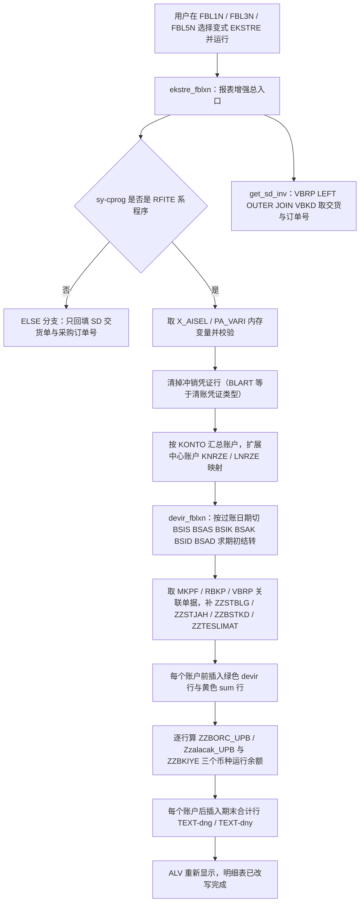
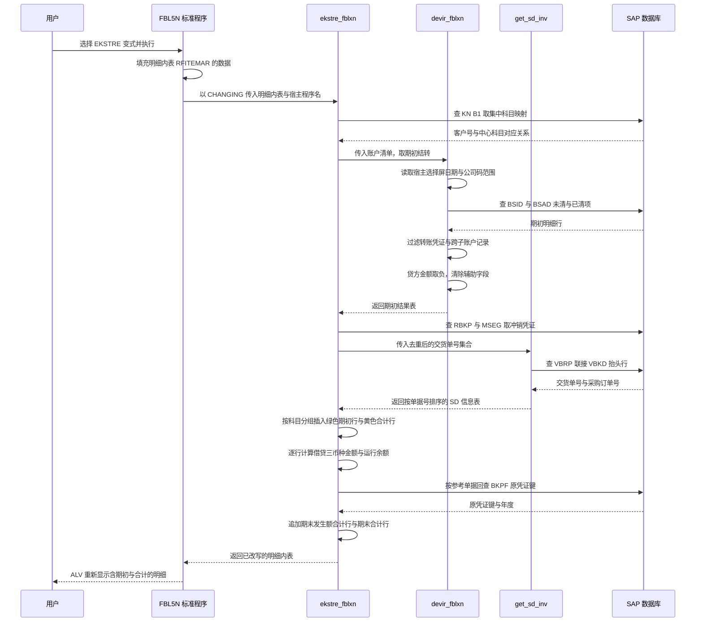

# ZCL_FI_TOOLKIT 分析报告

> 分析对象：`Keremkoseoglu/ABAP-Library — functional/fi/ZCL_FI_TOOLKIT.abap`（1702 行，`PUBLIC FINAL` 全局类，18 个公开类方法 + 1 个私有类方法）
> 报告视角：代码 onboarding 走读，按真实调用链展开

---

## 一、程序定位与业务背景

### 1.1 这套代码在解决什么问题

这不是一个报表，也不是一笔业务事务，而是一个 **FI（Financial Accounting）公共工具箱**：`ZCL_FI_TOOLKIT` 把 18 个互不相干、但都在标准 FI 流程里反复出现的"脏活"集中起来，让业务报表、用户扩展（user exit）、批处理程序都能调用同一份实现。

从业务视角看，它承担四类职责：

| 职责域 | 解决的问题 | 代表方法 |
|---|---|---|
| **报表增强（核心）** | FBL1N/FBL3N/FBL5N 明细清单报表天生看不到期初余额、看不到运行余额、看不到关联凭证与参考单号 | `ekstre_fblxn`、`devir_fblxn`、`get_sd_inv` |
| **主数据校验** | 银行 IBAN 在客户/供应商主数据里重复，导致电子支付打款失败 | `check_iban_duplicate`、`get_iban_codes` |
| **凭证上下文补全/写入** | 外部单据号（XBLNR）在 BKPF 里是空的，需要批量回填；客户希望从程序直接跳到凭证显示 | `get_bkpf_xblnr`、`update_xblnr`、`display_fi_doc_in_gui` |
| **批量过账与清账** | 没有可用 FM/BAPI 时，只能走 BDC 或 posting interface | `clear_customer_open_items`、`clear_vendor_open_items`、`denklestirerek_transfer_kaydi` |
| **零散原子工具** | 日期转换、公司全称、进口凭证类型、到期日、IFRS 豁免校验 | `convert_datum_to_gdatu`、`get_company_long_text`、`get_import_document_types`、`determine_due_date`、`validate_zhrtip` |

### 1.2 为什么"工具箱"本身就是个问题

FI 顾问每天要回答"这个客户为什么这个月余额不对"，答案往往落在行项目报表的空白里：标准 FBL5N 只显示**期间发生额**，期初结转（devir）需要自己去 BSID/BSAD 按过账日期切一张表；冲销凭证（Storno）还留在清单里；交货单号、采购订单号在 FI 侧根本不存在，得跨 MM/SD 表反查。这就是 `ekstre_fblxn` 存在的理由——它是土耳其本地 FI 团队为这些报表写的用户扩展增强，把期初、合计、关联单号全部塞回明细表里。

而"为什么是工具箱而不是多个专用类"？因为这些方法有一个共同特征：**调用方全是零散的用户扩展入口**（FBL1N 的 user exit、某个 Z 程序的批处理步骤、某个屏幕的校验）。把它们收敛到一个类里，好处是 SAP_LOC 找得到、权限对象统一；代价是这个类内部其实没有统一抽象，只是"按前缀 ZCL_FI_ 命名的一堆静态方法"。整体设计范式一句话定性：

> **面向"报表增强入口"的静态工具集合 —— 以内存内表改写（`it_rfposxext`）为主交付物的增强层，辅以若干直连标准 FM 与 BDC 的兜底实现。**

### 1.3 外部依赖清单（读代码前必须知道的地形）

```
Z 对象（客户自有）    ZCX_FI_IBAN / ZCX_FI_ZHRTIP / ZCX_BC_TABLE_CONTENT / ZCX_BC_CLASS_METHOD
                     ZCL_BC_BDC（BDC 封装，带 c_dismode_error 等常量）
                     ZFITT_IBAN_RNG / ZFITT_TIBAN（IBAN 结果结构）
                     ZQMTT_LIFNR / RANGE_KUNNR_TAB（范围类型）
                     ZFIT_ITH_BLART（进口凭证类型配置表）
                     ZFIT_IFRS_HARIC（IFRS 豁免公司码配置）
                     ZCL_FI_OMD（销售订单类别常量）、ZCL_FI_DOCUMENT_TYPE
                     ZFIS_ACCDOCUMENT_KEY
标准 FM/RFC          POSTING_INTERFACE_START / _CLEARING / _END
                     DETERMINE_DUE_DATE、CONVERSION_EXIT_INVDT_INPUT
                     J_1B_NFE_UPDATE_XBLNR（巴西本地化 FM 被挪用作 XBLNR 更新入口）
标准程序内部对象    (RFITEMAP)、(RFITEMGL)、(RFITEMAR)、(ZSDP_RFITEMAR)、(SAPLFI_ITEMS)
```

注意最后一行：**这个类通过 `ASSIGN ('(RFITEMAP)SO_BUDAT[]')` 直接读写标准报表的内存变量**。这是本程序一切风险的根源，也是它能做出标准报表做不到的事情的原因。

---

## 二、程序执行流程总览

本类没有统一的入口，所以"执行流程"要按调用场景拆。主场景是 **行项目报表增强**：用户在 SE16/FBL3N 打开明细清单 → 走变式 `EKSTRE` → 标准程序触发用户扩展 → 增强逻辑回写明细表 → ALV 重新显示。主链如下：



### 责任链表

| 子程序 | 调用者 | 职责 |
|---|---|---|
| `ekstre_fblxn` | FBL1N/FBL3N/FBL5N 用户扩展（`sy-cprog` = RFITEMAP/RFITEMGL/RFITEMAR/ZSDP_RFITEMAR） | 报表增强总控：冲销行剔除、期初/合计行插入、关联单据回填、运行余额计算 |
| `devir_fblxn` | `ekstre_fblxn` | 读明细行内变量（`SO_BUDAT`/`KD_BUKRS`/`SD_SAKNR`/`X_SHBV`/`X_APAR`），按截止日切 BS* 表求期初结转并汇总 |
| `get_sd_inv` | `ekstre_fblxn`（私有方法） | 批量取 SD 交货/订单信息，按 `AUBEL` 关联 `VBKD` 补 `BSTKD`，并给出交货单号 `VGBEL` |
| `check_iban_duplicate` | 自定义 IBAN 维护屏/用户扩展 | 校验客户与供应商的 IBAN 是否已被占用，冲突则抛 `ZCX_FI_IBAN` |
| `get_iban_codes` | `check_iban_duplicate`，也可独立调用 | 用 LFA1/LFBK/TIBAN、KNA1/LNBK/TIBAN 联查，返回已占用的 IBAN 记录 |
| `get_bkpf_xblnr` | 外部单据导入程序 | 按 BUKRS/BELNR/GJHR 从 BKPF 批量取 XBLNR，回填调用方内表 |
| `update_xblnr` | 外部单据导入程序 | 调 `J_1B_NFE_UPDATE_XBLNR` 把 XBLNR 写回 BKPF，可按单据分次提交 |
| `clear_customer_open_items` | 清账批处理/按钮逻辑 | 用 BDC 走 F-32 清客户未清项 |
| `clear_vendor_open_items` | 清账批处理/按钮逻辑 | 用 BDC 走 F-44 清供应商未清项 |
| `denklestirerek_transfer_kaydi` | 转记账（转账凭证）生成程序 | 用 posting interface 以 `UMBUCHNG` 过账类型写一张转账凭证 |
| `determine_due_date` | 付款条件相关用户扩展 | 从 BSEG 读 FAEDE 字段，调用标准 FM 算出 `NETDT` |
| `convert_datum_to_gdatu` | 任意报表/转换程序 | 把 `DATUM` 转成 `TCURR-GDATU`（财务年度串），带类级缓存 |
| `get_company_long_text` | ALV 打印/抬头生成 | 从 T001 + ADRC 取公司全称，带类级缓存 |
| `get_import_document_types` | 进口/过账程序 | 从 `ZFIT_ITH_BLART` 取 BLART 清单，可按境内/境外开关过滤 |
| `get_domestic_import_doc_types` | 同上 | 取"境内"进口凭证类型子集 |
| `validate_zhrtip` | FI 用户扩展（记账前校验） | 5/9 开头科目必须带指定业务类别码，不合规则抛 `ZCX_FI_ZHRTIP` |
| `display_fi_doc_in_gui` | 报表清单双击 | 填 SAP Memory 后 `CALL TRANSACTION 'FB03'` 跳凭证 |

下面按这条流程，逐个子程序展开。主链三个方法占本程序八成代码，先讲它们。

---

## 三、分组分析

### 3.1 类类型 类定义与全局声明区（全局声明区）

这个类的接口本身就是一份设计文档，先把它读透，后面所有方法都靠它。

#### ① 公共数据结构

```abap
  PUBLIC SECTION.

    TYPES:
      BEGIN OF t_documents ,
        bukrs TYPE bseg-bukrs,
        belnr TYPE bseg-belnr,
        gjahr TYPE bseg-gjahr,
        buzei TYPE bseg-buzei,
      END OF t_documents .
    TYPES:
      tt_documents TYPE STANDARD TABLE OF t_documents WITH DEFAULT KEY .
    TYPES:
      BEGIN OF ty_hesap,
        sube   TYPE rfposxext-konto,
        merkez TYPE rfposxext-konto,
      END OF ty_hesap .
    TYPES:
      tt_hesap TYPE STANDARD TABLE OF ty_hesap .

    TYPES:
      BEGIN OF ty_konto,
        bukrs TYPE bukrs,
        konto TYPE konto,
      END OF ty_konto .
    TYPES:
      BEGIN OF ty_devir_items,
        belnr TYPE belnr_d,
        gjahr TYPE gjahr,
        buzei TYPE buzei,
        bukrs TYPE bukrs,
        konto TYPE hkont,
        shkzg TYPE shkzg,
        dmshb TYPE dmbtr,
        dmbe2 TYPE dmbe2,
        dmbe3 TYPE dmbe3,
        umskz TYPE umskz,
        filkd TYPE filkd,
        wrbtr TYPE wrbtr,
        waers TYPE waers,
        gsber TYPE gsber,
      END OF ty_devir_items .
    TYPES:
      BEGIN OF ty_devir,
        bukrs TYPE bukrs,
        konto TYPE hkont,
        shkzg TYPE shkzg,
        dmshb TYPE dmbtr,
        dmbe2 TYPE dmbe2,
        dmbe3 TYPE dmbe3,
        umskz TYPE umskz,
        filkd TYPE filkd,
        wrbtr TYPE wrbtr,
        waers TYPE waers,
        gsber TYPE gsber,
      END OF ty_devir .
    TYPES:
      tt_devir TYPE STANDARD TABLE OF ty_devir .
    TYPES:
      BEGIN OF t_doc_xblnr,
        bukrs TYPE bkpf-bukrs,
        belnr TYPE bkpf-belnr,
        gjahr TYPE bkpf-gjahr,
        xblnr TYPE bkpf-xblnr,
      END OF t_doc_xblnr .
    TYPES:
      tt_doc_xblnr TYPE STANDARD TABLE OF t_doc_xblnr WITH DEFAULT KEY .
    TYPES:
      tt_blart TYPE HASHED TABLE OF blart WITH UNIQUE KEY primary_key COMPONENTS table_line .

    TYPES:
      BEGIN OF ty_mkpf_key,
        mblnr TYPE mkpf-mblnr,
        mjahr TYPE mkpf-mjahr,
      END OF ty_mkpf_key .
    TYPES:
      tt_mkpf_key TYPE TABLE OF ty_mkpf_key .

    TYPES: BEGIN OF ty_vbrk_key,
             vbeln TYPE vbrk-vbeln,
           END OF ty_vbrk_key,

           tt_vbrk_key TYPE TABLE OF ty_vbrk_key.
```

**做什么** — 声明了 6 组核心类型：`t_documents`（凭证行键，BSEG 四个字段）、`ty_hesap`（子账户 + 中心账户 `merkez`，字段类型取自 `rfposxext-konto`，说明设计目标就是往明细表里插行）、`ty_konto`（公司码 + 科目）、`ty_devir_items` / `ty_devir`（期初结转结构，3 个金额字段 `dmshb/dmbe2/dmbe3` + `wrbtr`）、`t_doc_xblnr`（BKPF 外键 + XBLNR）、`tt_blart`（哈希表，凭证类型去重）、以及三个批量取数的 key 结构（MKPF/RBKP/VBRK）。
**为什么** — 用 `WITH DEFAULT KEY` 的标准表保留 `INSERT ... INDEX n` 的定位插入能力（后面 devir 行就是靠 `lv_tabix` 插到当前行前面的）；`tt_blart` 用哈希唯一键是因为凭证类型集合要反复做 IN 判断；key 结构体（`ty_mkpf_key`）单独定义是为了避免直接 `SELECT *` 大表结构。
**风险与改进** — `ty_devir_items` 里定义了 `belnr/gjahr/buzei/bukrs` 等行级字段，但 SELECT 时这些字段取回来后立刻被 `CLEAR`，结构名 `items` 与实际用途（汇总）不符；真正的问题是 `tt_devir` 声明为 `STANDARD TABLE` 且无 key，而代码用 `COLLECT` 汇总（详见 3.3 与 3.2 的风险项）。建议改成 `SORTED TABLE ... WITH NON-UNIQUE KEY bukrs konto gsber waers`，让 `COLLECT` 真正去重。

#### ② 常量与类级缓存

```abap
    CONSTANTS c_borc TYPE shkzg VALUE 'S' ##NO_TEXT.
    CONSTANTS c_alacak TYPE shkzg VALUE 'H' ##NO_TEXT.
    CONSTANTS c_mal_hareketi TYPE awtyp VALUE 'MKPF' ##NO_TEXT.
    CONSTANTS c_satinalma_faturasi TYPE awtyp VALUE 'RMRP' ##NO_TEXT.
    CONSTANTS c_satis_faturasi TYPE awtyp VALUE 'VBRK' ##NO_TEXT.
    CONSTANTS c_musteri_hf_talebi TYPE auart VALUE 'ZAH1' ##NO_TEXT.
```

```abap
    PRIVATE SECTION.

    "...（此处省略 6 组私有类型声明：tt_dg_cache、tt_company_long_text、t_vbkd、
      tt_vbkd、t_rbkp、tt_rbkp、t_mseg、tt_mseg，模式与公开区一致）"
    CONSTANTS c_tabname_t001 TYPE tabname VALUE 'T001' ##NO_TEXT.
    CLASS-DATA gt_company_long_text TYPE tt_company_long_text .
    CLASS-DATA gt_dg_cache TYPE tt_dg_cache .
    CLASS-DATA gt_import_doc_type_cache TYPE tt_ith_blart .
```

**做什么** — 定义 4 个业务常量：`SHKZG` 的 `'S'`（借方）与 `'H'`（贷方，土耳其语 Sol/Haber 习惯）、参考凭证类型的 `AWTYP` 三值（`MKPF` 物料凭证、`RMRP` 采购发票、`VBRK` 销售发票）；私有区定义 3 个类级静态缓存：公司全称缓存、日期→GDATU 缓存、进口凭证类型缓存。
**为什么** — 用常量替代散落在代码里的字面量 `'S'`/`'H'`/`'MKPF'`，可读性远好于魔法值，`##NO_TEXT` 抑制 ATC 检查噪音；`CLASS-DATA` 做进程内缓存是这类"高频读、低频变"配置的正确姿势（T001、ZFIT_ITH_BLART 几乎不变，GDATU 转换是纯函数）。
**风险与改进** — `c_borc` 与 `c_musteri_hf_talebi` 定义后**全类未使用**（`c_borc` 只在声明处出现一次），`c_musteri_hf_talebi`（'ZAH1' 客户贷方通知单订单类型）显然是历史遗留；`gt_company_long_text` / `gt_import_doc_type_cache` 一旦装载就永不失效，公司改名或配置表调整后同一会话返回旧值，建议加一个 `RESET` 类方法或在报表变式变更时清空。

---

### 3.2 类方法 `ekstre_fblxn`

（方法 `ekstre_fblxn`）

这是全类最长的方法（约 530 行），分七步走完。

#### ① 识别宿主程序并取内表变量

```abap
    CHECK ct_items IS NOT INITIAL.
    CASE sy-cprog.
      WHEN 'RFITEMAP'."FBL1N
        ASSIGN ('(RFITEMAP)X_AISEL') TO FIELD-SYMBOL(<lv_x_aisel>).
        ASSIGN ('(RFITEMAP)PA_VARI') TO FIELD-SYMBOL(<lv_vari>).

      WHEN 'RFITEMGL'."FBL3N
        ASSIGN ('(RFITEMGL)X_AISEL') TO <lv_x_aisel>.
        ASSIGN ('(RFITEMGL)PA_VARI') TO <lv_vari>.

      WHEN 'RFITEMAR'."FBL5N
        ASSIGN ('(RFITEMAR)X_AISEL') TO <lv_x_aisel>.
        ASSIGN ('(RFITEMAR)PA_VARI') TO <lv_vari>.

      WHEN 'ZSDP_RFITEMAR'.
        ASSIGN ('(ZSDP_RFITEMAR)X_AISEL') TO <lv_x_aisel>.
        ASSIGN ('(ZSDP_RFITEMAR)PA_VARI') TO <lv_vari>.

      WHEN OTHERS.
        RETURN.

    ENDCASE.
```

**做什么** — 先判传入明细表非空，再按 `SY-CPROG` 分派到 FBL1N / FBL3N / FBL5N / ZSDP_FBL5N 四个宿主程序，各自用 `ASSIGN ('(程序名)变量')` 把宿主内存里的 `X_AISEL`（是否有选中行）与 `PA_VARI`（ALV 变式名）取成本地字段符号；`WHEN OTHERS: RETURN` 保证非报表上下文直接退出。
**为什么** — 用 `SY-CPROG` 而不是 `SY-TCODE` 判断，是因为同一个 FBL3N 可能被 `FBL1N`/`FBL3N`/`FSL1N` 等多个事务调用，而**内存变量名带程序前缀**（`(RFITEMGL)PA_VARI`），必须精确到程序级；`WHEN OTHERS RETURN` 是这类"寄生在别人程序里的代码"的必备护栏——被别的地方误调时静默返回，绝不污染数据。
**风险与改进** — 字段符号未做 `IS ASSIGNED` 检查就往下解引用（见下一步的守卫条件），一旦某个 `ASSIGN` 失败而另一个成功，`sy-subrc` 只反映最后一次 `ASSIGN`，判断不可靠；另外整套逻辑绑死在 SAP 标准内部变量名上，标准升级改名即失效，正确做法是把这段"宿主适配"抽成一个独立方法，后续逻辑只依赖本地字段符号。

#### ② 判断变式与选中行

```abap
    IF sy-subrc = 0 AND sy-cprog(5) = 'RFITE'.

      "--------->> add by mehmet sertkaya 27.05.2021 10:49:36
      LOOP AT ct_items ASSIGNING FIELD-SYMBOL(<ls_items>)
            WHERE zuonr(3) eq  zcl_fi_omd=>c_zuonr_sanal and
                  zzbstkd IS INITIAL.
           <ls_items>-zzbstkd = <ls_items>-zuonr.
      ENDLOOP.
      "-----------------------------<<
      IF <lv_vari> CS 'EKSTRE'.

        IF <lv_x_aisel> <> abap_true.
          MESSAGE TEXT-003 TYPE 'I'.
          RETURN.
        ENDIF.

        CALL FUNCTION 'SAPGUI_PROGRESS_INDICATOR' ##FM_SUBRC_OK
          EXPORTING
*           percentage =
            text   = TEXT-002
          EXCEPTIONS
            OTHERS = 1.
```

**做什么** — 进入守卫条件后，先给"贷方通知单行"（`ZUONR` 前三位等于销售订单类别常量）补 `ZZBSTKD`（采购订单号）；再判断当前 ALV 变式名是否包含 `'EKSTRE'`，若没有选中行则 `MESSAGE ... TYPE 'I'` 后退出；否则弹一条进度提示。
**为什么** — 变式名判断是这个增强的"总开关"：用户不改变式名就得不到期初/合计，符合"零侵入"原则；`X_AISEL` 判断避免用户在未选中任何行时白跑一遍全量 DB 查询；进度指示器是长报表的必要礼貌。
**风险与改进** — **这里有一个致命问题：`sy-cprog(5) = 'RFITE'` 取的是 `SY-CPROG` 第 5 位的 1 个字符，与 5 字面量 `'RFITE'` 比较时短的被空格补齐成 `'X    '`，永远不等于 `'RFITE'`——这个条件恒为假，整个 EKSTRE 分支（含期初、合计、关联单号、运行余额）在这份代码里从不执行，程序每次都走 ELSE 的简化路径。** 正确写法应是 `sy-cprog+4(5) = 'RFITE'`（对 `RFITEMAR` 与 `ZSDP_RFITEMAR` 同时成立）。另外 `sy-subrc = 0` 在这里没有意义（它来自步骤 ① 的最后一次 `ASSIGN`），`WHERE ... eq` 是 OpenSQL 风格混入内表条件，ABAP 内表 `WHERE` 规范写法是 `=`，两者混用会让读者误以为在写 SQL；`MESSAGE TEXT-003 TYPE 'I'` 放在类方法里会以 message 异常形式冒泡到调用方，调用方若在 `ENDTRY` 里没有 `CATCH cx_sy_message` 会变成短转储。

#### ③ 剔除清账凭证（HAR-10448）

```abap
        "-->> changed by mehmet sertkaya 21.07.2016 13:52:32
        " HAR-10448 - Müşteri Ekstresinde XX belge ters kaydı
*          delete ct_items where blart = 'XX' and gjahr ge '2016'.
        LOOP AT ct_items ASSIGNING <ls_items>
                    WHERE blart = zcl_fi_document_type=>get_customer_clearing_doc_type( ) AND
                          gjahr GE '2018'.
          DELETE ct_items WHERE belnr = <ls_items>-zzstblg AND gjahr = <ls_items>-zzstjah.
          DELETE ct_items.
        ENDLOOP.
        "-----------------------------<
```

**做什么** — 循环找出 2018 年起、客户清账凭证类型（ZFI 文档类型配置里的一类）的行，针对每一行找到它所冲销的原凭证（`ZZSTBLG`/`ZZSTJAH`），把原凭证行从明细表里删掉，最后还执行了一条 `DELETE ct_items`（删除整张表）。
**为什么** — 业务意图很清楚：客户清账凭证是对被清账凭证的镜像记录，明细清单里同时出现原凭证和清账凭证会导致用户看到的合计翻倍，所以只留清账凭证（HAR-10448 这个需求号也印证了这一点）。
**风险与改进** — **`DELETE ct_items.` 是整表删除，且发生在以 `ASSIGNING` 循环遍历该表的过程中**：执行后字段符号指向已被释放的行、循环条件在空表上重新判定后结束，整个报表会从"只删部分行"退化成"删光"。同时 `DELETE ct_items WHERE belnr = ... AND gjahr = ...` 按非键字段删，命中的是**所有账户**的所有该凭证行，范围远超"这一行的冲销对象"。应改为把待删行号先收集到一个索引内表，再在循环外 `DELETE ct_items` 逐行删除（或用 `SORT` + `DELETE ADJACENT` 配对删除），至少把 `DELETE ct_items.` 这条删掉。

#### ④ 账户清单与中心账户扩展

```abap
        DATA : lt_devir        TYPE TABLE OF ty_devir,
               lt_devir_sorted TYPE SORTED TABLE OF ty_devir
                               WITH NON-UNIQUE KEY bukrs konto,
               lv_konto_temp   TYPE hkont,
               lt_item_devir   TYPE it_rfposxext,
               lt_item_sum     TYPE it_rfposxext,
               ls_item_devir   TYPE LINE OF it_rfposxext,
               ls_item_sum     TYPE LINE OF it_rfposxext,
               ls_item_sum_    TYPE LINE OF it_rfposxext,
               lv_tabix        TYPE sy-tabix,
               ls_devir        TYPE ty_devir,
               ls_devir_merkez TYPE ty_devir,
               lt_mkpf_key     TYPE tt_mkpf_key,
               lt_rbkp_key     TYPE tt_rbkp_key,
               lt_rbkp         TYPE tt_rbkp,
               lt_vbrk_key     TYPE tt_vbrk_key,
               lv_awkey        TYPE awkey,
               lt_mseg         TYPE tt_mseg,
               lt_vbrp         TYPE tt_vbrp,
               ls_hesap        TYPE ty_hesap,
               lt_hesap        TYPE tt_hesap,
               lt_t001         TYPE SORTED TABLE OF t001 WITH UNIQUE KEY bukrs ##NEEDED,
               lt_konto        TYPE TABLE OF ty_konto,
               ls_konto        TYPE ty_konto,
               lc_green        TYPE col_item VALUE 'C51',
               lc_yellow       TYPE col_item VALUE 'C31'.

        LOOP AT ct_items ASSIGNING <ls_items>.
          CLEAR ls_hesap.
          ls_hesap-sube = <ls_items>-konto.
          COLLECT ls_hesap INTO lt_hesap.
          ls_konto-bukrs = <ls_items>-bukrs.
          ls_konto-konto = <ls_items>-konto.
          COLLECT ls_konto INTO lt_konto.
        ENDLOOP.
        ASSIGN  ('(SAPLFI_ITEMS)GB_CENTRAL_ITEMS') TO FIELD-SYMBOL(<lv_merkez>).
        IF sy-subrc = 0.
          IF <lv_merkez> = abap_true.
            CASE sy-cprog.
              WHEN 'RFITEMAR' OR 'ZSDP_RFITEMAR'.
                SELECT bukrs, kunnr, knrze INTO TABLE @DATA(lt_knb1) FROM knb1
                    FOR ALL ENTRIES IN @lt_hesap
                    WHERE kunnr = @lt_hesap-sube AND
                          knrze <> @space.
                SORT lt_knb1 BY bukrs kunnr.
                LOOP AT lt_knb1 ASSIGNING FIELD-SYMBOL(<ls_knb1>).
                  ls_hesap-sube = <ls_knb1>-kunnr.
                  ls_hesap-merkez = <ls_knb1>-knrze.
                  COLLECT ls_hesap INTO lt_hesap.
                ENDLOOP.

              WHEN 'RFITEMAP'.

                SELECT bukrs, lifnr, lnrze INTO TABLE @DATA(lt_lfb1) FROM lfb1
                    FOR ALL ENTRIES IN @lt_hesap
                    WHERE lifnr = @lt_hesap-sube AND
                          lnrze <> @space.
                SORT lt_lfb1 BY bukrs lifnr.
                LOOP AT lt_lfb1 ASSIGNING FIELD-SYMBOL(<ls_lfb1>).
                  ls_hesap-sube   = <ls_lfb1>-lifnr.
                  ls_hesap-merkez = <ls_lfb1>-lnrze.
                  COLLECT ls_hesap INTO lt_hesap.
                ENDLOOP.

            ENDCASE.
          ENDIF.
        ENDIF.
        SELECT * FROM t001  INTO TABLE lt_t001.
```

**做什么** — 声明本方法的全部工作区；扫描明细表收集去重后的账户清单 `lt_kono` 与「子账户」清单 `lt_hesap`；再从 `SAPLFI_ITEMS` 的全局标志 `GB_CENTRAL_ITEMS` 读"是否集中显示中心账户"，若为真则按程序类型从 `KNB1`（客户集中科目 `KNRZE`）或 `LFB1`（供应商集中科目 `LNRZE`）把子账户与中心账户配成对，塞回 `lt_hesap`；最后无条件 `SELECT * FROM t001`。
**为什么** — 收集账户清单是后面两件事的前提：一是期初必须按账户批量取（`FOR ALL ENTRIES` 而不是逐行查 BSIx），二是插入合计行时要按账户分组。`GB_CENTRAL_ITEMS` 的存在说明标准报表支持"一个中心科目 + 多个子科目"的展示模式，此时期初要同时看子科目和中心科目，否则会重复或漏计；`KNRZE <> @space` 排除未设集中科目的客户，避免生成空 `merkez` 配对。
**风险与改进** — `SELECT * FROM t001 INTO TABLE lt_t001.` 之后 `lt_t001` **从未被读取**（全类只有声明与这一处 SELECT 两处出现），是一次把全公司码表读进内存的死代码，`##NEEDED` pragma 正是为了压掉警告，应直接删除。另外 `COLLECT ls_kono INTO lt_konto` 中结构 `ty_konto` 无 key、目标是标准表，`COLLECT` 实际等价 `APPEND`；由于 `ct_items` 已按 konto/budat 排序，账户重复度极高，这里应改为 `lt_konto` 声明为 `SORTED ... WITH UNIQUE KEY bukrs konto` 后用 `INSERT ... TABLE`，否则后面步骤 ⑦ 的"每个账户一次"循环会按明细行数重复执行。

#### ⑤ 取期初结转（调用 `devir_fblxn`）并释放内存

```abap
        zcl_fi_toolkit=>devir_fblxn(
                    EXPORTING it_hesap = lt_hesap
                    IMPORTING et_devir = lt_devir
                                             ).
        SORT lt_devir BY bukrs konto gsber.
        lt_devir_sorted = lt_devir.

        FREE  : lt_devir,lt_hesap.
```

**做什么** — 把账户清单交给 `devir_fblxn` 算期初结转，结果 `lt_devir` 按 BUKRS/KONTO/GSBER 排序后转成二级键排序表 `lt_devir_sorted`，随后立即 `FREE` 掉标准表和已用完的 `lt_hesap`。
**为什么** — 转排序表的意图是让步骤 ⑥ 的 `LOOP AT ... WHERE bukrs = ... AND konto = ...` 和后面的 `READ ... BINARY SEARCH` 走二分查找，而不是每次全表扫；`SORT` + 二级键转换 + `READ WITH KEY BINARY SEARCH` 是 ABAP 里的标准手法；及时 `FREE` 大内表在高并发报表场景能显著压低内存峰值，这个细节说明作者有内存意识。
**风险与改进** — `FREE : lt_devir, lt_hesap.` 之后 `lt_hesap` 在方法后续步骤里不再被读，但 `lt_knb1`/`lt_lfb1` 这两张表在步骤 ⑦ 里还要 `READ ... BINARY SEARCH`，它们**只在 `GB_CENTRAL_ITEMS = 'X'` 且走对应 `CASE` 分支时才会被填充**——目前有 `<lv_merkez> IS ASSIGNED` + `= abap_true` + `CASE` 三重保护，逻辑上安全；但一旦以后有人在 `CASE` 外加一处读取，就会命中未初始化的空表。建议把这三张辅助表和 `lt_knb1/lt_lfb1` 的生命周期在注释里写清楚。

#### ⑥ 批量取关联单据并回填 ZZ 字段

```abap
        LOOP AT ct_items ASSIGNING <ls_items>
           WHERE zzawtyp = c_mal_hareketi OR zzawtyp =  c_satinalma_faturasi
               OR  zzawtyp =  c_satis_faturasi.
          IF <ls_items>-zzawtyp = c_mal_hareketi.
            APPEND VALUE #( mblnr = <ls_items>-zzawkey(10)
                            mjahr = <ls_items>-zzawkey+10(4)
                           ) TO lt_mkpf_key.
          ELSEIF <ls_items>-zzawtyp = c_satinalma_faturasi.
            APPEND VALUE #( belnr = <ls_items>-zzawkey(10)
                            gjahr = <ls_items>-zzawkey+10(4)
                           ) TO lt_rbkp_key.
          ELSEIF <ls_items>-zzawtyp = c_satis_faturasi.
            APPEND <ls_items>-zzawkey(10) TO lt_vbrk_key.
          ENDIF.
        ENDLOOP.

        SORT lt_rbkp_key BY belnr gjahr.
        SORT lt_mkpf_key BY mblnr mjahr.
        SORT lt_vbrk_key BY vbeln.
        DELETE ADJACENT DUPLICATES FROM lt_mkpf_key COMPARING mblnr mjahr.
        DELETE ADJACENT DUPLICATES FROM lt_rbkp_key COMPARING belnr gjahr.
        DELETE ADJACENT DUPLICATES FROM lt_vbrk_key COMPARING vbeln.

        IF lt_rbkp_key IS NOT INITIAL.

          SELECT belnr, gjahr, stblg, stjah
            FROM rbkp
            FOR ALL ENTRIES IN @lt_rbkp_key
            WHERE
              belnr = @lt_rbkp_key-belnr AND
              gjahr = @lt_rbkp_key-gjahr
            INTO CORRESPONDING FIELDS OF TABLE @lt_rbkp.

          FREE lt_rbkp_key.
        ENDIF.

* ters kayıt olanların m.b. sini bul
        IF lt_mkpf_key IS NOT INITIAL.
          SELECT mblnr, mjahr, smbln, sjahr
            FROM mseg
            FOR ALL ENTRIES IN @lt_mkpf_key
            WHERE
              mblnr = @lt_mkpf_key-mblnr AND
              mjahr = @lt_mkpf_key-mjahr
            INTO CORRESPONDING FIELDS OF TABLE @lt_mseg.
          FREE lt_mkpf_key.
* ters kayıt olanların m.b. sini bul
        ENDIF.
        IF lt_vbrk_key[] IS NOT INITIAL.
          lt_vbrp = get_sd_inv( lt_vbrk_key ).
          FREE lt_vbrk_key.
* ters kayıt olanların m.b. sini bul
        ENDIF.
```

**做什么** — 扫明细表，把三种 `ZZAWTYP` 的参考凭证号 `ZZAWKEY` 拆开：前 10 位是凭证号、后 4 位是年度（`ZZAWKEY+10(4)` 是财务年度偏移写法），分别堆进 `lt_mkpf_key`/`lt_rbkp_key`/`lt_vbrk_key`；三张 key 表各自排序去重；然后分别在 `IF ... IS NOT INITIAL` 保护下用 `FOR ALL ENTRIES` 批量查 `RBKP`（采购发票的冲销凭证 STBLG/STJAH）与 `MSEG`（物料凭证的冲销凭证 SMBLN/SJAH），销售发票走私有方法 `get_sd_inv`。
**为什么** — 这是标准报表性能优化的教科书写法：`ZZAWKEY` 在明细表里会重复成百上千次，先在内存里去重再查库，能把几万行明细压成几十个 DB 命中；`ZZAWKEY+10(4)` 避免了两条 `READ` 循环；每张 key 表用完立刻 `FREE`，把内存峰值压在"一次只处理一种单据类型"。
**风险与改进** — 三处 `IF ... IS NOT INITIAL` 的保护写得很规范，但它们**只防住了空表，没防住"区间语义"**：如果 key 表里出现 `mblnr = 0000000000 / mjahr = 0000` 这类全零记录（`ZZAWKEY` 为空的行恰好满足筛选条件时会进来），`FOR ALL ENTRIES` 会退化成近似全表扫描；建议收集 key 时加 `IF <ls_items>-zzawkey IS NOT INITIAL` 过滤。另外 `RBKP`/`MSEG` 的 `FOR ALL ENTRIES` 写法与教科书建议的"哈希内表 + FAE"不同——这里 key 表是标准表，FAE 会对每一行做一次带三字段等值判断的 DB 命中，行数大时仍偏慢，改成哈希表或 `SELECT ... WHERE (belnr,gjahr) IN lt` 会更好。

#### ⑦ 逐行回填关联单据与运行余额

```abap
        SORT ct_items BY konto budat ASCENDING.

        LOOP AT ct_items ASSIGNING <ls_items>.
          lv_tabix = sy-tabix.

*  test kayıt belgesi
          IF <ls_items>-zzawtyp = c_mal_hareketi.
            READ TABLE lt_mseg WITH TABLE KEY mblnr = <ls_items>-zzawkey(10)
                                              mjahr = CONV #( <ls_items>-zzawkey+10(4) )
                                              ASSIGNING FIELD-SYMBOL(<ls_mseg>).
            IF sy-subrc = 0.
* mb 'nin ters kaydınınn faturası
* bu case çok az olacağını için direk bkpf 'e gidildi.
              CLEAR lv_awkey.
              IF <ls_mseg>-smbln IS  NOT INITIAL.
                lv_awkey = |{ <ls_mseg>-smbln }{ <ls_mseg>-sjahr }|.
              ELSE.
                READ TABLE lt_mseg WITH KEY smbln = <ls_mseg>-mblnr
                                            sjahr = <ls_mseg>-mjahr
                                            ASSIGNING <ls_mseg>.

                IF sy-subrc = 0.
                  lv_awkey = |{ <ls_mseg>-mblnr }{ <ls_mseg>-mjahr }|.
                ENDIF.
              ENDIF.

            ENDIF.

          ELSEIF <ls_items>-zzawtyp = c_satinalma_faturasi.
            READ TABLE lt_rbkp WITH TABLE KEY belnr = <ls_items>-zzawkey(10)
                                              gjahr = CONV #( <ls_items>-zzawkey+10(4) )
                                              ASSIGNING FIELD-SYMBOL(<ls_rbkp>).
            IF sy-subrc = 0.
              CLEAR lv_awkey.
              IF <ls_rbkp>-stblg IS  NOT INITIAL.
                lv_awkey = |{ <ls_rbkp>-stblg }{ <ls_rbkp>-stjah }|.
              ELSE.
                READ TABLE lt_rbkp WITH KEY stblg = <ls_rbkp>-belnr
                                            stjah = <ls_rbkp>-gjahr
                                            ASSIGNING <ls_rbkp>.

                IF sy-subrc = 0.
                  lv_awkey = |{ <ls_rbkp>-belnr }{ <ls_rbkp>-gjahr }|.
                ENDIF.
              ENDIF.

            ENDIF.
          ELSEIF <ls_items>-zzawtyp = c_satis_faturasi.
            READ TABLE lt_vbrp WITH TABLE KEY vbeln = <ls_items>-zzawkey(10)
                                        ASSIGNING FIELD-SYMBOL(<ls_vbrp>).
            IF sy-subrc = 0.
              IF <ls_vbrp>-vgtyp = 'J' OR <ls_vbrp>-vgtyp = 'T'.
                <ls_items>-zzteslimat = <ls_vbrp>-vgbel.
              ENDIF.
              <ls_items>-zzbstkd = <ls_vbrp>-bstkd.
            ENDIF.
          ENDIF.

          IF lv_awkey IS  NOT INITIAL.
            SELECT SINGLE belnr INTO <ls_items>-zzstblg FROM bkpf
                          WHERE awtyp = <ls_items>-zzawtyp AND
                                awkey = lv_awkey
                          ##WARN_OK .                   "#EC CI_NOORDER
            IF sy-subrc = 0.
              <ls_items>-zzstjah = <ls_items>-gjahr.
            ENDIF.
          ENDIF
```

**做什么** — 再次按账户+日期排序后逐行处理：物料凭证行读 `lt_mseg` 找冲销凭证号，拼成 `AWKEY`（凭证号+年度）后回查 `BKPF` 得到原凭证 `ZZSTBLG/ZZSTJAH`；采购发票行对 `RBKP` 做同样处理；销售发票行从 `lt_vbrp` 取交货单号 `VGBEL`（`VGTYP` 为 `J` 或 `T` 时）与采购订单号 `BSTKD`。
**为什么** — 用内存表查替代逐行 `SELECT`，把 N 次 DB 命中降到 1 次；`lv_awkey = |{...}{...}|` 用字符串模板拼 14 位 AWKEY，比 `CONCATENATE` 可读得多；注释说"这个 case 很少出现，所以直接查 BKPF"，说明作者对数据分布做过判断，属于有意识的性能取舍。
**风险与改进** — **这里有一个隐蔽的串号 bug：`lv_awkey` 是方法级变量，只有 `MKPF` 与 `RMRP` 两个分支在处理前 `CLEAR`，`VBRK` 分支既不清也不设。** 当一行销售发票紧跟在一行已找到冲销凭证的物料/采购发票之后时，`lv_awkey` 仍保留上一行的凭证号，随后 `WHERE awtyp = 'VBRK' AND awkey = <上一行的值>` 会误命中另一张单据，把错误的 `ZZSTBLG/ZZSTJAH` 写到这行上——用户点进去看到的是完全无关的凭证。修法是把 `CLEAR lv_awkey.` 提到 `IF/ELSEIF` 链之前（每个循环迭代清一次）。另外 `SELECT SINGLE ... INTO <ls_items>-zzstblg` 直接写字段符号、且带 `##WARN_OK` 与 `#EC CI_NOORDER` 抑制注释——`AWKEY` 无索引，一次 N 行循环就是 N 次全表扫（BKPF 百万级），这里是本方法最大的性能隐患，应改成先收集 `awkey` 集合、`FOR ALL ENTRIES` 一次批量查回 `BKPF`。

```abap
          IF lv_konto_temp IS INITIAL OR
             lv_konto_temp <> <ls_items>-konto.
* Devir kalemini ekle
            CLEAR : ls_devir,ls_devir_merkez.

            LOOP AT lt_devir_sorted INTO ls_devir
              WHERE bukrs = <ls_items>-bukrs
                AND konto = <ls_items>-konto.
```

**做什么** — 用 `lv_konto_temp` 记住上一个处理的科目，只有进入新科目时才开启"期初块"逻辑；对新科目，在二级排序表 `lt_devir_sorted` 里按 `BUKRS`/`KONTO` 循环过滤，取出来的每一行覆盖同一个工作区 `ls_devir`。
**为什么** — 因为 `ct_items` 已按 konto 排序，"换科目"是一个廉价可判的边界，不必再做一次集合比较；这个"每账户插入一次"的设计让期初行只出现在账户块的开头，符合会计阅读习惯。
**风险与改进** — **`LOOP ... INTO ls_devir` 循环结束后，代码继续用 `ls_devir` 做加减与 MOVE-CORRESPONDING，等于只用了该账户期初的"最后一行"金额。** 由于 `devir_fblxn` 的 `COLLECT` 对标准表不做去重（见 3.3），`lt_devir` 里其实是一张未清项逐行明细表；一个账户有 5 张未清发票时，期初只会取到排序后的最后一张，**期初余额被严重低估**——这会直接污染后面 `ZZBKIYE_UPB` 的运行余额。正确做法是像中心账户那段一样在循环内 `ADD`，或在 `devir_fblxn` 里用带 key 的排序表让 `COLLECT` 真正汇总。另外 `lv_konto_temp` 只比较 `KONTO` 不比较 `BUKRS`/`GSBER`，跨公司码出现同一科目号时，第二个公司码拿不到期初行。

```abap
              IF <lv_merkez> IS ASSIGNED.
                IF <lv_merkez> = abap_true.
                  CASE sy-cprog.
                    WHEN 'RFITEMAP'.
                      READ TABLE lt_lfb1 ASSIGNING <ls_lfb1>
                                         WITH KEY bukrs = <ls_items>-bukrs
                                                  lifnr = <ls_items>-konto BINARY SEARCH.
                      IF sy-subrc = 0.
                        LOOP AT lt_devir_sorted ASSIGNING FIELD-SYMBOL(<lfs_devir_sorted_lnrze>)
                                                WHERE bukrs = <ls_items>-bukrs
                                                  AND konto = <ls_lfb1>-lnrze.
                          ADD <lfs_devir_sorted_lnrze>-dmshb TO ls_devir_merkez-dmshb.
                          ADD <lfs_devir_sorted_lnrze>-dmbe2 TO ls_devir_merkez-dmbe2.
                          ADD <lfs_devir_sorted_lnrze>-dmbe3 TO ls_devir_merkez-dmbe3.
                          ADD <lfs_devir_sorted_lnrze>-wrbtr TO ls_devir_merkez-wrbtr.
                        ENDLOOP.
                      ENDIF;
```

**做什么** — 若报表处于集中账户模式，按程序类型找到当前子账户对应的中心科目（`LNRZE`/`KNRZE`），再把中心科目的期初四个金额字段全部 `ADD` 到 `ls_devir_merkez` 里累加。
**为什么** — 集中账户模式下同一笔业务在中心科目上还有一条汇总记录，用户要求的是"子账户 + 中心账户"合看的期初；这里用 `ADD` 而不是 `APPEND`/`COLLECT` 是**正确**的汇总语义，也是本方法里唯一写对了汇总的地方——可作为 `ls_devir` 那段的修复模板。
**风险与改进** — `IF sy-subrc = 0` 后面紧跟一个多余的 `ENDIF;`（带分号的 `ENDIF` 是合法的，但与代码库里其他 `ENDIF.` 风格不一致）；`lt_lfb1`/`lt_knb1` 是用 `SORT` 而不是带键排序表组织的，二分查找依赖"当前排序正好是 `BUKRS LIFNR`"这一隐式约定，一旦有人在两步之间插入别的 `SORT` 或追加行，二分查找会静默返回错误行。建议改声明为 `SORTED TABLE ... WITH UNIQUE KEY bukrs lifnr`。

```abap
              CLEAR ls_item_devir.
              IF ls_devir-bukrs IS INITIAL.
                MOVE-CORRESPONDING ls_devir_merkez TO ls_item_devir  ##ENH_OK.
                ls_item_devir-wrshb =  ls_devir_merkez-wrbtr.
                ls_item_devir-waers =  ls_devir_merkez-waers.
              ELSE.
                ADD ls_devir_merkez-dmshb TO ls_devir-dmshb.
                ADD ls_devir_merkez-dmbe2 TO ls_devir-dmbe2.
                ADD ls_devir_merkez-dmbe3 TO ls_devir-dmbe3.
                ADD ls_devir_merkez-wrbtr TO ls_devir-wrbtr.

                MOVE-CORRESPONDING ls_devir TO ls_item_devir  ##ENH_OK.
                ls_item_devir-wrshb =  ls_devir-wrbtr.
                ls_item_devir-waers =  ls_devir-waers.

              ENDIF.

              ls_item_devir-zzname1_ku = <ls_items>-zzname1_ku.
              ls_item_devir-zzname1_li = <ls_items>-zzname1_li.
              ls_item_devir-konto = <ls_items>-konto.
              ls_item_devir-zuonr = TEXT-dvg.
              ls_item_devir-u_bktxt =  ls_item_devir-sgtxt  = |{ TEXT-004 }({ <ls_items>-konto })|.
              ls_item_devir-hwaer = <ls_items>-hwaer.
              ls_item_devir-hwae2 = <ls_items>-hwae2.
              ls_item_devir-hwae3 = <ls_items>-hwae3.
              IF ls_item_devir-dmshb LT 0.
                ls_item_devir-zzalacak_upb = ls_item_devir-dmshb * -1.
                ls_item_devir-zzalacak_2pb = ls_item_devir-dmbe2 * -1.
                ls_item_devir-zzalacak_3pb = ls_item_devir-dmbe3 * -1.
              ELSE.
                ls_item_devir-zzborc_upb = ls_item_devir-dmshb.
                ls_item_devir-zzborc_2pb = ls_item_devir-dmbe2.
                ls_item_devir-zzborc_3pb = ls_item_devir-dmbe3.
              ENDIF.
              ls_item_devir-bukrs = <ls_items>-bukrs.
              ls_item_devir-konto = <ls_items>-konto.
              ls_item_devir-color = lc_green.

              COLLECT ls_item_devir INTO lt_item_devir.
```

**做什么** — 把子账户期初（`ls_devir`）与中心账户期初（`ls_devir_merkez`）合并成一条"明细表行"：无子账户期初时只用中心账户，有则两者相加；把金额按正负分流到自定义的借方/贷方列 `ZZBORC_UPB` / `ZZALACAK_UPB`（含 2、3 号币种两列），把三个报表币种 `HWAER/HWAE2/HWAE3` 从当前明细行抄过来，`COLOR` 设成绿色 `C51` 标记为人工插入行，最后 `COLLECT` 进 `lt_item_devir`。
**为什么** — 借/贷分列而不是靠 `SHKZG` 显示，是土耳其报表的法定格式要求（`S`/`H` 两栏必须都能看到金额）；期初为负（贷方余额）时把符号翻过来放进贷方列，和标准明细行的处理保持一致；绿色底色让用户一眼区分系统行与增强插入行，是报表增强的常见 UX 约定。
**风险与改进** — `COLLECT ls_item_devir INTO lt_item_devir` 的目标类型是 `it_rfposxext`（标准结构，标准键 = 全部字段），因此**只有所有字段都相同才算同一行**，等于完全不聚合，还白白付一次全字段比较的开销；若目标是"每个账户一条期初行"，应直接 `APPEND`。`ls_item_devir-zzalacak_upb = dmshb * -1` 里 `DM2HB` 复用了本地货币字段而非文档货币，语义上 `DMSHB` 已是本币金额，这里没错，但三个币种列（`_upb/_2pb/_3pb`）在期初行上直接取 `DMSHB/DMBE2/DMBE3`（本地/文档/交易货币），而期间明细行的同名列取的是 `DMSHB` 三个币种——**期初行与明细行的币种口径不一致**，一旦客户同时用多种币种，报表上"期末 = 期初 + 发生额"在币种维度对不上，需要在注释里固化口径或统一改用折算金额。

```abap
              CLEAR ls_item_sum.
              ls_item_sum-wrshb = ls_item_devir-wrshb.
              ls_item_sum-waers = ls_item_devir-waers.
              ls_item_sum-dmshb = ls_item_devir-dmshb.
              ls_item_sum-hwaer = ls_item_devir-hwaer.
              ls_item_sum_-hwaer = ls_item_sum-hwaer.

              ADD ls_item_sum-dmshb TO ls_item_sum_-dmshb.

              ls_item_sum-color = lc_yellow.
*              collect ls_item_sum into lt_item_sum_top."kullanılmıyor
            ENDLOOP.
            IF sy-subrc <> 0.
* devir yoksa boş devir yazısı yazalım.
              CLEAR ls_item_devir.
              ls_item_devir-bukrs = <ls_items>-bukrs.
              ls_item_devir-konto = <ls_items>-konto.
              ls_item_devir-zuonr = TEXT-dvg.
              ls_item_devir-color = lc_green.
              ls_item_devir-zzname1_ku = <ls_items>-zzname1_ku.
              ls_item_devir-zzname1_li = <ls_items>-zzname1_li.
              ls_item_devir-u_bktxt =  ls_item_devir-sgtxt  = |{ TEXT-004 }({ <ls_items>-konto })|.
              INSERT ls_item_devir INTO ct_items INDEX lv_tabix.

              ls_item_sum_-bukrs = <ls_items>-bukrs.
              ls_item_sum_-konto = <ls_items>-konto.
              ls_item_sum_-zzname1_ku = <ls_items>-zzname1_ku.
              ls_item_sum_-zzname1_li = <ls_items>-zzname1_li.
              ls_item_sum_-zuonr = TEXT-dvy.
              ls_item_sum_-color = lc_yellow.
              ls_item_sum_-u_bktxt =  ls_item_sum_-sgtxt  = |{ TEXT-004 }({ <ls_items>-konto })|.
              INSERT ls_item_sum_ INTO ct_items INDEX lv_tabix + 1.


            ELSE.
```

**做什么** — 循环体内顺手算好黄色合计行 `ls_item_sum_` 的字段（币种、金额、报表币种、借方）。循环结束后用残留的 `sy-subrc` 判断"该账户是否有期初"：没有（`sy-subrc <> 0`）就往明细表插入一条**空的绿色 devir 行**加一条**黄色合计行**；有则走 `ELSE` 分支。
**为什么** — 即使账户期初为零行，也要显示"期初 0.00"和"期初合计"，否则用户在多账户报表里无法区分"期初为零"和"这段增强没生效"——这是很地道的业务诉求（对账场景必须逐账户对齐）。`INSERT ... INDEX lv_tabix` 把行插到当前明细行之前，使期初行成为账户块的第一行。
**风险与改进** — **`sy-subrc` 被当作"是否找到期初行"的标志使用非常脆弱**：它既可能来自 `LOOP` 未执行，也可能是循环内某次 `READ TABLE` 的残留值；这里恰好因为 `LOOP` 是循环体的最后一条语句才勉强成立，一旦有人在循环后再加一条 SQL 读语句（例如上面就有 `SELECT SINGLE belnr INTO ... FROM bkpf` 在同层），判断就会错位。应改用一个显式布尔标志或 `READ TABLE lt_devir_sorted ...` 的明确结果。`lv_tabix + 1` 的第二次 `INSERT` 是"插在当前行前面"，第一次插了 1 行后当前行下移，所以 `lv_tabix + 1` 恰好落在 devir 行之后——这个算术依赖插入语义，可读性差，建议先用 `lv_tabix` 插入后 `lv_tabix = lv_tabix + 1` 显式递增。另外变量命名 `ls_item_sum_`（结尾下划线）与 `ls_item_sum` 的差异只有下划线，阅读时极易看错，建议改名 `ls_item_sum_total`。

```abap
              ls_item_sum_-bukrs = <ls_items>-bukrs.
              ls_item_sum_-konto = <ls_items>-konto.
              ls_item_sum_-zzname1_ku = <ls_items>-zzname1_ku.
              ls_item_sum_-zzname1_li = <ls_items>-zzname1_li.
              ls_item_sum_-zuonr = TEXT-dvy.
              ls_item_sum_-color = lc_yellow.

              IF ls_item_sum_-dmshb LT 0.
                ls_item_sum_-zzalacak_upb = ls_item_sum_-dmshb.
              ELSE.
                ls_item_sum_-zzborc_upb = ls_item_sum_-dmshb.
              ENDIF

              ls_item_sum_-u_bktxt =  ls_item_sum_-sgtxt  = |{ TEXT-004 }({ <ls_items>-konto })|.
              ls_item_devir = ls_item_sum_.
              APPEND ls_item_sum_ TO lt_item_devir.
              INSERT LINES OF lt_item_devir INTO ct_items INDEX lv_tabix.
              FREE lt_item_devir.
            ENDIF.
            CLEAR ls_item_sum_.

          ENDIF.

          IF <ls_items>-shkzg = c_alacak.
            <ls_items>-zzalacak_upb = <ls_items>-dmshb * -1.
            <ls_items>-zzalacak_2pb = <ls_items>-dmbe2 * -1.
            <ls_items>-zzalacak_3pb = <ls_items>-dmbe3 * -1.
          ELSE.
            <ls_items>-zzborc_upb = <ls_items>-dmshb.
            <ls_items>-zzborc_2pb = <ls_items>-dmbe2.
            <ls_items>-zzborc_3pb = <ls_items>-dmbe3.
          ENDIF.

          <ls_items>-zzbakiye_upb =  ls_item_devir-dmshb =
                                     ls_item_devir-dmshb +
                                     <ls_items>-dmshb.

          <ls_items>-zzbakiye_2pb =  ls_item_devir-dmbe2 =
                                     ls_item_devir-dmbe2 +
                                     <ls_items>-dmbe2.

          <ls_items>-zzbakiye_3pb =  ls_item_devir-dmbe3 =
                                     ls_item_devir-dmbe3 +
                                     <ls_items>-dmbe3.


          lv_konto_temp = <ls_items>-konto.


        ENDLOOP.

        FREE : lt_mseg,lt_vbrp,lt_rbkp.
```

**做什么** — 有期初的分支把黄色合计行整行插入；随后对每一条原始明细行按 `SHKZG` 分流借贷三币种金额，并把**运行余额**写进 `ZZBAKIYE_UPB/_2PB/_3PB`（借方赋值，同时把结果回写进 `ls_item_devir`，供下一行累加）；最后记住科目、释放辅助内表。
**为什么** — 用 `ls_item_devir-dmshb` 同时充当"累加器"和"上一行余额"是一个巧省变量的写法：本行余额 = 上行余额 + 本行金额，链式滚动，天然保证余额列单调可读；借贷分列与期初行口径一致。
**风险与改进** — 借贷分流这里漏了 `* -1`：`ZZALACAK_UPB = DMSHB * -1` 得到的是**正数**（因为贷方行 `DMSHB` 本身为负，翻正），与期初行的处理一致，这点没问题；但运行余额 `ZZBAKIYE_UPB` 直接用了 `DMSHB` 的带符号值，而 `_2PB/_3PB` 用 `DM2BE/DM3BE` 同理——三个币种的余额列如果混了不同币种的用户习惯（例如本地币余额 + 外币原值），报表会给出无法相加的"余额"，需要在表头注明币种或统一折算到报表币种。另外 `INSERT LINES OF ... INTO ct_items INDEX lv_tabix` 会把整个 `lt_item_devir` 插到当前行前，而 `lt_item_devir` 是跨账户复用的缓冲（本轮 `APPEND` 后又 `FREE`），这个"用完即清"是对的，但依赖 `COLLECT` 不生效这一点才没出错，属于**错误被巧合掩盖**。

```abap
* dönem sonu bakiyeleri ekle
        LOOP AT lt_konto INTO ls_konto.
          REFRESH lt_item_sum.
          CLEAR ls_item_sum.
          CLEAR ls_item_sum_.
          LOOP AT ct_items ASSIGNING <ls_items>
            WHERE bukrs = ls_konto-bukrs
              AND konto = ls_konto-konto.
            lv_tabix = sy-tabix.
            CHECK <ls_items>-color <> lc_yellow.
            CHECK <ls_items>-hwaer IS NOT INITIAL.
            ls_item_sum-bukrs = <ls_items>-bukrs.
            ls_item_sum-konto = <ls_items>-konto.
            ls_item_sum-gsber = <ls_items>-gsber.
            ls_item_sum-wrshb = <ls_items>-wrshb.
            ls_item_sum-waers = <ls_items>-waers.
            ls_item_sum-dmshb = <ls_items>-dmshb.
            ls_item_sum-hwaer = <ls_items>-hwaer.
            ls_item_sum-zuonr = TEXT-dng.
            ls_item_sum-color = lc_green.
            ls_item_sum-u_bktxt =  ls_item_sum-sgtxt  = |{ TEXT-005 }({ <ls_items>-konto })|.

            ls_item_sum_-bukrs = <ls_items>-bukrs.
            ls_item_sum_-konto = <ls_items>-konto.
            ls_item_sum_-u_bktxt =  ls_item_sum-sgtxt  = |{ TEXT-005 }({ <ls_items>-konto })|.
            ls_item_sum_-zuonr = TEXT-dny.
            ls_item_sum_-color = lc_yellow.
            ADD ls_item_sum-dmshb TO ls_item_sum_-dmshb.
            ls_item_sum_-hwaer = ls_item_sum-hwaer.

            COLLECT ls_item_sum INTO lt_item_sum.
          ENDLOOP.

          ADD 1 TO lv_tabix.
          APPEND ls_item_sum_ TO lt_item_sum.
          APPEND INITIAL LINE TO lt_item_sum.

          INSERT LINES OF lt_item_sum INTO ct_items INDEX lv_tabix.

        ENDLOOP.
      ENDIF.
    ELSE.
```

**做什么** — 按账户清单逐个扫明细表，跳过黄色人工行（`COLOR <> C31`）与无报表币种的行（`HWAER IS INITIAL`），用 `COLLECT` 累加期末合计，再在最后一行之下插入"期末发生额合计（绿）+ 期末合计（黄）"两行。
**为什么** — `CHECK COLOR <> C31` 是防止把上一轮插进去的人工行重复计入合计；`CHECK HWAER IS NOT INITIAL` 跳过无法折算的行，宁可不算也不猜，避免合计失真；合计放在账户块末尾符合财务报表的阅读顺序。
**风险与改进** — **双层全表 `LOOP ... WHERE` 是 O(账户数 × 明细行数) 的内存扫描**，明细一万行、账户五十个就是五十万次行比较，报表会明显变慢；应改成一次遍历累加到以 `BUKRS/KONTO` 为唯一键的哈希表，最后统一插入。**`lv_tabix` 在内层循环从未执行时为初始值 0，`ADD 1` 后变成 1，`INSERT ... INDEX 1` 会把合计行插到明细表最开头**，破坏"按账户分块 + 按日期排序"的既有顺序，后续插入的行全部错位——应在内层循环前 `CLEAR lv_tabix` 并在无匹配时跳过插入。`COLLECT ls_item_sum INTO lt_item_sum` 同样是标准表 + 全字段键，聚合不成立，合计行数会等于明细行数；正确做法是 `lt_item_sum` 声明为 `SORTED ... WITH NON-UNIQUE KEY bukrs konto`，键上再排除 `HWAER`，或直接 `ADD` 到单行工作区。

#### ⑧ ELSE 分支：只补 SD 单据信息

```abap
      LOOP AT ct_items ASSIGNING FIELD-SYMBOL(<ls_items1>)
          WHERE  zzawtyp =  c_satis_faturasi.
        IF <ls_items1>-zzawtyp = c_satis_faturasi.
          APPEND <ls_items1>-zzawkey(10) TO lt_vbrk_key.
        ENDIF.
      ENDLOOP.

      SORT lt_vbrk_key BY vbeln.
      DELETE ADJACENT DUPLICATES FROM lt_vbrk_key COMPARING vbeln.

      IF lt_vbrk_key[] IS NOT INITIAL.

        lt_vbrp = get_sd_inv( lt_vbrk_key ).
        FREE lt_vbrk_key.

        LOOP AT ct_items ASSIGNING <ls_items> WHERE zzawtyp = c_satis_faturasi.
          READ TABLE lt_vbrp INTO DATA(ls_vbrp)
                           WITH KEY vbeln = <ls_items>-zzawkey(10)
                                    BINARY SEARCH.
          IF sy-subrc = 0.
            IF ls_vbrp-vgtyp = 'J' OR ls_vbrp-vgtyp = 'T'.
              <ls_items>-zzteslimat = ls_vbrp-vgbel.
            ENDIF.
            <ls_items>-zzbstkd = ls_vbrp-bstkd.
          ENDIF.
        ENDLOOP.
      ENDIF.
    ENDIF.
  ENDMETHOD.
```

**做什么** — 非 EKSTRE 变式（或非明细报表上下文）时的轻量路径：只收集销售发票行，批量调 `get_sd_inv`，把交货单号与采购订单号回填到 `ZZTESLIMAT`/`ZZBSTKD`，不动余额、不插行。
**为什么** — 合理的设计分层：所有用户都希望看到交货单号，但只有开了 EKSTRE 变式的用户才需要期初与合计行；轻量路径保证性能开销最小，不查 BSIx 表。
**风险与改进** — `lt_vbrk_key` 在这条路径里被 `APPEND` 却从未 `CLEAR`（若是同一 LUW 内第二次进入方法则带残值，不过它是方法级局部变量，实际安全）；`READ TABLE lt_vbrp ... WITH KEY vbeln = ... BINARY SEARCH` 对一个**非唯一二级键**排序表取的是"第一个匹配行"，而 `VBRP` 一个发票有多行、`get_sd_inv` 又做了 `DISTINCT`，交货单号取到哪一行取决于数据库返回顺序，属于不确定行为，应改为 `LOOP` 汇总或明确取 `POSNR = 000001`。

---

### 3.3 类方法 `devir_fblxn`

（方法 `devir_fblxn`）

这是 `ekstre_fblxn` 的数据供给方，分六步。

#### ① 从宿主报表抓选择屏条件

```abap
    DATA : lv_keydt TYPE sy-datum,
           lt_devir TYPE TABLE OF ty_devir_items,
           ls_devir TYPE ty_devir.

    FIELD-SYMBOLS  : <lt_budat> TYPE range_date_t,
                     <lt_saknr> TYPE fagl_mm_t_range_saknr,
                     <lt_bukrs> TYPE tpmy_range_bukrs,
                     <lv_odk>   TYPE any,
                     <lv_apar>  TYPE any.

    CLEAR et_devir.

    CASE sy-cprog.
      WHEN 'RFITEMAP'.
        ASSIGN ('(RFITEMAP)SO_BUDAT[]') TO <lt_budat>.
        ASSIGN ('(RFITEMAP)KD_BUKRS[]') TO <lt_bukrs>.
        ASSIGN ('(RFITEMAP)X_SHBV') TO <lv_odk>.
        ASSIGN ('(RFITEMAP)X_APAR') TO <lv_apar>.

        IF NOT (
          <lt_budat> IS ASSIGNED AND
          <lt_bukrs> IS ASSIGNED AND
          <lv_odk>   IS ASSIGNED AND
          <lv_apar>  IS ASSIGNED
        ).
          RETURN.
        ENDIF.

      WHEN 'RFITEMGL'.
        ASSIGN ('(RFITEMGL)SO_BUDAT[]') TO <lt_budat>.
        ASSIGN ('(RFITEMGL)SD_BUKRS[]') TO <lt_bukrs>.
        ASSIGN ('(RFITEMGL)X_SHBV') TO <lv_odk>.

        IF NOT (
          <lt_budat> IS ASSIGNED AND
          <lt_bukrs> IS ASSIGNED AND
          <lv_odk>   IS ASSIGNED
        ).
          RETURN.
        ENDIF.

      WHEN 'RFITEMAR'.
        ASSIGN ('(RFITEMAR)SO_BUDAT[]') TO <lt_budat>.
        ASSIGN ('(RFITEMAR)DD_BUKRS[]') TO <lt_bukrs>.
        ASSIGN ('(RFITEMAR)X_SHBV') TO <lv_odk>.
        ASSIGN ('(RFITEMAR)X_APAR') TO <lv_apar>.

        IF NOT (
          <lt_budat> IS ASSIGNED AND
          <lt_bukrs> IS ASSIGNED AND
          <lv_odk>   IS ASSIGNED AND
          <lv_apar>  IS ASSIGNED
        ).
          RETURN.
        ENDIF.

      WHEN OTHERS.
        RETURN.
    ENDCASE.


    READ TABLE <lt_budat> INDEX 1 ASSIGNING FIELD-SYMBOL(<ls_budat>).
    IF sy-subrc = 0.
      lv_keydt = <ls_budat>-low - 1.
    ELSE.
      RETURN.
    ENDIF.

    CLEAR :lt_devir,et_devir.
```

**做什么** — 按 `SY-CPROG` 抓取宿主报表的日期范围（`SO_BUDAT`）、公司码范围（FBL1N 是 `KD_BUKRS`、FBL3N 是 `SD_BUKRS`、FBL5N 是 `DD_BUKRS`）、特殊科目标志 `X_SHBV`（借方/贷方分列）与 `X_APAR`（是否连带显示对方子账）；每个分支都用 `IS ASSIGNED` 逐个校验，任何一个取不到就 `RETURN`；最后取选择屏日期区间的第一行下界，`lv_keydt = low - 1` 作为"期初截止日"。
**为什么** — **这是本程序最值得学习的一段防御式编程**：它知道自己在读别人的内存，所以对每个字段符号都做 `IS ASSIGNED` 全量校验，而不是"取一下试试"。`lv_keydt = low - 1` 是会计切分的核心技巧——报表显示区间从 4 月 1 日开始，就意味着 3 月 31 日 24:00 的余额才是"期初"，BSIS/BSIK 里 `BUDAT <= keydt` 的未清项就是期初。
**风险与改进** — **没有校验 `<ls_budat>-low` 是否为初始日期**。若用户选择屏日期留空（`low = 00000000`），`lv_keydt` 算成 `00000000 - 1`，下溢成一个无效日期，`budat <= 无效值` 匹配不到任何行，期初静默变成 0——用户看到"期初 0.00"却不知道是选择屏没填日期。应加 `IF <ls_budat>-low IS INITIAL. MESSAGE ... TYPE 'E'. RETURN. ENDIF.`。另外 FBL3N 分支只取 `SD_SAKNR`（见下一步）而不使用传入的 `it_hesap`，接口对 G/L 场景形同虚参，建议在注释里说明"GL 分支以选择屏科目范围为准"。

#### ② AP 场景：供应商侧未清项

```abap
      WHEN 'RFITEMAP'.

        IF it_hesap IS INITIAL.
          RETURN.
        ENDIF.

        SELECT
               belnr
               gjahr
               buzei
               bukrs
               lifnr
               shkzg
               dmbtr
               dmbe2
               dmbe3
               umskz
               filkd
               wrbtr
               waers
               INTO TABLE lt_devir
               FROM bsik
               FOR ALL ENTRIES IN it_hesap
               WHERE bukrs IN <lt_bukrs> AND
                     budat LE lv_keydt AND
                     ( lifnr = it_hesap-sube OR lifnr = it_hesap-merkez ).
        SELECT
               belnr
               gjahr
               buzei
               bukrs
               lifnr
               shkzg
               dmbtr
               dmbe2
               dmbe3
               umskz
               filkd
               wrbtr
               waers
               APPENDING TABLE lt_devir
               FROM bsak
               FOR ALL ENTRIES IN it_hesap
               WHERE bukrs IN <lt_bukrs> AND
                     budat LE lv_keydt AND
                     augdt > lv_keydt AND
                     ( lifnr = it_hesap-sube OR lifnr = it_hesap-merkez ).
```

**做什么** — FBL1N 场景先挡空表，再查两段供应商子账：`BSIK`（过账日在截止日之前、至今未清）与 `BSAK`（过账在截止日之前、清账日 `AUGDT` 在截止日之后），两段都 `FOR ALL ENTRIES` 按 `it_hesap` 的子账户或中心账户过滤，`INTO TABLE` / `APPENDING TABLE` 拼进同一张结果表。
**为什么** — **"已过账未清 + 已过账后被清"这两段拼起来才是完整的期初**，这是 SAP 子账的标准切分法，比只查 `BSIK` 正确得多（否则会出现"期初里有一张已被清掉的发票，之后又有一张清账凭证"的余额凭空消失）。把结果 `APPEND` 到同一张异构结构表，让后续处理与 AP/AR 三个场景共用一套汇总逻辑。
**风险与改进** — SELECT 里取了 `lifnr`，但目标结构 `ty_devir_items` **没有 `LIFNR` 字段**（只有 `konto`），读出来就丢了，事后无法追溯期初来自哪个供应商；对账场景建议补 `kont TYPE lifnr` / `kunnr TYPE kunnr` 两个专用字段。`FOR ALL ENTRIES` 与 `OR` 组合（`lifnr = sube OR lifnr = merkez`）会让 FAE 退化为"每行一次带 OR 的判断"，走不上 `LIFNR` 索引前缀；当 `merkez` 为空时这个条件退化成 `lifnr = sube OR lifnr = ' '`，语义上安全但仍不是索引友好写法，建议对 `merkez` 非空的账户单独发一条 `IN ( sube, merkez )` 的 SELECT。

#### ③ AP 场景：`X_APAR` 时连带客户子账

```abap
        IF <lv_apar> = abap_true.
          SELECT
                 belnr
                 gjahr
                 buzei
                 bukrs
                 kunnr
                 shkzg
                 dmbtr
                 dmbe2
                 dmbe3
                 umskz
                 filkd
                 wrbtr
                 waers
                 APPENDING TABLE lt_devir
                 FROM bsid
                 FOR ALL ENTRIES IN it_hesap
                 WHERE bukrs IN <lt_bukrs> AND
                       budat LE lv_keydt AND
                       ( kunnr = it_hesap-sube OR kunnr = it_hesap-merkez ).
          SELECT
                 belnr
                 gjahr
                 buzei
                 bukrs
                 kunnr
                 shkzg
                 dmbtr
                 dmbe2
                 dmbe3
                 umskz
                 filkd
                 wrbtr
                 waers
                 APPENDING TABLE lt_devir
                 FROM bsad
                FOR ALL ENTRIES IN it_hesap
                 WHERE bukrs IN <lt_bukrs> AND
                       budat LE lv_keydt AND
                       augdt > lv_keydt AND
                       ( kunnr = it_hesap-sube OR kunnr = it_hesap-merkez ).
        ENDIF.
```

**做什么** — 当用户在 FBL1N 上勾选了"连带显示应收/应付对侧"（`X_APAR`）时，用完全相同的两段式逻辑再查一遍 `BSID`/`BSAD`（客户侧子账），结果继续 `APPENDING`。
**为什么** — `X_APAR` 这个标准标志就是为"在供应商报表里同时看到客户侧挂账"准备的，实现上只需镜像一遍供应商查询，说明作者清楚 SAP 子账的镜像结构。
**风险与改进** — 四个 SELECT 结构几乎完全相同，只差表名与伙伴字段（`LIFNR`/`KUNNR`），属于典型可参数化的重复；用一张 CDS 视图或一个带 `TABNAME` 动态参数的公共 FORM 收拢，可以把这 200 行压到 60 行，同时把"是否忘了某个子账类型"的风险降到最低。另外此处 `FOR ALL ENTRIES IN it_hesap` 前的缩进与 WHERE 段错位（`FROM bsad` 后的 `FOR ALL ENTRIES` 顶格），格式化噪音会掩盖真实错误。

#### ④ G/L 场景：以科目选择屏为准

```abap
      WHEN 'RFITEMGL'.
        ASSIGN ('(RFITEMGL)SD_SAKNR[]') TO <lt_saknr>.
        IF sy-subrc = 0.

          SELECT
                 belnr
                 gjahr
                 buzei
                 bukrs
                 hkont AS konto
                 shkzg
                 dmbtr AS dmshb
                 dmbe2
                 dmbe3
*                 umskz
*                 filkd
                 wrbtr
                 waers
                 INTO CORRESPONDING FIELDS OF TABLE lt_devir ##TOO_MANY_ITAB_FIELDS
                 FROM bsis
                 WHERE bukrs IN <lt_bukrs> AND
                       budat LE lv_keydt AND
                       hkont IN <lt_saknr>.
          SELECT
                 belnr
                 gjahr
                 buzei
                 bukrs
                 hkont AS konto
                 shkzg
                 dmbtr AS dmshb
                 dmbe2
                 dmbe3
*                 umskz
*                 filkd
                 wrbtr
                 waers
                 APPENDING CORRESPONDING FIELDS OF TABLE lt_devir ##TOO_MANY_ITAB_FIELDS
                 FROM bsas
                 WHERE bukrs IN <lt_bukrs> AND
                       budat LE lv_keydt AND
                       augdt > lv_keydt AND
                       hkont IN <lt_saknr>.
        ENDIF.
```

**做什么** — FBL3N 场景改用选择屏上的科目范围 `SD_SAKNR`（而不是调用方传入的 `it_hesap`），从 `BSIS`/`BSAS` 取总账未清项；因为 `BSIS` 的字段名与业务结构不同（`HKONT` 会计科目、`DMBTR` 本币金额），用别名 `AS konto`、`AS dmshb` 对齐到统一结构。
**为什么** — 总账报表的过滤条件本来就在选择屏上（用户按科目段选），复用 `SD_SAKNR` 比重新从明细表收集 `it_hesap` 更省一次内表构造；`AS` 别名让三种场景共用同一个 `ty_devir_items`，是这一段最有价值的设计。
**风险与改进** — `##TOO_MANY_ITAB_FIELDS` 说明目标结构有 `UMSKZ`/`FILKD`/`SHKZG` 等字段在这里取不到值（被注释掉了，因为 `BSIS` 没有转账凭证标记），而下游的 `DELETE ... WHERE UMSKZ IS NOT INITIAL` 过滤与 `FILKD` 的中心账户剔除逻辑在 G/L 分支下就是**空操作**——即 G/L 场景没有排除转账凭证、也没排除中心账户重复项，期初可能虚高。建议 G/L 分支显式用 `shkzg`/`gsber` 补齐语义，或在代码里注明该差异是被接受的。`IF sy-subrc = 0` 判的是 `ASSIGN` 结果，正确但多余（前面 CASE 已全量校验）；`ASSIGN` 后的括号 `[]` 表示内表，缺 `[]` 会取到结构体而非内表，属于容易踩的坑，这里是对的。

#### ⑤ AR 场景：镜像 AP，并按需反向补供应商

```abap
      WHEN 'RFITEMAR'.

        IF it_hesap IS INITIAL.
          RETURN.
        ENDIF.

        SELECT
               belnr
               gjahr
               buzei
               bukrs
               kunnr
               shkzg
               dmbtr
               dmbe2
               dmbe3
               umskz
               filkd
               wrbtr
               waers
               gsber
               INTO TABLE lt_devir
               FROM bsid
               FOR ALL ENTRIES IN it_hesap
               WHERE bukrs IN <lt_bukrs> AND
                     budat LE lv_keydt AND
                     ( kunnr = it_hesap-sube OR kunnr = it_hesap-merkez ).
        SELECT
               belnr
               gjahr
               buzei
               bukrs
               kunnr
               shkzg
               dmbtr
               dmbe2
               dmbe3
               umskz
               filkd
               wrbtr
               waers
               gsber
               APPENDING TABLE lt_devir
               FROM bsad
              FOR ALL ENTRIES IN it_hesap
               WHERE bukrs IN <lt_bukrs> AND
                     budat LE lv_keydt AND
                     augdt > lv_keydt AND
                     ( kunnr = it_hesap-sube OR kunnr = it_hesap-merkez ).
        IF <lv_apar> = abap_true.
          SELECT
                 belnr
                 gjahr
                 buzei
                 bukrs
                 lifnr
                 shkzg
                 dmbtr
                 dmbe2
                 dmbe3
                 umskz
                 filkd
                 wrbtr
                 waers
                 gsber
                 APPENDING TABLE lt_devir
                 FROM bsik
                 FOR ALL ENTRIES IN it_hesap
                 WHERE bukrs IN <lt_bukrs> AND
                       budat LE lv_keydt AND
                       ( lifnr = it_hesap-sube OR lifnr = it_hesap-merkez ).
          SELECT
                 belnr
                 gjahr
                 buzei
                 bukrs
                 lifnr
                 shkzg
                 dmbtr
                 dmbe2
                 dmbe3
                 umskz
                 filkd
                 wrbtr
                 waers
                 gsber
                 APPENDING TABLE lt_devir
                 FROM bsak
                FOR ALL ENTRIES IN it_hesap
                 WHERE bukrs IN <lt_bukrs> AND
                       budat LE lv_keydt AND
                       augdt > lv_keydt AND
                       ( lifnr = it_hesap-sube OR lifnr = it_hesap-merkez ).


        ENDIF.
    ENDCASE.
```

**做什么** — FBL5N 场景与 AP 完全对称：先 `BSID`/`BSAD` 取客户侧，再在 `X_APAR` 打开时补 `BSIK`/`BSAK`；与 AP 分支的差别是多取了业务范围 `GSBER`（FI-AA 相关）。
**为什么** — AP/AR 子账在 DDIC 上就是镜像表，代码同样按镜像写，这是正确的领域建模方式；取 `GSBER` 是因为资产相关科目（`ANLA` 前缀）按业务范围分账，缺了这一列期初会串。
**风险与改进** — 同一段逻辑第三次出现（AP 的 `BSIK/BSAK`、AP 的 `BSID/BSAD`、AR 的 `BSID/BSAD`、AR 的 `BSIK/BSAK`，共 4 组 SELECT、约 200 行），重复本身就是最大的维护风险：将来 SAP 增加新的子账类型（例如 `BSIK` 的重分类场景、或巴西/土耳其本地化子账表）时，四处都要改且极易漏改。建议抽成一个私有方法，输入"子账类型 + 伙伴字段"，用 `ty_devir_items` 统一返回。

#### ⑥ 过滤、符号归一、汇总

```abap
    IF <lv_odk> IS INITIAL.
      DELETE lt_devir WHERE umskz IS NOT INITIAL.
    ENDIF.

    LOOP AT it_hesap ASSIGNING FIELD-SYMBOL(<ls_hesap>)
            WHERE merkez IS NOT INITIAL.
      DELETE lt_devir WHERE konto = <ls_hesap>-merkez AND filkd <> <ls_hesap>-sube.
    ENDLOOP.

    LOOP AT lt_devir ASSIGNING FIELD-SYMBOL(<ls_devir>).
      IF <ls_devir>-shkzg = c_alacak.
        MULTIPLY <ls_devir>-dmshb BY -1.
        MULTIPLY <ls_devir>-dmbe2 BY -1.
        MULTIPLY <ls_devir>-dmbe3 BY -1.
        MULTIPLY <ls_devir>-wrbtr BY -1.
      ENDIF.
      CLEAR <ls_devir>-shkzg.
      CLEAR <ls_devir>-umskz.
*{  EDIT  Berrin Ulus 25.04.2016 15:05:25
* HAR-9421
      CLEAR : <ls_devir>-filkd.
*}  EDIT  Berrin Ulus 25.04.2016 15:05:25
      CLEAR ls_devir.
      MOVE-CORRESPONDING <ls_devir> TO ls_devir.
      COLLECT ls_devir INTO et_devir.
    ENDLOOP.
  ENDMETHOD.
```

**做什么** — 拿到四个场景的结果后统一做三件事：① 若选择屏没勾"特殊科目"（`X_SHBV`），删掉所有带转账凭证标记 `UMSKZ` 的行；② 对每个设了中心账户的科目，删掉 `KONTO = merkez` 但 `FILKD <> sube` 的行（避免中心账户把别的子账户的期初带进来）；③ 贷方行把四个金额字段全部乘 -1 归一为"借方为正"，清掉 `SHKZG`/`UMSKZ`/`FILKD` 这几个已无意义的字段，`MOVE-CORRESPONDING` 到工作区后 `COLLECT` 进导出表。
**为什么** — 符号归一是这段代码的核心价值：只要统一成"借正贷负"，下游 `ekstre_fblxn` 就可以用一句 `IF dmshb LT 0` 判断借贷，不用再带 `SHKZG` 字段跑遍全流程。`FILKD` 的删除是 HAR-9421 的补丁：集中科目模式下，子账户的期初必须排除掉挂在中心科目上但属于别人的记录。
**风险与改进** — **这段是全程序最危险的地方，有三个叠加问题**：① `COLLECT ls_devir INTO et_devir` 的 `et_devir` 声明为 `STANDARD TABLE OF ty_devir`（无 key），**ABAP 对标准表执行 COLLECT 等同于 APPEND，完全不去重**，`et_devir` 实际是一张未清项逐行明细；② `ekstre_fblxn` 随后用 `LOOP ... INTO ls_devir` 只取最后一行的金额（见 3.2 风险项），两者叠加使**期初余额只等于最后一张未清凭证的金额**，多张未清凭证的账户期初直接算错；③ `MOVE-CORRESPONDING <ls_devir> TO ls_devir` 之前那句 `CLEAR ls_devir` 纯属多余（工作区与字段符号同名极易看错），而 `CLEAR <ls_devir>-filkd` 让 `FILKD` 在汇总前失去意义，第 ② 步的过滤依赖 `FILKD` 所以顺序侥幸正确——**代码正确性依赖执行顺序的巧合，而不是结构上的保证**。修法：`tt_devir` 改 `SORTED TABLE ... WITH NON-UNIQUE KEY bukrs konto gsber waers`，`COLLECT` 即生效；`et_devir` 里再带上 `bukrs` 作为分组键，才能在多公司码报表里分开。

---

### 3.4 类方法 `get_sd_inv`

（方法 `get_sd_inv`，私有）

```abap
  METHOD get_sd_inv.
    CHECK it_vbrk_key IS NOT INITIAL.

    SELECT DISTINCT vbrp~vbeln
                    vbrp~vgtyp
                    vbrp~vgbel
                    vbkd~bstkd
       INTO TABLE rt_vbrp
       FROM vbrp
       LEFT OUTER JOIN vbkd
               ON vbkd~vbeln = vbrp~aubel AND
                  vbkd~posnr = '000000'
       FOR ALL ENTRIES IN it_vbrk_key
       WHERE vbrp~vbeln = it_vbrk_key-vbeln.
  ENDMETHOD.
```

**做什么** — 拿到去重后的 `VBELN` 集合后，一次性从 `VBRP`（发票行）出发，`LEFT OUTER JOIN VBKD` 条件是 `VBKD~VBELN = VBRP~AUBEL`（参考订单）且 `POSNR = '000000'`（抬头行），取 `VBELN`、`VGTYP`（参考类别）、`VGBEL`（参考单号）、`VBKD~BSTKD`（采购订单号），`DISTINCT` 去重后返回排序表。
**为什么** — 用 `AUBEL` + `POSNR='000000'` 而不是直连 `VBRK~VBELN = VBKD~VBELN` 是**正确的**：一张发票可以引用多个销售订单行，真正对应"这张发票来自哪个订单"的是抬头行；`LEFT OUTER JOIN` 保证没有订单参考的发票（如红字冲销、调整发票）也能出现在结果里，`BSTKD` 为初始值而已。`DISTINCT` 在这里替代了"排序后 DELETE ADJACENT DUPLICATES"，把去重下推到 DB，一次网络往返拿干净数据。
**风险与改进** — `DISTINCT` 作用在四列组合上，一张发票有 3 个不同交货单号就会产生 3 行，而返回表是 `SORTED ... WITH NON-UNIQUE KEY vbeln`，调用方 `READ TABLE ... WITH TABLE KEY vbeln` 只能取到"某一个"，**交货单号取到哪一行由数据库返回顺序决定**，用户可能看到与该行无关的交货单。修法是在 SELECT 之后再按 `vbeln` 分组取第一行，或在 SQL 里加 `vbrp~posnr = '000001'` 固定到发票第一行。另需注意 `CHECK it_vbrk_key IS NOT INITIAL` 放在 `FOR ALL ENTRIES` 之前，FAE 保护正确——这一点比类里其他地方做得好。

---

### 3.5 类方法 `check_iban_duplicate`

（方法 `check_iban_duplicate`）

```abap
    DATA(lt_tiban) = get_iban_codes(
      it_iban       = it_iban
      iv_get_vendor = iv_get_vendor
      iv_get_client = iv_get_client
      it_lifnr      = it_lifnr
      it_kunnr      = it_kunnr
    ).

    CHECK lt_tiban IS NOT INITIAL.

    ASSIGN lt_tiban[ 1 ] TO FIELD-SYMBOL(<ls_tiban>).

    RAISE EXCEPTION TYPE zcx_fi_iban
      EXPORTING
        textid     = zcx_fi_iban=>already_used
        iban       = <ls_tiban>-iban
        party      = COND #( WHEN <ls_tiban>-kunnr IS NOT INITIAL THEN <ls_tiban>-kunnr
                             WHEN <ls_tiban>-lifnr IS NOT INITIAL THEN <ls_tiban>-lifnr
                           )
        party_type = COND #( WHEN <ls_tiban>-kunnr IS NOT INITIAL THEN TEXT-110
                             WHEN <ls_tiban>-lifnr IS NOT INITIAL THEN TEXT-111
                           ).

  ENDMETHOD.
```

**做什么** — 把四个入参原样转给 `get_iban_codes` 取"已被占用的 IBAN 记录"，非空则取第一行，把 IBAN 号、占用方（优先客户号 `KUNNR`，其次供应商号 `LIFNR`）、占用方类型文案（`TEXT-110` 客户 / `TEXT-111` 供应商）塞进 `ZCX_FI_IBAN` 抛出。
**为什么** — 用异常而不是返回布尔值表达"校验失败"，在 FI 主数据保存场景里非常合适：调用方 `TRY ... CATCH zcx_fi_iban` 就能得到结构化的错误信息（哪个 IBAN、被谁占用），比 MESSAGE 携带的信息多得多；`COND #()` 把"客户优先、供应商其次"的两级判断写得比嵌套 IF 清楚。
**风险与改进** — ① 只报第一条冲突，多条 IBAN 同时重复时用户要来回改好几轮；`et` 结构里应返回全部冲突行，或至少在异常里带"共 N 条"。② **`party` 与 `party_type` 依赖 `KUNNR`/`LIFNR` 的填法是否正确**，而 `get_iban_codes` 的客户分支恰好填错了字段（见 3.6），这里会连带把客户号报成"供应商"。③ `COND #()` 没有 `ELSE`，当两字段都为空时 `party`/`party_type` 取初始值，异常信息会变成空伙伴类型，应补 `ELSE abap_undefined` 或显式异常。

---

### 3.6 类方法 `get_iban_codes`

（方法 `get_iban_codes`）

```abap
    IF iv_get_vendor IS NOT INITIAL.

      SELECT lfa1~lifnr, tiban~*
        APPENDING CORRESPONDING FIELDS OF TABLE @rt_tiban
        FROM lfa1
             INNER JOIN lfbk ON lfbk~lifnr = lfa1~lifnr
             INNER JOIN tiban ON tiban~banks = lfbk~banks AND
                                 tiban~bankl = lfbk~bankl AND
                                 tiban~bankn = lfbk~bankn AND
                                 tiban~bkont = lfbk~bkont
        WHERE lfa1~lifnr IN @it_lifnr AND
              tiban~iban IN @it_iban
        ##TOO_MANY_ITAB_FIELDS.

    ENDIF.

    IF iv_get_client IS NOT INITIAL.

      SELECT kna1~lifnr, tiban~*
        APPENDING CORRESPONDING FIELDS OF TABLE @rt_tiban
        FROM kna1
             INNER JOIN lnbk ON lnbk~kunnr = kna1~kunnr
             INNER JOIN tiban ON tiban~banks = lnbk~banks AND
                                 tiban~bankl = lnbk~bankl AND
                                 tiban~bankn = lnbk~bankn AND
                                 tiban~bkont = lnbk~bkont
        WHERE kna1~lifnr IN @it_kunnr AND
              tiban~iban IN @it_iban
        ##TOO_MANY_ITAB_FIELDS.

    ENDIF.

  ENDMETHOD.
```

**做什么** — 两段联查拼出"已登记的 IBAN"清单：供应商侧 `LFA1 → LFBK（银行账号）→ TIBAN（IBAN 分配表）`，客户侧 `KNA1 → LNBK → TIBAN`；两段都用 `IN` 接收 IBAN 区间，命中行 `APPENDING CORRESPONDING` 进返回表。
**为什么** — IBAN 存在 `TIBAN` 里，但它不直接挂业务伙伴，而是通过 `TIBAN-BANKS/BANKL/BANKN/BKONT` 四段银行账号键关联到 `LFBK`/`LNBK`，再关联到伙伴主数据——这是 SAP 的标准路径；`IN` 而非 `=` 保证"一次校验一批 IBAN"；`##TOO_MANY_ITAB_FIELDS` 是因为 `TIBAN` 有 100+ 字段而 `ZFITT_TIBAN` 只取需要的部分。
**风险与改进** — **这里有一个明确的主数据语义错误：客户分支选了 `kna1~lifnr`。** `KNA1-LIFNR` 是"客户在供应商侧的参照号"字段（业务上是供应商号位置），把它塞进 `ZFITT_TIBAN` 的供应商字段（`LIFNR`），结果是：客户的 IBAN 记录被标成"供应商占用"，`check_iban_duplicate` 的 `party` 就取 `LIFNR`（客户号）、`party_type` 取 `TEXT-111`（供应商），用户看到一条"该 IBAN 已被供应商 X 使用"的消息，真正出错却与自己无关。而且 `tiban~*` 本身已经包含 `TIBAN-LIFNR` 与 `TIBAN-KUNNR`，两个源字段映射到同一个目标字段属于覆盖型歧义，编译期与运行期都不会报错，只会静默取到其中一个。正确写法是客户分支只写 `SELECT tiban~* ... FROM kna1 INNER JOIN lnbk ... WHERE kna1~kunnr IN @it_kunnr AND tiban~iban IN @it_iban`（伙伴号直接由 `TIBAN` 携带），需要展示伙伴号时再显式 `SELECT kna1~kunnr`。此外**两段都没有校验范围表非空**：`IN` 传入只有一行且 `LOW/HIGH` 都为初始值的范围项，语义是"不限制"，等于对 `LFA1 × LFBK × TIBAN` 做全量联查，几十万行级别；应在方法开头 `CHECK it_iban IS NOT INITIAL`，并对 `it_lifnr`/`it_kunnr` 按开关分别校验。

---

### 3.7 类方法 `clear_customer_open_items` 与 `clear_vendor_open_items`

（方法 `clear_customer_open_items`）

```abap
    TRY.
        DATA(lo_bdc) = NEW zcl_bc_bdc( ).

        lo_bdc->add_scr(
          iv_prg = 'SAPMF05A'
          iv_dyn = '131'
        ).

        lo_bdc->add_fld(:
          iv_nam = 'BDC_OKCODE' iv_val = '/00' ),
          iv_nam = 'RF05A-XNOPS'   iv_val = 'X' ),
          iv_nam = 'RF05A-XPOS1(03)'   iv_val = 'X' ),
          iv_nam = 'RF05A-AGKON' iv_val = CONV #( im_kunnr ) ),
          iv_nam = 'BKPF-BUKRS' iv_val = CONV #( im_bukrs ) ).
        lo_bdc->add_fld( iv_nam = 'BKPF-WAERS' iv_val = CONV #( im_waers ) ).


        LOOP AT it_belnr INTO DATA(ls_belnr).
          lo_bdc->add_scr(
            iv_prg = 'SAPMF05A'
            iv_dyn = '731'
          );
          lo_bdc->add_fld(:
            iv_nam = 'BDC_OKCODE' iv_val = '/00' ),
            iv_nam = 'BDC_CURSOR'   iv_val = 'RF05A-SEL01(01)' ),
            iv_nam = 'RF05A-SEL01(01)'   iv_val = CONV #( ls_belnr ) ).
        ENDLOOP.
        lo_bdc->add_fld(:
          iv_nam = 'BDC_OKCODE' iv_val = '=PA' ) .

        lo_bdc->add_scr(
          iv_prg = 'SAPDF05X'
          iv_dyn = '3100'
        );

        lo_bdc->add_fld(:
          iv_nam = 'BDC_OKCODE' iv_val = '=WAIT_USER' ) .

        lo_bdc->submit(
            iv_tcode  = 'F-32'
            is_option = VALUE #( dismode = zcl_bc_bdc=>c_dismode_error )
        );

    ENDTRY.
  ENDMETHOD.
```

**做什么** — 用 `ZCL_BC_BDC` 封装的三段式 BDC 驱动 `F-32`：屏幕 131 填伙伴号、公司码、币种与 `XNOPS`（不实际过账）；按传入凭证范围表逐条把凭证号填进屏幕 731 的选择行；填 `=PA` 执行；再进 `SAPDF05X-3100` 填 `=WAIT_USER`，最后以 `c_dismode_error` 模式提交 `F-32`。
**为什么** — `XNOPS = 'X'` 是"只选中不记过账"，把"生成清账凭证"与"生成过账"解耦，是清账程序的标准做法（先在对话里让用户看清账预览再 F8）；把凭证清单逐条填成 731 的多行选择而不是 `RF05A-SEL01(01)` 一次一个，是为了让屏幕走"多选"路径。
**风险与改进** — **最严重的问题是没有任何 `it_belnr` 非空校验**：凭证范围表为空时，循环不执行，屏幕 731 的选择行全空，标准报表把"空选择行"解释为**全选**，结果是把这个客户（或供应商）在该公司码下的**所有**未清项一次性清掉。这类"批量清账"误操作在生产上无法回退（清账凭证一旦过账只能用反向凭证冲销），属于最高风险等级。必须在方法开头 `CHECK it_belnr IS NOT INITIAL`。其次 `TRY ... ENDTRY.` **没有 `CATCH`**，是一个不做任何事的空壳（异常照旧向外冒泡），要么补 `CATCH` 给出可读错误，要么直接去掉以免误导读者说"这里处理了异常"。`c_dismode_error` 配上 `=WAIT_USER` 意味着这是一个**半交互**流程：后台批处理里跑到这里会停住等人，且 `dismode = 'E'` 与 `WAIT_USER` 的语义相互拉扯（一个要求遇错即停、一个要求停下等人）。标准做法应当是 FM/BAPI（如 `BAPI_BUSINESS_PARTNER_...`、或直接生成清账凭证的 FM），BDC 属于最后手段。

（方法 `clear_vendor_open_items`）

```abap
        lo_bdc->add_fld(:
          iv_nam = 'BDC_OKCODE' iv_val = '/00' ),
          iv_nam = 'RF05A-XNOPS'   iv_val = 'X' ),
          iv_nam = 'RF05A-XPOS1(03)'   iv_val = 'X' ),
          iv_nam = 'RF05A-AGKON' iv_val = CONV #( im_lifnr ) ),
          iv_nam = 'BKPF-BUKRS' iv_val = CONV #( im_bukrs ) ).
        IF im_waers IS NOT INITIAL.
          lo_bdc->add_fld( iv_nam = 'BKPF-WAERS' iv_val = CONV #( im_waers ) ).
        ENDIF.
```

```abap
        lo_bdc->submit(
            iv_tcode  = 'F-44'
            is_option = VALUE #( dismode = zcl_bc_bdc=>c_dismode_error ) "VOL-5818
*            is_option = value #( dismode = zcl_bc_bdc=>c_dismode_all )
        );
```

**做什么** — 与客户版逐行同构，伙伴字段换成 `LIFNR`、事务码换成 `F-44`（供应商清账）。
**为什么** — F-32 与 F-44 是同一个 `SAPMF05A` 程序的两个入口，屏幕号、字段名、OKCODE 完全一致，所以复制粘贴是最省事也最容易保证一致的做法。
**风险与改进** — **两版之间已经出现了行为差异**：客户版无条件填 `BKPF-WAERS`，供应商版有 `IF im_waers IS NOT INITIAL` 判断（供应商版是对的——币种为空时传空串会让 F-44 过滤出错）。复制粘贴后的分叉正是本次审计的重点：应把两版抽成一个私有 FORM，参数化伙伴字段与事务码，差异只有这两处。同样**缺少 `it_belnr` 非空校验**，风险等同客户版。被注释掉的 `c_dismode_all`（带 `VOL-5818` 需求号）说明这里曾经因为错误处理模式出过业务事故，最终选了 `'E'`——注释保留得很好，值得肯定，但应该同时留下"为什么不能是 ALL"的说明，否则后人随时会改回去。

---

### 3.8 类方法 `denklestirerek_transfer_kaydi`

（方法 `denklestirerek_transfer_kaydi`）

```abap
    DATA:
      lv_group TYPE apqi-groupid,
      lv_mode  TYPE rfpdo-allgazmd VALUE 'E'.
    DATA:
      lt_blntab  TYPE STANDARD TABLE OF blntab ##NEEDED,
      lt_ftclear TYPE STANDARD TABLE OF ftclear ##NEEDED,
      lt_ftpost  TYPE STANDARD TABLE OF ftpost ##NEEDED,
      ls_ftpost  TYPE  ftpost ##NEEDED,
      lt_fttax   TYPE STANDARD TABLE OF fttax ##NEEDED.

    lv_group = sy-tcode.
*Definition
    DEFINE ftpost.
      CLEAR ls_ftpost.
      ls_ftpost-stype = &1.
      ls_ftpost-count = &2.
      ls_ftpost-fnam = &3.
      WRITE &4 TO ls_ftpost-fval.
      CONDENSE ls_ftpost-fval.
      APPEND ls_ftpost TO lt_ftpost.
    END-OF-DEFINITION.

    IF it_bseg IS NOT INITIAL.
      SELECT bukrs ,belnr ,gjahr, buzei, koart,umskz FROM bseg
        INTO TABLE @DATA(lt_bseg)
        FOR ALL ENTRIES IN @it_bseg
        WHERE
          bukrs = @it_bseg-bukrs AND
          belnr = @it_bseg-belnr AND
          gjahr = @it_bseg-gjahr AND
          buzei = @it_bseg-buzei .                      "#EC CI_NOORDER
    ENDIF.

    LOOP AT lt_bseg INTO DATA(ls_bseg) .
      IF sy-tabix = 1.
        DATA: lv_fname(5) TYPE c.
        CONCATENATE 'BLAR' ls_bseg-koart INTO lv_fname.
        DATA: lv_blart TYPE bkpf-blart.
        SELECT SINGLE (lv_fname) FROM t041a INTO lv_blart
          WHERE auglv = 'UMBUCHNG'.

        ftpost 'K' '1' 'BKPF-BUKRS' ls_bseg-bukrs.
        ftpost 'K' '1' 'BKPF-BLART' lv_blart.
        ftpost 'K' '1' 'BKPF-BLDAT' ls_bseg-bldat.
        ftpost 'K' '1' 'BKPF-BUDAT' is_bkpf-budat.
        ftpost 'K' '1' 'BKPF-XBLNR' is_bkpf-xblnr.
        ftpost 'K' '1' 'BKPF-WAERS' is_bkpf-waers.
        ftpost 'K' '1' 'BKPF-BKTXT' is_bkpf-bktxt.
      ENDIF.
      APPEND INITIAL LINE TO lt_ftclear REFERENCE INTO DATA(lr_ftclear).
      lr_ftclear->agkoa = ls_bseg-koart.
      lr_ftclear->agbuk = ls_bseg-bukrs.
      lr_ftclear->selfd = 'BELNR'.
      IF ls_bseg-umskz <> space.
        lr_ftclear->agums = ls_bseg-umskz.

      ENDIF.
      lr_ftclear->xnops = abap_true.
      CONCATENATE ls_bseg-belnr
                  ls_bseg-gjahr
                  ls_bseg-buzei
             INTO lr_ftclear->selvon.
    ENDLOOP.
```

**做什么** — 先用宏 `ftpost` 定义一条"填充 FTPOST 字段值"的模板（`STYPE='K'` 表头、`COUNT='1'`、`FNAM` 字段名、`FVAL` 用 `WRITE` 转字符串）；查 `BSEG` 拿源凭证行的 `KOART`（科目类型）与 `UMSKZ`；循环时第一行确定 `T041A` 里的过账类型（`AUGLV='UMBUCHNG'`）对应的凭证类型，并写入 7 个凭证抬头字段；随后每行构造一条 `FTCLEAR`，用 `SELVON` 把 `凭证号 年度 行号` 拼成待清账行选择串，`XNOPS = 'X'` 表示只生成清账不记过账。
**为什么** — 用 `DEFINE` 宏而不是写七遍 `ls_ftpost-stype/count/fnam/fval` 赋值，是这一段最实用的抽象：posting interface 的 `FTPOST` 结构要求"字段名 + 字符值"成对，用宏把 `WRITE ... TO ... CONDENSE` 这三行打包，后来的人加一个抬头字段只要加一行 `ftpost`。`SELVON` 拼 `BELNR+GJahr+BUZEI`（各 10+4+3 位）是 `FB05` 清账接口的标准选择串格式。
**风险与改进** — **两处硬伤**：① `DATA: lv_fname(5) TYPE c.` 后 `CONCATENATE 'BLAR' ls_bseg-koart INTO lv_fname`，`'BLAR'`(4) + `KOART`(4) = 8 位，目标只有 5 位，**ABAP 会静默截断成 `'BLARK'`**，动态字段名几乎不可能是你想要的那个（`T041A` 的过账类型字段本身只有 4 位，根本不需要拼接 `KOART`）；② 该 `SELECT SINGLE` **没有检查 `sy-subrc`**，取不到就把空的 `BLART` 填进凭证抬头，`FB05` 只能靠标准默认值兜底，可能生成一张凭证类型错误的转账凭证。修法是按 `T041A` 真实字段名取值（如需要按科目类型分别取凭证类型，直接 `SELECT blar` 或按 `AUGLV` 取常量），并检查 `sy-subrc`。③ 宏里用 `WRITE` 做字符转换：`WRITE` 的输出形式受用户参数（尤其带符号数字的输出形式）影响，`CONDENSE` 只能压掉空格，压不掉符号位置差异；`FTPOST-FVAL` 是 CHAR 字段，更稳妥的写法是 `CONV string( )` 或 `|{ }|` 模板。④ `lv_group = sy-tcode` 用事务码做接口组名，同一会话内同一 TCODE 调两次会撞组名（`POSTING_INTERFACE_START` 会抛 `group_name_missing`），应拼上 `sy-joindate`/`sy-uname` 或用计数器保证唯一。⑤ 这段 BSEG 查询返回的 `BUKRS/BELNR/GJahr/BUZEI` 四个字段与入参 `it_bseg` 完全重复，只是为了拿 `KOART`/`UMSKZ`；用 `SELECT ... WHERE` 单键直查（因为每行都是唯一键）比 `FOR ALL ENTRIES` 更直接。

```abap
    CALL FUNCTION 'POSTING_INTERFACE_START'
      EXPORTING
        i_function         = 'C'    " Using Call Transaction
        i_group            = lv_group
        i_mode             = lv_mode
        i_update           = 'S'
        i_user             = sy-uname
        i_xbdcc            = 'X'
      EXCEPTIONS
        client_incorrect   = 1
        function_invalid   = 2
        group_name_missing = 3
        mode_invalid       = 4
        update_invalid     = 5
        OTHERS             = 6.
    IF sy-subrc <> 0.
      MESSAGE ID sy-msgid TYPE sy-msgty NUMBER sy-msgno
             WITH sy-msgv1 sy-msgv2 sy-msgv3 sy-msgv4.
    ENDIF.

    CALL FUNCTION 'POSTING_INTERFACE_CLEARING'
      EXPORTING
        i_auglv                    = 'UMBUCHNG'
        i_tcode                    = 'FB05'
      TABLES
        t_blntab                   = lt_blntab
        t_ftclear                  = lt_ftclear
        t_ftpost                   = lt_ftpost
        t_fttax                    = lt_fttax
      EXCEPTIONS
        clearing_procedure_invalid = 1
        clearing_procedure_missing = 2
        table_t041a_empty          = 3
        transaction_code_invalid   = 4
        amount_format_error        = 5
        too_many_line_items        = 6
        company_code_invalid       = 7
        screen_not_found           = 8
        no_authorization           = 9
        OTHERS                     = 10.
    IF sy-subrc = 0 .
      MESSAGE ID sy-msgid TYPE sy-msgty NUMBER sy-msgno
              WITH sy-msgv1 sy-msgv2 sy-msgv3 sy-msgv4.
    ENDIF.

    CALL FUNCTION 'POSTING_INTERFACE_END'
      EXCEPTIONS
        session_not_processable = 1
        OTHERS                  = 2 ##FM_SUBRC_OK.
  ENDMETHOD.
```

**做什么** — 三段式 posting interface：`START` 开启过账会话（`I_FUNCTION='C'`、`I_MODE='E'`、`I_UPDATE='S'`、`I_XBDCC='X'`）；`CLEARING` 以 `AUGLV='UMBUCHNG'` + `TCODE='FB05'` 把清账请求提交；`END` 关闭会话。每一步失败都用 `MESSAGE ID SY-MSGID TYPE SY-MSGTYPE NUMBER SY-MSGNUM` 把 FM 里的原始消息原样抛给用户。
**为什么** — 用 `I_FUNCTION = 'C'`（call transaction 模式）而不是 `'B'`（direct call），意味着让 SAP 自己做清账逻辑（`FB05`）而不是自己算清账分录，这比在程序里手工拆分借贷行安全得多；`I_MODE='E'` 表示错误模式下继续并显示全部消息；把 FM 的异常消息用 `MESSAGE ID ... WITH` 原样重放，是调用非消息类 FM 的标准手法，能保留完整的短转储信息。
**风险与改进** — **① 清账成功后执行 `MESSAGE ...`（`IF sy-subrc = 0`），条件疑似写反。** `POSTING_INTERFACE_CLEARING` 正常返回就是 `sy-subrc = 0`，此时把 FM 留在 `SY-MSGID/MSGTY/MSGNO` 里的（往往是 warning 级的）消息当成消息抛出，用户完成一次完全正确的转账凭证生成，却被一条无关提示打断；按语义这里应该是 `<> 0` 才抛。这一条必须与业务确认 `SY-MSGTY` 的实际内容后定夺。② **`POSTING_INTERFACE_END` 的异常完全没处理**（`##FM_SUBRC_OK` 压掉了警告），会话没关掉时内部接口表会残留，下一次 `START` 可能报 `group_name_missing`；而且方法结束时 `sy-subrc` 带着 END 的状态码返回给调用方，容易被误判。③ `MESSAGE TYPE SY-MSGTY` 在类方法里会变成可捕获的 message 异常；如果 `SY-MSGTY = 'E'`，未捕获的 `E` 会直接终止整个 LUW，连调用方自己的逻辑也一起回滚。④ `I_UPDATE = 'S'` 表示过账交由更新任务异步执行，方法返回后凭证可能还没落库，调用方立刻查会看不到；`I_XBDCC='X'` 是"禁止/允许批输入控制"相关开关，与 `c_dismode_error` 那套 BDC 策略混用说明这里也踩过坑。

---

### 3.9 类方法 `update_xblnr` 与 `get_bkpf_xblnr`

（方法 `get_bkpf_xblnr`）

```abap
    DATA lt_doc TYPE tt_doc_xblnr.

    CHECK ct_doc[] IS NOT INITIAL.

    SELECT bukrs belnr gjahr xblnr
           INTO CORRESPONDING FIELDS OF TABLE lt_doc
           FROM bkpf
           FOR ALL ENTRIES IN ct_doc
           WHERE bukrs = ct_doc-bukrs
             AND belnr = ct_doc-belnr
             AND gjahr = ct_doc-gjahr.

    SORT lt_doc BY bukrs belnr gjahr.

    LOOP AT ct_doc ASSIGNING FIELD-SYMBOL(<ls_doc_tar>).

      READ TABLE lt_doc ASSIGNING FIELD-SYMBOL(<ls_doc_src>)
                        WITH KEY bukrs = <ls_doc_tar>-bukrs
                                 belnr = <ls_doc_tar>-belnr
                                 gjahr = <ls_doc_tar>-gjahr
                        BINARY SEARCH.

      IF sy-subrc = 0.
        <ls_doc_tar>-xblnr = <ls_doc_src>-xblnr.
      ELSE.
        CLEAR <ls_doc_tar>-xblnr.
      ENDIF.

    ENDLOOP.
```

**做什么** — 从 `BKPF` 批量取 `BUKRS/BELNR/GJahr/XBLNR`，排进标准表后 `SORT`，再对调用方传入的每条记录用二分查找回填 `XBLNR`，找不到就清空。
**为什么** — 一次 `FAE` 取回全量 → 排序 → 二分回填，是 ABAP 里回写关联数据的经典范式：把 N 次 DB 往返压成 1 次；`CHECK ct_doc[] IS NOT INITIAL` 保证 `FAE` 不会因空表而全表扫描——**这是全类里最规范的一处 FAE 保护**。
**风险与改进** — `CLEAR <ls_doc_tar>-xblnr` 会把调用方原本填好的值也抹掉，"BKPF 里没有 XBLNR"与"这一行压根不在 BKPF 里"两种情况变得不可区分；调用方若想在查不到时保留自己填的值，这个行为是错的，建议只在 `sy-subrc = 0` 时赋值。另外 `INTO CORRESPONDING FIELDS` 加上字段列表完全冗余（两处字段名一模一样），可以直接 `SELECT ... INTO TABLE @lt_doc` 用位置对应。

（方法 `update_xblnr`）

```abap
    DATA: lv_mblnr_initial TYPE mblnr,
          lv_vbeln_initial TYPE vbeln_vl,
          lv_rbeln_initial TYPE re_belnr.

    LOOP AT it_xblnr ASSIGNING FIELD-SYMBOL(<ls_xblnr>).

      CALL FUNCTION 'J_1B_NFE_UPDATE_XBLNR'
        EXPORTING
          iv_xblnr = <ls_xblnr>-xblnr
          iv_rbeln = lv_rbeln_initial
          iv_mblnr = lv_mblnr_initial
          iv_vbeln = lv_vbeln_initial
          iv_bukrs = <ls_xblnr>-bukrs
          iv_belnr = <ls_xblnr>-belnr
          iv_gjahr = <ls_xblnr>-gjahr.

      CHECK iv_commit_each_doc = abap_true.
      COMMIT WORK AND WAIT.

    ENDLOOP.

    IF iv_commit_each_doc = abap_false.
      COMMIT WORK AND WAIT.
    ENDIF.
```

**做什么** — 逐条调 `J_1B_NFE_UPDATE_XBLNR` 把外部单据号写进 `BKPF-XBLNR`，随后按 `iv_commit_each_doc` 决定是每条提交一次还是最后统一提交一次。
**为什么** — `BKPF-XBLNR` 是标准 `BAPI_ACC_DOCUMENT_POST` 覆盖不到的字段，SAP 没有开放通用的更新 FM，这是"必须用非标准手段"的典型场景；把提交策略做成参数（`DEFAULT abap_false`）也是对的默认值——默认把整个工作单元交给调用方决定提交时机。
**风险与改进** — ① **在方法内部 `COMMIT WORK` 是不可逆的破坏性操作**：调用方的 LUW 被强行切断，如果调用方在同一个事务里还改了别的主数据，那部分改动被一起提交，异常回滚时无法恢复；正确做法是把提交权交给调用方（方法只做更新，返回"是否已修改"，由外层统一提交）。② `J_1B_NFE_UPDATE_XBLNR` 是巴西本地化（Nota Fiscal Eletrônica）系列的 FM，被挪用来更新 XBLNR——这类"跨本地化挪用"的依赖一旦打补丁就可能改变行为，且它**没有任何 `EXCEPTIONS` 声明与 `sy-subrc` 检查**，失败完全静默。③ `lv_mblnr_initial`/`lv_vbeln_initial`/`lv_rbeln_initial` 三个变量永远是初始值，等于恒定传空，属于从别处拷来的残留，建议删除这三个参数以避免误解。④ `iv_commit_each_doc = abap_false` 时若 `it_xblnr` 为空，仍会执行一次无意义的 `COMMIT WORK AND WAIT`；⑤ 参数默认值是 `abap_false`，若调用方传 `abap_true`，在循环里对每张凭证做一次 `COMMIT WORK AND WAIT` 会显著拖慢大批量导入，且把凭证切成互相独立的 LUW。

---

### 3.10 类方法 `determine_due_date`

（方法 `determine_due_date`）

```abap
    DATA: i_faede TYPE faede,
          e_faede TYPE faede.

    SELECT SINGLE
        shkzg, koart, zfdt, zbd1t,
        zbd2t, zbd3t, rebzg, rebzt
      FROM bseg
      WHERE
        bukrs = @im_document-bukrs AND
        gjahr = @im_document-gjahr AND
        belnr = @im_document-belnr AND
        buzei = @im_document-buzei
      INTO CORRESPONDING FIELDS OF @i_faede.

    CALL FUNCTION 'DETERMINE_DUE_DATE'
      EXPORTING
        i_faede                    = i_faede
*       I_GL_FAEDE                 =
      IMPORTING
        e_faede                    = e_faede
      EXCEPTIONS
        account_type_not_supported = 1
        OTHERS                     = 2.

    IF sy-subrc <> 0  ##NEEDED.
* Implement suitable error handling here
    ENDIF .

    re_netdt = e_faede-netdt.
```

**做什么** — 从 `BSEG` 按凭证行主键取 8 个付款条件相关字段（`SHKZG`、`KOART`、`ZFBDT`/`ZBD1T`/`ZBD2T`/`ZBD3T` 基准日期、`REBZG`/`REBZT` 折算基准），`INTO CORRESPONDING FIELDS` 装进 `FAEDE` 结构，交给标准 FM `DETERMINE_DUE_DATE` 算出 `NETDT` 返回。
**为什么** — 付款条件基数的推导（基础日期 + 基期间 + 到期天数折扣 + 节假日日历）逻辑复杂且配置化，标准 FM 是唯一正确的实现；把字段取数与计算分离，让调用方只提供凭证行键。
**风险与改进** — ① **`SELECT SINGLE` 的 `sy-subrc` 没有检查，紧接着的 FM 调用就覆盖了它**：凭证行不存在时 `i_faede` 全初始，FM 用空输入算出一个空的到期日，方法静默返回 `00000000`，调用方拿到一个非法日期还以为是"无付款条件"。② FM 的 `OTHERS` 异常被 `##NEEDED` + 空 `IF` 分支彻底吞掉，等于"永不失败"；`account_type_not_supported` 恰恰是业务上真实存在的场景（不支持的科目类型），应当抛出异常或至少写日志。③ 返回参数命名 `re_netdt` 用了 `RE_` 前缀，`RETURNING` 参数在 ABAP 惯例里应叫 `RV_`，与同类的 `rv_text`/`rv_gdatu` 风格不一致。④ 方法名是"计算到期日"，但实现里不做任何基期与到期天数计算，全靠 FM；语义上没问题，但调用方容易误以为可以传基础日期覆盖。

---

### 3.11 类方法 `convert_datum_to_gdatu`

（方法 `convert_datum_to_gdatu`）

```abap
    DATA lv_datxt TYPE char10.

    ASSIGN gt_dg_cache[
        KEY primary_key
        COMPONENTS datum = iv_datum
    ] TO FIELD-SYMBOL(<ls_cache>).

    IF sy-subrc <> 0.

      DATA(ls_cache) = VALUE t_dg_cache( datum = iv_datum ).

      WRITE iv_datum TO lv_datxt.

      CALL FUNCTION 'CONVERSION_EXIT_INVDT_INPUT'
        EXPORTING
          input  = lv_datxt
        IMPORTING
          output = ls_cache-gdatu.

      INSERT ls_cache INTO TABLE gt_dg_cache ASSIGNING <ls_cache>.

    ENDIF.

    rv_gdatu = <ls_cache>-gdatu.
```

**做什么** — 先在类级哈希缓存 `gt_dg_cache`（按 `DATUM` 唯一键）里查日期，没命中才用 `WRITE` 把 `DATUM` 转成 `YYYYMMDD` 字符串、调 `CONVERSION_EXIT_INVDT_INPUT` 得到 `GDATU`（跨财务年度时形如 `2024/2025`），结果回填缓存并返回。
**为什么** — 日期→财务年度串的转换在报表打印、表头、期间判定里被反复调用，且转换是纯函数、结果集合小（一个程序生命周期内最多几百个日期），**用类级哈希缓存是教科书式的正确选择**；`ASSIGN gt_dg_cache[...] TO FIELD-SYMBOL` 是哈希表查找的惯用法，未命中时 `sy-subrc = 4` 而不抛异常。
**风险与改进** — ① `WRITE` 不该用来做数据转换：它按用户输出格式渲染，虽然 `DATUM` 固定输出 `YYYYMMDD`，但依赖用户参数的做法总是不稳；`CONV string( iv_datum )` 或 `|{ iv_datum DATE = ISO }|` 更直接。② 同一方法里 `ls_cache`（工作区）与 `<ls_cache>`（字段符号）同名，虽然合法但极易误读，尤其 `INSERT ... ASSIGNING <ls_cache>` 之后 `rv_gdatu = <ls_cache>-gdatu` 依赖读者理解"INSERT 之后字段符号已指向新行"这个隐含约定，建议改名区分。③ 缓存永不失效：跨财务年度时同一程序长跑（例如后台批处理跑几个小时跨了年末切换），旧年份的 `GDATU` 仍在缓存里——影响很小但属于需要知道的行为。

---

### 3.12 类方法 `get_company_long_text`

（方法 `get_company_long_text`）

```abap
    ASSIGN gt_company_long_text[ KEY primary_key
                                 COMPONENTS bukrs = iv_bukrs
                               ] TO FIELD-SYMBOL(<ls_clt>).

    IF sy-subrc <> 0.

      DATA(ls_clt) = VALUE t_company_long_text( bukrs = iv_bukrs ).

      SELECT SINGLE adrnr, butxt
             INTO @DATA(ls_t001)
             FROM t001
             WHERE bukrs = @iv_bukrs.

      IF sy-subrc <> 0.
        RAISE EXCEPTION TYPE zcx_bc_table_content
          EXPORTING
            textid   = zcx_bc_table_content=>entry_missing
            objectid = CONV #( iv_bukrs )
            tabname  = c_tabname_t001.
      ENDIF.

      ls_clt-text = ls_t001-butxt.

      IF ls_t001-adrnr IS NOT INITIAL.

        SELECT SINGLE name1, name2, name3, name4
               INTO @DATA(ls_adrc)
               FROM adrc
               WHERE addrnumber = @ls_t001-adrnr
                 AND date_from  LE @sy-datum
                 AND date_to    GE @sy-datum
               ##WARN_OK .                              "#EC CI_NOORDER

        IF ls_adrc-name1 IS NOT INITIAL OR
           ls_adrc-name2 IS NOT INITIAL OR
           ls_adrc-name3 IS NOT INITIAL OR
           ls_adrc-name4 IS NOT INITIAL.

          ls_clt-text = |{ ls_adrc-name1 } { ls_adrc-name2 } { ls_adrc-name3 } { ls_adrc-name4 }|.

        ENDIF.

      ENDIF.

      INSERT ls_clt INTO TABLE gt_company_long_text ASSIGNING <ls_clt>.

    ENDIF.

    rv_text = <ls_clt>-text.
```

**做什么** — 类级缓存里按公司码查全称，未命中则读 `T001` 取 `ADRNR` 与公司简称 `BUTXT`；若配置了地址号，再读 `ADRC` 的 `NAME1~NAME4` 四段名称拼成全称；`T001` 记录不存在则抛 `ZCX_BC_TABLE_CONTENT`（带表名、键值、文本 ID 的三要素异常信息）。
**为什么** — `ADRC` 是有效期表（`DATE_FROM/DATE_TO`），**加上"当前日期落在有效期内"这个条件是正确做法**，很多人会漏掉有效期判断从而取到历史地址；`##WARN_OK` 与 `#EC CI_NOORDER` 说明作者清楚 `ADDRNUMBER` 之后跟有效期条件不是选择性索引，ATC 会报警但业务必须这么写，属于"知道代价仍然要做"的合理取舍；异常里带 `textid/objectid/tabname` 是很规范的异常设计，调用方可以据此拼出"表 T001 中不存在公司码 XXX"。
**风险与改进** — ① 缓存永不失效，公司在程序运行期间改名后仍返回旧全称；与 `gt_import_doc_type_cache` 同病，建议提供一个 `CLEAR_CACHE` 类方法。② `|{ n1 } { n2 } { n3 } { n4 }|` 固定用单空格拼接，名称字段为空时会留下连续空格与首尾空格（`"ACME    "`），建议 `CONDENSE` 或用 `string` 数组过滤后 `CONDENSE`；这里又是缓存场景，一次修好终身受益。③ `ADRC` 查询失败（地址无效期不匹配）时静默回落到 `BUTXT`，这个降级策略是合理的，但没有日志，排障时无法区分"没配地址"与"地址无效"。

---

### 3.13 类方法 `get_import_document_types` 与 `get_domestic_import_doc_types`

（方法 `get_import_document_types`）

```abap
    IF gt_import_doc_type_cache IS INITIAL.
      SELECT * FROM zfit_ith_blart INTO TABLE @gt_import_doc_type_cache.
    ENDIF.

    DATA(lt_returnable_blart) = gt_import_doc_type_cache.

    IF iv_include_domestic = abap_false.
      DELETE lt_returnable_blart WHERE is_domestic = abap_true.
    ENDIF.

    IF iv_include_foreign = abap_false.
      DELETE lt_returnable_blart WHERE is_foreign = abap_true.
    ENDIF.

    rt_blart = VALUE #( FOR _blart IN lt_returnable_blart ( _blart-blart ) ).

  ENDMETHOD.
```

**做什么** — 首次调用时把自定义表 `ZFIT_ITH_BLART` 整表读进类级缓存；复制一份到局部表，再按 `iv_include_domestic`/`iv_include_foreign` 两个开关用 `DELETE ... WHERE` 剔除不允许的类型，最后用表推导式抽出 `BLART` 列，返回去重后的哈希表。
**为什么** — **"先整表缓存、复制、再过滤"是这个方法最值得表扬的地方**：`DELETE` 会直接改内表，如果直接对缓存执行过滤，第二次用不同开关调用就会拿到被上一次过滤过的残缺数据（经典 bug）；复制一份再过滤的写法彻底避开了这个陷阱。`VALUE #( FOR ... ( ... ) )` 是 7.40 之后的现代写法，比 `LOOP + APPEND` 简洁且不产生中间变量。
**风险与改进** — ① `SELECT *` 整表读入：配置表通常很小，可接受；但一旦有人误把明细数据塞进这张表，就是内存炸弹，建议改成显式字段清单 + `WHERE` 只取需要的两列。② 缓存同样永不失效，配置表维护后需要重启程序。③ 两个开关的语义是"允许包含"，但 `IF ... = abap_false` 的写法使 `abap_undefined`/`space` 等异常传入值都落到"包含"分支，行为不直观；建议改为 `IF iv_include_domestic IS INITIAL OR iv_include_domestic = abap_false` 或统一用 `abap_bool` 严格判断。

（方法 `get_domestic_import_doc_types`）

```abap
    get_import_document_types( ). " Cache dolsun diye

    rt_blart = VALUE #( FOR _blart IN gt_import_doc_type_cache
                        WHERE ( is_foreign  = abap_true AND
                                is_domestic = abap_true )
                        ( _blart-blart ) ).

  ENDMETHOD.
```

**做什么** — 先空调用一次 `get_import_document_types` 把缓存填上，然后直接遍历 `gt_import_doc_type_cache`，挑出 `IS_FOREIGN = 'X'` 且 `IS_DOMESTIC = 'X'` 的行，取其 `BLART` 返回。
**做什么/为什么（对比）** — 这种"借另一个方法的调用来填缓存再直接读私有静态变量"的写法，是能跑但耦合很重的捷径：它依赖 `get_import_document_types` 恰好在缓存为空时才读库，依赖两个方法永远在同一实现里维护。
**风险与改进** — **过滤条件是明确的逻辑错误：方法名是"取境内（domestic）进口凭证类型"，条件却要求 `IS_FOREIGN = 'X'` 且 `IS_DOMESTIC = 'X'` 同时成立。** 若这两个标记是互斥的业务分类（一张凭证类型要么境内要么境外），该条件永远不成立，返回空集合，调用方拿到"境内凭证类型清单为空"却查不到原因；若某条配置被误标成两个都是 `X`，它反而会被返回。正确写法是 `WHERE is_domestic = abap_true AND ( is_foreign = abap_false OR is_foreign IS INITIAL )`，或者干脆复用 `get_import_document_types( iv_include_foreign = abap_false )`——那样连缓存都不用手动填。此外还应确认 `ITH` 这个前缀在当前系统里到底指"进口"还是土耳其语 `ithracat`（出口）：方法名与表名前缀的业务方向需要与顾问确认，这是最容易埋雷的地方。另外返回值目标是唯一键哈希表，源是标准表推导式，重复 `BLART` 在转换时只会保留一条（行为可接受但依赖隐式约定）。

---

### 3.14 类方法 `validate_zhrtip`

（方法 `validate_zhrtip`）

```abap
    " Muaf işlem kodları """"""""""""""""""""""""""""""""""""""""""""
    CHECK NOT ( sy-tcode = 'FB1D' OR
                sy-tcode = 'FB1K' OR
                sy-tcode = 'F.80' OR
                sy-tcode = 'FB08' ).

    " Muaf şirket kodları """""""""""""""""""""""""""""""""""""""""""
    " Tabloda Buffer olduğundan, özel Cache'leme yapmadım
    """""""""""""""""""""""""""""""""""""""""""""""""""""""""""""""""
    SELECT SINGLE mandt
           FROM zfit_ifrs_haric
           WHERE bukrs = @iv_bukrs
           INTO @sy-mandt ##write_ok .

    IF sy-subrc = 0.
      RETURN.
    ENDIF.

    " Hatalı giriş kontrolü """"""""""""""""""""""""""""""""""""
    IF ( iv_acc_first_char = '5' AND
         iv_zhrtip(2) <> 'OK' )
       OR
       ( iv_acc_first_char = '9' AND
         iv_zhrtip+1(2) <> 'TH' ).

      RAISE EXCEPTION TYPE zcx_fi_zhrtip.
    ENDIF.
  ENDMETHOD.
```

**做什么** — 三段守卫：① 若是 `FB1D`/`FB1K`/`F.80`/`FB08` 这四个"维护/显示类"事务码，直接放行；② 查 `ZFIT_IFRS_HARIC` 判断公司码是否在 IFRS 豁免清单里，命中就放行；③ 真正的校验——科目首位是 `'5'` 时 `ZHRTIP` 前两位必须是 `'OK'`，首位是 `'9'` 时从第 2 位起的两位必须是 `'TH'`，否则抛 `ZCX_FI_ZHRTIP`。
**为什么** — 前两段都是"合理豁免"设计：这几类事务码本身就是维护凭证类型的工具，用它们录入凭证再被要求填业务类别码属于自相矛盾；豁免清单做成配置表而不是硬编码，是把"业务决定"外置的正确做法。`SY-TCODE` 白名单放在最前面，是为了让校验在维护场景下零成本跳过。
**风险与改进** — ① **`SELECT SINGLE MANDT FROM ... INTO @SY-MANDT` 是危险写法**：把 `SY-MANDT` 当成接收变量，`##write_ok` 就是在告诉检查工具"我知道我在写系统字段"。虽然此处借它的目的是"有没有行"的探测，但一旦有人改成 `SELECT ... WHERE` 多字段，或误用 `MENDANT` 之外的字段，`SY-MANDT` 被污染会影响后续所有依赖客户端号的逻辑。正确做法是 `SELECT 1 FROM zfit_ifrs_haric WHERE bukrs = @iv_bukrs INTO @DATA(lv_dummy)` 或 `EXISTS`。② 注释写着"Tabloda Buffer olduğundan"（表已开缓冲，所以没做缓存），但代码里**看不到任何 buffer 参数设置**（表参数或 `SET BUFFER`），注释与实现不符，后来者会误以为有缓存在。③ 业务规则硬编码：科目首位 `'5'`/`'9'` 与 `ZHRTIP` 片段 `'OK'`/`'TH'` 全是魔法值，没有配置化；IFRS 豁免却做了配置表，同一个方法里两种风格并存。④ `iv_zhrtip(2)` 与 `iv_zhrtip+1(2)` 依赖 `ZHRTIP` 至少 3 位长；若该数据元素是 `CHAR 2`，`+1(2)` 会越过字段尾部，`ASSIGN`/读取时报运行期错误或读到垃圾值，应显式校验长度或用 `SUBSTRING` 配合长度判断。⑤ 异常 `ZCX_FI_ZHRTIP` 抛出时没有任何参数，用户只会看到一条没有上下文的提示，应带上公司码、科目、当前 `ZHRTIP` 值。

---

### 3.15 类方法 `display_fi_doc_in_gui`

（方法 `display_fi_doc_in_gui`）

```abap
    SET PARAMETER ID: 'BLN' FIELD iv_belnr,
                      'BUK' FIELD iv_bukrs,
                      'GJR' FIELD iv_gjahr.

    CALL TRANSACTION 'FB03' AND SKIP FIRST SCREEN.       "#EC CI_CALLTA
```

**做什么** — 把凭证号、公司码、年度写进 SAP Memory 的 `BLN`/`BUK`/`GJR` 三个参数，然后 `CALL TRANSACTION 'FB03'` 跳转到凭证显示，跳过初始屏幕。
**为什么** — 这是从任意程序带参数跳到标准事务码的标准手法，`FB03` 读取这三个内存参数自动定位凭证；`AND SKIP FIRST SCREEN` 避免停在选择屏幕上让用户再按一次 F4。
**风险与改进** — ① `CALL TRANSACTION`（不带 `IN UPDATE TASK`/`IN BACKGROUND`/`INHERITING MESSAGE`）会**结束当前事务的流程并可能触发被调事务的提交**，在这个类里它与 `update_xblnr` 的 `COMMIT WORK` 组合意味着调用方无法控制 LUW 边界；放在批处理或 BAPI 里会直接失败（消息 006 或短转储）。② `SET PARAMETER ID` 写的是用户级 SAP Memory，**同一会话后续所有 `FB03` 调用都会带着这组参数**——用户在报告里双击 A 凭证、再点"显示"看到的是 A，用户容易误判；`CALL TRANSACTION` 后应 `CLEAR PARAMETER ID`。③ 更现代的做法是用 `ALV` 或直接 `SELECT` BSEG/BKPF 后自绘报表，既可传参又不打断流程；`#EC CI_CALLTA` 说明代码检查已经提示过此处属于"受限语句"。④ 没有 `IV_NO_MESSAGE`，被调事务的消息会覆盖调用方自己的消息栈。

---

## 四、执行流程全景图（数据视角）

以最核心的场景（用户在 FBL5N 上跑 EKSTRE 变式看客户明细）为例，看数据在各子程序间的流转：



一张图看清这条链的数据形态：**报表标准内表（`IT_RFPOSXEXT`）是唯一的交付物与主要内存占用**，其他方法都只是"往这张表里塞东西"或"从 BS* 表里算期初"；期初结算是唯一一段重量级 DB 访问，其余全是内存内表加工。这也解释了为什么作者在期初那段舍得写 300 行、在其他地方却反复用 `COLLECT`/`MOVE-CORRESPONDING` 走捷径——性能压力全压在一次批量查询上。

---

## 五、问题清单与改进建议（按优先级）

### 🔴 P0 业务正确性

| # | 所在子程序 | 问题 | 业务后果 | 建议 |
|---|---|---|---|---|
| P0-1 | `ekstre_fblxn` | 变式守卫写作 `sy-cprog(5) = 'RFITE'`，取的是第 5 位 1 个字符，与 5 字面量比较时短操作数补空格，恒为假 | 整个 EKSTRE 分支（期初、合计、运行余额、关联单据）在这份代码里**从不执行**，用户以为功能没生效，实际是死代码；排查成本极高 | 改为 `sy-cprog+4(5) = 'RFITE'`；同时把该条件改为 `sy-uname` 无关的业务开关而非程序名偏移 |
| P0-2 | `devir_fblxn` + `ekstre_fblxn` | `COLLECT ls_devir INTO et_devir` 的目标是无 key 标准表（去重不生效），且 `ekstre_fblxn` 中 `LOOP ... INTO ls_devir` 结束后只使用最后一行金额 | 一个账户有多张未清凭证时，**期初结转只等于最后一张的金额**，运行余额整体偏移，用户看到的"期末 ≠ 账面余额" | `TT_DEVIR` 改 `SORTED TABLE ... WITH NON-UNIQUE KEY bukrs konto gsber waers`；调用方改为循环内 `ADD` 累加（中心账户那段已是正确写法，可直接照抄） |
| P0-3 | `ekstre_fblxn` | `DELETE ct_items WHERE belnr = ... AND gjahr = ...` 之后又执行 `DELETE ct_items.`（整表删除），且处于 `ASSIGNING` 循环中 | 清账凭证过滤会把**整个明细表删空**，字段符号指向已释放行；从"剔除部分行"退化为"报表全空"，且行为随数据量不同而不同 | 删掉整表删除；把待删行号收集到索引内表，循环结束后统一删除 |
| P0-4 | `ekstre_fblxn` | `lv_awkey` 是方法级变量，仅在 `MKPF`/`RMRP` 分支开头 `CLEAR`，`VBRK` 分支不重置 | 销售发票行会沿用上一行的参考凭证号去查 `BKPF`，`ZZSTBLG/ZZSTJAH` 串号，用户点进去是无关凭证 | 把 `CLEAR lv_awkey.` 提到 `IF/ELSEIF` 链之前，每轮迭代清一次 |
| P0-5 | `get_iban_codes` | 客户分支取 `kna1~lifnr`（客户主数据上的供应商参照字段）写入 IBAN 结果结构，与 `tiban~*` 自带的 `LIFNR` 冲突覆盖 | 客户 IBAN 被判为"供应商占用"，`check_iban_duplicate` 抛出的 `party`/`party_type` 全错，用户收到与自己无关的报错，排查成本高 | 客户分支只取 `tiban~*`（伙伴号由 TIBAN 携带），需要伙伴号时显式 `SELECT kna1~kunnr` |
| P0-6 | `get_domestic_import_doc_types` | 过滤条件为 `is_foreign = 'X' AND is_domestic = 'X'` | 方法名为"境内"，条件却要求境外标记同时成立，返回空集合或返回误标记录 | 改为 `is_domestic = abap_true`，或直接复用 `get_import_document_types( iv_include_foreign = abap_false )` |
| P0-7 | `denklestirerek_transfer_kaydi` | `POSTING_INTERFACE_CLEARING` 之后 `IF sy-subrc = 0` 就 `MESSAGE`；`POSTING_INTERFACE_END` 异常被 `##FM_SUBRC_OK` 吞掉 | 正常成功（`sy-subrc = 0`）时抛出 FM 残留消息打断用户；会话未关闭时残留状态可能让下一次过账报"组名不存在" | 与业务确认后改为 `sy-subrc <> 0` 才抛消息；`END` 的异常必须处理并向上抛出 |
| P0-8 | `clear_customer_open_items` / `clear_vendor_open_items` | 未校验 `it_belnr` 非空，空范围表导致 F-32/F-44 的选择行全空 | 标准报表把"空选择行"当全选，**一次调用清掉该伙伴该公司码下的全部未清项**，且清账凭证过账后只能反向冲销 | 方法开头 `CHECK it_belnr IS NOT INITIAL`，并在调用方契约里写明"必须逐张传入" |

### 🟠 P1 健壮性

| # | 所在子程序 | 问题 | 建议 |
|---|---|---|---|
| P1-1 | `devir_fblxn` | 未校验选择屏日期下界，`lv_keydt = low - 1` 在 `00000000` 时下溢 | 初始日期时 `MESSAGE ... TYPE 'E'` 或明确返回空并提示 |
| P1-2 | `ekstre_fblxn` | 用残留 `sy-subrc` 判断"是否找到期初"；同层还有 `SELECT SINGLE ... FROM bkpf` 会覆盖它 | 改用显式布尔标志（`DATA lv_has_devir TYPE abap_bool.`） |
| P1-3 | `ekstre_fblxn` | `lv_konto_temp` 只比较 `KONTO`，不比较 `BUKRS`/`GSBER` | 改用 `ty_konto` 结构比较，跨公司码同科目也能各自生成期初块 |
| P1-4 | `ekstre_fblxn` | 期末合计块的 `lv_tabix` 在内层循环未执行时为 0，`ADD 1` 后 `INSERT ... INDEX 1` 把合计插到表首 | 内层循环前 `CLEAR lv_tabix`，无匹配行则跳过插入 |
| P1-5 | `ekstre_fblxn` | `lv_x_aisel`、`lv_vari` 等字段符号解引用前无 `IS ASSIGNED` 判断 | 统一先判断 `IS ASSIGNED` 再解引用 |
| P1-6 | `determine_due_date` | `SELECT SINGLE` 的 `sy-subrc` 未检查即被 FM 覆盖；FM 的 `OTHERS` 异常被空分支吞掉 | 校验取数结果；异常时抛 `ZCX_*` 或至少写日志，禁止返回 `00000000` |
| P1-7 | `update_xblnr` | 方法内 `COMMIT WORK AND WAIT` 切断调用方 LUW；`J_1B_NFE_UPDATE_XBLNR` 无异常声明、无 `sy-subrc` 检查 | 提交权交还调用方；被调用 FM 至少按 `sy-subrc` 判断结果 |
| P1-8 | `validate_zhrtip` | `SELECT SINGLE mandt ... INTO @sy-mandt` 用系统字段当接收变量（`##write_ok`） | 改 `SELECT 1 ... INTO @DATA(lv_dummy)` 或 `EXISTS` 子查询 |
| P1-9 | `clear_customer_open_items` / `clear_vendor_open_items` | `TRY ... ENDTRY.` 没有 `CATCH`，是无效的错误处理外观；`c_dismode_error` 与 `=WAIT_USER` 语义拉扯 | 补 `CATCH` 或删除 `TRY`；批处理场景改用 FM/BAPI |
| P1-10 | `get_iban_codes` | 未校验 `it_iban`/`it_lifnr`/`it_kunnr` 非空与区间有效性 | 开头统一校验；区间项初始值语义为"不限制"，须显式拒绝 |
| P1-11 | `get_import_document_types` / `get_company_long_text` / `convert_datum_to_gdatu` | 三个类级静态缓存只装不清，无失效入口 | 提供 `RESET_CACHE` 类方法，在配置维护程序与报表变式切换后调用 |
| P1-12 | `get_bkpf_xblnr` | 查不到时 `CLEAR` 掉调用方传入的 `XBLNR`，"不存在"与"存在但为空"不可区分 | 仅在 `sy-subrc = 0` 时赋值 |

### 🟡 P2 性能与规范

| # | 所在子程序 | 问题 | 建议 |
|---|---|---|---|
| P2-1 | `ekstre_fblxn` | `SELECT * FROM t001 INTO TABLE lt_t001.` 结果从未被读取 | 删除该死代码与 `##NEEDED` |
| P2-2 | `ekstre_fblxn` | 逐行 `SELECT SINGLE belnr ... FROM bkpf WHERE awtyp/awkey`（无索引），N 行明细 = N 次全表扫 | 收集 `AWKEY` 集合后 `FOR ALL ENTRIES` 或 `WHERE awkey IN lt` 一次批量查回 |
| P2-3 | `ekstre_fblxn` | 期末合计为 `LOOP lt_konto × LOOP ct_items` 的 O(n×m) 全表 `WHERE` 扫描 | 一次遍历累加进以 `BUKRS/KONTO/HWAER` 为唯一键的哈希表 |
| P2-4 | `ekstre_fblxn` | `COLLECT` 目标为全字段标准表（`IT_RFPOSXEXT`），去重不成立，白付比较开销 | 要么直接 `APPEND`，要么按 `bukrs/konto/hwaer` 建排序表后 `COLLECT` |
| P2-5 | `ekstre_fblxn` | `READ TABLE lt_lfb1/lt_knb1 ... BINARY SEARCH` 依赖隐含排序约定 | 声明为 `SORTED ... WITH UNIQUE KEY bukrs lifnr` |
| P2-6 | `devir_fblxn` | 4 组几乎相同的 `BSIK/BSAK/BSID/BSAD` 查询约 200 行重复；`FOR ALL ENTRIES` 与 `OR` 组合使索引前缀失效 | 抽成单一私有方法（参数：子账类型 + 伙伴字段）；伙伴条件改 `IN ( sube merkez )` |
| P2-7 | `devir_fblxn` | SELECT 取出 `LIFNR`/`KUNNR` 但目标结构无对应字段，读取后丢弃 | `TY_DEVIR_ITEMS` 补 `kont TYPE lifnr` / `kunnr TYPE kunnr`，支持按伙伴追溯 |
| P2-8 | `denklestirerek_transfer_kaydi` | `DEFINE ftpost` 用 `WRITE` 做字符转换，输出受用户参数影响；`lv_fname(5)` 与 `'BLAR' + KOART`(8 位) 长度不符被静默截断为 `'BLARK'`；该 `SELECT SINGLE` 未判 `sy-subrc` | 用 `CONV string( )` 或字符串模板；修正动态字段名并检查取数结果 |
| P2-9 | `denklestirerek_transfer_kaydi` | `lv_group = sy-tcode` 用事务码做接口组名，同会话重复调用会撞组名 | 组名加唯一成分（用户、计数器或时间戳） |
| P2-10 | `get_sd_inv` | `DISTINCT` 作用于四列组合，一个发票多交货单会产生多行；返回表非唯一键，调用方只能取"某一"行，行为不确定 | SQL 固定 `vbrp~posnr = '000001'` 或返回后在 ABAP 内按 `vbeln` 分组 |
| P2-11 | `display_fi_doc_in_gui` | `SET PARAMETER ID` 污染会话内后续所有 `FB03`；`CALL TRANSACTION` 打断当前流程并可能提交 | 调用后 `CLEAR PARAMETER ID`；改为自绘 ALV 或 FM 传参 |
| P2-12 | `validate_zhrtip` | 注释声称"表已开 Buffer"但代码中无任何 buffer 设置；业务规则硬编码 `'5'`/`'9'`/`'OK'`/`'TH'`，与同方法的配置化风格矛盾 | 规则移入配置表；注释与实现对齐 |
| P2-13 | 全类 | `c_borc`、`c_musteri_hf_talebi` 常量定义后从未使用；`ekstre_fblxn` 声明 `RAISING zcx_bc_table_content` 却从不抛出 | 删除死常量与死契约，或补上对应逻辑 |
| P2-14 | `ekstre_fblxn` | `LOOP ... WHERE zuonr(3) eq ...` 把 OpenSQL 的 `eq` 写法混入内表条件 | 统一写成 `=` |

### 🟢 P3 可扩展性

| # | 所在子程序 | 问题 | 建议 |
|---|---|---|---|
| P3-1 | `ekstre_fblxn` / `devir_fblxn` | 通过 `ASSIGN ('(RFITEMAP)SO_BUDAT[]')` 直接读写标准程序内部变量，且分散在多个 `CASE` 分支里 | 抽出"宿主报表适配层"（一个私有方法集中处理 `SY-CPROG` → 变量名映射与取值），后续逻辑只依赖本地字段符号；集中一处便于升级后一次性修复 |
| P3-2 | `ekstre_fblxn` | 单方法 530 行、11 个 `DATA` 工作区、7 个嵌套层级，后续任何人改动都要通读全类 | 按"宿主识别 / 过滤 / 期初装配 / 单据回填 / 合计"拆成 5 个私有方法，主方法只保留编排 |
| P3-3 | `check_iban_duplicate` | 只抛第一条冲突，多条 IBAN 同时重复需反复修改 | 异常改为携带冲突内表，一次列全 |
| P3-4 | `convert_datum_to_gdatu` | `ls_cache` 与 `<ls_cache>` 同名、`ls_item_sum` 与 `ls_item_sum_` 仅差下划线 | 重命名区分，避免误读 |
| P3-5 | `determine_due_date` | `RETURNING` 参数用 `re_` 前缀，与类内 `rv_` 惯例不一致 | 统一为 `rv_netdt` |
| P3-6 | 全类 | 对 `ZCX_FI_IBAN`、`ZCX_FI_ZHRTIP` 的抛出几乎没有参数（无公司码、科目、当前值上下文） | 异常统一携带可定位信息（表名/键/期望值/实际值），与类内 `ZCX_BC_TABLE_CONTENT` 的良好范例看齐 |

---

## 六、整体评价与启发

**优点**

1. **"寄生式增强"的防御做得相当到位。** 面对 `ASSIGN ('(RFITEMAP)X_AISEL')` 这种本质上不可靠的操作，作者在 `devir_fblxn` 里对每个字段符号都做了 `IS ASSIGNED` 全量校验、任一失败就 `RETURN`，并且用 `WHEN OTHERS. RETURN` 保证被误调时零副作用。这份克制比这段代码里绝大多数 SQL 写法都更专业。
2. **性能意识是真实的。** 全类的取数策略一致地遵循"内存去重 → `FOR ALL ENTRIES` → 用完 `FREE`"三板斧：VBRK/RBKP/MKPF 三个 key 表都是先在 ABAP 内排序去重再查库，每张表用完立刻释放；`get_bkpf_xblnr` 与 `get_sd_inv` 的 `FAE` 前置 `CHECK ... IS NOT INITIAL` 也做到了位。作者清楚报表类程序里 DB 往返次数才是性能瓶颈。
3. **领域知识扎实。** `BSIS+BSAS` 两段拼期初、`VBRP~AUBEL + VBKD~POSNR='000000'` 取订单抬头、`ADRC` 带有效期条件、`FTPOST`/`FTCLEAR` 的 `SELVON` 拼接、`SHKZG` 的 S/H 借贷归一——这些都是需要踩过坑才写得出的细节，不是抄手册能抄出来的。
4. **注释保留了业务语境。** `HAR-10448 - Müşteri Ekstresinde XX belge ters kaydı`、`VOL-5818`、`bu case çok az olacağını için direk bkpf'e gidildi`、`kullanılmıyor`——需求号、决策原因、废案痕迹都在，这是接手的人最需要的东西，比任何设计文档都实用。

**短板**

1. **正确性依赖"运气"。** 本类至少有五处问题（P0-1 到 P0-4 加上 `COLLECT` 系列）都不是写错了逻辑，而是**恰好被数据分布、恰好被执行顺序、恰好被 ABAP 的补空格比较救了回来**，一旦数据规模或标准程序行为变化就会暴露。这类代码最危险：它现在"看起来是跑的"。
2. **复制粘贴的代价。** 四个 BSIx/BSAx SELECT 约 200 行、两个 BDC 方法近乎逐字相同、两处"期初 + 合计"装配逻辑各写一遍——每一次分叉都产生了缺陷（P0-3 与 P0-5 都是复制后各自改动留下的），而本可以由一个参数化方法消除。
3. **深度嵌入标准程序内部。** 依赖 `(RFITEMAP)X_AISEL`、`(SAPLFI_ITEMS)GB_CENTRAL_ITEMS`、`sy-cprog(5)` 这些非契约对象，升级一次就可能断一次；这类代码的正确做法是在依赖点上加"版本哨兵"（读到不到就优雅降级并记录），而不是散落在各处隐式使用。
4. **错误处理是形式主义。** `TRY...ENDTRY` 无 `CATCH`、`##FM_SUBRC_OK` 吞异常、`##NEEDED` + 空 `IF`、注释与实现不符——这些写法共同传递一个错误信号："这里已经处理过了"，后来的人因此不会再查。**抑制警告不是处理错误。**

**可学到的设计经验**

- **做报表增强，先做"数据形态"设计，再做代码。** 本类真正的核心资产是 `IT_RFPOSXEXT` 里那两个用户扩展字段（`ZZSTBLG`/`ZZBORC_UPB`）与三条颜色约定（绿=插入行、黄=合计行）。把这些约定写成一页设计说明并让 ABAP 字典强制约束，比在 530 行方法里靠注释维持要可靠得多。
- **"借别人的内表做增强"要设三道闸门**：① 只读不写标准程序结构；② 所有宿主变量访问集中在一个适配方法；③ 取不到就静默返回而不是猜。这三条本类只做到了第 ③ 条。
- **凡是 `COLLECT`/`MOVE-CORRESPONDING` 出现在无 key 标准表上，就默认它是 `APPEND`/`全字段复制`**，并去内表声明处确认键；有键表的语义与标准表完全不同，这是 ABAP 里最隐蔽的一类"看起来在做汇总、其实什么都没做"的代码。
- **缓存要成对设计**：有装载就要有失效。本类三个 `CLASS-DATA` 缓存都只有装载没有失效，好在这里都是低变更配置，但一旦有人往缓存表里塞高变更数据，就会变成"同会话数据不一致"的经典疑难杂症。