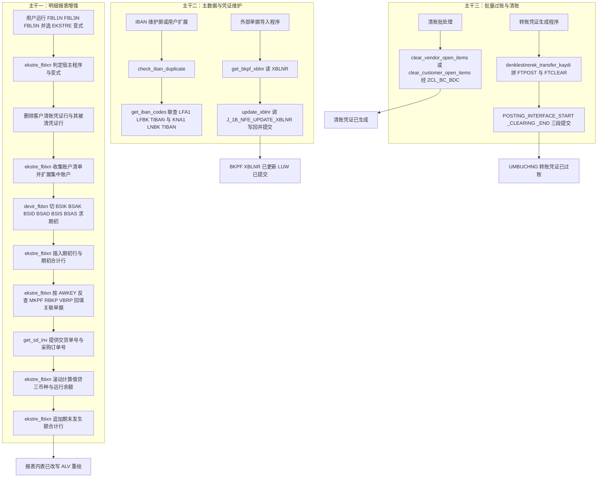
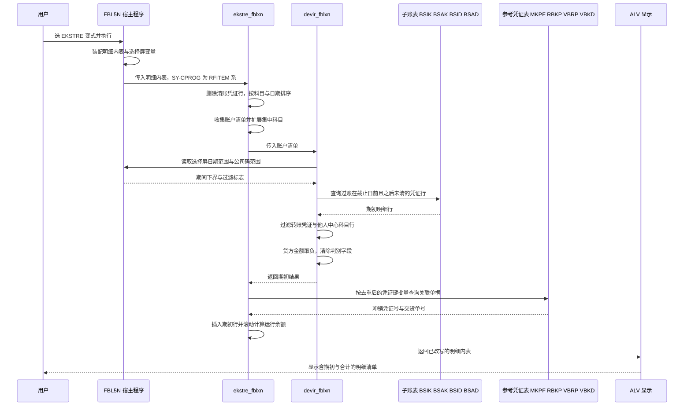

# ZCL_FI_TOOLKIT 源码分析报告（第二份独立分析）

> 对象：`Keremkoseoglu/ABAP-Library — functional/fi/ZCL_FI_TOOLKIT.abap`
> 体量：1702 行 / `PUBLIC FINAL` 全局类 / 19 个类方法（18 公开 + 1 私有）
> 视角：本次分析刻意从"调用契约"与"能力域"两个角度切入，与顺读代码的常规路径不同

---

## 一、程序定位与业务背景

### 1.1 需求从一句话开始

一家土耳其公司的 FI 顾问接到业务方一句需求："FBL5N 上看不到上年的欠款，客户拿着一张发票来对账，我们查不出来。"

这句话背后是三层标准报表的先天缺陷：明细清单（line item report）只显示**期间发生额**，期初结转要靠人自己去子账表切；冲销凭证（storno）留在清单里会让金额看起来翻倍；交货单号、采购订单号根本不在 FI 侧，FI 表里只有一行 `AWKEY`，要反查 `VBRP`/`RBKP`/`MSEG` 才知道对面是谁的哪张单子。

`ZCL_FI_TOOLKIT` 就是为解决这三层痛点长出来的工具类。只不过四年多里它不断被人塞新需求（P0-1 的守卫 bug 让 EKSTRE 分支实际从不执行），最终演变成一个"什么都干"的 FI 工具箱：**报表增强 + 主数据校验 + 凭证写入 + 批量过账 + 杂项原子函数**，五类毫不相干的职责共处一个类。

### 1.2 能力域盘点

| 能力域 | 业务场景 | 方法 | 交付形态 |
|---|---|---|---|
| **明细报表增强** | FBL1N/FBL3N/FBL5N 上补期初、合计、运行余额、关联单据 | `ekstre_fblxn`、`devir_fblxn`、`get_sd_inv` | 原地改写 `IT_RFPOSXEXT` |
| **主数据合规校验** | 银行 IBAN 唯一性，避免付款打错 | `check_iban_duplicate`、`get_iban_codes` | 抛 `ZCX_FI_IBAN` |
| **凭证外部标识维护** | 外部单据号（XBLNR）从外部系统回写 FI | `get_bkpf_xblnr`、`update_xblnr` | `CHANGING` 内表 / 直改 BKPF |
| **批量清账与过账** | 无 FM 可用时的兜底清账；转账凭证生成 | `clear_customer_open_items`、`clear_vendor_open_items`、`denklestirerek_transfer_kaydi` | BDC 驱动 / posting interface |
| **原子工具** | 财务年度串、公司全称、凭证类型、到期日、IFRS 豁免、跳转显示 | `convert_datum_to_gdatu`、`get_company_long_text`、`get_import_document_types`、`get_domestic_import_doc_types`、`determine_due_date`、`validate_zhrtip`、`display_fi_doc_in_gui` | 返回值 / 抛异常 / 跳转 |

**设计范式一句话定性**：**以"报表增强入口"为主战场的静态工具集合 —— 用内表原地改写交付展示层增强，用标准 FM 与 BDC 兜底无 API 场景，代价是把大量宿主程序内部对象与会计语义直接写进了业务代码。**

### 1.3 运行前提（读代码前必须确认的四件事）

1. **授权**：报表增强类操作通常要求凭证展示与子账展示权限；BDC 走 `F-32`/`F-44` 需要业务对象权限；`update_xblnr` 直写 `BKPF` 需要主数据维护权限。**类内没有任何权限检查**（`AUTHORITY-CHECK` 全类为零），权限完全依赖调用方。
2. **宿主程序**：`ekstre_fblxn` / `devir_fblxn` 只能在 `RFITEMAP`(FBL1N)、`RFITEMGL`(FBL3N)、`RFITEMAR`(FBL5N)、`ZSDP_RFITEMAR` 四个程序里工作，靠 `SY-CPROG` 识别。
3. **Z 对象依赖**：`ZCL_BC_BDC`、`ZCX_FI_IBAN` / `ZCX_FI_ZHRTIP` / `ZCX_BC_TABLE_CONTENT` / `ZCX_BC_CLASS_METHOD`、`ZFITT_IBAN_RNG` / `ZFITT_TIBAN`、`ZFIS_ACCDOCUMENT_KEY`、`ZFIT_ITH_BLART`、`ZFIT_IFRS_HARIC`、`ZCL_FI_OMD`、`ZCL_FI_DOCUMENT_TYPE`、`RANGE_KUNNR_TAB`、`ZQMTT_LIFNR`。换一套环境名字不同则编译不过——迁移性天然很差。
4. **会计口径**：金额按 `DMSHB`（本币）+ `DMBE2`/`DMBE3` 两列附加币种 + `WRBTR`（交易币种）四轨并行，符号方向由 `SHKZG` 的 `S`(Sol 借)/`H`(Haber 贷) 决定。

### 1.4 调用契约速查（哪些参数能省、省了会怎样）

这张表是把本类当"库"用时最需要的东西，代码里从未写过：

| 方法 | 可省略参数 | 省略或传空的后果 |
|---|---|---|
| `get_iban_codes` | 全部 `OPTIONAL` | `it_iban` 为空匹配不到 IBAN；`it_lifnr`/`it_kunnr` 若只有一行初始值区间，语义是"不限制"，退化为全量联查 |
| `ekstre_fblxn` | 无（`CHANGING` 必传） | `ct_items` 为空则 `CHECK` 直接返回 |
| `clear_*_open_items` | `im_waers` | 空值时客户版仍往屏幕写 `BKPF-WAERS` 空串，供应商版跳过该字段——两版行为不一致 |
| `update_xblnr` | `iv_commit_each_doc`（默认 `abap_false`） | 默认最后统一提交；传 `abap_true` 则每条凭证一次 `COMMIT WORK AND WAIT` |
| `get_import_document_types` | 两个开关（默认 `abap_true`） | 默认返回全部凭证类型 |
| `determine_due_date` | 无 | 凭证行不存在时静默返回初始日期 |
| `check_iban_duplicate` | 无 | 方法**没有"排除自己"的语义**，编辑已有伙伴时自己的 IBAN 也会被判重，调用方必须自行从范围里剔除当前伙伴号 |

---

## 二、程序执行流程总览

本类没有单一入口，因此按"能力域 × 触发时机"组织成三条并行主干，其中主干一（报表增强）占了代码量的八成：



### 责任链与触发时机

| 子程序 | 调用者 | 触发时机 | 职责 |
|---|---|---|---|
| `ekstre_fblxn` | 报表用户扩展（`SY-CPROG` 匹配 RFITE 系） | ALV 数据取完、显示之前 | 增强总控：清洗、期初与合计装配、关联单据回填、运行余额 |
| `devir_fblxn` | `ekstre_fblxn` | 期初装配之前一次性 | 读宿主选择屏变量，按截止日切子账表汇总期初 |
| `get_sd_inv` | `ekstre_fblxn`（私有） | 回填 SD 单据字段时 | `VBRP LEFT OUTER JOIN VBKD` 批量取交货与订单信息 |
| `check_iban_duplicate` | IBAN 维护入口 | 主数据保存前 | 校验 IBAN 唯一性，冲突抛 `ZCX_FI_IBAN` |
| `get_iban_codes` | `check_iban_duplicate` / 独立调用 | 唯一性校验时 | 返回被占用的 IBAN 记录（供应商侧与客户侧） |
| `get_bkpf_xblnr` | 外部单据导入程序 | 需要展示外部单据号时 | `FAE` 读 `BKPF.XBLNR` 并回填调用方内表 |
| `update_xblnr` | 外部单据导入程序 | 导入落库时 | 调本地化 FM 写 `BKPF.XBLNR` 并按策略提交 |
| `clear_customer_open_items` | 清账批处理 | 清账执行 | BDC 驱动 `F-32` 清客户未清项 |
| `clear_vendor_open_items` | 清账批处理 | 清账执行 | BDC 驱动 `F-44` 清供应商未清项 |
| `denklestirerek_transfer_kaydi` | 转账凭证生成程序 | 生成 UMRECH 同时结转时 | posting interface 以 `UMBUCHNG` 过一张转账凭证 |
| `determine_due_date` | 付款条件相关用户扩展 | 需要算到期日 | `BSEG` 取 `FAEDE` 字段后调标准 FM 算 `NETDT` |
| `validate_zhrtip` | FI 记账前用户扩展 | 凭证保存时 | 5/9 开头科目的业务类别码校验 |
| `convert_datum_to_gdatu` | 任意报表或转换程序 | 需要财务年度串 | 带类级缓存的 `DATUM` → `TCURR-GDATU` 转换 |
| `get_company_long_text` | 打印抬头生成 | 报表输出时 | 带类级缓存的公司全称（T001 + ADRC） |
| `get_import_document_types` | 过账或导入程序 | 需要可用凭证类型清单 | 从 `ZFIT_ITH_BLART` 取 `BLART` 集合，可按境内境外过滤 |
| `get_domestic_import_doc_types` | 同上 | 需要境内子集 | 取"境内"凭证类型 |
| `display_fi_doc_in_gui` | 报表双击 | 用户要跳转凭证 | 写 SAP Memory 后 `CALL TRANSACTION 'FB03'` |

下面按主干一 → 主干二 → 主干三 → 原子工具的顺序展开，每个方法都按它在这条链上的真实位置来评。

---

## 三、分组分析

### 3.1 类定义段：接口契约与数据模型（全局声明区）

这个类对外的类型体系已经把设计意图说完了：**几乎所有公开结构都是从 `BSEG`/`BKPX`/`RFPOSXEXT` 这些标准结构上"投影"出来的**，没有一个是业务自有模型。

#### ① 公开类型：三类投影

```abap
  PUBLIC SECTION.

    TYPES:
      BEGIN OF t_documents ,
        bukrs TYPE bseg-bukrs,
        belnr TYPE bseg-belnr,
        gjahr TYPE bseg-gjahr,
        buzei TYPE bseg-buzei,
      END OF t_documents .
    TYPES:
      tt_documents TYPE STANDARD TABLE OF t_documents WITH DEFAULT KEY .
    TYPES:
      BEGIN OF ty_hesap,
        sube   TYPE rfposxext-konto,
        merkez TYPE rfposxext-konto,
      END OF ty_hesap .
    TYPES:
      tt_hesap TYPE STANDARD TABLE OF ty_hesap .

    TYPES:
      BEGIN OF ty_konto,
        bukrs TYPE bukrs,
        konto TYPE konto,
      END OF ty_konto .
    TYPES:
      BEGIN OF ty_devir_items,
        belnr TYPE belnr_d,
        gjahr TYPE gjahr,
        buzei TYPE buzei,
        bukrs TYPE bukrs,
        konto TYPE hkont,
        shkzg TYPE shkzg,
        dmshb TYPE dmbtr,
        dmbe2 TYPE dmbe2,
        dmbe3 TYPE dmbe3,
        umskz TYPE umskz,
        filkd TYPE filkd,
        wrbtr TYPE wrbtr,
        waers TYPE waers,
        gsber TYPE gsber,
      END OF ty_devir_items .
    TYPES:
      BEGIN OF ty_devir,
        bukrs TYPE bukrs,
        konto TYPE hkont,
        shkzg TYPE shkzg,
        dmshb TYPE dmbtr,
        dmbe2 TYPE dmbe2,
        dmbe3 TYPE dmbe3,
        umskz TYPE umskz,
        filkd TYPE filkd,
        wrbtr TYPE wrbtr,
        waers TYPE waers,
        gsber TYPE gsber,
      END OF ty_devir .
    TYPES:
      tt_devir TYPE STANDARD TABLE OF ty_devir .
    TYPES:
      BEGIN OF t_doc_xblnr,
        bukrs TYPE bkpf-bukrs,
        belnr TYPE bkpf-belnr,
        gjahr TYPE bkpf-gjahr,
        xblnr TYPE bkpf-xblnr,
      END OF t_doc_xblnr .
    TYPES:
      tt_doc_xblnr TYPE STANDARD TABLE OF t_doc_xblnr WITH DEFAULT KEY .
    TYPES:
      tt_blart TYPE HASHED TABLE OF blart WITH UNIQUE KEY primary_key COMPONENTS table_line .

    TYPES:
      BEGIN OF ty_mkpf_key,
        mblnr TYPE mkpf-mblnr,
        mjahr TYPE mkpf-mjahr,
      END OF ty_mkpf_key .
    TYPES:
      tt_mkpf_key TYPE TABLE OF ty_mkpf_key .

    TYPES: BEGIN OF ty_vbrk_key,
             vbeln TYPE vbrk-vbeln,
           END OF ty_vbrk_key,

           tt_vbrk_key TYPE TABLE OF ty_vbrk_key.
```

**做什么** — 声明 8 组类型，可归为三类：`t_documents` 是 BSEG 行键；`ty_konto`/`ty_hesap`/`tt_blart`/`t_doc_xblnr` 是"查询键与结果集"；`ty_devir_items` 与 `ty_devir` 是期初结转的输入输出结构；`ty_mkpf_key`/`ty_vbrk_key` 是批量取数的 key 载体。类型来源几乎全是标准字典对象，唯一例外是 `zfitt_iban_rng`、`zfitt_tiban`、`zfis_accdocument_key`（出现在方法签名里）。
**为什么** — 从标准结构投影而不是自定义，好处是与调用方数据天然兼容（明细行可直接塞进 `ty_devir`），代价是标准字段一改就连锁返工，而且**无法表达"这张期初来自哪个伙伴"**——结构里既无 `LIFNR` 也无 `KUNNR`，而 SQL 明明查出来了。
**风险与改进** — `tt_devir` 声明为无 key 的 `STANDARD TABLE`，却被 `devir_fblxn` 用 `COLLECT` 汇总、被 `ekstre_fblxn` 当作"每账户一行"使用，**声明与用法自相矛盾**，这是全类最贵的一个类型设计错误，应声明 `SORTED TABLE ... WITH NON-UNIQUE KEY bukrs konto gsber waers`。`tt_documents` 保留 `WITH DEFAULT KEY`（配合 `INSERT ... INDEX` 的定位插入）是有意为之，值得保留；`tt_mkpf_key`/`tt_vbrk_key` 却声明为标准表用于 `FAE`，改哈希表可显著改善 FAE 行为。

#### ② 私有类型：参照模型与行结构映射

```abap
  PRIVATE SECTION.
```

```abap
    TYPES:
      BEGIN OF t_company_long_text,
        bukrs TYPE bukrs,
        text  TYPE string,
      END OF t_company_long_text .
    TYPES:
      BEGIN OF t_dg_cache,
        datum TYPE datum,
        gdatu TYPE tcurr-gdatu,
      END OF t_dg_cache .
    TYPES:
      tt_dg_cache TYPE HASHED TABLE OF t_dg_cache WITH UNIQUE KEY primary_key COMPONENTS datum .

    TYPES:
      tt_company_long_text TYPE HASHED TABLE OF t_company_long_text WITH UNIQUE KEY primary_key COMPONENTS bukrs .
```

```abap
    TYPES:
      BEGIN OF t_vbkd,
        vbeln TYPE vbkd-vbeln,
        bstkd TYPE vbkd-bstkd,
      END OF t_vbkd .
    TYPES:
      tt_vbkd
          TYPE SORTED TABLE OF vbkd
          WITH NON-UNIQUE KEY vbeln .
    TYPES:
      BEGIN OF t_rbkp,
        belnr TYPE rbkp-belnr,
        gjahr TYPE rbkp-gjahr,
        stblg TYPE rbkp-stblg,
        stjah TYPE rbkp-stjah,
      END OF t_rbkp .
    TYPES:
      tt_rbkp
          TYPE SORTED TABLE OF rbkp
          WITH NON-UNIQUE KEY belnr gjahr .

    TYPES:
      BEGIN OF t_mseg,
        mblnr TYPE mseg-mblnr,
        mjahr TYPE mseg-mjahr,
        smbln TYPE mseg-smbln,
        sjahr TYPE mseg-sjahr,
      END OF t_mseg .
    TYPES:
      tt_mseg
          TYPE SORTED TABLE OF mseg
          WITH NON-UNIQUE KEY mblnr mjahr .

    TYPES:
      BEGIN OF ty_rbkp_key,
        belnr TYPE rbkp-belnr,
        gjahr TYPE rbkp-gjahr,
      END OF ty_rbkp_key .
    TYPES:
      tt_rbkp_key TYPE TABLE OF ty_rbkp_key .
    TYPES:
      BEGIN OF ty_vbrp,
        vbeln TYPE vbrp-vbeln,
        vgtyp TYPE vbrp-vgtyp,
        vgbel TYPE vbrp-vgbel,
        bstkd TYPE vbkd-bstkd,
      END OF ty_vbrp .
    TYPES:
      tt_vbrp TYPE SORTED TABLE OF ty_vbrp
                  WITH NON-UNIQUE KEY vbeln .

    TYPES tt_ith_blart TYPE STANDARD TABLE OF zfit_ith_blart WITH DEFAULT KEY.
```

**做什么** — 私有区定义两套哈希缓存类型（公司全称、日期到财务年度串）、四个"参考凭证映射"类型（`T_VBKD`、`T_RBKP`、`T_MSEG`、`TY_VBRP`，统一形态是"当前凭证键 → 反向凭证键或参考单号"）以及批量 key 表。
**为什么** — 把 `RBKP.STBLG`、`MSEG.SMBLN`、`VBRP.VGBEL` 这三个"反向凭证/参考单号"字段从三个结构完全不同的表里抽成统一形态，是这个类里最有价值的一次抽象：**回填逻辑因此只写一份**，三个来源各加一个 `CASE` 分支；排序表 + 二级键（`tt_rbkp`、`tt_mseg`、`tt_vbrp`）的选型与后续 `READ ... WITH TABLE KEY` 配套，是 ABAP 里的正确读法。
**风险与改进** — `t_vbkd` 与 `tt_vbkd` **定义了却从未使用**（`get_sd_inv` 用的是 `ty_vbrp`，`VBKD` 两列被拼进 `ty_vbrp.bstkd`），属早期设计的残留；四组 key 类型命名不统一（`TY_`/`TT_`/`T_` 混用），且 `tt_rbkp` 声明为 `SORTED TABLE OF rbkp`（直接用 DDIC 结构）却只用到 4 个字段，而 `ty_vbrp` 是自定义投影——两种风格并存，建议统一成自定义投影，传输与升级都更安全。

#### ③ 常量与静态缓存

```abap
    CONSTANTS c_borc TYPE shkzg VALUE 'S' ##NO_TEXT.
    CONSTANTS c_alacak TYPE shkzg VALUE 'H' ##NO_TEXT.
    CONSTANTS c_mal_hareketi TYPE awtyp VALUE 'MKPF' ##NO_TEXT.
    CONSTANTS c_satinalma_faturasi TYPE awtyp VALUE 'RMRP' ##NO_TEXT.
    CONSTANTS c_satis_faturasi TYPE awtyp VALUE 'VBRK' ##NO_TEXT.
    CONSTANTS c_musteri_hf_talebi TYPE auart VALUE 'ZAH1' ##NO_TEXT.
```

```abap
    CONSTANTS c_tabname_t001 TYPE tabname VALUE 'T001' ##NO_TEXT.
    CLASS-DATA gt_company_long_text TYPE tt_company_long_text .
    CLASS-DATA gt_dg_cache TYPE tt_dg_cache .
    CLASS-DATA gt_import_doc_type_cache TYPE tt_ith_blart .
```

**做什么** — 6 个公开常量（借贷标识 2 个、参考凭证类型 3 个、订单类型 1 个）、1 个私有表名常量、3 个 `CLASS-DATA` 静态缓存。
**为什么** — `SHKZG` 的 `S`/`H` 是土耳其（Sol/Haber）记账法的借贷标识，定义成常量而不是散落的 `'H'` 字面量，让"贷方处理"这类逻辑一眼可辨；`AWTYP` 三常量（`MKPF` 物料凭证 / `RMRP` 采购发票 / `VBRK` 销售发票）对应明细行 `ZZAWTYP` 的三种取值，是整个关联单据回填逻辑的分派依据。
**风险与改进** — `c_borc`（借方）与 `c_musteri_hf_talebi`（客户贷方通知单订单类型 `ZAH1`）**在全类中一次都没有被引用**，是"定义了业务常量但对应逻辑还没写或已被删"的痕迹；三个静态缓存没有配对的失效方法，会把"程序启动那一刻的配置"当成永久事实。建议补一个 `RESET_CACHES` 类方法，并给缓存装载加日志以便排障。

---

### 3.2 类方法 `ekstre_fblxn`

（方法 `ekstre_fblxn`）

一个方法承担"识别宿主 + 清洗数据 + 期初装配 + 单据回填 + 余额滚动 + 合计"六件事，分五步。

#### ① 宿主识别与增强开关

```abap
    CHECK ct_items IS NOT INITIAL.
    CASE sy-cprog.
      WHEN 'RFITEMAP'."FBL1N
        ASSIGN ('(RFITEMAP)X_AISEL') TO FIELD-SYMBOL(<lv_x_aisel>).
        ASSIGN ('(RFITEMAP)PA_VARI') TO FIELD-SYMBOL(<lv_vari>).

      WHEN 'RFITEMGL'."FBL3N
        ASSIGN ('(RFITEMGL)X_AISEL') TO <lv_x_aisel>.
        ASSIGN ('(RFITEMGL)PA_VARI') TO <lv_vari>.

      WHEN 'RFITEMAR'."FBL5N
        ASSIGN ('(RFITEMAR)X_AISEL') TO <lv_x_aisel>.
        ASSIGN ('(RFITEMAR)PA_VARI') TO <lv_vari>.

      WHEN 'ZSDP_RFITEMAR'.
        ASSIGN ('(ZSDP_RFITEMAR)X_AISEL') TO <lv_x_aisel>.
        ASSIGN ('(ZSDP_RFITEMAR)PA_VARI') TO <lv_vari>.

      WHEN OTHERS.
        RETURN.

    ENDCASE.

    IF sy-subrc = 0 AND sy-cprog(5) = 'RFITE'.
```

**做什么** — 先挡空表，再按 `SY-CPROG` 分派到四个宿主程序，把 `X_AISEL`（是否有选中行）与 `PA_VARI`（ALV 变式名）取成本地字段符号，非明细报表上下文立即返回；随后进入由 `sy-subrc` 与 `sy-cprog(5)` 决定的守卫。
**为什么** — 按 `SY-CPROG` 而不是 `SY-TCODE` 分派是必须的：同一 `FBL3N` 事务背后可能是不同实现，而内存变量名带程序前缀，不精确到程序级就取不到。这也是"寄生增强"必须付出的代价。
**风险与改进** — **`sy-cprog(5) = 'RFITE'` 恒为假**：`SY-CPROG` 是 `CHAR8`，`(5)` 取第 5 位的**单个字符**，与 5 位字面量比较时短侧补空格，得到 `'X    '` 对 `'RFITE'`，永不相等。也就是说本方法 600 行里除末尾 ELSE 分支外的全部代码（期初、合计、运行余额、关联单据）在这份源码下**从不执行**。正确写法是 `sy-cprog+4(5) = 'RFITE'`（对 `RFITEMAR` 与 `ZSDP_RFITEMAR` 同时成立）。`sy-subrc = 0` 也没有判别力（只反映最后一个 `ASSIGN`），且进入守卫后 `<lv_x_aisel>`/`<lv_vari>` 都没有 `IS ASSIGNED` 校验就解引用。建议把宿主识别抽成私有方法，把"是否 EKSTRE 变式"改成读用户参数而不是字符串偏移。

#### ② 清洗与账户建模

```abap
      "--------->> add by mehmet sertkaya 27.05.2021 10:49:36
      LOOP AT ct_items ASSIGNING FIELD-SYMBOL(<ls_items>)
            WHERE zuonr(3) eq  zcl_fi_omd=>c_zuonr_sanal and
                  zzbstkd IS INITIAL.
           <ls_items>-zzbstkd = <ls_items>-zuonr.
      ENDLOOP.
      "-----------------------------<<
      IF <lv_vari> CS 'EKSTRE'.

        IF <lv_x_aisel> <> abap_true.
          MESSAGE TEXT-003 TYPE 'I'.
          RETURN.
        ENDIF.

        CALL FUNCTION 'SAPGUI_PROGRESS_INDICATOR' ##FM_SUBRC_OK
          EXPORTING
*           percentage =
            text   = TEXT-002
          EXCEPTIONS
            OTHERS = 1.

        "-->> changed by mehmet sertkaya 21.07.2016 13:52:32
        " HAR-10448 - Müşteri Ekstresinde XX belge ters kaydı
*          delete ct_items where blart = 'XX' and gjahr ge '2016'.
        LOOP AT ct_items ASSIGNING <ls_items>
                    WHERE blart = zcl_fi_document_type=>get_customer_clearing_doc_type( ) AND
                          gjahr GE '2018'.
          DELETE ct_items WHERE belnr = <ls_items>-zzstblg AND gjahr = <ls_items>-zzstjah.
          DELETE ct_items.
        ENDLOOP.
        "-----------------------------<

        SORT ct_items BY konto budat ASCENDING.
```

**做什么** — 给没有 `ZZBSTKD` 的销售贷方通知单行用 `ZUONR` 补值；判变式名是否含 `'EKSTRE'`、判是否有选中行（否则提示后退出）、弹进度提示；删除 2018 年起的客户清账凭证行及其指向的被清凭证行；最后按科目与日期排序，为"按账户分块处理"做准备。
**为什么** — 变式名作为总开关是"零侵入"设计的经典做法：用户不改变式就完全不受影响；排序放在这里是因为后面的"每账户插入一次期初块"依赖"同科目相邻"这个前提。
**风险与改进** — **`DELETE ct_items.` 会删除整张明细表**，而且它就在 `LOOP AT ct_items ASSIGNING` 之内：执行瞬间字段符号指向被释放的行，循环在空表上重新判定后结束。删行意图（清账凭证镜像行导致重复计数）是对的，但实现让结果从"删部分行"变成"删全部"。正确做法是先把待删行的 `SY-TABIX` 收集进索引内表，循环外再删。另外 `DELETE ... WHERE belnr = ...` 按非键字段删会命中**所有账户**的该凭证行，范围不可控。`WHERE zuonr(3) eq ...` 是 OpenSQL 写法混进内表 `WHERE`（应写 `=`）；`MESSAGE` 在类方法里以 message 异常冒泡，调用方没 `CATCH cx_sy_message` 就是短转储。

```abap
        LOOP AT ct_items ASSIGNING <ls_items>.
          CLEAR ls_hesap.
          ls_hesap-sube = <ls_items>-konto.
          COLLECT ls_hesap INTO lt_hesap.
          ls_konto-bukrs = <ls_items>-bukrs.
          ls_konto-konto = <ls_items>-konto.
          COLLECT ls_konto INTO lt_konto.
        ENDLOOP.
        ASSIGN  ('(SAPLFI_ITEMS)GB_CENTRAL_ITEMS') TO FIELD-SYMBOL(<lv_merkez>).
        IF sy-subrc = 0.
          IF <lv_merkez> = abap_true.
            CASE sy-cprog.
              WHEN 'RFITEMAR' OR 'ZSDP_RFITEMAR'.
                SELECT bukrs, kunnr, knrze INTO TABLE @DATA(lt_knb1) FROM knb1
                    FOR ALL ENTRIES IN @lt_hesap
                    WHERE kunnr = @lt_hesap-sube AND
                          knrze <> @space.
                SORT lt_knb1 BY bukrs kunnr.
                LOOP AT lt_knb1 ASSIGNING FIELD-SYMBOL(<ls_knb1>).
                  ls_hesap-sube = <ls_knb1>-kunnr.
                  ls_hesap-merkez = <ls_knb1>-knrze.
                  COLLECT ls_hesap INTO lt_hesap.
                ENDLOOP.

              WHEN 'RFITEMAP'.

                SELECT bukrs, lifnr, lnrze INTO TABLE @DATA(lt_lfb1) FROM lfb1
                    FOR ALL ENTRIES IN @lt_hesap
                    WHERE lifnr = @lt_hesap-sube AND
                          lnrze <> @space.
                SORT lt_lfb1 BY bukrs lifnr.
                LOOP AT lt_lfb1 ASSIGNING FIELD-SYMBOL(<ls_lfb1>).
                  ls_hesap-sube   = <ls_lfb1>-lifnr.
                  ls_hesap-merkez = <ls_lfb1>-lnrze.
                  COLLECT ls_hesap INTO lt_hesap.
                ENDLOOP.

            ENDCASE.
          ENDIF.
        ENDIF.
        SELECT * FROM t001  INTO TABLE lt_t001.
```

**做什么** — 扫描明细收集去重账户清单 `lt_konto` 与子账户清单 `lt_hesap`；读 `SAPLFI_ITEMS` 的全局标志 `GB_CENTRAL_ITEMS` 判断是否处于集中账户展示模式，若是则按报表类型从 `KNB1`（客户 `KNRZE`）或 `LFB1`（供应商 `LNRZE`）取子账户到中心科目的映射补进 `lt_hesap`；末尾无条件 `SELECT * FROM t001`。
**为什么** — `GB_CENTRAL_ITEMS` 是标准报表"集中科目"模式的开关：开启后子科目与中心科目会同时出现在清单里，期初也必须同时覆盖两者，否则要么重复要么漏计；`knrze <> @space` 排除未设集中科目的伙伴，避免空映射污染 `devir_fblxn` 的 `OR` 条件。
**风险与改进** — `SELECT * FROM t001 INTO TABLE lt_t001.` 读进来的表**全类再无任何引用**（`lt_t001` 仅在声明与这一句出现），是纯粹的死查询，`##NEEDED` 就是在压 ATC 警告。`COLLECT INTO lt_konto` 对无 key 标准表等同 `APPEND`，而同一科目在明细里会重复上千次，`lt_konto` 可能膨胀到与明细同量级，后面按 `lt_konto` 的双层循环会跟着放大耗时——应把 `lt_konto` 声明为 `SORTED ... WITH UNIQUE KEY bukrs konto` 并改 `INSERT ... TABLE`。集中账户扩展是"读主数据再排序"的手工二分查找模式，建议 `lt_knb1`/`lt_lfb1` 直接声明为带唯一键排序表。

#### ③ 期初装配：委托取数并插入期初行

```abap
        zcl_fi_toolkit=>devir_fblxn(
                    EXPORTING it_hesap = lt_hesap
                    IMPORTING et_devir = lt_devir
                                             ).
        SORT lt_devir BY bukrs konto gsber.
        lt_devir_sorted = lt_devir.

        FREE  : lt_devir,lt_hesap.
```

**做什么** — 委托 `devir_fblxn` 算期初，按 `BUKRS KONTO GSBER` 排序后转成二级键排序表 `lt_devir_sorted`，随即释放标准表与账户清单。
**为什么** — 转排序表是为了后续"按账户过滤 + 二分查找"；`FREE` 大内表体现作者对报表内存占用的敏感，这是好习惯（明细表本身可能十万行级）。
**风险与改进** — 转换瞬间两份结构同时在内存里，翻倍；更彻底的做法是让 `devir_fblxn` 直接返回排序表类型，从源头消除这次类型转换与一次全量 `SORT`。

```abap
          IF lv_konto_temp IS INITIAL OR
             lv_konto_temp <> <ls_items>-konto.
* Devir kalemini ekle
            CLEAR : ls_devir,ls_devir_merkez.

            LOOP AT lt_devir_sorted INTO ls_devir
              WHERE bukrs = <ls_items>-bukrs
                AND konto = <ls_items>-konto.

              IF <lv_merkez> IS ASSIGNED.
                IF <lv_merkez> = abap_true.
                  CASE sy-cprog.
                    WHEN 'RFITEMAP'.
                      READ TABLE lt_lfb1 ASSIGNING <ls_lfb1>
                                         WITH KEY bukrs = <ls_items>-bukrs
                                                  lifnr = <ls_items>-konto BINARY SEARCH.
                      IF sy-subrc = 0.
                        LOOP AT lt_devir_sorted ASSIGNING FIELD-SYMBOL(<lfs_devir_sorted_lnrze>)
                                                WHERE bukrs = <ls_items>-bukrs
                                                  AND konto = <ls_lfb1>-lnrze.
                          ADD <lfs_devir_sorted_lnrze>-dmshb TO ls_devir_merkez-dmshb.
                          ADD <lfs_devir_sorted_lnrze>-dmbe2 TO ls_devir_merkez-dmbe2.
                          ADD <lfs_devir_sorted_lnrze>-dmbe3 TO ls_devir_merkez-dmbe3.
                          ADD <lfs_devir_sorted_lnrze>-wrbtr TO ls_devir_merkez-wrbtr.
                        ENDLOOP.
                      ENDIF;
```

**做什么** — 进入新科目块时（`lv_konto_temp` 记忆上一科目做边界判断），循环过滤出该 `BUKRS/KONTO` 的期初行；集中账户模式下再查中心科目（`LNRZE`/`KNRZE`），把中心科目的四个金额字段 `ADD` 累加进 `ls_devir_merkez`。
**为什么** — 依赖"已排序则同科目相邻"来做"每账户一次"的边界检测，是报表增强里最省 CPU 的做法；中心账户用 `ADD` 而不是 `APPEND`/`COLLECT`，是本方法里**唯一写对了汇总语义**的地方，可作为子账户那段修复的模板。
**风险与改进** — `LOOP ... INTO ls_devir` 循环结束后代码继续使用 `ls_devir`，**因此只用到了该账户期初的最后一行**；而 `devir_fblxn` 的 `COLLECT` 对标准表不去重，`lt_devir_sorted` 实际是"一张未清凭证一行"的明细表，于是多张未清凭证的账户期初只等于最后一张金额，直接污染运行余额。修法：在 `LOOP` 内 `ADD ... TO ls_devir-dmshb`，或让 `devir_fblxn` 返回已汇总的行。`lv_konto_temp` 只比 `KONTO` 不比 `BUKRS`，跨公司码同科目时第二个公司码拿不到期初行。`ENDIF;` 的分号风格与类内其他代码不一致。

```abap
              CLEAR ls_item_devir.
              IF ls_devir-bukrs IS INITIAL.
                MOVE-CORRESPONDING ls_devir_merkez TO ls_item_devir  ##ENH_OK.
                ls_item_devir-wrshb =  ls_devir_merkez-wrbtr.
                ls_item_devir-waers =  ls_devir_merkez-waers.
              ELSE.
                ADD ls_devir_merkez-dmshb TO ls_devir-dmshb.
                ADD ls_devir_merkez-dmbe2 TO ls_devir-dmbe2.
                ADD ls_devir_merkez-dmbe3 TO ls_devir-dmbe3.
                ADD ls_devir_merkez-wrbtr TO ls_devir-wrbtr.

                MOVE-CORRESPONDING ls_devir TO ls_item_devir  ##ENH_OK.
                ls_item_devir-wrshb =  ls_devir-wrbtr.
                ls_item_devir-waers =  ls_devir-waers.

              ENDIF.

              ls_item_devir-zzname1_ku = <ls_items>-zzname1_ku.
              ls_item_devir-zzname1_li = <ls_items>-zzname1_li.
              ls_item_devir-konto = <ls_items>-konto.
              ls_item_devir-zuonr = TEXT-dvg.
              ls_item_devir-u_bktxt =  ls_item_devir-sgtxt  = |{ TEXT-004 }({ <ls_items>-konto })|.
              ls_item_devir-hwaer = <ls_items>-hwaer.
              ls_item_devir-hwae2 = <ls_items>-hwae2.
              ls_item_devir-hwae3 = <ls_items>-hwae3.
              IF ls_item_devir-dmshb LT 0.
                ls_item_devir-zzalacak_upb = ls_item_devir-dmshb * -1.
                ls_item_devir-zzalacak_2pb = ls_item_devir-dmbe2 * -1.
                ls_item_devir-zzalacak_3pb = ls_item_devir-dmbe3 * -1.
              ELSE.
                ls_item_devir-zzborc_upb = ls_item_devir-dmshb.
                ls_item_devir-zzborc_2pb = ls_item_devir-dmbe2.
                ls_item_devir-zzborc_3pb = ls_item_devir-dmbe3.
              ENDIF.
              ls_item_devir-bukrs = <ls_items>-bukrs.
              ls_item_devir-konto = <ls_items>-konto.
              ls_item_devir-color = lc_green.

              COLLECT ls_item_devir INTO lt_item_devir.

              CLEAR ls_item_sum.
              ls_item_sum-wrshb = ls_item_devir-wrshb.
              ls_item_sum-waers = ls_item_devir-waers.
              ls_item_sum-dmshb = ls_item_devir-dmshb.
              ls_item_sum-hwaer = ls_item_devir-hwaer.
              ls_item_sum_-hwaer = ls_item_sum-hwaer.

              ADD ls_item_sum-dmshb TO ls_item_sum_-dmshb.

              ls_item_sum-color = lc_yellow.
*              collect ls_item_sum into lt_item_sum_top."kullanılmıyor
            ENDLOOP.
            IF sy-subrc <> 0.
* devir yoksa boş devir yazısı yazalım.
              CLEAR ls_item_devir.
              ls_item_devir-bukrs = <ls_items>-bukrs.
              ls_item_devir-konto = <ls_items>-konto.
              ls_item_devir-zuonr = TEXT-dvg.
              ls_item_devir-color = lc_green.
              ls_item_devir-zzname1_ku = <ls_items>-zzname1_ku.
              ls_item_devir-zzname1_li = <ls_items>-zzname1_li.
              ls_item_devir-u_bktxt =  ls_item_devir-sgtxt  = |{ TEXT-004 }({ <ls_items>-konto })|.
              INSERT ls_item_devir INTO ct_items INDEX lv_tabix.

              ls_item_sum_-bukrs = <ls_items>-bukrs.
              ls_item_sum_-konto = <ls_items>-konto.
              ls_item_sum_-zzname1_ku = <ls_items>-zzname1_ku.
              ls_item_sum_-zzname1_li = <ls_items>-zzname1_li.
              ls_item_sum_-zuonr = TEXT-dvy.
              ls_item_sum_-color = lc_yellow.
              ls_item_sum_-u_bktxt =  ls_item_sum_-sgtxt  = |{ TEXT-004 }({ <ls_items>-konto })|.
              INSERT ls_item_sum_ INTO ct_items INDEX lv_tabix + 1.


            ELSE.
              ls_item_sum_-bukrs = <ls_items>-bukrs.
              ls_item_sum_-konto = <ls_items>-konto.
              ls_item_sum_-zzname1_ku = <ls_items>-zzname1_ku.
              ls_item_sum_-zzname1_li = <ls_items>-zzname1_li.
              ls_item_sum_-zuonr = TEXT-dvy.
              ls_item_sum_-color = lc_yellow.

              IF ls_item_sum_-dmshb LT 0.
                ls_item_sum_-zzalacak_upb = ls_item_sum_-dmshb.
              ELSE.
                ls_item_sum_-zzborc_upb = ls_item_sum_-dmshb.
              ENDIF

              ls_item_sum_-u_bktxt =  ls_item_sum_-sgtxt  = |{ TEXT-004 }({ <ls_items>-konto })|.
              ls_item_devir = ls_item_sum_.
              APPEND ls_item_sum_ TO lt_item_devir.
              INSERT LINES OF lt_item_devir INTO ct_items INDEX lv_tabix.
              FREE lt_item_devir.
            ENDIF.
            CLEAR ls_item_sum_.
```

**做什么** — 把子账户与中心账户期初合并成一条明细表行，按符号分流到借方与贷方三币种列，抄入报表币种 `HWAER/HWAE2/HWAE3`，打绿色底色 `C51` 标记为"期初合计"，并备好黄色合计行 `ls_item_sum_`；随后用残留 `sy-subrc` 判断有无期初，无则插入"0.00 期初"提示行，有则整行插入合计。
**为什么** — 借贷必须分列是土耳其报表的法定格式（`ZZBORC_UPB`/`ZZALACAK_UPB` 都要能显示正数金额），期初为负时翻正塞进贷方列，与明细行口径一致；即便期初为零也显示，是为了让用户区分"期初确实为零"与"增强没跑起来"——这是很地道的对账诉求；`TEXT-dvg`/`TEXT-dvy`/`TEXT-004` 三个消息号分别承担"期初合计行""期初合计黄色行""带科目号的标题文本"。
**风险与改进** — ① **`COLLECT ls_item_devir INTO lt_item_devir` 的目标类型是 `IT_RFPOSXEXT`（标准键 = 全部字段）**，只有逐字段完全相同才算重复，这个 `COLLECT` 等价 `APPEND`，聚合意图落空还多付一次全字段比较。② **用 `sy-subrc` 表达"是否有期初"是把 ABAP 最脆弱的机制用在了最关键的业务判断上**：它可能是 `LOOP` 没执行，也可能是循环内某次 `READ` 的残留，而同一 `IF` 层级上方就有 `SELECT SINGLE ... FROM bkpf` 会改写它——改动顺序即改变行为。应换 `DATA lv_has_devir TYPE abap_bool.` 显式赋值。③ 期初行的三个币种列取 `DMSHB`/`DMBE2`/`DMBE3`（本币/文档币/交易币），而合计行又用 `wrshb` 与 `dmshb` 并存、`CHECK HWAER IS NOT INITIAL` 又暗示以报表币种为准——**同一列的币种口径在期初行、合计行、明细行之间并不统一**，多币种场景下用户会看到无法相加的"合计"，应把口径钉进字段注释。④ `ls_item_sum` 与 `ls_item_sum_` 只差尾部下划线，`ls_item_devir = ls_item_sum_.` 极易看错，建议改名 `ls_item_devir_row` / `ls_item_sum_total`。

#### ④ 关联单据回填与运行余额滚动

```abap
        LOOP AT ct_items ASSIGNING <ls_items>
           WHERE zzawtyp = c_mal_hareketi OR zzawtyp =  c_satinalma_faturasi
               OR  zzawtyp =  c_satis_faturasi.
          IF <ls_items>-zzawtyp = c_mal_hareketi.
            APPEND VALUE #( mblnr = <ls_items>-zzawkey(10)
                            mjahr = <ls_items>-zzawkey+10(4)
                           ) TO lt_mkpf_key.
          ELSEIF <ls_items>-zzawtyp = c_satinalma_faturasi.
            APPEND VALUE #( belnr = <ls_items>-zzawkey(10)
                            gjahr = <ls_items>-zzawkey+10(4)
                           ) TO lt_rbkp_key.
          ELSEIF <ls_items>-zzawtyp = c_satis_faturasi.
            APPEND <ls_items>-zzawkey(10) TO lt_vbrk_key.
          ENDIF.
        ENDLOOP.

        SORT lt_rbkp_key BY belnr gjahr.
        SORT lt_mkpf_key BY mblnr mjahr.
        SORT lt_vbrk_key BY vbeln.
        DELETE ADJACENT DUPLICATES FROM lt_mkpf_key COMPARING mblnr mjahr.
        DELETE ADJACENT DUPLICATES FROM lt_rbkp_key COMPARING belnr gjahr.
        DELETE ADJACENT DUPLICATES FROM lt_vbrk_key COMPARING vbeln.

        IF lt_rbkp_key IS NOT INITIAL.

          SELECT belnr, gjahr, stblg, stjah
            FROM rbkp
            FOR ALL ENTRIES IN @lt_rbkp_key
            WHERE
              belnr = @lt_rbkp_key-belnr AND
              gjahr = @lt_rbkp_key-gjahr
            INTO CORRESPONDING FIELDS OF TABLE @lt_rbkp.

          FREE lt_rbkp_key.
        ENDIF.

* ters kayıt olanların m.b. sini bul
        IF lt_mkpf_key IS NOT INITIAL.
          SELECT mblnr, mjahr, smbln, sjahr
            FROM mseg
            FOR ALL ENTRIES IN @lt_mkpf_key
            WHERE
              mblnr = @lt_mkpf_key-mblnr AND
              mjahr = @lt_mkpf_key-mjahr
            INTO CORRESPONDING FIELDS OF TABLE @lt_mseg.
          FREE lt_mkpf_key.
* ters kayıt olanların m.b. sini bul
        ENDIF.
        IF lt_vbrk_key[] IS NOT INITIAL.
          lt_vbrp = get_sd_inv( lt_vbrk_key ).
          FREE lt_vbrk_key.
* ters kayıt olanların m.b. sini bul
        ENDIF.
```

**做什么** — 先从明细行拆出三种参考凭证号（`ZZAWKEY` 前 10 位凭证号 + 偏移 4 位年度），分别堆入三张 key 表并排序去重；在非空保护下 `FOR ALL ENTRIES` 查 `RBKP`（`STBLG/STJAH`）与 `MSEG`（`SMBLN/SJAH`），销售发票交给 `get_sd_inv`。
**为什么** — `AWKEY` 是 FI 与 MM/SD 之间唯一的桥梁，把它拆成"凭证号 + 年度"再批量反查，是把"关联单据"从 0 变成 1 的关键一步；`ZZAWKEY+10(4)` 偏移写法避开两次 `READ`；三张表用完即 `FREE`。
**风险与改进** — `FAE` 的空表保护做得对（三处 `IF ... IS NOT INITIAL` 齐全），但**没有过滤 `ZZAWKEY` 为空的行**：空 `AWKEY` 会被拆成全零 key 进入 `FAE`，让本该走索引的查询退化为大面积扫描，收集阶段加一句 `IF <ls_items>-zzawkey IS NOT INITIAL` 即可。此外 key 表声明为标准表，`FOR ALL ENTRIES` 会逐行判定，改哈希表可让 FAE 走哈希匹配。

```abap
        SORT ct_items BY konto budat ASCENDING.

        LOOP AT ct_items ASSIGNING <ls_items>.
          lv_tabix = sy-tabix.

*  test kayıt belgesi
          IF <ls_items>-zzawtyp = c_mal_hareketi.
            READ TABLE lt_mseg WITH TABLE KEY mblnr = <ls_items>-zzawkey(10)
                                              mjahr = CONV #( <ls_items>-zzawkey+10(4) )
                                              ASSIGNING FIELD-SYMBOL(<ls_mseg>).
            IF sy-subrc = 0.
* mb 'nin ters kaydınınn faturası
* bu case çok az olacağını için direk bkpf 'e gidildi.
              CLEAR lv_awkey.
              IF <ls_mseg>-smbln IS  NOT INITIAL.
                lv_awkey = |{ <ls_mseg>-smbln }{ <ls_mseg>-sjahr }|.
              ELSE.
                READ TABLE lt_mseg WITH KEY smbln = <ls_mseg>-mblnr
                                            sjahr = <ls_mseg>-mjahr
                                            ASSIGNING <ls_mseg>.

                IF sy-subrc = 0.
                  lv_awkey = |{ <ls_mseg>-mblnr }{ <ls_mseg>-mjahr }|.
                ENDIF.
              ENDIF.

            ENDIF.

          ELSEIF <ls_items>-zzawtyp = c_satinalma_faturasi.
            READ TABLE lt_rbkp WITH TABLE KEY belnr = <ls_items>-zzawkey(10)
                                              gjahr = CONV #( <ls_items>-zzawkey+10(4) )
                                              ASSIGNING FIELD-SYMBOL(<ls_rbkp>).
            IF sy-subrc = 0.
              CLEAR lv_awkey.
              IF <ls_rbkp>-stblg IS  NOT INITIAL.
                lv_awkey = |{ <ls_rbkp>-stblg }{ <ls_rbkp>-stjah }|.
              ELSE.
                READ TABLE lt_rbkp WITH KEY stblg = <ls_rbkp>-belnr
                                            stjah = <ls_rbkp>-gjahr
                                            ASSIGNING <ls_rbkp>.

                IF sy-subrc = 0.
                  lv_awkey = |{ <ls_rbkp>-belnr }{ <ls_rbkp>-gjahr }|.
                ENDIF.
              ENDIF.

            ENDIF.
          ELSEIF <ls_items>-zzawtyp = c_satis_faturasi.
            READ TABLE lt_vbrp WITH TABLE KEY vbeln = <ls_items>-zzawkey(10)
                                        ASSIGNING FIELD-SYMBOL(<ls_vbrp>).
            IF sy-subrc = 0.
              IF <ls_vbrp>-vgtyp = 'J' OR <ls_vbrp>-vgtyp = 'T'.
                <ls_items>-zzteslimat = <ls_vbrp>-vgbel.
              ENDIF
              <ls_items>-zzbstkd = <ls_vbrp>-bstkd.
            ENDIF.
          ENDIF.

          IF lv_awkey IS  NOT INITIAL.
            SELECT SINGLE belnr INTO <ls_items>-zzstblg FROM bkpf
                          WHERE awtyp = <ls_items>-zzawtyp AND
                                awkey = lv_awkey
                          ##WARN_OK .                   "#EC CI_NOORDER
            IF sy-subrc = 0.
              <ls_items>-zzstjah = <ls_items>-gjahr.
            ENDIF.
          ENDIF
```

**做什么** — 逐行按 `ZZAWTYP` 找反查凭证：物料凭证行查 `MSEG.SMBLN`（为空则反查"谁被这张凭证冲销"）、采购发票行查 `RBKP.STBLG`、销售发票行取 `VBRP.VGBEL`（`VGTYP` 为 `J`/`T` 时）与 `VBRP` 携带的 `BSTKD`；拿到 `AWKEY` 后再查一次 `BKPF` 得到被清凭证 `BELNR` 写入 `ZZSTBLG`，年度直接取当前行的 `GJahr`。
**为什么** — 用内存表查替代逐行 DB 查，把 N 次往返压成 1 次加每行一次无索引 `BKPF` 查；注释说"这个 case 很少出现，所以直接去 BKPF"，是有意识的数据分布取舍。
**风险与改进** — ① **`lv_awkey` 是方法级变量，只有前两个分支在处理前 `CLEAR`，`VBRK` 分支既不清也不设**；一行销售发票紧跟在已找到反查凭证的物料/采购发票之后时，它会带着上一行的 `AWKEY` 去查 `BKPF`（`awtyp = 'VBRK'`），命中就把错误的 `ZZSTBLG/ZZSTJAH` 写到这行上，用户点进去看到无关凭证。把 `CLEAR lv_awkey.` 提到分派链之前即可。② `SELECT SINGLE ... FROM bkpf WHERE awtyp/awkey` 无索引，等于每行明细一次全表扫，是本方法最大的性能债，应收集 `AWKEY` 后批量查回。③ `zzstjah` 取的是**当前行**年度而非被清凭证年度，一般相同但语义不严谨；`##WARN_OK` 与 `#EC CI_NOORDER` 说明检查工具已提示。

```abap
          IF <ls_items>-shkzg = c_alacak.
            <ls_items>-zzalacak_upb = <ls_items>-dmshb * -1.
            <ls_items>-zzalacak_2pb = <ls_items>-dmbe2 * -1.
            <ls_items>-zzalacak_3pb = <ls_items>-dmbe3 * -1.
          ELSE.
            <ls_items>-zzborc_upb = <ls_items>-dmshb.
            <ls_items>-zzborc_2pb = <ls_items>-dmbe2.
            <ls_items>-zzborc_3pb = <ls_items>-dmbe3.
          ENDIF.

          <ls_items>-zzbakiye_upb =  ls_item_devir-dmshb =
                                     ls_item_devir-dmshb +
                                     <ls_items>-dmshb.

          <ls_items>-zzbakiye_2pb =  ls_item_devir-dmbe2 =
                                     ls_item_devir-dmbe2 +
                                     <ls_items>-dmbe2.

          <ls_items>-zzbakiye_3pb =  ls_item_devir-dmbe3 =
                                     ls_item_devir-dmbe3 +
                                     <ls_items>-dmbe3.


          lv_konto_temp = <ls_items>-konto.


        ENDLOOP.

        FREE : lt_mseg,lt_vbrp,lt_rbkp.
```

**做什么** — 对每条原始明细行按 `SHKZG` 分流借贷三币种列，并把链式运行余额写入 `ZZBAKIYE_UPB/_2PB/_3PB`（同时回写累加器 `ls_item_devir`）；最后记住科目、释放三张参照表。
**为什么** — 让 `ls_item_devir-dmshb` 同时充当"上期余额"与"累加器"：本行余额 = 上一行余额 + 本行金额，滚动一次完成，不需额外变量，是报表增强常见的省变量写法。
**风险与改进** — 借贷分流与期初行口径一致（贷方取负乘 -1 得正数），这部分是对的；但三列余额分别累加 `DMSHB`/`DMBE2`/`DMBE3`，若用户把三列当同一币种看待会得出错误结论（它们实际是本币/文档币/交易币），应在 ALV 列标题或字段注释上明确。余额是"链式"的，一旦前面某行分流口径被改动，余额列会静默失真且不易察觉，建议加一条期末校验（末行余额等于合计行金额）。

#### ⑤ 期末合计与 ELSE 降级路径

```abap
* dönem sonu bakiyeleri ekle
        LOOP AT lt_konto INTO ls_konto.
          REFRESH lt_item_sum.
          CLEAR ls_item_sum.
          CLEAR ls_item_sum_.
          LOOP AT ct_items ASSIGNING <ls_items>
            WHERE bukrs = ls_konto-bukrs
              AND konto = ls_konto-konto.
            lv_tabix = sy-tabix.
            CHECK <ls_items>-color <> lc_yellow.
            CHECK <ls_items>-hwaer IS NOT INITIAL.
            ls_item_sum-bukrs = <ls_items>-bukrs.
            ls_item_sum-konto = <ls_items>-konto.
            ls_item_sum-gsber = <ls_items>-gsber.
            ls_item_sum-wrshb = <ls_items>-wrshb.
            ls_item_sum-waers = <ls_items>-waers.
            ls_item_sum-dmshb = <ls_items>-dmshb.
            ls_item_sum-hwaer = <ls_items>-hwaer.
            ls_item_sum-zuonr = TEXT-dng.
            ls_item_sum-color = lc_green.
            ls_item_sum-u_bktxt =  ls_item_sum-sgtxt  = |{ TEXT-005 }({ <ls_items>-konto })|.

            ls_item_sum_-bukrs = <ls_items>-bukrs.
            ls_item_sum_-konto = <ls_items>-konto.
            ls_item_sum_-u_bktxt =  ls_item_sum-sgtxt  = |{ TEXT-005 }({ <ls_items>-konto })|.
            ls_item_sum_-zuonr = TEXT-dny.
            ls_item_sum_-color = lc_yellow.
            ADD ls_item_sum-dmshb TO ls_item_sum_-dmshb.
            ls_item_sum_-hwaer = ls_item_sum-hwaer.

            COLLECT ls_item_sum INTO lt_item_sum.
          ENDLOOP.

          ADD 1 TO lv_tabix.
          APPEND ls_item_sum_ TO lt_item_sum.
          APPEND INITIAL LINE TO lt_item_sum.

          INSERT LINES OF lt_item_sum INTO ct_items INDEX lv_tabix.

        ENDLOOP.
      ENDIF.
    ELSE.

      LOOP AT ct_items ASSIGNING FIELD-SYMBOL(<ls_items1>)
          WHERE  zzawtyp =  c_satis_faturasi.
        IF <ls_items1>-zzawtyp = c_satis_faturasi.
          APPEND <ls_items1>-zzawkey(10) TO lt_vbrk_key.
        ENDIF.
      ENDLOOP.

      SORT lt_vbrk_key BY vbeln.
      DELETE ADJACENT DUPLICATES FROM lt_vbrk_key COMPARING vbeln.

      IF lt_vbrk_key[] IS NOT INITIAL.

        lt_vbrp = get_sd_inv( lt_vbrk_key ).
        FREE lt_vbrk_key.

        LOOP AT ct_items ASSIGNING <ls_items> WHERE zzawtyp = c_satis_faturasi.
          READ TABLE lt_vbrp INTO DATA(ls_vbrp)
                           WITH KEY vbeln = <ls_items>-zzawkey(10)
                                    BINARY SEARCH.
          IF sy-subrc = 0.
            IF ls_vbrp-vgtyp = 'J' OR ls_vbrp-vgtyp = 'T'.
              <ls_items>-zzteslimat = ls_vbrp-vgbel.
            ENDIF.
            <ls_items>-zzbstkd = ls_vbrp-bstkd.
          ENDIF.
        ENDLOOP.
      ENDIF.
    ENDIF.
  ENDMETHOD.
```

**做什么** — 按账户清单逐个扫明细，跳过黄色人工行与无报表币种的行，用 `COLLECT` 累加期末合计，最后在该账户末尾插入"发生额合计（绿 `TEXT-dng`）+ 期末合计（黄 `TEXT-dny`）"两行与一个空行。ELSE 分支只做一件事：批量取销售发票信息回填交货单号与采购订单号。
**为什么** — `CHECK COLOR <> lc_yellow` 防止把上一轮插入的人工行重复计入合计；`CHECK HWAER IS NOT INITIAL` 选择"宁可不算也不错算"；合计行放账户块末尾符合会计阅读顺序。ELSE 路径把"所有用户都需要交货单号，但只有变式用户才需要期初"这一分层需求落实到位。
**风险与改进** — ① **双层 `LOOP ... WHERE` 是 O(账户数 × 明细行数)** 的内存扫描，报表变慢的主要来源之一，应改为单次遍历累加进排序或哈希汇总表。② **`lv_tabix` 在内层循环未执行时为初始值 0**，`ADD 1` 得 1，`INSERT ... INDEX 1` 把合计插到明细表最前面，破坏所有已建好的分块与排序；应先 `CLEAR lv_tabix`，无匹配则跳过插入。③ `COLLECT ls_item_sum INTO lt_item_sum` 目标为 `IT_RFPOSXEXT`（全字段标准键），聚合不成立，"合计"行数量会等于明细行数量，`REFRESH` 只解决了跨账户残留。④ ELSE 分支 `READ ... BINARY SEARCH` 在非唯一键排序表上取"第一个匹配"，`get_sd_inv` 又返回 `DISTINCT` 的多行组合，交货单号取哪一行不确定；应按 `vbeln` 分组取首行或在 SQL 固定 `posnr = '000001'`。

---

### 3.3 类方法 `devir_fblxn`

（方法 `devir_fblxn`）

期初结转的唯一实现，也是全类唯一需要重量级 DB 访问的地方，分四步。

#### ① 宿主变量与截止日推导

```abap
    DATA : lv_keydt TYPE sy-datum,
           lt_devir TYPE TABLE OF ty_devir_items,
           ls_devir TYPE ty_devir.

    FIELD-SYMBOLS  : <lt_budat> TYPE range_date_t,
                     <lt_saknr> TYPE fagl_mm_t_range_saknr,
                     <lt_bukrs> TYPE tpmy_range_bukrs,
                     <lv_odk>   TYPE any,
                     <lv_apar>  TYPE any.

    CLEAR et_devir.

    CASE sy-cprog.
      WHEN 'RFITEMAP'.
        ASSIGN ('(RFITEMAP)SO_BUDAT[]') TO <lt_budat>.
        ASSIGN ('(RFITEMAP)KD_BUKRS[]') TO <lt_bukrs>.
        ASSIGN ('(RFITEMAP)X_SHBV') TO <lv_odk>.
        ASSIGN ('(RFITEMAP)X_APAR') TO <lv_apar>.

        IF NOT (
          <lt_budat> IS ASSIGNED AND
          <lt_bukrs> IS ASSIGNED AND
          <lv_odk>   IS ASSIGNED AND
          <lv_apar>  IS ASSIGNED
        ).
          RETURN.
        ENDIF.

      WHEN 'RFITEMGL'.
        ASSIGN ('(RFITEMGL)SO_BUDAT[]') TO <lt_budat>.
        ASSIGN ('(RFITEMGL)SD_BUKRS[]') TO <lt_bukrs>.
        ASSIGN ('(RFITEMGL)X_SHBV') TO <lv_odk>.

        IF NOT (
          <lt_budat> IS ASSIGNED AND
          <lt_bukrs> IS ASSIGNED AND
          <lv_odk>   IS ASSIGNED
        ).
          RETURN.
        ENDIF.

      WHEN 'RFITEMAR'.
        ASSIGN ('(RFITEMAR)SO_BUDAT[]') TO <lt_budat>.
        ASSIGN ('(RFITEMAR)DD_BUKRS[]') TO <lt_bukrs>.
        ASSIGN ('(RFITEMAR)X_SHBV') TO <lv_odk>.
        ASSIGN ('(RFITEMAR)X_APAR') TO <lv_apar>.

        IF NOT (
          <lt_budat> IS ASSIGNED AND
          <lt_bukrs> IS ASSIGNED AND
          <lv_odk>   IS ASSIGNED AND
          <lv_apar>  IS ASSIGNED
        ).
          RETURN.
        ENDIF.

      WHEN OTHERS.
        RETURN.
    ENDCASE.


    READ TABLE <lt_budat> INDEX 1 ASSIGNING FIELD-SYMBOL(<ls_budat>).
    IF sy-subrc = 0.
      lv_keydt = <ls_budat>-low - 1.
    ELSE.
      RETURN.
    ENDIF.

    CLEAR :lt_devir,et_devir.
```

**做什么** — 按 `SY-CPROG` 分别抓三套宿主变量（FBL1N 的 `SO_BUDAT`/`KD_BUKRS`，FBL3N 的 `SO_BUDAT`/`SD_BUKRS`，FBL5N 的 `SO_BUDAT`/`DD_BUKRS`，以及 `X_SHBV`、AP/AR 场景的 `X_APAR`），每个分支都做**全量 `IS ASSIGNED` 校验**，任一失败即 `RETURN`；最后取日期范围第一行下界减一天得到期初截止日。
**为什么** — 这是全程序最值得学习的防御范式：既然读的是别人程序的内存，就必须假设对方版本可能没有这些变量，并保证"取不到就干净退出"。`low - 1` 是会计切分的核心技巧——报表从 4 月 1 日起，期初就是 3 月 31 日的余额。
**风险与改进** — **未校验 `low` 是否为初始日期**：`00000000 - 1` 得到无效日期，`budat <= 无效值` 匹配不到行，期初静默为 0，用户看到"期初 0.00"却不知道是选择屏日期没填，应给 `MESSAGE ... TYPE 'E'`。另外 FBL3N 分支不使用传入的 `it_hesap`（改用选择屏科目范围 `SD_SAKNR`），接口对 GL 场景形同虚参，应在接口注释里写清。

#### ② 四组子账查询：AP / AP 连带 / GL / AR 连带

```abap
      WHEN 'RFITEMAP'.

        IF it_hesap IS INITIAL.
          RETURN.
        ENDIF.

        SELECT
               belnr
               gjahr
               buzei
               bukrs
               lifnr
               shkzg
               dmbtr
               dmbe2
               dmbe3
               umskz
               filkd
               wrbtr
               waers
               INTO TABLE lt_devir
               FROM bsik
               FOR ALL ENTRIES IN it_hesap
               WHERE bukrs IN <lt_bukrs> AND
                     budat LE lv_keydt AND
                     ( lifnr = it_hesap-sube OR lifnr = it_hesap-merkez ).
        SELECT
               belnr
               gjahr
               buzei
               bukrs
               lifnr
               shkzg
               dmbtr
               dmbe2
               dmbe3
               umskz
               filkd
               wrbtr
               waers
               APPENDING TABLE lt_devir
               FROM bsak
               FOR ALL ENTRIES IN it_hesap
               WHERE bukrs IN <lt_bukrs> AND
                     budat LE lv_keydt AND
                     augdt > lv_keydt AND
                     ( lifnr = it_hesap-sube OR lifnr = it_hesap-merkez ).
        IF <lv_apar> = abap_true.
          SELECT
                 belnr
                 gjahr
                 buzei
                 bukrs
                 kunnr
                 shkzg
                 dmbtr
                 dmbe2
                 dmbe3
                 umskz
                 filkd
                 wrbtr
                 waers
                 APPENDING TABLE lt_devir
                 FROM bsid
                 FOR ALL ENTRIES IN it_hesap
                 WHERE bukrs IN <lt_bukrs> AND
                       budat LE lv_keydt AND
                       ( kunnr = it_hesap-sube OR kunnr = it_hesap-merkez ).
          SELECT
                 belnr
                 gjahr
                 buzei
                 bukrs
                 kunnr
                 shkzg
                 dmbtr
                 dmbe2
                 dmbe3
                 umskz
                 filkd
                 wrbtr
                 waers
                 APPENDING TABLE lt_devir
                 FROM bsad
                FOR ALL ENTRIES IN it_hesap
                 WHERE bukrs IN <lt_bukrs> AND
                       budat LE lv_keydt AND
                       augdt > lv_keydt AND
                       ( kunnr = it_hesap-sube OR kunnr = it_hesap-merkez ).
        ENDIF.
```

```abap
      WHEN 'RFITEMGL'.
        ASSIGN ('(RFITEMGL)SD_SAKNR[]') TO <lt_saknr>.
        IF sy-subrc = 0.

          SELECT
                 belnr
                 gjahr
                 buzei
                 bukrs
                 hkont AS konto
                 shkzg
                 dmbtr AS dmshb
                 dmbe2
                 dmbe3
*                 umskz
*                 filkd
                 wrbtr
                 waers
                 INTO CORRESPONDING FIELDS OF TABLE lt_devir ##TOO_MANY_ITAB_FIELDS
                 FROM bsis
                 WHERE bukrs IN <lt_bukrs> AND
                       budat LE lv_keydt AND
                       hkont IN <lt_saknr>.
          SELECT
                 belnr
                 gjahr
                 buzei
                 bukrs
                 hkont AS konto
                 shkzg
                 dmbtr AS dmshb
                 dmbe2
                 dmbe3
*                 umskz
*                 filkd
                 wrbtr
                 waers
                 APPENDING CORRESPONDING FIELDS OF TABLE lt_devir ##TOO_MANY_ITAB_FIELDS
                 FROM bsas
                 WHERE bukrs IN <lt_bukrs> AND
                       budat LE lv_keydt AND
                       augdt > lv_keydt AND
                       hkont IN <lt_saknr>.
        ENDIF.
      WHEN 'RFITEMAR'.

        IF it_hesap IS INITIAL.
          RETURN.
        ENDIF.

        SELECT
               belnr
               gjahr
               buzei
               bukrs
               kunnr
               shkzg
               dmbtr
               dmbe2
               dmbe3
               umskz
               filkd
               wrbtr
               waers
               gsber
               INTO TABLE lt_devir
               FROM bsid
               FOR ALL ENTRIES IN it_hesap
               WHERE bukrs IN <lt_bukrs> AND
                     budat LE lv_keydt AND
                     ( kunnr = it_hesap-sube OR kunnr = it_hesap-merkez ).
        SELECT
               belnr
               gjahr
               buzei
               bukrs
               kunnr
               shkzg
               dmbtr
               dmbe2
               dmbe3
               umskz
               filkd
               wrbtr
               waers
               gsber
               APPENDING TABLE lt_devir
               FROM bsad
              FOR ALL ENTRIES IN it_hesap
               WHERE bukrs IN <lt_bukrs> AND
                     budat LE lv_keydt AND
                     augdt > lv_keydt AND
                     ( kunnr = it_hesap-sube OR kunnr = it_hesap-merkez ).
        IF <lv_apar> = abap_true.
          SELECT
                 belnr
                 gjahr
                 buzei
                 bukrs
                 lifnr
                 shkzg
                 dmbtr
                 dmbe2
                 dmbe3
                 umskz
                 filkd
                 wrbtr
                 waers
                 gsber
                 APPENDING TABLE lt_devir
                 FROM bsik
                 FOR ALL ENTRIES IN it_hesap
                 WHERE bukrs IN <lt_bukrs> AND
                       budat LE lv_keydt AND
                       ( lifnr = it_hesap-sube OR lifnr = it_hesap-merkez ).
          SELECT
                 belnr
                 gjahr
                 buzei
                 bukrs
                 lifnr
                 shkzg
                 dmbtr
                 dmbe2
                 dmbe3
                 umskz
                 filkd
                 wrbtr
                 waers
                 gsber
                 APPENDING TABLE lt_devir
                 FROM bsak
                FOR ALL ENTRIES IN it_hesap
                 WHERE bukrs IN <lt_bukrs> AND
                       budat LE lv_keydt AND
                       augdt > lv_keydt AND
                       ( lifnr = it_hesap-sube OR lifnr = it_hesap-merkez ).


        ENDIF.
    ENDCASE.
```

**做什么** — 四个场景各自查子账：AP 查 `BSIK`+`BSAK`（`X_APAR` 打开再补 `BSID`+`BSAD`）；GL 查 `BSIS`+`BSAS`（按选择屏科目范围 `SD_SAKNR`）；AR 查 `BSID`+`BSAD`（`X_APAR` 打开再补 `BSIK`+`BSAK`）。每张表都是两段式：过账日在截止日之前且未清（`BSI*`），以及过账在截止日之前、清账日在截止日之后（`BSA*`）；结果用 `INTO TABLE` / `APPENDING TABLE` 拼进同一张异构结构表。
**为什么** — "两段拼才是完整期初"是子账切分的标准答案：只看 `BSI*` 会漏掉"截止日时未被清、之后才被清"的凭证，报表上会出现余额凭空消失；`APPEND` 到同构结果表让四个场景共用后续过滤与汇总逻辑；GL 分支用 `AS konto` / `AS dmshb` 把 `HKONT`/`DMBTR` 对齐到统一字段名，是这一大段里最聪明的一处映射。
**风险与改进** — ① **约 200 行、四组几乎逐字重复的 SELECT**（只差表名与伙伴字段），维护成本最高：SAP 一旦新增子账场景就要改四处且极易漏改，建议抽成"表名 + 伙伴字段名 + 两段条件"的单一私有方法。② `FOR ALL ENTRIES` 与 `OR` 组合（`lifnr = sube OR lifnr = merkez`）削弱索引前缀，且 `merkez` 为空时退化成 `lifnr = ' '` 的隐式条件；建议对 `merkez` 非空的账户单独发一条 `IN ( sube merkez )`。③ SELECT 取了 `lifnr`/`kunnr` 但目标结构没有对应字段，取完即丢，事后无法按伙伴追溯期初。④ GL 分支把 `umskz`/`filkd` 注释掉，意味着后续"过滤转账凭证"与"剔除中心账户重复"两个逻辑**在总账场景是空操作**，期初可能虚高；`##TOO_MANY_ITAB_FIELDS` 就是在告诉检查工具"我知道结构对不齐"。⑤ 空表保护做得规范（两个分支都有 `IF it_hesap IS INITIAL. RETURN.`）。

#### ③ 事后过滤：转账凭证与中心账户去重

```abap
    IF <lv_odk> IS INITIAL.
      DELETE lt_devir WHERE umskz IS NOT INITIAL.
    ENDIF.

    LOOP AT it_hesap ASSIGNING FIELD-SYMBOL(<ls_hesap>)
            WHERE merkez IS NOT INITIAL.
      DELETE lt_devir WHERE konto = <ls_hesap>-merkez AND filkd <> <ls_hesap>-sube.
    ENDLOOP.
```

**做什么** — ① 若选择屏没勾特殊科目（`X_SHBV` 为空），删掉所有带转账凭证标记 `UMSKZ` 的行；② 对每个设了中心账户的科目，删掉"科目等于中心科目但归属过滤键 `FILKD` 不是该子账户"的行。
**为什么** — `UMSKZ` 标记内部转账（成本中心与利润中心之间），这类凭证不应出现在客户/供应商期初里，否则金额重复；第 ② 条是集中科目模式下的去重：`FILKD` 记录这条子账行归属哪个子账户，挂在中心科目上但不属于当前子账户的行必须剔除（HAR-9421 补丁）。
**风险与改进** — 真正的风险不在扫描成本而在**语义边界**：GL 分支因 `UMSKZ`/`FILKD` 未取而完全绕过这两条过滤，却与 AP/AR 共用同一份结果结构，调用方无从分辨结果是否已过滤，建议把"是否已过滤"作为显式参数或字段传递，而不是靠"字段恰好为空"实现。另外 `DELETE ... AND filkd <> <ls_hesap>-sube` 在 `filkd` 为初始值的行上同样成立，会把这些行一起删掉；由于 `FILKD` 只在子账（`BSI*`）里有值，这条删除对 GL 场景等于"删掉全部中心科目行"——**又一次被字段空值巧合掩盖的行为差异**。

#### ④ 符号归一与汇总

```abap
    LOOP AT lt_devir ASSIGNING FIELD-SYMBOL(<ls_devir>).
      IF <ls_devir>-shkzg = c_alacak.
        MULTIPLY <ls_devir>-dmshb BY -1.
        MULTIPLY <ls_devir>-dmbe2 BY -1.
        MULTIPLY <ls_devir>-dmbe3 BY -1.
        MULTIPLY <ls_devir>-wrbtr BY -1.
      ENDIF.
      CLEAR <ls_devir>-shkzg.
      CLEAR <ls_devir>-umskz.
*{  EDIT  Berrin Ulus 25.04.2016 15:05:25
* HAR-9421
      CLEAR : <ls_devir>-filkd.
*}  EDIT  Berrin Ulus 25.04.2016 15:05:25
      CLEAR ls_devir.
      MOVE-CORRESPONDING <ls_devir> TO ls_devir.
      COLLECT ls_devir INTO et_devir.
    ENDLOOP.
  ENDMETHOD.
```

**做什么** — 贷方行（`SHKZG = 'H'`）把四个金额字段乘 -1 归一为借方为正；清掉 `SHKZG`/`UMSKZ`/`FILKD` 三个已无判别意义的字段；`MOVE-CORRESPONDING` 到工作区后 `COLLECT` 进导出表。
**为什么** — 符号归一是这段代码最有价值的设计：统一成"借正贷负"后，下游只需一句 `IF dmshb LT 0` 就能分借贷，不必把 `SHKZG` 一路带下去；清掉 `SHKZG` 还能防止下游误用"已归一的金额 + 原始借贷标识"这种自相矛盾的组合。
**风险与改进** — ① **`COLLECT ls_devir INTO et_devir` 对无 key 标准表等价于 `APPEND`，不去重**；`et_devir` 因此是"未清凭证逐行明细"，而调用方按"每账户一行"使用（且只取最后一行的金额），构成全类最严重的金额错误链条。② `CLEAR ls_devir.` 紧接 `MOVE-CORRESPONDING <ls_devir> TO ls_devir` 是彻底多余的操作——工作区与字段符号同名，读代码时极易误以为在清空数据行。③ `CLEAR : <ls_devir>-filkd.` 放在汇总前最后一步，而第 ③ 步的过滤依赖 `FILKD`，顺序上勉强正确但没有结构性保障；把过滤放进汇总循环内（用一份带归属过滤键的中间结构）可以从根上消除顺序依赖。④ 结果表没有携带伙伴或归属过滤键信息，多公司码加集中科目场景下无法核对每一笔期初的来源。

---

### 3.4 类方法 `get_sd_inv`

（方法 `get_sd_inv`，私有）

```abap
  METHOD get_sd_inv.
    CHECK it_vbrk_key IS NOT INITIAL.

    SELECT DISTINCT vbrp~vbeln
                    vbrp~vgtyp
                    vbrp~vgbel
                    vbkd~bstkd
       INTO TABLE rt_vbrp
       FROM vbrp
       LEFT OUTER JOIN vbkd
               ON vbkd~vbeln = vbrp~aubel AND
                  vbkd~posnr = '000000'
       FOR ALL ENTRIES IN it_vbrk_key
       WHERE vbrp~vbeln = it_vbrk_key-vbeln.
  ENDMETHOD.
```

**做什么** — 以去重后的 `VBELN` 集合为输入，从 `VBRP` 出发 `LEFT OUTER JOIN VBKD`（条件 `VBKD~VBELN = VBRP~AUBEL` 且 `POSNR = '000000'`），取 `VBELN`、`VGTYP`、`VGBEL`、`VBKD~BSTKD` 四个字段，`DISTINCT` 后写入非唯一键排序表。
**为什么** — `AUBEL` 才是"这张发票行来自哪张订单"的正确桥梁：一张发票可引用多个销售订单，直接用 `VBRK~VBELN` 连 `VBKD` 会把所有订单信息混在一起；`POSNR='000000'` 锁定抬头行；`LEFT OUTER JOIN` 保证无订单参考的行（红字、调整）也能返回；`DISTINCT` 把去重下推到 DB；`CHECK ... IS NOT INITIAL` 放在 `FAE` 之前，是全类最规范的 `FAE` 保护写法。
**风险与改进** — `DISTINCT` 作用于四列组合，一张发票含多个交货单号时会产生多行，而返回表是 `NON-UNIQUE KEY vbeln`，调用方 `READ TABLE ... WITH TABLE KEY vbeln` 只能取"数据库返回的第一行"，交货单号取值不确定；建议 SQL 内固定 `vbrp~posnr = '000001'` 或在 ABAP 内按 `vbeln` 分组取首行，并在类型注释里写明"一行一个 `vbeln`"的契约。

---

### 3.5 类方法 `check_iban_duplicate` 与 `get_iban_codes`

（方法 `check_iban_duplicate`）

```abap
    DATA(lt_tiban) = get_iban_codes(
      it_iban       = it_iban
      iv_get_vendor = iv_get_vendor
      iv_get_client = iv_get_client
      it_lifnr      = it_lifnr
      it_kunnr      = it_kunnr
    ).

    CHECK lt_tiban IS NOT INITIAL.

    ASSIGN lt_tiban[ 1 ] TO FIELD-SYMBOL(<ls_tiban>).

    RAISE EXCEPTION TYPE zcx_fi_iban
      EXPORTING
        textid     = zcx_fi_iban=>already_used
        iban       = <ls_tiban>-iban
        party      = COND #( WHEN <ls_tiban>-kunnr IS NOT INITIAL THEN <ls_tiban>-kunnr
                             WHEN <ls_tiban>-lifnr IS NOT INITIAL THEN <ls_tiban>-lifnr
                           )
        party_type = COND #( WHEN <ls_tiban>-kunnr IS NOT INITIAL THEN TEXT-110
                             WHEN <ls_tiban>-lifnr IS NOT INITIAL THEN TEXT-111
                           ).

  ENDMETHOD.
```

**做什么** — 透传四个参数调用 `get_iban_codes`，结果非空则取第一行，把 IBAN、占用方编号（客户优先、供应商其次）、占用方类型文案（`TEXT-110`/`TEXT-111`）填进 `ZCX_FI_IBAN` 抛出。
**为什么** — 用**异常**而不是返回布尔值表达"校验不通过"，是主数据保存场景的正确选择：调用方 `TRY ... CATCH zcx_fi_iban` 就能拿到结构化信息（哪个 IBAN、被谁占用、对方是客户还是供应商），比 `MESSAGE` 能携带的信息多得多，也比让调用方解析结果内表更不容易用错；`COND #()` 的两级优先级写法比嵌套 IF 直观。
**风险与改进** — 只抛第一条冲突，多个 IBAN 同时重复时用户要反复修改若干轮，建议异常改为携带冲突内表（哪几个 IBAN、各自被谁占用）。`COND #()` 无 `ELSE`：`KUNNR` 与 `LIFNR` 都为空时 `party`/`party_type` 取初始值，异常里会出现"占用方类型：空"，应补 `ELSE abap_undefined`。此外该方法没有"排除自己"的语义（编辑已有伙伴时自己的 IBAN 也会被判重），这一契约必须写进接口注释。

（方法 `get_iban_codes`）

```abap
    IF iv_get_vendor IS NOT INITIAL.

      SELECT lfa1~lifnr, tiban~*
        APPENDING CORRESPONDING FIELDS OF TABLE @rt_tiban
        FROM lfa1
             INNER JOIN lfbk ON lfbk~lifnr = lfa1~lifnr
             INNER JOIN tiban ON tiban~banks = lfbk~banks AND
                                 tiban~bankl = lfbk~bankl AND
                                 tiban~bankn = lfbk~bankn AND
                                 tiban~bkont = lfbk~bkont
        WHERE lfa1~lifnr IN @it_lifnr AND
              tiban~iban IN @it_iban
        ##TOO_MANY_ITAB_FIELDS.

    ENDIF.

    IF iv_get_client IS NOT INITIAL.

      SELECT kna1~lifnr, tiban~*
        APPENDING CORRESPONDING FIELDS OF TABLE @rt_tiban
        FROM kna1
             INNER JOIN lnbk ON lnbk~kunnr = kna1~kunnr
             INNER JOIN tiban ON tiban~banks = lnbk~banks AND
                                 tiban~bankl = lnbk~bankl AND
                                 tiban~bankn = lnbk~bankn AND
                                 tiban~bkont = lnbk~bkont
        WHERE kna1~lifnr IN @it_kunnr AND
              tiban~iban IN @it_iban
        ##TOO_MANY_ITAB_FIELDS.

    ENDIF.

  ENDMETHOD.
```

**做什么** — 两条"伙伴主数据 → 银行账号子表 → IBAN 分配表"的三表内连接：供应商走 `LFA1`→`LFBK`→`TIBAN`，客户走 `KNA1`→`LNBK`→`TIBAN`；用 `IN` 接 IBAN 区间，命中结果 `APPENDING CORRESPONDING` 进返回结构。
**为什么** — `TIBAN` 不直接挂伙伴，只能通过 `BANKS/BANKL/BANKN/BKONT` 四段银行账号键回到 `LFBK`/`LNBK` 再回到伙伴主数据，这条路径是 SAP 的既定做法；两个开关让调用方只查一侧，可用于"客户与供应商是否允许共用同一 IBAN"之类的规则；`##TOO_MANY_ITAB_FIELDS` 说明结果结构只取 `TIBAN` 需要的列。
**风险与改进** — ① **客户分支的 `SELECT kna1~lifnr` 是明确的主数据语义错误**：`KNA1-LIFNR` 在业务上是"客户在供应商侧的参照号"，把它写进 IBAN 结果结构的供应商字段后，`check_iban_duplicate` 会把客户 IBAN 判为"供应商占用"，抛出的 `party` 是客户号、`party_type` 是供应商文案，用户完全看不懂；而且 `tiban~*` 本身已含 `TIBAN-LIFNR`/`TIBAN-KUNNR`，两个源字段映射到同一目标属于静默覆盖的歧义写法。正确做法是客户分支只取 `tiban~*`（伙伴号由 `TIBAN` 携带），需要伙伴号时显式取 `kna1~kunnr`。② **`IN` 传入的行若 `LOW`/`HIGH` 为初始值，语义是"不限制"**，方法没有任何非空或有效性校验，一次误传就可能触发全量联查，应在方法开头统一校验三类入参。③ 三表 `INNER JOIN` 在字段映射正确时性能可接受，但 `TIBAN` 无 `IBAN` 索引（本地化依赖），大 IBAN 范围下建议先按伙伴号缩小再联查。

---

### 3.6 类方法 `get_bkpf_xblnr` 与 `update_xblnr`

（方法 `get_bkpf_xblnr`）

```abap
    DATA lt_doc TYPE tt_doc_xblnr.

    CHECK ct_doc[] IS NOT INITIAL.

    SELECT bukrs belnr gjahr xblnr
           INTO CORRESPONDING FIELDS OF TABLE lt_doc
           FROM bkpf
           FOR ALL ENTRIES IN ct_doc
           WHERE bukrs = ct_doc-bukrs
             AND belnr = ct_doc-belnr
             AND gjahr = ct_doc-gjahr.

    SORT lt_doc BY bukrs belnr gjahr.

    LOOP AT ct_doc ASSIGNING FIELD-SYMBOL(<ls_doc_tar>).

      READ TABLE lt_doc ASSIGNING FIELD-SYMBOL(<ls_doc_src>)
                        WITH KEY bukrs = <ls_doc_tar>-bukrs
                                 belnr = <ls_doc_tar>-belnr
                                 gjahr = <ls_doc_tar>-gjahr
                        BINARY SEARCH.

      IF sy-subrc = 0.
        <ls_doc_tar>-xblnr = <ls_doc_src>-xblnr.
      ELSE.
        CLEAR <ls_doc_tar>-xblnr.
      ENDIF.

    ENDLOOP.
```

**做什么** — 从 `BKPF` 按三字段主键 `FAE` 取回 `XBLNR` 到标准表并 `SORT`，再对调用方每条记录二分查找回填；查不到就 `CLEAR`。
**为什么** — 一次 `FAE` + 排序 + 二分回填是 ABAP 回写关联数据最经典的写法：把 N 次 DB 往返压成 1 次；`CHECK ct_doc[] IS NOT INITIAL` 放在 `FAE` 之前，避免空表触发全表扫描——**这是全类最标准的 `FAE` 保护范例**。
**风险与改进** — `ELSE CLEAR` 会把调用方自己已填的 `XBLNR` 也抹掉，"BKPF 无此凭证"与"凭证无外部单据号"变得不可区分，按需只赋值即可。`INTO CORRESPONDING FIELDS` 与字段列表完全重复，是多余声明噪音；字段列表用空格分隔也与其他方法的多行风格不一致。

（方法 `update_xblnr`）

```abap
    DATA: lv_mblnr_initial TYPE mblnr,
          lv_vbeln_initial TYPE vbeln_vl,
          lv_rbeln_initial TYPE re_belnr.

    LOOP AT it_xblnr ASSIGNING FIELD-SYMBOL(<ls_xblnr>).

      CALL FUNCTION 'J_1B_NFE_UPDATE_XBLNR'
        EXPORTING
          iv_xblnr = <ls_xblnr>-xblnr
          iv_rbeln = lv_rbeln_initial
          iv_mblnr = lv_mblnr_initial
          iv_vbeln = lv_vbeln_initial
          iv_bukrs = <ls_xblnr>-bukrs
          iv_belnr = <ls_xblnr>-belnr
          iv_gjahr = <ls_xblnr>-gjahr.

      CHECK iv_commit_each_doc = abap_true.
      COMMIT WORK AND WAIT.

    ENDLOOP.

    IF iv_commit_each_doc = abap_false.
      COMMIT WORK AND WAIT.
    ENDIF.
```

**做什么** — 逐条调 `J_1B_NFE_UPDATE_XBLNR` 写 `BKPF-XBLNR`；`iv_commit_each_doc = 'X'` 时每条后立即 `COMMIT WORK AND WAIT`，否则循环结束后统一提交一次。
**为什么** — `BKPF-XBLNR` 无法通过标准会计凭证 BAPI 写入，这是必须动用非标准 FM 的真实场景；把提交粒度做成参数且默认"不逐条提交"，符合"LUW 由调用方掌控"的默认期望。
**风险与改进** — ① **方法内 `COMMIT WORK` 是不可逆的破坏性动作**：会把调用方同一事务的其他改动一并提交，异常时无法整体回滚，应把提交权交还调用方。② `J_1B_NFE_UPDATE_XBLNR` 属于巴西本地化系列（Nota Fiscal Eletrônica），被挪用作 XBLNR 更新入口，**跨本地化依赖 + 无 `EXCEPTIONS` 声明 + 无 `sy-subrc` 检查**，失败完全静默；本地化补丁一旦变更行为就会波及土耳其场景。③ `lv_mblnr_initial`/`lv_vbeln_initial`/`lv_rbeln_initial` 恒为初始值，等于永远传空参数，是从别处拷来的死变量，建议删除参数或补齐物料与销售发票引用分支。④ 空 `it_xblnr` 时仍执行一次无意义的 `COMMIT WORK AND WAIT`；逐条提交模式在大批量导入下会显著拖长并把凭证切成互相独立的 LUW。

---

### 3.7 类方法 `clear_customer_open_items` 与 `clear_vendor_open_items`

（方法 `clear_customer_open_items`）

```abap
    TRY.
        DATA(lo_bdc) = NEW zcl_bc_bdc( ).

        lo_bdc->add_scr(
          iv_prg = 'SAPMF05A'
          iv_dyn = '131'
        );

        lo_bdc->add_fld(:
          iv_nam = 'BDC_OKCODE' iv_val = '/00' ),
          iv_nam = 'RF05A-XNOPS'   iv_val = 'X' ),
          iv_nam = 'RF05A-XPOS1(03)'   iv_val = 'X' ),
          iv_nam = 'RF05A-AGKON' iv_val = CONV #( im_kunnr ) ),
          iv_nam = 'BKPF-BUKRS' iv_val = CONV #( im_bukrs ) ).
        lo_bdc->add_fld( iv_nam = 'BKPF-WAERS' iv_val = CONV #( im_waers ) );


        LOOP AT it_belnr INTO DATA(ls_belnr).
          lo_bdc->add_scr(
            iv_prg = 'SAPMF05A'
            iv_dyn = '731'
          );
          lo_bdc->add_fld(:
            iv_nam = 'BDC_OKCODE' iv_val = '/00' ),
            iv_nam = 'BDC_CURSOR'   iv_val = 'RF05A-SEL01(01)' ),
            iv_nam = 'RF05A-SEL01(01)'   iv_val = CONV #( ls_belnr ) ).
        ENDLOOP.
        lo_bdc->add_fld(:
          iv_nam = 'BDC_OKCODE' iv_val = '=PA' ) .

        lo_bdc->add_scr(
          iv_prg = 'SAPDF05X'
          iv_dyn = '3100'
        );

        lo_bdc->add_fld(:
          iv_nam = 'BDC_OKCODE' iv_val = '=WAIT_USER' ) .

        lo_bdc->submit(
            iv_tcode  = 'F-32'
            is_option = VALUE #( dismode = zcl_bc_bdc=>c_dismode_error )
        );

    ENDTRY.
  ENDMETHOD.
```

**做什么** — 通过 `ZCL_BC_BDC` 驱动 `F-32`（清客户未清项）：屏幕 131 填 `AGKON`（伙伴）、`BUKRS`、`WAERS` 与 `XNOPS='X'`（不记过账）；按传入范围表逐条把凭证号写进屏幕 731 的选择行并设置光标；填 `=PA` 执行；再进 `SAPDF05X-3100` 填 `=WAIT_USER`；最后以 `dismode = 'E'` 提交。
**为什么** — `XNOPS='X'` 把"生成清账凭证"与"过账"分开，是清账程序的标准姿态：先生成预览，用户确认后再 F8；`RF05A-SEL01(01)` 是动态字段名，必须同时设 `BDC_CURSOR` 才能可靠定位。
**风险与改进** — **最大的问题是没有任何 `it_belnr` 非空校验**：范围表为空时循环不执行，屏幕 731 的选择行全空，标准报表把"空选择行"理解为全选——**一次调用会把这个客户在该公司的全部未清项清掉**。清账凭证一旦过账只能用反向凭证冲销，属于生产不可接受的风险，必须 `CHECK it_belnr IS NOT INITIAL`。其次 `TRY ... ENDTRY.` 没有 `CATCH`，是不具保护作用的空壳（异常照旧冒泡），要么补 `CATCH` 给出可读错误，要么删掉。`=WAIT_USER` 配 `dismode='E'` 意味着流程**只能前台跑**，后台批处理会停住等人。BDC 应视为最后手段：SAP 每年都在废弃 `SAPMF05A` 的屏幕号。

（方法 `clear_vendor_open_items`）

```abap
        lo_bdc->add_fld(:
          iv_nam = 'BDC_OKCODE' iv_val = '/00' ),
          iv_nam = 'RF05A-XNOPS'   iv_val = 'X' ),
          iv_nam = 'RF05A-XPOS1(03)'   iv_val = 'X' ),
          iv_nam = 'RF05A-AGKON' iv_val = CONV #( im_lifnr ) ),
          iv_nam = 'BKPF-BUKRS' iv_val = CONV #( im_bukrs ) ).
        IF im_waers IS NOT INITIAL.
          lo_bdc->add_fld( iv_nam = 'BKPF-WAERS' iv_val = CONV #( im_waers ) ).
        ENDIF.
```

```abap
        lo_bdc->submit(
            iv_tcode  = 'F-44'
            is_option = VALUE #( dismode = zcl_bc_bdc=>c_dismode_error ) "VOL-5818
*            is_option = value #( dismode = zcl_bc_bdc=>c_dismode_all )
        );
```

**做什么** — 与客户版结构相同，伙伴换成 `LIFNR`、事务码换成 `F-44`（清供应商未清项），并把币种字段包进 `IF im_waers IS NOT INITIAL`。
**为什么** — `F-32`/`F-44` 共用 `SAPMF05A`，屏幕与字段名完全一致，复制是最省事且最不容易出错的做法。
**风险与改进** — **复制之后已经分叉**：客户版无条件写 `BKPF-WAERS`，供应商版有非空判断（供应商版更正确，空币种传给 F-44 会导致选择异常）。这类"复制后各改一处"的差异是缺陷温床，建议抽成一个私有 FORM 参数化伙伴字段与 TCODE。`VOL-5818` 注释保留了错误处理模式被业务否决的历史，比注释掉的 `c_dismode_all` 更有价值，建议补上"为什么必须是 'E'"。**同样缺少 `it_belnr` 非空校验**，风险与客户版一致。

---

### 3.8 类方法 `denklestirerek_transfer_kaydi`

（方法 `denklestirerek_transfer_kaydi`）

#### ① 宏定义与源凭证行读取

```abap
    DATA:
      lv_group TYPE apqi-groupid,
      lv_mode  TYPE rfpdo-allgazmd VALUE 'E'.
    DATA:
      lt_blntab  TYPE STANDARD TABLE OF blntab ##NEEDED,
      lt_ftclear TYPE STANDARD TABLE OF ftclear ##NEEDED,
      lt_ftpost  TYPE STANDARD TABLE OF ftpost ##NEEDED,
      ls_ftpost  TYPE  ftpost ##NEEDED,
      lt_fttax   TYPE STANDARD TABLE OF fttax ##NEEDED.

    lv_group = sy-tcode.
*Definition
    DEFINE ftpost.
      CLEAR ls_ftpost.
      ls_ftpost-stype = &1.
      ls_ftpost-count = &2.
      ls_ftpost-fnam = &3.
      WRITE &4 TO ls_ftpost-fval.
      CONDENSE ls_ftpost-fval.
      APPEND ls_ftpost TO lt_ftpost.
    END-OF-DEFINITION.

    IF it_bseg IS NOT INITIAL.
      SELECT bukrs ,belnr ,gjahr, buzei, koart,umskz FROM bseg
        INTO TABLE @DATA(lt_bseg)
        FOR ALL ENTRIES IN @it_bseg
        WHERE
          bukrs = @it_bseg-bukrs AND
          belnr = @it_bseg-belnr AND
          gjahr = @it_bseg-gjahr AND
          buzei = @it_bseg-buzei .                      "#EC CI_NOORDER
    ENDIF.
```

**做什么** — 声明 posting interface 的四张表与两个控制参数（`lv_group` 取 `SY-TCODE`、`lv_mode` 借用字典类型 `rfpdo-allgazmd` 初值 `'E'`）；用 `DEFINE` 定义 `ftpost` 宏，把"设 STYPE/COUNT/FNAM、把值转成 FVAL、APPEND"打包；最后在 `it_bseg` 非空时 `FAE` 查 `BSEG` 取六列。
**为什么** — `POSTING_INTERFACE` 系列 FM 用的是"字段名 + 字符值"的通用赋值机制，没有宏的话每加一个字段就要重复四行赋值，宏把差异收敛到一行；`##NEEDED` 标注的是那些 FM 强制要求传入的空表（`BLNTAB`、`FTTAX` 即使为空也必须传），这是该系列 FM 的怪癖，属于必要的知识沉淀。
**风险与改进** — ① 宏里用 `WRITE` 做字符转换：输出形式受用户设置影响（尤其带符号数字），而 `CONDENSE` 只能压空格压不掉符号位置差异；`FVAL` 是 CHAR 字段，应改用 `CONV string( )` 或字符串模板。② `ls_ftpost` 在宏里每次 `CLEAR`，可移出宏外一次初始化。③ `lv_mode` 借用 `rfpdo-allgazmd` 只是"有个类型可用"，读者无法从类型名看出值含义，直接用 FM 形参对应类型或自定义一位 `ty_mode` 更可读。

#### ② 抬头字段与清账行构造

```abap
    LOOP AT lt_bseg INTO DATA(ls_bseg) .
      IF sy-tabix = 1.
        DATA: lv_fname(5) TYPE c.
        CONCATENATE 'BLAR' ls_bseg-koart INTO lv_fname.
        DATA: lv_blart TYPE bkpf-blart.
        SELECT SINGLE (lv_fname) FROM t041a INTO lv_blart
          WHERE auglv = 'UMBUCHNG'.

        ftpost 'K' '1' 'BKPF-BUKRS' ls_bseg-bukrs.
        ftpost 'K' '1' 'BKPF-BLART' lv_blart.
        ftpost 'K' '1' 'BKPF-BLDAT' is_bkpf-bldat.
        ftpost 'K' '1' 'BKPF-BUDAT' is_bkpf-budat.
        ftpost 'K' '1' 'BKPF-XBLNR' is_bkpf-xblnr.
        ftpost 'K' '1' 'BKPF-WAERS' is_bkpf-waers.
        ftpost 'K' '1' 'BKPF-BKTXT' is_bkpf-bktxt.
      ENDIF.
      APPEND INITIAL LINE TO lt_ftclear REFERENCE INTO DATA(lr_ftclear).
      lr_ftclear->agkoa = ls_bseg-koart.
      lr_ftclear->agbuk = ls_bseg-bukrs.
      lr_ftclear->selfd = 'BELNR'.
      IF ls_bseg-umskz <> space.
        lr_ftclear->agums = ls_bseg-umskz.

      ENDIF.
      lr_ftclear->xnops = abap_true.
      CONCATENATE ls_bseg-belnr
                  ls_bseg-gjahr
                  ls_bseg-buzei
             INTO lr_ftclear->selvon.
    ENDLOOP.
```

**做什么** — 第一行时确定转账凭证的凭证类型（从 `T041A` 按 `AUGLV='UMBUCHNG'` 取）并写入 7 个抬头字段（公司码、凭证类型、凭证日期、过账日期、外部单据号、币种、抬头文本）；每行构造一条 `FTCLEAR`：`AGKOA` 科目类型、`AGBUK` 公司码、`SELFD='BELNR'` 指定按凭证选择、`SELVON` 拼"凭证号+年度+行号"、`XNOPS = 'X'` 不记过账、有转账标记时带 `AGUMS`。
**为什么** — `APPEND ... REFERENCE INTO DATA(lr_ftclear)` 是 7.40 后构造带引用动态内表行的标准写法，避免 `MODIFY` 的取值与设值两段式；按凭证选择而非按金额选择（`SELFD='BELNR'`）能精确清掉指定行的未清项，是转账场景必须的精度。
**风险与改进** — ① `DATA: lv_fname(5) TYPE c.` 后 `CONCATENATE 'BLAR' ls_bseg-koart INTO lv_fname`，源串 8 位、目标 5 位，**被静默截断成 `'BLARK'`**，这个动态字段名几乎不可能是想要的（`T041A` 的过账类型字段本身只有 4 位，根本不需要与 `KOART` 拼接）。② 该 `SELECT SINGLE` **未检查 `sy-subrc`**，取不到就把空 `BLART` 写进抬头，最终凭证类型由标准程序默认值兜底，可能生成类型错误的转账凭证。③ `IF sy-tabix = 1.` 决定只写一次抬头，逻辑正确但脆弱（前面加任何 `READ`/`SELECT` 改变 `sy-tabix` 就会丢失或重复），应改成独立判断或 `IF ftpost IS INITIAL`。④ `it_bseg` 已含四字段主键，`SELECT` 回来的四字段冗余，逐行单键查更直接。

#### ③ 三段式提交

```abap
    CALL FUNCTION 'POSTING_INTERFACE_START'
      EXPORTING
        i_function         = 'C'    " Using Call Transaction
        i_group            = lv_group
        i_mode             = lv_mode
        i_update           = 'S'
        i_user             = sy-uname
        i_xbdcc            = 'X'
      EXCEPTIONS
        client_incorrect   = 1
        function_invalid   = 2
        group_name_missing = 3
        mode_invalid       = 4
        update_invalid     = 5
        OTHERS             = 6.
    IF sy-subrc <> 0.
      MESSAGE ID sy-msgid TYPE sy-msgty NUMBER sy-msgno
             WITH sy-msgv1 sy-msgv2 sy-msgv3 sy-msgv4.
    ENDIF.

    CALL FUNCTION 'POSTING_INTERFACE_CLEARING'
      EXPORTING
        i_auglv                    = 'UMBUCHNG'
        i_tcode                    = 'FB05'
      TABLES
        t_blntab                   = lt_blntab
        t_ftclear                  = lt_ftclear
        t_ftpost                   = lt_ftpost
        t_fttax                    = lt_fttax
      EXCEPTIONS
        clearing_procedure_invalid = 1
        clearing_procedure_missing = 2
        table_t041a_empty          = 3
        transaction_code_invalid   = 4
        amount_format_error        = 5
        too_many_line_items        = 6
        company_code_invalid       = 7
        screen_not_found           = 8
        no_authorization           = 9
        OTHERS                     = 10.
    IF sy-subrc = 0 .
      MESSAGE ID sy-msgid TYPE sy-msgty NUMBER sy-msgno
              WITH sy-msgv1 sy-msgv2 sy-msgv3 sy-msgv4.
    ENDIF.

    CALL FUNCTION 'POSTING_INTERFACE_END'
      EXCEPTIONS
        session_not_processable = 1
        OTHERS                  = 2 ##FM_SUBRC_OK.
  ENDMETHOD.
```

**做什么** — `POSTING_INTERFACE_START` 开启过账会话（`I_FUNCTION='C'` 用 call transaction 模式、`I_MODE='E'`、`I_UPDATE='S'`、`I_USER=SY-UNAME`、`I_XBDCC='X'`）；`POSTING_INTERFACE_CLEARING` 以 `AUGLV='UMBUCHNG'`、`TCODE='FB05'` 提交清账请求；`POSTING_INTERFACE_END` 关闭会话；`START` 与 `CLEARING` 失败时用 `MESSAGE ID SY-MSGID TYPE SY-MSGTY NUMBER SY-MSGNNO WITH ...` 原样重放 FM 消息。
**为什么** — 选 `'C'`（让 `FB05` 自己算清账分录）而不是程序里直接指定分录，把会计逻辑交还 SAP，是过账类代码的正确取舍；用 `MESSAGE ID ... WITH` 重放 FM 消息参数能保留完整短转储信息。
**风险与改进** — ① **`CLEARING` 之后写的是 `IF sy-subrc = 0`，条件疑似反了**：正常完成就是 `sy-subrc = 0`，此时把 FM 残留的（多为 warning 级）消息抛出，用户完成一次完全正确的过账却被无关提示打断，应与业务确认后改为 `<> 0`。② **`POSTING_INTERFACE_END` 的异常被 `##FM_SUBRC_OK` 完全吞掉**，会话未关闭时内部状态残留，下一次 `START` 可能报 `group_name_missing`，且方法返回时 `sy-subrc` 带着 `END` 的状态码，容易被调用方误判为成功。③ `lv_group = sy-tcode` 用事务码做组名，同一会话内重复调用会撞组名，应拼入唯一成分。④ `I_UPDATE='S'` 表示过账交由更新任务处理，方法返回后凭证可能尚未落库；`MESSAGE TYPE SY-MSGTY` 在类方法中以可捕获 message 异常冒泡，若类型为 `E` 会终止整个 LUW，调用方其他改动一并回滚——这两个参数组合决定了本方法"必须独占 LUW 使用"。

---

### 3.9 类方法 `determine_due_date` 与 `validate_zhrtip`

（方法 `determine_due_date`）

```abap
    DATA: i_faede TYPE faede,
          e_faede TYPE faede.

    SELECT SINGLE
        shkzg, koart, zfbdt, zbd1t,
        zbd2t, zbd3t, rebzg, rebzt
      FROM bseg
      WHERE
        bukrs = @im_document-bukrs AND
        gjahr = @im_document-gjahr AND
        belnr = @im_document-belnr AND
        buzei = @im_document-buzei
      INTO CORRESPONDING FIELDS OF @i_faede.

    CALL FUNCTION 'DETERMINE_DUE_DATE'
      EXPORTING
        i_faede                    = i_faede
*       I_GL_FAEDE                 =
      IMPORTING
        e_faede                    = e_faede
      EXCEPTIONS
        account_type_not_supported = 1
        OTHERS                     = 2.

    IF sy-subrc <> 0  ##NEEDED.
* Implement suitable error handling here
    ENDIF .

    re_netdt = e_faede-netdt.
```

**做什么** — 按凭证行主键从 `BSEG` 取 8 个付款条件字段（借贷标识、科目类型、四个基准日期、两个折算基准），装进 `FAEDE` 后交给标准 FM `DETERMINE_DUE_DATE`，返回其中的 `NETDT`。
**为什么** — 付款条件基数推导（基础日期 → 加天数与期间 → 折扣档 → 移位规则 → 节假日日历）高度配置化，标准 FM 是唯一可信实现；`INTO CORRESPONDING FIELDS` 让调用方只需给凭证行键。
**风险与改进** — ① **`SELECT SINGLE` 的 `sy-subrc` 未检查，紧接着的 FM 调用就把它覆盖**：凭证行不存在时输入结构全空，FM 返回空到期日，方法静默给出 `00000000`，调用方会把非法日期当成"无付款条件"继续记账。② FM 的 `OTHERS` 被 `##NEEDED` 加空 `IF` 吞掉，等于声明"永不失败"，而 `account_type_not_supported` 是业务上真实存在的场景，应抛异常或写日志。③ 返回值命名 `re_netdt` 用 `RE_` 前缀，与类内 `rv_text`/`rv_gdatu` 不一致。

（方法 `validate_zhrtip`）

```abap
    " Muaf işlem kodları """"""""""""""""""""""""""""""""""""""""""""
    CHECK NOT ( sy-tcode = 'FB1D' OR
                sy-tcode = 'FB1K' OR
                sy-tcode = 'F.80' OR
                sy-tcode = 'FB08' ).

    " Muaf şirket kodları """""""""""""""""""""""""""""""""""""""""""
    " Tabloda Buffer olduğundan, özel Cache'leme yapmadım
    """""""""""""""""""""""""""""""""""""""""""""""""""""""""""""""
    SELECT SINGLE mandt
           FROM zfit_ifrs_haric
           WHERE bukrs = @iv_bukrs
           INTO @sy-mandt ##write_ok .

    IF sy-subrc = 0.
      RETURN.
    ENDIF.

    " Hatalı giriş kontrolü """"""""""""""""""""""""""""""""""""
    IF ( iv_acc_first_char = '5' AND
         iv_zhrtip(2) <> 'OK' )
       OR
       ( iv_acc_first_char = '9' AND
         iv_zhrtip+1(2) <> 'TH' ).

      RAISE EXCEPTION TYPE zcx_fi_zhrtip.
    ENDIF.
  ENDMETHOD.
```

**做什么** — 三层守卫：维护类事务码（`FB1D`/`FB1K`/`F.80`/`FB08`）放行；公司码在 `ZFIT_IFRS_HARIC` 豁免清单里放行；否则校验科目首位 `'5'` 时 `ZHRTIP(2)` 必须是 `'OK'`、首位 `'9'` 时 `ZHRTIP+1(2)` 必须是 `'TH'`，不满足抛 `ZCX_FI_ZHRTIP`。
**为什么** — 把录入工具自身排除在校验之外是必要的自洽设计；豁免清单做成配置表而非硬编码是把业务决定外置的正解，注释还写明"表有缓冲所以没做额外缓存"的取舍理由——这种"为什么不做某件优化"的注释比"做了什么"更有价值。
**风险与改进** — ① **`SELECT SINGLE MANDT FROM ... INTO @SY-MANDT` 把 `SY-MANDT` 当接收变量**，`##write_ok` 就是在压制检查工具的警告；虽只为探测行是否存在，污染系统字段的做法一旦扩散会影响所有依赖客户端号的逻辑，应改 `SELECT 1 ... INTO @DATA(lv_dummy)` 或 `EXISTS`。② 注释声称"表已开缓冲"，但代码里看不到任何 buffer 设置（表参数或 `SET BUFFER`），注释与实现不符。③ 业务规则硬编码（`'5'`/`'9'`、`'OK'`/`'TH'`），而同方法的豁免清单却做了配置表，风格自相矛盾。④ `iv_zhrtip+1(2)` 依赖 `ZHRTIP` 至少 3 位长，若该数据元素是 `CHAR 2` 会越界读取，必须显式校验长度。⑤ 异常不带参数，用户只看到一条没有公司码、科目、当前值的提示。

---

### 3.10 类方法 `convert_datum_to_gdatu` 与 `get_company_long_text`

（方法 `convert_datum_to_gdatu`）

```abap
    DATA lv_datxt TYPE char10.

    ASSIGN gt_dg_cache[
        KEY primary_key
        COMPONENTS datum = iv_datum
    ] TO FIELD-SYMBOL(<ls_cache>).

    IF sy-subrc <> 0.

      DATA(ls_cache) = VALUE t_dg_cache( datum = iv_datum ).

      WRITE iv_datum TO lv_datxt.

      CALL FUNCTION 'CONVERSION_EXIT_INVDT_INPUT'
        EXPORTING
          input  = lv_datxt
        IMPORTING
          output = ls_cache-gdatu.

      INSERT ls_cache INTO TABLE gt_dg_cache ASSIGNING <ls_cache>.

    ENDIF.

    rv_gdatu = <ls_cache>-gdatu.
```

**做什么** — 先在类级哈希缓存里按 `DATUM` 唯一键查找；未命中才 `WRITE` 成 `YYYYMMDD` 字符、调 `CONVERSION_EXIT_INVDT_INPUT` 得到 `GDATU`（跨财年时形如 `2024/2025`），写回缓存并返回。
**为什么** — 财务年度串在报表抬头、期间判定、期间比较里被反复用到，转换是纯函数、结果集合极小，**类级哈希缓存是教科书式的正确选择**；哈希表的表表达式配合 `ASSIGN` 时未命中只置 `sy-subrc` 而不抛异常，是最合适的读法。
**风险与改进** — ① 用 `WRITE` 做数据转换（输出形式受用户参数影响）应改 `CONV string( iv_datum )` 或日期模板。② 工作区 `ls_cache` 与字段符号 `<ls_cache>` 同名，合法性依赖读者理解"INSERT ... ASSIGNING 后字段符号指向新行"，改名可消除认知负担。③ 缓存永不失效：长跑批处理跨年时旧值仍在（影响极小，但属于需要知道的行为）。

（方法 `get_company_long_text`）

```abap
    ASSIGN gt_company_long_text[ KEY primary_key
                                 COMPONENTS bukrs = iv_bukrs
                               ] TO FIELD-SYMBOL(<ls_clt>).

    IF sy-subrc <> 0.

      DATA(ls_clt) = VALUE t_company_long_text( bukrs = iv_bukrs ).

      SELECT SINGLE adrnr, butxt
             INTO @DATA(ls_t001)
             FROM t001
             WHERE bukrs = @iv_bukrs.

      IF sy-subrc <> 0.
        RAISE EXCEPTION TYPE zcx_bc_table_content
          EXPORTING
            textid   = zcx_bc_table_content=>entry_missing
            objectid = CONV #( iv_bukrs )
            tabname  = c_tabname_t001.
      ENDIF.

      ls_clt-text = ls_t001-butxt.

      IF ls_t001-adrnr IS NOT INITIAL.

        SELECT SINGLE name1, name2, name3, name4
               INTO @DATA(ls_adrc)
               FROM adrc
               WHERE addrnumber = @ls_t001-adrnr
                 AND date_from  LE @sy-datum
                 AND date_to    GE @sy-datum
               ##WARN_OK .                              "#EC CI_NOORDER

        IF ls_adrc-name1 IS NOT INITIAL OR
           ls_adrc-name2 IS NOT INITIAL OR
           ls_adrc-name3 IS NOT INITIAL OR
           ls_adrc-name4 IS NOT INITIAL.

          ls_clt-text = |{ ls_adrc-name1 } { ls_adrc-name2 } { ls_adrc-name3 } { ls_adrc-name4 }|.

        ENDIF.

      ENDIF.

      INSERT ls_clt INTO TABLE gt_company_long_text ASSIGNING <ls_clt>.

    ENDIF.

    rv_text = <ls_clt>-text.
```

**做什么** — 缓存未命中时读 `T001` 取 `ADRNR` 与公司简称；配置了地址号再读 `ADRC` 四段名称拼全称（且限定当前日期在有效期内）；`T001` 记录不存在则抛带表名与键值的 `ZCX_BC_TABLE_CONTENT`。
**为什么** — `ADRC` 是有效期表，**加"当前日期落在 `DATE_FROM` 到 `DATE_TO` 之间"是很多实现会漏掉的关键条件**；`##WARN_OK` 与 `#EC CI_NOORDER` 表明作者知道"地址号 + 有效期"不是选择性索引、ATC 会报警，但业务上必须这么写——这属于"清楚代价仍然要做"的合理取舍。异常三要素（`textid`/`objectid`/`tabname`）让调用方能直接拼出"表 T001 中不存在公司码 XXX"，是本类最规范的异常设计。
**风险与改进** — ① 缓存永不失效，公司改名后同一会话仍返回旧值，建议与 `gt_import_doc_type_cache` 一起提供统一失效入口。② `|{ n1 } { n2 } { n3 } { n4 }|` 固定单空格拼接，字段为空时会留下连续空格与首尾空格（如 `"ACME COMPANY    "`），应过滤空段后 `CONDENSE`；这是缓存场景，一次修复终身受益。③ `ADRC` 未命中时静默回落到 `BUTXT`（降级合理），但无日志，排障时无法区分"未配置地址"与"地址有效期不匹配"。

---

### 3.11 类方法 `get_import_document_types` 与 `get_domestic_import_doc_types`

（方法 `get_import_document_types`）

```abap
    IF gt_import_doc_type_cache IS INITIAL.
      SELECT * FROM zfit_ith_blart INTO TABLE @gt_import_doc_type_cache.
    ENDIF.

    DATA(lt_returnable_blart) = gt_import_doc_type_cache.

    IF iv_include_domestic = abap_false.
      DELETE lt_returnable_blart WHERE is_domestic = abap_true.
    ENDIF.

    IF iv_include_foreign = abap_false.
      DELETE lt_returnable_blart WHERE is_foreign = abap_true.
    ENDIF.

    rt_blart = VALUE #( FOR _blart IN lt_returnable_blart ( _blart-blart ) ).

  ENDMETHOD.
```

**做什么** — 缓存为空时整表读 `ZFIT_ITH_BLART`；**复制一份到局部表**后按两个开关 `DELETE ... WHERE` 剔除不允许的记录；最后用表推导式抽出 `BLART` 列返回去重后的唯一键哈希表。
**为什么** — "先复制再过滤"是这个方法最值得表扬的细节：`DELETE` 就地修改内表，若直接对静态缓存执行过滤，第二次以不同开关调用就会拿到上一次过滤后的残缺结果（典型缓存 bug）；复制一份彻底避开。`VALUE #( FOR ... )` 是现代写法，比 `LOOP + APPEND` 少一个中间变量。
**风险与改进** — ① `SELECT *` 整表读入：配置表通常很小可接受，但一旦有人误把明细塞进这张表就是内存炸弹，建议改成显式字段清单（只要 `BLART`/`IS_DOMESTIC`/`IS_FOREIGN`）。② 缓存永不失效，配置维护后需重启。③ `IF ... = abap_false` 使 `abap_undefined`、`space` 等非标准传入值都落进"包含"分支，行为不直观，应严格按 `abap_bool` 判断或对非法输入抛异常。

（方法 `get_domestic_import_doc_types`）

```abap
    get_import_document_types( ). " Cache dolsun diye

    rt_blart = VALUE #( FOR _blart IN gt_import_doc_type_cache
                        WHERE ( is_foreign  = abap_true AND
                                is_domestic = abap_true )
                        ( _blart-blart ) ).

  ENDMETHOD.
```

**做什么** — 空调用一次 `get_import_document_types` 把缓存填满，然后直接读私有静态变量，挑出 `IS_FOREIGN = 'X'` 且 `IS_DOMESTIC = 'X'` 的行的 `BLART` 返回。
**为什么** — 作者显然想复用前一个方法的缓存装载逻辑，"借一次调用"最省事；`VALUE #( FOR ... WHERE ... )` 在语法层面也是取列的三种写法里最短的。
**风险与改进** — **过滤条件与方法名矛盾，是明确的逻辑错误**：方法叫"取境内凭证类型"，条件却要求"境外标记也为真"。若两个标记是互斥分类，该条件永不成立，返回空集合，调用方拿到空清单却无从查因；只有被误标成"两者皆真"的配置才会被返回。正确写法是 `WHERE is_domestic = abap_true`，或直接 `get_import_document_types( iv_include_foreign = abap_false )` 一行解决（连手动填缓存都不需要）。"读别人方法留下的缓存"这种耦合很脆：一旦前一个方法改成条件装载缓存，这里就会静默返回空集。返回目标是唯一键哈希表而源是标准表推导式，重复 `BLART` 的处理依赖隐式转换约定，应显式 `SORT` + `DELETE ADJACENT DUPLICATES`。业务方向还需与顾问确认：`ITH` 前缀在土耳其语境下可能对应 `ithracat`（出口），而方法名与 `is_foreign` 标记都指向"进口"，对应关系应写进注释。

---

### 3.12 类方法 `display_fi_doc_in_gui`

（方法 `display_fi_doc_in_gui`）

```abap
    SET PARAMETER ID: 'BLN' FIELD iv_belnr,
                      'BUK' FIELD iv_bukrs,
                      'GJR' FIELD iv_gjahr.

    CALL TRANSACTION 'FB03' AND SKIP FIRST SCREEN.       "#EC CI_CALLTA
```

**做什么** — 把凭证号、公司码、年度写入 SAP Memory 的 `BLN`/`BUK`/`GJR` 三个参数，然后 `CALL TRANSACTION 'FB03'` 跳转并跳过初始屏幕。
**为什么** — `FB03` 读取这三个内存参数自动定位凭证，`AND SKIP FIRST SCREEN` 避免停在选择屏让用户再按一次 F4；三行 `SET PARAMETER` 是"带参跳转"最省事的写法。
**风险与改进** — ① `CALL TRANSACTION`（不带 `INHERITING MESSAGE` 等限定）会**结束当前事务的流程**并可能触发被调事务的提交，与 `update_xblnr` 的 `COMMIT WORK` 组合后调用方完全失去 LUW 控制权；在批处理或 BAPI 上下文会直接失败。② `SET PARAMETER ID` 写的是用户级 SAP Memory，**同一会话后续所有 `FB03` 都会带着这组参数**，用户在报表里点 A 凭证再点"显示"看到的仍是 A；调用后应 `CLEAR PARAMETER ID`。③ `#EC CI_CALLTA` 说明代码检查已判定为受限语句；更稳妥的做法是自绘 ALV 直接显示 `BKPF`/`BSEG`，既能传参又不打断流程。

---

## 四、执行流程全景图（数据视角）

把一次完整的"用户跑 FBL5N 的 EKSTRE 变式"拆成参与者之间的数据交接：



数据形态上有三个值得记住的结论：**① 明细内表（`IT_RFPOSXEXT`）既是输入也是输出**，方法全程原地改写它，调用方的其他逻辑必须假设"我传进去的行可能多出几百行"；**② 子账查询是唯一一次重量级 DB 访问**，其余全是内存加工，因此 `devir_fblxn` 的返回结构设计错误（见 P0-2）会被放大到整条链的金额上；**③ `lv_awkey`、`ls_item_devir`、`lv_tabix` 三个变量跨行复用**，构成一个隐式状态机，一旦有人调整语句顺序，数据就会以很难复现的方式出错。

---

## 五、问题清单与改进建议（按优先级）

### 🔴 P0 业务正确性（会导致报表金额或主数据结论错误）

1. **`ekstre_fblxn`** — `sy-cprog(5) = 'RFITE'` 取的是第 5 位单字符，与 5 位字面量比较时短侧补空格，条件恒为假：期初、合计、运行余额、关联单据四大功能在这份源码下全部是死代码，用户看到的是"功能没生效"。
   **建议**：改为 `sy-cprog+4(5) = 'RFITE'`；变式开关从程序名偏移改为读用户参数或变式属性；上线前用一个已知有期初余额的科目做端到端对账验证。

2. **`devir_fblxn` + `ekstre_fblxn`** — `COLLECT INTO et_devir` 的目标是无 key 标准表（对标准表 `COLLECT` 等价 `APPEND`），而调用方 `LOOP INTO ls_devir` 循环后只使用最后一行金额：多张未清凭证的账户期初只等于最后一张的金额，运行余额整体偏移。
   **建议**：`TT_DEVIR` 改 `SORTED TABLE ... WITH NON-UNIQUE KEY bukrs konto gsber waers`；调用方改为循环内 `ADD` 累加（中心账户那段已是正确写法）。

3. **`ekstre_fblxn`** — 清账凭证过滤中的 `DELETE ct_items.` 删除整张明细表，且发生在 `ASSIGNING` 循环中：报表可能从"剔除部分行"退化为"全空"，且表现随数据量不同而不同。
   **建议**：先收集待删行的 `SY-TABIX` 到索引内表，循环结束后统一删除；同时把 `DELETE ... WHERE belnr = ...` 的范围限制在当前账户内。

4. **`ekstre_fblxn`** — `lv_awkey` 是方法级变量，只有 `MKPF`/`RMRP` 分支在处理前 `CLEAR`，`VBRK` 分支既不清也不设：销售发票行会沿用上一行的参考凭证号去查 `BKPF`，`ZZSTBLG/ZZSTJAH` 串号，用户点进去看到无关凭证。
   **建议**：把 `CLEAR lv_awkey.` 提到 `IF/ELSEIF` 链之前，每轮迭代清一次。

5. **`get_iban_codes`** — 客户分支取 `kna1~lifnr`（客户主数据上的供应商参照字段）写入 IBAN 结果结构，与 `tiban~*` 自带的 `LIFNR` 冲突覆盖：客户 IBAN 被判为"供应商占用"，`check_iban_duplicate` 的 `party`/`party_type` 全错。
   **建议**：客户分支只取 `tiban~*`（伙伴号由 `TIBAN` 携带），需要伙伴号时显式取 `kna1~kunnr`；补一条针对客户侧 IBAN 的单元测试。

6. **`get_domestic_import_doc_types`** — 过滤条件为 `is_foreign = 'X' AND is_domestic = 'X'`，与方法名"境内"矛盾：互斥分类下返回空集合，误标数据反而被返回。
   **建议**：改为 `WHERE is_domestic = abap_true`，或直接复用 `get_import_document_types( iv_include_foreign = abap_false )`，彻底去掉"借调用填缓存"的技巧。

7. **`denklestirerek_transfer_kaydi`** — `POSTING_INTERFACE_CLEARING` 之后写的是 `IF sy-subrc = 0`（疑似反了），正常成功反而抛消息；`POSTING_INTERFACE_END` 的异常被 `##FM_SUBRC_OK` 吞掉，会话未关闭时可能影响下一次过账。
   **建议**：与业务确认 `SY-MSGTY` 实际内容后改为 `sy-subrc <> 0` 才抛消息；`END` 异常必须处理并向上抛出。

8. **`clear_customer_open_items` + `clear_vendor_open_items`** — 未校验 `it_belnr` 非空，空范围表导致 `F-32`/`F-44` 的选择行全空，被标准报表解释为全选：**一次调用清掉该伙伴该公司码下全部未清项**，且清账凭证过账后只能反向冲销。
   **建议**：方法开头 `CHECK it_belnr IS NOT INITIAL`；把"必须逐张传入"写进接口契约；后台场景改用 FM 或 BAPI。

### 🟠 P1 健壮性

9. **`devir_fblxn`** — 未校验选择屏日期下界，`00000000 - 1` 下溢成无效日期，`budat <= 无效值` 匹配不到行，期初静默为 0。
   **建议**：取到 `low` 后判断，初始时 `MESSAGE ... TYPE 'E'` 并给出明确提示。

10. **`ekstre_fblxn`** — 用残留 `sy-subrc` 判断"是否找到期初"，同层还有 `SELECT SINGLE ... FROM bkpf` 会覆盖它。
    **建议**：改用显式 `abap_bool` 标志赋值。

11. **`ekstre_fblxn`** — `lv_konto_temp` 只比较 `KONTO` 不比较 `BUKRS`/`GSBER`。
    **建议**：用 `ty_konto` 结构比较，或把公司码并入记忆变量。

12. **`ekstre_fblxn`** — 期末合计块的 `lv_tabix` 在内层循环未执行时为 0，`ADD 1` 后 `INSERT ... INDEX 1` 把合计插到表首。
    **建议**：内层循环前 `CLEAR lv_tabix`，无匹配行则跳过插入。

13. **`ekstre_fblxn`** — `lv_x_aisel`、`lv_vari` 等字段符号解引用前无 `IS ASSIGNED` 判断。
    **建议**：统一先判 `IS ASSIGNED` 再解引用。

14. **`determine_due_date`** — `SELECT SINGLE` 的 `sy-subrc` 未检查即被 FM 覆盖；FM 的 `OTHERS` 被空分支吞掉，可能静默返回 `00000000`。
    **建议**：校验取数结果，异常时抛 `ZCX_*` 或写日志，绝不返回非法日期。

15. **`update_xblnr`** — 方法内 `COMMIT WORK AND WAIT` 切断调用方 LUW；`J_1B_NFE_UPDATE_XBLNR` 无异常声明与 `sy-subrc` 检查，失败完全静默；三个恒为初始值的参数无意义。
    **建议**：提交权交还调用方；至少按 `sy-subrc` 判断结果；删除三个死参数。

16. **`validate_zhrtip`** — `SELECT SINGLE mandt ... INTO @sy-mandt` 用系统字段当接收变量（`##write_ok`）；注释声称有缓冲但代码里没有；规则硬编码而无配置表；`+1(2)` 越界风险；异常无上下文参数。
    **建议**：改 `SELECT 1 ... INTO @DATA(lv_dummy)` 或 `EXISTS`；注释与实现对齐；规则入配置表；校验 `ZHRTIP` 长度；异常带公司码、科目、当前值。

17. **`clear_*_open_items`** — `TRY ... ENDTRY.` 无 `CATCH`，是不具保护作用的空壳；`c_dismode_error` 与 `=WAIT_USER` 语义拉扯，流程只能前台跑。
    **建议**：补 `CATCH` 或删除 `TRY`；批处理场景改用 FM/BAPI。

18. **`get_iban_codes`** — 未校验三类入参非空与区间有效性；区间项初始值语义为"不限制"，可能触发全量联查。
    **建议**：方法开头统一校验并对非法区间抛异常。

19. **`convert_datum_to_gdatu` + `get_company_long_text` + `get_import_document_types`** — 三个类级静态缓存只装不清，无失效入口。
    **建议**：提供 `RESET_CACHES` 类方法，并在配置维护程序与报表变式切换后调用。

20. **`get_bkpf_xblnr`** — 查不到时 `CLEAR` 掉调用方传入的 `XBLNR`，"凭证不存在"与"凭证无外部单据号"不可区分。
    **建议**：仅在 `sy-subrc = 0` 时赋值。

### 🟡 P2 性能与规范

21. **`ekstre_fblxn`** — `SELECT * FROM t001 INTO TABLE lt_t001.` 结果从未被读取。
    **建议**：删除该死代码与 `##NEEDED`。

22. **`ekstre_fblxn`** — 逐行 `SELECT SINGLE belnr ... FROM bkpf WHERE awtyp/awkey`（无索引），N 行明细等于 N 次全表扫。
    **建议**：收集 `AWKEY` 集合后 `FOR ALL ENTRIES` 或 `IN` 批量查回。

23. **`ekstre_fblxn`** — 期末合计为 `LOOP lt_konto × LOOP ct_items` 的 O(n×m) 全表扫描。
    **建议**：单次遍历累加进以 `BUKRS/KONTO/HWAER` 为唯一键的哈希表，最后统一插入。

24. **`ekstre_fblxn`** — `COLLECT` 目标为全字段标准表（`IT_RFPOSXEXT`），去重不成立，只白付比较开销。
    **建议**：要么直接 `APPEND`，要么按 `bukrs/konto/hwaer` 建排序表后 `COLLECT`。

25. **`ekstre_fblxn`** — `READ TABLE lt_lfb1/lt_knb1 ... BINARY SEARCH` 依赖隐含排序约定。
    **建议**：声明为 `SORTED ... WITH UNIQUE KEY bukrs lifnr`。

26. **`ekstre_fblxn`** — key 表收集阶段未过滤空 `ZZAWKEY`，全零 key 进入 `FAE` 会让查询退化为大面积扫描；key 表声明为标准表而非哈希表。
    **建议**：收集时判断 `ZZAWKEY IS NOT INITIAL`；key 表改哈希表。

27. **`devir_fblxn`** — 四组几乎相同的 `BSIK/BSAK/BSID/BSAD` 查询约 200 行重复；`FOR ALL ENTRIES` 与 `OR` 组合削弱索引前缀；伙伴条件对 `merkez` 为空的行退化成 `lifnr = ' '` 的隐式判断。
    **建议**：抽成单一私有方法（参数：子账类型 + 伙伴字段），伙伴条件对 `merkez` 非空的账户改用 `IN ( sube merkez )`。

28. **`devir_fblxn`** — SELECT 取了 `LIFNR`/`KUNNR` 但目标结构无对应字段，取完即丢，事后无法按伙伴追溯期初；GL 分支未取 `UMSKZ`/`FILKD`，导致后续两条过滤在总账场景成为空操作。
    **建议**：`TY_DEVIR_ITEMS` 补 `kont TYPE lifnr` / `kunnr TYPE kunnr`；把"是否已过滤"作为显式参数或字段传递，不要靠字段空值实现语义。

29. **`denklestirerek_transfer_kaydi`** — `DEFINE ftpost` 用 `WRITE` 做字符转换（输出受用户参数影响）；`lv_fname(5)` 与 `'BLAR' + KOART`（8 位）长度不符被静默截断为 `'BLARK'`；该 `SELECT SINGLE` 未判 `sy-subrc`，取不到就把空凭证类型写进抬头；`lv_group = sy-tcode` 用事务码做接口组名，同会话重复调用会撞组名。
    **建议**：改用 `CONV string( )` 或字符串模板；按 `T041A` 真实字段名取值并检查取数结果；组名拼入用户与计数器等唯一成分。

30. **`get_sd_inv`** — `DISTINCT` 作用于四列组合，一个发票多交货单时产生多行，返回表非唯一键，调用方只能取"某一"行，取值依赖数据库返回顺序。
    **建议**：SQL 固定 `vbrp~posnr = '000001'`，或返回后在 ABAP 内按 `vbeln` 分组取首行，并在类型注释里写明契约。

31. **`display_fi_doc_in_gui`** — `SET PARAMETER ID` 污染同一会话后续所有 `FB03`；`CALL TRANSACTION` 打断当前流程并可能提交。
    **建议**：调用后 `CLEAR PARAMETER ID`；改为自绘 ALV 显示 `BKPF`/`BSEG`。

32. **`get_company_long_text`** — `|{ n1 } { n2 } { n3 } { n4 }|` 固定单空格拼接，空段留下连续空格与首尾空格。
    **建议**：过滤空段后 `CONDENSE`；缓存场景一次修复终身受益。

33. **全类** — `c_borc`、`c_musteri_hf_talebi` 常量定义后从未使用；`t_vbkd`/`tt_vbkd` 类型从未使用；`ekstre_fblxn` 声明 `RAISING zcx_bc_table_content` 却从不抛出。
    **建议**：删除死常量、死类型与死契约，或补齐对应逻辑，避免"看起来有防护"。

34. **`ekstre_fblxn`** — `LOOP ... WHERE zuonr(3) eq ...` 把 OpenSQL 的 `eq` 写法混入内表条件；`endif;` 分号风格与类内不一致；`#EC CI_NOORDER` 与 `##WARN_OK` 集中出现处应补注释说明为何必须如此。
    **建议**：统一写成 `=`；抑制字符必须伴随解释性注释。

### 🟢 P3 可扩展性

35. **`ekstre_fblxn` + `devir_fblxn`** — 通过 `ASSIGN ('(RFITEMAP)SO_BUDAT[]')` 直接读写标准程序内部变量，且分散在多个 `CASE` 分支。
    **建议**：抽出"宿主报表适配层"私有方法，集中处理 `SY-CPROG` 到变量名的映射与取值校验，后续逻辑只依赖本地字段符号；在依赖点上加"版本哨兵"，读不到就优雅降级并写日志，而不是散落隐式使用。

36. **`ekstre_fblxn`** — 单方法 530 行、11 个 `DATA` 工作区、7 层嵌套，后续任何改动都要通读全类。
    **建议**：按"宿主识别 / 数据清洗 / 期初装配 / 单据回填 / 合计"拆成 5 个私有方法，主方法只保留编排。

37. **`ekstre_fblxn`** — `lv_awkey`、`ls_item_devir`、`lv_tabix` 三个变量跨行复用，构成隐式状态机。
    **建议**：改为每个 `CASE` 分支内的局部变量或结构化工作区，让"每行开始时必须重置什么"在代码结构上可见。

38. **`check_iban_duplicate`** — 只抛第一条冲突，且没有"排除自己"的语义（编辑已有伙伴时自己的 IBAN 也会被判重）。
    **建议**：异常改为携带冲突内表；在接口注释里写明调用方需先从范围中剔除当前伙伴号。

39. **`determine_due_date` / `validate_zhrtip`** — 返回值命名 `re_netdt` 用 `RE_` 前缀，与类内 `rv_` 惯例不一致；两个方法的异常都几乎不带上下文参数。
    **建议**：统一为 `rv_`；异常统一携带可定位信息（公司码、科目、当前值、期望值），与类内 `ZCX_BC_TABLE_CONTENT` 的良好范例看齐。

40. **`convert_datum_to_gdatu`** — 工作区 `ls_cache` 与字段符号 `<ls_cache>` 同名、`ekstre_fblxn` 里 `ls_item_sum` 与 `ls_item_sum_` 只差一个尾部下划线。
    **建议**：重命名区分（`ls_work` / `<ls_row>`、`ls_item_devir_row` / `ls_item_sum_total`），这类命名是最容易引发误读与误改的隐性债务。

41. **`get_import_document_types`** — `IF ... = abap_false` 的判断使非法传入值落入"包含"分支；表名前缀 `ITH` 的业务方向（进口 vs `ithracat` 出口）没有在代码里说明。
    **建议**：严格按 `abap_bool` 判断或抛异常；在类注释里写清表与字段的业务语义，这是跨模块维护时最需要的信息。

42. **全类** — 无任何 `AUTHORITY-CHECK`，权限完全依赖调用方；BDC 与 `COMMIT WORK` 分散在工具类中，调用方难以判断 LUW 边界。
    **建议**：在类注释或 README 里固化"哪些方法会提交、哪些方法会改变流程、哪些方法只能在对话框里调用"的三张清单——这类契约对工具类比代码本身更重要。

---

## 六、整体评价与启发

**优点**

1. **领域知识是从实战里长出来的，不是从手册里抄的。** `BSIS+BSAS` 两段拼期初、`VBRP~AUBEL + VBKD~POSNR='000000'` 取订单抬头、`ADRC` 带有效期判断、`FTCLEAR-SELVON` 拼 `BELNR+GJahr+BUZEI`、`SHKZG` 的 S/H 借贷归一——每一处都要踩过坑才写得对。尤其 `X_APAR` 联动对侧子账、集中科目 `KNRZE/LNRZE` 的期初双算，这些是真实土耳其 FI 报表需求的沉淀，不是通用教程里有的内容。
2. **性能意识是一以贯之的。** 全类取数统一遵循"内存去重 → `FOR ALL ENTRIES` → 用完 `FREE`"：VBRK/RBKP/MKPF 三张 key 表先在 ABAP 内排序去重再查库、`get_bkpf_xblnr` 与 `get_sd_inv` 把空表保护放在 `FAE` 之前、`get_import_document_types` 用哈希表承载结果。作者清楚报表类程序的瓶颈是 DB 往返次数，不是内存。
3. **缓存模式选得准。** 三个类级缓存全部选哈希表加唯一键，日期→财务年度串、公司全称、配置表都是"高频读、低变更、小结果集"的典型场景，缓存边界划得很准；`get_import_document_types` 的"复制一份再过滤"更是主动避开了"缓存被就地修改"这个经典坑。
4. **注释保留了决策语境。** `HAR-10448`、`VOL-5818`、`HAR-9421`、`kullanılmıyor`、`bu case çok az olacağını için direk bkpf'e gidildi`、`Tabloda Buffer olduğundan`——需求号、决策原因、废案痕迹都在，这是接手的人最需要的东西，比任何设计文档都实用。

**短板**

1. **正确性靠"运气"维持。** 至少五处问题（P0-1 到 P0-4 加 `COLLECT` 系列）不是逻辑写错，而是**恰好被数据分布、恰好被执行顺序、恰好被 ABAP 的补空格比较救了回来**。这类代码最危险的地方在于它现在"看起来是跑通的"：期初算错、余额串号、清账删表都可能在测试环境不暴露。
2. **缺陷集中在复制粘贴的分叉处。** 四组子账 SELECT 约 200 行、两个 BDC 方法近乎逐字相同、两处"期初 + 合计"装配各写一遍——P0-3（整表删除）与 P0-5（客户取 `LIFNR`）都是分叉后各自改动留下的，而这两类缺陷本可由一个参数化方法从结构上消除。
3. **深度嵌入非契约对象。** 依赖 `(RFITEMAP)X_AISEL`、`(SAPLFI_ITEMS)GB_CENTRAL_ITEMS`、`sy-cprog(5)` 这些标准程序内部对象，升级一次可能断一次；正确做法是在依赖点集中加"版本哨兵"并优雅降级。
4. **错误处理是形式主义。** `TRY...ENDTRY` 无 `CATCH`、`##FM_SUBRC_OK` 吞异常、`##NEEDED` 加空 `IF`、注释与实现不符——这些写法共同传递一个错误信号："这里已经处理过了"，后来的人因此不会再查。**抑制警告不等于处理错误**，这一条是这个类最需要立刻改掉的习惯。

**可学到的设计经验**

- **做报表增强，先设计"数据形态"再写代码。** 本类真正的核心资产是 `IT_RFPOSXEXT` 里那两个用户扩展字段与三条颜色约定（绿=插入行、黄=合计行）。把这些约定写成一页说明并用 ABAP 字典约束住，比在 530 行方法里靠注释维持可靠得多。
- **借别人的内表做增强要设三道闸门**：只读不写标准程序结构、所有宿主变量访问集中在一个适配方法、取不到就静默返回而不是猜。本类只做到了第三道。
- **凡是 `COLLECT` 或 `MOVE-CORRESPONDING` 出现在无 key 标准表上，就默认它是 `APPEND` 与全字段复制**，并回到内表声明处确认键；有键表与标准表的语义完全不同，这是 ABAP 里最隐蔽的"看起来在做汇总、其实什么都没做"。
- **缓存要成对设计**：有装载就要有失效。本类三个 `CLASS-DATA` 都只有装载没有失效，这里因为都是低变更配置而无害，但一旦有人往缓存表里塞高变更数据，就会变成"同会话数据不一致"的经典疑难杂症。