# ZCL_FI_TOOLKIT 源码分析报告

> 被分析对象：`CLASS zcl_fi_toolkit DEFINITION ... CREATE PUBLIC` / `CLASS ZCL_FI_TOOLKIT IMPLEMENTATION`（单类、约 1700 行、17 个 public 方法 + 1 个 private 方法）
> 分析视角：业务场景 → 数据流 → 执行顺序 → 逐方法三层拆解 → 问题优先级

## 一、程序定位与业务背景

### 1.1 这套代码在替谁省什么时间

想象一个土耳其本地化实施里的 SAP FI 顾问。第 6 个月，客户上线 FI 后，业务方要了三张自定义账龄/明细报表，顾问打开事务 FBL1N（客户行项目）、FBL5N（供应商行项目）、FBL3N（总账行项目），发现自己要为每张报表重写同一段逻辑：

- **算期初余额**：SAP 的行项目列表只从"当前未清项"开始显示，不显示上期结转。顾问必须自己去 `BSIS`（未清项）/ `BSAS`（已清项）两张分户账表取数、拼成 ALV 行、再和本次查出来的行拼在一起。
- **追账要跳五个地方**：一条客户行项目上挂着销售订单 `VBELN`、交货单、退货单；从采购侧来的还挂着物料凭证、冲销凭证。标准列表不显示这些扩展字段，顾问要在 ALV 里加 USER_COMMAND 点进去。
- **一次性动作散落**：清客户未清项目（`F-32`）、清供应商未清项目（`F-44`）、回写参考凭证 `XBLNR`、按 IBAN 判重、跳到凭证 `FB03`，这些在各个报表里各写一遍 BDC。
- **本地化合规**：IFRS 免税公司代码放行凭证类型（`ZHRTIP`）、巴西电子发票回写 `XBLNR`（`J_1B_*`）。

`ZCL_FI_TOOLKIT` 就是把这些重复劳动一次性收拢起来的产物：一个 **全局 FINAL 工具类**（全部 `CLASS-METHODS`，无实例状态），对外提供 17 个静态方法。

### 1.2 "现有方案为何不够"——这决定了它为什么长成这样

关键在于：**它不是重新取数再重画报表，而是在 SAP 的行项目列表程序内部，就地加工它已经算好的 `IT_RFPOSXEXT`**。这个选择决定了整个类的形态：

如果自己用 `BAPI_ACC_DOCUMENT_POST` / `CD_FI_BEL` 重新取数，你拿不到三样东西：用户选择屏上的日期区间、用户选中的公司代码集合、以及 SAP 已经算好的分录分组。所以作者选择了侵入式做法——

```abap
ASSIGN ('(RFITEMAP)SO_BUDAT[]') TO <lt_budat>.
ASSIGN ('(RFITEMGL)SD_BUKRS[]') TO <lt_bukrs>.
ASSIGN ('(RFITEMAR)X_SHBV')     TO <lv_odk>.
```

**做什么** — 用 `sy-cprog` 判断当前跑的是哪个行项目报表，然后把该报表的**全局内存**（选择屏表格、显示标志）动态 `ASSIGN` 到本方法的 `FIELD-SYMBOL` 上，让工具类能读到"用户本次查了什么"，从而决定期初余额的截止日期与公司代码范围。
**为什么** — 列表程序 `SAPLFI_ITEMS` 及其派生程序（`RFITEMAP`/`RFITEMGL`/`RFITEMAR`）已经完成了用户输入解析与数据筛选；重做一遍必然与用户所见不一致。动态 `ASSIGN` 是 ABAP 里唯一能在不修改标准程序的前提下读另一个程序全局变量的手段。它比"要求调用方先取号、再传进来"更省调用方的心智，代价是彻底放弃静态可分析性与升级安全性。
**风险与改进** — 动态内存访问是本类所有风险的源头：变量一旦在增强（Enhancement Package）里被改名或改作用域，`ASSIGN` 直接失败，而失败路径是 `RETURN`，调用方拿到的只是"空的期初余额"，**没有异常、没有日志、界面上看不出来**。建议：所有 `ASSIGN` 失败路径统一 `RAISE EXCEPTION`（或至少写应用日志 ABAP），并把被访问的变量名集中成常量，便于升级时一次性搜索。

### 1.3 整体设计范式（一句话）

> **"全静态工具类 + 三个 `CLASS-DATA` 内存缓存 + 动态读取标准列表程序内存 + 少量 FM/BDC 过账接口"的 FI 二次开发底座。**

范式定性上它是 **侵入式（intrusive）工具库**：读别人的内存（`sy-cprog` + `ASSIGN`）、写别人的内表（`CHANGING ct_items`）、在自己的方法里 `COMMIT WORK`。这三点决定了后面所有 P0 级问题都必须在这个前提下去理解。

## 二、程序执行流程总览

### 2.1 先说清楚：这个类没有自己的入口

`ZCL_FI_TOOLKIT` 是纯 `CLASS-METHODS` 工具类，没有事件块、没有选择屏、没有 `START-OF-SELECTION`。它的"执行流程"取决于谁调它。真实系统里它被挂在三处：

1. **SAPLFI_ITEMS 的 FI_ALV 增强里**——链 A，最重，`EKSTRE` 变体下加工 ALV 行项目；
2. **自定义维护屏 / 对话框里**——链 B、链 C，IBAN 判重、进口单据类型取值；
3. **自定义报表、清账程序、批处理里**——链 D/E/F，参考凭证回写、清账、期初过账。

下面按这三条入口把它们接起来：

```mermaid
flowchart TD
  EXT1["ALV 行项目增强 入口<br/>FI_ALV_USER_F4 或变式增强"]
  EXT2["IBAN 维护对话框 入口"]
  EXT3["FI 自定义报表与批处理 入口"]

  subgraph CHA["链 A 明细账行项目增强 客户端最常用"]
    A1["ekstre_fblxn<br/>加工 FBL1N/FBL3N/FBL5N 行项目"]
    A2["devir_fblxn<br/>按选择屏日期取期初未清项"]
    A3["get_sd_inv<br/>反查销售订单与交货参考"]
  end

  subgraph CHB["链 B IBAN 唯一性校验"]
    B1["check_iban_duplicate<br/>命中即抛 zcx_fi_iban"]
    B2["get_iban_codes<br/>LFA1/LFBK/TIBAN 与 KNA1/KNBK/TIBAN"]
  end

  subgraph CHC["链 C 进口单据类型取值"]
    C1["get_domestic_import_doc_types<br/>只取国内进口类型"]
    C2["get_import_document_types<br/>按国内外标志过滤并缓存"]
  end

  subgraph CHD["链 D 凭证参考与跳转"]
    D1["get_bkpf_xblnr<br/>批量回填 BKPF-XBLNR"]
    D2["update_xblnr<br/>J_1B_NFE_UPDATE_XBLNR 写回并提交"]
    D3["display_fi_doc_in_gui<br/>内存参数跳转 FB03"]
  end

  subgraph CHE["链 E 缓存型小工具"]
    E1["convert_datum_to_gdatu<br/>日期转 TCURR-GDATU 带缓存"]
    E2["get_company_long_text<br/>公司名长文本带缓存"]
  end

  subgraph CHF["链 F 单据级动作"]
    F1["determine_due_date<br/>算到期日"]
    F2["clear_customer_open_items<br/>BDC 清客户未清项"]
    F3["clear_vendor_open_items<br/>BDC 清供应商未清项"]
    F4["denklestirerek_transfer_kaydi<br/>POSTING_INTERFACE 过账转移"]
    F5["validate_zhrtip<br/>IFRS 免税凭证类型放行"]
  end

  EXT1 --> A1
  A1 --> A2
  A1 --> A3
  EXT2 --> B1
  B1 --> B2
  EXT3 --> C1
  C1 --> C2
  EXT3 --> D1
  EXT3 --> D2
  EXT3 --> D3
  EXT3 --> E1
  EXT3 --> E2
  EXT3 --> F1
  EXT3 --> F2
  EXT3 --> F3
  EXT3 --> F4
  EXT3 --> F5
```



### 2.2 责任链表

| 子程序 | 调用者 | 职责 |
| --- | --- | --- |
| `ekstre_fblxn` | SAPLFI_ITEMS 的 FI_ALV 增强（链 A 入口） | 读列表程序内存 → 补参考字段 → 插入期初行与账户合计行 → 追加期间小计 |
| `devir_fblxn` | `ekstre_fblxn`（链 A 第二跳） | 按选择屏第一个日期区间的起点减一天，从 BSIK/BSAK/BSID/BSAD/BSIS/BSAS 取期初未清项并汇总 |
| `get_sd_inv` | `ekstre_fblxn`（链 A 第三跳，private） | 由开票号反查 VBRP 的参考业务类型、参考凭证、采购订单号 |
| `check_iban_duplicate` | IBAN 维护对话框（链 B 入口） | 调 `get_iban_codes` 命中即抛 `zcx_fi_iban`，带出占用方是客户还是供应商 |
| `get_iban_codes` | `check_iban_duplicate` | 供应商侧与客户侧各一段三表 INNER JOIN，把 IBAN 占用记录装进 `zfitt_tiban` |
| `get_domestic_import_doc_types` | 进口业务校验屏（链 C 入口） | 触发缓存后，只返回"既国内又进口"的凭证类型集合 |
| `get_import_document_types` | `get_domestic_import_doc_types`（链 C 第二跳） | 首次调用时整表读入 `ZFIT_ITH_BLART` 进缓存，再按国内外标志 DELETE 过滤 |
| `convert_datum_to_gdatu` | 日期转换工具调用方（链 D 入口） | `datum` 转 `tcurr-gdatu`，用哈希缓存避免重复走转换 FM |
| `get_company_long_text` | 报表表头/抬头文本调用方（链 D 入口） | `T001-BUTXT` 为底，`ADRC` 有姓名则拼长名称，按公司代码缓存 |
| `get_bkpf_xblnr` | 参考凭证补全程序（链 D 入口） | `CHANGING` 方式批量把 `BKPF-XBLNR` 回填进调用方的凭证键表 |
| `update_xblnr` | 参考凭证回写程序（链 D 入口） | 逐张调 `J_1B_NFE_UPDATE_XBLNR` 写 `XBLNR`，按开关决定逐张提交还是最后统一提交 |
| `display_fi_doc_in_gui` | ALV 双击/超链接动作（链 D 入口） | 置 `BLN`/`BUK`/`GJR` 内存参数后 `CALL TRANSACTION 'FB03'` |
| `determine_due_date` | 到期日计算调用方（链 D 入口） | 从 `BSEG` 拼 `FAEDE` 调 `DETERMINE_DUE_DATE`，返回 `NETDT` |
| `clear_customer_open_items` | 清账动作（链 F 入口） | BDC 驱动 `F-32` 清指定客户凭证清单 |
| `clear_vendor_open_items` | 清账动作（链 F 入口） | BDC 驱动 `F-44` 清指定供应商凭证清单 |
| `denklestirerek_transfer_kaydi` | 转移过账程序（链 F 入口） | `POSTING_INTERFACE_START/CLEARING/END` 以 `UMBUCHNG` 改公司代码 |
| `validate_zhrtip` | 凭证类型输入校验（链 F 入口） | 免税公司代码或豁免事务直接放行，否则按科目首位校验 `ZHRTIP` |

下面按这条流程，逐个子程序展开。

<!--PART2-->