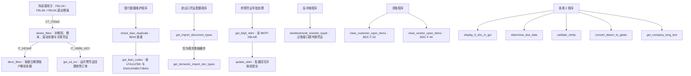
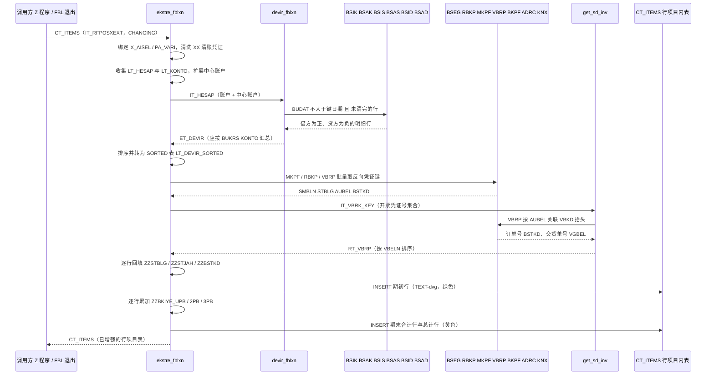

# ZCL_FI_TOOLKIT 分析报告

> 源文件：`ZCL_FI_TOOLKIT.abap`（ABAP-Library / functional / fi，约 1700 行，单类）
> 阅读方式：当成"同事第一次接手这套 FI 工具箱"来讲解——先讲它解决什么业务问题，再按真实调用链走代码。

---

## 一、程序定位与业务背景

### 1.1 它到底在解决什么问题

这不是报表，也不是事务程序，而是 SAP **FI 财务核算模块的"外围适配工具箱"**。它把三类散落各处的 FI 知识收敛成一个 `FINAL` 公共类：

1. **行项目列表（FI Item Display）的增强底座。** 财务同事每天看的 `FBL1N`（客户行项目）、`FBL3N`（总账行项目）、`FBL5N`（供应商行项目）只给"本次查询期间内的分录"，看不到上一年滚过来的期初余额，也看不到期末累计余额、看不到"这笔分录对应的反向凭证是哪一张"。`ekstre_fblxn` 就是把 `BT` 事务（往来对账 Ekstre）里手写的"加 Devir、加滚动余额、加期末合计、清洗 XX 清账凭证"那一整套逻辑，从一段段报表代码里抽成可复用方法。

2. **跨事务的 FI 杂项能力。** IBAN 查重（同一个 IBAN 在 `LFA1/LFBK` 与 `KNA1/KNBK/TIBAN` 里重复会让付款跑错银行）、参照凭证号 `XBLNR` 的批量回填与过账（`POSTING_INTERFACE`）、未清项批量清账（`F-32`/`F-44`）、到期日计算（`FAEDE` → `DETERMINE_DUE_DATE`）、科目首字符与成本中心类型的 IFRS 校验（`5` 开头损益类必须挂 `'OK'` 成本中心、`9` 开头必须挂 `'TH'`）——这些是每个 FI 开发都会重写一遍的胶水代码。

3. **报表与标准事务之间的"偷内存"通道。** `devir_fblxn` 和 `ekstre_fblxn` 用 `ASSIGN ('(RFITEMAP)SO_BUDAT[]')` 这种带程序前缀的动态 `ASSIGN`，直接读 `FBL1N/FBL3N/FBL5N` 内部内存里的选择屏日期、公司代码范围、勾选标志，以及 `SAPLFI_ITEMS` 函数组的 `GB_CENTRAL_ITEMS`（中心账户标志）。这是 SAP 报表增强里"没有合适 BAdI/用户出口时的最后一招"。

**现有方案为什么不够：** 业务上真正要的东西是"某公司代码、某账户、某键日期上的**期初余额**"。SAP 标准做法要么让你手工跑 `F.03`/`F.08` 再抄数字，要么用 `FAGL` 聚合作业，要么自己写 `BSIK/BSAK` 的 `FOR ALL ENTRIES`。而这件事有一堆易错细节：贷方行要取负号才能和借方行相加、部分清账行（`AUGDT`）要区分落在键日期之前还是之后、特殊科目标记 `UMSKZ` 的行是否计入、借贷同时存在的账户还要把中心账户余额并进来。`devir_fblxn` 把这一整套口径固化了下来。

### 1.2 设计范式一句话定性

**无状态 `FINAL` 工具类 + 类方法静态服务 + 以 `sy-cprog` 为隐式上下文的报表退出增强**，底层混用三种"旁路"手段：BDC 驱动标准事务、`POSTING_INTERFACE_*` 函数模块直接过账、动态 `ASSIGN` 读写别的程序内存。

三个关键词：**无状态**（除三份 `CLASS-DATA` 缓存外没有实例状态，天然会话安全）、**隐式上下文**（方法自己不接收报表上下文，而是从 `sy-cprog` 反推自己被谁调用）、**旁路**（大量使用官方不推荐但"能跑"的手段）。后两个词是本类全部风险的来源。

### 1.3 规模速览

- 对外公开类方法 **16 个**，私有类方法 **1 个**（`get_sd_inv`）。
- 类型定义约 **30 个**，集中在"行项目 / 凭证键 / 银行键"三类结构上。
- 常量 **8 个**：借贷方向 `S`/`H`、三类反向凭证业务类型 `MKPF`/`RMRP`/`VBRK`、订单类型 `ZAH1`。
- 类级缓存 **3 份**：`gt_dg_cache`、`gt_company_long_text` 均为 `HASHED`+`UNIQUE`，`gt_import_doc_type_cache` 为标准表。
- 私有类型区还有 `tt_rbkp`、`tt_mseg`、`ty_vbrp` 等"为性能而做的预取结构"——这个类明显经历过多次性能调优。

---

## 二、程序执行流程总览

这个类没有单一入口，实际是**六条彼此独立的调用链 + 一组通用小工具**。先画主干；主干（报表增强链）是全类最复杂、缺陷最集中的部分。



### 责任链表

| 子程序 | 调用者 | 职责 |
|---|---|---|
| 类定义与全局声明区 | 系统装载时 | 定义对外结构、FI 凭证类型常量与三份类级缓存骨架 |
| `ekstre_fblxn` | `FBL1N`/`FBL3N`/`FBL5N` 及 `ZSDP_RFITEMAR` 退出增强（外部） | 往 `CT_ITEMS` 补订单号、期初行、滚动余额列、期末合计行，回填反向凭证键 |
| `devir_fblxn` | `ekstre_fblxn`（唯一内部调用者） | 动态读报表日期/范围全局量，从 `BSIK/BSAK/BSIS/BSAS/BSID/BSAD` 算账户期初余额并汇总 |
| `get_sd_inv` | `ekstre_fblxn`（唯一内部调用者，私有） | 由开票凭证号经 `VBRP-AUBEL` 回溯 `VBKD` 销售订单号 |
| `check_iban_duplicate` | 银行数据维护类 Z 程序（外部） | 校验一批 IBAN 是否已被供应商或客户占用，重复则抛 `ZCX_FI_IBAN` |
| `get_iban_codes` | `check_iban_duplicate` | 分别从供应商侧（`LFA1+LFBK+TIBAN`）和客户侧（`KNA1+KNBK+TIBAN`）捞出占用该 IBAN 的行 |
| `get_import_document_types` | 进出口凭证配置 Z 程序（外部） | 读 `ZFIT_ITH_BLART`（带缓存），按国内/境外开关返回凭证类型集合 |
| `get_domestic_import_doc_types` | 同上（外部） | 返回"国内"进出口凭证类型，内部借调 `get_import_document_types` 顺带填缓存 |
| `get_bkpf_xblnr` | 参照凭证号维护批处理（外部） | 按 `BUKRS/BELNR/GJAHR` 批量读 `BKPF-XBLNR` 回填到传入表 |
| `update_xblnr` | 同上（外部） | 循环调 `J_1B_NFE_UPDATE_XBLNR` 回写，可每张 `COMMIT WORK AND WAIT` |
| `denklestirerek_transfer_kaydi` | 反冲销 Z 程序（外部） | 组装 `FTCLEAR/FTPOST` 后经 `POSTING_INTERFACE_START/CLEARING/END` 生成冲销凭证 |
| `clear_customer_open_items` | 清账 Z 程序（外部） | BDC 驱动 `F-32`，按账户+公司代码+凭证清单清客户未清项 |
| `clear_vendor_open_items` | 清账 Z 程序（外部） | BDC 驱动 `F-44`，同上，供应商侧 |
| `display_fi_doc_in_gui` | Z 程序/工作流（外部） | `SET PARAMETER` 填 `BLN/BUK/GJR` 后跳 `FB03` 显示凭证 |
| `determine_due_date` | 到期日计算 Z 程序（外部） | 由 `BSEG` 行项目装 `FAEDE`，调 `DETERMINE_DUE_DATE` 算净到期日 |
| `validate_zhrtip` | 凭证录入用户出口（外部） | 按科目首字符 `5`/`9` 校验成本中心类型，支持豁免公司代码 |
| `convert_datum_to_gdatu` | 各类日期工具（外部） | `WRITE` + `CONVERSION_EXIT_INVDT_INPUT` 转 `GDATU`，带 `HASHED` 缓存 |
| `get_company_long_text` | 报表抬头打印（外部） | `T001-ADRNR` → `ADRC` 取公司代码长名称，带缓存 |

下面按这条流程，从最核心的主干开始逐个子程序展开。

---

## 三、分组分析

### 3.1 类定义与全局声明区（类型 / 常量 / 类级缓存）

先看骨架。这里有一个值得学的统一模式：**结构体字段直接写 `TYPE <SAP表>-<字段>`**，而不是自己 `DATA` 或 `LIKE`。好处是长度、取值范围、域校验自动跟标准表一致，升级时不漂移。下面只展开有分析价值的部分；`ty_devir_items`/`ty_devir`/`ty_mkpf_key`/`ty_rbkp_key`/`ty_vbrk_key`/`t_vbkd`/`t_rbkp`/`t_mseg` 这类"两三个字段的键结构"按同构模式归纳省略（共同模式：*要么是某张 SAP 表的字段投影，要么是一张表的唯一键三元组*）。

```abap
CLASS zcl_fi_toolkit DEFINITION
  PUBLIC
  FINAL
  CREATE PUBLIC .

  PUBLIC SECTION.

    TYPES:
      BEGIN OF t_documents ,
        bukrs TYPE bseg-bukrs,
        belnr TYPE bseg-belnr,
        gjahr TYPE bseg-gjahr,
        buzei TYPE bseg-buzei,
      END OF t_documents .
    TYPES:
      tt_documents TYPE STANDARD TABLE OF t_documents WITH DEFAULT KEY .
    TYPES:
      BEGIN OF ty_hesap,
        sube   TYPE rfposxext-konto,
        merkez TYPE rfposxext-konto,
      END OF ty_hesap .
    TYPES:
      tt_hesap TYPE STANDARD TABLE OF ty_hesap .

    TYPES:
      tt_blart TYPE HASHED TABLE OF blart WITH UNIQUE KEY primary_key COMPONENTS table_line .

    CONSTANTS c_borc TYPE shkzg VALUE 'S' ##NO_TEXT.
    CONSTANTS c_alacak TYPE shkzg VALUE 'H' ##NO_TEXT.
    CONSTANTS c_mal_hareketi TYPE awtyp VALUE 'MKPF' ##NO_TEXT.
    CONSTANTS c_satinalma_faturasi TYPE awtyp VALUE 'RMRP' ##NO_TEXT.
    CONSTANTS c_satis_faturasi TYPE awtyp VALUE 'VBRK' ##NO_TEXT.
    CONSTANTS c_musteri_hf_talebi TYPE auart VALUE 'ZAH1' ##NO_TEXT.
```

```abap
  PRIVATE SECTION.

    TYPES:
      tt_dg_cache TYPE HASHED TABLE OF t_dg_cache WITH UNIQUE KEY primary_key COMPONENTS datum .

    TYPES:
      tt_company_long_text TYPE HASHED TABLE OF t_company_long_text
        WITH UNIQUE KEY primary_key COMPONENTS bukrs .

    TYPES:
      tt_ith_blart TYPE STANDARD TABLE OF zfit_ith_blart WITH DEFAULT KEY.

    CONSTANTS c_tabname_t001 TYPE tabname VALUE 'T001' ##NO_TEXT.
    CLASS-DATA gt_company_long_text TYPE tt_company_long_text .
    CLASS-DATA gt_dg_cache TYPE tt_dg_cache .
    CLASS-DATA gt_import_doc_type_cache TYPE tt_ith_blart .
```

**做什么** — 定义对外暴露的凭证键结构（`t_documents`、`t_doc_xblnr`）、账户与业务伙伴对照结构（`ty_hesap`、`ty_konto`）、期初余额结构（`ty_devir_items` 承载明细、`ty_devir` 承载按账户汇总结果）；把三个"FI 里的字面量"提升为常量：借贷方向（`S`/`H`）与三种反向凭证的业务类型（`MKPF` 物料凭证、`RMRP` 采购发票、`VBRK` 开票凭证）；声明三份 `CLASS-DATA` 缓存，其中两份 `HASHED`+`UNIQUE` 按单字段业务键去重，一份标准表保存配置全表。

**为什么** — 常量化收益远大于成本：这三类 `zzawtyp` 值散落在 `ekstre_fblxn` 里七八个 `IF/ELSEIF` 分支中，SAP 业务交易类型配置一旦变更，改一个常量就够，写字面量则要全局搜索并祈祷不漏；借贷方向同理，土耳其语报表里 `S`(Sol, 借) / `H`(Alacak, 贷) 是最容易搞反的一对，常量至少让编译器帮忙检查拼写。缓存选 `HASHED`+`UNIQUE` 是精准的：`gt_dg_cache` 键是单个 `datum`、`gt_company_long_text` 键是单个 `bukrs`，单标量键用 `HASHED` 查找 O(1) 且天然唯一，比 `SORTED` 更省代码；`gt_import_doc_type_cache` 用标准表是因为要整表读出后线性过滤，且 `ZFIT_ITH_BLART` 里同一 `BLART` 可能有"国内/境外"多行，用 `HASHED`+`UNIQUE` 反而会在构造时抛异常（见第五章 P0）。

**风险与改进** — 三点：
1. **`C_BORC` 与 `C_MUSTERI_HF_TALABI` 是死常量**，全类零引用。死常量比没有常量更糟：新同事会以为"借方判断应该用 `c_borc`"，进而误判 `ekstre_fblxn` 里 `ELSE` 分支是 bug。应删除。
2. **`tt_vbkd`（`SORTED TABLE OF vbkd WITH NON-UNIQUE KEY vbeln`）是死类型**——`get_sd_inv` 里实际用的是 `tt_vbrp`，这个类型和它的 `t_vbkd` 从未被引用。
3. **缓存没有失效接口**。三份 `CLASS-DATA` 都没有配套的 reset/失效方法，`ZFIT_ITH_BLART` 这类配置表改了之后，只能靠重启类池或内部会话结束才生效。建议补一个 `invalidate_caches` 类方法，并在 `GET` 入口对"上次为空"的情况打 `MESSAGE` 提醒，避免"配置明明改了却不生效"的排查地狱。

---

### 3.2 方法 `ekstre_fblxn` —— 行项目增强主链（分八步）

这是全类最长、最关键的方法（约 530 行），承担了三件事：清洗原始行项目、算并插入期初行、逐行算滚动余额并追加期末合计行。它的形态是典型的"报表退出增强"：**自己不带任何输入条件，全部上下文从 `sy-cprog` 和动态 `ASSIGN` 里扒出来**。下面分八步走。

#### ① 绑定报表上下文

```abap
CHECK ct_items IS NOT INITIAL.
CASE sy-cprog.
  WHEN 'RFITEMAP'."FBL1N
    ASSIGN ('(RFITEMAP)X_AISEL') TO FIELD-SYMBOL(<lv_x_aisel>).
    ASSIGN ('(RFITEMAP)PA_VARI') TO FIELD-SYMBOL(<lv_vari>).

  WHEN 'RFITEMGL'."FBL3N
    ASSIGN ('(RFITEMGL)X_AISEL') TO <lv_x_aisel>.
    ASSIGN ('(RFITEMGL)PA_VARI') TO <lv_vari>.

  WHEN 'RFITEMAR'."FBL5N
    ASSIGN ('(RFITEMAR)X_AISEL') TO <lv_x_aisel>.
    ASSIGN ('(RFITEMAR)PA_VARI') TO <lv_vari>.

  WHEN 'ZSDP_RFITEMAR'.
    ASSIGN ('(ZSDP_RFITEMAR)X_AISEL') TO <lv_x_aisel>.
    ASSIGN ('(ZSDP_RFITEMAR)PA_VARI') TO <lv_vari>.

  WHEN OTHERS.
    RETURN.

ENDCASE.

IF sy-subrc = 0 AND sy-cprog(5) = 'RFITE'.
```

**做什么** — 先判入参非空；按 `sy-cprog` 分四个分支，把"是否勾选了行项目"标志（`X_AISEL`）和"当前使用的显示变式"（`PA_VARI`）从报表内部内存挂到字段符号上；非上述四个程序直接 `RETURN`；随后用一个总闸门判断是否继续做"EKSTRE 增强"。

**为什么** — `FBL1N/FBL3N/FBL5N` 是 SAP 标准行项目显示，它们的选择屏变量（`SO_BUDAT`、`KD_BUKRS`）和勾选标志没有开放 BAdI，只能用带程序前缀的动态 `ASSIGN` 读内部内存——这是报表增强生态里公认可行但官方不背书的手段。`PA_VARI` 里带 `'EKSTRE'` 是判断"用户选了往来对账变式"的土办法：只有用了这个变式才需要补期初/期末行，普通变式保持原样。

**风险与改进** — 这里有两处硬伤：
1. **`ZSDP_RFITEMAR` 分支是死代码。** 总闸门要求 `sy-cprog(5) = 'RFITE'`，而 `'ZSDP_RFITEMAR'` 的第 5 位是下划线（Z-S-D-P-_-R…），永远不等于 `'RFITE'`。也就是说这个分支以及后面两处 `WHEN 'RFITEMAR' OR 'ZSDP_RFITEMAR'` 都永远执行不到，`ZSDP_RFITEMAR` 场景会掉进 `ELSE` 分支、只回填订单号而完全没有期初余额。修复：把闸门改成 `sy-cprog(5) = 'RFITE' OR sy-cprog = 'ZSDP_RFITEMAR'`，或干脆改成白名单 `CASE sy-cprog WHEN 'RFITEMAP' OR 'RFITEMGL' OR 'RFITEMAR' OR 'ZSDP_RFITEMAR'`。
2. **`sy-subrc = 0` 在这里没有意义。** 动态 `ASSIGN` 到*未指派的字段符号*并不以 `sy-subrc` 0/4 的形式可靠地报告成功与否，而这里的 `sy-subrc` 是从方法入口继承下来的残留值。这个"防御"既不能证明 `ASSIGN` 成功，又让人误以为做了保护。正确写法是先 `ASSIGN` 再判 `IS ASSIGNED`，下一处代码里作者其实用对了（见第④步的 `IF <lv_merkez> IS ASSIGNED`），前后不一致本身就是信号。

#### ② 补销售订单号（仅 EKSTRE 变式）

```abap
LOOP AT ct_items ASSIGNING FIELD-SYMBOL(<ls_items>)
      WHERE zuonr(3) eq  zcl_fi_omd=>c_zuonr_sanal and
            zzbstkd IS INITIAL.
   <ls_items>-zzbstkd = <ls_items>-zuonr.
ENDLOOP.
IF <lv_vari> CS 'EKSTRE'.

  IF <lv_x_aisel> <> abap_true.
    MESSAGE TEXT-003 TYPE 'I'.
    RETURN.
  ENDIF.
```

**做什么** — 遍历全部行项目，凡是 `ZUONR` 的前三位等于"订单"类别（`ZCL_FI_OMD=>C_ZUONR_SANAL`）且 `ZZBSTKD`（订单号）还空着的行，把 `ZUONR` 整串拷进 `ZZBSTKD`；随后才检查变式名是否为 `EKSTRE`、用户是否真的勾选了行项目，没勾选则提示信息 `TEXT-003` 后返回。

**为什么** — `FBL5N/FBL1N` 的行项目结构 `IT_RFPOSXEXT` 里，"行项目类别"（`ZUONR` 前缀：订单 `ORD`、发票 `RINV` 等）和"订单号"是两个独立字段。做 Ekstre 对账时需要订单号来做 `BT` 报表的分组键，所以这里做一次兜底填充；`ZZBSTKD IS INITIAL` 保证不会覆盖后面第⑥步从 `VBRP/VBKD` 取到的真实订单号。这是典型的"同一语义两个来源、按优先级分层填充"的写法，思路是对的。

**风险与改进** — 三点：
1. **判断"用户没勾选"用了 `<>` 而非"未勾选"的语义**，虽然当前只有 `X`/`INITIAL` 两态能跑通，但一旦报表侧改成三态（比如部分选中）逻辑就崩。建议写 `IF <lv_x_aisel> <> abap_true` 的替代方案 `IF NOT ( <lv_x_aisel> = abap_true )`，或按实际标志类型逐态判断。
2. **`MESSAGE TEXT-003 TYPE 'I'` 之后静默 `RETURN`**，用户看到一条提示和一张"没有数据增强"的报表，无法判断是"没勾选"还是"程序出错"。建议改抛异常或至少在返回前说明将跳过哪些增强。
3. **`eq` 是过时比较操作符**（7.40 起 `EQ` 已不推荐，应写 `=`），且 `zuonr(3)` 把"业务规则"写成了"截取前三位"，规则变更时无从追溯。建议提升为常量 `c_zuonr_sanal_prefix TYPE char3`。

#### ③ 清洗 XX 清账凭证及其冲销凭证（HAR-10448）

```abap
LOOP AT ct_items ASSIGNING <ls_items>
            WHERE blart = zcl_fi_document_type=>get_customer_clearing_doc_type( ) AND
                  gjahr GE '2018'.
  DELETE ct_items WHERE belnr = <ls_items>-zzstblg AND gjahr = <ls_items>-zzstjah.
  DELETE ct_items.
ENDLOOP.

SORT ct_items BY konto budat ASCENDING.

IF  ct_items IS INITIAL.
  RETURN.
ENDIF.
```

**做什么** — 按注释理解，作者想做的事是：把客户 Ekstride 里"清账凭证类型（XX）且年度 ≥ 2018"的行隐藏掉，同时把被这些清账冲销掉的那张原始凭证也从结果里去掉。实现上先 `LOOP ... WHERE blart = XX AND gjahr GE '2018'` 找到清账行，对每行按 `ZZSTBLG/ZZSTJAH` 删掉对应原始凭证行，然后执行一条无条件的 `DELETE ct_items.`；最后重新排序并判空。

**为什么** — 业务动机是对的：`BT` 报表在出客户对账单时不希望看到清账凭证及其原始凭证成对出现，所以要剔除。但正确的实现必须是"先收集、后批量删除"两段式——先 `LOOP` 把清账行的 `ZZSTBLG/ZZSTJAH` 收集进一张临时表，`ENDLOOP` 之后再 `DELETE ct_items WHERE blart = XX`，最后按收集到的键删原始凭证。作者显然也想过这个方案，因为被注释掉的那行 `delete ct_items where blart = 'XX' and gjahr ge '2016'` 就是它的雏形。

**风险与改进** — **这是全类最严重的一处 P0 缺陷**，三个问题叠在一起：
1. **`DELETE ct_items.` 是无条件删除整张表。** 它在 `LOOP` 体内执行，第一次迭代就把 `CT_ITEMS` 全部行清空；紧接着 `SORT` + `IF ct_items IS INITIAL. RETURN.`，于是**只要查询结果里存在任何一张 2018 年后的清账凭证，整张 Ekstride 就变成空表并直接返回**。用户看到的就是"加了 EKSTRE 变式之后报表全空"。这条代码必须改成带 `WHERE` 的删除，或移出 `LOOP`。
2. **时序自相矛盾。** `ZZSTBLG/ZZSTJAH` 是在后面第⑥步的 `LOOP` 里才被回填的，而这段清洗跑在第⑥步之前。所以 `DELETE ... WHERE belnr = <ls_items>-zzstblg` 基本删不到东西（除非调用方事先填过），真正的意图完全落空。
3. **硬编码 `gjahr GE '2018'`**（注释里还是 `2016`）且 `'2018'` 被直接与数值字段比较，依赖 `GJAHR` 是内建 `NUMC4` 的补零特性；这个"2018 起才清洗"的业务规则应该来自配置或至少是命名常量。
4. 另外，在 `LOOP AT ... WHERE` 循环体内对被遍历的表做 `DELETE`，即使改成条件删除，也应改为"先收集再删"，否则 `sy-tabix` 与 `<ls_items>` 字段符号的有效性都难以推理。

#### ④ 收集账户清单与中心账户

```abap
LOOP AT ct_items ASSIGNING <ls_items>.
  CLEAR ls_hesap.
  ls_hesap-sube = <ls_items>-konto.
  COLLECT ls_hesap INTO lt_hesap.
  ls_konto-bukrs = <ls_items>-bukrs.
  ls_konto-konto = <ls_items>-konto.
  COLLECT ls_konto INTO lt_konto.
ENDLOOP.
ASSIGN  ('(SAPLFI_ITEMS)GB_CENTRAL_ITEMS') TO FIELD-SYMBOL(<lv_merkez>).
IF sy-subrc = 0.
  IF <lv_merkez> = abap_true.
    CASE sy-cprog.
      WHEN 'RFITEMAR' OR 'ZSDP_RFITEMAR'.
        SELECT bukrs, kunnr, knrze INTO TABLE @DATA(lt_knb1) FROM knb1
            FOR ALL ENTRIES IN @lt_hesap
            WHERE kunnr = @lt_hesap-sube AND
                  knrze <> @space.
        SORT lt_knb1 BY bukrs kunnr.
        LOOP AT lt_knb1 ASSIGNING FIELD-SYMBOL(<ls_knb1>).
          ls_hesap-sube = <ls_knb1>-kunnr.
          ls_hesap-merkez = <ls_knb1>-knrze.
          COLLECT ls_hesap INTO lt_hesap.
        ENDLOOP.

      WHEN 'RFITEMAP'.

        SELECT bukrs, lifnr, lnrze INTO TABLE @DATA(lt_lfb1) FROM lfb1
            FOR ALL ENTRIES IN @lt_hesap
            WHERE lifnr = @lt_hesap-sube AND
                  lnrze <> @space.
        SORT lt_lfb1 BY bukrs lifnr.
        LOOP AT lt_lfb1 ASSIGNING FIELD-SYMBOL(<ls_lfb1>).
          ls_hesap-sube   = <ls_lfb1>-lifnr.
          ls_hesap-merkez = <ls_lfb1>-lnrze.
          COLLECT ls_hesap INTO lt_hesap.
        ENDLOOP.

    ENDCASE.
  ENDIF.
ENDIF.
SELECT * FROM t001  INTO TABLE lt_t001.
```

**做什么** — 扫一遍 `CT_ITEMS`，把出现过的"账户号"去重成 `LT_HESAP`（只有 `SUBE` 一列有值），把"公司代码+账户号"组合去重成 `LT_KONTO`（第⑧步要用）；然后尝试挂 `SAPLFI_ITEMS` 的 `GB_CENTRAL_ITEMS` 中心账户开关，若为真，则按是客户侧（读 `KNB1-KNRZE`）还是供应商侧（读 `LFB1-LNRZE`）扩展出一组 `(子账户, 中心账户)` 对，连同原集合一起并入 `LT_HESAP`；末尾顺手 `SELECT * FROM t001` 整表读进 `LT_T001`。

**为什么** — 中心账户（集中记账）是 FI 里"多个明细账户的余额汇总到一个总账科目"的机制。做 Ekstre 时，如果用户勾了中心账户，期初余额必须把中心账户下所有子账户的余额加进来，否则显示的期初会偏小。`KNB1-KNRZE` / `LFB1-LNRZE` 正是"账户 → 中心账户"的映射字段，用 `FOR ALL ENTRIES` + `SORT` + 二分查找（后面第⑦步会用到）是标准套路，也说明作者是按性能设计的。`LT_KONTO` 单独收集一份"公司代码+账户"，是为了第⑧步能精确地把期末合计插到正确位置。

**风险与改进** — 三点：
1. **`IF sy-subrc = 0.` 后面立刻读 `<lv_merkez>`，可能短转储。** 第①步已经指出动态 `ASSIGN` 到未指派字段符号不能靠 `sy-subrc` 判断；而这里比第①步更危险——`SAPLFI_ITEMS` 这个函数组的内存区只在 FI 行项目显示被加载时才存在。从 `FBL1N/FBL3N/FBL5N` 调用时它在，但从任意 Z 报表或 FM 调用时**不在**，此时 `sy-subrc` 恰好残留为 0 就会去读未指派的字段符号，直接 dump。作者在第⑦步用的是正确写法 `IF <lv_merkez> IS ASSIGNED.`，同一方法内两套写法，应统一为后者。
2. **`SELECT * FROM t001 INTO TABLE lt_t001` 的结果全类从未被使用**——`LT_T001` 声明为 `SORTED ... WITH UNIQUE KEY bukrs ##NEEDED` 但后面没有任何一处引用，属于死代码。`T001` 是全表读（所有公司代码 × 全部字段），在大规模 Ekstre 中是纯浪费。删掉即可。
3. **`COLLECT` 用在无键标准表上依赖"整行相等"**。`LT_HESAP`/`LT_KONTO` 都是 `STANDARD TABLE`，`COLLECT` 会按整行去重；这里因为字段少且赋值时 `CLEAR` 了工作区，恰好正确。但 `ls_konto` 在第 8 步循环里是**不清空**就复用的，若将来有人往 `ty_konto` 加字段，会立刻产生脏数据。建议给两张表加 `WITH UNIQUE KEY` 或改成先 `SORT` 后 `DELETE ADJACENT DUPLICATES`。

#### ⑤ 取期初余额并排序

```abap
zcl_fi_toolkit=>devir_fblxn(
            EXPORTING it_hesap = lt_hesap
            IMPORTING et_devir = lt_devir
                                     ).

SORT lt_devir BY bukrs konto gsber.
lt_devir_sorted = lt_devir.

FREE  : lt_devir,lt_hesap.
```

**做什么** — 把第④步收集到的账户集合交给 `devir_fblxn` 算期初余额，结果接进 `LT_DEVIR`；按 `公司代码 + 账户 + 业务范围` 排序后转成 `SORTED` 表 `LT_DEVIR_SORTED`（供第⑦步按 `BUKRS/KONTO` 快速定位）；随即 `FREE` 掉不再需要的大表。

**为什么** — `FOR ALL ENTRIES` 的前提是内表非空且去重，这两条已经在 `devir_fblxn` 内部各自检查了，这里把"去重"提前到 `COLLECT` 阶段做，是正确的职责划分。转成 `SORTED` 表是为了把后续查找从线性扫描降到二分查找，`FREE` 显式释放大内表内存也说明作者对 `IT_RFPOSXEXT` 这种十万行量级的表有内存意识——这是本方法最值得肯定的一段工程素养。

**风险与改进** — `SORT lt_devir BY bukrs konto gsber` 之后赋给 `LT_DEVIR_SORTED`（二级键 `bukrs konto`），在 `gsber` 升序的前提下二级键仍然有序，二分查找成立 ✓ 无明显风险。唯一可提的是：第⑥步之后 `LT_HESAP` 已被 `FREE`，若后续有人想在汇总时用到账户集合就无法回溯，建议把 `FREE` 挪到方法末尾统一做，减少"中途失效"的阅读负担。

#### ⑥ 预取反向凭证键（MKPF / RMRP / VBRK）

```abap
LOOP AT ct_items ASSIGNING <ls_items>
   WHERE zzawtyp = c_mal_hareketi OR zzawtyp =  c_satinalma_faturasi
       OR  zzawtyp =  c_satis_faturasi.
  IF <ls_items>-zzawtyp = c_mal_hareketi.
    APPEND VALUE #( mblnr = <ls_items>-zzawkey(10)
                    mjahr = <ls_items>-zzawkey+10(4)
                   ) TO lt_mkpf_key.
  ELSEIF <ls_items>-zzawtyp = c_satinalma_faturasi.
    APPEND VALUE #( belnr = <ls_items>-zzawkey(10)
                    gjahr = <ls_items>-zzawkey+10(4)
                   ) TO lt_rbkp_key.
  ELSEIF <ls_items>-zzawtyp = c_satis_faturasi.
    APPEND <ls_items>-zzawkey(10) TO lt_vbrk_key.
  ENDIF.
ENDLOOP.

SORT lt_rbkp_key BY belnr gjahr.
SORT lt_mkpf_key BY mblnr mjahr.
SORT lt_vbrk_key BY vbeln.
DELETE ADJACENT DUPLICATES FROM lt_mkpf_key COMPARING mblnr mjahr.
DELETE ADJACENT DUPLICATES FROM lt_rbkp_key COMPARING belnr gjahr.
DELETE ADJACENT DUPLICATES FROM lt_vbrk_key COMPARING vbeln.

IF lt_rbkp_key IS NOT INITIAL.

  SELECT belnr, gjahr, stblg, stjah
    FROM rbkp
    FOR ALL ENTRIES IN @lt_rbkp_key
    WHERE
      belnr = @lt_rbkp_key-belnr AND
      gjahr = @lt_rbkp_key-gjahr
    INTO CORRESPONDING FIELDS OF TABLE @lt_rbkp.

  FREE lt_rbkp_key.
ENDIF.

IF lt_mkpf_key IS NOT INITIAL.
  SELECT mblnr, mjahr, smbln, sjahr
    FROM mseg
    FOR ALL ENTRIES IN @lt_mkpf_key
    WHERE
      mblnr = @lt_mkpf_key-mblnr AND
      mjahr = @lt_mkpf_key-mjahr
    INTO CORRESPONDING FIELDS OF TABLE @lt_mseg.
  FREE lt_mkpf_key.
ENDIF.
IF lt_vbrk_key[] IS NOT INITIAL.
  lt_vbrp = get_sd_inv( lt_vbrk_key ).
  FREE lt_vbrk_key.
ENDIF.
```

**做什么** — 按 `ZZAWTYP`（关联业务类型）把行项目分流：`MKPF` 物料凭证从 `ZZAWKEY` 前 10 位取凭证号、后 4 位取年度存入 `LT_MKPF_KEY`；`RMRP` 采购发票同样切 10+4 存 `LT_RBKP_KEY`；`VBRK` 开票凭证取前 10 位存 `LT_VBRK_KEY`；三张键表分别排序去重，然后一次性预取 `RBKP`（拿到"冲销凭证"字段 `STBLG/STJAH`）和 `MSEG`（拿到物料凭证的原始凭证 `SMBLN/SJAHR`），开票凭证走私有方法 `get_sd_inv` 回溯订单。

**为什么** — 这一步是典型的"**把 N+1 拆成 1 次**"优化：原始需求只是"每行找到它的原始凭证"，最直白的写法是循环里逐行 `SELECT`。作者改成先扫一遍收集键表、再 `SORT` + `DELETE ADJACENT DUPLICATES` 去重、再用 `FOR ALL ENTRIES` 批量取，把十万行明细的查询次数从十万次降到一次。这个改写思路是教科书级的，值得学习。三段 `IF IS NOT INITIAL` 也是 `FOR ALL ENTRIES` 的硬性前提，作者记得逐个检查，说明踩过空表短转储的坑。

**风险与改进** — 四点：
1. **`ZZAWKEY` 按 10+4 硬偏移解析。** 这依赖 SAP 把 `AWKEY` 拼成"凭证号(10) + 年度(4)"的内部约定，一旦某单据的 `AWKEY` 布局不同（例如 `VBRK` 的 `AWKEY` 在带参考号的场景），切分就会错位。建议把偏移量提成常量并加注释说明来源，或改用 `SUBSTRING` 并做长度校验。
2. **`MSEG` 取全量行项目只为拿 `SMBLN/SJAHR`。** 一张物料凭证有几十上百个 `MSEG` 行，`SMBLN` 是**逐行**的（部分冲销时各行可能不同），这里整表拉回来只为了后面取第一行，等于把数据量放大了一个数量级，还拿不到确定性的答案。建议改成直接查 `MKPF` 的 `SMBLN`（表头就有），或只取 `POSNR = '000000'` 的行。
3. **`FOR ALL ENTRIES` 与 `MKPF/RBKP` 的年度字段绑定在键表上是对的，但 `MSEG` 这一支的 `sjahr` 可能初始**（旧物料凭证或某些期间），后续拼 `AWKEY` 时会得到 `0000` 后缀，导致第⑦步 `SELECT SINGLE ... FROM bkpf` 查不到而静默留空。建议拼 `AWKEY` 后做非初始校验。
4. `lt_vbrk_key[] IS NOT INITIAL` 用了 `[]` 而 `lt_rbkp_key`/`lt_mkpf_key` 没用，风格不一致（两者等价）。无功能影响，建议统一。

#### ⑦ 逐行回填原始凭证号并插入期初行、算滚动余额

```abap
SORT ct_items BY konto budat ASCENDING.

LOOP AT ct_items ASSIGNING <ls_items>.
  lv_tabix = sy-tabix.

*  test kayıt belgesi
  IF <ls_items>-zzawtyp = c_mal_hareketi.
    READ TABLE lt_mseg WITH TABLE KEY mblnr = <ls_items>-zzawkey(10)
                                      mjahr = CONV #( <ls_items>-zzawkey+10(4) )
                                      ASSIGNING FIELD-SYMBOL(<ls_mseg>).
    IF sy-subrc = 0.
* mb 'nin ters kaydının faturası
      CLEAR lv_awkey.
      IF <ls_mseg>-smbln IS  NOT INITIAL.
        lv_awkey = |{ <ls_mseg>-smbln }{ <ls_mseg>-sjahr }|.
      ELSE.
        READ TABLE lt_mseg WITH KEY smbln = <ls_mseg>-mblnr
                                    sjahr = <ls_mseg>-mjahr
                                    ASSIGNING <ls_mseg>.

        IF sy-subrc = 0.
          lv_awkey = |{ <ls_mseg>-mblnr }{ <ls_mseg>-mjahr }|.
        ENDIF.
      ENDIF.

    ENDIF.

  ELSEIF <ls_items>-zzawtyp = c_satinalma_faturasi.
    READ TABLE lt_rbkp WITH TABLE KEY belnr = <ls_items>-zzawkey(10)
                                      gjahr = CONV #( <ls_items>-zzawkey+10(4) )
                                      ASSIGNING FIELD-SYMBOL(<ls_rbkp>).
    IF sy-subrc = 0.
      CLEAR lv_awkey.
      IF <ls_rbkp>-stblg IS  NOT INITIAL.
        lv_awkey = |{ <ls_rbkp>-stblg }{ <ls_rbkp>-stjah }|.
      ELSE.
        READ TABLE lt_rbkp WITH KEY stblg = <ls_rbkp>-belnr
                                    stjah = <ls_rbkp>-gjahr
                                    ASSIGNING <ls_rbkp>.

        IF sy-subrc = 0.
          lv_awkey = |{ <ls_rbkp>-belnr }{ <ls_rbkp>-gjahr }|.
        ENDIF.
      ENDIF.

    ENDIF.
  ELSEIF <ls_items>-zzawtyp = c_satis_faturasi.
    READ TABLE lt_vbrp WITH TABLE KEY vbeln = <ls_items>-zzawkey(10)
                                    ASSIGNING FIELD-SYMBOL(<ls_vbrp>).
    IF sy-subrc = 0.
      IF <ls_vbrp>-vgtyp = 'J' OR <ls_vbrp>-vgtyp = 'T'.
        <ls_items>-zzteslimat = <ls_vbrp>-vgbel.
      ENDIF.
      <ls_items>-zzbstkd = <ls_vbrp>-bstkd.
    ENDIF.
  ENDIF.

  IF lv_awkey IS  NOT INITIAL.
    SELECT SINGLE belnr INTO <ls_items>-zzstblg FROM bkpf
                  WHERE awtyp = <ls_items>-zzawtyp AND
                        awkey = lv_awkey
                        ##WARN_OK .                   "#EC CI_NOORDER
    IF sy-subrc = 0.
      <ls_items>-zzstjah = <ls_items>-gjahr.
    ENDIF.
  ENDIF.
```

**做什么** — 先按 `账户 + 记账日期` 排序（排序是后面"只在账户第一行插期初行"的前提）；逐行处理：物料凭证行从预取的 `LT_MSEG` 里查这条凭证，若它自己带 `SMBLN` 就用它当原始凭证，否则反查"谁以我为原始凭证"的那条；采购发票行同理用 `STBLG`；开票凭证行从 `LT_VBRP` 取交货单号与订单号回填；最后把拼好的 `AWKEY`（凭证号+年度）拿去 `BKPF` 反查，冲销凭证号写入 `ZZSTBLG`，年度写入 `ZZSTJAH`。

**为什么** — `AWKEY`/`AWTYP` 是 SAP 标准的"业务凭证索引"：给定业务类型和 24 位字符串键就能定位那张 `BKPF` 凭证。用它反查冲销凭证是标准做法，`#EC CI_NOORDER` 与 `##WARN_OK` 说明作者清楚 `WHERE` 里没有前导通配符、不需要排序提示。用字段符号（`ASSIGNING <ls_items>`）而不是按下标遍历，是为了后面插入行时当前行的引用依然有效——这是本方法里第二处体现工程素养的地方。

**风险与改进** — 四点：
1. **`<ls_items>-zzstjah = <ls_items>-gjahr.` 是明确的语义错配。** `ZZSTBLG` 是刚才从 `BKPF` 查出来的**那张被引用凭证的凭证号**，它的年度未必等于当前行的 `GJAHR`。跨年度冲销（年末开票、次年冲销）时，这里会把次年年度写成被引用凭证的年度，字段语义直接错。正确做法是把 `gjahr` 一起 `SELECT` 出来写入。**这条必须改。**
2. **`lv_awkey` 没有在每次循环开头 `CLEAR`。** 只有 `MKPF`/`RMRP` 两个分支里 `CLEAR lv_awkey`，`VBRK` 分支**不 CLEAR**。若 `CT_ITEMS` 中某行是 `VBRK`、上一行是 `MKPF` 且查到了 `lv_awkey`，这一行会带着上一行残留的 `lv_awkey` 继续走进 `SELECT SINGLE ... FROM bkpf`，把一张不相干的凭证号写进 `ZZSTBLG`。**这是数据污染级缺陷。** 应把 `CLEAR lv_awkey` 提到 `LOOP` 顶部。
3. **`SELECT SINGLE belnr INTO <ls_items>-zzstblg FROM bkpf` 在逐行循环里执行**，这正是第⑥步花了大力气消除的 N+1 模式，却被自己打破了。虽然 `AWTYP/AWKEY` 上有索引，但十万行明细就是十万次单行查询。建议改为：把 `lv_awkey` 先收集成一张表，第⑧步之前一次性 `SELECT ... FOR ALL ENTRIES FROM bkpf` 批量回填。
4. **第二次 `READ TABLE` 把同一个 `<ls_mseg>`/`<ls_rbkp>` 字段符号覆盖掉了。** 逻辑上此刻外层已不再需要旧值，能跑；但复用同一字段符号承载两层语义，后续维护极易误用。建议内层用独立字段符号。另外 `tt_mseg` 的键是 `mblnr mjahr`，用 `WITH KEY smbln sjahr` 查非键字段是一次全表二分（O(n)），十万行时会很慢——正确解法还是第 2 点说的"直接查 `MKPF` 表头"。

期初行插入与滚动余额部分（同一 `LOOP` 体内接在上述代码之后）：

```abap
IF lv_konto_temp IS INITIAL OR
   lv_konto_temp <> <ls_items>-konto.
* Devir kalemini ekle
  CLEAR : ls_devir,ls_devir_merkez.

  LOOP AT lt_devir_sorted INTO ls_devir
    WHERE bukrs = <ls_items>-bukrs
      AND konto = <ls_items>-konto.

    IF <lv_merkez> IS ASSIGNED.
      IF <lv_merkez> = abap_true.
        CASE sy-cprog.
          WHEN 'RFITEMAP'.
            READ TABLE lt_lfb1 ASSIGNING <ls_lfb1>
                                 WITH KEY bukrs = <ls_items>-bukrs
                                          lifnr = <ls_items>-konto BINARY SEARCH.
            IF sy-subrc = 0.
              LOOP AT lt_devir_sorted ASSIGNING FIELD-SYMBOL(<lfs_devir_sorted_lnrze>)
                                      WHERE bukrs = <ls_items>-bukrs
                                        AND konto = <ls_lfb1>-lnrze.
                ADD <lfs_devir_sorted_lnrze>-dmshb TO ls_devir_merkez-dmshb.
                ADD <lfs_devir_sorted_lnrze>-dmbe2 TO ls_devir_merkez-dmbe2.
                ADD <lfs_devir_sorted_lnrze>-dmbe3 TO ls_devir_merkez-dmbe3.
                ADD <lfs_devir_sorted_lnrze>-wrbtr TO ls_devir_merkez-wrbtr.
              ENDLOOP.
            ENDIF.
          WHEN 'RFITEMAR' OR 'ZSDP_RFITEMAR'.
            READ TABLE lt_knb1 ASSIGNING <ls_knb1>
                                 WITH KEY bukrs = <ls_items>-bukrs
                                          kunnr = <ls_items>-konto BINARY SEARCH.
            IF sy-subrc = 0.
              LOOP AT lt_devir_sorted ASSIGNING FIELD-SYMBOL(<lfs_devir_sorted_knrze>)
                                      WHERE bukrs = <ls_items>-bukrs
                                        AND konto = <ls_knb1>-knrze.
                ADD <lfs_devir_sorted_knrze>-dmshb TO ls_devir_merkez-dmshb.
                ADD <lfs_devir_sorted_knrze>-dmbe2 TO ls_devir_merkez-dmbe2.
                ADD <lfs_devir_sorted_knrze>-dmbe3 TO ls_devir_merkez-dmbe3.
                ADD <lfs_devir_sorted_knrze>-wrbtr TO ls_devir_merkez-wrbtr.
              ENDLOOP.

            ENDIF.
        ENDCASE.
      ENDIF.
    ENDIF.

    CLEAR ls_item_devir.
    IF ls_devir-bukrs IS INITIAL.
      MOVE-CORRESPONDING ls_devir_merkez TO ls_item_devir  ##ENH_OK.
      ls_item_devir-wrshb =  ls_devir_merkez-wrbtr.
      ls_item_devir-waers =  ls_devir_merkez-waers.
    ELSE.
      ADD ls_devir_merkez-dmshb TO ls_devir-dmshb.
      ADD ls_devir_merkez-dmbe2 TO ls_devir-dmbe2.
      ADD ls_devir_merkez-dmbe3 TO ls_devir-dmbe3.
      ADD ls_devir_merkez-wrbtr TO ls_devir-wrbtr.

      MOVE-CORRESPONDING ls_devir TO ls_item_devir  ##ENH_OK.
      ls_item_devir-wrshb =  ls_devir-wrbtr.
      ls_item_devir-waers =  ls_devir-waers.

    ENDIF.

    ls_item_devir-zzname1_ku = <ls_items>-zzname1_ku.
    ls_item_devir-zzname1_li = <ls_items>-zzname1_li.
    ls_item_devir-konto = <ls_items>-konto.
    ls_item_devir-zuonr = TEXT-dvg.
    ls_item_devir-u_bktxt =  ls_item_devir-sgtxt  = |{ TEXT-004 }({ <ls_items>-konto })|.
    ls_item_devir-hwaer = <ls_items>-hwaer.
    ls_item_devir-hwae2 = <ls_items>-hwae2.
    ls_item_devir-hwae3 = <ls_items>-hwae3.
    IF ls_item_devir-dmshb LT 0.
      ls_item_devir-zzalacak_upb = ls_item_devir-dmshb * -1.
      ls_item_devir-zzalacak_2pb = ls_item_devir-dmbe2 * -1.
      ls_item_devir-zzalacak_3pb = ls_item_devir-dmbe3 * -1.
    ELSE.
      ls_item_devir-zzborc_upb = ls_item_devir-dmshb.
      ls_item_devir-zzborc_2pb = ls_item_devir-dmbe2.
      ls_item_devir-zzborc_3pb = ls_item_devir-dmbe3.
    ENDIF.
    ls_item_devir-bukrs = <ls_items>-bukrs.
    ls_item_devir-konto = <ls_items>-konto.
    ls_item_devir-color = lc_green.

    COLLECT ls_item_devir INTO lt_item_devir.

    CLEAR ls_item_sum.
    ls_item_sum-wrshb = ls_item_devir-wrshb.
    ls_item_sum-waers = ls_item_devir-waers.
    ls_item_sum-dmshb = ls_item_devir-dmshb.
    ls_item_sum-hwaer = ls_item_devir-hwaer.
    ls_item_sum_-hwaer = ls_item_sum-hwaer.

    ADD ls_item_sum-dmshb TO ls_item_sum_-dmshb.

    ls_item_sum-color = lc_yellow.
*              collect ls_item_sum into lt_item_sum_top."kullanılmıyor
  ENDLOOP.
```

**做什么** — 用 `LV_KONTO_TEMP` 记住上一个处理的账户，只在"进入一个新账户的第一行"时插入期初数据：在 `LT_DEVIR_SORTED` 里按 `公司代码+账户` 找期初行；若开了中心账户，再把"中心账户对应的那些子账户"的期初四笔金额（`DMSHB/DMBE2/DMBE3/WRBTR`）累加到 `LS_DEVIR_MERKEZ`；本账户有期初就把中心账户余额并进去，没有就直接用中心账户余额；随后把结果 `MOVE-CORRESPONDING` 成一条 `IT_RFPOSXEXT` 结构，补上账户名称、行项目类别（`TEXT-dvg` = "Devir"）、三种币值（记账/集团/硬通货）、借贷拆分列与绿色标记，`COLLECT` 汇总；同时准备一条黄色标记的小计行。

**为什么** — 三点设计意图值得肯定：
1. **"只在账户切换时插一次"** 是正确的粒度。期初行属于账户级信息，不该每条分录都重复一遍。
2. **`IF ls_devir-bukrs IS INITIAL` 作为"本账户没有期初"的判据**，配合 `MOVE-CORRESPONDING ... ##ENH_OK`（增强兼容标记，容许目标结构字段多于源结构）来实现"有期初用本账户的，没期初退回用中心账户的"，逻辑闭环。
3. **用链式赋值把"期初行"和"滚动余额"复用起来**：下面 `<ls_items>-zzbakiye_upb = ls_item_devir-dmshb = ls_item_devir-dmshb + <ls_items>-dmshb;` 一行同时算出期初行金额和本行余额，`LS_ITEM_DEVIR` 在循环末尾被 `ls_item_sum_.`（黄色合计）覆盖，正好成为下一行的计算基准。这段是全方法里最巧的地方。

**风险与改进** — 四点：
1. **`IF sy-subrc <> 0` 之后才走"无期初"分支，但这个 `sy-subrc` 已经被内层语句污染。** 外层 `LOOP` 体内嵌套了两个 `READ TABLE` 和两个 `LOOP`，`ENDLOOP` 之后判断的 `sy-subrc` 反映的是**最后一个内层语句**的结果，不是外层循环是否命中。结果是两种错误都会发生：本账户**有**期初但中心账户 `READ TABLE` 没命中 → 误走"无期初"分支，插入一条空白 Devir 行并把它 `COLLECT` 进结果；本账户**无**期初但上一次残留 `sy-subrc = 0` → 跳过空白行，界面上期初位置直接缺一行。**必须改成用 `LOOP AT ... WHERE` 前先 `READ` 判存在，或在 `ENDLOOP` 后立刻保存标志，不能依赖被覆盖的 `sy-subrc`。**
2. **`SORT ct_items BY konto budat` 与 `lv_konto_temp` 只比 `KONTO`，没带 `BUKRS`。** 多公司代码选数时，两个公司代码下同名总账账户会被当成"同一账户"——第二个公司代码的第一行不会触发期初插入，滚动余额也会跨公司代码连续累加，直接串账。第⑧步的合计循环反而正确地用了 `WHERE bukrs = ... AND konto = ...`，前后矛盾。修复：排序改 `BY bukrs konto budat`，判断改 `lv_konto_temp_bukrs`/`lv_konto_temp_konto` 成对比较。
3. **用 ALV `color` 字段充当内部标记。** `lc_green`(C51) / `lc_yellow`(C31) 既是对用户的视觉提示，又被第⑧步的 `CHECK <ls_items>-color <> lc_yellow.` 当作"这是不是我自己插的合计行"的内部判据。一旦报表侧的变式或其他增强改写了颜色，合计逻辑就会把真实分录也跳过去（或把自己的行算进去）。应引入独立的 `ty_internal_flag`，把颜色纯粹留作展示。
4. **金额跨货币直接相加。** `ls_item_sum-wrshb` 取的是 `WRBTR`（交易币金额），`waers` 却只取期初集的最后一行币种；第⑧步的 `COLLECT` 又按"账户+币种+业务范围"分组。一个账户下有多种交易币时，合计行会显示单一 `waers`，却把多种币的 `WRBTR` 加在一起。`DMSHB`（记账币）这条线是对的，`WRSHB/WRBTR` 这条线缺币种维度。建议要么统一按记账币汇总（用 `DMSHB`），要么在合计行上标注"仅当单币种账户可用"。

#### ⑧ 追加期末余额行，以及非 EKSTRE 变体的轻量分支

```abap
  FREE : lt_mseg,lt_vbrp,lt_rbkp.
* dönem sonu bakiyeleri ekle
  LOOP AT lt_konto INTO ls_konto.
    REFRESH lt_item_sum.
    CLEAR ls_item_sum.
    CLEAR ls_item_sum_.
    LOOP AT ct_items ASSIGNING <ls_items>
      WHERE bukrs = ls_konto-bukrs
        AND konto = ls_konto-konto.
      lv_tabix = sy-tabix.
      CHECK <ls_items>-color <> lc_yellow.
      CHECK <ls_items>-hwaer IS NOT INITIAL.
      ls_item_sum-bukrs = <ls_items>-bukrs.
      ls_item_sum-konto = <ls_items>-konto.
      ls_item_sum-gsber = <ls_items>-gsber.
      ls_item_sum-wrshb = <ls_items>-wrshb.
      ls_item_sum-waers = <ls_items>-waers.
      ls_item_sum-dmshb = <ls_items>-dmshb.
      ls_item_sum-hwaer = <ls_items>-hwaer.
      ls_item_sum-zuonr = TEXT-dng.
      ls_item_sum-color = lc_green.
      ls_item_sum-u_bktxt =  ls_item_sum-sgtxt  = |{ TEXT-005 }({ <ls_items>-konto })|.

      ls_item_sum_-bukrs = <ls_items>-bukrs.
      ls_item_sum_-konto = <ls_items>-konto.
      ls_item_sum_-u_bktxt =  ls_item_sum-sgtxt  = |{ TEXT-005 }({ <ls_items>-konto })|.
      ls_item_sum_-zuonr = TEXT-dny.
      ls_item_sum_-color = lc_yellow.
      ADD ls_item_sum-dmshb TO ls_item_sum_-dmshb.
      ls_item_sum_-hwaer = ls_item_sum-hwaer.

      COLLECT ls_item_sum INTO lt_item_sum.
    ENDLOOP.

    ADD 1 TO lv_tabix.
    APPEND ls_item_sum_ TO lt_item_sum.
    APPEND INITIAL LINE TO lt_item_sum.

    INSERT LINES OF lt_item_sum INTO ct_items INDEX lv_tabix.

  ENDLOOP.
ENDLOOP.
```

（方法末尾还有一个对称的 `ELSE` 分支：变量式不是 `EKSTRE` 时，只走"收集 `VBRK` 键 → `get_sd_inv` → 回填 `ZZTESLIMAT/ZZBSTKD`"这段轻量逻辑，不再插期初/期末行。）

**做什么** — 遍历第④步收集的 `LT_KONTO`（公司代码+账户），在 `CT_ITEMS` 中筛出该账户的所有明细行，跳过自己插的黄色合计行（`color <> lc_yellow`）和币种为空的行，把 `DMSHB` 按（公司代码、账户、业务范围、币种、记账币）`COLLECT` 进 `LT_ITEM_SUM`，同时累计一条黄色总计行；循环结束后在**最后一个明细行的下一行**位置 `INSERT LINES OF` 插入"绿色合计行 + 空行 + 黄色总计行"三行。

**为什么** — 插入位置用 `lv_tabix = sy-tabix` 记录内层循环最后一行的下标，再 `+1` 插入，这是往 ALV 内表尾部追加分组小计的标准做法，且此时内层循环里没有再插入新行，`sy-tabix` 依然指向"该账户最后一条明细"，位置准确。`CHECK <ls_items>-hwaer IS NOT INITIAL` 排除了外币未折算行——这是有业务含义的：外币分录的 `DMSHB` 在未清账完成折算前可能不可信，排除掉比算错更好。

**风险与改进** — 三点：
1. **这是 O(账户数 × 明细行数) 的双重循环。** `LT_KONTO` 若有 200 个账户、`CT_ITEMS` 有 5 万行，就是一千万次内层扫描，每次还要走一次带 `WHERE` 的表扫描。在大范围 Ekstre 上这是**确定的性能瓶颈**。优化路径很清楚：先把 `CT_ITEMS` 按 `bukrs konto` 排好序并转 `SORTED` 表，用二分查找定位每个账户的起止区间，复杂度降到 O(n log n)；或者单遍遍历按账户分组汇总一次。
2. **`lv_tabix` 在内层 `LOOP` 中被反复赋值，但内层 `LOOP` 若一行都没命中**，`lv_tabix` 会保留上一次账户的值，于是合计行被插到**别的账户**的后面。这类"用上一个有效值"的写法在有 `CHECK` 提前退出的循环里特别危险。建议在进内层 `LOOP` 前先 `CLEAR lv_tabix`，并对"账户没有任何明细"的情况显式跳过。
3. **依赖 `color` 作为内部标记**（同上第⑦步第 3 点），此外 `CHECK ... color <> lc_yellow` 若被前面的 `CHECK <ls_items>-color` 类语句改变，就会把真实明细行也排除。同理 `TEXT-dng`/`TEXT-dny`（"Dönem Sonu"/"Toplam"，土耳其语"期末"/"合计"）直接依赖 Z 消息类里的消息号，改消息号就要全局搜。

---

### 3.3 方法 `devir_fblxn` —— 期初余额计算

这是 `ekstre_fblxn` 的数据供给方，也是整个类业务价值最高的方法。它分四段：动态绑定报表上下文（分三套）、按键日期查六张未清账表、清洗与符号统一、汇总。先看上下文绑定。

```abap
CLEAR et_devir.

CASE sy-cprog.
  WHEN 'RFITEMAP'.
    ASSIGN ('(RFITEMAP)SO_BUDAT[]') TO <lt_budat>.
    ASSIGN ('(RFITEMAP)KD_BUKRS[]') TO <lt_bukrs>.
    ASSIGN ('(RFITEMAP)X_SHBV') TO <lv_odk>.
    ASSIGN ('(RFITEMAP)X_APAR') TO <lv_apar>.

    IF NOT (
      <lt_budat> IS ASSIGNED AND
      <lt_bukrs> IS ASSIGNED AND
      <lv_odk>   IS ASSIGNED AND
      <lv_apar>  IS ASSIGNED
    ).
      RETURN.
    ENDIF.

  WHEN 'RFITEMGL'.
    ASSIGN ('(RFITEMGL)SO_BUDAT[]') TO <lt_budat>.
    ASSIGN ('(RFITEMGL)SD_BUKRS[]') TO <lt_bukrs>.
    ASSIGN ('(RFITEMGL)X_SHBV') TO <lv_odk>.

    IF NOT (
      <lt_budat> IS ASSIGNED AND
      <lt_bukrs> IS ASSIGNED AND
      <lv_odk>   IS ASSIGNED
    ).
      RETURN.
    ENDIF.

  WHEN 'RFITEMAR'.
    ASSIGN ('(RFITEMAR)SO_BUDAT[]') TO <lt_budat>.
    ASSIGN ('(RFITEMAR)DD_BUKRS[]') TO <lt_bukrs>.
    ASSIGN ('(RFITEMAR)X_SHBV') TO <lv_odk>.
    ASSIGN ('(RFITEMAR)X_APAR') TO <lv_apar>.

    IF NOT (
      <lt_budat> IS ASSIGNED AND
      <lt_bukrs> IS ASSIGNED AND
      <lv_odk>   IS ASSIGNED AND
      <lv_apar>  IS ASSIGNED
    ).
      RETURN.
    ENDIF.

  WHEN OTHERS.
    RETURN.
ENDCASE.

READ TABLE <lt_budat> INDEX 1 ASSIGNING FIELD-SYMBOL(<ls_budat>).
IF sy-subrc = 0.
  lv_keydt = <ls_budat>-low - 1.
ELSE.
  RETURN.
ENDIF.

CLEAR :lt_devir,et_devir.
```

**做什么** — 先清输出；按 `sy-cprog` 给三套报表分别挂上"选择屏日期范围"（`SO_BUDAT`）、"公司代码范围"（`KD_BUKRS` / `SD_BUKRS` / `DD_BUKRS`）、"是否含特殊科目"标志（`X_SHBV`）、"是否含第三方/中心账户"标志（`X_APAR`）四个字段符号，并用 `IS ASSIGNED` 逐一校验，任一缺失就直接 `RETURN`；然后取日期范围的**第一行的下限**作为"键日期"，再减一天，得到期初余额的截止日。

**为什么** — 这里的关键是"键日期 = 用户输入期间的第一天减 1"。用户查 2026 年 3 月的明细，要显示的期初就是 2026-02-28（2 月最后一天）的未清账余额，所以 `LOW - 1`。这个 `- 1` 是整个方法业务正确性的支点。

**这里 `IS ASSIGNED` 的写法是正确的**，也正是 `ekstre_fblxn` 第④步应该照抄的样板：动态 `ASSIGN` 是否成功**只能**用 `IS ASSIGNED` 判断，`sy-subrc` 在这里既不是充分条件也会带来 dump 风险。作者在同一个类里两种写法并存，说明是不同时间、不同场景下分别写的，没有统一。

**风险与改进** — 两点：
1. **`lv_keydt = <ls_budat>-low - 1` 没有防初始日期。** 若选择屏日期未填（`LOW = 00000000`），内部日期减 1 会落到 `00000000` 之下 → **算术运算短转储**。若 `LOW = 00010101`，结果 `00001231` 是非法内部日期，塞进 `WHERE budat LE ...` 会得到 SQL 错误或全不匹配。建议：`IF <ls_budat>-low IS INITIAL. RETURN. ENDIF.` 再配合 `lv_keydt = <ls_budat>-low - 1`，并考虑改用 `sy-datum` 之类作缺省兜底。
2. **`READ TABLE ... INDEX 1` 取"日期范围第一行"是一个隐含假设。** 若用户输入多个不连续区间（`01.01.2026 - 28.02.2026` 加 `01.04.2026 - 31.05.2026`），键日期就变成第一段的第一天减 1，整个 Ekstride 的期初会偏大。至少应在方法注释里写明这个约定，或改成取 `MIN` 区间下限并在多区间时抛异常/走消息提醒。

接下来是三套分支的取数。以客户侧（`RFITEMAP`，供应商未清账表 `BSIK/BSAK` + 客户侧 `BSID/BSAD`）为例：

```abap
WHEN 'RFITEMAP'.

  IF it_hesap IS INITIAL.
    RETURN.
  ENDIF.

  SELECT
         belnr
         gjahr
         buzei
         bukrs
         lifnr
         shkzg
         dmbtr
         dmbe2
         dmbe3
         umskz
         filkd
         wrbtr
         waers
         INTO TABLE lt_devir
         FROM bsik
         FOR ALL ENTRIES IN it_hesap
         WHERE bukrs IN <lt_bukrs> AND
               budat LE lv_keydt AND
               ( lifnr = it_hesap-sube OR lifnr = it_hesap-merkez ).
  SELECT
         belnr
         gjahr
         buzei
         bukrs
         lifnr
         shkzg
         dmbtr
         dmbe2
         dmbe3
         umskz
         filkd
         wrbtr
         waers
         APPENDING TABLE lt_devir
         FROM bsak
         FOR ALL ENTRIES IN it_hesap
         WHERE bukrs IN <lt_bukrs> AND
               budat LE lv_keydt AND
               augdt > lv_keydt AND
               ( lifnr = it_hesap-sube OR lifnr = it_hesap-merkez ).
  IF <lv_apar> = abap_true.
    SELECT
           belnr
           gjahr
           buzei
           bukrs
           kunnr
           shkzg
           dmbtr
           dmbe2
           dmbe3
           umskz
           filkd
           wrbtr
           waers
           APPENDING TABLE lt_devir
           FROM bsid
           FOR ALL ENTRIES IN it_hesap
           WHERE bukrs IN <lt_bukrs> AND
                 budat LE lv_keydt AND
                 ( kunnr = it_hesap-sube OR kunnr = it_hesap-merkez ).
    SELECT
           belnr
           gjahr
           buzei
           bukrs
           kunnr
           shkzg
           dmbtr
           dmbe2
           dmbe3
           umskz
           filkd
           wrbtr
           waers
           APPENDING TABLE lt_devir
           FROM bsad
          FOR ALL ENTRIES IN it_hesap
           WHERE bukrs IN <lt_bukrs> AND
                 budat LE lv_keydt AND
                 augdt > lv_keydt AND
                 ( kunnr = it_hesap-sube OR kunnr = it_hesap-merkez ).
  ENDIF.
```

总账侧（`RFITEMGL`）只取两张表，且写法与其他分支不同：

```abap
WHEN 'RFITEMGL'.
  ASSIGN ('(RFITEMGL)SD_SAKNR[]') TO <lt_saknr>.
  IF sy-subrc = 0.

    SELECT
           belnr
           gjahr
           buzei
           bukrs
           hkont AS konto
           shkzg
           dmbtr AS dmshb
           dmbe2
           dmbe3
*                 umskz
*                 filkd
           wrbtr
           waers
           INTO CORRESPONDING FIELDS OF TABLE lt_devir ##TOO_MANY_ITAB_FIELDS
           FROM bsis
           WHERE bukrs IN <lt_bukrs> AND
                 budat LE lv_keydt AND
                 hkont IN <lt_saknr>.
    SELECT
           belnr
           gjahr
           buzei
           bukrs
           hkont AS konto
           shkzg
           dmbtr AS dmshb
           dmbe2
           dmbe3
*                 umskz
*                 filkd
           wrbtr
           waers
           APPENDING CORRESPONDING FIELDS OF TABLE lt_devir ##TOO_MANY_ITAB_FIELDS
           FROM bsas
           WHERE bukrs IN <lt_bukrs> AND
                 budat LE lv_keydt AND
                 augdt > lv_keydt AND
                 hkont IN <lt_saknr>.
  ENDIF.
```

**做什么** — 三套分支按同样的四段套路取数：① 未清账表（`BSIK` 供应商 / `BSIS` 总账 / `BSID` 客户）取 `BUDAT <= 键日期` 的全部行；② 部分清账表（`BSAK` / `BSAS` / `BSAD`）只取 `AUGDT > 键日期` 的行，即"到键日期当天还没被清掉"的那部分；③ 若报表勾了"含第三方"，再把另一侧（供应商↔客户）的两张表也追加进来；④ 结果统一 `APPENDING` 进同一张 `LT_DEVIR`。总账分支还额外挂了 `SD_SAKNR`（科目号选择范围）做过滤，并用 `hkont AS konto`、`dmbtr AS dmshb` 做字段别名映射。

**为什么** — `BSIK/BSAK`、`BSIS/BSAS`、`BSID/BSAD` 这六张表就是 SAP 未清账的三大类（供应商、总账、客户）× 两个状态（未清账、部分清账）。"已完全清账"（`AUGDT <= 键日期`）的行自然落在 `BUDAT <= 键日期 AND` 之内但不再出现在 `BSAK` 里——这正是"在键日期上仍然未清"的口径。`( lifnr = it_hesap-sube OR lifnr = it_hesap-merkez )` 把"账户"和"中心账户"一起纳入，是集中记账场景的正确处理。`##TOO_MANY_ITAB_FIELDS` 和 `##ENH_OK` 说明作者清楚这些结构是被 `SAPLFI_ITEMS` 的 `Z` 增强污染过的（字段数对不上），必须靠 ATX 抑制才能激活——这是个值得记住的信号：**这类代码对增强的稳定性依赖很强**。

**风险与改进** — 三点：
1. **字段别名在三个分支间不一致，这是本方法最危险的隐患。** `LT_DEVIR` 的行类型是 `ty_devir_items`，其中业务伙伴列叫 `konto`（`TYPE hkont`）、金额列叫 `dmshb`（`TYPE dmbtr`）。总账分支明确写了 `hkont AS konto` 和 `dmbtr AS dmshb`，而 AP/AR 分支返回的是裸的 `lifnr` / `kunnr` 和 `dmbtr`——**要么这些名字在目标结构里找不到（激活直接报 SQL 错误），要么结果里 `konto` 列永远是空的**。后者若成立，致命后果是：`ekstre_fblxn` 第⑦步的 `LOOP AT lt_devir_sorted WHERE bukrs = ... AND konto = <ls_items>-konto`（`KONTO` 在 AP/AR 报表里存的是客户/供应商号）**永远匹配不到任何一行**，于是每个账户都走"无期初"分支插入空白 Devir 行——整条期初余额链路静默失效，业务上表现为"期初永远是 0"。**必须核对并统一字段映射。**
2. **`ASSIGN ('(RFITEMGL)SD_SAKNR[]')` 之后用 `IF sy-subrc = 0` 判断**，和第 3.2 节第①步同一个错误：动态 `ASSIGN` 到字段符号不能用 `sy-subrc` 可靠判断。若残留 `sy-subrc` 为 0 而 `<lt_saknr>` 未指派，`WHERE hkont IN <lt_saknr>` 会 dump；为 4 则总账分支整个跳过、期初为空。应改为 `IF <lt_saknr> IS ASSIGNED.`，与本方法开头那段样板一致。
3. **AP 分支没取 `gsber`（业务范围），AR 分支取了。** 结果 `ty_devir_items-GSBER` 在供应商侧恒为空，`ekstre_fblxn` 第⑧步的合计行 `ls_item_sum-gsber = <ls_items>-gsber` 会按空业务范围分组，与总账侧的分组口径不一致。要么两边都取，要么明确"往来侧不分业务范围"并在注释里写清。

最后是符号统一与汇总：

```abap
IF <lv_odk> IS INITIAL.
  DELETE lt_devir WHERE umskz IS NOT INITIAL.
ENDIF.

LOOP AT it_hesap ASSIGNING FIELD-SYMBOL(<ls_hesap>)
        WHERE merkez IS NOT INITIAL.
  DELETE lt_devir WHERE konto = <ls_hesap>-merkez AND filkd <> <ls_hesap>-sube.
ENDLOOP.

LOOP AT lt_devir ASSIGNING FIELD-SYMBOL(<ls_devir>).
  IF <ls_devir>-shkzg = c_alacak.
    MULTIPLY <ls_devir>-dmshb BY -1.
    MULTIPLY <ls_devir>-dmbe2 BY -1.
    MULTIPLY <ls_devir>-dmbe3 BY -1.
    MULTIPLY <ls_devir>-wrbtr BY -1.
  ENDIF.
  CLEAR <ls_devir>-shkzg.
  CLEAR <ls_devir>-umskz.
*{  EDIT  Berrin Ulus 25.04.2016 15:05:25
* HAR-9421
  CLEAR : <ls_devir>-filkd.
*}  EDIT  Berrin Ulus 25.04.2016 15:05:25
  CLEAR ls_devir.
  MOVE-CORRESPONDING <ls_devir> TO ls_devir.
  COLLECT ls_devir INTO et_devir.
ENDLOOP.
```

**做什么** — 先按报表上的"含特殊科目"勾选决定是否剔除 `UMSKZ` 非空的行；再对每个设置了中心账户的账户组合，删掉"中心账户行但业务范围 `FILKD` 不等于子账户"的那些行（只保留从子账户口径归集来的部分，避免中心账户与其子账户重复计入）；最后逐行把贷方行（`SHKZG = 'H'`）的四笔金额全部乘 -1，再把 `SHKZG/UMSKZ/FILKD` 三个"分类字段"清空，最后 `COLLECT` 进结果表。

**为什么** — `BSIK` 这类表里，借方和贷方是**分开存的**（靠 `SHKZG` 区分），金额字段本身不带符号。所以要算净余额，第一步必须把贷方取负——这是整个方法的核心动作。清空 `SHKZG/UMSKZ/FILKD` 再 `COLLECT` 是为了让"同一个账户 + 业务范围 + 币种"的多行在 `COLLECT` 后合成一行；注释里的 `HAR-9421` 修改记录也印证了 `FILKD` 那一行是被 bug 修复加上去的。

**风险与改进** — 两点：
1. **`ET_DEVIR` 的类型 `tt_devir` 是 `STANDARD TABLE OF ty_devir`，没有定义键。** 对于 `STANDARD TABLE`，`COLLECT` 用**整行所有字段**作为比较键，因此只有"金额完全相同"的两行才会被合并，而"同一账户、不同金额"的多行会原样追加。也就是说**这个方法实际并没有按账户汇总，只是把贷方正号化后原样吐出去**。业务上要的是"每账户一行"，所以这是**功能性缺陷**。修复：`tt_devir` 改成 `STANDARD TABLE OF ty_devir WITH UNIQUE KEY bukrs konto gsber waers`（或 `SORTED ... WITH NON-UNIQUE KEY`），`COLLECT` 才会真正累加。
2. **`CLEAR ls_devir.` 与 `MOVE-CORRESPONDING` 用的是两个同名标识符**（`<ls_devir>` 是字段符号、`ls_devir` 是结构变量），视觉上极易误读为"先清空再拷贝 = 拷了个空"。这里逻辑是正确的，但建议把结构变量改名为 `ls_devir_sum`，避免后人"顺手修 bug"时把字段符号也 `CLEAR` 掉。另 `MULTIPLY ... BY -1` 在 `DMSHB` 等 `DEC` 字段上会触发 `CONVT_NO_NUMBER` 类风险，若原值为 `NULL`（`DMDEF` 情形）应先排除。
3. `DELETE lt_devir WHERE konto = ... AND filkd <> ...` 在 `FILKD` 为空的行上，`filkd <> sube` 成立即被删——若某账户没有中心账户，这段 `LOOP` 不进入，无影响；但一旦有中心账户，供应商侧因为上文 `KONTO` 可能为空，这个 `DELETE` 条件同样恒不成立，**过滤逻辑整体失效**。这条与第 1 点同源：字段映射错了，后面所有按 `konto` 写的清洗都是空转。

---

### 3.4 方法 `get_sd_inv` —— 由开票凭证回溯销售订单

```abap
METHOD get_sd_inv.
  CHECK it_vbrk_key IS NOT INITIAL.

  SELECT DISTINCT vbrp~vbeln
                  vbrp~vgtyp
                  vbrp~vgbel
                  vbkd~bstkd
     INTO TABLE rt_vbrp
     FROM vbrp
     LEFT OUTER JOIN vbkd
             ON vbkd~vbeln = vbrp~aubel AND
                vbkd~posnr = '000000'
     FOR ALL ENTRIES IN it_vbrk_key
     WHERE vbrp~vbeln = it_vbrk_key-vbeln.
ENDMETHOD.
```

**做什么** — 输入一批开票凭证号（`VBELN`），从 `VBRP`（开票凭证行项目）出发，按 `AUBEL`（被开票的原始订单号）`LEFT OUTER JOIN` 到 `VBKD` 且限定 `POSNR = '000000'`（订单抬头行），取回订单号 `BSTKD` 与交货单号 `VGBEL/VGTYP`，去重后装进按 `VBELN` 排序的 `RT_VBRP`。

**为什么** — 语义链路是 `VBELN`（开票凭证）→ `VBRP-AUBEL`（它开的销售订单）→ `VBKD-BSTKD`（订单号）。用 `POSNR = '000000'` 取抬头行是标准做法（VBKD 的抬头项固定是 10 个零）。`LEFT OUTER JOIN` 而非 `INNER JOIN` 的用意是"订单已归档/删除时也要把开票行带出来，只是订单号为空"——对账场景下不能因为订单丢失就丢掉整张开票凭证，这个选择是对的。结果声明为 `SORTED ... NON-UNIQUE KEY vbeln`，调用方可以二分查找，good。

**风险与改进** — 三点：
1. **`FOR ALL ENTRIES` 与 `LEFT OUTER JOIN` 混用是高危组合。** `FAE` 的本质是把键表以内连接方式拼进 SQL；一旦同一语句里还有外连接，SAP 明确不支持这种写法，生成的 SQL 可能不受键表限制（全表扫描）或行为不符合预期。正确写法是拆成两次查询：先用 `FAE` 从 `VBRP` 取 `VBELN/AUBEL`，再用收集到的 `AUBEL` 集合 `SELECT ... FROM vbkd FOR ALL ENTRIES`，最后在 ABAP 里拼。
2. **`SELECT DISTINCT` 在一张有多个行的 `VBRP` 上会把"一票多订单"的情况压成多行同 `VBELN` 的记录**，而调用方用 `READ TABLE ... WITH KEY vbeln` 只取第一行——拆分交货（一张开票凭证对多个订单）时显示的订单号是任意的。建议改为聚合（如取 `MIN(posnr)` 对应的订单），或在结果里把多个订单号拼成一个字符串。
3. **`WHERE vbrp~vbeln = it_vbrk_key-vbeln` 用裸 `FOR ALL ENTRIES` 且未判空**——虽然前面有 `CHECK`，但 `CHECK` 是"条件不满足就 RETURN"的写法，语义正确 ✓；这一点 `IF ... IS NOT INITIAL` 也行。`vgtyp` 的 `'J'`/`'T'` 判断在调用方硬编码（见 3.2 第⑦步），应提升为常量。

---

### 3.5 方法 `check_iban_duplicate` 与 `get_iban_codes`

这是全类唯一"有明确对外契约和异常"的方法链，也因此最值得看。

```abap
METHOD check_iban_duplicate.

  DATA(lt_tiban) = get_iban_codes(
    it_iban       = it_iban
    iv_get_vendor = iv_get_vendor
    iv_get_client = iv_get_client
    it_lifnr      = it_lifnr
    it_kunnr      = it_kunnr
  ).

  CHECK lt_tiban IS NOT INITIAL.

  ASSIGN lt_tiban[ 1 ] TO FIELD-SYMBOL(<ls_tiban>).

  RAISE EXCEPTION TYPE zcx_fi_iban
    EXPORTING
      textid     = zcx_fi_iban=>already_used
      iban       = <ls_tiban>-iban
      party      = COND #( WHEN <ls_tiban>-kunnr IS NOT INITIAL THEN <ls_tiban>-kunnr
                           WHEN <ls_tiban>-lifnr IS NOT INITIAL THEN <ls_tiban>-lifnr
                         )
      party_type = COND #( WHEN <ls_tiban>-kunnr IS NOT INITIAL THEN TEXT-110
                           WHEN <ls_tiban>-lifnr IS NOT INITIAL THEN TEXT-111
                         ).

ENDMETHOD.
```

```abap
METHOD get_iban_codes.

  IF iv_get_vendor IS NOT INITIAL.

    SELECT lfa1~lifnr, tiban~*
      APPENDING CORRESPONDING FIELDS OF TABLE @rt_tiban
      FROM lfa1
           INNER JOIN lfbk ON lfbk~lifnr = lfa1~lifnr
           INNER JOIN tiban ON tiban~banks = lfbk~banks AND
                               tiban~bankl = lfbk~banks AND
                               tiban~bankn = lfbk~banks AND
                               tiban~bkont = lfbk~bkont
      WHERE lfa1~lifnr IN @it_lifnr AND
            tiban~iban IN @it_iban
      ##TOO_MANY_ITAB_FIELDS.

  ENDIF.

  IF iv_get_client IS NOT INITIAL.

    SELECT kna1~lifnr, tiban~*
      APPENDING CORRESPONDING FIELDS OF TABLE @rt_tiban
      FROM kna1
           INNER JOIN knbk ON knbk~kunnr = kna1~kunnr
           INNER JOIN tiban ON tiban~banks = knbk~banks AND
                               tiban~bankl = knbk~banks AND
                               tiban~bankn = knbk~banks AND
                               tiban~bkont = knbk~bkont
      WHERE kna1~lifnr IN @it_kunnr AND
            tiban~iban IN @it_iban
      ##TOO_MANY_ITAB_FIELDS.

  ENDIF.

ENDMETHOD.
```

**做什么** — `check_iban_duplicate` 先调 `get_iban_codes` 拿"占用这些 IBAN 的银行数据行"，非空则取第一行，用 `COND #( )` 分别判断它是客户（`KUNNR` 非空）还是供应商（`LIFNR` 非空），填进 `ZCX_FI_IBAN` 异常抛出。`get_iban_codes` 则分两支：供应商侧 `LFA1 → LFBK → TIBAN` 三表内连接，客户侧 `KNA1 → KNBK → TIBAN` 三表内连接，两支都用 `APPENDING` 合到同一个 `RT_TIBAN`。

**为什么** — 业务背景很实在：一个 IBAN 只允许在一个银行数据行里出现，否则 SEPA 付款会随机选一条。表结构上，供应商银行数据在 `LFA1/LFBK`、客户在 `KNA1/KNBK`，最终都指向国际银行标识 `TIBAN`，所以两侧必须都查——只用一侧等于给另一半留了后门。`APPENDING CORRESPONDING FIELDS OF TABLE` 而不是 `INTO TABLE`，是为了两支结构一致的查询能合并；`##TOO_MANY_ITAB_FIELDS` 同样是增强污染导致的字段数不匹配。抛异常而不是 `MESSAGE` 是对的：这是一个必须在保存前阻断的校验，`MESSAGE` 会被调用方忽略。

**风险与改进** — 五点：
1. **客户分支的过滤字段写错了：`WHERE kna1~lifnr IN @it_kunnr`。** `KNA1-LIFNR` 是"该客户对应的参考供应商号"，不是客户号本身；客户号是 `KNA1-KUNNR`。所以这一支实际上是"找那些参考供应商号在给定集合里的客户"，语义完全错位——客户侧的 IBAN 查重基本失效。这是本方法最硬的一个 bug，一行就能改对（`kna1~kunnr` / `knbk~kunnr` 已是正确的，只有 `kna1` 那个写错）。
2. **`IT_LIFNR` / `IT_KUNNR` 是 `OPTIONAL` 的区间，而 `IV_GET_VENDOR`/`IV_GET_CLIENT` 默认为 `abap_true`。** 省略可选区间时它是初始值，`IN @初始区间` 语义上是**空集**，查询静默返回零行——查重会"通过"，而且没有任何提示。这是危险的静默失败模式。建议：入口处 `IF iv_get_vendor = abap_true AND it_lifnr IS INITIAL. RAISE ... ENDIF.`，把"你开了供应商检查但没给供应商"变成显式错误。
3. **`TIBAN~*` 把整张 `TIBAN` 的字段全取出来**（几十个字段），而实际只需要 `IBAN` 和几个键字段。这会让 `RT_TIBAN` 体积成倍膨胀，也让 `CORRESPONDING FIELDS` 依赖大量无关字段。建议改成显式列出需要的列。
4. **只报第一条重复。** 有 5 个 IBAN 重复时，用户改一个、存一次、再撞下一个，来回几次。建议改成返回全部重复项，或异常里带上完整的重复清单。
5. **无法排除"编辑自己"这一常见场景。** 用户在修改某个供应商的银行数据时，这个 IBAN 本来就属于自己，当前实现必然报重复。缺少一个"排除当前正在编辑的 `LIFNR/KUNNR`"的排除参数。建议加 `iv_exclude_lifnr` / `iv_exclude_kunnr`，在 `WHERE` 里用 `<>` 排除。
6. `TEXT-110`/`TEXT-111` 直接硬编码消息号（生成型消息编号），既不可翻译也不可搜索，建议提到类常量并加注释说明"客户/供应商"。

---

### 3.6 方法 `get_import_document_types` 与 `get_domestic_import_doc_types`

```abap
METHOD get_import_document_types.

  IF gt_import_doc_type_cache IS INITIAL.
    SELECT * FROM zfit_ith_blart INTO TABLE @gt_import_doc_type_cache.
  ENDIF.

  DATA(lt_returnable_blart) = gt_import_doc_type_cache.

  IF iv_include_domestic = abap_false.
    DELETE lt_returnable_blart WHERE is_domestic = abap_true.
  ENDIF.

  IF iv_include_foreign = abap_false.
    DELETE lt_returnable_blart WHERE is_foreign = abap_true.
  ENDIF.

  rt_blart = VALUE #( FOR _blart IN lt_returnable_blart ( _blart-blart ) ).

ENDMETHOD.
```

```abap
METHOD get_domestic_import_doc_types.

  get_import_document_types( ). " Cache dolsun diye

  rt_blart = VALUE #( FOR _blart IN gt_import_doc_type_cache
                      WHERE ( is_foreign  = abap_true AND
                              is_domestic = abap_true )
                      ( _blart-blart ) ).

ENDMETHOD.
```

**做什么** — 前者：缓存为空时整表读 `ZFIT_ITH_BLART` 进类级缓存；拷一份到局部表，按 `iv_include_domestic` / `iv_include_foreign` 两个布尔开关 `DELETE` 掉不该返回的行；再用 `VALUE #( FOR ... )` 把 `BLART` 列投影成 `HASHED + UNIQUE` 的结果表返回。后者：先空调用前者（只为"让缓存有值"，注释写得很直白 `Cache dolsun diye`），然后直接遍历类级缓存，挑出 `is_foreign = abap_true AND is_domestic = abap_true` 的行投影成 `BLART` 返回。

**为什么** — 用 `CLASS-DATA` 缓存配置表是正确选择：`ZFIT_ITH_BLART` 是个小而稳定的配置表，读多写零，缓存后每次调用只剩内存过滤。`VALUE #( FOR ... )` 是 Open SQL 投影的现代写法，比 `LOOP ... APPEND` 简洁且不产生中间变量。

**风险与改进** — 四点：
1. **返回类型 `TT_BLART` 是 `HASHED ... WITH UNIQUE KEY`，而源表设计决定了同一个 `BLART` 很可能有多行**（一个凭证类型既有国内标记又有境外标记，或按公司代码分行）。构造 `HASHED + UNIQUE` 表时遇到重复键会**抛 `CX_SY_DUPLICATE_KEY` 异常**，而这个方法没有 `RAISING` 声明，调用方只能接住一个"意外异常"。两个开关都默认 `abap_true` 时最容易触发。修复：投影时先去重（`SORT` + `DELETE ADJACENT DUPLICATES`，或 `VALUE #( ... DISTINCT ... )`），或把返回类型改成 `HASHED WITHOUT UNIQUE`。
2. **`get_domestic_import_doc_types` 的过滤条件与方法名矛盾。** 方法名说"国内进出口凭证类型"，条件却是"既是境外又是国内"——正常配置下这就是**恒空集**，方法永远返回空集合。这是明显的逻辑错误，应该只要 `is_domestic = abap_true`；最直接的修法是直接复用前者：`rt_blart = get_import_document_types( iv_include_foreign = abap_false )`。
3. **两个方法的耦合方式是"副作用式的"。** 为了填缓存而空调另一个方法、并绕过它直接读 `gt_import_doc_type_cache`，一旦 `get_import_document_types` 以后加了别的过滤逻辑，这里就会静默失配。建议要么显式加一个私有方法 `ensure_cache_filled`，要么直接调用并用返回值。
4. **缓存失效与"空表"问题。** 若 `ZFIT_ITH_BLART` 确实没有数据，`gt_import_doc_type_cache IS INITIAL` 每次都为真，于是**每次调用都全表扫一次**。同时没有任何失效入口，配置改了不生效。建议加 `is_not_found` 之类的哨兵行或独立标志位，并提供 reset 方法。

---

### 3.7 方法 `get_bkpf_xblnr` 与 `update_xblnr` —— 参照凭证号维护链

```abap
METHOD get_bkpf_xblnr.
  DATA lt_doc TYPE tt_doc_xblnr.

  CHECK ct_doc[] IS NOT INITIAL.

  SELECT bukrs belnr gjahr xblnr
         INTO CORRESPONDING FIELDS OF TABLE lt_doc
         FROM bkpf
         FOR ALL ENTRIES IN ct_doc
         WHERE bukrs = ct_doc-bukrs
           AND belnr = ct_doc-belnr
           AND gjahr = ct_doc-gjahr.

  SORT lt_doc BY bukrs belnr gjahr.

  LOOP AT ct_doc ASSIGNING FIELD-SYMBOL(<ls_doc_tar>).

    READ TABLE lt_doc ASSIGNING FIELD-SYMBOL(<ls_doc_src>)
                      WITH KEY bukrs = <ls_doc_tar>-bukrs
                               belnr = <ls_doc_tar>-belnr
                               gjahr = <ls_doc_tar>-gjahr
                      BINARY SEARCH.

    IF sy-subrc = 0.
      <ls_doc_tar>-xblnr = <ls_doc_src>-xblnr.
    ELSE.
      CLEAR <ls_doc_tar>-xblnr.
    ENDIF.

  ENDLOOP.

ENDMETHOD.
```

```abap
METHOD update_xblnr.
  DATA: lv_mblnr_initial TYPE mblnr,
        lv_vbeln_initial TYPE vbeln_vl,
        lv_rbeln_initial TYPE re_belnr.

  LOOP AT it_xblnr ASSIGNING FIELD-SYMBOL(<ls_xblnr>).

    CALL FUNCTION 'J_1B_NFE_UPDATE_XBLNR'
      EXPORTING
        iv_xblnr = <ls_xblnr>-xblnr
        iv_rbeln = lv_rbeln_initial
        iv_mblnr = lv_mblnr_initial
        iv_vbeln = lv_vbeln_initial
        iv_bukrs = <ls_xblnr>-bukrs
        iv_belnr = <ls_xblnr>-belnr
        iv_gjahr = <ls_xblnr>-gjahr.

    CHECK iv_commit_each_doc = abap_true.
    COMMIT WORK AND WAIT.

  ENDLOOP.

  IF iv_commit_each_doc = abap_false.
    COMMIT WORK AND WAIT.
  ENDIF.

ENDMETHOD.
```

**做什么** — `get_bkpf_xblnr`：用 `FOR ALL ENTRIES` 一次性把 `BKPF-BELNR/XBLNR` 批量读进局部表，排序后对入参表每一行做二分查找，命中就把 `XBLNR` 回填过去，没命中则**清空**该字段（保证不留旧值）。`update_xblnr`：循环调 `J_1B_NFE_UPDATE_XBLNR` 逐张回写 `XBLNR`，并把 `Mblnr/Vbeln/Rbeln` 三个入参传成初始值（意思是"只处理 FI 会计凭证，不处理物料/开票凭证"）；`IV_COMMIT_EACH_DOC` 为真时每张都提交，否则循环结束后提交一次。

**为什么** — 前者是标准的"批量查 + 二分回填"，比逐行查好得多；`ELSE CLEAR` 这个细节值得表扬——很多同类代码在查不到时就跳过，结果表里残留着上一轮的值，属于典型的"看起来对、结果是脏"陷阱。后者的"要么每张提交、要么最后统一提交"是给大批量回填准备的开关：在 `BKPF` 里改 `XBLNR` 是**数据库层面的敏感操作**，长事务会把更新锁一直占着，所以给了个按张提交的逃生口。

**风险与改进** — 四点：
1. **方法内 `COMMIT WORK AND WAIT` 是反模式。** `COMMIT` 提交的是**整个 LUW**，不只这个方法的修改：调用方之前做的其他更新会一起落库，出错时也无法回滚。这是一个**本应由调用方（作业）拥有的决策**，库类不该代劳。而且 `COMMIT AND WAIT` 在 RFC 调用、对话框事务里都会造成不可预期行为。建议删掉提交，只做修改，把提交权交还调用方并写进方法注释。
2. **FM 调用没有 `EXCEPTIONS` 也没有 `sy-subrc` 检查。** `J_1B_NFE_UPDATE_XBLNR` 是巴西税务（NF-e）相关 FM，若它抛可捕获异常，会直接冒到调用方；若它用 `sy-subrc` 报错，则**完全被静默吞掉**，批处理跑完只报"成功"而实际一张没改。至少要 `EXCEPTIONS` 全捕获并计数/抛业务异常。
3. **`CHECK iv_commit_each_doc = abap_true.` 放在 `LOOP` 体内**，写法很别扭：每张凭证都判一次同一个入参。语义正确但可读性差，应提到循环外写成 `IF ... . COMMIT. ENDIF.`。
4. **`LV_MBLNR_INITIAL` 等命名与语义相反**（`_initial` 意为"保持初始值"，读起来像"初始凭证号"），且三个变量从不变更，没必要 `DATA`，可直接传字面量 `INITIAL`。另外 `get_bkpf_xblnr` 用 `CHANGING ct_doc` 实际只是"把值填进表里"，语义上更适合 `RETURNING` 一个带出 `XBLNR` 的新表，让调用方自己决定怎么用。

---

### 3.8 方法 `denklestirerek_transfer_kaydi` —— 用过账接口生成冲销凭证

土耳其语方法名意为"通过对冲生成转账凭证"。这是全类里唯一**真的写数据库**的方法（除了 `update_xblnr`），风险等级最高。

```abap
DEFINE ftpost.
  CLEAR ls_ftpost.
  ls_ftpost-stype = &1.
  ls_ftpost-count = &2.
  ls_ftpost-fnam = &3.
  WRITE &4 TO ls_ftpost-fval.
  CONDENSE ls_ftpost-fval.
  APPEND ls_ftpost TO lt_ftpost.
END-OF-DEFINITION.

IF it_bseg IS NOT INITIAL.
  SELECT bukrs ,belnr ,gjahr, buzei, koart,umskz FROM bseg
    INTO TABLE @DATA(lt_bseg)
    FOR ALL ENTRIES IN @it_bseg
    WHERE
      bukrs = @it_bseg-bukrs AND
      belnr = @it_bseg-belnr AND
      gjahr = @it_bseg-gjahr AND
      buzei = @it_bseg-buzei .                      "#EC CI_NOORDER
ENDIF.

LOOP AT lt_bseg INTO DATA(ls_bseg) .
  IF sy-tabix = 1.
    DATA: lv_fname(5) TYPE c.
    CONCATENATE 'BLAR' ls_bseg-koart INTO lv_fname.
    DATA lv_blart TYPE bkpf-blart.
    SELECT SINGLE (lv_fname) FROM t041a INTO lv_blart
      WHERE auglv = 'UMBUCHNG'.

    ftpost 'K' '1' 'BKPF-BUKRS' ls_bseg-bukrs.
    ftpost 'K' '1' 'BKPF-BLART' lv_blart.
    ftpost 'K' '1' 'BKPF-BLDAT' is_bkpf-bldat.
    ftpost 'K' '1' 'BKPF-BUDAT' is_bkpf-budat.
    ftpost 'K' '1' 'BKPF-XBLNR' is_bkpf-xblat.
    ftpost 'K' '1' 'BKPF-WAERS' is_bkpf-waers.
    ftpost 'K' '1' 'BKPF-BKTXT' is_bkpf-bktxt.
  ENDIF.
  APPEND INITIAL LINE TO lt_ftclear REFERENCE INTO DATA(lr_ftclear).
  lr_ftclear->agkoa = ls_bseg-koart.
  lr_ftclear->agbuk = ls_bseg-bukrs.
  lr_ftclear->selfd = 'BELNR'.
  IF ls_bseg-umskz <> space.
    lr_ftclear->agums = ls_bseg-umskz.

  ENDIF.
  lr_ftclear->xnops = abap_true.
  CONCATENATE ls_bseg-belnr
              ls_bseg-gjahr
              ls_bseg-buzei
         INTO lr_ftclear->selvon.
ENDLOOP.
```

然后是过账三连：

```abap
CALL FUNCTION 'POSTING_INTERFACE_START'
  EXPORTING
    i_function         = 'C'    " Using Call Transaction
    i_group            = lv_group
    i_mode             = lv_mode
    i_update           = 'S'
    i_user             = sy-uname
    i_xbdcc            = 'X'
  EXCEPTIONS
    client_incorrect   = 1
    function_invalid   = 2
    group_name_missing = 3
    mode_invalid       = 4
    update_invalid     = 5
    OTHERS             = 6.
IF sy-subrc <> 0.
  MESSAGE ID sy-msgid TYPE sy-msgty NUMBER sy-msgno
         WITH sy-msgv1 sy-msgv2 sy-msgv3 sy-msgv4.
ENDIF.

CALL FUNCTION 'POSTING_INTERFACE_CLEARING'
  EXPORTING
    i_auglv                    = 'UMBUCHNG'
    i_tcode                    = 'FB05'
  TABLES
    t_blntab                   = lt_blntab
    t_ftclear                  = lt_ftclear
    t_ftpost                   = lt_ftpost
    t_fttax                    = lt_fttax
  EXCEPTIONS
    clearing_procedure_invalid = 1
    clearing_procedure_missing = 2
    table_t041a_empty          = 3
    transaction_code_invalid   = 4
    amount_format_error        = 5
    too_many_line_items        = 6
    company_code_invalid       = 7
    screen_not_found           = 8
    no_authorization           = 9
    OTHERS                     = 10.
IF sy-subrc = 0 .
  MESSAGE ID sy-msgid TYPE sy-msgty NUMBER sy-msgno
          WITH sy-msgv1 sy-msgv2 sy-msgv3 sy-msgv4.
ENDIF.

CALL FUNCTION 'POSTING_INTERFACE_END'
  EXCEPTIONS
    session_not_processable = 1
    OTHERS                  = 2 ##FM_SUBRC_OK.
```

**做什么** — 先用 `DEFINE` 定义一个"往 `FTPOST` 里塞一行字段值"的宏：`STYPE`=字段类别（`K` 抬头）、`COUNT`=字段出现序号、`FNAM`=字段名（动态 `'BKPF-XXX'`）、`FVAL`=值（用 `WRITE` 把它转成字符型）；然后 `FOR ALL ENTRIES` 从 `BSEG` 取传入凭证每一行的 `(公司代码, 凭证号, 年度, 行号, 科目类型, 特殊科目标记)`；循环里第一行额外算出凭证类型（`T041A`）并写入抬头字段，之后每行往 `FTCLEAR` 塞一条"要冲销的行"（`SELVON` = 凭证号+年度+行号拼成的 16 位选择串）；最后调 `POSTING_INTERFACE_START`（`I_FUNCTION = 'C'` 表示模拟 `CALL TRANSACTION`，`I_XBDCC = 'X'` 表示允许 BDC 式的过账）→ `POSTING_INTERFACE_CLEARING`（`I_AUGLV = 'UMBUCHNG'` 即转账业务，`I_TCODE = 'FB05'`）→ `POSTING_INTERFACE_END`。

**为什么** — `POSTING_INTERFACE_*` 是 SAP 官方的"离线过账"接口，等价于 `FB05` 的清账/转账功能，但不需要进界面。它比 BDC 可靠（不用模拟屏幕流、不会被屏幕改动搞挂），所以比同类的 `clear_*_open_items` 那一对方法"档次"更高。`POSTING_INTERFACE_CLEARING` 的 `FTCLEAR` 表里 `SELVON` 的格式是 `BELNR(10) + GJAHR(4) + BUZEI(2)` 正好 16 位，这是接口的硬性约定，`CONCATENATE` 刚好拼满；`XNOPS = X` 表示"不显示明细行"。整体思路是对的：把 `FB05` 的动作搬到后台程序里执行。

**风险与改进** — 五点：
1. **`POSTING_INTERFACE_START` 失败后没有 `RETURN`，继续往下调 `CLEARING` 和 `END`。** 过账会话没开起来就往下写数据，结果只有两种：短转储，或者更糟——`END` 报告 `session_not_processable` 而数据写进了错误的上下文。**必须在失败时 `MESSAGE ... TYPE 'E'`（或抛异常）并立即返回。** 这是本方法的头号缺陷。
2. **`IF sy-subrc = 0` 才 `MESSAGE`，等于只在成功时弹一句无意义的成功消息，失败时什么都不报。** 条件写反了。正确做法是 `IF sy-subrc <> 0. MESSAGE ... TYPE 'E' ... RETURN. ENDIF.`。
3. **方法没有任何异常或成功返回值**（定义里既无 `RAISING` 也无 `RETURNING`），调用方无法知道凭证是否真的生成了。对比同类的 `ekstre_fblxn` 声明了 `RAISING zcx_bc_table_content`，这里应该至少声明一个业务异常。
4. **凭证类型靠 `CONCATENEATE 'BLAR' koart` 拼字段名去读 `T041A`。** 这只在 `KOART` 恰好是 `D`/`K`/`S`（`BLARD`/`BLARK`/`BLARN`）时成立，遇到其他科目类型就是"字段不存在"。而且只用**第一行**的 `KOART` 决定整张凭证的类型，一张同时含客户和供应商行的凭证会被定为单一类型。建议改成显式 `CASE` 或调用 `FI_BKPF_DOCUMENT_TYPE` 这类标准 FM。
5. **`CONDENSE ls_ftpost-fval` 会破坏含内部空格的文本。** 这里被 `CONDENSE` 的是 `BKPF-BKTXT`（公司代码文本）等字段，如果原文是 "ACME  Turkey  Holding"，会变成 `ACMETurkeyHolding` 并写进凭证抬头。`CONDENSE` 对数字/日期（去前导零后的空格）有意义，对自由文本是数据损坏。建议只在数值与日期字段上 `CONDENSE`，或改用 `WRITE ... TO` 后按 `FTPOST-FVAL` 的规则格式化。
6. **空输入未拦截。** `it_bseg` 为空时 `lt_ftpost` 也为空，但仍会走完 `START/CLEARING/END` 过账——要么产生一张空凭证，要么报错。应在方法开头 `IF it_bseg IS INITIAL. RETURN. ENDIF.`。另外 `lv_group = sy-tcode` 用的是**调用方**的事务号，跨事务调用时分组语义会变，应由入参传入分组名。

---

### 3.9 方法 `clear_customer_open_items` 与 `clear_vendor_open_items`

一对结构几乎完全相同的 BDC 方法，一个跑 `F-32`（客户未清项清账）、一个跑 `F-44`（供应商侧）。

```abap
METHOD clear_customer_open_items.

  TRY.
      DATA(lo_bdc) = NEW zcl_bc_bdc( ).

      lo_bdc->add_scr(
        iv_prg = 'SAPMF05A'
        iv_dyn = '131'
      ).

      lo_bdc->add_fld(:
        iv_nam = 'BDC_OKCODE' iv_val = '/00' ),
        iv_nam = 'RF05A-XNOPS'   iv_val = 'X' ),
        iv_nam = 'RF05A-XPOS1(03)'   iv_val = 'X' ),
        iv_nam = 'RF05A-AGKON' iv_val = CONV #( im_kunnr ) ),
        iv_nam = 'BKPF-BUKRS' iv_val = CONV #( im_bukrs ) ).
      lo_bdc->add_fld( iv_nam = 'BKPF-WAERS' iv_val = CONV #( im_waers ) ).


      LOOP AT it_belnr INTO DATA(ls_belnr).
        lo_bdc->add_scr(
          iv_prg = 'SAPMF05A'
          iv_dyn = '731'
        );
        lo_bdc->add_fld(:
          iv_nam = 'BDC_OKCODE' iv_val = '/00' ),
          iv_nam = 'BDC_CURSOR'   iv_val = 'RF05A-SEL01(01)' ),
          iv_nam = 'RF05A-SEL01(01)'   iv_val = CONV #( ls_belnr ) ).
      ENDLOOP.
      lo_bdc->add_fld(:
        iv_nam = 'BDC_OKCODE' iv_val = '=PA' ) .

      lo_bdc->add_scr(
        iv_prg = 'SAPDF05X'
        iv_dyn = '3100'
      );

      lo_bdc->add_fld(:
        iv_nam = 'BDC_OKCODE' iv_val = '=WAIT_USER' ) .

      lo_bdc->submit(
          iv_tcode  = 'F-32'
          is_option = VALUE #( dismode = zcl_bc_bdc=>c_dismode_error )
      );

  ENDTRY.
ENDMETHOD.
```

供应商版（差异只有三处）：

```abap
      IF im_waers IS NOT INITIAL.
        lo_bdc->add_fld( iv_nam = 'BKPF-WAERS' iv_val = CONV #( im_waers ) ).
      ENDIF.
...
      lo_bdc->submit(
          iv_tcode  = 'F-44'
          is_option = VALUE #( dismode = zcl_bc_bdc=>c_dismode_error ) "VOL-5818
*            is_option = value #( dismode = zcl_bc_bdc=>c_dismode_all )
      );
```

**做什么** — 用 `ZCL_BC_BDC` 封装的对象式 BDC：先 `ADD_SCR` 进 `F-32` 的初始屏幕（`SAPMF05A/131`）并填"不显示明细"（`XNOPS`）、"按位置选行"（`XPOS1(03)`）、账户号（`AGKON`）、公司代码、币种；然后对 `IT_BELNR` 里的每张凭证再 `ADD_SCR` 进选择屏幕（`SAPMF05A/731`），把凭证号填进 `SEL01(01)` 并用 `BDC_CURSOR` 定位；所有凭证填完后按 `=PA`（执行）；再进 `SAPDF05X/3100` 用 `=WAIT_USER` 停在结果屏幕，最后 `SUBMIT` 时用 `DISMODE = 'E'` 表示出错即停。

**为什么** — 对象式 BDC（`ADD_SCR`/`ADD_FLD`/`SUBMIT`）比老式 `BDC_START` 的可读性好太多：屏幕号和字段名都是字符串，一眼能对上 `F-32` 的界面；`DISMODE = 'E'` 保证出错立刻中断而不是"继续执行"，对清账这种不可逆操作是必须的。`=WAIT_USER` 停在结果屏幕而不是 `=BACK`，是为了让用户能看到成功/失败汇总——这是清账场景的常见做法。

**风险与改进** — 五点：
1. **没有校验 `IT_BELNR` 非空。** 这是本对方法里最危险的一个漏洞：`F-32` 的逻辑是"按账户+公司代码把勾选的未清项清掉"，如果 `LOOP` 一次都没执行，屏幕上就没有任何 `SEL01` 记录，此时按 `=PA` 的行为是**清掉该账户下全部未清项**。一次误调用就可能批量清掉几千张凭证。方法开头必须 `CHECK it_belnr IS NOT INITIAL`（并建议 `RAISING`）。
2. **两个方法对币种的处理不一致。** 客户版**无条件**写 `BKPF-WAERS`，供应商版用 `IF im_waers IS NOT INITIAL.` 包起来。`IM_WAERS` 是 `VALUE(...) OPTIONAL` 的可选参数，不传就是空串——客户版等于把空币种写进屏幕，通常意味着"按所有币种清账"或直接报错；供应商版则是"不过滤币种"。同一套逻辑两处不同行为，是典型的复制粘贴漂移。两个方法都应统一成"参数为空则不写该字段"。
3. **`TRY. ... ENDTRY.` 没有任何 `CATCH`/`CLEANUP`。** 它既没有真正兜底（异常照旧向外抛），又让人误读为"这里做了保护"。要么补 `CATCH zcx_bc_bdc` 之类并转成业务异常/MESSAGE，要么直接删掉 `TRY`。
4. **BDC 驱动交互式事务在后台不可用。** `F-32`/`F-44` 是有对话流程的事务，在后台作业、被调用的 FM 里执行会失败或 dump；而"批量清账"恰恰最需要后台跑。同文件里的 `denklestirerek_transfer_kaydi` 用 `POSTING_INTERFACE` 恰恰就是为了解决这个问题——建议把这两个方法也迁到同一套离线接口上。
5. **`F-32`/`F-44` 在 S/4HANA 上已被 `F-32`→`FBK1`/类似替代方案取代**，屏幕号 `SAPMF05A/131`、`731` 一旦 SAP 打补丁调整就断。这类 BDC 属于"能用但随时会坏"的资产，应在方法注释里明确写出依赖的 SAP 版本/补丁级别。

---

### 3.10 方法 `determine_due_date`

```abap
METHOD determine_due_date.
  DATA: i_faede TYPE faede,
        e_faede TYPE faede.

  SELECT SINGLE
      shkzg, koart, zfbdt, zbd1t,
      zbd2t, zbd3t, rebzg, rebzt
    FROM bseg
    WHERE
      bukrs = @im_document-bukrs AND
      gjahr = @im_document-gjahr AND
      belnr = @im_document-belnr AND
      buzei = @im_document-buzei
    INTO CORRESPONDING FIELDS OF @i_faede.

  CALL FUNCTION 'DETERMINE_DUE_DATE'
    EXPORTING
      i_faede                    = i_faede
*       I_GL_FAEDE                 =
    IMPORTING
      e_faede                    = e_faede
    EXCEPTIONS
      account_type_not_supported = 1
      OTHERS                     = 2.

  IF sy-subrc <> 0  ##NEEDED.
* Implement suitable error handling here
  ENDIF .

  re_netdt = e_faede-netdt.

ENDMETHOD.
```

**做什么** — 按 `BSEG` 的四键（公司代码/年度/凭证号/行号）把该行项目的 8 个到期日计算要素（`SHKZG` 借贷方向、`KOART` 科目类型、基础日期 `ZFBDT`、三个天数 `ZBD1T/ZBD2T/ZBD3T`、两张参考凭证的借贷方向 `REBZG/REBZT`）装进 `FAEDE` 结构，交给 FM `DETERMINE_DUE_DATE` 算出 `E_FAEDE`，最后取 `NETDT`（净到期日）返回。

**为什么** — 这是正确使用 `FAEDE` 结构的方式：`INTO CORRESPONDING FIELDS` 让字段按名字自动对上，新增字段时也不会错位。SAP 后续又提供了 `I_GL_FAEDE`（直接传总账科目版本、免去读 `BSEG`），注释里已经标出来了，说明作者知道这个演进方向。方法只返回 `NETDT` 这一个字段，接口收得很干净。

**风险与改进** — 三点：
1. **`SELECT SINGLE` 之后没有检查 `sy-subrc`。** 凭证不存在或行号输错时，`I_FAEDE` 保持全初始，FM 大概率返回初始的 `NETDT`（`00000000`），方法就把一个无意义的日期交出去了。这类"静默返回默认值"的 bug 排查起来极其痛苦。必须 `IF sy-subrc <> 0. RAISE ... ENDIF.`。
2. **`IF sy-subrc <> 0 ##NEEDED.` 里留的是 SAP 示例代码的占位注释 `* Implement suitable error handling here`。** 后面还紧跟一个 `##NEEDED` 把 ATC 警告压掉——等于"我知道这里不对，但我不改"。这段应该直接删掉，换成真正的错误处理。
3. **异常被声明了却不做任何事。** `account_type_not_supported` 和 `OTHERS` 都声明了，既不 `MESSAGE` 也不 `RAISING`。调用方拿到的是一个可能为空的日期，无法区分"确实没有到期日"和"科目类型不支持"。方法定义里也没有 `RAISING`，契约不完整。
4. 输入参数用 `Zfis_accdocument_key`（Z 结构）而不是标准的 `REF_FI_DOCUMENT_BSEG` 之类的深结构，多包了一层但无伤大雅；只是这个 Z 结构如果被别处复用，会带来不必要的耦合。

---

### 3.11 方法 `validate_zhrtip`

```abap
METHOD validate_zhrtip.
  " Muaf işlem kodları """"""""""""""""""""""""""""""""""""""""""""
  CHECK NOT ( sy-tcode = 'FB1D' OR
              sy-tcode = 'FB1K' OR
              sy-tcode = 'F.80' OR
              sy-tcode = 'FB08' ).

  " Muaf şirket kodları """""""""""""""""""""""""""""""""""""""""""
  " Tabloda Buffer olduğundan, özel Cache'leme yapmadım
  """""""""""""""""""""""""""""""""""""""""""""""""""""""""""""""
  SELECT SINGLE mandt
         FROM zfit_ifrs_haric
         WHERE bukrs = @iv_bukrs
         INTO @sy-mandt ##write_ok .

  IF sy-subrc = 0.
    RETURN.
  ENDIF.

  " Hatalı giriş kontrolü """""""""""""""""""""""""""""""
  IF ( iv_acc_first_char = '5' AND
       iv_zhrtip(2) <> 'OK' )
     OR
     ( iv_acc_first_char = '9' AND
       iv_zhrtip+1(2) <> 'TH' ).

    RAISE EXCEPTION TYPE zcx_fi_zhrtip.
  ENDIF.
ENDMETHOD.
```

**做什么** — 三层判断：① 当前事务不在四个"豁免事务"白名单里（`FB1D` 费用过账、`FB1K`、`F.80` 自动过账、`FB08` 冲销）才继续校验；② 查公司代码是否在 IFRS 豁免配置表 `ZFIT_IFRS_HARIC` 里，是则直接放过；③ 否则按科目首字符判定成本中心类型要求：`5` 开头（损益类）必须挂 `'OK'` 类型，`9` 开头（资产/资本类）必须挂 `'TH'`（总部）类型，不符就抛 `ZCX_FI_ZHRTIP`。

**为什么** — 校验顺序是对的：**"能不能跳过校验"和"要不要校验"分两层，先豁免后规则**，比把例外散进业务分支清晰得多。注释里"Tabloda Buffer olduğundan, özel Cache'leme yapmadım"（因为表上开了 Buffer，没做专门的缓存）——SAP 标准表的 Buffer 确实能覆盖 `SELECT SINGLE`，这个判断对 `T001/ADRC` 成立，但对**自定义表**要成立必须在 `SE13` 里勾了 Buffer，而且 Buffer 只对全键 `SELECT` 生效。这里的 `WHERE bukrs = @iv_bukrs` 不是全键（表主键大概是 `BUKRS/MANDT`），Buffer 不一定命中。这一句注释提醒得对，但结论要打折。

**风险与改进** — 四点：
1. **`SELECT SINGLE mandt FROM zfit_ifrs_haric WHERE bukrs = @iv_bukrs INTO @sy-mandt ##WRITE_OK.`** 有三层问题：（a）`WHERE` 里**没有 `MANDT` 条件**，却把 `MANDT` 读出来，等于跨客户端取第一条匹配记录，客户端语义被架空；（b）把结果写进 `SY-MANDT` 这个系统字段是纯粹的"为了绕过 ATC"的技巧，用 `##WRITE_OK` 压掉警告，代码可读性为负；（c）读一个唯一的标识字段却用 `SELECT SINGLE`，语义别扭。建议改成 `SELECT 1 FROM zfit_ifrs_haric WHERE bukrs = @iv_bukrs AND mandt = @sy-mandt INTO @DATA(lv_dummy) ENDSELECT.`，或者干脆 `EXISTS` 子查询——既不碰系统字段，又把客户端条件补上。
2. **科目类型判断依赖调用方传进来的"首字符"**（`IV_ACC_FIRST_CHAR`）而不是自己查 `SKAT-KATGL/KARTT`。把判定依据交给调用方，一旦调用方传错字符，校验就形同虚设。建议自己 `SELECT katgl/kartt FROM skat` 后判断，接口只传公司代码+成本中心+科目。
3. **`IV_ZHRTIP(2)` 和 `IV_ZHRTIP+1(2)` 之间的偏移差 1**（前者从第 1 位取、后者从第 2 位取）没有任何注释。这说明 `ZHRTIP` 字段的第 1 位是一个独立的标志位（大概是"是否豁免"），只有第 2 位起才是成本中心类型。这是必须写进注释的业务约定，否则后人一定会把两个判断改成同一个偏移。
4. **`SY-TCODE` 用 `=` 与字面量比较**：`SY-TCODE` 是 `CHAR(20)`，用 `=` 会做空格补齐比较。当前四个字面量都是 4 字符所以安全，但建议写 `sy-tcode(4) = 'FB1D'` 或 `EQ EXACT`，避免将来加一个 5 位事务号时静默失配。

---

### 3.12 方法 `convert_datum_to_gdatu`

```abap
METHOD convert_datum_to_gdatu.
  DATA lv_datxt TYPE char10.

  ASSIGN gt_dg_cache[
      KEY primary_key
      COMPONENTS datum = iv_datum
    ] TO FIELD-SYMBOL(<ls_cache>).

  IF sy-subrc <> 0.

    DATA(ls_cache) = VALUE t_dg_cache( datum = iv_datum ).

    WRITE iv_datum TO lv_datxt.

    CALL FUNCTION 'CONVERSION_EXIT_INVDT_INPUT'
      EXPORTING
        input  = lv_datxt
      IMPORTING
        output = ls_cache-gdatu.

    INSERT ls_cache INTO TABLE gt_dg_cache ASSIGNING <ls_cache>.

  ENDIF.

  rv_gdatu = <ls_cache>-gdatu.

ENDMETHOD.
```

**做什么** — 先在 `HASHED` 缓存 `GT_DG_CACHE` 里按 `DATUM` 找；命中直接返回，未命中则用 `WRITE` 把 `ABAP` 内部日期转成外部字符日期，调 `CONVERSION_EXIT_INVDT_INPUT` 得到 `TCURR-GDATU` 格式的字符串，写回缓存，然后返回。

**为什么** — 这里的缓存查法是**正确的 `HASHED` 表用法**：`ASSIGN itab[ KEY ... ] TO <fs>` 之后用 `sy-subrc` 判未命中是 ABAP 的标准惯用法（与"动态 `ASSIGN` 到内存区"完全不同，不要混淆）。`WRITE ... TO` + `CONVERSION_EXIT_INVDT_INPUT` 的组合是把内部日期转成"内部日期字符串"再交给转换例程，也是教科书写法。

**风险与改进** — 三点：
1. **这套转换本质上几乎是恒等变换，却被做成了"外部格式依赖 + 永久缓存"。** `TCURR-GDATU` 的定义就是 `YYYYMMDD` 8 位，与 ABAP 内部日期完全一致；也就是说对一个合法日期而言，`CONVERSION_EXIT_INVDT_INPUT` 的输出恒等于输入。换句话说这里引入了一个 FM 依赖和一个**永不过期的缓存**，只为了做一次字符串拷贝。真正值得缓存的是 `WRITE` 的外部格式（比如 `31.12.2026`），那才需要考虑外部表示受用户参数 `DATE_FORMAT` 影响。
2. **初始日期会被转成 `00000000` 形态并永久缓存。** `WRITE 00000000 TO lv_datxt` 产出 `00.00.0000`，`INVDT` 回出来是 `00000000` 或 `0000-00-00`，取决于 FM 行为；无论哪种，调用方拿到的是一个**被缓存了的垃圾值**，而且因为缓存无失效，这个垃圾会一直复用。建议入口 `IF iv_datum IS INITIAL. rv_gdatu = CONV #( ). RETURN. ENDIF.`。
3. **FM 调用没有 `EXCEPTIONS`、没有 `sy-subrc` 检查。** 一旦转换失败，`ls_cache-gdatu` 为初始值却照样被 `INSERT` 进缓存，错误就此固化。应先判断再入缓存，或干脆去掉这个转换。

---

### 3.13 方法 `get_company_long_text`

```abap
METHOD get_company_long_text.

  ASSIGN gt_company_long_text[ KEY primary_key
                               COMPONENTS bukrs = iv_bukrs
                             ] TO FIELD-SYMBOL(<ls_clt>).

  IF sy-subrc <> 0.

    DATA(ls_clt) = VALUE t_company_long_text( bukrs = iv_bukrs ).

    SELECT SINGLE adrnr, butxt
           INTO @DATA(ls_t001)
           FROM t001
           WHERE bukrs = @iv_bukrs.

    IF sy-subrc <> 0.
      RAISE EXCEPTION TYPE zcx_bc_table_content
        EXPORTING
          textid   = zcx_bc_table_content=>entry_missing
          objectid = CONV #( iv_bukrs )
          tabname  = c_tabname_t001.
    ENDIF.

    ls_clt-text = ls_t001-butxt.

    IF ls_t001-adrnr IS NOT INITIAL.

      SELECT SINGLE name1, name2, name3, name4
             INTO @DATA(ls_adrc)
             FROM adrc
             WHERE addrnumber = @ls_t001-adrnr
               AND date_from  LE @sy-datum
               AND date_to    GE @sy-datum
             ##WARN_OK .                              "#EC CI_NOORDER

      IF ls_adrc-name1 IS NOT INITIAL OR
         ls_adrc-name2 IS NOT INITIAL OR
         ls_adrc-name3 IS NOT INITIAL OR
         ls_adrc-name4 IS NOT INITIAL.

        ls_clt-text = |{ ls_adrc-name1 } { ls_adrc-name2 } { ls_adrc-name3 } { ls_adrc-name4 }|.

      ENDIF.

    ENDIF.

    INSERT ls_clt INTO TABLE gt_company_long_text ASSIGNING <ls_clt>.

  ENDIF.

  rv_text = <ls_clt>-text.

ENDMETHOD.
```

**做什么** — 缓存未命中时：查 `T001` 拿公司代码的地址号（`ADRNR`）和名称（`BUTXT`），查不到就抛 `ZCX_BC_TABLE_CONTENT`（带 `ENTRY_MISSING` 文本 ID、对象号、表名 `T001`——这里复用了 `ZCL_BC_TABLE_CONTENT` 这个"通用表内容异常"，是个不错的复用）；查到后若 `ADRNR` 非空，就去 `ADRC` 按地址号 + **有效期包含今天** 取姓名四段，任意一段非空就用"姓名一二三四"拼成的长名覆盖 `BUTXT`；最后写入缓存并返回。

**为什么** — `T001` 是 SAP 最热的配置表之一且有 Buffer，`ADRC` 也是；用类级 `HASHED` 缓存把每报表头都查一次的模式降成每公司代码查一次，是报表打印场景的标准优化。用 `sy-datum` 做 `ADRC` 有效期过滤是正确的（`ADRC` 是客户端独立的地址表，同一地址号可能有多个带不同时效区间的版本）。异常里带上 `tabname` 和 `objectid`，让上层能拼出"配置表 T001 里没有公司代码 XXX"的可读提示，这个错误契约设计得很好。

**风险与改进** — 三点：
1. **姓名拼接会产生多余空格。** 判断条件是"四段里任意一段非空"，但拼接时无条件在四段之间插空格。如果只有 `NAME4` 有值，结果是 `"   Çınar Mah. No:5"`（前面三个空格）；只有 `NAME1` 有值则是 `"ACME    "`（尾部三个空格）。同一个类里的 `denklestirerek_transfer_kaydi` 反而用了 `CONDENSE`，两处风格相反。建议拼接后 `CONDENSE`（或逐段判空再拼），否则报表表头会出现莫名其妙的空白。
2. **`ADRC` 的有效期过滤与"永久缓存"存在语义冲突。** 结果依赖 `sy-datum`（今天），但被永久缓存进 `GT_COMPANY_LONG_TEXT`。也就是说：系统 2 月 29 日首次调用、4 月公司改名后再调用，仍拿到 2 月算出的名字。对公司名称这种几乎不变的数据影响很小，但**这个耦合应该写在注释里**，否则就是一个"看起来是缓存 bug 的 bug"。
3. **为一个"取长文本"抛异常，接口偏重。** 报表表头打印公司名，遇到一个非法公司代码就整份报表失败退出。`T001` 查不到通常意味着调用方传错了 `BUKRS`，此时快速失败合理；但可以考虑把异常降级为返回 `IV_BUKRS` 原值 + 打一条警告，让报表继续。当前"抛异常"的取舍我认为是对的，只需在方法注释里写清契约。

---

### 3.14 方法 `display_fi_doc_in_gui`

```abap
METHOD display_fi_doc_in_gui.
  SET PARAMETER ID: 'BLN' FIELD iv_belnr,
                    'BUK' FIELD iv_bukrs,
                    'GJR' FIELD iv_gjahr.

  CALL TRANSACTION 'FB03' AND SKIP FIRST SCREEN.       "#EC CI_CALLTA
ENDMETHOD.
```

**做什么** — 通过 SAP 的 `SPA/GPA` 参数机制（`SET PARAMETER ID`）把凭证号、公司代码、年度写进内存，然后 `CALL TRANSACTION 'FB03' AND SKIP FIRST SCREEN` 直接跳到凭证显示的明细屏，跳过选择屏。

**为什么** — `SET PARAMETER ID` + `CALL TRANSACTION ... AND SKIP FIRST SCREEN` 是"从任意程序跳到某张凭证"的官方标准做法，比动态 `CALL TRANSACTION` 里手填选择屏可靠得多（`FB03` 的选择屏字段会自动从 `SPA` 取值），`#EC CI_CALLTA` 抑制的正是"在程序里 `CALL TRANSACTION`"这条 ATC 建议——这条建议本身没错，但报表类需求里它就是标准模式。

**风险与改进** — 三点：
1. **方法没有返回任何信息**，调用方无法知道凭证是否存在——`FB03` 找不到凭证也只是显示初始屏。建议返回 `abap_bool` 或在 `SET PARAMETER` 后先 `SELECT SINGLE` 确认存在。
2. **`SPA` 参数写进去后不清空。** 同一会话里后续任何 `FB03`（包括用户自己手敲的）都会带着这次填的凭证号和年度打开，属于"隐形副作用"。方法末尾应 `CLEAR PARAMETER ID: 'BLN' 'BUK' 'GJR'.` 或注释说明这是"一次性跳转"语义。
3. **`CALL TRANSACTION` 会把控制权交给 `FB03` 的交互流程**。如果这个方法被工作流、SAL 带 LUW 的对象或后台 FM 调用，用户体验会很怪。建议在方法注释里限定"仅限前台报表/对话框调用"。
4. 三段 `SET PARAMETER ID` 建议写成一个块（现在已经是了 ✓），但可以补一句 `CHECK` 判断 `iv_gjahr` 是否有效，避免把 `0000` 年度也塞进 `SPA`。

---

## 四、执行流程全景图（数据视角）

下图只画主干（报表增强链）的数据流转，重点看"谁把什么数据交给了谁、结果最终落在哪"。



数据视角的几个要点：

1. **一次读、多次用**：`CT_ITEMS` 被扫了至少四遍（清洗、收集账户、收集凭证键、逐行增强），加上期末合计的 N×M 次内层扫描。每遍都是全表 `LOOP`，十万行就是四十万次表扫描——这决定了本方法的性能上限。
2. **两次插入发生在同一张表上**，用字段符号（而非下标）保持当前行引用、用 `lv_tabix` 记录插入位置，这是本方法在"改动表的同时遍历表"这个经典难题上给出的正确答案。
3. **数据的信任链是"报表内部内存 → 本类 → SAP 配置表"**：期初余额的键日期和公司代码范围来自报表内部内存（不可控），金额来自未清账表（可控），两者在 `devir_fblxn` 里交汇。任何一环出错都会静默地产生"看起来合理但错误"的余额。

---

## 五、问题清单与改进建议（按优先级）

### 🔴 P0 — 业务正确性

| # | 所在子程序 | 问题 | 影响 / 触发条件 | 改进方向 |
|---|---|---|---|---|
| 1 | `ekstre_fblxn`（清洗 XX 清账凭证段） | `DELETE ct_items.` 无条件删除整张表，且位于 `LOOP` 体内 | 查询结果含任意一张 2018 年后 XX 清账凭证时，整张 Ekstride 被清空并提前 `RETURN` | 改成 `DELETE ct_items WHERE blart = ...`，或改为"先收集 `ZZSTBLG/ZZSTJAH` 再批量删"两段式 |
| 2 | `ekstre_fblxn`（上下文绑定段） | 总闸门 `sy-cprog(5) = 'RFITE'` 使 `ZSDP_RFITEMAR` 分支永不进入 | `ZSDP_RFITEMAR` 完全得不到期初/期末行，退化为只回填订单号；另两处 `WHEN ... OR 'ZSDP_RFITEMAR'` 同为死代码 | 闸门改为白名单 `CASE sy-cprog`，或加 `OR sy-cprog = 'ZSDP_RFITEMAR'` |
| 3 | `ekstre_fblxn`（收集中心账户段） | 用残留 `sy-subrc` 判断 `ASSIGN ('(SAPLFI_ITEMS)GB_CENTRAL_ITEMS')` 是否成功 | 从非 FI 行项目程序调用时内存区不存在，`IF <lv_merkez> = abap_true` 读未指派字段符号 → **短转储** | 改用本类 `devir_fblxn` 开头的正确样板 `IF <lv_merkez> IS ASSIGNED AND <lv_merkez> = abap_true.` |
| 4 | `ekstre_fblxn`（插入期初行段） | `ENDLOOP` 后用 `IF sy-subrc <> 0` 判定"本账户有无期初"，但 `sy-subrc` 已被内层 `READ TABLE`/`LOOP` 覆盖 | 有期初也写空白 Devir 行，或无期初反而漏写 | 内层循环结束前把命中标志存到局部变量，不依赖会被覆盖的 `sy-subrc` |
| 5 | `ekstre_fblxn`（排序与滚动余额段） | `SORT ct_items BY konto budat` 与 `lv_konto_temp <> konto` 均未带 `BUKRS` | 多公司代码选数时同名科目被当作同一账户，第二个公司代码不插期初行、余额跨公司代码累加，**直接串账** | 排序改 `BY bukrs konto budat`；`lv_konto_temp` 拆成 `bukrs`/`konto` 成对比较 |
| 6 | `ekstre_fblxn`（回填原始凭证号段） | `<ls_items>-zzstjah = <ls_items>-gjahr.` | 把当前行年度当作被引用凭证的年度，跨年度冲销时字段语义错误 | `SELECT belnr, gjahr ...` 一并查出并写入 `ZZSTJAH` |
| 7 | `ekstre_fblxn`（回填原始凭证号段） | `lv_awkey` 只在 `MKPF`/`RMRP` 分支 `CLEAR`，`VBRK` 分支不 `CLEAR` | `VBRK` 行会沿用上一行残留的 `lv_awkey` 去查 `BKPF`，把不相干凭证号写进 `ZZSTBLG` | 把 `CLEAR lv_awkey` 提到 `LOOP` 体第一行 |
| 8 | `ekstre_f