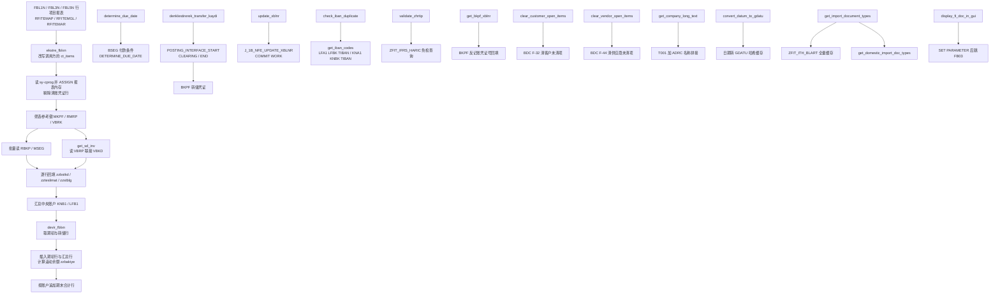

# ZCL_FI_TOOLKIT 源码分析报告

> 分析对象：`Keremkoseoglu/ABAP-Library` 项目 `functional/fi/ZCL_FI_TOOLKIT.abap`
> 程序类型：全局类（OO 工具库），1702 行，`FINAL` + `CREATE PUBLIC`，全部为 `CLASS-METHODS`
> 分析视角：资深 FI 开发同事的 onboarding 走读

---

## 一、程序定位与业务背景

### 1.1 它在解决什么问题

这不是一个报表，而是一把**财务会计（FI）通用螺丝刀**。它把土耳其 SAP 项目里反复出现的六类脏活集中封装成静态方法，让报表、用户扩展、批处理都能调用同一份逻辑：

1. **行项目报表（Ekstre）的期初与滚动余额**。土耳其本地化报表 FBL1N / FBL3N / FBL5N（AP/AR/GL 行项目清单）默认只看凭证行，不显示"上期结转（devir）"。财务要的"账户对账单"必须有期初行、借/贷方拆分列、逐行滚动余额、期末合计。`ekstre_fblxn` + `devir_fblxn` 就是干这个的。
2. **中央账户（Merkez Hesap）穿透**。土耳其客户/供应商主数据常见"一个 KNB1 中央账户 + 若干分支账户"，报表要按分支账户出明细，但期初要能从中央账户里按归属关系拆出来。这是 `KNB1-KNRZE` / `LFB1-LNRZE` 那段逻辑的由来。
3. **期初转储成凭证**。`denklestirerek_transfer_kaydi`（土耳其语"带结转做转账凭证"）把运行期算出来的期初，通过 `POSTING_INTERFACE_*` + FB05 真正落成一张 BKPF 凭证，让报表余额与总账余额对得上。
4. **反记账凭证号（XBLNR / Storno 参照）回填与巴西电子发票维护**。`get_bkpf_xblnr`、`update_xblnr`（`J_1B_NFE_UPDATE_XBLNR`）。
5. **主数据风控**。IBAN 重复校验（`check_iban_duplicate` / `get_iban_codes`）、IFRS 免税科目税码校验（`validate_zhrtip`）。
6. **长尾工具**。到期日计算、公司名称长文本、未清项清账 BDC、跳转 FB03、日期→GDATU 换算、进口凭证类型清单。

### 1.2 现有方案为何不够

在没有这个类之前，上述逻辑散落在各个 Z 报表的用户扩展里，各写一份、各自修 bug。表现出来的问题正是本文件里的样子：`devir_fblxn` 和 `ekstre_fblxn` 里大量 `ASSIGN ('(RFITEMGL)X_AISEL')` 这种读 SAP 标准程序内存的写法——因为 FBL3N 没有把"是否走 Ekstre 逻辑"这个开关暴露成可扩展字段，唯一能拿到的办法就是穿透。工具库把这些"必须穿透"的部分集中到一处，至少做到了**只穿一次、只维护一次**。

### 1.3 整体设计范式（一句话定性）

> **无状态静态工具箱 + 隐式侵入式扩展**：对外是纯函数集合（`FINAL` 类、无实例状态、全部静态方法），对内靠 `sy-cprog` + 动态 `ASSIGN` 把标准报表的运行时内存当成自己的输入。

### 1.4 这段代码长什么样（先给结论）

一个 FI 领域里少见的、**几乎全部依赖动态内存读写**的工具类。它同时踩在 SAP 三大雷区上：读标准程序内存、用 BDC 做清账、类外 DDIC 依赖多到无法独立交付。业务价值真实，工程风险同样真实。下面的分析会把这两种"真实"分开讲。

---

## 二、程序执行流程总览

### 2.1 流程总览图

这是一个工具库，没有单一入口。下图按**主导场景（行项目报表增强）**画主链，其余场景作为并列分支列出。



### 2.2 责任链表

按执行先后排列。**调用者**一列是关键：它暴露了这个类真正的使用契约——大部分方法只能从特定上下文（特定 `sy-cprog`、特定事务）里调用。

| 子程序 | 调用者 | 职责 |
|---|---|---|
| `ekstre_fblxn`（CHANGING `ct_items`） | FBL1N / FBL3N / FBL5N 行项目报表的用户扩展（RFITEMAP / RFITEMGL / RFITEMAR / ZSDP_RFITEMAR） | 报表总控：判断是否走 Ekstre 逻辑、清掉清账凭证行、筛参考键、逐行回填扩展字段、插入期初与合计行、算滚动余额 |
| `get_sd_inv`（私有方法） | `ekstre_fblxn` 主分支与 ELSE 分支各调一次 | 由 VBRK 发票号取 VBRP 行项目类型/参照交货单号 + VBKD 订单号 |
| `devir_fblxn` | `ekstre_fblxn`（唯一调用者） | 按 `sy-cprog` 决定查哪一组 BSxx 表，取指定日期之前的期初与转储行，做 S/H 取号、归集 |
| `get_company_long_text` | 打印/报表标题类 Z 程序 | T001.BUTXT + ADRC 四段名称拼成长文本，按公司代码缓存 |
| `convert_datum_to_gdatu` | 汇率取值、日期类工具 | 把 `datum` 转成 `TCURR-GDATU`，按日期哈希缓存 |
| `get_import_document_types` | 进口凭证类型选择屏、FPA/FBM 报表 | 从 `ZFIT_ITH_BLART` 读内外贸凭证类型清单（带缓存与双开关过滤） |
| `get_domestic_import_doc_types` | 进口凭证类型选择屏 | 只取"内贸"进口凭证类型（当前实现取的是"既内贸又外贸"） |
| `display_fi_doc_in_gui` | 报表双击行、ALV 应用 | `SET PARAMETER` 填 BLN/BUK/GJR 后 `CALL TRANSACTION 'FB03'` |
| `clear_customer_open_items` | 清账批处理 / Z 程序 | BDC 驱动 F-32，清指定客户若干凭证的未清项 |
| `clear_vendor_open_items` | 清账批处理 / Z 程序 | BDC 驱动 F-44，清指定供应商若干凭证的未清项 |
| `determine_due_date` | 逾期天数、账龄报表 | 取 BSEG 付款条件调 `DETERMINE_DUE_DATE` 算 `netdt` |
| `denklestirerek_transfer_kaydi` | 期初转储批处理 | 用 `POSTING_INTERFACE_*` + FB05 把期初落成一张转储凭证 |
| `update_xblnr` | 巴西 NF-e 批处理 | 逐张凭证调 `J_1B_NFE_UPDATE_XBLNR` 写 XBLNR 并提交 |
| `get_bkpf_xblnr` | 凭证清单报表 | 用 BUC/BLNR/GJR 键批量回填 `BKPF-XBLNR` |
| `check_iban_duplicate` | 银行主数据保存校验 | 调 `get_iban_codes`，非空即抛 `ZCX_FI_IBAN` |
| `get_iban_codes` | `check_iban_duplicate`，或调用方自取清单 | 从供应商与客户两侧查已占用的 IBAN |
| `validate_zhrtip` | FI 记账前校验（BAPI/CO/BDC 入口） | 按 IFRS 免税配置表与科目首字符校验税码 `ZHRTIP` |
| （全局声明区 / 类定义段） | 类加载时 | 定义 20+ 结构、5 个常量、3 个 CLASS-DATA 缓存 |

下面按这条流程，逐个子程序展开。

---

## 三、分组分析

### 3.1 类定义段与全局声明区

（类定义段与全局声明区）

先看骨架。这个类对外暴露 17 个静态方法、私有 1 个（`get_sd_inv`），声明了 20 多个结构。真正需要读懂的只有常量、三个缓存和两个关键结构。

```abap
    CONSTANTS c_borc TYPE shkzg VALUE 'S' ##NO_TEXT.
    CONSTANTS c_alacak TYPE shkzg VALUE 'H' ##NO_TEXT.
    CONSTANTS c_mal_hareketi TYPE awtyp VALUE 'MKPF' ##NO_TEXT.
    CONSTANTS c_satinalma_faturasi TYPE awtyp VALUE 'RMRP' ##NO_TEXT.
    CONSTANTS c_satis_faturasi TYPE awtyp VALUE 'VBRK' ##NO_TEXT.
    CONSTANTS c_musteri_hf_talebi TYPE auart VALUE 'ZAH1' ##NO_TEXT.
```

```abap
    TYPES:
      BEGIN OF ty_hesap,
        sube   TYPE rfposxext-konto,
        merkez TYPE rfposxext-konto,
      END OF ty_hesap .
    TYPES:
      tt_hesap TYPE STANDARD TABLE OF ty_hesap .
```

```abap
    TYPES:
      BEGIN OF ty_devir_items,
        belnr TYPE belnr_d,
        gjahr TYPE gjahr,
        buzei TYPE buzei,
        bukrs TYPE bukrs,
        konto TYPE hkont,
        shkzg TYPE shkzg,
        dmshb TYPE dmbtr,
        dmbe2 TYPE dmbe2,
        dmbe3 TYPE dmbe3,
        umskz TYPE umskz,
        filkd TYPE filkd,
        wrbtr TYPE wrbtr,
        waers TYPE waers,
        gsber TYPE gsber,
      END OF ty_devir_items .
```

```abap
    CONSTANTS c_tabname_t001 TYPE tabname VALUE 'T001' ##NO_TEXT.
    CLASS-DATA gt_company_long_text TYPE tt_company_long_text .
    CLASS-DATA gt_dg_cache TYPE tt_dg_cache .
    CLASS-DATA gt_import_doc_type_cache TYPE tt_ith_blart .
```

（类定义段）

**做什么** —

- 用 `c_borc` / `c_alacak` 固定借方 `S` 与贷方 `H` 两个 `SHKZG` 取值，避免全类散落字面量 `'H'`。
- 用 `c_mal_hareketi` / `c_satinalma_faturasi` / `c_satis_faturasi` 固定 `BKPF-AWTYP` 三种参照凭证类别（物料凭证、收货/采购发票、发票），这是行项目报表里判断"这条行是不是由单据生成的"的唯一依据。
- 用 `ty_hesap` 表达"分支账户 sube ↔ 中央账户 merkez"的配对关系，这个结构会一路传到 `devir_fblxn` 去拆期初。
- 用 `ty_devir_items` / `ty_devir` 表达期初行的中转结构与输出结构，两者字段基本同构，区别是输出结构没有行级信息（BELNR/GJahr/BUZEI/FILKD/UMSKZ 全部被清空或根本不要）。
- 用三个 `CLASS-DATA` 承载跨调用缓存：公司代码长文本、日期→GDATU、进口凭证类型。

**为什么** —

- `##NO_TEXT` 加在常量上是标准做法：这些值是**技术标识**（借/贷、凭证类别），不是需要翻译的展示文本，翻译它们反而会让新人看不懂 `c_alacak = 'H'` 到底是 H（贷）还是别的。
- `ty_hesap` 只放两个字段、不带 `bukrs`，是因为调用方（`ekstre_fblxn`）先用 `COLLECT` 保证了"一个 konto 只留一行"，随后再补 `merkez`——结构越薄，`COLLECT` 的去重语义越可控。
- 把"取数用的宽结构 `ty_devir_items`"和"输出用的窄结构 `ty_devir`"分开是对的：`devir_fblxn` 里最后一步 `CLEAR` + `MOVE-CORRESPONDING` + `COLLECT`，靠的就是"宽结构带行级字段、窄结构不带"这个差异，才能把同一账户同一币种的 N 行期初合并成 1 行。

**风险与改进** —

- `ty_hesap` 的 `sube` / `merkez` 用了 `rfposxext-konto`（ALV 行结构里的字段），而不是 DDIC 的 `konto`。这是**把 ALV 结构泄漏进公共 API**：SAP 若调整 `RFPOSXEXT` 的定义，或者别的调用方把表传成本来不带 `KONTO` 的东西，`tt_hesap` 这个公开参数类型就跟着失效。应改为 `TYPE konto`。
- `ty_devir_items.dmshb TYPE dmbtr`：字段名叫 `dmshb`（土耳其语"Belge tutarı"，凭证金额，取自行项目报表的 Z 列），数据类型是 `DMBTR`（**公司代码货币金额**）。名字和数据元素语义不同源，后面多处 `ADD` 会把它们混着算，这是 P0 级隐患的源头。命名应改成 `dmbtr` 或在注释里写清币种口径。
- `c_musteri_hf_talebi TYPE auart VALUE 'ZAH1'` 在全类中**没有任何引用**（`get_sd_inv` 走的是 VBRK 而不是订单 `VBRK`/`VBAP`）。残留常量说明代码曾试图按订单类型过滤，被改写后忘了删。
- 三个 `CLASS-DATA` 都没有失效机制与容量上限。`gt_dg_cache` 按日期逐条累积，在长循环（批量重算汇率）里是内存增长点；`gt_import_doc_type_cache` 一次 `SELECT *` 全量装载 Z 配置表且永不刷新，配置改了必须重启。
- 类型声明风格不统一：`tt_documents` 有 `WITH DEFAULT KEY`，`tt_hesap` 没有；`tt_blart` 是 `HASHED`，`tt_devir` 是 `STANDARD`。同一个类里四种键策略混用，读者要不断重新判断"这表能不能 SORT/APPEND"。

---

### 3.2 方法 `ekstre_fblxn`：报表增强总控

（方法 `ekstre_fblxn`）

这是全类最重的方法（约 530 行），要分 **13 步**讲：入口校验与穿透 → 剔除清账凭证行 → 收集账户 → 汇总中央账户 → 取期初 → 筛参考键 → 批量取单据 → 逐行回填 → 插入期初与汇总行 → 滚动余额 → 期末合计。

#### ① 入口：非空校验 + 按 `sy-cprog` 穿透报表内存

```abap
    CHECK ct_items IS NOT INITIAL.
    CASE sy-cprog.
      WHEN 'RFITEMAP'."FBL1N
        ASSIGN ('(RFITEMAP)X_AISEL') TO FIELD-SYMBOL(<lv_x_aisel>).
        ASSIGN ('(RFITEMAP)PA_VARI') TO FIELD-SYMBOL(<lv_vari>).

      WHEN 'RFITEMGL'."FBL3N
        ASSIGN ('(RFITEMGL)X_AISEL') TO <lv_x_aisel>.
        ASSIGN ('(RFITEMGL)PA_VARI') TO <lv_vari>.

      WHEN 'RFITEMAR'."FBL5N
        ASSIGN ('(RFITEMAR)X_AISEL') TO <lv_x_aisel>.
        ASSIGN ('(RFITEMAR)PA_VARI') TO <lv_vari>.

      WHEN 'ZSDP_RFITEMAR'.
        ASSIGN ('(ZSDP_RFITEMAR)X_AISEL') TO <lv_x_aisel>.
        ASSIGN ('(ZSDP_RFITEMAR)PA_VARI') TO <lv_vari>.

      WHEN OTHERS.
        RETURN.

    ENDCASE.

    IF sy-subrc = 0 AND sy-cprog(5) = 'RFITE'.
```

（方法 `ekstre_fblxn`）

**做什么** —

- `ct_items` 为空直接返回（后面所有逻辑都是"逐行加工"，空表无意义）。
- 用 `sy-cprog` 判断当前运行的是哪个 SAP 标准报表，把两个控制开关动态取出来：`X_AISEL`（用户是否勾了"选择行"）和 `PA_VARI`（当前使用的变式名）。
- 只有当 `sy-cprog` 第 5 位等于 `RFITE`（即程序名以 `RFITE` 开头）才继续——这是排除"同名 Z 程序"混入的保护。

**为什么** —

- FBL1N/FBL3N/FBL5N 没有对外暴露"要不要跑 Ekstre 逻辑"的接口。作者选择复用两个已有全局变量：`PA_VARI` 里带 `EKSTRE` 表示用户选了 Ekstre 变式，`X_AISEL` 用来判断用户是否已选中了具体行（未选中说明只是"全览"）。这是零侵入的代价：拿到控制权，但也永久绑死在 SAP 的内部命名上。
- 用 `FIELD-SYMBOL(<lv_x_aisel>)` 声明在第一个 `WHEN` 里，后续分支直接复用，是为了让四个分支只写 `ASSIGN` 不写重复声明——写法是合法的，但把声明藏在 `CASE` 分支里对新人不友好。

**风险与改进** —

- **`'ZSDP_RFITEMAR'` 分支永远进不去**：`sy-cprog(5)` 取第 5 个字符，`ZSDP_RFITEMAR` 的第 5 位是下划线 `_`，不等于 `'RFITE'`。也就是说这个 Z 报表虽被登记在 `CASE` 里，实际总会掉进 `ELSE` 分支走简化逻辑。下游 `CASE sy-cprog ... WHEN 'RFITEMAR' OR 'ZSDP_RFITEMAR'` 里的 `ZSDP_RFITEMAR` 同理不可达。要么改成 `sy-cprog CS 'RFITEMAR'` 之类的判断，要么把整个条件改成 `( sy-cprog(1) = 'Z' AND sy-cprog CS 'RFITEMAR' )`。
- **依赖 `sy-cprog` + `ASSIGN ('(...)')` 是本类最大的架构风险**。SAP 的程序全局变量不承诺稳定：一次 Enhancement Package、一个 SAP Note，就能让 `X_AISEL` 或 `PA_VARI` 改名，症状是"这个报表的 Ekstre 突然不出期初了"，而且 ATC 和 Code Inspector 完全看不见。**推荐做法**：改用 SAP 明确提供的用户扩展点——FBL1N/FBL3N/FBL5N 的用户出口位于 `ZX...` / `USER_EXIT_*` include，通过 User Exit 传进来的字段读取，把 `EKSTRE` 判断放在调用侧（本类只留纯数据加工）。这样标准程序升级不会静默打断财务报表。
- `IF sy-subrc = 0` 放在 `CASE` 之后，判断的是**最后一个 `ASSIGN`** 的 `sy-subrc`；如果哪个分支的 `ASSIGN` 失败，这里会误判。后面 `<lv_x_aisel> <> abap_true` 的解引用没有 `IS ASSIGNED` 保护——`ASSIGN` 失败时 `<lv_x_aisel>` 是未赋值字段符号，解引用直接 short dump。应统一写成 `IF <lv_x_aisel> IS ASSIGNED AND <lv_x_aisel> <> abap_true.`。
- `WHEN OTHERS. RETURN.` 是完全静默退出，没有 `MESSAGE` 或日志。从 Z 报表调进来、什么都没发生、也没报错，是最难排查的一类问题。至少应记一条日志或提供 `iv_verbose` 开关。

#### ② 补订单号 + 剔除客户清账凭证行

```abap
      "--------->> add by mehmet sertkaya 27.05.2021 10:49:36
      LOOP AT ct_items ASSIGNING FIELD-SYMBOL(<ls_items>)
            WHERE zuonr(3) eq  zcl_fi_omd=>c_zuonr_sanal and
                  zzbstkd IS INITIAL.
         <ls_items>-zzbstkd = <ls_items>-zuonr.
      ENDLOOP.
      "-----------------------------<<
      IF <lv_vari> CS 'EKSTRE'.

        IF <lv_x_aisel> <> abap_true.
          MESSAGE TEXT-003 TYPE 'I'.
          RETURN.
        ENDIF.

        CALL FUNCTION 'SAPGUI_PROGRESS_INDICATOR' ##FM_SUBRC_OK
          EXPORTING
*           percentage =
            text   = TEXT-002
          EXCEPTIONS
            OTHERS = 1.


        "-->> changed by mehmet sertkaya 21.07.2016 13:52:32
        " HAR-10448 - Müşteri Ekstresinde XX belge ters kaydı
*          delete ct_items where blart = 'XX' and gjahr ge '2016'.
        LOOP AT ct_items ASSIGNING <ls_items>
                    WHERE blart = zcl_fi_document_type=>get_customer_clearing_doc_type( ) AND
                          gjahr GE '2018'.
          DELETE ct_items WHERE belnr = <ls_items>-zzstblg AND gjahr = <ls_items>-zzstjah.
          DELETE ct_items.
        ENDLOOP.
        "-----------------------------<
```

（方法 `ekstre_fblxn`）

**做什么** —

- 对"采购/销售订单行"（`zuonr` 前三位等于销售订单类别常量）且还没有订单号的行，把行项目编号 `zuonr` 拷进 Z 扩展字段 `zzbstkd`。
- 检查变式名里是否含 `EKSTRE`；不含则整个方法空转返回，不弹进度条。
- 弹 `SAPGUI_PROGRESS_INDICATOR` 进度提示（长报表的用户心理安慰）。
- 用外层 `LOOP ... WHERE` 找出"客户清账凭证类型 + 2018 年以后"的行；命中后先按 `zzstblg/zzstjah`（它记录的反记账凭证）删掉被冲销的原始行，再 `DELETE ct_items.` ——注意这里是无条件 `DELETE ct_items`，**删的是当前整张表**。

**为什么** —

- 订单号这个补丁（2021 年加的）解决的是：采购订单行在 FBL3N 上显示的是行项目号 `ZUONR`，但财务要的是完整的采购订单号。`zuonr(3)` 取前三位比常量 `c_zuonr_sanal`（销售订单类别），比整串 `LIKE` 更快，属于典型的"报表取数提速小技巧"。
- 剔除清账凭证是业务必需：客户清账（收款核销）凭证会把原发票和收款冲销成 0 余额，如果不清，客户对账单上会出现"原发票 + 清账凭证"两行，金额对得上但看起来像重复，客户会投诉。HAR-10448 的注释说明这是线上问题驱动的修复。

**风险与改进** —

- **`DELETE ct_items.` 出现在 `LOOP AT ct_items ... WHERE` 的循环体内**，等于在遍历中把被遍历的表整体清空。ABAP 明确规定循环期间不得如此修改被遍历表；更致命的是它只在"命中第一条清账凭证行"时才执行一次 `DELETE ct_items.`，如果表里有**多条**清账凭证行，删掉第一条后 LOOP 的游标位置已经失效，后续行的处理行为未定义。正确写法是收集 `zzstblg/zzstjah` 到内表，循环结束后一次性 `DELETE ct_items WHERE belnr = ...`，或者先 `SORT` 再用 `DELETE ADJACENT`。
- 外层 `LOOP ... WHERE` 的游标在 `DELETE` 后同样不可信，`lv_tabix`（后面用来定位插入点）会因为行数变化而算错。这与第 ⑨ 步的 `INSERT INTO ct_items INDEX lv_tabix` 叠加，是"期初行插到错误位置"的高发组合。
- `MESSAGE TEXT-003 TYPE 'I'` 把提示文本硬编码在程序里，不走消息类，多语言与集中维护都无从谈起。
- `SAPGUI_PROGRESS_INDICATOR` 在后台批处理里无害（不会输出），但它没有 `iv_percentage`，用户看到的是一个不确定长度的滚动条而非进度百分比——长报表下体验不佳。

#### ③ 排序 + 空表短路

```abap
        SORT ct_items BY konto budat ASCENDING.

        IF  ct_items IS INITIAL.
          RETURN.
        ENDIF.
```

（方法 `ekstre_fblxn`）

**做什么** —

- 按"科目 + 过账日期"升序排序整张 ALV 行表。
- 如果删完清账凭证行后表空了，直接返回。

**为什么** —

- 后面的所有加工（期初行插在账户第一行之前、滚动余额逐行累计、中央账户期初做 `COLLECT` 汇总）都**强依赖这个排序**。排序不是"为了好看"，是算法前提。
- `SORT BY konto budat` 是 ABAP 的稳定排序（相同键保持原相对顺序），所以同科目同日期的多行仍按报表原始顺序显示，财务能对上原始清单。

**风险与改进** —

- **排序键只有 `konto`，没有 `bukrs`**，而后面的分组逻辑全部按 `bukrs + konto` 做（`LOOP lt_devir_sorted WHERE bukrs = ... AND konto = ...`）。同一个科目号跨公司代码时，两家公司的行会被排在一起交替出现，期初只会按"第一条行所属的公司代码"计算一次，另一家公司的期初永远算不出来；滚动余额也会跨公司代码累加。这是本方法最严重的结构性缺陷之一，必须改成 `SORT ct_items BY bukrs konto budat`。
- `SORT` 之后紧跟 `IF ct_items IS INITIAL` 是有效的空表保护，但注意此时 `ct_items` 已经是 `CHANGING` 参数的引用，删除操作直接影响调用方的 ALV 数据源；调用侧（FBL3N 的用户扩展）需要在调用后触发 ALV 重排序/刷新，否则屏幕上顺序与内存不一致。

#### ④ 收集账户与科目公司代码组合

```abap
        LOOP AT ct_items ASSIGNING <ls_items>.
          CLEAR ls_hesap.
          ls_hesap-sube = <ls_items>-konto.
          COLLECT ls_hesap INTO lt_hesap.
          ls_konto-bukrs = <ls_items>-bukrs.
          ls_konto-konto = <ls_items>-konto.
          COLLECT ls_konto INTO lt_konto.
        ENDLOOP.
```

（方法 `ekstre_fblxn`）

**做什么** —

- 遍历全部行，用 `COLLECT` 把去重后的科目号收集进 `lt_hesap`（此时 `merkez` 全为空）。
- 用同一个循环收集"公司代码 + 科目"的组合进 `lt_konto`，供最后的期末合计循环使用。

**为什么** —

- 一次遍历同时产出两个集合，是很克制的写法。`lt_konto` 存在的原因是：`lt_hesap` 只有科目号，而期末合计必须按 `bukrs + konto` 逐个跑；不能等到最后再遍历一次 `ct_items` 去重，那时 `ct_items` 已经被插入了期初行和汇总行，去重逻辑会被污染。
- `COLLECT` 依赖内表键。这里的 `lt_hesap` 是 `STANDARD TABLE`（无显式键），`COLLECT` 用**默认键**（所有非数值字段）——`SUBE` 是 CHAR10 非数值，`MERKEZ` 为空，所以按科目号去重，语义正确。

**风险与改进** —

- `COLLECT` 用在无唯一键的标准表上是**性能陷阱**：内部实现相当于每次插入都做一次全表键比较，报表 5 万行就意味着 5 万次插入。更合适的做法是先 `SORT` 再 `DELETE ADJACENT DUPLICATES`，或者干脆声明成 `SORTED TABLE ... WITH UNIQUE KEY sube`（虽然 `sube + merkez` 的组合在后面还要追加，改成 `HASHED` 需要想清楚键）。
- 这里把 `lt_konto` 声明成 `TYPE TABLE OF ty_konto`（标准表），后面用 `LOOP AT lt_konto INTO ls_konto` 遍历——但外层已经有一个 `LOOP AT ct_items ASSIGNING <ls_items>` 还没结束？不对，这是独立的一步。但要注意变量 `ls_konto` 在此处是首次赋值就 `CLEAR` 前的残留状态：`ty_konto` 两个字段都是非数值且在循环里都被显式赋值，所以不会带上残值——**这次是对的，但它依赖"两字段都被覆盖"这个隐含前提**，属于运气正确。

#### ⑤ 中央账户穿透（KNB1 / LFB1）

```abap
        ASSIGN  ('(SAPLFI_ITEMS)GB_CENTRAL_ITEMS') TO FIELD-SYMBOL(<lv_merkez>).
        IF sy-subrc = 0.
          IF <lv_merkez> = abap_true.
            CASE sy-cprog.
              WHEN 'RFITEMAR' OR 'ZSDP_RFITEMAR'.
                SELECT bukrs, kunnr, knrze INTO TABLE @DATA(lt_knb1) FROM knb1
                    FOR ALL ENTRIES IN @lt_hesap
                    WHERE kunnr = @lt_hesap-sube AND
                          knrze <> @space.
                SORT lt_knb1 BY bukrs kunnr.
                LOOP AT lt_knb1 ASSIGNING FIELD-SYMBOL(<ls_knb1>).
                  ls_hesap-sube = <ls_knb1>-kunnr.
                  ls_hesap-merkez = <ls_knb1>-knrze.
                  COLLECT ls_hesap INTO lt_hesap.
                ENDLOOP.

              WHEN 'RFITEMAP'.

                SELECT bukrs, lifnr, lnrze INTO TABLE @DATA(lt_lfb1) FROM lfb1
                    FOR ALL ENTRIES IN @lt_hesap
                    WHERE lifnr = @lt_hesap-sube AND
                          lnrze <> @space.
                SORT lt_lfb1 BY bukrs lifnr.
                LOOP AT lt_lfb1 ASSIGNING FIELD-SYMBOL(<ls_lfb1>).
                  ls_hesap-sube   = <ls_lfb1>-lifnr.
                  ls_hesap-merkez = <ls_lfb1>-lnrze.
                  COLLECT ls_hesap INTO lt_hesap.
                ENDLOOP.

            ENDCASE.
          ENDIF.
        ENDIF.
        SELECT * FROM t001  INTO TABLE lt_t001.
```

（方法 `ekstre_fblxn`）

**做什么** —

- 动态读 SAP 标准 include `SAPLFI_ITEMS` 里的全局变量 `GB_CENT