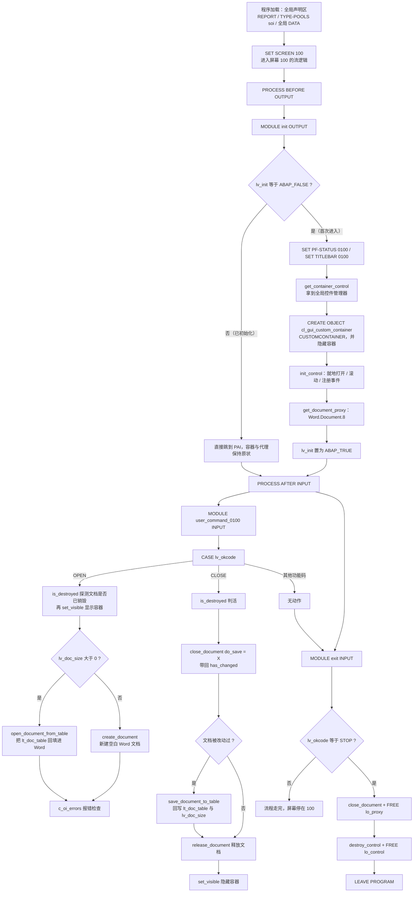
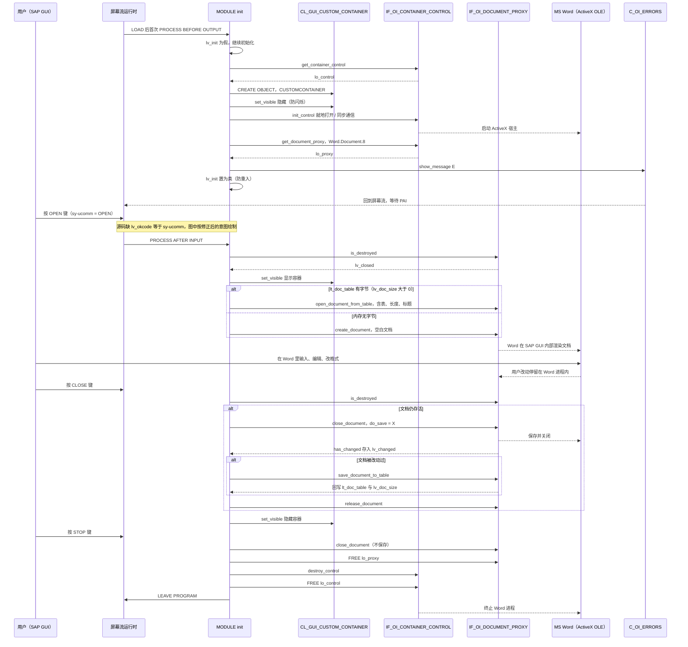

# ZMSA_R_CHAPTER4_8 分析报告 — 用 DOI 把 MS Word 嵌进 ABAP 屏幕

> 源文件：`Test-source/real/PacktPublishing__Mastering-SAP-ABAP__Chapter04__ZMSA_R_CHAPTER4_8.abap`（161 行）
> 出处：Packt《Mastering SAP ABAP》Chapter 04，示例程序，作者 Pawel Grzeskowiak
> 全文写完后请带着一个问题读：**这 161 行里，真正驱动业务的是哪几行？** 答案是 4 个 MODULE 里的 2 个 CASE 分支，其余全是胶水。

---

## 一、程序定位与业务背景

### 1.1 它解决的业务问题

想象一个合同 / 采购申请 / 质检报告场景：业务人员要在 SAP 系统里录入一份**排版复杂**的正式文档——带表格、页眉、页脚、盖章位、编号规则。这类文档有三个致命特征：

- **不是行结构**：一个"合同条款"可能占半页纸，用 SAP 自定义表存会立刻退化成"一个超长 CHAR 字段"。
- **要回填、要留痕**：填完之后要能打印、要能被后续审批人看到原稿、要能留档。
- **用户不会用 Word 拼格式**：让用户下载模板、在本地 Word 里填、再手工贴回 SAP，是 2000 年代最常见的"半自动"方案，也是数据最容易出错的一环。

SAP 给出的答案叫 **BC 的 MS Office Integration（简称 SOI，源码里的 `TYPE-POOLS: soi`）**，业界也叫 **DOI（Desktop Office Integration）** 或 **OLE 集成**。它做的事是：

> 把一个真实的 MS Word 进程，通过 ActiveX 控件**嵌入到 SAP GUI 窗口内部**，让用户在 SAP 事务里直接看到 Word 界面、在 Word 里打字，而 ABAP 程序通过接口读出/写入整个文档的二进制内容。

于是"业务模板"不再是 SAP 表结构，而是"一个 Word 模板 + 一次文档打开/保存往返"。这就是 `ZMSA_R_CHAPTER4_8` 要演示的全部内容。

### 1.2 现有方案为什么不够（为什么值得写这 161 行）

| 传统方案 | 卡在哪里 |
|---|---|
| SAP Script / Smart Forms | 只能**输出**排版好的 PDF/打印件，拿不回用户在 PDF 上画的批注与修改 |
| 把 Word 放应用服务器、RFC 驱动 | 需要服务器上常驻 Word 实例，并发、补丁、字体、杀进程全是运维债 |
| 拆成 N 个自定义表的"条款行" | 每条一行，模板一改版就得改表结构；页眉页脚盖章位无处安放 |
| SAP GUI 的 `TEXT-xxx` 编辑器 | 只认纯文本/RTF，Word 特性（修订、样式、域、图片）全丢 |
| **本文方案** | Word 真实存在于用户机器上、由用户自己负责进程安全；ABAP 只当"字节搬运工" |

### 1.3 设计范式一句话定性

**对话式报表（Report + 单屏幕）+ PBO/PAI 屏幕流驱动 + OLE 三层对象模型（Custom Container → IF_OI_CONTAINER_CONTROL → IF_OI_DOCUMENT_PROXY）**：程序自身**没有业务逻辑、没有状态机、没有持久化**，它只是一台"Word 遥控器"，全部行为由 PF-STATUS 上的三个功能码（OPEN / CLOSE / STOP）分支决定。

### 1.4 阅读前必须先纠正的一点：源码里没有 PROCESS 语句

你可能会期待在这个文件里看到：

```abap
PROCESS BEFORE OUTPUT.
  MODULE init OUTPUT.
PROCESS AFTER INPUT.
  MODULE user_command_0100 INPUT.
```

**但这 161 行里没有一条 PROCESS 语句，也没有任何 INCLUDE。** PBO/PAI 的 MODULE 都写好了，驱动它们的两条 PROCESS 一定被维护在 **屏幕 100 自身的 Flow logic 里**（SE51 双击屏幕 → "Flow logic" 编辑器）。这是 SAP 报表最经典的"逻辑物理分离"：**程序主体在源码里，胶水在屏幕里**。

后果是什么？

- 用 SE80 读源码你会以为"这程序不会跑"——不是，是屏幕在驱动它。
- 想确认 `exit` 是不是 `PROCESS AFTER INPUT` 的最后一个模块、想加一个 `AT_EXIT_OF_PROGRAM`，都得切到 SE51 看，**源码无法自证**。
- 代码走查、Code Review、版本对比都漏掉了这一段。

3.1 ④ 会给出按惯例还原的流逻辑，作为继续分析的锚点。

---

## 二、程序执行流程总览



### 责任链表

| 子程序 | 调用者 | 职责 |
|---|---|---|
| 全局声明区（REPORT / TYPE-POOLS / DATA / SET SCREEN 100） | LOAD PROGRAM（系统隐式） | 引入 SOI 类型池；声明容器、控件、文档代理三个引用与 OK code、三个标记、文档字节表与长度；指定后续屏幕为 100 |
| `init`（MODULE init OUTPUT） | 屏幕 100 的 PROCESS BEFORE OUTPUT | 首次进入时建 PF-STATUS/TITLEBAR、取容器控件、建 Custom Container、隐藏容器、初始化 ActiveX 控件、取得 Word 文档代理，并置 `lv_init` 防重入 |
| `user_command_0100`（MODULE user_command_0100 INPUT） | 屏幕 100 的 PROCESS AFTER INPUT | 按 OK code 分派：`OPEN` 显示容器并新建/回填 Word 文档；`CLOSE` 关闭文档、如有改动则把文档字节写回内表、释放代理、隐藏容器；其余功能码无动作；末尾清空 `lv_okcode` |
| `exit`（MODULE exit INPUT） | 屏幕 100 的 PROCESS AFTER INPUT（应为最后一个模块） | 识别 `STOP`，关闭并释放文档代理、销毁并释放控件管理器、`LEAVE PROGRAM` 结束事务 |
| 屏幕 100 的 Flow logic（**不在本源码中**，位于 SE51） | 报表运行时 | 用两条 PROCESS 把上面三个 MODULE 串进 ABAP 屏幕流循环；承载 Custom Control `CUSTOMCONTAINER` 的可视化定义 |

下面按这条流程，逐个子程序展开。

---

## 三、分组分析（按程序流程 / 子程序）

### 3.1 全局声明区 `ZMSA_R_CHAPTER4_8`

这一节分四步：报表头与类型池、三个对象引用与状态变量的声明、`SET SCREEN 100`、以及**不在源码里的屏幕流逻辑**。全局声明区是全程序唯一在 LOAD PROGRAM 阶段执行一次的代码，它决定了后面所有 MODULE 能操作什么。

#### ① 报表头与类型池

```abap
REPORT zmsa_r_chapter4_8.

TYPE-POOLS: soi.
```

**做什么**

- 用 `REPORT` 声明一个可执行报表 `zmsa_r_chapter4_8`（Z 前缀 = 客户自定义对象，非 SAP 标准）。
- 用 `TYPE-POOLS: soi.` 引入 BC MS Office Integration 的全局类型池，让编译器能看到 `i_oi_container_control`、`i_oi_document_proxy`、`c_oi_errors` 等类型与类的定义。

**为什么**

- 这不是"报表 + DB 表"，而是"报表 + GUI 控件"，所以用 REPORT 而不是 FUNCTION POOL / CLASS。
- SOI 的接口类没有独立发布成可执行对象，必须靠 TYPE-POOLS 引入。少了这一行，`REF TO i_oi_document_proxy` 直接编译失败——它是整个程序的编译期前提。

**风险与改进** — 编译期前提，属于必写行，本身无风险；但要注意类型池的存在意味着程序对 SOI 的**内部实现有编译期耦合**，SOI 打补丁改类型时所有引用它的程序都要重新激活。

#### ② 三个对象引用与状态变量

```abap
DATA: lo_container TYPE REF TO cl_gui_custom_container.
DATA: lo_control   TYPE REF TO i_oi_container_control.
DATA: lo_proxy     TYPE REF TO i_oi_document_proxy.

DATA: lv_okcode TYPE syst_ucomm.

DATA: lv_closed  TYPE i.
DATA: lv_init   TYPE boolean.
DATA: lv_changed TYPE i.

TYPES: ty_row TYPE x LENGTH 2048.
DATA: lt_doc_table TYPE STANDARD TABLE OF ty_row.
DATA: lv_doc_size TYPE i.
```

**做什么**

- 声明三个全局对象引用，构成 OLE 三层模型的本地一侧：`lo_container`（屏幕上的 Custom Container 宿主）、`lo_control`（ActiveX 控件管理器）、`lo_proxy`（文档代理，真正代表"那份 Word"）。
- 声明交互状态：`lv_okcode` 承接功能码，`lv_init` 防重复初始化，`lv_closed` 承接 `is_destroyed` 的结果，`lv_changed` 承接 `close_document` 的 `has_changed`。
- 声明文档的内存载体：`ty_row` 是一条 2048 字节的裸二进制行，`lt_doc_table` 是这些行组成的标准表，`lv_doc_size` 是整份文档的真实字节数。

**为什么**

- **三层引用不能合并。** `lo_control` 管的是"控件容器"这一层，它的生命周期比文档长；`lo_proxy` 管的是"文档"，可以被创建、关闭、释放、重建。CLOSE 分支里只 `release_document` 而不 `destroy_control`，正是因为文档可以换而容器必须留着——这个设计是整个程序能反复 OPEN/CLOSE 而不闪屏、不报错的根本。
- **用报表全局 DATA 而不是局部内表**：屏幕流 PBO→PAI 会反复进出，模块之间没有参数传递通道，只能靠程序全局变量共享状态。`lt_doc_table` / `lv_doc_size` 也正因为是全局的，才能跨 PBO/PAI 循环存活——这是 3.3 节"CLOSE→OPEN 往返"能成立的前提，也是 5 章 P1-4 缺陷的根因。
- **`TYPE x LENGTH 2048` 是 SOI 的约定而非随意取值**：文档在 ABAP 侧就是一段字节流，`SAVE_DOCUMENT_TO_TABLE` 会把它切成不超过 2048 字节的行写进内表，回填时再拼回去。配合同步（`no_flush = abap_false`）通信，Word 端与 ABAP 端看到的是同一份内存镜像。
- `lv_okcode TYPE syst_ucomm` 用系统类型而不是裸 `char`，是稳妥做法（与 `sy-ucomm` 同型）。

**风险与改进**

- 🔴 **最严重的问题在这里**：`lv_okcode` 从声明到使用，**全文没有任何一处把它从 `sy-ucomm` 赋值过来**。模块开头直接 `CASE lv_okcode.`，末尾 `CLEAR: lv_okcode.`，中间没有 `lv_okcode = sy-ucomm.`。也就是说 `user_command_0100` 和 `exit` 的所有 `WHEN` 分支**永远不会命中**，按 OPEN/CLOSE/STOP 都没有任何反应。这不是风格问题，是程序不可用（详见 5 章 P0-1）。修法：在 `MODULE user_command_0100 INPUT.` 第一行加 `lv_okcode = sy-ucomm.`，或者干脆删掉 `lv_okcode` 直接 `CASE sy-ucomm.`。
- 🟡 类型风格不统一：`lv_closed` / `lv_changed` 用 `TYPE i`，`lv_init` 却用内置类型 `boolean`。同一程序里三种标记用两种类型，读的人要反复切换心智模型。统一用 `boolean`（或统一用 `i`）更好；另外 `boolean` 是 7.40 之后的内置类型，会抬高程序版本下限，如果这份示例意在兼容老版本，注意这一点。
- 🟡 `2048` 字节的行长 + 无上限的 `TYPE STANDARD TABLE OF`：一个几百页的 Word 文档会被完整读进 ABAP 内存，没有任何字节数上限保护。真接到业务上应当对 `lv_doc_size` 设阈值（如超过 1 MB 就提示用户），否则容易吃工作进程内存。
- 🟢 `ty_row` 是完全无结构的裸二进制行，可读性为零。至少在注释里写清"SOI 文档字节流，2048 字节/行"，否则后人极易误以为这是一张业务表。

#### ③ 指定屏幕

```abap
SET SCREEN 100.
```

**做什么**

- 用静态 `SET SCREEN` 告诉运行时：本次执行接下来处理屏幕 100，程序会停在屏幕 100 上等待用户输入。

**为什么**

- 这是"对话式报表"的标准入口。用 `SET SCREEN` 而不是 `CALL SCREEN`，语义差别在于**静态指定下一屏幕**：屏幕流结束（PAI 处理完且没有设定别的屏幕）时系统回到 100，形成 PBO→PAI 的循环。这正好是本程序需要的形态——用户反复按 OPEN/CLOSE 在同一屏上玩 Word。
- 因为是静态调用，屏幕 100 的 PBO 会被自动触发一次，不需要任何 `CALL SCREEN` 兜底。

**风险与改进** — 无明显运行风险，但只支持单屏：没有屏幕序列、没有返回路径设置，`BACK` 的行为只能靠运行时默认规则。要做多屏向导式流程，得换成 `CALL SCREEN` + 显式 `LEAVE TO SCREEN`。另需确认屏幕 100 在 SE51 中真实存在（`SET SCREEN` 传的可以是"下一屏幕号"，实际逻辑屏由屏幕号映射决定），否则运行时短转储。

#### ④ 屏幕 100 的 Flow logic（不在源码中）

按 SOI 官方示例与本程序的 MODULE 命名惯例，屏幕 100 的流逻辑应当是：

```abap
PROCESS BEFORE OUTPUT.
  MODULE init OUTPUT.

PROCESS AFTER INPUT.
  MODULE user_command_0100 INPUT.
  MODULE exit INPUT.
```

**做什么**

- `PROCESS BEFORE OUTPUT` 在屏幕显示之前调用 `init`，让程序有机会把 PF-STATUS、控件、容器准备到屏幕渲染之前。
- `PROCESS AFTER INPUT` 在用户按下 Enter 或功能键后依次调用 `user_command_0100` 与 `exit`；注意这里**没有 `MODULE ... INPUT CHANGED`** 之类，也没有分号。

**为什么**

- 所有"往屏幕上放东西"的语句（`SET PF-STATUS`、`SET TITLEBAR`、`CREATE OBJECT` 容器）**只能**写在 PBO 里，写在 PAI 里要么被忽略要么报错——这是屏幕流的第一铁律。`init` 放在 BEFORE OUTPUT 正是铁律的直接体现。
- `exit` 不设 `sy-subrc`，按 ABAP 约定必须排在 `PROCESS AFTER INPUT` 的**最后**：前置任何一个 PAI 模块若因 CHECK/未设 `sy-subrc` 而"什么都没做"（`sy-subrc <> 0`），排在后面的 `exit` 就不会被调用。

**风险与改进**

- 🔴 这段逻辑是程序的**组成部分却不在版本控制范围内**。语法错误（比如漏了 `ENDPROCESS`、MODULE 名字拼错）在源码评审时完全看不到；模块顺序被误调会让 `exit` 静默失效。
- 🟠 尤其 `exit` 的位置：一旦有人把它挪到 `user_command_0100` 前面，而 `user_command_0100` 又以 `CHECK` 提前退出（`sy-subrc` 保持非零），`STOP` 键就会"点了没反应"，且不报任何错。
- 🟡 建议改用 `INCLUDE zmsa_r_chapter4_8_top / 00 / 01` 的标准三段式报表结构，把两条 PROCESS 收进源码；或者至少在源码头部注释里写明"流逻辑见屏幕 100，模块顺序：init / user_command_0100 / exit"，让读者不必去 SE51 考古。

到此，程序加载阶段结束，控制权交给屏幕流。下面进入 PBO。

---

### 3.2 `init`（事件块 `MODULE init OUTPUT`）

这是 PBO 模块，由屏幕 100 的 `PROCESS BEFORE OUTPUT` 触发。它是整个程序里最"重"的一段——把一个 Word 进程拉起来只做一次，所以全段被 `lv_init` 守卫包住。本节分四步：初始化守卫与屏幕装饰、控件与宿主的获取、ActiveX 控件初始化、文档代理获取。

#### ① 守卫与屏幕装饰

```abap
MODULE init OUTPUT.

  CHECK lv_init = abap_false.

  SET PF-STATUS '0100'.
  SET TITLEBAR '0100'.
```

**做什么**

- 进入模块先判断 `lv_init`；为假（尚未初始化）才继续，为真立刻返回本模块。
- 给屏幕 100 设 PF-STATUS `0100`（状态栏、功能键、菜单）和标题栏 `0100`。

**为什么**

- **守卫的作用是防止重复建 ActiveX 控件。** `CREATE OBJECT` 容器、`init_control` 都是**有副作用且不能重复执行**的动作：重复 `init_control` 会报错，重复建同名 Custom Container 会丢屏幕布局。而 PBO 在屏幕流循环中可能被多次进入（消息处理后重新显示、屏幕被重新置位等场景），必须有幂等保护。
- **PF-STATUS 必须在 PBO 里设**，这是硬性规则。本程序能在 PBO 里设状态，是因为 `init` 确实挂在 `PROCESS BEFORE OUTPUT` 上。
- PF-STATUS `0100` 承载着三个功能码：OPEN、CLOSE、STOP。后面两个 MODULE 完全依赖这三个按钮存在——**状态栏配错，程序就没有入口**。

**风险与改进**

- 🟡 **装饰与一次性初始化被耦合在同一个守卫里。** PF-STATUS / TITLEBAR 本质是"每次进屏幕都要刷一次"，容器初始化是"一辈子一次"。把两者放进同一个 `CHECK` 之后，意味着只要 PBO 以 `lv_init = 'X'` 重入，状态栏就不重设。当前单屏流程下不出问题，一旦改成多屏或 PBO 被再次进入，标题与状态可能不刷新。建议拆成两个模块：`init_container`（守卫内）与 `set_status`（守卫外）。
- 🟡 状态名与标题都用裸数字 `0100`，与"屏幕号 100"极易混淆。SAP 惯例是 PF-STATUS 叫 `LOGO_0100`、标题叫 `&0100&` 之类可读名字，数字名在 TLOGO 里检索和交接时都很痛苦。
- 🟢 没有校验 PF-STATUS/TITLEBAR 是否真的存在。若 TLOGO 里漏维护 `0100`，运行时报 GUI 错误而不是在开发期暴露；开发期应留一句注释写明"需维护 PF-STATUS 0100 / TITLEBAR 0100"。

#### ② 取得控件管理器与宿主容器

```abap
  CALL METHOD c_oi_container_control_creator=>get_container_control
    IMPORTING
      control = lo_control.

  CALL METHOD c_oi_errors=>show_message EXPORTING type = 'E'.

  CREATE OBJECT lo_container
    EXPORTING
      container_name = 'CUSTOMCONTAINER'.
  CALL METHOD lo_container->set_visible EXPORTING visible = ' '.
```

**做什么**

- 用 SOI 提供的工厂类 `c_oi_container_control_creator` 的静态方法 `get_container_control` 拿到容器控件管理器（`lo_control`），随后立刻做一次错误消息收集检查。
- 创建 `cl_gui_custom_container` 实例，宿主是屏幕上名为 `CUSTOMCONTAINER` 的 Custom Control；创建后立刻把它设为不可见。

**为什么**

- **容器控件不能自己 new。** `i_oi_container_control` 的实现由 BC 交付并需要底层 OLE/ActiveX 设施，SAP 用 `c_oi_container_control_creator` 把这个单例式的初始化过程封起来，正确姿势就是调用它的静态方法。这一步是整条链的入口。
- **宿主必须是屏幕上的 Custom Control，不能是空 Custom Container。** ActiveX 控件需要一个真实的 Windows 父窗口来挂载；`CUSTOMCONTAINER` 这个名字必须与 SE51 屏幕 100 上摆放的 Custom Control 名称**逐字符一致**，否则创建失败。这也再次说明：本程序离开了屏幕 100 就跑不起来。
- **`set_visible = ' '` 是刻意的防闪烁。** Word 启动要几百毫秒到数秒，如果容器一创建就可见，用户会先看到一块灰色空白矩形再看到 Word；先隐藏、待 `init_control` 完成甚至等到文档打开后再显示，体验干净得多。这是老 GUI 程序里非常典型的"细节体现经验"。

**风险与改进**

- 🟠 `c_oi_errors=>show_message` **不会终止流程**。它只是把 SOI 内部收集的错误抛成消息，`type = 'E'` 显示后**返回到调用点继续往下执行**。也就是说如果 `get_container_control` 失败，`lo_control` 可能仍是初始引用，程序会带着空引用一路跑到 3.3 节对 `lo_proxy` 的调用上——典型后果是 ST22 短转储或空对象引用异常，而不是一条友好的报错消息。正确做法是在每次检查之后判断成败并 `RETURN`/`MESSAGE` 退出，或把整段初始化包进一个 FORM，末尾统一判一次。
- 🟡 容器名 `'CUSTOMCONTAINER'` 硬编码字符串；和屏幕定义强耦合却无处可查。建议在源码里写明"屏幕 100 需摆放同名 Custom Control"。
- 🟢 `CALL METHOD` 是老式动态写法，现代写法 `lo_control = NEW i_oi_container_control( )` / `lo_container->set_visible( visible = abap_false )` 更短也更易读。示例代码用旧写法可以理解（面向老版本教学），但抄进生产代码前值得统一 modernize。

#### ③ 初始化 ActiveX 控件

```abap
  CALL METHOD lo_control->init_control
    EXPORTING
      r3_application_name      = 'R/3 Basis'
      inplace_enabled          = abap_true
      inplace_scroll_documents = abap_true
      parent                   = lo_container
      register_on_close_event  = abap_true
      register_on_custom_event = abap_true
      no_flush                 = abap_false.

  CALL METHOD c_oi_errors=>show_message EXPORTING type = 'E'.
```

**做什么**

- 用刚建好的 `lo_container` 作为父容器初始化 ActiveX 控件栈，并明确六项行为：应用名 `R/3 Basis`、允许就地（in-place）显示、允许多文档就地滚动、注册文档关闭事件、注册自定义事件、开启 flush 通信。

**为什么**

- `inplace_enabled = abap_true` 是本程序视觉效果的**唯一决定项**：为真时 Word 画在 SAP GUI 窗口里（用户看到的正是本例的效果），为假时 Word 以独立浮动窗口弹出，用户在任务栏里切来切去。示例要的就是 in-place。
- `inplace_scroll_documents = abap_true`：in-place 模式下打开多个文档时共用一个可视区域并允许滚动显示，避免每开一个文档就撑大一次 SAP 窗口。
- `no_flush = abap_false`：SOI 默认走 flush 协议，即调用在 Word 端**同步执行**并把结果回传。3.3 节的 `save_document_to_table` 必须在同步模式下才拿得到最新字节流；如果为了性能改成异步，`SAVE_DOCUMENT_TO_TABLE` 就可能取到旧数据。
- `parent = lo_container` 把控件挂到屏幕容器上，这是"嵌在 SAP 里"而不是"浮在外面"的接线点。
- `r3_application_name` 决定 Word 里"文档属性/最近使用"中归属的应用名，写死 `'R/3 Basis'` 是官方示例的固定值。

**风险与改进**

- 🟠 同样没有在检查之后**中断**。`init_control` 是全程序最容易失败的一步（客户端未勾选"允许 ActiveX"/OLE、Office 未安装、ProgID 不存在），失败后继续执行 `get_document_proxy` 会直接炸在空引用上。
- 🟡 注册了两个事件开关（`register_on_close_event`、`register_on_custom_event`），但**整个程序没有任何事件处理器对象**——没有 dispatcher、没有 `IF_OI_EVENT_HANDLER` 的实现类。后果是：用户在 Word 里直接关掉文档时，ABAP 侧完全不知情，容器还开着、`lo_proxy` 还指向一个已死的文档。注册了事件却不接处理，等于白注册。要么补一个事件分派实现，要么去掉这两个参数。
- 🟡 `r3_application_name = 'R/3 Basis'` 硬编码。若同一程序被多个业务场景使用，Word 侧看到的归属名永远是"R/3 Basis"，且无法按客户端语言适配。
- 🟡 in-place 模式有明确的环境依赖：要求 SAP GUI（Win32）+ 本机 Word + OLE/ActiveX 未被客户端配置禁用。程序里既没有能力探测（Word 是否安装），也没有对失败给出用户可理解的提示——只会看到 `c_oi_errors` 抛出的技术错误。

#### ④ 取得文档代理并封存初始化状态

```abap
  CALL METHOD lo_control->get_document_proxy
    EXPORTING
      document_type  = 'Word.Document.8'
      no_flush       = abap_false
    IMPORTING
      document_proxy = lo_proxy.

  CALL METHOD c_oi_errors=>show_message EXPORTING type = 'E'.

  lv_init = abap_true.
ENDMODULE.
```

**做什么**

- 向控件管理器申请一个 Word 文档代理对象，按 `Word.Document.8` 这个 ProgID 创建文档类型，同步通信；结果放进全局 `lo_proxy`。之后做一次错误消息检查，最后把 `lv_init` 置真，PBO 模块结束。

**为什么**

- `lo_proxy` 是**接口引用**（`i_oi_document_proxy`），具体实现由 SOI 在运行时给出；它同时是 Excel、Word、PowerPoint 文档的统一抽象层。本程序只用了 Word 的两个能力，但接口是可替换的——把 ProgID 换成 Excel 的类型，同一套 OPEN/CLOSE 逻辑就变成 Excel 模板编辑。这是"面向接口编程"最漂亮的样本。
- `no_flush` 在这里与 `init_control` 保持一致（都是 `abap_false`），保证后续所有 `save` / `open` 行为与初始化阶段同一通信模式，避免同步/异步混用导致的时序问题。
- 结尾才置 `lv_init`，顺序正确：只有容器、控件、代理**全部拿到**，下一次 PBO 才允许跳过初始化。反过来先置位，一旦中途失败就再也不会重试，程序进入"半初始化"的死状态。

**风险与改进**

- 🔴 **`document_type = 'Word.Document.8'` 硬编码 ProgID。** `'Word.Document.8'` 对应 Word 2007 及以后版本；在只有 Word 2003 的客户端，或 ProgID 注册异常的环境下，`get_document_proxy` 直接失败，配合"不中断"的错误处理，就会把一个本该是友好提示的问题变成空引用异常。至少应做一个候选 ProgID 列表回退（`'Word.Document.12'` / `'Word.Document'`），或从配置参数读 ProgID。
- 🟠 同样缺 `RETURN`：`get_document_proxy` 失败后 `lv_init` 仍被置真，PBO 守卫从此再也不会重试，程序进入"标记为已初始化、实际什么都没有"的死锁状态。**置 `lv_init` 之前应当先确认 `lo_proxy IS BOUND`**。
- 🟡 成功后没有做任何"文档尚未创建"的显式标记，靠 `lo_proxy` 存在与否 + 3.3 节的 `is_destroyed` 隐含表达，属于隐式契约。可读性上不如一个 `gv_doc_open` 标记清晰。

守卫、控件、代理三层都就位之后，控制权交回屏幕流，等用户按键。下面是唯一真正有"行为"的子程序。

---

### 3.3 `user_command_0100`（事件块 `MODULE user_command_0100 INPUT`）

这是 PAI 模块，由 `PROCESS AFTER INPUT` 触发，是用户的唯一入口。它按 `lv_okcode` 分成 OPEN / CLOSE 两个分支，本节分七步：分派入口、OPEN 的存活探测、OPEN 的文档创建或回填、CLOSE 的关闭与改动判定、CLOSE 的字节回写、CLOSE 的释放与隐藏、末尾清空 OK code。

#### ① 分派入口

```abap
MODULE user_command_0100 INPUT.
  CASE lv_okcode.
```

**做什么**

- 读全局 `lv_okcode`，开始功能码分派。整个模块体都被这个 `CASE` 包住，没有任何"按键前"预处理逻辑。

**为什么**

- 经典的 PAI 模块骨架：MODULE 头 → 取 OK code → CASE 分派 → 清理 → ENDMODULE。SAP 官方示例和绝大多数教材都是这个形状，读者一上来就认得出来。
- 把全部逻辑包进 CASE（而不是散着写一堆 `IF sy-ucomm = ...`）的好处是"穷举可见"：不处理的键自动落到 `WHEN OTHERS` 或什么都不做，不会误触发。

**风险与改进** — 🔴 **本行是全程序最致命的一行。** `lv_okcode` 从未获得 `sy-ucomm` 的值（见 3.1 ②），因此 `CASE lv_okcode` 恒等于对初始值分派，`OPEN` 与 `CLOSE` 两个分支**永远进不去**。整个程序按任何键都是"什么都没发生"。这不是"代码风格与教材不一致"，而是"程序不可用"：读者按 OPEN 看不到 Word，必须靠猜。建议在模块第一行补 `lv_okcode = sy-ucomm.`，或直接用 `CASE sy-ucomm.`（同时删掉全局 `lv_okcode`，代码更少、也更不容易漏赋值）。

#### ② OPEN：探测文档状态并显示容器

```abap
    WHEN 'OPEN'.
      CALL METHOD lo_proxy->is_destroyed
        IMPORTING
          ret_value = lv_closed.

      CHECK NOT lv_closed IS INITIAL.
      CALL METHOD lo_container->set_visible
        EXPORTING
          visible = abap_true.
```

**做什么**

- 调用 `lo_proxy->is_destroyed`，把"文档是否已被销毁"的标志接进 `lv_closed`。
- 用 `CHECK` 判断：`lv_closed` 非初始值（文档已销毁）才继续；文档还活着就直接退出本模块。
- 把宿主容器设为可见。

**为什么**

- `is_destroyed` 是 SOI 代理对象的**生命周期探针**：文档可能被用户在 Word 里手动关掉，此时 `lo_proxy` 指向的对象已经不能再接受任何文档操作，必须先问一句。
- 把 `set_visible` 放在 CHECK 之后而不是前面，保证"文档确实不在了才把容器露出来"，避免露出一个空容器。这个顺序与 3.2 ③ 的"先隐藏、初始化完再显示"是同一条体验原则的两端。

**风险与改进**

- 🔴 **CHECK 的条件写反了。** `CHECK cond` 的语义是"条件为假则退出当前过程"，所以 `CHECK NOT lv_closed IS INITIAL` 等价于"仅当 `lv_closed` 非零（即文档**已销毁**）时继续"。这意味着：只要文档还活着，点 OPEN 什么也不做；反之文档已经死了，程序却跳过 CHECK、显示容器，然后拿一个**已销毁的代理**去调 `create_document`——那是对象层面的非法操作，正确处理下会被 `c_oi_errors` 报出来，错误处理没写好就直接 ST22。
- 🔴 更要命的是：**即使把 CHECK 改回 `lv_closed IS INITIAL`（文档活着才继续），也还缺一步**——文档被销毁之后，`lo_proxy` 已经不可用，正确做法是**重新 `get_document_proxy` 取一个全新代理**，而不是继续用旧的。本程序两种读法下都错：要么是条件反了，要么是缺"重取代理"。修法：把 `is_destroyed` 为真时的处理写成"重新取代理再新建文档"。
- 🟡 容器显示与文档创建分成了两步，中间若失败，屏幕上会留一个空的可见容器，没有回滚（隐藏）动作。

#### ③ OPEN：回填或新建 Word 文档

```abap
      IF lv_doc_size > 0.

        CALL METHOD lo_proxy->open_document_from_table
          EXPORTING
            document_table = lt_doc_table
            document_size  = lv_doc_size
            document_title = 'DOI Test Document'
            open_inplace   = abap_true.
      ELSE.


        CALL METHOD lo_proxy->create_document
          EXPORTING
            open_inplace   = abap_true
            document_title = 'DOI Test Document'
            no_flush       = abap_false.
      ENDIF.
      CALL METHOD c_oi_errors=>show_message EXPORTING type = 'E'.
```

**做什么**

- 看 `lv_doc_size` 是否大于 0：大于 0 说明内存里已经存着上一轮的文档字节，用 `open_document_from_table` 把 `lt_doc_table` 整份回填成一个 Word 文档；否则用 `create_document` 新建一份空白文档。
- 两条路径都设 `document_title = 'DOI Test Document'`、都走 in-place 打开；新建分支另外显式指定同步通信。
- 之后统一做一次错误消息检查。

**为什么**

- **这是整个程序唯一的"业务逻辑"，也正是 `save_document_to_table` 的意义所在。** 3.3 ⑤ 会看到 CLOSE 时把文档字节写回内表，这里再用同一对 `lt_doc_table` / `lv_doc_size` 还原回来，构成一次完整的**内存级文档往返**。作者刻意用 `lv_doc_size > 0` 而不是额外的布尔标记，就是"字节数非零 ⇔ 有存档"的自描述约定，少一个状态变量、少一处可能不同步的地方。
- 用内表而不是文件/DB 表做载体，让示例保持纯粹（不牵扯文件服务器、不牵扯自定义表）。代价就是这份"存档"活不过一次程序调用——这是教学取舍，不是设计失误（但见 P1-4）。
- `open_inplace = abap_true` 必须与 `init_control` 时的 `inplace_enabled` 一致，否则会出现"控件允许 in-place、文档却要求浮动窗口"的行为不一致。
- `ELSE` 分支里的两个空行是原文留下的编辑痕迹，说明示例曾经在此处放过一个 `open_document_from_file` / `open_document_from_url` 的版本（从模板文件打开）。读者不必困惑——文件版和内表版本来就是 SOI 文档打开的三种方式之二。

**风险与改进**

- 🔴 `lv_doc_size` 判空依赖的是**全局变量在本次会话中没被重置**。报表重新进入（按 F3 回来、或退出后重新运行）时 `lt_doc_table` / `lv_doc_size` 回到初始值，于是同一条 OPEN 走的却是"新建空白"分支——用户上次编辑的内容无声消失。演示可以接受，接业务绝对不行。
- 🟠 `c_oi_errors=>show_message` 之后不中断。`open_document_from_table` 失败（例如字节流与当前 Word 版本不兼容、`document_size` 与内表实际字节数不一致）时，容器已经可见却什么都不会显示，用户面对一个空框加一条技术错误。
- 🟡 `document_title = 'DOI Test Document'` 硬编码两次。真做合同模板，标题应来自选择屏/参数；否则用户在 Word 标题栏里永远看到同一句话，保存下来的文档也难以区分。
- 🟡 `lv_doc_size` 与 `lt_doc_table` 之间存在**必须一致**的隐含契约，但代码从不校验二者是否同步（例如手工改过内表而没更新 size）。`save_document_to_table` 是同时 CHANGING 两个参数，这点上是安全的，只是这个约束没有写在代码注释里。

#### ④ CLOSE：关闭文档并判定是否有改动

```abap
    WHEN 'CLOSE'.
      CALL METHOD lo_proxy->is_destroyed
        IMPORTING
          ret_value = lv_closed.

      IF lv_closed IS INITIAL.
        CALL METHOD lo_proxy->close_document
          EXPORTING
            do_save     = 'X'
          IMPORTING
          has_changed = lv_changed.

        CALL METHOD c_oi_errors=>show_message EXPORTING type = 'E'.
```

**做什么**

- 同样先问 `is_destroyed`；只有文档还活着（`lv_closed` 为零）时才进入 `close_document`，传入 `do_save = 'X'`（保存），接出 `has_changed` 存入 `lv_changed`，随后做错误检查。

**为什么**

- 这里的 `IF lv_closed IS INITIAL` 写法与 2.3 ② 节的 CHECK **恰好相反**——这才是本该有的语义："文档还活着才去关它"。两处写法不一致，正好印证了 ② 是笔误而非设计。
- `do_save` 的三个取值是 SOI 文档关闭策略的核心：`' '`/`'X'` 表示保存，`'C'` 表示取消。这里选 `'X'`，等于"直接保存，不问用户"，是为了演示自动化往返。
- `has_changed` 是 SOI 给的关键信息：它告诉 ABAP 侧"用户到底改没改"。只有它为真才值得花代价把字节流读回内存——这避免了 CLOSE 一个只打开没动过的文档时做一次昂贵的全文档序列化。

**风险与改进**

- 🟠 `close_document` 之后没有判 `lv_closed` 之外的状态，`has_changed` 也可能因为方法本身失败而保持初始值 0；此时程序会认为"用户没改过"，直接跳过保存，用户的工作被静默丢弃。更稳的写法是检查后若失败则中止 CLOSE 分支，而不是当作"没改动"。
- 🟡 `do_save = 'X'` 是"强制静默保存"。演示环境无妨，但一旦 `save_document_to_table` 之后接的是"写入自定义表/提交数据库"，用户就失去了"其实我不想保存刚才那些改动"的选择权——这是业务事故的经典配方。真实场景应留 `' '`（由 Word 弹确认框）或改为 `'C'` 配合 ABAP 侧确认对话框。

#### ⑤ CLOSE：有改动则把字节写回内表

```abap
        IF NOT lv_changed IS INITIAL.
          CALL METHOD lo_proxy->save_document_to_table
            CHANGING
              document_table = lt_doc_table
              document_size  = lv_doc_size.
          CALL METHOD c_oi_errors=>show_message EXPORTING type = 'E'.
        ENDIF.
```

**做什么**

- 仅当 `lv_changed` 非零时，把当前 Word 文档的全部内容读出来，按不超过 2048 字节一行切分写进 `lt_doc_table`，并把总字节数写进 `lv_doc_size`。之后做错误检查。

**为什么**

- **这是整个程序技术含量最高的一行。** SOI 把"Word 文档 ↔ ABAP 内表"的序列化细节全部包在这个方法里：ABAP 侧不需要解析 docx（它其实是 OLE 复合文档 + ZIP 的混合体）、不需要解压 XML、不需要处理样式表。方法签名用 `CHANGING` 同时回传表和长度，本身就在提醒调用方"这两者是一个不可拆分的对"。
- 与 3.1 ② 的 `TYPES: ty_row TYPE x LENGTH 2048.` 严丝合缝——行长 2048 是这里写进去的约定，回填时 SOI 才认得。
- 判 `lv_changed` 才做，是性能上的正确取舍：全文档往返要跨进程边界，代价明显高于一次标志位检查。

**风险与改进**

- 🟡 没有对 `lv_doc_size` 做上限校验。真接业务时大文档（几十上百 MB 的扫描件型 docx）会被整份读进 ABAP 内存，应当在此处设阈值并在超限时给出用户可理解的提示。
- 🟠 回写成功后没有把"存档已更新"这件事显式记录（比如一个 `gv_has_buffer` 标记），隐含契约仍然是"size 非零即有效"。一旦将来加了别的清空路径（重新初始化、BACK 回来），极易出现 size 与内表不同步而无人察觉。
- 🟢 这里是最值得改造成可复用单元的地方：把"保存到内表 / 从内表打开"包成一对 FORM 或本地类方法，将来接 Excel、接文件服务器、接自定义表都是同一套骨架。

#### ⑥ CLOSE：释放代理并隐藏容器

```abap
        CALL METHOD lo_proxy->release_document.
        CALL METHOD c_oi_errors=>show_message EXPORTING type = 'E'.
      ENDIF.

      CALL METHOD lo_container->set_visible EXPORTING visible = ' '.
```

**做什么**

- 调用 `release_document` 释放 Word 文档（不销毁控件容器），随后做错误检查；跳出存活判断后，把宿主容器设为不可见。

**为什么**

- **`release_document` 与 `destroy_control` 的区分是 SOLE 三层模型的精髓所在**，也是本程序结构上最值得学的一处：文档可以被反复创建/关闭/重建，而承载它的容器与控件管理器必须长期存活。若在这里顺手 `destroy_control`，下一次 OPEN 就得整套重建，界面闪烁、ActiveX 进程反复起停（几百毫秒到数秒）都会回来。
- 释放文档后立刻隐藏容器，让屏幕上不留空框——与 3.2 ②"先隐藏后初始化"呼应，形成一致的体验闭环。
- 注意 `set_visible = ' '` 出现在 `ENDIF` **之外**：无论文档当时是否存活，容器都会被隐藏。这个"无条件收尾"是对的——CLOSE 的语义就是"关掉这个窗口"。

**风险与改进**

- 🟠 `release_document` 之后 `lo_proxy` 仍然是非初始引用（引用变量不会自动置空），但它指向的对象已释放。下一轮 OPEN 里 `is_destroyed` 的行为就成了整个状态机的关键假设，而如前所述这一处判断写反了。**正确做法是释放后显式 `FREE lo_proxy`，让"没有文档"这件事在变量层面就成立**，判断也随之变得直白。
- 🟡 同样缺 `RETURN`；释放失败时容器照样被隐藏，用户看到的现象是"点了 CLOSE，窗口闪了一下，文档还在"。

#### ⑦ 收尾

```abap
  ENDCASE.
  CLEAR: lv_okcode.
ENDMODULE.
```

**做什么**

- 结束 `CASE` 分派，清空 `lv_okcode`，模块返回屏幕流。

**为什么**

- 这是 PAI 模块的必要收尾。`sy-ucomm` 在下一次 PAI 之前会被系统置空，但**全局 `lv_okcode` 不会**——不清空就会出现经典的"按键粘滞"：上一次的 OK code 残留，导致下一次进 PAI 时 `CASE` 命中上次的分支。`CLEAR` 正是防御这一点。
- 与 3.1 ② 记录的"从未从 `sy-ucomm` 赋值"互为因果：既然没赋值过，`CLEAR` 也就清了个寂寞——这一行是防御代码在防御一个不存在的威胁。

**风险与改进**

- 🟡 清空逻辑放得对，但它掩盖了一个更根本的问题：**该用全局变量承接 OK code 吗？** 直接 `CASE sy-ucomm.` 完全不需要这 4 行，也不存在粘滞风险，还少一个全局状态。示例里保留 `lv_okcode` 通常是为了教学演示"如何在 PAI 里取得功能码"，但照抄进生产代码前应评估是否真的需要。
- 🟡 与 3.4 节的 `exit` 不一致：`exit` 模块末尾没有 `CLEAR lv_okcode.`。当前 `exit` 命中 STOP 后立刻 `LEAVE PROGRAM`，看不出问题；但一旦以后给 `exit` 加了别的 WHEN 分支，就会踩到粘滞坑。

用户的行为到这里处理完了。接下来是"怎么离开"——以及 3.4 节将要揭示的、`lv_okcode` 缺失对退出路径的同样影响。

---

### 3.4 `exit`（事件块 `MODULE exit INPUT`）

这是第二个 PAI 模块，负责退出清理。它应当排在 `PROCESS AFTER INPUT` 的最后一位。本节分两步：识别 STOP 并清理文档代理、清理控件管理器并结束事务。

#### ① 识别 STOP 并释放文档代理

```abap
MODULE exit INPUT.
  CASE lv_okcode.
    WHEN 'STOP'.
      IF NOT lo_proxy IS INITIAL.
        CALL METHOD lo_proxy->close_document.
        FREE lo_proxy.
      ENDIF.
```

**做什么**

- 同样用 `CASE lv_okcode` 分派，只处理 `STOP` 一个功能码。若 `lo_proxy` 非初始（说明曾经取得过文档代理），先关闭文档，然后 `FREE` 释放引用。

**为什么**

- 退出前的清理是 GUI 程序的责任所在：ActiveX 容器里跑着一个真实的 Word 进程，ABAP 侧不主动 `close_document`，就可能留下一个"孤儿"文档/进程。前置的 `IS INITIAL` 判断保证程序在任何退出路径（含用户没按过 OPEN 就直接 STOP）下都不会对空引用操作。
- **文档在退出时一律不保存**（`close_document` 不传 `do_save`）：退出语义就是"丢弃/了结"，与 CLOSE 的"保存往返"是两条不同语义。这个区分是对的。
- 用 `FREE` 而不是只 `CLEAR`，是把引用真正还给内存、让 `IS INITIAL` 判空在下一次还能成立——**这一处比 3.3 ⑥ 节做得好**。

**风险与改进**

- 🔴 同一个 `lv_okcode` 缺陷在这里复现：`STOP` 分支同样永远进不去，退出清理路径形同虚设。按 STOP 不会有任何反应（`exit` 什么都不做，随后流程走完停在屏幕 100）。这是 3.1 ② 与 3.3 ① 的直接连带后果。
- 🔴 **没有 `is_destroyed` 探测。** 与 3.3 ④ 的 CLOSE 分支对比就更刺眼：CLOSE 知道要先问一句"文档还活着吗"，这里直接 `close_document`。如果用户已经在 Word 里关掉了文档（或文档被异常终止），对一个已销毁的代理调用 `close_document` 会触发错误——而**这个模块里一句错误检查都没有**。
- 🟠 完全没有 `c_oi_errors=>show_message`。全程序唯一一个不做错误检查的路径，恰好是出错概率最高的退出路径（此时 Word 进程状态最不确定）。错误既不显示也不记录，清理失败后程序照常 `LEAVE PROGRAM`。

#### ② 释放控件管理器并结束事务

```abap
      IF NOT lo_control IS INITIAL.
        CALL METHOD lo_control->destroy_control.
        FREE lo_control.
      ENDIF.
      LEAVE PROGRAM.
  ENDCASE.
ENDMODULE.
```

**做什么**

- 若 `lo_control` 非初始则 `destroy_control` 销毁 ActiveX 控件并 `FREE` 释放引用；随后 `LEAVE PROGRAM` 结束整个事务。

**为什么**

- 销毁控件管理器是"长生命周期对象"的终点：它与 `lo_container` 一起构成 SAP GUI 侧的控件栈，`destroy_control` 会通知底层释放 ActiveX 宿主，是比"不管它、让 GC 回收"更可控的收尾。
- `LEAVE PROGRAM` 是结束对话式报表的正确方式：它把控制权交回 SAP LUW 的下一层（这里是初始事务菜单），并触发 `AT_EXIT_OF_PROGRAM`（如果定义）。
- 顺序也值得说：先文档、再控件。**后创建的先释放**，与 `init` 里先控件后文档的创建顺序严格相反。

**风险与改进**

- 🟠 **只处理了 `STOP`。** 屏幕 100 的 PF-STATUS 上一定有标准的 BACK / EXIT / CANCEL / 退出（Shift+F3）这些键；它们**不经过 `WHEN 'STOP'`**，于是不会执行上面两段清理。程序在这些键下怎么结束，完全取决于屏幕流和运行时的默认行为——轻则容器没销毁、Word 进程残留到会话超时，重则屏幕状态错乱。要覆盖全路径，要么在 `PROCESS AFTER INPUT` 里把清理放进**所有**模块都能触达的位置，要么补 `AT_EXIT_OF_PROGRAM` 做最终兜底。
- 🟠 缺 `AT_EXIT_OF_PROGRAM`：短转储（short dump）终止程序、`CALL TRANSACTION ... LEAVING` 跳转、或用户会话超时被回收时，`exit` 模块根本不会执行，ActiveX 控件无人销毁。GUI 程序的标准做法是注册 `AT_EXIT_OF_PROGRAM`，其中调用 `lo_control->destroy_control`。示例没有，属于可理解的省略（教学重点是文档往返），但生产必须补。
- 🟡 `destroy_control` 后没有 `c_oi_errors` 检查（与 ① 同一个问题）。
- 🟢 `LEAVE PROGRAM` 之后紧跟 `ENDCASE`/`ENDMODULE`，没有 `CLEAR lv_okcode`——无实际影响（进程即将结束），但若日后 `exit` 增加分支会变成粘滞坑。

至此，一次完整的生命周期走完了：加载 → 初始化 → 打开 → 编辑 → 保存回内存 → 释放 → 退出清理。下面从数据视角把它串一遍。

---

## 四、执行流程全景图（数据视角）



**这张图上最值得盯的一条线是 `lt_doc_table` / `lv_doc_size` 这对数据**：它在 `save_document_to_table` 那一刻被写入，只被下一次 `open_document_from_table` 读取，中间没有任何持久化。它们是全程序唯一承载"用户工作成果"的载体，而它们的生命周期恰好等于"本次程序调用的屏幕流循环"——这条线在哪里断，业务成果就在哪里消失。

---

## 五、问题清单与改进建议（按优先级）

| 优先级 | 编号 | 所在子程序 | 问题 | 影响 | 改进建议 |
|---|---|---|---|---|---|
| 🔴 P0 | P0-1 | 全局声明区 / `user_command_0100` / `exit` | `lv_okcode` 声明后从未从 `sy-ucomm` 赋值，模块开头直接 `CASE lv_okcode` | OPEN / CLOSE / STOP 三个分支永远不命中，按任何键都无反应，程序实质不可用 | 补 `lv_okcode = sy-ucomm.`；更好的做法是删掉该全局变量，模块内直接 `CASE sy-ucomm.`（同时删掉末尾 `CLEAR`） |
| 🔴 P0 | P0-2 | `user_command_0100`（OPEN 分支） | `CHECK NOT lv_closed IS INITIAL` 语义与预期相反：仅当文档**已销毁**才继续，随后对已销毁的 `lo_proxy` 调 `create_document` | 文档活着时按 OPEN 无反应；文档已销毁时对死代理操作，轻则错误消息、重则 ST22 短转储 | 判断意图后重写：文档存活则跳过或复用；文档已销毁则先重新 `get_document_proxy` 取新代理再 `create_document`。同时对齐 CLOSE 分支的 `IF lv_closed IS INITIAL` 写法 |
| 🟠 P1 | P1-1 | `init` / `user_command_0100` | `c_oi_errors=>show_message` 只显示消息、不终止流程；全程序 6 处调用后都无 `RETURN` | 失败后继续解引用可能为初始值的 `lo_control` / `lo_proxy`，把可诊断的 SOI 错误变成空引用短转储 | 每次检查后判成败并中止，或封装成 `FORM check_soi_errors`，失败时 `MESSAGE ... RETURN` |
| 🟠 P1 | P1-2 | `exit` | `close_document` 与 `destroy_control` 后无任何错误检查，且未先 `is_destroyed` 探测 | 退出路径（Word 状态最不确定）出错时静默失败，ActiveX/Word 进程可能残留 | 补 `c_oi_errors=>show_message`，并在 `close_document` 前加 `is_destroyed` 判断（与 CLOSE 分支一致） |
| 🟠 P1 | P1-3 | `exit` | 仅处理 `STOP`，BACK / EXIT / CANCEL 等标准功能键不走清理；程序也没有 `AT_EXIT_OF_PROGRAM` | 常规退出路径下控件未销毁，短转储/跳转/会话超时后 Word 进程残留 | 把清理提取为独立 `FORM clean_up`，`exit` 与 `AT_EXIT_OF_PROGRAM` 共用；或在 PAI 统一入口处理 |
| 🟠 P1 | P1-4 | `user_command_0100`（CLOSE / OPEN 分支） | 文档"存档"只存在于报表全局变量，程序重新进入即丢失；`lv_doc_size > 0` 静默退回"新建空白" | 用户已编辑内容无声丢失，且无任何提示；OPEN 行为随会话状态漂移，不可预期 | 明确区分"演示内存态"与"业务持久化"：接数据库自定义表或应用服务器文件；至少在 size 失效时给出提示 |
| 🟠 P1 | P1-5 | `exit` / 屏幕 100 的 Flow logic（不在源码中） | `exit` 不设 `sy-subrc`，必须排在 `PROCESS AFTER INPUT` 末尾；该顺序只在 SE51 屏幕流里，源码不可见 | 顺序一旦被误调，前置 PAI 模块以 `sy-subrc <> 0` 提前退出时 `exit` 静默不执行，STOP 无效且无报错 | 改用 `INCLUDE` 三段式报表结构把流逻辑收进源码；并在流逻辑中把 `exit` 置于最后一行 |
| 🟡 P2 | P2-1 | `init` | `document_type = 'Word.Document.8'` 与 `r3_application_name = 'R/3 Basis'` 硬编码，无版本降级 | 老版本 Word / ProgID 注册异常 / 多场景共用时失败或归属名错误 | 维护候选 ProgID 列表回退（`Word.Document.12` → `Word.Document`），应用名从参数或选择屏取 |
| 🟡 P2 | P2-2 | `init` | 置 `register_on_close_event` / `register_on_custom_event` 为真，但程序无任何事件处理器对象 | 事件白注册：用户在 Word 里关掉文档时 ABAP 侧无感知，容器空着、`lo_proxy` 指向死文档 | 补事件分派实现（`IF_OI_EVENT_HANDLER` 实现类）；或去掉这两个参数，不做无用注册 |
| 🟡 P2 | P2-3 | `user_command_0100` | `document_title = 'DOI Test Document'` 写死两处；`open_inplace` / `do_save = 'X'` 亦无调节余地 | 用户在 Word 里看到的标题与保存出去的文档无法区分；`do_save='X'` 强制静默保存，用户失去放弃修改的机会 | 标题与模板从选择屏/参数取；`do_save` 改为由用户确认，或置 `'C'` 走 ABAP 侧确认对话框 |
| 🟡 P2 | P2-4 | 全部子程序 | `c_oi_errors=>show_message EXPORTING type = 'E'` 重复 6 遍 | 样板淹没业务逻辑；错误策略散落，改一次要改 6 处 | 抽成 `FORM check_errors` 或本地类私有方法，集中定义错误策略 |
| 🟡 P2 | P2-5 | 全局声明区 | `lv_closed TYPE i`、`lv_changed TYPE i` 与 `lv_init TYPE boolean` 混用；`boolean` 抬高版本下限 | 同一程序两种标记类型，读码时需来回切换心智模型；版本兼容性收窄 | 统一用 `boolean`；若需兼容老版本则统一用 `i`，不混用 |
| 🟡 P2 | P2-6 | 全局声明区 / 屏幕 100 的 Flow logic | 两条 `PROCESS` 语句、Custom Control 名、PF-STATUS 名都不在源码中，逻辑物理分离 | 源码评审看不到驱动逻辑；语法错误、模块顺序错误在 Code Review 中完全不可见 | 采用 `INCLUDE zmsa_r_chapter4_8_top/00/01` 三段式；在源码头部注释列出屏幕 100 需维护的对象清单 |
| 🟡 P2 | P2-7 | 全局声明区 / `user_command_0100` | `ty_row TYPE x LENGTH 2048` 与文档内表无字节数上限 | 大文档整份读入 ABAP 内存，可能吃工作进程内存 | 在 `save_document_to_table` 后校验 `lv_doc_size` 阈值，超限提示用户 |
| 🟡 P2 | P2-8 | `init` | `SET PF-STATUS` / `SET TITLEBAR` 位于 `CHECK lv_init` 守卫之后，与一次性初始化耦合 | PBO 重入时状态栏/标题不刷新；PF-STATUS `0100` 用裸数字命名，与屏幕号易混淆 | 拆成两个模块（装饰每次刷、初始化只做一次）；PF-STATUS 改可读名如 `LOGO_0100` |
| 🟢 P3 | P3-1 | 全部子程序 | 文档标题、模板来源、存档落点、容器名、ProgID 全部硬编码 | 无法业务化，任何一处定制都要改源码并重新传输 | 统一从选择屏/配置表读取；ProgID 与容器名做成参数 |
| 🟢 P3 | P3-2 | `user_command_0100` / `exit` | CLOSE 分支里 `lv_closed` 赋值后未再使用；两模块的 OK code 清理与命名约定不统一 | 多余变量 + 未来扩展时"按键粘滞"隐患 | 删除无用赋值或改用局部变量；统一 OK code 读取与清理方式 |
| 🟢 P3 | P3-3 | `user_command_0100` / `exit` | 文档打开/保存/释放逻辑散在 CASE 分支的 3 个 MODULE 中，未沉淀为可复用单元 | 同一份逻辑无法被其他报表、批导程序或 Excel 集成复用 | 抽成 FORM 或本地类方法（`open_doc` / `save_doc` / `release_doc`），供本程序与后续程序共用 |

---

## 六、整体评价与启发

### 优点

1. **OLE 三层对象模型用得干净。** 容器（`cl_gui_custom_container`）、控件管理器（`i_oi_container_control`）、文档代理（`i_oi_document_proxy`）职责分明，且严格遵守"文档可重建、容器必须长存"的生命周期约定——CLOSE 只 `release_document`、EXIT 才 `destroy_control`。这不是巧合，是理解 SOI 之后才会写出的代码。
2. **同步通信与序列化的一对参数用得准确。** `no_flush = abap_false` 贯穿 init/get_proxy/三个文档方法，与 `save_document_to_table` 的跨进程取值需求严格匹配；`ty_row TYPE x LENGTH 2048` 与 `document_size` 成对出现的写法，就是 SOI 文档往返的标准姿势。
3. **体验细节是真的想过。** 先 `set_visible = ' '` 隐藏容器再初始化 Word、CLOSE 后无条件隐藏容器、退出时不保存文档——这三处都体现了"不要在用户眼前留下灰框"和"退出语义 = 了结"的经验，不是教科书里必然会给的东西。
4. **正文极短，示范点极准。** 161 行里真正的 DOI 知识只有 `init_control`、`get_document_proxy`、`create_document`、`open_document_from_table`、`close_document`、`save_document_to_table`、`release_document` 这几个方法调用，示例干净，不掺杂业务噪音。

### 短板

1. **程序当前状态是不可用的。** `lv_okcode` 从未从 `sy-ucomm` 赋值，OPEN / CLOSE / STOP 全部落空；OPEN 分支的 `CHECK` 条件还与 CLOSE 分支自相矛盾。两处都在"这段代码控制整个程序行为"的骨架上，说明示例更偏"写法演示"而非"可运行交付"。
2. **错误处理是"提示"而不是"控制流"。** 六处 `c_oi_errors=>show_message` 全部不中断，等于把失败信号收集起来又丢掉——失败的后果由后面某次空引用解引用来承担。这是最值得在示例里改掉的一点，因为它教的是错误处理的**反模式**。
3. **只有 STOP 有清理，其余退出路径都是裸的。** 缺 `AT_EXIT_OF_PROGRAM`、缺 BACK/EXIT/CANCEL 的清理、缺 `is_destroyed` 探测——一个演示 GUI 集成的程序，恰恰在自己的资源回收上最薄弱。
4. **核心逻辑不在源码里。** 两条 PROCESS 语句住在屏幕 100 的流逻辑中，源码自证能力为零；`CUSTOMCONTAINER` 这个字符串也是与屏幕定义的隐式契约，仅存在于开发者记忆里。

### 可学到的设计经验（4 条）

1. **"容器长存、文档短命"是可复用生命周期的通用范式。** 任何"在 UI 里嵌一个外部引擎/子进程"的场景——内嵌浏览器（`cl_gui_cef`）、内嵌编辑器、AI 会话流——都适用同一条规律：外壳资源只初始化一次并长期持有，被承载的对象可以频繁创建和销毁，只在最终退出时销毁外壳。本程序 `init` 的一次性守卫 + `release_document` / `destroy_control` 的分工，是这条规律最干净的教学样本。
2. **同步（flush）协议换来的是正确性，不是性能。** `no_flush = abap_false` 让 Word 端同步执行、ABAP 端拿得到刚写完的真实字节。当"读到最新数据"比"少一次往返"重要时（典型如保存后立刻回填、提交前预览），同步是对的；作者在四处一致地选了同步，这个一致性本身就是决策的一部分，不要在优化时随手改成异步。
3. **"字节数即有效性"是一个廉价而自洽的状态约定。** 用 `lv_doc_size > 0` 同时表达"有没有存档"和"内表与长度是否同步"，省掉一个状态变量，也省掉了它与内表不同步的可能。当一对数据天然同步更新（如 `save_document_to_table` 用 `CHANGING` 同时输出两者）时，这类约定非常划算——本例的问题不在约定本身，而在于这个"有效性"只在单次程序调用内成立，边界没写清楚。
4. **所有"跨边界"的东西都要先问一句"还活着吗"。** `is_destroyed` 是 SOI 版的存活探测，`IS INITIAL` 是 ABAP 版的。对外部进程对象、OLE 代理、文件句柄、HTTP 客户端，先做存在性/存活探测再操作，是必须养成的肌肉记忆——本程序在 CLOSE 分支做对了（`IF lv_closed IS INITIAL`），在 OPEN 和 EXIT 分支做漏了，这个不一致本身就是最生动的教材。