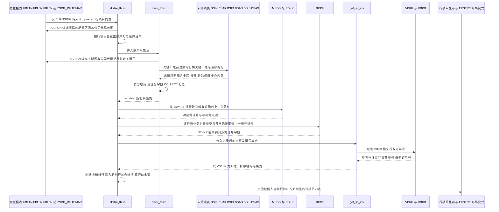

# ZCL_FI_TOOLKIT 代码走读报告

> 对象：`ZCL_FI_TOOLKIT`（全局工具类，FINAL，CREATE PUBLIC，约 1700 行，17 个类方法 + 1 个私有方法）
> 语言环境：土耳其语注释 + 巴西本地化 FM + 德文/英文标识符混排，是一个土耳其企业的 FI 工具箱。
> 阅读顺序按"报表增强主链路优先、辅助工具随后"排列。

---

## 一、程序定位与业务背景

### 1.1 它解决什么问题

这不是一个报表，也不是一个事务程序，而是企业 FI 团队的**公共工具箱**。它把四类互不相干的诉求收进同一个全局类：

1. **明细账（ekstre）增强**——土耳其财务习惯看的不是总账余额，而是"供应商/客户/总账的逐笔明细账"。SAP 原生的 FBL1N/FBL3N/FBL5N 只给本期行项目，**不给期初余额、不区分红字冲销对、不显示对方凭证、不显示订单号与交货号**。财务与审计要求"期初 + 本期逐笔 + 合计"三段式，于是 `ekstre_fblxn` 直接钻进行项目报表的行结构里插行。
2. **FI 日常运维**——写参考凭证号（XBLNR）、跳转到凭证显示（FB03）、推算到期日（NETDT）、清未清项（F-32/F-44）、转储（Umbuchung）过账。
3. **主数据与格式校验**——IBAN 查重、进口凭证类型配置读取、公司代码长文本、日期转 TCURR-GDATU。
4. **记账口径合规**——`validate_zhrtip` 按科目首位（5 开头 / 9 开头）强制校验一个自定义的凭证口径标记，显然对应 IFRS 或当地税务的"免税/应税"分类要求。

### 1.2 现有方案为何不够

- **F.31/F.32/F.33 这类原生事务**不给"带颜色的期初行 + 黄色合计行"这种土耳其式账本观感，也没法承载 `zzbstkd`（订单号）、`zzteslimat`（交货号）、`zzbakiye_upb`（滚动余额）这些自定义列。
- **FAGL/ACI 的分析视图**能做旧式余额分析，但它是独立事务，不会走行项目报表的增强链，也拿不到报表选择屏上的用户筛选条件（公司代码集合、期间区间、显示冲销行标志）。
- **手工在 Z 程序里重写 ekstre** 的做法在多个报表间重复，所以需要一个"谁都能调"的公共类。

### 1.3 整体设计范式（一句话定性）

**无状态全局工具类 + 私有静态缓存 + 深度侵入宿主报表内存的"报表增强"范式**：不建 ALV、不接管事务，而是通过 `ASSIGN ('(RFITEMAP)SO_BUDAT[]')` 读行项目报表的选择屏内存变量、通过 `sy-cprog` 判断当前跑在哪个报表里、再往 `it_rfposxext` 行结构里插入自制行。

这个范式的代价与收益都很明确：收益是复用了 SAP 报表的全部选择屏与显示逻辑；代价是这个类**与宿主报表的程序名、内存变量名、布局变式名、乃至 SAP 内部 include 池 `SAPLFI_ITEMS` 的全局变量名**硬绑定，任何一个改名都会让它静默失效（后面会看到它已经失效了一次）。

### 1.4 外部依赖清单（onboarding 必须知道）

| 类别 | 依赖 | 用途 |
|---|---|---|
| 报表宿主 | `RFITEMAP`(FBL1N)、`RFITEMGL`(FBL3N)、`RFITEMAR`(FBL5N)、`ZSDP_RFITEMAR` | 读选择屏内存、判定分支 |
| 行结构 | `it_rfposxext` / `rfposxext` | 插入的期初行、合计行载体 |
| FI 表 | `BSEG` `BKPF` `T001` `ADRC` `TCURR` | 凭证、清算行、公司代码、地址、日期格式 |
| 未清项表 | `BSIK` `BSAK`（供应商）、`BSID` `BSAD`（客户）、`BSIS` `BSAS`（总账） | 期初余额取数 |
| MM/SD | `MSEG` `MKPF` `RBKP` `VBRK` `VBRP` `VBKD` `KNB1` `LFB1` | 解析对方凭证、采购订单、交货号 |
| 银行 | `TIBAN` `LFBK` `KNBK` `LFA1` `KNA1` | IBAN 查重 |
| 自定义表 | `ZFITT_IBAN_RNG`、`ZFITT_TIBAN`、`ZFIT_ITH_BLART`、`ZFIT_IFRS_HARIC`、`ZFIS_ACCDOCUMENT_KEY`、`ZQMTT_LIFNR` | IBAN 区间、凭证类型、免税公司代码、凭证键 |
| Z 类 | `ZCL_BC_BDC`（BDC 封装）、`ZCL_FI_OMD`、`ZCL_FI_DOCUMENT_TYPE` | 驱动 F-32/F-44、付款凭证常量、冲销凭证类型 |
| 异常 | `ZCX_FI_IBAN`、`ZCX_FI_ZHRTIP`、`ZCX_BC_TABLE_CONTENT`、`ZCX_BC_CLASS_METHOD` | 查重、口径校验、缺记录、写库 |
| SAP FM | `J_1B_NFE_UPDATE_XBLNR`（**巴西 NF-e 本地化**）、`POSTING_INTERFACE_*`、`DETERMINE_DUE_DATE`、`CONVERSION_EXIT_INVDT_INPUT` | 写参考凭证、过账、到期日、日期格式 |

一个值得注意的信号：`update_xblnr` 里用的是**巴西电子发票（NF-e）**的功能模块，而注释与常量全是土耳其语。这个类经历过跨项目复用/搬运，域边界已经模糊。

---

## 二、程序执行流程总览

### 2.1 流程图

由于它是工具箱类、没有唯一入口，下面把四条实际存在的调用链画在一张图里：报表增强主链路（上半部）、参考凭证读写链、FI 运维工具链、配置读取链。

```mermaid
flowchart TD
  RPT["宿主报表 FBL1N 供应商行项目、FBL3N 总账行项目、FBL5N 客户行项目、ZSDP 客户行项目增强版，且布局变式名含 EKSTRE"]
  EK["ekstre_fblxn 增强入口：识别宿主程序与布局、补业务字段、删除冲销对、插入期初行与合计行、算滚动余额"]
  DEV["devir_fblxn 期初余额：读选择屏日期区间与公司代码范围，汇总 BSIK BSAK BSID BSAD BSIS BSAS 六张未清项表"]
  SDI["get_sd_inv 销售侧引用：VBRP 左连 VBKD 头行，取采购订单号与交货号"]
  XBL["get_bkpf_xblnr 参考凭证号回填：按公司代码凭证号年度批量取 BKPF-XBLNR"]
  UPD["update_xblnr 参考凭证号写回：逐张调用 J_1B_NFE_UPDATE_XBLNR，按开关决定逐张提交"]
  SDC["display_fi_doc_in_gui 凭证跳转：写 BLN BUK GJR 内存参数后调用 FB03"]
  DDC["determine_due_date 到期日：读 BSEG 账期参数交给 FM 算 NETDT"]
  TRF["denklestirerek_transfer_kaydi 转储记录：起 POSTING_INTERFACE 会话并过账 UMBUCHNG"]
  ZHR["validate_zhrtip 口径校验：按科目首位强制校验自定义凭证口径标记"]
  DUP["check_iban_duplicate IBAN 查重：命中已存在 IBAN 即抛 ZCX_FI_IBAN"]
  IBG["get_iban_codes IBAN 取数：LFA1 与 KNA1 各自关联银行账号表取已存在 IBAN"]
  CCL["clear_customer_open_items 客户未清项清算：BDC 驱动 F-32"]
  CVL["clear_vendor_open_items 供应商未清项清算：BDC 驱动 F-44"]
  GIT["get_import_document_types 进口凭证类型：读配置表并按境内境外标志过滤，带静态缓存"]
  GDT["get_domestic_import_doc_types 境内进口凭证类型：先触发缓存再按双标志取交集"]
  C2G["convert_datum_to_gdatu 日期转 GDATU：带缓存的格式转换"]
  CLT["get_company_long_text 公司代码长文本：T001 加 ADRC，带缓存"]
  RPT --> EK
  EK --> DEV
  EK --> SDI
  EK --> CVL
  EK --> CCL
  RPT --> XBL
  XBL --> UPD
  RPT --> SDC
  RPT --> DDC
  RPT --> TRF
  RPT --> ZHR
  RPT --> DUP
  DUP --> IBG
  RPT --> GIT
  GIT --> GDT
  RPT --> C2G
  RPT --> CLT
```



### 2.2 责任链表

| 子程序 | 调用者 | 职责 |
|---|---|---|
| `ekstre_fblxn` | FBL1N/FBL3N/FBL5N/ZSDP_RFITEMAR 的用户增强（USER_EXIT） | 增强入口：补字段、删冲销对、插期初与合计行、算滚动余额 |
| `devir_fblxn` | `ekstre_fblxn` | 按关键日期汇总六张未清项表，算出各账户期初余额 |
| `get_sd_inv` | `ekstre_fblxn`（主分支与 ELSE 分支各调一次） | 由交货/发票号解析订单号与交货号 |
| `get_import_document_types` | 外部程序直接调用 | 读 `ZFIT_ITH_BLART` 配置，按境内/境外标志过滤凭证类型 |
| `get_domestic_import_doc_types` | 外部程序直接调用 | 取"同时标记为进口且境内"的凭证类型 |
| `get_company_long_text` | ALV 打印/导出程序 | 取公司代码长文本（优先 ADRC 地址名，退回 T001-BUTXT） |
| `convert_datum_to_gdatu` | 外部程序（金额格式转换场景） | DATE 转 TCURR-GDATU，带会话级缓存 |
| `validate_zhrtip` | 记账前校验框架（用户出口/BAdE 调用方） | 按科目首位校验凭证口径标记，不合法则抛异常 |
| `check_iban_duplicate` | 银行主数据保存前校验 | 查 IBAN 是否已存在，命中抛 `ZCX_FI_IBAN` |
| `get_iban_codes` | `check_iban_duplicate` | 按供应商/客户范围取已存在的 IBAN |
| `clear_customer_open_items` | 应收清账程序 | BDC 驱动 F-32 清客户未清项 |
| `clear_vendor_open_items` | 应付清账程序 | BDC 驱动 F-44 清供应商未清项 |
| `determine_due_date` | 凭证过账前计算到期日 | 由 BSEG 账期参数推算 NETDT |
| `denklestirerek_transfer_kaydi` | 转储（Umbuchung）过账程序 | 用 POSTING_INTERFACE 过账一张转储凭证 |
| `get_bkpf_xblnr` | 外部参考凭证程序 | 批量回填 BKPF-XBLNR |
| `update_xblnr` | `get_bkpf_xblnr` 的后续写回方 | 逐张调用 NF-e FM 写回 XBLNR 并提交 |
| `display_fi_doc_in_gui` | 任意报表的凭证导航动作 | 跳到 FB03 显示凭证 |

### 2.3 下面按这条流程展开

主链路（3.1–3.4）是这个类的灵魂，占了 60% 的代码量，也占了 80% 的风险；辅助链路（3.5–3.18）大多是 30 行以内的小工具，我会把篇幅压到"一句做什么 + 关键风险"，但每段仍然按三层写清。

---

## 三、分组分析（按程序流程 / 子程序）

### 3.1 类定义段 `ZCL_FI_TOOLKIT`（全局声明区）

本节分四步看：类型目录的形状、公共契约常量、私有缓存、异常与参数签名约定。

#### ① 类型目录：三种内表形状，反映三种访问模式

```abap
  TYPES:
    BEGIN OF t_documents ,
      bukrs TYPE bseg-bukrs,
      belnr TYPE bseg-belnr,
      gjahr TYPE bseg-gjahr,
      buzei TYPE bseg-buzei,
    END OF t_documents .
  TYPES:
    tt_documents TYPE STANDARD TABLE OF t_documents WITH DEFAULT KEY .
  TYPES:
    BEGIN OF ty_hesap,
      sube   TYPE rfposxext-konto,
      merkez TYPE rfposxext-konto,
    END OF ty_hesap .
  TYPES:
    tt_hesap TYPE STANDARD TABLE OF ty_hesap .

  TYPES:
    BEGIN OF ty_devir,
      bukrs TYPE bukrs,
      konto TYPE hkont,
      shkzg TYPE shkzg,
      dmshb TYPE dmbtr,
      dmbe2 TYPE dmbe2,
      dmbe3 TYPE dmbe3,
      umskz TYPE umskz,
      filkd TYPE filkd,
      wrbtr TYPE wrbtr,
      waers TYPE waers,
      gsber TYPE gsber,
    END OF ty_devir .
  TYPES:
    tt_devir TYPE STANDARD TABLE OF ty_devir .
```

**做什么** — 声明 16 个公共类型与若干私有类型。`tt_documents`/`tt_hesap`/`tt_devir` 是标准表且未指定空键，标准键等于全部字段；`tt_devir` 是期初余额的返回结构，`ty_hesap` 是"子科目 + 中心科目"的账户对。

**为什么** — 用 `TYPE bseg-bukrs` 而不是硬写 `bukrs TYPE bukrs`，把字段与源表绑死，改源表字段长度时编译期就会报错，这是好习惯。`konto` 用 `rfposxext-konto` 也对——行项目报表里 GL 科目、供应商号、客户号三种"账户"共用同一个 CHAR(10) 字段，`ty_hesap` 必须用同一个类型才能把它们放进一张表。不用空键而用默认全字段键，是因为后面要用 `COLLECT` 去重。

**风险与改进** — `tt_devir` 声明成"标准表 + 全字段标准键"，而它的**唯一用途是被 `COLLECT` 聚合**（见 3.3 步骤⑦）。全字段键意味着 `COLLECT` 只能在"所有字段都相同"时才合并行——包括金额字段。这与"按账户汇总期初"的意图直接冲突，是本文件最严重的设计缺陷之一。另外 `ty_devir` 同时装了 `dmshb`（本币金额 `DMBTR`）、`wrbtr`（凭证货币金额）、`waers`（凭证货币）三者：金额与货币不是同一口径的行见方，读者极易误以为 `dmshb` 就是 `waers` 币种的金额。`gsber` 只在 AR 分支被取数，BL/GL 分支为空，导致按业务部门分组时出现"部分行为空"的空洞。

#### ② 私有类型：用 SORTED 表换二分查找

```abap
    TYPES:
      BEGIN OF t_mseg,
        mblnr TYPE mseg-mblnr,
        mjahr TYPE mseg-mjahr,
        smbln TYPE mseg-smbln,
        sjahr TYPE mseg-sjahr,
      END OF t_mseg .
    TYPES:
      tt_mseg
          TYPE SORTED TABLE OF mseg
          WITH NON-UNIQUE KEY mblnr mjahr .

    TYPES:
      tt_vbrp TYPE SORTED TABLE OF ty_vbrp
                  WITH NON-UNIQUE KEY vbeln .
```

注意 `tt_mseg`/`tt_rbkp` 的表行类型写的是 DDIC 结构 `mseg`/`rbkp`，而不是同名同义的本地结构 `t_mseg`/`t_rbkp`；后者只被当 `line type` 引用过，实际是死声明。

**做什么** — 为三张查找表声明 `SORTED TABLE WITH NON-UNIQUE KEY`，让 `READ TABLE ... BINARY SEARCH` 合法且 O(log n)。

**为什么** — `ekstre_fblxn` 在逐行循环里对每一条行项目都要查"这张物料凭证的冲销凭证是哪张"，行项目表动辄上万行。标准表线性查是 O(n×m)，排序表二分查是 O(n·log m)，这是作者最清醒的一处性能优化，值得表扬。

**风险与改进** — 三个隐患：**(a)** 用 `NON-UNIQUE KEY` 声明的排序表，`READ ... WITH TABLE KEY vbeln = x` 命中多行时返回哪一行是**内部顺序决定的、不确定**的，而 `get_sd_inv` 因为用了 `SELECT DISTINCT` 恰好会产生同一 `vbeln` 的多行（见 3.4），两者叠加就是数据随机化。**(b)** `READ TABLE lt_mseg WITH KEY smbln = ... sjahr = ...` 用的是**非表键字段**：排序表的键只有 `mblnr mjahr`，`smbln sjahr` 既不是主键也不是二级键，这种写法在严格检查下过不了编译，属于必须现场确认的写法（正确做法是显式加 `WITH NON-UNIQUE KEY smbln sjahr` 的二级键，或把表改成标准表）。**(c)** 本地结构 `t_mseg`/`t_rbkp` 定义了却没被用作行类型，是重构遗留，建议清理。

#### ③ 常量：把魔法值收进命名常量（但收得不彻底）

```abap
  CONSTANTS c_borc TYPE shkzg VALUE 'S' ##NO_TEXT.
  CONSTANTS c_alacak TYPE shkzg VALUE 'H' ##NO_TEXT.
  CONSTANTS c_mal_hareketi TYPE awtyp VALUE 'MKPF' ##NO_TEXT.
  CONSTANTS c_satinalma_faturasi TYPE awtyp VALUE 'RMRP' ##NO_TEXT.
  CONSTANTS c_satis_faturasi TYPE awtyp VALUE 'VBRK' ##NO_TEXT.
  CONSTANTS c_musteri_hf_talebi TYPE auart VALUE 'ZAH1' ##NO_TEXT.
```

**做什么** — 定义借贷方向 `S`/`H`、业务对象类型 `MKPF`/`RMRP`/`VBRK`、以及一个订单类型 `ZAH1`。

**为什么** — `SHKZG` 全代码库出现 6 次以上，收成 `c_borc`/`c_alacak` 后语义自解释，这是正确的做法。用 `TYPE shkzg` 声明常量类型也保证赋值时长度受控。

**风险与改进** — `c_musteri_hf_talebi`（客户 HF 订单类型 `ZAH1`）在本类的实现里**一次都没被使用**，属于从别的程序搬过来忘了删的死常量。更值得注意的是：全类还有大量未收编的魔法值——`'RFITEMAP'`/`'RFITEMGL'`/`'RFITEMAR'`/`'ZSDP_RFITEMAR'` 出现 9 次、`'UMBUCHNG'` 2 次、`'2018'` 硬编码年份、`'EKSTRE'` 变式名、`'K'`/`'D'` 账户类型、`'J'`/`'T'` 交货类型。**收编常量只做了一半，形成了最坏的组合：既没有全用常量，也没有全用字面量。**

#### ④ 类属性：三个会话级静态缓存

```abap
    CONSTANTS c_tabname_t001 TYPE tabname VALUE 'T001' ##NO_TEXT.
    CLASS-DATA gt_company_long_text TYPE tt_company_long_text .
    CLASS-DATA gt_dg_cache TYPE tt_dg_cache .
    CLASS-DATA gt_import_doc_type_cache TYPE tt_ith_blart .
```

**做什么** — 三个 `CLASS-DATA`（ABAP 的类级静态变量，进程内共享于整个 session）：公司代码长文本缓存、日期转换缓存、进口凭证类型配置缓存。

**为什么** — ABAP 里没有 `static` 局部变量，想在多次调用之间保留结果只有两条路：类属性，或传 `VALUE(...)` 参数让调用方自己缓存。用类属性缓存三种"读多写少、键空间极小"的数据（T001 几百个公司代码、日期不超过万年、配置表几十行）是标准且正确的优化，比每次 SELECT 好得多。

**风险与改进** — **(a)** 缓存**永不失效**，T001-BUTXT 或 ADRC 名称当天被维护过，同一 session 内的后续调用仍返回旧值；对长跑批或反复传输的系统会读到过期名称。**(b)** 缓存的填充条件写法不统一（见 3.15：`IF gt_import_doc_type_cache IS INITIAL` 在配置表真的为空时会每次重查），且三个缓存的失效策略完全没写进文档。**(c)** 最大的隐患是**跨方法的隐式契约**：`get_domestic_import_doc_types` 靠调用 `get_import_document_types` 的副作用来填缓存（代码注释直言"Cache dolsun diye"），一旦有人给后者加个提前返回，缓存就永远填不上。

---

### 3.2 方法 `ekstre_fblxn`（增强入口，本文件最核心的方法）

这是全文最长的方法（约 530 行），它不是一个独立程序，而是**挂在行项目报表用户出口上的钩子**。按执行顺序分八步。

#### ① 识别宿主程序，把报表内存变量 ASSIGN 出来

```abap
    CHECK ct_items IS NOT INITIAL.
    CASE sy-cprog.
      WHEN 'RFITEMAP'."FBL1N
        ASSIGN ('(RFITEMAP)X_AISEL') TO FIELD-SYMBOL(<lv_x_aisel>).
        ASSIGN ('(RFITEMAP)PA_VARI') TO FIELD-SYMBOL(<lv_vari>).

      WHEN 'RFITEMGL'."FBL3N
        ASSIGN ('(RFITEMGL)X_AISEL') TO <lv_x_aisel>.
        ASSIGN ('(RFITEMGL)PA_VARI') TO <lv_vari>.

      WHEN 'RFITEMAR'."FBL5N
        ASSIGN ('(RFITEMAR)X_AISEL') TO <lv_x_aisel>.
        ASSIGN ('(RFITEMAR)PA_VARI') TO <lv_vari>.

      WHEN 'ZSDP_RFITEMAR'.
        ASSIGN ('(ZSDP_RFITEMAR)X_AISEL') TO <lv_x_aisel>.
        ASSIGN ('(ZSDP_RFITEMAR)PA_VARI') TO <lv_vari>.

      WHEN OTHERS.
        RETURN.

    ENDCASE.
```

**做什么** — 用 `sy-cprog` 判断当前跑在哪个行项目报表里，然后用动态 `ASSIGN` 把该报表的两个全局变量取出来：`X_AISEL`（是否处于"选择行"状态）与 `PA_VARI`（当前布局变式名）。不是这四个程序之一就直接 `RETURN`。

**为什么** — 行项目报表没有对外的接口参数能让用户增强读"当前布局变式"和"是否在选择状态"，唯一的办法就是把宿主程序的全局变量按内存地址取出来。这是 ABAP 报表增强的经典手法，比自己再写一套 ALV 聪明得多——用户的选择屏、过滤、变式、列布局全部原样复用。

**风险与改进** — 三个问题：**(a)** 硬编码程序名意味着 SAP 升级时程序改名（大版本里 FBL1N 之类极少改名，但 Z 程序 `ZSDP_RFITEMAR` 是客户自建，随时可能换名）就会 `ASSIGN` 失败并静默 `RETURN`——用户看到的是"增强好像没生效"，没有任何报错。**(b)** `ASSIGN` 之后**没有任何 `sy-subrc` 检查**，而紧接着的代码就用 `<lv_vari> CS 'EKSTRE'` 和 `<lv_x_aisel> <> abap_true` 解引用它；`<lv_vari>` 未赋值时解引用是 dump。**(c)** 用 `sy-subrc` 判断"ASSIGN 是否成功"（见 ②）本身脆弱——中间任何一条语句都可能重置 `sy-subrc`。正确写法是 `ASSIGN ... TO <fs>` 后立刻 `IF sy-subrc <> 0. RETURN. ENDIF.`，或用 `ASSIGN ... TO <fs>` 的返回值配合 `ASSIGN ... IN RANGE` 严格模式。

#### ② 判断是否进入 EKSTRE 增强分支（含一个恒假条件）

```abap
    IF sy-subrc = 0 AND sy-cprog(5) = 'RFITE'.
```

**做什么** — 试图判断"当前是行项目报表且主分支可执行"。第二个条件取 `sy-cprog` 从第 5 位开始、长度为 5 的子串（不足部分补空格），与字面量 `'RFITE'` 比较。

**为什么** — 作者的意图很清楚：只对 `RFITE*` 开头的行项目报表（FBL1N/FBL3N/FBL5N 的程序名）启用增强，其他报表（例如被复制出来的 ZSDP 报表）走 ELSE 分支做最轻的处理。

**风险与改进** — **这是全文件最严重的问题**：`sy-cprog` 是 `CHAR(8)`，`sy-cprog(5)` 取的是**第 5 到第 9 位**。`'RFITEMAP'` 的第 5–8 位是 `'TEMAP'`，补齐后是 `'TEMAP '`，永远不等于 `'RFITE'`；`'ZSDP_RFITEMAR'` 在 `sy-cprog` 里被截成 `'ZSDP_RFI'`，第 5 位起是 `'P_RFI'`，也不等于。所以**这个条件恒为假**，意味着 ③–⑦ 全部（补 `zzbstkd`、删除冲销对行、算期初余额、插 DEVIR 行与合计行、算 `zzbakiye_*` 滚动余额）**在运行期一次都不会执行**，所有行项目报表实际只走 ELSE 分支。正确写法应是 `sy-cprog(1) = 'RFITE'` 或 `sy-cprog CS 'RFITE'`。这属于"看起来实现了、实际是死代码"的最高级别缺陷：编译器不会报错，ATC 不会报错，代码审查时这段太短容易被跳过，而业务方看到的是"ekstre 有期初行"的历史印象。请务必用断点或临时 `WRITE` 在两种分支各打一次确认；如果确认 ELSE 分支是当前真实行为，那么 ③–⑦ 就是需要删除或修复的历史包袱，报告里的期初余额结论也要相应修正。

#### ③ 给付款凭证行补订单号

```abap
      LOOP AT ct_items ASSIGNING FIELD-SYMBOL(<ls_items>)
            WHERE zuonr(3) eq  zcl_fi_omd=>c_zuonr_sanal and
                  zzbstkd IS INITIAL.
           <ls_items>-zzbstkd = <ls_items>-zuonr.
      ENDLOOP.
```

**做什么** — 遍历行项目，凡是付款凭证号前三位等于"付款"常量、且 `zzbstkd`（订单号字段）还是空的，就把整个 `zuonr`（付款凭证号）写进 `zzbstkd`。

**为什么** — 作者显然想让 ekstre 的"订单号"列在付款行上也有值，否则付款行那一列空白看起来像缺数据。这是很典型的"报表观感驱动"的补数。

**风险与改进** — **语义错配**：同一个 `zzbstkd` 字段在别处被填的是**采购订单号**（来自 `VBKD-BSTKD`，见 3.2 步骤⑤与 3.4），这里被填的是**付款凭证号**（`ZUONR`）。两个业务含义完全不同的数据共用一列，用户看到"订单号"列里混着付款凭证号，却无从分辨。正确做法是新增一个 `zzpaymentdoc` 字段，或者至少在短文本里加上类型前缀。另外 `zuonr(3)` 截前三位比较是脆弱的字符串约定，一旦付款凭证号规则从 3 位变 4 位就失效。建议把常量 `c_zuonr_sanal` 移到本类或至少在注释里写明"付款凭证号前 3 位"这条约定。

#### ④ 删除冲销对（HAR-10448）

```abap
        LOOP AT ct_items ASSIGNING <ls_items>
                    WHERE blart = zcl_fi_document_type=>get_customer_clearing_doc_type( ) AND
                          gjahr GE '2018'.
          DELETE ct_items WHERE belnr = <ls_items>-zzstblg AND gjahr = <ls_items>-zzstjah.
          DELETE ct_items.
        ENDLOOP.
```

**做什么** — 找出凭证类型为"客户清账凭证"且年度在 2018 年以后的行，用它自己已填好的"对方凭证号 + 对方凭证年度"去删掉对方那行，然后再删掉自己这行——效果是一对冲销行在 ekstre 里只留一条（避免同一天同金额借贷两行看着像重复）。

**为什么** — 思路是对的：注释保留了完整的问题单号（"HAR-10448 - Müşteri Ekstresinde XX belge ters kaydı"），说明这是业务方明确要求的行为；只对 2018 年以后生效也说明是补丁式上线、保留历史数据原样，这是稳妥的做法。

**风险与改进** — 三层问题，从重到轻：**(a)** `DELETE ct_items WHERE ...` 在带 `WHERE` 的 `LOOP` 内部删除行，是 ABAP 明确不支持的表修改方式（只允许在**无 WHERE** 的 LOOP 中删除当前行）；而且这个 `WHERE` 删的是"下一行"，删完之后的迭代位置会跳过一行，可能漏删或错删。**(b)** 随后的 `DELETE ct_items.`（无 WHERE，删当前行）同样在 `LOOP ... WHERE` 里，风险叠加。**(c)** 正确写法是先收集要删的键，再循环外 `DELETE ... WHERE belnr = ... AND gjahr = ...`，或者 `LOOP AT ... WHERE ... → APPEND key → ENDLOOP → LOOP AT keys → DELETE ct_items WHERE ...`。另外 `DELETE ct_items.` 不带 `WHERE` 会删掉**当前行**，如果 `ASSIGNING` 的行已被前面的 WHERE 删除，二次删除的语义就不可预期了。还有一处：`DELETE ... gjahr = <ls_items>-zzstjah` 依赖 `zzstjah` 已被正确填好，而 `zzstjah` 的填法本身有 bug（见 ⑤），所以这段删除逻辑的正确性建立在另一段错误代码之上。

#### ⑤ 收集账户与中心科目，调 `devir_fblxn` 算期初

```abap
        LOOP AT ct_items ASSIGNING <ls_items>.
          CLEAR ls_hesap.
          ls_hesap-sube = <ls_items>-konto.
          COLLECT ls_hesap INTO lt_hesap.
          ls_konto-bukrs = <ls_items>-bukrs.
          ls_konto-konto = <ls_items>-konto.
          COLLECT ls_konto INTO lt_konto.
        ENDLOOP.
        ASSIGN  ('(SAPLFI_ITEMS)GB_CENTRAL_ITEMS') TO FIELD-SYMBOL(<lv_merkez>).
        IF sy-subrc = 0.
          IF <lv_merkez> = abap_true.
            CASE sy-cprog.
              WHEN 'RFITEMAR' OR 'ZSDP_RFITEMAR'.
                SELECT bukrs, kunnr, knrze INTO TABLE @DATA(lt_knb1) FROM knb1
                    FOR ALL ENTRIES IN @lt_hesap
                    WHERE kunnr = @lt_hesap-sube AND
                          knrze <> @space.
```

**做什么** — 把行项目里出现过的账户去重成 `lt_hesap`（子科目）与 `lt_konto`（公司代码 + 账户），再读 SAP 行项目报表 include 池 `SAPLFI_ITEMS` 里的全局变量 `GB_CENTRAL_ITEMS`（用户是否勾选了"显示中心科目"），据此从 `KNB1`（客户中心科目 `KNRZE`）或 `LFB1`（供应商中心科目 `LNRZE`）扩展出中心科目对，最后把账户对集合交给 `devir_fblxn` 换回期初余额。

**为什么** — "中心科目"是 SAP FI 的一个真实功能：一个客户可以指定一个中心科目，所有行项目都汇总到它上面。做 ekstre 时如果不合并中心科目，用户看到的期初和对方子科目的期初对不上，账就不平。判断用户是否勾选了中心科目显示，直接读 SAP 全局变量比自己猜选择屏参数可靠。`COLLECT` 去重也是对的做法（这里 `tt_hesap`/`ty_konto` 都是全字段标准键，去重有效）。

**风险与改进** — **(a)** `ASSIGN ('(SAPLFI_ITEMS)GB_CENTRAL_ITEMS')` 是**读 SAP 内部 include 池的全局变量**，这是本文件里耦合最深的一处：SAP 改名或客户在同池里放了 ZSTUB 增强（同名变量被重新定义）都会让它失效或读到错值，而且失效时 `sy-subrc <> 0`，代码只是**静默跳过中心科目合并**——用户看到的是期初不平，没有任何提示。**(b)** `lt_knb1`/`lt_lfb1` 是内联声明，随后 `SORT ... BY bukrs kunnr` 再供二分查找用；但 `lt_knb1` 里可能同一个 `kunnr` 出现多行（按公司代码分行），`COLLECT ls_hesap INTO lt_hesap` 会**追加**多个子科目↔中心科目对，这正是设计意图（一个子科目对多个中心科目）。**(c)** `SELECT * FROM t001 INTO TABLE lt_t001.` 在紧随其后执行，但 `lt_t001` 在整个方法里**从未被读取**——这是一次全表扫描的纯浪费，删掉即可。**(d)** `FOR ALL ENTRIES IN @lt_hesap` 没有前置的"内表非空"检查；这里因为上游有 `CHECK ct_items IS NOT INITIAL` 所以实际安全，但依赖顺序的隐式约定很脆，建议加 `CHECK lt_hesap IS NOT INITIAL`。

#### ⑥ 解析对方凭证：物料、采购、销售三条线

```abap
        LOOP AT ct_items ASSIGNING <ls_items>
           WHERE zzawtyp = c_mal_hareketi OR zzawtyp =  c_satinalma_faturasi
               OR  zzawtyp =  c_satis_faturasi.
          IF <ls_items>-zzawtyp = c_mal_hareketi.
            APPEND VALUE #( mblnr = <ls_items>-zzawkey(10)
                            mjahr = <ls_items>-zzawkey+10(4)
                           ) TO lt_mkpf_key.
          ELSEIF <ls_items>-zzawtyp = c_satinalma_faturasi.
            APPEND VALUE #( belnr = <ls_items>-zzawkey(10)
                            gjahr = <ls_items>-zzawkey+10(4)
                           ) TO lt_rbkp_key.
          ELSEIF <ls_items>-zzawtyp = c_satis_faturasi.
            APPEND <ls_items>-zzawkey(10) TO lt_vbrk_key.
          ENDIF.
        ENDLOOP.
```

**做什么** — 只做分拣，不碰数据库：按行项目的 `zzawtyp`（业务对象类型）分三类，把 `AWKEY` 拆成"凭证号 + 年度"两类键，分别追加到 `lt_mkpf_key`、`lt_rbkp_key`、`lt_vbrk_key`。

**为什么** — `AWKEY` 是行项目上的"参考凭证键"，前 10 位凭证号、后 4 位年度，这是 FI 的标准版式，作者对版式的理解是对的。把分类放在取数之前，保证后面每张表只需一次 `FOR ALL ENTRIES`；`IF/ELSEIF` 严格互斥，避免一张行项目被写进两个键表。

**风险与改进** — 偏移量 `zzawkey(10)` 与 `zzawkey+10(4)` 把版式写死在代码里：`AWKEY` 在不同业务对象下位宽并不总是一致（年度位可能不是 4 位），一旦 SAP 或客户扩展改变版式，这里会**静默取到错误的凭证号**而不报错。建议把三个偏移量提为命名常量，并在注释里写明"凭证号 10 位加年度 4 位"这条约定。另外 `zuonr`/`zzawkey` 都是行项目结构上的 Z 字段，若这些 Z 字段本身由 BAdE 填充，填充逻辑出错会一路传导到对方凭证号，且本方法无法校验。

把三个键表排序去重后一次性批量取数：

```abap
        SORT lt_rbkp_key BY belnr gjahr.
        SORT lt_mkpf_key BY mblnr mjahr.
        SORT lt_vbrk_key BY vbeln.
        DELETE ADJACENT DUPLICATES FROM lt_mkpf_key COMPARING mblnr mjahr.
        DELETE ADJACENT DUPLICATES FROM lt_rbkp_key COMPARING belnr gjahr.
        DELETE ADJACENT DUPLICATES FROM lt_vbrk_key COMPARING vbeln.

        IF lt_rbkp_key IS NOT INITIAL.
          SELECT belnr, gjahr, stblg, stjah
            FROM rbkp
            FOR ALL ENTRIES IN @lt_rbkp_key
            WHERE
              belnr = @lt_rbkp_key-belnr AND
              gjahr = @lt_rbkp_key-gjahr
            INTO CORRESPONDING FIELDS OF TABLE @lt_rbkp.
```

**做什么** — `AWKEY` 是 FI 行项目的"参考凭证键"，前 10 位是凭证号、后 4 位是年度（这条约定和 `STBLG`/`STJAH` 反查凭证的拼接方式完全正确，值得肯定）。这里把三类业务对象的键分别拆开、去重，再一次性 `FOR ALL ENTRIES` 批量取"这张凭证自己指向的上一张凭证"（物料凭证 `MSEG-SMBLN/SJahr`、采购订单 `RBKP-STBLG/STJAH`）。

**为什么** — 绝不做逐行 SELECT，是这个方法里最重要的性能纪律。`LOOP + APPEND → SORT → DELETE ADJACENT DUPLICATES` 这一套正是内表去重的标准三连，顺序完全正确（先排序才能 ADJACENT）。每个 `IF lt_xxx IS NOT INITIAL` 也都守住了 `FOR ALL ENTRIES` 空表陷阱，说明作者对这些细节是有意识的。

**风险与改进** — `MSEG` 取的是**物料凭证行项目表**：一张物料凭证的多行共享同一个 `MBLN/MJahr`，`smbln/sjahr` 记在**具体的行**上。所以后面 `READ TABLE lt_mseg WITH TABLE KEY mblnr ... mjahr ...` 拿到的是"任意一行"的冲销引用，同一张凭证如果部分行被冲销、部分行没有，解析出的对方凭证号就是随机的。正确做法是按凭证号 `GROUP BY` 后判断是否存在非空的 `smbln`，或用 `MAX(smbln)` 聚合。同理 `RBKP` 虽然是抬头表（一个采购订单一行），这一条没问题。另一处：`AWKEY` 的长度假设写死在 `zzawkey(10)` 与 `+10(4)` 上，若某天 `AWKEY` 的年度位宽调整（不同业务对象位宽不同是常见做法），这段会静默取错。建议把这三个偏移量提成命名常量并写注释。

#### ⑦ 回填对方凭证号与年度（年度填错了）

```abap
          IF lv_awkey IS  NOT INITIAL.
            SELECT SINGLE belnr INTO <ls_items>-zzstblg FROM bkpf
                          WHERE awtyp = <ls_items>-zzawtyp AND
                                awkey = lv_awkey
                          ##WARN_OK .                   "#EC CI_NOORDER
            IF sy-subrc = 0.
              <ls_items>-zzstjah = <ls_items>-gjahr.
            ENDIF.
          ENDIF.
```

**做什么** — 拿到上一张凭证的 `AWKEY` 后回查 `BKPF` 找它的凭证号填进 `zzstblg`（对方凭证号），并在查找成功时把 `zzstjah`（对方凭证年度）设为**当前行的年度**。

**为什么** — `BKPF` 上 `AWTYP + AWKEY` 不是唯一键（同一张参考凭证可以被多张凭证引用），所以作者用 `SELECT SINGLE` 取一行，并用 `##WARN_OK` 与 `"#EC CI_NOORDER` 显式压掉 ATC 与 Code Inspector 的告警——**这个"我知道会出多条"的标注是诚实的**，比默默取第一行好。

**风险与改进** — **年度字段填错了，这是 🔴 级的正确性缺陷**：`SELECT` 只取了 `BELNR`，没有取 `GJahr`，却把**当前行的 `gjahr`** 写进了名为"对方凭证年度"的 `zzstjah`。正确写法是 `SELECT SINGLE belnr gjahr INTO @DATA(ls_bkpf) ...` 然后 `<ls_items>-zzstjah = ls_bkpf-gjahr`。这条缺陷有连锁杀伤：④ 的删除逻辑正是用 `zzstblg` + `zzstjah` 去定位对方行，年份错了就删不到正确的冲销行（或删错），也就是说"只留一条冲销行"这个业务需求在跨年凭证上必然失效。另外三个次要点：`SELECT SINGLE` 无 `ORDER BY` 取多行时返回哪一行不确定；查找失败时 `zzstjah` 保留上一次循环的残留值而不被清空，建议 `ELSE. CLEAR <ls_items>-zzstjah. ENDIF.`；这段 `SELECT` 在逐行循环内，等于每行一次单行 SELECT，行项目上万时是明显的 N 次数据库往返，建议先把三条线的 `AWKEY` 收集去重后批量查 `BKPF`。

#### ⑧ 插期初行/合计行并算滚动余额

```abap
              IF ls_item_sum_-dmshb LT 0.
                ls_item_sum_-zzalacak_upb = ls_item_sum_-dmshb.
              ELSE.
                ls_item_sum_-zzborc_upb = ls_item_sum_-dmshb.
              ENDIF.

              ls_item_sum_-u_bktxt =  ls_item_sum_-sgtxt  = |{ TEXT-004 }({ <ls_items>-konto })|.
              ls_item_devir = ls_item_sum_.
              APPEND ls_item_sum_ TO lt_item_devir.
              INSERT LINES OF lt_item_devir INTO ct_items INDEX lv_tabix.
              FREE lt_item_devir.
            ENDIF.
            CLEAR ls_item_sum_.
```

**做什么** — 为当前账户构造"合计行"并把它连同期初行一起插到当前明细行之前：先按 `dmshb` 的正负决定这笔合计是贷方还是借方，填好短文本，再把期初结构体与合计结构体一并 `INSERT LINES OF` 到 `ct_items` 的 `lv_tabix` 位置，随后 `FREE` 掉临时表。

**为什么** — 期初行与合计行必须成对出现（期初在上、合计在下）才能构成"期初 → 本期明细 → 合计"的账本观感，把两者放进同一张 `lt_item_devir` 再一次性 `INSERT`，天然保证了顺序，比分别 `INSERT` 两次更稳也更省操作。用 `COLOR` 字段（绿 `C51` / 黄 `C31`）而不是新增行类型来区分自制行，是 ALV 行项目报表里最省事的做法。

**风险与改进** — 符号约定在这里自相矛盾：贷方分支写 `ls_item_sum_-zzalacak_upb = ls_item_sum_-dmshb`（**没有乘 -1**），借方分支直接赋值（合理）；而紧接着的逐行分支里贷方是 `dmshb * -1`。同一份数据在合计行与明细行用了相反的约定，贷方合计的符号会与明细行对不上，`ekstre` 上的借贷分栏会显示错。合计行还缺 `2pb`/`3pb` 两个金额列的回填（三币种场景下列不齐），并且 `ls_item_sum_-hwaer` 在这一步仍是空（要到期末合计段才被赋值），意味着**合计行可能没有交易币种标签**。修法：以逐行分支为准统一为 `MULTIPLY ... BY -1`，并在构造合计行时同步填 `hwaer/hwae2/hwae3`。

以及紧随其后的余额计算：

```abap
          <ls_items>-zzbakiye_upb =  ls_item_devir-dmshb =
                                     ls_item_devir-dmshb +
                                     <ls_items>-dmshb.

          <ls_items>-zzbakiye_2pb =  ls_item_devir-dmbe2 =
                                     ls_item_devir-dmbe2 +
                                     <ls_items>-dmbe2.

          <ls_items>-zzbakiye_3pb =  ls_item_devir-dmbe3 =
                                     ls_item_devir-dmbe3 +
                                     <ls_items>-dmbe3.
```

**做什么** — 对每个账户的第一行，把 `devir_fblxn` 算出的期初行（绿色 `C51`）和合计行（黄色 `C31`）用 `INSERT ... INDEX lv_tabix` 插到当前行**之前**；`lv_tabix` 在每轮循环开头用 `sy-tabix` 记下，所以插入位置始终贴着当前行。随后给每一行算 `zzbakiye_upb/2pb/3pb` 三个滚动余额（期初 + 本行金额），并按 `shkzg` 把金额分到 `zzborc_*`（借方）或 `zzalacak_upb`（贷方，取负）。

**为什么** — 用颜色 + `zuonr`（`TEXT-dvg`/`TEXT-dvy`/`TEXT-dng`/`TEXT-dny`）把"期初行""合计行"标记出来，是让用户在看板上区分自制行与 SAP 原生行的最低成本方案；借方取正、贷方取负的统一符号约定（`devir_fblxn` 里对 `H` 方向 `MULTIPLY ... BY -1`）在两个方法之间是一致的，这点做得比多数自研报表好。`lv_konto_temp` 缓存"上一个账户"以避免每个账户重复插一遍期初行，也是正确的省时手段——前提是 `ct_items` 已按 `konto budat` 排序，而排序确实做了。

**风险与改进** — 风险密集：**(a)** 借方分支里写的是 `ls_item_sum_-zzborc_upb = ls_item_sum_-dmshb`（不取负），贷方分支写的是 `zzalacak_upb = dmshb`（**没有乘 -1**）——而逐行分支（后面的 `IF <ls_items>-shkzg = c_alacak`）里贷方是 `dmshb * -1`。同一份数据在合计行与明细行用了**相反的符号约定**，贷方合计会显示成负数或正负颠倒。**(b)** 合计行按 `waers` 取"最后一条明细的币种"，却把该账户下**所有币种**的 `dmshb` 累加进去——一个同时有美元和欧元业务的客户，合计行的金额是跨币种相加的无意义数字，币种标签却是最后一条的。**(c)** 依赖 `COLLECT ls_item_sum INTO lt_item_sum` 合并合计行，但 `it_rfposxext` 是 SAP 标准表类型、标准键包含行项目字段，`COLLECT` 几乎不可能合并，结果是"每个明细行一行合计"，再 `APPEND` 一行自己的合计——期末合计段会插入大量垃圾行，且 `ADD 1 TO lv_tabix` 的插入位置只按最后一条 tabix 算，位置也会错。这与 3.3 步骤⑦ 的 `COLLECT` 误用是同一个反模式，第二次出现说明它不是笔误而是习惯。**(d)** 在 `LOOP AT ct_items ASSIGNING` 内部对 `ct_items` 做 `INSERT`，虽然用 `sy-tabix` 保存绝对位置是流传较广的可行写法，但"循环变量 + 绝对下标插入"的组合在插入多行、且前面已插入过行的情况下极易错位；更稳的写法是先算出所有自制行、按行号建索引，最后一次性 `INSERT LINES OF` 并 `SORT`。**(e)** `ls_item_sum_` 这种带下划线后缀的命名（表示"影子/临时变量"）在本方法里承担了"合计行"的语义，与 `ls_item_sum` 的关系只靠命名约定，新人极易看反，建议改名 `ls_item_total`。

---

### 3.3 方法 `devir_fblxn`（期初余额计算）

方法分七步：取宿主内存变量、定关键日期、分供应商/客户/总账三路汇总未清项、过滤、符号归一、聚合。

#### ① 按 `sy-cprog` ASSIGN 宿主报表的选择屏变量

```abap
    CLEAR et_devir.

    CASE sy-cprog.
      WHEN 'RFITEMAP'.
        ASSIGN ('(RFITEMAP)SO_BUDAT[]') TO <lt_budat>.
        ASSIGN ('(RFITEMAP)KD_BUKRS[]') TO <lt_bukrs>.
        ASSIGN ('(RFITEMAP)X_SHBV') TO <lv_odk>.
        ASSIGN ('(RFITEMAP)X_APAR') TO <lv_apar>.

        IF NOT (
          <lt_budat> IS ASSIGNED AND
          <lt_bukrs> IS ASSIGNED AND
          <lv_odk>   IS ASSIGNED AND
          <lv_apar>  IS ASSIGNED
        ).
          RETURN.
        ENDIF.
```

**做什么** — 从 FBL1N 里取出期间选择表 `SO_BUDAT`、公司代码选择表 `KD_BUKRS`、两个开关（`X_SHBV` 显示特殊总账项目、`X_APAR` 客户侧同时看供应商），任何一个没取到就整段放弃。

**为什么** — 关键日期必须与用户在屏幕上选的期间一致，否则"期初"没有意义；而这些值只存在于宿主报表的全局变量里。作者用了 `IS ASSIGNED` 而不是 `sy-subrc` 来做整体校验，比 3.2 里的写法严谨得多。

**风险与改进** — **程序清单不一致**：这里只列了 `RFITEMAP`/`RFITEMGL`/`RFITEMAR` 三个，而 `ekstre_fblxn` 的 CASE 里有第四个 `ZSDP_RFITEMAR`。于是 ZSDP 版客户行项目报表走到 `WHEN OTHERS. RETURN.`，**期初余额恒为空**——该报表要么根本不显示 DEVIR 行（因为 `devir_fblxn` 返回空 → 3.2 步骤⑧ 走"无期初"分支插一条零金额行），要么显示一个恒为 0 的期初。这是典型的"两处硬编码清单各自演进"造成的 P0 级差异，修法是把程序清单提成一个常量数组，两处共用。另外 `WHEN OTHERS. RETURN.` 让方法在任何非行项目报表上下文里静默返回空表，调用方无法区分"没有期初"和"我没算"；建议至少加一个可选的 `RAISING` 或返回行数标志。

#### ② 用期间低值减一天得到关键日期

```abap
    READ TABLE <lt_budat> INDEX 1 ASSIGNING FIELD-SYMBOL(<ls_budat>).
    IF sy-subrc = 0.
      lv_keydt = <ls_budat>-low - 1.
    ELSE.
      RETURN.
    ENDIF.
```

**做什么** — 取选择屏期间区间表的**第一行**的 `low`，减一天，作为"期初"的截止日；后面所有 `budat LE lv_keydt` 都以它为准。

**为什么** — 逻辑正确：期初 = 关键日之前的全部未清项。用户选 2026 年 1 月–3 月，期初就是 2025-12-31 的余额。取区间低值而不是当前日期，是标准做法。

**风险与改进** — **没有校验期间是否为空**：如果用户把期间留空（`SO_BUDAT` 第一行 `low` 为 `00000000`），`00000000 - 1` 会溢出成 `99999999` 并置 `sy-subrc = 4`，而代码**不检查 `sy-subrc`**。结果是 `budat LE 99999999` 命中全部历史未清项，"期初"变成了"全部余额"，用户看到的期初行金额巨大却没有任何报错。建议：`IF <ls_budat>-low IS INITIAL. RETURN. ENDIF.` 并在减法后判 `sy-subrc`。另外"只取 INDEX 1"隐含假设选择屏表格第一行就是用户想要的区间；若报表允许多行期间选择，行为就不符合直觉，至少应在注释里写明这个假设。

#### ③ 供应商侧未清项（FBL1N）

```abap
        SELECT
               belnr
               gjahr
               buzei
               bukrs
               lifnr
               shkzg
               dmbtr
               dmbe2
               dmbe3
               umskz
               filkd
               wrbtr
               waers
               INTO TABLE lt_devir
               FROM bsik
               FOR ALL ENTRIES IN it_hesap
               WHERE bukrs IN <lt_bukrs> AND
                     budat LE lv_keydt AND
                     ( lifnr = it_hesap-sube OR lifnr = it_hesap-merkez ).
        SELECT
               belnr
               gjahr
               buzei
               bukrs
               lifnr
               shkzg
               dmbtr
               dmbe2
               dmbe3
               umskz
               filkd
               wrbtr
               waers
               APPENDING TABLE lt_devir
               FROM bsak
               FOR ALL ENTRIES IN it_hesap
               WHERE bukrs IN <lt_bukrs> AND
                     budat LE lv_keydt AND
                     augdt > lv_keydt AND
                     ( lifnr = it_hesap-sube OR lifnr = it_hesap-merkez ).
```

**做什么** — 从 `BSIK`（已过账未清项）取关键日之前过账的全部行，从 `BSAK`（已清账行）只取关键日之后才清账的行（`AUGDT > lv_keydt`），两者 `APPENDING` 进同一张工作表，就得到了"关键日时点仍然未清"的完整集合。

**为什么** — 这是 FI 里算"某日未清余额"的标准两段式：`BSIK` 全量 + `BSAK` 中清账日期在关键日之后的部分，等价于按 `AUGDT` 时间切片。`OR lifnr = sube OR lifnr = merkez` 同时覆盖子科目与中心科目，也正确。表名选的是 `BSIK/BSAK`（索引表，支持 `BUKRS/LIFNR` 前缀访问）而不是 `BSEG`，性能上是对的。

**风险与改进** — 三个问题：**(a)** `WHERE` 里同时出现 `bukrs IN <lt_bukrs>`（宿主报表的选择表）和 `FOR ALL ENTRIES` 的 OR 条件，ABAP 会把它当成"与 FAE 表的笛卡尔过滤"，语义正确但**无法命中 `BSIK` 的主索引前缀**（`BUKRS` 之后是 `LIFNR`，而 `LIFNR` 出现在 OR 里），实际执行计划容易退化成范围扫描加过滤。更好的写法是把账户列表也做成 `IN` 范围（`lifnr IN lt_lifnr`），让优化器直接走 `BUKRS/LIFNR` 索引。**(b)** `<lt_bukrs>` 是宿主报表的公司代码选择表，如果用户不限制公司代码（空范围表），`bukrs IN <空表>` 使整条 SELECT 返回空——用户选了全部公司代码却看不到任何期初，且没有提示。**(c)** 重复逻辑（`BSIK` 与 `BSAK` 两段，除了表名和 `AUGDT` 条件几乎一样）在这个方法里出现了 6 次（`BSIK/BSAK/BSID/BSAD/BSIS/BSAS`），一次改动要改六处，是必须收敛的重复。

#### ④ 客户侧与总账侧（受开关控制）

```abap
        IF <lv_apar> = abap_true.
          SELECT
                 belnr
                 gjahr
                 buzei
                 bukrs
                 kunnr
                 ...
                 APPENDING TABLE lt_devir
                 FROM bsid
                 FOR ALL ENTRIES IN it_hesap
                 WHERE bukrs IN <lt_bukrs> AND
                       budat LE lv_keydt AND
                       ( kunnr = it_hesap-sube OR kunnr = it_hesap-merkez ).
```

**做什么** — 客户分支在 `X_APAR`（用户勾选了"与供应商往来合并显示"）打开时，把 `BSID`（已过账未清项）与 `BSAD`（已清账行）按与供应商侧完全相同的模式 `APPENDING` 进 `lt_devir`，字段名与供应商侧一致（`KUNNR` 直接落在 `LIFNR` 对应的位置上——准确说，本地结构里客户号字段复用同一位置）。

**为什么** — "客户账上同时看供应商侧的应付"是土耳其企业常见的往来合并需求，`X_APAR` 正是行项目报表为此提供的开关，语义对齐正确。把两个方向的结果 `APPENDING` 进同一张表而不是分开存，是为了让后续过滤与聚合逻辑只写一份。

**风险与改进** — **(a)** `IF <lv_apar> = abap_true.` 直接解引用字段符号，而 `<lv_apar>` 在总账分支从未被 `ASSIGN`；目前靠"这段代码只存在于两个分支内"侥幸不炸，是位置上的巧合而不是契约保证。**(b)** 客户侧取数**没有过滤 `budat` 之外的 `lifnr` 之外的字段**，与供应商侧重复了同样的 `OR kunnr = sube OR kunnr = merkez` 写法；更重要的是客户侧同样存在 `bukrs IN <lt_bukrs>` 与 FAE 混用导致索引前缀失效的问题。**(c)** AR 分支是唯一取 `GSBER`（业务部门）的分支，而 BL/GL 分支的 `gsber` 恒空——如果后续要按业务部门出期初，供应商侧的数据是不完整的，这一点应写进方法文档。**(d)** 与 3.2 ⑤ 相同，`FOR ALL ENTRIES` 缺少内表非空的前置校验。

总账分支则把科目和金额换了字段名，用对应字段映射进同一张结构：

```abap
          SELECT
                 belnr
                 gjahr
                 buzei
                 bukrs
                 hkont AS konto
                 shkzg
                 dmbtr AS dmshb
                 dmbe2
                 dmbe3
*                 umskz
*                 filkd
                 wrbtr
                 waers
                 INTO CORRESPONDING FIELDS OF TABLE lt_devir ##TOO_MANY_ITAB_FIELDS
                 FROM bsis
                 WHERE bukrs IN <lt_bukrs> AND
                       budat LE lv_keydt AND
                       hkont IN <lt_saknr>.
```

**做什么** — 客户侧按 `X_APAR` 开关追加 `BSID/BSAD`；总账侧不按账户列表 FAE，而是直接用宿主报表的科目选择表 `SD_SAKNR` 取 `BSIS/BSAS`，并用 `AS konto`/`AS dmshb` 把 `HKONT`/`DMBTR` 映射成统一结构的 `KONTO`/`DMSHB`。

**为什么** — 用别名映射把 GL 分支（`HKONT`）和 BL 分支（`LIFNR`/`KUNNR`）统一进一个"账户"字段，是让后面所有过滤与聚合逻辑只写一遍的关键设计。这一步是本方法里最漂亮的地方。`##TOO_MANY_ITAB_FIELDS` 的 ATC 抑制也是合理的：目标结构比 `BSIS` 字段少，属于有意裁剪。

**风险与改进** — **(a)** `IF <lv_apar> = abap_true.` 直接解引用字段符号——在 `RFITEMGL` 分支里 `<lv_apar>` **从未被 ASSIGN**（只有 `X_SHBV` 被赋值），目前因为这段代码只存在于 `RFITEMAP`/`RFITEMAR` 分支而侥幸不炸，但这是靠代码位置而不是靠契约保证安全，一旦有人把客户侧逻辑抽成公共段就会 dump。**(b)** 总账分支的 `ASSIGN ('(RFITEMGL)SD_SAKNR[]')` 放在 `CASE` 内部并紧跟 `IF sy-subrc = 0`，写法是对的，但**失败时同样静默**：科目范围取不到就产出空期初。**(c)** GL 分支把 `umskz`/`filkd` 注释掉了，意味着后面第⑥步的"删除特殊总账项目"和"中心科目 `filkd` 过滤"对 GL 账户**完全是空操作**——同样的过滤规则在 BL 和 GL 上语义不同，却没有注释说明，读者极易误以为过滤已生效。**(d)** `bsis/bsas` 上 `hkont IN <lt_saknr>` 是范围表 IN，如果范围表行数上千仍是一条大 IN，性能尚可但要注意。**(e)** 三路汇总的字段清单靠手写对齐，任何一张表加字段都要改六处 SELECT，且 `gsber` 只有 AR 分支取，BL/GL 分支恒空。

#### ⑤ 过滤特殊项目与中心科目

```abap
    IF <lv_odk> IS INITIAL.
      DELETE lt_devir WHERE umskz IS NOT INITIAL.
    ENDIF.

    LOOP AT it_hesap ASSIGNING FIELD-SYMBOL(<ls_hesap>)
            WHERE merkez IS NOT INITIAL.
      DELETE lt_devir WHERE konto = <ls_hesap>-merkez AND filkd <> <ls_hesap>-sube.
    ENDLOOP.
```

**做什么** — 用户没勾"显示特殊总账项目"就删掉所有带 `UMSKZ`（特殊 G/L 业务类型）的行；对有中心科目对的用户，删掉"记在中心科目上、但汇总科目不是子科目"的行，避免重复计入。

**为什么** — 语义是对的：ekstre 上要展示的是"子科目上的可追溯明细"，记在中心科目上的汇总行不该重复出现在子科目账上。`<lv_odk>` 就是宿主报表的"显示特殊项目"开关，语义对齐正确。

**风险与改进** — **(a)** 这个 `LOOP ... DELETE` 是 `O(n×m)`：每个中心科目对都全表扫一遍 `lt_devir`。账户多、期初行多时（`BSAD` 全量取数很容易几万行）会成为热点。正确写法是先把 `it_hesap` 的 `merkez` 收集成哈希表，再一次 `DELETE ... WHERE konto = ...`，或者用 `SORT` + `READ BINARY` 定位。**(b)** `filkd <> <ls_hesap>-sube` 在 GL 分支恒真（`filkd` 未取数），但由于 GL 场景 `merkez` 恒空、`WHERE merkez IS NOT INITIAL` 让循环体不执行，才没出事——这是**靠巧合正确**，应显式说明。**(c)** `DELETE lt_devir WHERE konto = ...` 的 `konto` 字段在 BL 分支装的是 `LIFNR`（供应商号）、在 AR 分支装的是 `KUNNR`（客户号），共用一个字段做等值比较，一旦某天有人往 `lt_devir` 里混进 GL 数据，`konto` 的取值空间就会重叠，误删无从察觉。

#### ⑥ 符号归一：贷方取负，清掉区分字段

```abap
    LOOP AT lt_devir ASSIGNING FIELD-SYMBOL(<ls_devir>).
      IF <ls_devir>-shkzg = c_alacak.
        MULTIPLY <ls_devir>-dmshb BY -1.
        MULTIPLY <ls_devir>-dmbe2 BY -1.
        MULTIPLY <ls_devir>-dmbe3 BY -1.
        MULTIPLY <ls_devir>-wrbtr BY -1.
      ENDIF.
      CLEAR <ls_devir>-shkzg.
      CLEAR <ls_devir>-umskz.
*{  EDIT  Berrin Ulus 25.04.2016 15:05:25
* HAR-9421
      CLEAR : <ls_devir>-filkd.
*}  EDIT  Berrin Ulus 25.04.2016 15:05:25
      CLEAR ls_devir.
      MOVE-CORRESPONDING <ls_devir> TO ls_devir.
      COLLECT ls_devir INTO et_devir.
    ENDLOOP.
```

**做什么** — 把贷方（`SHKZG = 'H'`）的四个金额字段全部乘 -1，得到"借正贷负"的单一有符号余额；然后把 `SHKZG`、`UMSKZ`、`FILKD` 三个"区分字段"清空——这样一来，只有账户、金额、币种、业务部门相同的行才会被认为可以合并；最后 `COLLECT` 汇总进 `et_devir`。

**为什么** — 符号归一是余额类计算的标准做法，也和 `ekstre_fblxn` 里的 `dmshb LT 0` 判断配套。`CLEAR + MOVE-CORRESPONDING` 是为了把字段符号的行值拷进工作结构再 `COLLECT`（`COLLECT` 不接受字段符号），写法虽啰嗦但意图明确。保留 `EDIT ... HAR-9421` 的编辑痕迹是好习惯，能追溯到需求单号。

**风险与改进** — **这里是全文件最关键的一处缺陷**：`COLLECT` 的合并依据是目标内表的**标准键**，而 `tt_devir` 是 `STANDARD TABLE` 且未指定空键，标准键 = **全部字段**。字段清单里包含 `DMSHB`、`DMBE2`、`DMBE3`、`WRBTR` 这些金额，所以**只有金额完全相同的行才会被合并**——两个金额不同的期初行永远合并不到一起。结果是 `et_devir` 里每个账户会有 N 行（每个金额组合一行），而不是"每账户一行汇总"。这一行 N 会直接打死下游：`ekstre_fblxn` 步骤⑧ 用 `LOOP AT lt_devir_sorted INTO ls_devir WHERE bukrs = ... AND konto = ...` 遍历，却只用**最后一行的值**（还靠 `IF ls_devir-bukrs IS INITIAL` 判断"有没有找到"），前面的行被静默丢弃，期初余额因此偏小或完全错误。修法很直接：把 `tt_devir` 改成 `SORTED TABLE ... WITH UNIQUE KEY bukrs konto gsber waers`（或标准表 + `WITH EMPTY KEY` 后自行 `LOOP ... COLLECT` 到一个显式汇总结构），让键里只保留账户维度、不含金额；顺带把 `waers` 纳入键，避免跨币种相加。另外 `CLEAR <ls_devir>-shkzg` 让借贷方向从键里消失是**对的**（期初确实应该净额），但 `filkd` 被清空后又用 `filkd <> sube` 做过过滤（步骤⑤在清空之前，顺序正确），这个先后顺序很关键，改动时不要调换。

---

### 3.4 方法 `get_sd_inv`（销售侧引用解析）

#### ① 一次左外连接取订单号与交货号

```abap
    CHECK it_vbrk_key IS NOT INITIAL.

    SELECT DISTINCT vbrp~vbeln
                    vbrp~vgtyp
                    vbrp~vgbel
                    vbkd~bstkd
       INTO TABLE rt_vbrp
       FROM vbrp
       LEFT OUTER JOIN vbkd
               ON vbkd~vbeln = vbrp~aubel AND
                  vbkd~posnr = '000000'
       FOR ALL ENTRIES IN it_vbrk_key
       WHERE vbrp~vbeln = it_vbrk_key-vbeln.
```

**做什么** — 对传入的交货/发票号集合，从 `VBRP`（开票行项目）出发左外连接 `VBKD` 的抬头行（`POSNR = '000000'`，标准做法），取出参考凭证类型 `VGTYP`、参考交货单号 `VGBEL` 与采购订单号 `BSTKD`，去重后装进以 `VBELN` 为非唯一排序键的返回表。

**为什么** — `CHECK it_vbrk_key IS NOT INITIAL.` 是 `FOR ALL ENTRIES` 的必要护栏，作者没漏，值得表扬。用 `LEFT OUTER JOIN` 而不是内连接，是为了在没有销售订单引用时仍能返回该发票行——这个选择正确，否则没有订单的发票会被整条丢掉。

**风险与改进** — **`SELECT DISTINCT` 破坏了方法契约**：返回类型声明的键是 `vbeln`，调用方（`ekstre_fblxn`）也用 `READ ... WITH TABLE KEY vbeln = x` 假设"一个发票一行"。但 DISTINCT 作用在四字段组合上，一张发票只要有不同的参考凭证类型或不同交货单，就会产生**同一 `VBELN` 的多行**，而排序表的非唯一键读取返回哪一行是不确定的，于是 `zzteslimat`（交货号）和 `zzbstkd`（订单号）会随数据顺序抖动。正确做法是 `GROUP BY vbrp~vbeln` 并用 `MAX(vgtyp)`/`MAX(vgbel)`/`MAX(bstkd)` 聚合，或把返回类型改成按 `vbeln` 非唯一键并在文档里写明"可能多行"。其次，`FOR ALL ENTRIES IN it_vbrk_key` 没有分批：交单列表上千个 `VBELN` 时建议按 1000–5000 分批，或改用 `IN` 范围表。最后，`vbrp~aubel` 只在"销售订单开票"场景有值；如果是交货单开票（无 `AUBEL`），`BSTKD` 会是空的，方法不报错也不提示，调用方拿到空订单号无从判断是"没有订单"还是"查错了"。

---

### 3.5 方法 `get_bkpf_xblnr`（参考凭证号批量回填）

#### ① 批量取 XBLNR 后二分回填

```abap
    DATA lt_doc TYPE tt_doc_xblnr.

    CHECK ct_doc[] IS NOT INITIAL.

    SELECT bukrs belnr gjahr xblnr
           INTO CORRESPONDING FIELDS OF TABLE lt_doc
           FROM bkpf
           FOR ALL ENTRIES IN ct_doc
           WHERE bukrs = ct_doc-bukrs
             AND belnr = ct_doc-belnr
             AND gjahr = ct_doc-gjahr.

    SORT lt_doc BY bukrs belnr gjahr.

    LOOP AT ct_doc ASSIGNING FIELD-SYMBOL(<ls_doc_tar>).

      READ TABLE lt_doc ASSIGNING FIELD-SYMBOL(<ls_doc_src>)
                        WITH KEY bukrs = <ls_doc_tar>-bukrs
                                 belnr = <ls_doc_tar>-belnr
                                 gjahr = <ls_doc_tar>-gjahr
                        BINARY SEARCH.
```

**做什么** — 拿调用方给的凭证键集合去 `BKPF` 一次批量取 `XBLNR`，排序后逐行二分查找，把参考凭证号写回调用方的表；查不到就把 `xblnr` 清空。

**为什么** — 这是本文件里**唯一一个完全写对了的标准范式**：FAE 前有 `CHECK` 空表护栏；`WHERE` 用 `BUKRS/BELNR/GJahr` 正好是 `BKPF` 的主键，`FOR ALL ENTRIES` 因此能走主索引；`SORT ... BY bukrs belnr gjahr` 之后 `READ ... WITH KEY bukrs belnr gjahr BINARY SEARCH` 的键是排序顺序的前缀，二分查找完全合法。这个"取数一次 + 排序 + 二分回填"的模式正是 3.2 步骤⑥ 该做而没做的事，可以直接作为参照样板。

**风险与改进** — 三个小问题：**(a)** 方法名是 `get_`，实际行为是 `CHANGING` 原地修改调用方表（ABAP 的 `get_` 惯例应配 `RETURNING`），且**查不到时主动 `CLEAR` 调用方已有的 `xblnr`**——如果调用方自己填过值，会被无声抹掉。建议改名为 `fill_xblnr_from_bkpf` 并在注释里写明"未命中则清空"。**(b)** 没有对输入去重，重复键会让 SELECT 做重复工作（结果去重由 DB 完成，影响不大）。**(c)** 没有分批，凭证量到十万级时应分批。**(d)** 返回结构 `tt_doc_xblnr` 用了 `WITH DEFAULT KEY`，但作为 `CHANGING` 参数的容器，用 `WITH EMPTY KEY` 或排序表能避免标准键带来的隐含约束。

---

### 3.6 方法 `update_xblnr`（参考凭证号写回）

#### ① 逐张调用 NF-e 功能模块并按开关提交

```abap
    DATA: lv_mblnr_initial TYPE mblnr,
          lv_vbeln_initial TYPE vbeln_vl,
          lv_rbeln_initial TYPE re_belnr.

    LOOP AT it_xblnr ASSIGNING FIELD-SYMBOL(<ls_xblnr>).

      CALL FUNCTION 'J_1B_NFE_UPDATE_XBLNR'
        EXPORTING
          iv_xblnr = <ls_xblnr>-xblnr
          iv_rbeln = lv_rbeln_initial
          iv_mblnr = lv_mblnr_initial
          iv_vbeln = lv_vbeln_initial
          iv_bukrs = <ls_xblnr>-bukrs
          iv_belnr = <ls_xblnr>-belr
          iv_gjahr = <ls_xblnr>-gjahr.

      CHECK iv_commit_each_doc = abap_true.
      COMMIT WORK AND WAIT.

    ENDLOOP.

    IF iv_commit_each_doc = abap_false.
      COMMIT WORK AND WAIT.
    ENDIF.
```

**做什么** — 遍历要写的键集合，每张凭证调用一次 `J_1B_NFE_UPDATE_XBLNR` 写入参考凭证号；根据 `iv_commit_each_doc` 决定每张都提交还是最后统一提交一次。

**为什么** — 把"提交粒度"做成参数（默认不逐张提交）是合理的 API 设计，避免了逐张 `COMMIT` 的经典性能坑。`CHECK iv_commit_each_doc = abap_true.` + 循环后兜底提交，逻辑闭环。

**风险与改进** — 问题不少：**(a)** 声明了 `RAISING zcx_bc_class_method`，但方法体里**一次异常都没抛**，调用方却被迫包 `TRY/CATCH`——契约与实现不符，应删掉 `RAISING`。**(b)** 三个变量 `lv_mblnr_initial`/`lv_vbeln_initial`/`lv_rbeln_initial` **永远是初始值**，被当作 `iv_mblnr`/`iv_vbeln`/`iv_rbeln` 传给 FM。按这个签名推断，FM 需要靠这三个参数区分"要更新的是物料凭证/销售凭证/服务发票"，而现在每次都传空，等于**只有 `iv_belnr` 那条路径生效**，另外三条路径静默无效。这大概率是从一次多路径需求里裁剪出来的半成品，必须确认。**(c)** `CALL FUNCTION` 没有 `EXCEPTIONS` 子句也没有 `sy-subrc` 检查——写库失败（比如凭证已过账、锁定、编号策略不允许）完全不可见，调用方以为成功。**(d)** 在工具类里 `COMMIT WORK AND WAIT`：调用方的 LUW 被强行切断，出错也无法回滚；而且当 `it_xblnr` 为空时，方法**仍然执行一次 `COMMIT`**，把调用方毫不相干的工作提交了——建议开头加 `CHECK it_xblnr IS NOT INITIAL`，并把 `COMMIT` 的决定权交还调用方（返回成功标志或让调用方提交）。**(e)** `AND WAIT` 强制同步提交，批量写时性能代价明显，应只在必要时使用。

---

### 3.7 方法 `display_fi_doc_in_gui`（凭证跳转）

#### ① 写内存参数后调用 FB03

```abap
    SET PARAMETER ID: 'BLN' FIELD iv_belnr,
                      'BUK' FIELD iv_bukrs,
                      'GJR' FIELD iv_gjahr.

    CALL TRANSACTION 'FB03' AND SKIP FIRST SCREEN.       "#EC CI_CALLTA"
```

**做什么** — 把凭证号、公司代码、年度写入 SAP 内存参数（SPA/GPA 参数），然后调用事务 `FB03`（凭证显示）并跳过第一屏，直接进入明细屏。

**为什么** — `SET PARAMETER ID` + `CALL TRANSACTION AND SKIP FIRST SCREEN` 是 ABAP 里最标准的"从任意程序跳到凭证显示"写法，参数 ID `'BLN'/'BUK'/'GJR'` 正是 `FB03` 读取的三个，映射正确。用 `"#EC CI_CALLTA` 抑制 CI 的"禁止 CALL TRANSACTION"告警，说明作者是有意为之。

**风险与改进** — **(a)** 让一个工具类拥有 UI 副作用，破坏了"可被后台任务/接口调用"的通用性：后台作业或 API 场景下这一句会直接 dump。建议拆成"只跳转"的独立方法并在类注释里标注"仅限前台"。**(b)** 入参零校验：`iv_gjahr` 为初始值时 `FB03` 打开的是空凭证视图，用户一脸茫然。**(c)** 没有把调用方自己的 SPA 参数保存/恢复，调用方若也用 `SET PARAMETER` 会互相污染。**(d)** 跳转后调用方程序仍挂在调用栈上，返回时回到原报表——这通常是期望行为，但应由文档讲清楚。**(e)** 事务码写死，若客户激活了事务码检查（`XPRA`/SOH 管控）会失败。

---

### 3.8 方法 `determine_due_date`（到期日推算）

#### ① 读 BSEG 账期参数交给 FM 计算

```abap
    DATA: i_faede TYPE faede,
          e_faede TYPE faede.

    SELECT SINGLE
        shkzg, koart, zfbdt, zbd1t,
        zbd2t, zbd3t, rebzg, rebzt
      FROM bseg
      WHERE
        bukrs = @im_document-bukrs AND
        gjahr = @im_document-gjahr AND
        belnr = @im_document-belnr AND
        buzei = @im_document-buzei
      INTO CORRESPONDING FIELDS OF @i_faede.

    CALL FUNCTION 'DETERMINE_DUE_DATE'
      EXPORTING
        i_faede                    = i_faede
      IMPORTING
        e_faede                    = e_faede
      EXCEPTIONS
        account_type_not_supported = 1
        OTHERS                     = 2.

    IF sy-subrc <> 0  ##NEEDED.
* Implement suitable error handling here
    ENDIF .

    re_netdt = e_faede-netdt.
```

**做什么** — 按凭证行键从 `BSEG` 取八个账期相关字段（记账日期、三个账期天数、重新计算标志等）填进 `FAEDE` 结构，交给 FM `DETERMINE_DUE_DATE` 算出 `NETDT`（到期日）返回。

**为什么** — `INTO CORRESPONDING FIELDS` + `DETERMINE_DUE_DATE` 正是 SAP 官方推荐的到期日计算路径，字段选择（`SHKZG KOART ZBD1T ZBD2T ZBD3T ZFBDT REBZG REBZT`）与 FM 的输入结构精确对应。用 Open SQL 读而不是 BDC 读会计凭证表，也说明作者知道该走哪条路。

**风险与改进** — **(a)** `SELECT SINGLE` 后**不检查 `sy-subrc`**：凭证行键传错时 `i_faede` 全空，FM 照样返回 `00000000`，方法把"零到期日"正常返回给调用方。**(b)** 异常处理是 ABAP 模板生成器留下的空壳（`" Implement suitable error handling here`），`sy-subrc <> 0` 分支什么都不做，之后照样 `re_netdt = e_faede-netdt`。方法既不 `RAISING` 也不返回状态，调用方无法区分"算出来了"和"算失败了"。**(c)** `IF sy-subrc <> 0. ENDIF.` 整段被 `##NEEDED` 抑制为空逻辑，纯粹是噪音，直接删掉更好。**(d)** **语义问题**：到期日属于**未清项行**（贷方的应付/应收行，通常是 040 行），而方法完全信任调用方传入的 `buzei`。若调用方传抬头行或借方行，算出的是那条行自己的账期，未清项的到期日往往为空。方法应在 `SELECT` 里加上 `koart IN ('D','K')` 或直接查 `BSEG` 的未清项标识，并校验 `koart`。**(e)** 输入结构命名为 `i_faede`（`i_` 通常表示内表或输入表参数）而实际是结构体，命名误导。

---

### 3.9 方法 `denklestirerek_transfer_kaydi`（转储凭证过账）

这是本类里唯一一处直接写 FI 凭证的代码，风险等级最高。分四步看。

#### ① 定义过账宏

```abap
    lv_group = sy-tcode.
    DEFINE ftpost.
      CLEAR ls_ftpost.
      ls_ftpost-stype = &1.
      ls_ftpost-count = &2.
      ls_ftpost-fnam = &3.
      WRITE &4 TO ls_ftpost-fval.
      CONDENSE ls_ftpost-fval.
      APPEND ls_ftpost TO lt_ftpost.
    END-OF-DEFINITION.
```

**做什么** — 定义一个宏，把"字段名 + 值"拼成 `FTPOST` 结构的行追加到过账参数表；`&1` 是字符串类型标识（`K`=字符、`C`=数字），`&2` 是计数，`&3` 是字段名，`&4` 是值。

**为什么** — `POSTING_INTERFACE` 的 `FTPOST` 是"字段名/值"字符串对，用宏封装能把这 7 行重复压成一行调用，可读性收益明显。`CONDENSE` 去掉多余空格也是必要的（`WRITE` 到定长字段会留尾部空格）。

**风险与改进** — 这里用 `WRITE` 把值写成字符串，对 `BKPF-BLDAT`/`BKPF-BUDAT` 这类日期字段是**正确的**：过账接口期望的是**用户输入格式**，与 `3.2` 之外那个把 `WRITE` 当转换工具用错的地方（见 3.17）形成鲜明对比——同一个手法在一个地方对、一个地方错，说明作者知道差别，只是没有沉淀成规范。宏本身的风险是 `&4` 为数值时 `WRITE` 可能带符号位或小数逗号（取决于用户参数 `DECIMAL NOTATION`），建议日期/数值一律用 `|{ ... DATE = USER }|` 或 `CONV string( ... )` 显式格式化。另外宏名 `ftpost` 与内表名 `lt_ftpost` 只差前缀，容易看错。

#### ② 取行项目的账户类型并推导凭证类型

```abap
    IF it_bseg IS NOT INITIAL.
      SELECT bukrs ,belnr ,gjahr, buzei, koart,umskz FROM bseg
        INTO TABLE @DATA(lt_bseg)
        FOR ALL ENTRIES IN @it_bseg
        WHERE
          bukrs = @it_bseg-bukrs AND
          belnr = @it_bseg-belnr AND
          gjahr = @it_bseg-gjahr AND
          buzei = @it_bseg-buzei .                      "#EC CI_NOORDER
    ENDIF.

    LOOP AT lt_bseg INTO DATA(ls_bseg) .
      IF sy-tabix = 1.
        DATA: lv_fname(5) TYPE c.
        CONCATENATE 'BLAR' ls_bseg-koart INTO lv_fname.
        DATA lv_blart TYPE bkpf-blart.
        SELECT SINGLE (lv_fname) FROM t041a INTO lv_blart
          WHERE auglv = 'UMBUCHNG'.

        ftpost 'K' '1' 'BKPF-BUKRS' ls_bseg-bukrs.
        ftpost 'K' '1' 'BKPF-BLART' lv_blart.
```

**做什么** — 按输入的凭证行键取回这些行的账户类型 `KOART` 与特殊项目 `UMSKZ`；然后用**动态字段名** `'BLAR' + KOART`（例如 `KOART = 'D'` 得到 `BLARD`）去 `T041A` 查 `AUGLV = 'UMBUCHNG'` 对应的凭证类型，填进过账表头。

**为什么** — `T041A` 用 `BLARD`（借方）、`BLARK`（贷方）、`BLARN`（总账）分别定义不同账户类型的转账凭证类型，这是 SAP 的标准配置表。用动态字段名让**一行代码覆盖所有账户类型**，是聪明且常见的 ABAP 技巧。`IF sy-tabix = 1` 保证表头只拼一次。`FOR ALL ENTRIES` 前的 `it_bseg IS NOT INITIAL` 护栏也在（`#EC CI_NOORDER` 的抑制同样正确，因为 WHERE 已含 `BSEG` 全键）。

**风险与改进** — **(a)** 动态字段名没有任何存在性检查：`lv_fname(5) TYPE c` 只有 5 个字符，而 `CONCATENATE 'BLAR' ls_bseg-koart` 拼出来的是 8 个字符，ABAP 会**静默截断到 5 位**。对标准账户类型恰好安全（`KOART = 'D'` 得 `BLARD`、`KOART = 'K'` 得 `BLARK`，都正好 5 位），但这是**靠巧合正确**——一旦出现 2 位自定义账户类型（拼成 `BLARXX` 截成 `BLARX`），或 `KOART` 带尾空（`'D   '` 拼成 `BLARD   ` 截成 `BLARD` 尚可，但 `T041A` 上并不存在 `BLARS` 这类字段），`SELECT SINGLE (lv_fname)` 就会因字段不存在而 dump。正确写法是把字段声明成 `lv_fname(8) TYPE c` 或 `TYPE string`，并先用动态描述对象检查该字段在 `T041A` 上是否存在，不存在时给出可读的异常而不是 dump。**(b)** 只用**第一行**的 `KOART` 推导整张凭证的凭证类型：转储凭证常同时含借方行与贷方行（`KOART` 为 `D` 与 `K`），而 `T041A` 为两者定义了不同的凭证类型，这里只看第一行，凭证类型是否符合业务预期没有任何告警。**(c)** `lv_group = sy-tcode` 把事务码当过账组名，同一事务码下的并发过账会共享组名；应使用调用方传入的组名或 UUID。**(d)** `SELECT SINGLE (lv_fname) ... WHERE auglv = 'UMBUCHNG'` 若配置缺失（`T041A` 没有对应记录），`lv_blart` 为空却仍继续过账，最终由 FM 抛出语义不明的错误；应在 `sy-subrc <> 0` 时直接抛业务异常。

#### ③ 组装清算行并调用 POSTING_INTERFACE

```abap
      APPEND INITIAL LINE TO lt_ftclear REFERENCE INTO DATA(lr_ftclear).
      lr_ftclear->agkoa = ls_bseg-koart.
      lr_ftclear->agbuk = ls_bseg-bukrs.
      lr_ftclear->selfd = 'BELNR'.
      IF ls_bseg-umskz <> space.
        lr_ftclear->agums = ls_bseg-umskz.
      ENDIF.
      lr_ftclear->xnops = abap_true.
      CONCATENATE ls_bseg-belnr
                  ls_bseg-gjahr
                  ls_bseg-buzei
             INTO lr_ftclear->selvon.
```

**做什么** — 为每一行待清项组装一条 `FTCLEAR` 记录：账户类型、公司代码、选择字段用 `BELNR`、可选的特殊 G/L 标记、以及"选中凭证号年度行项目"拼成的 18 位选择串。

**为什么** — `APPEND ... REFERENCE INTO` 用引用直接往 `lt_ftclear` 里放行，避免了 `APPEND VALUE` 后再 `MODIFY` 的二次定位，是高效写法。`xnops = abap_true` 表示不显示"未清项预览"，与后面 BDC 用 `XNOPS` 的做法一致——作者对这套接口是有经验的。

**风险与改进** — `CONCATENATE` 直接拼三段（`BELNR` 10 + `GJahr` 4 + `BUZEI` 4）没有分隔符也没有长度校验，若 `BUZEI` 为 3 位（手工凭证常见），拼出来的 17 位串会错位，导致清错行。建议显式写清格式：`CONCATENATE belnr gjahr buzei INTO lv_selvon SIZE 18`，并用 `WRITE` 风格对齐或字符串模板 `|{ belnr }{ gjahr }{ buzei }|`。另外方法入口没有 `CHECK it_bseg IS NOT INITIAL` 之后的提前返回：空输入时 `lt_bseg` 空 → `lt_ftpost` 也空（表头在 `sy-tabix = 1` 里拼）→ 仍会走完整个 `POSTING_INTERFACE` 三步调用，参数全空的结果不可预期，应在 `IF it_bseg IS NOT INITIAL` 的 `ELSE` 分支直接 `RETURN`。

#### ④ 过账调用与错误处理

```abap
    CALL FUNCTION 'POSTING_INTERFACE_CLEARING'
      EXPORTING
        i_auglv                    = 'UMBUCHNG'
        i_tcode                    = 'FB05'
      TABLES
        t_blntab                   = lt_blntab
        t_ftclear                  = lt_ftclear
        t_ftpost                   = lt_ftpost
        t_fttax                    = lt_fttax
      EXCEPTIONS
        ...
        OTHERS                     = 10.
    IF sy-subrc = 0 .
      MESSAGE ID sy-msgid TYPE sy-msgty NUMBER sy-msgno
              WITH sy-msgv1 sy-msgv2 sy-msgv3 sy-msgv4.
    ENDIF.

    CALL FUNCTION 'POSTING_INTERFACE_END'
      EXCEPTIONS
        session_not_processable = 1
        OTHERS                  = 2 ##FM_SUBRC_OK.
```

**做什么** — 先起 `POSTING_INTERFACE_START` 会话，填清算参数后调 `POSTING_INTERFACE_CLEARING` 过账，最后 `POSTING_INTERFACE_END` 收尾；中间用 `MESSAGE` 把 FM 里的消息抛给用户。

**为什么** — 三个 FM 组成"起会话 → 过账 → 提交"的固定三段式，`i_update = 'S'`（同步更新）意味着 `END` 之后数据已落库，不需要额外 `COMMIT`——这一点作者处理对了。

**风险与改进** — **三处硬伤**：**(a) `IF sy-subrc = 0` 判定反了。** 成功时才走 `MESSAGE ID sy-msgid TYPE sy-msgty NUMBER sy-msgno`，而成功时这几个字段通常是空的——`MESSAGE ID space` 是运行时错误，会直接 dump。正确写法是 `IF sy-subrc <> 0 OR sy-msgid <> space.`，且必须防 `sy-msgid` 为空。前面的 `POSTING_INTERFACE_START` 处 `IF sy-subrc <> 0` 方向对，但同样没防 `sy-msgid` 为空。**(b) `t_blntab` 是空的。** `lt_blntab TYPE STANDARD TABLE OF blntab` 声明后从未 `APPEND` 任何一行，却作为新凭证的行项目传给清算接口——转储凭证没有行项目无法过账，轻则短转储重则 dump。这是本方法最需要现场验证的一条（用 `FB05` 的调试视图看是否真的生成了带分录的凭证）。**(c) `POSTING_INTERFACE_END` 用 `##FM_SUBRC_OK` 压制了异常检查**，即"会话不可处理"这类致命错误被静默吞掉，调用方以为过账成功。此外 `MESSAGE` 用的是 `sy-msgty`，若 FM 返回 `E` 或 `A`，在没有 `TRY` 也没有 `RAISING` 的类方法里会直接终止整个程序（后台作业里就是 dump）。方法整体不 `RAISING`，也没有成功/失败标志，调用方对结果一无所知。最后，`i_function = 'C'`（按 `CALL TRANSACTION` 方式执行）、`i_mode = 'E'` 都是硬编码且无注释——后台作业里以 `CALL TRANSACTION` 模式驱动 F.05 是典型的不稳定组合，建议按调用场景参数化。整体上，`POSTING_INTERFACE_*` 属于较老的 FI 过账入口，新代码应评估 SAP 已发布的可编程过账接口（BAPI / RAP 服务），至少要把错误处理与提交边界补齐。

---

### 3.10 方法 `validate_zhrtip`（记账口径校验）

#### ① 按事务码豁免 + 按科目首位校验

```abap
    " Muaf işlem kodları """"""""""""""""""""""""""""""""""""""""""""
    CHECK NOT ( sy-tcode = 'FB1D' OR
                sy-tcode = 'FB1K' OR
                sy-tcode = 'F.80' OR
                sy-tcode = 'FB08' ).

    " Muaf şirket kodları """""""""""""""""""""""""""""""""""""""""""
    " Tabloda Buffer olduğundan, özel Cache'leme yapmadım
    """"""""""""""""""""""""""""""""""""""""""""
    SELECT SINGLE mandt
           FROM zfit_ifrs_haric
           WHERE bukrs = @iv_bukrs
           INTO @sy-mandt ##write_ok .

    IF sy-subrc = 0.
      RETURN.
    ENDIF.

    " Hatalı giriş kontrolü """""""""""""""""""""""""""""""""""""""""
    IF ( iv_acc_first_char = '5' AND
         iv_zhrtip(2) <> 'OK' )
       OR
       ( iv_acc_first_char = '9' AND
         iv_zhrtip+1(2) <> 'TH' ).
```

**做什么** — 先看当前事务码是否在豁免名单（`FB1D`/`FB1K`/`F.80`/`FB08`）里，是则直接返回；再查 `ZFIT_IFRS_HARIC` 判断公司代码是否免税（"HARIC" = harç，土耳其的免税/免税登记概念），是则返回；最后按科目首位校验凭证口径标记：5 开头要求标记第 1–2 位是 `'OK'`，9 开头要求标记第 2–3 位是 `'TH'`，不满足就抛 `ZCX_FI_ZHRTIP`。

**为什么** — 把公司代码免税登记和科目口径规则放在一个方法里，是把"税务合规约束"集中化的正确做法。注释明确写出"表有 Buffer，所以没做自己的 Cache"——**这是本文件里最好的一条注释**，说明了为什么不缓存（表已缓冲），避免了后来者"顺手加个缓存"造成重复缓存。

**风险与改进** — 四个问题：**(a) 用 `sy-tcode` 做豁免判断等于"谁调用谁绕过"**：校验的严格程度取决于**当前调用栈顶的事务码**，而不是被校验的业务场景。同一张凭证从 `FB08`（标准过账）进来就豁免、从某个 Z 事务进来就严格校验；调用链上任何一层做了 `LEAVE TO` 或嵌套事务都会改变结果。这应该由**调用方显式传入豁免标志**，或者由配置表按事务码驱动，而不是在工具类里硬编码。**(b) 写系统字段当工作变量**：`SELECT SINGLE mandt ... INTO @sy-mandt` 用 `sy-mandt` 接收查询结果。因为 `MANDT` 恒等于当前客户端，这个"聪明写法"目前不会出错，但它把一个**系统字段变成了可写工作区**，`##write_ok` 还把 ATC 告警压掉了。一旦将来 SQL 改成 `SELECT SINGLE bukrs`（一次典型的重构），就会把公司代码写进 `sy-mandt`，后续所有依赖客户端号的逻辑全乱，且极难排查。正确写法是 `SELECT SINGLE mandt INTO @DATA(lv_exists) FROM ...` 再判 `sy-subrc`。**(c) 偏移不一致，9 开头分支可能永远无法满足**：第一条规则取 `iv_zhrtip(2)`（第 1–2 位），第二条取 `iv_zhrtip+1(2)`（第 **2**–3 位），两者相差一位。如果 `ZHRTIP` 是 2 字符字段，`+1(2)` 越界取到的是补空格值，`'   ' <> 'TH'` 恒成立，**所有 9 开头科目的过账都会被异常拦下**。请务必核对 `ZHRTIP` 的字段长度与两条规则的字面量设计意图，这是一条必须现场确认的 P0 级问题。**(d) 异常不带上下文**：`RAISE EXCEPTION TYPE zcx_fi_zhrtip.` 没有任何 `EXPORTING`，用户收到的消息里没有公司代码、科目、期望值，只能自己回去查。建议至少传 `bukrs`、`konto`、`expected` 三个参数。

---

### 3.11 方法 `get_iban_codes`（IBAN 取数）

#### ① 供应商侧与客户侧两段连接

```abap
    IF iv_get_vendor IS NOT INITIAL.

      SELECT lfa1~lifnr, tiban~*
        APPENDING CORRESPONDING FIELDS OF TABLE @rt_tiban
        FROM lfa1
             INNER JOIN lfbk ON lfbk~lifnr = lfa1~lifnr
             INNER JOIN tiban ON tiban~banks = lfbk~banks AND
                                 tiban~bankl = lfbk~bankl AND
                                 tiban~bankn = lfbk~bankn AND
                                 tiban~bkont = lfbk~bkont
        WHERE lfa1~lifnr IN @it_lifnr AND
              tiban~iban IN @it_iban
        ##TOO_MANY_ITAB_FIELDS.

    ENDIF.

    IF iv_get_client IS NOT INITIAL.

      SELECT kna1~lifnr, tiban~*
        APPENDING CORRESPONDING FIELDS OF TABLE @rt_tiban
        FROM kna1
             INNER JOIN knbk ON knbk~kunnr = kna1~lifnr
             INNER JOIN tiban ON tiban~banks = knbk~banks AND
                                 tiban~bankl = knbk~bankl AND
                                 tiban~bankn = knbk~bankn AND
                                 tiban~bkont = knbk~bkont
        WHERE kna1~lifnr IN @it_kunnr AND
              tiban~iban IN @it_iban
        ##TOO_MANY_ITAB_FIELDS.
```

**做什么** — 两段结构对称的连接查询：供应商侧 `LFA1 → LFBK → TIBAN`，客户侧 `KNA1 → KNBK → TIBAN`，按 `IBAN IN it_iban` 过滤，把命中的银行账号行追加进返回表。

**为什么** — 用 `INNER JOIN` 一次取完，避免"先查主数据再逐个查银行账号"的 N+1；两段结构对称、开关独立，是清晰的批量查询写法。`##TOO_MANY_ITAB_FIELDS` 的抑制是诚实的：`tiban~*` 故意多取，交给 `CORRESPONDING FIELDS` 裁剪到 `ZFITT_TIBAN` 的字段。

**风险与改进** — **客户侧连接字段用错了，这是 P0 级缺陷**：客户分支写的是 `kna1~lifnr`（客户主数据里的供应商参考字段）和 `WHERE kna1~lifnr IN @it_kunnr`，把一个**供应商号字段**和**客户号范围**比较，连接条件 `knbk~kunnr = kna1~lifnr` 也是拿客户号去等于一个供应商字段。`KNA1-LIFNR` 对纯客户记录基本为空，所以客户侧的 IBAN 查重**几乎永远查不到任何行**——客户 IBAN 重复在系统里可以自由录入而不被拦截。由于两个字段都是 `CHAR(10)`，语法检查与 ATC 都不会报错，这正是它危险的地方。正确写法是 `SELECT kna1~kunnr, tiban~* ... INNER JOIN knbk ON knbk~kunnr = kna1~kunnr ... WHERE kna1~kunnr IN @it_kunnr`。次要问题：**(b)** `it_lifnr`/`it_kunnr` 声明为 `OPTIONAL`，但当对应开关为真而范围表为空时，`IN @空表` 使该分支返回零行——**查重会静默通过**，看起来像"没有重复"其实是"根本没查"。两个开关与两个范围表必须成对校验，不一致就抛异常。**(c)** 方法名 `get_iban_codes` 有歧义：它返回的是"**已存在**的 IBAN"，不是"IBAN 编码规则"，调用方容易误用，建议改名 `get_existing_iban`。

---

### 3.12 方法 `check_iban_duplicate`（IBAN 查重入口）

#### ① 取数后命中即抛异常

```abap
    DATA(lt_tiban) = get_iban_codes(
      it_iban       = it_iban
      iv_get_vendor = iv_get_vendor
      iv_get_client = iv_get_client
      it_lifnr      = it_lifnr
      it_kunnr      = it_kunnr
    ).

    CHECK lt_tiban IS NOT INITIAL.

    ASSIGN lt_tiban[ 1 ] TO FIELD-SYMBOL(<ls_tiban>).

    RAISE EXCEPTION TYPE zcx_fi_iban
      EXPORTING
        textid     = zcx_fi_iban=>already_used
        iban       = <ls_tiban>-iban
        party      = COND #( WHEN <ls_tiban>-kunnr IS NOT INITIAL THEN <ls_tiban>-kunnr
                             WHEN <ls_tiban>-lifnr IS NOT INITIAL THEN <ls_tiban>-lifnr
                           )
        party_type = COND #( WHEN <ls_tiban>-kunnr IS NOT INITIAL THEN TEXT-110
                             WHEN <ls_tiban>-lifnr IS NOT INITIAL THEN TEXT-111
                           ).
```

**做什么** — 把五个入参原样转给 `get_iban_codes`，只要取回来的表非空就取第一行，组装"IBAN + 对方当事人 + 当事人类型"抛 `ZCX_FI_IBAN`。

**为什么** — 校验类方法"发现即抛异常"的设计是对的：调用方不需要判断返回值，异常本身携带了可展示的信息（`textid` + 三个字段），消息里能显示重复的 IBAN 与归属方。`COND #( )` 内联条件比 `IF/ELSE` 链紧凑，是合适的用法。

**风险与改进** — **(a)** 只报**第一条**重复：当多个 IBAN 同时重复时，用户改掉一个再保存，又被下一个拦住，来回多次。应收集全部冲突（或至少前 N 条）拼进消息文本。**(b)** `COND #( WHEN ... THEN ... )` **没有 `ELSE` 分支**：当 `kunnr` 和 `lifnr` 都为空（例如该 IBAN 挂在某个只有 `BANKN` 的中间账户上）时，`party` 与 `party_type` 拿到初始值，`sy-subrc` 被置 4，消息里的当事人字段为空，用户不知道是谁在用这个 IBAN。应加 `ELSE abap_undefined` 或显式给一个"未知"文本。**(c)** 整个方法建立在 `get_iban_codes` 之上，所以 3.11 的客户侧连接错误会**完整继承**到这里：客户 IBAN 重复检测实际上是失效的。**(d)** 方法不做"排除自身"的处理：如果调用场景是修改一个已存在的银行账号，需要把当前账号排除，否则改任何字段都会报"重复"。当前签名没有排除键，是个功能缺口。

---

### 3.13 方法 `clear_customer_open_items`（客户未清项清算）

#### ① BDC 驱动 F-32

```abap
    TRY.
        DATA(lo_bdc) = NEW zcl_bc_bdc( ).

        lo_bdc->add_scr(
          iv_prg = 'SAPMF05A'
          iv_dyn = '131'
        ).

        lo_bdc->add_fld(:
          iv_nam = 'BDC_OKCODE' iv_val = '/00' ),
          iv_nam = 'RF05A-XNOPS'   iv_val = 'X' ),
          iv_nam = 'RF05A-XPOS1(03)'   iv_val = 'X' ),
          iv_nam = 'RF05A-AGKON' iv_val = CONV #( im_kunnr ) ),
          iv_nam = 'BKPF-BUKRS' iv_val = CONV #( im_bukrs ) ).
        lo_bdc->add_fld( iv_nam = 'BKPF-WAERS' iv_val = CONV #( im_waers ) ).

        LOOP AT it_belnr INTO DATA(ls_belnr).
          lo_bdc->add_scr(
            iv_prg = 'SAPMF05A'
            iv_dyn = '731'
          ).
```

**做什么** — 在 `SAPMF05A-131` 选择屏上填清算条件（客户、公司代码、币种、关掉预览），然后对 `it_belnr` 里的每张凭证追加一屏 `SAPMF05A-731`，把凭证号填进选择行的第一个位置，按 `/00` 回车逐张确认，最后 `=PA` 执行、跳到 `SAPDF05X-3100` 交出屏幕控制。

**为什么** — 一次只清一张凭证、每张开一屏，避开了 F.32 动态多行选择区的定位难题，是 BDC 处理"逐张清算"最稳的套路：`BDC_CURSOR` 指向 `SEL01(01)` 保证光标落在选择区第一行。封装成 `ZCL_BC_BDC` 的流式 `add_scr`/`add_fld` 接口，也让屏幕流比裸写 `BDC_DYNPRO/BDC_FIELD` 表格可读得多。

**风险与改进** — **(a) 币种字段无条件写入**：`BKPF-WAERS` 在 `im_waers` 为初始值时也会被填成空币种串（`CONV` 转换后的空值），F-32 会尝试按空币种处理，行为不确定——供应商版本（3.14）在同一位置有 `IF im_waers IS NOT INITIAL` 保护，两个孪生方法不一致，说明是复制时漏掉的。**(b) 屏幕 731 的选择行只填了 `(01)` 一个位置**，若该屏设计为可一次选多行，其余位置留空会依赖 F.32 的默认行为（通常清掉所有选中行 = 只有第一行），但这是隐式契约，应在注释里说明。**(c)** 最后落到 `SAPDF05X-3100` 并写 `BDC_OKCODE = '=WAIT_USER'`：把控制权交还给用户/让 BDC 停在确认屏，这个收尾方式与 `dismode_error` 组合起来意味着**清算结果由屏幕上的后续操作决定，而不是由本方法返回**——结合下面的"无成功标志"，调用方完全无法判断是否清算成功。

以及结尾：

```abap
        lo_bdc->submit(
            iv_tcode  = 'F-32'
            is_option = VALUE #( dismode = zcl_bc_bdc=>c_dismode_error )
        );

    ENDTRY.
  ENDMETHOD.
```

**做什么** — 用 `ZCL_BC_BDC` 封装驱动事务 `F-32`（客户未清项清算）：先在 `SAPMF05A-131` 屏填账户、公司代码、币种，再对每张待清凭证开一屏 `SAPMF05A-731` 并把凭证号填在第一行选择位，按 `=PA` 执行，最后跳到 `SAPDF05X-3100` 交出控制权。

**为什么** — BDC 的"逐张凭证开一屏"是这个场景的标准做法（一次清一张，避开动态多行定位）；`XNOPS = 'X'` 关掉未清项预览屏减少屏幕跳转；`dismode = c_dismode_error` 让错误直接冒出来而不是在后台静默重试——这是从 `VOL-5818` 那次事故（代码里被注释掉的 `c_dismode_all`）换来的教训，值得肯定。

**风险与改进** — **三个必须修的问题**：**(a) 没有 `CHECK it_belnr IS NOT INITIAL`。** 若调用方传入空范围表，`LOOP` 一次都不执行，BDC 就带着"有账户、有公司代码、无凭证选择"直接按 `=PA` 执行 `F-32`——**这等于对该客户在该公司代码下的全部未清项执行清算**。这是一条能造成批量数据损失的 P0 级缺陷，加上开头一行 `CHECK` 就能彻底避免。**(b) 币种字段无条件写入**：`BKPF-WAERS` 在 `im_waers` 为初始值时也会被填成 `CONV #( '000' )` 之类的空币种串，交给 F-32 处理。供应商版本（3.14）有 `IF im_waers IS NOT INITIAL` 保护，两个孪生方法在同一处不一致，说明是复制粘贴时漏掉的。**(c)** `TRY. ... ENDTRY.` **没有任何 `CATCH`**：它既不捕获异常也不做清理，只会让读者误以为有异常处理，`ENDTRY` 附近的 `TRY`/`CATCH` 结构残缺也影响可读性；要么删掉，要么补上 `CATCH zcx_bc_bdc INTO DATA(lo_err)` 并把错误转成方法自己的异常。此外方法**不返回任何成功标志**（`it_belnr` 是 `re_t_xcfr_belnr`，调用方无从得知哪些凭证实际被清了），也不暴露提交边界（`ZCL_BC_BDC` 内部何时提交不可见），调用方无法回滚——对一个批量清算接口来说这是硬伤。BDC 本身也已属于遗留技术，若 SAP 侧有可编程的清算接口，应优先迁移。

---

### 3.14 方法 `clear_vendor_open_items`（供应商未清项清算）

#### ① 与客户版同构，驱动 F-44

```abap
        IF im_waers IS NOT INITIAL.
          lo_bdc->add_fld( iv_nam = 'BKPF-WAERS' iv_val = CONV #( im_waers ) ).
        ENDIF.

        LOOP AT it_belnr INTO DATA(ls_belnr).
          lo_bdc->add_scr(
            iv_prg = 'SAPMF05A'
            iv_dyn = '731'
          );
```

**做什么** — 在选择屏之后按供应商号填账户，并把 `im_waers` 非空时才追加币种字段；随后同样是"每张凭证开一屏 `SAPMF05A-731`、填 `SEL01(01)`、`/00` 回车"的循环。

**为什么** — 与客户版共用同一套屏幕号与字段名，只换账户字段的取值来源和事务码。屏号 131/731 在 F.32 与 F.44 之间是同一段 `SAPMF05A` 代码，两个方法能共用屏幕流，说明这两个事务在 FI 清算上的选择屏结构确实同源。

**风险与改进** — 这里是全类**最危险的一处**：方法开头没有 `CHECK it_belnr IS NOT INITIAL`，而 `it_belnr` 的类型是范围表 `re_t_xcfr_belnr`（可以合法地传空）。一旦传入空集合，`LOOP` 不执行，BDC 就带着"账户 + 公司代码（+ 币种）、无任何凭证选择"直接按 `=PA` 执行 F-44——**这等于对该供应商在该范围内的全部未清项发起清算**，且没有任何提示。批量清算接口必须加这一行护栏。另外币种判断正确，但**清算的期间范围、核算账簿、附加凭证类型都没有作为参数暴露**，全部依赖 F.44 屏幕的默认值，调用方无法控制"清到哪一天为止"。最后方法仍然不返回成功标志、不暴露 `ZCL_BC_BDC` 的提交时机，失败时调用方既不能重试也不能回滚——建议改为返回处理结果表与成功标志，并把提交决定权交还调用方。

结尾差异只有两处：

```abap
        lo_bdc->submit(
            iv_tcode  = 'F-44'
            is_option = VALUE #( dismode = zcl_bc_bdc=>c_dismode_error ) "VOL-5818
*            is_option = value #( dismode = zcl_bc_bdc=>c_dismode_all )
        );
```

**做什么** — 与 3.13 完全同构，只是把事务码换成 `F-44`（供应商未清项清算）、账户字段换成供应商号，并且**币种字段做了非空判断**。

**为什么** — 两个方法保持同构是有意的（同一套屏幕号、同一套字段名，只有事务码与账户类型不同），复制一份再改两行是可接受的取舍，比参数化一个"账户类型"参数更易读。

**风险与改进** — 同 3.13 的 (a)(c)：**没有空集合保护**（空 `it_belnr` 会导致对该供应商的全部未清项执行清算）、`TRY` 无 `CATCH`、不返回成功标志、不暴露提交边界。这个方法比客户版正确的地方是币种判断，但**它同时证明了客户版的写法是笔误**——修复 3.13 时可以直接照抄这里的 `IF`。两处都建议抽成一个私有的公共驱动方法，参数化事务码与账户类型，把重复的 40 行收成一份。

---

### 3.15 方法 `get_import_document_types`（进口凭证类型读取）

#### ① 读配置表 + 标志过滤 + 转哈希表

```abap
    IF gt_import_doc_type_cache IS INITIAL.
      SELECT * FROM zfit_ith_blart INTO TABLE @gt_import_doc_type_cache.
    ENDIF.

    DATA(lt_returnable_blart) = gt_import_doc_type_cache.
```

**做什么** — 第一段只做缓存填充与工作副本：缓存空则全量读 `ZFIT_ITH_BLART` 进类属性，然后把类属性整表复制到局部内表 `lt_returnable_blart`，后续所有过滤都在副本上做。

**为什么** — 复制而不是直接在缓存上 `DELETE` 是**必须的**：缓存是类属性，多个调用方共享，若在缓存上直接删行，第二个调用方（哪怕参数不同）拿到的就是被上一个调用方污染过的数据。作者用 `DATA(...) = ` 内联复制拿到了独立副本，语义正确。

**风险与改进** — `SELECT *` 把配置表全部字段读进缓存，其中可能有维护人、维护时间等无用列，缓存体积与传输量都被放大；应改成显式字段列表（至少包含 `blart`、`is_domestic`、`is_foreign`，以及用于公司代码过滤的 `bukrs`——如果该表真有这个维度）。缓存判空 `IS INITIAL` 无法区分"未加载"与"已加载但为空"的问题在这里同样存在，详见本节风险层末尾的分析。

```abap
    IF iv_include_domestic = abap_false.
      DELETE lt_returnable_blart WHERE is_domestic = abap_true.
    ENDIF.

    IF iv_include_foreign = abap_false.
      DELETE lt_returnable_blart WHERE is_foreign = abap_true.
    ENDIF.

    rt_blart = VALUE #( FOR _blart IN lt_returnable_blart ( _blart-blart ) ).
```

**做什么** — 缓存为空时把配置表 `ZFIT_ITH_BLART` 全量读进类属性，然后复制一份工作副本，按 `iv_include_domestic` / `iv_include_foreign` 两个开关删掉不允许的类别，最后把 `BLART` 列投影成一个 `HASHED TABLE ... UNIQUE KEY` 的返回表。

**为什么** — 配置文件极小（几十行）且几乎不变，先缓存后过滤的思路正确；用 `HASHED + UNIQUE` 返回类型，让调用方做存在性判断时能 O(1) 命中，比标准表更贴合"检查某类型是否在允许列表里"的用法。参数命名 `iv_include_*` 也比 `iv_exclude_*` 更难用反（默认值 `abap_true` 表示"都要"，安全）。

**风险与改进** — **(a) 缓存判空在空配置表上失效**：`IF gt_import_doc_type_cache IS INITIAL` 无法区分"还没读过"和"读过且表确实是空的"。若某系统真的没维护这张配置表，**每次调用都会重新全表扫描**，且方法静默返回空集合。正确做法是加一个 `gv_cache_filled` 布尔标记（这正是 3.1 提到的"三个缓存失效策略完全没文档化"的典型后果）。**(b) `VALUE #( FOR ... )` 往 `UNIQUE KEY` 哈希表里灌数据，遇到重复 `BLART` 会抛 `CX_SY_ITAB_LINE_EXISTS` 直接 dump。** 而 `ZFIT_ITH_BLART` 名字里的 `ITH` 强烈暗示它可能是**按公司代码 + 凭证类型**维护的配置——同一个凭证类型在多个公司代码下各有一行，就会产生重复 `BLART`，方法在生产上直接崩。这是 P0 级风险，必须确认配置表的唯一性，并在投影时用 `SELECT DISTINCT` 或先 `SORT ... BY blart` + `DELETE ADJACENT DUPLICATES`。**(c) 没有按公司代码过滤**：两个开关只区分"境内/境外"，如果配置表确实含 `BUKRS` 维度，调用方在 A 公司代码下会拿到 B 公司代码配置的凭证类型。建议把 `iv_bukrs` 做成参数，或在文档里明确"本方法返回全局清单"。**(d)** `DELETE ... WHERE` 在标准表上是全表扫描，配置表小无所谓，但这也说明配置表没有建合适的标准键。

---

### 3.16 方法 `get_domestic_import_doc_types`（境内进口凭证类型）

#### ① 借副作用填缓存，再取双标志交集

```abap
    get_import_document_types( ). " Cache dolsun diye

    rt_blart = VALUE #( FOR _blart IN gt_import_doc_type_cache
                        WHERE ( is_foreign  = abap_true AND
                                is_domestic = abap_true )
                        ( _blart-blart ) ).
```

**做什么** — 先调用 `get_import_document_types()` 纯粹为了触发缓存填充（注释直言"为了填缓存"），返回值丢弃；然后直接遍历类属性缓存，取 `is_foreign` 与 `is_domestic` **同时为真**的行，把 `BLART` 投影成哈希表返回。

**为什么** — 复用缓存避免二次读库，作者显然清楚这里需要"强制填充"而不是"按条件取数"。

**风险与改进** — **方法名与筛选条件互相矛盾**：名字叫"境内（domestic）进口凭证类型"，条件却要求 `is_foreign = abap_true`（境外）**同时**成立，返回的是"进口 ∩ 境内"这个交集。要么方法名该改成"同时标记为进口与境内的凭证类型"，要么条件里 `is_foreign` 应该是 `abap_false`（那就会与 `get_import_document_types( iv_include_domestic = abap_true )` 完全重复，这个方法就没有存在意义）。**必须与业务方确认这批凭证类型的真实含义**——按字面理解，"进口"凭证里"境内"的那一批在业务上说不通，这种矛盾往往是配置语义与代码语义脱节的信号。第二个问题是**依赖被调方法的副作用**：如果有人给 `get_import_document_types` 加一个提前返回或参数默认值调整，这里的缓存就永远填不上，而且不会报错。更稳的写法是把"填充缓存"抽成一个私有方法 `ensure_import_doc_type_cache`，两个公开方法都显式调用它，把隐式契约变成显式契约。第三，同 3.15(b)，`VALUE #( FOR ... )` 灌唯一键哈希表在配置有重复 `BLART` 时会 dump。

---

### 3.17 方法 `convert_datum_to_gdatu`（日期格式转换）

#### ① 缓存 + WRITE + 转换出口

```abap
    DATA lv_datxt TYPE char10.

    ASSIGN gt_dg_cache[
        KEY primary_key
        COMPONENTS datum = iv_datum
    ] TO FIELD-SYMBOL(<ls_cache>).

    IF sy-subrc <> 0.

      DATA(ls_cache) = VALUE t_dg_cache( datum = iv_datum ).

      WRITE iv_datum TO lv_datxt.

      CALL FUNCTION 'CONVERSION_EXIT_INVDT_INPUT'
        EXPORTING
          input  = lv_datxt
        IMPORTING
          output = ls_cache-gdatu.

      INSERT ls_cache INTO TABLE gt_dg_cache ASSIGNING <ls_cache>.

    ENDIF.

    rv_gdatu = <ls_cache>-gdatu.
```

**做什么** — 先按 `DATUM` 查哈希缓存；未命中则把日期 `WRITE` 成 `CHAR(10)` 字符串，再交给转换出口 `CONVERSION_EXIT_INVDT_INPUT` 按用户日期格式解析成 `TCURR-GDATU`（`YYYYMMDD`），写回缓存并返回。

**为什么** — 用会话级缓存消除重复转换是对的（哈希表 + 唯一键 + `ASSIGNING` 命中即用，是标准的"带缓存的转换函数"写法）。转换出口用得也是对的——它确实是把"用户格式日期串"转成内部格式的标准 FM。

**风险与改进** — **`WRITE` 不是转换工具，这是这里的根本错误**，和 3.9 步骤① 里"过账接口需要用户格式所以用 `WRITE`（正确）"形成对照：`WRITE` 的输出**取决于用户参数 `DATE`（SU3 里的日期格式）**，而方法的结果不应该取决于谁在调用。具体后果：**(a)** 用户日期格式设为 `DD-MMM-YYYY` 这类 11 字符格式时，写进 `CHAR(10)` 会触发短字段运行错误；设为两位年份 `DD/MM/YY` 时字符串只有 8 个字符，依赖转换出口容忍尾部空格。**(b)** 含义歧义：`DD/MM/YYYY` 下的 `03/04/2026` 到底是 4 月 3 日还是 3 月 4 日，取决于当前用户，**同一个方法在不同用户手里给出不同的 `GDATU`**；而缓存让这个结果在整个 session 里被固化下来。**(c)** `iv_datum` 为初始值（`00000000`）时，转换出口的行为不确定，可能返回全零也可能报错，而这个"日期为空"的场景在调用方（金额格式转换）里非常常见。**正确写法根本不需要转换**：`GDATU` 就是 `YYYYMMDD` 的字符形式，ABAP 的字符串模板直接支持 `|{ iv_datum DATE = RAW }|`（或 `DATE = ISO`），无用户格式依赖、无长度风险、无缓存需求，整个方法可以缩到三行。如果确实要保留缓存（例如为了避免字符串模板开销），也应该换成 `DATE = RAW` 后再缓存。

---

### 3.18 方法 `get_company_long_text`（公司代码长文本）

#### ① T001 + ADRC 两级取值并缓存

```abap
    ASSIGN gt_company_long_text[ KEY primary_key
                                 COMPONENTS bukrs = iv_bukrs
                               ] TO FIELD-SYMBOL(<ls_clt>).

    IF sy-subrc <> 0.

      DATA(ls_clt) = VALUE t_company_long_text( bukrs = iv_bukrs ).

      SELECT SINGLE adrnr, butxt
             INTO @DATA(ls_t001)
             FROM t001
             WHERE bukrs = @iv_bukrs.

      IF sy-subrc <> 0.
        RAISE EXCEPTION TYPE zcx_bc_table_content
          EXPORTING
            textid   = zcx_bc_table_content=>entry_missing
            objectid = CONV #( iv_bukrs )
            tabname  = c_tabname_t001.
      ENDIF.

      ls_clt-text = ls_t001-butxt.
```

**做什么** — 缓存未命中时先查 `T001` 拿地址编号与短名称，**公司代码不存在就抛 `ZCX_BC_TABLE_CONTENT`**；存在则先把 `BUTXT` 作为默认长文本，再在有地址编号时继续查 `ADRC`。

**为什么** — 把"公司代码不存在"当作异常而不是空串返回，是正确的契约设计：调用方（多为 ALV 打印或导出程序）必须知道公司代码无效，否则会在报表上输出一片空白公司代码而不知发生了什么。`objectid`/`tabname` 都带进异常，用户能立刻知道是哪个公司代码、查哪张表，比一句"公司代码不存在"有用得多。

**风险与改进** — `CONV #( iv_bukrs )` 把公司代码转成异常里的字符串字段，类型安全，但 `RAISE` 之前没有把 `T001` 的实际查找结果（`sy-subrc`）记进任何日志，异步场景（后台作业）下排查只能靠 dump。`CHECK`/`sy-subrc` 混用也让这条路径的失败与其他失败难以区分。另外 `T001` 通常是缓冲表，这里未做任何缓存判断就直接查——虽然表本身有 buffer，但与本类另外三个自建缓存的策略不一致，建议统一说明"哪些表靠 buffer、哪些表自建缓存"。

取到地址编号后拼长名称：

```abap
        SELECT SINGLE name1, name2, name3, name4
               INTO @DATA(ls_adrc)
               FROM adrc
               WHERE addrnumber = @ls_t001-adrnr
                 AND date_from  LE @sy-datum
                 AND date_to    GE @sy-datum
               ##WARN_OK .                              "#EC CI_NOORDER

        IF ls_adrc-name1 IS NOT INITIAL OR
           ls_adrc-name2 IS NOT INITIAL OR
           ls_adrc-name3 IS NOT INITIAL OR
           ls_adrc-name4 IS NOT INITIAL.

          ls_clt-text = |{ ls_adrc-name1 } { ls_adrc-name2 } { ls_adrc-name3 } { ls_adrc-name4 }|.

        ENDIF.

      ENDIF.

      INSERT ls_clt INTO TABLE gt_company_long_text ASSIGNING <ls_clt>.

    ENDIF.

    rv_text = <ls_clt>-text.
```

**做什么** — 按公司代码查缓存；未命中则先取 `T001-ADRNR` 与 `BUTXT`，**公司代码不存在就抛 `ZCX_BC_TABLE_CONTENT`**；再按 `ADRNR` 查 `ADRC` 当前有效的地址名（`date_from <= sy-datum <= date_to`），四个名字段都非空时拼成长文本覆盖 `BUTXT`，最后写缓存并返回。

**为什么** — "短文本用 `BUTXT`、有地址就用完整地址名"的两级取值是正确的业务规则：`T001-BUTXT` 只有 40 字符，而很多土耳其公司名称很长，`ADRC` 的 `NAME1..NAME4` 拼接能给出完整法定名称。地址有效期窗口 `date_from LE sy-datum AND date_to GE sy-datum` 是 `ADRC` 的标准查法，**没有漏掉有效期条件**（很多代码会漏），这是加分项。`RETURNING VALUE(rv_text) TYPE string` 也比返回定长 `CHAR(40)` 更合适。缺记录时抛异常而不是返回空串，让调用方能明确区分"没有长文本"和"公司代码不存在"。

**风险与改进** — **(a)** 缓存永不失效：`ADRC`/`T001` 的名称当天被维护后，同一 session 内仍返回旧值；长跑批或频繁传输的系统会输出过期公司名。**(b)** `ADRC` 的 `date_to` 为初始值（`00000000`，表示长期有效）时，`date_to GE sy-datum` 不成立，地址名取不到，会**静默退回 `BUTXT`**——建议补 `OR date_to IS INITIAL`。**(c)** `##WARN_OK` 压掉了"地址可能多条"的告警；虽然有效期窗口下正常只有一条，但 `SELECT SINGLE` 无 `ORDER BY` 的不确定性依然存在，属于可接受的取舍。**(d)** `ADRC` 只查了名称四段，没有拼 `NAME3/NAME4` 之间的分隔规范（四段之间统一用空格，`NAME3` 通常是法律形式后缀，空格拼接可能出现双空格），建议 `CONDENSE`。**(e)** 抛出的是 `ZCX_BC_TABLE_CONTENT` 这个**基础工具类**的异常，与本类的领域（FI）无关联，调用方为了处理"公司代码不存在"必须依赖一个 BC 工具包的异常类；本类应该定义自己的异常并在文档里写明转换关系。**(f)** 返回 `string` 而 ALV 列通常是 `CHAR(40)`，`NAME1..NAME4` 拼接后可能超过 40 字符导致显示截断，建议文档注明建议列宽。

---

至此，三组业务链路（报表增强、参考凭证/记账工具、IBAN 与配置）逐个子程序都走完了。第一组承担了绝大部分风险，第二组的问题集中在"错误不可见"和"写库接口没有契约"，第三组则是一处字段用错、一处日期转换用错了工具。数据在这些子程序之间怎么流、风险该怎么排序，下两节给出答案。

---

## 四、执行流程全景图（数据视角）

上一节是按代码结构走的，这一节换成数据的视角：一张凭证行从报表内表出发，经过取期初、解析对方凭证、插自制行，最后带着新列值回到报表，中间经过哪几张表、每一步的数据量级是增还是减。



### 4.1 数据流解读

**规模的三次放大与两次收敛。** 进入 `ekstre_fblxn` 的 `ct_items` 是用户选中的行项目，量级取决于选择屏（几百到几万行）。第一次放大发生在期初计算：账户数通常远小于行数，所以 `lt_hesap` 是一次收敛；但 `devir_fblxn` 随后从六张未清项表取回的是**账户全历史未清项**，量级通常是行项目的数倍到数十倍，这是整条链路上最大的内存峰值。第二次收敛发生在聚合那一步——**而这一步正是被 `COLLECT` 的标准键问题废掉的**，本该收敛成"每账户一行"的期初表，实际保持了放大后的规模并被原样带进下游。

**三个取数点的策略是一致的。** 对方凭证解析的三条线（物料 `MSEG`、采购 `RBKP`、销售 `VBRP`）都遵循同一个纪律：先把 `AWKEY` 从行项目里切出来、去重，再一次性 `FOR ALL ENTRIES`。只有回查 `BKPF` 那一处破了这个纪律，在逐行循环里单条查询，成为唯一的数据量线性放大的数据库往返点。

**自制行的插回是一次"原地加行"。** `ekstre_fblxn` 并不重建报表数据，而是在宿主内表上做三件事：删掉成对的冲销行、在每个账户首行之前插入期初行与合计行、给每一行补 `zzbakiye_*` 与借贷分栏列。这决定了三个约束：行必须已按 `konto budat` 排序（否则期初行插错账户）、插入位置必须用插入前的 `sy-tabix` 记录、以及**行数会在用户选中数之上继续增长**，报表最后一屏可能比预期长很多——这是增强式报表最容易被用户投诉的地方，而代码里对此没有任何提示或上限。

**符号与币种的传播是数据流里最隐蔽的一段。** `devir_fblxn` 把贷方取负形成"借正贷负"的单一有符号余额，`ekstre_fblxn` 再按符号分列到借方/贷方字段、按 `waers` 分币种——但合计行把这两个维度都丢了：跨币种累加金额、符号约定与明细行相反。因此**单行数据是对的，合计数据是错的**，这类"明细正确、合计错误"的缺陷最难被用户发现，因为用户往往只核对总额与明细之和是否相等。

---

## 五、问题清单与改进建议（按优先级）

一句话结论：这个类里最危险的不是代码写得丑，而是**四种"看起来实现了、实际没生效"的静默失效**——恒假条件、标准键用错、字段填错、字段用错。它们都不会报错、不会 dump，只会让用户看到一份少了一列或者金额不对的报表，而排查成本极高。优先级按"会不会造成数据错误或数据损失"排序，不按代码丑陋程度排序。

### 5.1 🔴 P0 — 业务正确性（8 项）

| 优先级 | 编号 | 所在子程序 | 问题 | 影响 | 改进方向 |
|---|---|---|---|---|---|
| 🔴 | P0-1 | 方法 `ekstre_fblxn` | `sy-cprog(5) = 'RFITE'` 取的是第 5 位起 5 个字符，`RFITEMAP` 得到 `TEMAP`，条件恒为假 | 期初行、冲销对删除、滚动余额、付款行订单号回填全部不执行，行项目报表实际只走 ELSE 分支 | 改为 `sy-cprog(1) = 'RFITE'`；上线前用断点确认当前真实分支，若 ELSE 才是有效行为则把死代码迁出，避免后人误以为 ekstre 有期初余额 |
| 🔴 | P0-2 | 方法 `devir_fblxn` | `COLLECT` 的目标 `tt_devir` 是标准表且标准键包含 `DMSHB/DMBE2/DMBE3/WRBTR` 四个金额字段 | 金额不同的期初行永不合并，`et_devir` 每账户多行；下游只取最后一行，期初余额偏小或为 0，账目对不上 | 把 `tt_devir` 改为带 `UNIQUE KEY bukrs konto gsber waers` 的排序表，或改用显式 `LOOP` 按账户 `ADD` 汇总；键里绝不能含金额 |
| 🔴 | P0-3 | 方法 `ekstre_fblxn` | `SELECT SINGLE belnr INTO zzstblg` 未取 `GJahr`，成功后却把**本行** `gjahr` 写进对方凭证年度 `zzstjah` | 对方凭证年度错误；依赖 `zzstblg` + `zzstjah` 定位的冲销对删除在跨年凭证上失效，业务需求"只留一条冲销行"做不到 | `SELECT SINGLE belnr gjahr INTO @DATA(ls_bkpf)` 后写 `ls_bkpf-gjahr`；未命中时 `CLEAR` 两个字段，避免残留上一次的值 |
| 🔴 | P0-4 | 方法 `clear_customer_open_items` | 缺少 `CHECK it_belnr IS NOT INITIAL`，而 `it_belnr` 是可传空的范围表 | 空集合时 BDC 带着账户与公司代码直接按 `=PA` 执行 F-32，等于**对该客户全部未清项发起清算**，不可逆的数据损失 | 方法首行加空集合护栏；增加清算期间参数与返回值表，让调用方能核对处理范围 |
| 🔴 | P0-5 | 方法 `clear_vendor_open_items` | 同上，供应商版本同样缺少空集合护栏 | 空集合时批量清算供应商全部未清项 | 同上；两个孪生方法应合并为一份带事务码参数的私有实现，从结构上杜绝不一致 |
| 🔴 | P0-6 | 方法 `get_iban_codes` | 客户分支用 `kna1~lifnr` 做连接与过滤：`knbk~kunnr = kna1~lifnr`、`WHERE kna1~lifnr IN @it_kunnr` | `KNA1-LIFNR` 对纯客户记录基本为空，客户侧恒返回零行，**客户 IBAN 重复可以被自由录入**；两个字段同为 `CHAR(10)`，语法检查与 ATC 都不会报错 | 改为 `kna1~kunnr`；此类"字段名写错但类型兼容"的错误应靠 ATC 的字段级检查而非人工评审发现 |
| 🔴 | P0-7 | 方法 `denklestirerek_transfer_kaydi` | 过账**成功**时才执行 `IF sy-subrc = 0` → `MESSAGE ID sy-msgid TYPE sy-msgty`，而成功时消息类通常为空 | `MESSAGE ID space` 是运行时错误，直接 dump；同时失败路径反而没有任何提示 | 条件改为 `sy-subrc <> 0 OR sy-msgid <> space`，并显式判空消息类；用异常携带上下文替代 `MESSAGE` |
| 🔴 | P0-8 | 方法 `denklestirerek_transfer_kaydi` | `t_blntab` 声明后从未填充却作为新凭证行项目传入；`POSTING_INTERFACE_END` 的 `session_not_processable` 被 `##FM_SUBRC_OK` 压制 | 转储凭证可能没有分录而过账失败，且失败被静默吞掉，调用方与用户都以为已过账 | 填充 `t_blntab`（至少借贷两行）；检查 `END` 的 `sy-subrc`；方法 `RAISING` 并返回成功凭证号 |

### 5.2 🟠 P1 — 健壮性（14 项）

| 优先级 | 编号 | 所在子程序 | 问题 | 影响 | 改进方向 |
|---|---|---|---|---|---|
| 🟠 | P1-1 | 方法 `ekstre_fblxn` | 合计行贷方写 `zzalacak_upb = dmshb`（未乘 -1），明细行贷方却是 `dmshb * -1` | 同一份数据在合计与明细用相反符号，借贷分栏错位，用户一眼能看出不对 | 以明细行为准统一符号约定，并把 2pb/3pb 与币种字段一并回填 |
| 🟠 | P1-2 | 方法 `ekstre_fblxn` | 期末合计把同一账户下所有币种的 `dmshb` 累加，币种标签取最后一条明细的 `waers` | 多币种账户的合计金额是跨币种相加的无意义数字，币种标签却指向其中一种 | 按 `waers` 分组求和，或在同一账户出现多币种时不出具单一合计行 |
| 🟠 | P1-3 | 方法 `ekstre_fblxn` | 期末合计依赖 `COLLECT ... INTO lt_item_sum` 合并到 `it_rfposxext`，其标准键包含行项目字段 | `COLLECT` 几乎不会合并，每个明细行生成一行合计；随后 `ADD 1 TO lv_tabix` 只按最后一条下标插入，位置也错 | 换成显式的汇总结构（`bukrs konto waers` 为键）后再 `INSERT LINES OF`；这是与 P0-2 同一个反模式的第二次出现 |
| 🟠 | P1-4 | 方法 `ekstre_fblxn` | 在带 `WHERE` 的 `LOOP` 内部 `DELETE ct_items WHERE ...` 删下一行、再 `DELETE ct_items.` 删当前行 | ABAP 不支持这种表修改，漏删或错删冲销对，且行为随内表实现而变 | 先收集待删键，循环外统一删除 |
| 🟠 | P1-5 | 方法 `ekstre_fblxn` | 逐行 `SELECT SINGLE belnr FROM bkpf` 查对方凭证 | 行项目上万时是 N 次数据库往返，与同方法内其他批量取数的纪律自相矛盾 | 参照 P1-2 之后的 `MSEG/RBKP` 写法：先收集 `AWKEY` 去重，再批量查 `BKPF` |
| 🟠 | P1-6 | 方法 `devir_fblxn` | 期间为空时 `lv_keydt = 00000000 - 1` 溢出，且不检查 `sy-subrc` | `budat LE 99999999` 命中全部历史未清项，"期初"变成总余额，金额异常巨大且无报错 | 显式判 `low IS INITIAL → RETURN`，减法后检查 `sy-subrc` |
| 🟠 | P1-7 | 方法 `devir_fblxn` | `CASE sy-cprog` 只列三个程序，缺 `ekstre_fblxn` 里支持的 `ZSDP_RFITEMAR` | 该客户报表走 `WHEN OTHERS → RETURN`，期初恒为空或恒为 0 | 程序清单提为常量数组，两处共用；这是两处硬编码各自演进的典型代价 |
| 🟠 | P1-8 | 方法 `get_sd_inv` | `SELECT DISTINCT` 作用在四字段组合上，而返回表键是 `vbeln` | 一张发票有多个参考凭证类型或多个交货单时产生同一 `vbeln` 多行；调用方按 `vbeln` 读取非唯一排序表，交货号与订单号随内部顺序抖动 | `GROUP BY vbeln` 并用 `MAX()` 聚合，或把返回类型改成非唯一键并在文档里写明可能多行 |
| 🟠 | P1-9 | 方法 `denklestirerek_transfer_kaydi` | `MESSAGE TYPE sy-msgty` 可能为 `E` 或 `A`，而方法没有 `TRY` 也不声明 `RAISING` | `A` 级消息直接终止整个程序，后台作业里就是短转储，调用方无法接管 | 改为抛本类自己的异常，携带凭证键与 FM 消息文本 |
| 🟠 | P1-10 | 方法 `update_xblnr` | 签名声明 `RAISING zcx_bc_class_method`，方法体却一次都不抛；`CALL FUNCTION` 也没有 `EXCEPTIONS` 子句 | 契约与实现不符，调用方被迫包 `TRY/CATCH` 抓一个永远不会发生的异常；写库失败完全不可见 | 删掉 `RAISING` 或补齐抛出；给 FM 调用加 `EXCEPTIONS` 并把失败转成异常 |
| 🟠 | P1-11 | 方法 `update_xblnr` | `lv_mblnr_initial`/`lv_vbeln_initial`/`lv_rbeln_initial` 永远是初始值却作为三条业务路径的参数传入 | 按签名推断只有 `iv_belnr` 那条路径生效，物料与销售凭证的参考凭证号写不进去，且无任何提示 | 确认 FM 的路径语义；要么按 `AWTYP` 填对应参数，要么把方法拆成按凭证类型的三个入口 |
| 🟠 | P1-12 | 方法 `determine_due_date` | `SELECT` 与 FM 异常都不处理，异常分支是模板留下的空壳注释 | 凭证行键传错或账户类型不支持时返回 `00000000` 当作正常结果；同时完全信任调用方传入的 `buzei`，未清项到期日应取贷方未清行而非抬头行 | `SELECT` 判 `sy-subrc`；异常分支抛异常；`SELECT` 加未清项行标识或 `koart` 过滤 |
| 🟠 | P1-13 | 方法 `get_import_document_types`、`get_domestic_import_doc_types` | 用 `VALUE #( FOR ... )` 构造 `UNIQUE KEY` 哈希表，配置中出现重复 `BLART` 即抛 `CX_SY_ITAB_LINE_EXISTS` | 若配置按公司代码 + 凭证类型维护（表名 `ITH` 有此暗示），同一凭证类型多行就会在生产上 dump | 先 `SORT ... BY blart` + `DELETE ADJACENT DUPLICATES`，或改用 `SELECT DISTINCT` 式投影到允许重复的结构 |
| 🟠 | P1-14 | 方法 `validate_zhrtip` | 两条规则的取值偏移不一致：`iv_zhrtip(2)` 取第 1–2 位，`iv_zhrtip+1(2)` 取第 2–3 位 | 若 `ZHRTIP` 是 2 字符字段，第二条规则读取越界补空格，**所有 9 开头科目的过账都会被异常拦下** | 核对字段长度与两条规则的字面量设计意图，统一写成 `zhrtip(1)` 与 `zhrtip(2)` 之类的显式偏移；上线前用测试科目各验证一次 |

### 5.3 🟡 P2 — 性能与规范（15 项）

| 优先级 | 编号 | 所在子程序 | 问题 | 影响 | 改进方向 |
|---|---|---|---|---|---|
| 🟡 | P2-1 | 方法 `ekstre_fblxn` | `SELECT * FROM t001 INTO TABLE lt_t001` 执行全表扫描，而 `lt_t001` 在整个方法里从未被读取 | 每次增强都白扫一遍全公司代码表；`##NEEDED` 抑制掩盖了它本该被 ATC 报出来 | 直接删除 |
| 🟡 | P2-2 | 方法 `ekstre_fblxn` | 宿主程序名硬编码在三个 `CASE sy-cprog` 里，且与 `devir_fblxn` 的清单不一致 | 见 P1-7；两处清单漂移已经造成实际功能缺失 | 提为常量数组或类型化范围表 |
| 🟡 | P2-3 | 方法 `ekstre_fblxn` | `AWKEY` 的 `zzawkey(10)` 与 `zzawkey+10(4)` 位偏移写死 | `AWKEY` 在不同业务对象下位宽不完全一致，版式变化时静默取错凭证号 | 提为命名常量并在注释里写明版式约定 |
| 🟡 | P2-4 | 方法 `ekstre_fblxn` | 同一段 VBRP 解析逻辑（收集键、去重、调 `get_sd_inv`、回填）在主分支与 ELSE 分支各写一遍 | 约 30 行重复逻辑，两处已出现差异（`READ TABLE` vs `INTO`） | 抽成私有方法，主分支与 ELSE 分支共用 |
| 🟡 | P2-5 | 方法 `devir_fblxn` | 中心科目过滤是 `LOOP AT it_hesap → DELETE lt_devir WHERE ...`，每个账户对全表扫一遍 | 期初行上万时成为热点，复杂度 O(账户数 × 期初行数) | 先把 `merkez` 收集成哈希表再一次性删除，或 `SORT` 后 `READ BINARY` 定位区间 |
| 🟡 | P2-6 | 方法 `devir_fblxn` | `COLLECT` 目标是标准表，每次插入都线性查找，聚合整体 O(n²)；六段 `SELECT` 除表名与 `AUGDT` 条件外几乎完全相同 | `BSAD` 全量取数后聚合会明显变慢；一次字段调整要改六处 | 聚合目标改排序表或哈希表；用一段带动态表名的循环替代六段重复 SELECT |
| 🟡 | P2-7 | 方法 `devir_fblxn` | `WHERE bukrs IN <lt_bukrs>` 与 `FOR ALL ENTRIES` 的 `OR` 条件混用 | `BSIK/BSAK` 的主索引前缀（`BUKRS` 之后是 `LIFNR`）失效，退化为范围扫描加过滤 | 把账户列表也做成 `IN` 范围表，让优化器直接走 `BUKRS/LIFNR` |
| 🟡 | P2-8 | 方法 `get_iban_codes` | 两个开关与两个范围表没有成对校验 | `iv_get_vendor = abap_true` 但 `it_lifnr` 为空时，该分支静默返回零行，查重"通过" | 开关与范围表不一致时抛异常；`it_iban` 为空也应显式拒绝，否则"唯一性"承诺是空的 |
| 🟡 | P2-9 | 方法 `check_iban_duplicate` | 只报第一条重复；`COND #( )` 无 `ELSE` 时 `party`/`party_type` 为空；无"排除自身"能力 | 用户需反复保存多次；某些银行账号场景下消息里没有当事人；修改已有账号时无法通过 | 收集全部冲突拼进消息；`COND` 补 `ELSE`；签名增加排除键 |
| 🟡 | P2-10 | 方法 `convert_datum_to_gdatu` | 用 `WRITE` 做格式转换，输出取决于用户参数 `DATE` | 用户日期格式为 `DD-MMM-YYYY` 一类时写入 `CHAR(10)` 触发短字段运行错误；`DD/MM/YYYY` 下 `03/04/2026` 的解读随用户而变，缓存把结果固化整场 session | 直接用字符串模板 `DATE = RAW` 得到 `YYYYMMDD`，去掉 `WRITE` 与转换出口，方法可缩到三行 |
| 🟡 | P2-11 | 方法 `validate_zhrtip` | `SELECT SINGLE mandt FROM zfit_ifrs_haric ... INTO @sy-mandt`，把系统字段当接收变量 | 这次因为 `MANDT` 恒等于当前客户端而侥幸无害，`##write_ok` 还压掉了 ATC 告警；一次重构改成选其它字段就会污染客户端号 | `INTO @DATA(lv_found)` 再判 `sy-subrc` |
| 🟡 | P2-12 | 方法 `get_import_document_types` | 用 `IF gt_import_doc_type_cache IS INITIAL` 判断是否需要加载 | 配置表真的为空时无法区分"未加载"与"已加载且为空"，每次调用都重新全表扫描 | 增加独立的"已加载"布尔标记，三个缓存统一这个模式 |
| 🟡 | P2-13 | 方法 `clear_customer_open_items` | 币种字段无条件写入，而供应商版本有 `IF im_waers IS NOT INITIAL`；两者的 `TRY. ... ENDTRY.` 都没有 `CATCH` | 空币种串交给 F-32 处理，行为不确定；无 `CATCH` 的 `TRY` 既不捕获异常也不清理，只误导读者 | 照抄供应商版的判断；补 `CATCH` 或删掉 `TRY` |
| 🟡 | P2-14 | 方法 `ekstre_fblxn` | `READ TABLE lt_mseg WITH KEY smbln = ... sjahr = ...` 用的是非表键字段，而 `tt_mseg` 的键只有 `MBLRN/MJahr`；另有两处 `WITH TABLE KEY` 用在非唯一键上 | 前者在严格检查下能否通过编译需要现场确认，即使能运行也不是受支持的用法；后者命中多行时返回哪一行不确定，物料凭证只有部分行被冲销时会解析出错误的对方凭证 | 显式加 `WITH NON-UNIQUE KEY smbln sjahr` 二级键；物料凭证按凭证号 `GROUP BY` 判断是否存在冲销引用 |
| 🟡 | P2-15 | 类定义段、全类 | 所有 `FOR ALL ENTRIES` 查询都没有分批 | 凭证量到十万级时单条 SQL 的内表连接会显著变慢 | 统一封装一个"分批 FAE"的私有方法，按 1000–5000 条切分 |

### 5.4 🟢 P3 — 可扩展性（8 项）

| 优先级 | 编号 | 所在子程序 | 问题 | 影响 | 改进方向 |
|---|---|---|---|---|---|
| 🟢 | P3-1 | 类定义段 | 常量收编只做了一半：`SHKZG`/`AWTYP` 提成了常量，但程序名（9 处）、`'EKSTRE'`、`'2018'`、`'UMBUCHNG'`、`'J'`/`'T'` 仍是字面量 | 形成最难维护的组合：既非全常量也非全字面量，搜索定位困难，改动容易漏 | 把"会被业务改动"的值（年份门槛、变式名、程序名）全部提为常量并集中在一处 |
| 🟢 | P3-2 | 类定义段 | 三个 `CLASS-DATA` 缓存没有失效策略、没有文档，判空方式各不相同 | 主数据当天修改后同一 session 读到旧值；空配置表时缓存形同虚设 | 补一份类级注释说明每个缓存的键、生命周期与失效条件；或改为由调用方持有缓存 |
| 🟢 | P3-3 | 方法 `get_domestic_import_doc_types` | 方法名是"境内"进口凭证类型，条件却要求 `is_foreign` 与 `is_domestic` **同时**成立 | 返回的是两个标志的交集，与名字矛盾，业务方无法判断自己拿到的是什么 | 与业务方确认语义后统一命名与条件；填充缓存抽成私有方法，去掉对被调方法副作用的依赖 |
| 🟢 | P3-4 | 类定义段、各方法 | 死代码与死声明：`c_musteri_hf_talebi` 未使用、本地结构 `t_mseg`/`t_rbkp` 未用作行类型、GL 分支注释掉的 `umskz`/`filkd`、两处被注释掉的代码块 | 增加阅读负担，并让"哪些过滤在 GL 上不生效"这一事实只存在于注释里 | 清理死声明；确属有意为之的差异写成注释说明原因 |
| 🟢 | P3-5 | 类定义段、各方法 | 异常体系跨域：抛出 `ZCX_BC_TABLE_CONTENT`、`ZCX_BC_CLASS_METHOD` 这两个 BC 工具包的异常，本类没有自己的异常类 | 调用方为了处理"公司代码不存在"必须依赖 BC 工具包；`RAISING` 声明与实际抛出不一致 | 定义 `ZCX_FI_TOOLKIT` 下的异常类，把基础异常转换成本类异常并在文档里给出映射 |
| 🟢 | P3-6 | 方法 `clear_customer_open_items`、`clear_vendor_open_items`、`denklestirerek_transfer_kaydi` | 依赖 BDC 与 `POSTING_INTERFACE_*` 两套遗留技术 | SAP 逐步收紧屏幕与过账接口的行为，长期维护成本与升级风险上升 | 制定迁移计划：清算改用可编程接口，过账改用已发布的过账 API |
| 🟢 | P3-7 | 方法 `display_fi_doc_in_gui` | 工具类里带 UI 副作用（`SET PARAMETER` + `CALL TRANSACTION`） | 后台作业与接口场景下这一句会 dump，类失去了"可在任何上下文调用"的性质 | 拆成独立的跳转方法并在类注释里标注"仅限前台" |
| 🟢 | P3-8 | 类定义段 | 类型声明格式混乱：`tt_vbrk_key` 用链式 `TYPES` 且逗号句号混用、缩进不齐；`##TOO_MANY_ITAB_FIELDS`/`##WARN_OK`/`##NEEDED` 抑制共十余处 | 抑制里既有合理的也有掩盖问题的（P2-1 就是一例），无法区分 | 逐个复核抑制代码：能修的修掉，必须保留的加注释写明原因 |

### 5.5 建议的修复顺序

**第一批（当天可做，零风险）**：P2-1 删掉无用的 `SELECT * FROM t001`；P0-2 与 P1-3 把两个 `COLLECT` 目标表换成显式汇总结构；P1-6 补期间非空判断。这四项都不改业务行为语义，只是让原本意图明确的逻辑真正生效，修完必须让财务用同一批数据回归核对期初与合计。

**第二批（需要先做现场验证）**：P0-1 必须先用断点确认 `ekstre_fblxn` 当前走哪个分支——这个结论决定后面一半的 P0 项是"修 bug"还是"删死代码"。同时验证 P1-14 的 `ZHRTIP` 字段长度、P1-13 的配置表唯一性、P0-8 的 `t_blntab` 是否真的产生分录。

**第三批（对外接口与数据安全）**：P0-4 与 P0-5 的空集合护栏必须在任何生产调用之前补上；P0-6 的 `kna1~kunnr` 修正会让客户侧 IBAN 查重从"永远通过"变成"真的会拦截"，上线前要准备好被拦的历史数据清单。

**第四批（结构重构）**：P1-7 与 P2-2 的程序清单统一、P2-4 的重复逻辑抽取、P1-5 与 P2-15 的批量取数与分批、P3-3 至 P3-8 的清理。这些改动量大但互不依赖，适合排在一个迭代里。

### 5.6 现场验证清单

以下六项**无法靠读代码定论**，建议由熟悉业务的同事在测试系统上各花十分钟确认，它们的结论会直接改变上面的优先级：

1. 在 `ekstre_fblxn` 的 `IF sy-subrc = 0 AND sy-cprog(5) = 'RFITE'` 前后各打一次断点，跑一次 FBL1N + FBL3N + FBL5N，确认走的是 IF 还是 ELSE 分支。
2. 在测试系统查一次客户 IBAN 重复：用两个不同客户填同一个 IBAN，看 `check_iban_duplicate` 是否真的抛异常。
3. 查 `ZFIT_ITH_BLART` 是否有重复 `BLART`；查 `ZHRTIP` 的字段长度与两个标记值的含义。
4. 用一个 9 开头科目过一张凭证，验证 `validate_zhrtip` 是否放行。
5. 调一次 `denklestirerek_transfer_kaydi`，在 `FB05` 会话里看生成的转储凭证是否真的有分录。
6. 传一次空的 `it_belnr` 给两个清算方法（前提是在测试系统、且有可丢弃的测试数据），确认是否真的会触发全量清算——这是 P0-4/P0-5 危害面的直接证据。

---

## 六、整体评价与启发

### 6.1 优点

1. **取数纪律在大部分地方是对的。** "先收集键 → 去重 → 一次性 `FOR ALL ENTRIES`"在 `ekstre_fblxn` 的三条对方凭证线上都做到了，`get_bkpf_xblnr` 更是"取数一次 + `SORT` + `READ BINARY` 回填"的完整样板。每个 `FOR ALL ENTRIES` 前都有 `CHECK ... IS NOT INITIAL` 护栏，`SORT` 一定在 `DELETE ADJACENT DUPLICATES` 之前——这些细节不是运气，是作者知道坑在哪。
2. **统一账户抽象是本类最好的设计。** 用 `AS konto` / `AS dmshb` 把总账的 `HKONT`/`DMBTR` 与供应商的 `LIFNR`、客户的 `KUNNR` 映射进同一个结构，让后面所有过滤与聚合只写一份。跨业务对象抹平差异之后还能保持语义清晰，比为三种类型各写一套逻辑好得多。
3. **注释保留了需求单号与事故痕迹。** `HAR-9421`、`HAR-10448`、`VOL-5818`、`EDIT ... 25.04.2016` 这些标记让后来者能查到"当初为什么这么改"，`VOL-5818` 旁边被注释掉的 `c_dismode_all` 尤其有价值——它记录了一次真实事故的教训。
4. **几处主动的边界防御值得表扬。** `validate_zhrtip` 里"表已有 Buffer 所以不做自己的缓存"并写进注释，避免了后来者重复加缓存；`get_company_long_text` 的 `ADRC` 查询没有漏掉有效期条件；`get_sd_inv` 的 `CHECK it_vbrk_key IS NOT INITIAL` 守住了 FAE 空表陷阱。
5. **符号约定在设计层面是统一的。** `devir_fblxn` 对贷方 `MULTIPLY ... BY -1` 形成"借正贷负"，`ekstre_fblxn` 再按符号分列——思路贯穿两个方法，只是合计行漏掉了（P1-1）。这说明作者对这套账本模型有整体设计，只是执行上出了一处偏差。

### 6.2 短板

1. **"看起来实现了"的静默失效是这个类的头号问题。** `sy-cprog(5)` 恒假、`COLLECT` 标准键用错、对方凭证年度填成本行年度、客户分支连错字段——四个缺陷的共同点是：不报错、不 dump、编译器与 ATC 全部放行，用户只会看到一份少一列或金额不对的报表。这类缺陷的成本不在写代码时，而在三个月后财务对不上账时。
2. **对外契约不可信。** 声明了 `RAISING` 却不抛、抛了 `MESSAGE TYPE sy-msgty` 却不给调用方接管机会、清算方法不返回成功标志也不暴露提交边界、写库方法在空输入时还会 `COMMIT` 掉调用方的工作——调用方无法判断这个方法到底做了什么，只能靠测试环境试。
3. **增强式报表的固有脆弱性没有被正视。** 依赖 `sy-cprog`、依赖宿主程序名、依赖 SAP 内部 include 池 `SAPLFI_ITEMS` 的全局变量、依赖布局变式名含 `EKSTRE`——四个外部契约都是 SAP 或配置说了算，且失效时全部静默。这类代码必须有一份"依赖清单 + 失效降级行为"的文档，并配套升级时的回归验证。
4. **错误处理与日志基本缺位。** 全类只有 `devir_fblxn` 之外的两个方法有真正的异常路径；`MESSAGE` 用得随意，ATC 抑制用了十余处而没有一处解释原因，`##NEEDED` 甚至用来掩盖一个完全空的 `IF`。
5. **技术栈陈旧且混杂。** BDC、`POSTING_INTERFACE_*`、巴西 NF-e 的功能模块、土耳其语注释与英文标识符混排——类名是通用的 FI 工具箱，内容却跨越三个业务域与两个本地化，长期看谁都不敢动。

### 6.3 可以学到的设计经验

1. **`COLLECT` 是最容易被误用的内表语句。** 它按目标表的**标准键**合并，而标准表的标准键默认是全部字段——这意味着"聚合金额"这种直觉写法几乎必然失效，而且不会报错。规则应该是：**用 `COLLECT` 之前先确认键里不含任何度量字段**；把度量字段放进键，等于宣布"按度量分组"，那通常不是你想要的。要么把目标表定义成排序表/哈希表并显式声明唯一键，要么干脆不用 `COLLECT`，写 `LOOP` + `ADD` 更直白。
2. **子串截取的偏移量必须显式且对齐。** `iv_zhrtip(2)` 与 `iv_zhrtip+1(2)` 差一位、`lv_fname(5)` 拼 8 位、`zzawkey(10)`/`+10(4)`——ABAP 允许这些写法不报错，于是偏移量错误会一路活到生产。凡是涉及"第几位开始取几位"的地方，都应该提成命名常量、加上注释说明被切字段的版式，并在赋值时用 `CONV`/`CATCHABLE` 兜住长度。
3. **报表增强里，"分支判据"就是全部风险所在。** `CASE sy-cprog`、`ASSIGN` 的 `sy-subrc`、变式名字符串匹配，三者任意一个写错，增强就静默失效。防御做法是：每个判据后面紧跟一次显式校验（赋值成功、长度匹配、模式匹配），失败时给出可读消息或按既定降级策略处理，绝不静默 `RETURN`；更根本的做法是把判据集中到一处，别散落在三个 `CASE` 里。
4. **工具类的方法签名应当表达完整的契约。** "会写库就必须能返回成功标志与失败原因"、"可能失败就必须声明 `RAISING` 并真的抛"、"不要在工具类里替调用方决定 `COMMIT`"——这三条如果从第一天就作为团队约定执行，本类里至少一半的 P1 问题不会存在。同理，"不要在公共工具类里读 SAP 内部 include 池的全局变量"应当是硬性禁区；真需要中心科目开关，走 BAdE 接口或配置表都比 `ASSIGN` 一个全局变量可靠。
5. **注释要写"为什么"，需求单号就是最好的为什么。** 本类里带 `HAR-9421`、`VOL-5818` 的注释比任何技术描述都有价值。新增或修改时，请继续保留需求单号与事故记录，并在动到这些行时把当时的判断一并留下——这是唯一能让三年后的维护者判断"该不该删"的信息。
