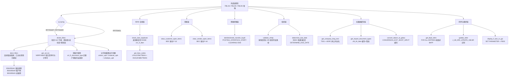

# ZCL_FI_TOOLKIT —— FI 工具箱类源码分析

> 源文件：`ZCL_FI_TOOLKIT`（`CLASS ... FINAL`，`CREATE PUBLIC`，全部为 `CLASS-METHODS`）
> 规模：声明段 + 17 个类方法（16 个公开 + 1 个私有 `get_sd_inv`）+ 1 个 `DEFINE` 宏 `ftpost`

## 一、程序定位与业务背景

### 1.1 它解决什么问题

这不是一个报表，也不是一个业务流程，而是一张 **财务会计（FI）领域的"杂物抽屉"**——把土耳其本地化实施过程中那些"每个项目都要写一遍、又写不出第二遍"的 FI 小功能，堆进一个全局类里，供全系统调用。

从方法清单看，它实际服务六类完全不同的业务场景：

| 场景 | 涉及方法 | 业务诉求 |
| --- | --- | --- |
| 客户/供应商**账龄表（ekstre）增强** | `ekstre_fblxn`、`devir_fblxn`、`get_sd_inv` | 在 FBL1N / FBL3N / FBL5N 的 ALV 上追加"期初段 / 发生段 / 期末段"三段式结构，并回填参考凭证、交货单号、采购订单号 |
| 银行 IBAN **合规校验** | `check_iban_duplicate`、`get_iban_codes` | 土耳其本地银行清算要求：一个 IBAN 不能同时挂在两个供应商或客户名下 |
| 批量**清账（清未清项）** | `clear_customer_open_items`、`clear_vendor_open_items` | 通过 BDC 驱动 F-32 / F-44 批量清客户 / 供应商未清项目 |
| **倒摊式转账凭证** | `denklestirerek_transfer_kaydi` | 用 POSTING_INTERFACE 生成"余额结转"转账凭证，替代手工 FB05 |
| **凭证合法性校验钩子** | `validate_zhrtip`、`determine_due_date` | 在 FI 过账链路上拦截不合规的科目/凭证类型组合，计算到期日 |
| **基础数据补齐与查询** | `get_company_long_text`、`convert_datum_to_gdatu`、`get_import_document_types`、`get_domestic_import_doc_types`、`get_bkpf_xblnr`、`update_xblnr`、`display_fi_doc_in_gui` | 公司全名、日期转换、进口凭证类型、外票参照号回写、跳转 FB03 |

### 1.2 为什么"现有方案"不够

三个最关键的动机：

1. **SAP 原生 FBLxN 满足不了三段式账龄表。** FBL1N/FBL3N/FBL5N 的 ALV 是一次性查询结果，它没有"期初余额段"和"期末余额段"的概念，也没有"把中央科目（LNRZE / KNRZE）拆开单列"的诉求。而更致命的是——**它不给新列**。要显示期初、运行余额、期末，只能往 SAP 标准的行结构 `IT_RFPOSXEXT` 里塞字段（`ZZDMSHB`、`ZZTESLIMAT` 之类）。这决定了本类最大的两个方法必须采用 `CHANGING` 原地改造 + 反射读取调用方变量的写法。
2. **期初余额没有现成 API。** "某科目在某个键日期上的未清项目"这件事，SAP 内部有 `BSIK`/`BSAK`/`BSID`/`BSAD`/`BSIS`/`BSAS` 六张未清项表和"已清 + 键日期后清账"的组合语义，但没有一个公开 BAPI 直接给你"期初"。只能自己按 `BUDAT LE keydate AND (表 = 未清 OR AUGDT > keydate)` 的规则拼 SQL，还要按 AR/AP/GL 三种科目类型分别处理。这就是 `devir_fblxn` 存在的全部理由。
3. **合规要求本地化。** IBAN 唯一性、结账前凭证类型校验、进口凭证类型白名单，都是土耳其本地实装特有的规则，标准 SAP 不管。

### 1.3 设计范式一句话定性

> **无实例状态的静态工具箱 + 全局类级缓存（`CLASS-DATA`）+ 通过 `sy-cprog` 反射式嵌入 SAP 标准报表的"侵入式增强"**，三种范式混在一个类里。

这个定性很重要，因为它同时解释了本类的**优点**（复用成本极低，谁都能 `zcl_fi_toolkit=>` 一把调用）和**缺点**（耦合极深，方法之间没有契约，靠 `sy-cprog` 这种隐式上下文传递参数，测试无从下手）。

---

## 二、程序执行流程总览

这个类没有单一入口——它由外部触发。但为了 onboarding，可按"调用方类型"归成四条主链。其中**账龄表增强链（ekstre）是绝对核心**，占了全类一半以上的代码量，也是所有风险的集中地。



### 责任链

| 子程序 | 调用者 | 职责 |
| --- | --- | --- |
| 类定义段（`CLASS zcl_fi_toolkit DEFINITION`） | 编译器 | 声明 17 个类方法、10 组结构类型、6 个常量、3 张 `CLASS-DATA` 缓存表 |
| `ekstre_fblxn` | FBL1N/FBL3N/FBL5N 的 ALV 增强（ZSDP 报表亦可） | 反射读调用方布局变量，剔除清账行，补期初段、参考凭证字段、期末段 |
| `devir_fblxn` | `ekstre_fblxn` | 按 `sy-cprog` 分别从 BSIK/BSAK/BSID/BSAD/BSIS/BSAS 汇总键日期前的未清项 |
| `get_sd_inv` | `ekstre_fblxn`（EKSTRE 分支与 ELSE 分支各一次） | 按 VBRK 键取 VBRP 的参考交货单/订单号，回填 `ZVBKD` |
| `check_iban_duplicate` | 银行主数据维护程序 | 调 `get_iban_codes` 查重，命中即抛 `zcx_fi_iban` |
| `get_iban_codes` | `check_iban_duplicate`，或独立被调用 | LFA1→LFBK→TIBAN、KNA1→KNBK→TIBAN 两次内连接取已占用 IBAN |
| `clear_customer_open_items` | 清账批处理 / 交互式程序 | 用 `zcl_bc_bdc` 组装 SAPMF05A 屏流，驱动 F-32 清客户未清项 |
| `clear_vendor_open_items` | 清账批处理 / 交互式程序 | 同上，驱动 F-44 清供应商未清项 |
| `denklestirerek_transfer_kaydi` | 期末结转程序 | 按 BSEG 分录组装 FTPOST/FTCLEAR，调用 POSTING_INTERFACE 三个 FM 完成过账 |
| `validate_zhrtip` | FI 凭证创建链（用户扩展/BAdI） | 排除豁免事务码后，校验"科目首位 5/9"对应的凭证类型字段 |
| `determine_due_date` | 应收账款清账/付款建议 | 从 BSEG 读基准日字段交给 `DETERMINE_DUE_DATE`，返回 `NETDT` |
| `get_company_long_text` | ALV 渲染、外部报表 | 缓存式返回公司代码全名（T001.BUTXT 或 ADRC 四段名称拼接） |
| `get_import_document_types` | 凭证类型校验 | 缓存 `ZFIT_ITH_BLART` 后按 `IS_DOMESTIC`/`IS_FOREIGN` 开关过滤 |
| `get_domestic_import_doc_types` | 同上 | 借前者填缓存，再筛出"既进口又内销"的双用途凭证类型 |
| `convert_datum_to_gdatu` | 汇率相关计算 | 带缓存地把日期转成 `TCURR-GDATU` 格式 |
| `get_bkpf_xblnr` | `update_xblnr` 的调用方（先读后写） | FOR ALL ENTRIES 批量读 BKPF 的参照凭证号并回填 |
| `update_xblnr` | 外部发票回写程序 | 逐张调 `J_1B_NFE_UPDATE_XBLNR` 并按开关决定提交粒度 |
| `display_fi_doc_in_gui` | 任何带凭证号的界面 | `SET PARAMETER` 后 `CALL TRANSACTION 'FB03'` |

下面按这条流程，逐个子程序展开。核心（`ekstre_fblxn` 及其两个帮手）深入分析，通用工具方法从简。

---

## 三、分组分析（按程序流程 / 子程序）

### 3.1 类定义段 `CLASS zcl_fi_toolkit DEFINITION`

先看声明，因为它定义了全类的"词汇表"——后面所有方法都在用这里的类型和常量。

```abap
CLASS zcl_fi_toolkit DEFINITION
  PUBLIC
  FINAL
  CREATE PUBLIC .

  PUBLIC SECTION.

    TYPES:
      BEGIN OF t_documents ,
        bukrs TYPE bseg-bukrs,
        belnr TYPE bseg-belnr,
        gjahr TYPE bseg-gjahr,
        buzei TYPE bseg-buzei,
      END OF t_documents .
    TYPES:
      tt_documents TYPE STANDARD TABLE OF t_documents WITH DEFAULT KEY .
    TYPES:
      BEGIN OF ty_hesap,
        sube   TYPE rfposxext-konto,
        merkez TYPE rfposxext-konto,
      END OF ty_hesap .
    TYPES:
      tt_hesap TYPE STANDARD TABLE OF ty_hesap .
```

**做什么** — 声明本类对外契约：`t_documents` 四字段键结构（公司/凭证号/年度/行项目）供 `denklestirerek_transfer_kaydi` 定位 BSEG 分录；`ty_hesap` 用"下级科目 sube + 中央科目 merkez"两字段表达"钻取到明细科目时要连带显示中央科目"这一诉求，是账龄表链路的输入结构。
**为什么** — 用 `bseg-` / `rfposxext-` 引用真实 DDIC 字段而不是裸 `c` / `n`，是为了让编译器帮你在字段改名时报警，字段长度/精度自动跟随；`tt_documents` 用 `WITH DEFAULT KEY`（全字段键）保证能 `COLLECT`，而 `tt_hesap` 不指定键，属于"只用 FOR ALL ENTRIES 不做查找"的写法。
**风险与改进** — 类型声明直接钉在 BSEG/RFPOSXEXT 上，等于把 FI 表结构变动风险传导到所有调用方；`tt_hesap` 作为标准表却不用键，后续若要 `READ ... BINARY SEARCH` 会静默退化成线性扫描，应改为 `SORTED TABLE WITH NON-UNIQUE KEY sube`。

```abap
    CONSTANTS c_borc TYPE shkzg VALUE 'S' ##NO_TEXT.
    CONSTANTS c_alacak TYPE shkzg VALUE 'H' ##NO_TEXT.
    CONSTANTS c_mal_hareketi TYPE awtyp VALUE 'MKPF' ##NO_TEXT.
    CONSTANTS c_satinalma_faturasi TYPE awtyp VALUE 'RMRP' ##NO_TEXT.
    CONSTANTS c_satis_faturasi TYPE awtyp VALUE 'VBRK' ##NO_TEXT.
    CONSTANTS c_musteri_hf_talebi TYPE auart VALUE 'ZAH1' ##NO_TEXT.

    CLASS-METHODS check_iban_duplicate
      IMPORTING
        !it_iban       TYPE zfitt_iban_rng
        !iv_get_vendor TYPE abap_bool DEFAULT abap_true
        !iv_get_client TYPE abap_bool DEFAULT abap_true
        !it_lifnr      TYPE zqmtt_lifnr OPTIONAL
        !it_kunnr      TYPE range_kunnr_tab OPTIONAL
      RAISING
        zcx_fi_iban .
    CLASS-METHODS convert_datum_to_gdatu
      IMPORTING
        !iv_datum       TYPE datum
      RETURNING
        VALUE(rv_gdatu) TYPE tcurr-gdatu .
```

**做什么** — 用常量固定三个"参照凭证业务类型"（`MKPF` 物料凭证 / `RMRP` 采购发票 / `VBRK` 销售发票）和借贷方向（`S` 借 / `H` 贷），供 `ekstre_fblxn` 判定每行该去查哪张参考表、以及 `devir_fblxn` 做符号翻转。
**为什么** — 把 `'MKPF'` 这类魔法值提为常量是正确的做法，尤其因为它们要与数据库里 `BKPF-AWTYP` 的取值严格一致，写错一位就是静默查不到。方法签名里大量 `DEFAULT abap_true/false` 与 `OPTIONAL` 的组合，让调用方能"按需只查供应商或只查客户"。
**风险与改进** — `c_borc` 与 `c_musteri_hf_talebi` 在整个实现段**从未被引用**（全文只有定义处出现），是死常量；其中 `c_musteri_hf_talebi`（`AUART = 'ZAH1'`，客户借记/费用申请订单类型）暗示曾有一个按订单类型过滤客户行的功能被删掉，留下残留。建议删除或补齐调用点，否则后来者会以为该功能仍受本类支持。

```abap
  PRIVATE SECTION.

    TYPES:
      BEGIN OF t_dg_cache,
        datum TYPE datum,
        gdatu TYPE tcurr-gdatu,
      END OF t_dg_cache .
    TYPES:
      tt_dg_cache TYPE HASHED TABLE OF t_dg_cache WITH UNIQUE KEY primary_key COMPONENTS datum .

    TYPES:
      tt_company_long_text TYPE HASHED TABLE OF t_company_long_text WITH UNIQUE KEY primary_key COMPONENTS bukrs .

    CLASS-DATA gt_company_long_text TYPE tt_company_long_text .
    CLASS-DATA gt_dg_cache TYPE tt_dg_cache .
    CLASS-DATA gt_import_doc_type_cache TYPE tt_ith_blart .
```

**做什么** — 声明三张全局缓存：`gt_company_long_text`（公司代码→全名）、`gt_dg_cache`（日期→`TCURR-GDATU`）、`gt_import_doc_type_cache`（进口凭证类型配置），全部是 `HASHED TABLE`，赋值后按主键哈希查找。
**为什么** — 这三份数据都属于"一次会话内几乎不变"的主数据，且被高频重复读取（每行 ALV 都要显示公司全名，每张凭证都要查一次进口类型）。用 `HASHED + UNIQUE KEY` 换 `sy-subrc` 语义化的 `table[ KEY ... ]` 查找，是 ABAP 7.40 之后的标准写法，比 `READ TABLE` 更快也更短。
**风险与改进** — `CLASS-DATA` 缓存**永不失效**：改名公司、调整进口凭证类型配置后，已打开的会话仍读旧值，只能靠重启事务或 `/1` 清内存；且没有任何一个方法能主动清缓存，单元测试也没法造场景。更稳妥的做法是用带时间戳或 `SET HANDLER` 的缓存类，或者至少提供一个 `reset_cache` 类方法。

---

### 3.2 方法 `check_iban_duplicate`

IBAN 合规链的入口。它是 `check_iban_duplicate` 唯一做的事：查重 + 抛异常。

```abap
  METHOD check_iban_duplicate.

    DATA(lt_tiban) = get_iban_codes(
      it_iban       = it_iban
      iv_get_vendor = iv_get_vendor
      iv_get_client = iv_get_client
      it_lifnr      = it_lifnr
      it_kunnr      = it_kunnr
    ).

    CHECK lt_tiban IS NOT INITIAL.

    ASSIGN lt_tiban[ 1 ] TO FIELD-SYMBOL(<ls_tiban>).

    RAISE EXCEPTION TYPE zcx_fi_iban
      EXPORTING
        textid     = zcx_fi_iban=>already_used
        iban       = <ls_tiban>-iban
        party      = COND #( WHEN <ls_tiban>-kunnr IS NOT INITIAL THEN <ls_tiban>-kunnr
                             WHEN <ls_tiban>-lifnr IS NOT INITIAL THEN <ls_tiban>-lifnr
                           )
        party_type = COND #( WHEN <ls_tiban>-kunnr IS NOT INITIAL THEN TEXT-110
                             WHEN <ls_tiban>-lifnr IS NOT INITIAL THEN TEXT-111
                           ).

  ENDMETHOD.
```

**做什么** — 调用 `get_iban_codes` 拿到"已被占用的 IBAN 清单"，若非空就取第一条，用 `COND #( )` 判定占用方是客户（`KUNNR`，消息 110）还是供应商（`LIFNR`，消息 111），把 IBAN 号和占用方编号一起抛进 `zcx_fi_iban`。
**为什么** — 把"是否重复"这个判断做成**抛异常**而不是返回布尔值，是正确的 API 设计：调用方在保存前必须 try/catch，无法忽略。`COND #( )` 内联条件替代了 `IF/ELSE` 赋值，一行表达二选一，比 `COALESCE` 更能表达优先级语义（客户优先于供应商）。
**风险与改进** — ① 只报第一条重复（`lt_tiban[ 1 ]`），用户一次只能修一个，改完再存又报下一个，批量导入场景体验很差；应把全部重复项装进异常参数或表格。② `lt_tiban` 未声明键类型，`[ 1 ]` 依赖返回表声明为 `STANDARD TABLE`，若 `zfitt_tiban` 之后改成 `SORTED`，第一条的含义会变。③ 两个 `COND #( )` 逻辑完全重复，可合并成一个 `FIELD-SYMBOL` 或先算出 `party_type` 再复用。

---

### 3.3 方法 `get_iban_codes`

被 `check_iban_duplicate` 调用，是 IBAN 链的取数核心。

```abap
  METHOD get_iban_codes.

    IF iv_get_vendor IS NOT INITIAL.

      SELECT lfa1~lifnr, tiban~*
        APPENDING CORRESPONDING FIELDS OF TABLE @rt_tiban
        FROM lfa1
             INNER JOIN lfbk ON lfbk~lifnr = lfa1~lifnr
             INNER JOIN tiban ON tiban~banks = lfbk~banks AND
                                 tiban~bankl = lfbk~bankl AND
                                 tiban~bankn = lfbk~bankn AND
                                 tiban~bkont = lfbk~bkont
        WHERE lfa1~lifnr IN @it_lifnr AND
              tiban~iban IN @it_iban
        ##TOO_MANY_ITAB_FIELDS.

    ENDIF.

    IF iv_get_client IS NOT INITIAL.

      SELECT kna1~lifnr, tiban~*
        APPENDING CORRESPONDING FIELDS OF TABLE @rt_tiban
        FROM kna1
             INNER JOIN knbk ON knbk~kunnr = kna1~kunnr
             INNER JOIN tiban ON tiban~banks = knbk~banks AND
                                 tiban~bankl = knbk~bankl AND
                                 tiban~bankn = knbk~bankn AND
                                 tiban~bkont = knbk~bkont
        WHERE kna1~lifnr IN @it_kunnr AND
              tiban~iban IN @it_iban
        ##TOO_MANY_ITAB_FIELDS.

    ENDIF.

  ENDMETHOD.
```

**做什么** — 两次内连接查询拼出"哪些 IBAN 已被占用"：供应商侧 `LFA1→LFBK→TIBAN` 按 `LIFNR` 范围查，客户侧 `KNA1→KNBK→TIBAN` 按客户号范围查，两批结果 `APPENDING CORRESPONDING FIELDS` 叠进同一个返回表 `rt_tiban`。
**为什么** — 银行数据分散在三张表：`LFBK` 是供应商-银行账号分配，`TIBAN` 才是 IBAN 明细，四字段（`BANKS`/`BANKL`/`BANKN`/`BKONT`）全等连接才能唯一定位一条 IBAN 记录。用 `IN` 接范围参数而不是硬编码，是为了让上层把选择屏的 range 直接传下来，方法因此可以做成无状态工具。
**风险与改进** — ① **客户侧字段取错**：SELECT 取的是 `kna1~lifnr`、WHERE 过滤的也是 `kna1~lifnr IN @it_kunnr`，而 `it_kunnr` 是客户号范围。`KNA1-LIFNR` 是"客户同时是供应商时的供应商号"，不是客户号本身，正确应为 `kna1~kunnr`。结果是客户侧 IBAN 查重**查的根本不是这个客户的银行数据**，属于静默的错误结果；即使要反查也应在 `rt_tiban` 里带回 `kna1~kunnr` 作为 party，否则上层 `COND` 判定会永远走 `LIFNR` 分支、消息 111 误报成供应商占用。② `tiban~*` 取整表字段（`##TOO_MANY_ITAB_FIELDS` 抑制告警），一旦 `zfitt_tiban` 少一个字段就静默不填；建议只列实际需要的 `iban/banks/bankl/bankn/bkont` 加主键。③ `it_lifnr` / `it_kunnr` 为 `OPTIONAL`，若两者都初始且开关为真，`IN @初始内表` 会生成恒假条件，查询安全但毫无意义，建议入口处显式拦截空范围。

---

### 3.4 方法 `clear_customer_open_items`

清账链之一：用 BDC 驱动 F-32 清客户未清项。它和 `clear_vendor_open_items` 是**同一份代码的两份拷贝**，因此合并在一处分析。

```abap
  METHOD clear_customer_open_items.

    TRY.
        DATA(lo_bdc) = NEW zcl_bc_bdc( ).

        lo_bdc->add_scr(
          iv_prg = 'SAPMF05A'
          iv_dyn = '131'
        ).

        lo_bdc->add_fld(:
          iv_nam = 'BDC_OKCODE' iv_val = '/00' ),
          iv_nam = 'RF05A-XNOPS'   iv_val = 'X' ),
          iv_nam = 'RF05A-XPOS1(03)'   iv_val = 'X' ),
          iv_nam = 'RF05A-AGKON' iv_val = CONV #( im_kunnr ) ),
          iv_nam = 'BKPF-BUKRS' iv_val = CONV #( im_bukrs ) ).
        lo_bdc->add_fld( iv_nam = 'BKPF-WAERS' iv_val = CONV #( im_waers ) ).

        LOOP AT it_belnr INTO DATA(ls_belnr).
          lo_bdc->add_scr(
            iv_prg = 'SAPMF05A'
            iv_dyn = '731'
          ).
          lo_bdc->add_fld(:
            iv_nam = 'BDC_OKCODE' iv_val = '/00' ),
            iv_nam = 'BDC_CURSOR'   iv_val = 'RF05A-SEL01(01)' ),
            iv_nam = 'RF05A-SEL01(01)'   iv_val = CONV #( ls_belnr ) ).
        ENDLOOP.

        lo_bdc->add_fld(:
          iv_nam = 'BDC_OKCODE' iv_val = '=PA' ) .

        lo_bdc->add_scr(
          iv_prg = 'SAPDF05X'
          iv_dyn = '3100'
        ).

        lo_bdc->add_fld(:
          iv_nam = 'BDC_OKCODE' iv_val = '=WAIT_USER' ) .

        lo_bdc->submit(
            iv_tcode  = 'F-32'
            is_option = VALUE #( dismode = zcl_bc_bdc=>c_dismode_error )
        ).

    ENDTRY.
  ENDMETHOD.
```

**做什么** — 用 `zcl_bc_bdc` 这个自研 BDC 封装器描述一串屏幕操作：进 SAPMF05A 的 131 屏填客户号、公司代码、币种，再为每张待清凭证追加一个 731 屏选中行，最后在 SAPDF05X 的 3100 屏点 `=PA` 触发过账、以 `=WAIT_USER` 收尾，然后 `submit` 执行 F-32。
**为什么** — BDC 驱动 F-32/F-44 是替代"调 BAPI 清账"的老办法，好处是不用逐个研究各版本的清账 BAPI 语义（`BAPI_TRANSACTION_POST` 的清账 EXTENSIONS 极难写对），直接复用标准事务的完整校验和权限检查。`CONV #( )` 而非直接赋值，让 `KUNNR`/`BUKRS`/`WAERS` 的定长格式在编译期就被转换检查，是好习惯。
**风险与改进** — ① **`TRY...ENDTRY` 没有任何异常处理**——既没 `EXCEPTIONS` 也没 `CATCH`，`TRY` 块只起"分组"作用，`lo_bdc->submit` 抛出的异常会直接穿透到调用方，错误处理责任被甩给了完全不知道有这个方法存在的调用方。② **`BKPF-WAERS` 无条件填入**：`im_waers` 是 `OPTIONAL`，为初始时也会把空值灌进屏流。屏流清空必输字段会让 F-32 走"所有币种"还是直接报错，取决于屏校验，不确定；供应商版 `clear_vendor_open_items` 用 `IF im_waers IS NOT INITIAL` 包住了同一次赋值，两个方法在同一条业务上行为不一致。③ 屏号 `131`/`731`/`3100` 硬编码，SAP 升级改屏就会失效且难以定位；能换成 `cl_fb*` 类或 `BAPI_FIAR_CLEARING` 就不该用 BDC。④ 无行数上限，`it_belnr` 传上千条会生成上千个屏幕，BDC 单事务跑不完还会被 `RFB` 内存拖垮，应分批提交。

```abap
  METHOD clear_vendor_open_items.

    TRY.
        DATA(lo_bdc) = NEW zcl_bc_bdc( ).

        lo_bdc->add_scr(
          iv_prg = 'SAPMF05A'
          iv_dyn = '131'
        ).

        lo_bdc->add_fld(:
          iv_nam = 'BDC_OKCODE' iv_val = '/00' ),
          iv_nam = 'RF05A-XNOPS'   iv_val = 'X' ),
          iv_nam = 'RF05A-XPOS1(03)'   iv_val = 'X' ),
          iv_nam = 'RF05A-AGKON' iv_val = CONV #( im_lifnr ) ),
          iv_nam = 'BKPF-BUKRS' iv_val = CONV #( im_bukrs ) ).
        IF im_waers IS NOT INITIAL.
          lo_bdc->add_fld( iv_nam = 'BKPF-WAERS' iv_val = CONV #( im_waers ) ).
        ENDIF.

        LOOP AT it_belnr INTO DATA(ls_belnr).
          lo_bdc->add_scr(
            iv_prg = 'SAPMF05A'
            iv_dyn = '731'
          ).
          lo_bdc->add_fld(:
            iv_nam = 'BDC_OKCODE' iv_val = '/00' ),
            iv_nam = 'BDC_CURSOR'   iv_val = 'RF05A-SEL01(01)' ),
            iv_nam = 'RF05A-SEL01(01)'   iv_val = CONV #( ls_belnr ) ).
        ENDLOOP.
        lo_bdc->add_fld(:
          iv_nam = 'BDC_OKCODE' iv_val = '=PA' ) .

        lo_bdc->add_scr(
          iv_prg = 'SAPDF05X'
          iv_dyn = '3100'
        ).

        lo_bdc->add_fld(:
          iv_nam = 'BDC_OKCODE' iv_val = '=WAIT_USER' ) .

        lo_bdc->submit(
            iv_tcode  = 'F-44'
            is_option = VALUE #( dismode = zcl_bc_bdc=>c_dismode_error ) "VOL-5818
*            is_option = value #( dismode = zcl_bc_bdc=>c_dismode_all )
        ).

    ENDTRY.
  ENDMETHOD.
```

**做什么** — 与 `clear_customer_open_items` 完全同构，只改了三处：传的是 `im_lifnr`、币率字段加了 `IF` 守卫、最终 `submit` 换成 F-44（供应商清账）；注释里的 `VOL-5818` 还记录了 `dismode` 从 `all` 改成 `error` 那次变更的原因。
**为什么** — 两个方法的业务差异确实只有事务码和伙伴类型字段名，屏流结构完全一致；用 `##FM_SUBRC_OK` 式的注释保留变更单号是好习惯，方便后来查"为什么不再显示所有消息"。
**风险与改进** — 这是典型的**复制粘贴式复用**：屏流描述码（约 40 行）完全重复，应抽成一个私有方法 `build_clearing_bdc( iv_partner )` 只接受伙伴类型与字段名，返回 `zcl_bc_bdc` 实例，两个公开方法各传不同参数即可。现在任何屏流调整（比如补 `BKPF-BUDAT`）都必须改两处，漏改一处就产生"客户清了、供应商没清"的诡异 bug。

---

### 3.5 方法 `get_bkpf_xblnr`

外票回写链的"读"半边。

```abap
  METHOD get_bkpf_xblnr.
    DATA lt_doc TYPE tt_doc_xblnr.

    CHECK ct_doc[] IS NOT INITIAL.

    SELECT bukrs belnr gjahr xblnr
           INTO CORRESPONDING FIELDS OF TABLE lt_doc
           FROM bkpf
           FOR ALL ENTRIES IN ct_doc
           WHERE bukrs = ct_doc-bukrs
             AND belnr = ct_doc-belnr
             AND gjahr = ct_doc-gjahr.

    SORT lt_doc BY bukrs belnr gjahr.

    LOOP AT ct_doc ASSIGNING FIELD-SYMBOL(<ls_doc_tar>).

      READ TABLE lt_doc ASSIGNING FIELD-SYMBOL(<ls_doc_src>)
                        WITH KEY bukrs = <ls_doc_tar>-bukrs
                                 belnr = <ls_doc_tar>-belnr
                                 gjahr = <ls_doc_tar>-gjahr
                        BINARY SEARCH.

      IF sy-subrc = 0.
        <ls_doc_tar>-xblnr = <ls_doc_src>-xblnr.
      ELSE.
        CLEAR <ls_doc_tar>-xblnr.
      ENDIF.

    ENDLOOP.

  ENDMETHOD.
```

**做什么** — 以传入的凭证键列表为驱动，用 `FOR ALL ENTRIES` 一次把 BKPF 的 `XBLNR`（外部参照凭证号）批量读进内表，排序后对每条 `ct_doc` 记录做二分查找回填；查不到就 `CLEAR` 目标字段。
**为什么** — 这是标准的"批量读避免逐条 SELECT"模式：比在 `LOOP` 里对每行发一次 `SELECT SINGLE` 快几个数量级。`ct_doc` 用 `CHANGING` 参数而非 `RETURNING`，是因为调用方通常手上已有一批带主键的行、只缺 `XBLNR` 一个字段，直接原地回填最省事。
**风险与改进** — ① `FOR ALL ENTRIES` 后没有 `DISTINCT`，`ct_doc` 里有重复键时 `lt_doc` 会出现重复行，二分查找虽仍能命中但白做了 IO；更重要的是 `CHECK ct_doc[] IS NOT INITIAL` 之后没有防御 `lt_doc` 为空的场景（正常不会，但 FAE 的空表语义值得复核）。② `ELSE. CLEAR` 分支会**抹掉调用方原有的 `XBLNR` 值**：如果调用方本来就是想"读不到就保持原值"，这里会静默改写数据。建议 `ELSE` 分支加注释明确这是有意的，还是应该 `CONTINUE` 保留原值。③ `WITH KEY ... BINARY SEARCH` 依赖前面 `SORT lt_doc BY bukrs belnr gjahr` 的键序完全一致——这里成立，但一旦有人改 `SORT` 顺序就会静默退化成线性查找且不报错；用 `SORTED TABLE` 声明内表可以把这个约束交给编译器。

---

### 3.6 方法 `update_xblnr`

外票回写链的"写"半边，负责真正落库。

```abap
  METHOD update_xblnr.
    DATA: lv_mblnr_initial TYPE mblnr,
          lv_vbeln_initial TYPE vbeln_vl,
          lv_rbeln_initial TYPE re_belnr.

    LOOP AT it_xblnr ASSIGNING FIELD-SYMBOL(<ls_xblnr>).

      CALL FUNCTION 'J_1B_NFE_UPDATE_XBLNR'
        EXPORTING
          iv_xblnr = <ls_xblnr>-xblnr
          iv_rbeln = lv_rbeln_initial
          iv_mblnr = lv_mblnr_initial
          iv_vbeln = lv_vbeln_initial
          iv_bukrs = <ls_xblnr>-bukrs
          iv_belnr = <ls_xblnr>-belnr
          iv_gjahr = <ls_xblnr>-gjahr.

      CHECK iv_commit_each_doc = abap_true.
      COMMIT WORK AND WAIT.

    ENDLOOP.

    IF iv_commit_each_doc = abap_false.
      COMMIT WORK AND WAIT.
    ENDIF.

  ENDMETHOD.
```

**做什么** — 遍历待回写的 `it_xblnr`，逐条调用巴西电子发票 FM `J_1B_NFE_UPDATE_XBLNR` 把参照凭证号写进 BKPF；`iv_commit_each_doc` 为真则每张凭证后立即提交，为假则整批处理完提交一次。
**为什么** — 把 `MMBLN/RBELN/VBELN` 三个参数传成初始值，说明本类只支持 FI 凭证（BKPF）这一种单据类型，物料/凭证参考凭证场景不在职责内——这个"显式置空"比省略参数更清楚地表达了意图。`COMMIT WORK AND WAIT` 保证下游立即读到落库结果，尤其在批处理链里后续步骤依赖这些数据时是必需的。
**风险与改进** — ① 三个 `lv_*_initial` 是纯粹的摆设常量，可直接传 `space`/`initial`，声明它们只是让新人以为这里将来要支持其他单据类型。② **`COMMIT WORK` 会切断调用方的整个 LUW**：调用方若还有别的未提交修改，一并被提交且无法回滚，这在被集成进大流程时是危险副作用，方法级 `COMMIT` 应由调用方决定。③ `J_1B_NFE_UPDATE_XBLNR` 的失败是以 `MESSAGE`/`sy-subrc` 还是异常形式报告，取决于 FM 内部；这里既不检查返回值也不捕获异常，失败会被完全忽略，同时 `CHECK` 后的 `COMMIT` 照常执行，把失败也一起提交了。④ 方法声明 `RAISING zcx_bc_class_method` 却从不抛出，签名与实现不符。

---

### 3.7 方法 `denklestirerek_transfer_kaydi`

倒摊转账凭证。这是全类唯一"从头实现一个完整过账流程"的方法，也是最危险的一个。按四步拆开看。

#### ① 定义内部宏与工作区

```abap
    DATA:
      lt_blntab  TYPE STANDARD TABLE OF blntab ##NEEDED,
      lt_ftclear TYPE STANDARD TABLE OF ftclear ##NEEDED,
      lt_ftpost  TYPE STANDARD TABLE OF ftpost ##NEEDED,
      ls_ftpost  TYPE  ftpost ##NEEDED,
      lt_fttax   TYPE STANDARD TABLE OF fttax ##NEEDED.

    lv_group = sy-tcode.
    **********************************************************************
    *Definition
    DEFINE ftpost.
      CLEAR ls_ftpost.
      ls_ftpost-stype = &1.
      ls_ftpost-count = &2.
      ls_ftpost-fnam = &3.
      WRITE &4 TO ls_ftpost-fval.
      CONDENSE ls_ftpost-fval.
      APPEND ls_ftpost TO lt_ftpost.
    END-OF-DEFINITION.
```

**做什么** — 声明 POSTING_INTERFACE 所需的四张接口表（`BLNTAB` 凭证、`FTCLEAR` 清账行、`FTPOST` 抬头字段、`FTTAX` 税），并用 `DEFINE ftpost` 定义一个四参宏：按 `stype/count/fnam` 生成一条抬头字段赋值，把值 `WRITE` 成字符后追加进 `lt_ftpost`。
**为什么** — POSTING_INTERFACE_CLEARING 要求"每个抬头字段重复调用一次并用 `COUNT` 递增"，有 7 个字段就是 7 段几乎一样的 `ls_ftpost` 赋值。宏把这段重复压成一行，是宏的正统用途；`CONDENSE` 去掉 `WRITE` 可能产生的尾部空格。
**风险与改进** — ① `WRITE &4 TO ls_ftpost-fval` 用 ABAP 的 `WRITE` 语句转字符，受**用户个人日期/数值格式**影响（日期可能写成 `03.10.2026` 而非接口期望的 `20261003`），在国际化环境里是隐蔽的过账失败源；应改用 `|{ is_bkpf-bldat DATE = ISO }|` 或 `CONV d(8)`。② `lv_group = sy-tcode` 把分组名绑到当前事务码，同一事务里并发跑多笔转账会共享分组、互相污染；应传唯一分组名或用计数器。③ `##NEEDED` 全量标注说明作者清楚这些表"看起来没用但接口需要"，与 ATC 硬碰硬的风格一致，但会掩盖真正的未使用变量。

#### ② 读回待转账的 BSEG 分录

```abap
    IF it_bseg IS NOT INITIAL.
      SELECT bukrs ,belnr ,gjahr, buzei, koart,umskz FROM bseg
        INTO TABLE @DATA(lt_bseg)
        FOR ALL ENTRIES IN @it_bseg
        WHERE
          bukrs = @it_bseg-bukrs AND
          belnr = @it_bseg-belnr AND
          gjahr = @it_bseg-gjahr AND
          buzei = @it_bseg-buzei .                      "#EC CI_NOORDER
    ENDIF.
```

**做什么** — 用四字段主键（公司/凭证号/年度/行项目）`FOR ALL ENTRIES` 从 BSEG 精确取回待转账行，额外取 `KOART`（科目类型）和 `UMSKZ`（税码）——前者决定抬头用哪个凭证类型，后者决定是否带清账税码。
**为什么** — 只取 6 个字段而不 `SELECT *`（BSEG 有 300+ 字段），且四个主键字段全部出现在 WHERE 里，正好命中 BSEG 的主索引，是教科书式的 FAE 正确用法。`IF it_bseg IS NOT INITIAL` 守卫则避免 FAE 空表时的多余往返。
**风险与改进** — `"#EC CI_NOORDER` 只是压掉"SELECT 无 ORDER BY"的代码风格告警，语义上无害；但整个方法**没有做任何权限检查**——调用方能把任意公司代码的分录拉来重过账，FI 场景下这是硬伤，应在入口加 `AUTHORITY-CHECK OBJECT F_BKPF_BUKRS`。

#### ③ 组装清账行

```abap
    LOOP AT lt_bseg INTO DATA(ls_bseg) .
      IF sy-tabix = 1.
        DATA: lv_fname(5) TYPE c.
        CONCATENATE 'BLAR' ls_bseg-koart INTO lv_fname.
        DATA lv_blart TYPE bkpf-blart.
        SELECT SINGLE (lv_fname) FROM t041a INTO lv_blart
          WHERE auglv = 'UMBUCHNG'.

        ftpost 'K' '1' 'BKPF-BUKRS' ls_bseg-bukrs.
        ftpost 'K' '1' 'BKPF-BLART' lv_blart.
        ftpost 'K' '1' 'BKPF-BLDAT' is_bkpf-bldat.
        ftpost 'K' '1' 'BKPF-BUDAT' is_bkpf-budat.
        ftpost 'K' '1' 'BKPF-XBLNR' is_bkpf-xblnr.
        ftpost 'K' '1' 'BKPF-WAERS' is_bkpf-waers.
        ftpost 'K' '1' 'BKPF-BKTXT' is_bkpf-bktxt.
      ENDIF.
      APPEND INITIAL LINE TO lt_ftclear REFERENCE INTO DATA(lr_ftclear).
      lr_ftclear->agkoa = ls_bseg-koart.
      lr_ftclear->agbuk = ls_bseg-bukrs.
      lr_ftclear->selfd = 'BELNR'.
      IF ls_bseg-umskz <> space.
        lr_ftclear->agums = ls_bseg-umskz.

      ENDIF.
      lr_ftclear->xnops = abap_true.
      CONCATENATE ls_bseg-belnr
                  ls_bseg-gjahr
                  ls_bseg-buzei
             INTO lr_ftclear->selvon.
    ENDLOOP.
```

**做什么** — 循环里第一行做一次抬头初始化：从 `T041A` 按 `'UMBUCHNG'`（转账业务）动态取出该科目类型对应的凭证类型（`BLARK`/`BLARR`/`BLASP`），填入抬头七个字段；随后每条 BSEG 分录生成一条 `FTCLEAR` 清账行，写明科目类型、公司代码、清账策略 `'BELNR'`、可选税码、不生成相反分录标志，并把 `凭证号+年度+行项目` 拼成 `SELVON` 选中串。
**为什么** — 动态字段名 `'BLAR' + koart` 是个巧思：T041A 为 K（客户）、R/D（其他）、A/S/P（供应商）各存了一个转账凭证类型，拼接后 `SELECT SINGLE (lv_fname)` 直接取对应列，一行代码替代了三分支 `CASE`，且新增科目类型只需改常量。`APPEND ... REFERENCE INTO` 直接拿到行引用，后续逐字段赋值不必反复 `MODIFY`，是可读性与性能兼顾的写法。`xnops = abap_true` 明确"不生成对方分录"，因为清账行由接口内部补全。
**风险与改进** — ① `IF sy-tabix = 1` 依赖 `LOOP AT` 的 `sy-tabix` 语义在空表时不进入——虽然 `lt_bseg` 为空时整个循环不进、后续 FM 会因空 `t_ftpost` 而报错，但这种"靠 tabix 初始化"的方式很脆弱，应在循环前显式 `READ` 或用 `lv_first = abap_true` 标志。② `lv_fname(5)` 固定长度 5，若 SAP 将来在 T041A 加 `BLAR` 后的两字符科目类型（如 `BLARX`）就会截断；且拼出来的是**未校验存在**的列名，拼错会在运行时报 `DBIF_FIELD_NOT_FOUND` 这类底层短转储。③ `SELECT SINGLE ... WHERE auglv = 'UMBUCHNG'` 没带 `bukrs`，若 T041A 按公司代码分行会取到任意公司的配置；且 `lv_blart` 若未取到值仍会被 `ftpost` 写成空串，导致生成无类型的转账凭证。

#### ④ 提交过账

```abap
    CALL FUNCTION 'POSTING_INTERFACE_START'
      EXPORTING
        i_function         = 'C'    " Using Call Transaction
        i_group            = lv_group
        i_mode             = lv_mode
        i_update           = 'S'
        i_user             = sy-uname
        i_xbdcc            = 'X'
      EXCEPTIONS
        client_incorrect   = 1
        function_invalid   = 2
        group_name_missing = 3
        mode_invalid       = 4
        update_invalid     = 5
        OTHERS             = 6.
    IF sy-subrc <> 0.
      MESSAGE ID sy-msgid TYPE sy-msgty NUMBER sy-msgno
             WITH sy-msgv1 sy-msgv2 sy-msgv3 sy-msgv4.
    ENDIF.

    CALL FUNCTION 'POSTING_INTERFACE_CLEARING'
      EXPORTING
        i_auglv                    = 'UMBUCHNG'
        i_tcode                    = 'FB05'
      TABLES
        t_blntab                   = lt_blntab
        t_ftclear                  = lt_ftclear
        t_ftpost                   = lt_ftpost
        t_fttax                    = lt_fttax
      EXCEPTIONS
        clearing_procedure_invalid = 1
        clearing_procedure_missing = 2
        table_t041a_empty          = 3
        transaction_code_invalid   = 4
        amount_format_error        = 5
        too_many_line_items        = 6
        company_code_invalid       = 7
        screen_not_found           = 8
        no_authorization           = 9
        OTHERS                     = 10.
    IF sy-subrc = 0 .
      MESSAGE ID sy-msgid TYPE sy-msgty NUMBER sy-msgno
              WITH sy-msgv1 sy-msgv2 sy-msgv3 sy-msgv4.
    ENDIF.

    CALL FUNCTION 'POSTING_INTERFACE_END'
      EXCEPTIONS
        session_not_processable = 1
        OTHERS                  = 2 ##FM_SUBRC_OK.
  ENDMETHOD.
```

**做什么** — 三步过账：`POSTING_INTERFACE_START` 开一个 `i_function = 'C'`（用调用事务方式）、`i_mode = 'E'`、`i_update = 'S'`（同步）的会话；`POSTING_INTERFACE_CLEARING` 提交清账凭证；`POSTING_INTERFACE_END` 关闭会话。错误分支通过 `MESSAGE ID sy-msgid ...` 把 FM 消息原样抛出给用户。
**为什么** — POSTING_INTERFACE 是"用 SAP 自己的清账逻辑生成 FI 凭证"的官方入口，能拿到标准配置（科目、税额、期间校验）的完整检查，比手写 `BAPI_ACC_DOCUMENT_POST` 省掉大量清账规则。`i_xbdcc = 'X'` 要求启用 BDC 追踪，出问题时能留现场，是过账类代码该有的谨慎。
**风险与改进** — ① **`IF sy-subrc = 0` 的条件写反了**：CLEARING 成功（`subrc = 0`）时才弹消息，失败反而什么都不做、继续往下 `END` 会话，用户既看不到凭证也没收到任何错误。应该是 `IF sy-subrc <> 0`——这是本方法最严重的一处逻辑错误，且失败被完全静默，比报错更难排查。② `POSTING_INTERFACE_END` 的 `##FM_SUBRC_OK` 标注声明"故意不检查返回值"，若前一环节失败 END 失败，会话状态就残留在内存里影响后续过账；至少应在 CLEARING 失败时也调用 END 释放会话。③ START 失败时 `MESSAGE` 后代码**不 return**，带着无效会话继续调 CLEARING，形成二次异常；应 `IF sy-subrc <> 0. MESSAGE ... . RETURN. ENDIF.`。④ `lv_mode TYPE rfpdo-allgazmd VALUE 'E'` 的 `'E'` 是"错误时显示消息"，与提交时统一用 `c_dismode_error` 的意图一致，但没有注释说明 `'E'` 的含义，后来者无从判断该不该改。

---

### 3.8 方法 `validate_zhrtip`

凭证创建链上的合法性钩子，按"科目首位 + 凭证类型字段"做矩阵校验。

```abap
  METHOD validate_zhrtip.
    " Muaf işlem kodları """"""""""""""""""""""""""""""""""""""""""""
    CHECK NOT ( sy-tcode = 'FB1D' OR
                sy-tcode = 'FB1K' OR
                sy-tcode = 'F.80' OR
                sy-tcode = 'FB08' ).

    " Muaf şirket kodları """""""""""""""""""""""""""""""""""""""""
    " Tabloda Buffer olduğundan, özel Cache'leme yapmadım
    """""""""""""""""""""""""""""""""""""""""""""""""""""""""""""""
    SELECT SINGLE mandt
           FROM zfit_ifrs_haric
           WHERE bukrs = @iv_bukrs
           INTO @sy-mandt ##write_ok .

    IF sy-subrc = 0.
      RETURN.
    ENDIF.

    " Hatalı giriş kontrolü """""""""""""""""""""""""""""""""""""""""
    IF ( iv_acc_first_char = '5' AND
         iv_zhrtip(2) <> 'OK' )
       OR
       ( iv_acc_first_char = '9' AND
         iv_zhrtip+1(2) <> 'TH' ).

      RAISE EXCEPTION TYPE zcx_fi_zhrtip.
    ENDIF.
  ENDMETHOD.
```

**做什么** — 三步短路：① 当前事务码在豁免清单（`FB1D`/`FB1K`/`F.80`/`FB08`）里就直接放过；② 从配置表 `ZFIT_IFRS_HARCIC` 查公司代码是否在豁免清单里，是则放过；③ 否则按科目首位判断——首位 `5` 要求 `ZH RTIP` 前两位为 `'OK'`，首位 `9` 要求第 2-3 位为 `'TH'`，不满足抛 `zcx_fi_zhrtip`。
**为什么** — `CHECK` 而不是 `RETURN`，是 ABAP 里表达"条件不满足就退出方法"的惯用写法，比 `IF ... RETURN. ENDIF.` 少一层嵌套。抛异常而非 `MESSAGE`，让调用方（多半是用户扩展/校验 BAdI）能决定是显示消息、跳过还是回滚，符合 BAdI 契约。矩阵校验（`5→OK`、`9→TH`）把 IFRS 科目与凭证类型的对应规则固化在代码里。
**风险与改进** — ① `SELECT SINGLE ... INTO @sy-mandt` **把系统字段 `sy-mandt` 当成哑变量往里写查询结果**，`##WRITE_OK` 压掉 ATC 告警——这是彻头彻尾的 hack：既污染系统字段（同一 LUW 里后续任何读 `sy-mandt` 的代码会看到公司代码编号），也让读者以为这里在查 client。正确写法是 `DATA(lv_dummy) = ...` 或直接用 `SELECT SINGLE @abap_true FROM ...` / `EXISTS`。② `'5'`/`'9'` 与 `'OK'`/`'TH'` 全是裸魔法值，无常量、无注释说明"5 为哪类科目、OK 为哪种凭证类型"；应提为常量并补业务注释。③ 豁免逻辑绑死 `sy-tcode`：一旦同一张凭证从别的入口（直接 `BAPI_ACC_DOCUMENT_POST`、批处理、不同配置的事务码）进来，校验会被绕过；豁免判断更适合放在配置表或 `T000` 扩展检查里。④ 表名注释写"Tabloda Buffer olduğundan"（因为表已 Buffer 所以没做缓存），但本类其他地方自己实现了三张缓存表，策略不一致。

---

### 3.9 方法 `determine_due_date`

到期日计算，BSEG 取基准日字段后交给标准 FM。

```abap
  METHOD determine_due_date.
    DATA: i_faede TYPE faede,
          e_faede TYPE faede.

    SELECT SINGLE
        shkzg, koart, zfbdt, zbd1t,
        zbd2t, zbd3t, rebzg, rebzt
      FROM bseg
      WHERE
        bukrs = @im_document-bukrs AND
        gjahr = @im_document-gjahr AND
        belnr = @im_document-belnr AND
        buzei = @im_document-buzei
      INTO CORRESPONDING FIELDS OF @i_faede.

    CALL FUNCTION 'DETERMINE_DUE_DATE'
      EXPORTING
        i_faede                    = i_faede
*       I_GL_FAEDE                 =
      IMPORTING
        e_faede                    = e_faede
      EXCEPTIONS
        account_type_not_supported = 1
        OTHERS                     = 2.

    IF sy-subrc <> 0  ##NEEDED.
* Implement suitable error handling here
    ENDIF .

    re_netdt = e_faede-netdt.

  ENDMETHOD.
```

**做什么** — 从 BSEG 精确取一行（借方标识 `SHKZG`、科目类型 `KOART`、基准日 `ZFBDT`、三个附加基准日 `ZBD1T/ZBD2T/ZBD3T`、付款条件组 `REBZG` 与天数 `REBZT`），`INTO CORRESPONDING FIELDS` 映射进 `FAEDE` 结构，交给 `DETERMINE_DUE_DATE` FM 算出到期日 `NETDT` 返回。
**为什么** — 到期日计算涉及付款条件阶梯、税码基期、账期日历，逻辑复杂且随配置变化，让标准 FM 处理比自己拼 `ZFBDT + REBZT` 可靠得多。`INTO CORRESPONDING FIELDS` 让 SELECT 只列业务需要的字段、由结构负责映射，避免手工 8 次赋值。
**风险与改进** — ① **错误处理形同虚设**：`IF sy-subrc <> 0. " Implement suitable error handling here ENDIF.` 是一段被 `##NEEDED` 压掉告警的空壳注释，`account_type_not_supported`（科目类型不支持，比如总账科目误调）发生时方法静默返回初始 `NETDT`，调用方拿零值当到期日继续算逾期天数，会得到完全错误的付款建议。至少应 `RAISE` 或把错误通过 `RETURNING`/`RAISING` 传出去。② 上一步的 `SELECT SINGLE` **也没检查 `sy-subrc`**：凭证不存在时 `i_faede` 全初始，FM 会拿空条件算出一个无意义的日期，两个未检查点叠在一起。③ 方法声明里 `##NEEDED` 压制了"sy-subrc 读到了但没用"的告警，正是第一个问题的成因。④ `* I_GL_FAEDE =` 注释掉的参数说明作者曾想支持总账专用的 FAEDE 变体但未完成，属于遗留。

---

### 3.10 方法 `display_fi_doc_in_gui`

最短的方法：带凭证号跳转到 FB03。

```abap
  METHOD display_fi_doc_in_gui.
    SET PARAMETER ID: 'BLN' FIELD iv_belnr,
                      'BUK' FIELD iv_bukrs,
                      'GJR' FIELD iv_gjahr.

    CALL TRANSACTION 'FB03' AND SKIP FIRST SCREEN.       "##EC CI_CALLTA
  ENDMETHOD.
```

**做什么** — 把凭证三要素塞进 SAP 的 SPA/GPA 内存（`BLN`/`BUK`/`GJR` 三个参数 ID），再 `CALL TRANSACTION 'FB03' AND SKIP FIRST SCREEN` 跳进显示凭证的初始屏幕。
**为什么** — `AND SKIP FIRST SCREEN` 是这套跳转惯用法里最实用的一条：跳过空白的参数输入屏直接落到凭证明细，配合 `SET PARAMETER` 基本能做到"点一行就跳"。相比自己调 `FB03` 后再 `CALL SCREEN '100'` 拼导航，它省掉了大量屏幕流模拟。
**风险与改进** — ① `SET PARAMETER ID` **没有 `LOCAL` 选项**，数据写进用户全局的 SAP memory，在同一会话里会污染后续事务（例如用户接着手工跑 FB03 时被自动带上旧凭证）。若只是给本次跳转用，应该用 `LEAVE TO ... ` 配合 `MEMORY`，或至少在跳转前 `CLEAR PARAMETER`。② 缺少调用前检查：`sy-tcode` 已是 `FB03` 时再 `CALL TRANSACTION` 会触发事务嵌套限制报 `SAPM000`；也没有 `COMMIT WORK`，在未提交的修改后直接跳转会看到不一致数据。③ `"##EC CI_CALLTA`（注意这里写成双引号，是注释而非 ATC 抑制）压掉了"建议用 CALL TRANSACTION 替代"的风格检查；应改用 BAPI 或 `cl_gui_uc_nav` 这类受支持的跳转 API。

---

### 3.11 方法 `convert_datum_to_gdatu`

带缓存的日期格式转换工具。

```abap
  METHOD convert_datum_to_gdatu.
    DATA lv_datxt TYPE char10.

    ASSIGN gt_dg_cache[
        KEY primary_key
        COMPONENTS datum = iv_datum
    ] TO FIELD-SYMBOL(<ls_cache>).

    IF sy-subrc <> 0.

      DATA(ls_cache) = VALUE t_dg_cache( datum = iv_datum ).

      WRITE iv_datum TO lv_datxt.

      CALL FUNCTION 'CONVERSION_EXIT_INVDT_INPUT'
        EXPORTING
          input  = lv_datxt
        IMPORTING
          output = ls_cache-gdatu.

      INSERT ls_cache INTO TABLE gt_dg_cache ASSIGNING <ls_cache>.

    ENDIF.

    rv_gdatu = <ls_cache>-gdatu.

  ENDMETHOD.
```

**做什么** — 先在哈希缓存 `gt_dg_cache` 里按 `datum` 查；命中直接返回，未命中则用 `WRITE` 把日期转成字符串、交给转换出口 FM `CONVERSION_EXIT_INVDT_INPUT` 换成 `TCURR-GDATU` 格式，写回缓存并返回。
**为什么** — 日期格式转换在报表里常被循环调用成百上千次，缓存后转换开销可忽略。`table[ KEY ... ]` + `ASSIGN` 是 7.40 之后的惯用读法，比 `READ TABLE ... INTO` 更适合"取的是字段符号引用"这个场景。转换出口 FM 而非 `CONV d` 是因为目标格式 `GDATU`（`YYYYMMDD`）不属于内置日期类型，需要显式出口。
**风险与改进** — ① 缓存**只增不减**，`datum` 作键意味着不同日期不断堆积，虽然单个条目很小但没有任何清理入口；长期运行的批处理里是可观的内存增长。② 直接调 `CONVERSION_EXIT_*` 属于绕过转换出口的调用约定（约定上应以类型转换方式触发），FM 行为随系统升级变化无编译期保护；建议封装一层并加注释说明为何必须走 FM。③ `IF sy-subrc <> 0` 判空之后若 FM 抛异常或返回失败，`ls_cache-gdatu` 保持初始，方法照样返回 `00000000` 当作合法日期，没有任何异常或消息，错误会一路静默传播。

---

### 3.12 方法 `get_company_long_text`

公司代码全名查询，典型的"缓存 + 兜底"模板。

```abap
  METHOD get_company_long_text.

    ASSIGN gt_company_long_text[ KEY primary_key
                                 COMPONENTS bukrs = iv_bukrs
                               ] TO FIELD-SYMBOL(<ls_clt>).

    IF sy-subrc <> 0.

      DATA(ls_clt) = VALUE t_company_long_text( bukrs = iv_bukrs ).

      SELECT SINGLE adrnr, butxt
             INTO @DATA(ls_t001)
             FROM t001
             WHERE bukrs = @iv_bukrs.

      IF sy-subrc <> 0.
        RAISE EXCEPTION TYPE zcx_bc_table_content
          EXPORTING
            textid   = zcx_bc_table_content=>entry_missing
            objectid = CONV #( iv_bukrs )
            tabname  = c_tabname_t001.
      ENDIF.

      ls_clt-text = ls_t001-butxt.

      IF ls_t001-adrnr IS NOT INITIAL.

        SELECT SINGLE name1, name2, name3, name4
               INTO @DATA(ls_adrc)
               FROM adrc
               WHERE addrnumber = @ls_t001-adrnr
                 AND date_from  LE @sy-datum
                 AND date_to    GE @sy-datum
               ##WARN_OK .                              "#EC CI_NOORDER

        IF ls_adrc-name1 IS NOT INITIAL OR
           ls_adrc-name2 IS NOT INITIAL OR
           ls_adrc-name3 IS NOT INITIAL OR
           ls_adrc-name4 IS NOT INITIAL.

          ls_clt-text = |{ ls_adrc-name1 } { ls_adrc-name2 } { ls_adrc-name3 } { ls_adrc-name4 }|.

        ENDIF.

      ENDIF.

      INSERT ls_clt INTO TABLE gt_company_long_text ASSIGNING <ls_clt>.

    ENDIF.

    rv_text = <ls_clt>-text.

  ENDMETHOD.
```

**做什么** — 按公司代码查缓存；未命中则先读 `T001` 取短名 `BUTXT` 和地址号 `ADRNR`，再用 `ADRNR` 到 `ADRC` 查当前有效的地址名称，把 `NAME1~NAME4` 四段拼成全名；ADRC 查不到有效记录或四段全空就保留短名；结果写回缓存并返回。
**为什么** — "先取短名、再用地址覆盖"的两级兜底很务实：不是所有公司代码都维护了完整的中央地址记录，退回 `BUTXT` 至少能显示东西，不至于空白。ADRC 加了 `date_from/date_to` 的有效期判断，是正确的"地址随时间变化"处理方式，比只按 `ADDRNUMBER` 取当前行严谨。缓存按 `BUKRS` 做唯一键，公司代码数量有限（通常几十到几百），性价比很高。
**风险与改进** — ① 缓存条目**一旦生成永不过期**：公司改名、地址调整后，已有会话显示的还是旧名。财务类报表里公司名经常用于导出文件名和对账标签，拿到过期名字的排查成本很高。② `SELECT SINGLE ... FROM t001` 没有 `CLIENT` 显式限定（`SY-MANDT` 隐式生效，这点没问题），但也没有把 `BUTXT` 的语言考虑进去——`T001` 是按 client+公司代码唯一，取的是当前 SAP 登录语言下的名称，与 `ADRC` 的多语言四段拼接混在一起时可能出现语言不一致。③ ADRC 的 `##WARN_OK` + `"#EC CI_NOORDER` 双重告警抑制：这里确实没有 `ORDER BY`，但 `SELECT SINGLE` 配有效期条件，理论上仍可能因 `ADDRNUMBER` 下存在多条时间不重叠的记录而取到不确定行；既然要"当前有效"就该显式 `ORDER BY date_from DESCENDING` 取最新。④ 异常 `entry_missing` 只在 `T001` 查不到时抛，而"公司代码存在但地址数据不全"这种更常见的情况静默降级为短名，调用方无从区分"就是短名"和"降级结果"。

---

### 3.13 方法 `get_import_document_types`

进口凭证类型白名单读取。

```abap
  METHOD get_import_document_types.

    IF gt_import_doc_type_cache IS INITIAL.
      SELECT * FROM zfit_ith_blart INTO TABLE @gt_import_doc_type_cache.
    ENDIF.

    DATA(lt_returnable_blart) = gt_import_doc_type_cache.

    IF iv_include_domestic = abap_false.
      DELETE lt_returnable_blart WHERE is_domestic = abap_true.
    ENDIF.

    IF iv_include_foreign = abap_false.
      DELETE lt_returnable_blart WHERE is_foreign = abap_true.
    ENDIF.

    rt_blart = VALUE #( FOR _blart IN lt_returnable_blart ( _blart-blart ) ).

  ENDMETHOD.
```

**做什么** — 首次调用把配置表 `ZFIT_ITH_BLART` 整表读进缓存；之后每次都**先复制一份**缓存表，再按 `iv_include_domestic`/`iv_include_foreign` 两个开关用 `DELETE` 逐项剔除，最后用 `VALUE #( FOR ... )` 迭代器把结果投影成 `BLART` 列填进返回表 `rt_blart`（`HASHED`）。
**为什么** — 复制副本再 `DELETE` 而非直接在缓存上删，是关键的正确性选择：缓存是全局共享的，若原地修改，第二个调用方就会拿到被前一个调用方"删过"的残缺数据。这个"函数无副作用"的自觉在本类多处缺失（对比 `ekstre_fblxn` 直接改传入表），这里做对了。两个布尔开关而非直接传类型列表，让调用方能表达"只要进口的""只要内销的""都要"三种语义。`FOR` 迭代器做列投影避免了 `LOOP`+`APPEND` 的样板。
**风险与改进** — ① 缓存用 `IS INITIAL` 判断空，**表一旦被配置删空（所有行删除）就会被反复重查**，这是经典陷阱；应额外用一个布尔标志而非靠表内容判断是否已加载。② `SELECT *` 把配置表所有字段读进内存，只用了 `BLART`/`IS_DOMESTIC`/`IS_FOREIGN` 三个；配置表加字段会静默进缓存（可接受），但仍应显式列出所需列并说明其余字段（如多语言描述）为何不用。③ `DELETE ... WHERE is_domestic = abap_true` 在开关为假时执行，语义是"若不要内销就删掉内销行"，逻辑正确但需要注释才看得出"删除的是不该返回的"——变量名 `lt_returnable_blart` 在这里其实表达反了（它是"候选集"）。

---

### 3.14 方法 `get_domestic_import_doc_types`

上一方法的"变体"，但名字和实现对不上。

```abap
  METHOD get_domestic_import_doc_types.

    get_import_document_types( ). " Cache dolsun diye

    rt_blart = VALUE #( FOR _blart IN gt_import_doc_type_cache
                        WHERE ( is_foreign  = abap_true AND
                                is_domestic = abap_true )
                        ( _blart-blart ) ).

  ENDMETHOD.
```

**做什么** — 先空调用一次 `get_import_document_types( )` 触发缓存填充（注释写明"为了填缓存"），再直接从全局缓存里筛出 **`is_foreign` 且 `is_domestic` 同时为真**的 `BLART` 返回。
**为什么** — 用 `FOR ... WHERE` 的表表达式一步完成过滤与投影，没有中间变量，比先 `LOOP` 判断再 `APPEND` 紧凑得多。缓存填充与过滤分开，借用了另一个方法的加载逻辑而不是重复写 `SELECT`。
**风险与改进** — ① **命名与语义严重不符**：方法名叫"获取国内进口凭证类型"，实现筛的却是"同时标记为进口和内销"的双用途类型。若业务本意是"国内口径的进口凭证"，那筛选条件应该是 `is_domestic = true` 单个条件。这是本类里最容易误用的一处——调用方按名字理解会拿到错误的凭证类型集合，且没有任何注释提示差异。② 靠"空调用副作用"来填缓存，是隐式契约：`get_import_document_types` 一旦被改成带校验或抛异常的版本，这里会连带炸掉；应显式抽一个 `ensure_import_doc_type_cache` 私有方法。③ 绕过了 `get_import_document_types` 提供的两个开关，调用方无法按需调整口径。

---

### 3.15 方法 `validate_zhrtip` 的调用契约与 `get_sd_inv` 前置

链路的最后一环是 `get_sd_inv`——`ekstre_fblxn` 用它给销售发票行补交货单号与采购订单号。放在这里先单独看，因为它短但被调了两次。

```abap
  METHOD get_sd_inv.
    CHECK it_vbrk_key IS NOT INITIAL.

    SELECT DISTINCT vbrp~vbeln
                    vbrp~vgtyp
                    vbrp~vgbel
                    vbkd~bstkd
       INTO TABLE rt_vbrp
       FROM vbrp
       LEFT OUTER JOIN vbkd
               ON vbkd~vbeln = vbrp~aubel AND
                  vbkd~posnr = '000000'
       FOR ALL ENTRIES IN it_vbrk_key
       WHERE vbrp~vbeln = it_vbrk_key-vbeln.
  ENDMETHOD.
```

**做什么** — 按一批 VBRK 凭证号，`FOR ALL ENTRIES` 查 `VBRP` 取回每张销售订单的参考单据信息（`VGBEL` 参考凭证号、`VGTYP` 参考单据类型），并 `LEFT OUTER JOIN` 挂上 `VBKD` 的采购订单号 `BSTKD`（限定 `AUBEL` 来源单据的抬头行 `POSNR = '000000'`）；`DISTINCT` 去重后填入返回的排序表 `tt_vbrp`（按 `VBELN` 排序）。
**为什么** — `LEFT OUTER JOIN` 而非内连接是关键：销售发票不一定挂了交货单或采购订单，用内连接会让整张发票行凭空消失。`POSNR = '000000'` 限定抬头行，避免同一 `AUBEL` 下多个行项目重复放大结果。`DISTINCT` + 按 `VBELN` 的排序表，是给上层 `READ ... BINARY SEARCH` 准备的契约。
**风险与改进** — ① `DISTINCT` 作用在包含 4 个字段的整行上，若同一 `VBELN` 下有多个不同 `VGTYP`（一张发票既参考交货单又参考订单）会保留多行，`tt_vbrp` 的键只是 `NON-UNIQUE KEY vbeln` 允许重复，但上层 `READ TABLE ... WITH KEY vbeln` 若不指定 `BINARY SEARCH` 就只会拿到**任意一条**，交付单号可能取错；返回类型应显式约定"每单据一行"。② `FOR ALL ENTRIES` 放在 `LEFT OUTER JOIN` 之后依赖 ABAP 的 FAE + 外连接行为，属于较少见的组合，不同版本曾有过语义差异，值得在注释里说明为什么这样写。③ 方法只查数据不做校验，调用方若把 `VGTYP = 'C'`（成本中心）等非文档类型的 `VGBEL` 也当成交货单号，会拿到无意义的数字；`VGTYP` 的取值判断责任落在 `ekstre_fblxn` 那里。

---

到这里，账龄表链路的两个数据帮手（`devir_fblxn`、`get_sd_inv`）的"取数能力"已经交代清楚。真正把这些能力组装成一张三段式报表、也是全类最复杂的部分，是接下来要拆的 `ekstre_fblxn`。