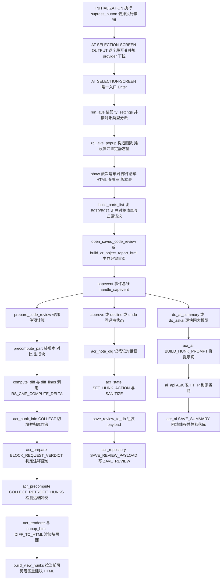

# Z_AVE 源码分析报告（AVE — ABAP Versions Explorer / Code Reviewer）

> 阅读提示：本程序是一个「单文件巨型程序」。顶部是 `REPORT z_ave.` 加 3 个接口与 48 个类的本地定义/实现（约 29000 行），底部才是真正的选择屏、事件块与 7 个 FORM（约 460 行）。因此**运行入口在文件末尾**，这与常见的「程序头—声明区—实现区」顺序相反，第一次读很容易走错方向。下面按真实执行顺序（选择屏 → Enter → 弹窗 → 预计算 → 评审落库 → AI）展开，而不是按源码顺序。

## 一、程序定位与业务背景

### 1.1 它解决什么问题

想象一次真实的 Code Review：某个 K 请求（比如 `ER6K9A1JDL`）带了 3 个类、1 个函数组、2 张表，一共 40 多个技术部件（method / class section / include）。带请求进系统、找目标系统（可能是 PRD 或 DEV）做对比之后，Lead 真正要回答的是四个问题：

1. **这次请求到底动了什么？** —— 不是"哪个文件被激活了"，而是"哪些连续的代码块变了、变了几行、是新增还是改写还是删除"。
2. **谁改的？** —— 一个块可能一半是 A 写的、一半是 B 写的，Lead 想知道每个开发者各自负责哪些块。
3. **这些改动在目标系统会不会被覆盖掉？** —— 如果目标系统已经有人改了同一段代码，这次请求搬过去就是 moving violation（冲突），必须提前发现。
4. **评审结论存到哪儿？** —— 谁批了、谁驳回了、驳回的理由是什么，必须在**跨会话、跨开发者**之间共享。

SAP 自带的 `/VERS`、ADT（Eclipse）、`/MOI`（ChaRM）各自都只答其中一部分：

| 现有方案 | 能答 | 答不了 |
| --- | --- | --- |
| ADT / Eclipse diff | 当前活动版本 vs 上一个版本 | 请求维度（S/R 任务、K/T/ToC 关系）、作者归属、评审状态、与目标系统的对比 |
| `/VERS` | 单对象版本列表 | 没有 diff、没有块级切分、没有持久化评审 |
| abapTimeMachine | 任意历史时刻的源码 | 只读、逐对象、无请求范围概念、无评审流程 |
| ChaRM | 请求流程与状态 | 不提供代码级评审痕迹与块级作者归属 |

AVE 的定位就是**把这四件事在一个 ABAP GUI 事务里做完，并且把结论落库共享**。

### 1.2 现有方案为何"不够"的根因

根本原因不是"ADT 功能少"，而是**ABAP 侧的版本管理数据（VRSD / E070 / E071 / E07T）与 ADT 的编辑体验在两套世界里**：

- ADT 只呈现 *当前活动版本*，历史版本要靠 SVRS 逐个取；
- 请求的组织结构（K 请求下挂 S/R 任务、ToC 从哪个 K 合并而来）在 ADT 里是不可见的，而"这次请求的范围到底是什么"恰恰决定了 diff 的两端；
- 一个类的版本历史是按**技术部件**（`METH` / `CPUB` / `CPRO` / `CPRI`）存的，不按类存，所以"类"这个自然单位必须自己拼。

所以 AVE 必须在 ABAP 侧自己实现三件事：**部件分解、版本配对、块级切分**。这三件事正是本文件 95% 的代码量所在。

### 1.3 整体设计范式（一句话定性）

> **"选择屏驱动 + 单入口弹窗 + 全局类池 + 两阶段计算（预计算 diff/块，按需渲染 HTML）+ JSON 大字段落库"的富 GUI 应用**，用一个事件总线（`sapevent:` 链接）把 HTML 页面上的动作统一回抛到 ABAP 类方法上。

拆开来看有五个值得注意的取舍：

1. **单文件类池**：`zcl_ave_*` 全部 `CREATE PUBLIC/PRIVATE` 本地化，靠 `INTERFACE ... DEFERRED` 打破循环依赖。这样整个工具可以拷成一个 `.prog.abap` 单文件部署（不依赖传输请求里的 48 个对象），代价是失去了跨程序复用接口的能力，只能靠 `FRIENDS` 关键字授权。
2. **两阶段计算**：`prepare_code_review` 把 diff 与块（hunk）全部算完存进内存表；渲染时才生成 HTML，且**只为屏幕上真正要显示的那几个块渲染**。这是长耗时 GUI 的标准做法。
3. **评审状态用 JSON blob 落一张表**：整份评审（块信息、diff、评论、作者统计、计时）序列化成 JSON 写进 `ZAVE_REVIEW` 的 `PAYLOAD` 字段，键是 `(TRKORR, REMOTE)`。好处是加字段不用改表结构；代价是**没有行级权限、没有部分更新、一写就是全量**。
4. **跨类静态状态**：`zcl_ave_popup_data=>mv_no_toc`、`zcl_ave_acr_prepare=>gv_comment_check`、`zcl_ave_adt=>gv_gui_nav` 三个"规则型"设置被写在类静态上，因为它不属于任何一个窗口——这是"一个事务一个设置"假设下的合理妥协，也是后面会点出的多窗口隐患。
5. **作者缓存 + 静态哈希缓存**：`zcl_ave_author=>authors`、`zcl_ave_version_list=>gt_rel_cache`、`zcl_ave_acr_prepare=>gt_korr_exists` 都是 `CLASS-DATA` 哈希表，为的是把"每个内层循环里都要问一次"的问题摊成一次读。

## 二、程序执行流程总览

### 2.1 主流程图



### 2.2 责任链表（按执行先后排列）

| 子程序 | 调用者 | 职责 |
| --- | --- | --- |
| `supress_button`（FORM） | INITIALIZATION | 用 `RS_SET_SELSCREEN_STATUS` 把 ONLI（执行）按钮从工具栏去掉 |
| `fill_provider_list`（FORM） | AT SELECTION-SCREEN OUTPUT | 读 `zcl_ave_ai_api=>providers( )` 填 P_PROV 下拉 |
| AT SELECTION-SCREEN OUTPUT | SAPGUI PBO | 按单选按钮开关 10 组从属字段（含 P_CMTCHK 挂在 P_DIFF 上） |
| `f4_model` / `f4_system_file` / `f4_prompt_folder` / `f4_prompt_profile`（FORM） | ON VALUE-REQUEST | 模型下拉、选择 md 文件、选择 profile 目录、选择 profile 名 |
| `run_ave`（FORM） | AT SELECTION-SCREEN | 装配 `ty_settings`，按 10 种对象类型 `NEW zcl_ave_popup( )` 后 `show( )` |
| `zcl_ave_popup=>constructor` | `run_ave` | 把选择屏设置摊到 40 多个成员变量，并写三个别的类的静态量 |
| `zcl_ave_popup=>show` | `run_ave` | 建布局 → 建部件清单 → 建 HTML 查看器 → 建版本表 → 自动打开首部件或评审首页 |
| `zcl_ave_popup=>build_layout` | `show` | 建 `cl_gui_dialogbox_container` 与 5 层 splitter（普通/双栏/TOP-DOWN 三套布局共用） |
| `zcl_ave_popup=>build_parts_list` | `show` | 按对象类型取部件；TR 模式逐请求读 E070/E071 汇总对象与归属请求并染色 |
| `zcl_ave_object_factory=>get_instance` | `build_parts_list` 等 | 用 `SWITCH` 把对象类型映射到 11 个 `zcl_ave_object_*` 实现 |
| `zcl_ave_object_clas=>get_parts` | 工厂 | 8 个固定段 + 每个方法一条 METH，并从 VRSD 反查规范化的类名 |
| `zcl_ave_popup=>create_html_viewer` | `show` | 建 HTMLViewer + ABAP 编辑器两层 splitter |
| `zcl_ave_popup=>create_versions_alv` | `build_versions_grid` | 15 列字段目录 + 3 个事件处理 |
| `zcl_ave_popup=>load_versions` / `zcl_ave_version_list=>load` | 双击部件 | 读 VRSD 全历史，裁剪到请求范围，配对 old/new/remote 三个端点 |
| `zcl_ave_popup=>show_source` / `show_code_source` | 双击版本行 | 单版本视图：DDIC 走结构化表，其他走 ABAP 编辑器上传源码 |
| `zcl_ave_popup=>show_versions_diff` / `auto_show_diff_or_source` | 版本行双击 | 双版本视图：`compute_diff` + `diff_to_html` + blame |
| `zcl_ave_popup_diff=>compute_diff` | `show_versions_diff` | 判定源类型：声明段源按声明配对、SEGW DPC 按文本配对、其余走行级 diff |
| `zcl_ave_popup_diff=>diff_lines` | `compute_diff` | 调 `RS_CMP_COMPUTE_DELTA`，再做忽略大小写/缩进折叠 |
| `zcl_ave_popup_diff=>build_blame_map` | 同上（blame 开启） | 按版本回放，逐版本重算整份源码，把作者标到每行 |
| `zcl_ave_popup_html=>diff_to_html` | `show_versions_diff` | 单栏或双栏渲染，compact 模式用 3 行上下文 + 省略行占位 |
| `zcl_ave_acr_command=>handle_sapevent` | `on_sapevent` | 30 余种 `sapevent:` 动作的总线；review 之外的 adt/refreshexp 先于评审门处理 |
| `zcl_ave_acr_workflow=>prepare_code_review` | `handle_sapevent` 的 prepare | 逐部件预计算 + 计时 + 块号重映射 + 重建报告 |
| `zcl_ave_acr_precompute=>precompute_part` | `prepare_code_review` | 过滤生成代码/已删对象 → 装版本 → 取双端源码 → diff → 切块 → 装配 obj_stats |
| `zcl_ave_acr_hunk_info=>collect` | `precompute_part` | 一条语句一块；作者按块内行数多数决；填 req_ref/obj_descr |
| `zcl_ave_acr_prepare=>block_request_verdict` | `collect` | 判定块内注释提到的请求号属于 X/R/V/N/T/W/- 哪一类 |
| `zcl_ave_acr_precompute=>collect_retrofit_hunks` | `precompute_part` | 用远端系统源码减去本次评审改动，剩下的是"会被覆盖"的块 |
| `zcl_ave_acr_renderer` 各类（`render_*`） | `build_view_hunks` | 块页面：动作条、作者、请求徽标、blame 回退、评论链接 |
| `zcl_ave_popup=>build_view_hunks` | `open_cr_part` 等 | 只为当前页面真正要显示的对象渲染块 HTML（retrofit 的远端 diff 同理） |
| `zcl_ave_acr_note_dlg=>show` / `on_box_close` | `handle_sapevent` 的 decline/addcomment | 记笔记对话框；关闭时读文本，有内容抛 `saved`、否则抛 `cancelled` |
| `zcl_ave_popup=>on_note_dlg_saved` | 事件 `saved` | 落评审笔记、按需登记 decline、建评论线程、静默保存 |
| `zcl_ave_acr_state=>set_hunk_action` / `sanitize_review_state` | 各写路径 | 记录"谁在何时批/驳"，并剔除已不存在的块键 |
| `zcl_ave_acr_state=>remap_review_state` | `prepare_code_review` 重算后 | 块号变了时把批准/驳回/笔记/线程迁移到新键（合并时要求全体一致） |
| `zcl_ave_popup=>save_review_to_db` | 几乎所有写操作 | 装配 `ty_saved_payload` 并调 repository 写库 |
| `zcl_ave_acr_repository=>save_review_payload` | `save_review_to_db` | 动态 `UPDATE (ZAVE_REVIEW)`，失败回退动态 `CREATE DATA` + `INSERT` |
| `zcl_ave_acr_report=>to_html` | `regen_acr_report` | 生成评审首页：按作者汇总行数/块数/批准数 |
| `zcl_ave_popup=>do_ai_summary` | `handle_sapevent` 的 aiprompt | 逐块问 AI，攒成对象级摘要后 `save_summary` 回填线程 |
| `zcl_ave_acr_ai=>build_hunk_prompt` | `do_askai` / `do_ai_summary` | 从 `mt_diff_data` 抽出目标块，输出 `- 行号｜文本 / + 行号｜文本` |
| `zcl_ave_ai_api=>ask` | `do_askai` / `do_ai_summary` | `CL_HTTP_CLIENT=>CREATE_BY_URL` POST，按 wire 格式组包与解包 |

下面按这条流程，逐个子程序展开。为了让 439 个子程序可读，本报告按**功能域**分组，每组挑出真正承载逻辑的那几个展开逐层拆解，纯样板（字段目录、按钮定义、类型定义）只做整体点评。

## 三、分组分析：功能域与子程序详解

### 3.1 全局声明区（`REPORT` 头、三个接口、`zcx_ave`）

文件最前面是 `REPORT z_ave.`，紧接着 48 行 `INTERFACE/CLASS ... DEFINITION DEFERRED`（把所有本地类的定义段先声明一遍以打破循环依赖），然后是第一个真正的定义段：异常类。

```abap
CLASS zcx_ave DEFINITION
  INHERITING FROM cx_static_check
  CREATE PUBLIC.

  PUBLIC SECTION.

    METHODS constructor
      IMPORTING
        !textid   LIKE if_t100_message=>t100key OPTIONAL
        !previous LIKE previous OPTIONAL.

    CLASS-METHODS raise_from_syst
      RAISING
        zcx_ave.

ENDCLASS.
```

**做什么** — 声明唯一的自定义异常 `zcx_ave`，继承 `cx_static_check`，只带一个透传 `previous` 的构造函数和一个把 `sy-msgid`/`sy-msgno` 转成异常对象的类方法。

**为什么** — 整个工具的"可预期失败"（对象不存在、SVRS 取版本失败、DDIF 取定义失败）都用这一个异常表达，`TRY ... CATCH zcx_ave` 一网打尽；继承 `cx_static_check` 而不是 `cx_root`，是为了让 `RAISE EXCEPTION TYPE zcx_ave`（文件中大量出现无参数形式）合法。

**风险与改进** — `constructor` 声明了 `textid` 形参却**没有 `INTERFACING` 也没有转发**，`raise_from_syst` 里包了 `cx_proxy_t100` 但 `textid` 参数完全没用上（`##ADT_SUPPRESS_GENERATION` 只是让 ADT 不重新生成）。若将来真想用消息类拼文本，需要把 `textid` 真正传给 `super->constructor`。当前无实际影响，属于残留接口。

三个接口是全文件的数据契约，其中 `zif_ave_object=>ty_settings` 是选择屏到内部的唯一通道：

```abap
  TYPES:
    BEGIN OF ty_settings,
      show_diff       TYPE abap_bool,
      layout          TYPE abap_bool,
      two_pane        TYPE abap_bool,
      no_toc          TYPE abap_bool,
      "! One option: case- AND whitespace-insensitive diff ("Case/ind" toggle)
      ignore_case     TYPE abap_bool,
      compact         TYPE abap_bool,
      remove_dup      TYPE abap_bool,
      blame           TYPE abap_bool,
      comment_check   TYPE abap_bool,
      ignore_generated TYPE abap_bool,
      filter_user     TYPE versuser,
      date_from       TYPE versdate,
      code_review     TYPE abap_bool,
      system          TYPE verssysnam,
      filter_korrnum  TYPE trkorr,
      filter_korrnums TYPE ty_t_korr_range,
      include_tasks   TYPE abap_bool,
      url             TYPE text255,
      ssl_id          TYPE ssfapplssl,
      model           TYPE text255,
      apikey          TYPE text255,
      provider        TYPE string,
      prompt_path     TYPE text255,
      prompt_profile  TYPE text255,
      system_file     TYPE text255,
      max_tokens      TYPE i,
      debug           TYPE abap_bool,
      metrics         TYPE abap_bool,
      gui_nav         TYPE abap_bool,
    END OF ty_settings.
```

**做什么** — 用一个 29 字段的 `ty_settings` 结构把选择屏上的 29 个输入项一次性打包，作为 `run_ave` 到弹窗之间唯一的数据通道。

**为什么** — 用 `ty_settings` 而不是 29 个形参，是因为 `run_ave` 里 10 个分支 `NEW zcl_ave_popup( )` 都要传同一份设置；接口参数一多，ABAP 的 `EXPORTING` 列表就要复制 10 遍。一个结构体把"选择屏形态"和"内部形态"解耦，将来加选项只改这一处。

**风险与改进** — `apikey`（真实密钥）与 `prompt_path`（前端路径）混在同一个"显示设置"结构里，并被原样复制到弹窗的 `mv_apikey`、`mo_prompts`。这属于**配置与业务数据不分层**：更干净的做法是让弹窗只接受"引用"（profile 名）而不接受明文密钥。另外 `ty_settings` 没有 `filter_korrnums` 之外的范围类型，`it_filter_parent_korrnums` 是弹窗自己算的，导致"范围"这一概念在三个地方各有一份表示。

`zif_ave_acr_types` 是评审域的类型仓库（约 30 个 `TYPES`），值得单独点一句：`ty_hunk_info` 的 `req_ref`/`obj_descr` 用 `ty_req_ref TYPE c LENGTH 1`，注释里专门解释了为什么不用裸 `'c'`——

```abap
  "! Comment-control verdict of one changed block — see TY_HUNK_INFO-REQ_REF.
  "! Fully typed here rather than left as a bare 'c': a RETURNING parameter may
  "! not be generic, and ZCL_AVE_ACR_PREPARE=>BLOCK_REQUEST_VERDICT returns one.
  TYPES ty_req_ref TYPE c LENGTH 1.
```

**做什么** — 把"注释控制判定结果"这个单字符类型显式命名为 `ty_req_ref`（取值 `' '`/`X`/`R`/`V`/`N`/`T`/`W`/`-`），放在接口里而不是类里。

**为什么** — 两个原因叠加：一是 ABAP 的 `RETURNING` 参数不允许是泛型 `c`，必须用具名类型；二是这些类型必须放在**接口**而不是类上，因为单文件构建（abapmerge 把所有类合并进一个程序）时，引用另一个类的公有组件会报 "Direct access to components of the global class … is not possible"。作者把这个约束写进了注释，属于经验沉淀。

**风险与改进** — 这个理由只对"单文件构建"成立，等价于把编译期检查换成了注释约定。更通用的解法是让被引用的类先于引用者发出（文件里已用 `DEFINITION DEFERRED` 部分解决）。无功能风险，但值得记为"工具链约束泄漏到领域设计"。

### 3.2 事件块与 5 个 FORM（`INITIALIZATION` / `AT SELECTION-SCREEN OUTPUT` / `ON VALUE-REQUEST`）

这个事件块是整个程序唯一的入口，做两件事：逐字段开关、填 provider 下拉。

```abap
  AT SELECTION-SCREEN OUTPUT.
    " Re-set on every PBO, otherwise the picked provider does not stick.
    PERFORM fill_provider_list.

    LOOP AT SCREEN.
      CASE screen-group1.
        WHEN 'PRG'.
          screen-input = COND #( WHEN rb_prog = 'X' THEN 1 ELSE 0 ).
        WHEN 'CLS'.
          screen-input = COND #( WHEN rb_clas = 'X' THEN 1 ELSE 0 ).
        WHEN 'FNC'.
          screen-input = COND #( WHEN rb_func = 'X' THEN 1 ELSE 0 ).
        WHEN 'TRQ'.
          screen-input = COND #( WHEN rb_tr   = 'X' THEN 1 ELSE 0 ).
        WHEN 'PCK'.
          screen-input = COND #( WHEN rb_pack = 'X' THEN 1 ELSE 0 ).
        WHEN 'DLS'.
          screen-input = COND #( WHEN rb_ddls = 'X' THEN 1 ELSE 0 ).
        WHEN 'FGR'.
          screen-input = COND #( WHEN rb_fugr = 'X' THEN 1 ELSE 0 ).
        WHEN 'TBD'.
          screen-input = COND #( WHEN rb_tabd = 'X' THEN 1 ELSE 0 ).
        WHEN 'DOM'.
          screen-input = COND #( WHEN rb_doma = 'X' THEN 1 ELSE 0 ).
        WHEN 'DTE'.
          screen-input = COND #( WHEN rb_dtel = 'X' THEN 1 ELSE 0 ).
      ENDCASE.
      IF screen-name = 'P_PANE' OR screen-name = 'P_CMPCT'.
        screen-input = COND #( WHEN p_diff = 'X' THEN 1 ELSE 0 ).
      ENDIF.
      MODIFY SCREEN.
    ENDLOOP.
```

**做什么** — 遍历系统内表 `SCREEN`，按 `screen-group1` 把 10 个对象类型输入框设为可用/不可用；再单独把 `P_PANE`、`P_CMPCT` 挂到 `P_DIFF`（`P_DIFF` 是 NO-DISPLAY 的隐藏字段，只用来显示两栏布局选项）。

**为什么** — 用 `MODIFY SCREEN` 而不是 `SET PARAMETER ID` / 动态 `LOOP AT SCREEN`，是这个场景的标准做法：单选按钮改变后必须立刻把"不属于当前类型"的输入框置灰，否则用户可以在 PROG 模式下顺手填一个类名，后面 `run_ave` 的 `ELSEIF` 顺序就会误判。`group1` 机制比逐个字段名判断更抗改名。

**风险与改进** — `P_PANE`（双栏）和 `P_CMPCT`（紧凑）被强制挂在 `P_DIFF` 上，这是一个**隐式耦合**：DDIC 对象（TABD/DOMA/DTEL）的页面是结构化字段表，双栏与紧凑对它无意义，但用户仍能选中而得到无效视觉。另外这里没有把 `P_ITASK`（Include Tasks）挂到 `TRQ` 上——该参数只对 TR 模式有意义，单对象模式下用户看不到任何效果说明，属于选择屏与逻辑的错位（见 P2 问题）。

```abap
FORM fill_provider_list.
  DATA lt_vrm TYPE vrm_values.
  LOOP AT zcl_ave_ai_api=>providers( ) INTO DATA(ls_provider).
    APPEND VALUE vrm_value( key = ls_provider-id text = ls_provider-id ) TO lt_vrm.
  ENDLOOP.
  CALL FUNCTION 'VRM_SET_VALUES'
    EXPORTING
      id     = 'P_PROV'
      values = lt_vrm
    EXCEPTIONS
      OTHERS = 1.
ENDFORM.
```

**做什么** — 每次 PBO 都从 `zcl_ave_ai_api=>providers( )` 读出 8 个服务商的 id，重建 P_PROV 的 VRM 值列表。

**为什么** — 用 VRM 而不是 F4 或 `SET PARAMETER`：`LISTBOX VISIBLE LENGTH 20` 的下拉必须靠 `VRM_SET_VALUES` 才能在 PBO 时被重新赋值，否则用户在别的屏幕选过的值会覆盖回来。作者在注释里写明了这一点（"Re-set on every PBO, otherwise the picked provider does not stick"），是踩过的坑。

**风险与改进** — `EXCEPTIONS OTHERS = 1` 之后**完全没有检查 `sy-subrc`**，也不 `MESSAGE`。P_PROV 是 LISTBOX，若 VRM 设置失败而选择屏仍按内建值走，用户会拿到一个空下拉并无从诊断。至少应 `CHECK sy-subrc = 0`。

接下来是 4 个 F4 辅助 FORM，它们共同的特点是"数据来自前端/远端，而不是 DDIC"：

```abap
FORM f4_model.
  " The list comes from the provider itself (GET .../models), so a new model is
  " offered the day it is released instead of the day this report is changed.
  DATA lt_ids TYPE stringtab.
  DATA lv_error TYPE string.

  zcl_ave_ai_api=>list_models(
    EXPORTING
      i_provider = CONV string( p_prov )
      i_apikey   = CONV string( p_apikey )
      i_url      = p_url
      i_ssl_id   = p_sslid
    IMPORTING
      et_ids     = lt_ids
      e_error    = lv_error ).

  IF lt_ids IS INITIAL.
    MESSAGE lv_error TYPE 'S' DISPLAY LIKE 'W'.
    RETURN.
  ENDIF.
  ...
```

**做什么** — 按当前 provider 与 API key 现场调服务商 `GET .../models`，把返回的模型 id 装进内表交给 `F4IF_INT_TABLE_VALUE_REQUEST` 做值帮助；失败时把 `list_models` 填好的错误文本以警告消息弹出。

**为什么** — 不硬编码模型列表是个很实用的选择：新模型发布当天就能用，不必改程序再传。这个 F4 是**唯一一次**会让选择屏等待网络的交互，因此把超时风险限制在用户主动按 F4 的那一刻。

**风险与改进** — 这里把 `p_apikey` 明文传给 HTTP 客户端，而 `p_apikey` 在选择屏上是无掩码 `PARAMETERS ... MEMORY ID api`（详见 3.3）。任何走这条路的调用都把密钥暴露在屏幕录制与 SAPGUI 会话内存中。同时 `list_models` 内部**没有任何超时设置**（见 3.28），一个不响应的服务商会让选择屏无限等待。

`f4_system_file` 与 `f4_prompt_folder` 都用前端服务：

```abap
FORM f4_system_file.
  DATA lt_files TYPE filetable.
  DATA lv_action TYPE i.

  DATA: lv_rc TYPE i.

  cl_gui_frontend_services=>file_open_dialog(
    EXPORTING
      window_title    = 'System prompt (*.md)'
      file_filter     = 'Markdown (*.md)|*.md|All files (*.*)|*.*'
      multiselection  = abap_false
    CHANGING
      file_table      = lt_files
      rc              = lv_rc
      user_action     = lv_action
    EXCEPTIONS
      OTHERS          = 4 ).
  CHECK sy-subrc = 0
    AND lv_action = cl_gui_frontend_services=>action_ok
    AND lt_files IS NOT INITIAL.

  p_sysmd = lt_files[ 1 ]-filename.
ENDFORM.
```

**做什么** — 弹前端文件对话框选一个 `.md` 系统提示词文件，把完整前端路径写回 `p_sysmd`。

**为什么** — 系统提示词放在前端文件而不是写死在程序里，是为了让使用者不改程序就能改 AI 人设；`multiselection = abap_false` + 取 `[ 1 ]` 保证语义唯一。

**风险与改进** — `window_title` 传的是 `'System prompt (*.md)'` 这种**混合大小写的字符串字面量**，在 `CL_GUI_FRONTEND_SERVICES=>FILE_OPEN_DIALOG` 里合法，但同一段里 `file_filter` 用了 `'Markdown (*.md)|*.md|...'`。这里没有把路径规范化（后面 `zcl_ave_ai_prompts=>read_system_file` 才做 `\`→`/`），前后不一致。此外这段代码只在 SAPGUI 前端可用；后台批处理执行时 `cl_gui_frontend_services` 会抛异常，这里没包 `TRY`，但因为只在 F4 路径上被调用，实际风险有限。

### 3.3 FORM `run_ave`（对象类型分派与弹窗创建）

这是程序唯一的启动动作，分两步：装配设置、按类型分派。

#### ① 装配 `ty_settings`

```abap
FORM run_ave.
  " Open popup only when the user pressed Enter (ucomm is initial)
  CHECK sy-ucomm IS INITIAL.

  TRY.
      DATA(ls_settings) = VALUE zif_ave_object=>ty_settings(
        show_diff   = CONV #( p_diff )
        layout      = CONV #( p_layout )
        two_pane    = CONV #( p_pane )
        no_toc      = CONV #( p_ntoc )
        " One checkbox, one flag: the fold in COMPUTE_DIFF compares with all
        " whitespace removed and upper-cased, so case and indent are inseparable.
        ignore_case = CONV #( p_icase )
        ...
        apikey = p_apikey
        provider = CONV string( p_prov )
        ...
        filter_korrnum = COND #( WHEN s_task[] IS NOT INITIAL THEN s_task[ 1 ]-low )
        filter_korrnums = s_task[]
        include_tasks   = CONV #( p_itask ) ).
```

**做什么** — 把 29 个选择屏参数逐个搬进 `ty_settings`，其中 `s_task` 选择选项被同时拆成单值 `filter_korrnum`（取第一条）与区间表 `filter_korrnums`。

**为什么** — 同时传"单值 + 区间表"是为了兼容两种调用方式：老代码路径（`load_versions` 的 `iv_filter_korrnum`）用单值快路径，新代码（范围裁剪）用区间表。作者在 `COMPUTE_DIFF` 处坚持把"忽略大小写"和"忽略缩进"合成一个标志，也是刻意的——因为折叠算法本身是"去全部空白 + 转大写"，二者物理上不可分。

**风险与改进** — `filter_korrnum` 无条件取 `s_task[ 1 ]-low`，当用户填的是一个**区间**（例如只填了下界或用 `BETWEEN`）时，这一条会成为一个任意的代表值。虽然多处代码有 `IF iv_filter_korrnum IS INITIAL THEN ...` 的兜底，但 `zcl_ave_acr_prepare=>set_review_scope` 之后 `mv_filter_korrnum` 会被 `zcl_ave_popup=>constructor` 里"最旧/最新 task"的逻辑重算，等于这条任意的值会在构造函数里被静默改写（见 3.4）。这是一处语义不清的隐患。

#### ② 按对象类型 `NEW zcl_ave_popup( )`

```abap
      IF rb_prog = 'X' AND p_prog IS NOT INITIAL.
        go_popup = NEW zcl_ave_popup(
          i_object_type = zcl_ave_object_factory=>gc_type-program
          i_object_name = CONV #( p_prog )
          is_settings   = ls_settings ).

      ELSEIF rb_clas = 'X' AND p_clas IS NOT INITIAL.
        go_popup = NEW zcl_ave_popup(
          i_object_type = zcl_ave_object_factory=>gc_type-class
          i_object_name = CONV #( p_clas )
          is_settings   = ls_settings ).

      ELSEIF rb_func = 'X' AND p_func IS NOT INITIAL.
        go_popup = NEW zcl_ave_popup(
          i_object_type = zcl_ave_object_factory=>gc_type-function
          i_object_name = CONV #( p_func )
          is_settings   = ls_settings ).
      ...
      ELSE.
        MESSAGE 'Please enter an object name.' TYPE 'W'.
        RETURN.
      ENDIF.

      go_popup->show( ).
```

**做什么** — 按 10 个单选按钮依次判断：命中且名称非空就 `NEW zcl_ave_popup( )` 并赋给全局 `go_popup`；全不命中则警告"请输入对象名"。中间 7 个分支与这三个完全同构，只有类型常量和名称字段不同。

**为什么** — 用 `ELSEIF` 链而不是 `SWITCH`，是因为条件是"单选按钮 + 字段非空"的组合而非单值；作者选择让 F4 的 `MATCHCODE OBJECT`（如 `MATCHCODE OBJECT sfbeclname`）在按 F4 填入名称后自动切换单选按钮，从而保证两者一致。

**风险与改进** — 三点：

1. **`go_popup` 是全局变量且无 `IS BOUND` 保护**。用户每按一次 Enter 就 `NEW` 一个新弹窗，旧弹窗（`CL_GUI_DIALBOX_CONTAINER` + `lifetime_dynpro`）既没有 `free( )` 也没有 `close( )`，其事件处理句柄仍然指向已不可见的窗口；连续 Enter 若干次会积累孤儿窗口，直到用户退出事务。
2. **启动方式只有 Enter**。`CHECK sy-ucomm IS INITIAL` 在最前面，配合 `supress_button` 去掉 ONLI，等于 F8/Execute 与其它工具栏命令什么也不做——这与"Multi-windows program"的标题承诺（可以同时开多个 AVE 窗口）矛盾：用户只能一次开一个。
3. 十个分支体完全同构，共 100 余行样板。更紧凑的写法是先算出 `(type, name)` 二元组再 `SWITCH`，或者用内表 `VALUE #( ( when rb_prog = 'X' ... ) )`。

密钥的处理在这一步就已经定型——选择屏上的定义是：

```abap
  " No SM59 destination: the call goes out through CL_HTTP_CLIENT=>CREATE_BY_URL,
  " so only the endpoint and the SSL id from STRUST are needed. An empty URL takes
  " the public endpoint of the selected provider.
  PARAMETERS: p_url    TYPE text255 MEMORY ID aurl,
              p_sslid  TYPE ssfapplssl DEFAULT 'ANONYM',
              p_model  TYPE text255 MEMORY ID model,
              p_apikey TYPE text255 MEMORY ID api.
```

**做什么** — 声明 LLM 接入的四个参数：端点、STRUST 的 SSL 身份、模型名、API key，其中 `p_url`、`p_model`、`p_apikey` 都带 `MEMORY ID` 以便 SPA 调用复用。

**为什么** — 走 `CL_HTTP_CLIENT=>CREATE_BY_URL` 而不是 `CALL FUNCTION 'HTTP_SCANNER'`/SM59，是为了免掉 `STRUST` 之外还要给系统管理员配一个 RFC 目的地的负担；`MEMORY ID` 则让 ADT 插件/Fiori 前端能把上次填的 key 带过来。

**风险与改进** — 这是全文最严重的安全问题：**`p_apikey` 是无掩码输入框**。屏幕内容会被用户主动看到、会进入 SAPGUI 会话内存（`SPAWN`/`MEMORY` 区）、任何同一会话内的其他报表都能通过 `MEMORY ID api` 或 `sy-set/memory` 读到它；同时它还会被 `zcl_ave_ai_api=>ask` 拼进 HTTP 头，一旦开启 SAP 的 HTTP 流量记录就会落盘。正确做法是用 `PASSWORD` 类型（SAPGUI 会掩码显示）或者干脆不在选择屏收 key，改成从后端安全存储/前端凭据框取。这是 P0。

### 3.4 类方法 `zcl_ave_popup=>constructor`（设置摊派与范围展开）

这是全文最长的单个方法（约 185 行），做四件事：摊设置、写静态量、把请求展开成任务列表、设定注释控制范围。

#### ① 摊设置 + 写三个别的类的静态量

```abap
    IF is_settings IS SUPPLIED.
      mv_show_diff      = is_settings-show_diff.
      mv_layout         = is_settings-layout.
      mv_two_pane       = is_settings-two_pane.
      mv_no_toc                     = is_settings-no_toc.
      zcl_ave_popup_data=>mv_no_toc = is_settings-no_toc.
      mv_compact        = is_settings-compact.
      mv_remove_dup     = is_settings-remove_dup.
      mv_blame          = is_settings-blame.
      " Comment control is a rule about content, not a state of one object, so
      " it lives where the rule does — the way P_GUINAV lives on ZCL_AVE_ADT.
      zcl_ave_acr_prepare=>gv_comment_check = is_settings-comment_check.
      mv_ignore_generated = is_settings-ignore_generated.
      mv_debug          = is_settings-debug.
      mv_metrics        = is_settings-metrics.
      " Where the ADT links open the object — a jump has no per-object state of
      " its own, so the setting lives on ZCL_AVE_ADT itself.
      zcl_ave_adt=>gv_gui_nav = is_settings-gui_nav.
      mv_ignore_case    = is_settings-ignore_case.
      ...
```

**做什么** — 逐字段把 `ty_settings` 复制到 40 多个成员变量；同时把三个"不属于单个窗口"的设置直接写进别的类的 `CLASS-DATA`：`zcl_ave_popup_data=>mv_no_toc`、`zcl_ave_acr_prepare=>gv_comment_check`、`zcl_ave_adt=>gv_gui_nav`。

**为什么** — 作者在注释里给出了分类判据："规则型设置不属于任何一个对象状态，所以放在规则所在的地方"。这条判据本身是合理的（`no_toc` 影响所有 VRSD 读取，`comment_check` 影响所有块判定，`gui_nav` 影响所有跳转）。

**风险与改进** — 判据合理，但实现是**进程级**的。`CLASS-DATA` 在一个 SAP 会话内只有一份，因此"多窗口"场景下最后一次创建的弹窗会静默改写所有已开窗口的目录显示、注释控制和跳转行为。用户看不出来（界面上没变），直到发现另一个对象的评审结论突然变了。这条应改为：要么把三个值随弹窗实例传下去（改成 `CHANGING` 形参一路传递），要么在 `show` 之前显式 `SET HANDLER` 绑定当前实例的上下文。前者改动大但正确，后者至少要在报告里承认"多窗口不是并行独立配置"。

#### ② 把请求展开成 S/R 任务列表

```abap
    IF mt_filter_korrnums IS NOT INITIAL.
      DATA lt_filter_tasks TYPE zif_ave_object=>ty_t_korr_range.
      ...
      LOOP AT mt_filter_korrnums INTO DATA(ls_filter_korrnum)
        WHERE sign = 'I' AND option = 'EQ' AND low IS NOT INITIAL.
        CALL FUNCTION 'SAPGUI_PROGRESS_INDICATOR'
          EXPORTING
            percentage = CONV i( sy-tabix * 10 / COND i( WHEN lv_filter_total > 0 THEN lv_filter_total ELSE 1 ) )
            text       = CONV char70( |Preparing selected tasks ({ sy-tabix }/{ lv_filter_total })| ).
        SELECT SINGLE trfunction, strkorr, as4date, as4time FROM e070
          WHERE trkorr = @ls_filter_korrnum-low
          INTO (@DATA(lv_filter_trfunction), @DATA(lv_filter_parent),
                @DATA(lv_filter_date), @DATA(lv_filter_time)).
        CHECK sy-subrc = 0.

        " A K carries both S (development) and R (repair) children — both are
        " authoring tasks and both must be in scope, otherwise versions recorded
        " under an R are invisible and no later task matching can recover them.
        IF lv_filter_trfunction = 'S' OR lv_filter_trfunction = 'R'.
          APPEND VALUE #( sign = 'I' option = 'EQ' low = ls_filter_korrnum-low ) TO lt_filter_tasks.
          APPEND VALUE #(
            task   = ls_filter_korrnum-low
            parent = COND #( WHEN lv_filter_parent IS NOT INITIAL THEN lv_filter_parent ELSE ls_filter_korrnum-low )
            datum  = lv_filter_date
            zeit   = lv_filter_time ) TO lt_filter_task_meta.
          APPEND VALUE #(
            sign   = 'I'
            option = 'EQ'
            low    = COND #( WHEN lv_filter_parent IS NOT INITIAL THEN lv_filter_parent ELSE ls_filter_korrnum-low )
            )
            TO mt_filter_parent_korrnums.
        ELSE.
          SELECT trkorr, strkorr, as4date, as4time FROM e070
            WHERE strkorr = @ls_filter_korrnum-low
              AND trfunction IN ( 'S', 'R' )
            INTO TABLE @DATA(lt_child_tasks).
          LOOP AT lt_child_tasks INTO DATA(ls_child_task).
            ...
          ENDLOOP.
```

**做什么** — 对选择屏上每个请求号：若它本身就是 S/R 任务，直接收进 `mt_filter_korrnums` 的替代表并记下它的父 K；若它是 K/T，则查 E070 把它下面所有 S/R 子任务收进来。同时把父 K 收进 `mt_filter_parent_korrnums`，并记录每个任务的时间戳。

**为什么** — 这是全文件最关键的业务判断之一：**"一次请求"在版本记录里是散落在它所有任务上的**。用户输入一个 K，VRSD 里这个请求的内容可能分散在若干个 S/R 任务名下（也可能直接记在 K 上）。不展开成任务集合，`zcl_ave_version_list=>load` 就一个版本都匹配不上。作者还特别指出 R（修复任务）也必须算进来——这是一个真实的坑：早期版本只认 S，导致修复任务的版本完全不可见。

**风险与改进** — 三点：

1. **循环内 `SELECT SINGLE ... FROM e070` 与 `SELECT ... FROM e070`**，每个请求 1–2 次单行读。当用户用选择选项一次填入几十个请求时，这是几十次往返。构造函数里的这类访问可以用一次 `FOR ALL ENTRIES` 汇总，成本几乎相同。
2. `CHECK sy-subrc = 0` 之后没有任何提示：输入一个不存在的请求号，用户看到的是"什么都没有"，而不是"请求号不存在"。`CHECK` 在 LOOP 里等于静默跳过，是 GUI 程序里最容易造成"为什么我的请求没结果"的写法。
3. 注释里的 `SAPGUI_PROGRESS_INDICATOR` 用 `sy-tabix` 算百分比——在 `SELECT ... INTO @DATA(...)` 之后 `sy-tabix` 会被 SQL 破坏吗？实际上 Open SQL 不改变 `sy-tabix`（只有 `LOOP AT` / `DO` 才改），所以这里是对的；但这种依赖是隐式的，读者容易误判。

#### ③ 算出"最旧 / 最新"的代表请求号

```abap
      LOOP AT lt_filter_task_meta INTO DATA(ls_filter_task_meta).
        IF mv_oldest_filter_korrnum IS INITIAL
           OR ls_filter_task_meta-datum < lv_oldest_date
           OR ( ls_filter_task_meta-datum = lv_oldest_date AND ls_filter_task_meta-zeit < lv_oldest_time ).
          mv_oldest_filter_korrnum = ls_filter_task_meta-parent.
          lv_oldest_date = ls_filter_task_meta-datum.
          lv_oldest_time = ls_filter_task_meta-zeit.
        ENDIF.
        IF mv_filter_korrnum IS INITIAL
           OR ls_filter_task_meta-datum > lv_newest_date
           OR ( ls_filter_task_meta-datum = lv_newest_date AND ls_filter_task_meta-zeit > lv_newest_time ).
          mv_filter_korrnum = ls_filter_task_meta-parent.
          lv_newest_date = ls_filter_task_meta-datum.
          lv_newest_time = ls_filter_task_meta-zeit.
        ENDIF.
      ENDLOOP.
```

**做什么** — 遍历刚收集的任务元信息，把时间戳最早的父 K 存进 `mv_oldest_filter_korrnum`，最新的父 K 覆盖 `mv_filter_korrnum`。

**为什么** — `mv_filter_korrnum`（"最新"）用作"这次请求的头"，`mv_oldest_filter_korrnum`（"最旧"）用作"请求之前那一版的边界"。diff 的两端之所以能选出来，靠的就是这两个数字。

**风险与改进** — **`mv_filter_korrnum` 是在这里被静默重写的**。`run_ave` 传进来的是 `s_task[ 1 ]-low`（用户填的第一条），构造函数把它换成了"时间最新的父 K"。当用户一次填入多个请求（比如同时看两个 K）时，后续所有以 `mv_filter_korrnum` 为准的地方都会看到"只有最新的那个 K"。这是一个**语义被覆盖但没有任何提示**的地方：`SHOW_REVIEW_HELP_POPUP` 会用 `ZAVE_REVIEW` 的键 `TRKORR = mv_object_name`，而评审落库用的是 `mv_object_name`（外层请求名），两者不一致的情况不会暴露。

#### ④ 设定注释控制的范围

```abap
    DATA lt_cmt_scope TYPE zif_ave_object=>ty_t_korr_range.
    APPEND LINES OF mt_entered_korrnums TO lt_cmt_scope.
    APPEND LINES OF mt_filter_parent_korrnums TO lt_cmt_scope.
    zcl_ave_acr_prepare=>set_review_scope( lt_cmt_scope ).
```

**做什么** — 把"用户在选择屏上输入的请求号"与"这些请求的父 K"合并成一个范围表，写进 `zcl_ave_acr_prepare` 的静态量 `gt_scope_korr`。

**为什么** — 注释控制要判定"代码注释里写的请求号是不是本次评审的请求"。范围取"输入的号 + 父 K"是刻意的：开发者很可能在注释里写自己的任务号而不是请求号，所以选了任务也要把它的 K 放进来。作者在注释里明确说明了**为什么不能**用展开后的 `mt_filter_korrnums`（那会把每个任务号都算成"我们的"，而任务号与请求号在字符上只差最后一位，这项检查正是为了抓这种错）。

**风险与改进** — 这个设计是对的，但代价是范围是一个**全局静态表**，`set_review_scope` 每次 `CLEAR` 后重建。如果未来同时打开两个评审窗口，后创建的会覆盖前一个的范围，注释控制就会用错基准。与 3.4① 的静态量问题同源，应一并解决。

### 3.5 类方法 `zcl_ave_popup=>show`（启动编排）

```abap
  METHOD show.
    build_layout( ).
    build_parts_list( ).
    build_html_viewer( ).
    build_versions_grid( ).

    " Code Review: auto-open report immediately in maximized view
    IF mv_code_review = abap_true AND mv_cr_report_html IS NOT INITIAL.
      IF open_saved_code_review( ) = abap_false.
        maximize_html( ).
        set_html( mv_cr_report_html ).
      ENDIF.
      " Saving is automatic, so a missing ZAVE_REVIEW would stay invisible until
      " the whole review is lost. Show the setup instruction up front instead.
      IF zcl_ave_acr_repository=>has_review_table( ) = abap_false
         OR zcl_ave_acr_repository=>has_remote_field( ) = abap_false.
        show_review_help_popup( ).
      ENDIF.
      cl_gui_cfw=>flush( ).
      RETURN.
    ENDIF.

    " Auto-open the first part only for single-object views (class/program/intf/func).
    " For TR / package the user picks a row manually — auto-loading versions for
    " an arbitrary "first" object is slow and usually not what they want.
    IF mv_object_type <> zcl_ave_object_factory=>gc_type-tr
       AND mv_object_type <> zcl_ave_object_factory=>gc_type-package
       AND mv_object_type <> zcl_ave_object_factory=>gc_type-fugr.
      LOOP AT mt_parts INTO DATA(ls_first)
        WHERE exists_flag = abap_true.
        CHECK zcl_ave_popup_data=>is_supported_object_type( ls_first-type ) = abap_true.
        mv_cur_objtype = ls_first-type.
        mv_cur_objname = ls_first-object_name.
        load_versions( i_objtype = ls_first-type i_objname = ls_first-object_name ).
        refresh_vers( ).
        IF mt_versions IS NOT INITIAL.
          ms_base_ver = mt_versions[ 1 ].
          mv_viewed_versno = ms_base_ver-versno.
          IF mv_show_diff = abap_true.
            READ TABLE mt_versions INTO DATA(ls_prev_auto) INDEX 2.
            " No previous version → show as new object (all-green diff vs empty source)
            auto_show_diff_or_source( is_old = ls_prev_auto is_new = ms_base_ver ).
          ELSE.
            show_source( i_objtype = ms_base_ver-objtype
                         i_objname = ms_base_ver-objname
                         i_versno  = ms_base_ver-versno ).
          ENDIF.
          update_ver_colors( iv_viewed_versno = mv_viewed_versno ).
        ENDIF.
        EXIT.
      ENDLOOP.
    ENDIF.

    cl_gui_cfw=>flush( ).
  ENDMETHOD.
```

**做什么** — 四步建界面（布局 → 部件清单 → HTML 查看器 → 版本表），然后二选一：评审模式直接最大化并显示评审首页（或从库中恢复已保存的评审）；单对象模式自动打开"第一个存在的、被支持的部件"，读版本、刷新表格，然后按 `P_DIFF` 决定显示 diff 还是单版本源码。

**为什么** — 四个 build 步骤严格对应"外层容器 → 左栏数据 → 右栏视图 → 底部表"的依赖顺序，顺序错了会拿到未绑定的父容器。作者对"要不要自动打开第一个对象"做了区分：单对象类型（程序/类/接口/函数）自动打开省一次点击；TR/Package/FUGR 不自动打开，因为这类对象有几十个部件，自动打开的那一个通常不是用户想看的，还白白付出一次版本读取。

**风险与改进** — **这是全文 GUI 生命周期最脆弱的地方**，因为第 3 步 `build_html_viewer` 与第 2 步 `build_parts_list` 都可能静默失败：

1. `build_layout` 在 `CREATE OBJECT mo_box` 失败时是 `IF sy-subrc <> 0. RETURN. ENDIF.`（**直接返回，什么都不做**），而 `show` 完全不检查它的返回值，继续调 `build_parts_list`。后者在 `CATCH zcx_ave` 里只是"leave mt_parts empty"，然后**继续往下走到** `CREATE OBJECT mo_toolbar EXPORTING parent = mo_cont_toolbar`——此时 `mo_cont_toolbar` 从未绑定（它是在 `build_layout` 里从 `lo_split_outer->get_container( )` 取的），构造一个控件时传未绑定的 parent 会直接 dump。也就是说：`mo_box` 创建失败（GUI 控件资源不足、SAPGUI 死掉）不是"程序安静退出"，而是 **short dump**。
2. `build_parts_list` 里的 `CREATE OBJECT mo_toolbar EXPORTING parent = mo_cont_toolbar` 同样没有 `EXCEPTIONS`，也没有 `IS BOUND` 前置判断。同样的模式在 `create_html_viewer` 里出现第三次：`CREATE OBJECT mo_html EXCEPTIONS cntl_error = 1 ... OTHERS = 5` 之后**完全没有检查 `sy-subrc`**，紧接着 `mo_html->set_registered_events( lt_html_ev )`——如果 `mo_html` 未绑定，这一句抛 `CX_SY_REF_IS_INITIAL`，程序 dump 而不是显示一条错误消息。
3. `refresh_vers( )` 之后如果 `mt_versions` 为空，`show` 什么都不做，用户看到一个空白右栏，没有任何"该对象没有版本"的提示。

这三处应当统一改成：`IF mo_box IS NOT BOUND. MESSAGE 'GUI controls unavailable' TYPE 'E'. RETURN. ENDIF.` 式的显式失败路径。

### 3.6 类方法 `zcl_ave_popup=>build_layout`（GUI 容器骨架）

分两步：建顶层窗口、建三套可切换布局。

#### ① 建顶层窗口

```abap
    CREATE OBJECT mo_box
      EXPORTING
        width                       = 1300
        height                      = 345
        top                         = 25
        left                        = 50
        caption                     = |{ mv_object_type }: { mv_object_name }|
        lifetime                    = cl_gui_control=>lifetime_dynpro
      EXCEPTIONS
        cntl_error                  = 1
        cntl_system_error           = 2
        create_error                = 3
        lifetime_error              = 4
        lifetime_dynpro_dynpro_link = 5
        OTHERS                      = 6.
    IF sy-subrc <> 0. RETURN. ENDIF.

    SET HANDLER me->on_box_close FOR mo_box.
```

**做什么** — 用固定的 1300×345 像素建 `CL_GUI_DIALBOX_CONTAINER` 顶层窗口，标题为"对象类型: 对象名"，生命周期设为 `lifetime_dynpro`，注册 `on_box_close` 关闭事件。

**为什么** — `lifetime_dynpro` 让窗口随屏幕号（dynpro）结束而关闭，是 ABAP GUI 里最省心的生命周期：用户 `/n` 换事务时窗口自动清理，不需要自己维护关闭逻辑。作者还在 `mo_cont_parts` 等容器旁注了一句话："我们用行高 0/100 切换视图而不是 set_visible，因为 z-order 技巧不可靠"——这是实践经验的记录。

**风险与改进** — 窗口大小是**硬编码像素**，没有按屏幕分辨率或用户 `P_SAPLOCALO` 缩放。1366×768 的笔记本上 1300×345 加 top 25 / left 50 会超出可视区或挡住工具栏；作者注释里承认过 "窗口大小是硬编码的，用户可以在工具栏里放大"（`MAXIMIZE_HTML`）。更好的做法是读 `cl_gui_frontend_services=>get_screen_size` 或直接给一个接近全屏的默认值，让用户在"Inline / Maximize"之间切换。另外 `RETURN` 不带任何提示，见 3.5 的连锁问题。

#### ② 建三层 splitter（普通 / 双栏 / TOP-DOWN 共用一套容器）

```abap
    " Outer splitter: row 1 = toolbar, row 2 = content
    DATA(lo_split_outer) = NEW cl_gui_splitter_container(
      parent  = mo_box
      rows    = 2
      columns = 1 ).
    lo_split_outer->set_row_height( id = 1 height = 4 ).
    lo_split_outer->set_row_height( id = 2 height = 100 ).
    mo_cont_toolbar = lo_split_outer->get_container( row = 1 column = 1 ).
    DATA(lo_cont_main) = lo_split_outer->get_container( row = 2 column = 1 ).

    " Wrapper: row 1 = normal layout, row 2 = 2-pane layout (hidden initially)
    mo_split_wrap = NEW cl_gui_splitter_container(
      parent  = lo_cont_main
      rows    = 2
      columns = 1 ).
    ...
    " If starting in TOP-DOWN layout — flip wrapper and point containers
    IF mv_layout = abap_false.
      mo_split_wrap->set_row_height( id = 1 height = 0 ).
      mo_split_wrap->set_row_height( id = 2 height = 100 ).
      mo_cont_parts = mo_cont_parts_2p.
      mo_cont_vers  = mo_cont_vers_2p.
      mo_cont_html  = mo_cont_html_2p.
    ENDIF.
```

**做什么** — 依次建四个 splitter：最外层（工具栏行 + 内容行）、包装层（普通布局行 + 双栏布局行）、普通布局层（左 40% 右 60%，左侧再分上下两行）、双栏布局层（上 35% 分左右两列 + 下 65% 单块）。全部容器都建好，然后用成员变量指针指向"当前生效的那一套"。

**为什么** — 这是 ABAP GUI 里实现"多布局"的经典手法：**一次建两套布局，用行高 0/100 让其中一套高度为零**，切换时只改行高与成员变量指向，不需要重建控件。相比 `set_visible( )` 或销毁重建，这种方式切换是瞬时的、不会闪屏，控件也能保留内部状态（ALV 的列宽、滚动位置）。作者在注释里明确说了这一点。

**风险与改进** — 三个真实问题：

1. **零高度容器里的控件仍然被创建**。双栏布局在"普通布局"模式下整体高度为 0，但它的 ALV 与 HTMLViewer 已经被创建并 `load_data` 过。对 `CL_GUI_ALV_GRID` 来说，在 0 高度容器里做 layout/计算会得到 0 行高，某些 ALV 功能（自适应列宽、Excel 导出）会在切换后才生效，用户会看到一次"列宽全错"的刷新。
2. **`ADD 1 TO mv_counter.`**（在方法开头）是一个 `CLASS-DATA` 计数器，全文件里**没有任何地方读取它，也从不重置**。它是死代码，但它是 `CLASS-DATA`，意味着每个窗口实例都会给同一个计数器加一。这属于"写了但没人用的共享状态"，删掉即可，不影响功能。
3. splitter 层数已达四层，加上 `create_html_viewer` 里的第五层（HTML / ABAP 编辑器），嵌套很深。这不是错误，但在 SAPGUI 里 splitter 超过四层后拖拽分隔条会明显变慢；后续若再加面板应考虑改用 `CL_GUI_TABSTRIP`。

### 3.7 类方法 `zcl_ave_popup=>build_parts_list`（左栏对象清单）

这是左栏的核心，分四步：按类型取部件、TR 模式逐请求汇总请求归属、逐部件染色与统计、生成工具栏。

#### ① 按对象类型分三条路

```abap
    TRY.
        IF mv_object_type = zcl_ave_object_factory=>gc_type-class.
          " CLASS: filter empty includes, no existence check needed
          mt_parts = get_class_parts( CONV #( mv_object_name ) ).
        ELSEIF mv_object_type = zcl_ave_object_factory=>gc_type-fugr.
          " FUGR: show a single function-group row. Double-click expands it into
          " its includes via the same drill-in used when a FUGR comes from a TR.
          DATA(lv_fugr_exists) = zcl_ave_popup_data=>check_part_exists(
            i_type = 'FUGR'
            i_name = CONV #( mv_object_name ) ).
          mt_parts = VALUE #( (
            type         = 'FUGR'
            name         = CONV #( mv_object_name )
            display_name = CONV #( mv_object_name )
            type_text    = zcl_ave_popup_data=>get_type_text( 'FUGR' )
            object_name  = CONV #( mv_object_name )
            exists_flag  = lv_fugr_exists
            rowcolor     = COND #( WHEN lv_fugr_exists = abap_false THEN 'C601' ) ) ).
        ELSE.
          DATA(lo_obj) = NEW zcl_ave_object_factory( )->get_instance(
            object_type = mv_object_type
            object_name = CONV #( mv_object_name ) ).
          DATA(lv_is_tr) = boolc( mv_object_type = zcl_ave_object_factory=>gc_type-tr ).
```

**做什么** — 三条路：类走 `get_class_parts`（不做存在性检查，因为类一定存在）；函数组只建一行 FUGR（存在性查 TADIR），双击时才展开成 include；其余类型交给对象工厂拿实例，TR 模式额外置 `lv_is_tr`。

**为什么** — "类不做存在性检查、函数组必须查"这个区分是对的：进入 AVE 时类名一定是有效的，而 FUGR 从 TR 下钻进来时可能已经被删。作者在函数组分支的注释里说明了"双击展开用的是与 TR 下钻相同的路径"，也就是复用了 `GET_FUGR_PARTS`。

**风险与改进** — 最外层只有一个 `CATCH zcx_ave`，且 catch 体是 `" leave mt_parts empty – no crash`。这意味着：**对象名写错、对象不存在、权限不足，用户看到的只是一个空白的左栏**，没有任何错误提示。用户最常见的操作就是输错名字，这属于必须修的可用性缺陷。建议把 `zcx_ave` 换成带文本的异常（`zcx_ave` 目前根本不带 `textid`，见 3.1），在 catch 里 `MESSAGE lx->get_text( ) TYPE 'E'`。

#### ② TR 模式：逐请求读 E070 汇总对象与归属

```abap
          DATA lt_child_task_korrs TYPE STANDARD TABLE OF trkorr WITH DEFAULT KEY.
          IF lv_is_tr = abap_true AND mt_entered_korrnums IS NOT INITIAL.
            LOOP AT mt_entered_korrnums INTO DATA(ls_part_korrnum)
              WHERE sign = 'I' AND option = 'EQ' AND low IS NOT INITIAL.
              APPEND ls_part_korrnum-low TO lt_korr_parts.
              " "Include Tasks": a request header only holds the objects recorded
              " directly on it — for an unreleased K that is usually nothing, while
              " the developers' objects sit on its S-tasks. Read those too.
              IF mv_include_tasks = abap_true.
                SELECT trkorr FROM e070
                  WHERE strkorr = @ls_part_korrnum-low
                    AND trfunction IN ( 'S', 'R' )
                  INTO TABLE @lt_child_task_korrs.
                APPEND LINES OF lt_child_task_korrs TO lt_korr_parts.
              ENDIF.
            ENDLOOP.
            SORT lt_korr_parts.
            DELETE ADJACENT DUPLICATES FROM lt_korr_parts.
          ENDIF.
```

**做什么** — 对每个输入请求号：先把它自己加进"要读对象的请求列表"；若勾了 Include Tasks，再查它下面的 S/R 任务一并加进去。最后排序去重。

**为什么** — 作者反复强调一个容易搞错的点：**"未释放的 K 请求头里通常什么都没有，开发者的对象都挂在它的 S 任务上"**。所以默认只读 K 自己的对象常常是空的，`P_ITASK` 才是真正有用的开关。这个判断在构造函数和这里各写了一遍注释，属于同一坑的两次踩。

**风险与改进** — **`lt_child_task_korrs` 声明在 LOOP 之外**，且用的是 `INTO TABLE @lt_child_task_korrs` 而不是 `CLEAR` + `INTO TABLE @DATA(...)`。后果是：第二次迭代时 `SELECT ... INTO TABLE` 会**追加**而非覆盖，于是"已找到的所有子任务"会被反复 `APPEND LINES` 到 `lt_korr_parts`。因为后面有 `SORT` + `DELETE ADJACENT DUPLICATES`，最终结果碰巧仍然正确，但代价是**平方级增长**：N 个请求、每个 M 个任务，内表在最后一轮会有约 N·M² 行。当一次评审 50 个请求、每个请求 10 个任务时，最后一轮要 append 5000 行，中间累计上万行——在 GUI 里这是能感觉到的停顿。修法很简单：把 `INTO TABLE @lt_child_task_korrs` 改成 `INTO TABLE @DATA(lt_child_task_korrs)`（带 `DATA()` 每次重新声明），或加一行 `CLEAR lt_child_task_korrs.`

#### ③ 循环内 `SELECT SINGLE` 三处 + 逐部件染色

```abap
          LOOP AT lt_korr_parts INTO DATA(lv_korr_part).
            ...
                DATA(lv_korr_part_text) = CONV string( lv_korr_part ).
                DATA(lv_parent_korr_part) = lv_korr_part.
                SELECT SINGLE strkorr FROM e070
                  WHERE trkorr = @lv_korr_part
                    AND trfunction IN ( 'S', 'R' )
                  INTO @DATA(lv_parent_korr_part_db).
```

**做什么** — 对每个请求号再查一次 E070 拿它的父 K，然后把该请求下的全部部件追加到 `lt_raw_parts`，并把请求号串累加进 `lt_part_requests` 哈希表。

**为什么** — 部件是用"把请求号当对象名"调工厂得到的（`lo_range_obj->get_instance( object_name = lv_korr_part )`），这个复用很聪明：TR 的对象分解逻辑和单对象完全一致，不需要写第二份。`lt_part_requests` 用 `HASHED TABLE ... UNIQUE KEY type object_name class unit` 去重，避免同一部件被多个任务重复登记。

**风险与改进** — **这是全文最严重的性能问题**，而且作者自己也知道：同一个"查 E070 拿父 K"的动作在这个方法里出现了**三次**——循环内查一次拿父 K（上面这段）、后面循环 `lt_part_tasks_for_trs` 算 `ls_row-trs` 时又查一次、染色时对 `lt_korr_parts` 的每个元素再查一次。也就是说总 SQL 次数是 `请求数 × (1 + 每部件任务数)`，40 个部件、10 个请求时是几百次单行 SELECT，全部在 GUI 主线程上同步执行。修法：把"请求 → 父 K"的映射一次性用 `SELECT ... FOR ALL ENTRIES IN lt_korr_parts` 读进哈希表，后面全部走哈希查找。这一处改完，大型传输的打开速度应有数量级提升。

#### ④ 染色与统计

```abap
            ls_row-exists_flag = lv_exists.
            ls_row-rows        = COND i( WHEN lv_exists = abap_true
                                           AND mv_code_review = abap_false
              THEN zcl_ave_popup_data=>get_active_line_count( i_type = ls_raw-type i_name = ls_raw-object_name )
              ELSE 0 ).
            IF lv_exists = abap_false.
              ls_row-rowcolor = 'C601'.   " red
            ELSEIF mv_filter_user IS NOT INITIAL AND mv_code_review = abap_false.
              DATA lv_changed TYPE abap_bool.
              IF lv_is_tr = abap_true AND lt_korr_parts IS NOT INITIAL.
                LOOP AT lt_korr_parts INTO DATA(lv_check_korr).
                  DATA(lv_check_version_korr) = lv_check_korr.
                  SELECT SINGLE strkorr FROM e070
                    WHERE trkorr = @lv_check_korr
                      AND trfunction IN ( 'S', 'R' )
                    INTO @DATA(lv_check_parent_korr).
                  ...
                  lv_changed = COND abap_bool(
                    WHEN ls_raw-type = 'CLAS'
                    THEN zcl_ave_popup_data=>check_class_has_author(
                           i_class_name = CONV #( ls_raw-object_name )
                           i_korrnum    = CONV verskorrno( lv_check_version_korr )
                           i_ignore_case = mv_ignore_case )
                    ELSE zcl_ave_popup_data=>is_substantive_user_change(
                           it_versions = zcl_ave_popup_data=>build_versions_for_check( i_type = ls_raw-type i_name = ls_raw-object_name )
                           i_type      = ls_raw-type
                           i_name      = ls_raw-object_name
                           i_korrnum   = CONV verskorrno( lv_check_version_korr )
                           i_ignore_case = mv_ignore_case ) ).
```

**做什么** — 逐部件决定行颜色：不存在 → 红 `C601`；存在且填了"只看某用户" → 逐个请求判断该部件在这个请求里是否有该用户的实质改动，有则绿 `C510`；都不命中且类型不支持 → 橙 `C201`；否则不着色。同时算"活动行数"（仅在非评审模式下算）。

**为什么** — 三色语义清晰：红=对象已删、绿=该用户真的改过、橙=类型不支持。`is_substantive_user_change` 这个命名很讲究——不是"版本里有这个人"，而是"这个人做了实质改动"，排除只有激活记录等情况。

**风险与改进** — **这里是 `O(部件数 × 请求数)` 的双重循环，且循环体里既有 `SELECT SINGLE e070` 又有 `build_versions_for_check( )`**。后者会 `NEW zcl_ave_vrsd( )` ——也就是**重新读一遍 VRSD 全历史**。40 个部件 × 10 个请求 = 400 次 VRSD 读取。作者在类定义里没有对 `build_versions_for_check` 做缓存（而 `zcl_ave_author` 和 `zcl_ave_request` 都做了 `CLASS-DATA` 缓存），这是明显的疏漏：**同一个部件在循环内被反复读取 N 次，只有第一次的结果有用**。修法：在 `lt_raw_parts` 循环外先把每个部件的版本列表读进一个以 `type~object_name` 为键的哈希表，后续都查表。这是本方法最大的性能杠杆。

### 3.8 类 `zcl_ave_object_factory` 与 `zcl_ave_object_clas`（对象分解）

工厂只有 25 行，但它是整个"抽象对象模型"的支点。

```abap
  METHOD get_instance.
    result = SWITCH #( object_type
      WHEN gc_type-program  THEN NEW zcl_ave_object_prog( object_name )
      WHEN gc_type-class    THEN NEW zcl_ave_object_clas( CONV #( object_name ) )
      WHEN gc_type-intf     THEN NEW zcl_ave_object_intf( CONV #( object_name ) )
      WHEN gc_type-function THEN NEW zcl_ave_object_func( CONV #( object_name ) )
      WHEN gc_type-tr       THEN NEW zcl_ave_object_tr(   CONV #( object_name ) )
      WHEN gc_type-package  THEN NEW zcl_ave_object_pack( CONV #( object_name ) )
      WHEN gc_type-ddls     THEN NEW zcl_ave_object_ddls( CONV #( object_name ) )
      WHEN gc_type-fugr     THEN NEW zcl_ave_object_fugr( CONV #( object_name ) )
      " gc_type-tabd/doma/dtel already carry the VRSD part type (TABD/DOMD/DTED)
      WHEN gc_type-tabd OR gc_type-doma OR gc_type-dtel
                            THEN NEW zcl_ave_object_ddic( name    = CONV #( object_name )
                                                          iv_type = CONV #( object_type ) ) ).

    IF result IS NOT BOUND OR result->check_exists( ) = abap_false.
      RAISE EXCEPTION TYPE zcx_ave.
    ENDIF.
  ENDMETHOD.
```

**做什么** — 用 `SWITCH` 把 11 个对象类型常量映射到 11 个实现类（DDIC 三类共用 `zcl_ave_object_ddic`），随后统一做 `IS BOUND` 与 `check_exists( )` 校验，任一不过就抛 `zcx_ave`。

**为什么** — 这是一个教科书式的策略模式：`ZIF_AVE_OBJECT` 只声明 `get_parts` / `get_name` / `check_exists` 三个方法，具体行为由类决定。`gc_type-tabd/doma/dtel` 直接复用 VRSD 的部件类型（TABD/DOMD/DTED）而不是自己造一套映射，少了一层转换表。

**风险与改进** — `SWITCH #( )` 后面**没有 `WHEN OTHERS`**，传入未知类型时 `result` 保持未绑定，随后被 `IS NOT BOUND` 捕获并抛 `zcx_ave`。行为是正确的（不会短路 dump），但错误信息完全没有区分度：用户看到的是同一个空清单，无法知道是"类型不认识"还是"对象不存在"。建议 `zcx_ave` 真正用上 `textid`（见 3.1 的遗留问题），至少让这两种失败可区分。

类分解本身值得看：

```abap
  METHOD zif_ave_object~get_parts.
    TRY.
    " Fixed sections of the class
    result = VALUE #(
      ( class = name unit = 'Class pool'                 object_name = CONV #( name )                                  type = 'CLSD' )
      ( class = name unit = 'Public section'             object_name = CONV #( name )                                  type = 'CPUB' )
      ( class = name unit = 'Protected section'          object_name = CONV #( name )                                  type = 'CPRO' )
      ( class = name unit = 'Private section'            object_name = CONV #( name )                                  type = 'CPRI' )
      ( class = name unit = 'Local class definition'     object_name = CONV #( cl_oo_classname_service=>get_ccdef_name( name ) ) type = 'CDEF' )
      ( class = name unit = 'Local class implementation' object_name = CONV #( cl_oo_classname_service=>get_ccimp_name( name ) ) type = 'CINC' )
      ( class = name unit = 'Local macros'               object_name = CONV #( cl_oo_classname_service=>get_ccmac_name( name ) ) type = 'CINC' )
      ( class = name unit = 'Local types'                object_name = CONV #( cl_oo_classname_service=>get_cl_name( name ) )    type = 'REPS' )
      ( class = name unit = 'Test classes'               object_name = CONV #( cl_oo_classname_service=>get_ccau_name( name ) )  type = 'CINC' ) ).
```

**做什么** — 用一条 `VALUE #( )` 构造表声明出类的 9 个固定技术部件，部件名（`OBJNAME`）由 `CL_OO_CLASSNAME_SERVICE` 的命名服务函数算出，然后每个方法再追加一条 `METH`。

**为什么** — 命名服务函数是官方推荐做法：include 名（`ZCL_X======CCDEF` 之类的 30 字符补齐格式）如果自己拼，必然在某些边界（如类名正好 30 字符、含 `=` 的重定义类）出错。把命名规则交给 SAP 是正确的取舍。

**风险与改进** — 8 行 `VALUE #( )` 里有一个真实的**语义错误**：`Local types` 用的是 `get_cl_name` + `type = 'REPS'`。本地类型（`TYPES` 定义）确实是 `REPS`（报表包含），这一点没错；但紧随其后的 `Test classes` 用 `get_ccau_name` + `type = 'CINC'`（本地类实现），而**测试类本身是 `CLSD`（类定义）**，SAP 在 VRSD 里就是用 `CLSD` 存的。作者在 `GET_CLASS_PARTS` 里 `CHECK ls_part-type <> 'CLSD'` 把 `CLSD` 全部过滤掉了——也就是说**测试类在这个工具里被静默排除**。对"只看一次请求改了什么"的场景这算可接受取舍，但代码里没有任何注释说明它是有意为之，读代码的人会以为是 bug。

### 3.9 类方法 `zcl_ave_popup=>create_html_viewer` 与 `create_versions_alv`

#### ① `create_html_viewer`

```abap
  METHOD create_html_viewer.
    " Split mo_cont_html into two rows: HTML on top (diff), ABAP editor
    " on bottom (single-version source). Only one has non-zero height.
    CREATE OBJECT mo_split_html
      EXPORTING parent = mo_cont_html rows = 2 columns = 1.
    mo_cont_html_diff = mo_split_html->get_container( row = 1 column = 1 ).
    mo_cont_html_code = mo_split_html->get_container( row = 2 column = 1 ).
    mo_split_html->set_row_height( id = 1 height = 100 ).
    mo_split_html->set_row_height( id = 2 height = 0 ).

    CREATE OBJECT mo_html
      EXPORTING
        parent             = mo_cont_html_diff
      EXCEPTIONS
        cntl_error         = 1
        cntl_install_error = 2
        dp_install_error   = 3
        dp_error           = 4
        OTHERS             = 5.
    DATA lt_html_ev TYPE cntl_simple_events.
    APPEND VALUE #( eventid = cl_gui_html_viewer=>m_id_sapevent ) TO lt_html_ev.
    mo_html->set_registered_events( lt_html_ev ).
    SET HANDLER me->on_sapevent FOR mo_html.

    CREATE OBJECT mo_code_viewer
      EXPORTING parent = mo_cont_html_code max_number_chars = 255.
    mo_code_viewer->upload_properties( EXCEPTIONS OTHERS = 1 ).
    mo_code_viewer->set_statusbar_mode( statusbar_mode = cl_gui_abapedit=>true ).
    mo_code_viewer->create_document( ).
    mo_code_viewer->set_readonly_mode( 1 ).
```

**做什么** — 把右栏容器再拆成上下两行：上面放 `CL_GUI_HTML_VIEWER`（diff 与报告），下面放 `CL_GUI_ABAPEDIT`（单版本源码）。注册 `sapevent` 事件给 HTMLViewer，ABAP 编辑器设为只读。

**为什么** — 同一个位置放两种控件、用行高 0/100 切换，是 3.6② 提到的同一手法。选 `CL_GUI_ABAPEDIT` 而不是纯文本控件，是因为它自带语法高亮与行号显示；选 HTMLViewer 是因为它能跑 JS，从而实现页面内的按钮与滚动定位。源码注释还解释了为什么单版本要用编辑器而不是 HTML："HTML 对十万行以上的源码太慢"。

**风险与改进** — **这里是最典型的一处"声明了异常却不检查"**：

- `CREATE OBJECT mo_html` 列出了 5 个异常但**完全没有 `IF sy-subrc`**。而 `CL_GUI_HTML_VIEWER` 的失败是真实可能的——SAP GUI 7.70 或更高版本、以及 JavaScript 被禁用的场合都可能 `cntl_install_error`。一旦失败，`mo_html` 未绑定，紧接着的 `mo_html->set_registered_events( lt_html_ev )` 抛 `CX_SY_REF_IS_INITIAL`，程序 dump，**用户的整个 SAPGUI 会话受影响**（未处理异常会终止 ABAP 程序并弹短 dump）。
- `mo_code_viewer->upload_properties( EXCEPTIONS OTHERS = 1 )` 同样不检查 `sy-subrc`，随后 `create_document( )` 在未绑定引用上同样是 dump 路径。
- 修法：在两个 `CREATE OBJECT` 后各加一段 `IF sy-subrc <> 0. MESSAGE ... TYPE 'E'. RETURN. ENDIF.`，并且在 `create_html_viewer` 开头加 `CHECK mo_cont_html IS BOUND.`（因为 `mo_cont_html` 也可能因为 3.6① 失败而未绑定）。

#### ② `create_versions_alv`

```abap
    " ── Field catalog ──
    DATA lt_fcat TYPE lvc_t_fcat.
    DATA ls_fc   TYPE lvc_s_fcat.

    CLEAR ls_fc. ls_fc-fieldname = 'SYSTEM'.       ls_fc-coltext = 'System'.
    ls_fc-outputlen = 8.
    ls_fc-no_out = COND #( WHEN mv_system IS INITIAL THEN abap_true ELSE abap_false ).
    APPEND ls_fc TO lt_fcat.
    CLEAR ls_fc. ls_fc-fieldname = 'VERSNO'.      ls_fc-no_out = abap_true.  APPEND ls_fc TO lt_fcat.
    CLEAR ls_fc. ls_fc-fieldname = 'VERSNO_TEXT'. ls_fc-coltext = 'Version'.
    ls_fc-outputlen = 8.  APPEND ls_fc TO lt_fcat.
    ...
    CLEAR ls_fc. ls_fc-fieldname = 'ROWCOLOR'.    ls_fc-no_out = abap_true. APPEND ls_fc TO lt_fcat.
```

（此处省略了同样模式的 `DATUM` / `ZEIT` / `AUTHOR` / `AUTHOR_NAME` / `OBJ_OWNER` / `OBJ_OWNER_NAME` / `KORRNUM` / `TRFUNCTION` / `TASK` / `KORR_TEXT` / `OBJNAME` / `OBJTYPE` 共 13 行，每行形态与上面三行完全一致，只是 `fieldname`、`coltext`、`outputlen` 不同。）

**做什么** — 用 `CLEAR ... APPEND` 的样板拼出 15 列字段目录；`VERSNO` 与 `ROWCOLOR` 设为 `no_out`（隐藏但参与传输），`SYSTEM` 列只在填了目标系统时才显示。

**为什么** — `VERSNO` 隐藏是因为它是内部数值（99998 = Active），界面要显示的是可读文本 `VERSNO_TEXT`；`ROWCOLOR` 隐藏是通过 `ls_layo-info_fname` 传给 ALV 驱动行色的标准技巧。

**风险与改进** — **`no_out` 的字段仍然可见于列选择对话框**（只是不能被用户拖出去），严格说应该用 `ls_fc-tech = abap_true`。更重要的是这段样板本身：`CLEAR ls_fc.` + 逐个赋值 + `APPEND`，15 行下来很难看出字段全貌。`ty_version_row` 结构已经定义了字段，`lvc_s_fcat` 完全可以用 `ls_fcat = CORRESPONDING #( )` 或直接 `VALUE lvc_t_fcat( ( fieldname = 'SYSTEM' coltext = 'System' outputlen = 8 ) ... )` 生成——ABAP 支持内表构造里的组件赋值，可读性和可维护性都更好。

字段目录建完后创建 ALV：

```abap
    mo_alv_vers = NEW cl_gui_alv_grid( i_parent = mo_cont_vers ).

    SET HANDLER me->handle_vers_toolbar  FOR mo_alv_vers.
    SET HANDLER me->handle_vers_command  FOR mo_alv_vers.
    SET HANDLER me->handle_vers_dblclick FOR mo_alv_vers.

    mo_alv_vers->set_table_for_first_display(
      EXPORTING
        is_layout       = ls_layo
        i_save          = 'A'
        i_default       = 'X'
      CHANGING
        it_fieldcatalog = lt_fcat
        it_outtab       = mt_versions ).

    mo_alv_vers->set_toolbar_interactive( ).
```

**做什么** — 在版本表容器里建 ALV，注册 toolbar / user_command / double_click 三个事件处理，首次显示绑定 `mt_versions`，并把 ALV 工具栏设为交互式。

**为什么** — `i_save = 'A'`（保存布局变式）让用户的列顺序、宽度、过滤在下次打开同一 ALV 时保留——对频繁在系统间切换的用户是很实用的细节。`set_toolbar_interactive( )` 让用户能在 ALV 上加自己的按钮。

**风险与改进** — 两个 ALV（部件表、版本表）都用 `i_save = 'A'`，但**没有 `i_save = 'A'` 的命名空间隔离**，如果将来在同一屏再建第三个 ALV，布局变式会互相覆盖。SAP 的做法是 `i_save = 'Lxxxx'`（自定义变式名）或至少保证 ALV 的默认变式名不同。此外这里同样没有 `mo_alv_vers` 是否绑定的检查，虽然 `NEW` 不抛异常，但 `mo_cont_vers` 未绑定时创建会 dump（与 3.9① 同源）。

### 3.10 类方法 `show_source` / `show_code_source` / `set_html`（单版本视图与渲染出口）

分三步：定标题、按类型分流取源码、上传到编辑器。

#### ① 定标题

```abap
  METHOD show_source.
    IF mo_box IS BOUND.
      DATA lv_vtxt TYPE string.
      READ TABLE mt_versions INTO DATA(ls_vcap) WITH KEY versno = i_versno.
      lv_vtxt = COND #( WHEN sy-subrc = 0 THEN ls_vcap-versno_text ELSE CONV string( i_versno ) ).
      DATA(lv_vlbl) = COND string( WHEN lv_vtxt CA '0123456789' AND lv_vtxt NA 'ABCDEFGHIJKLMNOPQRSTUVWXYZ'
                                   THEN |v{ lv_vtxt }| ELSE lv_vtxt ).
      DATA(lv_extra) = COND string(
        WHEN mv_cur_part_name IS NOT INITIAL
        THEN | – { mv_cur_part_name }|
        WHEN i_objname IS NOT INITIAL AND i_objname <> mv_object_name
        THEN | – { i_objtype }: { i_objname }|
        ELSE `` ).
      mo_box->set_caption( |{ mv_object_type }: { mv_object_name }{ lv_extra }  [{ lv_vlbl }]| ).
    ENDIF.
```

**做什么** — 从 `mt_versions` 里按版本号找到可读文本（找不到就用数字），纯数字的加 `v` 前缀，再拼上当前部件名或"类型: 名字"，写进窗口标题。

**为什么** — `IF mo_box IS BOUND.` 这个前置检查是好的：标题设置是"锦上添花"，窗口没了就该跳过，而不是 dump。整套代码里这是少数几处正确做了绑定检查的地方。

**风险与改进** — 这里 `READ TABLE ... WITH KEY versno = i_versno` **只按版本号匹配，没有限定 `objtype`/`objname`**。当用户在看部件 A 的版本表、点了一行，然后又切到部件 B 时，如果两个部件恰好有相同的 `VERSNO`（在只列出一个版本的对象里很常见，因为都是 Active=99998），就会取到另一部件的文本。这是纯粹的正确性缺陷，虽然只影响标题文字，但会让用户误判自己在看哪个版本。修法：把 `WITH KEY` 改成 `WITH TABLE KEY versno = i_versno objtype = i_objtype objname = i_objname`——下一小节它确实这么做了。

#### ② 按类型分流取源码

```abap
        " Check if this version row has a remote system — use ZCL_AVE_VERSION2 for remote read
        READ TABLE mt_versions INTO DATA(ls_ver_row)
          WITH KEY versno = i_versno objtype = i_objtype objname = i_objname.

        " Dictionary tables render as a structured field table (not raw text).
        IF i_objtype = 'TABD'.
          DATA(ls_tabd_one) = zcl_ave_version2=>get_tabd(
            iv_objname = i_objname
            iv_versno  = i_versno
            iv_system  = ls_ver_row-system ).
          set_html( zcl_ave_popup_html=>tabd_diff_to_html(
            is_old  = VALUE #( )
            is_new  = ls_tabd_one
            i_title = |{ i_objtype }: { i_objname }|
            i_meta  = ls_ver_row-versno_text ) ).
          RETURN.
        ENDIF.
```

**做什么** — 查出该版本行（连同它的 `SYSTEM` 与 `KORRNUM`），然后按 `objtype` 分四路：`TABD` / `DOMD` / `DTED` 三个 DDIC 类型走结构化定义取数并渲染成字段表；否则看 `system` 是否非空，是则走远端读取，否则走本地兼容读取。

**为什么** — DDIC 对象（TABD/DOMD/DTED）**没有行式源码**——VRSD 里存的是它们的字典定义，不是一份文本。所以不能走 diff 引擎，只能按"字段/值列表"做结构化比较并渲染成表格页面。这是物理限制，不是偷懒。

**风险与改进** — **这里埋着全文最隐蔽的一个 bug**：`READ TABLE mt_versions INTO DATA(ls_ver_row)` 之后**完全没有检查 `sy-subrc`**，而紧接着就把 `ls_ver_row-system`、`ls_ver_row-versno_text`、`ls_ver_row-korrnum`、`ls_ver_row-author`、`ls_ver_row-datum`、`ls_ver_row-zeit` 传给取数方法。找不到行时，`ls_ver_row` 是初始结构，所有字段为空：

- `iv_system` 变成 initial，于是 `zcl_ave_version2=>get_tabd` 命中它的 `IF iv_system IS INITIAL AND ( iv_versno = c_version-active OR iv_versno = 0 )` 分支（见 3.13），**返回的是当前活动定义，而不是用户点的那一版**；
- `get_source_local_compat` 也会按"无版本号、无请求、无作者"去读，用户看到的是一个**与所点版本无关的当前版本源码**，而界面上标题写着 `[ v12 ]`。

也就是说：**用户点"看第 12 版"，看到的可能是当前活动版的源码，而且没有任何提示**。这正是评审里最不能接受的一类错误（看错了还以为是看了）。修法很简单：`CHECK sy-subrc = 0.` 紧跟 `READ TABLE`，不满足就 `set_html( 'Version row not found' )` 并 `RETURN`。

#### ③ 上传到编辑器

```abap
  METHOD show_code_source.
    IF mo_code_viewer IS BOUND.
      DATA lt_src TYPE STANDARD TABLE OF char255.
      LOOP AT it_source INTO DATA(ls_line).
        APPEND CONV char255( ls_line ) TO lt_src.
      ENDLOOP.
      mo_code_viewer->set_text( table = lt_src ).
      mo_code_viewer->set_readonly_mode( 1 ).
      IF mo_split_html IS BOUND.
        mo_split_html->set_row_height( id = 1 height = 0 ).
        mo_split_html->set_row_height( id = 2 height = 100 ).
      ENDIF.
      cl_gui_cfw=>flush( ).
    ENDIF.
  ENDMETHOD.
```

**做什么** — 把 `abaptxt255_tab` 逐行转成 `char255` 表，`set_text` 上传到 ABAP 编辑器，切行高把编辑器显示出来、HTML 收起来，最后 `flush` 强制重绘。

**为什么** — `CHAR255` 是 ABAP 源码的标准行宽，`SET_TEXT` 只能接受 `CHAR255` 表，所以必须逐行 `CONV`。两次 `set_readonly_mode( 1 )`（构造时一次、这里一次）说明作者遇到过控件自己解除只读的情况。

**风险与改进** — `IF mo_code_viewer IS BOUND.` / `IF mo_split_html IS BOUND.` 的检查是对的，但**当 `mo_code_viewer` 未绑定时整个方法静默返回**，用户点了版本行却什么都没发生（HTML 也已经被 `mo_box->set_caption` 改过标题了）。缺少一句"ABAP 编辑器不可用，源码无法显示"的提示。整条链路 3.9① 的 dump 风险同样会在这里变成静默失败。

#### ④ `set_html`——所有页面的统一出口

```abap
  METHOD set_html.
    DATA(lv_html) = iv_html.

    " Version Explorer: every page it shows is the source or the diff of the
    " part currently selected, so each of them carries the Eclipse jump and a
    " reload of its own — the maximized layout hides both grids and with them
    " every toolbar button. The review pages build their own buttons, because
    " there a page can be a report over many objects.
    IF mv_code_review = abap_false AND mv_cur_objtype IS NOT INITIAL.
      zcl_ave_adt=>add_bar(
        EXPORTING
          iv_objtype    = mv_cur_objtype
          iv_objname    = mv_cur_objname
          iv_refresh_ev = `refreshexp~0`
        CHANGING
          cv_html       = lv_html ).
    ENDIF.

    mv_last_html = lv_html.
    " Previous call may have swapped to the ABAP editor — bring HTML back.
    IF mo_split_html IS BOUND.
      mo_split_html->set_row_height( id = 1 height = 100 ).
      mo_split_html->set_row_height( id = 2 height = 0 ).
    ENDIF.
    zcl_ave_html_viewer=>show_html(
      io_viewer    = mo_html
      iv_html      = lv_html
      iv_set_focus = iv_focus ).
  ENDMETHOD.
```

**做什么** — 所有 HTML 页面的唯一出口：非评审模式下先让 `zcl_ave_adt` 往 HTML 顶部注入一条工具条（Eclipse 跳转 + 重读当前对象），记住这份 HTML 到 `mv_last_html`，把 splitter 切回 HTML 行，最后交给 `zcl_ave_html_viewer=>show_html` 上屏。

**为什么** — "所有页面都经过一个出口"是这个 GUI 写得最好的地方之一：新增任何页面都不需要自己记得加跳转按钮。注释还解释了为什么工具条要注入 HTML 而不是放 ALV 工具栏——因为"最大化视图"模式下两个 ALV 都被隐藏，它们的工具栏按钮也跟着没了。这是真正的可用性思考。

**风险与改进** — `mo_html` 是**从不做 `IS BOUND` 检查**就传给 `zcl_ave_html_viewer=>show_html`（后者内部会 `CHECK io_viewer IS BOUND`，所以这里是安全的）。但 `zcl_ave_html_viewer=>show_html` 自己在 `load_data` 之后 `CHECK sy-subrc = 0`，失败时**页面保持上一帧内容不变**——用户会以为"刷新没生效"，而实际上是加载失败。建议加载失败时先 `show_url( 'about:blank' )` 再显示错误文本，让"没生效"和"失败"在视觉上可区分。

### 3.11 类方法 `zcl_ave_version_list=>load`（版本读取、请求匹配、范围裁剪）

这是全文件最长的方法（从 `load` 开始跨越约 1400 行），也是整个工具的算法核心，分四步。

#### ① 读 VRSD 全历史并装版本行

```abap
    DATA(lv_vrsd_total) = lines( lo_vrsd->vrsd_list ).
    LOOP AT lo_vrsd->vrsd_list INTO DATA(ls_vrsd).
      ...
      TRY.
          DATA(lo_ver) = NEW zcl_ave_version( ls_vrsd ).
          APPEND VALUE ty_version_row(
            versno         = lo_ver->version_number
            versno_text    = COND #( WHEN lo_ver->version_number = zcl_ave_version=>c_version-active
                                     THEN 'Active'
                                     ELSE CONV string( lo_ver->version_number + 0 ) )
            datum          = lo_ver->date
            zeit           = lo_ver->time
            author         = ls_vrsd-author
            author_name    = zcl_ave_popup_data=>get_user_name( ls_vrsd-author )
            obj_owner      = lo_ver->author
            obj_owner_name = lo_ver->author_name
            korrnum        = lo_ver->request
            task           = lo_ver->task
            objtype        = lo_ver->objtype
            objname        = lo_ver->objname ) TO result-versions.
        CATCH zcx_ave.
      ENDTRY.
    ENDLOOP.

    SORT result-versions BY versno DESCENDING datum DESCENDING zeit DESCENDING.
```

**做什么** — 读出该对象的全部 VRSD 行，每行 `NEW zcl_ave_version( )` 取出版本号、时间、作者、对象属主、请求号、任务号，装成 `ty_version_row`；失败的单行静默跳过；最后按版本号倒序排序。

**为什么** — 刻意区分了 `author`（这行记录的作者）与 `obj_owner`（对象当前属主，来自 `zcl_ave_version`）——这个区分后面到处在用（评审的"块归属人"取 `obj_owner`，因为 ChaRM 环境下 Active 行常常由最后激活者写入，未必是真正改代码的人）。`zcl_ave_version` 是一个**每个 VRSD 行一个实例**的值对象，这是正确的建模。

**风险与改进** — 两点：

1. `CATCH zcx_ave.` 后面**没有任何处理**（连注释都没有）。单个版本解析失败会被静默吞掉，用户看到的列表比真实历史少几行，却不知道为什么。
2. `author_name` 在这里就调 `get_user_name` —— 这是**在版本读取阶段对每一行都做一次用户名解析**。好在 `zcl_ave_author=>authors` 是 `CLASS-DATA` 哈希表，第二次以后是内存查找（见 3.27），所以实际开销可接受。但这个缓存**从不清理**（见 P2 问题）。

随后是 Active / Modified 的重名消歧：

```abap
    LOOP AT result-versions ASSIGNING FIELD-SYMBOL(<vr>).
      IF <vr>-versno = zcl_ave_version=>c_version-active.
        IF lv_seen_active = abap_true.
          <vr>-versno_text = |Active ({ lv_active_idx })|.
          lv_active_idx = lv_active_idx + 1.
        ELSE.
          lv_seen_active = abap_true.
        ENDIF.
      ELSEIF <vr>-versno = zcl_ave_version=>c_version-modified.
        ...
```

**做什么** — VRSD 里可能有多行 `Active` / `Modified`（伪版本号 99998 / 99999），第一次出现的保持原样，之后的改成 `Active (1)`、`Active (2)` 以便区分。

**为什么** — 这是必要的：Active 不是一个真实版本而是"当前状态"的快照，多行 Active 表示"同一状态下被不同任务记录过"。用户需要知道自己看的是哪一个记录。

**风险与改进** — `Active (1)` 这个编号从 **1 开始，而默认那一行显示的是纯 `Active`**，所以界面上会出现 `Active`、`Active (1)`、`Active (2)`——第一次"被编号成 (1)"其实是第二行，编号语义略有偏差但不至于误导。无实质风险。

#### ② 把请求号解析成 S/R 任务集合

```abap
    " All S/R-children of the selected K-request(s).
    IF lt_korr_keys IS NOT INITIAL.
      SELECT trkorr, strkorr, as4user, as4date, as4time
        FROM e070
        FOR ALL ENTRIES IN @lt_korr_keys
        WHERE strkorr    = @lt_korr_keys-korrnum
          AND trfunction IN @lt_trf_task_types
        INTO CORRESPONDING FIELDS OF TABLE @lt_request_tasks.
      SORT lt_request_tasks BY as4date DESCENDING as4time DESCENDING.
    ENDIF.

    " Candidate authoring tasks: ONLY the S/R-children of the selected K that
    " actually carry THIS object in E071 — either per-method (LIMU METH) or, when
    " the class was regenerated as a whole, at class level (R3TR CLAS). A task that
    " does not contain the object is never a candidate (spec: S/R must belong to
    " the selected K and contain the analysed object).
    DATA lt_obj_keys LIKE lt_keys.
    lt_obj_keys = lt_keys.
    IF lv_e071_type = 'METH'.
      INSERT VALUE #( object = 'CLAS' obj_name = CONV e071-obj_name( lv_e071_name(30) ) )
        INTO TABLE lt_obj_keys.
    ELSEIF lv_e071_type = 'CPUB' OR lv_e071_type = 'CPRO'
        OR lv_e071_type = 'CPRI' OR lv_e071_type = 'CDEF'.
      INSERT VALUE #( object = 'CLAS' obj_name = lv_e071_name )
        INTO TABLE lt_obj_keys.
    ENDIF.
    ...
    IF lr_scope_tasks IS NOT INITIAL.
      SELECT e070~trkorr, e070~strkorr, e070~as4user, e070~as4date, e070~as4time
        FROM e071
        INNER JOIN e070 ON e070~trkorr = e071~trkorr
        FOR ALL ENTRIES IN @lt_obj_keys
        WHERE e071~object   = @lt_obj_keys-object
          AND e071~obj_name = @lt_obj_keys-obj_name
          AND e070~trkorr  IN @lr_scope_tasks
        INTO TABLE @lt_all_tasks.
```

**做什么** — 两条查询：先 `FOR ALL ENTRIES` 取出所选请求下的全部 S/R 子任务；再用 `E071 INNER JOIN E070` + `FOR ALL ENTRIES` 取出"**确实包含当前这个对象**"的任务。对 `METH` 与类段部件额外补一条类级键（`R3TR CLAS`），因为整类重新生成时对象是记在类上而不是 method 上。

**为什么** — "任务必须在 E071 里真的含这个对象"这条规则是这条链路里最关键的过滤：否则任意一个包含同一请求号的无关任务都会被当成候选，diff 的新端点就会取错版本。`METH` 的类名来自 `lv_e071_name(30)`（VRSD 里类名补齐到 30 字符后再跟方法名）——这个细节也只有真正调过 VRSD 的人才会知道，作者还配了俄文注释说明"我们用一条查询把该类所有方法的 VRSD 记录都读出来"。

**风险与改进** — `e070~trkorr IN @lr_scope_tasks` 这一条把任务范围限制在前面查出的 `lt_request_tasks` 里，等于把 `FOR ALL ENTRIES` 与 `IN` 两个条件叠加。语义正确，但注意 **`FOR ALL ENTRIES` 只消除左表的笛卡尔积，不消除 `IN` 列表本身的扫描**——`lr_scope_tasks` 有几十项时这是一次范围扫描（`E070-TRKORR` 上有主键索引，可接受）。真正需要留意的是这里形成了 `E071 ⋈ E070` 的连接：`E071` 的主键是 `(TRKORR, PGMID, OBJECT)`，条件用的是 `object` + `obj_name`，在 `E071-OBJ_NAME` 上不一定有索引，大请求（几万个 E071 行）时这个 JOIN 可能明显慢。若遇到，应改为先按 `TRKORR IN` 取 E071 再在 ABAP 侧过滤 `OBJ_NAME`。

#### ③ 逐版本匹配 S/R 请求

```abap
      " The version was recorded under the task itself — no matching needed, and in
      " particular no date comparison. This must cover R the same as S: an R-task
      " carries an unusable date, so letting an R-version fall through to the
      " date-based branches below leaves it without task and owner.
      IF <ver>-trfunction = 'S' OR <ver>-trfunction = 'R'.
        <ver>-task = <ver>-korrnum.
        " ...and the owner of that task, which the line above used to leave
        " empty although the comment already claimed otherwise. The task is the
        " authoritative answer to "who works on this object in this request";
        " without it the attribution falls through to the version author, and
        " for an Active row that is whoever last activated the object — which in
        " a ChaRM landscape is regularly a developer who never touched it, and
        " the whole object was then credited to them.
        READ TABLE lt_all_tasks INTO DATA(ls_sr_task)
          WITH KEY trkorr = CONV trkorr( <ver>-korrnum ).
        IF sy-subrc <> 0.
          " Not among the tasks carrying this object (the version may predate the
          " current E071 content) — the request's own task list still names it.
          READ TABLE lt_request_tasks INTO ls_sr_task
            WITH KEY trkorr = CONV trkorr( <ver>-korrnum ).
        ENDIF.
        IF sy-subrc = 0 AND ls_sr_task-as4user IS NOT INITIAL.
          <ver>-obj_owner      = ls_sr_task-as4user.
          <ver>-obj_owner_name = zcl_ave_popup_data=>get_user_name( ls_sr_task-as4user ).
        ENDIF.
        CONTINUE.
      ENDIF.
```

**做什么** — 版本若直接记在 S/R 任务名下，就把任务号填进 `task`，再从（先）"含本对象的任务列表"、（后）"请求自己的任务列表"两级回退里查出任务负责人，填进 `obj_owner`。

**为什么** — 三层设计都站得住：(a) S 与 R 必须一起处理，因为 R 任务的时间戳不可用，落到按日期比较的分支就丢了任务号；(b) `obj_owner` 取任务负责人而不是版本作者，因为 ChaRM 下 Active 行常常由"最后激活的人"写入，那人可能根本没改代码；(c) 两级回退因为 E071 内容会随时间变化（版本写入时的 E071 与现在的可能不同）。

**风险与改进** — 这段是全文注释质量最高的地方，三个"为什么"都写清了，且都是真实踩过的坑。逻辑上有一个边界没覆盖：**如果两级回退都没查到任务负责人**（任务已被释放并清理，或 `AS4USER` 为空），`obj_owner` 保持初始，后续 `build_blame_map` 与 `hunk_info=>collect` 都会回退到版本作者——而版本作者正是被认为不可靠的那个字段。这里至少应该把这种情况记进诊断日志（`mt_cr_diag` 机制在评审模式里已经存在），否则"整个对象被算到一个人头上"的现象无法被追查。

#### ④ 范围裁剪与配对

```abap
      IF lv_is_s_selection = abap_true.
        " S/R task selected: do NOT trim by scope/date. The S carries its change
        " in the Active source (often not yet released, so no numbered version is
        " "in scope"). Keep the full history untouched — the pair selection then
        " takes Active as the new endpoint and the nearest K as baseline.
      ELSEIF lv_low_date IS NOT INITIAL AND lv_high_date IS NOT INITIAL.
        LOOP AT result-versions INTO DATA(ls_ver).
          ...
          APPEND VALUE #(
            row      = ls_ver
            req      = lv_req
            as4date  = lv_req_date
            as4time  = lv_req_time
            selected = lv_is_selected )
            TO lt_work.
          IF lv_is_selected = abap_true
             AND ( lv_selected_top_versno IS INITIAL OR ls_ver-versno > lv_selected_top_versno ).
            lv_selected_top_versno = ls_ver-versno.
          ENDIF.
        ENDLOOP.
        SORT lt_work BY row-versno DESCENDING as4date DESCENDING as4time DESCENDING.
```

**做什么** — 三分支：选了 S/R 任务就**完全不裁剪**；否则按"低水位/高水位"日期裁剪——先给每个版本算 `selected`（是否属于本次范围，含 ToC 归并），按 `versno DESC, as4date DESC, as4time DESC` 排序，记下范围内最大的版本号作上限。

**为什么** — "选 S 就不裁剪"这条规则的推理很扎实：S 任务的改动往往还在 Active 源码里没被编号为一个版本，任何按范围/日期的裁剪都会把 Active 丢掉，导致新端点选不出来。裁剪算法本身则是"先保留所有范围内的，再保留一个比高水位旧的，再保留一个比低水位新的作为基线"——这个三段式既保证新端点在范围内，又保证基线是"这次请求之前"的最后一个版本。

**风险与改进** — `lv_req` 的推导链是整个方法里最容易错的地方：

```abap
          DATA(lv_req) = COND trkorr(
            WHEN ls_ver-trfunction = 'K' OR ls_ver-trfunction = 'T'
            THEN CONV trkorr( ls_ver-korrnum )
            WHEN ls_ver-korrnum IS NOT INITIAL
             AND line_exists( lt_selected_keys[ korrnum = CONV trkorr( ls_ver-korrnum ) ] )
            THEN CONV trkorr( ls_ver-korrnum )
            WHEN ls_ver-task IS NOT INITIAL THEN CONV trkorr( ls_ver-task )
            ELSE CONV trkorr( ls_ver-korrnum ) ).
```

**做什么** — 为每个版本算一个"它属于哪个请求"的代表号：K/T 版本用自己；`korrnum` 直接命中选择集就用 `korrnum`；否则用已匹配到的 `task`；都不行才退到 `korrnum`。

**为什么** — 四个分支是为了处理四种现实：`T`（传输副本）自带请求号；版本记在 K 上；版本记在选中的任务上；最后是兜底。作者注释里专门解释了 ToC 的情况——"ToC 写在请求自己的版本之后时，不加这条判断它就不算 selected，版本裁剪会把它当成比范围还新而丢掉，评审就少看一个版本"。

**风险与改进** — 这里的 `line_exists( lt_selected_keys[...] )` 是**线性查找**（`lt_selected_keys` 是什么类型决定了复杂度；若是标准表则是 O(n)），被放在 `LOOP AT result-versions` 内部，也就是 `版本数 × 请求数`。同样的 `line_exists` 模式在这个方法里出现十余次。把这些"集合"改成 `SORTED ... WITH UNIQUE KEY table_line` 后 `line_exists` 变哈希查找，是一处低成本高收益的优化。

### 3.12 类方法 `show_versions_diff` 与 `zcl_ave_popup_diff=>compute_diff`（双版本对比）

#### ① `show_versions_diff`——两级缓存 + 委托渲染

```abap
    " Cache lookup
    DATA(ls_cache_key) = VALUE zif_ave_acr_types=>ty_diff_cache_key(
      objtype     = is_new-objtype
      objname     = is_new-objname
      system_o    = is_old-system
      system_n    = is_new-system
      versno_o    = is_old-versno
      versno_n    = is_new-versno
      blame         = mv_blame
      two_pane      = mv_two_pane
      compact       = mv_compact
      debug         = mv_debug
      ignore_case   = mv_ignore_case ).
    READ TABLE mt_diff_cache INTO DATA(ls_cached) WITH TABLE KEY key = ls_cache_key.
    IF sy-subrc = 0.
      set_html( ls_cached-html ).
      RETURN.
    ENDIF.

    DATA(ls_render_key) = VALUE ty_diff_render_key(
      objtype     = is_new-objtype
      ...
      blame         = mv_blame
      ignore_case   = mv_ignore_case ).
    READ TABLE mt_diff_render_cache INTO DATA(ls_render_cached) WITH TABLE KEY key = ls_render_key.
    IF sy-subrc = 0.
      DATA(lv_cached_html) = render_cached_diff( ls_render_cached ).
      INSERT VALUE zif_ave_acr_types=>ty_diff_cache( key = ls_cache_key html = lv_cached_html ) INTO TABLE mt_diff_cache.
      set_html( lv_cached_html ).
      RETURN.
    ENDIF.
```

**做什么** — 两级缓存：L1 键包含所有会影响最终 HTML 的开关（8 个），命中直接上屏；L2 键只包含"影响 diff 本身"的开关（blame + ignore_case），命中后只需重新渲染 HTML 而不必重算 diff。

**为什么** — 这是**渲染与计算分离**的正确实现。`two_pane` / `compact` / `debug` 只影响 HTML 长什么样，不影响 diff 操作序列；所以切换这三项时可以复用已算好的 diff，只重跑渲染（比整条 `render( )` 便宜得多）。作者为此专门定义了两套键结构，注释也写清了"L2 命中后要顺手把结果回填 L1"。

**风险与改进** — L1/L2 缓存都是 `HASHED TABLE` 且**从不清理**，在一个长会话里反复切换对象与开关会持续增长（每个条目含一份完整 HTML 字符串）。50 个对象 × 8 种开关组合就是 400 份完整 diff HTML，几 MB 到几十 MB。SAPGUI 会话内存被吃掉后症状是"滚动越来越卡"甚至 dump。建议给两个缓存加一个上限（例如 200 条）或在 `on_box_close` 里 `CLEAR`。

未命中时委托给专门的 diff 视图类：

```abap
    TRY.
        DATA(ls_diff_view) = zcl_ave_popup_diff_view=>render(
          is_old      = is_old
          is_new      = is_new
          it_versions = mt_versions
          is_options  = VALUE #(
            blame          = mv_blame
            two_pane       = mv_two_pane
            compact        = mv_compact
            debug          = mv_debug
            ignore_case    = mv_ignore_case ) ).
        IF ls_diff_view-stopped = abap_true.
          RETURN.
        ENDIF.

        INSERT VALUE ty_diff_render_cache(
          key           = ls_render_key
          diff          = ls_diff_view-diff
          blame         = ls_diff_view-blame
          blame_deleted = ls_diff_view-blame_deleted
          huge_source   = ls_diff_view-huge_source
          title         = ls_diff_view-title
          meta          = ls_diff_view-meta
          prebuilt_html = COND #( WHEN is_new-objtype = 'TABD' OR is_new-objtype = 'DOMD' OR is_new-objtype = 'DTED' THEN ls_diff_view-html ELSE `` ) ) INTO TABLE mt_diff_render_cache.
        INSERT VALUE zif_ave_acr_types=>ty_diff_cache( key = ls_cache_key html = ls_diff_view-html ) INTO TABLE mt_diff_cache.
        set_html( ls_diff_view-html ).

      CATCH cx_root INTO DATA(lx_compare).
        DATA(lv_err_txt) = escape( val = lx_compare->get_text( ) format = cl_abap_format=>e_html_text ).
        DATA(lv_err_diffline) = zcl_ave_popup_html=>gv_render_line.
        set_html( |<html><body style="padding:24px;font:13px Consolas;color:#c00">| &&
          |Error loading versions for comparison.<br><br>{ lv_err_txt }| &&
          COND string( WHEN lv_err_diffline > 0
            THEN |<br><br><span style="color:#888;font-size:11px">diff source line { lv_err_diffline }</span>|
            ELSE `` ) &&
          |</body></html>| ).
    ENDTRY.
```

**做什么** — 调 `zcl_ave_popup_diff_view=>render` 得到 diff、blame 表、标题与 HTML；`stopped = abap_true` 说明用户按了停止，直接返回不缓存；否则把中间结果放 L2、最终 HTML 放 L1，再上屏。整个过程包在 `CATCH cx_root` 里，失败时显示一段红色错误页，并附带"出错时的 diff 行号"。

**为什么** — 三点都值得学：(a) `CATCH cx_root` 而不是只抓 `zcx_ave`——渲染链路上还有 DDIC、SVRS、正则等别的异常，抓窄了反而会漏；(b) 渲染过程中暴露一个 `gv_render_line` 静态计数器，失败时能报"在第几行炸的"，这是极实用的调试设计；(c) `prebuilt_html` 只给 DDIC 类型存——因为 DDIC 页面不是从 `diff` 重渲染出来的，它没有 `diff` 可用。

**风险与改进** — `stopped = abap_true` 时直接 `RETURN` 而**不做任何提示**（进度条已经清零，但页面内容可能是半成品或旧内容）。用户点了"停止"之后看到的是上一份 diff，会误以为停止没生效。建议 `set_html` 一句"渲染已被用户中止"。另外 catch 分支把 `lv_err_txt` 直接插入 HTML 之前做了 `escape( ... e_html_text )`，这是正确的；但同文件其它地方（3.10② 的 DDIC 错误页是硬编码字符串，无外部文本）没有可比对的反例，说明作者在这一处是有意识的。

`zcl_ave_popup_diff_view=>render` 对 DDIC 走专用分支：

```abap
    " Dictionary tables get a dedicated structured field-level comparison
    " instead of the line-based source diff.
    IF is_new-objtype = 'TABD'.
      result-meta = COND string(
        WHEN lv_has_old = abap_false THEN |{ is_new-versno_text } → (new object)|
        ELSE |{ is_new-versno_text } → { is_old-versno_text }| ).
      TRY.
          DATA ls_tabd_old TYPE zif_ave_popup_types=>ty_tabd.
          IF lv_has_old = abap_true.
            ls_tabd_old = zcl_ave_version2=>get_tabd(
              iv_objname = is_old-objname
              iv_versno  = is_old-versno
              iv_system  = is_old-system ).
          ENDIF.
          DATA(ls_tabd_new) = zif_ave_popup_types=>ty_tabd( ). " 占位：见下
```

**做什么** — `TABD` / `DOMD` / `DTED` 三类不走 diff 引擎，而是分别调 `get_tabd` / `get_doma` / `get_dtel` 取两端的结构化定义，再交给 `tabd_diff_to_html` / `doma_diff_to_html` / `dtel_diff_to_html` 做字段级对比；失败则给一句红色提示。

**为什么** — 与 3.10② 同理：DDIC 对象没有行式源码，`diff` 引擎对它们无意义。字段级对比（哪些字段新增/删除/改类型改长度）恰好是审表变更时真正想看的东西。

**风险与改进** — 三个分支的代码几乎完全同构，只有类型常量与方法名不同，合计约 100 行。可以用 `zcl_ave_version2` 上加一个统一的 `get_ddic( iv_type iv_objname iv_versno iv_system )` 入口返回 `ty_tabd`/`ty_doma`/`ty_dtel` 的公共超集，然后一个分支处理三类，重复代码降到一个。更值得注意的是：**这三个分支里的 `get_tabd` / `get_doma` / `get_dtel` 都接收 `is_old-system`**，而 3.10② 已经证明 `system` 来自一个**不做 `sy-subrc` 检查的 `READ TABLE`**；也就是说同一个"取错了行当成本地活动版本"的问题在 diff 路径上同样存在。

#### ② `compute_diff`——按源类型选择 diff 策略

```abap
  METHOD compute_diff.
    " Class section includes (PUBLIC/PROTECTED/PRIVATE SECTION) are regenerated
    " by SAP with an ARBITRARY declaration order — a method that sat on line 9
    " can sit on line 57 in the next version without being touched. A plain line
    " diff then reports the move as delete+insert far apart AND matches the
    " "importing" / "!IV_X type Y" lines of one method against those of another
    " (they are identical everywhere), which shreds the section into noise.
    " Such sources are therefore diffed declaration by declaration, pairing
    " declarations by signature instead of by position.
    IF it_old IS NOT INITIAL AND it_new IS NOT INITIAL
       AND zcl_ave_diff_decl=>is_section_source( it_src = it_old ) = abap_true
       AND zcl_ave_diff_decl=>is_section_source( it_src = it_new ) = abap_true.
      result = diff_declarations( it_old        = it_old
                                  it_new        = it_new
                                  i_ignore_case = i_ignore_case ).
      IF result IS NOT INITIAL.
        RETURN.
      ENDIF.
      " no declaration could be recognized → fall back to the plain line diff
    ENDIF.

    " Generated Gateway DPC method bodies have the same problem one level down:
    " the local DATA declarations and the per-entity-set statement blocks are
    " emitted in an arbitrary order, so a regeneration reports dozens of moved
    " but literally identical DATA lines and identical calls as changes. Diff
    " them statement by statement, pairing declarations by signature and every
    " other statement by its own text.
    IF it_old IS NOT INITIAL AND it_new IS NOT INITIAL
       AND zcl_ave_diff_decl=>is_generated_dpc_source( it_src = it_old ) = abap_true
       AND zcl_ave_diff_decl=>is_generated_dpc_source( it_src = it_new ) = abap_true.
      result = diff_declarations( it_old        = it_old
                                  it_new        = it_new
                                  i_ignore_case = i_ignore_case
                                  iv_text_keys  = abap_true ).
      IF result IS NOT INITIAL.
        RETURN.
      ENDIF.
    ENDIF.

    result = diff_lines( it_old        = it_old
                         it_new        = it_new
                         i_ignore_case = i_ignore_case
                         i_raw_ops     = i_raw_ops ).
  ENDMETHOD.
```

**做什么** — 三级策略：两份源都是"类段 include"时按声明配对 diff；都是"SEGW 生成的 DPC 方法体"时按声明签名 + 语句文本配对 diff；否则走行级 diff。每级都允许"识别不出来就降级"。

**为什么** — 这是全文最有价值的算法洞察。SAP 自己生成 `PUBLIC SECTION` 之类的 include 时，声明顺序是任意的：一个方法原来在第 9 行，重新生成后可能在第 57 行，**而它一行都没改**。普通行级 diff 会把这个"移动"报成相距很远的"删除 + 新增"，更糟的是它会把 A 方法的 `IMPORTING` 行和 B 方法的 `IMPORTING` 行配对（这些行在全世界的 ABAP 里都一模一样），把区段搅成一堆噪声。改成"按签名配对声明"之后，移动的声明被识别为未变，只有真正改动的声明才产生 diff。这是把"生成器行为"当作一等公民处理的典范。

**风险与改进** — `diff_declarations` 的降级条件是"结果为空"，这是**弱降级**：如果声明配对只成功了一部分（`result` 非空但残缺），就不会降级，用户看到的是一个"部分配对"的 diff，可能比完整行级 diff 更让人困惑。更稳的判据是"配对覆盖率"——例如成功配对的比例低于某个阈值就降级。另外 `is_section_source( )` 与 `is_generated_dpc_source( )` 都要**完整扫描一遍源码**（这两个函数都在 `zcl_ave_diff_decl`，见 3.27），对十万行的 include 是两次额外的全表扫描。

#### ③ `diff_lines`——基于 `RS_CMP_COMPUTE_DELTA` 的行级 diff

```abap
    DATA lt_old TYPE rswsourcet.
    DATA lt_new TYPE rswsourcet.
    LOOP AT it_old INTO DATA(ls_oi).
      APPEND CONV string( ls_oi ) TO lt_old.
    ENDLOOP.
    LOOP AT it_new INTO DATA(ls_ni).
      APPEND CONV string( ls_ni ) TO lt_new.
    ENDLOOP.

    DATA lt_delta TYPE TABLE OF rsedcresul.
    DATA ls_delta TYPE rsedcresul.

    CALL FUNCTION 'RS_CMP_COMPUTE_DELTA'
      EXPORTING
        compare_mode      = '1'
      TABLES
        text_tab1         = lt_old
        text_tab2         = lt_new
        text_tab_res      = lt_delta
      EXCEPTIONS
        parameter_invalid = 1
        OTHERS            = 2.

    IF sy-subrc <> 0.
      RETURN.
    ENDIF.

    LOOP AT lt_delta INTO ls_delta.
      IF ls_delta-flag1 = space AND ls_delta-flag2 = space.
        " Equal
        APPEND VALUE ty_diff_op( op = '=' text = CONV string( ls_delta-text1 ) ) TO result.

      ELSEIF ls_delta-line1 = 0.
        " Absent in new(tab1) → only in old(tab2) → deleted
        APPEND VALUE ty_diff_op( op = '-' text = CONV string( ls_delta-text2 ) ) TO result.

      ELSEIF ls_delta-line2 = 0.
        " Absent in old(tab2) → only in new(tab1) → inserted
        APPEND VALUE ty_diff_op( op = '+' text = CONV string( ls_delta-text1 ) ) TO result.

      ELSEIF ls_delta-flag1 = 'M' AND ls_delta-flag2 = 'M'.
        " Modified: TEXT1=new(tab1), TEXT2=old(tab2)
        APPEND VALUE ty_diff_op( op = '-' text = CONV string( ls_delta-text2 ) ) TO result.
        APPEND VALUE ty_diff_op( op = '+' text = CONV string( ls_delta-text1 ) ) TO result.

      ELSE.
        APPEND VALUE ty_diff_op( op = '=' text = CONV string( ls_delta-text1 ) ) TO result.
      ENDIF.
    ENDLOOP.
```

**做什么** — 把两份源码转成 `RSWSOURCET` 内表，调 SAP 标准 FM `RS_CMP_COMPUTE_DELTA`（比较模式 1），再把 `RSEDCRESULT` 逐行翻译成内部三态操作：`'='` / `'-'` / `'+'`；FM 的调用约定是"参数 1 = 新、参数 2 = 旧"，作者在注释里把这个反直觉的顺序写清楚了（"Confirmed by debugger"）。

**为什么** — 复用 SAP 自己的 diff FM 而不是自写 LCS/Myers 算法，是务实的选择：SAP 的实现经过二十年打磨，边界情况（空行、长行、重复行）都比手写可靠。作者甚至用调试器验证了 flag 与 line 编号的对应关系才写下注释——这是正确的做法，比猜语义强。

**风险与改进** — 三个具体问题：

1. **FM 抛异常时静默返回空 `result`**。`IF sy-subrc <> 0. RETURN.` 之后调用方拿到的是空 diff，`compute_diff` 的降级逻辑会把空结果当成"没有差异"，页面显示空白而无提示。大 include 达到 `RSWSOURCET` 行数上限时正是这种路径。
2. **`( ls_delta-flag1 = space AND ls_delta-flag2 = space )` 里 `space` 用在比较里**是合法的（`SPACE` 是常量），但 `ls_delta-flag1` 是 `c` 类型 1 位，与 `space` 比较在 `SY-EQUAL` 下成立——这一点依赖 FM 确实用空格填充，作者靠调试器确认过，可接受。
3. **参数名与实际语义相反**（`text_tab1` 传的是 old、`text_tab2` 传的是 new），这是 SAP FM 的历史约定。这个"陷阱"值得用 `RS_CMP_COMPUTE_DELTA` 的别名或在注释里加粗标注——现在只有一行 `" RS_CMP_COMPUTE_DELTA: text_tab1=new(pri), text_tab2=old(sec)"`，而代码里传的恰恰相反，注释与代码是**互相矛盾**的。读者极易改反。

折叠后处理（`ignore_case`）的实现作者称之为"整个变更块折叠而非只配对相邻行"：在每个最大的连续 `-`/`+` 段内，把删除行与"去掉所有空白并转大写后相同"的插入行配成一对，折叠成一个携带新文本的 `'='` 行，从而不改变新侧行号。这个思路正确且必要（否则跨行重排的改动会被误报成大面积变更），但它在 in-memory 表上做 O(n²) 的两两比较，对大变更段（一次重排 500 行）会有明显开销，可考虑先按折叠键建哈希分组。

过渡到"渲染与归属"这一段：算出来的 diff 还只是三态行序列，接下来要变成人能读的 HTML 页面，而"每行是谁写的"要靠 blame 回放单独算出来。这一段的三个类（`zcl_ave_popup_diff` 的 blame、`zcl_ave_popup_html` 的渲染、`zcl_ave_version2` 的取源码）共同决定了"页面上看到的每一行从哪来"。

### 3.13 类方法 `esc_html` / `char_diff_html` / `build_blame_map`（转义与 blame 回放）

#### ① `esc_html`

```abap
  METHOD esc_html.
    result = iv_text.
    REPLACE ALL OCCURRENCES OF `&` IN result WITH `&amp;`.
    REPLACE ALL OCCURRENCES OF `<` IN result WITH `&lt;`.
    REPLACE ALL OCCURRENCES OF `>` IN result WITH `&gt;`.
  ENDMETHOD.
```

**做什么** — 手写三个 `REPLACE`，把 `&`、`<`、`>` 换成 HTML 实体。

**为什么** — 顺序是关键：`&` 必须第一个换，否则后面换进去的 `&lt;` 会被再转一次变成 `&amp;lt;`（这正是 `zcl_ave_acr_ai=>unescape_html` 在反方向上特意注释的问题）。ABAP 没有内建 HTML 转义 FM，这个手写是标准做法。

**风险与改进** — **`&` 的转义用了字面量字符串 `` `&` `` 而不是字符常量**，在 ABAP 里合法但风格上不一致；同时这个函数**只转三个字符，不转单引号**——在 `onclick="..."` 或 JS 字符串上下文里注入未经转义的 `'` 是一个真实的 XSS 面。全文的 diff 页面把源码行直接塞进 HTML，靠的就是这个函数。虽然 `CL_GUI_HTML_VIEWER` 的沙箱限制了大部分攻击面，但作者在同一文件里对**错误文本**用了 `escape( ... cl_abap_format=>e_html_text )`（标准 FM，转义更全），对**源码行**却用手写版——这是不一致。建议 `esc_html` 直接改为 `cl_abap_format=>escape( iv_text format = cl_abap_format=>e_html_text )`，一次解决。

#### ② `char_diff_html`——字符级 LCS

```abap
    DATA lt_dp TYPE TABLE OF i.
    DATA(lv_size) = lv_rows * lv_cols.
    DO lv_size TIMES.
      APPEND 0 TO lt_dp.
    ENDIF.

    DATA lv_i TYPE i.
    DATA lv_j TYPE i.
    lv_i = 1.
    WHILE lv_i <= lv_lo.
      lv_j = 1.
      WHILE lv_j <= lv_n.
        DATA(lv_cell) = lv_i * lv_cols + lv_j + 1.
        DATA(lv_off_o) = lv_i - 1.
        DATA(lv_off_n) = lv_j - 1.
        IF lv_old_cmp+lv_off_o(1) = lv_new_cmp+lv_n(1).
```

（`lv_size` 是两行字符数的乘积加一，`lt_dp` 就是经典 LCS 的二维 DP 表；随后每个格点按"字符相等则取左上 + 1"填充。）

**做什么** — 把"一对被判定为 modified 的行"再做字符级 diff：先去掉行尾空格，按需转大写得到比较用串，然后建一张 `(len_old+1) × (len_new+1)` 的 DP 表求最长公共子序列，最后按 LCS 回溯渲染成带 `<span>` 高亮的片段。

**为什么** — 行级 diff 只能告诉评审"这一行改了"，字符级才能告诉他"哪个标识符改了"。对 ABAP 来说这非常有价值：`lv_alv-matnr` 改成 `lv_alv-matr` 时，行级是一个"删一行加一行"，字符级是"两个片段高亮"。

**风险与改进** — **DP 表是二维的，内存与时间都是 O(m×n)**。代码在注释里没有提上限，而 `lv_size` 直接 `DO lv_size TIMES` 分配。ABAP 内表一行有几十字节开销，一条 500 字符的旧行对 500 字符的新行就是 250001 个 `i`——几十 MB，且 `DO` 循环 25 万次在 ABAP 里是秒级。如果遇到超长行（压缩过的 JSON 字符串、生成的 HTML 字面量）会直接拖死甚至 dump。必须加长度上限（例如任一侧超过 200 字符就退化为整行高亮），这是 P1 级缺陷。

#### ③ `build_blame_map`——按版本回放

```abap
    " Filter versions for this object within [i_from, i_to] and order ascending.
    "
    " SYSTEM IS INITIAL keeps the replay to this system's own history. The remote
    " baseline row carries the target SID there, and its version number is
    " normalized to Active (99998) — the same number the local Active state has —
    " so the range test alone let it in, and the sort by date put it *before* the
    " local Active because its timestamp is older. Every line that already exists
    " in the remote system was then credited to whoever last touched it over
    " there, with that system's date: a developer who never worked in this system
    " appeared as the author of the change, and the real author lost the block.
    " The remote row is a comparison baseline for the retrofit check, never a
    " step in this system's history.
    DATA lt_vers TYPE zif_ave_popup_types=>ty_t_version_row.
    IF i_from IS INITIAL.
      " New object — all lines credited to the object version author
      LOOP AT it_versions INTO DATA(ls_v)
        WHERE versno  <= i_to
          AND objtype  = i_objtype
          AND objname  = i_objname
          AND system  IS INITIAL.
        APPEND ls_v TO lt_vers.
      ENDLOOP.
```

**做什么** — 先把版本表裁到 `[i_from, i_to]` 且**只保留 `system IS INITIAL` 的行**（即本系统自己的历史），升序排序；然后从最早那版的源码出发，逐版算 diff，把 `'='` 行继承旧作者、`'+'` 行记为新版本的作者、`'-'` 行记入 `et_blame_deleted` 并从结果里删掉。

**为什么** — 这段长注释是全文最精彩的调试记录之一：远端基线行的 `VERSNO` 被规范化成 Active（99998），与本地 Active 同号，于是**仅靠区间过滤根本拦不住它**；而它的时间戳来自目标系统、通常更早，排序后排在本地 Active 之前，回放时"已存在的行"就被算到了远端最后修改的人头上——一个从没在本系统工作过的开发者成了作者。修法是加 `system IS INITIAL` 判据。这说明作者是靠"结果不对 → 逐层加日志 → 定位到数据来源"排查出来的，而不是靠猜。

**风险与改进** — 这个 blame 表的**键是行文本而不是行号**，而它的消费者 `zcl_ave_acr_hunk_info=>collect` 是这么查的：

```abap
            IF it_blame IS NOT INITIAL.
              READ TABLE it_blame INTO DATA(ls_hb) WITH KEY text = ls_dop-text.
```

**做什么** — 按 `text` 在 blame 表里查作者，把该行归给"块内行数最多的作者"。

**为什么** — blame 表本身是 `STANDARD TABLE ... WITH DEFAULT KEY`，按文本查是线性扫描，作者为了性能改用 `READ TABLE ... WITH KEY text`，已经比线性好。

**风险与改进** — **这是全文最隐蔽的一处统计错误**：`ty_blame_map` 的唯一键是行文本，而 ABAP 源码里 `ENDIF.`、`ENDLOOP.`、`CONTINUE.`、`ENDMETHOD.`、`ENDSELECT.` 这些行**重复出现几十次**。`build_blame_map` 里的 `DELETE result WHERE text = lv_text` 加 `APPEND` 实际上只保留了**同一文本最后一次出现的作者**，前面所有同文本行的作者都被覆盖掉了。于是：

1. `hunk_info=>collect` 里 `READ TABLE it_blame WITH KEY text = ls_dop-text` 命中的是**第一次匹配**（ABAP 的 `READ TABLE` 顺序查找返回首个匹配项），而 `build_blame_map` 写入时 `DELETE`+`APPEND` 把它挪到了行尾——两者对"哪一行是权威"的假设不一致；
2. 结果是所有 `ENDIF.` 都被算到同一个作者头上，**每人的"行数"与"块数"统计因此失真**（作者页面上会出现"显示 108 行、0 个块"这类自相矛盾的数字——作者在别处的注释里恰好记录过这个症状，但根因在 blame 表的键设计，不在块切分）。

正确做法是给 blame 表加一个行号键（`line` 字段），`collect` 按行号查；或者按 `(objtype, objname, text, occurrence)` 建键。这条属于 P0，因为它直接影响"谁改的"这一核心结论的可靠性。

### 3.14 类方法 `zcl_ave_popup_html=>diff_to_html`（单栏/双栏渲染与紧凑模式）

分两步：预计算紧凑模式要显示哪些行、按模式渲染。

#### ① 紧凑模式的显示位图

```abap
    " Pre-compute which '=' lines to show in compact mode (within 3 of any change)
    CONSTANTS lc_ctx TYPE i VALUE 3.
    DATA lt_show TYPE TABLE OF abap_bool WITH DEFAULT KEY.
    DATA(lv_ntot) = lines( it_diff ).
    DO lv_ntot TIMES. APPEND abap_false TO lt_show. ENDDO.
    IF i_compact = abap_true.
      DATA lv_ci TYPE i.
      lv_ci = 1.
      LOOP AT it_diff INTO DATA(ls_cm).
        IF ls_cm-op = '-' OR ls_cm-op = '+'.
          DATA lv_from TYPE i.
          DATA lv_to   TYPE i.
          lv_from = lv_ci - lc_ctx.
          lv_to   = lv_ci + lc_ctx.
          IF lv_from < 1. lv_from = 1. ENDIF.
          IF lv_to > lv_ntot. lv_to = lv_ntot. ENDIF.
          DATA lv_fi TYPE i.
          lv_fi = lv_from.
          WHILE lv_fi <= lv_to.
            lt_show[ lv_fi ] = abap_true.
            lv_fi = lv_fi + 1.
          ENDWHILE.
        ENDIF.
        lv_ci = lv_ci + 1.
      ENDLOOP.
    ENDIF.
```

**做什么** — 建一个与 diff 等长的布尔位图：任何变更行左右各 3 行标为可见，其余 `'='` 行在紧凑模式下不渲染。

**为什么** — 紧凑模式的目的是让 5000 行里只改了 20 行的 include 在一屏内可读。用位图预计算（而不是渲染时判断）让渲染主循环变成一次数组取值，避免嵌套判断。这是正确的做法。

**风险与改进** — 上下文固定为 3 行且写死为 `lc_ctx`，无法调整；对"一个变更块后面连着 200 行相同代码"的情况，块与块之间的空隙会渲染成一条条 `...` 占位行（见下一小节），视觉上很碎。另外这段 O(n × 7) 的标记开销可以忽略，无性能问题。

#### ② 双栏渲染与省略占位

```abap
        IF ls_c2-op = '='.
          lv_lno_l = lv_lno_l + 1. lv_lno_r = lv_lno_r + 1.
          IF i_compact = abap_true AND lt_show[ lv_pos2 ] = abap_false.
            IF lv_gap2 = abap_false.
              lv_rows = lv_rows &&
                |<tr style="background:#f0f0f0;color:#888">| &&
                |<td class="ln">...</td><td class="cd">...</td>| &&
                |<td class="sep"></td>| &&
                |<td class="ln">...</td><td class="cd">...</td></tr>|.
              lv_gap2 = abap_true.
            ENDIF.
            lv_pos2 = lv_pos2 + 1.
            CONTINUE.
          ENDIF.
```

**做什么** — 双栏模式下逐行处理：`'='` 行左右行号同时加一，紧凑模式下不可见的行只输出一行灰色 `...` 占位（用 `lv_gap2` 保证连续不可见段只输出一行），可见的行输出左右各一份行号与代码（带注释灰色样式）。

**为什么** — 双栏是"改动并列"视图：删除行在左栏显示、插入行在右栏显示、相同行左右都有。`lv_lno_l` / `lv_lno_r` 分别维护两侧行号，删除不增加右栏行号、插入不增加左栏行号——这正是 `diff_to_html` 内部双栏分支后半段处理 `'-'`/`'+'` 的方式。

**风险与改进** — 这段代码是**逐行字符串拼接**（`lv_rows = lv_rows && |...|`）。ABAP 里 `&&` 会反复扩容，大 diff（几万行）下会产生大量中间字符串，作者自己在 `char_diff_html` 里已经改用线性下标数组（`lt_dp`）来避开同样的问题，说明他清楚这个陷阱，只是这里没改。更实际的风险是：整个 diff 页面的 HTML 是一个**单一字符串**，DDIC 对象和超大 include 的页面可能有几 MB，而 `load_data` 要切成 255 字符的行再传给 HTMLViewer（见 `zcl_ave_html_viewer=>show_html`），往返一次就是几万个表行。

### 3.15 类方法 `zcl_ave_version2=>get_tabd` / `get_doma` / `get_dtel`（DDIC 定义读取）

```abap
  METHOD get_tabd.
    " Active local version: read the active DDIC definition directly. SVRS does
    " not populate the TABD substructure for the active version of a new /
    " never-versioned object, and a table created by the reviewed request has
    " nothing else — the field list came back empty and the review page showed
    " a table header with no rows. Same rule as GET_DOMA / GET_DTEL.
    IF iv_system IS INITIAL
       AND ( iv_versno = zcl_ave_version=>c_version-active OR iv_versno = 0 ).
      DATA ls_dd02v TYPE dd02v.
      DATA lt_dd03p TYPE STANDARD TABLE OF dd03p.
      DATA lv_tname TYPE ddobjname.
      lv_tname = iv_objname.
      CALL FUNCTION 'DDIF_TABL_GET'
        EXPORTING
          name          = lv_tname
          state         = 'A'
          langu         = sy-langu
        IMPORTING
          dd02v_wa      = ls_dd02v
        TABLES
          dd03p_tab     = lt_dd03p
        EXCEPTIONS
          illegal_input = 1
          OTHERS        = 2.
      IF sy-subrc <> 0 OR ls_dd02v-tabname IS INITIAL.
        RAISE EXCEPTION TYPE zcx_ave.
      ENDIF.
      result-tabname  = ls_dd02v-tabname.
      ...
      LOOP AT lt_dd03p INTO DATA(ls_dd03p).
        CHECK ls_dd03p-fieldname IS NOT INITIAL.
        " '.INCLUDE' / '.APPEND' mark where an include starts; the fields it
        " brings in are listed individually right after it.
        CHECK ls_dd03p-fieldname(1) <> '.'.
        CHECK NOT line_exists( result-fields[ fieldname = ls_dd03p-fieldname ] ).
        APPEND VALUE #( ... ) TO result-fields.
      ENDLOOP.
      SORT result-fields BY position.
      RETURN.
    ENDIF.

    DATA(lo_obj) = build_object( iv_objtype = 'TABD'
                                 iv_objname = iv_objname
                                 iv_versno  = iv_versno ).

    IF iv_system IS NOT INITIAL.
      CALL FUNCTION 'SVRS_GET_VERSION_REMOTE'
        EXPORTING
          p_tarsystem         = iv_system
        CHANGING
          object              = lo_obj
        EXCEPTIONS
          no_version          = 1
          system_error        = 2
          communication_error = 3
          OTHERS              = 4.
    ELSE.
      CALL FUNCTION 'SVRS_GET_VERSION_LOCAL'
        CHANGING
          object             = lo_obj
        EXCEPTIONS
          no_version         = 1
          version_unreadable = 2
          OTHERS             = 3.
    ENDIF.
    IF sy-subrc <> 0.
      RAISE EXCEPTION TYPE zcx_ave.
    ENDIF.

    result = extract_tabd_struct( lo_obj ).
  ENDMETHOD.
```

**做什么** — 两条路：当"没有目标系统且版本是 Active（或 0）"时直接调 `DDIF_TABL_GET` 读当前活动字典定义；否则构造一个 SVRS 版本对象，用 `SVRS_GET_VERSION_REMOTE` 或 `SVRS_GET_VERSION_LOCAL` 取历史版本，再从结构里抽出表头与字段列表。

**为什么** — Active 走 DDIF 而不是 SVRS，是因为**SVRS 对从未被版本化的新对象的 Active 版本不填 `TABD` 子结构**——字段列表会是空的，评审页面就只剩一个表头没有行。这正是"被评审的请求新建了一张表"的场景，作者显然踩过。注释写得很清楚。

**风险与改进** — **这里就是 3.10② 那个 bug 的放大器**：

1. 判据是 `iv_system IS INITIAL AND ( iv_versno = c_version-active OR iv_versno = 0 )`。当 `show_source` 里那次不带 `sy-subrc` 检查的 `READ TABLE` 落空时，`iv_system` 保持 initial；而用户点的版本号如果是 `0`（或恰好等于 Active），就会走进 DDIF 分支拿到**当前定义**。更糟的是：`ls_ver_row` 落空时 `i_versno` 仍然是调用方传入的真实版本号（非 0、非 Active），所以判据不成立，会走 `SVRS_GET_VERSION_LOCAL`；而 `build_object` 里 `iv_objname = i_objname` 传的是调用方给的正确名字，于是**恰好能取到正确版本**——也就是说同一个 bug 在这条路上表现为"有时对有时错"，极难复现。修法仍然是在调用方补 `CHECK sy-subrc = 0`。
2. `CHECK ls_dd03p-fieldname(1) <> '.'` 用的是**对空字符串取第 1 位**。ABAP 里 `fieldname(1)` 对 initial 值是安全的（返回空串，不抛异常），而上一行已经 `CHECK fieldname IS NOT INITIAL`，所以这里是对的。但这个安全性依赖上一行，作者没写明，属于隐式契约。
3. `langu = sy-langu` 硬编码登录语言。DDIC 文本（`DDTEXT`）是分语言的，英文登录下看不到德文描述。这与 `get_doma` 里 `WHERE ddlanguage = sy-langu OR ddlanguage IS INITIAL` 的处理不一致（后者有回退），应统一。

### 3.16 类方法 `zcl_ave_acr_workflow=>prepare_code_review`（预计算编排）

这是评审模式的主入口（跨越约 570 行），分四步：清场与范围、估算、逐部件循环、收尾落库。

#### ① 清场与诊断

```abap
  METHOD prepare_code_review.
    CHECK io_popup->mv_code_review = abap_true.

    " Transport headers and per-object task lists are cached for the whole run —
    " dropped first so a long session picks up requests released meanwhile.
    zcl_ave_request=>clear_cache( ).

    IF io_popup->mv_object_type = zcl_ave_object_factory=>gc_type-tr
       AND io_popup->mt_parts_backup IS NOT INITIAL.
      io_popup->mt_parts = io_popup->mt_parts_backup.
      CLEAR io_popup->mt_parts_backup.
      CLEAR io_popup->mv_drilled_class.
      CLEAR io_popup->mv_drilled_fugr.
    ENDIF.

    DATA(lv_selected_only) = zcl_ave_acr_prepare=>is_selected_only( iv_keys ).
    DATA(lt_selected_keys) = zcl_ave_acr_prepare=>parse_selected_keys( iv_keys ).

    CLEAR: io_popup->mv_cr_base_html,
           io_popup->mv_cr_cur_key,
           io_popup->mv_decline_view_user.

    IF lv_selected_only = abap_true.
      CLEAR: io_popup->mt_acr_stats, ...
      io_popup->load_review_from_db( ).
    ELSE.
      CLEAR: io_popup->mt_acr_stats, ...
    ENDIF.

    io_popup->mv_cr_prepared = abap_true.
```

**做什么** — 每次 Prepare 先把请求头缓存清空（让长时间会话能看到期间新释放的请求），恢复可能存在的"下钻备份"，解析"只算选中项"的键，然后在"全量重算"与"部分重算"两种模式下清掉所有计算结果表；部分重算还会先把库里保存的评审读回来。

**为什么** — 关键设计是**部分重算不清空已保存的评审**（先 `load_review_from_db( )` 再重算选中的对象），这样"重算一个对象"不会把其他对象的批准/驳回/评论一起丢掉。全量重算则清空，因为用户明确表示要重头再来。

**风险与改进** — 两个 `CLEAR:` 列表**内容完全相同**（10 个表），唯一的差别是后面多一句 `load_review_from_db`。这段重复可以合并成：

```abap
    CLEAR: io_popup->mt_acr_stats,
           io_popup->mt_hunk_info,
           io_popup->mt_hunk_threads,
           io_popup->mt_diff_cache,
           io_popup->mt_diff_data,
           io_popup->mt_diff_render_cache,
           io_popup->mt_cr_diag,
           io_popup->mt_approved,
           io_popup->mt_declined,
           io_popup->mt_decline_notes.
    IF lv_selected_only = abap_true.
      io_popup->load_review_from_db( ).
    ENDIF.
```

同时注意 `mt_hunk_threads` 被清空了，但 `load_review_from_db` 是在清空之后调用——顺序是对的（先清后读），作者显然是有意的。这种"清空列表在两个分支里复制一遍"的写法在 2000 行以上的方法里很容易漏改一项，是典型的维护负担。

#### ② 估算与 ETA 模型

```abap
    " Estimates as they stand right before the run: stored next to the measured
    " duration so the next estimate can be corrected by the factor between them,
    " and used to predict the remaining time while the run is going.
    DATA(lt_run_metrics) = io_popup->collect_metrics( )-metrics.
    ...
    IF lv_eta_rough = abap_false AND lv_est_done_ms > 0 AND lv_actual_done_ms > 0.
      " Packed: milliseconds multiplied by milliseconds leaves the
      " integer range long before a run of this size finishes.
      lv_eta_calc = CONV decfloat34( lv_est_total_ms - lv_est_done_ms )
                  * lv_actual_done_ms / lv_est_done_ms / 1000.
      lv_eta_secs = CONV i( lv_eta_calc ).
    ELSEIF lv_done > 0.
      lv_eta_calc = CONV decfloat34( lv_actual_done_ms ) * ( lv_total - lv_done )
                  / lv_done / 1000.
      lv_eta_secs = CONV i( lv_eta_calc ).
    ENDIF.
```

**做什么** — 预计算前先取一份 metrics（每个部件的版本数、行数与估算耗时），累加成 `lv_est_total_ms`；循环中同时累加"按模型估计的已完成时间"和"实际已完成时间"，用两者的比值缩放剩余估算得到 ETA。模型从未被实测校准过时（`lv_eta_rough`）退化为按实际平均速度推算。

**为什么** — 这是一个"自校准的进度预测"，而且作者对三种退化情形都写了注释：模型没被校准过就不用它、`lv_done = 0` 不能除、`DECFLOAT34` 防止毫秒相乘溢出整数区间。第三点尤其值得称赞——`i` 类型 4 字节，40000 毫秒乘 40000 毫秒就是 16 亿，已经贴边；换成 `DECFLOAT34` 是正确的。

**风险与改进** — `collect_metrics( )` 本身要读一次 VRSD（`zcl_ave_acr_metrics=>collect` 构造 VRSD 查找区间），也就是说**每次 Prepare 在真正开始之前先付一次全量版本扫描的成本**。对大请求这是可观的固定开销，而它只是为了显示 ETA 与"按重量分组预计算"的按钮。可考虑只在 `iv_quiet = abap_false` 且估算模式开启时收集。

#### ③ 逐部件循环与节流刷新

```abap
      IF iv_quiet = abap_false
         AND ( lv_secs_gap >= lv_refresh_secs OR lv_done = lv_total OR lv_done = 1 ).
        lv_ts_render_start = lv_ts_now.

        IF lv_light_progress = abap_true.
          ...
          io_popup->set_html( zcl_ave_acr_renderer=>build_progress_html( ... ) ).
        ELSE.
          ...
          io_popup->mv_cr_report_html = zcl_ave_acr_report=>to_html( ... ).
          io_popup->mv_cr_report_html = io_popup->add_cr_diagnostics( ... ).
          io_popup->mv_cr_report_html = io_popup->add_cr_report_toolbar( ... ).
          io_popup->set_html( io_popup->mv_cr_report_html ).
        ENDIF.

        cl_gui_cfw=>flush( EXCEPTIONS OTHERS = 1 ).

        GET TIME STAMP FIELD lv_ts_last_render.
        cl_abap_tstmp=>subtract(
          EXPORTING tstmp1 = lv_ts_last_render tstmp2 = lv_ts_render_start
          RECEIVING r_secs = lv_secs_gap ).
        lv_render_secs  = lv_render_secs + lv_secs_gap.
        lv_render_count = lv_render_count + 1.
      ENDIF.
    ENDLOOP.

    " The price of keeping the screen up to date, kept out of the per-object
    " measurements so those stay comparable between runs.
    io_popup->add_cr_diag(
      |RENDER: { lv_render_count } screen update(s), { CONV i( lv_render_secs ) }s total| ).
```

**做什么** — 循环内按"距上次刷新已过 `lv_refresh_secs` 秒、或刚做完第一个、或全部做完"三个条件之一才重绘；对象数超过 `c_full_report_max` 时改渲染一行式进度页，否则渲染完整报告页；渲染耗时单独统计并写进诊断日志。

**为什么** — 节流刷新的必要性在于：`to_html` 是全量重算（遍历所有对象与所有作者），一次几千个部件的评审里每秒刷新一次报告本身就可能要几百毫秒，会把"评审时间"变成"渲染时间"。作者还把渲染耗时**从每部件计时里剔除**（`add_cr_timing` 只包住 `precompute_part`），这样"这个部件花了多久"的度量在不同运行之间可比——这是很讲究的做法。

**风险与改进** — `lv_refresh_secs = refresh_secs( lv_est_total_ms )`，即刷新间隔由预计总时长除以一个常数得出，并被夹在 `c_refresh_min` 与 `c_refresh_max` 之间。这本身没问题，但注意 **`lv_secs_gap` 被复用于两个用途**：先算"距上次刷新"，渲染后又被覆盖成"本次渲染耗时"。两次赋值中间没有别的读取，逻辑上侥幸正确，但这种变量复用在一段 60 行的循环里很容易在后续维护中出错。建议拆成 `lv_gap_refresh` 与 `lv_gap_render` 两个变量。

#### ④ 收尾

```abap
    io_popup->load_review_from_db( ).
    io_popup->regen_acr_report( ).
    io_popup->refresh_rpt_row( ).
    io_popup->save_review_to_db( iv_silent = abap_true ).
    " Quiet run: the caller puts its own page back on screen, so the report is
    " only regenerated (for Back), never shown.
    IF iv_quiet = abap_false.
      io_popup->set_html( io_popup->mv_cr_report_html ).
    ENDIF.
  ENDMETHOD.
```

**做什么** — 循环结束后再读一次库（把刚才保存进去的内容读回来以统一内存状态与库状态）、重建报告、刷新部件列表里那一行、**静默保存**一次；非静默模式才把报告上屏。

**为什么** — 这次 `save_review_to_db( iv_silent = abap_true )` 是"每次 Prepare 结束都落库"，与 3.4 提到的"没有 Save 按钮"配套：用户任何时刻关掉窗口，评审已经存在库里。

**风险与改进** — 循环体里每个部件算完已经调用过 `save_review_to_db`（见 `precompute_part` 调用点附近的重算路径），收尾又存一次；配合 3.13② 提到的 `has_visible_change` 依赖，**一次大评审会写很多次整份 JSON**（见 5.1 的 P0 项 D22）。这里应该改成"脏标记 + 循环结束后一次写"，或者至少在循环内改用只更新受影响的单个对象行的增量写入。