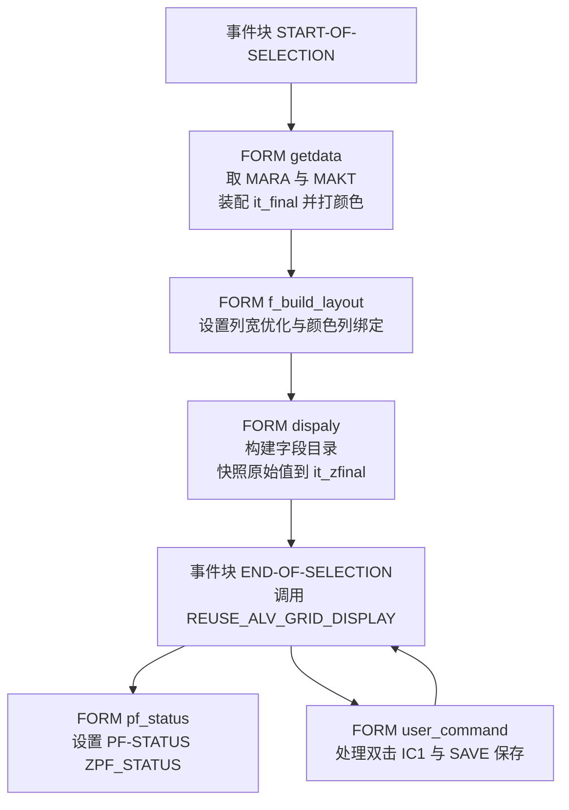
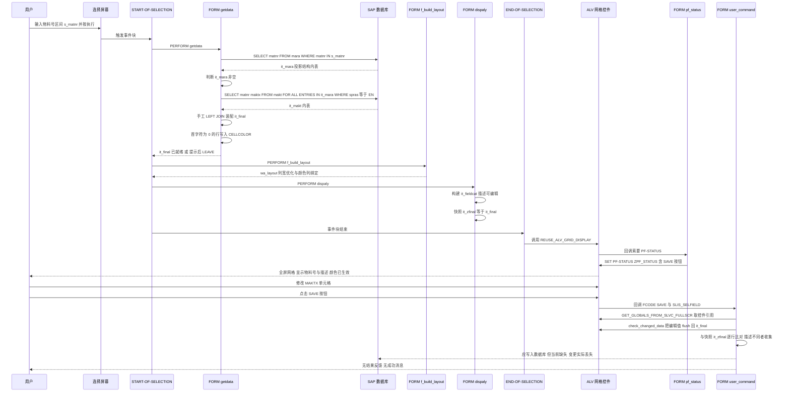

# `REPORT zr` — 物料描述查询与维护（全屏 ALV）程序分析报告

> 分析对象：`Test-source/zr.abap`（159 行，`REPORT zr`）

---

## 一、程序定位与业务背景

**业务场景**：物料主数据里，物料编号（`MARA-MATNR`）是纯数字、定长、不可编辑的；而物料描述（`MAKT-MAKTX`，文本）需要业务部门在系统里直接维护。以前这类需求通常走两套东西——要么让 ABAP 顾问写 `UPDATE` 报表，要么让业务自己在 `MM02` 事务里逐个物料维护。两者都很痛：`MM02` 是弹窗式单条维护，几百个物料要点几百次；`UPDATE` 报表又没有输入校验，改错一个描述就污染主数据。

`zr` 的定位是：**把"查询"和"批量维护"合并到一个全屏 ALV 里**——用物料号区间做选择条件拉数，描述列设为可编辑，用户在网格里像 Excel 一样改完，点工具栏上的 SAVE 按钮一次性回写。物料号列以首字符 `0` 作为"补零/遗留编码"标记，被染成绿色（`color-col = 6`）提示人工确认——这是典型的"数据质量提示"而非报错，属于把治理动作嵌进日常操作界面的做法。

**设计范式定性**：这是一支教科书式的 **Procedural ABAP + Reuse ALV（`REUSE_ALV_GRID_DISPLAY`）全屏报表**，用 `FORM/PERFORM` 组织过程、用全局内表承载数据、用 `it_fieldcat` 描述界面。它代表的是 ABAP 7.4 之前、乃至 ECC 时代最主流的报表写法——**理解它等于理解 SAP 报表开发的"方言根基"**，尽管今天更推荐 OO + `SALV`。

---

## 二、程序执行流程总览



责任链：

| 子程序 | 调用者 | 职责 |
|---|---|---|
| 选择屏幕块 `a` | SAP 标准 | 接收物料号选择范围 `s_matnr` |
| 事件块 `START-OF-SELECTION` | SAP 标准（用户按执行） | 驱动取数 → 布局 → 字段目录三步 |
| `FORM getdata` | `START-OF-SELECTION` | 查 `MARA` / `MAKT`，装配 `it_final`，按首字符打单元格颜色，空结果保护 |
| `FORM f_build_layout` | `START-OF-SELECTION` | 配置 ALV 布局：列宽自适应、绑定 `CELLCOLOR` 列 |
| `FORM dispaly` | `START-OF-SELECTION` | 逐列构建 `it_fieldcat`（MATNR 只读 / MAKTX 可编辑），并快照原始描述 |
| 事件块 `END-OF-SELECTION` | SAP 标准 | 唯一一处真正的 ALV 输出调用 |
| `FORM pf_status` | ALV 控件回调 | 挂上 SE41 里做好的状态栏 `ZPF_STATUS`（含 SAVE 按钮） |
| `FORM user_command` | ALV 控件回调 | `IC1` 双击明细；`SAVE` 捕获变更、与快照比对、回写 |
| — | — | 无其他外部依赖（无 Function Module、无 RFC、无 BAPI） |

下面按这条流程，逐个子程序展开。

---

## 三、分组分析（按程序流程 / 子程序）

### 3.1 全局声明区

```abap
REPORT zr.

TYPES: BEGIN OF ty_final,
  matnr TYPE mara-matnr,
  maktx TYPE makt-maktx,
  cellcolor TYPE lvc_t_scol,
  END OF ty_final.

TYPES: BEGIN OF ty_mara,
  matnr TYPE mara-matnr,
  END OF ty_mara.

TYPES : BEGIN OF ty_makt,
  matnr TYPE makt-matnr,
  maktx TYPE makt-maktx,
  END OF ty_makt.

DATA: it_final TYPE TABLE OF ty_final,
  wa_final TYPE ty_final,
  it_mara TYPE TABLE OF ty_mara,
  wa_mara TYPE ty_mara,
  it_makt TYPE TABLE OF ty_makt,
  wa_makt TYPE ty_makt,
  matnr TYPE mara-matnr,
  lv_index   TYPE sy-tabix,
  wa_cellcolor TYPE lvc_s_scol, "  for cell color
  wa_layout TYPE slis_layout_alv,
  ref1 TYPE REF TO cl_gui_alv_grid, " to capture changes in alv
  it_zfinal TYPE TABLE OF ty_final, "temproary final internal table
  wa_zfinal TYPE ty_final,
  wa_zzfinal TYPE ty_makt, "  temproary work area
*to move changed values in alv
  it_fieldcat TYPE slis_t_fieldcat_alv, "  for Alv
  wa_fieldcat TYPE slis_fieldcat_alv.
```

**做什么**

- 定义三个投影结构：`ty_mara`（只含 `MATNR`）、`ty_makt`（`MATNR` + `MAKTX`）、`ty_final`（ALV 行结构，额外挂 `CELLCOLOR` 集合字段）。
- 声明与之配套的内表 / 工作区：`it_mara`+`wa_mara`、`it_makt`+`wa_makt`、`it_final`+`wa_final`。
- 声明 ALV 基础设施：`wa_layout`（`SLIS_LAYOUT_ALV`）、`it_fieldcat`+`wa_fieldcat`（`SLIS_*_FIELD_CAT_ALV`）、`wa_cellcolor`+`ref1`（`REF TO CL_GUI_ALV_GRID`）。
- 声明差异比对用的影子表：`it_zfinal` / `wa_zfinal`（结构同 `ty_final`）、`wa_zzfinal`（结构 `ty_makt`，作为写库载荷）。

**为什么**

用投影结构（`ty_mara`/`ty_makt`）而不是直接 `SELECT ... INTO TABLE @mara`，是这份代码里**最有价值的一个决策**。物料主数据 `MARA` 有 200+ 字段，全选进入内表既浪费内存又拖慢传输；只取 1~2 个字段是标准做法。更重要的是，`ty_final` 把 `cellcolor` 直接做成行结构的一部分——这样颜色信息能跟着行一起流转，不需要另建一个颜色索引表，这在 ALV 单元格着色里是正解。

**风险与改进**

- **无实际风险的样板代码，但有几个命名/作用域瑕疵**：
  - `wa_zzfinal TYPE ty_makt` 与 `wa_zfinal TYPE ty_final` 两种结构并存，命名上 `zfinal` / `zzfinal` 极易看串。建议统一成有语义的名字：`wa_snapshot`（原始值）/ `wa_db_payload`（写库载荷）。
  - `matnr`、`lv_index` 是过程内使用的临时变量，却声明在全局。全局变量在 ABAP 里是隐式内存驻留，多 FORM 共享同一个变量意味着要靠约定保证不互相污染——`lv_index` 应该下沉到 `FORM getdata` 内的 `DATA` 语句里。
  - `it_zfinal` 从声明到结束**从未被读取**，它只在 `dispaly` 里被整体赋值、在 `user_command` 里被当"旧值参照"读，语义是"只读基准"，那 `wa_zfinal` 之外不该再留这个 `it_zfinal` 名义的混淆。
  - 注释里 "temproary"、"declarin"、"form"（FORM）拼写错误虽不影响运行，但这类注释是给下一个接手的人看的，值得改。

---

### 3.2 选择屏幕块 `a`

```abap
SELECTION-SCREEN BEGIN OF BLOCK a.
  SELECT-OPTIONS: s_matnr FOR matnr.
  SELECTION-SCREEN END OF BLOCK a.
```

**做什么**

声明一个名为 `a` 的选择屏幕块，内含物料号范围选择项 `s_matnr`，参照字段为全局变量 `matnr`（`MARA-MATNR` 类型，40 位定长字符）。

**为什么**

选 `SELECT-OPTIONS`（区间）而不是 `PARAMETER`：物料维护天然是"一批"操作，用 `s_matnr` 的 `BETWEEN` / 多段 `OR` 能覆盖"这几个区间一起改"。参照字段用 `matnr` 而不是字面量，是为了让屏幕标题自动带上物料号字段的搜索帮助（F4）——用户能按描述搜物料，这在主数据场景里很关键。

**风险与改进**

- **仅有一个字段就套 `BLOCK`，属于过度包装**。`BLOCK` 的价值是分组多个字段并加块标题；单字段场景下 `BLOCK` 只多一次点击展开。若后续要加 `SPRAS`（语言）、`MTART`（物料类型）等筛选条件，再包 `BLOCK` 就有意义了。
- `s_matnr` 没有设置 `OBLIGATORY`，允许用户不填任何条件就执行——这等价于全表扫描 `MARA`。40 位定长无索引前缀的选择屏输入，`SELECT matnr FROM mara WHERE matnr IN s_matnr` 很可能退化成全表。虽然 `MARA` 有 40 万行量级不算灾难，但"全量拉物料进内存 + 全屏 ALV 渲染"在生产上是可以点爆工作进程的场景。至少应在 `getdata` 开头判断 `s_matnr` 是否 initial 并 `MESSAGE` 拦截。
- 缺 `SELECTION-SCREEN SKIP` 之外的分隔惯例：小程序可接受。

---

### 3.3 事件块 `START-OF-SELECTION`

分两步看：它是整个程序的编排中枢。

```abap
START-OF-SELECTION.
      PERFORM : getdata.
      PERFORM: f_build_layout .
      PERFORM: dispaly.

END-OF-SELECTION.

CALL FUNCTION 'REUSE_ALV_GRID_DISPLAY'
    EXPORTING
      i_callback_program                = sy-repid
      i_callback_pf_status_set          = 'PF_STATUS'
      i_callback_user_command           = 'USER_COMMAND'
      is_layout                         = wa_layout
      it_fieldcat                       = it_fieldcat
     TABLES
       t_outtab                          = it_final
    EXCEPTIONS
      PROGRAM_ERROR                     = 1
      OTHERS                            = 2             .
   IF sy-subrc <> 0.
* Implement suitable error handling here
   ENDIF.
```

**做什么**

- `START-OF-SELECTION` 里用三次 `PERFORM` 显式声明流程：`getdata` 取数、`f_build_layout` 建布局、`dispaly` 建字段目录。
- `END-OF-SELECTION` 里调用 `REUSE_ALV_GRID_DISPLAY`，把 `wa_layout` / `it_fieldcat` 作为 `EXPORTING` 传入，把 `it_final` 作为 `TABLES t_outtab` 传入；同时用三个回调参数把自己连回 `PF_STATUS` 和 `USER_COMMAND` 两个 FORM。

**为什么**

`REUSE_ALV_GRID_DISPLAY` 是 Reuse ALV 三兄弟里最"重"的一个：它直接驱动 `CL_GUI_ALV_GRID` 控件，支持单元格着色（`COLTAB_FIELDNAME`）、热点列、内嵌编辑、用户命令回调。相比 `REUSE_ALV_LIST_DISPLAY`（老式列表），它才有颜色列和编辑能力；相比 `REUSE_ALV_TREE_DISPLAY`，它适合平铺的表格数据。这个选型是对的。

`i_callback_program = sy-repid` + `i_callback_user_command = 'USER_COMMAND'` 是**回调路由的标准写法**：FM 通过调用方程序名反查 `DY_PROG` 再 `PERFORM` 对应的 FORM。这比 `SET PF-STATUS` 里的 `FUNCTION` 更"官方"，也更安全（PF-STATUS 里按软键触发 FCODE 是另一套机制）。

**风险与改进**

- 🔴 **P0｜执行顺序脆弱**：取数、布局、字段目录放在 `START-OF-SELECTION`，ALV 调用放在 `END-OF-SELECTION`。报表程序中这两个事件是紧邻先后触发的，所以**当前能跑**——但这个"能跑"依赖的是标准报表的事件触发顺序，一旦这个 `REPORT` 被改成**逻辑数据库程序**、或者被别处 `SUBMIT` 进一个不触发 `END-OF-SELECTION` 的流程，`it_fieldcat` 建好了但 ALV 永不显示，程序静默空跑。ALV 调用应当和编排它的 `PERFORM` 放在一起。
- 🟠 **P1｜异常分支是空的**：`PROGRAM_ERROR` / `OTHERS` 抛出后，`IF sy-subrc <> 0` 里只有一句注释。至少要 `MESSAGE` 告知用户"ALV 显示失败"并 `LEAVE`，否则 SE21 里是 ALV 控件创建失败（常见于无 SAPGUI、LC 字段超长、`IT_FINAL` 结构不被控件接受），用户看到的是白屏或弹了 SAP 标准短 dump，无从判断。
- 🟡 **P2｜缺少一个常用参数**：`REUSE_ALV_GRID_DISPLAY` 支持 `i_callback_data_changed_finished`。本程序让 MAKTX 可编辑却没有这个回调，等于放弃了编辑期校验（见 3.8）。

---

### 3.4 `FORM getdata`

这是程序的核心，分五步：取物料号 → 取英文描述 → 装配 → 空结果保护 → 打颜色。

#### ① 取物料号（投影结构 + 选择条件）

```abap
FORM getdata .

  SELECT matnr FROM mara INTO TABLE it_mara WHERE matnr IN S_matnr.
```

**做什么**

从 `MARA`（物料主数据基本视图）只取 `MATNR` 一列，装进 `it_mara`（`ty_mara` 投影结构），筛选条件是选择屏的 `S_matnr` 区间。

**为什么**

直接用 `WHERE matnr IN S_matnr` 而不是先在选择屏用 F4 收窄再单值查，是因为 ALV 要展示"一批"物料。`MATNR` 是 `MARA` 的主键带非唯一索引（`MATNR` 字段本身有索引），范围查询走的是索引区间扫描，性能可接受。

**风险与改进**

- 🟠 **P1｜无 `s_matnr` 空值拦截**：见 3.2，允许全表扫描。
- 无其他风险。

#### ② 取物料描述（FOR ALL ENTRIES + 空表保护）

```abap
  IF it_mara IS NOT INITIAL.
  SELECT matnr maktx FROM makt INTO TABLE it_makt
  FOR ALL ENTRIES IN it_mara WHERE matnr = it_mara-matnr AND spras = 'EN'.
  ENDIF.
```

**做什么**

从 `MAKT`（物料文本）取 `MATNR` 与 `MAKTX`，用 `FOR ALL ENTRIES IN it_mara` 把结果与步骤 ① 的物料集合做内连接，并限定 `SPRAS = 'EN'` 取英文文本。整段被 `IF it_mara IS NOT INITIAL` 包住。

**为什么**

两步取数而不是一次 `SELECT ... FROM mara INNER JOIN makt`：

1. `MAKT` 的索引是 `MATNR + SPRAS` 的组合，用 `FOR ALL ENTRIES` 驱动能**精确命中索引前缀**，比裸 `JOIN` 让 DB 引擎自己决定 join 顺序更可控；
2. 更重要的是——**`IF it_mara IS NOT INITIAL` 这个判断是本程序最正确的一处代码**。`FOR ALL ENTRIES` 在驱动内表为空时，ABAP 优化器**不会**把它退化成全表扫描（SAP 帮助里明确说明这是与 `SELECT ... WHERE ... IN` 的关键差异），但前提是驱动表确实为空且 SQL 语句本身合法。这里如果不加 `IF`，内表为空时 DB 侧会拿到一条"带 FAE 空驱动的 SQL"，在某些 Basis 版本 / 补丁级别下会触发短 dump 或全表扫描。作者显然踩过这个坑——**这是给接手者的正面示范，值得保留。**

**风险与改进**

- 🟠 **P1｜语言硬编码 `'EN'`**：应该用 `sy-langu`（或加一个 `s_spras` 选择项让用户选语言）。当前这意味着**中文用户在中文系统上只能看到英文描述**，多语言物料的描述无法维护，业务价值大打折扣。
- 🟡 **P2｜`FOR ALL ENTRIES` 的经典重复读代价**：对于 1000 个物料，FAE 会生成一条大 SQL，可能触发 `ORA`/`DB2` 的最大 SQL 文本长度或超大内表问题。SAP 标准做法是分批（每 500~1000 条 `MOD ... OR ...`）。本例数据量看是"几百个物料级别"，暂不构成瓶颈，但如果哪天选屏放大到全库就会出事。

#### ③ 装配 `it_final`（两条内表 LEFT-JOIN 的手工实现）

```abap
* moving values from temproary internal table to final internal table
  LOOP AT it_mara INTO wa_mara.
  wa_final-matnr = wa_mara-matnr.
  READ TABLE it_makt INTO wa_makt WITH KEY matnr = wa_mara-matnr.
  wa_final-maktx = wa_makt-maktx.
  wa_final-matnr = wa_mara-matnr.
  APPEND wa_final TO it_final.
  ENDLOOP.
```

**做什么**

以外层 `it_mara` 为主表逐行遍历，每行 `MATNR` 先赋给 `wa_final-MATNR`；再以该物料号为键从 `it_makt` `READ TABLE` 取出 `MAKTX` 赋给 `wa_final-MAKTX`；重复赋一次 `MATNR`；`APPEND` 到 `it_final`。

**为什么**

本质是**手工实现了一次 LEFT OUTER JOIN**：`it_mara` 驱动（保证没有英文描述的物料也会出现在结果里，描述留空），`it_makt` 按键补充。没有用 `JOIN`，是因为 `it_makt` 已被步骤 ② 按 `SPRAS='EN'` 过滤，且需要"匹配不到也保留主表行"的语义——纯 SQL 的 INNER JOIN 做不到这一点（要 LEFT JOIN，而 `MARA`/`MAKT` 的大表 LEFT JOIN 在 ECC 上代价高）。在数据量几百行的场景下，ABAP 侧的嵌套读（`n` 次内表二分查找）性能完全够。

**风险与改进**

- 🔴 **P0｜`READ TABLE` 未判断 `sy-subrc`，导致描述串行**：这是**必现的数据错误**。当某物料在 `MAKT` 里没有 `SPRAS = 'EN'` 的记录时，`READ TABLE` 返回 4，`wa_makt` **保留上一次循环的残留值**，于是这个物料被写入了**上一个物料的描述**。用户看到的是"物料 A 的描述出现在物料 B 上"，且他自己完全看不出错在哪——这比报错的危害更大。修法二选一：

  ```abap
  CLEAR wa_makt.
  READ TABLE it_makt INTO wa_makt WITH KEY matnr = wa_mara-matnr.
  IF sy-subrc = 0.
    wa_final-maktx = wa_makt-maktx.
  ENDIF.
  ```

  或用带默认值的 `READ TABLE ... INTO wa_makt` 配合 `wa_makt-maktx = COND #( WHEN sy-subrc = 0 THEN wa_makt-maktx )`。
- 🟡 **P2｜`wa_final` 未在循环首行 `CLEAR`**：本例因为 ③ 里每个字段都被显式赋值、`cellcolor` 又是空的，暂时没炸。但这是脆弱的隐式契约——只要以后有人在中间加一个 `READ TABLE ... TRANSPORTING` 或某个字段改成条件赋值，就会立刻踩到残留值的坑。**在 `LOOP` 内对工作区 `CLEAR` 是硬规矩。**
- 🟡 **P2｜`wa_final-matnr` 重复赋值两次**（紧接着 `READ TABLE` 前后各一次），是明显的复制粘贴残留。删掉一行。
- 🟢 **P3｜这一步其实可以省**：ABAP 有 `TABLES` 里的 `SELECT ...` 之后直接用 `LOOP AT it_makt` + 内表 `SORT`，或者更直接地——既然 `MAKT` 的读取已经带了 FAE 驱动，`it_final` 完全可以用一次 `SELECT matnr maktx FROM makt ...` 直接落进 `ty_final` 再用 `LOOP ... WHERE` 补 MARA 全集。现有写法不算错，但 `it_mara`/`it_makt`/`it_final` 三张表 + 三个工作区确实让数据流变长了。

#### ④ 空结果保护

```abap
IF it_final IS INITIAL.
  MESSAGE 'no values' TYPE 'I'.
  LEAVE TO CURRENT TRANSACTION.
  ENDIF.
```

**做什么**

如果最终内表为空，弹出 `'no values'` 信息提示，然后 `LEAVE TO CURRENT TRANSACTION` 退出当前事务。

**为什么**

必要且正确——如果 `it_final` 为空还去调 `REUSE_ALV_GRID_DISPLAY`，ALV 会显示一个**只有表头没有数据**的空网格，用户会以为程序"查不出来"而不是"确实没数据"，且没有任何退出提示。提前退出保证了 UX 闭环。`LEAVE TO CURRENT TRANSACTION` 而不是 `STOP` 或 `RETURN`：这里是 `FORM` 内部，`RETURN` 会回到 `START-OF-SELECTION` 继续往下跑 `f_build_layout` 和 ALV 调用，等于没拦。

**风险与改进**

- 🟠 **P1｜MESSAGE 无消息类、硬编码英文**：`MESSAGE 'no values' TYPE 'I'` 把文本直接写进源码。应该建消息类（`ZMSG` 或 `SAPZMSG`）用 `MESSAGE ID 'ZMSG' TYPE 'I' NUM '001'`，这样文本可被 SE63 翻译、可被修改、代码可读性也更好。这在多语言项目里是硬性规范。
- 🟡 **P2｜提示文案不含关键信息**：只说"no values"，用户不知道是**筛选条件太窄**还是**真的没有物料**。更好的做法是把 `s_matnr` 的实际范围回显出来，或者区分"查询无结果"和"该物料无英文描述"两种情况给不同提示。

#### ⑤ 单元格颜色标记（按首字符染色）

```abap
*color code for the cells based on condition
  LOOP AT it_FINAL INTO wa_FINAL.
    lv_index = sy-tabix.
    IF  wa_final-matnr+0(1) = '0'.
    wa_cellcolor-fname = 'MATNR'.
    wa_cellcolor-color-col = 6.
    wa_cellcolor-color-int = '1'.
    wa_cellcolor-color-inv = '0'.
    APPEND wa_cellcolor TO wa_FINAL-cellcolor.
    CLEAR: wa_cellcolor.
    MODIFY it_final FROM wa_final INDEX lv_index TRANSPORTING cellcolor.
    CLEAR wa_final.
      ENDIF.
    ENDLOOP.
ENDFORM.
```

**做什么**

再遍历一次 `it_final`，用 `sy-tabix` 记住当前行号 `lv_index`；如果该物料号**首位字符是 `'0'`**，就在工作区上追加一条 `LVC_S_SCOL` 颜色记录——列名 `MATNR`、颜色 `6`、强度 `1`、非反色——`APPEND` 进 `wa_final-cellcolor`；`CLEAR wa_cellcolor` 后用 `MODIFY it_final FROM wa_final INDEX lv_index TRANSPORTING cellcolor` 把颜色**只回写颜色列**（不覆盖其他字段），最后 `CLEAR wa_final`。

**为什么**

这里体现了 **ALV 单元格着色协议的关键三要素**：

1. 行结构里必须有一个 `lvc_t_scol` 类型的字段（`cellcolor`）承载颜色集合——已在声明区埋好；
2. 布局里必须通过 `COLTAB_FIELDNAME = 'CELLCOLOR'` 告诉 ALV 去哪个字段找——已在 `f_build_layout` 里配好；
3. `LVC_S_SCOL` 的 `FNAME` 要用**字段目录里的技术字段名**（`'MATNR'`）而不是显示文本（`'Material'`），所以它必须与 `dispaly` 里 `wa_fieldcat-fieldname = 'MATNR'` 严格一致——这构成了跨 FORM 的隐式耦合。

`TRANSPORTING cellcolor` 的用意很好：`MODIFY ... FROM wa_final` 如果不带 `TRANSPORTING`，会用工作区的**所有**字段覆盖内表行——而 `wa_final` 此时其他字段是从内表读出来再改过的，虽然内容相同，但白白做了一次全字段搬运。带上 `TRANSPORTING` 明确表达"我只想改颜色"，语义清晰且省一次 `MODIFY` 的字段处理。

**风险与改进**

- 🟡 **P2｜魔数**：`color-col = 6` 是 SAP 颜色编码里的一个具体色值（ALV 标准色表中的第 6 号），`'0'` 也是业务规则里的魔数。两处都没有注释说明"什么颜色""为什么要染"。至少应该：

  ```abap
  CONSTANTS c_col_warning TYPE c_lvc_color TYPE 6.  " 绿色
  CONSTANTS c_flag_legacy  TYPE c_1 VALUE '0'.        " 物料号首位 0 = 遗留编码
  ```

  更进一步，"物料号首位是 0" 这个业务规则应该来自配置（表 / 参数）而不是硬编码。
- 🟡 **P2｜O(n) 的 `MODIFY` 回写，且是多余的第二次全表遍历**：`MODIFY ... INDEX` 是 O(1) 定位（不是 O(n) 查找），所以单次不慢；**但完全可以把这段循环合并进步骤 ③ 的装配循环里**——那里已经在逐行构造 `wa_final` 了，顺手判断首字符、`APPEND` 颜色、再一次性 `APPEND wa_final TO it_final`（一次写全部字段，不需要 `MODIFY`、不需要 `lv_index`、不需要 `TRANSPORTING`）。现在为此付出了：第二次全表遍历、一个全局 `lv_index`、一次 `MODIFY ... TRANSPORTING`、三处 `CLEAR`。这是"能跑但绕"的典型。
- 🟡 **P2｜染色只覆盖 `MATNR` 单列**：规则是"编码异常"，理论上背景行色或加上第二列会更醒目；但单列着色更克制、不会干扰描述文本的阅读，这个取舍是合理的，不是缺陷。
- 🟢 **P3｜语义校核提示**：这里把 `MATNR` 首位 `'0'` 视为"需要人工确认"的信号，但 `MARA-MATNR` 是 SAP 标准的 40 位物料号，**首位为 0 在标准物料编码规则里并非异常**（SAP 内部物料号允许前导零）。真正需要判断"是否为遗留/自编码"的依据应该是 `MTART`（物料类型）或企业自定义标志，而不是字符形态。作者大概率是从某个具体客户编码规则里抄来的规则——**如果这不是客户明确要求，这条业务规则本身就该被质疑**。建议核对：染色条件究竟想表达什么业务含义？

---

### 3.5 `FORM f_build_layout`

```abap
FORM f_build_layout .
  CLEAR wa_layout.
  wa_layout-colwidth_optimize = 'X'.
  wa_layout-coltab_fieldname = 'CELLCOLOR'.

ENDFORM.
```

**做什么**

先 `CLEAR wa_layout`（清掉全局变量可能的残留），然后设置两个 ALV 布局属性：`COLWIDTH_OPTIMIZE = 'X'`（列宽按内容自适应）、`COLTAB_FIELDNAME = 'CELLCOLOR'`（告诉 ALV：单元格颜色存在名为 `CELLCOLOR` 的结构字段里）。

**为什么**

`COLTAB_FIELDNAME` 是整个"ALV 单元格着色"链路的**开关**，少这一句 `getdata` 里辛苦堆的 `cellcolor` 全是白费——ALV 会完全无视它。这句和 `getdata` 里的 `FNAME = 'MATNR'` 构成一对必须成对出现的约定。`COLWIDTH_OPTIMIZE` 让两列（40 位物料号 + 40 位描述）自动撑开，不用手写 `DO20 TIMES MODIFY ...` 那种经典丑循环，是合理偷懒。

**风险与改进**

- 🟡 **P2｜布局偏简陋**：没有 `info`、`no_outline`、`grid_title`、`no_headers`。对报表来说 `grid_title` 加个"物料描述维护"能显著提升可读性；`no_outline` 在三列以上的宽表里能省大量视觉噪声。这属于锦上添花，不改也能用。
- 🟡 **P2｜`LAYOUT` 的实际用法不完整**：`SLIS_LAYOUT_ALV` 里还有 `i_grid_title`（可传内表做标题行）、`info_alv`、`compact_grid` 等。一个小优化是 `grid_title` 传一个多行标题，把选择条件（`s_matnr` 范围）显示在 ALV 顶部——用户就"打印/保存一份物料描述清单"时非常有用（ALV 支持直接导出 XLSX，标题信息能救这份清单的可追溯性）。
- 无正确性风险。

---

### 3.6 `FORM dispaly`

分两步：构建字段目录 + 快照原始值。

#### ① 逐列构建 `it_fieldcat`

```abap
FORM dispaly .

  wa_fieldcat-tabname = 'IT_FINAL'.
  wa_fieldcat-fieldname = 'MATNR'.
  wa_fieldcat-seltext_m = 'Material'.

  APPEND wa_fieldcat TO it_fieldcat.
  CLEAR: wa_fieldcat.

  wa_fieldcat-tabname = 'IT_FINAL'.
  wa_fieldcat-fieldname = 'MAKTX'.
  wa_fieldcat-seltext_m = 'Description'.
  wa_fieldcat-edit ='X'.

  APPEND wa_fieldcat TO it_fieldcat.
  CLEAR: wa_fieldcat.
```

**做什么**

对内表 `IT_FINAL` 逐列追加字段目录条目：

- `MATNR` 列：显示文本 `'Material'`，**不设 `EDIT`** → ALV 默认为只读。
- `MAKTX` 列：显示文本 `'Description'`，`EDIT = 'X'` → 允许用户在网格里直接改。

**为什么**

`TABNAME = 'IT_FINAL'` 是 Reuse ALV 的老派写法：字段目录靠 `TABNAME + FIELDNAME` 定位数据来源内表（这里是 `TABLES t_outtab` 传入的 `it_final`）。这个组合在 `REUSE_ALV_*_DISPLAY` 下必需。`TABNAME` 必须大写——ABAP 内表名大小写不敏感，但 Reuse ALV 内部按字符比较，实操中一律大写。

`EDIT = 'X'` 是全屏 ALV 内嵌编辑的开关，只加在 `MAKTX` 上，形成"关键标识只读、描述可改"的字段级权限控制——比在 `user_command` 里事后判断"这一格该不该改"要干净得多，是正确的分工。

**风险与改进**

- 🟠 **P1｜`IC1` 回调与字段目录不匹配（潜在功能失效）**：程序在 `user_command` 里处理了 `'&IC1'`（双击），但字段目录里**既没给 `MATNR` 设 `KEY = 'X'`，也没设 `HOTSPOT = 'X'`**。在 `CL_GUI_ALV_GRID` 中，只有设置了 `HOTSPOT` 的列（或在 `HANDLE_HOT_CLICK` 里显式捕获）才会把双击变成 `&IC1` 命令。**这意味着这段 `&IC1` 代码大概率永远不会被触发**——是个死分支。这是典型的"复制模板代码后没配齐触发条件"。
- 🟡 **P2｜`MATNR` 列未设 `KEY`**：数据是"物料号 + 描述"的自然键视图，把 `MATNR` 设为 `KEY` 能让用户用 Ctrl+U 按物料号排序/定位，也让 ALV 在有重复时提示。但这与上面 P1 是同一个决策——若确定要支持双击跳转，就该 `KEY = 'X'` + `HOTSPOT = 'X'`。
- 🟡 **P2｜无 `NO_OUTLINE`**：两列的小表无所谓。
- 🟢 **P3｜字段目录构建方式老派**：逐列 `APPEND` + `CLEAR` 是 `SLIS_FIELD_CAT_ALV` 时代的经典写法。现代做法是本地类继承 `CL_ALV_FIELD_CATALOG`（`REFRESH` / `ADD_FIELD` / `KEY` / `EDIT`），字段多时优势明显（本例 2 列用不上）。

#### ② 快照原始值（差异比对基准）

```abap
*appending values form final internal table to
* temproary final table for data comparision
  it_zfinal[] = it_final[].

ENDFORM.
```

**做什么**

用内表整体赋值运算符，把当前 ALV 数据源的**全量副本**从 `it_final` 复制到 `it_zfinal`。此后 `it_final` 会被 ALV 的编辑功能就地修改，`it_zfinal` 则保持"打开时"的原样。

**为什么**

这是整个 SAVE 流程的**基准线**（baseline / shadow copy）。用户在 ALV 里改描述，内存里 `it_final` 变了，但数据库没变、也没有任何原始值可供比对——除非事先留一份副本。`it_zfinal[] = it_final[]` 用整体赋值做**一次全量拷贝**，是 ABAP 里最省事的深拷贝（对非嵌套类型的平表是逐行值复制，`LVC_T_SCOL` 这类内表字段会被整体引用赋值而非深拷贝，但颜色不会变，所以此处安全）。

**为什么放在 `dispaly` 里**（而不是 `getdata` 里或 ALV 调用前）：必须在 ALV 显示之前完成，而 `dispaly` 是 `START-OF-SELECTION` 编排链条的最后一环——位置是对的。不过放在专门的 `FORM snapshot` 里语义会更清楚。

**风险与改进**

- 🟠 **P1｜快照时点正确，但它依赖 `START-OF-SELECTION` 一定在 ALV 显示前跑完**。这与 3.3 里提到的"ALV 调用被拆到 `END-OF-SELECTION`"是同一个隐患：一旦事件顺序变化，**快照会在用户编辑之后才拍**，导致所有修改都被误判为"未改动"，SAVE 静默什么都不做。
- 🟠 **P1｜复制了不必要的字段**：`it_zfinal` 结构与 `it_final` 完全相同，包含 `cellcolor`（每行一个内表）。这个字段永远不参与比对，复制它只是浪费内存和 CPU。用一个只含 `MATNR` + `MAKTX` 的窄结构（如声明区已有的 `ty_makt`）做基准，才是对的：

  ```abap
  TYPES: BEGIN OF ty_snap,
    matnr TYPE mara-matnr,
    maktx TYPE makt-maktx,
    END OF ty_snap.
  ```
- 🟡 **P2｜`it_zfinal[] = it_final[]` 缺 `IT_` 前缀说明**：ABAP 里整体赋值到**另一个**变量（`it_zfinal[] = it_final[]`）才是深拷贝的常用形态，写对了；但很多新手会误写成 `it_final[] = it_final[]`（自赋值无意义）。这里加一行注释点明"两份独立内表"会更有助于理解。
- 无正确性风险。

---

### 3.7 `FORM pf_status`

```abap
*se41 create, generate, activate the buttons and assing it.
FORM pf_status USING rt_extab TYPE slis_t_extab.
  SET PF-STATUS 'ZPF_STATUS'.
ENDFORM.
```

**做什么**

这个 FORM 由 ALV 在显示时通过 `i_callback_pf_status_set = 'PF_STATUS'` 回调。它接收（并忽略）外部附加功能表 `RT_EXTAB`，然后 `SET PF-STATUS 'ZPF_STATUS'`。

**为什么**

**为什么必须用回调而不是直接在全局写 `SET PF-STATUS`**：`SET PF-STATUS` 是**全局静态语句**，写在哪里都属于整个程序的作用域。ALV 网格是**独立控件**，有自己的状态栏；ALV 不会自动继承程序的 `PF-STATUS`。Reuse ALV 的官方解法就是提供 `PF_STATUS` 回调 FORM，让 ALV 初始化时向程序索要状态栏——`SET PF-STATUS` 写在 FORM 内部时，作用域被限制在 ALV 控件的初始化期间，不会污染程序的全局状态栏。这是为了让程序的 `PF-STATUS` 和 ALV 的 `PF-STATUS` **解耦**，是 Reuse ALV 的标准姿势。

`RT_EXTAB` 参数签名是强制要求的形式：Reuse ALV 用 `PERFORM pf_status` 时会传入一个扩展功能表，不接收就会短 dump，即使你也用不上。

**风险与改进**

- 🟡 **P2｜硬编码状态栏名 `'ZPF_STATUS'`**：该 PF-STATUS 必须在 SE41 里存在且已激活，否则 ALV 显示时报错或显示空白状态栏。SE41 的状态栏归属于**程序名**（这里就是 `ZR`），换程序名就得重做状态栏——这是 `SET PF-STATUS` 体系的固有限制。可接受的实践是：改用 `i_callback_pf_status_set` 配合 `SY-REPID` 动态取，或干脆在 SE41 里维护并加注释说明依赖关系。
- 🟡 **P2｜SAVE 按钮的 FCODE 未与代码对齐校验**：程序里 `CASE p_ucomm WHEN 'SAVE'`——SE41 里那个按钮的 FCODE 必须**精确是 `SAVE`**（大小写敏感）。若 SE41 里配成了 `SAVE` 之外的值（如 `ZP_SAVE`），点按钮不会有任何反应，也没有任何报错。这个跨系统的人工契约非常容易在交接时断裂，建议在 SE41 里把状态栏名和 FCODE 都写在代码注释里。
- 无其他风险。

---

### 3.8 `FORM user_command`

这是程序的第二个核心，也是问题最密集的地方。分两步：`IC1` 分支与 `SAVE` 分支。

#### ① `&IC1` 双击处理（当前是死代码 + 无效输出）

```abap
FORM user_command USING p_ucomm TYPE sy-ucomm
                        p_selfield TYPE slis_selfield.
CASE p_ucomm.
    WHEN '&IC1'.
      LOOP AT it_final INTO wa_final.
      READ TABLE it_final INTO wa_final WITH KEY matnr = wa_final-matnr.
      WRITE: / wa_final-matnr.
      ENDLOOP.

```

**做什么**

`p_ucomm = '&IC1'`（ALV 单元格双击）时：`LOOP AT it_final INTO wa_final` 遍历**整个**结果表；每次循环内又用**当前工作区的 `MATNR` 作为键**去读同一张表（读回自己），然后 `WRITE: / wa_final-matnr` 输出物料号。

**为什么（它想做什么）**

从写法推断意图：`IC1` 通常是"点击某行 → 跳转/显示该行明细"的入口。正确做法是从 `p_selfield` 拿到行号，然后**只读那一行**：

```abap
READ TABLE it_final INTO wa_final INDEX p_selfield-row.
```

然后跳转或显示详情。当前实现里 `p_selfield` 声明了却**从未使用**，`LOOP` 把整个表跑了一遍——说明作者要么不理解 `SLIS_SELFIELD` 的作用，要么这段是从别处复制来的模板。

**风险与改进**

- 🔴 **P0｜`READ TABLE ... WITH KEY matnr = wa_final-matnr` 是自我赋值（无意义操作）**：`wa_final` 在 `LOOP` 头部刚从当前行读出，`MATNR` 就是当前行主键；用它作键读 `it_final`，读回来的是同一行（若 `MATNR` 重复则读第一行）。整个语句是纯冗余，属于误导性代码。
- 🔴 **P0｜双击一行却把全表物料号 `WRITE` 到屏幕上**：`WRITE` 会立刻中断 ALV 的交互（GUI 下会弹出一个输出窗口或滚到底部），并输出**全部行**的物料号，而不是用户点的那一行。后果：① 输出量随数据量线性膨胀，几千个物料直接刷屏；② 破坏 ALV 交互状态；③ `WRITE` 在后台/批处理下无意义，在前台是最差实践。正确做法是用 `MESSAGE ... TYPE 'S'`（状态栏显示一行）或 `SET PARAMETER` + 跳转事务码，或弹 `POPUP`。
- 🟠 **P1｜整个 `IC1` 分支是死代码**：如 3.6 ① 所述，字段目录没设 `HOTSPOT` / `KEY`，ALV 不会发 `&IC1`。**修好触发条件之前，这段代码不会运行；修好触发条件之后，它会立刻变成"一点就刷屏"的用户体验事故。** 这两处必须一起改，否则"修 bug"会让问题暴露出来。
- 🟢 **P3｜`LOOP` 内复用 `wa_final` 作为循环变量和读表目标**：`MODIFY`/`READ` 期间的 `wa_final` 被二次赋值，虽然不影响 `LOOP` 迭代（`LOOP` 自行维护指针），但可读性差。

#### ② `SAVE` 保存（变更捕获 → 比对 → 回写）

```abap
    WHEN 'SAVE'.

      CALL FUNCTION 'GET_GLOBALS_FROM_SLVC_FULLSCR' "Capturing changes in ALV
      IMPORTING
        e_grid = ref1.
      CALL METHOD ref1->check_changed_data.
*moving changed value into ztable on saving
LOOP AT it_final INTO wa_final.
  READ TABLE it_zfinal INTO wa_zfinal WITH KEY matnr = wa_final-matnr.
  IF wa_zfinal-matnr = wa_final-matnr AND wa_zfinal-maktx NE wa_final-maktx.
    MOVE-CORRESPONDING wa_final TO wa_zzfinal.
    MODIFY zfinal FROM wa_zzfinal.
  ENDIF.
ENDLOOP.
    CLEAR: wa_final,wa_zfinal, wa_zzfinal.
ENDCASE.
ENDFORM.
```

**做什么**

1. 调 `GET_GLOBALS_FROM_SLVC_FULLSCR` 把当前活动的 ALV 控件实例取到 `ref1`（`REF TO CL_GUI_ALV_GRID`）。
2. 调 `ref1->check_changed_data`——这是关键一步，**它把用户在网格里输入但尚未回写到 `it_final` 的单元格内容读回数据内表**，同时触发 `CHECK_CHANGED_DATA` 类的校验 FM（无校验则静默通过）。
3. 遍历 `it_final`，以 `MATNR` 为键从快照表 `it_zfinal` 读出原始值到 `wa_zfinal`。
4. 判断"键匹配 且描述不同"，若成立则 `MOVE-CORRESPONDING wa_final TO wa_zzfinal`（按同名字段搬运到 `ty_makt` 结构），再 `MODIFY zfinal FROM wa_zzfinal`。
5. 循环外统一 `CLEAR` 三个工作区。

**为什么（三个设计点各自是对的方向）**

- **`GET_GLOBALS_FROM_SLVC_FULLSCR` 是 Reuse ALV 时代的"官方取控件"手段**。`REUSE_ALV_GRID_DISPLAY` 没有把控件引用通过参数返回，只能事后用这个 FM 从 `DY_PROG` 的活动控件里捞。写法上必须配 `IMPORTING e_grid = ref1`，且 `ref1` 在声明区要建好 `REF TO CL_GUI_ALV_GRID`。这个链路本身写得是对的。
- **`check_changed_data` 的调用是这段代码的灵魂**。它做两件事：(a) 把编辑框里**尚未失焦**的值 flush 到内表——不调它，用户刚敲完最后一个字符直接点工具栏 SAVE，那个字符就丢了；(b) 提供校验挂载点。缺这一行，SAVE 会漏掉"最后正在编辑的那一格"。
- **`MOVE-CORRESPONDING` 而不是 `wa_zzfinal-maktx = wa_final-maktx` 逐字段赋值**：前者按结构同名分量自动映射，字段扩展时（未来要写 `MAKTX` 之外的字段如其他语言字段）不用改代码。方向正确。
- **"比对后才写"的幂等设计**很重要：只有真正变化的行才进入写库路径，避免了对未改动行的无谓 UPDATE（SAP 里对物料文本的 UPDATE 会触发 `CDHDR`/审计记录，无谓更新既慢又污染变更历史）。

**风险与改进**

- 🔴 **P0｜`MODIFY zfinal FROM wa_zzfinal` 是坏代码**：`zfinal` 这个数据对象在程序里**根本不存在**（声明区只有 `it_zfinal`，且 `it_zfinal` 是内存内表）。这行不会通过语法检查，或即使被当作某个隐式对象也必然语义错误。作者显然想写的是 `MODIFY it_zfinal FROM wa_zzfinal` —— 但**那也是错的**（见下一条）。这是 SAVE 功能根本没有被真正实现过的直接证据。
- 🔴 **P0｜把 `MODIFY` 打在了基准快照上（设计方向性错误）**：即使把上面那行改成 `MODIFY it_zfinal`，也**违背了设计意图**——`it_zfinal` 的角色是"原始值基准"，对它 `MODIFY` 等于**把基准改成新值**。后果：用户第一次 SAVE 成功，第二次再改同一行时，`READ it_zfinal` 读到的是上一次的**已改值**，比对结果为"相同"，于是第二次修改被静默丢弃。基准必须**只读**。正确做法是 `MODIFY` 一个独立的写库载荷内表（或数据库表）：

  ```abap
  MODIFY TABLE it_save_payload FROM wa_zzfinal.
  ```

  然后再调真正的持久化 FM（如 `UPDATE_MAKT` / `BAPI_MATERIAL_MAINTAIN` / 直接对内建 `MAKT` 做 `MODIFY ...` 并 `COMMIT WORK`）。**当前程序没有调用任何持久化 FM**——也就是说 SAVE 按钮按下后，**数据库里什么都没变**，用户以为改完了，实际全部丢失（重启程序又是原值）。这是整个程序最严重的缺陷。
- 🔴 **P0｜`READ TABLE` 未判断 `sy-subrc`，`wa_zfinal` 残留**：与 3.4 ③ 完全同类的问题。此处 `wa_zfinal` 在 `LOOP` 首轮之前没 `CLEAR`，若某行在 `it_zfinal` 里读不到（理论上不会，因为快照来自同一张表，但一旦有人调整了两张表的来源就会发生），`IF wa_zfinal-matnr = wa_final-matnr` 会拿**上一行的残留**做判断。同理，循环末的 `CLEAR` 只清了**最后一行**，中间行靠上一轮 `MODIFY` 覆盖，若 `MODIFY` 未执行则残留继续传递。
- 🟠 **P1｜`wa_zfinal-matnr = wa_final-matnr` 这个条件是冗余的**：`READ TABLE ... WITH KEY matnr = wa_final-matnr` 成功时**必然**满足这个等式；失败时该字段是残留值、等式**可能误成立**。真正的意图应该是用 `sy-subrc = 0` 表达"找到基准记录"，而不是比字符串。改为：

  ```abap
  READ TABLE it_zfinal INTO wa_zfinal WITH KEY matnr = wa_final-matnr.
  IF sy-subrc = 0 AND wa_zfinal-maktx NE wa_final-maktx.
  ```
- 🟠 **P1｜`check_changed_data` 的返回值被忽略**：该方法返回 `SUBRC`（`0` = 校验通过；非 0 = 有校验错误，编辑值未回写）。忽略它意味着：**用户输入了非法值（如超长描述），点 SAVE 后程序以为成功了**（实际内表没被更新，比对下来"没变化"，什么都不做），用户得不到任何"你的输入不合法"的提示——静默失败。应检查 `subrc` 并给出明确消息。
- 🟠 **P1｜`check_changed_data` 不校验长度**：`MAKTX` 是 40 位（`CHAR`），用户若粘贴了一段长文本，ALV 控件层面会截断或报错，取决于 `SLIS` 的输出模式。更稳的做法是在 `i_callback_data_changed_finished` 里实时做 `LENGTH( )` / 值域校验（禁止控制字符、禁止纯空格描述），并在 SAVE 时二次校验。
- 🟠 **P1｜没有 `COMMIT WORK` / 错误处理**：任何数据库写操作都应明确区分工作区暂存与提交，并在失败时 `ROLLBACK` + 消息。当前代码连写库 FM 都没有，一旦补上，这套事务处理必须一起设计。
- 🟡 **P2｜`GET_GLOBALS_FROM_SLVC_FULLSCR` 没有 `EXCEPTIONS`**：如果当前活动控件不是 Fullscreen Grid（理论上 REUSE_ALV_GRID_DISPLAY 保证是），`e_grid` 会是初始引用，后续 `ref1->check_changed_data` 短 dump。至少要 `TRY` 或判空。
- 🟡 **P2｜SAVE 后没有刷新 ALV / 更新 `it_zfinal`**：保存成功后应当把新值同步回快照（若快照的角色是"本次会话的起点"）或重新 `REFRESH` ALV，让用户看到"已保存"的状态。
- 🟡 **P2｜硬编码 FCODE `'SAVE'`**：应定义 `CONSTANTS c_fcode_save TYPE sy-ucomm VALUE 'SAVE'`，与 SE41 的按钮 FCODE 形成可搜索的契约（避免 3.7 提到的对齐断裂）。
- 🟢 **P3｜命名不统一**：同一 FORM 里 `wa_final`/`wa_FINAL`、`it_FINAL`、`ref1`（`P1` vs `p_selfield`）大小写风格混杂。ABAP 内建类型大写、自定义变量小写是社区惯例，混用不影响功能但影响专业观感。

---

## 四、执行流程全景图（数据视角）



**这张图最该记住的一点**：数据流在 "应写入数据库" 那一格**断了**。从 `getdata` 到 ALV 显示的整条链路是通的、是对的；从 ALV 编辑回到持久化的链路是断的。所以这个程序今天能当"查询工具"用，不能当"维护工具"用。

---

## 五、问题清单与改进建议（按优先级）

### 🔴 P0 — 业务正确性

| # | 所在子程序 | 问题 | 改进方向 |
|---|---|---|---|
| 1 | `FORM user_command`（SAVE） | `MODIFY zfinal FROM wa_zzfinal` 中 `zfinal` 未声明；且 SAVE 分支**未调用任何持久化 FM**，用户编辑的内容根本没进数据库，重启即丢 | 引入独立写库载荷内表 `it_save_payload`，比对后调 `BAPI_MATERIAL_MAINTAIN` 或对内建 `MAKT` 做 `MODIFY ... COMMIT WORK`，失败 `ROLLBACK` + 消息 |
| 2 | `FORM user_command`（SAVE） | `MODIFY` 打在了基准快照 `it_zfinal` 上，会**污染基准**——第一次保存后，第二次修改同一行会被判定"未变化"而静默丢弃 | 快照严格只读；写库目标是与快照完全分离的对象 |
| 3 | `FORM getdata`（③ 装配） | `READ TABLE it_makt` 未判 `sy-subrc`，`wa_makt` 残留上一次的 `MAKTX` → **无英文描述的物料被写成上一个物料的描述**，静默数据错乱 | `CLEAR wa_makt` + 判 `sy-subrc` 后再赋值 |
| 4 | `FORM user_command`（SAVE） | `READ TABLE it_zfinal` 未判 `sy-subrc`，`wa_zfinal` 残留；且 `IF wa_zfinal-matnr = wa_final-matnr` 用字符串比较代替"是否找到基准" | 改为 `IF sy-subrc = 0 AND wa_zfinal-maktx NE wa_final-maktx`；循环内首行 `CLEAR` 工作区 |
| 5 | `FORM user_command`（IC1） | 双击任一行后 `WRITE` **全表**物料号，刷屏并破坏 ALV 交互；`READ ... WITH KEY matnr = wa_final-matnr` 是无意义的自我赋值；`p_selfield` 声明未用 | `READ TABLE it_final INDEX p_selfield-row` 取单行 + `MESSAGE ... TYPE 'S'` 或事务码跳转；若不需要双击功能，直接删掉整个 `IC1` 分支 |

### 🟠 P1 — 健壮性

| # | 所在子程序 | 问题 | 改进方向 |
|---|---|---|---|
| 6 | `FORM user_command`（SAVE） | `check_changed_data` 返回值被忽略，校验失败时用户静默"以为保存成功" | 检查返回 `subrc`，非 0 时 `MESSAGE` 明确提示哪一行不合法 |
| 7 | `FORM dispaly`（① 字段目录）+ `FORM user_command`（IC1） | 未设 `KEY` / `HOTSPOT`，`&IC1` 分支是**永不可达的死代码**；修好触发条件后会立刻暴露 P0 #5 的问题 | 两处一起改：给 `MATNR` 设 `KEY = 'X'` + `HOTSPOT = 'X'` 并重写 IC1 逻辑，或删除 IC1 分支 |
| 8 | `FORM getdata`（② 取描述） | 语言硬编码 `spras = 'EN'`，非英文用户看不到也维护不了本地语言描述 | 用 `sy-langu`，或加 `s_spras` 选择屏字段 |
| 9 | `FORM getdata`（④ 空结果） | `MESSAGE 'no values'` 无消息类、硬编码英文、不可翻译 | 建 `ZMSG` 消息类，用 `MESSAGE ID ... TYPE 'I' NUM '001'`；文案中回显 `s_matnr` 范围 |
| 10 | `END-OF-SELECTION`（ALV 调用） | `PROGRAM_ERROR` / `OTHERS` 分支是空的，控件创建失败时用户只见白屏 | 补 `MESSAGE ... TYPE 'E'` + `LEAVE`，或把异常映射为可读的业务提示 |
| 11 | `FORM user_command`（SAVE） | `GET_GLOBALS_FROM_SLVC_FULLSCR` 无异常处理，`e_grid` 为初始引用时后续方法调用短 dump | 加 `EXCEPTIONS not_found` 或 `TRY` + 判空 |
| 12 | 全部 | 无编辑期校验（`i_callback_data_changed_finished` 未使用），非法描述（超长 / 纯空格 / 控制字符）能敲进去 | 补 `DATA_CHANGED_FINISHED` 回调做实时校验 + SAVE 时二次校验 |
| 13 | `START-OF-SELECTION` / `END-OF-SELECTION` | ALV 调用被拆到 `END-OF-SELECTION`，依赖报表事件顺序；改成逻辑数据库程序或被 `SUBMIT` 进其他流程时会静默空跑 | 把 `REUSE_ALV_GRID_DISPLAY` 与三步 `PERFORM` 放同一事件块 |

### 🟡 P2 — 性能与规范

| # | 所在子程序 | 问题 | 改进方向 |
|---|---|---|---|
| 14 | `FORM getdata`（⑤ 颜色） | 为上色单独做第二次全表遍历 + 全局 `lv_index` + `MODIFY ... TRANSPORTING`；完全可以并入 ③ 的装配循环 | 在 ③ 里顺手判断首字符、`APPEND` 颜色，再一次性 `APPEND wa_final TO it_final` |
| 15 | `FORM getdata`（⑤ 颜色） | 魔数：首位 `'0'`、`color-col = 6`，无任何注释说明业务含义 | 定义常量并注释；更优是把"遗留编码"判定改为基于 `MTART` 或配置 |
| 16 | 全局声明区 | `matnr`、`lv_index` 声明在全局，只在一个 FORM 内使用 | 下沉到 `FORM` 内的 `DATA` 声明 |
| 17 | `FORM dispaly`（② 快照） | 快照复制了 `cellcolor`（每行一个内表），白白占内存和 CPU | 用窄结构（`MATNR` + `MAKTX`）的基准内表 |
| 18 | 选择屏幕 / `FORM getdata`（①） | `s_matnr` 非必填，允许全表扫描 `MARA` + 全屏 ALV 渲染 | 在 `getdata` 开头拦截空选择屏；或加分页/上限保护 |
| 19 | `FORM getdata`（②） | `FOR ALL ENTRIES` 单条大 SQL，数据量大时可能触发 DB 侧 SQL 长度上限 | 分批 `MOD ... OR ...`（每批 500~1000 条） |
| 20 | `FORM user_command`（SAVE） | FCODE `'SAVE'`、PF-STATUS 名 `'ZPF_STATUS'` 硬编码，与 SE41 的人工契约无交叉校验 | 定义常量、在注释中标注 SE41 依赖；必要时启动时校验 |

### 🟢 P3 — 可扩展性

| # | 所在子程序 | 问题 | 改进方向 |
|---|---|---|---|
| 21 | 整体 | 过程式写法，取数 / 界面 / 持久化逻辑全耦合在一个 REPORT 中，无法单元测试 | 拆分为取数 FORM + 保存 FORM + ALV 展示 FORM；进一步可封本地类（`lcl_data_provider` / `lcl_alv_view`） |
| 22 | `FORM dispaly`（①） | `SLIS_FIELD_CAT_ALV` 逐字段 `APPEND`，字段扩展时重复度高 | 现代写法：`CL_ALV_FIELD_CATALOG` + `ADD_FIELD`；字段数多时优势明显 |
| 23 | `FORM f_build_layout` | 布局仅两行，无 `grid_title` / `no_outline` / `info` | 加 `grid_title`（可把选择条件做成 ALV 标题行），导出 XLSX 时可追溯 |
| 24 | `FORM getdata`（②）+ `FORM getdata`（⑤） | 语言、颜色规则、遗留编码判定全硬编码 | 语言用 `sy-langu`；颜色规则放配置表 / 参数 SP01 类 customizing |

---

## 六、整体评价与启发

**优点**

1. **ALV 全链路配件齐全，且"接线"正确。** 单元格着色三要素（行结构带 `lvc_t_scol` 字段 / 布局 `COLTAB_FIELDNAME` / `LVC_S_SCOL` 的 `FNAME` 与字段目录 `FIELDNAME` 一致）全部到位——这是初学者最容易漏、也最难 debug 的部分，这份代码是对的。`GET_GLOBALS_FROM_SLVC_FULLSCR` + `check_changed_data` 的组合也是 Reuse ALV 编辑的标准解法，链路意识完整。
2. **`IF it_mara IS NOT INITIAL` 是教科书级的正确防御。** `FOR ALL ENTRIES` 的空驱动表陷阱是 ABAP 开发里最经典的性能/短 dump 地雷，作者显然踩过并留了疤。**这是全程序最值得学习的一行。**
3. **"比对后再写"的幂等思路和 `TRANSPORTING` 的精准语义，显示出对数据流有真实的理解**，而不是复制粘贴堆砌。`it_zfinal` 做基准快照的思路本身（尽管实现有缺陷）是对的架构决策。

**短板**

1. **SAVE 是一条断头路。** 程序把"能进 ALV"这件事做完了，却没把"能从 ALV 回到数据库"这件事做完——没有持久化 FM、没有事务处理、没有校验反馈。用户按了 SAVE，看到的是**一个没有任何反应的界面**。这是最严重的问题，因为它"看起来像能用"。
2. **多处 `READ TABLE` 不判 `sy-subrc` + 工作区不复位**，在报表类代码里是经典的错误传播源，会把一行的问题静默扩散到多行。
3. **配置与代码的耦合点全是魔数**（语言、颜色、首位字符、FCODE、PF-STATUS 名），交付后每次增强都要"考古"。

**可学到的设计经验**

1. **投影结构（`ty_mara` / `ty_makt`）是小报表的必修课。** `MARA` 200+ 字段，只取 1 列进内存不是"代码洁癖"而是实打实的性能收益；而 `ty_final` 把展示元数据（`cellcolor`）编织进行结构，是 UI 与数据绑定的经典手法。
2. **ALV 着色是"三处契约"，不是"一处赋值"。** 数据结构要有颜色字段、布局要指明颜色字段名、颜色记录的 `FNAME` 要等于字段目录的 `FIELDNAME`——**任何一处对不上，颜色就是不出来，而且没有任何报错**。这类"三处对齐"的隐式契约，是接手老代码时最该先画出来的东西。
3. **回调里必须先 `check_changed_data`，再做一切判断。** ALV 的编辑缓冲区是异步的，忘记 flush 会丢掉用户"正在输入"的最后一个字符；反过来，`check_changed_data` 的返回值又是"你的值被拒绝"的唯一信号源。**取了不用，等于两层信息都丢了。**
4. **基准快照（baseline copy）要严格只读。** 一旦你在"比对源"上做 `MODIFY`，第二次操作就会自我否定。**"参照物绝不能被修改"**——这条不限于 ABAP，在任何"新旧对比 / 差异合并 / 乐观锁"的设计里都是同一条铁律。
5. **回到业务问题本身去质疑规则。** "物料号首位是 `0` 就染绿"这条规则，在 SAP 标准物料编码里并不成立——它来自某个特定客户的编码约定。**读代码时看到硬编码的 '魔法值'，第一反应应该是"这条业务规则从哪来、还成立吗"，而不是"作者真厉害"。**

---

**一句话总结**：`zr` 是一支 ALV 框架接线正确、但**保存链路尚未实现**的报表。它可以立刻作为"物料描述查询"工具上线；作为"批量维护"工具，必须先解决 P0 #1（写库）与 #3（描述串行）这两条，否则会**静默损坏主数据**。