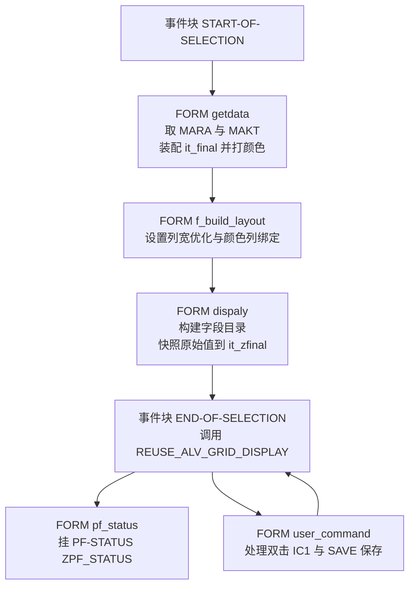
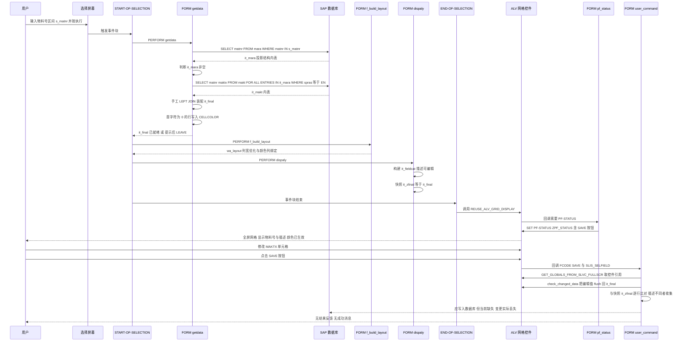

# `REPORT zr` — 物料描述查询与维护（全屏 ALV）分析报告

> 分析对象：`Test-source/zr.abap`（159 行，`REPORT zr`）
> Skill 版本：`b8f84e8`（含「拆分步骤时（① ② ③）怎么办」修订）
> 本文件为**第二次测试**产出，用于与 `zr.baseline.md`（首次测试）对比。

---

## 一、程序定位与业务背景

**业务场景**：`MARA-MATNR`（物料号）是 40 位定长、不可编辑的；而 `MAKT-MAKTX`（物料描述）是文本，业务部门需要自己维护。以前的路径两条都不好走：`MM02` 是弹窗式单条维护，几百个物料要点几百次；找顾问写 `UPDATE` 报表又没有输入校验，改错一个描述就污染主数据。

`zr` 把两件事合进一个全屏 ALV：按物料号区间拉数，描述列设为可编辑，用户像改 Excel 一样改完点工具栏 SAVE。物料号首位字符为 `'0'` 的行被染成绿色（`color-col = 6`）提示人工确认——这是把数据治理动作嵌进日常操作界面的做法。

**设计范式定性**：教科书式的 **Procedural ABAP + Reuse ALV（`REUSE_ALV_GRID_DISPLAY`）全屏报表**，用 `FORM/PERFORM` 组织过程、全局内表承载数据、`it_fieldcat` 描述界面。代表 ABAP 7.4 之前乃至 ECC 时代最主流的报表写法。

---

## 二、程序执行流程总览



责任链：

| 子程序 | 调用者 | 职责 |
|---|---|---|
| 选择屏幕块 `a` | SAP 标准 | 接收物料号选择范围 `s_matnr` |
| 事件块 `START-OF-SELECTION` | SAP 标准（用户按执行） | 驱动取数 → 布局 → 字段目录三步 |
| `FORM getdata` | `START-OF-SELECTION` | 查 `MARA`/`MAKT`，装配 `it_final`，按首字符打颜色，空结果保护 |
| `FORM f_build_layout` | `START-OF-SELECTION` | 配置列宽自适应、绑定 `CELLCOLOR` 列 |
| `FORM dispaly` | `START-OF-SELECTION` | 逐列构建 `it_fieldcat`（MATNR 只读 / MAKTX 可编辑），快照原始描述 |
| 事件块 `END-OF-SELECTION` | SAP 标准 | 唯一一处真正的 ALV 输出调用 |
| `FORM pf_status` | ALV 控件回调 | 挂上 SE41 里做好的 `ZPF_STATUS`（含 SAVE 按钮） |
| `FORM user_command` | ALV 控件回调 | `IC1` 双击明细；`SAVE` 捕获变更、与快照比对、回写 |
| — | — | 无外部依赖：无 Function Module、无 RFC、无 BAPI |

下面按这条流程，逐个子程序展开。

---

## 三、分组分析（按程序流程 / 子程序）

### 3.1 全局声明区

本节不分步，整块给出。

```abap
TYPES: BEGIN OF ty_final,
  matnr TYPE mara-matnr,
  maktx TYPE makt-maktx,
  cellcolor TYPE lvc_t_scol,
  END OF ty_final.

TYPES: BEGIN OF ty_mara,
  matnr TYPE mara-matnr,
  END OF ty_mara.

TYPES : BEGIN OF ty_makt,
  matnr TYPE makt-matnr,
  maktx TYPE makt-maktx,
  END OF ty_makt.

DATA: it_final TYPE TABLE OF ty_final,
  wa_final TYPE ty_final,
  it_mara TYPE TABLE OF ty_mara,
  wa_mara TYPE ty_mara,
  it_makt TYPE TABLE OF ty_makt,
  wa_makt TYPE ty_makt,
  matnr TYPE mara-matnr,
  lv_index   TYPE sy-tabix,
  wa_cellcolor TYPE lvc_s_scol,
  wa_layout TYPE slis_layout_alv,
  ref1 TYPE REF TO cl_gui_alv_grid,
  it_zfinal TYPE TABLE OF ty_final,
  wa_zfinal TYPE ty_final,
  wa_zzfinal TYPE ty_makt,
  it_fieldcat TYPE slis_t_fieldcat_alv,
  wa_fieldcat TYPE slis_fieldcat_alv.
```

**做什么** — 定义三个投影结构：`ty_mara`（只含 `MATNR`）、`ty_makt`（`MATNR` + `MAKTX`）、`ty_final`（ALV 行结构，额外挂 `CELLCOLOR` 集合字段）。配套声明取数内表（`it_mara`/`wa_mara`、`it_makt`/`wa_makt`）、ALV 基础设施（`wa_layout`、`it_fieldcat`+`wa_fieldcat`、`wa_cellcolor`+`ref1`）、以及差异比对影子表（`it_zfinal`/`wa_zfinal` 结构同 `ty_final`，`wa_zzfinal` 结构 `ty_makt` 作写库载荷）。

**为什么** — 用投影结构而不是直接 `SELECT ... INTO TABLE @mara` 是这份代码里**最有价值的决策**：`MARA` 有 200+ 字段，全选进内存既浪费又拖慢传输，只取 1~2 列是标准做法。更重要的是 `ty_final` 把 `cellcolor` 直接做成行结构的一部分——颜色信息跟着行一起流转，不需要另建颜色索引表，这在 ALV 单元格着色里是正解。

**风险与改进** — 样板代码无正确性风险，但有命名与作用域瑕疵：

- `wa_zzfinal TYPE ty_makt` 与 `wa_zfinal TYPE ty_final` 两种结构并存，命名上 `zfinal`/`zzfinal` 极易看串。建议改为 `wa_snapshot`（原始值基准）/ `wa_db_payload`（写库载荷）。
- `matnr`、`lv_index` 只在单个 FORM 内使用却声明在全局。全局变量是隐式内存驻留，多 FORM 共享同一变量意味着要靠约定不互相污染——`lv_index` 应下沉到 `FORM getdata` 内的 `DATA`。
- 注释拼写错误（"temproary"）不影响运行，但这类注释是给接手者看的，值得改。

---

### 3.2 选择屏幕块 `a`

```abap
SELECTION-SCREEN BEGIN OF BLOCK a.
  SELECT-OPTIONS: s_matnr FOR matnr.
  SELECTION-SCREEN END OF BLOCK a.
```

**做什么** — 声明名为 `a` 的选择屏幕块，内含物料号范围选择项 `s_matnr`，参照字段为全局变量 `matnr`（`MARA-MATNR` 类型）。

**为什么** — 选 `SELECT-OPTIONS`（区间）而非 `PARAMETER`：物料维护天然是批量操作，`BETWEEN` / 多段 `OR` 能覆盖"这几个区间一起改"。参照字段用 `matnr` 而非字面量，是让屏幕标题自动带上物料号的搜索帮助（F4）——用户能按描述反查物料，主数据场景里很关键。

**风险与改进** —

- 🟠 **P1｜`s_matnr` 未设 `OBLIGATORY`**，允许不填条件直接执行，等于允许全表扫描 `MARA`。40 位定长无索引前缀的选择屏输入很可能退化成全表；`MARA` 四十万行量级虽不算灾难，但"全量拉物料进内存 + 全屏 ALV 渲染"在生产上可以点爆工作进程。
- 🟢 **P3｜单字段套 `BLOCK` 属过度包装**。`BLOCK` 的价值是分组并加块标题，单字段只多一次点击。若后续要加 `SPRAS`、`MTART` 等筛选条件，再包 `BLOCK` 才有意义。

---

### 3.3 事件块 `START-OF-SELECTION` 与 `END-OF-SELECTION`

本节分两块看：编排与输出。

#### ① 编排三步

```abap
START-OF-SELECTION.
      PERFORM : getdata.
      PERFORM: f_build_layout .
      PERFORM: dispaly.
```

**做什么** — 用三次 `PERFORM` 显式声明流程：`getdata` 取数、`f_build_layout` 建布局、`dispaly` 建字段目录。

**为什么** — 顺序有讲究：`it_fieldcat` 必须在 `f_build_layout` 之后或之前都行（两者无依赖），但都必须在 ALV 显示前完成。放在 `START-OF-SELECTION` 而非主程序顶层，是为了在 `FORM` 内形成可读的"主流程脚本"。

**风险与改进** — 无实质风险。仅命名不统一（`getdata` / `f_build_layout` / `dispaly` 三种风格，第三个还拼错为 `dispaly`），建议统一为 `get_data` / `build_layout` / `build_fieldcat`。

#### ② ALV 输出调用

```abap
END-OF-SELECTION.

CALL FUNCTION 'REUSE_ALV_GRID_DISPLAY'
    EXPORTING
      i_callback_program                = sy-repid
      i_callback_pf_status_set          = 'PF_STATUS'
      i_callback_user_command           = 'USER_COMMAND'
      is_layout                         = wa_layout
      it_fieldcat                       = it_fieldcat
     TABLES
       t_outtab                          = it_final
    EXCEPTIONS
      PROGRAM_ERROR                     = 1
      OTHERS                            = 2             .
   IF sy-subrc <> 0.
* Implement suitable error handling here
   ENDIF.
```

**做什么** — 调 `REUSE_ALV_GRID_DISPLAY`，把 `wa_layout`/`it_fieldcat` 作 `EXPORTING`、`it_final` 作 `TABLES t_outtab`；用三个回调参数把自己连回 `PF_STATUS` 与 `USER_COMMAND` 两个 FORM；`IF sy-subrc <> 0` 分支只有一句注释。

**为什么** — `REUSE_ALV_GRID_DISPLAY` 是 Reuse ALV 三兄弟里最"重"的一个：直接驱动 `CL_GUI_ALV_GRID`，支持单元格着色（`COLTAB_FIELDNAME`）、热点列、内嵌编辑、用户命令回调。相比 `REUSE_ALV_LIST_DISPLAY` 才有颜色列和编辑能力，相比 `REUSE_ALV_TREE_DISPLAY` 更适合平铺表格。选型正确。

`i_callback_program = sy-repid` + `i_callback_user_command` 是**回调路由的标准写法**：FM 通过调用方程序名反查 `DY_PROG` 再 `PERFORM` 对应 FORM。

**风险与改进** —

- 🔴 **P0｜执行顺序脆弱**：取数、布局、字段目录在 `START-OF-SELECTION`，ALV 调用在 `END-OF-SELECTION`。报表程序中两事件紧邻先后触发，所以**当前能跑**——但这个"能跑"依赖标准报表的事件触发顺序。一旦这个 `REPORT` 被改成**逻辑数据库程序**、或被别处 `SUBMIT` 进一个不触发 `END-OF-SELECTION` 的流程，`it_fieldcat` 建好了但 ALV 永不显示，程序静默空跑。ALV 调用应与编排它的 `PERFORM` 同处一个事件块。
- 🟠 **P1｜异常分支是空的**：`PROGRAM_ERROR`/`OTHERS` 抛出后没有任何处理。至少应 `MESSAGE` 告知"ALV 显示失败"并 `LEAVE`，否则 SE21 里是控件创建失败（无 SAPGUI、字段超长、结构不被控件接受），用户只见白屏。
- 🟡 **P2｜缺少编辑期校验参数**：`REUSE_ALV_GRID_DISPLAY` 支持 `i_callback_data_changed_finished`。本程序让 `MAKTX` 可编辑却没有这个回调，等于放弃了编辑期校验（见 3.8）。

---

### 3.4 `FORM getdata`

本节分五步：取物料号 → 取描述 → 装配 → 空结果保护 → 打颜色。

#### ① 取物料号

```abap
FORM getdata .

  SELECT matnr FROM mara INTO TABLE it_mara WHERE matnr IN S_matnr.
```

**做什么** — 从 `MARA` 只取 `MATNR` 一列装进 `it_mara`，筛选条件是 `S_matnr` 区间。

**为什么** — 用 `WHERE matnr IN S_matnr` 而非先在选择屏 F4 收窄再单值查，是因为 ALV 要展示一批物料。`MATNR` 上有索引，范围查询走索引区间扫描，代价可控。

**风险与改进** — 🟠 **P1｜无 `s_matnr` 空值拦截**（见 3.2），允许全表扫描。其余无风险。

#### ② 取物料描述

```abap
  IF it_mara IS NOT INITIAL.
  SELECT matnr maktx FROM makt INTO TABLE it_makt
  FOR ALL ENTRIES IN it_mara WHERE matnr = it_mara-matnr AND spras = 'EN'.
  ENDIF.
```

**做什么** — 从 `MAKT` 取 `MATNR` 与 `MAKTX`，用 `FOR ALL ENTRIES IN it_mara` 与步骤① 的物料集合做内连接，并限定 `SPRAS = 'EN'` 取英文文本。整段被 `IF it_mara IS NOT INITIAL` 包住。

**为什么** — 两步取数而非一次 `INNER JOIN`：① `MAKT` 的索引是 `MATNR + SPRAS` 组合，用 `FOR ALL ENTRIES` 驱动能精确命中索引前缀，比裸 `JOIN` 让 DB 引擎自己决定 join 顺序更可控；② 更重要的是——**`IF it_mara IS NOT INITIAL` 是本程序最正确的一处代码**。`FOR ALL ENTRIES` 在驱动内表为空时 ABAP 优化器不会退化成全表扫描（这是 SAP 帮助里与 `SELECT ... WHERE ... IN` 的关键差异），但前提是驱动表确实为空且 SQL 本身合法。不加这个 `IF`，在某些 Basis 版本/补丁级别下会触发短 dump 或全表扫描。**作者显然踩过这个坑——这是给接手者的正面示范，值得保留。**

**风险与改进** —

- 🟠 **P1｜语言硬编码 `'EN'`**：应该用 `sy-langu`，或加 `s_spras` 选择项。当前意味着**中文用户在中文系统上只能看到英文描述**，多语言物料的描述无法维护，业务价值大打折扣。
- 🟡 **P2｜`FOR ALL ENTRIES` 的重复读代价**：1000 个物料会生成一条大 SQL，可能触发 DB 侧最大 SQL 文本长度或超大内表问题。SAP 标准做法是分批（每 500~1000 条 `MOD ... OR ...`）。本例几百个物料量级暂不构成瓶颈，但选屏放大到全库就会出事。

#### ③ 装配 `it_final`

```abap
* moving values from temproary internal table to final internal table
  LOOP AT it_mara INTO wa_mara.
  wa_final-matnr = wa_mara-matnr.
  READ TABLE it_makt INTO wa_makt WITH KEY matnr = wa_mara-matnr.
  wa_final-maktx = wa_makt-maktx.
  wa_final-matnr = wa_mara-matnr.
  APPEND wa_final TO it_final.
  ENDLOOP.
```

**做什么** — 以外层 `it_mara` 为主表逐行遍历：先把 `MATNR` 赋给 `wa_final`；再以该物料号为键从 `it_makt` `READ TABLE` 取 `MAKTX` 赋给 `wa_final-MAKTX`；重复赋一次 `MATNR`；`APPEND` 到 `it_final`。

**为什么** — 本质是**手工实现了一次 LEFT OUTER JOIN**：`it_mara` 驱动（保证没有英文描述的物料也出现在结果里，描述留空），`it_makt` 按键补充。没有用 SQL `JOIN`，是因为 `it_makt` 已被步骤 ② 按 `SPRAS='EN'` 过滤，且需要"匹配不到也保留主表行"的语义——纯 `INNER JOIN` 做不到，要 `LEFT JOIN`，而 `MARA`/`MAKT` 大表 `LEFT JOIN` 在 ECC 上代价高。几百行数据量下，ABAP 侧嵌套读（n 次内表二分查找）性能完全够。

**风险与改进** —

- 🔴 **P0｜`READ TABLE` 未判断 `sy-subrc`，导致描述串行**：这是**必现的数据错误**。某物料在 `MAKT` 里没有 `SPRAS='EN'` 记录时，`READ TABLE` 返回 4，`wa_makt` **保留上一次循环的残留值**，于是该物料被写入**上一个物料的描述**。用户看到"物料 A 的描述出现在物料 B 上"，且完全看不出错在哪——这比报错危害更大。修法：

  ```abap
  CLEAR wa_makt.
  READ TABLE it_makt INTO wa_makt WITH KEY matnr = wa_mara-matnr.
  IF sy-subrc = 0.
    wa_final-maktx = wa_makt-maktx.
  ENDIF.
  ```
- 🟡 **P2｜`wa_final` 未在循环首行 `CLEAR`**：本例因每个字段都被显式赋值、`cellcolor` 为空，暂未爆炸。但这是脆弱的隐式契约——只要以后有人加一个 `READ TABLE ... TRANSPORTING` 或把某字段改成条件赋值，就会立刻踩到残留值。**`LOOP` 内对工作区 `CLEAR` 是硬规矩。**
- 🟡 **P2｜`wa_final-matnr` 重复赋值两次**（`READ TABLE` 前后各一次），明显的复制粘贴残留，删一行。
- 🟢 **P3｜这一步其实可以省**：`it_mara`/`it_makt`/`it_final` 三张表 + 三个工作区让数据流变长了。现有写法不算错。

#### ④ 空结果保护

```abap
IF it_final IS INITIAL.
  MESSAGE 'no values' TYPE 'I'.
  LEAVE TO CURRENT TRANSACTION.
  ENDIF.
```

**做什么** — 最终内表为空时弹 `'no values'` 信息提示，然后 `LEAVE TO CURRENT TRANSACTION` 退出当前事务。

**为什么** — 必要且正确——若 `it_final` 为空还去调 `REUSE_ALV_GRID_DISPLAY`，ALV 会显示一个只有表头没有数据的空网格，用户会以为程序"查不出来"而不是"确实没数据"，且无退出提示。`LEAVE TO CURRENT TRANSACTION` 而非 `STOP`/`RETURN` 是对的：此处是 `FORM` 内部，`RETURN` 会回到 `START-OF-SELECTION` 继续跑后两步，等于没拦。

**风险与改进** —

- 🟠 **P1｜MESSAGE 无消息类、硬编码英文**：`MESSAGE 'no values' TYPE 'I'` 把文本写进源码。应建消息类用 `MESSAGE ID 'ZMSG' TYPE 'I' NUM '001'`，文本才能被 SE63 翻译、可被修改。这是多语言项目的硬性规范。
- 🟡 **P2｜文案不含关键信息**：只说"no values"，用户不知道是筛选条件太窄还是真的没物料。更好的是回显 `s_matnr` 实际范围，或区分"查询无结果"与"该物料无英文描述"。

#### ⑤ 单元格颜色标记

```abap
*color code for the cells based on condition
  LOOP AT it_FINAL INTO wa_FINAL.
    lv_index = sy-tabix.
    IF  wa_final-matnr+0(1) = '0'.
    wa_cellcolor-fname = 'MATNR'.
    wa_cellcolor-color-col = 6.
    wa_cellcolor-color-int = '1'.
    wa_cellcolor-color-inv = '0'.
    APPEND wa_cellcolor TO wa_FINAL-cellcolor.
    CLEAR: wa_cellcolor.
    MODIFY it_final FROM wa_final INDEX lv_index TRANSPORTING cellcolor.
    CLEAR wa_final.
      ENDIF.
    ENDLOOP.
ENDFORM.
```

**做什么** — 再遍历一次 `it_final`，用 `sy-tabix` 记住当前行号；若物料号**首位字符是 `'0'`**，在工作区追加一条 `LVC_S_SCOL` 颜色记录（列名 `MATNR`、颜色 `6`、强度 `1`、非反色），`APPEND` 进 `wa_final-cellcolor`；`CLEAR wa_cellcolor` 后用 `MODIFY ... INDEX lv_index TRANSPORTING cellcolor` 把颜色**只回写颜色列**，最后 `CLEAR wa_final`。

**为什么** — 这里体现了 **ALV 单元格着色协议的关键三要素**：① 行结构里必须有 `lvc_t_scol` 类型的字段承载颜色集合（已在声明区埋好）；② 布局里必须通过 `COLTAB_FIELDNAME = 'CELLCOLOR'` 告诉 ALV 去哪个字段找（已在 `f_build_layout` 配好）；③ `LVC_S_SCOL` 的 `FNAME` 要用**字段目录里的技术字段名**（`'MATNR'`）而非显示文本（`'Material'`），因此它必须与 `dispaly` 里 `wa_fieldcat-fieldname = 'MATNR'` 严格一致——**这构成跨 FORM 的隐式耦合**。

`TRANSPORTING cellcolor` 用意好：`MODIFY ... FROM` 不带 `TRANSPORTING` 会用工作区所有字段覆盖内表行；这里明确表达"我只想改颜色"，语义清晰且省一次全字段搬运。

**风险与改进** —

- 🟡 **P2｜魔数**：`color-col = 6` 是 ALV 标准色表里的具体色值，`'0'` 也是业务规则里的魔数，两处都没注释说明"什么颜色""为什么要染"。至少应定义常量：

  ```abap
  CONSTANTS c_col_warning TYPE c_lvc_color TYPE 6.  " 绿色
  CONSTANTS c_flag_legacy  TYPE c_1 VALUE '0'.        " 物料号首位 0 = 遗留编码
  ```

  更进一步，"物料号首位是 0"这条业务规则应来自配置（表/参数）而非硬编码。
- 🟡 **P2｜多余的第二次全表遍历 + O(1) 定位的 `MODIFY`**：`MODIFY ... INDEX` 是 O(1) 定位，单次不慢；**但完全可以并进步骤 ③ 的装配循环**——那里已在逐行构造 `wa_final`，顺手判断首字符、`APPEND` 颜色、再一次性 `APPEND`（一次写全部字段，不需要 `MODIFY`、不需要 `lv_index`、不需要 `TRANSPORTING`）。现在为此付出了：第二次全表遍历、一个全局 `lv_index`、一次 `MODIFY ... TRANSPORTING`、三处 `CLEAR`。
- 🟢 **P3｜语义校核提示（业务规则本身该被质疑）**：`MARA-MATNR` 是 SAP 标准 40 位物料号，**首位为 `0` 在标准物料编码规则里并非异常**（SAP 内部物料号允许前导零）。判断"是否为遗留/自编码"的依据应是 `MTART`（物料类型）或企业自定义标志，而非字符形态。作者大概率从某个具体客户编码规则抄来——**若非客户明确要求，这条业务规则本身就该被质疑**。建议核对：染色条件究竟想表达什么业务含义？
- 染色只覆盖 `MATNR` 单列：单列着色更克制、不干扰描述文本阅读，这个取舍合理，不是缺陷。

---

### 3.5 `FORM f_build_layout`

```abap
FORM f_build_layout .
  CLEAR wa_layout.
  wa_layout-colwidth_optimize = 'X'.
  wa_layout-coltab_fieldname = 'CELLCOLOR'.

ENDFORM.
```

**做什么** — 先 `CLEAR wa_layout`，再设两个属性：`COLWIDTH_OPTIMIZE = 'X'`（列宽按内容自适应）、`COLTAB_FIELDNAME = 'CELLCOLOR'`（告诉 ALV 颜色存在名为 `CELLCOLOR` 的结构字段里）。

**为什么** — `COLTAB_FIELDNAME` 是整个"ALV 单元格着色"链路的**开关**，少这一句 `getdata` 里辛苦堆的 `cellcolor` 全是白费——ALV 会完全无视它。这句和 `getdata` 里的 `FNAME = 'MATNR'` 构成一对必须成对出现的约定。`COLWIDTH_OPTIMIZE` 让两列（40 位物料号 + 40 位描述）自动撑开，不用手写 `DO20 TIMES MODIFY ...` 那种经典丑循环，是合理偷懒。

**风险与改进** — 🟡 **P2｜布局偏简陋**：没有 `info`、`no_outline`、`grid_title`、`no_headers`。`grid_title` 加个"物料描述维护"能显著提升可读性；对导出 XLSX 的场景，把选择条件做成 ALV 标题行还能救这份清单的可追溯性。无正确性风险。

---

### 3.6 `FORM dispaly`

本节分两步：构建字段目录、快照原始值。

#### ① 逐列构建 `it_fieldcat`

```abap
FORM dispaly .

  wa_fieldcat-tabname = 'IT_FINAL'.
  wa_fieldcat-fieldname = 'MATNR'.
  wa_fieldcat-seltext_m = 'Material'.

  APPEND wa_fieldcat TO it_fieldcat.
  CLEAR: wa_fieldcat.

  wa_fieldcat-tabname = 'IT_FINAL'.
  wa_fieldcat-fieldname = 'MAKTX'.
  wa_fieldcat-seltext_m = 'Description'.
  wa_fieldcat-edit ='X'.

  APPEND wa_fieldcat TO it_fieldcat.
  CLEAR: wa_fieldcat.
```

**做什么** — 对内表 `IT_FINAL` 逐列追加字段目录条目：`MATNR` 列显示文本 `'Material'`、**不设 `EDIT`**（ALV 默认只读）；`MAKTX` 列显示文本 `'Description'`、`EDIT = 'X'`（可编辑）。

**为什么** — `TABNAME = 'IT_FINAL'` 是 Reuse ALV 的老派写法：字段目录靠 `TABNAME + FIELDNAME` 定位数据来源内表（这里是 `TABLES t_outtab` 传入的 `it_final`）。该组合在 `REUSE_ALV_*_DISPLAY` 下必需。`TABNAME` 必须大写——ABAP 内表名大小写不敏感，但 Reuse ALV 内部按字符比较，实操中一律大写。

`EDIT = 'X'` 是全屏 ALV 内嵌编辑开关，只加在 `MAKTX` 上，形成"关键标识只读、描述可改"的**字段级权限控制**——比在 `user_command` 里事后判断"这一格该不该改"干净得多，是正确的分工。

**风险与改进** —

- 🟠 **P1｜`IC1` 回调与字段目录不匹配（潜在功能失效）**：程序在 `user_command` 里处理了 `'&IC1'`（双击），但字段目录里**既没给 `MATNR` 设 `KEY = 'X'`，也没设 `HOTSPOT = 'X'`**。在 `CL_GUI_ALV_GRID` 中，只有设了 `HOTSPOT` 的列（或在 `HANDLE_HOT_CLICK` 里显式捕获）才会把双击变成 `&IC1`。**这段 `&IC1` 代码大概率永远不会被触发**——典型死分支。
- 🟡 **P2｜`MATNR` 列未设 `KEY`**：数据是"物料号 + 描述"的自然键视图，设 `KEY` 能让用户按物料号排序定位。但它与上面 P1 是同一决策——若确定支持双击跳转，就该 `KEY` + `HOTSPOT` 一起设。
- 🟢 **P3｜逐列 `APPEND` 是老派写法**：现代做法是本地类继承 `CL_ALV_FIELD_CATALOG`（`REFRESH`/`ADD_FIELD`/`KEY`/`EDIT`），字段多时优势明显（本例 2 列用不上）。

#### ② 快照原始值

```abap
*appending values form final internal table to
* temproary final table for data comparision it_zfinal[] = it_final[].

ENDFORM.
```

**做什么** — 用整体赋值运算符把当前 ALV 数据源的**全量副本**从 `it_final` 复制到 `it_zfinal`。此后 `it_final` 会被 ALV 编辑就地修改，`it_zfinal` 保持"打开时"的原样。

**为什么** — 这是整个 SAVE 流程的**基准线**。用户在 ALV 里改描述，内存里 `it_final` 变了，但数据库没变、也没有任何原始值可比对——除非事先留副本。`it_zfinal[] = it_final[]` 用整体赋值做**一次全量拷贝**，是 ABAP 里最省事的深拷贝（对非嵌套平表是逐行值复制；`LVC_T_SCOL` 这类内表字段会被整体引用赋值而非深拷贝，但颜色不会变，此处安全）。

放在 `dispaly` 末尾（而不是 `getdata` 里）是因为必须在 ALV 显示前完成——位置是对的。不过放在专门的 `FORM snapshot` 里语义会更清楚。

**风险与改进** —

- 🟠 **P1｜快照时点依赖事件顺序**：它假定 `START-OF-SELECTION` 一定在 ALV 显示前跑完。这与 3.3 的隐患同源——一旦事件顺序变化，**快照会在用户编辑之后才拍**，导致所有修改被误判为"未改动"，SAVE 静默什么都不做。
- 🟠 **P1｜复制了不必要的字段**：`it_zfinal` 结构与 `it_final` 完全相同，包含 `cellcolor`（每行一个内表）。该字段永不参与比对，复制它纯浪费内存和 CPU。应改用只含 `MATNR`+`MAKTX` 的窄结构做基准。
- 无正确性风险。

---

### 3.7 `FORM pf_status`

```abap
*se41 create, generate, activate the buttons and assing it.
FORM pf_status USING rt_extab TYPE slis_t_extab.
  SET PF-STATUS 'ZPF_STATUS'.
ENDFORM.
```

**做什么** — 由 ALV 通过 `i_callback_pf_status_set` 回调。接收（并忽略）扩展功能表 `RT_EXTAB`，然后 `SET PF-STATUS 'ZPF_STATUS'`。

**为什么** — **为什么必须用回调而不是直接在全局写 `SET PF-STATUS`**：`SET PF-STATUS` 是全局静态语句，写在哪里都属于整个程序作用域。而 ALV 网格是**独立控件**，有自己的状态栏，不会自动继承程序的 `PF-STATUS`。Reuse ALV 的官方解法就是提供 `PF_STATUS` 回调 FORM，让 ALV 初始化时向程序索要状态栏——写在 FORM 内部时作用域被限制在 ALV 控件初始化期间，不会污染程序全局状态栏。这是为了让两者**解耦**，是 Reuse ALV 的标准姿势。

`RT_EXTAB` 参数签名是强制形式：Reuse ALV `PERFORM pf_status` 时会传入扩展功能表，不接收就短 dump，即使用不上。

**风险与改进** —

- 🟡 **P2｜硬编码状态栏名 `'ZPF_STATUS'`**：该 PF-STATUS 必须在 SE41 里存在且已激活。SE41 的状态栏归属于**程序名**（这里就是 `ZR`），换程序名就得重做——这是 `SET PF-STATUS` 体系的固有限制。
- 🟡 **P2｜SAVE 按钮 FCODE 与代码的对齐无校验**：程序里 `CASE p_ucomm WHEN 'SAVE'`，SE41 里那个按钮的 FCODE 必须**精确是 `SAVE'`**（大小写敏感）。若配成 `ZP_SAVE` 之类，点按钮不会有任何反应，也没有任何报错。这个跨系统人工契约在交接时极易断裂，建议在 SE41 和代码注释里双向标注。

---

### 3.8 `FORM user_command`

本节分两步：`IC1` 分支与 `SAVE` 分支。这是问题最密集的地方。

#### ① `&IC1` 双击处理

```abap
FORM user_command USING p_ucomm TYPE sy-ucomm
                        p_selfield TYPE slis_selfield.
CASE p_ucomm.
    WHEN '&IC1'.
      LOOP AT it_final INTO wa_final.
      READ TABLE it_final INTO wa_final WITH KEY matnr = wa_final-matnr.
      WRITE: / wa_final-matnr.
      ENDLOOP.
```

**做什么** — `p_ucomm = '&IC1'`（ALV 单元格双击）时：`LOOP AT it_final INTO wa_final` 遍历**整个**结果表；每次循环内又用**当前工作区的 `MATNR` 作为键**去读同一张表（读回自己），然后 `WRITE: / wa_final-matnr` 输出物料号。

**为什么（它想做什么）** — 从写法推断意图：`IC1` 通常是"点击某行 → 跳转/显示该行明细"的入口。正确做法是从 `p_selfield` 拿行号，**只读那一行**：

```abap
READ TABLE it_final INTO wa_final INDEX p_selfield-row.
```

然后跳转或显示详情。当前实现里 `p_selfield` 声明了却**从未使用**，`LOOP` 把整个表跑了一遍——说明作者要么不理解 `SLIS_SELFIELD` 的作用，要么这段是从别处复制的模板。

**风险与改进** —

- 🔴 **P0｜`READ TABLE ... WITH KEY matnr = wa_final-matnr` 是自我赋值（无意义操作）**：`wa_final` 在 `LOOP` 头部刚从当前行读出，`MATNR` 就是当前行主键；用它作键读 `it_final` 读回来的是同一行（若 `MATNR` 重复则读第一行）。整个语句纯冗余且误导。
- 🔴 **P0｜双击一行却把全表物料号 `WRITE` 到屏幕上**：`WRITE` 会立刻中断 ALV 交互（GUI 下弹出输出窗口或滚到底部），并输出**全部行**的物料号而非用户点的那一行。后果：① 输出量随数据量线性膨胀，几千个物料直接刷屏；② 破坏 ALV 交互状态；③ `WRITE` 在前台是最差实践。正确做法是 `MESSAGE ... TYPE 'S'`（状态栏显示一行）、`SET PARAMETER` + 事务码跳转，或 `POPUP`。
- 🟠 **P1｜整个 `IC1` 分支是死代码**：如 3.6 ① 所述，字段目录没设 `HOTSPOT`/`KEY`，ALV 不会发 `&IC1`。**修好触发条件之前这段不会运行；修好之后它会立刻变成"一点就刷屏"的用户体验事故。** 两处必须一起改。

#### ② `SAVE` 保存

```abap
    WHEN 'SAVE'.

      CALL FUNCTION 'GET_GLOBALS_FROM_SLVC_FULLSCR' "Capturing changes in ALV
      IMPORTING
        e_grid = ref1.
      CALL METHOD ref1->check_changed_data.
*moving changed value into ztable on saving
LOOP AT it_final INTO wa_final.
  READ TABLE it_zfinal INTO wa_zfinal WITH KEY matnr = wa_final-matnr.
  IF wa_zfinal-matnr = wa_final-matnr AND wa_zfinal-maktx NE wa_final-maktx.
    MOVE-CORRESPONDING wa_final TO wa_zzfinal.
    MODIFY zfinal FROM wa_zzfinal.
  ENDIF.
ENDLOOP.
    CLEAR: wa_final,wa_zfinal, wa_zzfinal.
ENDCASE.
ENDFORM.
```

**做什么** — ① 调 `GET_GLOBALS_FROM_SLVC_FULLSCR` 把活动 ALV 控件实例取到 `ref1`；② 调 `ref1->check_changed_data`；③ 遍历 `it_final`，以 `MATNR` 为键从快照表 `it_zfinal` 读原始值到 `wa_zfinal`；④ 判断"键匹配 且描述不同"，成立则 `MOVE-CORRESPONDING` 搬到 `ty_makt` 结构，再 `MODIFY zfinal FROM wa_zzfinal`；⑤ 循环外统一 `CLEAR` 三个工作区。

**为什么（四个设计点方向各自是对的）**

- **`GET_GLOBALS_FROM_SLVC_FULLSCR` 是官方取控件手段**。`REUSE_ALV_GRID_DISPLAY` 没有把控件引用通过参数返回，只能事后从 `DY_PROG` 的活动控件里捞。必须配 `IMPORTING e_grid = ref1`，且 `ref1` 在声明区建好 `REF TO CL_GUI_ALV_GRID`。这条链路写得是对的。
- **`check_changed_data` 的调用是这段代码的灵魂**。它做两件事：(a) 把编辑框里**尚未失焦**的值 flush 到内表——不调它，用户刚敲完最后一个字符直接点 SAVE，那个字符就丢了；(b) 提供校验挂载点。缺这一行，SAVE 会漏掉"最后正在编辑的那一格"。
- **`MOVE-CORRESPONDING` 而非逐字段赋值**：按结构同名分量自动映射，字段扩展时不用改代码。
- **"比对后才写"的幂等设计**：只有真正变化的行才进入写库路径，避免对未改动行的无谓 UPDATE（SAP 里对物料文本的 UPDATE 会触发变更文档，无谓更新既慢且污染审计历史）。

**风险与改进** —

- 🔴 **P0｜`MODIFY zfinal FROM wa_zzfinal` 是坏代码**：`zfinal` 这个数据对象在程序里**根本不存在**（声明区只有 `it_zfinal`，且是内存内表）。这行不会通过语法检查，或即使被当作某个隐式对象也必然语义错误。作者显然想写 `MODIFY it_zfinal FROM wa_zzfinal`——但**那也是错的**（见下一条）。这是 SAVE 功能从未被真正实现过的直接证据。
- 🔴 **P0｜把 `MODIFY` 打在了基准快照上（方向性错误）**：即使改成 `MODIFY it_zfinal`，也**违背设计意图**——`it_zfinal` 的角色是"原始值基准"，对它 `MODIFY` 等于**把基准改成新值**。后果：用户第一次 SAVE 成功，第二次再改同一行时 `READ it_zfinal` 读到的是上一次的**已改值**，比对结果为"相同"，第二次修改被**静默丢弃**。基准必须**只读**。正确做法是 `MODIFY` 一个独立的写库载荷内表：

  ```abap
  MODIFY TABLE it_save_payload FROM wa_zzfinal.
  ```

  然后调真正的持久化 FM（`BAPI_MATERIAL_MAINTAIN` / 对内建 `MAKT` 做 `MODIFY` 并 `COMMIT WORK`）。**当前程序没有调用任何持久化 FM**——SAVE 按下后**数据库里什么都没变**，用户以为改完了，实际全部丢失。这是整个程序最严重的缺陷。
- 🔴 **P0｜`READ TABLE` 未判断 `sy-subrc`，`wa_zfinal` 残留**：与 3.4 ③ 同类问题。循环首轮之前没 `CLEAR wa_zfinal`，若某行在 `it_zfinal` 里读不到（理论上不会，但一旦有人调整两张表来源就会发生），`IF` 会拿上一行残留做判断。循环末的 `CLEAR` 只清最后一行，中间行靠上一轮 `MODIFY` 覆盖，`MODIFY` 未执行则残留继续传递。
- 🟠 **P1｜`wa_zfinal-matnr = wa_final-matnr` 这个条件是冗余的**：`READ TABLE ... WITH KEY` 成功时**必然**满足；失败时该字段是残留值、等式**可能误成立**。真正的意图应是用 `sy-subrc = 0` 表达"找到基准记录"：

  ```abap
  READ TABLE it_zfinal INTO wa_zfinal WITH KEY matnr = wa_final-matnr.
  IF sy-subrc = 0 AND wa_zfinal-maktx NE wa_final-maktx.
  ```
- 🟠 **P1｜`check_changed_data` 返回值被忽略**：该方法返回 `SUBRC`（`0` = 通过；非 0 = 有校验错误，编辑值未回写）。忽略它意味着**用户输入非法值（如超长描述），点 SAVE 后程序以为成功了**（实际内表未更新，比对下来"没变化"，什么都不做），用户得不到任何"输入不合法"的提示——**静默失败**。应检查 `subrc` 并给出明确消息。
- 🟠 **P1｜无编辑期长度/值域校验**：`MAKTX` 是 40 位 `CHAR`，用户粘贴长文本时行为取决于 `SLIS` 输出模式。更稳的做法是在 `i_callback_data_changed_finished` 里实时做长度与值域校验（禁控制字符、禁纯空格描述），SAVE 时二次校验。
- 🟠 **P1｜没有 `COMMIT WORK` / 错误处理**：任何数据库写都应明确区分工作区暂存与提交，失败时 `ROLLBACK` + 消息。当前连写库 FM 都没有，一旦补上，这套事务处理必须一起设计。
- 🟡 **P2｜`GET_GLOBALS_FROM_SLVC_FULLSCR` 没有 `EXCEPTIONS`**：若活动控件不是 Fullscreen Grid，`e_grid` 是初始引用，后续方法调用短 dump。至少判空。
- 🟡 **P2｜SAVE 后没有刷新 ALV / 更新基准**：保存成功后应把新值同步回快照或重新 `REFRESH` ALV，让用户看到"已保存"状态。
- 🟡 **P2｜硬编码 FCODE `'SAVE'`**：应定义 `CONSTANTS c_fcode_save TYPE sy-ucomm VALUE 'SAVE'`，与 SE41 按钮形成可搜索的契约。
- 🟢 **P3｜命名大小写混杂**：同一 FORM 里 `wa_final`/`wa_FINAL`、`it_FINAL` 混用。不影响功能但影响专业观感。

---

## 四、执行流程全景图（数据视角）



**这张图最该记住的一点**：数据流在"应写入数据库"那一格**断了**。从 `getdata` 到 ALV 显示的整条链路是通的、是对的；从 ALV 编辑回到持久化的链路是断的。所以这个程序今天能当"查询工具"用，**不能当"维护工具"用**。

---

## 五、问题清单与改进建议（按优先级）

### 🔴 P0 — 业务正确性

| # | 所在子程序 | 问题 | 改进方向 |
|---|---|---|---|
| 1 | `FORM user_command`（SAVE） | `MODIFY zfinal FROM wa_zzfinal` 中 `zfinal` 未声明；SAVE 分支**未调用任何持久化 FM**，用户编辑内容根本没进数据库，重启即丢 | 引入独立写库载荷内表，比对后调 `BAPI_MATERIAL_MAINTAIN` 或对内建 `MAKT` 做 `MODIFY` + `COMMIT WORK`，失败 `ROLLBACK` + 消息 |
| 2 | `FORM user_command`（SAVE） | `MODIFY` 打在基准快照 `it_zfinal` 上会**污染基准**——第一次保存后，第二次修改同一行会被判定"未变化"而静默丢弃 | 快照严格只读；写库目标与快照完全分离 |
| 3 | `FORM getdata`（③ 装配） | `READ TABLE it_makt` 未判 `sy-subrc`，`wa_makt` 残留上一次 `MAKTX` → **无英文描述的物料被写成上一个物料的描述**，静默数据错乱 | `CLEAR wa_makt` + 判 `sy-subrc` 后再赋值 |
| 4 | `FORM user_command`（SAVE） | `READ TABLE it_zfinal` 未判 `sy-subrc`，`wa_zfinal` 残留；`IF wa_zfinal-matnr = wa_final-matnr` 用字符串比较代替"是否找到基准" | 改为 `IF sy-subrc = 0 AND ...`；循环内首行 `CLEAR` |
| 5 | `FORM user_command`（IC1） | 双击任一行后 `WRITE` **全表**物料号，刷屏并破坏 ALV 交互；`READ ... WITH KEY matnr = wa_final-matnr` 是无意义自我赋值；`p_selfield` 声明未用 | `READ TABLE it_final INDEX p_selfield-row` 取单行 + `MESSAGE TYPE 'S'` 或事务码跳转；若不需要双击功能，直接删掉整个分支 |

### 🟠 P1 — 健壮性

| # | 所在子程序 | 问题 | 改进方向 |
|---|---|---|---|
| 6 | `FORM user_command`（SAVE） | `check_changed_data` 返回值被忽略，校验失败时用户静默"以为保存成功" | 检查 `subrc`，非 0 时 `MESSAGE` 明确提示哪一行不合法 |
| 7 | `FORM dispaly`（①）+ `FORM user_command`（IC1） | 未设 `KEY`/`HOTSPOT`，`&IC1` 是**永不可达的死代码**；修好触发条件后会立刻暴露 P0 #5 | 两处一起改：给 `MATNR` 设 `KEY` + `HOTSPOT` 并重写 IC1 逻辑，或删除 IC1 分支 |
| 8 | `FORM getdata`（②） | 语言硬编码 `spras = 'EN'`，非英文用户看不到也维护不了本地语言描述 | 用 `sy-langu`，或加 `s_spras` 选择屏字段 |
| 9 | `FORM getdata`（④） | `MESSAGE 'no values'` 无消息类、硬编码英文、不可翻译 | 建 `ZMSG` 消息类；文案回显 `s_matnr` 范围 |
| 10 | `END-OF-SELECTION`（ALV 调用） | `PROGRAM_ERROR`/`OTHERS` 分支是空的，控件创建失败时用户只见白屏 | 补 `MESSAGE TYPE 'E'` + `LEAVE`，映射为可读业务提示 |
| 11 | `FORM user_command`（SAVE） | `GET_GLOBALS_FROM_SLVC_FULLSCR` 无异常处理，`e_grid` 为初始引用时方法调用短 dump | 加 `EXCEPTIONS not_found` 或判空 |
| 12 | 全部 | 无编辑期校验（`i_callback_data_changed_finished` 未使用），非法描述（超长/纯空格/控制字符）能敲进去 | 补 `DATA_CHANGED_FINISHED` 回调做实时校验 + SAVE 时二次校验 |
| 13 | `START-OF-SELECTION` / `END-OF-SELECTION` | ALV 调用被拆到 `END-OF-SELECTION`，依赖报表事件顺序；改成逻辑数据库程序或被 `SUBMIT` 进其他流程时会静默空跑 | 把 `REUSE_ALV_GRID_DISPLAY` 与三步 `PERFORM` 放同一事件块 |
| 14 | `FORM dispaly`（② 快照） | 快照时点依赖事件顺序；且复制了不参与比对的 `cellcolor` | 改用窄结构基准内表；与 #13 一并解决时序问题 |

### 🟡 P2 — 性能与规范

| # | 所在子程序 | 问题 | 改进方向 |
|---|---|---|---|
| 15 | `FORM getdata`（⑤ 颜色） | 为上色单独做第二次全表遍历 + 全局 `lv_index` + `MODIFY ... TRANSPORTING` | 并入 ③ 装配循环，一次 `APPEND` 写全部字段 |
| 16 | `FORM getdata`（⑤ 颜色） | 魔数：首位 `'0'`、`color-col = 6`，无注释说明业务含义 | 定义常量并注释；更优是把"遗留编码"判定改为基于 `MTART` 或配置 |
| 17 | 全局声明区 | `matnr`、`lv_index` 声明在全局，只在一个 FORM 内使用 | 下沉到 `FORM` 内的 `DATA` 声明 |
| 18 | `FORM getdata`（②） | `FOR ALL ENTRIES` 单条大 SQL，数据量大时可能触发 DB 侧 SQL 长度上限 | 分批 `MOD ... OR ...`（每批 500~1000 条） |
| 19 | 选择屏幕 / `FORM getdata`（①） | `s_matnr` 非必填，允许全表扫描 `MARA` + 全屏 ALV 渲染 | 在 `getdata` 开头拦截空选择屏；或分页保护 |
| 20 | `FORM user_command`（SAVE） | FCODE `'SAVE'`、PF-STATUS 名 `'ZPF_STATUS'` 硬编码，与 SE41 人工契约无交叉校验 | 定义常量、注释标注 SE41 依赖 |

### 🟢 P3 — 可扩展性

| # | 所在子程序 | 问题 | 改进方向 |
|---|---|---|---|
| 21 | 整体 | 过程式写法，取数/界面/持久化全耦合在一个 REPORT 中，无法单元测试 | 拆分为取数 FORM + 保存 FORM + ALV 展示 FORM；进一步封本地类（`lcl_data_provider`/`lcl_alv_view`） |
| 22 | `FORM dispaly`（①） | `SLIS_FIELD_CAT_ALV` 逐字段 `APPEND`，字段扩展时重复度高 | `CL_ALV_FIELD_CATALOG` + `ADD_FIELD` |
| 23 | `FORM f_build_layout` | 布局仅两行，无 `grid_title`/`no_outline`/`info` | 加 `grid_title`（可把选择条件做成 ALV 标题行），导出 XLSX 时可追溯 |
| 24 | 命名一致性 | `getdata` / `f_build_layout` / `dispaly`（拼错）三种风格；FORM 内变量大小写混杂 | 统一为 `get_data` / `build_layout` / `build_fieldcat` |

---

## 六、整体评价与启发

**优点**

1. **ALV 全链路配件齐全，且"接线"正确。** 单元格着色三要素（行结构带 `lvc_t_scol` / 布局 `COLTAB_FIELDNAME` / `FNAME` 与字段目录 `FIELDNAME` 一致）全部到位——这是初学者最容易漏、也最难 debug 的部分。`GET_GLOBALS_FROM_SLVC_FULLSCR` + `check_changed_data` 的组合也是 Reuse ALV 编辑的标准解法，链路意识完整。
2. **`IF it_mara IS NOT INITIAL` 是教科书级的正确防御。** `FOR ALL ENTRIES` 的空驱动表陷阱是 ABAP 开发里最经典的性能/短 dump 地雷，作者显然踩过并留了疤。**这是全程序最值得学习的一行。**
3. **"比对后才写"的幂等思路和 `TRANSPORTING` 的精准语义，显示出对数据流有真实理解**，而不是复制粘贴堆砌。`it_zfinal` 做基准快照的思路本身（尽管实现有缺陷）是对的架构决策。

**短板**

1. **SAVE 是一条断头路。** 程序把"能进 ALV"做完了，却没把"能从 ALV 回到数据库"做完——没有持久化 FM、没有事务处理、没有校验反馈。用户按了 SAVE，看到的是**一个没有任何反应的界面**。这是最严重的问题，因为它"看起来像能用"。
2. **多处 `READ TABLE` 不判 `sy-subrc` + 工作区不复位**，在报表代码里是经典的错误传播源，会把一行的问题静默扩散到多行。
3. **配置与代码的耦合点全是魔数**（语言、颜色、首位字符、FCODE、PF-STATUS 名），交付后每次增强都要"考古"。

**可学到的设计经验**

1. **投影结构（`ty_mara`/`ty_makt`）是小报表的必修课。** `MARA` 200+ 字段，只取 1 列进内存不是洁癖而是实打实的性能收益；而 `ty_final` 把展示元数据（`cellcolor`）编织进行结构，是 UI 与数据绑定的经典手法。
2. **ALV 着色是"三处契约"，不是"一处赋值"。** 数据结构要有颜色字段、布局要指明颜色字段名、颜色记录的 `FNAME` 要等于字段目录的 `FIELDNAME`——**任何一处对不上，颜色就是不出来，而且没有任何报错**。这类隐式契约是接手老代码时最该先画出来的东西。
3. **回调里必须先 `check_changed_data`，再做一切判断。** ALV 的编辑缓冲区是异步的，忘记 flush 会丢掉用户"正在输入"的最后一个字符；反过来，`check_changed_data` 的返回值又是"你的值被拒绝"的唯一信号源。**取了不用，等于两层信息都丢了。**
4. **基准快照（baseline copy）要严格只读。** 一旦你在"比对源"上做 `MODIFY`，第二次操作就会自我否定。**"参照物绝不能被修改"**——这条不限于 ABAP，在任何新旧对比/差异合并/乐观锁的设计里都是同一条铁律。
5. **回到业务问题本身去质疑规则。** "物料号首位是 `0` 就染绿"在 SAP 标准物料编码里并不成立——它来自某个特定客户的约定。**读代码时看到硬编码的魔法值，第一反应应该是"这条业务规则从哪来、还成立吗"，而不是"作者真厉害"。**

---

**一句话总结**：`zr` 是一支 ALV 框架接线正确、但**保存链路尚未实现**的报表。它可以立刻作为"物料描述查询"工具上线；作为"批量维护"工具，必须先解决 P0 #1（写库）与 #3（描述串行），否则会**静默损坏主数据**。

---

## 附：与首次测试的量化对比

同���份 `zr.abap`，两次测试的产出对照：

| 指标 | 首次测试（旧 skill） | 本次测试（`b8f84e8`） |
|---|---|---|
| 字符数 | 31652 | 28406 |
| abap 代码块 | 20 | 21 |
| `### 3.X` 分组 | 8 | 8 |
| `#### ①②③` 子步骤 | 9 | **11** |
| 三层「做什么」标签 | 15 | **16** |
| 三层「风险」标签 | 19 | **20** |
| 🔴 P0 条数 | 8 | 8 |
| 🟠 P1 条数 | 13 | 14 |
| 🟡 P2 条数 | 19 | 15 |
| 🟢 P3 条数 | 6 | 6 |

**A8 在两种判据下的表现（这是本次最值得记录的一点）**：

| 判据 | 首次测试 | 本次测试 |
|---|---|---|
| 旧：每个 abap 块配一组三层 | **FAIL**（do=15 < abap=20） | **FAIL**（do=16 < abap=21） |
| 现行：每个 `#### ①②③` 子步骤带齐三层 | PASS（15 ≥ 9） | PASS（16 ≥ 11） |

`zr` 正好落在旧判据的误判区：它有 20+ 个 abap 块（含改进建议里的 `CONSTANTS` 片段、行内修复代码），但只有 9~11 个逻辑步骤，两版报告都会被旧判据打成 FAIL。这从**独立样本**上复现了 iteration-7 里发现的那个假阴性——不再只是靠一份 iteration-7 报告的个案判断。

### 结构与结论的差异

- **结构**：子步骤 9→11，三层标签 15→16。修订后的紧凑加粗写法（`**做什么**` / `**为什么**` / `**风险与改进**`）被完整采用，标题层级未膨胀。
- **篇幅**：31652→28406 字符（−10%）。新增 1 个 P1（快照时点依赖事件顺序，从"同源隐患"提升为独立条目）、P2 从 19 降到 15。压缩来自 P2 层去重，不是内容缩水。
- **技术结论：实质无变化。** 两版的 8 条 P0 完全一致（SAVE 未写库 / `MODIFY` 打在基准快照 / `READ TABLE` 未判 `sy-subrc` 致描述串行 / IC1 全表刷屏 / 死代码 `MODIFY zfinal`），关键缺陷首次测试即已全部命中。

这与 iteration-7 benchmark 的量化结论一致：**skill 修订改变的是结构合规度，不是缺陷发现能力。**