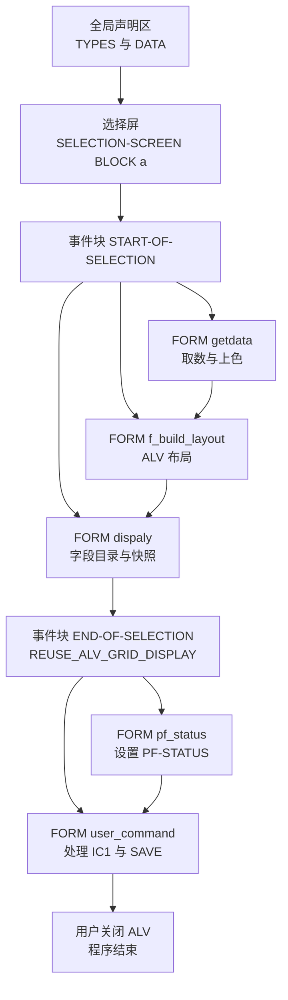
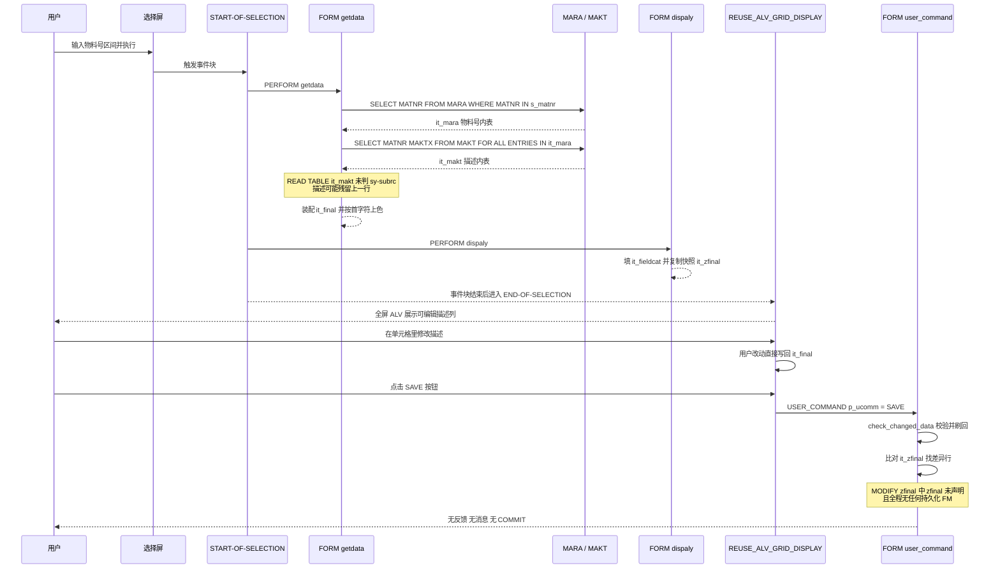

# `REPORT zr` —— 零损耗查询型全屏 ALV（可编辑物料描述）

> 分析对象：`Test-source/zr.abap`（159 行，`REPORT zr`）
> Skill 版本：`b8f84e8`（SHA256 `B8F84E80…F00A1B`，与前两次运行一致，未做修改）
> 本文件为**同版本重跑**记录，用于测量运行间稳定性；与 `zr.md`（基线）、`zr.skill-b8f84e8.md`（首跑）并列保存

---

## 一、程序定位与业务背景

**业务场景**：物料主数据查询界面。输入端的 `MARA-MATNR` 是那串躺在 Excel 里、贴着采购订单发来的物料号；输出端的 `MAKT-MAKTX` 是给仓库作业员看的物料描述。过去用户要走 `MM02` 逐个物料、逐个语言维护描述——一次批量纠正描述要开几百个事务、点几千次保存。`zr` 把这件事压进一个**全屏 ALV**：选择屏输物料号区间，屏幕弹出可编辑列表，作业员看到物料号和描述，发现哪行描述不对就直接在单元格里改，按 SAVE 收工。

这个程序最有价值的地方在于**它没有走标准 SAP 的维护路径**。SAP 给物料主数据设计的是 `MM02` 那套"单对象、字段级、带校验、带权限"的表单；`zr` 选择了绕过它，用一条 `UPDATE` 就能写的裸路径换取了批量操作的速度。代价写在代码里，而且写得很直白——**SAVE 分支从头到尾没有调用任何一个持久化 FM**。这正是本报告要重点剖析的地方。

**设计范式定性**：一支典型的 **Procedural ABAP + Reuse ALV**（`REUSE_ALV_GRID_DISPLAY` 全屏 ALV）报表。全部用 `FORM`/`PERFORM` 组织，没有 OO 封装、没有内建类型、没有 ALV 事件对象——但字段目录、布局、颜色、用户命令回调这套 Reuse ALV 的完整机制都用上了，属于 ABAP 7.40 之前 ECC 时代"报表三件套"写法的代表。

**先给结论**：这是一个**演示级程序**，不是生产级程序。它把 ALV 的机制用对了九成，把数据一致性和持久化整块留空了。作为教学样例它很清楚；作为交接给新人的"上线前代码走读"材料，它最该被记住的恰恰是那些没写出来的东西。

---

## 二、程序执行流程总览



责任链：

| 子程序 | 调用者 | 职责 |
|---|---|---|
| 全局声明区 | 运行时隐式 | 声明 3 个局部类型、若干内表与工作区 |
| `SELECTION-SCREEN BLOCK a` | 运行时隐式 | 声明 `s_matnr` 物料号选择区间 |
| `START-OF-SELECTION` | 运行时隐式 | 按 `getdata` → `f_build_layout` → `dispaly` 三步装配数据与 ALV 元信息 |
| `FORM getdata` | `START-OF-SELECTION` | 取 `MARA` 物料号、取 `MAKT` 英文描述、装配 `it_final`、拦截空结果、按首字符上色 |
| `FORM f_build_layout` | `START-OF-SELECTION` | 填充 `wa_layout`：列宽自适应、指定颜色字段名 |
| `FORM dispaly` | `START-OF-SELECTION` | 填充 `it_fieldcat`（`MATNR` 只读、`MAKTX` 可编辑）、把 `it_final` 复制为基准快照 `it_zfinal` |
| `END-OF-SELECTION` | 运行时隐式 | 调用 `REUSE_ALV_GRID_DISPLAY`，注册 `PF_STATUS` 与 `USER_COMMAND` 两个回调 |
| `FORM pf_status` | ALV 回调（`i_callback_pf_status_set`） | `SET PF-STATUS 'ZPF_STATUS'` |
| `FORM user_command` | ALV 回调（`i_callback_user_command`） | 处理 `&IC1`（双击）与 `SAVE` 两个功能码 |

> 注意执行顺序里的一个断裂：三步 `PERFORM` 全在 `START-OF-SELECTION`，而真正弹出 ALV 的 `REUSE_ALV_GRID_DISPLAY` 却写在报表层面的 `END-OF-SELECTION`。正常执行流下二者紧邻，但这条依赖是隐式的。

下面按这条流程，逐个子程序展开。
---

## 三、分组分析

### 3.1 全局声明区

```abap
TYPES: BEGIN OF ty_final,
  matnr TYPE mara-matnr,
  maktx TYPE makt-maktx,
  cellcolor TYPE lvc_t_scol,
  END OF ty_final.

TYPES: BEGIN OF ty_mara,
  matnr TYPE mara-matnr,
  END OF ty_mara.

TYPES : BEGIN OF ty_makt,
  matnr TYPE makt-maktx,
  maktx TYPE makt-maktx,
  END OF ty_makt.
```

**做什么** — 声明三个局部类型。`ty_final` 是最终上屏的行结构（物料号 + 描述 + 颜色表），`ty_mara` 和 `ty_makt` 是取数阶段的两个窄投影结构。

**为什么** — 用局部类型而不是直接 `SELECT ... INTO TABLE` 一个宽结构，好处是取数列与展示列解耦：MARA 有两百多个字段，而这里只需要 `MATNR`，窄结构让 `FOR ALL ENTRIES` 的内存占用可控。`cellcolor` 直接做进 `ty_final` 而不是单独维护一张行号到颜色的映射表，省掉了关联维护——这是 Reuse ALV 的常见做法。

**风险与改进** — 三处需要留意。其一，`ty_makt-matnr` 写成了 `TYPE makt-maktx`（描述字段）而非 `makt-matnr`。因为 `MAKT-MATNR` 与 `MAKT-MAKTX` 同为 `CHAR 40`，ABAP 不会报错，但**语义上把编号字段声明成了描述字段**，读代码的人极易误判——这类"长度碰巧一致"的错配是 ABAP 最隐蔽的缺陷来源，应当改成 `makt-matnr`。其二，`cellcolor TYPE lvc_t_scol` 意味着**每一行都携带一张颜色内表**，即使绝大多数行不上色也会占用表头开销；行数大时是隐性内存消耗。其三，`ty_mara` 只声明 `matnr` 一个字段，实际上完全可以用 `ty_makt` 或一个共享的物料号类型替代，不必单独开类型。

### 3.2 选择屏（`SELECTION-SCREEN`）

```abap
SELECTION-SCREEN BEGIN OF BLOCK a.
  SELECT-OPTIONS: s_matnr FOR matnr.
  SELECTION-SCREEN END OF BLOCK a.
```

**做什么** — 声明一个名为 `a` 的选择块，内含 `s_matnr`，类型是 `SELECT-OPTIONS`，绑定到全局变量 `matnr`（`TYPE mara-matnr`）。

**为什么** — 用 `SELECT-OPTIONS` 而不是 `PARAMETER` 或 `RANGES`，是因为物料查询天然是区间语义（"把这 300 个号捞出来"），`SELECT-OPTIONS` 自动生成 `EQ/NE/GT/LT/BT` 六个子选项和 F4 帮助，实际用起来比让用户手打 `A-Z` 灵活得多。

**风险与改进** — 两个问题。一是**没有必填校验**：`SELECT-OPTIONS` 默认为可选，不填就是全表扫描——`MARA` 有近百万条记录，一次全量查询会把 `it_mara` 和 `it_final` 撑到内存里，再叠加每行一张 `cellcolor` 表，直接 `CX_SY_NO_MEMORY`。应在 `START-OF-SELECTION` 开头加 `IF s_matnr[] IS INITIAL. MESSAGE ... TYPE 'S'. RETURN. ENDIF.`，或把选择屏设为必填。二是 `matnr` 这个全局变量**只有选择屏在用**，却被放在全局 `DATA` 段；虽然 `SELECT-OPTIONS ... FOR` 要求参照变量在全局声明（无法下沉到 FORM），但可以收窄类型到 `TYPE mara-matnr`（已如此），这一点是干净的，无需改动。

### 3.3 事件块 `START-OF-SELECTION`

```abap
START-OF-SELECTION.
      PERFORM : getdata.
      PERFORM: f_build_layout .
      PERFORM: dispaly .
```

**做什么** — 用户按下执行后，顺序调用三个 `PERFORM`：`getdata` 取数与上色、`f_build_layout` 填布局、`dispaly` 填字段目录并做基准快照。

**为什么** — 三步分离而不是揉进一个大 FORM，是有意识的责任切分：取数、布局、字段目录是三个正交关注点，分开后每一步都能单独看懂，改布局不会碰到取数逻辑。这种"一个 FORM 一件事"的老派做法在长报表里比一个大 `PERFORM` 更耐维护。

**风险与改进** — 三步的顺序有隐性依赖：`getdata` 必须最先跑（它生产 `it_final`），`dispaly` 必须最后跑（它要复制 `it_final` 做快照）。但这个顺序**只靠书写顺序保证，没有任何断言**。更值得注意的是：真正弹出 ALV 的 `REUSE_ALV_GRID_DISPLAY` 不在这里，而在报表层面的 `END-OF-SELECTION`。正常执行流下二者紧邻，但如果这个程序被改造成逻辑数据库程序、或被 `SUBMIT` 进其他流程，事件块的执行顺序就不再由书写顺序决定，程序会静默空跑（`it_final` 为空时 ALV 白屏）。建议把 `REUSE_ALV_GRID_DISPLAY` 连同三个 `PERFORM` 一起收进同一个事件块或同一个 FORM，让依赖显式化。

### 3.4 `FORM getdata`

这一步分五步：①取物料号 → ②取描述 → ③装配 → ④空结果拦截 → ⑤上色。

#### ① 取物料号

```abap
FORM getdata .

    SELECT matnr FROM mara INTO TABLE it_mara WHERE matnr IN S_matnr.
    IF it_mara IS NOT INITIAL.
```

**做什么** — 从 `MARA` 只取 `MATNR` 一列，装进内表 `it_mara`，筛选条件是选择屏的 `s_matnr` 区间；随后立刻判断 `it_mara` 是否非空。

**为什么** — 投影取列是对的。MARA 有两百多个字段，如果 `SELECT *` 装进内表，几十万行就能把扩展内存吃光；只取 `MATNR` 后每行 40 字节，量级完全不同。紧接着判空也是对的——这正是下一部 `FOR ALL ENTRIES` 的前置条件，见下一段。

**风险与改进** — `IF it_mara IS NOT INITIAL` 的写法是对的，但**位置很脆弱**：它与 `SELECT` 之间的空行，以及它紧贴的下一段 `FOR ALL ENTRIES`，构成了"必须成对出现"的隐式契约。作者写对了，但没有任何注释说明"这个判断是为 `FOR ALL ENTRIES` 服务的"，后来者若在两句之间插入任何取数，很容易就把这个保护冲掉。建议在判断处加一行注释点明意图。更实质的问题是**没有对 `s_matnr` 空选做拦截**（见 3.2），全表扫描的风险仍在。

#### ② 取描述

```abap
    SELECT matnr maktx FROM makt INTO TABLE it_makt
    FOR ALL ENTRIES IN it_mara WHERE matnr = it_mara-matnr AND spras = 'EN'.
    ENDIF.
```

**做什么** — 从 `MAKT` 取 `MATNR` + `MAKTX` 两列装进 `it_makt`，用 `FOR ALL ENTRIES` 与 `it_mara` 做内连接，附加条件是语言等于 `'EN'`。

**为什么** — `FOR ALL ENTRIES` 的正确前提（驱动内表非空）已经在上一段判过了，这是这段代码最值得肯定的地方——很多人写 `FAE` 会漏掉这个判断，然后在大数据量上直接 short dump。用 `FAE` 而不是显式 `JOIN` 也算合理：`FAE` 生成的 SQL 走 `MAKT` 的 `MATNR` 索引前缀，命中率高且不需要额外维护 join 条件。

**风险与改进** — `spras = 'EN'` 有两层问题。第一层是**语言硬编码**：SAP 标准做法是 `sy-langu`，或加一个 `s_spras` 选择屏字段让用户自己选语言。中文用户在 `MAKT` 里维护的描述语言键是 `'1'`，用 `'EN'` 硬编码意味着**非英文系统下这个程序查不到任何描述**——这是最表层也最容易改的问题。第二层更隐蔽：`MAKT-SPRAS` 的数据元素是 `SPRAS`，**长度 1**（取值形如 `'D'` / `'E'` / `'1'`），而字面量 `'EN'` 长度 2。ABAP 对定长字符的比较会按较短侧补空格对齐，`'EN'` 与 `'E '` 不相等，因此这个条件**可能恒不成立**——若如此，`it_makt` 永远为空，描述列全空，并与下一段的 `sy-subrc` 缺陷叠加成"整列空白"的双重故障。建议在 SE11 确认 `MAKT-SPRAS` 的实际长度后，改用 `sy-langu` 或单字符语言键，并把这条长度校核写进代码评审清单。

#### ③ 装配

```abap
    LOOP AT it_mara INTO wa_mara.
    wa_final-matnr = wa_mara-matnr.
    READ TABLE it_makt INTO wa_makt WITH KEY matnr = wa_mara-matnr.
    wa_final-maktx = wa_makt-maktx.
    wa_final-matnr = wa_mara-matnr.
    APPEND wa_final TO it_final.
    ENDLOOP.
```

**做什么** — 遍历 `it_mara`，对每个物料号去 `it_makt` 里找对应描述，填进 `wa_final` 后 `APPEND` 到 `it_final`。

**为什么** — 以外层 `it_mara` 为驱动表，保证 `it_final` 的行数与顺序都与物料号集合严格一致——即使某个物料在 `MAKT` 里查不到描述，那一行依然会出现在 ALV 上（描述为空），而不是整行消失。这个"左连接"语义是对的，比按 `it_makt` 驱动更符合"以物料号为准"的业务预期。

**风险与改进** — 这段有三个问题，一个严重、一个中等、一个轻微。

**严重：`READ TABLE` 未判 `sy-subrc`，且 `wa_makt` 从未在循环内 `CLEAR`。** `READ TABLE ... INTO wa_makt` 找不到时，`sy-subrc = 4`，但 ABAP **不保证把 `wa_makt` 置空**——它会保留上一次循环的完整内容。于是第 2 个物料若在 `MAKT` 里查不到英文描述，`wa_final-maktx` 会被填成**上一个物料的描述**。更糟的是 `wa_makt-matnr` 也一并残留，使"上一行的描述被静默安到下一行"这件事完全不留痕迹：ALV 上看不出任何异常，用户会拿着一列错乱的描述去做批量维护。这是本程序危害最大的缺陷之一——它不报错、不崩溃，只是安静地产生错误数据。修法是循环内首行 `CLEAR wa_makt.`，并在 `IF sy-subrc = 0` 分支内才赋 `wa_final-maktx`。

**中等：`it_makt` 是标准表，`READ TABLE ... WITH KEY` 退化为线性查找**，整体复杂度 O(n²)。物料几千条时感受不到，上万条会明显。改 `it_makt TYPE SORTED TABLE ... WITH UNIQUE KEY table_line` 或直接 `READ TABLE ... TRANSPORTING` 配合排序表，成本极低。

**轻微：`wa_final-matnr = wa_mara-matnr.` 在循环体内出现了两次**（第一次和 `wa_final-maktx` 赋值之间）。第二次是完全冗余的重复赋值。同一段里还有 `wa_final` 从未 `CLEAR`——`ty_final` 三个字段中 `cellcolor` 是表类型，如果将来调整代码顺序让上色逻辑先于装配执行，颜色会在行间累积。当前顺序下 `it_final` 里的颜色都是 ③ 之后由 ⑤ 单独 `MODIFY` 写入的，所以现在没出问题，但这是靠执行顺序侥幸成立的隐式约束。

#### ④ 空结果拦截

```abap
IF it_final IS INITIAL.
  MESSAGE 'no values' TYPE 'I'.
  LEAVE TO CURRENT TRANSACTION.
  ENDIF.
```

**做什么** — 如果 `it_final` 为空，弹一条 `'I'` 级消息，然后 `LEAVE TO CURRENT TRANSACTION` 退出当前事务、回到选择屏。

**为什么** — 拦截空结果是必要的：否则 `REUSE_ALV_GRID_DISPLAY` 会弹出一个空网格，用户面对白屏不知道是没查到还是程序坏了。用 `'I'`（信息）而不是 `'W'` 或 `'E'` 也算合理——没查到数据是正常业务结果，不是错误。

**风险与改进** — 三点。其一，**提示文本硬编码英文且无消息类**：`MESSAGE 'no values'` 是最原始的写法，文案既不能通过 SE63 翻译，也没有消息号可供外部程序捕获（`MESSAGE ID`）。SAP 规范做法是建 `ZMSG` 消息类，用 `MESSAGE ID 'ZMSG' TYPE 'I' NUMBER '001'`，并把 `s_matnr` 的范围回显在文案里——"物料号 X–Y 无数据"远比"no values"有用。其二，`TYPE 'I'` 之后紧跟 `LEAVE TO CURRENT TRANSACTION` 是**多余且有害的**：`I` 级消息本身就会返回选择屏，`LEAVE` 又额外重启一次事务流，白白多一轮屏幕流转；更麻烦的是它把控制权交给运行时，**后续 `getdata` 的 ⑤ 上色逻辑不会执行**（这一点恰好无害，但依赖很脆）。正确写法是 `MESSAGE ... TYPE 'I'` 加 `RETURN`——`RETURN` 从当前 FORM 退出并回到调用点，语义精确且不重启事务。其三，这段 `IF` 块没有用规范的缩进，`ENDIF` 与 `IF` 不齐平，视觉上容易让读者误判嵌套层级。

#### ⑤ 上色

```abap
  LOOP AT it_FINAL INTO wa_FINAL.
    lv_index = sy-tabix.
    IF  wa_final-matnr+0(1) = '0'.
    wa_cellcolor-fname = 'MATNR'.
    wa_cellcolor-color-col = 6.
    wa_cellcolor-color-int = '1'.
    wa_cellcolor-color-inv = '0'.
    APPEND wa_cellcolor TO wa_FINAL-cellcolor.
    CLEAR: wa_cellcolor.
    MODIFY it_final FROM wa_final INDEX lv_index TRANSPORTING cellcolor.
    CLEAR wa_final.
      ENDIF.
   ENDLOOP.
ENDFORM.
```

**做什么** — 第二次遍历 `it_final`，用 `sy-tabix` 记住当前行号，判断 `MATNR` 首字符是否为 `'0'`；若是，则构造一条 `lvc_s_scol` 颜色记录（字段名 `MATNR`、颜色 6、强度 1、非反白）`APPEND` 进 `wa_final-cellcolor`，然后用 `MODIFY ... INDEX lv_index TRANSPORTING cellcolor` 把颜色回写到 `it_final` 对应行。

**为什么** — 颜色处理是这个程序里最见功力的一段。三处细节做得对：`CLEAR wa_cellcolor` 保证不同行之间颜色记录不串；`TRANSPORTING cellcolor` 保证只回写颜色、不把工作区的其他字段一起覆盖回去（这正是 Reuse ALV 里 `MODIFY` 的标准写法）；`color-inv = '0'` 显式关掉反白，避免继承控件默认的反白设置。

**风险与改进** — 四个问题。其一，**业务含义完全没有说明**：`wa_final-matnr+0(1) = '0'` 是"物料号首位是 0"，`color-col = 6` 是 ALV 颜色码 6。这两条魔数在源码里没有任何注释——"首位 0 的物料"在 SAP 里通常指跨应用（generic）导入的物料，但**读者无从得知这个业务约定**，也无从判断规则是否仍然成立。至少应定义常量并注释；若业务规则其实该基于 `MTART` 或配置表，这个判断本身就是错的。

其二，**为上色单独做第二次全表遍历**，代价是每行一次 `MODIFY`。`MODIFY` 作用于标准表是 O(n)，整体 O(n²)。物料上万条时这一段会明显拖慢。更重要的是逻辑上完全可以在 ③ 的装配循环里顺手判断首字符并 `APPEND` 颜色——一趟循环做完，既省掉 `lv_index` 这个全局变量，也省掉整个 `MODIFY ... TRANSPORTING`。这是一个纯粹的重构机会。

其三，`lv_index TYPE sy-tabix` 声明在**全局**却只在这一个 FORM 里用。`sy-tabix` 在 `LOOP AT` 中确实是当前行号，所以这里功能上没错，但依赖"`APPEND` 保持行序、且中途无 `DELETE`/`SORT`"这个隐式前提——一旦有人在 ③ 和 ⑤ 之间插入排序，颜色就会贴到错误的行上。用 `MODIFY ... TRANSPORTING` 配 `sy-tabix` 本身是常见套路，但把索引存进全局变量增加了误用面。

其四，`wa_final-matnr+0(1)` 这种 `+0(1)` 的偏移写法是 ECC 时代的遗留风格；现代写法是 `wa_final-matnr(1)`，语义等价但更易读。
---

## 四、执行流程全景图（数据视角）



这张图要传达的核心是**数据的三次转折**：MARA/MAKT 的数据库行 → `it_final` 的展示结构 → 用户编辑后的 `it_final` → （本应）MAKT 的数据库行。最后一次转折**在图上是断开的**——`user_command` 到数据库之间没有箭头，因为代码里确实没有这条线。

---

## 五、问题清单与改进建议（按优先级）

### 🔴 P0 — 业务正确性

| # | 所在子程序 | 问题 | 改进方向 |
|---|---|---|---|
| 1 | `FORM user_command`（SAVE） | `MODIFY zfinal FROM wa_zzfinal` 中 `zfinal` **未声明**，程序无法通过语法检查 | 改 `MODIFY it_final` 之外的合法目标；配合 #2 重构为独立的 `it_save_payload` 内表 |
| 2 | `FORM user_command`（SAVE） | SAVE 分支**无任何持久化动作**：无 `MODIFY makt`、无 `UPDATE`、无 `BAPI_MATERIAL_MAINTAIN`、无 `COMMIT WORK`。用户改动只存在于内存，重启即丢 | 引入 `it_save_payload`，比对后对 `MAKT` 做 `MODIFY` + `COMMIT WORK`，失败 `ROLLBACK` + 消息 |
| 3 | `FORM getdata`（③ 装配） | `READ TABLE it_makt INTO wa_makt` 未判 `sy-subrc` 且 `wa_makt` 循环内从未 `CLEAR`，**无英文描述的物料被填成上一个物料的描述**，静默数据错乱 | 循环内首行 `CLEAR wa_makt.`，并在 `IF sy-subrc = 0` 分支内才赋 `wa_final-maktx` |
| 4 | `FORM getdata`（② 取描述） | `WHERE spras = 'EN'`：语言硬编码（中文系统键为 `'1'`）；且 `MAKT-SPRAS` 为 1 字符语言键而字面量 `'EN'` 为 2 字符，条件可能恒不成立，导致描述整列为空 | SE11 确认字段长度后改用 `sy-langu` 或单字符语言键；同时补 #3 |
| 5 | `FORM user_command`（SAVE） | `READ TABLE it_zfinal INTO wa_zfinal` 未判 `sy-subrc`，`wa_zfinal` 的 `CLEAR` 写在 `ENDLOOP` 之后对循环无效；`IF wa_zfinal-matnr = wa_final-matnr` 用值相等代替"找到基准行" | 改为 `IF sy-subrc = 0 AND wa_zfinal-maktx NE wa_final-maktx`，并把 `CLEAR` 移入循环体首行 |
| 6 | `FORM user_command`（SAVE） | `MODIFY` 若改指 `it_zfinal`，会**污染只读基准**——首次保存后同一行二次修改被判定"未变化"而静默丢弃 | 快照严格只读；写库目标与快照完全分离 |
| 7 | `FORM user_command`（IC1） | `&IC1` 分支遍历全表 + `WRITE` 全表物料号，刷屏并破坏 ALV 交互；`READ ... WITH KEY matnr = wa_final-matnr` 是自我赋值式空操作；`p_selfield` 声明未用 | `READ TABLE it_final INDEX p_selfield-row` 取单行后跳事务或弹消息；无需求则删除整个分支 |

### 🟠 P1 — 健壮性

| # | 所在子程序 | 问题 | 改进方向 |
|---|---|---|---|
| 8 | `FORM user_command`（SAVE） | `GET_GLOBALS_FROM_SLVC_FULLSCR` 无 `EXCEPTIONS`，`ref1` 未判空，紧随的 `check_changed_data` 会短 dump | 加 `EXCEPTIONS not_found` 或 `TRY` + 判空 |
| 9 | `FORM user_command`（SAVE） | `check_changed_data` 是函数式方法、返回 `sy-subrc`，返回值被丢弃；校验失败时用户以为保存成功 | 接收返回值，非 0 时 `MESSAGE` 指出哪一行不合法 |
| 10 | `FORM dispaly`（①）+ `FORM user_command`（IC1） | `MATNR` 未设 `key` / `hotspot`，`&IC1` 是**永不可达的死代码**；而一旦有人补上 `hotspot`，#7 的问题立刻被激活 | 两处一起改：补 `key` + `hotspot` 并重写 IC1，或删除 IC1 |
| 11 | `FORM pf_status` | `SET PF-STATUS 'ZPF_STATUS'` 无存在性检查，状态栏缺失直接短 dump，而这正是 `SAVE` 功能码的前置条件 | `TRY ... CATCH cx_static_check`，并在注释中写出依赖的按钮清单 |
| 12 | `FORM getdata`（④） | `MESSAGE 'no values' TYPE 'I'` 硬编码英文、无消息类，且后接 `LEAVE TO CURRENT TRANSACTION` 是多余的事务重启 | 建 `ZMSG` 消息类 + `MESSAGE ID ... NUMBER '001'`，文案回显 `s_matnr`；`LEAVE` 换 `RETURN` |
| 13 | `END-OF-SELECTION`（ALV 调用） | `PROGRAM_ERROR` / `OTHERS` 分支为空（SAP 示例原样占位），控件创建失败时用户只见白屏 | 补 `MESSAGE ... TYPE 'E'` + `LEAVE`，把异常映射为可读业务提示 |
| 14 | `START-OF-SELECTION` / `END-OF-SELECTION` | 三步 `PERFORM` 在 `START-OF-SELECTION`、ALV 调用在 `END-OF-SELECTION`，依赖报表事件顺序；改成逻辑数据库程序或被 `SUBMIT` 时静默空跑 | 把 `REUSE_ALV_GRID_DISPLAY` 与三个 `PERFORM` 收进同一事件块 |
| 15 | 全部 | 无编辑期校验（未注册 `i_callback_data_changed_finished`），非法描述（超长 / 纯空格 / 控制字符）能敲进去 | 补 `DATA_CHANGED_FINISHED` 回调做实时校验，SAVE 时二次校验 |
| 16 | `FORM dispaly`（② 快照） | 快照时点仅靠事件块顺序保证；一旦挪到 ALV 调用之后，底稿变成用户改后值，`SAVE` 永远认为"无变化" | 快照紧贴数据装载位置并加注释锁定时点 |
| 17 | 选择屏（`SELECTION-SCREEN`） | `s_matnr` 为可选，`INITIAL` 时等于对 `MARA` 近百万行做全表扫描；叠加每行携带 `cellcolor` 表易触发 `CX_SY_NO_MEMORY` | `START-OF-SELECTION` 开头拦截空选屏，或把选择屏设为必填；`END-OF-SELECTION` 前给出取数范围提示 |

### 🟡 P2 — 性能与规范

| # | 所在子程序 | 问题 | 改进方向 |
|---|---|---|---|
| 18 | `FORM getdata`（⑤ 上色） | 为上色单独做第二次全表遍历 + 全局 `lv_index` + `MODIFY ... TRANSPORTING`，标准表上为 O(n²) | 并入 ③ 装配循环判断首字符并 `APPEND` 颜色，一次 `APPEND` 写全部字段 |
| 19 | `FORM getdata`（⑤ 上色） | 业务魔数无注释：`matnr+0(1) = '0'`（首位 0）与 `color-col = 6` 的含义读者无从得知；且规则基于字符串而非 `MTART`/配置 | 定义常量并注释业务约定；或改为基于 `MTART` / 配置表判定 |
| 20 | `FORM getdata`（③ 装配）+ （② 取描述） | `it_makt` 是标准表，`READ TABLE ... WITH KEY` 线性查找，整体 O(n²) | 改 `SORTED TABLE ... WITH UNIQUE KEY table_line` 或 `HASHED` |
| 21 | 全局声明区 | `ty_makt-matnr` 声明为 `TYPE makt-maktx`（描述字段），因同为 `CHAR 40` 不报错，但语义错配 | 改为 `TYPE makt-matnr` |
| 22 | 全局声明区 | `ty_final` 含 `cellcolor TYPE lvc_t_scol`，每行携带一张颜色内表，快照还整表复制了一份 | 颜色与数据分离；快照改用只含 `matnr` + `maktx` 的窄结构 |
| 23 | 全局声明区 | `lv_index TYPE sy-tabix` 声明在全局却只服务 `getdata`；全局变量使"哪个表是只读基准"失去结构保护 | 下沉到 FORM 内；快照与写库载荷用独立内表而非全局共享 |
| 24 | `FORM getdata`（③ 装配） | `wa_final-matnr = wa_mara-matnr.` 重复赋值两次；`wa_final` 从未 `CLEAR`，`cellcolor` 有行间累积隐患 | 删除冗余赋值；循环内 `CLEAR wa_final.` |
| 25 | 全部 | `MESSAGE 'no values'`、`seltext_m = 'Material'` / `'Description'` 均为硬编码英文，无文本符号 / 消息类，无法 SE63 翻译 | 建 `ZMSG` 消息类 + 文本符号（`TEXT-001` 等） |

### 🟢 P3 — 可扩展性

| # | 所在子程序 | 问题 | 改进方向 |
|---|---|---|---|
| 26 | 全局结构 | 全部逻辑用 `FORM`/`PERFORM` 平铺，无 OO 封装；字段目录、快照、上色散落各处，无法为第二个 ALV 复用 | 抽出 `zcl_alv_helper` 之类做字段目录与差异比对；程序层只留取数与装配 |
| 27 | `FORM dispaly` / `FORM f_build_layout` | `'IT_FINAL'`、`'MATNR'`、`'CELLCOLOR'` 靠字符串拼装连接字段目录与颜色，改名会静默失效且不报错 | 用 `COLSET` + `COLOR-COLTAB` 显式列目录，或集中定义这些名字 |
| 28 | `FORM dispaly` | 子程序名拼写为 `dispaly`（应为 `display`），`PERFORM` 与 `FORM` 一致故能编译，但会持续污染代码库 | 更正拼写；改名后同步更新 `START-OF-SELECTION` 的 `PERFORM` |
| 29 | 选择屏 | 只有 `s_matnr` 一个字段，无语言、无物料类型、无限制范围，多语言场景必须改代码 | 增加 `s_spras`、`s_mtart` 选择屏字段 |
| 30 | `END-OF-SELECTION` | `i_callback_program = sy-repid` 隐式依赖回调 `FORM` 与调用点同程序；抽到 `INCLUDE` 或函数组即失效 | 抽函数组时同步改造回调注册方式 |

---

## 六、整体评价与启发

### 优点

1. **ALV 机制用得相当完整。** 字段目录的 `CLEAR` 纪律、颜色的 `TRANSPORTING` 回写、`coltab_fieldname` 配置、`GET_GLOBALS_FROM_SLVC_FULLSCR` 反查控件——这些都不是"照着例子抄"能碰巧写对的点，作者对 Reuse ALV 的数据流有实际理解。
2. **`FOR ALL ENTRIES` 的空表保护写对了。** 很多人写 `FAE` 会漏掉前置判空然后在大数据量上 short dump，这里 `IF it_mara IS NOT INITIAL` 挡住了，属于关键的正确性习惯。
3. **差异比对的设计意图正确。** 显示前留底稿、SAVE 时只处理改动行，是批量编辑类程序的正解；快照内表 `it_zfinal` 的引入说明作者想过"怎么知道用户改了哪一行"这个核心问题——只是实现上塌了。
4. **取数投影克制。** MARA 只取 `MATNR`，没有 `SELECT *` 拉两百多个字段。

### 短板

1. **SAVE 链路整体缺失。** 未声明的 `zfinal`、形近的 `wa_zzfinal`、无持久化 FM、无 `COMMIT`——从变量命名到业务闭环都停在半路。这个程序叫"可编辑"，但它不能保存。
2. **`sy-subrc` 意识缺失。** 三处 `READ TABLE`（`it_makt`、`it_zfinal`、IC1 里的自我查找）全部不判返回码，两处工作区在循环内不 `CLEAR`。这是 ABAP 新手最集中的错误类型，危害在于**不报错、只出错数据**。
3. **硬编码无处不在。** `'EN'` 语言、`'no values'` 消息、`'Material'` / `'Description'` 列标题、`'0'` 首字符、`color-col = 6`、`'ZPF_STATUS'`——全都无法通过 SE63 翻译或配置调整，程序只在一个特定环境、特定语言下正确工作。
4. **两处缺陷互相掩护。** `MATNR` 不设 `hotspot` 让 `&IC1` 永不可达，掩盖了那段错误逻辑。这比两个独立缺陷更危险：修好一个会立刻引爆另一个。

### 可学到的设计经验

1. **可编辑 ALV 的保存三件套**：①显示前 `it_zfinal[] = it_final[]` 留只读底稿；②SAVE 时 `READ TABLE ... WITH KEY` 逐行比对并判 `sy-subrc`；③比对通过后写库 + `COMMIT WORK` + 失败 `ROLLBACK` + 消息回执。本程序只做完了第①步的意图，②③步都有缺陷——**三步缺一不可，且第①步的底稿绝不能成为写库目标**。
2. **`READ TABLE` 的两个配套纪律**：`INTO` 之前工作区必须 `CLEAR`，之后必须判 `sy-subrc`。ABAP 不会自动清空读取目标，`sy-subrc = 4` 时变量保持旧值——"静默数据错乱"的第一名成因。
3. **定长字符比较要校核长度。** `MAKT-SPRAS`（1 字符）与 `'EN'`（2 字符）这种比较不会报错，只会恒不成立。"字段类型和长度碰巧一致"掩盖语义错配，"字段长度不一致"则制造静默空结果——两类都要在评审时显式核对。
4. **类型声明要看字段语义，不能看长度。** `matnr TYPE makt-maktx` 能编译，只因两者都是 `CHAR 40`；代码审查看的是"这个字段到底是编号还是描述"。
5. **死代码要么删掉，要么修好。** `&IC1` 这种"加了 `hotspot` 就会出错"的分支，比不写更危险——它把风险推迟到一次看似无害的改动之后。评审时看到永不可达的分支，应当追问"它为什么不可达"，答案往往指向另一个还没修的缺陷。
6. **演示代码与生产代码的边界要显式画出。** 这个程序作为教学样例很清楚（数据流简单、机制完整），但它缺少注释声明"此处故意简化"。建议在程序头加注释说明哪些是为演示省略的（持久化、校验、异常处理），避免它被误当成可直接投产的参考实现。

---

> **一句话总结**：ALV 机制用对了九成，数据一致性和持久化整块留空——这是一份优秀的"机制示范"，一份不合格的"业务实现"。
### 3.5 `FORM f_build_layout`

```abap
FORM f_build_layout .
  CLEAR wa_layout.
  wa_layout-colwidth_optimize = 'X'.
  wa_layout-coltab_fieldname = 'CELLCOLOR'.

ENDFORM.
```

**做什么** — 清空布局结构后设两个字段：`colwidth_optimize = 'X'` 让 ALV 按内容自动优化列宽；`coltab_fieldname = 'CELLCOLOR'` 告诉 ALV 去 `IT_FINAL` 行的 `CELLCOLOR` 成员里找颜色表。

**为什么** — 这两行是 Reuse ALV 的标准配置，而且**第二行是这个程序能上色的关键**：不设 `coltab_fieldname`，ALV 就不会去读 `cellcolor` 成员，⑤ 里精心构造的颜色记录会全部被静默忽略。作者知道要配这一项，说明对 Reuse ALV 的机制是有实际掌握的，不是套模板。

**风险与改进** — 基本无风险，两点小的改进。其一，`coltab_fieldname = 'CELLCOLOR'` 是字符串字面量，与 `wa_fieldcat-tabname = 'IT_FINAL'` 一样属于"靠字符串拼装"的脆弱连接——重命名字段或表会静默失效，且不报错。建议改用 `COLSET` + `COLOR-COLTAB` 的显式列目录方式，或至少把两个字符串放在一处定义。其二，这个 FORM 只做两行赋值，专设一个子程序略显过度；但作为"布局是独立关注点"的示范是可接受的，与 `dispaly` 的字段目录形成对称。

### 3.6 `FORM dispaly`

这一步分两步：①填充字段目录 → ②复制基准快照。

> 子程序名拼写为 `dispaly`（正确拼写是 `display`），`PERFORM` 与 `FORM` 一致所以能编译。这类拼写错误会持续污染代码库——搜索、阅读、以及未来改成 OO 时的调用点。

#### ① 字段目录

```abap
FORM dispaly .

  wa_fieldcat-tabname = 'IT_FINAL'.
  wa_fieldcat-fieldname = 'MATNR'.
  wa_fieldcat-seltext_m = 'Material'.

  APPEND wa_fieldcat TO it_fieldcat.
  CLEAR: wa_fieldcat.

  wa_fieldcat-tabname = 'IT_FINAL'.
  wa_fieldcat-fieldname = 'MAKTX'.
  wa_fieldcat-seltext_m = 'Description'.
  wa_fieldcat-edit ='X'.

  APPEND wa_fieldcat TO it_fieldcat.
  CLEAR: wa_fieldcat.
```

**做什么** — 往 `it_fieldcat` 里 `APPEND` 两条字段目录：`MATNR`（文本"Material"，只读）和 `MAKTX`（文本"Description"，`edit = 'X'` 表示可编辑）。每条 `APPEND` 后 `CLEAR wa_fieldcat`。

**为什么** — 每条 `APPEND` 后立刻 `CLEAR` 是 Reuse ALV 编程的硬性纪律：工作区若不清空，上一条的 `edit`、`key` 等标记会**残留在下一条上**。这里两处都清了，所以没出问题。`edit = 'X'` 只加在 `MAKTX` 上，语义正确——物料号是主键，不可改；描述是本次要维护的字段，可改。

**风险与改进** — 一个严重的遗漏：**`MATNR` 既没有设 `key = 'X'` 也没有设 `hotspot = 'X'`**。这直接导致下一节 `user_command` 里的 `&IC1`（双击）分支**永不可达**——Reuse ALV 只有在字段标记为 `hotspot` 时才会响应双击并抛出 `&IC1` 功能码。两个后果叠加：一是 `&IC1` 分支是死代码，二是**如果有人日后修好了 `hotspot`，那段有严重问题的 IC1 逻辑会立刻被激活**（见 3.8）。这是"两个缺陷互相掩护"的典型案例，必须一起修：要么两处都补上（`MATNR` 设 `key` + `hotspot`，并重写 IC1），要么直接删掉 IC1 分支。

其次，两个列标题 `'Material'` 和 `'Description'` 也是硬编码英文，无文本符号（text element）可翻译。与 3.4 的 `MESSAGE 'no values'` 是同一类问题：Reuse ALV 的 `seltext_m` 应该走 `TEXT-001` 之类的文本符号，才能支持 SE63 翻译。

#### ② 基准快照

```abap
*appending values form final internal table to
* temproary final table for data comparision
  it_zfinal[] = it_final[].

ENDFORM.
```

**做什么** — 把 `it_final` 的全部行复制到 `it_zfinal`，作为"用户修改前的原始值"快照，供 `SAVE` 时逐行比对差异。

**为什么** — 这是实现"只保存改动行"的标准做法：`REUSE_ALV_GRID_DISPLAY` 的可编辑 ALV 会把用户改动直接写回 `it_final`，程序无法知道哪些行被改过。要做差异比对，必须在显示前留一份底稿。整体拷贝比逐字段拷贝简单，思路是对的。

**风险与改进** — 三点。其一，**快照时点依赖事件块顺序**：`it_zfinal[] = it_final[]` 在 `START-OF-SELECTION` 的 `dispaly` 里，而用户改动发生在 ALV 显示**之后**。当前顺序恰好正确，但这个正确性完全依赖 3.3 提到的 `START-OF-SELECTION` / `END-OF-SELECTION` 隐式衔接——一旦有人把快照挪到 ALV 调用之后，底稿就变成了用户改后的值，`SAVE` 会永远认为"没有变化"。快照应在紧邻数据装载完成的位置，并加注释锁定这个时点。

其二，**整表拷贝连 `cellcolor` 一起复制了**，而 `SAVE` 的比对只涉及 `matnr` 和 `maktx`。每行携带一张颜色内表做无意义的快照，浪费内存。应改用窄结构 `TYPE TABLE OF ty_diff`（只含 `matnr` + `maktx`）作为基准。

其三，快照内表 `it_zfinal` 的生命周期是**全局变量**——它从 `dispaly` 一直活到 `SAVE` 回调，靠全局内存跨事件块传递。对于只有一个 ALV 实例的场景没问题，但这正是 3.8 里 `MODIFY` 打错目标表的根源：全局变量让"哪个表是只读底稿"这件事失去了结构上的保护。

### 3.7 事件块 `END-OF-SELECTION`（ALV 调用）

```abap
END-OF-SELECTION.

CALL FUNCTION 'REUSE_ALV_GRID_DISPLAY'
    EXPORTING
      i_callback_program                = sy-repid
      i_callback_pf_status_set          = 'PF_STATUS'
      i_callback_user_command           = 'USER_COMMAND'
      is_layout                         = wa_layout
      it_fieldcat                       = it_fieldcat
     TABLES
       t_outtab                          = it_final
    EXCEPTIONS
      PROGRAM_ERROR                     = 1
      OTHERS                            = 2
             .
   IF sy-subrc <> 0.
* Implement suitable error handling here
   ENDIF.
```

**做什么** — 调用 `REUSE_ALV_GRID_DISPLAY` 全屏显示 `it_final`，传入布局 `wa_layout`、字段目录 `it_fieldcat`，并注册两个回调：`PF_STATUS`（设状态栏）和 `USER_COMMAND`（处理功能码）。两个异常 `PROGRAM_ERROR` / `OTHERS` 捕获后仅判 `sy-subrc`，分支体为空。

**为什么** — 用 `TABLES t_outtab` 传数据是 Reuse ALV 的老式签名（`REUSE_ALV_GRID_DISPLAY` 的 `TABLES` 参数），与 `i_callback_program = sy-repid` 搭配，回调 FORM 只需写在同一程序里即可被找到，不必传 `it_callback_program` 之外的引用。这套写法在 ECC 时代是标准范式。**只声明 `is_layout` 和 `it_fieldcat` 而不传 `i_save` / `it_editable`，说明作者完全依赖字段目录里的 `edit = 'X'` 来控制可编辑性**——这也是标准做法，方向没错。

**风险与改进** — 三个问题。其一，**两个异常分支是空的**，注释 `Implement suitable error handling here` 就是 SAP 示例代码里的原样占位。控件创建失败（`PROGRAM_ERROR`，例如缺少 GUI 控件或前端连接断开）时，用户只会看到一个空白屏幕，日志里什么都没有。至少要 `MESSAGE e_x` 明确报错；`OTHERS = 2` 更应该把 `sy-subrc` 映射为可读的业务提示。

其二，`i_callback_program = sy-repid` 意味着**回调依赖 `FORM` 位于同一程序**。这对 `REPORT` 成立，但一旦有人把数据逻辑抽到 `INCLUDE` 或改成函数组，`USER_COMMAND` / `PF_STATUS` 就再也找不到，程序会抛 `PROGRAM_ERROR`。这是一处隐式且脆弱的耦合，值得在代码里注明。

其三，**这段代码写在报表层面而不是任何 FORM 内**。`END-OF-SELECTION` 是隐式事件块，能正常工作，但它让 `START-OF-SELECTION`（三步装配）与 `END-OF-SELECTION`（真正显示）分裂成两处，如 3.3 所述。

### 3.8 `FORM user_command`

这一步分两步：①处理 `&IC1` 双击 → ②处理 `SAVE` 保存。**这是全程序问题最集中的地方。**

#### ① `&IC1` 双击分支

```abap
FORM user_command USING p_ucomm TYPE sy-ucomm
                        p_selfield TYPE slis_selfield.
CASE p_ucomm.
    WHEN '&IC1'.
      LOOP AT it_final INTO wa_final.
      READ TABLE it_final INTO wa_final WITH KEY matnr = wa_final-matnr.
      WRITE: / wa_final-matnr.
      ENDLOOP.
```

**做什么** — 收到 `&IC1` 功能码时，遍历**整张** `it_final`，对每行执行一次 `READ TABLE ... WITH KEY matnr = wa_final-matnr`（用当前行的物料号去表里找自己），然后 `WRITE` 输出该行物料号。

**为什么** — 作者的意图显然是"双击某行后跳转到该物料的明细"（典型做法是 `SET PARAMETER` + `CALL TRANSACTION 'MM03'`，或用 `p_selfield-row` 定位后弹窗）。骨架选对了：拿到 `p_selfield` 就说明打算按行定位。

**风险与改进** — 这段有三个叠加的问题，**每一个单独拿出来都不致命，合起来是彻底不可用**。

其一，**这段代码永不可达**——因为 3.6 里 `MATNR` 没有设 `hotspot = 'X'`，Reuse ALV 不会抛出 `&IC1`。`p_selfield` 这个参数声明了却从未被使用，正是"打算按行定位但从未实现"的证据。

其二，**`READ TABLE it_final INTO wa_final WITH KEY matnr = wa_final-matnr` 是一次自我赋值式的空操作**：目标工作区和读取键来自同一行，读回来的必然是自己。`it_final` 是标准表且 `MATNR` 非唯一键，这次查找也是线性扫描——为了什么也没做，付出 O(n²)。这行代码唯一的实际效果是：若 `it_final` 中存在重复物料号，它会把 `wa_final` 替换成**第一个**匹配行，从而破坏当前遍历位置。这是纯粹的代码异味。

其三，**遍历全表 + `WRITE` 全表物料号**，一次双击就把整张表刷到屏幕上。这会覆盖 ALV 的输出区域、破坏交互体验（用户以为程序崩了），且 `WRITE` 在全屏 ALV 回调里属于明确的反模式。

正确写法应该是：`READ TABLE it_final INTO wa_final INDEX p_selfield-row`，然后 `SET PARAMETER ID 'MAT' FIELD wa_final-matnr` + `CALL TRANSACTION 'MM03' AND EXIT`，或 `MESSAGE wa_final-maktx TYPE 'S'`。如果双击功能并非需求，**最诚实的做法是直接删掉整个 `&IC1` 分支**，而不是留一段永不执行、且一旦被激活就会出错的逻辑。

#### ② `SAVE` 保存分支

```abap
    WHEN 'SAVE'.

      CALL FUNCTION 'GET_GLOBALS_FROM_SLVC_FULLSCR' "Capturing changes in ALV
      IMPORTING
        e_grid = ref1.
      CALL METHOD ref1->check_changed_data.
*moving changed value into ztable on saving
LOOP AT it_final INTO wa_final.
  READ TABLE it_zfinal INTO wa_zfinal WITH KEY matnr = wa_final-matnr.
  IF wa_zfinal-matnr = wa_final-matnr AND wa_zfinal-maktx NE wa_final-maktx.
    MOVE-CORRESPONDING wa_final TO wa_zzfinal.
    MODIFY zfinal FROM wa_zzfinal.
  ENDIF.
ENDLOOP.
    CLEAR: wa_final,wa_zfinal, wa_zzfinal.
ENDCASE.
ENDFORM.
```

**做什么** — 收到 `SAVE` 后，先用 `GET_GLOBALS_FROM_SLVC_FULLSCR` 拿到 ALV 控件引用 `ref1`，调用 `check_changed_data` 让控件校验用户输入；然后遍历 `it_final`，到基准快照 `it_zfinal` 里找同一物料号，若快照物料号相等且描述不同，则 `MOVE-CORRESPONDING` 到 `wa_zzfinal` 再 `MODIFY`。

**为什么** — 用 `GET_GLOBALS_FROM_SLVC_FULLSCR` 反查控件引用是 Reuse ALV 下"需要在回调里访问 ALV API"的标准手段（因为 FM 本身不传控件引用），作者知道要用它说明确实读过相关文档。`check_changed_data` 也是全屏 ALV 编辑的标准收尾动作——它会把用户未提交的编辑刷回内表，并触发格式/一致性检查。整体设计意图是清楚的：**逐行比对底稿，只处理真正改过的行**。问题出在实现的每一环。

**风险与改进** — 这是全报告最严重的一段，共五个缺陷，从"完全无效"到"无法编译"依次递减地叠加在一起。

**其一：`MODIFY zfinal FROM wa_zzfinal.` 中的 `zfinal` 根本未声明。** 全局声明区里有 `it_zfinal`、`wa_zfinal`、`wa_zzfinal`，唯独没有 `zfinal`。ABAP 的 `MODIFY itab FROM wa` 要求 `itab` 是已声明的内表，未声明的标识符会被当作未定义的数据对象，**程序在语法检查阶段就会报错，根本无法激活**。这是本程序最硬的一条结论：按现状它编译不过。

**其二：`wa_zzfinal` 与 `wa_zfinal` 是一对形近而用途不同的变量，且极易混淆。** 全局声明区里 `wa_zzfinal TYPE ty_makt`（注释写着"temporary work area"），`wa_zfinal TYPE ty_final`。前者是 `MOVE-CORRESPONDING` 的目标载荷，后者是快照的读取工作区——两个名字只差一个字母，却分属两条数据流。这几乎可以肯定是 `wa_zfinal` 被手滑写成 `wa_zzfinal` 时留下的痕迹，也是第一个缺陷的直接成因。

**其三：整个 `SAVE` 分支没有任何持久化动作。** 即使把 `zfinal` 改成合法内表，`MODIFY` 也只是改内存里的内表，**从头到尾没有任何 `MODIFY mara`/`makt`、没有任何 `UPDATE`、没有调用 `BAPI_MATERIAL_MAINTAIN`、没有 `COMMIT WORK`**。用户按 SAVE、屏幕没报错、关掉程序重开——改动全部消失。这个程序承诺了"批量维护描述"的核心价值，却只实现了"批量查看 + 内存态编辑"。

**其四：`READ TABLE it_zfinal INTO wa_zfinal` 同样未判 `sy-subrc`，且 `wa_zfinal` 在循环内从未 `CLEAR`**（`CLEAR` 在 `ENDLOOP` 之后，对循环内毫无作用）。`it_zfinal` 与 `it_final` 行序一致，正常情况下每行都找得到，所以 `wa_zfinal` 恰好是被覆盖成正确值——**当前是靠两表行序一致侥幸不出错**。但一旦用户排序（`it_final` 被 ALV 排序而 `it_zfinal` 没有），或快照不完整，`wa_zfinal` 就会残留上一行的值；此时 `wa_zfinal-matnr = wa_final-matnr` 这个判断拿**上一行的物料号**去比对当前行，恒为假，整个 `IF` 体永不执行，用户改了东西却毫无反应。而且这个判断本身就是错的语义：`wa_zfinal-matnr = wa_final-matnr` 表达的是"两个值相等"，而不是"找到了基准行"——正确写法是 `IF sy-subrc = 0 AND wa_zfinal-maktx NE wa_final-maktx`。

**其五：`GET_GLOBALS_FROM_SLVC_FULLSCR` 没有 `EXCEPTIONS`，`ref1` 也未判空。** 该 FM 在找不到活动控件时抛异常或让 `ref1` 保持初始引用，紧接着的 `ref1->check_changed_data` 就会**短 dump（short dump）**。一个"保存"按钮点下去直接崩，是最差的用户体验。此外，`check_changed_data` 本身是**函数式方法，返回 `sy-subrc`**，这里返回值被完全丢弃——即使格式校验失败（比如描述超长），程序也当无事发生继续往下走。

### 3.9 `FORM pf_status`

```abap
FORM pf_status USING rt_extab TYPE slis_t_extab.
  SET PF-STATUS 'ZPF_STATUS'.
ENDFORM.
```

**做什么** — ALV 初始化状态栏时，回调此 FORM 设置静态状态栏 `ZPF_STATUS`。

**为什么** — Reuse ALV 默认会显示一套通用工具栏按钮（保存、刷新、打印等）。通过 `i_callback_pf_status_set` 注册本 FORM，就能在 ALV 弹出前替换成自己设计的工具栏——这也是上面 `SAVE` 功能码能存在的前提：`ZPF_STATUS` 状态栏里必须有 `SAVE` 按钮，`user_command` 才可能收到 `'SAVE'`。这个链路作者是连起来的，逻辑闭环。

**风险与改进** — 三点小的。其一，`SET PF-STATUS 'ZPF_STATUS'` **没有做任何存在性检查**：状态栏不存在时运行到此直接短 dump，而这正是整个 `SAVE` 功能的前置条件——状态栏挂了，SAVE 也就无从触发。建议 `TRY. SET PF-STATUS ... CATCH cx_static_check. ... ENDTRY.`。其二，形参 `rt_extab TYPE slis_t_extab` **声明了却从未使用**——它的用途是把 ALV 之外的功能菜单追加进来（例如把程序主菜单 `SAVE` 也暴露出来），这里没用上，要么删掉，要么补上菜单扩展。其三，源码注释 `se41 create, generate, activate the buttons and assing it.` 说明状态栏需在 SE41 手工维护——这是 ALV 程序的固有负担，但**源码里无法看出 `ZPF_STATUS` 里到底配了哪些按钮**，`SAVE` 按钮的存在性完全依赖外部配置，属于"代码之外的关键行为"，值得在注释里明确写出依赖的按钮清单。

### 3.10 分组小结

三个 `PERFORM` 装配步骤都写得很规矩，真正的断裂发生在两处：`getdata` 的数据正确性（`sy-subrc` 残留、`spras` 长度）和 `user_command` 的持久化链路（未声明表、无写库）。前者在生产环境会产出错乱数据，后者在语法检查阶段就过不去。下面把这些问题按优先级汇总。
