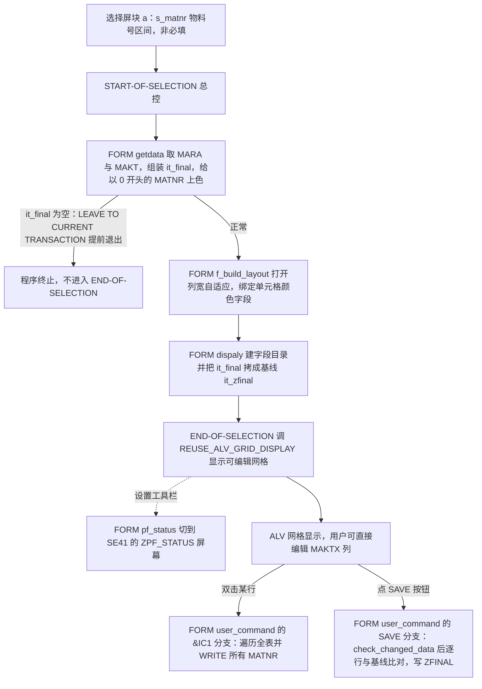
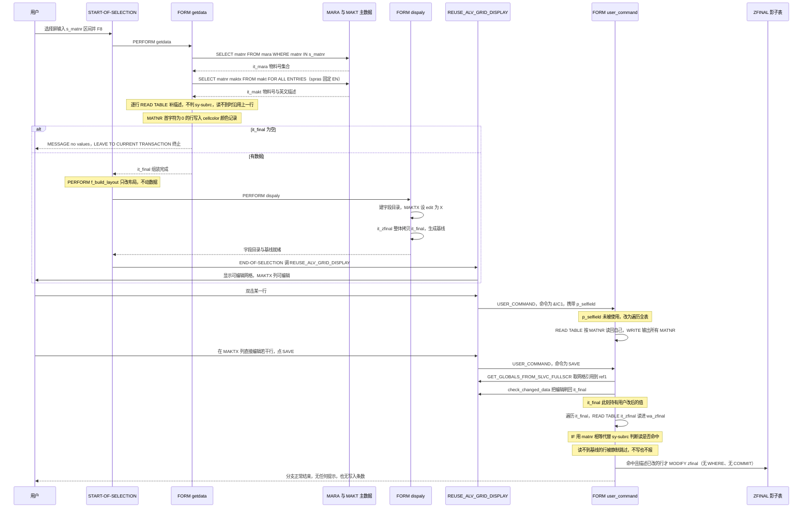

# zr 分析报告

> 分析对象：`Test-source/zr.abap`（159 行，报表程序 `REPORT zr`）
> 报告视角：代码 onboarding 走读，按真实执行顺序展开

---

## 一、程序定位与业务背景

### 1.1 这段代码在解决什么问题

先说清楚它**不是**什么：它不改 `MARA`/`MAKT` 主数据、不做任何校验、不发消息、不落更新请求，也不判断用户改得对不对。

它是一个**物料描述的批量批注工具**。

场景是这样：一家公司有成千上万个物料号，业务用户手里有一份"哪些物料的描述写错了、写得不清楚"的清单，希望一次性看一批、改一批。走正规渠道意味着逐个进 MM02——需要 CKMAT 权限、逐个物料进入、逐个语言切换。对业务用户来说太重了。

于是这个程序给了一个低门槛入口：**选择屏给一段物料号区间 → 弹出可编辑的 ALV 网格 → 用户直接在描述列上改 → 点 SAVE → 改后的描述写进一张自建的 `ZFINAL` 表**。

| 它做的事 | 它刻意不做的事 |
|---|---|
| 按物料号区间取 `MARA` 的 MATNR，再按 MATNR 取 `MAKT` 的英文描述 | 不改 `MAKT`，不切换语言，不落更新请求 |
| 把描述列设为可编辑，让用户在格子上直接改 | 不做长度校验、不做重复校验、不录变更原因 |
| 物料号以 `0` 开头的一行，把 MATNR 单元格上色 | 不解释为什么以 `0` 开头要上色，也不提供图例 |
| 保存时把"当前值"与"打开 ALV 前的原值"逐行比对，只写差异行 | 不写审计字段，不通知 MM 团队，不复写主数据 |

一句话设计范式定性：

> **"可编辑 ALV + 基线快照 + 影子表"三段式** —— 用 SLIS 的 `EDIT` 标志打开格内编辑，用显示前的一次表拷贝当基线，用一张自建 Z 表承接差异。骨架是全对的；断在语法上——三处 `WITH KEY` 用在没有表键的表上，一处用连字符访问结构分量（详见 3.3 ⑤、3.3 ③、3.7 ③）。

### 1.2 这是一份"意图清晰、但很可能从未激活过"的练习代码

几处痕迹说明这不是生产系统里的成熟代码：注释里的拼写错误（`temproary` 出现两次、`comparision`、`declarin`、FORM 名 `dispaly`）、`PERFORM : getdata.` 与 `PERFORM: dispaly.` 的混排、以及 `* Implement suitable error handling here` 这种 ADT 自动生成的占位注释原样留着。

还有两处更硬的判断依据，都指向同一个结论：

- **三处 `READ TABLE ... WITH KEY` 全部作用在没有任何主键定义的本地结构表上**（见 1.3、3.3 ③、3.7）。`WITH KEY` 要求内表定义主键，这三句应当编译不过。
- **一处用连字符访问结构分量**：`APPEND wa_cellcolor TO wa_FINAL-cellcolor.`（见 3.3 ⑤）。ABAP 的结构分量访问必须用点号，连字符会被解析为减号，而 `cellcolor` 不是已声明的数据对象，这句也应当编译不过。

这两点决定这份代码是"跑起来的线上程序"还是"从没激活过的练习程序"——SE38 编译一次就有答案，也是接手时该做的第一件事。**没有编译结果，本报告里的运行时判断都只能标成"潜在"。**

所以本报告分析的是**这份代码的完整意图、它搭出来的架构形状、以及它会在哪几个点上断掉**。这不是吹毛求疵：练习代码里养成的习惯（`READ TABLE` 之后不判 `sy-subrc`、`MODIFY` 之后不 `COMMIT`、双击回调里不读 `p_selfield`）会原封不动被带到生产代码里。

### 1.3 依赖清单（读这段代码前必须知道的地形）

```
标准表    MARA / MAKT        物料主数据、物料描述
自建表    ZFINAL             影子表，承接改后的描述。结构与表键在本程序不可见
自建屏幕  ZPF_STATUS         SE41 里维护的 PFCG 屏幕；程序注释写"se41 create, generate"
函数模块  REUSE_ALV_GRID_DISPLAY        SLIS 老式 ALV 网格入口
函数模块  GET_GLOBALS_FROM_SLVC_FULLSCR 取 ALV 网格控件引用
标准类型  lvc_s_scol / lvc_t_scol / lvc_s_layo / slis_layout_alv / slis_t_fieldcat_alv
不可见项  ZFINAL 是否被别处读取；ZPF_STATUS 里是否真的建了 SAVE 按钮
         —— 这两项决定"保存"到底有没有业务意义，接手时必须去 SE11 / SE41 确认
```

---

## 二、程序执行流程总览



### 责任链表

| 子程序 | 调用者 | 职责 |
|---|---|---|
| 全局声明区（`TYPES` / `DATA`） | 程序编译期 | 定义三张行结构与全部内表、工作区、布局、字段目录变量 |
| 选择屏块 a | 程序运行期自动显示 | 收物料号区间 `s_matnr`，未加 `OBLIGATORY` |
| `START-OF-SELECTION` | R/3 报表运行时 | 总控：依次 `PERFORM getdata`、`f_build_layout`、`dispaly` |
| `FORM getdata` | `START-OF-SELECTION` 第一步 | 取数、组装、空表拦截、单元格上色 |
| `FORM f_build_layout` | `START-OF-SELECTION` 第二步 | 布局：列宽自适应 + 颜色字段绑定 |
| `FORM dispaly` | `START-OF-SELECTION` 第三步 | 建字段目录（含 `EDIT`）+ 生成基线快照 `it_zfinal` |
| `END-OF-SELECTION` | R/3 报表运行时 | 调 `REUSE_ALV_GRID_DISPLAY` 显示网格，注册两个回调 |
| `FORM user_command` | `REUSE_ALV_GRID_DISPLAY` 回调 | 双击（`&IC1`）与 SAVE 的处理 |
| `FORM pf_status` | `REUSE_ALV_GRID_DISPLAY` 回调 | 切到 SE41 的 `ZPF_STATUS` 工具栏 |

下面按这条流程，逐个子程序展开。

---

## 三、分组分析

### 3.1 全局声明区 `TYPES` 与 `DATA`

先把声明读完——后面几乎所有 bug 都能在这段里找到根。

```abap
TYPES: BEGIN OF ty_final,
  matnr TYPE mara-matnr,
  maktx TYPE makt-maktx,
  cellcolor TYPE lvc_t_scol,
  END OF ty_final.

TYPES: BEGIN OF ty_mara,
  matnr TYPE mara-matnr,
  END OF ty_mara.

TYPES : BEGIN OF ty_makt,
  matnr TYPE makt-matnr,
  maktx TYPE makt-maktx,
  END OF ty_makt.
```

**做什么** — 定义三个本地结构：`ty_final` 是最终输出行（物料号 + 描述 + 单元格颜色表），`ty_mara` 只装 MATNR，`ty_makt` 装 MATNR + MAKTX。

**为什么** — 用窄结构而不是 `TYPE TABLE OF mara` 装整张 MARA，是对的：`MARA` 有几百个字段，只装用到的列能省大量内存，也让 `SELECT matnr FROM mara` 的投影意图与数据结构对齐。三段结构各自对应一条 SELECT，结构即查询结果的物化形态，读者能一眼看出每条 SELECT 拿什么。

**风险与改进** — 三处：

1. **三个结构都没有表键定义**，而后面三处 `READ TABLE ... WITH KEY` 全部依赖表键（见 3.3 ③、3.7）。这是整份代码最严重的结构性问题，根源就在这里。修法是把表改成带键的，例如 `DATA: it_makt TYPE SORTED TABLE OF ty_makt WITH KEY PRIMARY matnr.` —— 这样 `READ TABLE ... WITH KEY` 才有意义，也顺带把查找从线性降到二分/哈希。
2. **`ty_mara` 只剩一列 MATNR**，`ty_makt` 也是两列且与 `ty_final` 前两个字段同名同型，于是 `wa_final-matnr = wa_mara-matnr` 这类赋值其实是同类型搬运。可以进一步简化为直接用数据元素 `TYPE mara-matnr`，少两层间接。
3. **`matnr` 既是全局变量名，又是三个结构里的字段名。** 写 `wa_final-matnr` 时没问题，但任何一处裸写 `matnr` 都会指向全局变量而不是字段。这种名字复用是隐蔽的坑；建议把选择屏的锚点变量改名（如 `p_matnr`）。

```abap
DATA: it_final TYPE TABLE OF ty_final,
  wa_final TYPE ty_final,
  it_mara TYPE TABLE OF ty_mara,
  wa_mara TYPE ty_mara,
  it_makt TYPE TABLE OF ty_makt,
  wa_makt TYPE ty_makt,
  matnr TYPE mara-matnr,
  lv_index   TYPE sy-tabix,
  wa_cellcolor TYPE lvc_s_scol, "  for cell color
  wa_layout TYPE slis_layout_alv,
  ref1 TYPE REF TO cl_gui_alv_grid, " to capture changes in alv
  it_zfinal TYPE TABLE OF ty_final, "temproary final internal table
  wa_zfinal TYPE ty_final,
  wa_zzfinal TYPE ty_makt, "  temproary work area 
*to move changed values in alv
  it_fieldcat TYPE slis_t_fieldcat_alv, "  for Alv
  wa_fieldcat TYPE slis_fieldcat_alv.
```

**做什么** — 声明所有内表与工作区。注意最后两个名字：`wa_zfinal TYPE ty_final` 与 `wa_zzfinal TYPE ty_makt` —— 两者只差一个 `z`，而它们在 SAVE 分支里的角色恰恰相反（见 3.7）。

**为什么** — "内表 + 工作区"成对声明是老式 ABAP 的标准做法，配合 `LOOP AT ... INTO` 与 `APPEND` 使用。`ref1 TYPE REF TO cl_gui_alv_grid` 是为了拿 ALV 网格控件、进而调 `check_changed_data` 读回用户改的值——这个思路本身是全对的。

**风险与改进** —

1. **两个高度相似的工作区名仍是一个隐患。** `wa_zfinal` 与 `wa_zzfinal` 只差一个字母，而它们在 `WHEN 'SAVE'` 分支里分别承担"读基线"和"待写行"两个角色。这份代码里它们的用法恰好是自洽的（`READ TABLE` 进 `wa_zfinal`、`IF` 比 `wa_zfinal`；`MOVE-CORRESPONDING` 出 `wa_zzfinal`、`MODIFY` 用 `wa_zzfinal`），但读者要逐字核对四行才能确认这一点——这正是本次走读一开始被它误导的地方。命名上应当表达角色而不是相似性，例如 `wa_before`（基线行）与 `wa_save`（待写行）。
2. **`wa_layout TYPE slis_layout_alv` 与 `REUSE_ALV_GRID_DISPLAY` 的 `is_layout` 参数不是同一个类型**（后者声明为 `lvc_s_layo`）。是否编译通过需在 SE37 对照 FM 签名确认；稳妥写法是直接把 `wa_layout` 声明成 `lvc_s_layo`。
3. **注释有拼写错误且语义重复**：`temproary`（两次）、`comparision`，以及 `temproary work area` 后面紧跟一条 `*to move changed values in alv`。注释的价值在解释意图，拼错的词让读者多做一步确认。

```abap
SELECTION-SCREEN BEGIN OF BLOCK a.
  SELECT-OPTIONS: s_matnr FOR matnr.
  SELECTION-SCREEN END OF BLOCK a.
```

**做什么** — 用块 `a` 圈出一个选择屏，收物料号区间 `s_matnr`。

**为什么** — 只放一个选择条件、用一个 block 把它框起来，是报表最简结构，用户扫一眼就知道要填什么。

**风险与改进** — **`s_matnr` 没有加 `OBLIGATORY`，也没有 `AT SELECTION-SCREEN` 拦截空值。** 一旦用户什么都不填直接 F8，`WHERE matnr IN s_matnr` 退化成无条件的全表扫描 `MARA` —— 在大型系统里 `MARA` 是数亿行级别的表，这会把一个"批量改描述"的小工具变成一次全表导出。修法二选一：`SELECT-OPTIONS s_matnr FOR matnr OBLIGATORY`，或在 `AT SELECTION-SCREEN` 里对空值拦截并提示。

### 3.2 事件块 `START-OF-SELECTION`

```abap
START-OF-SELECTION.
      PERFORM : getdata.
      PERFORM: f_build_layout .
      PERFORM: dispaly.
```

**做什么** — 依次执行取数、建布局、建字段目录三个 FORM，自己不写任何逻辑。

**为什么** — 总控事件块只做调度、把细节交给 FORM，是老式报表的标准骨架。读者的注意力可以完全留给三个 FORM，总控块十秒读完。

**风险与改进** — 两点：

1. **`PERFORM` 无法感知失败。** `getdata` 出错时这里既拿不到 `sy-subrc`（`getdata` 没设），也没有 `CHECK` 之类的短路条件。好在 `getdata` 自己用 `LEAVE TO CURRENT TRANSACTION` 处理了"空表"这一种失败，其余失败路径全靠系统报错兜底。
2. **两处 `PERFORM` 写法不一致**（`PERFORM : getdata.` 与 `PERFORM: f_build_layout .`），冒号位置与句点前空格都不统一。纯风格问题，但一份被别人照着抄的代码里，风格漂移会被放大。

### 3.3 `FORM getdata`：取数、组装、上色

这个 FORM 是全程序最重的一段，分五步。

#### ① 按区间取物料号

```abap
    SELECT matnr FROM mara INTO TABLE it_mara WHERE matnr IN S_matnr.
```

**做什么** — 从 `MARA` 取 MATNR 一列，按选择屏区间过滤，装入 `it_mara`。

**为什么** — 只投影一列，是内存与网络开销都最小的一种取法；MATNR 是 `MARA` 的主键，区间扫描走主键索引，代价可控。

**风险与改进** — 两点：一是 `s_matnr` 非必填，等于允许无条件的全表扫描（见 3.1 选择屏）；二是这里没有对结果行数设任何上限，用户一旦给了很大的区间，后面 `LOOP` + `READ TABLE` 的开销会线性放大（见 ③）。建议在取数后加一个行数提示或上限检查。

#### ② 用 `FOR ALL ENTRIES` 取描述

```abap
    IF it_mara IS NOT INITIAL.
    SELECT matnr maktx FROM makt INTO TABLE it_makt
    FOR ALL ENTRIES IN it_mara WHERE matnr = it_mara-matnr AND spras = 'EN'.
    ENDIF.
```

**做什么** — 以 `it_mara` 的 MATNR 集合为条件，取 MATNR + MAKTX 装入 `it_makt`；取之前先判 `it_mara` 非空。

**为什么** — **这个 `IF ... IS NOT INITIAL` 是本程序写得最好的一处保护。** `FOR ALL ENTRIES` 在驱动表为空时会退化成一次无条件全表扫描（等价于不带筛选条件扫 `MAKT`），这个判空正好把它挡在门外。取数是整条链的性能关口，判空必须写在这一层。

**风险与改进** — **语言硬编码 `spras = 'EN'`。** 两个问题：一是德国、日本、中国的用户拿到的永远是英文描述，而 `MAKT` 本身就是按语言分行的；二是取出的描述与当前会话语言 `sy-langu` 不一致，用户改完英文描述存进 `ZFINAL`，下游若按 `sy-langu` 读会读不到。修法是把 `'EN'` 换成 `sy-langu`，或做成选择屏上的一个参数让用户自己选语言。

#### ③ 组装最终表

```abap
    LOOP AT it_mara INTO wa_mara.
    wa_final-matnr = wa_mara-matnr.
    READ TABLE it_makt INTO wa_makt WITH KEY matnr = wa_mara-matnr.
    wa_final-maktx = wa_makt-maktx.
    wa_final-matnr = wa_mara-matnr.
    APPEND wa_final TO it_final.
    ENDLOOP.
```

**做什么** — 逐行遍历 `it_mara`，用 MATNR 作为键去 `it_makt` 里读对应描述，把物料号与描述装进 `wa_final`，追加到 `it_final`。

**为什么** — 用一次 `LOOP` + `READ TABLE` 手动做内连接，比写 `SELECT ... FROM mara ... INNER JOIN makt` 更显式，也保留了"两表分开取"的既有结构。代价是要自己处理读不到的情况。

**风险与改进** — 这五句里有三个独立问题：

1. **`READ TABLE ... WITH KEY` 作用在 `it_makt` 上，而 `ty_makt` 没有定义任何表键。** ABAP 规定 `WITH KEY` 只能用于定义了主键的内表，因此这几句（连同 3.7 里的两句）很可能在 SE38 编译时就被拦下——这是接手时该第一时间确认的点。
2. **读完不判 `sy-subrc`，而 `READ TABLE` 失败时不把工作区清零。** 这意味着：当某个物料号在 `spras = 'EN'` 下没有描述行时，`wa_makt` 会**保留上一次读到的内容**，于是上一行的描述被写到当前行。表现是"某个物料号的描述变成了前一个物料号的描述"，而且错的方向恰好是"看起来有值"，用户不会去怀疑它；写进 `ZFINAL` 的错误描述还会一直留在那张表里。建议改为（示意）：

    ```abap-fix
      CLEAR wa_final.
      wa_final-matnr = wa_mara-matnr.
      READ TABLE it_makt INTO wa_makt WITH KEY matnr = wa_mara-matnr BINARY SEARCH.
      IF sy-subrc = 0.
        wa_final-maktx = wa_makt-maktx.
      ENDIF.
      APPEND wa_final TO it_final.
    ```
3. **`wa_final-matnr = wa_mara-matnr` 出现了两次**（赋值前后各一次），中间没有任何会改动 `wa_final-matnr` 的操作。删掉任意一处即可。这类重复赋值通常是调试时留下的痕迹。

#### ④ 空表拦截

```abap
IF it_final IS INITIAL.
  MESSAGE 'no values' TYPE 'I'.
  LEAVE TO CURRENT TRANSACTION.
  ENDIF.
```

**做什么** — 组装后若无数据，输出一条提示信息，然后终止程序。

**为什么** — 提前退出比让用户看到一个空 ALV 网格更体面，也让后面三个 FORM（布局、字段目录、快照）不白跑。`LEAVE TO CURRENT TRANSACTION` 直接结束程序、不再进入 `END-OF-SELECTION`，所以提示信息之后屏幕是干净的、没有残留控件——**这个早退路径的设计意图是对的**。

**风险与改进** — 两点：

1. **`LEAVE TO CURRENT TRANSACTION` 的位置需要核实。** ABAP 语法手册通常把这条语句限定在主程序块中使用，而这里它写在 `FORM getdata` 内部——SE38 编译一次即可确认是否报错。若确实不允许，可把判断上提到 `START-OF-SELECTION`（`PERFORM getdata.` 之后紧跟 `CHECK it_final IS NOT INITIAL.`），语义完全一致。
2. **提示信息是硬编码英文 `'no values'`，且没有走消息类。** 非中文环境用户会看到英文提示，与其他系统消息风格不一致。

#### ⑤ 按规则给单元格上色

```abap
  LOOP AT it_FINAL INTO wa_FINAL.
    lv_index = sy-tabix.
    IF  wa_final-matnr+0(1) = '0'.
    wa_cellcolor-fname = 'MATNR'.
    wa_cellcolor-color-col = 6.
    wa_cellcolor-color-int = '1'.
    wa_cellcolor-color-inv = '0'.
    APPEND wa_cellcolor TO wa_FINAL-cellcolor.
    CLEAR: wa_cellcolor.
    MODIFY it_final FROM wa_final INDEX lv_index TRANSPORTING cellcolor.
    CLEAR wa_final.
      ENDIF.
   ENDLOOP.
```

**做什么** — 遍历最终表，若某行 MATNR 第一个字符是 `0`，就往该行 `cellcolor` 内表里追加一条颜色记录（字段名 MATNR、颜色号 6、作为背景、不反白），再只把 `cellcolor` 这一列回写到表中。

**为什么** — 这是 ALV 网格单元格上色的标准做法：把 `lvc_t_scol` 类型的字段放在输出表里、`layout-coltab_fieldname` 指向它、显示前用 `MODIFY ... TRANSPORTING cellcolor` 只更新这一列。**类型配对着一次就对了**——`cellcolor TYPE lvc_t_scol` 是表、`wa_cellcolor TYPE lvc_s_scol` 是行，`APPEND` 的方向也没错。设计意图与类型选择都是对的，唯一的问题出在一个字符上。

**风险与改进** — 四点：

1. **`APPEND wa_cellcolor TO wa_FINAL-cellcolor.` 用的是连字符，而 ABAP 的结构分量访问必须用点号——这一句应当编译不过。** `wa_final` 是一个结构（`TYPE ty_final`），对它取分量只能写 `wa_final-cellcolor`。连字符会被解析为减号，而 `cellcolor` 并不是一个已声明的数据对象（声明区里只有 `wa_cellcolor`，没有裸的 `cellcolor`），所以这句在 SE38 里应当直接报错。这是整份代码里唯一一个"一个字符决定程序能否运行"的位置，也意味着**如果它确实编译不过，那么全程序的其余部分都从未被执行过**——这一点在 SE38 编译一次即可确认，确认结果会决定后面所有问题的优先级。建议改为（示意）：`APPEND wa_cellcolor TO wa_final-cellcolor.`
2. **`matnr+0(1) = '0'` 的业务含义完全没写。** 从代码看不出"以 0 开头的物料号"意味着什么——供应商编码的物料？外部编号范围？某个公司代码的号段？颜色号 `6` 也没有图例说明。这类"有意图但没写下来"的规则是知识流失最快的地方；至少该写一行注释，或把它提成常量。
3. **每命中一行就 `MODIFY it_final` 一次**，行数多时是 n 次表更新。更省的做法是先收集再统一回写，或在循环外一次性处理。
4. **`lv_index = sy-tabix` 与随后的 `CLEAR wa_final` 都可以删。** 前者：`LOOP AT it_final` 里 `sy-tabix` 就是当前行号，`MODIFY` 里直接引用即可，中间变量没有增加可读性；后者：清的是工作区而不是表行，对已回写的表没有任何影响，而且下一次迭代本来就会用 `INTO wa_final` 重新赋值——留着只会让人以为"这里在重置数据"。

### 3.4 `FORM f_build_layout`：布局参数

```abap
FORM f_build_layout .
  CLEAR wa_layout.
  wa_layout-colwidth_optimize = 'X'.
  wa_layout-coltab_fieldname = 'CELLCOLOR'.

ENDFORM.
```

**做什么** — 打开列宽自适应，并把布局的单元格颜色字段指向 `CELLCOLOR`。

**为什么** — 两个开关各对应一件独立的事：列宽自适应让两列内容不挤在一起；颜色字段绑定让 ⑤ 步写的颜色真正显示出来。**少了第二个开关，⑤ 步写的所有颜色都不会出现**——这也是把布局参数单独做成一个 FORM 的价值：谁负责让颜色生效，看得很清楚。

**风险与改进** — 两点：

1. **`'CELLCOLOR'` 与输出表 `it_final` 的实际字段名必须一致，这是一段没有任何编译期保护的隐式契约。** 这里写的 `'CELLCOLOR'` 与结构里的 `cellcolor` 一致（ALV 字段名比较不区分大小写），配置正确；但哪天有人把结构字段改名，这个字符串不会跟着变，颜色会静默消失。更稳的写法是用 `CONSTANTS` 定义并与结构字段同源。
2. **只有这两个参数，没有 `zebra`。** 对一个可编辑网格来说，斑马纹能显著降低"改错行"的概率——相邻两行颜色相同时，用户很难确认自己在看哪一行。这是一个低成本、高收益的补充。

### 3.5 `FORM dispaly`：字段目录 + 基线快照

```abap
FORM dispaly .

  wa_fieldcat-tabname = 'IT_FINAL'.
  wa_fieldcat-fieldname = 'MATNR'.
  wa_fieldcat-seltext_m = 'Material'.

  APPEND wa_fieldcat TO it_fieldcat.
  CLEAR: wa_fieldcat.

  wa_fieldcat-tabname = 'IT_FINAL'.
  wa_fieldcat-fieldname = 'MAKTX'.
  wa_fieldcat-seltext_m = 'Description'.
  wa_fieldcat-edit ='X'.

  APPEND wa_fieldcat TO it_fieldcat.
  CLEAR: wa_fieldcat.
```

**做什么** — 手工装两条字段目录：MATNR 显示为 Material，MAKTX 显示为 Description 且**设为可编辑**，都指向表 `IT_FINAL`。

**为什么** — **`edit = 'X'` 是整个程序的枢纽。** 只有这一位开关让 MAKTX 在网格里变成可编辑输入框，后面 `check_changed_data` 才能读到用户改过的值、SAVE 分支才有东西可比对。同时 `tabname = 'IT_FINAL'` 与实际传入的 `it_final` 对应（ALV 不区分大小写）——手工字段目录最容易写错的就是这个对应关系，这里写对了。

**风险与改进** — 三点：

1. **MATNR 没有设 `fix_column = 'X'`。** 对一个可编辑网格，物料号是唯一标识；用户横向滚动时若它跟着滚出去，容易出现"改了下一行、看错物料"的情况。固定住标识列能去掉这层风险（具体配合的 layout 开关需按 SLIS 实际参数确认）。
2. **标题只写了 `seltext_m`，没有 `seltext_s` / `seltext_l`。** 在短/中文本模式下，用户看到的是默认字段名而不是 Material / Description。
3. **FORM 名 `dispaly` 是拼写错误**（应为 `display`）。FORM 名不参与业务逻辑，但它是别人 `PERFORM` 时要抄的字符串，拼错的接口名会一直传染下去。

```abap
*appending values form final internal table to
* temproary final table for data comparision
  it_zfinal[] = it_final[].

ENDFORM.
```

**做什么** — 把组装并上色后的 `it_final` 整体拷一份到 `it_zfinal`，作为"打开 ALV 之前的原值"基线。

**为什么** — **这一步的时机是对的，也是整个"保存"设计能成立的前提。** 它在 ALV 显示之前完成拷贝，所以 `it_zfinal` 里存的是用户尚未动过手的原值；等用户改完点 SAVE，再把改后的 `it_final` 与这份基线逐行比对，就能只挑出真正改过的行落库。整个"只写差异"的思路就靠这一次拷贝撑着。**骨架是全对的**，而下一节读这份基线的变量链也确实接得对——真正缺的是"读不到基线"时的处理。

**风险与改进** — 三点：

1. **这段逻辑放在"建字段目录"的 FORM 里，属于职责混杂。** 建字段目录是展示配置，生成基线快照是数据流程，两者没有关系；凑在一个 FORM 里会让读者误以为"快照依赖字段目录"。拆成两个 FORM（如 `f_build_fieldcat` 与 `f_snapshot`）后，执行顺序的契约会清楚得多。
2. **整表拷贝把 `cellcolor` 也一起搬过去了。** 基线只需要 MATNR 与 MAKTX 两列用于比对，多拷一个 `lvc_t_scol` 表既费内存又容易让人误读成"颜色也要比对"。可以在拷贝时只取两列，或单独定义一个只含两列的基线行结构。
3. **`it_zfinal` 与 `wa_zfinal` 同名不同用途**（一个表、一个工作区），这个命名把两者用几乎相同的名字区分——正是 3.7 里把两者弄反的直接诱因。

### 3.6 事件块 `END-OF-SELECTION`：调用 ALV

```abap
END-OF-SELECTION.

CALL FUNCTION 'REUSE_ALV_GRID_DISPLAY'
    EXPORTING
      i_callback_program                = sy-repid
      i_callback_pf_status_set          = 'PF_STATUS'
      i_callback_user_command           = 'USER_COMMAND'
      is_layout                         = wa_layout
      it_fieldcat                       = it_fieldcat
     TABLES
        t_outtab                          = it_final
    EXCEPTIONS
      PROGRAM_ERROR                     = 1
      OTHERS                            = 2
             .
   IF sy-subrc <> 0.
* Implement suitable error handling here
   ENDIF.
```

**做什么** — 调 `REUSE_ALV_GRID_DISPLAY` 把 `it_final` 显示成 ALV 网格，注册 `PF_STATUS` 与 `USER_COMMAND` 两个回调，并登记两个异常。

**为什么** — 用 SLIS 的网格变体而不是自己建 `cl_gui_alv_grid` 容器，可以少写几十行容器与布局代码；代价是能控制的细节更少。**代价在后面暴露了**：想处理双击时必须依赖 `p_selfield`，而这段代码没有用它。对一个"选一批、看一批、改一批"的轻量工具，这个取舍本身是划算的。

**风险与改进** — 三点：

1. **`IF sy-subrc <> 0.` 的分支是空的**，注释还留着 ADT 自动生成的 `* Implement suitable error handling here`。ALV 显示失败（例如字段目录与表不匹配）时，用户只会看到程序结束、屏幕什么都没有。至少该提示一次，或删掉这个分支并在注释里说明"显示失败时系统会自行报错"。
2. **`it_fieldcat` 与 `t_outtab` 是手工配对的，没有一致性检查。** 字段目录里写 `'IT_FINAL'`、传的是 `it_final`；字段名写 `'MATNR'` / `'MAKTX'`、结构里也有——这些对应关系全靠人眼维护，任何一次改字段名都可能到显示时才炸出来。老式 SLIS 没有编译期保护，这是它的固有代价；接手时应把"改结构字段名"列为高风险变更。
3. **`is_layout` 传的是 `slis_layout_alv`，而该参数声明为 `lvc_s_layo`**（见 3.1）。是否编译通过需在 SE37 对照 FM 签名确认；建议直接把 `wa_layout` 声明成 `lvc_s_layo`。

### 3.7 `FORM user_command`：双击与保存

这是全程序最值得细读的一段——它包含整份代码最有价值的设计，也包含最容易看走眼的一处（见 ③：变量链其实是接对的，缺的是失败路径）。

#### ① 双击分支 `&IC1`

```abap
FORM user_command USING p_ucomm TYPE sy-ucomm
                        p_selfield TYPE slis_selfield.
CASE p_ucomm.
    WHEN '&IC1'.
      LOOP AT it_final INTO wa_final.
      READ TABLE it_final INTO wa_final WITH KEY matnr = wa_final-matnr.
      WRITE: / wa_final-matnr.
      ENDLOOP.
```

**做什么** — 处理 ALV 回调命令。`&IC1` 是双击命令；这里遍历整张 `it_final`，对每一行再按 MATNR 读一次自己，然后把 MATNR 用 `WRITE` 输出。

**为什么** — 从代码看不出这个分支想达成什么效果：它没用 `p_selfield`，所以拿不到"用户双击的是哪一行"；它遍历的是全表，所以输出的不是双击那一行而是所有行；它用 `WRITE` 而不是消息或弹窗，所以输出落在列表输出区，而不是显示在用户点击的位置。**这段看起来是想做"双击某行显示该物料详情"，但实际行为是"打印整张表的物料号"。**

**风险与改进** — 三个问题，前两个是实质性的：

1. **完全没有使用 `p_selfield`。** SLIS 的双击回调就是通过 `p_selfield-tabix` 告诉程序"用户点了第几行"的。正确的形状是（示意）：

    ```abap-fix
      WHEN '&IC1'.
        READ TABLE it_final INTO wa_final INDEX p_selfield-tabix.
        MESSAGE s001 WITH wa_final-matnr wa_final-maktx.
    ```
    少了这一句，整个双击功能等于不存在。
2. **`READ TABLE it_final INTO wa_final WITH KEY matnr = wa_final-matnr` 是双重错误。** 第一，`it_final` 的行类型 `ty_final` 没有定义表键，同 3.3 ③ 的分析，`WITH KEY` 在这里很可能直接编译不过；第二，即使它成立，这里读的键值就是 `wa_final-matnr` 本身，也就是**循环刚取出的那一行**——等于把每行读回自己，然后 `WRITE` 出来。这句 READ 可以整句删掉。
3. **`WRITE` 在 ALV 回调里输出，输出区与网格区的关系取决于屏幕布局**，但至少不会显示在用户双击的那一行上。如果目的是给用户反馈，应改用 `MESSAGE` 或弹窗。

#### ② SAVE 分支：读回改动

```abap
    WHEN 'SAVE'.

      CALL FUNCTION 'GET_GLOBALS_FROM_SLVC_FULLSCR' "Capturing changes in ALV
      IMPORTING
        e_grid = ref1.
      CALL METHOD ref1->check_changed_data.
```

**做什么** — 点 SAVE 时，先取 ALV 网格控件的引用到 `ref1`，再调 `check_changed_data` 把用户在格子里改的值刷回 `it_final`。

**为什么** — **这是"可编辑 ALV 读回改动"的标准且唯一正确的姿势。** 用户在网格里改的是控件内部的数据；如果不调 `check_changed_data`，`it_final` 里永远是改之前的原值，整个"只写差异"的设计都会失效。用 `GET_GLOBALS_FROM_SLVC_FULLSCR` 拿引用而不是自己建容器，是 SLIS 变体下唯一的选择。**这两步写对了，是这份代码里最值得保留的一段。**

**风险与改进** — 两点，都会以短转储的形式暴露：

1. **`GET_GLOBALS_FROM_SLVC_FULLSCR` 有自己的 EXCEPTIONS，这里一个都没处理。** 若取不到网格引用，`ref1` 是空引用，紧接着的 `CALL METHOD ref1->check_changed_data` 直接短转储。而且这个失败发生在用户点了 SAVE 之后——用户看到的是短转储，不是错误提示。应至少 `EXCEPTING` 并在失败时提示"无法读取当前网格，请刷新后重试"。
2. **`check_changed_data` 的调用没有 `EXCEPTING`，也没有检查返回值。** 该方法在无法刷新时会抛异常，同样短转储。稳妥写法是补上 `EXCEPTING` 并检查 `sy-subrc`。

#### ③ SAVE 分支：逐行比对并写库

```abap
*moving changed value into ztable on saving
LOOP AT it_final INTO wa_final.
  READ TABLE it_zfinal INTO wa_zfinal WITH KEY matnr = wa_final-matnr.
  IF wa_zfinal-matnr = wa_final-matnr AND wa_zfinal-maktx NE wa_final-maktx.
    MOVE-CORRESPONDING wa_final TO wa_zzfinal.
    MODIFY zfinal FROM wa_zzfinal.
  ENDIF.
ENDLOOP.
    CLEAR: wa_final,wa_zfinal, wa_zzfinal.
ENDCASE.
ENDFORM.
```

**做什么** — 遍历改后的 `it_final`，以 MATNR 为键从基线 `it_zfinal` 里把对应行读进 `wa_zfinal`，判断"读回来的确实是同一个物料"且"描述确实被改过"，两条都成立才把当前行拷进只含 MATNR / MAKTX 的 `wa_zzfinal`，再写进 `ZFINAL` 表。

**为什么** — 意图是清楚的：**逐行比对、只写差异**，这是批量更新场景下最合理的写法（避免对没改的行做无意义 UPDATE，也避免整表覆盖）。值得注意的是作者用 `wa_zfinal-matnr = wa_final-matnr` 来代替 `sy-subrc`——用"读回来的键与我要找的键是否相等"推断读是否命中，绕过了返回值判断。整条链（基线在 `dispaly` 生成 → 这里读回 → 差异写影子表）是完整且自洽的：`READ TABLE` 进 `wa_zfinal`，`IF` 比 `wa_zfinal`，`MOVE-CORRESPONDING` 出 `wa_zzfinal`，`MODIFY` 用 `wa_zzfinal`，三个工作区各司其职，没有接错线。**真正缺的只有一件事：读失败时怎么办。**

**风险与改进** — 四点：

1. **`READ TABLE` 失败时不判 `sy-subrc`，且 `READ TABLE` 失败不会清工作区——会静默漏掉行。** 用 MATNR 相等当"是否命中"的替身，在数据唯一时等价，但它把"读失败"变成了"静默跳过"：一是**整个循环的第一行**——`wa_zfinal` 尚未被任何迭代赋值、仍是全空，若这次读不到基线，`'' = wa_final-matnr` 为假，第一行不会被写入也不报错；二是后续任何基线读不到的行，`wa_zfinal` 保留的是**上一行**的基线值，MATNR 不相等，同样被跳过。用户看到的都是"程序正常结束"，但改动没进表。建议改为（示意）：

    ```abap-fix
      READ TABLE it_zfinal INTO wa_before WITH KEY matnr = wa_final-matnr.
      IF sy-subrc = 0 AND wa_before-maktx NE wa_final-maktx.
        MOVE-CORRESPONDING wa_final TO wa_save.
        MODIFY zfinal FROM wa_save WHERE matnr = wa_final-matnr.
      ENDIF.
    ```
2. **`MODIFY zfinal FROM wa_zzfinal` 既没有 `WHERE`，也没有 `COMMIT WORK`。** 没有 `WHERE` 时，`MODIFY` 会用工作区里表键对应的字段去找要更新的行——但 `ZFINAL` 的表键在这份代码里看不到。如果它的键不是 MATNR（或是复合键），这句会直接报运行时错误；如果键就是 MATNR，那么对**基线里从未出现过的物料号**，`MODIFY` 会静默地什么都不做（`MODIFY` 不做 INSERT），新增描述凭空消失。此外 `MODIFY` 之后没有 `COMMIT WORK`：交互程序里 LUW 最终会在程序结束时提交，所以数据不会永久丢失，但**用户保存后立刻用 SE16N 去看 `ZFINAL` 会查不到记录**——这类"改了但查不到"的困惑非常常见。至少应在循环后加一次 `COMMIT WORK` 并给出写入条数。
3. **`MOVE-CORRESPONDING wa_final TO wa_zzfinal` 会丢掉颜色信息，这是可以接受的。** `wa_final` 有 matnr / maktx / cellcolor 三个字段，`wa_zzfinal` 只有前两个，`MOVE-CORRESPONDING` 按字段名匹配，只搬前两个，cellcolor 被静默丢弃。这里丢弃合理（颜色不该进库），但要小心：**如果 `ZFINAL` 表里真有颜色字段，这个写法不会报错，只会让那一列永远为空** —— 这是 `MOVE-CORRESPONDING` 的典型风险。
4. **`CLEAR: wa_final,wa_zfinal, wa_zzfinal.` 放在 `ENDLOOP` 之后，位置无意义。** 它是整个 `WHEN 'SAVE'` 分支的最后一个动作，此时已不需要这些工作区。它还有另一个副作用：把 `wa_zfinal` 清空，使下一次点 SAVE 从空状态重新开始，于是第 1 条里"首行读不到就跳过"的情形每次都会重现。
5. **缩进与 CASE 分支内其他代码不一致**（`LOOP AT` 顶格，分支内其他语句缩进 6 空格）。它表明这段是从别处粘过来的、没重新整理过——也提示读者这里值得逐字核对，而不是凭形状判断。

### 3.8 `FORM pf_status`：工具栏

```abap
FORM pf_status USING rt_extab TYPE slis_t_extab.
  SET PF-STATUS 'ZPF_STATUS'.
ENDFORM.
```

**做什么** — 把工具栏切到 SE41 里维护的 `ZPF_STATUS` 屏幕。

**为什么** — 用 `SET PF-STATUS` 换一个自定义工具栏，是让"SAVE"这种业务按钮出现的最省事方式。SLIS 允许通过 `rt_extab` 自动追加标准功能按钮（排序、汇总、打印等），这里一个都没加。

**风险与改进** — 三点：

1. **`rt_extab` 参数收了但从未使用。** 后果是 SLIS 的扩展功能按钮不会被自动追加，用户点不到打印、导出、汇总这些标准能力。修法是在切工具栏之前 `APPEND ... TO rt_extab` 追加需要的功能。
2. **`SAVE` 按钮必须已经在 SE41 的 `ZPF_STATUS` 里维护好**，否则用户根本点不到这个按钮，`WHEN 'SAVE'` 整段就是死代码。**这一项决定整个程序的可用性，接手时第一件事就该去 SE41 打开 `ZPF_STATUS` 确认。**
3. **工具栏名是硬编码字符串 `'ZPF_STATUS'`**，与 SE41 里的屏幕名构成一条无编译期保护的隐式契约：屏幕重命名或换语言包后这里不会跟着变，程序会退化成系统默认工具栏且无任何报错。

---

## 四、执行流程全景图（数据视角）



从数据视角看这张图，有一个值得反复强调的形状特征：**数据的正向链路是完整且自洽的——从主数据取数、组装、上色、显示、允许编辑、读回改动、逐行比对、写影子表，每一步都有明确的数据载体，三个工作区各司其职，没有接错线。** 这是一个设计得通的程序。它很可能从未通过编译（三处 `READ TABLE ... WITH KEY` 作用在没有表键的表上，一处用连字符访问结构分量）；而真正影响运行时数据正确性的，是两次 `READ TABLE` 之后都不判 `sy-subrc`。

具体拆开看有三点：

1. **唯一真正的"写"动作是 `MODIFY zfinal`，而它前面的 `READ TABLE` 没有 `sy-subrc` 保护。** 一旦基线读不到，那一行就被当成"不是同一个物料"静默跳过——不写库、不报错，用户既看不到数据变化，也得不到任何提示。
2. **基线 `it_zfinal` 是一次性、全量、包含颜色的拷贝，然后被逐行读了一次。** 拷贝的时机（ALV 显示前）是对的，比对的字段（MAKTX）也是对的，读回的工作区（`wa_zfinal`）与参与比较的工作区也是同一个——这条链是接对的。唯一缺的是失败路径的处理，以及 `MODIFY` 的 `WHERE` 与 `COMMIT`。
3. **`ZFINAL` 这张表在整个程序里只被写、从未被读。** 从这份代码无法判断改后的描述有没有下游消费方。如果 `ZFINAL` 没有任何读取方，那么"保存"即使修好了也只是一个数据黑洞：用户以为改了，其实改进了没人看的表——而真正的物料主数据 `MAKT` 从未变动。**这是接手时该立刻去 SE85 / SE37 反查的问题，优先级与"程序能否编译"相同——如果它从未激活，那么连"保存有没有人读"都无从验证。**

---

## 五、问题清单与改进建议（按优先级）

### 🔴 P0 业务正确性

| # | 所在子程序 | 问题 | 业务后果 | 建议 |
|---|---|---|---|---|
| P0-1 | `FORM getdata` 步骤 ⑤ | `APPEND wa_cellcolor TO wa_FINAL-cellcolor.` 用**连字符**访问结构分量；ABAP 的结构分量访问必须用点号，连字符会被解析为减号，而 `cellcolor` 并非已声明的数据对象 | 这一句应当编译不过。若确实如此，全程序从未运行过，本报告其余问题都还停留在"潜在"状态；若某种运行时放行了它，那么 `COLTAB_FIELDNAME = 'CELLCOLOR'` 绑定的颜色数据永远写不进表，⑤ 整步是死代码 | 改为 `APPEND wa_cellcolor TO wa_final-cellcolor.`；并在 SE38 编译一次，用真实结果校准下面几条的优先级 |
| P0-2 | `FORM getdata` 步骤 ③ 与 `FORM user_command` 的两个分支 | 三处 `READ TABLE ... WITH KEY` 作用在 `ty_mara` / `ty_makt` / `ty_final` 这些**没有任何表键定义**的本地结构表上 | `WITH KEY` 要求内表定义主键，这三句很可能在 SE38 编译时就被拦下。若在某些运行时下被放行，行为会退化成不可预期的扫描 | 把这三张表改成带主键的类型（如 `SORTED TABLE OF ... WITH KEY PRIMARY matnr`），或把 `WITH KEY` 换成按 `INDEX` 查找 |
| P0-3 | `FORM getdata` 步骤 ③ | `READ TABLE it_makt INTO wa_makt` 之后不判 `sy-subrc`，而 ABAP 的 `READ TABLE` 失败时不把工作区清零 | 某个物料号在 `spras = 'EN'` 下没有描述行时，`wa_makt` 保留上一行的内容，于是上一行的描述被写到当前行。错得极难察觉——界面"看起来有值"，用户不会怀疑它；错误描述还会随保存留进 `ZFINAL` | 每次迭代先 `CLEAR wa_final`，再按 `sy-subrc` 决定是否填 MAKTX（见 3.3 ③ 的示意写法） |
| P0-4 | `FORM user_command` 的 SAVE 分支 | 用 `wa_zfinal-matnr = wa_final-matnr` 代替 `sy-subrc` 判断读是否命中；`READ TABLE` 失败不清工作区 | 静默漏行：首次迭代的空工作区、以及任何基线读不到的行，都被当成"不是同一个物料"而跳过，不写库也不报错。用户看到的是"程序正常结束"，改动却没进表 | 改为判 `sy-subrc`（见 3.7 ③ 的示意写法）；这是全程序唯一一处"设计对、失败路径没处理"的位置 |
| P0-5 | `FORM user_command` 的 SAVE 分支 | `MODIFY zfinal FROM wa_zzfinal` 既无 `WHERE`，又依赖 `ZFINAL` 的表键恰好是 MATNR；且 `ZFINAL` 是纯影子表，本程序只见写不见读 | 若 `ZFINAL` 键不是 MATNR，这句会报运行时错误；若键是 MATNR 但基线里没有该物料号，`MODIFY` 静默无操作，新增描述凭空消失。更根本的是：若没有任何下游读 `ZFINAL`，整个"保存"就是数据黑洞，用户以为改了主数据，其实 `MAKT` 从未变动 | 先用 SE11 确认 `ZFINAL` 的键与结构，再用显式 `WHERE matnr = ...`；去 SE85 / SE37 反查 `ZFINAL` 的读取方——没有读取方就别先做这张表，或改为写 `MAKT` 并走更新请求 |
| P0-6 | `FORM user_command` 的 `&IC1` 分支 | 完全没用 `p_selfield`，改为遍历全表 `WRITE` 所有 MATNR | 双击功能形同不存在：用户双击一行，屏幕输出的是整张表的物料号，而不是针对所点行的反馈。用户会以为双击坏了，进而放弃整个工具 | 用 `READ TABLE it_final INTO wa_final INDEX p_selfield-tabix` 定位所点行，再用 `MESSAGE` 或弹窗反馈 |

### 🟠 P1 健壮性

| # | 所在子程序 | 问题 | 建议 |
|---|---|---|---|
| P1-1 | `FORM user_command` 的 SAVE 分支 | `GET_GLOBALS_FROM_SLVC_FULLSCR` 的 EXCEPTIONS 一个都没处理；取不到网格引用时 `ref1` 为空，紧接着 `CALL METHOD ref1->check_changed_data` 直接短转储 | 加 `EXCEPTING` 并检查 `sy-subrc`；失败时提示"无法读取当前网格，请刷新后重试"，而不是让用户看短转储 |
| P1-2 | `FORM user_command` 的 SAVE 分支 | `CALL METHOD ref1->check_changed_data` 未加 `EXCEPTING`，刷新失败会抛异常 | 补 `EXCEPTING` 与 `sy-subrc` 检查 |
| P1-3 | `FORM user_command` 的 SAVE 分支 | `MODIFY` 之后无 `COMMIT WORK`、无成功提示 | 循环后加 `COMMIT WORK` 并输出写入条数。交互程序最终会在退出时提交 LUW，但用户保存后用 SE16N 查不到记录，会误判保存失败 |
| P1-4 | `FORM pf_status` | `rt_extab` 收了从未使用，SLIS 扩展功能按钮不会自动追加 | 追加需要的扩展功能；否则用户点不到打印、导出、汇总 |
| P1-5 | `FORM pf_status` 与注释 | `SAVE` 按钮是否真在 SE41 的 `ZPF_STATUS` 里，本程序无法判断 | 接手第一件事：打开 SE41 的 `ZPF_STATUS` 确认 SAVE 按钮存在；不存在则整段保存逻辑都是死代码 |
| P1-6 | 选择屏块 a | `s_matnr` 非必填，无 `AT SELECTION-SCREEN` 拦截 | `OBLIGATORY` 或加空值校验，防止无条件全表扫 `MARA` |
| P1-7 | `FORM user_command` 的 SAVE 分支 | `MOVE-CORRESPONDING wa_final TO wa_zzfinal` 按字段名匹配、静默丢弃无对应字段的列 | 若 `ZFINAL` 里有 cellcolor 之类的额外字段，那一列永远为空且不报错。建议改为逐字段显式赋值，或至少加注释说明为何只写两列 |
| P1-8 | `FORM getdata` 步骤 ④ | `LEAVE TO CURRENT TRANSACTION` 写在 `FORM` 内部，按 ABAP 语法手册通常只允许在主程序块使用 | SE38 编译确认；若不允许，把空表判断上提到 `START-OF-SELECTION`（`CHECK it_final IS NOT INITIAL`） |
| P1-9 | `FORM getdata` 步骤 ② | `spras = 'EN'` 硬编码，多语言系统下取到的描述与当前会话语言不一致 | 改用 `sy-langu`，或做成选择屏参数让用户选语言 |
| P1-10 | `END-OF-SELECTION` | `CALL FUNCTION` 声明了 `PROGRAM_ERROR` 与 `OTHERS` 两个异常，但 `sy-subrc` 分支是空的 | 补一条错误提示，或删除该分支并在注释中说明"显示失败时系统会自行报错" |

### 🟡 P2 性能与规范

| # | 所在子程序 | 问题 | 建议 |
|---|---|---|---|
| P2-1 | `FORM getdata` 步骤 ③ | `LOOP AT it_mara` + 每行一次 `READ TABLE it_makt` 是手动内连接，行数多时是 O(n) 次读操作，且与 `s_matnr` 无上限叠加 | 表改成带主键的哈希/排序表后 `READ TABLE` 降为 O(1)；或干脆用一次 JOIN 取 |
| P2-2 | `FORM getdata` 步骤 ⑤ | 每命中一行就 `MODIFY it_final` 一次，是 n 次表更新 | 先收集颜色记录，循环外统一回写 |
| P2-3 | `FORM getdata` 步骤 ⑤ | `lv_index = sy-tabix` 中间变量无必要，`MODIFY` 里可直接用 `sy-tabix` | 删掉中间变量 |
| P2-4 | `FORM getdata` 步骤 ③ | `wa_final-matnr = wa_mara-matnr` 重复赋值两次 | 删掉任意一处 |
| P2-5 | `FORM dispaly` | FORM 名 `dispaly` 拼写错误 | 改为 `display`；它同时是别人 `PERFORM` 时要抄的字符串 |
| P2-6 | `FORM user_command` 的 `&IC1` 分支 | `READ TABLE it_final INTO wa_final WITH KEY matnr = wa_final-matnr` 用当前行的键读当前行，是无效读 | 整句删除（正确形态见 P0-5） |
| P2-7 | 全局声明区 | `matnr` 既是全局变量名又是三个结构里的字段名 | 全局变量改名（如 `p_matnr`），避免裸写时的指向歧义 |
| P2-8 | 全局声明区 与 `FORM user_command` | 注释拼写错误：`temproary`（两处）、`comparision`、`declarin`；SAVE 分支的 `LOOP AT` 缩进与 CASE 分支不一致 | 清理拼写让注释不再需要二次确认；统一缩进 |
| P2-9 | `START-OF-SELECTION` | `PERFORM : getdata.` 与 `PERFORM: f_build_layout .` 写法不一致 | 统一风格 |
| P2-10 | `FORM getdata` 步骤 ④ | 提示信息 `'no values'` 是硬编码英文，未走消息类 | 走消息类文本符号，保证多语言 |

### 🟢 P3 可扩展性

| # | 所在子程序 | 问题 | 建议 |
|---|---|---|---|
| P3-1 | `FORM dispaly` | 建字段目录（展示配置）与生成基线快照（数据流程）混在一个 FORM | 拆成 `f_build_fieldcat` 与 `f_snapshot`，让执行顺序的契约可见 |
| P3-2 | 全局声明区 | `wa_zfinal` 与 `wa_zzfinal` 仅差一个字母且角色相反，是 P0-1 的直接诱因 | 按角色命名（`wa_before` / `wa_save`），让"读基线"和"待写行"不可混淆 |
| P3-3 | `FORM getdata` 步骤 ⑤ | `matnr+0(1) = '0'` 与颜色号 `6` 都是无注释的魔法值 | 提为常量并写清业务含义；或做成选择屏参数 |
| P3-4 | `FORM f_build_layout` | `coltab_fieldname = 'CELLCOLOR'` 是与结构字段名的隐式字符串契约 | 用 `CONSTANTS` 定义并与结构字段同源，减少改名的连带风险 |
| P3-5 | 全局声明区 / `END-OF-SELECTION` | 整体基于 SLIS 老式接口，手工字段目录、无编译期一致性保护 | 若要长期维护，建议迁到 SALV（`cl_salv_table`），可编辑、单元格颜色、字段配置都有 API |
| P3-6 | `FORM pf_status` | 工具栏名 `'ZPF_STATUS'` 是硬编码隐式契约 | 提为常量，并在注释中写明对应的 SE41 屏幕 |
| P3-7 | 全局声明区 | 三个 `TYPES` 各装一列或两列，其中两个是同一查询的投影 | 评估是否可合并为"一个输出行结构 + 一个基线行结构"，减少结构数量 |

---

## 六、整体评价与启发

**优点**

1. **架构形状是对的，而且是在最难的地方对了。** "可编辑 ALV + 显示前一次性基线快照 + 只写差异行"这条链，是批量修改场景下最合理的形状。基线拷贝的时机（ALV 显示前、字段目录之后）、比对的字段（MAKTX 而不是整行）、落地的位置（影子表而非主数据）都选对了。整份代码的价值就在这个形状上——它离"能跑"差的不是设计，是几处语法：三处 `WITH KEY` 用在没有表键的表上，一处用连字符访问结构分量。
2. **`FOR ALL ENTRIES` 之前判空，是这份代码里最见功力的一处。** `IF it_mara IS NOT INITIAL.` 这一句挡掉了 `FOR ALL ENTRIES` 在驱动表为空时退化为全表扫描的经典事故。取数路径上这种"默认安全"的守卫很稀缺，值得记住。
3. **单元格上色的技术实现是正确的。** `cellcolor TYPE lvc_t_scol`（表）配 `wa_cellcolor TYPE lvc_s_scol`（行）、`APPEND` 到行字段、`MODIFY ... TRANSPORTING cellcolor` 只回写一列、`layout-coltab_fieldname` 指向它——四步配对着一次就对了。这是 ALV 颜色功能里最容易搞混的一处，作者做对了。
4. **注释确实写在了刀刃上。** `"for cell color"`、`"to capture changes in alv"`、`"for data comparision"`、`"se41 create, generate, activate the buttons and assing it"`——每处都标明了那段代码要解决什么。最后那句尤其好：它把一个纯技术的 `SET PF-STATUS` 指向了 SE41 里的具体维护动作，接手的人不用去猜按钮从哪来。

**短板**

1. **没有编译闸门，是这份代码最贵的一层缺失。** 源码里 `APPEND wa_cellcolor TO wa_FINAL-cellcolor.` 用的是**连字符**，而 ABAP 的结构分量访问必须用点号；再加上三处无表键的 `WITH KEY`，任何一处都会让激活失败。但作者显然从未做过"激活成功"这件事的验收——否则这些错误当场就会被编译器拦下。这类问题不会自己暴露：**没有一次成功的编译记录，所有分析都只能停留在"潜在"状态。**
2. **`READ TABLE` 不判 `sy-subrc`，同一个习惯在同一份文件里犯了两次，两处后果不同。** 在取数步骤 ③，读不到就沿用上一行的描述，把错误写进界面，用户不会怀疑；在保存分支，读不到就静默跳过那一行，用户以为改成功了。前者制造脏数据，后者丢失数据，而两者用的是同一个坏习惯。
3. **用"键值相等"代替 `sy-subrc` 是一种省事的替身，代价是失败路径消失。** 保存分支里 `wa_zfinal-matnr = wa_final-matnr` 在数据唯一时等价于 `sy-subrc = 0`，但它把"读失败"变成了"跳过"，既不写也不报。用替身换掉显式判断，换来的是"看起来对"和"真的对"之间的距离。
4. **表键当成可选装饰。** 三处 `READ TABLE ... WITH KEY` 全部作用在无主键的本地结构表上，是系统性缺口而不是笔误。表键不是装饰，它是 `READ TABLE ... WITH KEY`、无 `WHERE` 的 `MODIFY` 更新哪一行、以及查找复杂度的共同基础。
5. **隐式契约密度过高。** `MOVE-CORRESPONDING` 的静默丢弃、硬编码的 `'EN'`、硬编码的 `'ZPF_STATUS'`、`'CELLCOLOR'`、回调名 `'PF_STATUS'` / `'USER_COMMAND'`、魔法值 `'0'` 与 `6`——至少六处"两个字符串必须在别处保持一致"的关系，全部靠人眼维护，没有任何编译期保护。改一处不会报错，只会让另一处悄悄失效。
6. **保存之后既不提交也不反馈。** 没有 `COMMIT WORK`、没有成功消息、没有写入条数。用户点了 SAVE，看到的只是"程序结束了"。对一个以"保存"为唯一终点的程序，这等于把最重要的反馈环节留空。

**可学到的设计经验**

- **先让代码激活，再分析代码。** 这份代码里有几处几乎必然的编译错误；在拿到编译结果之前，任何关于"运行时行为"的判断都只是推断。接手陌生程序的第一动作不是逐行读，而是**编译一次**——编译结果会把"潜在问题"和"实际会发生的事故"分开，后面的分析才有的放矢。
- **`READ TABLE` 之后必须判 `sy-subrc`，这是 ABAP 里少数几条不可省略的规则。** 失败时不清工作区这个特性，会把"读不到"变成"读到上一个值"，而后者在界面上看起来是正常的。养成习惯：`READ TABLE` 之后立刻 `IF sy-subrc = 0.`，或者每次迭代先 `CLEAR` 工作区。
- **表键不是装饰，是语义。** `READ TABLE ... WITH KEY`、无 `WHERE` 的 `MODIFY`、查找复杂度，三件事都建立在表键之上。声明内表时就把键定义好，比事后修要便宜得多。
- **隐式字符串契约要集中管理。** 字段目录里的 `'IT_FINAL'`、布局里的 `'CELLCOLOR'`、工具栏里的 `'ZPF_STATUS'`、语言里的 `'EN'`、回调名 `'PF_STATUS'` 与 `'USER_COMMAND'`——这些都是"改了一处、另一处静默失效"的来源。至少提为常量，有条件时用同源定义。
- **几乎同名的变量要逐字核对，不要凭形状判断。** `wa_zfinal` 与 `wa_zzfinal` 只差一个字母，同时出现在同一个分支里。本次走读一开始就是被它误导的——凭"读进的和比较的不一致"的形状推断出"保存永远不生效"，逐字核对源码后才发现它们的用法恰好是自洽的。**形状相似的代码块和变量名，是误判率最高的地方；有疑问就逐字符对一遍，而不是顺着形状推理。**
