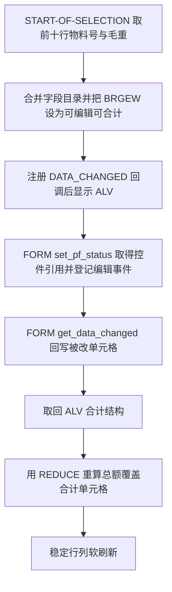
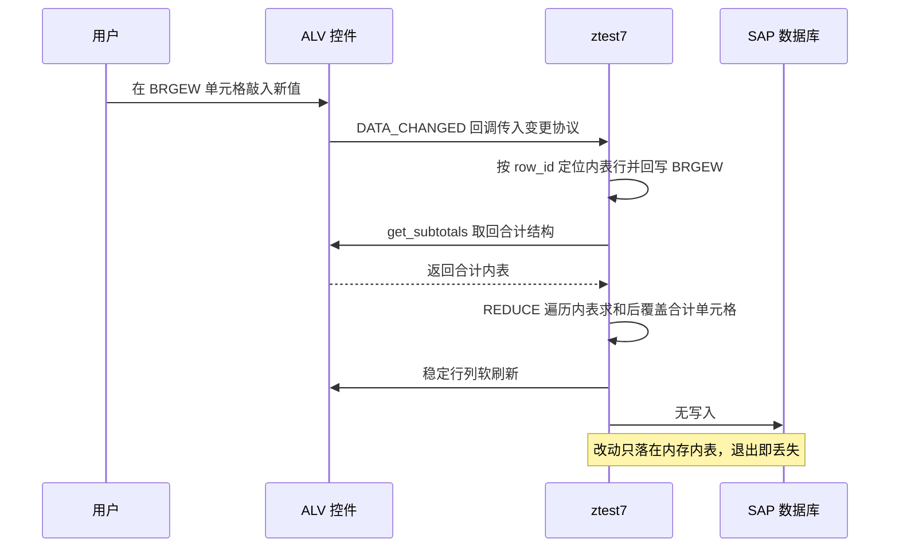

# ztest7 分析报告

## 一、程序定位与业务背景

一份 ALV 报表骨架的演示件，目标场景很具体：让用户在网格里直接改某一列的数值，
改完立刻看到合计行跟着动。

**它想解决的是 SAP 里最常见的一类交互缺口**。标准 `REUSE_ALV_GRID_DISPLAY`
展示出来的 ALV 默认只读，要改数就得跳到别的维护界面；一旦要在表格里就地修正
数量、重量这类字段，多数团队的做法是二选一：要么另做一个专门的维护事务，
要么干脆开放全表编辑、放弃校验。这份程序走的是第三条路——只开放一列、
把改动回填内表、再自己把小计刷回去。

**现有方案为何不够**。用 `cl_gui_alv_grid` 而不是 REUSE_ALV，是为了拿到
`mt_mod_cells` 这个"哪些单元格被改过"的协议对象；用 `get_subtotals` 而不是
自己算，是为了拿到 ALV 已经按 `do_sum` 算好的合计结构，而不是维护第二套数字。
两个选择都指向同一个诉求：**让屏幕上的合计始终等于用户看到的明细之和**。

整体范式一句话定性：全局变量承载状态、FORM 作回调的经典 REUSE_ALV 报表骨架，
改动只落在显示层、没有落库。

## 二、程序执行流程总览



| 子程序 | 调用者 | 职责 |
|---|---|---|
| `START-OF-SELECTION` | SE38/SA38 执行 | 取数、拼字段目录、显示 ALV |
| `FORM set_pf_status` | ALV 全屏回调（`i_callback_pf_status_set`） | 取控件引用，登记 `MODIFIED` 与 `ENTER` 两个编辑事件 |
| `FORM get_data_changed` | ALV 单元格变更回调（`form = 'GET_DATA_CHANGED'`） | 回写改动、重算合计、刷新显示 |
| 全局声明区 | 程序启动 | 声明 ALV 内表、控件引用、FIELD-SYMBOL |

下面按这条流程，逐个子程序展开。

## 三、分组分析（按程序流程 / 子程序）

### 3.1 事件块 `START-OF-SELECTION`

分三步：取数、拼字段目录、显示。

#### ① 取前十行物料号与毛重

```abap
  SELECT matnr,
         brgew
    FROM mara
    INTO TABLE _mara UP TO 10 ROWS.
```

**做什么** — 从 `MARA` 只投影 `MATNR`（物料号）与 `BRGEW`（毛重）两列，取前 10 行装进内表 `_mara`，不取其余两百多个字段。

**为什么** — `MARA` 是全 SAP 最宽的表之一，整行取数会把每个物料的几十个字段搬进内存；演示件只留两列，索引 `MATNR` 上的范围扫描代价也可控。`UP TO 10 ROWS` 是为了让网格短到一眼看全，不是业务上的筛选条件。

**风险与改进** — **取数落点与展示落点不是同一张表**：语句写的是 `INTO TABLE _mara`，而第 ③ 步显示的是 `gt_mara`。二者名字只差一个下划线，这里没有任何注释点出这是笔误。业务后果是 ALV 绑定的是一张从未被填充的全局内表——屏幕上有列头、有合计行，却没有数据行。更麻烦的是 `_mara` 在声明区并不存在，这一句按 ABAP 语法无法通过编译，所以这份代码当前连激活都做不到。建议见下方示意改法。

#### ② 合并字段目录并把 BRGEW 设为可编辑可合计

```abap
      CALL FUNCTION 'REUSE_ALV_FIELDCATALOG_MERGE'
        EXPORTING
          i_program_name         = sy-repid
          i_structure_name       = 'ZTEST_S'
        CHANGING
          ct_fieldcat            = gt_fieldcat
        EXCEPTIONS
          inconsistent_interface = 1
          program_error          = 2
          OTHERS                 = 3.
```

**做什么** — 用 `REUSE_ALV_FIELDCATALOG_MERGE` 从结构 `ZTEST_S` 生成字段目录 `gt_fieldcat`，三个异常分支分别标记接口不一致、程序错误与其他失败。

**为什么** — 字段目录让 ALV 的参考字段编辑功能从结构自动推导列宽、标题与转换规则，不必为两列手写三十行 `ls_fcat` 赋值；`i_structure_name` 传 `ZTEST_S` 而不是内表名，是为了让 ME21N 之类的地方复用同一份字段目录定义。

**风险与改进** — 这里只判了 `sy-subrc = 0` 才往下走，三个失败分支没有任何区分，全部静默退出，屏幕表现是"报表跑完什么都没出"。对演示件可接受，对真实事务不可接受。另外 `i_structure_name` 写的是 `ZTEST_S`，而第 ① 步实际只取了两列；一旦 `ZTEST_S` 里还有别的列，用户会看到取不到值的空列。建议把三个异常分别处理，至少留一条可定位的消息。

#### ③ 注册变更回调并显示 ALV

```abap
      READ TABLE gt_fieldcat ASSIGNING FIELD-SYMBOL(<gs_fcat>) WITH KEY fieldname = 'BRGEW'.
      IF sy-subrc EQ 0.
        <gs_fcat>-edit = 'X'.
        <gs_fcat>-do_sum = 'X'.
      ENDIF.

      APPEND VALUE #( name = 'DATA_CHANGED' form = 'GET_DATA_CHANGED' ) TO gt_events.
```

**做什么** — 在字段目录里定位 `BRGEW` 那一列，把它的 `edit` 与 `do_sum` 两个标记置为 `'X'`；再往事件表 `gt_events` 追加一条 `DATA_CHANGED` 事件，回调指向本程序的 `GET_DATA_CHANGED`。

**为什么** — `edit = 'X'` 是 ALV 唯一认的"这列可改"开关，`do_sum = 'X'` 告诉合计逻辑把该列纳入统计；两者分开设，是为了让"可编辑"和"参与合计"成为独立维度，将来想开放第二列可改但不计合计时不必改结构。`VALUE #( )` 构造追加比 `APPEND` + `FIELD-SYMBOL` 逐字段赋值短得多，这是 7.4 之后处理内表的标准写法。

**风险与改进** — `ASSIGNING FIELD-SYMBOL(<gs_fcat>)` 成功时 sy-subrc 为 0，失败时保持不变，所以这里的 `IF sy-subrc EQ 0` 判断是对的；但它紧跟在 `CALL FUNCTION` 的 `IF sy-subrc = 0` 里面，两次判同一个字段却含义不同，一眼看不出第二次判的是 `READ TABLE`。更实际的坑是 `READ TABLE ... WITH KEY` 用了非排序键，线性扫描整张字段目录；目录几十行时无所谓，几百行就值得改成 `SORTED` 表。真正要改的是 ① 的落点，见那里。

显示调用本身：

```abap
      CALL FUNCTION 'REUSE_ALV_GRID_DISPLAY'
        EXPORTING
          i_callback_program       = sy-repid
          it_fieldcat              = gt_fieldcat
          it_events                = gt_events
          i_callback_pf_status_set = 'SET_PF_STATUS'
        TABLES
          t_outtab                 = gt_mara.
```

**做什么** — 以全屏方式显示 ALV：字段目录用 `gt_fieldcat`，事件用 `gt_events`，数据用 `gt_mara`，并把状态栏设置回调指向 `SET_PF_STATUS`。

**为什么** — `i_callback_program` 传 `sy-repid` 再配合回调名，是 REUSE_ALV 全屏模式的标准接法：ALV 在自己的动态程序里 `CALL FUNCTION` 回来，因此回调必须能按名字找到本程序里的 FORM。`TABLES` 而非 `it_outtab` 传数据，是这一族 FM 沿用了几十年的老式表参数约定。

**风险与改进** — 数据源写的是 `gt_mara`，与第 ① 步写入的 `_mara` 不一致，这是本程序最直接的业务后果：屏幕上的数据行永远为空。第二个问题是 `SET_PF_STATUS` 回调只在用户点"显示"或触发状态栏重设时才被调用，而编辑事件的登记就放在那个 FORM 里——首次进入屏幕时回调已经跑过一次，所以事件能登记上；但如果将来在别的时机重设状态栏，重复 `register_edit_event` 会把同一事件挂多次。

### 3.2 FORM `set_pf_status`

分两步：取控件引用、登记编辑事件。

#### ① 取回 ALV 控件引用

```abap
  CALL FUNCTION 'GET_GLOBALS_FROM_SLVC_FULLSCR'
    IMPORTING
      e_grid = go_grid.
```

**做什么** — 用 `GET_GLOBALS_FROM_SLVC_FULLSCR` 把全屏 ALV 的控件引用取出，存进全局引用 `go_grid`；紧接着用 `IS BOUND` 判断这次是否真的取到了对象。

**为什么** — 这是全屏 REUSE_ALV 的既定套路：`GET_GLOBALS_FROM_SLVC_FULLSCR` 只能在全屏模式下调用，且只能调一次，之后 `SET_PF_STATUS` 里要拿 `cl_gui_alv_grid` 的实例就只剩这个全局引用可用。把引用存成全局而不是 FORM 参数，是因为后续 `get_data_changed` 也要用同一份引用。

**风险与改进** — `IS BOUND` 判断是必要的：这个 FM 在显示被终止（比如导出后退出）时会返回初始引用，后面直接 `->` 调用会短转储。这里判了，做得对。但没有区分"取到了"和"没取到"两种路径的后续动作，没取到就整段跳过，用户看不到任何反馈。建议至少在调试版本给出提示。

#### ② 登记两个编辑事件

```abap
    CALL METHOD go_grid->register_edit_event
      EXPORTING
        i_event_id = cl_gui_alv_grid=>mc_evt_modified.

    CALL METHOD go_grid->register_edit_event
      EXPORTING
        i_event_id = cl_gui_alv_grid=>mc_evt_enter.
```

**做什么** — 向控件登记两个编辑事件：`MODIFIED`（单元格被修改时触发）与 `ENTER`（焦点在该单元格内按回车时触发）。

**为什么** — `mc_evt_modified` 是取到 `mt_mod_cells` 的唯一入口，不登记它就拿不到"哪些格子被改过"；`mc_evt_enter` 额外登记，是为了让用户在格子里改完直接按回车就能确认，而不是必须用鼠标点出焦点。

**风险与改进** — 两次 `register_edit_event` 之间没有判重，重复登记会让 `DATA_CHANGED` 每次编辑触发两遍，回调里的重算与刷新都做两次。演示规模下看不出来；把 10 行放大到十万行时，每次按键都触发两轮 `REDUCE`，屏幕上会明显卡顿。建议把登记动作放进一个带标记的初始化过程，或登记前先查 `mt_events` 里是否已有。

同一个 FORM 里还有一处占位代码：

```abap
  CASE sy-ucomm.
    ...
    WHEN OTHERS.
  ENDCASE.
```

`...` 处是被注释掉的一行 `WHEN`，原意是留给后续功能码分支。

**做什么** — 按 `sy-ucomm` 分派功能码，`CASE` 里目前只有 `WHEN OTHERS` 一个分支，函数体为空。

**为什么** — REUSE_ALV 全屏模式下，`SAVE`、`EXIT`、`BACK` 这些标准功能码不会自动生效，必须在这个回调里自己处理；留一个空的 `CASE` 骨架，是把扩展点摆在那里。

**风险与改进** — 空的 `WHEN OTHERS` 等于把命令栏上所有按钮都吞掉且不执行任何动作，用户点了保存或退出没有任何反应，比不放这个 FORM 更让人困惑。而且 `FORM set_pf_status` 的形参 `itr_extab TYPE slis_t_extab` 全程未被引用，扩展工具栏因此无法影响状态栏——这个形参传了等于没传。建议要么删掉空的 `CASE`，要么至少把 `EXIT` 和标准退出处理接上。

### 3.3 FORM `get_data_changed`

分三步：回写单元格、重算合计、刷新显示。

#### ① 把被改单元格的值写回内表

```abap
    LOOP AT io_data_changed->mt_mod_cells ASSIGNING FIELD-SYMBOL(<gs_changed>) WHERE fieldname = 'BRGEW'.
      READ TABLE gt_mara ASSIGNING FIELD-SYMBOL(<gs_tab>) INDEX <gs_changed>-row_id.
      IF sy-subrc EQ 0.
        <gs_tab>-brgew = <gs_changed>-value.
      ENDIF.
    ENDLOOP.
```

**做什么** — 遍历本次变更协议里所有被改的单元格，只取 `BRGEW` 列的改动；用 `row_id` 作下标从 `gt_mara` 定位到对应行，把新值写进该行的 `BRGEW` 字段。

**为什么** — `mt_mod_cells` 给出的是"改动清单"而不是"结果数据"，所以必须由程序自己回写，否则内存表里的旧值不变，第 ② 步重算总额时用的是旧数，屏幕和内存立刻分叉。用 FIELD-SYMBOL 遍历而不写实体，是为了让循环体不依赖内表的行结构名，将来换成哈希表或排序表都只改一处。

**风险与改进** — 三处实打实的缺口：

**第一，`row_id` 不是内表下标。** `mt_mod_cells` 的 `row_id` 是 ALV 的行标识，只有在用户没排序、没筛选、没分组时才恰好等于内表行号。用户在网格上点一下列头排序，后续所有编辑都会写到错误的行——业务后果是改 A 行的重量，B 行的数据被覆盖，而且屏幕显示的就是错的。这是本程序最严重的一个问题。

**第二，`ASSIGNING` 之前没判 `sy-subrc`。** 这里在 `IF sy-subrc EQ 0` 里面判了，做得对；但 `LOOP AT ... ASSIGNING` 本身若不命中循环，`sy-subrc` 会是 4，代码不检查，直接进入第 ② 步重算，结果用一份没被更新过的数据覆盖合计。

**第三，`<gs_changed>-value` 到 `brgew` 是隐式类型转换。** 协议里的 `value` 是 `any`，用户输入的是字符，要靠目标字段的转换例程转成数值。输入非法字符时转换失败，`brgew` 被写成初始值，而代码没有任何校验也没有消息，用户会以为改动生效了。

#### ② 取回合计结构并用 REDUCE 重算总额

```abap
    go_grid->get_subtotals(
      IMPORTING
        ep_collect00 = gr_data   " Overall Total
    ).
```

**做什么** — 向控件索取合计数据，`ep_collect00` 传出的整体合计以通用引用 `gr_data` 接住。

**为什么** — ALV 自己按 `do_sum` 标记维护了一套合计，比程序另算一遍更可靠：列被筛选、被排序、被部分编辑，ALV 都能给出与当前视图一致的合计结构。把它取回来再微调，比从零重算省事得多。

**风险与改进** — `gr_data` 是 `REF TO data` 形式的泛型引用，接收成功与否没有判。若控件没建好合计（字段目录里 `do_sum` 没设上，或此时没有任何被合计的列），`gr_data` 会停在初始引用，下一句解引用就会短转储。

紧接着的一串取数：

```abap
    ASSIGN gr_data->* TO <gtr_sum_tab>.
    READ TABLE <gtr_sum_tab> ASSIGNING FIELD-SYMBOL(<l_sum>) INDEX 1.
    IF sy-subrc EQ 0.
      ASSIGN COMPONENT 'BRGEW' OF STRUCTURE <l_sum> TO FIELD-SYMBOL(<lg_val>).
      IF <lg_val> IS ASSIGNED.
        <lg_val> = REDUCE #( INIT lv_i TYPE ntgew_15 FOR <ls_t> IN gt_mara NEXT lv_i = lv_i + <ls_t>-brgew ).
      ENDIF.
    ENDIF.
```

**做什么** — 把 `gr_data` 解引用成内表 `<gtr_sum_tab>`，取第 1 行（合计行）再取它的 `BRGEW` 分量，最后用 `REDUCE` 遍历 `gt_mara` 全部行的 `BRGEW` 求和，把算出的值覆盖写回那个分量。

**为什么** — 这一步想做的是"用户改完之后，用我们自己的口径重算总额覆盖 ALV 的算术"。用 `REDUCE #( )` 而不是 `LOOP` 加一个累加变量，是现代 ABAP 表达聚合的标准写法，`INIT` 子句直接承担变量声明，省掉 `DATA lv_i` 和 `CLEAR`；`ASSIGN COMPONENT` 代替按列序号硬取，是为了让代码在字段目录增删列时不必跟着改。

**风险与改进** — **这一段把前面所有正确设计都抵消了，是本程序第二严重的问题**：

**语义错配。** 累加变量声明成 `ntgew_15`（净重，15 位带符号小数），累加的却是 `brgew`（毛重）。毛重和净重在 SAP 里是一对含义不同的业务字段：毛重含包装物皮重，净重不含。代码注释和字段名都在说毛重，类型却选了净重。当前两列数值接近时看不出差异，一旦某行有皮重差，总额就会算成"毛重之和减去皮重之和"。语义错配即便能跑也应记为风险。

**覆盖掉了正确值。** 上一句刚让 ALV 算出与当前视图一致的合计，这一句立刻用另一套口径覆盖它。既然自己算，为什么还要先取 ALV 的结构？`get_subtotals` 的价值被完全抵消，只剩下"借了个壳子"。业务后果是合计行与明细在筛选、排序场景下必然不一致——筛选后屏幕只显示 3 行，合计却是对全部 `gt_mara` 求和。

**三重防护、零告警。** `READ TABLE` 判了 `sy-subrc`、`ASSIGN COMPONENT` 判了 `IS ASSIGNED`、外层还判了 `sy-subrc`，三重判断任一失败都只是不赋值，静默跳过。整段没有任何消息，用户看到合计不动时无从判断是没触发、没赋值还是算错了。

**顺带一提**，第 ② 步依赖第 ① 步把改动回填到了 `gt_mara`。而第 ① 步回填的正是 3.3 ① 里那个有问题的 `READ TABLE INDEX`。也就是说：即使修好了 `row_id` 的问题，合计这条链路上仍然没有任何一环能证明自己拿到的是正确数据。

#### ③ 稳定行列后软刷新

```abap
    gs_stable-col = 'X'.
    gs_stable-row = 'X'.
```

**做什么** — 把全局结构 `lvc_s_stbl` 的 `row` 与 `col` 两个标记置为 `'X'`，表示刷新期间锁住行与列的位置。

**为什么** — 用户刚在某个格子里敲完回车，焦点位置决定了刷新后光标落在哪。锁定行列可以让 `refresh_table_display` 之后焦点仍停在原单元格，用户连续改多个格子不必每次重新定位。

**风险与改进** — `gs_stable` 是全局变量而不是局部变量，所以这个"锁定"状态会一直保留到下一次被清空。若将来某次刷新只想锁行，就必须在调用前把 `gs_stable-col` 清成初始值，否则会锁上行却忘了清列锁，行为与预期相反。改成每次进入本 FORM 先整体 `CLEAR gs_stable` 再按需置位更稳妥。

刷新调用本身：

```abap
    go_grid->refresh_table_display(
      EXPORTING
        is_stable      = gs_stable      " With Stable Rows/Columns
        i_soft_refresh = 'X'            " Without Sort, Filter, etc.
      EXCEPTIONS
        finished       = 1              " Display was Ended (by Export)
        OTHERS         = 2
    ).
    IF sy-subrc <> 0.
    ENDIF.
```

**做什么** — 请求控件软刷新：传入稳定标记 `gs_stable`，并置 `i_soft_refresh = 'X'` 表示不重置排序与筛选。两个异常分支 `finished` 与 `OTHERS` 声明后，紧接着一个空的 `IF sy-subrc <> 0. ENDIF.`。

**为什么** — `i_soft_refresh = 'X'` 保住用户的排序与筛选状态，是"就地编辑"体验的核心：每次改完都回到默认排序，用户第 10 次修改时已经不知道自己在看哪一行。`finished` 异常用于捕获"刷新时屏幕正好被终止"，不处理的话这个异常会让程序短转储。

**风险与改进** — `IF sy-subrc <> 0. ENDIF.` 是一个**空的 IF 分支**：条件写了，判断了，什么也不做。它既不是错误处理也不是占位标记，纯粹是噪声——读者会以为里面漏了东西。业务后果取决于后续维护者：如果有人把真正的处理逻辑"补"进这个空分支，就会以为 `finished` 已经被考虑过了。建议直接删掉，若要处理 `finished`，就明确写出退出路径。

另外 `finished` 与 `OTHERS` 两个异常都不落到任何动作上，等于声明了却不处理。对 `OTHERS` 而言，`refresh_table_display` 的其他失败会让界面停在半刷新状态，用户看到的合计与明细对不上，且没有任何提示。

示意改法（放进 ```abap-fix 围栏，不是源码）：

```abap-fix
    SELECT matnr,
           brgew
      FROM mara
      INTO TABLE gt_mara UP TO 10 ROWS.
```

这是 3.1 ① 那个落点问题的最小修正。完整的建议清单见下一节，不在这里逐条给示意代码——按本格式的分工，本层给的是待审草稿，具体改法请读者对照第 3 节各处的分析自行复核。

## 四、执行流程全景图（数据视角）



数据流上有一点值得单独说：`U -> ALV -> P` 这条链只走了一次，而 `P -> DB` 这条链**根本不存在**。用户改完的数字，退出报表就没了。这对演示件可以接受，对任何真实业务都是不可用的。

## 五、问题清单与改进建议（按优先级）

| 优先级 | 所在子程序 | 问题 | 业务后果 |
|---|---|---|---|
| 🔴 P0 | `START-OF-SELECTION` | 第 ① 步 `INTO TABLE _mara` 与第 ③ 步 `TABLES t_outtab = gt_mara` 落点不一致，且 `_mara` 未声明 | 程序无法通过编译；即便补声明通过，ALV 也绑定在一张从未被填充的表上，屏幕无数据行 |
| 🔴 P0 | `FORM get_data_changed` | 用 `mt_mod_cells-row_id` 当内表下标（`READ TABLE ... INDEX`） | 用户排序或筛选后所有编辑写错行，改 A 行覆盖 B 行，且屏幕直接显示错误数据 |
| 🔴 P0 | `FORM get_data_changed` | 合计累加变量声明 `ntgew_15`（净重）却累加 `brgew`（毛重） | 毛重与净重语义错配，含皮重差的数据行会让总额系统性偏差 |
| 🟠 P1 | `FORM get_data_changed` | 取回 ALV 合计后立即用 `REDUCE` 全表求和覆盖 | 筛选/排序后合计与可见明细必然不一致；`get_subtotals` 的价值被完全抵消 |
| 🟠 P1 | `FORM get_data_changed` | `gr_data` 解引用前未判引用是否已赋值 | 控件未建好合计时初始引用被解引用，运行时短转储 |
| 🟠 P1 | `FORM get_data_changed` | `<gs_changed>-value` 到 `brgew` 依赖隐式类型转换，无校验无消息 | 非法输入被静默转成初始值，用户以为改动生效 |
| 🟠 P1 | `FORM set_pf_status` | `CASE sy-ucomm` 仅一个空 `WHEN OTHERS`；形参 `itr_extab` 全程未用 | 命令栏所有功能码被吞且无反应，标准保存/退出都不可用 |
| 🟠 P1 | `FORM set_pf_status` | `register_edit_event` 无判重 | 状态栏回调被多次触发时事件重复登记，回调执行两遍 |
| 🟡 P2 | 全部 | 全程无落库语句，改动仅存于内存内表 | 报表退出即丢失全部编辑，业务上不可用 |
| 🟡 P2 | `START-OF-SELECTION` | `REUSE_ALV_FIELDCATALOG_MERGE` 三个异常分支不区分、不处理 | 生成失败时屏幕全空且无消息，现场无法定位 |
| 🟡 P2 | `FORM get_data_changed` | `READ TABLE` / `ASSIGN COMPONENT` 三重判断失败后均静默跳过 | 合计不刷新时无从判断是没触发、没赋值还是算错 |
| 🟡 P2 | `FORM get_data_changed` | `IF sy-subrc <> 0. ENDIF.` 空分支 | 读者误以为 `finished` 已处理；后续维护可能把逻辑补进空壳 |
| 🟢 P3 | `FORM get_data_changed` | `gs_stable` 为全局变量且不清零 | 后续刷新可能残留意外的列锁 |
| 🟢 P3 | `START-OF-SELECTION` | `READ TABLE ... WITH KEY` 用非排序键 | 字段目录变大后退化为线性扫描 |
| 🟢 P3 | 全局 | `TYPE-POOLS:slis` 与 `TABLES` 表参数为旧式写法 | 新系统已不推荐，但不影响运行 |

优先级口径：🔴 业务正确性（数据错、算错、或程序跑不起来）；🟠 健壮性（短转储、静默失败、功能不可用）；🟡 性能与规范（现场可诊断性、调试体验）；🟢 可扩展性（改动会牵连别处）。

## 六、整体评价与启发

**优点**

1. **回调接法是教科书级的。** `i_callback_program = sy-repid` 配 `form = 'GET_DATA_CHANGED'`，全屏 REUSE_ALV 取控件引用只走 `GET_GLOBALS_FROM_SLVC_FULLSCR` 这唯一合法途径，事件登记放在 `set_pf_status` 而不是事件块里——三处配合起来逻辑自洽。这套接法很多人写一辈子也写不对。

2. **"只开放一列"的克制是这份演示件最值得学的地方。** `edit` 与 `do_sum` 分开设、只对 `BRGEW` 一列动手，而不是开放全表编辑。ALV 就地编辑最大的坑就是"能改的列比该改的多"，这里从设计上避开了。

3. **用 `ASSIGNING FIELD-SYMBOL` + `VALUE #( )` + `REDUCE #( )` 处理内表**，是 7.4 之后该有的写法，没有一处 `LOOP AT` 里的 `MODIFY`、没有 `DATA` 加 `CLEAR` 的组合，也没有手写 `ASSIGN gr_data->*` 之外的类型体操。

**短板**

1. **"能显示"和"算得对"被混为一谈。** 三个 P0 全在这一点上：数据落错表、行号错当下标、重量类型错配。这份程序在"点开能看到网格"这个层面是完整的，一旦涉及数据正确性就全线失守。演示件最容易踩的坑就是把注意力放在交互上，而交互恰好是最容易跑通的一环。

2. **冗余与缺失同时存在。** 先向 ALV 要合计，再用自己的 `REDUCE` 覆盖掉——`get_subtotals` 被调用却不起作用；同时空的 `CASE`、空的 `IF`、未使用的形参又在旁边堆着。既没有把一件事做透，又留了一堆没做完的痕迹。

3. **没有任何一条反馈路径。** 三个异常分支、三重静默判断、一个空 `IF`，没有一处给用户消息。一个连"改完了"都不确认的界面，用户无法建立信任——这比算法错更难挽回。

**可学到的设计经验**

- **就地编辑的正确顺序是：回填内表 → 取控件自己的合计 → 只在控件算错时才覆盖。** 这份程序把第三步当成了默认动作，于是前两步的正确性全部作废。拿到一个权威结果先验证它，别先覆盖再怀疑。
- **ALV 的 `row_id` 不是内表下标。** 凡是拿 ALV 协议里的位置去 `READ TABLE ... INDEX` 的代码，都要在排序/筛选场景下单独验证一遍。这是就地编辑最隐蔽的一个错。
- **字段名与类型要对齐语义，而不只是对齐长度。** 毛重用净重类型，两边都能编译、都能跑、数值接近时看不出差别——但这类错在数据出现皮重差的那一刻才暴露，那时候已经在生产环境了。
- **演示件可以不完整，但不能假装完整。** 空的 `CASE` 和空的 `IF` 比不写更糟：它们让读者以为那件事已经被考虑过。
