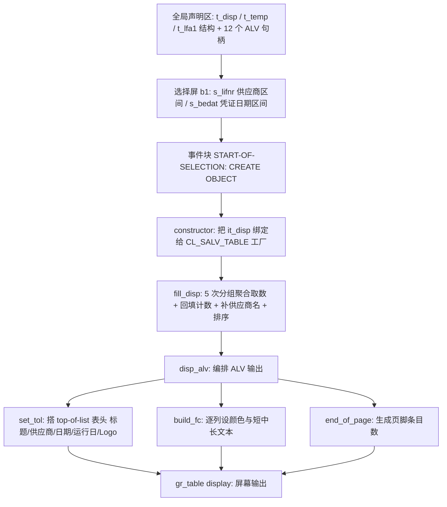
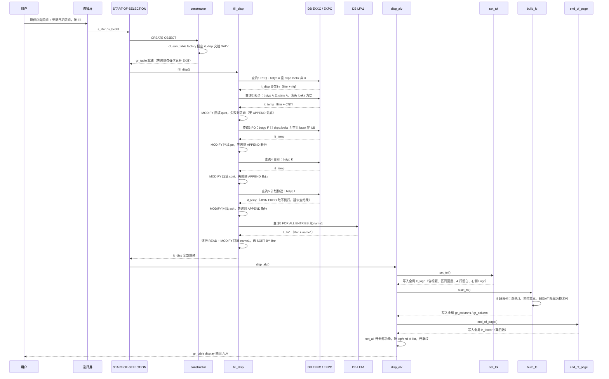

# 供应商采购绩效评估报表 `zmmr_perf_eval_vend` 分析报告

> 分析对象：`Test-source\zvend.abap`（357 行，`REPORT zmmr_perf_eval_vend.`）
> 分析视角：业务定位 → 执行流程 → 逐子程序三层拆解 → 数据流转全景 → 问题清单
> 结论摘要：程序骨架清晰、ALV 输出部分质量不错，但**取数口径存在多处会直接算错数、甚至整行丢失的业务缺陷**，且取数方式在数据量上来后必然拖垮。

---

## 一、程序定位与业务背景

### 1.1 这份程序在解决什么问题

这是一份**供应商采购绩效评估（Vendor Procurement Performance Evaluation）**报表，业务场景很具体：

某制造/化工企业的采购经理要在**供应商准入评审、年度供应商分级、供应商淘汰与份额分配**这类评审会上，回答一个具体问题：

> "在 2025 全年这个窗口里，每个供应商到底参与了我们多少个采购环节？"

SAP 的采购凭证本身把环节区分得很清楚，靠 **EKKO-BSTYP（采购凭证类别）** 区分：

| BSTYP | 环节 | 业务方眼中的名字 |
| --- | --- | --- |
| `A` | 询价单 | RFQ |
| `A` + `STATU` | 报价状态 | Quot（报价） |
| `F` | 采购订单 | PO |
| `K` | 采购合同 | Cont. |
| `L` | 计划协议（Schedule Agreement） | Sch. |

程序把这些数字并排放在一张 ALV 上，一行一个供应商，再挂上供应商名称，用户一眼就能横向对比各供应商的参与广度。参与环节越多的供应商，通常意味着纳入越深、切换成本越高——这正是供应商分级与锁定策略的核心输入。

### 1.2 现有方案为什么不够

这不是"重复造轮子"，而是标准 MM 报表的视角不匹配：

- **ME63N / ME5S（采购信息体系）**：以**采购凭证为行**，一次只能沿一条单据链往下钻，做不了"一供应商一行、五环节并列"的横向汇总。
- **ME80 / ME81**：以物料为视角，统计的是**物料**维度，和"参与广度"没关系。
- **标准报表不按 BSTYP 分类计数**：SAP 没有任何一张标准报表能直接给出"每个供应商有多少张合同、多少张计划协议"并排显示。
- **BW 方案**：数据准、维度全，但采购经理要的是"随手跑一次、马上出数"的自助工具，走 BW 查询要先配权限、等刷新。

所以这个"临时报表"是有真实落点的：**业务自助、快、够用**。理解这一点，才能判断后面那些取舍哪些是合理的、哪些是该改的。

### 1.3 整体设计范式

一句话定性：**非 OO 报表外壳 + 单个无状态本地类（`lcl_perf_eval`）+ "多次分组聚合查询 + 主内表逐列回填"的统计式报表范式**。

程序没有采用 OO 报表标准范式（`if_salv_gui_om_api_info` 那套工厂），而是手写 `START-OF-SELECTION` 入口、内部用类做封装——这在 Z 程序里很常见，代价就是对象状态无处安放（后面会看到，12 个句柄全塞在全局 `DATA` 里正是这么来的）。

---

## 二、程序执行流程总览



### 责任链表

| 子程序 | 调用者 | 职责 |
| --- | --- | --- |
| 全局声明区（类型定义） | 编译器（程序加载时） | 定义输出结构 `t_disp`、中间聚合结构 `t_temp`、供应商结构 `t_lfa1` |
| 全局声明区（ALV 句柄与工作内表） | 编译器（程序加载时） | 声明 12 个 ALV/Form 对象引用与 3 组工作内表 |
| 选择屏 `b1` | SAPGUI 内核（显示时） | 接收供应商号区间与凭证日期区间两个非必填条件 |
| 事件块 `START-OF-SELECTION` | SAPGUI（用户按 F8） | 创建 `lcl_perf_eval` 实例，依次驱动取数与显示 |
| 方法 `constructor` | `START-OF-SELECTION` 的 `CREATE OBJECT` | 调用 SALV 工厂，把 `it_disp` 与 `gr_table` 绑定；失败则弹信息 |
| 方法 `fill_disp` | `START-OF-SELECTION` 显式调用 | 按 5 个采购环节分别对 `EKKO/EKPO` 做分组聚合，回填到 `it_disp`，补供应商名称并排序 |
| 方法 `disp_alv` | `START-OF-SELECTION` 显式调用 | 按固定顺序搭表头 → 设列 → 设页脚 → 开功能 → 显示 |
| 方法 `set_tol` | `disp_alv` | 用 `cl_salv_form_layout_logo` + `grid` 搭顶部信息区，并挂右侧 Logo |
| 方法 `build_fc` | `disp_alv` | 逐列设置颜色、可见性、技术列与短/中/长文本 |
| 方法 `end_of_page` | `disp_alv` | 用 `cl_salv_form_layout_grid` + `flow` 生成底部"总条目数"信息 |
| `gr_table->display( )` | `disp_alv` | 真正把数据渲染到屏幕，返回后程序结束 |

下面按这条流程，逐个子程序展开。

---

## 三、分组分析（按程序流程 / 子程序）

### 3.1 全局声明区 —— 输出结构 `t_disp` 及其依赖类型

这一步是"定契约"：先把后面所有 SELECT 的结果往哪里装说清楚。共定义三个结构。

```abap
TYPES:BEGIN OF t_disp,
   lifnr TYPE lifnr,
   name1 TYPE name1_gp,
   bedat TYPE bedat,
   rfq  TYPE I ,
   quot TYPE I ,
   po   TYPE I ,
   cont TYPE I ,
   sch  TYPE I ,
END OF t_disp,
BEGIN OF t_temp,
   lifnr TYPE lifnr,
  CNT   TYPE I ,
END OF t_temp,
BEGIN OF t_lfa1,
   lifnr TYPE lifnr,
   name1 TYPE name1_gp,
END OF t_lfa1.
```

**做什么** — 定义三个平铺结构：`t_disp` 是最终 ALV 的输出行（供应商号、供应商名称、凭证日期、五个环节的计数）；`t_temp` 是"临时聚合桶"，只有供应商号和计数两个字段，专门承载后面 4 条 SELECT 的分组聚合结果；`t_lfa1` 是供应商名称的键值对载体。

**为什么** — `t_temp` 的设计是这段代码里唯一的"好抽象"：它把 4 条结构完全相同的聚合查询（报价 / PO / 合同 / 计划协议）的输出统一收敛到一个"供应商号 + 计数"的形状，从而复用同一套 `LOOP + MODIFY` 回填逻辑。这比每条查询各写一份回填代码干净得多，也避免了 4 份重复代码走偏。
另外这里用 `TYPE <数据元素>` 而不是手写 `CHAR(10)`：`lifnr` 拉自 LIFNR、`name1` 拉自 `name1_gp`、`bedat` 拉自 BEDAT，改长度或换数据元素时只改一处，ABAP 会连带检查所有引用点，编译期就能挡住错配。这是标准做法，值得肯定。

**风险与改进** — 两个实质问题：

1. **`t_disp-bedat` 是一个死字段。** 后面 5 条 SELECT 没有任何一条把 `BEDAT` 填进 `it_disp`（结果集里根本没有这一列，`GROUP BY` 也不含它）。也就是说 ALV 会为它生成一列、用户看不到（`build_fc` 里被设成不可见 + technical），但它永远是初值。要么删掉这个字段，要么在 `fill_disp` 里填出日期区间时顺便回填——现在是"既留着又不用"。
2. **计数用 `TYPE I`（4 字节整型）语义偏轻。** 正常业务下单据数量撑不到 2,147,483,647，用 `I` 没问题；真正的约束在于 `t_disp` 只有 `LIFNR` 一个业务维度，无法承载分组维度扩展（想按工厂/采购组织再拆一列就得改结构）。这是扩展性约束，不是类型错误。

无其他明显风险。

---

### 3.2 全局声明区 —— ALV 句柄与工作内表

```abap
DATA: "it_layout   TYPE lvc_s_layo,
       gr_table TYPE REF TO cl_salv_table,
       gr_functions TYPE REF TO cl_salv_functions,
       gr_columns TYPE REF TO cl_salv_columns_table,
       gr_column TYPE REF TO cl_salv_column_table,
       gr_display TYPE REF TO cl_salv_display_settings,
       lr_grid TYPE REF TO cl_salv_form_layout_grid,
       lr_gridx TYPE REF TO cl_salv_form_layout_grid,
       lr_logo TYPE REF TO cl_salv_form_layout_logo,
       lr_label TYPE REF TO cl_salv_form_label,
       lr_text TYPE REF TO cl_salv_form_text,
       lr_footer TYPE REF TO cl_salv_form_layout_grid,
       ls_color TYPE lvc_s_colo
      .
```

```abap
DATA: it_disp TYPE TABLE OF t_disp,
       wa_disp LIKE LINE OF it_disp,
       it_temp TYPE TABLE OF t_temp,
       wa_temp LIKE LINE OF it_temp,
       it_lfa1 TYPE TABLE OF t_lfa1,
       wa_lfa1 LIKE LINE OF t_lfa1.
```

**做什么** — 声明 12 个全局对象引用：6 个是 SALV 主对象链路（`gr_table` / `gr_functions` / `gr_columns` / `gr_column` / `gr_display`），5 个是 Form Layout 构造件（`lr_grid` / `lr_gridx` / `lr_logo` / `lr_label` / `lr_text` / `lr_footer`），外加一个颜色结构 `ls_color`。同时声明 3 组工作内表，每组都是"表 + 行"成对。

**为什么** — `cl_salv_table` 系列是 SALV 的**接口式 API**：不能 `CREATE OBJECT` 工厂类，必须先拿到表对象，才能从它 `get_columns( )` / `get_functions( )` 逐层向下取下一层句柄。所以这些引用是链条式的，必须一次性建好，这是 SALV 编程的硬性约束，不算坏味道。`LIKE LINE OF`（而不是 `TYPE t_disp`）是因为结构名与内表名同名会冲突，只能用 `LIKE`，也是标准写法。

**风险与改进** — 这一段是整个程序架构层面最值得开刀的地方：

1. **这些句柄理应是类属性，却全在 `DATA` 里。** `lcl_perf_eval` 的定义段里**一个类属性都没有**，也就是说这个类是无状态的，所有状态靠这 12 个全局变量传递。直接后果：① 这个类**无法复用**——以后想在同一程序里出两张不同的 ALV，第二个实例会覆盖第一个实例的 `gr_table`；② 方法之间的数据流在源码上**不可见**——`set_tol` 造出来的东西，是靠"它恰好写进了名叫 `lr_logo` 的全局变量"才能被 `disp_alv` 拿去用的，读代码的人必须知道这条隐式约定。正确做法是把 `gr_table` / `gr_columns` / `lr_logo` / `lr_footer` 移进 `CLASS ... DEFINITION` 的 `PRIVATE SECTION`，并让 `set_tol` "返回一个 logo 对象"而不是"写一个全局变量"。
2. **`ls_color` 是全局可变对象，被 `build_fc` 反复复用。** 目前只设 `col` 一个字段，功能上没问题，但它和列设置的耦合是隐式的：第 6 段设 SCH 列文本时若有人顺手加一行 `ls_color-int1 = ...`，会影响到前面已设好的列。局部变量更安全。
3. 注释掉的 `it_layout` 说明作者曾想走 `REUSE_ALV` + `lvc_s_layo` 的老路，换成 SALV 后没清理。死注释会误导后来的人。

无其他明显风险。

---

### 3.3 选择屏 —— 条件区 `b1`

```abap
SELECTION-SCREEN BEGIN OF BLOCK b1 WITH FRAME TITLE TEXT- 001.
  SELECT-OPTIONS : s_lifnr FOR wa_disp- lifnr,
   s_bedat FOR wa_disp- bedat.
SELECTION-SCREEN END OF BLOCK b1.
```

**做什么** — 一个带边框和标题的选择屏块，两个区间条件：`s_lifnr` 供应商号区间、`s_bedat` 凭证日期区间。两者都通过 `FOR <工作区字段>` 绑定到 `wa_disp` 的对应组件，因此类型、搜索帮助、长度上限全部自动继承（`s_lifnr` 会自动带 LIFNR 的 F4 帮助）。

**为什么** — 用 `SELECT-OPTIONS ... FOR <结构组件>` 而不是 `FOR <独立变量>`，好处是**类型和 F4 帮助零维护**；`BEDAT` 直接给出日历选择，采购经理不用记 `YYYYMMDD` 格式。这个选择是对的。

**风险与改进** — 这一段的问题密度排全程序第二：

1. **两个条件都非必填、都没有默认值、也没有 `AT SELECTION-SCREEN`。** 后果是：用户什么都不填直接 F8，`fill_disp` 里的 5 条 SELECT 全部以"无条件"执行——`WHERE lifnr IN s_lifnr` 与 `bedat IN s_bedat` 在选择屏为空时等价于**不限制**。这是对 `EKKO`（百万～亿级行，且带 `JOIN EKPO`）的全量分组聚合。轻则几分钟没反应，重则后台资源被拖死。**必须补校验**。
2. **`FOR wa_disp-lifnr` 复用了业务工作区。** `wa_disp` 是 `fill_disp` 里被 `LOOP` / `MODIFY` 反复改写的那个行变量，把它同时当作选择屏的绑定工作区，等于把"输入载体"和"加工载体"混用。本程序在 `START-OF-SELECTION` 之后不会再进 PAI，暂时不出问题，但这是容易在维护中埋雷的写法——规范做法是声明独立的 `wa_sel_lifnr TYPE lifnr`，只借它的类型。
3. **只有区间，没有单值快捷路径。** 实际 90% 的场景是"查某一个供应商"，用户被迫用低值填一遍。
4. 标题用了文本元素 `TEXT-001`（可翻译）是对的，但写成了 `TEXT- 001`（中间多一个空格），语法能过、可读性差。

无其他明显风险。

---

### 3.4 事件块 `START-OF-SELECTION` —— 程序入口与编排

这一段只有 6 行，但它是整个程序的骨架，明确了两件事：**对象在取数之前创建**、**取数与显示分成两拍**。

```abap
START-OF-SELECTION.
DATA : obj_rep TYPE REF TO lcl_perf_eval. " Declaring Object for Class

CREATE OBJECT : obj_rep. " Creating Object

obj_rep->fill_disp( ). " Calling class Methods
obj_rep->disp_alv( ).
```

**做什么** — 声明并创建 `lcl_perf_eval` 的引用，随后**先调 `fill_disp` 填数据，再调 `disp_alv` 做展示**。

**为什么** — 这个顺序是**必须的**，不是随意的。`constructor` 里调用 `cl_salv_table=>factory( CHANGING t_table = it_disp )` 时，`it_disp` 还是空的；SALV 拿到的是 `it_disp` 的**引用**，之后 `fill_disp` 往这张表里 `APPEND` / `MODIFY`，`gr_table` 看到的就是填好的数据。所以"SALV 先创建、数据后填"是 SALV 编程的标准时序（这也是 SALV 相比 `REUSE_ALV` 的好处——不用等数据齐了才 `set_table`）。作者理解这一点，说明是有经验的老手。
`obj_rep` 声明在事件块里而非全局，是因为生命周期只需覆盖这一段，作用域最小化是对的。

**风险与改进** — 两个问题：

1. **构造失败后没有任何阻断。** `constructor` 里有 `IF gr_table IS INITIAL . MESSAGE TEXT -002 TYPE 'I' DISPLAY LIKE 'E'. EXIT .`，但 `EXIT` 在方法里**只是 return 到调用点**，事件块会照常继续执行 `fill_disp` 和 `disp_alv`。详见 3.5 节的 P1 问题——这会导致**短除（Short Dump）**，而不是优雅退出。
2. **`CREATE OBJECT` 是老式显式创建**，类没有接口、没有其他控制手段。这本身不是问题，但配合"类无属性"的状态，就注定无法做依赖注入。改造时建议把 `gr_table` 变成类属性、在 `constructor` 里初始化，而不是靠全局变量在方法间传状态。

无其他明显风险。

---

### 3.5 方法 `constructor` —— 建立 SALV 绑定

这一步 9 行，是整个类里最短、但错误处理最需要改的一段。

```abap
METHOD constructor.
  TRY.
     cl_salv_table=> factory( IMPORTING r_salv_table = gr_table CHANGING t_table = it_disp ). "Calling Factory Obj of Cl_ALV_TABLE
  CATCH cx_salv_msg.
  ENDTRY .

  IF gr_table IS INITIAL .
    MESSAGE TEXT -002 TYPE 'I' DISPLAY LIKE 'E'.
    EXIT .
  ENDIF .
ENDMETHOD.                   "constructor
```

**做什么** — 调用静态工厂方法 `cl_salv_table=>factory`，把全局内表 `it_disp` 交给 SALV 作为数据源，并把生成的表对象赋给全局 `gr_table`；整个调用包在 `TRY ... CATCH cx_salv_msg` 里；如果 `gr_table` 仍是初始值，弹出信息 `TEXT-002` 后 `EXIT`。

**为什么** — 用 `cl_salv_table=>factory` 而不是 `cl_salv_table=>display( )` 一次性显示，是因为这个程序需要在显示前插入一堆设置：列配置（颜色/文本）、表头表尾 Form Layout、条纹样式等。工厂式两步走是 SALV 的标准姿势，选型正确。`CHANGING t_table` 而非 `IMPORTING`，也是因为 SALV 要拿到内表的**可写引用**，用法正确。

**风险与改进** — 这段有三层递进的问题，必须一起改：

1. **🔴 核心缺陷：`EXIT` 拦不住后续执行，会短除。** `EXIT` 退出的是 `METHOD constructor`，不是程序。返回到 `START-OF-SELECTION` 后，`fill_disp( )` 正常跑完（它不用 `gr_table`，没事），接着 `disp_alv( )` → `set_tol( )`（也不碰 `gr_table`，没事）→ **`build_fc` 第一行 `gr_columns = gr_table->get_columns( )`**，此时 `gr_table` 是初始引用 → 抛 `CX_SY_REF_IS_INITIAL` → 该异常既不是 `CX_SALV_NOT_FOUND`，也不在构造函数的 `TRY` 保护范围内 → **直接短除**。也就是说，这段"错误处理"的唯一效果，是把一个干净的"没数据显示"变成了带 dump 的崩溃。
   **改法**：让"错误判断"与"错误处理"分开——构造函数只做初始化，把 `gr_table IS INITIAL` 的判断与提示放到 `disp_alv` 开头；或者让 `constructor` 返回 `bool`，事件块里 `IF obj_rep->constructor( ) = abap_false. RETURN. ENDIF.`。最省事的兜底是在 `build_fc` 入口加 `IF gr_table IS NOT INITIAL`。
2. **🟠 `MESSAGE ... TYPE 'I'` 不会终止程序。** 语义 `I`（Information）弹窗后继续往下跑，界面上会出现"弹了错误提示 → 闪一下 → dump"这种最让人困惑的组合。要么改成 `TYPE 'E'`（弹错并停在当前处理块），要么保留 `I` 但让程序真正 `LEAVE` / `RETURN`。
3. **🟠 `CATCH cx_salv_msg` 是纯粹的噪音。** `cx_salv_msg` 是 `cx_salv_not_found`、`cx_salv_agg` 等 SALV 异常的总基类，这里什么都没接、什么都没记。而且 `cl_salv_table=>factory` 在传入合法内表时**几乎不会失败**——真正可能出问题的是内表结构与字段配置不匹配，这种错误本来就应该暴露出来，不该被静默吞掉。
   **改法**：删掉这个 `TRY`；要留就把 `cx_salv_msg=>get_text( )` 带出来，或写应用日志。
4. **🟡 构造函数里做"弹消息 + EXIT"这类业务动作，本身违反构造函数的职责**——构造函数应该只初始化字段，让错误在明确的调用点被处理。这也正好呼应上一节"类没有属性"的问题。

无其他明显风险。

---

### 3.6 方法 `fill_disp` —— 取数与聚合（程序核心，共 6 步）

这是全程序最长、也是问题最集中的方法：**约 100 行、5 条 SELECT、4 段近乎相同的 `LOOP + MODIFY` 回填**。写法是"**多次分组聚合 + 主内表逐段回填**"，下面按 6 个逻辑步骤拆开。

#### ① 统计 RFQ（询价单），同时初始化输出内表

```abap
METHOD fill_disp.
  "RFQ
  SELECT a~lifnr COUNT( DISTINCT a~ebeln ) AS rfq FROM ekko AS a
  JOIN ekpo AS b ON a~ ebeln = b ~ebeln
  INTO CORRESPONDING FIELDS OF TABLE it_disp
  WHERE a~lifnr IN s_lifnr AND bedat IN s_bedat
  AND b~loekz NE 'X'
  AND a~bstyp = 'A'
  GROUP BY a~lifnr .

  "WRITE sy-dbcnt.
```

**做什么** — 按 `LIFNR` 分组，从 `EKKO`（表头）与 `EKPO`（行项目）做内连接，筛出 `BSTYP = 'A'`（询价单）、行项目删除标志 `LOEKZ <> 'X'`、日期落在选择屏区间内的记录，用 `COUNT( DISTINCT EBELN )` 统计每个供应商的询价单数量，直接 `INTO CORRESPONDING FIELDS OF TABLE it_disp`——**这条 SELECT 同时完成了"统计"和"建立输出行骨架"两件事**。

**为什么** — 这条 SELECT 是全程序写得最有技术含量的一句，有两个关键决策：

- **`COUNT( DISTINCT a~ebeln )` 而不是 `COUNT( * )`。** JOIN 到 `EKPO` 之后，一张单据会被复制成 N 行（几个行项目就有几行）。不加 `DISTINCT`，"10 个行项目的一张询价单"会被算成 10 张询价单。这是**唯一一个需要作者理解 JOIN 行膨胀并主动处理的地方**，说明对 SQL 语义是有认知的——后面 4 条查询全都沿用了这个正确写法，说明这是有意为之而非侥幸。
- **`INTO CORRESPONDING FIELDS OF TABLE it_disp` 而不是先读进 `it_temp` 再回填。** 因为 RFQ 是"第一列计数"，作者需要它的供应商集合作为输出骨架——后面 PO / 合同 / 计划协议通过 `MODIFY` + `IF sy-subrc APPEND` 补齐"骨架里没有、但自己有的供应商"，从而实现了一个**手工版的 FULL OUTER JOIN**。思路是对的，问题出在实现细节（见第 ② 步）。

**风险与改进** —

1. **🟠 `JOIN ekpo` 是纯粹的代价，不带来精度。** 这里 JOIN 到 `EKPO` 的唯一目的就是读 `b~loekz`（行项目删除标志）。但 `LOEKZ` 在 **`EKKO` 表头也存在**（文档级删除/完成标志），完全可以不 JOIN。更关键的是性能：`EKPO` 上只有 `EBELN` 索引，JOIN 会让 DB 在行项目表侧做大量回表，再加上 `COUNT(DISTINCT)` 的去重开销，在大表上是三重代价。**改法**：改用 `EKKO` 单表统计，或把这一步下推成 CDS 视图 / 数据库侧聚合视图。
2. **🟠 只校验了行级 `LOEKZ`，没有校验文档级 `EKKO-LOEKZ`。** 表头被标记删除但行项目残留的脏数据会被算进来。
3. **🟡 `bedat IN s_bedat` 未加表别名前缀。** 这条里恰好只有 `EKKO` 有 `BEDAT`，所以不歧义；但这是"靠字段唯一性赌一次"的写法，后续有人 JOIN 别的表时会直接变成语法歧义错误。规范写法：`a~bedat`。
4. **🟡 被注释掉的 `WRITE sy-dbcnt.`** 说明作者调试过性能，但这行诊断信息没有以任何形式保留下来——取数耗时至今不可观测。

无其他明显风险。

#### ② 统计报价（Quot）并回填——**这里有全程序最严重的功能缺陷**

```abap
  "Quot
  SELECT lifnr COUNT( DISTINCT ebeln ) AS CNT FROM ekko
  APPENDING CORRESPONDING FIELDS OF TABLE it_temp
  WHERE lifnr IN s_lifnr AND bedat IN s_bedat
  AND loekz EQ space
  AND ( bstyp = 'A' AND statu = 'A' )
  GROUP BY lifnr.

  LOOP AT it_temp INTO wa_temp .
     wa_disp- lifnr = wa_temp -lifnr.
     wa_disp- quot = wa_temp -CNT.
    MODIFY it_disp FROM wa_disp TRANSPORTING lifnr quot WHERE lifnr = wa_temp-lifnr .
    CLEAR : wa_disp, wa_temp.
  ENDLOOP .
```

**做什么** — 第二条聚合查询：只查 `EKKO` 单表（无 JOIN），条件是 `LIFNR IN s_lifnr`、`BEDAT IN s_bedat`、`LOEKZ = ' '`、`BSTYP = 'A'` 且 `STATU = 'A'`，按 `LIFNR` 分组统计单据数，追加进 `it_temp`。然后 `LOOP` `it_temp`，把 `CNT` 通过 `MODIFY ... WHERE lifnr = ...` 回填到 `it_disp` 的 `quot` 列。

**为什么** — 结构上复用了 ① 建立的 `it_temp → LOOP → MODIFY` 模式，抽象是对的：`it_temp` 作为中间桶让 4 条查询共享同一套回填代码，这是这段代码里最值得表扬的设计。但这里**恰恰比后面三步少了一个分支**，而这个缺失的分支是致命的。

**风险与改进** —

1. **🔴 P0 级功能缺陷：`MODIFY` 失败时没有 `APPEND` 兜底，导致供应商整行丢失。**
   `MODIFY it_disp FROM wa_disp ... WHERE lifnr = ...` 在找不到匹配行时 `sy-subrc = 4`，**什么也不做**。而 `it_disp` 的行只来自第 ① 步——也就是**只有"有询价单"的供应商才有骨架行**。于是出现这条链路：

   > 某供应商有报价记录、但没有任何询价单（或其询价单行项目全被 `LOEKZ = 'X'` 标记删除）→ 该供应商不在 `it_disp` 里 → 第 ② 步 `MODIFY` 返回 4 → **没有 `APPEND` → 这一行永远不会出现**。

   结果是：**ALV 上根本看不到这个供应商，尽管它明明有报价、可能还有采购订单**。对一个"绩效评估"报表来说，"某些供应商不出现"比"数字算错"更严重——用户会以为这家供应商没参与过采购。而讽刺的是，后面三步（PO / 合同 / 计划协议）**全都写了这个兜底**，唯独报价这一步漏了。典型的复制粘贴漏改。
   **改法**：与后面三步保持一致，加
   ```abap
   IF sy-subrc NE 0.
     APPEND wa_disp TO it_disp .
   ENDIF .
   ```
   更彻底的改法是不要"查一次改一次"，直接用一条带条件聚合的 SQL 一次成型。
2. **🔴 `MODIFY ... TRANSPORTING lifnr quot` 里的 `lifnr` 是冗余的。** 它在这条 `MODIFY` 前后取值相同，传输它没有任何意义，只会让读者误以为这里要改主键。后面三步同理。
3. **🔴 `loekz EQ space` 与第 ① 步的 `loekz NE 'X'` 口径矛盾。** `LOEKZ` 在 `EKKO/EKPO` 上有多个值：`' '`（未完成）、`'C'`（已完成/关闭）、`'X'`（已删除）。
   - 第 ① 步 `NE 'X'`：**已完成（C）的也算**。
   - 第 ② 步 `EQ space`：**已完成（C）的完全不算**。

   对报价来说，`LOEKZ = 'C'` 通常表示询价单已被完全处理（已转订单或已关闭），排除它可能是有意的。但问题是：**这个口径会沿用进 PO / 合同 / 计划协议三列**——于是"采购订单数量"的真实含义变成"**尚未完全关闭的**采购订单数量"，一张已经收货完成、`LOEKZ` 被置为 `'C'` 的订单**不计入**。对绩效评估报表，这几乎肯定是非预期的漏计。
   **改法**：统一成"排除已删除"（`LOEKZ <> 'X'`）；如果业务上确实要区分"在执行"与"已关闭"，应该**新增一列明确表达**，而不是把口径悄悄绑死在每一列上。
4. **🟠 `statu = 'A'` 的语义需要业务确认，疑似反了。** 列标题写的是 `'Quotation Maintained'`（**报价已维护**），而 SAP 中 `EKKO-STATU`（采购凭证状态）取值 `'A'` 通常表示"**询价单已创建**"（即 RFQ 刚建、尚未收到供应商报价），"已维护报价"对应的应是更靠后的状态。
   更要命的是逻辑自洽性：第 ① 步 RFQ 条件是 `bstyp = 'A'`（**不加** `statu` 限制），第 ② 步 Quot 条件是 `bstyp = 'A' AND statu = 'A'`（**加了**）。也就是说 **Quot 的口径是 RFQ 口径的子集**，只要 `statu = 'A'` 必然也满足 `bstyp = 'A'`，那么 `quot ≤ rfq` 恒成立。两列不是"两个独立环节"，而是"同一环节的总数与某个状态子集"。这要么是刻意设计（RFQ 总数 / 其中仍在处理中），要么是口径写错了——**必须找业务确认，不能靠猜**。
5. **🟠 `LOOP` 里 `CLEAR wa_disp` 但没有 `REFRESH it_temp`**——第 ② 步是首次使用 `it_temp`，不需要清空，所以逻辑上是对的。但"首次不清理、之后每次先 `REFRESH`"这个规律没有注释，下一个维护者很容易在中间插一条查询时忘记 `REFRESH`，导致计数被累加。

无其他明显风险。

#### ③ 统计采购订单（PO）并回填

```abap
  " PO
  REFRESH it_temp.
  SELECT lifnr COUNT( DISTINCT a~ ebeln ) AS CNT FROM ekko AS a JOIN ekpo AS b ON a~ ebeln = b ~ebeln
  APPENDING CORRESPONDING FIELDS OF TABLE it_temp
  WHERE lifnr IN s_bedat
  AND b~loekz EQ space
  AND bsart NE 'UB'
  AND ( a~ bstyp = 'F' )
  GROUP BY lifnr.

  LOOP AT it_temp INTO wa_temp .
     wa_disp- lifnr = wa_temp -lifnr.
     wa_disp- po = wa_temp -CNT.
    MODIFY it_disp FROM wa_disp TRANSPORTING lifnr po WHERE lifnr = wa_temp-lifnr .
    IF sy-subrc NE 0.
      APPEND wa_disp TO it_disp .
    ENDIF .
    CLEAR : wa_disp, wa_temp.
  ENDLOOP .
```

> ⚠️ 提示：`WHERE lifnr IN s_bedat` 是**源码事实**——表字段与选择屏变量对调了（应为 `s_lifnr`），详见下方风险第 1 条。

**做什么** — 第三条聚合查询：`EKKO JOIN EKPO`，条件 `BSTYP = 'F'`（采购订单）、行项目 `LOEKZ = ' '`、订单类型 `BSART <> 'UB'`，按 `LIFNR` 分组统计单据数；结果先进 `it_temp`，再逐行回填 `it_disp-po`；**若 `MODIFY` 未命中（该供应商原本不在 `it_disp` 里），则 `APPEND` 新增一行**。

**为什么** — 这个 `IF sy-subrc NE 0. APPEND` 就是第 ② 步缺失的那块拼图，也是这段代码里**最需要的一行**。它把"先查 RFQ 建骨架、再逐列补齐"的手工 FULL OUTER JOIN 补全了：不管哪个供应商先出现，只要它在任意一列里查得到，就一定会有一行。设计意图正确。
`BSART <> 'UB'` 是为了排除"后续单据"类型的订单（框架协议/合同的续单），避免和合同、计划协议列重复计数——这个业务排除是合理的。`REFRESH it_temp` 放在 SELECT 之前，确保复用中间表时不残留上一轮数据。

**风险与改进** —

1. **🔴 字段与选择屏变量对调，条件完全失效。** 原文是 `WHERE lifnr IN s_bedat`——`lifnr`（`CHAR(10)`，供应商号）去和 `s_bedat`（日期区间）比较。ABAP 的 SELECT 不做运行期类型检查，DB 会尝试把 `'20250101'` 当供应商号去匹配，结果**恒为空**（除非真有形如 `20250101` 的供应商号）。若代码确实如文件所示，PO 列恒为 0。
   **注意**：这有可能只是源码导出时空格对齐造成的阅读歧义，需要在 SE38 里核对原始行。但**无论哪种情况都暴露一个真问题——编译器不报错、运行时不报错，只是静默返回空集**，这类错误只能靠测试发现。
2. **🟠 `MODIFY ... TRANSPORTING lifnr po` 里的 `lifnr` 同样冗余**，与 ② 相同。
3. **🟠 `wa_disp` 是"部分字段 + 可能旧值"载体，有隐患。** 这里只被赋了 `lifnr` 和 `po`，其余（`rfq` / `quot` / `cont` / `sch` / `name1` / `bedat`）的值取决于上一次 `CLEAR` 是否彻底。代码在 `LOOP` 末尾 `CLEAR` 所以当前安全，但这个安全**完全依赖末尾那行 `CLEAR` 的存在**——一旦有人为调试去掉 `CLEAR`，就会把上一轮的旧计数污染到新行。把 `CLEAR wa_disp` 放到 `LOOP` 开头，或用两个独立工作区（`wa_key` + `wa_cnt` 拼装），会稳健得多。
4. **🟡 `MODIFY` + `sy-subrc` 实现 FULL OUTER JOIN，但 `MODIFY` 在 `WHERE` 条件下是线性查找**，整体 O(供应商数 × 列数)。几千个供应商规模下无感，几十万时会明显。

无其他明显风险。

#### ④ 统计采购合同（Cont.）并回填

```abap
  "Cont. Created
  REFRESH it_temp.
  SELECT lifnr COUNT( DISTINCT a~ebeln ) AS CNT FROM ekko AS a JOIN ekpo AS b ON a~ ebeln = b ~ebeln
  APPENDING CORRESPONDING FIELDS OF TABLE it_temp
  WHERE lifnr IN s_lifnr AND bedat IN s_bedat
  AND b~loekz EQ space
  AND ( a~ bstyp = 'K' )
  GROUP BY lifnr.

  LOOP AT it_temp INTO wa_temp .
     wa_disp- lifnr = wa_temp -lifnr.
     wa_disp- cont = wa_temp -CNT.
    MODIFY it_disp FROM wa_disp TRANSPORTING lifnr cont WHERE lifnr = wa_temp-lifnr .
    IF sy-subrc NE 0.
      APPEND wa_disp TO it_disp .
    ENDIF .
    CLEAR : wa_disp, wa_temp.
  ENDLOOP .
```

**做什么** — 第四条聚合查询，条件换成 `BSTYP = 'K'`（**采购合同**），其余（JOIN、`LOEKZ = ' '`、日期与供应商区间、`DISTINCT` 计数、`MODIFY` + `sy-subrc` 兜底 `APPEND`）与第 ③ 步完全同构，结果回填到 `it_disp-cont`。

**为什么** — `EKKO.BSTYP = 'K'` 是 SAP 标准里"**采购合同**"的凭证类别，与计划协议 `'L'`、采购订单 `'F'` 并列。用凭证类别做环节切分，是这条统计逻辑最核心的业务映射，选得标准、清晰。
这里也顺手修正了第 ③ 步的 `s_bedat` / `s_lifnr` 对调问题——进一步说明第 ③ 步更可能是笔误而非有意设计。

**风险与改进** —

1. **🟠 `LOEKZ EQ space` 的口径问题在这里同样成立，且后果更严重。** 采购合同一旦执行完毕（`LOEKZ = 'C'`）就不再计入"合同数量"。对绩效评估而言，一家供应商签了 50 份已履行完毕的合同、报表却显示"合同数 0"——这几乎肯定是错的。
2. **🟠 同样没有校验 `EKKO-LOEKZ`（合同头删除标志）。**
3. **🟡 第 ② ③ ④ ⑤ 步是四份近乎逐行相同的代码。** 差异只有三处：`WHERE` 里的 `bstyp` 常量、目标字段名（`quot` / `po` / `cont` / `sch`）、以及 `it_temp` 的目标字段。用一条带 `CASE` 的条件聚合 SQL（一条 SELECT、五个计数列）能把这 90 行压成 15 行，且天然不存在"某一步漏写兜底分支"这类问题。

无其他明显风险。

#### ⑤ 统计计划协议（Sch. Agr.）并回填

```abap
  "Sch Aggre
  REFRESH it_temp.
  SELECT lifnr COUNT( DISTINCT a~ebeln ) AS CNT FROM ekko AS a JOIN ekpo AS b ON a~ ebeln = b ~ebeln
  APPENDING CORRESPONDING FIELDS OF TABLE it_temp
  WHERE lifnr IN s_lifnr AND bedat IN s_bedat
  AND b~loekz EQ space
  AND ( a~ bstyp = 'L' )
  GROUP BY lifnr.

  LOOP AT it_temp INTO wa_temp .
     wa_disp- lifnr = wa_temp -lifnr.
     wa_disp- sch = wa_temp -CNT.
    MODIFY it_disp FROM wa_disp TRANSPORTING lifnr sch WHERE lifnr = wa_temp-lifnr .
    IF sy-subrc NE 0.
      APPEND wa_disp TO it_disp .
    ENDIF .
    CLEAR : wa_disp, wa_temp.
  ENDLOOP .
```

**做什么** — 第五条聚合查询，条件换成 `BSTYP = 'L'`（**计划协议 / Schedule Agreement**），回填到 `it_disp-sch`。

**为什么** — `BSTYP = 'L'` 覆盖计划协议及其下阶（计划协议行、库存信息记录），是 SAP 中"长期供货关系"的凭证形态，与 `'K'`（合同）、`'F'`（订单）构成三类长期关系凭证的三分法。这个切分口径对"供应商绑定程度"的评估是恰当的。
`COUNT( DISTINCT a~ebeln )` 在计划协议场景下尤其必要——计划协议往往行项目极多（甚至上千行），不去重数字会离谱地放大。

**风险与改进** —

1. **🔴 `JOIN EKPO` 对 `BSTYP = 'L'` 的单据取不到行。** 计划协议的行项目在 `EKABN` / `EKBAN`，`EKPO` 里没有对应记录。内连接无匹配即丢行，于是 `b~loekz EQ space` 这个条件**整条查询恒不成立 → 计划协议列很可能恒为 0**。这是比 ③④ 更彻底的失效，也是"用同一个 JOIN 模板套所有凭证类别"这种复制粘贴写法最典型的结构性缺陷。
   **改法**：`BSTYP = 'L'` 这一步应当**不 JOIN `EKPO`**，只用 `EKKO.LOEKZ`。
2. **🟠 `LOEKZ EQ space` 的口径问题在这里同样成立**（计划协议一旦交货完成即置 `'C'`，会被漏掉）。
3. **🟡 与第 ④ 步完全同构，是同一份代码的第 4 遍复制。**

无其他明显风险。

#### ⑥ 补供应商名称并排序收尾

```abap
  SELECT lifnr name1 FROM lfa1
  INTO CORRESPONDING FIELDS OF TABLE it_lfa1
  FOR ALL ENTRIES IN it_disp
  WHERE lifnr = it_disp -lifnr.

  LOOP AT it_disp INTO wa_disp .
    READ TABLE it_lfa1 INTO wa_lfa1 WITH KEY lifnr = wa_disp-lifnr .
    IF sy-subrc EQ 0.
       wa_disp- name1 = wa_lfa1 -name1.
      MODIFY it_disp FROM wa_disp TRANSPORTING lifnr name1 WHERE lifnr = wa_disp- lifnr .
    ENDIF .
  ENDLOOP .
```

```abap
  SORT it_disp BY lifnr .
```

**做什么** — 两步收尾：① 用 `FOR ALL ENTRIES` 从 `LFA1` 取出这些供应商的 `NAME1`，装进 `it_lfa1`；② `LOOP` 遍历 `it_disp`，用 `READ TABLE` 在 `it_lfa1` 里按 `LIFNR` 线性查找，命中就把 `NAME1` 回填到 `it_disp`；③ 最后 `SORT it_disp BY lifnr`，保证输出按供应商号有序。

**为什么** — **放在最后是正确的设计决策**。前面 4 步里 PO / 合同 / 计划协议会不断 `APPEND` 新供应商进来，只有等"全部 5 列都填完"之后，`it_disp` 的供应商集合才是最终集合，此时一次性取名称才不会漏掉后期追加的供应商。顺序安排体现了作者对数据流向的理解。
`SORT` 也是必要的：`GROUP BY` **不保证**结果有序（返回顺序取决于执行计划），而用户期望看到按供应商号排的列表，补 `SORT` 是负责的做法。

**风险与改进** —

1. **🟠 `FOR ALL ENTRIES` 前没有判空。** ABAP 对"FAE 源内表为空"的处理**不会**下推空结果，而是照常执行不带限制的 SQL 扫描。虽然 `LFA1` 表不大（通常万级），但当用户输入了不存在的供应商号时 `it_disp` 为空，就会触发一次无谓的 `LFA1` 全表扫描。规范做法是包一层：
   ```abap
   IF it_disp IS NOT INITIAL.
     SELECT lifnr name1 FROM lfa1
       INTO CORRESPONDING FIELDS OF TABLE it_lfa1
       FOR ALL ENTRIES IN it_disp
       WHERE lifnr = it_disp-lifnr.
   ENDIF.
   ```
2. **🟠 `LOOP` + `READ TABLE` + `MODIFY` 三件套是最低效的回填方式。** 每行一次线性查找 + 一次线性定位的 `MODIFY`，整体 O(n²)。更简洁、更快的做法是用 `ASSIGNING`：
   ```abap
   LOOP AT it_disp ASSIGNING FIELD-SYMBOL(<row>).
     READ TABLE it_lfa1 INTO wa_lfa1 WITH KEY lifnr = <row>-lifnr.
     IF sy-subrc EQ 0.
       <row>-name1 = wa_lfa1-name1.
     ENDIF.
   ENDLOOP.
   ```
   这样连 `MODIFY` 都省了。更进一步，把 `it_lfa1` 声明成 `HASHED` 或 `SORTED BY lifnr`，`READ TABLE` 就变成 O(1) / O(log n)。
3. **🟠 在 `LOOP` 同一张表的同时对其做 `MODIFY`（即使只改非键字段）是危险模式。** ABAP 当前允许（不改行数、不改排序键），但一旦有人加了 `SORT` 或调整了 `MODIFY` 的传输字段，就可能触发"内表被修改"的运行期问题。`ASSIGNING` 可以从根本上消除这个隐患。
4. **🟠 无权限检查。** 报表把 `LFA1` 的供应商名称直接展示给用户，而"显示供应商主数据"在多数企业是有权限控制的（对应 `LFA1` 显示授权对象）。程序完全没有 `AUTHORITY-CHECK`。采购主管是否就该看到全部供应商名称，需要业务确认。
5. **🟡 若某供应商在 `LFA1` 中查不到（理论上不该发生），`name1` 保持初值并静默跳过**，用户看到空白供应商名却不知原因。
6. **🟡 若 `it_disp` 为空（选择条件太窄），程序不做任何提示，直接显示一张空表 + 一个"Total Number of Entries 0"的页脚。** 用户会以为程序坏了。

无其他明显风险。

---

### 3.7 方法 `disp_alv` —— ALV 输出编排

```abap
METHOD disp_alv.

   set_tol( ).
   build_fc( ).
   end_of_page( ).

   gr_functions = gr_table->get_functions ( ).
   gr_functions-> set_all( abap_true ).
   gr_table-> set_top_of_list( lr_logo ).
   gr_table-> set_end_of_list( lr_footer ).
   gr_display = gr_table->get_display_settings ( ).
   gr_display-> set_striped_pattern( cl_salv_display_settings =>true ).


   gr_table-> display( ).

ENDMETHOD.                   "disp_alv
```

**做什么** — 以固定顺序组装 ALV：先让 `set_tol( )` 造出顶部 Form Layout（结果留在全局 `lr_logo`）、`build_fc( )` 配置列、`end_of_page( )` 造出底部 Form Layout（结果留在全局 `lr_footer`）；然后打开全部标准功能（排序/筛选/汇总/导出/打印）；把两个 Form Layout 挂到 `set_top_of_list` / `set_end_of_list`；开启条纹显示；最后 `display( )`。

**为什么** — **这个编排顺序是对的，而且是必须这样**：SALV 要求 `top_of_list` / `end_of_list` 在 `display( )` 之前设置，且 Form Layout 对象必须先被创建好才能挂载。所以"三个构造方法先跑 → 再挂载 → 再显示"的顺序不能打乱。作者显然是踩过坑才写出这个顺序的。
`set_all( abap_true )` 一次性打开 ALV 的所有标准功能（排序、筛选、合计、导出、打印、图形），对一份"用户想自己钻取"的报表是最省事也最实用的选择——用户可以自己按 PO 数排序找出 TOP 供应商，导出成 Excel 再做透视。这比在程序里硬编码 TOP 10 聪明得多。

**风险与改进** —

1. **🟠 `gr_table` 未判空就解引用。** 这是 3.5 节那个 `constructor` 缺陷的**引爆点**。第 2 行 `set_tol( )` 和第 3 行 `build_fc( )` 里会先后访问 `gr_table`（`get_columns( )` / `get_functions( )`），`gr_table` 为初始值就抛 `CX_SY_REF_IS_INITIAL`，无人捕获 → 短除。修 `constructor`，或在这里加 `IF gr_table IS INITIAL. RETURN. ENDIF.`。
2. **🟠 方法间的数据流全是隐式的。** `set_tol( )` 不返回任何东西，"它造出来的 logo"是通过全局变量 `lr_logo` 被这里用到的；`end_of_page( )` 同理。这意味着**只看 `disp_alv` 这一段，无法知道 `lr_logo` 和 `lr_footer` 是谁造的、什么时候造的**。应该改成：
   ```abap
   DATA: lr_top TYPE REF TO cl_salv_form_layout,
         lr_end TYPE REF TO cl_salv_form_layout.
   lr_top = set_tol( ).
   build_fc( ).
   lr_end = end_of_page( ).
   gr_table->set_top_of_list( lr_top ).
   gr_table->set_end_of_list( lr_end ).
   ```
   （需要相应调整 3.8 / 3.10 节的签名——程序本身没有返回值类型，就必须靠属性或传出参数来给。）
3. **🟡 `cl_salv_display_settings =>true` 与其他地方的 `abap_true` 风格不一致。** 全程序其它地方都用 `abap_true`（`set_optimize( abap_true )`、`set_visible( abap_false )`、`set_all( abap_true )`），唯独这里用 `cl_salv_display_settings =>true`——这种形式依赖该类暴露一个名为 `TRUE` 的公共常量属性。建议核对 `CL_SALV_DISPLAY_SETTINGS` 在各版本中是否确实公开该属性，否则**系统升级或跨版本移植时这里会编译失败**。统一用 `abap_true` 最稳。
4. **🟡 `set_all( abap_true )` 会连"数据修改"入口一起打开**，但这是一张只读统计报表，没有任何 `set_data_changed( )` 回调来接收修改，开了也没意义。同理 `->set_print( )`、`->set_graphic( )` 对这张报表价值有限。

无其他明显风险。

---

### 3.8 方法 `set_tol` —— 顶部信息区（表头）构造

这一步共 6 个动作，是 ALV 表头（top-of-list）的完整搭建：用 `cl_salv_form_layout_logo` 把"标题 + 信息网格"放左边、"Logo"放右边。

#### ① 声明与创建主布局、放标题

```abap
METHOD set_tol.
  DATA : lv_text( 30) TYPE C ,
         lv_date TYPE C LENGTH 10.

  CREATE OBJECT lr_grid.

   lr_grid-> create_header_information( row = 1 column = 1
    TEXT = 'MM: Vendor Evaluation'
    tooltip = 'MM: Vendor Evaluation' ).
```

**做什么** — 声明两个字符型工作区（`lv_text` 长 30、`lv_date` 长 10），创建顶部主布局对象 `lr_grid`（类型 `cl_salv_form_layout_grid`），并在第 1 行第 1 列放一个标题栏 `create_header_information( )`，文本为 `MM: Vendor Evaluation`。

**为什么** — `cl_salv_form_layout_grid` 是"表格型"Form Layout：先 `create_header_information` 定标题，再 `create_grid( row, column )` 拿到一个"内容网格"来摆具体内容。这里 `row = 1` 是标题行；`lr_gridx` 自己也用 `row = 2` 起——注意这两套行号属于**两个独立的坐标系**，容易看混但语法正确。

**风险与改进** —

1. **🟠 全部文本硬编码英文。** `MM: Vendor Evaluation` 是字面量，没走文本元素（`TEXT-00x`）。德语/中文系统下这些英文无法通过 SE63 翻译，用户看到的是中英混杂界面。同一程序里 `TEXT-001`、`TEXT-002` 已经用了文本元素，说明作者知道怎么用，只是表头没做。
2. **🟡 `lv_text(30) TYPE C` 与 `lv_date TYPE C LENGTH 10` 是两种等价写法混用。** 前者是内联声明长度（老式），后者是 `LENGTH` 关键字（7.40 语法）。新代码应统一用后者。
3. **🟡 `CREATE OBJECT` 是老式显式创建**，新语法 `lr_grid = NEW cl_salv_form_layout_grid( ).` 更简洁。纯风格问题。

无其他明显风险。

#### ② 建内容网格、放"供应商号"区间

```abap
   lr_gridx = lr_grid->create_grid ( row = 2 column = 1 ).
   lr_label = lr_gridx->create_label ( row = 2 column = 1
    TEXT = 'Vendor No # :' tooltip = 'Vendor #.' ).

   IF s_lifnr IS NOT INITIAL .
      lv_text = s_lifnr -low .
      IF s_lifnr-high IS NOT INITIAL.
        CONCATENATE lv_text ' to ' s_lifnr -high INTO lv_text SEPARATED BY space.
      ENDIF .
   ELSE .
      lv_text = 'Not Provided'.
   ENDIF .
    lr_text = lr_gridx->create_text ( row = 2 column = 2
    TEXT = lv_text tooltip = lv_text ).
```

**做什么** — 在主布局第 2 行第 1 列创建内容网格 `lr_gridx`；在其中放 `Vendor No # :` 标签；若选择屏供应商区间非空，就把低值（若高值也非空则拼成 `低值 to 高值`）写入 `lv_text`，否则写 `'Not Provided'`；最后在第 2 行第 2 列放文本对象显示它。

**为什么** — **这体现了一个很好的 UX 意识**：报表顶部必须回显"本次是按什么条件跑的"。用户经常截图分享报表，看不到筛选条件，接收方就无法判断数据的适用范围。绝大多数 Z 报表不做这件事，这个程序做了，值得肯定。
`IF s_lifnr IS NOT INITIAL` 的判空也写对了——`SELECT-OPTIONS` 结构未赋值时整体为初值，这里正确区分了"用户没填"和"用户填了"。

**风险与改进** —

1. **🟠 `CONCATENATE lv_text ' to ' s_lifnr-high INTO lv_text` 目标字段同时是源字段。** 这是 ABAP 里著名的"自拼接"反模式：`lv_text` 既是源又是目标，ABAP 规范**不保证**源字段的读取顺序晚于目标写入。在绝大多数系统上"恰好能工作"，但这是依赖未定义行为的写法。规范做法是用独立变量或字符串模板：
   ```abap
   DATA: lv_range TYPE string.
   IF s_lifnr-high IS NOT INITIAL.
     lv_range = |{ s_lifnr-low ALPHA = OUT } to { s_lifnr-high ALPHA = OUT }|.
   ELSE.
     lv_range = s_lifnr-low.
   ENDIF.
   ```
   值得注意的是，**下一段（日期区间）作者却正确地用了 `lv_date` 中转**——说明作者知道自拼接有问题，只是两处风格不一致。
2. **🟠 `s_lifnr-low` 直接赋给 `lv_text(30) TYPE C`，前导空格会被一起带进去。** SAP 的 `LIFNR` 是 `CHAR(10)`，实际数据通常**右对齐、左补空格**（数值型字段惯例）。`lv_text = s_lifnr-low.` 会把这些前导空格拷进展示文本，可能显示成带空格的编号。规范写法：`|{ s_lifnr-low ALPHA = OUT }|`。
3. **🟡 只填高值（`LOW` 为空、`HIGH` 有值）时会显示成 ` to XXXXXXXX`**——选择屏允许这种填法，界面会出现一个空白的" to "。
4. **🟡 `tooltip = 'Vendor #.'` 与标签文本 `'Vendor No # :'` 不一致**（前者少一个空格），文案细节，但这是给业务用户看的字符串。

无其他明显风险。

#### ③ "凭证日期"区间行

```abap
   "Vendor
   lr_label = lr_gridx->create_label ( row = 3 column = 1
    TEXT = 'Posting Date:' tooltip = 'Posting Date' ).
   IF s_bedat IS NOT INITIAL .
     WRITE s_bedat-low DD/MM/YYYY TO lv_text .
     IF s_bedat-high IS NOT INITIAL.
       WRITE s_bedat-high DD/MM/YYYY TO lv_date.
       CONCATENATE lv_text ' to ' lv_date INTO lv_text SEPARATED BY space.
     ENDIF .
   ELSE .
      lv_text = 'Not Provided'.
   ENDIF .

    lr_text = lr_gridx->create_text ( row = 3 column = 2
    TEXT = lv_text  tooltip = lv_text ).
```

**做什么** — 放 `Posting Date:` 标签；若 `s_bedat` 非初值，就用 `WRITE ... DD/MM/YYYY TO` 把日期区间格式化写入 `lv_text` / `lv_date`，并拼成区间文本；否则写 `'Not Provided'`；最后显示在第 3 行第 2 列。

**为什么** — **这一段是全文最值得学的"知识陷阱"**。`WRITE ... DD/MM/YYYY TO itab` 是 ABAP `WRITE` 语句的**内部格式组（Internal Format Group）**功能，用于把 `DATS` 类型字段从内部格式 `YYYYMMDD` 转成人类可读格式输出。它**依赖用户参数 `UDD`（内部格式组）**，而不是硬编码的格式化。理解这一点，才能理解下面的风险。

**风险与改进** —

1. **🟠 格式化结果依赖用户参数 UDD，跨用户不一致。** `DD/MM/YYYY` 属于 `WRITE` 的日期格式组，**只有在用户参数 `UDD` 选定的内部格式组包含日期格式时才生效**；否则 `WRITE` 退回内部格式，输出 `20250101`。也就是说：**同一个程序、同一条数据，用户 A 看到 `01/01/2025`，用户 B 可能看到 `20250101`**。这是典型的"测试环境通过、生产环境被投诉"的问题。
   **改法**：用显式的、与用户参数无关的格式化，例如把日期转成字符再拼接：
   ```abap
   DATA: lv_from TYPE string,
         lv_to   TYPE string.
   lv_from = |{ s_bedat-low+6(2) }/{ s_bedat-low+4(2) }/{ s_bedat-low(4) }|.
   ```
   或者用日期型中间字段 + 字符串模板 `|{ lv_date DATE = 'ISO' }|` 后再自行拆解。
2. **🟠 与第 ② 步风格不一致**：供应商区间用 `lv_text` 自拼接、日期区间用 `lv_date` 中转。应统一改成中转变量。
3. **🟠 只填高值时会显示成 `01/01/0000 to ...` 之类的内容**（`s_bedat-low` 为空，`WRITE` 输出全零，再被格式化成零日期），比第 ② 步更显眼。

无其他明显风险。

#### ④ "运行日期"行

```abap
   lr_label = lr_gridx->create_label ( row = 4 column = 1
    TEXT = 'Run Date:' tooltip = 'Run Date' ).
    lr_text = lr_gridx->create_text ( row = 4 column = 2
    TEXT = sy- datum tooltip = sy -datum ).
```

**做什么** — 放 `Run Date:` 标签，并在第 4 行第 2 列放一个文本对象，其 `TEXT` 和 `tooltip` 都直接取当前系统日期 `sy-datum`。

**为什么** — 报表标注生成时间是有价值的实践（同一张表在不同时间跑出的数字可能不同，因为期间内新增了单据）。这一行让截图自带时间戳，省掉手工在邮件里写"截至 X 日"。和上一行的日期格式化放在一起看，能说明作者是**有意识地做报表可追溯性**的。

**风险与改进** —

1. **🟠 格式与上一行不一致。** 上行日期做了 `DD/MM/YYYY` 格式化，这一行直接把 `sy-datum`（内部 `YYYYMMDD`）扔进 `TEXT`。用户在界面上会看到 `Posting Date: 01/01/2025 to 31/12/2025` 紧接着 `Run Date: 20260201`——两种格式并排，非常刺眼。
2. **🟠 缺时分。** `SY-DATUM` 只有日期，没有 `SY-TIME`。绩效评估的数字在同一天内跑两次可能不同（单据随时在录入），带时分更严谨。
3. **🟡 `TEXT = sy-datum` 把日期型字段直接传给文本参数，依赖隐式转换**，规范写法是 `TEXT = |{ sy-datum }|` 或 `CONV string( sy-datum )`。

无其他明显风险。

#### ⑤ 空占位行

```abap
   lr_label = lr_gridx->create_label ( row = 5 column = 1 ).
   lr_label = lr_gridx->create_label ( row = 6 column = 1 ).
   lr_label = lr_gridx->create_label ( row = 7 column = 1 ).
   lr_label = lr_gridx->create_label ( row = 8 column = 1 ).
```

**做什么** — 创建 4 个**没有任何文本**的标签对象，占住内容网格的第 5 到第 8 行。

**为什么** — 作者的意图很明确：**留白**。`cl_salv_form_layout_logo` 右侧要放 Logo 图片，Logo 有固定高度（通常对应 5~8 行的高度）；如果不预留空行，左侧信息区只有 4 行，Logo 会撑不满布局、把左边的网格压扁。SALV 的 Form Layout 没有"设置行高"或"插 spacer"的 API，所以**只能用空控件占行**——这是一种 hack，但在 SALV 的能力范围内算是少数可行方案之一。

**风险与改进** —

1. **🟡 空占位行的数量与 Logo 图片的实际像素高度强耦合。** 一旦有人把 Logo 换成高度不同的图片（或图片根本不存在），这 4 行占位就会显得过多（表头下方一大片空白）或过少。只能靠人工目视调整。
2. **🟡 `lr_label` 被复用 4 次赋同一个变量**——前一个对象立即被覆盖。在 SALV 里没问题（Form Layout 是自持有的树形结构，会持有子对象引用），但可读性差，用循环更清楚：
   ```abap
   DATA(row) = 5.
   DO 4 TIMES.
     lr_label = lr_gridx->create_label( row = row column = 1 ).
     row = row + 1.
   ENDDO.
   ```
3. **🟡 这 4 行没有任何注释。** 半年后没人知道它们是干什么的，多半会被当成无用代码删掉，然后 Logo 变形。一行注释的投入产出比极高。

无其他明显风险。

#### ⑥ 组装 Logo 布局

```abap
* Create logo layout, set grid content on left and logo image on right
 CREATE OBJECT lr_logo.
  lr_logo-> set_left_content( lr_grid ).
  lr_logo-> set_right_logo( 'ZCHEM_N_LOGO_SMALL' ). " Image From OAER T.code
```

**做什么** — 创建 `cl_salv_form_layout_logo` 布局对象，把上一步建好的整个信息网格 `lr_grid` 设为**左侧内容**，把名为 `ZCHEM_N_LOGO_SMALL` 的图片设为**右侧 Logo**。

**为什么** — `cl_salv_form_layout_logo` 提供"左内容 + 右图"的二栏布局，是 SALV 里放 Logo 的标准做法（另一条路是 `set_image( )`，但那是整块背景图，不是并排）。把 `lr_grid` 整体作为 `left_content` 传入，说明前面所有 `create_label` / `create_text` 都是往这一个网格对象里挂的，层级关系清晰。
注释 `Image From OAER T.code` 说明了图片来源，这对"图片不在代码库里而在某个事务里"的情况是有价值的线索。

**风险与改进** —

1. **🟠 Logo 名称硬编码，图片缺失会在显示阶段炸。** `ZCHEM_N_LOGO_SMALL` 是图形对象名，若在目标 client 中不存在（或未随传输带过去），`set_right_logo( )` 在 `display( )` 时会抛异常，且此处**没有任何 `TRY` 保护** → 短除。"换个 client 就崩"是这类硬编码最常见的表现。
   **改法**：先查 `GRAPHICS` / `GRAPHICS_X` 确认存在性再设置；或用 `TRY ... CATCH cx_salv_error` 包住 `display( )`。
2. **🟠 硬编码企业 Logo 削弱了程序可移植性。** 这份报表若要给子公司用，就得改代码。
3. **🟡 `CREATE OBJECT lr_logo.` 又是一处老式创建**，与 `NEW` 不一致。

无其他明显风险。

---

### 3.9 方法 `build_fc` —— 列配置（field configuration）

这一步共 8 段、约 65 行，**同构度极高**：每段都是"取列对象 → 设若干属性 → `CATCH cx_salv_not_found`"。下面按 4 组拆开。

#### ① 取列集合、优化列宽、给 `LIFNR` 上色

```abap
METHOD build_fc.

  INCLUDE <color>.
  TRY.
     gr_columns = gr_table->get_columns ( ).
     gr_columns-> set_optimize( abap_true ).
     gr_column ?= gr_columns-> get_column( 'LIFNR' ).
     ls_color- col = 3 .
     gr_column-> set_color( ls_color ).

  CATCH cx_salv_not_found.
  ENDTRY .
```

**做什么** — 引入 `<color>` include；从 `gr_table` 取列集合对象存入 `gr_columns`；开启"自动优化列宽"；取出 `LIFNR` 列（用 `?=` 而非 `=`），把颜色设为 `3`（黄色背景）。

**为什么** — `gr_column ?= gr_columns->get_column( 'LIFNR' )` 用的是 **`?=` 而不是 `=`**，这是本段唯一的"高水平"写法。`get_column( )` 对不存在的列会返回**初始引用**，`?=` 在这种情况下既不把 `sy-subrc` 置错，也不会触发异常，明确表达了"这个引用可能为空"。用 `?=` 是 SALV 编程的推荐写法，作者用对了。
`set_optimize( abap_true )` 让 SALV 按数据内容自动计算列宽，省去手工 `set_width`，是最省事的正确选择。

**风险与改进** —

1. **🟠 `INCLUDE <color>` 写在方法体内，但整段只用到字面量 `3`。** `<color>` 这个 include 提供的是 `COL_NORMAL` / `COL_TOTAL` / `COL_POSITIVE` 等常量。这里直接写数字 `3`，语义靠读者自己查表（SAP 颜色码 3 = 黄色）。规范写法是用常量：`ls_color-col = COL_YELLOW.`，可读性提升明显。
2. **🟠 `INCLUDE` 语句出现在方法体内部是反模式。** `INCLUDE` 展开的是**声明语句**，通常应该放在程序最开头。放在方法体内虽然语法能过，但会让 IDE 的代码导航、ATC 检查和后续维护者都困惑。应该移到程序顶部，或者干脆删掉（既然没用到常量）。
3. **🟠 `CATCH cx_salv_not_found` 静默吞掉。** 这是全程序 8 处相同的写法（见下），问题一样：如果有人把结构组件 `rfq` 改名成 `REQ_NO`，`get_column( 'RFQ' )` 会抛 `CX_SALV_NOT_FOUND`，被静默捕获 → **列配置悄悄失效，报表照常显示，只是文案和颜色没生效**。这类问题在生产环境极难定位。
   **改法**：至少在 `CATCH` 里做点什么（`MESSAGE cx_salv_not_found=>get_text( ) TYPE 'S'` 至少会显示在消息行），或写应用日志；在开发环境更应该**不捕获**，让问题暴露出来。
4. **🟡 `ls_color-col = 3` 是魔法数字**，应加注释或用常量。

无其他明显风险。

#### ② `NAME1` 列：颜色 + 三档文本

```abap
  TRY.
     gr_column ?= gr_columns-> get_column( 'NAME1' ).
     gr_column-> set_long_text('Vendor Name' ).
     gr_column-> set_short_text( 'V.Name' ).
     gr_column-> set_medium_text('Vendor Name' ).
     ls_color- col = 3 .
     gr_column-> set_color( ls_color ).
  CATCH cx_salv_not_found.
  ENDTRY .
```

**做什么** — 取出 `NAME1` 列，依次设置长文本 `Vendor Name`、短文本 `V.Name`、中文本 `Vendor Name`，再把颜色设为 `3`。

**为什么** — **三档文本（short / medium / long）是 SALV 的一个容易被低估的特性**：短文本用于列窄时的表头压缩显示（比如在图表、冻结区里），中/长文本用于常规和提示场景。作者虽然只在 `NAME1` 上把三档都设满了，但其他列也都设了短文本（见 ④⑤），说明是知道这个机制的——这比只设一个 `set_text` 的常见写法专业。

**风险与改进** —

1. **🟠 文本硬编码英文**，未走文本元素，无法 SE63 翻译。中文系统上列头是 `V.Name` / `Vendor Name`，与界面其它中文字段混排。
2. **🟠 `long_text` 与 `medium_text` 内容完全相同（都是 `Vendor Name`），只有 `short_text` 不同。** 说明作者可能没理解三档的差异——通常 `long_text` 应该是更完整的描述（如 `Vendor Name (from LFA1)`），`medium` 可以与 `long` 相同。填一样的值虽然不出错，但浪费了一次表达机会。
3. **🟡 与 `LIFNR` 列同样设为颜色 `3`。** 把两个身份列都染成黄色，而五个计数列保持默认色——这个视觉决策的意图（突出标识列）是合理的，但颜色 `3`（黄色背景）通常用于"汇总/异常"语义，用作普通高亮在 SAP 的色彩惯例里略偏。

无其他明显风险。

#### ③ `BEDAT` 列：隐藏并标记为技术列

```abap
  TRY.
     gr_column ?= gr_columns-> get_column( 'BEDAT' ).
     gr_column-> set_visible( abap_false ).
     gr_column-> set_technical( VALUE = if_salv_c_bool_sap=> true ).
  CATCH cx_salv_not_found.
  ENDTRY .
```

**做什么** — 取出 `BEDAT` 列，`set_visible( abap_false )` 让它不在屏幕上显示，再用 `set_technical( if_salv_c_bool_sap=> true )` 把它标记为"技术列"。

**为什么** — "技术列"是 SALV 对"数据里要保留、界面上不显示"的列的官方表达：它仍参与排序、筛选、数据传输（导出 Excel 时通常仍可见），只是不在屏幕上占位。这比直接 `set_visible( abap_false )` 单独使用更完整，两个方法配合是标准做法。用 `IF_SALV_C_BOOL_SAP=>true` 而不是 `abap_true` 是因为 SALV 的部分 setter 参数类型是 `if_salv_c_bool_sap`，**用法正确**。

**风险与改进** —

1. **🟠 这是在给一个死字段做无用功。** 3.1 节已经指出：`t_disp-bedat` 从未被任何 SELECT 填充，永远是初值。把它隐藏起来，等于**把一个 bug 藏了起来**——用户看不到这一列，也就不会发现"为什么没有日期列"。正确做法是二选一：删掉这个字段，或者真的把日期区间回填进去并展示出来。
2. **🟠 隐藏了 `BEDAT`，用户就完全看不到"按哪个日期区间统计"。** 日期区间只在表头 `set_tol` 里回显。如果用户导出 Excel 后单独传给别人，表头信息会丢失，而数据里又没有日期列可供追溯。
3. **🟡 与 ① ② 一样，`CATCH cx_salv_not_found` 静默吞掉。**

无其他明显风险。

#### ④ 五列计数字段的短/中/长文本

```abap
  TRY.
     gr_column ?= gr_columns-> get_column( 'RFQ' ).
     gr_column-> set_short_text( 'RFQ' ).
     gr_column-> set_medium_text( 'RFQ Created' ).
  CATCH cx_salv_not_found.
  ENDTRY .

  TRY.
     gr_column ?= gr_columns-> get_column( 'QUOT' ).
     gr_column-> set_short_text( 'Quot.' ).
     gr_column-> set_medium_text( 'Quotation Maintained' ).
  CATCH cx_salv_not_found.
  ENDTRY .

  TRY.
     gr_column ?= gr_columns-> get_column( 'PO' ).
     gr_column-> set_short_text( 'PO Created' ).
     gr_column-> set_medium_text( 'PO Created' ).
  CATCH cx_salv_not_found.
  ENDTRY .

  TRY.
     gr_column ?= gr_columns-> get_column( 'CONT' ).
     gr_column-> set_short_text( 'Cont.' ).
     gr_column-> set_medium_text( 'Contract Created' ).
  CATCH cx_salv_not_found.
  ENDTRY .

  TRY.
     gr_column ?= gr_columns-> get_column( 'SCH' ).
     gr_column-> set_short_text( 'Sch. Crea.' ).
     gr_column-> set_medium_text( 'Sch. Agr. Created' ).
     gr_column-> set_long_text( 'Schedule Agreement Created' ).
  CATCH cx_salv_not_found.
  ENDTRY .
```

**做什么** — 依次为 5 个计数字段设置表头文案：RFQ（`RFQ` / `RFQ Created`）、QUOT（`Quot.` / `Quotation Maintained`）、PO（`PO Created` / `PO Created`）、CONT（`Cont.` / `Contract Created`）、SCH（`Sch. Crea.` / `Sch. Agr. Created` / `Schedule Agreement Created`）。

**为什么** — 五段代码的差异只有**字段名和文案**，逻辑结构 100% 相同（取列 → 设短文本 → 设中文本 → 捕获异常）。文案本身写得不错：`short_text` 用缩写（列窄时不换行）、`medium_text` 用完整描述，是 SALV 三档文本的标准用法；`SCH` 还额外给了 `long_text`，是唯一一列把三档都填全的计数列——说明作者对 SCH 这个缩写最不确定（`Sch.` 确实歧义大），这个处理是细致的。
另外注意**没有给计数列设数字格式**（`set_cell_type( if_salv_c_cell_type=>numeric )` / `set_alignment( )`），默认按整数右对齐显示，这是可接受的。

**风险与改进** —

1. **🟠 五份同构代码 = 复制粘贴的教科书案例。** 应该抽成一个私有方法：
   ```abap
   METHOD set_col_texts.
     DATA(lo_col) = gr_columns->get_column( iv_column ).
     IF lo_col IS BOUND.
       lo_col->set_short_text(  iv_short ).
       lo_col->set_medium_text( iv_medium ).
       lo_col->set_long_text(  iv_long )  " 可选
     ENDIF.
   ENDMETHOD.
   ```
   调用处变成 5 行参数化调用，`CATCH` 也只需写一次。
2. **🟠 所有 `CATCH cx_salv_not_found` 静默吞异常**（与 ①②③ 同因）。8 处重复的静默失败，是这段方法最大的维护陷阱。
3. **🟡 `PO` 列的 `short_text` 与 `medium_text` 内容完全一样**（都是 `PO Created`），没有真正起到"短/长区分"的作用，而短文本本应是 `PO`。
4. **🟡 文案硬编码英文，未走文本元素**（与 ② ③ 同因）。
5. **🟡 五个计数字段都是 `TYPE I`，但表头文案里没有任何"单位/口径"提示。** 结合 3.6 节发现的 `LOEKZ` / `STATU` 口径问题，用户看到的是一排"看起来很确定"的数字，实际上口径并不统一——这是**比代码缺陷更危险的地方**，因为它会让人做出错误的供应商决策。

无其他明显风险。

---

### 3.10 方法 `end_of_page` —— 页脚（end-of-list）构造

```abap
METHOD end_of_page.

  DATA :lf_lines TYPE sy-tfill .

  DATA : "lr_label TYPE REF TO cl_salv_form_label,
          lf_flow TYPE REF TO cl_salv_form_layout_flow .

  CREATE OBJECT lr_footer.
*--get total lines in internal table
     lf_lines = LINES( it_disp ).
     lr_label = lr_footer->create_label ( row = 1 column = 1 ).
     lr_label-> set_text( 'Information:' ).
     lf_flow = lr_footer->create_flow ( row = 2 column = 1 ).
     lf_flow-> create_text( TEXT = 'Total Number of Entries' ).
     lf_flow = lr_footer->create_flow ( row = 2 column = 2 ).
     lf_flow-> create_text( TEXT = lf_lines ).

ENDMETHOD.                   "end_of_page
```

**做什么** — 声明一个 `sy-tfill`（1 字节整型）变量 `lf_lines` 和一个 `cl_salv_form_layout_flow` 引用 `lf_flow`；创建页脚布局 `lr_footer`；用 `LINES( it_disp )` 取出行数写入 `lf_lines`；第 1 行放 `Information:` 标签；第 2 行第 1 列放文字 `Total Number of Entries`，第 2 列放数字 `lf_lines`。

**为什么** — 在页脚回显"共 N 条"是一个**成本很低但价值明确**的小设计：用户截屏分享给主管时，对方不必自己数行数。用 `LINES( )` 内建函数而不是 `DESCRIBE TABLE ... LINES` 也是 7.40 之后的正确写法。
`cl_salv_form_layout_flow` 是"流式"布局（内容按顺序流动排列），比 `grid` 更适合"标签 + 值"这种一行两格的紧凑排布——这里第 2 行的两格分别用两个 flow 对象实现，选型正确。

**风险与改进** —

1. **🟠 `lf_lines` 用 `sy-tfill`（INT1）承接 `LINES( it_disp )`。** `SY-TFILL` 的值域是 0~255。供应商超过 255 个时，`LINES( )` 的结果会**被截断/溢出**，页脚会显示一个错误的数字。这是个真实的边界缺陷，虽然大多数场景下供应商数少于 255，但恰恰是"大范围查询"（不填条件、全表）时才会出现——而那正是最容易用这个报表的场景。
   **改法**：`DATA: lf_lines TYPE i.`
2. **🟠 页脚里的数字是**显示前**算好的，而 ALV 允许用户在屏幕上排序、筛选。** 用户筛掉一半行之后，页脚仍然显示筛选前的总数。这不算 bug（页脚本来就常常只显示初始行数），但没有标注就容易被误解。规范做法是把 `Total Number of Entries` 改成 `Loaded Rows` 之类明确的口径，或干脆不显示这个信息。
3. **🟠 `create_text( TEXT = lf_lines )` 把数值型字段直接传给文本参数。** 若该参数类型为 `string`（SALV 表单类的文本参数通常是），直接传 `INT1` 会依赖隐式转换，在不同版本/严格模式下行为不确定。规范写法：`TEXT = CONV string( lf_lines )` 或 `TEXT = |{ lf_lines }|`。
4. **🟡 页脚的硬编码英文 `Information:` / `Total Number of Entries` 同样没走文本元素**（与表头同因）。
5. **🟡 被注释掉的 `lr_label` 声明**说明这里原本想放更多东西，最终没做，属于可以清理的残留。
6. **🟡 变量命名前缀不统一**：`lf_` 通常表示结构类型（`TYPE ty_something`），这里 `lf_lines` 是 `TYPE sy-tfill`、`lf_flow` 是引用类型，两种完全不同的东西共用同一个前缀，会误导读者以为它们是同一类。按 ABAP 命名规范，引用变量应该叫 `lo_flow` 或 `lr_flow`。

无其他明显风险。

---

## 四、执行流程全景图（数据视角）

下面这张图追踪**数据在各子程序之间的流转**：选择屏 → 聚合内表 `it_temp` → 主内表 `it_disp` → SALV → 屏幕。



### 数据流要点解读

从这张图能一眼看出三件事：

1. **`it_disp` 是"边查边长"的主内表**：它的行集合由 5 条查询的先后顺序共同决定（第 1 条建骨架，2~5 条靠 `APPEND` 扩充）。这意味着**输出行集合依赖于查询顺序**，而 `sort` 只保证了有序、没保证集合完整——第 ② 步缺 `APPEND` 正是这个"顺序依赖"设计下最容易漏的一环。
2. **`it_temp` 是纯中转站**：4 条查询共用同一张表，靠 `REFRESH` 清空、`APPENDING` 填充、`LOOP` 消费后清空工作区。它的存在避免了 4 份重复代码，代价是引入了"必须记得 `REFRESH`"的隐性约定。
3. **ALV 拿到的 `it_disp` 与 `fill_disp` 加工的是同一张表**（构造阶段传的是引用），所以数据"准备"与"展示"完全解耦，`disp_alv` 里不需要任何数据访问——这也是为什么它只关心句柄。

---

## 五、问题清单与改进建议（按优先级）

### 🔴 P0 —— 业务正确性（会导致报表给出错误结论）

| # | 所在子程序 | 问题 | 影响 | 改进建议 |
| --- | --- | --- | --- | --- |
| 1 | `fill_disp`（报价回填段） | `MODIFY it_disp ... WHERE lifnr = ...` 失败后**没有** `IF sy-subrc NE 0. APPEND` 兜底（后三步都有，唯独这一步漏了） | 有报价、但无询价单（或询价单行项目全被 `LOEKZ='X'` 删除）的供应商**整行不显示**，用户会误判其"未参与采购" | 补齐 `IF sy-subrc NE 0. APPEND wa_disp TO it_disp.`，与 PO/合同/计划协议三段保持一致 |
| 2 | `fill_disp`（报价 / PO / 合同 / 计划协议四段） | `b~loekz EQ space` 与 RFQ 段的 `b~loekz NE 'X'` **口径相反** | `LOEKZ='C'`（已完成/已关闭）的采购订单、合同、计划协议**整类漏计**；"合同数量"实际含义变成"尚未关闭的合同数" | 统一为"排除已删除"（`LOEKZ <> 'X'`）；若业务确需区分在执行/已关闭，应**新增独立列**表达，而不是绑死在每一列 |
| 3 | `fill_disp`（报价回填段） | `statu = 'A'` 硬编码，语义与列标题 `'Quotation Maintained'`（报价已维护）**疑似相反**；且使 QUOT 成为 RFQ 的子集（`quot ≤ rfq` 恒成立） | 若语义确实反了，"报价已维护"这一列统计的是刚创建未回复的询价单，供应商评估结论直接失真 | **找业务确认 `STATU` 取值含义**；确认后改为正确的状态区间，并在方法头写注释说明口径 |
| 4 | `fill_disp`（计划协议回填段） | `BSTYP = 'L'` 仍 `JOIN ekpo`，而计划协议的行项目在 `EKABN/EKBAN`，`EKPO` 中无对应记录 | 内连接无匹配即丢行 → 计划协议列很可能**恒为 0**（比 `LOEKZ` 问题更彻底） | 该段去掉 `JOIN ekpo`，只用 `EKKO.LOEKZ`；或按 `BSTYP` 分别选择正确的行项目表 |
| 5 | `fill_disp`（PO 段） | `WHERE lifnr IN s_bedat` —— **表字段与选择屏变量对调**（应为 `s_lifnr`） | ABAP 不做运行期类型检查，条件恒为空 → PO 列恒为 0，**编译器与运行时都不报错** | 在 SE38 中核实原始行；若确为笔误则修正。建议加 ABAP Unit 测试覆盖"给定条件应返回非空结果" |

### 🟠 P1 —— 健壮性（会崩、会误导、或存在数据安全缺口）

| # | 所在子程序 | 问题 | 影响 | 改进建议 |
| --- | --- | --- | --- | --- |
| 6 | `constructor` + `build_fc` | `EXIT` 只退出构造方法、不终止程序；`gr_table` 为空后 `disp_alv` 仍解引用 | `CX_SY_REF_IS_INITIAL` 无人捕获 → **短除**，且是"弹了错误提示再崩"的最差体验 | 把判空与提示移到 `disp_alv` 开头；或让 `constructor` 返回 `bool`，事件块里据此 `RETURN` |
| 7 | `constructor`、`build_fc`（8 处） | `CATCH cx_salv_msg` 与 8 处 `CATCH cx_salv_not_found` **全部静默吞异常** | 组件改名后列配置悄悄失效，报表照常显示，只是文案/颜色丢失，生产环境极难定位 | `CATCH` 里至少输出消息或写日志；开发环境建议不捕获 |
| 8 | 全局声明区 / 选择屏 | 两个 `SELECT-OPTIONS` 均非必填、无默认值、无 `AT SELECTION-SCREEN` | 空条件 = 不限制 → 对 `EKKO` + `JOIN EKPO` 做全量分组聚合，可能跑数十分钟并拖垮后台 | 加 `AT SELECTION-SCREEN`：至少要求供应商区间非空，或对日期跨度设上限并给出提示 |
| 9 | `fill_disp`（补名称段） | 展示 `LFA1` 供应商名称，但**完全没有 `AUTHORITY-CHECK`** | 若企业有供应商主数据查看权限，报表成为越权查看通道 | 按业务确认可见范围；必要时用 `SU53`/授权对象校验后再取 `NAME1` |
| 10 | `set_tol`（日期区间段） | `WRITE ... DD/MM/YYYY TO` 依赖用户参数 **UDD 的内部格式组** | 不同用户看到的日期格式不一致（`01/01/2025` vs `20250101`），截图对外发后易引发争议 | 改用与用户参数无关的显式格式化，或统一走 `sy-langu` 相关的日期格式 |

### 🟡 P2 —— 性能与规范

| # | 所在子程序 | 问题 | 影响 | 改进建议 |
| --- | --- | --- | --- | --- |
| 11 | `fill_disp`（①~⑤） | 5 条 SELECT 各自独立扫描 `EKKO/EKPO`，反复聚合同一批数据 | 相同数据被读 5 遍，耗时与 DB 负载成倍放大 | 合并为**一条**带条件聚合的 SQL：`SELECT lifnr SUM( CASE WHEN bstyp = 'A' THEN 1 ELSE 0 END ) AS rfq ... GROUP BY lifnr`，`COUNT(DISTINCT)` 用 `COUNT(DISTINCT CASE WHEN ... THEN ebeln END)` |
| 12 | `fill_disp`（①③④⑤） | 为读取 `LOEKZ` 而 `JOIN ekpo`，造成行膨胀 + `DISTINCT` 去重开销 | `EKPO` 仅 `EBELN` 索引，大量回表；这是全程序最贵的一处 | 只查 `EKKO.LOEKZ`；确需行项目级判断时，改用 CDS 视图 / 数据库聚合视图把聚合下推到 DB 层 |
| 13 | `fill_disp`（②③④⑤⑥） | `MODIFY ... TRANSPORTING lifnr ...` 传输未发生变化的字段 | 纯噪音，误导读者以为在改主键 | 去掉 `TRANSPORTING` 里的 `lifnr` |
| 14 | `fill_disp`（补名称段） | `LOOP` + `READ TABLE`（线性）+ `MODIFY`（线性定位）三件套 | 整体 O(n²)；且在 `LOOP` 同一张表时 `MODIFY` 属危险模式 | 改 `LOOP ... ASSIGNING FIELD-SYMBOL(<row>)` 直接改行；`it_lfa1` 声明为 `HASHED` 或 `SORTED BY lifnr` |
| 15 | `fill_disp`（补名称段） | `FOR ALL ENTRIES` 前未判 `it_disp` 是否为空 | FAE 源表为空时不会下推空条件，仍可能扫描 `LFA1` 全表 | 用 `IF it_disp IS NOT INITIAL` 包住该 SELECT |
| 16 | 全局声明区 + `build_fc` | `t_disp-bedat` 从未被任何 SELECT 填充（死字段），却被设成"技术列"隐藏起来 | 把一个"日期区间未回填"的缺陷**隐藏**了，用户无从察觉 | 要么删除该字段，要么真的回填日期并在界面上展示 |
| 17 | 选择屏 | `SELECT-OPTIONS ... FOR wa_disp-lifnr` 复用业务工作区 `wa_disp` | "输入载体"与"加工载体"混用，后续维护易踩坑 | 声明独立工作区 `wa_sel_lifnr TYPE lifnr`，仅借用其类型与 F4 帮助 |
| 18 | `build_fc` + `disp_alv` | `INCLUDE <color>` 写在方法体内；`cl_salv_display_settings =>true` 依赖类常量，与全程序 `abap_true` 风格不一 | 前者是反模式；后者在系统升级/跨版本移植时可能编译失败 | `INCLUDE` 移到程序顶部或删除（既然只用了字面量）；`TRUE` 统一改成 `abap_true` |
| 19 | `set_tol`（Logo 段） | Logo 名 `ZCHEM_N_LOGO_SMALL` 硬编码，缺失时在 `display( )` 阶段抛异常且**无 `TRY` 保护** | 换 client / 未传输图片 → 报表直接崩溃 | 先查 `GRAPHICS`/`GRAPHICS_X` 确认存在性，或用 `TRY ... CATCH cx_salv_error` 包住 `display( )` |
| 20 | `end_of_page` | `LINES( it_disp )` 的结果存入 `sy-tfill`（**INT1**，值域 0~255） | 供应商超 255 个时页脚数字溢出/错误——而这恰好是"大范围查询"最常见的场景 | 改为 `DATA: lf_lines TYPE i.` |
| 21 | `set_tol`、`build_fc`、`end_of_page` | 表头、表尾、列文案全部**硬编码英文**，未走文本元素 | 非英文系统无法 SE63 翻译，界面中英混杂 | 统一改为 `TEXT-0xx` 文本元素（程序里 `TEXT-001`/`TEXT-002` 已经这么用了） |

### 🟢 P3 —— 可扩展性与可维护性

| # | 所在子程序 | 问题 | 影响 | 改进建议 |
| --- | --- | --- | --- | --- |
| 22 | 类定义段 / 全局声明区 | 12 个句柄全部是全局 `DATA`，`lcl_perf_eval` **一个类属性都没有** | 类无状态、不可复用（第二个实例会覆盖 `gr_table`）；方法间数据流在源码上不可见 | 句柄移入 `PRIVATE SECTION` 作类属性；`set_tol` / `end_of_page` 改为**返回值或传出参数** |
| 23 | `build_fc` | 8 段结构完全相同的 `TRY ... CATCH` | 复制粘贴的教科书案例，改一处忘三处（P0 第 1 条就是这么漏的） | 抽一个私有方法 `set_col_texts( iv_column iv_short iv_medium )`，`CATCH` 只写一次 |
| 24 | 类定义段 | 方法命名：`set_tol`（疑为 `set_top` 的笔误）、`end_of_page`（应为 `set_eol`）、`disp_alv`（违反 SAP 动词-名词顺序，应为 `display_alv`） | 新人读代码要靠猜；拼写错误影响可读性与搜索 | 按 `set_top_of_list` / `set_end_of_list` / `display_alv` 统一命名 |
| 25 | 全局声明区 | 文件名 `zvend.abap` 与 `REPORT zmmr_perf_eval_vend.` **不一致** | 按文件名上传/传输时容易与目标程序名对不上；Z 程序常见事故源 | 文件名改为 `zmmr_perf_eval_vend.abap`，或确认传输配置按程序名而非文件名走 |
| 26 | `set_tol`（占位段） | 用 4 个空 `create_label` 充当垂直留白，且**无任何注释** | 与 Logo 像素高度强耦合；一旦被当作无用代码删除，Logo 布局立即变形 | 保留并**加一行注释**说明用途；或改用 `create_flow` + 固定行高绕开 |
| 27 | `fill_disp` / 全局声明区 | 结构只支持"LIFNR 单维度 + 固定 5 个环节"，无扩展点；无后台运行（变式默认值 / `RSPP`）支持 | 想按工厂、采购组织、物料组拆分必须改结构；大范围查询只能前台跑 | 结构上加 `matsl`/`ekorg` 等可选维度列并同步加条件；提供选择屏变式默认值便于后台定时跑 |

---

## 六、整体评价与启发

### 优点

1. **`COUNT( DISTINCT a~ebeln )` 是全文最亮的一笔。** 作者清楚 JOIN 到 `EKPO` 会造成行膨胀，用 `DISTINCT` 保证计的是"单据数"而不是"行项目数"，而且在全部 5 条查询里一致坚持。这说明作者对 SQL 聚合语义有真实理解，而不是靠试出来的。
2. **表头回显筛选条件是有意识的好实践。** `set_tol` 把供应商区间、凭证日期区间、运行日期都回显在 ALV 顶部，绝大多数 Z 报表不做这件事。一个筛选条件筛选出 300 个供应商，两个月后有人拿着这份结果做决策，只有"运行日期"能告诉他该重新跑了。
3. **SALV 的组装顺序掌握准确。** `set_tol` → `build_fc` → `end_of_page` → 挂载 → `display( )`，这个顺序是被 SALV 的 API 约束强制的，能一次写对说明踩过坑。`?=` 的使用、三档文本、`set_optimize` 也都在"正确姿势"上。
4. **`t_temp` 中间桶的抽象是对的。** 4 条同构聚合查询共用一套回填逻辑，避免了 4 份代码各自漂移——想法正确，只是实现上有一处漏改。
5. **`SELECT-OPTIONS ... FOR <结构组件>` 复用 F4 帮助**，省去手工维护搜索帮助。

### 短板

1. **业务口径没有经过校核，这是最致命的一点。** `LOEKZ` 的两种写法、`STATU = 'A'` 的语义、`BSTYP='L'` 却 JOIN `EKPO`、`lifnr IN s_bedat`——这些都是"能编译、能运行、结果错"的类型。技术缺陷会让程序崩，业务口径缺陷会让**报表安静地给出错误结论**，而后者才真正危险。绩效评估的结果会进入供应商分级与份额分配决策，一列系统性漏计的伤害远大于一个 dump。
2. **重复代码是缺陷的温床。** ②③④⑤ 四段近乎逐行相同，`build_fc` 8 段完全相同。P0 第 1 条（漏 `APPEND`）和 P2 第 11 条（重复扫描）都不是作者"没想到"，而是"复制了 4 遍，忘了其中一遍"。代码重复在这里不只是维护成本，它**直接产生了 bug**。
3. **状态管理失控。** 12 个全局句柄 + 无属性类 + `EXIT` 用错 + 空引用解引用，这一连串问题的根因是同一个：**类被当成了"带全局变量的过程集合"**，而不是一个有明确状态边界的对象。
4. **没有任何可观测性与防御性。** `sy-dbcnt` 被注释掉、取数耗时不可见、空结果不提示、异常全静默。生产上一张跑得慢、结果还可能不对的报表，用户除了投诉没有别的反馈渠道。

### 可学到的设计经验

1. **"能跑"和"算得对"之间隔着一整个口径校核。** 写统计报表时，每一个筛选条件都应该问三个问题：① 这个字段的业务语义是什么？② 空值/特殊值（如 `LOEKZ = 'C'`、`'X'`）代表什么、该不该排除？③ 这个指标的分母是谁？（本例中 RFQ 走行级 `LOEKZ`、QUOT 走表头、其余三列要求"至少一个未关闭行项"——**五个指标的分母都不一样，列与列之间根本不可横向比较**，而报表的整个价值就是横向比较。）
2. **重复的代价不只是"难维护"，而是"会出错"。** 一旦发现自己在写第三份几乎相同的代码，就该停下来抽象。判断标准很简单：如果漏改其中一份会产生**静默的错误结果**，那就必须抽象。
3. **异常处理不等于"包一层 `CATCH`"。** `CATCH` 里什么都不做，等于把"会立刻暴露的设计错误"变成"永远不会被发现的运行时怪象"。真正需要 `CATCH` 的地方（构造失败、Logo 缺失），必须给出可行动的信息。
4. **报表的 UX 也是功能。** 表头回显筛选条件 + 运行时间、页脚显示条目数、`set_all(abap_true)` 让用户自己排序导出——这些"看起来像装饰"的东西，决定了这份报表会不会被真的用起来。用户不会看你的 SQL，只会看屏幕。
5. **OO 的价值在"状态有边界"。** 把句柄从全局 `DATA` 挪进类属性、把 `set_tol` 从"写全局变量"改成"返回对象"，不会改变任何一行业务逻辑，却能让 `constructor` 的失败被正确处理、让这个类可以复用、让后来者读得懂。**封装不是为了优雅，是为了可修改。**

<!-- END -->