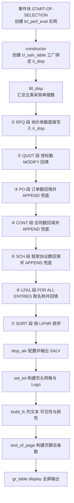
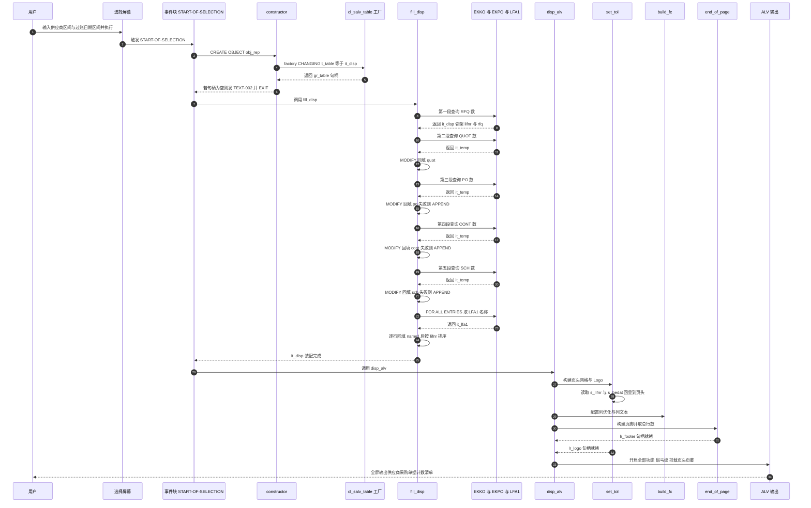

# 报表程序分析报告：`zmmr_perf_eval_vend`

> **源码来源**：`Test-source/zvend.abap`（357 行，`REPORT zmmr_perf_eval_vend`）
> **程序类型**：报表程序（Report），OO 封装 + SALV OO ALV 输出
> **分析视角**：业务目标 → 执行流程 → 分组细节 → 数据流转 → 问题分级 → 设计启发

> **阅读前置说明（重要）**：本源码在导出时带有**多余的空格**，例如 `a~ ebeln`、`TEXT- 001`、`wa_disp- lifnr`、`ls_color- col`、`sy- datum`、`cl_salv_display_settings =>true`。这是导出/格式化的**产物，不是代码缺陷**。下文在代码块中**原样保留**这些空格以保证与源码逐字一致，但**不会把它们当作问题报告**。真正的语法判断请按无空格形态（`a~ebeln`、`TEXT-001`、`wa_disp-lifnr`）理解。

---

## 一、程序定位与业务背景

### 1.1 它到底在回答什么业务问题

这是一份**供应商采购行为画像表**：按供应商（LIFNR）汇总某段过账日期范围内的五类采购单据数量，输出一张可排序、可导出、带页头页脚的 ALV 清单。

| 列 | 业务含义 | 数据来源与口径 |
|---|---|---|
| `LIFNR` | 供应商编号 | 取数分组键 |
| `NAME1` | 供应商名称 | LFA1-NAME1 |
| `BEDAT` | 采购凭证过账日期 | 结构体中存在，但**结果集中恒为空** |
| `RFQ` | 询价单数（Request for Quotation） | EKKO，`BSTYP = 'A'`，且 EKPO 中至少存在一行 `LOEKZ <> 'X'` |
| `QUOT` | 授标/比价完成数（Quotation Maintained） | EKKO，`BSTYP = 'A' AND STATU = 'A'` |
| `PO` | 采购订单数 | EKKO×EKPO，`BSTYP = 'F'` 且 `BSART <> 'UB'` |
| `CONT` | 采购合同数 | EKKO×EKPO，`BSTYP = 'K'` |
| `SCH` | 框架协议数（Schedule Agreement） | EKKO×EKPO，`BSTYP = 'L'` |

页脚给出 `Total Number of Entries`，页头给出本次运行的供应商区间、过账日期区间与运行日期。所以它真正服务的是**采购分析师 / 品类经理的寻源漏斗复盘**：一个供应商到底有没有被寻源（RFQ）？有没有完成比价授标（QUOT）？有没有落到订单（PO）？有没有框架或合同（SCH / CONT）？

### 1.2 为什么不是"直接查 EKKO"就能解决

采购业务对象分散在 EKKO（凭证头）、EKPO（凭证行）两张表里，且一个凭证对应多个行项目：

- 若直接 `SELECT lifnr ebeln FROM ekko`，行项目会把凭证重复放大，必须 `COUNT(DISTINCT ebeln)` 才知道"有多少张单"；
- 但"这张单还剩几个有效行项目"这个判断在 **EKPO-LOEKZ**（行项目删除标志）上，而不在头表上。所以每一类指标都必须把 EKPO 拉进来做有效性过滤——这正是本程序反复 JOIN 的根本原因；
- 更麻烦的是，五类指标属于不同的单据类型（`BSTYP`），SAP 不允许一条 `SELECT` 同时按不同 `BSTYP` 聚合出五列计数，所以必然要写五段高度相似的查询。

这就是"业务上自然、代码上重复"的地方：本程序用五段"查询 → LOOP 回填"来强行把五列拼到一行上。

### 1.3 设计范式一句话定性

**过程式报表 + 薄 OO 包装 + 全局状态共享**：用 `lcl_perf_eval` 把流程封装成"构造 / 取数 / 展示"三个阶段，但**所有数据与对象句柄都留在全局 DATA 中**，类本身不持有任何属性——这更像"给过程代码套了个方法名的壳"，而不是真正的面向对象封装。

---

## 二、程序执行流程总览



| 子程序 | 调用者 | 职责 |
|---|---|---|
| 全局声明区 | 编译器（隐式） | 定义 `t_disp` / `t_temp` / `t_lfa1` 三个行结构、`it_disp` 等工作内表、SALV 句柄引用 |
| 选择屏幕 `b1` | 系统（0-Screen） | 提供供应商区间 `s_lifnr` 与过账日期区间 `s_bedat` 两个输入参数 |
| 类定义段 `lcl_perf_eval` | 编译器（隐式） | 声明 `constructor` / `fill_disp` / `disp_alv` / `set_tol` / `end_of_page` 五个方法 |
| 事件块 `START-OF-SELECTION` | SAP 运行时（用户执行报表） | `CREATE OBJECT` 实例化，再串行调用 `fill_disp` 与 `disp_alv` |
| `constructor` | `START-OF-SELECTION` 经由 `CREATE OBJECT` 隐式触发 | 调用 `cl_salv_table=>factory` 建立 `gr_table`，并把 `it_disp` 作为数据源绑定给 ALV |
| `fill_disp` | `START-OF-SELECTION` 显式调用 | 五段查询分别取 RFQ / QUOT / PO / CONT / SCH 计数，`LOOP` + `MODIFY` 拼装到 `it_disp`，再取供应商名称、按 LIFNR 排序 |
| `disp_alv` | `START-OF-SELECTION` 显式调用 | 依次调用 `set_tol`、`build_fc`、`end_of_page`，开启全部标准功能、设置斑马纹，最后 `display( )` |
| `set_tol` | `disp_alv` 调用 | 用 `cl_salv_form_layout_grid` 构建页头网格（供应商区间 / 过账日期 / 运行日期），并用 Logo 布局把网格放左侧、图形放右侧 |
| `build_fc` | `disp_alv` 调用 | 设置列优化、LIFNR/NAME1 颜色、BEDAT 隐藏为技术字段、五类指标的短文本与中长文本 |
| `end_of_page` | `disp_alv` 调用 | 用 `cl_salv_form_layout_grid` 建页脚，第 1 行标签 `Information:`，第 2 行左右两栏显示总条数 |

下面按这条流程，逐个子程序展开。

---

## 三、分组分析

### 3.1 全局声明区（类型与工作区）

```abap
TYPES:BEGIN OF t_disp,
   lifnr TYPE lifnr,
   name1 TYPE name1_gp,
   bedat TYPE bedat,
   rfq  TYPE I ,
   quot TYPE I ,
   po   TYPE I ,
   cont TYPE I ,
   sch  TYPE I ,
END OF t_disp,
BEGIN OF t_temp,
   lifnr TYPE lifnr,
  CNT   TYPE I ,
END OF t_temp,
BEGIN OF t_lfa1,
   lifnr TYPE lifnr,
   name1 TYPE name1_gp,
END OF t_lfa1.
```

**做什么** — 定义三个行结构：`t_disp` 是最终 ALV 输出结构（供应商编号、名称、过账日期，加 RFQ/QUOT/PO/CONT/SCH 五个 `TYPE I` 计数列）；`t_temp` 是"两字段临时聚合结果"（供应商 + 一个计数 `CNT`），专门用来承接后面四段查询；`t_lfa1` 是"供应商编号 + 名称"的二字段抓取结构。

**为什么** — `t_temp` 是这份程序里少数几个聪明的地方：四段查询的聚合结果形状完全相同（只有一个计数列），用一个通用结构 + `CNT` 字段承接，再靠 `LOOP` 把 `CNT` 复制到 `t_disp` 的不同列，避免为每个指标建一个结构。`t_lfa1` 独立出来而不是复用 `t_disp`，是为了让 `FOR ALL ENTRIES` 取数时不必带上无关字段。

**风险与改进** — ① `bedat` 字段在结果集中**永远取不到值**：`fill_disp` 没有任何一处回填 `BEDAT`，而 `build_fc` 又把它 `set_visible( abap_false )`。这是一个"声明了但从不承载数据"的字段，会让阅读者误以为报表是按日期分组的供应商清单。建议直接删除。② 五个计数列声明为 `TYPE I`（上限 21.47 亿），而 `COUNT( DISTINCT ebeln )` 在 Open SQL 中是 8 字节整数；单供应商凭证数破 21 亿属极端场景，但若查询将来放开公司代码范围（见 P2-10），溢出会在 `INTO CORRESPONDING FIELDS` 转换时 dump。建议改 `TYPE int8`。③ 字段命名 `po` / `cont` / `sch` 过短且与事务代码、DB 关键字同名，建议 `po_cnt` / `cont_cnt` / `sch_cnt`。

---

### 3.2 选择屏幕（块 `b1`）

```abap
SELECTION-SCREEN BEGIN OF BLOCK b1 WITH FRAME TITLE TEXT- 001.
  SELECT-OPTIONS : s_lifnr FOR wa_disp- lifnr,
   s_bedat FOR wa_disp- bedat.
SELECTION-SCREEN END OF BLOCK b1.
```

**做什么** — 在块 `b1` 中声明两个区间选择项：`s_lifnr`（供应商编号，`LIFNR` 域）与 `s_bedat`（凭证过账日期，`BEDAT` 域），`TEXT- 001`（源码中 `TEXT-` 与 `001` 之间有导出空格）作为块标题。这两个选择项同时服务于取数（`fill_disp` 的 WHERE 条件）与页头回显（`set_tol`）。

**为什么** — 用 `SELECT-OPTIONS` 而非单值，是为了支持"一批供应商 / 一段日期区间"的批量分析场景，这与 `fill_disp` 的 `IN s_lifnr` / `IN s_bedat` 严格对应。挂在 `wa_disp-lifnr` / `wa_disp-bedat` 上，字段类型（域 `LIFNR` / `BEDAT`）自动跟随工作区定义，零重复。

**风险与改进** — ① **两个选择项都没有必填、也没有默认值**，用户直接回车会触发"空范围"。在 Open SQL 中 `lifnr IN ( )` 不产生任何过滤条件，等效于全表条件，而每段查询还叠加了 EKKO×EKPO 的 JOIN 与 `GROUP BY`，在生产系统的采购历史表上极可能造成长耗时甚至超时。至少应给日期区间设默认值（近 12 个月），理想情况设为 `OBLIGATORY`。② **无公司代码 / 采购组织限定**：多公司代码环境下会跨范围累加且违反权限隔离（见 P1-8）。③ `TEXT-001` 依赖消息类，但源码中**没有 `MESSAGE-ID` 语句**，其消息类解析规则需在系统上确认，且消息内容在本文件内不可见——属于外部依赖。

---

### 3.3 类定义段 `lcl_perf_eval`

```abap
CLASS lcl_perf_eval DEFINITION .
  PUBLIC SECTION.
  METHODS: constructor ,
   fill_disp.
  METHODS build_fc.
  METHODS disp_alv.
  METHODS set_tol.
  METHODS end_of_page.

ENDCLASS.                   "lcl_perf_eval DEFINITION
```

**做什么** — 声明一个全局类，五个公开方法：`constructor`（隐式方法名，仅由 `CREATE OBJECT` 触发）、`fill_disp`（取数装配）、`disp_alv`（展示编排）、`set_tol`（页头 Top-of-List）、`end_of_page`（页脚 End-of-List）。全部方法都在 `PUBLIC SECTION`，**无导入/导出参数**。

**为什么** — 把"取数"和"展示"分成两组方法、并且把 ALV 的页头/页脚/列配置各自独立成一个方法，是 SALV OO ALV 的标准实践：页头、页脚、字段目录三块可以各自演进，`disp_alv` 只做"编排 + 一次 `display( )`"。这比在一个 400 行的过程报表里把所有 ALV 代码堆在一起要清晰得多。

**风险与改进** — ① **零参数、零属性**：所有方法都不接收输入也不返回输出，实际状态全在全局 DATA 中（`it_disp`、`gr_table`、`lr_grid`、`lr_logo`、`lr_footer`、`ls_color` 等）。类无法被单元测试（要测就得先填全局表）、无法同时跑两份实例、也无法为第二个报表复用。至少应把 `it_disp`、`gr_table`、`lr_logo`、`lr_footer` 提升为 `PRIVATE SECTION` 的实例属性。② `constructor` 未写成 `constructor IMPORTING ...`，只能靠 `CREATE OBJECT` 隐式调用，IDE 里点开方法找不到签名，代码导航体验差。③ 方法名 `set_tol` 是 Top-of-List 的缩写，与"容差 / tolerance"容易混淆，建议 `set_top_of_list`。

---

### 3.4 事件块 `START-OF-SELECTION`

```abap
START-OF-SELECTION.
DATA : obj_rep TYPE REF TO lcl_perf_eval. " Declaring Object for Class

CREATE OBJECT : obj_rep. " Creating Object

obj_rep->fill_disp( ). " Calling class Methods
obj_rep->disp_alv( ).
```

**做什么** — 报表主入口。声明引用 `obj_rep`，`CREATE OBJECT` 实例化（隐式触发 `constructor` 建立 ALV 工厂），然后串行调用 `fill_disp( )` 填充 `it_disp`，再调用 `disp_alv( )` 输出 ALV。

**为什么** — 逻辑顺序正确：**必须先取数再展示**。这点很关键，因为 `cl_salv_table=>factory` 在 `constructor` 里就把 `it_disp` 作为数据源传了进去，而 SALV 持有的是内表**引用**，因此后续对 `it_disp` 的修改会被 ALV 看到。若调换顺序，ALV 字段目录就会基于空表推不出来。作者依赖的正是"传引用而非传值"这一语义，做法是对的。

**风险与改进** — ① **不检查构造是否成功**：若 `constructor` 因异常被吞掉而 `gr_table` 为 initial，事件块依然无条件往下走，最终在 `disp_alv` 里以 `CX_SY_REF_IS_INITIAL` 短转储结束，用户只看到 dump 而看不到业务提示。建议在此加闸：`IF gr_table IS INITIAL. RETURN. ENDIF.`。② 可追加空结果判断 `IF it_disp IS INITIAL. MESSAGE 'No data found' TYPE 'S'. RETURN. ENDIF.`，避免出现只有页头页脚的空 ALV。③ `CREATE OBJECT :` 的冒号在单对象时多余，现代写法是 `obj_rep = NEW lcl_perf_eval( ).`。

---

### 3.5 方法 `constructor`

分两步：建立 ALV 工厂、校验结果。

#### ① 建立 SALV 工厂

```abap
METHOD constructor.
  TRY.
     cl_salv_table=> factory( IMPORTING r_salv_table = gr_table CHANGING t_table = it_disp ). "Calling Factory Obj of Cl_ALV_TABLE
  CATCH cx_salv_msg.
  ENDTRY .
```

**做什么** — 调用 `cl_salv_table=>factory` 这个**静态工厂方法**，把全局内表 `it_disp` 通过 `CHANGING t_table` 绑定为 ALV 数据源，并把返回的 ALV 对象句柄存入全局 `gr_table`（`REF TO cl_salv_table`）。整个调用包在 `TRY ... CATCH cx_salv_msg` 中，捕获到异常后**不做任何处理**（空的 CATCH 体）。

**为什么** — SALV OO ALV 的工厂是**唯一**的正确入口，且必须在可显示列表的进程里调用，这两点都满足了。选 `cl_salv_table` 而非 FM `REUSE_ALV_GRID_DISPLAY`，是因为 SALV OO 提供了 `set_top_of_list` / `set_end_of_list` 这类**内建页头页脚**支持，函数模块方式要靠 FM 变式才能做，异常处理也更干净。这一步的选型是对的。

**风险与改进** — ① **`CATCH cx_salv_msg` 范围过窄**：`cx_salv_msg` 只是 `cx_salv_error` 的一个子类（表示"带消息号的错误"）。工厂方法在配置或字段转换失败时还可能抛出其它 `cx_salv_error` 子异常（如 `cx_salv_not_initialized`），这类异常会**穿透** `TRY` 块直接变成短转储。应改为 `CATCH cx_salv_error.`。这条我无法在此离线环境用 SE24 实测异常层级，建议在系统上核对一次 `CX_SALV_ERROR` 的子类列表；但"捕获范围过窄是隐患"这一判断本身是稳健的。② **空 CATCH 体 = 静默失败**：异常被吞掉后程序继续，`gr_table` 保持 initial，用户最终只看到 dump，看不到根因。至少应把 `cx_salv_msg` 的文本 `MESSAGE` 出来或写入日志。③ 没有任何注释说明"为什么必须在取数前建工厂"，建议补一句，避免后人调换顺序。

#### ② 校验工厂结果

```abap
  IF gr_table IS INITIAL .
    MESSAGE TEXT -002 TYPE 'I' DISPLAY LIKE 'E'.
    EXIT .
  ENDIF .
ENDMETHOD.                   "constructor
```

**做什么** — 检查 `gr_table` 是否为空引用；为空则发 `TEXT-002`（`TYPE 'I'`，但用 `DISPLAY LIKE 'E'` 让它以红底显示），然后 `EXIT` 退出本方法。

**为什么** — 作者显然意识到了"工厂可能失败"，并且做了检查，思路是对的：与其让后面某处空引用 dump，不如尽早退出。

**风险与改进** — ① **`EXIT` 在这里是"假防护"**：ABAP 中 `EXIT` 退出的是**当前处理块（本方法）**，它既不终止整个程序，也不向调用方传递任何状态。`START-OF-SELECTION` 完全不知道构造失败，下一句 `fill_disp( )` 照常执行，`disp_alv( )` 也照常执行，最终在 `gr_table->get_functions( )` 处短转储。所以这个 `EXIT` 唯一的作用是**多弹一条信息消息，然后仍然 dump**。正确做法：`EXPORTING ready = ...` 由调用方判断；或在事件块里 `IF gr_table IS INITIAL. RETURN. ENDIF.`。② **消息类型与显示方式组合别扭**：`TYPE 'I' DISPLAY LIKE 'E'` 是老式技巧，此时屏幕尚未被 ALV 接管，用 SALV 语境下毫无意义，建议改 `TYPE 'S'` 或 `'E'`。③ `TEXT-002` 的内容与消息类在本文件内不可见（无 `MESSAGE-ID`），需一并核对消息维护。

---

### 3.6 方法 `fill_disp`

全程序的主体，共七步：五段"查询 + 回填"、一段取名称、一段排序。核心模式是**先用第一段查询把 `it_disp` 的骨架（每供应商一行）建出来，后面四段再通过 `LOOP` + `MODIFY ... TRANSPORTING` 往已有行里填列**，并在必要时 `APPEND` 新行。

#### ① RFQ 段：直接建立结果骨架

```abap
SELECT a~lifnr COUNT( DISTINCT a~ebeln ) AS rfq FROM ekko AS a
JOIN ekpo AS b ON a~ ebeln = b ~ebeln
INTO CORRESPONDING FIELDS OF TABLE it_disp
WHERE a~lifnr IN s_lifnr AND bedat IN s_bedat
AND b~loekz NE 'X'
AND a~bstyp = 'A'
GROUP BY a~lifnr .
```

**做什么** — 联结 EKKO 与 EKPO，筛出采购凭证类型为询价单（`BSTYP = 'A'`）、供应商在 `s_lifnr` 内、过账日期在 `s_bedat` 内、且**行项目删除标志不是 `'X'`** 的记录，按供应商分组，用 `COUNT( DISTINCT a~ebeln )` 数出"多少张不同的询价单"，直接写进最终内表 `it_disp`（列 `LIFNR`、`RFQ`）。这一步同时承担了"建立 `it_disp` 主键骨架"的职责。

**为什么** — 三个关键决策都对：① **`COUNT(DISTINCT ebeln)` 而不是 `COUNT(*)`**：JOIN 后一个凭证对应多行项目，只有去重才能得到"凭证张数"这个业务上正确的计数；② **`INTO CORRESPONDING FIELDS OF TABLE`**：以字段名匹配直接映射到 `t_disp`，省掉逐列 `APPEND VALUE #( ... )` 的样板；③ **用 JOIN 拉 EKPO 只为过滤行项目删除标志**：因为"这张单还剩几个有效行项目"这个业务问题只能由 EKPO 回答。`SELECT` 只投影 `a~lifnr` 与聚合列，传输量最小。

**风险与改进** — ① **删除标志口径与其余四段不一致**：这里用 `b~loekz NE 'X'`，而 PO / CONT / SCH 三段用 `b~loekz EQ space`。`LOEKZ` 是单字符标志域，除 `'X'`（已删除）外还有其它取值域成员（请在 SE11 核对 `EKPO-LOEKZ` 值域），`NE 'X'` 会把它们**统计进来**。结果是同一行里的 RFQ 列与其余列"不是同一把尺子量出来的"，按 RFQ/PO 算转化率时会得到失真结果。应统一为 `EQ space`。② **本段之前未 `REFRESH it_disp`**：单次执行时 `it_disp` 天然为空所以不出错，但 `fill_disp` 没有任何幂等保证，若被调用两次（例如改成事务后再次进入同一会话），第一段会直接追加而非清空，结果翻倍。方法开头补一句 `REFRESH it_disp.` 是零成本保险。③ **`bedat` 未加表前缀**：当前 JOIN 的两张表里只有 EKKO 有 `BEDAT`，所以不歧义；但一旦将来把 `EKAB` / `EKAU` 也 JOIN 进来，这里会立刻变成语法错误。建议统一写 `a~bedat`。

#### ② QUOT 段：授标计数回填

```abap
SELECT lifnr COUNT( DISTINCT ebeln ) AS CNT FROM ekko
APPENDING CORRESPONDING FIELDS OF TABLE it_temp
WHERE lifnr IN s_lifnr AND bedat IN s_bedat
AND loekz EQ space
AND ( bstyp = 'A' AND statu = 'A' )
GROUP BY lifnr.

LOOP AT it_temp INTO wa_temp .
   wa_disp- lifnr = wa_temp -lifnr.
   wa_disp- quot = wa_temp -CNT.
  MODIFY it_disp FROM wa_disp TRANSPORTING lifnr quot WHERE lifnr = wa_temp-lifnr .
  CLEAR : wa_disp, wa_temp.
ENDLOOP .
```

**做什么** — 从 EKKO 取满足"单据类型为询价单、状态为 `'A'`、删除标志为空、供应商与日期在范围内"的记录，按供应商聚合计数，先 `APPENDING` 进临时表 `it_temp`，再用 `LOOP` 逐行把 `CNT` 复制到 `wa_disp-quot`，通过 `MODIFY it_disp FROM wa_disp TRANSPORTING lifnr quot WHERE lifnr = ...` **只回填 LIFNR 和 QUOT 两列**，最后清空工作区。

**为什么** — **`MODIFY ... TRANSPORTING` 是本程序最值得称道的一处写法**。它精确声明"只搬运这两列"，因此 `it_disp` 行上已有的 `RFQ`（以及后面还没填的 `PO` / `CONT` / `SCH`）不会被 `wa_disp` 里的初始值覆盖。若去掉 `TRANSPORTING`，`MODIFY FROM wa_disp` 会整行替换——而 `wa_disp` 只赋了 `LIFNR` 和 `QUOT`，那四列会被清成 0，整张报表就只剩 QUOT。保留 `DISTINCT` 也是稳健写法：单表查询没有行放大，但加上可以防御未来有人把 EKPO 加进 JOIN。

**风险与改进** — ① **这是全程序最严重的数据丢失点**：`LOOP` 里 `MODIFY` 之后**没有 `IF sy-subrc NE 0. APPEND ...` 兜底**，而后面三段都有。于是只要某个供应商"有授标记录但没能进 `it_disp` 骨架"，它的 `QUOT` 计数就会被**静默丢弃**。什么情况下会这样？正是 P0-2 的口径不一致造成的：一张询价单若 EKPO 全部行项目删除标志为 `'X'`，RFQ 段排除它而本段未必排除，`MODIFY` 找不到行、`sy-subrc = 4`，该供应商的授标数凭空消失。修法：
   ```abap
   LOOP AT it_temp INTO wa_temp.
     CLEAR wa_disp.
     wa_disp-lifnr = wa_temp-lifnr.
     wa_disp-quot  = wa_temp-cnt.
     MODIFY it_disp FROM wa_disp TRANSPORTING lifnr quot
       WHERE lifnr = wa_temp-lifnr.
     IF sy-subrc NE 0.
       APPEND wa_disp TO it_disp.
     ENDIF.
     CLEAR wa_temp.
   ENDLOOP.
   ```
   ② **`it_temp` 在本段使用前没有 `REFRESH`**：后三段开头都有 `REFRESH it_temp.`，唯独首段没有。逻辑上安全（第一段写的是 `it_disp`），但这是"顺序耦合"——一旦有人调整段落顺序，结果就是计数翻倍且极难排查。统一加上即可。③ **`statu = 'A'` 的业务语义在代码里没有任何说明**。`EKKO-STATU` 是采购凭证的文档状态字段，用于标记该凭证在寻源流程中的处理状态；实践中 `'A'` 常被用作"该询价单已完成比价 / 授标"的标记，但**这一点必须在客户系统上用 `SE16` 抽样确认**（我无法在此离线断定其确切含义），并写进代码注释。④ `AND ( bstyp = 'A' AND statu = 'A' )` 的括号冗余：`AND` 优先级已高于任何隐式 `OR`，括号可去掉，属可读性噪音。

#### ③ PO 段：订单计数回填

```abap
REFRESH it_temp.
SELECT lifnr COUNT( DISTINCT a~ ebeln ) AS CNT FROM ekko AS a JOIN ekpo AS b ON a~ ebeln = b ~ebeln
APPENDING CORRESPONDING FIELDS OF TABLE it_temp
WHERE lifnr IN s_lifnr AND bedat IN s_bedat
AND b~loekz EQ space
AND bsart NE 'UB'
AND ( a~ bstyp = 'F' )
GROUP BY lifnr.

LOOP AT it_temp INTO wa_temp .
   wa_disp- lifnr = wa_temp -lifnr.
   wa_disp- po = wa_temp -CNT.
  MODIFY it_disp FROM wa_disp TRANSPORTING lifnr po WHERE lifnr = wa_temp-lifnr .
  IF sy-subrc NE 0.
    APPEND wa_disp TO it_disp .
  ENDIF .
  CLEAR : wa_disp, wa_temp.
ENDLOOP .
```

**做什么** — 先 `REFRESH it_temp` 复用临时表，再从 EKKO×EKPO 联结中筛出采购订单（`BSTYP = 'F'`）、且凭证类型 `BSART` 不是 `'UB'`、行项目未删除的记录，按供应商聚合计数写入 `it_temp`；随后 `LOOP` 把计数搬进 `wa_disp-po`，`MODIFY ... TRANSPORTING lifnr po` 回填；若 `sy-subrc NE 0`（说明该供应商不在 `it_disp` 骨架里）则 `APPEND` 一条只有 LIFNR 与 PO 的新行。

**为什么** — **`IF sy-subrc NE 0. APPEND ...` 这个兜底是本程序设计上最正确的一处补漏**，它解决了"骨架来自 RFQ 段"带来的结构性缺陷：一个只有订单、从来没被询过价的供应商（走直接下单流程）依然会出现在报表里，不会因 `MODIFY` 落空而消失。把 `APPEND` 放在"修改失败"而不是"预先建全量骨架"，还避免了为每个供应商补齐六列那种全量交叉填充。

**风险与改进** — ① **用 `bsart NE 'UB'` 单点排除来实现"采购订单"口径，方向是错的**。`BSART` 是凭证类型域，取值数百；`BSTYP = 'F'` 下至少还包括第三方订单（`KD`）、寄售（`KU` / `LA`）、服务类自动生成的服务凭证（IBU）等。写死"排除 `'UB'`"意味着：业务上一旦想排除另一个类型就要改代码重新传输；反过来，一旦某业务方把真正想统计的类型归到 `BSTYP = 'F'`，报表就会**静默多算**。正确做法是把允许的类型集合做成可维护配置（自定义表维护 `BSART` 范围），SQL 写 `bsart IN g_bsart_range`，并在注释里说明为何排除 `'UB'`。② **`APPEND wa_disp TO it_disp` 追加的是"残缺行"**：`wa_disp` 每轮已被 `CLEAR`，此时只含 LIFNR 与 PO，其它四列是初始值 0。这在展示上没错（0 就是"没有"），但 `BEDAT` 也是初始值 `00000000`，恰好因为该列被隐藏才没暴露——这属于"靠隐藏列掩盖数据缺陷"，见 P0-7。③ `AND ( a~ bstyp = 'F' )` 单条件加括号属冗余。④ `WHERE lifnr IN s_lifnr` 未加 `a~` 前缀，与第一段风格不一致。

#### ④ CONT 段：合同计数回填

```abap
REFRESH it_temp.
SELECT lifnr COUNT( DISTINCT a~ ebeln ) AS CNT FROM ekko AS a JOIN ekpo AS b ON a~ ebeln = b ~ebeln
APPENDING CORRESPONDING FIELDS OF TABLE it_temp
WHERE lifnr IN s_lifnr AND bedat IN s_bedat
AND b~loekz EQ space
AND ( a~ bstyp = 'K' )
GROUP BY lifnr.

LOOP AT it_temp INTO wa_temp .
   wa_disp- lifnr = wa_temp -lifnr.
   wa_disp- cont = wa_temp -CNT.
  MODIFY it_disp FROM wa_disp TRANSPORTING lifnr cont WHERE lifnr = wa_temp-lifnr .
  IF sy-subrc NE 0.
    APPEND wa_disp TO it_disp .
  ENDIF .
  CLEAR : wa_disp, wa_temp.
ENDLOOP .
```

**做什么** — 与 PO 段结构完全同构：统计采购合同（`BSTYP = 'K'`）张数，`REFRESH` → `SELECT ... APPENDING it_temp` → `LOOP` → `MODIFY ... TRANSPORTING lifnr cont` → 失败则 `APPEND` 新行。

**为什么** — 五段查询共享同一套装配模板，这是本程序结构上最"经济"的地方：新增指标的成本只有"复制一段 + 改三处字面量"（`SELECT` 的 `bstyp`、`wa_disp` 的目标列、`TRANSPORTING` 列表），不用动任何数据结构。`TRANSPORTING lifnr cont` 也保证了不会覆盖掉先前面几段已经填好的值。

**风险与改进** — ① 逻辑本身与 PO 段对称，除括号冗余外无独立缺陷。② 但这个"复制粘贴即可扩展"正是它最大的隐患（见 P3-2）：五段里已经出现了 **1 处口径不一致（删除标志）、1 处漏兜底（QUOT）、1 处硬编码排除（PO）**，说明复制模板时并没有人把"口径"当作一等公民来核对。**模板复制的成本极低、口径出错的成本极高**，这是本程序最值得记住的一条教训。③ 从业务角度，采购合同还应区分是否有框架属性、是否已过有效期，本段未做任何时间有效性判断（早已失效的合同仍计入），需确认业务预期。

#### ⑤ SCH 段：框架协议计数回填

```abap
REFRESH it_temp.
SELECT lifnr COUNT( DISTINCT a~ ebeln ) AS CNT FROM ekko AS a JOIN ekpo AS b ON a~ ebeln = b ~ebeln
APPENDING CORRESPONDING FIELDS OF TABLE it_temp
WHERE lifnr IN s_lifnr AND bedat IN s_bedat
AND b~loekz EQ space
AND ( a~ bstyp = 'L' )
GROUP BY lifnr.

LOOP AT it_temp INTO wa_temp .
   wa_disp- lifnr = wa_temp -lifnr.
   wa_disp- sch = wa_temp -CNT.
  MODIFY it_disp FROM wa_disp TRANSPORTING lifnr sch WHERE lifnr = wa_temp-lifnr .
  IF sy-subrc NE 0.
    APPEND wa_disp TO it_disp .
  ENDIF .
  CLEAR : wa_disp, wa_temp.
ENDLOOP .
```

**做什么** — 统计框架协议（`BSTYP = 'L'`，Schedule Agreement）张数，回填到 `wa_disp-sch`，失败则 `APPEND` 新行。

**为什么** — 同样利用了 `MODIFY ... TRANSPORTING` 的精确列控制。至此 `it_disp` 的六个数据列已全部装配完成，只差名称与排序。把框架协议单列一列是业务上合理的——框架协议往往是战略供应商关系的重要信号，混在合同里看不出来。

**风险与改进** — ① 与 CONT 段同构，无独立缺陷。② 一个语义提示：`BSTYP` 中除 `'L'`（框架协议）外还有 `'S'`（Scheduling Agreement，排程 / 定期供货协议），二者业务含义相近但代码未合并统计；若用户期望的"框架协议"包含排程协议，本程序会低估——需和业务确认口径后写清注释。③ 五段之间没有任何交叉校验（例如 `QUOT` 是否应 `≤ RFQ`、`CONT` 与 `SCH` 是否互斥），SQL 口径改坏时报表不会报错、只会给出看似合理的数字。建议加一条后置断言，把"不合理的数据形态"变成显式失败。

#### ⑥ LFA1 段：取供应商名称并回填

```abap
SELECT lifnr name1 FROM lfa1
INTO CORRESPONDING FIELDS OF TABLE it_lfa1
FOR ALL ENTRIES IN it_disp
WHERE lifnr = it_disp -lifnr.

LOOP AT it_disp INTO wa_disp .
  READ TABLE it_lfa1 INTO wa_lfa1 WITH KEY lifnr = wa_disp-lifnr .
  IF sy-subrc EQ 0.
     wa_disp- name1 = wa_lfa1 -name1.
    MODIFY it_disp FROM wa_disp TRANSPORTING lifnr name1 WHERE lifnr = wa_disp- lifnr .
  ENDIF .
ENDLOOP .
```

**做什么** — 以 `it_disp` 的 LIFNR 集合为驱动，用 `FOR ALL ENTRIES` 一次批量取 LFA1 的 `LIFNR` 与 `NAME1` 装入 `it_lfa1`；随后遍历 `it_disp`，`READ TABLE ... WITH KEY` 定位到对应供应商，把 `NAME1` 填进当前工作行，再以 `MODIFY ... TRANSPORTING lifnr name1` 写回。

**为什么** — ① 用 `FOR ALL ENTRIES` 而不是在每个指标段都 JOIN LFA1 是正确选择：**名称只在最后显示时才需要**，与计数无关，提前联表只会放大中间结果。② LFA1 主键是 `LIFNR`，`FOR ALL ENTRIES` 命中主键索引，成本近似 `COUNT(DISP)` 次主键查找，可接受。③ 内层 `LOOP ... INTO wa_disp` 之后再 `MODIFY`，是因为 `MODIFY` 的工作区已被 `INTO` 占用，这是老式 ABAP 的常见规避手法。

**风险与改进** — ① **`MODIFY` 的目标行定位靠 `WHERE lifnr = ...`**，若 `it_disp` 中出现重复 LIFNR（理论上不该，见 P3-3），会一次改到所有匹配行。更稳的写法是记录循环索引并用 `MODIFY it_disp FROM wa_disp TRANSPORTING lifnr name1 INDEX sy-tabix.`，不依赖业务键唯一性。② **`it_disp` 为空时的行为依赖系统版本**：`FOR ALL ENTRIES` 遇到空驱动表时，较新版本的 ABAP Open SQL 会自动在外层加"非空表"保护并退化为空结果集，早期版本则可能直接报错 / 转储。当前写法没有显式 `IF it_disp IS INITIAL.`；我无法在此离线确认你所处系统的确切行为，建议在系统上跑一次"不选任何供应商"场景验证，同时**无论如何都显式加一层判断**，既可读又跨版本安全。③ `READ TABLE` 是线性查找，整体复杂度 O(n²)；供应商几万家时耗时可观。更好的做法是 `SORT it_lfa1 BY lifnr` 后用 `READ TABLE ... WITH BINARY SEARCH`，或反向 `LOOP AT it_lfa1` 回填。④ `name1 TYPE name1_gp`（通用名称字段，40 字符）承载 LFA1-NAME1（30 字符），长度与语义（公司 / 伙伴名称）均匹配，此处**无错配风险**。

#### ⑦ SORT 段：最终排序

```abap
SORT it_disp BY lifnr .

ENDMETHOD.                   "fill_disp
```

**做什么** — 在方法末尾按供应商编号对 `it_disp` 升序排序，然后结束方法。

**为什么** — `it_disp` 的行来自三处不同来源（第一段查询追加、后面三段 `APPEND` 追加），物理顺序已打乱；在最后统一排序让用户看到的顺序稳定可预期，也让导出文件有一致的行序。这是常被忽略但很实用的一步。

**风险与改进** — 无功能性风险。两点建议：① 更现代的做法是同时设置 **ALV 默认排序**（`gr_column->set_sort( ... )`），让用户改排序后还能一键复位；② `SORT it_disp BY lifnr` 未写 `ASCENDING`，默认升序、语义明确——顺带一提，这是本程序中少数几个风格统一的写法之一。

---

### 3.7 方法 `disp_alv`

```abap
METHOD disp_alv.

   set_tol( ).
   build_fc( ).
   end_of_page( ).

   gr_functions = gr_table->get_functions ( ).
   gr_functions-> set_all( abap_true ).
   gr_table-> set_top_of_list( lr_logo ).
   gr_table-> set_end_of_list( lr_footer ).
   gr_display = gr_table->get_display_settings ( ).
   gr_display-> set_striped_pattern( cl_salv_display_settings =>true ).

   gr_table-> display( ).

ENDMETHOD.                   "disp_alv
```

**做什么** — 展示总控：先依次调用三个配置方法（`set_tol` 建页头、`build_fc` 建字段目录、`end_of_page` 建页脚），再取功能（Functions）并 `set_all( abap_true )` 全部开启；把 `set_tol` 里建好的 `lr_logo` 挂到 top-of-list、把 `end_of_page` 里建好的 `lr_footer` 挂到 end-of-list；取显示设置并开启斑马纹（隔行底色）；最后 `display( )` 全屏输出。

**为什么** — 编排顺序**完全正确**：`set_top_of_list` / `set_end_of_list` 必须在 `display( )` 之前调用，否则 SALV 不会渲染页头页脚；`set_striped_pattern` 也必须在显示前设置。`set_all(abap_true)` 一次性打开排序、筛选、汇总、合计、分页、打印、导出等全部标准功能，省去逐项判断，对这类只读分析报表是合理的取舍。方法拆分也与 `build_fc` / `set_tol` / `end_of_page` 的职责边界吻合——**这个方法本身是全程序写得最干净的一块**。

**风险与改进** — ① **完全依赖 `gr_table` 非空**：若 `constructor` 的 `EXIT` 已经发生（见 P1-1），第一句之后的 `gr_table->get_functions( )` 就会以 `CX_SY_REF_IS_INITIAL` 短转储。方法开头应加 `IF gr_table IS INITIAL. RETURN. ENDIF.` 作为兜底。② **跨方法传参靠全局变量**：`lr_logo` 由 `set_tol` 写、`lr_footer` 由 `end_of_page` 写，本方法只读。一旦二者中途抛异常（它们都没有 `TRY` 保护），这里就会把 initial 引用传进 `set_top_of_list` / `set_end_of_list`，SALV 抛出自己的异常，用户看到的仍是不可读的 dump。更干净的做法是让这三个方法 `EXPORTING` 各自的句柄，由本方法持有。③ **`set_all( abap_true )` 属于"全开"策略**：把打印、导出（含本地文件导出）、保存变式、保存布局一并暴露。对这份含供应商采购量的报表，导出意味着数据可以流出系统，需业务上确认是否可接受。SALV 标准功能集不含"删除"，所以不存在误删风险，但"全开"也应是有意识的决定而非默认。④ `cl_salv_display_settings =>true` 是过时的写法（把类属性当作常量引用），现代写法是 `if_salv_c_bool_sap=>true`；本方法内 `set_all( abap_true )` 与这行风格自相矛盾。

---

### 3.8 方法 `set_tol`

分三步：建网格骨架、填标签与区间文本、拼装 Logo 布局。

#### ① 建立网格骨架与页头

```abap
DATA : lv_text( 30) TYPE C ,
       lv_date TYPE C LENGTH 10.

CREATE OBJECT lr_grid.

 lr_grid-> create_header_information( row = 1 column = 1
TEXT = 'MM: Vendor Evaluation'
tooltip = 'MM: Vendor Evaluation' ).

 lr_gridx = lr_grid->create_grid ( row = 2 column = 1 ).
```

**做什么** — 声明两个文本缓冲（`lv_text` 长 30、`lv_date` 长 10），实例化一个 `cl_salv_form_layout_grid` 作为页头容器；在其第 1 行第 1 列创建跨列标题 `MM: Vendor Evaluation`；再在第 2 行第 1 列创建子网格 `lr_gridx`，后续所有标签与文本都放进这个子网格。

**为什么** — SALV 的 top-of-list 页头本质上就是一张"控件画布"：`cl_salv_form_layout_grid` 提供行列定位（`row` / `column` 直接写在 `create_*` 方法的参数表里，非常直观），而标题行用 `create_header_information` 可以做成跨列的大字标题，比自己在第 1 行拼 label / text 更有层次。把内容区放进嵌套 grid（第 2 行）而不是直接用顶层 grid，是为了让标题与内容各自独立布局。

**风险与改进** — ① `create_header_information` 只做了一次、没配合 `set_header_text`，标题样式由 SALV 默认决定；若要与客户 VI 规范一致（加副标题、调整字号），可在其后追加 `lr_grid->set_header_text( ... )`。② `DATA : lv_text( 30) TYPE C` 中的 `30` 是内联长度规格，此处写法依赖"内联声明省略空格也能解析"这一宽容行为，在开启完整单词间距检查的 ADT 语法检查或 ATC 中可能报警。规范写法是 `lv_text TYPE c LENGTH 30`，与下一行 `lv_date TYPE C LENGTH 10` 保持一致——**同一个 DATA 块里两种写法并存，是明显的风格不一致**。③ `lv_date` 与 `lv_text` 功能重复，可统一为一个缓冲，避免"到底哪个变量装什么"的心智负担。

#### ② 填充供应商区间行

```abap
 lr_label = lr_gridx->create_label ( row = 2 column = 1
TEXT = 'Vendor No # :' tooltip = 'Vendor #.' ).

IF s_lifnr IS NOT INITIAL .
   lv_text = s_lifnr-low .
  IF s_lifnr-high IS NOT INITIAL.
    CONCATENATE lv_text ' to ' s_lifnr -high INTO lv_text SEPARATED BY space.
  ENDIF .
ELSE .
   lv_text = 'Not Provided'.
ENDIF .
 lr_text = lr_gridx->create_text ( row = 2 column = 2
TEXT = lv_text tooltip = lv_text ).
```

**做什么** — 在子网格第 2 行第 1 列创建标签 `Vendor No # :`；然后根据 `s_lifnr` 的实际填写情况拼装展示串：非初始时取 `-low`，若 `-high` 也非初始则拼成 `low to high`，完全未填时显示 `Not Provided`；最后在第 2 行第 2 列创建文本控件显示该串。

**为什么** — 把选择条件回显在报表页头是分析类报表的标准做法，截图转发时上下文自带。`CONCATENATE ... SEPARATED BY space` 比手工 `lv_text = lv_text + ' to '` 更清晰，也避免隐式类型转换问题。对"未填"给出 `Not Provided` 而不是留空，避免让用户误以为区间是空区间之外的特殊值——这是贴心的细节。

**风险与改进** — ① `TOOLTIP = lv_text` 把**数据内容本身**用作提示文本，等于把工具提示变成了数据冗余，鼠标悬停信息量为零。建议只保留标签的 tooltip（`'Vendor #.'`），或把数据区 tooltip 改为 `'Vendor selection range'` 这类说明。② `IF s_lifnr IS NOT INITIAL` 对 `RANGES` 结构是可行的整体判定，但它把"填了 low""只填了 high""填了 low=high"三种情况压成两种显示；更完整的写法应分别处理 `high IS INITIAL` 与 `high EQ low`，显示成单值或 `X to X`。③ `CONCATENATE lv_text ' to ' s_lifnr -high INTO lv_text` 目标与源同名，ABAP 允许且行为正确，但容易引起"会不会自己覆盖自己"的疑惑，建议用字符串模板 `|{ lv_text } to { s_lifnr-high }|`。④ 长度核算：`LIFNR` 域为 10 字符，`10 + 4 + 10 = 24 < 30`，当前**不会截断**；但 `lv_text` 同时被第 3 步的日期串复用（同为 24），结论是"当前安全、缓冲长度与拼接内容的耦合是隐式的"——若域长变更或拼接里加了额外文案就会静默截断。

#### ③ 填充日期两行、预留空行并拼装 Logo 布局

```abap
 lr_label = lr_gridx->create_label ( row = 3 column = 1
TEXT = 'Posting Date:' tooltip = 'Posting Date' ).
IF s_bedat IS NOT INITIAL .
  WRITE s_bedat-low DD/MM/YYYY TO lv_text .
  IF s_bedat-high IS NOT INITIAL.
    WRITE s_bedat-high DD/MM/YYYY TO lv_date.
    CONCATENATE lv_text ' to ' lv_date INTO lv_text SEPARATED BY space.
  ENDIF .
ELSE .
   lv_text = 'Not Provided'.
ENDIF .

 lr_text = lr_gridx->create_text ( row = 3 column = 2
TEXT = lv_text  tooltip = lv_text ).

 lr_label = lr_gridx->create_label ( row = 4 column = 1
TEXT = 'Run Date:' tooltip = 'Run Date' ).
 lr_text = lr_gridx->create_text ( row = 4 column = 2
TEXT = sy- datum tooltip = sy -datum ).

 lr_label = lr_gridx->create_label ( row = 5 column = 1 ).
 lr_label = lr_gridx->create_label ( row = 6 column = 1 ).
 lr_label = lr_gridx->create_label ( row = 7 column = 1 ).
 lr_label = lr_gridx->create_label ( row = 8 column = 1 ).

* Create logo layout, set grid content on left and logo image on right
CREATE OBJECT lr_logo.
 lr_logo-> set_left_content( lr_grid ).
 lr_logo-> set_right_logo( 'ZCHEM_N_LOGO_SMALL' ). " Image From OAER T-code
```

**做什么** — 第 3 行：标签 `Posting Date:`，用 `WRITE ... DD/MM/YYYY TO lv_text` 把 `s_bedat-low` 格式化成日/月/年，若填了 `-high` 再拼成区间。第 4 行：标签 `Run Date:`，右侧文本直接取 `sy-datum`。随后在第 5～8 行连续创建了**四个没有文本的标签控件**。最后实例化 `cl_salv_form_layout_logo`，把前面建好的整个 `lr_grid` 设为左侧内容，把图形 `ZCHEM_N_LOGO_SMALL` 设为右侧 Logo。

**为什么** — ① 用 Logo 布局 `set_left_content` + `set_right_logo` 是实现"左信息右 Logo"最直接的方式，比用 grid 手工留空列优雅。② 日期用 `WRITE ... TO` 是 ABAP 里最省事的格式化手段，配合固定格式串 `DD/MM/YYYY` 得到确定性展示，不受用户个人格式影响——对"发给别人的报表要长得一样"这个诉求是合理的。

**风险与改进** — ① **第 5～8 行的四个空 `create_label` 是纯死代码**：`cl_salv_form_label` 的 `TEXT` 参数可选，不给文本即创建一个不显示任何内容的控件，四行空间能否真正撑开需要实测。若目的是留白，正确做法是调整 Logo 布局的间距 / 行高参数，或干脆不建；若目的是"以后填内容"，应留 TODO 注释说明。最坏情况是页头出现四个诡异空白格。建议直接删除。② **`TEXT = sy-datum` 会以内部格式展示为 `YYYYMMDD`**：`sy-datum` 类型为 `D`，赋给字符型参数时 ABAP 做的是内部格式转换（形如 `20261002`），而上一行刚用 `DD/MM/YYYY` 展示了 `02/10/2026`。**同一块页头里两种日期格式并存**，截图给业务方时必然被追问。改法是对 `sy-datum` 用同样的 `WRITE ... TO`，或用 `cl_abap_datfm=>conv_date_int_to_ext( )` 配 `sy-datefmt`。③ `DD/MM/YYYY` 硬编码、忽略 `sy-datefmt`（用户在 SU3 设的个人日期格式），对"发给全球采购团队"的报表可能造成误读，建议改 `YYYY-MM-DD`。④ **`'ZCHEM_N_LOGO_SMALL'` 是跨客户 / 跨项目的硬编码资源名**：目标系统若不存在该图形，Logo 位置会空白而通常不报错。建议做存在性判断并提供文本 Logo 降级，或把图形名做成配置。⑤ `CREATE OBJECT lr_logo.` 见 P2-7。

---

### 3.9 方法 `build_fc`

分两步：通用设置与关键列样式、各指标列文本。

#### ① 列优化与 LIFNR / NAME1 / BEDAT 的样式

```abap
INCLUDE <color>.
TRY.
   gr_columns = gr_table->get_columns ( ).
   gr_columns-> set_optimize( abap_true ).
   gr_column ?= gr_columns-> get_column( 'LIFNR' ).
   ls_color- col = 3 .
   gr_column-> set_color( ls_color ).

CATCH cx_salv_not_found.
ENDTRY .

TRY.
   gr_column ?= gr_columns-> get_column( 'NAME1' ).
   gr_column-> set_long_text('Vendor Name' ).
   gr_column-> set_short_text( 'V.Name' ).
   gr_column-> set_medium_text('Vendor Name' ).
   ls_color- col = 3 .
   gr_column-> set_color( ls_color ).
CATCH cx_salv_not_found.
ENDTRY .

TRY.
   gr_column ?= gr_columns-> get_column( 'BEDAT' ).
   gr_column-> set_visible( abap_false ).
   gr_column-> set_technical( VALUE = if_salv_c_bool_sap=> true ).
CATCH cx_salv_not_found.
ENDTRY .
```

**做什么** — 方法开头先 `INCLUDE <color>`；然后取字段目录对象并 `set_optimize( abap_true )` 让列宽按内容自适应；对 `LIFNR` 和 `NAME1` 两列设置三种长度的列标题文本，并把 `ls_color-col` 设为 `3` 后应用颜色；对 `BEDAT` 列则设为不可见、并用 `if_salv_c_bool_sap=>true` 标记为技术字段。三段各自包在 `TRY ... CATCH cx_salv_not_found` 中。

**为什么** — ① `set_optimize` 放在最前面是正确的：优化与列文本 / 颜色是独立维度，先设不影响后续。② 三段 `TRY` 各自独立捕获，意味着**某一列取不到不会连累其它列**——这是正确的容错粒度，比一个大 `TRY` 包住所有列好得多。③ `gr_column ?= ...` 用"功能方法返回值赋值"，比先声明再 `IF ... IS BOUND` 判断更简洁也更安全（`?=` 不会把 initial 引用赋进去）。④ `BEDAT` 同时 `set_visible( abap_false )` 与 `set_technical( true )` 是对"隐藏但保留可导出 / 可排序"的正确表达——作者显然知道自己不需要这一列显示，却又不想删字段，这反过来说明全局声明区里那个 `bedat` 可以直接去掉（见 P0-7）。

**风险与改进** — ① **`INCLUDE <color>` 在此完全未被使用**。方法体里没有任何宏调用，颜色是用字面量 `3` 设置的。`<color>` 是 SAP 标准程序的 include，提供颜色相关的宏 / 定义；把它 `INCLUDE` 在方法体内会把外部文本**就地注入**到方法源码中间，导致方法边界在编辑器里"断成两段"，后续维护和 code review 极易漏读。另外 `INCLUDE` 出现在方法体内是否被当前系统的语法检查完全接受，建议在 SE38 里跑一次 `SYNTAX-CHECK` 确认——这一点我无法离线验证，应以系统实际检查结果为准。无论从用途还是可读性看，**这一行都应当删掉**。② **`ls_color-col = 3` 是魔法数字**。ALV 颜色码里 `3` 对应标题色（`IF_SALV_C_COLOR` 的具名常量），用它的意图大概是"让供应商编号和名称两列以强调色显示"，但 `3` 本身零信息量。建议改为具名常量（若 `IF_SALV_C_COLOR` 中有对应属性则直接引用；该属性的确切名称请在系统上核对），或改用 `COL_KEY` / `COL_TOTAL` 这类语义更贴切的颜色并补注释。③ `gr_columns = gr_table->get_columns( )` 在 `TRY` 之外：若 `gr_table` 为 initial（constructor 失败的情形），这一行直接 `CX_SY_REF_IS_INITIAL`；`get_columns` 自身若抛异常也不在捕获范围内。建议方法开头补对 `gr_table` / `gr_columns` 的显式检查。④ `CATCH cx_salv_not_found` 捕获后**什么都不做**：列名拼错时会被静默吞掉，用户看到的是"我改了列标题怎么没生效"。至少 `MESSAGE` 一条 warning，或在 CATCH 里写日志。⑤ `ls_color` 是全局变量，本方法只写 `col`、其余字段带入初始值——这里恰好没问题，但复用全局 `LVC_S_COLO` 而不在方法内局部声明，是扩展时容易踩坑的选择。

#### ② 五类指标列的标题文本

```abap
TRY.
   gr_column ?= gr_columns-> get_column( 'RFQ' ).
   gr_column-> set_short_text( 'RFQ' ).
   gr_column-> set_medium_text( 'RFQ Created' ).
CATCH cx_salv_not_found.
ENDTRY .

TRY.
   gr_column ?= gr_columns-> get_column( 'QUOT' ).
   gr_column-> set_short_text( 'Quot.' ).
   gr_column-> set_medium_text( 'Quotation Maintained' ).
CATCH cx_salv_not_found.
ENDTRY .
TRY.
   gr_column ?= gr_columns-> get_column( 'PO' ).
   gr_column-> set_short_text( 'PO Created' ).
   gr_column-> set_medium_text( 'PO Created' ).
CATCH cx_salv_not_found.
ENDTRY .

TRY.
   gr_column ?= gr_columns-> get_column( 'CONT' ).
   gr_column-> set_short_text( 'Cont.' ).
   gr_column-> set_medium_text( 'Contract Created' ).
CATCH cx_salv_not_found.
ENDTRY .
TRY.
   gr_column ?= gr_columns-> get_column( 'SCH' ).
   gr_column-> set_short_text( 'Sch. Crea.' ).
   gr_column-> set_medium_text( 'Sch. Agr. Created' ).
   gr_column-> set_long_text( 'Schedule Agreement Created' ).
CATCH cx_salv_not_found.
ENDTRY .
```

**做什么** — 为五个指标列分别设置短文本（列头显示）、中文本（ALV 信息行）、长文本（列属性 / 导出表头）：`RFQ → 'RFQ' / 'RFQ Created'`；`QUOT → 'Quot.' / 'Quotation Maintained'`；`PO → 'PO Created'`（短中同值）；`CONT → 'Cont.' / 'Contract Created'`；`SCH → 'Sch. Crea.' / 'Sch. Agr. Created' / 'Schedule Agreement Created'`。

**为什么** — SALV 的三档文本长度对应三种场景：短文本用于列头（宽度紧张时会被截断）、中文本用于 ALV 信息行、长文本用于导出文件与列属性对话框。列头用短文本（`'Quot.'`、`'Sch. Crea.'` 明确缩写）、导出用长文本（`'Schedule Agreement Created'` 完整表达），这个"**屏幕用短、导出用长**"的分层策略是正确的 ALV 实践，比只设一个 `set_text` 高了一个层次。

**风险与改进** — ① **五列的设置方式不统一**：`RFQ` / `SCH` 设了短+中（+长），`PO` 设了 `short_text` 与 `medium_text` 但值相同（等于只设了一个）。逐列手工设置导致这个文件里出现了 **9 个独立 `TRY` 块**，风格参差。更优的做法是把文本配置做成一张内表并 `LOOP` 统一设置，可读性与可维护性都会显著提升（把 9 个 `TRY` 降到 1 个）。② **文本全部硬编码英文字面量**，而程序开头已经在用 `TEXT-001` / `TEXT-002` 文本符号——同一文件里两种国际化策略并存。若要支持多语言，指标列标题必须走文本符号或消息类。③ `'Sch. Crea.'` 表意不清（Scheme? Schedule?），而长文本是 `Schedule Agreement Created`，缩写没有忠实反映全称，建议改为 `'Sched.Agr.'`。④ 各列**未设置数值格式**（千分位），计数超过 1000 时读数体验一般；同时 `set_key( )` 未使用——这几列本质是数值，若业务需要"只看有下单的供应商"，更适合提供开关列而非纯文本。⑤ 五列都没写默认排序规则，是否应默认按 `PO` 降序（让下单最多的供应商排最前）值得和业务确认。

---

### 3.10 方法 `end_of_page`

```abap
METHOD end_of_page.

  DATA :lf_lines TYPE sy-tfill .

  DATA : "lr_label TYPE REF TO cl_salv_form_label,
         lf_flow TYPE REF TO cl_salv_form_layout_flow .

  CREATE OBJECT lr_footer.
*--get total lines in internal table
     lf_lines = LINES( it_disp ).
     lr_label = lr_footer->create_label ( row = 1 column = 1 ).
     lr_label-> set_text( 'Information:' ).
     lf_flow = lr_footer->create_flow ( row = 2 column = 1 ).
     lf_flow-> create_text( TEXT = 'Total Number of Entries' ).
     lf_flow = lr_footer->create_flow ( row = 2 column = 2 ).
     lf_flow-> create_text( TEXT = lf_lines ).

ENDMETHOD.                   "end_of_page
```

**做什么** — 局部声明计数变量 `lf_lines TYPE sy-tfill` 与流式布局引用 `lf_flow TYPE REF TO cl_salv_form_layout_flow`；实例化页脚网格 `lr_footer`；用 `LINES( it_disp )` 取结果集总行数写入 `lf_lines`；在第 1 行第 1 列建标签并 `set_text( 'Information:' )`；再在第 2 行第 1 列建一个流式容器放文本 `Total Number of Entries`，第 2 行第 2 列再建一个流式容器放 `lf_lines` 的值。

**为什么** — ① `cl_salv_form_layout_flow` 适合"内容自适应宽度的短文本"，比 grid 更省心——文字多宽就占多宽，无需预先规划列宽，这正是页脚一行说明性文字的典型场景。② `lf_lines TYPE sy-tfill` 而不是 `TYPE i`，是个贴心的选择：`sy-tfill` 是 ALV 页脚的**标准行类型**（本就是给 end-of-list 用的），`create_text( TEXT = lf_lines )` 因此可以直接把它当字符 / 数值传入，不需要任何转换。③ `LINES( it_disp )` 是现代内建函数写法，比老式 `DESCRIBE TABLE ... LINES` 简洁。④ 页脚给出总条数是分析类报表的常见需求（导出后核对行数）。

**风险与改进** — ① **局部变量 `lr_label` 遮蔽了全局同名引用**：全局声明区已有 `lr_label TYPE REF TO cl_salv_form_label`，本方法又用 `DATA : "lr_label TYPE REF TO cl_salv_form_label`（**注释掉了**）来改用局部变量，注释里还留着说明。这说明作者遇到过"局部与全局同名"的困扰，但选择用注释绕过而不是改名。正确做法是把全局的 `lr_label` 重命名为语义更明确的名字并删掉那行注释；否则后续任何人在本方法里误用全局 `lr_label`（比如已被 `set_tol` 赋过值）都会得到难以定位的显示异常。② `lf_flow` 被连续赋了两次（第 2 行第 1 列、第 2 行第 2 列），第二次覆盖第一次——在 SALV 里**是安全的**，因为 `create_flow` 已把对象注册进布局，返回的引用只是句柄，覆盖不影响已注册对象；但更清晰的做法是用两个变量或 `LOOP` 遍历文本数组。③ `'Information:'` 与 `'Total Number of Entries'` 硬编码英文，与 `TEXT-001/002` 策略不一致。④ 页脚信息密度偏低：没有合计行、生成时间戳与用户名。相比页头已做了 Logo 与区间回显，建议补一行 `'Generated on: '` 与 `'User: ' sy-uname`，让报表可追溯。⑤ `CREATE OBJECT lr_footer.` 后立刻 `create_label`，没有 `IS INITIAL` 检查；风险低，但与 `disp_alv` 中"直接用 `lr_footer`"形成了一个隐式契约。

---

## 四、执行流程全景图（数据视角）



**数据视角的三条主线**（对应上图三段往返）：

1. **骨架 → 骨架**：第一段查询直接建立 `it_disp` 的"每供应商一行"骨架，之后四段只回填列、不新增行，唯一的例外是 `APPEND` 兜底——**这直接决定了哪些供应商会出现在报表里**，P0-1 的漏网正是出现在这条规则的例外分支上。
2. **临时表 → 主表的列级投影**：`it_temp` 每次只装 `(LIFNR, CNT)` 两列，四段查询复用同一张临时表，通过 `LOOP` + `MODIFY ... TRANSPORTING` 把同一个 `CNT` 投影到主表五个不同列上。这是"一份取数模式、五种业务语义"的实现方式。
3. **展示配置 → 全局句柄**：`set_tol` / `build_fc` / `end_of_page` 三个方法通过全局引用 `lr_logo` / `lr_footer` / `gr_column` / `ls_color` 互相传参，最后由 `disp_alv` 一次性 `display( )`。数据在 `fill_disp` 之后就冻结了，后续全是纯展示配置。

---

## 五、问题清单与改进建议（按优先级）

### 🔴 P0 业务正确性

| 编号 | 所在子程序 | 问题 | 影响 | 改进建议 |
|---|---|---|---|---|
| P0-1 | `fill_disp`（QUOT 段回填 `LOOP`） | `MODIFY ... TRANSPORTING lifnr quot` 之后缺少 `IF sy-subrc NE 0. APPEND ...` 兜底，而 PO / CONT / SCH 三段都有 | 有授标记录但未能进入 `it_disp` 骨架的供应商，其 `QUOT` 计数被**静默丢弃**——报表不报错、数字看似合理、但少了人 | 与后三段保持一致：`CLEAR wa_disp` → 赋 `LIFNR`+`QUOT` → `MODIFY` → 判 `sy-subrc` 为 4 时 `APPEND wa_disp TO it_disp` |
| P0-2 | `fill_disp`（RFQ 段 vs PO/CONT/SCH 三段） | 删除标志口径不一致：RFQ 段用 `b~loekz NE 'X'`，后三段用 `b~loekz EQ space` | 同一行的 `RFQ` 列与其它列不是同一把尺子量出来的；按 RFQ/PO 算寻源转化率会失真（`LOEKZ` 除 `'X'` 外还有其它取值域成员，请核对 `EKPO-LOEKZ` 值域） | 五段统一为一个口径常量（建议 `EQ space`），并在注释中写明"口径 = 至少存在一条未删除行项目" |
| P0-3 | `fill_disp`（QUOT 段查询） | QUOT 段**没有 JOIN EKPO**，其 `loekz` 条件作用在 EKKO 层（该字段在 EKKO 上是否存在、与 `EKPO-LOEKZ` 语义差别如何，需在 SE11 现场核实）；其余四段的口径是"行项目未删除" | QUOT 与其它四列的"有效凭证"定义不在同一层次，**跨列不可比**；若 QUOT 的删除标志实际只反映头层状态，计数会系统性偏大 | 明确 QUOT 的业务定义：若要"行项目未删除"的授标数，则补 JOIN EKPO；若确实只看头层，则把差异写进注释并在列标题中体现（如 `Quot. Awarded`） |
| P0-4 | `fill_disp`（PO 段查询） | 用 `bsart NE 'UB'` 单点排除来实现"采购订单"口径 | `BSTYP = 'F'` 下还包含第三方订单（`KD`）、寄售（`KU`/`LA`）、服务自动凭证（IBU）等；新增业务类型时**静默多算**，想排除的类型变更则要改代码重新传输 | 把允许的凭证类型做成可维护配置（自定义表维护 `BSART` 范围），SQL 写成 `bsart IN g_bsart_range`，并在注释中说明为何排除 `'UB'` |
| P0-5 | `fill_disp`（QUOT 段 `statu = 'A'`） | `EKKO-STATU = 'A'` 的业务语义在代码中没有任何说明，也未配置化 | 这是"授标"计数的唯一依据，但读代码的人无从判断 `'A'` 到底代表什么；口径变更时只能靠猜 | 在代码注释与程序文档中写明该状态的业务含义（实践中常用于标记已完成比价 / 授标，**请以 SE16 抽样核实为准**）；更彻底的做法是把该状态值放入配置表 |
| P0-6 | 全局（报表定位）与 `build_fc`（列标题） | 程序名 `zmmr_perf_eval_vend` 与页头 `MM: Vendor Evaluation` 承诺的是"供应商**绩效评价**"，实际输出的只是五类采购单据的**张数统计**，不含任何绩效指标（准时交付率、单价偏差、来料合格率、数量达成率等） | 业务方看到 "Performance Evaluation" 会预期绩效结论并据此做供应商分级决策，而数据本身只支持"寻源漏斗计数" | 二选一：① 改名为体现"采购单据计数 / 寻源漏斗"的名字（如 `zmmr_src_funnel_count`），页头同步改写；② 补齐真正的绩效指标。建议先做 ①，成本低、见效快 |
| P0-7 | `fill_disp`（结果集装配）与全局 `t_disp-bedat` | `it_disp-bedat` 在全程序中从未被赋值，恒为初始值 `00000000`；仅因 `build_fc` 把该列 `set_visible( abap_false )` 才没暴露 | 结构里有一个"看起来按过账日期分组、实际从不承载日期"的字段；一旦有人把它设为可见或用于导出，报表里会出现 `01/01/0000` 这类假日期 | 从 `t_disp` 删除 `bedat` 字段（选择屏 `s_bedat` 改为 `FOR wa_temp-bedat` 或显式声明独立 `bedat` 变量），同时删除 `build_fc` 中隐藏 `BEDAT` 的那段 |

### 🟠 P1 健壮性

| 编号 | 所在子程序 | 问题 | 影响 | 改进建议 |
|---|---|---|---|---|
| P1-1 | `constructor` 与事件块 `START-OF-SELECTION` | `EXIT` 只退出当前方法，调用方毫不知情，继续执行 `fill_disp` 与 `disp_alv` | 构造失败的防护形同虚设：用户先看到一条信息消息，随后仍以 `CX_SY_REF_IS_INITIAL` 短转储结束，根因被掩盖成两次错误 | 让构造 / 工厂方法 `EXPORTING ready = ...`，或在事件块里补 `IF gr_table IS INITIAL. RETURN. ENDIF.` |
| P1-2 | `constructor` | `CATCH cx_salv_msg` 捕获范围过窄（它只是 `cx_salv_error` 的一个子类），且 CATCH 体为空 | 非消息类的 SALV 异常会穿透变成短转储；被捕获的异常被静默吞掉，根因不可见 | 改为 `CATCH cx_salv_error.`，并在 CATCH 中至少 `MESSAGE` 出异常文本或写日志（异常子类清单请在系统上核对 `CX_SALV_ERROR`） |
| P1-3 | `disp_alv` | 方法开头未检查 `gr_table` 是否 initial，直接调用 `set_tol` → `gr_table->get_functions( )` | 依赖 P1-1 的失败路径必然短转储 | 方法首行加 `IF gr_table IS INITIAL. RETURN. ENDIF.` |
| P1-4 | `fill_disp` 与事件块 `START-OF-SELECTION` | 取数结果为空时没有任何提示，直接进入 ALV | 用户看到一张只有页头页脚的空清单，无法区分"没有数据"与"程序坏了" | `fill_disp` 末尾或事件块中加 `IF it_disp IS INITIAL. MESSAGE 'No data found for the selection' TYPE 'S'. RETURN. ENDIF.` |
| P1-5 | 选择屏幕 `b1` | 两个选择项均非必填、无默认值 | 用户回车即触发"空范围"查询，等价于对 EKKO×EKPO 做无条件 JOIN + GROUP BY，在生产系统上极可能长耗时甚至超时 | 给 `s_bedat` 设默认期间（如近 12 个月）并考虑 `OBLIGATORY`；或在 `fill_disp` 开头拦截空选择屏并提示 |
| P1-6 | `set_tol`、`end_of_page`、`disp_alv` | `lr_logo` 与 `lr_footer` 由三个方法通过全局变量隐式传递，且三个方法都没有 `TRY` 保护 | 任一方法中途抛异常，`disp_alv` 就会把 initial 引用传入 `set_top_of_list` / `set_end_of_list`，SALV 抛出自身的不可读异常 | 让 `set_tol` / `end_of_page` 用 `EXPORTING` 返回各自的句柄，由 `disp_alv` 持有；并在这两个方法内加 `TRY` 保护 |
| P1-7 | `set_tol`（第 5～8 行） | 连续创建四个没有 `TEXT` 的 `lr_label` 控件 | 无任何功能效果，若 SALV 不为无内容控件预留行高则页头出现怪异空白格，纯粹是噪音 | 直接删除这四行；若目的是留白，改用 Logo 布局的间距 / 行高参数 |
| P1-8 | 全局（程序整体） | 没有任何权限校验：既无 `S_TCODE` / 对象级授权，也无采购范围（公司代码、采购组织）限定 | 供应商采购量属于敏感数据，跨公司代码统计会越权；在多公司代码环境下还会重复累加导致数字错误 | 在事件块中加 `AUTHORITY-CHECK OBJECT`（采购范围相关对象，**具体对象名请按客户系统实际使用情况确认**）；选择屏补充公司代码 / 采购组织参数 |

### 🟡 P2 性能与规范

| 编号 | 所在子程序 | 问题 | 影响 | 改进建议 |
|---|---|---|---|---|
| P2-1 | `fill_disp`（五段查询） | 四段几乎相同的 EKKO×EKPO JOIN + GROUP BY，只有 `bstyp` 不同；加上 RFQ 段共执行 4～5 次大联结 | 数据库要重复扫描同一批凭证并重复物化联结结果；这是本程序最大的性能开销来源 | 合并为一次：`SELECT lifnr bstyp statu COUNT( DISTINCT ebeln ) ... GROUP BY lifnr bstyp statu`，再用内表按 `bstyp` 分配到五列；或改写为 CDS View + SALV（推荐的长期方案） |
| P2-2 | `fill_disp`（带 JOIN 的四段） | JOIN 后再 `COUNT(DISTINCT)`，本质只是为了做"存在一条未删除行项目"的半连接过滤 | 联结中间结果集被完全物化，代价远高于半连接 | 改为两段式：`SELECT ebeln FROM ekpo ... FOR ALL ENTRIES IN it_ekko WHERE loekz = space` 取到有效凭证号集合，再在 `it_ekko` 侧过滤（`NOT IN`）后按 `lifnr` 计数。结果语义不变（全是删除行的凭证自然不计入），但避免了完整联结 |
| P2-3 | `build_fc` | 方法内 `INCLUDE <color>` 完全没有被使用；颜色用魔法数字 `3` 设置 | 外部文本注入方法源码中间，方法边界在编辑器里被"断开"，review 极易漏读；魔法数字零信息量 | 删除 `INCLUDE <color>`；颜色改用具名常量（`IF_SALV_C_COLOR` 中的对应属性名请在系统上核对）或本地定义常量并加设计意图注释 |
| P2-4 | `set_tol`（第 4 行 Run Date） | `TEXT = sy-datum` 以内部格式展示为 `YYYYMMDD` | 与上一行 `DD/MM/YYYY` 的展示风格冲突，同一块页头出现两种日期格式 | 对 `sy-datum` 也用 `WRITE ... TO` 格式化，或用 `cl_abap_datfm=>conv_date_int_to_ext( )` 配 `sy-datefmt` |
| P2-5 | `set_tol`（`lv_text` 声明与拼接） | `lv_text( 30)` 与 `lv_text TYPE C LENGTH 10` 两种写法并存；`DD/MM/YYYY` 硬编码忽略 `sy-datefmt`；缓冲长度与拼接内容的长度耦合是隐式的 | 风格不统一会在 ATC 中报警；硬编码格式可能让用户误读日 / 月序；域长一旦变化会静默截断 | 统一为 `TYPE c LENGTH n`；日期改用 `sy-datefmt` 或 `YYYY-MM-DD`；拼接改用字符串模板让长度自动推导 |
| P2-6 | `build_fc`、`set_tol`、`end_of_page` | 全部展示文本与 `'ZCHEM_N_LOGO_SMALL'` 硬编码，而程序开头又在用 `TEXT-001` / `TEXT-002` | 同一文件里两种国际化策略并存，无法多语言；图形名在不同系统上可能不存在 | 所有用户可见文本与图形名改为文本符号 / 配置表项；图形加载前做存在性判断并提供文本 Logo 降级 |
| P2-7 | 全局 / `constructor` / `set_tol` / `end_of_page` / `disp_alv` | 大量遗留写法：`CREATE OBJECT`、空的冒号、`cl_salv_display_settings =>true`、`DATA :` 空格与不带空格混排 | 与新式 `NEW` / `if_salv_c_bool_sap=>true` 并存；ATP 检查与代码质量评分（ADT / ATC）会持续报警 | 统一现代化：`NEW #( )` 创建对象、`if_salv_c_bool_sap=>true` 传布尔、内联声明去掉多余冒号 |
| P2-8 | `fill_disp`（QUOT 段） | 首段使用 `it_temp` 前没有 `REFRESH`，而后三段都有 | 当前逻辑安全，但形成顺序耦合：段落顺序一旦被调整，计数会静默翻倍且极难排查 | 首段也加 `REFRESH it_temp.`；并在方法开头统一 `REFRESH : it_disp, it_temp.` |
| P2-9 | `fill_disp`（计数列类型）与全局 `t_disp` | 五个计数列为 `TYPE I`（上限 21.47 亿），而 `COUNT( DISTINCT ebeln )` 是 8 字节 | 一旦查询范围放开到全集团历史凭证，极端单供应商会溢出并在 `INTO CORRESPONDING FIELDS` 转换时 dump | 改为 `TYPE int8`（需确认 SALV 展示与导出无副作用） |
| P2-10 | 选择屏幕 `b1` 与 `fill_disp`（各段 WHERE） | WHERE 条件不限定公司代码（`BUKRS`）/ 采购组织（`EKOORG`），也不限定凭证状态或有效范围 | 报表口径模糊，且是 P2-1 性能问题的放大器 | 选择屏补充组织维度并全部下推到 SQL；同时确认是否需要排除已归档 / 已过期的凭证 |

### 🟢 P3 可扩展性

| 编号 | 所在子程序 | 问题 | 影响 | 改进建议 |
|---|---|---|---|---|
| P3-1 | 类定义段 `lcl_perf_eval` | 类无属性、无导入导出参数，所有状态放在全局 DATA | 无法单元测试、无法并行跑两份实例、无法被第二个报表复用；`lcl_` 的"本地类"命名也暗示它不打算被复用 | 把 `it_disp`、`gr_table`、`lr_logo`、`lr_footer` 提升为 `PRIVATE SECTION` 实例属性；`constructor` 接收数据表与字段清单作为导入参数 |
| P3-2 | `fill_disp`（五段查询） | 指标定义硬编码在五段复制粘贴的 SQL 中 | 已经因为复制模板而产生了 3 处不一致（口径不同、漏兜底、硬编码排除）；加第 6 个指标就要再复制一次，风险线性增长 | 把指标定义抽成配置（指标编码 → `BSTYP` / 状态 / 排除条件 / 输出列名），用 `LOOP` 驱动统一模板生成并执行；或直接改写为 CDS View，让"加指标"变成视图里的一行 |
| P3-3 | `fill_disp`（各段回填 `LOOP`） | 全局 `wa_disp` 被复用为"追加缓冲区"（每轮 `CLEAR`，成功时只用于 `MODIFY`，失败时整行 `APPEND`） | 一个变量承担两种语义，一旦将来某段忘了 `CLEAR`，`APPEND` 就会把一行全初始值的数据写进结果集 | 为"追加行"单独建一个局部结构（只含 `LIFNR` + 目标计数列），与 `wa_disp` 职责分离；同时在方法开头 `REFRESH it_disp.` 保证幂等 |
| P3-4 | `end_of_page`（局部 `lr_label`） | 局部变量遮蔽全局同名引用，并用注释掉声明行的方式绕过 | 注释掉的死代码留在源码里；后续误用全局 `lr_label` 会产生难定位的显示异常 | 把全局 `lr_label` 重命名为语义明确的名字（如 `go_label_top`），删除注释行 |
| P3-5 | `disp_alv`（`set_all( abap_true )`） | 一键全开所有标准功能，未区分"对只读分析报表确实有用"与"应该关闭" | 打印 / 导出 / 保存变式一并暴露，供应商采购量可能流出系统 | 改为按 `IF_ALV_ENABLED` 风格逐项 `set_*( abap_true/false )`，显式关闭不需要的功能；导出是否允许应作为业务决策记录在文档里 |
| P3-6 | `constructor` 与 `disp_alv` | 只提供整表输出，没有从汇总行下钻到单据明细的入口 | 用户看到"某供应商 PO = 37"之后无法就地查看是哪 37 张，报表只能"看一眼就结束" | 增加行级用户命令（如双击进入明细清单）或在 SALV 页头加"导出选中行明细"入口；若采用 CDS 方案可天然支持参数化下钻 |

---

## 六、整体评价与启发

### 优点（值得保留的部分）

1. **`MODIFY ... TRANSPORTING` 用得准确**。这是本程序技术含量最高的一处：它清楚地表达了"只更新这些列"的意图，避免了增量装配中最容易犯的整行覆盖错误。作者理解 `MODIFY` 的默认行为，并且五处全部用对了。
2. **`IF sy-subrc NE 0. APPEND ...` 兜底**（PO / CONT / SCH 三段）。它正面解决了"结果骨架只由 RFQ 段建立"带来的结构性漏洞，让直接下单的供应商不会被漏掉。这是把业务现实写进代码的典型例子。
3. **`disp_alv` 的编排顺序完全正确**。三个配置方法先于 `set_top_of_list` / `set_end_of_list` / `set_striped_pattern`，最后才 `display( )`；且把页头、页脚、字段目录拆成三个独立方法，职责边界清晰。这是全程序写得最干净的一块。
4. **ALV 文本分层策略专业**。短文本用于列头、长文本用于导出，`FOR ALL ENTRIES` 只在最后取名称、不参与计数——这些都是有经验的老手写法。
5. **`cl_salv_form_layout_flow` + `sy-tfill` 的页脚实现**。用 ALV 页脚标准行类型承载计数、以及用流式布局放自适应宽度的说明文字，都是教科书级别的用法。

### 短板（必须修的部分）

1. **复制模板的代价被低估**。五段高度相似的 SQL 换来了一次口径不一致、一次漏兜底、一次硬编码排除。**模板复制的成本极低、口径出错的成本极高**——这是本程序最核心的教训。
2. **防护是"假防护"**。`constructor` 里的 `TRY/CATCH` + `MESSAGE` + `EXIT` 三件套看起来很完整，但 `EXIT` 无法通知调用方，最终用户看到的是"一条信息消息 + 一次短转储"，比不做防护更让人困惑。
3. **命名承诺与实际能力不匹配**。叫 "Performance Evaluation" 却只输出单据计数，是这类报表最常见也最贵的错误——**报表的名字会被当成它的合同**。
4. **展示层冗余**。恒空的 `BEDAT` 列、四个空 label、未使用的 `INCLUDE <color>`、魔法数字颜色、写了一半注释掉的 `DATA` 行——这些不是致命缺陷，但它们共同传递一个信号：**这份代码在反复修改中被叠加了很多临时决定，而没有人回头清理**。

### 可以学到的设计经验（4 条）

1. **"增量装配"的正确姿势是 `TRANSPORTING` + 明确的兜底。** 任何"先建骨架、再逐列回填"的模式，都必须同时回答两个问题：① 回填时如何避免整行覆盖（答案：`MODIFY ... TRANSPORTING`）；② 回填失败时这行数据怎么办（答案：`IF sy-subrc NE 0` 判断后 `APPEND`）。本程序答对了第一问、只在三段答对了第二问——**两个问题必须成对检查**。

2. **业务口径是一等公民，不是 SQL 细节。** `NE 'X'` 与 `EQ space` 的差别、`STATU = 'A'` 的含义、`BSART <> 'UB'` 的意图，这些都不是"SQL 写法"问题，而是"这张报表到底在数什么"的问题。**凡是决定了数字含义的常量，都应该有名字、有注释、有出处**；否则半年后没人敢动这段代码，也没人敢信它的数字。

3. **薄 OO 包装的代价：可测性。** 把过程代码包进类里，带来的只是文件结构上的整洁，代价是所有状态散落在全局 DATA、无法注入测试数据、无法复用。如果不打算让类被复用或被测试，那么这层包装的价值就需要重新评估——要么补上属性（推荐），要么干脆诚实地写回过程式报表。

4. **性能优化的顺序：先减查询次数，再减每次的代价。** 本程序 4～5 次几乎相同的大联结是最大开销。合并成一次 `GROUP BY lifnr bstyp statu` 是投入产出比最高的一步；而把"为了过滤删除标志而做的完整联结"降级为半连接是第二步。**在业务口径都没对齐之前谈性能优化是没有意义的**——因为优化之后重写 SQL 时，漏掉的兜底和口径差异会被一起带过去。

### 一句话总评

这是一份**结构合理、局部技巧到位，但口径管理失守**的报表：`disp_alv` / `build_fc` / `end_of_page` 三个展示方法体现出成熟的 SALV 技能，而 `fill_disp` 里五段复制粘贴的 SQL 则埋下了三类静默错误。修复路径很清晰——先统一口径并补上 QUOT 段的兜底（改动小、收益大），再补上 `EXIT` 通知机制与空结果提示（可靠性），最后把五段查询合并或迁移到 CDS（性能与扩展性）。