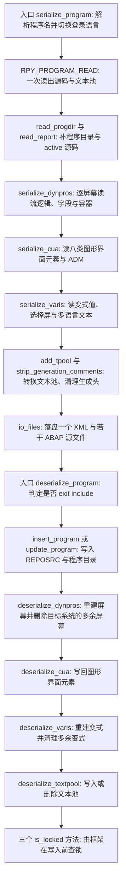
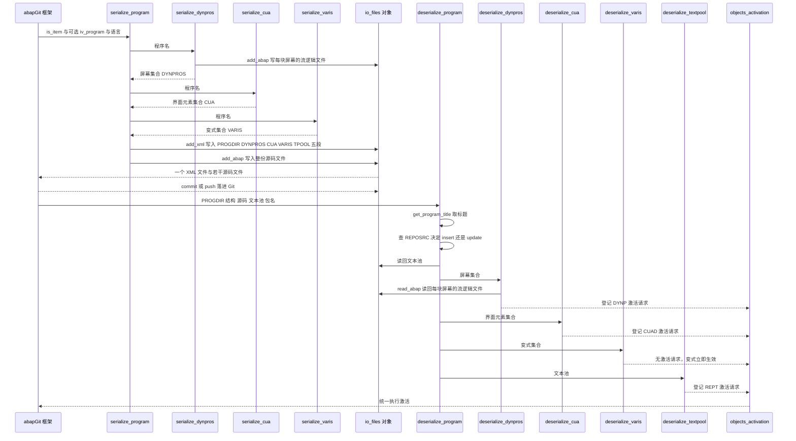

# ZCL_ABAPGIT_OBJECTS_PROGRAM 分析报告

> 分析对象：`abapGit/abapGit — src/zcl_abapgit_objects_program.clas.abap`（1597 行，全局类 `ZCL_ABAPGIT_OBJECTS_PROGRAM`，继承 `ZCL_ABAPGIT_OBJECTS_SUPER`）
> 报告视角：代码 onboarding 走读，按 abapGit 框架的真实调用链（序列化 → 反序列化）展开
> 分组单位：源码声明的 28 个方法 + 类定义段，按执行流程排序

---

## 一、程序定位与业务背景

### 1.1 这段代码在解决什么问题

先说清楚它**不是**什么：它不是报表、不画 ALV、不做业务校验，也**不生成源码**。它是一个**对象格式适配器**——把 SAP 物理数据库里一个"可执行程序"的全部碎片，翻译成 abapGit 的文件格式（XML + ABAP 源文件），再反向翻译回去。

要理解它的分量，先看一个 SAP 程序在数据库里到底是什么。一个 `PROG` 对象在 SAP 里从来不是一行记录，而是散落在七八张表里的一个**物理对象集合**：

| 碎片 | 存放位置 | 谁在用 |
|---|---|---|
| 源码（含 inactive 版本） | `REPOSRC` | SE38 / 编译器 |
| 程序目录、程序类型、激活标记 | `TRDIR`（经 `PROGDIR` 结构） | 运行框架 |
| 传输归属 | `TADIR` | CTS / 传输组织 |
| 动态屏幕定义 | `D020S` / `D021S` / `D020A` + 字段属性 `RPY_DYFATC` | 屏幕生成器 |
| 屏幕流逻辑（PROCESS BEFORE FLOW） | `SWYDFLOW` 系 | 屏幕运行 |
| 原生（native）屏幕的字段与文本 | `D021S` / `D021T` | SAP GUI 解释器 |
| CUA 图形界面元素（菜单、按钮、功能码…） | `RSMPE_*` 八张表 | SE41 / SAP GUI |
| 文本元素（标题、列表标题、选择文本） | `TEXTPOOL` | SE38 / 运行时 |
| 报表变式 | `VARID` / `VART` / `VARIT` | 选择屏 |

abapGit 的目标是把这些**全部**收进 Git，做成一个对象一个文件。SAP 自带的 SAPLink 只覆盖单个开发对象，不碰动态屏幕、CUA、变式这些"程序附属物"，也不处理 SAP 自己引入的 inactive 版本机制。所以 abapGit 必须自己写这一层——**这就是本文件的全部存在理由**。

于是它的职责被压缩成一句话：**两个公共入口 + 二十几个内部工具方法**。

| 它做的事 | 它刻意不做的事 |
|---|---|
| 把物理对象集合序列化成 `PROGDIR` / `DYNPROS` / `CUA` / `VARIS` / `TPOOL` 五段 XML + 若干 `.abap` 文件 | 不碰 CLAS、FUNC、TABLE 这类其它对象类型（各有自己的 `zcl_abapgit_objects_*`） |
| 反向把这些 XML 写回数据库，并登记激活请求 | 不直接激活，激活交给 `zcl_abapgit_objects_activation` |
| 处理 inactive / active 双版本源码 | 不做版本合并（那是 Git 的事） |
| 校验目标系统的对象是否被别人锁住 | 不申请锁（锁的申请在框架层） |
| 处理跨版本 FM 参数不存在的降级（`TRY` + `CATCH cx_sy_dyn_call_param_not_found`） | 不做 Release 级别的编译期裁剪 |

一句话设计范式定性：

> **"物理对象适配器（Adapter）+ 序列化/反序列化对称结构"——公共区只有 `serialize_program` 与 `deserialize_program` 两个入口，满足框架的对象契约；受保护区是框架在 deserialize 流程中按固定顺序驱动的六个步骤；私有区是纯转换工具。副作用全部集中在反序列化侧，序列化侧尽量只读。**

### 1.2 为什么用受保护区 + 私有区的三层切分

这个切分不是随意定的，它精确对应 abapGit 框架的三个身份：

- **公共区**：`serialize_program` / `deserialize_program` —— 这两个方法名是**框架与本类之间的接口约定**，框架按名字调用，它们不能改、不能加参数；
- **受保护区**（`deserialize_dynpros` / `deserialize_textpool` / `deserialize_cua` / `deserialize_varis` / 三个 `is_*_locked`）—— 框架在 deserialize 的通用流程里依次调用，本类只对"可执行程序"这一种对象类型提供实现。子类可以覆盖，外部调用者碰不到；
- **私有区**（`insert_program` / `update_program` / `create_vari` / `delete_vari` / `set_vari_protection` / `uncondense_flow` / `auto_correct_cua_adm` / `get_program_title` / `is_exit_include` / `get_varis_*` / `get_vari_*`）—— 纯工具，只在本类内部有意义。

**接手时最容易犯的错**是以为"公共区两个方法就是全部"，直接去改受保护区——那些方法被框架按名字调，改签名会静默断链。本文件所有 `RAISING zcx_abapgit_exception` 都是这个契约的产物。

### 1.3 依赖清单（读这段代码前必须知道的地形）

```
继承自 ZCL_ABAPGIT_OBJECTS_SUPER 的成员（本文件直接使用，不声明）
  MS_ITEM                    对象条目（obj_type / obj_name），来自 zif_abapgit_definitions=>ty_item
  MV_LANGUAGE                当前序列化语言
  MO_FILES                   REF TO zcl_abapgit_objects_files，文件落盘入口
  MO_I18N_PARAMS             REF TO 语言过滤参数，build_language_filter 来自这里
  EXISTS_A_LOCK_ENTRY_FOR    继承方法，查锁表用
  CLEAR_ABAP_LANGUAGE_VERSION 继承方法，清 UCCHECK 标记

继承自更上层 zcl_abapgit_objects 的静态服务
  ZCL_ABAPGIT_LANGUAGE        set_current_language / restore_login_language
  ZCL_ABAPGIT_FACTORY         get_cts_api / get_sap_report / 创建 XML 输出对象
  ZCL_ABAPGIT_OBJECTS_ACTIVATION  add( )，登记待激活对象（REPS / REPT / DYNP / CUAD）

Z 接口
  ZIF_ABAPGIT_XML_OUTPUT      add( )，序列化的 XML 容器
  ZIF_ABAPGIT_SAP_REPORT      read_progdir / read_report / insert_report / update_progdir
  ZIF_ABAPGIT_DEFITIONS       ty_item
  ZIF_ABAPGIT_LANG_DEFINITIONS ty_tpool_tt，abapGit 自有的文本池行结构

SAP 函数模块（本文件的实际副作用来源）
  RPY_PROGRAM_READ / RPY_PROGRAM_INSERT / RPY_INCLUDE_UPDATE    程序源码
  RS_SCREEN_LIST / RPY_DYNPRO_READ / RPY_DYNPRO_READ_NATIVE     动态屏幕
  RPY_DYNPRO_INSERT / RPY_DYNPRO_INSERT_NATIVE / RS_SCRP_DELETE 屏幕写回与删除
  RS_CUA_INTERNAL_FETCH / RS_CUA_INTERNAL_WRITE                 CUA 界面元素
  RS_ALL_VARIANTS_4_1_REPORT / RS_VARIANT_VALUES_TECH_DAT_255
  RS_VARIANT_CONTENTS_255 / RS_GET_SCREENS_4_1_VARIANT
  RS_CREATE_VARIANT_255 / RS_CHANGE_CREATED_VARIANT_255 / RS_VARIANT_DELETE

SAP 系统表（直接读写，无 FM 封装）
  REPOSRC  只读，判存在性
  TADIR   只读，取传输归属
  VARIT   只读，取变式多语言文本
  VARID   直接 UPDATE（set_vari_protection）
  D021T   直接 DELETE / INSERT（deserialize_dynpros 的 native 分支）

SAP 全局内存
  (SAPLSIFP)TTAB   动态 ASSIGN + CLEAR（get_program_title 的 workaround）
```

注意最后两条：**这个类里有两处直接写系统表、一处直接改 SAP 全局内存**。这是全文件风险最集中的地方，也是第三节要反复回到的位置。

---

## 二、程序执行流程总览

abapGit 的真实运行形态是双向的：用户点 "Pull" 走反序列化（把 Git 里的文件写进系统），点 "Push" 走序列化（把系统里的对象倒成文件）。下面这条链把两个方向接在一起——**序列化在前、反序列化在后**，因为 abapGit 的推送端负责生成仓库内容，拉取端消费同一批格式。



### 责任链表

| 子程序 | 调用者 | 职责 |
|---|---|---|
| `serialize_program`（公共区入口） | abapGit 框架（对象序列化流程） | 序列化总控：切语言、读源码、决定附属物范围、分发五段 XML、落盘 |
| `serialize_dynpros` | `serialize_program`（仅 `subc = '1'` 或 `'M'`） | 逐个动态屏幕读流逻辑、字段、容器，产出 `DYNPROS` 段，并把流逻辑写成独立 `.abap` 文件 |
| `serialize_cua` | `serialize_program`（同上条件） | 用 `RS_CUA_INTERNAL_FETCH` 读八类界面元素与 ADM，产出 `CUA` 段 |
| `serialize_varis` | `serialize_program`（同上条件） | 枚举变式并逐个读明细，产出 `VARIS` 段 |
| `get_varis_for_report` | `serialize_varis`、`deserialize_varis` | 枚举属于变式组（`SAP&` / `CUS&` 前缀）的变式键 |
| `get_vari_data` | `serialize_varis` | 读单个变式的技术属性、参数值、对象与多语言文本，并 `SORT` 出可复现顺序 |
| `get_vari_screens` | `serialize_varis` | 读单个变式覆盖了哪些屏幕号 |
| `add_tpool`（类方法） | `serialize_program` | SAP 文本池格式 → abapGit 格式，长文本按前 8 字符拆分 |
| `read_tpool`（类方法） | 本文件内无调用点（推断为框架在 `deserialize_textpool` 之前调用，需核实） | abapGit 文本池格式 → SAP 文本池格式，长文本重新拼接 |
| `strip_generation_comments` | `serialize_program` | 仅对 FUGR：剥掉 SAP 生成器写的时间戳与版本号行，保证 Git 每次提交不产生噪声 diff |
| `deserialize_program`（公共区入口） | abapGit 框架（对象反序列化流程） | 反序列化总控：exit include 分流、登记传输对象、写程序、更新程序目录、登记 `REPS` 激活 |
| `is_exit_include` | `deserialize_program`、`update_program` | 按程序名形态判断是否为 SAP 标准 exit function group 的 include |
| `deserialize_exit_include` | `deserialize_program` | exit include 的专用写入路径：强制以 active 状态处理，且不登记传输与程序目录 |
| `insert_program` | `deserialize_program`、`deserialize_exit_include` | 新建程序：`RPY_PROGRAM_INSERT`，失败时按程序类型降级直写 `REPOSRC` |
| `update_program` | `deserialize_program`、`deserialize_exit_include` | 更新已存在程序：`RPY_INCLUDE_UPDATE`，并把 `EU510` / `EU522` 两个消息号翻译成可读异常 |
| `get_program_title` | `deserialize_program`、`deserialize_exit_include` | 从文本池取 `'R'` 项作为程序标题，附带一段 SAP 全局内存 workaround |
| `deserialize_dynpros` | abapGit 框架 deserialize 流程 | 按远程屏幕集合重建屏幕，并删除目标系统多出来的屏幕 |
| `uncondense_flow` | `deserialize_dynpros` | 按缩进表把屏幕流逻辑逐行右移，反序列化 SE41 保存的压缩格式 |
| `deserialize_cua` | abapGit 框架 deserialize 流程 | 写回八类界面元素与 ADM，登记 `CUAD` 激活 |
| `auto_correct_cua_adm`（类方法） | `deserialize_cua` | 兼容历史上 ADM 未被存进 XML 的旧数据，从界面元素反推三个主编码 |
| `deserialize_varis` | abapGit 框架 deserialize 流程 | 重建远程变式、删除本地多出的变式，全程保护 `protected` 标记并在异常时用 `CLEANUP` 恢复 |
| `create_vari` | `deserialize_varis` | 用 `RS_CREATE_VARIANT_255` + `RS_CHANGE_CREATED_VARIANT_255` 建变式 |
| `delete_vari` | `deserialize_varis` | 用 `RS_VARIANT_DELETE` 删变式，含旧 Release 降级分支 |
| `set_vari_protection` | `deserialize_varis` | 直接读写 `VARID` 表的 `protected` 字段，返回改动前的旧值 |
| `deserialize_textpool` | abapGit 框架 deserialize 流程 | 写入或删除文本池，处理"include 不能删主语言文本池"的特例，登记 `REPT` 激活 |
| `is_any_dynpro_locked` | abapGit 框架（拉取前置检查） | 查 `ESCRP` 锁，判断是否有屏幕被他人编辑锁定 |
| `is_cua_locked` | 同上 | 查 `ESCUAPAINT` 锁，判断 CUA 是否被锁 |
| `is_text_locked` | 同上 | 查 `EABAPTEXTE` 锁，判断文本池是否被锁 |

下面按这条流程，逐个子程序展开。因为本文件的方法几乎都短小（多数只有十几行），第三节会按"步骤"而不是按"文件块"来切，让每一段都能配齐三层评述。

---

## 三、分组分析（按程序流程 / 子程序）

### 3.1 类定义段：类型、常量与方法契约（全局声明区）

整份定义段承担两件事：一是把 SAP 的物理结构"拍平"成 abapGit 自己的行结构，二是把散落各处的魔法字面量收成常量。这一段读起来枯燥，但它决定了后面所有步骤的数据形状。

```abap
    TYPES:
      BEGIN OF ty_cua,
        adm TYPE rsmpe_adm,
        sta TYPE STANDARD TABLE OF rsmpe_stat WITH DEFAULT KEY,
        fun TYPE STANDARD TABLE OF rsmpe_funt WITH DEFAULT KEY,
        men TYPE STANDARD TABLE OF rsmpe_men WITH DEFAULT KEY,
        mtx TYPE STANDARD TABLE OF rsmpe_mnlt WITH DEFAULT KEY,
        act TYPE STANDARD TABLE OF rsmpe_act WITH DEFAULT KEY,
        but TYPE STANDARD TABLE OF rsmpe_but WITH DEFAULT KEY,
        pfk TYPE STANDARD TABLE OF rsmpe_pfk WITH DEFAULT KEY,
        set TYPE STANDARD TABLE OF rsmpe_staf WITH DEFAULT KEY,
        doc TYPE STANDARD TABLE OF rsmpe_atrt WITH DEFAULT KEY,
        tit TYPE STANDARD TABLE OF rsmpe_titt WITH DEFAULT KEY,
        biv TYPE STANDARD TABLE OF rsmpe_buts WITH DEFAULT KEY,
      END OF ty_cua.
```

**做什么** — 定义 `ty_cua`，把 `RSMPE_*` 系的八张表加上 `ADM` 头记录拍平成一个结构体：状态栏（`sta`）、功能（`fun`）、菜单（`men`）、菜单文本（`mtx`）、活动按钮（`act`）、按钮（`but`）、功能键（`pfk`）、设置（`set`）、附加文本（`doc`）、标题（`tit`）、`biv`。所有内表都用 `WITH DEFAULT KEY` 而不是带字段的表键——这一点很关键，见风险层。

**为什么** — 拍平成一个结构而不是让八张表各自流过 XML 序列化，是为了**让 XML 段与 SAP 的 CUA 结构一一对应地落在同一个 `ig_data` 上**：`serialize_cua` 用 `RETURNING rs_cua TYPE ty_cua` 一次返回整个界面，`deserialize_cua` 一次接收，两侧字段名完全相同。对称性是这个类最重要的设计约束，`ty_cua` 就是它的类型层落实。

**风险与改进** — 三点，第一点是真正需要核实的：

1. **`doc` 装 `rsmpe_atrt`、`tit` 装 `rsmpe_titt`、`biv` 装 `rsmpe_buts`，这三个组件名的语义与所装结构对不上**。同一组里其它字段是机械缩写（`sta`←`stat`、`fun`←`funt`、`mtx`←`mnlt`、`set`←`staf`），唯独 `doc`（文档）装的是 `atrt`、`biv` 装的是 `buts`。这既可能是 abapGit 作者按语义另起的名（`biv` 大概与"按钮变体/不可见"之类有关），也可能是历史遗留。**这两种情况的改法完全不同，需要去 SE37 看 `RS_CUA_INTERNAL_FETCH` 与 `RS_CUA_INTERNAL_WRITE` 的 `TABLES` 参数到底绑到哪个结构**。在核实之前不要改这些名字——改错会让 XML 字段名变化，破坏向后兼容。
2. **全部内表用 `WITH DEFAULT KEY`，即用整行做表键**。这在序列化侧无害（数据量小、只读），但在 `deserialize_cua` 把内表传给 `RS_CUA_INTERNAL_WRITE` 时，等于告诉 FM"按全行判重"；若 CUA 元素本身重复，`APPEND` 的结果会不会被 FM 折叠取决于 FM 内部实现。更实际的风险是**内表在 XML 里落地时不需要表键，所以问题不大；但如果哪天有人给这个类型加上带字段的表键，XML 序列化层的输出形状会变**。建议加注释说明这里选 `DEFAULT KEY` 是有意的。
3. **`set` 组件名与 SQL 的 `SET` 关键字同名**。ABAP 里 `SET` 不是保留词（它是 `SELECT ... ` 增强语法的一部分，不是语句关键字），所以 `is_cua-set` 合法。但新人读代码时容易把它当成 SQL 关键字，建议改成 `stf` 之类更明确的缩写——这属于可选的整洁性改动。

```abap
    CONSTANTS:
      BEGIN OF c_state,
        active   TYPE r3state VALUE 'A',
        inactive TYPE r3state VALUE 'I',
        off      TYPE r3state VALUE '',
      END OF c_state.

    CONSTANTS c_native_dynpro TYPE c LENGTH 2 VALUE 'IN'.

    CONSTANTS c_sysvari_clnt        TYPE mandt      VALUE '000'.
    CONSTANTS c_sysvari_pattern_sap TYPE c LENGTH 5 VALUE 'SAP&*'.
    CONSTANTS c_sysvari_pattern_cus TYPE c LENGTH 5 VALUE 'CUS&*'.
```

**做什么** — 定义五个常量组。`c_state` 用 `r3state` 类型给出 `'A'`（active）、`'I'`（inactive）、`''`（off）三态；`c_native_dynpro = 'IN'` 用于 `CA` 判断原生屏幕类型；三个变式常量把变式硬编码到 client `'000'`，并用 `SAP&*` / `CUS&*` 两个模式筛出归属于变式组的变式。

**为什么** — `c_state` 值得单独说：它同时承担两个角色。一是 `REPOSRC` 查询里的 `r3state` 过滤值（`'A'` / `'I'`），二是 `RPY_PROGRAM_INSERT` / `RPY_INCLUDE_UPDATE` 的 `save_inactive` 参数值。前者是 SAP 数据库里 `REPOSRC-R3STATE` 的真实三态，后者却是 SAP FM 里典型的**一位 X 标志**。作者用一个三态常量去喂一个布尔位，是为了让"保存到哪个版本"和"读哪个版本"共用一套字面量——理解成本换来了参数对称性。

`c_sysvari_pattern_sap` / `cus` 反映了一个业务事实：SAP 的**变式组（Variant Group）**里的变式命名必须以 `SAP&` 或 `CUS&` 开头，这是 SE38 的强制约定。作者据此把"属于某个变式组、值得版本化"的变式与"某个用户的个人变式"区分开。

**风险与改进** — 两处语义校核必须核实，且都是"能跑但含义存疑"的类型：

1. **`c_state-inactive`（`'I'`）被当作 `save_inactive` 传进 FM，是一个真实的类型语义错配**。`insert_program` 和 `update_program` 都写着 `save_inactive = iv_state`，而 `iv_state` 的默认值是 `c_state-inactive`（`'I'`）。SAP 的 `RPY_PROGRAM_INSERT` / `RPY_INCLUDE_UPDATE` 里 `save_inactive` 是 `TYPE c LENGTH 1` 的一位标志——内部判断是 `IF save_inactive = 'X'` 还是 `IF save_inactive IS NOT INITIAL`，决定了 `'I'` 是被当作真还是被当作假。**前者意味着"传了 `'I'` 却不保存 inactive 版本"（功能静默失效），后者意味着正常**。这必须去 SE37 核实两个 FM 的实现，它是本文件里最值得优先确认的一条。同时 `deserialize_exit_include` 传的 `c_state-off`（空串）在 `IS NOT INITIAL` 语义下正好是假、在 `= 'X'` 语义下也是假——这一处反而两种解释都对，说明作者对 `save_inactive` 的期望语义是"空串=不存 inactive"，**这反过来支持 `IS NOT INITIAL` 解释，但仍需确认**。稳妥的改法（示意，源码中不存在）：
   ```abap-fix
     DATA lv_save_inactive TYPE abap_bool.
     lv_save_inactive = boolc( iv_state = c_state-inactive ).
   ```
   然后把 `save_inactive = lv_save_inactive` 传进去——这样无论 FM 内部怎么判断，行为都确定。
2. **`c_sysvari_clnt = '000'` 让变式操作永远发生在 client 000**。这不是随意选的：SAP 的变式本来就存在 client 000 里、用 `CLIENT SPECIFIED` 访问。但它带来两个后果需要读者记住——**在 client 100 上拉一次变式，实际改的是 client 000 的数据**，而开发人员往往以为自己在改自己系统的变式；以及 `UPDATE varid CLIENT SPECIFIED` 之后，SAP 自己的变式管理工具要回到 client 000 才能看到保护标记的变化。建议在常量定义处加一行注释说明这个跨 client 语义。

```abap
    METHODS:
      uncondense_flow
        IMPORTING it_flow        TYPE swydyflow
                  it_spaces      TYPE ty_spaces_tt
        RETURNING VALUE(rt_flow) TYPE swydyflow.
```

**做什么** — 声明私有区的第一个工具方法 `uncondense_flow`：输入屏幕流逻辑表和一份缩进量表，输出一份流逻辑表。

**为什么** — 这是全类里最"不起眼"但最能说明作者水平的一个签名。它是 `deserialize_dynpros` 的直接依赖，而 `deserialize_dynpros` 又被框架调用——也就是说它是**唯一一处被框架间接依赖的私有方法**。把它放在私有区而不是受保护区，意味着"框架不应该直接调它"这个约定是被类型系统强制的，而不是靠自觉。

**风险与改进** — 一处形式问题：`uncondense_flow` 出现在私有区 `METHODS:` 块的**第一行**，而同一个块下面紧跟着 `CLASS-METHODS auto_correct_cua_adm` 和一串实例方法。ABAP 允许这么混排，但混排会让读者以为这几个方法有关联。建议私有区按"实例方法 / 类方法 / 常量"分组，各加一行注释——纯整洁性改动，不影响行为。

### 3.2 序列化① 解析程序名并切换登录语言（`serialize_program` 开头）

`serialize_program` 是全类的公共入口，负责把一个程序对象倒成文件。它分七步走，下面逐步拆。**这一步只做两件事，但两件都是"为后面的 FM 铺路"。**

#### ① 决定序列化哪个程序

```abap
    IF iv_program IS INITIAL.
      lv_program_name = is_item-obj_name.
    ELSE.
      lv_program_name = iv_program.
    ENDIF.

    zcl_abapgit_language=>set_current_language( mv_language ).
```

**做什么** — 先决定这次要序列化哪个程序：`iv_program` 传了就用它（这是框架处理 include 时指定被包含程序的场景），没传就用 `is_item-obj_name`（正在处理的那个对象）。然后把 SAP 的登录语言切到 `mv_language`——abapGit 在 pull/push 时可以让用户选源语言与目标语言，而 SAP 侧的 FM 大多读"当前登录语言"来决定读哪套文本。

**为什么** — `iv_program OPTIONAL` 这个设计是为了让**函数组（FUGR）对象复用同一个序列化入口**：主程序是 `SAPL*`，但成员 include 是 `LZ*`/`LZU*`，框架必须能点名序列化某一个成员。回退到 `is_item-obj_name` 则覆盖了普通 PROG 的常规路径——一次调用满足两种场景，不用让框架写两套。

`set_current_language` 放在读任何数据之前，是必须的：后面 `RPY_PROGRAM_READ`、`RS_CUA_INTERNAL_FETCH`、变式读取全都要按当前语言取文本，顺序错了整个序列化就是错的。

**风险与改进** — 两点：

1. **`iv_program` 与 `is_item-obj_name` 不一致时，产物文件名仍然用 `is_item-obj_name` 派生的 `iv_extra`**。也就是说"序列化了 A 程序的内容，却写进了 B 对象的文件槽位"。框架保证两者一致时没问题，但**这个保证只存在于框架里，本类不校验**。加一句断言成本很低（示意，源码中不存在）：
   ```abap-fix
     ASSERT NOT ( iv_program IS NOT INITIAL AND iv_program <> is_item-obj_name ).
   ```
   不过要注意函数组场景下 `iv_extra` 本来就与 `iv_program` 不同（成员用额外后缀），所以断言要按框架的实际约定写——**这条得先看框架调用点再定**。
2. **`iv_program` 没有长度或名字格式校验**。ABAP `syrepid` 是 CHAR 30，如果框架传进一个含小写或超长的名字，后面的 `RPY_PROGRAM_READ` 会以 `not_found`（`sy-subrc = 2`）返回，然后走 3.3 讲的"静默 RETURN"路径。这个组合会让一个拼写错误变成"空产物"，见 P0-3。

### 3.3 序列化② 一次读出源码与文本池（`serialize_program` 主读取段）

#### ② 读源码与文本元素

```abap
    CALL FUNCTION 'RPY_PROGRAM_READ'
      EXPORTING
        program_name     = lv_program_name
        with_includelist = abap_false
        with_lowercase   = abap_true
      TABLES
        source_extended  = lt_source
        textelements     = lt_tpool
      EXCEPTIONS
        cancelled        = 1
        not_found        = 2
        permission_error = 3
        OTHERS           = 4.

    IF sy-subrc = 2.
      zcl_abapgit_language=>restore_login_language( ).
      RETURN.
    ELSEIF sy-subrc <> 0.
      zcl_abapgit_language=>restore_login_language( ).
      zcx_abapgit_exception=>raise_t100( ).
    ENDIF.

    zcl_abapgit_language=>restore_login_language( ).
```

**做什么** — 调用 `RPY_PROGRAM_READ` 一次性取出程序的源码（`source_extended` 是 `abaptxt255` 行表，每行 255 字符）和文本元素（`textelements` 就是 `TEXTPOOL` 表的格式）。然后分三条路：`not_found`（`sy-subrc = 2`）→ 恢复语言后直接返回，不产生任何文件；其它错误 → 恢复语言后抛异常；成功 → 恢复语言继续。

**为什么** — **一次 FM 调用同时拿源码和文本池，是这个设计里最经济的一笔**。SAP 的 `RPY_PROGRAM_READ` 是少数几个能一次返回两样东西的 FM，替代方案是先 `READ TEXTPOOL` 再 `RPY_PROGRAM_READ`，多一次 DB 往返。abapGit 明显是踩过这个坑之后选的一次性读取。

**三条恢复分支全部调用 `restore_login_language`**，路径完整性是这个方法最值得称道的地方。语言切换是全局副作用，一旦漏一次恢复，后续所有序列化都会用错语言——而这种 bug 在单对象测试里根本不显形。作者在成功、not_found、其它错误三条路径上都还原了，说明是刻意检查过的。

`with_lowercase = abap_true` 是另一个关键选择：它让 SAP 返回全部小写的关键字版本，让 abapGit 存进 Git 的源码是**规范化**的。否则开发者本地大小写风格不同的两次 pull 会产生无意义的 diff。

**风险与改进** — 这是全文件最严重的问题所在，先给结论再展开：

1. **`sy-subrc = 2`（程序不存在）被静默转成一个"成功的空产物"，调用方无法区分**（P0）。`not_found` 有两种完全不同的来源：一是程序真的不存在（框架 bug 或对象已被删除），二是程序存在但当前语言下没有可读内容。第二种情况下正常返回是合理的；第一种情况下，框架会拿到一个"什么都没有"的 `serialize_program` 结果并认为序列化成功——用户看到的现象是"push 成功但 Git 里没有这个程序的文件"，而仓库工作区已经因为前面的文件删除而变脏。这是一个**数据丢失级别的静默失败**：一次误操作可以让程序从版本库里消失且没有任何报错。改法（示意，源码中不存在）：
   ```abap-fix
     IF sy-subrc = 2.
       zcl_abapgit_language=>restore_login_language( ).
       zcx_abapgit_exception=>raise( |Program { lv_program_name } not found for serialization| ).
     ENDIF.
   ```
   如果确实存在"程序存在但读不到"的合法场景，应该判断一次存在性再决定，而不是把两种情况并成一个分支。
2. **`cancelled`（`sy-subrc = 1`）与 `permission_error`（`3`）被合并成"抛 T100"**。这两个错误的用户可操作性完全不同：权限不足应该明确提示"你没有权限读这个程序"，而不是抛一个原始 T100 让用户去翻 SAP 消息。建议至少给 `permission_error` 一个自己的消息文本——**注意这里不要反向背书**：`raise_t100( )` 会把 SAP 的原始消息带给用户，实际上并非完全不可读，只是丢失了 abapGit 语境下的"该找谁/该做什么"信息。
3. **`raise_t100( )` 之前不设任何上下文**。abapGit 的异常体系支持附加上下文（出错的阶段名、对象名），这里全靠 T100 自带的消息。这在 P0 故障排查时会吃亏——用户拿到的消息里没有"哪个对象、哪个阶段"。属于可改进项，不是缺陷。

#### ③ 补齐程序目录与 active 源码

```abap
    TRY.
        " Raises exception if inactive version does not exist
        ls_progdir = li_report->read_progdir(
          iv_name  = lv_program_name
          iv_state = c_state-inactive ).

        " Explicitly request active source code
        lt_source = li_report->read_report(
          iv_name  = lv_program_name
          iv_state = c_state-active ).
      CATCH zcx_abapgit_exception ##NO_HANDLER.
    ENDTRY.

    ls_progdir = li_report->read_progdir(
      iv_name  = lv_program_name
      iv_state = c_state-active ).

    clear_abap_language_version( CHANGING cv_abap_language_version = ls_progdir-uccheck ).
```

**做什么** — 三件事：先试探性地读 inactive 版本程序目录（作者注释写明"会抛异常，因为 inactive 版本不存在"），再借这个 `TRY` 顺便把 active 版本的源码显式读出来覆盖上一步的结果；然后无论成功与否，都无条件读一次 active 程序目录；最后清掉 `uccheck` 字段。

**为什么** — **这段注释是全文件最有价值的一段文字**：`RPY_PROGRAM_READ` 在程序存在 inactive 版本时返回的是 inactive 源码，不是 active 源码。SAP 自己也没提供"同时给我两份"的接口，abapGit 的取舍是——**Git 里存 active 版本**（因为 Git 的历史负责记录差异，active 才是"生产中真正跑的那份"），inactive 版本不入库。所以第一步是故意用异常去探测，第二步无条件读 active，最后一次读 active 程序目录覆盖掉探测结果。这个"用异常做控制流"的写法不优雅，但在没有更好 API 的情况下是务实的正确解。

`clear_abap_language_version` 清的是 `PROGDIR-UCCHECK`——SAP 用它标记"程序里的语言版本检查已经做过且已过时"。这是个典型的**环境态字段**：换台系统它就没意义了。abapGit 选择主动清空它，正是为了让 Git diff 里不出现这类噪音。

**风险与改进** — 这一段有一处 P0 级的隐患，必须展开：

1. **`CATCH` 同时吞掉了两种语义完全不同的失败**（P0）。`TRY` 块里有两个可能抛异常的方法调用，而 `CATCH zcx_abapgit_exception ##NO_HANDLER` 不区分是哪一个抛的。注释说的意图是"第一步探测 inactive 是否存在，失败就跳过"——这个意图本身正确。但第二步 `li_report->read_report( ... iv_state = c_state-active )` **也在同一个 `TRY` 里**。如果读 active 源码失败（权限、锁、对象损坏、传输中的不一致），异常会被同一个 `CATCH` 静默吞掉，然后流程继续走到落盘。结果是：`lt_source` 保持 `RPY_PROGRAM_READ` 给的那份（可能是 inactive 版本、也可能已被前面的调用清空），而调用方以为"显式读取 active 源码"做过了。**用户拿到的 Git 文件里是一份状态不明的源码，且没有任何提示。**

   正确的形状是把探测与实质读取分成两个 `TRY`（示意，源码中不存在）：
   ```abap-fix
       TRY.
           ls_progdir = li_report->read_progdir(
             iv_name  = lv_program_name
             iv_state = c_state-inactive ).
         CATCH zcx_abapgit_exception.
           " 没有 inactive 版本是正常情况，继续
       ENDTRY.

       lt_source = li_report->read_report(
         iv_name  = lv_program_name
         iv_state = c_state-active ).
   ```
   注意 `CATCH` 块里必须留注释或至少一条语句——ABAP 的 `CATCH` 允许空块，但空 `CATCH` 加 `##NO_HANDLER` 抑制会让审代码的人以为是手滑。
2. **`CATCH` 之后的 `read_progdir` 不在 `TRY` 里**，若 active 程序目录也读不到，异常直接向上抛出——这是对的，但**它抛出的异常会绕过 `serialize_program` 后续的所有清理**。此时 `mo_files` 里可能已经落了一半文件（3.4 之后才会落盘，所以实际上此处还没落盘，影响有限），真正的问题是**异常路径上没有 `restore_login_language`**——不过 `MV_LANGUAGE` 的切换在 3.2 的 `restore_login_language` 里已经做完了，所以这里没有语言泄漏。这条不成立，但值得记一笔：**语言恢复点只有一处**，任何未来在 `serialize_program` 之后半段新增的 FM 调用都不能再引入语言切换，否则没有对称的还原点。
3. **`clear_abap_language_version` 清掉了 `uccheck`，但反序列化侧会把这个清空后的值写回系统**。`insert_program` 把 `iv_version = is_progdir-uccheck` 传给 `insert_report`，也就是把空值写进目标系统。SAP 端"程序已过时"这个标记因此永远不会被 abapGit 维护。**这不一定是错**（这个标记本来就不该跨系统搬运），但它意味着**通过 abapGit 拉进去的程序，在 SAP 侧的"检查过时"状态与手工创建的程序不同**。属于需要知晓的行为差异，建议在 `clear_abap_language_version` 的实现处（不在本文件）写清理由。

```abap
    IF io_xml IS BOUND.
      li_xml = io_xml.
    ELSE.
      CREATE OBJECT li_xml TYPE zcl_abapgit_xml_output.
    ENDIF.
```

**做什么** — 决定 XML 输出容器从哪来：调用方传了 `io_xml` 就用它（测试注入），没传就自己 `CREATE OBJECT` 一个真实的。

**为什么** — **这是全文件唯一一个刻意的测试缝**。`io_xml TYPE REF TO zif_abapgit_xml_output OPTIONAL` 让调用方可以传一个假实现进来，`serialize_program` 于是可以在不写文件的情况下被单元测试完整执行一遍。abapGit 的整个测试策略依赖这个模式——`zcl_abapgit_objects_*` 的所有类都有这样一个可选的 XML 输出参数。

**风险与改进** — 三点，第一点比语法问题重要得多：

1. **产物顺序是一条隐含契约，代码里没有任何注释保护它**。`MO_FILES` 最终拿到的是整份源码文件，`LI_XML` 拿到的是 `PROGDIR` / `DYNPROS` / `CUA` / `VARIS` / `TPOOL` 五段，落盘顺序就是 3.4 的两步：先 `add_xml` 再 `add_abap`。这不是随手排的——`TPOOL` 段依赖前面已经填好的 `lt_tpool`，`DYNPROS` 段的流逻辑文件要到 `mo_files` 里被读回来，而 `strip_generation_comments` 必须发生在写源码文件之前。**任何一次为了"读起来顺"而调换这三步的重构，都会让 `mo_files->read_abap` 在文件写出来之前就去读它**，而这类失败的表象是"屏幕流逻辑莫名其妙变空"，排查成本极高。建议在这两行旁加一行注释标记顺序敏感。
2. **`CREATE OBJECT` 是旧式语法**。ABAP 现代写法是 `li_xml = NEW zcl_abapgit_xml_output( ).`。功能等价，但这行代码在 abapGit 这个较新的开源项目里属于少数几处没有跟进现代语法的写法（其余地方已经用了 `REF TO`、字符串模板、`boolc`）。属于整洁性问题，不影响行为。
3. **`io_xml` 注入了，错误也就没人接了**。走测试路径时 `io_files->add_abap` 根本不会执行，于是"落盘失败"这一类问题在单测里永远测不到；反过来，真实路径下 `io_xml` 一定未绑定，`IF NOT io_xml IS BOUND` 恒为真，这个条件表达的是"我不是被注入的那个"而不是任何业务判断。可读性上建议改成正面语义（例如把两个 xml 输出路径拆成两个私有方法），但当前写法正确。

### 3.4 序列化③ 分发五段 XML 并落盘（`serialize_program` 分发段）

#### ④ 按程序类型决定采集哪些附属物

```abap
    li_xml->add( iv_name = 'PROGDIR'
                 ig_data = ls_progdir ).
    IF ls_progdir-subc = '1' OR ls_progdir-subc = 'M'.
      lt_dynpros = serialize_dynpros( lv_program_name ).
      li_xml->add( iv_name = 'DYNPROS'
                   ig_data = lt_dynpros ).

      ls_cua = serialize_cua( lv_program_name ).
      li_xml->add( iv_name = 'CUA'
                   ig_data = ls_cua ).

      lt_varis = serialize_varis( lv_program_name ).
      li_xml->add( iv_name = 'VARIS'
                   ig_data = lt_varis ).
    ENDIF.
```

**做什么** — 先无条件写入 `PROGDIR` 段（程序目录）。然后判断程序类型：只有 `subc = '1'`（可执行程序）或 `'M'`（函数组主程序）才继续采集**动态屏幕、图形界面、变式**三类附属物，把结果各写一段 XML。类型是 include（`'I'`）或类型包含（`'T'`）时，后三段整个跳过。

**为什么** — 这个条件是**业务正确的**：SAP 的 include（函数组成员、主程序 TOP 包含）本身没有屏幕、没有 CUA、没有变式——这些都归属它所属的 `PROG` / `FUGR` 对象。对 include 采集这三段会得到空结果，对函数组成员采集则只会写出误导性的空段。

顺带一提，这里也是**整个序列化阶段唯一的分叉点**：流程图上从 `serialize_dynpros` 之后的三个调用其实是条件分支的三个并列分支，而不是一条直线。读代码时容易顺着函数名往下以为它们一定会执行，实际上取决于 `subc`。

**风险与改进** — 三点：

1. **`'1'` 与 `'M'` 是裸字面量**。`PROGDIR-SUBC` 是 CHAR 1，SAP 的取值语义是 `'1'` 可执行、`M` 模块、`I` include、`T` 类型包含。abapGit 定义段里已经把 `c_state` 这样的枚举收成了常量结构，这里却用了裸值——**同一份"业务枚举"在一个文件里出现了两种表达方式**。建议同样收成常量（示意，源码中不存在）：
   ```abap-fix
     CONSTANTS:
       BEGIN OF c_prog_type,
         executable TYPE progdir-subc VALUE '1',
         module     TYPE progdir-subc VALUE 'M',
         include    TYPE progdir-subc VALUE 'I',
         type_incl  TYPE progdir-subc VALUE 'T',
       END OF c_prog_type.
   ```
2. **`serialize_dynpros` / `serialize_cua` / `serialize_varis` 的异常会中断整个序列化，但此时 `PROGDIR` 段已经写进 `li_xml` 了**。由于 `li_xml` 只是内存对象（还没落盘），影响有限——但如果调用方传的是自己注入的 `io_xml`，这个半成品 XML 就留在调用方手里了。属于可接受的失败模式，不必改。
3. **三段的执行顺序固定为 dynpros → cua → varis**，而 `serialize_program` 的 `IV_EXTRA` 命名与 `serialize_dynpros` 内部生成的 `'screen_' && screen` 前缀（见 3.5）之间存在**隐含的命名契约**：反序列化侧 `deserialize_dynpros` 必须用完全相同的前缀去 `mo_files->read_abap` 才能找到流逻辑文件。这个契约跨两个方法、写在两个地方，中间没有共享常量。**这是本文件里最容易在重构中被打破的一处**，建议把 `'screen_'` 提成类常量并在两侧共用。

#### ⑤ 清理文本池并落盘

```abap
    READ TABLE lt_tpool WITH KEY id = 'R' INTO ls_tpool.
    IF sy-subrc = 0 AND ls_tpool-key = '' AND ls_tpool-length = 0.
      DELETE lt_tpool INDEX sy-tabix.
    ENDIF.

    li_xml->add( iv_name = 'TPOOL'
                 ig_data = add_tpool( lt_tpool ) ).

    IF NOT io_xml IS BOUND.
      io_files->add_xml( iv_extra = iv_extra
                         ii_xml   = li_xml ).
    ENDIF.

    strip_generation_comments( CHANGING ct_source = lt_source ).

    io_files->add_abap( iv_extra = iv_extra
                        it_abap  = lt_source ).
```

**做什么** — 先从文本池里找出标题项（`id = 'R'`），如果它同时**没有语言标记**（`key = ''`）且**长度为 0**，就把它删掉——这是一次"无信息内容不进版本库"的清理。然后写 `TPOOL` 段（用 `add_tpool` 转换格式）。如果 `io_xml` 是本方法自己创建的，就立刻 `add_xml` 落盘。最后调 `strip_generation_comments` 清理源码，再 `add_abap` 落盘源码文件。

**为什么** — **"空标题项不进库"这条规则是这个方法的精髓**。SAP 的 `TEXTPOOL` 里总是存在一条 `id = 'R'` 的标题记录，哪怕程序根本没写标题——此时它是一条全空的记录。如果原样写进 XML，每次 pull 都会产生一个内容为空的 `<TPOOL>` 条目，看起来像"这个程序有标题"，其实是噪音。这个判断条件写得相当准：`key = ''` 说明没有语言标记，`length = 0` 说明没有实际内容，两者同时成立才删。

`strip_generation_comments` 放在 `add_abap` **之前**——顺序很关键，清理必须发生在写文件之前。同理 `add_xml` 先于 `add_abap`，让 XML 与源码文件的写入顺序与 abapGit 的序列化结果顺序一致。

**风险与改进** — 三点：

1. **`add_tpool` 与 `add_xml` 之间没有任何转换失败的可能**（`add_tpool` 纯内存操作），所以这里没有错误处理是合理的。但**整个落盘段（`add_xml` + `add_abap`）失败时没有回滚**：如果 `add_xml` 成功而 `add_abap` 失败，XML 已经写进工作区、源码文件没写，用户下一次 push 会推出一个"只有 XML 没有源码"的半成品对象。abapGit 框架层是否有事务性回滚，本文件看不出来——**这一点需要核实框架**，因为它决定了这里该不该自己补回滚。
2. **`DELETE lt_tpool INDEX sy-tabix` 依赖 `sy-tabix`**。上一句的 `READ TABLE` 刚设过它，所以这里成立；但这是**跨语句的系统字段依赖**，中间插入任何一句可能改 `sy-tabix` 的语句（例如改成用 `READ TABLE ... TRANSPORTING NO FIELDS` 或用 `DELETE lt_tpool WHERE`）都会静默删错行。改法（示意，源码中不存在）：
   ```abap-fix
     DELETE lt_tpool WHERE id = 'R' AND key = '' AND length = 0.
   ```
   这个写法更直白，也不依赖系统字段。
3. **`strip_generation_comments` 改的是 `lt_source`，而 `add_abap` 传的就是它**——顺序正确。但要注意它**只在 `ms_item-obj_type = 'FUGR'` 时才真正工作**（见 3.8），对 PROG 是空操作。方法名 `strip_generation_comments` 听起来是通用的，实际是 FUGR 专用——命名与职责不匹配，见 P3-3。

### 3.5 序列化④ 逐个动态屏幕读取（`serialize_dynpros`）

`serialize_dynpros` 是整个类里最长、最复杂的方法，负责把程序的**动态屏幕（screen 编号 + 字段 + 流逻辑 + 容器）**逐个读出来。这一节按四步拆开。

#### ① 列出屏幕并跳过自动生成的选择屏

```abap
    CALL FUNCTION 'RS_SCREEN_LIST'
      EXPORTING
        dynnr     = ''
        progname  = iv_program_name
      TABLES
        dynpros   = lt_d020s
      EXCEPTIONS
        not_found = 1
        OTHERS    = 2.
    IF sy-subrc = 2.
      zcx_abapgit_exception=>raise_t100( ).
    ENDIF.

    SORT lt_d020s BY dnum ASCENDING.
```

**做什么** — 调 `RS_SCREEN_LIST` 列出该程序的全部屏幕条目（`D020S` 行），并按屏幕号升序排列。这个调用没有按屏幕类型过滤，返回的是程序在 SAP 侧的全部屏幕目录项。

**为什么** — `D020S` 是 SAP 的屏幕目录表，一行描述一个屏幕的编号、类型和基本属性。abapGit 需要这张清单有两个用途：一是知道要读哪些屏幕（下一步逐个 `RPY_DYNPRO_READ`），二是反序列化时用来识别"目标系统多出来的屏幕"。**排序放在这里是为了让后续的删除逻辑能做二分查找**，这个动机会在 3.11 的 `deserialize_dynpros` 里变成硬约束。

`dynnr = ''` 表示"列出全部屏幕"而不是某一个屏幕——传空串是 `RS_SCREEN_LIST` 的标准约定。

**风险与改进** — 三点：

1. **`not_found`（`sy-subrc = 1`）被当作正常情况放过，只有 `OTHERS`（`2`）抛异常**。这个判断在语义上是对的：`not_found` 表示"程序没有手工屏幕"，此时 `lt_d020s` 为空，序列化侧本来就不该有任何 `DYNPROS` 内容。但它没有任何注释说明"为什么不抛"，而这是全文件最容易被后来人"顺手补上 `IF sy-subrc <> 0`"的地方——**那会把所有纯报表程序（没有任何手工屏幕）变成序列化失败**。建议加一行注释：`" not_found 表示程序没有手工屏幕，是正常情况`。

2. **这里不做 `type` 过滤，与序列化侧的处理不对称。** 紧接着的读取循环里有一组显式排除条件（`WHERE type <> 'S' AND type <> 'W' AND type <> 'J'` 加上 `AND NOT dnum IS INITIAL`），而**反序列化侧 `deserialize_dynpros` 对同一张 `D020S` 的读取结果直接当作待删清单，没有任何过滤**。也就是说序列化侧知道"自动生成的屏幕不该进版本库"，反序列化侧却不知道——而后者要拿这份清单去执行删除。后果见 P0-4。

3. **`SORT lt_d020s BY dnum ASCENDING` 是纯开销还是必需，取决于下游**。序列化侧下游是顺序 `LOOP`，其实不需要排序；反序列化侧下游是 `BINARY SEARCH`，排序是必需的。把排序放在序列化侧而反序列化侧又排一次，两处都有但意义不同——**这不是缺陷，但读者容易看错**，建议在序列化侧那行加注释说明排序是为了与 `lt_d020s_to_delete` 的处理方式保持一致。

#### ② 逐个屏幕读取定义与流逻辑

```abap
* loop dynpros and skip generated selection screens
    LOOP AT lt_d020s ASSIGNING <ls_d020s>
        WHERE type <> 'S' AND type <> 'W' AND type <> 'J'
        AND NOT dnum IS INITIAL.

      CALL FUNCTION 'RPY_DYNPRO_READ'
        EXPORTING
          progname             = iv_program_name
          dynnr                = <ls_d020s>-dnum
        IMPORTING
          header               = ls_header
        TABLES
          containers           = lt_containers
          fields_to_containers = lt_fields_to_containers
          flow_logic           = lt_flow_logic
        EXCEPTIONS
          cancelled            = 1
          not_found            = 2
          permission_error     = 3
          OTHERS               = 4.
      IF sy-subrc <> 0.
        zcx_abapgit_exception=>raise_t100( ).
      ENDIF.
```

**做什么** — 遍历屏幕目录，只处理四种条件同时满足的条目：类型不是选择屏 `'S'`、不是变式选择屏 `'W'`、不是调用屏幕 `'J'`，且屏幕号非空。对每个屏幕调 `RPY_DYNPRO_READ` 读出完整定义：屏幕头（`ls_header`）、容器（`lt_containers`）、字段到容器的映射（`lt_fields_to_containers`）、流逻辑（`lt_flow_logic`）。

**为什么** — `LOOP AT ... WHERE` 的四个条件里，前三个是**业务规则**——SAP 自动生成的屏幕（选择屏、变式屏幕、调用屏幕）是由 ABAP 关键字（`PARAMETERS`、`SELECT-OPTIONS`、`CALL SCREEN`）在激活时生成并登记到 `D020S` 的，把它们序列化进去会产生两个后果：一是它们在目标系统里由激活动作重新生成，版本库里存一份等于把生成结果当源码管理；二是它们会污染反序列化侧的删除候选集（见上一节第 2 点）。`AND NOT dnum IS INITIAL` 则是排除空屏幕号——这是 `D020S` 里可能存在的占位行。

**用 `ASSIGNING` 而不是 `INTO`** 也是有意的：循环体里 `<ls_d020s>` 只被读取（传给 `dynnr`），但 `ASSIGNING` 避免了每次迭代复制整行 `D020S` 结构（该结构有几十个字段）。

**风险与改进** — 三点：

1. **`cancelled` / `permission_error` 与 `OTHERS` 一起抛 T100**，用户拿到的消息不区分"被取消"、"没权限"、"内部错误"。这是全文件的通用模式（几乎每个 FM 调用都这么写），对调试不友好。要么逐个映射成 abapGit 自己的消息，要么在类里定义一个统一的"FM 调用失败"辅助方法把 `SY-MSGID` / `SY-MSGNO` 带进去。**这是本类最值得做的一次整体重构**：28 个方法里有十几处这样的 `raise_t100( )`。

2. **`lt_containers` / `lt_fields_to_containers` / `lt_flow_logic` 在循环外声明、循环内复用，没有 `FREE` 或 `CLEAR`**。这依赖 FM 每次调用都会**全量覆盖** TABLES 参数而非追加。SAP 的 `RPY_DYNPRO_READ` 确实如此，但**这个行为是 FM 的隐含契约，没有任何注释保护**。对比 3.5 的第四步，那里的 `FREE lt_fieldlist_int` 就明确写了注释说明为什么要 FREE——两处对待同类问题的态度不一致。风险是：如果某个 Release 上 `RPY_DYNPRO_READ` 改成追加语义，第二个屏幕的字段会和第一个叠在一起，且不报错。建议在声明处加一行注释锁定这个假设。

3. **`LOOP` 里的异常会中断整个序列化，已经读到的屏幕数据作废**。因为 `lt_dynpros` 是 `RETURNING` 参数，异常抛出后调用方拿不到任何东西。这是合理的失败模式（宁可全失败也不要半个对象），但**用户会丢失前面所有屏幕的诊断信息**——他只知道"第 7 号屏幕读失败"，得自己回去试。

#### ③ 用内部格式重算外键标记

```abap
      "#2746: we need the dynpro fields in internal format:
      FREE lt_fieldlist_int.

      CALL FUNCTION 'RPY_DYNPRO_READ_NATIVE'
        EXPORTING
          progname   = iv_program_name
          dynnr      = <ls_d020s>-dnum
        TABLES
          fieldlist  = lt_fieldlist_int
          fieldtexts = lt_texts.
```

**做什么** — 每读一个屏幕就先把 `lt_fieldlist_int` 清空，再调 `RPY_DYNPRO_READ_NATIVE` 读一份"内部格式"的字段列表（`D021S` 行）和字段文本（`D021T` 行）。`FREE` 在循环内、`RPY_DYNPRO_READ_NATIVE` 之前。

**为什么** — SAP 里同一个屏幕字段有两份表示：**面向用户的格式**（`rpy_dyfatc`，SE41 里看到的样子，含可读文本）和**内部格式**（`D021S`，运行时的位标志集合）。abapGit 两份都要——前面读的是前者，这份读的是后者。而**外键标记（foreign key）这个信息只存在于内部格式的位标志里**，面向用户格式里那个 `FOREIGNKEY` 字段需要重新计算（下一步）。

`FREE` 而不是 `CLEAR` 是有讲究的：`FREE` 释放内表的动态内存，`CLEAR` 只清内容、保留已分配的内存。在一个可能读几百个屏幕的循环里，`FREE` 让内表的内存占用回到低位，避免累积。注释 `#2746` 直接指向 GitHub issue 号，说明这是作者为解决某个具体问题加的。

**风险与改进** — 两点，第一处是真实的健壮性缺口：

1. **`RPY_DYNPRO_READ_NATIVE` 没有声明 `EXCEPTIONS`**（P1）。这是本文件里唯一没有异常声明的 FM 调用（其余至少都有 `OTHERS = n`）。后果是：**调用失败时 `sy-subrc` 不会被设置为有意义的值，ABAP 也不生成可捕获的异常**，方法会带着空或半满的 `lt_fieldlist_int` 继续往下走。下一步的 `READ TABLE ... WITH KEY fill = 'X'` 因此会返回 `sy-subrc = 4`，走进"不是 native 屏幕"的 `ELSE` 分支——**于是一个本该是 native 的屏幕被当作普通屏幕序列化**，而反序列化侧会用 `RPY_DYNPRO_INSERT` 而不是 `RPY_DYNPRO_INSERT_NATIVE` 写入。屏幕的关键属性（`dgen`/`tgen` 时间戳、`D021T` 文本）就此丢失。

   改法（示意，源码中不存在）：
   ```abap-fix
         CALL FUNCTION 'RPY_DYNPRO_READ_NATIVE'
           EXPORTING
             progname   = iv_program_name
             dynnr      = <ls_d020s>-dnum
           TABLES
             fieldlist  = lt_fieldlist_int
             fieldtexts = lt_texts
           EXCEPTIONS
             OTHERS      = 1.
         IF sy-subrc <> 0.
           zcx_abapgit_exception=>raise_t100( ).
         ENDIF.
   ```
   注意：`FREE lt_fieldlist_int` 必须留在 `CALL` 之前（否则重试会读到残留），这一顺序不要改。

2. **`lt_texts` 没有 `FREE`**，而 `lt_fieldlist_int` 有。两者都是 `RPY_DYNPRO_READ_NATIVE` 的 TABLES 参数，理论上的全量覆盖行为相同。既然一个要 FREE 一个不要，**这个不对称缺少解释**。要么两个都 FREE（保险），要么两个都不 FREE（依赖 FM 契约）并写明注释。当前状态下，读者无法判断这是有意区分还是疏漏——建议统一并加注释。

#### ④ 逐字段修正后写入结果行

```abap
      LOOP AT lt_fields_to_containers ASSIGNING <ls_field>.
* output style is a NUMC field, the XML conversion will fail if it contains invalid value
* field does not exist in all versions
        ASSIGN COMPONENT 'OUTPUTSTYLE' OF STRUCTURE <ls_field> TO <lv_outputstyle>.
        IF sy-subrc = 0 AND <lv_outputstyle> = '  '.
          CLEAR <lv_outputstyle>.
        ENDIF.

        "2746: we apply the same logic as in SAPLWBSCREEN
        "for setting or unsetting the foreignkey field:
        UNASSIGN <ls_field_int>.
        READ TABLE lt_fieldlist_int ASSIGNING <ls_field_int> WITH KEY fnam = <ls_field>-name.
        IF <ls_field_int> IS ASSIGNED.
          IF <ls_field_int>-flg1 O lc_flg1ddf AND
              <ls_field_int>-flg3 O lc_flg3for AND
              <ls_field_int>-flg3 Z lc_flg3fdu AND
              <ls_field_int>-flg3 Z lc_flg3fku.
            <ls_field>-foreignkey = 'X'.
          ELSE.
            CLEAR <ls_field>-foreignkey.
          ENDIF.
        ENDIF.

        IF <ls_field>-from_dict = abap_true AND
           <ls_field>-modific   <> 'F' AND
           <ls_field>-modific   <> 'X'.
          CLEAR <ls_field>-text.
        ENDIF.
      ENDLOOP.

      LOOP AT lt_containers ASSIGNING <ls_container>.
        IF <ls_container>-c_resize_v = abap_false.
          CLEAR <ls_container>-c_line_min.
        ENDIF.
        IF <ls_container>-c_resize_h = abap_false.
          CLEAR <ls_container>-c_coln_min.
        ENDIF.
      ENDLOOP.
```

**做什么** — 遍历刚读到的字段，做两处数据清洗：把值是两个空格的 `OUTPUTSTYLE` 清空（它是 NUMC 字段，两个空格不是合法的 NUMC 值，会让 XML 转换失败）；按内部格式里的三个位标志重算 `FOREIGNKEY` 标记（复制 SAP `SAPLWBSCREEN` 里的同一段逻辑）。再遍历容器，把"不可垂直/水平调整"的容器的最小行/列号清零。两者都在 `APPEND` 到结果之前完成，因此写进 XML 的一定是清洗过的数据。

**为什么** — 这是本类里**最需要理解 SAP 内表格式才能读懂的一段**。

`ASSIGN COMPONENT 'OUTPUTSTYLE' OF STRUCTURE` 是防御性写法：`OUTPUTSTYLE` 这个字段在低版本 `RPY_DYFATC` 结构里不存在，动态 `ASSIGN` 会返回 `sy-subrc <> 0`，代码据此跳过。注释 `field does not exist in all versions` 说得很清楚。**用动态组件访问来处理版本差异，比在代码里写 `TRY ... CATCH cx_sy_structure_not_exist` 更轻**，代价是丢掉了字段名。

外键重算则是纯粹的"翻译"工作：`D021S` 的 `FLG1` / `FLG3` 是位串（`x` 类型，一个十六进制字符代表四个位），而面向用户格式只有一个 `FOREIGNKEY` 字段。SAP 的 `SAPLWBSCREEN` include 里有一份现成逻辑决定这个字段何时置 `'X'`，abapGit 把它复制过来用。注释直接说明"我们用 SAPLWBSCREEN 里的同一套逻辑"——**这是正确的做法，因为只有 SAP 自己知道这几个位的组合语义**。

`UNASSIGN` 后再 `READ TABLE ... ASSIGNING` 的组合，是为了在字段找不到时让 `<ls_field_int>` 处于未分配状态，随后用 `<ls_field_int> IS ASSIGNED` 判断——**比 `sy-subrc` 判断更清楚，也不受中间语句干扰**。这个写法很好。

`MODIFIC` 的两个特判值 `'F'` / `'X'` 也有明确含义：它们表示字段的修改属性由别处（参数 ID 或 check-box 分组）决定，此时字段文本里带的文字不该被当作独立文本写出去。

**风险与改进** — 三点：

1. **`flg1` / `flg3` 的常量只有值、没有名字解释**。四个常量在声明处（`lc_flg1ddf` / `lc_flg3fku` / `lc_flg3for` / `lc_flg3fdu`）配有注释 `"#2746: relevant flag values (taken from include MSEUSBIT)"`，但**"哪些位组合代表外键有效"这个知识仍然只存在于 SAP 的 include 里**。这里做的判断是：`FLG1` 的 DDIC 字段标志位打开、`FLG3` 的两个位打开、另外两位关闭。SAP 如果哪天改了这些位的含义，abapGit 会静默地把外键标记算错。**这是复制 SAP 私有逻辑的固有代价，无法消除，只能记录**。建议把判断条件的自然语言描述写进注释（"DDIC 字段且非 CHECK 分组、非 Function Code、非 Drilldown"之类，具体语义需在 `MSEUSBIT` 里核实后填写）。

2. **`ASSIGN COMPONENT` 成功但字段值不是两个空格的情形被放过**。`NUMC` 字段的无效值不止"两个空格"（比如 `"  "` 之外的非法字符组合），代码只处理了这一种。注释说的是 "if it contains invalid value"，但实现只覆盖了一种无效值形态。更实际的风险是：**SAP 版本升级后 `OUTPUTSTYLE` 的长度如果变了，`= '  '` 这个判断本身就错了**。这一条需要核实 `RPY_DYFATC-OUTPUTSTYLE` 的类型定义。

3. **`modific` 的比较用 `<> 'F'` / `<> 'X'`，没有覆盖 `from_dict = abap_false` 的情形**。也就是说一个不是"字典字段"但文本非空的字段，其 `text` 不会被清空。这可能是对的（手工输入的字段文本本来就该保留），但**代码里没有注释说明为什么只清字典字段的文本**，读者需要自己推断。建议补一行注释。

#### ⑤ 决定原生格式还是用户格式并落盘

```abap
      APPEND INITIAL LINE TO rt_dynpro ASSIGNING <ls_dynpro>.
      <ls_dynpro>-header = ls_header.

      " Store flow logic as separate ABAP files instead of XML
      mo_files->add_abap(
        iv_extra = 'screen_' && ls_header-screen
        it_abap  = lt_flow_logic ).

      READ TABLE lt_fieldlist_int TRANSPORTING NO FIELDS WITH KEY fill = 'X'.
      IF ls_header-type CA c_native_dynpro AND sy-subrc = 0.
        " In particular for dynpros with splitter
        <ls_dynpro>-nat_header = <ls_d020s>.
        CLEAR: <ls_dynpro>-nat_header-dgen, <ls_dynpro>-nat_header-tgen.
        <ls_dynpro>-nat_fields = lt_fieldlist_int.
        <ls_dynpro>-nat_texts  = lt_texts.
      ELSE.
        <ls_dynpro>-containers = lt_containers.
        <ls_dynpro>-fields     = lt_fields_to_containers.
      ENDIF.
```

**做什么** — 把处理好的屏幕追加到结果表，然后**把屏幕流逻辑单独写成 `.abap` 文件**（文件名是 `'screen_' && 屏幕号`），而不是塞进 XML。最后做一次关键分支：用 `READ TABLE ... TRANSPORTING NO FIELDS WITH KEY fill = 'X'` 检查内部格式里有没有 `fill = 'X'` 的字段；**如果屏幕类型是原生类型（`'I'` 或 `'N'`）且有 fill 字段**，就存原生格式（`nat_header` / `nat_fields` / `nat_texts`），否则存用户格式（`containers` / `fields`）。

**为什么** — **把流逻辑写成独立 `.abap` 文件是本文件最重要的一个产品决策，值得单独讲。** 屏幕流逻辑本质是 ABAP 源码片段（`PROCESS BEFORE FLOW.` / `MODULE ...` / `ENDMODULE`）。如果塞进 XML，它会被 XML 转义成难以 review 的一长串文本，`git diff` 完全不可读；而写成 `.abap` 文件后，abapGit 就能把它当成正常的 ABAP 源码处理——**语法高亮、diff 可读、冲突可见**。注释 `Store flow logic as separate ABAP files instead of XML` 就是在解释这个决策。

`CLEAR: <ls_dynpro>-nat_header-dgen, <ls_dynpro>-nat_header-tgen` 清的是 `D020S` 的"生成日期/时间"两个字段。它们记录的是**当前系统上这个屏幕最后一次被生成的时间**——典型的环境态字段，进版本库就是纯噪音（每次 pull 都产生新时间戳 → 每次提交都变）。清掉它们的理由与 `clear_abap_language_version` 完全一致：**abapGit 系统性地剔除一切"环境态"字段**。

注释 `In particular for dynpros with splitter` 点明了原生格式的用途：带 splitter（分隔条）的屏幕必须用原生格式表达，普通屏幕用用户格式。

**风险与改进** — 四点，前两处是真实的维护隐患：

1. **`'screen_' && 屏幕号` 这个命名约定写在序列化侧，用在反序列化侧**（`deserialize_dynpros` 里是 `mo_files->read_abap( iv_extra = 'screen_' && ls_dynpro-header-screen )`）。**跨方法的字符串契约，两处独立硬编码，共享的是 Git 历史而不是代码。** 改一边的后果是另一边的流逻辑全部丢失（读不到 → 退回 `uncondense_flow` 的兼容路径 → 若 `flow_logic` 为空则屏幕流逻辑变成空）。这是本文件最需要重构的一处：把前缀提成类常量（示意，源码中不存在）：
   ```abap-fix
     CONSTANTS c_screen_extra_prefix TYPE string VALUE 'screen_'.
   ```
   两侧都引用它。这条改动一行常量就能消除整个类里最危险的一个隐含契约。

2. **`READ TABLE ... TRANSPORTING NO FIELDS` 的 `sy-subrc` 被带到下一行判断，跨了一个 `IF`**。也就是说 `IF ls_header-type CA c_native_dynpro AND sy-subrc = 0.` 里的 `sy-subrc` 来自**上一句**的 `READ TABLE`。这在 ABAP 里合法，但可读性差、且极度脆弱——**任何人在两句之间插入一个会改 `sy-subrc` 的语句，这个分支就静默翻转**。改法（示意，源码中不存在）：
   ```abap-fix
         DATA lv_has_fill TYPE abap_bool.
         READ TABLE lt_fieldlist_int TRANSPORTING NO FIELDS WITH KEY fill = 'X'.
         lv_has_fill = boolc( sy-subrc = 0 ).

         IF ls_header-type CA c_native_dynpro AND lv_has_fill = abap_true.
   ```
   多一个变量，但分支条件自解释了。

3. **原生分支的 `nat_header` 装的是 `D020S` 行，不是原生屏幕头**。变量名叫 `nat_header`（native header），而类型 `d020s` 是"屏幕目录项"。它恰好包含 `rpy_dynpro_insert_native` 需要的头信息，所以能对上；但**名字承诺的语义比内容更宽**。反序列化侧 `CALL FUNCTION 'RPY_DYNPRO_INSERT_NATIVE' EXPORTING header = ls_dynpro-nat_header` 证实了它确实是这个用途。建议改名为 `nat_d020s` 之类，属于整洁性改动。

4. **`CLEAR: ...-dgen, ...-tgen` 只清了两个字段，`nat_header` 里其它可能的环境态字段没清**。`D020S` 里是否还有别的系统相关字段（比如生成用户、包含列表标志）需要核实。abapGit 的做法是"逐个字段排查"，这保证不误清，但也意味着**新增字段时容易漏**。这属于方法论层面的风险，不是当前代码的缺陷。

### 3.6 序列化⑤ 读取图形界面元素（`serialize_cua`）

动态屏幕是"程序长什么样"，CUA 是"程序能被点成什么样"——菜单栏、状态栏、工具栏、按钮、功能码。abapGit 需要把 `RSMPE_*` 八张表整个搬进版本库，否则一个程序的 SE41 界面修改就无法版本化。

```abap
    CALL FUNCTION 'RS_CUA_INTERNAL_FETCH'
      EXPORTING
        program         = iv_program_name
        language        = mv_language
        state           = c_state-active
      IMPORTING
        adm             = rs_cua-adm
      TABLES
        sta             = rs_cua-sta
        fun             = rs_cua-fun
        men             = rs_cua-men
        mtx             = rs_cua-mtx
        act             = rs_cua-act
        but             = rs_cua-but
        pfk             = rs_cua-pfk
        set             = rs_cua-set
        doc             = rs_cua-doc
        tit             = rs_cua-tit
        biv             = rs_cua-biv
      EXCEPTIONS
        not_found       = 1
        unknown_version = 2
        OTHERS          = 3.
    IF sy-subrc > 1.
      zcx_abapgit_exception=>raise_t100( ).
    ENDIF.
```

**做什么** — 一次 `RS_CUA_INTERNAL_FETCH` 把整个 CUA 读进 `rs_cua` 这个 `ty_cua` 结构：ADM 头记录 + 十一张元素表。读的是 **active 状态**、**指定语言**。失败处理很克制：`not_found`（1，放过）、`unknown_version`（2，抛）、`OTHERS`（3，抛）。

**为什么** — **一次 FM 换八张表，是这个类里最划算的一笔**。SAP 里读 CUA 的正规途径是 `RS_CUA_INTERNAL_FETCH`；如果按元素类型分别调用，不仅要写八遍参数，还得处理各表之间的依赖（比如菜单元素要引用状态栏元素）。

`IF sy-subrc > 1.` 这个写法值得停下来看：`not_found` 被放过，是因为**SAP 在 CUA 完全为空时也返回 `not_found`**——而"这个程序没有自定义菜单栏"是最常见的情况，不该让整个序列化失败。作者用 `> 1` 而不是 `<> 0`，把"没有"和"出错"分开。

**风险与改进** — 三点：

1. **`unknown_version` 被抛成异常，但它描述的是数据问题不是程序问题**。CUA 结构在不同 Release 间有版本差异，`unknown_version` 意味着系统里的 CUA 数据是用 abapGit 不认识的版本存的（很可能是 SAP 标准程序、或被 SE41 以更高版本保存）。这种情况**抛异常意味着这个程序永远无法被序列化**——用户在 push 一个 SAP 标准程序时会一直失败。合理的做法可能是降级为警告、输出一份带版本号的原始数据。但"降级"也意味着 abapGit 产出的文件在目标系统上会被拒绝。**这属于需要产品层面决策的取舍，代码本身的判断（不静默吞掉）是对的**，但用户会得到一个不友好的体验。建议至少把 `unknown_version` 翻译成明确的用户消息（"CUA 版本不兼容"），而不是 `raise_t100( )` 的原始消息。

2. **`state = c_state-active` 意味着 inactive 的 CUA 修改不入库**。与 3.3 对源码的处理一致（Git 存 active），逻辑统一。但**这两处的一致性是巧合而非契约**——如果哪天有人认为 CUA 应该存 inactive（因为界面改动往往是"正在做但没激活"的），改一处不改另一处就会让源码与界面的版本策略分裂。建议在定义段写一条策略注释。

3. **`rs_cua` 是 `RETURNING` 参数，中途失败会留下半满的结构**。当前因为失败即抛异常，调用方拿不到半成品，无实际影响。但如果将来有人加 `not_found` 分支去填默认值，这里需要显式 `CLEAR rs_cua`。

### 3.7 序列化⑥ 变式序列化与三个取数助手（`serialize_varis` / `get_varis_for_report` / `get_vari_data` / `get_vari_screens`）

变式（Variant）是 abapGit 处理的四类附属物里最复杂的一类：它横跨三张表（`VARID` / `VART` / `VARIT`）、涉及选择屏覆盖、涉及多语言、还带一个"保护"标记。本节按调用顺序拆。

#### ① 先枚举属于变式组的变式

```abap
    CALL FUNCTION 'RS_ALL_VARIANTS_4_1_REPORT'
      EXPORTING
        program = iv_repid
      IMPORTING
        cat     = ls_catalog
      EXCEPTIONS
        OTHERS  = 1.
    IF sy-subrc <> 0.
      zcx_abapgit_exception=>raise_t100( ).
    ENDIF.

    ls_vari-report = iv_repid.
    LOOP AT ls_catalog-cat ASSIGNING <ls_cat>
         WHERE variant CP c_sysvari_pattern_sap
         OR variant CP c_sysvari_pattern_cus.
      ls_vari-variant = <ls_cat>-variant.
      INSERT ls_vari INTO TABLE rt_varis.
    ENDLOOP.

    SORT rt_varis.
```

**做什么** — 调 `RS_ALL_VARIANTS_4_1_REPORT` 拿到该程序的**全部变式目录**（`CAT_VAR` 表，含每个变式的编号、描述、所属变式组等），然后按变式名过滤：只保留 `SAP&*` 或 `CUS&*` 模式的（即属于 SAP 或客户变式组的），把变式号收集到结果表里，最后 `SORT`。

**为什么** — **这个过滤条件是整个变式功能的设计前提，也是最容易被误解的一点。** SAP 的变式分两类：一类是**变式组里的变式**（在 SE38 的"变式"按钮下维护，属于程序的标准配置，命名必须以变式组 ID 开头，比如 `SAP&1`、`CUS&A`）；另一类是**用户变式**（某个用户在选择屏上手动输入后按"保存变式"存下来的，命名随意）。abapGit 只把第一类进版本库——**这是正确的取舍**：用户变式是个人偏好，不该进团队仓库；而且用户变式的编号是系统按用户维度生成的，跨系统没有意义。

`SORT rt_varis` 是**为 diff 服务的**：变式的读顺序取决于 `RS_ALL_VARIANTS_4_1_REPORT` 的内部实现，不保证稳定。排序后 XML 里变式的顺序就是确定的，否则每次 push 都可能因为顺序变化产生一个内容相同的 diff——**这是"版本化工具"必须做的基本功课**。

**风险与改进** — 三点：

1. **过滤条件把变式组之外的合法变式也排除了**。如果某个程序没有建立变式组，那么它的变式**全部不会被 abapGit 管理**——用户会疑惑"我在 SE38 里明明有变式，abapGit 却不抓"。这是一个**产品边界，不是 bug**，但用户侧的困惑是真实的。建议在 abapGit 的文档里说明这个边界，并在有变式被过滤掉时给个提示（比如统计一下被过滤的数量，>0 时输出到日志）。

2. **`CP c_sysvari_pattern_sap` 的模式语义需要核实**。`'SAP&*'` 是 `CP` 模式，即"以 `SAP&` 开头，后面任意"。这是 SAP 对变式组变式的命名强制约定，但**这个约定由 SAP 的 SE38 在保存时强制执行，不读代码是看不出来的**。abapGit 把这个约定硬编码成常量，正确但脆弱——SAP 文档里这个约定的正式表述需要核实，如果存在其它前缀（比如 `Z` 开头的客户变式组），当前过滤会漏掉。

3. **`ls_catalog-cat` 是 FM 的 `IMPORTING` 结构，用 `ASSIGNING` 遍历**。这依赖 FM 每次调用都会全量填充 `cat`。与 3.5 的 `lt_containers` 是同一类隐含契约。另外 `rs_vari` 里只有 `report` 和 `variant` 两个字段填充了，其余字段（变式描述、变式组 ID、创建者）在 `ty_varikey_tt` 里根本没有承载——**所以变式的描述文字在这里被丢弃了**，真正的描述要到 3.7 第三步 `get_vari_data` 读 `VARIT-VTEXT` 时才拿回来。这是刻意的（避免两处描述），但读者容易以为"变式描述没存"。

#### ② 逐个变式读取明细

```abap
      get_vari_data( EXPORTING is_vari    = <ls_varikey>
                     IMPORTING es_varid   = ls_varid
                               et_values  = ls_vari-values
                               et_objects = ls_vari-objects
                               et_texts   = ls_vari-texts ).

      MOVE-CORRESPONDING ls_varid TO ls_vari.

      " Clear texts - they will be provided in TEXTPOOL section
      LOOP AT ls_vari-objects ASSIGNING <ls_object>.
        CLEAR <ls_object>-text.
      ENDLOOP.
```

**做什么** — 对枚举出的每个变式调 `get_vari_data` 取四样东西：技术属性（`VARID`）、参数值（`RSVAL` 系）、关联对象、描述文本。然后 `MOVE-CORRESPONDING` 把技术属性搬进 `ty_vari` 结构。注释里那句"Clear texts - they will be provided in TEXTPOOL section"对应的是清空每个变式关联对象的文本字段——**注意这里是指 `objects` 表里的 `text`，不是 `texts` 表**。

**为什么** — **为什么对象的 `text` 要清掉？** 因为变式关联对象的描述文本在 SAP 里是按语言存在 `VART` 表里的，而 abapGit 的文本元素有专门的 `TPOOL` 段承载。重复存一份意味着同一段描述在文件里出现两次，且两处可以不一致（改了 `TPOOL` 忘了改 `objects` 就会冲突）。**清空 + 集中到 TPOOL 段**是单一数据源原则的贯彻。

这个注释的价值在于它解释了一个**从代码里完全看不出来的决策**。没有它，读者会以为 `CLEAR <ls_object>-text` 是 bug（"为什么把文本删了？"）。abapGit 的注释质量在这一点上表现得很好——但不是每一处都这样，见风险层。

**风险与改进** — 两点：

1. **`MOVE-CORRESPONDING ls_varid TO ls_varid` 之后的字段名耦合**。这条语句把 `VARID` 的字段按名字搬到 `ty_vari` 的同名字段上：`variant` / `flag1` / `flag2` / `transport` / `environmnt` / `protected` / `secu` / `xflag1` / `xflag2`。**这是一条完全靠名字匹配的隐含契约**：`ty_vari` 的字段名必须与 `VARID` 的组件名逐一对应，否则字段会被静默跳过（不报错，只是没搬过去）。改动 `VARID` 结构或 `ty_vari` 定义时不会有编译错误提示。**这是本类里最容易在未来 SAP 升级中静默失效的一处**，建议加 ABAP Unit 断言，或至少在 `ty_vari` 定义处注释说明"字段名必须与 `VARID` 对应"。

   更具体地说：`transport`（传输请求号）和 `environmnt`（环境号）**被序列化进了版本库**。这两个字段记录的是"这个变式在哪个系统的哪个传输请求里"。它们跨系统毫无意义，甚至有害（目标系统上会出现一个指向不存在的传输请求号或环境号的变式记录）。**这是一处需要业务确认的取舍**——abapGit 可能是有意保留它们以便回推"这个变式原本属于哪个传输"，但如果目标系统据此报出传输错误，pull 会失败。建议核实 `VARID-TRANSPORT` 与 `VARID-ENVIRONMNT` 在 `RS_CHANGE_CREATED_VARIANT_255` 里是被真正使用的字段还是会被忽略。

2. **`CLEAR <ls_object>-text` 用在 `objects` 上，注释却写 "Clear texts"（复数、且 `texts` 是另一张表）**。读者第一反应会去 `texts` 表里找，浪费一次回头。这属于注释措辞可以更精确的例子（改成 "object descriptions go to the text pool"）。

#### ③ 单个变式的明细读取

```abap
    CALL FUNCTION 'RS_VARIANT_VALUES_TECH_DAT_255'
      EXPORTING
        report         = is_vari-report
        variant        = is_vari-variant
        sorted         = abap_true
      IMPORTING
        techn_data     = es_varid
      TABLES
        variant_values = et_values " is ignored
      EXCEPTIONS
        OTHERS         = 1.
```

**做什么** — 读变式的技术属性（进 `es_varid`）。参数值虽然传了一个表进去，但行内注释明确说 `" is ignored`——这个表参数只是为了满足 FM 的接口必填位。

**为什么** — 这段代码回答了"为什么需要两次 FM 调用才能读全一个变式"这个问题。源码里紧跟着的那两行注释写得很直接：`" Use variant values from CONTENTS call` 与 `" both calls have this parameter as non-optional`。**SAP 的两个变式读取 FM 都强制要求传参值表，而两者的语义并不完全相同**——`TECH_DAT` 返回的是"技术数据"，参数值需要用 `RS_VARIANT_CONTENTS_255` 才能取到真实的、用于执行的参数值。所以 abapGit 干脆把前一个的返回值丢掉（源码里那句 `CLEAR et_values` 就是为此），第二个重新读。

**风险与改进** — 两点：

1. **`" is ignored` 这个行内注释是在给读者省一次困惑，但没给出理由**。它只说了"被忽略"，没说"为什么明知被忽略还传"。真正的理由在后面那两行注释里，而它们离得有一段距离——读者先看到"被忽略"，要读到下一段才知道原因。**建议把两处注释合并到一处**，放在 `variant_values = et_values` 旁边，说明"这个 FM 的参数值不可信，我们只用它的 techn_data；参数值由下面的 CONTENTS 调用提供，因为两个 FM 都强制要求非可选的参数值表"。

2. **`sorted = abap_true` 这个参数的语义需要核实**。它是要求 FM 按某种顺序返回吗？如果 `sorted` 影响的是 `techn_data` 里的某个子结构（而不是 `variant_values`），那这个参数的传递就无效。**需要去 SE37 核实 `RS_VARIANT_VALUES_TECH_DAT_255` 的 `SORTED` 参数语义**。

```abap
    " reproducible order
    SORT et_values.
    SORT et_objects.
    SORT et_texts.
```

**做什么** — 三张表在方法返回前统一 `SORT`，产生确定的行顺序。

**为什么** — **这是本文件里"为 Git 而写"的注释的标准形态**，三处重复出现（`get_varis_for_report` 排 `rt_varis`、这里排三张表、`get_vari_screens` 排 `rt_vari_screens`）。原因只有一个：**SAP 的 FM 返回顺序不确定，而 Git 的 diff 要求确定性**。不排序的话，同一个程序在两台系统上序列化出来的文件行序不同，产生假 diff。

注意这里排了**三张表**而不是一张——说明作者清楚"稳定性"的要求是贯穿整个变式数据结构的，而不是只管最大的那张。

**风险与改进** — 一点：

**排序的键是表结构的标准键（整个行），不是显式指定的字段**。`SORT et_values` 不带 `BY` 时按表的标准键排序，而 `ty_vari_value_tt` 是 `STANDARD TABLE OF rsparamsl_255 WITH DEFAULT KEY`——标准键是**整行**。也就是说排序依据是"整行的字段值按结构顺序逐个比较"，**只要这个 FM 返回的行包含随时间变化的字段（比如请求时间戳），排序结果就不可复现**。对 `values` / `objects` / `texts` 这三张表，需要核实它们是否真的"每行都是纯配置数据"。如果含有环境态字段，严格的做法是 `SORT et_values BY key_name.` 这样显式指定业务键。建议核实后改为显式 `BY`，并在注释里写清排序键的业务含义。

#### ④ 多语言文本直接读 `VARIT` 系统表

```abap
    IF mo_i18n_params->ms_params-main_language_only <> abap_true.
      lt_language_filter = mo_i18n_params->build_language_filter( ).
    ENDIF.
    ls_language_filter-sign   = 'I'.
    ls_language_filter-option = 'EQ'.
    ls_language_filter-low    = mv_language.
    CLEAR ls_language_filter-high.
    INSERT ls_language_filter INTO TABLE lt_language_filter.

    " SELECT because RS_VARIANT_TEXT and related FMs cannot list available languages
    SELECT langu vtext FROM varit CLIENT SPECIFIED
      INTO CORRESPONDING FIELDS OF TABLE et_texts
      WHERE mandt = c_sysvari_clnt
        AND report = is_vari-report
        AND variant = is_vari-variant
        AND langu IN lt_language_filter
      ORDER BY langu.
```

**做什么** — 组装一个语言过滤表：如果用户选了"只处理主语言"，就不去取 abapGit 自己那套语言过滤器；然后**无条件**把当前语言 `mv_language` 塞进过滤表（`I EQ`），所以最终过滤条件是"abapGit 关心的语言 OR 当前语言"。然后直接 `SELECT ... FROM varit` 读变式描述的多语言文本，按 `langu` 排序。

**为什么** — 注释给出的理由非常硬：`RS_VARIANT_TEXT` 及相关 FM **无法枚举可用语言**。SAP 的变式文本 FM 是"我知道语言才给你"，而 abapGit 需要的是"告诉我这个变式有哪些语言"。**这是 FM 接口能力不足，只能绕过标准 FM 直接读系统表**的典型场景。

无条件插入 `mv_language` 是一条兜底：**即使用户配置里没有列这个语言，也保证变式至少有一条描述**。否则会出现"变式存在但 XML 里没有文本"，反序列化时 `VARIT` 写入空描述。

`CLIENT SPECIFIED` 与 `mandt = c_sysvari_clnt` 是 3.1 提过的跨 client 语义在这里的体现。

**风险与改进** — 三点：

1. **`IN lt_language_filter` 在内表为空时返回全部行，不是空集**（P2）。ABAP Open SQL 的 `IN` 接空内表时，语义是"没有任何筛选条件"→ 取全表。如果 `main_language_only = abap_true` 且 `mv_language` 也碰巧为空（不该发生，因为紧接着就 `INSERT` 了 `mv_language`），就会读出所有语言的文本。当前代码因为无条件插入了 `mv_language`，`lt_language_filter` **永远非空**，所以这条不是活跃缺陷——但它依赖"永远非空"这个隐含不变量。建议加一行注释说明为什么这里不会为空，否则读者看到 `IN` 空表就会以为有 bug。

2. **`INTO CORRESPONDING FIELDS OF TABLE et_texts` 按位置对应，不是按名字**。`SELECT` 列表是 `langu vtext`，目标结构 `ty_vari_text` 的组件顺序是 `langu` / `vtext`——位置恰好一致，所以**当前是正确的**。但这个正确性依赖两处定义的顺序同时不变：任何人调整 `ty_vari_text` 的组件顺序，或者调整 SELECT 列表的列顺序，**结果都会静默错位**（语言写进描述字段、描述写进语言字段），而且 Open SQL 不会报错。`ty_vari_text` 只有两个字段、还都在定义段显眼位置，所以风险可控；建议加一句注释标注这个位置依赖。顺带说明：**按名字对应需要 `CORRESPONDING FIELDS` 之外的写法**，ABAP 在这里没有更好的选择。

3. **`SELECT` 之后完全没有 `sy-subrc` 检查**。空结果时 `et_texts` 为空（这正是"变式没有描述"的正常情况），所以不加检查在功能上说得过去。但 `MANDT` / `REPORT` / `VARIANT` 任何一个写错都会得到同样的"空结果"，**无法区分"没有描述"和"查询条件错了"**。考虑到本方法已经用 `sy-subrc` 严格检查了前面两个 FM，这里的沉默显得不一致。建议在 `get_vari_data` 开头先清空（方法开头确实有 `CLEAR: et_texts ...`），然后接受"空即无描述"，但把这个约定写进注释。

```abap
    CALL FUNCTION 'RS_GET_SCREENS_4_1_VARIANT'
      EXPORTING
        program     = is_vari-report
        variant     = is_vari-variant
      TABLES
        dynnr       = lt_dynnr
        variscreens = rt_vari_screens
      EXCEPTIONS
        OTHERS      = 1.
    IF sy-subrc <> 0.
      zcx_abapgit_exception=>raise_t100( ).
    ENDIF.

    SORT rt_vari_screens.
```

**做什么** — 读这个变式覆盖了哪些屏幕号（一个变式可以绑定到某个选择屏上，从而在该屏幕显示固定的初始值）。FM 返回两张表：全部屏幕号 `dynnr` 与"绑定到本变式"的屏幕号 `variscreens`，只取后者。取完排序。

**为什么** — 变式与选择屏的关系是 SAP 的一个特性：变式不只存参数值，还能指定"在哪个选择屏上自动生效"。不存这个信息，变式在多选择屏程序上就会失效。

**风险与改进** — 两点：

1. **`lt_dynnr` 被接收了但完全不用，还带着 `##NEEDED` 抑制**。`DATA lt_dynnr LIKE rt_vari_screens ##NEEDED.` 里的 `##NEEDED` 是 Code Inspector 的 "变量未使用"抑制——**这说明作者知道它没用，但用抑制而非删参数把问题按下去了**。这个 FM 的 `DYNNR` 参数是 TABLES（非可选），技术上必须传，所以保留占位是合理的；但 `##NEEDED` 是代码异味，读者会以为是别的问题。建议加注释说明"FM 强制要求，用 ##NEEDED 压制"。

2. **只取 `variscreens`、丢掉 `dynnr`，意味着 abapGit 不区分"这个变式没有绑定屏幕"和"这个变式绑定了所有屏幕"**。如果 SAP 语义是"空 `variscreens` 表示对所有屏幕生效"，那么空集与"无绑定"在版本库里就是同一个形状，反序列化时 `create_vari` 传空 `it_screens` 可能造成**绑定关系丢失**。这一条需要在 SE37 核实 `RS_GET_SCREENS_4_1_VARIANT` 的两个 TABLES 参数语义差异后才能下结论。**属于必须核实、不宜断言的项。**

### 3.8 序列化⑦ 文本池格式转换与源码清理（`add_tpool` / `read_tpool` / `strip_generation_comments`）

序列化链的最后一环是"把内存里的东西变成干净的文件"。三个方法分工：两个做文本池格式的双向转换，一个做源码噪音清理。

#### ① SAP 文本池 → abapGit 文本池

```abap
    LOOP AT it_tpool ASSIGNING <ls_tpool_in>.
      APPEND INITIAL LINE TO rt_tpool ASSIGNING <ls_tpool_out>.
      MOVE-CORRESPONDING <ls_tpool_in> TO <ls_tpool_out>.
      IF <ls_tpool_out>-id = 'S'.
        <ls_tpool_out>-split = <ls_tpool_out>-entry.
        <ls_tpool_out>-entry = <ls_tpool_out>-entry+8.
      ENDIF.
    ENDLOOP.
```

**做什么** — 逐行把 SAP 的 `TEXTPOOL` 行搬到 abapGit 自己的行结构。搬完之后，对 `id = 'S'`（长文本条目）的行做一次**拆分**：把完整的 `entry` 存到新字段 `split`，再把 `entry` 截成从第 9 个字符开始的部分。

**为什么** — **SAP 的文本池用 8 个字符做长度头，长文本被存在同一个字段里，靠前 8 字符声明长度**。这个格式对 XML 不友好——一个 72 字符的字段里前 8 个是数字，剩下的才是文本，序列化出来既不可读也容易在转义时出错。abapGit 的做法是把它拆成"头 + 正文"两个字段，让 XML 里的每个值都是纯文本。

`id = 'S'` 是 SAP 对"字符串型（长）文本元素"的标识；其余类型（`H` 标题、`T` 选择文本、`S` 列表标题等）都是定长，不需要拆分。

**风险与改进** — 三点：

1. **`entry+8` 是硬编码的偏移，依赖 SAP 文本池的内部格式**。SAP 的 `TEXTPOOL` 行结构里 `ENTRY` 是 CHAR 72，其中长文本的前 8 字符是"文本长度 + 填充"。**这个 8 是 SAP 的格式约定，代码里没有任何注释说明**，也没提成常量。新人看到 `<ls_tpool_out>-entry+8` 只会觉得莫名其妙。建议：
   ```abap-fix
     CONSTANTS lc_tpool_s_header_len TYPE i VALUE 8.
   ```
   然后写 `<ls_tpool_out>-entry = <ls_tpool_out>-entry+lc_tpool_s_header_len.`。**注意这只是可读性改进，不改变行为**——真正的风险在于这个格式约定如果变化（SAP 改文本池格式），代码会静默切错位置且不报错。这类依赖 SAP 私有格式的地方，abapGit 无法避免，但**至少应该在注释里承认这个依赖**。

2. **`split` 存的是完整 `entry`（含长度头）还是纯正文，取决于 abapGit 自己的格式定义**。从 `read_tpool` 的反向实现看（`CONCATENATE <ls_tpool_in>-split <ls_tpool_in>-entry`），`split` 存的是**完整的原始 `entry`**（含头），`entry` 存的是正文。**两个方法必须严格对称**——这是又一处跨方法的隐含契约（与 3.5 的 `'screen_'` 前缀同类）。改一个不改另一个，长文本就会被截断或拼接两次。建议把这两个类方法放在一起（它们已经是相邻定义），并在注释里互相引用。

3. **`MOVE-CORRESPONDING` 之后 `split` 字段没有先清零**。`APPEND INITIAL LINE TO` 保证 `split` 是初始值，所以没问题——但这依赖"`split` 是 `APPEND` 之后新行的一部分"这个事实。如果哪天改成 `INSERT` 或复用工作区，就会读到残留。当前写法正确。

#### ② abapGit 文本池 → SAP 文本池

```abap
    LOOP AT it_tpool ASSIGNING <ls_tpool_in>.
      APPEND INITIAL LINE TO rt_tpool ASSIGNING <ls_tpool_out>.
      MOVE-CORRESPONDING <ls_tpool_in> TO <ls_tpool_out>.
      IF <ls_tpool_out>-id = 'S'.
        CONCATENATE <ls_tpool_in>-split <ls_tpool_in>-entry
          INTO <ls_tpool_out>-entry
          RESPECTING BLANKS.
      ENDIF.
    ENDLOOP.
```

**做什么** — `add_tpool` 的镜像：同样逐行 `MOVE-CORRESPONDING`，同样判断 `id = 'S'`，但动作相反——把 `split` 和 `entry` 用 `CONCATENATE ... RESPECTING BLANKS` 拼回一个字段。

**为什么** — 两个方法的代码几乎一模一样，只有 `id = 'S'` 分支内部的动作相反（一个拆、一个拼），而且**拼的时候从 `<ls_tpool_in>` 取、拆的时候从 `<ls_tpool_out>` 取**。这个区别是有意义的：`add_tpool` 里 `<ls_tpool_out>` 已经被 `MOVE-CORRESPONDING` 填充过，所以从它取等于从输入取；`read_tpool` 里如果也从 `<ls_tpool_out>` 取 `split` 和 `entry`，逻辑上等价，但作者选择了显式从输入取——**避免了"输出结构被中间操作污染"的疑虑**。这个细节写出来是为了让读者放心：两侧都可信。

`RESPECTING BLANKS` 是必须的——SAP 文本池是定长字段，靠尾部空格填充，不带这个选项会把中间的连续空格也压掉。

**风险与改进** — 两点：

1. **`read_tpool` 在本文件里没有任何调用点**（P2，需要核实）。这是一个 `PROTECTED` 类方法，本类的 `serialize_program` 只调 `add_tpool`，`deserialize_textpool` 接收的 `it_tpool` 已经是 `textpool_table` 格式。合理的推断是**框架（父类或对象处理的通用流程）在调用 `deserialize_textpool` 之前先调 `read_tpool` 完成格式转换**——因为这两个方法的参数类型是精确配对的（`zif_abapgit_lang_definitions=>ty_tpool_tt` → `textpool_table`），而 `deserialize_textpool` 的参数直接就是 `textpool_table`。

   **这一点需要在父类里核实**。如果确认它是被框架调用的，那它放在 `PROTECTED` 而非 `PRIVATE` 就是正确的（框架通过继承关系访问）；如果确认没有任何调用方，那它就是死代码，应当删除或注释说明。**不能因为"本文件里看不到调用"就断定它是死代码**——继承体系里的调用在本文件里本来就看不到。

2. **两个方法的 `LOOP AT ... ASSIGNING` 循环体有四行完全相同的样板**（两行 `APPEND` / `MOVE-CORRESPONDING` 加判断）。差异只在 `id = 'S'` 分支里。抽成一个共享的私有辅助方法是可能的，但**收益不大**（两处各 5 行），而且会让"这一对方法是镜像"这个可读性特征变得不明显。**建议保持现状**，只在注释里点明这是有意的对称实现。

#### ③ 只为 FUGR 剥掉生成头

```abap
    FIELD-SYMBOLS <lv_line> TYPE any. " Assuming CHAR (e.g. abaptxt255_tab) or string (FUGR)

    IF ms_item-obj_type <> 'FUGR'.
      RETURN.
    ENDIF.

    " Case 1: MV FM main prog and TOPs
    READ TABLE ct_source INDEX 1 ASSIGNING <lv_line>.
    IF sy-subrc = 0 AND <lv_line> CP '#**regenerated at *'.
      DELETE ct_source INDEX 1.
      RETURN.
    ENDIF.
```

**做什么** — 方法开头就检查对象类型：不是函数组（`FUGR`）直接返回。函数组分两种情况处理——主程序和 TOP include 的生成头在第 1 行，命中 `#**regenerated at ` 就删掉。

**为什么** — **这一段解决的是版本化工具的一个经典难题：生成器噪音。** SAP 生成函数组时会在源码顶部写一行注释，形如 `#**regenerated at 2023-04-01 12:00:00 by user XY`。这行注释每次重新生成都会变。abapGit 只在**函数组重新生成**时才执行这段（不重新生成就不会更新这行），所以它对 Git 的影响是：**每次有人重新生成函数组，版本库里就会多一个只改了一行日期的 diff**。这类噪音会让真正重要的代码变更被淹没在时间戳变化里。

所以 abapGit 选择把这行删掉。注释 `Assuming CHAR (e.g. abaptxt255_tab) or string (FUGR)` 说明 FIELD-SYMBOL 用 `TYPE any` 的原因：**方法参数声明的是 `STANDARD TABLE`（无行类型），因为 PROG 用 CHAR 行而 FUGR 用 STRING 行**——用 `any` 同时兼容两种。

**风险与改进** — 三点：

1. **方法名 `strip_generation_comments` 听起来是通用的，实际只在 FUGR 上工作**（P3）。读代码的人会以为它对所有对象都清理，调用方（本文件里是 `serialize_program`）也确实无条件调用它——真正的分流藏在方法第一行的 `IF ms_item-obj_type <> 'FUGR'. RETURN.` 里。这不是缺陷，但**依赖具体对象类型的工具方法应该把判断放在调用方**（或者干脆拆成两个方法），否则调用方无法从一行代码看出"这行什么都不会发生"。至少加一行注释。

2. **匹配模式 `'#**regenerated at *'` 是硬编码的英文字面量**。SAP 的生成注释文本是随 Release 变化的（不同版本的生成器措辞可能不同）。当前写法只覆盖一种格式，**其它格式的生成头会原样进 Git**。这不会导致功能错误（反序列化侧原样写回去），但噪音清理会失效。

3. **`FIELD-SYMBOLS <lv_line> TYPE any.` 配 `ASSIGNING` 的 `READ TABLE` 是个有风险但可接受的组合**。`TYPE any` 的字段符号未分配时不能被读取，而代码用 `IF sy-subrc = 0 AND <lv_line> CP ...` 判断——`AND` 的短路求值保证了 `sy-subrc` 非 0 时不会去读 `<lv_line>`。**这是正确的写法**，但依赖 ABAP 的短路语义，多数人不会想到要这么写。建议加一行注释点明这个依赖。

#### ④ 函数组成员 include 的五行生成头

```abap
    " Case 2: MV FM includes
    IF lines( ct_source ) < 5. " Generation header length
      RETURN.
    ENDIF.

    READ TABLE ct_source INDEX 1 ASSIGNING <lv_line>.
    ASSERT sy-subrc = 0.
    IF NOT <lv_line> CP '#*---*'.
      RETURN.
    ENDIF.

    READ TABLE ct_source INDEX 2 ASSIGNING <lv_line>.
    ASSERT sy-subrc = 0.
    IF NOT <lv_line> CP '#**'.
      RETURN.
    ENDIF.

    READ TABLE ct_source INDEX 3 ASSIGNING <lv_line>.
    ASSERT sy-subrc = 0.
    IF NOT <lv_line> CP '#**generation date:*'.
      RETURN.
    ENDIF.

    READ TABLE ct_source INDEX 4 ASSIGNING <lv_line>.
    ASSERT sy-subrc = 0.
    IF NOT <lv_line> CP '#**generator version:*'.
      RETURN.
    ENDIF.

    READ TABLE ct_source INDEX 5 ASSIGNING <lv_line>.
    ASSERT sy-subrc = 0.
    IF NOT <lv_line> CP '#*---*'.
      RETURN.
    ENDIF.

    DELETE ct_source INDEX 4.
    DELETE ct_source INDEX 3.
```

**做什么** — 函数组的 include 源码顶部有五行固定格式的生成头：分隔线、`#**` 头行、生成日期行、生成器版本行、分隔线。代码逐行校验**全部五行**都符合预期形状，任何一行不符就整体放弃（不删任何东西）。全部匹配才删掉第 3、4 行（日期与生成器版本）——保留两行分隔线和 `#**` 头行，因为它们是 SAP 识别"这是生成代码"的标记。

**为什么** — **这里体现了一种与 Case 1 不同的、值得学的保守策略。** Case 1 是"命中就删一行"，Case 2 是"五行全部验证通过才删中间两行"。

为什么必须这么保守？因为**误删的代价完全不对称**。删对了 → Git diff 干净。删错了 → 源码被破坏，SAP 的 SE37 里这个 include 变成非法代码，`RPY_INCLUDE_UPDATE` 会拒绝写入，整个 pull 失败。而 Case 2 匹配的是一个**五行的整体结构**，单独删中间两行在结构上永远是安全的（头尾对称），但如果这五行其实不是生成头而是开发者写的注释，删掉中间两行就会破坏代码。

代码选择"全对才动"，是把这个不对称风险压到了最低。行内注释 `Generation header length`（对应 `lines( ct_source ) < 5` 的判断）也说明了为什么要先查行数。

**`ASSERT sy-subrc = 0` 的使用值得单独讨论**：前面刚判断 `lines( ct_source ) >= 5`，之后每次 `READ TABLE ... INDEX n` 必然成功（n 从 1 到 5，n-1 ≤ 4 < 5）。`ASSERT` 在这里是**把"由前面保证的不变量"写成可执行的自检**——如果将来有人改了 `lines()` 的判断（比如改成 `< 6`），`ASSERT` 会立刻在开发环境 dump，而不是等到误删。**这是本文件里防御性编程做得最好的一处**。

**风险与改进** — 三点：

1. **`ASSERT` 在生产代码里是一把双刃剑**。ABAP 的 `ASSERT` 在生产系统上**可能**被系统配置关闭（取决于 Release 与客户端设置），但**在某些配置下它是真 dump 而不是跳过**。把 `ASSERT` 用作不变量自检是好实践，但**断言失败时的可诊断性很差**——只有一个短 dump，没有说明哪一行不匹配。更好的写法是把五次 `READ TABLE` + `ASSERT` 收成一个循环或者一个辅助判定方法，让失败信息有意义。这是本文件里**唯一一处我认为"ASSERT 用对了但用法可以更好"**的地方。

2. **`DELETE ct_source INDEX 4.` 与 `DELETE ct_source INDEX 3.` 的顺序不可交换**。删第 4 行后原第 3 行仍是第 3 行（`DELETE` 不重排后续索引，因为删的是最后被删的位置），所以先删 4 再删 3 是对的；反序（先 3 后 4）会删掉原来的第 4 行，也就是 `generator version` 之后的那行分隔线。**代码的顺序正确但没有注释说明**——这是一个"看起来可以交换、实际不能"的地方，值得加一行注释。

3. **形状匹配依赖 SAP 生成器的英文输出**。五个模式（`'#*---*'`、`'#**'`、`'#**generation date:*'`、`'#**generator version:*'`）全是英文字面量。如果 SAP 界面语言不是英文，生成的注释文本可能不同，整个 Case 2 就会静默失效。**这一点比 Case 1 的单一模式问题更严重**——Case 1 失效只是多一行噪音，Case 2 失效是五行动不了，Git 里会持续积累五个随生成时间变化的行。建议核实 SAP 生成器注释是否受 `SY-LANGU` 影响。

### 3.9 反序列化① 入口分流与传输登记（`deserialize_program` / `is_exit_include` / `deserialize_exit_include`）

序列化方向讲完了，下面转入反序列化。这个方向的风险普遍更高，因为所有操作都是**写**——写数据库、写系统表、改 SAP 全局状态。abapGit 的框架流程在这里大致是：先调本类的 `deserialize_program` 写程序主体，再依次调六个受保护方法处理附属物。

#### ① 判断是不是 SAP 标准 exit include

```abap
    rv_is_exit_include = boolc(
      iv_program CP 'LX*' OR iv_program CP 'SAPLX*' OR
      iv_program+1 CP '/LX*' OR iv_program+1 CP '/SAPLX*' ).
```

**做什么** — 用四条命名模式判断程序是不是 SAP 标准 exit function group 的 include：`LX` 开头、`SAPLX` 开头、`/LX` 开头（偏移 1 位的写法，覆盖 `/LX.../` 这种带斜杠的命名）、`/SAPLX` 开头。任一命中返回 `'X'`，否则返回空格。

**为什么** — SAP 的用户扩展 exit function group 的 include 有一套约定俗成的命名：用户自建的以 `LX` 开头（如 `LXEXAMPLE`），SAP 标准交付的以 `SAPLX` 开头，而通过 **Enhanced Partner Facility** 或某些 SE63 机制安装的可能带 `/` 分隔（`/SAPLX.../`）。这四条模式把三个来源都覆盖了。

`+1` 偏移是 ABAP 的"在第 n 个字符之后取剩余部分"的写法。`iv_program+1` 得到的是从第 2 个字符开始到末尾的子串——对 `/LXABC` 这种名字，`iv_program` 匹配 `LX*` 不成立（首字符是 `/`），但 `iv_program+1` 是 `LXABC`，命中。**这是一种紧凑的模式匹配技巧**，比写四条完整的 `LIKE` 模式清楚。

**风险与改进** — 三点：

1. **`LX` 前缀会误判用户自建的非 exit 程序**（P1）。SAP 的命名约定是"客户对象必须以 `X` / `Y` / `Z` 开头"，而 `LX` 开头既符合客户命名规则、又符合 exit include 命名规则——**这两套约定在这里重叠了**。一个客户自建的普通程序如果叫 `LXTEST01`（可能意为 "Local eXample"），会被判为 exit include，从而走 `deserialize_exit_include` 那条**不登记传输对象、不更新程序目录、不登记 `REPS` 激活**的路径。后果是：程序源码写进去了，但 TADIR 里没有传输归属、程序目录没更新、激活请求缺失。**这类失败是静默的**——用户看到"拉取成功"，但程序的元数据不完整。

   这是本文件里我认为最容易被真实数据触发的一处误判。缓解办法（示意，源码中不存在）需要引入更可靠的判据，比如查 `TADIR` 里该 include 的 `PGMID` / 归属包，或者在 SAP 标准 exit include 的实际命名清单上做精确匹配：
   ```abap-fix
     " 更严格的判据需要查询 TADIR 的程序归属，此处示意
     CONSTANTS c_exit_include_names TYPE string VALUE 'LX SAPLX /LX /SAPLX'.
   ```
   **但要注意：任何基于名字的判据都有同样的问题**，真正的解法是查询 SAP 的 exit include 登记表（如 `TFDIR`）。这条改法本身也需要业务确认，属于"提出来供讨论"而非"直接采纳"。

2. **四条模式里 `LX*` 与 `SAPLX*` 有包含关系**：`SAPLXABC` 也匹配 `LX*` 吗？不匹配——`SAPLXABC` 以 `S` 开头，`LX*` 要求以 `LX` 开头。所以四条确实各管一段，没有冗余。这一点是对的。

3. **`boolc` 返回的是 `'X'` 或空格（CHAR 1），类型是 `abap_bool`**，与接口声明一致。写法正确。相比早期 abapGit 常见的手写 `IF ... rv = 'X'. ELSE. rv = ''. ENDIF.`，`boolc` 是更好的表达。

#### ② 入口分流与传输对象登记

```abap
    IF is_exit_include( is_progdir-name ) = abap_true.
      deserialize_exit_include(
        is_progdir = is_progdir
        it_source  = it_source
        it_tpool   = it_tpool
        iv_package = iv_package ).
      RETURN.
    ENDIF.

    zcl_abapgit_factory=>get_cts_api( )->insert_transport_object(
      iv_object   = 'ABAP'
      iv_obj_name = is_progdir-name
      iv_package  = iv_package
      iv_language = mv_language ).
```

**做什么** — 先判断是不是 exit include：是就走专用的处理路径然后 `RETURN`；不是就调 CTS 接口把程序登记到给定的包里（`TADIR` 的 `'R3TR'` / `'ABAP'` 条目），带上语言。

**为什么** — **传输对象登记必须发生在写源码之前**，这是 SAP 传输机制的要求：程序源码写进 `REPOSRC` 之后，如果 `TADIR` 里没有对应条目，这个程序就成了"孤立对象"——它在传输请求里不会出现，导出时也不会被包含。abapGit 的顺序是对的。

exit include 之所以跳过这一步，是因为 SAP 标准 exit include（`SAPLX*`）**本来就不属于任何传输请求**——它们随 SAP 补丁交付，用户不能也不应该通过传输机制搬它们。所以正确的做法不是"也登记一个"，而是"什么都不做"。

**风险与改进** — 三点：

1. **`insert_transport_object` 的返回值没有被检查**。这是本文件里最普遍的模式：**大部分 `CALL FUNCTION` 检查了 `sy-subrc`，而所有"服务对象方法调用"（`zcl_abapgit_factory=>...`、`zcl_abapgit_objects_activation=>add`）都不检查返回值**。如果 `insert_transport_object` 内部失败并静默返回，程序源码照样会被写进去，**结果就是上面说的"孤立对象"**——而且是静默的。

   由于这些方法都声明了 `RAISING zcx_abapgit_exception`（见依赖清单），更可能的契约是"失败抛异常"而非"返回错误码"。**如果是这样，那么不检查返回值是正确的**。**但这一点必须核实**——`zcl_abapgit_factory=>get_cts_api( )` 返回的对象的接口签名在本文件里看不到。如果它有 `RETURNING` 错误码或成功标志，那这里就是一个静默失败点。这是本文件里"最需要核实的一条契约"。

2. **`'ABAP'` 是 TADIR 里的对象类型字面量**，硬编码在调用处。而 `'CUAD'`、`'DYNP'`、`'REPS'`、`'REPT'` 四个类型字面量散落在各处（`deserialize_cua`、`deserialize_dynpros`、`deserialize_program`、`deserialize_textpool` 各一处）。**同一个知识（TADIR 的对象类型代码）用了五种不同的书写位置，没有共享常量**。建议收成常量组——这在 abapGit 里是有先例的（`c_state` 就是这么做的），只是没贯彻到底。

3. **exit include 分支的 `RETURN` 之后，`deserialize_program` 不做任何"已完成"的标记**。调用方无法从方法返回值判断走了哪条分支（方法无 `RETURNING`）。当前靠"exit include 分支不做某件事"这个**负向特征**来区分。更好的形状是让 `deserialize_exit_include` 也返回点什么，或者让入口方法返回本次是否需要后续处理。属于接口设计上的改进点，不影响当前正确性。

#### ③ 标题、存在性判断与写入分支

```abap
    lv_title = get_program_title( it_tpool ).

    " Check if program already exists
    SELECT SINGLE progname FROM reposrc INTO lv_progname
      WHERE progname = is_progdir-name
      AND r3state = c_state-active.

    IF sy-subrc = 0.
      update_program(
        is_progdir = is_progdir
        it_source  = it_source
        iv_title   = lv_title ).
    ELSE.
      insert_program(
        is_progdir = is_progdir
        it_source  = it_source
        iv_title   = lv_title
        iv_package = iv_package ).
    ENDIF.

    zcl_abapgit_factory=>get_sap_report( )->update_progdir(
      is_progdir = is_progdir
      iv_package = iv_package ).

    zcl_abapgit_objects_activation=>add(
      iv_type = 'REPS'
      iv_name = is_progdir-name ).
```

**做什么** — 从文本池取标题；用一条 `SELECT SINGLE` 查 `REPOSRC` 判断该程序**是否有 active 版本**：有就 `update_program`（覆盖），没有就 `insert_program`（新建）。无论哪条分支，最后都更新程序目录（`PROGDIR` 的 `SUBC` / `NAMING` 等属性与包归属），并登记 `'REPS'` 激活请求。

**为什么** — **用"active 版本是否存在"作为"新建还是更新"的判据，是这个类里一个需要停下来理解的设计。**

为什么不查 `TRDIR`（程序目录）？因为 `REPOSRC` 是源码表，**一个程序可以只有 inactive 版本而没有 active 版本**——这正是 SAP 的"编辑中"状态。如果按 `TRDIR` 判存在，就会走 update 路径，而 `RPY_INCLUDE_UPDATE` 对一个只有 inactive 版本的程序会报 `not_found`。所以判据必须落在 `REPOSRC` + `R3STATE = 'A'` 上。

同样地，`serialize_program` 在 3.3 里也是用同一个组合（`REPOSRC` + `R3STATE`）来判断"是否有 inactive 版本"。**判据一致，是这个类内部逻辑自洽的体现。**

先写源码、再更新程序目录、最后登记激活——**这个顺序是对的**：程序目录和激活请求都依赖源码已经存在。

**风险与改进** — 四点：

1. **`SELECT SINGLE progname INTO lv_progname` 只取一个字段，而判据只需要"有没有"**。更直接的写法是 `SELECT SINGLE ... INTO lv_dummy`（或者干脆用 `EXISTS`）。当前写法让 `lv_progname` 承载了一个没人用的值。属于无害冗余。

2. **`REPOSRC` 是一张按 `(PROGNAME, R3STATE)` 组织的大表，这条查询的性能依赖 `(PROGNAME, R3STATE)` 上的索引是否存在**。SAP 的 `REPOSRC` 在 `PROGNAME` 上有索引，`R3STATE` 作为第二字段是否在索引里需要核实——**因为 abapGit 会对每个程序做一次这样的查询，一个包含几百个程序的仓库就是几百次**。如果索引前缀只有 `PROGNAME`，那么每个程序名下最多两行（active + inactive），扫描代价可接受。这条属于需要核实但很可能无实际影响的项。

3. **`update_program` 调用时没有传 `iv_state`**，用的是接口默认值 `c_state-inactive`；而 `insert_program` 显式传了 `iv_package`（`update` 不需要改包，因为包已由 `insert_transport_object` 登记）。**参数不对称是合理的**（新建要知道包，更新不改包），但方法签名上两个方法的差异不明显，容易被误用。建议在两个方法的注释里各写一行"为什么这个参数在这里/不在这里"。

4. **`update_progdir` 与 `zcl_abapgit_objects_activation=>add` 都不检查返回值**（与 3.9 第 2 点同一个问题）。特别是 `add( iv_type = 'REPS' )` —— **如果激活登记失败，源码已经写进系统了，但用户看不到"程序处于 inactive 状态"这个提示**，他会在 SE38 里发现程序没激活却没有任何解释。同样需要核实 `add` 的契约是"抛异常"还是"静默"。**如果两者都不抛异常，那么 abapGit 的所有反序列化都存在"写成功但激活提示丢失"的静默失败面**，这是本类设计上最需要确认的一件事。

### 3.10 反序列化② 写入程序源码（`insert_program` / `update_program`）

这是反序列化链路里最核心的两个方法。它们的共同难点是：**SAP 的写入 FM 在不同 Release 上参数不同，而且会对程序类型做限制**。

#### ① 新建程序：标准 FM 优先，失败后降级直写

```abap
    TRY.
        CALL FUNCTION 'RPY_PROGRAM_INSERT'
          EXPORTING
            development_class = iv_package
            program_name      = is_progdir-name
            program_type      = is_progdir-subc
            title_string      = iv_title
            save_inactive     = iv_state
            suppress_dialog   = abap_true
            uccheck           = is_progdir-uccheck " does not exist on lower releases
          TABLES
            source_extended   = it_source
          EXCEPTIONS
            already_exists    = 1
            cancelled         = 2
            name_not_allowed  = 3
            permission_error  = 4
            OTHERS            = 5 ##FM_SUBRC_OK.
      CATCH cx_sy_dyn_call_param_not_found.
        CALL FUNCTION 'RPY_PROGRAM_INSERT'
          EXPORTING
            development_class = iv_package
            program_name      = is_progdir-name
            program_type      = is_progdir-subc
            title_string      = iv_title
            save_inactive     = iv_state
            suppress_dialog   = abap_true
          TABLES
            source_extended   = it_source
          EXCEPTIONS
            already_exists    = 1
            cancelled         = 2
            name_not_allowed  = 3
            permission_error  = 4
            OTHERS            = 5 ##FM_SUBRC_OK.
    ENDTRY.
    IF sy-subrc = 3.
```

**做什么** — 先用带 `uccheck` 参数的完整版 `RPY_PROGRAM_INSERT` 建程序。如果系统不认识 `uccheck` 这个参数（低版本 Release），ABAP 会抛 `cx_sy_dyn_call_param_not_found`，代码 `CATCH` 住，**用完全相同但少一个参数的版本重试一次**。两次调用的异常声明完全一致。行内注释 `does not exist on lower releases` 说明了这个降级的来由。

**为什么** — **这是本文件里版本兼容处理的标准范式，值得学。**

问题的根源是 ABAP 的一个语言特性：`CALL FUNCTION` 传了一个目标系统 FM 上不存在的参数，**这不是运行时错误而是编译/解析期的异常**——程序能激活，但一执行到这个 FM 就抛 `cx_sy_dyn_call_param_not_found`。这意味着：**如果要支持多个 Release，就不能用统一的参数列表，只能在运行时探测**。

abapGit 的解法是"乐观调用 + 异常降级重试"：先按新版本参数调，出异常就按旧版本参数重调。`delete_vari` 里对 `RS_VARIANT_DELETE` 的 `suppress_message` / `suppress_input_dialog` 用的是同一手法（那里的注释 `suppress parameters do not exist in older releases` 更直白）。

注意重试版本**没有重复声明那些不含的异常**——它完整保留了 `already_exists` / `cancelled` / `name_not_allowed` / `permission_error` / `OTHERS`，所以降级后错误处理能力不打折。这个细节做对了。

**风险与改进** — 三点：

1. **`##FM_SUBRC_OK` 加在 `OTHERS = 5` 后面，随后代码却检查了 `sy-subrc`**（P2）。这是一个真实的**语义矛盾**：抑制指令的注释含义是"这个 FM 我故意不检查 subrc"，而下一段 `IF sy-subrc = 3. ... ELSEIF sy-subrc > 0. zcx_abapgit_exception=>raise_t100( ).` 明确检查了。两者不能同时成立。

   可能的解释：`##FM_SUBRC_OK` 是在告诉 Code Inspector"这段之后的 subrc 检查由我自己负责"（这样 CI 不会报"未检查 subrc"），而不是"我不检查"。**如果是这样，抑制就是正确的，只是注释容易误导**。建议把这层意思写进代码注释，否则读者会以为检查被关掉了。

2. **`TRY` 块里 `sy-subrc` 的取值在 `CATCH` 之后被重新赋值这件事，依赖 ABAP 的一个细节**：进入 `CATCH` 块时 `sy-subrc` 会是进入 `TRY` 时的值或异常相关的值，然后 `CATCH` 块里的第二次 `CALL FUNCTION` 会把它重新设置为有效值。**因此 `ENDTRY` 之后的 `IF sy-subrc = 3.` 读的是第二次调用的结果——这个语义是对的**，但它依赖"CATCH 块里必然执行一次 CALL FUNCTION"这个事实。当前代码确实如此（两个分支都有 FM 调用），所以安全。

   **但如果将来有人在 `CATCH` 块开头加一句不相关的语句，或者把第二次调用移出 `CATCH`，这个语义就断了**。建议加一行注释锁定这个依赖。

3. **`uccheck = is_progdir-uccheck` 传的是从远端 XML 读来的值**（而序列化侧已经用 `clear_abap_language_version` 清空了它，见 3.3）。也就是说**这个参数实际上永远是空的**。保留它是为了版本兼容（低版本系统要用旧调用路径），但在高版本系统上它是空传。这不是缺陷，但**它意味着 `RPY_PROGRAM_INSERT` 在高版本上被要求做一次无意义的参数处理**。如果确认 `uccheck` 永远为空，可以考虑在两处代码旁加注释说明这个参数已被上游清空。

```abap
      " For cases that standard function does not handle (like FUGR),
      " we save active and inactive version of source with the given PROGRAM TYPE.
      " Without the active version, the code will not be visible in case of activation errors.
      zcl_abapgit_factory=>get_sap_report( )->insert_report(
        iv_name         = is_progdir-name
        iv_package      = iv_package
        it_source       = it_source
        iv_state        = c_state-active
        iv_version      = is_progdir-uccheck
        iv_program_type = is_progdir-subc ).

      zcl_abapgit_factory=>get_sap_report( )->insert_report(
        iv_name         = is_progdir-name
        iv_package      = iv_package
        it_source       = it_source
        iv_state        = c_state-inactive
        iv_version      = is_progdir-uccheck
        iv_program_type = is_progdir-subc ).

    ELSEIF sy-subrc > 0.
      zcx_abapgit_exception=>raise_t100( ).
    ENDIF.
```

**做什么** — `name_not_allowed`（`sy-subrc = 3`）是唯一的降级分支：注释说标准 FM 处理不了的情况（点名 FUGR），**绕过 FM 直接把源码同时写成 active 和 inactive 两份**。其它所有错误（`sy-subrc > 0`，即 1/2/4/5）都抛异常。

**为什么** — `name_not_allowed` 的真实原因是**程序名不符合 SAP 对该程序类型的命名规则**：比如函数组主程序的名字必须与函数组名匹配（`SAPL` + 4 字符函数组名），而 abapGit 从 Git 里读回来的 `PROGDIR-NAME` 可能是 `LZ*` 形式的成员名。SAP 标准 FM 拒绝这种情况。

降级方案的逻辑写在注释里，而且**这个逻辑是对的**：SAP 的 GUI 行为是"程序只有 active 版本时，即使激活出错也能看到代码"，而 abapGit 为了让用户能看到拉取结果，主动写两份。注释 `Without the active version, the code will not be visible in case of activation errors` 解释了为什么不能只写一份。

**风险与改进** — 四点：

1. **降级分支写了两份源码，但完全不检查这两次写入的结果**（P0/P1）。与 3.9 的问题同类：`zcl_abapgit_factory=>get_sap_report( )->insert_report` 的返回值/异常契约必须核实。**在这个分支上风险特别高**——如果两次写入都没成功，`insert_program` 会**正常返回**（因为 `IF sy-subrc = 3.` 命中后没有 `ELSEIF`），`deserialize_program` 继续往下更新程序目录、登记激活，**用户看到的是"拉取成功"但 `REPOSRC` 里什么都没有**。

   顺带一个结构问题：这个 `IF ... ENDIF` 的 `IF sy-subrc = 3` 分支处理完了就结束，**没有 `ELSE`**，所以命中降级时 `ELSEIF sy-subrc > 0` 根本不会被求值——这是正确的（3 不大于 0）。但把降级写成"命中即处理完、不再走错误分支"的结构，使得"降级也失败"这个情况无处表达。建议（示意，源码中不存在）：
   ```abap-fix
       IF sy-subrc = 3.
         " 降级路径：两次 insert_report，任一失败都应抛异常
         DATA lv_failed TYPE abap_bool.
         lv_failed = zcl_abapgit_factory=>get_sap_report( )->insert_report( ... ) IS FAILED.
   ```
   这只是示意返回契约；**具体写法取决于 `insert_report` 的实际签名，需要先核实**。

2. **降级路径绕过了 SAP 的一致性检查**。`RPY_PROGRAM_INSERT` 会做一堆事情：更新 `TRDIR`、建立文本池骨架、处理生成、可能的屏幕生成。绕过它只写 `REPOSRC`，意味着**目标系统上的程序目录可能与源码不一致**（这也解释了为什么 `deserialize_program` 在 `insert_program` 之后还要显式调 `update_progdir`）。这个补救是有效的，但它把 SAP 的所有错误检查都换成了"abapGit 自己检查"——而**降级路径上恰恰没有任何自检**。这是本文件里设计层面最需要加强的地方。

3. **`iv_state = c_state-active` 和 `c_state-inactive` 两次写入的顺序是先 active 后 inactive**。这个顺序有没有讲究？注释只解释了"要写两份"没解释顺序。按 SAP 的经验，先写 inactive 再激活通常更安全（避免中途失败留下一个只有 active 的程序）——**但这里先写 active 是有意的**，因为注释说"没有 active 版本的话，激活出错的场景下用户看不到代码"。也就是说作者的目标是"可诊断性优先"而不是"一致性优先"。这个权衡是合理的，但**应该写进注释**，否则读者可能以为顺序是随意的。

4. **`iv_version = is_progdir-uccheck` 在两次调用里都传同一个值**，与 `RPY_PROGRAM_INSERT` 的处理一致。没问题。

#### ② 更新程序：把 SAP 的消息号翻译成人话

```abap
    zcl_abapgit_language=>set_current_language( mv_language ).

    CALL FUNCTION 'RPY_INCLUDE_UPDATE'
      EXPORTING
        include_name     = is_progdir-name
        title_string     = iv_title
        save_inactive    = iv_state
      TABLES
        source_extended  = it_source
      EXCEPTIONS
        not_found        = 1
        cancelled        = 2
        permission_error = 3
        OTHERS           = 4.

    IF sy-subrc <> 0.
      zcl_abapgit_language=>restore_login_language( ).

      IF sy-msgid = 'EU' AND sy-msgno = '510'.
        zcx_abapgit_exception=>raise( 'User is currently editing program' ).
      ELSEIF sy-msgid = 'EU' AND sy-msgno = '522'.
        IF is_exit_include( is_progdir-name ) = abap_false.
          zcx_abapgit_exception=>raise( |Delete function group and pull again, { is_progdir-name } (EU522)| ).
        ENDIF.
      ELSE.
        zcx_abapgit_exception=>raise_t100( ).
      ENDIF.

    ENDIF.

    zcl_abapgit_language=>restore_login_language( ).
```

**做什么** — 先切登录语言，调 `RPY_INCLUDE_UPDATE` 更新源码。失败时按 SAP 的消息号分诊：`EU510` 翻译成"用户正在编辑该程序"；`EU522` 在**非 exit include** 的情况下翻译成"删掉函数组重新拉取"；其余情况抛原始 T100。成功后恢复语言。

**为什么** — **这段代码的价值在于它承认了 SAP 错误信息对 abapGit 用户不友好，并主动做了翻译。**

`EU522` 这条尤其值得读：注释解释了它的真实成因——SAP 对**表格维护生成的函数组（generated table maintenance function group）**做了作者校验，生成时作者是 `SAP*` 而不是实际生成的用户，所以后续再往里写代码会触发作者不一致检查。作者的解法是"生成时用当前用户"（注释里写了具体做法），但 abapGit 这边能做的只是**给用户一条能照做的指令**：`Delete function group and pull again`。

`EU522` 里的 `IF is_exit_include( ... ) = abap_false.` 内层判断也很有意思：**exit include 遇到 522 时什么都不做**（不抛异常），因为 exit include 不该由用户手工干预，抛任何消息都是误导。

**语言切换放在 `RPY_INCLUDE_UPDATE` 之前、恢复放在异常处理之后**——注意恢复语句写了两次（异常分支一次、正常路径一次），而第二次在 `ENDIF` 之后。这保证了三条路径（510 / 522 / 其它错误 / 成功）**全部**恢复语言。

**风险与改进** — 四点：

1. **`update_program` 有语言切换而 `insert_program` 没有**（P1，真实的语义不对称）。这两个方法是一对：一个更新、一个新建，都调用 SAP 的写入 FM，都传 `title_string`，但**只有一个切语言**。如果 `RPY_PROGRAM_INSERT` 也会读当前登录语言（比如按语言决定文本池的初始内容），那么新建的程序与更新的程序会在语言上产生差异。**这一点无法从本文件判断**——需要核实 `RPY_PROGRAM_INSERT` 是否读取 `SY-LANGU`。如果它不读，那么当前的不对称是无害的风格不一致；如果它读，那么这是一处真实的行为差异，且方向是"新建程序带登录语言、更新程序带 `mv_language`"。

2. **`sy-msgid` / `sy-msgno` 的匹配没有考虑消息是长文本的情况**。SAP 的消息 ID 可能是 `'EU5'` 而不是 `'EU'`（短文本 vs 长文本形式）。当前只匹配精确的 `'EU'` + `'510'`，**如果 SAP 内部报的是长文本消息 ID，这两条翻译都不会命中，全部落到 `ELSE` 的 `raise_t100`。** 这属于需要核实项——但即便不核实，`raise_t100` 路径仍然会给出原始消息，所以**功能上没有丢失信息，只是少了 abapGit 的可操作建议**。注意不要把这个当成"翻译失效导致用户看不到错误"。

3. **同一条消息里同时出现固定文本、变量和消息号，可读性明显好于 `CONCATENATE`**。`zcx_abapgit_exception=>raise( |Delete function group and pull again, { is_progdir-name } (EU522)| )` 用的是 ABAP 的字符串插值 `|...|`，把程序名直接嵌进消息里，用户一眼知道该去处理哪个程序；末尾还保留 `(EU522)` 让用户能拿去跟 SAP 顾问对照。**这一处做得好，值得作为本类的改写范式**——文件里其它拼消息的地方因为不带变量所以看不出差别，但只要需要带上下文，就应该用这个写法。

4. **`is_exit_include` 被第二次调用**，而 `deserialize_program` 入口处已经算过一次。同一个判定算两遍，在这个方法里无害（各次调用之间没有状态变化），但**如果判断逻辑变复杂（比如改成查表），重复计算就值得提取**。当前是纯字符串比较，成本可忽略，属于可提可不提的整洁性项。

#### ③ 从文本池取程序标题

```abap
    READ TABLE it_tpool INTO ls_tpool WITH KEY id = 'R'.
    IF sy-subrc = 0.
      " there is a bug in RPY_PROGRAM_UPDATE, the header line of TTAB is not
      " cleared, so the title length might be inherited from a different program.
      ASSIGN ('(SAPLSIFP)TTAB') TO <lg_any>.
      IF sy-subrc = 0.
        CLEAR <lg_any>.
      ENDIF.

      rv_title = ls_tpool-entry.
    ENDIF.
```

**做什么** — 从文本池里找 `id = 'R'` 的行（即程序标题）。找到之后，先 `ASSIGN` 到 SAP 全局 include `SAPLSIFP` 里的 `TTAB` 变量、并且 `CLEAR` 它，最后才把文本池里的标题赋给返回值。

**为什么** — **这个 workaround 是本文件里最"hack"但注释写得最好的一处**，必须逐字理解注释：

> `there is a bug in RPY_PROGRAM_UPDATE, the header line of TTAB is not cleared, so the title length might be inherited from a different program.`

翻译过来：`RPY_PROGRAM_UPDATE` 内部用了 `SAPLSIFP` 的全局内存 `TTAB` 来传递标题，但那个 FM 忘了在开始时清空它，于是**上一个被更新的程序留下的标题长度会残留下来**。如果新标题比残留长度短，或者残留的是另一个程序的内容，写进去的标题就可能带上垃圾。

abapGit 的解法是**在调用 FM 之前抢先清空这个全局变量**——`RPY_PROGRAM_UPDATE` 是 `RPY_INCLUDE_UPDATE` 的内部实现，所以 `update_program` 在调 FM 前先清理 FM 内部要用到的状态。这是**绕过第三方 bug 的唯一可行办法**：既不能改 SAP 的 FM，又必须让标题写对。

`IF sy-subrc = 0.` 保护了 `ASSIGN` 可能失败的情况（`SAPLSIFP` 不存在或 `TTAB` 不存在时 `ASSIGN` 返回非 0）。**失败时只是不做清理，行为退回"有 bug 的原样"**，这是正确的降级。

**风险与改进** — 三点：

1. **`ASSIGN ('(SAPLSIFP)TTAB')` 动态访问 SAP 全局内存，是一个版本敏感的 hack**（P1）。`SAPLSIFP` 是 SAP 的"程序插入"函数组，`TTAB` 是它的全局工作区。如果 SAP 改名或重组这个函数组，这行代码会静默失败（`sy-subrc <> 0`），**标题长度污染的 bug 就会回来，而 abapGit 这边不会有任何提示**。

   更值得注意的是：**`CLEAR <lg_any>` 直接清 SAP 全局内存，可能影响同一次调用链上其它对 `TTAB` 的使用**。当前调用链是同步的（清空 → 紧接着调 FM），所以是安全的。但如果将来有人在 `get_program_title` 和 `update_program` 的 FM 调用之间插入了别的代码，就可能踩到这个已被清空的全局变量。建议加一行注释说明"清空必须紧邻 `RPY_INCLUDE_UPDATE` 调用，中间不要插入代码"。

2. **`rv_title = ls_tpool-entry` 把文本池的 `entry`（CHAR 72）赋给 `repti`（CHAR 30），超长部分被静默截断**（P2）。SAP 的程序标题字段（`TRDIR-TITLE`）就是 30 字符，所以截断是符合目标结构的。但用户如果写了 40 字符的标题，**Git 里会看到完整的 72 字符，反序列化后只剩 30 字符**——这会造成"文件里有、程序里没有"的不一致。建议：要么在序列化侧就按 30 截断（让版本库反映真实状态），要么在 `get_program_title` 里截断并在有截断时给个提示。**当前是反序列化侧截断，属于信息在写入系统时丢失**。

3. **找不到 `'R'` 项时 `rv_title` 保持初始值（空）**，方法正常返回。调用方把空标题传给 `RPY_PROGRAM_INSERT` / `RPY_INCLUDE_UPDATE`。这与 3.4 的序列化侧处理是对称的（那边会主动删掉空的 `'R'` 项），**双向一致，没有问题**。这里不必改。

### 3.11 反序列化③ 重建动态屏幕（`deserialize_dynpros` / `uncondense_flow`）

这是全类里第二个最长的方法，也是风险最集中的地方：它既要**按远程数据逐个建屏幕**，又要**把目标系统多出来的屏幕删掉**，而后者涉及不可逆操作。

#### ① 列出目标系统的现有屏幕作为删除候选

```abap
    CONSTANTS lc_rpyty_force_off TYPE c LENGTH 1 VALUE '/'.

    DATA: lv_name            TYPE dwinactiv-obj_name,
          lt_d020s_to_delete TYPE TABLE OF d020s,
          ls_d020s           LIKE LINE OF lt_d020s_to_delete,
          lt_params          TYPE TABLE OF d023s,
          ls_dynpro          LIKE LINE OF it_dynpros.

    FIELD-SYMBOLS: <ls_field> TYPE rpy_dyfatc.

    " Delete DYNPROs which are not in the list
    CALL FUNCTION 'RS_SCREEN_LIST'
      EXPORTING
        dynnr     = ''
        progname  = ms_item-obj_name
      TABLES
        dynpros   = lt_d020s_to_delete
      EXCEPTIONS
        not_found = 1
        OTHERS    = 2.
    IF sy-subrc = 2.
      zcx_abapgit_exception=>raise_t100( ).
    ENDIF.

    SORT lt_d020s_to_delete BY dnum ASCENDING.
```

**做什么** — 列出**目标系统上该程序现有的全部屏幕**，装进 `lt_d020s_to_delete`（命名已经说明了意图：这张表是"待删除清单"），按屏幕号升序排序。注释 `Delete DYNPROs which are not in the list` 说明了后续用法。

**为什么** — 这是一个"**差集删除**"策略的起点：先把目标系统现状全量抓下来，然后每建好一个远程屏幕就从待删清单里划掉一个，**最后剩下的就是要删的**。

为什么用差集而不是"只建不删"？因为 abapGit 要让目标系统的状态**完全等于**版本库的状态。如果只建不删，删掉了的屏幕会在目标系统里留成孤儿对象，用户的程序行为与版本库不符——这是版本管理工具最不能容忍的偏差。

**风险与改进** — 三点，其中第一点直接影响 P0-4：

1. **这里用的是 `ms_item-obj_name` 而不是方法参数**（P1）。`deserialize_dynpros` 的签名只有一个 `it_dynpros` 参数，没有程序名——所以它**只能从父类的 `ms_item` 里拿程序名**。而 `serialize_dynpros` 是有 `iv_program_name` 参数的（`serialize_program` 显式传了 `lv_program_name`）。**序列化侧与反序列化侧拿程序名的途径不同**：一侧从参数来，一侧从成员变量来。

   这意味着 `deserialize_dynpros` **隐含假设"一次调用只处理一个对象"**——如果框架未来支持批量反序列化（比如一次 pull 十个程序复用同一个对象实例），这个方法会读错 `ms_item`。当前假设成立，但**这个假设在方法签名里完全看不出来**，只有读到函数体才发现。建议加一行注释，或把程序名提成入参。

2. **待删清单没有按屏幕类型过滤**（P0 的核心，见 3.5 第 2 点）。序列化侧明确排除了 `'S'` / `'W'` / `'J'` 三种自动生成屏幕，这里却把 `RS_SCREEN_LIST` 返回的全部行都当作删除候选。两处处理不对称是本文件里最需要核实的一处：如果 `RS_SCREEN_LIST` 返回了自动生成的选择屏，`RS_SCRP_DELETE` 对它们的行为决定了整个 pull 会不会在最后一步崩掉。**在核实之前，这条应当记为"未确认的 P0"，而不是断言的缺陷**。

3. **`lt_params TYPE TABLE OF d023s` 声明了但只在 native 分支里传给 `RPY_DYNPRO_INSERT_NATIVE` 的 `params`**，而这个参数**从头到尾没有被填充过**——它是空表。这可能是对的（SAP 可能自己按字段参数 ID 生成 `D023S`），也可能是遗漏。**需要核实 `RPY_DYNPRO_INSERT_NATIVE` 的 `PARAMS` 是否为可选项**——如果它是必填的，传空表会导致参数相关的信息丢失。

#### ② 逐屏处理：先从待删清单划掉

```abap
* ls_dynpro is changed by the function module, a field-symbol will cause
* the program to dump since it_dynpros cannot be changed
    LOOP AT it_dynpros INTO ls_dynpro.

      READ TABLE lt_d020s_to_delete WITH KEY dnum = ls_dynpro-header-screen
        TRANSPORTING NO FIELDS
        BINARY SEARCH.
      IF sy-subrc = 0.
        DELETE lt_d020s_to_delete INDEX sy-tabix.
      ENDIF.

      " todo: kept for compatibility, remove after grace period #3680
      ls_dynpro-flow_logic = uncondense_flow(
        it_flow   = ls_dynpro-flow_logic
        it_spaces = ls_dynpro-spaces ).

      IF ls_dynpro-flow_logic IS INITIAL.
        ls_dynpro-flow_logic = mo_files->read_abap( iv_extra = 'screen_' && ls_dynpro-header-screen ).
      ENDIF.
```

**做什么** — 遍历远程屏幕集合。对每个屏幕，先用二分查找在待删清单里找同号屏幕，找到就把它从待删清单里删掉（表示"这个屏幕远程有，不该删"）。然后调 `uncondense_flow` 反压缩流逻辑；如果结果为空，就退回到从文件里读独立存的那份流逻辑。

**为什么** — **注释解释了为什么用 `INTO` 而不是 `ASSIGNING`**，这是本文件里注释解释"为什么不用更好的写法"的最佳例子：

> `ls_dynpro is changed by the function module, a field-symbol will cause the program to dump since it_dynpros cannot be changed`

翻译：`it_dynpros` 是导入参数（`TYPE ty_dynpro_tt`），**不是 `CHANGING` / `REFERENCE` 参数**。ABAP 里对导入参数用字段符号 `ASSIGNING` 后再修改它是禁止的（运行时 dump），而这个方法确实要修改每一行（加字段修正、替换流逻辑）。所以必须先 `INTO` 到一个工作区，改完再传给后续 FM。**这是 ABAP 的语言约束，不是作者的偏好。**

`'screen_' && 屏幕号` 这个前缀与序列化侧的 `mo_files->add_abap( iv_extra = 'screen_' && ls_header-screen )` 严格对应——**这就是 3.5 里点名的那处跨方法隐含契约**。反序列化侧先用 `uncondense_flow` 处理 XML 里内嵌的旧格式流逻辑，如果为空再用独立文件——**双路径兼容**的思路是清楚的。

那行 `todo: kept for compatibility, remove after grace period #3680` 更有价值：**它标记了一段计划删除的兼容代码**。含义是"XML 里内嵌的流逻辑是老版本 abapGit 的格式，现在已经改成独立文件了，但还在读，为了兼容旧仓库保留"。这是一种负责任的技术债标注——**明确写出"什么时候可以删、为什么现在不能删"**，比只写 `todo` 好得多。

**风险与改进** — 四点：

1. **`BINARY SEARCH` 依赖"待删清单仍然有序"这一隐式不变量**（P1）。`SORT` 只在循环前执行了一次，而循环里在 `DELETE` 表之后没有重新 `SORT`。这**当前不构成缺陷**——`DELETE` 只移除元素，剩余元素的相对顺序不变，所以升序性被保持。但这是一个**没有被任何机制保证的不变量**：它依赖"删除元素不破坏有序性"这个 SQL 式直觉，而 ABAP 手册并不会这样承诺。

   更实际的风险在上游：**`BINARY SEARCH` 要求 `it_dynpros` 按 `dnum` 升序排列**（查找的顺序与表的顺序一致才对）。这个顺序来自 `serialize_dynpros` 里的 `SORT lt_d020s BY dnum ASCENDING`——**跨方法的隐含契约，又一处**。如果有人重排了 `serialize_dynpros` 的排序，或者有人手工构造 `it_dynpros`，二分查找就会漏掉已经存在的屏幕，进而**把它当成"多出来的"在最后一步删掉**——而它刚刚被重建过。这会造成"屏幕建了又被删"的诡异结果。

   稳妥的写法是不要依赖二分查找（示意，源码中不存在）：
   ```abap-fix
     DELETE lt_d020s_to_delete WHERE dnum = ls_dynpro-header-screen.
   ```
   线性删除在几十行规模上代价可忽略，换来的是完全不依赖顺序。

2. **`DELETE lt_d020s_to_delete INDEX sy-tabix` 依赖 `sy-tabix`**，而这个值来自上面那条 `READ TABLE`。跨语句依赖系统字段是本文件的常见模式（3.4、3.5 各有一处），此处同样脆弱。用 `DELETE ... WHERE` 可以一并消除（见上）。

3. **`uncondense_flow` 的结果被无条件赋值回去，即使它是空表**。如果某个屏幕的 `flow_logic` 本来就是空的，`uncondense_flow` 也返回空，随后走 `read_abap` 兜底——逻辑正确。但如果 `it_spaces` 非空而 `it_flow` 为空，赋值会把一个"空"写回，本来无害。**这里没有真实缺陷**，但值得注意的是赋值前没有判断 `spaces` 是否非空，导致一次无意义的空循环。

4. **`mo_files->read_abap` 的返回值可能为空也可能抛异常，而代码没有区分**。如果屏幕的独立流逻辑文件在版本库里**根本不存在**（比如用户手工删了文件、或者这个屏幕是通过旧版 abapGit 建的仓库），`read_abap` 返回空，`flow_logic` 保持空，然后 `RPY_DYNPRO_INSERT` 会用空流逻辑建屏幕——**得到一个没有任何 `PROCESS BEFORE FLOW` 的屏幕**。这个屏幕在 SAP 里能存在但运行时行为会错。**这里没有任何检查或提示**，是本文件里一个真实的静默降级点（P1）。

#### ③ 字段修正：把若干标志改成明确值

```abap
      LOOP AT ls_dynpro-fields ASSIGNING <ls_field>.
* if the DDIC element has a PARAMETER_ID and the flag "from_dict" is active
* the import will enable the SET-/GET_PARAM flag. In this case: "force off"
        IF <ls_field>-param_id IS NOT INITIAL
            AND <ls_field>-from_dict = abap_true.
          IF <ls_field>-set_param IS INITIAL.
            <ls_field>-set_param = lc_rpyty_force_off.
          ENDIF.
          IF <ls_field>-get_param IS INITIAL.
            <ls_field>-get_param = lc_rpyty_force_off.
          ENDIF.
        ENDIF.

* If the previous conditions are met the value 'F' will be taken over
* during de-serialization potentially overlapping other fields in the screen,
* we set the tag to the correct value 'X'
        IF <ls_field>-type = 'CHECK'
            AND <ls_field>-from_dict = abap_true
            AND <ls_field>-text IS INITIAL
            AND <ls_field>-modific IS INITIAL.
          <ls_field>-modific = 'X'.
        ENDIF.

        "fix for issue #2747:
        IF <ls_field>-foreignkey IS INITIAL.
          <ls_field>-foreignkey = lc_rpyty_force_off.
        ENDIF.

      ENDLOOP.
```

**做什么** — 遍历屏幕字段，按三条规则改写字段属性：字典字段且设了参数 ID 时，把空的 `set_param` / `get_param` 填成 `'/'`（`lc_rpyty_force_off`）；check-box 类型的字典字段且文本与修改属性都空时，把 `modific` 设为 `'X'`；外键标记为空时也填 `'/'`。

**为什么** — **这三条修正全部指向同一个根因：`/RPY_DYFU*` 这批导入 FM 对某些标志的默认推断与 abapGit 想要的语义不一致。** 注释把机制说清楚了：

- 第一条：字段来自 DDIC 且带 `PARAMETER_ID`，导入 FM 会**自动打开** `SET_PARAMETER_ID` / `GET_PARAMETER_ID`——而 abapGit 从版本库读回来的值可能是"关"的。为了保证导入结果与版本库一致，必须把空的显式设成关闭标志 `'/'`。
- 第二条：check-box 字段的 `MODIFIC` 会被推断成 `'F'`（表示"由 DDIC 派生"），而 `'F'` 在某些情况下会让这个字段**覆盖掉屏幕上的其它字段**。所以强制改成 `'X'`（独立的修改属性）。
- 第三条（`issue #2747`）：外键标记为空时同样要显式写成 `'/'`，让导入 FM 不去猜。

`lc_rpyty_force_off` 这个命名（`rpyty` = RPY 类型，`force_off` = 强制关闭）把字面量 `'/'` 的含义写进了名字。这是本文件里常量命名做得最好的一处。

**风险与改进** — 三点：

1. **三条修正都是"只在为空时填默认值"，从不覆盖已有值**。这个策略保证了"版本库里有的值优先"，是正确的。但它意味着**如果版本库里存的是一个本身错误的空值，abapGit 会用一个推断值补上，而用户不知道这个值是补出来的**。建议在导入完成的汇总里记录哪些字段被补过值——abapGit 的 `deserialize` 流程有一个"结果对象"，可以在那里加诊断信息。

2. **`'CHECK'` 是硬编码的字段类型字面量**，和 3.4 的 `subc = '1'` / `'M'` 同类问题。SAP 的字段类型是 `CHECK`（复选框）、`RAD`、`INPUT` 等一组字面量。abapGit 定义段已经为状态和屏幕类型建了常量，字段类型却没有。**建议统一**。

3. **`modific` 被设为 `'X'` 的四个条件里包含 `<ls_field>-text IS INITIAL`**，也就是"字段文本为空"。而序列化侧（3.5 第 4 步）恰好会把 `from_dict = abap_true` 且 `modific` 不是 `'F'`/`'X'` 的字段的 `text` 清空。**两侧的配合是自洽的**：序列化清文本 → 反序列化看到文本空 + 类型 CHECK + from_dict → 判定需要设 `'X'`。这个跨方法的推理链**没有任何注释说明**，是全文件里最难读懂的一处逻辑。**强烈建议在序列化侧那一步加一行注释指向这里，说明"清空 text 是为了让反序列化能识别出这个字段应该被设为 modific = X"**——否则将来有人觉得"清 text 会丢信息"而去掉它，反序列化侧就会走错分支。

#### ④ 按屏幕类型选择插入 FM

```abap
      IF ls_dynpro-header-type CA c_native_dynpro AND ls_dynpro-nat_header IS NOT INITIAL.
        DELETE FROM d021t WHERE prog = ls_dynpro-header-program AND dynr = ls_dynpro-header-screen ##SUBRC_OK.
        INSERT d021t FROM TABLE ls_dynpro-nat_texts ##SUBRC_OK.

        ls_dynpro-nat_header-dgen = sy-datum.
        ls_dynpro-nat_header-tgen = sy-uzeit.

        CALL FUNCTION 'RPY_DYNPRO_INSERT_NATIVE'
          EXPORTING
            header             = ls_dynpro-nat_header
            dynprotext         = ls_dynpro-header-descript
          TABLES
            fieldlist          = ls_dynpro-nat_fields
            flowlogic          = ls_dynpro-flow_logic
            params             = lt_params
          EXCEPTIONS
            cancelled          = 1
            already_exists     = 2
            program_not_exists = 3
            not_executed       = 4
            OTHERS             = 5.
      ELSE.
        CALL FUNCTION 'RPY_DYNPRO_INSERT'
          EXPORTING
            header                 = ls_dynpro-header
            suppress_exist_checks  = abap_true
            suppress_generate      = ls_dynpro-header-no_execute
          TABLES
            containers             = ls_dynpro-containers
            fields_to_containers   = ls_dynpro-fields
            flow_logic             = ls_dynpro-flow_logic
          EXCEPTIONS
            cancelled              = 1
            already_exists         = 2
            program_not_exists     = 3
            not_executed           = 4
            missing_required_field = 5
            illegal_field_value    = 6
            field_not_allowed      = 7
            not_generated          = 8
            illegal_field_position = 9
            OTHERS                 = 10.
      ENDIF.
      IF sy-subrc <> 2 AND sy-subrc <> 0.
        zcx_abapgit_exception=>raise_t100( ).
    ENDIF.
```

**做什么** — 按屏幕类型分流：原生屏幕（有 `nat_header`）先**直接删再插** `D021T`（屏幕字段文本的系统表），给 `nat_header` 打上当前日期时间戳，然后调 `RPY_DYNPRO_INSERT_NATIVE`；否则调 `RPY_DYNPRO_INSERT`。两个分支之后统一判 `sy-subrc`：**只有 `2`（`already_exists`）被容忍，其余任何失败都抛异常**。

**为什么** — **两处需要解释的设计都藏在注释和参数里。**

其一，`RPY_DYNPRO_INSERT` 的 `suppress_exist_checks = abap_true`——这正好解释了 P0-1：导入前先关掉存在性检查，于是目标系统上已有同名屏幕时 FM 不会报 `already_exists`，而是直接覆盖或合并；而代码又显式容忍 `sy-subrc = 2`。**两处配合起来的效果是"更新已有屏幕而不是失败"**——**前提是 FM 在关掉检查后真的会更新**。如果 FM 只是跳过检查而不覆盖（比如发现屏幕存在就整体跳过），那么"容忍 2"就变成了"静默不更新"。**这是 P0-1 的核心，必须在 SE37 核实 `RPY_DYNPRO_INSERT` 在 `suppress_exist_checks` 为真时对已存在屏幕的行为。**

其二，`dgen` / `tgen` 打当前时间戳——这是**与序列化侧 `CLEAR` 这两个字段完全对称的操作**。序列化时清掉旧时间戳（不跨系统），反序列化时写当前时间戳（本地事实）。**环境态字段就是"不跨系统传输"，而不是"不记录"**——这个理解是关键，也说明作者对哪些字段是环境态有清晰的判断标准。

**风险与改进** — 四点，前两处是本方法的主要风险：

1. **容忍 `already_exists`（`sy-subrc = 2`）的风险未被确认**（P0，需要核实，见上）。如果 FM 在关闭存在性检查后仍然因为屏幕已存在而返回 `2` 且**不做任何修改**，那么"目标系统上屏幕已被手工改过"的情况下，abapGit 的 pull 会显示成功而屏幕保持旧版——**代码与界面不一致，且无任何提示**。这与 3.3 的 P0 是同一类问题：**abapGit 在多处把"已存在"当作可接受状态，而"已存在"往往意味着"内容不同"**。

   改进方向（示意，源码中不存在）：把容忍条件收紧成"已存在且无需更新"，或者至少记录一条诊断信息：
   ```abap-fix
     IF sy-subrc = 2.
         " 屏幕已存在：SAP 的导入 FM 在关闭存在性检查后是否真的覆盖，需要核实
         " 当前至少记录一条诊断，避免静默跳过
         lv_diag_skipped = lv_diag_skipped + 1.
   ```

2. **直接 `DELETE` / `INSERT` 系统表 `D021T` 并用 `##SUBRC_OK` 抑制**（P0）。这是本文件里最直接的"写系统表且不检查结果"的地方。后果链：`DELETE` 失败 → 旧文本还在；`INSERT` 失败 → 新文本没进去；然后 `RPY_DYNPRO_INSERT_NATIVE` 带着 `nat_fields` 和 `dynprotext` 继续跑，**屏幕会以"有字段、无文本"的状态被创建**，而流程一路走完、激活请求照常登记。用户看到的是"拉取成功"，但屏幕上的字段说明文字丢失或错乱。

   而且 `DELETE FROM d021t` 之后紧接着 `INSERT`，**中间没有检查**：如果 `DELETE` 成功而 `INSERT` 失败（表键冲突、行超长、字符集问题），旧文本已经被删掉且**无法回滚**（没有 LUW 显式 `ROLLBACK`）。这是本方法里唯一的不可逆破坏点。

   **需要核实**：`D021T` 在当前系统上是否允许直接写入（某些表在 S/4 里被标记为只读或有写入限制），以及 `INSERT d021t FROM TABLE` 的字符集处理是否与 `RPY_DYNPRO_INSERT_NATIVE` 内部的做法一致。改法（示意，源码中不存在）：
   ```abap-fix
         DELETE FROM d021t WHERE prog = ls_dynpro-header-program AND dynr = ls_dynpro-header-screen.
         IF sy-subrc <> 0.
           zcx_abapgit_exception=>raise_t100( ).
         ENDIF.

         INSERT d021t FROM TABLE ls_dynpro-nat_texts.
         IF sy-subrc <> 0.
           zcx_abapgit_exception=>raise_t100( ).
         ENDIF.
   ```
   注意：**加了检查之后，"删成功但插失败"造成的破坏依然存在**，真正的解法是把这两步包在一个 `LUW` 段里，或者改用 SAP 提供的 FM。这个取舍超出本方法层面，属于 abapGit 与 SAP 系统表直接交互的总体策略问题。

3. **`lt_params` 是一个恒空的表参数**（与 3.11 第 1 点第 3 条重复，此处重申其在 native 分支的实际影响）。`RPY_DYNPRO_INSERT_NATIVE` 拿到空 `params` 表，屏幕参数的初始值信息就此丢失——如果 `D023S` 里确实有需要恢复的数据，那么这个分支是不完整的。**必须核实 `PARAMS` 参数是否可选**。

4. **`sy-subrc <> 2 AND sy-subrc <> 0` 这个双重否定可读性差**，而且它要求读者自己在脑子里展开成"2 或 0 之外的一切"。写成正向形式更清楚：`IF sy-subrc <> 0 AND sy-subrc <> 2.` 换一种说法：`IF sy-subrc NOT IN ( 0, 2 ).` 属于纯风格改进，但在这个"决定容忍哪个错误码"的关键判断上，清晰度是有实际价值的。

#### ⑤ 登记激活并删除多余屏幕

```abap
      CONCATENATE ls_dynpro-header-program ls_dynpro-header-screen
        INTO lv_name RESPECTING BLANKS.
      ASSERT NOT lv_name IS INITIAL.

      zcl_abapgit_objects_activation=>add(
        iv_type = 'DYNP'
        iv_name = lv_name ).
```

**做什么** — 把程序名和屏幕号拼成"程序名+屏幕号"的标识串，断言它非空，然后登记一条 `DYNP` 类型的激活请求。

**为什么** — **这里的拼接顺序是"程序名在前、屏幕号在后"，而 3.15 的 `is_any_dynpro_locked` 里拼的是"屏幕号在前、程序名在后"。** 这不是笔误——两个服务各自有自己的标识格式：`DYNP` 激活登记要求"程序名 + 屏幕号"（对应 SAP 的 `DYNP` 对象命名约定），而 `ESCRP` 锁对象的参数格式是"屏幕号 + 程序名"。**这个细节必须知道，否则会以为其中一处写错了并"修正"它，从而破坏激活或锁检查。**

`ASSERT NOT lv_name IS INITIAL` 是一个廉价的不变量自检：程序名和屏幕号都非空是显然的前提，所以这个断言永远不该触发；它的价值在于"如果哪天反序列化时漏了某个字段，这里会立刻暴露"。

**风险与改进** — 两点：

1. **两种拼接顺序没有注释说明**（P3，可读性）。上面已经解释清楚，但代码里一个字都没写。一个不了解 SAP 命名约定的读者看到 3.11 和 3.15 里同样的两个字段以相反顺序拼接，第一反应是"其中一处有 bug"。**建议两处都加注释交叉引用**，这是本文件里最容易被误改的地方。

2. **`RESPECTING BLANKS` 会把中间的连续空格压成一个**，这对"程序名 + 屏幕号"的拼接是必要的（两者都是定长带尾空格的 DDIC 字段），写法正确。

```abap
    " Delete obsolete screens
    LOOP AT lt_d020s_to_delete INTO ls_d020s.

      CALL FUNCTION 'RS_SCRP_DELETE'
        EXPORTING
          dynnr                  = ls_d020s-dnum
          progname               = ms_item-obj_name
          with_popup             = abap_false
        EXCEPTIONS
          enqueued_by_user       = 1
          enqueue_system_failure = 2
          not_executed           = 3
          not_exists             = 4
          no_modify_permission   = 5
          popup_canceled         = 6.
      IF sy-subrc <> 0.
        zcx_abapgit_exception=>raise_t100( ).
      ENDIF.

    ENDLOOP.
```

**做什么** — 遍历剩下的待删清单，对每个屏幕调 `RS_SCRP_DELETE` 删除。任何失败都抛异常。

**为什么** — 这是差集策略的最后一步，也是**整个反序列化流程里唯一一个"删除目标系统已有对象"的操作**。前面所有的写入都是"建立或覆盖"，这一步是"销毁"。

`with_popup = abap_false` 是批量场景的正确选择（不弹确认框），但这也意味着**用户不会在删除前得到任何提示**。

**风险与改进** — 四点，全部是实质性的：

1. **删除清单没有按屏幕类型过滤，风险与 3.5 / 3.11 第 1 点同源**（P0，未确认）。如果待删清单里混入了 SAP 自动生成的屏幕，`RS_SCRP_DELETE` 对它们大概率返回 `not_executed` 或 `no_modify_permission`，而代码对**任何非零 `sy-subrc` 都抛异常**——**结果是整个 pull 在最后一步失败**，而此时前面所有屏幕都已经建好了。

   这个失败模式特别难受：数据库处于半完成状态（程序已写、屏幕已建、变式还没写、文本池还没写），用户看到的是一条来自 `RS_SCRP_DELETE` 的原始 T100，完全看不出"根因是待删清单里有一条不该删的屏幕"。**这是本文件里最需要提前做防御的一处。** 建议（示意，源码中不存在）：
   ```abap-fix
     DATA lv_dynnr TYPE d020s-dnum.
     " 与序列化侧对称：跳过自动生成的屏幕
     IF ls_d020s-type CA 'SWJ' OR ls_d020s-dnum IS INITIAL.
       CONTINUE.
     ENDIF.
   ```
   **但必须先核实 `RS_SCREEN_LIST` 是否真的返回这些屏幕**——如果它只返回手工屏幕，那么当前代码是对的，加过滤反而是无谓的改动。**这一条我给的是"去核实"，不是"这里错了"。**

2. **`not_exists`（4）也会抛异常**。如果某条待删屏幕在删除时已经不存在（并发删除、或 `RS_SCREEN_LIST` 返回了脏数据），`not_exists` 是一个**幂等的成功语义**——"已经没有"正是我们想要的结果。把它和真正的失败混在一起抛异常是不必要的。**至少应该容忍 `not_exists`。**

3. **删除不可逆且没有二次确认**（P1）。前面所有步骤都是幂等的或可覆盖的，只有这一步是破坏性的。整个 `deserialize_dynpros` 的语义是"让目标系统与版本库完全一致"，这在版本管理上是必要的——但**没有任何机制能防止误删**：如果版本库的 XML 因为某种原因缺失了 `DYNPROS` 段（比如序列化侧那次 `not_found` 静默返回），反序列化侧会拿到空的 `it_dynpros`，**于是把目标系统上的全部屏幕都当成"多余的"删光**。

   **这是把 3.3 的 P0 和这里串起来的一条真实的灾难链**：序列化静默失败 → 版本库里少了屏幕信息 → 下一次 pull 把用户的屏幕全删掉。建议加一道防御（示意，源码中不存在）：如果 `it_dynpros` 为空且目标系统存在屏幕，不应该删除，而应该跳过删除步骤并给出提示：
   ```abap-fix
     IF it_dynpros IS INITIAL.
         " 版本库里没有屏幕信息：绝不能据此判定目标系统的屏幕都是多余的
         RETURN.
     ENDIF.
   ```
   这条防线的价值远大于它的代码量。

4. **`enqueued_by_user`（1）是可恢复的失败，却按不可恢复处理**。有别的用户正在编辑该屏幕时，`RS_SCRP_DELETE` 返回 `enqueued_by_user`。当前抛异常导致整个 pull 失败——从"用户体验"角度看，正确的做法通常是**跳过这个屏幕、记录一条警告、继续处理其它屏幕**。这属于批量操作的通用策略问题：**逐条失败应该累积而不是中断**，因为中断会让前面已经成功的操作无法回退（没有 LUW 覆盖整个方法）。

#### ⑥ 流逻辑解压辅助（`uncondense_flow`）

```abap
    DATA: lv_spaces LIKE LINE OF it_spaces.

    FIELD-SYMBOLS: <ls_flow>   LIKE LINE OF it_flow,
                   <ls_output> LIKE LINE OF rt_flow.


    LOOP AT it_flow ASSIGNING <ls_flow>.
      APPEND INITIAL LINE TO rt_flow ASSIGNING <ls_output>.
      <ls_output>-line = <ls_flow>-line.

      READ TABLE it_spaces INDEX sy-tabix INTO lv_spaces.
      IF sy-subrc = 0.
        SHIFT <ls_output>-line RIGHT BY lv_spaces PLACES IN CHARACTER MODE.
      ENDIF.
    ENDLOOP.
```

**做什么** — 逐行复制屏幕流逻辑，**按该行的缩进量把整行右移**。缩进量从 `it_spaces` 里按**当前行号**取出。

**为什么** — SE41 保存屏幕时，流逻辑里每行的前导空格会被**压缩存储**：`spaces` 数组记录每行被压掉了多少个空格。abapGit 为了让 XML 里的流逻辑更接近源码形态（或者说为了让 diff 可读），选择存"压缩后"的数据，这里负责解压。

`SHIFT ... RIGHT BY ... PLACES IN CHARACTER MODE` 明确指定了字符模式（而不是字节模式），对非 ASCII 字符（中文注释）是必需的。**这是一个容易写错但这里写对了的细节。**

**风险与改进** — 三点：

1. **`READ TABLE it_spaces INDEX sy-tabix` 依赖 `sy-tabix` 是外层 `LOOP` 的行号**（P2）。这是本文件里最微妙的一处系统字段用法：`sy-tabix` 在 `LOOP AT it_flow` 的每次迭代开始时被设为当前行号，紧接着的 `READ TABLE ... INDEX sy-tabix` 就用这个值定位到对应的缩进量。然后 `READ TABLE` 自身会把 `sy-tabix` 改成它找到的行号（1），但下一轮外层 `LOOP` 会重置它。**当前正确，但依赖的是"`LOOP` 每次迭代都重置 `sy-tabix`"这个语言保证**。

   更清晰的写法（示意，源码中不存在）：
   ```abap-fix
     DATA lv_idx TYPE i.
     LOOP AT it_flow INTO lv_line ASSIGNING <ls_flow>.
       lv_idx = lv_idx + 1.
       READ TABLE it_spaces INDEX lv_idx INTO lv_spaces.
   ```
   用显式计数器代替系统字段，意图直接写在代码里。

2. **`it_spaces` 与 `it_flow` 的行号对应关系没有任何校验**（P2）。`READ TABLE ... INDEX n` 在 n 超出内表行数时**不 dump**，只设 `sy-subrc = 4`，代码的 `IF sy-subrc = 0.` 会跳过 `SHIFT`。所以"spaces 比 flow 短"是安全的。但"**spaces 比 flow 长**"（多余的缩进记录）会被静默忽略，"**spaces 的行序与 flow 不对应**"（数据本身错位）则会**右移错误的行**——流逻辑语法错乱，屏幕运行时才报错。这属于数据契约层面的脆弱，序列化侧（3.5）保证了两者是同一屏幕的配套数据，所以正常路径没问题；**风险来自手工编辑过的版本库文件**。

3. **整个方法没有对 `it_spaces` 是否为空做前置判断**，空表时每行都要做一次注定失败的 `READ TABLE`。在"用独立文件存流逻辑"的今天（3.5 已改），这个方法只在读旧格式 XML 时才会真正干活，代价可以忽略。属于可选优化。

### 3.12 反序列化④ 写回图形界面元素（`deserialize_cua` / `auto_correct_cua_adm`）

CUA 的反序列化比动态屏幕简单一些，但多了一个历史包袱：老版本 abapGit 序列化 CUA 时漏掉了 ADM 记录，需要一个修正逻辑补上。

#### ① 空判断：11 张表全空就直接返回

```abap
    IF lines( is_cua-sta ) = 0
        AND lines( is_cua-fun ) = 0
        AND lines( is_cua-men ) = 0
        AND lines( is_cua-mtx ) = 0
        AND lines( is_cua-act ) = 0
        AND lines( is_cua-but ) = 0
        AND lines( is_cua-pfk ) = 0
        AND lines( is_cua-set ) = 0
        AND lines( is_cua-doc ) = 0
        AND lines( is_cua-tit ) = 0
        AND lines( is_cua-biv ) = 0.
      RETURN.
    ENDIF.

    SELECT SINGLE devclass INTO ls_tr_key-devclass
      FROM tadir
      WHERE pgmid = 'R3TR'
      AND object = ms_item-obj_type
      AND obj_name = ms_item-obj_name.                  "#EC CI_GENBUFF
    IF sy-subrc <> 0.
      zcx_abapgit_exception=>raise( 'not found in tadir' ).
    ENDIF.

    ls_tr_key-obj_type = ms_item-obj_type.
    ls_tr_key-obj_name = ms_item-obj_name.
    ls_tr_key-sub_type = 'CUAD'.
    ls_tr_key-sub_name = iv_program_name.
```

**做什么** — 先判断 11 张元素表是否全空，全空就返回（这个程序没有 CUA）。否则查 `TADIR` 拿传输归属，组装一个 `TRKEY` 结构：对象类型与名字取自 `ms_item`，子类型写 `'CUAD'`（CUA 附加数据），子名字写程序名。

**为什么** — **空判断的方向值得注意：它检查的是元素表，不包括 `adm`。** 这与序列化侧对称——`serialize_cua` 只在程序类型是 `'1'`/`'M'` 时才调，而一个既没有菜单也没有按钮的程序在 SAP 里就是"没有 CUA"。这个提前返回省掉了一次无意义的 `RS_CUA_INTERNAL_WRITE` 调用。

`'CUAD'` 这个子类型写进 `TRKEY` 是 SAP 内部约定：CUA 数据以"程序对象的附加数据"形式挂在 TADIR 下，子类型 `CUAD` 用来区分它与程序对象本身的其它附加数据。**这个字面量是本文件里对 SAP 私有约定的依赖之一**，无处可查，只能靠 SE37 里 `RS_CUA_INTERNAL_WRITE` 的文档。

`"#EC CI_GENBUFF` 是 Code Inspector 对"在未使用的主表上做单行查询"（单缓冲）的抑制注释——因为紧接着就用 `ls_tr_key-obj_name` 做第二次查询，CI 会提示可以复用。抑制是合理的。

**风险与改进** — 三点：

1. **判断了 11 张表，而 `ty_cua` 一共有 11 张表**（`sta` / `fun` / `men` / `mtx` / `act` / `but` / `pfk` / `set` / `doc` / `tit` / `biv`），这个覆盖是完整的——**但它是一份手工维护的清单**。往 `ty_cua` 里加一个新组件时，这段 `IF` 不会自动包含它，**新组件非空而其它全空时会被误判为"无 CUA"而直接返回**，那个新组件就被静默丢弃了。

   更健壮的形状是判聚合（示意，源码中不存在）：
   ```abap-fix
     IF is_cua IS INITIAL.
       RETURN.
     ENDIF.
   ```
   `IS INITIAL` 对结构整体判定，一行覆盖所有组件，且新增组件自动纳入。**这条改动一行就能消除一类必然发生的维护缺陷**，是本文件里性价比最高的改进之一。

2. **`SELECT SINGLE devclass ... WHERE object = ms_item-obj_type`** 用对象类型查传输归属，而前面 `deserialize_program` 已经用同样的键（`R3TR` / `ABAP`）调过 `insert_transport_object`。也就是说**同一行 `TADIR` 被查了两次**（第二次是为了读回自己刚写的值）。更直接的做法是把 `iv_package` 传进来——但 `deserialize_cua` 的签名里没有它（签名只有程序名和 `is_cua`）。这又是一次"参数依赖成员变量"的例子。

3. **`zcx_abapgit_exception=>raise( 'not found in tadir' )` 用了字面量消息而不是 T100**。这条消息对用户其实不够可操作——"在 TADIR 里找不到"这个信息没有告诉用户该做什么。用户真正需要知道的是"这个对象的传输归属丢失了，abapGit 无法把它写进传输请求"。建议改成能指导操作的措辞。（同一方法的 3.4 步用的 `raise_t100` 则是另一个极端——原始消息太长且无 abapGit 语境。两种风格并存本身就是不统一。）

#### ② 修正 ADM 后写入 CUA

```abap
    ls_adm = is_cua-adm.
    auto_correct_cua_adm( EXPORTING is_cua = is_cua CHANGING cs_adm = ls_adm ).

    sy-tcode = 'SE41' ##WRITE_OK. " evil hack, workaround to handle fixes in note 2159455
    CALL FUNCTION 'RS_CUA_INTERNAL_WRITE'
      EXPORTING
        program   = iv_program_name
        language  = mv_language
        tr_key    = ls_tr_key
        adm       = ls_adm
        state     = c_state-inactive
      TABLES
        sta       = is_cua-sta
        fun       = is_cua-fun
        men       = is_cua-men
        mtx       = is_cua-mtx
        act       = is_cua-act
        but       = is_cua-but
        pfk       = is_cua-pfk
        set       = is_cua-set
        doc       = is_cua-doc
        tit       = is_cua-tit
        biv       = is_cua-biv
      EXCEPTIONS
        not_found = 1
        OTHERS    = 2.
    IF sy-subrc <> 0.
* if moving code from SAPLink, see https://github.com/abapGit/abapGit/issues/562
      zcx_abapgit_exception=>raise_t100( ).
    ENDIF.
```

**做什么** — 把 ADM 记录复制出来，交给类方法 `auto_correct_cua_adm` 做修正；然后**强行把 `sy-tcode` 改成 `'SE41'`**；最后调 `RS_CUA_INTERNAL_WRITE` 把全部界面元素写回去（inactive 状态）。失败抛 T100。

**为什么** — **`sy-tcode = 'SE41'` 这一行作者自己称之为 `evil hack`，注释给出了 SAP note 号作为依据。** 机制是这样的：SAP 的 `RS_CUA_INTERNAL_WRITE` 内部会检查当前事务码来决定走哪条授权路径——从 SE41 调进来时它假定用户是"在编辑这个界面"，于是允许写入；其它事务码下则走严格检查。abapGit 作为一个后台式的批处理框架，事务码通常不是 SE41，于是被拒。

SAP note 2159455 提供的修法之一是检查事务码，**abapGit 的绕过办法是直接把 `sy-tcode` 改成 `'SE41'`**——让 FM 以为我们在 SE41 里。这是**故意欺骗授权检查来规避 SAP 的限制**，作者诚实地把它标成 hack，值得肯定。

注释里那条 GitHub issue 链接（562）说明这个 `raise_t100` 不是随便写的：从 SAPLink 迁移过来的代码在 CUA 上有已知的写入失败，保留原始 SAP 错误消息是为了让用户能对照那个 issue 排查。

**风险与改进** — 三点，第一点是真实的安全性问题：

1. **`sy-tcode` 被改写且没有任何还原路径**（P0）。方法开头没有保存旧值，结尾（包括异常路径）也没有恢复。这意味着：

   - 如果 `RS_CUA_INTERNAL_WRITE` 抛异常，`sy-tcode` 停留在 `'SE41'`；
   - 异常向上传播到 abapGit 的框架，而框架在同一次 pull 里还会继续处理**其它对象**——它们的授权检查现在都以 SE41 的身份在跑；
   - 极端情况下，一次失败的 pull 会让后续所有操作的授权判定基线被污染。

   改法（示意，源码中不存在）：
   ```abap-fix
     DATA lv_tcode TYPE sy-tcode.
     lv_tcode = sy-tcode.
     sy-tcode = 'SE41' ##WRITE_OK.

     TRY.
         CALL FUNCTION 'RS_CUA_INTERNAL_WRITE'
           " ...
           EXCEPTIONS
             not_found = 1
             OTHERS    = 2.
       CATCH zcx_abapgit_exception.
         sy-tcode = lv_tcode.
         RAISE.
     ENDTRY.
     sy-tcode = lv_tcode.
   ```
   或者更干净：用 `TYPES ty_tcode TYPE tcode` 包一个小的上下文管理，但在这个类里不值得——加两行保存与恢复即可。

2. **改写 `sy-tcode` 本身是一个应当被谨慎对待的动作**（P1，需要在项目层面讨论）。即使技术上可行，它也意味着**abapGit 主动规避了 SAP 侧的写入限制**。这个决定可能是对的（abapGit 的使用者确实有修改 CUA 的正当权限，只是走了非 SE41 的路径），但它的安全含义是：**任何能执行 pull 的用户，通过 abapGit 都能写 CUA**，而不需要 SE41 的专门授权。ABAP 对象里的 S_TCODE 权限检查因此被绕过。

   **这一条不应该由代码评审决定，而应该由项目负责人确认**：abapGit 作为一个开源项目在 GitHub issue 里公开了这个 hack（注释里就有链接），SAP 侧的态度是已知的。但对**具体项目**来说，需要确认"允许通过 abapGit 写 CUA"这件事在权限设计上是被接受的。

3. **`state = c_state-inactive` 让 CUA 写入后处于非激活状态**，然后靠 `zcl_abapgit_objects_activation=>add` 统一登记激活。与 3.5 序列化侧读 active 的策略对称。正确。

#### ③ 类方法：修复历史遗留的 ADM 缺失

```abap
    CONSTANTS:
      lc_num_n_space TYPE string VALUE ' 0123456789',
      lc_num_only    TYPE string VALUE '0123456789'.
```

**做什么** — 定义两个检查用的字符集常量：一个含数字和一个空格，一个只含数字。

**为什么** — 这两个常量定义了"什么算合法编码"的判定标准。SAP 的 `ADM` 记录里存三个**主编码**：`ACTCODE`（主活动栏）、`MENCODE`（主菜单栏）、`PFKCODE`（主功能键栏），指向该栏里的具体元素。注释里提到的 `LSMPIF03` 的 `CHECK_ADM` FORM 用的就是"编码必须全由数字组成"这个规则——所以正常保存的 CUA 里这三个字段都应该是纯数字。

**注释里点名了 `Check performed in form check_adm of include LSMPIF03`，把判定规则的来源定位到了 SAP 内部的一个 FORM**——这是本文件里最"考古"的一处注释，也是最有价值的：它告诉读者"这个规则不是我发明的，是复制 SAP 的"。

**风险与改进** — 两点：

1. **`lc_num_n_space` 用 `TYPE string` 而不是定长**，而它被用在 `CO`（包含判断）里。`CO` 对 string 完全有效，功能上没问题。用 string 的好处是长度不写死——SAP 编码字段加宽时这里不用改。**这是一个好选择**，值得记下。

2. **局部 `CONSTANTS` 定义在方法内部**，而 `c_native_dynpro` 之类的常量放在定义段。这里放内部的合理理由是"只有这个方法用"，但同时 `auto_correct_cua_adm` 是类方法、不依赖实例状态，把常量提到定义段会让"这是 ADM 专用的检查字符集"这件事更显眼。属于可选的整洁性项。

```abap
    IF cs_adm IS NOT INITIAL
        AND cs_adm-actcode CO lc_num_n_space
        AND cs_adm-mencode CO lc_num_n_space
        AND cs_adm-pfkcode CO lc_num_n_space. "Check performed in form check_adm of include LSMPIF03
      RETURN.
    ENDIF.

    LOOP AT is_cua-act ASSIGNING <ls_act>.
      IF <ls_act>-code+6(14) IS INITIAL AND <ls_act>-code(6) CO lc_num_only.
        cs_adm-actcode = <ls_act>-code.
      ENDIF.
    ENDLOOP.

    LOOP AT is_cua-men ASSIGNING <ls_men>.
      IF <ls_men>-code+6(14) IS INITIAL AND <ls_men>-code(6) CO lc_num_only.
        cs_adm-mencode = <ls_men>-code.
      ENDIF.
    ENDLOOP.

    LOOP AT is_cua-pfk ASSIGNING <ls_pfk>.
      IF <ls_pfk>-code+6(14) IS INITIAL AND <ls_pfk>-code(6) CO lc_num_only.
        cs_adm-pfkcode = <ls_pfk>-code.
      ENDIF.
    ENDLOOP.
```

**做什么** — 快速通道：ADM 非空、且三个主编码都"看起来合法"（只含数字和空格），就什么都不做返回。**慢速通道**：否则遍历三类元素表，找编码后半段为空、前 6 字符是纯数字的元素，把它的编码写进对应的 ADM 字段。

**为什么** — 这是在修复 **abapGit issue 1807**：历史上的 abapGit 版本序列化 CUA 时**没有把 ADM 写进 XML**（注释 `ADM was not saved in the XML`）。所以从旧仓库拉出来的数据里 ADM 是空的，而 `RS_CUA_INTERNAL_WRITE` 需要 ADM 才能正确建立"哪个元素是主元素"的关联。

修复思路是**从元素表反推**：一个合法的元素编码是"6 位数字 + 14 位文本"，如果某个元素编码的后面 14 位是空的，说明它是一个"裸编码"（没有被命名），而这类元素正是主元素的候选。三个循环分别处理活动栏、菜单栏、功能键栏。

**风险与改进** — 三点，其中第一点是真实的正确性问题：

1. **三个循环都不排序、不 `EXIT`，因此最后一个匹配的元素会覆盖前面所有的**（P1）。这意味着：如果某个活动栏里有多个"裸编码"元素，ADM 记录会被指向**最后读到的那个**，而 SAP 的语义是"主元素"。**哪个才是主元素，取决于 `RSMPE_*` 表的读取顺序——而这个顺序没有排序保证**。结果就是：**同一个 CUA 在两次不同的 pull 之后，主元素可能指向不同的按钮**。

   这是一个"看起来能用、实际不确定"的问题：用户可能观察到"菜单栏的默认高亮位置在拉取前后不一致"。修复方向（示意，源码中不存在）：
   ```abap-fix
     SORT is_cua-act BY code.
     LOOP AT is_cua-act ASSIGNING <ls_act>.
       IF <ls_act>-code+6(14) IS INITIAL AND <ls_act>-code(6) CO lc_num_only.
         cs_adm-actcode = <ls_act>-code.
         EXIT.
       ENDIF.
   ```
   **但正确的修法需要先知道 SAP 是怎么挑主元素的**——最可能是"编码最小的那一个"或"创建最早的那一个"。**这属于必须核实 SAP `LSMPIF03` 的 `CHECK_ADM` 与 `RS_CUA_INTERNAL_WRITE` 之后才能确定的问题**，我不给断言结论。

2. **`+6(14) IS INITIAL` 和 `(6) CO lc_num_only` 的组合是"短编码"检测**。这依赖元素编码的固定布局（前 6 位是纯数字、后 14 位是名称）。这个布局是 SAP CUA 的内部格式，与 3.8 的文本池前 8 字符头属于同一类"依赖 SAP 私有格式"的问题。同样的结论：**无法消除，但应当承认并注释**。当前代码没有任何注释说明 6 和 14 这两个数字的含义。

3. **`auto_correct_cua_adm` 是一个类方法，`cs_adm` 用 `CHANGING` 传**，符合"读入读出"的语义。但它同时读了 `is_cua`（`IMPORTING`）又改 `cs_adm`（`CHANGING`），而 `cs_adm` 的初值是调用方从 `is_cua-adm` 复制来的——**这个"复制再修改"的分工没有被强制**：如果调用方忘了复制，`cs_adm` 初始为空，慢速通道会无条件重写三个字段（即使 `is_cua-adm` 里有合法值）。当前只有一个调用点且复制正确，所以没问题；但**方法签名允许误用**。建议把签名改成 `RETURNING VALUE(rs_adm) TYPE rsmpe_adm`，让"复制"这件事由方法自己负责（示意，源码中不存在）：
   ```abap-fix
     CLASS-METHODS auto_correct_cua_adm
       IMPORTING is_cua TYPE ty_cua
       RETURNING VALUE(rs_adm) TYPE rsmpe_adm.
   ```
   这样调用方无法忘记复制，也就无法用错。**这是本类里唯一一个我认为值得做签名变更的地方**——因为其它方法的误用风险都能靠调用点的正确性保证，而这里的误用会导致静默的数据覆盖。

### 3.13 反序列化⑤ 变式重建与清理（`deserialize_varis` / `create_vari` / `delete_vari` / `set_vari_protection`）

变式的反序列化是本类里唯一涉及**删除已有数据**的模块，而且它必须处理一个 SAP 特有的约束：**变式可以被"保护"，受保护的变式不允许被改**。abapGit 的做法是临时解除保护、做完改动、最后恢复保护——并且用 `CLEANUP` 保证异常时也恢复。

#### ① 逐个变式：先解除保护，再删除重建

```abap
    lt_local_varis = get_varis_for_report( iv_program_name ).

    ls_varikey-report = iv_program_name.

    LOOP AT it_varis ASSIGNING <ls_vari>.
      CLEAR: lt_vari_text,
             ls_varid,
             lv_recreate,
             lv_was_protected,
             lv_exists_locally.

      ls_varikey-variant = <ls_vari>-variant.

      DELETE lt_local_varis WHERE variant = <ls_vari>-variant.
      lv_exists_locally = boolc( sy-subrc = 0 ).

      lv_was_protected = set_vari_protection( is_vari    = ls_varikey
                                              iv_protect = abap_false ).

      TRY.
          IF lv_exists_locally = abap_true.
            delete_vari( ls_varikey ).
          ENDIF.

          MOVE-CORRESPONDING <ls_vari> TO ls_varid.
          ls_varid-mandt  = c_sysvari_clnt.
          ls_varid-report = iv_program_name.
```

**做什么** — 先取本地变式清单。对每个远程变式：从本地清单里删掉同名项（删成功说明本地已存在，记进 `lv_exists_locally`）；**把保护标记解除，并把旧值记进 `lv_was_protected`**；然后在 `TRY` 块里删除本地同名变式（如果存在），把远程数据搬进 `VARID` 结构并强制写入 client `000` 与当前程序名。

**为什么** — **整个设计围绕"保护标记"这一个概念，这是 SAP 变式管理里的真实约束**：变式的 `protected` 标志一旦置上，SAP 的 FM 就拒绝任何改动。abapGit 必须能改远程版本声明过的变式，所以必须先解锁。

`set_vari_protection` 的返回值语义是"**改动前的旧值**"——这个设计让调用方能够在结束时精确恢复，而不是简单地置成某个常量。`lv_was_protected` 在循环开头 `CLEAR` 了，`CLEANUP` 里会用它。**注意 `lv_was_protected` 也在 `CLEAR` 列表里**：如果不清，上一个变式的旧值会在本变式解除保护失败时被误用。

**风险与改进** — 四点：

1. **`lv_exists_locally` 用 `sy-subrc` 在紧接的下一行读取**（P2，可读性）。`DELETE ... WHERE` 之后立刻 `boolc( sy-subrc = 0 )`，跨语句依赖系统字段。当前正确但脆弱——**和 3.5 里 `sy-subrc` 跨行传递是同一类问题**。改法（示意，源码中不存在）：
   ```abap-fix
     DELETE lt_local_varis WHERE variant = <ls_vari>-variant.
     DATA lv_found TYPE abap_bool.
     lv_found = boolc( sy-subrc = 0 ).
     lv_exists_locally = lv_found.
   ```

2. **`MOVE-CORRESPONDING <ls_vari> TO ls_varid` 之后只强制写了 `mandt` 和 `report` 两个字段**（P1）。其余字段（包括 3.7 讨论过的 `transport` / `environmnt`）原样来自远程 XML。`transport` 尤其值得警惕：**它记录的是变式所属的传输请求号**。把这个值写进目标系统，会让目标系统上的变式关联到一个**在该目标系统里可能不存在或不匹配的传输请求**。SAP 在后续执行变式相关 FM 时如果校验这个字段，就可能报错。需要核实 `RS_CREATE_VARIANT_255` / `RS_CHANGE_CREATED_VARIANT_255` 是否真的使用 `vari_desc` 里的 `transport` 字段（`vari_desc` 传的是整个 `is_varid` 结构）。**若使用，则应考虑清空它。**

3. **`ls_varid` 是 `varid` 类型，包含 `mandt` 字段，而 `ty_vari` 里没有 `mandt`**——所以 `MOVE-CORRESPONDING` 不会碰 `mandt`，代码手工写 `'000'` 是正确的。同样地 `ty_vari` 没有 `report`，手工写 `iv_program_name` 也是正确的。**这两个强制赋值不是冗余，是必需的**，好在它们的位置（紧跟在 MOVE 之后）让读者能理解。

4. **本地清单与远程清单的匹配只按 `variant`（变式名），没有按 `report` 匹配**——因为 `lt_local_varis` 里的 `report` 字段在 `get_varis_for_report` 里已经被设成了 `iv_program_name`，全部相同。这个前提正确但同样是隐式的。

```abap
          " Assemble text table
          LOOP AT <ls_vari>-texts ASSIGNING <ls_vari_text_remote>.
            ls_vari_text_create-mandt   = c_sysvari_clnt.
            ls_vari_text_create-report  = iv_program_name.
            ls_vari_text_create-variant = <ls_vari>-variant.
            ls_vari_text_create-langu   = <ls_vari_text_remote>-langu.
            ls_vari_text_create-vtext   = <ls_vari_text_remote>-vtext.
            INSERT ls_vari_text_create INTO TABLE lt_vari_text.
          ENDLOOP.

          create_vari( is_varid   = ls_varid
                       it_values  = <ls_vari>-values
                       it_texts   = lt_vari_text
                       it_screens = <ls_vari>-variscreens
                       it_objects = <ls_vari>-objects ).

          set_vari_protection( is_vari    = ls_varikey
                               iv_protect = ls_varid-protected ).

        CLEANUP.
          set_vari_protection( is_vari    = ls_varikey
                               iv_protect = lv_was_protected ).
      ENDTRY.
    ENDLOOP.
```

**做什么** — 把远程的多语言描述（`ty_vari_text`：语言 + 文本）转换成 `VARIT` 表的行结构（补上 client、程序名、变式名三个键字段）。然后调 `create_vari` 建变式，最后**把保护标记恢复成远程声明的值**（不是恢复成旧值）。整个块用 `TRY ... CLEANUP` 包住——**只要块内任何地方抛出异常，`CLEANUP` 就执行，把保护标记恢复成 `lv_was_protected`。**

**为什么** — **`CLEANUP` 而不是 `EXCEPTIONS`，是这里最正确的一个选择，值得讲清楚。**

`CLEANUP` 块**不是异常处理器**，而是无条件保证：无论块内是正常结束、还是抛异常（无论什么异常类型、无论是否被上层捕获），`CLEANUP` 都会执行一次。`EXCEPTIONS cx_some_class` 只能捕获特定异常，`EXCEPTIONS OTHERS` 会漏掉非异常的 `LEAVE`、无 `EXCEPTIONS` 的 `RAISE` 之外的路径等等。

在这个场景下，**"保护标记必须被恢复"是一个资源清理性质的保证**（类比 `TRY ... CLEANUP` 在文件操作里的用法），而不是"我要处理某类错误"。用 `CLEANUP` 是对问题本质的正确建模。

同时注意末尾的 `set_vari_protection( ... iv_protect = ls_varid-protected )`：正常路径下恢复的是**远程版本库声明的保护状态**，而不是"解除保护"之前读到的旧值。这是对的——**目标系统的状态应当对齐版本库，而不是保留本地原有的保护设置**。本地多保护了或少保护了都应该以版本库为准。

**风险与改进** — 三点：

1. **`CLEANUP` 里只恢复保护标记，不做任何其它清理**。如果 `create_vari` 失败（比如抛异常），本地状态是"变式已删除、新变式没建成、保护标记被恢复"。**变式就此丢失**——原本存在的变式被删掉了，而新建失败了。这是本模块唯一的破坏性窗口。

   缓解方向（示意，源码中不存在）：
   ```abap-fix
CLEANUP.
          set_vari_protection( is_vari    = ls_varikey
                               iv_protect = lv_was_protected ).
          " 变式已删除而重建失败：本地状态已改变，而 CLEANUP 里不能重新抛出以免掩盖原异常
          " 只能记一条诊断，供用户在 SE38 里补建这个变式
          lv_diag_vari_lost = lv_diag_vari_lost + 1.
   ```
   ABAP 的 `CLEANUP` 里不能重新抛出（那会掩盖原异常），所以更实际的做法是**把删除与新建的顺序反过来**——先建一个新名字的变式、成功后再删旧的——但变式名是业务标识，不能随便换。**所以"变式名不变的前提下无法做到无破坏"就是这个方案的天花板**，值得在设计层面知晓。

2. **`ls_vari_text_create` 是一个工作区（不是字段符号），在循环里复用且只对五个字段逐个赋值**。如果 `VARIT` 表的字段不止这五个（`MANDT` / `REPORT` / `VARIANT` / `LANGU` / `VTEXT`），那么其它字段会是初始值——**这可能正是想要的**（其它字段不参与）。但这也意味着**如果目标 `VARIT` 表以后新增了一个必填字段，这里会静默写空**。与 3.7 的 `MOVE-CORRESPONDING` 同类风险。

3. **`it_objects` 传的是 `<ls_vari>-objects`，而序列化侧刚刚把每个对象的 `text` 清空了**（3.7 第 2 步）。也就是说**反序列化时对象描述文本是空的**——它应该由 TPOOL 段承载。**这个跨方法的配合（序列化清空 → TPOOL 承载 → 反序列化写入文本池）没有任何注释串起来**。如果哪天有人在 `serialize_varis` 里忘了清 `text`，反序列化侧也不检查，变式对象的描述就会变成空的（因为 `texts` 表里没有它们）。**建议在这两处各加一行交叉引用的注释。**

#### ② 清理远程已删除的本地变式

```abap
    " remaining variants have been deleted on remote
    " => delete
    LOOP AT lt_local_varis INTO ls_varikey.
      CLEAR lv_was_protected.

      lv_was_protected = set_vari_protection( is_vari    = ls_varikey
                                              iv_protect = abap_false ).

      TRY.
          delete_vari( ls_varikey ).
        CLEANUP.
          set_vari_protection( is_vari    = ls_varikey
                               iv_protect = lv_was_protected ).
      ENDTRY.
    ENDLOOP.
```

**做什么** — 前一个循环结束时，本地清单 `lt_local_varis` 里剩下的就是"本地有、远程版本库里没有"的变式——即**用户在远程删掉了的变式**。逐个解除保护、删除、用 `CLEANUP` 恢复保护。

**为什么** — 这是"让目标系统与版本库完全一致"这个原则的最后一环。与 3.11 的屏幕删除是同一个思路：**差集删除**。

**风险与改进** — 三点：

1. **这段是纯粹的删除，没有备份**。如果版本库的 `VARIS` 段因为某种原因丢失（3.3 的静默失败、或者用户误删了 XML），**用户的全部本地变式会被一次性删光**。与 3.11 第 5 点的屏幕删除是同一类灾难，而变式往往是**用户手工积累的、无法从源码重建的业务配置**——损失比屏幕更不可逆。

   **这是我认为整个 abapGit 反序列化流程里最需要加防线的一处。** 建议（示意，源码中不存在）：
   ```abap-fix
     IF it_varis IS INITIAL AND lt_local_varis IS NOT INITIAL.
       " 版本库里没有任何变式而本地有：这是数据缺失而不是"删除了全部变式"
       " 此时删除会毁掉用户手工积累的配置，必须拒绝
       zcx_abapgit_exception=>raise( 'Variant section is empty but local variants exist - aborting to protect local variants' ).
     ENDIF.
   ```
   **注意这与 3.11 屏幕删除的建议是同一个模式**：差集删除必须先确认"差集的一侧是可信的"。

2. **`CLEAR lv_was_protected` 在每次迭代开头，而它是循环内唯一的变量复用**。写法正确（不 clear 会用上一轮的旧值），但变量声明在循环外、复用在内，读者要特别注意。局部变量提到循环内声明更安全（ABAP 里这是允许的）。

3. **删除循环里的 `TRY` 块只有一条语句**（`delete_vari`），`CLEANUP` 是它的必然配对。这种"极简 TRY"读起来有点怪，但它是对的——**它把"这个操作必须配一个保护恢复"这个不变量写在了代码结构里**，比"记得在出错时恢复保护"这种注释式约定可靠得多。

#### ③ 直接改系统表来解保护

```abap
    SELECT SINGLE FOR UPDATE protected
      FROM varid CLIENT SPECIFIED
      INTO rv_was_protected
      WHERE mandt   = c_sysvari_clnt
        AND report  = is_vari-report
        AND variant = is_vari-variant
        AND flag1   = space
        AND flag2   = space.

    IF sy-subrc <> 0 OR rv_was_protected = iv_protect.
      RETURN.
    ENDIF.

    UPDATE varid CLIENT SPECIFIED
      SET protected = iv_protect
      WHERE mandt   = c_sysvari_clnt
        AND report  = is_vari-report
        AND variant = is_vari-variant
        AND flag1   = space
        AND flag2   = space.
```

**做什么** — 查（带 `FOR UPDATE` 行锁）变式的 `protected` 字段；**查不到，或者值已经等于目标值，就直接返回**；否则用 `UPDATE` 把它改成目标值。返回值是**改动前的旧值**。

**为什么** — **必须直接写系统表，因为 SAP 没有提供"临时解除变式保护"的 FM**——这个字段只能通过 `RS_VARIANT_*` 那一族 FM 间接影响，而那些 FM 在受保护变式上会直接拒绝执行。所以要"先解锁、改数据、再锁回去"，唯一可行的路径就是直接改表。

`flag1 = space AND flag2 = space` 这个条件在 `SELECT` 和 `UPDATE` 里都有，作用是**只操作"真正的变式"而不是 SAP 的变式目录条目**（`VARID` 里 `FLAG1`/`FLAG2` 非空表示这是一个变式组的登记行而不是变式本体）。**两个语句的条件完全一致**——`SELECT` 的 `WHERE` 是"找到要改哪一行"，`UPDATE` 的 `WHERE` 是"改哪一行"，少写一个条件就会改错行。这是本方法里一个正确但需要读者自己确认的细节。

**优化点**：`IF ... rv_was_protected = iv_protect. RETURN.` 这一句**避免了无意义的 `UPDATE`**。在一个变式已经是目标状态时（很常见：大部分变式本来就没保护），不发 SQL。**这是正确的做法**，虽然 ABAP 的 `UPDATE` 本身对无变化的写入代价不大。

**风险与改进** — 四点，第一点是实质性的：

1. **直接 `UPDATE` 系统表，且不检查 `sy-subrc`**（P1）。所有其它 FM 调用都严格检查了 `sy-subrc`，唯独这里——**而这是唯一一个不检查就可能静默产生"保护没解开"的地方**。

   后果链非常清楚：`set_vari_protection` 静默失败 → 变式仍是受保护状态 → 随后的 `delete_vari` / `create_vari` 被 SAP 拒绝 → 抛出 SAP 的原始异常。**用户看到的失败消息会指向"变式删除失败"或"变式创建失败"，完全不会提示"原因是保护标记没能解除"**——排查方向会被带偏。改法（示意，源码中不存在）：
   ```abap-fix
     UPDATE varid CLIENT SPECIFIED
       SET protected = iv_protect
       WHERE mandt   = c_sysvari_clnt
         AND report  = is_vari-report
         AND variant = is_vari-variant
         AND flag1   = space
         AND flag2   = space.
     IF sy-subrc <> 0.
       zcx_abapgit_exception=>raise_t100( ).
     ENDIF.
   ```
   注意方法本身**不声明 `RAISING`**——所以加检查需要同步改签名并检查所有调用点。这是本方法唯一的"要改就要改一串"的改动，值得做。

2. **`SELECT SINGLE FOR UPDATE` 加了行锁但方法结束时没有显式解锁**。ABAP 里 LUW 结束（方法返回或提交）时锁自动释放，**不写 `DEQUEUE` 在这个场景下是正确的**（SAP 的推荐做法就是依赖 LUW）。所以这一条**不是缺陷**——但值得指出：正因为有行锁，**这个方法不能被用于并发修改同一个变式的场景**，而 abapGit 一次 pull 处理多个程序时如果两个程序共享变式组……实际上变式是按程序组织的，所以不共享。**当前设计成立。**

3. **`CLIENT SPECIFIED` + `mandt = '000'` 意味着这里改的永远是 client 000 的数据**（3.1 已述）。当用户在 client 100 上 pull 时，**变式的保护状态被改在了 000 上**——这与变式本身的位置一致，但用户容易误解。建议在方法上写一行注释。

4. **`rv_was_protected` 是 `abap_bool` 类型，而 `varid-protected` 的 DDIC 类型是 abapGit 自定义的**。如果这两个类型不一致（比如 SAP 端用 `'X'` 表示保护、自定义类型用 `'P'` 表示），`SELECT INTO` 与 `SET protected = iv_protect` 之间的转换会出错。**这需要核实 abapGit 里 `varid-protected` 这个 DDIC 类型（一个 Z 结构/数据元素）的实际定义**。当前代码把它与 `abap_bool` 直接混用而没有显式转换，属于需要确认的语义校核点。

#### ④ 建变式与删变式

```abap
    CALL FUNCTION 'RS_CREATE_VARIANT_255'
      EXPORTING
        curr_report    = is_varid-report
        curr_variant   = is_varid-variant
        vari_desc      = is_varid
      TABLES
        vari_contents  = it_values
        vari_text      = it_texts
        vscreens       = it_screens
      EXCEPTIONS
        variant_exists = 0
        OTHERS         = 1.
    IF sy-subrc <> 0.
      zcx_abapgit_exception=>raise_t100( ).
    ENDIF.

    CALL FUNCTION 'RS_CHANGE_CREATED_VARIANT_255'
      EXPORTING
        curr_report   = is_varid-report
        curr_variant  = is_varid-variant
        vari_desc     = is_varid
      TABLES
        vari_contents = it_values
        vari_text     = it_texts
        objects       = it_objects
      EXCEPTIONS
        OTHERS        = 1.
    IF sy-subrc <> 0.
      zcx_abapgit_exception=>raise_t100( ).
    ENDIF.
```

**做什么** — 分两步建变式：先 `RS_CREATE_VARIANT_255` 建一个空壳（传描述、参数值、文本、绑定屏幕），再 `RS_CHANGE_CREATED_VARIANT_255` 往这个"刚创建的"变式里灌参数值、文本和关联对象。第二步的名称（`CHANGE_CREATED_VARIANT`）就说明了它只能作用于**刚刚创建**的变式。

**为什么** — SAP 没有一个 FM 能一次性完成"建变式 + 填值"，所以 abapGit 必须两步走。`variant_exists = 0` 是**故意映射成"成功"**——因为调用方（`deserialize_varis`）在创建之前已经删除了本地同名变式，"已存在"意味着出现了竞态或前置判断失效，**此时继续往下走第二步反而有机会纠正**（`RS_CHANGE_CREATED_VARIANT_255` 会把内容覆盖进去）。

**这个设计的意图需要注释才能理解，而代码里没有。** 注释一句"变式已存在时不报错，继续用第二步覆盖内容"成本很低，收益很高。

**风险与改进** — 三点：

1. **`variant_exists = 0` 这个映射把一个明确的错误变成了成功，唯一的护栏是"第二步会覆盖"**（P1）。如果 `RS_CHANGE_CREATED_VARIANT_255` 对一个"不是刚创建的"变式也拒绝执行（FM 的实现细节），那么结果就是：**用户看到一个 `variant_exists` 被忽略，第二个 FM 抛异常，整个 pull 失败**——而根因（"本地有同名变式但删除失败了"）在这个消息里完全看不出来。改法（示意，源码中不存在）：
   ```abap-fix
           IF sy-subrc = 0.
             " 变式已存在：调用方应当已经删除过，出现此值说明删除未生效
             " 继续让第二个 FM 尝试覆盖，并记录诊断
             lv_diag_variant_exists = lv_diag_variant_exists + 1.
           ENDIF.
   ```

2. **`vari_desc = is_varid` 把整个 `VARID` 结构当描述传进去**，其中包括前面讨论过的 `transport` / `environmnt` / `xflag1` / `xflag2` 等字段。SAP 的这个 FM 期望的 `vari_desc` 结构与 `VARID` 是兼容的（否则类型不匹配会 dump），所以能跑。但**远程版本库里的这些字段值会被原样写进目标系统**。这是 3.13 第 1 点的同一个担忧在另一个位置的具体化。

3. **两步调用之间没有事务边界**。第一步成功、第二步失败 = 留下一个空壳变式（有描述、没参数值）。而且它没有保护标记（因为保护是最后才设的），所以用户能在 SE 里看到它并手工修复。**相比 `deserialize_varis` 里"删除旧变式后新建失败"的窗口要温和一些**（旧的已经没了，这是同一个问题，但空壳至少可见）。

#### ⑤ 删变式的旧 Release 降级

```abap
    TRY.
        CALL FUNCTION 'RS_VARIANT_DELETE'
          EXPORTING
            report                = is_vari-report
            variant               = is_vari-variant
            flag_confirmscreen    = abap_true " true = No confirm screen
            " suppress parameters do not exist in older releases
            suppress_message      = abap_true
            suppress_input_dialog = abap_true
          EXCEPTIONS
            OTHERS                = 1 ##FM_SUBRC_OK.
      CATCH cx_sy_dyn_call_param_not_found.
        CALL FUNCTION 'RS_VARIANT_DELETE'
          EXPORTING
            report             = is_vari-report
            variant            = is_vari-variant
            flag_confirmscreen = abap_true " true = No confirm screen
          EXCEPTIONS
            OTHERS             = 1 ##FM_SUBRC_OK.
    ENDTRY.
    IF sy-subrc <> 0.
      zcx_abapgit_exception=>raise_t100( ).
    ENDIF.
```

**做什么** — 与 3.10 的 `insert_program` 完全同构的降级模式：先带 `suppress_message` / `suppress_input_dialog` 调用，遇到"参数不存在"就退回只带 `flag_confirmscreen` 的版本。

**为什么** — **注释给了这个降级的真实动机，比 `insert_program` 那个更清楚**：这两个参数在旧 Release 上不存在，而它们的作用是**抑制消息和输入对话框**。

这一条解释了为什么降级是有价值的而不只是形式兼容：**批量删除变式时，如果每个变式都弹一个确认对话框，用户会被弹几十次**。在旧 Release 上没有这两个参数，abapGit 只能接受"会弹窗"这个降级行为——这是能力与体验的取舍，而不是单纯的兼容性妥协。

`flag_confirmscreen = abap_true` 配行内注释 `true = No confirm screen`，把一个语义反直觉的参数解释清楚了（`TRUE` 反而是"不确认"）。**这种注释值得推广到本类的所有布尔参数上。**

**风险与改进** — 三点：

1. **`##FM_SUBRC_OK` 与紧跟的 `IF sy-subrc <> 0` 检查自相矛盾**（与 3.10 第 1 点同类）。同一个文件里对 `sy-subrc` 的态度有三种：检查、抑制、检查并同时抑制。**建议统一一种**：要么去掉抑制并检查（最清晰），要么在注释里说明"抑制是为了让 CI 知道 subrc 由下文处理"。

2. **`EXCEPTIONS OTHERS = 1` 把所有失败归为一类**，无法区分"变式不存在"（幂等成功语义）和"被锁住"（真实失败）。结合 3.13 第 2 点的结论：**本地清单里的变式如果已经被别人删了，删除会返回失败并让整个 pull 崩掉**。建议容忍"不存在"这一类（与 3.11 对 `RS_SCRP_DELETE` 的 `not_exists` 建议同源）。

3. **`CATCH` 分支重试后没有再次降级的保护**——如果连精简版的 `flag_confirmscreen` 参数在某个更老的 Release 上也不存在，异常会直接向上抛。这是可接受的（没有更低的目标 Release 了），但**值得确认 abapGit 支持的最低 Release 版本**。

### 3.14 反序列化⑥ 文本池写入与删除（`deserialize_textpool`）

文本池是最后一个附属物，也是逻辑最绕的一个——因为它有一个 SAP 特有的陷阱：**include 程序不能删除主语言文本池**。

```abap
    DATA lv_language TYPE sy-langu.
    DATA lv_state    TYPE c.
    DATA lv_delete   TYPE abap_bool.

    IF iv_language IS INITIAL.
      lv_language = mv_language.
    ELSE.
      lv_language = iv_language.
    ENDIF.

    IF lv_language = mv_language.
      lv_state = c_state-inactive. "Textpool in main language needs to be activated
    ELSE.
      lv_state = c_state-active. "Translations are always active
    ENDIF.
```

**做什么** — 决定两件事：用哪个语言写（没指定就用 `mv_language`），以及这个文本池处于什么状态——**主语言写 inactive、非主语言写 active**。两行行内注释都解释了原因。

**为什么** — **"为什么翻译文本总是 active"这个设计需要理解 SAP 的文本处理模型**：SAP 的文本元素分主语言（development language）和翻译语言。**主语言的文本是"程序定义的一部分"，改动它需要激活程序；翻译语言的文本改动是独立的，不需要激活**。所以写入策略必须区分两者——主语言写完还得登记激活请求（方法末尾就是这么做的），翻译语言写完就完事。

**这个区分如果搞错了，后果是隐蔽的**：主语言文本写成了 active，用户改了源码但没激活，程序运行的还是旧的文本，而 SE38 里"程序未激活"的提示也不出现。**这是一个"编译期一致性"问题，比数据写错更难发现。**

**风险与改进** — 两点：

1. **`iv_language IS INITIAL` 的判断用的是"字段为空"而不是"参数未传"**。ABAP 的 `OPTIONAL` 导入参数不传时是初始值，所以两者等价——**但 `sy-langu` 是 CHAR 1，一个真的空语言也会走同一条分支**。实际影响为零（没人会传空语言），但如果以后有人想用"空语言 = 不处理文本池"这个语义，当前实现会静默地当作"用默认语言处理"。**建议改成用 `X` 传参标记或独立参数来表达"不传"**，让语义明确。

2. **`lv_state TYPE c` 而不是 `TYPE r3state`**。同一个"状态"概念，序列化侧的 `c_state` 用的是 `r3state` 类型，这里用 `c`——因为它最终要传给 `INSERT TEXTPOOL` 的 `STATE` 参数（那里是个一位字段）。这个类型选择是对的（贴着目标参数），但**它与 `c_state-inactive` 复用的是同一个字面量 `'I'`**，所以 3.1 里那个"`save_inactive` / `STATE` 到底期望 `'X'` 还是非空"的疑问在这里再次出现：**`TEXTPOOL ... STATE 'I'` 会被 SAP 理解成"存为 inactive 版本"吗？** 语义上应该是的（SAP 自己的 TEXTPOOL 工具就是这么传的），但需要核实。

#### ② 空文本池的三分支处理

```abap
    IF it_tpool IS INITIAL.
      IF iv_is_include = abap_false OR lv_state = c_state-active.
        DELETE TEXTPOOL iv_program "Remove initial description from textpool if
          LANGUAGE lv_language     "original program does not have a textpool
          STATE lv_state.

        lv_delete = abap_true.
      ELSE.
        INSERT TEXTPOOL iv_program "In case of includes: Deletion of textpool in
          FROM it_tpool            "main language cannot be activated because
          LANGUAGE lv_language     "this would activate the deletion of the textpool
          STATE lv_state.          "of the mail program -> insert empty textpool
      ENDIF.
    ELSE.
      INSERT TEXTPOOL iv_program
        FROM it_tpool
        LANGUAGE lv_language
        STATE lv_state.
      IF sy-subrc <> 0.
        zcx_abapgit_exception=>raise( 'error from INSERT TEXTPOOL' ).
      ENDIF.
    ENDIF.
```

**做什么** — 三个分支：远程有文本池就正常插入（**检查了 `sy-subrc`**）；远程没有文本池时，如果是普通程序或非主语言，就**删除**目标系统的文本池（因为版本库里没有 = 目标系统也不该有），把 `lv_delete` 记为真；如果是 **include 的主语言**，就**插入一个空文本池**而不是删除。

**为什么** — **最后那个分支是全文件里最精妙的一段，三行注释把整个 SAP 的 include 语义讲清楚了：**

> `In case of includes: Deletion of textpool in main language cannot be activated because this would activate the deletion of the textpool of the mail program -> insert empty textpool`

翻译：函数组的 include 共享主程序的文本池。如果对 include 执行"删除文本池"，这个删除必须被激活才能生效；**而激活它就会连带激活主程序文本池的删除**——也就是说，**删 include 的文本池等于删掉主程序的所有文本**。所以这里改成"插入一个空文本池"，效果上让 include 看不到任何文本，但主程序的安全。

**这是一个典型的"绕过 SAP 限制以达成业务目标"的处理**：目标不是"让文本池消失"，而是"让 include 上看不到文本"，而后者可以用一个无害的操作达成。**能想到这个替代方案，说明作者对 SAP 文本池的 include 继承行为有实测级别的理解。**

**风险与改进** — 四点：

1. **`DELETE TEXTPOOL` 不检查 `sy-subrc`，但后面无条件把 `lv_delete` 置为真**（P1，真实的逻辑不一致）。如果删除失败（比如程序被锁、或文本池正被使用），`lv_delete` 仍然是 `'X'`，于是方法末尾会登记一条"要删除 `REPT` 对象"的激活请求。**结果是：文本池其实还在，但激活流程会尝试去删它**——而这次是在激活阶段失败，错误信息会指向激活而不是这里。

   对比一下：同一个方法里 `INSERT TEXTPOOL` 分支**检查了** `sy-subrc` 并抛了字面量消息。两个分支的严格程度不一致。改法（示意，源码中不存在）：
   ```abap-fix
         DELETE TEXTPOOL iv_program
           LANGUAGE lv_language
           STATE lv_state.
         IF sy-subrc <> 0.
           zcx_abapgit_exception=>raise( 'error from DELETE TEXTPOOL' ).
         ENDIF.

         lv_delete = abap_true.
   ```

2. **`DELETE TEXTPOOL` 与 `INSERT TEXTPOOL` 是不可逆操作，且不在 LUW 保护内**。整个 `deserialize_program` 的流程里没有显式的 `COMMIT WORK` / `ROLLBACK WORK`——abapGit 的设计是把提交交给框架统一处理（这需要核实框架，但这是大型批处理框架的常见做法）。**如果框架不统一回滚，那么"删了文本池、后面变式处理失败"就会留下半完成状态。** 这一点对本类的所有"写"操作都成立，建议在框架层面核实一次，而不是在每个方法里怀疑。

3. **异常消息 `error from INSERT TEXTPOOL` 是字面量**，不含程序名、不含语言。同样地 `deserialize_cua` 里的 `'not found in tadir'` 也是。结合 3.9 第 3 点的观察：**本类的异常消息风格有三种**——`raise_t100`（原始 SAP 消息）、纯字面量、字符串模板插值。建议统一到"模板插值 + 程序上下文"这一种，因为**错误消息是用户排查问题的唯一线索**。

4. **`iv_is_include` 决定走哪个分支，而它的默认值是 `abap_false`**。调用方（框架）必须显式传 `'X'` 才会走 include 路径。**传错的后果是灾难性的**：如果框架对 include 漏传了这个参数，include 的主语言文本池会被删除，然后激活它 → 主程序文本池被删。**这是"参数默认值 + 调用方正确性"的组合风险**，符合本 skill 要求标注的那一类。建议在方法的接口注释里用一句话说明"include 必须传 `iv_is_include = abap_true`，否则会删除主程序文本池"。

#### ③ 登记文本池激活

```abap
    "Textpool in main language needs to be activated (not for FUGS/FUGX)
    IF lv_state = c_state-inactive AND iv_program NP 'SAPLX*'.
      zcl_abapgit_objects_activation=>add(
        iv_type   = 'REPT'
        iv_name   = iv_program
        iv_delete = lv_delete ).
    ENDIF.
```

**做什么** — 只有主语言文本池（`lv_state = inactive`）且程序名不是 `SAPLX*` 时，才登记一条 `REPT` 激活请求；`iv_delete` 告诉激活服务这次是"写入"还是"删除"。

**为什么** — 三个条件各有理由：主语言需要激活（与前面的设计一致）；**`SAPLX*` 排除的是 SAP 标准 exit include——它们的文本池不能改**（与 3.9 的 `is_exit_include` 判断同源，但这里用的是更窄的单一模式 `NP 'SAPLX*'`，**没有覆盖 `LX*` 和带 `/` 的两种形态**）。

`iv_delete` 这个参数把"删除"这个意图显式传给了激活服务——**说明激活服务能处理"删除文本池"这个动作**（激活一个"文本池被删除"的对象，等于把删除固化）。这是一个设计得相当细的地方：删除不是一次即时的数据库操作，而是要走激活流程才能生效。

**风险与改进** — 两点：

1. **`NP 'SAPLX*'` 与 `is_exit_include` 的四条模式不一致**（P2，真实的不对称）。`is_exit_include` 判 `LX*` / `SAPLX*` / `/LX*` / `/SAPLX*`，这里只排除 `SAPLX*`。结果：**一个命名为 `LXMYEXIT` 的 exit include（用户自建的）会在这里登记 `REPT` 激活请求**——而用户自建的 exit include 的文本池是**可以改的**（不是 SAP 交付的），所以这个激活请求本身是对的。**所以这条不构成缺陷**，只是两个地方对"exit include"的定义宽窄不同，值得记住。真正需要担心的是反向：如果是 `SAPLX*` 之外的 SAP 交付 include（通过别的命名机制），这里会漏排除。**这属于需要核实 SAP exit include 完整命名规则的事项。**

2. **激活请求的登记结果没有检查**（与 3.9 第 4 点同一个问题）。`zcl_abapgit_objects_activation=>add` 的契约（抛异常 / 返回错误码 / 静默）**是本文件里最需要核实的一条**，因为它出现在四个不同的方法里，每一处都决定了"操作完成了但用户看不到激活提示"这类静默失败是否会发生。

### 3.15 反序列化⑦ 三个锁检查方法（`is_any_dynpro_locked` / `is_cua_locked` / `is_text_locked`）

三个方法结构高度相似，都委托给父类的 `exists_a_lock_entry_for` 查 SAP 的锁表。它们的调用者不在本文件里——是框架在拉取前用来判断"目标系统的对象是不是正被别人编辑着"。

```abap
    lt_dynpros = serialize_dynpros( iv_program ).

    LOOP AT lt_dynpros ASSIGNING <ls_dynpro>.

      lv_object = |{ <ls_dynpro>-header-screen }{ <ls_dynpro>-header-program }|.

      IF exists_a_lock_entry_for( iv_lock_object = 'ESCRP'
                                  iv_argument    = lv_object ) = abap_true.
        rv_is_any_dynpro_locked = abap_true.
        EXIT.
      ENDIF.

    ENDLOOP.
```

**做什么** — 先**完整地序列化一遍动态屏幕**，拿到这个程序的所有屏幕；然后为每个屏幕拼出"屏幕号 + 程序名"的锁标识，查锁表；**任何一个屏幕被锁就返回真并立刻退出循环**。

**为什么** — **这里有一个值得质疑的设计决策**：为了判断"有没有屏幕被锁"，它先把**所有屏幕定义完整读了一遍**——包括 `RPY_DYNPRO_READ` 和 `RPY_DYNPRO_READ_NATIVE` 两次 FM 调用、逐字段的外键位运算、容器清理、以及把流逻辑写成文件（`mo_files->add_abap`！）。

而它真正需要的信息只是"这个程序有哪些屏幕号"——**那正是 `RS_SCREEN_LIST` 一次调用就能给的**（`serialize_dynpros` 的第一步）。中间的所有 FM 调用都是浪费。

更微妙的是：`serialize_dynpros` 还会调 `mo_files->add_abap` 把流逻辑写进文件容器。**一个纯粹的"查询锁状态"的方法却产生了文件写入副作用**——虽然这些文件内容会被后面的正式序列化覆盖，但如果框架因为判断出"被锁了"而中止了拉取，**这些文件就已经在文件容器里了**。

**风险与改进** — 三点：

1. **为一个查询付出完整序列化的代价**（P2，性能）。一个有 50 个屏幕的程序，这里要做 100 次 FM 调用加 50 次文件写入，**而实际上只需要 1 次 `RS_SCREEN_LIST`**。而且锁检查通常发生在"拉取之前"——也就是说**每个程序在任何实际修改之前，都要先付一次完整序列化的代价**。改法（示意，源码中不存在）：
   ```abap-fix
     DATA lt_d020s TYPE TABLE OF d020s.
     CALL FUNCTION 'RS_SCREEN_LIST'
       EXPORTING
         dynnr     = ''
         progname  = iv_program
       TABLES
         dynpros   = lt_d020s
       EXCEPTIONS
         not_found = 1
         OTHERS    = 2.
     IF sy-subrc = 2.
       zcx_abapgit_exception=>raise_t100( ).
     ENDIF.
   ```
   这样既便宜，又去掉了副作用。**这处改动同时解决了性能问题和副作用问题，值得优先做。**

2. **`serialize_dynpros` 声明了 `RAISING zcx_abapgit_exception`，而本方法也声明了**——但方法体里没有任何 `TRY`，异常会直接传播。**对于一个"查询锁状态"的方法，抛异常是不合适的**：调用方（框架）只想知道"锁着没有"，却可能因为序列化过程中的某个 FM 失败而收到一个无法处理的异常。更好的形状是捕获异常并返回一个"不确定"状态（或保守地当作"锁着"处理）。**这属于接口语义与使用场景不匹配。**

3. **锁标识的拼接顺序是"屏幕号 + 程序名"**，与 3.11 第 5 步的"程序名 + 屏幕号"正好相反。理由在 3.11 已经解释过（两种服务各自的格式约定）。**这里同样应该加注释交叉引用**——而且这里更容易被误改，因为它长得像 3.11 里那段的复制粘贴。

```abap
    lv_object = |CU{ iv_program }|.
    OVERLAY lv_object WITH '                                          '.
    lv_object = lv_object && '*'.

    rv_is_cua_locked = exists_a_lock_entry_for( iv_lock_object = 'ESCUAPAINT'
                                                iv_argument    = lv_object ).
```

**做什么** — 拼一个 `"CU" + 程序名` 的字符串，用 `OVERLAY` 把它填满到固定长度（`eqegraarg` 是 CHAR 32），再在末尾拼一个 `'*'`，然后查 `ESCUAPAINT` 锁。

**为什么** — `OVERLAY lv_object WITH '     '` 是 ABAP 的一个惯用技巧：把一个较短的字符串**右侧填空格到目标字段长度**。`lv_object` 的类型是 `eqegraarg`（锁参数类型，CHAR 32），赋值时 ABAP 会自动右填空格到 32；`OVERLAY` 的作用是**覆盖掉这 32 个空格，让后续拼接的 `'*'` 落在正确位置**——也就是说，被覆盖的部分其实是尾部的填充空格，实质上这段 `OVERLAY` 是为了让读者明确知道"这里会填到 32 位"。

`'*'` 后缀是通配：**SAP 的 CUA 锁对象 `ESCUAPAINT` 是按"程序名"锁的，且锁表里存的是用星号扩展的名字**（类似文件通配）。这一层语义需要核实 `ESCUAPAINT` 的命名规则。

**风险与改进** — 三点：

1. **`OVERLAY` 的那一长串空格是个魔数**（P2）。它的长度（42 个空格）必须与 `eqegraarg` 的字段长度匹配——如果 `lv_object` 的类型将来改成更短的 `TYPE c LENGTH 20`，这串空格还剩 42 个不会报错，多出来的会被 `OVERLAY` 忽略（行为不变）；**但如果改成更长的类型，短空格就不够，锁查询会失败**。改法（示意，源码中不存在）：
   ```abap-fix
     DATA lv_object TYPE eqegraarg.
     lv_object = |CU{ iv_program }|.
     lv_object = lv_object(lv_object && '*'). " 让右侧的星号落在锁表的记录形态上
   ```
   或者用 `CONCATENATE ... INTO lv_object ON OVERFLOW` 之类更明确的方式。核心是**别让"32"这个长度只存在于一行空格里**。

2. **锁对象名 `'CU' || 程序名` 与 `'ESCUAPAINT'` 锁对象的参数格式是本文件里对 SAP 内部约定的第三处硬依赖**（前两处是 `'CUAD'` 子类型和 `entry+8`）。同样无法避免，但同样应当注释。

3. **`is_cua_locked` 与 `is_text_locked` 连 `IF` 都没有，直接把返回值赋给 `rv_*`**，因为它们只查一次。这个不对称（一个有 `IF` / `EXIT`、两个没有）符合各自的逻辑复杂度，是自然的。但三个方法放在一起时，可以考虑让第一个复用后两个的形状（都用 `IF ... = abap_true. rv = abap_true.`），让读者一眼看出它们是一族。属于风格项。

```abap
    lv_object = |*{ iv_program }|.

    rv_is_text_locked = exists_a_lock_entry_for( iv_lock_object = 'EABAPTEXTE'
                                                 iv_argument    = lv_object ).
```

**做什么** — 用 `"*" + 程序名` 作为通配标识查 `EABAPTEXTE` 锁。三个锁方法里最简单的一个。

**为什么** — SAP 的文本元素锁（`EABAPTEXTE`）是**按程序名锁定整个文本池**，所以用 `*` 前缀通配（匹配该程序的所有文本元素记录）。与 `is_cua_locked` 的 `*` 后缀方向相反，说明两个锁表里存的名字形态不同（一个是程序名前带星号，一个是后带星号）。**这类细节无法从代码推断，必须查 SAP 的锁对象定义。**

**风险与改进** — 两点：

1. **通配的方向差异（后缀 vs 前缀）在三个方法里不一致，而代码里没有任何注释**（P2）。三个方法长得极像，读者极易"顺手统一"成同一种写法——**而那样会直接让锁检查失效，返回"没锁"，于是 abapGit 在别人正在编辑该对象时强行覆盖**。这是本类里最危险的一类"看起来可以统一的重复"。**强烈建议在三个方法各加一行注释说明通配方向及其来源。**

2. **`is_text_locked` 不检查程序是否真的有文本池**——空文本池的程序也会查一次锁。这是一次多余的查询，无害。

---

## 四、执行流程全景图（数据视角）



从数据视角看这张图，有四个形状特征值得反复强调。

**第一，屏幕流逻辑在序列化时被"分两次"处理、在反序列化时被"合并回来"。** 序列化侧 `serialize_dynpros` 把它写成独立的 `.abap` 文件（3.5 第 5 步），`ty_dynpro` 结构里的 `flow_logic` 字段**在同一时刻还持有同一份数据**——两者都被带走了。反序列化侧先试 XML 里的内嵌值，再用文件覆盖（3.11 第 2 步）。这意味着**同一份流逻辑在文件里有两份可能不同的来源**——如果两者不一致，代码里的 `IF ls_dynpro-flow_logic IS INITIAL.` 判断决定了用文件那份。这是一个需要读者建立的心智模型：**旧格式（内嵌）与新格式（独立文件）在同一段代码里共存**。

**第二，源码在内存里被换了两次来源。** `RPY_PROGRAM_READ` 给一份（可能是 inactive 版本），`li_report->read_report` 再给一份（显式 active）。3.3 已经讨论过这个 `TRY` 的风险。从数据流角度看，**最终落进 Git 的那份源码来自第二次读取**，第一次读取的价值只在于它同时提供了文本池。

**第三，激活请求是被"攒起来"统一执行的，而不是每写一步就激活。** 图里可以看到 `DYND`、`CUAD`、`TPOOL` 都只调 `ACT` 的登记接口，真正的激活在最后由框架统一触发。这解释了为什么 `deserialize_cua` 和 `deserialize_dynpros` 里的 `state = c_state-inactive` 是安全的——**数据先全部写完，激活一次做完，中间不会暴露"激活了一半"的状态**。

**第四，变式是唯一不走激活流程的附属物。** 图里 `VARD` 后面没有连 `ACT`，因为变式的修改由 `RS_VARIANT_*` 系列 FM 直接生效。这个不一致不是随意设计的——SAP 的变式本来就不需要激活。**但它也意味着：变式的写入是即时不可逆的，而屏幕和界面还在"待激活"的安全缓冲里。** 3.13 讨论的"删除旧变式后新建失败"的破坏窗口之所以存在，正是因为变式这一环没有激活缓冲。

---

## 五、问题清单与改进建议（按优先级）

### 🔴 P0 业务正确性

| # | 所在子程序 | 问题 | 业务后果 | 建议 |
|---|---|---|---|---|
| P0-1 | `serialize_program` ③ 补齐程序目录与 active 源码 | 同一个 `CATCH zcx_abapgit_exception` 同时包住"探测 inactive 版本"和"读取 active 源码"两个调用，注释表明只想忽略前者 | 读 active 源码失败（权限、锁、对象损坏）会被当成"没有 inactive 版本"静默吞掉，`lt_source` 保持 `RPY_PROGRAM_READ` 给的那份（可能是 inactive 或已被清空）并落进 Git。用户得到一份状态不明的源码，且没有任何提示 | 拆成两个 `TRY`：探测段单独 `CATCH` 并留注释说明；`read_report` 移出 `CATCH`，让它失败时正常抛出 |
| P0-2 | `serialize_program` ② 读源码与文本元素 | `not_found`（`sy-subrc = 2`）静默 `RETURN`，与"程序存在但无附属物"共用同一条路径，方法无 `RETURNING` 可区分 | 用户点 push 之后看到"成功"，但 Git 里没有该程序的文件，工作区已因文件删除而变脏。这是数据丢失级别的静默失败 | `not_found` 时抛带程序名与对象名的异常；若确有"存在但读不到"的合法场景，先查存在性再分支 |
| P0-3 | `deserialize_dynpros` ④ 按屏幕类型选择插入 FM | 两个插入 FM 的 `already_exists`（`sy-subrc = 2`）都被容忍，且 `RPY_DYNPRO_INSERT` 还传了 `suppress_exist_checks = abap_true` | 若 FM 在关闭存在性检查后对已存在屏幕不覆盖而是整体跳过，则"目标系统屏幕被手工改过"的情况下 pull 显示成功而屏幕保持旧版，代码与界面不一致且无提示。**这条必须先在 SE37 核实 FM 行为才能定论** | 核实 `RPY_DYNPRO_INSERT` / `RPY_DYNPRO_INSERT_NATIVE` 在 `suppress_exist_checks` 为真且屏幕已存在时的行为；无论如何，被容忍的 `2` 应产生一条诊断信息 |
| P0-4 | `deserialize_dynpros` ① 列出待删清单 与 ⑤ 删除多余屏幕 | 待删清单直接采用 `RS_SCREEN_LIST` 的全部结果，未按 `type` 过滤；而序列化侧 `serialize_dynpros` 明确排除了 `'S'` / `'W'` / `'J'` 三种自动生成屏幕。两侧不对称 | 若 `RS_SCREEN_LIST` 返回自动生成的选择屏，`RS_SCRP_DELETE` 对它们大概返回 `not_executed` 或 `no_modify_permission`，而代码对任何非零 `sy-subrc` 抛异常——**结果是前面所有屏幕都建好了，pull 在最后一步失败，数据库处于半完成状态，用户看到的只是一条来自 `RS_SCRP_DELETE` 的原始 T100**。**必须先核实 `RS_SCREEN_LIST` 是否返回生成屏幕** | 核实后对称化：在删除循环里跳过 `type CA 'SWJ'` 或 `dnum IS INITIAL` 的条目。同时把 `not_exists`（幂等成功）从失败里分出来 |
| P0-5 | `deserialize_dynpros` ④ 按屏幕类型选择插入 FM | native 分支里直接 `DELETE FROM d021t` 与 `INSERT d021t FROM TABLE`，两条都带 `##SUBRC_OK` 抑制，且 `DELETE` 与 `INSERT` 之间没有检查 | `DELETE` 成功而 `INSERT` 失败时，**屏幕字段文本被永久删除且无法回滚**（无显式 LUW 控制），随后 `RPY_DYNPRO_INSERT_NATIVE` 仍带着字段清单继续执行，得到一个"有字段、无文本"的屏幕。流程一路走完、激活照常登记，用户看到"拉取成功"但屏幕文字错乱 | 两条语句都检查 `sy-subrc` 并抛异常；把删除与插入放进同一个显式 LUW 段，使失败可回滚。需先核实 `D021T` 在当前系统上是否允许直接写入 |
| P0-6 | `deserialize_dynpros` ⑤ 删除多余屏幕 与 `deserialize_varis` ② 清理本地变式 | 两处都是"差集删除"，但都没有对"差集的一侧是否可信"做任何校验 | 如果版本库的 XML 段因为 P0-2 那类静默失败而缺失（`it_dynpros` 或 `it_varis` 为空），这两个循环会把目标系统的**全部屏幕**和**全部本地变式**当成"多余的"删光。变式是用户手工积累、无法从源码重建的业务配置，损失不可逆 | 两处都在循环前加一道防线：一侧为空而另一侧非空时中止并抛异常，明确告知"版本库数据缺失，请确认仓库完整性"，而不是执行删除 |
| P0-7 | `deserialize_cua` ② 修正 ADM 后写入 CUA | `sy-tcode = 'SE41' ##WRITE_OK` 改写了系统字段，方法内既不保存旧值也不恢复，异常路径同样不恢复 | `RS_CUA_INTERNAL_WRITE` 失败时异常向上传播，而框架在同一次 pull 里还会继续处理其它对象——它们的授权检查此时全部以 SE41 为基线。一次失败的 pull 污染后续所有操作的授权判定 | 方法开头保存 `sy-tcode`，`ENDTRY` 之前与 `CATCH` 里各恢复一次。这一项只有几行代码，收益明确 |

### 🟠 P1 健壮性

| # | 所在子程序 | 问题 | 建议 |
|---|---|---|---|
| P1-1 | `insert_program` 与 `update_program` | `save_inactive` / `save_inactive` 参数被传入三态常量 `c_state` 的 `'I'` 或空串，而非一位 X 标志 | 去 SE37 核实 `RPY_PROGRAM_INSERT` / `RPY_INCLUDE_UPDATE` 的 `SAVE_INACTIVE` 内部判断是 `= 'X'` 还是 `IS NOT INITIAL`。若是前者，则"保存 inactive 版本"这个功能自 `serialize_program` 改存 active 版本起就静默失效。改成 `boolc( iv_state = c_state-inactive )` 显式转换后行为确定 |
| P1-2 | `update_program` | 只有它做 `set_current_language`，`insert_program` 不做 | 核实 `RPY_PROGRAM_INSERT` 是否读取当前登录语言。若读，则"新建带登录语言、更新带 `MV_LANGUAGE`"是真实的行为差异；若不读，则是风格不一致，统一更好 |
| P1-3 | `insert_program` 降级分支 | `name_not_allowed` 后连调两次 `insert_report`，均不检查结果，且降级分支命中后 `IF` 没有 `ELSE`，失败无处表达 | 核实 `insert_report` 的契约（抛异常还是返回错误码）。若可能静默失败，则该分支会在"源码根本没写进去"的情况下正常返回，后续继续更新程序目录并登记激活 |
| P1-4 | `set_vari_protection` | 直接 `UPDATE varid` 系统表且不检查 `sy-subrc`；`SELECT` / `UPDATE` 的 `WHERE` 条件各写一遍 | 两条语句都加 `sy-subrc` 检查并抛异常（需同步给方法加 `RAISING` 并改所有调用点）。把 `WHERE` 条件抽成一个共享的局部结构或常量组，避免将来只改一处 |
| P1-5 | `deserialize_textpool` ② 空文本池的三分支处理 | `DELETE TEXTPOOL` 不检查 `sy-subrc`，但后面无条件把 `lv_delete` 置真；而同一分支结构里的 `INSERT TEXTPOOL` 却检查了 | 删除失败时加检查并抛异常。若不检查，至少不要在失败后置 `lv_delete`，避免激活阶段去删一个实际存在的文本池 |
| P1-6 | `deserialize_dynpros` ① 与 ⑤ | 用 `ms_item-obj_name` 取程序名（而非入参），而 `serialize_dynpros` 有 `iv_program_name` 参数。两侧取名途径不同 | 加一行注释说明"本方法隐含假设一次调用只处理一个对象"，或把程序名提成入参。序列化与反序列化两侧对称会更容易维护 |
| P1-7 | `serialize_dynpros` ③ 用内部格式重算外键标记 | `RPY_DYNPRO_READ_NATIVE` 是本文件唯一没有 `EXCEPTIONS` 的 FM 调用 | 补上 `EXCEPTIONS OTHERS = 1` 并检查 `sy-subrc`。失败时当前行为是 `lt_fieldlist_int` 为空 → `READ TABLE ... WITH KEY fill = 'X'` 失败 → 走 `ELSE` 分支把原生屏幕当普通屏幕写入，`D021T` 文本与时间戳丢失 |
| P1-8 | `is_exit_include` | 用四条命名模式判定 exit include，与客户命名规则（`X` 开头）在 `LX` 前缀上重叠 | 核实是否可查 SAP 的 exit include 登记表（如 `TFDIR`）做精确判定。名字判据本身无法彻底避免误判，但至少应把 `LX` 开头程序的误判后果（不登记传输、不更新程序目录、不登记 `REPS` 激活）记录在案 |
| P1-9 | `auto_correct_cua_adm` 慢速通道 | 三个循环都不排序、不 `EXIT`，最后一个匹配者覆盖前面所有 | 先核实 SAP `LSMPIF03` 的 `CHECK_ADM` 与 `RS_CUA_INTERNAL_WRITE` 是如何确定主元素的（编码最小？创建最早？），再据此加排序或 `EXIT`。当前结果取决于 `RSMPE_*` 表的读取顺序，可能导致"同一 CUA 两次拉取后主高亮位置不同" |
| P1-10 | `get_program_title` | `ASSIGN ('(SAPLSIFP)TTAB')` + `CLEAR` 直接清 SAP 全局内存，绕过第三方 bug | 加注释说明"清空必须紧邻 `RPY_INCLUDE_UPDATE` 调用，中间不要插入代码"。若 SAP 未来重组 `SAPLSIFP`，`ASSIGN` 会静默失败、标题污染的 bug 悄悄回来 |
| P1-11 | `deserialize_dynpros` ② 逐屏处理 | 独立流逻辑文件缺失时 `mo_files->read_abap` 返回空，代码不区分"文件不存在"与"文件本身为空"，用空流逻辑建屏幕 | 明确区分两者。文件不存在时应抛异常（版本库不完整）或至少产生诊断记录，而不是建出一个没有 `PROCESS BEFORE FLOW` 的屏幕 |
| P1-12 | `create_vari` | `variant_exists = 0` 把"变式已存在"映射成成功，唯一的护栏是"第二个 FM 会覆盖" | 无论是否保留这个映射，都应产生一条诊断。调用方在创建前已删除同名变式，出现 `variant_exists` 意味着删除未生效——而后续 FM 抛出的异常不会包含这个根因 |
| P1-13 | 三个锁检查方法 | 三个方法的通配方向不一致（CUA 是 `*` 后缀、文本是 `*` 前缀），而代码极像、注释为空 | 三个方法各加一行注释说明通配方向及其 SAP 依据。"顺手统一"这个重复会直接让锁检查失效，返回"没锁"，于是 abapGit 在别人正在编辑对象时强行覆盖 |
| P1-14 | 四个服务对象调用 | `insert_transport_object` / `update_progdir` / `insert_report` / `objects_activation=>add` 都不检查返回值（FM 调用则全部严格检查） | 核实 `zcl_abapgit_factory` 与 `zcl_abapgit_objects_activation` 的接口契约。若它们不抛异常而是静默失败，那么"传输归属丢失""激活提示丢失"都是静默的——尤其 `add( iv_type = 'REPS' )` 失败会让用户看不到"程序处于 inactive"的提示。**这是本文件最需要优先核实的一条契约** |
| P1-15 | `deserialize_dynpros` ⑤ 与 `delete_vari` | 幂等成功语义被当成失败：`RS_SCRP_DELETE` 的 `not_exists`、`RS_VARIANT_DELETE` 的"不存在"、以及 `RS_SCRP_DELETE` 的 `enqueued_by_user`（可恢复）都会让整个 pull 中断 | 把"已经不存在"分出来按成功处理；把 `enqueued_by_user` 这类可恢复失败改为记录警告后继续，而不是中断整个批量操作 |

### 🟡 P2 性能与规范

| # | 所在子程序 | 问题 | 建议 |
|---|---|---|---|
| P2-1 | `is_any_dynpro_locked` | 为查一个程序的锁而完整执行 `serialize_dynpros`：两次 FM 调用/屏幕、逐字段位运算、容器清理，外加 `mo_files->add_abap` 的文件写入副作用 | 只调一次 `RS_SCREEN_LIST` 拿屏幕号即可。同时去掉查询方法的文件写入副作用，并考虑捕获序列化异常（一个查询方法不该抛异常） |
| P2-2 | `serialize_dynpros` ⑤ 与 `deserialize_dynpros` ② | `IF ls_header-type CA c_native_dynpro AND sy-subrc = 0.` 里的 `sy-subrc` 来自相隔一行的 `READ TABLE ... TRANSPORTING NO FIELDS` | 提取成显式布尔变量（`lv_has_fill = boolc( sy-subrc = 0 )`），让分支条件自解释。任何在两句之间插入的语句都不会再静默翻转它 |
| P2-3 | `deserialize_dynpros` ② 与 ④ | `DELETE lt_d020s_to_delete INDEX sy-tabix`、`DELETE lt_tpool INDEX sy-tabix`、`DELETE FROM d021t` 的 `DELETE ... WHERE` 都靠紧邻语句留下的 `sy-tabix` | 全部改成 `DELETE ... WHERE <key>`。表格规模都很小，线性删除代价可忽略，换来的是完全不依赖系统字段 |
| P2-4 | `deserialize_dynpros` ② 与 `deserialize_varis` ① | `DELETE ... WHERE` 之后下一行 `boolc( sy-subrc = 0 )`，跨语句依赖系统字段 | 同上：先取 `lv_found = boolc( sy-subrc = 0 )` 再用 |
| P2-5 | `uncondense_flow` | `READ TABLE it_spaces INDEX sy-tabix` 依赖"外层 `LOOP` 每次迭代都重置 `sy-tabix`"这一语言保证 | 用显式行号计数器代替 `sy-tabix`，意图直接写在代码里 |
| P2-6 | `add_tpool` / `read_tpool` | `entry+8` 硬编码 SAP 文本池的长文本长度头偏移，且两个方法互为镜像（一个拆 `split`/`entry`、一个拼），对称性只靠 Git 历史保证 | 把 `8` 提成常量；在两个方法的注释里互相引用，说明 `split` 存完整原文、`entry` 存正文。这依赖 SAP 私有格式，无法消除但可以记录 |
| P2-7 | `strip_generation_comments` ④ | 依赖 SAP 生成器的五行英文输出形状与"5 行动手"的固定前提 | 五行模式全是英文字面量，若生成器注释受 `SY-LANGU` 影响则整段静默失效，Git 里会持续积累五个随生成时间变化的行。核实生成器语言无关性；`DELETE ... INDEX 4` 再 `INDEX 3` 的顺序不可交换，加注释说明 |
| P2-8 | `get_vari_data` ③ | `SORT et_values` / `et_objects` / `et_texts` 不带 `BY`，按整行（`DEFAULT KEY`）排序。若任一表含有随时间变化的字段，排序结果就不可复现 | 核实三张表是否都是纯配置数据；若是，改成显式 `SORT ... BY <业务键>.` 并在注释里写清排序键的业务含义 |
| P2-9 | `get_vari_data` ④ | `AND langu IN lt_language_filter` 在内表为空时返回全部行。当前因为无条件插入了 `MV_LANGUAGE` 所以表必非空，但这个不变量没有注释 | 加注释说明为什么这里不会为空，否则读者看到 `IN` 空表会以为有 bug |
| P2-10 | `get_program_title` | `rv_title = ls_tpool-entry` 把 CHAR 72 的文本赋给 `repti`（CHAR 30），超长静默截断 | 在序列化侧就按目标长度截断（让版本库反映真实状态），或在反序列化截断时给提示。当前是写入系统时丢信息 |
| P2-11 | `deserialize_cua` ① 与 `deserialize_varis` ③ | `zcx_abapgit_exception=>raise( 'not found in tadir' )` 与 `raise( 'error from INSERT TEXTPOOL' )` 是纯字面量，不含程序名与语言 | 统一到 3.10 已有的字符串模板写法，把程序名、语言、消息号插进去。错误消息是用户排查问题的唯一线索 |
| P2-12 | 全类 | `raise_t100( )` 出现十余次，绝大部分不区分 `cancelled` / `permission_error` / `OTHERS`，用户拿到的是原始 SAP 消息 | 在类里定义一个统一的 FM 失败辅助方法，把 `SY-MSGID` / `SY-MSGNO` 与当前阶段、对象名一起带出去，逐处替换。这是本类最值得做的一次整体重构 |
| P2-13 | `serialize_program` ④ | `CREATE OBJECT li_xml TYPE zcl_abapgit_xml_output` 是旧式语法 | 改成 `NEW zcl_abapgit_xml_output( )`。文件其余部分已用 `REF TO`、字符串模板、`boolc` |
| P2-14 | `insert_program` 与 `delete_vari` | `OTHERS = n ##FM_SUBRC_OK` 与紧跟的 `IF sy-subrc <> 0` 检查自相矛盾，读者无法判断 subrc 检查是否被关掉了 | 去掉抑制并在注释里说明"subrc 由下文处理"，或保留抑制但写清这层含义 |
| P2-15 | `deserialize_dynpros` ① 与 ④ | `lt_params TYPE TABLE OF d023s` 声明后从未被填充，作为 `params` 传给 `RPY_DYNPRO_INSERT_NATIVE`（恒空表）；`lt_dynnr` 收了但不用，带 `##NEEDED` 压制 | 核实两个 FM 的这两个参数是否可选。若可选则补注释说明"FM 强制要求非可选，用空表占位"；若不可选则是真实的功能缺口 |

### 🟢 P3 可扩展性

| # | 所在子程序 | 问题 | 建议 |
|---|---|---|---|
| P3-1 | `serialize_dynpros` ⑤ 与 `deserialize_dynpros` ② | `'screen_'` 前缀在序列化与反序列化两处独立硬编码，共享的是 Git 历史而不是代码；`add_tpool` / `read_tpool` 的 `split`/`entry` 分工同理 | 把 `'screen_'` 提成类常量并在两侧共用。改一边不改另一边的后果是流逻辑全部丢失（退回空逻辑），属于最容易被重构悄悄打破的一处 |
| P3-2 | `ty_cua`（类定义段） | `doc` 装 `rsmpe_atrt`、`biv` 装 `rsmpe_buts`，组件名与所装结构的语义对不上，与同组其它字段的机械缩写风格不一致 | 去 SE37 核实 `RS_CUA_INTERNAL_FETCH` / `RS_CUA_INTERNAL_WRITE` 的 TABLES 参数绑定关系再决定是否改名。**在核实之前不要动**——改错会改变 XML 字段名、破坏向后兼容 |
| P3-3 | `strip_generation_comments` | 名字暗示通用，实际只在 `ms_item-obj_type = 'FUGR'` 时工作，而调用方无条件调用它 | 把对象类型判断提到调用方，或拆成两个方法；至少加注释说明"非 FUGR 时本方法是空操作" |
| P3-4 | `serialize_program` ④ | `subc = '1' OR subc = 'M'` 是裸字面量，而同一份业务枚举（状态）在定义段已收成 `c_state` 结构。同类裸字面量还有 `'CHECK'`、`'CUAD'`、`'DYNP'`、`'REPS'`、`'REPT'`、`'ABAP'`、`'R3TR'` | 按 `c_state` 的做法收成常量组。同一份业务知识在一个文件里出现五种书写位置，是新人最容易读错的地方 |
| P3-5 | `auto_correct_cua_adm` | 签名是 `IMPORTING is_cua` + `CHANGING cs_adm`，依赖调用方先手工把 `is_cua-adm` 复制到 `cs_adm`。用错（忘记复制）会静默覆盖掉合法的 ADM 值 | 改成 `RETURNING VALUE(rs_adm) TYPE rsmpe_adm`，让方法自己承担复制职责。这是本类里唯一一个我认为值得做签名变更的地方——其它方法的误用风险能被调用点保证，这里的误用会导致静默数据覆盖 |
| P3-6 | `serialize_program` ③ | `io_files` 是必填参数，但只在 `NOT io_xml IS BOUND` 时才被使用；"只想拿 XML"的调用方被迫构造并传入一个用不到的对象 | 改为 `OPTIONAL` 并在使用前 `CHECK io_files IS BOUND`。这也能让注入 `io_xml` 的单元测试少写几行样板 |
| P3-7 | `deserialize_dynpros` ⑤ 与 `is_any_dynpro_locked` | "程序名 + 屏幕号"（激活登记）与"屏幕号 + 程序名"（锁查询）两种拼接顺序并存，代码里零注释 | 两处各加一行注释交叉引用，并说明差异来自两个 SAP 服务各自的标识格式。**这里长得像复制粘贴，是全文件最容易被误"修正"成一致的地方** |
| P3-8 | `serialize_varis` ② 与 `deserialize_varis` ① | `MOVE-CORRESPONDING` 在 `ty_vari` 与 `VARID` 之间、位置对应在 `ty_vari_text` 与 `SELECT` 列表之间，都靠名字或位置隐式对齐，改动定义时不报错 | 在 `ty_vari` 定义处注释"字段名必须与 `VARID` 对应"；`ty_vari_text` 处注释"组件顺序必须与 `SELECT langu vtext` 一致"。这类耦合是 SAP 升级时最容易静默失效的地方 |
| P3-9 | `ty_dynpro`（类定义段）与 `serialize_dynpros` ⑤ | `nat_header` 实际装的是 `D020S` 行（屏幕目录项），名字承诺的是"原生屏幕头" | 改名为 `nat_d020s` 之类更准确的名称。纯整洁性改动 |
| P3-10 | 类定义段私有区 | `uncondense_flow`（实例方法）与 `auto_correct_cua_adm`（类方法）及一串实例方法混排在同一个 `METHODS:` 块里，读者容易误以为它们有关联 | 私有区按"实例方法 / 类方法"分组，各加一行注释。纯整洁性改动 |
| P3-11 | 全类 | 大量可重复的样板：`CONSTANTS` 定义在方法内部（`lc_rpyty_force_off` / `lc_num_n_space`）、局部变量按用途分组但不说明、不统一 | 把重复出现的局部常量（`lc_rpyty_force_off` 在 `deserialize_dynpros` 用 3 次）提到定义段。abapGit 里 `c_state` 已示范了正确的做法 |

---

## 六、整体评价与启发

**优点**

1. **"两个入口 + 六个框架步骤 + 一堆工具"的三层切分精确对应框架契约。** 公共区只有 `serialize_program` / `deserialize_program`（框架按名字调用）、受保护区是框架 deserialize 流程的六个步骤、私有区是内部工具。这个结构让"改哪一层"的边界清晰，也让"哪些方法框架在调"这件事在类型层面就是可见的。**接手者最容易犯的错是直接改受保护区签名**，而这个结构本身给了正确的引导。

2. **序列化与反序列化在绝大多数数据结构上严格对称。** `ty_cua` 的字段在 `RS_CUA_INTERNAL_FETCH` / `RS_CUA_INTERNAL_WRITE` 之间一一对应，`ty_vari` 的字段在 `get_vari_data` / `deserialize_varis` 之间一一对应，`ty_dynpro` 在 `serialize_dynpros` / `deserialize_dynpros` 之间一一对应。**这种对称不是自动形成的，而是靠同一个结构类型同时定义在两侧实现的**——它让"加一个新属性"这件事只需要改一个类型定义，两个方向就同时支持了。这是本类最值得学的设计手法。

3. **注释写在了"为什么"的位置上，而且多处是硬知识。** 全文件最有价值的几行注释：`there is a bug in RPY_PROGRAM_UPDATE, the header line of TTAB is not cleared`（精确描述了 SAP 的 bug 与绕过方式）、`Check performed in form check_adm of include LSMPIF03`（把判定规则追溯到 SAP 内部的一个 FORM）、`In case of includes: Deletion of textpool in main language cannot be activated because this would activate the deletion of the textpool of the mail program`（三行讲清了一个非直觉的 SAP 陷阱并给出替代方案）、`todo: kept for compatibility, remove after grace period #3680`（明确写出技术债的成因与回收条件）。**这四处的信息密度超过它们周围的代码本身。**

4. **为版本化工具该做的功课都做了。** 三处 `SORT ... -- reproducible order`（变式清单、变式明细、变式屏幕）保证 diff 稳定；`clear_abap_language_version` 与 `CLEAR: nat_header-dgen, nat_header-tgen` 剔除环境态字段；`strip_generation_comments` 剔除生成器噪音；空标题项不进库。**这不是运气，是一个成熟的版本管理工具必然要做的事**，而它做了。

5. **屏幕流逻辑独立成 `.abap` 文件，是一个有产品眼光的决策。** 让流逻辑以源码形态进 Git，diff 可读、冲突可见、语法高亮可用。这不是为了代码结构好看，而是为了让版本管理这件事在人这一侧真正可用。

**短板**

1. **"静默"是这个类最系统性的问题，而且它出现在最要紧的地方。** `serialize_program` 里 `not_found` 静默返回、被动过宽的 `CATCH`、`RS_CUA_INTERNAL_WRITE` 被 `sy-tcode` hack 掩盖了真实失败条件、四个服务对象调用不检查结果、两处系统表写入 `##SUBRC_OK` 抑制、`INSERT TEXTPOOL` 与 `DELETE TEXTPOOL` 的严格程度不一致。**这些单看每一条都是"小事"，串起来的后果是：用户可能在一个显示"拉取成功"的 pull 之后，发现程序源码、屏幕文本、变式保护标记中的一项悄悄不对了。** 版本管理工具最不可接受的失败模式就是这种——因为用户会继续基于错误的版本库工作。

2. **删除操作缺少"差集可信度"的校验，而删除的后果不可逆。** 两处差集删除（屏幕、变式）都假定"版本库那一侧是完整可信的"。但 P0-2 那类静默失败恰好能破坏这个假定。用户手工积累的变式、精心调过的屏幕，被误删之后无法从源码重建——**而 abapGit 恰恰是为"版本库是唯一真相"而设计的工具，让版本库静默缺数据这件事与它的存在前提直接冲突。** 三个循环加三道 `IF`，成本极低。

3. **隐含契约很多，而且大多靠 Git 历史维持。** `'screen_'` 前缀、`split`/`entry` 的分工、`MOVE-CORRESPONDING` 的字段名对齐、`ty_vari_text` 的组件顺序、两种屏幕标识拼接顺序、三处 SAP 私有格式（文本池 8 字符头、CUA 编码 6+14 布局、锁对象命名）、五个 TADIR 对象类型字面量。这些都不是"代码写错了"，而是**知识存在于多处而机制只有一处**。这类代码在单点上永远正确、在重构时静默失效。

4. **知识密度与文档密度不成比例。** 这个类里有 SAP 的 bug 机制、include 文本池的激活陷阱、CUA 主元素的判定规则、变式保护的绕过方式、生成器输出格式、锁表命名约定——**大量 SAP 内部知识被压缩成两三行代码或一段注释**。作者显然知道这些，但知识留在个人脑子里。`deserialize_textpool` 那三行注释是最好的例子：**它解释了一个足以让功能静默失效的 SAP 陷阱，但相邻的 `deserialize_dynpros` 里同样危险的差集删除逻辑一个字都没有。** 注释的分布是不均匀的，这比"没有注释"更难办——新人不确定哪里可以放心地不看。

5. **有一类缺陷是"当前规模下碰巧不出错"的类型，报告不应该替它们背书。** `BINARY SEARCH` 在循环中 `DELETE` 后仍然可用（依赖删除不破坏有序性）、`IN` 空内表在 Open SQL 里取全表（但这里表必非空）、`lt_d020s_to_delete` 混入生成屏幕（取决于 `RS_SCREEN_LIST` 的实际行为）、`save_inactive` 收到 `'I'`（取决于 FM 内部判断）。**这些都需要核实后才能定论，而"需要核实"本身就是这一节最该传达的结论之一。**

**可学到的设计经验**

- **序列化 / 反序列化必须共用同一套数据结构定义，这是"加一个属性只改一处"的唯一前提。** 本类的 `ty_cua` / `ty_dynpro` / `ty_vari` 三组类型都同时定义在两侧，所以对称性是结构保证的而不是人工维护的。反过来说：**任何"序列化时单独转换一下"的字段，都是未来版本兼容问题的来源。**

- **版本管理工具的第一责任不是"写得漂亮"，是"失败必须可见"。** 判据很简单：任何一个操作如果失败了但流程继续往下走，读者就要问"用户会知道吗"。这个类里 `not_found` 静默返回、被动的 `CATCH`、不检查的服务对象调用，都是这条判据的反例。反过来，`update_program` 把 `EU510` / `EU522` 翻译成可操作的指令、`strip_generation_comments` 用 `ASSERT` 把不变量写成自检、`get_vari_screens` 里 `##NEEDED` 承认了"这个参数没用"——这些是正面例子。**两者之间的差别，就是一个工具能不能被信任。**

- **任何"破坏性操作"之前，都要先确认"差集的另一侧是可信的"。** 差集删除的正确形状是三步：先取本地全量、再取远程全量、**最后才做差集删除**——而第三步之前必须有一个"远程这一侧是不是空的"的校验。屏幕和变式都是可重建的，但"被误删后无法重建"的东西（用户积累的变式配置）必须优先保护。

- **绕过 SAP 限制时，把理由、依据、失效后果三样都写下来。** `sy-tcode = 'SE41'` 这一行的注释做到了前两样（`evil hack` + note 号 + GitHub issue 链接），但缺第三样：**它没有说明如果 SAP 哪天不再检查事务码，这行代码会变成一段无害的冗余，还是会突然在某个别的场景下出问题。** 而 `get_program_title` 里清 SAP 全局内存的那段，恰好把第三样写清楚了（"必须紧邻 FM 调用，中间不要插入代码"）。**两个 hack 的注释质量之差，说明这种知识记录的写法需要标准化。**

- **"环境态字段"是版本管理工具的一个独立概念，值得单独建立判断标准。** 本类的处理相当一致：`uccheck` 序列化时清空、`dgen`/`tgen` 序列化时清空反序列化时写当前值、生成器时间戳行删除、空标题项不进库。**判断标准是"这个字段的值是否依赖所在系统"——依赖就只能在本地重新生成，不进版本库。** 掌握这个概念之后，`PROGDIR` 里其它可能的环境态字段（比如程序目录里是否有生成用户、生成时间）就能按同一标准逐个排查，而不必每次重新思考。