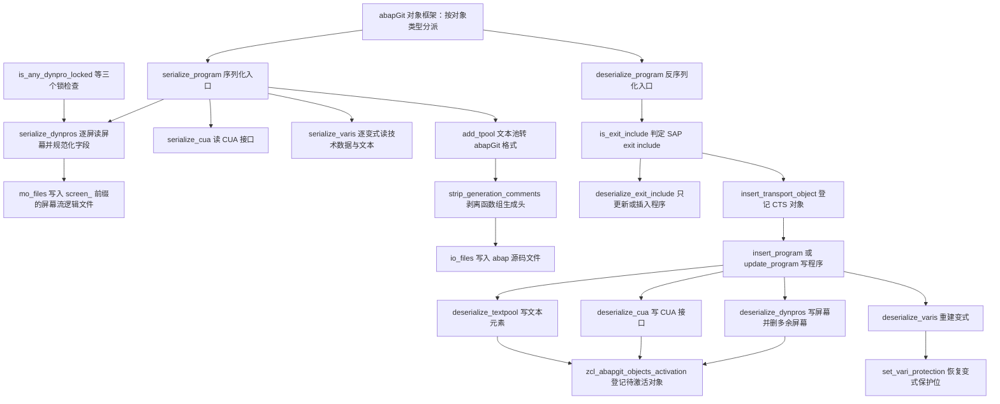
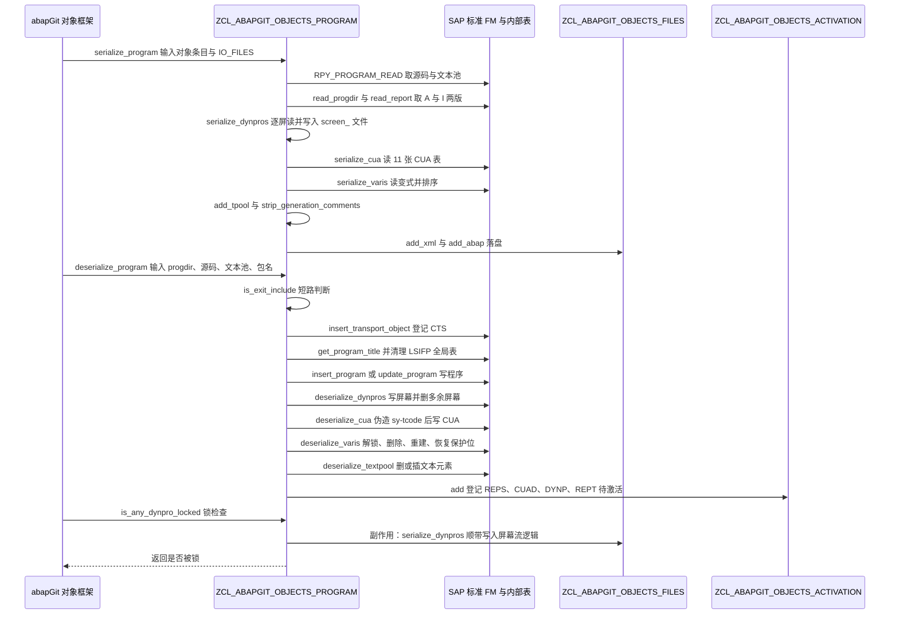

# ZCL_ABAPGIT_OBJECTS_PROGRAM 分析报告

> 分析对象：`abapGit/abapGit — zcl_abapgit_objects_program.clas.abap`（1597 行，全局类 `ZCL_ABAPGIT_OBJECTS_PROGRAM`，`INHERITING FROM ZCL_ABAPGIT_OBJECTS_SUPER`）
> 报告视角：代码 onboarding 走读，按序列化（pull）与反序列化（push）两条真实入口的调用链展开

---

## 一、程序定位与业务背景

### 1.1 这段代码在解决什么问题

先说清楚它**不是**什么：它不是报表、不做业务计算、不生成代码模板，也不是 abapGit 的框架本体。它是 abapGit 对象体系里的**一个"程序对象适配器"**——负责把一种 SAP 对象（可执行程序，以及它的屏幕、CUA、变式、文本元素）搬进 Git 文件系统，再搬回来。

业务问题要从 SAP 的现状说起。一个 ABAP 程序在系统里的真实形态是**散落在十几张内部表里的碎片**：源码躺在 `REPOSRC`（而且分 active 与 inactive 两版）；程序属性在 `TPROG` / `PROGDIR`；屏幕在 `D020S`、`RPY_DYHEAD`、`RPY_DYFATC`、`D021S`、`D021T`、`SWYDYFLOW` 六处；CUA 在 `RSMPE_*` 一整族表里；变式在 `VARID`、`VANZ`、`VARIT` 三处；文本元素在 `TEXTPOOL`。

这些表一张都不是公开接口，唯一能碰它们的入口是一批**没有公开文档、只在 SE38 内部使用**的函数模块：`RPY_PROGRAM_INSERT`、`RPY_PROGRAM_READ`、`RPY_INCLUDE_UPDATE`、`RS_SCREEN_LIST`、`RPY_DYNPRO_READ`、`RPY_DYNPRO_READ_NATIVE`、`RS_CUA_INTERNAL_FETCH`、`RS_CUA_INTERNAL_WRITE`、`RS_VARIANT_DELETE`……它们的参数形状在各个 Release 之间反复变动。

于是一个很朴素的需求产生了：**能不能让程序像源码文件一样被 Git 管起来**——`git clone` 一份代码到新系统，`git pull` 一次就把源码、屏幕、CUA、变式、文本全部还原？

这个类就是那条通路里的适配器。它做两件对称的事：

| 它做的事 | 它刻意不做的事 |
|---|---|
| 把 `serialize_*` 采到的碎片拼成一份与语言、系统无关的 XML | 不判断"这次 pull 要不要真改库"，那是框架的事 |
| 把 XML 拆回碎片，用 `RPY_*` / `RS_*` FM 写回去 | 不碰 SAP 的业务一致性，那属于激活器与检查器的职责 |
| 为跨 Release 的 FM 参数变动提供降级路径 | 不做备份与回滚，删除是同步语义的一部分 |
| 把"远端没有、本地有"的东西**删掉** | 不判断哪些该删——它按 XML 与系统的差异机械执行 |

一句话设计范式定性：

> **"双向序列化适配器"（Serializer / Deserializer）—— 上层是框架统一调度的 `serialize_*` / `deserialize_*` 配对方法，每个子对象（程序、屏幕、CUA、变式、文本池）各自成对；下层是一层对 `RPY_*` / `RS_*` 私有 FM 的薄封装，配上两套为跨 Release 而写的重复降级 `CALL`。副作用（写文件、登记激活、写数据库）全部压在"序列化出口"和"反序列化出口"两个地方。**

### 1.2 为什么值得单独做成一个类，而不是塞进框架

框架 `ZCL_ABAPGIT_OBJECTS_SUPER` 负责的是"这个对象该放哪个包、要不要跳过、怎么写进 XML 文件"这类**通用策略**；本文件里 28 个方法处理的是**程序对象独有的业务知识**：屏幕类型 `S` / `W` / `J` 各自代表什么、native dynpro 与经典 dynpro 要走两套不同的 FM、CUA 的 `ADM` 记录里塞的是功能码数字串、变式在 `VARID` 里带着 `FLAG1` / `FLAG2` / `PROTECTED` 一整套控制位。这些知识一旦上浮到框架，框架就不再能被其他上百个对象类复用。

代价也是这个分法带来的：**配对关系只存在于命名里**。`serialize_dynpros` 与 `deserialize_dynpros` 之间没有任何接口、没有共享常量、没有共享的过滤谓词——它们只是"名字长得像"。第三节会反复回到这一点。

### 1.3 依赖清单（读这段代码前必须知道的地形）

```
父类 ZCL_ABAPGIT_OBJECTS_SUPER
    MV_LANGUAGE      序列化与反序列化统一使用的语言，本文件所有 FM 的 language 参数都取它
    MS_ITEM          当前 Git 对象条目。obj_type 决定是否处理 CUA 与 FUGR；
                     obj_name 被 deserialize_dynpros 与 deserialize_cua 直接当程序名用
    MO_FILES         ZCL_ABAPGIT_OBJECTS_FILES 实例，serialize_dynpros 与 serialize_program
                     通过它写屏幕流逻辑与源码文件
    MO_I18N_PARAMS   序列化变式文本时决定是否只取主语言
    EXISTS_A_LOCK_ENTRY_FOR( )   继承来的锁查询，被三个 is_*_locked 调用

工厂 ZCL_ABAPGIT_FACTORY
    GET_CTS_API( )             deserialize_program 登记传输对象
    GET_SAP_REPORT( )          serialize_program 读 A 与 I 两版属性与源码；
                               insert_program 在 FUGR 场景下直接写两版源码

全局类
    ZCL_ABAPGIT_OBJECTS_ACTIVATION   四处 add( ) 登记 REPS / CUAD / DYNP / REPT 待激活
    ZCL_ABAPGIT_LANGUAGE              set_current_language 与 restore_login_language 成对使用
    ZCL_ABAPGIT_XML_OUTPUT            io_xml 未传入时由本类自建的 XML 写入器

SAP 私有 FM（本文件的主要依赖，全部无公开文档）
    RPY_PROGRAM_READ / RPY_PROGRAM_INSERT / RPY_INCLUDE_UPDATE
    RS_SCREEN_LIST / RPY_DYNPRO_READ / RPY_DYNPRO_READ_NATIVE / RPY_DYNPRO_INSERT
    RPY_DYNPRO_INSERT_NATIVE / RS_SCRP_DELETE
    RS_CUA_INTERNAL_FETCH / RS_CUA_INTERNAL_WRITE
    RS_ALL_VARIANTS_4_1_REPORT / RS_VARIANT_VALUES_TECH_DAT_255 / RS_VARIANT_CONTENTS_255
    RS_GET_SCREENS_4_1_VARIANT / RS_CREATE_VARIANT_255 / RS_CHANGE_CREATED_VARIANT_255
    RS_VARIANT_DELETE

跨 Release 兼容手段
    CATCH cx_sy_dyn_call_param_not_found   insert_program 与 delete_vari 用它做降级重试
    sy-tcode 写入                           deserialize_cua 用它绕开 note 2159455
    ASSIGN (SAPLSIFP)TTAB                   get_program_title 用它清 SAP 的全局表
```

### 1.4 这是一份"活的社区代码"，读的时候要带着怀疑

abapGit 是开源项目，这份代码在社区里被几千套系统跑着。所以代码里有大量**"为什么这样写"的痕迹型注释**：`" evil hack, workaround to handle fixes in note 2159455`、`" todo: kept for compatibility, remove after grace period #3680`、`"#2746: we need the dynpro fields in internal format`。这些注释是这份代码最有价值的部分——它们标出了每一处"看起来不对但不能改"的位置。

反过来，这份代码**没有走 SAP 官方的代码审查与 Code Inspector 门禁**，所以会出现生产程序里不太可能留下的写法：`sy-tcode` 被直接改写、`(SAPLSIFP)TTAB` 被跨程序清空、`DELETE FROM d021t` 直接写内部表。读这份代码时要有意识地区分两类"怪"：

- **有注释的怪** —— 通常是被 issue 逼出来的，改动前请先读注释。
- **没注释的怪** —— 本报告的主要发现，几乎全部落在这一类。

---

## 二、程序执行流程总览

本类有**两个入口**：`serialize_program` 由框架在序列化时调用，`deserialize_program` 由框架在反序列化时调用。两者内部各自扇出到子对象方法，最后共享一组底层 helper。



### 责任链表

| 子程序 | 调用者 | 职责 |
|---|---|---|
| `serialize_program`（本文件，公开入口） | abapGit 对象框架，序列化时 | 定程序名、切语言、读 A 与 I 两版源码与属性、扇出屏幕与 CUA 与变式、装 XML、剥生成注释、落盘源码 |
| `serialize_dynpros` | 仅 `serialize_program`，以及 `is_any_dynpro_locked` | 读屏幕清单与每屏字段与流逻辑，做三层字段规范化，装 `ty_dynpro`，并把流逻辑写成独立文件 |
| `serialize_cua` | 仅 `serialize_program` | 用 `RS_CUA_INTERNAL_FETCH` 取 active 版本的 11 张 CUA 表与 `ADM` |
| `serialize_varis` | 仅 `serialize_program` | 逐个变式取键、取数据、取屏幕，组装 `ty_vari` 并清空对象文本 |
| `add_tpool` / `read_tpool`（公开类方法） | 框架的语言相关处理与序列化出口 | 文本池在 SAP 表格式与 abapGit 内部格式之间双向转换，`id = 'S'` 行做拆分或拼接 |
| `strip_generation_comments` | 仅 `serialize_program` | 对 FUGR 剥掉 SAP 生成器写进 include 的头部行，减少 diff 噪音 |
| `deserialize_program`（本文件，公开入口） | abapGit 对象框架，反序列化时 | 判 exit include 并短路、登记 CTS 对象、决定走 insert 还是 update、更新 `PROGDIR`、登记激活 |
| `deserialize_exit_include` | 仅 `deserialize_program` | exit function group 的 include 只能以 active 态处理，存在则更新并置 `off`，不存在则插入 |
| `insert_program` | `deserialize_program` 与 `deserialize_exit_include` | 用 `RPY_PROGRAM_INSERT` 新建程序；`name_not_allowed` 时改走自有 `insert_report` 写 A 与 I 两版 |
| `update_program` | `deserialize_program` 与 `deserialize_exit_include` | 用 `RPY_INCLUDE_UPDATE` 更新已有程序，并把 `EU510` 与 `EU522` 翻译成人话 |
| `deserialize_dynpros` | 框架在反序列化屏幕时调用 | 写 native 与经典两套屏幕、补齐字段修正规则、删除 XML 里没有的屏幕 |
| `deserialize_cua` | 框架在反序列化 CUA 时调用 | 补 `TRKEY` 与 `DEVCLASS`、修正 `ADM`、用 `RS_CUA_INTERNAL_WRITE` 写 11 张表 |
| `auto_correct_cua_adm`（私有类方法） | 仅 `deserialize_cua` | 对历史上没存进 XML 的 `ADM` 做兜底反推，从 ACT / MEN / PFK 行里捞出数字功能码 |
| `deserialize_varis` | 框架在反序列化变式时调用 | 逐变式解锁、删除、重建、恢复保护位，再删掉远端已不存在的变式 |
| `create_vari` / `delete_vari` / `set_vari_protection` | `deserialize_varis` | 三个 `RS_VARIANT_*` FM 的薄封装，`delete_vari` 带低版本降级，`set_vari_protection` 用 `FOR UPDATE` 读写保护位 |
| `get_varis_for_report` / `get_vari_data` / `get_vari_screens` | `serialize_varis` 与 `deserialize_varis` | 变式取数的三个只读步骤，出口统一 `SORT` 保证可复现顺序 |
| `deserialize_textpool` | 框架在反序列化文本元素时调用 | 按语言决定 `STATE`，决定删还是插空表，并登记 `REPT` 待激活 |
| `get_program_title` | `deserialize_program` 与 `deserialize_exit_include` | 从文本池 `id = 'R'` 行取程序标题，并清掉 `RPY_PROGRAM_UPDATE` 会误读的 SAP 全局表 |
| `is_any_dynpro_locked` / `is_cua_locked` / `is_text_locked` | 框架的锁检查阶段 | 判断屏幕、CUA、文本元素是否被别人锁住 |
| `is_exit_include` | `deserialize_program` 与 `update_program` | 用命名约定判断程序是否为 SAP exit function group 的 include |
| `uncondense_flow` | 仅 `deserialize_dynpros` | 把 XML 里按行存的屏幕流逻辑右移还原成 SAP 的压缩格式 |

下面按这条流程，逐个子程序展开。要提前说明的是：本文件的公开入口只有两个，真正的复杂度在入口下挂的七个子对象方法与二十个底层 helper，所以第三节的重点是"每个子对象的双向语义是否对称"，而不是语法。

---

## 三、分组分析

### 3.1 类契约与类型定义段 函数模块类 `zcl_abapgit_objects_program` 的 PUBLIC SECTION

先把契约读透。框架能看到的只有两个方法和两个公开类方法，其余二十多个方法都是 `PROTECTED` 或 `PRIVATE`——这是个好设计，说明对外暴露面被刻意收窄了。

```abap
CLASS zcl_abapgit_objects_program DEFINITION
  PUBLIC
  INHERITING FROM zcl_abapgit_objects_super
  CREATE PUBLIC .

  PUBLIC SECTION.

    TYPES:
      BEGIN OF ty_cua,
        adm TYPE rsmpe_adm,
        sta TYPE STANDARD TABLE OF rsmpe_stat WITH DEFAULT KEY,
        fun TYPE STANDARD TABLE OF rsmpe_funt WITH DEFAULT KEY,
        men TYPE STANDARD TABLE OF rsmpe_men WITH DEFAULT KEY,
        mtx TYPE STANDARD TABLE OF rsmpe_mnlt WITH DEFAULT KEY,
        act TYPE STANDARD TABLE OF rsmpe_act WITH DEFAULT KEY,
        but TYPE STANDARD TABLE OF rsmpe_but WITH DEFAULT KEY,
        pfk TYPE STANDARD TABLE OF rsmpe_pfk WITH DEFAULT KEY,
        set TYPE STANDARD TABLE OF rsmpe_staf WITH DEFAULT KEY,
        doc TYPE STANDARD TABLE OF rsmpe_atrt WITH DEFAULT KEY,
        tit TYPE STANDARD TABLE OF rsmpe_titt WITH DEFAULT KEY,
        biv TYPE STANDARD TABLE OF rsmpe_buts WITH DEFAULT KEY,
      END OF ty_cua.
```

**做什么** — 声明整个类的基础契约：公开、从 `zcl_abapgit_objects_super` 继承、允许外部 `CREATE`。第一个类型 `ty_cua` 是 CUA 的行结构，一次性把 12 张 `RSMPE_*` 表打包成一条记录——`adm` 是唯一的非表成分，其余 11 个都是 `STANDARD TABLE ... WITH DEFAULT KEY`。

**为什么** — 选 `STANDARD TABLE` 而不是 `SORTED TABLE` 是对的：CUA 各表之间没有稳定的业务排序要求，而 `SORTED TABLE` 会给每张表挂一份索引成本，`RS_CUA_INTERNAL_FETCH` 在大程序上会明显拖慢。选 `WITH DEFAULT KEY` 而不是 `WITH EMPTY KEY` 也是对的：`RSMPE_STAT` 这类表本身就是主键表结构，给 `DEFAULT KEY` 让 XML 写入器能直接按键输出，也避免 `EMPTY KEY` 触发的运行时唯一性检查。`ty_cua` 被放进 `PUBLIC SECTION` 而不是 `PROTECTED`，是因为 `serialize_cua` 与 `deserialize_cua` 的 `RETURNING` / `IMPORTING` 参数就是它——ABAP 里参数类型与方法可见性必须匹配，放 `PROTECTED` 就没法作为公开方法的参数类型。

**风险与改进** — 两处值得记：

1. **`ty_cua` 把 12 张 SAP 内部表原样暴露成公共 API。** XML 序列化器与框架的 skip 判断都会依赖这些字段名，SAP 某个 Release 改动 `RSMPE_*` 的结构就等于改 abapGit 的文件格式。建议在 `ty_cua` 外再包一层自己的结构（字段名用 `adm` / `statuses` / `function_texts` 这类业务名），只在 `serialize_cua` 与 `deserialize_cua` 两处做映射。
2. **11 张表手工列举，没有一处能证明它与 SAP 的 `RS_CUA_INTERNAL_*` 参数列表同步。** SAP 若新增一张 CUA 表，`ty_cua` 不会自动跟随，序列化会静默丢掉它。需要一份"对照 FM 参数列表手工核"的检查。

下面是两个公开入口的完整契约——它们是本文件与外界唯一的接触面。

```abap
    METHODS serialize_program
      IMPORTING
        !io_xml     TYPE REF TO zif_abapgit_xml_output OPTIONAL
        !is_item    TYPE zif_abapgit_definitions=>ty_item
        !io_files   TYPE REF TO zcl_abapgit_objects_files
        !iv_program TYPE syrepid OPTIONAL
        !iv_extra   TYPE clike OPTIONAL
      RAISING
        zcx_abapgit_exception.
    METHODS deserialize_program
      IMPORTING
        !is_progdir TYPE zif_abapgit_sap_report=>ty_progdir
        !it_source  TYPE abaptxt255_tab
        !it_tpool   TYPE textpool_table
        !iv_package TYPE devclass
      RAISING
        zcx_abapgit_exception.
```

**做什么** — 声明两个入口的全部签名。`serialize_program` 有五个输入：可选的 XML 写入器（给了就往它里面写，不给它自己建一个并落盘）、当前 Git 对象条目、文件收集器、可选的实际程序名、可选的文件名后缀。`deserialize_program` 有四个输入：`PROGDIR` 记录、源码内表、文本池内表、包名。两个方法都只抛 `zcx_abapgit_exception`，不返回任何东西——成功与否完全靠"抛不抛异常"表达。

**为什么** — `iv_program` 这个"实际程序名"参数是这套适配器的核心设计。`ms_item-obj_name` 是 **Git 里的对象名**，而程序在 SAP 系统里的名字对 FUGR 来说不一样：Git 里的对象名是函数组名（`ZFN_MY_GROUP`），而屏幕、源码、CUA 都挂在主程序上（`SAPLZFN_MY_GROUP`）。序列化时框架必须能告诉适配器"真正要读的程序是哪个"，所以才需要 `iv_program`。反过来，`deserialize_program` **没有**这个参数——因为它只处理 PROG 对象，此时 `is_progdir-name` 就是程序名。这个不对称是对的。

`is_item` 与 `iv_extra` 用 `!` 前缀标注必填、`OPTIONAL` 的不标，是 abapGit 全项目统一的参数检查风格。

**风险与改进** — 三处：

1. **`iv_program` 是 `OPTIONAL` 的，而 `is_item-obj_name` 是它的默认值来源，这个隐含契约没有写在任何地方。** 两者不一致时（`iv_program` 传了、序列化的是 A 程序；反序列化按 `obj_name` 当 PROG 处理），行为不一致，见 P1-14。建议在类注释里写明"`IV_PROGRAM` 只在 FUGR 与 PROG 混编时使用，与 `IS_ITEM-OBJ_NAME` 不必相等"。
2. **`io_files` 是必填引用参数，但没有 `IS_BOUND` 检查。** ABAP 允许把未绑定的引用传进来，方法末尾的 `io_files->add_abap( )` 会 dump。框架是唯一调用方且总会传入，问题不大；但 `OPTIONAL` 加 `IS INITIAL` 的判断在这里更安全。
3. **两个方法都不 `RETURNING`。** 对一个"把系统改成 Git 里那样"的入口来说不返回结果是合理的（成功即无异常）。但调用方无法得知"有没有实际改动"——`deserialize_program` 在程序已存在且内容完全相同时同样静默返回成功。建议返回一个"是否发生变更"的 `abap_bool`，让框架能打出"无变化"而不是"已更新"。

### 3.2 私有契约段 `zcl_abapgit_objects_program` 的 PROTECTED 与 PRIVATE SECTION

三个类型结构是本文件的数据骨架：屏幕、变式、以及为兼容旧格式保留的变式文本类型。

```abap
    TYPES:
      ty_spaces_tt TYPE STANDARD TABLE OF i WITH DEFAULT KEY .
    TYPES:
      BEGIN OF ty_dynpro,
        header     TYPE rpy_dyhead,
        containers TYPE dycatt_tab,
        fields     TYPE dyfatc_tab,
        flow_logic TYPE swydyflow,
        spaces     TYPE ty_spaces_tt,
        nat_header TYPE d020s,
        nat_fields TYPE STANDARD TABLE OF d021s WITH DEFAULT KEY,
        nat_texts  TYPE STANDARD TABLE OF d021t WITH DEFAULT KEY,
      END OF ty_dynpro .
    TYPES:
      ty_dynpro_tt TYPE STANDARD TABLE OF ty_dynpro WITH DEFAULT KEY .
```

**做什么** — 声明屏幕的传输结构 `ty_dynpro`。它把**两套完全不同的屏幕格式**装进同一条记录：经典路径是 `header`（`RPY_DYHEAD`）、`containers`（`DYCATT_TAB`）、`fields`（`DYFATC_TAB`）、`flow_logic`（`SWYDYFLOW`）；native 路径是 `nat_header`（`D020S`）、`nat_fields`（`D021S`）、`nat_texts`（`D021T`）。`spaces` 是流逻辑的解压辅助数据。

**为什么** — 把两套格式放进同一个结构，是为了让 XML 里每个屏幕是一条完整记录，序列化与反序列化不需要"先判断走哪条路再拼两段"。代价是每条记录有一半字段永远是空的，XML 体积翻倍——对一个只有 20 个屏幕的程序影响可忽略，对屏幕多的大型报表则是实打实的仓库膨胀。这是"结构统一优先于体积"的取舍，对 Git 仓库来说划算，因为 Git 压 XML 压得很好，而结构统一让 diff 稳定。

**风险与改进** —

1. **`nat_fields` 与 `nat_texts` 之间没有一致性校验。** `nat_fields`（`D021S`，内部格式）与 `nat_texts`（`D021T`，内部格式文本）必须按 `FLDNAME` 逐行对应，否则写进系统的屏幕字段文本会张冠李戴。序列化时这两张表来自同一个 FM 的两个 `TABLES` 参数，对应关系由 SAP 保证；反序列化时是 `DELETE` 加 `INSERT` 直接写表，**没有任何校验**（见 3.12）。
2. **`spaces`（`ty_spaces_tt`）的语义只在 `uncondense_flow` 里体现，而本文件里没有任何地方写入它。** 说明序列化侧**曾经**写过、后来改成了"流逻辑单独存文件"（见 `serialize_dynpros` 里 `mo_files->add_abap( iv_extra = 'screen_' ... )`）。字段留着是为了读旧仓库，但注释没说明这一点，后来者会以为是活代码。建议加一行注释标明"仅用于读取旧格式，已不再写入"。

接着是变式的类型骨架，它是本文件里字段最多、也最容易出语义错配的一块。

```abap
    TYPES:
      BEGIN OF ty_vari,
        variant     TYPE varid-variant,
        flag1       TYPE varid-flag1,
        flag2       TYPE varid-flag2,
        transport   TYPE varid-transport,
        environmnt  TYPE varid-environmnt,
        protected   TYPE varid-protected,
        secu        TYPE varid-secu,
        xflag1      TYPE varid-xflag1,
        xflag2      TYPE varid-xflag2,
        variscreens TYPE ty_vari_dynnr_tt,
        objects     TYPE STANDARD TABLE OF vanz WITH DEFAULT KEY,
        values      TYPE ty_vari_value_tt,
        texts       TYPE STANDARD TABLE OF ty_vari_text WITH DEFAULT KEY,
      END OF ty_vari.
    TYPES:
      ty_vari_tt TYPE STANDARD TABLE OF ty_vari WITH DEFAULT KEY.
```

**做什么** — 声明变式的传输结构 `ty_vari`：前九个字段是 `VARID` 主记录里与业务相关的控制位（变式名、两个 flag、传输请求、环境、保护、序列号、两个扩展 flag），后四个是子集合——变式包含的屏幕号、关联对象（`VANZ`）、值（`RS_PARAMSL_255`）、多语言描述（`ty_vari_text`）。

**为什么** — 这九个字段是**逐个从 `varid` 挑出来的**，不是 `TYPE varid`。这个选择是对的：`varid` 有几十个字段，其中大半是 SAP 内部的版本戳与时间戳，把它们写进 Git 就等于把每次 SAP 升级产生的噪音变成一次 commit。挑出语义稳定的九个，是 Git 版本控制场景下的正确取舍。`objects` 与 `texts` 分开也是对的——`VANZ` 是变式挂的对象列表，`ty_vari_text` 是变式自身的描述，语义完全不同，混在一起会让人误以为它们可以互相推导。

**风险与改进** —

1. **`ty_vari-texts` 与 `ty_vari_text_crea_tt` 是两个不同的文本类型，命名只差一个词。** 前者（含 `langu` 与 `vtext`）用于序列化方向与 `get_vari_data` 的输出；后者（`varit` 的行类型，含 `mandt` / `report` / `variant` / `langu` / `vtext`）用于 `create_vari` 的 `IMPORTING`。它们之间靠 `deserialize_varis` 里手写的五行 `ls_vari_text_create-* = ...` 做映射——本质是"往一个结构里填主键字段"，因为 SAP 的 FM 不接受只有文本的表，而 Git 格式不该存冗余主键。但命名让读者第一次遇到时无法判断该用哪个。建议改名为 `ty_vari_txt_ser` 与 `ty_vari_txt_crea`，并在类型定义处各加一行注释说明方向。
2. **`ty_vari` 的九个控制位字段全部来自 `varid`，但没有一个标注它们是否都真的被往返。** 序列化与反序列化都靠 `MOVE-CORRESPONDING` 按名字匹配，任何在 `varid` 里新增的字段都不会被自动搬运——这是 `MOVE-CORRESPONDING` 的固有代价。建议在 `ty_vari` 定义处加注释说明"这九个字段是 `VARID` 与本结构之间的手工映射清单"。

最后是私有常量区，这里能看到作者已经把一部分魔法值提出来了。

```abap
    CONSTANTS:
      BEGIN OF c_state,
        active   TYPE r3state VALUE 'A',
        inactive TYPE r3state VALUE 'I',
        off      TYPE r3state VALUE '',
      END OF c_state.

    CONSTANTS c_native_dynpro TYPE c LENGTH 2 VALUE 'IN'.

    CONSTANTS c_sysvari_clnt        TYPE mandt      VALUE '000'.
    CONSTANTS c_sysvari_pattern_sap TYPE c LENGTH 5 VALUE 'SAP&*'.
    CONSTANTS c_sysvari_pattern_cus TYPE c LENGTH 5 VALUE 'CUS&*'.
```

**做什么** — 声明五组私有常量。`c_state` 用结构常量把 `R3STATE` 域的三个值（active / inactive / off）命名化；`c_native_dynpro` 是 `'IN'`，用于判断屏幕类型是否属于 native dynpro；`c_sysvari_clnt` 是硬编码客户端 `'000'`；后两个是变式名的通配模式。

**为什么** — 把 `'A'` / `'I'` 提成 `c_state-active` / `c_state-inactive` 是这份代码里最有价值的命名实践：全文十几处 `r3state` 语义的地方，读代码的人不再需要记住哪个字母是哪个意思，而且 `c_state-off` 这个"空值也有名字"的设计很贴切。`c_native_dynpro` 配合 `CA` 判断（`type CA 'IN'` 表示"类型串里含 I 或 N"）也是对的——native dynpro 的类型确实是这两个值并存。

`c_sysvari_clnt = '000'` 的存在本身就是一个信号：SAP 的变式表是**跨客户端**的，所以读写必须 `CLIENT SPECIFIED` 并硬编码 `'000'`。作者把这一点提成了常量，是有意识的。

**风险与改进** —

1. **命名只提了一半。** `c_state` 与 `c_native_dynpro` 被提出来了，同类魔法值还有一堆散在各处：`'1'` 与 `'M'`（`PROGDIR-SUBC` 的程序类型）、`'S'` `'W'` `'J'`（屏幕类型）、`'EU'` 加 `510` 与 `522`（消息号）、`'S'`（文本池条目类型）、`8`（`add_tpool` 里的偏移量）、`6` 与 `14`（`auto_correct_cua_adm` 里的字段偏移）、`5`（生成头长度）。其中 `8` 与 `6` 与 `14` 最危险——它们是硬编码偏移，SAP 改一次字段结构就会静默取错值。建议至少把 `lc_entry_key_len = 8`、`lc_cua_code_prefix = 6`、`lc_cua_code_suffix = 14` 提出来，并在注释里写明依赖哪个 DDIC 字段。
2. **`c_state-off` 的值是空串，用在 `deserialize_exit_include` 的 `iv_state` 上。** 语义是"把程序的所有版本都设为非激活"，而 `update_program` 把它直接传给 `RPY_INCLUDE_UPDATE` 的 `save_inactive`。这个组合能工作是因为 SAP 的 `SAVE_INACTIVE` 接受空串——但空串究竟表示"关闭所有版本"还是"不改状态"，**需在 SE38 核实**。如果语义是后者，那 exit include 拉取后仍是 active，与方法头注释描述的目标相反。

### 3.3 序列化主入口 方法 `serialize_program`

这是本文件最长、最复杂的方法，分五步：定程序名并切语言、读源码与文本池、读 A 与 I 两版、装 XML、剥注释落盘。

#### ① 定程序名并切换语言

```abap
    IF iv_program IS INITIAL.
      lv_program_name = is_item-obj_name.
    ELSE.
      lv_program_name = iv_program.
    ENDIF.

    zcl_abapgit_language=>set_current_language( mv_language ).
```

**做什么** — 确定本次要序列化的**系统内程序名**：调用方没给 `iv_program` 就用 Git 对象名，给了就用给的那个。然后把会话语言切到 `mv_language`（Git 仓库里对象使用的语言），后续所有 FM 在这个语言下工作。

**为什么** — 这两步合在一起是本方法的正确性前提。SAP 的 `RPY_*` 与 `RS_*` FM 大多**没有 `LANGUAGE` 参数**——它们读当前会话语言。要让一个德文程序在英文系统的仓库里被正确序列化，必须在调用前切语言、返回后恢复。`zcl_abapgit_language=>set_current_language` 是 abapGit 对这件事的封装，把"记住登录语言、切到目标语言、恢复"三件事统一处理，而不是让每个类自己存一份 `sy-langu`。

**风险与改进** —

1. **切语言之后、方法内的所有分支都必须配对恢复，而这里有三条出口。** 后面两步里能看到 `restore_login_language( )` 出现三次（两条异常分支加一条正常路径）。三处手工配对，任何一次新增出口忘记恢复，都会把用户的会话语言留在错误状态——**而这会影响整个 ABAP 会话的后续操作**，不只是这个类。建议改成统一出口的 `TRY` 结构，或把"切语言加主体加恢复"抽成一个私有模板方法。
2. **`set_current_language` 在 `RPY_PROGRAM_READ` 之前调用，但它同时影响了之后才调用的 `serialize_dynpros` 吗？** 不影响——`restore_login_language( )` 在 `serialize_dynpros` 之前就执行了（见步骤②末尾）。而 `serialize_dynpros` 内部的 `RPY_DYNPRO_READ` 没有 `LANGUAGE` 参数，它读到的是**登录语言**。这是一个真实的不一致，见 3.4 的风险第 2 条。

#### ② 读源码与文本池，三条出口

```abap
    CALL FUNCTION 'RPY_PROGRAM_READ'
      EXPORTING
        program_name     = lv_program_name
        with_includelist = abap_false
        with_lowercase   = abap_true
      TABLES
        source_extended  = lt_source
        textelements     = lt_tpool
      EXCEPTIONS
        cancelled        = 1
        not_found        = 2
        permission_error = 3
        OTHERS           = 4.

    IF sy-subrc = 2.
      zcl_abapgit_language=>restore_login_language( ).
      RETURN.
    ELSEIF sy-subrc <> 0.
      zcl_abapgit_language=>restore_login_language( ).
      zcx_abapgit_exception=>raise_t100( ).
    ENDIF.

    zcl_abapgit_language=>restore_login_language( ).
```

**做什么** — 调 `RPY_PROGRAM_READ` 一次性取回程序源码（`ABAPTXT255` 内表）与文本元素（`TEXTPOOL` 内表）。`with_includelist = abap_false` 表示不把 include 列表混进源码，`with_lowercase = abap_true` 表示按 SAP 的规范把关键字转小写。之后按 `sy-subrc` 分三条路：程序不存在（`2`）就恢复语言静默返回；其余错误恢复语言后抛异常；成功也恢复语言。

**为什么** — 三条出口的处理是对的，而且 `not_found` 走"静默返回"而不是抛异常是有讲究的：一个空壳程序（只剩 `PROGDIR` 没有源码）在 SE38 上是合法的，把它当成错误会让整次 pull 失败。abapGit 的序列化器普遍采用"读不到就跳过这个对象"的策略。

`with_lowercase = abap_true` 是关键的一步：不加这个参数，SAP 返回的源码里关键字大小写取决于它在系统里最后是怎么被保存的，同一份代码在两个系统上会产生不同的 `git diff`。开了它，**同一份源码在任何系统上序列化成同一个字节**。这是 Git 版本控制的前提条件。

**风险与改进** —

1. **`not_found` 静默返回后，调用方无法区分"程序不存在"和"程序存在但为空"。** 框架拿到空结果时通常会认为这个对象不需要导出，但这个类既不返回状态也不写任何标记。建议要么抛一个专门的 `zcx_abapgit_exception` 子类让框架决定跳过，要么往 `mo_files` 里写一个空占位，让"确实读过"这件事有痕迹。
2. **三条出口三次 `restore_login_language( )`**，与步骤①的风险同源。
3. **`with_includelist = abap_false` 意味着 include 列表不来自这里**，本文件里也没有 include 处理逻辑——推测由 `zcl_abapgit_objects_includes` 这个兄弟类负责。**需在仓库里核实**：如果框架对 PROG 对象不额外调度 include 类，那么一个程序的 include 就不会被 abapGit 管起来。

#### ③ 读 A 与 I 两版属性与源码

```abap
    " If inactive version exists, then RPY_PROGRAM_READ does not return the active code
    li_report = zcl_abapgit_factory=>get_sap_report( ).

    TRY.
        " Raises exception if inactive version does not exist
        ls_progdir = li_report->read_progdir(
          iv_name  = lv_program_name
          iv_state = c_state-inactive ).

        " Explicitly request active source code
        lt_source = li_report->read_report(
          iv_name  = lv_program_name
          iv_state = c_state-active ).
      CATCH zcx_abapgit_exception ##NO_HANDLER.
    ENDTRY.

    ls_progdir = li_report->read_progdir(
      iv_name  = lv_program_name
      iv_state = c_state-active ).

    clear_abap_language_version( CHANGING cv_abap_language_version = ls_progdir-uccheck ).
```

**做什么** — 处理 SAP 的一个已知行为：**程序存在 inactive 版本时，`RPY_PROGRAM_READ` 返回的是 inactive 源码，不是 active 的**。做法是先用 `read_progdir( inactive )` 探测 inactive 版本是否存在（该方法在不存在时抛异常），如果存在就显式再读一次 active 源码覆盖 `lt_source`；如果不存在，说明 `RPY_PROGRAM_READ` 返回的本来就是 active 版本，`lt_source` 保持不动。最后无论走哪条路，都用 active 版本的 `PROGDIR` 覆盖 `ls_progdir`，并把版本检查位 `uccheck` 清掉。

**为什么** — 这是全文件里最需要注释才能读懂的一段，而注释确实在位。"用异常做存在性探测"在这里是合理的：abapGit 的 `zif_abapgit_sap_report` 接口没有返回 `sy-subrc` 的 `exists( )` 方法，只有会抛异常的读取方法。用 `TRY` 把探测包起来，比先读再判 `sy-subrc` 更贴合接口形状。

`clear_abap_language_version` 清 `uccheck` 是为了让同一份代码在不同 Unicode 系统上产出相同的序列化结果——`uccheck` 记录的是 SAP 的版本检查状态，跟源码内容无关却会因系统而异。

**风险与改进** — 四处：

1. **`ls_progdir` 在 `TRY` 块里的赋值被立刻丢弃。** 它先被赋成 inactive 版本，三行之后被无条件覆盖成 active 版本。也就是说这一行的唯一作用是"触发异常"。这个意图在注释里写了，但代码形态（一个看起来会被使用的赋值）极具误导性——读者要读到第三个 `ls_progdir` 才会发现。建议改成一个明确的 `IF exists( )` 形式的调用（若接口有），或至少写成不带 `ls_progdir =` 的调用，让"只用它的异常"这件事在代码里就是可见的。
2. **`CATCH zcx_abapgit_exception ##NO_HANDLER.` 把异常完全吞掉，不留任何痕迹。** 它无法区分"inactive 版本不存在"（正常预期）和"读取 inactive 属性时因为别的原因失败"（真实故障）。后者会被静默跳过，然后代码继续用 active 版本往下走，用户拿到一份"看起来 pull 成功了但少了点什么"的结果。建议至少 `WRITE` 一条到日志，或在反序列化侧也做一次 inactive 检查以保证往返一致。
3. **会话语言在这一步已经恢复成登录语言。** `read_progdir` 与 `read_report` 会不会因为语言不对而读错？abapGit 的 `zif_abapgit_sap_report` 实现里大概率会自己切语言，但这**本文件不可见，需核实**。
4. **`clear_abap_language_version` 在两个 `read_progdir` 之后调用，只清了 active 版本的值。** 正确（最终用的是 active），但如果将来有人把 active 的赋值删掉，这里会漏掉 inactive 的清理。

#### ④ 装 XML：按程序类型扇出

```abap
    IF io_xml IS BOUND.
      li_xml = io_xml.
    ELSE.
      CREATE OBJECT li_xml TYPE zcl_abapgit_xml_output.
    ENDIF.

    li_xml->add( iv_name = 'PROGDIR'
                 ig_data = ls_progdir ).
    IF ls_progdir-subc = '1' OR ls_progdir-subc = 'M'.
      lt_dynpros = serialize_dynpros( lv_program_name ).
      li_xml->add( iv_name = 'DYNPROS'
                   ig_data = lt_dynpros ).

      ls_cua = serialize_cua( lv_program_name ).
      li_xml->add( iv_name = 'CUA'
                   ig_data = ls_cua ).

      lt_varis = serialize_varis( lv_program_name ).
      li_xml->add( iv_name = 'VARIS'
                   ig_data = lt_varis ).
    ENDIF.
```

**做什么** — 准备 XML 写入器（调用方给了 `io_xml` 就用它，没给就自建一个），先无条件写入 `PROGDIR` 节点；然后按程序类型判断是否值得继续——只有 `PROGDIR-SUBC` 为 `'1'`（可执行程序）或 `'M'`（带屏幕的子程序）时才采集屏幕、CUA 与变式。

**为什么** — 这个类型判断是必要的，因为 include 本身没有屏幕、CUA 与变式，对它们调用那三个 `serialize_*` 只会浪费三次全量读取。把判断放在扇出点而不是三个 `serialize_*` 方法内部，好处是三个方法保持"只做自己的事"，坏处是**判断逻辑与被判断的内容分离在两个文件里**（见 P3-1）。

用 `ls_progdir-subc` 而不是 `ms_item-obj_type` 做判断是对的：程序类型是 SAP 程序属性里的权威信息，比 Git 侧的对象类型更贴近实际。

`io_xml IS BOUND` 这个分支的双重语义（既是"用哪个写入器"又是"要不要落盘"）在方法末尾还要再用一次，是个需要读者记住的约定。

**风险与改进** —

1. **`'1'` 与 `'M'` 是裸字面量，而 `'S'` 与 `'W'` 与 `'J'` 这类同类魔法在别处也是裸的。** 程序类型域的完整取值需要核实（`SUBC` 域至少有 `1` / `8` / `I` / `M` / `S` / `Q` / `K` / `L` / `T` / `V` / `W` / `Z` 等）。`M`（带屏幕的子程序）被包含进来是对的——子程序可以有屏幕。但其他边界情况需要按业务确认。建议提为常量并在注释里说明为什么是这两个。
2. **`CREATE OBJECT li_xml TYPE zcl_abapgit_xml_output.` 是旧式写法。** 新式应写 `li_xml = NEW #( )`。abapGit 支持较低 Release 的话可以理解，但这行在 2020 年之后的代码里已经很少见了。
3. **三次 `serialize_*` 依次调用，任何一次抛异常，前面采集到的 XML 就全丢了。** 对一个 20 屏的中等程序无所谓；但如果 `mo_files` 是状态对象（`add_abap` 会累积已写文件），异常前已写入的屏幕流逻辑文件会残留在集合里，反序列化那侧同样问题（见 3.12）。

#### ⑤ 剥生成注释并落盘

```abap
    READ TABLE lt_tpool WITH KEY id = 'R' INTO ls_tpool.
    IF sy-subrc = 0 AND ls_tpool-key = '' AND ls_tpool-length = 0.
      DELETE lt_tpool INDEX sy-tabix.
    ENDIF.

    li_xml->add( iv_name = 'TPOOL'
                 ig_data = add_tpool( lt_tpool ) ).

    IF NOT io_xml IS BOUND.
      io_files->add_xml( iv_extra = iv_extra
                         ii_xml   = li_xml ).
    ENDIF.

    strip_generation_comments( CHANGING ct_source = lt_source ).

    io_files->add_abap( iv_extra = iv_extra
                        it_abap  = lt_source ).
```

**做什么** — 三件事。第一，从文本池里删掉一条"空的程序标题"记录——当 `id = 'R'` 的那条记录 `key` 为空且 `length = 0` 时，它不代表任何真实的文本元素，写进 XML 只会制造噪音。第二，把处理过的文本池交给 `add_tpool` 转格式后写入 `TPOOL` 节点。第三，如果调用方**没有**传 `io_xml`（也就是 XML 写入器是本类自建的），就把 XML 交给 `io_files` 落盘；然后无论 XML 是谁写的，都调用 `strip_generation_comments` 清源码并把源码交给 `io_files` 落盘。

**为什么** — 那个"删空标题"的判断很有意思：`RPY_PROGRAM_READ` 返回的 `TEXTPOOL` 里总有一条 `id = 'R'` 的程序标题记录，即使程序没有设置标题（长度 0）。abapGit 早期版本把它写进了 XML，导致每次 pull 都产生一条无意义的 diff，于是加了这个过滤。这种"针对具体 issue 的数据清洗"是这类工具的典型形态。

`add_tpool` 而不是 `read_tpool` 是对的：序列化方向是"SAP 表格式到 abapGit 内部格式"，而 `read_tpool` 是反方向的，供反序列化与语言处理使用。

**风险与改进** — 四处：

1. **`READ TABLE lt_tpool WITH KEY id = 'R'` 只给了部分键，返回的是内表里第一条匹配行。** `TEXTPOOL` 的表键通常是 `ID` 加 `KEY` 加 `LANGUAGE` 三元组，只给 `id` 做部分键查找，返回哪一条取决于内表的物理顺序。而 `lt_tpool` 来自 `RPY_PROGRAM_READ`，多语言程序会有多条 `id = 'R'`。结果就是**这个过滤在不同系统上可能删掉不同的那一行，或者一条都删不掉**。同样的模式在 `get_program_title` 里也出现（见 3.7）。建议先 `SORT lt_tpool BY id key.` 再处理，或按 `sy-langu` 补全键。
2. **`iv_extra` 同时用作 XML 文件名与源码文件名。** 两者用同一个后缀是对的（源码与 XML 属于同一个对象），但 `iv_extra` 是 `TYPE clike OPTIONAL`，调用方传空串时两者都落到默认名。**需核实** `add_xml` 与 `add_abap` 对空 `iv_extra` 的处理是否一致。
3. **`strip_generation_comments` 在所有对象类型上都被调用，但它第一件事就是 `IF ms_item-obj_type <> 'FUGR'. RETURN.`** 每序列化一个非 FUGR 程序就白跑一次调用与一次判断。虽然开销可忽略，但**调用点应该跟着前置条件走**——把它挪进 `IF ms_item-obj_type = 'FUGR'.` 里，读者一眼就知道它只跟函数组有关。
4. **`io_files->add_abap( )` 是无条件执行的。** 调用方如果只想拿 XML（框架在做"只导出不落盘"的预览），`io_xml` 传了、`add_abap` 照样跑，屏幕流逻辑文件与源码文件照样被写进 `mo_files`。`io_xml IS BOUND` 这个开关只挡住了 XML，没挡住源码。要么把这个不对称说清楚（加注释），要么把 `io_files` 也改成 `OPTIONAL`。

### 3.4 屏幕序列化 方法 `serialize_dynpros`

本方法分五步：取清单并过滤、逐屏读经典格式、读内部格式字段、做三层字段规范化、装配并落盘流逻辑。它是全文件里最容易出正确性问题的方法，因为每个屏幕要经过两次读取和四次修正。

#### ① 取屏幕清单并按类型过滤

```abap
    CALL FUNCTION 'RS_SCREEN_LIST'
      EXPORTING
        dynnr     = ''
        progname  = iv_program_name
      TABLES
        dynpros   = lt_d020s
      EXCEPTIONS
        not_found = 1
        OTHERS    = 2.
    IF sy-subrc = 2.
      zcx_abapgit_exception=>raise_t100( ).
    ENDIF.

    SORT lt_d020s BY dnum ASCENDING.

* loop dynpros and skip generated selection screens
    LOOP AT lt_d020s ASSIGNING <ls_d020s>
        WHERE type <> 'S' AND type <> 'W' AND type <> 'J'
        AND NOT dnum IS INITIAL.
```

**做什么** — 用 `RS_SCREEN_LIST` 取程序的全部屏幕清单（`dnr` 为空表示全部），排序，然后遍历时用 `WHERE` 过滤掉三类屏幕与初始屏幕：`type = 'S'`（由 ABAP 声明式语句自动生成的选择屏幕）、`'W'`、`'J'`，以及 `dnum` 为空的初始屏幕 `0000`。

**为什么** — 过滤选择屏幕是**必须的**：它们是 `SELECT-OPTIONS` 与 `PARAMETERS` 的派生产物，每次激活都会由编译器重新生成，序列化它们等于把编译器的输出纳入版本控制，会产生大量与代码改动无关的 diff。`'W'` 与 `'J'` 同理（一个是工作区屏幕，一个是任务与弹窗屏幕），它们依赖运行时上下文，导出后无法还原成同样的行为。

`dynnr = ''` 这个参数值得单独说：SAP 的 `RS_SCREEN_LIST` 用空串表示"取全部屏幕"而不是"取空屏幕"，这是私有 FM 的约定，源码里没有注释——后来者很可能误以为这里漏了参数。**加一行注释说明空串的含义是有价值的**，本文件在这一类"私有 FM 隐含约定"上的注释密度明显不够。

`SORT ... BY dnum ASCENDING` 保证了屏幕在 XML 里的顺序与 SAP 内部表顺序无关，这是可复现性的关键一步。

**风险与改进** —

1. **这三条 `type` 过滤是整个类里最昂贵的一段知识，却只以一行 `WHERE` 的形式存在，没有任何注释说明 `S` 与 `W` 与 `J` 各自的含义。** 而反序列化侧的 `deserialize_dynpros` **完全没有施加这三条过滤**（见 P0-4）——一处有、一处没有、且都没有注释，这是本文件最典型的缺陷形态。建议抽出一个私有方法 `is_relevant_dynpro( iv_d020s )` 返回 `abap_bool`，两处共用，并在方法里写清每种类型的业务含义。
2. **`SORT ... BY dnum ASCENDING` 是稳定性排序（相同键保留原序），而二分查找要求唯一排序。** 在同一个 `progname` 下 `dnum` 应当唯一，所以能工作——但**这个唯一性依赖 SAP 的数据约束，本文件无法保证**。建议改用内建排序 `SORT lt_d020s BY dnum.` 并在注释里写明"此处需要唯一排序，供 `BINARY SEARCH` 使用"。
3. **`WHERE` 里的 `NOT dnum IS INITIAL` 排除了 `0000`，但 `0000` 是否真的会被 `RS_SCREEN_LIST` 返回需核实。** 如果会，那 `deserialize_dynpros` 的删除循环（没有这层过滤）就会尝试删除初始屏幕。

#### ② 逐屏读经典格式

```abap
      CALL FUNCTION 'RPY_DYNPRO_READ'
        EXPORTING
          progname             = iv_program_name
          dynnr                = <ls_d020s>-dnum
        IMPORTING
          header               = ls_header
        TABLES
          containers           = lt_containers
          fields_to_containers = lt_fields_to_containers
          flow_logic           = lt_flow_logic
        EXCEPTIONS
          cancelled            = 1
          not_found            = 2
          permission_error     = 3
          OTHERS               = 4.
      IF sy-subrc <> 0.
        zcx_abapgit_exception=>raise_t100( ).
      ENDIF.
```

**做什么** — 对过滤后的每个屏幕调 `RPY_DYNPRO_READ`，取回屏幕头（`RPY_DYHEAD`）、控件容器（`DYCATT_TAB`）、字段到容器的对应（`DYFATC_TAB`）、流逻辑（`SWYDYFLOW`）。任何异常都抛 `raise_t100( )`。

**为什么** — `raise_t100( )` 而不是自造文本，是 abapGit 的一致做法：SAP 的 `t100` 里已经有一句给用户看的人话（"屏幕 xxx 读取失败：权限不足"），自己再编一句只会更差。这个选择贯穿全文件二十多处，是值得肯定的地方。

`containers` 与 `fields_to_containers` 的分工是 SAP 屏幕模型的核心：屏幕由若干"控件容器"（表格控制、选项卡、按钮条）组成，每个容器内含若干字段。所以要完整描述一个屏幕，必须同时拿到容器定义与字段清单——而 `RS_SCREEN_LIST` 给的 `D020S` 只有清单信息（屏幕号、类型、标题）。

**风险与改进** —

1. **`ls_header`、`lt_containers`、`lt_fields_to_containers`、`lt_flow_logic` 全部声明在方法级（循环外），在屏幕循环里被反复复用却没有任何 `FREE` 或 `CLEAR`。** 是否安全完全依赖这些 FM 内部会不会 `REFRESH` 它们的 `TABLES` 输出表。ABAP 的 `TABLES` 参数是按引用传入内表，**FM 若不显式清空就会累积**。同一方法的下一段里 `lt_fieldlist_int` 被明确 `FREE` 了（还配了注释），这个反差强烈提示作者遇到过一类不 refresh 的 FM，但只防了一个。见 P0-3。
2. **`lt_flow_logic` 被读到之后就丢在局部变量里**，直到步骤⑤ 才通过 `mo_files->add_abap( )` 写出去，中间经过 ④ 的整个字段规范化循环。它确实是步骤⑤ 用的，所以逻辑上没错；但"读到的东西隔了 40 行才用"降低了可读性。建议在 ④ 之后立刻写文件，或者把 ④ 抽成一个私有方法让数据流更短。

#### ③ 读内部格式字段与文本

```abap
      "#2746: we need the dynpro fields in internal format:
      FREE lt_fieldlist_int.

      CALL FUNCTION 'RPY_DYNPRO_READ_NATIVE'
        EXPORTING
          progname   = iv_program_name
          dynnr      = <ls_d020s>-dnum
        TABLES
          fieldlist  = lt_fieldlist_int
          fieldtexts = lt_texts.
```

**做什么** — 调 `RPY_DYNPRO_READ_NATIVE` 取屏幕字段的**内部格式**（`D021S` 列表）和内部格式文本（`D021T`）。进入前显式 `FREE lt_fieldlist_int`。

**为什么** — 为什么要读两遍？因为两个 FM 给的是两种粒度：`RPY_DYNPRO_READ` 给的是"面向对象"的字段视图（字段名、输出样式、DDIC 参数引用、修改标志），`RPY_DYNPRO_READ_NATIVE` 给的是"面向编译器"的内部格式（含 `FLG1` 与 `FLG3` 那些一位一标志的位域）。反序列化 native 屏幕时必须写内部格式表，而某些语义（比如"这个字段的 foreign key 检查是否开启"）只存在于内部格式的位域里。**两份数据各有对方拿不到的东西，所以只能都读。**

注释 `#2746` 指向 abapGit 的 issue 2746，这是"为什么"的权威来源。`FREE` 的位置在 `CALL` 之前而不是方法开头，也是对的——它明确表达了"这个 FM 不清空输出表"这个经验。

**风险与改进** —

1. **`RPY_DYNPRO_READ_NATIVE` 没有任何 `EXCEPTIONS`。** 这是本方法里唯一一个不处理异常的 FM 调用：出错就是 `CX_SY_NO_HAND` dump，用户看到的是短转储而不是 `raise_t100` 的可读消息。紧挨着的 `RPY_DYNPRO_READ` 处理得一丝不苟，两者对比说明是**遗漏**而非有意为之。建议补 `EXCEPTIONS not_found = 1 OTHERS = 2.` 加 `IF sy-subrc <> 0` 分支。
2. **`lt_texts` 同样没有 `FREE`，而且它比 `lt_fieldlist_int` 更危险。** `lt_texts` 是内部格式的**字段文本**，每个字段一条。一个 100 字段的两屏程序，如果 FM 不清空，第二个屏幕的 `lt_texts` 里会有 200 行——然后被整体赋给 `<ls_dynpro>-nat_texts`，写进 XML 的是错的。见 P0-3。
3. **`lt_texts` 在错误的情况下还会掩盖问题**：如果 `RPY_DYNPRO_READ_NATIVE` 对某屏返回空文本（屏幕确实没有文本），累积的上一屏文本会被当成当前屏的写进去，而这种错误在 pull 之后的激活阶段才会暴露成"屏幕文本错位"，极难定位。

#### ④ 字段级规范化：三层修正

```abap
      LOOP AT lt_fields_to_containers ASSIGNING <ls_field>.
* output style is a NUMC field, the XML conversion will fail if it contains invalid value
* field does not exist in all versions
        ASSIGN COMPONENT 'OUTPUTSTYLE' OF STRUCTURE <ls_field> TO <lv_outputstyle>.
        IF sy-subrc = 0 AND <lv_outputstyle> = '  '.
          CLEAR <lv_outputstyle>.
        ENDIF.

        "2746: we apply the same logic as in SAPLWBSCREEN
        "for setting or unsetting the foreignkey field:
        UNASSIGN <ls_field_int>.
        READ TABLE lt_fieldlist_int ASSIGNING <ls_field_int> WITH KEY fnam = <ls_field>-name.
        IF <ls_field_int> IS ASSIGNED.
          IF <ls_field_int>-flg1 O lc_flg1ddf AND
              <ls_field_int>-flg3 O lc_flg3for AND
              <ls_field_int>-flg3 Z lc_flg3fdu AND
              <ls_field_int>-flg3 Z lc_flg3fku.
            <ls_field>-foreignkey = 'X'.
          ELSE.
            CLEAR <ls_field>-foreignkey.
          ENDIF.
        ENDIF.

        IF <ls_field>-from_dict = abap_true AND
           <ls_field>-modific   <> 'F' AND
           <ls_field>-modific   <> 'X'.
          CLEAR <ls_field>-text.
        ENDIF.
      ENDLOOP.
```

**做什么** — 对每个字段做三处修正。一、`OUTPUTSTYLE` 是 `NUMC` 类型，值 `'  '`（两个空格）在 XML 转换时会失败，所以清空；用 `ASSIGN COMPONENT` 加 `sy-subrc` 判存在性，因为这个字段并非所有 Release 都有。二、`FOREIGNKEY` 字段按内部格式位域重算——注释明说"与 `SAPLWBSCREEN` 里的逻辑一致"，条件是 `FLG1` 含位 `20`、`FLG3` 含位 `04`、且不含 `02` 与 `08`。三、来自 DDIC 的字段若修改标志既不是 `F` 也不是 `X`，清掉它的文本。

**为什么** — 第一处是纯粹的格式适配：SAP 的 `NUMC` 允许全空格，XML 的 `NUMC` 转换不接受。第二处是"用编译器视角重算 GUI 视角的派生标志"——`FOREIGNKEY` 在 `DYFATC` 里是给 SE41 看的界面标志，而它真正的来源是 `D021S` 的位域，所以只能从内部格式算。第三处是排除歧义：如果字段来自 DDIC 且没被手工改过（修改标志 `F` 与 `X` 都不是），那它的文本是 SAP 从 DDIC 自动生成的，把这段自动生成的文本序列化进 Git 只会制造"DDIC 一改、几百个屏幕全变"的 diff。

注释密度在这一段是全文件最高的，而且都指向具体来源（issue 2746、`SAPLWBSCREEN`），这说明作者知道这些逻辑**不是能自己推导出来的**。这是本文件最好的注释实践。

**风险与改进** — 四处：

1. **`ASSIGN COMPONENT 'OUTPUTSTYLE' ... TO <lv_outputstyle>.` 之后立刻用 `sy-subrc` 判存在性。** 这个用法可行（动态 `ASSIGN COMPONENT` 失败时 `sy-subrc` 非零），但**依赖"这条语句是上一条被执行且中间没有其他语句"**。一旦有人在中间插入一句，`sy-subrc` 就会被覆盖，判定失效。更稳的写法是 `IF ASSIGN COMPONENT ... TO ... IS BOUND.`。
2. **`<lv_outputstyle> = '  '` 把 `NUMC` 与字符字面量比较。** 如果 `SCRPOSTYLE` 是 `NUMC` 类型，比较是类型安全的；如果是 `CHAR`，SAP 转换里可能发生隐式数值转换。**需在 SE11 核实 `SCRPOSTYLE` 的类型**——这是典型的"长度与类型看似匹配、语义未必一致"的检查点。
3. **位运算的 `O` 与 `Z` 混用。** `<ls_field_int>-flg1 O lc_flg1ddf` 里的 `O` 是**按位或**（判断某位是否置位），而 `flg3 Z lc_flg3fdu` 里的 `Z` 是 ABAP 关系表达式中的**逻辑或**。四个条件里三个用 `Z` 一个用 `O`，写法上都能工作（ABAP 按操作数类型选语义），但读者必须知道 `O` 与 `Z` 在这里不是一回事——**而这个知识在注释里完全没有**。更糟的是注释说这些位定义"取自 include MSEUSBIT"，即这份位定义是从 SAP 的 include 抄来的（与 `auto_correct_cua_adm` 里抄 `LSMPIF03` 是同一种做法）。SAP 升级改了位定义，这里会静默失配。建议：注释里明确写出"这里的 `O` 是按位或、`Z` 是逻辑或"，并把 `lc_flg3fdu` 与 `lc_flg3fku` 的**位含义**写出来，而不只给数值。
4. **反序列化侧没有做这个位域重算。** `deserialize_dynpros` 里对 `FOREIGNKEY` 的处理是"为空就置 `'/'`（force off）"，完全不同的规则。同一业务属性两套判定，见 P3-1。

#### ⑤ 容器规范化与装配落盘

```abap
      LOOP AT lt_containers ASSIGNING <ls_container>.
        IF <ls_container>-c_resize_v = abap_false.
          CLEAR <ls_container>-c_line_min.
        ENDIF.
        IF <ls_container>-c_resize_h = abap_false.
          CLEAR <ls_container>-c_coln_min.
        ENDIF.
      ENDLOOP.

      APPEND INITIAL LINE TO rt_dynpro ASSIGNING <ls_dynpro>.
      <ls_dynpro>-header = ls_header.

      " Store flow logic as separate ABAP files instead of XML
      mo_files->add_abap(
        iv_extra = 'screen_' && ls_header-screen
        it_abap  = lt_flow_logic ).

      READ TABLE lt_fieldlist_int TRANSPORTING NO FIELDS WITH KEY fill = 'X'.
      IF ls_header-type CA c_native_dynpro AND sy-subrc = 0.
        " In particular for dynpros with splitter
        <ls_dynpro>-nat_header = <ls_d020s>.
        CLEAR: <ls_dynpro>-nat_header-dgen, <ls_dynpro>-nat_header-tgen.
        <ls_dynpro>-nat_fields = lt_fieldlist_int.
        <ls_dynpro>-nat_texts  = lt_texts.
      ELSE.
        <ls_dynpro>-containers = lt_containers.
        <ls_dynpro>-fields     = lt_fields_to_containers.
      ENDIF.
```

**做什么** — 先规范化容器：不允许垂直或水平调整大小的容器，清掉它的最小行与列数（否则 SE41 会显示一个"不可调但有最小尺寸"的矛盾配置）。然后为当前屏幕 `APPEND` 一条 `ty_dynpro` 记录、拷入屏幕头，**并把流逻辑作为独立的 `.abap` 文件交给 `mo_files`**。最后用一次 `TRANSPORTING NO FIELDS` 的 `READ TABLE` 检查内部格式字段里有没有 `fill = 'X'` 的字段——若屏幕类型属于 native dynpro（`CA c_native_dynpro`）**且**存在这种字段，就走 native 分支存 `nat_*`，否则走经典分支存 `containers` 与 `fields`。

**为什么** — `mo_files->add_abap( iv_extra = 'screen_' && ls_header-screen ... )` 这个决策是本文件里最有意思的一处取舍。屏幕流逻辑（`SWYDYFLOW`）本质是**ABAP 源码**——`PROCESS BEFORE OUTPUT.`、`MODULE xxx INPUT.` 这样的语句序列。把它塞进 XML 的理由是"保持屏幕的原子性，一次 pull 要么全要要么全不要"；不塞进 XML 的理由是"流逻辑是源码，用户应该能 diff、能 review、改起来顺手，而且 SE41 里它本来就是一段代码"。abapGit 选了后者，这与源码单独存 `.abap` 文件的整体策略一致。

`fill = 'X'` 的字段是"填充字段"（splitter 屏幕的分隔栏）。判定"有 splitter 的屏幕必须走 native 路径"的原因是：splitter 屏幕在 SAP 里只能以内部格式存在，用经典 FM 写会丢失分隔栏。所以 `CA c_native_dynpro AND sy-subrc = 0` 这个双重条件是两个**独立必要条件**的与——但代码只给了注释 `" In particular for dynpros with splitter`，没有说明 `sy-subrc = 0` 在这里代表"有 fill 字段"。**这是本文件里最隐晦的一处**。

`CLEAR: <ls_dynpro>-nat_header-dgen, <ls_dynpro>-nat_header-tgen.` 清生成时间戳，让序列化结果与 SAP 何时生成这个屏幕无关——又是可复现性。

**风险与改进** — 四处：

1. **`mo_files->add_abap( )` 让 `serialize_dynpros` 从一个"读"方法变成了"读写"方法。** 正常序列化时这是对的（流逻辑确实要落盘），但 `is_any_dynpro_locked` 也调用它——一个只想问"有没有锁"的方法因此往输出文件集合里塞了屏幕流逻辑。见 P0-2。
2. **两个 `sy-subrc` 的用法都很脆。** `READ TABLE ... TRANSPORTING NO FIELDS WITH KEY fill = 'X'.` 之后立刻 `IF ls_header-type CA c_native_dynpro AND sy-subrc = 0.` ——`AND` 的短路顺序保证了 `CA` 先算，但**如果有人调整两个条件的顺序，或者中间插入语句，判定就废了**。更直白的写法是给个具名变量 `lv_has_splitter`。
3. **`nat_fields` 与 `nat_texts` 之间没有一致性校验。** `nat_fields` 来自 `fieldlist`、`nat_texts` 来自 `fieldtexts`，SAP 保证它们按 `FLDNAME` 对应；但反序列化侧是 `DELETE` 加 `INSERT` 直接写 `D021T`（见 3.12），中间没有任何按 `FLDNAME` 的匹配检查。如果某个 Release 的 `RPY_DYNPRO_READ_NATIVE` 对某些屏幕只返回部分字段的文本，pull 之后屏幕字段的标题会集体错位。
4. **`rt_dynpro` 是 `VALUE( )` 返回参数，用 `APPEND ... ASSIGNING` 逐条填充。** 顺序完全依赖 `lt_d020s` 的排序——即步骤① 的 `SORT`。这个依赖是隐式的：谁把 `SORT` 删了，XML 顺序就变了，Git 里出现一次巨大的无意义 diff。建议在 `SORT` 处加注释说明"XML 顺序依赖此排序"。

### 3.5 CUA 序列化 方法 `serialize_cua`

```abap
    CALL FUNCTION 'RS_CUA_INTERNAL_FETCH'
      EXPORTING
        program         = iv_program_name
        language        = mv_language
        state           = c_state-active
      IMPORTING
        adm             = rs_cua-adm
      TABLES
        sta             = rs_cua-sta
        fun             = rs_cua-fun
        men             = rs_cua-men
        mtx             = rs_cua-mtx
        act             = rs_cua-act
        but             = rs_cua-but
        pfk             = rs_cua-pfk
        set             = rs_cua-set
        doc             = rs_cua-doc
        tit             = rs_cua-tit
        biv             = rs_cua-biv
      EXCEPTIONS
        not_found       = 1
        unknown_version = 2
        OTHERS          = 3.
    IF sy-subrc > 1.
      zcx_abapgit_exception=>raise_t100( ).
    ENDIF.
```

**做什么** — 一次 FM 把 CUA 的 12 个成分全部取回：`adm`（接口总控记录，通过 `IMPORTING` 取）与 11 张明细表（状态、状态文本、功能文本、菜单、菜单文本、功能码、按钮、功能码键位、工具栏、标题、活动按钮）。语言固定用 `mv_language`，状态固定用 `c_state-active`。异常处理很宽松：**只有 `subrc > 1` 才抛异常**，`not_found`（`subrc = 1`）被静默容忍。

**为什么** — 容忍 `not_found` 是必须的：一个普通报表程序根本没有 CUA（GUI 状态、菜单栏），`not_found` 是正常结果而不是错误。用 `sy-subrc > 1` 而不是 `<> 0` 来表达"容忍第一个异常"，是一个紧凑但需要注释的写法——本文件没写注释。

`language = mv_language` 这个参数的存在值得注意：与 `RPY_DYNPRO_READ` 不同，`RS_CUA_INTERNAL_FETCH` **有**语言参数，所以它不受会话语言影响。这也解释了为什么 3.4 里那些 `RPY_DYNPRO_READ*` 的语言一致性是个真问题。

`state = c_state-active` 硬编码只导 active 版本——CUA 的 inactive 版本在 SAP 里几乎没人用，只导 active 是合理的简化。

**风险与改进** —

1. **`serialize_cua` 没有调用 `auto_correct_cua_adm`。** 那个"补历史缺失 ADM"的方法只在 `deserialize_cua` 里被调用，所以从 SAP 原生系统直接导出的 CUA，其 `ADM` 是 SAP 原样的值（可能不规范）；经 abapGit 导入一次再导出，才变成修正过的值。这意味着**同一份 CUA 在"经过 abapGit"和"没经过"两条路径上会产出不同的 XML**。对 Git 仓库来说这意味着一次"导入再导出"的无声 diff。建议：如果修正逻辑是无损幂等的，序列化侧也应该调一次。
2. **`sy-subrc > 1` 缺注释。** 建议写成 `IF sy-subrc <> 1.` 加一行"程序无 CUA 是正常情况"，或者更明确地 `IF sy-subrc = 2 OR sy-subrc = 3.`。
3. **11 个 `TABLES` 参数手写一遍，与 `ty_cua` 的 11 个字段、`deserialize_cua` 的 11 个 `TABLES` 参数构成三份清单。** 任何一次 SAP 增删 CUA 表都要改三处，漏一处就是静默数据丢失或 dump。建议在注释里明确"这三份清单必须同步"。

### 3.6 变式序列化 方法 `serialize_varis`

本方法本身很短，它把活都交给了三个只读 helper。真正的知识点在 helper 里。

```abap
    lt_varis = get_varis_for_report( iv_program_name ).

    LOOP AT lt_varis ASSIGNING <ls_varikey>.
      CLEAR: ls_vari,
             ls_varid.

      get_vari_data( EXPORTING is_vari    = <ls_varikey>
                     IMPORTING es_varid   = ls_varid
                               et_values  = ls_vari-values
                               et_objects = ls_vari-objects
                               et_texts   = ls_vari-texts ).

      MOVE-CORRESPONDING ls_varid TO ls_vari.

      " Clear texts - they will be provided in TEXTPOOL section
      LOOP AT ls_vari-objects ASSIGNING <ls_object>.
        CLEAR <ls_object>-text.
      ENDLOOP.

      ls_vari-variscreens = get_vari_screens( <ls_varikey> ).

      INSERT ls_vari INTO TABLE rt_varis.
    ENDLOOP.
```

**做什么** — 取变式键列表，逐个处理：先 `CLEAR` 两个工作结构避免上一轮的残留，再调 `get_vari_data` 一次拿齐技术数据（`VARID` 主记录）、值、关联对象、多语言文本；然后 `MOVE-CORRESPONDING` 把 `VARID` 里与 `ty_vari` 同名的字段搬进去；再清空关联对象（`VANZ`）的文本；再取变式包含的屏幕号；最后插入结果表。

**为什么** — `CLEAR: ls_vari, ls_varid.` 放在循环体开头是标准做法：`ty_vari` 有十三个字段，任何一个被跳过就会带上上一轮的残值，而变式集合里相邻两个变式通常是"名字不同、其他都一样"，残留几乎必然产生错误数据。**这一行是本文件里防御性编程做得最好的地方之一。**

`MOVE-CORRESPONDING` 而不是逐字段赋值，是为了在 `ty_vari` 与 `varid` 同名的那九个字段上少写九行。代价是它只按名字匹配、不按语义匹配。

**风险与改进** — 三处，其中第一处是本报告认为最隐蔽的数据缺陷：

1. **`CLEAR <ls_object>-text.` 之后，全文没有任何地方再填 `objects-text`。** 注释说"they will be provided in TEXTPOOL section"——但 `TPOOL` 节点里装的是**文本元素**（程序里的 `TEXT-001` 之类），`get_vari_data` 的 `et_texts` 来自 `VARIT` 表（变式自身的多语言描述 `VTEXT`），两者都不是 `VANZ-TEXT`。而 `deserialize_varis` 会把 `<ls_vari>-objects` 原样传给 `create_vari`。**净效果：一个变式第一次经 abapGit 往返，它关联对象的描述文本就永久丢失了**，而且丢失发生在序列化侧——第一次 push 时是完好的，第一次 pull 之后再 push 就空了，git 里表现为一次无声的删除。这需要确认 `VANZ-TEXT` 在 SAP 里的来源是不是 `VARIT`（**需在 SE11 核实两表的字段与关系**，以及 `RS_VARIANT_CONTENTS_255` 是否本就不返回 `objects-text`）。见 P0-10。
2. **`MOVE-CORRESPONDING ls_varid TO ls_vari.` 可能覆盖 `get_vari_data` 刚填好的子表。** `get_vari_data` 先把 `objects` 与 `values` 与 `texts` 填进 `ls_vari`，然后 `MOVE-CORRESPONDING` 执行——如果 `varid` 结构里恰好有叫 `objects` 或 `values` 的组件，刚取好的数据就被覆盖（类型不兼容时会 dump，兼容时更糟：静默写错数据）。`varid` 的字段清单**需在 SE11 核实**。建议改成 `ls_vari-variant = ls_varid-variant.` 这样逐字段的显式搬运——九个字段，九行，可读且无歧义。
3. **`ls_vari-variscreens = get_vari_screens( <ls_varikey> ).`** 用 `=` 而不是 `VALUE( )`（虽然 `get_vari_screens` 声明了 `RETURNING VALUE( )`）。功能等价，但与上面 `get_vari_data( ... EXPORTING/IMPORTING ... )` 的调用风格混用，说明这个方法在不同时间点被不同人改过。

#### ① 取变式键：只导 SAP 与客户命名空间

```abap
    CALL FUNCTION 'RS_ALL_VARIANTS_4_1_REPORT'
      EXPORTING
        program = iv_repid
      IMPORTING
        cat     = ls_catalog
      EXCEPTIONS
        OTHERS  = 1.
    IF sy-subrc <> 0.
      zcx_abapgit_exception=>raise_t100( ).
    ENDIF.

    ls_vari-report = iv_repid.
    LOOP AT ls_catalog-cat ASSIGNING <ls_cat>
         WHERE variant CP c_sysvari_pattern_sap
         OR variant CP c_sysvari_pattern_cus.
      ls_vari-variant = <ls_cat>-variant.
      INSERT ls_vari INTO TABLE rt_varis.
    ENDLOOP.

    SORT rt_varis.
```

**做什么** — 调 `RS_ALL_VARIANTS_4_1_REPORT` 取程序的全部变式目录（`CAT_VAR` 列表），用 `WHERE` 过滤出**名字以 `SAP&` 或 `CUS&` 开头**的变式，逐个插入结果表，最后 `SORT` 保证顺序可复现。

**为什么** — `SAP&` 与 `CUS&` 是 SAP 系统变式的命名空间：`SAP&` 是 SAP 标准变式，`CUS&` 是 SAP 为客户创建的系统变式。用它们做前缀过滤，等于声明"**abapGit 只管系统变式，不管用户自建的变式**"。这个取舍是对的：用户变式是个人偏好（他把选择屏默认值改成自己的工号），纳入版本控制只会制造冲突；系统变式则往往是配置的一部分，应该跟代码一起走。

`SORT rt_varis.` 是本文件"可复现性优先"的直接体现——`RS_ALL_VARIANTS_4_1_REPORT` 返回什么顺序不受控，不排序的话两个系统上 pull 同一个程序会得到不同顺序的变式列表，git diff 变成噪音。

**风险与改进** —

1. **`ls_vari` 工作区没有 `CLEAR`。** `ls_vari LIKE LINE OF rt_varis` 是 `RSVARKEY` 类型的行，每轮只赋 `variant`，`report` 在循环外设一次。**如果 `RSVARKEY` 有第三个及以上的字段**（例如 `MANDT` 或 `LANGU`），它会带上上一轮循环的残留值。`serialize_varis` 里明确 `CLEAR: ls_vari, ls_varid.`，说明作者知道要清，这里是遗漏。**需在 SE11 核实 `RSVARKEY` 的组件清单**。见 P1-9。
2. **`WHERE` 里的 `OR` 换行缩进（比 `LOOP AT` 多一个空格）**是 abapGit 的对齐风格，不是错误。
3. **只导 `SAP&` 与 `CUS&` 变式，但 `deserialize_varis` 的删除循环也只在这个范围内删。** 这一点是自洽的（见 3.14），但值得在注释里写明，否则读者会担心"用户变式会不会被删掉"。

#### ② 取单个变式的完整数据

```abap
    CALL FUNCTION 'RS_VARIANT_VALUES_TECH_DAT_255'
      EXPORTING
        report         = is_vari-report
        variant        = is_vari-variant
        sorted         = abap_true
      IMPORTING
        techn_data     = es_varid
      TABLES
        variant_values = et_values " is ignored
      EXCEPTIONS
        OTHERS         = 1.
    IF sy-subrc <> 0.
      zcx_abapgit_exception=>raise_t100( ).
    ENDIF.

    " Use variant values from CONTENTS call
    " both calls have this parameter as non-optional
    CLEAR et_values.
```

**做什么** — 调 `RS_VARIANT_VALUES_TECH_DAT_255` 取变式的技术数据（返回 `VARID` 主记录），顺带传了一个 `variant_values` 参数然后立刻 `CLEAR` 掉——注释明说这个参数被忽略、两个 FM 都要求它非可选、值要用下一个 FM 的结果。

**为什么** — 这是一次"知道 FM 有坑但绕不开"的处理。两个 FM（`..._TECH_DAT_255` 与 `..._CONTENTS_255`）都有 `variant_values` 参数且都是必填，所以必须给点什么。给一个空内表再 `CLEAR`，比"给一个有意义的值再覆盖"更诚实——不会让人误以为这里取到了数据。

**风险与改进** —

1. **`et_values` 被填了完整的变式值（可能几十上百行），然后立刻清空。** 对大变式来说这是纯浪费的一次内表分配与拷贝。更省的做法是给 `RS_VARIANT_VALUES_TECH_DAT_255` 传一个局部空内表，让 `et_values` 从一开始就是干净的。
2. **`## is ignored` 这种行尾注释不会出现在正式文档里，但在源码里是最有效的标记方式**，abapGit 全文大量使用（`##SUBRC_OK`、`##WRITE_OK`、`##NEEDED`、`##FM_SUBRC_OK`、`##NO_HANDLER`）。这是这个项目代码风格的一部分，新人需要知道 `##` 后面的内容是给人和 CI 看的，不是 ABAP 语句。

#### ③ 取文本、值与对象，并排序

```abap
    IF mo_i18n_params->ms_params-main_language_only <> abap_true.
      lt_language_filter = mo_i18n_params->build_language_filter( ).
    ENDIF.
    ls_language_filter-sign   = 'I'.
    ls_language_filter-option = 'EQ'.
    ls_language_filter-low    = mv_language.
    CLEAR ls_language_filter-high.
    INSERT ls_language_filter INTO TABLE lt_language_filter.

    " SELECT because RS_VARIANT_TEXT and related FMs cannot list available languages
    SELECT langu vtext FROM varit CLIENT SPECIFIED
      INTO CORRESPONDING FIELDS OF TABLE et_texts
      WHERE mandt = c_sysvari_clnt
        AND report = is_vari-report
        AND variant = is_vari-variant
        AND langu IN lt_language_filter
      ORDER BY langu.

    CALL FUNCTION 'RS_VARIANT_CONTENTS_255'
      EXPORTING
        report         = is_vari-report
        variant        = is_vari-variant
        execute_direct = abap_true
      TABLES
        valutab        = et_values
        objects        = et_objects
      EXCEPTIONS
        OTHERS         = 1.
    IF sy-subrc <> 0.
      zcx_abapgit_exception=>raise_t100( ).
    ENDIF.

    " reproducible order
    SORT et_values.
    SORT et_objects.
    SORT et_texts.
```

**做什么** — 三件事。一、构造语言过滤表：若调用方没有要求"只主语言"，先用 `build_language_filter( )` 填上系统语言列表，然后**无条件**追加一条 `mv_language` 的精确匹配。二、直接 `SELECT` `VARIT` 表取这个变式的多语言描述——注释说明为什么绕过 FM：`RS_VARIANT_TEXT` 那一族 FM 无法列出可用语言。三、调 `RS_VARIANT_CONTENTS_255` 取变式值与关联对象。最后对三张输出表分别 `SORT`。

**为什么** — 直接 `SELECT varit` 而不用 FM 是一个明确的、有注释的越界选择：SAP 的 FM 不能告诉你"这个变式有哪些语言的文本"，所以没法做语言过滤，只能自己查表。这是私有表直接访问的少数合理场景之一。

`CLIENT SPECIFIED` 加 `mandt = c_sysvari_clnt`（`'000'`）的组合是"跨客户端读变式"的正确写法——变式是跨客户端共享的，所以不能走客户端字段（那会读当前客户端的 `VARIT`，通常为空）。这与 `set_vari_protection` 里的写法一致，是对的。

三次 `SORT` 的注释 `" reproducible order` 把意图说清楚了：`et_texts` 其实已经有 `ORDER BY langu` 排过序，再 `SORT` 是多余的（但无害）；`et_values` 和 `et_objects` 是必要的。

**风险与改进** — 四处：

1. **`main_language_only` 分支其实不产生预期差别。** 无论这个开关是什么值，`lt_language_filter` 最后都会包含一条 `mv_language` 的精确匹配、并且**只**有这一条追加项。区别只在于：开关为真时不调 `build_language_filter( )`（过滤器里只有 `mv_language`），否则过滤器里是"系统语言列表加 `mv_language`"。如果 `build_language_filter( )` 返回的不是空表，那么这个开关**实际上没有起到"只要主语言"的作用**——它取到的仍然是系统语言列表。要么这个开关的语义是"不要额外取系统语言"（那就该在注释里写清），要么那几行该放进 `IF` 里。**需核实 `build_language_filter( )` 的返回内容**。
2. **`AND langu IN lt_language_filter` 是用内表当范围表。** ABAP 支持这个语法，语义是把内表的每一行当一个 `sign` / `option` / `low` / `high` 的组合——等价于把 `lt_language_filter` 当成 `RANGE` 表用。这是个巧妙的写法，但**前提是 `ty_system_language_filter` 的行结构恰好就是这四个字段**，多一个少一个都不行。**需在 SE11 核实该类型**。
3. **`ORDER BY langu` 与末尾的 `SORT et_texts` 重复。** 多一次排序，虽然 `ty_vari_text_tt` 只有两列、开销极小。
4. **`es_varid` 是 `VARID` 全结构，从 `techn_data` 直接取。** `ty_vari` 里只挑了九个字段是克制的，但 `get_vari_data` 的 `es_varid` 是全量——好在它只用作 `MOVE-CORRESPONDING` 的源，不直接进 XML。所以实际无害，只是"全量取进来再挑九个用"有点浪费。

### 3.7 文本符号与格式转换 方法 `add_tpool` / `read_tpool` / `get_program_title`

三个方法一起看，因为它们处理的是同一份数据（文本池）的三个不同视角：格式转换的双向实现，以及从文本池里取程序标题。

```abap
    LOOP AT it_tpool ASSIGNING <ls_tpool_in>.
      APPEND INITIAL LINE TO rt_tpool ASSIGNING <ls_tpool_out>.
      MOVE-CORRESPONDING <ls_tpool_in> TO <ls_tpool_out>.
      IF <ls_tpool_out>-id = 'S'.
        <ls_tpool_out>-split = <ls_tpool_out>-entry.
        <ls_tpool_out>-entry = <ls_tpool_out>-entry+8.
      ENDIF.
    ENDLOOP.
```

**做什么** — 把 SAP 的 `TEXTPOOL` 内表逐行转成 abapGit 内部格式：按行 `MOVE-CORRESPONDING`，然后对 `id = 'S'`（"带键文本"，SAP 内部格式是"8 字符键加文本"拼在一列里）做拆分——把整列拷进 `split`，再把 `entry` 截成从第 9 位开始的部分。

**为什么** — `id = 'S'` 这类文本元素的 `ENTRY` 里前 8 个字符是**参数键**（PARAMETER ID），后面才是显示文本。abapGit 要把这两部分拆开单独存储，理由是：键是代码的一部分（改 DDIC 参数 ID 会影响显示文本），文本是本地化内容，两者应该独立 diff。`split` 字段就是为此存在的。

**风险与改进** —

1. **`8` 是裸魔法数，含义是"参数键的长度"。** 它依赖 SAP 的 `TEXTPOOL-ENTRY` 在 `id = 'S'` 时的布局约定，而这个约定在 SAP 的 DDIC 文档里没有明确说明。**建议提为常量并注释写明"这是 SAP 把 PARAMETER ID 存进 ENTRY 时的固定宽度"**，同时让 `read_tpool` 也复用同一个量——现在两处各写死一份，一旦 SAP 改了宽度，两处要同步改。
2. **`<ls_tpool_out>-entry+8.` 与 `split` 的长度关系没被校验。** 如果 `ENTRY` 在 `id = 'S'` 时不足 8 个字符（异常数据），`entry+8` 会得到空串、`split` 存下完整内容，反序列化时 `CONCATENATE` 能拼回来；但如果 `ENTRY` 超过 `split` 字段的长度，超出部分被静默截断。**需在 SE11 核实 `ZIF_ABAPGIT_LANG_DEFINITIONS=>TY_TPOOL_TT` 里 `SPLIT` 与 `ENTRY` 的字段长度**——这是典型的"看起来能跑、语义可能已经错配"的检查点。
3. **`add_tpool` 与 `read_tpool` 是 `PUBLIC CLASS-METHODS`，但它们是纯粹的内部格式转换细节。** 暴露成公共 API 等于把 abapGit 的文件格式写进类契约——将来改格式（这几乎必然会发生）就是破坏性变更。见 P3-4。

`read_tpool` 是反方向的实现。

```abap
    LOOP AT it_tpool ASSIGNING <ls_tpool_in>.
      APPEND INITIAL LINE TO rt_tpool ASSIGNING <ls_tpool_out>.
      MOVE-CORRESPONDING <ls_tpool_in> TO <ls_tpool_out>.
      IF <ls_tpool_out>-id = 'S'.
        CONCATENATE <ls_tpool_in>-split <ls_tpool_in>-entry
          INTO <ls_tpool_out>-entry
          RESPECTING BLANKS.
      ENDIF.
    ENDLOOP.
```

**做什么** — 与 `add_tpool` 几乎一样，唯一区别是 `id = 'S'` 时把 `split` 与 `entry` 用 `CONCATENATE ... RESPECTING BLANKS` 拼回去。**注意它拼的是 `<ls_tpool_in>` 的两列（源），而 `add_tpool` 拆的是 `<ls_tpool_out>` 的两列（目标）**——这是两个实现里不对称但无害的细节。

**为什么** — 两个方法没有互为反向调用，而是各自独立实现同一份格式转换的往返逻辑。**这正是可以省一次调用却没省的地方**：正确的形状是一个私有转换方法加一个方向标志，或者干脆让一个方向成为另一个方向的逆。

**风险与改进** —

1. **两个方法的 `if` 分支体不对称，因此往返不是恒等的。** 对 `id <> 'S'` 的行来说 `split` 会被 `MOVE-CORRESPONDING` 从源表带过来（如果源表有 `split` 内容）。SAP 的 `TEXTPOOL` 表类型里是否有 `split` 列、`id <> 'S'` 时它是否有值，**需核实**——若它恒为空则无害，若不则这是一处静默的数据串行。
2. **`CONCATENATE ... INTO` 的目标字段长度决定了会不会截断。** 同 `add_tpool` 的问题，**需在 SE11 核实** `TEXTPOOL` 里 `ENTRY` 的类型与长度，以及 `RESPECTING BLANKS` 下超长时 ABAP 的实际行为。
3. **`read_tpool` 在本文件里没有任何调用点。** 它是 `PUBLIC` 的，供框架或其他类使用（本文件的 `serialize_program` 用的是 `add_tpool`）。**这不等于死代码**，但意味着它的正确性在本文件里得不到任何验证。

最后是取程序标题的方法——它是全文件唯一会去**改写 SAP 自己的全局内存**的地方。

```abap
    READ TABLE it_tpool INTO ls_tpool WITH KEY id = 'R'.
    IF sy-subrc = 0.
      " there is a bug in RPY_PROGRAM_UPDATE, the header line of TTAB is not
      " cleared, so the title length might be inherited from a different program.
      ASSIGN ('(SAPLSIFP)TTAB') TO <lg_any>.
      IF sy-subrc = 0.
        CLEAR <lg_any>.
      ENDIF.

      rv_title = ls_tpool-entry.
    ENDIF.
```

**做什么** — 从文本池里找 `id = 'R'` 的那一行（程序标题行），把它的 `ENTRY` 取成返回标题。在取之前，先动态 `ASSIGN` 到 SAPLSIFP 里名为 `TTAB` 的全局变量，如果 `ASSIGN` 成功就 `CLEAR` 它。注释解释了原因：`RPY_PROGRAM_UPDATE` 有 bug——它不清 `TTAB` 的表头行，所以标题长度可能被"上一个程序"的值污染。

**为什么** — 这是一个典型的"绕过 SDK 直接修 SDK 的内部状态"的做法。SAP 的 `LSIFP` 是 R/3 的一个全局函数池（里面装 `LSIFP01` 与 `LSIFP02` 与 `LSIFP03` 这些屏幕处理 include），`TTAB` 是它的一个全局表。abapGit 没有别的方式清它——它不是 `RPY_PROGRAM_UPDATE` 的参数，也不是一张能被授权去改的表。

用 `ASSIGN ( )` 而不是直接 `TTAB` 或 `DATA( )`，是为了**在符号不存在时不 dump**：动态 `ASSIGN` 失败时 `sy-subrc` 非零，代码就跳过清理继续跑。这个防御是对的。

**风险与改进** — 四处：

1. **`ASSIGN ('(SAPLSIFP)TTAB') TO <lg_any>.` 里的 `<lg_any> TYPE any`，然后 `CLEAR <lg_any>.`** ——`CLEAR` 一个 `TYPE any` 的字段符号时，如果 `TTAB` 实际是**基本类型**（比如 `CHAR30`）而不是内表，`CLEAR` 合法；如果它是结构，`CLEAR` 清整个结构；**如果它是内表，`CLEAR` 清整张表的内容而不只是表头行**。注释说的是"表头行没被清"，暗示目标是 `TTAB` 的一行，但 `CLEAR` 一个内表引用清的是**整张表**。这两者不是一回事——**这里必须核实 `SAPLSIFP` 里 `TTAB` 的声明**（在 SE38 里看 `LSIFP01` 的声明段）。如果是内表，这段代码的影响范围比注释暗示的大得多：它会清掉 SAP 自己 `LSIFP` 全局池的内容。
2. **这是一次跨程序的全局状态写入，且没有任何恢复。** 清理之后 `TTAB` 保持为空，直到 SAP 自己或别处重新填它。同一会话里其他操作如果依赖 `TTAB` 的原有内容，会受到影响。在 abapGit pull 的语境下，"其他操作"大概是本次 pull 后续的 FM 调用，风险可控；但如果 `deserialize_program` 抛异常后异常被上层捕获并重试，`TTAB` 的状态是累积的。
3. **`CLEAR` 之后并没有真的"只清表头"。** 如果目标是让 `RPY_PROGRAM_INSERT` 读到空的 `TTAB`，那这里做到了；如果目标是"把表头行清成初始、保留内容"，那这里做过头了。结合注释"the header line of TTAB is not cleared"，作者要的是前者。**这与 P0-1 的判断一致**：影响范围大于意图。
4. **`READ TABLE it_tpool INTO ls_tpool WITH KEY id = 'R'` 只给部分键。** 同 3.3 步骤⑤ 的问题：返回的是内表里第一条 `id = 'R'` 的行，多语言程序下标题取到哪一条依赖内表顺序。而且 `IF sy-subrc = 0.` 为假时，`rv_title` 保持初始——**空标题的程序被创建进系统**。SE38 里一个没有标题的程序很难被人找到，pull 一百个程序后没人知道哪个缺标题。建议先 `SORT it_tpool BY id key.` 再取，或按 `sy-langu` 补全键，并在找不到时给一个可识别的兜底标题。

### 3.8 反序列化主入口 方法 `deserialize_program`

反序列化入口比序列化入口短得多，因为它把活全分派给四个子方法。它本身做四件事：判 exit include 并短路、登记 CTS 对象、决定走 insert 还是 update、更新 `PROGDIR` 并登记激活。

#### ① exit include 短路

```abap
    IF is_exit_include( is_progdir-name ) = abap_true.
      deserialize_exit_include(
        is_progdir = is_progdir
        it_source  = it_source
        it_tpool   = it_tpool
        iv_package = iv_package ).
      RETURN.
    ENDIF.
```

**做什么** — 如果程序名被判定为 SAP exit function group 的 include，就交给 `deserialize_exit_include` 处理并立即返回，不走下面任何一步。

**为什么** — 短路放在最前面是对的：exit include 的处理规则与普通程序**完全不同**（只能 active、可能不需要包、不处理文本池），而这些规则的依据是"这是 SAP 的 exit include"这一个事实。尽早分流，避免后面的逻辑到处打补丁。

注意 `iv_package` **仍然被传下去**——所以 exit include 也走 CTS 登记（在 `deserialize_exit_include` 里没有登记，那是谁做的？**需核实**）。而 `it_tpool` 被传下去之后**只用于取标题**。

**风险与改进** —

1. **`it_tpool` 被传给 `deserialize_exit_include`，但后者只把它用来取标题**，也就是说 **exit include 的文本元素永远不会被写入系统**。如果这是有意的（exit include 的文本元素由 SAP 维护、不该被 pull 覆盖），那签名里传 `it_tpool` 会误导读者。建议加注释说明"文本池只用于取标题，不写入"。

#### ② 登记 CTS、取标题、判断存在性

```abap
    zcl_abapgit_factory=>get_cts_api( )->insert_transport_object(
      iv_object   = 'ABAP'
      iv_obj_name = is_progdir-name
      iv_package  = iv_package
      iv_language = mv_language ).

    lv_title = get_program_title( it_tpool ).

    " Check if program already exists
    SELECT SINGLE progname FROM reposrc INTO lv_progname
      WHERE progname = is_progdir-name
      AND r3state = c_state-active.

    IF sy-subrc = 0.
      update_program(
        is_progdir = is_progdir
        it_source  = it_source
        iv_title   = lv_title ).
    ELSE.
      insert_program(
        is_progdir = is_progdir
        it_source  = it_source
        iv_title   = lv_title
        iv_package = iv_package ).
    ENDIF.
```

**做什么** — 三件事。一、把程序登记进 CTS 传输请求（对象类型硬编码 `'ABAP'`）。二、从文本池取程序标题。三、查 `REPOSRC` 看程序**是否存在 active 版本**：存在走 `update_program`，否则走 `insert_program`。

**为什么** — CTS 登记必须在写程序之前做，因为 `RPY_PROGRAM_INSERT` 要求程序已经属于一个有效的包与传输层结构——否则 SAP 的包检查会拒绝。先登记再写入，是正确的顺序。

"存在性检查"用 `SELECT SINGLE ... INTO lv_progname` 加 `sy-subrc` 实现——`lv_progname` 取出来之后**根本没被用过**，整个查询只为了 `sy-subrc`。

**风险与改进** — 四处：

1. **存在性检查只看 active 版本（`AND r3state = c_state-active`）。** 一个存在但只有 inactive 版本的程序（在 SAP 里很常见：改了代码没激活）会被判定为"不存在"，于是走 `insert_program`，而 `RPY_PROGRAM_INSERT` 会抛 `already_exists`（`sy-subrc = 1`），落到 `insert_program` 里的 `ELSEIF sy-subrc > 0` 分支抛异常。**pull 直接失败，错误信息是 SAP 的 already exists。** 这是一个真实可达的失败路径；`RPY_PROGRAM_INSERT` 对"只有 inactive 版本的程序"的确切行为**需在 SE38 核实**。见 P0-5。
2. **`SELECT SINGLE` 的结果 `lv_progname` 被丢弃。** ABAP 有 `IF EXISTS( )` 这种更省的形式。而且这个 `SELECT` **没有 `CLIENT SPECIFIED`**——`REPOSRC` 是否有客户端字段、是否 pooled，**需在 SE11 核实**；若它是 pooled 表，省略 `CLIENT SPECIFIED` 会强制读磁盘。`deserialize_exit_include` 里同一段查询写法完全一致。
3. **CTS 对象类型 `'ABAP'` 是硬编码的。** 在 CTS 里，可执行程序与函数模块都归到 `ABAP` 这个工作台对象类型下，所以这里对 PROG 是对的。但如果将来这个类被复用于 PROG 之外的类型，`'ABAP'` 就错了。
4. **`update_program` 调用没有传 `iv_package`，`insert_program` 传了。** 这个不对称是对的（更新不改包归属），但没有注释说明，读者会以为是漏了。

#### ③ 更新 PROGDIR 并登记激活

```abap
    zcl_abapgit_factory=>get_sap_report( )->update_progdir(
      is_progdir = is_progdir
      iv_package = iv_package ).

    zcl_abapgit_objects_activation=>add(
      iv_type = 'REPS'
      iv_name = is_progdir-name ).
```

**做什么** — 写完源码之后，把 `PROGDIR` 记录（含程序类型、作者、检查状态、包归属）通过 `zif_abapgit_sap_report` 更新到系统，然后登记一个 `REPS`（可执行程序）对象到激活队列。

**为什么** — 顺序对：源码、属性、`PROGDIR` 三者齐了才登记激活，让激活器去做语法检查与依赖检查。**"写完再统一激活"是这个类所有写操作的统一模式**——`deserialize_dynpros` 登记 `DYNP`、`deserialize_cua` 登记 `CUAD`、`deserialize_textpool` 登记 `REPT`，四条路径一致。

登记类型用 `'REPS'`（可执行程序的工作台对象类型缩写）而不是 `'PROG'`（Git 里的对象类型），这个区分是对的：`ms_item-obj_type` 是 abapGit 的类型命名，与 SAP 的工作台对象类型不是一回事。

**风险与改进** —

1. **`update_progdir` 在 `insert_program` 走成功路径之后也会被调用**（两条分支都汇合到这里），但 `insert_program` 自己已经通过 `RPY_PROGRAM_INSERT` 写了一版程序属性。这里再写一次是幂等的、正确的（保证 `PROGDIR` 与 Git 里的一致），但**两次写之间的窗口里程序属性是 `RPY_PROGRAM_INSERT` 写的版本**，若中途异常，`PROGDIR` 停留在旧值而源码已经是新的。
2. **`deserialize_program` 本身不调用 `deserialize_dynpros` 与 `deserialize_cua` 与 `deserialize_varis` 与 `deserialize_textpool`。** 它们由框架分别调度（见责任链表）。这意味着**这五个动作之间没有事务边界**：程序写成功、屏幕写失败时，系统里是一个"新源码加旧屏幕"的程序。本文件也没有任何回滚逻辑。这一点在设计上是可接受的（激活器会拦住不完整的状态），但**应该有注释说明这个前提**，否则后来者会以为它是原子的。

### 3.9 exit include 短路 方法 `is_exit_include` / `deserialize_exit_include`

这一对方法处理 SAP exit function group 的 include——一类"不能按普通程序处理"的程序。

```abap
    rv_is_exit_include = boolc(
      iv_program CP 'LX*' OR iv_program CP 'SAPLX*' OR
      iv_program+1 CP '/LX*' OR iv_program+1 CP '/SAPLX*' ).
```

**做什么** — 用四条命名模式判断程序名是否是 exit include：匹配 `LX*`、匹配 `SAPLX*`，或者**跳过第一个字符后**匹配 `/LX*` 与 `/SAPLX*`。结果用 `boolc( )` 转成 `abap_bool`。

**为什么** — SAP 的命名约定里，函数组的 TOP include 叫 `L` 加函数组名，exit function group 的 include 也用 `LX` 前缀。带斜杠的 `/LX...` 形式是 SAP 的"客户 include"命名（用于 `/LXBSP/...` 这类带命名空间的 include），所以要额外用 `+1` 跳过第一个字符来匹配。

`+1` 这种"偏移 1 再匹配"的技巧是这段代码唯一的巧妙之处——它用一次偏移同时覆盖了"有无斜杠前缀"两种形式。**但这个技巧没有任何注释**，后来者很可能看不出 `iv_program+1` 在这里为什么合法（需要知道 `+1` 越界时 `CP` 不会 dump）。

**风险与改进** — 两处：

1. **`CP 'LX*'` 会误判所有以 `LX` 开头的客户程序。** SAP 的命名约定对客户对象要求 `Y` 或 `Z` 开头，但**约定检查只是警告，不是强制**——`LX_REPORT` 这样的程序名在 SE38 里是可以创建的。一旦被误判，走 `deserialize_exit_include` 路径意味着：不走 `insert_transport_object`（没有 CTS 归属）、`iv_state = c_state-off`（强制非激活）、**并且完全不处理文本池**。见 P0-9。建议：至少排除客户命名空间（例如加上 `AND iv_program NOT CP 'LZ*'` 之类的条件）；更稳的做法是查 `REPOSRC` 或 `TFDIR` 里程序的主程序属性，而不是靠命名。
2. **四条模式写成两两 `OR` 且跨两行，是纯手写的模式列表。** 与 `deserialize_textpool` 里的 `iv_program NP 'SAPLX*'`（只判一条）不共享（见 P1-15）。同一个业务概念在同一个文件里有两套判定，这是明确的缺陷面。

```abap
    lv_title = get_program_title( it_tpool ).

    SELECT SINGLE progname FROM reposrc INTO lv_progname
      WHERE progname = is_progdir-name
      AND r3state = c_state-active.

    IF sy-subrc = 0.
      update_program(
        is_progdir = is_progdir
        it_source  = it_source
        iv_title   = lv_title
        iv_state   = c_state-off ).
    ELSE.
      insert_program(
        is_progdir = is_progdir
        it_source  = it_source
        iv_title   = lv_title
        iv_package = iv_package ).
    ENDIF.
```

**做什么** — 取标题，用同样的"查 active 版本"方式判存在性。存在则调 `update_program` 并**显式传 `iv_state = c_state-off`**（注意 `insert_program` 那一支没有传 `iv_state`，用的是它的默认值 `c_state-inactive`）；不存在则调 `insert_program`。

**为什么** — 方法开头那两条注释说明了 `iv_state = c_state-off` 的理由："SAP exit function groups 的 include 必须以 active 状态处理（检查在 `RS_INSERT_INTO_WORKING_AREA` 里）"。也就是说 SAP 自己的 FM 在这个场景下会拒绝把 include 存成 inactive，所以这里显式传空状态让它别管状态。

**风险与改进** —

1. **`iv_state` 两支不同值这件事完全没有注释。** `c_state-off` 与默认的 `c_state-inactive` 在这里是有意不同（方法头的注释解释了），但读者要读到方法头的注释才能理解，而方法头的注释讲的是 `RS_INSERT_INTO_WORKING_AREA`，不是"为什么这里传 off 而 insert 分支不传"。建议在 `update_program` 调用处补一行注释。
2. **`c_state-off` 的语义（空串）在 `update_program` 里直接传给 `RPY_INCLUDE_UPDATE` 的 `save_inactive`。** 空串在这里到底表示"不激活任何版本"还是"不改状态"，**需在 SE38 核实**。如果语义是后者，那注释描述的目标没有达成。
3. **这个方法和 `deserialize_program` 的"查 active 版本"逻辑是复制粘贴的**（连注释风格都一致）。两个地方应该共用一个私有方法 `program_exists_active( )`。

### 3.10 程序插入 方法 `insert_program`

这个方法是"处理 SAP 私有 FM 的所有怪癖"的集中体现：低版本参数降级、`already_exists` 的特判、以及 FUGR 场景下绕过标准 FM 的兜底。

```abap
    TRY.
        CALL FUNCTION 'RPY_PROGRAM_INSERT'
          EXPORTING
            development_class = iv_package
            program_name      = is_progdir-name
            program_type      = is_progdir-subc
            title_string      = iv_title
            save_inactive     = iv_state
            suppress_dialog   = abap_true
            uccheck           = is_progdir-uccheck " does not exist on lower releases
          TABLES
            source_extended   = it_source
          EXCEPTIONS
            already_exists    = 1
            cancelled         = 2
            name_not_allowed  = 3
            permission_error  = 4
            OTHERS            = 5 ##FM_SUBRC_OK.
      CATCH cx_sy_dyn_call_param_not_found.
        CALL FUNCTION 'RPY_PROGRAM_INSERT'
          EXPORTING
            development_class = iv_package
            program_name      = is_progdir-name
            program_type      = is_progdir-subc
            title_string      = iv_title
            save_inactive     = iv_state
            suppress_dialog   = abap_true
          TABLES
            source_extended   = it_source
          EXCEPTIONS
            already_exists    = 1
            cancelled         = 2
            name_not_allowed  = 3
            permission_error  = 4
            OTHERS            = 5 ##FM_SUBRC_OK.
    ENDTRY.
```

**做什么** — 用 `RPY_PROGRAM_INSERT` 新建程序。第一次调用带 `uccheck` 参数；如果这个参数在当前 Release 的 FM 签名里不存在，ABAP 运行时抛 `cx_sy_dyn_call_param_not_found`，`CATCH` 捕获后用**少一个参数**的版本重试。两次调用的 `EXCEPTIONS` 列表相同，都把 `OTHERS` 映射到 `5` 并用 `##FM_SUBRC_OK` 抑制 Code Inspector 对"读了 `sy-subrc` 却没用"的警告。

**为什么** — 这是跨 Release 兼容的**首选做法**，比"先查 FM 的参数是否存在再决定传不传"好得多：

- ABAP 的 `CALL FUNCTION` 在参数名不存在时抛的是可捕获的异常，而不是 dump 或语法错误。用 `TRY` 与 `CATCH` 把"这个 Release 太老"变成一次正常的控制流。
- 降级版本只传**必需的**参数（`development_class` 与 `program_name` 与 `program_type` 与 `title_string` 与 `save_inactive` 与 `suppress_dialog` 与 `source_extended`），省掉的是**可选增强参数**——降级后功能略降但仍可用。这是正确的降级层次设计。
- `suppress_dialog = abap_true` 在**两个版本里都有**，说明作者知道这个参数是安全的公共子集。

行尾注释 `" does not exist on lower releases` 把降级的原因写在参数旁边，是这段代码最好的可读性实践。

**风险与改进** — 三处：

1. **整个方法没有 `zcl_abapgit_language=>set_current_language( mv_language ).`** 而对称的 `update_program` 有（见 3.11）。这意味着 `insert_program` 走过的 `RPY_PROGRAM_INSERT` 在**登录语言**下运行，而 `update_program` 在 `mv_language` 下运行。见 P0-6。
2. **`CATCH` 里的重试没有注释说明"这是低版本降级路径"。** 第一次调用的 `uccheck` 有注释，`CATCH` 整体没有。后来者可能把 `CATCH` 理解成"错误兜底"。建议在 `CATCH` 上方加一行"fallback for releases without the UCCHECK parameter"。
3. **`OTHERS = 5` 配 `##FM_SUBRC_OK`，然后在 `TRY` 之外统一查 `sy-subrc`。** 这个模式（把 `sy-subrc` 提到 `TRY` 外面）是对的，但前提是**两条路径都会让 `sy-subrc` 被设置**。如果 `CATCH` 里的 `CALL` 因为某种原因没有执行到（比如 `CX_SY_DYN_CALL_PARAM_NOT_FOUND` 在参数检查阶段抛出，此时 `sy-subrc` 可能已被设为某个值），后面的判断可能读到 `sy-subrc` 的残留值。**这是需要留意的边界**。

降级兜底分支是这样写的。

```abap
    IF sy-subrc = 3.

      " For cases that standard function does not handle (like FUGR),
      " we save active and inactive version of source with the given PROGRAM TYPE.
      " Without the active version, the code will not be visible in case of activation errors.
      zcl_abapgit_factory=>get_sap_report( )->insert_report(
        iv_name         = is_progdir-name
        iv_package      = iv_package
        it_source       = it_source
        iv_state        = c_state-active
        iv_version      = is_progdir-uccheck
        iv_program_type = is_progdir-subc ).

      zcl_abapgit_factory=>get_sap_report( )->insert_report(
        iv_name         = is_progdir-name
        iv_package      = iv_package
        it_source       = it_source
        iv_state        = c_state-inactive
        iv_version      = is_progdir-uccheck
        iv_program_type = is_progdir-subc ).

    ELSEIF sy-subrc > 0.
      zcx_abapgit_exception=>raise_t100( ).
    ENDIF.
```

**做什么** — `sy-subrc = 3` 对应 `EXCEPTIONS` 列表里的 `name_not_allowed`——但注释说这里处理的是"标准 FM 搞不定的场景（比如 FUGR）"。于是绕过 `RPY_PROGRAM_INSERT`，改用 abapGit 自己的 `insert_report` **写两遍**：一次 active、一次 inactive，两次都带上 `iv_version` 与 `iv_program_type`。其余所有非零 `sy-subrc` 都抛异常。

**为什么** — 注释解释了为什么要写两遍：**"没有 active 版本的话，一旦激活失败代码就看不见了"**。这是从用户视角出发的正确考虑——pull 之后如果程序激活失败（语法错误、依赖缺失），SE38 里至少要能看到源码，否则用户只能去 Git 里翻。

**风险与改进** — 四处，其中第一处是理解这个分支的关键：

1. **把 `name_not_allowed`（`subrc = 3`）当作"标准 FM 搞不定"的信号，语义上是不成立的。** `name_not_allowed` 的字面含义是"程序名不合法"——而 FUGR 主程序名（`SAPL` 开头）恰好违反 SAP 对可执行程序名的字符集要求，所以确实会触发这个异常。**也就是说这里是"利用"了一个名字很误导的异常来做分支**，正确性完全依赖"FUGR 主程序名必然触发 `name_not_allowed`"这个假设，而这个假设本文件无法验证（SAP 可能在某个版本改了 FM 内部的校验顺序，或者把 FUGR 归到别的异常上）。建议：不要用 `= 3` 这样的字面数字，改成 `IF sy-subrc = 3. " name_not_allowed; used as the FUGR signal`，并在方法注释里写清这个假设；如果 `zif_abapgit_sap_report` 有 `exists( )` 之类的方法，更好的形状是**先判断这是不是 FUGR 场景**再选调用路径，而不是靠异常编号来分派。
2. **两次 `insert_report` 之间没有错误检查。** 如果第一次（active）成功、第二次（inactive）失败，异常会冒泡出去，系统里留下一个"有 active 无 inactive"的半成品程序。而 `is_progdir-uccheck`（版本检查位）在两次调用里传的是同一个值，`iv_version` 的语义**需核实**。
3. **`insert_report` 的返回值没有被检查**（如果它返回 `abap_bool`——签名需核实）。
4. **`ELSEIF sy-subrc > 0.` 覆盖了 `1`（`already_exists`）、`2`（`cancelled`）、`4`（`permission_error`）、`5`（`OTHERS`）。** 其中 `already_exists` 是最可能发生的那个（见 P0-5），而它被当成"真错误"抛出去，用户看到的是一句 SAP 的 already exists。至少应该把这个分支单独拆出来，给一句人话。

### 3.11 程序更新 方法 `update_program`

```abap
    zcl_abapgit_language=>set_current_language( mv_language ).

    CALL FUNCTION 'RPY_INCLUDE_UPDATE'
      EXPORTING
        include_name     = is_progdir-name
        title_string     = iv_title
        save_inactive    = iv_state
      TABLES
        source_extended  = it_source
      EXCEPTIONS
        not_found        = 1
        cancelled        = 2
        permission_error = 3
        OTHERS           = 4.

    IF sy-subrc <> 0.
      zcl_abapgit_language=>restore_login_language( ).

      IF sy-msgid = 'EU' AND sy-msgno = '510'.
        zcx_abapgit_exception=>raise( 'User is currently editing program' ).
      ELSEIF sy-msgid = 'EU' AND sy-msgno = '522'.
        " for generated table maintenance function groups, the author is set to SAP* instead of the user which
        " generates the function group. This hits some standard checks, pulling new code again sets the author
        " to the current user which avoids the check
        IF is_exit_include( is_progdir-name ) = abap_false.
          zcx_abapgit_exception=>raise( |Delete function group and pull again, { is_progdir-name } (EU522)| ).
        ENDIF.
      ELSE.
        zcx_abapgit_exception=>raise_t100( ).
      ENDIF.
    ENDIF.

    zcl_abapgit_language=>restore_login_language( ).
```

**做什么** — 切语言到 `mv_language`，用 `RPY_INCLUDE_UPDATE` 更新程序（传标题与状态）。出错时**先恢复语言**，再按 `sy-msgid` 与 `sy-msgno` 分派：`EU510` 抛"用户正在编辑该程序"；`EU522` 且不是 exit include 时抛"删掉函数组重新 pull"；其余抛 SAP 原始的 t100。成功路径恢复语言。

**为什么** — **先恢复语言再抛异常**，这个顺序是对的而且重要：异常会一路冒泡到 abapGit 的顶层处理，如果那时会话语言还是目标语言，异常消息与后续清理都会在错误的语言下执行。这个细节说明作者踩过坑。

用消息号识别失败语义是本文件里唯一"按 SAP 错误码分派"的地方，注释也写得很好——`EU522` 那三行注释解释了根因：自动生成的表维护函数组，作者是 `SAP*` 而不是实际生成它的用户，这会撞上标准检查；重新 pull 一次会把作者改成当前用户从而绕过。

**风险与改进** — 四处：

1. **`RPY_INCLUDE_UPDATE` 没有 `suppress_dialog` 参数**（对比 `insert_program` 的 `RPY_PROGRAM_INSERT` 明确传了 `suppress_dialog = abap_true`）。如果这个 FM 会弹对话框，更新路径在后台任务与 RFC 场景下会挂起等待。见 P1-3。**需在 SE38 核实该 FM 是否有 `SUPPRESS_DIALOG` 参数**。
2. **`SY-MSGID` 与 `SY-MSGN0` 硬编码（`'EU'` 与 `510` 与 `522`）是脆弱契约。** SAP 的消息号会随 note 变化，一个 note 反向应用就会让这两条诊断静默失效——用户看到的是一句 `raise_t100( )` 的 SAP 原话，比原来更难懂。这类做法在 SAP 生态里很常见（SAP 自己也这么干），但应当集中到一处常量并加注释指向对应的 SAP note。见 P1-4。
3. **`EU522` 分支里那个 `IF is_exit_include( ... ) = abap_false.` 的判断几乎恒为真。** 因为 `update_program` 在两条路径上都被调用：`deserialize_program`（非 exit include，已被短路排除）与 `deserialize_exit_include`（是 exit include）。所以这个 `IF` 在非 exit include 路径上恒成立、必然抛异常；在 exit include 路径上恒不成立、静默继续。**逻辑上正确，但表达方式让人误以为这里有个分支需要选择**。直接写成不带 `IF` 的分支会更清楚。
4. **异常路径上恢复了语言，`raise_t100( )` 抛出的 t100 因此是在"已恢复的语言"下生成的**——这通常正是我们想要的（给用户看的话），可以接受。

### 3.12 屏幕反序列化 方法 `deserialize_dynpros`

这是本文件里**风险最高**的方法：它既写数据库（`d021t`），又删除用户的屏幕，而且与序列化端的过滤规则不对称。分四步讲。

#### ① 取待删清单并从表头版本压缩流逻辑

```abap
    CALL FUNCTION 'RS_SCREEN_LIST'
      EXPORTING
        dynnr     = ''
        progname  = ms_item-obj_name
      TABLES
        dynpros   = lt_d020s_to_delete
      EXCEPTIONS
        not_found = 1
        OTHERS    = 2.
    IF sy-subrc = 2.
      zcx_abapgit_exception=>raise_t100( ).
    ENDIF.

    SORT lt_d020s_to_delete BY dnum ASCENDING.

* ls_dynpro is changed by the function module, a field-symbol will cause
* the program to dump since it_dynpros cannot be changed
    LOOP AT it_dynpros INTO ls_dynpro.

      READ TABLE lt_d020s_to_delete WITH KEY dnum = ls_dynpro-header-screen
        TRANSPORTING NO FIELDS
        BINARY SEARCH.
      IF sy-subrc = 0.
        DELETE lt_d020s_to_delete INDEX sy-tabix.
      ENDIF.
```

**做什么** — 先用 `RS_SCREEN_LIST` 取程序当前**全部**屏幕进 `lt_d020s_to_delete`（"待删清单"），排序。然后遍历 XML 里的屏幕列表，对每个屏幕在待删清单里二分查找，找到就从待删清单里删掉——剩下的就是"XML 里没有、本地有"的屏幕，最后一步会真的删掉它们。

**为什么** — 这是"以远端为准"的经典差量同步算法：本地全集减去远端全集等于待删集合。算法本身是对的，`TRANSPORTING NO FIELDS`（只查不取数据）加 `BINARY SEARCH`（二分）是性能上的正确选择。

**风险与改进** — 四处，其中前两处是本报告的最高优先级发现：

1. **`lt_d020s_to_delete` 来自 `RS_SCREEN_LIST` 的**全部**屏幕，而序列化侧的 `serialize_dynpros` 施加了 `type <> 'S' AND type <> 'W' AND type <> 'J' AND NOT dnum IS INITIAL` 四条过滤。`it_dynpros` 已经是过滤后的结果。所以**所有选择屏幕（`S`）、`W` 屏、`J` 屏、以及 `0000` 都永远不在 `it_dynpros` 里，也就永远留在待删清单里，会被 `RS_SCRP_DELETE` 删掉。** 由 `SELECT-OPTIONS` 与 `PARAMETERS` 生成的选择屏幕在激活时会由编译器重建，所以**不易被用户察觉**；但**手工创建的 `S` 屏**（在 SE41 里手工画的选择屏）、以及某些 `W` 屏，会在 pull 时被静默删除且不可撤销。见 P0-4。
2. **`progname = ms_item-obj_name` 与序列化侧的 `progname = iv_program_name` 不同源。** `ms_item-obj_name` 是 Git 对象名，`iv_program_name` 是调用方传的实际程序名（FUGR 场景下两者不同）。序列化按后者读屏幕、反序列化按前者删屏幕——**两条路径可能指向不同的程序**。当前这个类只被 PROG 对象使用（此时两者相等），所以现在不出错；但这是给未来埋的雷。见 P1-14。
3. **`progname` 用 `ms_item-obj_name` 而不是本方法的一个形参**，而 `deserialize_cua` 有 `iv_program_name` 形参却在写 `TRKEY` 时又用 `ms_item-obj_name`。同一文件里"程序名"有三个来源（形参、属性、方法内自取），这是不必要的复杂度。
4. **`IF sy-subrc = 2.` 只在 `OTHERS` 时抛异常，`not_found = 1` 被静默容忍。** 这是对的（没有屏幕的程序是正常的）。但**注释缺失**：`RS_SCREEN_LIST` 的 `not_found` 容忍与 `RS_SCRP_DELETE` 的 `not_exists` 容忍含义完全不同（前者是"程序没屏幕"，后者是"这个屏幕已经没了"）。

#### ② 新旧格式分叉：流逻辑从文件回读

```abap
      " todo: kept for compatibility, remove after grace period #3680
      ls_dynpro-flow_logic = uncondense_flow(
        it_flow   = ls_dynpro-flow_logic
        it_spaces = ls_dynpro-spaces ).

      IF ls_dynpro-flow_logic IS INITIAL.
        ls_dynpro-flow_logic = mo_files->read_abap( iv_extra = 'screen_' && ls_dynpro-header-screen ).
      ENDIF.
```

**做什么** — 先用 `uncondense_flow( )` 把 XML 记录里的流逻辑还原成 SAP 的压缩格式；如果结果为空（说明这份 XML 是新格式，流逻辑在单独的 `.abap` 文件里），就去文件集合里按 `'screen_'` 加屏幕号的文件名读回来。

**为什么** — `todo` 注释指向 issue 3680：旧格式的 XML 把流逻辑内嵌在 XML 里（而且是压缩过的），新格式把它放进了独立文件。这段代码同时支持两种格式，是一个明确的迁移期妥协。`screen_` 前缀的命名与序列化端一致，这一点做得好。

**风险与改进** —

1. **`mo_files->read_abap( )` 在文件不存在时的行为本文件不可见。** 返回空内表则流逻辑为空，`RPY_DYNPRO_INSERT` 收到空流逻辑，屏幕会生成但没有 `PROCESS BEFORE OUTPUT` 之类的东西，激活时报"逻辑流缺失"或者屏幕行为诡异。建议 `read_abap` 找不到时抛一个专门的异常，让用户知道"这个 Git 仓库缺了屏幕流逻辑文件"而不是在激活阶段报一个无关的错误。**需核实 `zcl_abapgit_objects_files=>read_abap` 的失败语义**。
2. **`read_abap` 的返回值没有 `lines( )` 检查。** 一个空文件和一个不存在的文件在这里表现相同。
3. **新旧格式的分叉依据是"字段是否为空"，而不是版本标记。** 如果一份新格式的 XML 里某个屏幕的流逻辑本来就是空的，代码会去读一个不存在的文件。这属于"用数据内容推断格式"的脆弱设计。

#### ③ 字段级修正与 native 屏幕直写 d021t

```abap
      LOOP AT ls_dynpro-fields ASSIGNING <ls_field>.
* if the DDIC element has a PARAMETER_ID and the flag "from_dict" is active
* the import will enable the SET-/GET_PARAM flag. In this case: "force off"
        IF <ls_field>-param_id IS NOT INITIAL
            AND <ls_field>-from_dict = abap_true.
          IF <ls_field>-set_param IS INITIAL.
            <ls_field>-set_param = lc_rpyty_force_off.
          ENDIF.
          IF <ls_field>-get_param IS INITIAL.
            <ls_field>-get_param = lc_rpyty_force_off.
          ENDIF.
        ENDIF.

* If the previous conditions are met the value 'F' will be taken over
* during de-serialization potentially overlapping other fields in the screen,
* we set the tag to the correct value 'X'
        IF <ls_field>-type = 'CHECK'
            AND <ls_field>-from_dict = abap_true
            AND <ls_field>-text IS INITIAL
            AND <ls_field>-modific IS INITIAL.
          <ls_field>-modific = 'X'.
        ENDIF.

        "fix for issue #2747:
        IF <ls_field>-foreignkey IS INITIAL.
          <ls_field>-foreignkey = lc_rpyty_force_off.
        ENDIF.

      ENDLOOP.
```

**做什么** — 对每个字段做三条修正。一、字段有 `PARAMETER_ID` 且标记为来自 DDIC 时，SAP 导入会自动打开 `SET_PARAM` 与 `GET_PARAM`，这会让屏幕的 `SET PARAMETER` 与 `GET PARAMETER` 事件意外触发，所以对还为空的两个字段置 `lc_rpyty_force_off`（`'/'`，即"强制关闭"）。二、`CHECK` 类型且来自 DDIC 的复选框如果没有文本也没修改标记，置 `modific = 'X'`——注释解释了 `F` 会被"取走"，可能覆盖屏幕上其他字段。三、`FOREIGNKEY` 为空时置 `lc_rpyty_force_off`，注释指向 issue 2747。

**为什么** — 第一条和第三条都是**"宁可关掉也不要意外打开"**的防御。SAP 的导入逻辑会根据 DDIC 元数据自动补全很多标志，而这些标志在 SE41 里是可见的界面属性——一个用户没设过的复选框突然带上了 `SET PARAMETER`，激活后运行时会往 `RS_SET_PARM` 里塞值，症状极其难查。这三行是"用 abapGit 拉一次程序后行为变了"这类用户报的经典 bug 的修复。

第二条的注释给了一个很重要的技术细节：修改标志 `F`（"字段在屏幕里被覆盖"）在反序列化时会被"取走"（即被清掉），导致某些本该被覆盖的字段失去了覆盖标记。所以这里主动置 `'X'`（正确的覆盖标记）。

**风险与改进** — 三处：

1. **第一条用两个嵌套的 `IF ... IS INITIAL` 分别置两个字段，完全可以合并成一句。** 不是错误，但嵌套 `IF` 加两处 `IF IS INITIAL` 让这段比实际需要的复杂了两倍。
2. **`FOREIGNKEY` 的处理与序列化侧完全不同。** 序列化侧是从内部格式位域**重算**出 `X` 或空；反序列化侧是"为空就置 `'/'`"。也就是说 `VANZ`…不，是屏幕字段的 foreign key 检查语义在这条路径上**被单方面改成了强制关闭**。这与 `strip_generation_comments` 之外又一处"同一属性两套判定"（见 P3-1）。
3. **`lc_rpyty_force_off` 是方法内声明的局部常量**（`TYPE c LENGTH 1 VALUE '/'`），而它代表的是一个有明确 SAP 语义的"强制关闭"标记。这个常量被用在三个不同字段上（`set_param` 与 `get_param` 与 `foreignkey`），**语义校核一下**：`SET_PARAM` 与 `GET_PARAM` 是"是否触发参数事件"的界面属性，`FOREIGNKEY` 是"是否做外键检查"的界面属性——三者都是"是否开启某检查"的布尔型属性，所以共用一个"强制关闭"标记在语义上是一致的。这一点是对的，但值得在常量声明处写一句注释说明它跨三个字段复用。

native 屏幕与经典屏幕的写入。

```abap
      IF ls_dynpro-header-type CA c_native_dynpro AND ls_dynpro-nat_header IS NOT INITIAL.
        DELETE FROM d021t WHERE prog = ls_dynpro-header-program AND dynr = ls_dynpro-header-screen ##SUBRC_OK.
        INSERT d021t FROM TABLE ls_dynpro-nat_texts ##SUBRC_OK.

        ls_dynpro-nat_header-dgen = sy-datum.
        ls_dynpro-nat_header-tgen = sy-uzeit.

        CALL FUNCTION 'RPY_DYNPRO_INSERT_NATIVE'
          EXPORTING
            header             = ls_dynpro-nat_header
            dynprotext         = ls_dynpro-header-descript
          TABLES
            fieldlist          = ls_dynpro-nat_fields
            flowlogic          = ls_dynpro-flow_logic
            params             = lt_params
          EXCEPTIONS
            cancelled          = 1
            already_exists     = 2
            program_not_exists = 3
            not_executed       = 4
            OTHERS             = 5.
      ELSE.
        CALL FUNCTION 'RPY_DYNPRO_INSERT'
          EXPORTING
            header                 = ls_dynpro-header
            suppress_exist_checks  = abap_true
            suppress_generate      = ls_dynpro-header-no_execute
          TABLES
            containers             = ls_dynpro-containers
            fields_to_containers   = ls_dynpro-fields
            flow_logic             = ls_dynpro-flow_logic
          EXCEPTIONS
            cancelled              = 1
            already_exists         = 2
            program_not_exists     = 3
            not_executed           = 4
            missing_required_field = 5
            illegal_field_value    = 6
            field_not_allowed      = 7
            not_generated          = 8
            illegal_field_position = 9
            OTHERS                 = 10.
      ENDIF.
      IF sy-subrc <> 2 AND sy-subrc <> 0.
        zcx_abapgit_exception=>raise_t100( ).
      ENDIF.
```

**做什么** — 如果屏幕类型是 native dynpro **且** `nat_header` 非空，走 native 路径：先用 `DELETE FROM d021t` 删掉该屏幕（按 `prog` 加 `dynr`）的全部字段文本，再 `INSERT d021t FROM TABLE` 把 `nat_texts` 整表插回去；覆盖 `nat_header` 的生成日期与时间为**当前时间**；然后调 `RPY_DYNPRO_INSERT_NATIVE` 写屏幕本体，文本参数用 `header-descript`（屏幕标题）。否则走经典路径 `RPY_DYNPRO_INSERT`，关掉"已存在检查"、把"是否生成"交给 XML 里的 `header-no-execute`。两个分支汇合后判异常：**只有 `already_exists`（`subrc = 2`）被容忍**，其余非零都抛。

**为什么** — `RPY_DYNPRO_INSERT_NATIVE` 只写屏幕本体，**不写字段文本**——字段文本在 `D021T` 里，得单独处理。所以这个分支是"FM 写头加直接写文本表"的手工组合。

覆盖 `dgen` 与 `tgen` 是有意的：让新拉下来的屏幕显示"这次 pull 的时间"而不是 SAP 生成它的时间。这与序列化侧 `CLEAR <ls_dynpro>-nat_header-dgen, <ls_dynpro>-nat_header-tgen.` 是同一件事的两端——序列化时清掉（让 git 里不含时间戳），反序列化时填当前时间。**这个对称设计是对的。**

`suppress_exist_checks = abap_true` 与 `suppress_generate = ls_dynpro-header-no_execute` 让经典 FM 完全不检查屏幕是否已存在、也不自动生成——因为 pull 要的是"精确写入 XML 里描述的屏幕"，而不是"让 SAP 自己补全"。

**风险与改进** — 五处：

1. **`DELETE FROM d021t` 与 `INSERT d021t FROM TABLE` 都带 `##SUBRC_OK`，即完全忽略 `sy-subrc`。** 直接写 SAP 内部表本身就绕过了 SAP 的所有校验（屏幕号与程序名的一致性、字段名的有效性、文本与字段的对应关系），再把错误检查也关掉，失败就是静默的。**业务后果**：如果 `nat_texts` 里的 `FLDNAME` 与 `nat_fields` 里的对不上，屏幕字段的标题会集体错位，而 pull 全程成功、激活也可能通过（标题错位不是语法错误）。见 P1-19。建议至少在 `INSERT` 后检查 `sy-subrc`，`DELETE` 的"不存在"用 `sy-subrc` 容忍但不能容忍其它错误。
2. **`DELETE FROM d021t WHERE prog = ... AND dynr = ...` 没有按 `FLDNAME` 过滤。** 也就是说它删的是该屏幕**全部**字段的文本，包括那些这次 XML 里没有的字段。这与"以远端为准"的语义一致，但**前提是 `nat_fields` 与 `nat_texts` 覆盖了全部字段**——如果 XML 来自一个较老的版本、字段集合不全，用户本地已有的部分字段文本会被删掉且不会被写回。
3. **`IF sy-subrc <> 2 AND sy-subrc <> 0.` 读起来像双重否定。** 它的实际含义是"只有 `subrc = 2` 时不报错"。写成 `IF sy-subrc <> 0 AND sy-subrc <> 2.` 会好读得多。**更重要的是：为什么容忍 `2` 应该有一行注释**（大概是"pull 是幂等的，屏幕已存在是正常的"）。见 P2-4。
4. **`nat_fields` 与 `nat_texts` 的对应关系仍然没有被检查。** 见风险 1。
5. **`lt_params` 声明为 `TABLE OF d023s` 并只作为 `RPY_DYNPRO_INSERT_NATIVE` 的输出表传入，从不读取。** 这没问题（FM 需要它），但没有注释说明"这是 FM 要求的输出表，本方法不关心"，后来者可能误以为漏了处理。

#### ④ 登记激活并删除多余屏幕

```abap
      CONCATENATE ls_dynpro-header-program ls_dynpro-header-screen
        INTO lv_name RESPECTING BLANKS.
      ASSERT NOT lv_name IS INITIAL.

      zcl_abapgit_objects_activation=>add(
        iv_type = 'DYNP'
        iv_name = lv_name ).
```

**做什么** — 每个屏幕写完之后，把程序名与屏幕号 `CONCATENATE` 成激活对象名，断言它非空，登记 `DYNP` 待激活。循环结束后再单独处理待删清单。

**为什么** — 登记时机对：单个屏幕写完就登记，而不是全部写完再一起登记。这样即使后面的屏幕失败，前面成功的屏幕已经在激活队列里，激活器会尽量把它们激活（用户至少拿到部分可用的屏幕）。

**风险与改进** — 两处：

1. **`ASSERT` 不能当运行时检查用。** 生产系统的 `ASSERT` 行为需核实（SAP 有 profile 参数控制），且它抛的是 `CX_ASSERTION_FAILED`，不是本类声明的 `zcx_abapgit_exception`——**调用方若只 `CATCH zcx_abapgit_exception` 会漏掉它**。建议改成 `IF lv_name IS INITIAL. zcx_abapgit_exception=>raise( 'empty dynpro name' ). ENDIF.`。
2. **`lv_name = 程序名加屏幕号` 的拼接顺序，和 `is_any_dynpro_locked` 里的 `lv_object` 拼接顺序正好相反**（见 3.17）。同一个"屏幕对象标识"的两种拼法，且两处用了不同的 DDIC 类型。如果激活器的 `DYNP` 名字约定是"程序名加屏幕号"，那 `is_any_dynpro_locked` 的锁检查对象名就是反的。见 P0-1。

删除多余屏幕的循环是整个方法的收尾，也是风险最集中的一段。

```abap
    " Delete obsolete screens
    LOOP AT lt_d020s_to_delete INTO ls_d020s.

      CALL FUNCTION 'RS_SCRP_DELETE'
        EXPORTING
          dynnr                  = ls_d020s-dnum
          progname               = ms_item-obj_name
          with_popup             = abap_false
        EXCEPTIONS
          enqueued_by_user       = 1
          enqueue_system_failure = 2
          not_executed           = 3
          not_exists             = 4
          no_modify_permission   = 5
          popup_canceled         = 6.
      IF sy-subrc <> 0.
        zcx_abapgit_exception=>raise_t100( ).
      ENDIF.

    ENDLOOP.
```

**做什么** — 遍历剩下待删的屏幕（"XML 里没有的"），逐个调 `RS_SCRP_DELETE` 删掉，`with_popup = abap_false` 表示不弹确认框。任何异常都抛。

**为什么** — `with_popup = abap_false` 是必需的：这是一个**无人值守**的批量操作，弹确认框会在后台任务里挂起、在 CI 里超时。这就是"以远端为准"的代价——本地多出来的东西没有第二次机会。

**风险与改进** — 三处：

1. **这一段与步骤① 的待删清单是整套逻辑里唯一真正"破坏性"的动作，而它没有任何护栏。** 具体来说：没有二次确认（无法加，因为要无人值守）、没有把"将要删除的屏幕清单"写进日志、没有"删除数量超过阈值就中止"的上限保护。而由于步骤① 的过滤不对称，这个清单里会混进选择屏幕（见 P0-4）。**改进方向**：在删除之前用 abapGit 的日志接口把待删清单记下来，一旦用户报"我的屏幕不见了"，日志里有据可查；再加一个"待删数量超过本地屏幕数的一定比例就抛异常"的上限，能挡住过滤规则写错时的大规模误删。
2. **`EXCEPTIONS` 里列了 6 个异常但只用一个 `sy-subrc <> 0` 统一处理。** 六个异常名的信息被浪费了——`enqueued_by_user`（别人正在编辑这个屏幕）是**最值得给用户一句人话**的那个（"屏幕 0100 正在被用户 X 编辑，请稍后重试"），现在它和 `no_modify_permission` 收到同样的 `raise_t100( )`。虽然 `t100` 里可能也有 SAP 的原话，但把 SAP 自己的消息号与文本直接抛给用户，效果通常不如自己组织一句。
3. **`not_exists = 4`（屏幕已不存在）也抛异常。** 从幂等性角度看这有点过了：如果两条并发的 pull 都试图删同一个屏幕，第二个会失败并让整次 pull 报错。但这也可能是有意的（"屏幕不该不存在"是个值得知道的信号）。**无论哪种意图，都应该有一行注释说明**——现在读者只能猜。

### 3.13 CUA 反序列化 方法 `deserialize_cua`

```abap
    IF lines( is_cua-sta ) = 0
        AND lines( is_cua-fun ) = 0
        AND lines( is_cua-men ) = 0
        AND lines( is_cua-mtx ) = 0
        AND lines( is_cua-act ) = 0
        AND lines( is_cua-but ) = 0
        AND lines( is_cua-pfk ) = 0
        AND lines( is_cua-set ) = 0
        AND lines( is_cua-doc ) = 0
        AND lines( is_cua-tit ) = 0
        AND lines( is_cua-biv ) = 0.
      RETURN.
    ENDIF.

    SELECT SINGLE devclass INTO ls_tr_key-devclass
      FROM tadir
      WHERE pgmid = 'R3TR'
      AND object = ms_item-obj_type
      AND obj_name = ms_item-obj_name.                  "#EC CI_GENBUFF
    IF sy-subrc <> 0.
      zcx_abapgit_exception=>raise( 'not found in tadir' ).
    ENDIF.

    ls_tr_key-obj_type = ms_item-obj_type.
    ls_tr_key-obj_name = ms_item-obj_name.
    ls_tr_key-sub_type = 'CUAD'.
    ls_tr_key-sub_name = iv_program_name.

    ls_adm = is_cua-adm.
    auto_correct_cua_adm( EXPORTING is_cua = is_cua CHANGING cs_adm = ls_adm ).

    sy-tcode = 'SE41' ##WRITE_OK. " evil hack, workaround to handle fixes in note 2159455
```

**做什么** — 四件事。一、11 张表全空就直接返回（不写任何 CUA）。二、从 `TADIR` 查这个对象的包（`DEVCLASS`），查不到就抛异常。三、拼出 `TRKEY`（传输键）：对象类型用 `ms_item-obj_type`、对象名用 `ms_item-obj_name`、子类型硬编码 `'CUAD'`、子名称用形参 `iv_program_name`。四、把 `ADM` 拷出来先过一遍 `auto_correct_cua_adm` 修正，然后**把系统字段 `sy-tcode` 改写成 `'SE41'`**。

**为什么** — `TRKEY` 是 SAP 传输层的对象标识，`RS_CUA_INTERNAL_WRITE` 需要它来定位对象与包。子类型硬编码 `'CUAD'`（CUA 与 dynpro 的组合对象）是对的，因为 CUA 在传输层里就是挂在 `'CUAD'` 子类型下。

`sy-tcode = 'SE41'` 那行注释自称 "evil hack"，并指向 note 2159455。这说明它是**有据可依的**：SAP 的某个 FM 内部读 `sy-tcode` 来决定行为（或反过来，某条修复要求调用时 `sy-tcode` 必须是 SE41），而 abapGit 是在非 SE41 上下文（ALV 集成框架 / abapGit 自己的事务码）里调它，所以只能伪造。

**风险与改进** — 四处，前两处是真实的：

1. **`sy-tcode` 被改写之后没有任何恢复。** `deserialize_cua` 结束时 `sy-tcode` 仍然是 `'SE41'`，一直到本程序结束或别处显式改回。`sys-tcode` 是全局会话状态：后续任何读它的代码（`CALL SCREEN` 的隐式逻辑、消息类、CTS 相关 FM、甚至用户界面上的"当前事务"显示）都会看到 SE41。**业务后果**：一次 `git pull` 之后，如果 abapGit 的异常处理或者用户的其他操作读 `sy-tcode`，行为会错乱。修复成本极低：在 FM 调用之后立刻 `sy-tcode = lv_saved_tcode.`。见 P1-1。
2. **这个 hack 依赖一条 SAP note 的存在。** 如果那条 note 被反向应用、或者在某个新 Release 里 FM 的行为变了、或者 note 被 obsoleted 并入新的检查程序，这个伪造就不再起作用，而且**不会有任何报错**——它只是让某个 FM 少做了或多做了一件事。建议在注释里补上"这条 note 的编号、上线后如果 pull 行为变化先查这里"这样的运维提示。
3. **空判断的 11 个 `AND` 条件里没有 `is_cua-adm`。** 只要 11 张表都空就 `RETURN`，即使 `ADM` 里有内容。**后果**：一份只有 `ADM`、没有任何明细行的 CUA（理论上可能来自手工编辑过的 XML 或极老的导出）会被整段跳过，`ADM` 静默丢失。见 P1-12。
4. **`SELECT SINGLE devclass FROM tadir WHERE pgmid = 'R3TR' AND object = ms_item-obj_type AND obj_name = ms_item-obj_name` 缺 `AND sub_type = 'CUAD'`，而写回时 `ls_tr_key-sub_type` 硬编码 `'CUAD'`。** 读到的 `devclass` 可能来自同一对象类型下的另一个子类型（比如 `PROG` 下的其他子类型），也就是**读的是一个对象的包、写的却是另一个对象**。见 P1-13。
5. **`zcx_abapgit_exception=>raise( 'not found in tadir' )` 是硬编码英文**，没有走文本符号体系。abapGit 的异常通常用 `raise_t100( )` 带 SAP 的 t100，这里自造英文会让外国用户看不懂，且无法翻译。见 P2-6。

写入与激活登记。

```abap
    CALL FUNCTION 'RS_CUA_INTERNAL_WRITE'
      EXPORTING
        program   = iv_program_name
        language  = mv_language
        tr_key    = ls_tr_key
        adm       = ls_adm
        state     = c_state-inactive
      TABLES
        sta       = is_cua-sta
        fun       = is_cua-fun
        men       = is_cua-men
        mtx       = is_cua-mtx
        act       = is_cua-act
        but       = is_cua-but
        pfk       = is_cua-pfk
        set       = is_cua-set
        doc       = is_cua-doc
        tit       = is_cua-tit
        biv       = is_cua-biv
      EXCEPTIONS
        not_found = 1
        OTHERS    = 2.
    IF sy-subrc <> 0.
* if moving code from SAPlink, see https://github.com/abapGit/abapGit/issues/562
      zcx_abapgit_exception=>raise_t100( ).
    ENDIF.

    zcl_abapgit_objects_activation=>add(
      iv_type = 'CUAD'
      iv_name = iv_program_name ).
```

**做什么** — 调 `RS_CUA_INTERNAL_WRITE` 把 `ADM` 与 11 张表全部写进去，状态固定为 `c_state-inactive`（必须经激活才生效）。失败抛异常，并在注释里指向 abapGit issue 562（SAPlink 迁移场景）。成功后登记 `CUAD` 待激活。

**为什么** — `state = c_state-inactive` 是对的：CUA 与屏幕一样属于"激活才生效"的对象，直接写成 active 会绕过激活器的检查。而且 `deserialize_cua` 是在程序写入**之前**被调用的（由框架调度），所以 CUA 是 inactive 状态等着和程序一起激活——这个时序是对的。

`language = mv_language` 显式传语言，因为这个 FM 支持语言参数，所以不受前面 `serialize_program` 里语言切换的影响。

注释里那条 issue 链接很有价值：它说明"从 SAPlink 迁移过来的程序会触发这个 FM 的异常"是一个已知场景，而不是代码 bug。

**风险与改进** —

1. **注释指向的 issue 只解释了"这个异常会发生"，没有解释代码做了什么应对。** 代码里其实没有任何应对——只是原样抛出。读到这里的人会问"那 SAPlink 迁移的程序怎么办"，答案是"抛异常让用户自己处理"。如果确实如此，应该在注释里说清；如果有应对（比如识别特定消息号后改走另一条路径），那应对代码不见了。
2. **整个 CUA 写入过程没有事务边界，与屏幕写入、程序写入之间也没有边界。** CUA 写成功、后面激活失败时，系统里留着一个 inactive 的 CUA。这在设计上是可接受的（激活器会报错并保留现场），但**应该有一条注释声明这个前提**。
3. **`iv_program_name` 与 `ms_item-obj_name` 混用**（前者作 `program` 与 `sub_name` 与激活对象名，后者作 `TRKEY` 的 `obj_type` 与 `obj_name` 与 `TADIR` 查询条件）。同一个"这次要改哪个程序"的语义，在一个方法里用了两个来源。见 P1-14。

ADM 的兜底修正方法单独看。

```abap
    CONSTANTS:
      lc_num_n_space TYPE string VALUE ' 0123456789',
      lc_num_only    TYPE string VALUE '0123456789'.

    FIELD-SYMBOLS:
      <ls_pfk> TYPE rsmpe_pfk,
      <ls_act> TYPE rsmpe_act,
      <ls_men> TYPE rsmpe_men.

    IF cs_adm IS NOT INITIAL
        AND cs_adm-actcode CO lc_num_n_space
        AND cs_adm-mencode CO lc_num_n_space
        AND cs_adm-pfkcode CO lc_num_n_space. "Check performed in form check_adm of include LSMPIF03
      RETURN.
    ENDIF.

    LOOP AT is_cua-act ASSIGNING <ls_act>.
      IF <ls_act>-code+6(14) IS INITIAL AND <ls_act>-code(6) CO lc_num_only.
        cs_adm-actcode = <ls_act>-code.
      ENDIF.
    ENDLOOP.
```

**做什么** — 声明两个字符集常量（"空格加数字"与"纯数字"）与三个字段符号。先做一个守卫：如果 `ADM` 非初始、且三个功能码字段（`ACTCODE` / `MENCODE` / `PFKCODE`）的每个字符都只由空格与数字组成，就认为它是合法的、直接返回。否则从 `ACT` / `MEN` / `PFK` 三张明细表里反推：找那些"后 14 位全空、前 6 位是纯数字"的 `CODE`，把它当作缺失的功能码填进 `ADM`。

**为什么** — 这是 abapGit issue 1807 的修复。历史原因：CUA 接口的 `ADM` 记录里有三个字段分别记录"当前活动的功能码 / 菜单码 / 功能码键位"，而**SAP 在某些版本保存 CUA 时没有把 `ADM` 存进 XML**（注释和常量名都指向这点），导致 `ADM` 是空的。程序仍然能运行（SAP 在运行时从明细表里推），但 abapGit 要做往返序列化，空的 `ADM` 序列化出去、再拉回来就永远空着，而且每次 pull 都会产生一条 diff。所以从明细表反推出来补上。

守卫条件的注释 `"Check performed in form check_adm of include LSMPIF03` 明说了这份逻辑是从 SAP 的 include 里抄的——`LSMPIF03` 是 SAP 的菜单与功能码处理 include。

**风险与改进** — 四处：

1. **这份逻辑是 SAP include 的手工拷贝，SAP 升级不会同步它。** 与 `serialize_dynpros` 里抄 `MSEUSBIT` 的位定义是同一种做法。SAP 若改了 `LSMPIF03` 的 `check_adm`（比如加了新的合法字符、或者改了功能码的格式），这里会静默失配——最坏情况是把一个本该保留的 `ADM` 判成不合法然后用明细表里的数据覆盖掉。**建议**：注释里写明"抄自 `LSMPIF03` 的 `CHECK_ADM`，SAP 升级时需比对"，让后来者知道这个副本的来源与维护责任。
2. **`lc_num_n_space = ' 0123456789'` 这个字符集把"全空格"判为合法。** `''  CO ' 0123456789'` 为真（空串是任意字符集的子集），所以如果三个功能码字段都是空的、而 `ADM` 的其他字段非初始，守卫会认为"合法"并直接返回——**该修的没修**。而这恰恰是最需要修的那种情况（`ADM` 里的功能码没存下来）。见 P1-20。
3. **三个循环都不 `EXIT`，匹配到多行时取最后一条。** 如果一个程序里有多个功能码行都满足"后 14 位全空、前 6 位纯数字"（比如按 F5、F6、F8 各有一个功能码行），`ADM-ACTCODE` 最终记的是**最后一条**的功能码。语义未定义，也没有注释。见 P1-21。
4. **`CO` 与 `<ls_act>-code(6)` 这类"字符集包含"判断依赖字段的精确长度。** `+6(14)` 表示"从第 7 位起的 14 位"，也就是假定 `CODE` 至少 20 位且前 6 位与后 14 位构成完整的功能码。**需在 SE11 核实 `RSMPE_ACT-CODE`、`RSMPE_MEN-CODE`、`RSMPE_PFK-CODE` 的类型与长度**——如果实际长度不是 20，`code+6(14)` 要么越界（ABAP 会补空，实际不会 dump）要么只检查了一部分，导致判定过宽。

### 3.14 变式反序列化 方法 `deserialize_varis`

```abap
    lt_local_varis = get_varis_for_report( iv_program_name ).

    ls_varikey-report = iv_program_name.

    LOOP AT it_varis ASSIGNING <ls_vari>.
      CLEAR: lt_vari_text,
             ls_varid,
             lv_recreate,
             lv_was_protected,
             lv_exists_locally.

      ls_varikey-variant = <ls_vari>-variant.

      DELETE lt_local_varis WHERE variant = <ls_vari>-variant.
      lv_exists_locally = boolc( sy-subrc = 0 ).

      lv_was_protected = set_vari_protection( is_vari    = ls_varikey
                                              iv_protect = abap_false ).

      TRY.
          IF lv_exists_locally = abap_true.
            delete_vari( ls_varikey ).
          ENDIF.

          MOVE-CORRESPONDING <ls_vari> TO ls_varid.
          ls_varid-mandt  = c_sysvari_clnt.
          ls_varid-report = iv_program_name.

          " Assemble text table
          LOOP AT <ls_vari>-texts ASSIGNING <ls_vari_text_remote>.
            ls_vari_text_create-mandt   = c_sysvari_clnt.
            ls_vari_text_create-report  = iv_program_name.
            ls_vari_text_create-variant = <ls_vari>-variant.
            ls_vari_text_create-langu   = <ls_vari_text_remote>-langu.
            ls_vari_text_create-vtext   = <ls_vari_text_remote>-vtext.
            INSERT ls_vari_text_create INTO TABLE lt_vari_text.
          ENDLOOP.

          create_vari( is_varid   = ls_varid
                       it_values  = <ls_vari>-values
                       it_texts   = lt_vari_text
                       it_screens = <ls_vari>-variscreens
                       it_objects = <ls_vari>-objects ).

          set_vari_protection( is_vari    = ls_varikey
                               iv_protect = ls_varid-protected ).

        CLEANUP.
          set_vari_protection( is_vari    = ls_varikey
                               iv_protect = lv_was_protected ).
      ENDTRY.
    ENDLOOP.
```

**做什么** — 逐个处理 Git 里的变式：先取本地已存在的变式键列表，然后对每个远端变式——把它从本地待删列表里摘掉、判断它本地是否存在、**先解除它的保护位并记住原值**、在 `TRY` 里（本地存在就删掉）按远端数据重建、恢复成 Git 里记录的保护位；`CLEANUP` 里无论成功失败都把保护位还原成原值。循环结束后再删掉本地剩余的（远端已没有的）变式。

**为什么** — **"解锁—改动—恢复"这个模式是本文件里最讲究的一段。** SAP 变式的 `PROTECTED` 标志表示"这个变式用户不许删"。如果不临时解除，`RS_VARIANT_DELETE` 会被 SAP 拒绝，或者用户之后改不动这个变式。作者的做法是：先 `set_vari_protection( ... abap_false )` 拿到原值存进 `lv_was_protected`，全程用非保护态操作，最后恢复。**而恢复放在 `CLEANUP` 而不是正常路径末尾**——这是关键：`CLEANUP` 在 `TRY` 块**无论正常结束还是异常离开**时都会执行，所以中途 `create_vari` 抛异常时保护位也会被还原。用 `CLEANUP` 而不是 `CATCH`，还避免了"吞掉异常"——异常仍然会冒泡出去。

**为什么用 `DELETE lt_local_varis WHERE variant = ...` 加 `sy-subrc` 而不是 `READ TABLE`**：意图是"从待删列表里移除这一条"，`DELETE` 加 `WHERE` 的副作用正好。`boolc( sy-subrc = 0 )` 把 `sy-subrc` 转成可读性更好的布尔值，这是本文件里少见的、把系统字段语义化的写法，很好。

`MOVE-CORRESPONDING` 加两行显式覆盖（`mandt` 硬编码 `'000'`、`report` 强制用 `iv_program_name`）也是对的——Git 文件里不该存客户端和程序名这种可以从上下文推出来的值。

**风险与改进** — 四处：

1. **每个变式的"删旧 + 建新"不是原子的，而整个循环没有外层 `CATCH`。** 异常从 `TRY` 冒泡出去时，前 N-1 个变式已经被删掉并按 Git 版本重建、第 N 个处于"已删未建"或"已建未恢复保护位"（后者由 `CLEANUP` 处理了，前者没有补救）。系统处于半迁移状态，而用户看到的异常消息只说"某个 FM 失败了"，不知道是哪个变式。**建议**：把整个方法包在一个外层 `TRY / CATCH zcx_abapgit_exception` 里，在 `CATCH` 中把当前的 `ls_varikey-variant` 拼进异常文本；更好的形状是把流程改成两阶段（先全部创建，再统一删旧），这样"建"和"删"不会交错。见 P1-17。
2. **`lv_recreate` 被 `CLEAR` 但从未被赋值或使用。** 一个死变量。可能是早期实现（"重建还是修改"的标记）留下的残留。
3. **文本表的装配是五行手写赋值。** 语义上必须这么做（因为 `VARIT` 的行结构含主键字段而 Git 格式不含），但没有注释说明"为什么不能直接 `MOVE-CORRESPONDING`"。后来者很可能试图简化它然后踩坑。
4. **`ls_varid-protected` 被用作恢复目标**，而它来自 `MOVE-CORRESPONDING`——也就是说 Git 里记的保护位决定了 pull 完成后变式是保护还是不保护。这是对的（Git 是权威），但意味着**修改 Git 文件里的这个字段就能绕过用户的保护设置**。对一个把代码管起来给人用的工具来说，这可能正是想要的。

删除远端已不存在的变式。

```abap
    " remaining variants have been deleted on remote
    " => delete
    LOOP AT lt_local_varis INTO ls_varikey.
      CLEAR lv_was_protected.

      lv_was_protected = set_vari_protection( is_vari    = ls_varikey
                                              iv_protect = abap_false ).

      TRY.
          delete_vari( ls_varikey ).
        CLEANUP.
          set_vari_protection( is_vari    = ls_varikey
                               iv_protect = lv_was_protected ).
      ENDTRY.
    ENDLOOP.
```

**做什么** — 遍历"本地有、远端没有"的变式，同样的"解锁—删除—恢复"三步，异常路径同样用 `CLEANUP` 还原保护位。

**为什么** — 与第一个循环复用完全相同的保护位处理模式，这是对的：变式的保护位是**用户的本地状态**，无论加还是删都不该改变它。`lt_local_varis` 来自 `get_varis_for_report`，而它已经过滤掉了非 `SAP&` 与 `CUS&` 的变式，所以**用户自建的变式不会进入这个列表**——这是个重要的安全性保证，值得在注释里写明。

**风险与改进** —

1. **注释只说了"远端已删除的变式要删掉"，没有说"所以用户自己建的变式不受影响"。** 这恰恰是这个方法最需要向读者保证的一点（读者看到的是一个 `DELETE` 循环，第一反应是"会不会把用户的变式删了"）。建议把这句补进注释。
2. **`lt_local_varis INTO ls_varikey` 用的是 `INTO` 而不是 `ASSIGNING`**，而循环体里没有 FM 会改这个工作区，所以 `ASSIGNING` 更快。这是一个无关紧要的性能点。
3. **两个循环里的保护位处理是复制粘贴的。** 抽一个私有方法 `delete_vari_protected( is_vari )` 能省掉六行重复，并且让"解锁—删除—恢复"这个模式在文件里只出现一次——模式的正确性依赖于它在每一处都被完整执行，集中比分散更可靠。

### 3.15 变式底层封装 方法 `create_vari` / `delete_vari` / `set_vari_protection`

这三个方法是 `RS_VARIANT_*` 一族 FM 的薄封装，把 `deserialize_varis` 的业务表达从 FM 调用细节里解放出来。

```abap
    CALL FUNCTION 'RS_CREATE_VARIANT_255'
      EXPORTING
        curr_report    = is_varid-report
        curr_variant   = is_varid-variant
        vari_desc      = is_varid
      TABLES
        vari_contents  = it_values
        vari_text      = it_texts
        vscreens       = it_screens
      EXCEPTIONS
        variant_exists = 0
        OTHERS         = 1.
    IF sy-subrc <> 0.
      zcx_abapgit_exception=>raise_t100( ).
    ENDIF.

    CALL FUNCTION 'RS_CHANGE_CREATED_VARIANT_255'
      EXPORTING
        curr_report   = is_varid-report
        curr_variant  = is_varid-variant
        vari_desc     = is_varid
      TABLES
        vari_contents = it_values
        vari_text     = it_texts
        objects       = it_objects
      EXCEPTIONS
        OTHERS        = 1.
    IF sy-subrc <> 0.
      zcx_abapgit_exception=>raise_t100( ).
    ENDIF.
```

**做什么** — 两次 FM：先用 `RS_CREATE_VARIANT_255` 建变式骨架（名字、描述、值、文本、包含的屏幕），再用 `RS_CHANGE_CREATED_VARIANT_255` 补上关联对象（`VANZ`）。`variant_exists = 0` 表示"变式已存在"这个情况不当作错误——继续往下走，第二个 FM 会把它更新成新内容。

**为什么** — "先建后改"的两步形状是 SAP 变式 API 的固有限制：创建 FM 不接受 `objects` 参数，关联对象只能事后补。所以这不是设计选择，是被迫的两阶段。**忽略 `variant_exists` 是幂等的关键**——pull 是可以重复执行的操作，变式已存在不应该报错。

`vari_desc = is_varid` 直接把整个 `VARID` 结构当描述传进去，是这些 FM 的一个方便（但也危险）的设计：SAP 会从中读取它认识的字段。

**风险与改进** — 两处：

1. **两个 FM 之间没有一致性保障。** 如果第一个成功、第二个失败，已创建的变体留在系统里（无回滚），下次 pull 时 `variant_exists = 0` 让第一个 FM 继续"成功"，于是形成一个"有名字有值但没有关联对象"的半初始化变体——而且 pull 全程报成功。见 P1-7。
2. **`vari_desc = is_varid` 把整个结构交给一个不透明的 FM。** 本文件精心定义了 `ty_vari` 只挑九个字段以保持序列化稳定，但 `create_vari` 又把完整的 `varid` 递给了 SAP。这意味着 Git 里的"稳定子集"只作用于文件格式，实际写库时仍是全量字段——**如果某个 Release 的 `RS_CREATE_VARIANT_255` 会根据 `VARID` 里某个新字段做不同的处理，那么同一份 Git 文件在不同 Release 上拉出来的结果不同**。这与"跨 Release 可复现"的目标冲突，需要在注释里写清这个前提。

删除变式带低版本降级。

```abap
    TRY.
        CALL FUNCTION 'RS_VARIANT_DELETE'
          EXPORTING
            report                = is_vari-report
            variant               = is_vari-variant
            flag_confirmscreen    = abap_true " true = No confirm screen
            " suppress parameters do not exist in older releases
            suppress_message      = abap_true
            suppress_input_dialog = abap_true
          EXCEPTIONS
            OTHERS                = 1 ##FM_SUBRC_OK.
      CATCH cx_sy_dyn_call_param_not_found.
        CALL FUNCTION 'RS_VARIANT_DELETE'
          EXPORTING
            report             = is_vari-report
            variant            = is_vari-variant
            flag_confirmscreen = abap_true " true = No confirm screen
          EXCEPTIONS
            OTHERS             = 1 ##FM_SUBRC_OK.
    ENDTRY.
    IF sy-subrc <> 0.
      zcx_abapgit_exception=>raise_t100( ).
    ENDIF.
```

**做什么** — 调 `RS_VARIANT_DELETE` 删变式。完整版传三个"抑制"参数（`flag_confirmscreen` 与 `suppress_message` 与 `suppress_input_dialog`），如果 FM 签名里没有后两个参数就抛异常，此时用只有 `flag_confirmscreen` 的精简版重试。

**为什么** — 这三个"抑制"参数是**无人值守操作的前提**：没有它们，删除变式会弹确认框、弹消息框、弹输入对话框，在后台任务或 RFC 场景下全部会挂起等一个永远不会来的人。abapGit 是全自动工具，所以这三个参数不是可选优化而是必需项。

行尾注释 `" true = No confirm screen` 是一句**反直觉但必要的**说明：`flag_confirmscreen = abap_true` 的字面意思像"要确认屏"，实际语义是"不需要确认屏"。SAP 的这个参数命名是历史包袱，不加注释几乎所有人第一次读都会理解反。

**风险与改进** — 两处：

1. **降级重试只保留了 `flag_confirmscreen`，丢掉了 `suppress_message` 与 `suppress_input_dialog`。** 也就是说**在低版本系统上走这条路时，删除变式会弹消息框或输入对话框**，然后在后台任务里挂起。这与"无人值守"的前提直接冲突。见 P1-6。建议：降级路径至少保留能保留的抑制参数，并在 `CATCH` 上方注释说明"低版本下这两个抑制参数不可用，删除变式可能弹窗"。
2. **两次调用的 `flag_confirmscreen` 参数名一样、注释一样，但一次是 `abap_true` 配三个抑制、一次是 `abap_true` 配零个抑制。** 复制粘贴时很容易只改一半。建议把降级调用抽成一个私有方法，或者用一个 `VALUE( )` 的辅助类型统一参数集。

保护位的读写是这个文件里唯一直接操作表的地方。

```abap
    SELECT SINGLE FOR UPDATE protected
      FROM varid CLIENT SPECIFIED
      INTO rv_was_protected
      WHERE mandt   = c_sysvari_clnt
        AND report  = is_vari-report
        AND variant = is_vari-variant
        AND flag1   = space
        AND flag2   = space.

    IF sy-subrc <> 0 OR rv_was_protected = iv_protect.
      RETURN.
    ENDIF.

    UPDATE varid CLIENT SPECIFIED
      SET protected = iv_protect
      WHERE mandt   = c_sysvari_clnt
        AND report  = is_vari-report
        AND variant = is_vari-variant
        AND flag1   = space
        AND flag2   = space.
```

**做什么** — 先用 `SELECT SINGLE ... FOR UPDATE` 把当前保护位读进返回值并**给这行加锁**；如果查不到、或者值已经等于目标值，直接返回（避免无意义的 `UPDATE`）；否则用 `UPDATE` 把它改成目标值。两个语句的 `WHERE` 完全相同。

**为什么** — `FOR UPDATE` 是这里的重点。`deserialize_varis` 的模式是"解锁—删—建—恢复"，如果没有行锁，两个并发的 pull 都可能读到旧值、都在自己的 `CLEANUP` 里恢复，最后留下谁的值取决于时序——**这是典型的丢失更新**。加行锁把并发串行化，虽然粒度是单行。

`IF ... OR rv_was_protected = iv_protect. RETURN.` 这个短路很有价值：它让"已经是目标状态"时完全不动数据库——不取锁、不写、不产生 `UPDATE` 的锁与日志开销。在 `deserialize_varis` 里每个变式要调两次这个方法，短路就意味着绝大多数调用零成本。

**风险与改进** — 三处：

1. **`SELECT SINGLE ... FOR UPDATE` 在循环里逐行加锁，锁持有到 LUW 结束。** 一个有 50 个系统变式的报表，pull 一次就是 50 把 `VARID` 行锁全部持到事务结束。**业务后果**：在这段时间里，其他用户对这些变式的任何操作（包括 `SE41` 里保存变式、运行报表时选择变式）都会被阻塞；如果 abapGit 的 pull 在这个 LUW 里还做了别的耗时操作（读屏幕、激活），阻塞时间会被放大。这是本文件里最实际的性能与并发风险。见 P1-8。
2. **`SELECT` 与 `UPDATE` 用同一组 `WHERE`（含 `flag1 = space AND flag2 = space`），但 `SELECT` 是 `SINGLE` 而 `UPDATE` 不是。** 如果同一个 `report` 与 `variant` 组合在 `VARID` 里有多个 `FLAG1` / `FLAG2` 组合的行（SAP 用这两个 flag 区分同名变式的不同维度），`SINGLE` 只取第一条（顺序未定义），`UPDATE` 会更新全部匹配行。**后果**：读到的"原值"可能来自第 3 行，而实际被改的是全部行，`CLEANUP` 里的恢复就会写回一个错误的值。**需在 SE11 核实 `RSVARKEY` 的键定义与 `FLAG1` / `FLAG2` 的语义**——如果它们是 `VARID` 的主键组成部分，这个问题不存在；如果不是，这就是一个真实的缺陷。
3. **`UPDATE` 之后不检查 `sy-subrc`。** 如果更新影响了 0 行（比如行被并发删了），方法静默返回，调用方以为保护位改好了。

### 3.16 文本池反序列化 方法 `deserialize_textpool`

```abap
    IF iv_language IS INITIAL.
      lv_language = mv_language.
    ELSE.
      lv_language = iv_language.
    ENDIF.

    IF lv_language = mv_language.
      lv_state = c_state-inactive. "Textpool in main language needs to be activated
    ELSE.
      lv_state = c_state-active. "Translations are always active
    ENDIF.

    IF it_tpool IS INITIAL.
      IF iv_is_include = abap_false OR lv_state = c_state-active.
        DELETE TEXTPOOL iv_program "Remove initial description from textpool if
          LANGUAGE lv_language     "original program does not have a textpool
          STATE lv_state.

        lv_delete = abap_true.
      ELSE.
        INSERT TEXTPOOL iv_program "In case of includes: Deletion of textpool in
          FROM it_tpool            "main language cannot be activated because
          LANGUAGE lv_language     "this would activate the deletion of the textpool
          STATE lv_state.          "of the mail program -> insert empty textpool
      ENDIF.
    ELSE.
      INSERT TEXTPOOL iv_program
        FROM it_tpool
        LANGUAGE lv_language
        STATE lv_state.
      IF sy-subrc <> 0.
        zcx_abapgit_exception=>raise( 'error from INSERT TEXTPOOL' ).
      ENDIF.
    ENDIF.
```

**做什么** — 先确定语言（形参给了就用形参，否则用 `mv_language`），再按"是不是主语言"决定 `STATE`：主语言存成 inactive，翻译存成 active。然后按文本池是否为空分三种情况：非空就 `INSERT`（唯一检查了 `sy-subrc` 的分支）；空且不是 include（或者翻译）就 `DELETE TEXTPOOL` 并记下"待删除"标记；空但是主语言的 include 就 `INSERT` 一个空文本池。

**为什么** — 三种空文本池的处理方式各自有讲究，而且**注释把这个理由讲清楚了**，这是本文件注释质量的又一次体现：

- 空文本池要 `DELETE` 而不是"什么都不做"——因为源程序本来就没有文本元素（可能是从 SAPlink 迁移来的、或源系统里删过），如果本地留着旧的，拉过去就对不上了。
- **主语言的 include 不能 `DELETE`**：注释说"删除主语言的文本池无法被激活，因为这会激活主程序文本池的删除"。这里的推理链是——include 的文本池是主程序文本池的一部分，删它会连带影响主程序，而删除操作要经激活才能生效，于是会出现"主程序被连带激活"的副作用。**所以改成插一个空文本池**（"空"等价于"没有"，但走的是插入路径，不触发删除激活）。
- 翻译不受这个限制，因为翻译文本池是独立的。

**风险与改进** — 四处，其中第一处是明确的缺陷：

1. **三处语句里只有一处检查了 `sy-subrc`。** `DELETE TEXTPOOL` 之后不看 `sy-subrc` 就 `lv_delete = abap_true`；include 分支的 `INSERT TEXTPOOL ... FROM it_tpool`（空表）之后也不看。**业务后果**：删除失败时仍然把 `iv_delete = abap_true` 传给 `zcl_abapgit_objects_activation=>add( )`，激活阶段会去删一个不存在的 `REPT` 对象而报错，整次 pull 回滚，而错误信息指向激活而不是根因。见 P0-7。
2. **`lv_state = c_state-active` 那句注释断言了一个 SAP 行为："Translations are always active"。** 这句话的成立依赖于 SAP 对翻译文本池的状态处理，**需在 SE38 核实**。如果翻译其实也该走 inactive 走激活，那么现在的行为是**绕过激活检查**：pull 之后翻译立刻生效，而主程序可能因为语法错误激活失败，结果是一个引用了不存在文本元素的翻译。见 P0-8。
3. **异常消息是硬编码英文**（`'error from INSERT TEXTPOOL'`），不走文本符号，外国用户看不懂。而 `DELETE TEXTPOOL` 失败时根本没有异常——最需要提示的那条路径恰恰是静默的。
4. **`iv_is_include` 这个形参是判断"主语言空文本池能不能删"的唯一依据，而调用方必须正确传它。** 本文件里 `deserialize_program` 不调 `deserialize_textpool`（它由框架调度），所以传参的代码在本文件不可见——**需核实框架是否总是正确传 `iv_is_include`**，传错的后果是主程序被连带激活。

登记待激活对象的那一步把上面那个缺陷放大了。

```abap
    "Textpool in main language needs to be activated (not for FUGS/FUGX)
    IF lv_state = c_state-inactive AND iv_program NP 'SAPLX*'.
      zcl_abapgit_objects_activation=>add(
        iv_type   = 'REPT'
        iv_name   = iv_program
        iv_delete = lv_delete ).
    ENDIF.
```

**做什么** — 只有主语言（`lv_state = c_state-inactive`）且程序名不匹配 `SAPLX*` 时，才登记 `REPT` 待激活，并带上 `iv_delete` 标记（True 表示这是"删除文本池"而不是"新增文本池"）。

**为什么** — `iv_delete` 这个参数是激活器的关键输入：激活"新增"和激活"删除"是两件不同的事（前者要生成文本符号，后者要移除）。这个标志由本类根据 `lv_delete` 传递，**所以 P0-7 那个"删除失败仍置 True"的缺陷会直接变成"激活器去删一个不存在的东西"**——这条依赖链值得读者自己走一遍。

**风险与改进** —

1. **注释说"not for FUGS/FUGX"，但代码判的是 `iv_program NP 'SAPLX*'`，注释与代码语义对不上。** 函数组的 include 是 `L` 与 `LX` 前缀（`is_exit_include` 就是这么判的），`SAPLX*` 只是其中一种（而且是不带斜杠的那种）。**后果**：一个 `LX_REPORT` 或 `/SAPLXFOO/01` 形式的 include 会通过这个判断，被登记为待激活的 `REPT`，可能连带激活主程序。**而 `is_exit_include` 用四条模式、`deserialize_textpool` 用一条，两处对同一概念的判定不一致**——这是明确的缺陷。见 P1-15。
2. **判断放在登记动作里，而不是 `IF` 之前。** `lv_state = c_state-inactive` 这个条件其实在方法开头就算过了，这里重复判断一次——无害，但说明这段代码是逐步长出来的而不是一次性设计的。

### 3.17 锁检查 方法 `is_any_dynpro_locked` / `is_cua_locked` / `is_text_locked`

三个方法是"这个对象会不会正被别人改"的前置判断。它们本身都很短，但合起来看问题不小。

```abap
    DATA: lt_dynpros TYPE ty_dynpro_tt,
          lv_object  TYPE seqg3-garg.

    FIELD-SYMBOLS: <ls_dynpro> TYPE ty_dynpro.

    lt_dynpros = serialize_dynpros( iv_program ).

    LOOP AT lt_dynpros ASSIGNING <ls_dynpro>.

      lv_object = |{ <ls_dynpro>-header-screen }{ <ls_dynpro>-header-program }|.

      IF exists_a_lock_entry_for( iv_lock_object = 'ESCRP'
                                  iv_argument    = lv_object ) = abap_true.
        rv_is_any_dynpro_locked = abap_true.
        EXIT.
      ENDIF.

    ENDLOOP.
```

**做什么** — 为了判断程序是否被锁，**调用 `serialize_dynpros` 把全部屏幕读出来**，然后为每个屏幕拼一个"锁对象名"（屏幕号在前、程序名在后），交给父类的 `exists_a_lock_entry_for( )` 去查锁表 `ESCRP`；任何一个命中就返回 True 并立刻退出。

**为什么** — `EXISTS_A_LOCK_ENTRY_FOR( )` 是父类提供的统一锁查询抽象，本类只负责"每个子对象用什么锁对象名"。这个分层是对的。屏幕、CUA、文本池三类对象的锁对象名分别是 `ESCRP` 与 `ESCUAPAINT` 与 `EABAPTEXTE`，这是 SAP 在 SE41 与 SE38 里真实使用的锁对象名。

**风险与改进** — 三处，其中第一处是本报告优先级最高的问题之一：

1. **为了检查锁而调用序列化方法，产生文件写入副作用。** `serialize_dynpros` 内部会 `mo_files->add_abap( iv_extra = 'screen_' && ls_header-screen it_abap = lt_flow_logic )`——也就是**把每个屏幕的流逻辑写进 `mo_files`**。而 `is_any_dynpro_locked` 的意图是"只读地问一句有没有锁"。**业务后果**：如果框架的流程是"先查锁，锁冲突就不继续"，那么锁冲突这条路径虽然没有走到真正的序列化，但 `mo_files` 里已经混进了上一次屏幕读取的流逻辑文件；即便锁检查通过，这次"检查"写入的内容与真正序列化时会写入的内容重复且可能过时，最终 pull 出的屏幕流逻辑可能与 XML 里的字段不一致。见 P0-2。建议：给 `serialize_dynpros` 加一个 `iv_write_files` 开关（默认真），或者为锁检查单独走一次只取 `RS_SCREEN_LIST` 的轻量路径——它只需要 `lt_d020s` 里的 `dnum`，根本不用读字段与流逻辑。
2. **锁对象名的拼接顺序是"屏幕号加程序名"，而 `deserialize_dynpros` 里构造激活对象名用的是"程序名加屏幕号"。** 同一文件里同一个"屏幕对象标识"有两种拼法、两种 DDIC 类型（这里用 `seqg3-garg`，那里用 `dwinactiv-obj_name`）。**如果 `ESCRP` 锁对象要求的参数格式是"程序名加屏幕号"（这与 `RS_SCRP_DELETE` 的 `enqueued_by_user` 异常暗示的一致），那这里的查询永远返回 False，锁检查形同虚设。** 后果就是两个用户同时 pull 同一程序的屏幕时互相覆盖，或者在 `RS_SCRP_DELETE` 处撞上 enqueue 冲突（而那时已经写完屏了）。见 P0-1。**具体参数格式需在 SE11 或 SE38 里核实 `EQEGRAARG` 的字段布局**。
3. **为了判断锁而把整个程序的屏幕全读一遍**（含每个屏幕的字段与流逻辑），对一个大报表可能是几百次 FM 调用。更讽刺的是 `serialize_dynpros` 还会因此把流逻辑写文件——一次纯粹的"安全检查"的开销比真正的序列化只小一点。

CUA 与文本池的锁检查是两个更干净的模板。

```abap
    DATA: lv_object TYPE eqegraarg.

    lv_object = |CU{ iv_program }|.
    OVERLAY lv_object WITH '                                          '.
    lv_object = lv_object && '*'.

    rv_is_cua_locked = exists_a_lock_entry_for( iv_lock_object = 'ESCUAPAINT'
                                                iv_argument    = lv_object ).
```

**做什么** — 拼一个锁对象名 `CU` 加程序名，用 `OVERLAY` 把它**填满空格到固定长度**，再在末尾拼一个 `*` 通配符，然后查锁。

**为什么** — 这段是 SAP 锁对象参数的标准构造方式：`eqegraarg` 是一个定长字符结构，SAP 用前若干位标识锁类型、后面放对象标识，中间部分必须填满（固定长度字段的语义），末尾的 `*` 表示"匹配该程序的所有 CUA 相关对象"。这个 `OVERLAY` 加 `&& '*'` 的写法不是 ABAP 惯例而是 SAP 的锁表约定——**但代码里没有任何注释说明为什么必须填满空格**。后来者如果把 `OVERLAY` 删掉（因为它看起来像无意义的动作），锁检查会静默失效。

**风险与改进** —

1. **`OVERLAY` 与末尾 `'*'` 没有任何注释。** 这是本文件里"私有 FM 与私有表约定缺注释"的又一个例子，而这个约定的破坏后果（锁检查静默失效）比 `dynnr = ''` 严重得多——前者导致数据被覆盖，后者只是读不到屏幕。建议补一行注释说明"SAP 锁参数是定长结构，必须用空格填充到字段长度"。
2. **两个方法用了不同的类型拼同一体系的锁参数**（这里用 `eqegraarg`，`is_any_dynpro_locked` 用 `seqg3-garg`）。如果这两种类型的字段布局不同，那至少有一处的长度或对齐是错的。

```abap
    DATA: lv_object TYPE eqegraarg.

    lv_object = |*{ iv_program }|.

    rv_is_text_locked = exists_a_lock_entry_for( iv_lock_object = 'EABAPTEXTE'
                                                 iv_argument    = lv_object ).
```

**做什么** — 拼一个 `*` 加程序名（通配符在**前面**，因为同一程序可能有多个语言的文本元素被分别锁定），查锁。

**为什么** — 和 CUA 那个相反的通配位置，说明作者理解了 SAP 锁参数里 `*` 是通配符、位置决定匹配语义。这说明 `OVERLAY` 那段不是随手写的——但仍然需要注释。

**风险与改进** —

1. **没有 `OVERLAY` 填满空格，而 CUA 那个有。** 如果 `EABAPTEXTE` 的参数格式同样要求定长填充，这里少了；如果它的格式不要求，那 CUA 那个就是多余的。**两种可能里至少有一处不一致，需要核实 SAP 的锁对象参数布局**。
2. **三个方法都没有注释说明"锁对象名是从 SAP 哪个屏幕的哪个动作得到的"**。`ESCRP` 与 `ESCUAPAINT` 与 `EABAPTEXTE` 这三个名字对不熟悉 SAP 锁机制的人毫无意义。补上"SE41 里保存屏幕会锁 `ESCRP`"这样的注释，成本极低。

### 3.18 横切 helper 方法 `uncondense_flow` / `strip_generation_comments`

这两个方法一个服务于屏幕反序列化，一个服务于源码序列化，都是"为 diff 可读性服务"的工具。

```abap
    DATA: lv_spaces LIKE LINE OF it_spaces.

    FIELD-SYMBOLS: <ls_flow>   LIKE LINE OF it_flow,
                   <ls_output> LIKE LINE OF rt_flow.


    LOOP AT it_flow ASSIGNING <ls_flow>.
      APPEND INITIAL LINE TO rt_flow ASSIGNING <ls_output>.
      <ls_output>-line = <ls_flow>-line.

      READ TABLE it_spaces INDEX sy-tabix INTO lv_spaces.
      IF sy-subrc = 0.
        SHIFT <ls_output>-line RIGHT BY lv_spaces PLACES IN CHARACTER MODE.
      ENDIF.
    ENDLOOP.
```

**做什么** — 逐行复制流逻辑，按行号从 `it_spaces` 里取"该行前面有几个空格"，用 `SHIFT ... RIGHT BY ... PLACES IN CHARACTER MODE` 把这一行右移相应位数。

**为什么** — SAP 在内部存储屏幕流逻辑时**去掉行首缩进**（省空间，也因为行首空格在 `SWYDYFLOW` 里没有意义），所以写进 XML 之前要右移回来。`IN CHARACTER MODE` 关键字是必需的——不加它 `SHIFT` 会按 `sy-**` 类型移动而不是按字符。行号从 `sy-tabix` 取，与 `spaces` 表的行号对齐。

**风险与改进** — 三处：

1. **`READ TABLE it_spaces INDEX sy-tabix` 用 `sy-tabix` 做行索引，依赖 `it_spaces` 与 `it_flow` 行号一一对应。** 这个对应关系是隐含的（`spaces` 是序列化时按同样顺序生成的），但方法本身不做任何校验。如果两个内表行数不同或顺序错位，右移的位数就是错的，产出的流逻辑语法错误。建议在方法开头加一句 `ASSERT lines( it_flow ) = lines( it_spaces ).` 或在注释里说明这个前提。
2. **`it_spaces` 为空时（行数不匹配）`READ TABLE` 恒失败，整段 `SHIFT` 被跳过**，方法静默返回未缩进的流逻辑。这类错误在下游表现为"流逻辑语法错误"，很难回溯到这里。
3. **这个方法在 `serialize_program` 里已经没有写入方了**（`spaces` 不再被填充，见 3.2 风险第 2 条），所以它只在读旧格式 XML 时起作用。`" todo: kept for compatibility, remove after grace period #3680` 这条注释指的是它，但注释写在调用点而不是方法定义处——**建议把迁移期标注放到方法本身**，这样读到这个方法的人立刻知道它只为兼容旧仓库存在。

剥离函数组生成头的工具。

```abap
    FIELD-SYMBOLS <lv_line> TYPE any. " Assuming CHAR (e.g. abaptxt255_tab) or string (FUGR)

    IF ms_item-obj_type <> 'FUGR'.
      RETURN.
    ENDIF.

    " Case 1: MV FM main prog and TOPs
    READ TABLE ct_source INDEX 1 ASSIGNING <lv_line>.
    IF sy-subrc = 0 AND <lv_line> CP '#**regenerated at *'.
      DELETE ct_source INDEX 1.
      RETURN.
    ENDIF.
```

**做什么** — 只对 FUGR 生效。先处理第一种情况：如果源码第一行匹配 `#**regenerated at `，就把它删掉然后返回。

**为什么** — SAP 为函数组生成的代码里，第一行是 `#**regenerated at <时间戳>`。这个时间戳**每次重新生成都会变**，所以如果把它提交进 Git，每次 SAP 重新生成都会产生一条无意义 diff。删掉它是正确的取舍。

用 `FIELD-SYMBOLS <lv_line> TYPE any.` 配 `ASSIGNING` 是为了同时支持 `ABAPTXT255` 内表（CHAR 255）和 `string` 内表——两种类型的索引访问语法不一样，用 `TYPE any` 的动态字段符号就都能处理。注释 `" Assuming CHAR (e.g. abaptxt255_tab) or string (FUGR)` 明说了这个前提。

**风险与改进** — 两处：

1. **`CP '#**regenerated at *'` 的模式非常宽松。** `CP` 里的 `*` 是通配符，`#**regenerated at *` 的含义是"以 `#` 开头、含两次任意字符、然后是 `regenerated at `、再任意"。这个匹配范围远超 SAP 生成器真正写出的那一行。**后果**：如果一个函数组的 include 第一行恰好是用户写的注释（比如 `#  说明 regenerated at some point`），这一行会被删掉。见 P0-9。
2. **`<lv_line> CP ...` 对 `TYPE any` 字段符号做字符比较**——如果实际类型不是字符类型（比如有人误传了一个数字内表），`CP` 会 dump 或做隐式转换。注释里的 "Assuming" 就是这个风险的自白。

第二种情况处理 include 的五行生成头。

```abap
    " Case 2: MV FM includes
    IF lines( ct_source ) < 5. " Generation header length
      RETURN.
    ENDIF.

    READ TABLE ct_source INDEX 1 ASSIGNING <lv_line>.
    ASSERT sy-subrc = 0.
    IF NOT <lv_line> CP '#*---*'.
      RETURN.
    ENDIF.

    READ TABLE ct_source INDEX 2 ASSIGNING <lv_line>.
    ASSERT sy-subrc = 0.
    IF NOT <lv_line> CP '#**'.
      RETURN.
    ENDIF.

    READ TABLE ct_source INDEX 3 ASSIGNING <lv_line>.
    ASSERT sy-subrc = 0.
    IF NOT <lv_line> CP '#**generation date:*'.
      RETURN.
    ENDIF.

    READ TABLE ct_source INDEX 4 ASSIGNING <lv_line>.
    ASSERT sy-subrc = 0.
    IF NOT <lv_line> CP '#**generator version:*'.
      RETURN.
    ENDIF.

    READ TABLE ct_source INDEX 5 ASSIGNING <lv_line>.
    ASSERT sy-subrc = 0.
    IF NOT <lv_line> CP '#*---*'.
      RETURN.
    ENDIF.

    DELETE ct_source INDEX 4.
    DELETE ct_source INDEX 3.
```

**做什么** — 如果源码少于 5 行就直接返回；否则逐行检查第 1 到第 5 行是否符合 SAP 生成头的模式：第 1 与第 5 行是 `#*---*`、第 2 行以 `#**` 开头、第 3 行含 `generation date`、第 4 行含 `generator version`。五行全部匹配才删掉第 3 与第 4 行（也就是把带时间戳与版本号的两行去掉）。

**为什么** — 为什么只删第 3 与第 4 行、保留第 1、2、5 行？因为**保留的分隔线与说明行能让读者知道"这是 SAP 生成的代码，不要手改"**，删掉它们会让人以为这是普通源码。这是个很体贴的取舍。注释 `" Generation header length` 把 `5` 这个数字的含义写清楚了。

`DELETE ct_source INDEX 4.` 在 `DELETE ct_source INDEX 3.` **之前**——顺序必须如此，否则删掉第 3 行之后原来的第 4 行就变成了第 3 行。这是索引删除最容易踩的坑，作者做对了。

**风险与改进** — 四处：

1. **`CP '#*---*'` 是一个过宽的模式。** 它的含义是"以 `#` 开头、任意位置含 `---`"。**任何以 `#` 开头且含三个连字符的行都会通过这一关**——而这在 ABAP 注释里并不罕见（比如 `# --- section ---`）。第 1 与第 5 行都用了这个模式，所以一个普通的函数组 include 很容易被误判为生成头，然后**第 3 与第 4 行的真实代码被删掉**。见 P0-9。建议改用精确前缀匹配（例如 `CP '#*--- BEGIN*'` 这类 SAP 真正写出的固定文本），或者用 `FIND ... IN CONDENSE` 加上足够长的字面量。
2. **四次 `ASSERT sy-subrc = 0.` 是运行时检查的替代品。** `lines( ct_source ) < 5` 已经保证了 1 到 5 行的索引合法，所以 `ASSERT` 在这里恒成立——它唯一的作用是在**开发期**提醒"这几行的 `sy-subrc` 依赖前面的行数检查"。用 `ASSERT` 来保护一个已经成立的条件是冗余的，而且在生产系统上 `ASSERT` 可能不生效。见 P2-6。
3. **判定的顺序意味着"部分匹配"会导致什么都不删。** 第 3 行不匹配就直接 `RETURN`，连第 4 行的检查都不做——这是对的（保守），但意味着一个格式略有差异的 SAP 生成器输出会被原样提交，产生持续 diff。更好的做法是精确匹配 SAP 当前的格式，并在匹配失败时写一条日志，这样格式变化能被发现而不是静默产生噪音。
4. **方法末尾的 `RETURN`（第 1 与第 2 种情况）返回后 `ct_source` 已经是修改过的状态**（`CHANGING` 参数），这是正确的。但 `Case 1` 分支删掉第一行之后直接 `RETURN`，没有尝试再走 `Case 2`——两者互斥，所以逻辑上没问题，只是需要读者自己看出来。

---

## 四、执行流程全景图（数据视角）



从数据视角看这张图，有三个值得反复强调的形状特征。

**第一，序列化方向的数据是"只出不进、只进一次"。** 程序源码、屏幕字段、CUA、变式值各自只被读一次，随后原样写进 XML 或独立文件，加工仅限于"清空不该进 Git 的东西"（DDIC 自动文本、对象描述文本、生成时间戳）与"排序"。这与反序列化方向形成鲜明对比——后者是**破坏性的**：它要写 `REPOSRC`、写 `D020S` 族表、直接 `DELETE FROM d021t` 与 `INSERT d021t`，还要删掉本地多出来的屏幕。**同一个类，一个方向纯读，一个方向纯写删，而两者的对称性只体现在方法命名上。**

**第二，副作用被登记到激活队列而不是当场生效。** 程序、屏幕、CUA、文本池四类写入全部以 `c_state-inactive` 落库，然后统一交给 `ZCL_ABAPGIT_OBJECTS_ACTIVATION` 处理。这是一个很好的设计：**它让"写入"与"生效"分离**，于是"写入成功但激活失败"这个中间态是可观察、可诊断的，用户能在 SE38 里看到源码（这正是 `insert_program` 里那个"写两遍、一遍 active"的兜底想解决的问题）。代价是每个子对象都要记得登记，四处 `add( )` 分散在四个方法里，任何一个新写的子对象类型都可能忘记——**建议在类的注释里列出"每个写入点必须配一个 `add( )`"这条不变量。**

**第三，有一条看不见的数据流会污染文件集合。** 图的最后三行是本报告认为最值得警惕的形状：`is_any_dynpro_locked` 本应只读，却经由 `serialize_dynpros` 向 `mo_files` 写入屏幕流逻辑。也就是说**"检查"这条路径与"写入"这条路径共享了同一段有副作用的代码**。在一个 28 方法的类里这不是大问题，但它揭示了这个类的一个结构性特征：**它用"方法"而不是"返回值"来传递中间结果**（大量 `ASSIGNING` + 就地修改），因此方法之间的副作用边界不是由签名声明的，而是靠约定维持的。

---

## 五、问题清单与改进建议（按优先级）

### 🔴 P0 业务正确性

| # | 所在子程序 | 问题 | 业务后果 | 建议 |
|---|---|---|---|---|
| P0-1 | `is_any_dynpro_locked` 与 `deserialize_dynpros` | 同一个"屏幕对象标识"的拼接顺序在两处相反：锁检查用"屏幕号加程序名"（类型 `seqg3-garg`），激活对象名用"程序名加屏幕号"（类型 `dwinactiv-obj_name`） | 若 `ESCRP` 的参数格式是"程序名加屏幕号"，锁查询永远返回 False，锁检查形同虚设。两个用户同时 pull 同一程序的屏幕时，后者的写覆盖前者，或者在 `RS_SCRP_DELETE` 处撞 enqueue 冲突——而那时前面的屏幕已经写完了 | 抽出一个私有方法 `build_dynpro_lock_arg( )` 返回唯一的规范串，两处共用；类型统一用 `eqegraarg`。**具体参数格式需在 SE11 / SE38 核实 `EQEGRAARG` 的字段布局** |
| P0-2 | `is_any_dynpro_locked` 与 `serialize_dynpros` | 为检查锁而调用 `serialize_dynpros`，而后者会 `mo_files->add_abap( )` 写屏幕流逻辑文件 | 一个只读的安全检查产生文件写入副作用。锁冲突路径上 `mo_files` 里残留"检查时刻"的流逻辑；即便检查通过，这次写入与真正序列化时的写入重复且可能过时，最终 pull 出的流逻辑可能与 XML 里的字段不一致 | 给 `serialize_dynpros` 加 `iv_write_files` 参数（默认真），或为锁检查单独走一次只取 `RS_SCREEN_LIST` 的轻量路径——它只需要 `dnum`，不用读字段与流逻辑 |
| P0-3 | `serialize_dynpros` | `ls_header`、`lt_containers`、`lt_fields_to_containers`、`lt_flow_logic`、`lt_texts` 在屏幕循环里复用却都不 `FREE`；而同一方法里 `lt_fieldlist_int` 被明确 `FREE` | 若这些 FM 不 refresh 输出表，第 N 个屏幕会拿到前 N-1 个屏幕的残留内容（字段、容器、流逻辑、字段文本），生成的 XML 与实际屏幕不符，且屏幕越多错得越离谱。错误只在 pull 之后的激活阶段暴露成"屏幕文本错位"，极难回溯 | 在屏幕循环开头对五个输出结构统一 `FREE`。**需在 SE38 用一个有两屏的程序核实这些 FM 是否清空输出表**——`lt_fieldlist_int` 上的 `FREE` 说明作者至少遇到过一类 |
| P0-4 | `deserialize_dynpros` | 待删清单 `lt_d020s_to_delete` 来自 `RS_SCREEN_LIST` 的**全部**屏幕，不施加序列化侧那四条过滤（`type <> 'S' AND type <> 'W' AND type <> 'J' AND NOT dnum IS INITIAL`）；而 `it_dynpros` 已是过滤后的结果 | 所有选择屏、`W` 屏、`J` 屏与 `0000` 永远不在 `it_dynpros` 里，于是永远留在待删清单里被 `RS_SCRP_DELETE` 删掉。由 `SELECT-OPTIONS` 生成的选择屏激活时会重建，所以不易察觉；但手工画的 `S` 屏会被**静默删除且不可撤销** | 抽取一个私有的 `is_relevant_dynpro( )` 谓词，序列化与反序列化两处共用；在删除前把待删清单写进 abapGit 日志，并加一个"待删比例超阈值就抛异常"的上限 |
| P0-5 | `deserialize_program` 与 `insert_program` | 存在性检查只看 `reposrc` 的 **active** 版本；程序存在但只有 inactive 版本时走 `insert_program`，而 `RPY_PROGRAM_INSERT` 的 `already_exists`（`sy-subrc = 1`）落到 `ELSEIF sy-subrc > 0` 直接抛异常 | CI 上"改完没激活"的程序被 pull 就失败，错误信息是 SAP 的 already exists，用户看不懂也无处查。同一份代码在"目标系统里程序是激活的"与"是未激活的"两种情形下 pull 结果完全不同 | 存在性检查改为不按 `r3state` 过滤（或分别判断 `A` 与 `I`）；并为 `subrc = 1` 单独补一个"改走 update"分支。**需在 SE38 核实 `RPY_PROGRAM_INSERT` 对仅有 inactive 版本程序的确切行为** |
| P0-6 | `insert_program` 与 `update_program` | `update_program` 开头有 `set_current_language( mv_language )` 与收尾的 `restore_login_language( )`，`insert_program` 两者都没有 | 把一份非登录语言（`mv_language`）的程序**新建**到系统时，`RPY_PROGRAM_INSERT` 与随后的 `deserialize_textpool` 运行在登录语言下，程序标题与文本元素语言与源系统不一致；而同一程序走"更新"路径却正常。拉取结果依赖目标系统里它之前存不存在 | 把语言切换上移到 `deserialize_program`，让 insert 与 update 都只做业务；`serialize_program` 与 `update_program` 同理收敛 |
| P0-7 | `deserialize_textpool` | 三处语句里只有一处检查 `sy-subrc`：`DELETE TEXTPOOL` 之后不看就 `lv_delete = abap_true`，include 分支的 `INSERT TEXTPOOL`（空表）也不看 | 删除失败时仍然把 `iv_delete = abap_true` 传给 `zcl_abapgit_objects_activation=>add( )`，激活阶段去删一个不存在的 `REPT` 对象而报错，整次 pull 回滚，而错误信息指向激活而不是根因 | 三处语句后统一补 `IF sy-subrc <> 0. zcx_abapgit_exception=>raise_t100( ). ENDIF.`，并只在删除确实成功时置 `lv_delete` |
| P0-8 | `deserialize_textpool` | 翻译分支把 `lv_state` 固定为 `c_state-active`，注释断言"Translations are always active" | pull 的翻译立刻生效、绕过激活检查。若主程序因语法错误激活失败，结果是一个引用了不存在文本元素的翻译，且没有任何提示 | 与主语言一样按 inactive 写入、交给激活阶段统一处理。**需核实 SAP 对翻译文本池 `STATE` 的实际约束**，若确实必须 active 则至少在注释里写清这个前提与它的后果 |
| P0-9 | `strip_generation_comments` | Case 2 的头部判定用 `CP '#*---*'` 与 `CP '#**'` 与 `CP '#**generation date:*'`，而 `CP` 里的星号是通配符，于是 `#*---*` 的实际含义是"以井号开头且任意位置含三个连字符" | include 源码的开头若是普通注释且含三个连字符作分隔（ABAP 注释里不罕见），紧接着的那几行会被误判为 SAP 生成头，于是后面那两条 `DELETE` 删掉的是真实代码。这是一次静默的源码破坏 | 改成精确匹配 SAP 生成器真正写出的固定文本（更长的字面量前缀），或用 `FIND ... IN CONDENSE`；并加一行"匹配失败则原样保留并写日志"，让格式变化可被发现 |
| P0-10 | `serialize_varis` | `CLEAR <ls_object>-text.` 清空变式关联对象的描述文本（`VANZ-TEXT`），注释说"由 TEXTPOOL 段提供"，但全文没有任何地方再把它填回来 | 一个变式第一次经 abapGit 往返，其关联对象描述就永久丢失，而且丢失发生在序列化侧——第一次 push 完好，第一次 pull 之后再 push 就空了，Git 里表现为一次无声的删除 | 确认 `VANZ-TEXT` 是否真的由 `VARIT` 承载；**需在 SE11 核实 `VANZ` 与 `VARIT` 的字段与关系**，以及 `RS_VARIANT_CONTENTS_255` 是否本就不返回该字段。若不是，删掉这行；若需要本地化，补一个 `SELECT ... FROM vanz` |

### 🟠 P1 健壮性

| # | 所在子程序 | 问题 | 建议 |
|---|---|---|---|
| P1-1 | `deserialize_cua` | `sy-tcode = 'SE41' ##WRITE_OK.` 之后没有任何恢复，全局会话状态被永久留在 SE41 直到程序结束 | 在 `RS_CUA_INTERNAL_WRITE` 之后立刻 `sy-tcode = lv_saved_tcode.`；并在注释里补上依赖的 note 编号与"pull 行为变化先查这里"的运维提示 |
| P1-2 | `insert_program` | 用 `IF sy-subrc = 3.`（即 `name_not_allowed`）当作"标准 FM 搞不定、请走自有 `insert_report`"的信号，正确性依赖"FUGR 主程序名必然触发这个异常"这个无法在本文件验证的假设 | 改成具名常量加注释说明这个假设；如果 `zif_abapgit_sap_report` 有 `exists( )` 之类方法，改为先判断是不是 FUGR 场景再选调用路径，而不是靠异常编号分派 |
| P1-3 | `update_program` | 调 `RPY_INCLUDE_UPDATE` 时**没有** `suppress_dialog`，而对称的 `insert_program` 调 `RPY_PROGRAM_INSERT` 时传了 `suppress_dialog = abap_true` | 若该 FM 会弹对话框，更新路径在后台任务与 RFC 场景会挂起。**需在 SE38 核实它是否有 `SUPPRESS_DIALOG` 参数**，有则补上 |
| P1-4 | `update_program` | 用 `sy-msgid = 'EU' AND sy-msgno = '510'` 与 `'522'` 识别失败语义，SAP 消息号会随 note 变化 | 集中到一处常量并注释指向对应的 SAP note；说明 note 被反向应用时的退化行为（用户会看到 `raise_t100` 的 SAP 原话） |
| P1-5 | `update_program` | 方法名与 FM 名 `RPY_INCLUDE_UPDATE` 都暗示"只处理 include"，实际被用于任意程序 | 加一行方法注释说明它处理任意程序，FM 名只是历史遗留 |
| P1-6 | `delete_vari` | 降级重试（`CATCH cx_sy_dyn_call_param_not_found`）只保留 `flag_confirmscreen`，丢掉了 `suppress_message` 与 `suppress_input_dialog` | 低版本系统上走这条路时删除变式会弹消息框或输入对话框，在后台任务里挂起——与"无人值守"的前提直接冲突。至少保留能保留的抑制参数，并在 `CATCH` 上方注释"低版本下这两个参数不可用" |
| P1-7 | `create_vari` | `RS_CREATE_VARIANT_255` 成功而 `RS_CHANGE_CREATED_VARIANT_255` 失败时，已创建的变体留在系统里且无回滚；下次 pull 因 `variant_exists = 0` 被忽略而继续"成功" | 形成"有名字有值但没有关联对象"的半初始化变体且 pull 报成功。建议两次调用包在一个可回滚的边界里，或在第二个 FM 失败时补一次删除 |
| P1-8 | `set_vari_protection` | `SELECT SINGLE ... FOR UPDATE` 在 `deserialize_varis` 的循环里逐变式加锁，锁持有到 LUW 结束 | 50 个系统变式就是 50 把 `VARID` 行锁，且 LUW 里还包含读屏幕与激活等耗时操作。期间其他用户对这些变式的操作（SE41 保存变式、运行时选变式）全部阻塞。建议把"整批解锁"与"整批恢复"收敛到方法两端，中间不再逐个加锁 |
| P1-9 | `get_varis_for_report` | `ls_vari LIKE LINE OF rt_varis` 工作区在循环里只赋 `variant`，没有 `CLEAR`；对照 `serialize_varis` 里明确 `CLEAR: ls_vari, ls_varid.` | **需在 SE11 核实 `RSVARKEY` 的组件清单**：若它有第三个及以上的字段，这里会带上上一轮的残留值。补一行 `CLEAR ls_vari.` |
| P1-10 | `get_program_title` 与 `serialize_program` | 两处都用 `READ TABLE ... WITH KEY id = 'R'`（只给部分键）取标题，返回内表中第一条匹配行 | 多语言程序下标题取到哪一条依赖内表物理顺序，**不可复现**。先 `SORT ... BY id key.` 再取，或按 `sy-langu` 补全键；`sy-subrc` 非零时给一个可识别的兜底标题，避免空标题程序进系统 |
| P1-11 | `get_program_title` | 通过 `ASSIGN ('(SAPLSIFP)TTAB') TO <lg_any>.` 加 `CLEAR <lg_any>.` 写 SAP 标准函数池的全局变量，且不恢复 | **需在 SE38 核实 `SAPLSIFP` 里 `TTAB` 的声明**：若它是内表，`CLEAR` 清的是整张表而不是注释说的"表头行"，影响范围大于意图；即使是结构，也是在无锁地改另一个程序的全局状态。至少把影响范围写进注释 |
| P1-12 | `deserialize_cua` | 空判断是 11 个 `lines( ) = 0` 的 `AND` 链，**没有包含 `is_cua-adm`** | 一份只有 `ADM` 而没有任何明细行的 CUA 会被整段 `RETURN`，`ADM` 静默丢失。把 `is_cua-adm IS INITIAL` 一并纳入判断 |
| P1-13 | `deserialize_cua` | `SELECT SINGLE devclass FROM tadir WHERE pgmid = 'R3TR' AND object = ms_item-obj_type AND obj_name = ms_item-obj_name` 缺 `AND sub_type = 'CUAD'`，而写回时 `ls_tr_key-sub_type` 硬编码 `'CUAD'` | 读到的 `devclass` 可能来自同一对象类型下的另一个子类型，也就是**读的是一个对象的包、写的却是另一个对象**。补上 `sub_type` 条件 |
| P1-14 | `deserialize_dynpros` 与 `deserialize_cua` 对比 `serialize_dynpros` 与 `serialize_cua` | 反序列化侧用 `ms_item-obj_name` 当程序名，序列化侧用形参 `iv_program_name`；`deserialize_cua` 更是在同一方法里混用两者 | 当前只被 PROG 对象使用（两者相等）所以不出错；但 FUGR 场景下两条路径会指向不同程序，"读 A 的屏幕、删 B 的屏幕"。统一成形参，或至少加注释说明这里为什么可以用属性 |
| P1-15 | `deserialize_textpool` 对比 `is_exit_include` | 同一业务概念（SAP exit include）有两套判定：`is_exit_include` 用 `LX*` 与 `SAPLX*` 与 `/LX*` 与 `/SAPLX*` 四条模式，`deserialize_textpool` 只用 `iv_program NP 'SAPLX*'` 一条，且注释写的是"not for FUGS/FUGX" | 一个 `LX_REPORT` 或 `/SAPLXFOO/01` 形式的 include 会通过后者的判断，被登记为待激活的 `REPT`，可能连带激活主程序。共用 `is_exit_include` |
| P1-16 | `get_vari_data` | `main_language_only` 分支不产生预期差别：无论开关取值如何，过滤表最后都只追加一条 `mv_language` 的精确匹配 | 若 `build_language_filter( )` 返回非空，这个开关实际上没有起到"只要主语言"的作用。**需核实该方法的返回内容**，然后要么把几行 `ls_language_filter` 赋值放进 `IF` 里，要么在注释里写清这个开关的真实语义 |
| P1-17 | `deserialize_varis` | 每个变式的"删旧加建新"包在 `TRY ... CLEANUP` 里但没有 `CATCH`，异常直接冒泡 | 变式集合里第 N 个失败时前 N-1 个已被删掉并重建，系统处于半迁移状态，而异常消息不告诉用户是哪个变式。建议外层包一个 `CATCH zcx_abapgit_exception` 把当前变式名拼进消息；更好的形状是改成两阶段（先全部创建、再统一删旧） |
| P1-18 | `serialize_varis` | `MOVE-CORRESPONDING ls_varid TO ls_vari.` 在 `get_vari_data` 填好子表之后执行，若 `VARID` 结构里有叫 `objects` 或 `values` 的组件就会覆盖刚取好的数据 | **需在 SE11 核实 `VARID` 的字段清单**。改成九个字段逐行显式赋值：更长，但无歧义 |
| P1-19 | `deserialize_dynpros` | `DELETE FROM d021t` 与 `INSERT d021t FROM TABLE` 都带 `##SUBRC_OK` 完全忽略 `sy-subrc`，且直接写 SAP 内部表绕过了全部校验 | 若 `nat_texts` 的 `FLDNAME` 与 `nat_fields` 对不上，屏幕字段标题集体错位而 pull 全程成功、激活也可能通过。至少在 `INSERT` 后检查 `sy-subrc`；`DELETE` 只容忍"行不存在" |
| P1-20 | `auto_correct_cua_adm` | 守卫用的字符集 `lc_num_n_space` 含空格，所以**全空的** `ACTCODE` 也满足 `CO` 判定 | 三个功能码字段全空而 `ADM` 其他字段非初始时会被判为"合法"直接 `RETURN`——而这恰恰是 issue 1807 要修的那种"ADM 没存下来"的情况，等于该修的没修。守卫应显式要求非空 |
| P1-21 | `auto_correct_cua_adm` | 反推功能码的三个循环都不 `EXIT`，匹配到多行时取最后一条 | 一个程序里有多个符合条件的功能码行（按 F5、F6、F8 各有一个）时，`ADM-ACTCODE` 记的是最后一条，语义未定义也没有注释。加 `EXIT` 或写明"取最后一条"的意图 |
| P1-22 | `serialize_dynpros` | `RPY_DYNPRO_READ_NATIVE` 没有任何 `EXCEPTIONS`，紧挨着的 `RPY_DYNPRO_READ` 处理得一丝不苟 | FM 出错就是 dump 而不是可读的 `raise_t100` 消息，说明这是遗漏而非有意为之。补 `EXCEPTIONS not_found = 1 OTHERS = 2.` |

### 🟡 P2 性能与规范

| # | 所在子程序 | 问题 | 建议 |
|---|---|---|---|
| P2-1 | `is_any_dynpro_locked` | 为判断锁而把整个程序的屏幕全读一遍（含每个屏幕的字段与流逻辑），大报表是几百次 FM 调用 | 它只需要 `lt_d020s` 里的 `dnum`。走一次只调 `RS_SCREEN_LIST` 的轻量路径 |
| P2-2 | `set_vari_protection` | `SELECT SINGLE` 在循环里逐变式加锁 | 见 P1-8：把加锁收敛到批次两端 |
| P2-3 | `get_vari_data` | 先用 `RS_VARIANT_VALUES_TECH_DAT_255` 填满 `et_values`（注释自己写 `is ignored`）再 `CLEAR` | 给那个 FM 传一个局部空内表 `lt_dummy`，`et_values` 从一开始就是干净的 |
| P2-4 | 本文件多处 | 九处 Code Inspector 抑制：`##SUBRC_OK`、`##FM_SUBRC_OK`、`##WRITE_OK`、`##NO_HANDLER`、`##NEEDED`、`#EC CI_GENBUFF` | 其中对 `d021t` 直接写与 `sy-tcode` 写入的抑制最值得重新评估——它们掩盖的正是 P0-1 与 P1-19 这一类。其余属于常规用法 |
| P2-5 | `deserialize_dynpros` 与 `strip_generation_comments` | `IF sy-subrc <> 2 AND sy-subrc <> 0.` 读起来像双重否定；四处 `ASSERT sy-subrc = 0.` 保护的是 `lines( )` 检查已经保证的条件 | 改成 `IF sy-subrc <> 0 AND sy-subrc <> 2.`；`ASSERT` 换成具名检查或直接删掉。**并为"为什么容忍 `2`"补一行注释** |
| P2-6 | 本文件多处 | 硬编码英文异常消息（`'not found in tadir'`、`'error from INSERT TEXTPOOL'`）不走文本符号体系 | 至少用 `raise_t100( )` 保留 SAP 的原始消息，或给这两条加上可翻译的消息类 |
| P2-7 | `deserialize_dynpros` | 注释说"不能用字段符号因为 FM 会改 `it_dynpros`"，但代码里 `it_dynpros` 是 `IMPORTING`，没有任何 FM 写它 | 注释给出的理由与代码不符，会误导后来者去"修"一个不存在的限制。把注释改成真实理由（用工作区是因为要 `MODIFY` 组件字段） |
| P2-8 | `serialize_program` | `restore_login_language( )` 出现三次（两条异常分支加一条正常路径） | 用统一出口收敛；`update_program` 的两处同理 |
| P2-9 | `get_vari_data` | `sorted = abap_true`、`ORDER BY langu` 与末尾三次 `SORT` 四处排序意图重叠 | 留出口的两次 `SORT`（它们保证 XML 可复现），删掉参数与 SQL 里那两处冗余 |
| P2-10 | `create_vari` | `vari_desc = is_varid` 把完整 `VARID` 递给不透明的 FM | 与"Git 格式只存九个稳定字段"的设计相冲突：不同 Release 上同一份 Git 文件可能拉出不同结果。在注释里写明这个前提，或改为逐字段构造描述结构 |
| P2-11 | `get_vari_screens` | `DATA lt_dynnr LIKE rt_vari_screens ##NEEDED.` 只作为 FM 的输出占位，语义未说明 | 加一行注释"这是 `RS_GET_SCREENS_4_1_VARIANT` 要求的输出表，本方法只用 `variscreens`" |
| P2-12 | `serialize_cua` 与 `deserialize_cua` 与 `ty_cua` | 11 个 CUA 表名手工列举三遍，彼此没有交叉校验 | SAP 增删 CUA 表时三处都要改。建议在注释里明确"这三份清单必须同步"，或加一个自定义 Code Inspector 检查 |

### 🟢 P3 可扩展性

| # | 所在子程序 | 问题 | 建议 |
|---|---|---|---|
| P3-1 | `serialize_dynpros` 对比 `deserialize_dynpros`；`serialize_dynpros` 对比 `deserialize_dynpros`；`is_exit_include` 对比 `deserialize_textpool` | **同一业务规则写两遍且不共享实现**：屏幕类型过滤（序列化有、反序列化的删除侧没有，直接导致 P0-4）、`FOREIGNKEY` 的判定（序列化侧从位域重算、反序列化侧无条件置 `'/'`）、SAP exit include 的判定（四条模式对一条） | 抽到 `zcl_abapgit_dynpro_rules` 之类的无状态类，或至少抽成本类的私有谓词方法。这是本文件最值得投入的一项重构——它同时能修掉三个 P0 与一个 P1 |
| P3-2 | 本文件二十余处 FM 调用 | 每处自己写 `EXCEPTIONS` 加 `sy-subrc` 加 `raise_t100`，已经漏过一次（P0-7 的 `sy-subrc`）与一次（P1-22 的 `EXCEPTIONS`） | 做一个 `zcl_abapgit_rpy=>call_with_error( ... )` 的薄封装，把"`sy-subrc` 转 `zcx_abapgit_exception`"集中一处，新写的 FM 调用就不会再漏检查 |
| P3-3 | `ty_cua` 与 `ty_dynpro` 与 `ty_vari` | 把 SAP 内表结构（`rsmpe_*`、`rpy_dyhead`、`d020s`、`d021s`、`varid`、`vanz`）直接暴露为公共 API，XML 写入器与框架都会依赖这些字段名 | SAP 升级改内表结构时序列化格式一起变。建议在三个类型前各加一层自己的结构，只在四个 `serialize_*` / `deserialize_*` 方法里做映射 |
| P3-4 | `add_tpool` 与 `read_tpool` | 是 `PUBLIC CLASS-METHODS`，实际是内部格式转换细节；`read_tpool` 在本文件内无调用点 | 改 `PROTECTED` 或 `PRIVATE`。暴露它们等于把 abapGit 的文件格式写进类契约，将来改格式就是破坏性变更 |
| P3-5 | 整个类 | 1597 行、28 个方法，横跨六类 SAP 对象（PROG 属性、源码、屏幕、CUA、变式、文本池），而锁检查又与序列化耦合（见 P0-2） | 至少把锁检查（`is_*_locked`）与变式管理（`create_vari` / `delete_vari` / `set_vari_protection` / `get_vari_*`）拆出去。职责边界已经开始模糊——一个"检查有没有锁"的方法会写文件就是一个信号 |
| P3-6 | `insert_program` 与 `delete_vari` | 跨 Release 兼容目前是"写两份 `CALL` 加 `CATCH cx_sy_dyn_call_param_not_found`" | 这个模式本身是对的，但新 Release 引入新参数时要再加一份 `CALL`，方法体会持续膨胀。把降级 `CALL` 抽成私有方法，或按能力构造参数表 |
| P3-7 | `ty_vari` 与 `ty_vari_text_crea_tt` | 两个文本类型命名只差一个词，一个用于序列化方向、一个用于创建 FM，且靠手写五行做映射 | 改名成 `ty_vari_txt_ser` 与 `ty_vari_txt_crea`，并在类型定义处各加一行注释说明方向与"为什么要手写主键映射" |

---

## 六、整体评价与启发

**优点**

1. **跨 Release 兼容用的是正确的姿势。** `insert_program` 与 `delete_vari` 里的 `CATCH cx_sy_dyn_call_param_not_found` 加最小参数重试，是 ABAP 里处理"这个 FM 在老版本没有这个参数"的教科书做法：把"Release 太老"变成一次正常的控制流，而不是运行时查参数名或用 `IF FOUND`。降级时省掉的还恰好是**可选增强参数**，保留了必需的公共子集（`suppress_dialog` 在两个版本里都有）。行尾注释把原因写在参数旁边，可读性很好。
2. **变式保护的"解锁—改动—`CLEANUP` 恢复"是全文件最讲究的一段。** 作者意识到 SAP 的 `PROTECTED` 位会挡住用户自己的删除，于是临时解除、并在 `CLEANUP`（而非 `CATCH`）里恢复——于是异常路径也覆盖到了，同时异常仍然冒泡。既修了问题又没有吞掉错误。用 `CLEANUP` 而不是 `CATCH` 来表达"无论如何都要执行的收尾"，是这份代码里最值得学的一处技巧。
3. **可复现性被当成硬要求在做。** `with_lowercase = abap_true`、四处出口 `SORT`（注释写着 `" reproducible order`）、序列化时 `CLEAR` 生成时间戳而反序列化时填当前时间、语言过滤用精确的 `mv_language`——这些都指向同一个目标：**同一状态在任何系统上必须产出逐字节相同的文件**。这是 Git 版本控制的前提，而绝大多数"导出成 XML"的工具做不到这一点。
4. **异常路径用 `raise_t100( )` 把 SAP 的原话带出去。** 二十多处一致地这么做，而不是自造英文消息。同时对两条真正难懂的 SAP 消息（`EU510` 与 `EU522`）额外给了人话和根因注释。**用别人的错误消息原文 + 自己的补充解释**，比一律自己写消息好得多。

**短板**

1. **同一业务规则写两遍且不共享实现，而不对称的那一半直接造成数据损失。** 屏幕类型过滤只在序列化侧有（`S` / `W` / `J` 屏被 pull 静默删除）；`FOREIGNKEY` 的判定一侧重算一侧重置；exit include 的判定四条模式对一条模式；流逻辑的"新格式存文件"与"旧格式内嵌 XML"靠注释里的 todo 号衔接。这些规则的**成立条件**（SAP 的内部行为、note 编号、私有 include 的常量）都没写在代码能看见的地方，所以下一个改这里的人几乎必然改错一边。**这是本文件最贵的一处缺陷，也是最容易修的一处。**
2. **只读方法带副作用。** `is_any_dynpro_locked` 通过 `serialize_dynpros` 往输出文件集合里写东西；`get_program_title` 通过 `ASSIGN (SAPLSIFP)TTAB` 改 SAP 的全局内存；`deserialize_cua` 改写 `sy-tcode` 且不恢复。三个都还带着"hack"或"evil hack"的注释，说明作者自己也知道不干净——但**注释不能替代作用域管理**。这些是本文件里最容易在低概率场景下造成难以定位故障的地方。
3. **对称性缺口散落在各处，而且都能被一次统一的重构消掉。** `lt_texts` 没有 `FREE` 而 `lt_fieldlist_int` 有（同一方法、相邻几行）；`update_program` 有语言切换而 `insert_program` 没有；`deserialize_textpool` 的三个分支只查了一个的 `sy-subrc`；`insert_program` 检查了五种异常却只有 `subrc = 3` 被特殊对待。这些不是设计缺陷，是**代码逐步长出来时留下的接缝**——每一条都能通过一次通读全文件 + 一次对称性检查找出来。
4. **对 SAP 私有约定的依赖没有集中管理。** 抄自 `LSMPIF03` 的 `check_adm`、抄自 `MSEUSBIT` 的位定义、硬编码的 `SAPLX*` 约定、硬编码的消息号与屏幕类型、依赖 SAP note 的 `sy-tcode` hack。这些都正确地放在了注释里，但**散落在二十个方法里**，没有一张清单。SAP 升级时没有人能对着清单逐条核对。

**可学到的设计经验**

- **序列化器的第一职责是"可复现"，不是"完整"。** 判断标准很简单：同一状态在两台机器上跑，能不能产出逐字节相同的文件？本文件用 `SORT`、清时间戳、`with_lowercase` 三件事回答了这个问题，而 `VANZ-TEXT` 被清空后不填（破坏可复现性，因为它制造了一次无声的删除）则违背了它。**每加一处"清洗"，都要问一句"这会不会让两次序列化产生不同输出"。**
- **反序列化不是"镜像"，是"以远端为准的破坏性同步"。** 它会删东西。那么删除逻辑与序列化侧的过滤条件**必须共用同一段代码**——一旦过滤器只写在一侧，pull 就开始删用户的东西，而且删得静默。本文件的 P0-4 就是这条经验的反例，代价是用户手工画的屏幕消失且不可撤销。**删除清单在执行前打一条日志，成本极低，值得当成默认做法。**
- **"用异常做存在性探测"是好用法，但必须留下痕迹。** `serialize_program` 里 `CATCH ... ##NO_HANDLER.` 借异常判断 inactive 版本是否存在，接口上确实没有更好的办法。但它无法区分"不存在"（正常）与"读失败"（故障），于是真实故障被静默降级成"少了一份 inactive 版本"。**吞掉的异常如果无法被区分，至少要写进日志。**
- **写数据库要绕开 FM 时，责任就转移给自己了。** `DELETE FROM d021t` 加 `##SUBRC_OK` 绕过了 SAP 的校验，也关掉了唯一的错误信号——之后屏幕字段标题错位这类问题只能在激活之后才暴露，而那时已经离原因很远。**绕过 SDK 的每一步都要问："现在谁在替 SAP 兜底？"**
- **跨 Release 兼容的降级路径也要保持行为等价。** `insert_program` 的降级正确地保留了 `suppress_dialog`；`delete_vari` 的降级却丢掉了 `suppress_message` 与 `suppress_input_dialog`，于是"低版本"这个环境因素变成了"会弹窗、会挂起"。**降级的不只是功能，还有非功能属性——尤其是不该有人在场的那类属性。**

