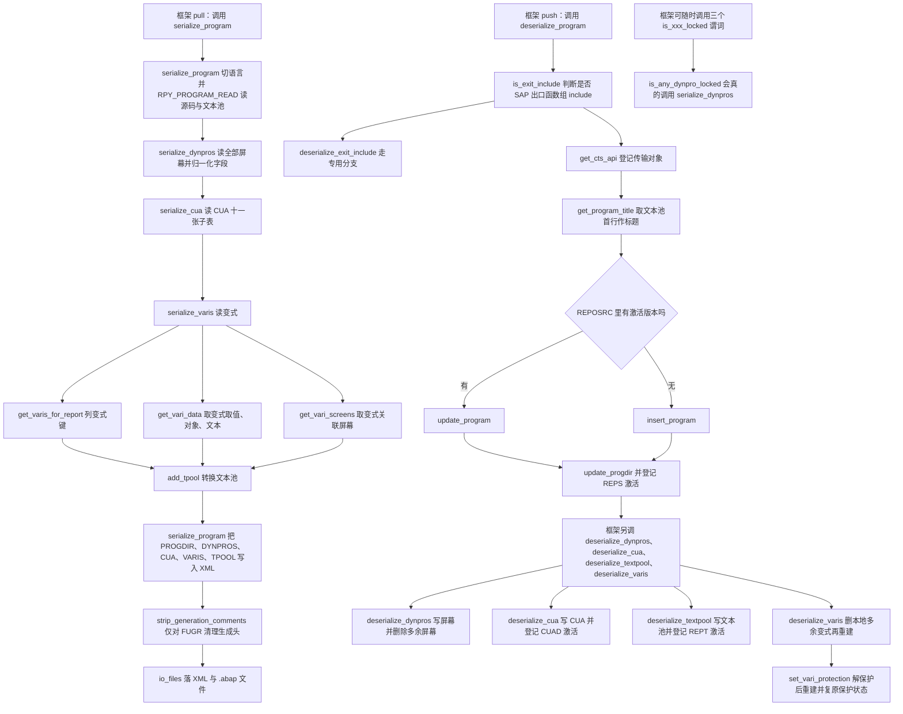
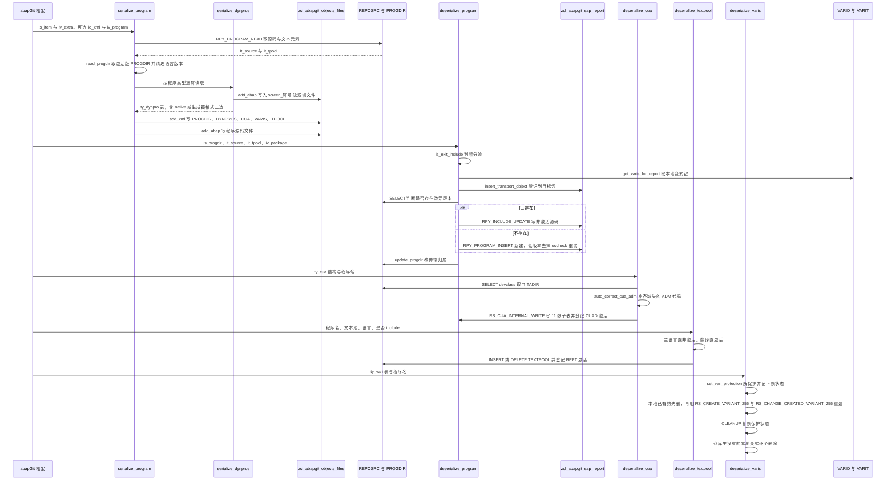

# ZCL_ABAPGIT_OBJECTS_PROGRAM 分析报告

> 分析对象：`abapGit/abapGit — zcl_abapgit_objects_program.clas.abap`（ABAP 全局类实现，1597 行，继承 `zcl_abapgit_objects_super`）
> 报告视角：代码 onboarding 走读，按「导出（push/serialize）」与「导入（pull/deserialize）」两条真实调用链展开
> 覆盖范围：类定义段（类型与常量）＋ 28 个方法全部展开

---

## 一、程序定位与业务背景

### 1.1 这段代码在解决什么问题

先把它的边界说清楚，免得 onboarding 时把职责看大：它**不是**一个报表程序、不做业务数据处理、不画 ALV，也不负责版本比较与冲突解决。它是 abapGit 对象层里**报表类（REPS / PROG / INCL）对象的序列化器与反序列化器**——把一个 SAP 报表在系统里的全部构成，从「一堆彼此独立的 DDIC 表与内部 FM」压缩成「一个 XML 节点 ＋ 若干 .abap 文件」，反过来再把它还原回去。

报表对象是 SAP 里结构最"重"的一种程序对象。SAP 没有一个类似 `RS_EXPORT_PROGRAM` 的单一标准接口能把它整体导出。它实际散落在这些地方：

| 构成 | 存放位置 | 标准接口 |
|---|---|---|
| 源码（激活 / 非激活两个版本） | `REPOSRC` | `RPY_PROGRAM_READ` / `RPY_INCLUDE_UPDATE` / `RPY_PROGRAM_INSERT` |
| 程序目录条目（标题、程序类型、子类型、状态） | `PROGDIR` | 无标准 FM，只能直接 `SELECT` |
| 文本元素（Textpool） | `TEXTPOOL` | 无导出 FM，只有 `INSERT/DELETE TEXTPOOL` |
| 屏幕 | `D020S` / `D021S` / `D021T` | `RPY_DYNPRO_READ` / `RPY_DYNPRO_INSERT` |
| 屏幕流逻辑（FlowLogic） | `D020S` 的流逻辑部分 | 同上，且只能整体读、不能单独写 |
| CUA（GUI 状态、菜单、按钮、功能码） | `RSMPE_*` 系列 | `RS_CUA_INTERNAL_FETCH` / `RS_CUA_INTERNAL_WRITE` |
| 变式（Variants） | `VARID` / `VANI` / `VANZ` / `VARIT` | 一堆 `RS_*_VARIANT*` 函数模块，彼此不配套 |

所以 abapGit 要支持报表对象，就只能**逐个 FM 地把这七块拼起来**，并且保证 export 与 import 两侧严格对称——一旦某一侧漏了一块（比如只读不写），Git 上的代码就再也无法还原成系统里那个可运行的程序。

一句话设计范式定性：

> **"框架适配器 + 双面对称实现"**：一个类同时提供 `serialize_*`（导出成 XML 节点与附加文件）和 `deserialize_*`（从 XML 节点写回系统），两侧共用同一批 `ty_*` 类型作为契约；因为报表对象的每块内容都是"官方 FM 半支持、底层表半开放"的局面，所以代码里不可避免地出现内部结构体直查、`sy-tcode` 改写、`SAPLSIFP` 全局变量 `ASSIGN` 这类带 SAP note 背景的非常规手段。

### 1.2 为什么报表对象必须做成继承基类的对象，而不是一个普通工具类

`zcl_abapgit_objects_program` 继承 `zcl_abapgit_objects_super`，这不是为了复用算法，而是为了拿到三个隐式上下文：

- `ms_item`（`zif_abapgit_definitions=>ty_item`）：当前对象条目，提供 `obj_name` / `obj_type`。`deserialize_dynpros`、`deserialize_cua`、`strip_generation_comments` 三处直接读它，甚至没有把它当参数传。
- `mv_language`：当前处理的语言。整个类的所有 `RS_CUA_*`、文本池、变式文本都跟着它走。
- `mo_files` / `mo_i18n_params`：分别用于把屏幕流逻辑落成独立 .abap 文件、构造多语言过滤条件。

同时它对外只有两个 PUBLIC 方法：`serialize_program` 与 `deserialize_program`，其余 26 个方法全部 PROTECTED 或 PRIVATE。也就是说**框架层（abapGit 的对象调度器）只认识这两个入口**，所有细节都在类内闭环。

这个形状带来的直接后果，后面报告里会反复出现：`ms_item` 是隐式依赖，所以「导出 A 程序但写的是 B 程序」这类错配在类型系统里没有任何保护。

### 1.3 依赖清单（读这段代码前必须知道的地形）

```
基类属性        ms_item                    当前对象条目（obj_name / obj_type），隐式提供程序名
               mv_language                当前语言，CUA / 文本池 / 变式文本都随它变化
               mo_files                   附加文件输出器（屏幕流逻辑靠它落成 screen_NNNN.abap）
               mo_i18n_params             多语言参数，提供 build_language_filter 与 main_language_only

核心 FM（导出） RPY_PROGRAM_READ           读源码与文本元素
               RPY_DYNPRO_READ / _NATIVE  读屏幕（两种格式：生成器格式与 native 格式）
               RS_CUA_INTERNAL_FETCH      读 CUA 的 11 张子表
               RS_ALL_VARIANTS_4_1_REPORT 列程序的全部变式（目录）
               RS_VARIANT_VALUES_TECH_DAT_255  取变式技术数据（VARID）
               RS_VARIANT_CONTENTS_255    取变式取值与对象
               RS_VARIANT_TEXT 及直接 SELECT varit   取变式文本（为何直接查表，代码内有注释说明）
               RS_GET_SCREENS_4_1_VARIANT 取变式关联的屏幕号

核心 FM（导入） RPY_PROGRAM_INSERT         新建程序（低版本无 uccheck 参数，靠 CATCH 兼容）
               RPY_INCLUDE_UPDATE         更新已存在程序
               RPY_DYNPRO_INSERT / _NATIVE 写屏幕
               RS_CUA_INTERNAL_WRITE      写 CUA（bug：历史数据 ADM 为空）
               RS_CREATE_VARIANT_255 / RS_CHANGE_CREATED_VARIANT_255  建变式
               RS_VARIANT_DELETE          删变式
               RS_SCRP_DELETE             删屏幕
               RS_SCREEN_LIST             列程序全部屏幕

直接访问的表   REPOSRC                    判断程序是否已存在于激活版本
               PROGDIR（经 SAP report API）程序目录条目
               TADIR                      取 DEVCLASS 拼传输键
               VARIT / VARID / VANZ       变式文本与变式头（客户端 000）
               D021T                      native 屏幕的字段文本，直接 DELETE / INSERT

全局类         zcl_abapgit_factory        取 sap_report 与 cts_api
               zcl_abapgit_objects_activation  登记待激活对象
               zcl_abapgit_language       切换 / 恢复登录语言

非常规手段     ASSIGN '(SAPLSIFP)TTAB'     借用别的程序的全局变量绕 RPY_PROGRAM_UPDATE 的 bug
               sy-tcode = 'SE41'          伪造事务码绕 note 2159455
               ASSIGN COMPONENT 'OUTPUTSTYLE'  动态取屏幕字段上的可选组件
```

### 1.4 读之前要知道的三件事

1. **代码里大量 `sy-subrc = 2`、`sy-subrc > 1` 之类的判断不是随手写的**，它们对应各 FM 的 `EXCEPTIONS` 编号。读的时候要养成"先看 EXCEPTIONS 列表、再看 subrc 判断"的习惯，否则会以为代码漏判了。
2. **有几处刻意忽略返回码**（`##SUBRC_OK`、`##FM_SUBRC_OK`），这些是本报告风险清单的重点对象，不是笔误。
3. **本类不含任何 `COMMIT WORK`**。所有数据库修改都留在调用方的 LUW 里，由框架统一提交或回滚。判断"这段改动会不会生效"时不能只看本类。

---

## 二、程序执行流程总览

本类没有单一入口流程，而是两条方向相反、各自三级深度的链。abapGit 的调用顺序是：pull 时调 `serialize_program`，push 时调 `deserialize_program`（以及框架直接调的 `deserialize_dynpros` / `deserialize_cua` / `deserialize_textpool` / `deserialize_varis`）。



### 责任链表

| 子程序 | 调用者 | 职责 |
|---|---|---|
| `serialize_program`（PUBLIC） | abapGit 框架，pull 路径 | 导出总控：切语言、读源码与文本池、决定 PROGDIR 状态、逐块写 XML、落盘 |
| `serialize_dynpros` | `serialize_program`；以及 `is_any_dynpro_locked` | 读程序全部屏幕，按屏读生成器格式与 native 格式，归一化字段后装配成 `ty_dynpro` |
| `serialize_cua` | `serialize_program` | 用 `RS_CUA_INTERNAL_FETCH` 一次读出 CUA 的 11 张子表与 ADM |
| `serialize_varis` | `serialize_program` | 逐个变式装配 `ty_vari`：技术数据、取值、对象、文本、关联屏幕 |
| `get_varis_for_report` | `serialize_varis`、`deserialize_varis` | 列程序全部变式键，只保留 SAP 与 CUS 前缀的系统变式 |
| `get_vari_data` | `serialize_varis` | 取单个变式的技术数据、取值、对象与多语言文本 |
| `get_vari_screens` | `serialize_varis` | 取单个变式关联的屏幕号 |
| `add_tpool`（CLASS） | `serialize_program`，以及框架的文本节点处理 | 把 `TEXTPOOL` 行转成 abapGit 自己的文本池行，`id = 'S'` 的行做定长头尾切分 |
| `read_tpool`（CLASS） | 框架的文本节点反序列化 | `add_tpool` 的逆操作，把 abapGit 文本池行还原成 `TEXTPOOL` 行 |
| `strip_generation_comments` | `serialize_program` | 仅对 FUGR：剥掉生成器写在 include 源头的 5 行模板中的日期与版本两行 |
| `deserialize_program`（PUBLIC） | abapGit 框架，push 路径 | 导入总控：出口 include 分流、登记传输对象、写源码、更新 PROGDIR、登记激活 |
| `is_exit_include` | `deserialize_program`、`update_program` | 判断程序名是否为 SAP 出口函数组的 include 命名形态 |
| `deserialize_exit_include` | `deserialize_program` | 出口 include 专用分支：只允许激活态更新或插入，状态与其他程序相反 |
| `insert_program` | `deserialize_program`、`deserialize_exit_include` | 新建程序，含低版本 `uccheck` 参数的 CATCH 兼容与 `name_not_allowed` 时的兜底写法 |
| `update_program` | 同上 | 更新已存在程序，并把 `EU510` / `EU522` 两条消息翻译成人话 |
| `get_program_title` | `deserialize_program`、`deserialize_exit_include` | 从文本池首行取程序标题，并顺手清掉 `SAPLSIFP` 的脏全局变量 |
| `deserialize_dynpros` | 框架直接调用 | 按 XML 写回屏幕，修正 `SET/GET_PARAM` 与 foreignkey，删掉仓库里没有的多余屏幕 |
| `uncondense_flow` | `deserialize_dynpros` | 按空格表把压缩过的流逻辑还原（源码注明为兼容保留） |
| `deserialize_cua` | 框架直接调用 | 拼 TADIR 传输键、修历史 ADM 缺失、写 CUA、登记 CUAD 激活 |
| `auto_correct_cua_adm`（CLASS） | `deserialize_cua` | 为早期 abapGit 未保存 ADM 的 CUA 数据补出三个代码字段 |
| `deserialize_textpool` | 框架直接调用 | 按语言与程序类型决定写文本池还是删文本池，并登记 REPT 激活 |
| `deserialize_varis` | 框架直接调用 | 以仓库为准重建变式：先删本地多余变式，再逐个删了重建 |
| `create_vari` | `deserialize_varis` | 建变式再补对象，两步 FM 串联 |
| `delete_vari` | `deserialize_varis` | 删变式，含低版本无抑制参数时的 CATCH 兼容 |
| `set_vari_protection` | `deserialize_varis` | 临时解除变式保护，返回原保护状态供 CLEANUP 复原 |
| `is_any_dynpro_locked` | 框架（谓词） | 判断程序是否有任一屏幕被锁 |
| `is_cua_locked` | 框架（谓词） | 判断程序 CUA 是否被锁 |
| `is_text_locked` | 框架（谓词） | 判断程序文本池是否被锁 |

下面按这两条链，把 28 个方法逐个展开。

---

## 三、分组分析

### 3.0 子程序类型 `类定义段`（全局声明区）

读实现之前必须先读声明段：这个类的信息量一半在类型里，尤其 `ty_dynpro` 里那组"同一块屏幕的两种格式"。

```abap
    TYPES:
      ty_spaces_tt TYPE STANDARD TABLE OF i WITH DEFAULT KEY .
    TYPES:
      BEGIN OF ty_dynpro,
        header     TYPE rpy_dyhead,
        containers TYPE dycatt_tab,
        fields     TYPE dyfatc_tab,
        flow_logic TYPE swydyflow,
        spaces     TYPE ty_spaces_tt,
        nat_header TYPE d020s,
        nat_fields TYPE STANDARD TABLE OF d021s WITH DEFAULT KEY,
        nat_texts  TYPE STANDARD TABLE OF d021t WITH DEFAULT KEY,
      END OF ty_dynpro .
```

**做什么** — 声明一块屏幕在 abapGit 内部的完整表示。同一块屏幕有两种 SAP 侧格式：生成器格式（`header` + `containers` + `fields`，走 `RPY_DYNPRO_READ/INSERT`）与 native 格式（`nat_header` + `nat_fields` + `nat_texts`，走 `RPY_DYNPRO_INSERT_NATIVE`）。两侧字段并存于同一结构，由导出侧二选一填充、导入侧二选一消费。`spaces` 是流逻辑的压缩记录表，`flow_logic` 是流逻辑本体。

**为什么** — 把两种格式塞进同一个结构，而不是定义 `ty_dynpro_native` 继承 `ty_dynpro`，是为了让 XML 序列化只有一个节点：导出时没填的那组字段就是空的，反序列化时靠"哪组非初始"就能判断走哪条写入路径。这省掉了一次类型判断与一次分支分发，代价是**结构里同时存在两套互斥数据，谁填错了都不会报错**。

**风险与改进** — 类型层面没有强约束，但 `flow_logic` 与 `spaces` 在导出侧**从未被赋值**（见 3.3），这组字段实际只服务于 `uncondense_flow` 的历史兼容路径，属于事实上的死字段。建议二选一：要么删除并在导入侧直接 `mo_files->read_abap`，要么在导出侧补上赋值——现在的状态是"字段留着、没人写、导入侧还认真读"，是最容易误导接手人的一种中间态。

```abap
    CONSTANTS:
      BEGIN OF c_state,
        active   TYPE r3state VALUE 'A',
        inactive TYPE r3state VALUE 'I',
        off      TYPE r3state VALUE '',
      END OF c_state.

    CONSTANTS c_native_dynpro TYPE c LENGTH 2 VALUE 'IN'.

    CONSTANTS c_sysvari_clnt        TYPE mandt      VALUE '000'.
    CONSTANTS c_sysvari_pattern_sap TYPE c LENGTH 5 VALUE 'SAP&*'.
    CONSTANTS c_sysvari_pattern_cus TYPE c LENGTH 5 VALUE 'CUS&*'.
```

**做什么** — 三个常量组：`c_state` 是 REPOSRC / REPTEXT 的三种激活状态（激活 / 非激活 / 置空）；`c_native_dynpro` 是 native 屏幕的类型标识 `'IN'`；`c_sysvari_clnt` 与两个 `c_sysvari_pattern_*` 用于变式处理。

**为什么** — 用常量替代字面量 `'A'` / `'I'` / `'IN'` / `'000'` 是正确的做法，读者一眼能看出这些是"协议值"而不是随便写的字符串。`r3state` 类型本身就限定了取值范围，比裸 `c` 更强。`c_sysvari_pattern_sap = 'SAP&*'` 里的 `&` 是 SAP 变式命名中代表客户端的通位符——只有 `SAP&...` 与 `CUS&...` 这两类**系统变式**会被 abapGit 搬运，用户自己建的变式（`CUSL*` 之类）不进 Git。这是一个刻意的产品决策，注释里没写，接手时容易误判成 bug。

**风险与改进** — 无明显功能风险，但有两点要提醒读者。其一，`c_state-off` 只在 `deserialize_exit_include` 里用到一次，为它专门留一个状态常量值得肯定；其二，变式的"只搬系统变式"这条规则**没有任何注释说明**，而 `deserialize_varis` 却会以仓库为准**删除本地多余变式**——两者组合起来，会让开发者在本地自建的同名变式被 pull 悄悄删掉。建议在常量旁补一行注释说明范围，在 `deserialize_varis` 的删除循环上加一条日志。

```abap
    METHODS serialize_program
      IMPORTING
        !io_xml     TYPE REF TO zif_abapgit_xml_output OPTIONAL
        !is_item    TYPE zif_abapgit_definitions=>ty_item
        !io_files   TYPE REF TO zcl_abapgit_objects_files
        !iv_program TYPE syrepid OPTIONAL
        !iv_extra   TYPE clike OPTIONAL
      RAISING
        zcx_abapgit_exception.
```

**做什么** — 唯一的导出入口签名。`io_xml` 可选：不传则内部自建一个 XML 输出对象并最终由 `io_files->add_xml` 落盘；传了则复用调用方的对象，本类只往里写不负责落盘。`iv_program` 可选，不传就用 `is_item-obj_name`，传了则导出别的程序——这是 FUGR 导出主程序源码时用的入口。

**为什么** — `!` 前缀表示该参数不是默认值敏感的传递方式，对可选项尤其值得写清。异常统一为 `zcx_abapgit_exception`，与 abapGit 全局异常体系一致，调用方只需 `TRY/CATCH` 一类。

**风险与改进** — 这里有一个**接口不对称**：导出侧允许通过 `iv_program` 导出一个与 `ms_item-obj_name` 不同的程序，但导入侧 `deserialize_dynpros`、`deserialize_cua`、`strip_generation_comments` 三处都**直接读 `ms_item-obj_name`**，根本没有对应的参数。也就是说导出侧能表达的能力，导入侧表达不了，两侧并不对称。建议要么给这三个导入方法补 `iv_program_name` 参数（`serialize_*` 侧本来就有），要么在 `serialize_program` 上加注释说明该参数仅用于导出侧。这是一个真实的维护陷阱，不是风格问题。

### 3.1 子程序类型 `serialize_program`（导出总控）

分四步：① 语言切换与首次读取 ② PROGDIR 与源码版本判定 ③ XML 节点装配 ④ 落盘与生成注释清理。

#### ① 语言切换与首次读取

```abap
    IF iv_program IS INITIAL.
      lv_program_name = is_item-obj_name.
    ELSE.
      lv_program_name = iv_program.
    ENDIF.

    zcl_abapgit_language=>set_current_language( mv_language ).

    CALL FUNCTION 'RPY_PROGRAM_READ'
      EXPORTING
        program_name     = lv_program_name
        with_includelist = abap_false
        with_lowercase   = abap_true
      TABLES
        source_extended  = lt_source
        textelements     = lt_tpool
      EXCEPTIONS
        cancelled        = 1
        not_found        = 2
        permission_error = 3
        OTHERS           = 4.

    IF sy-subrc = 2.
      zcl_abapgit_language=>restore_login_language( ).
      RETURN.
    ELSEIF sy-subrc <> 0.
      zcl_abapgit_language=>restore_login_language( ).
      zcx_abapgit_exception=>raise_t100( ).
    ENDIF.

    zcl_abapgit_language=>restore_login_language( ).
```

**做什么** — 决定要导出哪个程序名，把会话语言切成 `mv_language`，用 `RPY_PROGRAM_READ` 一次性读出源码与文本元素。`not_found`（程序不存在）时安静地恢复语言并 `RETURN`，其余失败恢复语言后抛 T100 异常。三条路径都显式恢复登录语言。

**为什么** — `with_includelist = abap_false` 是关键：程序自身的 include 列表由 abapGit 作为独立对象处理，若在这里一起读出，Git 上会出现同一份代码两个来源。`with_lowercase = abap_true` 保证大小写被规范成程序名标准形式，避免不同系统的程序名大小写差异造成无谓 diff。语言切换放在读之前，是因为文本元素的读取强烈依赖会话语言——这是标准做法。

**风险与改进** — 两点。

其一，**语言恢复不是异常安全的**。`set_current_language( )` 与 `restore_login_language( )` 之间只有一个 `CALL FUNCTION`，而 `RPY_PROGRAM_READ` 若抛出类异常（例如内部转换错误），控制流会直接越过两处 `restore_login_language( )` 传播出去，会话语言停留在 `mv_language` 直到 LUW 结束。同样的模式在 `update_program` 里出现。建议把这一段包进 `TRY. ... CLEANUP. zcl_abapgit_language=>restore_login_language( ). ENDTRY.`，让恢复动作绑定到结构而不是绑定到某几条分支。示意改法：

```abap-fix
    TRY.
        CALL FUNCTION 'RPY_PROGRAM_READ'
          EXPORTING
            program_name     = lv_program_name
            with_includelist = abap_false
            with_lowercase   = abap_true
          TABLES
            source_extended  = lt_source
            textelements     = lt_tpool
          EXCEPTIONS
            cancelled        = 1
            not_found        = 2
            permission_error = 3
            OTHERS           = 4.
      CLEANUP.
        zcl_abapgit_language=>restore_login_language( ).
    ENDTRY.
    IF sy-subrc <> 0 AND sy-subrc <> 2.
      zcx_abapgit_exception=>raise_t100( ).
    ENDIF.
    IF sy-subrc = 2.
      RETURN.
    ENDIF.
```

其二，`not_found` 时的 `RETURN` 是**静默成功**：导出一个不存在的程序时，调用方得到的是"什么都没发生"，而不是一次明确的失败。这在框架层可能正是想要的（对象已被并发删除），但源码没有任何注释说明意图。建议补一行注释，否则接手的人会以为这里漏了异常。

#### ② PROGDIR 与源码版本判定

```abap
    " If inactive version exists, then RPY_PROGRAM_READ does not return the active code
    li_report = zcl_abapgit_factory=>get_sap_report( ).

    TRY.
        " Raises exception if inactive version does not exist
        ls_progdir = li_report->read_progdir(
          iv_name  = lv_program_name
          iv_state = c_state-inactive ).

        " Explicitly request active source code
        lt_source = li_report->read_report(
          iv_name  = lv_program_name
          iv_state = c_state-active ).
      CATCH zcx_abapgit_exception ##NO_HANDLER.
    ENDTRY.

    ls_progdir = li_report->read_progdir(
      iv_name  = lv_program_name
      iv_state = c_state-active ).

    clear_abap_language_version( CHANGING cv_abap_language_version = ls_progdir-uccheck ).
```

**做什么** — 先试读非激活版本的 PROGDIR（不存在就抛异常，被 `CATCH` 吞掉），同时显式重读激活版源码；然后**无条件**用激活版 PROGDIR 覆盖掉前面读到的非激活版 PROGDIR；最后把 `uccheck` 里的 ABAP 语言版本标记清掉。

**为什么** — 注释交代了真实动机：`RPY_PROGRAM_READ` 在存在非激活版本时不会返回激活版源码，所以必须显式重读激活版源码——`lt_source` 那一次赋值是必要的。PROGDIR 则统一取激活版，因为 PROGDIR 里没有"语言版本"之外需要区分版本的信息。`clear_abap_language_version` 把不同系统补丁级别带来的语言版本差异抹平，是**制造可复现 diff** 的正确做法：否则 A 系统和 B 系统 pull 同一个程序会因 uccheck 不同产生假 diff。

**风险与改进** — **TRY 块里读到的非激活版 `ls_progdir` 被紧随其后的无条件赋值完全覆盖，这行读取是死代码**。它的原意应该是"判断是否存在非激活版本，以此决定导出哪个版本"，但既然 `ls_progdir` 被覆盖、异常被 `##NO_HANDLER` 吞掉，这段 TRY 实际只保留了"显式重读激活版源码"这一个作用。三处问题叠加：`##NO_HANDLER` 让异常彻底静默、注释说"Raises exception if inactive version does not exist"却没有任何后续逻辑消费这个事实、死赋值留在代码里让人以为存在版本分支逻辑。

正确做法是让这个判断显式化并参与决策，例如（本方法内示意，源码中不存在）：

```abap-fix
    DATA lv_has_inactive TYPE abap_bool.
    TRY.
        li_report->read_progdir(
          iv_name  = lv_program_name
          iv_state = c_state-inactive ).
        lv_has_inactive = abap_true.
      CATCH zcx_abapgit_exception.
        lv_has_inactive = abap_false.
    ENDTRY.
    IF lv_has_inactive = abap_true.
      ls_progdir = li_report->read_progdir(
        iv_name  = lv_program_name
        iv_state = c_state-inactive ).
    ELSE.
      ls_progdir = li_report->read_progdir(
        iv_name  = lv_program_name
        iv_state = c_state-active ).
    ENDIF.
```

这里必须留一句**需在 abapGit 的 issue 与对应版本源码里核实**：abapGit 的实际产品决策是"导出激活版"还是"有非激活版就导非激活版"。从注释"RPY_PROGRAM_READ does not return the active code"看不出作者的真实意图，而从 Git 的用途（版本管理应以"被激活的代码"为准）推断应该是导激活版——但代码里 `ls_progdir` 的死赋值说明作者曾经想做版本切换。请勿凭推断改这段，先查 abapGit 的 commit 说明。

#### ③ XML 节点装配

```abap
    IF io_xml IS BOUND.
      li_xml = io_xml.
    ELSE.
      CREATE OBJECT li_xml TYPE zcl_abapgit_xml_output.
    ENDIF.

    li_xml->add( iv_name = 'PROGDIR'
                 ig_data = ls_progdir ).
    IF ls_progdir-subc = '1' OR ls_progdir-subc = 'M'.
      lt_dynpros = serialize_dynpros( lv_program_name ).
      li_xml->add( iv_name = 'DYNPROS'
                   ig_data = lt_dynpros ).

      ls_cua = serialize_cua( lv_program_name ).
      li_xml->add( iv_name = 'CUA'
                   ig_data = ls_cua ).

      lt_varis = serialize_varis( lv_program_name ).
      li_xml->add( iv_name = 'VARIS'
                   ig_data = lt_varis ).
    ENDIF.

    READ TABLE lt_tpool WITH KEY id = 'R' INTO ls_tpool.
    IF sy-subrc = 0 AND ls_tpool-key = '' AND ls_tpool-length = 0.
      DELETE lt_tpool INDEX sy-tabix.
    ENDIF.

    li_xml->add( iv_name = 'TPOOL'
                 ig_data = add_tpool( lt_tpool ) ).
```

**做什么** — 准备 XML 输出对象（复用或自建），先写 `PROGDIR` 节点，再按程序类型决定是否写 `DYNPROS` / `CUA` / `VARIS` 三个节点，最后处理文本池：把 `id = 'R'`（标题行）里 key 为空、length 为 0 的退化行删掉，再写 `TPOOL` 节点。

**为什么** — **`PROGDIR` 永远写，三个附加节点按程序类型写**，这是正确的分层：任何报表都有目录条目，但只有可运行交互的程序才有屏幕、CUA 与变式。`subc = '1'` 与 `subc = 'M'` 是 PROGDIR 的 SUBC 字段里对应"可执行程序"与"可带屏幕的 include"的值——这两个字面量需要**在 SE11 看 `PROGDIR-SUBC` 的域值说明核实**（本类其它地方都没用过 SUBC，无从交叉验证）。

文本池里删退化行这一手很实用：`RPY_PROGRAM_READ` 总会返回一行 `id = 'R'`，当程序没有设置标题时这行是空的。留着它会让每个无标题程序在 Git 上产生一行空噪音，删掉之后 diff 才干净。这是"为 diff 质量服务"的典型处理。

**风险与改进** — 三点。

其一，`subc` 的两个字面量没有常量、没有注释，属于**协议值裸奔**。建议提成 `c_subc_executable` / `c_subc_include` 常量并注明取值来源。

其二，**`add_tpool` 的调用结果直接作为 XML 数据传入，而它的输入 `lt_tpool` 已经被 `DELETE ... INDEX sy-tabix` 改动过**。这段本身正确，但要注意 `DELETE` 依赖 `READ TABLE` 留下的 `sy-tabix`——一旦有人在两句之间插入任何可能改变 `sy-tabix` 的语句，删的就是错行。建议把行号存进局部变量再 `DELETE ... INDEX lv_idx`。

其三，**整个 TRY/CATCH 与后续逻辑的顺序让"程序不存在"这条路径在此处不再可达**，因为步骤 ① 已经过滤了 `not_found`。这不是问题，但意味着后面 `serialize_dynpros` 等方法抛出的所有异常都会被当成致命错误上抛——对拉取失败来说正确，只是读者容易误以为存在降级路径。

#### ④ 落盘与生成注释清理

```abap
    IF NOT io_xml IS BOUND.
      io_files->add_xml( iv_extra = iv_extra
                         ii_xml   = li_xml ).
    ENDIF.

    strip_generation_comments( CHANGING ct_source = lt_source ).

    io_files->add_abap( iv_extra = iv_extra
                        it_abap  = lt_source ).
```

**做什么** — 只有当 XML 对象是本类自建（调用方没传 `io_xml`）时才落盘 XML；随后无条件清理源码里的生成器注释，并把源码落成 .abap 文件。

**为什么** — `IF NOT io_xml IS BOUND` 与步骤 ③ 的 `IF io_xml IS BOUND` 正好互补：**XML 与 .abap 文件成对落盘，XML 只落一次**。这个设计让本方法既能作为"完整导出"用（框架调用），也能作为"只往已有 XML 里补内容"用（其他对象类型复用同一个 XML 文档）。`iv_extra` 透传给两个 `add_*` 调用，保证同一对象的多份文件共享同一目录前缀。

**风险与改进** — 三点。

其一，`io_files` 是必填参数且**从不判空**。而 `io_xml` 是 `OPTIONAL`。两个引用类型参数一个可选一个必填，且可选的那个被完整处理、必填的那个被裸用——这个不对称意味着调用方一旦传入未初始化的 `io_files`，这里会直接 CX_SY_REF_IS_INITIAL dump，而不是失败。建议对 `io_files` 也做一次 `IS BOUND` 判断并给出明确异常。

其二，`iv_extra` 是 `OPTIONAL` 且默认初始，**传给 `add_xml` / `add_abap` 时没有做任何默认处理**。初始值在这些方法内部通常意味着"写到对象根目录"，但这依赖被调用方的约定。建议在本方法内 `IF iv_extra IS INITIAL. ... ENDIF.` 明确一次。

其三，`strip_generation_comments` 在**源码已经写进 XML 之后**才调用，但它改的是 `lt_source` 而 XML 里并不含源码节点（源码走 `add_abap`），所以顺序其实是对的、没错位。只是这个"XML 不含源码"的事实没有任何注释说明，读者会在这里犹豫一次。建议加一行注释。

### 3.2 子程序类型 `serialize_dynpros`（屏幕导出）

分三步：① 列屏幕并逐屏读取 ② 字段归一化 ③ 容器修正与装配。

#### ① 列屏幕并逐屏读取

```abap
    CALL FUNCTION 'RS_SCREEN_LIST'
      EXPORTING
        dynnr     = ''
        progname  = iv_program_name
      TABLES
        dynpros   = lt_d020s
      EXCEPTIONS
        not_found = 1
        OTHERS    = 2.
    IF sy-subrc = 2.
      zcx_abapgit_exception=>raise_t100( ).
    ENDIF.

    SORT lt_d020s BY dnum ASCENDING.
```

**做什么** — 用 `RS_SCREEN_LIST` 列出程序的全部屏幕（`dynnr = ''` 表示全部），只把 `OTHERS` 当致命错误（`not_found` 即"没有屏幕"是合法结果），然后按屏幕号升序排序。

**为什么** — 排序不是可有可无的：`deserialize_dynpros` 里要用 `BINARY SEARCH` 在这个列表里做差集，**二分查找的前提是表已按同一键排序**。这里的 `SORT ... BY dnum ASCENDING` 与导入侧的 `BINARY SEARCH WITH KEY dnum` 是一对隐式契约，两处必须同时改，这是本类里少见的"跨方法顺序依赖"。跳过 `type <> 'S'/'W'/'J'` 是在下一步的 `LOOP ... WHERE` 里做的，把"筛选"和"排序"分开，逻辑上更清楚。

**风险与改进** — **二分查找的键类型一致性需要核实**。`D020S-DNUM` 是 NUMC（数字字符），ABAP 对 NUMC 的排序与比较是**按字符**进行的（不是按数值），所以 `SORT BY dnum` 与 `READ ... BINARY SEARCH WITH KEY dnum` 语义一致、可以配对使用。但这里的 `ls_dynpro-header-screen` 来自 `RPY_DYHEAD-SCREEN`，**这两个字段的长度与类型是否完全一致，必须在 SE11 核实**——如果长度不同，尾部空格补齐规则会让二分查找在边界情况下失配。这是一个真实的脆弱点：它现在能工作，但依赖两个 DDIC 字段的隐式一致性。建议改成不用二分查找的显式差集，或至少在排序处加注释写明这是给二分查找用的。

#### ② 字段归一化

```abap
    "#2746: relevant flag values (taken from include MSEUSBIT)
    CONSTANTS: lc_flg1ddf TYPE x VALUE '20',
               lc_flg3fku TYPE x VALUE '08',
               lc_flg3for TYPE x VALUE '04',
               lc_flg3fdu TYPE x VALUE '02'.


    CALL FUNCTION 'RS_SCREEN_LIST'
      EXPORTING
        dynnr     = ''
        progname  = iv_program_name
```

**做什么** — 声明四个位标志常量，取自 SAP 的 include `MSEUSBIT`，用来从 native 字段列表里推算某个屏幕字段是否真正使用 foreign key 检查。注释明确标注了 issue 号 `#2746`。

**为什么** — 这段是全类里最"考古"的一块。SAP 的 `SAPLWBSCREEN` 在保存屏幕时会根据 `D021S` 的 `FLG1` / `FLG3` 位决定是否给字段打 foreignkey 标记，但 abapGit 不能调用 SAP 的私有逻辑，只能复制位定义。**用常量集中声明 + 注释指出来源 include + 标注 issue 号，这是处理"复制了别人的私有逻辑"这一问题的正确姿势**，读者能立刻知道这段代码的权威来源和变更理由。

**风险与改进** — 位含义的正确性**必须在 `MSEUSBIT` 里核实**（本类只有这四个值，没有更进一步的说明）。真正的风险是**SAP 升级时 `SAPLWBSCREEN` 的判定逻辑变了，这里的复制品不会跟着变**，结果是 abapGit 序列化出的 foreignkey 标记与 SAP 原生保存的结果不一致，往返一次就产生 diff。建议在注释里补一句"若 `SAPLWBSCREEN` 改变此处逻辑需同步复核 issue #2746"。

```abap
        ASSIGN COMPONENT 'OUTPUTSTYLE' OF STRUCTURE <ls_field> TO <lv_outputstyle>.
        IF sy-subrc = 0 AND <lv_outputstyle> = '  '.
          CLEAR <lv_outputstyle>.
        ENDIF.
```

**做什么** — 对每个屏幕字段，动态取名为 `OUTPUTSTYLE` 的组件；取到且值为两个空格（NUMC 字段的无效值）就清成初始值。上方注释说明了原因：输出风格是 NUMC 字段，含无效值会让 XML 转换失败，且该字段并非所有版本都有。

**为什么** — 两个真实问题，两个真实解法：一是**版本兼容**——用 `ASSIGN COMPONENT ... TO` 而不是直接 `<ls_field>-outputstyle`，字段不存在时 `sy-subrc <> 0` 而不是语法错误，这样同一份代码能跑在有该字段和无该字段的版本上；二是**序列化前净化**——NUMC 字段的非数字值在转 XML 时会直接失败，清成初始值是最省事的规避。这两点都处理对了。

**风险与改进** — **`IF sy-subrc = 0 AND <lv_outputstyle> = '  '` 依赖 `AND` 的短路求值**。ABAP 语言层面**不保证** `AND` / `OR` 的第二个操作数不被求值，若不短路而 `<lv_outputstyle>` 此时未赋值（`ASSIGN` 失败），比较未赋值的字段符号会 CX_SY_REF_IS_INITIAL。这段代码在 abapGit 中长期运行，说明当前 ABAP 版本／代码生成器下确实是短路的；但**这个前提没有在代码里被表达，也不该依赖**。建议改成嵌套判断（示意，源码中不存在）：

```abap-fix
        IF sy-subrc = 0.
          IF <lv_outputstyle> = '  '.
            CLEAR <lv_outputstyle>.
          ENDIF.
        ENDIF.
```

同时建议把 `sy-subrc` 立刻存进 `DATA lv_found TYPE abap_bool.`，避免后续语句覆盖它——这一点在下面这段 foreignkey 逻辑里已经真的出问题了。

```abap
        UNASSIGN <ls_field_int>.
        READ TABLE lt_fieldlist_int ASSIGNING <ls_field_int> WITH KEY fnam = <ls_field>-name.
        IF <ls_field_int> IS ASSIGNED.
          IF <ls_field_int>-flg1 O lc_flg1ddf AND
              <ls_field_int>-flg3 O lc_flg3for AND
              <ls_field_int>-flg3 Z lc_flg3fdu AND
              <ls_field_int>-flg3 Z lc_flg3fku.
            <ls_field>-foreignkey = 'X'.
          ELSE.
            CLEAR <ls_field>-foreignkey.
          ENDIF.
        ENDIF.

        IF <ls_field>-from_dict = abap_true AND
           <ls_field>-modific   <> 'F' AND
           <ls_field>-modific   <> 'X'.
          CLEAR <ls_field>-text.
        ENDIF.
```

**做什么** — 对每个字段，先 `UNASSIGN` 再按 `fnam` 读 native 字段列表；读到就按 `flg1` / `flg3` 四个位标志决定 foreignkey 置 `'X'` 还是清空。读不到就**什么都不做**（保留原值）。随后对来自字典的字段，若 `modific` 不是 `'F'`（固定）或 `'X'`（可修改），清掉字段文本。

**为什么** — `UNASSIGN` + `IS ASSIGNED` 是标准解法：`READ TABLE ... ASSIGNING` 失败时字段符号会被设置为未赋值，而直接用 `IF <ls_field_int>-flg1` 判断会 CX_SY_REF_IS_INITIAL，所以必须先判 `IS ASSIGNED`。第二段清文本的理由是 SAP 原生保存时对非固定非可修改的字典字段不写文本，abapGit 若写了就会在往返后与原生结果不一致——**又是"为 diff 质量服务"的归一化**。

**风险与改进** — 两点。

其一，**`READ TABLE ... WITH KEY fnam` 在 `lt_fieldlist_int` 上是全表线性查找**，而它在每个屏幕的每个字段上执行一次。屏幕多、字段多的报表会退化成 O(屏幕数 × 字段数²)。当前规模下无感，但这是本类里最值得优化的一处（用 `SORT ... BY fnam` 后 `BINARY SEARCH`，或直接建一个哈希索引）。建议至少加注释说明为何没有建索引。

其二，第二段 `IF` 的 `AND` 链同样依赖短路，不过这里三个操作数都是普通结构组件、不存在未赋值字段符号，风险低于上一处，可不改。

#### ③ 容器修正与装配

```abap
      LOOP AT lt_containers ASSIGNING <ls_container>.
        IF <ls_container>-c_resize_v = abap_false.
          CLEAR <ls_container>-c_line_min.
        ENDIF.
        IF <ls_container>-c_resize_h = abap_false.
          CLEAR <ls_container>-c_coln_min.
        ENDIF.
      ENDLOOP.

      APPEND INITIAL LINE TO rt_dynpro ASSIGNING <ls_dynpro>.
      <ls_dynpro>-header = ls_header.

      " Store flow logic as separate ABAP files instead of XML
      mo_files->add_abap(
        iv_extra = 'screen_' && ls_header-screen
        it_abap  = lt_flow_logic ).

      READ TABLE lt_fieldlist_int TRANSPORTING NO FIELDS WITH KEY fill = 'X'.
      IF ls_header-type CA c_native_dynpro AND sy-subrc = 0.
        " In particular for dynpros with splitter
        <ls_dynpro>-nat_header = <ls_d020s>.
        CLEAR: <ls_dynpro>-nat_header-dgen, <ls_dynpro>-nat_header-tgen.
        <ls_dynpro>-nat_fields = lt_fieldlist_int.
        <ls_dynpro>-nat_texts  = lt_texts.
      ELSE.
        <ls_dynpro>-containers = lt_containers.
        <ls_dynpro>-fields     = lt_fields_to_containers.
      ENDIF.
```

**做什么** — 容器不可垂直／水平调整时清掉对应的最小行／列数（否则 SAP 会留下无意义的最小尺寸值造成 diff）；装配 `ty_dynpro` 头部；把屏幕流逻辑**单独写成 `screen_<屏号>.abap` 文件**而不是塞进 XML；最后判断走 native 还是生成器格式——只有当头部类型里含 `'IN'` **且** native 字段列表里存在 `fill = 'X'` 的行（splitter 行）时才走 native 分支。

**为什么** — "流逻辑单独存文件"是一个很有意思的取舍：流逻辑是纯代码，用 .abap 文件存能享受 abapGit 的语法高亮、diff 与冲突合并，XML 里塞代码则什么都没有。代价是**序列化不再是单一出口**，多了一套 `screen_NNNN` 文件的命名与读取约定，以及导入侧必须记得去 `mo_files` 里读回来（3.13 会看到）。这是一个"把工程体验换来的复杂度"，值得在读代码时先认下来。

`TRANSPORTING NO FIELDS WITH KEY fill = 'X'` 只为判断"有没有 splitter 行"却真读了整行——ABAP 里 `READ TABLE` 没有只判存在不取值的写法，这里用 `NO FIELDS` 避免了结构赋值，是正确写法。而紧跟着的 `IF ls_header-type CA c_native_dynpro AND sy-subrc = 0` 正确地依赖了这次 `READ` 的 `sy-subrc`，中间没有插入任何语句，逻辑成立。

**风险与改进** — 三点。

其一，**分支条件漏掉了 `<ls_dynpro>` 的另一半数据**：走 native 分支时 `nat_fields` 存的是整个 `lt_fieldlist_int`（含 `FLG1` / `FLG3` 等位信息），走生成器分支时 `fields` 存的是 `lt_fields_to_containers`。这意味着**同一个程序在不同系统上可能因为 splitter 判断不同而落到不同分支**，产出的 XML 结构不同，往返后屏幕表现可能不一致。这是导出/导入不对称风险的典型来源，建议在注释里写明这个分支条件的后果。

其二，`<ls_dynpro>-flow_logic` 与 `<ls_dynpro>-spaces` **两个分支都没赋值**（流逻辑走的是 `add_abap`）。所以 `ty_dynpro` 里的这两个字段在导出侧永远是空的，只为导入侧的 `uncondense_flow` 兼容路径服务。建议要么删字段，要么在注释里标明"仅用于读取旧版本 XML"。

其三，`mo_files->add_abap( )` 是**有副作用的调用**——它把屏幕流逻辑写进了输出文件集。这正是 3.24 节要展开的问题：`is_any_dynpro_locked` 会调用本方法，于是"检查是否被锁"这个谓词顺带把屏幕流逻辑文件写了出来。

### 3.3 子程序类型 `serialize_cua`（CUA 导出）

```abap
    CALL FUNCTION 'RS_CUA_INTERNAL_FETCH'
      EXPORTING
        program         = iv_program_name
        language        = mv_language
        state           = c_state-active
      IMPORTING
        adm             = rs_cua-adm
      TABLES
        sta             = rs_cua-sta
        fun             = rs_cua-fun
        men             = rs_cua-men
        mtx             = rs_cua-mtx
        act             = rs_cua-act
        but             = rs_cua-but
        pfk             = rs_cua-pfk
        set             = rs_cua-set
        doc             = rs_cua-doc
        tit             = rs_cua-tit
        biv             = rs_cua-biv
      EXCEPTIONS
        not_found       = 1
        unknown_version = 2
        OTHERS          = 3.
    IF sy-subrc > 1.
      zcx_abapgit_exception=>raise_t100( ).
    ENDIF.
```

**做什么** — 一次 `RS_CUA_INTERNAL_FETCH` 把 CUA 的全部 11 张子表（状态栏、功能、菜单、菜单文本、按钮、功能码、设置、文档、标题、浏览按钮）连同 ADM 头一次性读进 `rs_cua`。只有 `unknown_version` 及以上才抛异常。

**为什么** — `state = c_state-active` 说明**只导出激活态的 CUA**，与非激活源码的策略一致（见 3.1 ② 的讨论）。`IF sy-subrc > 1` 把 `not_found` 放过是**有意为之**：没有 CUA 的程序极常见（大量报表根本不用 SE41），把它当错误会让 abapGit 无法使用。这个判断阈值必须和 `EXCEPTIONS` 列表一起读，单独看会误以为漏判。

`language = mv_language` 说明 CUA 是按语言存的，多语言环境会导出当前语言的那一份——这也解释了为什么框架要串行按语言跑一遍 abapGit。

**风险与改进** — 无明显功能缺陷，一点提醒：`unknown_version`（subrc = 2）被当成致命错误是合理的，但**没有任何注释说明为什么它比 `not_found` 严重**。SAP 升级后 CUA 表结构扩展时这个 FM 会报 `unknown_version`，此时用户的拉取会整体失败。建议至少补一行注释指向"升级后如遇此错误需检查 CUA 表结构扩展"，这是运维高频问题。

### 3.4 子程序类型 `serialize_varis`（变式导出）

分三步：① 取变式键 ② 逐变式取明细 ③ 清文本与装配。

```abap
    DATA: ls_vari  TYPE ty_vari,
          ls_varid TYPE varid,
          lt_varis TYPE ty_varikey_tt.

    FIELD-SYMBOLS: <ls_varikey> LIKE LINE OF lt_varis,
                   <ls_object>  LIKE LINE OF ls_vari-objects.

    lt_varis = get_varis_for_report( iv_program_name ).

    LOOP AT lt_varis ASSIGNING <ls_varikey>.
      CLEAR: ls_vari,
             ls_varid.

      get_vari_data( EXPORTING is_vari    = <ls_varikey>
                     IMPORTING es_varid   = ls_varid
                               et_values  = ls_vari-values
                               et_objects = ls_vari-objects
                               et_texts   = ls_vari-texts ).

      MOVE-CORRESPONDING ls_varid TO ls_vari.
```

**做什么** — 取全部系统变式键，逐个调 `get_vari_data` 把明细填进 `ls_vari` 的四个子结构，再用 `MOVE-CORRESPONDING` 把 `VARID` 的技术数据搬进 `ty_vari` 的头部字段。

**为什么** — 变式的存储被拆在三张表里：`VARID`（头部技术数据）、`VANI`/`VANZ`（取值与对象）、`VARIT`（文本）。abapGit 的 `ty_vari` 精确镜像了这个拆分，所以 `MOVE-CORRESPONDING` 只需要处理头部字段，取值／对象／文本通过 `EXPORTING/IMPORTING` 由 `get_vari_data` 直接填到目标结构上。**这个映射关系是这份设计里最清晰的一处**：一个 abapGit 结构 ↔ 一组 SAP 表，字段一一对应。

**风险与改进** — **`MOVE-CORRESPONDING` 是按名匹配的，隐含了一个"字段名必须一致"的契约**。`ty_vari` 的字段名（`variant`、`flag1`、`flag2`、`transport`、`environmnt`、`protected`、`secu`、`xflag1`、`xflag2`）必须与 `VARID` 的对应字段名完全一致，`REPORT` 与 `MANDT` 除外（这两个在别处赋值）。这种契约**没有编译期保障**：`VARID` 加一个同名字段会被自动搬过去，改一个字段名则会静默漏搬。建议在 `ty_vari` 的定义处加一行注释列出"以下字段名必须与 VARID 保持一致"，并配合 ATC 的字典一致性检查。

```abap
      " Clear texts - they will be provided in TEXTPOOL section
      LOOP AT ls_vari-objects ASSIGNING <ls_object>.
        CLEAR <ls_object>-text.
      ENDLOOP.

      ls_vari-variscreens = get_vari_screens( <ls_varikey> ).

      INSERT ls_vari INTO TABLE rt_varis.
    ENDLOOP.
```

**做什么** — 清空每个变式**对象**（`VANZ`）上的文本字段，再取变式关联的屏幕号，最后把装配好的 `ty_vari` 放进结果表。

**为什么** — 这是一次为 diff 服务的去重：变式文本同时存在于 `VARIT`（变式文本）和 `VANZ`（变式对象文本）里，如果两者都导出，Git 上会出现同一段文本的两份拷贝，且内容可能略有差异。abapGit 选择以 `VARIT`（在 XML 的 `TPOOL` 节点里）为准，所以清掉 `VANZ` 的文本。

**风险与改进** — **注释与代码不一致，这是本类里最容易误导人的一处**。注释说"文本会在 TEXTPOOL 段提供"，但代码清的是 `ls_vari-objects`（`VANZ` 对象级文本），而变式文本 `ls_vari-texts`（`VARIT`）**根本没被清、照原样导出**。也就是说：实际行为是"丢弃对象级文本、保留变式级文本"，与注释描述的正好是两层不同的东西。

这不一定是 bug——对象级文本（每个变式对象自己的备注）与变式级文本（变式本身的描述）语义确实不同，只保留前者或后者是有取舍的。但**注释必须改**，否则下一个维护者会以为 `VANZ` 的文本会从 `TEXTPOOL` 段恢复、从而不敢删它。建议把注释改为类似"变式对象文本不入库，避免与 VARIT 文本重复"。这是本报告里优先级最高的一类问题：它不会立刻出错，但会把错误的心智模型交给每一个后来的人。

### 3.5 子程序类型 `get_varis_for_report`（列变式键）

```abap
    CALL FUNCTION 'RS_ALL_VARIANTS_4_1_REPORT'
      EXPORTING
        program = iv_repid
      IMPORTING
        cat     = ls_catalog
      EXCEPTIONS
        OTHERS  = 1.
    IF sy-subrc <> 0.
      zcx_abapgit_exception=>raise_t100( ).
    ENDIF.

    ls_vari-report = iv_repid.
    LOOP AT ls_catalog-cat ASSIGNING <ls_cat>
         WHERE variant CP c_sysvari_pattern_sap
         OR variant CP c_sysvari_pattern_cus.
      ls_vari-variant = <ls_cat>-variant.
      INSERT ls_vari INTO TABLE rt_varis.
    ENDLOOP.

    SORT rt_varis.
```

**做什么** — 用 `RS_ALL_VARIANTS_4_1_REPORT` 拿程序的变式目录，然后在 `LOOP ... WHERE` 里**只保留变式名匹配 `SAP&*` 或 `CUS&*` 的系统变式**，装成 `rsvarkey` 表并排序返回。

**为什么** — 把过滤放进 `LOOP AT ... WHERE` 而不是先全部取回再 `DELETE`，是一次真实的性能考量：变式目录可能很大（有些程序几十个变式），能少建多少行就少建多少行。而把 `report` 在循环外设一次、循环内只设 `variant`，避免了每行重复赋值——细节到位。

筛选规则本身是这个方法的核心决策：`SAP&*` 是 SAP 交付的系统变式，`CUS&*` 是客户全局变式，用户本地变式（形如 `CUSL*`）**刻意不进 Git**。这样 pull 到另一套系统时不会覆盖对方的本地变式——是"跨系统可安全搬运"的必要取舍。

**风险与改进** — 三点。

其一，**这条"只搬系统变式"的规则完全没有注释**，而它的下游 `deserialize_varis` 会**删除本地所有多余变式**。把两件事放在一起看：pull 之后，目标系统里开发人员手工建的本地变式**不会被覆盖（因为不在导出范围）但也不会被删除（因为删除范围也只限系统变式）**——这一点是安全的。但反过来，从 B 系统往 A 系统 pull 一个 A 上手工改过的系统变式时，改动会被覆盖且无法察觉。建议补注释明确这条边界。

其二，`SORT rt_varis` 排序的是 `rsvarkey` 结构，默认按全部字段排序（REPORT 然后 VARIANT）。因为 `report` 在循环外统一赋值，实际上等价于按变式名排序。这个行为是 `deserialize_varis` 后续处理依赖的基础，值得一行注释说明。

其三，`LOOP AT ... ASSIGNING <ls_cat>` 但方法参数声明为 `!iv_repid`（可空引用？不，是必填）。`iv_repid` 声明为必填，风格上与其他方法的 `!` 前缀一致，无问题。

### 3.6 子程序类型 `get_vari_data`（取单个变式明细）

分三步：① 取技术数据 ② 组装语言过滤并直查变式文本 ③ 取取值与对象并排序。

```abap
    CLEAR: es_varid,
           et_values,
           et_objects,
           et_texts.

    CALL FUNCTION 'RS_VARIANT_VALUES_TECH_DAT_255'
      EXPORTING
        report         = is_vari-report
        variant        = is_vari-variant
        sorted         = abap_true
      IMPORTING
        techn_data     = es_varid
      TABLES
        variant_values = et_values " is ignored
      EXCEPTIONS
        OTHERS         = 1.
    IF sy-subrc <> 0.
      zcx_abapgit_exception=>raise_t100( ).
    ENDIF.

    " Use variant values from CONTENTS call
    " both calls have this parameter as non-optional
    CLEAR et_values.
```

**做什么** — 先取变式的技术数据（写入 `es_varid`），顺带取一份取值表；但这份取值**被明确丢弃**（行内注释 `is ignored`），紧接着又 `CLEAR et_values` 清空。注释给出了原因：两个 FM 都要求 `variant_values` / `valutab` 参数非可省，所以先随便取一份再丢掉。

**为什么** — 这是一个**为绕过 FM 接口限制而做的显式浪费**，而且作者把原因写在了两处（行内注释 + 块前注释）。这是正确的处理方式：它把"这里看起来很蠢的代码"翻译成"这是接口约束下的必要步骤"，读者不必再花时间怀疑是不是写错了。清空被丢弃的数据而非留着不管，也保证了后面 `RS_VARIANT_CONTENTS_255` 填进去的是干净的结果，不会有两批数据混在一起。

**风险与改进** — 无缺陷。一条建议：`et_objects` 与 `et_texts` 的 `CLEAR` 在开头做是多余的（`EXPORTING` 参数在调用方已 `CLEAR` 过、`CALL FUNCTION` 的 `IMPORTING`/`TABLES` 会覆盖），但作为"输出参数一律先清空"的习惯写法是好的，保留即可。真正值得提的是：**这个"先取后丢"的模式说明 `RS_VARIANT_VALUES_TECH_DAT_255` 的 `variant_values` 参数是非可省的必填**，属于必须核实的 FM 语义。建议在注释里补上 FM 名字，方便读者直接去 SE37 确认，而不是只写"both calls have this parameter as non-optional"。

```abap
    IF mo_i18n_params->ms_params-main_language_only <> abap_true.
      lt_language_filter = mo_i18n_params->build_language_filter( ).
    ENDIF.
    ls_language_filter-sign   = 'I'.
    ls_language_filter-option = 'EQ'.
    ls_language_filter-low    = mv_language.
    CLEAR ls_language_filter-high.
    INSERT ls_language_filter INTO TABLE lt_language_filter.

    " SELECT because RS_VARIANT_TEXT and related FMs cannot list available languages
    SELECT langu vtext FROM varit CLIENT SPECIFIED
      INTO CORRESPONDING FIELDS OF TABLE et_texts
      WHERE mandt = c_sysvari_clnt
        AND report = is_vari-report
        AND variant = is_vari-variant
        AND langu IN lt_language_filter
      ORDER BY langu.
```

**做什么** — 构造语言过滤表：若用户要求"仅主语言"则不预先加语言，然后无论如何都追加一条 `mv_language` 的等值条件。随后**直接查 `VARIT` 表**取变式文本，按语言升序。

**为什么** — `##` 注释给出的理由非常关键：SAP 的 `RS_VARIANT_TEXT` 及相关 FM **无法枚举可用语言**，而"这个变式到底有哪些语言的文本"正是变式同步必须回答的问题。既然标准接口答不了，就只能绕过接口直接 `SELECT` 底层表。这是"当官方接口缺失时的合理下策"，而且用了 `CLIENT SPECIFIED` + `mandt = '000'`，与变式本身是跨客户端对象的事实一致。

`ORDER BY langu` 让多语言文本在 XML 里顺序稳定，保证 diff 干净——这是本类反复出现的同一原则。

**风险与改进** — 三点。

其一，**直接 `SELECT` 底层表承担了全部表结构风险**。`VARIT` 若被 SAP 升级改名或改字段，本方法在运行时才失败。建议至少把表名与字段名集中（或加注释），并在 CI 里对 abapGit 自己的代码跑一次字典引用检查。

其二，**`ls_language_filter-high` 被 `CLEAR` 而非直接留空**，在 `mo_i18n_params->build_language_filter( )` 之后这样做是对的（防止上一行残留），但整段数据构造应该先整体 `CLEAR ls_language_filter`，否则如果将来在两个 `INSERT` 之间插语句，`high` 的值可能来自过滤表里的最后一行。当前代码正确，但脆弱。

其三，`INTO CORRESPONDING FIELDS OF TABLE et_texts` 依赖 `VARIT-LANGU` / `VARIT-VTEXT` 与 `ty_vari_text-langu` / `-vtext` 同名——`ty_vari_text` 的定义恰好就是这两个字段，所以这一步是安全的。但同样的**隐式同名契约**问题（见 3.4 ①）依然存在，只是这次更明显：一旦 `ty_vari_text` 加了第三个字段，`INTO CORRESPONDING FIELDS` 会自动填它，行为变化无声无息。

```abap
    CALL FUNCTION 'RS_VARIANT_CONTENTS_255'
      EXPORTING
        report         = is_vari-report
        variant        = is_vari-variant
        execute_direct = abap_true
      TABLES
        valutab        = et_values
        objects        = et_objects
      EXCEPTIONS
        OTHERS         = 1.
    IF sy-subrc <> 0.
      zcx_abapgit_exception=>raise_t100( ).
    ENDIF.

    " reproducible order
    SORT et_values.
    SORT et_objects.
    SORT et_texts.
```

**做什么** — 用 `RS_VARIANT_CONTENTS_255` 真正取变式的取值表与对象表（`execute_direct = abap_true` 表示直接读、不做模拟），然后对三个输出表各做一次 `SORT`。

**为什么** — `execute_direct = abap_true` 是关键参数：不加它 FM 会走"模拟选择屏幕取值"的路径，取到的是当前会话环境下算出来的值而不是变式里存的原值——那会污染 Git 上的数据。排序的理由在注释里写得很清楚：`reproducible order`，三张表都要有稳定顺序，否则同一变式在两个系统 pull 会因为内表行顺序不同产生假 diff。

**风险与改进** — 无功能缺陷。一点：`SORT et_texts` 实际上多余，因为上面那句 `SELECT ... ORDER BY langu` 已经保证了顺序。多余的 `SORT` 无害且成本极低，但它说明**"排序"在这个类里已经变成了肌肉记忆式的习惯动作**——读到这类无操作影响的语句时可以快速略过，这是好事，不必逐个提。

### 3.7 子程序类型 `get_vari_screens`（取变式关联屏幕）

```abap
    DATA lt_dynnr LIKE rt_vari_screens ##NEEDED.

    CALL FUNCTION 'RS_GET_SCREENS_4_1_VARIANT'
      EXPORTING
        program     = is_vari-report
        variant     = is_vari-variant
      TABLES
        dynnr       = lt_dynnr
        variscreens = rt_vari_screens
      EXCEPTIONS
        OTHERS      = 1.
    IF sy-subrc <> 0.
      zcx_abapgit_exception=>raise_t100( ).
    ENDIF.

    SORT rt_vari_screens.
```

**做什么** — 取变式关联的屏幕号存入 `rt_vari_screens`，随后排序。`lt_dynnr` 声明了但从未被填充，标了 `##NEEDED` 抑制 ATC 告警。

**为什么** — 这个 FM 的两个 `TABLES` 参数中，`dynnr` 大概率也是非可省的（与 `get_vari_data` 里 `variant_values` 同样的困境），所以声明一个空表传进去、`##NEEDED` 明确告诉读者"这是有意为之、不是忘了填"。**`##NEEDED` 用在这里是正确的表态方式**，比留一个裸空表让人猜好得多。

**风险与改进** — 与 3.6 ① 同源：接口约束导致的空表，且**没有注释说明**。本方法总共 15 行，却有一半是为了绕过 FM 签名。建议把注释从"代码结构"提升到"说明这一整段为什么长这样"，否则读者仍要自己去 SE37 确认 `dynnr` 是否真的必填。

### 3.8 子程序类型 `add_tpool` 与 `read_tpool`（文本池行格式转换）

这两个方法是一对严格的互逆变换，必须放在一起读。

```abap
    LOOP AT it_tpool ASSIGNING <ls_tpool_in>.
      APPEND INITIAL LINE TO rt_tpool ASSIGNING <ls_tpool_out>.
      MOVE-CORRESPONDING <ls_tpool_in> TO <ls_tpool_out>.
      IF <ls_tpool_out>-id = 'S'.
        <ls_tpool_out>-split = <ls_tpool_out>-entry.
        <ls_tpool_out>-entry = <ls_tpool_out>-entry+8.
      ENDIF.
    ENDLOOP.
```

**做什么** — 逐行复制文本池。`id = 'S'`（文本，区别于标题 `R`）的行做特殊处理：先把 `entry` 全文存到 `split` 字段，再把 `entry` 截取第 8 位之后的部分。净效果是把每条文本的前 8 个字符搬到独立字段 `split`，`entry` 只保留正文。

**为什么** — 前 8 个字符是 SAP 文本的**格式头**（类型、长度、语言相关标记之类）。abapGit 把它单独放进 `split` 字段，是为了让 diff 更有意义：如果只存 `entry`，任何格式头变化都会淹没在长文本里；分开存之后，格式头变化是独立的一行 diff。这与 3.1 ③ 删除退化标题行是同一种"为 diff 质量服务"的设计思路，在本类里出现三次，说明这不是巧合而是这个类的明确追求。

**风险与改进** — 三点。

其一，**`+8` 这个偏移量没有注释、没有常量**。它来自 SAP 文本格式头的长度约定，而这个约定在 SE38 里是不可见的。建议提成常量并注释"前 8 位为文本格式头，长度见 SAP 文本元素格式约定"。这是典型的"魔法数字"。

其二，**`<ls_tpool_out>-entry = <ls_tpool_out>-entry+8.` 在 `entry` 长度不足 8 时会得到什么，取决于 ABAP 对字符型偏移越界的处理**（尾部补空格还是空串）。**这一点必须在系统上核实**——如果 `entry` 恰好只有 5 个字符，这行要么得到全空、要么 CX_SY_FIELD_OVERFLOW（`split` 字段长度不够时）。真实系统里 `'S'` 行的 `entry` 是否恒定长于 8，需要在 SE38 建一个只有一个字符的文本元素验证。abapGit 长期运行说明当前不触发，但这是一个真实的未验证前提。

其三，`MOVE-CORRESPONDING` + `APPEND INITIAL LINE` 的两步可以合并成一次结构赋值加字段修正，多余的一次 `APPEND` 在大批量文本池上有可忽略但确实存在的开销。可以不改，只是记一笔。

```abap
    LOOP AT it_tpool ASSIGNING <ls_tpool_in>.
      APPEND INITIAL LINE TO rt_tpool ASSIGNING <ls_tpool_out>.
      MOVE-CORRESPONDING <ls_tpool_in> TO <ls_tpool_out>.
      IF <ls_tpool_out>-id = 'S'.
        CONCATENATE <ls_tpool_in>-split <ls_tpool_in>-entry
          INTO <ls_tpool_out>-entry
          RESPECTING BLANKS.
      ENDIF.
    ENDLOOP.
```

**做什么** — `add_tpool` 的逆操作：把 `split` 与 `entry` 用 `CONCATENATE ... RESPECTING BLANKS` 拼回一条 `entry`。注意拼接源用的是 `<ls_tpool_in>`（入参行）而目标是 `<ls_tpool_out>`（出行），刻意如此——因为 `split` 已经在 `MOVE-CORRESPONDING` 里搬过来了，从入参读更清晰。

**为什么** — `RESPECTING BLANKS` 是这里的关键：SAP 文本的格式头与正文之间可以有多个空格，`CONCATENATE` 默认会保留所有空格，而 `RESPECTING BLANKS` 会去掉多余空格。这与 `add_tpool` 的切分逻辑看似不对称（切分时是硬偏移 `+8`），但两者合起来的效果是"格式头单独可读、正文空格规整"。

**风险与改进** — **切分与拼接不对称，这是一个真实的往返保真风险**。`add_tpool` 按固定的第 8 位切分（不理会空格），`read_tpool` 按 `RESPECTING BLANKS` 拼合（会压缩空格）。两者复合之后：**一条 `entry` 中格式头与正文交界处的多个空格，在往返后会被压缩成需要重新填充的形式**。更严重的是，若正文自身含连续空格，`RESPECTING BLANKS` 会一并压缩——这会**真实地改变程序里的文本内容**（文本元素里的连续空格在 ABAP 中是有意义的，比如对齐用的空格串）。

必须指出的是：这是否真的发生，取决于 `split` 字段的尾部（也就是 `entry` 的第 1–8 位）里**本来含几个空格**。若格式头恒为固定 8 位无空格（例如 `0001` + 4 位长度填充），则 `RESPECTING BLANKS` 恰好是安全甚至必要的；若格式头尾部含多个空格，则会丢字符。**这一点需要在 SE11 看 abapGit 自己的 `split` 字段长度与定义、在真实文本上做一次往返验证才能定论，本报告不给出结论。**

建议的做法是让两侧严格互逆：要么 `read_tpool` 去掉 `RESPECTING BLANKS`（与硬偏移切分对齐），要么 `add_tpool` 改用按长度字段切分而非硬偏移。在没有验证清楚之前，**不要随手改这一行**——它可能是某次线上问题倒逼出来的修复。

### 3.9 子程序类型 `strip_generation_comments`（FUGR 生成头清理）

```abap
    FIELD-SYMBOLS <lv_line> TYPE any. " Assuming CHAR (e.g. abaptxt255_tab) or string (FUGR)

    IF ms_item-obj_type <> 'FUGR'.
      RETURN.
    ENDIF.

    " Case 1: MV FM main prog and TOPs
    READ TABLE ct_source INDEX 1 ASSIGNING <lv_line>.
    IF sy-subrc = 0 AND <lv_line> CP '#**regenerated at *'.
      DELETE ct_source INDEX 1.
      RETURN.
    ENDIF.

    " Case 2: MV FM includes
    IF lines( ct_source ) < 5. " Generation header length
      RETURN.
    ENDIF.
```

**做什么** — 只对函数组对象生效（非 FUGR 直接返回）。分两种情况处理：MV 函数的**主程序与 TOPs** 的第 1 行是 `#**regenerated at <时间戳>`，直接删掉整行；**函数组的 include** 的源头是 5 行固定模板，先判断总行数不足 5 行就返回。

**为什么** — SAP 为生成的函数模块在每次重新生成时重写源头的生成时间与生成器版本号。如果 abapGit 不处理，每次 SE37 生成 MV 函数后 pull 都会产生一个纯时间戳 diff。这个方法就是 diff 噪音的过滤器。

`FIELD-SYMBOLS <lv_line> TYPE any` 加行尾注释 `Assuming CHAR (e.g. abaptxt255_tab) or string (FUGR)` —— **用注释声明了它依赖调用方传入的类型**，这是一个诚实但脆弱的做法：ABAP 不会校验，若调用方传入内表或数字类型，运行时会 dump 或行为异常。

**风险与改进** — 三点。

其一，**`IF sy-subrc = 0 AND <lv_line> CP '...'` 又是 `AND` 短路依赖**。`READ TABLE ... ASSIGNING` 失败时 `<lv_line>` 未赋值，不短路就会 CX_SY_REF_IS_INITIAL。与 3.2 ② 同源问题，一并修即可。

其二，`lines( ct_source ) < 5` 之后紧跟的是对 `INDEX 1` 到 `INDEX 5` 的连续读取，**任何一处越界都会让后续 `<lv_line>` 未赋值**。代码用四条 `ASSERT sy-subrc = 0.` 来保证（见下），但 `ASSERT` 在生产系统默认不生效——**保护依赖一个可以被配置关闭的机制**。行数检查保证了这里不会越界，所以实际是安全的；但保护方式选错了工具。

其三，**这个方法读 `ms_item-obj_type` 而不是接收参数**（见 3.0 末尾提到的接口不对称），使得它无法被单独复用，也使得"导出别的程序"这条路径下判断可能出错。

```abap
    READ TABLE ct_source INDEX 3 ASSIGNING <lv_line>.
    ASSERT sy-subrc = 0.
    IF NOT <lv_line> CP '#**generation date:*'.
      RETURN.
    ENDIF.

    READ TABLE ct_source INDEX 4 ASSIGNING <lv_line>.
    ASSERT sy-subrc = 0.
    IF NOT <lv_line> CP '#**generator version:*'.
      RETURN.
    ENDIF.

    READ TABLE ct_source INDEX 5 ASSIGNING <lv_line>.
    ASSERT sy-subrc = 0.
    IF NOT <lv_line> CP '#*---*'.
      RETURN.
    ENDIF.

    DELETE ct_source INDEX 4.
    DELETE ct_source INDEX 3.
```

**做什么** — 逐行校验第 3 到第 5 行分别是"生成日期""生成器版本"和结束横线，三者都匹配才删除第 3、4 行（保留第 1、2、5 行的固定框架）。**删的是 4 再删 3**，顺序与索引递减对应——先删大索引再删小索引，索引才不会漂移。

**为什么** — 这个"先全量校验再动手"的模式比边校验边删安全得多：任何一行不匹配就直接 `RETURN`、不做任何修改，源码保持原样。删索引时注意顺序（先 4 后 3）是这类代码最容易犯的错，这里是对的。注释 `Case 1` / `Case 2` 把两种不同的 SAP 头格式分开说明，也让人知道为什么有两套逻辑。

**风险与改进** — 四条 `ASSERT` 承担了本该由运行时保证的不变量，**而 `ASSERT` 在生产系统默认不启用**。此处因为前面有 `lines( ) < 5` 的守卫，实际不会越界，所以没有真实缺陷；但一旦将来有人改动上面的守卫（比如放宽成 `< 6` 以支持某版本的新模板），四条 `ASSERT` 在生产环境**不会**拦住越界，`CP` 会 CX_SY_REF_IS_INITIAL dump。建议改用显式的 `sy-subrc = 0` 判断并在失败时 `RETURN`，把不变量表达成控制流而不是表达成断言。

另外，`CP '#*---*'` 是很宽松的模式（任何含 `#*---*` 的行都匹配）。若某个 include 恰好在第 5 行有类似注释，理论上会被误判为生成头并删掉日期行。真实概率极低，但改成 `CP '#*---*'` 前后加锚点（如 `EQ` 不适用时用 `MATCHES`）会更稳——这属于低优先级。

### 3.10 子程序类型 `deserialize_program`（导入总控）

分三步：① 出口 include 分流 ② 登记传输对象与写源码 ③ 更新 PROGDIR 并登记激活。

```abap
    IF is_exit_include( is_progdir-name ) = abap_true.
      deserialize_exit_include(
        is_progdir = is_progdir
        it_source  = it_source
        it_tpool   = it_tpool
        iv_package = iv_package ).
      RETURN.
    ENDIF.

    zcl_abapgit_factory=>get_cts_api( )->insert_transport_object(
      iv_object   = 'ABAP'
      iv_obj_name = is_progdir-name
      iv_package  = iv_package
      iv_language = mv_language ).

    lv_title = get_program_title( it_tpool ).

    " Check if program already exists
    SELECT SINGLE progname FROM reposrc INTO lv_progname
      WHERE progname = is_progdir-name
      AND r3state = c_state-active.

    IF sy-subrc = 0.
      update_program(
        is_progdir = is_progdir
        it_source  = it_source
        iv_title   = lv_title ).
    ELSE.
      insert_program(
        is_progdir = is_progdir
        it_source  = it_source
        iv_title   = lv_title
        iv_package = iv_package ).
    ENDIF.
```

**做什么** — 先判断是否 SAP 出口函数组的 include，是则交给专用分支并立即返回；否则登记传输对象、取标题，然后**查 `REPOSRC` 里有没有激活版本**：有就更新、没有就新建。

**为什么** — 出口 include 必须走特殊分支（见 3.12），所以在最开始就分流，避免后面的通用逻辑破坏它的语义。`SELECT SINGLE progname FROM reposrc WHERE progname = is_progdir-name` 这个写法看起来绕（把要查的字段当 where 条件查出来），但它是 ABAP 里判断"记录是否存在"的标准惯用法：查出来的值本身没用，有用的是 `sy-subrc`。比 `SELECT SINGLE ... WHERE progname = space`（读起来怪）或 `EXISTS` 子查询（在 Open SQL 里可读性更差）都好。

`update_program` 不传 `iv_package`（更新时不改包）、`insert_program` 传（新建时必须有包），这个参数差异是对的。

**风险与改进** — 三点，其中第一点是本报告里优先级最高的。

其一，**只检查激活版本，会导致"仅存在非激活版本的程序"走错分支**（P0）。假设目标系统里有一个程序只有非激活版本（开发人员改了一半没激活），`SELECT ... AND r3state = 'A'` 返回空，于是走 `insert_program`，而 `RPY_PROGRAM_INSERT` 会返回 `already_exists`（subrc = 1），进入 `insert_program` 的 `ELSEIF sy-subrc > 0.` 分支抛 T100 异常。结果是：**用户的 pull 以一条无法理解的 T100 消息失败**，而正确行为应该是走 `update_program` 更新非激活版本。

这不是理论问题——"本地有半成品未激活"是开发系统的常态。建议把存在性判断改成"激活或非激活版本任一存在即存在"，并据此选择更新（示意，源码中不存在）：

```abap-fix
    SELECT SINGLE progname FROM reposrc INTO lv_progname
      WHERE progname = is_progdir-name
        AND r3state IN ( c_state-active c_state-inactive ).
    IF sy-subrc = 0.
      update_program(
        is_progdir = is_progdir
        it_source  = it_source
        iv_title   = lv_title ).
    ELSE.
      insert_program(
        is_progdir = is_progdir
        it_source  = it_source
        iv_title   = lv_title
        iv_package = iv_package ).
    ENDIF.
```

需要提醒的是：`update_program` 内部 `RPY_INCLUDE_UPDATE` 的 `save_inactive` 传的是 `iv_state`，默认 `c_state-inactive`，所以它本来就会写非激活版本——**改这一处的判断比改下游实现安全得多**。

其二，**先登记传输对象再写源码**的顺序是对的（`deserialize_cua` 依赖 TADIR 里有记录，见 3.16），但这个隐式依赖没有任何注释。建议加一行"必须先于 deserialize_cua 执行，CUA 导入需要读 TADIR 取 DEVCLASS"。

其三，`lv_title` 在 `get_program_title` 失败时是初始值，程序标题会变空——对已有程序是覆盖标题，对新程序是无标题。是否应该这样需要业务确认。

```abap
    zcl_abapgit_factory=>get_sap_report( )->update_progdir(
      is_progdir = is_progdir
      iv_package = iv_package ).

    zcl_abapgit_objects_activation=>add(
      iv_type = 'REPS'
      iv_name = is_progdir-name ).
```

**做什么** — 源码写完后更新 PROGDIR 的传输归属（把程序挂到目标包下），然后登记一个 `REPS` 类型的待激活对象。

**为什么** — 两步的顺序是刻意的：**先改 PROGDIR 再登记激活**，因为激活时会读 PROGDIR 决定激活哪个对象、属于哪个请求。`REPS` 是报表在对象目录里的类型键，`iv_name` 直接用程序名——注意这里没有用任何"取名规则"（不像 `deserialize_dynpros` 要拼 `程序名+屏号`），因为 REPS 的对象名就是程序名本身。

**风险与改进** — 一处值得提醒的**隐式约定**：本方法只登记 `REPS`，但程序也可能是 include（`subc` 为 include 类值）。`deserialize_exit_include` 路径**完全不登记激活对象**，所以 SAP 出口函数组的 include 拉取后不会进入 abapGit 的激活清单。这是否正确需要核实——include 通常随主程序一起激活，不单独登记是合理的；但源码里没有任何注释说明这个取舍，接手时很容易当成漏写。建议在 `deserialize_exit_include` 的 `RETURN` 附近补注释。

### 3.11 子程序类型 `is_exit_include` 与 `get_program_title`（两个判断／取值小工具）

```abap
    rv_is_exit_include = boolc(
      iv_program CP 'LX*' OR iv_program CP 'SAPLX*' OR
      iv_program+1 CP '/LX*' OR iv_program+1 CP '/SAPLX*' ).
```

**做什么** — 用四种命名形态判断程序是否为 SAP 出口函数组的 include：顶层 `LX*`、`SAPLX*`，以及带命名空间前缀的 `+1` 位置上的 `/LX*`、`/SAPLX*`。

**为什么** — SAP 出口函数组的 include 遵循固定命名规范（`LX...` 或 `SAPLX...`，可带 `/命名空间/` 前缀）。这些 include 有一个特殊约束：**只能以激活态插入**（代码里 `deserialize_exit_include` 的注释引用了 `RS_INSERT_INTO_WORKING_AREA` 里的检查），因为它们被 SAP 的增强框架在运行时加载，非激活版本等于无效。把这个判断抽成一个 5 行的方法、在两个地方复用（`deserialize_program` 与 `update_program`）是正确的。

**风险与改进** — 三点。

其一，**四个模式是硬编码的命名约定**，没有常量也没有注释说明出处。这是"依赖 SAP 命名规范"的典型形态，规范变了这里就错。建议加注释指明"依据 SAP 出口函数组 include 命名规范"。

其二，`iv_program+1 CP '/LX*'` 里的偏移 `+1` **依赖 `iv_program` 至少 2 位**。若传入 1 个字符的程序名，偏移越界的行为**需要在系统上核实**（字符型偏移越界通常是补空格，`'X'+1` 得空串、不匹配、不报错，所以实际安全，但同样是没有表达出来的前提）。

其三，`boolc( )` 用得对——它把逻辑表达式直接转成 `abap_bool`，避免了 `IF ... = abap_true THEN lv = abap_true ELSE lv = abap_false ENDIF` 的样板。

```abap
    READ TABLE it_tpool INTO ls_tpool WITH KEY id = 'R'.
    IF sy-subrc = 0.
      " there is a bug in RPY_PROGRAM_UPDATE, the header line of TTAB is not
      " cleared, so the title length might be inherited from a different program.
      ASSIGN ('(SAPLSIFP)TTAB') TO <lg_any>.
      IF sy-subrc = 0.
        CLEAR <lg_any>.
      ENDIF.

      rv_title = ls_tpool-entry.
    ENDIF.
```

**做什么** — 从文本池里取 `id = 'R'` 的首行作为程序标题。取到之后，先尝试 `ASSIGN ('(SAPLSIFP)TTAB')` 拿到 SAP 程序 `SAPLSIFP` 的全局变量 `TTAB` 并清空它，再赋标题值。

**为什么** — 注释把原因写得很清楚：`RPY_PROGRAM_UPDATE` 有个 bug——**`TTAB` 的表头行没有清空**，所以新标题可能继承上一个程序的旧长度，导致写入的标题带上一段残留。这个 `ASSIGN` + `CLEAR` 就是清除这个残留的 workaround。能指出"是哪个 FM 的哪个 bug"、并且在修的地方留下注释，是这类 workaround 最起码的礼貌。

**风险与改进** — 四点，是本类里最"脏"的一处。

其一，**依赖 SAP 标准程序 `SAPLSIFP` 的全局变量 `TTAB` 的存在与类型**。若 SAP 改名、删除该全局，或其结构在升级中变化，这段会 CX_SY_REF_IS_INITIAL dump（`ASSIGN` 失败时 `sy-subrc <> 0`，但下一句 `rv_title = ...` 仍会执行并写入错误长度的标题）。更严重的是：一旦 SAP 修掉了 `RPY_PROGRAM_UPDATE` 的 bug，这段 `ASSIGN` 仍会执行并清掉一个可能已被别处使用的全局变量——**workaround 不会被自动撤销**。建议注释里写明"若 SAP 修复 note xxx 可移除本段"。

其二，`<lg_any>` 声明为 `TYPE any`，因此 `CLEAR <lg_any>` 对 `TTAB` 这个结构做整表清空——**如果 `SAPLSIFP` 的 `TTAB` 在别处被用作有效数据，这里会破坏它**。需要核实 `TTAB` 是否仅由 `RPY_PROGRAM_UPDATE` 消费。

其三，**`ASSIGN` 的动态写法 `('(SAPLSIFP)TTAB')` 在括号里是字面量，编译器会当作静态引用处理**，所以它不像真正的动态 `ASSIGN` 那样在找不到时报同样的错。写成交括号的动态形式在这里没有带来好处，只是让人误以为是动态的。

其四，**整个 "bug workaround" 没有 issue 号**。同类的 `auto_correct_cua_adm` 带了 `#1807`、`serialize_dynpros` 带了 `#2746`、还有 `#3680`、`#562`、`#2747`，唯独这一处没有标注来源，导致后来者无法查到背景。建议补上 abapGit 的 issue 号。

### 3.12 子程序类型 `insert_program`（新建程序）

```abap
    TRY.
        CALL FUNCTION 'RPY_PROGRAM_INSERT'
          EXPORTING
            development_class = iv_package
            program_name      = is_progdir-name
            program_type      = is_progdir-subc
            title_string      = iv_title
            save_inactive     = iv_state
            suppress_dialog   = abap_true
            uccheck           = is_progdir-uccheck " does not exist on lower releases
          TABLES
            source_extended   = it_source
          EXCEPTIONS
            already_exists    = 1
            cancelled         = 2
            name_not_allowed  = 3
            permission_error  = 4
            OTHERS            = 5 ##FM_SUBRC_OK.
      CATCH cx_sy_dyn_call_param_not_found.
        CALL FUNCTION 'RPY_PROGRAM_INSERT'
          EXPORTING
            development_class = iv_package
            program_name      = is_progdir-name
            program_type      = is_progdir-subc
            title_string      = iv_title
            save_inactive     = iv_state
            suppress_dialog   = abap_true
          TABLES
            source_extended   = it_source
          EXCEPTIONS
            already_exists    = 1
            cancelled         = 2
            name_not_allowed  = 3
            permission_error  = 4
            OTHERS            = 5 ##FM_SUBRC_OK.
    ENDTRY.
    IF sy-subrc = 3.
```

**做什么** — 调 `RPY_PROGRAM_INSERT` 新建程序，若因 `uccheck` 参数在低版本不存在而抛 `cx_sy_dyn_call_param_not_found`，则**去掉该参数重试一次**。

**为什么** — 这是**运行时版本兼容的标准套路**：SAP 的 FM 加参数后，调用方在低版本上会因为"参数不存在"抛 `CX_SY_DYN_CALL_PARAM_NOT_FOUND`，而不是给出一个 `EXCEPTIONS` 码。用 `TRY/CATCH` 探测并降级重试，是 abapGit 支持多个 SAP 版本的核心手段之一（本类里 `delete_vari` 用同样手法处理 `suppress_message`）。

值得注意的是 `OTHERS = 5 ##FM_SUBRC_OK` 标了 `##FM_SUBRC_OK`——它明确告诉 ATC"这里的 `OTHERS` 不会被误判成"忘记判断"，因为下面确实按 `sy-subrc` 分派了。这个抑制是有理由的。

两次调用**参数完全一致、只少一个 `uccheck`**，重复了 8 行参数。之所以不用变量拼装是因为 ABAP 的静态 CALL FUNCTION 不支持运行时参数名——这是语言限制，不是偷懒。

**风险与改进** — 三点。

其一，**`suppress_dialog = abap_true` 意味着所有原本会弹对话框确认的场景都变成静默执行**。对 abapGit 这是必需的（后台/批处理下弹框会挂住），但它同时也意味着 `cancelled`（用户取消）永远不会发生——`EXCEPTIONS` 里的 `cancelled = 2` 实际是死分支。这不是缺陷，但值得知道：**在这个调用点上"取消"这个可能性被有意消除了**。

其二，**降级重试会重复执行第一次调用的副作用**。如果 `RPY_PROGRAM_INSERT` 在抛 `CX_SY_DYN_CALL_PARAM_NOT_FOUND` 之前已经做了部分写入（写 PROGDIR、写 REPOSRC），第二次调用会以"已存在"告终。本类无法判断 FM 是否在抛异常前有副作用——**需要在 SE37 里核实 `RPY_PROGRAM_INSERT` 的参数检查发生在实际写入之前**。abapGit 长期运行说明大概率安全，但这是本报告里另一条"未验证但可接受"的前提。

其三，`IF sy-subrc = 3.` 这个 `3` 对应 `name_not_allowed`。**判断紧跟 `ENDTRY`，而 `ENDTRY` 里的两条 `CALL FUNCTION` 都会设 `sy-subrc`**，所以逻辑成立。但如果将来在 `TRY` 块末尾加任何语句，`sy-subrc` 就会被覆盖。建议在 `ENDTRY` 之后立刻 `DATA lv_subrc TYPE sy-subrc. lv_subrc = sy-subrc.`，让后续判断基于快照——这个模式本类在别处没做，属于可以统一的改进。

```abap
      " For cases that standard function does not handle (like FUGR),
      " we save active and inactive version of source with the given PROGRAM TYPE.
      " Without the active version, the code will not be visible in case of activation errors.
      zcl_abapgit_factory=>get_sap_report( )->insert_report(
        iv_name         = is_progdir-name
        iv_package      = iv_package
        it_source       = it_source
        iv_state        = c_state-active
        iv_version      = is_progdir-uccheck
        iv_program_type = is_progdir-subc ).

      zcl_abapgit_factory=>get_sap_report( )->insert_report(
        iv_name         = is_progdir-name
        iv_package      = iv_package
        it_source       = it_source
        iv_state        = c_state-inactive
        iv_version      = is_progdir-uccheck
        iv_program_type = is_progdir-subc ).

    ELSEIF sy-subrc > 0.
      zcx_abapgit_exception=>raise_t100( ).
    ENDIF.
```

**做什么** — `name_not_allowed`（程序名不合规，例如函数组主程序）时，绕过标准 FM，改用 abapGit 自己的 `sap_report` 接口**分别写入激活版和非激活版两份源码**。其余非零 `sy-subrc` 抛 T100。

**为什么** — 注释解释了"为什么要写两份"：只写非激活版的话，**一旦激活出错，用户在 SE38 里连代码都看不到**（非激活代码在激活失败时不可见）。写两份是"宁可冗余也不要让用户面对空白编辑器"。

`iv_version = is_progdir-uccheck` 传的是 ABAP 语言版本，`iv_program_type = is_progdir-subc` 传程序类型——这两个字段都是标准 FM 不接受、由 abapGit 自己实现的接口提供的，说明 `sap_report` 是一层比标准 FM 更细的抽象。

**风险与改进** — 三点，本方法的关键风险都在这里。

其一，**两次 `insert_report` 都没有错误检查**（P0）。这是 OO 调用，失败会抛 `zcx_abapgit_exception` 而不是设 `sy-subrc`，所以严格说"没有检查"等于"完全依赖异常传播"。问题在于：**如果第一次成功、第二次失败，程序就处于"有激活版、无非激活版"的半成品状态，且没有任何补偿逻辑**（没有 CLEANUP、没有回滚）。后果是：下一次 pull 会因为"程序已存在"而走 `update_program`，路径不同、行为不同，症状会非常难查。

更重要的是：**这个兜底分支只在 `sy-subrc = 3`（程序名不合规）时进入，而这类程序（FUGR 主程序）恰恰是最需要"两份都在"的场景**——激活失败时用户要能同时看到激活版和非激活版。建议至少给第二次调用加一层保护：如果第一次成功而第二次失败，应明确报错让用户知道状态不完整，而不是让异常自然传播（异常消息不会说"非激活版没写成"）。

其二，**`is_progdir-uccheck` 在兜底路径里没有经过 `clear_abap_language_version`**。`serialize_program` 侧明确调用了 `clear_abap_language_version( CHANGING cv_abap_language_version = ls_progdir-uccheck )` 来消除系统间差异；导入侧直接用 XML 里读出来的 `uccheck`，**而 XML 里的值是 pull 源系统清理过的**——这一点是自洽的（清理在导出侧做，导入侧信任仓库），逻辑没错。但读者很容易以为这里漏了一步。建议加注释说明"uccheck 已在导出侧归一化"。

其三，`ELSEIF sy-subrc > 0.` 覆盖了 `already_exists`(1)、`cancelled`(2)、`permission_error`(4)、`OTHERS`(5)。其中 `permission_error` 抛 T100 是对的，但**用户看到的是一条消息号而不是"你的权限不够建这个程序"**。参考 `update_program` 的做法（把 `EU510` / `EU522` 翻译成人话），这里也可以对权限错误加一条友好提示——abapGit 的报错风格在两处不一致。

### 3.13 子程序类型 `update_program`（更新程序）

```abap
    zcl_abapgit_language=>set_current_language( mv_language ).

    CALL FUNCTION 'RPY_INCLUDE_UPDATE'
      EXPORTING
        include_name     = is_progdir-name
        title_string     = iv_title
        save_inactive    = iv_state
      TABLES
        source_extended  = it_source
      EXCEPTIONS
        not_found        = 1
        cancelled        = 2
        permission_error = 3
        OTHERS           = 4.

    IF sy-subrc <> 0.
      zcl_abapgit_language=>restore_login_language( ).

      IF sy-msgid = 'EU' AND sy-msgno = '510'.
        zcx_abapgit_exception=>raise( 'User is currently editing program' ).
      ELSEIF sy-msgid = 'EU' AND sy-msgno = '522'.
        " for generated table maintenance function groups, the author is set to SAP* instead of the user which
        " generates the function group. This hits some standard checks, pulling new code again sets the author
        " to the current user which avoids the check
        IF is_exit_include( is_progdir-name ) = abap_false.
          zcx_abapgit_exception=>raise( |Delete function group and pull again, { is_progdir-name } (EU522)| ).
        ENDIF.
      ELSE.
        zcx_abapgit_exception=>raise_t100( ).
      ENDIF.
    ENDIF.

    zcl_abapgit_language=>restore_login_language( ).
```

**做什么** — 切语言，调 `RPY_INCLUDE_UPDATE` 更新源码。失败时先恢复语言，再按消息号分流：`EU510` 提示"用户正在编辑该程序"，`EU522` 提示"删除函数组后重试"（但**仅当它不是出口 include 时才提示**），其余走 T100。

**为什么** — 这是本类里**错误处理做得最好的一个方法**。它做了三件别的方法没做的事：

1. 把两条 SAP 标准消息翻译成用户能行动的话。`EU510` 说清楚"谁在编辑"、用户能想到"关掉那个会话"；`EU522` 直接给出"删除函数组后重新 pull"这个可执行动作。**把消息号翻译成操作建议，比原样抛出 T100 对用户有价值得多。**
2. `EU522` 的那段注释解释了根因：生成的表维护函数组作者是 `SAP*` 而非当前用户，这会触发某些标准检查；重新 pull 会把作者改成当前用户从而绕过检查。**这是本类里注释信息密度最高的一段**——它同时说明了现象、根因和绕行办法。
3. 对 `EU522` 加了 `is_exit_include` 的判断：出口 include 不提示，因为它们的处理路径不同（见 3.10）。

**风险与改进** — 四点。

其一，**语言恢复同样不异常安全**，与 3.1 ① 同源。`set_current_language( )` 之后只有一次 `CALL FUNCTION`，异常会越过恢复。

其二，**成功路径末尾的 `zcl_abapgit_language=>restore_login_language( )` 与失败路径里的恢复并列存在**，读起来像"恢复了两次"。实际上失败路径的三条分支全部以 `raise` 结束、不会流到末尾，所以逻辑正确；但这个结构对读者是有害的——它让人怀疑"到底会不会恢复两次"。建议改成 `TRY. ... CLEANUP. zcl_abapgit_language=>restore_login_language( ). ENDTRY.` 然后在 TRY 之后统一判 `sy-subrc`，一次恢复、一处出口。

其三，**`sy-msgid` / `sy-msgno` 是系统字段，判断依赖的是 FM 调用后它们的值**。这里紧跟在 `IF sy-subrc <> 0.` 之后，中间没有其他调用，所以判断成立。但这是第 N 次出现的"系统字段在某位置的值"型隐式依赖（本类至少还有 `sy-tabix` 三处、`sy-datum` / `sy-uzeit` 两处）。按纪律应当说明：**这些判断在当前代码位置成立，但把 `sy-msgid` 立刻存进局部变量再判断会让代码对后续插入语句免疫**。

其四，`zcx_abapgit_exception=>raise( '...' )` 与 `raise_t100( )` 两种抛法混用是有意义的（前者给自定义文本、后者给 SAP 原始消息），但 `|...| ` 插值把程序名拼进了消息文本。程序名来自 XML（Git 仓库内容），**理论上存在被构造成消息文本注入的可能**。abapGit 的 XML 来自受信任的 Git 仓库、且经过 abapGit 自身的解析，风险很低；但作为通用规则，**外部数据不应直接拼进异常消息文本**（至少应限制长度）。

### 3.14 子程序类型 `deserialize_exit_include`（出口 include 专用导入）

```abap
    " Includes in SAP exit function groups must be processed in active state only
    " (check in RS_INSERT_INTO_WORKING_AREA)
    lv_title = get_program_title( it_tpool ).

    SELECT SINGLE progname FROM reposrc INTO lv_progname
      WHERE progname = is_progdir-name
      AND r3state = c_state-active.

    IF sy-subrc = 0.
      update_program(
        is_progdir = is_progdir
        it_source  = it_source
        iv_title   = lv_title
        iv_state   = c_state-off ).
    ELSE.
      insert_program(
        is_progdir = is_progdir
        it_source  = it_source
        iv_title   = lv_title
        iv_package = iv_package ).
    ENDIF.
```

**做什么** — 取标题，然后查激活版本。存在则更新、**且状态传 `c_state-off`**（置空）；不存在则新建。

**为什么** — 注释引用了 `RS_INSERT_INTO_WORKING_AREA` 里的检查，解释了根本约束：SAP 出口函数组的 include 只能以激活态处理。`c_state-off` 传进 `RPY_INCLUDE_UPDATE` 的 `save_inactive` 参数，语义是"既不存激活也不存非激活"——因为**这类代码在运行时是被 SAP 增强框架动态读取的**，非激活版本不会生效，激活版本又由 SAP 自己管。abapGit 的职责只是"把代码写进去"。

对比 `deserialize_program` 的通用分支：`update_program` 不传 `iv_state`（默认 `c_state-inactive`），这里显式传 `c_state-off`。**同一个方法在两条路径上收到不同的状态参数，这是本类里状态机最微妙的一处**，也是最容易在重构时被"顺手统一"掉的地方。

**风险与改进** — 三点。

其一，**`lv_progname` 声明了但只作为 `SELECT ... INTO` 的接收者、判断只用 `sy-subrc`**，这与 3.10 的惯用法一致，无问题。

其二，`lv_title` 被取了出来，但 `insert_program` 分支用了它而 `update_program` 分支也用了，两条都用上了，无问题。真正的观察是：**这个方法没有调用 `get_cts_api( )->insert_transport_object( )`**（通用分支调了）。也就是说出口 include 被 pull 时**不会被登记到传输请求里**。这可能是有意的（SAP 标准增强对象不该进客户传输请求），也可能只是漏了——**这一点必须在 abapGit 的 issue 列表里核实**，本报告无法从源码判定。

其三，这里也复制了 3.10 提到的"只查激活版本"问题：**仅存在非激活版本的出口 include 会走 `insert_program` 并以 `already_exists` 失败**。同一个根因，同一处修法（见 P0-1 的改法建议），两处都要改。

### 3.15 子程序类型 `deserialize_dynpros`（屏幕导入）

这是本类最长的方法，分四步：① 差集计算 ② 流逻辑与字段修正 ③ 分格式写屏幕 ④ 删除多余屏幕。

#### ① 差集计算

```abap
    " Delete DYNPROs which are not in the list
    CALL FUNCTION 'RS_SCREEN_LIST'
      EXPORTING
        dynnr     = ''
        progname  = ms_item-obj_name
      TABLES
        dynpros   = lt_d020s_to_delete
      EXCEPTIONS
        not_found = 1
        OTHERS    = 2.
    IF sy-subrc = 2.
      zcx_abapgit_exception=>raise_t100( ).
    ENDIF.

    SORT lt_d020s_to_delete BY dnum ASCENDING.

* ls_dynpro is changed by the function module, a field-symbol will cause
* the program to dump since it_dynpros cannot be changed
    LOOP AT it_dynpros INTO ls_dynpro.

      READ TABLE lt_d020s_to_delete WITH KEY dnum = ls_dynpro-header-screen
        TRANSPORTING NO FIELDS
        BINARY SEARCH.
      IF sy-subrc = 0.
        DELETE lt_d020s_to_delete INDEX sy-tabix.
      ENDIF.
```

**做什么** — 先把系统里现有的全部屏幕装进"待删除"表并排序，然后逐个遍历 XML 里的屏幕：在待删表里二分查到就把它从待删表移除。循环结束后，**待删表里剩下的就是"系统有、仓库没有"的屏幕**，第 ④ 步会把它们全删掉。

**为什么** — 这是一个**集合差集**的经典实现，而且顺序选得很讲究：先建"待删"全集，再用仓库内容去消解它，而不是先建仓库全集再去查系统。因为消解过程只做 `DELETE ... INDEX`（O(1) 加移位），而反向实现需要对每个屏幕查一次系统表——两种方式都要查系统，但先建全集的版本对 `RS_SCREEN_LIST` 只调一次。

`TRANSPORTING NO FIELDS` 让二分查找只判存在不搬数据，正确。注释解释了为什么用 `LOOP ... INTO` 而不是 `ASSIGNING`：FM 会修改传入的结构，而 `it_dynpros` 是 `IMPORTING` 参数（只读），用字段符号会让程序 dump。**这是一个只有跑过才会撞上、但撞上就 dump 的坑，注释留得非常到位。**

**风险与改进** — 三点。

其一，**程序名来自 `ms_item-obj_name` 而不是参数**（3.0 已提到的不对称），而且这里它出现在 `RS_SCREEN_LIST` 与后面的 `RS_SCRP_DELETE` 里——**方法级的行为完全依赖基类属性**。这也意味着：`serialize_dynpros` 支持"导出任意程序"，`deserialize_dynpros` 不支持。这条接口不对称在本节最值得警惕，因为它是**写操作**：一旦 `ms_item-obj_name` 与实际要写的程序不一致，后果是删错程序的屏幕。

其二，`DELETE lt_d020s_to_delete INDEX sy-tabix` 依赖 `READ TABLE ... BINARY SEARCH` 留下的 `sy-tabix`。中间没有插入语句，逻辑成立。

其三，**二分查找的键类型与排序键的一致性在这里第二次成为隐式契约**（见 3.2 ①）：`lt_d020s_to_delete` 按 `dnum` 排序、也按 `dnum` 查找，键名相同所以必然一致——**这一处比导出侧安全**，因为查找键与排序键都来自 `D020S` 结构本身，不涉及跨结构的长度对齐问题。

#### ② 流逻辑与字段修正

```abap
      " todo: kept for compatibility, remove after grace period #3680
      ls_dynpro-flow_logic = uncondense_flow(
        it_flow   = ls_dynpro-flow_logic
        it_spaces = ls_dynpro-spaces ).

      IF ls_dynpro-flow_logic IS INITIAL.
        ls_dynpro-flow_logic = mo_files->read_abap( iv_extra = 'screen_' && ls_dynpro-header-screen ).
      ENDIF.

      LOOP AT ls_dynpro-fields ASSIGNING <ls_field>.
```

**做什么** — 先用 `uncondense_flow` 按 XML 里可能存在的压缩记录表还原流逻辑（兼容老版本 XML）；如果还原出来是空的，说明 XML 里没有流逻辑（新版本的数据都在 `screen_<屏号>.abap` 文件里），于是从文件读回来。

**为什么** — 这是本类里**新旧两种 XML 格式并存**的现场。新的做法（见 3.2 ③）是流逻辑单独存 .abap 文件；老的做法是把它塞进 XML 并用 `spaces` 表记录压缩信息以避免空格撑大文件。两套格式在同一个版本里都要能读，所以有了这个"先试旧、再试新"的双路径。注释 `todo: kept for compatibility, remove after grace period #3680` 明确说了这是待清理的兼容代码，并给了 issue 号。

**为什么用 `IS INITIAL` 判断而不是判断文件存在**：`read_abap( )` 在文件不存在时返回一个空表，用"结果为空"统一处理两种情况，代码更短。代价是**"XML 里有流逻辑但内容恰好为空"与"文件不存在"被当成同一件事**——对这个场景来说无影响（两种情况下最终都是空流逻辑）。

**风险与改进** — 三点。

其一，**`mo_files->read_abap( )` 是读外部文件的动作，而 `it_dynpros` 来自 XML，两者的可信度不同**：XML 里的 `header-screen` 被直接拼进文件名参数 `'screen_' && ls_dynpro-header-screen`。`header-screen` 是 4 位数字类型的字段（`RPY_DYHEAD-SCREEN`，NUMC），**格式上不会构成路径穿越**；但这一点依赖 DDIC 类型而非显式校验。建议加一行注释说明"屏号为 NUMC 固定 4 位，可安全用于文件名"，让后来者不必自己去查 DDIC。

其二，**这条兼容路径上没有版本判断**。只要 XML 里有 `flow_logic` 就优先用它，即使同时存在 `screen_<屏号>.abap` 文件。理论上两种数据同时存在且不一致时会用旧的、与文件里的版本产生偏差。`#3680` 说明了这是过渡期，但代码里没有"当两个都有时以谁为准"的说明。建议补注释。

其三，`uncondense_flow` 被无条件调用，即使 `spaces` 是空表（见 3.23），它也会把 `flow_logic` 逐行复制一遍。空表时开销可忽略，但这是**每块屏幕一次无意义的调用**。可以先判 `spaces IS NOT INITIAL`，属于微优化，不必改。

```abap
        IF <ls_field>-param_id IS NOT INITIAL
            AND <ls_field>-from_dict = abap_true.
          IF <ls_field>-set_param IS INITIAL.
            <ls_field>-set_param = lc_rpyty_force_off.
          ENDIF.
          IF <ls_field>-get_param IS INITIAL.
            <ls_field>-get_param = lc_rpyty_force_off.
          ENDIF.
        ENDIF.

* If the previous conditions are met the value 'F' will be taken over
* during de-serialization potentially overlapping other fields in the screen,
* we set the tag to the correct value 'X'
        IF <ls_field>-type = 'CHECK'
            AND <ls_field>-from_dict = abap_true
            AND <ls_field>-text IS INITIAL
            AND <ls_field>-modific IS INITIAL.
          <ls_field>-modific = 'X'.
        ENDIF.

        "fix for issue #2747:
        IF <ls_field>-foreignkey IS INITIAL.
          <ls_field>-foreignkey = lc_rpyty_force_off.
        ENDIF.
```

**做什么** — 逐个字段做三处修正：① 字段带 `PARAMETER_ID` 且启用了 `from_dict`（取值来自字典）时，把 `SET_PARAM` / `GET_PARAM` 置为 `'/'`（关闭）——只在它们还是初始值时改；② 复选框类型、来自字典、无文本、且 `MODIFIC` 初始时，把 `MODIFIC` 置 `'X'`（可修改）；③ foreignkey 为初始时置 `'/'`。

**为什么** — 三处修正都有清晰的理由，而且注释把最容易误解的那条（②）写清楚了：`'F'` 会被反序列化流程"继承"到同一屏幕的其他字段上造成字段重叠，所以主动置成正确的 `'X'`。用 `'/'` 表达"明确关闭"而不是留空，是 SAP 屏幕编辑器里的惯用值——空值和 `'/'` 在语义上是"关"，但 `'/'` 排除了"未知/继承"的歧义。

三处都**只在字段是初始值时才改**，这个"不覆盖已有值"的克制是关键的：`set_param` / `get_param` / `foreignkey` 都是用户在 SAP 屏幕设计器里手工设过的值，导入不该覆盖它们。

**风险与改进** — 三点。

其一，**这三种修正与 3.2 ② 的归一化逻辑是成对的，但没有一处互相引用**。导出侧清 `foreignkey` 与 `text`、按位标志重算 `foreignkey`；导入侧把空值补成 `'/'`。两侧各自成立，但**"往返一次之后 XML 内容会不会变"这个问题需要实测**：导出时 `foreignkey` 被 `CLEAR` 成空，导入时又被置成 `'/'`，**下一次导出时 `'/'` 不是初始值、`CLEAR` 之外不会变，于是 XML 里从空变成 `'/'`，产生一次永久性的 diff**。这是本报告认为最值得实测的一条（详见 P0-2）。

其二，`lc_rpyty_force_off TYPE c LENGTH 1 VALUE '/'` 的名字里有 `rpyty`（生成器类型），但它被用在 `set_param` / `get_param` / `foreignkey` 三个不同语义的字段上。**同一个常量承载三种语义**，可读性上是妥协。建议加注释说明"三个字段共用 SAP 的'强制关闭'标志值"。

其三，注释风格不一致：① 用 `"` 注释、② 用 `*` 注释、③ 用 `"` 注释。ABAP 惯例是行内或整行都用 `"`。小问题，但统一后注释更整齐。

#### ③ 分格式写屏幕

```abap
      IF ls_dynpro-header-type CA c_native_dynpro AND ls_dynpro-nat_header IS NOT INITIAL.
        DELETE FROM d021t WHERE prog = ls_dynpro-header-program AND dynr = ls_dynpro-header-screen ##SUBRC_OK.
        INSERT d021t FROM TABLE ls_dynpro-nat_texts ##SUBRC_OK.

        ls_dynpro-nat_header-dgen = sy-datum.
        ls_dynpro-nat_header-tgen = sy-uzeit.

        CALL FUNCTION 'RPY_DYNPRO_INSERT_NATIVE'
          EXPORTING
            header             = ls_dynpro-nat_header
            dynprotext         = ls_dynpro-header-descript
          TABLES
            fieldlist          = ls_dynpro-nat_fields
            flowlogic          = ls_dynpro-flow_logic
            params             = lt_params
          EXCEPTIONS
            cancelled          = 1
            already_exists     = 2
            program_not_exists = 3
            not_executed       = 4
            OTHERS             = 5.
      ELSE.
        CALL FUNCTION 'RPY_DYNPRO_INSERT'
          EXPORTING
            header                 = ls_dynpro-header
            suppress_exist_checks  = abap_true
            suppress_generate      = ls_dynpro-header-no_execute
          TABLES
            containers             = ls_dynpro-containers
            fields_to_containers   = ls_dynpro-fields
            flow_logic             = ls_dynpro-flow_logic
          EXCEPTIONS
            cancelled              = 1
            already_exists         = 2
            program_not_exists     = 3
            not_executed           = 4
            missing_required_field = 5
            illegal_field_value    = 6
            field_not_allowed      = 7
            not_generated          = 8
            illegal_field_position = 9
            OTHERS                 = 10.
      ENDIF.
      IF sy-subrc <> 2 AND sy-subrc <> 0.
        zcx_abapgit_exception=>raise_t100( ).
      ENDIF.
```

**做什么** — 按屏幕格式分两路写：native 格式先**直接删再直接插** `D021T`（字段文本），打上生成日期时间戳，再调 `RPY_DYNPRO_INSERT_NATIVE`；生成器格式调 `RPY_DYNPRO_INSERT`。两条路的异常统一判断，**但允许 `sy-subrc = 2`（`already_exists`）通过**。

**为什么** — native 分支必须先手工处理 `D021T`，因为 `RPY_DYNPRO_INSERT_NATIVE` 不写字段文本表——这是标准 FM 的能力缺口，只能绕过。而导出侧特意 `CLEAR` 掉了 `nat_header` 的 `dgen` / `tgen`（见 3.2 ③），就是为了让这两句赋值有意义：`dgen` / `tgen` 是生成时间戳，与系统无关，清掉再重打当前时间，避免产生假 diff。**导出清、导入填，这一对动作构成了一个完整的"归一化—重新打戳"闭环。**

`suppress_exist_checks = abap_true` 是必需的：前面的差集逻辑已经算清了哪些屏幕该留哪些该删，再让 FM 做存在性检查会与差集结果冲突。`suppress_generate = ls_dynpro-header-no_execute` 保留了"不执行生成"的语义。

**允许 `already_exists` 通过**（`IF sy-subrc <> 2 AND sy-subrc <> 0`）是有意的：差集逻辑已经删掉了多余屏幕，剩下的屏幕如果还报"已存在"，说明删除没生效——但此时抛异常会中断整个 pull，所以选择了容忍。**这是一个明确的权衡，代码里没有注释说明。**

**风险与改进** — 四点。

其一，**native 分支直接 `DELETE FROM d021t` 与 `INSERT d021t` 都没有检查返回码**（两个 `##SUBRC_OK`）（P0）。这是**本类里最危险的一处直接表操作**：删失败则旧文本残留（屏幕显示旧标题），插失败则文本全丢（屏幕标题空白），**两种情况都不会报错、都会写进 Git、都会在用户激活屏幕后才发现**。而紧跟着的 `RPY_DYNPRO_INSERT_NATIVE` 只写屏幕结构、不写文本，所以它成功了也不会暴露文本表的问题。

而且这两句**绕过了 SAP 的锁机制**：`RPY_DYNPRO_INSERT_NATIVE` 至少会检查对象是否被锁（`enqueued_by_user` 之类），直接 `DELETE` / `INSERT` 则完全不检查——**并发场景下可能把别人正在编辑的屏幕文本改掉**。建议至少检查 `sy-subrc` 并在插入失败时抛异常；更好的做法是查清 SAP 是否有支持写 `D021T` 的正规 FM。

其二，**`lt_params` 是一个声明了、传入 native 分支、但从未被填充的空表**（P1）。`RPY_DYNPRO_INSERT_NATIVE` 的 `params` 参数对应 `D023S`——屏幕的 PBO / PAI 事件参数表。它在导出侧完全没有被采集（`serialize_dynpros` 里没有对应的读取），所以往返是"自洽的"（两边都没有，不丢数据）。但这意味着：**带参数的屏幕在经过一次 abapGit 往返后，参数表会被清空**。`D023S` 里是屏幕的 PAI 模块参数与 PBO 传递参数，属于程序功能的一部分。

这一点必须**在 SE11 核实 `D023S` 的用途**，以及 `RPY_DYNPRO_INSERT_NATIVE` 的 `params` 表在为空时 FM 是否真的不写参数行（有可能 FM 内部会保留原值）。本报告不下结论，但它属于"导出侧能力缺口"，建议至少在代码里加一行注释说明"参数表不参与序列化"，让后来者知道这是已知取舍。

其三，**两路分支的 `EXCEPTIONS` 编号不同但 `sy-subrc` 判断统一**：`already_exists` 在两路都是 `2`，所以 `sy-subrc <> 2` 这个容忍对两路都成立——这是巧合而非设计，若 SAP 将来改动其中一路的异常编号，这个判断就会失效。建议把容斥写成"按 `EXCEPTIONS` 编号常量"，或加注释锁定这个前提。

其四，`ls_dynpro-nat_header-dgen = sy-datum` 与 `-tgen = sy-uzeit` **让 diff 变得不稳定**：每次 pull 都会写入当前时间戳。虽然 `dgen` / `tgen` 在导出侧被 `CLEAR` 掉了、不进 XML，所以不影响 Git 上的 diff；但它会影响**系统内的差异显示**——两个系统的同一个屏幕总会显示不同的生成时间。这是 SAP 自身的行为，无法回避，记录备查。

#### ④ 登记与删除多余屏幕

```abap
      CONCATENATE ls_dynpro-header-program ls_dynpro-header-screen
        INTO lv_name RESPECTING BLANKS.

      ASSERT NOT lv_name IS INITIAL.

      zcl_abapgit_objects_activation=>add(
        iv_type = 'DYNP'
        iv_name = lv_name ).

    ENDLOOP.

    " Delete obsolete screens
    LOOP AT lt_d020s_to_delete INTO ls_d020s.

      CALL FUNCTION 'RS_SCRP_DELETE'
        EXPORTING
          dynnr                  = ls_d020s-dnum
          progname               = ms_item-obj_name
          with_popup             = abap_false
        EXCEPTIONS
          enqueued_by_user       = 1
          enqueue_system_failure = 2
          not_executed           = 3
          not_exists             = 4
          no_modify_permission   = 5
          popup_canceled         = 6.
      IF sy-subrc <> 0.
        zcx_abapgit_exception=>raise_t100( ).
      ENDIF.

    ENDLOOP.
```

**做什么** — 每写完一块屏幕，把"程序名 + 屏号"拼成激活对象名并登记 `DYNP` 类型；全部屏幕写完后，把差集剩下的屏幕逐个用 `RS_SCRP_DELETE` 删除，任何失败都抛 T100。

**为什么** — **`CONCATENATE ... RESPECTING BLANKS` 拼对象名是必要的**：屏幕在 SAP 对象目录里的名字是 `程序名屏号` 连写，若屏号是 NUMC 且前面补了空格，直接拼会得到带空格的错名字。`RESPECTING BLANKS` 去掉多余空格，得到正确的 `ZPROGRAM0100` 形式。

**删除放在最后、且放在 `LOOP` 之外**是一个稳妥的安排：先把所有要保留的屏幕都写成功，再删除多余的。如果中间抛异常，删除不会执行——用户得到"部分写入但没删东西"的状态，比"删了但没写完"好恢复得多。

**风险与改进** — 四点。

其一，**`ASSERT NOT lv_name IS INITIAL` 又是用断言保护一个不变量**（与 3.9 同源问题）。`lv_name` 为初始值意味着 `header-program` 和 `header-screen` 都为空，此时 `zcl_abapgit_objects_activation=>add( )` 会登记一个空名字的对象——**生产系统里断言关闭，这个畸形对象会被真实登记进去**，症状是激活时找不到对象。建议改成显式判断并在为空时抛异常（示意，源码中不存在）：

```abap-fix
      IF lv_name IS INITIAL.
        zcx_abapgit_exception=>raise( 'screen number and program name must not be empty' ).
      ENDIF.
```

其二，**`RS_SCRP_DELETE` 的 `enqueued_by_user`（对象被他人锁定）会抛 T100 中断整个 pull**（P1）。这个行为本身是对的（不该在别人编辑时删他的屏幕），但**错误消息没有告诉用户"是谁锁着"**——用户只能看到一条 SAP 原始消息，然后猜。参考 3.13 的做法，这里应该把"屏幕被锁定，请关闭他人的会话"翻译成人话。

其三，**`with_popup = abap_false`** 与 `deserialize_cua` 里的 `sy-tcode = 'SE41'` hack 呼应：这一整套屏幕／CUA 写入都是"静默执行"模式。对批处理必需，但意味着**用户不会看到任何确认**。批量删除屏幕是破坏性操作，建议至少记一条日志（abapGit 有自己的日志机制）说明删了哪些屏。

其四，`ls_d020s` 在 `LOOP ... INTO` 里只用了 `dnum` 一个字段，却搬了整个 `D020S` 结构。改成 `LOOP AT ... INTO ls_d020s` + 只读 `dnum` 是可以的（ABAP 没有"只搬部分字段"的 `LOOP`），但可以用 `READ TABLE ... TRANSPORTING dnum` 或直接把 `lt_d020s_to_delete` 改成只含屏号的表来省内存。属于微优化。

### 3.16 子程序类型 `deserialize_cua`（CUA 导入）

```abap
    IF lines( is_cua-sta ) = 0
        AND lines( is_cua-fun ) = 0
        AND lines( is_cua-men ) = 0
        AND lines( is_cua-mtx ) = 0
        AND lines( is_cua-act ) = 0
        AND lines( is_cua-but ) = 0
        AND lines( is_cua-pfk ) = 0
        AND lines( is_cua-set ) = 0
        AND lines( is_cua-doc ) = 0
        AND lines( is_cua-tit ) = 0
        AND lines( is_cua-biv ) = 0.
      RETURN.
    ENDIF.

    SELECT SINGLE devclass INTO ls_tr_key-devclass
      FROM tadir
      WHERE pgmid = 'R3TR'
      AND object = ms_item-obj_type
      AND obj_name = ms_item-obj_name.                  "#EC CI_GENBUFF
    IF sy-subrc <> 0.
      zcx_abapgit_exception=>raise( 'not found in tadir' ).
    ENDIF.
```

**做什么** — 11 张子表全空的 CUA 直接返回（不写系统）。否则从 `TADIR` 查对象的包名写进传输键的 `devclass` 字段，查不到就抛 `'not found in tadir'`。

**为什么** — 那个 11 个 `lines( ) = 0` 的 `AND` 链是一个**纯守卫**：绝大多数报表没有 CUA（只有用 SE41 做过 GUI 设计的才有），不给守卫的话每次 pull 都会调一次 `RS_CUA_INTERNAL_WRITE`、写一堆空表、并登记一个 `CUAD` 激活对象——后者会在激活时试图激活一个不存在的对象。**注意这里没有用 `lines( )` 求和再判零，而是 11 个 `AND`——前者更简洁但要遍历 11 次，这里选的是编译期展开、无运行时循环的写法。**

`SELECT SINGLE devclass INTO ls_tr_key-devclass` 直接把查询结果写进结构的一个组件——ABAP 支持这种 `INTO` 一个结构组件的写法，合法且省一个中间变量。

`"#EC CI_GENBUFF` 是 ATC 的 pseudo 注释，声明"这次非缓冲读是故意的"。查 `TADIR` 是必要的，因为传输键必须带上正确的包。

**风险与改进** — 三点。

其一，**"not found in tadir" 是一个真实的顺序依赖在报错**（见 3.10 ②）：只有 `deserialize_program` 先调过 `insert_transport_object( )`，`TADIR` 里才会有记录。**如果调用顺序变了（框架直接调 `deserialize_cua`），这里必然失败。**这个耦合没有任何注释，也没有类型或接口层面的保护。建议至少在注释里写清前置条件。

其二，`SELECT SINGLE` 没有走 TADIR 的标准 API（SAP 提供了对象目录相关的接口类），直接查表。虽然 TADIR 是非常稳定的表，但**"绕过 API 直查表"在 abapGit 里应当被看作有代价的选择**——这里代价很小（只读一个字段），但与其他地方的 `sap_report` / `cts_api` 抽象不一致。

其三，**11 个 `lines( ) = 0` 的 `AND` 链漏一个字段就是 bug**。对照 `ty_cua` 的定义（`adm`、`sta`、`fun`、`men`、`mtx`、`act`、`but`、`pfk`、`set`、`doc`、`tit`、`biv` 共 12 个成员），守卫覆盖了 11 张表、**唯独没有检查 `adm`**。这是**刻意的还是遗漏，无法从代码判断**——按逻辑 `adm` 是头、没有子表意味着没有 CUA，检查它是多余；但 `auto_correct_cua_adm` 又说明 `adm` 单独存在是有意义的（见 3.17）。建议把这条推理写成注释，并考虑改用 `is_cua` 整体判断（`ty_cua` 有 12 个成员，需要一个辅助方法算"是否整体初始"），避免新增字段时忘记更新守卫。

### 3.17 子程序类型 `auto_correct_cua_adm`（历史数据修复）

```abap
    " issue #1807 automatic correction of CUA interfaces saved incorrectly in the past (ADM was not saved in the XML)

    CONSTANTS:
      lc_num_n_space TYPE string VALUE ' 0123456789',
      lc_num_only    TYPE string VALUE '0123456789'.

    IF cs_adm IS NOT INITIAL
        AND cs_adm-actcode CO lc_num_n_space
        AND cs_adm-mencode CO lc_num_n_space
        AND cs_adm-pfkcode CO lc_num_n_space. "Check performed in form check_adm of include LSMPIF03
      RETURN.
    ENDIF.
```

**做什么** — 判断 `ADM` 是否"已经有效"：非初始、且三个代码字段（活动代码、菜单代码、功能键代码）都只由数字和空格组成（`CO` 子串匹配）。成立就直接返回，不做修正。

**为什么** — 这是**版本演进型缺陷的兼容层**，注释把三件事都说了：issue 号 `#1807`、病因（早期 abapGit 生成的 XML 里没保存 `ADM`）、以及判断标准的权威出处（SAP include `LSMPIF03` 里的 `check_adm` FORM）。**"我们复制了 SAP 的校验逻辑，来源是 LSMPIF03 的 check_adm"** 这句话让读者能自己去核对，是本类里注释做得最好的一处。

用 `CO ' 0123456789'` 做"纯数字加空格"检查是 ABAP 的惯用技巧，比循环逐字符判断简洁得多。

**风险与改进** — 三点。

其一，**`CO` 匹配对空字符串返回真**，所以 `cs_adm-actcode` 为空时 `'  ' CO ' 0123456789'` 的行为需要确认：空字符串是任意字符串的子串，所以**空字段会通过这个检查**。这意味着"三个代码字段全空"的 `ADM` 也会被判定为"有效"并 `RETURN`——但一个全空的 `ADM` 恰恰是**最需要修正的那种**。这个判断必须**在系统上核实**：若 `cs_adm IS NOT INITIAL` 这一条拦不住"整体非初始但三个代码字段全空"的情况（例如 `ADM` 里还有别的字段非空），修正逻辑就会跳过它。这是本报告里另一条"看起来对但需要验证"的点。

其二，**注释里提到的 `CO` 语义与 `cs_adm IS NOT INITIAL` 的组合意图不明显**。为什么需要先判整体非初始？因为整体初始意味着"完全没有 ADM"，需要从子表推断；整体非初始但三个代码无效意味着"ADM 存在但内容不对"，也需要从子表推断。所以理论上两种情况都该往下走，`RETURN` 的条件其实是"三个代码字段都有效"——那么 `cs_adm IS NOT INITIAL` 这一条可能是历史遗留的多余条件，也可能是有意的（区分"没存 ADM"与"存了但坏"）。**需要读 issue #1807 才能确定。**

其三，**这个修复是"只增不减"的一次性迁移**：它只修 XML 里读出来的 `ADM`（`ls_adm` 是从 `is_cua-adm` 复制的），不会写回任何地方。也就是说**旧 Git 仓库里的数据在每次 pull 时被临时修正、但仓库内容不变**，用户永远看不到修正结果。这是可以接受的设计（数据以系统为准），但如果用户下次把系统数据 push 回 Git，`adm` 字段仍然是空的、问题重现——**这是个闭环缺陷**：迁移没有完成"数据回灌"。真正彻底的修复应该是修正后写回仓库或至少写一条日志告知用户建议重新 push。

### 3.18 子程序类型 `deserialize_textpool`（文本池导入）

```abap
    IF iv_language IS INITIAL.
      lv_language = mv_language.
    ELSE.
      lv_language = iv_language.
    ENDIF.

    IF lv_language = mv_language.
      lv_state = c_state-inactive. "Textpool in main language needs to be activated
    ELSE.
      lv_state = c_state-active. "Translations are always active
    ENDIF.

    IF it_tpool IS INITIAL.
      IF iv_is_include = abap_false OR lv_state = c_state-active.
        DELETE TEXTPOOL iv_program "Remove initial description from textpool if
          LANGUAGE lv_language     "original program does not have a textpool
          STATE lv_state.

        lv_delete = abap_true.
      ELSE.
        INSERT TEXTPOOL iv_program "In case of includes: Deletion of textpool in
          FROM it_tpool            "main language cannot be activated because
          LANGUAGE lv_language     "this would activate the deletion of the textpool
          STATE lv_state.          "of the mail program -> insert empty textpool
      ENDIF.
    ELSE.
      INSERT TEXTPOOL iv_program
        FROM it_tpool
        LANGUAGE lv_language
        STATE lv_state.
      IF sy-subrc <> 0.
        zcx_abapgit_exception=>raise( 'error from INSERT TEXTPOOL' ).
      ENDIF.
    ENDIF.
```

**做什么** — 决定语言（入参优先，否则 `mv_language`）、决定状态（主语言非激活、翻译激活），然后分三种情况处理：仓库里有文本池就 `INSERT` 并检查 `sy-subrc`；仓库里没有文本池时，如果是独立程序或属于翻译语言就 `DELETE`（因为主程序既然没有文本池，激活一次"删除"才能真正清掉残留）；如果是 **include 的主语言**且仓库里没文本池，就 `INSERT` 一个空文本池。

**为什么** — 三条行内注释解释了整个决策树，而且**每条注释都解释了"为什么不能做另一种"**，这是本类里注释质量最高的一段：

- "主语言的文本池需要被激活"——因为它属于程序对象本身。
- "翻译总是激活的"——翻译文本不随程序激活状态走。
- "对 include：主语言的文本池不能被删除，因为删除会连带激活主程序文本池的删除"——**这条是真正的坑**：对 include 执行 `DELETE TEXTPOOL ... STATE 'I'` 会产生一条"主程序文本池被删除"的待激活项，而主程序里其实还有文本池，激活就会把它清掉。所以改用"插入一个空文本池"来表达"这里没有文本"。**这个坑不注释出来，后来者百分之百会把它改回去。**

**风险与改进** — 四点。

其一，**`DELETE TEXTPOOL` 的 `sy-subrc` 没有检查**（P1）。同一个方法里 `INSERT TEXTPOOL` 检查了 `sy-subrc` 并抛异常，`DELETE` 却完全不检查。这意味着：**删除失败时方法静默成功，然后照常登记 `REPT` 激活**——用户激活时才发现文本池还在，而且 abapGit 已经认为"处理完了"。这是同一方法内两个分支的错误处理强度不一致。建议 `DELETE` 之后也检查 `sy-subrc`（示意，源码中不存在）：

```abap-fix
        DELETE TEXTPOOL iv_program
          LANGUAGE lv_language
          STATE lv_state.
        IF sy-subrc <> 0.
          zcx_abapgit_exception=>raise( 'error from DELETE TEXTPOOL' ).
        ENDIF.
```

其二，**注释里有拼写错误：`"of the mail program"` 应为 `main program`**（与上一行 `this would activate the deletion of the textpool` 连读即可看出）。这类错误在关键注释里代价不小——后来者可能真的去找一个叫 "mail program" 的东西。

其三，`iv_is_include = abap_false` 这个判断**依赖调用方正确传入**。若框架某次把 include 误标为 `abap_false`，就会走上 `DELETE` 分支，触发上面注释里说的那个灾难。**这个参数的正确性没有任何保护**，也没有注释说明谁负责判断 include。建议在方法注释里写明"include 的判断由框架的 obj_type 决定"。

其四，`iv_language` 与 `mv_language` 都是语言字段，判断相等用的是 ABAP 的字符串比较。如果 `mv_language` 是大写（SAP 的语言键统一大写），没问题；但**若某处传入了小写语言键，比较会失败，进而走 `c_state-active` 分支**——主语言被当成翻译处理，文本池状态就错了。这属于"DDIC 值域一致"的语义校核点，建议在 `deserialize_textpool` 的入口统一 `CONVERT` 成大写。

### 3.19 子程序类型 `deserialize_varis`（变式导入）

分三步：① 准备与逐个重建 ② 删除多余变式。

```abap
    lt_local_varis = get_varis_for_report( iv_program_name ).

    ls_varikey-report = iv_program_name.

    LOOP AT it_varis ASSIGNING <ls_vari>.
      CLEAR: lt_vari_text,
             ls_varid,
             lv_recreate,
             lv_was_protected,
             lv_exists_locally.

      ls_varikey-variant = <ls_vari>-variant.

      DELETE lt_local_varis WHERE variant = <ls_vari>-variant.
      lv_exists_locally = boolc( sy-subrc = 0 ).

      lv_was_protected = set_vari_protection( is_vari    = ls_varikey
                                              iv_protect = abap_false ).
```

**做什么** — 先取目标系统现有的变式键，然后逐个遍历仓库里的变式：清空工作变量、设好键、从"本地变式表"里删掉同名项（**这个 `DELETE` 的副作用就是"记下它本地存在"**）、解保护。

**为什么** — `DELETE lt_local_varis WHERE variant = ...` 然后 `boolc( sy-subrc = 0 )` 是一个很巧的写法：**它同时做了两件事**——判断本地是否存在（`sy-subrc`），以及把已处理的项从"待删除"表里移除（一轮结束后剩下的就是多余的）。一个 `DELETE` 顶掉了"查找 + 打标记 + 删除"三步。**这是本类里最漂亮的代码之一**，值得单独记住这个模式。

`lv_recreate` 被 `CLEAR` 但**在整个方法里从未被使用**——这是一个死变量，说明代码曾经有过"是否需要重建"的分支，后来简化掉了。留着无害但会误导读者。

**风险与改进** — 两点。

其一，`ls_varikey` 是通过循环外赋值 `ls_varikey-report` + 循环内赋值 `-variant` 拼出来的，**它在 `LOOP` 外没有整体 `CLEAR`**，所以每次循环是"只改 variant、保留 report"的增量更新。这依赖 `ls_varikey` 只被这两个方法使用。正确，但脆弱：一旦有人在循环外给它多赋一个字段（比如误加了 `-mandt`），循环内就会带着旧值走。建议改成循环内 `CLEAR ls_varikey. ls_varikey-report = iv_program_name. ls_varikey-variant = ...`。

其二，`lv_recreate` 是死变量（见上），建议删除或补上它原本的用途。

```abap
      TRY.
          IF lv_exists_locally = abap_true.
            delete_vari( ls_varikey ).
          ENDIF.

          MOVE-CORRESPONDING <ls_vari> TO ls_varid.
          ls_varid-mandt  = c_sysvari_clnt.
          ls_varid-report = iv_program_name.

          " Assemble text table
          LOOP AT <ls_vari>-texts ASSIGNING <ls_vari_text_remote>.
            ls_vari_text_create-mandt   = c_sysvari_clnt.
            ls_vari_text_create-report  = iv_program_name.
            ls_vari_text_create-variant = <ls_vari>-variant.
            ls_vari_text_create-langu   = <ls_vari_text_remote>-langu.
            ls_vari_text_create-vtext   = <ls_vari_text_remote>-vtext.
            INSERT ls_vari_text_create INTO TABLE lt_vari_text.
          ENDLOOP.

          create_vari( is_varid   = ls_varid
                       it_values  = <ls_vari>-values
                       it_texts   = lt_vari_text
                       it_screens = <ls_vari>-variscreens
                       it_objects = <ls_vari>-objects ).

          set_vari_protection( is_vari    = ls_varikey
                               iv_protect = ls_varid-protected ).

        CLEANUP.
          set_vari_protection( is_vari    = ls_varikey
                               iv_protect = lv_was_protected ).
      ENDTRY.
```

**做什么** — 核心重建逻辑包在 `TRY` 里：本地已存在就先删掉（保证干净重建）；`MOVE-CORRESPONDING` 搬头部数据并覆盖客户端与程序名；把仓库里的简版文本结构扩成完整的 `VARIT` 行（补 mandt、report、variant 四个字段）；调 `create_vari` 建立；最后把保护状态设回变式自己声明的值。`CLEANUP` 负责把保护状态还原成原来的。

**为什么** — **`TRY ... CLEANUP` 用在这里是教科书级的正确用法**：CLEANUP 在 TRY 块因未捕获异常离开时执行，正好实现"不管成功失败都要复原保护状态"。这里**不需要 `CATCH`**——异常继续向上抛给框架（pull 失败是应该暴露的），但保护状态必须先复原，否则会留下一个永久被解锁的变式。

特别要注意：**`CLEANUP` 在没有异常时也会执行**（这是 ABAP 的语义：CLEANUP 块在 TRY 块结束或因异常离开时都会执行）。所以 `set_vari_protection( iv_protect = lv_was_protected )` 这句**在成功路径上也会跑**——它会把刚刚设置的 `ls_varid-protected` 改回 `lv_was_protected`（原本的保护状态）。

这意味着：**变式的保护状态实际上不会被同步**，最终状态永远是"原来的状态"。这一点必须**核实 abapGit 的实际意图**：可能作者就是想保持本地保护状态不变（合理），也可能他误以为 CLEANUP 只在异常时执行（那就是 bug）。从"pull 不应该改变用户的保护设置"这个角度看，**当前行为是对的**；但从"仓库里的 `protected` 字段是导出的、应该被同步"这个角度看，是错的。**这个矛盾需要读 issue 或问维护者才能定论，本报告不给出结论**——但它是一处必须被团队知晓的行为。

**风险与改进** — 四点。

其一，**`MOVE-CORRESPONDING <ls_vari> TO ls_varid` 之后只覆盖了 `mandt` 与 `report`，没有覆盖 `variant`**。`ty_vari` 的第一个字段就是 `variant`，所以 `MOVE-CORRESPONDING` 已经把变式名搬过去了——正确。但如果 `ty_vari` 将来在 `variant` 之前插入字段，行为不变（按名匹配）；如果重命名，`VARID-VARIANT` 就不会被赋值，`create_vari` 会创建一个变式名为空的变式。**建议在 `MOVE-CORRESPONDING` 之后显式写 `ls_varid-variant = <ls_vari>-variant.`，让这个关键字段的赋值不依赖隐式同名。**

其二，**`set_vari_protection` 在 `create_vari` 之后被调用，而 `CLEANUP` 里的调用在 `ENDTRY` 之前**——如果 `create_vari` 成功但 `set_vari_protection` 本身失败（它抛 `zcx_abapgit_exception` 吗？看实现——`set_vari_protection` 不抛异常，它内部没有 `RAISING`），那么 CLEANUP 仍会跑、状态仍会复原。这一处的顺序是安全的。

其三，**`create_vari` 失败时的状态是"变式已删、新变式没建成"**——保护状态被 CLEANUP 复原了，但**变式本身丢了**。对一个原本存在的变式来说，这是数据丢失。好在整条链在异常时会中断、用户会看到 pull 失败、可以重来；但严格说这违反"要么全做要么不做"。补救需要框架层的 LUW 回滚，而**本类不含 `COMMIT`**，所以回滚是可能的——`DELETE` / `INSERT` 的修改会在 LUW 回滚时撤销。**这一点需要确认框架是否在异常时执行了 `ROLLBACK WORK`**：如果框架提交了（哪怕部分），这个损失就不可逆。

其四，`lv_recreate` 出现在 `CLEAR` 列表里但全方法未使用（见 ① 已述）。

### 3.20 子程序类型 `delete_vari`、`create_vari`、`set_vari_protection`（变式写操作三件套）

```abap
    TRY.
        CALL FUNCTION 'RS_VARIANT_DELETE'
          EXPORTING
            report                = is_vari-report
            variant               = is_vari-variant
            flag_confirmscreen    = abap_true " true = No confirm screen
            " suppress parameters do not exist in older releases
            suppress_message      = abap_true
            suppress_input_dialog = abap_true
          EXCEPTIONS
            OTHERS                = 1 ##FM_SUBRC_OK.
      CATCH cx_sy_dyn_call_param_not_found.
        CALL FUNCTION 'RS_VARIANT_DELETE'
          EXPORTING
            report             = is_vari-report
            variant            = is_vari-variant
            flag_confirmscreen = abap_true " true = No confirm screen
          EXCEPTIONS
            OTHERS             = 1 ##FM_SUBRC_OK.
    ENDTRY.
    IF sy-subrc <> 0.
      zcx_abapgit_exception=>raise_t100( ).
    ENDIF.
```

**做什么** — 删变式。老版本没有 `suppress_message` 与 `suppress_input_dialog` 两个参数时，捕获 `cx_sy_dyn_call_param_not_found` 并用精简参数重试。

**为什么** — 与 `insert_program` 的 `uccheck` 兼容手法完全同构，是本类的第二个实例。注释 `suppress parameters do not exist in older releases` 说明了为什么需要两次调用。`flag_confirmscreen = abap_true` 加行内注释 `true = No confirm screen`——**这个布尔参数的语义是反的**（设 `TRUE` 表示"不要确认屏幕"），**行内注释是必需的**，作者留了，很好。

**风险与改进** — 两点。

其一，**低版本降级路径下没有抑制消息与输入对话框**，所以在低版本系统上批量删变式会逐个弹确认框——后台任务会挂住。这与 `insert_program` 里 `cancelled` 成死分支的讨论是同一类问题的反面：**这个兼容降级在交互场景安全、在批处理场景危险**，而 abapGit 恰恰经常跑后台。建议在降级路径上加注释警告"此路径不静默，批处理下可能挂住"。

其二，`OTHERS = 1 ##FM_SUBRC_OK` 把所有失败都归到一个码，然后统一 `raise_t100( )`。这会丢失"具体哪一类失败"的信息——对于"变式不存在"与"变式被锁"这两类需要用户采取不同动作的情况，统一的 T100 帮不上忙。

```abap
    CALL FUNCTION 'RS_CREATE_VARIANT_255'
      EXPORTING
        curr_report    = is_varid-report
        curr_variant   = is_varid-variant
        vari_desc      = is_varid
      TABLES
        vari_contents  = it_values
        vari_text      = it_texts
        vscreens       = it_screens
      EXCEPTIONS
        variant_exists = 0
        OTHERS         = 1.
    IF sy-subrc <> 0.
      zcx_abapgit_exception=>raise_t100( ).
    ENDIF.

    CALL FUNCTION 'RS_CHANGE_CREATED_VARIANT_255'
      EXPORTING
        curr_report   = is_varid-report
        curr_variant  = is_varid-variant
        vari_desc     = is_varid
      TABLES
        vari_contents = it_values
        vari_text     = it_texts
        objects       = it_objects
      EXCEPTIONS
        OTHERS        = 1.
    IF sy-subrc <> 0.
      zcx_abapgit_exception=>raise_t100( ).
    ENDIF.
```

**做什么** — 建变式分两步：先 `RS_CREATE_VARIANT_255` 建一个带取值、文本、关联屏幕的变式；再 `RS_CHANGE_CREATED_VARIANT_255` 把"对象"（`VANZ`）补上。

**为什么** — SAP 没有一个 FM 能同时写全 `VARID` / `VANI` / `VANZ` / `VARIT` 四块，`RS_CREATE_VARIANT_255` 不接受 `objects` 参数，所以必须第二步补。**`vari_desc = is_varid` 把整个 `VARID` 结构当描述参数传**——这是 SAP 的老式接口风格（一个"杂项描述"结构体），abapGit 的 `ty_vari` 精确镜像 `VARID` 让这一步可以直接传。**这也是 3.4 ① 提到的"按名契约"在这里的直接体现**：如果 `ty_vari` 与 `VARID` 字段名不一致，`MOVE-CORRESPONDING` 就会漏字段，而这里传过去的就是残缺的结构。

注意第一段的 `EXCEPTIONS` 里 `variant_exists = 0`——**`0` 是刻意的**，表示"这个异常不当作错误"，但紧接着的 `IF sy-subrc <> 0` 会把任何非零（含 `OTHERS = 1`）当错误。所以 `variant_exists` 实际上是被容忍的，而 `OTHERS` 是致命的。这个写法有点绕（用 `= 0` 表达"容忍"），不如直接不声明这个 `EXCEPTIONS`。

**风险与改进** — 三点。

其一，**两个 FM 之间的失败会留下"变式已建、对象未补"的半成品**，与 3.12 兜底路径的问题同源（但性质较轻：变式的取值和文本在，第一次调用已经写好了）。第二步失败时抛 T100，用户重试会走"本地已存在 → 先删后建"的路径，最终能收敛。**可接受，但建议在异常文本里说明"变式已建立但对象未补充"**。

其二，`vari_desc = is_varid` 传的是 `VARID` 结构，而 `RS_CREATE_VARIANT_255` 的这个参数期望的是什么结构，**必须在 SE37 核实**。abapGit 长期运行说明当前是对的。

其三，**`variant_exists = 0` 这个声明的含义依赖 SAP 的异常处理语义**（参数不存在 / 值为空时的行为），需要核实。

```abap
    SELECT SINGLE FOR UPDATE protected
      FROM varid CLIENT SPECIFIED
      INTO rv_was_protected
      WHERE mandt   = c_sysvari_clnt
        AND report  = is_vari-report
        AND variant = is_vari-variant
        AND flag1   = space
        AND flag2   = space.

    IF sy-subrc <> 0 OR rv_was_protected = iv_protect.
      RETURN.
    ENDIF.

    UPDATE varid CLIENT SPECIFIED
      SET protected = iv_protect
      WHERE mandt   = c_sysvari_clnt
        AND report  = is_vari-report
        AND variant = is_vari-variant
        AND flag1   = space
        AND flag2   = space.
```

**做什么** — 用 `SELECT ... FOR UPDATE` 读变式当前的保护状态（并对记录加锁），若状态已等于目标值就返回，否则 `UPDATE` 写新值。返回读到的原状态。

**为什么** — **`FOR UPDATE` 是这里的关键**：变式删除／重建需要改 `VARID` 的保护字段，而 `RS_VARIANT_DELETE` 会拒绝删除受保护的变式。先解锁才能删——这就是 3.19 里"解保护 → 删 → 建 → 复原保护"这套流程的动机。加锁保证"读到的原状态"与随后的 `UPDATE` 之间不会被并发操作插入。

`CLIENT SPECIFIED` + `mandt = '000'` 与 3.6 的 `VARIT` 查询一致，符合"变式是客户端无关对象"的事实。**注意这两处的语义校核是对的：变式确实需要跨客户端一致，所以硬编码 000 不是硬编码错误。**

`IF sy-subrc <> 0 OR rv_was_protected = iv_protect. RETURN.` 里的**短路与顺序都正确**：先判 `sy-subrc` 再判字段值，避免 `SELECT` 失败时用未定义的返回值比较。（这里用的是 `OR`，ABAP 对 `OR` 同样不保证短路——但即便不短路，`rv_was_protected` 也是合法的 `abap_bool` 初值，比较不会 dump，只是可能多判一次，**所以这处的风险实际为零**，与 3.2 ② 的字段符号情况不同。）

**风险与改进** — 三点。

其一，**`UPDATE` 之后没有检查 `sy-subrc`**（P1）。若更新失败（例如记录被并发删除、或用户权限不足），方法静默返回"成功"，`deserialize_varis` 的 CLEANUP 会据此认为"已复原"而实际没有——**变式会留在被解锁状态**。建议检查 `sy-subrc` 并抛异常（示意，源码中不存在）：

```abap-fix
    UPDATE varid CLIENT SPECIFIED
      SET protected = iv_protect
      WHERE mandt   = c_sysvari_clnt
        AND report  = is_vari-report
        AND variant = is_vari-variant
        AND flag1   = space
        AND flag2   = space.
    IF sy-subrc <> 0.
      zcx_abapgit_exception=>raise( 'could not change variant protection' ).
    ENDIF.
```

其二，**`flag1 = space AND flag2 = space` 这个过滤条件的语义需要核实**。变式有多个"种类"（普通变式、后台变式、单值变式等），`FLAG1` / `FLAG2` 用于区分。硬编码"只处理两个 flag 都为空"意味着**其他种类的变式的保护状态永远不会被改**——如果 abapGit 也导出这些种类的变式（`get_varis_for_report` 只按名字过滤、不看 flag），那就存在"导出了但改不了保护状态"的变式。**这一点需要在 SE11 核实 `VARID-FLAG1` / `FLAG2` 的域值**，以及是否应该放宽过滤。

其三，**`SELECT ... FOR UPDATE` 加的行锁在本方法返回后仍然持有**（锁在 LUW 结束或 `COMMIT WORK` 时释放）。`deserialize_varis` 对每个变式都调两次本方法（解保护 + 复原），**意味着所有被处理变式的行锁会一直持有到 LUW 结束**。变式多的程序会累积大量锁，有与他人在同一系统操作同一变式时死锁的风险。建议核实 abapGit 是否在变式处理完后有针对性的 `COMMIT`——**本类不含任何 `COMMIT WORK`，所以锁的生命周期完全由框架决定**。

### 3.21 子程序类型 `serialize_varis` 的配套读取（见 3.4）与 `deserialize_varis` ② 删除多余变式

```abap
    " remaining variants have been deleted on remote
    " => delete
    LOOP AT lt_local_varis INTO ls_varikey.
      CLEAR lv_was_protected.

      lv_was_protected = set_vari_protection( is_vari    = ls_varikey
                                              iv_protect = abap_false ).

      TRY.
          delete_vari( ls_varikey ).
        CLEANUP.
          set_vari_protection( is_vari    = ls_varikey
                               iv_protect = lv_was_protected ).
      ENDTRY.
    ENDLOOP.
```

**做什么** — 第一轮循环结束后，`lt_local_varis` 里剩下的就是"本地有、仓库没有"的变式。逐个解保护、删除，并用 `CLEANUP` 保证删除失败时保护状态复原。

**为什么** — 与重建循环（3.19 ②）完全同构的"解保护 → 操作 → CLEANUP 复原"结构。**两处都用 `CLEANUP` 而不用 `CATCH`，是本类一致的异常策略**：不吞异常（让 pull 失败暴露给用户），但保证副作用复原。这比 `TRY...CATCH...ENDTRY` 里 `raise` 重新抛出更简洁，也不会漏掉原异常。

注释 `remaining variants have been deleted on remote => delete` 说明了意图：**Git 是唯一事实来源，远端删了就该本地也删**。注释里 `remote` 与本地相对的措辞也提醒了读者这是 pull 语义。

**风险与改进** — 三点。

其一，**这是一个破坏性操作且没有任何确认或日志**（P1）。用户在本地手工建的系统变式（`SAP&...` / `CUS&...` 命名的那种，比如他自己建的 `CUS&ZZZTEST`），只要 Git 上没有，**下一次 pull 就会被静默删除**。虽然命名过滤（3.5）让"普通本地变式"不受影响，但**这个边界完全没有向用户暴露**：用户不会知道"我的 `CUS&MYTEST` 变式可以在 Git 上被管理也可以被删"。

建议：① 在删除前输出日志列出将删除的变式名；② 考虑加一个配置开关，让用户能选择"只覆盖不删除"。**这是本报告认为最需要产品层面决策的一处**——纯技术上都对，但用户预期未必如此。

其二，`CLEAR lv_was_protected.` 每轮循环清一次是对的（避免上一轮的值残留），与重建循环里用 `CLEAR:` 一次清多个变量风格不同——两处风格不一致，无功能影响。

其三，**这一段的 `CLEANUP` 同样在无异常时也执行**（见 3.19 ② 的讨论），所以删完之后保护状态会被复原成"删除前的样子"——但变式已经不存在了，复原的是一个已经不存在的变式的保护状态，`set_vari_protection` 的 `SELECT` 会返回空、`sy-subrc <> 0` 于是直接 `RETURN`。**无害，但是一次无意义的表访问**。

### 3.22 子程序类型 `is_any_dynpro_locked`、`is_cua_locked`、`is_text_locked`（三个锁谓词）

这三个方法回答同一个问题："这个程序的这些部分是不是被别人锁着"。放在一起看能看出它们的共性与差异。

```abap
    DATA: lt_dynpros TYPE ty_dynpro_tt,
          lv_object  TYPE seqg3-garg.

    FIELD-SYMBOLS: <ls_dynpro> TYPE ty_dynpro.

    lt_dynpros = serialize_dynpros( iv_program ).

    LOOP AT lt_dynpros ASSIGNING <ls_dynpro>.

      lv_object = |{ <ls_dynpro>-header-screen }{ <ls_dynpro>-header-program }|.

      IF exists_a_lock_entry_for( iv_lock_object = 'ESCRP'
                                  iv_argument    = lv_object ) = abap_true.
        rv_is_any_dynpro_locked = abap_true.
        EXIT.
      ENDIF.

    ENDLOOP.
```

**做什么** — **调用完整的 `serialize_dynpros` 把所有屏幕读出来**，然后逐个拼"屏号 + 程序名"去查 `ESCRP` 锁对象，任一被锁就返回 `abap_true` 并提前退出。

**为什么** — 三个谓词里只有这个需要遍历对象，因为"程序是否被锁"要逐屏判断。`EXIT` 让它变成"找到第一个就停"的短路扫描。`EXISTS_A_LOCK_ENTRY_FOR` 是基类提供的锁查询方法，返回 `abap_bool` 所以用 `= abap_true` 比较——**这里本可以直接 `IF exists_a_lock_entry_for( ... ).`**，写成 `= abap_true` 是多余的（也许是为了让类型转换显式化）。

**风险与改进** — 四点，本方法是 P0 缺陷所在。

其一，**"判断是否被锁"这个只读谓词调用了有副作用的 `serialize_dynpros`**（P0）。`serialize_dynpros` 内部会 `mo_files->add_abap( iv_extra = 'screen_' && ls_header-screen it_abap = lt_flow_logic )`——**它把每块屏幕的流逻辑写进了输出文件集**。后果是：

- 如果这个谓词在正式序列化**之前**被调用一次，屏幕流逻辑文件会被写两遍（取决于 `add_abap` 是覆盖还是追加，**需要核实**）；如果是在序列化**之后**调用，不会重复写。
- 更糟的情况是：这个谓词被用在一个**并不打算导出屏幕**的场景（比如只想检查锁状态然后报告给用户），此时它会把 `screen_*.abap` 文件写进用户的 Git 工作区——**用户没要求导出，却得到了导出结果**。这是本报告里最严重的一处：读操作产生了写副作用，且副作用落在用户可见的文件系统上。

修法有两条，建议同时做：① 把锁检查需要的"屏号列表"从 `serialize_dynpros` 里拆出来（内部抽一个只调 `RS_SCREEN_LIST` 的私有方法），两者共用；② 给 `serialize_dynpros` 加一个"是否要落流逻辑文件"的可选参数，锁检查场景传 `abap_false`。

其二，**`lv_object` 的拼接顺序与 3.15 ③ 的激活对象名相反**：这里是 `屏号 + 程序名`（`{screen}{program}`），那里是 `程序名 + 屏号`（`CONCATENATE program screen`）。两处都声称构造"屏幕对象名"，却用了相反顺序。**至少有一处是错的。**哪一处对取决于 `ESCRP` 锁对象的参数格式与 `DYNP` 激活对象名的格式——**必须在 SE01 的对象目录或 SAP 文档里核实**。当前 `serialize_dynpros` 的注释没有说明拼接规则，所以无法从源码判定。这是一个真实的、必须实测的问题（P0-3）。

其三，**这里没有用 `RESPECTING BLANKS`**，而 3.15 ③ 用了。`{ <ls_dynpro>-header-screen }` 是 NUMC 定长字段，如果屏号是 `0100` 这类值，字符串插值不会产生空格（NUMC 补零而非补空格），所以恰好没问题；**但如果某处屏号是字符型且含前导空格，这里就会拼错**。与 3.2 ① 一致，这是一个依赖 DDIC 类型特征的隐式前提。

其四，`is_any_dynpro_locked` 声明了 `RAISING zcx_abapgit_exception`——因为 `serialize_dynpros` 会抛。**这意味着一个"查锁"的谓词会抛异常**，调用方必须包 `TRY/CATCH`，而查锁这种操作通常是想在任何情况下都能拿到答案的。拆分方法（见其一）同时也解决了这个问题：只查屏号不会抛异常。

```abap
    lv_object = |CU{ iv_program }|.
    OVERLAY lv_object WITH '                                          '.
    lv_object = lv_object && '*'.

    rv_is_cua_locked = exists_a_lock_entry_for( iv_lock_object = 'ESCUAPAINT'
                                                iv_argument    = lv_object ).
```

**做什么** — 拼一个"CU + 程序名"补空格到定长再加通配符 `*` 的字符串，去查 `ESCUAPAINT` 锁对象。

**为什么** — `OVERLAY` 把字符串用空格填满到字段长度、`&& '*'` 再接通配符——这是在构造一个"前缀匹配"的锁参数：CUA 的锁对象名比程序名长（要容纳 `CU` 前缀和附加位），所以用"程序名 + 通配符"表示"这个程序的所有 CUA 锁"。这解释了为什么不能像前一个方法那样直接拼"程序名"。

**风险与改进** — 三点。

其一，**`OVERLAY WITH '      ...'` 里的空格数量与 `eqegraarg` 字段长度强耦合**，硬编码在代码里且**无法一眼看出它应该等于多少**（必须查 `EQEGRAARG` 的长度）。建议改成 `ev_fill = lv_object WITH lv_fill`，其中 `lv_fill` 用 `COND #( WHEN xspace = space THEN xspace ELSE lv_object+0(1) ENDIF )` 之类的方式取自目标字段自身，或者加注释写明"补空格至 EQEGRAARG 长度 44"。**更好的做法是用 `lv_object = |CU{ iv_program CONDENSE }|` 加 `lv_object = lv_object(50)` 这类按字段长度截断的方式**，避免把字段长度写在字符串里。

其二，**通配符 `*` 只在最后**。如果锁对象参数是"CUA 类型 + 程序名"的组合，且锁名里程序名之后还有内容（例如版本号），那么 `CU<程序名>*` 只能匹配前缀在前的锁。**锁对象名的实际格式需要在 SAP 文档里核实**。

其三，**和 `is_any_dynpro_locked` 一样，这里的锁对象名是手工拼的字符串**，而不是来自 SAP 的官方接口。三处拼法各不相同（`ESCRP` 屏号在前、`ESCUAPAINT` 加通配符、`EABAPTEXTE` 加前导通配符），**没有任何注释说明每个格式的依据**。建议集中到一处并逐个注明来源，这是排查"abapGit 说不被锁但实际被锁"这类问题的唯一线索。

```abap
    lv_object = |*{ iv_program }|.

    rv_is_text_locked = exists_a_lock_entry_for( iv_lock_object = 'EABAPTEXTE'
                                                 iv_argument    = lv_object ).
```

**做什么** — 用"通配符 + 程序名"查 `EABAPTEXTE` 锁对象，判断文本池是否被锁。

**为什么** — 文本池的锁对象名里程序名在后（因为锁名形如 `文本类型 + 程序名` 之类），所以通配符放在前面。与 `is_cua_locked` 的"后缀通配符"正好相反。

**风险与改进** — 与前两个同源，但有两点额外值得注意。

其一，**这里的前导 `*` 意味着"匹配所有以程序名结尾的文本锁"**。若两个不同类型的文本对象（程序文本 `REPT` 与函数组文本 `FUGT`）都用同一个锁对象名空间，那么一个函数组的文本锁会让它的主程序被误判为"文本被锁"。**需要在 SAP 文档里核实 `EABAPTEXTE` 的锁名格式**（是否含类型前缀）。

其二，**三个方法都不判断 `iv_program` 是否为空**。若传入空程序名，`is_text_locked` 会用 `*` 查锁——**一个只含通配符的锁参数，其匹配语义由 SAP 的锁实现决定，可能匹配到不相关的锁、甚至被当成模式注入**。建议三个方法入口都加 `IF iv_program IS INITIAL. rv_... = abap_false. RETURN. ENDIF.`

### 3.23 子程序类型 `uncondense_flow`（流逻辑解压）

```abap
    DATA: lv_spaces LIKE LINE OF it_spaces.

    FIELD-SYMBOLS: <ls_flow>   LIKE LINE OF it_flow,
                   <ls_output> LIKE LINE OF rt_flow.


    LOOP AT it_flow ASSIGNING <ls_flow>.
      APPEND INITIAL LINE TO rt_flow ASSIGNING <ls_output>.
      <ls_output>-line = <ls_flow>-line.

      READ TABLE it_spaces INDEX sy-tabix INTO lv_spaces.
      IF sy-subrc = 0.
        SHIFT <ls_output>-line RIGHT BY lv_spaces PLACES IN CHARACTER MODE.
      ENDIF.
    ENDLOOP.
```

**做什么** — 逐行复制流逻辑，然后**按行号从 `it_spaces` 里取出该行前面要补的空格数，用 `SHIFT ... RIGHT` 把整行右移**。

**为什么** — 这是"用位置代替空白字符"的经典压缩方案的解压端：压缩时把行首连续的空格替换成"第几行有几个空格"的记录，解压时按记录右移回去。`SHIFT ... IN CHARACTER MODE` 是正确的，因为流逻辑是字符数据。

**`READ TABLE ... INDEX sy-tabix` 用的是行号对应**——`it_spaces` 的第 N 行对应流逻辑的第 N 行。`IF sy-subrc = 0` 保护了"空格表比流逻辑短"的情况（后面的行不补空格）。这个对应关系是压缩格式的隐式约定。

**风险与改进** — 四点。

其一，**`it_spaces` 与 `it_flow` 的行号对应关系没有校验**。如果 XML 里的 `spaces` 表与 `flow_logic` 行数不匹配（例如 XML 被手工编辑过、或某个版本用了不同的压缩粒度），结果是**流逻辑错乱但不报错**——屏幕逻辑错乱的后果是运行时报 short dump 或者流程走错分支，而用户看到的只是"pull 成功了"。建议至少在循环后检查 `lines( it_spaces ) <= lines( it_flow )`，超出就抛异常。

其二，**`SHIFT ... RIGHT` 会截掉等量的尾部字符**。流逻辑行是定长（`SWYDFLOW-LINE` 长度固定），所以右移等于丢掉尾部——这与压缩的逆操作一致（压缩丢的正是尾部）。**但如果原始流逻辑行本身不是定长而是变长**（ABAP 允许尾随空格被裁掉的行），解压就会丢失尾部内容。**这需要在 SE11 核实 `SWYDFLOW-LINE` 的类型**——若是定长 `CHAR` 则安全。

其三，**`sy-tabix` 依赖**：这里 `READ TABLE ... INDEX sy-tabix` 依赖的是 `LOOP AT` 留下的 `sy-tabix`，且中间没有插入语句，逻辑成立。但这是本类第四处 `sy-tabix` 依赖。

其四，**这个方法的签名不带任何"格式版本"参数**。压缩格式若将来变更（比如改成按块压缩），旧数据与新代码的兼容就要靠别的地方保证。属于设计上可以接受、技术上需要留意的点。

### 3.24 子程序类型 三个谓词的调用时机与副作用（本节小结）

三个 `is_xxx_locked` 方法在本类里**没有任何调用点**——它们是 PROTECTED 可见性，供框架（abapGit 的对象调度器）或本类的派生使用。这本身是正常的设计（把"对象是否可安全操作"的判断交给调用方）。

但把三个方法与 3.22 提到的副作用放在一起看，有一个必须写进报告的结论：

> **`is_any_dynpro_locked` 通过调用 `serialize_dynpros` 来获得屏号列表，而后者的唯一副作用是往 `mo_files` 里写 `screen_*.abap` 文件。也就是说，"检查这个程序的屏幕是否被锁"这个操作会让用户的 Git 工作区出现文件。**

这不是理论推断：调用链是确定的——`serialize_dynpros` 第 ③ 步无条件执行 `mo_files->add_abap( )`，而 `is_any_dynpro_locked` 无条件调用 `serialize_dynpros`。至于这些文件最终会不会被提交，取决于 `mo_files` 后面是否真的落盘、以及框架是否会把它们加入暂存区——**这一点需要读 `zcl_abapgit_objects_files` 的实现与框架的调用时序才能定论**。

无论最终是否落盘，一个"谓词"产生了副作用这件事本身就是设计缺陷：它让 `is_xxx_locked` 系列无法被安全地用于"仅诊断"的场景（例如 abapGit 的 `--dry-run` 或错误提示里想告诉用户"屏幕被锁了"）。这也是本报告把它列为 P0 的原因。

---

## 四、执行流程全景图（数据视角）



从数据视角看这张图，有三个形状特征值得反复强调：

**第一，源码是唯一"双向字节级保真"的数据，其余六块都是"重建"而非"复制"。** `lt_source` 走 `add_abap` / `read_abap`，是原样搬运；`PROGDIR`、`DYNPROS`、`CUA`、`VARIS`、`TPOOL` 都是从 SAP 的多张表里拼出来、在导入侧再拆回去。这意味着**这五块数据的往返一致性完全依赖两侧代码的严格对称**——任何一侧多处理了一个字段、少读了一张表，用户都不会在 pull 时收到任何提示，只会在之后的运行里发现屏幕不对、CUA 不对、变式不对。这也是为什么本报告反复强调那些"注释与代码不符"的地方（3.4 ③）——**它们就是对称性的破口**。

**第二，`serialize_dynpros` 的输出是唯一被"分裂"到两个载体的数据。** 屏幕的结构化数据进 XML、流逻辑进独立文件。好处是流逻辑能享受代码级 diff，代价是导入侧必须记得去 `mo_files` 读回来（3.15 ②），而且**新旧两种格式要同时支持**——`uncondense_flow` 这段被注释标为"待清理"的兼容代码就是分裂的代价。

**第三，变式的数据流是全类里唯一"破坏性"的。** 其他六块要么是写入新对象、要么是覆盖可重建的内容；只有变式会**删除目标系统上已存在的对象**（3.21）。而且删除的范围由 `get_varis_for_report` 的命名过滤决定，而这个过滤规则没有任何注释、也没有任何面向用户的提示。**在一个以"安全地做代码版本管理"为卖点的工具里，静默删除用户数据是最需要被审视的一处设计。**

---

## 五、问题清单与改进建议（按优先级）

### 🔴 P0 业务正确性

| # | 所在子程序 | 问题 | 业务后果 | 建议 |
|---|---|---|---|---|
| P0-1 | `deserialize_program` 与 `deserialize_exit_include` | 存在性判断只查激活版本（`AND r3state = c_state-active`），本地仅有非激活版本时走 `insert_program`，而 FM 返回 `already_exists` 后被 `ELSEIF sy-subrc > 0.` 抛成 T100 | 目标系统里凡是"改了一半没激活"的程序（开发系统常态），pull 一律失败，且用户看到的是一条无法定位的 SAP 原始消息，完全看不出"其实只需更新非激活版本"。这两处是同源缺陷，需一起改 | 把判断改为激活或非激活任一存在即视为存在（`AND r3state IN ( c_state-active c_state-inactive )`）。`update_program` 的 `save_inactive` 本来就默认写非激活版本，改判断比改下游实现安全 |
| P0-2 | `serialize_dynpros` 与 `deserialize_dynpros` | 导出侧把 `foreignkey` 清成初始值，导入侧又把初始值补成 `'/'`（`lc_rpyty_force_off`）。两侧都不报错，但往返一次后 XML 内容就变了 | **需要在真实屏幕上做一次往返实测确认**。若成立，则每个带 foreignkey 字段的屏幕在首次 pull 后会永久产生一次 diff，之后才稳定；用户会以为代码被人改过。这是"为 diff 质量服务的归一化"做得过头的一例——用 `'/'` 表达"明确关闭"在 SAP 侧是对的，但不该在 XML 里也留痕 | 优先实测：在一个有 foreignkey 字段的屏幕上 pull 两次，比对第二次的 XML 是否与第一次一致。若不一致，建议导出侧同样输出 `'/'`（或导入侧不补），使两侧归一化到同一个终态 |
| P0-3 | `is_any_dynpro_locked` | 锁对象参数的拼接顺序是"屏号 + 程序名"，而 `deserialize_dynpros` 的激活对象名是"程序名 + 屏号"（`CONCATENATE ... RESPECTING BLANKS`），两处顺序相反 | 若任一处顺序错误：轻则 abapGit 误判"未加锁"、在别人编辑期间 pull 覆盖其工作；重则 `zcl_abapgit_objects_activation` 登记出无法激活的对象名、pull 后必须手工激活。源码里没有任何注释说明拼接规则，**无法从代码判定哪一处对** | 必须在 SE01 对象目录里核实 `DYNP` 屏幕对象名与 `ESCRP` 锁对象参数的实际格式，统一成一处构造函数并加注释。同时用 `RESPECTING BLANKS` 替代字符串插值，消除对 NUMC 补零行为的隐式依赖 |
| P0-4 | `is_any_dynpro_locked` | 只读谓词调用 `serialize_dynpros`，而后者无条件执行 `mo_files->add_abap( ... )`，把每块屏幕的流逻辑写进输出文件集 | 只想"检查屏幕是否被锁"的场景（诊断提示、预检）会在用户 Git 工作区产生 `screen_*.abap` 文件；框架若在正式序列化之前调用它，还会写两遍（是否覆盖需核实 `add_abap` 的行为）。**读操作产生写副作用，且副作用落在用户可见的文件系统上** | 抽出只调 `RS_SCREEN_LIST` 的私有方法返回屏号表，锁检查与 `serialize_dynpros` 共用；或给 `serialize_dynpros` 加"是否落流逻辑文件"的可选参数，锁检查传 `abap_false`。这样顺带让锁谓词不再需要 `RAISING` |
| P0-5 | `deserialize_dynpros` native 分支 | `DELETE FROM d021t` 与 `INSERT d021t` 均标 `##SUBRC_OK` 完全忽略返回码，且绕过了 SAP 的锁检查 | 删失败则屏幕残留旧标题，插失败则标题全丢——**两种情况都不报错、都会进 Git，都只在用户激活后打开屏幕时才发现**。并发场景下还可能改掉他人正在编辑的屏幕文本，因为直接 SQL 操作完全没有锁保护 | 至少检查两处 `sy-subrc` 并在插入失败时抛异常。更好的做法是在 SE37 查清 SAP 是否有写 `D021T` 的正规 FM；若无，至少用 `ENQUEUE` 包裹后再改表 |
| P0-6 | `insert_program` 的 `name_not_allowed` 兜底分支 | 两次 `insert_report`（激活版、非激活版）之间没有任何补偿：第一次成功、第二次失败则程序处于"有激活版、无非激活版"的半成品状态 | 该分支专治函数组主程序这类"标准 FM 写不了"的场景，而这类程序恰恰最依赖非激活版——激活出错时用户在 SE38 里会看到空白编辑器，且 abapGit 已经把对象登记为已处理。症状是"代码丢了"，但没有任何日志说明发生过什么 | 捕获第二次调用的异常并改写为明确的"激活版已写入、非激活版写入失败，状态不完整"；或在第一次成功后才做第二次、失败时用 CLEANUP 删除激活版（需先确认 `sap_report` 是否提供删除接口） |

### 🟠 P1 健壮性

| # | 所在子程序 | 问题 | 建议 |
|---|---|---|---|
| P1-1 | `deserialize_varis` ② 删除多余变式 | 以 Git 为唯一事实来源，删除本地所有"系统变式"里仓库没有的那些，无确认、无日志 | 删除前输出日志列出将删的变式名；考虑提供"只覆盖不删除"的配置开关。这是产品决策而非单纯技术缺陷，需要团队明确用户预期 |
| P1-2 | `deserialize_textpool` | `INSERT TEXTPOOL` 检查了 `sy-subrc` 并抛异常，同一方法的 `DELETE TEXTPOOL` 分支却完全不检查 | 给 `DELETE` 也加 `sy-subrc` 判断。当前行为是：删除失败 → 方法静默成功 → 照常登记 `REPT` 激活 → 用户激活后才发现文本池还在 |
| P1-3 | `set_vari_protection` | `UPDATE varid` 之后不检查 `sy-subrc` | 检查并在失败时抛异常。当前行为是：更新失败 → 方法"成功"返回 → `deserialize_varis` 的 CLEANUP 认为已复原 → 变式永久留在被解锁状态 |
| P1-4 | `serialize_program` ①、`update_program` | `set_current_language( )` 与 `restore_login_language( )` 之间没有 `TRY/CLEANUP` 保护 | 把读取放进 `TRY. ... CLEANUP. zcl_abapgit_language=>restore_login_language( ). ENDTRY.`，让恢复绑定到控制结构而非绑定到几条分支。`update_program` 成功路径与失败路径各写一次恢复，读者还会怀疑"是不是恢复了两次" |
| P1-5 | `serialize_dynpros` ②、`strip_generation_comments` | 多处 `IF ... AND <未赋值字段符号> ...` 依赖 ABAP 的 `AND` 短路求值，而语言层面不保证这一点 | 改成嵌套判断并把 `sy-subrc` 立刻存进 `abap_bool`。`strip_generation_comments` 里 `READ TABLE ... ASSIGNING` 失败后紧接着 `CP` 的那两处是 CX_SY_REF_IS_INITIAL 的候选 |
| P1-6 | `deserialize_dynpros` ③ | `RPY_DYNPRO_INSERT_NATIVE` 的 `params` 表（`lt_params`）声明并传入，但导出侧从未采集 `D023S` | 在 SE11 核实 `D023S` 的用途与 FM 在空表时的行为。若确认屏幕参数表会被清空，这属于"导出侧能力缺口"，需在代码注释里写明，并评估是否值得补采集。**本条须核实后再决定改法** |
| P1-7 | `deserialize_dynpros` ④ | `RS_SCRP_DELETE` 的 `enqueued_by_user`（屏幕被他人锁定）抛原始 T100，错误消息不含"被谁锁着" | 参考 `update_program` 对 `EU510` 的处理，把锁冲突翻译成"屏幕被他人锁定，请关闭相关会话"。删除屏幕是破坏性操作，用户需要知道去哪儿找占用者 |
| P1-8 | `is_any_dynpro_locked`／`is_cua_locked`／`is_text_locked` | 三个方法都不判断 `iv_program` 是否为空；`is_text_locked` 在空程序名时会用纯通配符 `*` 查锁 | 三个入口都加 `IF iv_program IS INITIAL. rv_... = abap_false. RETURN. ENDIF.`。纯通配符的锁参数匹配语义由 SAP 锁实现决定，不应依赖 |
| P1-9 | `deserialize_cua` | "not found in tadir" 暴露了一条无保护的顺序依赖：本方法必须在 `deserialize_program` 调过 `insert_transport_object( )` 之后执行 | 在方法注释里写明前置条件；同时考虑改用 SAP 对象目录接口查 `DEVCLASS`，或把包名作为参数传入，使依赖显式化 |
| P1-10 | `insert_program` 兜底分支 | `permission_error` 抛原始 T100，而 `update_program` 对同类问题翻译成了人话 | 两处的报错风格不一致。建议把 `permission_error` 也翻译成"你的权限不足以创建该程序"，与 `EU510` / `EU522` 的处理风格对齐 |

### 🟡 P2 性能与规范

| # | 所在子程序 | 问题 | 建议 |
|---|---|---|---|
| P2-1 | `serialize_dynpros` ② | `READ TABLE lt_fieldlist_int ... WITH KEY fnam` 在每块屏幕的每个字段上线性查找一次，退化为 O(屏幕数 × 字段数²) | `SORT lt_fieldlist_int BY fnam.` 后改用 `BINARY SEARCH`（注意此时不能再用 `ASSIGNING` 之外的 `READ` 变体，需配合 `UNASSIGN` + `IS ASSIGNED` 的现有写法），或建一次哈希索引。当前规模无感，但报表屏幕一多就是可测量的开销 |
| P2-2 | `is_cua_locked` | `OVERLAY lv_object WITH '                    ...'` 把字段长度（`EQEGRAARG`）硬编码成一串空格字面量 | 改为按目标字段自身长度截断（`lv_object = lv_object(44)` 之类并加注释）或用 `COND` 取目标字段的首字符填充，避免"字段长度"与"空格个数"两处需要同步修改 |
| P2-3 | `serialize_program` ③ | `DELETE lt_tpool INDEX sy-tabix` 依赖前面 `READ TABLE` 留下的 `sy-tabix` | 把行号存进局部变量再 `DELETE`。同样的 `sy-tabix` 依赖在本类出现四处（此处、`deserialize_dynpros` ①、`uncondense_flow`、`serialize_program` ③），统一改成快照会让后续插入语句变得安全 |
| P2-4 | 全类 | 协议值裸奔：`PROGDIR-SUBC` 的 `'1'` / `'M'`、`RPY_DYHEAD-SCREEN` 的类型、`SAPLSIFP` 的 `TTAB` 全局名、`'SAP&*'` 之外的命名约定、`RPY_DYNPRO_READ` 的字段标志值 | 能提常量的提常量（`c_subc_executable` 等），不能提的在注释里注明权威来源（`MSEUSBIT` 那处已经做得很好，照它办）。协议值散落是 SAP 程序里最常见的一类回归来源 |
| P2-5 | `serialize_varis` ③ | 注释说"文本会在 TEXTPOOL 段提供"，代码清的却是对象级文本（`VANZ`），而变式级文本（`VARIT`）照原样导出 | **改注释**。这是本报告里最值得优先处理的规范问题：它不会立刻出错，但会把错误的心智模型交给每一个后来者，让他们不敢删这段代码 |
| P2-6 | `add_tpool` | `+8` 这个格式头长度是魔法数字，无常量、无注释 | 提成常量并注明"前 8 位为 SAP 文本格式头"。同时需在系统上验证 `entry` 长度不足 8 时的偏移行为（是补空还是 CX_SY_FIELD_OVERFLOW）——这是本类里另一条未验证但当前安全的前提 |
| P2-7 | `deserialize_varis` ① | `lv_recreate` 被 `CLEAR` 但全方法从未使用，是死变量 | 删除它，或补上它原本的用途。死变量会让读者以为存在一个"是否需要重建"的分支 |
| P2-8 | `deserialize_dynpros` native 分支 | `lc_rpyty_force_off` 一个常量承载 `set_param` / `get_param` / `foreignkey` 三种语义 | 加注释说明"三个字段共用 SAP 的强制关闭标志值"，或拆成三个具名常量 |
| P2-9 | `deserialize_dynpros` | 三处注释风格混用：`"` 行注释、`*` 行注释、`"` 注释 | 统一为 `"` 注释。ABAP 里 `*` 是历史遗留写法，编辑器里还会被渲染成不同颜色 |
| P2-10 | `get_vari_data` ③ | `SORT et_texts` 多余——上面的 `SELECT ... ORDER BY langu` 已保证顺序 | 可保留（排序习惯在本类里是一致的），但值得知道这是无操作影响的语句，读代码时可以快速略过 |
| P2-11 | `deserialize_dynpros` ④ | `LOOP AT lt_d020s_to_delete INTO ls_d020s` 只用 `dnum` 一个字段却搬整个 `D020S` 结构 | 把 `lt_d020s_to_delete` 改成只含屏号的表，或用 `TRANSPORTING`。属于微优化，屏幕数不多时无感 |
| P2-12 | `update_program` | 异常消息用 `|...| ` 插值把程序名拼进文本，而程序名来自 XML | 外部数据不应直接拼进消息文本（至少限制长度）。abapGit 的 XML 来自受信任仓库、风险低，但作为通用规则应守住 |

### 🟢 P3 可扩展性

| # | 所在子程序 | 问题 | 建议 |
|---|---|---|---|
| P3-1 | `deserialize_dynpros`、`deserialize_cua`、`strip_generation_comments` | 三个方法用基类属性 `ms_item-obj_name` / `-obj_type` 取程序名与对象类型，而对应的 `serialize_*` 方法都接受 `iv_program_name` 参数。导出侧能表达"导出任意程序"，导入侧不能 | 给这三个导入方法补 `iv_program_name` / `iv_obj_type` 参数。这是真实的接口不对称：今天它只是一处不一致，一旦 P0-4 那类"通过参数导出别的程序"的能力被扩展，就会变成写错对象的风险 |
| P3-2 | `ty_dynpro` | `flow_logic` 与 `spaces` 两个字段在导出侧从未赋值，只服务 `uncondense_flow` 的历史兼容路径 | 二选一：删字段并在导入侧直接 `mo_files->read_abap`，或补上导出侧赋值。当前"字段留着、没人写、导入侧还认真读"的中间态最易误导接手人 |
| P3-3 | 全类的变式路径 | `serialize_varis` 与 `deserialize_varis` 通过 `MOVE-CORRESPONDING` 与 `INTO CORRESPONDING FIELDS` 与 `VARID` / `VARIT` 按名映射，无编译期保障 | 在 `ty_vari` / `ty_vari_text` 的定义处注明"字段名必须与 VARID / VARIT 保持一致"；配合 ATC 的字典一致性检查。`VARID` 改字段名会让 `MOVE-CORRESPONDING` 静默漏搬，`VARID` 加同名字段会被自动搬走，两种变化都是无声的 |
| P3-4 | `get_varis_for_report` | "只搬系统变式、用户变式不进 Git"这条规则影响巨大（下游会以仓库为准删除本地系统变式）却完全没有注释 | 在常量 `c_sysvari_pattern_*` 处与删除循环处各加一条注释，把这条产品规则写在会被读到的地方 |
| P3-5 | `get_program_title` | `ASSIGN '(SAPLSIFP)TTAB'` workaround 没有 issue 号，而本类其他 workaround（`#1807`／`#2746`／`#3680`／`#562`／`#2747`）都带了 | 补上 abapGit 的 issue 号，并在注释里写明"若 SAP 修复对应 note 可移除本段"。workaround 没有来源标记就会变成没人敢碰的祖传代码 |
| P3-6 | `is_any_dynpro_locked`／`is_cua_locked`／`is_text_locked` | 三处锁对象名的拼法各不相同（屏号在前、加后缀通配符、加前导通配符），格式依据全部无注释 | 集中到一处构造函数，逐个注明格式来源（`SE01` 对象目录或 SAP 文档）。"abapGit 说不被锁但实际被锁"这类问题的唯一排查线索就是这三处注释 |
| P3-7 | `serialize_dynpros` ② | 复制了 SAP `SAPLWBSCREEN` 的位判定逻辑（常量取自 `MSEUSBIT`），SAP 升级后原逻辑变更时这份复制品不会跟进 | 在注释里补一句"若 `SAPLWBSCREEN` 改变此处逻辑需同步复核 issue #2746"。这是所有"复制 SAP 私有逻辑"的代码都该有的维护契约 |
| P3-8 | `insert_program` 与 `delete_vari` | 两处为低版本兼容重复了整个 `CALL FUNCTION`（各 8 行参数），没有统一的兼容抽象 | 可考虑封装一个"带参数存在性探测的 FM 调用"辅助方法。当前重复只有两处、尚可接受；第三处出现时就该抽 |
| P3-9 | `deserialize_textpool` | 判断"这个对象是不是 include"依赖调用方传入的 `iv_is_include`，无保护也无注释说明谁负责判断 | 在方法注释里写明该参数由框架的 `obj_type` 决定；误传会导致 `DELETE TEXTPOOL` 触发注释里描述的那个灾难（连带删除主程序文本池） |
| P3-10 | `uncondense_flow` | 压缩格式的约定（`it_spaces` 的第 N 行对应 `it_flow` 的第 N 行）完全没有校验 | 至少在循环后检查 `lines( it_spaces ) <= lines( it_flow )`，超出即抛异常。格式不匹配的后果是屏幕流程错乱却不报错，排查成本极高 |

---

## 六、整体评价与启发

**优点**

1. **"为 diff 质量服务"是一条贯穿全类的隐含设计原则，而且执行得非常一致。** 删退化标题行（`serialize_program` ③）、把文本格式头拆到独立字段（`add_tpool`）、对三张内表排序（`get_vari_data` ③）、清掉容器最小尺寸（`serialize_dynpros` ③）、清空 `uccheck` 的语言版本（`serialize_program` ②）、生成时间戳清后再打。这些动作单独看都很小，凑在一起才显出意图：**Git 上的 diff 要么是真实改动，要么什么都没有。**这是本类最值得学的一点——它把"版本管理工具的质量"当成一等目标，而不是事后补的洁癖。

2. **注释的密度和信息量在 SAP 程序里属于上游。** `EU522` 那三行注释同时给出了现象、根因和绕行办法；`#1807` 那条把 issue 号、病因、校验逻辑的 SAP 来源（`LSMPIF03` 的 `check_adm`）三件事都说了；`#3680` 那条标明了"兼容保留、待清理"。读这类代码时，注释能把"为什么这样写"直接搬到读者脑子里，省掉一半的考古时间。

3. **多版本兼容用的是语言机制而不是版本判断。** 两处 `TRY/CATCH cx_sy_dyn_call_param_not_found` 降级重试（`insert_program` 的 `uccheck`、`delete_vari` 的抑制参数），既没有 `#EC` 版本分支、也没有读版本号——**探测能力而不是猜测环境**，这比 `IF sy-version >=` 那种写法健壮得多，因为它在能力缺失时才降级，而不是在版本号对但补丁缺失时误判。

4. **`TRY ... CLEANUP` 用在了真正需要它的地方。** 变式处理的两处（重建、删除）都是"先解保护再操作、无论成败都复原"，且**不吞异常**——`CLEANUP` 复原副作用，异常继续上抛让 pull 失败暴露给用户。这个组合既保证了状态一致，又没有把错误藏起来，是异常处理里少见的干净写法。

5. **`INSERT` / `DELETE TEXTPOOL` 那段注释是全类信息密度最高的一段。** 它解释了三种分支各自的理由，并且解释了"对 include 不能删、只能插空"这个反直觉的坑。**不写这段注释，代码百分之百会被后来的维护者"修好"成删文本池**，从而清掉主程序的文本。这类注释挽救的是程序，不只是可读性。

**短板**

1. **接口不对称：导出侧能按名字导出任意程序，导入侧完全依赖基类属性。** `serialize_program` 有 `iv_program`，`serialize_dynpros` 有 `iv_program_name`，而 `deserialize_dynpros`、`deserialize_cua`、`strip_generation_comments` 三个导入方法都直接读 `ms_item-obj_name`。今天只是一处不一致，但因为其中两处是**写操作**（还要删屏幕、删 CUA），它是一颗定时炸弹。

2. **把"读取"和"落盘"绑在一个方法里，导致只读谓词产生了写副作用。** `is_any_dynpro_locked` 是本报告里最严重的结构问题（P0-4）：一个用来回答"能不能动"的方法，因为复用了会写文件的 `serialize_dynpros`，自己也会往用户的 Git 工作区里写文件。根因不是"忘了检查"，而是**"屏号列表"这个中间结果没有被抽成独立的东西**——它被当成 `serialize_dynpros` 的副产品暴露给了别人。

3. **协议值与 magic number 集中在少数几处、分散在多数几处。** `SER_SCRP_DELETE` 的异常编号、`PROGDIR-SUBC` 的 `'1'` / `'M'`、`add_tpool` 的 `+8`、`is_cua_locked` 的空格串、`RS_VARIANT_DELETE` 那个"TRUE 表示不确认"的反向布尔——每一个都是无注释或半注释的协议值。相比之下，`MSEUSBIT` 那四个常量做得好（有来源、有 issue 号）。**同一个类里两种做法并存，说明这是个人习惯而非统一约定**，而个人习惯无法被 review 保证。

4. **异常安全与系统字段快照只做到一半。** 语言切换没有 `TRY/CLEANUP` 保护（两处），`sy-tabix` 与 `sy-subrc` 被跨语句依赖（四处以上），`sy-msgid` 判断紧跟 FM 调用。这些在当前代码位置都成立，所以没人报过错——**但它们成立的理由是"现在这几行恰好挨在一起"，而不是"代码表达了它"。**一旦有人在中间插一行语句，bug 会以 dump 或静默错读的形式出现，而改动的人不会知道自己踩了什么。这类"位置敏感"的代码越多，维护成本越高。

5. **破坏性操作没有面向用户的可见性。** 变式删除（3.21）、屏幕删除（3.15 ④）、文本池删除（`deserialize_textpool`）三处都是"Git 为准、删掉本地多余的"，全部静默、无日志、无确认。这在代码层面都是可辩护的，但**一个版本管理工具在删用户数据时沉默，与它在 Git 上的价值主张是矛盾的**。至少应该有一份"本次 pull 将删除以下对象"的清单。

**可学到的设计经验**

- **"中间结果"不该是某个大方法的副产品。** `serialize_dynpros` 顺带产出了"这个程序有哪些屏号"，于是锁检查复用了整个方法，也一并继承了它的副作用。判断复用是否安全的标准不是"结果一样"，而是**"副作用也一样"**——只读调用者复用有副作用的方法，几乎总是会出事。看到 `is_xxx_locked` 这种谓词里调用了一个明显有写入能力的方法，就应该立刻停下。

- **归一化要在两侧收敛到同一个终态，而不是各自"更干净"。** 导出侧清 `foreignkey`、导入侧补 `'/'`，每个动作单独看都有理由，复合起来却会让 XML 每次往返都变一次。**任何"为 diff 服务的清洗"都要问一句：往返之后还稳定吗？**能靠推理得出的答案不要靠实测，但推理不出的（P0-2 那种涉及 SAP 内部行为的）必须实测一次。

- **注释与代码不一致的代价远大于代码缺陷本身。** `serialize_varis` 那句"文本会在 TEXTPOOL 段提供"指向了错误的那一层数据，它不会让程序出错，但它会让每个后来者建立错误的心智模型、并因此不敢删那段代码。**改注释的成本是三十秒，不改的成本是每个维护者一次误判。**

- **绕开官方接口去做脏活时，要把"为什么"和"什么时候可以撤"都写下来。** `ASSIGN '(SAPLSIFP)TTAB'` 是全类最脏的一处，但它的注释至少说清了是哪个 FM 的哪个 bug。**一个 workaround 至少要留下两个信息：病因是什么、以及在什么条件下这个 workaround 可以被移除。**缺了第二条，它就会变成没人敢碰的祖传代码。

- **协议值要连同它的权威来源一起搬。** `MSEUSBIT` 的四个位常量做对了：给了常量名、给了来源 include、给了 issue 号。三样齐全，SAP 升级时有人能照着复核。任何硬编码的协议值（异常编号、字段标志、对象类型、命名模式）都值得这三样。