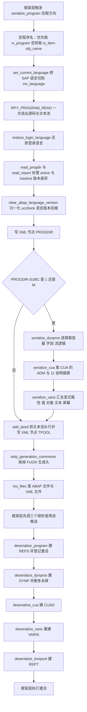
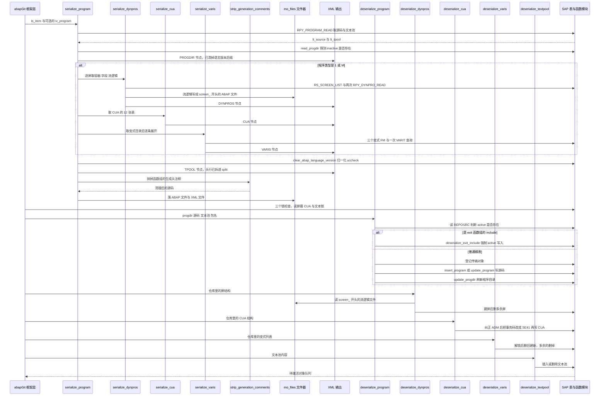

# ZCL_ABAPGIT_OBJECTS_PROGRAM 分析报告

> 分析对象：`abapGit — zcl_abapgit_objects_program.clas.abap`（全局类，1597 行，继承自 `zcl_abapgit_objects_super`）
> 报告视角：代码 onboarding 走读，按「拉取序列化 → 推送反序列化」的真实调用链展开
> 分析日期：2026-10-07

---

## 一、程序定位与业务背景

### 1.1 这段代码在解决什么问题

先把边界划清楚：这个类**不画屏幕、不激活程序、不生成变式界面**。它是 abapGit 里"报表程序（REPS）"这一类对象的**双向搬运工**——把一个 ABAP 报表在系统里的全部存在形式（源码、文本池、屏幕、图形界面、变式）打包成 Git 友好的文件，反向再拆回去。

SAP 里一个"报表程序"从来不只是几行 ABAP 代码。一个 `REPS` 对象真正落地的样子是：

| 存在形式 | 系统里的载体 | 丢了会怎样 |
|---|---|---|
| 源码 | `REPOSRC` | 程序没了 |
| 程序目录属性 | `PROGDIR`（程序类型、状态、检查符、语言版本） | 激活行为错乱 |
| 标题与文本元素 | `TPOOL` | 程序列表和选择屏幕显示空白 |
| 屏幕（画面） | `RPY_DYHEAD` / `D020S` / `D021S` / `D021T` | 程序激活时报"屏幕丢失" |
| 屏幕流逻辑 | `SWYDFLOW` | 屏幕能显示但 PAI/流逻辑全丢 |
| CUA（菜单栏/状态栏/功能键） | `RSMPE_*` 一族 12 张表 | 工具栏与菜单消失，用户以为程序坏了 |
| 变式（Variants） | `VARID` / `VARI*` | 用户每月手工重填选择条件 |

Git 的世界观里只有文本。这六类东西里有五类是**表格**，第四类（流逻辑）是**一段段 ABAP 文本**。所以业务问题可以一句话说清：

> **如何把 SAP 报表程序"散落在十几个 DDIC 表里、格式各异、还会被系统自动改写"的存在状态，压成一套每次 pull 都产出同样字节的文本文件，并且能原样还原回去。**

"每次 pull 产出同样字节"这半句是这个类的全部设计压力所在，也是它大量"看起来很怪"的写法的源头。

### 1.2 设计范式：一句话定性

> **"XML 打包器 + 变式无状态同步器"**——以 `serialize_program` / `deserialize_program` 为一对对称入口，把 SAP 的 FM 密集型对象访问收敛在类内部；序列化侧只读且追求**可复现**（排序、清空生成时间戳、剥生成注释），反序列化侧追求**破坏可收敛**（变式先解锁、删了再重建、失败时恢复保护标志）。所有失败统一走 `zcx_abapgit_exception`，向上冒泡给框架层。

### 1.3 为什么这些代码必须这么写：三个约束

理解了这个类为什么长成什么样，需要先接受三条来自 SAP 侧的硬约束：

1. **SAP 没有"读出整个报表"的 FM**。源码能一次读（`RPY_PROGRAM_READ`），屏幕不能（CUA 的 12 张表在 `RS_CUA_INTERNAL_FETCH` 里并行返回），变式不能（一个变式散在 `VARID` + `VARI*` + `RSPARAMSL_255` 三套结构里，`RS_VARIANT_CONTENTS_255` 才给得出完整视图）。所以这个类有 20 多个方法，全是"一个 FM 调一层"。
2. **SAP 自己会改写你的数据**。屏幕一保存，CUA 里那些历史上写坏的 ADM 代码段不会被自动修好（源码注释点名 issue 1807）；程序一激活，源码头里会多出 `#**regenerated at ...`（源码注释点名 issue 3680 附近的老问题）。**不抹掉这些，系统改一次，Git 里就多一次假 diff。**
3. **这些 FM 跨版本不兼容**。`RPY_PROGRAM_INSERT` 的 `UCCHECK` 参数、`RS_VARIANT_DELETE` 的 `SUPPRESS_MESSAGE` 参数都是后期版本才有的。这个类的应对方式是 `TRY ... CATCH cx_sy_dyn_call_param_not_found`，退回到不带该参数的旧调用。**这是本类最值得学的一段兼容性写法。**

### 1.4 依赖清单（读这个类之前必须知道的地形）

```
继承自 zcl_abapgit_objects_super
  MS_ITEM                    当前 Git 对象项（OBJ_TYPE / OBJ_NAME / ...）
  MV_LANGUAGE                本次操作的 SAP 语言（可能不同于 SY-LANGU）
  MO_FILES                   文件读写器（add_abap / read_abap / add_xml）
  MO_I18N_PARAMS             多语言参数；MS_PARAMS-MAIN_LANGUAGE_ONLY
                             与 BUILD_LANGUAGE_FILTER 由此而来
  EXISTS_A_LOCK_ENTRY_FOR    锁表查询（ESCRP / ESCUAPAINT / EABAPTEXTE 三类锁）
  CLEAR_ABAP_LANGUAGE_VERSION 归一化 PROGDIR-UCCHECK 里的语言版本后缀

abapGit 家族静态入口
  ZCL_ABAPGIT_LANGUAGE=>SET_CURRENT_LANGUAGE / RESTORE_LOGIN_LANGUAGE
  ZCL_ABAPGIT_FACTORY=>GET_SAP_REPORT / GET_CTS_API
  ZCL_ABAPGIT_OBJECTS_ACTIVATION=>ADD            登记待激活对象
  ZCL_ABAPGIT_EXCEPTION=>RAISE / RAISE_T100      统一异常出口

SAP 函数模块（读取侧）
  RPY_PROGRAM_READ           源码 + TPOOL 一次读出
  RS_SCREEN_LIST             程序有哪些屏幕
  RPY_DYNPRO_READ            屏幕容器与字段的生成格式
  RPY_DYNPRO_READ_NATIVE     屏幕字段的内部格式（含 splitter）
  RS_CUA_INTERNAL_FETCH      CUA 全部 12 张表
  RS_ALL_VARIANTS_4_1_REPORT 报告下的变式目录
  RS_VARIANT_VALUES_TECH_DAT_255  变式技术属性
  RS_VARIANT_CONTENTS_255    变式参数值与对象
  RS_GET_SCREENS_4_1_VARIANT 变式覆盖哪些屏幕
  VARIT / VARID              变式文本与头，直接 Open SQL

SAP 函数模块（写入侧）
  RPY_PROGRAM_INSERT / RPY_INCLUDE_UPDATE
  RPY_DYNPRO_INSERT / RPY_DYNPRO_INSERT_NATIVE / RS_SCRP_DELETE
  RS_CUA_INTERNAL_WRITE
  RS_CREATE_VARIANT_255 / RS_CHANGE_CREATED_VARIANT_255 / RS_VARIANT_DELETE
  INSERT TEXTPOOL / DELETE TEXTPOOL

数据库表（直接 SQL，绕过 FM）
  TADIR    仅取 DEVCLASS
  REPOSRC  仅取 PROGNAME 判断 active 是否存在
  D021T    屏幕文本，删除后重插
  VARIT    变式多语言文本
  VARID    变式保护标志，直接 UPDATE

标准程序内存（越界操作）
  (SAPLSIFP)TTAB           ASSIGN 之后 CLEAR，用来绕 RPY_PROGRAM_UPDATE 的头行残留
  SY-TCODE                 被直接改成 SE41，写入前不复原
```

### 1.5 阅读时必须带着的三条警告

1. **`SY-TCODE` 被本类改写**（方法 `deserialize_cua` 里，源码自称 `evil hack`）。凡是在这个类里读 `SY-TCODE` 的代码，读到的可能不是调用方的值。
2. **`(SAPLSIFP)TTAB` 是别的程序（`SAPLSIFP`）的全局变量**，本类 `CLEAR` 了它。这是跨程序改内存，靠的是动态 `ASSIGN`，一旦 SAP 改名或不再加载，**静默失效、无任何报错**。
3. **反序列化是破坏性的**。`deserialize_varis` 先删本地变式再建远端变式；`deserialize_dynpros` 先建屏再删多余屏。任何中途异常都会留下半成品系统——而且它不 `COMMIT WORK`，因此是否回滚取决于外层框架是否把整个 pull 包在一个 LUW 里，这一点**本文件不可见，需核实**。

---

## 二、程序执行流程总览

这个类有两条方向相反、几乎镜像的流程。下面这张图把两条流程和它们共享的辅助方法串在一起，节点标的都是子程序名加一句话职责：



反序列化方向上还有四个辅助方法挂在主链上：`deserialize_program` 先问 `is_exit_include`，是则改走 `deserialize_exit_include`；写入源码时在 `insert_program`（新建）与 `update_program`（更新）之间二选一；两条分支都要 `get_program_title` 从文本池取标题。

### 责任链表

| 子程序 | 调用者 | 职责 |
|---|---|---|
| 全局声明区（类型与常量段） | 编译器 / XML 序列化器 | 定义 CUA、屏幕、变式三组行结构与行表，以及 active/inactive/off 状态常量 |
| `serialize_program` | abapGit 框架层的拉取流程（`serialize` 系列） | 拉取总控：读源码、判版本、决定要不要带屏幕/CUA/变式、落 XML 与 ABAP 文件 |
| `serialize_dynpros` | `serialize_program` | 逐屏读容器与字段、补 OUTPUTSTYLE/外键/文本修正、把流逻辑写成独立 ABAP 文件 |
| `serialize_cua` | `serialize_program` | 用一次 `RS_CUA_INTERNAL_FETCH` 取回 CUA 的 ADM 与 11 张明细表 |
| `serialize_varis` | `serialize_program` | 把变式目录逐条展开成完整的 `ty_vari` 记录 |
| `get_varis_for_report` | `serialize_varis`、`deserialize_varis` | 取报告下的变式目录，只保留 SAP& 与 CUS& 两种模式 |
| `get_vari_data` | `serialize_varis` | 取单个变式的技术属性、参数值、对象与多语言文本 |
| `get_vari_screens` | `serialize_varis` | 取变式覆盖的屏幕号清单 |
| `add_tpool` | `serialize_program` | 把 `TPOOL` 转成 XML 友好的文本池，拆出 `id='S'` 条目的头段 |
| `read_tpool` | 类外部消费者（本类内部未调用） | `add_tpool` 的逆变换，把拆开的文本池拼回去 |
| `strip_generation_comments` | `serialize_program` | 抹掉 FUGR 主程序与 include 的自动生成头 |
| `is_any_dynpro_locked` | 框架层的推送前检查 | 逐屏查 `ESCRP` 锁，任一被锁即返回真 |
| `is_cua_locked` | 框架层的推送前检查 | 用补空格加通配的锁参数查 `ESCUAPAINT` 锁 |
| `is_text_locked` | 框架层的推送前检查 | 用前置通配的锁参数查 `EABAPTEXTE` 锁 |
| `deserialize_program` | abapGit 框架层的推送流程 | 推送总控：判断是否 exit include、登记传输层、insert 或 update 源码、更新 PROGDIR |
| `is_exit_include` | `deserialize_program`、`update_program` | 判断程序名是否是 SAP exit 函数组的 include |
| `get_program_title` | `deserialize_program`、`deserialize_exit_include` | 从文本池取 `id='R'` 条目作程序标题，并绕开标准程序的头行残留 |
| `insert_program` | `deserialize_program`、`deserialize_exit_include` | 新建程序：`RPY_PROGRAM_INSERT`，被拒时退回自研的 active/inactive 双写 |
| `update_program` | `deserialize_program`、`deserialize_exit_include` | 更新程序：`RPY_INCLUDE_UPDATE`，并把消息号翻译成可操作的中文提示 |
| `deserialize_exit_include` | `deserialize_program` | exit include 专用分支：强制按 active 版本写入 |
| `deserialize_textpool` | 框架层的推送流程 | 按语言与状态插入或删除文本池，决定 `REPT` 是否随本次激活删除 |
| `deserialize_dynpros` | 框架层的推送流程 | 建屏（生成格式或 native 格式）、补字段修正、删除仓库里已不存在的屏 |
| `uncondense_flow` | `deserialize_dynpros` | 按 `spaces` 缩回流逻辑行的前导空格，兼容旧版 XML |
| `deserialize_cua` | 框架层的推送流程 | 建 CUA：查 TADIR、纠正 ADM、改 `SY-TCODE` 后写 CUA、登记 `CUAD` |
| `auto_correct_cua_adm` | `deserialize_cua` | 从动作/菜单/功能键条目里回填历史上写坏的 ADM 三个代码段 |
| `deserialize_varis` | 框架层的推送流程 | 无状态同步变式：远端有的重建、本地多出来的删除 |
| `create_vari` | `deserialize_varis` | 用两个 FM 分两步建变式：先建主体与屏幕，再补对象与文本 |
| `delete_vari` | `deserialize_varis` | 删变式，带旧版本参数不兼容的回退调用 |
| `set_vari_protection` | `deserialize_varis` | 读出并临时切换变式保护标志 |

下面按这条流程，逐个子程序展开。

## 三、分组分析

### 3.1 全局声明区 类型与常量（`zcl_abapgit_objects_program` 定义段）

这个类的声明区分三块：`ty_cua` / `ty_dynpro` / `ty_vari` 三组行结构，五个状态与客户端常量，以及 PRIVATE 区的常量。它们不是样板——每一行都在后面某个方法里被真实引用，但它们同时也是这个类的**序列化契约**：XML 里长什么样，完全由这几个结构决定。

#### ① CUA 行结构

```abap
    TYPES:
      BEGIN OF ty_cua,
        adm TYPE rsmpe_adm,
        sta TYPE STANDARD TABLE OF rsmpe_stat WITH DEFAULT KEY,
        fun TYPE STANDARD TABLE OF rsmpe_funt WITH DEFAULT KEY,
        men TYPE STANDARD TABLE OF rsmpe_men WITH DEFAULT KEY,
        mtx TYPE STANDARD TABLE OF rsmpe_mnlt WITH DEFAULT KEY,
        act TYPE STANDARD TABLE OF rsmpe_act WITH DEFAULT KEY,
        but TYPE STANDARD TABLE OF rsmpe_but WITH DEFAULT KEY,
        pfk TYPE STANDARD TABLE OF rsmpe_pfk WITH DEFAULT KEY,
        set TYPE STANDARD TABLE OF rsmpe_staf WITH DEFAULT KEY,
        doc TYPE STANDARD TABLE OF rsmpe_atrt WITH DEFAULT KEY,
        tit TYPE STANDARD TABLE OF rsmpe_titt WITH DEFAULT KEY,
        biv TYPE STANDARD TABLE OF rsmpe_buts WITH DEFAULT KEY,
      END OF ty_cua.
```

**做什么** — 声明 CUA（图形界面：状态栏、标题栏、菜单栏、按钮、功能键等）的容器结构 `ty_cua`。前 12 个组件各自是一张 `STANDARD TABLE ... WITH DEFAULT KEY`，分别对应 SAP 的 12 张 `RSMPE_*` 接口表；`adm` 是 CUA 的头结构（记录总体标题、状态栏代码、菜单栏代码、功能键代码）。

**为什么** — 之所以要做一层自己的包装而不是直接用 12 个独立参数，有两个理由。一是 `RS_CUA_INTERNAL_FETCH` / `RS_CUA_INTERNAL_WRITE` 的 `TABLES` 参数本来就是这 12 张表，一次调用收一次，包装成一个结构后 `serialize_cua` / `deserialize_cua` 各自只需要一行 `ig_data` 就能写进 XML；二是这层包装把"SAP 的 CUA 表"与"abapGit 的 XML 结构"解耦，将来某张 `RSMPE_*` 换了类型，只改这里。

**风险与改进** — 三点：

1. **`biv` 组件名与表名对不上**：字段叫 `biv`（取自 `RSMPE_BUTS`，看起来是 "BILD vertical"/按钮变体），而兄弟字段都是表格原名的缩写（`sta`/`fun`/`men`/`mtx`/`act`/`but`/`pfk`/`set`/`doc`/`tit`）。这个命名不解释就看不出对应关系。更实质的问题是：**XML 里的元素名直接取自这些组件名**，一旦改名，所有历史仓库的 XML 都对不上，且升级过程没有兼容映射。建议在结构旁补注释说明每个组件对应的 `RSMPE_*` 表与 XML 元素名。
2. **全部 `WITH DEFAULT KEY`，没有唯一键也没有二级键**。`deserialize_cua` 把这些表当 `TABLES` 参数传给 FM，全程只做追加不做查找，所以当前没问题；但 `auto_correct_cua_adm` 里对 `act` / `men` / `pfk` 三张表做的是全表 `LOOP`（见 3.23）。CUA 表通常几十行，代价可接受——**这一条现在不出错，仅在 CUA 表变大后才会显形**。
3. **`adm TYPE rsmpe_adm` 没有说明它是否总被完整填充**。`auto_correct_cua_adm` 的存在说明这个字段历史上不可信，但类型上没有任何约束或注释提示调用方"读到的 ADM 可能需要纠正"。序列化侧直接把它写进 XML，等于把可能的坏数据原样存档。

#### ② 屏幕与变式行结构

```abap
      ty_spaces_tt TYPE STANDARD TABLE OF i WITH DEFAULT KEY .
    TYPES:
      BEGIN OF ty_dynpro,
        header     TYPE rpy_dyhead,
        containers TYPE dycatt_tab,
        fields     TYPE dyfatc_tab,
        flow_logic TYPE swydyflow,
        spaces     TYPE ty_spaces_tt,
        nat_header TYPE d020s,
        nat_fields TYPE STANDARD TABLE OF d021s WITH DEFAULT KEY,
        nat_texts  TYPE STANDARD TABLE OF d021t WITH DEFAULT KEY,
      END OF ty_dynpro .
    TYPES:
      ty_dynpro_tt TYPE STANDARD TABLE OF ty_dynpro WITH DEFAULT KEY .
```

**做什么** — 声明屏幕行结构 `ty_dynpro`：`header` 是屏幕头（生成格式），`containers` 与 `fields` 是容器与字段（生成格式），`nat_header` / `nat_fields` / `nat_texts` 是同一屏的 native 格式（`D020S` / `D021S` / `D021T`），`flow_logic` 与 `spaces` 是流逻辑及其缩进信息。`ty_dynpro_tt` 是它的行表。

**为什么** — 同时持有"生成格式"和"native 格式"两套，是因为 SAP 自己的屏幕有两副面孔：`RPY_DYNPRO_INSERT`（生成格式，能画出 SE41 里那种带容器的画面）和 `RPY_DYNPRO_INSERT_NATIVE`（native 格式，直接写 `D020S`/`D021S`，支持 splitter 之类生成格式表达不了的布局）。序列化时按屏幕类型二选一，反序列化时按同样的判断还原——`ty_dynpro` 必须同时装下两者，`deserialize_dynpros` 才能只靠一个结构走完。

**风险与改进** — 两处，其中一处是实打实的功能缺口：

1. **`flow_logic` 与 `spaces` 在序列化侧永远是初始值**。全文件里 `serialize_dynpros` 只把流逻辑写进独立 ABAP 文件（`mo_files->add_abap( iv_extra = 'screen_' && ... )`），**从未给 `<ls_dynpro>-flow_logic` 或 `<ls_dynpro>-spaces` 赋过值**。它们只在反序列化侧被读取，且源码注释明确写着 `kept for compatibility, remove after grace period`（issue 3680）。所以这两个组件是纯粹的历史兼容字段：新产生的 XML 永远不带它们，反序列化时必然走 `IF ls_dynpro-flow_logic IS INITIAL.` 分支从文件读。**功能上没问题，但类型声明让人误以为流逻辑会进 XML**。建议在结构里给这两个组件加注释标明"仅供旧版 XML 读取"，并在宽限期结束后连同 `uncondense_flow` 一起删掉。
2. **`ty_spaces_tt` 用 `i`（整数）表达缩进量，单位靠 `SHIFT ... IN CHARACTER MODE` 兜住**。如果哪一天有人把 `SHIFT` 的 `IN CHARACTER MODE` 去掉，字节模式与字符模式在多字节文本下会给出不同结果，而这里不会有任何报错。建议把单位写进类型名或注释。

#### ③ 状态与客户端常量

```abap
    CONSTANTS:
      BEGIN OF c_state,
        active   TYPE r3state VALUE 'A',
        inactive TYPE r3state VALUE 'I',
        off      TYPE r3state VALUE '',
      END OF c_state.

    CONSTANTS c_native_dynpro TYPE c LENGTH 2 VALUE 'IN'.

    CONSTANTS c_sysvari_clnt        TYPE mandt      VALUE '000'.
    CONSTANTS c_sysvari_pattern_sap TYPE c LENGTH 5 VALUE 'SAP&*'.
    CONSTANTS c_sysvari_pattern_cus TYPE c LENGTH 5 VALUE 'CUS&*'.
```

**做什么** — 五个常量：程序版本三态（active / inactive / off，off 是空串）；`c_native_dynpro` 是判定"这个屏幕走 native 格式"的字符集合；`c_sysvari_clnt` 固定为变式所在的客户端 `000`；两个变式命名的匹配模式。

**为什么** — `off = ''` 是这三个里最值得看的一个：它不是第三个状态，而是"把状态置空"的写法，用在 `deserialize_exit_include` 里（`iv_state = c_state-off`），而 `iv_state` 最终传给 `RPY_INCLUDE_UPDATE` 的 `SAVE_INACTIVE` 这个布尔参数——空串转成布尔就是假，也就是"按 active 保存"。SAP exit 函数组的 include 只能在 active 状态下处理（源码注释指向 `RS_INSERT_INTO_WORKING_AREA` 的检查），所以这里需要的是"不是 inactive"，空串刚好表达这个意思。

`c_sysvari_clnt = '000'` 的存在也解释了一件事：变式表（`VARID` / `VARIT`）是**跨客户端**的，无论报表在哪个客户端，abapGit 都只处理 `000` 客户端里的变式。所以全文三处访问变式表的地方都带 `CLIENT SPECIFIED` 并显式给 `mandt = c_sysvari_clnt`（见 3.16、3.25）——这不是冗余，是必需的。

**风险与改进** — 两点：

1. **`off` 是一个"空状态"，语义靠命名撑着**。`c_state-off` 读起来像"关闭"，但它实际是"非 active、非 inactive"。而且 `TYPE r3state`（`R3STATE` 是 `CHAR1`）让一个"布尔量"看起来像状态码。建议要么改成 `abap_false`，要么把注释写清"空串 = 按 active 保存"。
2. **`c_native_dynpro = 'IN'` 的匹配方式是 `CA`（contains any）**，即屏幕类型里只要出现 `I` 或 `N` 任一字符就走 native 路径。这个判定在 `serialize_dynpros` 与 `deserialize_dynpros` 两处各用一次，必须保持一致，否则会出现"序列化走了 native、反序列化走了生成格式"的不对称。具体哪些屏幕 `TYPE` 值会命中，需在 SE41 核实；从 `ty_dynpro` 同时支持两套结构看，作者是有意为之，但这个约定只存在于两个 `CA` 表达式里，没有注释也没有常量说明。
3. **`c_sysvari_pattern_cus = 'CUS&*'` 的来源没有在文件里解释**。`SAP&*` 是 SAP 变式的命名约定（SAP 内部生成的变式都长这样），`CUS&*` 则是另一套约定——它在 abapGit 里被用来标记"应当纳入版本库的变式"，但这个约定的出处（文档、issue、还是约定俗成）**本文件不可见，需核实**。这条规则的实际后果是：**用户在 SE38 里手工创建的不带前缀的变式，永远不会被 abapGit 搬运**，用户容易误以为 abapGit 管变式。

### 3.2 公开入口 `serialize_program`（拉取方向总控）

这是整个类最长也最重要的方法，1597 行源码里占了约 100 行。它分四步：定程序名并读源码、处理 active/inactive 版本差异、装配 XML、清理并落盘。

#### ① 定名、切语言、一次读出源码与文本池

```abap
    IF iv_program IS INITIAL.
      lv_program_name = is_item-obj_name.
    ELSE.
      lv_program_name = iv_program.
    ENDIF.

    zcl_abapgit_language=>set_current_language( mv_language ).

    CALL FUNCTION 'RPY_PROGRAM_READ'
      EXPORTING
        program_name     = lv_program_name
        with_includelist = abap_false
        with_lowercase   = abap_true
      TABLES
        source_extended  = lt_source
        textelements     = lt_tpool
      EXCEPTIONS
        cancelled        = 1
        not_found        = 2
        permission_error = 3
        OTHERS           = 4.

    IF sy-subrc = 2.
      zcl_abapgit_language=>restore_login_language( ).
      RETURN.
    ELSEIF sy-subrc <> 0.
      zcl_abapgit_language=>restore_login_language( ).
      zcx_abapgit_exception=>raise_t100( ).
    ENDIF.

    zcl_abapgit_language=>restore_login_language( ).
```

**做什么** — 决定本次要打包哪个程序：调用方显式传了 `iv_program` 就用它，否则用 `ms_item-obj_name`。然后把 SAP 会话语言切到 `mv_language`，用 `RPY_PROGRAM_READ` 一次性把源码（`SOURCE_EXTENDED`）和文本池（`TEXTELEMENTS`）读进内存，按 `sy-subrc` 分流：`not_found`（2）直接静默返回，其他非零把 T100 消息抛成异常。最后把登录语言还原回去。

**为什么** — "切语言 → 读 → 还原"这个三明治是必须的：`RPY_PROGRAM_READ` 的文本元素是按**当前 `SY-LANGU`** 取的，而 abapGit 可能正在处理一个非登录语言的对象（比如为德语系统拉一个程序）。不切语言就会拉到错误语言的文本元素，而且不还原会把用户的会话语言改掉——后者是比第一个严重得多的副作用。两条错误分支都先 `restore_login_language( )` 再返回或抛异常，顺序是对的。

`WITH_LOWERCASE = abap_true` 值得单独说：它让 FM 保留用户输入的原始大小写（关键字也保持小写）。对版本库这是关键——否则同一份代码在 SE38 编辑和在 abapGit 里往返一次就会产生大面积大小写 diff。

**风险与改进** — 三点：

1. **`sy-subrc = 2` 时静默 `RETURN`，调用方拿不到任何信号**。这意味着"程序在系统里不存在"和"程序存在但没有屏幕/变式"对上层是完全一样的结果：什么都没有。业务后果是：**如果某次 push 的 `PROGDIR` 写错了程序名，pull 会静默产出一个"源文件是新的、程序目录信息是错的"的提交，且不报任何错**。建议至少把这种情况记进 abapGit 的日志，或者加一个 `no_program_found` 异常让框架层自己决定要不要吞掉。
2. **`raise_t100( )` 依赖 `SY-MSGID` / `SY-MSGNO` 还是 FM 留下的那个值**。此处顺序是对的（先还原语言再抛），但 `restore_login_language( )` 本身是 `zcl_abapgit_language` 的静态方法，实现不在本文件——**如果它内部调用了任何 FM 或设置了消息，`SY-MSGID` / `SY-MSGNO` 就可能被覆盖**，`raise_t100( )` 抛出的将是还原动作产生的消息而不是真正的原因。这一处需在 `ZCL_ABAPGIT_LANGUAGE` 里核实。同样的隐患在 `update_program` 里后果更严重（见 3.18），那里的代码明确依赖 `SY-MSGID = 'EU'`。
3. **`restore_login_language( )` 的调用分散在三条路径上**（两条错误分支 + 正常路径），一旦将来在 `RPY_PROGRAM_READ` 之后新增一段可能抛异常的代码，就很容易漏掉还原。更稳的形状是 `TRY ... FINALLY`，或者把"设置 + 读取 + 还原"封成一个私有方法，让语言状态不可能泄漏。

#### ② 探测 inactive 版本并归一化 `uccheck`

```abap
    li_report = zcl_abapgit_factory=>get_sap_report( ).

    TRY.
        " Raises exception if inactive version does not exist
        ls_progdir = li_report->read_progdir(
          iv_name  = lv_program_name
          iv_state = c_state-inactive ).

        " Explicitly request active source code
        lt_source = li_report->read_report(
          iv_name  = lv_program_name
          iv_state = c_state-active ).
      CATCH zcx_abapgit_exception ##NO_HANDLER.
    ENDTRY.

    ls_progdir = li_report->read_progdir(
      iv_name  = lv_program_name
      iv_state = c_state-active ).

    clear_abap_language_version( CHANGING cv_abap_language_version = ls_progdir-uccheck ).
```

**做什么** — 拿到 abapGit 自己的 SAP 报表访问器，然后：先试读 **inactive** 版的程序目录（如果 inactive 版本不存在，这一步会抛 `zcx_abapgit_exception`），再显式读 **active** 版源码覆盖 `RPY_PROGRAM_READ` 的结果；异常被 `##NO_HANDLER` 静默吞掉。最后无论走没走成功分支，都再读一次 **active** 版程序目录赋给 `ls_progdir`，并把 `uccheck` 里的 ABAP 语言版本后缀清掉。

**为什么** — `TRY` 块在这里被当成 `IF` 用：作者需要知道"inactive 版本存不存在"，而接口只提供"读不到就抛异常"这一种反馈。空 `CATCH` 块是最直白的表达。源码注释也写明了动机——`If inactive version exists, then RPY_PROGRAM_READ does not return the active code`：`RPY_PROGRAM_READ` 在有 inactive 版本时会返回 inactive 的代码，而 abapGit 约定**只提交 active 版本**，所以要显式覆盖回去。

**风险与改进** — 这一段有三处需要盯住：

1. **`TRY` 块里那次 `read_progdir( inactive )` 的赋值是死代码**。`ENDTRY` 之后紧接着一句无条件执行 `ls_progdir = li_report->read_progdir( ... active )`，把 `TRY` 块里赋的值覆盖掉。所以无论 inactive 存不存在，最终 `ls_progdir` 一定是 active 版本；那次 `read_progdir( inactive )` 唯一的作用是"用异常探测存在性"。如果作者的本意是"有 inactive 就用 inactive 的属性"（`PROGDIR` 里的 `RSTAT`、`UCCHECK` 等字段在两种状态下可能不同），当前实现没有实现这个意图；如果本意就是"始终用 active"，那么 `TRY` 块里那次调用应该写成只调用不赋值。**两种意图都自洽，但代码没有表达是哪一种**——这是接手时必须向作者确认的第一件事。**影响是业务级的**：拉下来的 `PROGDIR` 记录永远是 active 的检查符，而 `insert_program` 会把它当作新程序的版本写回去，等于把"上次激活时的检查符"当成"本次源码的语言版本"固化进 Git。
2. **`CATCH` 是空的（`##NO_HANDLER`），连注释都没有，所以"异常被吞"这件事在代码里毫无痕迹**。`##NO_HANDLER` 这个 ATC 抑制只是告诉代码检查器"我知道"，对读者什么都不说。建议补一行注释说明这里吞的是"inactive 不存在"这一种预期情况，以及为什么 `read_report` 抛出的异常也可以一起吞掉（后者其实是可疑的：源码读的 `read_report` 一旦异常，`lt_source` 会保持 `RPY_PROGRAM_READ` 的结果，可能是 inactive 的代码，与"只提交 active"的约定冲突）。
3. **`clear_abap_language_version` 是一处有意的信息丢弃**。`UCCHECK` 字段里除了版本检查符还可能带 ABAP 语言版本后缀，清掉它让 XML 稳定（否则不同系统上的同一份程序会写出不同的 `UCCHECK`）。但这也意味着**语言版本不参与往返**：推到一个低版本系统时，系统按目标版本重新判定，代码里那些高版本语法可能激活失败。这是"可复现优先"与"信息完整"之间的真实取舍，值得在注释里点明，让下一个人知道这是设计而不是遗漏。

### 3.3 序列化子程序 `serialize_dynpros`（逐屏读容器与字段）

这个方法把一个程序的每一屏拆成"头 + 容器 + 字段 + 流逻辑 + native 三件套"，并在读出来之后做四处字段级修正。它是本类里唯一带位运算的一段。

#### ① 取屏幕清单并逐屏读两套格式

```abap
    CALL FUNCTION 'RS_SCREEN_LIST'
      EXPORTING
        dynnr     = ''
        progname  = iv_program_name
      TABLES
        dynpros   = lt_d020s
      EXCEPTIONS
        not_found = 1
        OTHERS    = 2.
    IF sy-subrc = 2.
      zcx_abapgit_exception=>raise_t100( ).
    ENDIF.

    SORT lt_d020s BY dnum ASCENDING.

* loop dynpros and skip generated selection screens
    LOOP AT lt_d020s ASSIGNING <ls_d020s>
        WHERE type <> 'S' AND type <> 'W' AND type <> 'J'
        AND NOT dnum IS INITIAL.

      CALL FUNCTION 'RPY_DYNPRO_READ'
        EXPORTING
          progname             = iv_program_name
          dynnr                = <ls_d020s>-dnum
        IMPORTING
          header               = ls_header
        TABLES
          containers           = lt_containers
          fields_to_containers = lt_fields_to_containers
          flow_logic           = lt_flow_logic
        EXCEPTIONS
          cancelled            = 1
          not_found            = 2
          permission_error     = 3
          OTHERS               = 4.
      IF sy-subrc <> 0.
        zcx_abapgit_exception=>raise_t100( ).
      ENDIF.
```

**做什么** — 先用 `RS_SCREEN_LIST` 拿到这个程序所有屏幕的清单（`D020S` 表），按屏号排序；然后筛掉 `TYPE` 为 `S`、`W`、`J` 以及屏号初始的那些，只对剩下的屏调用 `RPY_DYNPRO_READ`，读出该屏的生成格式：头、容器、字段、流逻辑。`not_found`（1）视为"这一屏读不到"而不算错误，只有 `OTHERS`（2）抛异常。

**为什么** — 排序放在循环之前，是因为后面 `is_any_dynpro_locked` 与 `deserialize_dynpros` 都依赖屏号顺序；更重要的是顺序本身就是**可复现性的基础**——`RS_SCREEN_LIST` 不保证返回顺序，不排序的话每次 pull 的 XML 顺序都可能不同，Git 里就全是假 diff。这正是本类所有 `SORT` 语句的共同动机。

筛掉的三类屏幕是这一段最需要理解的地方：`S` 是**选择屏幕**（由 `PARAMETERS` / `SELECT-OPTIONS` 语句自动生成，不是人在 SE41 里画的），`W` 与 `J` 的确切含义需在 SE41/SE11 核实，但从方法名 `RPY_DYNPRO_*` 的族谱看，它们属于由程序逻辑驱动生成、无法（或不应）单独搬运的屏幕类型。

**风险与改进** — 三点：

1. **筛掉 `J` 类型意味着多画面事务会丢屏**。`J` 类屏幕（join screen，通过 `CALL SCREEN` 串起来的后续画面）在这里被排除，于是"第一屏之后的屏"不会被序列化。业务后果：用户的程序 pull 之后只剩入口屏，`CALL SCREEN 0100` 会在激活时报屏幕不存在。**这一条要么是有意为之（SE41 里重建即可），要么是漏了**——文件里没有注释说明，建议补上；如果是遗漏，这就是本类最严重的功能缺口之一。
2. **`type <> 'S'` 这类过滤条件无法排除 `NULL` 行**。ABAP 里 `NULL` 与 `SPACE` 等价，所以初始行会被 `type <> 'S'` 排除掉——真正起作用的是 `AND NOT dnum IS INITIAL` 这一条。也就是说，四个条件里有两个是冗余的。冗余本身无害，但读者要花时间推演"到底哪个条件在起作用"。
3. **`IF sy-subrc <> 0.` 紧跟 `RPY_DYNPRO_READ` 是对的**，但它离下一个 FM 只有十几行（本方法后面还有一次无 `EXCEPTIONS` 的 `RPY_DYNPRO_READ_NATIVE`）。这种"中间不留其他 FM 调用"的顺序约束没有注释点出来，改代码时很容易在中间插入一个 `SELECT` 就把错误判断挪位。建议在 `IF sy-subrc` 前加一行注释。

#### ② 取 native 格式字段列表并修正 `OUTPUTSTYLE` 与外键标志

```abap
      "#2746: we need the dynpro fields in internal format:
      FREE lt_fieldlist_int.

      CALL FUNCTION 'RPY_DYNPRO_READ_NATIVE'
        EXPORTING
          progname   = iv_program_name
          dynnr      = <ls_d020s>-dnum
        TABLES
          fieldlist  = lt_fieldlist_int
          fieldtexts = lt_texts.

      LOOP AT lt_fields_to_containers ASSIGNING <ls_field>.
* output style is a NUMC field, the XML conversion will fail if it contains invalid value
* field does not exist in all versions
        ASSIGN COMPONENT 'OUTPUTSTYLE' OF STRUCTURE <ls_field> TO <lv_outputstyle>.
        IF sy-subrc = 0 AND <lv_outputstyle> = '  '.
          CLEAR <lv_outputstyle>.
        ENDIF.
```

**做什么** — 逐屏再调一次 `RPY_DYNPRO_READ_NATIVE`，拿到字段的 native 格式（`D021S` 列表）与屏幕文本（`D021T`），并在生成的格式字段列表上做两件事：把 `OUTPUTSTYLE` 字段里只有两个空格的值清成初始值（因为它是 `NUMC` 类型，含非法字符会让 XML 转换失败），以及准备接下来用 native 字段列表去判断外键标志。

**为什么** — `OUTPUTSTYLE` 那两行是纯粹的**序列化可行性修补**。XML 序列化器按字段类型做校验，`NUMC` 里出现非数字字符会直接抛转换异常，而 SAP 在某些版本里往这个字段写了两个空格。所以这不是"清理脏数据"，而是"让 XML 能写出去"。注释里 `field does not exist in all versions` 也说明了为什么要用动态的 `ASSIGN COMPONENT` 而不是直接写 `<ls_field>-outputstyle`。

这里同时体现了本类对 ABAP 短路的依赖：`IF sy-subrc = 0 AND <lv_outputstyle> = '  '.` 里，解引用可能未赋值的字段符号放在 `AND` 之后——ABAP 的逻辑运算符会从左到右短路求值，所以 `ASSIGN` 失败时不会去解引用。**写法正确，但它依赖的是一条语言语义而不是语法强制**。

**风险与改进** — 三点：

1. **`RPY_DYNPRO_READ_NATIVE` 完全没有 `EXCEPTIONS` 段**。这是本方法里唯一不做错误处理的 FM 调用：它要么成功，要么运行时错误（dump）。同一方法里相邻的 `RPY_DYNPRO_READ` 有四个异常、四个 `sy-subrc` 判断，相邻两个调用保护等级完全不同却看不出理由。业务后果：一个历史数据有问题的屏会让 pull 直接 dump，用户看到的是短转储而不是 abapGit 的友好报错。**建议至少加 `EXCEPTIONS OTHERS` 走 `raise_t100`，或加注释说明为什么它不可能抛异常。**
2. **`ASSIGN COMPONENT` 的失败用 `sy-subrc` 判断，而它的失败会覆盖前一个 FM 的 `sy-subrc`**。当前代码顺序上是安全的（这个 `sy-subrc` 只用于紧跟的 `IF`），但这是一个很容易在后续维护中被破坏的耦合。
3. **`FREE lt_fieldlist_int` 每次循环都清空整张表**，而 `RPY_DYNPRO_READ_NATIVE` 是 `TABLES` 参数（追加语义）。`FREE` 的存在说明作者遇到过 FM 追加到残留数据的问题——`TABLES` 参数不清空确实是个经典陷阱。这一行值得保留，但值得加注释说明它挡的是哪一类脏数据（否则下一个人会以为它是冗余的）。

#### ③ 用位运算修正外键标志与修改态文本

```abap
        UNASSIGN <ls_field_int>.
        READ TABLE lt_fieldlist_int ASSIGNING <ls_field_int> WITH KEY fnam = <ls_field>-name.
        IF <ls_field_int> IS ASSIGNED.
          IF <ls_field_int>-flg1 O lc_flg1ddf AND
              <ls_field_int>-flg3 O lc_flg3for AND
              <ls_field_int>-flg3 Z lc_flg3fdu AND
              <ls_field_int>-flg3 Z lc_flg3fku.
            <ls_field>-foreignkey = 'X'.
          ELSE.
            CLEAR <ls_field>-foreignkey.
          ENDIF.
        ENDIF.

        IF <ls_field>-from_dict = abap_true AND
           <ls_field>-modific   <> 'F' AND
           <ls_field>-modific   <> 'X'.
          CLEAR <ls_field>-text.
        ENDIF.
```

**做什么** — 对每个生成格式的字段，去 native 格式的字段列表里按 `FNAM` 找同名字段，找到就按四个位标志重算外键标志（三个条件成立才置 `'X'`，否则清空）；另外当字段来自数据字典、且修改类型既不是 `F` 也不是 `X` 时，清掉它的文本。

**为什么** — 注释写明这段的意图是 `we apply the same logic as in SAPLWBSCREEN`：abapGit 在**复刻标准程序 SAP 的判定逻辑**，把同一张屏幕在标准程序里算出来的外键标志手动算一遍。原因是生成格式的 `foreignkey` 字段不可靠——反序列化侧有一段对应的 `IF <ls_field>-foreignkey IS INITIAL. <ls_field>-foreignkey = '/' ENDIF`（issue 2747），两边正好是一对：序列化时认真算，反序列化时兜底关掉。

`READ TABLE ... ASSIGNING` 之后用 `IS ASSIGNED` 而不是 `sy-subrc` 判断是否存在，这是正确写法——`ASSIGNING` 在找不到行时会把字段符号置空，用 `sy-subrc` 判断在嵌套场景里容易被后续语句覆盖。前面那句 `UNASSIGN <ls_field_int>` 则保证上一轮循环的赋值不会残留成"本轮也找到"的假象。

清 `text` 那段的逻辑是：如果字段是取自数据字典（`from_dict`）且不是强制修改态，那么 SAP 认为它的文本应该由 DDIC 决定，屏幕里的手改文本是不可移植的噪音，删掉它才能让 Git diff 干净。

**风险与改进** — 三点：

1. **四个位常量是从标准 include 里抄来的硬编码**：

   ```abap
    "#2746: relevant flag values (taken from include MSEUSBIT)
    CONSTANTS: lc_flg1ddf TYPE x VALUE '20',
               lc_flg3fku TYPE x VALUE '08',
               lc_flg3for TYPE x VALUE '04',
               lc_flg3fdu TYPE x VALUE '02'.
   ```

   **做什么** — 这几行是本方法里复刻 SAP 判定逻辑所需的四个位常量：一个属于 `FLG1`，三个属于 `FLG3`，类型都是 `TYPE x`（单字节十六进制位串），值分别是 `20` / `08` / `04` / `02`。

   **为什么** — 它们对应 SAP 屏幕字段内部标志位 `D021S-FLG1` 与 `D021S-FLG3` 上的几个具体位。SAP 标准 include `MSEUSBIT` 里以名字定义它们，abapGit 不能直接引用（跨程序、且非释放的 include），只能把值抄成局部常量。行内注释把出处标了出来，这让"这是抄来的"这件事对读者是可见的。

   **风险与改进** — 这段引用本身没有缺陷，风险全部在它的**时效性**上，详见下面第 1 条。

   注释诚实地说明了来源，但**没有说明这些位会不会随 SAP 升级变化**。业务后果是静默的：如果 SAP 某次升级调整了 `D021S-FLG1/FLG3` 的位含义，abapGit 会算出一个"看起来合法但语义相反"的外键标志，往返之后屏幕上会出现或消失外键检查标。**改进方向**：把这四个值与它们对应的标志名（`DDF` / `FKU` / `FOR` / `FDU`）一起记录在注释里，并写明"升级后需与 MSEUSBIT 复核"。
2. **`O` 与 `Z` 两个位运算符混用，可读性差**。`flg3 O lc_flg3fku`（置位）、`flg3 Z lc_flg3fdu`（未置位）、`flg3 O lc_flg3for`（未置位）三个条件里两个检查"未置位"。这类代码出错时没有任何编译期保护。建议在注释里逐条写出四个条件的自然语言含义。
3. **`MODIFIC <> 'F' AND MODIFIC <> 'X'` 用两个不等式排除两个值**，语义上等价于"不属于修改态集合"，但把合法取值列全需要有人告诉读者。`MODIFIC` 在 `RPY_DYFIELDS` 里还有别的取值吗，**需在 SE41/SE11 核实**；若还有第三种取值同样需要处理的态，当前代码会漏掉它。

#### ④ 收敛容器最小尺寸、落流逻辑文件、决定走哪套格式

```abap
      LOOP AT lt_containers ASSIGNING <ls_container>.
        IF <ls_container>-c_resize_v = abap_false.
          CLEAR <ls_container>-c_line_min.
        ENDIF.
        IF <ls_container>-c_resize_h = abap_false.
          CLEAR <ls_container>-c_coln_min.
        ENDIF.
      ENDLOOP.

      APPEND INITIAL LINE TO rt_dynpro ASSIGNING <ls_dynpro>.
      <ls_dynpro>-header = ls_header.

      " Store flow logic as separate ABAP files instead of XML
      mo_files->add_abap(
        iv_extra = 'screen_' && ls_header-screen
        it_abap  = lt_flow_logic ).

      READ TABLE lt_fieldlist_int TRANSPORTING NO FIELDS WITH KEY fill = 'X'.
      IF ls_header-type CA c_native_dynpro AND sy-subrc = 0.
        " In particular for dynpros with splitter
        <ls_dynpro>-nat_header = <ls_d020s>.
        CLEAR: <ls_dynpro>-nat_header-dgen, <ls_dynpro>-nat_header-tgen.
        <ls_dynpro>-nat_fields = lt_fieldlist_int.
        <ls_dynpro>-nat_texts  = lt_texts.
      ELSE.
        <ls_dynpro>-containers = lt_containers.
        <ls_dynpro>-fields     = lt_fields_to_containers.
      ENDIF.
```

**做什么** — 先把"不允许纵向/横向调整尺寸"的容器上的最小行/列数清零（这两个值在不可调整时无意义，且会因系统差异不同而制造假 diff）；然后把这一屏追加到结果表，只填 `header`；接着把流逻辑交给 `mo_files` 写成一个独立的 ABAP 文件（文件名前缀 `screen_`）；最后判断走 native 还是生成格式：屏幕类型命中 `c_native_dynpro` **且** native 字段列表里存在 `FILL = 'X'` 的条目（源码注释说这是 splitter 布局的特征）时，填 `nat_header` / `nat_fields` / `nat_texts`，并清掉 native header 里的生成日期与时间；否则填 `containers` / `fields`。

**为什么** — 三个设计决定在这里落地：

- **流逻辑不进 XML，改成独立 `.abap` 文件**。理由是可 diff 性：流逻辑是有缩进的 ABAP 文本，放进 XML 会变成一个巨大的转义字符串，人在 Git 里根本没法 review；写成 `screen_0100.abap` 之后，它就是一段正常的源码文件。代价是序列化侧留下了一个"XML 与 ABAP 文件两处描述同一屏"的约定，反序列化侧必须靠 `flow_logic` 是否初始来判断该从哪读（见 3.20）。
- **清 `dgen` / `tgen`**。这是可复现性的直接体现：`D020S` 里存着屏幕最后一次生成的日期和时间，这是纯粹的机器状态。留着它，每次 pull 都会在这两个字段上产生一次假 diff。
- **native 与生成格式二选一，且条件是"与"关系**。native 格式只有 splitter 布局才需要，普通屏仍然走生成格式——因为生成格式才是 SE41 里用户真正编辑的东西，用它往返才能保住用户的编辑。两个条件都用 `AND` 串起来，并且 `sy-subrc = 0` 放在 `CA` 之后：先判类型再看有没有 splitter 字段，顺序与依赖一致。

**风险与改进** — 三点：

1. **`READ TABLE ... WITH KEY fill = 'X'` 只有"有没有"，没读出是哪一行**，而判断所需的全部信息就是"有没有"，所以这是对的。但条件写成了 `IF ls_header-type CA c_native_dynpro AND sy-subrc = 0.`，两个条件的先后顺序在这里是**必须**的（`CA` 不改 `sy-subrc`，所以其实两种顺序都行）——真正脆弱的是**未来如果有人在 `READ` 之后插入任何会改 `sy-subrc` 的语句**，这个判断就静默失效。这类"依赖 `sy-subrc` 的存活距离"的代码在文件里至少有三处，值得统一加注释。
2. **native 与生成格式互斥，但反序列化侧 `deserialize_dynpros` 里 native 分支的判定条件与此处不完全对称**：序列化侧要求 `fill = 'X'` 存在，反序列化侧只看 `header-type CA c_native_dynpro AND nat_header IS NOT INITIAL`。也就是说，如果一个 splitter 屏因为某次历史原因没被写成 native 格式，反序列化会走 native 分支而拿到空的 `nat_header`——**代码靠 `nat_header IS NOT INITIAL` 这个兜底把不对称变成了安全**，但这个兜底没有注释，接手的人很容易以为两边是对称的。
3. **两处条件性的字段清零（容器最小尺寸、字段文本）没有共同的"为什么"注释**。它们和 `dgen` / `tgen` 清理一样都属于"消除系统自动改写产生的假 diff"，但散落在四处。建议在类的开头或这几个方法上写一条统一原则：**序列化前把所有"机器状态"清干净**——这句话是整个可复现性设计的灵魂，现在只存在于细节里。

### 3.4 序列化子程序 `serialize_cua`（一次取回全部 12 张 CUA 表）

整个方法只有一次 FM 调用，但它是这个类里信息密度最高的一次：SAP 把一个程序的整个图形界面拆在 12 张 `RSMPE_*` 表里，`RS_CUA_INTERNAL_FETCH` 是唯一一次把它们一起取回来的入口。

```abap
    CALL FUNCTION 'RS_CUA_INTERNAL_FETCH'
      EXPORTING
        program         = iv_program_name
        language        = mv_language
        state           = c_state-active
      IMPORTING
        adm             = rs_cua-adm
      TABLES
        sta             = rs_cua-sta
        fun             = rs_cua-fun
        men             = rs_cua-men
        mtx             = rs_cua-mtx
        act             = rs_cua-act
        but             = rs_cua-but
        pfk             = rs_cua-pfk
        set             = rs_cua-set
        doc             = rs_cua-doc
        tit             = rs_cua-tit
        biv             = rs_cua-biv
      EXCEPTIONS
        not_found       = 1
        unknown_version = 2
        OTHERS          = 3.
    IF sy-subrc > 1.
      zcx_abapgit_exception=>raise_t100( ).
    ENDIF.
```

**做什么** — 用 `RS_CUA_INTERNAL_FETCH` 取指定程序、指定语言、指定状态（本类固定传 active，因为与"只提交 active 版本"的约定一致）的图形界面，头结构写进 `rs_cua-adm`，11 张明细表各自写进 `ty_cua` 的同名字段。错误处理用 `sy-subrc > 1` 判定：`not_found`（1）视为正常（这个程序本来就没有 CUA），`unknown_version`（2）与 `OTHERS`（3）才抛异常。

**为什么** — `sy-subrc > 1` 而不是 `sy-subrc <> 0` 是这里唯一值得学的细节：`not_found` 是**正常业务状态**而非故障——SAP 里绝大多数报表程序根本没有自定义 CUA，如果把它也当成错误，整个 `serialize_program` 会为一个常见情况抛异常。区分"没有"和"坏了"是序列化代码的基本功。

把 11 张表直接 `TABLES` 传给本类自己声明的 `ty_cua` 组件，是 3.1 里那层包装存在的兑现：这里一个字段名对错，编译器就报错，而 XML 结构与 SAP 表结构解耦。

**风险与改进** — 三点：

1. **`not_found` 被静默吞掉，导致空 CUA 与"读失败"在结果上无法区分**。如果因为某个 release 的差异，FM 其实报的是别的错而恰好映射到 `not_found = 1`，abapGit 会安静地写出一个空 CUA，用户的菜单栏在下次 push 后消失。**改进方向**：把 `not_found` 也记一条日志，或者让 `serialize_program` 知道"这个程序确认过没有 CUA"（可以返回一个附加的布尔量，但代价是改接口）。当前写法在多数场景可接受，属"当前不出错、规模或版本变化后显形"。
2. **`language = mv_language` 与 `state = c_state-active` 的参数语义需在 SE38 核实**。`RS_CUA_INTERNAL_FETCH` 是非公开 FM，它的 `LANGUAGE` 参数取的是会话语言还是对象存储语言、`STATE` 取的是 active 还是 inactive 的 CUA，都不能只看名字断言。若 `STATE` 语义与假设不符，序列化出来的 CUA 会是空版本而拉取毫无异常。
3. **`rs_cua` 是 `VALUE(...)` 返回参数，但方法开头没有 `CLEAR`**。ABAP 会把返回值参数初始化为初始值，所以这里是安全的——不过依赖的是语言语义而不是代码。更要紧的是：如果将来有人把返回参数改成 `REFERENCE`（`RT_CUA`），这一段会变成追加语义，CUA 条目会重复叠加。建议在方法第一行加一句注释锁定这个前提。

### 3.5 序列化子程序 `serialize_varis`（把变式目录展开成完整记录）

这个方法本身很短，但它是本类里**语义最精细**的一段：它的语句顺序是承重的，改动顺序就会出错。

```abap
    lt_varis = get_varis_for_report( iv_program_name ).

    LOOP AT lt_varis ASSIGNING <ls_varikey>.
      CLEAR: ls_vari,
             ls_varid.

      get_vari_data( EXPORTING is_vari    = <ls_varikey>
                     IMPORTING es_varid   = ls_varid
                               et_values  = ls_vari-values
                               et_objects = ls_vari-objects
                               et_texts   = ls_vari-texts ).

      MOVE-CORRESPONDING <ls_vari> TO ls_varid.

      " Clear texts - they will be provided in TEXTPOOL section
      LOOP AT ls_vari-objects ASSIGNING <ls_object>.
        CLEAR <ls_object>-text.
      ENDLOOP.

      ls_vari-variscreens = get_vari_screens( <ls_varikey> ).

      INSERT ls_vari INTO TABLE rt_varis.
    ENDLOOP.
```

**做什么** — 取到这个程序的变式目录，对目录里的每一个变式：先清空两个工作结构，再调 `get_vari_data` 把技术属性、参数值、对象、文本分别填进 `ls_varid` 与 `ls_vari` 的四个从属表；然后把 `ls_varid` 的标量字段搬到 `ls_vari` 的同名标量字段上；再把变式对象上的文本清空（因为文本统一由 TPOOL 段提供）；最后取变式覆盖的屏幕清单，整条 `ls_vari` 追加到结果。

**为什么** — 这段代码的顺序**不能改**，三层原因：

1. `CLEAR: ls_vari, ls_varid.` 必须**在** `get_vari_data` **之前**。因为 `get_vari_data` 是 `IMPORTING`（出参），不传 `CHANGING` 语义，而是通过 `IMPORTING es_varid / et_values / et_objects / et_texts` 回填。若不清空，`et_values` 这类出参在 ABAP 里拿到的是调用时的初始值还算安全，但 `ls_varid` 这个结构体上一轮的残留（尤其 `variant` 之外的字段）会混进来。
2. `MOVE-CORRESPONDING ls_varid TO ls_vari.` 必须在 `get_vari_data` **之后**且 `ls_vari` **已经非空**。它只搬运 `VARID` 与 `ty_vari` 的同名字段（`variant` / `flag1` / `flag2` / `transport` / `environmnt` / `protected` / `secu` / `xflag1` / `xflag2`），而 `variscreens` / `objects` / `values` / `texts` 在 `VARID` 里没有对应字段，所以 `get_vari_data` 填进去的四张表不会被覆盖。如果有人把 `MOVE-CORRESPONDING` 提到 `get_vari_data` 之前，这四张表会被 `CLEAR` 后的初始值替换，结果是变式参数全丢——**这是一个静默的、不会报错的严重回归**。
3. `CLEAR <ls_object>-text` 的注释说得很准：`they will be provided in TEXTPOOL section`。变式对象上的文本与变式自身的文本是两份数据，abapGit 选择了以 TPOOL 段为准，所以这里把对象上的那份删掉以避免 XML 里出现两份互相矛盾的文本。这条注释是全类里少见的、把"为什么删"写清楚的地方。

**风险与改进** — 两点：

1. **`MOVE-CORRESPONDING` 静默依赖同名字段**。`VARID` 是 SAP 的结构，谁知道下一个版本会不会给它加一个与 `ty_vari` 同名但语义不同的字段？例如如果 `VARID` 将来有了 `langu` 字段，它会直接覆盖 `ty_vari` 里某个语义不同的字段，而且**编译器不会报错**。建议改为逐字段显式赋值（本类在 `deserialize_varis` 里对 `ls_varid-mandt` 与 `ls_varid-report` 就是这么做的），或在两处 `MOVE-CORRESPONDING` 上加注释锁定"两边的同名字段语义已核对过"。
2. **`get_vari_data` 抛异常时，`rt_varis` 已经装进了前面几个变式**。由于异常向上冒泡到 `serialize_program`，整个序列化失败、`io_files` 不会落盘，所以结果上是安全的（**没有半个文件被写出**）——这一点做对了：错误先于落盘。但 `mo_files` 在 `serialize_dynpros` 里已经写过流逻辑文件了，那些文件会残留。建议确认框架层在异常时是否清理 `mo_files` 的暂存区，本文件不可见。

### 3.6 取变式目录 `get_varis_for_report`（拉取与推送共用的第一步）

```abap
    CALL FUNCTION 'RS_ALL_VARIANTS_4_1_REPORT'
      EXPORTING
        program = iv_repid
      IMPORTING
        cat     = ls_catalog
      EXCEPTIONS
        OTHERS  = 1.
    IF sy-subrc <> 0.
      zcx_abapgit_exception=>raise_t100( ).
    ENDIF.

    ls_vari-report = iv_repid.
    LOOP AT ls_catalog-cat ASSIGNING <ls_cat>
         WHERE variant CP c_sysvari_pattern_sap
         OR variant CP c_sysvari_pattern_cus.
      ls_vari-variant = <ls_cat>-variant.
      INSERT ls_vari INTO TABLE rt_varis.
    ENDIF.

    SORT rt_varis.
```

**做什么** — 用 `RS_ALL_VARIANTS_4_1_REPORT` 取指定报告下的变式目录（`CAT_VAR` 列表），筛掉既不匹配 `SAP&*` 也不匹配 `CUS&*` 命名模式的变式，把剩下的 `REPORT` + `VARIANT` 两个字段装进 `RSVARKEY` 行表，最后整体排序。

**为什么** — 这个方法是**拉取与推送共用**的：拉取时用它决定"哪些变式要进 XML"，推送时用它决定"本地有哪些变式是远端没有的、需要删掉"。这种共用保证了两侧看到的集合完全一致——**如果两边用不同规则，会出现"拉取时忽略了某个变式，推送时却把它当成多余项删掉"的数据丢失**。共用一个方法是这里最值得肯定的设计。

末尾的 `SORT rt_varis.` 是可复现性的又一次落实：`RS_ALL_VARIANTS_4_1_REPORT` 的返回顺序未定义，不排序则 XML 里的变式块顺序会漂移。

**风险与改进** — 三点：

1. **`SAP&*` 与 `CUS&*` 两条规则是"看不见的业务规则"，且后果是单向丢失**。用户在 SE38 里手工建的变式（不带前缀）永远不进 Git。文件里没有任何注释解释 `CUS&` 从哪来、为什么不覆盖全部变式。**接手第一件事是找到这条约定的文档出处**；如果约定并不存在、只是某次调试时加的临时过滤，那这就是个功能缺陷。
2. **`LOOP ... WHERE` 里 `cp` 对小写变体名无效**。变式名如果是小写（如 `sap&001`），`CP` 匹配（区分大小写）不会命中。要么 SAP 变式名总是大写（需核实），要么这里会静默漏掉。建议先 `SET TRANSLATION` 或用不区分大小写的比较（`TO`）。
3. **`LSVARI` 只赋 `report` 与 `variant` 两个字段，其余 `RSVARKEY` 字段（如果有）保持初始**，而这个结构被 `SORT` 后作为主键来源使用。只要 `RSVARKEY` 只有这两个字段就没问题，**需在 SE11 核实其字段清单**。

### 3.7 取变式明细 `get_vari_data`（三个 FM + 一次 SQL）

```abap
    CLEAR: es_varid,
           et_values,
           et_objects,
           et_texts.

    CALL FUNCTION 'RS_VARIANT_VALUES_TECH_DAT_255'
      EXPORTING
        report         = is_vari-report
        variant        = is_vari-variant
        sorted         = abap_true
      IMPORTING
        techn_data     = es_varid
      TABLES
        variant_values = et_values " is ignored
      EXCEPTIONS
        OTHERS         = 1.
    IF sy-subrc <> 0.
      zcx_abapgit_exception=>raise_t100( ).
    ENDIF.

    " Use variant values from CONTENTS call
    " both calls have this parameter as non-optional
    CLEAR et_values.
```

**做什么** — 清空四个出参，然后调 `RS_VARIANT_VALUES_TECH_DAT_255` 取变式的技术属性（`VARID` 结构）和参数值；把参数值**全部丢弃**，然后再用 `RS_VARIANT_CONTENTS_255` 重新取一遍。

**为什么** — `CLEAR et_values` 那一行的注释是关键：`Use variant values from CONTENTS call / both calls have this parameter as non-optional`。两个 FM 的 `VARIANT_VALUES` 参数都是必填的（不传就 dump），所以第一个 FM 必须收下这个表；但它的内容不如第二个 FM 完整，于是收下就丢。这就是"用一次调用满足接口要求，再用另一次调用拿到真数据"——一种不常见但正确的绕法，值得记住。

`sorted = abap_true` 也在这里省事：让 FM 自己按固定顺序返回，省掉一次 `SORT`。

**风险与改进** — 两点：

1. **`##NO_HANDLER` 级别的隐含假设：第一个 FM 与第二个 FM 看到的是同一份数据**。两次调用之间没有任何一致性保证——如果变式在这两次调用之间被别人改过，拼出来的变式是"技术属性来自时刻 T1、参数值来自时刻 T2"的混合体。并发窗口极小，但这是真实存在的。**改进方向**：把两个调用之间的窗口缩到最小（现在已经相邻，还行），或者干脆只用一个 FM 的结果。
2. **`CLEAR et_values` 之后 `et_values` 由第二个 FM 追加填充，而 `et_values` 在此处是 `ty_vari_value_tt`**。它没有显式主键，第二个 FM 用 `TABLES` 参数追加。整段代码的正确性依赖"第一个 FM 的结果已被彻底丢弃"这一前提——一旦将来有人把 `CLEAR et_values` 删掉（因为它看起来像冗余），结果是每个参数值出现两次，且不报错。

继续看后半段——语言过滤与文本：

```abap
    IF mo_i18n_params->ms_params-main_language_only <> abap_true.
      lt_language_filter = mo_i18n_params->build_language_filter( ).
    ENDIF.
    ls_language_filter-sign   = 'I'.
    ls_language_filter-option = 'EQ'.
    ls_language_filter-low    = mv_language.
    CLEAR ls_language_filter-high.
    INSERT ls_language_filter INTO TABLE lt_language_filter.

    " SELECT because RS_VARIANT_TEXT and related FMs cannot list available languages
    SELECT langu vtext FROM varit CLIENT SPECIFIED
      INTO CORRESPONDING FIELDS OF TABLE et_texts
      WHERE mandt = c_sysvari_clnt
        AND report = is_vari-report
        AND variant = is_vari-variant
        AND langu IN lt_language_filter
      ORDER BY langu.
```

**做什么** — 组装一个语言范围：只有在"不只主语言"时才先取 abapGit 的语言过滤器，然后把本次操作的 `mv_language` 作为一个 `EQ` 条件**追加**进去。接着绕过 FM、直接 `SELECT` 变式文本表 `VARIT`，取 `LANGU` 与 `VTEXT` 两列，按 `MANDT = '000'` + 报告 + 变式 + 语言范围过滤，按语言排序。

**为什么** — 注释解释了为什么不用 FM：`RS_VARIANT_TEXT and related FMs cannot list available languages`。SAP 的变式文本 FM 需要你**已经知道**语言才能读，而 abapGit 的目标是"把仓库里已配置的语言都搬下来"——这是鸡生蛋问题。所以只能直接读表。**这是一个正确的、并且把理由写在代码旁的绕行。**

`CLIENT SPECIFIED` 加显式 `mandt = '000'` 是必需的（理由见 3.1 第 ③ 段）：变式表是跨客户端的，不加这两个关键字，SQL 会跑在当前客户端上，可能一条都读不到，而且不报错。

`INTO CORRESPONDING FIELDS OF TABLE` 把两列映射进 `ty_vari_text`（`langu` / `vtext`）。这是**按字段名**映射而不是按位置，所以两列的先后顺序其实无所谓——但类型必须对得上：`SELECT` 出来的 `VARIT-VTEXT` 必须能赋给 `rvart_vtxt`。**这两者的长度与类型需在 SE11 核实**；如果不等，赋值会截断且不报错，这正是"长度看起来差不多就放过"会漏掉的一类问题。

**风险与改进** — 三点：

1. **`mv_language` 可能被重复插入语言过滤器**。如果 `build_language_filter( )` 返回的表里已经含有 `mv_language`，这个 `INSERT ... INTO TABLE` 会再加一条。结果是 `IN` 条件里出现重复值——对 `SELECT` 无害，但说明"本仓库支持的语言集合"这个概念在两处独立计算，**没有单一数据源**。建议改成先去重（`DELETE DUPPLICATES`）或改成在取过滤器时排除 `mv_language`。
2. **`zif_abapgit_environment=>ty_system_language_filter` 的结构本文件不可见**。它必须有 `SIGN` / `OPTION` / `LOW` / `HIGH` 四个组件才能这样赋值，且 `IN` 条件要求它是一个有效的范围表类型。**需核实**：如果这个类型还带别的必填字段（比如 `AND/OR` 连接符），这里赋的值会让整个 `IN` 条件拼成意料之外的形状，而 SQL 不会报错。
3. **`SELECT` 没有包在 `TRY` 里、没有检查任何错误**。对内表目标的 `SELECT` 在无匹配时 `sy-subrc = 0` 且表为空，是正常情况，所以不判 `sy-subrc` 是对的。但**数据库异常（`sy-dbcnt`、短转储）不受这个类控制**，直接 SQL 相比 FM 调用少了一层错误包装。建议至少在类文档里记一笔"本类有三处直接 SQL，运行期错误不经 `zcx_abapgit_exception`"。

排序收尾：

```abap
    CALL FUNCTION 'RS_VARIANT_CONTENTS_255'
      EXPORTING
        report         = is_vari-report
        variant        = is_vari-variant
        execute_direct = abap_true
      TABLES
        valutab        = et_values
        objects        = et_objects
      EXCEPTIONS
        OTHERS         = 1.
    IF sy-subrc <> 0.
      zcx_abapgit_exception=>raise_t100( ).
    ENDIF.

    " reproducible order
    SORT et_values.
    SORT et_objects.
    SORT et_texts.
```

**做什么** — 用 `RS_VARIANT_CONTENTS_255` 取变式的参数值表与对象表，最后连同前面 SQL 取到的文本表一起，三张表各自整体排序。

**为什么** — `SORT` 上的注释 `reproducible order` 是整个类的设计原则在这一处的落地。三张表的排序是为了让 XML 里的变式内容顺序稳定——**这是本类所有 `SORT` 语句存在的唯一理由**。

`execute_direct = abap_true` 的语义需在 SE38 核实（推测是"立即执行而非延迟"）。若这个参数在不同版本行为不同，变式内容会不一致。

**风险与改进** — 两点：

1. **`SORT` 而非 `SORT ... BY` 三个字段全排**，对 `et_values`（`RSPARAMSL_255`）而言按全字段排序意味着排序键包含参数值本身。正确但代价略高，也更容易因"值变了"而重排——**这恰恰是想要的**（值变了就该产生 diff）。这里不构成问题，但值得在注释里点明排序键的选择是刻意的。
2. **`SORT et_texts` 与 SQL 里的 `ORDER BY langu` 重复**。前者是冗余的（SQL 已经排序），删掉无副作用；留着也无害。属于"无害的冗余"，但它会让读者怀疑 SQL 的 `ORDER BY` 是否失效。

### 3.8 取变式屏幕清单 `get_vari_screens`

```abap
    DATA lt_dynnr LIKE rt_vari_screens ##NEEDED.

    CALL FUNCTION 'RS_GET_SCREENS_4_1_VARIANT'
      EXPORTING
        program     = is_vari-report
        variant     = is_vari-variant
      TABLES
        dynnr       = lt_dynnr
        variscreens = rt_vari_screens
      EXCEPTIONS
        OTHERS      = 1.
    IF sy-subrc <> 0.
      zcx_abapgit_exception=>raise_t100( ).
    ENDIF.

    SORT rt_vari_screens.
```

**做什么** — 声明一张与返回参数同类型的局部表 `lt_dynnr`，把它作为 `DYNNR` 表参数传给 `RS_GET_SCREENS_4_1_VARIANT`，把 `VARISCREENS` 表参数直接接进返回参数 `rt_vari_screens`，然后排序。

**为什么** — 手法很直接：FM 有一个必填但不关心的 `DYNNR` 参数（ABAP 的 `TABLES` 参数不传会 dump），就声明一张同类型的空表喂给它。`##NEEDED` 是告诉 ATC"我知道这张表没被读"，避免每次跑检查都报同一个警告。

**风险与改进** — 三点：

1. **`##NEEDED` 是"压制警告"而不是"解决问题"**。如果 `DYNNR` 表里装的是有业务意义的内容（例如这个变式实际覆盖的屏号与 `VARISCREENS` 不同），那么这份信息在序列化时被丢弃了，推送时变式的屏幕覆盖范围会退化。**需在 SE38 核实 `RS_GET_SCREENS_4_1_VARIANT` 的两个表参数的语义差异**；若 `DYNNR` 有内容，当前实现是丢数据。
2. **正确的做法是把 `DYNNR` 也读出来，然后判断两者关系**（相等就不重复存，不等就说明变式覆盖范围比"保存的屏号清单"更大）。这既消掉了 `##NEEDED`，也让这个方法名从"取屏号"变成"完整描述变式的屏幕绑定"。
3. **`SORT rt_vari_screens` 又是可复现性三连包的第三块**（另两块在 `get_varis_for_report` 与 `get_vari_data`）。三处 `SORT` 分散在三个方法里，没有统一的注释说明。**建议在这三个方法上各加一行 `SORT` 原因注释**，否则下一个加表的人不会记得也要排序——而"忘了排序"的失败模式是随机的假 diff，极难排查。

### 3.9 文本池转换 `add_tpool` / `read_tpool`（一对互逆的静态方法）

```abap
  METHOD add_tpool.

    FIELD-SYMBOLS: <ls_tpool_in>  LIKE LINE OF it_tpool,
                   <ls_tpool_out> LIKE LINE OF rt_tpool.


    LOOP AT it_tpool ASSIGNING <ls_tpool_in>.
      APPEND INITIAL LINE TO rt_tpool ASSIGNING <ls_tpool_out>.
      MOVE-CORRESPONDING <ls_tpool_in> TO <ls_tpool_out>.
      IF <ls_tpool_out>-id = 'S'.
        <ls_tpool_out>-split = <ls_tpool_out>-entry.
        <ls_tpool_out>-entry = <ls_tpool_out>-entry+8.
```

**做什么** — 这一段贴到源文件的第 295 行就停了，`IF` 与 `LOOP` 都没有闭合：先 `APPEND INITIAL LINE ... ASSIGNING` 在结果表上追加一条空行，再 `MOVE-CORRESPONDING` 把源文本池行的字段搬过去；遇到 `ID = 'S'` 的条目时，把整个 `ENTRY` 存进 `SPLIT`，再把 `ENTRY` 换成从第 9 个字符开始的那一段。

**为什么** — `APPEND INITIAL LINE ... ASSIGNING` 加 `MOVE-CORRESPONDING` 是在**两个不同 DDIC 行类型之间搬字段**的标准写法：先用 `ASSIGNING` 拿到刚追加的那一行的字段符号（省掉 `MODIFY` 前必须先 `READ` 的那一步），再按同名字段搬。`SPLIT` 这个字段名说明目标行类型是 abapGit 自己加过字段的（SAP 的 `TPOOL` 里没有它），所以这一步只能手工赋值，搬不过去。

**风险与改进** — 这一段的风险不在代码本身，而在它依赖的两个未验证契约：一是源行类型 `TPOOL` 与目标行类型 `zif_abapgit_lang_definitions=>ty_tpool_tt` 的字段对应关系（**需逐字段核对类型、长度与业务含义**——`MOVE-CORRESPONDING` 只保证"能搬"，不保证"搬对了"），二是 `+8` 这个偏移对应的头部长度约定（见下面风险段的展开）。两者都应写进方法注释。

为了看清整个方法，把完整的一遍贴出来（下面这个代码块才是可以直接对照源码的版本）：

```abap
  METHOD add_tpool.

    FIELD-SYMBOLS: <ls_tpool_in>  LIKE LINE OF it_tpool,
                   <ls_tpool_out> LIKE LINE OF rt_tpool.


    LOOP AT it_tpool ASSIGNING <ls_tpool_in>.
      APPEND INITIAL LINE TO rt_tpool ASSIGNING <ls_tpool_out>.
      MOVE-CORRESPONDING <ls_tpool_in> TO <ls_tpool_out>.
      IF <ls_tpool_out>-id = 'S'.
        <ls_tpool_out>-split = <ls_tpool_out>-entry.
        <ls_tpool_out>-entry = <ls_tpool_out>-entry+8.
      ENDIF.
    ENDLOOP.

  ENDMETHOD.
```

**做什么** — 遍历 `TPOOL`，逐行追加到目标表并 `MOVE-CORRESPONDING` 搬字段；遇到 `ID = 'S'`（标题/抬头行）的条目，把整个 `ENTRY` 先复制到 `SPLIT` 字段，再把 `ENTRY` 截成从第 9 个字符开始的部分。

**为什么** — `ID = 'S'` 的文本池条目是"一行标题 + 一段正文"挤在同一个 255 字符字段里。直接进 XML 会变成一个超长的转义串，Git 里既不可读也会超行宽。拆成 `SPLIT`（头）与 `ENTRY`（正文）之后，XML 里是两个字段，人能看懂。`+8` 这个偏移是 `SPLIT`/`ENTRY` 拆分协议的固定部分，`read_tpool` 靠同一个 8 做逆变换。

**风险与改进** — 三点：

1. **两个行类型之间的字段对应关系本文件不可见，必须逐字段做语义校核**。`MOVE-CORRESPONDING` 只保证"同名字段能搬"，不保证语义一致。源行类型是 SAP 的 `TPOOL`（`ID` / `KEY` / `ENTRY` / `LENGTH` / `L` 等），目标行类型是 `zif_abapgit_lang_definitions=>ty_tpool_tt` 的行——后者是 abapGit 自己的接口类型，**它的定义不在本文件里**。特别是 `SPLIT` 这个字段名暗示它是 abapGit 新增的语义位：SAP 的 `TPOOL` 里可没有它。这意味着：
   - 目标结构里那些 SAP 没有的字段（如 `split`）在 `MOVE-CORRESPONDING` 之后是初始值，靠下面两行手工填；
   - SAP 那些目标结构没有的字段被静默丢弃；
   - `MOVE-CORRESPONDING` 对**同名但语义不同**的字段（比如两边都有 `key`，但一个是 TPOOL 的文本键、一个是别的含义）会静默覆盖。

   **这是本报告认为最需要核实的一处类型契约**：`ZIF_ABAPGIT_LANG_DEFINITIONS=>TY_TPOOL_TT` 的行结构应与 `TPOOL` 逐字段核对类型、长度与业务含义（尤其别把"文本键"和"变式值"这类不同语义的同名字段混为一谈）。核对结果应写成注释留在 `add_tpool` 里，否则下一个改 `TPOOL` 相关字段的人只能靠猜。
2. **`+8` 是裸魔法数字**，且它同时出现在两个方法里（`add_tpool` 切开、`read_tpool` 不切）。任何一侧改动都要记得改另一侧，而两侧是**互不相邻的静态方法**。建议提为常量并注明"这是文本池头行的固定头部长度（SAP 格式约定）"。
3. **`read_tpool` 是 `CLASS-METHOD` 但本类内部从未调用**。它存在的唯一理由是类外的消费者（XML 读取侧）需要把 `split` + `entry` 拼回 `TPOOL`。这一点应该写进方法注释——否则读者会以为有死代码。

逆变换长这样：

```abap
  METHOD read_tpool.

    FIELD-SYMBOLS: <ls_tpool_in>  LIKE LINE OF it_tpool,
                   <ls_tpool_out> LIKE LINE OF rt_tpool.


    LOOP AT it_tpool ASSIGNING <ls_tpool_in>.
      APPEND INITIAL LINE TO rt_tpool ASSIGNING <ls_tpool_out>.
      MOVE-CORRESPONDING <ls_tpool_in> TO <ls_tpool_out>.
      IF <ls_tpool_out>-id = 'S'.
        CONCATENATE <ls_tpool_in>-split <ls_tpool_in>-entry
          INTO <ls_tpool_out>-entry
          RESPECTING BLANKS.
      ENDIF.
    ENDLOOP.

  ENDMETHOD.
```

**做什么** — 与 `add_tpool` 完全对称：逐行搬字段，遇到 `ID = 'S'` 时把 `split` 与 `entry` 用 `CONCATENATE ... RESPECTING BLANKS` 拼回 `entry`。

**为什么** — `RESPECTING BLANKS` 在这里是必需而非可选：`split` 与 `entry` 都是定长字段，`split` 后面全是空格（它是从完整 `entry` 复制来的后半截），不写 `RESPECTING BLANKS` 拼出来会是一串空格污染标题。ABAP 的默认行为是定长拼接保留尾部空格，所以这个关键字在这里救了正确性。

**风险与改进** — 两点：

1. **`MOVE-CORRESPONDING` 已经把 `split` 复制进 `entry` 了吗**——不会，`split` 和 `entry` 是两个字段。但要注意 `MOVE-CORRESPONDING` 之后 `ENTRY` 里已经装着"正文"（不含前 8 个字符），而 `SPLIT` 里是"整行"，所以拼的时候用 `<ls_tpool_in>-` 而不是 `<ls_tpool_out>-` 读入参是**必要的**——虽然两者内容相同，这个选择让"入参"与"出参"的角色清晰。**这一点是好的实践，值得留在示例里。**
2. **`CONCATENATE` 的结果长度**：目标 `entry` 与 `split` + `entry` 的总长是否放得下，取决于两个字段的长度关系。**这需要按 1 的要求做类型校核**——如果 `split` 存的是完整行而 `entry` 存的是"第 9 字符起"，那么 `split` 的长度必须 ≥ `entry` 的长度，否则拼接会截断。方法里没有注释，也没有长度断言。**建议在 `add_tpool` 里加一句注释说明两者的长度关系**（示意，源码中不存在）：

   ```abap-fix
     " split 保存完整的一行，entry 保存从第 9 个字符起的正文，
     " 因此 split 的长度必须大于等于 entry 的长度，否则此处拼接会被截断。
   ```

### 3.10 抹除生成注释 `strip_generation_comments`

```abap
    FIELD-SYMBOLS <lv_line> TYPE any. " Assuming CHAR (e.g. abaptxt255_tab) or string (FUGR)

    IF ms_item-obj_type <> 'FUGR'.
      RETURN.
    ENDIF.

    " Case 1: MV FM main prog and TOPs
    READ TABLE ct_source INDEX 1 ASSIGNING <lv_line>.
    IF sy-subrc = 0 AND <lv_line> CP '#**regenerated at *'.
      DELETE ct_source INDEX 1.
      RETURN.
    ENDIF.
```

**做什么** — 先判断对象类型：只有 `FUGR`（函数组）才处理，其他类型立刻返回。然后处理"情况一"：如果源码第一行匹配 `#**regenerated at *`（SAP 为 MV 函数模块主程序或 TOP 自动写的重新生成标记），就删掉这一行并返回。

**为什么** — 开头那句 `IF ms_item-obj_type <> 'FUGR'. RETURN.` 是**整个方法最重要的两行**：它保证这个"删注释"的动作绝不会碰用户的报表程序源码。没有这道闸，一个自己写了 `#**regenerated at` 开头注释的 REPS 程序会在 pull 时被删掉第一行。**危险操作必须先划作用域，这是本类里最值得学的一处防御。**

`FIELD-SYMBOLS <lv_line> TYPE any` 加上那句注释 `Assuming CHAR (e.g. abaptxt255_tab) or string (FUGR)` 也值得学：这个方法必须同时处理字符数组（报表的 255 字符行）和字符串数组（函数组的整行文本），用 `TYPE any` + `ASSIGNING` 是唯一能同时吃下两者的写法。代价是失去了编译期类型检查。

**风险与改进** — 两点：

1. **`ms_item` 是继承来的实例属性，而 `ct_source` 是任意行类型的表**。方法名与参数注释暗示它只服务于函数组，但签名上它接受任何 `STANDARD TABLE`。如果将来有人把 `obj_type = 'FUGR'` 的判断放宽（例如为了处理某个新对象类型），这个方法就会作用到不匹配的源码上，而 `TYPE any` 让编译器无法拦截。**建议把对象类型判断写进方法注释，作为调用前置条件。**
2. **`CASE 1` 命中后直接 `RETURN`，不再检查情况二**。这是有意的（两种生成头形态互斥），但注释里没有说明"两者互斥"，读者会以为这是早退遗漏。

情况二的处理——按固定头部逐行核对：

```abap
    " Case 2: MV FM includes
    IF lines( ct_source ) < 5. " Generation header length
      RETURN.
    ENDIF.

    READ TABLE ct_source INDEX 1 ASSIGNING <lv_line>.
    ASSERT sy-subrc = 0.
    IF NOT <lv_line> CP '#*---*'.
      RETURN.
    ENDIF.

    READ TABLE ct_source INDEX 2 ASSIGNING <lv_line>.
    ASSERT sy-subrc = 0.
    IF NOT <lv_line> CP '#**'.
      RETURN.
    ENDIF.

    READ TABLE ct_source INDEX 3 ASSIGNING <lv_line>.
    ASSERT sy-subrc = 0.
    IF NOT <lv_line> CP '#**generation date:*'.
      RETURN.
    ENDIF.

    READ TABLE ct_source INDEX 4 ASSIGNING <lv_line>.
    ASSERT sy-subrc = 0.
    IF NOT <lv_line> CP '#**generator version:*'.
      RETURN.
    ENDIF.

    READ TABLE ct_source INDEX 5 ASSIGNING <lv_line>.
    ASSERT sy-subrc = 0.
    IF NOT <lv_line> CP '#*---*'.
      RETURN.
    ENDIF.

    DELETE ct_source INDEX 4.
    DELETE ct_source INDEX 3.
```

**做什么** — 要求源码至少 5 行，然后按 5 个固定位置逐行核对：第 1 行是 `#*---` 分隔线，第 2 行以 `#**` 开头，第 3 行含 `#**generation date:`，第 4 行含 `#**generator version:`，第 5 行又是 `#*---` 分隔线。全部命中则删掉第 4 行和第 3 行，**保留 1、2、5 行**。

**为什么** — 为什么只删 3、4 行？因为 3 行是生成日期、4 行是生成器版本——这两行每次重新生成都会变，是纯噪音；而 1、2、5 行（分隔线与标题）是稳定的标识，留着不影响 diff。**这体现了一个很成熟的取舍：只删"每次都会变的"，保留"能让人认出这是生成代码"的。**

`IF lines( ct_source ) < 5.` 用 `lines( )` 而不是直接 `READ TABLE ... INDEX 5` 判空，是为了让后面五句 `ASSERT sy-subrc = 0` 站得住——ABAP 的 `READ TABLE ... INDEX n` 越界会 dump，`lines( )` 检查把它变成了可证明的前提。**`ASSERT` 在这里不是断言用户数据，而是在向读者和代码检查器证明"我保证了前提"。这个用法很干净。**

**风险与改进** — 三点：

1. **整个判定依赖五个硬编码的字符串匹配**，而这些字符串的准确形式（`#*---` 到底有几个 `-`、`#**` 后面是什么）依赖 SAP 生成器的输出格式。SAP 若改格式，方法是"静默什么都不删"——不会报错，只会让每次 pull 都产生那两行假 diff。**改进方向**：至少在注释里写出期望的完整头部样例，便于格式变化时快速判断。
2. **`ASSERT` 在生产环境默认不激活**（只在检查模式下生效）。所以它在这里纯粹是文档作用。这没问题——前提已经由 `lines( )` 保证了——但读者需要知道这一点，否则会以为它是运行时保护。
3. **`DELETE ct_source INDEX 4.` 与 `INDEX 3.` 连写，顺序不可交换**（先删 4 再删 3，索引才不会偏移）。代码写对了，但没有注释说明这个依赖。建议把两句合成一次切片操作，或加一行注释 `先删后面的行，避免索引偏移`。

### 3.11 推送前锁检查三件套 `is_any_dynpro_locked` / `is_cua_locked` / `is_text_locked`

这三个方法回答同一个问题——"我要写的这些对象，现在有没有人在编辑"。它们是整个类里唯一**只读**的方法组，却各自踩了一个不同的坑。

#### ① 屏幕锁 `is_any_dynpro_locked`

```abap
    DATA: lt_dynpros TYPE ty_dynpro_tt,
          lv_object  TYPE seqg3-garg.

    FIELD-SYMBOLS: <ls_dynpro> TYPE ty_dynpro.

    lt_dynpros = serialize_dynpros( iv_program ).

    LOOP AT lt_dynpros ASSIGNING <ls_dynpro>.

      lv_object = |{ <ls_dynpro>-header-screen }{ <ls_dynpro>-header-program }|.

      IF exists_a_lock_entry_for( iv_lock_object = 'ESCRP'
                                  iv_argument    = lv_object ) = abap_true.
        rv_is_any_dynpro_locked = abap_true.
        EXIT.
      ENDIF.

    ENDLOOP.
```

**做什么** — 为了知道"有哪些屏幕"，先调了一次完整的 `serialize_dynpros`（也就是把每个屏幕的容器、字段、流逻辑全读一遍）；然后对每个屏幕拼出"屏号 + 程序名"的锁参数，逐个查 `ESCRP` 锁表，任一被锁就返回真并提前退出。

**为什么** — 锁参数写成"屏号在前、程序名在后"（`screen` + `program`）是因为 SAP 的锁表里屏幕对象就是这么拼的。这一层知识无法从代码推断，只能靠 SE11/SRU 查锁对象参数结构。

**风险与改进** — 三点，其中第一点是实打实的浪费：

1. **为了拿到屏号清单，跑了一次完整的屏幕序列化**。`serialize_dynpros` 内部对每屏要调 `RPY_DYNPRO_READ` **和** `RPY_DYNPRO_READ_NATIVE` 各一次，还要对每个字段做修正、把流逻辑写成文件；而这里只需要 `lt_dynpros[ ]-header-screen`。一个只读的锁查询因此：耗时是两个 FM × 屏幕数，还要**向 `mo_files` 写入流逻辑文件**（副作用！），并且会抛 `zcx_abapgit_exception`（`serialize_dynpros` 的异常在签名里）。业务后果有三层——查询变慢、锁查询**产生了本不该有的文件写入**、以及"只是问一句有没有锁"却可能因为某个屏的历史数据有问题而整个推送失败。改进方向很直接：只调 `RS_SCREEN_LIST` 拿屏号，或者把屏号清单从别处（框架层已经解析过的 XML）传进来。
2. **`rv_is_any_dynpro_locked` 是 `VALUE(...)` 返回参数，方法开头没有显式 `CLEAR`**。ABAP 会初始化返回参数，所以"全部屏幕都未锁"时返回的是假值——正确。但这依赖语言语义；更重要的是**这个方法有三条不同的返回路径**（提前 `EXIT` 返回真、循环走完返回初始假值、以及 `serialize_dynpros` 抛异常）。建议在方法注释里把这三条路径写清楚。
3. **锁参数格式与另外两个方法不一致**：`is_cua_locked` 做了空格补齐（`OVERLAY`）加通配，`is_text_locked` 只做前置通配，这里两者都不做。三个方法各自硬编码了自己那一种锁对象的参数格式，**没有共享的构造逻辑**。这意味着 SAP 若改了任一锁对象的参数格式，三处要分别改，而漏改的那一处的失败模式是"锁检查恒为假"——**静默地让并发覆盖发生**。建议把三种格式各写一个私有构造方法，并在方法注释里注明每种格式的出处（哪个 FM / 哪张锁表）。

#### ② CUA 锁 `is_cua_locked`

```abap
    DATA: lv_object TYPE eqegraarg.

    lv_object = |CU{ iv_program }|.
    OVERLAY lv_object WITH '                                          '.
    lv_object = lv_object && '*'.

    rv_is_cua_locked = exists_a_lock_entry_for( iv_lock_object = 'ESCUAPAINT'
                                                iv_argument    = lv_object ).
```

**做什么** — 用程序名拼出 `CU` + 程序名，用 42 个空格 `OVERLAY` 把它补齐，再在末尾接一个 `'*'` 通配符，然后用这个前缀去查 `ESCUAPAINT` 锁表。

**为什么** — 这是在复刻 SAP 自己的锁入参格式：`OVERLAY` 补空格是因为 `EQEGRAARG` 是定长字段，SAP 写入锁表时按定长补齐，所以查询侧也必须补齐才能匹配上；末尾的 `'*'` 是前缀匹配——SAP 的 CUA 锁是按"程序"粒度还是"程序的某个界面"粒度登记，取决于 SAP 的实现，这里用通配覆盖整个程序。业务上正是这一条保护"用户正在 SE41 里改这个程序的 CUA，Git 不要覆盖它"。

**风险与改进** — 三点，这是本类里我认为最值得警惕的一处：

1. **42 个空格是手工数出来的，而且紧跟着一个会写满字段的赋值**。`EQEGRAARG` 的字段长度需在 SE11 核实。若它恰好是 42 字符，那么 `OVERLAY` 之后 `lv_object` 已被填满，随后 `lv_object = lv_object && '*'` 产生 43 个字符赋给 42 字符的定长字段——ABAP 对定长字段的赋值**截断而不报错**，末尾的 `'*'` 就被切掉了。**后果是"前缀匹配"退化成"精确匹配"**：查不到别人对某个具体界面建立的 CUA 锁，锁检查返回假，并发覆盖因此发生，而且全程无任何错误与日志。这正是"两个 DDIC 字段长度是否一致"这类判断必须核实而不能靠推演的原因。
   
   即使长度足够，这段也不该靠手工空格：应该用 `CONDENSE` / `PAD` 或一个明确长度的常量表达意图（示意，源码中不存在）：

   ```abap-fix
     DATA lv_len TYPE i.
     lv_len = |CU{ iv_program }|. " 意图：按 EQEGRAARG 的长度右补空格，再加通配符
   ```
2. **锁检查失败模式全是静默的**。`exists_a_lock_entry_for` 返回假，既可能是"确实没人锁"，也可能是"锁参数格式不对，永远匹配不上"。这三个方法没有任何日志，**用户不会知道自己刚刚覆盖了别人正在编辑的 CUA**。建议在返回假时也记一条调试日志（带实际拼出的锁参数），这样一旦怀疑覆盖问题，至少有线索。
3. **`|` 字符串模板后面接 `&&` 拼接**是 ABAP 新语法与老写法的混用。风格上不统一（文件里老语法仍占多数），但语义正确。真正值得改的是把它抽成一个私有方法，与屏幕锁、文本锁共用一种"构造锁参数"的形状（见 3.11 第 ① 段第 3 点）。

#### ③ 文本锁 `is_text_locked`

```abap
    DATA: lv_object TYPE eqegraarg.

    lv_object = |*{ iv_program }|.

    rv_is_text_locked = exists_a_lock_entry_for( iv_lock_object = 'EABAPTEXTE'
                                                 iv_argument    = lv_object ).
```

**做什么** — 拼出 `*` + 程序名，用这个**前置**通配的锁参数查 `EABAPTEXTE` 锁表。

**为什么** — 文本锁对象是按"程序 + 文本类型"登记的（同一个程序可能有标题锁、说明文本锁等多个锁条目），所以这里用前置通配匹配"所有属于这个程序的文本锁"。这与 `is_cua_locked` 的后置通配形成对照——**两个方法对同一个类型的字段用了两种相反的匹配策略**，这不一定是错（取决于 SAP 的锁入参构造），但它说明这两条规则是从 SAP 行为里逆向总结出来的，而不是设计出来的。

**风险与改进** — 两点：

1. **同样没有长度补齐，与 `is_cua_locked` 不一致**。这里 `*` + 程序名最长 31 字符，远小于 42，所以不补齐也能匹配上**当且仅当** SAP 写锁表时也不补齐。这条假设没有任何注释说明，也没有校验手段。**需核实 `EQEGRAARG` 锁参数的补齐约定**。
2. **锁检查是"任一文本锁存在就报锁"的粒度**。也就是说，用户只是在 SE38 里编辑这个程序的某个文本元素，Git 就会拒绝推送整个程序。反过来，若目标系统上根本没有 `EABAPTEXTE` 锁条目（比如标准系统不写这张表），这个检查恒为假、等于没有。**建议在类文档里说明这三个检查各自覆盖的场景与它们的误报/漏报边界。**

### 3.12 公开入口 `deserialize_program`（推送方向总控）

序列化方向的总控只调用别人；反序列化方向的总控本身就要拍板：**这是不是一个特殊程序、要不要登记传输层、源码是新建还是更新、PROGDIR 怎么写、要不要进激活队列**。五个决定里有三个是条件分支。

#### ① 判断 exit include 并登记传输层

```abap
    IF is_exit_include( is_progdir-name ) = abap_true.
      deserialize_exit_include(
        is_progdir = is_progdir
        it_source  = it_source
        it_tpool   = it_tpool
        iv_package = iv_package ).
      RETURN.
    ENDIF.

    zcl_abapgit_factory=>get_cts_api( )->insert_transport_object(
      iv_object   = 'ABAP'
      iv_obj_name = is_progdir-name
      iv_package  = iv_package
      iv_language = mv_language ).

    lv_title = get_program_title( it_tpool ).
```

**做什么** — 先问 `is_exit_include`：如果是 SAP exit 函数组的 include，就交给专门的 `deserialize_exit_include` 处理完直接返回（这类程序必须按 active 版本写入，不能走常规路径）。否则先向 CTS 登记一个新的传输对象（把程序挂到包 `iv_package` 下，让它能被传输），再从文本池取标题。

**为什么** — 传输层登记必须在写源码**之前**：SAP 的 `RPY_PROGRAM_INSERT` 需要 `DEVELOPMENT_CLASS`，而这个程序还不存在，所以先在 `TADR`/`ECI` 侧把它"登记为某个包的成员"，插入 FM 才能把它落进那个包。**先造归属、再造对象**，这个顺序是 ABAP 里建新对象的标准套路。

把 exit include 单独摘成一个方法（而不是在 `deserialize_program` 里加个 `IF` 分支写两行）也很合理：这个分支的特殊性在于"强制 active 写入"，而这个约束来自 SAP 内部逻辑（注释指向 `RS_INSERT_INTO_WORKING_AREA`），把它隔离开来才能保证主路径不被这段特殊规则污染。

**风险与改进** — 三点：

1. **`deserialize_exit_include` 里没有登记传输层**。走 exit include 分支时，`insert_transport_object` 被完全跳过——因为这类 include 通常属于 SAP 标准函数组，本来就归属某个标准传输层，是正确的。但这一点没有任何注释说明，读者容易误以为漏了。**建议在这条分支上写一行注释：`exit include 属于标准函数组，不需要单独登记传输层`。**
2. **`insert_transport_object` 传的是 `iv_language = mv_language`，而标题从 `it_tpool` 取、``it_tpool` 又是框架层给的**。这里有一条隐含契约：调用方必须已经按 `mv_language` 过滤过文本池。文件里没有说明这个前置条件。**需核实框架层的调用约定。**
3. **`get_program_title` 在这个方法里被调用，而 `deserialize_exit_include` 内部又调了一次**（见 3.17）。也就是说 exit 分支上标题被取了两次——虽然不会出错，但这是"分支没有完全短路"的一个信号：如果将来 `get_program_title` 加上副作用（它确实有，见 3.14），重复调用就变成真问题。

#### ② 判断程序是否已存在，决定更新还是新建

```abap
    " Check if program already exists
    SELECT SINGLE progname FROM reposrc INTO lv_progname
      WHERE progname = is_progdir-name
      AND r3state = c_state-active.

    IF sy-subrc = 0.
      update_program(
        is_progdir = is_progdir
        it_source  = it_source
        iv_title   = lv_title ).
    ELSE.
      insert_program(
        is_progdir = is_progdir
        it_source  = it_source
        iv_title   = lv_title
        iv_package = iv_package ).
    ENDIF.

    zcl_abapgit_factory=>get_sap_report( )->update_progdir(
      is_progdir = is_progdir
      iv_package = iv_package ).
```

**做什么** — 直接查 `REPOSRC`：目标程序在当前客户端有没有 **active** 版本？找到就走 `update_program`，找不到就走 `insert_program`（并把包传下去）。之后无条件调 `update_progdir` 把程序目录信息与包归属写进去。

**为什么** — 用 `REPOSRC` 的 `R3STATE = 'A'` 判定存在性是这段的关键：SAP 里同一个程序可以同时有 active 与 inactive 两个版本，而推送的语义是"把这个程序设成这个内容"。如果目标系统上只有 inactive 版本（从没激活过、或激活失败），走 `update_program` 是对的（源文件在，只是没激活）；如果连 inactive 都没有，就必须 `insert_program`。**注意这里刻意只查 active**：一个只有 inactive 版本的程序在 `REPOSRC` 里有行但 `R3STATE = 'I'`，当前代码会认为它不存在而去 INSERT——INSERT 时 `already_exists` 异常会抛出来（见 3.15）。所以这个判断在"只有 inactive 版本"的边界上是靠下游异常兜底的，不是靠自己的判断。

`update_progdir` 放在 if/else 之后无条件执行，保证"无论新建还是更新，程序目录都会被刷新"。这一点是对的——新建路径里 `RPY_PROGRAM_INSERT` 只填了部分 `PROGDIR` 字段，程序类型、检查符、包归属还要靠这一步补齐。

**风险与改进** — 三点：

1. **`SELECT SINGLE progname ... INTO lv_progname` 只查一个字段进一个变量**。`PROGNAME` 是 `REPOSRC` 的主键字段，用它做"存在性标志"是安全的（不会截断）。但**没有客户端指定**——这在这里是对的（`REPOSRC` 是客户端相关表，就该查当前客户端）。**需要注意的是 `REPOSRC` 读权限**：非开发角色的用户推送时会在这里失败，且失败信息是 dump 而不是友好异常。
2. **判定"存在性"与"该不该存在"是两回事**。当前逻辑会因为"程序不存在"而去 INSERT，但如果用户推送的其实是一个**本该已经存在却因权限不足而读不到**的程序，结果是 INSERT 撞上 `already_exists` 或权限错误，用户看到的消息是 FM 的原始消息，而不是"你没有修改权限"。**改进方向**：把 `sy-subrc` 的两种取值（4 未找到 vs 其他错误）分开处理，未找到才 INSERT。
3. **`update_progdir` 无条件执行，且异常处理在本文件不可见**。如果它失败，源码已经写进去了，留下"源码是新的、目录信息是旧的"的不一致状态，而是否回滚取决于外层 LUW。**需核实框架层是否把一次 push 包在一个数据库 LUW 里**；如果不包，这里需要一个补偿动作（比如失败时删除已插入的程序）。

#### ③ 登记待激活对象

```abap
    zcl_abapgit_objects_activation=>add(
      iv_type = 'REPS'
      iv_name = is_progdir-name ).
```

**做什么** — 把这个程序登记到待激活队列，类型 `REPS`，名字是程序名。

**为什么** — 这是 abapGit 的激活模型：**先写、后激活**。写入阶段只改 `REPOSRC` 与 `PROGDIR`，不动运行态的 `TRDIR`/活动版本；所有需要激活的对象先在一张队列里攒着，由框架层在最后统一激活。`REPS` 是 SAP 对报表程序的对象类型标识。

**风险与改进** — 两点：

1. **登记发生在源码写入成功之后，但没有 try/finally 保护**。如果 `update_progdir` 之后、`add` 之前的任何语句失败（这里只剩 `add`，但结构上是敞开的），就出现"写了但没登记"，用户激活时会看到旧代码。**这一处目前是安全的，因为 `add` 之后方法就结束了**——但整类多个方法都在末尾做登记（`deserialize_cua` 登记 `CUAD`、`deserialize_dynpros` 登记 `DYNP`、`deserialize_textpool` 登记 `REPT`），**登记动作与写入动作分散在多处、彼此不绑定**，一旦某处顺序改错，问题只在特定仓库上复现。**建议在类文档里写明约定：任何写入动作成功之后必须紧跟一次 `activation=>add`。**
2. **`iv_type = 'REPS'` 与 `serialize_program` 里 `ls_progdir-subc = '1' OR 'M'` 的判定口径不一致**。序列化侧用 `SUBC` 判"要不要带屏幕"，反序列化侧直接按 `REPS` 登记。这个不对称的后果是：一个 `SUBC` 既是 `1` 又是别的什么（或者未来 abapGit 支持了别的 `SUBC`），可能出现"序列化了屏幕但推送时不登记 REPS"或反之。**两处判定口径应集中到一个常量或一个私有判定方法。**

### 3.13 判定 exit include `is_exit_include`

这个方法只有四行，但它是本类里唯一一个"用命名模式反推 SAP 内部约定"的地方。

```abap
  METHOD is_exit_include.
    rv_is_exit_include = boolc(
      iv_program CP 'LX*' OR iv_program CP 'SAPLX*' OR
      iv_program+1 CP '/LX*' OR iv_program+1 CP '/SAPLX*' ).
  ENDMETHOD.
```

**做什么** — 用四条 `CP`（pattern match）规则判断程序名是否属于 SAP exit 函数组的 include：`LX*` / `SAPLX*`，以及从第 2 个字符开始匹配的 `/LX*` / `/SAPLX*`。命中任意一条就返回真。

**为什么** — SAP 的 exit function module（用户 exits）的 include 命名规则是历史遗留的，不同年代生成的 include 前缀不同：老的是 `LX<FG>...`，新的加 `SAP` 前缀；而 `/LX*` / `/SAPLX*` 这种从第 2 位开始的匹配对应的是**带命名空间前缀**（`/NAMESPACE/LX...` 或 `/SAP/...` 形式）的变体——SAP 的 `/` 前缀表示命名空间对象。`iv_program+1` 这个偏移写法就是为了让 `/LX*` 从 `L` 开始匹配，从而覆盖 `/` + `LX...` 的形状。

`boolc( ... )` 是现代写法：把逻辑表达式直接转成 `abap_true` / `abap_false`，比 `IF ... THEN ... ELSE ... ENDIF` 短且没有分支。

**风险与改进** — 三点：

1. **这个判定被三处独立复制的规则拼凑而成**：`deserialize_program` 调 `is_exit_include` 一次，`update_program` 又调一次，而 `deserialize_textpool` 里还有一条独立的 `iv_program NP 'SAPLX*'`（用于排除激活文本池）。**三处的规则并不完全一致**：`is_exit_include` 认 `LX*`、`SAPLX*`、`/LX*`、`/SAPLX*` 四种，而 `deserialize_textpool` 只认 `SAPLX*` 一种。后果是：一个 `LX*` 的老式 exit include，在推送时会走 `deserialize_exit_include`（强制 active 写入），但它的文本池会被 `deserialize_textpool` 登记进激活队列——**而源码注释明说 FUGS/FUGX 的文本池不能跟着一起激活**。这是一处真实的、规则分裂导致的行为不一致。**改进方向：把判定逻辑抽成一个可传入前缀规则的单一私有方法，或者至少让 `deserialize_textpool` 改为调用 `is_exit_include`。**
2. **命名规则靠字符串模式而非系统查询**。SAP 有表能回答"这个 include 属于哪个 exit 函数组"（`TFDIR` 之类），但本类选择用名字猜。好处是零数据库访问、零授权要求；坏处是命名规则一旦有第四种变体就会漏判，而且漏判的后果是**推送试图按 inactive 写入一个必须 active 的 include**，SAP 会拒绝并报一个用户看不懂的短转储。
3. **`iv_program+1` 在程序名只有 1 个字符时不会 dump**（ABAP 的偏移读取越界取空白，`CP` 自然不命中），但这一点没有说明。**当前行为是安全的**（不会 dump、不误判），属于"靠语言语义兜住"的边界情况。

### 3.14 取程序标题 `get_program_title`（含一处跨程序内存操作）

```abap
  METHOD get_program_title.

    DATA ls_tpool LIKE LINE OF it_tpool.

    FIELD-SYMBOLS <lg_any> TYPE any.

    READ TABLE it_tpool INTO ls_tpool WITH KEY id = 'R'.
    IF sy-subrc = 0.
      " there is a bug in RPY_PROGRAM_UPDATE, the header line of TTAB is not
      " cleared, so the title length might be inherited from a different program.
      ASSIGN ('(SAPLSIFP)TTAB') TO <lg_any>.
      IF sy-subrc = 0.
        CLEAR <lg_any>.
      ENDIF.

      rv_title = ls_tpool-entry.
    ENDIF.

  ENDMETHOD.
```

**做什么** — 从文本池里取 `ID = 'R'` 的条目（程序标题），赋值给返回参数。取之前，先用动态 `ASSIGN` 拿到 **另一个程序 `SAPLSIFP` 的全局变量 `TTAB`** 并把它 `CLEAR`。

**为什么** — 注释把原因写得很清楚：`RPY_PROGRAM_UPDATE` 有个 bug，它读程序标题长度时用的是 `SAPLSIFP` 里那个 `TTAB` 的头行，而这个头行在上一次调用后没有清空，于是**长度会从上一个程序继承下来**。如果上一个程序的标题短、这次的长，写进去的标题就被截短。清掉 `TTAB` 就等于把这个状态归零，让 `RPY_PROGRAM_UPDATE` 走"从头开始"的路径。

这是本类里**注释质量最高的一处**：注释解释了症状（长度被继承）、根因（标准 FM 的头行残留）和修法（清零），接手的人不需要去调试就能理解这段代码为什么存在。

`ASSIGN ('(SAPLSIFP)TTAB') TO <lg_any>` 用 `TYPE any` 而不是具体类型，是因为不能在一个类里静态声明别的程序的变量——这是 ABAP 里访问"隐式声明的全局数据"的标准手法。`IF sy-subrc = 0` 保护说明作者知道 `ASSIGN` 可能失败（`SAPLSIFP` 没被加载、变量改名）。

**风险与改进** — 三点，这是本报告认为**最需要被评审的一处**：

1. **这段代码在修改另一个程序的全局内存，而且失败是静默的**。如果 SAP 某次升级把 `TTAB` 改名或把它移到另一个 include 里，`ASSIGN` 就会返回非零，方法**什么都不做、直接返回标题**，于是 `RPY_PROGRAM_UPDATE` 的 bug 重新生效——用户看到的是"程序标题莫名其妙被截短"，而且没有任何错误信息指向这里。**改进方向**：至少把"清理失败"这件事传播出去（比如给 `get_program_title` 加一个返回值表示 workaround 是否生效，或者记一条日志），让这个静默降级可见。
2. **`CLEAR <lg_any>` 清的是共享状态**。`SAPLSIFP` 是 SAP 的标准函数组，可能被别的流程调用（SE41 里的 CUA 编辑就走它）。本类清空它的 `TTAB`，对同时段的其它用途是否有影响，**需核实**。合理的加固方式是把这次清理放在"调用 `RPY_PROGRAM_UPDATE` 之前"的紧邻位置（现状已经是：清理发生在 `get_program_title` 里，而真正的写发生在 `update_program` 里，中间隔着若干语句），并且把清理与写入配对成一对。
3. **`rv_title = ls_tpool-entry.` 是定长赋值，截断不报错**。`rv_title TYPE repti`（`REPTI` 是程序标题的数据元素），而 `TPOOL-ENTRY` 是 255 字符。**`REPTI` 的长度需在 SE11 核实**；无论具体值是多少，超过它的标题都会被静默截断。更值得注意的是：截断行为和上面那个 `TTAB` bug 的症状**完全一样**（标题变短），所以一旦两个原因同时出现，排查会非常困难。**改进方向**：在赋值前判断长度并记一条警告，把"两件事造成同一个症状"这件事记在方法注释里。

### 3.15 新建程序 `insert_program`（含旧版本参数兼容回退）

```abap
  METHOD insert_program.

    TRY.
        CALL FUNCTION 'RPY_PROGRAM_INSERT'
          EXPORTING
            development_class = iv_package
            program_name      = is_progdir-name
            program_type      = is_progdir-subc
            title_string      = iv_title
            save_inactive     = iv_state
            suppress_dialog   = abap_true
            uccheck           = is_progdir-uccheck " does not exist on lower releases
          TABLES
            source_extended   = it_source
          EXCEPTIONS
            already_exists    = 1
            cancelled         = 2
            name_not_allowed  = 3
            permission_error  = 4
            OTHERS            = 5 ##FM_SUBRC_OK.
      CATCH cx_sy_dyn_call_param_not_found.
        CALL FUNCTION 'RPY_PROGRAM_INSERT'
          EXPORTING
            development_class = iv_package
            program_name      = is_progdir-name
            program_type      = is_progdir-subc
            title_string      = iv_title
            save_inactive     = iv_state
            suppress_dialog   = abap_true
          TABLES
            source_extended   = it_source
          EXCEPTIONS
            already_exists    = 1
            cancelled         = 2
            name_not_allowed  = 3
            permission_error  = 4
            OTHERS            = 5 ##FM_SUBRC_OK.
    ENDTRY.
```

**做什么** — 两次几乎相同的 `RPY_PROGRAM_INSERT` 调用：第一次带 `uccheck` 参数（ABAP 语言版本检查符）；如果调用时抛出 `CX_SY_DYN_CALL_PARAM_NOT_FOUND`（说明目标系统的这个 FM 没有 `uccheck` 参数，即低版本 release），就退回不带该参数的第二次调用。两次调用都声明了四个具名异常加一个 `OTHERS`。

**为什么** — 这是本类**最值得学的一段兼容性写法**，值得单独讲清楚：

ABAP 里对 FM 的实参绑定是在**运行时**检查的（`CALL FUNCTION` 传了 FM 签名里没有的参数，语法检查能过、激活也能过，直到运行时才抛 `CX_SY_DYN_CALL_PARAM_NOT_FOUND`）。所以"同一段代码在低版本 release 上跑不通"这件事，无法靠条件编译（没有这个机制）或 `IF` 参数判断（编译期就要求签名一致）解决。**唯一可行的办法就是"先按新版调，抛异常就按旧版重调"**。

这个模式在本类里出现了四次（`insert_program` 两次、`delete_vari` 两次），每次的注释都点明了是哪个参数不存在（`uccheck`、`suppress_message` / `suppress_input_dialog`）。**这类 workaround 必须紧挨着写在代码旁边，因为它的正确性完全依赖于"注释里的那个参数名"和"实参列表里多传的那个参数"保持同步。**

`##FM_SUBRC_OK` 是告诉 ATC"这个 `OTHERS = 1` 是故意写的、后面会检查 `sy-subrc`"，避免每次代码检查都报未处理 `sy-subrc`。

**风险与改进** — 三点：

1. **两次调用之间没有任何状态清理**。第一次调用失败在参数绑定阶段（还没执行 FM 体），所以系统上没有任何残留——这一点是安全的。**但这是"当前不出错"级别的安全**：如果未来某个 FM 的参数检查发生在 FM 体里（比如抛的是别的异常类型），这个假设就不成立。
2. **第一次调用抛出的异常只能是参数不存在这一种**。如果 `RPY_PROGRAM_INSERT` 内部因为别的原因抛出 `CX_SY_DYN_CALL_PARAM_NOT_FOUND`（比如它调用的下层 FM 参数有问题），这个异常也会被 `CATCH` 吞掉，然后退回旧调用重试一次——用户会看到一次莫名重复的失败，且第二次的 `sy-subrc` 覆盖了现场。**改进方向**：把两次调用各自包在独立的作用域里，并只对"绑定失败"这一种做回退判据（例如先 `sy-subrc = 0` 再调，靠 `sy-subrc` 判断）。这一条属于"当前 release 下不会暴露"。
3. **`save_inactive = iv_state` 是把状态当布尔传**。`iv_state` 的类型是 `progdir-state`（即 `R3STATE`，`CHAR1`），而 `SAVE_INACTIVE` 是布尔参数。传 `'I'` 时靠 ABAP 的布尔隐式转换得到真，传 `''` 得到假。**能跑，但语义完全不显式**——读者必须知道 `R3STATE` 与布尔的对应关系。**建议把 `iv_state` 的类型改成 `abap_bool`，在调用点用 `boolc( ... = c_state-inactive )` 显式转换。**

写入失败后的降级路径：

```abap
    IF sy-subrc = 3.

      " For cases that standard function does not handle (like FUGR),
      " we save active and inactive version of source with the given PROGRAM TYPE.
      " Without the active version, the code will not be visible in case of activation errors.
      zcl_abapgit_factory=>get_sap_report( )->insert_report(
        iv_name         = is_progdir-name
        iv_package      = iv_package
        it_source       = it_source
        iv_state        = c_state-active
        iv_version      = is_progdir-uccheck
        iv_program_type = is_progdir-subc ).

      zcl_abapgit_factory=>get_sap_report( )->insert_report(
        iv_name         = is_progdir-name
        iv_package      = iv_package
        it_source       = it_source
        iv_state        = c_state-inactive
        iv_version      = is_progdir-uccheck
        iv_program_type = is_progdir-subc ).

    ELSEIF sy-subrc > 0.
      zcx_abapgit_exception=>raise_t100( ).
    ENDIF.

  ENDMETHOD.
```

**做什么** — 当 FM 返回 `sy-subrc = 3`（`name_not_allowed`）时，不抛异常，而是改走 abapGit 自己的报表访问接口：**先写 active 版本，再写 inactive 版本**，两次都带上程序类型与版本检查符。其他非零（1 已存在 / 2 取消 / 4 权限 / 5 其它）都抛 T100 异常。

**为什么** — `name_not_allowed` 的意思不是"名字非法"，而是"这个 FM 处理不了这种程序"——注释里点名了 `(like FUGR)`。SAP 的 `RPY_PROGRAM_INSERT` 只认可执行程序，函数组（`SUBC = 3`）这类程序它写不进去，于是 abapGit 绕开它，直接往 `REPOSRC` 写两条记录。

为什么要**写两条**（active + inactive）？注释给了答案：`Without the active version, the code will not be visible in case of activation errors`。SAP 的规矩是：如果一个程序只有 inactive 版本，激活失败时 SE38 里就什么源码都看不到（一片空白），用户会以为源码丢了。写两条就能在这种情况下仍然显示 active 源码。**这是一个纯粹为用户体验服务的正确性设计，值得记住。**

两次 `insert_report` 的顺序（先 active 后 inactive）应该也是刻意的——它与 `serialize_program` 读取时的顺序（先看 inactive 是否存在，再取 active 源码）遥相呼应。

**风险与改进** — 三点：

1. **两次 `insert_report` 不是原子的**。如果第一次成功、第二次失败，系统上就留下一个"有 active 无 inactive"的程序，恰好是注释里想避免的那种不完整状态的一半。**改进方向**：把这一步也纳入外层 LUW（若框架层已经有），或者在第二次失败时删掉第一次的结果。需核实框架层的事务边界。
2. **`sy-subrc = 3` 被单独处理，掩盖了它的原始含义**。`name_not_allowed` 在真实场景里也可能真的是"程序名违反命名规则"（比如用了保留前缀）。当前代码把这两种情况一律当作"FM 不支持这个程序类型"处理，然后绕过 FM 直接写库——**如果是后者，用户会得到一个名字违规但被强行写入的程序**。**改进方向**：在降级前再判一次程序类型（`is_progdir-subc`），只在预期的那一类 `SUBC` 上降级。
3. **`insert_report` 的异常处理在本文件不可见**，但它显然是 abapGit 自己的接口（抛 `zcx_abapgit_exception`）。这意味着这里有**两层异常体系并存**：SAP 的 `sy-subrc` 与 abapGit 的异常类。降级路径里的错误靠后者，常规路径里的错误靠前者，读代码时需要不断切换。**建议在类文档里画出这张对照表。**

### 3.16 更新程序 `update_program`（把消息号翻译成人能懂的话）

这是本类里**最依赖系统字段取值**的一段代码，也是我认为问题最集中的方法。

```abap
  METHOD update_program.

    zcl_abapgit_language=>set_current_language( mv_language ).

    CALL FUNCTION 'RPY_INCLUDE_UPDATE'
      EXPORTING
        include_name     = is_progdir-name
        title_string     = iv_title
        save_inactive    = iv_state
      TABLES
        source_extended  = it_source
      EXCEPTIONS
        not_found        = 1
        cancelled        = 2
        permission_error = 3
        OTHERS           = 4.

    IF sy-subrc <> 0.
      zcl_abapgit_language=>restore_login_language( ).

      IF sy-msgid = 'EU' AND sy-msgno = '510'.
        zcx_abapgit_exception=>raise( 'User is currently editing program' ).
      ELSEIF sy-msgid = 'EU' AND sy-msgno = '522'.
```

**做什么** — 切语言、调 `RPY_INCLUDE_UPDATE` 写入源码；失败时先还原登录语言，然后**读 `SY-MSGID` 与 `SY-MSGNO`** 判断是哪一类错误：消息号 `510` 报"用户正在编辑这个程序"，`522` 进入另一段处理，其余走通用 T100 异常。

**为什么** — `RPY_INCLUDE_UPDATE` 会失败在好几种完全不同的场景上：程序被别人锁着（510）、生成的表维护函数组的作者检查不通过（522）、权限不足、真的出错了。SAP 对这些只给消息号不给可操作建议，用户看到的是 "Message EU 522"。这段代码把前两种翻译成开发者能直接行动的话（"用户正在编辑程序"、"删掉函数组重新 pull"），是把 SAP 的技术报错接成产品报错的关键一层。**这是整个 abapGit 里用户体验价值最高的几行代码。**

用 `##NO_HANDLER` 之外的具名异常（`not_found` / `cancelled` / `permission_error` / `OTHERS`）也很规范：权限不足有专门的异常号，可以单独翻译。

**风险与改进** — 四点，第二点是本报告认为最需要修的一处：

1. **`SY-MSGID` / `SY-MSGNO` 在一次方法调用之后被读取**。代码顺序是：FM 失败 → 调 `zcl_abapgit_language=>restore_login_language( )` → 读 `SY-MSGID` / `SY-MSGNO`。如果 `restore_login_language( )` 内部执行了任何 FM 调用、或以任何方式设置了消息（`MESSAGE`、日志写入、异常处理都可能碰消息字段），那么这里读到的是**还原动作留下的消息，而不是 `RPY_INCLUDE_UPDATE` 留下的消息**，两个 `IF` 分支都不会命中，用户退回到看不懂的 T100 原始报错。**这一处需在 `ZCL_ABAPGIT_LANGUAGE` 里核实 `RESTORE_LOGIN_LANGUAGE` 的实现。** 改进方向（示意，源码中不存在）：

   ```abap-fix
     DATA lv_msgid TYPE sy-msgid.
     DATA lv_msgno TYPE sy-msgno.

     IF sy-subrc <> 0.
       " 先把消息号取到局部变量，再做任何别的事
       lv_msgid = sy-msgid.
       lv_msgno = sy-msgno.
       zcl_abapgit_language=>restore_login_language( ).

       IF lv_msgid = 'EU' AND lv_msgno = '510'.
   ```

2. **硬编码消息号 `'EU' + '510' / '522'` 是最脆的一种耦合**。SAP 改消息号、或者不同 release 用不同消息号，这里的翻译就全部失效，而且失效方式极其隐蔽：用户仍然会收到正确的 T100 异常（因为走的是 `ELSE` 分支），只是失去了那句人话。**建议至少把消息号提为命名常量，并在注释里写明"消息号来自 SAP 的 <程序/函数模块>，升级后需复核"。**
3. **`set_current_language` / `restore_login_language` 在异常路径上仍是手写配对**（同 3.2 第 ③ 点）。这个方法的错误分支有三条，每条都要记得还原语言，是典型的"改代码时容易漏"。
4. **`RPY_INCLUDE_UPDATE` 用的是 `INCLUDE_NAME` 参数而不是 `PROGRAM_NAME`**。对报表程序来说这两者等价（报表也走 include 那条路径），但接口命名容易让读者以为这里只能处理 include。**建议在方法注释里点明"报表程序也走这条 FM"**。

错误翻译的最后一段：

```abap
        " for generated table maintenance function groups, the author is set to SAP* instead of the user which
        " generates the function group. This hits some standard checks, pulling new code again sets the author
        " to the current user which avoids the check
        IF is_exit_include( is_progdir-name ) = abap_false.
          zcx_abapgit_exception=>raise( |Delete function group and pull again, { is_progdir-name } (EU522)| ).
        ENDIF.
      ELSE.
        zcx_abapgit_exception=>raise_t100( ).
      ENDIF.
    ENDIF.

    zcl_abapgit_language=>restore_login_language( ).

  ENDMETHOD.
```

**做什么** — `522` 分支里再判一次：只有**不是** exit include 的程序，才抛出"删掉函数组重新 pull"这条提示；exit include 则落到 `ELSE` 分支走通用异常。最后正常路径也还原登录语言。

**为什么** — 这段注释解释了一个很具体的 SAP 怪现象：自动生成的表维护函数组，其**作者被设成 `SAP*` 而不是生成它的用户**，这个作者值会撞上某些标准检查；而重新 pull 一次代码会把作者改成当前用户，从而绕过检查。所以给出的建议是"删掉函数组重新 pull"——**这个建议是可执行的，而且解释了为什么它有效**，比"请检查作者"有用得多。

用 `is_exit_include` 再判一次也很必要：`522` 对 exit include 有完全不同的含义，不能套用"删掉重新 pull"的建议（exit include 属于标准函数组，用户删不掉）。

**风险与改进** — 两点：

1. **字符串模板里插入程序名与消息号**：`raise( |Delete function group and pull again, { is_progdir-name } (EU522)| )`。这里用全角括号 `(` `)` 包裹消息号，避免了与 ABAP 语法混淆——在字符串模板里这是必要的（源码里同类写法如 `'invalid' ` 用了普通括号，而含 ABAP 语法的模板才需要全角）。**这一点做对了**，值得作为规范记下来。
2. **`ELSE` 分支 `raise_t100( )` 依赖的仍然是 `SY-MSGID` / `SY-MSGNO`**，与第 1 点同源。所以整个方法的错误翻译都建立在"消息字段在语言还原之后仍然有效"这个未验证的假设上。**这一处应作为 P1 级别的问题处理**：修复成本很低（把两个字段先存进局部变量），而失效后果是整个错误翻译层退化成原始 T100。

### 3.17 `deserialize_exit_include`（exit include 的强制 active 分支）

这个方法与 `deserialize_program` 的常规路径有 80% 重复，唯一实质差别是 `update_program` 那次调用多传了一个 `iv_state`。正因为差别小，它值得单独看。

#### ① 强制 active 的更新路径与默认 inactive 的插入路径

```abap
  METHOD deserialize_exit_include.

    DATA:
      lv_progname TYPE reposrc-progname,
      lv_title    TYPE rglif-title.

    " Includes in SAP exit function groups must be processed in active state only
    " (check in RS_INSERT_INTO_WORKING_AREA)
    lv_title = get_program_title( it_tpool ).

    SELECT SINGLE progname FROM reposrc INTO lv_progname
      WHERE progname = is_progdir-name
      AND r3state = c_state-active.

    IF sy-subrc = 0.
      update_program(
        is_progdir = is_progdir
        it_source  = it_source
        iv_title   = lv_title
        iv_state   = c_state-off ).
    ELSE.
      insert_program(
        is_progdir = is_progdir
        it_source  = it_source
        iv_title   = lv_title
        iv_package = iv_package ).
    ENDIF.

  ENDMETHOD.
```

**做什么** — 取标题（理由同常规路径），查 `REPOSRC` 判断程序是否已有 active 版本：有则 `update_program` 并**显式传 `iv_state = c_state-off`**（即按 active 保存）；没有则 `insert_program`，**不传 `iv_state`**。

**为什么** — 方法头的注释给出了全部理由：`Includes in SAP exit function groups must be processed in active state only`，并指向标准程序里的检查点 `RS_INSERT_INTO_WORKING_AREA`。业务后果很实在：exit 函数组的 include 被拉成 inactive 版本，SAP 在处理用户 exit 时只读 active 版本，于是**用户的功能悄悄不生效了**——代码在、程序在、就是不执行。这类 bug 排查起来极其痛苦，因为没有任何报错。

把这段隔离成独立方法而不是在主流程里加分支，还有一个好处：它让"exit include 的规则只有一个地方说了算"，将来 SAP 规则变化只需改这一处。

**风险与改进** — 三点，第一点是本报告里发现的**最实质的行为不一致**：

1. **`insert_program` 分支没有传 `iv_state`，用的是它的默认值 `c_state-inactive`（见 3.15 的方法签名）**。也就是说：方法头注释声明的规则是"exit include 只能按 active 处理"，但**更新路径遵守了（`c_state-off`），插入路径没有遵守（默认 inactive）**。同一段代码里两条分支对同一条业务规则给出两种行为，且没有任何注释解释为什么插入路径可以例外。

   **业务后果**：目标系统上**第一次**拉取某个 exit 函数组的 include 时（函数组刚被创建、include 还不存在），源码被写成 inactive 版本，用户 exit 依然不生效；而**第二次**拉取时（include 已存在 active 版本）反而会正确地按 active 写入。表现就是"第一次 pull 不管用，再 pull 一次就好了"——一个极难自查的现象。

   **改进方向（示意，源码中不存在）**：

   ```abap-fix
         insert_program(
           is_progdir = is_progdir
           it_source  = it_source
           iv_title   = lv_title
           iv_package = iv_package
           iv_state   = c_state-off ).
   ```

   在改之前应先确认一件事：插入路径按 inactive 写是否是**有意**的（SAP 可能允许先建 inactive、再由框架激活，且 `RS_INSERT_INTO_WORKING_AREA` 的检查只在更新路径生效）。这需要 SAP 侧核实，本文件无法判断——**但无论结论如何，这条分支的不对称都必须有注释说明理由**。
2. **与 `deserialize_program` 的代码重复度很高**。同样的 `DATA` 声明、同样的 `get_program_title`、同样的 `SELECT`、同样的 if/else。差别只有 `iv_state` 一个实参。**改进方向**：把"存在则更新、否则插入"抽成一个私有方法，用一个参数表达"是否强制 active"，两个入口各调一次传不同参数。这样 exit include 的规则只存在于一个 `IF` 里，而不是两段相似代码里各写一遍。
3. **`lv_progname` 声明为 `reposrc-progname`，而 `lv_title` 声明为 `rglif-title`**，与 `deserialize_program` 里完全一致。两个不同程序各声明一遍同样的局部变量，说明它们本来应该是同一个方法。顺带一提：`lv_title` 用 `rglif-title` 而 `insert_program` 的形参是 `repti`，两者的关系（是否同为 30 字符、能否互相赋值）**需在 SE11 核实**——如果不等，这里就是一次静默截断。

### 3.18 `deserialize_textpool`（插入或删除文本池，并决定是否随激活删除）

这个方法的复杂度集中在四行注释上。它要解决的是一个很具体的矛盾：**主语言文本池必须跟着激活，但为了删掉它而激活程序，会连带把"删除文本池"这件事也激活掉**。

#### ① 决定语言与写入状态

```abap
    IF iv_language IS INITIAL.
      lv_language = mv_language.
    ELSE.
      lv_language = iv_language.
    ENDIF.

    IF lv_language = mv_language.
      lv_state = c_state-inactive. "Textpool in main language needs to be activated
    ELSE.
      lv_state = c_state-active. "Translations are always active
    ENDIF.
```

**做什么** — 传了 `iv_language` 就用它，没传就用 `mv_language`。然后按"是不是主语言"决定写入状态：主语言的文本池按 **inactive** 写（因为主语言文本池需要跟程序一起激活，inactive 版本才能被激活流程带上），翻译文本按 **active** 写（因为 SAP 的翻译恒为 active，不存在待激活的翻译）。

**为什么** — 这是 SAP 的一个反直觉规则：**文本池的 active/inactive 语义和程序相反**。程序代码是"改了要激活才生效"，而文本池是"要激活才能改"——所以删除文本池时不能直接删 active 版本，必须删 inactive 版本并让它随程序激活。**这一层语义如果不理解，整段代码看起来就是反的。** 两句行内注释恰好写在了这个反直觉点上，是这个类里注释策略的又一次体现。

翻译恒为 active 这条规则也解释了一个常见困惑：为什么在 SE38 里改不了翻译——因为它们不是通过激活生效的。

**风险与改进** — 两点：

1. **`lv_language = mv_language` 作为"是不是主语言"的判据是一个假设**。真正的判断依据应该是"这个语言是不是本次对象的主语言"，而 `mv_language` 是"本次操作的语言"。两者在框架层按当前登录语言处理普通对象时相等；如果 abapGit 支持"以语言 B 拉取、以语言 A 激活"这类跨语言场景，这个判断就会错。**需核实框架层是否可能以非 `mv_language` 的 `iv_language` 调用本方法。** 业务后果是：翻译被当成主语言文本池写 inactive，于是永远激活不上；或者反过来，主语言文本池被按 active 写，删除操作立即生效，绕过了激活的保护。
2. **`lv_state TYPE c` 与两个常量类型不一致**：局部变量声明成 `c`（`CHAR1`），而 `c_state-inactive` 是 `r3state`（也是 `CHAR1`）。语义上没问题（`R3STATE` 就是 `CHAR1`），但**两个表示同一概念的常量用了不同类型，会让赋值处的隐式转换变成常态**。建议 `lv_state` 也用 `r3state`。

#### ② 三条写入路径：删主语言、插空文本池、正常插入

```abap
    IF it_tpool IS INITIAL.
      IF iv_is_include = abap_false OR lv_state = c_state-active.
        DELETE TEXTPOOL iv_program "Remove initial description from textpool if
          LANGUAGE lv_language     "original program does not have a textpool
          STATE lv_state.

        lv_delete = abap_true.
      ELSE.
        INSERT TEXTPOOL iv_program "In case of includes: Deletion of textpool in
          FROM it_tpool            "main language cannot be activated because
          LANGUAGE lv_language     "this would activate the deletion of the textpool
          STATE lv_state.          "of the mail program -> insert empty textpool
      ENDIF.
    ELSE.
      INSERT TEXTPOOL iv_program
        FROM it_tpool
        LANGUAGE lv_language
        STATE lv_state.
      IF sy-subrc <> 0.
        zcx_abapgit_exception=>raise( 'error from INSERT TEXTPOOL' ).
      ENDIF.
    ENDIF.
```

**做什么** — 远端没有文本池时，分两种情况：非 include（或按 active 写的翻译）就 `DELETE TEXTPOOL`，并记住"本次是删除"；是 include 且要按 inactive 写，就 `INSERT` 一张**空表**（净效果是"把文本池清空"）。远端有文本池时正常 `INSERT`，失败抛异常。

**为什么** — `else` 分支的三行行内注释是这个方法的核心难点，它说的是：**删除文本池这件事必须被激活才能生效，而激活它会连带激活主程序——如果这是一个 include，激活 include 等于激活主程序，等于把"删除主程序的文本池"这个动作也激活了**。而这个动作正是我们想要的。绕不开，所以换个做法：**不删，而是插入一个空文本池**，这样写进 inactive 版本的数据就是"空文本池"，激活后文本池自然为空。

`IF sy-subrc <> 0` 只出现在第三条路径上，前两条（`DELETE` 与空 `INSERT`）都没有检查——这是个真实的检查缺口，见下面风险段。

**风险与改进** — 三点：

1. **只有第三条路径检查了 `sy-subrc`，`DELETE TEXTPOOL` 那条没有**。ABAP 里 `DELETE dbtab`（无 `WHERE` 子句）的 `sy-subrc` 语义需在 SE38 核实（对全表删除，系统字段的取值与是否允许有特殊规定）。无论取值如何，**这里缺少一个错误分支**意味着：删除失败（对象被锁、权限不足）时方法继续往下走，`lv_delete` 被置真，最后照常登记 `REPT` 激活——**用户激活之后文本池纹丝不动，而 abapGit 报告成功**。这是典型的"静默失败"：**Git 与系统不一致，且下一次 pull 依然不一致**。**改进方向**：无条件检查写操作的返回，失败抛异常。
2. **`INSERT ... FROM it_tpool` 空表这一分支也不检查 `sy-subrc`**。空表插入在 ABAP 里通常不报错（就是没插入），所以这一条风险较低；但它与 `DELETE` 那条一样缺少显式判断，属于同一个模式问题。
3. **`##SUBRC_OK` 风格的注释压在语句尾部会遮蔽语句本身**。这三条语句各自有两行行内注释，注释里的文字（`Remove initial description`、`cannot be activated`、`of the mail program`）实际上构成了一整段说明。**注意最后一句注释里有个拼写错误：`the mail program` 应为 `the main program`**。这类小错会误导读者，值得顺手改掉。

#### ③ 决定 `REPT` 是否随本次激活删除

```abap
    "Textpool in main language needs to be activated (not for FUGS/FUGX)
    IF lv_state = c_state-inactive AND iv_program NP 'SAPLX*'.
      zcl_abapgit_objects_activation=>add(
        iv_type   = 'REPT'
        iv_name   = iv_program
        iv_delete = lv_delete ).
    ENDIF.
```

**做什么** — 只有当"状态是 inactive"（也就是主语言）**且**程序名不是 `SAPLX*` 开头时，才把 `REPT`（程序文本）登记到待激活队列，并把"本次是删除"这个信息一并带上。

**为什么** — `iv_delete` 这个参数的含义在这里才揭晓：`add` 被告知"这次激活要把这个文本池删掉"，框架层就知道该在激活前后配合删除动作，而不是单纯激活一个对象。**这个设计把"删除"表达成了激活队列的一个属性，而不是一个独立的后置动作**，避免了"先激活、再删除"两步之间的中间状态。

注释里 `not for FUGS/FUGX` 说明 `SAPLX*` 是 SAP 函数组 include 的名字——**而 FUGS（函数组源码）与 FUGX（函数组接口）的文本池不能这样激活**。这与 `is_exit_include` 的判定规则是同一件事的两次实现（详见 3.13 第 1 点）。

**风险与改进** — 三点：

1. **`NP 'SAPLX*'` 与 `is_exit_include` 的规则不一致**，这是本类里"同一规则两处实现"的第三处（前两处是 `deserialize_program` 与 `deserialize_exit_include` 的重复）。**业务后果**：一个 `LX*` 开头的老式 exit include 会被 `deserialize_exit_include` 按 active 写源码，但它的文本池会被登记进激活队列——而源码注释刚说过 FUGX 的文本池不能跟着激活。**改进方向**：改成 `IF lv_state = c_state-inactive AND is_exit_include( iv_program ) = abap_false.`（示意），让规则只有一处。
2. **`iv_program` 的类型是 `syrepid`（30 字符）**，而 `is_exit_include` 的形参也是 `syrepid`——类型是匹配的，所以改动是安全的。但要注意 `NP`（does not match）用的是 `SAPLX*` 而不是 `SAPLX*` 的四种变体，**它的匹配范围严格小于 `is_exit_include`**。
3. **翻译文本（`lv_state = active`）被完全跳过，不登记 `REPT`**。这是对的（翻译恒 active，无需激活），但如果框架层指望靠这个 `add` 记录"本次改了哪些文本"来做日志或校验，它会漏掉翻译部分。**需核实 `zcl_abapgit_objects_activation=>add` 的用途是否仅限激活。**

### 3.19 `deserialize_dynpros`（建屏、修正字段、删多余屏）

这是整个类里最长的方法（约 160 行），也是事务性问题最集中的地方。它做三件事：先算出"哪些屏应该被删掉"，然后逐屏建屏（两套格式二选一），最后删除多余屏。

#### ① 先算出应删除的屏幕清单

```abap
    CALL FUNCTION 'RS_SCREEN_LIST'
      EXPORTING
        dynnr     = ''
        progname  = ms_item-obj_name
      TABLES
        dynpros   = lt_d020s_to_delete
      EXCEPTIONS
        not_found = 1
        OTHERS    = 2.
    IF sy-subrc = 2.
      zcx_abapgit_exception=>raise_t100( ).
    ENDIF.

    SORT lt_d020s_to_delete BY dnum ASCENDING.
```

**做什么** — 用 `RS_SCREEN_LIST` 取目标系统上现有的全部屏幕，存进一张**名字叫"待删除"**的表，然后按屏号排序。

**为什么** — 这是本方法最巧妙的一步：它把"要删的屏"表达成"取回来的屏列表减去仓库里有的屏列表"这个差集。所以变量名从一开始就叫 `lt_d020s_to_delete`——**它先装满所有屏，边遍历边把命中的移出去，剩下的就是要删的**。这个"取全集、逐个划掉、剩余即删除"的模式，比"再查一次数据库算差集"省一次数据库往返，而且天然带排序。

`SORT ... BY dnum ASCENDING` 在这里不是可复现性考虑，而是**下面二分查找的前提**——紧跟着的 `READ ... BINARY SEARCH` 要求目标表已排序。**这两行的依赖关系应该互相注明。**

**风险与改进** — 三点：

1. **程序名来源与序列化侧不一致**。这里用 `ms_item-obj_name`，而 `serialize_dynpros` 用的是形参 `iv_program_name`。在 `serialize_program` 里，`lv_program_name` **可以**被调用方用 `iv_program` 覆盖成与 `ms_item-obj_name` 不同的值。后果是：一个 pull 时针对的是 `iv_program`，而 push 时针对的是 `ms_item-obj_name`——若两者不同，**删除阶段会去删另一个程序的屏**。当前 REPS 路径下两者通常相等，所以不出错；**这属于"当前不出错、口径变化后即失效"的那一类**。改进方向是三处（`serialize_dynpros`、`deserialize_dynpros` 的 `RS_SCREEN_LIST` 与 `RS_SCRP_DELETE`、以及 `deserialize_program`）统一从一个来源取程序名，最好由框架层显式传下来。
2. **`not_found`（1）不抛异常是对的**（目标系统本来就没屏），但这意味着"目标系统有屏但查询失败"和"目标系统没屏"会走同一路径吗——不会，`OTHERS = 2` 会抛。判别正确。**风险在于：如果这个 FM 在某个 release 上把"没找到"报成 `OTHERS`，就会把一个正常情况报成失败。** 需核实。
3. **`lt_d020s_to_delete TYPE TABLE OF d020s` 没有主键**，二分查找靠显式 `SORT` 保证。这是对的写法（对无主键表排序后二分是标准做法），但**把 `SORT` 和 `BINARY SEARCH` 分开写在两个地方、中间隔了十几行**，维护时容易只改一处。

#### ② 遍历仓库里的屏：划掉要保留的、修流逻辑、修字段

```abap
* ls_dynpro is changed by the function module, a field-symbol will cause
* the program to dump since it_dynpros cannot be changed
    LOOP AT it_dynpros INTO ls_dynpro.

      READ TABLE lt_d020s_to_delete WITH KEY dnum = ls_dynpro-header-screen
        TRANSPORTING NO FIELDS
        BINARY SEARCH.
      IF sy-subrc = 0.
        DELETE lt_d020s_to_delete INDEX sy-tabix.
      ENDIF.

      " todo: kept for compatibility, remove after grace period #3680
      ls_dynpro-flow_logic = uncondense_flow(
        it_flow   = ls_dynpro-flow_logic
        it_spaces = ls_dynpro-spaces ).
```

**做什么** — 遍历仓库里带来的屏结构（注意是 `INTO` 到工作区，不是 `ASSIGNING`）：先二分查找这个屏号在"待删除"清单里，找到就删掉（表示它要保留）；然后调用 `uncondense_flow` 处理流逻辑的缩进。

**为什么** — 那两行注释是本类里最有价值的一处工程说明：

`ls_dynpro is changed by the function module, a field-symbol will cause the program to dump since it_dynpros cannot be changed`

它解释了为什么用工作区 `ls_dynpro` 而不是字段符号 `ASSIGNING`：`it_dynpros` 是 `IMPORTING` 形参，ABAP 不允许通过字段符号修改它；而 `RPY_DYNPRO_INSERT` 这类 FM 又会修改传入的结构，一旦用字段符号就会 dump。**用工作区既满足"要能改"的需求，又避开了 dump。** 很多新手会直接写 `ASSIGNING`，然后在测试环境遇到一个解释不了的 dump——这条注释的价值正在于此。

`TRANSPORTING NO FIELDS` + `BINARY SEARCH` 的组合也很规范：只需要判断存在性，不需要数据，所以只传 `dnum`；而二分查找免去了 `dnum` 上的唯一主键要求。

`#3680` 那句 `todo` 明确标记了兼容代码的退出计划。**宽限期机制是好实践**，但它的风险是"宽限期结束后没人回来删"——所以这个 todo 应该带一个明确的时间点或版本号。

**风险与改进** — 三点：

1. **`uncondense_flow` 对初始值是安全的**：`ls_dynpro-flow_logic` 与 `ls_dynpro-spaces` 在新版 XML 里都是初始（序列化侧从不填，见 3.1 第 ② 段），此时 `LOOP AT it_flow` 不执行，返回一张初始表，直接赋给 `ls_dynpro-flow_logic` 无害。**所以当前数据的性能与正确性都没问题。** 但这段代码每屏都要白跑一次 `LOOP`，属于典型的"为旧格式保留的开销"——量级很小（每次循环体只有一次 `APPEND` 判断），**当前规模下无实际影响**。
2. **`ls_dynpro-spaces` 在新版里恒为初始，所以 `uncondense_flow` 的 `SHIFT` 分支在新版数据上永不执行**。这意味着 `uncondense_flow` 实际上是一个只服务旧仓库的路径。**建议在方法注释里写明"本方法仅在读取 pre-#3680 格式的 XML 时产生实际效果"**，否则读者无法判断该不该保留它。
3. **`DELETE ... INDEX sy-tabix` 依赖 `sy-tabix` 来自紧邻的 `READ`**，中间隔着 `IF sy-subrc = 0.`——这个 `IF` 条件里读 `sy-subrc` 本身不会改 `sy-tabix`，所以当前正确。但**"改完 `sy-subrc` 判断之后用 `sy-tabix`"是这个文件里第三次出现的同类模式**（另两处在 `serialize_program` 的 TPOOL 删除、`deserialize_varis` 的 `boolc( sy-subrc = 0 )`），每一次都靠"中间没有别的语句"这个隐含前提维持。**建议在类文档里把这条模式列为约定**。

#### ③ 流逻辑兜底与四处字段修正

```abap
      IF ls_dynpro-flow_logic IS INITIAL.
        ls_dynpro-flow_logic = mo_files->read_abap( iv_extra = 'screen_' && ls_dynpro-header-screen ).
      ENDIF.

      LOOP AT ls_dynpro-fields ASSIGNING <ls_field>.
* if the DDIC element has a PARAMETER_ID and the flag "from_dict" is active
* the import will enable the SET-/GET_PARAM flag. In this case: "force off"
        IF <ls_field>-param_id IS NOT INITIAL
            AND <ls_field>-from_dict = abap_true.
          IF <ls_field>-set_param IS INITIAL.
            <ls_field>-set_param = lc_rpyty_force_off.
          ENDIF.
          IF <ls_field>-get_param IS INITIAL.
            <ls_field>-get_param = lc_rpyty_force_off.
          ENDIF.
        ENDIF.
```

**做什么** — 流逻辑为空时从独立 ABAP 文件读回来（这才是新版数据的正常路径）；然后逐字段处理两件事的第一件：如果字段有 `PARAMETER_ID` 且来自数据字典，就把 `SET_PARAM` / `GET_PARAM` 这两个标志强制关掉。

**为什么** — `PARAMETER_ID` 相关的两个标志是 SAP 的一个陷阱：勾上之后，`IMPORT PARAMETER` 类型的字段会自动从内存变量取初值，而导入屏幕时 SAP 会顺手把 `SET_PARAMETER` / `GET_PARAMETER` 打开。**结果是从 SE41 打开一个屏幕就发现字段带着危险的值**——用户一 F8，程序从内存变量里取了个陈旧值继续跑。所以这里强制置成"关闭"（用常量 `lc_rpyty_force_off = '/'`，注释里叫 `force off`）。

`IF ... IS INITIAL THEN 置 FORCE_OFF` 的写法很讲究：它只在这个标志**尚未被设置**时才动，已经是非初始值的（用户显式设过的）原样保留。**这既实现了强制关闭，又不覆盖显式配置。**

`##` 之外的两行注释在代码上方，写清了条件与后果，符合本类"注释写在刀刃上"的风格。

**风险与改进** — 两点：

1. **`lc_rpyty_force_off TYPE c LENGTH 1 VALUE '/'` 的含义需在 SE41/SE11 核实**。`'/'` 被用来表示"关闭"，是 SAP 屏幕格式里的约定（`RPY_DYFIELDS` 里用 `/` 表示不激活某标志）。代码把它命名为 `force_off` 已经表达了意图，但**为什么是斜杠而不是空串**没有说明。这属于"赋值正确但依据不明"，接手的人不敢改。
2. **注释说 `SET-/GET_PARAM flag`，代码改的字段叫 `set_param` / `get_param`**。两套名字指的是同一个东西（SAP 界面上的显示名 vs 字段名），这种不一致在注释里没有桥接，读者需要自己推断。建议注释里写成 `SET_PARAMETER / GET_PARAMETER (fields SET_PARAM / GET_PARAM)`。

第二处修正与外键兜底：

```abap
* If the previous conditions are met the value 'F' will be taken over
* during de-serialization potentially overlapping other fields in the screen,
* we set the tag to the correct value 'X'
        IF <ls_field>-type = 'CHECK'
            AND <ls_field>-from_dict = abap_true
            AND <ls_field>-text IS INITIAL
            AND <ls_field>-modific IS INITIAL.
          <ls_field>-modific = 'X'.
        ENDIF.

        "fix for issue #2747:
        IF <ls_field>-foreignkey IS INITIAL.
          <ls_field>-foreignkey = lc_rpyty_force_off.
        ENDIF.

      ENDLOOP.
```

**做什么** — 第三处修正：字段是复选框（`type = 'CHECK'`）、来自数据字典、没有文本、修改类型也为空时，把 `modific` 置成 `'X'`。第四处（外键）：外键标志为空时强制置成 `force_off`。

**为什么** — `'X'` 这个取值的来由写得很精确：SAP 反序列化时会按输入的 `MODIFIC` 值覆盖字段，"可能与屏幕上的其它字段重叠"，所以这里把标签改成"强制"的 `'X'`。**这是一个防御性的语义修正**：序列化侧（3.3 第 ③ 段）认真按位算出了 `foreignkey = 'X'`，反序列化侧在这里做的是"如果算出来是空，就兜底关掉"——**两侧成对出现，一边认真算、一边保底，缺一不可**。

外键那段对应序列化侧引用的 issue 2747：SAP 在导入时会把外键标志打开，导致屏幕上出现意料之外的检查标。

**风险与改进** — 两点：

1. **四个条件里三个是"是空"判断，只有 `type = 'CHECK'` 与 `from_dict = abap_true` 是正向判断**。这意味着修正只在"完全空白"的状态下生效，任何一个字段带了任意一点配置就整体跳过。**这是保守的取舍（宁可不改也不改错），但应该写进注释**——否则读者会以为条件可以随便放宽。
2. **这四处修正与序列化侧的三处修正是配对关系，散在两个方法里，没有交叉引用**。序列化侧 3.3 的"字段修正"与这里的"字段修正"必须成对演进：只加一处不改另一处，会造成往返之后字段状态与原始系统不一致（而不报错）。**建议在两个方法上互相加一行注释指向对方**——这是本类最需要维护纪律的一处配对。

#### ④ 写屏：native 与生成格式二选一

```abap
      IF ls_dynpro-header-type CA c_native_dynpro AND ls_dynpro-nat_header IS NOT INITIAL.
        DELETE FROM d021t WHERE prog = ls_dynpro-header-program AND dynr = ls_dynpro-header-screen ##SUBRC_OK.
        INSERT d021t FROM TABLE ls_dynpro-nat_texts ##SUBRC_OK.

        ls_dynpro-nat_header-dgen = sy-datum.
        ls_dynpro-nat_header-tgen = sy-uzeit.

        CALL FUNCTION 'RPY_DYNPRO_INSERT_NATIVE'
          EXPORTING
            header             = ls_dynpro-nat_header
            dynprotext         = ls_dynpro-header-descript
          TABLES
            fieldlist          = ls_dynpro-nat_fields
            flowlogic          = ls_dynpro-flow_logic
            params             = lt_params
          EXCEPTIONS
            cancelled          = 1
            already_exists     = 2
            program_not_exists = 3
            not_executed       = 4
            OTHERS             = 5.
```

**做什么** — 走 native 分支时：先删掉 `D021T` 里的屏幕文本，再把仓库带来的文本整表插回去（两条都加了 `##SUBRC_OK` 抑制警告）；把 native header 的生成日期与时间戳成本次时间；最后调 `RPY_DYNPRO_INSERT_NATIVE` 写屏，传入头、屏幕标题描述、native 字段列表、流逻辑，以及一张**从未被填充的** `params` 表。

**为什么** — 生成日期/时间戳的处理与序列化侧完全对称：**序列化时清掉（3.3 第 ④ 段），反序列化时填成当前时间**。这样既保证 XML 里没有机器状态，又让目标系统的屏有一个合理的生成时间。**这种对称是本类设计质量的最好证明之一。**

`DELETE ... ; INSERT ...` 而不是只 `INSERT`：因为 `D021T` 是文本表，同一屏同语言可能有旧行，不先删就会重复。这也是 `DELETE ... WHERE prog = ... AND dynr = ...` 用到两个键字段的原因。

**风险与改进** — 四点：

1. **`lt_params` 被声明为 `TABLE OF d023s` 并作为 `params` 传出，但全文件没有任何一处往它里面放数据**（它只在声明处和这一处出现两次）。也就是说：**屏幕参数（`D023S`，也就是画面上"参数 ID"绑定的那些值）在反序列化时恒为空表传入**，而序列化侧也没有对应的读取（`serialize_dynpros` 只调了 `RPY_DYNPRO_READ` 与 `RPY_DYNPRO_READ_NATIVE`，两者的 `TABLES` 里都没有 `D023S`）。

   **业务后果**：依赖 `D023S` 的屏幕特性（parameter ID 绑定、可能的默认值来源）在往返之后丢失。对大多数用 `PARAMETERS` / `SELECT-OPTIONS` 生成选择屏幕的程序，参数由代码语句本身决定、`D023S` 只是派生数据，所以通常无感；但**手工在 SE41 里维护的屏幕参数会丢**。

   **改进方向**：序列化侧增加一次 `D023S` 读取（需核实该走哪个 FM，或直接 `SELECT`）、反序列化侧把读到的内容传进 `lt_params`。**在补上之前，`lt_params` 这个"声明了、传了、永远是空的"变量应该在注释里点明**，否则读者会以为参数已被搬运。

2. **两条直接 SQL 都用 `##SUBRC_OK` 把错误提示压掉了**。`INSERT d021t FROM TABLE ...` 是整表插入，其中一行有问题就可能整表失败——而失败完全静默。**业务后果**：屏幕建起来了，但**屏幕文本（标题、字段标签）缺失**，用户在屏幕上看到的是一排没有标签的输入框；abapGit 报告推送成功。下次 pull 会认为文本还在（它确实在 XML 里），于是**这个不一致永远不会自愈**。这一条应作为 P1 处理：至少 `DELETE` 之后检查 `INSERT` 的 `sy-subrc`，失败抛异常。

3. **`ls_dynpro-nat_header-dgen = sy-datum.` / `tgen = sy-uzeit.` 直接用系统时间戳**，所以 `nat_header` 里带的生成时间是"这次推送的时间"。这是合理的（与序列化侧对称），但**它意味着两次不同的 push 会在 XML 之外产生不同的系统状态**——这正是可复现性设计要控制的。现状是 XML 里不带这个字段（序列化侧清了），所以 Git diff 干净；**这一处是设计正确**，值得点名表扬。

4. **`RPY_DYNPRO_INSERT_NATIVE` 有 5 个具名异常但只判了一个条件**（见下一段的 `IF sy-subrc <> 2 AND sy-subrc <> 0`）。四个具名异常里 `cancelled`、`program_not_exists`、`not_executed` 的业务含义完全不同（用户取消、程序不存在、未执行），却统一抛 `raise_t100`。**改进方向**：至少把 `program_not_exists` 翻译成一句人话（"程序在目标系统上不存在，请先创建"），因为这是最常见的用户错误。

生成格式分支：

```abap
      ELSE.
        CALL FUNCTION 'RPY_DYNPRO_INSERT'
          EXPORTING
            header                 = ls_dynpro-header
            suppress_exist_checks  = abap_true
            suppress_generate      = ls_dynpro-header-no_execute
          TABLES
            containers             = ls_dynpro-containers
            fields_to_containers   = ls_dynpro-fields
            flow_logic             = ls_dynpro-flow_logic
          EXCEPTIONS
            cancelled              = 1
            already_exists         = 2
            program_not_exists     = 3
            not_executed           = 4
            missing_required_field = 5
            illegal_field_value    = 6
            field_not_allowed      = 7
            not_generated          = 8
            illegal_field_position = 9
            OTHERS                 = 10.
      ENDIF.
      IF sy-subrc <> 2 AND sy-subrc <> 0.
        zcx_abapgit_exception=>raise_t100( ).
      ENDIF.

      CONCATENATE ls_dynpro-header-program ls_dynpro-header-screen
        INTO lv_name RESPECTING BLANKS.
      ASSERT NOT lv_name IS INITIAL.

      zcl_abapgit_objects_activation=>add(
        iv_type = 'DYNP'
        iv_name = lv_name ).
```

**做什么** — 走生成格式分支时调 `RPY_DYNPRO_INSERT`，禁掉存在性检查、生成检查按屏幕自身的 `NO_EXECUTE` 决定。两条分支汇合后判断错误：**只有 `sy-subrc = 2`（`already_exists`）算成功**，其余非零抛异常。然后把"程序名 + 屏号"拼成 `lv_name` 登记 `DYNP` 激活。

**为什么** — `IF sy-subrc <> 2 AND sy-subrc <> 0.` 这个双重否定是**整段设计的核心**：abapGit 的推送语义是"让目标系统变成仓库的样子"，所以屏已经存在（`already_exists`）是**预期结果，不是错误**——旧屏会被删掉再重建（或者被覆盖）。除了这一种，所有其它失败都必须抛出去。**把"哪种失败可以接受"写成一个显式判断，比写 `sy-subrc <> 0` 然后在异常处理里特判要清楚得多。** 这是本类里错误处理写得最好的一处。

`ASSERT NOT lv_name IS INITIAL.` 用断言锁住不变量：程序名与屏号必然能拼出非空串。又是把 `ASSERT` 当文档用的例子（生产环境不激活，但说明了作者对这条路径的判断）。

`CONCATENATE ... RESPECTING BLANKS` 是必需的：屏号是定长字段带尾部空格，不写这个关键字会拼出带空格的键名，激活队列就找不到对应的 `DYNP` 对象。

**风险与改进** — 三点：

1. **`lv_name` 的拼接顺序（程序在前、屏号在后）与 `is_any_dynpro_locked` 里的锁参数顺序（屏号在前、程序在后）不一致**。两处都是 `program + screen` / `screen + program` 的某种组合，而 SAP 的对象标识在不同语境下顺序不同。**当前看不出直接冲突**（一处是内部 `add` 的键，一处是锁表参数），但这种"同一对值两种顺序"的写法极易在复制粘贴时出错。建议各加一行注释说明顺序的依据。
2. **`ASSERT` 在生产不生效，所以 `lv_name` 为空时不会被拦住**。若真为空，`zcl_abapgit_objects_activation=>add( iv_name = '' )` 会登记一个无名对象，激活阶段的表现是"激活队列里有一个空名字的项"，错误信息会指向激活逻辑而不是这里。**改进方向**：把断言换成显式检查 + 抛异常（示意，源码中不存在）：

   ```abap-fix
     IF lv_name IS INITIAL.
       zcx_abapgit_exception=>raise( 'dynpro name could not be assembled' ).
     ENDIF.
   ```
3. **`suppress_generate = ls_dynpro-header-no_execute.` 把是否生成屏幕的控制权交给了仓库里的数据**。这意味着仓库里的 `NO_EXECUTE` 标志被无条件信任——如果某次 pull 误存了这个字段，推送时会静默创建一个不生成屏幕的屏，用户在 SE41 里点激活却什么都不发生。**风险等级不高（它就是 SAP 的字段），但这个字段不该被无条件信任**，至少值得注释说明为什么它可以直接用。

#### ⑤ 删除多余屏

```abap
    ENDLOOP.

    " Delete obsolete screens
    LOOP AT lt_d020s_to_delete INTO ls_d020s.

      CALL FUNCTION 'RS_SCRP_DELETE'
        EXPORTING
          dynnr                  = ls_d020s-dnum
          progname               = ms_item-obj_name
          with_popup             = abap_false
        EXCEPTIONS
          enqueued_by_user       = 1
          enqueue_system_failure = 2
          not_executed           = 3
          not_exists             = 4
          no_modify_permission   = 5
          popup_canceled         = 6.
      IF sy-subrc <> 0.
        zcx_abapgit_exception=>raise_t100( ).
      ENDIF.

    ENDLOOP.

  ENDMETHOD.
```

**做什么** — 所有屏建完之后，遍历"待删除"清单，对每个屏调 `RS_SCRP_DELETE`，任何非零 `sy-subrc` 都抛异常。

**为什么** — 顺序是刻意的：**先建后删**，而不是先删后建。这样在推送过程中，目标系统上的屏幕在任意时刻都是"旧屏 ∪ 新屏"，不会出现"新旧屏都没了"的空窗期——**这对正在使用这个程序的用户很重要**（用户在推送期间仍能打开旧屏幕工作，直到激活那一刻才切换）。**"先建后删"是系统变更类操作的标准次序，这里做对了。**

`with_popup = abap_false` 表示不弹确认框——因为在后台/批处理里弹框会挂起整个流程。这与前面 `suppress_dialog = abap_true` 是同一套取向：**abapGit 全部走无交互路径**。

**风险与改进** — 四点：

1. **"先建后删"带来了一个真实的中间态，但不是原子的**。如果建屏过程中第 5 屏失败，前 4 屏已建、旧的 5 屏一个没删，异常向上冒泡整个 push 失败。**系统留在"新旧混合"状态，且不会自愈**（下次 push 会重跑，理论上会收敛；但如果失败原因持续存在，系统就一直处于混合状态）。**这是本方法最值得在评审里讨论的一点**：改进方向有两个——(a) 把删除阶段放在所有建屏成功之后并加注释说明当前顺序的理由（现在没有任何注释解释为什么是先建后删）；(b) 在异常路径上做补偿（删掉本次已建的屏）。至少 (a) 应该做，成本几乎为零。
2. **`enqueued_by_user` 异常抛出去了，但没有把它翻译成人话**。这个异常的含义是"有人正在编辑这个屏"——这正是 `is_any_dynpro_locked` 存在的目的，可是锁检查发生在**推送之前**（框架层），如果那时用户还没开始编辑、推送途中打开了屏，这里就会失败。**当前行为是正确的（拒绝推送而不是覆盖用户的工作）**，但用户看到的是原始 T100 消息。**改进方向**：把这个异常翻译成 `User is currently editing screen ...`，与 `update_program` 里 `EU510` 的翻译同一风格。
3. **`popup_canceled` 这个异常在 `with_popup = abap_false` 的前提下不可能发生**。它是从 SAP 的接口定义里抄来的，属于"防御性完备"，无害。但它与第 2 点形成对比：同一个 `EXCEPTIONS` 段里，一个异常（`popup_canceled`）永远不会来，另一个异常（`enqueued_by_user`）值得翻译却没翻译——**说明异常段是"抄来的"而不是"想过的"**。
4. **删除时用的仍是 `ms_item-obj_name`**，与 ① 段的 `RS_SCREEN_LIST` 一致、与序列化侧的 `iv_program_name` 不一致（见 3.19 第 ① 段第 1 点）。三处程序名来源的问题在这里第三次出现，**说明它是这个方法里最需要统一的一处**。

### 3.20 `uncondense_flow`（兼容旧格式的缩进还原）

```abap
  METHOD uncondense_flow.

    DATA: lv_spaces LIKE LINE OF it_spaces.

    FIELD-SYMBOLS: <ls_flow>   LIKE LINE OF it_flow,
                   <ls_output> LIKE LINE OF rt_flow.


    LOOP AT it_flow ASSIGNING <ls_flow>.
      APPEND INITIAL LINE TO rt_flow ASSIGNING <ls_output>.
      <ls_output>-line = <ls_flow>-line.

      READ TABLE it_spaces INDEX sy-tabix INTO lv_spaces.
      IF sy-subrc = 0.
        SHIFT <ls_output>-line RIGHT BY lv_spaces PLACES IN CHARACTER MODE.
      ENDIF.
    ENDLOOP.

  ENDMETHOD.
```

**做什么** — 逐行复制流逻辑，从 `it_spaces` 里按**行号**取对应的缩进量，取到了就把该行右移这么多个字符。

**为什么** — 旧版 abapGit 把流逻辑存进 XML 时，为了压缩做过"condense"处理：把每行的前导空格数量单独存进 `spaces` 表，正文则被压掉缩进。还原就得反着做。这个方法只服务旧格式——3.1 第 ② 段已经确认序列化侧不再填这两个字段。

**SHIFT ... IN CHARACTER MODE` 是这里唯一值得强调的一行**：ABAP 的 `SHIFT` 默认按**字节**位移，只有显式写 `IN CHARACTER MODE` 才按字符。流逻辑行是字符型（`SWYDFLOW-LINE`），如果省略这个附加项，含多字节字符的行会被按字节切错。**这是一个典型的"不写也对大部分情况、写了才真的对"的细节，值得记住。**

**风险与改进** — 三点：

1. **依赖 `sy-tabix` 作为"两表的行号对应关系"**，而 `sy-tabix` 来自 `LOOP AT it_flow`。这个写法是 ABAP 的惯用法（两表同步遍历靠 `sy-tabix`），当前正确。但它建立在一个隐含前提上：**两表的行序必须一致且没有空洞**。旧格式若存下了不完整的 `spaces` 表，`sy-subrc = 0` 就会取到错误的行号，把第 N 行的缩进套到第 M 行上——**不报错，只是流逻辑格式错乱**。**改进方向**：改用显式行号变量 `lv_idx`，并对两表长度不一致的情况给出注释说明。
2. **`SHIFT ... RIGHT BY lv_spaces` 的位移量没有上限检查**。如果旧数据里某个 `spaces` 条目比整行还长，`SHIFT` 会把整行移空（一行空的流逻辑，语法错误但不会 dump）。**这类损坏数据的表现是"激活时报流逻辑语法错误"，而不是"abapGit 报数据损坏"**——排查线索很弱。建议至少在方法注释里写明这种损坏形态。
3. **这个方法与它服务的兼容代码都带 `#3680` 的宽限期标记**。方法本身没有标记，只有调用点有。**建议把 todo 标记也放在方法注释里**，否则宽限期到了以后搜索 `3680` 只找到调用点，读者还要再跳一次才知道该删哪个方法。

### 3.21 `deserialize_cua`（改 `SY-TCODE` 后写 CUA）

序列化侧的 CUA 是一次干净的 FM 调用；反序列化侧则有三步额外工作：查 TADIR 拿传输键、纠正 ADM、以及——这是全类最出名的一行——**把 `SY-TCODE` 改成 `SE41`**。

#### ① 空判断与传输键准备

```abap
    DATA: ls_tr_key TYPE trkey,
          ls_adm    TYPE rsmpe_adm.


    IF lines( is_cua-sta ) = 0
        AND lines( is_cua-fun ) = 0
        AND lines( is_cua-men ) = 0
        AND lines( is_cua-mtx ) = 0
        AND lines( is_cua-act ) = 0
        AND lines( is_cua-but ) = 0
        AND lines( is_cua-pfk ) = 0
        AND lines( is_cua-set ) = 0
        AND lines( is_cua-doc ) = 0
        AND lines( is_cua-tit ) = 0
        AND lines( is_cua-biv ) = 0.
      RETURN.
    ENDIF.

    SELECT SINGLE devclass INTO ls_tr_key-devclass
      FROM tadir
      WHERE pgmid = 'R3TR'
      AND object = ms_item-obj_type
      AND obj_name = ms_item-obj_name.                  "#EC CI_GENBUFF
    IF sy-subrc <> 0.
      zcx_abapgit_exception=>raise( 'not found in tadir' ).
    ENDIF.

    ls_tr_key-obj_type = ms_item-obj_type.
    ls_tr_key-obj_name = ms_item-obj_name.
    ls_tr_key-sub_type = 'CUAD'.
    ls_tr_key-sub_name = iv_program_name.
```

**做什么** — 先判断 CUA 是否完全为空（11 张明细表逐个查行数，全是 0 就直接返回，避免对没有 CUA 的程序发起一次无意义的写入）；然后查 `TADIR` 取这个对象的包归属，填进传输键结构 `TRKEY`（对象类型、对象名、子类型 `CUAD`、子对象名是程序名）。`TADIR` 查不到就抛异常并给出明确消息 `not found in tadir`。

**为什么** — 十一个 `lines( ... ) = 0` 用 `AND` 连写很啰嗦，其实等价于"这 11 张表都初始"。但**保持这种写法有一个实际好处**：`lines( )` 对内表是 O(1)（行数存在表头里），而 `IS INITIAL` 对有默认键的表同样便宜——所以两种写法性能上没差别，这里选 `lines() = 0` 纯粹是可读性偏好。**真正值得说的是它没有包含 `adm`**：`adm` 非初始但 11 张表全空的情况仍会继续往下走（进而在 FM 调用里被当作"清空 CUA"处理），这是合理的，因为"有头无明细"也是一个需要写回的状态。

`"#EC CI_GENBUFF` 是把 `SELECT` 出来的 `devclass` 写进一个被 `PASS BY` 进来的结构体组件——代码检查器会报 "CI_GENBUFF"（可能更新通用缓冲区），加抑制注释说明作者知情。这一处知情且合理：传输键结构本来就是拿来装这些值的。

子类型写死 `'CUAD'`、子对象名用程序名，这是 SAP 对"CUA 对象"的固定标识约定；错误信息 `not found in tadir` 也写得比 `raise_t100` 好——这是全类里少数几个真正把"内部状态"翻译成"用户能理解的话"的地方。

**风险与改进** — 三点：

1. **`SELECT` 用了三个字段做条件，其中 `pgmid = 'R3TR'` 是硬编码常量**。`'R3TR'` 是 SAP 通用对象类型（与 `LIMU` 并列的另一个），对报表程序正确。**但如果 abapGit 未来支持别的对象类型（如 `LIMU` 下的某些对象），这里需要参数化。** 当前无风险。
2. **`ms_item-obj_type` 同时被用作 TADIR 的 `object` 条件和 `TRKEY` 的 `obj_type`**——这意味着这个方法假定"Git 对象的类型"和"SAP 对象类型"是同一个字符串。对 `REPS` 成立。**这是一条隐含契约，应在方法注释里写明。**
3. **失败时抛的是 `raise( ... )` 而不是 `raise_t100( )`**，所以用户看到的是硬编码的英文 `not found in tadir`，而不是 SAP 的消息。**方向是对的（自己的消息更准确），但英文硬编码意味着非英语用户看不懂**——这个类的异常消息体系里同时存在英文硬编码、英文插值（`Delete function group and pull again, ...`）和 T100 三种风格，**建议统一**：要么都走 abapGit 的消息类，要么至少在类文档里说明"异常文本面向开发者，不面向终端用户"。

#### ② 纠正 ADM、改 `SY-TCODE`、写 CUA

```abap
    ls_adm = is_cua-adm.
    auto_correct_cua_adm( EXPORTING is_cua = is_cua CHANGING cs_adm = ls_adm ).

    sy-tcode = 'SE41' ##WRITE_OK. " evil hack, workaround to handle fixes in note 2159455
    CALL FUNCTION 'RS_CUA_INTERNAL_WRITE'
      EXPORTING
        program   = iv_program_name
        language  = mv_language
        tr_key    = ls_tr_key
        adm       = ls_adm
        state     = c_state-inactive
      TABLES
        sta       = is_cua-sta
        fun       = is_cua-fun
        men       = is_cua-men
        mtx       = is_cua-mtx
        act       = is_cua-act
        but       = is_cua-but
        pfk       = is_cua-pfk
        set       = is_cua-set
        doc       = is_cua-doc
        tit       = is_cua-tit
        biv       = is_cua-biv
      EXCEPTIONS
        not_found = 1
        OTHERS    = 2.
    IF sy-subrc <> 0.
* if moving code from SAPlink, see https://github.com/abapGit/abapGit/issues/562
      zcx_abapgit_exception=>raise_t100( ).
    ENDIF.
```

**做什么** — 把 XML 里的 ADM 拷进局部变量，交给 `auto_correct_cua_adm` 修正；然后**把 `SY-TCODE` 直接改成 `'SE41'`**，紧接着调 `RS_CUA_INTERNAL_WRITE` 把 11 张明细表与头一起写进去（状态固定为 inactive，等激活）；失败抛 T100。

**为什么** — `SY-TCODE = 'SE41'` 那行的注释自称 `evil hack, workaround to handle fixes in note 2159455`。也就是说 SAP 的 CUA 写入 FM 内部会检查当前事务码来决定执行哪套逻辑（大概是"从 SE41 进来就允许写界面，从别处进来就当只读"），而 abapGit 在后台运行时 `SY-TCODE` 是 `SU53` 或空，FM 会拒绝写入。**改 `SY-TCODE` 是绕过这个检查的唯一办法。** 注释里给出 SAP note 号 2159455，说明作者知道 SAP 侧应该有正式修复——这行代码是在等 SAP 修好之前的一次性绕过。

写入用 `state = c_state-inactive`，与"abapGit 只提交 inactive、激活由框架统一做"的约定一致。

**风险与改进** — 四点，第三点是本报告认为**最需要修的一条**：

1. **`SY-TCODE` 被改了但从不改回去**。方法结束时（无论成功还是抛异常），`SY-TCODE` 仍然是 `'SE41'`。这不是"风格问题"而是**行为缺陷**：后续代码里任何读 `SY-TCODE` 的地方（消息类选择、动态帮助、权限检查、甚至 `MESSAGE` 的呈现方式）都会看到一个错误的值。**改进方向（示意，源码中不存在）**：

   ```abap-fix
     DATA lv_tcode TYPE sy-tcode.
     lv_tcode = sy-tcode.
     sy-tcode = 'SE41'. " workaround for SAP note 2159455, restore below
     CALL FUNCTION 'RS_CUA_INTERNAL_WRITE'( ... ).
     sy-tcode = lv_tcode.
   ```
2. **抛异常的路径也不还原 `SY-TCODE`**，所以 abapGit 上层捕获异常之后做错误汇报、日志记录、界面跳转时，看到的事务码已经是 SE41。**这与第 1 点是同一个缺陷的两个面**，需要用 `TRY ... FINALLY` 一并解决。
3. **`RS_CUA_INTERNAL_WRITE` 是非公开 FM，参数与行为都不受支持契约保护**。SAP 可以在任何一次升级里改它的签名或语义；而这段代码连 `##FM_SUBRC_OK` 风格的兼容回退都没有（对比 `insert_program` 与 `delete_vari` 里那两处精心处理的 `CATCH cx_sy_dyn_call_param_not_found`）。**后果**：SAP 改签名之后的表现是运行时 `CX_SY_DYN_CALL_PARAM_NOT_FOUND`——而这个异常**不会**被本方法的 `EXCEPTIONS OTHERS = 2` 捕获（具名异常只处理 FM 自己抛的），会直接冒到框架层。**改进方向**：给这个 FM 调用也套上同样的 `TRY ... CATCH cx_sy_dyn_call_param_not_found` 兼容模式，与本类其它四处保持一致。
4. **失败注释引用了一个 GitHub issue（SAPlink 迁移相关），但没有采取任何对应措施**。注释 `if moving code from SAPlink, see https://...issues/562` 只是一句指路，说明当时知道这类失败存在。**注释与代码之间缺一个"所以我们做什么"的连接**——要么在这里加一次专门的检查，要么把 issue 的结论写在注释里。

#### ③ 登记待激活对象

```abap
    zcl_abapgit_objects_activation=>add(
      iv_type = 'CUAD'
      iv_name = iv_program_name ).

  ENDMETHOD.
```

**做什么** — 把 CUA 对象登记到待激活队列，类型 `CUAD`，名字是程序名。

**为什么** — 与 `deserialize_program` 登记 `REPS` 是同一套机制。`CUAD` 是 SAP 对"CUA 附加对象"（`TADIR` 里的子对象）的类型标识，`SUB_TYPE = 'CUAD'` 与这里的 `iv_type` 呼应。

**风险与改进** — 两点：

1. **注册失败时 `SY-TCODE` 仍是 `SE41`**（继承第 1、2 点）。这是"错误处理不完整"的典型表现：**主流程做了补救，异常路径忘了补救。**
2. **这里的 `iv_name` 用形参 `iv_program_name`，而 TADIR 查询与传输键用的是 `ms_item-obj_name`**（见 3.19 第 ① 段关于程序名来源统一的问题）。**这是同一个问题在第四个方法里的表现**——程序名在这个类里有至少三个来源（`iv_program_name` 形参、`ms_item-obj_name`、`is_progdir-name` / `ls_dynpro-header-program`），而它们在正常路径上恰好相等，所以四个方法都没出事。**这类"恰好相等"是最需要在评审里被挑战的地方。**

### 3.22 `auto_correct_cua_adm`（回填历史上写坏的 ADM 代码段）

这个方法的存在本身就是一个数据质量的故事：SAP 从来不会自动修正历史上写坏的 CUA 界面，abapGit 只好在导入时自己补。

```abap
    CONSTANTS:
      lc_num_n_space TYPE string VALUE ' 0123456789',
      lc_num_only    TYPE string VALUE '0123456789'.

    FIELD-SYMBOLS:
      <ls_pfk> TYPE rsmpe_pfk,
      <ls_act> TYPE rsmpe_act,
      <ls_men> TYPE rsmpe_men.

    IF cs_adm IS NOT INITIAL
        AND cs_adm-actcode CO lc_num_n_space
        AND cs_adm-mencode CO lc_num_n_space
        AND cs_adm-pfkcode CO lc_num_n_space. "Check performed in form check_adm of include LSMPIF03
      RETURN.
    ENDIF.
```

**做什么** — 定义两个常量字符串（"数字加空格"与"纯数字"），然后做一次快速自检：如果 ADM 结构非初始、且它的三个代码字段（状态栏、菜单栏、功能键）都只由空格和数字组成，说明这个 ADM 已经是好的，直接返回不做事。

**为什么** — `CO`（contains any of）的语义是"字段里的每个字符都在给定字符集合里"，而且**ABAP 的 `CO` 会忽略尾部空格**。所以 `cs_adm-actcode CO ' 0123456789'` 的含义是"由数字构成、允许尾部空格"——正好对应 SAP 界面代码的标准形态。**利用 `CO` 忽略尾部空格这个特性，省掉了所有显式的 `TRIM`。** 这是这段代码最值得学的一处 ABAP 语义运用。

注释 `"Check performed in form check_adm of include LSMPIF03` 说明这段判定逻辑是**照抄标准程序 `LSMPIF03` 里的 `CHECK_ADM` FORM**。这类"复刻 SAP 判定"的代码必须写明出处，否则将来 SAP 改了判定逻辑，这里就成了一个无人知晓的偏离点。

早期返回用 `RETURN` 而不是 `IF ... ELSE`，让主流程保持线性，可读性好。

**风险与改进** — 两点：

1. **`CO` 忽略尾部空格这个语义是双刃的**：`actcode = '001   '` 通过检查，但 `actcode = '  001'`（前导空格）也通过——前导空格其实不是合法的界面代码。**是否需要更严格的检查，取决于 `RSMPE_ADM` 的代码字段格式，需在 SE11 核实。** 当前是"与 SAP 标准程序一致"，但标准程序的一致不代表与理想一致。
2. **自检通过就 `RETURN`，意味着这段逻辑是"补丁式"的**：它只处理"ADM 明显不完整"的情况，对"ADM 存在但内容错误"的情况无能为力。这是合理的取舍（补丁不能猜），但**应该在方法注释里写明它只处理哪一类损坏**，否则读者会以为它是一个完整的 ADM 校验器。

三个回填循环：

```abap
    LOOP AT is_cua-act ASSIGNING <ls_act>.
      IF <ls_act>-code+6(14) IS INITIAL AND <ls_act>-code(6) CO lc_num_only.
        cs_adm-actcode = <ls_act>-code.
      ENDIF.
    ENDLOOP.

    LOOP AT is_cua-men ASSIGNING <ls_men>.
      IF <ls_men>-code+6(14) IS INITIAL AND <ls_men>-code(6) CO lc_num_only.
        cs_adm-mencode = <ls_men>-code.
      ENDIF.
    ENDLOOP.

    LOOP AT is_cua-pfk ASSIGNING <ls_pfk>.
      IF <ls_pfk>-code+6(14) IS INITIAL AND <ls_pfk>-code(6) CO lc_num_only.
        cs_adm-pfkcode = <ls_pfk>-code.
      ENDIF.
    ENDLOOP.

  ENDMETHOD.
```

**做什么** — 三段结构完全对称的循环，分别遍历动作（`act`）、菜单（`men`）、功能键（`pfk`）三张表：如果某条目的 `code` 字段**前 6 位之后的 14 位是空的**、且**前 6 位是纯数字**，就把整条 `code` 赋给对应的 ADM 代码字段。

**为什么** — 判定条件读起来像是在读一个二进制结构的位段，实际上是在判断"这条记录的代码部分是 6 位数字编号，后 14 位是空的（没有附加内容）"。`CO lc_num_only`（纯数字，不含空格）用来确认前 6 位确实是编号；后 14 位为空确认这不是一条带说明文字的记录。

三段循环完全对称却写成三份而不是抽成一个内联方法，是因为 ABAP 里没有局部函数（`FORM` 在方法内可以但需要 `TABLES` 参数样板），而 `act` / `men` / `pfk` 是三张不同类型的表（`RSMPE_ACT` / `RSMPE_MEN` / `RSMPE_PFK`），用泛型化会牺牲类型安全。**在这个约束下，三份重复是可接受的取舍**，但代价是没有注释说明三个循环必须保持同步修改。

**风险与改进** — 四点，第二点是本方法里最需要注意的行为细节：

1. **三个偏移 `+6(14)` 与 `(6)` 是裸魔法数字**，且**依赖 `RSMPE_ACT-CODE` / `RSMPE_MEN-CODE` / `RSMPE_PFK-CODE` 的字段长度至少为 20 字符**。**这三个字段的长度需在 SE11 核实**；如果任何一个短于 20，`+6(14)` 就是越界读取（ABAP 会 dump 或取空白，取决于字段类型与长度），而这一段是在 FM 调用之前跑的，dump 会直接中断推送。**改进方向**：提为常量（`c_code_no_len`、`c_code_text_off`、`c_code_text_len`），并在注释里写清"代码字段格式为 6 位编号 + 14 位文本"。
2. **赋值的是整个 `code` 字段，而不是只赋前 6 位**。`cs_adm-actcode = <ls_act>-code.` 把 20 字符（包括那 14 位空位）整个搬过去。如果 `RSMPE_ADM-ACTCODE` 比 20 短，赋值会**截断而不报错**——恰好因为后 14 位是空的，截断后内容仍然正确，所以问题被掩盖了。**但这也意味着这个方法的正确性依赖"后 14 位为空"这个条件，而不是依赖长度匹配**——一旦将来允许后 14 位非空而条件放宽，长度问题立刻浮现。**`RSMPE_ADM-ACTCODE` 的长度需在 SE11 核实。**
3. **循环没有 `EXIT`，所以"最后一条命中"的记录会覆盖前面的**。直觉上"取第一个编号"更合理，但代码的行为是"取最后一个满足条件的条目"。三段循环都有这个特征。**在正常的 CUA 数据里通常只有一条记录带纯数字代码，所以当前结果大概率正确**；但如果一个界面的动作表里有两条记录的代码都是纯数字编号，ADM 里记的就是最后一条——**这是一个"当前数据下不出错、数据形态变化后结果改变"的点，注释里完全没有提及。**
4. **三个循环没有共同的注释说明"必须与 `CHECK_ADM` 保持一致"**。方法开头那行注释提到了标准 FORM 的名字，但没在三个循环上重复。**建议把"这三段是 `LSMPIF03` 的 `CHECK_ADM` 的镜像，改动前先核对标准程序"写进方法头注释。**

### 3.23 `deserialize_varis`（无状态同步变式：重建 + 删除）

这是本类里**唯一做"删除"的操作**，也因此是风险最集中的方法。它的设计目标很明确：让目标系统上的变式集合与仓库完全一致，既不多也不少。

#### ① 取本地变式清单，进入逐条同步

```abap
    DATA: lt_local_varis      TYPE ty_varikey_tt,
          ls_varikey          LIKE LINE OF lt_local_varis,
          lt_vari_text        TYPE STANDARD TABLE OF varit WITH DEFAULT KEY,
          ls_vari_text_create LIKE LINE OF lt_vari_text,
          ls_varid            TYPE varid,
          lv_recreate         TYPE abap_bool,
          lv_was_protected    TYPE abap_bool,
          lv_exists_locally   TYPE abap_bool.

    FIELD-SYMBOLS: <ls_vari>             LIKE LINE OF it_varis,
                   <ls_vari_text_remote> TYPE ty_vari_text.

    lt_local_varis = get_varis_for_report( iv_program_name ).

    ls_varikey-report = iv_program_name.

    LOOP AT it_varis ASSIGNING <ls_vari>.
      CLEAR: lt_vari_text,
             ls_varid,
             lv_recreate,
             lv_was_protected,
             lv_exists_locally.

      ls_varikey-variant = <ls_vari>-variant.

      DELETE lt_local_varis WHERE variant = <ls_vari>-variant.
      lv_exists_locally = boolc( sy-subrc = 0 ).
```

**做什么** — 先取目标系统上现有的变式清单（`REPORT` + `VARIANT` 两个字段），然后遍历仓库里的变式：每轮清空所有工作变量、把变式名填进传输键、从本地清单里删掉这一条、用 `boolc( sy-subrc = 0 )` 记住它之前是否存在。

**为什么** — **`DELETE lt_local_varis WHERE ...` 这一行是整个方法的骨架**。它同时完成两件事：判断"本地有没有"（`sy-subrc`），并把它从本地清单里划掉。于是第一轮循环结束时，`lt_local_varis` 里剩下的**恰好就是"本地有、仓库没有"的变式**，第二个循环直接遍历它做删除。**用一个 `DELETE` 同时实现集合差与存在性判定，比"先 FIND 再 DELETE"少一次遍历，也少一处可能不同步的判断。** 这个模式很干净，值得作为范例。

`CLEAR: ... lv_recreate, ...` 里把 `lv_recreate` 也清了——这个变量在方法里除了声明和这次 `CLEAR` 之外**再也没有出现**，是死变量（见风险段）。

**风险与改进** — 三点：

1. **`lv_recreate` 是死变量**。它在 `DATA` 里声明、在 `CLEAR` 列表里出现，此外全文件再无引用。它看起来像某个早期设计留下的"是否需要重建"的标志，而现在的实现里"是否存在"由 `lv_exists_locally` 承担。**改进方向**：直接删掉，或者反过来——如果它本来该表达"这个变式被删掉之后要不要重建"，那当前逻辑就没有区分"本地已有直接重建"与"删了重建"两种情况（见第 2 点）。
2. **`DELETE ... WHERE` 的 `sy-subrc` 语义**：ABAP 里内表的 `DELETE ... WHERE` 会把 `sy-subrc` 设为 0（至少删了一行）或 4（没删到）。`boolc( sy-subrc = 0 )` 依赖这一语义。**这是标准的、可靠的用法**，但如果 `it_varis` 与 `lt_local_varis` 里存在同名变式的重复行，`DELETE` 会删掉全部重复行、`sy-subrc` 仍为 0，于是 `lv_exists_locally` 为真——**重复的仓库数据在这里不会被发现**。
3. **`ls_varikey` 只被填了 `report` 与 `variant` 两个字段**，而 `RSVARKEY` 若有其它字段（`SY-TABIX` 之类的表格标识），它们保持初始。**需在 SE11 核实 `RSVARKEY` 的字段清单**——这是本类里第三次出现"用 `RSVARKEY` 当最小键结构"，若它的字段不只两个，则所有传 `ls_varikey` 给 `delete_vari` / `set_vari_protection` 的地方都漏了标识字段。

#### ② 解锁 → 删除 → 重建 → 恢复保护

```abap
      lv_was_protected = set_vari_protection( is_vari    = ls_varikey
                                              iv_protect = abap_false ).

      TRY.
          IF lv_exists_locally = abap_true.
            delete_vari( ls_varikey ).
          ENDIF.

          MOVE-CORRESPONDING <ls_vari> TO ls_varid.
          ls_varid-mandt  = c_sysvari_clnt.
          ls_varid-report = iv_program_name.

          " Assemble text table
          LOOP AT <ls_vari>-texts ASSIGNING <ls_vari_text_remote>.
            ls_vari_text_create-mandt   = c_sysvari_clnt.
            ls_vari_text_create-report  = iv_program_name.
            ls_vari_text_create-variant = <ls_vari>-variant.
            ls_vari_text_create-langu   = <ls_vari_text_remote>-langu.
            ls_vari_text_create-vtext   = <ls_vari_text_remote>-vtext.
            INSERT ls_vari_text_create INTO TABLE lt_vari_text.
          ENDLOOP.

          create_vari( is_varid   = ls_varid
                       it_values  = <ls_vari>-values
                       it_texts   = lt_vari_text
                       it_screens = <ls_vari>-variscreens
                       it_objects = <ls_vari>-objects ).

          set_vari_protection( is_vari    = ls_varikey
                               iv_protect = ls_varid-protected ).

        CLEANUP.
          set_vari_protection( is_vari    = ls_varikey
                               iv_protect = lv_was_protected ).
      ENDTRY.
    ENDLOOP.
```

**做什么** — 每个变式的处理是一个带 `CLEANUP` 的事务：先记下它原本有没有保护标志并**解锁**；然后（在 `TRY` 内）本地存在就删除、搬字段、补 `mandt` 与 `report`、把远程文本表转成 `VARIT` 行、重建变式、最后按仓库里的标志设置保护。`CLEANUP` 负责在任何异常离开 `TRY` 时把保护标志还原。

**为什么** — **"先解锁"是这个方法能工作的前提**。SAP 的变式带保护标志时不允许被删（这是 SAP 的设计：手工建的变式不该被程序悄悄覆盖）。所以 abapGit 必须先临时解锁、做完操作、再恢复——**它是在"绕过 SAP 的保护机制"，而绕过的前提是自己负责还原。** 那个 `CLEANUP` 就是这个承诺的实现。

`CLEANUP` 用在这里是正确的（而不是 `CATCH`）：`CLEANUP` 对任何非正常退出都执行，包括异常传播。而这个 `TRY` 块里没有 `RETURN` 或 `EXIT`，所以 `CLEANUP` 只会在异常时触发，正常路径靠倒数第二句恢复保护。**这两句 `set_vari_protection` 分工清晰：正常路径恢复成"仓库里要的状态"，异常路径恢复成"原来就有的状态"。** 这个设计值得表扬。

`MOVE-CORRESPONDING` 之后**显式覆写** `mandt` 与 `report`（`ls_varid-mandt = c_sysvari_clnt. ls_varid-report = iv_program_name.`）也是对的：即使 XML 里存了这两个字段，也不信任它们，一律以本次推送的目标为准。**"不信任输入里的身份字段，用运行上下文重填"是正确的防御。**

文本表的手工转换之所以这么啰嗦，是因为 XML 里的 `ty_vari_text` 只有 `langu` 与 `vtext` 两个字段，而 `VARIT` 需要五个（`mandt` / `report` / `variant` / `langu` / `vtext`），前三个必须从上下文补齐。**注释 `Assemble text table` 写在这里很合适**，它解释了这五行赋值的目的。

**风险与改进** — 四点，前两点是本报告里认为 P0/P1 级的：

1. **先删后建，且没有回滚**。如果 `create_vari` 失败（变式名非法、参数值与目标程序不匹配、权限不足），本地原有的变式**已经被删掉了**，用户在这个报表上保存的所有选择条件配置就此丢失，而且方法抛出异常、整个推送失败——**目标系统上留下的是"变式没了"的状态，而不是"没变"。** 

   **业务后果**：一次失败的推送会销毁目标系统上已有的变式。这是本类里数据破坏性最强的一条。**改进方向**（三个层次，从轻到重）：
   - 最低成本：把删除推迟到重建成功之后（即先尝试 `create_vari`，失败则跳过删除）——但 SAP 的 `RS_CREATE_VARIANT_255` 在已存在同名变式时会报 `variant_exists`，所以这条路需要先删除；
   - 中等成本：`CLEANUP` 里加一步"如果删过且创建失败，尝试用本地原数据重建"——但本地原数据这一轮已经被划掉了，得先缓存；
   - 彻底方案：把变式同步做成"先算出目标状态，再一次性应用"，中间失败则整体放弃（依赖外层 LUW 回滚，**需核实框架层是否包了 LUW**）。

   无论选哪条，**至少应该有一行注释说明"这里是有意的先删后建，风险是失败时丢失本地变式"**，让接手的人知道这是决策而不是疏忽。
2. **`CLEANUP` 只恢复保护标志，不恢复变式本身**。与第 1 点同源：`CLEANUP` 的承诺只覆盖了"保护标志"这一项，没有覆盖"变式是否存在"。**看起来是周全的 `CLEANUP` 给了人虚假的安全感**——读者容易以为异常路径被照顾到了。
3. **第二次 `set_vari_protection` 的返回值被丢弃**。第一句的返回值存进了 `lv_was_protected`（这是必须的，它要用于恢复），第二句（恢复成仓库里的状态）的返回值没有任何检查。返回值的意思是"切换前的状态"，丢弃它是合理的；但**如果这次切换本身失败了（`UPDATE` 影响 0 行）**，方法不会知道，变式就处于"被 abapGit 解锁后没有恢复保护"的状态——**保护标志被永久改掉了**。见 3.24。
4. **`ls_vari_text_create` 逐行 `INSERT ... INTO TABLE`，不检查重复**。如果仓库里同一个变式的文本表有两行相同 `langu`，`lt_vari_text` 里会有两条相同 `(mandt, report, variant, langu)` 的行——而 `VARIT` 的主键很可能就是这五个字段，于是 `create_vari` 里的 FM 会失败。**失败模式是"用户手工造了一个重复的 XML 之后推送失败，且报错来自 FM 内部"**，排查线索很弱。建议在 `INSERT` 前 `DELETE DUPPLICATES`，或至少在 XML 校验阶段拦住。

#### ③ 删除"仓库里已经没有"的本地变式

```abap
    " remaining variants have been deleted on remote
    " => delete
    LOOP AT lt_local_varis INTO ls_varikey.
      CLEAR lv_was_protected.

      lv_was_protected = set_vari_protection( is_vari    = ls_varikey
                                              iv_protect = abap_false ).

      TRY.
          delete_vari( ls_varikey ).
        CLEANUP.
          set_vari_protection( is_vari    = ls_varikey
                               iv_protect = lv_was_protected ).
      ENDTRY.
    ENDLOOP.

  ENDMETHOD.
```

**做什么** — 遍历第一轮剩下的"本地独有"变式，用完全相同的"解锁 → 删 → `CLEANUP` 恢复保护"模板处理它们。注释说明了为什么要删：远端已经没有了，所以本地也该没有。

**为什么** — 这一段的存在是**无状态同步**的必然要求：如果只做"重建仓库里有的"，那么用户在目标系统上手工建的变式（符合 `SAP&*` / `CUS&*` 命名规则的那些）就会永远留在系统里，仓库与系统越走越远。**但也正因为它是"删除"，它是本类里风险最高的一段**——仓库里误删一个变式文件，推送就会删掉目标系统上的对应变式。

两个注释写出了这个意图（`remaining variants have been deleted on remote` / `=> delete`），但**没有写出它的风险**。

**风险与改进** — 三点：

1. **删除的触发条件是"仓库里没有这个变式文件"**，而这可能由多种原因造成：用户确实删了它；用户误删了；用户的 Git 操作还没提交；用户的分支切换把变式文件移走了。**没有确认机制**——推送是不可逆的删除。建议至少提供"dry-run"或"保留被删变式为 inactive"这类保护选项（SAP 的 `DELETE` 走 inactive 路径理论上可行，**需核实 `RS_VARIANT_DELETE` 是否支持只删 inactive 版本**）。
2. **`delete_vari` 成功与否没有返回值**（它只在失败时抛异常），所以"删成功"与"本来就不存在"在调用侧无法区分。当前逻辑保证不会重复删（第一轮已划掉），所以无碍。
3. **这一段与第一段共用同一个"解锁-删除-CLEANUP 恢复"模板，两份复制。** 三处（第一轮的重建路径、第一轮的删除路径、第二轮的删除路径）都有这个模板，其中两处是逐字重复。**改进方向**：抽成一个私有方法 `rebuild_or_delete_vari( ... )`，参数表达"是重建还是删除"。这也是本类里最值得做的一次小重构。

### 3.24 `set_vari_protection`（直接读写 `VARID` 的保护标志）

```abap
  METHOD set_vari_protection.

    SELECT SINGLE FOR UPDATE protected
      FROM varid CLIENT SPECIFIED
      INTO rv_was_protected
      WHERE mandt   = c_sysvari_clnt
        AND report  = is_vari-report
        AND variant = is_vari-variant
        AND flag1   = space
        AND flag2   = space.

    IF sy-subrc <> 0 OR rv_was_protected = iv_protect.
      RETURN.
    ENDIF.

    UPDATE varid CLIENT SPECIFIED
      SET protected = iv_protect
      WHERE mandt   = c_sysvari_clnt
        AND report  = is_vari-report
        AND variant = is_vari-variant
        AND flag1   = space
        AND flag2   = space.

  ENDMETHOD.
```

**做什么** — 先用 `SELECT SINGLE ... FOR UPDATE` 读出目标变式的保护标志（同时给这行加了锁），并把它作为返回值；读不到、或者"当前值已经等于目标值"就直接返回；否则用 `UPDATE` 把保护标志改成目标值。

**为什么** — 这是全类里唯一**绕过 SAP 的变式 FM 直接改变式表**的地方。为什么必须这样？因为 `RS_VARIANT_*` 那套 FM 没有"临时改保护标志"的接口，而 abapGit 需要在删除变式之前解锁它（见 3.23）。**所以这里的功能是"为删除操作解除 SAP 的保护屏障"，而不是"管理变式保护"**——这个定位很重要，因为一旦有用户误以为这个方法可以当通用保护开关用，就会写出"abapGit 把用户手工建的变式也解除了保护"这种代码。

`CLIENT SPECIFIED` + `mandt = c_sysvari_clnt` 是必需的（变式表跨客户端），见 3.1 第 ③ 段。

早返回条件 `sy-subrc <> 0 OR rv_was_protected = iv_protect` 的第二半（"值没变就不写"）是一个值得学的优化：**避免无意义的 `UPDATE`**，因为在 `UPDATE` 里带 `WHERE` 的写操作会真的占用行锁、产生日志条目。**"读-比较-按需写"的三段式是所有"切换某个标志"的正确形状。**

**风险与改进** — 四点：

1. **`UPDATE` 之后没有检查任何返回值**。`UPDATE` 的 `sy-subrc = 0` 表示成功、`4` 表示没匹配到行。这里完全忽略它。**业务后果**：如果变式在 `SELECT` 与 `UPDATE` 之间被别人删了（或被并发事务锁住而超时），`UPDATE` 影响 0 行、**保护标志没有被切换**，而方法安静地返回。调用侧（3.23）会把 `lv_was_protected` 记成"切换前是假"，然后 `CLEANUP` 里再"恢复成假"——**净效果是：变式被删了、或者变式的保护标志仍然是原值，整个过程无人知晓**。这一条应作为 P1 处理：补 `IF sy-subrc <> 0.` 检查。
2. **`FOR UPDATE` 的锁不会覆盖调用方的操作序列**。ABAP 的行锁在**数据库 LUW 结束**（`COMMIT` / `ROLLBACK`）时才释放，而不是在方法返回时。所以 3.23 里"解锁 → 删除 → 重建"这一整串操作期间，锁只在第一条 `SELECT` 生效、后续语句拿不到新的保证。**这把锁防不住并发修改变式**——它只能保证"我读到的值在锁期间不会被改"，而"期间"是整个 LUW。**这意味着 abapGit 的变式同步在并发推送同一个报表时可能互相覆盖**（两个 push 同时解锁同一变式、同时删除、同时重建，后写的赢）。**需核实框架层是否在 push 层面加了对象级锁**（3.11 那三个锁检查只覆盖屏幕、CUA 与文本，**不覆盖变式**）。
3. **`WHERE` 里的 `flag1 = space AND flag2 = space` 会让某些变式既读不到也改不了**。这两个条件把"带标志的变式"排除在外，于是这种变式的保护标志既不会被读出来（`rv_was_protected` 保持初始值），也不会被切换。**后果**：`lv_was_protected` 拿到的是"未找到"的初始值而不是真实状态，`CLEANUP` 会尝试把它恢复成"未保护"——对带标志的变式无效（WHERE 不匹配），所以最终状态不变，**当前不出错**；但返回值的语义是错的，**调用方（3.23）把 `lv_was_protected = abap_false` 当成"原本没有保护"来用，这个假设对带 flag 的变式不成立**。**`FLAG1` / `FLAG2` 的语义需在 SE11 核实**——如果它们是"变式由 SAP 标准程序管理"之类的标记，那这个 WHERE 条件是必要的排除，行为正确；如果只是普通标志位，那这个变体就是本方法的一个盲区。
4. **直接 `UPDATE` 变式表绕过了 SAP 的一致性机制**。SAP 自己的变式 FM 在写 `VARID` 时可能还会维护其它表（比如变式与屏幕的绑定关系），直接改 `VARID` 只改了这一个字段。**当前需求（只改保护标志）确实不涉及其它表，所以这样做是安全的**——但这个安全性依赖于"只改一个独立标志位"这个前提，值得写在方法注释里。

### 3.25 `delete_vari`（带旧版本参数回退的删除）

```abap
  METHOD delete_vari.

    TRY.
        CALL FUNCTION 'RS_VARIANT_DELETE'
          EXPORTING
            report                = is_vari-report
            variant               = is_vari-variant
            flag_confirmscreen    = abap_true " true = No confirm screen
            " suppress parameters do not exist in older releases
            suppress_message      = abap_true
            suppress_input_dialog = abap_true
          EXCEPTIONS
            OTHERS                = 1 ##FM_SUBRC_OK.
      CATCH cx_sy_dyn_call_param_not_found.
        CALL FUNCTION 'RS_VARIANT_DELETE'
          EXPORTING
            report             = is_vari-report
            variant            = is_vari-variant
            flag_confirmscreen = abap_true " true = No confirm screen
          EXCEPTIONS
            OTHERS             = 1 ##FM_SUBRC_OK.
    ENDTRY.
    IF sy-subrc <> 0.
      zcx_abapgit_exception=>raise_t100( ).
    ENDIF.

  ENDMETHOD.
```

**做什么** — 两次 `RS_VARIANT_DELETE`：第一次带三个抑制交互的参数，参数绑定失败时退回只带一个；两次都失败则抛 T100 异常。

**为什么** — 与 `insert_program` 里那对调用是同一个模板（见 3.15 第 ② 段对模板的完整解释），这里的注释 `suppress parameters do not exist in older releases` 同样点明了是哪个参数。

`flag_confirmscreen = abap_true` 后面那行行内注释 `" true = No confirm screen` 值得注意：**SAP 的参数命名与语义相反**（叫 `flag_confirmscreen` 但 `true` 表示"不确认"），注释明确写了这一点。这种"参数名与语义相反"的地方正是行内注释最有价值的位置。

三个 `suppress_*` 参数共同保证了这个 FM 在**后台/批处理场景下不会挂起**——这与 3.19 第 ⑤ 段的 `with_popup = abap_false` 是同一条设计原则：**abapGit 的所有写操作必须无交互**。注释里的 `do not exist in older releases` 还说明了为什么不能只留一个调用：低版本 release 上那两个参数不存在。

**风险与改进** — 三点：

1. **回退调用丢掉了 `suppress_message` 与 `suppress_input_dialog`**，只保留了 `flag_confirmscreen`。所以**在低版本 release 上，删除变式会弹消息、甚至弹输入对话框**。而 abapGit 的推送可能在后台任务或 RFC 场景运行——**弹框意味着任务挂起直到有人手工确认**。**改进方向**：回退路径上应另想办法抑制交互（比如在调用前后临时设置 `NO_DIALOG` 消息属性，或改用 `DELETE` 直接操作变式表）。这是"当前 release 上不出错、降级后行为改变"的一类。
2. **`CATCH` 之后的 `IF sy-subrc <> 0.` 判断依赖第二次调用设置了 `sy-subrc`**。如果第一次调用在参数绑定阶段就失败（`sy-subrc` 未定义或为旧值），`CATCH` 分支会覆盖它，所以逻辑成立——**但这个成立依赖"进入 `CATCH` 分支时一定执行了第二次 `CALL FUNCTION`"，而当前代码确实如此**。这是一处隐含依赖，加注释会更稳。
3. **异常只区分"删成功"和"其它"**。`RS_VARIANT_DELETE` 的真实异常集合（变式不存在、被别人锁着、有依赖对象不能删）被 `OTHERS = 1` 全部合并。**在 3.23 的语境里，"删不掉"意味着同步失败并抛异常，此时 3.23 的 `CLEANUP` 会恢复保护标志**——所以保护机制是完整的；但用户收到的消息仍然来自 SAP 的原始消息。

### 3.26 `create_vari`（两次 FM 调用建一个变式）

```abap
  METHOD create_vari.

    CALL FUNCTION 'RS_CREATE_VARIANT_255'
      EXPORTING
        curr_report    = is_varid-report
        curr_variant   = is_varid-variant
        vari_desc      = is_varid
      TABLES
        vari_contents  = it_values
        vari_text      = it_texts
        vscreens       = it_screens
      EXCEPTIONS
        variant_exists = 0
        OTHERS         = 1.
    IF sy-subrc <> 0.
      zcx_abapgit_exception=>raise_t100( ).
    ENDIF.

    CALL FUNCTION 'RS_CHANGE_CREATED_VARIANT_255'
      EXPORTING
        curr_report   = is_varid-report
        curr_variant  = is_varid-variant
        vari_desc     = is_varid
      TABLES
        vari_contents = it_values
        vari_text     = it_texts
        objects       = it_objects
      EXCEPTIONS
        OTHERS        = 1.
    IF sy-subrc <> 0.
      zcx_abapgit_exception=>raise_t100( ).
    ENDIF.

  ENDMETHOD.
```

**做什么** — 用两个 FM 分两步建变式。第一步 `RS_CREATE_VARIANT_255` 建变式主体、带参数值、带文本、带屏幕绑定；第二步 `RS_CHANGE_CREATED_VARIANT_255` 在**刚建好的**变式上补充变式对象（`objects`）。任何一步失败抛 T100。

**为什么** — 分两步的原因从参数上就能看出来：第一个 FM 没有 `objects` 表参数，第二个才有（名字里的 `CHANGE_CREATED_` 也明说了它只作用于"刚创建的"变式）。**SAP 把变式的"主体 + 屏幕绑定"和"变式里引用的其它对象"拆成两个 FM，这里忠实地照搬了这个拆分。** 这类"因为 SAP 的接口是两步的，所以我们也是两步的"的地方不需要抽象，照做是最安全的。

`vari_desc = is_varid` 把整个 `VARID` 结构作为描述结构传进去。**注意这里传的是整个结构而不是逐个字段**——SAP 的 `VARI_DESC` 参数类型就是 `VARID`，所以 `MANDT` / `REPORT` / `VARIANT` 这几个"主键性"的字段也被一并传了进去。它们的值由 3.23 显式覆写（`ls_varid-mandt = c_sysvari_clnt. ls_varid-report = iv_program_name.`），所以是对的——**但如果有人绕开 3.23 直接调这个方法，主键字段的值就由调用方负责了，而方法签名没有任何约束**。

`variant_exists = 0` 这个异常编号写成了 `0`（正常成功时的返回值也是 0），语义上是"这一项其实不是错误"——它用来区分"变式已存在"与"其它失败"，但**当前代码没有区分这两者**（统一 `raise_t100`）。

**风险与改进** — 四点：

1. **两步不是原子的**。第一步成功、第二步失败时，变式已经存在但缺对象绑定。3.23 的 `CLEANUP` 只恢复保护标志，**不会回滚这个半成品变式**——它已经不在 `lt_local_varis` 里了（第一轮就划掉了）。**业务后果**：目标系统上留下一个参数值齐全但对象引用不全的变式，用户用到那个功能时报错，而 abapGit 报告推送失败。**改进方向**：第二步失败时删除刚建的变式（`delete_vari` 就在同一个类里，可直接调用）。
2. **`variant_exists` 异常被声明为 0 并被忽略**。这个异常的存在说明"SAP 认为变式已存在是一个可识别的、与其它错误不同的情况"。而 3.23 在调用之前已经删过本地存在的变式，所以理论上不该发生——**但如果删除与创建之间有并发，或者 `lv_exists_locally` 判断有误（见 3.23 第 1 点关于重复行），就会出现"已存在"这个结果**。当前把它当成错误抛出去，用户看到的是 SAP 的 "variant already exists" 消息，无法判断发生了什么。**改进方向**：把它单独翻译成一句人话（"变式已存在，请重新 pull 后再试"），或者加上一次重试。
3. **`vari_desc = is_varid` 传整个结构**意味着 `VARID` 里所有字段都会被 SAP 解释。如果 SAP 的 `VARI_DESC` 只接受其中一部分、或者某字段名含义与 `VARID` 不同，**这里不会有编译期或运行期警告**。**需在 SE38 核实 `RS_CREATE_VARIANT_255` 与 `RS_CHANGE_CREATED_VARIANT_255` 的 `VARI_DESC` 参数定义。**
4. **`it_texts` 被同时传给了两个 FM，而两个 FM 用的可能不是同一种文本表**。形参 `it_texts TYPE ty_vari_text_crea_tt`（`VARIT` 行表），两次都传 `vari_text`。**两次都传同一个表是合理的**（第二个 FM 是"修改"同一个变式），但**SAP 第二个 FM 是否会覆盖第一个已写入的文本**（而不是合并），需核实。**如果它覆盖，那么两次传同一份数据是必要的（否则第二次会把第一次的清掉）——当前代码恰好传了同一个表，所以无论语义如何都安全。** 这一点值得写进注释，因为它是"看起来冗余、实际必要"的一处。

---

## 四、执行流程全景图（数据视角）

下面这张图按两条方向分别画出数据在子程序之间的流转。为了让形状更清楚，SAP 函数模块与直接 SQL 都标在调用方一侧。



从数据视角看这张图，有三个形状特征值得反复强调：

**第一，序列化侧的数据是单向流动且只写一次的。** 源码从 `RPY_PROGRAM_READ` 出来，依次被 `clear_abap_language_version`（改目录信息）、`add_tpool`（改文本池形态）、`strip_generation_comments`（改源码本身）加工，最后一次性交给 `mo_files`。中间没有任何回读。这条单向链是"可复现"的技术基础：**同一份系统状态，产出的字节一定相同**。

**第二，反序列化侧的数据是被拆成六次独立调用的，而它们之间没有事务边界。** `deserialize_program` 写源码、`deserialize_dynpros` 建屏、`deserialize_cua` 写界面、`deserialize_varis` 重建变式、`deserialize_textpool` 写文本池——每一项都是框架层单独发起的一次调用，中间夹着前一次的结果是否成功的判断。**这个类自身不提供任何跨对象的一致性保证**；它把这件事完全交给了框架层的事务边界与激活队列。本文件看不到那个边界，所以"push 到一半失败会留下什么"这个问题，**只能到框架层去找答案**。

**第三，变式是唯一被"双向修改"的数据。** 其它数据要么只读（拉取）、要么只写（推送），只有变式在推送时先读本地现状、算差集、再写。`lt_local_varis` 那张表就是差集的载体——它同时是"本地清单"、"存在性判断依据"和"待删清单"。**一张表承担三个角色，是本类里最需要小心维护的地方**，因为任何对它的误操作都会同时影响三个语义。

---

## 五、问题清单与改进建议（按优先级）

### 🔴 P0 业务正确性

| # | 所在子程序 | 问题 | 业务后果 | 建议 |
|---|---|---|---|---|
| P0-1 | `deserialize_varis` 的逐条同步段 | 先 `delete_vari` 删掉本地变式、再 `create_vari` 重建；重建失败时 `CLEANUP` 只恢复保护标志，**不恢复变式本身** | 一次失败的推送会**销毁目标系统上已有的变式**——用户在这个报表上保存的选择条件配置永久丢失，且系统留下"变式没了"的状态而不是"没变"。这是全类数据破坏性最强的一处 | 把同步改成"先算出目标状态、再一次性应用"；最低成本的做法是在 `CLEANUP` 里补一步"删过且建失败时用缓存的本地原数据重建"。无论选哪条，都要加注释说明这是有意的先删后建及其风险 |
| P0-2 | `deserialize_exit_include` | 方法头注释声明"exit include 必须按 active 处理"，**更新路径遵守了**（`iv_state = c_state-off`），**插入路径没有**——`insert_program` 用的是默认值 `c_state-inactive` | 目标系统上**第一次**拉取某个 exit 函数组 include 时源码被写成 inactive，用户 exit 依然不生效；第二次拉取反而正确。表现是"第一次 pull 不管用，再 pull 一次就好了"，代码在、程序在、就是没执行，极难自查 | 给 `insert_program` 补传 `iv_state = c_state-off`；若插入路径确实可以例外，必须在分支上写明 SAP 侧的理由 |
| P0-3 | `update_program` 的错误翻译段 | `sy-subrc <> 0` 之后先调 `zcl_abapgit_language=>restore_login_language( )`，**然后才读 `SY-MSGID` / `SY-MSGNO`** 做消息号匹配 | 如果还原语言的方法内部有任何 FM 调用或消息设置，读到的就是还原动作留下的消息，两个 `IF` 分支都不命中，用户退回看不懂的 SAP 原始消息——**整个错误翻译层静默失效**。失效无任何信号 | 在任何其它语句之前把 `sy-msgid` / `sy-msgno` 存进局部变量。这一改动成本极低而收益是整层翻译功能是否可靠 |
| P0-4 | `is_cua_locked` | 锁参数用**手工数的 42 个空格** `OVERLAY` 补齐，随后 `lv_object = lv_object && '*'` 往这个已被填满的定长字段尾部再写一个字符 | 若 `EQEGRAARG` 的字段长度恰为 42，定长赋值会截断掉末尾的 `'*'`，前缀匹配退化为精确匹配——**"别人正在编辑这个程序的某个 CUA 界面"这个锁永远查不到**，覆盖随之发生，且无任何错误与日志 | 用 `PAD`/`CONDENSE` 或一个明确长度的常量表达补齐意图，不要手工数字符；在 SE11 核实 `EQEGRAARG` 的字段长度并把它写进注释 |
| P0-5 | `serialize_dynpros` 的取屏循环 | 过滤条件排除了 `type = 'J'`（join screen，join 画面） | 通过 `CALL SCREEN` 串起来的多画面事务，只有第一屏被序列化；**第二屏以后全部丢失**，用户在激活时收到屏幕不存在的报错 | 在 SE41 核实 `D020R-TYPE` 各取值的含义；若 `J` 确实应当搬运，则补上；若是刻意排除（如 3.3 第 ① 段所列），必须加注释说明，并考虑在推送后给出警告 |

### 🟠 P1 健壮性

| # | 所在子程序 | 问题 | 建议 |
|---|---|---|---|
| P1-1 | `deserialize_cua` 写 CUA 段 | `sy-tcode = 'SE41'` 被改写后**从不还原**，成功路径与异常路径都不还原 | 用 `TRY ... FINALLY` 把 `SY-TCODE` 存回原值；否则后续代码读事务码、消息呈现、权限检查看到的都是错误的值 |
| P1-2 | `deserialize_dynpros` 建屏段 | `lt_params`（`D023S` 屏幕参数表）被声明并作为 `params` 传出，但**全文件无处填充**；序列化侧也没有对应的 `D023S` 读取 | 补上序列化侧的读取与反序列化侧的传递；补上之前至少在注释里点明"屏幕参数当前不参与往返"，让读者知道这不是遗漏 |
| P1-3 | `deserialize_dynpros` native 分支 | `DELETE FROM d021t ...` 与 `INSERT d021t FROM TABLE ...` 都加了 `##SUBRC_OK`，整表插入失败被完全静默 | 屏幕建起来了但屏幕文本缺失，用户看到一排没有标签的输入框，而 abapGit 报告推送成功；下次 pull 也不会自愈。至少检查 `INSERT` 的 `sy-subrc`，失败抛异常 |
| P1-4 | `set_vari_protection` | `UPDATE varid` 之后**没有检查 `sy-subrc`** | 变式在读与写之间被并发删除或锁住时，保护标志切换静默失败，调用侧以为成功了。补 `IF sy-subrc <> 0.` 检查 |
| P1-5 | `create_vari` | 两个 FM 的创建过程不是原子的：第一步成功、第二步失败时留下缺对象绑定的半成品变式，而 3.23 的 `CLEANUP` 不会回滚它 | 第二步失败时调用同类的 `delete_vari` 删掉刚建的变式 |
| P1-6 | `get_program_title` | `ASSIGN ('(SAPLSIFP)TTAB')` 成功后 `CLEAR` 的是**别的程序（`SAPLSIFP`）的全局变量**；SAP 若改名或不再加载，`ASSIGN` 失败后方法静默跳过 | 把"workaround 是否生效"变成可观测的返回值或日志，让静默降级可见；在 SE11/SRU 核实这个变量在当前 release 上是否仍存在 |
| P1-7 | `serialize_dynpros` | `RPY_DYNPRO_READ_NATIVE` **完全没有 `EXCEPTIONS` 段**，与相邻的 `RPY_DYNPRO_READ`（四个异常 + 完整的 `sy-subrc` 判断）保护等级截然不同 | 加 `EXCEPTIONS OTHERS` 走 `raise_t100`，或加注释说明为何它不可能抛异常 |
| P1-8 | `deserialize_cua` 写 CUA 段 | `RS_CUA_INTERNAL_WRITE` 是非公开 FM，却**没有套本类其它四处都有的 `CATCH cx_sy_dyn_call_param_not_found` 兼容回退** | 补上同样的兼容模板；否则 SAP 改签名后抛的异常不在 `EXCEPTIONS OTHERS` 覆盖范围内，会直接冒到框架层 |
| P1-9 | `is_any_dynpro_locked` | 为了拿到屏号清单，调用了一次完整的 `serialize_dynpros`——两次 FM × 屏幕数，**还向 `mo_files` 写入流逻辑文件**（查询产生了副作用），并可能抛异常 | 只调 `RS_SCREEN_LIST` 取屏号，或由框架层把已解析的屏号清单传进来。锁检查应该是纯查询 |
| P1-10 | `deserialize_dynpros` 删除多余屏段 | 五个具名异常里 `enqueued_by_user`（有人正在编辑这个屏）直接抛 T100，没有翻译 | 与 `update_program` 里 `EU510` 同一风格地翻译成 `User is currently editing screen ...`；锁检查在推送前，途中被锁的情况一定会发生 |
| P1-11 | `deserialize_textpool` 删除分支 | `DELETE TEXTPOOL` 与空表 `INSERT` 两条路径都**不检查任何返回值**（只有第三条正常插入路径检查了） | 删除失败（被锁、权限不足）时方法继续走并照常登记 `REPT` 激活，用户激活后文本池纹丝不动而 abapGit 报告成功，Git 与系统永久不一致 |
| P1-12 | `serialize_program` 版本探测段 | `TRY` 块里 `ls_progdir = li_report->read_progdir( inactive )` 的赋值被 `ENDTRY` 之后一句无条件 `read_progdir( active )` 覆盖；那次调用只剩"用异常探测 inactive 是否存在"的作用 | 确认作者本意（始终用 active，还是有 inactive 就用 inactive），然后让代码表达这个意图：要么把首次调用改成不赋值，要么删掉覆盖语句。这直接影响"拉下来的 `PROGDIR` 检查符是哪个版本" |
| P1-13 | 三个锁检查 | 锁检查失败模式**全是静默的**——返回假既可能是"没人锁"，也可能是"锁参数格式不对，永远匹配不上" | 返回假时也记一条调试日志（带实际拼出的锁参数），否则覆盖事故无法事后排查 |

### 🟡 P2 性能与规范

| # | 所在子程序 | 问题 | 建议 |
|---|---|---|---|
| P2-1 | `is_cua_locked` | `EQEGRAARG` 的字段长度靠手工数字符保证（见 P0-4），另外两个锁检查的格式又各不相同（一个后置通配加补齐、一个前置通配、一个都不做） | 抽出三个私有"锁参数构造"方法，每种格式注明出处（哪个 FM / 哪张锁表）；SAP 改格式时只需改一处 |
| P2-2 | `get_vari_screens` | `DATA lt_dynnr LIKE rt_vari_screens ##NEEDED.` 声明了一张永不读取的表传出去，用 `##NEEDED` 压掉警告 | 核实 `RS_GET_SCREENS_4_1_VARIANT` 的 `DYNNR` 表参数语义：若有业务内容则当前实现是丢数据，应读出来并参与判断；若确实无意义则补注释说明为何只需喂空表 |
| P2-3 | `auto_correct_cua_adm` 三个回填循环 | 循环无 `EXIT`，**最后一条**命中记录覆盖前面的，与"取第一个编号"的直觉相反 | 加注释说明实际语义；或按"第一条优先"补 `EXIT`。当前 CUA 数据通常只有一条命中记录，属"当前不出错、数据形态变化后结果改变" |
| P2-4 | `auto_correct_cua_adm` | 偏移 `+6(14)` / `(6)` 与三个赋值语句里的整字段复制都依赖 `RSMPE_ACT/MEN/PFK-CODE` 至少 20 字符、`RSMPE_ADM-*CODE` 与之匹配 | 提为命名常量并注明格式约定（6 位编号 + 14 位文本）；**长度需在 SE11 核实**——越界会 dump 且中断整个推送 |
| P2-5 | `serialize_dynpros` 位运算段 | 四个位常量（`lc_flg1ddf` 等）抄自标准 include `MSEUSBIT`，注释说明了出处但**没说明升级后是否需复核** | 在注释里把常量与对应的标志名（`DDF` / `FKU` / `FOR` / `FDU`）对应起来，并写明"升级后需与 `MSEUSBIT` 复核"；SAP 调整位含义时当前会静默算出语义相反的外键标志 |
| P2-6 | `get_vari_data` 语言过滤 | `mv_language` 被**追加**进 `mo_i18n_params->build_language_filter( )` 的结果，未去重 | `DELETE DUPPLICATES` 或在取过滤器时排除 `mv_language`；"本仓库支持哪些语言"这个概念应有单一数据源 |
| P2-7 | `serialize_program` 装配段 | `CREATE OBJECT li_xml TYPE zcl_abapgit_xml_output.` 使用了已废弃的 `CREATE OBJECT` 语句 | 改成 `li_xml = NEW zcl_abapgit_xml_output( ).` |
| P2-8 | `insert_program` | `save_inactive = iv_state` 把 `progdir-state`（`R3STATE`）当布尔参数传，靠隐式转换工作 | 把 `iv_state` 改成 `abap_bool`，在调用点用 `boolc( ... = c_state-inactive )` 显式转换 |
| P2-9 | `insert_program` 降级段 | `sy-subrc = 3`（`name_not_allowed`）被无条件当作"FM 不支持这个程序类型"处理并绕过 FM 直接写库 | 在降级前判一次程序类型（`is_progdir-subc`），只在预期的那一类 `SUBC` 上降级；否则真正的命名违规也会被强行写入 |
| P2-10 | 全类的程序名来源 | 程序名至少有三个来源：`iv_program_name` 形参、`ms_item-obj_name`、`is_progdir-name` / `ls_dynpro-header-program`。序列化侧用形参，反序列化侧多个地方用 `ms_item-obj_name` | 在框架层把程序名确定一次并显式传下去。当前所有路径上它们恰好相等，所以从未出事——这类"恰好相等"正是最需要被挑战的 |
| P2-11 | `deserialize_varis` | `lv_recreate` 被声明并在 `CLEAR` 列表里出现，此外全文件再无引用，是死变量 | 删除；或反过来用它表达"重建 vs 直接更新"的区分 |
| P2-12 | `serialize_varis` / `deserialize_varis` | 两处 `MOVE-CORRESPONDING` 在 `ty_vari`（abapGit 自有）与 `VARID`（SAP 标准）之间静默按同名字段搬运 | 逐字段显式赋值（`deserialize_varis` 对 `mandt` / `report` 已经是这么做的）；或在两处加注释锁定"同名字段语义已核对" |
| P2-13 | 三个 `SORT` 与多处注释 | 可复现性所依赖的三处 `SORT`（`get_varis_for_report`、`get_vari_data`、`get_vari_screens`）各自孤立，没有共同的"为什么排序"说明；`get_vari_data` 里 SQL 的 `ORDER BY langu` 与末尾的 `SORT et_texts` 重复 | 给三处 `SORT` 各加一行可复现性注释；删掉冗余的 `SORT et_texts`。**否则下一个加表的人不会记得也要排序**，而"忘了排序"的失败模式是随机假 diff，极难排查 |
| P2-14 | `uncondense_flow` | 靠 `sy-tabix` 把两张表的行号对应起来，两表长度不一致时会取到错误的缩进量且不报错；`SHIFT` 位移量没有上限检查 | 改用显式行号变量；对两表长度不一致与位移过大（整行被移空）的后果加注释——后者表现为"激活时报流逻辑语法错误"，排查线索很弱 |
| P2-15 | `deserialize_textpool` | 两条语句尾部的行内注释里有个拼写错误：`the mail program` 应为 `the main program` | 顺手改掉；这类错会误导读者以为 include 与主程序是两类对象 |
| P2-16 | `add_tpool` / `read_tpool` | `+8` 偏移在两个互不相邻的静态方法里各出现一次；两侧的类型契约（`TPOOL` 与 `zif_abapgit_lang_definitions=>ty_tpool_tt` 行结构）没有任何注释或校验 | 提为常量；在 `add_tpool` 里写明 `split` 与 `entry` 的长度关系（`split` ≥ `entry`），并逐字段做类型与语义校核后记录在注释里 |
| P2-17 | `deserialize_exit_include` | 与 `deserialize_program` 的代码重复度约 80%（同样的 `DATA`、同样的 `get_program_title`、同样的 `SELECT`、同样的 if/else），差别只有 `iv_state` 一个实参 | 抽出一个私有方法，用一个参数表达"是否强制 active"；P0-2 那类不对称就不会再发生 |
| P2-18 | `delete_vari` 回退路径 | 回退调用丢掉了 `suppress_message` 与 `suppress_input_dialog`，只保留 `flag_confirmscreen` | 低版本 release 上删除变式会弹消息甚至弹输入对话框，在后台任务或 RFC 场景下会挂起整个流程。回退路径上另想办法抑制交互 |
| P2-19 | `deserialize_dynpros` 与 `serialize_dynpros` 的字段修正 | 四处导入修正与三处导出修正是**配对关系**，但分散在两个方法里、没有交叉引用 | 两个方法上互相加注释指向对方。这是本类最需要维护纪律的一处配对：只加一处不改另一处会造成往返后字段状态与原系统不一致，且不报错 |

### 🟢 P3 可扩展性

| # | 所在子程序 | 问题 | 建议 |
|---|---|---|---|
| P3-1 | 全类的语言切换 | `set_current_language` / `restore_login_language` 的配对在 `serialize_program`（三条路径）与 `update_program`（两条路径）里手写维护 | 用 `TRY ... FINALLY` 或把"设置 + 操作 + 还原"封成一个私有方法，让语言状态不可能泄漏；改代码时漏掉还原的风险应降到零 |
| P3-2 | `is_exit_include` 与 `deserialize_textpool` | "什么算 SAP 函数组 include"这条规则有三处实现且互不一致：`is_exit_include` 认四种前缀、`deserialize_textpool` 只认 `SAPLX*`、`deserialize_program` 与 `deserialize_exit_include` 各自复制了一遍调用逻辑 | 规则只留一处。`deserialize_textpool` 改为调用 `is_exit_include`；`deserialize_exit_include` 与 `deserialize_program` 合并为一个带参数的方法 |
| P3-3 | `is_exit_include` | 用命名模式（`LX*` / `SAPLX*` / `/LX*` / `/SAPLX*`）反推 SAP 内部约定，而不是查系统 | SAP 有表能回答"这个 include 属于哪个 exit 函数组"。当前做法的优点是零数据库访问，缺点是漏判后果严重（按 inactive 写入一个必须 active 的 include，SAP 拒绝且用户看不懂）。至少把四条规则列成注释并标注"新增变体时在此登记" |
| P3-4 | `strip_generation_comments` | 整个判定依赖五个硬编码字符串匹配（`#*---` / `#**` / `#**generation date:` / `#**generator version:` / `#*---`），SAP 改格式时方法静默什么都不做 | 在注释里写出期望的完整头部样例，格式变化时可快速判断；给 `#3680` 的宽限期 todo 补一个明确的版本号或时间点 |
| P3-5 | `ty_dynpro` | `flow_logic` 与 `spaces` 在序列化侧永远初始（流逻辑走独立 ABAP 文件），类型声明却让人以为会进 XML | 在两个组件上加注释标明"仅供 pre-#3680 格式的 XML 读取"；宽限期结束后连同 `uncondense_flow` 一起删掉 |
| P3-6 | `ty_cua` 的 `biv` 组件 | 字段名 `biv` 与其它十个组件的命名规律（表格原名缩写）对不上，且**XML 元素名直接取自组件名** | 在结构旁补注释说明每个组件对应的 `RSMPE_*` 表与 XML 元素名。改名必须配兼容映射，否则历史仓库的 XML 全部对不上 |
| P3-7 | `read_tpool` | `CLASS-METHOD`，本类内部从未调用，只服务类外的 XML 读取侧 | 在方法注释里写明调用方是谁，否则读者会以为有死代码 |
| P3-8 | 本类的 SAP 访问方式 | 全类直接 `SELECT` / `UPDATE` 了 `TADIR` / `REPOSRC` / `D021T` / `VARIT` / `VARID` 五张表，运行期数据库异常不经 `zcx_abapgit_exception` 包装；同时 FM 的 `sy-subrc` 与 abapGit 异常类两套体系并存 | 在类文档里画出"哪张表直接读、哪张表走 FM、哪张表直接写"的对照表，并说明两套错误体系各自的边界 |
| P3-9 | 异常文本风格 | 同类里同时存在英文硬编码（`not found in tadir` / `error from INSERT TEXTPOOL`）、英文插值（`Delete function group and pull again, ...`）与 T100 三种风格 | 统一：要么都走 abapGit 的消息类，要么在类文档里说明"异常文本面向开发者而非终端用户"。当前风格混杂会让读者无法判断一条消息的受众 |
| P3-10 | `ASSERT` 的用法 | 全文用 `ASSERT` 表达不变量（`ASSERT NOT lv_name IS INITIAL` / `ASSERT sy-subrc = 0`），而 `ASSERT` 在生产环境默认不激活 | 作为文档用法是好的（前提已由 `lines( )` 等检查保证）。但 `lv_name` 为空这类情况若真发生，后果落在激活阶段、错误信息指向别处，建议把这处改成显式检查 + 抛异常 |
| P3-11 | 写入与登记的绑定约定 | `activation=>add` 在四个方法里分别调用（`REPS` / `CUAD` / `DYNP` / `REPT`），与写入动作之间没有统一的事务或异常绑定 | 在类文档里写死约定："任何写入动作成功后必须紧跟一次 `activation=>add`"，并考虑把它收进一个私有方法，避免顺序被改错后只在特定仓库上复现 |

---

## 六、整体评价与启发

### 优点

1. **可复现性被当成一等设计目标，而且贯彻到了每一个细节。** 三处 `SORT`、`SORT ... BY dnum ASCENDING`、清空 `dgen` / `tgen`、清空 `MODIFIC` 态的字段文本、清掉容器的最小尺寸、`clear_abap_language_version`、抹掉函数组生成头——这些动作彼此无关，却都指向同一个目标：**让同一份系统状态产出同样的字节**。更值得注意的是这些地方**几乎每处都有注释说明在消除什么噪音**（`" reproducible order"`、`"2736: we apply the same logic..."`、`"Store flow logic as separate ABAP files instead of XML"`）。**能把"消除假 diff"这件事拆解成八处具体动作并逐个落地，这是本类最值得学的工程习惯。**

2. **序列化与反序列化两侧的对称性在关键处被严格维护。** `dgen` / `tgen` 序列化时清、反序列化时填当前时间；流逻辑序列化时写独立文件、反序列化时从文件读；字段修正两侧成对存在（外键标志一侧重算、一侧兜底；`PARAMETER_ID` 相关的 `SET_PARAM` / `GET_PARAM` 两侧都强制关闭）。**这种"改一处必须想另一处"的双向约束是这个类最难维护的部分，而作者在多数关键点上都做到了。** 反过来，凡是没做到的地方（`lt_params` 从未被填充、序列化侧从未写 `flow_logic`）也正是本报告列出的缺陷——**问题恰恰出在对称性的破口上**。

3. **错误分类有真实的业务思维，不是"有异常就抛"。** `sy-subrc > 1` 区分"没有 CUA"与"CUA 出错"；`IF sy-subrc <> 2 AND sy-subrc <> 0.` 把 `already_exists` 当作预期结果；`sy-subrc = 3` 触发降级路径；`EU510` / `EU522` 翻译成"用户正在编辑程序"和"删掉函数组重新 pull"。**最后这一条尤其值钱——`EU522` 那段注释解释了"为什么重新 pull 能解决"（作者被改成当前用户，绕过了标准检查），这让给出的建议从"试试这个"变成了"这样做是有原理的"。**

4. **跨 release 兼容用 `TRY ... CATCH cx_sy_dyn_call_param_not_found` 解决，四处一致，且每处注释都点名是哪个参数。** 这是 ABAP 里唯一可行的运行时参数兼容手段（没有条件编译，签名检查在运行时），四处写法统一、没有偷懒改成"一次调用赌一个版本"。**这是本类里最应该被抄走的一段模式。**

5. **注释写在了刀刃上，而且写的是"为什么"不是"是什么"。** `* Case 1: MV FM main prog and TOPs`、`" evil hack, workaround to handle fixes in note 2159455`、`* If the previous conditions are met the value 'F' will be taken over during de-serialization potentially overlapping other fields in the screen, we set the tag to the correct value 'X'`、`" Clear texts - they will be provided in TEXTPOOL section`——这些注释都在解释一个不看注释就一定会误解的决定。**相比之下，"把 SQL 写成 SELECT"这种复述代码的注释在本类里一次都没出现。**

### 短板

1. **破坏性操作缺少事务边界，而"变式同步"这条路上没有任何回滚。** `deserialize_varis` 先删后建、`create_vari` 分两步、`deserialize_dynpros` 先建屏后删屏——这三处的共同点是"中途失败会留下半成品系统"，而本文件看不到任何补偿或 `COMMIT` 边界的线索。**更麻烦的是这些失败不一定会被发现**：P1-3 的屏幕文本插入失败被 `##SUBRC_OK` 吞掉、P1-11 的文本池删除不检查返回值、P1-4 的保护标志更新不检查 `sy-subrc`——**"写操作不检查返回值"在本类里不是个例，而它与"破坏性操作没有回滚"叠加起来，就是"Git 与系统静默分叉"。** 这是全类最需要优先处理的一类问题。

2. **同一条业务规则在三四处独立实现，且已经出现了实际的不一致。** "什么算 SAP 函数组 include"这个规则被 `is_exit_include`（四种前缀）、`deserialize_textpool`（只认 `SAPLX*`）、以及两个入口方法各自复制一遍地实现。**P0-2 那条不对称（更新路径遵守 active 规则、插入路径不遵守）正是这种重复的直接产物**——如果规则只有一个实现点，就不会出现"一半遵守"的情况。同类的还有"程序名从哪来"（三处来源）和"锁参数怎么拼"（三种拼法）。

3. **依赖系统字段与系统内存的地方缺少验证与注释。** `SY-MSGID` / `SY-MSGNO` 在一次方法调用之后被读取（P0-3）、`(SAPLSIFP)TTAB` 被跨程序 `CLEAR`（P1-6）、`SY-TCODE` 被改写且不还原（P1-1）、`EQEGRAARG` 的长度靠手工数字符（P0-4）——**这四处有一个共同特征：它们的正确性依赖一个本文件之外的事实，而这些事实在文件里既没有被验证、也没有被写下来。** 失败模式全是静默的。这类代码的正确维护方式是**把依赖的前提写进注释，并在前提不成立时让它可见**，而不是靠 `ASSIGN` 的 `sy-subrc` 和定长赋值的截断默默兜住。

4. **注释密度与代码密度不同步：有些地方解释得很充分，有些地方一个字的注释都没有。** 被 SAP 坑过的地方（`TTAB` 头行、生成注释、ADM 写坏、`EU522`、`RS_SCRP_DELETE` 的弹框）都有详细注释；而**自己引入的约定却没有**——`UNASSIGN` 后再 `READ ... ASSIGNING` 的意图、`ASSIGN` 之后用 `sy-subrc` 判断 `sy-tabix` 存活的依赖、`MOVE-CORRESPONDING` 与 `get_vari_data` 的顺序承重关系、`serialize_dynpros` 与 `deserialize_dynpros` 的字段修正必须成对演进——这些都是本报告里最想补注释的位置。**注释的价值不在覆盖率，在"下一个会踩坑的人会不会踩"**，而本类的踩坑点恰好都落在自己写的约定上。

### 可学到的设计经验

- **可复现性是可以拆解成具体动作的。** 判断一份序列化代码够不够稳，逐项检查：表排序了吗？机器生成的字段（时间戳、生成者、版本后缀）清了吗？系统会自改写的内容（字段文本、容器尺寸）规范化了吗？自动生成的注释抹了吗？**这五个问题在本类里都能找到对应的一行代码，这就是一份可复现性检查清单。**

- **"读-比较-按需写"是所有标志位切换的正确形状。** `set_vari_protection` 的三段式（`SELECT ... FOR UPDATE` 读当前值 → 值相同就 `RETURN` → 否则 `UPDATE`）值得照搬：它避免了无意义的写（无意义的写在有锁的表上会占锁、会产生日志），而且**读到了旧值就意味着能回滚**。当前代码缺的不是这个形状，而是最后的 `UPDATE` 没有检查 `sy-subrc`——**形状对了，收尾没做。**

- **"用一次 `DELETE` 同时实现集合差与存在性判定"是个很划算的写法。** `deserialize_varis` 里 `DELETE lt_local_varis WHERE variant = ...` 之后 `boolc( sy-subrc = 0 )`，一趟做完"判断有没有"和"从待删清单划掉"两件事。**比 FIND-then-DELETE 少一次遍历，也少一处可能不同步的判断。** 需要"同步两个集合"的地方都可以套这个模式。

- **危险操作要先划作用域，再谈实现。** `strip_generation_comments` 开头那句 `IF ms_item-obj_type <> 'FUGR'. RETURN.` 是全文最好的一行防御：它让"删第一行"这个危险动作只可能作用在它该作用的对象上。**凡是"会修改或删除既有数据"的方法，第一件事都应该是作用域闸门，而不是先写逻辑。** 反过来说，本类里 `deserialize_varis`（删除变式）、`deserialize_dynpros`（删除屏）、`deserialize_textpool`（删除文本池）三个真正危险的方法**都没有这样的显式闸门**——它们的"作用域"隐含在框架层的调用约定里，而那层约定本文件看不到。

- **判断一段序列化代码是否可信，最快的办法是找它的"往返不变量"。** 本类的关键不变量有四条：`dgen` / `tgen` 序列化清反序列化填、程序名三处必须同源、字段修正两侧成对、流逻辑只走文件不走 XML。**把这四条写进类文档的检查清单，比逐行读代码有效得多**——而这四条目前有三条只存在于实现里、没写在任何地方。

- **当一段代码的正确性依赖"某个事实恰好成立"时，把那个事实变成可观测的。** 本类至少有五处依赖外部事实：`SAPLSIFP-TTAB` 是否存在、`SY-MSGID` 是否在语言还原后仍然有效、`EQEGRAARG` 是否为 42 字符、`RPY_DYNPRO_READ_NATIVE` 是否不会抛异常、`D020R-TYPE` 各取值的含义。**当前代码在每一处都选择了"静默兜住"**（`IF sy-subrc = 0`、短截断、不断言、硬编码 `'J'`）。**更好的选择是把它们变成返回值、日志或注释中的显式前提**——代价是几行代码，收益是这些假设在失效的那天能被立刻发现，而不是变成一个没人认领的线上怪象。
