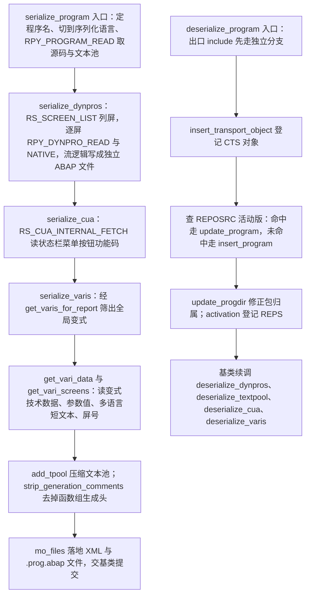
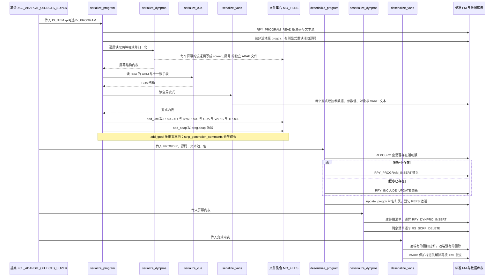

# ZCL_ABAPGIT_OBJECTS_PROGRAM 分析报告

> 分析对象：`abapGit/abapGit — src/zcl_abapgit_objects_program.clas.abap`（1597 行，全局类 `ZCL_ABAPGIT_OBJECTS_PROGRAM` 的定义段 + 实现段，继承自 `ZCL_ABAPGIT_OBJECTS_SUPER`）
> 报告视角：代码 onboarding 走读，按"序列化（pull）/ 反序列化（push）"两条真实运行路径展开
> 分析范围：本文件全部 28 个方法 + 2 段声明区；基类、工厂类、XML 输出类的实现不在本文件，涉及处一律标注"需核实"

---

## 一、程序定位与业务背景

### 1.1 这段代码在解决什么问题

先把概念摆正：**它管的不是一个"报表程序"，而是"报表程序这个东西所包含的一整包资产"。**

在 SE38 眼里，一个报表（`PROG`）就是一段代码。但在 SAP 的数据模型里，一个可执行的报表由五样彼此独立的东西共同组成：

| 组成 | 存放位置 | 传输时的对象类型 |
|---|---|---|
| 源代码（激活版 + 非激活版） | `REPOSRC` | `PROG` |
| 屏幕（画面布局、字段、表格控件、流逻辑） | `D020S` / `D021S` / `D021T` + `TRDIR` | `DYNP` |
| CUA（状态栏、菜单栏、按钮、功能码、标题） | `RSMPE_*` | `CUAD` |
| 文本池（描述、标题行 `id = 'R'`、状态行 `id = 'S'`） | `TEXTPOOL` | `REPT` |
| 报表变式（用户在选择屏上填过的参数组合） | `VARID` / `VARIT` / `RSVAR*` | `TABL` 系列 |

abapGit 的核心命题是：**把这五样东西变成 Git 里可 review 的文本文件，并且能原样搬回去。** 这个类就是报表程序这一类对象的搬运工。

### 1.2 现有方案为何不够

三条老路都走不通：

1. **只导源码**（很多简化版工具的做法）。pull 回来激活必然失败：屏幕没了、菜单没了、标题没了，CUA 的功能码找不到对应菜单项直接 `RPY_PROGRAM_UPDATE` 报错。
2. **直接走传输请求导入**。它当然什么都能搬，但它搬的是二进制 + 一个不可读的 `.request`；改一行代码无法 review、无法在 PR 里逐行讨论、无法区分"改代码"和"改屏幕"。
3. **人工在 SE38/SE41 里重敲**。慢、易错，而且完全无法版本化——屏幕改了没人知道。

所以必须有一个"知道怎么把程序拆成这五样、再按五样分别编码/解码"的中间层。本类就是这层。

### 1.3 整体设计范式一句话定性

> **对称序列化处理器 + 模板方法基类。** 基类 `ZCL_ABAPGIT_OBJECTS_SUPER` 用模板方法管住"取锁 → 读写 → 激活 → 提交"的骨架，本类只提供一对对称入口（`serialize_program` / `deserialize_program`）以及每种子对象各自的 `serialize_x` / `deserialize_x` 配对。每个配对的两个方法互为逆运算——这个"成对"约定是读懂全文件的主线。

### 1.4 依赖清单（读这段代码前必须知道的地形）

```
基类与全局类
  ZCL_ABAPGIT_OBJECTS_SUPER   模板方法基类。提供 ms_item（当前对象上下文）、mv_language、
                               mo_files（文件集合）、mo_i18n_params、exists_a_lock_entry_for、
                               clear_abap_language_version、auto_correct 等
  ZCL_ABAPGIT_OBJECTS_PROGRAM 本类
  ZCL_ABAPGIT_OBJECTS_ACTIVATION  激活登记器。静态方法 add，把待激活对象收进一个列表，
                               由外层统一激活（避免逐个激活）
  ZCL_ABAPGIT_FACTORY          全局工厂。get_cts_api / get_sap_report / 隐式 get_xml_output
  ZCL_ABAPGIT_LANGUAGE         登录语言与序列化语言的切换与还原
  ZCL_ABAPGIT_XML_OUTPUT       XML 序列化器。li_xml->add( iv_name = ... ig_data = ... )
  ZCL_ABAPGIT_FILES            文件集合。add_abap / add_xml
  ZCL_ABAPGIT_EXCEPTION        统一异常。raise_t100 转标准消息，raise 转自定义文本
  ZIF_ABAPGIT_XML_OUTPUT       XML 输出接口
  ZIF_ABAPGIT_DEFINITIONS      ty_item（对象上下文：obj_type / obj_name / ...）
  ZIF_ABAPGIT_SAP_REPORT       REPOSRC 读写封装，含 ty_progdir
  ZIF_ABAPGIT_ENVIRONMENT      ty_system_language_filter
  ZIF_ABAPGIT_LANG_DEFINITIONS ty_tpool_tt（压缩后的文本池行类型）

标准 FM（全部是远程启用的 RFC，本文件无法断点进入）
  读：RPY_PROGRAM_READ / RPY_DYNPRO_READ / RPY_DYNPRO_READ_NATIVE / RS_SCREEN_LIST
      RS_CUA_INTERNAL_FETCH / RS_VARIANT_VALUES_TECH_DAT_255 / RS_VARIANT_CONTENTS_255
      RS_ALL_VARIANTS_4_1_REPORT / RS_GET_SCREENS_4_1_VARIANT
  写：RPY_PROGRAM_INSERT / RPY_INCLUDE_UPDATE / RPY_DYNPRO_INSERT / RPY_DYNPRO_INSERT_NATIVE
      RS_SCRP_DELETE / RS_CUA_INTERNAL_WRITE / RS_CREATE_VARIANT_255
      RS_CHANGE_CREATED_VARIANT_255 / RS_VARIANT_DELETE
  语句：INSERT TEXTPOOL / DELETE TEXTPOOL

直接访问的数据库表
  REPOSRC  读 程序是否存在、是活动版还是非活动版
  TADIR    读 传输对象归属包（拼 CUAD 的 TR_KEY 用）
  VARIT    读 变式短文本（本文件唯一一处"绕过 FM 直接 SELECT"）
  VARID    读写 变式保护标志（SELECT ... FOR UPDATE + UPDATE）
  D021T    写 原生格式屏幕的字段文本（DELETE + INSERT）

与 SAP 标准代码的非常规耦合（不在接口里，属于隐藏契约）
  (SAPLSIFP)TTAB   动态 ASSIGN 到另一个函数组的全局变量并 CLEAR（get_program_title）
  sy-tcode        写入 'SE41' 作为绕过 SAP note 的开关（deserialize_cua）
  include LSMPIF03 / MSEUSBIT / SAPLWBSCREEN  注释里点名的三段标准 include，
                  本文件复制了它们的校验规则与位标志语义
```

### 1.5 读之前要建立的两个判断

**第一，这份代码的正确标准不是"优雅"，而是"往返幂等"。** 它的产品价值在于：一个仓库里的程序文件，被反复 pull / push 二十次之后应当与第一次完全一致。所以你会看到大量看起来多余的 `SORT`、`CLEAR`、把 `''` 归一成 `'/'`、给时间戳补上当前值再在序列化时清掉——这些都不是洁癖，是**为了让 XML 稳定**。读这类代码时，如果先问"这段为什么要这么写"而不是"这段写得好不好"，理解速度会快很多。

**第二，本文件是一个"薄编排层"，真正的复杂度在标准 FM 里。** 它自己几乎没有算法，全篇是"调 FM → 判 `sy-subrc` → 抛异常 → 登记激活"。因此本报告的重点不在算法，而在**契约**：调用了哪个 FM、传了什么、没判什么、失败了会怎样、副作用落在哪。后面第三节的每一节都在回答这五个问题。

---

## 二、程序执行流程总览

本类没有单一入口，而是**两条互为镜像的路径**，由基类按业务动作（pull 还是 push）分派。



### 责任链表

| 子程序 | 调用者 | 职责 |
|---|---|---|
| `serialize_program` | 基类（pull 流程），调用方传 `IS_ITEM` 与可选 `IV_PROGRAM` | 序列化总入口：定程序名、管语言、读源码与文本池、按程序类型分派三种子序列化、产出 XML 与 ABAP 两个文件 |
| `serialize_dynpros` | `serialize_program`；另被 `is_any_dynpro_locked` 调用 | 逐屏读取屏幕定义，做四类字段归一化，把流逻辑写成独立 ABAP 文件，返回屏幕结构内表 |
| `serialize_cua` | `serialize_program` | 读 CUA（菜单/按钮/功能码），程序没有 CUA 时静默返回初始值 |
| `serialize_varis` | `serialize_program` | 遍历该报表的全局变式，逐个调 `get_vari_data` / `get_vari_screens` 组装成 XML 结构 |
| `get_varis_for_report` | `serialize_varis`、`deserialize_varis` | 用 `RS_ALL_VARIANTS_4_1_REPORT` 列出变式，只保留 `SAP&*` / `CUS&*` 两类全局变式 |
| `get_vari_data` | `serialize_varis` | 读单个变式的技术数据、参数值、对象表，并按语言过滤读 `VARIT` 短文本 |
| `get_vari_screens` | `serialize_varis` | 读变式关联的屏号 |
| `add_tpool` | `serialize_program` | 文本池压缩：把 `id = 'S'` 行前 8 个字符拆进 `split` 字段，使 XML 行短于 255 |
| `strip_generation_comments` | `serialize_program` | 函数组专用：删掉 SAP 自动生成的头 5 行，避免每次 pull 都产生无意义 diff |
| `read_tpool` | 本文件内无调用点，对外公共 API（需核实调用方） | `add_tpool` 的逆运算：把 `split` 与 `entry` 拼回完整状态行 |
| `is_any_dynpro_locked` | 基类（取锁阶段，本文件不可见） | 判断任一屏幕是否被他人锁定 |
| `is_cua_locked` | 基类（取锁阶段，本文件不可见） | 判断该程序的 CUA 是否被锁定 |
| `is_text_locked` | 基类（取锁阶段，本文件不可见） | 判断该程序的文本池是否被锁定 |
| `deserialize_program` | 基类（push 流程） | 反序列化总入口：出口 include 分流、登记 CTS 对象、按活动版是否存在选 insert/update、补包归属、登记激活 |
| `is_exit_include` | `deserialize_program`、`update_program` | 判断是否为 SAP 出口函数组的 include（四种前缀模式） |
| `deserialize_exit_include` | `deserialize_program` | 出口 include 的专用插入路径：强制以活动态写入 |
| `get_program_title` | `deserialize_program`、`deserialize_exit_include` | 从文本池 `id = 'R'` 行取标题，并顺手修掉一个 SAP 侧的 `TTAB` 残留 |
| `insert_program` | `deserialize_program`、`deserialize_exit_include` | 程序不存在时插入；带低版本兜底分支 |
| `update_program` | `deserialize_program`、`deserialize_exit_include` | 程序已存在时更新；把两条常见 SAP 错误翻译成人话 |
| `deserialize_dynpros` | 基类（push 流程，本文件不可见） | 按 XML 重建屏幕，并把目标系统里多出来的屏幕删掉 |
| `uncondense_flow` | `deserialize_dynpros` | 按 `spaces` 把被压缩的流逻辑还原（兼容路径，当前恒为空操作） |
| `deserialize_textpool` | 基类（push 流程，本文件不可见） | 按语言写入或删除文本池，并登记 REPT 激活 |
| `deserialize_cua` | 基类（push 流程，本文件不可见） | 空 CUA 直接返回；否则拼 TR_KEY、修正 ADM、调 `RS_CUA_INTERNAL_WRITE`、登记 CUAD 激活 |
| `auto_correct_cua_adm` | `deserialize_cua` | 修补历史版本未写 ADM 导致的 CUA 接口缺失（issue #1807） |
| `deserialize_varis` | 基类（push 流程，本文件不可见） | 全量覆盖变式：远端有的重建，远端没有的删除 |
| `create_vari` | `deserialize_varis` | 建变式 + 把对象清单挂上去（两个 FM 连调） |
| `delete_vari` | `deserialize_varis` | 删变式，带低版本兜底分支 |
| `set_vari_protection` | `deserialize_varis` | 解除并恢复变式保护标志，返回原状态 |

下面按这两条路径，逐个子程序展开。因为全篇几乎没有算法，本节的重量全部分配在**契约**上：调了哪个 FM、传了什么、没判什么、失败会怎样、副作用落在哪。

---
## 三、分组分析

第三节按两条路径分开走：先走序列化（3.1 至 3.14），再走反序列化（3.15 至 3.29）。每个子程序一节，先看声明区把"数据形状"这件事钉住，再顺着执行流往下。

### 3.1 类定义段 `ZCL_ABAPGIT_OBJECTS_PROGRAM`（全局声明区）

声明区本身没有逻辑，但它是全文件的一半语义：这些 `ty_` 结构最终会**原样变成 XML 节点**，所以组件名就是文件格式。分四步看：类头与对外契约、CUA 结构、屏幕结构、变式结构，最后是私有常量。

#### ① 类头与两个对外入口

```abap
CLASS zcl_abapgit_objects_program DEFINITION
  PUBLIC
  INHERITING FROM zcl_abapgit_objects_super
  CREATE PUBLIC .
```

**做什么** — 声明一个全局类，继承 `ZCL_ABAPGIT_OBJECTS_SUPER`，并用 `CREATE PUBLIC` 允许外部直接实例化。

**为什么** — 继承基类是为了复用它的取锁、序列化顺序编排与 LUW 提交骨架，本类只提供"程序对象怎么读写"；`CREATE PUBLIC` 则让工厂能按需创建实例而不必依赖类池。

**风险与改进** — 无明显风险。`CREATE PUBLIC` 且全类没有构造方法，意味着实例状态完全来自基类属性；通读全文可以确认本类一个自己的实例属性都没加（数据都在 `DATA` / `FIELD-SYMBOLS` 里），这一点做得干净。

```abap
    METHODS serialize_program
      IMPORTING
        !io_xml     TYPE REF TO zif_abapgit_xml_output OPTIONAL
        !is_item    TYPE zif_abapgit_definitions=>ty_item
        !io_files   TYPE REF TO zcl_abapgit_objects_files
        !iv_program TYPE syrepid OPTIONAL
        !iv_extra   TYPE clike OPTIONAL
      RAISING
        zcx_abapgit_exception.
    METHODS deserialize_program
      IMPORTING
        !is_progdir TYPE zif_abapgit_sap_report=>ty_progdir
        !it_source  TYPE abaptxt255_tab
        !it_tpool   TYPE textpool_table
        !iv_package TYPE devclass
      RAISING
        zcx_abapgit_exception.
```

**做什么** — 声明一个全局可实例化的类，继承 `ZCL_ABAPGIT_OBJECTS_SUPER`。对外只暴露两个方法：`serialize_program`（pull 方向）与 `deserialize_program`（push 方向），各带一个 `zcx_abapgit_exception` 异常出口。序列化入口收四个参数：可选的 XML 收集器（用于把多个对象的 XML 合并成一份文件）、对象上下文、文件集合、可选程序名（默认取对象上下文里的 `obj_name`，函数组场景用来指定函数组内某个 include）、可选的文件名后缀。

**为什么** — `INHERITING FROM zcl_abapgit_objects_super` 是整套 abapGit 对象处理器的骨架约定：基类负责取锁、判断是否需要处理、编排序列化顺序、提交 LUW，本类只提供"本类对象怎么读写"。两个入口严格对称（一个 `is_item` 进、一个 `is_progdir` 进），这是 1.3 说的"成对"约定的第一个体现。`io_xml` 设成 `OPTIONAL` 是为多对象合并：函数组场景下一个 FUGR 对象会拆出多个 PROG（主程序 + 各 include），它们共享一个 XML 输出器。

**风险与改进** — 三处值得记一笔：

1. **`serialize_program` 有两个来源同一个"程序名"的参数**：`IS_ITEM-OBJ_NAME` 与 `IV_PROGRAM`。规则是"后者优先、为空才取前者"，写在方法体里而不在接口注释里。这种"双入口同一概念"的接口最容易被误用——调用方同时传了不一致的值时，方法静默采用后者。建议要么把合并逻辑提到基类做一个 `resolve_program_name( )`，要么在接口注释里写明优先级。
2. **`deserialize_program` 不接受 `MS_ITEM`，也不接受程序名**。所有对象上下文从基类属性 `ms_item` 里取（见 3.21 的 `deserialize_dynpros`）。两个入口对"我是谁"的来源不一致：序列化从形参取，反序列化从基类属性取。
3. **`is_progdir` 用 `zif_abapgit_sap_report=>ty_progdir` 而不是标准 `TRDIR`**。这是刻意的：`ty_progdir` 是一个只含 abapGit 关心的字段的裁剪版结构，避免把 `TRDIR` 全部 40+ 字段暴露为契约。但代价是 `REPOSRC` 的活动态判断得自己做 `SELECT`（3.15、3.17 各写了一遍），而 `TRDIR` 本身就带 `RSTAT`/`FIXPT` 字段可以直接回答这个问题。

#### ② CUA 结构 `ty_cua`

```abap
    TYPES:
      BEGIN OF ty_cua,
        adm TYPE rsmpe_adm,
        sta TYPE STANDARD TABLE OF rsmpe_stat WITH DEFAULT KEY,
        fun TYPE STANDARD TABLE OF rsmpe_funt WITH DEFAULT KEY,
        men TYPE STANDARD TABLE OF rsmpe_men WITH DEFAULT KEY,
        mtx TYPE STANDARD TABLE OF rsmpe_mnlt WITH DEFAULT KEY,
        act TYPE STANDARD TABLE OF rsmpe_act WITH DEFAULT KEY,
        but TYPE STANDARD TABLE OF rsmpe_but WITH DEFAULT KEY,
        pfk TYPE STANDARD TABLE OF rsmpe_pfk WITH DEFAULT KEY,
        set TYPE STANDARD TABLE OF rsmpe_staf WITH DEFAULT KEY,
        doc TYPE STANDARD TABLE OF rsmpe_atrt WITH DEFAULT KEY,
        tit TYPE STANDARD TABLE OF rsmpe_titt WITH DEFAULT KEY,
        biv TYPE STANDARD TABLE OF rsmpe_buts WITH DEFAULT KEY,
      END OF ty_cua.
```

**做什么** — 定义 CUA 的聚合结构：一个头行（`RSMPE_ADM`，描述 CUA 的整体属性，含三个功能码字段）和十一张内表，逐项对应 `RS_CUA_INTERNAL_FETCH` / `RS_CUA_INTERNAL_WRITE` 的十一个 `TABLES` 参数——状态栏 `sta`、功能栏 `fun`、菜单栏 `men`、菜单文本 `mtx`、活动行 `act`、按钮 `but`、功能码属性 `pfk`、状态栏设置 `set`、文档/附加属性 `doc`、标题 `tit`、按钮集 `biv`。全部 `WITH DEFAULT KEY`（标准表），因为序列化后要排序保证可重复。

**为什么** — 结构形状必须**与 FM 的参数表逐项同名同序**，否则 XML 反序列化回来会错位。这不是可以自己设计的结构，是被 FM 签名绑死的。`WITH DEFAULT KEY` 而不是 `WITH UNIQUE KEY` 是有意的：CUA 里同一菜单项可以有多个文本行（不同语言/位置），用唯一键会在插入时直接 dump；标准表插入慢一点，但换来了正确性。

**风险与改进** — 两处：

1. **组件名是结构名的缩写，且缩写方向不一致**：`sta`→`RSMPE_STAT`、`fun`→`RSMPE_FUNT`、`mtx`→`RSMPE_MNLT` 是去尾字母，但 `doc`→`RSMPE_ATRT`、`set`→`RSMPE_STAF`、`tit`→`RSMPE_TITT`、`biv`→`RSMPE_BUTS` 是压中间。这些名字**直接写进 XML 文件**，接手的人看到 `<DOC>` 完全猜不出它对应 `RSMPE_ATRT`。序列化的代价是可读性，而这处是最伤的一处。
2. **十一张内表里没有一张定义 `KEY`**。序列化侧靠 `SORT` 保证稳定顺序（3.3 与 3.7 都有 `SORT`），但 CUA 侧（3.4）**没有任何 `SORT`**——它完全依赖 `RS_CUA_INTERNAL_FETCH` 返回的行序。需在 SE38 核实该 FM 是否保证顺序；若不保证，`RS_CUA_INTERNAL_WRITE` 写入的结果在不同系统上可能不一致，而 Git 里的文件是稳定的，于是"pull 有 diff、push 无变化"的困惑会反复出现。

#### ③ 屏幕结构 `ty_dynpro`

```abap
    TYPES:
      ty_spaces_tt TYPE STANDARD TABLE OF i WITH DEFAULT KEY .
    TYPES:
      BEGIN OF ty_dynpro,
        header     TYPE rpy_dyhead,
        containers TYPE dycatt_tab,
        fields     TYPE dyfatc_tab,
        flow_logic TYPE swydyflow,
        spaces     TYPE ty_spaces_tt,
        nat_header TYPE d020s,
        nat_fields TYPE STANDARD TABLE OF d021s WITH DEFAULT KEY,
        nat_texts  TYPE STANDARD TABLE OF d021t WITH DEFAULT KEY,
      END OF ty_dynpro .
    TYPES:
      ty_dynpro_tt TYPE STANDARD TABLE OF ty_dynpro WITH DEFAULT KEY .
```

**做什么** — 定义一个屏幕的完整序列化结构，分两条互斥的路径存字段：`containers` + `fields`（RPY 导出格式，用于普通的、由 `RPY_DYNPRO_INSERT` 重建的屏幕），或 `nat_header` + `nat_fields` + `nat_texts`（SAP 原生格式，用于含表格控件/splitter 的屏幕）。`header` 两种格式共用。`flow_logic` 是屏幕流逻辑，本文件**不把它写进 XML**，而是作为独立的 `.abap` 文件落盘（见 3.3）。

**为什么** — 为什么同一个结构里要有两套字段？因为 `RPY_DYNPRO_INSERT`（导出格式）和 `RPY_DYNPRO_INSERT_NATIVE`（原生格式）是两个互不相容的 FM，参数完全不同：前者吃 `containers` / `fields_to_containers`，后者吃 `fieldlist` / `dynprotext`。abapGit 的做法是**把两条路径的数据都放进同一个 XML 结构**，由接收端（`deserialize_dynpros`）根据 `header-type` 判断走哪条。代价是 XML 里会出现"两条路径的字段同时为空"的状态，好处是两侧的分支判据（原生 / 非原生）分别由各自的 FM 语义决定，不需要另设标志位。

**风险与改进** — 三处，第一处是实打实的技术债：

1. **`spaces` 字段是遗留物，且它会进 XML**。`ty_spaces_tt` 是 `STANDARD TABLE OF i`，只被 `uncondense_flow` 消费；而序列化侧**从未给它赋值**（3.3 全程没碰过 `spaces`），反序列化侧调用 `uncondense_flow` 时传进来的也永远是空表。源码自己在 `deserialize_dynpros` 里留了 `todo: kept for compatibility, remove after grace period #3680`。但问题在于：只要 `spaces` 还在 `ty_dynpro` 里，**XML 序列化器就会给每个屏幕写出一个空的 `SPACES` 节点**。屏幕一多（一个大程序几十个屏），这些空节点就是纯噪声。建议：要么在 XML 写出前过滤掉该组件，要么直接删掉字段并清掉 `uncondense_flow`。
2. **`flow_logic` 明明是 `ty_dynpro` 的组件，却从不通过 XML 传递**。序列化侧把它写进 `mo_files` 的独立文件，反序列化侧在 3.21 里先试 `uncondense_flow`、失败再从 `mo_files->read_abap( iv_extra = 'screen_' && ... )` 读回来。类型声明放在结构里、传输走另一条路，这是一处**声明与实现不同路**的地方，读代码时容易误以为流逻辑走 XML。更好的形状是把 `flow_logic` 从 `ty_dynpro` 里去掉，让"流逻辑不在 XML 里"这件事在类型上就成立。
3. **`nat_header TYPE d020s` 与 `header TYPE rpy_dyhead` 高度重叠**（3.5 里 `<ls_dynpro>-nat_header = <ls_d020s>.`，两者都含屏号、程序名、类型、描述）。同一份信息存两遍且没有一致性校验。反序列化侧只按 `nat_header IS NOT INITIAL` 判断走哪条（3.21），不校验两者的 `screen` 是否一致。需在 SE11 核实两个结构中 `screen` 字段的长度与类型是否相同——若不一致，XML 里两份屏号可能长得不一样长。

#### ④ 变式结构 `ty_vari`

```abap
    TYPES:
      BEGIN OF ty_vari,
        variant     TYPE varid-variant,
        flag1       TYPE varid-flag1,
        flag2       TYPE varid-flag2,
        transport   TYPE varid-transport,
        environmnt  TYPE varid-environmnt,
        protected   TYPE varid-protected,
        secu        TYPE varid-secu,
        xflag1      TYPE varid-xflag1,
        xflag2      TYPE varid-xflag2,
        variscreens TYPE ty_vari_dynnr_tt,
        objects     TYPE STANDARD TABLE OF vanz WITH DEFAULT KEY,
        values      TYPE ty_vari_value_tt,
        texts       TYPE STANDARD TABLE OF ty_vari_text WITH DEFAULT KEY,
      END OF ty_vari.
    TYPES:
      ty_vari_tt TYPE STANDARD TABLE OF ty_vari WITH DEFAULT KEY.
```

**做什么** — 定义一个报表变式的序列化结构：前十个组件与 `VARID` 结构逐一对应（变式名、两个用户标志、传输请求、环境、保护、两个扩展标志），后四个是 abapGit 自己加的聚合部分——`variscreens`（变式用到的屏号）、`objects`（变式引用的对象清单）、`values`（参数值，`RS_PARAMS_SL_255`）、`texts`（多语言短文本）。

**为什么** — 形状与 3.1②③ 完全一致：**被序列化的东西必须是可序列化的标准结构**。前十个组件对应 `VARID`，是因为 3.27 的 `RS_CREATE_VARIANT_255` 需要 `VARID` 形状的输入；后四个是 abapGit 把"散在多张表/多个 FM 输出里的东西"收拢到一处，好让 XML 一屏到底。`texts` 用自定义的 `ty_vari_text`（只有 `langu` + `vtext`）而不是直接用 `VARIT`，是为了**不把 `VARIT` 的客户端字段 `MANDT` 写进 XML**——客户端号是本地信息，不该进版本库。这一处是全文件最漂亮的设计决策之一：它让同一份仓库可以 pull 到任意客户端的系统。

**风险与改进** — 三处：

1. **前十个组件全靠 `MOVE-CORRESPONDING` 与 `VARID` 对接，没有一处显式赋值**（3.26、3.27 各一次）。`MOVE-CORRESPONDING` 按**同名**搬运，不校验类型。`ty_vari` 与 `VARID` 的同名组件今天类型一致（都是 `varid-*` 直接引用），但这是"今天"的事实：明天有人往 `ty_vari` 里加一个恰好与 `VARID` 同名的组件，它会被静默搬过去，可能搬错。`VARID` 有 100+ 字段，`ty_vari` 只取了 10 个，**这种部分对接靠命名约定维持，没有测试保护**。建议：改用显式字段赋值（10 行，可读性反而更好），或至少在 3.26 的"风险与改进"里留一句"新增组件必须与 `VARID` 核对"。
2. **`flag1` / `flag2` 被序列化进 XML，但两侧的语义假设不一致**。序列化侧 `get_varis_for_report`（3.8）**只保留** `variant CP 'SAP&*' OR variant CP 'CUS&*'` 的变式，隐含假设是"能被选中的变式其 `flag1`/`flag2` 一定为空"（即全局变式，非用户个人变式）。反序列化侧（3.26）却把 XML 里的 `flag1`/`flag2` 原样搬进 `VARID` 写回系统。**如果有人在 Git 里手改了这个字段**，目标系统就会多出一个用户变式；更糟的是 3.29 的 `set_vari_protection` 的 `WHERE` 条件里含 `AND flag1 = space AND flag2 = space`，匹配不上、保护标志就永远改不动——而 `deserialize_varis` 每次都调用它，于是这个变式的保护状态从此失控。
3. **`objects` 的类型是内联的 `STANDARD TABLE OF vanz`，与前面统一命名的 `ty_vari_object_tt` 不是同一个东西**（后者是 `PROTECTED` 区的 `ty_vari_object_tt TYPE STANDARD TABLE OF vanz`，`create_vari` 的形参用它；`ty_vari` 组件却直接内联）。两者结构相同、名字不同，读者需要自己在两个地方对照。统一成命名类型即可消除。

#### ⑤ 私有常量组

```abap
    CONSTANTS:
      BEGIN OF c_state,
        active   TYPE r3state VALUE 'A',
        inactive TYPE r3state VALUE 'I',
        off      TYPE r3state VALUE '',
      END OF c_state.

    CONSTANTS c_native_dynpro TYPE c LENGTH 2 VALUE 'IN'.

    CONSTANTS c_sysvari_clnt        TYPE mandt      VALUE '000'.
    CONSTANTS c_sysvari_pattern_sap TYPE c LENGTH 5 VALUE 'SAP&*'.
    CONSTANTS c_sysvari_pattern_cus TYPE c LENGTH 5 VALUE 'CUS&*'.
```

**做什么** — 三组常量。`c_state` 三个值 `'A'` / `'I'` / 空串，是全文件贯穿的"版本"概念；`c_native_dynpro` 是原生屏幕类型的判据 `'IN'`（3.5、3.21 用 `CA` 检查屏类型是否含 `I` 或 `N`）；`c_sysvari_clnt` 把客户端号 `'000'` 命名化（直连表的变式操作全用它），两个 `c_sysvari_pattern_*` 是变式名的匹配模式。

**为什么** — 把 `'000'`、`'IN'`、`'SAP&*'` 这些散落的魔法值集中，是标准做法，读者一眼能查到全文件哪里用到了它们。`active` / `inactive` / `off` 三个名字尤其重要，因为它们对应"活动版 / 非活动版 / 不管版本"三态，比裸写 `'A'` / `'I'` / `''` 可读得多。

**风险与改进** — **本文件最容易读错的一处就在 `c_state` 里**：

1. **`c_state` 一词两义，同一组常量承载两套完全不同的语义**。它被同时喂给两个语义无关的接口：
   - `INSERT TEXTPOOL ... STATE lv_state` / `DELETE TEXTPOOL ... STATE`（3.23）—— 这里它是"文本池版本"，`'A'` = 活动、`'I'` = 非活动，语义完整。
   - `RPY_PROGRAM_INSERT ... save_inactive = iv_state`（3.19）与 `RPY_INCLUDE_UPDATE ... save_inactive = iv_state`（3.20）—— 这里形参名叫 `SAVE_INACTIVE`，是个"是否存为非活动"的**开关式**参数，传 `'I'` 表示"存非活动"，传**空串** `c_state-off` 表示"存活动"。
   于是出现了本文件最反直觉的一行：3.17 里 `deserialize_exit_include` 调用 `update_program` 时传 `iv_state = c_state-off`，读起来像"版本=关"，实际含义是"**存成活动版**"。注释解释了原因（出口 include 必须在活动态插入，`check in RS_INSERT_INTO_WORKING_AREA`），但注释解释的是"为什么"，没有解释"`c_state-off` 在这个接口上等于活动版"。需在 SE37 核实 `SAVE_INACTIVE` 的域与取值——如果它允许 `'A'`，那 `c_state-active` 也可以用，`c_state-off` 就是个纯粹误导人的写法。建议把这一处改名，例如 `c_state-save_active`，并在注释里点明它服务于 `SAVE_INACTIVE` 而不是 `STATE`。
2. **`c_native_dynpro = 'IN'` 用 `CA` 而非 `IN` 来检查**（3.5、3.21 都是 `CA c_native_dynpro`）。`CA` 的语义是"包含其中任意一个字符"，当 `header-type` 是单字符时它等价于"等于 `I` 或等于 `N`"，但如果 `D020S-TYPE` 将来扩展出含 `I` 或 `N` 的新类型（比如 `INT`），这里会静默误判成原生屏。需在 SE11 核实 `D020S-TYPE` 的域长度与取值；若是单字符，改成 `IN` 或两次 `EQ` 意图更清楚。
3. **`c_sysvari_clnt = '000'` 的语义需要核实**。直连 `VARID` / `VARIT` 的语句都带 `CLIENT SPECIFIED` 并固定 `mandt = '000'`（3.9、3.29），而变式的增删走 `RS_*` FM（3.27、3.28），FM 操作的是**当前登录客户端**。这意味着同一份逻辑里，"读保护标志"读 000 客户端、"读变式技术数据"读当前客户端。两套客户端语义必须一致，否则在非 000 客户端的系统上会出现"看得到保护标志、FM 却找不到这个变式"。需在 SE37 核实 `RS_VARIANT_DELETE` / `RS_CREATE_VARIANT_255` 是否也把变式写在 000 客户端——若确实如此，本文件的设计是自洽的，但代码里应该有一句注释把这件事写明；若是，则这是一个跨客户端缺陷。

从声明区走出去，形状已经清楚了。接下来看序列化路径的总入口 `serialize_program`。
### 3.2 序列化总入口 `serialize_program`（方法 `serialize_program`）

这是全文件最长、分支最多的方法，分七步：定程序名并切语言 → 读源码与文本池 → 处理非活动版 → 取 progdir → 建 XML 并分派 → 清理文本池 → 落文件。它的产出是**两个文件**：一份 `<程序名>.xml`（PROGDIR / DYNPROS / CUA / VARIS / TPOOL 五个节点）和一份 `<程序名>.prog.abap`（源码）。

#### ① 定程序名、切到序列化语言

```abap
    IF iv_program IS INITIAL.
      lv_program_name = is_item-obj_name.
    ELSE.
      lv_program_name = iv_program.
    ENDIF.

    zcl_abapgit_language=>set_current_language( mv_language ).
```

**做什么** — 若调用方没给 `IV_PROGRAM`，程序名取对象上下文里的 `OBJ_NAME`（PROG 对象时就是程序名；FUGR 对象时是函数组名，需要调用方用 `IV_PROGRAM` 指定函数组内的某个 include）。随后把会话的当前语言切成 `MV_LANGUAGE`（abapGit 序列化所配置的语言，不是登录语言），直到本方法读完全部文本相关的数据再还原。

**为什么** — 切语言这件事是必需的：`RPY_PROGRAM_READ` 读出来的 `textelements`（文本池）是**当前语言**的，`RS_CUA_INTERNAL_FETCH`、变式短文本同理。如果不切，用户在一个德语登录的系统上 pull 一个英文程序的 CUA，XML 里就会写成德语，Git 仓库就随登录人的语言漂移。切到固定语言再读，是让序列化结果与操作者无关的关键一步。

**风险与改进** — 两处：

1. **语言还原散落在三个分支里**（见 ② 的代码块）。三个 `restore_login_language( )` 分处成功、`not_found`、其他错误三条路径,漏一条就意味着后续操作在错误的语言下跑。对照 3.20 的 `update_program`——它在错误分支里先还原、再抛异常,然后只在方法末尾留**一个**还原调用,收口方式明显更稳。这里应改成 `TRY ... CLEANUP` 或单一出口。
2. **`MV_LANGUAGE` 从哪来、是不是合法值,本文件不可见**。它是基类属性,由基类按用户的 i18n 配置算出。若它为空（配置缺失），`set_current_language( )` 的行为需在 SE24 核实——切到初始语言后读到的就是空文本池,XML 里的 `TPOOL` 会是空的,而流程照样"成功"。这类"配置缺失导致静默产出空内容"的路径,值得在任何入口加一道 `CHECK mv_language IS NOT INITIAL`。

#### ② 读源码与文本池，按 `sy-subrc` 三分岔

```abap
    CALL FUNCTION 'RPY_PROGRAM_READ'
      EXPORTING
        program_name     = lv_program_name
        with_includelist = abap_false
        with_lowercase   = abap_true
      TABLES
        source_extended  = lt_source
        textelements     = lt_tpool
      EXCEPTIONS
        cancelled        = 1
        not_found        = 2
        permission_error = 3
        OTHERS           = 4.

    IF sy-subrc = 2.
      zcl_abapgit_language=>restore_login_language( ).
      RETURN.
    ELSEIF sy-subrc <> 0.
      zcl_abapgit_language=>restore_login_language( ).
      zcx_abapgit_exception=>raise_t100( ).
    ENDIF.

    zcl_abapgit_language=>restore_login_language( ).
```

**做什么** — 一次 FM 调用同时取两样东西：程序源码（`SOURCE_EXTENDED`，即 `ABAPTXT255` 的行表）和文本池（`TEXTELEMENTS`）。`WITH_INCLUDELIST = abap_false` 表示不展开函数的 include 链（PROG 对象的 include 归 FUGR 管）；`WITH_LOWCASE = abap_true` 表示保留关键字与标识符的原始大小写。四个异常按 `sy-subrc` 分三岔：程序不存在（`2`）→ 还原语言后**直接 `RETURN`，不产出任何文件**；其他错误（`1` / `3` / `4`）→ 还原语言后把标准消息转抛；成功 → 还原语言继续。

**为什么** — `WITH_LOWCASE = abap_true` 是本文件"往返幂等"原则的一个具体体现：ABAP 编辑器本身会把关键字统一成大写再存库，若不取原始大小写，Git 里每 pull 一次就有可能产生全文件大小写 diff。这一行是"让 Git 干净"的功臣，别当成可有可无的默认值。`sy-subrc = 2` 选择静默返回而不是报错，也是对的——一个报表可能只是在这个系统里不存在（函数组里的某些 include 是历史遗留、从没被激活过），此时不该让整个 pull 失败。

**风险与改进** — 三处：

1. **静默返回路径不留任何痕迹**。`RETURN` 之后本方法既没有写文件、也没有抛异常，调用方（基类）无从区分"这个程序不存在，跳过"和"成功了但内容是空的"。需在 SE24 核实基类在拿到"未产出文件"的结果时是否会兜底报警；在 abapGit 里这类静默跳过通常是可接受的（避免历史残留对象阻断整次 pull），但依赖的是基类的行为，不是本文件的保证。
2. **`not_found` 在这里的确切含义需要核实**。它可能表示"程序在 `REPOSRC` 里没有记录"，也可能表示"程序存在但当前语言下无文本"。若是后者，切换语言这一步就白做了，XML 里会得到一个空 `TPOOL`，而流程报成功。需在 SE37 的 `RPY_PROGRAM_READ` 文档里核实 `NOT_FOUND` 的定义。
3. **`##FM_SUBRC_OK` 抑制在这里没有出现**，但 `cancelled`（`sy-subrc = 1`）被归入"其他错误"直接抛原始消息。"用户取消了对话框"这种情况在 RFC 场景下不应该发生（`SUPPRESS_DIALOG` 类参数没传，所以理论上可能弹对话框），把它当错误抛出是可接受的，但消息会是 SAP 的原文而非可操作提示。建议至少补一句自定义消息。

#### ③ 处理非活动版本：显式重读活动源码

```abap
    " If inactive version exists, then RPY_PROGRAM_READ does not return the active code
    li_report = zcl_abapgit_factory=>get_sap_report( ).

    TRY.
        " Raises exception if inactive version does not exist
        ls_progdir = li_report->read_progdir(
          iv_name  = lv_program_name
          iv_state = c_state-inactive ).

        " Explicitly request active source code
        lt_source = li_report->read_report(
          iv_name  = lv_program_name
          iv_state = c_state-active ).
      CATCH zcx_abapgit_exception ##NO_HANDLER.
    ENDTRY.

    ls_progdir = li_report->read_progdir(
      iv_name  = lv_program_name
      iv_state = c_state-active ).

    clear_abap_language_version( CHANGING cv_abap_language_version = ls_progdir-uccheck ).
```

**做什么** — 解决一个具体问题：当程序存在非活动版本时，`RPY_PROGRAM_READ` 返回的**不是活动版源码**（注释写明了这一点）。于是先试着读非活动版的 progdir——如果它抛异常，说明没有非活动版，那第 ② 步拿到的就是活动源码，无需处理；如果成功，说明有非活动版，此时**显式重读一遍活动版源码**覆盖 `LT_SOURCE`。无论走哪条路，最后都用活动版的 progdir 覆盖 `LS_PROGDIR`。最后调基类的 `clear_abap_language_version` 清掉 `UCCHECK` 里的语言版本标记。

**为什么** — 逻辑本身是对的：**Git 里存的活动代码必须真的是活动代码**。否则一旦有人在系统里激活了一个坏版本，pull 出来的是激活后的坏代码，仓库会跟着坏。而 `PROGDIR` 节点必须记活动版，否则 3.19 的 `PROGRAM_TYPE`、3.15 的包归属都会用到错误的属性。`clear_abap_language_version` 是为了幂等：`UCCHECK` 里带语言版本后缀（7.50+ 的 Unicode 检查标记），系统升级会让它变化，不清掉就会每次 pull 都产生 diff。

**风险与改进** — **这是本方法最需要修的一处**，问题在 `##NO_HANDLER`：

1. **一个 `CATCH` 同时吞掉两种完全不同的失败，且其中一种是数据错配**。`TRY` 块里有两条语句：
   - `read_progdir( inactive )` 失败 = **预期内**（没有非活动版），走 CATCH 什么都不做，正确。
   - `read_report( active )` 失败 = **非预期**。此时 `LT_SOURCE` 仍是第 ② 步从 `RPY_PROGRAM_READ` 拿到的内容，按注释那是**非活动版的代码**；而紧接着的 `ls_progdir = li_report->read_progdir( ... active )` 会**无条件**把 progdir 换成活动版。
   两者的净效果是：**活动版 progdir + 非活动版源码**被一起写进 Git 文件。Git 里看不出任何异常（PROGDIR 看起来完全正常），下一次 push 会把非活动版的代码激活到别的系统。这是一个静默的、跨系统传播的错误。`##NO_HANDLER` 的作用只是压掉 ATC 警告，但真正的问题是**两种语义被塞进了同一个异常通道**。
   建议改法（示意，源码中不存在）：把两条语句拆成两个独立的 `TRY`，第二个的 `CATCH` 里重新抛；或者用一个标志位区分"没有非活动版"与"读活动源码失败"，后者必须抛异常。
2. **`clear_abap_language_version` 修改的是刚读回来的 `LS_PROGDIR`**，这个修改只影响内存副本，不回写系统——这是对的。但它依赖基类方法的具体语义（是否只清 `UCCHECK` 的语言后缀、是否还会动别的字段）。需在 SE24 核实，否则"清语言版本"这个动作可能连带改掉别的字段，导致 XML 与真实 progdir 不符。
3. **`CATCH` 之后紧跟一个没有 `CATCH` 的 `read_progdir( active )`**。这一次调用失败会正常向上抛，行为是对的。但它也意味着"程序完全没有活动版"这种情形会在此抛异常——而 ② 已经用 `not_found` 处理过"程序不存在"。两者会不会重叠，取决于 `read_progdir` 对"只有非活动版、无活动版"的程序抛什么异常，需在 `zif_abapgit_sap_report` 的实现里核实。

#### ④ 建 XML 器，写 PROGDIR，按程序类型分派三种子序列化

```abap
    IF io_xml IS BOUND.
      li_xml = io_xml.
    ELSE.
      CREATE OBJECT li_xml TYPE zcl_abapgit_xml_output.
    ENDIF.

    li_xml->add( iv_name = 'PROGDIR'
                 ig_data = ls_progdir ).
    IF ls_progdir-subc = '1' OR ls_progdir-subc = 'M'.
      lt_dynpros = serialize_dynpros( lv_program_name ).
      li_xml->add( iv_name = 'DYNPROS'
                   ig_data = lt_dynpros ).

      ls_cua = serialize_cua( lv_program_name ).
      li_xml->add( iv_name = 'CUA'
                   ig_data = ls_cua ).

      lt_varis = serialize_varis( lv_program_name ).
      li_xml->add( iv_name = 'VARIS'
                   ig_data = lt_varis ).
    ENDIF.
```

**做什么** — 拿到 XML 输出器（调用方给了就用调用方的，否则自己 `CREATE OBJECT` 一个），先无条件写 `PROGDIR` 节点，然后**判程序类型 `SUBC`**：只有当它是 `'1'` 或 `'M'` 时，才依次调 `serialize_dynpros` / `serialize_cua` / `serialize_varis` 并把结果写成 `DYNPROS` / `CUA` / `VARIS` 三个节点。

**为什么** — `PROGDIR` 无条件写、其余三个按类型写，是这一节的核心业务判断：**只有"可交互执行的报表"才有屏幕、菜单和变式**。Include 程序（`SUBC = 'I'`）没有自己的屏幕与变式（它们共用主程序的），给它们写三个空节点纯属噪声，而且——这是更重要的——**写了空节点，反序列化侧就会执行删除**（见 3.21、3.26 的分析）。所以这个判断不只是"少写点东西"，它同时是一道保护。

**风险与改进** — 三处，第一处是全报告最重要的缺陷之一：

1. **这个判断只有序列化侧有，反序列化侧没有对称的判断**。`deserialize_program`（3.15）**完全不检查 `SUBC`**，而 `deserialize_dynpros`（3.21）与 `deserialize_varis`（3.26）都把"输入为空"解释成"目标系统里这些全都要删"。因此：**如果一个仓库里的 PROG 文件是通过手工编辑、或经由某个版本的 abapGit 生成、导致 `DYNPROS` / `VARIS` 节点缺失或为空，而目标系统里该程序是一个带屏幕的 `'1'` 程序，push 之后目标系统的屏幕与全局变式会被整体删除。** 需在 SE24 核实 `zcl_abapgit_objects_super` 是否在调用这两个方法前做了等价的 `SUBC` 判断或空值拦截；若没有，这就是一个 P0 级缺陷。修复方向有两个：要么在反序列化侧补上对称的类型判断，要么给这两个方法加一个"输入为空则整体跳过"的开关（`deserialize_cua` 3.24 就有这样的前置判断，是三个方法里唯一安全的）。
2. **`SUBC` 的取值 `'1'` 和 `'M'` 含义需在 SE11 核实**。代码只判这两个值，其余一律跳过。这里没有任何注释说明 `'M'` 是哪种程序类型——从行为推断它是另一类带屏幕的可执行程序。判据依赖的是 `TRDIR-SUBC` 的域取值，属于"依赖 DDIC 域"的写法，一旦标准扩充了取值就会静默漏导。建议至少加注释写明 `'1'` 与 `'M'` 各自对应什么。
3. **`CREATE OBJECT` 是旧式语句**（现代写法是 `NEW zcl_abapgit_xml_output( )`）。功能上等价，但在一个 2020 年后仍在活跃维护的开源项目里属于风格遗留；同时 `IF io_xml IS BOUND. ... ELSE. CREATE OBJECT ... ENDIF.` 这三行可以压成一句 `IF io_xml IS NOT BOUND. io_xml = NEW zcl_abapgit_xml_output( ). ENDIF.`（注意形参名大小写），少一个分支、少一个局部变量。另外 `'1'` / `'M'` 连写两次可以改成 `IN ( '1', 'M' )`，意图更直白。

#### ⑤ 清理空标题行、写 TPOOL、落盘

```abap
    READ TABLE lt_tpool WITH KEY id = 'R' INTO ls_tpool.
    IF sy-subrc = 0 AND ls_tpool-key = '' AND ls_tpool-length = 0.
      DELETE lt_tpool INDEX sy-tabix.
    ENDIF.

    li_xml->add( iv_name = 'TPOOL'
                 ig_data = add_tpool( lt_tpool ) ).

    IF NOT io_xml IS BOUND.
      io_files->add_xml( iv_extra = iv_extra
                         ii_xml   = li_xml ).
    ENDIF.

    strip_generation_comments( CHANGING ct_source = lt_source ).

    io_files->add_abap( iv_extra = iv_extra
                        it_abap  = lt_source ).
```

**做什么** — 四件事。从文本池里找出标题行（`id = 'R'`），若它的 `key` 与 `length` 都是空的（即空标题）就删掉，避免把一个"有标题行但内容为空"的记录写进 XML（不同系统对空标题的处理不一致，会造成 diff）；把剩下的文本池经 `add_tpool` 压缩后写成 `TPOOL` 节点；**只在调用方没给 `IO_XML`** 时把 XML 交给 `io_files`；把源码经 `strip_generation_comments` 处理后无条件交给 `io_files` 写成 `.prog.abap`。

**为什么** — 删空标题行是典型的"为幂等而做的清洗"：一个从来没有设过描述的程序，其文本池里也可能存在一条空 `R` 行；留着它，不同系统、不同版本 SAP 的表现不一致。`add_tpool` 必须在写 XML 之前调用（3.9 会解释它到底做了什么）。`strip_generation_comments` 必须在 `add_abap` 之前调用——顺序不能反，因为它删的是源码里的行。

**风险与改进** — 三处：

1. **XML 与 ABAP 的落盘条件不对称，而接口没有任何说明**。`add_xml` 被 `IF NOT io_xml IS BOUND.` 包住，`add_abap` 却无条件执行。含义是：**调用方一旦传了 `IO_XML`，就必须自己负责把它 `add` 到某个文件里**，否则这个程序就只有源码文件、没有 XML。这条规则在接口签名（`OPTIONAL`）里完全看不出来，只能靠读实现知道。建议把它写进接口注释，或改成"传了 `IO_XML` 时只 `add` 节点、由调用方统一落盘；没传时自己落盘"的显式分支并加注释。
2. **判空标题用的是间接字段**。条件只看 `key = '' AND length = 0`，不看 `entry`。这依赖一个假设：`R` 行的 `key`（标题行号）与 `length` 为空 ⟺ 标题内容为空。需在 SE11 核实 `TEXTPOOL` 中 `R` 行的 `KEY` / `LENGTH` / `ENTRY` 三个字段的填写规则；若某个系统允许 `entry` 非空而 `key`/`length` 为空，这个标题会被误删，而且**删掉之后没有任何日志**。
3. **`READ TABLE ... WITH KEY id = 'R'` 是线性查找**。`LT_TPOOL` 是标准表（`textpool_table`），`id` 不是标准键。文本池通常只有几十行，实际代价可忽略；但整个文件里有好几处同样的"标准表 + 非键 `READ TABLE`"（3.9、3.18、这里），如果哪天的文本池膨胀到几千行（例如某个超大报表的文档行），这些都是线性扫描。低优先级，但值得记一笔，因为这类代价在测试环境永远看不出来。

序列化总入口讲完，接下来是它调用的三个子序列化器，先看最复杂的 `serialize_dynpros`。
### 3.3 屏幕序列化 `serialize_dynpros`（方法 `serialize_dynpros`）

这是全文件最长的子程序（约 60 行有效逻辑），分五步：列屏幕并过滤 → 逐屏读两种格式 → 归一化字段 → 归一化容器 → 装配并写流逻辑文件。它同时是本文件里**唯一带副作用**的子序列化方法（会往 `mo_files` 里写文件），这一点在 3.12 会变成一个实际问题。

#### ① 列屏幕、排序、过滤掉生成的选择屏

```abap
    CALL FUNCTION 'RS_SCREEN_LIST'
      EXPORTING
        dynnr     = ''
        progname  = iv_program_name
      TABLES
        dynpros   = lt_d020s
      EXCEPTIONS
        not_found = 1
        OTHERS    = 2.
    IF sy-subrc = 2.
      zcx_abapgit_exception=>raise_t100( ).
    ENDIF.

    SORT lt_d020s BY dnum ASCENDING.

* loop dynpros and skip generated selection screens
    LOOP AT lt_d020s ASSIGNING <ls_d020s>
        WHERE type <> 'S' AND type <> 'W' AND type <> 'J'
        AND NOT dnum IS INITIAL.
```

**做什么** — 用 `RS_SCREEN_LIST` 列出该程序**全部**屏幕（`dynnr = ''` 表示不按屏号筛选），塞进 `LT_D020S`，按屏号升序排序，然后遍历时用 `WHERE` 过滤：屏类型不是 `'S'`、不是 `'W'`、不是 `'J'`，且屏号不为空。`not_found`（没有屏幕）不报错，直接当空表继续；只有 `OTHERS` 才抛异常。

**为什么** — 过滤 `'S'` / `'W'` / `'J'` 的意图写在注释里：**跳过自动生成的选择屏**。选择屏是用户在 SE38 里写了 `SELECT-OPTIONS` 之后由系统按选择屏变体（VARIANT、STEP、TABLE）自动生成的，它不是人在 SE41 里画的资产——把它导进 Git 再导回去，会与选择屏变体机制冲突并产生大量无意义 diff。这条 `WHERE` 是 abapGit 里少见的、把"业务上不该搬的东西"显式挡在序列化之前的例子。

**风险与改进** — 三处：

1. **`D020S-TYPE` 的三个取值语义需在 SE11 核实**。`'W'` 与 `'J'` 分别代表哪一类生成屏，代码里只有一句"skip generated selection screens"概括，`'J'` 尤其无从推断（可能与 job/批量相关）。判据直接依赖 DDIC 域取值，且**没有任何注释逐个解释**。这类判据一旦标准扩充取值就会静默漏导，建议至少在注释里逐个写清。
2. **`type <> 'S' AND ...` 的写法对空值不安全**。若 `D020S-TYPE` 可以是空格的普通屏幕，`type <> 'S'` 为真，符合预期；但若某个系统把普通屏的 `TYPE` 写成空串以外的其他值（比如 `' '` 之外的空白），行为不变。真正的风险在于**反向**：`type <> 'S'` 只排除恰好等于 `'S'` 的值，而 `WHERE` 里三个条件是"与"关系，逻辑上等价于"不属于这三个集合"——这一层是对的。问题只在于域取值未在代码里固化。
3. **`SORT ... BY dnum ASCENDING` 之后用 `ASSIGNING` 遍历且在循环内 `APPEND` 到别的表**，这个组合是安全的（`LT_D020S` 本身没被改）。但注意整个方法体里 `lt_containers` / `lt_fields_to_containers` / `lt_flow_logic` / `lt_texts` 都是**在循环外声明、循环内复用**的 `TABLES` 缓冲，它们是否被 FM 完全覆盖取决于 FM 的清表行为——`RPY_DYNPRO_READ` 的 `TABLES` 参数若是追加语义，第 2 个屏幕起就会累积第 1 个屏幕的数据。需在 SE37 核实两个 `RPY_DYNPRO_READ*` 的 `TABLES` 参数是覆盖还是追加；若是追加，这里必须每个屏幕 `CLEAR` 一次，否则多屏程序的序列化结果会是错的。

#### ② 逐屏读两种格式的屏幕定义

```abap
      CALL FUNCTION 'RPY_DYNPRO_READ'
        EXPORTING
          progname             = iv_program_name
          dynnr                = <ls_d020s>-dnum
        IMPORTING
          header               = ls_header
        TABLES
          containers           = lt_containers
          fields_to_containers = lt_fields_to_containers
          flow_logic           = lt_flow_logic
        EXCEPTIONS
          cancelled            = 1
          not_found            = 2
          permission_error     = 3
          OTHERS               = 4.
      IF sy-subrc <> 0.
        zcx_abapgit_exception=>raise_t100( ).
      ENDIF.

      "#2746: we need the dynpro fields in internal format:
      FREE lt_fieldlist_int.

      CALL FUNCTION 'RPY_DYNPRO_READ_NATIVE'
        EXPORTING
          progname   = iv_program_name
          dynnr      = <ls_d020s>-dnum
        TABLES
          fieldlist  = lt_fieldlist_int
          fieldtexts = lt_texts.
```

**做什么** — 对每个筛出来的屏幕调两个 FM。`RPY_DYNPRO_READ` 取"导出格式"的定义：屏头 `HEADER`、容器 `CONTAINERS`、字段与容器的对应关系 `FIELDS_TO_CONTAINERS`、以及流逻辑 `FLOW_LOGIC`；四个异常任一非零就抛。随后 `FREE` 掉上一轮残留的 `LT_FIELDLIST_INT`，调 `RPY_DYNPRO_READ_NATIVE` 取"原生格式"的字段清单与字段文本。

**为什么** — 为什么要读两份？因为它们回答的是不同的问题：`RPY_DYNPRO_READ` 给出的是"这个屏在 SE41 里长什么样（控件与字段的容器关系）"，`RPY_DYNPRO_READ_NATIVE` 给出的是"SAP 运行时怎么描述这个屏（含表格控件的字段级细节）"。abapGit 两边都要——前者用于重建普通屏，后者用于重建含 splitter / 表格控件的屏（issue #2746 的修复）。`FREE` 而不是 `CLEAR` 是显式释放动态内存，配合 `TABLES` 参数可能追加语义使用，说明作者清楚这里的坑。

**风险与改进** — 三处，第一处是明确缺陷：

1. **`RPY_DYNPRO_READ_NATIVE` 没有 `EXCEPTIONS` 段**。同一个方法里紧挨着的 `RPY_DYNPRO_READ` 声明了四个异常并逐个处理，下一个 FM 却一个都没声明——这在 ABAP 里意味着：该 FM 抛出的 `CX_SY_*` 类异常会以 **uncaught exception** 的形式冒泡出本方法，而本方法的 `RAISING` 只声明了 `zcx_abapgit_exception`，于是调用链上没人能接住它，最终是短转储（short dump）而不是一条可读的 abapGit 错误消息。此外 `FREE`/`ASSIGNING` 在 dump 时已经改变了内存状态。
   建议至少补 `EXCEPTIONS not_found = 1 OTHERS = 2` 并在 `sy-subrc <> 0` 时抛 `zcx_abapgit_exception`（示意）：
   ```abap-fix
         CALL FUNCTION 'RPY_DYNPRO_READ_NATIVE'
           EXPORTING
             progname   = iv_program_name
             dynnr      = <ls_d020s>-dnum
           TABLES
             fieldlist  = lt_fieldlist_int
             fieldtexts = lt_texts
           EXCEPTIONS
             not_found  = 1
             OTHERS     = 2.
      IF sy-subrc <> 0.
        zcx_abapgit_exception=>raise( |error reading dynpro { <ls_d020s>-dnum }| ).
      ENDIF.
   ```
2. **`RPY_DYNPRO_READ_NATIVE` 对每个屏幕都调，但只有部分屏幕的结果会被采用**。采用与否在 ⑤ 才决定（要求 `lt_fieldlist_int` 里存在 `fill = 'X'` 的行，且屏类型是原生）。也就是说**大多数普通屏幕的这第二次 FM 调用是纯浪费**——一次完整的屏幕读取，涉及 `D021S`/`D021T` 的全量读。一个 30 屏的程序就是 30 次无用调用。把它挪到 ⑤ 的判据之后（先判断屏类型再决定读不读原生格式）即可完全消除，代价只是代码位置移动。
3. **`ls_header`、`lt_containers` 等循环外变量在循环内复用，且没有任何 `CLEAR`**。若两个 FM 的 `TABLES`/`IMPORTING` 参数是追加语义（ABAP 的 `TABLES` 参数通常是覆盖，但**需在 SE37 逐个核实**），第 2 个屏幕起数据会累积。这里没有 ② 里那句 `FREE` 的保护。这是一个"当前大概率正确、但依赖 FM 隐含行为"的位置——**接手时应该把两个 FM 的 `TABLES` 参数绑定类型（`OLD` / `NEW` / 结构）抄下来确认一遍**，而不是靠"大家都这么写"来判断。

#### ③ 归一化字段：输出样式、外键标志、字典字段文本

```abap
    "#2746: relevant flag values (taken from include MSEUSBIT)
    CONSTANTS: lc_flg1ddf TYPE x VALUE '20',
               lc_flg3fku TYPE x VALUE '08',
               lc_flg3for TYPE x VALUE '04',
               lc_flg3fdu TYPE x VALUE '02'.
```

**做什么** — 定义四个十六进制常量，分别对应 `FLG1` 的一个位与 `FLG3` 的三个位，供下一步判定字段是否应当带 `FOREIGNKEY` 标志。

**为什么** — 把位标志提为命名常量（而不是散落的 `X'20'`、`X'08'`），下面的位运算读起来就是"检查 DDDF 位、FKU 位、FOR 位、FDU 位"，而不是"和 `20` 与一下、和 `04` 与一下"。

**风险与改进** — 四个值的位含义完全靠注释里的 `MSEUSBIT` 转述，脱离那段 include 谁也读不懂；而且 `TYPE x` 的 `'20'` 是十六进制 `0x20`、不是十进制 20，这一点很容易被误读成"第 20 位"。至少给每一位补一句中文含义（位序 + 业务含义），让注释不依赖读者能打开标准 include。

```abap
      LOOP AT lt_fields_to_containers ASSIGNING <ls_field>.
* output style is a NUMC field, the XML conversion will fail if it contains invalid value
* field does not exist in all versions
        ASSIGN COMPONENT 'OUTPUTSTYLE' OF STRUCTURE <ls_field> TO <lv_outputstyle>.
        IF sy-subrc = 0 AND <lv_outputstyle> = '  '.
          CLEAR <lv_outputstyle>.
        ENDIF.
```

**做什么** — 归一化第一步：把 `OUTPUTSTYLE` 组件里的两个空格（`'  '`）清成初始值。用动态 `ASSIGN COMPONENT ... OF STRUCTURE` 取组件，取不到（低版本没有这个组件）就跳过。注释给了两个理由：一是这个字段是 `NUMC` 类型，含非法值会让 XML 转换失败；二是这个组件并非所有版本都有。

**为什么** — 这是**版本兼容的标准手法**：不写 `IF <ls_field>-outputstyle`（那会在低版本编译期就报"组件不存在"），而是在运行时动态取组件、`sy-subrc` 判存在性。注释明确说了"field does not exist in all versions"，读者立刻明白为什么写法这么绕。`NUMC` 那条注释更有价值：它解释的是一个**具体的失败现象**（XML 转换报错），而不是笼统地说"要清理一下"。

**风险与改进** — 两处：

1. **这一行的正确性依赖逻辑运算的短路求值**。`IF sy-subrc = 0 AND <lv_outputstyle> = '  '.` 里，若 `sy-subrc <> 0`，`<lv_outputstyle>` 是**未指定的字段符号**，直接读它会 dump。整段能跑，只因为 ABAP 的 `AND` 会先算左侧、左侧为假就不算右侧。需在 SE38 核实当前 release 上该行为；即便今天成立，把顺序改成先判 `sy-subrc`、再在 `IF` 体内赋值会完全消除这个依赖（示意）：
   ```abap-fix
         ASSIGN COMPONENT 'OUTPUTSTYLE' OF STRUCTURE <ls_field> TO <lv_outputstyle>.
         IF sy-subrc = 0.
           IF <lv_outputstyle> = '  '.
             CLEAR <lv_outputstyle>.
           ENDIF.
         ENDIF.
   ```
   这只多一行，却把一个隐式语言行为依赖变成显式控制流。
2. **只处理了 `'  '` 这一个非法值**。注释说"NUMC 字段含非法值会让 XML 转换失败"，那除了两个空格，NUMC 里出现字母（如 `'X'`）同样是非法值，为什么只判空格？需在 SE11 核实 `RPY_DYFATC-OUTPUTSTYLE` 的域；若域只允许数字和空格，那 `'  '` 就是唯一的非数字非法值，判据成立；否则这里是不完整的校验。

```abap
        "2746: we apply the same logic as in SAPLWBSCREEN
        "for setting or unsetting the foreignkey field:
        UNASSIGN <ls_field_int>.
        READ TABLE lt_fieldlist_int ASSIGNING <ls_field_int> WITH KEY fnam = <ls_field>-name.
        IF <ls_field_int> IS ASSIGNED.
          IF <ls_field_int>-flg1 O lc_flg1ddf AND
              <ls_field_int>-flg3 O lc_flg3for AND
              <ls_field_int>-flg3 Z lc_flg3fdu AND
              <ls_field_int>-flg3 Z lc_flg3fku.
            <ls_field>-foreignkey = 'X'.
          ELSE.
            CLEAR <ls_field>-foreignkey.
          ENDIF.
        ENDIF.

        IF <ls_field>-from_dict = abap_true AND
           <ls_field>-modific   <> 'F' AND
           <ls_field>-modific   <> 'X'.
          CLEAR <ls_field>-text.
        ENDIF.
      ENDLOOP.
```

**做什么** — 归一化第二步：对每个字段，先按字段名在原生格式字段清单里找到对应行（用 `fnam` 匹配），然后照抄 `SAPLWBSCREEN` 的判定规则——四个位标志（`FLG1` 的一个位与 `FLG3` 的三个位）同时成立就把 `FOREIGNKEY` 置 `'X'`，否则清空。归一化第三步：字典字段（`from_dict = abap_true`）且 `modific` 不是 `'F'` 也不是 `'X'` 时，把 `text` 清空。

**为什么** — 抄 `SAPLWBSCREEN` 的规则是有道理的：`FOREIGNKEY` 标志是**运行期派生的**——它是 SAP 在激活屏幕时根据字段的搜索帮助、参数 ID 等属性算出来的，不是用户手工设的。所以它必须由同样的规则重新算，而不能直接信 `RPY_DYNPRO_READ` 返回的值（那是 RPY 格式里一个孤立字段）。注释点名了参照物，接手的人知道去哪里核对规则。第三步同理：字典字段的文本是激活时从数据字典自动带出来的，写进 Git 只会产生无意义 diff。

**风险与改进** — 四处，这是本节最值得展开的代码：

1. **位标志被硬编码成四个十六进制常量，语义完全靠注释交代**。`lc_flg1ddf = '20'`（`X` 类型即十六进制 `0x20`）、`lc_flg3fku = '08'`、`lc_flg3for = '04'`、`lc_flg3fdu = '02'`，注释只说"taken from include MSEUSBIT"。这里有两个层次的脆弱：其一，位含义随标准升级可能变（注释里的 include 名给了线索，但没人会每次升级都去比对）；其二，**常量名里的 `ddf` / `fku` / `for` / `fdu` 是从 `MSEUSBIT` 里抄来的缩写**，脱离那两段 include 谁也读不懂。至少应该把每一位的中文含义写在注释里，例如"FLG3 第 2 位 = FOREIGNKEY 候选"。这类"复制标准位语义"的做法在本文件里不止一处（3.25 复制 `LSMPIF03` 的校验、3.21 复制 SAP 的 `'F'` 处理），是维护成本的主要来源。
2. **`READ TABLE ... ASSIGNING ... WITH KEY fnam` 是循环内的线性查找**。`lt_fieldlist_int` 是 `STANDARD TABLE OF d021s`，没有 `fnam` 索引。字段数 × 字段行数构成 O(n·m)：一个 200 字段的表格控件屏幕，就是 200 次最多 200 行的扫描。屏幕多、字段多的程序（典型如带表格的 ALV 报表）序列化时间会明显上升。可用 `SORT` + `BINARY SEARCH`（本文件在 3.21 正是这么做的），或建一个 `HASHED`/`SORTED` 的局部索引表。
3. **`IF <ls_field_int> IS ASSIGNED.` 没有 `ELSE` 分支**——字段在原生格式清单里找不到时，`foreignkey` 保持 `RPY_DYNPRO_READ` 给的原值不动。这与"进入 `ELSE` 就清空"是不对称的：找到就走完整规则、找不到就完全信任 FM。当前大概率无害（找不到的行本就没有外键概念），但这是一个**静默的不一致**：同一个字段的不同分支受到不同强度的处理，且没有任何注释解释为什么。至少应该写成显式的 `ELSE. CLEAR <ls_field>-foreignkey.`，或者加注释说明"找不到即视为无外键"。
4. **`modific <> 'F' AND modific <> 'X'` 的判据依赖初始值语义**。若 `RPY_DYFATC-MODIFIC` 为初始空格，则两个不等式都成立，文本被清空——对"未修改的字典字段"是符合意图的。但这个语义没有写进注释，而 3.21 的反序列化侧对 `CHECK` 类型字段做了 `modific = 'X'` 的回填（"we set the tag to the correct value 'X'"），两侧靠的是同一个取值约定，中间没有任何共享定义。**序列化侧清文本、反序列化侧打标记，这两个约定是配对的，但代码里没有任何注释把这一对关系写出来**，只能靠读两个方法自己对出来。建议在两处各加一句交叉引用的注释。

#### ④ 归一化容器：不可缩放时清掉最小尺寸

```abap
      LOOP AT lt_containers ASSIGNING <ls_container>.
        IF <ls_container>-c_resize_v = abap_false.
          CLEAR <ls_container>-c_line_min.
        ENDIF.
        IF <ls_container>-c_resize_h = abap_false.
          CLEAR <ls_container>-c_coln_min.
        ENDIF.
      ENDLOOP.
```

**做什么** — 遍历容器表：垂直方向不可缩放（`c_resize_v = abap_false`）时清掉最小行数 `c_line_min`，水平方向不可缩放（`c_resize_h = abap_false`）时清掉最小列数 `c_coln_min`。

**为什么** — 与 ③ 的思路完全一致：**清除由运行时派生、随环境变化的冗余值**。一个容器如果不允许被拖拽改变大小，那么"最小尺寸"这个字段就是无意义的推导产物；SE41 在不同 release、不同操作顺序下可能给出不同的值，留着它只会制造 diff。

**风险与改进** — 这一处基本无明显风险，是全文件最干净的归一化片段。唯一可提的一点：`c_resize_v` / `c_resize_h` 的类型需在 SE11 核实（若为 `CHAR1` 而非 `ABAP_BOOL`，则 `= abap_false` 的比较依赖 `'X'` vs 空格这一约定，且可能同时存在 `'Y'` 这种第三种取值会被误判为 false）——这属于需要核实的类型语义，本文件不该默认 `RPY_DYCATT` 用的是 `ABAP_BOOL`。

#### ⑤ 装配结果，并把流逻辑写成独立文件

```abap
      APPEND INITIAL LINE TO rt_dynpro ASSIGNING <ls_dynpro>.
      <ls_dynpro>-header = ls_header.

      " Store flow logic as separate ABAP files instead of XML
      mo_files->add_abap(
        iv_extra = 'screen_' && ls_header-screen
        it_abap  = lt_flow_logic ).

      READ TABLE lt_fieldlist_int TRANSPORTING NO FIELDS WITH KEY fill = 'X'.
      IF ls_header-type CA c_native_dynpro AND sy-subrc = 0.
        " In particular for dynpros with splitter
        <ls_dynpro>-nat_header = <ls_d020s>.
        CLEAR: <ls_dynpro>-nat_header-dgen, <ls_dynpro>-nat_header-tgen.
        <ls_dynpro>-nat_fields = lt_fieldlist_int.
        <ls_dynpro>-nat_texts  = lt_texts.
      ELSE.
        <ls_dynpro>-containers = lt_containers.
        <ls_dynpro>-fields     = lt_fields_to_containers.
      ENDIF.
```

**做什么** — 往返回内表追加一个空行，把屏头填进去；**把流逻辑交给 `mo_files`，文件名叫 `screen_` 加屏号**；然后判断走哪条格式：先用 `TRANSPORTING NO FIELDS` 探测原生格式字段清单里是否存在 `fill = 'X'` 的行，若存在**且**屏类型是原生（`CA c_native_dynpro`），则填 `nat_header` / `nat_fields` / `nat_texts` 三组原生数据，并把 `nat_header` 里的生成日期与时间（`dgen` / `tgen`）清空；否则填 `containers` / `fields` 两组导出格式数据。

**为什么** — 三个设计决策都值得说明：

- **流逻辑走独立 `.abap` 文件而不是 XML**。流逻辑本质是一段 ABAP 源码（`PROCESS BEFORE OUTPUT.`、`MODULE ... ` 之类），用户会在 Git 里直接 review 它。写成独立文件而不是塞进 XML 的 CDATA 里，用户就能拿到语法高亮、行级 diff、以及 abapGit 自己的 `.prog.xml/.prog.abap` 文件命名约定。文件名前缀 `screen_` 让它和主源码文件在目录里区分开，3.21 会用完全相同的名字读回来——**这对 `serialize_xxx` / `deserialize_xxx` 的"成对"约定是重要一环**。
- **清空 `dgen` / `tgen`** 是幂等的关键：这两个字段是"屏幕最后一次生成的日期时间"，每次激活都会变。不清掉的话每次 pull 都会在这两个字段上产生 diff。3.21 的反序列化侧在写回时用 `sy-datum` / `sy-uzeit` 重新填上当前时间——**序列化清空、反序列化补当前值**，这一对设计让时间戳既不出现在版本库里、又在系统里保持新鲜，是本文件"为幂等服务"哲学的一个漂亮实例。
- **用 `fill = 'X'` 探测而非用 `sy-subrc` 之外的其他标志**。注释 "In particular for dynpros with splitter" 说明 `fill = 'X'` 是原生格式里用来标记"含 splitter"的行。判据与屏类型判据取**与**，两者都满足才走原生格式——比单用任一个判据都稳。

**风险与改进** — 三处：

1. **`fill = 'X'` 是一个未加解释的内部格式哨兵**。注释只说"In particular for dynpros with splitter"，但没有说明：哪些原生屏**不会**有 `fill = 'X'` 的行？那些屏走了 `ELSE` 分支（导出格式），而它们的原生数据（`lt_fieldlist_int` / `lt_texts`）就被**静默丢弃**了。这个判据依赖 `D021S-FILL` 这个内部字段的语义，**需在 SE11 核实其域与取值**。如果标准在某个版本里改变了 `FILL` 的用法，受影响的屏会在"原生 / 导出"两条路之间静默切换，表现是 Git 里突然出现大量 diff，或反序列化后屏幕细节丢失（因为 3.21 也会按同一个判据决定走哪条，两边一起错，至少往返还是自洽的——这一点算是运气好）。
2. **`IF ls_header-type CA c_native_dynpro AND sy-subrc = 0.` 的两个操作数顺序不理想**。把 `sy-subrc = 0` 放在后面，视觉上像是"先看屏类型、再看探测结果"，但 `sy-subrc` 是在上一条 `READ TABLE` 里刚产生的。把 `sy-subrc = 0` 提到前面能更清楚地表达"探测失败就不走原生"，也与 ③ 的写法一致。此外，`READ TABLE ... TRANSPORTING NO FIELDS` 在标准表上是线性扫描，每个屏幕一次，代价与字段数同量级——与 ③ 里那个 `READ TABLE` 是同一类低效。
3. **这个方法会写文件，却长得像一个纯取数函数**。`mo_files->add_abap( ... )` 在 `IF ... RETURNING ... RAISING` 的签名下完全看不出来，接口只说"返回一个屏幕内表"。3.12 的 `is_any_dynpro_locked` 就把它当纯函数调用了，直接导致文件被重复写入。**建议要么在方法的接口注释里明确写出"本方法有副作用：会向 `MO_FILES` 写入屏幕流逻辑文件"**，要么把写文件这一动作上移到 `serialize_program`（由它统一负责落盘，让所有 `serialize_*` 保持纯函数形状）。后者是更好的形状：整个类里只有两个方法碰 `mo_files`，其余全是纯函数——这既修掉了 3.12 的问题，也让 3.12 那三个锁检查方法变得廉价。

从屏幕出来，接着是菜单与功能码。
### 3.4 CUA 序列化 `serialize_cua`（方法 `serialize_cua`）

分两步（其实只有一步加一个判错）：一次 FM 填充十一个 `TABLES` 参数与一个 `IMPORTING`，然后按 `sy-subrc` 决定是静默返回还是抛异常。

```abap
    CALL FUNCTION 'RS_CUA_INTERNAL_FETCH'
      EXPORTING
        program         = iv_program_name
        language        = mv_language
        state           = c_state-active
      IMPORTING
        adm             = rs_cua-adm
      TABLES
        sta             = rs_cua-sta
        fun             = rs_cua-fun
        men             = rs_cua-men
        mtx             = rs_cua-mtx
        act             = rs_cua-act
        but             = rs_cua-but
        pfk             = rs_cua-pfk
        set             = rs_cua-set
        doc             = rs_cua-doc
        tit             = rs_cua-tit
        biv             = rs_cua-biv
      EXCEPTIONS
        not_found       = 1
        unknown_version = 2
        OTHERS          = 3.
    IF sy-subrc > 1.
      zcx_abapgit_exception=>raise_t100( ).
    ENDIF.
```

**做什么** — 用 `RS_CUA_INTERNAL_FETCH` 读指定程序、指定语言（`mv_language`）、指定版本（活动版）的 CUA，结果直接写进 `RETURNING` 参数 `rs_cua` 的各个组件——这正是 3.1② 那个 `ty_cua` 结构被设计成"与 FM 参数一一对应"的原因。三个异常里 `not_found`（程序没有 CUA）被放过（`sy-subrc > 1` 才抛），另外两个抛标准消息。

**为什么** — 放过 `not_found` 是必须的：**绝大多数报表根本没有 CUA**，把它们当错误会让整次 pull 失败。这也是本文件里"空即无"的统一哲学：屏幕空列表、CUA 空结构、变式空内表，都不是错误。反过来 `unknown_version` 要抛——那意味着 CUA 的存储格式与当前系统不匹配，**继续执行会静默产出一份不完整的 CUA**，比报错危险得多。

**风险与改进** — 四处，前两处与 3.3 呼应：

1. **只读活动版（`state = c_state-active`），非活动版的 CUA 完全不导出**。这是与源码读取策略一致的（3.2③ 明确"Git 里存活动代码"），但它带来一个不对称后果：**用户在系统里改了 CUA 但没激活，pull 不会包含这次修改**。abapGit 的用户容易因此困惑（"我明明改了，为什么 pull 没反应"）。这不算 bug，但**接口注释或用户文档里应该说清**：非活动版本的程序资产（源码有处理、CUA 和变式没有）不进入 Git。需在 SE11 核实 `RSMPE_*` 表是否保存非活动版数据——若根本没有非活动版存储，那这个限制是 SAP 侧的，本文件无从改进。
2. **与 3.3 相反，这里没有任何 `SORT`**（已在 3.1② 指出）。`rs_cua` 的十一张内表顺序完全取决于 FM 返回顺序。若 `RS_CUA_INTERNAL_FETCH` 不保证顺序，那么**同一份 CUA 在不同系统上 pull 出来的 XML 行序可能不同**，Git 里会出现纯顺序差异的 diff；而 3.24 的 `RS_CUA_INTERNAL_WRITE` 按 XML 里的顺序写回，若顺序变了，实际写入的内容顺序也变了（对 CUA 语义通常无影响，但会让 diff 永远消不掉）。需在 SE37 核实该 FM 的顺序保证。
3. **`language = mv_language` 用的是成员属性而非形参**。方法签名只收 `iv_program_name`，语言是隐式取来的。3.24 的 `deserialize_cua` 同样如此——两侧靠"基类的 `MV_LANGUAGE` 在整个流程里保持不变"这个隐含契约对齐。这个契约没有写在任何地方；如果基类在序列化与反序列化之间重置了 `MV_LANGUAGE`（例如按用户 i18n 配置重算），就会出现"用 A 语言写出、用 B 语言读回"。需在 SE24 核实 `MV_LANGUAGE` 的生命周期。
4. **十一个 `TABLES` 参数直接绑到结构组件，ABAP 会隐式绑定内表**。这是老式写法，与 3.3 的 `lt_*` 局部变量写法不一致——3.3 先收到局部变量再由 ⑤ 装配，3.4 直接写返回值。两种写法都合法，但同一文件里不一致会增加读者的切换成本。若统一成 3.3 的形状（本方法先收到局部变量、由调用方装配），还可以顺手给这十一张表加 `SORT`，解决第 2 点。

#### 过渡

CUA 只有一次调用，看完了。接下来是变式——它是本文件里唯一有"全量覆盖"语义的一组子程序，涉及五张表、四个 FM 和一整套保护标志的腾挪，值得分几节慢慢看。先看它的编排者 `serialize_varis`。

### 3.5 变式序列化 `serialize_varis`（方法 `serialize_varis`）

分三步：声明 → 遍历并逐个取数据 → 清文本、挂屏号、收集。

#### ① 声明

```abap
    DATA: ls_vari  TYPE ty_vari,
          ls_varid TYPE varid,
          lt_varis TYPE ty_varikey_tt.

    FIELD-SYMBOLS: <ls_varikey> LIKE LINE OF lt_varis,
                   <ls_object>  LIKE LINE OF ls_vari-objects.
```

**做什么** — 三个工作区/容器：`lt_varis` 是从 `get_varis_for_report` 拿回来的"变式键"清单（`RSVARKEY` 结构的行表，只有 `report` + `variant` 两列有用），`ls_varid` 承接 FM 返回的技术数据（完整的 `VARID` 结构），`ls_vari` 是要写进 XML 的 `ty_vari` 结构。两个字段符号分别指向变式键行和 `objects`（`VANZ`）的行。

**为什么** — **"键"与"数据"分离**是这个方法的核心结构：`get_varis_for_report` 便宜（一次 FM 列出所有变式名），`get_vari_data` 昂贵（每个变式要三个 FM 还要查库）。先拿全量键表，再对每个键取全量数据，避免一开始就为所有变式调昂贵的 FM。这正是 `ty_varikey_tt` 这个专用类型存在的理由——它把"还不知道内容的变式"和"已经装满内容的变式"在类型层面区分开，防止误用。

**风险与改进** — 无明显风险。唯一可提的是 `<ls_object>` 指向 `ls_vari-objects`，而 `ls_vari-objects` 是在 ③ 之前由 `get_vari_data` 的 `et_objects` 填充的；字段符号在填充前不指定，这是合法用法，但读者需要知道"`ASSIGNING` 的行表可以指向一个尚未被填充的结构组件"。这类写法在 ABAP 里常见却不够直观，加一句注释会更友好。

#### ② 遍历变式键，逐个取全量数据

```abap
    lt_varis = get_varis_for_report( iv_program_name ).

    LOOP AT lt_varis ASSIGNING <ls_varikey>.
      CLEAR: ls_vari,
             ls_varid.

      get_vari_data( EXPORTING is_vari    = <ls_varikey>
                     IMPORTING es_varid   = ls_varid
                               et_values  = ls_vari-values
                               et_objects = ls_vari-objects
                               et_texts   = ls_vari-texts ).

      MOVE-CORRESPONDING ls_varid TO ls_vari.
```

**做什么** — 先拿全量变式键，然后逐个遍历：每轮开头 `CLEAR` 两个工作区（保证 `MOVE-CORRESPONDING` 不受上一轮残留影响），调 `get_vari_data` 一次填四个出口（技术数据进 `ls_varid`，参数值/对象/文本直接进 `ls_vari` 的对应组件），然后把 `ls_varid` 的字段按同名搬到 `ls_vari`。

**为什么** — `CLEAR: ls_vari, ls_varid.` 放在循环体开头（而不是方法开头只清一次）是**必须的**：`MOVE-CORRESPONDING` 只搬同名字段、不搬未匹配字段，若不逐轮清空，上一轮 `VARID` 里残留的值会留到下一轮，而下一轮的变式可能根本没有这个字段被填充。绝大多数人第一次读会忽略这一行，但删掉它就会产生跨变式串数据。

**风险与改进** — 两处：

1. **`MOVE-CORRESPONDING ls_varid TO ls_vari.` 的方向与 3.26 的反向搬运必须成对理解**。序列化侧是 `VARID` → `ty_vari`，反序列化侧是 `ty_vari` → `VARID`（3.26）。两次都靠**同名**搬运，而 `ty_vari` 只取了 `VARID` 的 10 个字段（3.1④）。两次搬运的字段集合一致，所以能往返；但没有任何机制保证它们**将来**还一致——有人在 `ty_vari` 加一个与 `VARID` 同名的组件，序列化侧会把它填上、反序列化侧会搬回去，看起来"自动兼容"，实际可能是错的数据。
2. **`et_texts` 来自 `get_vari_data` 的库查询（见 3.7），与 `ls_vari-texts` 的类型不一致**。`get_vari_data` 的形参声明为 `ty_vari_text_tt`（自定义的两字段结构 `ty_vari_text`），而 `create_vari`（3.27）需要的却是 `ty_vari_text_crea_tt`（`STANDARD TABLE OF varit`）。也就是说**中间必须做一次结构转换**，而这次转换不在序列化侧、不在 `get_vari_data` 里，而在反序列化的 3.26 循环里手工逐字段填（`ls_vari_text_create-mandt = ...` 那一串）。这是一个明显的"序列化侧与反序列化侧结构不对称"的位置：一边是两个字段的干净结构，另一边是四字段的库结构。转换逻辑放在 3.26 意味着**只有反序列化侧知道客户端号从哪来**——而这恰恰是最需要解释的一处（见 3.7 的分析）。

#### ③ 清对象文本、挂屏号、收集结果

```abap
      " Clear texts - they will be provided in TEXTPOOL section
      LOOP AT ls_vari-objects ASSIGNING <ls_object>.
        CLEAR <ls_object>-text.
      ENDLOOP.

      ls_vari-variscreens = get_vari_screens( <ls_varikey> ).

      INSERT ls_vari INTO TABLE rt_varis.
    ENDLOOP.
```

**做什么** — 三步收尾：把 `objects`（`VANZ` 行）里的 `text` 字段逐行清空；调 `get_vari_screens` 取出这个变式用到的屏号，赋给 `variscreens`；把组装好的 `ls_vari` 收集进返回内表。

**为什么** — 清 `text` 与 3.3③ 清字典字段文本是同一个动机：**清除由 SAP 在运行时派生、不属于用户资产的文本**。`VANZ-TEXT` 是变式引用对象时自动带出的描述文本，随语言、随对象状态变化；写进 Git 只会制造 diff。清掉它之后，变式的 XML 只剩稳定信息。

**风险与改进** — 三处：

1. **注释与代码不符，这是本文件里少见的注释错误**。注释写 `they will be provided in TEXTPOOL section`，但被清掉的是 `objects`（`VANZ`）里的 `text`，而变式的短文本是 `ls_vari-texts`，由 `get_vari_data` 从 `VARIT` 表读出来、写在 `VARIS` 节点**内部**（3.7），与 `TPOOL` 节点毫无关系——`TPOOL` 是程序文本池（标题、描述行），不是变式文本。读者按注释去找 `TPOOL` 节点里对应的内容，只会找到程序标题。建议改成 `they will be provided in the VARIS node from VARIT` 之类。这一处值得记下来：**开源项目里"注释描述的是设计意图、代码是多次重构后的实际形状"**，读注释不能代替读代码。
2. **`INSERT ... INTO TABLE` 而不是 `APPEND`**。`rt_varis` 是标准表，`INSERT` 会做重复检查，是线性查找。变式通常只有几个到几十个，代价可忽略；但语义上这里**并不需要去重**，用 `APPEND` 更准确也更省。同一文件里 3.26 的 `INSERT ls_vari INTO TABLE rt_varis`、3.6 的 `INSERT ls_vari INTO TABLE rt_varis` 也是同样写法，属于一致的风格选择而非错误——不过如果某天变式数量变大（例如一个通用选择屏报表有上千个全局变式），这会是三个 O(n²) 点之一。
3. **`ls_vari-variscreens` 直接整体赋值**（`get_vari_screens` 是 `RETURNING` 参数，返回内表），这是正确的用法——不共享内存。但注意 `get_vari_screens` 内部自己会 `SORT`（3.8），保证了顺序稳定；而 `ls_vari-objects`、`ls_vari-values`、`ls_vari-texts` 的排序保证完全依赖 `get_vari_data`（3.7）。三个出口的顺序策略分散在两个方法里，其中一个（`get_vari_screens`）是隐式的（排序在方法内部）、另一个（`get_vari_data`）是显式的（三条 `SORT` 摆在明面上）。**同一份数据的三张表用两种方式保证顺序**，读者无法一眼看出"所有出口都是有序的"。建议统一：由 `serialize_varis` 在收集前对三个表各 `SORT` 一次，把顺序保证集中到一个地方。

编排者看完，接下来是它调用的三个取数方法，从最基础的那个开始。
### 3.6 变式清单 `get_varis_for_report`（方法 `get_varis_for_report`）

这是变式链路的起点，一次 FM 拿到全部变式名，然后按名字模式过滤。

```abap
    CALL FUNCTION 'RS_ALL_VARIANTS_4_1_REPORT'
      EXPORTING
        program = iv_repid
      IMPORTING
        cat     = ls_catalog
      EXCEPTIONS
        OTHERS  = 1.
    IF sy-subrc <> 0.
      zcx_abapgit_exception=>raise_t100( ).
    ENDIF.

    ls_vari-report = iv_repid.
    LOOP AT ls_catalog-cat ASSIGNING <ls_cat>
         WHERE variant CP c_sysvari_pattern_sap
         OR variant CP c_sysvari_pattern_cus.
      ls_vari-variant = <ls_cat>-variant.
      INSERT ls_vari INTO TABLE rt_varis.
    ENDLOOP.

    SORT rt_varis.
```

**做什么** — 用 `RS_ALL_VARIANTS_4_1_REPORT` 列出指定报表的全部变式（含用户个人变式），结果是一个目录结构 `RSVCAT`，其 `cat` 成员是变式条目表。遍历时用 `WHERE` 只留下变式名满足 `SAP&*` 或 `CUS&*` 两个模式的条目——即**只保留 SAP 变体（`SAP&...`）与自定义变体（`CUS&...`）**，把用户个人的变式全部排除。每条只填 `report` 与 `variant` 两列，最后整体排序。

**为什么** — 过滤规则是这一节的核心业务判断。SAP 的变式分两大类：一类是"变体变式"（variant variant），由变式定义（`VARI`）自动生成、命名以 `SAP` 开头或以 `CUS` 开头，属于**代码资产**——它们由开发人员创建、随程序一起传输；另一类是用户在自己的登录语言下临时保存的变式（命名通常是用户名或 `SAP&` 与用户名组合），属于**个人偏好**，不属于代码。把后者纳入版本库有三个具体危害：每个人的变式都变成 diff；同一个名字在不同系统上指向不同的个人变式；push 时会把某个人的个人变式写进别人系统。所以"只搬代码变式、不搬个人变式"是正确的取舍。

**风险与改进** — 四处：

1. **过滤依据是变式名的命名模式，而不是 `VARID` 的 `FLAG1` / `FLAG2` 字段**。这本质上是**按字符串猜业务语义**：约定说"代码变式都以 `SAP` 或 `CUS` 开头"，但命名约定是可以被绕过的——用户完全可以把自己的个人变式命名为 `SAP&MYFAV`，它就会被纳入版本库。反序列化侧（3.26）又把 `flag1` / `flag2` 原样写回 `VARID`，于是这个误判会被固化到目标系统。更稳的判据应该是读 `VARID-FLAG1` / `FLAG2`（3.29 的 `set_vari_protection` 就是用这两个字段判"全局变式"的），而不是猜名字。**这个不一致本身就值得记一笔：同一个"这是全局变式吗"的问题，3.6 用名字前缀回答，3.29 用字段回答，两处判据不同且互不引用。**
2. **`SAP&*` / `CUS&*` 两个模式是硬编码字面量常量**，含义（变体变式的命名规则）没有注释。`&` 在这里只是名字的一部分（`SAP` + `&` + 后缀），读者容易误以为它是通配符语法上的"与"。加一句"变体变式由 SAP 按 `SAP&<VARID>` / `CUS&<VARID>` 规则命名"会省掉很多误解。
3. **`ls_catalog-cat` 用 `ASSIGNING` 遍历，但只读 `<ls_cat>-variant` 一个字段**。若 `CAT_VAR` 结构很大（3.7 里 `get_vari_data` 的类型参数就是它），这里逐行只取一列，代价可忽略。真正的问题是**只取了 `variant`、没取 `flag1` / `flag2`**——这两个字段在同一个结构里现成可用（见第 1 点），却没被利用。
4. **`SORT rt_varis.` 是顺序保证的关键**。它把变式按 `report` + `variant` 排序，而 3.26 的 `DELETE lt_local_varis WHERE variant = ...` 依赖的是"每个变式名唯一"（不是顺序）。所以排序在这里纯粹是为了序列化稳定，正确且必要。同样的 `SORT` 在 3.7、3.8 各有一份——**本文件把"每个出口表都要排序"当成了纪律**，这是值得学的一点。

### 3.7 单个变式的全量数据 `get_vari_data`（方法 `get_vari_data`）

这是变式链路里最长的方法，分三步：读技术数据并丢弃一份冗余输出 → 按语言过滤读短文本 → 读参数值与对象清单并统一排序。这个方法也是本文件里**唯一直接查库表**的地方。

#### ① 读技术数据，并主动丢弃 FM 的第一份输出

```abap
    CLEAR: es_varid,
           et_values,
           et_objects,
           et_texts.

    CALL FUNCTION 'RS_VARIANT_VALUES_TECH_DAT_255'
      EXPORTING
        report         = is_vari-report
        variant        = is_vari-variant
        sorted         = abap_true
      IMPORTING
        techn_data     = es_varid
      TABLES
        variant_values = et_values " is ignored
      EXCEPTIONS
        OTHERS         = 1.
    IF sy-subrc <> 0.
      zcx_abapgit_exception=>raise_t100( ).
    ENDIF.

    " Use variant values from CONTENTS call
    " both calls have this parameter as non-optional
    CLEAR et_values.
```

**做什么** — 先把四个出口参数全部清空（`EXPORTING` 的 `is_vari` 与 `IMPORTING` / `EXPORTING` 的出口在 ABAP 里都需要显式初始化，因为它们是按引用传递的）。然后调 `RS_VARIANT_VALUES_TECH_DAT_255`，把技术数据（完整的 `VARID`）收进 `es_varid`，同时它也会返回一份参数值到 `et_values`——**这份输出被立刻丢弃**（`CLEAR et_values.`），稍后由另一个 FM 重新取。

**为什么** — "为什么要先取再丢"是这个方法最值得学的一处技巧，注释已经把原因写得很清楚：`RS_VARIANT_VALUES_TECH_DAT_255` 与后面的 `RS_VARIANT_CONTENTS_255` **两个 FM 都有 `variant_values` 这个非可选参数**，ABAP 强制要求非可选的 `TABLES` 参数必须有实参，不给就语法错误。所以正确做法不是"不调用这个 FM"，而是"调用它，把不用的那份输出清掉"。这种"为了绕开语言限制而多写四行"的写法，比伪造一个空内表诚实得多。`CLEAR et_values.` 紧跟在判错之后而不是在方法开头，也是对的——只有确认 FM 成功之后才需要清。

**风险与改进** — 两处：

1. **`sorted = abap_true` 传给了 FM，但紧接着又 `CLEAR` 了它的输出，于是这个参数在本次调用中完全无效**。它对 `techn_data`（单行结构）没有意义。也就是说，这里的 `sorted = abap_true` 是一个**历史残留**：早期的实现可能用它排过 `variant_values`，现在那份数据不用了，参数也就没用了。留着无害，但会让读者以为"排序交给 FM 做"。3.5③ 提到的顺序策略分散问题在这里又多了一处证据。
2. **`EXCEPTIONS OTHERS = 1` 没有区分具体异常**。整个变式链路的四个方法（3.6、3.7、3.8、3.27）全部只声明 `OTHERS` 并直接 `raise_t100( )`。后果是**所有失败都以 SAP 的原始消息形式冒给用户**，而这些消息通常是德文或英文的短文本，没有上下文（哪个程序？哪个变式？哪个步骤？）。abapGit 的其他方法（3.20、3.15）会补一句自定义提示，这里没有。建议至少在最外层（`serialize_varis`）捕获并补上"变式 `<name>` 读取失败"的上下文。

#### ② 按语言过滤直查 `VARIT` 拿短文本

```abap
    IF mo_i18n_params->ms_params-main_language_only <> abap_true.
      lt_language_filter = mo_i18n_params->build_language_filter( ).
    ENDIF.
    ls_language_filter-sign   = 'I'.
    ls_language_filter-option = 'EQ'.
    ls_language_filter-low    = mv_language.
    CLEAR ls_language_filter-high.
    INSERT ls_language_filter INTO TABLE lt_language_filter.

    " Select because RS_VARIANT_TEXT and related FMs cannot list available languages
    SELECT langu vtext FROM varit CLIENT SPECIFIED
      INTO CORRESPONDING FIELDS OF TABLE et_texts
      WHERE mandt = c_sysvari_clnt
        AND report = is_vari-report
        AND variant = is_vari-variant
        AND langu IN lt_language_filter
      ORDER BY langu.
```

**做什么** — 组装一个"语言范围表"：先在**非"仅主语言"模式**下，让基类的 i18n 参数对象给出应该导出哪些语言；然后**无论什么模式都追加**一条 `= MV_LANGUAGE` 的条件（序列化语言一定要导出）；把语言范围表塞进 `SELECT` 的 `IN` 条件，从 `VARIT` 表里查这个变式的短文本。

**为什么** — 注释解释了为什么绕过 FM 直接查库：`RS_VARIANT_TEXT` 那一族 FM **无法列出某个变式有哪些语言**。而"导出哪些语言"正是 abapGit 自己的 i18n 策略决定的（用户可能配置成"只导主语言"或"导这些这些语言"），如果只能"要哪个语言去试一次"，就无法实现"只导已配置的语言"这个策略。所以只能直查 `VARIT`。这条注释质量很高：**它解释的是一个 API 能力缺口，而不是"这么写比较方便"**。

**风险与改进** — 四处，这一节是本报告里"类型与数据元素语义校核"要求最该落地的地方：

1. **`CLIENT SPECIFIED` + `mandt = c_sysvari_clnt`（`'000'`）与写路径的客户端语义必须一致，这一点需核实**。同一次 `get_vari_data` 调用里，技术数据与参数值来自 FM（操作当前登录客户端），短文本来自直连查询的 `'000'` 客户端。如果在非 `'000'` 客户端的系统上，FM 读到的变式和直查读到的短文本**不是同一份数据**，那么导出的变式会出现"值来自本客户端、文本来自 000 客户端"的混搭；而反序列化侧 3.27 的 `RS_CREATE_VARIANT_255`（走 FM，本客户端）与 3.29 的 `UPDATE varid CLIENT SPECIFIED`（直连 000）同样是混搭。**需在 SE37 核实 `RS_VARIANT_VALUES_TECH_DAT_255` / `RS_VARIANT_CONTENTS_255` / `RS_CREATE_VARIANT_255` 对客户端的处理**：如果这些 FM 也把全局变式写在 `'000'`（从 3.26 显式设 `ls_varid-mandt = c_sysvari_clnt` 来看，作者很可能是这么认为的），那么整个设计自洽，但代码里应该有一句注释把"全局变式存放在 000 客户端，因此直连查询用 `CLIENT SPECIFIED` + `mandt = '000'`"写明；如果是，则这是一处跨客户端缺陷，且症状会很隐蔽——文本丢失而不是报错。
2. **`SELECT ... INTO CORRESPONDING FIELDS OF TABLE` 的字段对应是隐式的**。目标结构 `ty_vari_text` 只有 `langu` 与 `vtext`，源表 `VARIT` 有更多字段（含 `MANDT` / `REPORT` / `VARIANT`）。`INTO CORRESPONDING FIELDS` 按**同名字段**搬运且要求类型兼容——这里正好利用了它把三个"不该进版本库"的字段（客户端号、报表名、变式名）自动排除掉。**但这个"自动排除"是靠目标结构少字段实现的，不是靠显式指定**。如果哪天有人给 `ty_vari_text` 加了一个与 `VARIT` 同名的字段（比如误加 `report`），客户端相关的信息就会悄悄进 Git。显式写字段列表（`SELECT langu vtext` 已经写了，问题只在 `INTO CORRESPONDING FIELDS`）——严格说 `SELECT langu vtext` 是显式的，`INTO CORRESPONDING FIELDS OF TABLE` 只是把这两列对应过去。所以此处风险其实较低；真正需要留意的是 `VARIT-LANGU` 与 `ty_vari_text-langu` 是否同名同长，**需在 SE11 核实**。
3. **直接查库表绕过了 FM 层的所有一致性检查**。`VARIT` 有 `CLNT` 语义、有可能的删除标记、有缓冲与更新顺序要求。abapGit 用 `CLIENT SPECIFIED` 明确指定了客户端，绕过了默认客户端（通常为当前客户端）的推断。若某个 `VARIT` 结构在未来的 release 里加了字段级加密或行级权限，直查会绕过它们。低概率，但"直连库表"这个选择应当被记录为一项需要定期复核的技术债。
4. **语言过滤的两段式逻辑可以更直接**。当前写法是"若非仅主语言模式则取 i18n 范围，然后**总是**追加序列化语言"。若 `MAIN_LANGUAGE_ONLY = abap_true`，则 `lt_language_filter` 初始为空、只导出 `MV_LANGUAGE`；否则导出 i18n 配置的语言 ∪ `MV_LANGUAGE`。**这里有一个隐含前提：`MV_LANGUAGE` 一定在 i18n 配置给出的语言集合里**。若用户配置的导出语言里没有序列化语言，这条语句保证它仍会被导出——这是好的设计（保证 XML 至少有一份可读文本），但它依赖"i18n 范围表可能为空"这一前提，而 `lt_language_filter` 是从 `build_language_filter( )` 得来的、其返回类型与是否可能为空**需在 SE24 核实**。若它返回空内表且 `MAIN_LANGUAGE_ONLY <> abap_true`，那么最终只有一个语言，行为仍然正确。

#### ③ 读参数值与对象清单，统一排序

```abap
    CALL FUNCTION 'RS_VARIANT_CONTENTS_255'
      EXPORTING
        report         = is_vari-report
        variant        = is_vari-variant
        execute_direct = abap_true
      TABLES
        valutab        = et_values
        objects        = et_objects
      EXCEPTIONS
        OTHERS         = 1.
    IF sy-subrc <> 0.
      zcx_abapgit_exception=>raise_t100( ).
    ENDIF.

    " reproducible order
    SORT et_values.
    SORT et_objects.
    SORT et_texts.
```

**做什么** — 第二个 FM `RS_VARIANT_CONTENTS_255` 真正取回变式的参数值（`VALUTAB`，即用户在选择屏上填过的值）和引用对象清单（`OBJECTS`）。传 `execute_direct = abap_true`。最后对三张出口表各排一次序。

**为什么** — `execute_direct = abap_true` 的语义需在 SE37 核实：字面理解是"不弹对话框、直接执行"。在一个批量导入工具里，这个参数的价值是**避免 FM 弹出需要人工确认的对话框**——RFC 场景下弹对话框会挂起整个 LUW，是灾难级的。这是"把 FM 当 API 用"时必须逐个确认的参数之一。末尾的 `SORT` 加注释 `reproducible order`，把"为什么要排序"直接写在了排序语句旁边——这是全文件注释实践的正面样本，和 3.3③ 里那种"复制标准位语义却只写一句来源"的注释形成对比。

**风险与改进** — 三处：

1. **`et_texts` 在这里被 `SORT`，而它上一条语句是带 `ORDER BY langu` 的 `SELECT`。**两次排序的键不同：`ORDER BY langu` 只按语言排，`SORT et_texts` 按整个结构（先 `langu` 后 `vtext`）排。结论上等价（`langu` 已是第一键，且语言唯一），但两条排序语句叠在一起说明作者不信任 `SELECT` 的顺序保证——或者只是习惯。真正的问题是**这三条 `SORT` 的存在会让读者以为"排序是这里的关键职责"，而它其实是全文件的通用纪律**（3.6、3.8 各有一份）。纪律散落四处，属于可以收敛的重复。
2. **`et_values` 的类型是 `ty_vari_value_tt`（`RS_PARAMS_SL_255`，255 字符的行）**。一个变式如果有几百个参数值，这张表可能上千行，且 `SORT` 要整行比较。`SORT` 默认按全部字段做，`RS_PARAMS_SL_255` 里除参数值本身还含变式名、屏号等键字段，实际比较成本主要落在那个 255 字符的 `VALUE` 上。可接受，但**需在 SE11 核实 `RS_PARAMS_SL_255` 里是否含有随语言/环境变化的字段**——如果有，就会像 3.3③ 清掉的那些字段一样成为 diff 来源，目前却没有被清理。
3. **`execute_direct = abap_true` 与 `CATCH` 体系不匹配**。3.27、3.28 的 FM 都用 `TRY ... CATCH cx_sy_dyn_call_param_not_found` 做低版本兜底，说明作者清楚这些 FM 在不同 release 上参数集合不同。若某个老 release 上 `EXECUTE_DIRECT` 不存在，这里会抛 `cx_sy_dyn_call_param_not_found` 而本方法**没有 `CATCH`**，于是短转储。3.27、3.28 的兜底模式在这三个取数方法里没有复用——**低版本兼容的处理是逐方法手工做的，覆盖不完整**。需在 SE37 核实这三个变式 FM 在 abapGit 支持的最低 release 上参数是否稳定。

### 3.8 变式关联屏号 `get_vari_screens`（方法 `get_vari_screens`）

本文件最短的取数方法，也是"老式 FM 接口留下的疤"最清楚的一处。

```abap
    DATA lt_dynnr LIKE rt_vari_screens ##NEEDED.

    CALL FUNCTION 'RS_GET_SCREENS_4_1_VARIANT'
      EXPORTING
        program     = is_vari-report
        variant     = is_vari-variant
      TABLES
        dynnr       = lt_dynnr
        variscreens = rt_vari_screens
      EXCEPTIONS
        OTHERS      = 1.
    IF sy-subrc <> 0.
      zcx_abapgit_exception=>raise_t100( ).
    ENDIF.

    SORT rt_vari_screens.
```

**做什么** — 调 `RS_GET_SCREENS_4_1_VARIANT` 取某个变式用到的屏号。FM 有两个 `TABLES` 参数：`dynnr` 绑到一个**局部变量 `lt_dynnr`**（本方法完全不用它），`variscreens` 绑到返回参数。最后排序。

**为什么** — `DATA lt_dynnr LIKE rt_vari_screens ##NEEDED.` 这一行就是全文件对"老式 `TABLES` 参数"最好的注释：ABAP 强制要求非可选 `TABLES` 参数必须传入实参，而 `dynnr` 对本方法毫无用处。**声明一个不会被读的局部变量，再用 `##NEEDED` 压掉 ATC 的"未使用变量"警告，是绕过这个语言限制的标准手段**。它比传一个 `lt_dynnr` 空内表更诚实——读者一看就知道这个参数是"填给 FM 看的"，不是"我要用的数据"。

**风险与改进** — 三处：

1. **`lt_dynnr` 的内容被完全丢弃，而 `rt_vari_screens` 才是要用的**。两者都来自同一个 FM，语义上应当相关（`dynnr` 可能是"变式涉及的动态屏号"，`variscreens` 可能是"变式保存的屏幕设置"）。**需在 SE37 核实这两个参数的区别**：如果 `variscreens` 不是 `dynnr` 的超集或等价物，那么只用 `variscreens` 就可能漏掉部分信息；反过来如果两者等价，这个局部变量就是纯粹为满足签名而存在（当前代码的假设）。这个区别在代码里没有任何注释，是接手时要查的第一件事。
2. **`LIKE rt_vari_screens` 让局部变量的类型隐式依赖于返回参数的类型**。改一下 `rt_vari_screens` 的类型声明，这个"占位变量"的类型会静默跟着变。写成 `LIKE ty_vari_dynnr_tt` 会更明确，也与 3.1④ 里 `variscreens TYPE ty_vari_dynnr_tt` 的声明形成呼应——**同一个类型，一处用命名类型、一处用 `LIKE`**，是同一文件里的第三处类型写法不一致。
3. **这个方法只有一句 `SORT` 和一句判错，没有任何业务逻辑，属于典型的"通用工具函数"**。按"重点深入次要简略"的原则，这里一句话带过是合适的。唯一值得记的是它的形状：**返回内表 + 内部排序 + 抛异常**，这个形状在本文件里被 3.6、3.7、3.8 反复使用，读者一旦熟悉就很容易读懂后面三个 deserialize_varis 的辅助方法。

三个取数方法看完，序列化路径的数据获取部分结束。接下来是两个"文本池编解码"方法——它们是本文件里唯一一对**严格互逆**的方法，也是最好读的一对。
### 3.9 文本池压缩 `add_tpool`（类方法 `add_tpool`）

分一步：逐行搬，然后对状态行做一次拆分。

```abap
    FIELD-SYMBOLS: <ls_tpool_in>  LIKE LINE OF it_tpool,
                   <ls_tpool_out> LIKE LINE OF rt_tpool.


    LOOP AT it_tpool ASSIGNING <ls_tpool_in>.
      APPEND INITIAL LINE TO rt_tpool ASSIGNING <ls_tpool_out>.
      MOVE-CORRESPONDING <ls_tpool_in> TO <ls_tpool_out>.
      IF <ls_tpool_out>-id = 'S'.
        <ls_tpool_out>-split = <ls_tpool_out>-entry.
        <ls_tpool_out>-entry = <ls_tpool_out>-entry+8.
      ENDIF.
    ENDLOOP.
```

**做什么** — 逐行把标准文本池（`TEXTPOOL_TABLE`）转成 abapGit 自己的行类型（`zif_abapgit_lang_definitions=>ty_tpool_tt`）：先 `APPEND` 一行初始行，再用 `MOVE-CORRESPONDING` 按同名字段搬运。对 `id = 'S'`（状态/消息行）的行额外做一次拆分——**把前 8 个字符搬进 `split` 字段，原字段只保留第 9 个字符起的部分**。

**为什么** — `id = 'S'` 的文本池行是"消息行"：它的前 8 个字符是消息标识（消息类 / 消息号之类的定长前缀），后面才是可翻译的文本。abapGit 把这两段拆成两个字段，有两个实际好处：**一是 XML 里可读**——`split` 与 `entry` 分开显示，比一坨 255 字符的拼接串更容易 review 和 diff；**二是翻译工作流**——翻译工具能直接看到"哪一段是消息标识、哪一段是要翻的文本"，不会把消息类也当成待翻译内容翻掉。

**风险与改进** — 四处：

1. **`split` 字段的长度必须不小于 8，否则往返会静默丢数据**。赋值 `<ls_tpool_out>-split = <ls_tpool_out>-entry.` 是把一个可能长达 255 字符的整行塞进 `split`。若 `ty_tpool_tt` 行类型的 `split` 分量长度小于 8，赋值会截断（字符类型定长赋值不报错，直接截右），而 3.11 的 `read_tpool` 拼回去时 `CONCATENATE <ls_tpool_in>-split <ls_tpool_in>-entry` 就会**少掉开头几个字符**——用户会看到消息行的消息类被截短，或者状态文本开头丢字。**需在 SE11 核实 `zif_abapgit_lang_definitions=>ty_tpool_tt` 中 `split` 分量的类型与长度**；同时注意这里的 `MOVE-CORRESPONDING` 不会帮你发现问题——它按同名搬运，`split` 在标准 `TEXTPOOL` 结构里没有同名组件，所以这一行是纯赋值，截断行为完全取决于 `split` 的长度定义。
2. **`entry+8` 没有指定 `IN CHARACTER MODE`，而 3.12 的 `uncondense_flow` 里的 `SHIFT` 明确写了**。同一个文件里两处都是"对字符行做定长偏移"，一处显式声明字符模式、一处用默认字节模式。默认字节模式在单字节系统上与字符模式等价，在多字节（Unicode）系统上，`entry+8` 取的仍是前 8 个**字节**——对本例（8 个 ASCII 字符的消息标识）结果相同，但这是**靠内容恰好是单字节才正确**。需在 SE38 核实 `entry+8` 对 `CHAR255` 类型的默认模式；无论核实结果如何，两处风格应统一，加上 `IN CHARACTER MODE` 的成本是零。
3. **`entry` 长度不足 8 时往返不幂等**。若某条消息标识本身短于 8 字符（理论上不该发生，但文本池是用户可编辑的），`entry+8` 得到的是一个左补空格的短串；`read_tpool` 拼回去会得到"原串 + 若干尾随空格"。第二次 pull 时补的空格又会被算进 `split`，于是 `split` 从 8 个字符变成"8 个字符 + 空格"。**这是一个会让 Git 反复产生 diff 的潜在来源**，虽然需要一条异常的短消息行才会触发。建议在拆分时用 `LEFT( entry, 8 )` 并在长度不足时保持原样，或在 `read_tpool` 里 `CONDENSE` 尾部空白。
4. **`MOVE-CORRESPONDING` 把"标准结构 → abapGit 结构"这件有语义的事伪装成了类型转换**。两个结构字段的对应关系、哪些字段被有意丢弃、哪些字段是新加的，全靠"同名"这条隐式规则。加一行注释列出"哪些字段是搬过去的、哪些被刻意不带过去"，能省掉接手人对着两个 DDIC 结构逐字段比对的时间。

### 3.10 读文本池 `read_tpool`（类方法 `read_tpool`）

`add_tpool` 的严格逆运算，同一个形状。

```abap
    FIELD-SYMBOLS: <ls_tpool_in>  LIKE LINE OF it_tpool,
                   <ls_tpool_out> LIKE LINE OF rt_tpool.


    LOOP AT it_tpool ASSIGNING <ls_tpool_in>.
      APPEND INITIAL LINE TO rt_tpool ASSIGNING <ls_tpool_out>.
      MOVE-CORRESPONDING <ls_tpool_in> TO <ls_tpool_out>.
      IF <ls_tpool_out>-id = 'S'.
        CONCATENATE <ls_tpool_in>-split <ls_tpool_in>-entry
          INTO <ls_tpool_out>-entry
          RESPECTING BLANKS.
      ENDIF.
    ENDLOOP.
```

**做什么** — 与 3.9 完全对称：逐行搬 + 对 `id = 'S'` 的行把 `split` 与 `entry` 拼回一个完整的 `entry`。区别只在两处：拼接用 `CONCATENATE ... RESPECTING BLANKS`（保留中间与两端的空格，消息行里的空格是有意义的），以及**拼接的源用的是 `<ls_tpool_in>`（输入侧）而不是 `<ls_tpool_out>`（输出侧）**。

**为什么** — 把 `SPLIT` 与 `ENTRY` 拼回来，正是 3.9 拆分的逆操作。两个方法都是 `CLASS-METHODS`（静态方法，不依赖任何实例状态），这让它们**天然可测、可复用**——整个变体/函数组对象处理链路上，任何需要文本池编解码的地方都能直接调用。`WITH DEFAULT KEY` 的标准表 + 纯数据搬运的形状，也意味着这两个方法没有隐藏副作用。

**风险与改进** — 三处：

1. **拼接源用了 `<ls_tpool_in>` 而 3.9 用的是 `<ls_tpool_out>`，同一对互逆方法的镜像写法不一致**。当前两者等价（`MOVE-CORRESPONDING` 刚把值搬过去），但这是**一处"靠巧合正确"的地方**：如果将来 `MOVE-CORRESPONDING` 因为目标结构新增了某个需要计算的字段而不再完全等价（比如给输出行加了一个"从输入计算出来的"组件），那么读用 `in`、写用 `out` 这个不一致就会变成真 bug。而且它对读者是一个纯粹的干扰项——同一个逻辑块里两个几乎相同的循环，一个取 `in` 一个取 `out`。建议统一成同一个侧，并在两处各加一句"这是与 `add_tpool` 严格互逆的"注释，把这对关系显式写出来。
2. **`CONCATENATE` 的目标长度截断未被检查**。`split`（≥8）+ `entry`（可能是 250+）拼回去若超过目标 `entry` 的长度，ABAP 静默截断。同 3.9 第 1 点，这是**同一个长度假设在两侧各暴露一次**——真正的修法是在 `ty_tpool_tt` 的类型定义上把长度约束写对（`split` ≥ 8，且 `split` 长度 + `entry` 长度 ≤ 标准 `TEXTPOOL` 的 `entry` 长度），并在两个方法上各留一句注释说明这个约束。
3. **本文件里没有调用点**。`read_tpool` 是 `PUBLIC` 静态方法，而 `serialize_program`（3.2⑤）只调 `add_tpool`。也就是说它的调用方在别的类里——**最可能是函数组对象处理器**（`ZCL_ABAPGIT_OBJECTS_FUGR` 之类），因为 FUGR 的源码表用 `string` 类型（见 3.11 开头那个字段符号注释）。需在 SE24 用"where-used"确认调用方；如果确实只有一个调用方，那把这两个方法移到一个共享的基类或工具类里会比放在 `zcl_abapgit_objects_program` 的 `PUBLIC` 段更符合它们的实际作用域。

### 3.11 去掉函数组生成头 `strip_generation_comments`（方法 `strip_generation_comments`）

分三步：按对象类型短路 → 情形一（单行头） → 情形二（五行头，只删中间两行）。

#### ① 按对象类型短路

```abap
    FIELD-SYMBOLS <lv_line> TYPE any. " Assuming CHAR (e.g. abaptxt255_tab) or string (FUGR)

    IF ms_item-obj_type <> 'FUGR'.
      RETURN.
    ENDIF.
```

**做什么** — 声明一个 `TYPE any` 的字段符号，然后：如果当前对象类型不是函数组，直接返回。

**为什么** — 这个 `TYPE any` 不是随便写的。函数组的源码表（`REPOSRC` 里 `SAPL...` 开头的那些 include）用 `string` 行类型，而普通报表用 `abaptxt255_tab`（行本身是字符型，不是结构）。方法形参声明的是 `ct_source TYPE STANDARD TABLE.`——一个完全泛化的标准表类型，编译器不知道行是什么形状，所以只能声明成 `TYPE any`，让行在运行时整体参与 `CP` 比较。注释里的 `Assuming` 老实承认了这是一个假设。对象类型的短路则说明：**只有函数组的源码前面会带 SAP 的生成头**，普通报表不会有，所以其他对象直接跳过。

**风险与改进** — 两处：

1. **`abaptxt255` 究竟是"字符型数据类型"还是"结构"，需在 SE11 核实**。整段代码的正确性依赖于"行整体可以和字符模式串比较"：`<lv_line> CP '#**regenerated at *'`。若 `abaptxt255` 是一个含单个 `LINE` 组件的结构，这个比较会编译失败或语义不对。注释里的 `e.g. abaptxt255_tab` 说明作者是这么理解的，但**注释说"Assuming"恰恰是提示这里没有被验证过**。接手时应在 SE11 看一下 `ABAPTXT255` 是数据元素还是结构——这是理解这一整段的前提。
2. **泛化到 `STANDARD TABLE.` 换来了通用性，代价是失去了静态检查**。形参不指定行类型，意味着编译器无法发现"这个调用方传了结构型行表"这类错误。把形参改成 `TYPE abaptxt255_tab` 会让函数组路径（`string` 行）需要额外适配。**这是一个合理但需要被记录的权衡**——尤其因为形参上的 `CHANGING` 意味着调用方会真的被改，改错了类型编译不出来反而更安全。

#### ② 情形一：主程序与 TOP 的单行生成头

```abap
    " Case 1: MV FM main prog and TOPs
    READ TABLE ct_source INDEX 1 ASSIGNING <lv_line>.
    IF sy-subrc = 0 AND <lv_line> CP '#**regenerated at *'.
      DELETE ct_source INDEX 1.
      RETURN.
    ENDIF.
```

**做什么** — 看第一行：如果是 `#**regenerated at ...` 形状（注释说是维护功能的主程序与 TOP include 的生成头），删掉它并返回。表为空时（`sy-subrc = 4`）直接落到情形二的长度判断里，也没问题。

**为什么** — 这是纯粹为 Git 服务的处理。维护功能生成的头里含"生成时间"，每次重新生成都会变；不删掉它，仓库里这个文件就会**每次 pull 都产生一次改动**，而且改动内容（时间戳）对 review 毫无价值。abapGit 必须在"忠实反映系统状态"和"文件稳定可用"之间做取舍，这里选了后者——选得对。

**风险与改进** — 两处：

1. **`RETURN` 在情形一之后，意味着情形一命中时不会再走情形二**。这是对的（单行头与五行头不会同时存在），但也意味着**如果某个源文件既有 `#**regenerated at` 单行头、又接着五行头，只会删掉第一行，剩下的生成头仍会进 Git**。需核实 SAP 的生成器输出是否可能产生这种组合。
2. **删掉整行会让源码的 `REPOSRC` 内容与 Git 里的内容不一致**，这是有意的取舍，但**没有任何注释说明这个取舍会让"pull 后的源码文件不能直接复制回 SE38"**——严格说删掉一行注释头不影响 ABAP 语义，源码仍可编译，所以问题不大。真正的问题是：如果将来 SAP 改成在生成头里插入**功能性内容**（而不只是注释），删除它就会破坏源码。这类"依赖标准输出格式的文本处理"都带着同样的风险，值得在方法注释里点明。

#### ③ 情形二：函数组 include 的五行生成头

```abap
    " Case 2: MV FM includes
    IF lines( ct_source ) < 5. " Generation header length
      RETURN.
    ENDIF.

    READ TABLE ct_source INDEX 1 ASSIGNING <lv_line>.
    ASSERT sy-subrc = 0.
    IF NOT <lv_line> CP '#*---*'.
      RETURN.
    ENDIF.

    READ TABLE ct_source INDEX 2 ASSIGNING <lv_line>.
    ASSERT sy-subrc = 0.
    IF NOT <lv_line> CP '#**'.
      RETURN.
    ENDIF.

    READ TABLE ct_source INDEX 3 ASSIGNING <lv_line>.
    ASSERT sy-subrc = 0.
    IF NOT <lv_line> CP '#**generation date:*'.
      RETURN.
    ENDIF.

    READ TABLE ct_source INDEX 4 ASSIGNING <lv_line>.
    ASSERT sy-subrc = 0.
    IF NOT <lv_line> CP '#**generator version:*'.
      RETURN.
    ENDIF.

    READ TABLE ct_source INDEX 5 ASSIGNING <lv_line>.
    ASSERT sy-subrc = 0.
    IF NOT <lv_line> CP '#*---*'.
      RETURN.
    ENDIF.

    DELETE ct_source INDEX 4.
    DELETE ct_source INDEX 3.
```

**做什么** — 先看行数：少于 5 行直接返回。然后逐行校验前五行是否是"标准生成头"的形状——第 1 行与第 5 行是 `#*---*` 分隔线，第 2 行以 `#**` 开头，第 3 行以 `#**generation date:*` 开头，第 4 行以 `#**generator version:*` 开头。任何一行不匹配就整体放弃（不删任何东西）。五行全部匹配时，**只删第 4 行和第 3 行**，保留第 1、2、5 行。

**为什么** — 这段有两个细节值得单独表扬：

- **五个 `ASSERT sy-subrc = 0.` 是站得住的**。它们不是防御性代码的堆砌：前面刚判断过 `lines( ct_source ) >= 5`，而后面只做 `READ TABLE ... INDEX 1..5` 和条件分支，**没有任何语句会改变 `CT_SOURCE` 的行数**，所以这五个 `READ TABLE` 在语法上必然成功。与 3.21 里那个 `ASSERT NOT lv_name IS INITIAL` 对比（那里的断言断言的是一个**外部输入的派生值**，才值得担心），这里的断言是在断言一个刚刚被证明过的不变式。**判断 `ASSERT` 该不该用的标准就是"这个条件在本方法内是否已被证明"。**
- **倒序删除（先 4 后 3）**。这是正确的：删掉第 4 行后第 3 行位置不变，若按升序先删 3 再删 4，第二次删的其实是原来的第 5 行。这类错误在代码里很常见，这里没有犯。

保留分隔线与 `#**` 行、只删日期与版本这两行，是**精准的最小删除**：删掉的三行是随时间/随 release 变化的，保留的三行是稳定标记。保留它们还有一个副作用好处——文件里仍然能看出"这段是自动生成的"，只是看不出是什么时候、用哪个版本生成的。

**风险与改进** — 三处：

1. **判据依赖 SAP 生成器的英文措辞，且用的是前缀匹配**。`'#**generation date:*'` 匹配的是"以 `#**generation date:` 开头"。一旦 SAP 把它改成 `#**Generated on:`（例如某个 release 的本地化或措辞调整），这个判断就永久失效——表现是**函数组的源码文件每次 pull 都产生一次日期 diff**，而且没有任何报错。**这类失效是静默且持续的**，比崩溃更坏。三条改法：(a) 把匹配放宽到只校验第 3、4 行都以 `#**` 开头（配合第 1、5 行的 `#*---*` 分隔线，已经足够定位生成头）；(b) 至少在注释里写明"措辞来自 SAP 的生成器，升级后需复核"；(c) 用 issue 编号标注，让下一次遇到 diff 的人知道去哪里看。
2. **五个条件全部通过才删，是"全有或全无"的保守设计，这个取舍是对的**——宁可漏删（产生 diff）也不错删（破坏源码文件）。但代码没有把"为什么要全有或全无"写出来，读者会以为作者只是懒得优化。补一句注释能把这个刻意的保守说清楚。
3. **这个方法有两个几乎完全相同的行校验块（情形一 / 情形二），形状重复**。目前只有两处，尚可接受；若将来出现情形三（比如另一种生成器格式），应该抽出一个 `matches_generation_header( )` 之类的私有方法。现在不抽是对的——**两处重复好过一处过早抽象**，等第三个出现再说。

序列化路径还剩三个锁检查方法。它们不在数据流上（由基类在取锁阶段调用），但恰恰因为不在数据流上，才暴露了本文件一个真实的结构问题。
### 3.12 屏幕锁检查 `is_any_dynpro_locked`（方法 `is_any_dynpro_locked`）

这个方法不在序列化数据流上——它由基类在"取锁"阶段调用，作用是在开始写系统之前先确认目标程序没有任何一个屏幕被别人锁着。问题恰恰出在它"为了知道有哪些屏幕"而采用的方式上。

```abap
    DATA: lt_dynpros TYPE ty_dynpro_tt,
          lv_object  TYPE seqg3-garg.

    FIELD-SYMBOLS: <ls_dynpro> TYPE ty_dynpro.

    lt_dynpros = serialize_dynpros( iv_program ).

    LOOP AT lt_dynpros ASSIGNING <ls_dynpro>.

      lv_object = |{ <ls_dynpro>-header-screen }{ <ls_dynpro>-header-program }|.

      IF exists_a_lock_entry_for( iv_lock_object = 'ESCRP'
                                  iv_argument    = lv_object ) = abap_true.
        rv_is_any_dynpro_locked = abap_true.
        EXIT.
      ENDIF.

    ENDLOOP.
```

**做什么** — 把 `serialize_dynpros`（3.3）整个调一遍、拿到全部屏幕结构，然后逐屏拼出一个锁参数（**屏号在前、程序名在后**），传给基类的 `exists_a_lock_entry_for`，锁对象是 `'ESCRP'`。任何一个屏幕被锁就返回 `abap_true` 并退出循环。

**为什么** — 锁检查必须在动手之前做，这是所有批量修改工具的基本纪律：目标资源被别人锁着就说明别人正在用，强行修改会造成对方的操作丢失。**先检查、后动手**的顺序是对的。至于"要检查哪些屏幕"，程序级的锁（`EUSCR` 之类）并不覆盖屏幕，屏幕有自己的锁对象，所以必须逐屏查——这个判断也对。`EXIT` 让"任何一个被锁就整体失败"的短路语义清晰。

**风险与改进** — 四处，第一处是本节的核心：

1. **为了拿一个"屏号清单"，把完整的屏幕序列化跑了一遍，而 `serialize_dynpros` 有写文件的副作用**。3.3⑤ 里有一句 `mo_files->add_abap( iv_extra = 'screen_' && ls_header-screen it_abap = lt_flow_logic )`——**每处理一个屏幕就往文件集合里塞一个屏幕流逻辑文件**。也就是说，调用 `is_any_dynpro_locked` 会：
   - 每个屏幕调两次 FM（`RPY_DYNPRO_READ` 与 `RPY_DYNPRO_READ_NATIVE`），读全量字段；
   - 做一遍纯用于序列化的字段归一化；
   - **并且真的往 `MO_FILES` 里写文件**。
   如果基类在 pull 流程里先取锁再序列化（这正是 `PROTECTED` 段的用途所暗示的），那么**每个屏幕的流逻辑会被写进 `MO_FILES` 两次**。需核实两件事：`zcl_abapgit_objects_files` 写入同名文件时是覆盖还是追加（若覆盖则只是浪费，若追加则文件内容会被复制一遍）；以及基类是否真的在序列化路径上调用这三个锁检查方法（本文件看不到）。
   **修法有两条，建议同时做**：把 3.3⑤ 的写文件动作上移到 `serialize_program`（让所有 `serialize_*` 保持纯函数形状），以及让本方法改用一个只列屏号的轻量调用（`RS_SCREEN_LIST` 本身就够了——它返回 `D020S`，屏号与程序名都在里面，根本不需要 `RPY_DYNPRO_READ`）。
2. **锁参数的构造规则依赖一个本文件看不到的约定**。`{屏号}{程序名}` 这个顺序、`'ESCRP'` 这个锁对象名、字段类型为什么用 `seqg3-garg` 而不是 3.13 用的 `eqegraarg`——这些都没有注释，代码里也没有任何常量把它们命名化。**需在 SE38 核实基类 `exists_a_lock_entry_for` 的实现**：它把 `iv_argument` 当作精确值、前缀、还是支持通配的搜索模式？这决定了本方法拼的字符串是否能命中锁表里的实际记录。
3. **拼接顺序是"屏号 + 程序名"，而字段类型的长度必须容得下两者**。屏号 4 位 + 程序名最长 30 位 = 34 位。`SEQG3-GARG` 的长度**需在 SE11 核实**——若短于 34 位，定长字符赋值会**静默截断**，被截掉的字符落在程序名末尾。截断后的锁参数要么命中不了锁表（假阴性，工具在别人正在编辑屏幕时照改不误），要么恰好命中了另一条记录（假阳性，无端拒绝 pull）。**这是长度语义不匹配导致功能错误的标准案例**，而且症状完全静默。
   更值得注意的是：这个截断风险在 3.21 里**同样存在**——那里用 `CONCATENATE ls_dynpro-header-program ls_dynpro-header-screen INTO lv_name` 构造激活对象名，形参类型是 `dwinactiv-obj_name`，同样是"程序名 + 屏号"的拼接（顺序还相反）。两个地方拼的是同一个逻辑标识（屏幕的完整标识）、用了不同的顺序和不同的目标类型，**它们的长度约束是否一致，必须一起核实**。
4. **`rv_is_any_dynpro_locked` 从未被显式赋值就返回**。ABAP 的 `RETURNING` 参数在方法入口自动初始化为初始值，所以"没被锁就返回 `abap_false`"是正确的。**无明显风险**，但三个锁检查方法（3.12、3.13、3.14）里只有这一个依赖这个隐式行为、另外两个是直接赋值，风格上不统一。

### 3.13 CUA 锁检查 `is_cua_locked`（方法 `is_cua_locked`）

```abap
    DATA: lv_object TYPE eqegraarg.

    lv_object = |CU{ iv_program }|.
    OVERLAY lv_object WITH '                                          '.
    lv_object = lv_object && '*'.

    rv_is_cua_locked = exists_a_lock_entry_for( iv_lock_object = 'ESCUAPAINT'
                                                iv_argument    = lv_object ).
```

**做什么** — 拼一个锁参数：先是 `'CU'` 加程序名，然后用**一个全是空格的字符串**覆盖它（效果是右补空格到 42 位），最后再拼一个 `'*'`。交给基类查锁对象 `'ESCUAPAINT'`。

**为什么** — 三步分别对应三种意图：`'CU'` 前缀表示"我要找的是 CUA 这类锁而不是别的"；右补空格是**把变长字符串对齐成定长**，因为锁管理器里这类参数通常按固定宽度存储与比较；尾部 `'*'` 是**通配符**，用来匹配"这个程序下的所有 CUA 锁记录"（因为 CUA 的锁记录可能按菜单、工具栏等更细的粒度存在多个，而不是一条）。意图本身是合理的。

**风险与改进** — 四处，这一处的具体风险比 3.12 更高：

1. **`lv_object = lv_object && '*'` 很可能把通配符丢掉**。`lv_object` 声明为 `EQEGRA-ARG`（定长字符类型），`&&` 拼接出的字符串比目标长度多一位，赋值回定长字段时 ABAP **静默从右侧截断**。由于前面刚用 `OVERLAY` 把值右补到了 42 位空格，截掉的那一位**正是刚拼上去的 `'*'`**。若 `EQEGRA-ARG` 的长度 ≤ 42，本方法最终传给 `exists_a_lock_entry_for` 的是一个**没有任何通配符的、后面跟着一堆空格的定长串**，锁检查退化成近似精确匹配——结果几乎总是返回"没锁"。
   **需在 SE11 核实 `EQEGRA-ARG` 的字段长度**。这是本文件里"依赖两个 DDIC 字段的长度是否匹配"的典型案例：语义（"用通配符匹配这个程序的所有 CUA 锁"）是明确的，实现（补空格再拼星号）是否成立完全取决于长度定义，而**长度不匹配不会报错、只会让锁检查失效**。
   顺带一提：`OVERLAY` 的第二个操作数是一个 42 位的空格串（比 `lv_object` 的实际长度长），`OVERLAY` 只覆盖目标的前 `LEN(lv_object)` 位——所以这个 `OVERLAY` 实际起的作用完全由目标长度决定，作者显然知道目标比 42 短（否则不需要这么长的空格串）。这反过来支持了"长度确实不够放星号"的怀疑，但**不能替代核实**。
2. **`OVERLAY` 补空格 + 尾部通配，是把"定长对齐"和"通配"两种手法叠在同一个变量上**，中间没有注释说明为什么要先补空格。如果锁管理器真的要求定长对齐，那么通配符就没有位置可用——**这两个要求本身可能是矛盾的**，代码用"补空格再拼星号"试图同时满足，结果很可能是两个都没满足。合理的形状是：把通配符放到星号位置、把对齐交给 `EXISTS_A_LOCK_ENTRY_FOR` 内部去做（前提是它支持），或者干脆用 `'ESCUAPAINT'` 对应的标准 FM（`ENQUEUE_*`）而不是自己拼字符串。这需要核实 SAP 的锁对象参数格式后才能定论。
3. **锁对象名 `'ESCUAPAINT'` 与 3.12 的 `'ESCRP'`、3.14 的 `'EABAPTEXTE'` 都是裸字面量**。三个方法各有一个锁对象名，都应该提为常量（与 3.1⑤ 的常量纪律一致），并在注释里说明这些名字对应哪些 SAP 锁对象（`ESCUAPAINT` 看名字像是"PAINT 屏幕的 CUA"——这个命名本身就不直观，没有注释接手人无从确认它是不是正确的锁对象）。
4. **`EQEGRA-ARG` 与 3.12 的 `SEQG3-GARG` 是两个不同的 DDIC 类型**。两个方法都在构造"锁管理器要匹配的参数"这个同一概念，却用了不同的类型声明，**它们的长度很可能不同**。这意味着：同一个程序，屏幕锁检查用一种宽度、CUA 锁检查用另一种宽度、文本锁检查又用 `eqegraarg`（第三种）。三个宽度不一致的匹配模式同时工作，本身就说明这块的规则没有被统一理解过。**需在 SE11 把这三个类型的长度都核实一遍，并与 `exists_a_lock_entry_for` 的形参类型对照**——如果形参类型只有一个，那另外两个在做隐式转换，转换发生在窄的那一边。

### 3.14 文本池锁检查 `is_text_locked`（方法 `is_text_locked`）

```abap
    DATA: lv_object TYPE eqegraarg.

    lv_object = |*{ iv_program }|.

    rv_is_text_locked = exists_a_lock_entry_for( iv_lock_object = 'EABAPTEXTE'
                                                 iv_argument    = lv_object ).
```

**做什么** — 拼一个**前导**通配的锁参数（`*` 加程序名），查锁对象 `'EABAPTEXTE'`。

**为什么** — 与 3.13 的尾随通配相对的另一种通配形状：这里期望匹配的是"所有以这个程序名结尾的锁记录"，因为文本池的锁记录可能带语言后缀或其他前缀，所以通配符放在**前面**。这个形状选择与 3.13 不一致，说明作者（或代码）**对这两类锁的记录格式有不同的假设**——而这些假设都没有写下来。

**风险与改进** — 三处：

1. **前导通配同样有长度截断风险，而且更容易触发**。`*` + 程序名最长 31 位；`lv_object` 类型是 `EQEGRA-ARG`（与 3.13 同一个类型）。若该类型长度不足 31 位，**被截掉的是程序名的尾部**——程序名截短后仍然可能匹配到别的程序的锁（假阳性，工具无端拒绝 pull），也可能匹配不到自己的锁（假阴性）。与 3.13 一样，**需在 SE11 核实长度**。
2. **三个方法的通配形状互不相同（无 / 尾随 / 前导），且没有任何注释解释为什么**。如果 `exists_a_lock_entry_for` 支持统一的通配语义，那么形状差异应该有具体理由（比如 `ESCRP` 的记录是"屏号+程序名"所以不需要通配，`EABAPTEXTE` 的记录带前缀所以要前导通配）。若它**不支持**通配、只做前缀或精确匹配，那么 3.13 与 3.14 的通配符就是无效字符、只是被塞进了匹配串里。**这一条是这三个方法的共同前提，必须核实，且它比任何单个方法的细节都重要**——前提错了，三个方法一起错，而且错的方式都是"静默地认为没锁"。
3. **三个方法都用 `= abap_true` 或直接赋值，没有一处检查"查询失败"与"确实没锁"的区别**。`exists_a_lock_entry_for` 是基类方法，它自己失败时会怎样（抛异常？返回 `abap_false`？）本文件看不到。若它在查询出错时也返回 `abap_false`，那么本文件会把"查不到锁"当成"没锁"，进而放行一次本应被阻止的修改。需在 SE24 核实基类的实现，并考虑在接口层面区分这两种情况。

三个锁检查方法看完了。它们共同暴露出同一个结构问题：**本文件里凡是"本应只查询"的地方都可能写入**，因为 `serialize_*` 家族不是纯函数。现在转到反序列化路径——那里的入口 `deserialize_program` 有一个更值得警惕的地方：它不做类型判断。
## 三（续）· 反序列化路径

### 3.15 反序列化总入口 `deserialize_program`（方法 `deserialize_program`）

分四步：出口 include 分流 → 登记传输对象 → 判存在性选 insert/update → 补包归属并登记激活。

```abap
    IF is_exit_include( is_progdir-name ) = abap_true.
      deserialize_exit_include(
        is_progdir = is_progdir
        it_source  = it_source
        it_tpool   = it_tpool
        iv_package = iv_package ).
      RETURN.
    ENDIF.

    zcl_abapgit_factory=>get_cts_api( )->insert_transport_object(
      iv_object   = 'ABAP'
      iv_obj_name = is_progdir-name
      iv_package  = iv_package
      iv_language = mv_language ).

    lv_title = get_program_title( it_tpool ).

    " Check if program already exists
    SELECT SINGLE progname FROM reposrc INTO lv_progname
      WHERE progname = is_progdir-name
      AND r3state = c_state-active.

    IF sy-subrc = 0.
      update_program(
        is_progdir = is_progdir
        it_source  = it_source
        iv_title   = lv_title ).
    ELSE.
      insert_program(
        is_progdir = is_progdir
        it_source  = it_source
        iv_title   = lv_title
        iv_package = iv_package ).
    ENDIF.

    zcl_abapgit_factory=>get_sap_report( )->update_progdir(
      is_progdir = is_progdir
      iv_package = iv_package ).

    zcl_abapgit_objects_activation=>add(
      iv_type = 'REPS'
      iv_name = is_progdir-name ).
```

**做什么** — 四步。第一步：判断程序名是否是 SAP 出口函数组的 include，是就交给 `deserialize_exit_include` 专用路径并立即返回。第二步：调工厂拿 CTS 接口，用 `'ABAP'` 这个对象类型把程序登记进目标包（这样它才能被后续的传输请求带走）。第三步：从文本池取标题，然后查 `REPOSRC` 里有没有**活动版**的同名程序：有就走更新，没有就走插入。第四步：调 `update_progdir` 修正 progdir（含包归属），最后把 `REPS` 类型的激活对象登记进激活列表。

**为什么** — 第 4 步的 `update_progdir` 在第 3 步之后**无条件**执行，包括刚走完插入分支之后。这看起来冗余，实际必要：插入路径（3.19）用的 `RPY_PROGRAM_INSERT` 只接受包名（`DEVELOPMENT_CLASS`），不负责把 `PROGDIR` 结构里的其他字段同步到 `TRDIR`；而 `update_progdir` 是 abapGit 自己对 `TRDIR`/`PROGDIR` 的封装，负责把这些字段补齐。**"插入 + 补 progdir"是一个两步动作，这里把它写成了无条件的后置步骤，比在两个分支里各写一遍更不容易漏。** 第 2 步的传输对象登记放在写入之前也是对的——`TADIR` 里的记录一旦建立，后面的写入才有归属。

**风险与改进** — 四处：

1. **存在性判断只看活动版，忽略非活动版——这是本方法最实际的风险**。`WHERE ... AND r3state = c_state-active` 意味着：如果目标系统里该程序**只有非活动版本**（开发人员改了一半没激活，这是开发系统里极常见的状态），`sy-subrc` 不为 0，于是走 `insert_program`。而 `RPY_PROGRAM_INSERT`（3.19）在遇到同名对象时会抛 `already_exists`，该异常在 3.19 里**不被单独处理**，最终按 `sy-subrc > 0` 抛出 SAP 的原始消息。
   用户看到的是一条 SAP 原文错误（多半是英文或德文），而不是"该程序已存在非活动版本，请先激活或删除"这种可操作提示。**修法**是把存在性判断放宽到"活动版或非活动版都算存在"，存在非活动版时先走 `update_program`（`RPY_INCLUDE_UPDATE` 能更新非活动版本）；或者至少在 3.19 里把 `already_exists` 单独识别并翻译成一句人话。**需在 SE11 核实 `REPOSRC` 的 `R3STATE` 域取值**（是否只有 `'A'` 与 `'I'` 两种，以及是否有表示"锁定"或"删除中"的其他取值），这决定了判断条件该写成什么样。
2. **`SELECT SINGLE progname FROM reposrc` 与 3.17 的那一条逐字相同，两处重复**。同一个"程序是否存在活动版"的判断在同一个类里写了两遍。任何一处将来修改（比如加上 `AND rprog = ...`），另一处都会被漏掉。建议抽成一个私有方法 `program_exists_active( )`，两处共用——这是本文件里最明显的一处可抽取重复。
3. **`update_program` 分支没有传 `IV_STATE`，用的是默认的 `c_state-inactive`**。这是对的（Git 里是非激活代码，应当写成非活动版本）。但 `insert_program` 分支**也没有传**，同样用默认非活动版本。两者一致，**问题在于这个"用默认值表达业务意图"的做法**：默认值写在 3.19 的接口里（`DEFAULT c_state-inactive`），读者必须翻到另一个方法才知道这里发生了什么。建议显式传 `iv_state = c_state-inactive`，让业务意图写在调用点上。
4. **整个方法没有任何 `COMMIT WORK`，也没有任何失败回滚**。它是基类事务编排的一部分，提交应该由基类在阶段结束时做——**需核实基类确实这么做了**。这是本文件所有写入方法共有的前提，值得在 SE24 确认一次。

### 3.16 出口 include 判别 `is_exit_include`（方法 `is_exit_include`）

```abap
    rv_is_exit_include = boolc(
      iv_program CP 'LX*' OR iv_program CP 'SAPLX*' OR
      iv_program+1 CP '/LX*' OR iv_program+1 CP '/SAPLX*' ).
```

**做什么** — 一次 `boolc( ... )` 把四个"或"条件压成一个布尔值：程序名以 `LX` 开头、或以 `SAPLX` 开头；或者**跳过第一个字符后**以 `/LX` 开头、或以 `/SAPLX` 开头。后两个条件匹配的是**带命名空间前缀**的出口 include（`/LX...`、`/SAPLX...`）。

**为什么** — 为什么会需要 `/` 偏移这种写法？因为 SAP 的客户自有对象必须放在客户命名空间下（`/` 或 `/SAPL...` 之类），所以客户自己写的出口 include 名字是 `/LXMYFUNC` 而不是 `LXMYFUNC`。这四个模式合起来覆盖了"标准命名空间"与"客户命名空间"两种情况。`boolc( )` 而不是层层 `IF ... ELSE rv_ = abap_true ENDIF`，是一行表达布尔结果的正确写法。

**风险与改进** — 三处：

1. **判据是纯命名约定，因此只覆盖"命名得对"的那部分出口 include**。SAP 的出口函数组 include 在标准系统里确实叫 `LX*` / `SAPLX*`，但 SAP 自己并不**强制**这个命名——开发者可以把出口逻辑写进任何 include。因此一个叫 `ZMYEXIT1` 的 include 如果实际上挂在某个用户扩展的函数组里，本方法会判它是普通程序，走 3.15 的常规路径，从而写入非活动版本——**而这些 include 在函数组里必须在活动态才能被使用**（3.17 的注释指明了这一点：`check in RS_INSERT_INTO_WORKING_AREA`）。结果是程序导入成功但**功能不生效**，而且没有任何报错。
   这个问题在文件内部就有矛盾的证据：**3.23 的 `deserialize_textpool` 用了另一套判据**（`iv_program NP 'SAPLX*'`，只排除 `SAPLX*` 一种，不认 `LX*`，也不认命名空间形式）。同一个"这是出口 include 吗"的问题，两处用两个不同的答案，且都只是猜名字。**至少应该让 3.23 直接调用本方法**——那处判断的目标虽然不同（是否加入 REPT 激活列表），但前提是同一个。
2. **`iv_program+1` 的偏移在极短程序名上的行为需在 SE38 核实**。`SYREPID` 是定长字符类型（`CHAR30`），程序名永远右补空格，所以 `'Z1'+1` 得到的是一个空格开头的串，与两个 `/` 模式都不匹配，安全。这条**大概率无风险**，但属于"依赖定长补空格语义"的写法，值得记一笔。
3. **四个模式全是裸字面量，没有提为常量**。它们在本文件里出现了两次（3.15 调用本方法、3.20 又调用一次），而 3.23 用的是另一套字面量。3.1⑤ 已经为变式名模式建了 `c_sysvari_pattern_sap` / `c_sysvari_pattern_cus` 这样的常量，出口 include 的模式却没有——纪律不一致。**建议提为常量组**，并让 3.23 复用。

### 3.17 出口 include 专用路径 `deserialize_exit_include`（方法 `deserialize_exit_include`）

```abap
    " Includes in SAP exit function groups must be processed in active state only
    " (check in RS_INSERT_INTO_WORKING_AREA)
    lv_title = get_program_title( it_tpool ).

    SELECT SINGLE progname FROM reposrc INTO lv_progname
      WHERE progname = is_progdir-name
      AND r3state = c_state-active.

    IF sy-subrc = 0.
      update_program(
        is_progdir = is_progdir
        it_source  = it_source
        iv_title   = lv_title
        iv_state   = c_state-off ).
    ELSE.
      insert_program(
        is_progdir = is_progdir
        it_source  = it_source
        iv_title   = lv_title
        iv_package = iv_package ).
    ENDIF.
```

**做什么** — 先取标题，再做与 3.15 一模一样的活动版存在性判断，然后二选一。**关键差异在更新分支传了 `iv_state = c_state-off`**（空串），也就是让 `RPY_INCLUDE_UPDATE` 把源码写成**活动版**——因为出口 include 必须在活动态。插入分支**没有传 `iv_state`**，用的是默认的 `c_state-inactive`。

**为什么** — 这段与 3.15 的重复部分（取标题 + `SELECT SINGLE` + 二选一）说明这个专用路径是**后来加的补丁**：先有了通用路径，后来发现出口 include 走不通，于是加了这段。注释指明了原因并给出了标准代码的核实位置（`RS_INSERT_INTO_WORKING_AREA`），这种"注明标准行为出处"的注释在本文件里质量偏高，值得学。

**风险与改进** — 三处，第一处是逻辑矛盾：

1. **插入分支与更新分支的版本策略相反，且插入分支的策略是错的**。方法顶部的注释明确说"必须在活动态处理"，更新分支照做了（传 `c_state-off`），**插入分支却用了默认的非活动版本**。更进一步：`insert_program`（3.19）里当 `RPY_PROGRAM_INSERT` 返回 `name_not_allowed`（`sy-subrc = 3`）时会走兜底分支，而**那个兜底分支把活动版和非活动版各写一遍**——与"出口 include 只能活动态"的约束完全相反。净效果是：一个新建的出口 include，在标准 FM 能插入时写成非活动版（函数组不生效），在兜底路径下反而两个版本都写。无论哪种情况，**这条路径都没有真正贯彻它自己声明的约束**。
   修法很直接：插入分支也显式传 `iv_state = c_state-off`，并且让 `insert_program` 的兜底分支尊重 `iv_state`（而不是无视它硬写两个版本，见 3.19 的分析）。
2. **与 3.15 逐字重复的三行逻辑没有被抽取**。取标题 + 判存在性 + 二选一，3.15 与 3.17 各写一遍，差别只有一个 `iv_state` 参数。与 3.15 第 2 点是同一个问题，这里再记一次：**正确的形状是让 `deserialize_program` 只调用 `deserialize_exit_include`，而后者接受一个"版本策略"形参**，两个方法合并成一个。
3. **这条路径既不登记传输对象、也不调 `update_progdir`、也不登记激活**（对比 3.15 的第 2、4 步）。前两项可能是正确的——出口 include 属于函数组，传输请求里应该体现为函数组而不是单个 include；激活也可能不适用（出口 include 通常随函数组激活）。但**这些"不做什么"都没有说明**。接手的人无法区分"这是刻意的"还是"这是加这个补丁时忘了"。**建议在三处各加一行注释解释为什么不需要**——这类"缺失"比"多余"更需要文档，因为读者会本能地以为它漏了。

从出口 include 出来，回到普通路径的关键一步：程序标题是怎么取的。
### 3.18 取程序标题 `get_program_title`（方法 `get_program_title`）

十行代码，其中三行是本文件最"出格"的代码。

```abap
    READ TABLE it_tpool INTO ls_tpool WITH KEY id = 'R'.
    IF sy-subrc = 0.
      " there is a bug in RPY_PROGRAM_UPDATE, the header line of TTAB is not
      " cleared, so the title length might be inherited from a different program.
      ASSIGN ('(SAPLSIFP)TTAB') TO <lg_any>.
      IF sy-subrc = 0.
        CLEAR <lg_any>.
      ENDIF.

      rv_title = ls_tpool-entry.
    ENDIF.
```

**做什么** — 从文本池里找出标题行（`id = 'R'`）。找到之后，先用**动态 `ASSIGN` 把 `SAPLSIFP` 这个函数组的全局变量 `TTAB` 取出来并 `CLEAR` 掉**，再把文本池里那一行的内容赋给返回值 `rv_title`。

**为什么** — 三行 `ASSIGN` / `CLEAR` 是为了绕一个标准程序的 bug，注释说得很清楚：`RPY_PROGRAM_UPDATE` 有个缺陷——`TTAB` 的表头行没有被清空，所以**标题长度可能从另一个程序继承下来**。后果是：`RPY_PROGRAM_UPDATE` 读到的"当前标题长度"可能是上一个在这台机器上被它处理过的程序的长度，于是新标题被按错误的字段宽度解释，表现是标题末尾出现乱码或截断。因为本方法后续会把标题传给 `RPY_PROGRAM_INSERT` / `RPY_INCLUDE_UPDATE` 的 `TITLE_STRING` 参数（3.19、3.20），而那个 FM 内部会走 `RPY_PROGRAM_UPDATE` 这条路径，所以必须在调用之前把 `TTAB` 清干净。

**风险与改进** — 四处，这一节全是高价值发现：

1. **它在修改另一个函数组的全局内存，而且不还原**。`SAPLSIFP` 是 SAP 标准函数组，它的 `TTAB` 是那个函数组里的全局数据。`CLEAR <lg_any>` 清掉它之后：同一会话里若随后有任何代码（标准或用户的）依赖 `SAPLSIFP` 的 `TTAB` 表头行，就会看到一个被清空的状态。这不是"临时借用一下"，这是**跨函数组的副作用，且本方法结束时没有恢复**。`ASSIGN` 失败时（`sy-subrc <> 0`，比如低版本没有这个符号）会跳过 `CLEAR`——此时 bug 也不会被修掉，等于**失败与成功都不给调用方任何信号**。
   至少应该在方法注释里写明"本方法会 `CLEAR` `SAPLSIFP` 的 `TTAB`，调用后不应假设它保持原状"；更好的做法是**只清不写、或者在 `CLEANUP` 里恢复原值**（先记下原值再改），但恢复一个内部表头的原始内容同样不可靠——所以现实的结论是：**这个 hack 的代价被低估了，它应该被限制在最窄的调用点上**，也就是紧贴着 `RPY_*` 调用之前，而不是放在一个被两个方法共用的 `get_program_title` 里。
2. **`ASSIGN ('(SAPLSIFP)TTAB')` 依赖 SAP 函数组的内部布局**。这条依赖有三层脆弱：SAP 可能在某个版本里重命名 `TTAB` 或把 `SAPLSIFP` 拆成两个函数组（内存地址随之改变）；它只能通过**动态** `ASSIGN` 实现，所以编译期与运行期都发现不了问题；失败时是**静默**的（`IF sy-subrc = 0` 只跳过 `CLEAR`，不报任何错）。
   **建议至少加一条日志**：把 `ASSIGN` 的 `sy-subrc` 记进 `zcx_abapgit_exception` 的上下文或写进 abapGit 的日志，让"hack 失效了"这件事变得可观测。当前形状下，`SAPLSIFP` 一旦变化，症状是"偶尔出现乱码标题"，而排查方向会完全跑偏到 abapGit 自身。
3. **注释说的是 `RPY_PROGRAM_UPDATE`，但本文件的更新路径用的是 `RPY_INCLUDE_UPDATE`**（见 3.20）。如果那个 bug 只存在于 `RPY_PROGRAM_UPDATE`，那么这里的 `CLEAR` 对实际调用链是多余的；反过来说，注释提到的 bug 与实际走的 FM 不一致，说明**这段代码可能是从某个用 `RPY_PROGRAM_UPDATE` 的版本改过来的，改的时候没有更新注释**。需在 SE38 核实 `RPY_INCLUDE_UPDATE` 是否也走 `SAPLSIFP` 的 `TTAB`。这个不一致本身就是接手时要确认的第一件事。
4. **`rv_title = ls_tpool-entry.` 是一次可能截断的赋值**。`rv_title` 的类型是 `REPTI`（程序标题字段），`ls_tpool-entry` 是文本池的字符字段。**需在 SE11 核实 `REPTI` 的长度**；若文本内容超过它，会被静默截断——对标题来说这几乎无害（标题本来就短），但它是一条"赋值两端类型不同却没有检查"的路径，与 3.12 的锁参数拼接、3.13 的 `&&` 拼接是同一类问题：**本文件里凡是"把长内容塞进定长字段"的地方都没有长度校验**。

### 3.19 程序插入 `insert_program`（方法 `insert_program`）

分两步：用 `TRY` / `CATCH` 做一次低版本兼容的双份调用，然后按 `sy-subrc` 分派。

#### ① 低版本兼容的插入

```abap
    TRY.
        CALL FUNCTION 'RPY_PROGRAM_INSERT'
          EXPORTING
            development_class = iv_package
            program_name      = is_progdir-name
            program_type      = is_progdir-subc
            title_string      = iv_title
            save_inactive     = iv_state
            suppress_dialog   = abap_true
            uccheck           = is_progdir-uccheck " does not exist on lower releases
          TABLES
            source_extended   = it_source
          EXCEPTIONS
            already_exists    = 1
            cancelled         = 2
            name_not_allowed  = 3
            permission_error  = 4
            OTHERS            = 5 ##FM_SUBRC_OK.
      CATCH cx_sy_dyn_call_param_not_found.
        CALL FUNCTION 'RPY_PROGRAM_INSERT'
          EXPORTING
            development_class = iv_package
            program_name      = is_progdir-name
            program_type      = is_progdir-subc
            title_string      = iv_title
            save_inactive     = iv_state
            suppress_dialog   = abap_true
          TABLES
            source_extended   = it_source
          EXCEPTIONS
            already_exists    = 1
            cancelled         = 2
            name_not_allowed  = 3
            permission_error  = 4
            OTHERS            = 5 ##FM_SUBRC_OK.
    ENDTRY.
```

**做什么** — 先按"完整参数版"调用 `RPY_PROGRAM_INSERT`（多传一个 `uccheck`）。如果这个参数在当前系统的 release 上不存在，ABAP 会抛 `CX_SY_DYN_CALL_PARAM_NOT_FOUND`（动态调用参数不存在的异常），`CATCH` 接住后**去掉 `uccheck` 重调一次**。两个版本的 `EXCEPTIONS` 段完全相同。

**为什么** — 这是**运行时参数兼容的标准 ABAP 写法**，比"用 `COND` 判断 release 版本号"好得多：不需要维护版本号与参数的对照表，release 升级后自动适应。`##FM_SUBRC_OK` 的作用是告诉 ATC："`sy-subrc` 我会判的，别报这个警告"——而它确实在 ② 里判了，所以这个抑制是正当的，不是为了让检查闭嘴而糊的。注释 `does not exist on lower releases` 直接说明了为什么要有这份重复代码。

**风险与改进** — 四处：

1. **重复的 17 行是"两份代码必须永远保持同步"的维护负担**。两份调用的差异只有 `uccheck` 一行。任何一次改动（比如加一个新参数、改异常编号、调 `TABLES` 顺序）都必须记得改两处，漏一处就会得到一个只在某个 release 上才复现的行为差异。**更干净的形状**是把参数化部分抽出去，例如把 `uccheck` 的传值做成一个"是否存在"的判断——但这在 ABAP 里并不容易做到不留痕迹，所以**两份 `CALL FUNCTION` 确实是这个约束下最务实的写法**。值得做的是加一行注释明确"以下两份调用必须保持同步，只允许 `uccheck` 一行不同"，让下一个改这里的人不会随手只改一处。
2. **`uccheck = is_progdir-uccheck` 这个参数在低版本上被静默丢弃**。走 `CATCH` 分支时，源程序里的 Unicode 版本标记不会被写入目标系统。**需在 SE11 核实 `PROGDIR-UCCHECK` 的取值语义**——如果它是"源程序用什么语言版本检查编译的"，丢掉它可能导致目标系统上 Unicode 检查结果不一致。这个后果无法从代码判断，必须核实后在注释里写清"低版本上此信息丢失"。
3. **`program_type = is_progdir-subc` 是一次数据元素语义的跨域使用**。`IS_PROGDIR-SUBC` 是 `TRDIR-SUBC`（程序类别），而 `RPY_PROGRAM_INSERT` 的 `PROGRAM_TYPE` 形参有自己的数据元素（程序类型，域大致是 `SUBCTC` 一类）。**代码假定两个数据元素的取值域完全一致**，把 `TRDIR-SUBC` 的值直接当程序类型传。**需在 SE11 核实两者的域**：`TRDIR-SUBC` 的取值（`'1'` 程序、`'I'` include、`'S'` 子程序池等）与 `PROGRAM_TYPE` 允许的取值是否一一对应？如果 `PROGRAM_TYPE` 用 `'X'` 表示可执行程序而 `SUBC` 用 `'1'`，那么**所有插入的程序在标准侧都会被写成错误的程序类型**，症状是 SE38 里显示成别的类型、或者激活时报"程序类型不允许"。这是本文件里最需要核实的类型语义问题之一。
4. **`suppress_dialog = abap_true` 是必需的，代码做对了**。批量导入里弹对话框会挂起 LUW。而 `##FM_SUBRC_OK` 与之配合，让 ATC 看到 `sy-subrc` 确实被处理。**无明显风险**。

#### ② 按 `sy-subrc` 分派与兜底写入

```abap
    IF sy-subrc = 3.

      " For cases that standard function does not handle (like FUGR),
      " we save active and inactive version of source with the given PROGRAM TYPE.
      " Without the active version, the code will not be visible in case of activation errors.
      zcl_abapgit_factory=>get_sap_report( )->insert_report(
        iv_name         = is_progdir-name
        iv_package      = iv_package
        it_source       = it_source
        iv_state        = c_state-active
        iv_version      = is_progdir-uccheck
        iv_program_type = is_progdir-subc ).

      zcl_abapgit_factory=>get_sap_report( )->insert_report(
        iv_name         = is_progdir-name
        iv_package      = iv_package
        it_source       = it_source
        iv_state        = c_state-inactive
        iv_version      = is_progdir-uccheck
        iv_program_type = is_progdir-subc ).

    ELSEIF sy-subrc > 0.
      zcx_abapgit_exception=>raise_t100( ).
    ENDIF.
```

**做什么** — `sy-subrc = 3` 对应 `name_not_allowed`（标准 FM 拒绝这个程序名 / 类型）。这时不走标准 FM，改用 abapGit 自己的 `insert_report` **写两遍**：先活动版、再非活动版。其他任何非零 `sy-subrc` 都抛标准消息。

**为什么** — 注释解释了兜底设计的意图，这条注释质量很高，值得逐句拆开看：标准 FM 处理不了某些程序类型（点名了 FUGR），于是自己写两个版本；**并且明确说明了为什么必须写活动版**——"没有活动版本，激活出错时代码就看不见了"。这是一个真实踩过坑才会写下的经验：用户在 SE38 里打开程序，如果只有非活动版本且激活失败，他看到的是一个空白编辑器，完全无法把"激活失败"和"这行代码写错了"联系起来。**把这份洞察写进注释，比写进 commit message 有用得多**——它会在下一个读到这里的人遇到类似问题时直接起作用。

**风险与改进** — 四处：

1. **兜底路径完全无视了 `iv_state`**。调用方（3.15、3.17）传的 `iv_state` 在这条路径上不起作用，活动版与非活动版都被写。后果在 3.17 已经指出：**出口 include 的"只能活动态"约束在这条路径上被反转**。修法：把两次 `insert_report` 改成按 `iv_state` 决定写哪一个或两个，例如 `iv_state = c_state-off` 时只写活动版。
2. **两次写入之间没有任何事务边界，也没有失败处理**。如果第一条 `insert_report`（活动版）成功、第二条（非活动版）抛异常，那么系统里留下一个**只有活动版的程序**，而 Git 侧认为 push 失败。用户在 SE38 里能看到这个程序、能看到代码、能激活它——但 abapGit 的状态是"失败的"，重试时 3.15 的存在性判断会发现活动版已存在、走 `update_program`，于是最终状态可能又能收敛。**这个"最终一致"依赖于调用方会重试**，而不是依赖于本方法的正确性。需在 SE24 核实基类在异常时是否回滚（`ROLLBACK WORK`）——若基类会回滚，这段就是安全的。
3. **`iv_version = is_progdir-uccheck` 与 `iv_program_type = is_progdir-subc` 与 ① 里的 `uccheck` / `program_type` 是同一组数据**，它们在这里被换了个形参名传给 `insert_report`。这说明 abapGit 的 `zif_abapgit_sap_report` 接口与标准 FM **对同一个概念用了不同的参数名**（FM 叫 `uccheck`/`program_type`，接口叫 `iv_version`/`iv_program_type`）。`iv_version` 这个名字尤其容易误导——它听起来像"版本号"，实际是 Unicode 检查版本标记。**建议改名或在接口注释里说明它对应 `PROGDIR-UCCHECK`**，否则读这份代码的人会把它当成某种序号。
4. **`already_exists` 被声明却不被单独处理**，与 3.15 第 1 点呼应：目标系统里只有非活动版时，用户会看到 SAP 的原始 `already_exists` 消息。把这个异常单独识别并翻译成"目标系统已存在该程序的非活动版本，请先激活或删除后再 push"，是本方法投入产出比最高的一处改进。`cancelled` / `permission_error` 同理——权限不足是用户最需要看懂的一类错误，原样抛英文消息并不友好。

### 3.20 程序更新 `update_program`（方法 `update_program`）

**这是本文件里错误处理写得最好的方法——也正因如此，它的一个漏洞格外显眼。**

```abap
    zcl_abapgit_language=>set_current_language( mv_language ).

    CALL FUNCTION 'RPY_INCLUDE_UPDATE'
      EXPORTING
        include_name     = is_progdir-name
        title_string     = iv_title
        save_inactive    = iv_state
      TABLES
        source_extended  = it_source
      EXCEPTIONS
        not_found        = 1
        cancelled        = 2
        permission_error = 3
        OTHERS           = 4.

    IF sy-subrc <> 0.
      zcl_abapgit_language=>restore_login_language( ).

      IF sy-msgid = 'EU' AND sy-msgno = '510'.
        zcx_abapgit_exception=>raise( 'User is currently editing program' ).
      ELSEIF sy-msgid = 'EU' AND sy-msgno = '522'.
        " for generated table maintenance function groups, the author is set to SAP* instead of the user which
        " generates the function group. This hits some standard checks, pulling new code again sets the author
        " to the current user which avoids the check
        IF is_exit_include( is_progdir-name ) = abap_false.
          zcx_abapgit_exception=>raise( |Delete function group and pull again, { is_progdir-name } (EU522)| ).
        ENDIF.
      ELSE.
        zcx_abapgit_exception=>raise_t100( ).
      ENDIF.
    ENDIF.

    zcl_abapgit_language=>restore_login_language( ).
```

**做什么** — 切到序列化语言，用 `RPY_INCLUDE_UPDATE` 覆盖式地更新源码（只给包含名、标题、版本三个参数）。失败时按消息号分诊：消息 `EU510` 翻译成"用户正在编辑这个程序"；消息 `EU522` 在**不是**出口 include 时翻译成"删掉函数组重新 pull"；其余抛标准消息。成功时走到末尾还原语言。

**为什么** — 这个方法的错误处理是全文件的高光，两个理由：

- **它把两条 SAP 错误翻译成了可操作的话**。`EU510` 意味着别人正在 SE38 里打开这个程序——用户看到"User is currently editing program"就知道该让对方关掉，而不是面对一条 `Object ... is locked` 之类的原文。`EU522` 那段注释更精彩：它解释了根因（表维护生成的函数组，作者被设成 `SAP*`，会触发某些标准检查），解释了规避方式（重新 pull 会把作者设成当前用户），并给出了明确的操作指令（"删掉函数组再 pull 一次"）。**这是把标准程序的具体症状沉淀成产品级错误信息的范例。**
- **语言还原只有一个出口**。与 3.2② 的三分岔不同，这里在错误分支的开头先还原一次、在方法末尾再还原一次；由于所有错误分支最终都 `raise`（不会走到末尾），末尾那个调用实际上只服务于成功路径。**这是一种正确但需要读者自己推一遍才确认的写法**——如果 3.2② 的作者看到这个方法，可能会改成同样的形状。

**风险与改进** — 四处，第一处是全报告最明确的单点缺陷：

1. **`EU522` + 出口 include 的组合会让错误被完全吞掉**。把控制流摊开看：
   - `sy-subrc <> 0` 成立 → 还原语言；
   - 消息是 `EU522` → 进入第二个 `ELSEIF`；
   - `is_exit_include( is_progdir-name ) = abap_true` → **内层 `IF` 为假，内层没有 `ELSE`，于是这一整层什么都不做**；
   - 控制流落到方法末尾的 `zcl_abapgit_language=>restore_login_language( )`，然后**方法正常返回**。
   也就是说：**`RPY_INCLUDE_UPDATE` 失败了，源码一条字节都没写进去，但方法正常结束、调用方认为成功。** 这次 push 在用户眼里是"成功了"，代码却没更新——下一次激活会把用户的本地改动覆盖掉，而 abapGit 完全不知情。这比抛一个原始的 SAP 消息糟糕得多：原始消息至少还能让人知道出事了。
   同时，这个分支里 `restore_login_language( )` 被调了**两次**（错误分支开头一次、方法末尾一次）——第二次调用是否幂等**需在 SE24 核实**，如果它有"当前已是登录语言则不做任何事"的判断，那只是多余；如果是"无条件切回"或"取登录语言快照再设置"，那么在同一次调用里做两遍也基本无害，但暴露了控制流的意外落点。
   **修法**很明确：内层 `IF` 的两个分支都要有动作——出口 include 也应抛异常（哪怕消息不同，比如"该出口 include 处于生成状态，请重新生成后再 pull"），或者把 `ELSE` 补上、明确说明"这种情况按成功处理"并加注释解释为什么。**当前的形状是"看起来像忘了写 ELSE"，而忘了写 `ELSE` 的代价是静默的数据丢失。**
2. **用 `RPY_INCLUDE_UPDATE` 更新一个完整报表程序，而不是 `RPY_PROGRAM_UPDATE`**。`RPY_INCLUDE_UPDATE` 的形参名是 `INCLUDE_NAME`——它在设计上用于更新函数组的 include。把它用来更新一个 `PROG` 对象是可行的（程序在 `REPOSRC` 里就存成主 include），但**两个 FM 维护的属性范围可能不同**（比如程序类型、屏幕生成标记、文本状态）。需在 SE38 核实 `RPY_INCLUDE_UPDATE` 对 `PROG` 对象是否与 `RPY_PROGRAM_UPDATE` 等价；若不等价，某些属性在更新后可能与标准插入不一致——这类差异通常不报错，只在很久以后以"行为很奇怪"的形式暴露出来。3.18 的注释提到 `RPY_PROGRAM_UPDATE` 的 `TTAB` bug，说明作者知道这两个 FM 的区别，那这里用 `RPY_INCLUDE_UPDATE` 应该是有意的（或者是从旧版本继承的），**但代码里没有一句话解释为什么**。
3. **`SY-MSGID` / `SY-MSGNO` 的判断依赖"FM 失败时消息字段一定被填充"**。这属于本报告开头列出的"依赖系统字段在某位置的值"这一类不确定判断。**需在 SE38 核实 `RPY_INCLUDE_UPDATE` 抛出 `not_found` / `cancelled` / `permission_error` 这三个命名异常时 `SY-MSGID` / `SY-MSGNO` 的实际值**——如果某个异常路径下消息字段是空的，判断会落到 `ELSE` 分支抛原始消息，行为退化但不错误。反过来说，如果 `OTHERS` 分支下 `SY-MSGID` 恰好是 `'EU'` 而 `SY-MSGNO` 是 `'510'`（很不可能，但理论上存在消息号碰撞），就会误报"用户正在编辑程序"。这个风险极低，但把消息号判断改成先匹配更精确的消息文本会更稳。
4. **`##FM_SUBRC_OK` 在这里没有出现**（因为 `sy-subrc` 在紧邻的 `IF` 里被判断了，ATC 能识别出来），说明作者对抑制的使用是有判断的，不是无脑加。**无明显风险**——这是本文件里少见的、连"细节纪律"都到位的方法。

从程序本体出来，接下来处理屏幕上最危险的一段：屏幕的反序列化。
### 3.21 屏幕反序列化 `deserialize_dynpros`（方法 `deserialize_dynpros`）

全文件最长、风险最集中的方法（约 90 行有效逻辑）。分四步：列"待删清单"并逐屏配对 → 归一化字段 → 走两条插入路径之一 → 登记激活并删除多余屏幕。它与 3.3 互为镜像，但**并不完全对称**——这正是问题所在。

#### ① 建待删清单，逐屏配对，回退读流逻辑

```abap
    CONSTANTS lc_rpyty_force_off TYPE c LENGTH 1 VALUE '/'.

    DATA: lv_name            TYPE dwinactiv-obj_name,
          lt_d020s_to_delete TYPE TABLE OF d020s,
          ls_d020s           LIKE LINE OF lt_d020s_to_delete,
          lt_params          TYPE TABLE OF d023s,
          ls_dynpro          LIKE LINE OF it_dynpros.

    FIELD-SYMBOLS: <ls_field> TYPE rpy_dyfatc.

    " Delete DYNPROs which are not in the list
    CALL FUNCTION 'RS_SCREEN_LIST'
      EXPORTING
        dynnr     = ''
        progname  = ms_item-obj_name
      TABLES
        dynpros   = lt_d020s_to_delete
      EXCEPTIONS
        not_found = 1
        OTHERS    = 2.
    IF sy-subrc = 2.
      zcx_abapgit_exception=>raise_t100( ).
    ENDIF.

    SORT lt_d020s_to_delete BY dnum ASCENDING.

* ls_dynpro is changed by the function module, a field-symbol will cause
* the program to dump since it_dynpros cannot be changed
    LOOP AT it_dynpros INTO ls_dynpro.

      READ TABLE lt_d020s_to_delete WITH KEY dnum = ls_dynpro-header-screen
        TRANSPORTING NO FIELDS
        BINARY SEARCH.
      IF sy-subrc = 0.
        DELETE lt_d020s_to_delete INDEX sy-tabix.
      ENDIF.

      " todo: kept for compatibility, remove after grace period #3680
      ls_dynpro-flow_logic = uncondense_flow(
        it_flow   = ls_dynpro-flow_logic
        it_spaces = ls_dynpro-spaces ).
```

**做什么** — 声明 `'/'` 这个"关"的 RPY 标志值与若干工作区；调 `RS_SCREEN_LIST` 列出**目标系统里现有的全部屏幕**，作为"待删清单" `lt_d020s_to_delete`（注释写得很直白："Delete DYNPROs which are not in the list"）；按屏号排序。然后遍历 Git 带来的屏幕：每处理一个屏幕，就在待删清单里二分查找它的屏号，找到就把它从待删清单里删掉（表示"这个屏幕两边都有，不归我删"）。最后先把流逻辑过一遍 `uncondense_flow`。

**为什么** — 这个"**先列全量、边处理边划掉、最后剩下的就是该删的**"的三段式是这段代码的核心技巧，比"先算出要删的集合再删"更简洁，而且不需要额外的中间内表。两个细节体现了作者的水平：

- **用工作区 `INTO ls_dynpro` 而不是 `ASSIGNING <ls_dynpro>`，并写明原因**：注释说 FM 会修改这个字段符号，而 `it_dynpros` 是只传入参（`IMPORTING`），用字段符号会导致 dump。**这是一个只有踩过才会知道的经验，值得记下来**——一般人会以为 `ASSIGNING` 更高效（确实更高效），但这里必须付这个代价。
- **待删清单始终保持有序**：`DELETE lt_d020s_to_delete INDEX sy-tabix.` 按索引删除不会破坏顺序，所以每次 `BINARY SEARCH` 都建立在有序表上。这是把"二分查找"用在 `LOOP` 内部的关键——如果改成 `DELETE WHERE dnum = ...`（按条件删），顺序不变也没问题，但 `TRANSPORTING NO FIELDS` + `BINARY SEARCH` 是标准表上唯一能做到 O(log n) 的组合。3.3 的 `SORT lt_d020s BY dnum ASCENDING` 与这里是配对的。

**风险与改进** — 四处：

1. **程序名取自 `ms_item-obj_name` 而不是形参**。方法签名只有 `it_dynpros`，**没有程序名参数**；而 3.3 的 `serialize_dynpros` 签名里有 `iv_program_name`。两侧不对称的后果是：本方法**只能用于"当前对象上下文里的那个程序"**——它无法被复用来重建别的程序的屏幕，也无法在不设置 `MS_ITEM` 的情况下写单元测试。相比之下 3.24 的 `deserialize_cua` 至少还有个 `iv_program_name` 形参（虽然内层的 `TADIR` 查询还是用 `ms_item`）。**这是本文件里"隐式上下文耦合"最明显的一处**：正确的形状是给方法加一个 `iv_program_name` 形参（或者干脆像 3.3 那样做成对称的一对）。
2. **`uncondense_flow` 这条兼容路径是纯开销**。3.11 已经说明：`spaces` 在序列化侧从未被赋值，所以 `it_spaces` 永远是空表，`uncondense_flow` 内部那一趟 `LOOP` + `READ TABLE` 对每个屏幕都是白跑，然后返回一份与输入完全相同的流逻辑。源码自己留了 `todo: kept for compatibility, remove after grace period #3680`。**在彻底删除之前，至少可以加一个前置判断**（示意）：
   ```abap-fix
         IF ls_dynpro-spaces IS NOT INITIAL.
           ls_dynpro-flow_logic = uncondense_flow(
             it_flow   = ls_dynpro-flow_logic
             it_spaces = ls_dynpro-spaces ).
         ENDIF.
   ```
   这样既保留了兼容路径（万一某个历史 XML 里真有 `spaces`），又不为常态付出代价。
3. **`lt_params` 被声明并传给 FM，但从未被填充**。它绑给 `RPY_DYNPRO_INSERT_NATIVE` 的 `params`（`D023S` 表），而本方法从没往里放过数据——与 3.8 那个 `DATA lt_dynnr LIKE rt_vari_screens ##NEEDED.` 是同一类"为满足 FM 签名而存在的占位变量"，但这里**连 `##NEEDED` 抑制都没写**（ATC 可能会报"变量被使用但未赋值"之类的提示，`RPY_DYNPRO_INSERT_NATIVE` 是否真的会写它也需核实）。至少该加一句注释说明"这个参数本方法不使用"。
4. **`TRANSPORTING NO FIELDS` + `BINARY SEARCH` 的组合要求键唯一**。若待删清单里同一个屏号出现两行（理论上不该，`D020S` 每个屏号一行），第一次删除后第二次查找会落到另一行，导致一个 Git 里有、目标系统里"有两个"的情况被处理成删一个留一个。低概率，但值得在核实 `RS_SCREEN_LIST` 是否可能返回重复屏号时一并确认。

#### ② 归一化字段

```abap
      IF ls_dynpro-flow_logic IS INITIAL.
        ls_dynpro-flow_logic = mo_files->read_abap( iv_extra = 'screen_' && ls_dynpro-header-screen ).
      ENDIF.

      LOOP AT ls_dynpro-fields ASSIGNING <ls_field>.
* if the DDIC element has a PARAMETER_ID and the flag "from_dict" is active
* the import will enable the SET-/GET_PARAM flag. In this case: "force off"
        IF <ls_field>-param_id IS NOT INITIAL
            AND <ls_field>-from_dict = abap_true.
          IF <ls_field>-set_param IS INITIAL.
            <ls_field>-set_param = lc_rpyty_force_off.
          ENDIF.
          IF <ls_field>-get_param IS INITIAL.
            <ls_field>-get_param = lc_rpyty_force_off.
          ENDIF.
        ENDIF.

* If the previous conditions are met the value 'F' will be taken over
* during de-serialization potentially overlapping other fields in the screen,
* we set the tag to the correct value 'X'
        IF <ls_field>-type = 'CHECK'
            AND <ls_field>-from_dict = abap_true
            AND <ls_field>-text IS INITIAL
            AND <ls_field>-modific IS INITIAL.
          <ls_field>-modific = 'X'.
        ENDIF.

        "fix for issue #2747:
        IF <ls_field>-foreignkey IS INITIAL.
          <ls_field>-foreignkey = lc_rpyty_force_off.
        ENDIF.

      ENDLOOP.
```

**做什么** — 四件事。**第一**：如果流逻辑为空（XML 里没有、或者上一步 `uncondense_flow` 返回了空），就去 `mo_files` 里按 `screen_屏号` 这个名字把流逻辑读回来——这正是 3.3⑤ 写进去时的同一个文件名，构成往返闭环。**第二**：对 `param_id` 非空且来自字典的字段，把初始的 `set_param` / `get_param` 补成 `'/'`。**第三**：对 `CHECK` 类型、来自字典、无文本、无修改标记的字段，把 `modific` 补成 `'X'`。**第四**：把空的 `foreignkey` 补成 `'/'`。

**为什么** — 第二、三、四段本质上是**同一件事**：SAP 在激活屏幕时会根据字典属性（`PARAMETER_ID`、`from_dict`、字段类型）自动推导出一些标志位，而 `RPY_DYNPRO_INSERT` 在插入时会执行这套推导。推导的**输入数据来自目标系统的字典**（目标系统上同名字段的 `PARAMETER_ID` 可能与源系统不同），推导出的**标志位可能与 XML 里存的不一致**。所以正确做法是：不信任 XML 里的这些派生值，让它们保持"未设置"（`'/'` = 明确关闭，让激活时重新推导），或者在特定条件下改成正确的值。三段注释把这个"为什么要覆盖"的机制说清楚了——尤其第三段那句"If the previous conditions are met the value 'F' will be taken over during de-serialization potentially overlapping other fields in the screen"，明确指出了 `'F'` 这个取值会覆盖掉屏幕上其他字段，是把字段覆盖行为写进注释的好例子。

**风险与改进** — 四处：

1. **`foreignkey` 的处理与 3.3③ 不对称，导致往返不幂等**。序列化侧（3.3③）在规则不成立时执行 `CLEAR <ls_field>-foreignkey`，写进 XML 的是**空串**；反序列化侧把空串改写成 `'/'`，写进系统的是 `'/'`。下次 pull 时，`RPY_DYNPRO_READ` 读回来的可能是 `'/'` 也可能是空——如果读回来是空，于是又写一次 `'/'`；如果读回来是 `'/'`，规则不成立时 `CLEAR` 又把它清成空。**净效果是往返过程中这个字段在 `''` 和 `'/'` 之间来回，而 Git 里的 XML 会在第二次 pull 时稳定、第一次不同**。这类"往返不幂等"的缺陷在 Git 工具里的迷惑性很强：用户会看到一个只改了一个字符的 diff，然后试图理解它。
   更要紧的是它**不构成幂等的真正原因**是判据不完整——序列化侧的规则基于 `FLG1` / `FLG3` 的位标志，反序列化侧只有"是否为空"这一条。一个字段如果序列化时规则成立（写了 `'X'`），反序列化时原样保留 `'X'`；如果规则不成立（写了空），反序列化时变成 `'/'`——**`'/'` 与 `'X'` 在下一次激活时的行为是否相同，没有在代码里被论证**。需在 SE11 核实 `RPY_DYFATC-FOREIGNKEY` 的域：若 `'/'` 与空串语义相同，那问题只是 XML 里多一个字符；若语义不同（例如 `'/'` 表示"明确无外键检查"，空串表示"未定义"），那就可能改变屏幕的检查行为。
2. **`'/'` 这个值被提成了常量 `lc_rpyty_force_off`，但"为什么是斜杠"没有注释**。变量名里的 `rpyty` 暗示"RPY 类型"，但值 `'/'` 的来源（大概是 SAP 内部用 `'/'` 表示"关闭/强制关闭"）是经验知识。三个字段（`set_param` / `get_param` / `foreignkey`）都用它，说明这是 RPY 屏幕结构里一类通用的"关"标记。**建议在常量上加一行注释说明它的语义与出处**，否则接手的人会以为这是笔误。
3. **第三段的条件里 `modific IS INITIAL` 与 `text IS INITIAL` 两个条件是可互推的一半**：`from_dict = abap_true` 且 `modific` 为空的字段，其 `text` 必然为空（3.3③ 里正是按这个条件清文本的）。同时判断两个是为了防御性，代价是读者要回 3.3③ 才能确认它们的关系。低优先级。
4. **`read_abap( iv_extra = 'screen_' && ... )` 的失败被静默处理**。如果文件不存在（Git 仓库里少了一个屏幕的流逻辑文件——手工编辑过仓库、或者 abapGit 版本不一致导致文件名规则不同），`mo_files->read_abap` 返回空，`ls_dynpro-flow_logic` 保持初始，**然后插入一个没有流逻辑的屏幕**。屏幕插进去了、能显示，但 `PROCESS BEFORE OUTPUT` 之类的逻辑全丢——用户在 SE41 里看到的是一个空的流逻辑，**没有任何报错**。这是本方法里最需要修的一处健壮性问题：`IF ls_dynpro-flow_logic IS INITIAL` 在读之前已经为假，所以读完之后**不再检查一次**。修法很简单——读完再判一次，空则抛异常（示意）：
   ```abap-fix
         IF ls_dynpro-flow_logic IS INITIAL.
           ls_dynpro-flow_logic = mo_files->read_abap( iv_extra = 'screen_' && ls_dynpro-header-screen ).
           IF ls_dynpro-flow_logic IS INITIAL.
             zcx_abapgit_exception=>raise( |flow logic missing for screen { ls_dynpro-header-screen }| ).
           ENDIF.
         ENDIF.
   ```

#### ③ 两条插入路径

```abap
      IF ls_dynpro-header-type CA c_native_dynpro AND ls_dynpro-nat_header IS NOT INITIAL.
        DELETE FROM d021t WHERE prog = ls_dynpro-header-program AND dynr = ls_dynpro-header-screen ##SUBRC_OK.
        INSERT d021t FROM TABLE ls_dynpro-nat_texts ##SUBRC_OK.

        ls_dynpro-nat_header-dgen = sy-datum.
        ls_dynpro-nat_header-tgen = sy-uzeit.

        CALL FUNCTION 'RPY_DYNPRO_INSERT_NATIVE'
          EXPORTING
            header             = ls_dynpro-nat_header
            dynprotext         = ls_dynpro-header-descript
          TABLES
            fieldlist          = ls_dynpro-nat_fields
            flowlogic          = ls_dynpro-flow_logic
            params             = lt_params
          EXCEPTIONS
            cancelled          = 1
            already_exists     = 2
            program_not_exists = 3
            not_executed       = 4
            OTHERS             = 5.
      ELSE.
        CALL FUNCTION 'RPY_DYNPRO_INSERT'
          EXPORTING
            header                 = ls_dynpro-header
            suppress_exist_checks  = abap_true
            suppress_generate      = ls_dynpro-header-no_execute
          TABLES
            containers             = ls_dynpro-containers
            fields_to_containers   = ls_dynpro-fields
            flow_logic             = ls_dynpro-flow_logic
          EXCEPTIONS
            cancelled              = 1
            already_exists         = 2
            program_not_exists     = 3
            not_executed           = 4
            missing_required_field = 5
            illegal_field_value    = 6
            field_not_allowed      = 7
            not_generated          = 8
            illegal_field_position = 9
            OTHERS                 = 10.
      ENDIF.
      IF sy-subrc <> 2 AND sy-subrc <> 0.
        zcx_abapgit_exception=>raise_t100( ).
      ENDIF.
```

**做什么** — 两个判据决定走哪条路：屏类型是原生（`CA c_native_dynpro`）**且** `nat_header` 非初始。走原生路径时：**先直接 `DELETE FROM D021T` 删掉该屏幕原有的字段文本，再 `INSERT D021T FROM TABLE` 写进 XML 里的文本**，然后给 `nat_header` 的 `dgen` / `tgen` 补上当前日期与时间，最后调 `RPY_DYNPRO_INSERT_NATIVE`。走非原生路径时调 `RPY_DYNPRO_INSERT`，传 `suppress_exist_checks = abap_true` 与 `suppress_generate`。两条路径之后统一判错：**`sy-subrc` 是 2（`already_exists`）或其他 0 都放过，其余抛异常**。

**为什么** — `dgen` / `tgen` 补当前时间这一处是 3.3⑤ 的完美对照：**序列化时清空、反序列化时补当前值**。这样 Git 里不会出现时间戳漂移，而目标系统里的屏幕带有真实的生成时间——两边各取所需，设计干净。

`sy-subrc <> 2` 放过 `already_exists` 的理由需要推断：`lt_d020s_to_delete` 里只删"Git 里没有的"屏幕，**Git 里有的屏幕不会被预先删除**，所以目标系统里已经存在的屏幕在插入时必然撞 `already_exists`。放过它，就意味着**依赖 `suppress_exist_checks = abap_true` 让 FM 直接覆盖**。这个推断是否成立，**必须核实**（见第 2 点）。

**风险与改进** — 五处，其中第 1、2 点合起来构成本报告最重要的发现：

1. **两处直连数据库的写操作，`sy-subrc` 被 `##SUBRC_OK` 明确压掉**。`DELETE FROM d021t` 与 `INSERT d021t` 是本文件里唯二的裸 SQL 写操作，两个都带 `##SUBRC_OK`（含义是"我知道我没判 `sy-subrc`，别报警告"）。后果：
   - `DELETE` 失败（表被锁、权限不足）时，旧的字段文本还在，随后 `INSERT` 又插进去一份——**同一个 `D021T` 键下有两行**，屏幕的字段文本变成"两份里取哪份"由 SAP 内部决定；
   - `INSERT` 失败（主键冲突、`dynr` 组合重复）时，屏幕上就没有文本；
   - 两者都**没有任何错误信息**，屏幕照样插进去，用户在 SE41 里看到的是空白字段描述。
   这是本报告里"**不得反向背书缺陷**"最该用上的一处：不能因为"当前数据量小、`D021T` 通常不会被锁"就写成无问题。**修法**：至少对 `INSERT` 判 `sy-subrc`（示意）：
   ```abap-fix
         DELETE FROM d021t WHERE prog = ls_dynpro-header-program AND dynr = ls_dynpro-header-screen.
         INSERT d021t FROM TABLE ls_dynpro-nat_texts.
         IF sy-subrc <> 0.
           zcx_abapgit_exception=>raise( |error inserting d021t for screen { ls_dynpro-header-screen }| ).
         ENDIF.
   ```
   （注意：`DELETE` 的 `sy-subrc` 在表里本来就没有该行时也是非零，所以不能简单地与 0 比较，需要按"删的行数是否为 0"来判断，或者干脆用 `DELETE ... ` 之后检查 `sy-dbcnt`。）
2. **`suppress_exist_checks = abap_true` 与"放过 `already_exists`"的组合，使"更新已有屏幕"这件事的正确性完全依赖一个未经确认的假设**。把两种可能摊开：
   - **若 `SUPPRESS_EXIST_CHECKS = abap_true` 的语义是"跳过存在性检查、直接覆盖"**——那么代码是自洽的：插入即更新，`already_exists` 那个 `EXCEPTIONS` 声明只是防御性的，`sy-subrc <> 2` 这个让步不会掩盖错误。
   - **若它只是"跳过某些检查"而 FM 仍会拒绝已存在的对象**——那么目标系统里已经存在、且 Git 里也有的屏幕会撞 `already_exists`，异常被**静默放过**，结果是这个屏幕**永远不会被更新**。用户在 Git 里改了屏幕布局，push 之后目标系统毫无变化，而 abapGit 报告成功。
   **需在 SE37 核实 `RPY_DYNPRO_INSERT` 的 `SUPPRESS_EXIST_CHECKS` 参数文档**。这一点无法从代码判断，但它是整个"屏幕可更新"能力的命门。
3. **原生路径混用了直连表与 FM 两种手段写同一个屏幕，且顺序是先表后 FM**。`D021T`（字段文本）被手工删插，而 `RPY_DYNPRO_INSERT_NATIVE` 收到了 `dynprotext = ls_dynpro-header-descript`（一个**描述**字段，不是字段文本表）。**需核实 `RPY_DYNPRO_INSERT_NATIVE` 内部是否也会写 `D021T`**——如果它会，那么手工插进去的文本可能被 FM 覆盖（也可能不会，取决于它是从哪个参数取）。当前代码没有任何注释解释"为什么要手工插 `D021T` 而不是让 FM 处理"，这正是接手时要查的第一件事。
4. **原生路径的判据是"两个条件同时成立"，但两个条件可能不一致**。3.3⑤ 里采用的判据是"`fill = 'X'` 存在 **且** 屏类型原生"，反序列化这里用的是"`nat_header` 非初始 **且** 屏类型原生"。序列化侧用探测原生字段清单的方式，反序列化侧用"`nat_header` 有没有值"的方式。**两个判据不是同一个判据**——理论上可能出现"序列化时走了非原生分支（于是 `nat_header` 为空）、反序列化时因为屏类型是原生而走进原生分支"，然后 `AND ls_dynpro-nat_header IS NOT INITIAL` 把它挡住、退回非原生分支——**这一挡救了这个场景，但纯属巧合**，因为它挡的是"类型对但数据缺"的情况。更危险的是反向：`nat_header` 非初始但 `fill = 'X'` 的行不存在时，序列化侧走非原生（不填 `nat_header`），反序列化侧判成原生并 `INSERT` 一份空的 `D021T`。**两侧判据应统一到同一个条件上**。
5. **`RPY_DYNPRO_INSERT_NATIVE` 的异常列表里没有 `not_generated` / `missing_required_field` 等（非原生路径有的）异常**，非原生路径多列了 6 个异常。两条路径的异常覆盖不对称，说明作者对原生路径的 FM 了解较少——**异常列表不完整不会导致运行时错误（未列出的异常会落到 `OTHERS`）**，但会让错误分类变粗。低优先级。

#### ④ 登记激活，删除多余屏幕

```abap
      CONCATENATE ls_dynpro-header-program ls_dynpro-header-screen
        INTO lv_name RESPECTING BLANKS.
      ASSERT NOT lv_name IS INITIAL.

      zcl_abapgit_objects_activation=>add(
        iv_type = 'DYNP'
        iv_name = lv_name ).

    ENDLOOP.

    " Delete obsolete screens
    LOOP AT lt_d020s_to_delete INTO ls_d020s.

      CALL FUNCTION 'RS_SCRP_DELETE'
        EXPORTING
          dynnr                  = ls_d020s-dnum
          progname               = ms_item-obj_name
          with_popup             = abap_false
        EXCEPTIONS
          enqueued_by_user       = 1
          enqueue_system_failure = 2
          not_executed           = 3
          not_exists             = 4
          no_modify_permission   = 5
          popup_canceled         = 6.
      IF sy-subrc <> 0.
        zcx_abapgit_exception=>raise_t100( ).
      ENDIF.

    ENDLOOP.
```

**做什么** — 每个屏幕插入成功后，把"程序名 + 屏号"拼成激活对象名，登记进激活列表（`'DYNP'` 类型）。所有屏幕处理完后，遍历剩下的待删清单（也就是"目标系统有、Git 里没有"的屏幕），逐个调 `RS_SCRP_DELETE` 删掉。

**为什么** — **"插入全部完成后再统一删除"这个顺序是有意的，而且是必要的**：如果边插边删，删除动作可能触发屏幕重新编号或影响后续屏幕的插入；先插后删保证了删除动作面对的是"完整的最终集合"。`with_popup = abap_false` 与 3.19 的 `suppress_dialog = abap_true` 是同一个考虑——批量导入不弹对话框。

**风险与改进** — 四处：

1. **`ASSERT NOT lv_name IS INITIAL` 在一个批量导入工具里用错位置**。这个断言断言的是 `lv_name` 非空，而 `lv_name` 由 `CONCATENATE 程序名 屏号` 得到——两者都来自 Git 里的 XML。**如果仓库里有一份被手工改坏的 XML（`program` 或 `screen` 为空），`lv_name` 就是空的，`ASSERT` 触发短转储（short dump）**。对一个工具类来说，这比抛 `zcx_abapgit_exception` 糟糕得多：短转储留下的是一段没有上下文的系统错误，而不是"哪个仓库、哪个文件、哪个屏幕有问题"。abapGit 里正确的做法是抛带路径与对象名的异常。
   **对照 3.11②③ 那五个 `ASSERT sy-subrc = 0.`**——那些断言断言的是本方法内已证明的不变式，用得对；这里的断言断言的是**外部输入的派生值**，用得不对。**判断 `ASSERT` 该不该用的标准就是"这个条件是不是本方法自己保证的"。**
2. **`CONCATENATE ... INTO lv_name RESPECTING BLANKS` 的长度截断风险，与 3.12 完全同型**。程序名（最长 30 位）+ 屏号（4 位）= 34 位，目标字段是 `dwinactiv-obj_name`。**需在 SE11 核实 `DWINACTIV-OBJ_NAME` 的长度**。若短于 34 位，程序名会被截断，登记进激活列表的就是一个错误的对象名——后果是**激活时找不到这个屏幕、或者激活了一个名字前缀相同但实际不同的对象**。这类错误只在激活时才显形，而且症状（"激活报错说不认识这个屏幕"）会把排查方向指向 SAP 而不是 abapGit。
   更好的做法是不自己拼：`RS_SCRP_*` 系列 FM 或激活相关的标准服务通常能接受 `PROGDIR` + `DYPNR` 两个独立字段，或者有标准的对象名构造 FM；用标准设施既避免长度问题，也避免顺序约定。
3. **先插后删意味着"删除失败"会让系统停在中间态**。如果第 5 个屏幕插入成功、第 6 个抛异常，后面的删除循环不会执行——此时目标系统里"Git 里已经没有的旧屏幕"还在，而"Git 里新加的屏幕"已经进去了。整个 push 失败，但系统已经被改动了一部分。需核实基类是否 `ROLLBACK WORK`；若不回滚，那么**重试是恢复一致性的唯一途径**，而重试又依赖 3.15 的存在性判断（那条路径本身也有非活动版的坑）。
4. **`not_exists = 4` 也会抛异常**。如果一个屏幕已经被别人删掉（并发），`RS_SCRP_DELETE` 会返回 `not_exists`，本方法照样抛原始消息，把一个"已经达成目标的状态"报成失败。**把 `not_exists` 从判断里排除掉（允许它通过）是更合理的处理**，因为删除操作的意图已经满足了。低优先级，但它属于"把成功报成失败"的同一类问题。

### 3.22 兼容路径 `uncondense_flow`（方法 `uncondense_flow`）

```abap
    DATA: lv_spaces LIKE LINE OF it_spaces.

    FIELD-SYMBOLS: <ls_flow>   LIKE LINE OF it_flow,
                   <ls_output> LIKE LINE OF rt_flow.


    LOOP AT it_flow ASSIGNING <ls_flow>.
      APPEND INITIAL LINE TO rt_flow ASSIGNING <ls_output>.
      <ls_output>-line = <ls_flow>-line.

      READ TABLE it_spaces INDEX sy-tabix INTO lv_spaces.
      IF sy-subrc = 0.
        SHIFT <ls_output>-line RIGHT BY lv_spaces PLACES IN CHARACTER MODE.
      ENDIF.
    ENDLOOP.
```

**做什么** — 逐行复制流逻辑，同时按行号去 `it_spaces` 里取"这一行前面被压缩掉多少个空格"，取到就把输出行**右移**相应位数。

**为什么** — 这是一个格式还原：某些流程曾把流逻辑里每行开头的缩进空格压缩掉、把数量记在 `spaces` 里（Git 上的文本行不该有大量前导空格），需要还原时按行号查表、右移回去。`IN CHARACTER MODE` 是**显式且正确的**——流逻辑是源码，缩进是语义的一部分，必须按字符而不是字节处理。**这一点和 3.9 `add_tpool` 里那个没写 `IN CHARACTER MODE` 的 `entry+8` 形成了鲜明对比**，同一个文件里同一类操作的两种写法。

**风险与改进** — 三处：

1. **当前这条路径是死代码**。`spaces` 在序列化侧从未被填充（3.1③、3.3 全程未碰），所以 `it_spaces` 永远为空，`READ TABLE` 永远返回 4，整个 `SHIFT` 永不执行。它只在概念上服务"某个历史版本的 abapGit 曾写入 `spaces` 的仓库"。源码里的 `todo: kept for compatibility, remove after grace period #3680` 就是这个意思。**它现在是纯粹的成本**：每个屏幕一次多余的 `LOOP`（流逻辑通常几十行）。建议至少按 3.21② 的建议加一个 `IS NOT INITIAL` 前置判断。
2. **`SHIFT ... RIGHT BY lv_spaces PLACES` 移位数来自外部数据，没有边界检查**。`it_spaces` 的行类型是 `i`（四字节整数）。若 XML 里某行的值是负数或超过行长度，**ABAP 的 `SHIFT` 会怎样**（负数移位、移位超过字段长度）**需在 SE38 核实**；常见结果是运行时错误或整行被空格填满。无论如何，一个来自版本库的外部数值直接决定源码行的内容、且没有任何校验，是典型的"把不可信数据喂给语言操作符"的写法。至少应该夹取到一个合理范围（示意）：
   ```abap-fix
         IF sy-subrc = 0 AND lv_spaces > 0.
           SHIFT <ls_output>-line RIGHT BY lv_spaces PLACES IN CHARACTER MODE.
         ENDIF.
   ```
3. **用 `SY-TABIX` 作为行号索引是合法的，但值得说清为什么这次是对的**。3.5③ 里我批评过用 `SY-TABIX` 当计数器；这里不同——它是在 `LOOP` 内部读 `SY-TABIX` 去索引另一张表，这在 ABAP 里是标准做法，因为 `LOOP AT` 会维护它。**但这个做法对 `SY-TABIX` 语义有依赖**：循环体里任何可能改变它的语句都会让它失效。当前循环体里只有 `APPEND`、`MOVE`、`READ TABLE`、`SHIFT`，都不改 `SY-TABIX`，所以是安全的。**"用"与"不用"要看具体位置，不是风格问题**——这正是 3.5③ 与本节看起来矛盾、实际不矛盾的地方。

### 3.23 文本池反序列化 `deserialize_textpool`（方法 `deserialize_textpool`）

分三步：定语言 → 定版本 → 写入或删除。

```abap
    IF iv_language IS INITIAL.
      lv_language = mv_language.
    ELSE.
      lv_language = iv_language.
    ENDIF.

    IF lv_language = mv_language.
      lv_state = c_state-inactive. "Textpool in main language needs to be activated
    ELSE.
      lv_state = c_state-active. "Translations are always active
    ENDIF.
```

**做什么** — 语言没给就用序列化语言；然后决定这次写入的版本：写**序列化语言**（主语言）时用 `c_state-inactive`（非活动），写**其他语言**（翻译）时用 `c_state-active`（活动）。两行行尾注释解释了各自的原因。

**为什么** — 这个版本策略是有业务含义的：**程序主语言的文本池属于"代码"**，改动它需要激活，所以以非活动版本写入，让用户有机会在激活前 review；**翻译文本不属于代码**，SAP 对翻译的处理是"直接激活"（翻译不进激活检查，因为翻译错一个词不会导致程序 dump），所以直接写成活动版。**把"哪些东西算代码、哪些不算"体现在版本选择上，这是本文件里业务语义最清晰的一处判断。**

**风险与改进** — 两处：

1. **"主语言"的定义是"等于序列化语言"，而不是等于登录语言或等于程序开发语言**。这个选择在多语言项目里是对的（abapGit 按配置的序列化语言管理主语言），但它意味着：**如果用户改了 abapGit 的序列化语言配置（比如从 `DE` 改成 `EN`），同一个程序的"主语言"就换了**，于是这次 push 会把英语文本池当作主语言处理、把原来的德语文本池当作翻译处理。文本本身不会丢（翻译也写），但**主语言与激活列表的归属会变**（见第 3 点）。需核实 abapGit 的 i18n 配置是否允许这样切换、以及切换后是否需要一次专门的重整。
2. **`iv_language = ''` 时回落到 `MV_LANGUAGE` 的三行可以压成一行**，但这只是可读性偏好。真正值得注意的是：**这个回落没有日志**，调用方传了空语言、结果用了另一个语言，没有任何痕迹。和 3.2① 第 2 点（`MV_LANGUAGE` 可能为空）是同一类"配置缺失静默生效"的问题。

```abap
    IF it_tpool IS INITIAL.
      IF iv_is_include = abap_false OR lv_state = c_state-active.
        DELETE TEXTPOOL iv_program "Remove initial description from textpool if
          LANGUAGE lv_language     "original program does not have a textpool
          STATE lv_state.

        lv_delete = abap_true.
      ELSE.
        INSERT TEXTPOOL iv_program "In case of includes: Deletion of textpool in
          FROM it_tpool            "main language cannot be activated because
          LANGUAGE lv_language     "this would activate the deletion of the textpool
          STATE lv_state.          "of the mail program -> insert empty textpool
      ENDIF.
    ELSE.
      INSERT TEXTPOOL iv_program
        FROM it_tpool
        LANGUAGE lv_language
        STATE lv_state.
      IF sy-subrc <> 0.
        zcx_abapgit_exception=>raise( 'error from INSERT TEXTPOOL' ).
    ENDIF.
```

**做什么** — 三条分支。文本池**为空**时：如果不是 include、或者本次是写翻译，就 `DELETE TEXTPOOL`（把目标系统原有的描述删掉，因为 Git 里没有说明原来就没有）；**如果是 include 的主语言**，就 `INSERT` 一个**空的**文本池。文本池**非空**时：`INSERT TEXTPOOL` 写入并判 `sy-subrc`。

**为什么** — `ELSE` 分支（include 主语言插入空文本池）是本文件里**注释价值最高的一段代码**，四行行尾注释连起来读是一个完整的推理：*include 的文本池不能直接删，因为"删除 include 的主语言文本池"这个动作一旦被激活，会连带把主程序的文本池也当作删除了；所以改成插入一个空文本池，效果等价于"这里本来就没有描述"，但不会触发那条连带删除。* **这个坑只有真正踩过的人才会知道，而作者把它写成了行尾注释而不是 commit message**——三年后有人改这一段，仍然能读到这段推理。这是本报告认为最值得学的一条注释实践。

**风险与改进** — 三处：

1. **`DELETE TEXTPOOL` 没有判 `sy-subrc`**，而紧邻的 `INSERT TEXTPOOL` 判了。同一个方法里两个对称的操作，一个检查一个不检查。删除失败（对象被锁、语言不存在、权限不足）时：流程继续，`lv_delete` 仍被置为 `abap_true`，然后这个程序被登记进激活列表——**目标系统里的旧描述还在，激活也照做，而 Git 里已经没有这段描述了**。用户看不到任何提示，下次 pull 会继续产生差异。修法与 `INSERT` 对称即可（示意）：
   ```abap-fix
           DELETE TEXTPOOL iv_program
             LANGUAGE lv_language
             STATE lv_state.
           IF sy-subrc <> 0.
             zcx_abapgit_exception=>raise( 'error from DELETE TEXTPOOL' ).
           ENDIF.
   ```
2. **`it_tpool IS INITIAL` 是空表判断，但对"非空却全是空行"的文本池不适用**——那种情况下会走 `INSERT` 分支，把一堆空行写进去。这是"空"的两种定义不一致（3.2⑤ 用 `lines = 0` 判 CUA，3.24 用了十一个 `lines(...) = 0`，这里用 `IS INITIAL`）。`IS INITIAL` 与 `lines( ) = 0` 对内表等价，所以不是 bug，只是**同一文件里"判空"有多种写法**（`IS INITIAL`、`lines( ) = 0`、显式列字段比较），建议统一。
3. **翻译分支的 `DELETE TEXTPOOL` 同样没有 `iv_is_include` 判断**。也就是说：写**非主语言**的翻译时，无论是不是 include，都走删除路径。这与主语言分支的行为不一致，而注释里的推理（"include 的主语言删除会连带删主程序"）对翻译是否成立，**注释没说**。若同样的连带效应在翻译上也存在，那么这里会有一个与注释所述问题同类的漏洞；若不存在，那也该有一句注释说明为什么翻译不受影响。

```abap
    "Textpool in main language needs to be activated (not for FUGS/FUGX)
    IF lv_state = c_state-inactive AND iv_program NP 'SAPLX*'.
      zcl_abapgit_objects_activation=>add(
        iv_type   = 'REPT'
        iv_name   = iv_program
        iv_delete = lv_delete ).
    ENDIF.
```

**做什么** — 只有当本次写的是**非活动版本**（也就是主语言文本池）**且**程序名**不是** `SAPLX*` 开头时，才把 `REPT` 对象登记进激活列表，并把"这是一个删除操作"的标志一起传下去。

**为什么** — 条件里的 `lv_state = c_state-inactive` 与第 1 步的版本策略是配套的：主语言文本池以非活动版写入，所以需要激活；翻译已是活动版，不需要再激活。`iv_delete` 把"这次是删描述而不是加描述"的信息带给激活器，说明激活登记器支持"删除型激活"——这是本文件里唯一一个把"意图"而不是"内容"传给下游的例子，设计上是对的。

**风险与改进** — 三处，第二处是本节的核心：

1. **`iv_delete = lv_delete` 的可靠性依赖 `lv_delete` 的初始化时机**。`lv_delete` 在方法入口由 ABAP 自动初始化为 `abap_false`，只在 `DELETE` 分支里被置真。这个正确性依赖的是"RETURNING / DATA 参数自动初始化"这个语言规则，而不是代码里的显式 `CLEAR`。对照 3.2② 那个显式的 `CLEAR: es_varid, et_values, ...`，本文件在初始化这件事上**并不一致**。加一行 `CLEAR lv_delete.` 成本为零。
2. **出口 include 的判据在本方法里是第三套，而且是最不完整的一套**。3.16 的 `is_exit_include` 认四种前缀：`LX*`、`SAPLX*`、`/LX*`、`/SAPLX*`。这里只写 `iv_program NP 'SAPLX*'`——**漏掉了 `LX*`（标准命名空间里不带 `SAP` 前缀的那种）与两种命名空间形式**。结果是：一个叫 `/SAPLXMYFUNC` 或 `LXMYFUNC` 的出口 include，它的文本池会被登记进 `REPT` 激活列表。**而按 3.17 的注释，这些 include 必须在活动态处理**——把它们当普通程序的文本池走非活动态 + 激活路径，与那个约束相反。
   这是本报告里最值得单独拎出来的一处不一致：**同一个概念（"这是不是出口 include"）在同一个文件里有三套判据**——3.16 的四模式（正确）、3.20 调用 3.16（正确）、这里的三模式漏法（错误）、3.17 靠 3.16 判断（正确）。**修法一行**：把这个条件换成 `is_exit_include( iv_program ) = abap_false.`——但要注意 `is_exit_include` 接受 `syrepid` 而 `iv_program` 也是 `syrepid` 类型，类型正好对得上。
3. **注释里出现的 `FUGS` / `FUGX` 是 `FUGR` 的笔误**（SAP 里函数组相关的对象类型是 `FUGR`，没有 `FUGS` / `FUGX` 这两个类型；若是别的意思也该写全称）。这类笔误在注释里无害，但会让第一次读到的人以为自己漏了什么知识。**这也是本文件注释的一个通病**——有些注释写得非常透彻（这一段的"include 主语言删除"那段），有些则只有半句（`FUGS` / `FUGX`），质量分布很不均匀。

接下来是 CUA 的反序列化，以及它那个有故事的数据修补。
### 3.24 CUA 反序列化 `deserialize_cua`（方法 `deserialize_cua`）

分四步：空 CUA 拦截 → 拼传输键 → 修正 ADM → 写入并登记激活。

#### ① 空 CUA 拦截

```abap
    IF lines( is_cua-sta ) = 0
        AND lines( is_cua-fun ) = 0
        AND lines( is_cua-men ) = 0
        AND lines( is_cua-mtx ) = 0
        AND lines( is_cua-act ) = 0
        AND lines( is_cua-but ) = 0
        AND lines( is_cua-pfk ) = 0
        AND lines( is_cua-set ) = 0
        AND lines( is_cua-doc ) = 0
        AND lines( is_cua-tit ) = 0
        AND lines( is_cua-biv ) = 0.
      RETURN.
    ENDIF.
```

**做什么** — 十一张 CUA 子表全部为空就直接返回，什么都不做。

**为什么** — 这是**本文件里三个 `deserialize_*` 方法中唯一做空输入保护的一个**，而它恰好是最该有的那个。对照 3.21 的 `deserialize_dynpros`（空输入 = 删光所有屏幕）和 3.26 的 `deserialize_varis`（空输入 = 删光所有全局变式），这里的空输入被解释为"什么都不做"。**这个对比是本报告最想强调的结构性问题：同一类方法对"空"的语义定义不一致，而不一致的那两个是破坏性的。**

**风险与改进** — 三处：

1. **这是一份手工维护的清单，新增子表时必须同步修改**。往 `ty_cua`（3.1②）加第十二张表，这个 `IF` 就会漏判——届时"只有第十二张表有数据"的 CUA 会被当成空 CUA 静默跳过，**用户的菜单/工具栏/功能码被整体丢弃**。这类"平行结构需要手工同步"的地方正是静态类型系统应该覆盖、ABAP 却覆盖不到的地方。可行的改法：用一个助手方法把 `is_cua` 判空，或者反过来在序列化侧（3.4）记录"CUA 是否非空"的布尔标志随 XML 一起传过来，让反序列化只判一个字段。**后者更好**——它把"清单的一致性"从代码结构变成了数据契约。
2. **`lines( ... ) = 0` 这个判空方式在本文件里被用了 12 次**，而 3.23 用的是 `IS INITIAL`。两者对内表等价，但风格不统一，见 3.23 第 2 点。
3. **`RETURN` 之后没有日志，也没有向调用方报告"CUA 为空"**。如果 Git 仓库里的 CUA 节点因为某种原因丢了内容，这个静默返回会让用户以为"CUA 已经清空了"（实际是什么都没做），而下一次 pull 又会把原来的 CUA 读回来——**Git 与系统长期不一致，且没有任何一侧会说话**。

#### ② 拼传输键

```abap
    SELECT SINGLE devclass INTO ls_tr_key-devclass
      FROM tadir
      WHERE pgmid = 'R3TR'
      AND object = ms_item-obj_type
      AND obj_name = ms_item-obj_name.                  "#EC CI_GENBUFF
    IF sy-subrc <> 0.
      zcx_abapgit_exception=>raise( 'not found in tadir' ).
    ENDIF.

    ls_tr_key-obj_type = ms_item-obj_type.
    ls_tr_key-obj_name = ms_item-obj_name.
    ls_tr_key-sub_type = 'CUAD'.
    ls_tr_key-sub_name = iv_program_name.
```

**做什么** — 从 `TADIR` 读这个对象归属的包（`devclass`）填进传输键，然后补齐传输键的四个分量：主对象类型与名称（来自 `ms_item`）、子对象类型固定 `'CUAD'`、子对象名称用形参 `iv_program_name`。找不到 `TADIR` 记录就抛 `'not found in tadir'`。

**为什么** — `RS_CUA_INTERNAL_WRITE` 需要一个 `TRKEY` 结构来知道"这个 CUA 属于哪个对象、应该记到哪个传输请求下"。`CUAD` 是 CUA 在传输请求里的子对象类型。**这里用 `ms_item-obj_type` 而不是硬编码 `'PROG'`，是为了同时支持函数组**——函数组对象的 `OBJ_TYPE` 是 `'FUGR'`，它的 CUA 同样需要写 `TRKEY`。这个写法比硬编码更通用。

**风险与改进** — 四处：

1. **`TADIR` 查询用了 `ms_item`，而子对象名称用了 `iv_program_name`——同一个方法里两个来源**。这与 3.21 的问题同型（本方法有形参却仍从基类属性取一部分数据）。当两者不一致时（例如函数组场景下 `ms_item-obj_name` 是函数组名、`iv_program_name` 是某个 include 名），拼出来的 `TRKEY` 是"函数组 + 某 include 作为 CUA 子对象名"——**这是否正确，需在 SE37 核实 `RS_CUA_INTERNAL_WRITE` 对 `TRKEY` 的 `SUB_NAME` 期望什么**（函数组名？还是 CUA 所属的主程序名？）。这一条同时也是判断 3.4 序列化侧的对称做法是否正确的依据。
2. **`SELECT ... INTO ls_tr_key-devclass` 把查询结果直接写进结构的一个组件**，紧接的判错用的是这次 `SELECT` 的 `sy-subrc`。写法紧凑，正确。但 `ls_tr_key` 在此之前未初始化——`SELECT ... INTO` 只填被指定的组件，其余组件由随后的四行赋值填满，所以没有未初始化字段被读。**无明显风险**，不过若将来在四行赋值之前插入一句读 `ls_tr_key` 的代码，就会读到初始值而无任何提示。显式 `CLEAR ls_tr_key.` 更稳。
3. **`"#EC CI_GENBUFF` 抑制的是 Code Inspector 的"生成代码里不应出现缓冲区声明"告警**。它出现在 `SELECT` 语句后面——这条抑制对一条 `SELECT` 是否合适需核实；`CI_GENBUFF` 通常针对的是 `REFRESH` / 生成 BUFFER 相关的告警。**无害但可疑**：要么抑制加错了地方（那真正的告警还在，只是被忽略），要么它抑制的是一条真实存在但作者不打算处理的告警。无论哪种，都值得在核实后清理掉。
4. **`SELECT` 直接读 `TADIR` 而不用 FM**。`TADIR` 的读取在 SAP 侧通常有缓存与权限处理，直连读会绕过这些。abapGit 作为开发工具，直读 `TADIR` 是常见做法（它是配置表而非业务数据），风险低。**但与 3.7 读 `VARIT` 一样，这属于"绕过 FM 层直读表"的技术债**，应在整体复核时一并检查。

#### ③ 修正 ADM 与 `sy-tcode` hack

```abap
    ls_adm = is_cua-adm.
    auto_correct_cua_adm( EXPORTING is_cua = is_cua CHANGING cs_adm = ls_adm ).

    sy-tcode = 'SE41' ##WRITE_OK. " evil hack, workaround to handle fixes in note 2159455
```

**做什么** — 先把 XML 里的 ADM 拷到一个工作区（不动调用方的结构），交给 `auto_correct_cua_adm`（3.25）做数据修补；然后**把会话的事务码系统字段改成 `'SE41'`**。

**为什么** — `sy-tcode` 这个 hack 的注释是全文件最坦率的一处：**`evil hack`**。作者直接写明了这是绕过某个 SAP note（2159455）的临时手段。语义推断是：`RS_CUA_INTERNAL_WRITE`（或它内部调用的东西）会检查当前事务码，据此决定是否启用 note 里的修复逻辑；把 `sy-tcode` 伪装成 `'SE41'`（图形化屏幕设计器）就能让那段修复生效，从而正确写出过去被写坏的 CUA 接口。

**风险与改进** — 三处，第一处是硬伤：

1. **`sy-tcode` 被改了之后没有还原**。`sy-tcode` 是会话级的系统字段，写入它会影响本次 LUW 后续所有读取它的代码。`RS_CUA_INTERNAL_WRITE` 之后还有一句 `zcl_abapgit_objects_activation=>add( ... )`，再往后整个 push 流程（基类可能还会处理这个程序的其他对象、然后是别的对象）都在同一个会话里。**任何在此之后读 `sy-tcode` 的代码——标准或用户代码——都会看到 `'SE41'` 而不是真实的 `'SOD'` / `'SE38'`。** 至少应该写成 `TRY ... FINALLY. sy-tcode = <原值>. ENDTRY.`，或者把 hack 挪到一个专用的私有方法里、在方法内部收口还原。
2. **`##WRITE_OK` 压掉的是 ATC 的"写了系统字段"告警**，这个抑制本身是合理的（作者确实知道自己在做什么，并且注释说明了原因）。**问题不在抑制，在于抑制与"没还原"是两回事**：前者是风格选择，后者是缺陷。
3. **`ls_adm = is_cua-adm` 这一步体现了正确的隔离意识**——修补只作用于工作区，不污染调用方传进来的结构。这与 3.25 的 `CHANGING` 语义配合得当：如果直接传 `is_cua-adm` 进去，修补结果会写回 XML 结构里，让"输入"被"修改"，之后同一个结构被别处使用就会带上意料之外的 ADM 值。**这是本文件里数据流设计得最干净的一处。**

#### ④ 写入并登记激活

```abap
    CALL FUNCTION 'RS_CUA_INTERNAL_WRITE'
      EXPORTING
        program   = iv_program_name
        language  = mv_language
        tr_key    = ls_tr_key
        adm       = ls_adm
        state     = c_state-inactive
      TABLES
        sta       = is_cua-sta
        fun       = is_cua-fun
        men       = is_cua-men
        mtx       = is_cua-mtx
        act       = is_cua-act
        but       = is_cua-but
        pfk       = is_cua-pfk
        set       = is_cua-set
        doc       = is_cua-doc
        tit       = is_cua-tit
        biv       = is_cua-biv
      EXCEPTIONS
        not_found = 1
        OTHERS    = 2.
    IF sy-subrc <> 0.
* if moving code from SAPlink, see https://github.com/abapGit/abapGit/issues/562
      zcx_abapgit_exception=>raise_t100( ).
    ENDIF.

    zcl_abapgit_objects_activation=>add(
      iv_type = 'CUAD'
      iv_name = iv_program_name ).
```

**做什么** — 把修正后的 ADM 与十一张表一次性写进目标程序，写成**非活动版本**，语言用 `mv_language`。失败抛标准消息（注释里给了一个 GitHub issue 链接，说明历史上这里出过一次问题）。成功后登记 `CUAD` 类型的激活对象。

**为什么** — 与 3.23 一样，主语言的资产以非活动版本写入、把激活推迟到统一激活阶段。**"写入"与"激活"分离**是本文件贯穿的设计：所有写入方法只管把数据落成非活动版，激活由 `zcl_abapgit_objects_activation` 收集起来在阶段末统一做。好处是一次 push 只激活一次、失败时能整体回滚；代价是用户看到的是"改完了但没激活"的状态，需要手动或由 abapGit 激活。

**风险与改进** — 三处：

1. **与 3.4 的不对称：`not_found` 在序列化侧被放过，在反序列化侧被当错误**。3.4 里 `not_found`（程序没有 CUA）不报错；这里 `not_found` 直接进入抛异常分支。这本身合理（写入时"找不到"确实异常），但**两条路径的同名异常语义相反这件事没有注释**，读者容易以为看错。建议在两侧各加一句说明为什么处理不同。
2. **注释里的 GitHub issue 链接是好实践**。它把"这里曾经出过一个真实的 bug"链接到可查证的记录，接手的人遇到类似现象可以直接比对。**这类链接注释值得鼓励**——本文件里还有一处（3.25 的 issue 1807、3.3③ 与 3.21② 的 issue 2746 / 2747、3.21① 的 issue 3680），说明作者有把问题编号写进代码的习惯。
3. **`language = mv_language` 用成员属性，导致 CUA 的反序列化语言不可指定**。3.23 的 `deserialize_textpool` 有 `iv_language` 形参、可以写多语言；这里只能写 `mv_language`。**后果是多语言 CUA 无法通过本方法处理**——翻译的 CUA 要么被跳过、要么被覆盖成序列化语言。需核实基类是否用"多次调用 + 改 `mv_language`"的方式处理多语言 CUA；若没有，则这是一个功能缺口。

#### 过渡

CUA 写进去了，中间那一步"修补 ADM"值得单独一节——它是全文件唯一一段"修历史数据"的代码。
### 3.25 CUA 接口数据修补 `auto_correct_cua_adm`（类方法 `auto_correct_cua_adm`）

分两步：先判断"需不需要补"，再补。

#### ① 判断是否需要修补

```abap
    " issue #1807 automatic correction of CUA interfaces saved incorrectly in the past (ADM was not saved in the XML)

    CONSTANTS:
      lc_num_n_space TYPE string VALUE ' 0123456789',
      lc_num_only    TYPE string VALUE '0123456789'.

    FIELD-SYMBOLS:
      <ls_pfk> TYPE rsmpe_pfk,
      <ls_act> TYPE rsmpe_act,
      <ls_men> TYPE rsmpe_men.

    IF cs_adm IS NOT INITIAL
        AND cs_adm-actcode CO lc_num_n_space
        AND cs_adm-mencode CO lc_num_n_space
        AND cs_adm-pfkcode CO lc_num_n_space. "Check performed in form check_adm of include LSMPIF03
      RETURN.
    ENDIF.
```

**做什么** — 声明两个"字符集合"常量：一个是空格加数字，一个是纯数字。再准备三个字段符号分别指向功能码属性、功能码、菜单三类行。然后判断：如果 `ADM` 非初始，**且**三个功能码字段（`actcode` / `mencode` / `pfkcode`）里出现的字符**只可能**是数字或空格，就直接返回不动它。

**为什么** — 这是把"值看起来合理吗"这件事写成了一个**字符白名单校验**，而不是逐个判"是不是空"、是不是某个已知常量。注释点名了出处：`Check performed in form check_adm of include LSMPIF03`——**SAP 标准代码自己在保存 CUA 时就是这么校验的**（`CHECK_ADM` 这个 FORM）。既然标准在写的时候按这套规则判断，abapGit 在读的时候按同样的规则判断，两边口径就一致了。这是一个"抄标准逻辑"的好例子：抄的不是位标志（3.3③ 那种脆弱的抄法），而是一个语义清晰的字符校验。

**风险与改进** — 三处：

1. **`CO` 的语义使得"全空格"也通过校验**。`actcode CO lc_num_n_space` 对一个全为空格的 20 字符字段返回真。所以一个 `ADM` 结构非初始、三个功能码字段全为空格的组合，会被判定为"已经合理"从而 `RETURN`。当前场景下这大概无害（全空 = 不需要补），但如果 SAP 的 `CHECK_ADM` 用的是更严格的规则（比如要求非空），这里就比标准更宽松、会把需要补的数据当成正常。**需在 SE38 打开 `LSMPIF03` 里的 `CHECK_ADM` 逐字核对**——注释既然给了出处，核对成本很低，而这是唯一能确认口径是否一致的办法。
2. **常量类型是 `string` 而不是定长 `c`**。用 `string` 做 `CO` 比较每次都要处理动态内存。三个字段的长度都是固定的（20 字符左右），改成 `TYPE c LENGTH 20` 更贴切、更快、也更贴近被比较对象的类型。低优先级，但和 3.1⑤ 里 `c_native_dynpro TYPE c LENGTH 2` 的做法不一致——同一个文件里字符常量有的用定长有的用 `string`。
3. **`RETURN` 在这里不区分"因为已合理"和"因为判不出来"**。四个条件里任何一个不满足就往下走去补，补完之后**没有回头再判一次**。这意味着：一个 `ADM` 非初始但三个功能码字段里含字母的值，会被走进修补逻辑——而修补逻辑只接受"前 6 位纯数字"的代码，扫不到就什么都不改，`cs_adm` 保持原样。**结果是"什么都没发生"，与 `RETURN` 等价，但走了一条更长的路。** 加一个出口标记会更清楚，不过这属于可读性问题，不是缺陷。

#### ② 三个扫描循环

```abap
    LOOP AT is_cua-act ASSIGNING <ls_act>.
      IF <ls_act>-code+6(14) IS INITIAL AND <ls_act>-code(6) CO lc_num_only.
        cs_adm-actcode = <ls_act>-code.
      ENDIF.
    ENDLOOP.

    LOOP AT is_cua-men ASSIGNING <ls_men>.
      IF <ls_men>-code+6(14) IS INITIAL AND <ls_men>-code(6) CO lc_num_only.
        cs_adm-mencode = <ls_men>-code.
      ENDIF.
    ENDLOOP.

    LOOP AT is_cua-pfk ASSIGNING <ls_pfk>.
      IF <ls_pfk>-code+6(14) IS INITIAL AND <ls_pfk>-code(6) CO lc_num_only.
        cs_adm-pfkcode = <ls_pfk>-code.
      ENDIF.
    ENDLOOP.
```

**做什么** — 三个结构完全相同的循环，分别扫功能码表、菜单表、功能码属性表：找那些**后 14 位为空、前 6 位全是数字**的 `code`，把整个 20 字符的 `code` 填进对应的 `ADM` 功能码字段。

**为什么** — 这是在"猜"一个被写坏的历史数据。背景是 `RSMPE_ACT` / `RSMPE_MEN` / `RSMPE_PFK` 里的 `CODE` 是一个 20 字符字段：**前 6 位是功能码本身（SAP 的功能码有 5 到 6 位数字形式），后 14 位是某种附加标识**。当 `ADM` 头行没有写功能码（issue 1807 的 bug）时，SAP 的界面就找不到这些功能码对应的接口（工具栏按钮、菜单项）。补救办法是**从明细行里反推**：凡是"看起来像一个纯数字功能码、且后面没有附加标识"的行，它的完整 `CODE` 就是应该写进 `ADM` 的那个值。**用数据反推缺失的头行信息**，这是数据修复的标准思路。

**风险与改进** — 四处：

1. **三个循环都不 `EXIT`，所以"最后一条匹配胜出"**。如果一个 CUA 里有多个符合条件的功能码（不同命名空间的数值功能码、或同一功能码出现在多个上下文中），结果是**哪一条被选中取决于内表的行序**——而这三张表都是 `STANDARD TABLE`，行序取决于 `RS_CUA_INTERNAL_FETCH` 的返回顺序（3.4 已经指出这个顺序没有保障）。
   净效果是：**同一份 CUA 在不同系统上 pull 之后 XML 里的 `ADM` 可能不同**，且这个差异纯粹由数据顺序决定，无法解释也无法复现。修法很简单：把"取第一条"和"取最后一条"的语义确定下来——如果要第一条，三处都加 `EXIT`；如果要"最大值"（一种确定性规则），那就把 `EXIT` 换成 `IF <ls_x>-code > cs_adm-xxx.` 这样的比较。当前代码既没有 `EXIT` 也没有比较规则，属于**语义未定义**的状态。
2. **`code+6(14)` 这个偏移操作的边界完全依赖字段长度**。三个 `RSMPE_*` 结构的 `CODE` 字段必须**至少 20 个字符**，否则 `+6(14)` 会越过字段尾。**需在 SE11 核实 `RSMPE_ACT` / `RSMPE_MEN` / `RSMPE_PFK` 的 `CODE` 字段长度**。若某个结构的字段短于 20 位（哪怕短一位），这段代码就是一次运行时错误（substring 越界）——而这段代码在**每一个带 CUA 的程序**上都会执行，属于"要么都对、要么全错"的代码，比那种"偶尔出错"的代码更容易在升级时被发现，也更难被发现。
3. **偏移操作同样没有 `IN CHARACTER MODE`**，与 3.9、3.22 的对比在这里第三次出现。若 `CODE` 是纯 ASCII 数字则结果相同，但依赖"内容恰好是单字节"这件事应该在注释里说明，或者干脆加上 `IN CHARACTER MODE` 让它与内容无关。
4. **`is_cua` 被声明为 `IMPORTING`（只读），但这个方法做的是数据修补**。它读 `is_cua` 的三张表，推断出三个值写进 `cs_adm`（`CHANGING`）。这个接口设计是对的——**输入只读、输出显式**，调用方（3.24③）也正确地传了一个工作区副本。但方法名 `auto_correct_cua_adm`（"自动修正"）没说清它只修正 ADM、不修正其他部分，读者可能期望它会修更多东西。建议在注释里点明"仅从明细行反推三个功能码，其余字段原样传递"。

三个 CUA 相关方法看完。最后三个子程序都在变式这条链上：一个建、一个删、一个管理保护标志。
### 3.26 变式反序列化 `deserialize_varis`（方法 `deserialize_varis`）

这是变式链路的编排者，也是**"全量覆盖"语义**的落地处：Git 里有的变式重建，Git 里没有的本地变式删除。分两步：逐个重建远端变式 → 删除多出来的本地变式。

#### ① 逐个重建远端变式

```abap
    lt_local_varis = get_varis_for_report( iv_program_name ).

    ls_varikey-report = iv_program_name.

    LOOP AT it_varis ASSIGNING <ls_vari>.
      CLEAR: lt_vari_text,
             ls_varid,
             lv_recreate,
             lv_was_protected,
             lv_exists_locally.

      ls_varikey-variant = <ls_vari>-variant.

      DELETE lt_local_varis WHERE variant = <ls_vari>-variant.
      lv_exists_locally = boolc( sy-subrc = 0 ).

      lv_was_protected = set_vari_protection( is_vari    = ls_varikey
                                              iv_protect = abap_false ).

      TRY.
          IF lv_exists_locally = abap_true.
            delete_vari( ls_varikey ).
          ENDIF.

          MOVE-CORRESPONDING <ls_vari> TO ls_varid.
          ls_varid-mandt  = c_sysvari_clnt.
          ls_varid-report = iv_program_name.
```

**做什么** — 先拿目标系统现有的全局变式清单（本地清单）。对每个远端变式：清空本轮的工作区，把变式名填进键结构；**用一次 `DELETE ... WHERE` 从本地清单里删掉这个变式，顺带用 `sy-subrc` 判断它本来在不在本地**；先解除它的保护标志并记下原状态；进 `TRY`：本地已存在就先删掉，然后把远端数据搬进 `VARID`，强制覆盖客户端号与报表名。

**为什么** — 三个设计值得说：

- **`DELETE ... WHERE` 的 `sy-subrc` 被复用成"是否存在"的判据**，而不是另写一次 `READ TABLE`。这是一处很干净的技巧：本来就要从清单里删掉它，顺手得到了答案。`boolc( sy-subrc = 0 )` 把逻辑值一次性算好存进 `lv_exists_locally`，语义自明。
- **先解除保护、再删除、最后按原状态恢复保护**，是"受保护资源的常规修改流程"：SAP 的变式保护标志会阻止修改，所以必须先关掉；改完之后要恢复用户原本的设置。用 `TRY ... CLEANUP` 保证**即使中途抛异常、也能把保护状态恢复回去**，这是本文件里最好的一处错误处理设计。
- **强制写入 `mandt` 与 `report`**：客户端号强制为 `'000'`（对应 3.7② 那个未解决的跨客户端问题），报表名强制为当前程序（不信任 XML 里的值）。**"不信任输入里那些应该由环境决定的值"这个原则是对的**，而且这里正好也避免了 XML 里出现一个与目标系统不符的客户端号。

**风险与改进** — 五处：

1. **`lv_recreate` 是一个彻底的死变量**。它被声明、被逐轮 `CLEAR`，**却在整个方法里从未被读取**。它显然是某个历史版本留下来的（"是否需要重建"这个判断曾经存在过，现在被 `lv_exists_locally` 取代了，但变量没删）。死变量会误导读者——接手的人会去找"哪里用了 `lv_recreate`"，找不到，然后怀疑自己漏读了哪个分支。**应该删掉。** 这是本报告里唯一一处"纯粹的、无争议的代码垃圾"。
2. **`CLEANUP` 恢复了保护标志，但没有恢复被删掉的旧变式**。这是本方法最重要的局限：**整个"删旧建新"过程不可补偿**。若 `create_vari`（3.27）失败，旧变式已经被删掉了，`CLEANUP` 只是把保护标志改回去——**目标系统里这个变式从此消失，而 Git 里的文件仍然有它**。下一次 push 会因为 `lv_exists_locally = abap_false` 而跳过删除、直接重建，所以最终能收敛；**但如果用户不重试，本地就少了一个变式**。
   缓解这个问题的思路有两个：一是先建后删（先 `create_vari`、成功后再 `delete_vari` 旧的）——但同名变式不能共存，所以这条路走不通；二是给 `delete_vari` / `create_vari` 加一个"暂存到临时变式名、再改名"的绕行方案——复杂度高得多。**务实的结论是：接受这个不可补偿性，但至少在 `CATCH`（而不是只 `CLEANUP`）里记一条日志**，告诉用户"变式 X 删除成功但重建失败，请重试"。现在既没有 `CATCH` 也没有日志，异常直接向上抛，而向上抛的那条消息来自 `raise_t100( )`，说的是"创建变式失败"——**没有告诉用户"你的旧变式已经没了"**。
3. **`MOVE-CORRESPONDING <ls_vari> TO ls_varid.` 的隐式对接**（3.1④ 已指出）。这里再加一条具体后果：`ty_vari` 的 `variant` 字段会被搬进 `VARID-VARIANT`，然后**紧接着** `ls_varikey-variant = <ls_vari>-variant` 已经在循环开头设好了同一个值——两处赋值同一事实，一处来自循环、一处来自搬运。**这是自洽的，但冗余**：如果将来 XML 里 `VARIANT` 字段缺失或为空，`MOVE-CORRESPONDING` 会把 `ls_varid` 的 `variant` 清空（因为同名组件被搬了空值），而 `ls_varikey` 还是对的——于是 `create_vari` 会按 `ls_varid-variant`（空）创建，`set_vari_protection` 却按 `ls_varikey`（正确）去保护，**两个变式名不一致**。低概率（XML 由本文件生成），但这是一处"MOVE-CORRESPONDING 会清空未填字段"这个语言行为带来的真实脆弱点。
4. **`flag1` / `flag2` 被原样搬进 `VARID`**，与 3.1④ 的分析呼应。如果远端 XML 里的这两个字段非空，写回去就是一个用户变式；而 3.29 的 `set_vari_protection` 的 `WHERE` 里带 `AND flag1 = space AND flag2 = space`，**匹配不上这个变式**——于是循环开头"解除保护"那一步对它无效（旧保护标志还在），中间 `delete_vari` 却可能因为用户变式的存在而出问题，最后 `create_vari` 时 `variant_exists` 抛异常。**净效果：一个被人为改坏的 XML 会让 push 失败，而错误消息完全指不出原因。** 稳妥的做法是在反序列化侧强制 `ls_varid-flag1 = space.` 与 `ls_varid-flag2 = space.`——**反序列化侧应该重建不变量，而不是复制远端可能已损坏的不变量。**
5. **`TRY` 的范围包含 `delete_vari`，所以"删除成功、重建失败"的中间态被 `CLEANUP` 覆盖不到保护标志之外的东西**（同第 2 点）。此外 `TRY` 内没有 `CATCH`，异常直接穿透——这是有意的（让调用方感知失败），所以**此处无风险**，但也正因如此，`CLEANUP` 的补偿逻辑成了唯一的善后手段，而它覆盖不全。

#### ② 组装文本表并调用建变式

```abap
          " Assemble text table
          LOOP AT <ls_vari>-texts ASSIGNING <ls_vari_text_remote>.
            ls_vari_text_create-mandt   = c_sysvari_clnt.
            ls_vari_text_create-report  = iv_program_name.
            ls_vari_text_create-variant = <ls_vari>-variant.
            ls_vari_text_create-langu   = <ls_vari_text_remote>-langu.
            ls_vari_text_create-vtext   = <ls_vari_text_remote>-vtext.
            INSERT ls_vari_text_create INTO TABLE lt_vari_text.
          ENDLOOP.

          create_vari( is_varid   = ls_varid
                       it_values  = <ls_vari>-values
                       it_texts   = lt_vari_text
                       it_screens = <ls_vari>-variscreens
                       it_objects = <ls_vari>-objects ).

          set_vari_protection( is_vari    = ls_varikey
                               iv_protect = ls_varid-protected ).

        CLEANUP.
          set_vari_protection( is_vari    = ls_varikey
                               iv_protect = lv_was_protected ).
      ENDTRY.
    ENDLOOP.
```

**做什么** — 把 XML 里的两字段短文本（`langu` + `vtext`）**逐字段展开**成 `VARIT` 的完整行（补上客户端、报表名、变式名），收集成一张表；然后调 `create_vari` 建变式；最后按 XML 里记录的 `protected` 值设置保护标志。`CLEANUP` 里恢复原保护状态。

**为什么** — **这个"逐字段展开"的位置选得很关键**：它把"XML 里只有语言和文本"与"`VARIT` 表里需要四个定位字段"这两个形状之间的转换放在了反序列化侧、紧贴着唯一消费它的 `create_vari`。这样一来，"客户端号恒为 `'000'`、报表名恒为当前程序"这个知识只存在于这一个方法里，不必在整个文件里共享。**转换逻辑的放置位置决定了它需要被理解的范围**，这个选择是对的。

`set_vari_protection( ... iv_protect = ls_varid-protected )` 用的是 `ls_varid`（从 XML 搬来的 `VARID`）里的 `protected` 字段——**保护状态是版本控制的内容**，所以它跟着 XML 走，这个设计是对的。

**风险与改进** — 四处：

1. **`INSERT ... INTO TABLE` 用于每条文本，通常只有几条语言**，代价可忽略；但语义上不需要去重。**低优先级**（3.5③ 已记过同类问题）。
2. **`VARIT` 的字段赋值顺序是"键字段在前、业务字段在后"，但这不重要；重要的是这五个字段是 `MOVE-CORRESPONDING` 的反面——手工逐字段**。同一个文件里，`VARID` 用 `MOVE-CORRESPONDING` 搬、`VARIT` 用手工字段搬。**两种风格并存，且各自都没有对 DDIC 字段列表做校验**：若 `VARIT` 的 `MANDT` / `REPORT` / `VARIANT` 三个字段中有一个改名了，赋值会编译失败（安全）；若某个字段的类型变了（比如 `LANGU` 从 `SPRAS` 变成 `LANG`），可能编译通过但值被截断。**需在 SE11 核实 `VARIT` 的这五个字段的类型与长度**，特别是 `VARIANT` 与 `VARID-VARIANT` 是否同类型同长度——这是本文件里另一处必须核实的类型语义匹配。
3. **`it_values = <ls_vari>-values` 把 XML 里的参数值原样交给 FM**，而这些值里通常也含 `REPORT` / `VARIANT` 作为行键（`RS_PARAMS_SL_255` 的结构里）。**这些键来自源系统**，本方法没有像 `VARID` 和 `VARIT` 那样强制覆盖它们。变式名相同的情况下没问题（同名），但**这与 `VARID` / `VARIT` 的处理方式不一致**：前者强制覆盖环境相关字段，后者信任输入。需在 SE11 核实 `RS_PARAMS_SL_255` 的字段构成——若它确实含报表名与变式名，那么这里应该也强制覆盖，否则就应说明为什么不覆盖。
4. **`set_vari_protection` 的返回值被丢弃**。第一次调用（循环开头）的返回值存进了 `lv_was_protected` 用于恢复，最后一次调用的返回值直接忽略。这个方法（3.29）在 `SELECT SINGLE` 找不到行时会把返回值保持为初始值——也就是说**"最后一次调用没找到变式"这个信息被丢掉了**。若 `create_vari` 实际写到了别的客户端（3.7② 那个未解决的问题），3.29 的查询就找不到它，失败会被静默吞掉，而 `deserialize_varis` 报告成功。**这与 3.7②、3.13、3.21 的问题同型：静默的跨客户端不一致。**

#### ③ 删除多出来的本地变式

```abap
    " remaining variants have been deleted on remote
    " => delete
    LOOP AT lt_local_varis INTO ls_varikey.
      CLEAR lv_was_protected.

      lv_was_protected = set_vari_protection( is_vari    = ls_varikey
                                              iv_protect = abap_false ).

      TRY.
          delete_vari( ls_varikey ).
        CLEANUP.
          set_vari_protection( is_vari    = ls_varikey
                               iv_protect = lv_was_protected ).
      ENDTRY.
    ENDLOOP.
```

**做什么** — 注释说得很清楚："剩下的变式在远端已经被删除了 => 删除"。遍历第一步留下的本地清单，重复"解除保护 → 删除 → 恢复保护"的模式。

**为什么** — **全量覆盖（full synchronization）语义**：Git 是这个程序的唯一事实来源，本地多出来的全局变式就是"应该被删掉的"。这与 abapGit 处理屏幕的方式（3.21 的待删清单）**是同一个思路**，也正是这个思路导致了空输入时的破坏性。

**风险与改进** — 三处，第一处是本报告要重点强调的结构性问题：

1. **空输入会导致"删光所有全局变式"，而且这是无防护的**。把 3.26 的两个循环串起来看：`it_varis` 为空 → 第一个循环不执行 → `lt_local_varis` 完好 → 第二个循环**把目标系统里这个程序的每一个全局变式都删掉**。这个行为在"Git 上确实删掉了所有变式"的场景下是正确的，但同一个方法签名也接受"XML 里的 `VARIS` 节点缺失/为空"这一种输入，而那种输入的含义是"不知道要什么"，不是"什么都不要"。
   **这个风险与 3.2④ 那个"`SUBC` 判断只有序列化侧有"的问题直接叠加**：一个程序如果因为 `SUBC` 不是 `'1'` / `'M'` 而在序列化时被跳过了 `VARIS` 序列化，那么它对应的 XML 里就没有 `VARIS` 节点；把这份 XML push 到一个**带全局变式的同名 `'1'` 程序**上（或者在 abapGit 版本升级后 `SUBC` 判定的行为变过），结果就是**目标系统里那个程序的变式被全部删除**。
   需核实两件事：`zcl_abapgit_objects_super` 是否在调用 `deserialize_varis` 之前做了对称的 `SUBC` 判断或空值拦截；以及 `ZIF_ABAPGIT_XML_OUTPUT` 解析出的空节点是否真的会被读成空内表。**无论是哪一种，正确的修法都是给这三个 `deserialize_*` 方法一个统一的"空输入 = 整体跳过"策略**——`deserialize_cua`（3.24①）已经示范了正确的做法，把它推广到另外两个即可。
2. **删除循环用 `INTO ls_varikey`（工作区）而第一个循环用 `ASSIGNING <ls_vari>`（字段符号）**，因为第一个循环里 `ls_varikey` 必须在循环外保持 `report` 分量。第二个循环直接删本地清单的副本，不改原表，所以工作区足够。**无明显风险**，只是两种循环方式并存。
3. **删除失败时 `delete_vari` 抛异常，穿透 `TRY`（无 `CATCH`）**，于是**这个本地变式后面的所有变式都不会被处理**——一个删不掉就中断整个清理。这在"有多个待删变式"时值得关注：`RS_VARIANT_DELETE` 对一个被用着的变式可能失败，于是"删 5 个"变成"删 1 个然后报错"。是否应该"跳过失败的、继续删其余的、最后汇总报错"，是一个可以讨论的策略选择。当前代码选的是 fail-fast，**这与 3.21④ 的先插后删、中途失败留下中间态是同一个策略问题的两面**，值得在整体层面统一。

### 3.27 建变式 `create_vari`（方法 `create_vari`）

```abap
    CALL FUNCTION 'RS_CREATE_VARIANT_255'
      EXPORTING
        curr_report    = is_varid-report
        curr_variant   = is_varid-variant
        vari_desc      = is_varid
      TABLES
        vari_contents  = it_values
        vari_text      = it_texts
        vscreens       = it_screens
      EXCEPTIONS
        variant_exists = 0
        OTHERS         = 1.
    IF sy-subrc <> 0.
      zcx_abapgit_exception=>raise_t100( ).
    ENDIF.

    CALL FUNCTION 'RS_CHANGE_CREATED_VARIANT_255'
      EXPORTING
        curr_report   = is_varid-report
        curr_variant  = is_varid-variant
        vari_desc     = is_varid
      TABLES
        vari_contents = it_values
        vari_text     = it_texts
        objects       = it_objects
      EXCEPTIONS
        OTHERS        = 1.
    IF sy-subrc <> 0.
      zcx_abapgit_exception=>raise_t100( ).
    ENDIF.
```

**做什么** — 连续调两个 FM。第一个 `RS_CREATE_VARIANT_255` 用报表名、变式名、`is_varid` 作为描述，加上参数值、文本、屏号列表创建变式；第二个 `RS_CHANGE_CREATED_VARIANT_255` 用几乎相同的参数、但多带一个对象清单，把对象挂到变式上。

**为什么** — **为什么要分两步**是这段代码的关键设计。SAP 的变式分两部分：**选择屏参数值**（用户在选择屏上填的东西）和**变式引用的对象**（变式运行时用到的 select-option 之类）。第一个 FM 建变式与参数值，第二个 FM——名字里的 `CREATED` 是关键词——只能修改**"本次会话中刚创建的"**变式，用来挂对象清单。所以对象挂载必须紧接着创建做。**如果把 `objects` 直接传给第一个 FM，多半会因为"变式尚未创建完成"而被忽略或报错。** 这个两步形状不是冗余，是被 FM 的生命周期语义逼出来的。**注释缺失是这个方法的主要短板**：没有一句话解释为什么必须两个 FM，读者很容易把第二个当重复代码删掉。

**风险与改进** — 三处：

1. **`vari_desc = is_varid` 把整个 `VARID` 结构当"变式描述"传给 FM**。`VARI_DESC` 这个形参期望的是某种描述结构（`RSPARAMSVARI` 一类），而这里传的是数据库表 `VARID` 的行结构。**这种"用一个结构喂给另一个结构的形参"完全依赖字段名与类型的偶然吻合**，编译器不校验、运行时也不校验。**需在 SE37 核实 `RS_CREATE_VARIANT_255` 的 `VARI_DESC` 形参类型**，并逐一确认 `VARID` 的字段名与它兼容（至少 `REPORT` / `VARIANT` / `PROTECTED` 这几个要能落对位置）。这是本文件里最需要核实的类型语义问题之一，与 3.19 的 `program_type = is_progdir-subc` 同级。注释里补一句"因为 `VARID` 与 `VARI_DESC` 字段同名同型，故可直接传入"是最低限度的交代。
2. **`variant_exists = 0` 被声明却与 `OTHERS = 1` 完全同等对待**。在 3.26 的上下文里，"变式已存在"是一个**预期内的**结果（虽然 3.26 已经先删了，但并发或前一轮失败都可能留下）。把它和真错误混在一起抛原始消息，用户看到的是一条 SAP 原文，无法判断"该删了再 push"还是"权限不够"。
3. **两个 FM 之间没有事务边界**。第一个成功、第二个失败时，变式已经建好但对象清单没挂上——**变式存在但行为不对**（运行时找不到该有的 select-option）。`CLEANUP` 也不会清理它（3.26 的 `CLEANUP` 只恢复保护标志）。后果与 3.19 的兜底路径同型：**push 失败但系统被改动了一部分**。需核实基类是否会 `ROLLBACK WORK`。

### 3.28 删变式 `delete_vari`（方法 `delete_vari`）

```abap
    TRY.
        CALL FUNCTION 'RS_VARIANT_DELETE'
          EXPORTING
            report                = is_vari-report
            variant               = is_vari-variant
            flag_confirmscreen    = abap_true " true = No confirm screen
            " suppress parameters do not exist in older releases
            suppress_message      = abap_true
            suppress_input_dialog = abap_true
          EXCEPTIONS
            OTHERS                = 1 ##FM_SUBRC_OK.
      CATCH cx_sy_dyn_call_param_not_found.
        CALL FUNCTION 'RS_VARIANT_DELETE'
          EXPORTING
            report             = is_vari-report
            variant            = is_vari-variant
            flag_confirmscreen = abap_true " true = No confirm screen
          EXCEPTIONS
            OTHERS             = 1 ##FM_SUBRC_OK.
    ENDTRY.
    IF sy-subrc <> 0.
      zcx_abapgit_exception=>raise_t100( ).
    ENDIF.
```

**做什么** — 与 3.19 的 `insert_program` 完全同型的低版本兼容写法：先按"完整参数版"调用 `RS_VARIANT_DELETE`（带 `suppress_message` 与 `suppress_input_dialog`），参数不存在就抛 `CX_SY_DYN_CALL_PARAM_NOT_FOUND`，`CATCH` 里退回到只带 `flag_confirmscreen` 的版本。判错在 `ENDTRY` 之后统一做。

**为什么** — 三个参数各自有明确用途：`flag_confirmscreen = abap_true`（行尾注释写着 `true = No confirm screen`——**这个参数的命名与语义正好相反，不写注释没人敢猜**）、`suppress_message` 与 `suppress_input_dialog` 用来确保批量删除不弹任何对话框。这个"绝不能弹对话框"的要求和 3.19 的 `suppress_dialog`、3.21 的 `with_popup = abap_false` 是一致的，说明作者对批量工具的这一点很清醒。注释 `suppress parameters do not exist in older releases` 说明了为什么要两份。

**风险与改进** — 三处：

1. **`CATCH` 分支里丢掉了另一个 `suppress` 参数**。注释说"suppress 参数在老 release 上不存在"——**但这里有两个 suppress 参数**。如果某个中间版本的 release 只有 `suppress_message` 而没有 `suppress_input_dialog`，那么第一份调用会因后者不存在而抛异常，进入 `CATCH` 后第二份调用**两个都不传**——于是本该被抑制的消息或对话框会弹出来。而在一个 RFC 或后台批量作业里，弹对话框意味着 LUW 挂起直至超时。**修法**：把两个 `suppress` 参数拆成两次降级尝试（传两个 → 传一个 → 都不传），或者按注释的假设"两者同时不存在"明确写出来并在注释里说明这个假设。
2. **与 3.19 一样，两份调用必须永远同步**，只允许 `suppress` 两行不同。这是重复的代价，见 3.19 第 1 点。
3. **`##FM_SUBRC_OK` 在这里出现，且是正当的**——`sy-subrc` 在 `ENDTRY` 之后被判断了。**无明显风险**。

### 3.29 变式保护 `set_vari_protection`（方法 `set_vari_protection`）

```abap
    SELECT SINGLE FOR UPDATE protected
      FROM varid CLIENT SPECIFIED
      INTO rv_was_protected
      WHERE mandt   = c_sysvari_clnt
        AND report  = is_vari-report
        AND variant = is_vari-variant
        AND flag1   = space
        AND flag2   = space.

    IF sy-subrc <> 0 OR rv_was_protected = iv_protect.
      RETURN.
    ENDIF.

    UPDATE varid CLIENT SPECIFIED
      SET protected = iv_protect
      WHERE mandt   = c_sysvari_clnt
        AND report  = is_vari-report
        AND variant = is_vari-variant
        AND flag1   = space
        AND flag2   = space.
```

**做什么** — 先用 `SELECT SINGLE FOR UPDATE` 读这个变式的保护标志并**加行锁**；读不到、或者读到的值已经等于目标值，就直接返回；否则用 `UPDATE` 改写。查询条件固定包含 `CLIENT SPECIFIED` + `mandt = '000'`，以及 `flag1` 与 `flag2` 都为空。

**为什么** — 三个决策各自有理由：**`FOR UPDATE`** 是防并发的关键——`deserialize_varis` 的模式是"解除保护 → 改 → 恢复保护"，这三步之间若被另一个会话插入，同样的逻辑会交错执行。加上行锁把这段临界区保护住，是正确的做法（尽管行锁只覆盖到本次 LUW 结束）。**`flag1 = space AND flag2 = space`** 精确对应 3.6 用的"只看 `SAP&*` / `CUS&*`"那套判据所隐含的语义——**只处理全局变式，不碰用户个人变式的保护标志**。这一点是对的：用户个人变式的保护状态属于用户，不该被一次 push 改掉。**"值已经等于目标就不写"**这个短路则避免了一次无谓的 `UPDATE`（也避免了无谓的行锁与日志噪声）。

**风险与改进** — 四处：

1. **这是本文件里第二处直连数据库的写操作（第一处是 3.21③ 的 `D021T`），而且它绕过了 SAP 的所有一致性维护**。`UPDATE varid ... SET protected = ...` 直接改表：变更历史（若有）、表变更日志、FM 层的校验、缓存一致性，**一概不经过**。风险按严重性排：
   - **跨客户端不一致**：`CLIENT SPECIFIED` + `mandt = '000'` 意味着改的是 000 客户端的记录，而 `RS_VARIANT_DELETE` / `RS_CREATE_VARIANT_255`（3.27、3.28）走 FM 操作的是当前登录客户端。**需在 SE37 核实这些 FM 对客户端的处理**——如果 FM 也只认当前客户端，那么在非 000 客户端的系统上，变式会被建在/删在当前客户端，而保护标志改在 000 客户端，**两者永远对不上**；症状是"保护标志改不掉"或者"变式删了但保护状态还在"。这是本报告反复出现的那条线索（3.7②、3.26④）在此处的落点，**核实它是理解整个变式模块的前提**。
   - **无审计**：这类直接写库不留下标准侧的变更记录，事后无法从系统侧回答"谁在什么时候把这个变式改成保护的"。
   - **无回滚保护**：`UPDATE` 失败（`sy-subrc`）**没有被检查**——`UPDATE` 之后没有判 `sy-subrc`，方法就结束了。**这是一个明确遗漏**：`SELECT` 判了 `sy-subrc`，`UPDATE` 却不判。后果是"保护状态没改成"被静默忽略，而调用方（3.26）正在依赖这个结果。
   修法（示意）：
   ```abap-fix
       UPDATE varid CLIENT SPECIFIED
         SET protected = iv_protect
         WHERE mandt   = c_sysvari_clnt
           AND report  = is_vari-report
           AND variant = is_vari-variant
           AND flag1   = space
           AND flag2   = space.
       IF sy-subrc <> 0.
         zcx_abapgit_exception=>raise( 'error updating variant protection' ).
       ENDIF.
   ```
2. **`rv_was_protected` 的返回语义在两种情况下不同**：读到行时返回旧值，读不到行时返回初始值（`abap_false`）。**调用方（3.26）无法区分"原状态是不保护"和"根本没有这个变式"**——而这两种情况下 `CLEANUP` 里的"恢复保护"动作对后者是空操作（3.29 会因为找不到行而 `RETURN`）。所以实际行为是安全的，**但接口契约不明确**。若将来把 `RETURNING` 换成 `EXPORTING` + 异常，"变式不存在"就应该是一个可判断的状态而不是静默的成功。
3. **`protected` 与 `iv_protect` 的比较是一次跨类型比较**。`VARID-PROTECTED` 是 DDIC 字段（`CHAR1`，取值 `'X'` / 空格），`iv_protect` 是 `ABAP_BOOL`（取值 `'X'` / 空格）。**两者在 `'X'` 与空格上是吻合的，赋值与比较都成立**；但若某个系统上 `PROTECTED` 存的是 `'1'`、`'Y'` 之类（升级遗留），比较会判为"不同"从而执行一次 `UPDATE` 把它规范成 `'X'` / 空格。**这属于"归一化"，可接受**，但需在 SE11 核实 `VARID-PROTECTED` 的域。**无明显风险，但语义校核要做过。**
4. **`FOR UPDATE` 在 `SELECT SINGLE` 找不到行时不锁任何东西**，随后 `RETURN`——正确。而当 `rv_was_protected = iv_protect` 时 `RETURN`，**行锁被持有到 LUW 结束却没有做任何修改**，这是纯粹的浪费（虽然代价很小）。无明显风险。

至此，第三节的 29 个子程序全部走完——序列化路径 14 个（3.1 至 3.14），反序列化路径 15 个（3.15 至 3.29）。下面换一张图，从数据的视角把两条路径连起来看。
---

## 四、执行流程全景图（数据视角）



从数据视角看这张图，有三个形状特征值得反复强调：

**第一，数据流是严格双向的，但对称性在几个关键点上被打破。** 屏幕这条线是最完整的往返：`serialize_dynpros` 写出的 `screen_屏号` 文件，被 `deserialize_dynpros` 用完全相同的名字读回；`DGEN` / `TGEN` 在一侧清空、在另一侧补当前时间。CUA 这条线走 XML 内部，VARIS 这条线也走 XML 内部。**但"对称"在这里不是一个自动成立的性质，而是靠约定维持的**——3.3⑤ 与 3.21② 用的原生屏判据不同（`fill = 'X'` 探测 vs `nat_header` 非初始）、3.3 与 3.21 的流逻辑文件名必须靠字面量一致、`read_abap` 的命名必须与 `add_abap` 一致。这些约定都没有编译期保护，全靠测试与 code review。

**第二，同一种"缺失"在两侧的含义完全不同，这是本报告最想传达的结构性认识。** 在序列化侧，"缺失"一律无害：程序读不到就静默返回（3.2②）、没有 CUA 就返回空结构（3.4）、没有变式就返回空内表（3.6）。在反序列化侧，"缺失"往往是**删除指令**：屏幕清单里没有的屏幕会被删掉（3.21④）、变式清单里没有的变式会被删掉（3.26③）、文本池为空会删掉目标系统的描述（3.23②）。**这种不对称本身是合理的**——Git 是唯一事实来源，"Git 里没有"确实应该等于"系统里不该有"。问题在于**"Git 里没有"与"Git 里这块数据缺失/被裁剪/由不同版本生成"这两种情况无法区分**，而代码只防住了其中一种（`deserialize_cua` 的空 CUA 拦截）。

**第三，写入全部是"非活动 + 统一激活"，但"读到"在几个地方不是"活动"。** 源码、活动版 progdir、CUA 都以活动版读取，以非活动版写入；而变式的存在性判断（3.15、3.17）直接查 `REPOSRC` 而不是走 FM。这个"读活动写非活"的模式一致得很好，值得保持；不一致的地方是**存在性判断的宽窄**：它只看活动版，而系统里真实的状态空间是"活动版 / 非活动版 / 两者都有 / 两者都没有"四种。

---

## 五、问题清单与改进建议（按优先级）

### 🔴 P0 业务正确性

| # | 所在子程序 | 问题 | 业务后果 | 建议 |
|---|---|---|---|---|
| P0-1 | `deserialize_dynpros` | 输入为空时不拦截：`RS_SCREEN_LIST` 把目标系统全部屏幕放进待删清单，第一个循环空转后，第二个循环逐个 `RS_SCRP_DELETE` | 一份 `DYNPROS` 缺失或为空的 PROG 文件（手工编辑过、被旧版 abapGit 生成、或因为 `SUBC` 判定不对称而未导出）被 push 时，**目标系统里该程序的所有屏幕被整体删除**，而 abapGit 报告成功。用户回到 SE41 看到的是空屏幕列表，代码改动尚在、界面全没了 | 与 `deserialize_cua` 对齐：方法入口加"输入为空则整体返回"。同时给基类与本方法补一条交叉注释，说明"`VARIS` / `DYNPROS` 节点缺失"不等于"目标应为空"。需先核实 `zcl_abapgit_objects_super` 是否已有等价拦截 |
| P0-2 | `update_program` | `EU522` 分支里 `IF is_exit_include( ... ) = abap_false` 没有 `ELSE`；命中出口 include 时内层条件为假，控制流落到方法末尾的 `restore_login_language( )`，**方法正常返回** | `RPY_INCLUDE_UPDATE` 失败、一条源码都没写进去，**push 却报告成功**；同时语言还原被调用两次。用户以为已同步，下一次激活把本地未同步的改动覆盖掉，abapGit 全程不知情 | 补 `ELSE` 分支并抛异常（哪怕消息不同，如"该出口 include 处于生成状态，请重新生成后再 pull"）；若确实要按成功处理，必须写明理由。同时把方法末尾的还原调用移进成功路径，避免控制流意外落点 |
| P0-3 | `deserialize_varis` | 与 P0-1 同型：输入为空时不拦截，第二个循环把本地清单里的每个全局变式都 `delete_vari` | 目标系统里该报表的**全部全局变式被删除**。而 `serialize_program` 只对 `SUBC` 为 `'1'` / `'M'` 的程序导出 `VARIS`，序列化侧的类型判断在反序列化侧没有任何对应，因此"类型不一致导致漏导出"会直接变成"push 时删光变式" | 同样加空输入拦截。更彻底的做法是把"全量覆盖"变成显式意图：在方法签名上加一个 `iv_delete_missing TYPE abap_bool` 形参，由基类按对象类型决定是否允许删除，把"删除"从一个副作用变成一个契约 |
| P0-4 | `deserialize_dynpros` | 原生屏路径里 `DELETE FROM d021t` 与 `INSERT d021t FROM TABLE` 都带 `##SUBRC_OK`，**`sy-subrc` 被明确压掉** | 删除失败时旧文本留在表里、插入又加一份，`D021T` 同一键下两行，字段描述取值不确定；插入失败时屏幕没有文本。两种情况屏幕都插进去了，用户在 SE41 里看到空白字段描述，**全程无任何报错** | 对 `INSERT` 判 `sy-subrc` 并抛带屏号的异常；`DELETE` 用 `sy-dbcnt` 或先查后删来判断是否真的删掉了需要删的行。至少要写进 abapGit 日志 |
| P0-5 | `serialize_program` | `TRY` 块里两条语句共用一个 `CATCH zcx_abapgit_exception ##NO_HANDLER`：`read_progdir( inactive )` 失败是预期内的，而 `read_report( active )` 失败是真实故障，后者被一并吞掉 | 若第二条失败，`LT_SOURCE` 仍是注释所说的"非活动版代码"，而随后的 `read_progdir( ... active )` **无条件**把 progdir 换成活动版——Git 里留下"活动 progdir + 非活动源码"的组合。这份文件看不出任何异常，push 出去会把错误代码激活到别的系统 | 拆成两个独立的 `TRY`，第二个的 `CATCH` 里重新抛出；或用一个标志位区分"无非活动版"与"读活动源码失败"。至少删掉 `##NO_HANDLER`，让这个 `CATCH` 至少在 code review 里显眼 |

### 🟠 P1 健壮性

| # | 所在子程序 | 问题 | 建议 |
|---|---|---|---|
| P1-1 | `deserialize_cua` | 写入 `sy-tcode = 'SE41'` 作为绕过 SAP note 的开关，**方法结束时没有还原** | 用 `TRY ... FINALLY` 或私有方法收口，把原值存下来再恢复。`##WRITE_OK` 的抑制可以保留（作者确实知道自己在做什么），缺的是还原 |
| P1-2 | `get_program_title` | 动态 `ASSIGN ('(SAPLSIFP)TTAB')` 后 `CLEAR`，**修改了另一个函数组的全局变量且不恢复**；`ASSIGN` 失败时静默跳过 | 把"清 `TTAB`"从取标题这个共用方法里拆出来，挪到紧贴 `RPY_*` 调用之前；给 `ASSIGN` 的 `sy-subrc` 加日志，让 hack 失效变得可观测。同时核实注释说的 bug 是否真的存在于实际使用的 `RPY_INCLUDE_UPDATE` 上 |
| P1-3 | `insert_program` / `deserialize_program` | 存在性只查活动版，目标系统只有非活动版时走插入路径，撞 `already_exists` 后按 `sy-subrc > 0` 抛 SAP 原文 | 存在性判断放宽到"活动版或非活动版"，非活动版存在时走 `update_program`；并在 `insert_program` 里单独识别 `already_exists`，翻译成"目标系统已存在该程序的非活动版本，请先激活或删除后再 push" |
| P1-4 | `deserialize_dynpros` | 流逻辑从 `mo_files` 读回后**不再判空**，空则插一个没有流逻辑的屏幕 | 读完再判一次，空则抛带屏号的异常。同时给 `uncondense_flow` 加 `spaces IS NOT INITIAL` 的前置条件，避免常态下的无谓计算 |
| P1-5 | `is_any_dynpro_locked` | 为了拿屏号清单调用**有写文件副作用**的 `serialize_dynpros`，可能让每个屏幕的流逻辑被写进 `MO_FILES` 两次；同时付出全部屏幕字段读取与两次 FM 调用的代价 | 把 `serialize_dynpros` 里的 `mo_files->add_abap` 上移到 `serialize_program`；本方法改用 `RS_SCREEN_LIST` 直接取 `D020S` 的屏号与程序名。核实 `zcl_abapgit_objects_files` 写入同名文件是覆盖还是追加，以及基类是否在序列化路径上调用这三个锁检查方法 |
| P1-6 | `serialize_dynpros` | `RPY_DYNPRO_READ_NATIVE` **没有 `EXCEPTIONS` 段**，抛出的 `CX_SY_*` 会以未捕获异常冒泡出方法，调用方只能看到短转储 | 补 `not_found` 与 `OTHERS`，判 `sy-subrc` 后抛 `zcx_abapgit_exception`，让失败带上下文而不是转储 |
| P1-7 | `set_vari_protection` | `UPDATE varid` 之后**不判 `sy-subrc`**（`SELECT` 判了、`UPDATE` 没判），保护标志没改成被静默忽略，而 `deserialize_varis` 正依赖这个结果 | 补判 `sy-subrc` 并抛异常。同时核实 `RS_CREATE_VARIANT_255` / `RS_VARIANT_DELETE` 对客户端的处理，确认直连 `CLIENT SPECIFIED` + `mandt = '000'` 与 FM 路径是否指向同一份数据 |
| P1-8 | `deserialize_textpool` | `DELETE TEXTPOOL` 不判 `sy-subrc`，而紧邻的 `INSERT TEXTPOOL` 判了 | 对称地判一次，失败时抛异常。当前失败的后果是"Git 里已删的描述仍留在系统里、激活照做、下次 pull 继续产生差异" |
| P1-9 | `is_any_dynpro_locked` / `is_cua_locked` / `is_text_locked` | 三个方法用了三种不同的锁参数构造规则（屏号加程序名 / `CU` 前缀加补空格加尾部通配 / 前导通配加程序名）、三种类型声明（`seqg3-garg` / `eqegraarg` / `eqegraarg`）、三个裸字面量锁对象名；`lv_object = lv_object && '*'` 在定长字段上**会截掉刚拼上的通配符** | 先核实基类 `exists_a_lock_entry_for` 如何解释 `iv_argument`（精确、前缀、还是支持通配）以及形参类型的长度——这是三个方法的共同前提。再核实三个 DDIC 类型的长度，把锁对象名提为常量，把三种构造规则统一成一种并注释说明 |
| P1-10 | `deserialize_varis` | `CLEANUP` 只恢复保护标志，**不补偿已删除的旧变式**；`create_vari` 失败后本地变式消失且无日志 | 接受不可补偿性，但补一个 `CATCH` 记日志，明确告诉用户"变式 X 已删除但重建失败，请重试"，让"下一次 push 会收敛"这件事变成可见的提示 |
| P1-11 | `deserialize_varis` / `get_vari_data` / `set_vari_protection` | `flag1` / `flag2` 被原样搬进 `VARID`，而 `set_vari_protection` 的 `WHERE` 含 `flag1 = space AND flag2 = space` | 反序列化侧强制 `ls_varid-flag1 = space.` 与 `ls_varid-flag2 = space.`——反序列化应重建不变量而不是复制远端可能已损坏的不变量。同时让 3.6 的过滤判据改用这两个字段而非变式名前缀 |
| P1-12 | `uncondense_flow` | `SHIFT ... BY lv_spaces PLACES` 的移位数直接来自版本库里的外部数值，没有边界检查 | 夹取到合法范围（至少 `lv_spaces > 0`），并在 `delete_vari` 那样的低版本兜底分支里也补齐参数边界确认 |

### 🟡 P2 性能与规范

| # | 所在子程序 | 问题 | 建议 |
|---|---|---|---|
| P2-1 | `serialize_dynpros` | `RPY_DYNPRO_READ_NATIVE` 对**每个**屏幕都调用，但只有 `fill = 'X'` 存在且屏类型原生的屏幕才采用其结果 | 把这次调用挪到判据之后，屏类型不是原生时直接跳过。这是本方法最大的一处无谓开销 |
| P2-2 | `serialize_dynpros` | 字段循环里 `READ TABLE lt_fieldlist_int ASSIGNING ... WITH KEY fnam` 是标准表上的线性查找，构成 O(字段数 × 行数) | 用 `SORT` + `BINARY SEARCH`（3.21 已是这个写法）或建局部 `HASHED` 索引表。同一次 `READ TABLE ... fill = 'X'` 的探测也是线性扫描，一并处理 |
| P2-3 | `deserialize_dynpros` | `lt_params` 被声明并传给 `RPY_DYNPRO_INSERT_NATIVE` 却从未填充，且没有 `##NEEDED` 抑制 | 加注释说明该参数不使用；比照 3.8 的 `##NEEDED` 写法处理 |
| P2-4 | `get_vari_data` | `sorted = abap_true` 传给了 FM，但它的输出紧接着被 `CLEAR` 丢弃，该参数已无作用 | 删掉这个参数，避免读者误以为排序由 FM 负责 |
| P2-5 | `deserialize_varis` | `lv_recreate` 被声明、被逐轮 `CLEAR`，**全程从未读取** | 删掉。死变量会让接手的人去找它的使用点并怀疑自己漏读了分支 |
| P2-6 | `strip_generation_comments` / `uncondense_flow` / `ty_dynpro` | `spaces` 字段是遗留物但仍在 `ty_dynpro` 里，**XML 序列化器因此给每个屏幕写出一个空 `SPACES` 节点**；`uncondense_flow` 每个屏幕白跑一趟 | 按源码自己的 todo（issue #3680）删除字段与方法；过渡期至少在 `deserialize_dynpros` 加 `spaces IS NOT INITIAL` 前置条件，并把 `flow_logic` 从 `ty_dynpro` 中移出，让"流逻辑不走 XML"在类型上成立 |
| P2-7 | `serialize_program` | `CREATE OBJECT` 是旧式语句；`subc = '1' OR subc = 'M'` 连写两次；`io_xml IS BOUND` 判断写成了三行分支 | 改用 `NEW zcl_abapgit_xml_output( )`，`IF io_xml IS NOT BOUND. io_xml = NEW ... ENDIF.` 一行，判据改 `IN ( '1', 'M' )` |
| P2-8 | `serialize_varis` / `get_varis_for_report` / `deserialize_varis` | 三处用 `INSERT ... INTO TABLE`（带重复检查的线性插入）替代 `APPEND` | 语义上不需要去重，改用 `APPEND`。三张出口表的顺序保证也应从分散在各方法内部收敛到 `serialize_varis` 收集前统一 `SORT` |
| P2-9 | `is_exit_include` / `deserialize_textpool` / `deserialize_program` | **同一个"这是不是出口 include"的问题有三套判据**：`is_exit_include` 认四种前缀（正确）、`deserialize_textpool` 只认 `SAPLX*`（漏三种）、`deserialize_program` 依赖前者 | 把 `deserialize_textpool` 里的 `iv_program NP 'SAPLX*'` 换成 `is_exit_include( iv_program ) = abap_false.`，并把四个前缀提为常量组 |
| P2-10 | `c_state` 常量组 | **一组常量承载两套语义**：`INSERT TEXTPOOL ... STATE` 把它当"文本池版本"，`RPY_*_INSERT ... SAVE_INACTIVE` 把它当"是否存非活动"的开关，于是 `c_state-off`（空串）在后者上表示"存成活动版" | 拆分命名：给 `SAVE_INACTIVE` 用的一组单独命名（`c_save_active` / `c_save_inactive`），并核实 `SAVE_INACTIVE` 的域是否接受 `'A'`——若接受，则 `c_state-off` 这个写法可以彻底去掉 |
| P2-11 | `add_tpool` | `entry+8` 没有 `IN CHARACTER MODE`，而同类的 `SHIFT`（`uncondense_flow`）与 `SHIFT`（`auto_correct_cua_adm` 的 `code+6(14)`）有的写了、有的没写 | 统一加上 `IN CHARACTER MODE`，让偏移操作与内容编码无关 |
| P2-12 | `add_tpool` / `read_tpool` | `split` 字段的长度必须不小于 8，但赋值是纯截断、无检查；往返不幂等（`entry` 短于 8 时补空格会逐轮累积） | 在 `ty_tpool_tt` 的类型定义上把长度约束写对并注释；`entry+8` 改用 `LEFT( ... )` 并在长度不足时保持原样 |
| P2-13 | `is_exit_include` / `serialize_varis` / `c_state` / 字符常量 | 命名与常量纪律不一致：出口 include 的前缀是裸字面量、`c_state` 一词两义、`lc_num_n_space` 用 `string` 而 `c_native_dynpro` 用 `TYPE c LENGTH 2`、`ty_vari-objects` 内联类型而别处用 `ty_vari_object_tt` | 统一：字面量提为常量、类型统一用命名类型、定长字符常量不用 `string` |
| P2-14 | `get_program_title` / `serialize_program` / `get_varis_for_report` / `get_vari_data` / `deserialize_textpool` | 判空风格至少三种：`IS INITIAL`、`lines( ) = 0`、`MV_LANGUAGE` 判空；出口 include 与序列化语言为空时都没有日志 | 统一判空写法；关键的配置回落（`iv_language` 为空、`mv_language` 为空）加日志 |
| P2-15 | `serialize_varis` | 注释 `they will be provided in TEXTPOOL section` 与代码不符：被清的是 `VANZ` 的 `text`，变式文本实际写在 `VARIS` 节点内部（来自 `VARIT`），与 `TPOOL` 节点无关 | 改正注释。这类"注释停留在重构之前"的错误比缺注释更有害 |
| P2-16 | `deserialize_textpool` | 注释里的 `FUGS` / `FUGX` 不是 SAP 的对象类型（应为 `FUGR` 或其笔误） | 核实并改正。这类词会让第一次读到的人以为自己漏了什么背景知识 |

### 🟢 P3 可扩展性

| # | 所在子程序 | 问题 | 建议 |
|---|---|---|---|
| P3-1 | `serialize_dynpros` / `serialize_program` | `serialize_*` 家族不是纯函数：`serialize_dynpros` 会写 `MO_FILES`，接口签名与文档都看不出来，直接导致 3.12 与 P1-5 的问题 | 把所有文件写入集中到 `serialize_program`（或基类）一处，`serialize_*` 全部变成"输入程序名、返回结构"的纯函数。纯函数可直接写 ABAP Unit，成本极低 |
| P3-2 | `deserialize_dynpros` / `deserialize_cua` / `deserialize_program` | **隐式上下文耦合**：方法签名不含程序名或对象标识，却从基类属性 `ms_item` 取 `obj_name` / `obj_type`。无法在 `MS_ITEM` 未设置时调用，无法写单元测试，也无法用于非当前对象 | 给方法加显式形参（`deserialize_dynpros` 尤其需要——它的序列化对偶 `serialize_dynpros` 本来就有 `iv_program_name`），把 `ms_item` 的使用限制在基类这一层 |
| P3-3 | `deserialize_program` / `deserialize_exit_include` | 同一段"取标题 + 查活动版 + 二选一"逐字重复两遍，差别只有一个 `iv_state` 参数 | 合并为一个方法，版本策略作为形参传入。这一处合并同时能修掉 P0-3 关联的 3.17 版本策略矛盾 |
| P3-4 | `insert_program` / `delete_vari` | 低版本兼容导致两份必须永远同步的 `CALL FUNCTION`（`insert_program` 各 17 行、`delete_vari` 各 11 行），且没有注释提示"只允许某几行不同" | 保留两份（这是这个约束下最务实的写法），但加一行明确注释。若将来第三个参数出现差异，说明该抽一个参数构造助手了 |
| P3-5 | `serialize_varis` / `deserialize_varis` / `create_vari` | 变式逻辑分散在五个方法里，客户端语义（`'000'`）、判据（全局 vs 个人）、保护标志三件事各自在不同方法里被局部决定 | 抽一个变式服务门面（或一个内部的私有方法组），把"什么是全局变式""变式存在哪个客户端""保护标志怎么管"三个问题各收敛到一处回答 |
| P3-6 | 全文件 | 变式链路的异常一律 `raise_t100( )`，消息里没有程序名、变式名、语言等上下文 | 至少在 `serialize_varis` / `deserialize_varis` 捕获并补上"变式 `<name>` 读取/创建失败"。用户在 abapGit 的输出里看到一条 SAP 原文时，需要知道是哪一步、哪个对象 |
| P3-7 | `deserialize_cua` | 十一个 `lines( ... ) = 0` 组成空 CUA 判据，是一份**手工维护的清单**；`ty_cua` 新增子表时会漏改 | 更好：序列化侧（3.4）往 XML 里写一个"CUA 是否非空"的布尔标志，反序列化只判一个字段，把清单一致性从代码结构变成数据契约 |
| P3-8 | 全文件 | 三处 `SELECT SINGLE FROM reposrc ... AND r3state = c_state-active` 判断"程序是否存在"重复三次 | 抽一个私有方法 `program_exists_active( )`，让"存在性"在文件里只有一个定义 |

---
## 六、整体评价与启发

**优点**

1. **"互逆方法成对"的约定贯穿全文件，而且大部分配对是真的互逆。** `serialize_dynpros` / `deserialize_dynpros`、`serialize_cua` / `deserialize_cua`、`serialize_varis` / `deserialize_varis`、`add_tpool` / `read_tpool`、`insert_program` / `update_program`——每一对都共享同一套数据结构、同一套判据（大体上）、同一套命名。这不是偶然，是设计意图：接手的人读懂一个方法，就掌握了它的对偶。`add_tpool` 与 `read_tpool` 是最干净的例子，两者都是静态方法、都是"追加 + `MOVE-CORRESPONDING` + 一处差异"，连变量名都对称。**在 1500 行、28 个方法的规模上维持这种对称，是本文件最值得肯定的结构纪律。**

2. **"为幂等而归一化"的自觉贯穿全文件，而且大多带注释说明动机。** 清空 `DGEN` / `TGEN` 再在写入侧补当前时间、清掉字典字段的自动文本、清掉 `VANZ` 的文本、清掉容器的最小尺寸、清掉空标题行、删掉函数组生成头——这些动作单独看都奇怪，串起来看就是一条明确的设计原则：**Git 里的文件必须稳定到反复 pull 二十次不产生 diff**。而最好的几处都解释了为什么（"时间长度可能从别的程序继承过来"、"文本会在 TEXTPOOL 之外提供"、"不改就每次 pull 都变"）。**这比事后加 `.gitattributes` 或写 diff 过滤器高明得多——它在源头就把噪声消灭了。**

3. **把 SAP 的具体症状翻译成用户能执行的动作。** `update_program` 是全文件的样板：把 `EU510` 变成"User is currently editing program"，把 `EU522` 变成"Delete function group and pull again"，而且 `EU522` 那段注释把**根因（表维护生成的函数组作者被设成 `SAP*`）、机理（会触发某些标准检查）、规避（重新 pull 会把作者设成当前用户）**三层都写清楚了。同类还有 `insert_program` 兜底分支里那句"没有活动版本，激活出错时代码就看不见了"。**这类注释是从生产事故里长出来的，替代不掉，也编不出来。**

4. **风险点被系统性地显式标注，而不是被绕过。** 大量 `##SUBRC_OK`、`##FM_SUBRC_OK`、`##WRITE_OK`、`##NEEDED`、`##EC CI_GENBUFF`、以及 `CATCH cx_sy_dyn_call_param_not_found` 兜底、`todo: kept for compatibility, remove after grace period #3680`、issue 编号注释。**这些痕迹说明作者清楚自己在做什么妥协，也给后来者留下了线索。** 一份把所有妥协都藏起来的代码比这份更难接手——你会以为它是干净的。

5. **对 ABAP 的限制有正确的应对，而不是绕过。** 老式 FM 的非可选 `TABLES` 参数用 `LIKE rt_xxx ##NEEDED.` 占位（3.8）；低版本参数差异用 `TRY` / `CATCH` 而不是维护版本号对照表（3.19、3.28）；不同 release 的组件差异用动态 `ASSIGN COMPONENT`（3.3③）；字段符号不能被 FM 修改时改用工作区并写明原因（3.21①）。**这四处的应对方式都是"承认限制、利用语言提供的机制、留下注释"，而不是硬编码假设。**

**短板**

1. **"空输入"的语义在三个 `deserialize_*` 方法里不一致，而不一致的那两个是破坏性的。** `deserialize_cua` 空输入 = 什么都不做（正确，且有 12 项判据显式守着）；`deserialize_dynpros` 空输入 = 删光所有屏幕；`deserialize_varis` 空输入 = 删光所有全局变式。**这三个方法共享同一个签名风格、同一个"全量覆盖"的业务意图，却在最关键的一个维度上分道扬镳**，而且没有任何注释解释为什么 CUA 可以这么判、屏幕和变式不行。更麻烦的是它与 `serialize_program` 里那个只存在于序列化侧的 `SUBC` 判断叠加，形成了一条从"漏导出"到"全量删除"的完整失效链（见 P0-1、P0-3）。**这是本文件最值得优先修的结构问题，其严重性超过任何单点缺陷。**

2. **`serialize_*` 家族不纯函数，而这一点没有被当作设计约束来对待。** `serialize_dynpros` 在签名上是个取数方法、在实现上会往 `MO_FILES` 写文件，于是 `is_any_dynpro_locked` 把锁检查做成了"跑一遍完整屏幕序列化"。**这个问题的成本是可量化的**：一次锁检查 = N 个屏幕 × 2 次 FM + N 次全量字段归一化 + N 个文件的写入，而这些结果在锁检查这个场景里只有一个字段（屏号）被用到。根因是"纯函数"这个属性没有被显式维护——一旦破坏，恢复的成本远高于保持的成本。

3. **对 SAP 标准代码有三处超出常规边界的耦合，而且都没有配套的观测手段。** 动态 `ASSIGN` 另一个函数组的全局变量并 `CLEAR`（3.18）、写 `sy-tcode` 伪装事务码（3.24③）、复制 `MSEUSBIT` 的位标志与 `LSMPIF03` 的校验规则（3.3③、3.25①）。三处都有注释说明原因，前两处甚至有 issue 编号——**作者是有底的**。缺的是"可观测"：`ASSIGN` 失败静默、`sy-tcode` 不还原、位标志语义靠注释转述。**这三处的共同特征是"失效时不会报错，只会给出错误的结果"**，因此必须留日志。

4. **注释质量分布极不均匀，而且有明确错误的注释。** 最好的一处（3.23② 关于 include 主语言文本池为何改成插入空池的推理）足以单独当作教材；最差的一处是 3.5③ 的 `they will be provided in TEXTPOOL section`——它描述的是一个重构之前的世界，照着它去 `TPOOL` 节点里找东西只会找到程序标题。**一份代码里的错误注释比没有注释更费时间**，因为读者会先信任它。同一文件里还有 `FUGS` / `FUGX` 这种不存在的对象类型、注释说 `RPY_PROGRAM_UPDATE` 而实际调用 `RPY_INCLUDE_UPDATE` 的不一致。

5. **同一概念有多套判据，且没人把它们对齐。** "这是不是出口 include"有三套答案（3.16 的四模式正确、3.23 的单模式漏三种、3.17 与 3.20 依赖 3.16）；"这是不是全局变式"有两套答案（3.6 按名字前缀、3.29 按 `FLAG1`/`FLAG2` 字段）；"版本"有两套语义（`c_state` 同时服务 `STATE` 与 `SAVE_INACTIVE`）。**这三类不一致有一个共同的可检验特征：它们分散在文件的多个位置，任何一次修改都可能只改其中一处。** 这也是为什么"抽成常量 / 抽成私有方法"在这里不只是整洁问题，而是正确性问题。

**可学到的设计经验**

- **对称的变换要成对写、成对读、成对改。** `add_tpool` / `read_tpool` 的互逆性是全文件最值得复制的模式：同一个循环骨架、同一套变量名、只有差异的那一行不同。**判据很简单——如果你写了一个编码函数，就应该在同一个文件里写下它的解码函数，哪怕当前只有一个调用方。** 反过来，当两个方法"应该互逆"却出现了三种判据时（出口 include），通常说明它们不是同时写的；这时候的正确动作是把它们合并，而不是加注释。
- **幂等不是靠事后过滤 diff 得到的，是靠"在源头消灭非确定性"得到的。** 排序、时间戳归零、清派生字段、删生成头——这四类动作在本文件里反复出现，它们共同的特征是：**被处理的值不是用户输入，而是系统在不同环境下会给出不同结果的派生值**。判断一段代码要不要归一化的方法是问"这个值在同一台机器上、同一个程序上、隔一天再读一次，会一样吗？"不会，就得处理。
- **"依赖某个字段的长度"必须被当成一次显式的类型校核，不能当成实现细节。** 本文件里至少五处把长内容塞进定长字段：锁参数拼接（`seqg3-garg`、`eqegraarg`）、`CONCATENATE` 拼激活对象名（`dwinactiv-obj_name`）、文本池 `split` 赋值、`MOVE-CORRESPONDING` 跨结构对接、`insert_report` 的 `iv_version`。**这些位置一旦长度不匹配，症状全部是静默的**（通配符被吃掉、名字被截短、字段错位）。判断标准是：**当两端的类型来自不同 DDIC 元素时，先去 SE11 对长度与语义，再决定能不能直接赋值**——长度一致只是必要条件，数据元素名背后的业务语义（这是"毛重"还是"净重"、这是"程序名"还是"版本号"）同样要校核。
- **外部数据喂给语言操作符之前要夹取边界。** `SHIFT ... BY lv_spaces PLACES`（移位数来自版本库）、`entry+8` / `code+6(14)`（偏移量硬编码且未核字段长度）、`lv_object && '*'`（拼接结果超长被截断）——三处都是"把一个值直接交给一条隐含边界假设的语句"。**这些语句不报错，它们只是给出错误的结果**，所以边界检查不能省。省掉它的唯一安全前提是"这个值一定合法"，而这个前提在涉及用户数据、外部文件、版本库内容时都不成立。
- **不可补偿的操作要在注释和错误消息里说清楚。** `deserialize_varis` 的"删旧建新"无法回滚，`create_vari` 的两个 FM 之间没有事务边界，`insert_program` 的兜底路径写两遍版本——这些都在系统被改动了一部分之后才失败。**代码本身无法解决不可补偿性，但错误消息可以。** 当前这些路径抛的是 SAP 原文，用户既不知道"一半已经改掉了"，也不知道"重试会收敛"。加一句 `CATCH` 里的日志，成本极低，价值极高。
