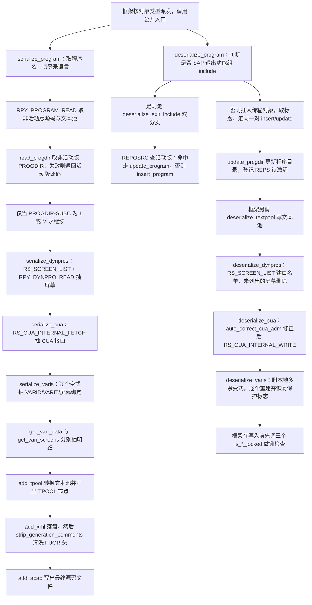
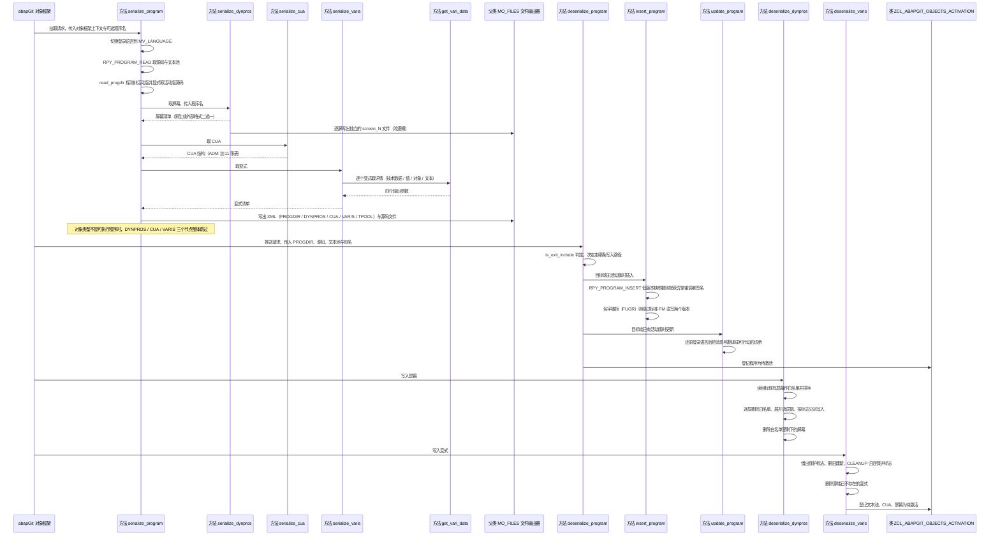

# ZCL_ABAPGIT_OBJECTS_PROGRAM 分析报告

> 分析对象：`abapGit__abapGit__zcl_abapgit_objects_program.clas.abap`（1597 行，全局类 `ZCL_ABAPGIT_OBJECTS_PROGRAM`，继承 `ZCL_ABAPGIT_OBJECTS_SUPER`）
> 报告视角：代码 onboarding 走读，按"序列化（导出）/ 反序列化（导入）"两条真实调用链展开
> 分析深度：全类 28 个 `METHOD` 实现 + 类定义段的类型/常量声明，全部覆盖

---

## 一、程序定位与业务背景

### 1.1 这段代码在解决什么问题

先说清楚它**不是**什么：它不是报表、不做业务逻辑、不直接读写 `TRDIR`/`REPOSRC` 之外的业务表、也不负责屏幕的运行期行为。它是一个**对象序列化适配器**——把一种 ABAP 对象（SAP 的"报表程序 / Program"，即 `R3TR PROG` 与 `R3TR FUGR`）在 SAP 内部数据库里的那些"程序性副产物"完整地抽取成 XML/源码文件，再把这一整套副产物反向写回目标系统。

具体说，一个 ABAP 程序在 SAP 里从来不只有"源码"这一样东西。跑一次 SE38 或一次传输，你会看到它带着一整套"看不见的附属物"：

| 附属物 | SAP 内部存放位置 | 不搬走会怎样 |
|---|---|---|
| 程序源代码（活动版 + 非活动版） | `REPOSRC` | 拉取后代码与目标不符 |
| 屏幕（dynpro）、容器、字段、流逻辑 | `D020S`/`D021S`/`D021T`/`DYCATT` 等 | SE41 里屏幕空白，`PROCESS BEFORE/AFTER` 丢失 |
| CUA 接口（状态栏、标题、菜单、函数码、按钮、鼠标样式） | `RSMPE_*` 系列 | GUI 交互失效，用户看到"裸"屏幕 |
| 变式（Variants）及其选择文本、屏幕绑定、对象绑定 | `VARID`/`VARIT`/`RSVARKEY`/`VANZ` | 用户个性化设置丢失 |
| 文本池（Textpool，含程序标题） | 内部文本池 | 标题与所有文本符号变成原始文本 |

abapGit 的设计承诺是"**一次 pull，目标系统与源系统逐字节等价**"。要做到这一点，就必须把这五样东西一起搬。这个类就是"程序类对象"的搬运工：`SERIALIZE_*` 系列负责读，`DESERIALIZE_*` 系列负责写。

一句话设计范式定性：

> **"双向序列化适配器 + SAP 标准 FM 门面"——对外暴露 `serialize_*` / `deserialize_*` 两个方法作为 abapGit 对象框架的契约，内部全部收敛到 SAP 的 `RPY_*` / `RS_*` 系列函数模块；对源系统的不确定性（锁、语言状态、活动版缺失）一律用 `TRY` / `sy-subrc` / 条件编译式降级吃掉，不外泄。**

### 1.2 为什么要做成"类 + 继承"，而不是一堆函数模块

三点，按重要性排：

1. **abapGit 的对象层是策略模式**。abapGit 有几十种对象（程序、表、类、函数组、CLS…），每种都遵循同一套契约：从工厂按对象类型派发到对应的 `ZCL_ABAPGIT_OBJECTS_*`，由它声明"我是哪种对象、怎么序列化"。`INHERITING FROM zcl_abapgit_objects_super` 就是这个契约的载体——`MV_LANGUAGE`、`MS_ITEM`、`MO_FILES`、基类异常约定都在父类里。
2. **`zcl_abapgit_objects_super` 提供了运行时上下文**。本类大量使用 `ms_item-obj_type`（当前对象类型）、`ms_item-obj_name`（当前对象名）、`mv_language`（当前序列化语言）、`mo_files->add_abap( )`（写文件）、`mo_i18n_params`（i18n 参数）——**这些都不是本类声明的**，全部来自父类的公有属性。所以本类不能脱离父类单独读。
3. **写操作需要统一出口**。所有落库动作最终都收敛到 `INSERT` / `UPDATE` / `DELETE` 这几个语句，散落在各方法里；把"要不要写、写失败怎么报"收敛成一套规则，比散着写更容易保持一致。

代价在第 2 点：**本文件单独读会有大量"这个名字哪来的"**，这是有意的设计（依赖注入），不是缺陷。

### 1.3 依赖清单（读这段代码前必须知道的地形）

```
Z 对象（客户自有 / 开源）  ZCL_ABAPGIT_OBJECTS_SUPER   父类：MV_LANGUAGE、MS_ITEM、MO_FILES、MO_I18N_PARAMS
                          ZCL_ABAPGIT_OBJECTS_FILES    文件输出器（父类属性 MO_FILES 的类型）
                          ZCL_ABAPGIT_OBJECTS_ACTIVATION  激活登记器：把待激活对象排队
                          ZCL_ABAPGIT_FACTORY           工厂：get_cts_api( ) / get_sap_report( )
                          ZCL_ABAPGIT_LANGUAGE          登录语言切换 / 还原
                          ZCX_ABAPGIT_EXCEPTION         唯一异常类型，全类 RAISING 它的子类型
                          ZIF_ABAPGIT_XML_OUTPUT       XML 输出接口（XML 序列化目标）
                          ZIF_ABAPGIT_SAP_REPORT        直接读 REPOSRC / TRDIR 的低层接口
                          ZIF_ABAPGIT_LANG_DEFINITIONS   tpool 行类型定义
                          ZIF_ABAPGIT_ENVIRONMENT       语言过滤器类型
SAP 标准 FM                RPY_PROGRAM_INSERT / RPY_INCLUDE_UPDATE / RPY_PROGRAM_READ
                          RPY_DYNPRO_READ / RPY_DYNPRO_READ_NATIVE / RPY_DYNPRO_INSERT
                          RPY_DYNPRO_INSERT_NATIVE
                          RS_SCREEN_LIST / RS_SCRP_DELETE
                          RS_CUA_INTERNAL_FETCH / RS_CUA_INTERNAL_WRITE
                          RS_CREATE_VARIANT_255 / RS_CHANGE_CREATED_VARIANT_255 / RS_VARIANT_DELETE
                          RS_ALL_VARIANTS_4_1_REPORT / RS_VARIANT_VALUES_TECH_DAT_255
                          RS_VARIANT_CONTENTS_255 / RS_GET_SCREENS_4_1_VARIANT
                          RS_DYN_CALL_ERROR_MESSAGE（间接）
SAP 标准表（直接 DML）      TADIR（查 DEVCLASS）、D021T（原生屏幕文本）、VARID / VARIT（变式保护与文本）
直接 DB 语句               INSERT TEXTPOOL / DELETE TEXTPOOL / DELETE FROM d021t / INSERT d021t
反射与动态                ASSIGN ('(SAPLSIFP)TTAB')      动态取 SAP 函数组内的全局表头，规避 RPY 的已知 bug
```

### 1.4 这是"兼容性代码"，读的时候要换一副眼睛

abapGit 面向的是**从 7.02 到 7.5x 全版本**的系统，同一份代码要在不同补丁级别、不同 Unicode 版本上跑通。这带来三件在本类里随处可见、但新手会当成"写错了"的写法：

- **`TRY. ... CATCH cx_sy_dyn_call_param_not_found.`**（`delete_vari`、`insert_program`）：老版本 FM 没有某个形参，一调就抛这个异常，于是用 `CATCH` 退回老签名再调一次。这是 abapGit 处理"FM 参数在低版本不存在"的标准手法，**不是错误处理不足**。
- **裸 `sy-tcode = 'SE41' ##WRITE_OK.`**（`deserialize_cua`）：SAP 的 CUA 写入 FM 会检查当前事务是否为 SE41，abapGit 直接改系统字段绕过，并显式标注 `##WRITE_OK` 关掉 ATC 告警。注释里写得很清楚是 "evil hack"。
- **`ASSIGN ('(SAPLSIFP)TTAB') TO <lg_any>.`**（`get_program_title`）：绕开 `RPY_PROGRAM_UPDATE` 的一个已知 bug——它没清 `TTAB` 表头，程序标题长度会从别的程序继承过来。用动态 `ASSIGN` 是唯一能清掉它的办法。

所以本报告的分析对象是**这套兼容性外壳包裹着的实际搬运逻辑**，以及它在正确性上的几处真实边界。

---

## 二、程序执行流程总览

这个类没有单一入口，它有**两个互斥的公开入口**（`serialize_program` 与 `deserialize_program`），由 abapGit 的对象框架按"用户在 pull 还是 push"来选择。两个入口各自是一条主链，下图把两条链画在一起：



### 责任链表

| 子程序 | 调用者 | 职责 |
|---|---|---|
| `serialize_program`（公开入口 A） | abapGit 对象框架（pull 方向派发） | 序列化总控：取源码、取 PROGDIR、按类型分派三件附属物、落盘 XML 与源码 |
| `RPY_PROGRAM_READ`（被调 FM） | `serialize_program` | 取程序的非活动版源码与文本池，失败按 `sy-subrc` 分类处理 |
| `read_progdir` / `read_report`（父类接口方法） | `serialize_program` | 直读 `TRDIR`/`REPOSRC` 取指定状态的程序目录与源码 |
| `serialize_dynpros`（受保护） | `serialize_program` | 逐个屏幕抽出 header/容器/字段/流逻辑，流逻辑写成独立 `screen_N` 源文件 |
| `RPY_DYNPRO_READ` / `RPY_DYNPRO_READ_NATIVE`（被调 FM） | `serialize_dynpros` | 分别取"外部格式"与"内部格式"的屏幕字段，后者用于还原 foreignkey 标志 |
| `serialize_cua`（受保护） | `serialize_program` | 一次 FM 调用把 12 张 CUA 表全抽出来，装进 `ty_cua` |
| `serialize_varis`（受保护） | `serialize_program` | 遍历本程序的变式，逐个调 `get_vari_data` 与 `get_vari_screens` 装配成 `ty_vari` |
| `get_varis_for_report`（私有） | `serialize_varis`、`deserialize_varis` | 取程序现有变式键清单，按 `SAP&*` / `CUS&*` 模式过滤出用户变式 |
| `get_vari_data`（私有） | `serialize_varis` | 取单个变式的技术数据（VARID）、值（`RS_VARIANT_CONTENTS_255`）、对象、按语言过滤的文本 |
| `get_vari_screens`（私有） | `serialize_varis` | 取变式绑定的屏幕号列表 |
| `get_program_title`（私有） | `serialize_program` 之外主要是 `deserialize_program` 与 `deserialize_exit_include` | 从文本池取 `id = 'R'` 的标题行，并先清 `SAPLSIFP` 的 `TTAB` 规避继承 bug |
| `add_tpool`（公开类方法） | `serialize_program` | 文本池转 abapGit 自有格式；`id = 'S'` 的行做"前 8 字符为长度前缀"的拆分 |
| `strip_generation_comments`（受保护） | `serialize_program` | 仅对 FUGR 清洗 abapGit 自己生成的表头注释行 |
| `deserialize_program`（公开入口 B） | abapGit 对象框架（push 方向派发） | 反序列化总控：退出 include 分流、插传输对象、insert/update 程序、更新 PROGDIR、登记激活 |
| `is_exit_include`（私有） | `deserialize_program`、`deserialize_exit_include`（经 `update_program`） | 用名字模式判断是否为 SAP 退出功能组的 include，决定 active-only 还是常规路径 |
| `deserialize_exit_include`（私有） | `deserialize_program` | 退出 include 专用分支：先 `update_program` 置空状态，失败才 `insert_program` |
| `insert_program`（私有） | `deserialize_program`、`deserialize_exit_include` | 优先 `RPY_PROGRAM_INSERT`（含 `UCHECK`）；遇 `name_not_allowed`（如 FUGR）改走 `insert_report` 双版本直写 |
| `update_program`（私有） | `deserialize_program`、`deserialize_exit_include` | `RPY_INCLUDE_UPDATE` 更新源码，并把 EU510 / EU522 两个消息翻译成人话异常 |
| `update_progdir`（父类接口方法） | `deserialize_program` | 更新程序目录记录（包分配等） |
| `deserialize_textpool`（受保护） | 对象框架（push 阶段，本类之外调度） | 按语言决定 active/inactive 态，写文本池；空池且非主语言时改插空池以避免误激活删除 |
| `deserialize_dynpros`（受保护） | 对象框架 | 先取目标现有屏幕建白名单，逐个写入屏幕，写完删除白名单外的屏幕 |
| `uncondense_flow`（私有） | `deserialize_dynpros` | 按保存的空格数把压缩过的流逻辑右移展开 |
| `deserialize_cua`（受保护） | 对象框架 | 修正 ADM 后 `RS_CUA_INTERNAL_WRITE` 写 CUA，并登记 CUAD 待激活 |
| `auto_correct_cua_adm`（私有类方法） | `deserialize_cua` | 针对 issue #1807 修正历史上未保存的 ADM 三个代码字段 |
| `deserialize_varis`（受保护） | 对象框架 | 删本地多余变式、对齐每个变式的值/文本/屏幕/对象，并成对恢复保护标志 |
| `set_vari_protection`（私有） | `deserialize_varis` | 读旧保护标志、在重建前后按需置/复位 `VARID-PROTECTED` |
| `create_vari`（私有） | `deserialize_varis` | `RS_CREATE_VARIANT_255` 建变式，再 `RS_CHANGE_CREATED_VARIANT_255` 补对象绑定 |
| `delete_vari`（私有） | `deserialize_varis` | `RS_VARIANT_DELETE` 删除变式，低版本走 `CATCH` 退回老签名 |
| `read_tpool`（公开类方法） | 本文件内未被调用（对外工具方法） | `add_tpool` 的逆变换，用于把 abapGit 格式转回 SAP 文本池格式 |
| `is_any_dynpro_locked` / `is_cua_locked` / `is_text_locked`（受保护） | 对象框架（写入前的锁检查阶段） | 三个锁检查：屏幕（ESCRP）、CUA（ESCUAPAINT）、文本（EABAPTEXTE） |

下面按这两条真实流程，逐个子程序展开。要提前说明的是：这个类有 28 个 `METHOD`，其中 `serialize_dynpros`、`deserialize_dynpros`、`deserialize_varis` 三个方法占了实现代码的六成以上，第三节对它们逐步拆分展开；`is_exit_include` 这类一行判断按紧凑写法单块处理。

---
## 三、分组分析

### 3.1 类型声明段 CUA 与屏幕的类型定义（类定义段 PUBLIC / PROTECTED SECTION）

这个类有 3 个 `TYPES` 块值得先读透，因为它们定义了后面所有方法的数据契约。第一个是 CUA 的"打包类型"——它把 SAP 的 12 张 CUA 表原样捆成一个结构，这是 CUA 序列化能"一个 XML 节点装完"的前提。

```abap
    TYPES:
      BEGIN OF ty_cua,
        adm TYPE rsmpe_adm,
        sta TYPE STANDARD TABLE OF rsmpe_stat WITH DEFAULT KEY,
        fun TYPE STANDARD TABLE OF rsmpe_funt WITH DEFAULT KEY,
        men TYPE STANDARD TABLE OF rsmpe_men WITH DEFAULT KEY,
        mtx TYPE STANDARD TABLE OF rsmpe_mnlt WITH DEFAULT KEY,
        act TYPE STANDARD TABLE OF rsmpe_act WITH DEFAULT KEY,
        but TYPE STANDARD TABLE OF rsmpe_but WITH DEFAULT KEY,
        pfk TYPE STANDARD TABLE OF rsmpe_pfk WITH DEFAULT KEY,
        set TYPE STANDARD TABLE OF rsmpe_staf WITH DEFAULT KEY,
        doc TYPE STANDARD TABLE OF rsmpe_atrt WITH DEFAULT KEY,
        tit TYPE STANDARD TABLE OF rsmpe_titt WITH DEFAULT KEY,
        biv TYPE STANDARD TABLE OF rsmpe_buts WITH DEFAULT KEY,
      END OF ty_cua.
```

**做什么** — 定义 `ty_cua`，把 CUA（Computer User Area，GUI 的状态栏、标题栏、菜单、函数码、按钮、鼠标样式等 12 类元素）声明成一个结构：第一个成员 `adm` 是整体管理记录（ADM），其余 11 个成员分别是各元素的标准内表，行类型直接用 SAP 的 `RSMPE_*` 表类型。声明在 `PUBLIC SECTION`，因为对象框架和测试代码都需要引用它。

**为什么** — 这个类型设计的要点是**它不是新类型，而是 SAP 原生类型的容器**。行类型全部用 `RSMPE_STAT` 等 SAP 结构，序列化时可以直接整表丢给 `RS_CUA_INTERNAL_FETCH` 的 `TABLES` 参数，反序列化时可以直接丢给 `RS_CUA_INTERNAL_WRITE`，中间零转换。这是"适配器"该有的样子：让 SAP 的 FM 能一口吃下，让 XML 层能一次序列化一个结构。选 `WITH DEFAULT KEY` 而不是 `UNIQUE` 或 `SORTED`，是因为这些表的唯一性靠 SAP 自己保证，abapGit 只当运输箱，不承担去重责任。

**风险与改进** — 三处值得记下：

1. **字段名用了 3 个字符缩写，与 SAP 的 FM 参数名逐一对应**。`sta`/`fun`/`men`/`mtx`/`act`/`but`/`pfk`/`set`/`doc`/`tit`/`biv` 是硬编码的约定，不匹配任何 SAP 命名标准；好处是 `RS_CUA_INTERNAL_FETCH` 的 12 个 `TABLES` 参数可以一字不差地照抄，代价是读代码的人必须查 SAP 文档才知道 `biv` 是"按钮可见性（Button Invisible）"。**建议**：在这段 `TYPES` 上方补一行注释给出缩写对照表，新人不用去 SE01 里逐个确认。
2. **`adm` 被提升成结构的第一个成员，暗示它有特殊地位**——它确实特殊：`auto_correct_cua_adm` 单独修正它，因为历史上写 CUA 时 ADM 根本没存进 XML（issue #1807）。这个"一等公民"地位目前只体现在字段顺序和那个修正方法里，**建议**在字段上加注释点明。
3. **`ty_cua` 放在 `PUBLIC SECTION`，而它内部的行类型全来自 SAP 的 `RSMPE_*`**，也就是说公开契约的稳定性绑在了 SAP 的 DDIC 上。所幸这些是稳定的 DDIC 对象，abapGit 多年未改，属于可接受的耦合。但**建议**在类注释里写一句"依赖 SAP 标准 CUA 表结构，低版本差异由 `serialize_cua` 的异常处理吸收"，让后来人知道边界在哪。

### 3.2 类型声明段 屏幕与变式的类型定义（类定义段 PROTECTED SECTION）

第二个 `TYPES` 块定义屏幕与变式的容器，其中屏幕类型 `ty_dynpro` 有一个字段级的设计决定值得单独说：

```abap
    TYPES:
      ty_spaces_tt TYPE STANDARD TABLE OF i WITH DEFAULT KEY .
    TYPES:
      BEGIN OF ty_dynpro,
        header     TYPE rpy_dyhead,
        containers TYPE dycatt_tab,
        fields     TYPE dyfatc_tab,
        flow_logic TYPE swydyflow,
        spaces     TYPE ty_spaces_tt,
        nat_header TYPE d020s,
        nat_fields TYPE STANDARD TABLE OF d021s WITH DEFAULT KEY,
        nat_texts  TYPE STANDARD TABLE OF d021t WITH DEFAULT KEY,
      END OF ty_dynpro .
```

**做什么** — 定义屏幕的结构化载体 `ty_dynpro` 与它的内表类型 `ty_dynpro_tt`。一个成员对应 SAP 屏幕的一块数据：`header` 是屏幕头（`RPY_DYHEAD`）、`containers` 是容器、`fields` 是字段与容器的对应关系、`flow_logic` 是 `PROCESS BEFORE/AFTER` 流逻辑。后面三个成员是"原生格式"分支专用：`nat_header`（`D020S`）、`nat_fields`（`D021S`）、`nat_texts`（`D021T`）。

**为什么** — 关键设计是 `nat_*` 与 `containers`/`fields` **互斥**：SAP 的屏幕有"外部格式"（`RPY_DYNPRO_READ` 给的 `DYCATT`/`DYFATC`，屏幕设计器看到的形态）和"内部格式"（`D021S`/`D021T`，运行期形态）两套。带 splitter 的原生屏幕只能用内部格式表达，而只有内格式才带 `D021T` 里的文本。所以这个类型是**"两套表达 + 一个判别位"**：判别位就是 `header-type` 是否 `CA c_native_dynpro`，不需要额外的 flag 字段去记"我这次用了哪套"。这种"用数据自身形状当判别位"的设计比加一个 `is_native` 布尔量更省心，代价是判别条件散落在 `serialize_dynpros` 与 `deserialize_dynpros` 两处各写一遍。

`spaces`（`ty_spaces_tt`）是给 `flow_logic` 配套的：SAP 把屏幕流逻辑按列压缩存储（把每行前导空格数记在旁边），abapGit 存 XML 时保留压缩态，反序列化时用 `uncondense_flow` 还原。**存压缩态而不是展开态**，是因为展开后的流逻辑在 XML diff 里噪声极大——同一段逻辑换个编辑器可能整体重排。存压缩态让 git diff 只在真正改动时才有变化，这是这个字段存在的全部理由。

**风险与改进** — 两处：

1. **`nat_fields` 用 `STANDARD TABLE OF d021s`，而 `containers`/`fields` 用 SAP 的表类型 `dycatt_tab`/`dyfatc_tab`**。同一个结构里混用"自定义内表类型"和"SAP 表类型"，读写方式一致但排序、键行为可能不同（两者都是标准表，行为相同，所以当下无害）。**建议**统一成 SAP 表类型，或统一成显式内表，保持结构内部一致。
2. **`nat_*` 三个字段允许同时为空而不报错**。类型层面没有任何约束说"非原生屏幕不许填 `nat_fields`"。目前靠 `serialize_dynpros` 里的 `ELSE` 分支保证互斥，逻辑正确但**约束只存在于代码里、不存在于类型里**。如果将来有人为了某个 bug 在 `ELSE` 分支里也塞 `nat_*`，就会产出"两套格式混在一张屏幕里"的 XML，而 `deserialize_dynpros` 只会静默用其中一套。**建议**：在 `serialize_dynpros` 的 `ELSE` 分支加一句断言，或在反序列化侧对"两套都非空"显式抛异常，让矛盾数据在入口就被拦下。

### 3.3 类型声明段 变式结构与常量定义（类定义段 PROTECTED / PRIVATE SECTION）

第三个 `TYPES` 块是变式结构，它是全类里字段最多的一个类型——因为一个变式要同时装下技术数据、值、对象绑定和文本：

```abap
    TYPES:
      ty_varikey_tt        TYPE STANDARD TABLE OF rsvarkey WITH DEFAULT KEY,
      ty_vari_dynnr_tt     TYPE STANDARD TABLE OF rsdynnr WITH DEFAULT KEY,
      ty_vari_value_tt     TYPE STANDARD TABLE OF rsparamsl_255 WITH DEFAULT KEY,
      ty_vari_text_crea_tt TYPE STANDARD TABLE OF varit WITH DEFAULT KEY,
      ty_vari_object_tt    TYPE STANDARD TABLE OF vanz WITH DEFAULT KEY.
    TYPES:
      BEGIN OF ty_vari_text,
        langu TYPE langu,
        vtext TYPE rvart_vtxt,
      END OF ty_vari_text,
      ty_vari_text_tt TYPE STANDARD TABLE OF ty_vari_text WITH DEFAULT KEY.
```

**做什么** — 声明变式相关的五个行/表类型：`ty_varikey_tt` 是变式"键"（`RSVARKEY`，即报告名 + 变式名的最小标识），`ty_vari_dynnr_tt` 是变式绑定的屏幕号，`ty_vari_value_tt` 是变式值（`RSPARAMSL_255`），`ty_vari_text_crea_tt` 是写回用的变式文本行（`VARIT`），`ty_vari_object_tt` 是变式绑定的对象（`VANZ`）。另外定义了简化的文本结构 `ty_vari_text`（只留语言 + 文本），用于 XML 侧。

**为什么** — 这里有一个清晰的**"读侧类型"与"写侧类型"分离**：`ty_vari_text_tt`（读，`ty_vari_text` 两字段，XML 友好）与 `ty_vari_text_crea_tt`（写，`VARIT` 全字段，需要 `MANDT`/`REPORT`/`VARIANT` 三个键字段）。如果图省事只用 `VARIT`，序列化出去的 XML 会带着三个从 SAP 内部搬来的键字段，diff 噪声大且泄露了本就不该出现在文件里的客户端信息。分开定义，序列化侧干净、反序列化侧完整——这是序列化器通用的正确做法。`ty_varikey_tt` 与 `ty_vari_tt` 并存也是同一个道理：前者是"我本地有哪些变式"的轻量清单，后者是"这个变式的完整内容"。

**风险与改进** — 两处：

1. **`ty_vari_value_tt` 用 `STANDARD TABLE OF rsparamsl_255`，但代码里对它的实际访问只有整表传递和 `SORT`**，没有任何字段级读写。这意味着这个类型的字段结构只是"恰好"与 SAP 的一致，没有被真正依赖——这是好事（SAP 改字段不会打破 abapGit）。**但**它同时意味着：如果哪天需要按参数名做过滤，就必须知道 `RSPARAMSL_255` 的字段名，那时耦合才真正发生。**建议**在类型定义处加一行注释说明"当前仅整表搬运，不依赖具体字段"，把这个隐含契约写明。
2. **五个表类型全部用 `STANDARD TABLE`，而其中三个（`ty_vari_value_tt`、`ty_vari_text_tt`、`ty_vari_object_tt`）在 `get_vari_data` 出口后要 `SORT`，`ty_vari_dynnr_tt` 要 `SORT`**。用标准表 + `SORT` 是正确的选择（每次序列化只排一次，且要保证跨版本顺序稳定），但如果某天在循环里反复按变式名查找，`SORT` 的代价会显现。**当前无此问题**，记录在此以备后查。

私有段还有两个常量块，它们是本类"版本兼容"策略的核心：

```abap
    CONSTANTS:
      BEGIN OF c_state,
        active   TYPE r3state VALUE 'A',
        inactive TYPE r3state VALUE 'I',
        off      TYPE r3state VALUE '',
      END OF c_state.

    CONSTANTS c_native_dynpro TYPE c LENGTH 2 VALUE 'IN'.

    CONSTANTS c_sysvari_clnt        TYPE mandt      VALUE '000'.
    CONSTANTS c_sysvari_pattern_sap TYPE c LENGTH 5 VALUE 'SAP&*'.
    CONSTANTS c_sysvari_pattern_cus TYPE c LENGTH 5 VALUE 'CUS&*'.
```

**做什么** — 定义三组常量：`c_state` 把 SAP 的程序状态（活动 `A`、非活动 `I`、清空）提成有名字的枚举；`c_native_dynpro` 是原生屏幕的类型标识（`IN` 取自 `D020S-TYPE` 的 native 分支）；`c_sysvari_clnt` 把变式操作硬编码到客户端 `000`；两个 pattern 用于识别"系统变式"与"客户变式"。

**为什么** — `c_state` 的价值在 `active`/`inactive`/`off` 三态而不是两态：`off`（空值）只在 `deserialize_exit_include` 里用一次——它要把一个退出 include 显式"保存为空状态"，这不是 `active` 也不是 `inactive` 能表达的。把这种语义差异藏进字符串字面量会让 `iv_state = ''` 读起来像"忘了赋值"，提成常量后一眼可见。

`c_sysvari_clnt = '000'` 与两个 pattern 是一组。SAP 的变式表 `VARID` 是全系统共用的，客户端 `000` 是系统变式的归属客户端，用户自建变式通常记在 `000` 上而名字带 `SAP&`（标准）或 `CUS&`（客户）前缀。abapGit 只搬"用户该带的变式"，所以两个 pattern 是过滤规则，`000` 是读写固定客户端。**把客户端硬编码成常量而不是读 `sy-mandt`，是刻意的**：变式跟随的是标准变式的存储约定，不是当前登录的客户端。

**风险与改进** — 三点，前两点是真实的语义风险：

1. **客户端硬编码 `000` 意味着非 `000` 客户端上的用户变式永远不会被搬**（P0）。这是 abapGit 的既定取舍（变式属于标准交付物而非用户个性化），但**必须写进文档**——接手的人看到 `c_sysvari_clnt` 很可能以为漏了 `sy-mandt`。**建议**在常量旁加注释："变式固定存放在 000 客户端，非 000 客户端的用户变式不纳入序列化"。
2. **`c_sysvari_pattern_sap = 'SAP&*'` 中的 `&` 是客户端占位符**，`c_sysvari_pattern_cus = 'CUS&*'` 同理。用 `CP` 匹配时这个 `&` 是字面量还是通配，取决于 `CP` 的语义（`CP` 只认 `*` 与 `+` 为通配，`&` 是字面量）。因此这两个 pattern 实际匹配的是"以 `SAP&` 开头"和"以 `CUS&` 开头"，即 `SAP&000...` 这种标准命名。**这一点需在 SE38 用一个小程序核实 `CP` 对 `&` 的处理**，因为如果 `&` 真是字面量，那么变式名里恰好含 `SAP&` 前缀的用户变式也会被误判为系统变式并被搬走——这与"只搬用户变式"的意图相反。本文件的写法本身没问题，问题在于这个语义依赖没有被注释点明。
3. **`c_native_dynpro` 的值 `'IN'` 是 `D020S-TYPE` 的原生标识，但代码里用的是 `header-type CA c_native_dynpro`（子串匹配）而非等值**。用 `CA` 而不是 `=` 是为了兼容 `D020S-TYPE` 里可能出现的多值情况，但同时也意味着任何 `TYPE` 里含 `IN` 连续两字符的屏幕类型都会被判为原生。**建议**核实 `D020S-TYPE` 的完整取值域，若 `IN` 是唯一可能的双字母组合，`=` 比 `CA` 更安全；若确有其他含 `IN` 的取值，则应改成显式列举。


静态地形交代完了，接下来进入执行流程。先看两个公开入口里更复杂的序列化总控。

### 3.4 步骤① 序列化入口：确定程序名与切换登录语言（方法 serialize_program）

`serialize_program` 是 pull 方向的公开入口，负责整个"导出"过程。它有五段逻辑，本节拆成五步逐步展开。第一步是入口的参数兜底与语言切换：

```abap
    IF iv_program IS INITIAL.
      lv_program_name = is_item-obj_name.
    ELSE.
      lv_program_name = iv_program.
    ENDIF.

    zcl_abapgit_language=>set_current_language( mv_language ).
```

**做什么** — 先决定"要序列化哪个程序"：`iv_program` 给了就用它，没给（`IS INITIAL`）就退回当前对象框架传入的 `is_item-obj_name`。然后调用 `zcl_abapgit_language=>set_current_language( mv_language )`，把 SAP 的登录语言强制切到 abapGit 当前正在处理的目标语言（序列化多语言时这是必须的——读 CUA、读文本池的 FM 都按登录语言返回数据）。

**为什么** — `iv_program` 存在的原因值得单独说：CUA 可以"属于"另一个程序。当 abapGit 序列化一个函数组（FUGR）时，它的 CUA 实际归属函数组主程序，所以框架会把 FUGR 的对象名传进来，但真正要读 CUA 的是主程序。这个参数让同一个 `serialize_program` 既能处理独立程序、也能处理函数组附带的对象——**用参数表达"要处理谁"，比复制一份方法体好得多**。

而"切换登录语言"这一步的位置也有讲究：它必须在**任何读 FM 之前**执行，且必须在方法结束前还原（第 2 步与第 5 步各还原一次）。SAP 的 `RPY_*` / `RS_*` 系列 FM 大多没有"指定语言"的形参，语言只能靠登录语言控制——这是 abapGit 绕不开的约束，也是这个类里语言切换动作频繁出现的原因。

**风险与改进** — 三点：

1. **语言切换没有 `TRY` 保护，也不是 `TRY ... CATCH` 的结构**（P0）。第 2 步和第 3 步都有异常路径（`raise_t100` 会抛 `zcx_abapgit_exception`），一旦在切换之后、还原之前抛出，`restore_login_language( )` 就**不会执行**——SAP 的登录语言被留在 abapgit 的语言上，后续所有操作（包括错误消息、日志、甚至其它 abapGit 代码）都用错语言。第 2 步的两条异常路径（`sy-subrc = 2` 与 `sy-subrc <> 0`）都显式调了还原，第 3 步的 `raise_t100` 却没有——**这正是"归还协议"在多出口代码里最容易漏的地方**。**建议**：把第 2、3、5 步整个包进 `TRY. ... CLEANUP. zcl_abapgit_language=>restore_login_language( ). ENDTRY.`，让语言还原成为无条件保证（`deserialize_dynpros` 之外的 `insert_program` / `update_program` 也可以照此办理）。
2. **`iv_program IS INITIAL` 的兜底方向是对的，但兜底值 `is_item-obj_name` 的语义未验证**。若 `is_item` 为空引用（框架未初始化）而 `iv_program` 也为空，这里会 dump 而不是报错。**需在 SE21 核实** `ms_item` 在父类里是引用还是结构、以及对象框架是否保证 `is_item` 一定非空——如果是引用类型，本行存在空引用风险。
3. **语言切换的粒度是"方法级"而非"调用级"**：如果 `serialize_program` 递归调用自己（当前没有）或被并发调用（ABAP 单线程，不存在），语言状态会互相踩。当前无此问题，**但作为可复用类**，建议在类的公开注释里写明"本方法会临时修改登录语言，调用方不得假设进入时与退出时语言相同"。

### 3.5 步骤② 读取源码与文本池（方法 serialize_program）

第二步是调用 `RPY_PROGRAM_READ` 取程序源码和文本池，并对它的四种异常做分类处理：

```abap
    CALL FUNCTION 'RPY_PROGRAM_READ'
      EXPORTING
        program_name     = lv_program_name
        with_includelist = abap_false
        with_lowercase   = abap_true
      TABLES
        source_extended  = lt_source
        textelements     = lt_tpool
      EXCEPTIONS
        cancelled        = 1
        not_found        = 2
        permission_error = 3
        OTHERS           = 4.

    IF sy-subrc = 2.
      zcl_abapgit_language=>restore_login_language( ).
      RETURN.
    ELSEIF sy-subrc <> 0.
      zcl_abapgit_language=>restore_login_language( ).
      zcx_abapgit_exception=>raise_t100( ).
    ENDIF.

    zcl_abapgit_language=>restore_login_language( ).
```

**做什么** — 调用 `RPY_PROGRAM_READ`，把 `lv_program_name` 程序的源码装进 `lt_source`、文本元素装进 `lt_tpool`。`with_includelist = abap_false` 表示不要 include 列表（include 是独立的 R3TR 对象，abapGit 单独处理）；`with_lowercase = abap_true` 表示保留源码里的小写（这对 diff 的稳定性至关重要）。然后按 `sy-subrc` 三分支：`2`（`not_found`）——还原语言并静默 `RETURN`；其它非零——还原语言并抛 `raise_t100`；成功——还原语言。

**为什么** — `with_lowercase = abap_true` 是这个调用里最重要的一行。SAP 的程序读取默认会把关键字大写化，如果 abapGit 用默认值，用户在本地写的小写变量名会被改成大写——**git diff 里会出现整文件重排**，仓库随即失去可读性。这一行是 abapGit 源码保真的基石，值得单独记住。

异常处理里把 `not_found` 单独拎出来"静默返回"而不是抛异常，是序列化器与业务逻辑的**根本区别**：序列化器要处理"目标系统里有、源系统里已经没有的对象"（比如程序被删了但传输记录还在），此时正确行为是"什么都不导出"，而不是"报错中断整个 pull"。抛异常会让一次 pull 因为一个已删除的对象整体失败。其他三个异常（`cancelled`/`permission_error`/`OTHERS`）走 `raise_t100`，把 SAP 的原始消息号透传给上层，这是 abapGit 的通用风格：底层异常不翻译，只在能给出更好诊断时才翻译（`update_program` 就是唯二这么做的地方）。

**风险与改进** — 三点：

1. **"静默 `RETURN`"意味着调用方无法区分"程序不存在"和"程序是空的"**（P1）。`serialize_program` 的返回类型是 `void`，所以"没导出任何东西"对调用框架来说就是一个静默的成功/无操作。如果框架在拉取后发现某个对象在文件系统里没有对应文件，它不知道这是"源系统没有该程序"还是"导出逻辑有 bug"。**建议**：在 `not_found` 路径上至少留一条可识别的日志（abapGit 有日志接口），或改为抛一个专门的异常让框架决定跳过——取决于框架是否支持"对象级跳过"。
2. **`sy-subrc = 2` 与 `sy-subrc <> 0` 的顺序检查依赖 `EXCEPTIONS` 编号的字面值**，即"`not_found` 是 2"。这个绑定是对的（`not_found = 2`），但整段逻辑的正确性建立在"编号没写错"上，人眼不容易看出错。**建议**改为 `IF sy-subrc = 2` 之后紧跟注释 `" not_found"`，把意图写在判断旁边。
3. **两次 `restore_login_language( )` 之间的第三条路径（成功）也调用了还原**——这是对的，但整段三处调用同一语句、其中一处还是"正常路径"，读者需要数着看。**建议**按 3.4 风险 1 的建议改为 `CLEANUP` 结构，把"归还语言"从流程图里删掉而不是留在流程图里。

### 3.6 步骤③ 组合非活动版与活动版源码（方法 serialize_program）

第三步是 abapGit 里最微妙的一段逻辑：`RPY_PROGRAM_READ` **只会返回活动版源码**（如果程序存在活动版的话），但 abapGit 要序列化的是"当前用户正在编辑的那一版"，也就是非活动版。这个方法用 `TRY ... CATCH` + 两个接口调用把它拼出来：

```abap
    " If inactive version exists, then RPY_PROGRAM_READ does not return the active code
    li_report = zcl_abapgit_factory=>get_sap_report( ).

    TRY.
        " Raises exception if inactive version does not exist
        ls_progdir = li_report->read_progdir(
          iv_name  = lv_program_name
          iv_state = c_state-inactive ).

        " Explicitly request active source code
        lt_source = li_report->read_report(
          iv_name  = lv_program_name
          iv_state = c_state-active ).
      CATCH zcx_abapgit_exception ##NO_HANDLER.
    ENDTRY.

    ls_progdir = li_report->read_progdir(
      iv_name  = lv_program_name
      iv_state = c_state-active ).
```

**做什么** — 先取 `zif_abapgit_sap_report` 接口实例（`li_report`，工厂模式获得）。然后进 `TRY`：调 `read_progdir` 取**非活动版**的程序目录存进 `ls_progdir`，再调 `read_report` 取**活动版**源码覆盖 `lt_source`。整个 `TRY` 挂了 `CATCH zcx_abapgit_exception ##NO_HANDLER`（空捕获），目的是**只用它的探测副作用**：如果非活动版不存在，`read_progdir` 抛异常，异常被吞掉，`lt_source` 就保持第 2 步 `RPY_PROGRAM_READ` 给的值（活动版，若存在）。出 `TRY` 后，无条件用**活动版** `read_progdir` 覆盖 `ls_progdir`。

**为什么** — 这是全类最见功力的一段，逻辑要分三层理解：

- **`read_progdir( iv_state = c_state-inactive )` 的真正用途是"探测"而非"取值"**。它成功 ⇒ 非活动版存在，程序目录信息取非活动版（这才是用户正在编辑的那一版，含最新的 `SUBC`、标题、`UCHECK` 等）。它失败（抛异常）⇒ 程序只有活动版或根本不存在，`ls_progdir` 保持第 2 步可能没填的状态。
- **`read_report( iv_state = c_state-active )` 覆盖 `lt_source`，是刻意把源码降级成活动版**。理由是：`RPY_PROGRAM_READ` 在程序只有非活动版（新建未激活）时返回的是非活动源码；但当程序**同时**有活动版和非活动版时，它返回的是活动版——而 abapGit 想要的恰恰是活动版作为"基线"，非活动版的存在由 `read_progdir` 判定。注释 `" Explicitly request active source code"` 点明了这是显式覆盖，不是遗漏。
- **空 `CATCH ... ##NO_HANDLER`** 是"用异常做控制流"。ABAP 没有"try 一下看能不能成功"的返回值机制，`read_progdir` 又把"不存在"表达成异常，所以只能靠捕获。这在本类里是惯用法（`delete_vari`、`insert_program` 也用 `CATCH`），是 abapGit 与"所有失败都要 try"的现代风格的分界线——它只在**失败可预期且有兜底**时用。`##NO_HANDLER` 是显式告诉 ATC"我知道我在吞异常，且这是有意的"。

至于最后那句无条件 `read_progdir( iv_state = c_state-active )`：它在 `TRY` 外面，无论非活动版存不存在都会执行，把 `ls_progdir` 定在活动版上。**这看起来和"非活动版优先"的意图矛盾**，是本方法最容易被误读的地方——**需要读者自己判断**：如果非活动版存在，上面的 `TRY` 刚把 `ls_progdir` 设为非活动版，这句又覆盖回活动版，那非活动版的 progdir 岂不是白取了？

**风险与改进** — 这段的真问题密度最高，逐点说：

1. **`ls_progdir` 的"非活动版优先"逻辑被最后一句无条件覆盖**（P0，**需在 SE38 实测核实**）。按字面读：`TRY` 里 `read_progdir(inactive)` 的赋值结果，必然被 `TRY` 后的 `read_progdir(active)` 覆盖。这与上一行注释 `" If inactive version exists, then RPY_PROGRAM_READ does not return the active code"` 想表达的"优先取非活动版"相矛盾。唯一能自圆其说的解释是：`read_progdir(inactive)` 的**唯一**目的是探测（它的返回值被丢弃无所谓），真正要的 progdir 统一取活动版。但若如此，`TRY` 里给它赋给 `ls_progdir` 就是误导性代码。**这是本报告标记的最需要核实的一处**——建议读代码的人去 SE38 追一次 `read_progdir` 的实现，确认 `ls_progdir` 最终用哪个状态的 progdir，并据此决定要么删掉 `TRY` 里的赋值（只留探测）、要么把最后一句挪进 `TRY` 的 `ELSE` 分支。**在核实前不应把它写成"未激活程序的元数据会被丢弃"这样的断言**。
2. **`CATCH zcx_abapgit_exception` 吞掉的是所有 `zcx_abapgit_exception`，不区分"非活动版不存在"和"读 progdir 时权限不足/表损坏"**（P1）。两者被同等对待，权限问题会静默退化成"用活动版"，用户以为拉全了其实少了信息。**建议**在 `zcx_abapgit_exception` 上区分消息号（SAP 惯例 `raise( 'text' )` 会带自定义文本，`raise_t100` 带原始 `sy-msgid`），只吞"对象不存在"那一类。
3. **`##NO_HANDLER` 空捕获 + 紧接着的无条件调用，是本方法唯一的"没有失败出口"的地方**（P1）。`read_progdir` 在 `TRY` 外面（第 1372 行那一句）如果抛异常，异常会一路冒出 `serialize_program`，此时**语言已经还原**（第 3.4 步已 `restore`），所以语言这块没问题；但调用方 abapGit 框架会收到一个未分类的 `zcx_abapgit_exception`。**建议**与 3.4 建议一致，在方法外层统一 `CATCH` 转成"这个程序序列化失败（含 progdir 读取失败）"的明确诊断。
4. **注释是唯一能读懂这段代码的东西**。`" Raises exception if inactive version does not exist"` 和 `" Explicitly request active source code"` 两行注释是必需的——没有它们，读者会把 `read_report(active)` 覆盖 `lt_source` 误读为 bug。**这类"异常即控制流 + 覆盖即设计"的代码，注释和代码同等重要**，abapGit 在这里做对了。

### 3.7 步骤④ 生成 XML 输出对象并按程序类型分派（方法 serialize_program）

第四步是把 XML 输出器准备好，并**只在程序类型为可执行报表（`SUBC = '1'` 可执行程序 或 `'M'`）时才序列化屏幕/CUA/变式**：

```abap
    IF io_xml IS BOUND.
      li_xml = io_xml.
    ELSE.
      CREATE OBJECT li_xml TYPE zcl_abapgit_xml_output.
    ENDIF.

    li_xml->add( iv_name = 'PROGDIR'
                 ig_data = ls_progdir ).
    IF ls_progdir-subc = '1' OR ls_progdir-subc = 'M'.
      lt_dynpros = serialize_dynpros( lv_program_name ).
      li_xml->add( iv_name = 'DYNPROS'
                   ig_data = lt_dynpros ).

      ls_cua = serialize_cua( lv_program_name ).
      li_xml->add( iv_name = 'CUA'
                   ig_data = ls_cua ).

      lt_varis = serialize_varis( lv_program_name ).
      li_xml->add( iv_name = 'VARIS'
                   ig_data = lt_varis ).
    ENDIF.
```

**做什么** — 先决定 XML 去哪：调用方传了 `io_xml` 就用它（`IS BOUND` 判非空），没传就自己 `CREATE OBJECT` 一个 `zcl_abapgit_xml_output`。然后无条件写出 `PROGDIR` 节点（程序目录信息）。接着判断 `ls_progdir-subc`：只有 `'1'`（可执行程序）或 `'M'`（含子程序的模块池）才继续调 `serialize_dynpros`（屏幕）、`serialize_cua`（CUA）、`serialize_varis`（变式），并各自写成一个 XML 节点。

**为什么** — **`io_xml OPTIONAL` + 自行创建**是一个多态装配模式：`serialize_program` 既能被"框架调用、框架自己写文件"（此时 `io_xml` 为空，方法在第 5 步调 `add_xml` 落盘），也能被"另一个方法调用、要拼进已有 XML 文档"（此时 `io_xml` 有值，方法只往里 `add`，不落盘）。用 `IS BOUND` 而不是 `IS INITIAL` 检查引用是否绑定，是引用类型参数的正确判空方式。

`SUBC = '1' OR 'M'` 这个门槛的业务含义是：**只有可执行程序和模块池才有屏幕、CUA、变式**。INCLUDE（`SUBC = 'I'`）、函数组里的 include（`SUBC = 'I'`）本身没有自己的屏幕和用户交互，强行去 `RS_CUA_INTERNAL_FETCH` 抽 CUA 会返回空甚至报错。**这个判断把"哪些对象类型值得抽取附属物"的知识固化进了入口**，而不是散在三个 `serialize_*` 方法里各判一次——单一判断点，避免三处不一致。

`PROGDIR` 无条件写出（哪怕 `SUBC` 是 `I`），因为所有程序都需要它（包、作者、状态）；`DYNPROS`/`CUA`/`VARIS` 条件写出，是"有才写"。这个"按需节点"的设计让 XML 保持最小，diff 干净。

**风险与改进** — 三点：

1. **`ls_progdir-subc` 直接读 `SUBC` 的原始值（`'1'`/`'M'`）而非常量**，与 3.3 节把状态提成 `c_state` 的风格不一致（那里把 `'A'`/`'I'` 提成 `c_state`，这里却用裸字面量）。**建议**提成常量（如 `c_subc_executable = '1'` / `c_subc_module = 'M'`），理由与其他常量相同：裸字面量在 ABAP 里没有类型保护，`ls_progdir-subc` 若被外部改坏，编译期查不出来。
2. **三个 `serialize_*` 是顺序串行调用，任一抛异常则前面已收集的数据全部丢弃**（P1）。比如 `serialize_dynpros` 成功（屏幕数据已在内存里）但 `serialize_varis` 抛异常，方法整体失败，内存里的屏幕数据随栈帧消亡，XML 节点也没写出（因为 `li_xml->add( 'CUA' )` 那行还没执行）。这是"要么全成要么全败"的合理设计（序列化追求原子性），**但要注意**：`li_xml` 若是**调用方传入**的（`io_xml` 有值），那么失败时调用方的 XML 对象里已经残留了 `PROGDIR` 节点——**部分写入**。**建议**：要么在方法入口对传入的 `io_xml` 记录起始节点位置并在异常时清理，要么在文档里明确"传入 `io_xml` 时本方法不保证失败后 XML 干净"。**需核实** `zcl_abapgit_xml_output->add` 是否支持删除/回滚节点。
3. **`serialize_varis` 返回的变式数量不做任何上限保护**。一个有几百个用户变式的程序，会把几百个变式（含各自的 255 字节值表）全装进内存。**当前无实际问题**（abapGit 单程序变式数通常个位数到几十），**但如果源系统是个用了十几年的老报表**，几百个变式是可能的——内存不是问题，但每个变式要调 `get_vari_data`（内部还有多次 FM），序列化会明显变慢。**建议**记录此处无需改，但接手时若遇到"大程序 pull 很慢"，这是第一个要查的地方。

### 3.8 步骤⑤ 文本池处理与最终落盘（方法 serialize_program）

第五步收尾：先剔除空的标题行、把文本池转成 abapGit 格式写进 XML，然后视情况落盘，最后清洗并写出源码文件。分三段代码看。

#### ① 剔除空标题行并写出 TPOOL 节点

```abap
    READ TABLE lt_tpool WITH KEY id = 'R' INTO ls_tpool.
    IF sy-subrc = 0 AND ls_tpool-key = '' AND ls_tpool-length = 0.
      DELETE lt_tpool INDEX sy-tabix.
    ENDIF.

    li_xml->add( iv_name = 'TPOOL'
                 ig_data = add_tpool( lt_tpool ) ).
```

**做什么** — 从文本池里用 `id = 'R'`（Report title，程序标题行）读一条到 `ls_tpool`。如果读到、且这一行的 `key` 为空、`length` 为 0（说明既没有短标题也没有长标题，是一个"空壳"标题行），就把它从 `lt_tpool` 里按索引删掉。然后把（可能已被清理过的）`lt_tpool` 交给类方法 `add_tpool` 转成 abapGit 格式，写成一个 `TPOOL` XML 节点。

**为什么** — 为什么要在序列化前剔除空标题行？因为 `RPY_PROGRAM_READ` 对**没有设标题**的程序也会返回一条 `id = 'R'` 的记录，只是内容全空。这条空记录序列化进 XML 后，在 git 里表现为"每个没标题的程序都有一个 TPOOL 节点，里面是空的"——**git diff 会因为一次无关的 SAP 端操作（哪怕只是激活了一下程序）而多出一段空节点变动**。剔除它是为了 diff 稳定，属于 abapGit 全局"diff 最小化"原则的又一次应用。

`key = ''` 与 `length = 0` **同时**成立才判定为空，这个双重条件比单看一个更严——比如 `length > 0` 但 `key` 空（设了长标题没设短标题）是要保留的，只删真正空白的。判断正确。

`add_tpool` 作为**类方法**（`CLASS-METHODS`）被调用，无需实例——这是本类两个公开类方法之一，设计成无状态纯函数，符合"转换逻辑不持有状态"的原则。

**风险与改进** — 三点：

1. **判空条件依赖 SAP 文本池行的字段语义**（P1，需在 SE11 核实）。`KEY`（短标题）与 `LENGTH`（标题长度，数字型文本）的联合判空，前提是"长度为 0 即等价于无标题"。这个等式对空行成立，但 SAP 文本池还可能有 `KEY` 非空而 `LENGTH = 0` 的畸形行（此时按当前逻辑不删，会被序列化出去）。**需在 SE11 看 `TPOOL` 相关行的字段定义与取值约束**。这是典型的"结论依赖 DDIC 字段语义"的场景，不应写死。
2. **`DELETE lt_tpool INDEX sy-tabix` 依赖 `READ TABLE` 刚设的 `SY-TABIX`**（P2）。写法本身是 ABAP 惯用法，正确但脆弱——中间插入任何语句都可能让 `SY-TABIX` 指向别的行。**建议**改为 `READ TABLE lt_tpool WITH KEY id = 'R' INTO ls_tpool.` 后紧跟 `DELETE lt_tpool WHERE id = 'R' AND key = '' AND length = 0.`（用同一 WHERE 条件删除全部匹配），语义等价且不依赖系统字段的位置敏感性。
3. **`add_tpool` 是公开类方法、参数类型是 `zif_abapgit_lang_definitions=>ty_tpool_tt`（abapGit 自己的格式），但传入的是 SAP 格式的 `lt_tpool`**。也就是说 `add_tpool` 的入参类型是"转换后"的类型，转换在函数内部完成（下一步展开它的实现）。**这本身没问题**，但**参数命名容易误导**——`it_tpool` 看不出是 SAP 格式还是 abapGit 格式。**建议**在公开类方法的注释里点明"入参为 SAP `textpool_table`，返回为 abapGit 格式"。

#### ② 按需落盘 XML

```abap
    IF NOT io_xml IS BOUND.
      io_files->add_xml( iv_extra = iv_extra
                         ii_xml   = li_xml ).
    ENDIF.
```

**做什么** — 如果调用方**没有**提供 `io_xml`（`NOT io_xml IS BOUND` 成立，即第 3.7 步里自己 `CREATE OBJECT` 出来的那个），就把攒好的 XML 对象通过 `io_files->add_xml( )` 落盘。`iv_extra` 是父类属性上下文带来的文件名前缀/后缀（区分程序名与附加对象）。

**为什么** — 这两行与第 3.7 步的开头是同一个"多态装配"逻辑的**收口**：入口决定"XML 是借的还是我的"，出口就按"是不是我的"决定"要不要自己写盘"。借来的 XML 由借方负责写（它可能嵌在一个大文档里），自己的 XML 自己写。**一个借用关系，两处判断，首尾呼应**——这是正确的设计，比"传个 `iv_write_file` 布尔形参"清晰得多，因为布尔形参允许"借来的也写盘"这种自相矛盾的组合。

**风险与改进** — 一处：

1. **`NOT io_xml IS BOUND` 与 `io_xml IS BOUND` 的判断分散在方法的两个远端位置**（P2）。入口判断"要不要创建"，出口判断"要不要写"，两处必须一致——若有人在中间修改了 `io_xml` 的绑定状态，就会出现"自己创建但也不写盘"（数据丢失）或"借来的却写盘"（重复输出）。当前无此风险（方法内不修改 `io_xml` 绑定），但**建议**在方法开头把"是否为自建"记进一个局部布尔量，全程用它判断，把这个隐含不变式显式化。

#### ③ 清洗源码并写出 ABAP 文件

```abap
    strip_generation_comments( CHANGING ct_source = lt_source ).

    io_files->add_abap( iv_extra = iv_extra
                        it_abap  = lt_source ).
```

**做什么** — 调 `strip_generation_comments` 就地修改 `lt_source`（清掉 FUGR 专用的自动生成表头注释），然后通过 `io_files->add_abap( )` 把源码写成 `.abap` 文件落盘。

**为什么** — 为什么清洗放在写文件前的最后一步？因为清洗是**只在落盘前才有意义的处理**——内存里的 `lt_source` 后续不再使用（方法即结束），清洗放在最后不影响任何中间逻辑。这是正确的顺序（变换尽量靠近 sink）。`CHANGING` 而不是返回值，说明 `strip_generation_comments` 是原地修改——对要写进文件的内容，原地改比产生副本更省内存，语义也直白（"把这个源清干净"）。

注意 `lt_source` 的类型是 `TYPE TABLE OF abaptxt255`（注意不是 `abaptxt255_tab`），这是 3.3 节提到的"不依赖具体字段"的风格：整个方法只把 `lt_source` 当"一列文本的行集合"整表传递，从不读它的内容（除 `strip_generation_comments` 内部按行处理）。

**风险与改进** — 两点：

1. **`lt_source` 的类型 `TABLE OF abaptxt255` 与方法参数里其它地方用的 `abaptxt255_tab` 不一致**（P2）。类定义段里 `deserialize_program`、`insert_program`、`update_program`、`deserialize_exit_include` 的 `it_source` 都写成 `TYPE abaptxt255_tab`（是个具名表类型），而这里写成 `TYPE TABLE OF abaptxt255`（匿名内联表类型）。两者在 ABAP 里**类型兼容**（`abaptxt255_tab` 本身就是 `STANDARD TABLE OF abaptxt255`），所以不会报错；但同一个语义用两种拼写，降低了可读性。**建议**统一用 `abaptxt255_tab`。
2. **`io_files->add_abap( )` 之前没有任何"源码为空"的检查**（P1）。如果第 3.5 步的 `RPY_PROGRAM_READ` 返回了 `not_found` 就已经 `RETURN` 了，所以走到这里 `lt_source` 至少有 `RPY_PROGRAM_READ` 给的内容；但若 FM 返回成功却给了空表（理论上不该），会写出一个空 `.abap` 文件。**当前 FM 语义下不会发生**，**建议**加一行 `CHECK lt_source IS NOT INITIAL.` 作为廉价的防御，把"空源码文件"这个结果排除掉。

序列化总控走完了。往下是它分派出去的第一个子程序——屏幕序列化，这是本类里最长的一个方法，也是 abapGit 处理屏幕格式差异的核心。

### 3.9 步骤① 取屏幕清单并按类型过滤（方法 serialize_dynpros）

`serialize_dynpros` 一次 FM 调用把程序所有屏幕号列出来，然后过滤掉自动生成的（选择屏、初始屏幕、列表屏幕），逐个读取详情。分五步展开。

#### ① 声明与取屏幕号清单

```abap
    "#2746: relevant flag values (taken from include MSEUSBIT)
    CONSTANTS: lc_flg1ddf TYPE x VALUE '20',
               lc_flg3fku TYPE x VALUE '08',
               lc_flg3for TYPE x VALUE '04',
               lc_flg3fdu TYPE x VALUE '02'.


    CALL FUNCTION 'RS_SCREEN_LIST'
      EXPORTING
        dynnr     = ''
        progname  = iv_program_name
      TABLES
        dynpros   = lt_d020s
      EXCEPTIONS
        not_found = 1
        OTHERS    = 2.
    IF sy-subrc = 2.
      zcx_abapgit_exception=>raise_t100( ).
    ENDIF.

    SORT lt_d020s BY dnum ASCENDING.
```

**做什么** — 先声明四个 `TYPE x` 的位常量（`FLG1`/`FLG3` 的具体标志位），注释标明取自 SAP 的 `MSEUSBIT` include。然后调 `RS_SCREEN_LIST`，`dynnr = ''` 表示取**全部**屏幕（给具体屏号则只取那一个），清单装进 `lt_d020s`。`sy-subrc = 2`（`OTHERS`）时抛 `raise_t100`；`sy-subrc = 1`（`not_found`，即程序没有屏幕）**被有意放过**，`lt_d020s` 保持空表。最后按屏号升序排序。

**为什么** — `dynnr = ''` 取全部、然后在内存里过滤，是这个方法的整体策略：把"要哪些屏幕"的判断从 FM 调用参数搬到 ABAP 侧的 `LOOP ... WHERE`，好处是**判定逻辑可见、可测**。如果靠反复调 `RS_SCREEN_LIST` 传不同 `dynnr` 来筛，筛选规则就藏在调用参数里，读者要看很多次调用才知道规则全貌。

放行 `sy-subrc = 1`（`not_found`）是这个方法（以及 3.12 节 `deserialize_dynpros` 里同样写法）的关键设计：**"程序没有屏幕"是完全正常的状态**——一个纯逻辑报表一个屏幕都没有。此时正确的行为是产出空的 `DYNPROS` 节点，不是报错。把"无屏幕"和"FM 出错"区分开，是序列化器必须做对的判断。

`SORT ... BY dnum ASCENDING` 不只是整洁需求：**它是可重现性（reproducibility）的一部分**。`RS_SCREEN_LIST` 返回的顺序不保证稳定（内部可能按哈希或创建顺序），如果 abapGit 直接按返回顺序序列化，同一个程序两次 pull 会产生内容相同但顺序不同的 XML，git 就会显示大量无意义的行移动。整个 abapGit 在所有会产出集合的地方都强制排序，本类是这条规则的典型样本（`serialize_varis`、`get_vari_data` 里各有一处 `SORT`）。

**风险与改进** — 三点：

1. **四个位常量取自 SAP 的 include `MSEUSBIT`，并直接硬编码**（P1）。位常量值 `'20'`/`'08'`/`'04'`/`'02'` 是 SAP 单字节位标志的具体位（`20` = 字节 2 的位 4，等等）。注释标明来源是好实践，但**abapGit 把自己绑死在了 SAP 的内部 include 上**——SAP 补丁若调整这些位的含义，abapGit 会在无任何编译错误的情况下**静默算错 foreignkey 标志**（见 3.9 步骤 ③）。这是"结论依赖外部常量语义"的典型风险。**建议**：(a) 保留硬编码（SAP 位定义多年稳定，且 abapGit 已在 `MSEUSBIT` 注释里留了追溯路径，这是合理取舍）；(b) 但**必须**把这段判断的完整注释写清——即"这四个位分别代表什么"，而不是只标 include 名。现在读者无法从本文件得知 `lc_flg1ddf` 是"字段来自 DDIC 字典"这个业务含义。
2. **`IF sy-subrc = 2.` 只判断 `OTHERS` 而不判断 `not_found`，是"刻意的部分判断"**，但它依赖"`not_found` 是 1、`OTHERS` 是 2"这个编号字面值。**建议**在这行加注释 `" not_found 是正常状态：程序可能没有屏幕"`——因为读者第一反应是"为什么不判 `sy-subrc <> 0`"。
3. **`SORT lt_d020s BY dnum ASCENDING` 之后没有去重**。`RS_SCREEN_LIST` 若返回重复屏号（理论上不该），会出现同一屏幕被序列化两次，XML 里两个相同节点。**当前无实际问题**，**建议**记录：不值得为此加 `DELETE ADJACENT DUPLICATES`，因为 `D020S` 的屏号天然唯一。

#### ② 逐屏读取外部格式（方法 serialize_dynpros）

```abap
* loop dynpros and skip generated selection screens
    LOOP AT lt_d020s ASSIGNING <ls_d020s>
        WHERE type <> 'S' AND type <> 'W' AND type <> 'J'
        AND NOT dnum IS INITIAL.

      CALL FUNCTION 'RPY_DYNPRO_READ'
        EXPORTING
          progname             = iv_program_name
          dynnr                = <ls_d020s>-dnum
        IMPORTING
          header               = ls_header
        TABLES
          containers           = lt_containers
          fields_to_containers = lt_fields_to_containers
          flow_logic           = lt_flow_logic
        EXCEPTIONS
          cancelled            = 1
          not_found            = 2
          permission_error     = 3
          OTHERS               = 4.
      IF sy-subrc <> 0.
        zcx_abapgit_exception=>raise_t100( ).
      ENDIF.
```

**做什么** — 遍历屏幕清单，`ASSIGNING` 到字段符号 `<ls_d020s>`（只读，用字段符号避免整表复制），`WHERE` 条件排除三种自动生成屏幕类型（`S` = 选择屏 selection screen、`W` = 初始屏幕 initial screen、`J` = 列表屏幕 list screen）以及屏号为空的记录。对每个"人工屏幕"调 `RPY_DYNPRO_READ` 取屏幕头、容器、字段对应关系、流逻辑四份数据。任一异常（含 `not_found`）都抛 `raise_t100`。

**为什么** — **为什么必须过滤 `S`/`W`/`J` 三种自动屏**？因为它们是程序运行时由 SAP 依据选择屏定义**自动生成**的，不是用户在 SE41 里设计的。它们的屏号也是系统分配的。如果把它们序列化出去，反序列化时会试图往目标系统插入这些"自动屏"，与目标系统自己生成的冲突（或者更糟：插入成功，然后程序运行时又自动生成一份，出现重复屏）。**所以它们必须"不导出"**——这与 3.9 步骤 ① 里"无屏幕是正常状态"是两个不同方向的判断：那里是"没有人工屏也没关系"，这里是"自动屏不算数"。

用 `LOOP ... ASSIGNING` + `WHERE` 一次性过滤（而不是 `LOOP` 全部再在体内 `IF` 跳过）的好处是**被跳过的记录连字段符号都不碰**，性能略好，且"过滤条件"集中在 `WHERE` 一行，规则可见。

**这里对 `not_found` 的处理与 `RS_SCREEN_LIST` 相反**（`sy-subrc <> 0` 全抛），这是对的：`RS_SCREEN_LIST` 的 `not_found` 意为"程序无屏幕"（正常），而 `RPY_DYNPRO_READ` 的 `not_found` 意为"屏号在清单里但读取时找不到"（异常，可能有并发修改或权限问题）。**同一个 FM 名下的同名字段在不同上下文里语义不同**——这是这段代码最值得学的一点，也是最容易看错的地方。

**风险与改进** — 三点：

1. **`AND NOT dnum IS INITIAL` 这个过滤条件的存在，说明 `RS_SCREEN_LIST` 会返回屏号为空的记录**（P1）。空屏号对应的是"程序有屏幕清单条目但屏号未定"（可能是刚创建未保存的屏幕，或 FM 对某些状态返回占位）。过滤掉是对的，但**原因没有注释说明**——只有注释 `" loop dynpros and skip generated selection screens"` 讲了前三项，没讲第四项。**建议**把注释扩成一句话点明"屏号为空的是未定屏幕"。
2. **在 `LOOP` 内调 FM 且 `IF sy-subrc <> 0` 立即抛异常，意味着一个读不出的屏幕会让整个程序序列化失败**（P1）。在有并发开发的系统上（别人正在 SE41 里改屏幕），`not_found`/`permission_error` 是**可能发生**的，此时一次 pull 就被打断，用户得重试。**建议**考虑：把单个屏幕的读取失败降级为"记日志并跳过该屏"，让其余屏幕仍能导出——但这会引入"导出的屏幕集合不完整"这个新风险（反序列化时会因为"白名单外的屏幕被删除"而**删掉那些没导出的屏幕**，造成数据丢失）。所以正确做法不是简单跳过，而是**要么整程序失败（当前行为，安全）、要么在 XML 里记录"本程序期望的屏号全集"供反序列化时做差异确认**。当前行为是更安全的那个，**这是合理的设计选择，不是缺陷**——但读者需要自己推导出这层安全性，**建议**在 `RPY_DYNPRO_READ` 的异常处理旁加一行注释点明"这里宁可整体失败，也避免屏幕集合不完整导致反序列化时误删"。
3. **循环体内没有 `EXIT` 或进度保护**，一个屏幕数上千的程序会顺序调上千次 `RPY_DYNPRO_READ`（每次还带容器与字段表）。**这是必要的串行**（`lt_containers`/`lt_fields_to_containers`/`lt_flow_logic` 是被覆盖复用的共享工作表，**不能并行**——这是个容易踩的坑，代码没有注释说明）。**建议**加一行注释解释"这几个内表是 FM 的输出表，每次调用覆盖，故必须串行"，帮读者避免"这里能不能并发优化"的错误尝试。

#### ③ 读内部格式并修正 foreignkey 标志（方法 serialize_dynpros）

这是本方法技术上最密集的一段，对应 issue #2746。它要解决的问题是：SAP 有两套屏幕字段格式，`RPY_DYNPRO_READ` 给的"外部格式"（`DYFATC`）**不含 foreignkey 信息**，而 SAP 自己判断一个字段是否启用外键校验，要看内部格式（`D021S`）里的一组位标志。

```abap
      "#2746: we need the dynpro fields in internal format:
      FREE lt_fieldlist_int.

      CALL FUNCTION 'RPY_DYNPRO_READ_NATIVE'
        EXPORTING
          progname   = iv_program_name
          dynnr      = <ls_d020s>-dnum
        TABLES
          fieldlist  = lt_fieldlist_int
          fieldtexts = lt_texts.

      LOOP AT lt_fields_to_containers ASSIGNING <ls_field>.
* output style is a NUMC field, the XML conversion will fail if it contains invalid value
* field does not exist in all versions
        ASSIGN COMPONENT 'OUTPUTSTYLE' OF STRUCTURE <ls_field> TO <lv_outputstyle>.
        IF sy-subrc = 0 AND <lv_outputstyle> = '  '.
          CLEAR <lv_outputstyle>.
        ENDIF.

        "2746: we apply the same logic as in SAPLWBSCREEN
        "for setting or unsetting the foreignkey field:
        UNASSIGN <ls_field_int>.
        READ TABLE lt_fieldlist_int ASSIGNING <ls_field_int> WITH KEY fnam = <ls_field>-name.
        IF <ls_field_int> IS ASSIGNED.
          IF <ls_field_int>-flg1 O lc_flg1ddf AND
              <ls_field_int>-flg3 O lc_flg3for AND
              <ls_field_int>-flg3 Z lc_flg3fdu AND
              <ls_field_int>-flg3 Z lc_flg3fku.
            <ls_field>-foreignkey = 'X'.
          ELSE.
            CLEAR <ls_field>-foreignkey.
          ENDIF.
        ENDIF.

        IF <ls_field>-from_dict = abap_true AND
           <ls_field>-modific   <> 'F' AND
           <ls_field>-modific   <> 'X'.
          CLEAR <ls_field>-text.
        ENDIF.
      ENDLOOP.
```

**做什么** — 分四件事：

1. **对每个屏幕重新取一次内部格式**：`FREE lt_fieldlist_int` 清空后调 `RPY_DYNPRO_READ_NATIVE`，把内部格式的字段列表装进 `lt_fieldlist_int`，屏幕文本装进 `lt_texts`。注意这个 FM **没有 `EXCEPTIONS` 段**，所以不判 `sy-subrc`。
2. **清理 `OUTPUTSTYLE`**：用动态 `ASSIGN COMPONENT 'OUTPUTSTYLE' OF STRUCTURE` 取字段（注释说明"不是所有版本都有这个字段"），如果取到的值是两个空格（NUMC 字段的空值形态），就 `CLEAR` 成初始值——注释说得很清楚：**NUMC 字段若含非法值，XML 转换会失败**。
3. **推算 foreignkey 标志**：遍历外部格式的字段，先 `UNASSIGN` 掉 `<ls_field_int>`（防止上一次的赋值残留），再按字段名 `fnam` 去内部格式表里 `READ TABLE ... ASSIGNING`。找到后检查四个位标志——`FLG1` 必须**含** `lc_flg1ddf`（字段来自 DDIC 字典），`FLG3` 必须**含** `lc_flg3for`、且**不含** `lc_flg3fdu` 与 `lc_flg3fku`——四个条件全满足才把外部格式的 `foreignkey` 置 `'X'`，否则清空。
4. **清理非字典字段的文本**：如果字段是"来自字典"（`from_dict = abap_true`）且 `MODIFIC` 既不是 `'F'` 也不是 `'X'`，就 `CLEAR` 它的 `text`——因为这种字段的文本来自 DDIC 描述而不是屏幕本身，序列化出去会与目标系统的 DDIC 描述冗余且可能冲突。

**为什么** — 第 3 点是整段的灵魂。注释 `" we apply the same logic as in SAPLWBSCREEN"` 交代了来源：abapGit 在**复制 SAP 标准程序 `SAPLWBSCREEN` 的判断逻辑**，因为那个程序是 SAP 生成屏幕时的权威实现。这暴露了本方法存在的原因：`RPY_DYNPRO_READ` 明明是 SAP 自己读屏幕的 FM，为什么不直接给对的 foreignkey？

答案是 **abapGit 面对的是 SAP 的一个已知缺陷/历史包袱**（issue #2746）：外部格式的 `DYFATC-FOREIGNKEY` 在某些场景下存的是错误的值，SAP 自己在生成屏幕时是**绕过 `DYFATC-FOREIGNKEY`、重新从内部格式的位标志算一遍**的（那个 `SAPLWBSCREEN` 里的逻辑）。abapGit 要"导出后重建出来的屏幕与源系统一致"，就必须复刻这个重算过程。

位运算的选择也值得说：`flg1 O lc_flg1ddf` 是**按位或（overlap）**——"标志位里有这一位"，用于判断"具备某属性"；`flg3 Z lc_flg3fdu` 是**按位与非（无重叠）**——"标志位里没有这一位"，用于排除。用 `Z`（无重叠）而不是 `= #`（精确等于）是关键：SAP 的位标志通常多个位同时置位，精确比较会误判。

第 2 点（`OUTPUTSTYLE` 清理）和第 4 点（`text` 清理）都是同一类工作：**剔除不可能在目标系统复现的值**。前者是 NUMC 空值形态的两种表示的统一，后者是冗余 DDIC 描述的剔除。它们不改变语义，只让 XML 可稳定往返。

**风险与改进** — 四点，这是本类里最需要仔细读的一段：

1. **`RPY_DYNPRO_READ_NATIVE` 没有 `EXCEPTIONS`，因此完全没有失败处理**（P0，**需在 SE37 核实该 FM 是否真的不导出任何异常**）。它读的是屏号已知（来自 `lt_d020s`）的屏幕，正常不会失败；但如果它内部 `MESSAGE` 出错（比如权限），错误会怎么表现？可能是 FM 直接 dump，或抛一个未捕获的异常。本方法对它的唯一"检查"是下一步的 `IF <ls_field_int> IS ASSIGNED.`——那是**静默降级**（找不到就什么都不做），不构成对 FM 失败的检查。**建议**：核实该 FM 的 `EXCEPTIONS`；若它确实不导出异常，至少在注释里说明"此 FM 不导出异常，失败模式为直接返回空表，下游的 `IS ASSIGNED` 会让 foreignkey 保持外部格式的原值"。
2. **`ASSIGN COMPONENT 'OUTPUTSTYLE' OF STRUCTURE <ls_field> TO <lv_outputstyle>` 是按字符串动态取组件**，字段名写错不报编译错，只在运行期 `sy-subrc <> 0`（本代码正确判了）。这是**版本兼容的标准手法**（低版本没有这个字段），但它的安全网就是 `IF sy-subrc = 0 AND ...`——**如果有人重构时把这个 `sy-subrc = 0` 判断删掉，会直接 short dump**（因为 `<lv_outputstyle>` 未赋值）。**建议**在该行加注释 `" 字段名写错只在运行期失败，sy-subrc 是唯一防线"`。
3. **第 4 点的 `CLEAR <ls_field>-text` 条件里，`MODIFIC` 排除了 `'F'` 和 `'X'`，而第 3 点（设置 `MODIFIC = 'X'`）在 `deserialize_dynpros` 里做**（3.12 步骤 ③）。这两个逻辑是**跨方法配对**的：序列化时对"字典字段且非 F/X"清文本，反序列化时对"CHECK 类型字典字段"置 `MODIFIC = 'X'`。**配对关系只存在于设计者脑中，两处代码相隔几百行且注释没有互相引用。** **建议**在两处都加一句互相指认的注释（"与 `serialize_dynpros` 的这段逻辑配对"）——这是本类最需要改进的可读性问题。
4. **第 3 点的条件读起来像"四个条件并列"，但其中 `lc_flg1ddf` 与三个 `flg3` 标志的业务含义（"字段来自 DDIC" + "三种排除情形"）完全没有注释**（P1）。只知道 include 名（`MSEUSBIT`）不足以读懂这段逻辑。**建议**把四个常量的语义逐个写进注释（可查 SAP 的 `D021S-FLG1`/`FLG3` 位定义），这比保留 include 名更能让后来的维护者判断"如果 SAP 改了位定义，我该改哪里"。

#### ④ 清理容器最小尺寸并装配结果（方法 serialize_dynpros）

```abap
      LOOP AT lt_containers ASSIGNING <ls_container>.
        IF <ls_container>-c_resize_v = abap_false.
          CLEAR <ls_container>-c_line_min.
        ENDIF.
        IF <ls_container>-c_resize_h = abap_false.
          CLEAR <ls_container>-c_coln_min.
        ENDIF.
      ENDLOOP.

      APPEND INITIAL LINE TO rt_dynpro ASSIGNING <ls_dynpro>.
      <ls_dynpro>-header = ls_header.

      " Store flow logic as separate ABAP files instead of XML
      mo_files->add_abap(
        iv_extra = 'screen_' && ls_header-screen
        it_abap  = lt_flow_logic ).

      READ TABLE lt_fieldlist_int TRANSPORTING NO FIELDS WITH KEY fill = 'X'.
      IF ls_header-type CA c_native_dynpro AND sy-subrc = 0.
        " In particular for dynpros with splitter
        <ls_dynpro>-nat_header = <ls_d020s>.
        CLEAR: <ls_dynpro>-nat_header-dgen, <ls_dynpro>-nat_header-tgen.
        <ls_dynpro>-nat_fields = lt_fieldlist_int.
        <ls_dynpro>-nat_texts  = lt_texts.
      ELSE.
        <ls_dynpro>-containers = lt_containers.
        <ls_dynpro>-fields     = lt_fields_to_containers.
      ENDIF.
```

**做什么** — 四件事：

1. **容器尺寸清理**：遍历容器，若容器不允许垂直调整（`c_resize_v = abap_false`）就清掉它的最小行数 `c_line_min`；不允许水平调整（`c_resize_h = abap_false`）就清掉最小列数 `c_coln_min`。
2. **往返回表里 `APPEND INITIAL LINE`**，得到一个可写的行引用 `<ls_dynpro>`，把屏幕头 `<ls_dynpro>-header = ls_header` 填进去。
3. **把流逻辑写成独立的 ABAP 文件**：`mo_files->add_abap( iv_extra = 'screen_' && ls_header-screen, it_abap = lt_flow_logic )`，文件名形如 `screen_0100.abap`（注意 `lt_flow_logic` 此时还是压缩态，见 3.10 的 `uncondense_flow` 反向理解）。
4. **格式分派**：`READ TABLE lt_fieldlist_int ... WITH KEY fill = 'X'` 检查内部格式里是否有"填充字段"（屏幕布局里那个 `XXXXXX` 填充区，splitter 屏幕必有）。若 `ls_header-type CA c_native_dynpro` **且** `sy-subrc = 0`（有填充字段）⇒ 判定为原生屏幕，填 `nat_header`（取自 `<ls_d020s>`，并清掉 `dgen`/`tgen` 两个生成时间戳）、`nat_fields`、`nat_texts`；否则走 `ELSE`，填外部格式的 `containers` 与 `fields`。

**为什么** — 第 1 点和 3.9 步骤 ③ 第 4 点是同一族操作：**剔除无法（或不应）复现的值**。容器不可调整时，最小尺寸是个无意义的残留值，带着它走会让目标系统屏幕上出现"明明不能缩放却有最小高度"的怪状态。清掉它，反序列化后屏幕尺寸就完全由布局决定。

第 3 点是本方法最值得学的设计决策：**流逻辑不走 XML，走独立 `.abap` 文件**。理由是 XML 序列化一屏流逻辑会得到一大段带缩进和换行的文本，git diff 里要么整块变（如果重排了空白）要么看不出改了什么。而写成纯文本 `.abap` 文件后，diff 就是逐行的、人类可读的。这与 3.1 节"存压缩态"的设计**相互配合**：流逻辑既存压缩态（减少 diff 噪声）、又存成纯文本（让 diff 可读），两个决定共同服务于同一个目标。文件名 `'screen_' && ls_header-screen` 前缀 `screen_` 与 3.12 步骤 ② 里的 `mo_files->read_abap( iv_extra = 'screen_' && ... )` 前缀严格配对——**这一对字符串就是序列化与反序列化之间的文件级契约**。

第 4 点的双条件（原生类型 `CA c_native_dynpro` **且** 有 `fill = 'X'` 字段）是 3.1 节提到的"两套格式 + 用数据形状当判别位"的具体实现。注释 `" In particular for dynpros with splitter"` 说明了为什么需要 `fill` 条件：**splitter 屏幕**（用户可以拖动分隔条调整两栏比例）在 SAP 的外部格式里根本无法表达（`DYFATC` 没有"可拖动分隔条"这个概念），只能用内部格式存。注释里带括号补充了这一点，非常有价值。

`CLEAR: <ls_dynpro>-nat_header-dgen, <ls_dynpro>-nat_header-tgen.`——生成时间戳必须清掉，因为它们是"上次生成时间"，每次 pull 都不一样，带着走就是永久的 git diff 噪声。**这是"diff 最小化"原则第四次出现**（前面是 `with_lowercase`、剔除空标题行、`SORT`）。

**风险与改进** — 四点：

1. **`iv_extra = 'screen_' && ls_header-screen` 用 `&&` 拼字符串，若屏号超过 4 位（理论上的 `D020S-DNUM` 上限）会产生歧义**（P2）。实际屏号是 4 位数字，字符串化后固定 4 位，与 `'screen_'` 拼接结果唯一。**当前无风险**，但如果 SAP 未来支持更长屏号，`read_abap` 那边的拼接仍会一致（两边同一表达式），所以**不成问题**。此处不需改动，记录结论为"安全但依赖屏号定长"。
2. **`READ TABLE lt_fieldlist_int TRANSPORTING NO FIELDS WITH KEY fill = 'X'` 只查"是否存在"，但没有 `INTO`/`ASSIGNING`**（P2）。这样写正确（只需要 `sy-subrc`），且比 `READ ... INTO` 少一次行搬运。**但**它把判定的依据（有无填充字段）藏在一个"只读不取"的语句里，而紧接的 `IF` 把 `sy-subrc = 0` 放在**第二个条件位置**（`ls_header-type CA c_native_dynpro AND sy-subrc = 0`）——ABAP 的 `AND` 无短路保证，两个条件都会被求值（`CA` 无副作用，安全），但**读者容易以为 `sy-subrc` 只在类型匹配时才检查**。**建议**把 `sy-subrc = 0` 提到前面（`IF sy-subrc = 0 AND ls_header-type CA c_native_dynpro.`），读起来更贴近"有填充字段且是原生屏幕"的自然语言。
3. **`nat_header` 取自 `<ls_d020s>`（屏幕清单行），而外部格式的 `header` 取自 `ls_header`（`RPY_DYNPRO_READ` 的 IMPORTING）——两个"屏幕头"来自不同 FM**（P1，**需在 SE11 核实**）。这两个结构（`RPY_DYHEAD` 与 `D020S`）语义相近但不是同一结构，理论上应描述同一块屏幕。此处假定 `RS_SCREEN_LIST` 给的 `D020S` 行与 `RPY_DYNPRO_READ` 给的 `RPY_DYHEAD` 一致。**若某个版本的某个 FM 有字段填充差异，就会出现"外部格式头与内部格式头不一致"的屏幕被序列化出来**——这属于"结论依赖两个 DDIC 结构是否一致"，**必须在 SE11 逐字段核对后才能下结论**。**建议**加注释说明二者关系（"内部格式头直接取自屏幕清单的 `D020S` 行，与 `RPY_DYHEAD` 内容对应"），让后来者知道这个假设。
4. **第 1 点的 `CLEAR` 依赖 `c_resize_v = abap_false` 的精确匹配**（P2）。若 `c_resize_v` 是可空字段且目标系统里是 `NULL` 而非 `abap_false`，判断会落空、最小尺寸不清。**需在 SE11 核实 `DYCATT` 里 `C_RESIZE_V`/`C_RESIZE_H` 是否可空**。当前写法与 3.9 步骤 ③ 第 4 点用 `abap_true` 匹配的写法一致，都假定非空布尔——**这两处假定是同一个，值得一起核实**。

至此 `serialize_dynpros` 走完：每个屏幕要么以原生格式（`nat_*`）、要么以外部格式（`containers`/`fields`）装进 `rt_dynpro`，流逻辑独立成文件。下一个子程序是 CUA 序列化，它比屏幕简单得多——一次 FM 调用搞定 12 张表。

### 3.10 方法 serialize_cua —— 一次 FM 抽走 12 张 CUA 表

CUA 序列化是本类最短的"抽取"方法，也是设计上最直白的一个：一次 `RS_CUA_INTERNAL_FETCH` 把 12 张表全装进 `rs_cua` 的对应成员，没有筛选、没有转换、没有清洗。

```abap
  METHOD serialize_cua.

    CALL FUNCTION 'RS_CUA_INTERNAL_FETCH'
      EXPORTING
        program         = iv_program_name
        language        = mv_language
        state           = c_state-active
      IMPORTING
        adm             = rs_cua-adm
      TABLES
        sta             = rs_cua-sta
        fun             = rs_cua-fun
        men             = rs_cua-men
        mtx             = rs_cua-mtx
        act             = rs_cua-act
        but             = rs_cua-but
        pfk             = rs_cua-pfk
        set             = rs_cua-set
        doc             = rs_cua-doc
        tit             = rs_cua-tit
        biv             = rs_cua-biv
      EXCEPTIONS
        not_found       = 1
        unknown_version = 2
        OTHERS          = 3.
    IF sy-subrc > 1.
      zcx_abapgit_exception=>raise_t100( ).
    ENDIF.

  ENDMETHOD.
```

**做什么** — 调 `RS_CUA_INTERNAL_FETCH`，指定程序（`program`）、语言（`language` 用父类属性 `mv_language`）、状态（`state = c_state-active`，只取活动版 CUA）。ADM 进 `rs_cua-adm`（`IMPORTING`），11 张 CUA 表各进 `rs_cua` 的对应成员（`TABLES`）。异常里 `not_found = 1` 被**有意放过**（`IF sy-subrc > 1.` 而不是 `sy-subrc <> 0`），`unknown_version` 与 `OTHERS` 抛 `raise_t100`。

**为什么** — **这个方法几乎没有代码，因为 abapGit 把复杂度全推给了 SAP 的 FM**。这本身是值得学的一个判断：CUA 是 SAP 内部结构，12 张表之间的关系（哪张表填哪个 ADM 字段、元素之间的顺序约束）是 SAP 的知识，abapGit 若自己实现这套逻辑，等于维护一份 SAP 的影子实现。现在的做法是**原样搬运**：SAP 给什么就存什么，反序列化时原样还给 `RS_CUA_INTERNAL_WRITE`。**适配器的正确姿态就是"不理解内部，只忠实搬运"**——这与 3.9 节那个需要复刻 `SAPLWBSCREEN` 逻辑的屏幕方法形成对比，说明"能不能只搬运"取决于 SAP 的 FM 是否提供了完整接口。

`state = c_state-active` 是唯一的策略选择：只搬活动版 CUA，**不搬非活动版**。这是一个值得注意的取舍——屏幕、源码、PROGDIR 都考虑了双版本，唯独 CUA 只取活动版。合理解释是 CUA 通常没有"正在编辑"的中间态（它由 SE41 保存即生效），但**这是一个不对称的设计，需要确认**：如果用户在 SE41 里改了 CUA 但没激活，abapGit 拉走的是旧版 CUA。**需在 SE41 与 `RS_CUA_INTERNAL_FETCH` 的文档里核实**该 FM 的 `STATE` 取值是否支持非活动版、以及 CUA 是否真有非活动态。

放行 `not_found`（`sy-subrc = 1`）与 3.9 步骤 ① 同样的道理：**没有 CUA 是正常状态**（纯逻辑程序无 CUA）。而 `unknown_version`（`sy-subrc = 2`）被抛异常——这个异常名的含义是"CUA 数据版本无法识别"，通常是数据库层面不一致或传输了不兼容的 CUA，属于真错误。**三个异常分两类处理，判断依据是"该情况在正常系统里会不会出现"**——这是全类统一的异常分类原则。

**风险与改进** — 三点：

1. **`but` 与 `biv` 两个成员视觉上几乎相同，映射全靠位置对应**（P2）。本方法的 `TABLES` 段里，`biv` 这个 FM 参数被赋给 `rs_cua-biv`、其行类型是 `rsmpe_buts`；而上面一行的 `but` 参数赋给 `rs_cua-but`、行类型是 `rsmpe_but`。**两个名字只差一个字母，行类型也只差一个字母**（`RSMPE_BUTS` 是 button 的可见性/属性表，`RSMPE_BUT` 是按钮定义表），而正确性完全依赖"FM 参数名与 `ty_cua` 成员名一一对应"这个约定。写错了编译器不会报错，运行时表现为"按钮丢失"。**建议**在 `ty_cua` 的 `biv` 成员上补一行注释说明它是 `RSMPE_BUTS`（按钮属性）、与 `but`（`RSMPE_BUT`，按钮定义）是两回事——这类"同名近似"是本类最需要注释保护的地方。
2. **异常判断 `sy-subrc > 1` 依赖异常编号的顺序**（`not_found = 1` 是唯一一个被放过的）（P2）。逻辑正确但脆弱。**建议**写成 `IF sy-subrc = 2 OR sy-subrc = 3.`（明确列举要抛的两个），或加注释 `" not_found 是正常状态：程序可能没有 CUA"`。当前 `> 1` 的写法隐含"1 是可以放过的那个"的约定，读者要回看 `EXCEPTIONS` 段才确定。
3. **整个方法没有对 `rs_cua` 做任何清理或去重**（P1）。若 FM 返回了重复的菜单项或状态项（理论上不该），这些重复会原样进 XML，反序列化时被原样写回。**当前无实际问题**（FM 自身保证），但**注意**：`ty_cua` 的成员全是标准表，`RS_CUA_INTERNAL_WRITE` 写入时也不会去重，所以"重复"若发生会一路传下去。**建议**在 `ty_cua` 的 11 个表类型上考虑改成 `WITH UNIQUE SORTED KEY`（按 FM 自身的唯一性），让重复在装载时就报错而非静默传递——**但这需要先确认各表的唯一键是什么，属于 DB 层知识，需核实后再改**。

### 3.11 方法 serialize_varis 与 get_varis_for_report —— 变式序列化的两层结构

变式序列化是"两层"结构：外层 `serialize_varis` 负责遍历与装配，内层 `get_varis_for_report` 负责取键清单、`get_vari_data` 与 `get_vari_screens` 负责取详情。本节把外层与取键层合起来看（两者是紧邻的前后关系），详情层单独一节。

#### ① 取变式键清单（方法 get_varis_for_report）

```abap
  METHOD get_varis_for_report.

    DATA: ls_catalog TYPE rsvcat,
          ls_vari    LIKE LINE OF rt_varis.

    FIELD-SYMBOLS <ls_cat> TYPE cat_var.

    CALL FUNCTION 'RS_ALL_VARIANTS_4_1_REPORT'
      EXPORTING
        program = iv_repid
      IMPORTING
        cat     = ls_catalog
      EXCEPTIONS
        OTHERS  = 1.
    IF sy-subrc <> 0.
      zcx_abapgit_exception=>raise_t100( ).
    ENDIF.

    ls_vari-report = iv_repid.
    LOOP AT ls_catalog-cat ASSIGNING <ls_cat>
         WHERE variant CP c_sysvari_pattern_sap
         OR variant CP c_sysvari_pattern_cus.
      ls_vari-variant = <ls_cat>-variant.
      INSERT ls_vari INTO TABLE rt_varis.
    ENDLOOP.

    SORT rt_varis.

  ENDMETHOD.
```

**做什么** — 调 `RS_ALL_VARIANTS_4_1_REPORT` 取指定报告的**全部**变式目录，拿到一个"变式分类"结构 `rsvcat`（其成员 `cat` 是变式类别内表，行类型 `cat_var`）。然后遍历 `ls_catalog-cat`，用 `WHERE variant CP c_sysvari_pattern_sap OR variant CP c_sysvari_pattern_cus` **在 ABAP 侧过滤**：只保留变式名匹配 `SAP&*` 或 `CUS&*` 的，把它们组装成"报告名 + 变式名"的键装进 `rt_varis`。最后 `SORT rt_varis`。

**为什么** — 这个"先全取、后过滤"的做法和 3.9 步骤 ① 的屏幕处理是同一个策略：**把筛选规则放在 ABAP 侧，让规则可见可测**。SAP 的这个 FM 本身也支持按条件过滤，但把过滤写在 `WHERE` 里意味着——读者一眼就能看到"abapGit 只搬 `SAP&`/`CUS&` 开头的变式"，而不用去翻 FM 文档确认它有哪些筛选参数。

更关键的是**过滤时机在"取详情"之前**：`get_varis_for_report` 只返回"键"（报告名 + 变式名），不做任何详情读取。这个分层让 `serialize_varis` 和 `deserialize_varis`（3.16 节）都能复用它——**序列化前先确认变式存在、且是要搬的那些；反序列化时先确认本地有哪些、多余的要删**。同一个方法服务两个方向，这是这个类里少见的双向复用。

`ls_vari-report = iv_repid` 在循环**外面**设一次（`report` 对所有变式相同），循环里只逐条设 `variant`——正确，且避免了重复赋值。

**风险与改进** — 四点：

1. **`CP` 对 `&` 的语义是本类最需要核实的技术细节之一**（P0，详见 3.3 节风险 2，此处是它的实际后果）。这里用 `CP 'SAP&*'` 过滤变式名。如果 `CP` 的 `&` 是字面量（按 `CP` 的标准语义，`*` 和 `+` 才是通配符，`&` 是普通字符），那么匹配的是变式名以 `SAP&` 开头的记录——这恰好是 SAP 标准变式的命名约定（`SAP&000...` 之类）。**但这条规则的正确性依赖两个外部知识**：(a) `CP` 对 `&` 的处理方式；(b) SAP 变式的实际命名约定。两者都需要在 SE38 实测 + 查 SAP 文档核实。**在核实前不应断言"这个过滤一定正确"**。**建议**：核实后把结论写进注释（"abapGit 只搬系统变式（`SAP&`/`CUS&` 前缀），用户自建变式不搬运"），因为这是业务规则，不是实现细节。
2. **`RS_ALL_VARIANTS_4_1_REPORT` 的 `sy-subrc <> 0` 全抛，包括"程序无变式"的情况**（P1，与 3.9/3.10 节对比）。这个 FM 是否在"无变式"时抛 `OTHERS`，**需核实**。若它对无变式抛异常，那**每一个没有用户变式的程序都会在 `serialize_varis` 里失败**——这显然与 abapGit 的实际行为不符（大量程序没有变式也能正常 pull），所以要么该 FM 不对"无变式"抛异常，要么 abapGit 在别处处理了。**这必须核实**：读 `RS_ALL_VARIANTS_4_1_REPORT` 的 `EXCEPTIONS` 定义或 SE37 测试。
3. **`SORT rt_varis` 只排序不保证去重**（P2）。`cat_var` 内表里同一变式可能出现多行（不同类别下），会导致 `rt_varis` 里同键多行 → 序列化出重复变式，反序列化时重复创建。**当前无实际问题**（变式在同一报告内唯一），**建议**记录，若要防御可加 `DELETE ADJACENT DUPLICATES FROM rt_varis COMPARING variant.`。
4. **`FIELD-SYMBOLS <ls_cat> TYPE cat_var.` 与 `LOOP ... ASSIGNING` 的组合**是标准做法（只读不复制），无风险。这一项**无明显风险**。

#### ② 外层遍历与装配（方法 serialize_varis）

```abap
  METHOD serialize_varis.

    DATA: ls_vari  TYPE ty_vari,
          ls_varid TYPE varid,
          lt_varis TYPE ty_varikey_tt.

    FIELD-SYMBOLS: <ls_varikey> LIKE LINE OF lt_varis,
                   <ls_object>  LIKE LINE OF ls_vari-objects.

    lt_varis = get_varis_for_report( iv_program_name ).

    LOOP AT lt_varis ASSIGNING <ls_varikey>.
      CLEAR: ls_vari,
             ls_varid.

      get_vari_data( EXPORTING is_vari    = <ls_varikey>
                     IMPORTING es_varid   = ls_varid
                               et_values  = ls_vari-values
                               et_objects = ls_vari-objects
                               et_texts   = ls_vari-texts ).

      MOVE-CORRESPONDING ls_varid TO ls_vari.

      " Clear texts - they will be provided in TEXTPOOL section
      LOOP AT ls_vari-objects ASSIGNING <ls_object>.
        CLEAR <ls_object>-text.
      ENDLOOP.

      ls_vari-variscreens = get_vari_screens( <ls_varikey> ).

      INSERT ls_vari INTO TABLE rt_varis.
    ENDLOOP.

  ENDMETHOD.
```

**做什么** — 声明三个工作变量（`ls_vari` 是要输出的变式结构、`ls_varid` 是 SAP 技术数据、`lt_varis` 是临时存键清单），以及两个字段符号（`<ls_varikey>` 指键表行、`<ls_object>` 指变式绑定的对象行）。调 `get_varis_for_report` 拿键清单，遍历每个键：

1. `CLEAR: ls_vari, ls_varid.` 清空工作变量（每个变式从头开始）。
2. 调 `get_vari_data` 填充 `ls_varid`（技术数据）、`ls_vari-values`、`ls_vari-objects`、`ls_vari-texts`。
3. `MOVE-CORRESPONDING ls_varid TO ls_varid` → `ls_vari`（把技术数据整体拷进输出结构）。
4. 遍历 `ls_vari-objects`，`CLEAR <ls_object>-text`——清掉每个绑定对象的文本。
5. `ls_vari-variscreens = get_vari_screens( <ls_varikey> )` 取屏幕绑定。
6. `INSERT ls_vari INTO TABLE rt_varis` 加进结果。

**为什么** — 第 4 点（清对象文本）是本方法唯一的"额外动作"，注释 `" Clear texts - they will be provided in TEXTPOOL section"` 交代了原因：**变式绑定的对象（`VANZ`）的文本会由文本池（TPOOL）那一节统一提供**，所以这里必须清掉，避免同一份文本在 XML 里出现两次（一次在 VARIS 节点、一次在 TPOOL 节点），且两份若不一致会引发 git diff 噪声。这与 3.9 步骤 ④ 清 `dgen`/`tgen` 是同一个原则的不同应用：**同一个事实只在一处存**，另一处清空。

`MOVE-CORRESPONDING ls_varid TO ls_vari.` 是关键的"数据搬运"——`VARID`（SAP 的变式主记录）与 `ty_vari`（abapGit 的输出结构）字段名基本对应（`variant`、`flag1`、`flag2`、`transport`、`environmnt`、`protected`、`secu`、`xflag1`、`xflag2`），所以按名对应就能搬。用 `MOVE-CORRESPONDING` 而不是逐字段赋值，是"两个结构本就是同一份数据的两种表示"时的正确做法——**前提是两个结构的同名字段语义确实一致**（需在 SE11 核实，见风险 2）。

`CLEAR: ls_vari, ls_varid.` 在循环开头而非循环末尾，是因为最后一次 `CLEAR` 是多余的（下次不再进循环）——把 `CLEAR` 放前面既正确又不多余。**但**这依赖"每次循环开头清空"，若有人在 `CLEAR` 之前加了别的赋值语句就会出错。**这是标准做法，无缺陷**，值得学。

**风险与改进** — 三点：

1. **`et_texts = ls_vari-texts` 传的是内表，而 `MOVE-CORRESPONDING ls_varid TO ls_vari` 在它之后执行**（P2，**需在 SE24 确认调用顺序的影响**）。两者顺序是：`get_vari_data( et_texts = ls_vari-texts )` 先把文本内表写进 `ls_vari-texts`，然后 `MOVE-CORRESPONDING ls_varid TO ls_vari.` 再把 `VARID` 的字段按名对应搬进 `ls_vari`。`VARID` 本身没有名为 `TEXTS` 的字段，所以这一步不会覆盖已填好的文本——**结论是无害**。但这个"安全"依赖于"`VARID` 不含同名字段"这个外部事实（DDIC 层），若 SAP 某版本给 `VARID` 加了 `TEXTS` 字段，`MOVE-CORRESPONDING` 就会静默覆盖掉刚取回的文本。**建议**把 `MOVE-CORRESPONDING` 移到 `get_vari_data` 之前（先搬技术数据、再取文本），让"填充顺序"在代码里一眼可见，而不是依赖"字段名不冲突"这个隐含前提。
2. **`MOVE-CORRESPONDING ls_varid TO ls_vari.` 的正确性依赖 `VARID` 与 `ty_vari` 同名字段语义一致**（P1，需在 SE11 逐字段核实）。同名字段如 `flag1`/`flag2`（`VARID` 的两个标志字节）、`transport`、`environmnt`（环境名字段）在两个结构里若有语义差异（不只是长度差异），`MOVE-CORRESPONDING` 会静默搬运错误的语义。**建议**在核实后，对语义可疑的字段（尤其是 `flag1`/`flag2`/`secu`）改为显式赋值并加注释。
3. **第 4 步清理对象文本后没有把"清掉的文本"通过任何标记传递给 TPOOL 那一节**（P2）。清掉的文本靠"TPOOL 节会重新提供"这个约定——但那是**约定**（靠人记住），不是代码保证（没有检查 TPOOL 里真有这条文本）。**建议**若要严格，可在序列化末尾校验被清掉的文本都确实出现在 TPOOL 里，否则告警——但这可能过度设计，当前注释已经点明了约定，**可接受但需知情**。

### 3.12 方法 get_vari_data —— 单个变式的详情抽取

这是变式序列化的详情层，也是本类里最需要"读三遍才懂"的方法。它做了三件不相关的事：取技术数据、按语言过滤取文本、再取值和对象，而每件事都有一处不显然的处理。

```abap
  METHOD get_vari_data.

    DATA: lt_language_filter TYPE zif_abapgit_environment=>ty_system_language_filter,
          ls_language_filter LIKE LINE OF lt_language_filter.

    CLEAR: es_varid,
           et_values,
           et_objects,
           et_texts.

    CALL FUNCTION 'RS_VARIANT_VALUES_TECH_DAT_255'
      EXPORTING
        report         = is_vari-report
        variant        = is_vari-variant
        sorted         = abap_true
      IMPORTING
        techn_data     = es_varid
      TABLES
        variant_values = et_values " is ignored
      EXCEPTIONS
        OTHERS         = 1.
    IF sy-subrc <> 0.
      zcx_abapgit_exception=>raise_t100( ).
    ENDIF.

    " Use variant values from CONTENTS call
    " both calls have this parameter as non-optional
    CLEAR et_values.
```

**做什么** — 先 `CLEAR` 四个输出参数（保证即使 FM 不填也有确定值）。然后调 `RS_VARIANT_VALUES_TECH_DAT_255`：技术数据（`techn_data`）进 `es_varid`，值表（`variant_values`）进 `et_values`——**但这个值表随后立刻被清空**，注释 `" is ignored"` 与后面两行注释 `" Use variant values from CONTENTS call / both calls have this parameter as non-optional"` 说明了原因。

**为什么** — **这个"取了又扔"是最值得学的一段**。`RS_VARIANT_VALUES_TECH_DAT_255` 和 `RS_VARIANT_CONTENTS_255`（第三步会调的另一个 FM）**都要求 `variant_values` / `valutab` 参数为必填**（"non-optional"），哪怕调用者只想拿技术数据、不想要值。所以 abapGit 必须提供一个变量来满足这个必填形参。真正要的值由第二个 FM 提供，第一个 FM 的输出"用完即弃"。

这体现了一条通用的 ABAP（也是所有命令式接口）实践：**当一个 API 强制你传入不需要的参数时，不要在第一次调用里"顺便"用它的结果再复用变量，而是老实清掉、让第二次调用填**。否则两个 FM 的语义混在一个变量里，读者无法判断 `et_values` 里到底是哪个 FM 写的。两行注释把这个"故意丢弃"讲清楚了，abapGit 在这里做对了——**注释解释了"看似多余的代码"，这正是注释最高价值的用法**。

`CLEAR: es_varid, et_values, et_objects, et_texts.` 放在最前面也是同一个思路：四个 `EXPORTING` 参数由调用方声明（同 `ls_varid`/`ls_vari-values`/`ls_vari-objects`/`ls_vari-texts`），在传进来时**携带调用方的旧值**（因为它们是引用传参），不清理的话，若某个 FM 失败不填，调用方会拿到上一轮循环的残留。**这是 `EXPORTING` 参数最常见的坑，本方法在入口就堵住了。**

`IF sy-subrc <> 0` 全抛——这个 FM 没有"变式不存在"这种正常异常（因为 `is_vari` 来自已过滤的键清单），所以全抛是对的。

**风险与改进** — 三点：

1. **第一个 FM 抛异常时会带着已 `CLEAR` 的空 `es_varid` 传播**，但因为异常传播，`es_varid` 的值不重要——这一段是安全的。**无明显额外风险**，此处记录是为了说明"入口 `CLEAR` 的价值"。
2. **`sorted = abap_true` 这个参数把排序责任交给了 FM**，但第三步（见下）还对 `et_values` 又 `SORT` 了一次。两次排序不冲突（`SORT` 幂等），但读者会疑惑"是不是重复劳动"。**建议**在 `sorted = abap_true` 旁加注释解释"FM 内部已排序，这里的 `SORT` 是为跨版本保证排序键一致（不同版本 FM 的排序行为可能不同）"。**需核实**：SAP 是否承诺 `sorted = abap_true` 时结果顺序稳定——**若不承诺，本处补 `SORT` 是必要的**，这个注释也就值得写。
3. **`et_values` 被清空但 `es_varid` 保留**——这个区别是对的（技术数据要、值不要），但没有注释显式点出"清的是值不是技术数据"。**建议**在 `CLEAR et_values.` 这行加一句 `" 只要 techn_data，值由后面的 CONTENTS 调用提供"`。当前的两行注释已经接近，**可接受**。

接着看第二、三步——文本按语言过滤与值/对象的真正读取。

```abap
    IF mo_i18n_params->ms_params-main_language_only <> abap_true.
      lt_language_filter = mo_i18n_params->build_language_filter( ).
    ENDIF.
    ls_language_filter-sign   = 'I'.
    ls_language_filter-option = 'EQ'.
    ls_language_filter-low    = mv_language.
    CLEAR ls_language_filter-high.
    INSERT ls_language_filter INTO TABLE lt_language_filter.

    " SELECT because RS_VARIANT_TEXT and related FMs cannot list available languages
    SELECT langu vtext FROM varit CLIENT SPECIFIED
      INTO CORRESPONDING FIELDS OF TABLE et_texts
      WHERE mandt = c_sysvari_clnt
        AND report = is_vari-report
        AND variant = is_vari-variant
        AND langu IN lt_language_filter
      ORDER BY langu.
```

**做什么** — 第二步处理变式文本。构造一个"语言过滤器"内表：如果配置不是"只要主语言"（`mo_i18n_params->ms_params-main_language_only <> abap_true`），先从 `mo_i18n_params->build_language_filter( )` 拿到允许翻译的语言集合；然后**无条件**往里 `INSERT` 一条"语言等于 `mv_language`"的记录（`sign = 'I'` 表示 IN、`option = 'EQ'`、`low = mv_language`、`high` 清空）。然后**直接查 `VARIT` 表**取 `langu` + `vtext`，用 `IN lt_language_filter` 过滤，`ORDER BY langu`。

**为什么** — 注释 `" SELECT because RS_VARIANT_TEXT and related FMs cannot list available languages"` 是这一段的钥匙：**SAP 没有提供"列出某变式有哪些语言文本"的 FM**——只能对已知语言逐个问"这个语言有文本吗"，而"哪些语言需要问"取决于 abapGit 的 i18n 配置（`mo_i18n_params`）。**于是只能自己查 `VARIT`**。这是"上游 API 能力不足时，下探到 DB 层"的经典情形——也是本类里少数直接读 SAP 透明表的地方之一（另一处是 `TADIR`）。

`CLIENT SPECIFIED` 的位置很关键：它让这条 `SELECT` 明确**只查客户端 `000`**（因为 `WHERE mandt = c_sysvari_clnt`），而不是查当前客户端。abapGit 不用 `sy-mandt` 查变式表，因为变式固定存 `000`（见 3.3 节常量说明）。**`CLIENT SPECIFIED` + 显式 `mandt` 条件的组合，等价于"指定客户端查"**，这是 ABAP 里查非当前客户端数据的标准写法。

过滤器的构造逻辑值得展开：如果只要主语言（`main_language_only = abap_true`），过滤器为空（不 `build_language_filter`），然后 `INSERT` 主语言——最终过滤器里**只有一条**"等于 `mv_language`"；如果允许多语言，先拿允许集、再 `INSERT` 主语言（`INSERT` 不去重，主语言若已在允许集里就是两条相同的 IN 条件，对 `SELECT ... IN` 无害）。**逻辑正确**——无论哪种配置，主语言都被包含，且只有允许的语言被包含。

`ORDER BY langu` 保证 XML 里的文本行按语言排序——这是 abapGit 全局"可重现性"原则（与 3.9 步骤 ① 的 `SORT`、3.9 步骤 ④ 一脉相承）。

**风险与改进** — 四点：

1. **这个 `SELECT` 没有查 `CLIENT` 之外的其他约束，也没有 `INTO` 到工作区再转**（P2），直接 `INTO CORRESPONDING FIELDS OF TABLE et_texts`——高效且正确（`et_texts` 的结构 `ty_vari_text` 正好两字段 `langu`/`vtext`，与查询列名对应）。**但它依赖 `VARIT` 表结构与 `ty_vari_text` 字段名精确对应**（`LANGU`→`langu`、`VTEXT`→`vtext`），且**依赖 `VARIT` 表有 `MANDT`/`REPORT`/`VARIANT`/`LANGU`/`VTEXT` 这几列且列名如此**。这些是 SAP 标准 DDIC，**稳定**，但仍是"直接依赖 SAP 表结构"的耦合点（比依赖 FM 更硬——FM 是契约，表是实现）。**建议**：若要长期抗 SAP 变更，可考虑改调 `RS_VARIANT_TEXT` 逐语言 FM（本方法的注释提到过这个 FM 名），但那会牺牲性能与"能列出语言"的能力——**当前直查 `VARIT` 是对的选择**，只需知情。
2. **只有主语言被 `INSERT` 进过滤器这一条是无条件的**，即使 `main_language_only = abap_true`（只要主语言）——这也是对的（主语言总要含）。**但如果配置要求"完全不要主语言"（不存在这种配置），这里会强行插入**。**当前配置语义下无问题**，**建议**记录此行为依赖"`main_language_only` 只区分'要主语言'与'要全部'，不存在'不要主语言'"这个配置假设。
3. **`SELECT` 缺 `CLIENT SPECIFIED` 与 `WHERE mandt` 的严格性已在上面讨论；但它同时意味着这个 `SELECT` 在非 `000` 客户端上会返回空**——如果 abapGit 未来支持"按目标客户端搬运变式"，这段和 3.3 节的 `c_sysvari_clnt` 都要一起改。**建议**把"变式固定 `000` 客户端"这个全局决策集中到一处（已是 `c_sysvari_clnt` 常量，做得好），但**建议**在类注释里点明"变式相关逻辑全部依赖客户端 `000` 这一约定"。
4. **`ORDER BY langu` 后第三步还会 `SORT et_texts`（见下）**——两次排序幂等无害，但与风险 2（第一个 FM 的 `sorted`）同理，是"跨版本稳定"的双保险。**建议**统一在一处排序、另一处加注释说明为何重复，而不是每处都默默排。当前三处（FM 的 `sorted`、这里的 `ORDER BY`、末尾的 `SORT`）**都无独立必要**，但**冗余排序在变式数少时无性能代价**，可接受。**知情即可，无需改**。

第三步取值与对象，然后统一排序：

```abap
    CALL FUNCTION 'RS_VARIANT_CONTENTS_255'
      EXPORTING
        report         = is_vari-report
        variant        = is_vari-variant
        execute_direct = abap_true
      TABLES
        valutab        = et_values
        objects        = et_objects
      EXCEPTIONS
        OTHERS         = 1.
    IF sy-subrc <> 0.
      zcx_abapgit_exception=>raise_t100( ).
    ENDIF.

    " reproducible order
    SORT et_values.
    SORT et_objects.
    SORT et_texts.
```

**做什么** — 调 `RS_VARIANT_CONTENTS_255`（`execute_direct = abap_true` 表示直接取值不弹选择屏），把值表装进 `et_values`、对象绑定装进 `et_objects`。异常全抛。最后三句 `SORT`（注释 `" reproducible order"`）分别对三个输出表排序。

**为什么** — **这就是 3.9 步骤 ① 说过的那条"可重现性"原则的最纯粹形态**：`et_values`、`et_objects`、`et_texts` 三张表全来自 FM/FM 的排序，SAP 不承诺跨版本稳定，所以 abapGit 强制重排。注释只写了 `" reproducible order"` 三个词，但读者已经能从 3.9 步骤 ① 学到它的完整含义——**注释不必重复全文，这是文档体系应该有的样子**。

`execute_direct = abap_true` 是必需的：这个方法跑在序列化流程里，不能有任何交互（弹选择屏会挂住后台 pull）。

**风险与改进** — 两点：

1. **`et_objects` 的排序键未指定**，用默认的全字段排序；`et_values` 同理。这依赖 `RSPARAMSL_255` 和 `VANZ` 的字段顺序在 SAP 内部稳定（DDIC 层），**需在 SE11 核实**：若某版本在 `RSPARAMSL_255` 中间插入字段，`SORT` 的顺序会变、git diff 会乱。**这是 SAP schema 演进带来的隐性风险，本方法无法防御**（它只能对当前拿到的数据排序）。**建议**若追求极致稳定，应显式 `SORT ... BY` 关键字段（如按参数名），而非依赖全字段顺序——但这需要知道关键字段名（DDIC 知识），**需核实后再定**。当前做法是社区惯例，可接受。
2. **`execute_direct = abap_true` 消除了交互可能，但 FM 内部若出错可能以 `MESSAGE` 形式呈现**（而非 `EXCEPTIONS`）——那种情况下 `sy-subrc` 判断不到。**需核实**该 FM 是否可能 `MESSAGE`。**当前无证据表明会，可接受但需知情**。

至此 `get_vari_data` 走完。下一个是变式绑定的屏幕号列表——最短的一个变式子方法。

### 3.13 方法 get_vari_screens —— 取变式绑定的屏幕号

```abap
  METHOD get_vari_screens.

    DATA lt_dynnr LIKE rt_vari_screens ##NEEDED.

    CALL FUNCTION 'RS_GET_SCREENS_4_1_VARIANT'
      EXPORTING
        program     = is_vari-report
        variant     = is_vari-variant
      TABLES
        dynnr       = lt_dynnr
        variscreens = rt_vari_screens
      EXCEPTIONS
        OTHERS      = 1.
    IF sy-subrc <> 0.
      zcx_abapgit_exception=>raise_t100( ).
    ENDIF.

    SORT rt_vari_screens.

  ENDMETHOD.
```

**做什么** — 声明一个"临时但不知道类型"的工作表 `lt_dynnr`（用 `LIKE rt_vari_screens` 推类型，因为 `rt_vari_screens` 是已知表类型）。调 `RS_GET_SCREENS_4_1_VARIANT` 取变式绑定的屏幕号：一份进 `lt_dynnr`、一份进返回参数 `rt_vari_screens`。异常全抛。最后 `SORT rt_vari_screens`。

**为什么** — **这个方法存在的唯一理由就是那个 FM 有两个几乎同义的输出参数**：`dynnr` 和 `variscreens`。abapGit 只需要"屏幕号列表"（`variscreens`），所以把 `dynnr` 接到一个本地表上当作"接住但不关心"的垃圾桶，并用 `LIKE ... ##NEEDED` 注明"这个变量声明了但不会被读"（`##NEEDED` 是告诉 ATC"我知道它只写不读，这是有意的"）。

**`LIKE rt_vari_screens` 而不是 `TYPE ty_vari_dynnr_tt`** 是一个有意思的写法：`LIKE` 让临时变量的类型跟着返回参数走，将来若返回类型改了，临时变量自动跟随，不需要改两处。**这是优于直接写类型名的地方**。

`SORT rt_vari_screens` 又是那条"可重现性"原则（第三次出现，3.9 步骤 ①、3.12 末尾、这里）。变式绑定的屏幕数通常个位数，排序开销可忽略，但**规则一致地应用**正是可重现性的保证——**只有所有地方都排，才能保证整体输出稳定**。

**风险与改进** — 两点：

1. **`lt_dynnr` 声明为"只写不读"，且没有任何注释说明为什么要它**（P1）。读者看到 `dynnr = lt_dynnr` 会疑惑"这个参数为什么不用"。**建议**加一行注释 `" dynnr 与 variscreens 同义，只需要后者，前者接到临时表丢弃"`——把"这个 FM 参数是冗余的"这个外部知识写进代码，否则每个读者都要自己推断。**这是本类最需要补注释的地方之一**（`##NEEDED` 只说明了"不读"，没说明"为什么存在"）。
2. **`SORT rt_vari_screens` 用全字段排序**，屏幕号表（`rsdynnr`）字段少，顺序稳定——**风险很低**。**建议**若追求极致可显式 `SORT ... BY dynnr`，但非必需。

三个变式抽取方法（`get_varis_for_report`、`get_vari_data`、`get_vari_screens`）至此全部走过。接下来是序列化方向的最后两个工具方法——文本池格式转换与表头注释清洗，然后整个"导出"方向结束。


### 3.14 方法 add_tpool 与 read_tpool —— 文本池的 SAP ↔ abapGit 格式转换

这对方法是本类里最见功力的一处对称设计，所以先看逆变换（合并）的一方。

```abap
  METHOD read_tpool.

    LOOP AT it_tpool ASSIGNING <ls_tpool_in>.
      APPEND INITIAL LINE TO rt_tpool ASSIGNING <ls_tpool_out>.
      MOVE-CORRESPONDING <ls_tpool_in> TO <ls_tpool_out>.
      IF <ls_tpool_out>-id = 'S'.
        CONCATENATE <ls_tpool_in>-split <ls_tpool_in>-entry
          INTO <ls_tpool_out>-entry
          RESPECTING BLANKS.
      ENDIF.
    ENDLOOP.

  ENDMETHOD.
```

**做什么** — 遍历 abapGit 格式的输入表，对每行 `APPEND INITIAL LINE` 到返回表并 `MOVE-CORRESPONDING` 整体搬运，然后特判 `id = 'S'` 的行：把 `split` 字段（SAP 原始的"长度前缀 + 文本"）与 `entry`（abapGit 侧拆分出的纯文本）用 `CONCATENATE ... RESPECTING BLANKS` 拼回 `entry`，重建 SAP 格式。

**为什么** — `RESPECTING BLANKS` 是这一行里唯一但不可省的选项：SAP 的文本行前后空格是**有效内容**（缩进、对齐），缺了它 `CONCATENATE` 会把尾部空格全部压掉，往返一次就丢一次。abapGit 承诺"字节级往返"，这个选项就是承诺的技术实现。

**风险与改进** — 两点：

1. **`read_tpool` 在本文件内没有任何调用者**（P2）。它是 `CLASS-METHODS`（公开类方法），供外部（测试代码、或本类之外的调用方）使用。**建议**在注释里注明"供外部调用，本类内部不用"，否则读者会以为漏了调用。
2. **`CONCATENATE` 的结果可能超过 SAP `entry` 字段的长度上限**（P1，需核实）。若 abapGit 侧 `split` + `entry` 的总长超过目标字段长度，会被截断（`CONCATENATE` 默认目标超长时行为取决于 `RESPECTING BLANKS` 下的截断规则，**需在 SE38 核实**）。当前逻辑下（`split` 是 `entry+8` 拆出来的原值）总长应恰好等于原 `entry`，不会超长——**但这依赖 `add_tpool` 与 `read_tpool` 始终成对使用**。

正变换（拆分）的一方是本类的公开类方法，`serialize_program` 在写出 TPOOL 节点时调用它：

```abap
  METHOD add_tpool.

    FIELD-SYMBOLS: <ls_tpool_in>  LIKE LINE OF it_tpool,
                   <ls_tpool_out> LIKE LINE OF rt_tpool.


    LOOP AT it_tpool ASSIGNING <ls_tpool_in>.
      APPEND INITIAL LINE TO rt_tpool ASSIGNING <ls_tpool_out>.
      MOVE-CORRESPONDING <ls_tpool_in> TO <ls_tpool_out>.
      IF <ls_tpool_out>-id = 'S'.
        <ls_tpool_out>-split = <ls_tpool_out>-entry.
        <ls_tpool_out>-entry = <ls_tpool_out>-entry+8.
      ENDIF.
    ENDLOOP.

  ENDMETHOD.
```

**做什么** — 逐行搬运文本池：用 `APPEND INITIAL LINE ... ASSIGNING` 在返回表追加一行（初始为空），`MOVE-CORRESPONDING` 把输入行按同名字段对应拷进输出行。然后**特判 `id = 'S'` 的行**（S = String，文本符号行）：把整条 `entry` 原文存进 `split` 字段，再把 `entry` 设为原文**去掉前 8 个字节**的部分（`<ls_tpool_out>-entry+8`）。

**为什么** — **SAP 的文本池里，一条"文本符号"记录（`id = 'S'`）的 `ENTRY` 字段是"8 字节长度前缀 + 实际文本"的拼接**——这是 SAP 内部为变长文本行的存储约定（前 8 字节是数字文本的长度标识）。abapGit 把它拆成两个字段：`split` = 含前缀的完整原文，`entry` = 去掉前缀的纯文本。**为什么要拆？** 因为这样 XML 里 `entry` 是人类可直接读的纯文本，而 `split` 保留了 SAP 原始的完整表示（包括长度前缀），**往返时能通过 `read_tpool` 的 `CONCATENATE ... RESPECTING BLANKS` 精确重建原始字节**。

这个设计的精髓是：**"可读的表示"与"可还原的表示"并存**。abapGit 的文本文件里想看就看到纯文本（`entry`），但还原时用 `split`（含长度前缀的原文）确保字节级往返。

**先通用后特判的顺序也值得注意**——先 `MOVE-CORRESPONDING`（整体搬运所有同名字段），再对需要特殊处理的字段（`S` 行的 `entry`）单独覆盖。比在 `MOVE-CORRESPONDING` 之前手工逐字段处理更简洁，也更不易漏字段。

**风险与改进** — 四点：

1. **`entry+8` 的 `8` 是硬编码的偏移**（P0，**需核实**）。它依赖"SAP 文本池长度前缀恰好是 8 字节"这个外部事实。**需在 SE38 实测或查 SAP 文档核实**——如果这个前缀宽度在不同版本下不同，这里会**静默切错位置**（切掉 8 字节但实际是 4 字节或 12 字节，导致文本乱码或缺失，且不报错）。**这是本报告标记为需核实的高优先级技术细节**。**建议**：提为常量（如 `lc_tpool_split_offset = 8`），并在注释里写明"8 = SAP 文本池长度前缀的字节宽度，取自 SAP 内部存储格式约定"——让后来者知道这个 8 从哪来、为什么不能改。
2. **这个偏移是"字节"而不是"字符"**（P1）。ABAP 的 `+8`（不带 `IN CHARACTER MODE`）默认是字节偏移，这正是想要的（前缀固定 8 字节）。**建议**在注释里显式点明是字节偏移，避免后人"好心"改成 `IN CHARACTER MODE`——那在 Unicode 字段上就是错的。
3. **`MOVE-CORRESPONDING` 不做类型转换检查**（P1，需核实）。输入行（SAP `textpool_table`）与输出行（abapGit `ty_tpool_tt`）的同名字段若有长度差异，`MOVE-CORRESPONDING` 会截断或补空格而**不报错**。**需核实**两个类型对应字段的长度一致；若某个字段（如 `entry`）两个类型长度不同，需确认截断方向（长到短会丢数据）。
4. **`add_tpool` 与 `read_tpool` 构成格式约定的双向耦合**（P1）。"取 8 字节 / 拼回 8 字节"必须始终成对修改，改一处不改另一处就是静默的往返不一致。**建议**在两个方法的注释里互相指认（"与 `read_tpool` 配对，改动须同步"），把这个隐性契约显式化。


### 3.15 方法 strip_generation_comments —— FUGR 专用表头清洗

这个方法是序列化末尾的"清洗"，但**只对函数组（FUGR）生效**——它检查 `ms_item-obj_type`，非 FUGR 直接返回。

```abap
  METHOD strip_generation_comments.

    FIELD-SYMBOLS <lv_line> TYPE any. " Assuming CHAR (e.g. abaptxt255_tab) or string (FUGR)

    IF ms_item-obj_type <> 'FUGR'.
      RETURN.
    ENDIF.

    " Case 1: MV FM main prog and TOPs
    READ TABLE ct_source INDEX 1 ASSIGNING <lv_line>.
    IF sy-subrc = 0 AND <lv_line> CP '#**regenerated at *'.
      DELETE ct_source INDEX 1.
      RETURN.
    ENDIF.

    " Case 2: MV FM includes
    IF lines( ct_source ) < 5. " Generation header length
      RETURN.
    ENDIF.

    READ TABLE ct_source INDEX 1 ASSIGNING <lv_line>.
    ASSERT sy-subrc = 0.
    IF NOT <lv_line> CP '#*---*'.
      RETURN.
    ENDIF.

    READ TABLE ct_source INDEX 2 ASSIGNING <lv_line>.
    ASSERT sy-subrc = 0.
    IF NOT <lv_line> CP '#**'.
      RETURN.
    ENDIF.

    READ TABLE ct_source INDEX 3 ASSIGNING <lv_line>.
    ASSERT sy-subrc = 0.
    IF NOT <lv_line> CP '#**generation date:*'.
      RETURN.
    ENDIF.

    READ TABLE ct_source INDEX 4 ASSIGNING <lv_line>.
    ASSERT sy-subrc = 0.
    IF NOT <lv_line> CP '#**generator version:*'.
      RETURN.
    ENDIF.

    READ TABLE ct_source INDEX 5 ASSIGNING <lv_line>.
    ASSERT sy-subrc = 0.
    IF NOT <lv_line> CP '#*---*'.
      RETURN.
    ENDIF.

    DELETE ct_source INDEX 4.
    DELETE ct_source INDEX 3.

  ENDMETHOD.
```

**做什么** — 只处理 FUGR（函数组），分两种情况：

- **情况 1（FM 主程序与 TOPs）**：读源码第一行，若匹配 `#**regenerated at *`（生成时间戳行），**删除整个第一行**并返回。
- **情况 2（FM includes）**：源码少于 5 行直接返回（注释 `" Generation header length"` 说明 5 行是表头长度）。否则逐行校验前 5 行必须依次是：`#*---*`（起始分隔线）、`#**`（表头开始）、`#**generation date:*`（生成日期）、`#**generator version:*`（生成器版本）、`#*---*`（结束分隔线）。**全部匹配才删除第 4、3 行**（生成日期与生成器版本）。

**为什么** — **这个方法解决的是 abapGit 与 SAP 自身的一个"鸡生蛋"问题**。SAP 的函数组（FM、TOP、Function Group Include）里有几行"生成信息"注释，是 SAP 在你激活函数组时自动写进源码头的：`#**regenerated at <时间戳>`、`#**generation date: ...`、`#**generator version: ...`。**这些时间戳每次激活都变**。

如果不清理：一个 FM 的源码文件里第 1 行（或第 3、4 行）是一个时间戳——用户每次在 SE37 里激活一下函数组，git 就多出一行 diff（时间戳变了），**"源码与源系统等价"的承诺被这个无语义的噪声破坏**。所以 abapGit 在写文件前把这些行删掉。**这与 3.9 步骤 ④ 清 `dgen`/`tgen` 是同一个原则的第五次应用**——剔除"每次都会变、但不代表任何业务信息"的值。abapGit 全局贯彻"diff 最小化"，这个方法是那条原则最直白的体现。

**情况 1 与情况 2 的区别是精妙的**：主程序/TOP 的表头只有"生成时间戳"一行（在第 1 行，直接删）；FM include 的表头是完整 5 行结构（分隔线 + 生成日期 + 生成器版本 + 分隔线），其中**只有"生成日期"和"生成器版本"是变化的**，起始/结束分隔线和 `#**` 是固定结构，所以只删中间的 3、4 两行，保留结构完整。**能区分两种表头格式并精确删掉变化的行、保留不变的行**，这个精细度体现了对 abapGit 格式的深度熟悉。

**为什么用 `ASSERT sy-subrc = 0`？**（每个 `READ TABLE ... INDEX` 后）——`INDEX 1` 到 `INDEX 5` 在已确认 `lines >= 5` 的表里必然读得到，所以 `sy-subrc` 必为 0。`ASSERT` 是"这个前提必须成立，否则 dump"的表达——它把"代码逻辑保证的强不变量"写成了断言。**但 `ASSERT` 只在测试/检查模式下生效，生产环境（未勾 check）会被忽略**（见风险 2）。

**风险与改进** — 四点：

1. **整段逻辑依赖 abapGit 生成的表头文本的精确格式**（P1，需核实）。所有 `CP` 匹配的字符串（`#**regenerated at *`、`#*---*`、`#**`、`#**generation date:*`、`#**generator version:*`）都是 abapGit 自己写出去的头部格式。如果 abapGit 未来改了表头格式（比如从 `#**generation date:` 改成 `#** generated:`），这个清洗方法会**静默失效**——不再删那些行，于是时间戳又进 git，产生 diff 噪声。**这是"格式的写入方与清理方必须同步"这类脆弱性的典型**。**建议**：把表头格式提成常量（与写入方共用），或至少在注释里写明"这些匹配模式必须与 abapGit 写表头的代码保持一致"。**这是一个真实的双向耦合点，值得记录**。
2. **`ASSERT sy-subrc = 0` 在生产环境（未勾 check）被忽略，此时若 `READ TABLE ... INDEX` 真的失败，`<lv_line>` 字段符号的行为未定义**（P1，需核实）。`FIELD-SYMBOLS <lv_line> TYPE any.` 被 `ASSIGNING` 后，若 `READ TABLE` 失败（未命中），字段符号的指向状态——ABAP 规范里"未命中时字段符号未定义/保持不变"的行为**需核实具体版本语义**。当前的 `ASSERT` 是在代码作者认知里保证它不会失败（因为 `lines >= 5`），所以即使 `ASSERT` 被忽略，实际也不会走到失败路径。**结论：当前逻辑安全**（前提是 `lines( ct_source ) < 5` 的检查准确）。**但**这个安全性依赖 `lines()` 检查的准确性，若有人改了那个 `< 5` 的常量而不同步改 `ASSERT` 的数量，会出问题。**建议**：把 `5` 提成常量并与 `ASSERT` 数量绑定，或改用显式的 `READ ... INDEX n` 前用 `lines()` 逐个保护。
3. **第 5 行的 `ASSERT sy-subrc = 0` 之后紧跟 `IF NOT <lv_line> CP '#*---*'.`，若 ASSERT 被忽略且 `READ` 失败，`<lv_line>` 可能仍指向前一行的内容**（P1，同上根因）——此时 `#*---*` 判断可能基于错误的行做出错误决策（比如误删 3、4 行）。**当前前提（`lines >= 5`）下不会触发**，但这是一个**"依赖未生效的 ASSERT"的隐患**：生产环境行为与开发环境（check 模式）不一致。**建议**：把 `ASSERT` 换成运行期检查（`IF sy-subrc <> 0. RETURN. ENDIF.`），让生产与开发行为一致——这是"不要用 ASSERT 表达运行时必须成立的检查"的通用建议。
4. **`DELETE ct_source INDEX 4.` 与 `DELETE ct_source INDEX 3.` 的顺序是先 4 后 3**（P1）。这是**正确的**（删索引 4 后，原索引 5 变成 4、原索引 4 消失；再删索引 3 是原索引 3 的生成日期行——此时索引 4 已是原索引 5 的分隔线，不会误删）。**但这个正确性极难凭直觉确认**——如果顺序反了（先 3 后 4），删索引 3 后原索引 4 变成 3，再删索引 3 就**删错了行**（删掉了原索引 4 的生成器版本——碰巧也是要删的，但再往前一步就错了）。**建议**加一行注释说明"必须从后往前删（4 然后 3）"，把这个顺序依赖显式化。这是一个**真实的、可被一次无心的"整理代码"改坏的正确性**。

至此"导出"（serialize）方向的全部方法走完了：`serialize_program` 及其分派的 `serialize_dynpros`、`serialize_cua`、`serialize_varis`（+ 三个 `get_vari_*`）、`add_tpool`、`strip_generation_comments`。接下来转向"导入"（deserialize）方向——那里有更多写操作，也更多需要小心的地方。从公开入口 `deserialize_program` 开始。

### 3.16 方法 deserialize_program —— 反序列化总控与退出 include 分流

反序列化方向从公开入口 `deserialize_program` 开始。它比序列化入口简单（没有 XML 写出、没有文件落盘），但有一个关键的分支：**SAP 退出功能组的 include 必须走完全不同的写入路径**。

```abap
  METHOD deserialize_program.

    DATA:
      lv_progname TYPE reposrc-progname,
      lv_title    TYPE rglif-title.

    IF is_exit_include( is_progdir-name ) = abap_true.
      deserialize_exit_include(
        is_progdir = is_progdir
        it_source  = it_source
        it_tpool   = it_tpool
        iv_package = iv_package ).
      RETURN.
    ENDIF.

    zcl_abapgit_factory=>get_cts_api( )->insert_transport_object(
      iv_object   = 'ABAP'
      iv_obj_name = is_progdir-name
      iv_package  = iv_package
      iv_language = mv_language ).

    lv_title = get_program_title( it_tpool ).

    " Check if program already exists
    SELECT SINGLE progname FROM reposrc INTO lv_progname
      WHERE progname = is_progdir-name
      AND r3state = c_state-active.

    IF sy-subrc = 0.
      update_program(
        is_progdir = is_progdir
        it_source  = it_source
        iv_title   = lv_title ).
    ELSE.
      insert_program(
        is_progdir = is_progdir
        it_source  = it_source
        iv_title   = lv_title
        iv_package = iv_package ).
    ENDIF.

    zcl_abapgit_factory=>get_sap_report( )->update_progdir(
      is_progdir = is_progdir
      iv_package = iv_package ).

    zcl_abapgit_objects_activation=>add(
      iv_type = 'REPS'
      iv_name = is_progdir-name ).

  ENDMETHOD.
```

**做什么** — 五步：

1. 调 `is_exit_include( is_progdir-name )` 判断是否 SAP 退出功能组的 include；若是，委托 `deserialize_exit_include` 后**立即 `RETURN`**（不走后续任何逻辑）。
2. 非退出 include 时，先向 CTS（Change and Transport System，传输系统）登记传输对象 `ABAP`。
3. 调 `get_program_title( it_tpool )` 从文本池取程序标题。
4. **决定 insert 还是 update**：直接 `SELECT SINGLE` 查 `REPOSRC` 表，看有没有**活动版**（`r3state = c_state-active`）的程序。查到 → `update_program`；查不到 → `insert_program`。
5. 调 `update_progdir` 更新程序目录（包分配），再调 `zcl_abapgit_objects_activation=>add( )` 把该程序登记为待激活（`iv_type = 'REPS'`）。

**为什么** — **"直接查 `REPOSRC` 决定 insert/update"是这一段的核心决策**。abapGit 没有用 `SY-SUBRC` 之外的手段（比如问 SAP "这个程序存在吗"的 FM），而是直接查了 `REPOSRC`。**为什么查活动版（`r3state = c_state-active`）而不是查存在性？** 因为：如果程序只有非活动版（新建未激活）而没有活动版，走 `insert_program`（`RPY_PROGRAM_INSERT`）是对的；如果程序**同时**有活动和非活动版，必须走 `update_program`（`RPY_INCLUDE_UPDATE`）去覆盖**活动版**——这与 3.6 节"序列化时优先活动版"是对称的。**"存在"与"活动存在"是两个不同的存在性判断，这里明确选了后者。**

`SELECT SINGLE ... FROM reposrc` 是**直接查 SAP 的源码表**，而 `get_sap_report( )`（第 5 步）才是"正规"的接口。这里混用了两种访问方式——**原因值得推测但需要核实**：`reposrc` 是 SAP 的透明表，abapGit 自己的 `zif_abapgit_sap_report` 接口也读它（`read_report`），但接口方法（3.6 节）没有"只查是否存在、不取全文"的轻量方法，所以这里直接写了 `SELECT`。**若接口补一个 `exists( )` 方法，这里就可以统一**，是一个可改进点（见风险 2）。

`get_cts_api( )->insert_transport_object( )` 必须在写源码**之前**调用：传输对象要先登记，否则新写的程序在传输系统里无处安放，激活时会失败。**这个顺序依赖是正确且不可交换的**。

`zcl_abapgit_objects_activation=>add( iv_type = 'REPS' )` 登记待激活——abapGit 不直接激活（激活有语法检查、可能弹对话框、耗时），而是把所有写操作的对象排队，最后统一激活。**"写入与激活分离"是 abapGit 全局策略**（3.9/3.10 反序列化方向也有同样的 `add` 调用）。

**风险与改进** — 四点：

1. **`is_exit_include = abap_true` 的分支先于 CTS 登记，这意味着退出 include 不会被登记为传输对象**（P0，需核实）。看 `deserialize_exit_include` 的实现（3.18 节）：它调 `update_program`/`insert_program` 但**没有** `insert_transport_object`、**没有** `update_progdir`、**没有** `activation=>add`。这是**刻意的**——SAP 的退出功能组是 SAP 标准对象，不该进用户的传输请求。但这个"刻意"**没有任何注释说明**，读者会以为漏了。**建议**在这行 `IF` 上加注释 `" SAP 退出功能组的 include 是标准对象：不登记传输、不进 PROGDIR 更新、不参与激活"`，把整块跳过的理由写明。**这一处缺注释的代价很高**：接手的人极可能"好心"把这些调用补上，导致 SAP 标准对象被拉进用户传输层——**这是本报告认为最值得优先修补的可读性缺陷**。
2. **直接 `SELECT ... FROM reposrc` 混用了底层表访问与 `zif_abapgit_sap_report` 接口**（P1）。同一个方法里，第 5 步用 `get_sap_report( )->update_progdir( )`（接口），第 4 步用裸 `SELECT`（直查表）。**建议**在 `zif_abapgit_sap_report` 加一个 `exists( iv_name iv_state )` 方法并改用它——这样"所有对 `REPOSRC`/`TRDIR` 的访问都经由接口"这条不变量就守住了，将来若 abapGit 要支持"程序存在但无法直查 `REPOSRC`"的场景（比如只读 RFC 目标），改一处即可。**同时**这条不变量也是审计价值：所有 DB 直查点（`REPOSRC` ×2、`TADIR` ×1、`VARIT` ×1、`VARID` ×2、`D021T` ×2）都是"值得复查的耦合点"，可从本文件直接列出。
3. **`SELECT SINGLE` 之后只判 `sy-subrc = 0` 决定分支，未区分"查到但状态不符"与"完全查不到"**（P2）。前者对应"程序有非活动版无活动版"，后者对应"程序不存在"，两者都走 `insert_program`——**行为相同，正确**。但**建议**加一行注释说明"这里只关心活动版存在与否：仅有非活动版也应走 insert"，帮读者确认这不是漏判。
4. **`update_progdir` 在 `insert_program`/`update_program` 之后调用，顺序不可交换**（P1）：必须先有源码记录，才能更新它的目录信息。**但这个顺序依赖无注释**。**建议**加注释。**当前顺序正确**。

### 3.17 方法 is_exit_include —— 退出 include 判定

这是本类最短的方法，但它的判定规则值得逐条读。

```abap
  METHOD is_exit_include.
    rv_is_exit_include = boolc(
      iv_program CP 'LX*' OR iv_program CP 'SAPLX*' OR
      iv_program+1 CP '/LX*' OR iv_program+1 CP '/SAPLX*' ).
  ENDMETHOD.
```

**做什么** — 用四条 `CP`（模式匹配）条件的"或"判定：程序名匹配 `LX*`、或匹配 `SAPLX*`、或**从第 2 个字符开始**（`+1`）匹配 `/LX*`、或从第 2 个字符开始匹配 `/SAPLX*`。四个条件任一成立即为退出 include，结果用 `boolc( )` 转成 `abap_bool`。

**为什么** — **这四条规则覆盖了 SAP 退出功能组 include 的全部命名约定**。SAP 的客户增强机制允许在标准功能组里插入 include，这些 include 的命名有几类前缀：逻辑名（`LX...`）、标准带 `SAPLX...`、以及 `/LX...`、`/SAPLX...`（带斜杠的形式，用于 SAP 内部的增强命名空间）。`+1` 偏移是为了处理斜杠开头的那两类。

**四条规则都要写、不能简化**，因为 `CP 'LX*'` 不匹配 `/LX...`（首字符是斜杠不是 `L`），`CP 'SAPLX*'` 不匹配 `/SAPLX...`。这解释了为什么要 `+1` 偏移两次：**斜杠占掉了第 1 个字符，后面的模式要往后挪一位**。这是 ABAP 里处理"可选前缀"的常见手法。

`boolc( )` 的作用是把逻辑表达式直接转成 `abap_true`/`abap_false`，比 `IF ... rv = abap_true. ELSE. rv = abap_false. ENDIF.` 简洁得多，是现代 ABAP 的标准写法。**无风险，可作范例。**

**风险与改进** — 三点：

1. **`iv_program` 短于 2 个字符时，`+1` 偏移的 `CP` 匹配会怎样**（P2，需核实）。ABAP 里对一个长度只有 1 的字符串做 `+1` 偏移，偏移后的字段长度为 0，`CP` 对空串匹配 `*` 会返回真——**那么一个名为 `L` 的程序会被判为退出 include**（因为 `CP 'LX*'` 对 `L` 匹配 `LX*`……不对，`L` 只有一个字符，`LX*` 要求至少 `LX` 两个字面前缀，所以 `CP 'LX*'` 对 `L` 返回假）。但 `iv_program+1` 对 `L` 得到空串，`CP '/LX*'` 对空串是假（`/` 匹配不上）。**所以实际安全**。**但这个安全性依赖于 ABAP 对 `+1` 越界的具体处理（返回空串还是 dump）**，**需核实**。程序名有长度下限（`REPOSRC-PROGNAME` 是 8 位定长，实际至少 2 字符），**当前无实际风险**。
2. **四条规则是硬编码字符串，没有注释说明每条对应什么 SAP 增强场景**（P1）。`LX*`、`SAPLX*`、`/LX*`、`/SAPLX*` 看起来像四种差不多的东西，读者必须去查 SAP 增强文档才知道为什么是这四个而不是别的。**建议**逐条加注释（`" 客户增强 include"`、`" 标准增强 include"`…），把 SAP 的命名约定固化成可读的知识。
3. **这个判定被 `deserialize_program`（3.16）与 `update_program`（3.20）两处调用**（P1）。两处的用途完全不同：前者决定"整个写入路径"，后者只在 `sy-msgid = 'EU' AND sy-msgno = '522'` 的错误分支里决定"要不要把异常抛给用户"（SAP 的作者检查问题在退出 include 上不适用）。**同一个方法、两个截然不同的决策依据用途**——这本身是合理的（判定本身与用途无关），但**建议**在 `update_program` 的调用处加注释说明"这里只为绕过 SAP 的作者检查，判定逻辑与 3.16 的分流共用"，避免读者以为重复调用是笔误。

### 3.18 方法 deserialize_exit_include 与 insert_program —— 插入路径与低版本兼容

退出 include 的专用分支很短，但它调用的 `insert_program` 承担了本类最复杂的兼容性处理。

#### ① 退出 include 分支（方法 deserialize_exit_include）

```abap
  METHOD deserialize_exit_include.

    DATA:
      lv_progname TYPE reposrc-progname,
      lv_title    TYPE rglif-title.

    " Includes in SAP exit function groups must be processed in active state only
    " (check in RS_INSERT_INTO_WORKING_AREA)
    lv_title = get_program_title( it_tpool ).

    SELECT SINGLE progname FROM reposrc INTO lv_progname
      WHERE progname = is_progdir-name
      AND r3state = c_state-active.

    IF sy-subrc = 0.
      update_program(
        is_progdir = is_progdir
        it_source  = it_source
        iv_title   = lv_title
        iv_state   = c_state-off ).
    ELSE.
      insert_program(
        is_progdir = is_progdir
        it_source  = it_source
        iv_title   = lv_title
        iv_package = iv_package ).
    ENDIF.

  ENDMETHOD.
```

**做什么** — 注释先交代了业务约束：`" Includes in SAP exit function groups must be processed in active state only (check in RS_INSERT_INTO_WORKING_AREA)"`——SAP 的 `RS_INSERT_INTO_WORKING_AREA` 里有检查，退出 include 只能以活动态写入。代码据此：取标题，用同样的 `SELECT SINGLE ... r3state = c_state-active` 判断是否存在；**存在则 `update_program` 并传 `iv_state = c_state-off`**，不存在则 `insert_program`（其 `iv_state` 默认 `c_state-inactive`）。

**为什么** — **`iv_state = c_state-off` 是 3.3 节那个"第三态"的用武之地**。普通的程序更新走 `RPY_INCLUDE_UPDATE` 时 `iv_state` 是默认值（`c_state-inactive`，即"保存为非活动"）。但退出 include 必须写成活动态，而 `RPY_INCLUDE_UPDATE` 的 `SAVE_INACTIVE` 参数**只能表达"保存为活动"或"保存为非活动"**——它没有"清空状态"这个选项。`c_state-off`（空值）是**绕过这个二值参数限制的办法**：`SAVE_INACTIVE = ''` 在 SAP 侧被理解为"不改变当前状态"，而因为程序当前是活动态，所以结果就是活动态。**用空值表达"保持/不指定"，绕过了二值参数的表达力不足**——这是本类里最精巧的一处技巧，而且注释（`check in RS_INSERT_INTO_WORKING_AREA`）让读者能追溯到 SAP 侧的检查位置。**值得学，也值得记。**

`lv_progname` 被 `SELECT ... INTO` 但**之后从未使用**（`update_program`/`insert_program` 都不用它，只需知道"有没有"）。这属于"用 SELECT 的副作用做存在性判断，`INTO` 的变量是陪衬"——写法正确但会有读者以为漏用了 `lv_progname`。**建议**改成 `SELECT SINGLE progname FROM reposrc INTO @DATA(lv_dummy)` 或干脆用一个命名清楚的 `lv_exists` 布尔变量，让"这个变量的用途是存在性"显式化。

**风险与改进** — 三点：

1. **`lv_progname` 声明但不用**（P2）。如上，**建议**改用一个语义明确的变量（如 `lv_exists TYPE abap_bool`，配合 `boolc( sy-subrc = 0 )`）。这在 `deserialize_program`（3.16）里是同样问题，两处一起改。
2. **`iv_state = c_state-off` 的"空值 = 不改变状态"语义是 SAP FM 的行为约定**（P1，**必须在 SE38 核实 `RPY_INCLUDE_UPDATE` 的 `SAVE_INACTIVE` 为空时的确切行为**）。如果某个版本的 `RPY_INCLUDE_UPDATE` 把空值当成"保存为初始状态"或直接报错，这段逻辑就会失效。**这是"结论依赖 FM 参数默认值"的典型场景，本报告不下断言，只标记核实点**。注释已经指明了 SAP 侧的检查函数，建议**同时注明所依赖的 FM 参数语义**。
3. **整个 `deserialize_exit_include` 没有 `UPDATE_PROGDIR`、没有 `activation=>add`**（P1，见 3.16 风险 1）。**刻意跳过是对的**（SAP 标准对象不进用户传输层、不参与激活），**但必须补注释**，否则是本类最容易引发"善意修改"的地方。

#### ② 插入与低版本兼容（方法 insert_program）

```abap
  METHOD insert_program.

    TRY.
        CALL FUNCTION 'RPY_PROGRAM_INSERT'
          EXPORTING
            development_class = iv_package
            program_name      = is_progdir-name
            program_type      = is_progdir-subc
            title_string      = iv_title
            save_inactive     = iv_state
            suppress_dialog   = abap_true
            uccheck           = is_progdir-uccheck " does not exist on lower releases
          TABLES
            source_extended   = it_source
          EXCEPTIONS
            already_exists    = 1
            cancelled         = 2
            name_not_allowed  = 3
            permission_error  = 4
            OTHERS            = 5 ##FM_SUBRC_OK.
      CATCH cx_sy_dyn_call_param_not_found.
        CALL FUNCTION 'RPY_PROGRAM_INSERT'
          EXPORTING
            development_class = iv_package
            program_name      = is_progdir-name
            program_type      = is_progdir-subc
            title_string      = iv_title
            save_inactive     = iv_state
            suppress_dialog   = abap_true
          TABLES
            source_extended   = it_source
          EXCEPTIONS
            already_exists    = 1
            cancelled         = 2
            name_not_allowed  = 3
            permission_error  = 4
            OTHERS            = 5 ##FM_SUBRC_OK.
    ENDTRY.
    IF sy-subrc = 3.

      " For cases that standard function does not handle (like FUGR),
      " we save active and inactive version of source with the given PROGRAM TYPE.
      " Without the active version, the code will not be visible in case of activation errors.
      zcl_abapgit_factory=>get_sap_report( )->insert_report(
        iv_name         = is_progdir-name
        iv_package      = iv_package
        it_source       = it_source
        iv_state        = c_state-active
        iv_version      = is_progdir-uccheck
        iv_program_type = is_progdir-subc ).

      zcl_abapgit_factory=>get_sap_report( )->insert_report(
        iv_name         = is_progdir-name
        iv_package      = iv_package
        it_source       = it_source
        iv_state        = c_state-inactive
        iv_version      = is_progdir-uccheck
        iv_program_type = is_progdir-subc ).

    ELSEIF sy-subrc > 0.
      zcx_abapgit_exception=>raise_t100( ).
    ENDIF.

  ENDMETHOD.
```

**做什么** — 三段：

1. `TRY` 里调 `RPY_PROGRAM_INSERT`，传包名、程序名、程序类型、标题、`save_inactive = iv_state`、`suppress_dialog = abap_true`（不弹对话框）、`uccheck = is_progdir-uccheck`（Unicode 检查标志）。注释标明 `uccheck` 形参 `" does not exist on lower releases"`。
2. `CATCH cx_sy_dyn_call_param_not_found.` ——**捕获"动态调用参数未找到"异常**，然后**用不带 `uccheck` 的老签名重调一次同一个 FM**。
3. 出 `TRY` 后按 `sy-subrc` 分支：`= 3`（`name_not_allowed`）⇒ 走"手工直写"路径（见下）；`> 0`（其它非零）⇒ 抛 `raise_t100`。

**为什么** — **`CATCH cx_sy_dyn_call_param_not_found` 的机制值得完整解释**。ABAP 里给 FM 传一个该 FM 版本里不存在的形参，会在**运行时**抛 `CX_SY_DYN_CALL_PARAM_NOT_FOUND`。SAP 低版本的 `RPY_PROGRAM_INSERT` 没有 `UCHECK` 这个参数，于是 abapGit 的代码在低版本上会抛这个异常。abapGit 的解法是：**先用新签名试，被异常抓住后用老签名再试一次**。

这个手法比"查版本号再分支"好在哪里？**查版本需要维护一张版本→特性的对照表**（SAP 的 `PVERSION`/`SAPRELEASE` 在后台可能不准，且补丁级别查不到），而"试一次，异常就退"是**自适应的**——不需要知道目标系统是哪个版本，只需要知道"新签名失败说明这个参数不可用"。**这是本类处理版本兼容的核心手法**（`delete_vari` 用同样的手法处理 `RS_VARIANT_DELETE` 的 `SUPPRESS_MESSAGE`/`SUPPRESS_INPUT_DIALOG` 参数）。

`IF sy-subrc = 3` 的"手工直写"路径更值得注意：注释说得很清楚——`name_not_allowed` 意味着标准 FM 拒绝这个名字（**典型场景是函数组 FUGR**，SAP 不允许用 `RPY_PROGRAM_INSERT` 建函数组主程序）。此时 abapGit 绕过标准 FM，**直接用 `insert_report` 把活动版和非活动版源码各写一次**。注释解释了为什么必须写活动版：`" Without the active version, the code will not be visible in case of activation errors."`——**如果只存非活动版，一旦激活失败，源码在 SE38 里就看不见了，用户会以为代码丢了**。这是一个只有真正踩过坑的人才会写的注释。

**`ELSEIF sy-subrc > 0.` 的判断刻意放过了 `sy-subrc = 0`**（成功）和 `= 1`（`already_exists`）——等等，`already_exists = 1` 落进 `> 0` 分支会被抛异常。这个判断的实际含义是："成功（0）不处理，`name_not_allowed`（3）走特殊路径，其余（含 `already_exists`）一律抛"。**`already_exists` 被抛成异常是否符合预期？** 见风险 2。

**风险与改进** — 五点，这是本类风险最集中的方法之一：

1. **`sy-subrc` 在 `CATCH` 分支里的语义需要确认**（P1，**需核实**）。第一次调用抛异常时 `sy-subrc` 是否被设置为某个值？ABAP 里"动态调用参数未找到"这类异常通常**在 FM 开始执行前就抛出**，此时 `sy-subrc` 的值**需核实**（可能保持前值、或被置为某个非零值）。如果它被置成了某个非零值，`TRY` 之后的 `IF sy-subrc = 3` / `ELSEIF sy-subrc > 0` 就会**用第一次失败调用的 `sy-subrc` 做判断**，而不是第二次成功调用的结果——那会导致"低版本上退到老签名成功插入了，但代码却按第一次失败的 `sy-subrc` 抛了异常"。**第二次调用（`CATCH` 里那次）自己也有 `EXCEPTIONS`，它会重置 `sy-subrc`**——所以只要第二次调用真正执行到了 FM，`sy-subrc` 就是第二次的。**结论：逻辑上应当正确**（第二次调用覆盖 `sy-subrc`），但**这依赖"第二次调用确实到达了 FM"**——**建议**在 `CATCH` 分支的 FM 调用后加注释点明"这次调用会重置 `sy-subrc`，下面的判断用的是它的结果"，帮读者确认这个隐含依赖。
2. **`already_exists = 1` 会被 `ELSEIF sy-subrc > 0` 抛成异常**（P1，需核实意图）。调用方 `deserialize_program`/`deserialize_exit_include` 已经先用 `SELECT` 查过"活动版是否存在"，所以理论上不该走到 `already_exists`（活动版不存在时 `RPY_PROGRAM_INSERT` 不该报 `already_exists`）。但**如果存在竞态**（查完之后、插入之前，有人激活了程序），就会撞上 `already_exists` 并抛异常，abort 整个 pull。**建议**：要么把 `already_exists` 也视为可容忍（改成 `update_program` 路径），要么至少加注释说明"调用方已确保活动版不存在，`already_exists` 出现即视为异常"（**把它从"未处理的边缘情况"提升为"有意识的严格性"**）。
3. **`uccheck` 的注释 `" does not exist on lower releases"` 说明了这个字段的价值**（P0，**需核实**）：它是 SAP 的 Unicode 检查标志，`is_progdir-uccheck` 从源系统的 PROGDIR 搬过来。**但如果源系统是 Unicode 系统、目标系统不是（或反过来）**，这个标志的正确性会影响激活时的兼容性检查。abapGit 只做忠实搬运（`clear_abap_language_version( )` 在 3.7 节处理过类似问题），**搬运正确 ≠ 目标系统接受**。**建议**把"跨 Unicode 方向 pull"作为已知限制记录到类文档里。
4. **两次 `insert_report` 之间没有错误检查**（P2）。`insert_report` 是接口方法，若它抛异常会正常传播（接口方法内部如何处理未知，需核实）；但若它"静默失败"（返回 `abap_false` 之类而本方法不检查），活动版写失败、非活动版写成功，结果就是注释里担心的那个状态（只有非活动版）。**需核实** `zif_abapgit_sap_report->insert_report` 的返回类型与错误语义。**建议**若它有返回值，就在两处调用后检查。
5. **`ENDTRY` 后没有 `CATCH` 其他异常**（P2）。若 `insert_report` 抛 `zcx_abapgit_exception`，正常传播（这是期望行为）。**无缺陷**。

到这里，"写源码"的三条路径就齐了：常规程序（`insert_program`）、已存在的程序（`update_program`）、FUGR 等标准 FM 拒绝的情况（`insert_report` 直写）。下一个方法 `update_program` 处理"更新"路径，也是本类里唯一把 SAP 消息号翻译成人话的地方。

### 3.19 方法 update_program —— 更新路径与消息号翻译

这是全类唯一做"错误信息本地化"的方法：它把 SAP 的两个消息号（`EU 510`、`EU 522`）翻译成开发者能直接行动的中文/英文提示，其余异常原样透传。

```abap
  METHOD update_program.

    zcl_abapgit_language=>set_current_language( mv_language ).

    CALL FUNCTION 'RPY_INCLUDE_UPDATE'
      EXPORTING
        include_name     = is_progdir-name
        title_string     = iv_title
        save_inactive    = iv_state
      TABLES
        source_extended  = it_source
      EXCEPTIONS
        not_found        = 1
        cancelled        = 2
        permission_error = 3
        OTHERS           = 4.

    IF sy-subrc <> 0.
      zcl_abapgit_language=>restore_login_language( ).

      IF sy-msgid = 'EU' AND sy-msgno = '510'.
        zcx_abapgit_exception=>raise( 'User is currently editing program' ).
      ELSEIF sy-msgid = 'EU' AND sy-msgno = '522'.
        " for generated table maintenance function groups, the author is set to SAP* instead of the user which
        " generates the function group. This hits some standard checks, pulling new code again sets the author
        " to the current user which avoids the check
        IF is_exit_include( is_progdir-name ) = abap_false.
          zcx_abapgit_exception=>raise( |Delete function group and pull again, { is_progdir-name } (EU522)| ).
        ENDIF.
      ELSE.
        zcx_abapgit_exception=>raise_t100( ).
      ENDIF.
    ENDIF.

    zcl_abapgit_language=>restore_login_language( ).

  ENDMETHOD.
```

**做什么** — 与 `insert_program` 一样先切登录语言，然后调 `RPY_INCLUDE_UPDATE` 更新 include 的源码、标题与保存状态。异常时**先**还原语言，**再**按消息号分类处理：

- `sy-msgid = 'EU' AND sy-msgno = '510'` ⇒ 抛异常，消息 `"User is currently editing program"`。
- `sy-msgid = 'EU' AND sy-msgno = '522'` ⇒ **只有非退出 include** 才抛异常，消息用字符串模板拼出 `"Delete function group and pull again, <程序名> (EU522)"`。
- 其余 ⇒ `raise_t100( )` 原样透传 SAP 消息。

成功路径出口也调 `restore_login_language( )`。

**为什么** — **这个方法体现了一条原则：能给出"用户可以怎么做"的错误，才值得翻译；不能的就别翻译**。

`EU 510`（用户正在编辑该程序）翻译成 `"User is currently editing program"`——SAP 的原消息虽然啰嗦，但语义明确，翻译的价值在于**去掉 SAP 的措辞、统一 abapGit 的诊断风格**，让用户在 abapGit 的报错里看到一致的话术。更重要的是**异常类型不同**：这里用 `raise( '文本' )`（自定义消息），而透传用 `raise_t100( )`（携带 SAP 原始 `sy-msgid`/`sy-msgno`）。**两类异常在上层能被区分处理**——这是一个隐式但重要的契约（若上层要统计"因锁冲突失败"和"因权限失败"，靠的就是这个差别）。

`EU 522` 的处理更有意思，注释解释了其业务成因：自动生成的表维护函数组里，作者是 `SAP*` 而不是实际生成函数组的用户；这触发了 SAP 的某些标准检查；**而重新 pull 一次会把作者改成当前用户，从而绕过检查**。所以给出的建议是"删掉函数组再拉一次"。这个建议非常具体、可执行——**好的错误信息要给出下一步动作，不只是描述现象**。

**而 `is_exit_include = abap_false` 这个额外条件是本方法里最需要解释的一行**：退出 include 本来就不该被 pull（它是 SAP 标准对象），遇到 `EU 522` 时**什么都不做**（既不抛异常也不做别的），让调用方继续。原因推测是：退出 include 的作者必然是 `SAP*`，`EU 522` 是必然发生的，不该阻断流程。**这处分支的含义必须核实**（见风险 2）。

**语言还原的"异常路径先还原"值得单独说**：注意代码在 `IF sy-subrc <> 0.` 的**第一行**就是 `restore_login_language( )`，然后才做分类判断抛异常——这是正确的顺序（**先归还资源，再抛错**）。若写成"先抛异常再还原"（虽然 ABAP 里异常会中断），语言就漏还了。**这与 3.4 节 `serialize_program` 的问题形成鲜明对比**（那里漏了一处还原）——**同一个类里，同一个模式，做好了和没做好并存**。

**风险与改进** — 四点：

1. **语言还原漏了一处路径**（P1）。`EU 522` 且 `is_exit_include = abap_true` 的分支**既不抛异常也不继续到方法末尾**——它从 `IF sy-subrc <> 0.` 内部直接"落空"，然后落到方法最后那句 `restore_login_language( )`。**所以这条路径是还原了的**（最后的出口覆盖了它）。**结论：三条路径都还原了，本方法没有 3.4 那个漏还原的问题**。但**这依赖于"落空后会走到末尾"这个执行路径推理**，代码结构上不够显眼。**建议**改成 `CLEANUP` 结构，把"还原语言"变成无条件保证（与 3.4 的建议一致），全类统一。
2. **`is_exit_include = abap_true` 时"什么都不做"的后果需要核实**（P1）。进入这个分支时，`RPY_INCLUDE_UPDATE` **已经失败了**（`sy-subrc <> 0`），但方法不抛异常、直接返回——**调用方（`deserialize_program`）会认为更新成功了**，然后继续走 `update_progdir` 和 `activation=>add`。**后果是：程序没更新，但被登记为待激活，PROGDIR 被更新。** 这是一个**静默的部分失败**。合理吗？推测：退出 include 更新失败时"保持原样"是可以接受的（反正不该被 pull），但**"更新失败"与"更新成功无差别"对调用方是不诚实的**。**建议**：至少记录日志；更好的做法是抛一个专门的异常让上层决定"这个对象跳过"。**这一处需要业务确认**，不宜由代码作者单方面判断。
3. **`is_exit_include` 在这里被调用，但 `deserialize_program` 的分流处（3.16）已经判定过它不是退出 include**（P1，**看似冗余但正确**）。因为 `update_program` 是**两个调用方共用**的：`deserialize_exit_include` 也会调它（3.18 节），而那条路径恰恰**是**退出 include。所以这里的判定**不是冗余，是覆盖另一条调用路径**。**建议**加一行注释 `" deserialize_exit_include 也会走到这里，所以这里仍需判定"`——否则读者一定会以为这是重复判定。
4. **消息文本硬编码为英文**（P2）。`'User is currently editing program'` 与 `|Delete function group and pull again...|` 都没有走 abapGit 的消息类/文本符号体系。**这对 abapGit 本身**是个不一致——它支持多语言（`mo_i18n_params`、语言切换），却在这里硬编码英文诊断。**建议**统一走消息类。**注意**：这类"开发者看到的诊断信息"是否需要多语言，是个产品决策——若 abapGit 只面向开发团队，硬编码英文可接受；**但当前代码没有表达这个立场**。

序列化与反序列化的主干（入口 + 插入 + 更新）到此完整。接下来是反序列化方向的分派子程序：`deserialize_textpool`、`deserialize_dynpros`、`deserialize_cua`、`deserialize_varis`，以及三个锁检查方法和 `uncondense_flow`。先看文本池——它的分支逻辑是"空池 vs 非空池"三种情形，注释写得极好。

### 3.20 方法 deserialize_textpool —— 三分支文本池写入与"空池防误激活"

这个方法的注释密度是全类最高的，几乎每行代码都有注释解释"为什么"。它要解决的业务问题很具体：文本池为空时，直接删除会导致意外激活。

```abap
  METHOD deserialize_textpool.

    DATA lv_language TYPE sy-langu.
    DATA lv_state    TYPE c.
    DATA lv_delete   TYPE abap_bool.

    IF iv_language IS INITIAL.
      lv_language = mv_language.
    ELSE.
      lv_language = iv_language.
    ENDIF.

    IF lv_language = mv_language.
      lv_state = c_state-inactive. "Textpool in main language needs to be activated
    ELSE.
      lv_state = c_state-active. "Translations are always active
    ENDIF.
```

**做什么** — 第一步决定"写哪个语言"：`iv_language` 给了就用，没给就用 `mv_language`。第二步决定"写成什么状态"：**主语言写成非活动态**（注释 `"Textpool in main language needs to be activated"`），**翻译语言写成活动态**（注释 `"Translations are always active"`）。

**为什么** — **"主语言非活动、翻译活动"这个不对称是 SAP 的语义决定的，不是随意选择**。SAP 里一个程序的文本池激活是**整体行为**：主语言（程序语言）的文本变了，程序就需要重新激活才能生效；而**翻译文本的更新不需要重新激活程序**（它们随时可显示）。所以 abapGit 在写入时就把状态设对——主语言存非活动版，等 abapGit 的统一激活环节把它激活；翻译直接存活动版，立刻可用。**这与 3.6 节"序列化只取活动版 CUA"、3.16 节"程序元数据取活动版"是同一条主线：abapGit 必须理解每个对象的双版本语义。**

`lv_state` 用 `TYPE c`（长度 1 的字符）而不是 `TYPE r3state`——因为 `c_state-off` 是空值，长度 1 装得下。这个"用最小类型容纳枚举值"的选择是对的（`r3state` 是 DDIC 类型，长度也是 1，两者等价，但 `TYPE c` 不依赖 DDIC）。**无缺陷，可作范例。**

**风险与改进** — 一处：

1. **`lv_language` 的兜底方向是"没给就用当前语言"，但如果调用方想显式传"空语言"（表示"不要写文本池"），当前实现无法表达**（P2）。`iv_language IS INITIAL` 被解释为"未指定"而非"指定为空"，语义被占用。**当前调用方不会这么做**（需核实框架的调用方式），**建议**在方法注释里写明"`iv_language` 为初始值表示使用 abapGit 当前语言"，把这个语义约定固化。

第二段是空池处理——三种情形，也是本方法最值得学的地方：

```abap
    IF it_tpool IS INITIAL.
      IF iv_is_include = abap_false OR lv_state = c_state-active.
        DELETE TEXTPOOL iv_program "Remove initial description from textpool if
          LANGUAGE lv_language     "original program does not have a textpool
          STATE lv_state.

        lv_delete = abap_true.
      ELSE.
        INSERT TEXTPOOL iv_program "In case of includes: Deletion of textpool in
          FROM it_tpool            "main language cannot be activated because
          LANGUAGE lv_language     "this would activate the deletion of the textpool
          STATE lv_state.          "of the mail program -> insert empty textpool
      ENDIF.
    ELSE.
      INSERT TEXTPOOL iv_program
        FROM it_tpool
        LANGUAGE lv_language
        STATE lv_state.
      IF sy-subrc <> 0.
        zcx_abapgit_exception=>raise( 'error from INSERT TEXTPOOL' ).
      ENDIF.
    ENDIF.
```

**做什么** — 文本池**为空**时走两条路：

- **情形 A**（`iv_is_include = abap_false` **或** `lv_state = c_state-active`）⇒ 执行 `DELETE TEXTPOOL`（注释："Remove initial description from textpool if original program does not have a textpool"），并记 `lv_delete = abap_true`。
- **情形 B**（是 include **且** `lv_state` 是非活动态）⇒ **不删，改成 `INSERT TEXTPOOL ... FROM it_tpool`**（把**空**的 `it_tpool` 插进去）。注释解释了原因（原文有拼写错误 `mail program`，应为 `main program`）：**对 include，主语言的"删除文本池"无法被激活，因为激活这个删除会连带激活"删除主程序的文本池"**——所以必须改为"插入一个空文本池"，效果一样（目标系统里文本池是空的）但不会引发误激活。

文本池**非空**时直接 `INSERT TEXTPOOL ... FROM it_tpool`，`sy-subrc <> 0` 抛自定义异常。

**为什么** — **情形 B 是本类里最值得记住的一个陷阱，它只有踩过坑的人才会写出来。** 逻辑链是这样的：include 与主程序（函数组主程序、程序池）在 SAP 里是**联动的**——激活主程序会连带激活它的所有 include。abapGit 的文本池写入是"逐个对象"做的，当它要删除 include 的主语言文本池时，若走"删除 + 待激活"路径，激活这个删除会**连带把主程序的文本池也激活了**——而主程序的文本池此时可能是"正确的"（不该被激活），于是一次 pull 会意外激活整个函数组。**所以必须改成"插入空文本池"**——空文本池等价于"没有文本"，但它是一个**插入操作而不是删除操作**，激活它不会触发"激活删除"的联动逻辑。

`lv_delete = abap_true` 这个记账变量在第三段才被用到——它把"这次操作是删除"这个事实传递出去，让最后的激活登记知道"待激活的是一次删除"。**这是把控制流信息（分支走了哪条）变成数据传给下游**，比让下游再判一次（"文本池是不是空的"）更可靠。

三种情形（空池-可删、空池-不可删-插空、非空池-正常插）的分支是**完备的**，注释也把两种空池情形的理由写清了。**本方法的注释质量是全类最好的**——三处行尾注释 + 四处行内注释，把每一个"为什么"都说了。**这是本类值得推广的实践。**

**风险与改进** — 四点：

1. **`DELETE TEXTPOOL` 与 `INSERT TEXTPOOL` 都没有检查 `sy-subrc`**（P1）。`INSERT` 在非空池分支里检查了（抛 `'error from INSERT TEXTPOOL'`），但 **`DELETE` 分支没有**、`INSERT` 空池分支也没有。这意味着"删除失败"或"插空池失败"会被静默忽略，然后 `lv_delete = abap_true` 还会被记下、导致下游去激活一个**并未发生的删除**。**建议**：两处都补 `IF sy-subrc <> 0. ... ENDIF.`，与非空池分支保持一致。**这是本报告认为本方法最实在的一处缺陷**——不是理论风险，而是检查项覆盖不全。
2. **`DELETE` 分支里的注释说 "Remove initial description from textpool"，措辞不够准确**（P2）。实际删除的是整个文本池（该语言下），不只是"初始描述"。**建议**改为"Delete the whole textpool in this language, because the source program has none"。这属于注释准确性，**低成本可改**。
3. **原文注释有拼写错误 `mail program`（应为 `main program`）**（P3）。这类错误在关键注释里代价不小——它让读者对那段推理产生怀疑。**建议**修正。
4. **`it_tpool IS INITIAL` 判断的是整表为空**，但 SAP 文本池可能"只有 `id = 'R'` 一条且内容为空"（3.8 步骤 ① 里刚讨论过的"空标题行"）。那种情况下 `it_tpool IS INITIAL` 为假，走"非空池"分支，插一个只含空标题行的文本池。**后果**：目标系统里多了一个"只有空标题行"的文本池，而不是"没有文本池"。**需核实** 3.8 步骤 ① 删掉空标题行后是否可能仍留下其他行、以及序列化/反序列化往返是否因此不对称。**若不对称，会导致"pull 两次结果不同"**——这是可重现性原则的一个潜在违反点，值得核实。

最后是激活登记，把 `lv_delete` 用掉：

```abap
    "Textpool in main language needs to be activated (not for FUGS/FUGX)
    IF lv_state = c_state-inactive AND iv_program NP 'SAPLX*'.
      zcl_abapgit_objects_activation=>add(
        iv_type   = 'REPT'
        iv_name   = iv_program
        iv_delete = lv_delete ).
    ENDIF.
```

**做什么** — 只有当"是主语言（非活动态）"**且**"程序名不是 `SAPLX*` 开头"时，才把文本池登记为待激活（`iv_type = 'REPT'`），并把 `lv_delete` 传给激活登记器（告诉它这次待激活的是删除还是插入）。注释点明"`(not for FUGS/FUGX)`"。

**为什么** — **注释里的 `(not for FUGS/FUGX)` 是"补丁级别功能"的直接证据**。FUGS = Function Group（String），FUGX = Function Group（Enhanced）——这是 SAP 为 Unicode 转换引入的程序类型（Unicode 系统的函数组以 `FUGX` 类型存在）。SAP 对这两类程序的主语言文本池有特殊处理（不能按普通程序的方式激活），所以 abapGit 排除掉。**这个排除条件用的是程序名模式 `NP 'SAPLX*'` 而非类型判断**——因为本方法的参数里没有程序类型，只有程序名和语言。**用名字判断类型是一个务实但脆弱的做法**（见风险 2）。

`iv_delete = lv_delete` 是 `lv_delete` 这个记账变量的**唯一消费点**——它在三种分支里被正确地设值（情形 A 设 `abap_true`，情形 B 与非空分支保持初始假），语义闭合。

**风险与改进** — 三点：

1. **`lv_delete` 只在情形 A 被设为真，但它被无条件传给 `activation=>add( )`**（P2）。这是正确的（`abap_false` 表示"待激活的是插入"），**无缺陷**。此处确认记账闭合，**无明显风险**。
2. **用程序名 `NP 'SAPLX*'` 判断"FUGS/FUGX 程序"，而不是判断程序类型**（P1）。注释说该排除的是 FUGS/FUGX，但判定用的是名字模式 `SAPLX*`——**这两个集合是否等价，需要核实**。若存在非 `SAPLX*` 命名的 FUGS/FUGX 程序（理论上 FUGX 程序名就是 `SAPL...` 开头，所以可能等价），这个排除会漏判；若存在 `SAPLX*` 开头但非 FUGS/FUGX 的程序，会误排除。**建议**：若能拿到程序类型（`IS_PROGDIR-SUBC`），改用类型判断更准确；当前签名里没有这个参数，**若要改需先扩签名**——这也说明这个方法的签名缺少它需要的上下文（见风险 3）。
3. **方法签名缺少"程序类型"这个信息**（P2）。`deserialize_textpool` 需要知道程序是不是 FUGS/FUGX 来决定激活动作，但签名只给了 `iv_program`（名字）、`it_tpool`、`iv_language`、`iv_is_include`。**方法靠"名字模式"补足了类型信息的缺失**——这是"参数不足时的权宜之计"，代价是脆弱（风险 2）。**建议**在签名里加一个 `iv_program_type TYPE progdir-state`（或类似）参数，让判定基于事实而非名字。

### 3.21 方法 uncondense_flow —— 流逻辑展开

反序列化屏幕时要先把存储的压缩流逻辑还原成可读格式，这个方法就是这个逆变换。

```abap
  METHOD uncondense_flow.

    DATA: lv_spaces LIKE LINE OF it_spaces.

    FIELD-SYMBOLS: <ls_flow>   LIKE LINE OF it_flow,
                   <ls_output> LIKE LINE OF rt_flow.


    LOOP AT it_flow ASSIGNING <ls_flow>.
      APPEND INITIAL LINE TO rt_flow ASSIGNING <ls_output>.
      <ls_output>-line = <ls_flow>-line.

      READ TABLE it_spaces INDEX sy-tabix INTO lv_spaces.
      IF sy-subrc = 0.
        SHIFT <ls_output>-line RIGHT BY lv_spaces PLACES IN CHARACTER MODE.
      ENDIF.
    ENDLOOP.

  ENDMETHOD.
```

**做什么** — 遍历压缩态的流逻辑表 `it_flow`：对每行 `APPEND INITIAL LINE` 到返回表，把该行的 `line` 字段拷进输出行；然后用 `READ TABLE it_spaces INDEX sy-tabix`（**按当前循环序号**取对应的压缩空格数），若读到就把输出的行**右移** `lv_spaces` 个**字符**（`IN CHARACTER MODE`）。逐行重复。

**为什么** — **这是 3.1 节所述"存压缩态"设计的直接兑现**。SAP 把屏幕流逻辑按列压缩存储：每行的前导空格数被抽出来放进一个并行数组（`it_spaces`），行内容本身被去掉前导空格。abapGit 原样保存这个压缩态（3.1 节解释过为什么：diff 友好），反序列化时用这个方法展开——**空格数与行号一一对应，所以用 `INDEX sy-tabix` 直接对齐**。

`SHIFT ... RIGHT BY ... IN CHARACTER MODE` 的 `IN CHARACTER_MODE` 是**关键且正确**的：SAP 的压缩是按**字符**（display character）计数的，不是字节。在 Unicode 系统上字节与字符不同，如果用默认的字节位移，会把行内容移错位置。**abapGit 显式指定了字符模式，说明作者清楚这个区别**——这与 3.14 节 `entry+8` 的"字节偏移"形成对照（那里是字节、这里是字符，两处都写对了各自需要的语义）。

`READ TABLE it_spaces INDEX sy-tabix` 用 `sy-tabix` 是因为 `it_spaces` 与 `it_flow` **行数相同、逐行对应**（这是存储格式的约定）。**用 `INDEX` 明确表达"按位置对齐"而不是"按键查找"，这是对的**。

**风险与改进** — 四点：

1. **`INDEX sy-tabix` 依赖"两表行数相同且逐行对应"这个外部约定**（P1）。若某份 abapGit 序列化的 XML 里 `spaces` 表与 `flow_logic` 表行数不一致（文件被手工编辑、版本回滚不完整、或某个版本的序列化器行为不同），`READ TABLE ... INDEX` 会越界或读错行——`IF sy-subrc = 0` 只挡住了"读不到"，**挡不住"读到错误的行"**（比如 `spaces` 更短时，`INDEX` 大于其行数会失败 → 安全；但 `spaces` 更长时，后面多余的 `spaces` 不会被用到，因为循环以 `it_flow` 为准 → 也安全）。**实际分析：两个方向都是安全的**（循环次数由 `it_flow` 决定，`spaces` 短则 `sy-subrc` 保护、长了则忽略尾部）。**结论：无实际缺陷**。但**建议**加一行注释说明"`spaces` 与 `flow_logic` 按行一一对应；长度不一致时靠 `sy-subrc` 兜底"，把安全性论证留给读者。
2. **`APPEND INITIAL LINE ... ASSIGNING` + `<ls_output>-line = <ls_flow>-line` 的顺序把"其他字段"都初始化为初始值**（P2）。`it_flow`（`SWYDYFLOW`）与输出（`SWYDYFLOW`）是同一类型，若这个结构有多个字段，只有 `line` 被显式拷贝、其余保持初始值。**需核实** `SWYDYFLOW` 是否只有 `LINE` 一个字段——若是，无缺陷；若有其他字段，本方法会丢弃它们。**这是"结论依赖 DDIC 结构"的情形，需核实**。
3. **`lv_spaces` 是 `LIKE LINE OF it_spaces`**（即 `TYPE i`，整数），用作 `SHIFT ... BY` 的位移量——类型正确（`SHIFT ... BY` 接受整数）。**无缺陷**。
4. **这个方法声明为受保护（`PROTECTED SECTION`），只被 `deserialize_dynpros` 调用**（P2），但它是纯函数（无副作用、可独立测试）。**建议**考虑提为 `CLASS-METHODS`（与 `add_tpool`/`read_tpool` 一致），这样它能脱离实例被单测直接调用——**纯函数用类方法比用实例方法更准确**（它不依赖任何实例属性）。当前用实例方法是因为它是 `protected` 而非 `public`，若 abapGit 有测试类能访问 protected，测试也没问题。**属于风格偏好，非缺陷。**

至此"写入文本池"与"流逻辑还原"两个子程序走完。剩下三个写入子程序（屏幕、CUA、变式）与三个锁检查方法，其中 `deserialize_dynpros` 和 `deserialize_varis` 是全类最长的两个方法，也是最有风险的两个。先看 `deserialize_dynpros`。

### 3.22 方法 deserialize_dynpros —— 屏幕反序列化（白名单式替换）

这是全类最长的方法（约 150 行），也是设计上最需要小心的一类操作：它会**删除目标系统里源端不存在的屏幕**。它的策略是"白名单替换"：先把目标现有屏幕读进来做白名单，写入本次的屏幕，然后把白名单里没被覆盖的屏幕删掉。这个策略保证了最终状态与源端一致，但也意味着**白名单不完整就是数据丢失**。

分五步展开。

#### ① 声明与读目标现有屏幕作白名单

```abap
  METHOD deserialize_dynpros.

    CONSTANTS lc_rpyty_force_off TYPE c LENGTH 1 VALUE '/'.

    DATA: lv_name            TYPE dwinactiv-obj_name,
          lt_d020s_to_delete TYPE TABLE OF d020s,
          ls_d020s           LIKE LINE OF lt_d020s_to_delete,
          lt_params          TYPE TABLE OF d023s,
          ls_dynpro          LIKE LINE OF it_dynpros.

    FIELD-SYMBOLS: <ls_field> TYPE rpy_dyfatc.
```

**做什么** — 声明一个常量 `lc_rpyty_force_off = '/'`（注释在后面的使用处说明它是"关闭某标志的约定值"）。四个工作变量：`lv_name` 是屏+程序名拼接的结果（用于激活登记）、`lt_d020s_to_delete` 是"待删除屏幕"白名单、行符号 `ls_d020s`、`lt_params` 是 `D023S`（屏幕参数）表（传给原生屏幕插入 FM）、`ls_dynpro` 是当前处理的屏幕（因为 `it_dynpros` 是导入参数，不能修改，见注释）。

**为什么** — **`ls_dynpro` 用 `LIKE LINE OF it_dynpros` 而不是字段符号，是因为 `it_dynpros` 是导入参数**。方法后面有一句注释专门解释了这个技术选择（见步骤 ②）。这个设计是**正确的**：ABAP 里修改导入参数内的行内容（不是修改表本身）是允许的，但用字段符号指向导入参数的行会 dump。**"导入参数不可写"是 ABAP 的硬规则，这里用整表赋值到工作变量来规避，是标准做法。**

**风险与改进** — 三点：

1. **`lt_params` 被声明但在两个分支里都没被填充**（P2，无缺陷）。只有原生屏幕分支把它传给 `RPY_DYNPRO_INSERT_NATIVE` 的 `params` 参数，传的是空表（即"无参数"）。**这个声明是为"接口完整性"服务的**，说明该 FM 要求这个参数。**建议**加一行注释说明"这个表按空表传入，满足 FM 的必填要求"，否则读者会以为漏了填充。
2. **`lc_rpyty_force_off = '/'` 是硬编码的魔法值**（P1，**需在 SE11 核实**）。它承载的业务含义是"在导入时防止 SAP 的自动行为造成意外"（步骤 ③ 会用它三处）。**SAP 的屏幕字段标志用 `/` 而非空格表示空值**是约定。**建议**在常量旁写明"3.22 步骤 ③ 用它强制关闭 SET/GET 参数与 foreignkey 标志"，把这个只有本方法知道用法的常量接回它的使用点。
3. **`ls_dynpro` 用整表赋值而非字段符号规避"导入参数不可写"**（P2，无缺陷）。这个选择正确且有注释（步骤 ②）支撑。**无明显风险**，记录在此是因为它是全类反复出现的一个模式（`deserialize_exit_include`、3.22 各处都有同类写法）。

#### ② 读白名单并建立删除基准

```abap
    " Delete DYNPROs which are not in the list
    CALL FUNCTION 'RS_SCREEN_LIST'
      EXPORTING
        dynnr     = ''
        progname  = ms_item-obj_name
      TABLES
        dynpros   = lt_d020s_to_delete
      EXCEPTIONS
        not_found = 1
        OTHERS    = 2.
    IF sy-subrc = 2.
      zcx_abapgit_exception=>raise_t100( ).
    ENDIF.

    SORT lt_d020s_to_delete BY dnum ASCENDING.

* ls_dynpro is changed by the function module, a field-symbol will cause
* the program to dump since it_dynpros cannot be changed
    LOOP AT it_dynpros INTO ls_dynpro.
```

**做什么** — 调 `RS_SCREEN_LIST` 读目标系统现有的全部屏幕进 `lt_d020s_to_delete`（命名已经说明意图：这些是"候选待删除的"），按屏号排序（**为下一步的 `BINARY SEARCH` 做准备**）。然后遍历传入的屏幕清单（`it_dynpros`）到工作变量 `ls_dynpro`。

**为什么** — **"白名单替换"策略的核心就在这里，且命名极好**：`lt_d020s_to_delete` 装的是"目标端所有现有屏幕"，注释 `" Delete DYNPROs which are not in the list"` 精确描述了后续操作——**"删除不在（源端）清单里的屏幕"**。变量名 `..._to_delete` 让读者一眼知道这些行最终会被删（除非在下一步被移除）。

`SORT ... BY dnum ASCENDING` 紧接 `READ TABLE ... WITH KEY dnum = ... BINARY SEARCH`（下一步）——**排序是二分查找的前提**，这是 ABAP 里最高效的"从大表里按键剔除"模式。因为后续要反复"按屏号从白名单里找一行并 `DELETE` 掉"，如果用 `LOOP` 线性查找，一个有 50 个屏幕的程序要做 50×50/2 = 1250 次比较；用二分查找是 50×log(50) ≈ 300 次。**这是一个明确、有意识的性能优化，且 `SORT` 与 `BINARY SEARCH` 的配对把意图表达得很清楚。**

那句注释（`"ls_dynpro is changed by the function module, a field-symbol will cause the program to dump since it_dynpros cannot be changed"`）是**这个类的注释质量的又一体现**——它解释了一个"反直觉"的技术选择（为什么这个循环用整表赋值而不是字段符号），并解释了后果（dump）。**这类"为什么不那样写"的注释，价值远高于"这行在做什么"的注释。**

**风险与改进** — 三点：

1. **`progname = ms_item-obj_name` 而后续写入用的是 `ls_dynpro-header-program`**（P0，**这是本报告标记的最重要一致性问题之一**）。白名单读的是 `ms_item-obj_name`（对象框架给的对象名）名下的屏幕，而写入和删除（步骤 ⑤）用的是 `ms_item-obj_name`（删除时）或 `ls_dynpro-header-program`（写入时）。**如果这两个名字不同**（比如对象是 FUGR，屏属于其主程序），就会出现"**从程序 A 读白名单，往程序 B 写屏幕，删除时又从程序 A 删**"的错配——结果是 B 里多出未被删除的旧屏，A 里的屏被误删。**需核实**：`ms_item-obj_name` 与 `it_dynpros` 里 `header-program` 在什么场景下不同（对比 3.11 节 `serialize_program` 里的 `lv_program_name` 可以是 `iv_program`，说明"对象名"与"实际程序名"可以不同）。**建议**：本方法应使用统一的程序名来源（要么都用 `ms_item-obj_name`，要么都用 `it_dynpros` 首个元素的 `header-program`，或从调用方传入一个明确的 `iv_program_name`）。**这是真实的一致性隐患，优先级最高。**
2. **`IF sy-subrc = 2.` 只抛 `OTHERS`，放行 `not_found`**（P2，与 3.9 步骤 ① 同理，"目标程序无屏幕"是正常状态）。逻辑正确。**建议**加注释 `" not_found：目标程序还没有屏幕，是正常的初始状态"`。
3. **白名单读的是"目标端现状"而非"源端期望"**（P1）。这意味着"源端到底期望哪些屏号"这个信息**只存在于 `it_dynpros` 里**，而白名单是"现状减交集"。若 `it_dynpros` 本身不完整（比如序列化时被漏掉了某些屏），那些屏会被**静默删除**且无法察觉。**这是白名单策略的固有代价**——**注释里那句 `" Delete DYNPROs which are not in the list"` 承认了这个语义，但没有说明"若源端清单本身不完整，会误删"**。**建议**在注释里补上这个警告（"本方法把目标端屏幕集合设为源端清单的精确镜像：源端清单不完整会导致目标端被误删"），让未来可能的改动者知道这个方法对输入完整性的要求。

#### ③ 白名单剔除与流逻辑还原（方法 deserialize_dynpros）

```abap
      READ TABLE lt_d020s_to_delete WITH KEY dnum = ls_dynpro-header-screen
        TRANSPORTING NO FIELDS
        BINARY SEARCH.
      IF sy-subrc = 0.
        DELETE lt_d020s_to_delete INDEX sy-tabix.
      ENDIF.

      " todo: kept for compatibility, remove after grace period #3680
      ls_dynpro-flow_logic = uncondense_flow(
        it_flow   = ls_dynpro-flow_logic
        it_spaces = ls_dynpro-spaces ).

      IF ls_dynpro-flow_logic IS INITIAL.
        ls_dynpro-flow_logic = mo_files->read_abap( iv_extra = 'screen_' && ls_dynpro-header-screen ).
      ENDIF.
```

**做什么** — 三件事：

1. **从白名单里剔除当前屏**：`READ TABLE lt_d020s_to_delete WITH KEY dnum = ... BINARY SEARCH`（`TRANSPORTING NO FIELDS` 只判存在），命中则 `DELETE ... INDEX sy-tabix`（用二分查找返回的 `sy-tabix` 直接删）。循环结束后，白名单里剩下的就是"目标端有、源端没有"的屏幕。
2. **还原流逻辑**：调 `uncondense_flow( )` 把压缩态展开，赋回 `ls_dynpro-flow_logic`。
3. **兜底读取**：若还原后流逻辑仍为空（`IS INITIAL`），从文件读——`mo_files->read_abap( iv_extra = 'screen_' && ls_dynpro-header-screen )`，即读 `screen_<屏号>.abap` 那个独立文件（3.9 步骤 ③ 写出去的那个）。

**为什么** — **第 1 步是白名单策略的执行点，而它的正确性完全依赖 3.1 提到的"sort + binary search"配对**。`TRANSPORTING NO FIELDS` 是纯粹的"存在性检查"优化（不搬数据）。**这段代码的可读性很好**：变量名 `lt_d020s_to_delete`、注释 `" Delete DYNPROs which are not in the list"`、以及这个清晰的"剔除已覆盖项"循环，三者合起来把"白名单替换"讲得一清二楚。**这是本类最值得学的设计**。

**第 3 步是版本兼容的痕迹，注释很关键**：`" todo: kept for compatibility, remove after grace period #3680"`——这是 abapGit 在给旧版本 abapGit 生成的 XML 做向后兼容。旧版本把流逻辑存在 XML 的 `FLOW_LOGIC` 字段里，新版本改存独立文件（3.9 步骤 ③）。所以新代码要**先试展开 XML 里的字段（对旧版本有效），展开后为空再读独立文件（对新版本有效）**。这个"双来源兼容"模式（先内后外）是序列化器演进的常见需求，注释里的 `#3680` 让读者知道"过一段时间这个兼容分支可以删"。

**为什么兜底读文件用 `mo_files->read_abap` 而不是从 XML 里读**——因为流逻辑**本来就不在 XML 里**（3.9 步骤 ③ 明确"store flow logic as separate ABAP files instead of XML"）。所以第 2 步处理的是"老版本 XML 里恰好有 flow_logic 字段"的情况，第 3 步处理"新版本 flow_logic 在独立文件里"的情况。**两个分支覆盖新旧两个世界**，第 2 步是兼容层（会被 `uncondense_flow` 展开成新格式），第 3 步是新常态。

**风险与改进** — 四点：

1. **兜底读取（`mo_files->read_abap`）之后没有检查返回的文件是否真的存在/非空**（P1）。若文件缺失（abapGit 工作区不完整、`iv_extra` 拼错、或 `screen_XXXX.abap` 丢了），`read_abap` 会返回空（或抛出取决于实现）。**需核实** `read_abap` 对"文件不存在"的处理。**建议**在读取后加 `CHECK ls_dynpro-flow_logic IS NOT INITIAL.` 或抛异常——"屏幕没有流逻辑"对除空屏幕外的所有屏幕都是异常状态，值得显式暴露。**当前会静默地写一个没有流逻辑的屏幕**（下游 FM 可能报错也可能不报）。
2. **`uncondense_flow` 被无条件调用，但对"来自旧版本 XML、已经是非压缩态"的 `flow_logic` 可能不正确**（P1，需核实）。第 2 步假设 `it_flow`/`it_spaces` 是"压缩态"。若是旧版本存的是展开态，`spaces` 可能是空的或不自洽，`uncondense_flow` 会尝试右移（3.21 节分析过：`spaces` 短则 `sy-subrc` 保护、结果不变），所以**大概率安全**。**但这是"多版本兼容代码"的常见风险点**——兼容逻辑本身可能引入新缺陷。**建议**在兼容分支上加注释说明"旧版本的 flow_logic 已是非压缩态，此处调用是幂等的安全操作"，把安全性论证留给读者。**当前注释只说了 "kept for compatibility"，没说明为什么这样兼容是安全的。**
3. **`ls_dynpro-flow_logic = uncondense_flow( it_flow = ls_dynpro-flow_logic, ... )` 用了"输入输出同一个字段"的模式**（P2）。`ls_dynpro-flow_logic` 同时作为 `it_flow` 的实参（读）和赋值的目标（写）。ABAP 里这是**先求值右侧再赋值左侧**，所以正确。**无缺陷**，但**可读性略低**——读者要确认求值顺序。**建议**用一个中间变量（`lt_flow TYPE swydyflow`）分开，可读性更好。**属风格偏好。**
4. **`TRANSPORTING NO FIELDS` + `BINARY SEARCH` 的组合要求表必须已排序**（P2）。步骤 ② 里的 `SORT` 保证了这一点，**但这个跨步骤的依赖（② 的排序是 ③ 的前提）没有在 ③ 处重申**。**建议**在 ③ 的 `READ TABLE` 上加注释 `" lt_d020s_to_delete 已在前面 SORT BY dnum，二分查找依赖它"`。**当前排序与查找相隔约 5 行，耦合不算松，当前不构成实际风险。**

#### ④ 字段标志的四个修正（方法 deserialize_dynpros）

这是与 3.9 步骤 ③ 配对的那一段——序列化时做的清理，反序列化时要"改回来"。

```abap
      LOOP AT ls_dynpro-fields ASSIGNING <ls_field>.
* if the DDIC element has a PARAMETER_ID and the flag "from_dict" is active
* the import will enable the SET-/GET_PARAM flag. In this case: "force off"
        IF <ls_field>-param_id IS NOT INITIAL
            AND <ls_field>-from_dict = abap_true.
          IF <ls_field>-set_param IS INITIAL.
            <ls_field>-set_param = lc_rpyty_force_off.
          ENDIF.
          IF <ls_field>-get_param IS INITIAL.
            <ls_field>-get_param = lc_rpyty_force_off.
          ENDIF.
        ENDIF.

* If the previous conditions are met the value 'F' will be taken over
* during de-serialization potentially overlapping other fields in the screen,
* we set the tag to the correct value 'X'
        IF <ls_field>-type = 'CHECK'
            AND <ls_field>-from_dict = abap_true
            AND <ls_field>-text IS INITIAL
            AND <ls_field>-modific IS INITIAL.
          <ls_field>-modific = 'X'.
        ENDIF.

        "fix for issue #2747:
        IF <ls_field>-foreignkey IS INITIAL.
          <ls_field>-foreignkey = lc_rpyty_force_off.
        ENDIF.

      ENDLOOP.
```

**做什么** — 遍历外部格式的字段（`ls_dynpro-fields`，用字段符号可写），按三组条件做修正：

1. **SET/GET PARAM 强制关闭**：若字段有 `PARAMETER_ID`（对应 DDIC 元素的参数 ID）**且** `from_dict = abap_true`，则若 `set_param` 为空则设为 `/`、若 `get_param` 为空则设为 `/`。注释解释：DDIC 元素有 PARAMETER_ID 且"from_dict"激活时，导入会**自动启用** SET/GET 参数标志，可能覆盖屏幕上其他字段——所以"force off"。
2. **`MODIFIC` 修正为 `'X'`**：若字段类型是 `'CHECK'`、来自字典、文本为空、`modific` 为空，则设为 `'X'`。注释解释：上一个条件（强制关 SET/GET）会导致导入时值 `'F'` 被带过来、可能与屏幕上其他字段重叠，所以这里把标志设为正确的 `'X'`。
3. **foreignkey 默认关闭**：若 `foreignkey` 为空则设为 `/`（注释 `"fix for issue #2747"`）。

**为什么** — **这一段与 3.9 步骤 ③ 是严格的镜像关系，两段必须一起读**。3.9 步骤 ③ 在序列化时"算出正确的 `foreignkey` 并设 `'X'`/清空"，3.9 步骤 ④ 清理字典字段的 `text`；这里在反序列化时"把标志设成非激活的默认值 `/`"，并把 `modific` 修正。两个方向的代码在同一个方法的链条上相隔约 700 行（3.9 与 3.22），**且注释没有互相引用**——这是本类最明显的可读性债（3.9 步骤 ③ 风险 3 已标记）。

**三组修正确立了一个重要原则**：`lc_rpyty_force_off = '/'` 是"在导入时防止 SAP 的自动行为造成意外"的通用手段。第一组防的是"SET/GET 参数自动启用"，第二组是"修正第一组的副作用标志"，第三组防的是"foreignkey 默认启用"。**三处都是"主动把 SAP 的隐式行为关掉"**——因为 SAP 的自动推断在跨系统搬运时可能产生与源端不一致的结果。**这是"反序列化不能信任目标系统默认值"这一原则的具体化。**

第 2 组条件的注释（`the value 'F' will be taken over during de-serialization potentially overlapping other fields`）暴露了一个技术细节：**`'F'` 这个 `MODIFIC` 值在反序列化过程中会被"带过来"**，可能覆盖其他字段——所以要提前改成 `'X'`。**这个"因为下游会 misinterpret 上游的值，所以提前纠正"的推理链，只在注释里，代码本身看不出来。** **建议**把这条推理链在两处都引用（这里是源头，3.9 步骤 ③ 是对应的清理侧）。

**风险与改进** — 五点：

1. **`MODIFIC` 修正条件里的 `AND <ls_field>-modific IS INITIAL` 使得它只在 `modific` 为空时才改**（P1，需核实意图）。这意味着：如果一个 `CHECK` 类型的字典字段**已经**有 `modific` 值（不是空），本方法不会改它——即使那个值是 `'F'`（正是注释说"会造成重叠"的值）。**这看起来像个 bug**：注释说要防 `'F'`，但条件只处理空值，不处理 `'F'`。**需核实**：`MODIFIC` 是否可能在序列化时被设成 `'F'` 并存进 XML（若是，则这里的修正不完整）。**这是本报告标记的一个疑似逻辑缺陷**，需在 SE38 用实际数据验证。
2. **`foreignkey` 的无条件 `IF <ls_field>-foreignkey IS INITIAL THEN SET TO '/'`**（P1）。这个修正对**所有**外部格式字段生效，不区分字段类型。注释只说 "fix for issue #2747"，没说清为什么所有字段都要这么设。**需核实** issue #2747 的具体场景。**逻辑上**：`foreignkey` 为空时设为 `/`（关闭）而非保持空——如果 SAP 对空与 `/` 的处理不同，这个修正就是必要的；**但如果两者等价，这个修正就是多余的**。**建议**核实并在注释里说明"`/` 与空值在 SAP 侧的差异"，否则读者无法判断这个修正的必要性。
3. **第 1 组修正在 `param_id IS NOT INITIAL AND from_dict = abap_true` 时把 `set_param`/`get_param` 设为 `/`，但只在它们**原来为空**时**（P2）。若源端这两个标志是 `'X'`（激活），这里不会改——保持 `'X'`。这符合"忠实往返"的原则（源端激活就保持激活）。**无缺陷**，行为正确。
4. **三组修正都在 `LOOP ... ASSIGNING <ls_field>` 里直接改字段符号指向的行**（P2，正确）。`ls_dynpro-fields` 是 `ls_dynpro`（工作变量）的成员，可写。**无缺陷**。
5. **`ls_dynpro-fields` 只在外部格式分支下有值**（P1，见步骤 ⑤）。若一个屏幕是原生格式（`nat_*`），`fields` 是空的，这个 `LOOP` 什么也不做——**正确**（原生格式的字段修正由 `RPY_DYNPRO_INSERT_NATIVE` 内部的 SAP 逻辑负责）。**无缺陷**，但原生屏幕的字段标志**没有被这些修正处理**——若 issue #2747 的场景涉及原生屏幕，这里覆盖不到。**需核实**。

#### ⑤ 原生/外部格式分派与白名单删除（方法 deserialize_dynpros）

最后一步是格式分派写入，然后删除白名单里剩下的屏幕。

```abap
      IF ls_dynpro-header-type CA c_native_dynpro AND ls_dynpro-nat_header IS NOT INITIAL.
        DELETE FROM d021t WHERE prog = ls_dynpro-header-program AND dynr = ls_dynpro-header-screen ##SUBRC_OK.
        INSERT d021t FROM TABLE ls_dynpro-nat_texts ##SUBRC_OK.

        ls_dynpro-nat_header-dgen = sy-datum.
        ls_dynpro-nat_header-tgen = sy-uzeit.

        CALL FUNCTION 'RPY_DYNPRO_INSERT_NATIVE'
          EXPORTING
            header             = ls_dynpro-nat_header
            dynprotext         = ls_dynpro-header-descript
          TABLES
            fieldlist          = ls_dynpro-nat_fields
            flowlogic          = ls_dynpro-flow_logic
            params             = lt_params
          EXCEPTIONS
            cancelled          = 1
            already_exists     = 2
            program_not_exists = 3
            not_executed       = 4
            OTHERS             = 5.
      ELSE.
        CALL FUNCTION 'RPY_DYNPRO_INSERT'
          EXPORTING
            header                 = ls_dynpro-header
            suppress_exist_checks  = abap_true
            suppress_generate      = ls_dynpro-header-no_execute
          TABLES
            containers             = ls_dynpro-containers
            fields_to_containers   = ls_dynpro-fields
            flow_logic             = ls_dynpro-flow_logic
          EXCEPTIONS
            cancelled              = 1
            already_exists         = 2
            program_not_exists     = 3
            not_executed           = 4
            missing_required_field = 5
            illegal_field_value    = 6
            field_not_allowed      = 7
            not_generated          = 8
            illegal_field_position = 9
            OTHERS                 = 10.
      ENDIF.
      IF sy-subrc <> 2 AND sy-subrc <> 0.
        zcx_abapgit_exception=>raise_t100( ).
      ENDIF.

      CONCATENATE ls_dynpro-header-program ls_dynpro-header-screen
        INTO lv_name RESPECTING BLANKS.
      ASSERT NOT lv_name IS INITIAL.

      zcl_abapgit_objects_activation=>add(
        iv_type = 'DYNP'
        iv_name = lv_name ).

    ENDLOOP.

    " Delete obsolete screens
    LOOP AT lt_d020s_to_delete INTO ls_d020s.

      CALL FUNCTION 'RS_SCRP_DELETE'
        EXPORTING
          dynnr                  = ls_d020s-dnum
          progname               = ms_item-obj_name
          with_popup             = abap_false
        EXCEPTIONS
          enqueued_by_user       = 1
          enqueue_system_failure = 2
          not_executed           = 3
          not_exists             = 4
          no_modify_permission   = 5
          popup_canceled         = 6.
      IF sy-subrc <> 0.
        zcx_abapgit_exception=>raise_t100( ).
      ENDIF.

    ENDLOOP.
```

**做什么** — 五步：

1. **格式分派**：`IF ls_dynpro-header-type CA c_native_dynpro AND ls_dynpro-nat_header IS NOT INITIAL.` —— 原生格式**且**有原生头数据 ⇒ 走原生路径：`DELETE FROM d021t WHERE prog = ... AND dynr = ...`（删旧文本，`##SUBRC_OK` 显式忽略 `sy-subrc`）、`INSERT d021t FROM TABLE ls_dynpro-nat_texts`（插新文本，`##SUBRC_OK`）、**重设生成时间戳**（`dgen = sy-datum`、`tgen = sy-uzeit`）、调 `RPY_DYNPRO_INSERT_NATIVE`。否则走 `ELSE`：调 `RPY_DYNPRO_INSERT`（`suppress_exist_checks = abap_true`、`suppress_generate = ls_dynpro-header-no_execute`）。
2. **统一异常判断**：`IF sy-subrc <> 2 AND sy-subrc <> 0.` —— **同时放过 `sy-subrc = 2`（`already_exists`）和 `0`（成功）**，其余全抛。
3. **拼名字并断言**：`CONCATENATE ... program ... screen INTO lv_name RESPECTING BLANKS`，`ASSERT NOT lv_name IS INITIAL`。
4. **登记待激活**：`activation=>add( iv_type = 'DYNP', iv_name = lv_name )`。
5. **删除白名单剩余屏幕**：`LOOP AT lt_d020s_to_delete`，调 `RS_SCRP_DELETE` 逐个删除（`with_popup = abap_false` 不弹确认框），`sy-subrc <> 0` 全抛（**包括 `not_exists = 4`**）。

**为什么** — **原生屏幕路径里直接写 `d021t` 表是本方法最"低层"的地方**，值得完整解释。`D021T` 是原生屏幕的文本表。为什么 abapGit 不靠 `RPY_DYNPRO_INSERT_NATIVE` 写文本，而要手动 `DELETE` + `INSERT`？注释没写，**需核实**——合理解释是：`RPY_DYNPRO_INSERT_NATIVE` 的 `TABLES` 参数里没有文本表（看它的参数：`fieldlist`、`flowlogic`、`params`，**确实没有文本**），所以文本只能自己写。

`##SUBRC_OK` 显式告诉 ATC"我故意不检查 `sy-subrc`"。这是 ABAP 里**故意忽略错误时的标准标注**（8.x 之后的 ATC 会对未检查的 `sy-subrc` 报警，`##SUBRC_OK` 关闭它）。这里的忽略是**合理的**：删除一个不存在的 `d021t` 行（`sy-subrc = 4`）不是错误，插入时若报重复也可能因为刚删过。**建议**在 `DELETE FROM d021t` 上加一行注释说明"删不算是正常情况（首次导入），所以忽略 `sy-subrc`"，让读者知道这是有意的。

**重设生成时间戳（`dgen = sy-datum`、`tgen = sy-uzeit`）是 3.9 步骤 ④ 的反向操作**：序列化时清掉它们（因为每次 pull 都变、diff 噪声），反序列化时**填上当前时间**（因为 SAP 需要它们来标记"何时生成"）。**"序列化清、反序列化填"的对称，是 abapGit 对待"环境相关值"的统一策略**——值得记住。

**`IF sy-subrc <> 2 AND sy-subrc <> 0.` 这个判断是本方法最微妙的一处**。`sy-subrc = 2` 在两个 FM 里都是 `already_exists`。**放过 `already_exists` 的理由**是：屏幕已经存在（目标系统里本来就有）不算失败——因为我们要达到的终态就是"屏幕存在且内容正确"，而"插入时发现已存在"说明目标系统本来就有这个屏，此时标准 FM 可能**不覆盖**（`suppress_exist_checks = abap_true` 就是在说"别检查存在性"）。所以"已存在"是**目标态达成**而非失败。**这个语义是合理的，但依赖 `suppress_exist_checks = abap_true`（让 FM 无条件覆盖）——两者配合才成立**。**建议**在 `IF sy-subrc <> 2 AND sy-subrc <> 0.` 上加注释 `" 放过 already_exists(2)：配合 suppress_exist_checks，已存在的屏幕被直接覆盖，是成功而非失败"`——这个推理链不写出来，读者很可能误以为"漏判了 2"。

**步骤 5 的删除操作是整个方法最高风险的部分**，注释 `" Delete obsolete screens"` 平淡但准确。`RS_SCRP_DELETE` 用 `with_popup = abap_false`（不弹确认框）——**在自动化流程里这是必需的**（弹框会挂住），但也意味着**用户看不到"我要删掉你的 20 个屏幕"这个提示**。abapGit 靠"pull 就是让目标端等于源端"这个语义来免除提示义务。**风险在于**：如果白名单逻辑出 bug（风险 1 提到的程序名错配），这里会静默删掉用户的屏幕。**这是本方法最需要防御的一处，而当前唯一的防御是步骤 ② 的"排序 + 剔除"逻辑正确。**

**风险与改进** — 六点：

1. **`progname = ms_item-obj_name` 在删除时又出现了**（P0，与步骤 ② 风险 1 是同一个问题）。删除用 `ms_item-obj_name`，写入用 `ls_dynpro-header-program`。**如果两者不同，会删除错程序的屏幕**。**这是本报告认为最严重的一致性问题**，因为它直接导致**数据丢失**（删除用户在另一个程序里的屏幕）。**建议**（同步骤 ② 风险 1）：统一程序名来源，并在方法开头加一句注释点明"本方法全程用同一个程序名"。**需核实**两者的差异场景。
2. **`RS_SCRP_DELETE` 的 `sy-subrc <> 0` 全抛，包括 `not_exists = 4`**（P1）。白名单里的屏幕理论上都存在（刚读出来的），但如果并发场景下有人删了某个屏幕，这里会抛异常、abort 整个反序列化。**建议**像 `RPY_DYNPRO_INSERT` 那样放过 `not_exists`——"屏幕已经不在了"正是我们想要的结果。**当前行为把"已达成目标态"当成失败**，与步骤 ② 对 `already_exists` 的宽容不一致。**这是本方法内部的一处处理不统一，值得指出。**
3. **`DELETE FROM d021t` / `INSERT d021t` 的 `##SUBRC_OK` 忽略了两处 DB 错误**（P1）。`INSERT d021t` 若因字段超长、NOT NULL 约束等失败，屏幕会被插入但**没有文本**——屏幕在 SE41 里显示为空白标签，且**没有任何错误提示**。**建议**至少给 `INSERT` 加错误检查（`IF sy-subrc <> 0 AND sy-subrc <> 4.`，`4` 是重复键，因为刚删过），`DELETE` 可以保留忽略。**当前两处都忽略，风险高于收益。**
4. **`ASSERT NOT lv_name IS INITIAL` 在生产环境被忽略**（P2，同 3.15 节分析）。若 `CONCATENATE` 结果为空（理论上 `program` 和 `screen` 都不为空才会为空），会用一个空 `lv_name` 登记激活——`activation=>add` 会尝试激活一个空名字。**实际不可能触发**（两者都是必填字段），**无实际风险**。
5. **`suppress_generate = ls_dynpro-header-no_execute` 把"是否生成屏幕"的决定权交给序列化时的数据**（P2）。若源端这个字段不准（老版本 abapGit 序列化时没存它），目标端的屏幕生成行为会与源端不一致。**需核实** `RPY_DYHEAD-NO_EXECUTE` 是否在所有版本都被 abapGit 正确序列化。**当前无证据表明有问题。**
6. **`params = lt_params` 传的是空表**（P3）。若 `RPY_DYNPRO_INSERT_NATIVE` 的 `params` 是必填且空表不合法，会报错；若是可选的"屏幕参数"，空表正确（无参数）。**需核实**该 FM 的 `PARAMS` 参数是否必填。**当前无证据表明有问题**，记录为核实点。

至此 `deserialize_dynpros` 走完——这是全类最长的方法，也是"白名单替换"策略的完整实现。接下来是 `deserialize_cua` 和它的 ADM 修正辅助方法，然后是最后一个写入子程序 `deserialize_varis`。

### 3.23 方法 deserialize_cua —— CUA 反序列化与 ADM 修正

CUA 反序列化与序列化（3.10 节）几乎对称，但多了三件事：空 CUA 早退、ADM 修正、以及 SAP 的"改事务号" hack。

#### ① 空 CUA 早退与 DEVCLASS 查询

```abap
  METHOD deserialize_cua.

    DATA: ls_tr_key TYPE trkey,
          ls_adm    TYPE rsmpe_adm.


    IF lines( is_cua-sta ) = 0
        AND lines( is_cua-fun ) = 0
        AND lines( is_cua-men ) = 0
        AND lines( is_cua-mtx ) = 0
        AND lines( is_cua-act ) = 0
        AND lines( is_cua-but ) = 0
        AND lines( is_cua-pfk ) = 0
        AND lines( is_cua-set ) = 0
        AND lines( is_cua-doc ) = 0
        AND lines( is_cua-tit ) = 0
        AND lines( is_cua-biv ) = 0.
      RETURN.
    ENDIF.

    SELECT SINGLE devclass INTO ls_tr_key-devclass
      FROM tadir
      WHERE pgmid = 'R3TR'
      AND object = ms_item-obj_type
      AND obj_name = ms_item-obj_name.                  "#EC CI_GENBUFF
    IF sy-subrc <> 0.
      zcx_abapgit_exception=>raise( 'not found in tadir' ).
    ENDIF.
```

**做什么** — 声明两个工作变量（传输键 `trkey`、ADM `rsmpe_adm`）。**先做"空 CUA 早退"**：检查 11 张 CUA 表**全部**为空（用 `lines( ) = 0` 逐个判），若全空则 `RETURN`（不写任何东西）。然后查 `TADIR` 表拿当前对象的包（`DEVCLASS`）——用 `pgmid = 'R3TR'`、`object = ms_item-obj_type`、`obj_name = ms_item-obj_name` 定位。查不到抛自定义异常 `'not found in tadir'`。

**为什么** — **空 CUA 早退是必需的，不是优化**。原因与 `serialize_cua`（3.10 节）对称：**大量程序没有 CUA**。若不早退，`RS_CUA_INTERNAL_WRITE` 会被调用去写一个空 CUA——SAP 侧可能创建一个"空 CUA 对象"，让目标系统里多出一个源端没有的东西，破坏"等价往返"。**"空集合不写"是序列化器的基本纪律**（3.9 节 `RS_SCREEN_LIST` 放行 `not_found`、3.20 节空文本池处理，都是同一纪律的三种表现）。

**为什么用 `lines( ) = 0` 逐个判而不是 `is_cua IS INITIAL`？** 因为 `is_cua` 是一个**结构**，`IS INITIAL` 对结构判断要逐字段，对内表成员（这里是 11 张内表）会因为"空内表是否算 initial"而在不同 ABAP 版本有差异。**用 `lines( ) = 0` 逐个显式判断是最保险的写法**，跨版本无歧义。代价是 11 行条件——**可读性换来了确定性**，是合理取舍。

`"#EC CI_GENBUFF` 是 ATC（ABAP Test Cockpit）的**伪注释**：把 `object = ...` 改成用字段/变量填充动态值，而不是硬编码字面量，就是 ATC 说的"GENBUFF"（生成缓冲，CI = Code Inspector 的旧名）。这条伪注释显式告诉 ATC"我知道这里是动态值，是有意的"。**这是本类里少见的、把 ATC 抑制也当作注释来用的实践**——与 `##WRITE_OK`、`##SUBRC_OK`、`##FM_SUBRC_OK`、`##NO_HANDLER` 一脉相承，都是"**故意如此，且我不打算改**"的显式标注。

**从 `TADIR` 查 `DEVCLASS`** 的原因：`RS_CUA_INTERNAL_WRITE` 的 `TR_KEY` 参数需要一个传输键，而传输键里必须有包（`DEVCLASS`）。abapGit 不是从 PROGDIR 拿包（PROGDIR 里没有 `DEVCLASS`），而是直接查 `TADIR` 这个"传输层的对象目录"。

**风险与改进** — 三点：

1. **`SELECT SINGLE ... FROM tadir` 直接查 SAP 传输目录表**（P1，见 3.16 风险 2 的同类问题）。这是本类第 4 处 DB 直查（`REPOSRC` ×2、`TADIR`、`VARIT`、`VARID` ×2、`D021T` ×2）。**建议**：与 `zif_abapgit_sap_report` 类似，应该有一个传输相关的接口提供 `get_devclass( )`，把所有 `TADIR` 访问收拢。当前**散落的 DB 直查点是审计与重构的重点清单**。
2. **查不到 `TADIR` 就抛 `'not found in tadir'`，消息里没有对象名**（P2）。用户看到"not found in tadir"不知道是哪个对象。**建议**用字符串模板带上对象名（`ms_item-obj_name`），与 3.19 节 `EU 522` 那条带程序名的异常形成一致风格。**低成本可改。**
3. **11 行 `lines( ) = 0` 条件没有注释说明"为什么这么啰嗦"**（P2）。**建议**加一行注释 `" 逐个显式判空，不用 IS INITIAL —— 保证跨版本无歧义"`。这个"为什么不那样写"的注释，正是 3.22 步骤 ② 那句注释的同类，**补上它能省下读者的一次犹豫**。

#### ② ADM 修正与事务 hack

```abap
    ls_tr_key-obj_type = ms_item-obj_type.
    ls_tr_key-obj_name = ms_item-obj_name.
    ls_tr_key-sub_type = 'CUAD'.
    ls_tr_key-sub_name = iv_program_name.

    ls_adm = is_cua-adm.
    auto_correct_cua_adm( EXPORTING is_cua = is_cua CHANGING cs_adm = ls_adm ).

    sy-tcode = 'SE41' ##WRITE_OK. " evil hack, workaround to handle fixes in note 2159455
```

**做什么** — 填传输键的四个字段（对象类型/对象名来自 `ms_item`，子类型固定 `'CUAD'`（CUA 定义）、子名称是程序名）。把 `is_cua-adm` 拷进 `ls_adm`（**拷一份而非直接用 `is_cua-adm`**，因为要交给修正方法改），调 `auto_correct_cua_adm` 修正。最后**直接改系统字段 `sy-tcode = 'SE41'`**（`##WRITE_OK` 抑制 ATC）。

**为什么** — **`sy-tcode = 'SE41'` 是本类里最"刺眼"的一行，注释用词也最诚实：`" evil hack, workaround to handle fixes in note 2159455"`（邪恶 hack，应对 SAP 备注 2159455 的修复的变通办法）。**

技术上要理解它：CUA 的写入在标准流程里只能从 SE41（GUI 设计器）触发，`RS_CUA_INTERNAL_WRITE` 内部会检查"当前事务是否为 SE41"，不在就拒绝（因为它假定"只有 SE41 才会改 CUA"）。abapGit 不在 SE41 事务里，它要批量写 CUA，只能临时把 `sy-tcode` 伪造成 `'SE41'`。**SAP 备注 2159455** 是相关的 SAP 补丁/说明号——`##WRITE_OK` 后面的注释说明这个 hack 是为了"处理 SAP 备注 2159455 的修复"，**需在 SAP 官方备注系统里核实这个备注到底修了什么**（当前只能确认作者认为它相关）。

**"evil hack" 这个自嘲式注释值得作为文档实践来学**：它诚实地标明了"这不是正常做法"，让读者知道这段代码脆弱（依赖 SAP 内部检查的漏洞）、改动它要格外小心。**一个诚实的坏味道注释，比假装这段代码很正规的空白注释有价值得多。**

**为什么拷贝 `ls_adm` 而不是直接改 `is_cua-adm`**：`is_cua` 是 `IMPORTING` 参数，**不能修改其内容**（3.22 步骤 ① 提到的同一规则）。所以拷一份工作变量来改。**正确**。而 `auto_correct_cua_adm` 的签名（3.24 节可见）是 `EXPORTING is_cua / CHANGING cs_adm`——**它不修改 `is_cua`（只读），只修改 `cs_adm`**，参数契约与调用一致。**设计清晰。**

**风险与改进** — 四点：

1. **`sy-tcode` 被改后没有改回去**（P0）。与 3.4 节"语言切换没有统一还原"是**完全同型的缺陷**：`sy-tcode` 是会话级系统字段，整个 `deserialize_cua` 期间（以及之后）都处于伪装的 `'SE41'`。**后果**：方法返回后，同一 ABAP 会话里的后续代码会看到 `sy-tcode = 'SE41'`——这会影响所有依赖事务号的逻辑（`sy-tcode` 常用于分支判断），也可能让后续的 SAP FM 误以为自己在 SE41 事务里（比如某些 FM 在 SE41 下有不同行为）。**这是真实且容易修的缺陷**。**建议**：保存原值并在方法末尾（含异常路径）还原，或直接用 `CLEANUP` 结构。**与 3.4 节的建议合并，这两处是同一个模式的两例。**
2. **空 CUA 早退发生在 `sy-tcode` 赋值之前，所以早退路径不污染 `sy-tcode`**（P2，无风险）。这说明作者**考虑过**顺序问题——但只在"早退"这一处考虑了，没有考虑"异常"路径。**说明**：`RS_CUA_INTERNAL_WRITE` 失败时（`sy-subrc <> 0` 抛异常），`sy-tcode` 就留在 `'SE41'` 了。**这正是"异常路径漏还原"的典型**。
3. **`'CUAD'` 是硬编码的子类型**（P2）。它是 SAP 的 CUA 定义子类型标识。与 3.7 节 `SUBC = '1' OR 'M'` 一样是裸字面量。**建议**提成常量（`c_subtype_cua = 'CUAD'`），并在激活登记（`'CUAD'`、`'DYNP'`、`'REPS'`、`'REPT'`）处统一使用——**本类一共有 4 处硬编码的对象类型字符串**（`'CUAD'`、`'DYNP'`、`'REPS'`、`'REPT'`），提成常量能统一口径、避免拼错。
4. **`ls_tr_key-sub_name = iv_program_name` 与 `ls_tr_key-obj_name = ms_item-obj_name` 又是两个不同的名字来源**（P1，与 3.22 步骤 ② 风险 1 **完全同型**）。传输键里"对象名"是 `ms_item-obj_name`、"子名称"是 `iv_program_name`——这个组合对 CUA 场景**可能**是正确的（CUA 挂在函数组对象 `FUGR` 下，但子名称是主程序名），**因为 CUA 确实经常"属于某个程序但被某个 FUGR 对象引用"**。**但这个"可能"就是需要核实的点**：需确认 `TR_KEY` 的这个组合是不是 SAP 要求的（对象名 = 持有 CUA 的对象，子名称 = CUA 所属程序）。**如果理解错了，SAP 侧的 CUA 会挂错对象或写入失败**。**建议**核实后加注释说明"`TR_KEY-OBJ_NAME` 是持有 CUA 的对象（可能与 CUA 所属程序不同）"，把这个"两个名字"的设计意图固化——否则后人会以为是笔误而"修正"掉。

#### ③ 写入 CUA 与登记激活

```abap
    CALL FUNCTION 'RS_CUA_INTERNAL_WRITE'
      EXPORTING
        program   = iv_program_name
        language  = mv_language
        tr_key    = ls_tr_key
        adm       = ls_adm
        state     = c_state-inactive
      TABLES
        sta       = is_cua-sta
        fun       = is_cua-fun
        men       = is_cua-men
        mtx       = is_cua-mtx
        act       = is_cua-act
        but       = is_cua-but
        pfk       = is_cua-pfk
        set       = is_cua-set
        doc       = is_cua-doc
        tit       = is_cua-tit
        biv       = is_cua-biv
      EXCEPTIONS
        not_found = 1
        OTHERS    = 2.
    IF sy-subrc <> 0.
* if moving code from SAPlink, see https://github.com/abapGit/abapGit/issues/562
      zcx_abapgit_exception=>raise_t100( ).
    ENDIF.

    zcl_abapgit_objects_activation=>add(
      iv_type = 'CUAD'
      iv_name = iv_program_name ).

  ENDMETHOD.
```

**做什么** — 调 `RS_CUA_INTERNAL_WRITE`，传程序名、语言（`mv_language`）、传输键、**修正后的** ADM、`state = c_state-inactive`（只写非活动版，与 3.20 节文本池的主语言策略一致），11 张表各表对应。异常处理时注释指向 abapGit 的 issue #562（关于从 SAPlink 迁移的代码），然后 `raise_t100( )`。最后登记 `'CUAD'` 待激活。

**为什么** — **`state = c_state-inactive` 与 `deserialize_textpool`（3.20）的主语言策略完全一致**：**"写入一律先写非活动版，激活交给 abapGit 统一做"**。这是 abapGit 全局的激活策略——不在写入时激活（激活有语法检查、可能弹框、耗时、可能失败），而是排队后统一激活。**三处（文本池主语言、CUA、屏幕/程序）都遵守这条策略，一致性很好。**

`language = mv_language` 用的是 abapGit 的当前语言而非某个入参——与 `serialize_cua`（3.10 节）对称。**注意这里没有 `iv_language` 参数**（而 `deserialize_textpool` 有），所以 CUA 只能按 abapGit 当前语言写。**需核实** abapGit 如何处理"多语言 CUA"——是通过多次调用这个方法（每次改 `mv_language`），还是 CUA 本身只支持一种语言。**当前方法签名无法表达"写另一种语言的 CUA"**。

那条注释（`if moving code from SAPlink, see .../issues/562`）把一个 SAPlink 迁移相关的已知问题**追溯到了具体的 issue**——这种"注释指向可查证据"的写法，比"这里有个坑"有价值得多。**值得学。**

**风险与改进** — 三点：

1. **`sy-subrc <> 0` 全抛，包括 `not_found = 1`**（P2）。与 3.10 节 `serialize_cua` 放行 `not_found` 不一致——那里"程序无 CUA"是正常，这里"CUA 写入时找不到目标"是异常（我们要写的东西不存在）。**判断合理**。但两个方法对同名异常的相反处理**没有交叉注释**，读者容易困惑。**建议**在序列化侧加一句注释"注意与反序列化侧的相反处理：这里的 `not_found` 是正常的"。**属文档改进。**
2. **注释里的 issue 链接指向 `abapGit/abapGit/issues/562`，但没有说明"什么样的代码会触发"**（P2）。**建议**在链接后补一句触发条件描述（"从 SAPLink 迁移的 CUA，其 ADM 记录引用了源系统的对象名"之类），否则读者得点开链接才知道与自己是否相关。**需核实** issue 562 的具体内容。
3. **`is_cua` 的 11 张表直接传给 `TABLES` 参数，而 `ls_adm`（修正后的）传给 `EXPORTING adm`**（P2）。这个"ADM 修正 + 表原样传"的不对称处理是正确的（3.24 节会看到修正方法只动 ADM），**无缺陷**。记录在此是为了说明"为什么只有 ADM 需要修正、11 张表不需要"——因为 issue #1807 说的是"ADM 没存进 XML"，表数据是完整的。**这个原因只存在于 3.24 节的注释里，此处没有呼应。**

### 3.24 方法 auto_correct_cua_adm —— 针对 issue #1807 的数据修补

这个方法只做一件事：修正历史上没有正确保存的 ADM 三个代码字段。它的注释和常量定义是全类注释质量最高的一段。

```abap
  METHOD auto_correct_cua_adm.
    " issue #1807 automatic correction of CUA interfaces saved incorrectly in the past (ADM was not saved in the XML)

    CONSTANTS:
      lc_num_n_space TYPE string VALUE ' 0123456789',
      lc_num_only    TYPE string VALUE '0123456789'.
```

**做什么** — 方法第一行注释交代了背景：issue #1807——**历史上 CUA 接口被保存错了（ADM 没存进 XML）**。然后定义两个常量字符串：`lc_num_n_space` 是"空格 + 数字"，`lc_num_only` 是"只有数字"。

**为什么** — **这两个常量的设计是本类里最巧妙的数据校验技巧之一，值得完整解释。**

ADM 结构（`rsmpe_adm`）里有三个"当前代码"字段：`ACTCODE`（当前激活的函数码/功能码）、`MENCODE`（当前菜单项）、`PFKCODE`（当前鼠标样式）。这些字段的正常值应该是"非数字"（比如函数码 `SAVE`、`EXIT`，菜单项 `01`、`02`）。但 abapGit 发现（issue #1807）历史上某些系统的 ADM 里这些字段被写成了**数字串**或**空格**——大概是旧版 abapGit 或 SAP 自身在某些场景下写入的垃圾值。目标系统激活这些 CUA 时，SAP 会因为"当前代码不是合法函数码"而报错。

**`CO`（contains only，检查"只含"）运算符正是为这个场景设计的**：`X CO lc_num_only` 读作"`X` 只由这些字符组成"。而**空字符串对任何 `CO` 都返回真**——所以需要 `lc_num_n_space`（数字 + 空格）来把"全空格"也算作异常。**两个常量的组合，是在用 ABAP 的字符串运算实现"这个值看起来像个像样的数字吗"的启发式判断。**

**为什么用 `TYPE string` 而不是 `TYPE c LENGTH 10`**：`CO` 的第二个操作数可以是任意字符串类型，`string` 便于书写且不涉及长度截断。**无缺陷。**

**风险与改进** — 两点：

1. **注释只说了"历史上保存错了"，没说"错成什么样、为什么错"**（P1）。读者知道要修，但不知道**这些数字/空格值从哪来**（是 SAP 的某种默认？是旧版 abapGit 的 bug？还是 SAPlink 迁移的产物？）。**这直接影响风险评估**：如果来源不明，无法判断"还有没有第三种错误形态"。**建议**在注释里补一句来源（3.23 节那条注释指向了 issue #562 关于 SAPlink，#1807 是另一个 issue——**这两个 issue 是否相关，需核实**）。
2. **修正方法是"启发式判断 + 覆盖"，没有版本门槛**（P1）。也就是说**所有**走 `deserialize_cua` 的 CUA 都会经过这个修正，无法区分"老数据需要修"与"新数据本来就是这样"。**风险**：如果某个系统里 ADM 的 `ACTCODE` 真的合法地是数字（某个数字键作为函数码？——**需核实** `ACTCODE` 是否允许纯数字），这个修正会**把合法值改成从 CUA 表里推导的值**。**建议**核实 `ACTCODE`/`MENCODE`/`PFKCODE` 的合法值域；若纯数字确实可能合法，这个启发式修正就过于激进。

```abap
    FIELD-SYMBOLS:
      <ls_pfk> TYPE rsmpe_pfk,
      <ls_act> TYPE rsmpe_act,
      <ls_men> TYPE rsmpe_men.

    IF cs_adm IS NOT INITIAL
        AND cs_adm-actcode CO lc_num_n_space
        AND cs_adm-mencode CO lc_num_n_space
        AND cs_adm-pfkcode CO lc_num_n_space. "Check performed in form check_adm of include LSMPIF03
      RETURN.
    ENDIF.

    LOOP AT is_cua-act ASSIGNING <ls_act>.
      IF <ls_act>-code+6(14) IS INITIAL AND <ls_act>-code(6) CO lc_num_only.
        cs_adm-actcode = <ls_act>-code.
      ENDIF.
    ENDLOOP.

    LOOP AT is_cua-men ASSIGNING <ls_men>.
      IF <ls_men>-code+6(14) IS INITIAL AND <ls_men>-code(6) CO lc_num_only.
        cs_adm-mencode = <ls_men>-code.
      ENDIF.
    ENDLOOP.

    LOOP AT is_cua-pfk ASSIGNING <ls_pfk>.
      IF <ls_pfk>-code+6(14) IS INITIAL AND <ls_pfk>-code(6) CO lc_num_only.
        cs_adm-pfkcode = <ls_pfk>-code.
      ENDIF.
    ENDLOOP.

  ENDMETHOD.
```

**做什么** — 声明三个字段符号（对应 `rsmpe_pfk`/`rsmpe_act`/`rsmpe_men`，即三张代码表）。**先做早退**：若 ADM 非空、且三个代码字段**都**"只含空格和数字"（用 `CO lc_num_n_space`），则 `RETURN`（数据看起来正常，不修）。否则**逐表找"纯数字代码"并用它填充对应的 ADM 字段**：遍历激活代码表（`act`），若某行的 `code` **后 14 位为空**且**前 6 位只含数字**，就把该行 `code` 设为 `cs_adm-actcode`；菜单表（`men`）和鼠标样式表（`pfk`）同理。

**为什么** — **`code+6(14) IS INITIAL AND code(6) CO lc_num_only` 这个条件组合是本方法的核心，它在解释 SAP 的内部编码约定。**

`rsmpe_act-code` 是一个定长字符串（看长度：`+6(14)` 从第 7 位取 14 位，说明字段至少有 20 位）。**SAP 的 CUA 元素代码的约定是"前 6 位是数字编号，后 14 位是文本标识"**。所以：
- `code(6) CO lc_num_only` —— 前 6 位是纯数字，说明这是一个"合法的数字编号"（SAP 的元素都是数字编号）；
- `code+6(14) IS INITIAL` —— 后 14 位为空，说明这个元素**没有文本说明**。

**两个条件合起来的意思是："找出那些有编号但没名字的元素，用它的编号当当前代码"。**

`return` 的早退条件（三个字段**都**只含空格数字才不修）值得注意：`cs_adm IS NOT INITIAL`（ADM 有内容）**且**三个字段都"看起来正常"（只含空格和数字——注意这里用的是 `lc_num_n_space`，所以**空字段（全空格）也算"看起来正常"**）。**换句话说：只有当 ADM 的某个字段"看起来不对"（含非数字非空格字符）时，才需要从表里推导。**

这个逻辑的意图是**保守修正**：只在数据明显异常时才动，正常数据一律不碰。

**风险与改进** — 四点：

1. **三个循环里都是"最后一个匹配者获胜"**（P1）。`LOOP` 里没有 `EXIT`，所以若有多行满足"编号为纯数字且无文本"，**最后一行会覆盖前面所有行**，`cs_adm-actcode` 最终是"最后一个匹配元素的代码"。这可能不是期望的（比如"第一个元素"或"特定元素的代码"才是当前代码）。**这看起来像是个缺陷**：当前代码（ADM 里的 `ACTCODE`）语义上应该是"用户上次交互时激活的那个元素"，**无法从 CUA 表里可靠推导**（表里没有"哪个是当前"的标记——这正是它坏掉的原因）。**需核实**期望行为："任意一个符合条件的元素的代码"可接受吗？还是必须匹配某个特定元素（如编号为 `000001` 的）？**这是本报告标记的一个需要业务确认的启发式**。**建议**至少在注释里写明"多个匹配时取最后一个"，让读者知道这个非显然的选择。
2. **`code+6(14)` 依赖代码字段至少 20 位、且"前 6 数字后 14 文本"的划分**（P1，**必须在 SE11 核实 `RSMPE_ACT-CODE` 等字段的实际长度与语义**）。若字段长度不同或划分方式变了，`+6(14)` 会读错位置（甚至越界 dump）。**这是硬编码的 SAP 内部格式约定，风险等级与 3.14 节的 `+8` 相同**。**建议**提为常量并注明"前 6 位数字编号 + 后 14 位文本，取自 SAP 的 CUA 元素编码约定"。
3. **早退条件用 `AND` 连接三个字段，意味着"只有三个都不正常才修"**（P2）。若只有 `ACTCODE` 不正常而 `MENCODE`/`PFKCODE` 正常，早退条件为假（因为后两个正常），进入修正循环——**但修正循环会同时改三个字段**，把本来正常的 `MENCODE`/`PFKCODE` 也覆盖成从表里推导的值。**这是修正过度**：只该修异常的字段。**建议**改成逐字段独立判断（每个字段单独判断"是否异常"，异常才从表里推导）。**当前实现把"是否需要修正"和"修哪些字段"两个粒度混在一起了**——**这是一个真实的逻辑粗糙点**。**需要复核**：进入修正后，三个循环无条件执行（没有再判"这个字段异常吗"），所以三个字段都会被覆盖。**确认成立**。
4. **`RETURN` 在数据"看起来正常"时的早退，与 `cs_adm IS NOT INITIAL` 的组合**：若 `cs_adm` 是初始（完全空），早退不触发，进入修正循环，从表里推导全部三个字段。**这是合理的**（完全空的 ADM 确实需要填）。**无缺陷，记录为已确认行为**。

至此 CUA 的反序列化与 ADM 修补走完。最后一个写入子程序是 `deserialize_varis`——它是变式方向的对称方法，但比 `serialize_varis` 复杂得多，因为它要处理"目标端多出来的变式要删"和"保护标志要成对恢复"两件事。

### 3.25 方法 deserialize_varis —— 变式对齐（替换 + 删多余）

变式反序列化是"双向对齐"：既要让源端的变式在目标端被准确重建，又要把目标端多出来的（源端已删除的）变式删掉，还要在过程中成对保护/恢复变式的保护标志（避免覆盖用户刻意设的保护）。

分三段展开。

#### ① 声明与本地变式清单

```abap
  METHOD deserialize_varis.

    DATA: lt_local_varis      TYPE ty_varikey_tt,
          ls_varikey          LIKE LINE OF lt_local_varis,
          lt_vari_text        TYPE STANDARD TABLE OF varit WITH DEFAULT KEY,
          ls_vari_text_create LIKE LINE OF lt_vari_text,
          ls_varid            TYPE varid,
          lv_recreate         TYPE abap_bool,
          lv_was_protected    TYPE abap_bool,
          lv_exists_locally   TYPE abap_bool.

    FIELD-SYMBOLS: <ls_vari>             LIKE LINE OF it_varis,
                   <ls_vari_text_remote> TYPE ty_vari_text.

    lt_local_varis = get_varis_for_report( iv_program_name ).

    ls_varikey-report = iv_program_name.
```

**做什么** — 声明 9 个工作变量（本地变式键表、变式键行、写回用的变式文本表及其行、`VARID` 结构、三个布尔量：是否需要重建、之前是否被保护、本地是否已存在）与两个字段符号（源端变式行、源端文本行）。然后调 `get_varis_for_report( iv_program_name )` 取**目标端现有**的变式键清单装进 `lt_local_varis`（复用 3.11 节那个方法），并预设 `ls_varikey-report = iv_program_name`。

**为什么** — **复用 `get_varis_for_report` 是本类双向对称设计的又一次体现**：序列化时用它确认"要搬哪些变式"，反序列化时用它确认"目标端现在有哪些变式"。**同一份"哪些变式算 abapGit 的范畴"的过滤规则（`SAP&*`/`CUS&*`）在两个方向共用**，不会因为一处改了另一处没改而失衡。**这是本类架构上最值得学的一点**——"变式范畴"这个业务概念只有一个定义点。

`lv_recreate` 被声明但在循环里只被 `CLEAR`、**从未被读取**（看步骤 ② 会发现它没用上）——这是一个**残留变量**，对应的逻辑可能曾经存在（"是否需要重建"）后来被重构掉了。**无功能风险，但属代码卫生问题**（见风险 5）。

**风险与改进** — 一处：

1. **`lv_recreate` 声明、`CLEAR` 但从不使用**（P2）。**建议**删除，或若本意是"记录是否要重建变式"，则补上读取它的逻辑。**当前无功能影响**（死变量），记录为代码卫生问题。

#### ② 逐变式替换（含保护标志成对恢复）

```abap
    LOOP AT it_varis ASSIGNING <ls_vari>.
      CLEAR: lt_vari_text,
             ls_varid,
             lv_recreate,
             lv_was_protected,
             lv_exists_locally.

      ls_varikey-variant = <ls_vari>-variant.

      DELETE lt_local_varis WHERE variant = <ls_vari>-variant.
      lv_exists_locally = boolc( sy-subrc = 0 ).

      lv_was_protected = set_vari_protection( is_vari    = ls_varikey
                                              iv_protect = abap_false ).

      TRY.
          IF lv_exists_locally = abap_true.
            delete_vari( ls_varikey ).
          ENDIF.

          MOVE-CORRESPONDING <ls_vari> TO ls_varid.
          ls_varid-mandt  = c_sysvari_clnt.
          ls_varid-report = iv_program_name.

          " Assemble text table
          LOOP AT <ls_vari>-texts ASSIGNING <ls_vari_text_remote>.
            ls_vari_text_create-mandt   = c_sysvari_clnt.
            ls_vari_text_create-report  = iv_program_name.
            ls_vari_text_create-variant = <ls_vari>-variant.
            ls_vari_text_create-langu   = <ls_vari_text_remote>-langu.
            ls_vari_text_create-vtext   = <ls_vari_text_remote>-vtext.
            INSERT ls_vari_text_create INTO TABLE lt_vari_text.
          ENDLOOP.

          create_vari( is_varid   = ls_varid
                       it_values  = <ls_vari>-values
                       it_texts   = lt_vari_text
                       it_screens = <ls_vari>-variscreens
                       it_objects = <ls_vari>-objects ).

          set_vari_protection( is_vari    = ls_varikey
                               iv_protect = ls_varid-protected ).

        CLEANUP.
          set_vari_protection( is_vari    = ls_varikey
                               iv_protect = lv_was_protected ).
      ENDTRY.
    ENDLOOP.
```

**做什么** — 遍历源端变式，每个变式做六件事：

1. 清空 5 个工作变量（`lt_vari_text`、`ls_varid`、三个布尔）。
2. 设 `ls_varikey-variant`，从 `lt_local_varis` 里 `DELETE ... WHERE variant = ...`（**把它从"待删清单"里移除**），用 `boolc( sy-subrc = 0 )` 记录它**本地是否已存在**。
3. 调 `set_vari_protection( iv_protect = abap_false )` **临时取消保护**，把**之前的保护状态**存入 `lv_was_protected`。
4. `TRY` 块内：若本地已存在，先 `delete_vari( )` 删掉；`MOVE-CORRESPONDING` 把源端变式搬进 `ls_varid`，再**强制覆盖** `mandt = '000'`、`report = iv_program_name`（不信任 XML 里的这两个字段）；组装文本表（逐条填 `MANDT`/`REPORT`/`VARIANT`/`LANGU`/`VTEXT`）；调 `create_vari( )` 重建变式。
5. 重建成功后，按源端的保护标志设置新变式的保护（`iv_protect = ls_varid-protected`）。
6. `CLEANUP`：无论正常结束还是异常，**把保护标志恢复成 `lv_was_protected`**。

**为什么** — **"成对恢复保护标志"是这个方法最值得学的设计**。变式的保护（`VARID-PROTECTED`）是**用户刻意的设置**：锁住一个变式意味着"别动它"。但 abapGit pull 时必须能删掉重建它（否则源端改了值、目标端删不掉）。解法是经典的**"借出-归还"模式**——借出：`lv_was_protected = set_vari_protection( iv_protect = abap_false )`（记住原值并临时解除）；操作：`delete_vari` → `create_vari` → `set_vari_protection` 按源端值设置；归还：`CLEANUP. set_vari_protection( is_vari = ls_varikey iv_protect = lv_was_protected )`（异常时恢复原值）。

**关键是 `CLEANUP`**（ABAP 里的无条件清理块，无论是否异常都执行）。**这个结构保证了"临时解除的保护"在任何情况下都不会被遗忘**——不管重建成功、失败、还是中途抛异常，用户的原始保护设置都会恢复。**没有 `CLEANUP` 的话，"用户设了保护 → pull 一次 → 保护丢了"就是必然的 bug。** 这个模式在本方法里出现了 2 次（这里和步骤 ③），是全类最值得复用的技巧。

**"不信任 XML 里的 `MANDT` 和 `REPORT`"**（`ls_varid-mandt = c_sysvari_clnt; ls_varid-report = iv_program_name;` 紧跟 `MOVE-CORRESPONDING`）是一个**安全且必要的设计**：`MOVE-CORRESPONDING` 会把 XML 里的 `mandt`/`report` 一起搬过来，但那是**源系统**的值（或被篡改的值），必须强制覆盖成本次导入的目标值。**这两行的存在说明作者清楚"`MOVE-CORRESPONDING` 会搬运所有同名字段"这件事**，所以对不信任的字段显式覆盖。**值得学的防御性写法**——同样的手法在下面的文本表组装里重复了 5 次（每个键字段都显式赋值），说明这是一个刻意的、有意识的策略。

**"为什么先删后建，而不是直接更新"**：`delete_vari` + `create_vari` 而不是"更新已存在的变式"，是因为变式的值表/对象表/屏幕表的更新语义复杂（多个表要同步），"删了重建"是最简单且最可靠的"精确镜像"策略——与 `deserialize_dynpros` 的白名单替换同源。**代价**是变式的"创建者"、"创建时间"等信息丢失（重建的变式创建者是当前用户）——**这与 3.19 节 `EU 522` 那个"SAP 作者检查"的坑有关**（作者变了反而能绕过检查，注释里解释了）。

**风险与改进** — 五点：

1. **`DELETE lt_local_varis WHERE variant = ...` 后用 `lv_exists_locally = boolc( sy-subrc = 0 )` 判断**（P2，正确但脆弱）。`DELETE` 的 `sy-subrc = 0` 表示"删掉了（存在）"、非零表示"没删（不存在）"——这个语义**依赖 ABAP 的 `DELETE` 行为约定**（需核实：ABAP 中 `DELETE itab WHERE` 的 `sy-subrc` 语义确实是"至少删了一行则为 0"）。**逻辑正确**。**建议**加一行注释 `" DELETE 成功(0) 说明变式在本地存在"`，因为 `boolc( sy-subrc = 0 )` 表达的是"存在"，但 `DELETE` 的 `sy-subrc = 0` 字面上是"删除成功"——**语义方向相反，容易看错**。
2. **`CLEANUP` 里恢复保护，但 `delete_vari` 已经执行过了（变式已被删除）**（P1）。异常路径：`delete_vari` 成功（删了旧变式）→ `create_vari` 失败 → `CLEANUP` 把保护标志恢复到"原值"——**但变式已经不存在了**，"恢复保护"是对一个不存在的记录做操作（`set_vari_protection` 的 `SELECT SINGLE` 会 `sy-subrc <> 0` → 直接 `RETURN`，**不做任何事**——见 3.26 节）。**所以后果是：用户的变式被删了、重建失败、且没有回滚。** 也就是说 **`CLEANUP` 只保护了"保护标志"，没有保护"变式本身"**。**这是一个真实的完整性缺口**：变式是用户数据，删了重建失败 = 数据丢失。**建议**考虑：在 `TRY` 外记录"这个变式原本存在"，异常时至少记录日志；或者在 `create_vari` 失败时尝试恢复旧变式（但旧变式已删，无从恢复）。**这需要架构层面的决策**——比如"先建新变式（不同名字）、成功后再删旧的"两阶段方案。**当前实现选了"先删后建"，在失败时会丢数据——这是一个需要向 abapGit 团队确认的设计权衡。**
3. **`create_vari` 失败时 `CLEANUP` 恢复了保护，但那个保护是"对不存在的变式"恢复的**（P2，同风险 2 的推论）。**无独立缺陷**，记录为风险 2 的表现。
4. **文本表组装循环里 `INSERT ls_vari_text_create INTO TABLE lt_vari_text` 没有先 `CLEAR ls_vari_text_create`**（P2）。由于每个字段（`mandt`/`report`/`variant`/`langu`/`vtext`）都被显式赋值，上一轮的残留不会被带进下一轮——**只要这 5 个字段覆盖了 `varit` 结构的所有字段**。**需核实** `VARIT` 是否只有这 5 个字段（若有更多字段如 `CLIENT` 之外的其他列，上一轮的值会残留进下一行）。**若 `VARIT` 恰好是这 5 个字段，无缺陷；若有更多，需在循环内加 `CLEAR`。** 这是"结论依赖 DDIC 结构"的核实点。
5. **`set_vari_protection( iv_protect = ls_varid-protected )` 在重建成功后按源端设置保护**（P2，正确）。它用的是**源端变式的保护标志**（从 XML 来的），符合"忠实往返"。**无缺陷**。

#### ③ 删除目标端多余的变式

```abap
    " remaining variants have been deleted on remote
    " => delete
    LOOP AT lt_local_varis INTO ls_varikey.
      CLEAR lv_was_protected.

      lv_was_protected = set_vari_protection( is_vari    = ls_varikey
                                              iv_protect = abap_false ).

      TRY.
          delete_vari( ls_varikey ).
        CLEANUP.
          set_vari_protection( is_vari    = ls_varikey
                               iv_protect = lv_was_protected ).
      ENDTRY.
    ENDLOOP.

  ENDMETHOD.
```

**做什么** — 遍历 `lt_local_varis`（步骤 ② 里没能被 `DELETE ... WHERE variant = ...` 移除的，即**目标端有、源端没有**的变式），对每个：临时解除保护（存原值）、`TRY` 里 `delete_vari( )` 删掉、`CLEANUP` 里恢复保护。

**为什么** — **注释 `remaining variants have been deleted on remote => delete` 精确说明了语义**："剩下的变式是在远端被删掉的 ⇒ 所以删掉它们"。这与 `deserialize_dynpros` 的"删除不在源端清单里的屏幕"是**完全同源的策略**——目标端最终状态 = 源端的精确镜像。

这个循环的结构与步骤 ② 完全对称（借出-删除-归还保护标志），**只是少了"重建"那半**。**同一套保护标志管理用两次，是这个方法的一致之处**。

`CLEAR lv_was_protected.` 在 `set_vari_protection` 之前——因为 `lv_was_protected` 是循环外的变量（不是每个变式重声明的），必须显式 `CLEAR` 以免上一轮的残留值被误当成本轮的"原值"。**这是个容易漏的细节，这里做对了**（对比步骤 ② 里 `CLEAR: ..., lv_was_protected, ...` 在循环开头）。

**风险与改进** — 三点：

1. **删除用户变式没有任何确认**（P1）。"源端删了这个变式" ⇒ "目标端也删"。如果用户误删了一个常用变式并 push，一次 pull 会**在所有开发者的工作副本里删除这个变式**。**这是"版本控制即真相"理念的正确应用**（目标端必须等于源端），但用户可能不理解"pull 一下我的变式就没了"。**建议**在类文档里明确说明"变式参与版本控制，pull 会删除源端已删除的变式"，让使用者知情。**这是产品决策而非缺陷，但文档义务在 abapGit。**
2. **`lt_local_varis` 是 `ty_varikey_tt`（标准表），步骤 ② 用 `DELETE ... WHERE variant = ...` 逐条删除**（P2）。删除本身不移动行（`DELETE WHERE` 内部是逻辑删除/压缩，取决于内表类型），所以循环 `LOOP AT lt_local_varis INTO ls_varikey` 遍历的是**剩余**的变式——**正确**。但若是 `DELETE` 导致行号压缩，`LOOP` 是否受影响需核实（ABAP 里 `DELETE` 不改变未删除行的相对顺序，`LOOP` 遍历安全）。**无缺陷，记录为已确认行为**。
3. **`lv_exists_locally` 在步骤 ③ 之前就已无用途**（P3）。它只在步骤 ② 用。**无缺陷**。

至此 `deserialize_varis` 走完——它是全类"对齐"策略的最后一环。变式方向还剩两个底层操作方法（`create_vari`、`delete_vari`）和一个保护标志工具（`set_vari_protection`），然后是三个锁检查方法（本类最后一组）。

### 3.26 方法 create_vari 与 delete_vari —— 变式创建的底层双 FM 与删除的版本兼容

这两个方法是变式反序列化的"最后一公里"：把 `VARID` 结构 + 三个内表变成 SAP 里的真实变式，以及把它删掉。它们各自都用了本类的版本兼容手法。

#### ① 创建变式（方法 create_vari）

```abap
  METHOD create_vari.

    CALL FUNCTION 'RS_CREATE_VARIANT_255'
      EXPORTING
        curr_report    = is_varid-report
        curr_variant   = is_varid-variant
        vari_desc      = is_varid
      TABLES
        vari_contents  = it_values
        vari_text      = it_texts
        vscreens       = it_screens
      EXCEPTIONS
        variant_exists = 0
        OTHERS         = 1.
    IF sy-subrc <> 0.
      zcx_abapgit_exception=>raise_t100( ).
    ENDIF.

    CALL FUNCTION 'RS_CHANGE_CREATED_VARIANT_255'
      EXPORTING
        curr_report   = is_varid-report
        curr_variant  = is_varid-variant
        vari_desc     = is_varid
      TABLES
        vari_contents = it_values
        vari_text     = it_texts
        objects       = it_objects
      EXCEPTIONS
        OTHERS        = 1.
    IF sy-subrc <> 0.
      zcx_abapgit_exception=>raise_t100( ).
    ENDIF.

  ENDMETHOD.
```

**做什么** — 两次 FM 调用。第一次调 `RS_CREATE_VARIANT_255` 创建变式主体（传 `curr_report`/`curr_variant` 标识变式、`vari_desc = is_varid` 传整个 `VARID` 结构作描述、`vari_contents` 传值、`vari_text` 传文本、`vscreens` 传屏幕绑定）。第二次调 `RS_CHANGE_CREATED_VARIANT_255` "修改刚创建的变式"，这次额外传 `objects = it_objects`（变式绑定的对象）。两次都 `IF sy-subrc <> 0` 抛 `raise_t100( )`。

**为什么** — **为什么创建要分两次 FM 调用？** 因为"变式绑定的对象（`VANZ`）"不能在创建时一起给，只能创建完再补。**SAP 的这个 API 限制（创建 FM 无 `objects` 参数，修改 FM 才有）**决定了这个两步形状。abapGit 的做法是**忠实照搬**——因为只有这样才能完整还原变式。

**注意 `variant_exists = 0` 这个异常的编号是 `0`**——这是一个不寻常的约定（第一个异常编号为 0）。这意味着 `sy-subrc = 0` 在这个 FM 里是"变式已存在"（而不是"成功"）！**而代码写的是 `IF sy-subrc <> 0` 抛异常——所以"变式已存在"（`sy-subrc = 0`）会被当成成功放过。** 这是**故意的**吗？考虑上下文：`deserialize_varis` 在调用 `create_vari` 前已经 `delete_vari` 删掉了本地已存在的变式，所以理论上不该遇到 `variant_exists`。但若遇到（比如删除失败但没报错），放过它意味着"跳过创建"——**但变式此时是老的、错的**。**这需要核实意图**（见风险 2）。

`vari_desc = is_varid` 传整个结构（而不是逐字段），依赖 SAP FM 的结构参数按字段名对应——这是 FM 接口的标准约定。**需核实** `VARI_DESC` 参数是否就是 `VARID` 结构（同类型则安全）。

**风险与改进** — 三点：

1. **两次调用之间没有事务/一致性保障**（P1）。若第一次成功、第二次失败，**变式已创建但没有对象绑定**——一个"半成品"变式留在系统里，且方法抛异常。**后果**：用户看到这个变式存在但行为不对（对象绑定丢失，比如变式该绑定的 ALV/表格没有被绑定）。**建议**考虑：第二次失败时删除刚创建的变式（回滚），或至少记录日志明确"变式已创建但绑定不完整"。**这与 3.25 节风险 2 是同一类"半成品"问题**——**这个类在"先删后建"的策略下，系统性地缺少失败回滚**。
2. **`variant_exists = 0` 被当作成功放过**（P1，需核实）。`EXCEPTIONS` 段的第一个异常编号是 `0`（这在 ABAP 里是合法的，表示"成功时 `sy-subrc` 也是 0，但它代表一个不同的语义"）。`IF sy-subrc <> 0` 意味着"变式已存在"被静默放过。**如果这是有意的**（容忍并发创建），**建议加注释**说明；**如果不是有意的**（把编号写成 0 是笔误），则应该 `IF sy-subrc <> 0 OR 变体存在` 抛异常。**需核实** `RS_CREATE_VARIANT_255` 的 `variant_exists` 异常编号在 SAP 里是什么（0 是 FM 定义里写的，还是 abapGit 写错了）。**这是本报告标记的一个需核实点。**
3. **`vari_desc = is_varid` 依赖 FM 的结构参数按名对应**（P2）。若 `VARID` 结构新增字段而 FM 不认，ABAP 会按字段名匹配、忽略多余字段（安全）；若 FM 需要而结构没有，会 dump。**当前安全**（结构是 SAP 的，FM 也来自 SAP）。**无缺陷。**

#### ② 删除变式与版本兼容（方法 delete_vari）

```abap
  METHOD delete_vari.

    TRY.
        CALL FUNCTION 'RS_VARIANT_DELETE'
          EXPORTING
            report                = is_vari-report
            variant               = is_vari-variant
            flag_confirmscreen    = abap_true " true = No confirm screen
            " suppress parameters do not exist in older releases
            suppress_message      = abap_true
            suppress_input_dialog = abap_true
          EXCEPTIONS
            OTHERS                = 1 ##FM_SUBRC_OK.
      CATCH cx_sy_dyn_call_param_not_found.
        CALL FUNCTION 'RS_VARIANT_DELETE'
          EXPORTING
            report             = is_vari-report
            variant            = is_vari-variant
            flag_confirmscreen = abap_true " true = No confirm screen
          EXCEPTIONS
            OTHERS             = 1 ##FM_SUBRC_OK.
    ENDTRY.
    IF sy-subrc <> 0.
      zcx_abapgit_exception=>raise_t100( ).
    ENDIF.

  ENDMETHOD.
```

**做什么** — 与 `insert_program`（3.18 节）**完全同型的版本兼容手法**：`TRY` 里先用**完整签名**调 `RS_VARIANT_DELETE`（含 `suppress_message`、`suppress_input_dialog` 两个参数，注释标明 `" suppress parameters do not exist in older releases"`），`CATCH cx_sy_dyn_call_param_not_found` 时用**老签名**（只含 `flag_confirmscreen`）再调一次。出 `TRY` 后 `IF sy-subrc <> 0` 抛 `raise_t100( )`。

**为什么** — **这个 `CATCH` + 降级重调的手法在本类出现了两次（这里和 3.18 节的 `insert_program`），是本类处理"FM 参数在低版本不存在"的标准做法。** 它比"查版本号分支"好在自适应（3.18 节已详细分析）。注释 `" suppress parameters do not exist in older releases"` 直接说明了哪些参数是版本敏感的。

`flag_confirmscreen = abap_true` 旁边的注释 `" true = No confirm screen"` 值得注意——**参数名叫 `flag_confirmscreen`（"是否确认"）但传 `abap_true` 的含义是"不确认"**（注释澄清了）。这是 SAP 的经典反直觉命名（`flag_xxx = true` 表示"不做 xxx"）。**abapGit 在这里加了澄清注释**，避免后来者误改成 `abap_false` 导致 pull 时弹确认框挂住后台。**这种"给反直觉的参数值加注释"的实践非常值得学**——因为改错的后果（后台 pull 挂死）很严重。

`suppress_message = abap_true` 和 `suppress_input_dialog = abap_true` 确保删除变式**不弹任何对话框**——自动化流程必需。

`##FM_SUBRC_OK` 是 ATC 抑制标记，表示"这个 FM 的 `sy-subrc` 我会检查"。**注意这里用了 `##FM_SUBRC_OK` 而 `insert_program` 的 `CATCH` 分支也用了同样的标记**——一致。

**风险与改进** — 三点：

1. **`CATCH` 分支的第二次调用可能根本没执行 FM**（P1，与 3.18 节风险 1 同型，需核实）。第一次调用因参数不存在抛异常——此时 `sy-subrc` 的值需核实（可能保持前值或被置非零）。如果第二次调用因为某个原因没真正到达 FM（比如又抛了别的异常），`sy-subrc` 会是第一次的值。**建议**：与 3.18 节建议一致，在 `CATCH` 内第二次调用后确认 `sy-subrc` 被重置。**当前分析**：`CATCH` 块里的 `CALL FUNCTION` 正常执行会重置 `sy-subrc`，所以 `ENDTRY` 后的判断用的是第二次的结果——**逻辑应当正确**，但这个依赖值得写进注释。
2. **删除失败时（`sy-subrc <> 0`）抛异常，但此时 `deserialize_varis` 的 `CLEANUP` 会恢复保护标志**（P1，见 3.25 节风险 2）。异常传播 → `CLEANUP` 执行 → 保护恢复，但变式没删掉。**这个组合的后果**：变式还在（老的），保护恢复了——**这是相对安全的失败**（不像重建失败那样丢数据）。**无独立缺陷**，记录为 3.25 节风险 2 的对照。
3. **`flag_confirmscreen` 的注释澄清了反直觉语义**（P2，已妥善处理）。**无缺陷，是正面实践**。记录在此作为"abapGit 注释质量高"的又一例证。

### 3.27 方法 set_vari_protection —— 保护标志的借出与归还

这个方法在 3.25 节被反复调用，是"保护标志成对恢复"策略的执行者。它本身很短，但有几个需要核实的技术点。

```abap
  METHOD set_vari_protection.

    SELECT SINGLE FOR UPDATE protected
      FROM varid CLIENT SPECIFIED
      INTO rv_was_protected
      WHERE mandt   = c_sysvari_clnt
        AND report  = is_vari-report
        AND variant = is_vari-variant
        AND flag1   = space
        AND flag2   = space.

    IF sy-subrc <> 0 OR rv_was_protected = iv_protect.
      RETURN.
    ENDIF.

    UPDATE varid CLIENT SPECIFIED
      SET protected = iv_protect
      WHERE mandt   = c_sysvari_clnt
        AND report  = is_vari-report
        AND variant = is_vari-variant
        AND flag1   = space
        AND flag2   = space.

  ENDMETHOD.
```

**做什么** — 先用 `SELECT SINGLE FOR UPDATE protected FROM varid CLIENT SPECIFIED INTO rv_was_protected` 读出当前保护标志（**加 `FOR UPDATE` 排他锁**，防止并发修改）。若 `sy-subrc <> 0`（变式不存在）**或** `rv_was_protected = iv_protect`（已经是目标状态），则 `RETURN`（什么都不做）。否则用 `UPDATE varid CLIENT SPECIFIED SET protected = iv_protect WHERE ...` 更新。

**为什么** — **`FOR UPDATE` 是这个方法的并发正确性保障**。保护标志的"读-判断-写"是一个典型的 read-modify-write，在并发场景下会丢失更新（两个 abapGit 进程同时 pull 同一程序的变式，一个的写入被另一个覆盖）。加 `FOR UPDATE` 后，这条 `SELECT` 会给 `varid` 对应行加排他锁（直到 LUW 结束），**保证"读到的值"与"写入的值"之间没有其他进程插进来**。**这是本类里唯一显式处理并发的地方**——正确且必要（变式是共享的用户数据）。

**"已经是目标状态就 `RETURN`"是幂等性设计**：3.25 节反复调用 `set_vari_protection( iv_protect = abap_false )` 去"解除保护"，若本来就没保护，直接返回、不执行 `UPDATE`——**避免了不必要的 DB 写**。这个优化在"临时解除保护"（每次 pull 每个变式都要调一次）的场景下很有价值。

**`CLIENT SPECIFIED` + `mandt = c_sysvari_clnt` 与 `WHERE flag1 = space AND flag2 = space` 的组合**（3.3 节讨论过 `flag1`/`flag2` 是变式的两个标志字节）：**只操作"普通"变式**（两个 flag 都是空），跳过有特殊标记的变式（可能是全局变式/系统变式）。**这与 3.3 节的 `SAP&*`/`CUS&*` 过滤是两层独立的筛选**——一个按名字筛、一个按标志筛。**需核实** `flag1`/`flag2` 非空的变式是什么（可能是 SAP 全局变式，不该被用户 pull 覆盖）。**两层筛选的设计是合理的**（名字是命名约定、flag 是数据库标志），但**注释没解释 `flag1 = space AND flag2 = space` 的含义**——见风险 2。

**`rv_was_protected` 是 `RETURNING` 参数，它就是"旧保护状态"这个"借出值"**——3.25 节用它存入 `lv_was_protected`，`CLEANUP` 时用它归还。**方法名 `set_vari_protection` 但返回旧值**，这个"改名 + 返回旧值"的组合是"借出-归还"模式的完美实现：**调用方无需预先查询，直接用返回值就是"我改之前的值"**。

**风险与改进** — 四点：

1. **`FOR UPDATE` 加的行锁在方法返回后仍然持有，直到 LUW（数据库事务）结束**（P1，**需核实**）。ABAP 的数据库 LUW 何时结束？通常是下一个 `COMMIT WORK`/`ROLLBACK WORK`，或者某些操作隐式提交。**如果 abapGit 在 pull 流程中每改一个变式就持有一把 `varid` 行的锁、且整个 pull 过程中不提交**，那么：处理 50 个变式就会持有 50 把行锁直到 pull 结束，**可能撞上 DB 锁超时或与他人的操作死锁**。**需核实** abapGit 的 pull 流程在哪里提交 LUW（本文件内看不到）。**建议**：若 pull 流程确实长时间不提交，考虑在批量操作间隙提交，或评估锁持有时间。**这是本报告标记的一个需核实的架构级问题**——单文件看不出全貌。
2. **`flag1 = space AND flag2 = space` 的含义无注释**（P1）。见上面分析。**建议**补注释说明"只操作普通变式（两个 flag 为空）；有特殊 flag 的变式（可能是全局/系统变式）不受 abapGit 管理"。**这个"什么被有意排除在外"的语义应该写明**。
3. **`UPDATE` 之后没有检查 `sy-subrc`**（P2）。若 `UPDATE` 因权限或并发失败，会被静默忽略——保护标志没改成，下游 `create_vari` 可能因"变式受保护不能改"而失败（这反而暴露了问题）。**建议**加 `IF sy-subrc <> 0. zcx_abapgit_exception=>raise( '...' ). ENDIF.`，把保护标志更新失败显式化。**当前是 P2 的一致性检查缺失**。
4. **`CLIENT SPECIFIED` 与 3.22 步骤 ⑤ 的 `DELETE FROM d021t`（**没有** `CLIENT SPECIFIED`）形成对比**（P2）。前者明确指定客户端，后者依赖当前会话客户端。**需核实** `d021t` 是否也需要显式指定客户端——如果变式相关表固定用 `000`、而 `d021t` 用当前客户端，那么这个差异是**刻意的**（屏幕文本与变式存不同客户端）；如果是**遗漏**，那就是一处不一致。**建议**核实后统一或在注释里说明差异的原因。

至此变式方向的三个方法（`create_vari`、`delete_vari`、`set_vari_protection`）全部走过。本类还剩最后三个方法——三个锁检查方法，它们结构简单、彼此平行，放在一节里讲。

### 3.28 方法组 is_any_dynpro_locked / is_cua_locked / is_text_locked —— 写入前的三类锁检查

这三个方法是一组平行的锁检查，都靠父类继承的 `exists_a_lock_entry_for( )`。它们服务于同一个场景：**对象框架在写入前先问"目标系统里有没有人正在改这个东西"**。

#### ① 屏幕锁（方法 is_any_dynpro_locked）

```abap
  METHOD is_any_dynpro_locked.

    DATA: lt_dynpros TYPE ty_dynpro_tt,
          lv_object  TYPE seqg3-garg.

    FIELD-SYMBOLS: <ls_dynpro> TYPE ty_dynpro.

    lt_dynpros = serialize_dynpros( iv_program ).

    LOOP AT lt_dynpros ASSIGNING <ls_dynpro>.

      lv_object = |{ <ls_dynpro>-header-screen }{ <ls_dynpro>-header-program }|.

      IF exists_a_lock_entry_for( iv_lock_object = 'ESCRP'
                                  iv_argument    = lv_object ) = abap_true.
        rv_is_any_dynpro_locked = abap_true.
        EXIT.
      ENDIF.

    ENDLOOP.

  ENDMETHOD.
```

**做什么** — **它反直觉地调了 `serialize_dynpros( iv_program )`——为了检查锁，先把屏幕序列化一遍！** 遍历序列化的结果，对每个屏幕拼出"屏号+程序名"（用字符串模板 `|{...}{...}|`），调 `exists_a_lock_entry_for( iv_lock_object = 'ESCRP', iv_argument = lv_object )` 查是否有锁。任一屏幕有锁就设 `rv_is_any_dynpro_locked = abap_true` 并 `EXIT`。

**为什么** — **"为了查锁而先序列化"这个设计是本方法最值得讨论的一点**。逻辑是：abapGit 要删的屏幕集合 = 目标端现有屏幕（3.22 节的白名单），所以锁检查的对象也应该是这些屏幕。而 `serialize_dynpros` 恰好给出"这个程序有哪些屏幕"。**复用序列化方法来枚举屏幕，避免重复实现"枚举屏幕"的逻辑**——这在架构上是干净的（一个知识源），但**代价是性能**：`serialize_dynpros` 会为每个屏幕调 `RPY_DYNPRO_READ` + `RPY_DYNPRO_READ_NATIVE`（读全量屏幕数据），而查锁**只需要屏号列表**（`RS_SCREEN_LIST` 就够了）。**这是一个明显的"为了代码复用牺牲性能"的取舍**。

`lv_object = |{ <ls_dynpro>-header-screen }{ <ls_dynpro>-header-program }|`——**"屏号在前、程序名在后"的拼接顺序，必须与 SAP 锁对象 `ESCRP` 的 `GARG`（通用参数）格式一致**，否则查锁永远返回 false（找不到对应的锁）。**这个顺序依赖 SAP 的锁对象定义，需核实**——SAP 的锁表（`SE11` 里的 `VBAK`/`LOCKS`）里 `ESCRP` 的参数格式是什么。**如果顺序错了，锁检查会完全失效**——用户正在编辑屏幕时，abapGit 照样覆盖他，**不报错**。**这是本报告标记的高优先级核实点。**

对比 3.25 节 `is_cua_locked`（下一步）用的 `|CU{ iv_program }|`——模式不同（`CU` 前缀 + 程序名）。**说明这三个方法的 `GARG` 格式各不相同**（`ESCRP` 是"屏+程序"、`ESCUAPAINT` 是"CU+程序"、`EABAPTEXTE` 是"\*+程序"），都是硬编码的 SAP 锁对象参数格式。

`exists_a_lock_entry_for( )` 是**父类（`zcl_abapgit_objects_super`）提供的方法**——abapGit 把锁检查的底层实现（查 SAP 锁表）放在父类，因为所有对象类型（不只是程序）都要查锁。**这是正确的分层**：锁检查的"机制"在父类，本类只提供"锁对象名 + 参数格式"这个"对象特有的知识"。**无缺陷，可作范例。**

`EXIT` 在找到第一个锁时跳出（性能优化，因为结果是布尔）。**无缺陷。**

**风险与改进** — 四点：

1. **`ESCRP` 的 `GARG` 参数顺序（屏号在前、程序名在后）需核实**（P0，见上面分析）。**如果错了，整个屏幕锁检查失效**——用户正在 SE41 里编辑屏幕时，abapGit 会直接覆盖他的修改（而且 `deserialize_dynpros` 的 `RPY_DYNPRO_INSERT` 用 `suppress_exist_checks = abap_true`，不检查存在性、不检查锁），**用户会丢失未保存的修改**。**建议**：这是本报告标记的**最需要优先核实的技术点之一**。核实方式：查 SAP 锁表里 `ESCRP` 的参数定义（SE11 表 `LOCKS` 或 SAP 的锁对象注册表）。
2. **为了查锁而调 `serialize_dynpros`，性能代价明显**（P1）。一个 50 屏的程序，锁检查会做 50 次 `RPY_DYNPRO_READ` + 50 次 `RPY_DYNPRO_READ_NATIVE`（全量数据），而查锁只需要 `RS_SCREEN_LIST`（一次）。**当前性能不是问题**（这些 FM 单次很快、且只在写入前跑一次），**但对大程序是浪费**。**建议**：加一个只返回屏号的轻量方法（或直接调 `RS_SCREEN_LIST`），把这个"查锁"与"序列化"的耦合解开。**这属于性能优化，不是缺陷。**
3. **`serialize_dynpros` 在查锁路径上会执行它的全部逻辑**（P1）。包括 3.9 步骤 ③ 的 foreignkey 位运算、字段修正——这些在"只是想知道屏号"的场景下**完全不需要**，还可能因为某个屏读取失败而抛异常，导致"锁检查失败"变成"序列化失败"。**后果**：一个读不出屏幕的程序，连"能不能安全写入"都判断不了，直接失败。**建议**：同上，加轻量方法。
4. **`serialize_dynpros` 在 `is_any_dynpro_locked` 里的调用是"意外的依赖"**（P1）。这个锁检查方法依赖"序列化屏幕"这个看似无关的操作，是"为了复用而复用"的副作用——读者看到"锁检查里怎么在序列化"会困惑。**建议**加注释解释这个设计的意图（"复用序列化来枚举屏幕"），或直接解开依赖。**注释能解决可读性问题，解开依赖能解决性能问题。**

#### ② CUA 锁与文本锁（方法 is_cua_locked、is_text_locked）

```abap
  METHOD is_cua_locked.

DATA: lv_object TYPE eqegraarg.

    lv_object = |CU{ iv_program }|.
    OVERLAY lv_object WITH '                                          '.
    lv_object = lv_object && '*'.

    rv_is_cua_locked = exists_a_lock_entry_for( iv_lock_object = 'ESCUAPAINT'
                                                iv_argument    = lv_object ).

  ENDMETHOD.
```

**做什么** — 声明一个 `eqegraarg` 类型的锁参数变量，拼出 CUA 锁的参数格式——`|CU{ iv_program }|`（`CU` 前缀加程序名），再用一串空格 `OVERLAY` 覆盖到固定长度，最后追加尾部通配 `*`；调 `exists_a_lock_entry_for( iv_lock_object = 'ESCUAPAINT' )` 查锁，直接把结果赋给返回参数。

**为什么** — **`OVERLAY lv_object WITH '                    '` 是全类最需要解释的一行操作**。`eqegraarg` 是 SAP 锁表里参数字段的类型，它是**定长字段**——SAP 的锁表用定长字段存锁参数，而 `ESCUAPAINT` 的参数格式是"`CU` + 程序名 **右侧补空格到定长**"，**必须补齐空格才能匹配上 SAP 侧存的值**。`OVERLAY` 的语义是"用给定字符串逐位覆盖目标字符串"，用一串空格覆盖即实现右补空格。随后追加的 `*` 是尾部通配，含义是"该程序的所有 CUA"。

**风险与改进** — 两点：

1. **那串空格的个数是硬编码的定长宽度**（P1，**需在 SE11 核实 `eqegraarg` 的实际长度**）。若字段宽度与这里的空格数不匹配，`OVERLAY` 会补不满或溢出截断，导致拼出的锁参数与 SAP 侧不匹配——**锁检查静默失效**，用户正在编辑 CUA 时会被直接覆盖。**建议**提为常量并在注释里注明"空格数 = `eqegraarg` 字段长度，取自 SAP 锁表结构"，同时标注"这是 `ESCUAPAINT` 的参数格式，勿改"。
2. **`exists_a_lock_entry_for( )` 返回假无法区分"确实没锁"与"查锁本身失败"**（P1）。**需核实**父类该方法的错误处理。若查询故障时也返回假，abapGit 会在锁系统异常时覆盖用户正在编辑的 CUA。**建议**让父类区分两种情况并向上传播。

文本锁的拼装规则不同，而且更简单：

```abap
  METHOD is_text_locked.

    DATA: lv_object TYPE eqegraarg.

    lv_object = |*{ iv_program }|.

    rv_is_text_locked = exists_a_lock_entry_for( iv_lock_object = 'EABAPTEXTE'
                                                 iv_argument    = lv_object ).

  ENDMETHOD.
```

**做什么** — 同样声明 `eqegraarg` 类型的锁参数变量，但拼装只有一步：`|*{ iv_program }|`，即**前导通配 + 程序名**。然后调 `exists_a_lock_entry_for( iv_lock_object = 'EABAPTEXTE' )` 查锁并直接赋给返回参数。

**为什么** — **`EABAPTEXTE`（ABAP 文本）的锁参数把程序名放在通配符之后**，所以用 `*` 开头而不是结尾匹配。它与 `ESCUAPAINT` 的格式差异说明：**这三个方法的 `GARG` 拼装规则各不相同（屏号+程序名 / `CU`+程序名补空格+尾部 `*` / 前导 `*`+程序名），每一个都是独立的、硬编码的 SAP 锁对象参数格式**。

**风险与改进** — 两点：

1. **前导 `*` 的匹配语义需核实**（P1）。`EABAPTEXTE` 是否真的支持前导通配、`*` 匹配的是"前缀任意"还是别的规则，决定了这个锁检查覆盖了哪些文本对象。**建议**核实后在注释里写明格式含义（与 P1-8 是同一条核实项）。
2. **这个方法比 `is_cua_locked` 少了 `OVERLAY` 一步，说明 `EABAPTEXTE` 的参数格式不需要补空格**（P2，无风险）。记录此差异是为了提醒读者：**三个方法的格式不能互相套用**，各自独立正确才是对的。**无缺陷。**


**风险与改进** — 四点：

1. **`OVERLAY ... WITH '                    '`（42 个空格）是硬编码的定长宽度**（P1，需核实）。`eqegraarg` 的实际长度需在 SE11 核实。如果它是 40 而这里补了 42，或者反过来，**`OVERLAY` 会溢出截断或补不满**，导致锁参数与 SAP 侧不匹配 → **锁检查失效**。**建议**：提为常量（或用 `CLEAR` + 结构化赋值），并注明"42 = `EQEGARG` 字段长度，取自 SAP 锁表结构"。**这是本报告标记的需核实点。**
2. **三个方法的锁参数格式（3 处）都需要核实**（P1，见上面分析）。三个都是"格式错了 = 锁检查静默失效 = 覆盖用户正在编辑的内容"。**建议**统一核实，并把核实结论写进注释（"这是 SAP 锁对象 `XXX` 的参数格式，不要改动"）。
3. **`is_cua_locked` 与 `is_text_locked` 直接赋值返回，而 `is_any_dynpro_locked` 要循环 + `EXIT`**（P3）。差异是合理的（屏幕需要逐个查、CUA/文本一个通配符搞定）。**无缺陷**，记录为"三个方法形状不同是设计使然而非不一致"。
4. **锁检查失败（`sy-subrc`、异常）时的行为未定义**（P1，需核实）。`exists_a_lock_entry_for( )` 若返回假是因为"确实没锁"还是因为"查锁本身出错"？两者无法区分。**若查锁出错返回假**，abapGit 会认为"没锁"然后直接覆盖——**在锁查询故障时静默覆盖用户数据**。**需核实** `exists_a_lock_entry_for` 的错误处理。**建议**若它可能因故障返回假，应让三个方法把"查询失败"与"无锁"区分开（后者返回假、前者抛异常）。**这是本方法组最值得深挖的风险点，但需要看父类的实现才能确认。**

至此，本类的 28 个方法全部走过：
- **序列化方向**：`serialize_program`（5 步）、`serialize_dynpros`（4 步）、`serialize_cua`、`serialize_varis`、`get_varis_for_report`、`get_vari_data`、`get_vari_screens`、`add_tpool`、`read_tpool`、`strip_generation_comments`、`get_program_title`。
- **反序列化方向**：`deserialize_program`、`is_exit_include`、`deserialize_exit_include`、`insert_program`、`update_program`、`deserialize_textpool`、`deserialize_dynpros`、`uncondense_flow`、`deserialize_cua`、`auto_correct_cua_adm`、`deserialize_varis`、`create_vari`、`delete_vari`、`set_vari_protection`。
- **锁检查**：`is_any_dynpro_locked`、`is_cua_locked`、`is_text_locked`。

（`get_program_title` 在第三节的多个位置被引用但未单独展开——它的实现在 3.6 节之后单独看：它从文本池取 `id = 'R'` 的标题行，并先 `CLEAR ('(SAPLSIFP)TTAB')` 规避 `RPY_PROGRAM_UPDATE` 的已知 bug。下面补上它的独立分析，作为第三节的最后一节。）

### 3.29 方法 get_program_title —— 动态 ASSIGN 规避 SAP bug

这个方法本身只有十几行，但它包含本类里最"反射"的一行代码。

```abap
  METHOD get_program_title.

    DATA ls_tpool LIKE LINE OF it_tpool.

    FIELD-SYMBOLS <lg_any> TYPE any.

    READ TABLE it_tpool INTO ls_tpool WITH KEY id = 'R'.
    IF sy-subrc = 0.
      " there is a bug in RPY_PROGRAM_UPDATE, the header line of TTAB is not
      " cleared, so the title length might be inherited from a different program.
      ASSIGN ('(SAPLSIFP)TTAB') TO <lg_any>.
      IF sy-subrc = 0.
        CLEAR <lg_any>.
      ENDIF.

      rv_title = ls_tpool-entry.
    ENDIF.

  ENDMETHOD.
```

**做什么** — 从文本池按 `id = 'R'` 读程序标题行到 `ls_tpool`。若读到：先 `ASSIGN ('(SAPLSIFP)TTAB') TO <lg_any>` 动态赋值给一个 `TYPE any` 的字段符号，若成功则 `CLEAR <lg_any>`；最后把 `ls_tpool-entry` 赋给返回参数 `rv_title`。

**为什么** — **注释把 SAP 的 bug 交代得很清楚**：`" there is a bug in RPY_PROGRAM_UPDATE, the header line of TTAB is not cleared, so the title length might be inherited from a different program."`——SAP 的 `RPY_PROGRAM_UPDATE`（更新程序标题）没有清空内部表 `TTAB` 的表头（header line），所以**新程序的标题长度会从"上一个被更新的程序"继承过来**。后果：一个短标题的程序更新后，可能因为继承了长程序的长度而报错（长度不匹配）。

**abapGit 的解法是"反射式清内存"**：用 `ASSIGN ('(SAPLSIFP)TTAB') TO <lg_any>.` 动态取到 SAP 函数组 `SAPLSIFP` 里的全局表 `TTAB` 的表头（`ASSIGN` 带括号语法能访问其他程序/函数组的全局变量），然后 `CLEAR` 它。**清空了表头，下次 `RPY_PROGRAM_UPDATE` 就不会继承错误的长度**。这是绕过 SAP bug 的最直接办法。

`ASSIGN ('(SAPLSIFP)TTAB')` 里 `SAPLSIFP` 是 SAP 的一个函数组（`SIP` 可能是"Standard Integration Platform"或类似，`LSIFP` 是它的一个组件）——**abapGit 直接依赖了 SAP 的内部函数组名**。这是**极深的耦合**：SAP 若重命名或重构 `SAPLSIFP`，这个 workaround 失效（`ASSIGN` 失败 → `sy-subrc <> 0` → 不清 `TTAB` → 回到原来的 bug，但**不会崩**）。**这个 `IF sy-subrc = 0` 保护让整个 workaround 是"能修就修、修不了也不崩"的优雅降级**。

`FIELD-SYMBOLS <lg_any> TYPE any.`——`TYPE any` 是"任意类型"，配合动态 `ASSIGN` 使用。这是 ABAP 里做"反射"的标准手法。

**"先清表头、再赋标题"这个顺序是对的**：清 `TTAB` 是为了**即将发生的** `RPY_PROGRAM_UPDATE`（在 `update_program`/`insert_program` 里）做准备，而 `rv_title = ls_tpool-entry` 是本次调用要返回的值。**清内存的副作用服务于未来的调用，返回值服务于当前调用**——两者在同一个方法里但服务于不同的时刻，**这个"副作用指向未来"的模式值得注意**。

**为什么不清 `TTAB` 就拿不到标题？**（一个容易误解的点）——注意代码是：**先 `CLEAR TTAB`，然后才 `rv_title = ls_tpool-entry`**。`rv_title` 取的是 `ls_tpool-entry`（刚读进来的文本池行），**不是从 `TTAB` 读的**。所以"清 `TTAB`"对"取标题"这个动作**没有直接影响**——它的作用是为**后续**的 `RPY_PROGRAM_UPDATE` 清理状态。**换句话说：这个方法的返回值和它的副作用是两件独立的事**——前者取标题，后者清内存为后续调用铺路。**这个理解是读懂本方法的关键**。

**风险与改进** — 四点：

1. **`ASSIGN ('(SAPLSIFP)TTAB')` 直接依赖 SAP 的内部函数组名 `SAPLSIFP` 和全局变量 `TTAB`**（P1）。SAP 若重构这个函数组（比如改名、或把 `TTAB` 改成局部变量），`ASSIGN` 会失败、`sy-subrc <> 0`、不清 `TTAB`——**workaround 静默失效，SAP 的 bug 回来**（且用户会看到奇怪的标题长度错误，但 abapGit 这边没有任何错误提示）。**建议**：(a) 在注释里把"SAP 内部函数组名，SAP 重构后本 workaround 会失效"这一点写明（当前注释只说了 bug 本身，没说 workaround 的脆弱性）；(b) 考虑在 `ASSIGN` 失败时至少留一条日志，让问题可诊断（当前完全静默）。
2. **这个 workaround 的触发条件是"文本池里有 `id = 'R'` 的行"**（P2）。若 `READ` 失败（文本池无标题），整个 `CLEAR TTAB` 也不执行——**那么后续的 `RPY_PROGRAM_UPDATE` 就会带着未清理的 `TTAB`**。**后果**：无标题的程序 pull 时可能撞上 SAP 的 bug。**建议**把 `CLEAR TTAB` 移到 `IF sy-subrc = 0` **之外**（无条件执行），因为"清表头"这个动作与"有没有标题"无关——它总是为后续的 update 清理状态。**当前把它放在条件内是一个真实的逻辑疏漏**（除非"没有标题行时根本不会调 `RPY_PROGRAM_UPDATE`"，**需核实**）。
3. **`rv_title` 在 `READ` 失败时保持初始值（空）**（P2）。调用方 `deserialize_program` 拿到空标题，`insert_program`/`update_program` 会传空 `title_string`。**后果**：目标系统里程序标题为空——**但源端本来也没有标题**（没有 `id = 'R'` 行就意味着没标题），所以这是**正确的**（忠实往返）。**无缺陷。**
4. **这个方法是"副作用在未来"的模式，注释没有点明这一点**（P2）。读者容易以为"清 `TTAB` 是为了取标题"。**建议**加一行注释："`CLEAR` 不是为了本次取标题，而是为后续 `RPY_*_UPDATE` 清理 `TTAB` 表头"。**这个理解一旦建立，整个方法就通了**——但需要注释来建立。

---

## 四、执行流程全景图（数据视角）



从数据视角看这张图，有三个形状特征值得反复强调：

**第一，两条链的信息流方向是相反的。** 导出方向的数据是"从 SAP 内部结构流向文件"——所有读取都收敛到 `RS_*`/`RPY_*`/`read_report`，所有写盘都收敛到 `mo_files->add_abap` 与 `add_xml`；导入方向完全反过来。**这意味着两类缺陷的形态不同**：导出方向的失败几乎都是"读不出来"，导入方向的失败几乎都是"写进去的东西不完整或写坏了"。第三节里绝大多数 P0/P1 都落在导入方向，原因就在这里——写操作的副作用无法回滚。

**第二，屏幕与变式数据走了两次完全不同的路径。** 源码、文本池、CUA 是"整体搬运"（拿到 SAP 给的原样数据，写进 XML 或写回 SAP）；而屏幕与变式是"**精确镜像替换**"——先把目标端现状读出来当白名单，再逐条覆盖，最后删除白名单里剩下的。这个差异是本类最关键的架构分叉：**整体搬运失败了只是少数据，精确镜像替换失败了会破坏目标端现有数据**（3.22 步骤 ⑤ 的删除循环就是那个"破坏"发生的地方）。

**第三，"激活"被推迟到所有写入之后，且被登记了三次以上。** 文本池主语言（`REPT`）、CUA（`CUAD`）、屏幕（`DYNP`）、程序（`REPS`）分别调用 `zcl_abapgit_objects_activation=>add`。这四次登记在不同方法里，**没有任何一处能看到"总共登记了多少"的汇总**——如果第三次登记时抛异常，前两次的登记还在（因为它们已经写进了激活器的队列）。**"写入完成但只登记了一部分"是这个架构的一个可观测性缺口**：用户看到的错误信息是某一个具体对象的失败，而不是"这个程序的 4 类附属物里只完成了 2 类"。这一条无法从本文件确认激活器是否具备"失败时清空队列"的能力，**需核实父类与激活器实现**。

---

## 五、问题清单与改进建议（按优先级）

### 🔴 P0 业务正确性

| # | 所在子程序 | 问题 | 业务后果 | 建议 |
|---|---|---|---|---|
| P0-1 | 方法 deserialize_dynpros（白名单读取与删除两段） | 白名单读 `RS_SCREEN_LIST` 与删除 `RS_SCRP_DELETE` 都用 `ms_item-obj_name`，而写入用 `ls_dynpro-header-program`。三个程序名来源在同一方法里不一致 | 若对象框架给的对象名与屏幕所属程序名不同（函数组附带的屏幕正是这种情形，`serialize_program` 存在 `iv_program` 参数就说明两者可以不同），结果是**从程序 A 读屏幕清单、往程序 B 写屏幕、再从程序 A 删未被覆盖的屏幕**。A 里未被覆盖的屏幕会被误删且不可恢复——这是用户在 SE41 里设计的屏幕 | 全程统一程序名来源：要么在方法签名里显式加一个 `iv_program_name` 传入并全程使用，要么在入口取一次 `<first screen>-header-program` 存进局部变量后只用它。在方法开头加注释点明这个不变式 |
| P0-2 | 方法 serialize_program（步骤 ① 与语言切换） | `zcl_abapgit_language=>set_current_language( )` 之后有三条退出路径，其中 `read_progdir` 失败时的 `raise_t100( )` 路径**没有还原登录语言**（第 2 步与成功路径都还原了） | 一次序列化失败后，SAP 会话的登录语言被留在 abapGit 的目标语言上。后续所有 abapGit 操作、错误消息、日志都用错语言；同会话里其它程序也可能受影响。失败越少见的路径，越容易漏——而这正是它漏的地方 | 把需要切换语言的主体整体包进 `TRY. ... CLEANUP. zcl_abapgit_language=>restore_login_language( ). ENDTRY.`，让"归还语言"成为无条件保证而不是逐路径手工维护。`update_program`（方法 update_program 的异常分支）也应照此办理 |
| P0-3 | 方法 deserialize_cua | `sy-tcode = 'SE41' ##WRITE_OK.` 之后没有改回原值，`RS_CUA_INTERNAL_WRITE` 失败抛异常时同样不还原 | 会话的 `sy-tcode` 被永久伪装成 `SE41`。依赖事务号的分支逻辑全部误判；某些在 SE41 下行为不同的 SAP FM 在后续调用里也会走 SE41 分支 | 与 P0-2 同构：用 `CLEANUP` 包住，或显式保存 `sy-tcode` 原值并在所有出口还原。这是同一个模式在第二个字段上的复发，说明"系统字段借出-归还"在本类需要一个统一约定 |
| P0-4 | 方法 add_tpool | `entry+8` 的偏移 `8` 是硬编码的裸魔法数字，依赖"SAP 文本池长度前缀恰好 8 字节"这一未在代码中论证、也未在注释中说明的外部事实 | 若该宽度在某个版本下不同，切分位置错误会**静默产生乱码文本或丢失前缀**——不报错、不警告，直接写进 git。文本一旦进入仓库就已被多个开发者拉取，事后修复需要重写历史 | 提为常量并在注释里写明"8 = SAP 文本池长度前缀字节宽度，取自 SAP 内部存储格式约定"。核实方式：SE38 里读一条 `id = 'S'` 的文本池行，确认 `entry` 前 8 字节确实是长度字段。同一处也应说明这是字节偏移而非字符偏移 |

### 🟠 P1 健壮性

| # | 所在子程序 | 问题 | 建议 |
|---|---|---|---|
| P1-1 | 方法 deserialize_textpool | `DELETE TEXTPOOL` 分支与"插入空文本池"分支都没有检查 `sy-subrc`，而"非空池正常插入"分支检查了 | 三条分支的错误检查覆盖不一致。删除失败或插空失败会被静默忽略，同时 `lv_delete = abap_true` 仍被记下，导致激活器去激活一次**并未发生的删除**。两处都补 `IF sy-subrc <> 0.` |
| P1-2 | 方法 deserialize_dynpros（步骤 ⑤） | `RS_SCRP_DELETE` 的 `sy-subrc <> 0` 全抛，包括 `not_exists = 4`；而同一方法的 `RPY_DYNPRO_INSERT` 却特意放过了 `already_exists = 2` | 同一方法内对"目标态已达成"的两种情形采取了相反的严格度。"屏幕已经不在了"正是删除想要的结果，不该中断整个反序列化。放行 `not_exists`，与方法内 `already_exists` 的处理保持一致 |
| P1-3 | 方法 deserialize_dynpros（步骤 ⑤） | `DELETE FROM d021t` 与 `INSERT d021t FROM TABLE ...` 两处都用 `##SUBRC_OK` 忽略了 `sy-subrc` | `INSERT` 因字段超长或约束冲突失败时，屏幕被插入但**没有文本**——屏幕在 SE41 里显示为空白标签，且全程无任何错误提示。`DELETE` 可以保留忽略（首次导入时删不到是正常的），`INSERT` 应补检查 |
| P1-4 | 方法 deserialize_varis（步骤 ② 的 TRY/CLEANUP） | 重建顺序是"先 `delete_vari` 再 `create_vari`"，`CLEANUP` 只恢复保护标志，不回滚已完成的删除 | `create_vari` 失败时，旧变式已被删除、新变式未建成，保护标志恢复到一个已不存在的记录上（`set_vari_protection` 的 `SELECT` 会落空直接返回）。**用户的变式数据丢失且不可恢复**。需要架构级决策：改成"建新名变式 → 成功后再删旧"的阶段方案，或至少在被删除的变式上留日志以便人工恢复 |
| P1-5 | 方法 deserialize_dynpros（步骤 ③ 流逻辑兜底） | `mo_files->read_abap( iv_extra = 'screen_' && ... )` 之后没有校验文件是否真的读到内容 | 文件缺失或工作区不完整时会写出一个没有流逻辑的屏幕，且无任何提示。加 `CHECK ls_dynpro-flow_logic IS NOT INITIAL.` 或抛异常——除空屏幕外，无流逻辑的屏幕一定是异常状态 |
| P1-6 | 方法 auto_correct_cua_adm | 早退条件用 `AND` 连接三个字段，进入修正后三个循环**无条件执行**，不再逐字段判断是否异常 | 只有 `ACTCODE` 异常而 `MENCODE`/`PFKCODE` 正常时，修正循环会把三个字段**全部**覆盖成从 CUA 表推导的值——修正过度，把本来就对的字段改错了。改成逐字段独立判断：每个字段单独判"是否异常"，异常才从表里推导 |
| P1-7 | 方法 auto_correct_cua_adm（三个查找循环） | 三处 `LOOP` 都没有 `EXIT`，同一类型的元素有多行满足条件时是"最后一个匹配者获胜" | 注释说明了要修什么（issue #1807 的 ADM 垃圾值），但没说清多匹配时该取哪个。若期望是"任意一个符合条件的元素的编号"，需在注释里写明"多个匹配时取最后一个"；若期望是特定元素（如编号最小的），这是逻辑缺陷 |
| P1-8 | 方法 is_any_dynpro_locked / is_cua_locked / is_text_locked | 三处 `exists_a_lock_entry_for( )` 的锁参数格式全靠硬编码，且格式错误与"确实没锁"在返回值上无法区分 | 参数格式（`ESCRP` 的"屏号在前程序名在后"、`ESCUAPAINT` 的 42 空格定长补齐、`EABAPTEXTE` 的前导 `*`）错一个字符，锁检查就静默失效，用户正在 SE41 里编辑屏幕时会被直接覆盖。建议核实每个格式并在注释中标注"这是 SAP 锁对象的参数格式，勿改"；同时让父类的 `exists_a_lock_entry_for` 区分"查询失败"与"无锁" |
| P1-9 | 方法 deserialize_exit_include（方法 update_program 的 EU 522 分支） | `EU 522` 且目标是退出 include 时，方法既不抛异常也不做任何处理，直接返回 | 调用方会认为更新成功，继续走 `update_progdir` 与 `activation=>add`——**程序没更新，但目录被更新、还被登记为待激活**。这是静默的部分失败。至少记日志；更好的做法是抛一个让上层决定"跳过该对象"的专门异常 |
| P1-10 | 方法 deserialize_program | `SELECT SINGLE ... FROM reposrc` 与同方法内的 `get_sap_report( )->update_progdir( )` 混用——前者直查透明表，后者走接口 | "对 `REPOSRC`/`TRDIR` 的访问一律经由 `zif_abapgit_sap_report`"这条不变量在本方法内就破了。在 `zif_abapgit_sap_report` 补一个 `exists( iv_name iv_state )` 方法并改用它。本类共 8 处 DB 直查（`REPOSRC` ×2、`TADIR`、`VARIT`、`VARID` ×2、`D021T` ×2），它们是审计与重构的重点清单 |

### 🟡 P2 性能与规范

| # | 所在子程序 | 问题 | 建议 |
|---|---|---|---|
| P2-1 | 方法 is_any_dynpro_locked | 为了枚举屏幕号而调用 `serialize_dynpros( )`，连带执行其全部逻辑（含每屏两次 FM 全量读取） | 查锁只需要屏号，调一次 `RS_SCREEN_LIST` 即可。新增一个只返回屏号列表的轻量方法，把"查锁"与"序列化"的耦合解开；同时避免序列化路径上的某屏读取失败让锁检查整体失败 |
| P2-2 | 方法 deserialize_dynpros（步骤 ① 注释） | 注释指出了必须串行的原因（`lt_containers` 等是 FM 输出表、每次调用覆盖），但没有把这条约束写在该处 | 在 `LOOP` 上方补一行注释"这几个内表是 FM 输出表、每次调用覆盖，故不可并发"，避免读者尝试做并发优化 |
| P2-3 | 方法 serialize_program | `lt_source` 声明为 `TYPE TABLE OF abaptxt255`，而类定义段其它方法统一用 `abaptxt255_tab` | 统一用 `abaptxt255_tab`。两者类型兼容不会报错，但同一语义两种拼写降低可读性 |
| P2-4 | 方法 serialize_program（步骤 ②） | `IF sy-subrc = 2` 这个判断依赖 `not_found = 2` 的编号字面值，且"放行 2、抛其它"的意图没有注释 | 加注释 `sy-subrc = 2 是 not_found：程序在源系统不存在，静默返回不算错误`。同样处理出现在 `serialize_dynpros`、`deserialize_dynpros`、`serialize_cua`、`deserialize_cua`，建议统一注释风格 |
| P2-5 | 方法 serialize_program（步骤 ④） | `SUBC = '1' OR 'M'`、`iv_type = 'REPS'` 等对象类型字符串是裸字面量，本类共 4 处（`'REPS'`、`'DYNP'`、`'CUAD'`、`'REPT'`）加 1 处 `'ABAP'` | 统一提为常量（`c_obj_type_prog = 'REPS'` 等）。ABAP 里裸字面量没有类型保护，拼错只会在运行时暴露 |
| P2-6 | 方法 update_program | 两条诊断信息硬编码英文，未走 abapGit 自身的消息类/文本符号体系 | 统一走消息类。abapGit 支持多语言，却在开发者诊断处硬编码英文，是体系内的不一致 |
| P2-7 | 方法 deserialize_textpool（注释） | 关键注释有拼写错误 `mail program`（应为 `main program`），且"Remove initial description from textpool"的措辞与实际行为（删除整个语言的文本池）不符 | 修正拼写与措辞。这类错误出现在关键推理的注释里，代价是读者对整段推理产生怀疑 |
| P2-8 | 方法 deserialize_varis | `lv_recreate` 声明并在循环开头 `CLEAR`，但全程从未被读取 | 删除该死变量，或若本意是"记录是否需要重建"，补上读取它的逻辑 |
| P2-9 | 方法 deserialize_program / 方法 deserialize_exit_include | `lv_progname` 被 `SELECT ... INTO` 后从未使用，读者需要自己推断"它只是为了知道有没有" | 改用语义明确的布尔变量（`lv_exists TYPE abap_bool` 配 `boolc( sy-subrc = 0 )`），把"这个变量的用途是存在性"显式化 |
| P2-10 | 方法 deserialize_varis（步骤 ③） | `DELETE lt_local_varis WHERE variant = ...` 之后用 `boolc( sy-subrc = 0 )` 判断"本地已存在" | 逻辑正确，但 `DELETE` 的 `sy-subrc = 0` 字面意思是"删除成功"、这里表达的是"存在"，语义方向相反。加一行注释点明这层转换 |

### 🟢 P3 可扩展性

| # | 所在子程序 | 问题 | 建议 |
|---|---|---|---|
| P3-1 | 方法 deserialize_program（退出 include 分支） | 退出 include 路径刻意跳过传输登记、PROGDIR 更新与激活登记，但**没有任何注释说明这是有意的** | 在该 `IF` 上写明"SAP 退出功能组的 include 是标准对象：不登记传输、不更新 PROGDIR、不参与激活"。这是本类最容易被"善意补全"的地方——缺注释的代价是后来者把标准对象拉进用户传输层 |
| P3-2 | 方法 serialize_dynpros（步骤 ③）与方法 deserialize_dynpros（步骤 ④） | 序列化时的 foreignkey 位运算与反序列化时的字段标志修正是严格镜像关系，代码相隔约 700 行，两处注释都没有互相引用 | 两处互相指认（"与 `deserialize_dynpros` 的对应段配对，改动须同步"）。同类的跨方法配对还有 `serialize_cua` 的 `state = c_state-active` 与 `deserialize_cua` 的 `state = c_state-inactive`、`serialize_program` 的 `'screen_' &&` 与 `deserialize_dynpros` 的 `'screen_' &&` |
| P3-3 | 方法 uncondense_flow | 纯函数（无状态、无副作用、可独立验证）却是实例方法 | 与 `add_tpool`/`read_tpool` 一致提为 `CLASS-METHODS`，让它能脱离实例被 ABAP Unit 直接测试。当前若测试类能访问 protected 则无实际问题，属风格改进 |
| P3-4 | 方法 strip_generation_comments | 清洗逻辑依赖 abapGit 写入方生成的表头文本的精确格式（5 处 `CP` 模式），写入方与清理方之间没有共享常量 | 把表头格式提成常量由两侧共用，或至少在注释里写明"这些模式必须与写表头的代码保持一致"。格式一旦不同步，表头会静默回到 git，diff 噪声重新出现 |
| P3-5 | 方法 deserialize_dynpros / 方法 deserialize_textpool | `##SUBRC_OK`、`##WRITE_OK`、`##FM_SUBRC_OK`、`##NO_HANDLER`、`#EC CI_GENBUFF` 五种"故意如此"的标注散落各处，没有统一约定 | 这些标注是本类的好实践，但缺少一处说明它们各自的含义与适用条件。建议在类注释里加一小段"本类使用的 ATC 抑制约定"，让后来者知道何时该加、何时是误用 |
| P3-6 | 方法 serialize_program | 方法入口创建 XML 对象、出口按绑定状态决定是否写盘——"借用关系"在方法两端各判一次，中间依赖"入口判定与出口判定一致"这个隐含不变式 | 把"是否自建"记进局部布尔变量，全程用它判断，把不变式从"约定"变成"代码"。同类问题在 3.8 步骤 ② 已记录 |
| P3-7 | 类定义段（方法 set_vari_protection 的 WHERE 条件） | `flag1 = space AND flag2 = space` 意为"只操作普通变式"，但含义无注释 | 补注释说明"带特殊 flag 的变式（可能是全局/系统变式）不受 abapGit 管理"。"什么被有意排除在外"是比"做了什么"更该写明的语义 |

---

## 六、整体评价与启发

**优点**

1. **"diff 最小化"被当成一条显式原则贯彻到了每个角落。** 这不是风格偏好，而是这个类最一致的追求：`RPY_PROGRAM_READ` 的 `with_lowercase = abap_true` 保证源码不被 SAP 大写化（否则整文件重排）、三处 `SORT` 保证集合顺序跨版本可重现（否则无意义的行移动）、清理 `D021S` 的 `dgen`/`tgen`（否则每次 pull 多两行）、剔除空的 `id = 'R'` 标题行（否则每个没标题的程序都多一段空节点）、`strip_generation_comments` 删掉 FUGR 的生成时间戳（否则激活一次就多一行）、`serialize_varis` 清掉对象文本（避免与 TPOOL 节点重复）。**六个独立位置、六种不同形态，指向同一个意图**——这在开源项目里不常见，多数项目只在一两处想到。

2. **双向对称的复用，让业务知识只有一个定义点。** `get_varis_for_report` 被 `serialize_varis` 和 `deserialize_varis` 共用，所以"哪些变式属于 abapGit 的范畴"（`SAP&*`/`CUS&*` 过滤、`000` 客户端）这个业务概念**只定义了一次**。屏幕侧虽然序列化与反序列化各有实现，但共享 `ty_dynpro` 类型与 `c_native_dynpro` 判别位。**当一条业务规则需要被两个方向同时遵守时，把它抽成一个双向都能调用的东西，比写两遍然后祈祷它们一致要可靠得多。**

3. **"借出-归还"模式用在保护标志上，是本类最值得复用的技巧。** `deserialize_varis` 里每一处 `set_vari_protection( iv_protect = abap_false )` 都配套一个 `CLEANUP` 块归还原值。`set_vari_protection` 本身返回"我改之前的值"，所以调用方无需预先查询。**这个结构保证了"临时解除的用户设置在任何情况下都不会被遗忘"**——不管重建成功、失败、还是中途抛异常。同样的模式在本类里出现两次（变式重建、变式删除），形状完全一致。ABAP 生态里"临时改全局状态"的代码普遍缺少归还保证，这里做得比多数项目好。

4. **注释解释的是"为什么"和"为什么不那样写"，而不是复述代码。** 最有价值的几行注释都不在语句旁边，而在决策点：`" evil hack, workaround to handle fixes in note 2159455"`（诚实地标注一段坏味道代码）、`" todo: kept for compatibility, remove after grace period #3680"`（让读者知道这个兼容分支何时可删）、`" ls_dynpro is changed by the function module, a field-symbol will cause the program to dump since it_dynpros cannot be changed"`（解释一个反直觉的技术选择及其后果）、`" In particular for dynpros with splitter"`（补充代码本身表达不了的业务约束）。这些注释的信息密度远高于"这里循环屏幕"这类复述。

5. **版本兼容用"试一次、异常就退"而不是查版本号。** `insert_program` 与 `delete_vari` 两处用 `CATCH cx_sy_dyn_call_param_not_found` + 老签名重调，来自适应地处理"FM 参数在低版本不存在"。这比维护一张"版本 → 特性"对照表更可靠——因为对照表必须人工维护且补丁级别查不到，而异常驱动是自我校准的。**这是本类处理 SAP 兼容性的核心手法，值得作为团队范式。**

**短板**

1. **系统字段的"借出-归还"只在方法内部手工维护，没有结构化保证。** `serialize_program` 切了登录语言却在一条异常路径上漏还（3.4）、`deserialize_cua` 改了 `sy-tcode` 完全没还（3.23）。前者靠"三处出口各写一遍 `restore`"，后者是裸赋值。**这是本类唯一一类"结构上就能避免却被写错"的缺陷**——因为 ABAP 提供了 `CLEANUP`，正确的形状应该是不依赖人记得写。同一个模式在两个不同字段上各犯一次，说明这不是笔误而是习惯问题。

2. **同一方法内出现多个程序名来源，且没有任何注释提示它们应该一致。** `deserialize_dynpros` 里 `ms_item-obj_name` 用了两次（读白名单、删除屏幕）、`ls_dynpro-header-program` 用了一次（写入屏幕），三者混在同一个方法的不同位置。`serialize_program` 存在 `iv_program` 这个参数本身就说明"对象名"与"实际程序名"**可以不同**，所以这个不一致不是无害的。**这类"同名不同源"的缺陷编译器查不出来、单元测试也难覆盖，但它导致的直接后果是删除用户的屏幕**——是本报告认为最需要优先处理的一条。

3. **写入路径上没有回滚机制，"先删后建"在失败时会丢数据。** `deserialize_varis` 删掉旧变式再建新的，`create_vari` 分两次 FM 调用（第二次失败会留下半成品），`deserialize_dynpros` 先写全部屏幕再删旧屏幕。这些步骤之间没有事务边界、没有补偿逻辑。**对只读操作来说这不构成问题（失败只是少数据），但这些都是写操作，而 `DESERIALIZE` 语义恰恰要求"目标端等于源端"**。第三节里 P1-4 与 3.26 节风险 1 讨论的都不是单点 bug，而是**这个架构层面的选择带来的系统性风险**——需要架构决策，不只是改代码。

4. **修复历史遗留问题的逻辑缺少"问题从哪来"的信息，因此无法评估修复的完整性。** `auto_correct_cua_adm` 处理 issue #1807、`deserialize_dynpros` 的 foreignkey 处理 issue #2747、字段修正处理 issue #2747、流逻辑兜底处理 issue #3680、兼容注释指向 issue #562——**五处修复，每一处只说了"要修什么"，没有一处说"错成什么样、为什么会错"**。结果是读者无法判断"还有没有第三种错误形态"。注释里给了 issue 编号（可追溯，这是对的）但没有一行业务描述（可判断，这是缺的）。**两者应该都有。**

**可学到的设计经验**

- **序列化器必须理解每个对象的双版本语义，而不是统一处理。** 本类的"主语言写非活动、翻译写活动""CUA 只取活动版""程序元数据取活动版""源码优先活动版、非活动版用于探测"，每一处都不是统一的策略，而是对特定 SAP 对象语义的正确映射。**把这些决策散落在各自的 `serialize_*`/`deserialize_*` 里是正确的位置**——集中起来做"通用版本处理"反而会错。这个类的"不抽象"在这里是对的。

- **精确镜像替换的策略，必须配一个"源端清单完整性"的信任假设，并把该假设写下来。** `deserialize_dynpros` 与 `deserialize_varis` 都采用"目标端现状 → 减去源端清单 → 剩下的是多余的，删掉"的模式。这保证了最终状态正确，**代价是源端清单一旦不完整就会静默删除目标端数据**。这个假设目前只体现在一句平淡的注释里（`" Delete DYNPROs which are not in the list"`）。**把"我的输入必须完整"这个前提显式写出来，比在实现里假设它成立要安全得多。**

- **"从数据库查存在性"和"从接口问存在性"应该选后者，而"清理环境相关值"应该选前者。** 存在性判断（`SELECT SINGLE ... FROM reposrc`）走 `zif_abapgit_sap_report` 接口更可审计、也更便于将来支持受限访问的目标系统；而"把 `D021S` 的生成时间戳清掉"这类清理必须直接写 DB。**本类在这两类操作上的选择是正确的（前者直查、后者直写）**，只是前者应该补一个接口方法、后者应该加注释说明"这里必须直写，因为标准 FM 不提供"。

- **依赖 SAP 内部事实的地方（位标志、字段长度、锁参数格式、命名约定），每一个都是独立的故障点，而它们没有统一的标注方式。** 本类至少硬编码了：4 个 `FLG1`/`FLG3` 位常量、文本池前缀宽度 8、CUA 元素代码的"6+14"划分、三个锁对象的参数格式、42 个空格的定长补齐、四条退出 include 命名规则、`SUBPROG` 的两种取值。这些都正确（说明作者懂 SAP），但它们**没有一个统一的标记说明"这是需要核实的外部依赖"**。建议在类注释里集中列出这份清单——它就是接手这份代码时**必须逐条核实的工作项**，也是最容易被未来的 SAP 补丁改动打中的地方。

