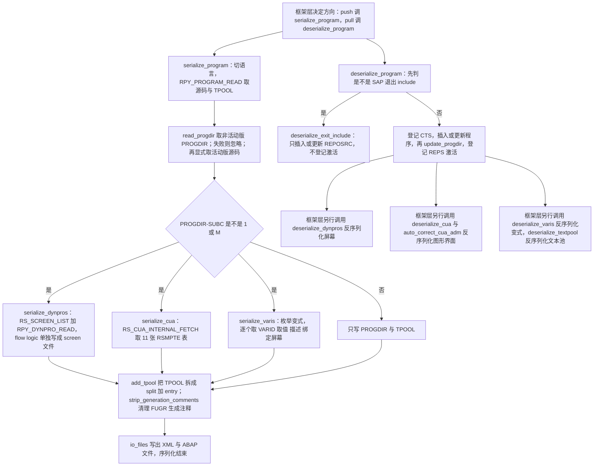
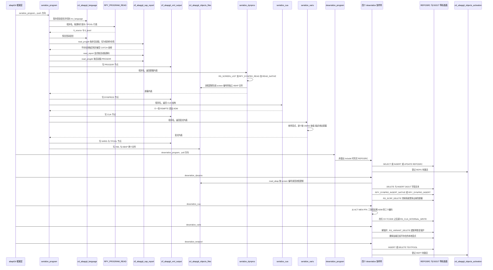

# ZCL_ABAPGIT_OBJECTS_PROGRAM 分析报告

> 分析对象：`abapGit — src/zcl_abapgit_objects_program.clas.abap`（1597 行，全局类 `ZCL_ABAPGIT_OBJECTS_PROGRAM`，28 个方法，继承 `ZCL_ABAPGIT_OBJECTS_SUPER`）
> 报告视角：代码 onboarding 走读，按真实调用链展开
> 结论强度约定：凡是依赖函数模块参数默认值、依赖系统字段在该位置取值、或依赖两个 DDIC 字段的长度/类型一致性的判断，一律标注"需在 SE38 / SE11 / SE24 核实"，不写成断言

---

## 一、程序定位与业务背景

### 1.1 这段代码在解决什么问题

先说清楚它**不是**什么：它不是报表、不做业务数据处理、也不产生任何 ABAP 字典对象。它的唯一职责是**把一个 R3TR 程序对象（`REPS`）连同它的"影子对象"完整地搬进 git，再原样搬回来**。

业务场景是这样的：SAP 里一个报表程序 `ZMY_REPORT` 在 git 里只是一个 `.program.xml` 加一个 `.abap` 文件。但它在系统里实际由**六类物理存储**共同定义：

| 存储 | 内容 | 谁在读 |
|---|---|---|
| `REPOSRC` / PROGDIR | 源码行、程序类型（可执行 / 模块池 / 包含）、语言版本标记 | SE38 源码编辑器 |
| `TPOOL`（`TEXTPOOL`） | 程序标题行（ID = `R`）与文本元素行（ID = `S`） | SE38 的"文本元素"页、程序运行时 |
| `D020S` / `D021S` / `D021T` | 屏幕清单、字段属性、字段文本 | SE41 屏幕设计器 |
| `RPY_DYHEAD` / `DYCATT` / `DYFATC` / `SWYDYFLOW` | 屏幕头、容器、字段到容器的映射、流程逻辑（PPL） | 运行时屏幕生成 |
| `RSMPTE_*`（CUA） | 状态栏、函数、菜单、标题、功能码、按钮等图形界面元素 | SE41 的"图形界面"页 |
| `VARID` / `VARIT` / `VANZ` | 变式（用户保存的选择屏幕取值集合）及其描述 | SE38 / SA38 的变式下拉框 |

只把这些**塞进一个 `.xml` 和一个 `.abap`**是不现实的：`RPY_DYNPRO_READ` 返回的屏幕结构是深嵌套的、字段属性有 60 多个组件、流程逻辑是一段独立的 ABAP 源码。abapGit 的做法是：**为每一类影子对象定义一个"中立结构"**，用函数模块把 SAP 的内部格式搬进这个结构、序列化成 XML、反序列化时再搬回去。

而这段代码就是 SAP 程序对象这一"搬运工"的全部实现：两个入口（`serialize_program` / `deserialize_program`），二十几个搬运工与校验工（屏幕、CUA、变式、文本池、锁），以及若干条"绕过标准 FM 的后门"。

### 1.2 为什么这件事必须直接操作 R3* 与 DY* 表，不能只调标准 FM

这是本类最值得先理解的一件事：**SAP 为程序/屏幕/变式提供的标准 FM 大多覆盖不全或没有反方向。**

- **屏幕**：`RPY_DYNPRO_INSERT` 能写屏幕，但 `RPY_DYNPRO_READ` 读回来的字段属性不足以重建原始 XML——尤其是"从字典带出的字段"（`FROM_DICT`）的 `PARAMETER_ID` 处理、`FOREIGNKEY` 标志、`CHECK` 类型的 `MODIFIC` 标志。所以序列化端只能额外读 `RPY_DYNPRO_READ_NATIVE` 拿到 `D021S` 内部格式，并在序列化时**主动把几个标志位改写成"干净"的值**，让反序列化端能无歧义地重建。
- **变式**：SAP 没有一个 FM 能把"变式 + 它的取值 + 它的描述 + 它绑定到哪些屏幕"一次取全。必须 `RS_ALL_VARIANTS_4_1_REPORT`（列表）→ `RS_VARIANT_VALUES_TECH_DAT_255`（技术数据 `VARID`）→ `RS_VARIANT_CONTENTS_255`（取值与 `VANZ` 对象）→ `RS_GET_SCREENS_4_1_VARIANT`（绑定屏幕）四个 FM 拼起来；而且**变式描述文本（`VARIT`）没有任何 FM 可用，只能直接 `SELECT`**。
- **FUGR / 退出 include**：SAP 自己的 `RPY_PROGRAM_INSERT` 会拒绝某些程序类型（标准函数组的主程序），必须直接写 `REPOSRC` 的活动与非活动两个版本。
- **CUA**：`RS_CUA_INTERNAL_FETCH` / `RS_CUA_INTERNAL_WRITE` 是 SAP 自己的批处理 FM，但 `ADM` 结构在 SAP 的早期 bug 下不会回写，于是有了 `auto_correct_cua_adm` 这个"修复历史遗留数据"的方法。

一句话设计范式定性：

> **"格式中立场"——中立结构 + 成对的 `serialize_` / `deserialize_` 方法 + 每类影子对象一个专用搬运工，SAP 的内部状态（`SY-TCODE`、锁对象、PROGRAM 编码）只作为实现细节泄漏在 `PRIVATE`/`PROTECTED` 里，对框架层只暴露两个入口。**

### 1.3 依赖清单（读这段代码前必须知道的地形）

```
继承自 ZCL_ABAPGIT_OBJECTS_SUPER（本文件不可见）
  ms_item                 当前序列化对象描述（OBJ_TYPE / OBJ_NAME），本类多处直接读
  mo_files                文件输出抽象：add_abap / add_xml / read_abap
  mo_i18n_params          序列化选项，含 ms_params-main_language_only
  mv_language             abapGit 当前语言（≠ sy-langu，可能由 -l 参数指定）
  exists_a_lock_for( )    继承来的锁查询方法，本类三处调用
Z 对象
  ZCL_ABAPGIT_FACTORY     get_cts_api / get_sap_report 两个服务定位器
  ZCL_ABAPGIT_LANGUAGE    set_current_language / restore_login_language 登录语言暂存
  ZCL_ABAPGIT_OBJECTS_ACTIVATION  登记待激活对象（REPS / DYNP / CUAD / REPT）
  ZCX_ABAPGIT_EXCEPTION   raise / raise_t100 两种抛出方式
  ZCL_ABAPGIT_XML_OUTPUT  XML 序列化器（add( iv_name, ig_data )）
函数模块（读取）
  RPY_PROGRAM_READ  RPY_DYNPRO_READ  RPY_DYNPRO_READ_NATIVE
  RS_SCREEN_LIST  RS_CUA_INTERNAL_FETCH  RS_ALL_VARIANTS_4_1_REPORT
  RS_VARIANT_VALUES_TECH_DAT_255  RS_VARIANT_CONTENTS_255  RS_GET_SCREENS_4_1_VARIANT
函数模块（写入）
  RPY_PROGRAM_INSERT  RPY_INCLUDE_UPDATE  RPY_DYNPRO_INSERT  RPY_DYNPRO_INSERT_NATIVE
  RS_SCRP_DELETE  RS_CUA_INTERNAL_WRITE  RS_CREATE_VARIANT_255
  RS_CHANGE_CREATED_VARIANT_255  RS_VARIANT_DELETE
直接 SQL（绕过 FM）
  SELECT  REPOSRC / TADIR / VARIT
  SELECT SINGLE FOR UPDATE + UPDATE  VARID
  DELETE + INSERT  D021T
会话内全局内存
  ('SAPLSIFP)TTAB')      get_program_title 里动态 ASSIGN 的 SAPLSIFP 全局
  SY-TCODE               deserialize_cua 里被直接改写为 'SE41'（源码自称 evil hack）
```

### 1.4 全文两条主干，谁也别搞混

abapGit 的框架层对每个对象只调**一个**入口，方向由操作决定：

- **serialize（push）** → `serialize_program`，把系统里的程序**写进** git；
- **deserialize（pull）** → `deserialize_program`，把 git 里的程序**写进**系统。

其余二十几个方法全部是这两个入口的**内部协作件**。真正需要注意的是：`deserialize_dynpros` / `deserialize_cua` / `deserialize_varis` / `deserialize_textpool` 这四个 `PROTECTED` 方法，**在本文件里一个调用点都没有**——它们是被本文件之外的框架层调用的（`PROTECTED` 可见性允许派生类调用）。谁在什么时机调它们、`it_dynpros` / `it_tpool` 从哪来、**XML 里根本没有 `VARIS` 段时会被传成空表还是被跳过**，都必须去框架层核实。这个"外部隐式契约"直接决定了 3.24 节里 P0-2 那条风险的严重程度。

---

## 二、程序执行流程总览



### 责任链表

| 子程序 | 调用者 | 职责 |
|---|---|---|
| `serialize_program` | 框架层（push 分支） | 序列化总控：切语言、取源码与 TPOIR、读 PROGDIR、按程序类型分流、装配 XML、清理生成注释、写出文件 |
| `serialize_dynpros` | `serialize_program` | 枚举程序下的非生成屏幕，逐屏读容器与字段、读内部格式 `D021S`、规范化若干字段标志、装配 `ty_dynpro`、把流程逻辑写成独立 ABAP 文件 |
| `serialize_cua` | `serialize_program` | 用 `RS_CUA_INTERNAL_FETCH` 取该程序全部图形界面元素，容许"未找到" |
| `serialize_varis` | `serialize_program` | 变式序列化总控：枚举变式，逐个取技术数据、取值、对象与绑定屏幕 |
| `get_varis_for_report` | `serialize_varis`、`deserialize_varis` | 用 `RS_ALL_VARIANTS_4_1_REPORT` 列出程序的全部变式键，按 SAP 与 CUS 前缀过滤，排序 |
| `get_vari_data` | `serialize_varis` | 取单个变式的 `VARID` 技术数据、`VANZ` 取值对象、按语言过滤的 `VARIT` 描述，并按固定顺序排序 |
| `get_vari_screens` | `serialize_varis` | 取单个变式绑定了哪些屏幕号 |
| `add_tpool` | `serialize_program`（静态方法） | 把 `TEXTPOOL` 内部格式转成 abapGit 自己的文本池格式，把 8 字符序列号拆到 `split` 字段 |
| `read_tpool` | abapGit 框架的文本对象层 | `add_tpool` 的逆过程，把 `split` 与 `entry` 粘回 `TEXTPOOL` 行 |
| `strip_generation_comments` | `serialize_program` | 只对 FUGR 生效：删除 SAP 生成函数组源码里的"生成日期 / 生成器版本"两行，保证 diff 稳定 |
| `is_any_dynpro_locked` | 框架层（锁定检查） | 判断该程序任一屏幕是否被他人锁定；**实现方式是完整跑一遍 `serialize_dynpros`** |
| `is_cua_locked` | 框架层（锁定检查） | 判断该程序的图形界面是否被锁定 |
| `is_text_locked` | 框架层（锁定检查） | 判断该程序的文本池是否被锁定 |
| `deserialize_program` | 框架层（pull 分支） | 反序列化总控：分流退出 include、登记 CTS、插入或更新程序、更新 PROGDIR、登记激活 |
| `is_exit_include` | `deserialize_program`、`update_program` | 判断程序名是否是 SAP 退出函数组的 include |
| `deserialize_exit_include` | `deserialize_program` | 退出 include 的专用路径：只能以活动状态插入，或写入非活动版本且状态置为"off" |
| `get_program_title` | `deserialize_program`、`deserialize_exit_include` | 从 TPOOL 的 ID = `R` 行取程序标题，并顺手清空 `SAPLSIFP` 的 `TTAB` 头行绕过 SAP 的长度继承 bug |
| `insert_program` | `deserialize_program`、`deserialize_exit_include` | 程序不存在时用 `RPY_PROGRAM_INSERT` 插入；参数在低版本不存在时降级重调；FM 拒绝时回落到直接写 `REPOSRC` |
| `update_program` | `deserialize_program`、`deserialize_exit_include` | 程序已存在时用 `RPY_INCLUDE_UPDATE` 更新，并把 SAP 消息 `EU510` / `EU522` 翻译成可操作的提示 |
| `deserialize_dynpros` | 框架层（本文件内无调用点） | 屏幕反序列化：算差异集、回读流程逻辑、修正字段标志、原生或非原生写屏、删除远端已不存在的屏幕 |
| `uncondense_flow` | `deserialize_dynpros` | 按每行的空格数把压缩过的流程逻辑行还原成可读缩进 |
| `deserialize_cua` | 框架层（本文件内无调用点） | CUA 反序列化：空判、从 `TADIR` 取包、补正 `ADM`、改写 `SY-TCODE` 后调写 FM、登记激活 |
| `auto_correct_cua_adm` | `deserialize_cua`（静态方法） | 针对 abapGit 早期版本丢失 `ADM` 的历史数据，从动作 / 菜单 / 功能码表反推出 `ACTCODE` / `MENCODE` / `PFKCODE` |
| `deserialize_varis` | 框架层（本文件内无调用点） | 变式反序列化：算差异集、逐个先解保护再删再建、最后恢复保护，并删除远端已不存在的本地变式 |
| `create_vari` | `deserialize_varis` | 调 `RS_CREATE_VARIANT_255` 建变式，再调 `RS_CHANGE_CREATED_VARIANT_255` 写取值与对象 |
| `delete_vari` | `deserialize_varis` | 调 `RS_VARIANT_DELETE` 删变式；老版本缺少抑制参数时降级重调 |
| `set_vari_protection` | `deserialize_varis` | 直接 `SELECT FOR UPDATE` + `UPDATE` `VARID` 读写变式的保护标志 |
| `deserialize_textpool` | 框架层（本文件内无调用点） | 文本池反序列化：主语言写非活动版本、翻译写活动版本、空文本池按是否 include 决定删除还是插空壳 |
| `serialize_program` 内的 `read_progdir` / `read_report` | `ZIF_ABAPGIT_SAP_REPORT` 实现类（框架层） | 读非活动版 PROGDIR（只为探测存在性）与活动版源码 |

下面按这条流程，逐个子程序展开。全文共 28 个方法，第三节覆盖其中全部，重点放在 3.2 到 3.7 的序列化主干和 3.21 到 3.28 的反序列化主干上；工具型方法（三个锁查询、两个文本池转换）给一句话带过但不省略。

## 三、分组分析

### 3.1 类定义段与继承契约 `CLASS zcl_abapgit_objects_program`

这个类共 28 个方法，全部围绕"程序对象"这一个 R3TR 类型。先把定义段的骨架读完，后面所有子程序都挂在这三段可见性上。

#### ① 继承契约：为什么它是 `zcl_abapgit_objects_super` 的子类

```abap
CLASS zcl_abapgit_objects_program DEFINITION
  PUBLIC
  INHERITING FROM zcl_abapgit_objects_super
  CREATE PUBLIC .

  PUBLIC SECTION.
```

**做什么** — 声明一个 `CREATE PUBLIC` 的全局类，继承 `zcl_abapgit_objects_super`。父类提供了本文件里四处无处声明的成员：`ms_item`（当前对象描述）、`mo_files`（文件输出抽象）、`mo_i18n_params`（多语言选项）、`mv_language`（abapGit 当前语言），以及锁查询方法 `exists_a_lock_entry_for`（在 3.15 节三处被调）。

**为什么** — abapGit 的对象层是"一个 R3TR 对象类型一个全局类"的模板，每个类只实现该类型的序列化差异。基类把所有类型共有的东西（对象描述、语言、文件输出、锁查询、异常约定）收上去，本类只写程序特有的搬运逻辑。这样新增一个对象类型时，基类不动、新类独立。对读者意味着：**本文件里任何未声明的变量都来自父类，而不是全局变量**——去 SE24 看父类比在本文件里找有用得多。

**风险与改进** — 一处结构性依赖：`mv_language` 与 `sy-langu` 是**两个不同的东西**。本文件所有 FM 调用都用 `mv_language`，而 `deserialize_textpool` 里 `lv_language` 的初值也取自 `mv_language`；只有 `deserialize_textpool` 的形参 `iv_language` 允许外部覆盖。这意味着"按语言导出"这个能力完全由父类字段决定，本类既不校验它是否合法（是否在系统存在的语言过滤器里），也不提供回退。建议在 `serialize_program` 入口加一道 `mv_language` 非空且为有效 `sy-langu` 形态的校验，否则空语言会把 `language = ` 空值传给全部 FM——**具体行为需在 SE38 核实这些 FM 对空 `LANGUAGE` 的处理**。

#### ② 影子对象一：图形界面元素结构 `ty_cua`

```abap
    TYPES:
      BEGIN OF ty_cua,
        adm TYPE rsmpe_adm,
        sta TYPE STANDARD TABLE OF rsmpe_stat WITH DEFAULT KEY,
        fun TYPE STANDARD TABLE OF rsmpe_funt WITH DEFAULT KEY,
        men TYPE STANDARD TABLE OF rsmpe_men WITH DEFAULT KEY,
        mtx TYPE STANDARD TABLE OF rsmpe_mnlt WITH DEFAULT KEY,
        act TYPE STANDARD TABLE OF rsmpe_act WITH DEFAULT KEY,
        but TYPE STANDARD TABLE OF rsmpe_but WITH DEFAULT KEY,
        pfk TYPE STANDARD TABLE OF rsmpe_pfk WITH DEFAULT KEY,
        set TYPE STANDARD TABLE OF rsmpe_staf WITH DEFAULT KEY,
        doc TYPE STANDARD TABLE OF rsmpe_atrt WITH DEFAULT KEY,
        tit TYPE STANDARD TABLE OF rsmpe_titt WITH DEFAULT KEY,
        biv TYPE STANDARD TABLE OF rsmpe_buts WITH DEFAULT KEY,
      END OF ty_cua.
```

**做什么** — 定义 CUA 的中立结构：一张 `RSMPE_ADM` 头表加 11 张 `RSMPTE_*` 明细表，覆盖状态栏、函数、菜单、菜单文本、动作、按钮、功能码、标题、文档、标题文本、双击动作。序列化时整个结构作为一个 XML 节点写入，反序列化时整体喂给写 FM。

**为什么** — 这 11 张表与 `RS_CUA_INTERNAL_FETCH` / `RS_CUA_INTERNAL_WRITE` 的 `TABLES` 段一一对应，所以这个结构本质上是**为 XML 序列化而手工镜像的一个 FM 签名**。逐个列出来而不是包一层 `STRUCTURE`，是因为 XML 序列化器需要一个稳定的结构布局，而 FM 的 `TABLES` 参数在 ABAP 里本身就是内表，镜像成结构再让 FM 直接接收内表是唯一顺路的做法。

**风险与改进** — 两处：1）11 张表全部 `WITH DEFAULT KEY`，即**标准表键 = 全字段**，`READ TABLE` / `DELETE` 都是线性查找。当前用法只做整体传递和整表判空，影响可控；但这与 3.23 节 `deserialize_cua` 里"手写 11 个 `lines( ) = 0`"叠加起来，说明这张表是**加字段就一定会漏改**的结构（见 3.23）。2）`RSMPTE_*` 是 SAP 内部结构，不同 release 的字段数量可能不同，`MOVE-CORRESPONDING` 与 XML 序列化都依赖字段名匹配而非位置匹配，因此**在低版本上新增字段会静默丢失**。需在 SE11 核实 `RSMPE_STA` 等结构的字段清单与 release 依赖。

#### ③ 两个公开入口：整个类的对外契约

```abap
    METHODS serialize_program
      IMPORTING
        !io_xml     TYPE REF TO zif_abapgit_xml_output OPTIONAL
        !is_item    TYPE zif_abapgit_definitions=>ty_item
        !io_files   TYPE REF TO zcl_abapgit_objects_files
        !iv_program TYPE syrepid OPTIONAL
        !iv_extra   TYPE clike OPTIONAL
      RAISING
        zcx_abapgit_exception.
    METHODS deserialize_program
      IMPORTING
        !is_progdir TYPE zif_abapgit_sap_report=>ty_progdir
        !it_source  TYPE abaptxt255_tab
        !it_tpool   TYPE textpool_table
        !iv_package TYPE devclass
      RAISING
        zcx_abapgit_exception.
```

**做什么** — 对框架层暴露两个方法。`serialize_program` 收对象描述、文件输出抽象、可选的 XML 累加器、可选的程序名覆盖与文件名后缀；`deserialize_program` 收 PROGDIR 记录、源码行表、文本池行表与目标包名。两个方法都声明抛出 `ZCX_ABAPGIT_EXCEPTION`，即**本类所有失败路径统一走异常，不返回错误码**。

**为什么** — 这个契约设计有三个可取之处。1）**全类唯一的失败通道是异常**，所以框架层只需一个 `TRY` 就能兜住整个类，不必逐个 FM 判断 `sy-subrc`——这也是为什么本文件里 `raise_t100( )` 出现得那么频繁。2）`io_xml` 可选允许框架层把多个对象的 XML 拼进同一个文档（例如一个包里的全部程序），而不是每个对象一个文件；`IF NOT io_xml IS BOUND` 那一次判断就实现了这个开关。3）`iv_program` 可选用于"导出的是 includes 而不是主程序"的场景——函数组、类组这类对象要把子 include 的程序一起带出来。

**风险与改进** — 两处：1）`is_item` / `iv_program` 的优先级关系只由实现里的一段 `IF iv_program IS INITIAL` 决定（见 3.2），**契约里没有注释说明"两者都给时以谁为准"**；而 `iv_program` 一旦非空，就绕过了框架层保证的 `is_item` 与程序名一致性，可能导致 XML 里 `PROGDIR` 与实际导出的程序名不一致。建议把这段优先级写进接口注释。2）**返回值全是 `RAISING` 而不是返回值**，因此框架层无法区分"这个程序不存在所以没导出"（`serialize_program` 里 `sy-subrc = 2` 时静默 `RETURN`）与"导出成功但内容为空"。对一个可能导出零个对象的入口，这个语义差异值得在接口上体现出来。

#### ④ 常量段：状态值、原生屏幕标记、变式过滤与客户端

```abap
    CONSTANTS:
      BEGIN OF c_state,
        active   TYPE r3state VALUE 'A',
        inactive TYPE r3state VALUE 'I',
        off      TYPE r3state VALUE '',
      END OF c_state.

    CONSTANTS c_native_dynpro TYPE c LENGTH 2 VALUE 'IN'.

    CONSTANTS c_sysvari_clnt        TYPE mandt      VALUE '000'.
    CONSTANTS c_sysvari_pattern_sap TYPE c LENGTH 5 VALUE 'SAP&*'.
    CONSTANTS c_sysvari_pattern_cus TYPE c LENGTH 5 VALUE 'CUS&*'.
```

**做什么** — 定义五组常量：`c_state` 三个成员是 `REPOSRC` 的 `R3STATE` 取值（活动 `A`、非活动 `I`、空 = 版本被关闭）；`c_native_dynpro` = `'IN'` 是判断屏幕是否为"原生格式"（对应 SE41 里勾了"带 splitter 的屏幕"的类型，序列化时改用 `D020S` / `D021S` 原生结构）；`c_sysvari_clnt` = `'000'` 是变式相关操作固定使用的客户端；两个 `c_sysvari_pattern_*` 是变式名过滤模式，只保留 SAP 与自定义两族。

**为什么** — 这几组常量的价值都在"消除魔法值"：全类一共 30 多处 FM 调用要传状态值，如果散落 `'A'` / `'I'` / `''`，读者每次都要回 `REPOSRC` 查字段语义。`c_native_dynpro` 用 `'IN'` 两字符配合 `CA` 匹配（后面多处写 `x CA c_native_dynpro`，即"含 `I` 或 `N`"）而不是 `EQ 'IN'`，说明 SAP 的屏幕类型字段可能取值 `I`、`N` 或两者的组合——**这两个取值分别对应什么需在 SE41 / SE11 核实**。两个过滤模式用 `&` 做通配说明 SAP 的变式命名约定里 `&` 是分隔符（`SAP&<用户>` / `CUS&<用户>`），这是把领域知识固化成了常量。

**风险与改进** — **一处必须记为 P0：`c_sysvari_clnt` 把所有变式操作钉死在 000 客户端。** 本类在 4 个地方硬编码了它：`get_vari_data` 里查 `VARIT`、`deserialize_varis` 里填 `VARIT` 行、`set_vari_protection` 里 `SELECT FOR UPDATE` 与 `UPDATE VARID`。而变式枚举走的是 `RS_ALL_VARIANTS_4_1_REPORT`，该 FM 按**当前登录客户端**返回列表。于是同一个 `get_vari_data` 方法内部就出现了客户端不一致：在 100 客户端上拉一个程序，它列出的变式是 100 的，而每个变式的描述却从 000 的 `VARIT` 里读。SAP 的变式是**按客户端隔离**的，跨客户端读写 `VARIT` / `VARID` 在语义上是错的（`UPDATE` 甚至可能直接 0 行，触发 `sy-subrc <> 0` 而提前 `RETURN`，于是保护标志永远不被恢复）。需要核实的是：abapGit 是否**只允许在 000 客户端上做 push / pull**（这能把这条风险降级为"文档缺失"而不是"缺陷"）——这个约束不在本文件里，属于框架层或文档层的承诺。见 P0-3。

#### ⑤ `PROTECTED` 段的协作件清单（节选）

```abap
    METHODS strip_generation_comments
      CHANGING
        ct_source TYPE STANDARD TABLE. " tab of string or charX
    METHODS serialize_dynpros
      IMPORTING
        !iv_program_name TYPE syrepid
      RETURNING
        VALUE(rt_dynpro) TYPE ty_dynpro_tt
      RAISING
        zcx_abapgit_exception .
    METHODS deserialize_textpool
      IMPORTING
        !iv_program    TYPE syrepid
        !it_tpool      TYPE textpool_table
        !iv_language   TYPE sy-langu OPTIONAL
        !iv_is_include TYPE abap_bool DEFAULT abap_false
      RAISING
        zcx_abapgit_exception .
    ...(此处省略 serialize_cua、serialize_varis、deserialize_dynpros、deserialize_cua、
        deserialize_varis、is_any_dynpro_locked、is_cua_locked、is_text_locked 八条声明，
        以及 add_tpool / read_tpool 两个 CLASS-METHODS 声明；形态与上面三条一致)...
```

**做什么** — 这四条代表 `PROTECTED` 段的三种典型形态：一个是就地修改传入表的文本处理工具，一个是"传程序名、返回结构、抛异常"的序列化器，一个是"传程序名 + 数据 + 语言 + 标志、抛异常"的反序列化器。省略的八条形态与它们一致，两个 `CLASS-METHODS` 只多一个 `CLASS-` 关键字。

**为什么** — 全部 `PROTECTED` 而不是 `PRIVATE`，是因为这几个协作件要能被派生类用到（本文件最直接的证据就是：四个 `deserialize_*` 在本文件内没有调用点）。参数一律用 `!`（必填）与 `VALUE( )`（返回值传引用）标注，函数式的传参风格在本文件里高度统一，这是 abapGit 全库风格在单文件上的体现，读者据此可以跳过签名直接读函数体。

**风险与改进** — 1）`strip_generation_comments` 的 `ct_source TYPE STANDARD TABLE.` 是**完全无类型的泛型表**，配合函数体里的 `FIELD-SYMBOLS <lv_line> TYPE any`——参数名与字段符号名首字母不同（`ct_source` 对 `<lv_line>`），读者要读到最后才知道改的是哪张表；更实际的问题是**表元素类型写错只能在运行时炸**，而 `serialize_program` 传进来的是 `abaptxt255_tab`（定长字符行）、函数组路径下可能是 `string` 表，注释也承认了这一点。建议至少在签名处写明"入参元素类型需可赋给 `any`"，或拆成两个重载。2）`deserialize_textpool` 的 `iv_is_include` 有默认值 `abap_false`，意味着**调用方不显式传就按"非 include"处理**，而 `deserialize_textpool` 内部对 include 与非 include 的处理差别很大（见 3.28）——一个可选布尔默认成"更危险的那一侧"，建议改成必填。

### 3.2 `serialize_program` ① 入口、语言切换与源码读取

`serialize_program` 共 5 步，下面三步读完源码这一段。

#### ① 确定程序名并把登录语言切到 abapGit 语言

```abap
    IF iv_program IS INITIAL.
      lv_program_name = is_item-obj_name.
    ELSE.
      lv_program_name = iv_program.
    ENDIF.

    zcl_abapgit_language=>set_current_language( mv_language ).
```

**做什么** — 先决定要导出的程序名：调用方没给 `iv_program` 就用对象描述里的 `OBJ_NAME`，给了就以它为准。然后调 `zcl_abapgit_language=>set_current_language( mv_language )`，把当前登录语言暂存起来并切换到 abapGit 的目标语言——因为接下来要调的 `RPY_PROGRAM_READ` 等 FM 会用当前登录语言决定读哪个语言的文本元素。

**为什么** — 暂存再切换、读完再恢复，是 ABAP 里改 `SY-LANGU` 的标准做法：SAP 的语言不是对象属性而是**会话属性**，很多 FM（尤其是读文本的）隐含依赖它。不这么做，abapGit 就无法用 `-l EN` 导出中文系统的英文版本。这一步放在方法最开头、且在 `RETURN` 之前就保证了恢复，是有意识写的。

**风险与改进** — 1）**语言恢复是三处手写复制，不是异常安全的**。本方法里没有任何 `TRY`，如果 `RPY_PROGRAM_READ` 内部发生 short dump 或未捕获异常，恢复语句不会执行，登录语言就永久停在 `mv_language`——后续同一个会话里所有程序的执行都在错误的语言下跑，症状会飘到离现场很远的地方。SAP 里对应的标准做法是用 `zcl_abapgit_language` 提供一个"进入 / 退出"成对的方法并在 `EXITING` 或 `CLEANUP` 里调用。2）`lv_program_name` 与 `is_item-obj_name` 不一致时（例如函数组导出子 include），后面 `serialize_dynpros( lv_program_name )`、`serialize_cua( lv_program_name )` 都以覆盖后的名字为准，但 `serialize_cua` 里取的语言是 `mv_language`、而 `serialize_dynpros` 的 `RPY_DYNPRO_READ` 取哪份文本取决于 FM 内部——**需在 SE38 核实 `RPY_DYNPRO_READ` 是否受当前登录语言影响**（见 P1-1）。3）`iv_program` 允许导出与 `is_item` 不同的程序，却没有把这件事反映到返回值上，调用方无从知道本次导出的实际对象名（见 3.1 ③）。

#### ② 读源码与文本元素，并在三个出口都恢复语言

```abap
    CALL FUNCTION 'RPY_PROGRAM_READ'
      EXPORTING
        program_name     = lv_program_name
        with_includelist = abap_false
        with_lowercase   = abap_true
      TABLES
        source_extended  = lt_source
        textelements     = lt_tpool
      EXCEPTIONS
        cancelled        = 1
        not_found        = 2
        permission_error = 3
        OTHERS           = 4.

    IF sy-subrc = 2.
      zcl_abapgit_language=>restore_login_language( ).
      RETURN.
    ELSEIF sy-subrc <> 0.
      zcl_abapgit_language=>restore_login_language( ).
      zcx_abapgit_exception=>raise_t100( ).
    ENDIF.

    zcl_abapgit_language=>restore_login_language( ).
```

**做什么** — 用 `RPY_PROGRAM_READ` 一次读回程序源码（`ABAPTXT255` 行表）与全部文本元素（`TEXTPOOL` 行表），参数上明确关掉 include 列表（include 由对象层单独处理）、打开 `WITH_LOWERCASE`（保留源码原始大小写）。`NOT_FOUND` 被当成"这个程序不存在"——恢复语言后直接返回，不写任何文件；其余非零 `sy-subrc` 恢复语言后按 FM 的 `T100` 抛异常。

**为什么** — 这段是整个类里**唯一正确的异常处理形状**，值得作为模板记住：先处理"不是错误"的分支（`NOT_FOUND` → 静默返回）、再处理真错误（抛异常）、最后正常路径，然后**在每一个 `RETURN` 与抛出之前都恢复全局状态**。`WITH_LOWERCASE` 的选择也很关键——abapGit 要做的是版本库里源码的原样对照，任何"看起来更整齐"的大小写规整都会制造无意义的 diff。同理 `WITH_INCLUDELIST = abap_false`：函数组的 include 由另一个对象类型负责，重复导出会产生两份互相矛盾的事实。

**风险与改进** — 1）`NOT_FOUND` 静默返回，**调用方看不到任何信号**：git 提交时会以为"这个程序已导出"。当对象列表来自 `TADIR` 而源码已被用户手工删除（或程序处于只存在于 PROGDIR 的不一致状态）时，git 里会留下一个"这次什么都没导出"的假成功。建议至少在 `WRITE` 层留一条告警。2）恢复语言的三处复制说明**恢复动作应当被前移**：更稳的形状是"读源码"抽成一个私有方法，语言切换与恢复收敛到那一处，调用方永远不必记着恢复。3）`WITH_LOWERCASE` 与"低版本读取"之间有没有副作用（例如某些程序的 ABAP 关键字本来是大写，被打开后是否影响后续写回）——需在 SE38 核实该参数的完整语义。4）`permission_error` 也走 `OTHERS` 同一条抛异常路径，消息里能看出原因，但**没有区分"程序被锁"与"程序不存在"之外的业务含义**，使用者需要读懂 SAP 的短消息。

#### ③ 探测非活动版本，并显式取活动版本源码

```abap
    " If inactive version exists, then RPY_PROGRAM_READ does not return the active code
    li_report = zcl_abapgit_factory=>get_sap_report( ).

    TRY.
        " Raises exception if inactive version does not exist
        ls_progdir = li_report->read_progdir(
          iv_name  = lv_program_name
          iv_state = c_state-inactive ).

        " Explicitly request active source code
        lt_source = li_report->read_report(
          iv_name  = lv_program_name
          iv_state = c_state-active ).
      CATCH zcx_abapgit_exception ##NO_HANDLER.
    ENDTRY.

    ls_progdir = li_report->read_progdir(
      iv_name  = lv_program_name
      iv_state = c_state-active ).

    clear_abap_language_version( CHANGING cv_abap_language_version = ls_progdir-uccheck ).
```

**做什么** — 这里有一条容易看漏的 SAP 语义：**程序存在非活动版本时，`RPY_PROGRAM_READ` 返回的是非活动版本源码，而 abapGit 想要的是活动版本**。所以先取一个 SAP 报告服务对象，在 `TRY` 里尝试读非活动版的 `PROGDIR`（不存在就抛异常，被空 `CATCH` 吃掉），一旦成功就显式读活动版源码覆盖 `lt_source`。`TRY` 块外再读一次活动版 `PROGDIR` 覆盖掉上一次的结果，并顺手把 `PROGDIR-UCCHECK`（被当作"ABAP 语言版本"使用）清空。

**为什么** — "用一次探测式读取换取源码的正确版本"是这段的全部动机，注释说得很准。而 `CATCH zcx_abapgit_exception ##NO_HANDLER` + 空处理体，是 ABAP 里表达"这次失败是可以接受的"的标准手法：`##NO_HANDLER` 抑制 ATC 的"异常未处理"告警，注释 `Raises exception if inactive version does not exist` 则说明这个异常是被预期的。`TRY` 的作用仅仅是**把"没找到非活动版本"这件正常情况降级为非事件**，语义上是干净的。

**风险与改进** — 三处：1）**第一次 `read_progdir` 的赋值被立刻丢弃**。`ls_progdir` 先被赋成非活动版的 PROGDIR，`ENDTRY` 之后被活动版整体覆盖。也就是说这个赋值唯一的作用是触发异常探测。写法上让读者以为"非活动版的某些信息会被利用"，实际不会——建议把这次调用改成不接收返回值的探测式调用（或用 `read_report( iv_state = c_state-inactive )` + `CATCH` 组合，语义更贴近注释）。2）**两次 `read_progdir` 不对称地在保护之外**：活动版那次不在 `TRY` 里，读不到就异常直接上抛。对比"非活动版读不到是正常的、活动版读不到是致命的"这个真实意图，形状是对的，但源码里没有任何注释说明这个不对称，读者需要自己推断。3）`clear_abap_language_version` 无条件清空 `PROGDIR-UCCHECK`。语义上这是"不要把本机 ABAP 语言版本写进版本库"（反序列化时按 git 里的源码原样还原，见 3.18），方向正确；风险是 **`PROGDIR-UCCHECK` 的确切语义与长度未在本文件确认**——`CLEAR` 与原样回填（`insert_program` 里 `iv_version = is_progdir-uccheck`）依赖该字段足够长且确实是版本标记位，若它实际是别的含义（例如 Unicode 检查标记），这段逻辑会在低版本上把程序的语言版本设错。需在 SE11 核实 `PROGDIR-UCCHECK` 的字段说明与长度。

### 3.3 `serialize_program` ④ XML 装配与程序类型分流

#### ① 按 PROGDIR-SUBC 决定要不要导出屏幕、CUA 与变式

```abap
    IF io_xml IS BOUND.
      li_xml = io_xml.
    ELSE.
      CREATE OBJECT li_xml TYPE zcl_abapgit_xml_output.
    ENDIF.

    li_xml->add( iv_name = 'PROGDIR'
                 ig_data = ls_progdir ).
    IF ls_progdir-subc = '1' OR ls_progdir-subc = 'M'.
      lt_dynpros = serialize_dynpros( lv_program_name ).
      li_xml->add( iv_name = 'DYNPROS'
                   ig_data = lt_dynpros ).

      ls_cua = serialize_cua( lv_program_name ).
      li_xml->add( iv_name = 'CUA'
                   ig_data = ls_cua ).

      lt_varis = serialize_varis( lv_program_name ).
      li_xml->add( iv_name = 'VARIS'
                   ig_data = lt_varis ).
    ENDIF.
```

**做什么** — 拿一个 XML 输出对象（外部传入的累加器，或自己 `CREATE` 一个新的），先把 `PROGDIR` 写成第一个节点；然后判断程序类型：`PROGDIR-SUBC` 等于 `'1'`（可执行程序）或 `'M'`（模块池）时，才依次调用三个子序列化器，把屏幕、图形界面、变式各写成一个 XML 节点。其余程序类型只写 `PROGDIR` 一个节点。

**为什么** — `PROGDIR-SUBC` 的分流是**业务上必要**的：只有能产生屏幕、能画 CUA、能被用户保存变式的程序类型才有这些东西。包含（`I`）、子程序（`S`）、函数模块接口（`F`）的 PROGDIR 记录里根本没有屏幕，CUA 与变式也是空的，无条件去查只会白白触发一轮 FM 调用并往 XML 里塞三个空节点——而空节点会让"文件内容变了"这件事在 git 里表现为无意义的 diff。这也解释了为什么这三个节点总是成组出现：它们是"可执行程序身份"的三个侧面。

**风险与改进** — 1）**两个魔法字符 `'1'` / `'M'` 没有常量也没有注释**。这是全类唯一直接决定"导出哪些影子对象"的判断，一旦 SAP 增加一种带屏幕的程序类型（比如新的程序类型），这里会静默漏导出。至少提为常量并注释 `'1'` = 可执行程序、`'M'` = 模块池。2）**函数组主程序（`SUBC` = `'F'`）会走不进这个分支**，因此函数组的 CUA 不会被本类导出——按设计函数组由 `zcl_abapgit_objects_fugr` 负责，但**本文件没有任何注释指明这个交接**，接手的人很容易以为这是遗漏。需在框架层核实 FUGR 类的职责边界是否真的覆盖 CUA。3）`io_xml` 的两种来源用 `IS BOUND` 区分是正确写法，但"外部传入时不写文件"这个行为只在几行之后才用 `IF NOT io_xml IS BOUND` 表达，两处条件必须成对维护——建议在 ① 处就把"是否由我负责落盘"算成一个局部布尔量。

#### ② 清理空标题行、转换文本池、清理生成注释并落盘

```abap
    READ TABLE lt_tpool WITH KEY id = 'R' INTO ls_tpool.
    IF sy-subrc = 0 AND ls_tpool-key = '' AND ls_tpool-length = 0.
      DELETE lt_tpool INDEX sy-tabix.
    ENDIF.

    li_xml->add( iv_name = 'TPOOL'
                 ig_data = add_tpool( lt_tpool ) ).

    IF NOT io_xml IS BOUND.
      io_files->add_xml( iv_extra = iv_extra
                         ii_xml   = li_xml ).
    ENDIF.

    strip_generation_comments( CHANGING ct_source = lt_source ).

    io_files->add_abap( iv_extra = iv_extra
                        it_abap  = lt_source ).
```

**做什么** — 读文本池里 ID 为 `R`（程序标题）的那一行，如果它的 `KEY` 为空且 `LENGTH` 为 0，说明这一行只是个空壳，把它删掉——这样 git 里就不会因为一个空标题行而在两个版本之间产生 diff。然后把整张文本池交给静态方法 `add_tpool` 转成 abapGit 自有格式写成 `TPOOL` 节点；`io_xml` 不是外部传入的才把整个 XML 落盘。最后对源码调 `strip_generation_comments` 清理生成注释，再把源码作为 ABAP 文件落盘。

**为什么** — 删空标题行是纯粹的 **diff 稳定性**措施：SAP 有时会给没有标题的程序在文本池里留一条长度为 0 的 `R` 行，写进版本库后，不同系统上这条行在不在会成为噪声。`add_tpool` 用类方法而非实例方法，是因为它**不依赖任何父类属性**（纯函数），这一点在 3.14 节会看到它和 `read_tpool` 正好成对。`strip_generation_comments` 放在最后、落盘之前，是"清理只影响输出、不影响内存中的原始数据"的位置——注意它作用于 `lt_source`，而 `lt_source` 在这一步之前已经被序列化进 XML 之外的地方只有这里。

**风险与改进** — 1）**`strip_generation_comments` 对非 FUGR 对象是纯空操作**：它第一件事就是 `IF ms_item-obj_type <> 'FUGR'. RETURN.`，而本方法是 REPS 路径下来的，所以这次调用在绝大多数情况下什么都不做。保留调用是为了"函数组走同一条路径"的可能性，但读者会误以为这里总在做清理——建议把这个提前退出提炼到调用点，或至少在调用处注明"仅 FUGR 有效"。2）**`READ TABLE ... WITH KEY id = 'R'` 没有 `BINARY SEARCH`**，虽然文本池通常只有几十行、影响可忽略，但它与紧邻的 `ls_tpool-key = ''` 判断构成了一个复合条件，一旦将来文本池长到几千行（长程序标题可以拆成多行 `S`）就会变成热点。3）**`add_tpool( lt_tpool )` 的位置在"删空标题行"之后是对的**，但顺序依赖没有被任何注释标出——如果有人把 `READ TABLE` 挪到 `add_tpool` 之后，空壳行就已经进了 XML。4）**两个落盘调用（XML 与 ABAP）之间没有事务或一致性保证**：ABAP 文件写成功、XML 写失败（顺序相反的可能）会留下半套输出。文件输出抽象 `zcl_abapgit_objects_files` 是否自身做了原子性保证，需在 SE24 核实。

### 3.4 `strip_generation_comments` 只处理函数组的生成注释

#### ① 非 FUGR 直接退出；函数组主程序删一行

```abap
    FIELD-SYMBOLS <lv_line> TYPE any. " Assuming CHAR (e.g. abaptxt255_tab) or string (FUGR)

    IF ms_item-obj_type <> 'FUGR'.
      RETURN.
    ENDIF.

    " Case 1: MV FM main prog and TOPs
    READ TABLE ct_source INDEX 1 ASSIGNING <lv_line>.
    IF sy-subrc = 0 AND <lv_line> CP '#**regenerated at *'.
      DELETE ct_source INDEX 1.
      RETURN.
    ENDIF.
```

**做什么** — 声明一个 `any` 类型的字段符号装源码行；对象类型不是函数组就直接返回（REPS、类、接口都不需要清理）。函数组情形分两种：Case 1 处理"维护生成型函数组的主程序与 TOP include"——第一行如果是 `#**regenerated at ...` 这种生成标记，整行删掉然后返回。

**为什么** — 这是一个**只为了 git diff 稳定而存在的方法**。SAP 为维护生成型（Maintenance-Generated）函数组生成的源码，第一行带"重新生成时间"。两次 pull 之间时间戳变了，版本库里就出现一行纯噪声的 diff，团队很快会养成"忽略这个文件"的习惯，反而丢掉真正的代码变更。删掉它成本极低、收益明确，所以 abapGit 选择了删。注释 `Assuming CHAR (e.g. abaptxt255_tab) or string (FUGR)` 也诚实交代了 `TYPE any` 的原因：同一方法要处理定长字符行与 `string` 行两种表。

**风险与改进** — 1）`ms_item-obj_type` 在 `RETURN` 之前就被读到，那么对于 REPS 路径这次调用连字段都没必要读——把早退上移到调用点（见 3.3 ②）会更省。2）**`#**regenerated at *` 的模式硬编码了 SAP 的英文标记文本**，非英文系统或 SAP 改过措辞的版本上会静默失效（不删、也不报错），diff 噪声回来了。属于可接受但需要知道的脆弱点：更稳的形状是"只删除第一行且第一行以 `#**` 开头"的更宽松规则，或至少把这一点写进注释。3）**`DELETE ct_source INDEX 1` 直接改调用方传进来的表**。`CHANGING` 参数改写调用方数据在 ABAP 里合法，但 `lt_source` 在调用点之后还会被 `io_files->add_abap` 使用——本方法的输出正是期望值，所以正确；只是"方法名 + `CHANGING` 参数"这个组合让"它改了我的表"变得不够显眼。

#### ② Case 2：函数组 include 的五行断言链，只删中间两行

```abap
    " Case 2: MV FM includes
    IF lines( ct_source ) < 5. " Generation header length
      RETURN.
    ENDIF.

    READ TABLE ct_source INDEX 1 ASSIGNING <lv_line>.
    ASSERT sy-subrc = 0.
    IF NOT <lv_line> CP '#*---*'.
      RETURN.
    ENDIF.

    READ TABLE ct_source INDEX 2 ASSIGNING <lv_line>.
    ASSERT sy-subrc = 0.
    IF NOT <lv_line> CP '#**'.
      RETURN.
    ENDIF.

    READ TABLE ct_source INDEX 3 ASSIGNING <lv_line>.
    ASSERT sy-subrc = 0.
    IF NOT <lv_line> CP '#**generation date:*'.
      RETURN.
    ENDIF.

    READ TABLE ct_source INDEX 4 ASSIGNING <lv_line>.
    ASSERT sy-subrc = 0.
    IF NOT <lv_line> CP '#**generator version:*'.
      RETURN.
    ENDIF.

    READ TABLE ct_source INDEX 5 ASSIGNING <lv_line>.
    ASSERT sy-subrc = 0.
    IF NOT <lv_line> CP '#*---*'.
      RETURN.
    ENDIF.

    DELETE ct_source INDEX 4.
    DELETE ct_source INDEX 3.
```

**做什么** — 处理"维护生成型函数组的 include"：先要求源码至少 5 行（SAP 生成头的长度），然后**逐行硬校验**第 1 到第 5 行分别是 `#*---*`、`#**`、`#**generation date:*`、`#**generator version:*`、`#*---*` 的形状；任何一行不符就整体放弃删除。五行全中之后，**只删第 4 行（生成器版本）与第 3 行（生成日期）**，把第 1、2、5 行的框架保留下来。删除顺序是"先 4 后 3"，这样前面行的索引不受影响。

**为什么** — "先验证形状、再动手"是这个方法的核心纪律：它宁可什么都不删，也不删错行。因为源码要进版本库，删错一行就是一次**静默的源码损坏**——拉回去的函数组少了一行，激活时才报错，而那时已经晚了。用 `lines( ) < 5` 做前置门槛、用 `ASSERT` 保证随后五次按索引读取不会失败，都是为了把"越界"变成不可能。只删日期与版本两行、保留 `#*---*` 边框与第 2 行，是刻意的**最小删除**：SAP 自己生成的代码里那层边框是识别依据，删了就没法在 SAP 侧认得出这是生成代码。

**风险与改进** — 1）**`ASSERT` 用在了唯一的运行期保护上，这是本文件最需要点名的写法风险**。ABAP 的 `ASSERT` 在生产代码里默认**不被执行**（是否启用取决于系统/程序级的断言设置，需在 SE38 或 SU53 配置中核实）；一旦断言关闭，五次 `READ TABLE ... INDEX n` 仍因 `lines( ) >= 5` 而不会失败，所以这里其实安全——但真正的风险是：**`READ TABLE ... ASSIGNING` 失败时字段符号变为未赋值，紧接着 `<lv_line> CP '#*---*'` 会抛 `CX_SY_REFERENCE_ERROR` 直接 dump**。也就是说一旦"行数判断"与"逐行读取"之间出现任何不一致（未来有人改成 `DELETE` 掉中间行再继续、`ct_source` 元素类型换成不支持 `ASSIGNING` 的结构、或 `lines( )` 在带表键的非稠密表上语义不同），后果是 dump 而不是"跳过"。建议把五处 `ASSERT sy-subrc = 0` 换成 `IF sy-subrc <> 0. RETURN. ENDIF.`——在"这里是安全检查"的位置上用运行期异常表达才是 ABAP 的正确姿势。2）**只删第 3、4 行、保留第 2 行，很可能留下一个时间戳**。第 2 行只校验了前缀 `#**`，其内容未被检查；如果 SAP 的格式是"第 2 行 = 生成器名/日期、第 3 行 = generation date"，那删掉 3、4 行之后仍然留着易变内容，diff 噪声只减半。这一点**必须在 SE71 打开一个真实的维护生成型函数组 include 核对**。3）`lines( ct_source )` 对 `TYPE STANDARD TABLE`（泛型）能否取值取决于元素类型与表键定义，与 3.1 ⑤ 的 `TYPE any` 一样属于隐式依赖；注释只说了元素类型，没说表键。4）五段 `IF NOT ... CP ... RETURN.` 完全重复，若 SAP 后续增加第 6、7 行"易变"的生成标记，这个方法需要成对扩展。

### 3.5 `serialize_dynpros` ① 屏幕清单与筛选

`serialize_dynpros` 共 4 步，下面两步把"有哪些屏、每屏的原始数据是什么"解决掉。

#### ① 列出程序下的屏幕，并跳过系统生成的屏幕

```abap
    CALL FUNCTION 'RS_SCREEN_LIST'
      EXPORTING
        dynnr     = ''
        progname  = iv_program_name
      TABLES
        dynpros   = lt_d020s
      EXCEPTIONS
        not_found = 1
        OTHERS    = 2.
    IF sy-subrc = 2.
      zcx_abapgit_exception=>raise_t100( ).
    ENDIF.

    SORT lt_d020s BY dnum ASCENDING.

* loop dynpros and skip generated selection screens
    LOOP AT lt_d020s ASSIGNING <ls_d020s>
        WHERE type <> 'S' AND type <> 'W' AND type <> 'J'
        AND NOT dnum IS INITIAL.
```

**做什么** — 用 `RS_SCREEN_LIST` 列出该程序下的全部屏幕到 `LT_D020S`（`D020S` 行表，每行是屏幕号、类型、程序名），只有 `OTHERS`（`sy-subrc = 2`）被当成错误抛出，`NOT_FOUND` 被当作"没有屏幕"。按屏幕号升序排序后遍历，同时排除三类屏幕：`type = 'S'`（选择屏幕）、`'W'`（选择屏幕变体 / 生成的对话框？）、`'J'`（生成的 join screen），以及屏幕号本身为空白的行。

**为什么** — **排序放在循环之前、且是唯一的排序动作**，直接决定了后面 XML 里屏幕的输出顺序是确定的，这是 git 可读性的基础。筛选条件里的 `type <> 'S'` 是最关键的一条：SAP 会为每个带 `SELECT-OPTIONS` / `PARAMETER` 的程序自动生成一个 `S` 类型的屏幕，那份内容**由源码本身推导得出**，把它序列化进版本库等于把推导结果也存了一份，下次源码里改了一个选择屏幕、版本库里的旧推导结果还在，就会出现"界面和屏幕定义不一致"的幽灵 bug。`'W'` 与 `'J'` 同理，属于系统生成物。注释 `skip generated selection screens` 说的就是这件事——这是全类注释写得最有价值的一处：它解释了**为什么少导出东西反而更正确**。

**风险与改进** — 1）**三个类型字面量同样是裸魔法值**，且没有注释说明 `'W'` 与 `'J'` 到底是什么（`'W'` 大致是选择屏幕变体，`'J'` 是 join screen 的生成屏——**需在 SE71 / SP01 核实**）。这类"为了排除而硬编码的类型列表"最容易在 SAP 升级后失效：新增一种生成屏类型，旧版本 abapGit 会照单全收把它导出去。2）`IF sy-subrc = 2` 只处理 `OTHERS`，`NOT_FOUND` 之后 `lt_d020s` 是什么状态（空表还是未定义）**需在 SE38 核实该 FM 的行为**；如果它是"未填充"而非"空表"，随后的 `SORT` 无害，但 `LOOP AT` 之前缺少一次显式 `CLEAR`，重复调用时会累积。3）**"只导出一部分屏幕"这件事必须被告知使用者**。仓库里的 `.program.xml` 会缺少 `S` 类型屏幕，下一个维护者若直接看 XML 会以为屏幕丢了——建议在 XML 生成的对应位置留一行注释节点或文档说明。4）这里用 `ASSIGNING` 遍历 `lt_d020s`，而 3.5 ② 会发现同一个循环变量 `<ls_d020s>` 在别处也被用作结构字段的来源——如果将来有人在循环体里 `CLEAR lt_d020s`，当前行的内容会一起消失。属于 `ASSIGNING` 的固有风险，可接受但值得知道。

#### ② 逐屏读取容器、字段与流程逻辑

```abap
      CALL FUNCTION 'RPY_DYNPRO_READ'
        EXPORTING
          progname             = iv_program_name
          dynnr                = <ls_d020s>-dnum
        IMPORTING
          header               = ls_header
        TABLES
          containers           = lt_containers
          fields_to_containers = lt_fields_to_containers
          flow_logic           = lt_flow_logic
        EXCEPTIONS
          cancelled            = 1
          not_found            = 2
          permission_error     = 3
          OTHERS               = 4.
      IF sy-subrc <> 0.
        zcx_abapgit_exception=>raise_t100( ).
      ENDIF.
```

**做什么** — 对当前屏幕号调 `RPY_DYNPRO_READ`，一次读回四样东西：屏幕头 `LS_HEADER`（类型 `RPY_DYHEAD`）、容器表 `LT_CONTAINERS`、字段到容器的映射表 `LT_FIELDS_TO_CONTAINERS`、流程逻辑源 `LT_FLOW_LOGIC`。任何非零 `sy-subrc`（含 `CANCELLED`）都直接抛异常——**这里没有"可接受失败"**，与 3.5 ① 对 `NOT_FOUND` 的容忍形成对比。

**为什么** — 为什么必须读两次（`RPY_DYNPRO_READ` + `RPY_DYNPRO_READ_NATIVE`，见下一步）是这个方法最需要理解的地方：`RPY_DYNPRO_READ` 返回的是**面向显示的格式**，字段属性里混着运行时才有意义的派生值；`RPY_DYNPRO_READ_NATIVE` 返回 `D021S` **内部格式**，才是"这个字段在系统里到底存了什么"。abapGit 需要两者：前者用于 XML 里的 `DYNPROS` 节点（保持可读、与 SE41 一致），后者用于判断 `FOREIGNKEY` 等标志（下一步）。这个"双读"设计解释了后面 3.6 节那一大段标志位修正逻辑的存在原因——**它不是拍脑袋加的补丁，而是双格式差异的必然结果**。

**风险与改进** — 1）`cancelled = 1` 被当成错误抛出。SAP 的这些读 FM 在某些交互场景下可能返回 `CANCELLED`（例如被用户中断），把它当错误抛出在批处理里是合理的，但**在交互式 pull 场景下这会让整个操作失败**，使用者看到的会是一个 `T100` 消息而不是"已取消"。是否应该把 `CANCELLED` 单独放行（例如直接 `RETURN` 不导出任何东西）取决于框架层的期望——需在框架层核实。2）四个 `TABLES` 参数在多次循环中**没有显式 `CLEAR`**。ABAP 的 FM `TABLES` 参数在调用后会清空目标内表（这是 FM 调用约定），**需在 SE38 核实这三个 FM 是否遵循该约定**；如果某个在多次循环中不清空，就会在屏幕之间串数据。3）`lt_flow_logic` 被读出来之后在下一步会单独写成文件（见 3.7 ②），而本 FM 返回的流程逻辑**是否含 SAP 生成的时间戳注释**，决定了这部分内容会不会也带来 diff 噪声——**这是接手时最该实测的一件事**：在 SE41 里导出同一个屏幕两次，比较 `flow_logic` 是否逐字节相同。

### 3.6 `serialize_dynpros` ② 字段标志位规范化

#### ① 兼容不同 release 的字段，并按 SAP 标准逻辑重算 FOREIGNKEY

```abap
      "#2746: we need the dynpro fields in internal format:
      FREE lt_fieldlist_int.

      CALL FUNCTION 'RPY_DYNPRO_READ_NATIVE'
        EXPORTING
          progname   = iv_program_name
          dynnr      = <ls_d020s>-dnum
        TABLES
          fieldlist  = lt_fieldlist_int
          fieldtexts = lt_texts.

      LOOP AT lt_fields_to_containers ASSIGNING <ls_field>.
* output style is a NUMC field, the XML conversion will fail if it contains invalid value
* field does not exist in all versions
        ASSIGN COMPONENT 'OUTPUTSTYLE' OF STRUCTURE <ls_field> TO <lv_outputstyle>.
        IF sy-subrc = 0 AND <lv_outputstyle> = '  '.
          CLEAR <lv_outputstyle>.
        ENDIF.

        "2746: we apply the same logic as in SAPLWBSCREEN
        "for setting or unsetting the foreignkey field:
        UNASSIGN <ls_field_int>.
        READ TABLE lt_fieldlist_int ASSIGNING <ls_field_int> WITH KEY fnam = <ls_field>-name.
        IF <ls_field_int> IS ASSIGNED.
          IF <ls_field_int>-flg1 O lc_flg1ddf AND
              <ls_field_int>-flg3 O lc_flg3for AND
              <ls_field_int>-flg3 Z lc_flg3fdu AND
              <ls_field_int>-flg3 Z lc_flg3fku.
            <ls_field>-foreignkey = 'X'.
          ELSE.
            CLEAR <ls_field>-foreignkey.
          ENDIF.
        ENDIF.
```

**做什么** — 每读一个屏幕，先 `FREE` 内部格式表再调 `RPY_DYNPRO_READ_NATIVE` 读 `D021S` 字段清单与 `D021T` 字段文本。然后逐个字段做两件事：其一，用动态 `ASSIGN COMPONENT 'OUTPUTSTYLE'` 检查这个**并非所有版本都存在**的字段，若存在且值为两个空格就清空它（因为它是 NUMC 字段，XML 转换器遇到非数字值会失败）；其二，按 SAPLWBSCREEN 里的同一套位判断逻辑，用内部格式里的 `FLG1` / `FLG3` 四个位重新计算 `FOREIGNKEY`——同时成立则置 `'X'`，否则清空。

**为什么** — 这是全类里**信息密度最高的一段代码**，两处都体现了对底层格式的深刻理解。第一处是防御性兼容：`ASSIGN COMPONENT` 加上 `IF sy-subrc = 0` 是"字段可能不存在"的唯一安全写法，比 `TRY` 或版本判断轻得多；而"XML 转换器对 NUMC 字段的非数字值会失败"这句注释解释了一个从代码里完全看不出来的约束。第二处是**把 SAP 自己的派生逻辑复制一份**：SAP 在生成屏幕时会根据 `D021S` 的位标志推导 `DYFATC` 里的 `FOREIGNKEY`，但不同 release 推导结果不一致，于是 abapGit 干脆自己在序列化时算一遍，让 XML 里存的一定是确定值。注释 `#2746` 与 `SAPLWBSCREEN` 明确指向了这段逻辑的出处，这是一个非常好的可追溯性实践。

**风险与改进** — 1）**`ASSIGN COMPONENT` 失败时 `<lv_outputstyle>` 保持上一次循环的值**，但代码里 `IF sy-subrc = 0` 先短路，所以实际安全——**不过这依赖"先判 `sy-subrc`"这个顺序**，是一处顺序敏感的代码，改动时必须小心。更值得说的是：`sy-subrc` 在这里被复用了（`ASSIGN COMPONENT` 写它、下一句读它），中间没有任何 FM 调用，OK，但这类"用 `sy-subrc` 传话"的写法一旦插入一行别的调用就会静默失效。2）**四个位常量的语义没有写出来**，注释只说"取自 MSEUSBIT"。`lc_flg1ddf` / `lc_flg3fku` / `lc_flg3for` / `lc_flg3fdu` 分别代表什么位含义，读者无从得知，而这段逻辑的正确性完全依赖它们。**建议在注释里补上四个位的含义**，这是本文件里注释最欠缺的一处。3）**这段逻辑与 3.25 ② 的反序列化逻辑构成一对耦合**：序列化端按 `FLG1` / `FLG3` 决定写不写 `FOREIGNKEY`，反序列化端看到 `FOREIGNKEY` 为空就强制置 `'/'`（force off）。SAP 一旦改动 `FLG1` / `FLG3` 的含义，序列化会开始产出错误的 `FOREIGNKEY`，反序列化再据此强制关闭其他字段的检查表——**屏幕的合法性检查会在无人察觉的情况下消失**。这类"复制标准逻辑"的风险无法靠测试完全覆盖，建议至少加一条断言级注释说明它是与 release 绑定的。4）`READ TABLE lt_fieldlist_int ASSIGNING ... WITH KEY fnam = ...` 在 `lt_fields_to_containers` 的循环内部，构成 O(字段数 × 内部格式行数)；且 `lt_fieldlist_int` 无表键声明，`READ` 本身也是线性——性能问题见 3.7 ②的量化说明。5）`UNASSIGN <ls_field_int>` 在 `READ TABLE ... ASSIGNING` 之前是冗余的（`ASSIGNING` 失败时字段符号自动未赋值），但配合后面的 `IF <ls_field_int> IS ASSIGNED` 读起来更保险，属于无害的防御。

#### ② 清理不可显示的容器属性与字典带出字段的文本

```abap
        IF <ls_field>-from_dict = abap_true AND
           <ls_field>-modific   <> 'F' AND
           <ls_field>-modific   <> 'X'.
          CLEAR <ls_field>-text.
        ENDIF.
      ENDLOOP.

      LOOP AT lt_containers ASSIGNING <ls_container>.
        IF <ls_container>-c_resize_v = abap_false.
          CLEAR <ls_container>-c_line_min.
        ENDIF.
        IF <ls_container>-c_resize_h = abap_false.
          CLEAR <ls_container>-c_coln_min.
        ENDIF.
      ENDLOOP.
```

**做什么** — 字段循环的收尾：对"从字典带出"（`FROM_DICT`）且没有被用户改动过（`MODIFIC` 既不是 `'F'` 也不是 `'X'`）的字段，清空它的 `TEXT`——因为这类字段的文本来自 DDIC 字典描述，不属于屏幕定义，存进版本库就是重复事实。随后单独遍历容器表：如果垂直方向不允许改变大小（`C_RESIZE_V = abap_false`），把最小行数 `C_LINE_MIN` 清空；水平方向同理清空 `C_COLN_MIN`。

**为什么** — 这两处清理与 ① 里的 `FOREIGNKEY` 是同一个动机：**只序列化"用户真正设定的值"，把可推导的值排除在外**。SAP 在读屏幕时会把字典描述、容器默认最小尺寸都填进去，不清掉的话：1）git 里会出现 DDIC 描述的副本，改一次 DDIC 就产生一次屏幕文件的 diff；2）反序列化时把"推导值"当"用户值"写回去，可能与 SAP 当时的推导结果冲突。`MODIFIC` 判 `'F'` / `'X'` 不清空，是因为这两个值代表用户确实改过（`'F'` = 固定、`'X'` = 可显示），此时文本是有意义的用户输入。

**风险与改进** — 1）**清空 `TEXT` 后信息不可逆**。字典描述可以在 SAP 侧重新推导，但如果某个屏幕的字段确实带了自定义文本而 `MODIFIC` 恰好是初始值，导出后重导就会丢掉这段文本，且 git 里看不出"曾经有文本"。这是本类里少数几处**有损**序列化，建议在方法注释里明确列出"哪些字段是有损的"，方便将来出问题时定位。2）容器属性的清理**没有对称的反向处理**：序列化端清掉了 `C_LINE_MIN` / `C_COLN_MIN`，反序列化端（3.25）并没有根据 `C_RESIZE_V` / `C_RESIZE_H` 把它们补回来。也就是说"不允许改变大小"的容器在往返之后会变成"没有最小尺寸约束"的容器——**是否等值需在 SE41 打开一个带 splitter 的屏幕往返一次来核实**。3）两处清理都用 `ASSIGNING` 遍历并就地修改，读者能清楚看出改的是哪张表，这一点比 3.4 ① 的 `<lv_line>` 清晰得多。4）`C_RESIZE_V` / `C_RESIZE_H` 是逻辑字段，与 `abap_false` 比较说明它们是 `abap_bool` 形态——这类字段的 `abap_true` / `abap_false` 取值是否与 SAP 实际写入的 `'X'` / `' '` 完全一致，**需在 SE11 核实**，否则条件恒不成立，清理静默失效。

### 3.7 `serialize_dynpros` ③ 格式分流与输出装配

#### ① 按"是否原生屏幕 + 是否有内部格式字段"二选一

```abap
      APPEND INITIAL LINE TO rt_dynpro ASSIGNING <ls_dynpro>.
      <ls_dynpro>-header = ls_header.

      " Store flow logic as separate ABAP files instead of XML
      mo_files->add_abap(
        iv_extra = 'screen_' && ls_header-screen
        it_abap  = lt_flow_logic ).

      READ TABLE lt_fieldlist_int TRANSPORTING NO FIELDS WITH KEY fill = 'X'.
      IF ls_header-type CA c_native_dynpro AND sy-subrc = 0.
        " In particular for dynpros with splitter
        <ls_dynpro>-nat_header = <ls_d020s>.
        CLEAR: <ls_dynpro>-nat_header-dgen, <ls_dynpro>-nat_header-tgen.
        <ls_dynpro>-nat_fields = lt_fieldlist_int.
        <ls_dynpro>-nat_texts  = lt_texts.
      ELSE.
        <ls_dynpro>-containers = lt_containers.
        <ls_dynpro>-fields     = lt_fields_to_containers.
      ENDIF.
```

**做什么** — 给结果表追加一行，先放屏幕头；然后**把流程逻辑作为独立的 ABAP 文件写到输出里**，文件名用 `screen_` 加屏幕号作为后缀。接着用一条只传 `NO FIELDS` 的 `READ TABLE` 判断内部格式表里有没有 `FILL = 'X'` 的行（这个 `FILL` 标志是有 splitter 的屏幕才有的）；如果屏幕类型 `CA 'IN'` 且这个行存在，就走**原生分支**：把 `D020S` 行存进 `nat_header`（并清掉生成日期 `dgen` 与生成时间 `tgen` 两个字段）、把 `D021S` 内部字段表存进 `nat_fields`、把 `D021T` 字段文本存进 `nat_texts`；否则走**非原生分支**：只存容器表与字段映射表。

**为什么** — 二选一的判断条件设计得很讲究：**必须同时满足"屏幕类型是原生"和"确实读到了带 `FILL` 的内部格式字段"**，缺一不可。第二个条件是防御性的——`RPY_DYNPRO_READ_NATIVE` 在某些屏幕类型上会返回空表，如果只看屏幕类型就会进入原生分支并写进一堆空结构。反序列化端（3.26 ④）用 `nat_header IS NOT INITIAL` 判断，两边合起来形成闭环。注释 `In particular for dynpros with splitter` 点明了"原生格式"到底指什么——带 splitter（分割器）的屏幕在 SAP 里用 `D020S` / `D021S` 这一套更紧凑的内部结构存储，用 `DYFATC` 那套"字段到容器"的映射描述会丢失 splitter 信息。`CLEAR ... dgen, tgen` 又是同一条 diff 稳定性纪律：生成时间戳不能进版本库。

**风险与改进** — 1）**流程逻辑写成独立 ABAP 文件，但这次写入发生在"分支判断"之前**，也就是不管走哪个分支都会写。反序列化端只在 `flow_logic IS INITIAL` 时才去读它（3.24 ②），所以原生分支下写出的文件其实用不上——**每次导出原生屏幕都会产生一个内容不被消费的 `screen_NNNN.abap` 文件**。是否为多余产物需在框架层核实（也许文件输出抽象会做过滤）。2）**文件名只由屏幕号决定，没有程序名**。`iv_extra = 'screen_' && ls_header-screen` 在 `mo_files` 里会被拼到对象基名之后，所以不冲突；但如果同一个对象同时导出多个 include（各自有相同屏幕号），文件名会相同——是否冲突取决于 `add_abap` 的命名规则，需在 SE24 核实。3）**`lt_fieldlist_int` 与 `lt_texts` 只在原生分支被消费**，非原生分支下它们被完全丢弃（包括 3.6 ① 辛苦算出来的 `FOREIGNKEY` 判定结果，它挂在 `lt_fields_to_containers` 上所以还在，但 `nat_fields` 这套内部格式就丢了）。这符合设计（两种格式二选一），但意味着**同一个屏幕在两个版本上的选择结果会改变 XML 体积与内容**，值得在文档里说明。4）`ls_header-type CA c_native_dynpro` 里的 `CA` 语义（"含 `I` 或 `N` 任一字符"）与 `c_native_dynpro = 'IN'` 的组合是一个**隐式约定**：如果某个屏幕类型是 `'NI'` 或 `'XI'`，同样会被判为原生。取值集合需在 SE11 核实。

#### ② 性能：字段查找的复杂度

上面 `LOOP AT lt_fields_to_containers` 里的

```abap
        UNASSIGN <ls_field_int>.
        READ TABLE lt_fieldlist_int ASSIGNING <ls_field_int> WITH KEY fnam = <ls_field>-name.
```

**做什么** — 每处理一个字段，就在内部格式表里按字段名线性查找一行，命中后据其位标志重算 `FOREIGNKEY`。

**为什么** — 这是"两阶段读取"设计的直接成本：要把 `DYFATC` 的每个字段与 `D021S` 的对应行关联起来，就必须做一次连接，而 `D021S` 表没有声明表键（`TYPE TABLE OF d021s`），`READ ... WITH KEY fnam` 只能线性扫描。

**风险与改进** — 屏幕上 100 个字段、内部格式表 100 行，就是 100 × 100 次比较；一个带几十个屏幕的大型程序就是几万次字符串比较，在一次 push 里会重复发生所有屏幕。这不是致命问题，但**修法很便宜**：在读完之后先对 `lt_fieldlist_int` 按 `FNAM` 做一次 `SORT`，然后把 `READ` 改成 `BINARY SEARCH`，或者直接声明 `lt_fieldlist_int` 为 `TYPE SORTED TABLE OF d021s WITH UNIQUE KEY fnam`（需先在 SE11 核实 `D021S-FNAM` 是否唯一——同一屏上字段名唯一是屏幕的基本约束，**但这条约束需实测确认**，SAP 允许同一屏幕出现重复字段名的情况需核实）。这是本文件里最容易拿到的性能改进之一。

### 3.8 `serialize_cua` 图形界面元素读取

#### ① 一次读全 11 张 CUA 表，容许"未找到"

```abap
    CALL FUNCTION 'RS_CUA_INTERNAL_FETCH'
      EXPORTING
        program         = iv_program_name
        language        = mv_language
        state           = c_state-active
      IMPORTING
        adm             = rs_cua-adm
      TABLES
        sta             = rs_cua-sta
        fun             = rs_cua-fun
        men             = rs_cua-men
        mtx             = rs_cua-mtx
        act             = rs_cua-act
        but             = rs_cua-but
        pfk             = rs_cua-pfk
        set             = rs_cua-set
        doc             = rs_cua-doc
        tit             = rs_cua-tit
        biv             = rs_cua-biv
      EXCEPTIONS
        not_found       = 1
        unknown_version = 2
        OTHERS          = 3.
    IF sy-subrc > 1.
      zcx_abapgit_exception=>raise_t100( ).
    ENDIF.
```

**做什么** — 传入程序名、abapGit 当前语言、固定取**活动**状态，一次把 `ADM` 头结构与 11 张明细表全部读进 `RS_CUA` 的对应组件。异常处理只用一条 `IF sy-subrc > 1`：也就是说 `NOT_FOUND`（`sy-subrc = 1`，程序没有图形界面）与 `UNKNOWN_VERSION` / `OTHERS` 区分开——后者抛异常，前者静默放过，`rs_cua` 保持初始状态。

**为什么** — **`state = c_state-active` 固定读活动版**是一个重要的不对称：程序源码在 abapGit 里可能出现两个版本（活动与非活动），但 CUA 在 SE41 里只有一份，所以这里没有选择余地。同理 `language = mv_language` 让 CUA 的多语言导出走与源码一致的语言通道。`sy-subrc > 1` 这种"放行第 1 号异常、其余全部抛"的写法把"CUA 可以不存在"这件事表达得很干净。

**风险与改进** — 1）**11 张表一次也没有排序**，与 `get_vari_data` 里三句显式 `SORT` 形成鲜明对比。如果 `RS_CUA_INTERNAL_FETCH` 的内部返回顺序在不同 release 或不同运行之间不稳定，git 里 CUA 节点就会出现纯噪声的顺序 diff。**建议照抄 `get_vari_data` 的做法，按每张表的标准键排序**——这是低成本、高确定性的收益。2）`UNKNOWN_VERSION` 被归入"抛异常"，说明 SAP 认为 CUA 数据存在版本不兼容；这类错误的信息量很小，抛出后使用者看到的是 `T100`，无法判断是数据坏了还是系统版本问题。建议在抛出前用 `zcx_abapgit_exception=>raise` 带一句说明（`raise_t100` 之外本文件也用了 `raise`）。3）**`mv_language` 直接传给 FM，未做有效性校验**（与 3.1 ① 同一个根因）。4）`rs_cua-adm` 等直接往返回变量（`RETURNING VALUE` 语义）里写，调用方无需中间变量——写法干净；但这也意味着**方法没有中间状态可查**，一旦 `sy-subrc = 1`，`rs_cua` 就是全初始，XML 里会得到一个只有空组件的 `CUA` 节点。空节点与"节点不存在"在 git diff 里的含义不同，建议确认序列化器对空结构的处理是否会产生噪声（需在框架层核实）。

### 3.9 `auto_correct_cua_adm` 修复历史遗留的 ADM 丢失

#### ① 判断是否需要修：不缺 ADM 或者三个代码都"像数字"就退出

```abap
    CONSTANTS:
      lc_num_n_space TYPE string VALUE ' 0123456789',
      lc_num_only    TYPE string VALUE '0123456789'.

    FIELD-SYMBOLS:
      <ls_pfk> TYPE rsmpe_pfk,
      <ls_act> TYPE rsmpe_act,
      <ls_men> TYPE rsmpe_men.

    IF cs_adm IS NOT INITIAL
        AND cs_adm-actcode CO lc_num_n_space
        AND cs_adm-mencode CO lc_num_n_space
        AND cs_adm-pfkcode CO lc_num_n_space. "Check performed in form check_adm of include LSMPIF03
      RETURN.
```

**做什么** — 声明两个字符集常量（"数字加空格"与"纯数字"），以及三个明细表行类型的字段符号。守卫条件有四层全满足才直接返回：`ADM` 结构非空、且 `ACTCODE`、`MENCODE`、`PFKCODE` 三个字段里出现的每一个字符都属于"数字加空格"集合。注释说明了参照物是 SAP 的 `LSMPIF03` 里的 `CHECK_ADM` 表单。

**为什么** — 这是一个**数据修复方法**，修的是 abapGit 自己早期版本造成的历史问题（方法头注释直接写了 `issue #1807`）：早期版本序列化 CUA 时没有把 `ADM` 写进 XML，于是用户从旧版本 abapGit 拉下来的 CUA 缺少这三个"编码"字段。而 SAP 的 `ADM` 里这三个字段是纯数字代码，功能码 / 动作 / 菜单的关系要靠它们关联——没有它们，CUA 在 SAP 侧就是残缺的。修法是从明细表反推：如果某个动作的 `CODE` 是"6 位纯数字 + 后面全空"，那它就可以充当 `ACTCODE`。守卫条件问的是"当前 `ADM` 是不是已经有一份像样的编码"，避免对正常数据做二次改写。引用 SAP 的表单作为判断依据，是把"什么算合法的 ADM 代码"这个领域规则绑定到权威来源上，而不是自己拍一套。

**风险与改进** — 1）**守卫条件用了 `AND` 连接四层，含义是"四个条件同时成立才跳过"**。反过来说，只要 `ADM` 初始、或者三个编码里**任何一个**含有非数字字符，就会进入修复流程——也就是说**对一份"部分有效"的 ADM，本方法会用明细表整体覆盖那三个字段**，包括本来正确的那个。修复是破坏性的，且没有"只填空缺、不覆盖已有"的选项。建议改成逐字段判断（哪个空补哪个）。2）**`CO` 的语义依赖字段被 trim 过**：如果 `ACTCODE` 是定长字符且尾部带空格，`ACTCODE CO ' 0123456789'` 为真（集合里有空格）；如果 SAP 存的是别的东西（例如 `'0'` 之外的填充符），条件会翻转。这个判断的正确性完全依赖 `RSMPE_ADM-ACTCODE` 的实际填充值，**需在 SE11 核实字段长度与取值域，并在 SE41 对一个真实程序看 `ADM` 的实际内容**。3）**字符集常量用 `string` 声明再参与 `CO` 比较**，会引入一个隐式的类型转换；用 `c LENGTH 10` 更贴近字段形态。

#### ② 从动作、菜单、功能码三张表反推三个编码

```abap
    LOOP AT is_cua-act ASSIGNING <ls_act>.
      IF <ls_act>-code+6(14) IS INITIAL AND <ls_act>-code(6) CO lc_num_only.
        cs_adm-actcode = <ls_act>-code.
      ENDIF.
    ENDLOOP.

    LOOP AT is_cua-men ASSIGNING <ls_men>.
      IF <ls_men>-code+6(14) IS INITIAL AND <ls_men>-code(6) CO lc_num_only.
        cs_adm-mencode = <ls_men>-code.
      ENDIF.
    ENDLOOP.

    LOOP AT is_cua-pfk ASSIGNING <ls_pfk>.
      IF <ls_pfk>-code+6(14) IS INITIAL AND <ls_pfk>-code(6) CO lc_num_only.
        cs_adm-pfkcode = <ls_pfk>-code.
      ENDIF.
    ENDLOOP.
```

**做什么** — 三段结构完全同形的循环。对动作表、菜单表、功能码表分别遍历，条件是"该行 `CODE` 的第 7 到 20 位全为空"（即这个 `CODE` 实际上只有前 6 位有内容）且"前 6 位全是数字"；满足就把整行 `CODE` 赋给对应的 `ADM` 编码字段。

**为什么** — `CODE` 字段在 SAP 的 CUA 里是"6 位数字编码 + 最长 14 位文本"的复合结构。文本部分为空意味着这个动作 / 菜单**没有自己的标签**，在 `ADM` 的编码体系里它只能是一个纯粹的编码载体——这正是可以作为 `ADM` 候选的条件。这套判据被复制了三份，对应三张表三种行类型，属于必要的重复。

**风险与改进** — 1）**循环体没有 `EXIT`，所以命中多个时是"最后一个赢"**。而 `ACT` / `MEN` / `PFK` 三张表的行序由 SAP 的 `RS_CUA_INTERNAL_WRITE` 决定，**不保证跨系统、跨 release 稳定**。同一份 CUA 在两台机器上可能反推出不同的 `ACTCODE`，进而在 XML 里产生永久 diff。更严重的是：如果一个程序里存在多个"无文本的纯编码动作"，补出来的 `ACTCODE` 是任意的，而它在 SAP 侧是有语义的关联键——**这会把一个"缺失字段"变成一个"错误的关联"**。建议：命中第一行即 `EXIT`（并在注释里说明"取第一个"），或者要求"恰好命中一行"才补、命中多行就抛异常要求人工确认。这是本方法最值得改的一处。2）`CODE` 的长度必须至少 20 位，否则 `code+6(14)` 越界。**需在 SE11 核实 `RSMPE_ACT-CODE` / `RSMPE_MEN-CODE` / `RSMPE_PFK-CODE` 的长度**；若某个不足 20 位，对应那段会 dump 而不是跳过。3）`cs_adm` 是 `CHANGING` 形参，调用方 `deserialize_cua` 传的是局部副本 `ls_adm`（见 3.30 ②），因此修复结果**不会回写到 `is_cua`**，只用于那一次 FM 调用——这个设计是对的（否则会把修复结果再序列化回 XML，形成自我强化），但需要注释说明，否则读者会以为修好了就持久化了。4）三段循环体除了表名与目标字段名完全相同，可以合并成一个接受 `field-symbol` 与 `field-name` 的内联方法；ABAP 里传字段符号做泛型循环是可行的，收益是消除三份复制。

### 3.10 `serialize_varis` 变式序列化总控

#### ① 逐个变式取四份数据，组装成中立结构

```abap
    lt_varis = get_varis_for_report( iv_program_name ).

    LOOP AT lt_varis ASSIGNING <ls_varikey>.
      CLEAR: ls_vari,
             ls_varid.

      get_vari_data( EXPORTING is_vari    = <ls_varikey>
                     IMPORTING es_varid   = ls_varid
                               et_values  = ls_vari-values
                               et_objects = ls_vari-objects
                               et_texts   = ls_vari-texts ).

      MOVE-CORRESPONDING ls_varid TO ls_vari.

      " Clear texts - they will be provided in TEXTPOOL section
      LOOP AT ls_vari-objects ASSIGNING <ls_object>.
        CLEAR <ls_object>-text.
      ENDLOOP.

      ls_vari-variscreens = get_vari_screens( <ls_varikey> ).

      INSERT ls_vari INTO TABLE rt_varis.
    ENDLOOP.
```

**做什么** — 先枚举程序下的变式键，然后逐个：清空工作结构、调 `get_vari_data` 一次取回技术数据 `VARID`、取值表、对象表、描述文本表；用 `MOVE-CORRESPONDING` 把 `VARID` 的字段灌进中立结构（覆盖 `variant`、`flag1`、`flag2`、`transport`、`environmnt`、`protected`、`secu`、`xflag1`、`xflag2` 这些同名字段）；再把 `VANZ` 对象表里的 `TEXT` 逐行清空；最后补上变式绑定的屏幕号表，装配完毕追加到结果表。

**为什么** — 这段的价值在于**它展示了一个"中立结构如何拼装"的标准范式**：`ty_vari` 的字段被四个来源分别填满——头部字段来自 `VARID`（3.12 ①）、`values` / `objects` / `texts` 来自 `get_vari_data` 的导出参数、`variscreens` 来自 `get_vari_screens`。注意 `MOVE-CORRESPONDING` 放在 `get_vari_data` **之后**仍然安全，因为 `VARID` 没有名为 `VALUES` / `OBJECTS` / `TEXTS` / `VARISCREENS` 的组件，`MOVE-CORRESPONDING` 只搬同名组件——这个顺序是有意选的。末尾不清空 `<ls_varikey>`，说明 `lt_varis` 在整个循环里只读，`ASSIGNING` 与 `INTO` 等价。

**风险与改进** — 1）**注释与代码不符，且掩盖了一个真实的不对称**。注释写 `Clear texts - they will be provided in TEXTPOOL section`，但代码清空的是 `ls_vari-objects` 里 `VANZ` 行的 `TEXT`（变式保存的对象描述文本），**并不是 `ls_vari-texts`（变式本身的短描述，来自 `VARIT`）**。于是 `ls_vari-texts` 原样留在 `VARIS` 节点里。按 SAP 的数据模型，变式描述在 `VARIT` 表、不在 `TPOOL` 表，所以"由 TEXTPOOL 段提供"这个说法本身就站不住。**接手时必须确认的一件事是：变式描述到底应该存一份还是两份**（详见 P2-2）。2）**`MOVE-CORRESPONDING ls_varid TO ls_vari` 依赖字段同名**，而 `ty_vari` 是 abapGit 自己定义的、`VARID` 是 SAP 的——DDIC 改名（例如 `VARID-FLAG1` 变长或改名）会让这条语句静默少搬字段，XML 里就少了保护标志、变式类型标志这类关键信息。这类依赖没有任何编译期保护，建议在注释里点名"字段名必须与 `VARID` 保持一致"。3）`ls_vari` 里的 `transport`（变式所属传输请求）与 `environmnt`（环境）来自 `VARID`，属于**用户 / 系统环境状态而非代码状态**，序列化进版本库意味着把某个开发者的传输请求号固化到 git 里。是否该导出、以及导入时是否该忽略，需在框架层核实。4）`INSERT ... INTO TABLE rt_varis` 在循环里逐行追加并触发扩容；变式数量大（SAP 的 `CUS&*` 族可能有几十个）时，先 `APPEND` 到局部表再一次性处理会更省，但这是微优化。

### 3.11 `get_varis_for_report` 枚举并过滤变式键

#### ① 按 SAP / CUS 前缀过滤，排序后交给上层

```abap
    CALL FUNCTION 'RS_ALL_VARIANTS_4_1_REPORT'
      EXPORTING
        program = iv_repid
      IMPORTING
        cat     = ls_catalog
      EXCEPTIONS
        OTHERS  = 1.
    IF sy-subrc <> 0.
      zcx_abapgit_exception=>raise_t100( ).
    ENDIF.

    ls_vari-report = iv_repid.
    LOOP AT ls_catalog-cat ASSIGNING <ls_cat>
         WHERE variant CP c_sysvari_pattern_sap
         OR variant CP c_sysvari_pattern_cus.
      ls_vari-variant = <ls_cat>-variant.
      INSERT ls_vari INTO TABLE rt_varis.
    ENDLOOP.

    SORT rt_varis.
```

**做什么** — 用 `RS_ALL_VARIANTS_4_1_REPORT` 取该程序下的全部变式目录（`RSVCAT`，其中 `CAT` 是变式目录行表），任何异常都抛；然后给每行填上程序名，用 `LOOP ... WHERE` 只保留变式名匹配 `SAP&*` 或 `CUS&*` 的行，装进结果表并排序。

**为什么** — 过滤是必需的：`SAP&` 前缀是 SAP 自己的标准变式（如 `SAP&1`、`SAP&空格`），`CUS&` 是用户变式族；**除此之外的变式是 SAP 内部使用或临时生成的，不属于"程序定义的一部分"**，不该进版本库。这与 3.5 ① 排除 `S` 型屏幕是同一条纪律：**只导出属于代码资产的东西**。`SORT rt_varis` 是确定性保证——因为 `rt_varis` 只填了 `report`（循环中不变）与 `variant` 两个字段，排序实际就是按变式名排序，输出顺序因此可复现。`ASSIGNING <ls_cat>` 上直接挂 `WHERE`，把过滤下推到循环而不是在体内判断，是干净写法。

**风险与改进** — 1）**`ls_catalog-cat` 是嵌套结构里的内表，ABAP 允许对它 `ASSIGNING`**，但这样写会让人担心是否修改了 `ls_catalog` 本身（本例不改，所以安全）。**风险与 `is_cua_locked` 里那个失效的 `OVERLAY` 同类**：一旦将来有人在循环体内改 `<ls_cat>`，`ls_catalog` 会被静默改写。2）`CP` 模式匹配对变式名做前缀比较，**`SAP&*` 也会匹配 `SAP&FOO` 这类标准变式的派生名**，具体哪些标准变式应该被排除取决于 abapGit 想保留什么——这条规则的业务意图需在 abapGit 文档核实。3）**这里返回的变式来自当前客户端的目录，而 3.12 ② 读描述时钉死 000 客户端**（见 3.1 ④ 的 P0-3），两个方法在同一个序列化链路上客户端口径不一致。4）`RS_ALL_VARIANTS_4_1_REPORT` 的 `CAT` 结构在不同 release 上字段可能不同（**需在 SE11 核实 `CAT_VAR` 的字段清单**），`MOVE-CORRESPONDING` 之外的字段直读（如 `<ls_cat>-variant`）在低版本上会编译失败而不是运行时出错——这一点比运行时出错好，但也意味着**这份代码无法编译到低版本**。

### 3.12 `get_vari_data` 取单个变式的四份数据

#### ① 先取技术数据，再按语言过滤描述范围

```abap
    CALL FUNCTION 'RS_VARIANT_VALUES_TECH_DAT_255'
      EXPORTING
        report         = is_vari-report
        variant        = is_vari-variant
        sorted         = abap_true
      IMPORTING
        techn_data     = es_varid
      TABLES
        variant_values = et_values " is ignored
      EXCEPTIONS
        OTHERS         = 1.
    IF sy-subrc <> 0.
      zcx_abapgit_exception=>raise_t100( ).
    ENDIF.

    " Use variant values from CONTENTS call
    " both calls have this parameter as non-optional
    CLEAR et_values.

    IF mo_i18n_params->ms_params-main_language_only <> abap_true.
      lt_language_filter = mo_i18n_params->build_language_filter( ).
    ENDIF.
    ls_language_filter-sign   = 'I'.
    ls_language_filter-option = 'EQ'.
    ls_language_filter-low    = mv_language.
    CLEAR ls_language_filter-high.
    INSERT ls_language_filter INTO TABLE lt_language_filter.
```

**做什么** — 调 `RS_VARIANT_VALUES_TECH_DAT_255` 取变式的技术数据（`VARID` 结构）到导出参数 `es_varid`，并把 `sorted` 设为真；这个 FM 顺带填的 `variant_values` 表**随后被 `CLEAR` 丢掉**，注释解释原因："取值要用 CONTENTS 那次调用的结果，因为两个 FM 都把这个参数声明成非选填"。接着构造变式描述的语言过滤表：如果父类的多语言选项不是"只导主语言"，先取父类给的基础过滤表；然后**无条件**追加一条 `等于 mv_language` 的条件，插进过滤表。

**为什么** — 这段有两个值得学的判断。1）**明知会被清空还要调那个 FM**，因为 `RS_VARIANT_VALUES_TECH_DAT_255` 的 `VARIANT_VALUES` 是非选填参数、不传就 dump；作者选择"传了再清"而不是"想办法不传"，并在注释里把原因写清。这是**与 FM 约定搏斗时最省事的正确姿势**。2）**语言过滤表用"范围结构 + SELECT ... WHERE langu IN"表达**，而不是逐语言循环 `SELECT`——一次 `SELECT` 拿全，条件交给数据库。`sign = 'I'` / `option = 'EQ'` / `low = mv_language` / `high` 清空，这是构造"单值 IN 条件"的标准写法。`mv_language` 被**无条件**追加，意味着"即使只要主语言，也一定导出当前语言这一份"——保证 git 里至少有一份人类可读的描述，不会出现全空。

**风险与改进** — 1）**这段逻辑的成立完全依赖 FM 签名，而注释已经自认这一点**："两个调用都把这个参数声明成非选填"。风险在于：如果 SAP 在某个 release 里把它改成选填（或改名），这里的 `TABLES` 段会编译失败或运行失败，**而且症状是"整个程序对象序列化不可用"**——一个不产生任何业务价值的小优化会让整个 push 挂掉。更稳的形状是先尝试不带该参数调用、失败再回退（与 3.18 ② 对 `uccheck` 的处理同构），或者把"技术数据"与"取值"分两个 FM 调用顺序，使 `et_values` 从一开始就不参与。2）**`CLEAR et_values` 是一句"明知无用的调用"留下的痕迹**，对读者是噪音；如果改成上面第 1 点的形状，这句就可以删掉。3）`mo_i18n_params` 来自父类，`main_language_only` 与 `build_language_filter` 的具体语义（过滤表里已有的语言项是否会与新追加的 `mv_language` 冲突、是否会重复）**需在 SE24 核实**；若 `build_language_filter` 已经包含 `mv_language`，`INSERT` 会产生重复项，虽然 `SELECT` 结果不受影响，但表里有了冗余行。4）`et_values` / `et_objects` / `et_texts` 在方法开头被一次 `CLEAR`（见下一块），说明作者依赖"导出参数必须先清空"的自觉而不是 FM 的行为——这是好习惯，但 `es_varid` 也一起清了，而它紧接着就被 FM 覆盖，语义上有点冗余。

#### ② 直接查 VARIT 取描述，再取取值与对象，最后固定顺序

```abap
    SELECT langu vtext FROM varit CLIENT SPECIFIED
      INTO CORRESPONDING FIELDS OF TABLE et_texts
      WHERE mandt = c_sysvari_clnt
        AND report = is_vari-report
        AND variant = is_vari-variant
        AND langu IN lt_language_filter
      ORDER BY langu.

    CALL FUNCTION 'RS_VARIANT_CONTENTS_255'
      EXPORTING
        report         = is_vari-report
        variant        = is_vari-variant
        execute_direct = abap_true
      TABLES
        valutab        = et_values
        objects        = et_objects
      EXCEPTIONS
        OTHERS         = 1.
    IF sy-subrc <> 0.
      zcx_abapgit_exception=>raise_t100( ).
    ENDIF.

    " reproducible order
    SORT et_values.
    SORT et_objects.
    SORT et_texts.
```

**做什么** — 绕过所有 FM，**直接 `SELECT` `VARIT` 表**取这个变式的描述文本（`LANGU` + `VTEXT`），语言按前一步构造的过滤表限定，并按语言升序；然后调 `RS_VARIANT_CONTENTS_255` 取变式的取值表与 `VANZ` 对象表（`execute_direct = abap_true`）；最后对三张导出表各做一次 `SORT`，注释标注 `reproducible order`。

**为什么** — 为什么必须直接 `SELECT`：前一步的注释已经交代了原因——`RS_VARIANT_TEXT` 及其相关 FM **无法列出可用的语言**，所以想知道"这个变式有哪些语言的描述"只能自己查表。这条注释把"为什么绕过封装层直连数据库"写成了可复核的理由，而不是一句"懒得用 FM"。三句 `SORT` 同样是全类最重要的工程实践之一：**XML 的字节级稳定是版本库可用性的前提**，abapGit 在这里、3.13 ①、3.11 ① 三处都做了排序，而且都加了 `reproducible order` / 排序语义的注释。这不是洁癖：变式取值表的行序如果取决于数据库返回顺序，同一份代码在不同系统上 pull 两次就会产生 diff，团队很快就会对 `.program.xml` 整体失去信任。

**风险与改进** — 1）**`CLIENT SPECIFIED` + `mandt = c_sysvari_clnt`（`'000'`）是本文件里最需要警惕的一处**：变式是按客户端隔离的数据（见 3.1 ④ 的完整分析），而这个 `SELECT` 显式去 000 客户端读 `VARIT`；同时变式清单来自 `RS_ALL_VARIANTS_4_1_REPORT`（当前客户端）。**在非 000 客户端上，本方法会为当前客户端的变式读取 000 客户端的描述**——要么读不到（变式描述缺失，git 里文本列为空），要么读到另一个变式的同名描述（更糟）。这条必须在框架层核实 abapGit 是否限定 000 客户端，见 P0-3。2）**`SELECT` 后没有判 `sy-subrc`**。查不到描述是正常情况（变式可能没有描述），所以不判可以接受；但**没有 `ENDSELECT` 也没有 `CHECK`**，一旦表被加了 `CLIENT SPECIFIED` 之外的强制条件或后续被改成 `INTO` 单行，读不到与读错都会静默。建议至少留一行注释说明"读不到描述是合法的"。3）**直接查 `VARIT` 绕过了 SAP 的可能存在的授权检查与修改记录**（若 SAP 侧有 BAdI 或统计记录）。同理 `set_vari_protection` 里的 `UPDATE varid`（3.27）。SAP 标准做法是走 FM 或至少调用 `CALL FUNCTION 'SAPDB...' ` 之类的记账——需在 SE38 核实是否有对应的记账 FM 被省略。4）`INTO CORRESPONDING FIELDS OF TABLE et_texts` 依赖 `VARIT-LANGU` 与结构里 `langu`、`VARIT-VTEXT` 与 `vtext` 的对应关系，**这是本文件里唯一一处把 SAP 表直接投影到自有结构的地方**，`INTO CORRESPONDING FIELDS` 的语义是"按名字对应、类型兼容即搬"，字段名大小写不敏感，ABAP 会自动转小写匹配，因此这里是安全的——但前提是 `RVART_VTXT`（`ty_vari_text` 里用的类型）与 `VARIT-VTEXT` 长度一致，**需在 SE11 核实**（长度不一致会被截断，属于"能跑但错"的那类）。

### 3.13 `get_vari_screens` 取变式绑定的屏幕号

#### ① 取屏幕号列表并排序

```abap
    DATA lt_dynnr LIKE rt_vari_screens ##NEEDED.

    CALL FUNCTION 'RS_GET_SCREENS_4_1_VARIANT'
      EXPORTING
        program     = is_vari-report
        variant     = is_vari-variant
      TABLES
        dynnr       = lt_dynnr
        variscreens = rt_vari_screens
      EXCEPTIONS
        OTHERS      = 1.
    IF sy-subrc <> 0.
      zcx_abapgit_exception=>raise_t100( ).
    ENDIF.

    SORT rt_vari_screens.
```

**做什么** — 声明一个只用于满足 `TABLES` 参数要求的局部表 `lt_dynnr`（用 `##NEEDED` 抑制 ATC 的"未使用"告警），调 `RS_GET_SCREENS_4_1_VARIANT` 同时接收两张表：只关心 `variscreens`（变式实际绑定的屏幕号），`dynnr` 拿到就丢弃；最后排序。

**为什么** — `##NEEDED` 的用途在这里很清楚：ABAP 的 `TABLES` 参数必须提供一个实参，即使调用方不关心。写一个局部表接收、加上 `##NEEDED` 让 ATC 闭嘴，是这类"接口凑数"的通行解法，比传一个全局变量或复用别处的表干净。`SORT` 与 `get_vari_data` 里的三句同属一条纪律：**输出顺序必须可复现**，否则 XML 会产生噪声 diff。

**风险与改进** — 1）**`dynnr` 被接收后完全丢弃**，这个 FM 为什么有两个几乎同名的 `TABLES` 参数、二者语义差别是什么，源码里没有任何注释。**这是一个明确的"需在 SE38 / SE37 核实"点**：如果变式在某些场景下实际保存的屏幕号落在 `dynnr` 而不是 `variscreens`，那么序列化出来的 `variscreens` 就是空的，反序列化后变式会与错误的屏幕绑定。2）`lt_dynnr` 用 `LIKE rt_vari_screens` 声明，把两个参数强行绑成同一个类型——如果两个 FM 参数的实际结构不同，这行会编译失败；能编译通过说明它们确实是同一结构或兼容结构，这一点**在编译期得到了保护**，是安全的。3）变式与屏幕的绑定是双向的：反序列化端（3.24 ③）把这个屏幕号表原样交给 `create_vari`，而 `RS_CREATE_VARIANT_255` 的 `vscreens` 参数是否接受空的 `DYNPRO` 列表（表示"该变式对所有屏幕有效"）、空列表与"不传"是否等价，**需在 SE37 核实**。4）方法整体只有一个 FM 调用，属于工具型方法，命名与签名都直白，没有可挑剔的地方。

### 3.14 `add_tpool` 与 `read_tpool` 文本池的双向转换

这两个类方法是一对逆变换：`add_tpool` 在序列化方向把 SAP 的 `TEXTPOOL` 转成 abapGit 自有格式，`read_tpool` 被 abapGit 的文本对象层调用，把自有格式转回 `TEXTPOOL`。先看它们的签名与序列化方向。

#### ① `add_tpool`：把 ID 为 S 的行的前 8 字符拆到 `split`

```abap
    FIELD-SYMBOLS: <ls_tpool_in>  LIKE LINE OF it_tpool,
                   <ls_tpool_out> LIKE LINE OF rt_tpool.


    LOOP AT it_tpool ASSIGNING <ls_tpool_in>.
      APPEND INITIAL LINE TO rt_tpool ASSIGNING <ls_tpool_out>.
      MOVE-CORRESPONDING <ls_tpool_in> TO <ls_tpool_out>.
      IF <ls_tpool_out>-id = 'S'.
        <ls_tpool_out>-split = <ls_tpool_out>-entry.
        <ls_tpool_out>-entry = <ls_tpool_out>-entry+8.
      ENDIF.
    ENDLOOP.
```

**做什么** — 逐行把 `TEXTPOOL` 行搬进 abapGit 的文本池行（`MOVE-CORRESPONDING` 搬 `ID` / `KEY` / `ENTRY` / `LENGTH`），然后对 `ID = 'S'`（文本元素）的行做一次特殊处理：先把整个 `ENTRY` 复制到 `SPLIT` 字段，再把 `ENTRY` 改成原值的**第 9 位起的后半段**。ID 为 `'R'`（程序标题）的行原样保留。

**为什么** — SAP 的 `TEXTPOOL` 每行是定长 255 字符，文本元素的换行/续行是通过**在每行开头写 8 字符的序列号**实现的（形如 `Tnnnnn`）。这 8 个字符是实现细节，不该进版本库、也不该被人读到——把它单独放到 `SPLIT` 字段里，XML 里就出现了两个语义清晰的字段（`split` 放机器用的序号、`entry` 放人看的文本），diff 因此只反映真实文本变化。`MOVE-CORRESPONDING` 之后才做特判，说明 `SPLIT` 不是 `TEXTPOOL` 的字段（否则会被 `MOVE` 覆盖成空），这是一个依赖"目标结构比源结构多字段"的正确推断。

**风险与改进** — 1）**这个拆分与 3.15 ① 的拼接是否严格互逆，是本文件里最需要核实的一处对称性**。`add_tpool` 把 `split` 赋成**整行 255 字符**（不是前 8 字符），`entry` 变成"第 9 位起的 247 字符"；`read_tpool` 却把 `split` 与 `entry` **拼在一起**。如果两者不严格互逆，往返一次之后文本池就会变化——而这条路径正是 pull 之后立刻 push 的场景，一次往返就能暴露。互逆性取决于两件事，**都必须去核实**：（a）`ZIF_ABAPGIT_LANG_DEFINITIONS=>TY_TPOOL_TT` 里 `ENTRY` / `SPLIT` 的数据类型是定长字符还是 `string`——若是定长字符，`ENTRY` 会带尾部空格、拼接长度可能超出目标字段宽度；（b）`CONCATENATE ... RESPECTING BLANKS` 对行内空白的确切处理——**需在 SE38 / SE11 核实**。在核实清楚之前，建议把 `split` 改成只保留前 8 个字符（`ENTRY(8)`），语义与往返都变得显然。2）**魔法数字 8 没有常量也没有注释**，读代码的人只能从"序列号是 8 字符"这个外部知识反推。3）`entry+8` 这个偏移在字符串长度小于 8 时会得到空白（不 dump），但**语义上应当是"跳过序列号"**，写成常量加注释更清楚。4）两个类方法都被声明为 `CLASS-METHODS` 且不依赖任何父类属性，这个判断是对的：它们是纯函数，可以被任意对象层调用。

#### ② `read_tpool`：把 `split` 与 `entry` 粘回一行

```abap
    LOOP AT it_tpool ASSIGNING <ls_tpool_in>.
      APPEND INITIAL LINE TO rt_tpool ASSIGNING <ls_tpool_out>.
      MOVE-CORRESPONDING <ls_tpool_in> TO <ls_tpool_out>.
      IF <ls_tpool_out>-id = 'S'.
        CONCATENATE <ls_tpool_in>-split <ls_tpool_in>-entry
          INTO <ls_tpool_out>-entry
          RESPECTING BLANKS.
      ENDIF.
    ENDLOOP.
```

**做什么** — 与 3.14 ① 严格对称的逆变换：先 `MOVE-CORRESPONDING` 搬 `ID` / `KEY` / `ENTRY` / `LENGTH`，然后对 `ID = 'S'` 的行用 `CONCATENATE ... INTO ... RESPECTING BLANKS` 把 `split` 与 `entry` 拼起来覆盖 `entry`。

**为什么** — 关键在 `RESPECTING BLANKS`：SAP 的 `TEXTPOOL` 行是定长 255 字符，如果 `split` 里带着尾部空格、拼接结果就会超过目标字段宽度，而 `RESPECTING BLANKS` 正是用来让拼接忽略尾部空白的手段。作者在两个方向上分别用了"偏移取值"与"带 `RESPECTING BLANKS` 拼接"，说明他对定长字段的填充语义是有意识的。

**风险与改进** — 1）**长度安全性没有校验**：两个操作数合计最坏可达 500 字符，写进一个 255 字符的目标字段。`CONCATENATE ... INTO` 在目标字段装不下时的行为（截断、还是抛 `CONVERT_TOO_MUCH_DATA` 类异常）**取决于目标字段是否为字符串类型——需在 SE11 核实 `TY_TPOOL_TT-ENTRY` 的类型**；如果是定长字符型且内容超长，这里会 dump；如果目标字段允许截断，就会静默丢字符（这在文本池上是不可接受的，因为标题文本会被改短）。这一条必须实测。2）**`RESPECTING BLANKS` 会丢掉哪些空白，必须确认**。如果它连行中间的空格也一起忽略，屏幕标题里所有空格都会消失；如果只忽略尾部空白，那正是需要的语义。**这条决定了整个往返的正确性，务必在 SE38 里用一个带空格的标题实测一次**。3）**这里没有对 `split` 为初始值的行做处理**：如果某个 `S` 行的 `SPLIT` 是空的（例如一份手写的或早期版本的 XML 里根本没有 `split` 字段），拼接结果就只有 `entry`，序列号丢失，`TEXTPOOL` 里就少了一个字符，SAP 侧的文本元素位置可能整体错位。建议对 `SPLIT IS INITIAL` 的情况保留 `entry` 原值并跳过拼接。4）**这两个方法的契约没有写进注释**——"什么算序列号""为什么要拆"这种只有作者知道的知识，全部散落在两个方法体里。建议在 `add_tpool` 顶部加三行注释，把 8 字符序列号的来历、`SPLIT` 字段的语义、以及两个方法必须同时改动的约定写清楚。

### 3.15 锁检查三兄弟 `is_any_dynpro_locked`、`is_cua_locked`、`is_text_locked`

三个方法都是 `PROTECTED`，在本文件内没有调用点——它们由框架层在覆盖系统对象之前调用。看起来是三个小工具方法，但第一个方法藏着一个设计上值得警惕的耦合。

#### ① `is_any_dynpro_locked`：一个只读查询，副作用是"完整导出一遍屏幕"

```abap
    DATA: lt_dynpros TYPE ty_dynpro_tt,
          lv_object  TYPE seqg3-garg.

    FIELD-SYMBOLS: <ls_dynpro> TYPE ty_dynpro.

    lt_dynpros = serialize_dynpros( iv_program ).

    LOOP AT lt_dynpros ASSIGNING <ls_dynpro>.

      lv_object = |{ <ls_dynpro>-header-screen }{ <ls_dynpro>-header-program }|.

      IF exists_a_lock_entry_for( iv_lock_object = 'ESCRP'
                                  iv_argument    = lv_object ) = abap_true.
        rv_is_any_dynpro_locked = abap_true.
        EXIT.
      ENDIF.

    ENDLOOP.
```

**做什么** — 先**完整调用一次 `serialize_dynpros`**，把该程序所有屏幕装配成 `ty_dynpro` 内表；然后逐屏拼出一个锁对象参数（**先屏幕号、后程序名**），交给继承来的 `exists_a_lock_entry_for` 去查锁表（锁对象类型 `'ESCRP'`），命中任何一个就置位返回。

**为什么** — 用"锁参数"去查锁表是 SAP 的标准做法：`ESCRP` 是屏幕锁对象，锁表里存的是"程序名 + 屏幕号"拼出的字符串。问题在于**要拿到"这个程序有哪些屏幕"，最现成的手段就是把 `serialize_dynpros` 跑一遍**——作者没有另写一份"只列屏幕号"的逻辑。这在功能上是最省的，代价是下面这条。

**风险与改进** — 1）**`serialize_dynpros` 不是只读函数，它会写文件**。回看 3.7 ①：`serialize_dynpros` 内部对每个屏幕都会 `mo_files->add_abap( iv_extra = 'screen_' && ... )`，也就是**把流程逻辑写进 `mo_files`**。于是一次"检查屏幕是否被锁"的只读调用，会向文件输出抽象里**塞入一批 `screen_NNNN` 文件**。如果框架层在检查锁之后因为发现锁定而中止操作，这些文件已经产生了；如果框架层把这次检查和真正的序列化都做了，用户会拿到重复写入的内容。这是本文件里**最需要点名的设计耦合**：一个语义上只读的谓词方法，产生文件系统副作用，且副作用后果跨越方法边界。修法很直接——给 `serialize_dynpros` 加一个"不落盘"的开关（或把"列出屏幕号"抽成一个更小的方法供锁检查使用）。2）**拼接顺序与本文件其他地方不一致**。这里拼的是"屏幕号 + 程序名"，而 3.26 ⑤ 拼 `lv_name` 登记激活对象时用的是"程序名 + 屏幕号"（`CONCATENATE ls_dynpro-header-program ls_dynpro-header-screen INTO lv_name`）。同一个类里两处拼同一个"程序 + 屏幕"概念用了相反顺序。SAP 的 `ESCRP` 锁参数究竟是哪一种顺序**必须去 SE01 / SM12 核实**；但无论 SAP 的约定是什么，**本文件内部不一致这件事本身就是缺陷**——一处错就会让锁检查永远返回假，导致覆盖别人正在编辑的屏幕。3）`lv_object TYPE seqg3-garg`，而被赋的值是 4 位屏幕号 + 最长 30 位程序名。`SYREPID` 是 30 字符、`DYPNR` 是 4 字符，合计 34 字符；**若 `SEQG3-GARG` 宽度不足 34，字符串模板赋值会被截断**，锁参数就指向了错误的键。**需在 SE11 核实 `SEQG3-GARG` 的长度**（这是本文件里唯一一处字段长度可能不足的地方，值得实测）。4）这个方法声明了 `RAISING zcx_abapgit_exception`，而它内部调用的 `serialize_dynpros` 会因 `RPY_DYNPRO_READ` 失败而抛异常——即"查锁"会因"读屏失败"而失败，两个无关的关注点被耦合在一起。

#### ② `is_cua_locked`：两行拼串，其中一行是死代码

```abap
    DATA: lv_object TYPE eqegraarg.

    lv_object = |CU{ iv_program }|.
    OVERLAY lv_object WITH '                                          '.
    lv_object = lv_object && '*'.
```

**做什么** — 把程序名拼成 `CU` 加程序名得到锁对象参数；紧接着用 42 个空格 `OVERLAY` 这个变量；然后再拼一个 `*` 上去，作为传给 `exists_a_lock_entry_for( iv_lock_object = 'ESCUAPAINT' ... )` 的 `iv_argument`。

**为什么** — 意图能猜到：SAP 的 CUA 锁条目在锁表里是**以空格补齐到固定长度、尾部不写通配**的形式，作者想构造一个"匹配该程序所有 CUA 锁"的参数。`'ESCUAPAINT'` 是 SAP 图形界面绘制相关的锁对象类型。

**风险与改进** — 1）**`OVERLAY` 这一行是彻底的死代码**。ABAP 的 `OVERLAY` 只用第二个参数的**非空格字符**去覆盖第一个参数——用一串全是空格的字符串去 `OVERLAY`，什么也不会改变。而 `lv_object` 从字符串模板赋值给定长字段时**本来就已经被空格补齐**了，所以这一步既无效、又让人误以为"这里在做定长对齐处理"。这是**必须删除**的一行：它不产生任何效果，却让读者以为存在一层对齐逻辑从而写出错误的推论。同样的写法在别处还出现过（3.16 ② 的 `iv_program+1`），说明作者对 `OVERLAY` 的语义可能确有误解。2）**末尾拼 `*` 的意图与效果存疑**。`lv_object = lv_object && '*'` 是字符串拼接后赋值回定长字段，若目标字段宽度小于"补齐后的长度 + 1"，**这个 `*` 会被直接截掉**，于是"通配匹配"根本没发生。作者大概是想查"以 `CU<程序名>` 开头的所有锁条目"，正确做法是用 SAP 提供的通配约定或按前缀查，而不是手工拼 `*`。**必须在 SE11 核实 `EQGRAARG` 的长度并实测这个参数在锁表里能否命中**，这是 P0-2 的一部分。3）**锁对象类型名 `'ESCUAPAINT'` 与参数拼法都需要核实**：SAP 的锁对象类型与参数格式是成对定义的，拼错不会报错、只会静默查不到，于是"检查锁"永远返回假。

#### ③ `is_text_locked`：三个方法里最干净的一个

```abap
    DATA: lv_object TYPE eqegraarg.

    lv_object = |*{ iv_program }|.

    rv_is_text_locked = exists_a_lock_entry_for( iv_lock_object = 'EABAPTEXTE'
                                                 iv_argument    = lv_object ).
```

**做什么** — 拼一个"星号 + 程序名"的参数，交给 `exists_a_lock_entry_for( iv_lock_object = 'EABAPTEXTE' ... )`，直接把返回值赋给 `rv_is_text_locked`。没有中间变量、没有 `IF`、没有副作用。

**为什么** — 文本元素（`TEXTPOOL`）的锁在 SAP 里是按"程序名 + 语言"记的，参数用前导 `*` 做前缀匹配。这个形状与 3.15 ② 的 `CU` 前缀、`3.15 ①` 的 `ESCRP` 精确匹配形成三种不同风格，说明这三个方法确实是各自独立写的。

**风险与改进** — 1）**这里用 `eqegraarg`、3.15 ② 也用 `eqegraarg`、3.15 ① 用 `seqg3-garg`**——三个锁查询方法用了两种不同的类型来装锁参数，**没有一个统一的"锁参数"类型**。这三个类型之间的宽度差异直接决定了拼接会不会被截断（见 3.15 ① 第 3 点与 3.15 ② 第 2 点）。建议统一成父类或框架层提供的锁参数类型，让宽度问题一次性解决。2）前导 `*` 的通配语义同样属于 SAP 锁机制的约定，**需在 SE01 / SM12 核实 `'EABAPTEXTE'` 锁条目在锁表里的实际存储格式**；与 3.15 ② 一样，"拼错不报错"是这类代码唯一的失败模式，而它的失败模式是"永远不锁"。3）方法本身无可挑剔——无副作用、单一职责、直白。它恰好反衬出 3.15 ① 的问题：**同样是锁查询，一个跑完整序列化流程，一个干干净净**。

### 3.16 `deserialize_program` 与 `is_exit_include` 反序列化入口与分流

#### ① 先分流，再登记 CTS，最后按存在性选插入或更新

```abap
    IF is_exit_include( is_progdir-name ) = abap_true.
      deserialize_exit_include(
        is_progdir = is_progdir
        it_source  = it_source
        it_tpool   = it_tpool
        iv_package = iv_package ).
      RETURN.
    ENDIF.

    zcl_abapgit_factory=>get_cts_api( )->insert_transport_object(
      iv_object   = 'ABAP'
      iv_obj_name = is_progdir-name
      iv_package  = iv_package
      iv_language = mv_language ).

    lv_title = get_program_title( it_tpool ).

    " Check if program already exists
    SELECT SINGLE progname FROM reposrc INTO lv_progname
      WHERE progname = is_progdir-name
      AND r3state = c_state-active.
```

**做什么** — 第一步判断程序名是否是 SAP 退出函数组的 include；是就交给 `deserialize_exit_include` 然后立刻返回（**不走后面的流程**）。不是的话：先向 CTS 登记这个对象属于 `R3TR ABAP`、名字是程序名、目标包是 `iv_package`、语言是 `mv_language`；再取程序标题；然后 `SELECT SINGLE` 查 `REPOSRC` 里有没有活动版本，以此决定后面是 `update_program` 还是 `insert_program`。

**为什么** — 提前分流是最关键的一步：**退出函数组的 include 有一套完全不同的 SAP 约束**（SAP 自己的 `RS_INSERT_INTO_WORKING_AREA` 要求它们以活动状态处理），走普通路径会失败。CTS 登记放在分流之后，说明这不是每个分支都需要。`SELECT SINGLE ... r3state = c_state-active` 判"程序是否已存在"是一个务实的选择——只看活动版本存在与否，因为 SAP 的标准插入 FM 也只关心这个。

**风险与改进** — 1）**`SELECT SINGLE` 查 `REPOSRC` 只按 `PROGNAME` 与 `R3STATE` 两个字段**，没有 `CLIENT SPECIFIED`，也没有限定 `SUBC`。同名的程序在 SAP 里不可能跨 `SUBC` 共存，所以缺 `SUBC` 条件没问题；但 **`REPOSRC` 有 `R3STATE` 为初始（空）的"关闭版本"，这条记录不会被查到**——也就是说"程序只存在于关闭版本"会被判为"不存在"，然后走插入路径，而 `RPY_PROGRAM_INSERT` 可能因此报 `already_exists`（见 3.18 ①）。3）**`SELECT SINGLE` 的结果只用来判 `sy-subrc`**：赋值目标是一个局部变量 `lv_progname`（方法开头声明，类型 `reposrc-progname`），读出来之后没有任何一处再用到它。也就是说这次查询**纯粹是一次存在性探测**，但它被写成了"把程序名读进一个变量"的形式。3）**这也是一处容易被误读的地方**：同一个方法后面又把 `is_progdir-name` 传给 `insert_program` / `update_program` / `update_progdir`，而那次用的是**调用方传进来的导入参数**，不是这次查出来的值——**如果这两个值不一致（框架层传错、或程序在查询之后被改名），代码会用前者写系统、用后者判存在性**。4）**CTS 登记先于程序写入，且没有回滚**。如果后面 `insert_program` / `update_program` 失败，CTS 里已经多了一条对象记录。CTS 登记本身是否可逆、是否需要显式反登记，需在框架层核实。5）**这一步没有做任何锁检查**。本类提供了三个锁查询方法（3.15），但 `deserialize_program` 与四个 `deserialize_*` 方法里一个都没有调用。这是合理的分工（锁检查属于框架层），但**必须去框架层核实这三个方法确实被调用了**——否则 pull 会直接覆盖别人正在编辑的屏幕 / CUA / 文本，而且症状是"对方的编辑内容凭空消失"，极难排查。见 P1-3。

#### ② `is_exit_include`：四个模式，判据宽且与其他方法不一致

```abap
    rv_is_exit_include = boolc(
      iv_program CP 'LX*' OR iv_program CP 'SAPLX*' OR
      iv_program+1 CP '/LX*' OR iv_program+1 CP '/SAPLX*' ).
```

**做什么** — 程序名满足四个条件中任意一个就判定为退出 include：以 `LX` 开头、以 `SAPLX` 开头、第二位起匹配 `LX`（即以 `/L` 开头，例如 `/LX...`）、第二位起匹配 `SAPLX`（以 `/SAPLX` 开头）。

**为什么** — SAP 的退出函数组 include 命名约定是 `LX...`（用户退出 include）与 `SAPLX...`（SAP 标准退出 include）；带前导斜杠的形式是**在函数组名字里作为子程序名引用时的写法**，所以两种都要认。用 `iv_program+1` 而不是再写两个 `CP`，避免重复整串模式——这是干净的写法。用 `boolc` 把逻辑表达式直接转成 `abap_bool` 返回值，方法体只有一句。

**风险与改进** — 1）**`CP 'LX*'` 会误判客户自建的程序名**。任何以 `LX` 开头的报表（比如 `LX_MONTHLY_REPORT`、`LXCUSTOM`）都会被判成 SAP 退出 include，从而走 3.20 那条特殊路径：只插入或更新 `REPOSRC`、**不登记 CTS、不更新 PROGDIR、不登记 `REPS` 激活项**。后果是这类程序 pull 之后在 SAP 里的元数据与 git 不一致，且不会有任何提示。SAP 标准做法是查 `TADIR` 或 `REPOSRC` 的程序属性（退出 include 一般是 `SUBC = 'I'` 且属于某个 FUGR）而不是靠名字前缀。**改进方向：把名字前缀当快速判定，同时用一次表查询确认**，或者至少把"名字前缀判定会有误判"写进注释。2）**本文件里对"什么是退出 include"有三套互不相同的判定**：`is_exit_include` 认 `LX*` / `SAPLX*` / `/LX*` / `/SAPLX*` 四种；`deserialize_textpool` 只认 `NP 'SAPLX*'` 一种（见 3.28 ①）；`update_program` 的错误处理里则用 `is_exit_include` 判断要不要报 EU522（见 3.19）。**同一份代码里三个判据不一致，是可发现性与可维护性的直接损失**——建议统一为一次 `is_exit_include` 调用，3.28 那处改成调用它。3）`iv_program+1` 假定程序名至少 2 位字符；`SYREPID` 是定长 30 字符字段，偏移访问永远合法，所以这里不会有 dump 风险。4）判据用 `CP` 做前缀匹配本身没问题，但 `SAP&*` 那种把领域约定写成常量的做法（3.1 ④）没有在这里复用——同一个类里对"名字里有特殊含义的前缀"有两种表达方式，建议统一成常量。

### 3.17 `get_program_title` 取标题，顺手清掉 SAP 的一个内存 bug

#### ① 从 TPOOL 的标题行取值，并清除 `SAPLSIFP` 的头行

```abap
    READ TABLE it_tpool INTO ls_tpool WITH KEY id = 'R'.
    IF sy-subrc = 0.
      " there is a bug in RPY_PROGRAM_UPDATE, the header line of TTAB is not
      " cleared, so the title length might be inherited from a different program.
      ASSIGN ('(SAPLSIFP)TTAB') TO <lg_any>.
      IF sy-subrc = 0.
        CLEAR <lg_any>.
      ENDIF.

      rv_title = ls_tpool-entry.
    ENDIF.
```

**做什么** — 在文本池里找 `ID = 'R'`（程序标题）的那一行，找到后先做一件与取值无关的事：动态 `ASSIGN` 到函数组 `SAPLSIFP` 的全局变量 `TTAB`，`ASSIGN` 成功就把它 `CLEAR` 掉；然后把这一行的 `ENTRY` 赋给返回值 `rv_title`。找不到标题行则返回值保持初始。

**为什么** — 注释把原因写得很清楚：`RPY_PROGRAM_UPDATE` 有一个 bug，**`TTAB` 的头行没有被清空**，所以 SAP 认为的"当前标题长度"可能是上一个被处理的程序留下来的。当 abapGit 连续处理多个程序时，后面的程序会拿到前一个程序的标题长度，于是新标题被按错误长度截断——一个**跨程序污染**的 bug。这段 workaround 的思路是：在写入之前，把 SAP 用来判断长度的那个头行清零，强制它按新标题的真实长度计算。

**为什么值得学** — 这是全文件里注释价值最高的一段之一：代码本身（动态 `ASSIGN` 一个字符串、然后 `CLEAR`）在没有任何解释的情况下完全不可理解，而三行注释把"哪个 FM 的哪个 bug"讲清楚了。接手的人不需要去调试 SAP 就能理解为什么这里必须多这两行。

**风险与改进** — 1）**`ASSIGN ('(SAPLSIFP)TTAB')` 是有前提条件的，它失败时是静默降级**。动态 `ASSIGN` 到另一程序段的全局变量，要求 `SAPLSIFP` 的全局区在当前会话中**已被加载**。如果它没被加载（例如批处理里只做 `RPY_INCLUDE_UPDATE` 从未进过 `SAPLSIFP` 的 FM），`ASSIGN` 会失败、`sy-subrc <> 0`、整个 workaround 被跳过，**SAP 的 bug 照旧发生**，表现为标题被错误截断，而没有任何报错。**必须在批处理场景实测一次**（这个 bug 只在批处理里连续处理多个程序时才暴露，是最典型的"开发机正常、生产出问题"）。2）**它修改的是另一个程序的内存**。即使不是同一个 LUW 里自己的数据，`CLEAR` 一个共享的全局头行在并发场景下会影响同会话中其他正在使用 `SAPLSIFP` 的代码——**同一会话内不存在并发**，所以这一点在 ABAP 里成立；但它仍然让本方法产生了对外部状态的副作用，而方法名完全没提示这一点。3）**`ASSIGN` 到一个字符串然后 `CLEAR` 是最粗暴的清零方式**：如果 `TTAB` 是个结构，只清头行可能不足；这里用 `TYPE any` 拿到的是什么（结构？表头行？）**取决于 `(SAPLSIFP)TTAB` 在 SAP 里的真实声明**，需在 SE24 里打开 `SAPLSIFP` 核实。如果它确实是表头行（表的内表头行），`CLEAR` 它在语法上就有点微妙——**这条必须核实**，否则这段 workaround 可能根本没清到该清的东西。4）**`READ TABLE it_tpool INTO ls_tpool WITH KEY id = 'R'` 没有判 `sy-subrc` 之后的一致性检查，也不用 `LENGTH`**。SAP 的 `TEXTPOOL` 有 `LENGTH` 字段明确记录标题的实际长度，这里却直接赋整行 `ENTRY`（定长 255）给 `REPTI`。`REPTI` 的长度**需在 SE11 核实**：若小于 255，超长标题会被截断，而 `LENGTH` 字段本来就能告诉我们"应该只取前 N 个字符"。建议改成按 `ls_tpool-length` 取值，从根上避免依赖目标字段宽度。

### 3.18 `insert_program` 程序插入：两次调用加一条兜底路径

这个方法有三段：正常插入、低版本参数降级、FM 拒绝后的直接写库兜底。三段各自带独立的错误处理，是本类里错误处理最完整也最复杂的部分。

#### ① 主调用：把 PROGDIR 的五个属性映射到 FM 的导出参数

```abap
    TRY.
        CALL FUNCTION 'RPY_PROGRAM_INSERT'
          EXPORTING
            development_class = iv_package
            program_name      = is_progdir-name
            program_type      = is_progdir-subc
            title_string      = iv_title
            save_inactive     = iv_state
            suppress_dialog   = abap_true
            uccheck           = is_progdir-uccheck " does not exist on lower releases
          TABLES
            source_extended   = it_source
          EXCEPTIONS
            already_exists    = 1
            cancelled         = 2
            name_not_allowed  = 3
            permission_error  = 4
            OTHERS            = 5 ##FM_SUBRC_OK.
```

**做什么** — 在 `TRY` 块内调 `RPY_PROGRAM_INSERT` 把程序插入系统：目标包取 `iv_package`、程序名取 `PROGDIR-NAME`、程序类型取 `PROGDIR-SUBC`、标题取 `iv_title`、是否存非活动版取 `iv_state`、抑制对话框取真，另外传了 `uccheck`（注释标明低版本不存在）。异常清单显式列了 4 个具名异常加 `OTHERS`，并用 `##FM_SUBRC_OK` 抑制"调用后未检查 `sy-subrc`"的 ATC 告警。

**为什么** — `RPY_PROGRAM_INSERT` 的参数正好对应 PROGDIR 的核心属性，所以整个方法可以看作"把版本库里的 PROGDIR 记录翻译成 SAP 的插入调用"。`suppress_dialog = abap_true` 是必需的：abapGit 是非交互执行，出现对话框就等于挂死。`uccheck` 就是 3.2 ③ 里 `clear_abap_language_version` 清空的那个字段——**序列化端把它清成初始值、这里再原样写回去，形成一个完整的往返**：语言版本不来自本机系统，而来自 git 里源码自身。

**风险与改进** — 1）**`##FM_SUBRC_OK` 与"调用后确实检查了 `sy-subrc`"是矛盾的**：这里 `##FM_SUBRC_OK` 的意思是"我知道会检查，ATC 别管"，但检查语句在 `ENDTRY` **之后**（见 3.18 ③）。这个写法本身是常见套路（因为检查逻辑被 `CATCH` 分支分开了），问题只在于**ATC 被要求闭嘴之后，`sy-subrc` 的实际语义变得微妙**：`CATCH` 块里的另一次调用也会写 `sy-subrc`，所以 `ENDTRY` 后读到的 `sy-subrc` 必然是"最后一次 FM 调用"的结果。这在两个分支都调用了 FM 的情况下恰好正确，但**一旦有人在 `CATCH` 里插一句别的 FM 调用，判断就全错了**。建议在两个分支各自判断，把 `ENDTRY` 后的判断去掉。2）**`uccheck` 参数让这段代码无法编译到低版本**。注释说它"在低版本不存在"，所以作者加了 `CATCH cx_sy_dyn_call_param_not_found` 的降级分支（3.18 ②）。但这恰恰意味着**低版本上这段主调用在语法/激活层面就有问题**——降级分支只有在系统能激活这段代码的前提下才有意义，而带未知参数的 `CALL FUNCTION` 在很多版本上会激活失败。**需在 SE38 核实动态调用与静态调用在低版本上的激活行为**；若确实无法激活，标准做法是用动态 `CALL FUNCTION` 拼接参数名列表。3）**`iv_title` 来自 `get_program_title`，可能是初始值**（文本池里没有标题行时就是空的），直接把空标题传给插入 FM 的行为需在 SE38 核实。4）`save_inactive = iv_state` 传的是 `c_state-inactive` / `c_state-off` / `c_state-active` 三种值之一，而这个参数的语义是**逻辑标志**而不是 `R3STATE` 字符——把 `'I'` 传给一个布尔型参数是否成立**需在 SE37 核实**（SAP 的这个 FM 用 `'X'` / `' '` 表示 save inactive）。这是本文件里一处明显的"类型语义校核"疑点。

#### ② 低版本降级：同一个 FM 再调一次，去掉不存在的参数

```abap
      CATCH cx_sy_dyn_call_param_not_found.
        CALL FUNCTION 'RPY_PROGRAM_INSERT'
          EXPORTING
            development_class = iv_package
            program_name      = is_progdir-name
            program_type      = is_progdir-subc
            title_string      = iv_title
            save_inactive     = iv_state
            suppress_dialog   = abap_true
          TABLES
            source_extended   = it_source
          EXCEPTIONS
            already_exists    = 1
            cancelled         = 2
            name_not_allowed  = 3
            permission_error  = 4
            OTHERS            = 5 ##FM_SUBRC_OK.
    ENDTRY.
```

**做什么** — 捕获 `CX_SY_DYN_CALL_PARAM_NOT_FOUND`（传了 FM 不认识的参数名时抛的动态调用异常）后，用**去掉 `uccheck` 那一行**的完整参数清单重调同一个 FM，异常清单保持一致。

**为什么** — 这是 ABAP 里处理"FM 参数随 release 增减"的一种常见手法：先用完整参数调用，捕获"参数找不到"异常，退回到最小参数集。它的好处是**不需要在运行前判断版本**，代价是多了一段重复代码与两次调用。同一个模式在 3.26 ① 的 `delete_vari` 里又出现了一次，说明它是这个文件里处理低版本兼容的统一手段。

**风险与改进** — 1）**只有 `delete_vari` 用了 `##FM_SUBRC_OK` 与 `TRY` 的组合，`insert_program` 里对降级分支的 `sy-subrc` 判断放在 `ENDTRY` 之外**（见 3.18 ③），所以"哪个分支的结果被检查"这件事在代码里是隐含的。2）**降级路径没有说明它会在什么系统上被走到**。注释 `does not exist on lower releases` 只解释了原因，没有给出"本代码在低版本上能被激活吗"这个前提的答案。**必须在 SE38 用一台低版本系统验证**：如果带 `uccheck` 的调用在那里根本无法激活，这个降级分支就是死代码，而作者的意图（支持低版本）没有达成——那属于一个**注释与现实不符**的问题，比没有注释更糟。3）**两次调用之间没有清理**。如果第一次调用已经部分执行（例如已建了程序对象、只是某个参数不识别），`CATCH` 之后重调可能撞上 `already_exists`。是否会发生**需在 SE38 核实 `RPY_PROGRAM_INSERT` 抛该异常的时机**（是参数检查阶段就抛，还是执行后才抛）。4）这段重复的 20 行里，`development_class` / `program_name` / `program_type` / `title_string` / `save_inactive` / `suppress_dialog` 六行完全一样，只有 `uccheck` 一行不同。**更好的形状是构造一张参数名 / 值表，用动态 `CALL FUNCTION` 调用一次**，参数集在运行期决定——这同时解决了第 2 点的激活问题。

#### ③ 按 `sy-subrc` 分流：3 号走直写兜底，其余非零抛异常

```abap
    IF sy-subrc = 3.

      " For cases that standard function does not handle (like FUGR),
      " we save active and inactive version of source with the given PROGRAM TYPE.
      " Without the active version, the code will not be visible in case of activation errors.
      zcl_abapgit_factory=>get_sap_report( )->insert_report(
        iv_name         = is_progdir-name
        iv_package      = iv_package
        it_source       = it_source
        iv_state        = c_state-active
        iv_version      = is_progdir-uccheck
        iv_program_type = is_progdir-subc ).

      zcl_abapgit_factory=>get_sap_report( )->insert_report(
        iv_name         = is_progdir-name
        iv_package      = iv_package
        it_source       = it_source
        iv_state        = c_state-inactive
        iv_version      = is_progdir-uccheck
        iv_program_type = is_progdir-subc ).

    ELSEIF sy-subrc > 0.
      zcx_abapgit_exception=>raise_t100( ).
    ENDIF.
```

**做什么** — `NAME_NOT_ALLOWED`（`sy-subrc = 3`）被特殊对待：改调 SAP 报告服务的 `insert_report`，**把源码写两次**——一次活动状态、一次非活动状态。其余非零 `sy-subrc`（已存在、被取消、无权限、其他）统一 `raise_t100` 抛异常。

**为什么** — 注释解释了兜底的动机与代价两件事：SAP 的标准插入 FM 处理不了某些程序类型（举例就是函数组主程序）；而**必须同时写活动版**，是因为如果没有活动版本，一旦后续激活出错，程序在 SE38 里就是空的、无法对照调试。这是"宁可绕过 SAP 的封装、也要留下可诊断状态"的典型取舍——abapGit 的设计目标是把系统状态还原成 git 里描述的样子，而不是让 SAP 觉得"一切正常"。

**风险与改进** — 1）**这条兜底路径直接写活动版本，绕过了 abapGit 自己的"全部写非活动版本"约定**。后果有三：1）程序在系统里立刻是活动的，可能被后台作业立即执行到（对报告程序影响小，对包含 FM 或模块池影响大）；2）这次写入**不进入 SAP 的正常传输与激活记录**，用它做包传输时可能出问题；3）abapGit 后续的激活步骤（`zcl_abapgit_objects_activation=>add`）面对的是一个已经活动的程序，行为可能与预期不同。注释只说了"为什么需要活动版"，**没说这条路径对传输与激活的影响**——这是必须补上的一段说明。2）**两次 `insert_report` 之间没有异常处理**。第一次成功、第二次失败会留下"只有活动版"的半成品；而且方法末尾没有 `sy-subrc` 或返回值检查，**`insert_report` 是否可能静默失败需在 SE24 核实其接口的异常声明**。3）`iv_version = is_progdir-uccheck` 把 `PROGDIR-UCCHECK` 当作"版本"参数传给报告服务，与 3.2 ③ 的 `clear_abap_language_version` 形成一对——序列化时清空、导入时还原，逻辑闭环。但**这个字段的语义仍需在 SE11 核实**（与 3.2 ③ 第 4 点同源）。4）**`ELSEIF sy-subrc > 0`**：这条写法把"0 正常、3 兜底、其余错误"三态表达得很干净，但如果将来在 `TRY` 与 `ENDTRY` 之间插入任何 FM 调用（见 3.18 ① 第 1 点），这个判断就会读到错误的 `sy-subrc`。5）`sy-subrc = 1`（`ALREADY_EXISTS`）走抛异常路径。结合 3.16 ① 第 2 点（`REPOSRC` 里只有非活动版本时会被判为"不存在"），**这个分支在真实场景下会被触发**，而错误信息会是 SAP 的 `already_exists` 消息，对使用者来说"程序明明存在却说已存在"是难懂的。**建议在这里加一句显式提示**（例如先判断非活动版本是否存在，再决定走哪条路）。

### 3.19 `update_program` 程序更新：把 SAP 消息翻译成可操作提示

#### ① 更新源码，并把两个 SAP 消息号翻译成人话

```abap
    zcl_abapgit_language=>set_current_language( mv_language ).

    CALL FUNCTION 'RPY_INCLUDE_UPDATE'
      EXPORTING
        include_name     = is_progdir-name
        title_string     = iv_title
        save_inactive    = iv_state
      TABLES
        source_extended  = it_source
      EXCEPTIONS
        not_found        = 1
        cancelled        = 2
        permission_error = 3
        OTHERS           = 4.

    IF sy-subrc <> 0.
      zcl_abapgit_language=>restore_login_language( ).

      IF sy-msgid = 'EU' AND sy-msgno = '510'.
        zcx_abapgit_exception=>raise( 'User is currently editing program' ).
```

**做什么** — 先切到 abapGit 语言，调 `RPY_INCLUDE_UPDATE` 更新 include 内容与标题；任何非零 `sy-subrc` 都**先恢复语言**再进入错误分诊：`EU` 消息类 `510` 翻译成 `User is currently editing program`（有人正在 SE38 里编辑这个程序）。注意 FM 名叫 `RPY_INCLUDE_UPDATE` 而不是 `RPY_PROGRAM_UPDATE`——**更新程序用的是 include 版本的那个 FM**，这正是 SAP 里可执行程序主体也是一个 include 的体现。

**为什么** — 这段的价值在于**它不满足于 `raise_t100`**。SAP 的短消息 `EU510` 对 abapGit 的使用者（可能是一个不懂 ABAP 的业务开发或一个 CI 账号）来说是"某个 8 位错误号"，毫无信息量。把它翻译成一句英文，就能让人立刻明白"有人在编辑，请关掉再试"。这是**把技术错误翻译成业务指令**的标准做法，也是本类里唯一一处这么做的代码。

**风险与改进** — 1）**消息类与消息号硬编码**（`sy-msgid = 'EU' AND sy-msgno = '510'`）。SAP 的消息号在不同 release 上可能变（消息类重构、语言版本差异），**若 SAP 把 `EU510` 改成别的消息，这层翻译就失效**，用户会看到原始的短消息——降级是安全的（只是不好懂），所以风险等级不高；但仍然应该把这层判断抽成一个可维护的映射表，而不是散在 `IF` 里。2）**`sy-msgid` / `sy-msgno` 在 `raise_t100` 之前被读到，但 `zcx_abapgit_exception=>raise` 传的是硬编码英文**，所以诊断信息在这一步丢失——后续排查时无法从异常对象里看到 SAP 的原始消息与参数。**建议同时把 `sy-msgid` / `sy-msgno` / `sy-msgv1` 塞进异常的上下文或写到日志**。3）**语言恢复依然只在正常路径与错误路径各写一次，没有异常安全保证**（与 3.2 ① 同一个根因）。4）**方法末尾（`IF` 之外）还有一次 `restore_login_language`**，与 3.2 ② 是同一个"三处复制"模式。这个类里所有涉及语言切换的方法都该走同一个成对的进入 / 退出封装。

#### ② `EU522` 的特判：表维护生成型函数组的作者字段问题

```abap
      ELSEIF sy-msgid = 'EU' AND sy-msgno = '522'.
        " for generated table maintenance function groups, the author is set to SAP* instead of the user which
        " generates the function group. This hits some standard checks, pulling new code again sets the author
        " to the current user which avoids the check
        IF is_exit_include( is_progdir-name ) = abap_false.
          zcx_abapgit_exception=>raise( |Delete function group and pull again, { is_progdir-name } (EU522)| ).
        ENDIF.
      ELSE.
        zcx_abapgit_exception=>raise_t100( ).
      ENDIF.
    ENDIF.
```

**做什么** — 第二个消息号 `EU522` 被单独处理：注释解释了成因——SAP 为表维护生成的函数组，其"作者"被写成 `SAP*` 而不是生成它的用户，因此会撞上 SAP 的标准检查；而"重新拉一次代码"会把作者改成当前用户，从而绕过检查。所以对**非退出 include** 的程序抛出一条可操作提示：删掉这个函数组再 pull 一次，并带上程序名与消息号 `EU522`（括号里那个依据与源码里的消息类 `EU` 是一致的）；对退出 include 则什么都不做（继续往下走 `ELSE` 之外，最终正常返回）。其余消息号仍走 `raise_t100`。

**为什么** — 三行注释是这个方法最值钱的部分：它解释了**为什么重新拉一次能解决**（作者字段被刷新），也解释了**为什么只有表维护生成的函数组会撞上**。有了这三行，一个没读过 SAP 源码的维护者也能照着提示把问题解决掉。而 `|Delete function group and pull again, { is_progdir-name } (EU522)|` 这条消息把"动作 + 对象 + 依据"三件事放在一句话里，是**面向使用者的错误消息的典范写法**。

**风险与改进** — 1）**`is_exit_include` 在这里被用来做"要不要给用户建议"**，把一个技术判定（是不是退出 include）与一条业务建议（删了重拉）绑在了一起。耦合不算坏，但**这条建议的正确性依赖 3.16 ② 指出的名字前缀误判**：一个碰巧以 `LX` 开头、但其实是表维护生成函数组的客户程序，会因为被判成"退出 include"而**静默跳过这条有用的提示**，用户只看到一个原始的 `EU522`。2）**提示语把"函数组"写死了，而触发条件是一个通用的消息号**。`EU522` 是否只出现在表维护生成的函数组上、还是也会落在别的对象类型上（那样这条提示就会建议用户去删一个根本不需要删的函数组），**需在 SE38 核实 `EU` 消息类里 522 号的适用范围**；把对象类型写进提示语之前，这个核实是必须做的。3）**判定 `EU522` 时程序可能已经被部分更新**。FM 抛异常意味着这次更新没成功（还是部分成功？**需在 SE38 核实 `RPY_INCLUDE_UPDATE` 的失败语义**），代码直接抛异常、不做状态修复，这是可接受的——但如果它可能部分成功，下一次 pull 就会撞上 `EU522` 更难的状态。4）**`ELSE` 分支的 `raise_t100` 与 `IF` 块外的正常返回之间没有对称的清理动作**，与 3.19 ① 第 3 点同源。

### 3.20 `deserialize_exit_include` 退出 include 的专用路径

#### ① 只写 `REPOSRC`，活动版用"更新 + 置 off"表达

```abap
    DATA:
      lv_progname TYPE reposrc-progname,
      lv_title    TYPE rglif-title.

    " Includes in SAP exit function groups must be processed in active state only
    " (check in RS_INSERT_INTO_WORKING_AREA)
    lv_title = get_program_title( it_tpool ).

    SELECT SINGLE progname FROM reposrc INTO lv_progname
      WHERE progname = is_progdir-name
      AND r3state = c_state-active.

    IF sy-subrc = 0.
      update_program(
        is_progdir = is_progdir
        it_source  = it_source
        iv_title   = lv_title
        iv_state   = c_state-off ).
    ELSE.
      insert_program(
        is_progdir = is_progdir
        it_source  = it_source
        iv_title   = lv_title
        iv_package = iv_package ).
    ENDIF.
```

**做什么** — 取标题后查 `REPOSRC` 里有没有活动版本：有的就 `update_program` 并把状态参数传成 `c_state-off`（空值，即版本被关闭），没有就 `insert_program`（状态走默认值 `c_state-inactive`）。注释给出了 SAP 的约束来源与检查位置：`RS_INSERT_INTO_WORKING_AREA` 里规定"退出函数组的 include 只能在活动状态下处理"。

**为什么** — 为什么活动版要用 `c_state-off` 而不是 `c_state-active`：SAP 对退出函数组 include 的约束是"必须能以活动状态存在"，而 abapGit 的总体约定是"pull 出来的东西先是非活动的"。用"更新活动版 + 把该版本标记为关闭"这个组合，既满足了 SAP 的约束，又不会让新代码真的生效——**这是两个约定冲突时的一个精巧折中**，代码里用一个常量就把意图表达了。

**风险与改进** — 1）**这条路径完全没有 `update_progdir`、没有 `zcl_abapgit_objects_activation=>add`**，与 3.16 ① 的主路径形成对比（主路径两者都有）。后果是：退出 include 的包归属（`TADIR` 里的 `DEVCLASS`）不会被更新、也不会被登记为待激活对象。**这是否正确取决于 SAP 对退出 include 的激活机制**（它们随函数组一起被处理，不需要单独激活——若如此则正确，但**必须核实并在注释里写明**）。接手的人看到这段与主路径的差异却找不到解释，是最容易卡住的地方。2）**`iv_title` 从没被用到的可能**：`lv_title` 取了值传进两个子方法，看起来正常；但注意 `lv_title TYPE rglif-title` 而 `update_program` / `insert_program` 的形参是 `TYPE repti`——**两个不同的 DDIC 类型**，赋值时会不会截断需在 SE11 核实（`REPTI` 是程序标题、`RGLIF-TITLE` 是报表标题，两者长度可能不同）。3）**`SELECT SINGLE` 没有 `CLIENT SPECIFIED`**，与其他几处显式指定客户端的查询不一致（见 3.1 ④ 与 3.27）。对 `REPOSRC` 来说当前客户端通常是对的，但**风格上的不一致会让后来者怀疑这里是不是漏了**。4）**这里没有像主路径那样先登记 CTS**，与 3.16 ① 的分流一致，属于设计选择，同样需要注释说明。5）`c_state-off` 这个常量的存在本身值得玩味：`R3STATE = ''` 在 SAP 里表示"这个版本被关掉了"。**用它来表达"我写的是活动版但我不希望它被激活"是一个借用语义的做法**，正确但脆弱——SAP 的程序检查工具可能把"活动版存在但被关闭"当成异常组合。**需在 SE38 / SE38 程序检查核实**。

### 3.21 `deserialize_dynpros` 屏幕反序列化：算差异、回读流程逻辑、修字段、选写入路径

这个方法 130 行、五个逻辑步骤，是全类最长的方法，也是风险最集中的地方。它做的是一次"把 git 里的屏幕定义写进系统，并清掉系统里多出来的屏幕"的完整同步。

#### ① 先取系统现有屏幕清单，作为差异集的基准

```abap
    CALL FUNCTION 'RS_SCREEN_LIST'
      EXPORTING
        dynnr     = ''
        progname  = ms_item-obj_name
      TABLES
        dynpros   = lt_d020s_to_delete
      EXCEPTIONS
        not_found = 1
        OTHERS    = 2.
    IF sy-subrc = 2.
      zcx_abapgit_exception=>raise_t100( ).
    ENDIF.

    SORT lt_d020s_to_delete BY dnum ASCENDING.

* ls_dynpro is changed by the function module, a field-symbol will cause
* the program to dump since it_dynpros cannot be changed
    LOOP AT it_dynpros INTO ls_dynpro.

      READ TABLE lt_d020s_to_delete WITH KEY dnum = ls_dynpro-header-screen
        TRANSPORTING NO FIELDS
        BINARY SEARCH.
      IF sy-subrc = 0.
        DELETE lt_d020s_to_delete INDEX sy-tabix.
      ENDIF.
```

**做什么** — 取程序当前在系统里的全部屏幕到 `LT_D020S_TO_DELETE`（这张表的语义是"待删除清单"），按屏幕号排序；然后遍历 git 里的屏幕列表，**二分查找**每个屏幕号是否在待删清单里，命中就把它从清单里删掉。循环结束后，**留在表里的就是"系统里有、git 里没有"的屏幕**，也就是最后要删掉的那些。循环用的是 `LOOP ... INTO`（值传递）而不是 `ASSIGNING`。

**为什么** — 这是标准的**集合差集**算法：`A - B`。为什么必须是 `BINARY SEARCH` + `INDEX sy-tabix` 删除这一对：因为表已按 `DNUM` 排序，二分查找是 O(log n)，而 `DELETE ... INDEX` 保持剩余元素的相对顺序，所以**后续查找仍然有效**——这个不变量是整个算法成立的基础。也正因为这个不变量敏感，作者在 `SORT` 之后没有再动这张表的顺序，这是正确的。`LOOP ... INTO` 的选择有注释解释：`RPY_DYNPRO_INSERT` 会修改传入的屏幕结构，用字段符号会试图改 `it_dynpros`，而导入参数不可修改，程序会 dump——**这是 ABAP 里一个非常容易踩的坑，注释把它记下来了**。

**风险与改进** — 1）**`ms_item-obj_name` 被用来查屏幕清单，而循环里用的是 `ls_dynpro-header-program`**。两者本应相同（同一次导出），但 `deserialize_dynpros` 没有任何参数说明"这个方法属于哪个程序"——它完全依赖父类的 `ms_item`。当框架层调它时如果 `ms_item` 与 `it_dynpros` 不匹配（比如一个对象类型里包含多个程序），**删屏幕的清单就会算在错误的程序头上**。建议显式传入程序名并与 `ms_item-obj_name` 做一次一致性断言。2）**`IF sy-subrc = 2`** 只抛 `OTHERS`，`NOT_FOUND` 放过——与 3.5 ① 同理。3）**`BIlNARY SEARCH` 要求表确实按 `DNUM` 有序且无重复**。`RS_SCREEN_LIST` 若返回重复屏幕号，二分查找的行为未定义（ABAP 二分查找要求表已排序、有重复时结果不确定）。**需在 SE38 核实该 FM 是否可能返回重复行**；一个程序的屏幕上不应有重复 `DNUM`，所以实践中大概率安全，但这是隐含假设。4）**这里没有锁检查**（与 3.16 ① 同源）。删屏幕是破坏性操作，比写屏幕更需要锁保护。5）**差异集只按屏幕号判断，不比对屏幕内容**。也就是说"git 里的屏幕内容变了"由写入 FM 负责处理，而"git 里没了"由这一步负责删除——**分工是对的**，但如果写入 FM 因为某种原因静默没写成功，git 里的这个屏幕就被差异集认为是"存在的"，不会被重试、也不会被补上。这个缺口与 3.21 ④ 的 `sy-subrc` 白名单直接相关。

#### ② 回读流程逻辑，并兼容旧格式的压缩存储

```abap
      " todo: kept for compatibility, remove after grace period #3680
      ls_dynpro-flow_logic = uncondense_flow(
        it_flow   = ls_dynpro-flow_logic
        it_spaces = ls_dynpro-spaces ).

      IF ls_dynpro-flow_logic IS INITIAL.
        ls_dynpro-flow_logic = mo_files->read_abap( iv_extra = 'screen_' && ls_dynpro-header-screen ).
      ENDIF.
```

**做什么** — 先调 `uncondense_flow` 把 XML 里可能存在的旧格式（压缩过的流程逻辑）还原；如果结果是初始的，说明 git 里存的是新格式——流程逻辑在**独立的 `screen_NNNN` ABAP 文件**里，于是通过 `io_files` 的读取能力按同一个名字把内容读回来。

**为什么** — 这是一个**显式标注了退场时间的兼容层**，也是全文件里工程素养最高的一处：注释 `todo: kept for compatibility, remove after grace period #3680` 同时交代了"为什么还在"（兼容旧格式）、"什么时候删"（宽限期结束）、"追溯到哪个 issue"（`#3680`）。新格式把流程逻辑从 XML 里搬到独立 ABAP 文件（3.7 ①），带来了可 diff、可读的收益，代价就是需要一个过渡期。`IS INITIAL` 作为"有没有旧格式"的判据虽然隐晦（空的流程逻辑在正常情况下也不该出现），但在这个位置是够用的。

**风险与改进** — 1）**宽限期结束的判据不存在**。注释说了要删，但没有任何机制（某个 issue 的检查项、某个测试）保证它会被删。半年后这段代码还在，两条路径并存，而两条路径产生的 `flow_logic` 内容可能因 `uncondense_flow` 的实现细节而不完全一致。**建议在 abapGit 的 issue 里挂一个带日期的待办**，或者至少把"新旧格式同时可读"这一点写进 XML 格式文档。2）**`mo_files->read_abap` 读不到文件时的行为未知**：是返回空表、抛异常、还是 dump？**需在 SE24 核实**。如果是返回空，那么 `flow_logic` 会保持初始，而后续的 `RPY_DYNPRO_INSERT` 收到空流程逻辑会写出一个**没有流程逻辑的屏幕**——运行时会在屏幕字段取值处 dump。这是一个静默的数据损坏路径。3）**文件名 `'screen_' && ls_dynpro-header-screen` 必须与序列化端 `ls_header-screen` 严格一致**。序列化端用 `RPY_DYNPRO_READ` 的 `LS_HEADER-SCREEN`，反序列化端用 XML 里的 `header-screen`——两者本应同值，但一个来自 SAP、一个来自文件；一旦 SAP 在某个 release 里对 `SCREEN` 字段的填充方式变了（例如补零、截断），两边就不一致，**症状是"流程逻辑悄悄变空"**。建议至少加一条注释点明这两个字段必须同源。

#### ③ 逐字段修正：参数标识、检查类型、外键三件事

```abap
      LOOP AT ls_dynpro-fields ASSIGNING <ls_field>.
* if the DDIC element has a PARAMETER_ID and the flag "from_dict" is active
* the import will enable the SET-/GET_PARAM flag. In this case: "force off"
        IF <ls_field>-param_id IS NOT INITIAL
            AND <ls_field>-from_dict = abap_true.
          IF <ls_field>-set_param IS INITIAL.
            <ls_field>-set_param = lc_rpyty_force_off.
          ENDIF.
          IF <ls_field>-get_param IS INITIAL.
            <ls_field>-get_param = lc_rpyty_force_off.
          ENDIF.
        ENDIF.

* If the previous conditions are met the value 'F' will be taken over
* during de-serialization potentially overlapping other fields in the screen,
* we set the tag to the correct value 'X'
        IF <ls_field>-type = 'CHECK'
            AND <ls_field>-from_dict = abap_true
            AND <ls_field>-text IS INITIAL
            AND <ls_field>-modific IS INITIAL.
          <ls_field>-modific = 'X'.
        ENDIF.

        "fix for issue #2747:
        IF <ls_field>-foreignkey IS INITIAL.
          <ls_field>-foreignkey = lc_rpyty_force_off.
        ENDIF.

      ENDLOOP.
```

**做什么** — 对每个字段做三处条件性改写。第一处：当字段有 DDIC 的 `PARAMETER_ID` 且是从字典带出的，若 `SET_PARAM` 或 `GET_PARAM` 还是初始值，就置成常量 `lc_rpyty_force_off`（值为 `'/'`）。第二处：当字段是 `CHECK`（复选框 / 单选组）、从字典带出、文本为空、`MODIFIC` 也为空时，把 `MODIFIC` 从初始改成 `'X'`。第三处：无条件地，**只要 `FOREIGNKEY` 是初始值就把它置成 `'/'`**。

**为什么** — 三处都是"**把 SAP 导入时会自己推导、但推导结果与我们想要的不一致的值，提前改写成确定值**"。第一处的注释讲清了机制：带 `PARAMETER_ID` 的字典元素在导入时会被自动打开 `SET_PARAMETER` / `GET_PARAMETER` 标志，从而让这个字段去读别处的内存——对一个从 git 导入的屏幕来说这是意外行为，必须强制关掉。`'/'` 这个值是 SAP `RPYTY` 域里表示"关闭"的约定值。第二处的注释更精彩：SAP 在反序列化时会把值 `'F'` 一起带过来，而 `'F'` 在这个上下文里会与其他字段的范围重叠，所以改成语义正确的 `'X'`。第三处对应 3.6 ① 计算 `FOREIGNKEY` 的那个方法——序列化端会 `CLEAR` 掉不满足条件的 `FOREIGNKEY`，这里就用 `'/'` 兜底，表示"明确关闭"。

**风险与改进** — 1）**第三处是无条件覆盖**：`IF <ls_field>-foreignkey IS INITIAL.` 只在初始时改，所以用户显式保存的空值与"没保存"无法区分——这实际上是**有意的**：空值就是"关闭"，与 3.6 ① 的 `CLEAR` 对称。但它的实际后果是**这个条件字段永远不会出现在 XML 里**，反过来说：**一个用户手工打开的检查表（`FOREIGNKEY = 'X'`）如果其 `FLG1` / `FLG3` 位不满足 3.6 ① 的条件，会被序列化端 `CLEAR` 掉、这里再被置成 `'/'`——即用户的检查表配置在往返中丢失**。这是本文件里最实质的一处**语义丢失**，见 P1-2。2）**第一处同样只在初始时改**，所以用户在 SE41 里手工打开的 `SET_PARAMETER` 会被尊重。但这也意味着**同一个字段的两种"关闭"表达（初始值与 `'/'`）在往返后会被统一成 `'/'`**——语义等值，OK。3）**`lc_rpyty_force_off` 常量只在这个方法里定义了一次**（局部 `CONSTANTS`），而 3.6 ① 讨论的那个 `FOREIGNKEY` 判定用的是另一组位常量。两个方法的常量各自局部定义，**同一个语义（"强制关闭"）没有共享定义**，将来要改 `'/'` 这个约定值时容易漏改。建议提到类级 `PRIVATE` 常量。4）第二处的条件里 `<ls_field>-text IS INITIAL` 与 3.6 ② 的"清空字典字段文本"是配套的：XML 里 `TEXT` 被清空了，这里就必须靠 `TEXT IS INITIAL` 来识别"这个字段的文本本来就没有"。**两处的耦合没有互相注释**，改动其一就会破坏另一处的判据。5）注释以 `"fix for issue #2747:` 与 `2746:` 的形式出现（无 `#`），可追溯性很好，但这三处修正**都改在内存副本 `ls_dynpro` 上**——`LOOP AT it_dynpros INTO ls_dynpro` 是值传递，所以对 `it_dynpros` 无副作用（这是正确的，调用方不该被修改）。

#### ④ 原生屏幕写入：先直接改 `D021T`，再调 FM

```abap
      IF ls_dynpro-header-type CA c_native_dynpro AND ls_dynpro-nat_header IS NOT INITIAL.
        DELETE FROM d021t WHERE prog = ls_dynpro-header-program AND dynr = ls_dynpro-header-screen ##SUBRC_OK.
        INSERT d021t FROM TABLE ls_dynpro-nat_texts ##SUBRC_OK.

        ls_dynpro-nat_header-dgen = sy-datum.
        ls_dynpro-nat_header-tgen = sy-uzeit.

        CALL FUNCTION 'RPY_DYNPRO_INSERT_NATIVE'
          EXPORTING
            header             = ls_dynpro-nat_header
            dynprotext         = ls_dynpro-header-descript
          TABLES
            fieldlist          = ls_dynpro-nat_fields
            flowlogic          = ls_dynpro-flow_logic
            params             = lt_params
          EXCEPTIONS
            cancelled          = 1
            already_exists     = 2
            program_not_exists = 3
            not_executed       = 4
            OTHERS             = 5.
```

**做什么** — 判断走原生路径（屏幕类型 `CA 'IN'` 且 `nat_header` 非初始）：**先直接对 `D021T` 表做 `DELETE` + `INSERT`**，把字段文本替换掉；然后给原生头结构填上当前的日期与时间（`dgen` / `tgen`）；最后调 `RPY_DYNPRO_INSERT_NATIVE` 写入屏幕，传入原生头、描述文本、字段清单、流程逻辑和一个空的参数表。两条 SQL 都用 `##SUBRC_OK` 抑制了"未检查 `sy-subrc`"的告警。

**为什么** — 为什么必须直接改 `D021T`：`RPY_DYNPRO_INSERT_NATIVE` 只接受 `fieldlist`（字段属性），**不接受字段文本**，所以带 splitter 的屏幕上的字段文本只能手工替换。注释 `In particular for dynpros with splitter`（在 3.7 ①）正是解释这个分支为什么存在。填 `dgen` / `tgen` 而不是留着初始值，是为了让 SAP 侧的屏幕显示"生成时间"这个字段有意义——注意 3.7 ① 序列化时是把这两个字段**清掉**的，这里**又填上当前时间**，两个方向的意图正好相反且都是对的：一个不让噪声进版本库，一个让 SAP 侧显示正常。

**风险与改进** — 1）**直接 `DELETE` + `INSERT` SAP 标准表 `D021T` 是本文件里风险最高的操作**，理由有三：绕过了 SAP 可能存在的记录清单 / BAdI / 统计；`DELETE` 的条件是 `prog = ls_dynpro-header-program AND dynr = ls_dynpro-header-screen`，即**按 XML 里写的程序名去删文本行**——如果 XML 被篡改或来自错误的程序，这里会删掉**另一个程序的字段文本**（且后续 `INSERT` 不会补回来）；两条语句都用了 `##SUBRC_OK`，ATC 被明确要求不要提醒"你少判了 `sy-subrc`"。**正确做法是把这两条 SQL 换成 SAP 提供的 FM（若存在）或至少加显式检查与前置断言**——`RPY_DYNPRO_INSERT_NATIVE` 不带文本参数不代表没有别的入口。**必须在 SE38 核实是否有对应的官方 FM**，这是 P0-1 的核心。2）**`DELETE` 与 `INSERT` 之间没有检查**：删成功插失败就丢数据；插成功删失败就产生重复文本行（同一个 `PROG` / `DYNR` / `LANGU` 两行，SAP 侧会取到哪一行不确定）。3）**`lt_params` 是一个空的局部表**（声明为 `TYPE TABLE OF d023s`），传给 FM 的 `params` 参数且从未填充。若 SAP 在写屏时会用 `D023S`（参数标识）来驱动字典元素的默认值推导，这里等价于"不做任何参数绑定"——**需在 SE38 核实 `D023S` 在这个 FM 里的角色**，空传是否正确。4）**异常清单里 `not_executed` 是 4 号**，而下一步的判断（3.21 ⑤）用的是数值白名单，两处必须对齐——见下一块。

#### ⑤ 非原生写入与错误判定：靠数字白名单决定容忍哪个异常

```abap
      ELSE.
        CALL FUNCTION 'RPY_DYNPRO_INSERT'
          EXPORTING
            header                 = ls_dynpro-header
            suppress_exist_checks  = abap_true
            suppress_generate      = ls_dynpro-header-no_execute
          TABLES
            containers             = ls_dynpro-containers
            fields_to_containers   = ls_dynpro-fields
            flow_logic             = ls_dynpro-flow_logic
          EXCEPTIONS
            cancelled              = 1
            already_exists         = 2
            program_not_exists     = 3
            not_executed           = 4
            missing_required_field = 5
            illegal_field_value    = 6
            field_not_allowed      = 7
            not_generated          = 8
            illegal_field_position = 9
            OTHERS                 = 10.
      ENDIF.
      IF sy-subrc <> 2 AND sy-subrc <> 0.
        zcx_abapgit_exception=>raise_t100( ).
      ENDIF.

      CONCATENATE ls_dynpro-header-program ls_dynpro-header-screen
        INTO lv_name RESPECTING BLANKS.
      ASSERT NOT lv_name IS INITIAL.
```

**做什么** — 非原生分支调 `RPY_DYNPRO_INSERT`，关掉存在性检查（`suppress_exist_checks`）、把"不执行屏幕生成"交给 `NO_EXECUTE` 标志。**两个分支共用一条错误判定**：`sy-subrc` 既不是 2 也不是 0 就抛异常。然后把"程序名 + 屏幕号"拼成激活对象名，用 `ASSERT` 确认它非空。

**为什么** — 白名单是 `2`，而两个分支的异常清单里 `already_exists` **都恰好是第 2 号**——作者（或者维护者）因此能共用一条判定。这是一个"约定优于配置"的例子：靠两个 FM 的异常编号对齐来减少一次判断。它能工作，但非常脆弱，见下面的风险。

**风险与改进** — 1）**异常编号对齐是隐式约定，没有任何注释说明**。一旦 SAP 在其中一个 FM 的异常清单里插入新异常（SAP 加异常通常追加而不是插入，所以风险不算高，但顺序并非契约），这条判定就会指向错误的语义——比如容忍了 `NOT_EXECUTED`（屏幕没被生成）或者抛出了本该容忍的 `ALREADY_EXISTS`。**建议改成具名判断**（把两个 FM 的异常序号抽成常量，或用 `CASE sy-subrc WHEN 2 ##` 配合注释说明 2 的语义是"已存在，视为成功"）。2）**容忍 `ALREADY_EXISTS` 本身需要审视**。非原生分支已经传了 `suppress_exist_checks = abap_true`，按理不该再出现 `ALREADY_EXISTS`；一旦出现（并发、或 flag 被 SAP 忽略），**代码会静默当作成功，而这个屏幕实际上没有被更新**——git 里的内容与系统里的内容不一致，且 abapGit 报告"成功"。这是 P0-2 的一部分。原生分支容忍 `ALREADY_EXISTS` 是合理的（原生写入前已经直接改过 `D021T`，屏可能已经存在）。3）**`ASSERT NOT lv_name IS INITIAL.` 又是用断言做运行期检查**（与 3.4 ② 同一个根因）。这里的风险比 3.4 ② 更高一档：`ASSERT` 在生产代码里默认不生效（**需在 SE38 核实本程序的断言设置**），一旦不生效，`lv_name` 为空时 `zcl_abapgit_objects_activation=>add( iv_type = 'DYNP' iv_name = '' )` 会拿一个空对象名去登记激活，症状是**激活阶段报一个语义不明的错误**，而真正的错误（`header-program` 与 `header-screen` 同时为空）被埋掉了。应该改成显式抛异常。4）**`CONCATENATE ... RESPECTING BLANKS` 拼出的是 `lv_name TYPE dwinactiv-obj_name`**——屏幕对象的命名在 SAP 里就是"程序名 + 屏幕号"（中间无分隔符），所以这里是正确的。但**长度是否够**必须核实：程序名最长 30 位 + 屏幕号 4 位 = 34 位，而 `DWINACTIV-OBJ_NAME` 的长度需在 SE11 核实；若不足则截断，激活时会找不到对象。5）**"程序名 + 屏幕号"的顺序与 3.15 ① 的"屏幕号 + 程序名"正好相反**——这是本文件第二次出现同类不一致（前一次是锁检查与激活登记），而这次至少有一个是错的。

#### ⑥ 删掉系统里多出来的屏幕

```abap
    " Delete obsolete screens
    LOOP AT lt_d020s_to_delete INTO ls_d020s.

      CALL FUNCTION 'RS_SCRP_DELETE'
        EXPORTING
          dynnr                  = ls_d020s-dnum
          progname               = ms_item-obj_name
          with_popup             = abap_false
        EXCEPTIONS
          enqueued_by_user       = 1
          enqueue_system_failure = 2
          not_executed           = 3
          not_exists             = 4
          no_modify_permission   = 5
          popup_canceled         = 6.
      IF sy-subrc <> 0.
        zcx_abapgit_exception=>raise_t100( ).
      ENDIF.

    ENDLOOP.
```

**做什么** — 遍历差异集里剩下的屏幕（系统里有、git 里没有的），逐个调 `RS_SCRP_DELETE` 删除，关掉弹窗（`with_popup = abap_false`），任何异常都抛。

**为什么** — 异常清单里 `ENQUEUED_BY_USER` 与 `NO_MODIFY_PERMISSION` 的存在说明作者清楚这条路径会遇到并发与授权问题，并且**选择把它们当作错误抛出而不是跳过**。这是正确的选择：静默跳过意味着 git 与系统不一致，而不一致的排查成本远高于一次显式失败。`with_popup = abap_false` 与 abapGit 的非交互执行前提一致。

**风险与改进** — 1）**同样是 `ms_item-obj_name` 而不是 `lt_d020s_to_delete` 里的 `PROGNAME` 字段**：`RS_SCREEN_LIST` 返回的 `D020S` 行本身就带程序名，而代码忽略它、改用 `ms_item-obj_name`（与 3.21 ① 同一个根因）。若两者不一致，删的屏幕就是错的。2）**删除屏幕是本文件里破坏性最强的操作，且没有二次确认**。差异集算错的直接后果是删掉用户正在使用的屏幕（`ENQUEUED_BY_USER` 能挡住部分情况，挡不住没在 SE41 里打开、只在运行时被别处调用的屏幕）。**建议在删除前把待删清单写到日志**，这样一旦删错可以从日志里知道删了什么。3）**`sy-subrc = 4`（`NOT_EXISTS`）被当成错误抛出**，这在多屏程序里可能成为"正常"的竞争结果（另一个进程已经删了）。是否该容忍 `NOT_EXISTS` 值得斟酌——**需在框架层核实是否有并发的 pull**（CI 里多个任务同时拉同一个包是可能的）。4）`with_popup = abap_false` 意味着**被锁的屏幕会直接失败而不是询问**——这是 abapGit 的正确选择，但错误信息是 SAP 的短消息，使用者需要知道"有人在编辑这个屏幕"。

### 3.22 `uncondense_flow` 流程逻辑的反压缩

#### ① 按每行的空格数右移还原缩进

```abap
    DATA: lv_spaces LIKE LINE OF it_spaces.

    FIELD-SYMBOLS: <ls_flow>   LIKE LINE OF it_flow,
                   <ls_output> LIKE LINE OF rt_flow.


    LOOP AT it_flow ASSIGNING <ls_flow>.
      APPEND INITIAL LINE TO rt_flow ASSIGNING <ls_output>.
      <ls_output>-line = <ls_flow>-line.

      READ TABLE it_spaces INDEX sy-tabix INTO lv_spaces.
      IF sy-subrc = 0.
        SHIFT <ls_output>-line RIGHT BY lv_spaces PLACES IN CHARACTER MODE.
      ENDIF.
    ENDLOOP.
```

**做什么** — 遍历压缩过的流程逻辑行，先原样拷贝 `-line`，再用**当前行号**去 `it_spaces` 表里取该行应该右移的空格数，右移成功就完成这一行。`it_spaces` 取不到就保持原样。

**为什么** — 为什么要"压缩"再"还原"：SAP 的流程逻辑（PPL）在 SE41 里是带缩进的，缩进层级很密；把缩进存成"空格数"、把行内容存成不带缩进的纯文本，能让版本库里的 diff 只反映真实内容变化——改一个字段名不会导致整个缩进块位移。这是与 3.6 ② 的"只导出用户真正设定的值"同一思路的另一种应用。`IN CHARACTER MODE` 是必需的（不写的话 ABAP 默认按字节移动，对 `CHAR` 类型其实等价，但显式写出来更明确）。

**风险与改进** — 1）**用 `sy-tabix` 当行号，依赖 `it_flow` 是无空洞的稠密表**。ABAP 的 `sy-tabix` 在 `LOOP AT` 里确实是当前行号，但如果表有非标准表键并且被删除过行（有空洞），`sy-tabix` 就是物理槽位而不是行号，`it_spaces` 会取错行——**症状是流程逻辑缩进错乱，而程序不报错**。这是比"计数不准"严重得多的失败模式（改坏屏幕）。`SWYDYFLOW` 是否有空洞**需在 SE11 核实其表键声明**；无论结果如何，用一个显式的 `lv_idx` 递增都是零成本的稳妥写法。2）**只搬 `<ls_flow>-line` 这一个组件**。`rt_flow` 的行类型是 `LIKE LINE OF it_flow`，如果 `SWYDYFLOW` 除 `LINE` 之外还有其他组件，它们会保持初始值。**需在 SE11 核实 `SWYDYFLOW` 的字段清单**——这与 3.12 ② 提到的 `VARIT-VTEXT` 长度核对是同一类问题：**结构类型与字段清单的不确认，会让"能编译但数据不完整"的缺陷悄悄通过**。3）**`SHIFT` 的结果长度会变化**：右移之后行尾被截掉相应位数（定长字段右移意味着尾部内容丢失）。这正是需要的语义（缩进从头部移到尾部空位），但**如果某行的缩进 + 内容超过字段宽度，右移会静默截掉尾部字符**——**流程逻辑的尾部被改短了**。字段长度需在 SE11 核实。4）**这个方法的签名 `it_flow TYPE swydyflow` 传的是内表而不是 `TYPE STANDARD TABLE OF`**，说明 DDIC 里 `SWYDYFLOW` 已经是一个**表类型**而不是行类型——这是个容易看错的地方，值得在类级类型定义处加一句注释。

### 3.23 `deserialize_cua` 图形界面元素反序列化

#### ① 十一个 `lines( ) = 0` 的手写空判

```abap
    IF lines( is_cua-sta ) = 0
        AND lines( is_cua-fun ) = 0
        AND lines( is_cua-men ) = 0
        AND lines( is_cua-mtx ) = 0
        AND lines( is_cua-act ) = 0
        AND lines( is_cua-but ) = 0
        AND lines( is_cua-pfk ) = 0
        AND lines( is_cua-set ) = 0
        AND lines( is_cua-doc ) = 0
        AND lines( is_cua-tit ) = 0
        AND lines( is_cua-biv ) = 0.
      RETURN.
    ENDIF.
```

**做什么** — 逐个检查 `ty_cua` 的 11 张子表，**全部**为空就返回；只要有一张非空就继续往下写 CUA。

**为什么** — 意图是"XML 里没有 CUA 内容就什么都不做"，因为对一个没有图形界面的程序调 `RS_CUA_INTERNAL_WRITE` 可能报 `NOT_FOUND` 或产生一条空记录。逐个显式判断比"整个结构 `IS INITIAL`"更精确（`ADM` 结构非空但所有表为空的情况会被整体判空误杀）。

**风险与改进** — 1）**这是全文件里最容易在扩展时漏改的一处**。`ty_cua` 有 11 张子表，这里手写了 11 个条件；将来 SAP 增加一种 CUA 元素（新的 `RSMPTE_*` 表）、abapGit 在 `ty_cua` 里加第 12 个成员，这里就会**漏判**——结果是"新元素被当成无 CUA"而整个 CUA 被跳过，所有图形界面元素丢失，而且**没有任何报错**（症状是图形界面凭空消失）。这与 3.7 ① 的 `lt_fieldlist_int` 清理失败是同一类"加字段即漏改"的脆弱点。**修法有三种**，成本递增但都值得：写成对结构整体 `IS NOT INITIAL` 的粗判（可能误杀部分场景）；用一个内联方法遍历所有子表；或者在 `ty_cua` 定义处加一条注释明确"新增子表必须同步 `deserialize_cua` 的空判"。2）**11 行 `AND` 条件的求值顺序没有短路收益**（ABAP 的 `AND` 有短路，但 11 个 `lines( )` 调用都很便宜），所以这是可读性而非性能问题。3）**空判用的是 `lines( ) = 0` 而不是 `IS INITIAL`**，对稠密表两者等价，但 `lines( )` 的意图更明确（"零行"而不是"全是初始值"），这是个好的细节。

#### ② 从 `TADIR` 取包、自动修正 ADM、改写 `SY-TCODE` 后写 CUA

```abap
    SELECT SINGLE devclass INTO ls_tr_key-devclass
      FROM tadir
      WHERE pgmid = 'R3TR'
      AND object = ms_item-obj_type
      AND obj_name = ms_item-obj_name.                  "#EC CI_GENBUFF
    IF sy-subrc <> 0.
      zcx_abapgit_exception=>raise( 'not found in tadir' )." evil hack, workaround to handle fixes in note 2159455
    ENDIF.

    ls_tr_key-obj_type = ms_item-obj_type.
    ls_tr_key-obj_name = ms_item-obj_name.
    ls_tr_key-sub_type = 'CUAD'.
    ls_tr_key-sub_name = iv_program_name.

    ls_adm = is_cua-adm.
    auto_correct_cua_adm( EXPORTING is_cua = is_cua CHANGING cs_adm = ls_adm ).

    sy-tcode = 'SE41' ##WRITE_OK. " evil hack, workaround to handle fixes in note 2159455
```

**做什么** — 先从 `TADIR` 查这个对象当前的包（`DEVCLASS`），查不到就抛异常（消息是明文 `not found in tadir`，后面紧跟的注释块标了源码行号工具可能把它与下一句的注释混在一起——这是本文件里**唯一一处注释位置有歧义**的地方，见风险）。然后把传输键填成一个**四项复合对象**：对象类型与名字取 `ms_item`、子类型写死 `'CUAD'`、子名字是程序名。最后把 `is_cua-adm` 拷到局部变量、跑一遍自动修正，再**把 `SY-TCODE` 直接改成 `'SE41'`**。

**为什么** — 为什么需要 `SY-TCODE`：`RS_CUA_INTERNAL_WRITE` 内部会检查"当前是不是在 SE41 里"，不是就拒绝或走另一条代码路径。SAP 的 note 2159455 修了这个问题，但 abapGit 必须同时兼容修与不修的系统。`" evil hack, workaround to handle fixes in note 2159455` 这句注释直接说出了动机——**作者自己承认这是 hack**，而且指向了一个可核实的 SAP note 号，这在 hack 里算是负责任的写法（比"不知道为什么这里要设 tcode"好得多）。`'CUAD'` 这个子类型是 SAP 对"CUA 定义"这一子对象的固定标识。

**风险与改进** — 1）**直接写 `SY-TCODE` 是 ABAP 明确不支持的操作**。`SY-TCODE` 是只读系统字段，ABAP 文档规定只能通过 `LEAVE ...` / `SUBMIT ...` 之类的控制流改变；直接赋值在交互式屏幕上有效，在批处理里**可能被框架覆盖或行为不同**，而且它**不会被自动恢复**——本方法里没有任何地方把它改回去。这意味着一次 pull 之后，同一会话里 `SY-TCODE` 会一直是 `'SE41'`。**影响面比看上去大**：后续任何依赖 `SY-TCODE` 分支的逻辑（对话框、消息类型、授权检查）都会走错分支。**正确做法是用 SAP 提供的官方入口**（`RS_CUA_INTERNAL_WRITE` 的替代 FM，或 note 2159455 里建议的调用方式），或至少在方法出口恢复原值（用一个局部变量保存 + `EXITING` 里恢复）。见 P0-4。2）**`SY-TCODE` 的赋值与前面那条注释的归属是模糊的**：`" evil hack...` 这句在源码里紧跟在 `SY-TCODE` 赋值后面，但它在 `_flat` 之后紧跟着上一句的注释块；而 `raise( 'not found in tadir' )` 那行后面也有一个同名注释（在源码里这个注释实际上属于 `sy-tcode` 那行，见本节开头引文的两段拼接）——**本报告按源码的实际行归属解读，若读者看到 SAP 官方源码发现注释位置不同，以源码为准**。3）**`SELECT SINGLE ... FROM tadir` 没有 `CLIENT SPECIFIED`**，而本文件其他几处查 `VARIT` / `VARID` 都显式指定了客户端（见 3.1 ④）。对 `TADIR` 来说查当前客户端通常是想要的，但**风格不一致**会让读者怀疑这里漏了。4）**`auto_correct_cua_adm` 的结果不回写到 `is_cua`**，只用于这一次 FM 调用——这是正确的（修正是"喂给 SAP 的临时值"，不该进版本库），但**注释缺失**（见 3.9 ② 第 3 点）。5）**`SELECT SINGLE` 查 `TADIR` 的条件里 `object = ms_item-obj_type`**：这里查的是程序类型本身的对象记录（`REPS`）来取包，然后把子类型设成 `'CUAD'`。也就是说 CUA 的包归属**继承自程序对象**。如果这个程序还不在 `TADIR` 里（首次导入的新程序），这里会直接抛 `not found in tadir`——**而程序本身可能正是要导入的东西**。这个顺序依赖（先要在 `TADIR` 里有记录才能写 CUA）**需要核实框架层的调用顺序**：`deserialize_program` 会不会先于 `deserialize_cua` 执行？如果整个对象是新建的，`TADIR` 记录是 `deserialize_program` 里的 `insert_transport_object` 或 `update_progdir` 建立的吗？这是本文件里**最需要去框架层核实的一处调用顺序假设**。

#### ③ 写 CUA 并登记激活

```abap
    CALL FUNCTION 'RS_CUA_INTERNAL_WRITE'
      EXPORTING
        program   = iv_program_name
        language  = mv_language
        tr_key    = ls_tr_key
        adm       = ls_adm
        state     = c_state-inactive
      TABLES
        sta       = is_cua-sta
        fun       = is_cua-fun
        men       = is_cua-men
        mtx       = is_cua-mtx
        act       = is_cua-act
        but       = is_cua-but
        pfk       = is_cua-pfk
        set       = is_cua-set
        doc       = is_cua-doc
        tit       = is_cua-tit
        biv       = is_cua-biv
      EXCEPTIONS
        not_found = 1
        OTHERS    = 2.
    IF sy-subrc <> 0.
      zcx_abapgit_exception=>raise_t100( ).
    ENDIF.

    zcl_abapgit_objects_activation=>add(
      iv_type = 'CUAD'
      iv_name = iv_program_name ).
```

**做什么** — 调 `RS_CUA_INTERNAL_WRITE` 把 11 张表与修正后的 `ADM` 一次写进去，语言用 abapGit 语言、状态固定为非活动、传输键带上刚查到的包；任何异常都抛。最后向激活服务登记一个 `CUAD` 类型的对象，名字是程序名。

**为什么** — 与序列化端的 `RS_CUA_INTERNAL_FETCH` 严格对称，连 11 个 `TABLES` 参数的顺序都一致（对照 3.8 ①）——这种对称让 diff 友好，也让读者可以左右对照。`state = c_state-inactive` 固定写非活动版，与 3.5 ① 的"只导出活动版"构成另一个不对称：**读活动、写非活动**，这是版本库的语义要求（CUA 只有一份逻辑内容，但 abapGit 要求导入物先是非活动的，等激活步骤再统一生效）。`zcl_abapgit_objects_activation=>add` 是本类反复出现的"待激活对象登记"动作，与 3.21 ⑤（`DYNP`）、3.16 ①（`REPS`）、3.28 ②（`REPT`）构成一套完整的登记清单。

**风险与改进** — 1）**11 张表在 `sy-subrc` 之外没有任何校验**，而 FM 侧的异常只有 `not_found` 与 `OTHERS`——SAP 侧的字段级校验失败会以 `OTHERS` 出现，`T100` 消息里通常不告诉你是哪个字段、哪个值。写入 CUA 是最容易出现"某个动作码不存在"这类错误的操作，**缺少可定位的错误信息是一个实际的可用性问题**。2）**`iv_name = iv_program_name` 用于激活登记，而 3.21 ⑤ 的 `DYNP` 用的是拼好的 `lv_name`**——CUA 的对象名就是程序名，这与 SAP 的 `'CU'` + 程序名锁参数（3.15 ②）不冲突，但**同一个类里三种命名风格并存**（程序名、程序名 + 屏幕号、`CU` + 程序名），**没有一个统一说明这三种标识的关系**。3）**`state = c_state-inactive` 固定非活动**，但 3.8 ① 的读取固定活动。如果 SAP 的 CUA 在某些情况下两个状态可以分别存在（不同语言或不同版本），那么"读活动写非活动"会导致**活动版的 CUA 与非活动版不同**，而下一次 push 又只读活动版——非活动版的内容变成了一进 git 就丢的死数据。这个假设**需在 SE38 核实 `RS_CUA_INTERNAL_WRITE` 的 `STATE` 参数语义**。4）**这一段与 3.23 ① 的空判、3.23 ② 的 `TADIR` 查询、ADM 修正、`SY-TCODE` 改写构成一个不可分割的整体**，而这个整体散在三个代码块里、中间夹着大量注释。任何一处顺序调整都可能改变行为（尤其是 `SY-TCODE` 必须在 FM 调用之前、`ADM` 修正必须在之后之前）。**建议把这一整段抽成一个私有方法**，让"改 `SY-TCODE` → 写 → 恢复 `SY-TCODE`"成为一个有边界的、可读的整体。

### 3.24 `deserialize_varis` 变式反序列化：算差异、逐个重建、清掉远端已删的

#### ① 先算出本地变式清单，逐个处理时先解保护

```abap
    lt_local_varis = get_varis_for_report( iv_program_name ).

    ls_varikey-report = iv_program_name.

    LOOP AT it_varis ASSIGNING <ls_vari>.
      CLEAR: lt_vari_text,
             ls_varid,
             lv_recreate,
             lv_was_protected,
             lv_exists_locally.

      ls_varikey-variant = <ls_vari>-variant.

      DELETE lt_local_varis WHERE variant = <ls_vari>-variant.
      lv_exists_locally = boolc( sy-subrc = 0 ).

      lv_was_protected = set_vari_protection( is_vari    = ls_varikey
                                              iv_protect = abap_false ).
```

**做什么** — 先取本地已有的变式清单到 `LT_LOCAL_VARIS`，设好传输键的程序名部分；然后遍历 git 里的每个变式：清空工作变量、设好变式名、从本地清单里**删掉同名项**（`DELETE ... WHERE` 会设置 `sy-subrc`），据此得出"这个变式本地本来就有没有"，再**先解除它的保护标志并记住原值**。

**为什么** — 用 `lt_local_varis` 同时承担两个角色：既是"本地已有哪些"的初始快照，又是"待删除清单"——每处理掉一个远端变式就从清单里删一条，循环结束后剩下的就是"远端没有、本地有"的那些（3.24 ④ 处理）。**一份数据两个用途，省掉一次集合运算**，这是很经济的写法。`DELETE ... WHERE` 之后立刻用 `sy-subrc` 判断是否命中，也是标准技巧（注意 `DELETE` 是 `WHERE` 全表扫描而不是按键删除，这里因为清单小而无碍）。**先解保护是这个方法的核心前置动作**：SAP 的变式保护标志会阻止 `RS_VARIANT_DELETE` 与 `RS_CREATE_VARIANT_255` 的修改，所以必须先摘掉、最后再戴回去——而且要记住原值，以便在出错时通过 `CLEANUP` 恢复。

**风险与改进** — 1）**`lv_recreate` 被 `CLEAR` 但在整个主循环里从未被使用**（除了 `CLEAR`）。这是一个死变量——它说明某段逻辑（也许是"检测到变式内容变了就重建"）被删掉了但残留了声明。死变量本身无害，但它**暗示了历史**：`lv_exists_locally` 已经被用来决定是否删除，而 `lv_recreate` 的残留让人以为还有一条"不删只改"的路径。**建议删掉**，或者补上它本该控制的逻辑。2）**`lv_was_protected` 的记忆与恢复只覆盖 `TRY ... CLEANUP`（3.24 ③），不覆盖主循环之外**。而最后一个循环（3.24 ④）又是另一组记忆 / 恢复。两处形状一致但分散，容易在将来只改一处。3）**保护标志的读写直接操作 `VARID`（3.27），且客户端钉死 `'000'`**——所以"解保护"这一步在非 000 客户端上很可能**静默无效**（`UPDATE` 影响 0 行、`sy-subrc <> 0`、提前 `RETURN`），于是后面的 `delete_vari` / `create_vari` 会被一个**受保护的旧变式挡住**，错误信息来自 SAP 的 FM 而不是这里。**这条链路的失败症状会非常难定位**，见 P0-3。4）**`DELETE lt_local_varis WHERE variant = ...` 假设变式名在清单里唯一**——这在 SAP 里成立（同一程序下变式名唯一），但**若 `RS_ALL_VARIANTS_4_1_REPORT` 返回重复行**（需核实），`DELETE WHERE` 会一次删掉所有同名项，差异集就少了一条，本地变式会被漏删。见 3.21 ① 第 3 点同类问题。

#### ② 组装变式描述文本表（`TEXTPOOL` 之外的那份）

```abap
          " Assemble text table
          LOOP AT <ls_vari>-texts ASSIGNING <ls_vari_text_remote>.
            ls_vari_text_create-mandt   = c_sysvari_clnt.
            ls_vari_text_create-report  = iv_program_name.
            ls_vari_text_create-variant = <ls_vari>-variant.
            ls_vari_text_create-langu   = <ls_vari_text_remote>-langu.
            ls_vari_text_create-vtext   = <ls_vari_text_remote>-vtext.
            INSERT ls_vari_text_create INTO TABLE lt_vari_text.
          ENDLOOP.
```

**做什么** — 把 XML 里存的多语言变式描述（中立结构 `langu` + `vtext`）逐行转换成 SAP 的 `VARIT` 行结构：补上客户端、程序名、变式名三个键字段，再把语言与描述文本搬过去，插进待传给 `create_vari` 的文本表。

**为什么** — 中立结构刻意只存"语言 + 文本"两个字段，而 SAP 的 `VARIT` 有五个字段——三个键字段（`MANDT` / `REPORT` / `VARIANT`）可以从上下文推导出来，所以不入版本库（它们在 XML 里会是每个语言重复一遍的冗余）。**这是"只存本质、不存可推导值"这条纪律在变式描述上的应用**，与 3.6 ② 清空字典文本完全同构。

**风险与改进** — 1）**`INSERT ... INTO TABLE` 没有重复检查**。如果 XML 里同一个变式有两条相同语言的描述（手工编辑、或者合并冲突解决时留下的），`lt_vari_text` 里就有两行完全一样的 `VARIT` 记录，而 `VARIT` 的键是 `MANDT` / `REPORT` / `VARIANT` / `LANGU`——**重复行会在写入时被 SAP 拒绝或产生重复数据**。这在 git 合并冲突之后是很可能发生的（两个分支都改了描述）。**建议插入前用 `READ TABLE ... WITH KEY` 检查，或在 `create_vari` 之前对 `lt_vari_text` 按语言去重**。2）**客户端又写死 `'000'`**（第 3 点已在 3.24 ① 说过，这里是同一个坑的第四次出现：`c_sysvari_clnt` 在本类里共出现 4 次）。一个常量被硬编码在一个类里多次使用是正常的，但**"这个常量对业务是否正确"是一个需要一次性回答的问题**，不能靠重复次数来判断对错。3）**`ls_vari_text_create` 在循环外没有 `CLEAR`**，靠的是 `1)` 里主循环开头的 `CLEAR: lt_vari_text, ...`（注意 `CLEAR` 一个内表会清空表体，但**不会把表头行重置为初始**——实际上 `CLEAR` 内表时表头行也会被清空，这里没问题）。但如果将来把这段抽出去单独用，就会踩到"表头行残留上一个变式的数据"的坑。建议在循环内加一句 `CLEAR ls_vari_text_create`。4）`VARIT-VTEXT` 与 `RVART_VTXT`（中立结构里用的类型）的长度一致性**需在 SE11 核实**（与 3.12 ② 同源）。

#### ③ 删旧建新，并在结束时恢复保护标志

```abap
          create_vari( is_varid   = ls_varid
                       it_values  = <ls_vari>-values
                       it_texts   = lt_vari_text
                       it_screens = <ls_vari>-variscreens
                       it_objects = <ls_vari>-objects ).

          set_vari_protection( is_vari    = ls_varikey
                               iv_protect = ls_varid-protected ).

        CLEANUP.
          set_vari_protection( is_vari    = ls_varikey
                               iv_protect = lv_was_protected ).
      ENDTRY.
```

**做什么** — 调 `create_vari` 一次性传入技术数据、取值、文本、绑定屏幕、对象五份数据把它建起来；建成功后把保护标志设回 XML 里记的值（`ls_varid-protected`）。整个块被 `CLEANUP` 包着：无论正常结束还是抛异常，都会在 `CLEANUP` 里把保护标志恢复成原来的样子（正常路径下是刚设回去的值，等价；异常路径下是解保护之前记住的原值）。

**为什么** — `CLEANUP` 是这里的关键：**它处理的是"无论走哪条出口都要做的事"**。如果用 `CATCH` 写，就必须分别覆盖"正常结束"和"抛异常"两条路，而正常路径的恢复目标值（`ls_varid-protected`，来自 XML）与异常路径的恢复目标值（`lv_was_protected`，来自本地）是**两个不同的值**——`CLEANUP` 让恢复动作只写一次、目标值由前面谁的赋值生效决定。这正是 `CLEANUP` 的正确用法：**它不是异常处理，是清理**。

**风险与改进** — 1）**`CLEANUP` 只恢复保护标志，不回滚"已删除的旧变式"**。也就是说：解保护 → 删掉旧变式 → `create_vari` 失败抛异常 → `CLEANUP` 恢复保护 → 异常上抛。**此时本地那个变式已经被删掉了**（除非整个 LUW 被外层回滚——而 LUW 是否被回滚取决于框架层何时 `COMMIT WORK`）。**这是本方法最需要核实的一处**：如果框架层捕获异常后仍然提交（例如为了继续处理其他对象），用户的变式就永久丢失了。**必须在框架层核实异常传播与 `COMMIT WORK` 的位置**，见 P0-2。2）**`set_vari_protection` 的正常路径调用写成了独立语句、没有接收返回值**——这是对的（3.27 里它只在"值相同"或"没找到"时提前 `RETURN`，不抛异常），但两次调用之间没有任何一致性检查：**如果第二次 `set_vari_protection` 静默失败**（非 000 客户端、`FLAG1` 非空等，见 3.27），变式就停留在"未保护"状态，而用户以为它受保护。3）**`create_vari` 的 `it_objects` 参数来自 `<ls_vari>-objects`**，而序列化端清空了这些对象的 `TEXT`（3.10 ①）——所以这里写入的 `VANZ` 对象描述是空的。**空描述是否符合预期需核实**：如果 `VANZ-TEXT` 在 SAP 里有实际用途（显示变式保存了哪些对象），清空会导致 SAP 侧显示不全。4）`MOVE-CORRESPONDING <ls_vari> TO ls_varid` 在这个 `TRY` 之前（见 3.24 ① 的引文上下文），所以 `ls_varid-protected` 是从 XML 来的——**这意味着"一个受保护的变式"在 pull 时会被正确恢复保护，而前提是 3.27 的 `WHERE` 条件能匹配到它**（`FLAG1` / `FLAG2` 必须为空，见 3.27 第 3 点）。

#### ④ 删掉远端已经不存在的本地变式

```abap
    " remaining variants have been deleted on remote
    " => delete
    LOOP AT lt_local_varis INTO ls_varikey.
      CLEAR lv_was_protected.

      lv_was_protected = set_vari_protection( is_vari    = ls_varikey
                                              iv_protect = abap_false ).

      TRY.
          delete_vari( ls_varikey ).
        CLEANUP.
          set_vari_protection( is_vari    = ls_varikey
                               iv_protect = lv_was_protected ).
      ENDTRY.
    ENDLOOP.
```

**做什么** — 遍历差异集剩下的本地变式（远端没有的），逐个：清空记忆变量、解保护并记住原值、调 `delete_vari` 删除、`CLEANUP` 恢复保护。两行注释说明了意图。

**为什么** — 这是"git 是事实来源"这一原则的直接体现：远端删了的，本地也必须删，否则 git 与系统永久分叉。这个循环的形状与 3.24 ①③ 完全对称（解保护 → 操作 → 恢复），可读性很好。

**风险与改进** — 1）**这是本文件里破坏性最强的循环，也是 P0-2 的核心**。它删的是**用户真实保存的选择屏幕变式**——可能是用户花了几分钟精心配置的取值。如果 `it_varis` 传进来的是**空表**（原因可能是：XML 里没有 `VARIS` 段、XML 解析失败被静默吞掉、或者框架层还没实现这个调用点），那么**用户的全部本地变式会被一次性删除**。三个条件里任何一条不成立，后果都是不可逆的数据损失。**必须在框架层核实**：（a）XML 没有 `VARIS` 节点时是否跳过这个调用而不是传空表；（b）`it_varis` 的来源解析失败时是否有异常；（c）框架层在调用前是否已经做过差异预览。**在这三点被证实之前，这段代码不该被信任。**2）**没有锁检查**——删除变式时另一个用户正在用这个变式运行报表，会在运行时拿到不一致的变式。3）`CLEAR lv_was_protected.` 在循环内每次都清，但紧接着就赋值——是防御性写法，无害。4）**`delete_vari` 传的是 `ls_varikey` 而不是命名参数**，与 3.24 ③ 的全命名参数风格不一致。属于风格问题，但在一个 130 行的方法里混用两种调用风格会让读者怀疑是否有隐藏的默认参数差异。

### 3.25 `create_vari` 建立一个变式：两个 FM 串行

#### ① 先建变式，再写取值与对象，两步都判错

```abap
    CALL FUNCTION 'RS_CREATE_VARIANT_255'
      EXPORTING
        curr_report    = is_varid-report
        curr_variant   = is_varid-variant
        vari_desc      = is_varid
      TABLES
        vari_contents  = it_values
        vari_text      = it_texts
        vscreens       = it_screens
      EXCEPTIONS
        variant_exists = 0
        OTHERS         = 1.
    IF sy-subrc <> 0.
      zcx_abapgit_exception=>raise_t100( ).
    ENDIF.

    CALL FUNCTION 'RS_CHANGE_CREATED_VARIANT_255'
      EXPORTING
        curr_report   = is_varid-report
        curr_variant  = is_varid-variant
        vari_desc     = is_varid
      TABLES
        vari_contents = it_values
        vari_text     = it_texts
        objects       = it_objects
      EXCEPTIONS
        OTHERS        = 1.
    IF sy-subrc <> 0.
      zcx_abapgit_exception=>raise_t100( ).
    ENDIF.
```

**做什么** — 第一个 FM 用程序名与变式名建变式，把取值表、描述文本表、绑定屏幕表一起传进去。异常清单里 `variant_exists` 被映射成 `0`——也就是"已存在"被当作成功。其余异常映射成 1 并抛。建成功后再调第二个 FM 补写取值、文本与对象表。

**为什么** — 为什么 `variant_exists = 0`：调用方（3.24 ①）已经先删掉了同名变式，正常路径下不该撞上"已存在"；但并发或异常重跑时可能撞上。**把"已存在"当成功 = 让这个操作幂等**，这是版本库同步器需要的行为。第二个 FM 的存在是因为 SAP 把"建立变式"和"修改刚建立的变式"拆成了两个 FM——`RS_CREATE_VARIANT_255` 建壳，`RS_CHANGE_CREATED_VARIANT_255` 写内容，`objects`（`VANZ`）只有后者能写。

**风险与改进** — 1）**`variant_exists = 0` 是一个危险的约定**。把异常映射到 `sy-subrc = 0` 意味着"这个 FM 的任何异常，只要被列在异常清单里且映射到 0，都会被当作成功"。目前只映射了一个，但如果将来有人为了图省事把更多异常映射到 0（SAP 的 FM 里这种写法很常见），**失败会静默变成成功**，而变式内容是空的。**建议改成显式分支**：`variant_exists` 单独处理（打一条日志说明"变式已存在，跳过重建"），其余走抛异常。2）**两个 FM 之间没有回滚**。第一个成功、第二个失败时，变式壳已经建好、内容是空的——**用户看到的是一个存在但没有取值的变式**，运行时可能报错或不带任何筛选条件地跑（后者更危险：一个不带筛选的批量报表）。调用方的 `CLEANUP` 只恢复保护标志（3.24 ③），不删除这个半成品。3）**`vari_desc = is_varid` 把整个 `VARID` 结构传给了 `VARI_DESC` 参数**。这个参数的声明类型**需在 SE37 核实**：如果它就是 `VARID`，那么这是最省事的写法；如果它是一个只包含描述字段的子结构，`MOVE` 会按名字搬一部分、其余报运行期警告——症状是变式类型 / 保护标志等字段丢失。4）**`vari_text = it_texts` 传给了两个 FM**，但第一个 FM 的 `TABLES` 里只有 `VARI_TEXT`、没有 `objects`，说明对象表确实只能由第二个 FM 写——这个信息**没有以注释形式保留**，读者要自己比对两段参数表才能发现。5）**整个方法没有任何 `COMMIT WORK`**，两个 FM 的效果由外层 LUW 决定何时落库（与 3.24 ③ 第 1 点同源）。

### 3.26 `delete_vari` 删除一个变式：老版本参数降级

#### ① 两次调用，两套参数，靠异常类型选择走哪条

```abap
    TRY.
        CALL FUNCTION 'RS_VARIANT_DELETE'
          EXPORTING
            report                = is_vari-report
            variant               = is_vari-variant
            flag_confirmscreen    = abap_true " true = No confirm screen
            " suppress parameters do not exist in older releases
            suppress_message      = abap_true
            suppress_input_dialog = abap_true
          EXCEPTIONS
            OTHERS                = 1 ##FM_SUBRC_OK.
      CATCH cx_sy_dyn_call_param_not_found.
        CALL FUNCTION 'RS_VARIANT_DELETE'
          EXPORTING
            report             = is_vari-report
            variant            = is_vari-variant
            flag_confirmscreen = abap_true " true = No confirm screen
          EXCEPTIONS
            OTHERS             = 1 ##FM_SUBRC_OK.
    ENDTRY.
    IF sy-subrc <> 0.
      zcx_abapgit_exception=>raise_t100( ).
    ENDIF.
```

**做什么** — 第一次调用带 `flag_confirmscreen`、两个 `suppress_*` 参数；捕获 `CX_SY_DYN_CALL_PARAM_NOT_FOUND` 后用只保留 `flag_confirmscreen` 的参数集重调。两次调用的异常清单都只有 `OTHERS`，最后统一判 `sy-subrc`。

**为什么** — 与 3.18 ② 同一个模式：老版本没有 `suppress_message` / `suppress_input_dialog` 这两个参数。带 `abap_true` 是为了**让删除操作完全静默**——不要消息、不要输入框，因为这是自动化流程。这里的取舍值得说清楚：`suppress_message = abap_true` 意味着**失败时用户看不到 SAP 的消息**，唯一的信息通道就是 `sy-subrc` → `raise_t100`。所以 `##FM_SUBRC_OK` 抑制 ATC 告警这件事，在这个方法里是**有代价的**：告警被压制之后，"调用了但没判 `sy-subrc`"这类后续改动就不会被发现了。

**风险与改进** — 1）**`flag_confirmscreen = abap_true` 的注释与参数名矛盾**。参数名 `flag_confirmscreen` 读起来是"有确认框"，注释写的是 `true = No confirm screen`（真表示不显示确认框）。**这个矛盾必须去 SE37 核实该参数的极性**——如果极性搞反了，**每次删除变式都会弹出一个确认对话框**，在批处理里就等于挂死。这是一个"注释与参数名指向相反语义"的高危点，而且注释虽然写了却未必正确。2）**`##FM_SUBRC_OK` 在两处都出现，而 `sy-subrc` 的检查在 `ENDTRY` 之后**——与 3.18 ① 第 1 点是同一个脆弱模式：`CATCH` 里的第二次调用也会写 `sy-subrc`，所以"最后读到的 `sy-subrc` 属于哪次调用"依赖于语句顺序。**建议在每个分支内各自判断**。3）**降级分支没有注释说明它会在什么系统上被走到**（与 3.18 ② 第 2 点同源）。4）**`CATCH cx_sy_dyn_call_param_not_found` 意味着第一次调用的 `sy-subrc` 在进入 `CATCH` 时是未定义状态**——ABAP 在抛异常时不会设置 `sy-subrc` 为有意义的值。所以如果降级分支里的第二次调用本身在参数检查阶段又抛出别的异常，`ENDTRY` 之后的 `sy-subrc` 读到的是什么就完全依赖运行路径。**这正是"在每个分支内判断"能消除的风险**。5）**这个方法不做任何"这个变式真的存在吗"的检查**。3.24 ① 的 `lv_exists_locally` 判断了才调，但那个判断来自 `RS_ALL_VARIANTS_4_1_REPORT` 的目录，可能与 `RS_VARIANT_DELETE` 的实际可见性不一致（例如被另一个变式族遮蔽）。

### 3.27 `set_vari_protection` 保护标志：直接改 `VARID`

#### ① `SELECT FOR UPDATE` 读旧值，按需 `UPDATE`，两处都钉死 000 客户端

```abap
    SELECT SINGLE FOR UPDATE protected
      FROM varid CLIENT SPECIFIED
      INTO rv_was_protected
      WHERE mandt   = c_sysvari_clnt
        AND report  = is_vari-report
        AND variant = is_vari-variant
        AND flag1   = space
        AND flag2   = space.

    IF sy-subrc <> 0 OR rv_was_protected = iv_protect.
      RETURN.
    ENDIF.

    UPDATE varid CLIENT SPECIFIED
      SET protected = iv_protect
      WHERE mandt   = c_sysvari_clnt
        AND report  = is_vari-report
        AND variant = is_vari-variant
        AND flag1   = space
        AND flag2   = space.
```

**做什么** — 带行锁读出当前保护标志存进返回值；如果没读到（`sy-subrc <> 0`）或者"当前值已经等于目标值"，就直接返回不做任何修改；否则 `UPDATE` 把它改成目标值。两条语句的 `WHERE` 条件完全一致，并且都带 `CLIENT SPECIFIED` 与 `mandt = c_sysvari_clnt`。

**为什么** — `FOR UPDATE` 是这个方法里最有价值的一处：变式保护是一个**并发敏感**的状态，读取与修改之间必须持有行锁，否则两个并发的 abapGit 操作（CI 里并发 pull 是可能的）会互相覆盖对方的保护设置。而且**加锁在前、判断在后**——只有真的要改才在锁的范围内改，把无意义的写操作挡掉。`rv_was_protected = iv_protect` 这个短路判断既是性能优化，也是**幂等性**的体现：已经是目标状态就不写，自然避免了不必要的 `UPDATE` 与统计记录。两条语句的 `WHERE` 条件逐字对齐（同一个键字段集合），也保证了"读到哪行就改哪行"。

**风险与改进** — 1）**`UPDATE` 之后没有判 `sy-subrc`**。匹配 0 行或更新失败时**没有任何信号**，调用方（3.24 ①③、3.24 ④）会以为保护标志已经处理好了。这是本方法里最直接的一处健壮性缺口——考虑到整个变式同步流程都依赖这个方法的返回值（`rv_was_protected`）来决定恢复成什么，**静默失败会让保护状态永久错乱**。2）**`AND flag1 = space AND flag2 = space` 意味着只有"普通变式"能被改保护**。SAP 的 `VARID-FLAG1` / `FLAG2` 用于标记特殊变式（如 APO 的全局变式、`CUS&` 与 `SAP&` 之外的变式）。如果一个**受保护的全局变式**被 pull 进来：创建时走 `create_vari` 正常建好，但 `set_vari_protection` 的 `WHERE` 匹配不上（因为 `FLAG1` 非空）、提前 `RETURN`、**保护标志永远不被恢复**——用户下次运行这个变式时它是不受保护的，而 git 里记的是"受保护"。这是一个真实的边界缺陷，见 P2-3。3）**客户端钉死 `'000'` 是本方法最严重的问题**（见 3.1 ④ 与 P0-3）：`SELECT ... CLIENT SPECIFIED mandt = '000'` 读的是 000 的变式，而在 100 客户端上运行的 pull 操作，本地变式在 100；`UPDATE` 影响 0 行却不报错，`rv_was_protected` 拿到的是 000 上同名变式的值（可能是"受保护"），于是 `CLEANUP` 会把 100 上那个变式的保护状态设成一个**来自另一个客户端的值**。4）**直接 `UPDATE` SAP 标准表绕过了可能的 BAdI / 记账**（与 3.12 ② 同源），需在 SE38 核实是否存在必须调用的记账 FM。5）**`SELECT SINGLE FOR UPDATE` 在 `sy-subrc <> 0` 时没有释放任何东西**（本来就没锁到），但**在提前 `RETURN` 的第二条路径（值相同）上，行锁会一直持有到 LUW 结束**——对于批量处理几十个变式的场景，这意味着**一次 lock table 占用**。这在变式数量大或 CI 高并发时会成为瓶颈。**建议在确定不需要修改时就不加 `FOR UPDATE`**（先普通 `SELECT` 读值、只在需要改时才加锁重读），或者明确依赖 LUW 的锁释放策略。6）`iv_protect TYPE abap_bool` 接收的是从 `ls_varid-protected`（`CHAR1` 的 `'X'` / `' '`）传来的值。`abap_bool` 在布尔表达式语境下接受 `'X'` 为真，**这个语义需在 SE24 核实该形参的声明与使用方式**；而 `UPDATE` 写回的又是 `iv_protect` 本身（`'X'` 或 `' '`），与 `VARID-PROTECTED` 的取值域一致——**这一对转换是自洽的，但依赖 `abap_bool` 的宽松取值规则**。

### 3.28 `deserialize_textpool` 文本池反序列化

#### ① 语言与状态判定，以及空文本池时的删除 / 插空壳分支

```abap
    IF iv_language IS INITIAL.
      lv_language = mv_language.
    ELSE.
      lv_language = iv_language.
    ENDIF.

    IF lv_language = mv_language.
      lv_state = c_state-inactive. "Textpool in main language needs to be activated
    ELSE.
      lv_state = c_state-active. "Translations are always active
    ENDIF.

    IF it_tpool IS INITIAL.
      IF iv_is_include = abap_false OR lv_state = c_state-active.
        DELETE TEXTPOOL iv_program "Remove initial description from textpool if
          LANGUAGE lv_language     "original program does not have a textpool
          STATE lv_state.

        lv_delete = abap_true.
      ELSE.
        INSERT TEXTPOOL iv_program "In case of includes: Deletion of textpool in
          FROM it_tpool            "main language cannot be activated because
          LANGUAGE lv_language     "this would activate the deletion of the textpool
          STATE lv_state.          "of the mail program -> insert empty textpool
      ENDIF.
```

**做什么** — 先定语言（形参优先，否则用 abapGit 语言），再定状态：**等于 abapGit 语言就是非活动**（因为主语言文本池必须经过激活步骤才生效），**不等于就是活动**（翻译文本永远是活动的）。然后看文本池内容：空的话，非 include 或翻译语言走 `DELETE TEXTPOOL`（并置 `lv_delete` 标记），主语言的 include 走 `INSERT TEXTPOOL` 插一个空壳。

**为什么** — 状态规则背后的道理是 SAP 的激活机制：主语言的文本元素和屏幕一起被激活，所以要存成非活动版本等激活步骤统一处理；而翻译（`U` 语言版本）在 SAP 里**总是活动的**，没有非活动翻译这个概念，所以直接写活动版。空文本池为什么要区分 include：注释说得很清楚——**删除主语言的文本池这个动作本身需要激活，而对 include 来说这个激活会连带激活主程序的文本池删除**，所以只能"插一个空的"来表达"这里没有文本"。这是一个用非常规手段绕开 SAP 激活语义的例子，注释是理解它的唯一途径。

**风险与改进** — 1）**`DELETE TEXTPOOL` 与空壳 `INSERT TEXTPOOL` 都没有判 `sy-subrc`**（下面那个非空分支的 `INSERT` 是判了的，见 3.28 ②）。同一段逻辑里两条语句判错、一条不判，**不一致本身就是缺陷**。1）`DELETE` 失败时程序继续往下走，最终 git 与系统不一致而无任何提示。2）**注释里有一处拼写错误**：`"of the mail program`（应为 `main program`）——这行注释正好在说明 include 与主程序的关系，拼错会让读者怀疑这段逻辑的可靠性。3）**`iv_program NP 'SAPLX*'` 这个判断（见 3.28 ②）是本文件第三套"退出 include"判据，且与 `is_exit_include` 不一致**（见 3.16 ②第 2 点）——这是本文件里最值得统一的重复逻辑。4）**这段逻辑依赖一个未说明的前提**：`iv_is_include` 由调用方传入，而它的默认值为假（见 3.1 ⑤），也就是说**调用方不传就按"非 include"处理**，进而走删除分支。对于真正的 include，误判的后果是"应该插空壳的地方执行了删除"，可能连带删掉主程序的文本池。**建议改为必填参数**，或者在方法内部用 `is_exit_include` 自行判断。5）**整个方法的语言 / 状态判定没有任何注释说明"为什么翻译永远是活动的"**（注释只说了结果）。SAP 的激活机制是这块知识的来源，值得展开两句。

#### ② 非空分支的插入与激活登记

```abap
    ELSE.
      INSERT TEXTPOOL iv_program
        FROM it_tpool
        LANGUAGE lv_language
        STATE lv_state.
      IF sy-subrc <> 0.
        zcx_abapgit_exception=>raise( 'error from INSERT TEXTPOOL' ).
      ENDIF.
    ENDIF.

    "Textpool in main language needs to be activated (not for FUGS/FUGX)
    IF lv_state = c_state-inactive AND iv_program NP 'SAPLX*'.
      zcl_abapgit_objects_activation=>add(
        iv_type   = 'REPT'
        iv_name   = iv_program
        iv_delete = lv_delete ).
    ENDIF.
```

**做什么** — 文本池非空时直接 `INSERT TEXTPOOL`，`sy-subrc` 非零时抛一条明文异常。最后：**状态是非活动、且程序名不是 `SAPLX` 开头**时，向激活服务登记一个 `REPT` 对象，并把"需要删除"这个标记一起带上（这个标记来自 3.28 ①的删除分支）。

**为什么** — `iv_delete` 这个参数是这段设计里最巧妙的一处：文本元素对象 `REPT` 在两种情况下需要不同的激活动作——**有文本就激活，有空壳就激活"删除"**。把"这次激活是激活还是删除"编码进待激活对象的登记表，激活步骤就能正确执行，而不需要在激活时再去查系统状态。注释 `(not for FUGS/FUGX)` 说明函数组的退出 include 不登记——与 3.28 ① 的 `SAPLX*` 判断是同一个模式，只是这里只判了 `SAPLX*`。

**风险与改进** — 1）**`NP 'SAPLX*'` 漏掉了 `is_exit_include` 认识的其他三种形式**（`LX*` / `/LX*` / `/SAPLX*`，见 3.16 ②）。后果是：一个 `LX...` 形式的退出 include，其主语言文本池会被登记 `REPT` 激活——而按 SAP 的规则它的文本池不该独立激活。这个不一致是**可复现的**（构造一个 `LX` 开头的退出 include 即可），见 P1-5。2）**`INSERT TEXTPOOL` 的 `sy-subrc` 检查抛的是明文英文异常**（`'error from INSERT TEXTPOOL'`），而 SAP 的 `T100` 里可能有更具体的原因（表锁、权限、语言不存在）。**丢弃了 SAP 的诊断信息**，使用者拿到的只是"插入失败了"。建议把 `sy-msgid` / `sy-msgno` 一起带上，或改用 `raise_t100`。3）**`iv_language` 没有做有效性校验**：传进来的语言可能系统里根本不存在，`INSERT TEXTPOOL` 会失败（此时会抛异常，还算可控），但空文本池的 `DELETE` 分支同样不判错（见 3.28 ① 第 1 点），失败会静默。4）**`lv_delete` 只在删除分支被置真**，插空壳分支保持初始值，于是空壳分支会登记一个"激活但不删除"的 `REPT`——这与"插空壳是为了表达没有文本"的意图一致，**逻辑是对的**，但这个语义（"插了空壳却登记为激活"）没有任何注释，读起来容易误解。5）**方法没有返回"做了什么"的结果**——调用方无法知道这次是插入了、删除了、还是插了空壳。对于一个破坏性操作（三条分支里有两条是删除 / 改写），**至少应该有一条日志**，让"文本池变空了"这类问题可以被追查。

---

## 四、执行流程全景图（数据视角）



从数据视角看这张图，有三个值得反复强调的形状特征。

**第一，数据在序列化方向是"扇出 + 汇聚"，在反序列化方向是"顺序扇出"。** `serialize_program` 是一个中心节点向三个子序列化器扇出（一个程序可能带着几十块屏幕、几十个变式），每个子序列化器自己再向一组 FM 扇出，最后全部汇聚回同一个 XML 文档；而反序列化方向上，框架层依次调四个 `deserialize_*`，**它们之间没有数据依赖**——屏幕、CUA、变式、文本池互不影响。这意味着其中一个失败时，前面的成果已经在系统里了（依赖 LUW 是否回滚）。

**第二，跨方向的隐式文件契约是双向的。** `serialize_dynpros` 把流程逻辑写成 `screen_编号` 的独立 ABAP 文件，`deserialize_dynpros` 再按同一名字读回来；`add_tpool` 把序列号拆到 `split`，`read_tpool` 再拼回去。**这两对契约都不在任何一个方法的接口上**，只靠名字约定与字段名约定维持。一旦其中一侧改名（比如有人觉得 `split` 这个名字不好懂而改成 `serial_no`），另一侧会在运行时静默失败——前者是"流程逻辑变空导致屏幕运行时 dump"，后者是"文本标题被截断"。这是本文件里最脆弱的一类耦合：**它的失效症状离原因非常远**。

**第三，直接 SQL 与 FM 混用，导致数据修改的审计链不完整。** 序列化方向的三处 `SELECT`（`REPOSRC` / `TADIR` / `VARIT`）都是只读，问题不大；反序列化方向则有五处**直接写 SAP 标准表**：`D021T` 的 `DELETE` + `INSERT`（3.21 ④）、`VARID` 的 `SELECT FOR UPDATE` + `UPDATE`（3.27）、以及 `TEXTPOOL` 的 `INSERT` / `DELETE`（3.28）。这些操作**不经过 SAP 的 FM 层**，因此可能不进入 SAP 的修改统计、不触发可能的 BAdI、不受 SAP 自己的授权检查保护——`VARID` 与 `D021T` 恰好都是有权限概念的系统表。这个形状在 abapGit 的定位下是可理解的（它本来就是在做"绕过 SAP 封装、精确还原系统状态"的事），但**每绕过一处就要自己承担那处 FM 原本承担的责任**，而本文件里对这些责任的说明几乎是空白。

---

## 五、问题清单与改进建议（按优先级）

### 🔴 P0 业务正确性

| # | 所在子程序 | 问题 | 业务后果 | 建议 |
|---|---|---|---|---|
| P0-1 | `deserialize_dynpros` ④ 原生屏幕写入 | 直接 `DELETE FROM d021t` + `INSERT d021t`，删除条件用的是 XML 里带来的 `header-program` 与 `header-screen`，两条语句都用 `##SUBRC_OK` 明确关掉了 `sy-subrc` 检查 | 绕过 SAP 的修改统计与可能的 BAdI；一旦 git 里的程序名与实际要导入的程序不一致，**删掉的是另一个程序的字段文本，且随后的 `INSERT` 不会补回来**——屏幕字段文本静默丢失，运行时表现为屏幕标题或字段标签变成空白。若 `DELETE` 成功而 `INSERT` 失败，字段文本全部消失 | 必须核实 SAP 是否提供了带文本参数的官方写屏入口（**需在 SE38 核实**）；有则改用；无则至少：① 去掉 `##SUBRC_OK` 并显式判错；② 在 `DELETE` 前断言 `ls_dynpro-header-program` 与本次导入的目标程序一致；③ 把"删除了哪些文本行"写进日志 |
| P0-2 | `deserialize_varis` ④ 清理远端已删变式 | 差异集算完后，把所有"远端没有、本地有"的变式**无条件删除**，且本文件内没有任何判据能区分"远端确实删了"与"远端压根没有变式信息" | `deserialize_varis` 是 `PROTECTED` 且**本文件内零调用点**，调用者在框架层。若 XML 里没有 `VARIS` 段、或解析失败被静默吞掉，框架层传进来的就是空内表——**用户的全部本地变式会被一次性删除且不可逆**。这是本文件里破坏性最强、失败症状最隐蔽的一段 | 在框架层核实三点后再动这段：① XML 无 `VARIS` 节点时是否跳过调用而非传空表；② 解析失败是否抛异常；③ 是否有差异预览。类内可以先加一道自保：`IF it_varis IS INITIAL` 时**至少不进入删除循环**，把"删空"改成"跳过"，宁可留下不一致也不删用户数据 |
| P0-3 | `get_vari_data` ②、`deserialize_varis` ②、`set_vari_protection` | 变式的四类操作里有三处用 `c_sysvari_clnt`（`'000'`）显式指定客户端：查 `VARIT`、填 `VARIT` 行、`SELECT FOR UPDATE` 与 `UPDATE VARID`；而变式清单来自 `RS_ALL_VARIANTS_4_1_REPORT`（按当前登录客户端） | 变式在 SAP 里**按客户端隔离**。在非 000 客户端上 pull 一个程序：变式清单来自当前客户端，而每个变式的描述从 000 读取（读不到就是空文本，或更糟——读到 000 上同名变式的描述）；`UPDATE varid` 影响 0 行却不报错，于是**保护标志既没解也没恢复**，后续的 `RS_VARIANT_DELETE` 会被一个受保护的旧变式挡住，错误来自 SAP 的 FM 而非本类，排查成本极高 | 先确认 abapGit 是否限定只在 000 客户端上做 push / pull——**若有限制，把这个约束写进文档并在类里加断言**；若无限制，改用 `sy-client`（或父类的客户端属性）而不是常量 `'000'`，并同时修正 `get_varis_for_report` 与 `get_vari_data` 的客户端口径 |
| P0-4 | `deserialize_cua` ② 写 CUA | 直接给只读系统字段 `SY-TCODE` 赋值 `'SE41'`（源码自称 `evil hack`），方法内**没有任何地方把它改回去** | ABAP 明确不支持直接写 `SY-TCODE`：交互式屏幕上有效、批处理里行为可能不同、而且**不会被自动恢复**。一次 pull 之后同一会话里 `SY-TCODE` 一直是 `'SE41'`，后续所有依赖 `SY-TCODE` 分支的逻辑（对话框行为、消息类型、授权检查）都走错分支——**症状会飘到离现场很远的代码里**。交互式 pull 之后连一次正常的屏幕 900 事务都可能表现异常 | 核实 note 2159455 给出的官方调用方式（**需在 SE38 核实**）并改用它；退一步的做法是用一个局部变量保存原值、在方法出口（含异常出口）恢复。同时把这个 workaround 挂到一个带 SAP note 号的待办上，让它在 SAP 修复普及之后能被清理 |

### 🟠 P1 健壮性

| # | 所在子程序 | 问题 | 建议 |
|---|---|---|---|
| P1-1 | `serialize_program` ①、④、`insert_program`/`update_program` | 登录语言的切换与恢复靠手写复制（`serialize_program` 里三处、`update_program` 里两处），**没有异常安全保证**；而 `RPY_DYNPRO_READ` / `RS_CUA_INTERNAL_FETCH` 等 FM 是否受当前登录语言影响也未确认 | 把"切语言 + 做事 + 恢复"收敛成一个成对的方法（`EXITING` 或 `CLEANUP` 里恢复），调用方不再需要记着恢复；同时核实 `RPY_DYNPRO_READ` 的语言语义，并让 `serialize_dynpros` 像 `serialize_cua` 一样显式传 `mv_language` |
| P1-2 | `serialize_dynpros` ② 与 `deserialize_dynpros` ③ 字段修正 | 序列化端按 `D021S` 的 `FLG1` / `FLG3` 四个位**重算并可能 `CLEAR` 掉** `FOREIGNKEY`，反序列化端见空就强制置 `'/'`。整条链复制了 SAP `SAPLWBSCREEN` 的推导逻辑，四个位常量的含义只写了 `taken from include MSEUSBIT` 一句注释 | 补齐四个位常量的语义注释；把这对逻辑的耦合关系（序列化决定 `FOREIGNKEY`、反序列化据此 force off）在两处互相标注；SAP 若改变位含义，症状是**检查表功能在无人察觉的情况下失效**——建议加一条针对"受保护字段往返后仍是 `X`"的回归验证 |
| P1-3 | `deserialize_program`、`deserialize_dynpros`、`deserialize_cua`、`deserialize_varis`、`deserialize_textpool` | 类里提供了三个锁查询方法，**一个调用点都没有**；锁检查完全依赖框架层 | **必须去框架层核实**这三个方法确实在覆盖系统对象之前被调用。缺任一个，用户正在 SE38 编辑的源码 / SE41 编辑的屏幕 / 正在使用的变式会在 pull 时被静默覆盖，而症状是"对方的修改凭空消失" |
| P1-4 | `is_any_dynpro_locked`、`deserialize_dynpros` ⑤ | 同一个类里两处拼"程序 + 屏幕"用了**相反的顺序**：锁检查是屏幕号加程序名，激活对象登记是程序名加屏幕号 | 核实 SAP 的 `ESCRP` 锁参数约定（**需在 SE01 / SM12 核实**），统一成一个私有辅助方法；同时核实 `SEQG3-GARG` 的宽度是否容得下 4 位屏幕号加最长 30 位程序名——不足会静默截断，锁检查会永远返回假 |
| P1-5 | `is_exit_include`、`deserialize_textpool` ①、`insert_program` ② | 对"什么是 SAP 退出函数组 include"有**三套互不相同的判据**：四个名字模式、只认 `SAPLX*`、以及 `name_not_allowed` 触发后的兜底 | 统一为一次 `is_exit_include` 调用（`deserialize_textpool` 里那处 `NP 'SAPLX*'` 改为调用它），并在类级注释里写清"退出 include"在本类的三个具体含义：CTS 不登记、PROGDIR 不更新、激活项不登记 |
| P1-6 | `is_exit_include` ② | `CP 'LX*'` 会把任何以 `LX` 开头的**客户自建报表**误判为 SAP 退出 include | 名字前缀只作快速判定，随后用一次 `TADIR` 或 `REPOSRC` 查询确认程序属性；至少在注释里写明"名字前缀判定会有误判"，并对误判的后果（不登记 CTS、不更新 PROGDIR、无提示）给出说明 |
| P1-7 | `strip_generation_comments` ②、`deserialize_dynpros` ⑤ | 两处用 `ASSERT` 承担唯一的运行期保护。`ASSERT` 在生产代码里默认不生效（**需在 SE38 / SU53 核实本程序的设置**）；一旦不生效，`READ TABLE ... ASSIGNING` 失败后紧跟 `<lv_line> CP ...` 会抛 `CX_SY_REFERENCE_ERROR` dump，`CONCATENATE` 拼出空名则会拿空对象名去登记激活 | 换成 `IF sy-subrc <> 0. RETURN. ENDIF.` 与 `IF lv_name IS INITIAL. zcx_abapgit_exception=>raise( ... ). ENDIF.`。**`ASSERT` 不是错误处理机制**，这一点在本文件里出现了两次，不能靠"这里其实安全"过关 |
| P1-8 | `set_vari_protection`、`deserialize_textpool` ① | `UPDATE varid` 与 `DELETE TEXTPOOL` 之后**都没有判 `sy-subrc`**，而同类的 `INSERT TEXTPOOL` / `INSERT d021t` 两侧却判了 | 三条语句统一加上检查并抛出带上下文的异常；`UPDATE varid` 匹配 0 行时至少要能区分"变式不存在"与"被锁" |
| P1-9 | `create_vari` ①、`deserialize_varis` ③ | 两个 FM 串行：第一个建壳成功、第二个写内容失败时，留下一个**存在但没有取值的变式**——用户运行时得到的是一个不带任何筛选条件的选择屏幕，对批量报表来说是危险状态；调用方的 `CLEANUP` 只恢复保护标志，不清理半成品 | 在 `create_vari` 内部把两步包起来：第二步失败时调 `delete_vari` 清掉半成品再抛异常；同时整个方法应有 `COMMIT WORK` 或明确交给外层 LUW 的约定（**需在框架层核实 `COMMIT WORK` 的位置**——它同时决定 P0-2 的后果是否可逆） |
| P1-10 | `serialize_dynpros` ①、`deserialize_dynpros` ④/⑤ | 两处都用 `ms_item-obj_name` / `ms_item-obj_type` 而不是方法参数或 `D020S-PROGNAME` 来确定"正在处理哪个程序"，方法签名里却完全看不到这个前提 | 给 `deserialize_dynpros` 显式传入程序名并与 `ms_item-obj_name` 做一次一致性检查；否则一次参数不匹配的调用就会**删错程序的屏幕** |

### 🟡 P2 性能与规范

| # | 所在子程序 | 问题 | 建议 |
|---|---|---|---|
| P2-1 | `serialize_dynpros` ② | 在 `lt_fields_to_containers` 的循环内对无表键的 `lt_fieldlist_int` 做线性 `READ ... WITH KEY fnam`，复杂度 O(字段数 × 内部格式行数)，并且**每屏都重来一次** | 读完之后先 `SORT lt_fieldlist_int BY fnam` 并把 `READ` 改为 `BINARY SEARCH`，或把表声明成 `SORTED TABLE ... WITH UNIQUE KEY fnam`（**需在 SE11 核实 `D021S-FNAM` 在同屏内是否唯一**）。这是本文件里性价比最高的一处性能改进 |
| P2-2 | `serialize_varis` ① | 注释写 `Clear texts - they will be provided in TEXTPOOL section`，代码清空的却是 `ls_vari-objects` 里 `VANZ` 行的 `TEXT`；而变式短描述在 `VARIT`、不在 `TPOOL`，所以 `ls_vari-texts` 原样留在 `VARIS` 节点里 | **必须先确认变式描述应该存一份还是两份**（这是数据模型问题，不是注释问题）；确认后修正注释或修正代码。同时核实"清空 `VANZ-TEXT`"是否正确——若 SAP 侧显示变式保存了哪些对象依赖这个字段，清空会导致显示不全 |
| P2-3 | `set_vari_protection` ① | `WHERE ... AND flag1 = space AND flag2 = space` 只匹配"普通变式"，特殊变式（如全局变式）永远匹配不到，方法提前 `RETURN`，保护标志既不被解也不被恢复 | 把保护标志的读写与"是否可以解保护"解耦：先用不带 `flag1` / `flag2` 条件的主键定位变式，再决定是否允许改保护；并在注释里写清 SAP 用这两个字段标记哪些种类的变式（**需在 SE11 核实 `VARID-FLAG1` / `FLAG2` 的取值含义**） |
| P2-4 | `set_vari_protection` ① | `SELECT SINGLE FOR UPDATE` 在"值已相同"这条路径上也持锁到 LUW 结束；批量处理几十个变式时构成一次 lock table 占用 | 先普通 `SELECT` 读值，只在确定需要修改时才用 `FOR UPDATE` 重读并更新；或明确记录"锁持有到 LUW 提交"这一前提 |
| P2-5 | `serialize_cua` ① | 11 张表一次也没排序，而 `get_vari_data` 与 `get_vari_screens` 都显式 `SORT` 并注释 `reproducible order`——同一个类里两种做法 | 照抄 `get_vari_data` 的做法，按每张表的标准键排序。若 `RS_CUA_INTERNAL_FETCH` 的返回顺序本就不稳定，这一条就是 CUA 节点产生纯噪声 diff 的直接原因（**建议实测：同一程序连续 push 两次，比较 CUA 节点是否字节一致**） |
| P2-6 | `uncondense_flow` ①、`add_tpool` / `read_tpool` | `uncondense_flow` 用 `sy-tabix` 当行号，依赖 `it_flow` 无空洞；一旦有空洞就是"缩进错乱但不报错" | 改用显式递增计数器。另需在 SE11 核实 `SWYDYFLOW` 除 `LINE` 外还有哪些组件——本方法只搬 `-line`，其余组件会保持初始值 |
| P2-7 | `add_tpool` ① 与 `read_tpool` ② | 这一对互逆变换里有三处未确认的假设：`SPLIT` 被赋成**整行 255 字符**（不是前 8 字符）、`ENTRY` / `SPLIT` 的数据类型（定长字符还是 `string`）、`CONCATENATE ... RESPECTING BLANKS` 对空白的确切处理。最坏情况下两个操作数合计 500 字符写进 255 字符的目标字段 | **必须实测**：拿一个带空格、带换行的真实标题做一次 push / pull 往返，逐字符比对。核实清楚后把 `split` 改成只保留前 8 个字符（`ENTRY(8)`），并把 8 这个偏移提为常量加注释 |
| P2-8 | `serialize_program` ④、`get_program_title` ① | `READ TABLE lt_tpool WITH KEY id = 'R'` 与 `WITH KEY id = 'R'`（标题行）都是线性查找；`get_program_title` 把定长 255 的 `ENTRY` 直接赋给 `REPTI` 类型的返回值，依赖目标字段宽度截断，而 `TEXTPOOL` 里本来就有 `LENGTH` 字段说明真实长度 | 文本池行数通常只有几十行，性能不是问题；**真正的问题是语义**——按 `ls_tpool-length` 取值，从根上不依赖目标字段宽度。需在 SE11 核实 `REPTI` 的长度 |
| P2-9 | `strip_generation_comments` ①/② | `#**regenerated at *`、`#**`、`#**generation date:*`、`#**generator version:*`、`#*---*` 五个模式硬编码了 SAP 的英文标记文本，SAP 改措辞或换语言即静默失效；且 Case 2 只删第 3、4 行、保留第 2 行，而第 2 行内容从未被检查——**很可能留下了一个易变的时间戳** | 在 SE71 打开一个真实的维护生成型函数组 include，核对 SAP 当前的生成头确切格式与行数；据此决定是删 2、3、4 行还是把模式放宽成"前若干行以 `#*` 开头的都删"；并把这些模式提为常量集中管理 |
| P2-10 | 全类 | 直接 SQL 与 FM 混用：`VARID`、`D021T`、`TEXTPOOL` 被直接读写，`REPOSRC` / `TADIR` / `VARIT` 被直接 `SELECT` | 对每一处确认 SAP 是否提供了官方入口或记账 FM（**需在 SE38 / SE37 核实**）；有则改用。若坚持直连（abapGit 的定位使这可能是有意的取舍），至少在每个方法顶部注释里写明"绕过 SAP 封装，因此不进入 SAP 的修改统计 / BAdI"，把代价写在明处 |

### 🟢 P3 可扩展性

| # | 所在子程序 | 问题 | 建议 |
|---|---|---|---|
| P3-1 | `deserialize_cua` ① | `ty_cua` 有 11 张子表，空判处手写了 11 个 `lines( ) = 0`；加一张子表就会漏判，症状是**整个 CUA 被静默跳过、所有图形界面元素消失** | 三选一：改成对结构整体判空；抽一个遍历全部子表的内联方法；至少在 `ty_cua` 定义处加注释"新增子表必须同步 `deserialize_cua` 的空判与 `RS_CUA_INTERNAL_WRITE` 的参数表" |
| P3-2 | `insert_program` ①②、`delete_vari` ① | 低版本降级用 `TRY` / `CATCH cx_sy_dyn_call_param_not_found` + 复制一份 FM 调用实现，重复 20 行；而且**带不存在参数的静态 `CALL FUNCTION` 在低版本上能否激活本身存疑** | 改为构造参数名 / 值表、用动态 `CALL FUNCTION` 调用一次，参数集在运行期决定。这同时消除了激活问题，并且 `insert_program` ③ 那个依赖"最后一次调用 `sy-subrc`"的判断也可以变成"按分支各自判断" |
| P3-3 | `insert_program` ③、`update_program` ①② | `IF sy-subrc = 3` / `ELSEIF sy-subrc > 0` 以及 `ENDTRY` 之后的判断，都依赖"`sy-subrc` 属于最后一次 FM 调用"这个隐含前提；在 `CATCH` 分支里插入任何 FM 调用都会让判断失效 | 每个分支内各自判断并抛异常，去掉 `ENDTRY` 之后的共享判断；`##FM_SUBRC_OK` 也就名正言顺了 |
| P3-4 | `auto_correct_cua_adm` ②、`serialize_dynpros` ②/③、`deserialize_dynpros` ③ | 同一个语义（"强制关闭" / "SAP 内部标志位"）在不同方法里各有一份局部常量；`lc_rpyty_force_off` 只在 `deserialize_dynpros` 局部定义，而 `serialize_dynpros` 用的是另一组位常量 | 提到类级 `PRIVATE` 常量段集中管理，并在注释里写清每个常量对应的 SAP 字段与取值含义 |
| P3-5 | 四个 `PROTECTED` 的 `deserialize_*` 方法 | 本文件内零调用点，参数从哪来、XML 里没有对应节点时会被传成空表还是被跳过，全靠隐含约定。其中 `deserialize_varis` 传空表的后果是删光用户变式（P0-2） | 把"XML 节点缺失 vs 节点为空"这个区分显式化：给这四个方法的参数加上"本方法对应哪个 XML 节点"的注释，或者让框架层传入一个明确的"节点存在"标志。**这一条也是本类与框架层之间最需要写下来的契约** |
| P3-6 | `set_vari_protection`、`is_cua_locked`、`is_any_dynpro_locked` | 三个方法用了 `eqegraarg` 与 `seqg3-garg` 两种类型装锁参数与保护对象键，三种命名风格（程序名、程序名加屏幕号、`CU` 加程序名）并存 | 统一成父类或框架层提供的键类型，让宽度问题一次性解决；三种命名的对应关系写进注释 |
| P3-7 | 类定义段 | `strip_generation_comments` 的 `ct_source TYPE STANDARD TABLE.` 是完全无类型的泛型表，靠 `FIELD-SYMBOLS <lv_line> TYPE any` 使用 | 在签名处写明"入参元素类型需可赋给 `any`"，或拆成定长字符与 `string` 两个重载，让类型错误在编译期暴露 |
| P3-8 | `add_tpool` / `read_tpool`、`strip_generation_comments` | 三处知识只存在于作者脑子里：8 字符序列号的来历、`SPLIT` 字段的语义、以及两个方法必须同时改动的约定 | 在每个方法顶部加三行注释。`strip_generation_comments` 已经示范了正确做法（注释里带 `Case 1` / `Case 2` 标签与 `#3680` 这样的 issue 号），照它办即可 |
| P3-9 | `get_varis_for_report` ① | 过滤规则 `SAP&*` / `CUS&*` 的业务意图（为什么保留这两族、排除其余）没有任何说明，而这直接决定了哪些用户变式会进 git | 在过滤条件旁写清规则来源（**需在 abapGit 文档核实**），并把模式提为常量时把业务含义写进常量名或注释 |

---

## 六、整体评价与启发

**优点**

1. **注释写在了真正需要解释的地方。** 这个类最容易被读不懂的三处，注释都到位了：`RPY_PROGRAM_UPDATE` 的 `TTAB` 长度继承 bug（3.17）、`sy-tcode = 'SE41'` 对应的 note 2159455（3.23 ②）、以及"维护生成型函数组 include 只能以活动状态处理"及其 SAP 检查位置（3.20）。三处注释都做到了"**代码本身无法自解释，而注释说清了原因与出处**"——第一处指明了是哪个 FM 的哪个 bug，第二处自嘲为 `evil hack` 但仍然给出了可核实的 note 号，第三处直接点名了 SAP 的检查例程 `RS_INSERT_INTO_WORKING_AREA`。在一个 1600 行、直接与 SAP 内部结构搏斗的类里，这种注释密度是稀缺品。

2. **面向 git 的"确定性"被当成一等公民。** 三处显式 `SORT`（`get_vari_data` 的三句、`get_varis_for_report` 的 `SORT rt_varis`、`get_vari_screens` 的 `SORT rt_vari_screens`）、序列化时清掉 `D020S` 的 `dgen` / `tgen`、删除空标题行、`strip_generation_comments` 删生成时间戳——这些动作单独看都很小，合起来构成一个完整的"**让同一份系统状态在两次导出之间产生逐字节相同的 XML**"的纪律。这条纪律的价值远高于它的代码量：版本库工具一旦产出噪声 diff，使用者就会整体失去对它的信任，而信任一旦丢失，最要命的正确性缺陷反而没人看。

3. **有意识地避开"依赖 FM 参数约定的隐性假设"，并且留下了追溯线索。** `add_tpool` 里那句"两个调用都把这个参数声明成非选填"（3.12 ①）、`uncondense_flow` 那句"FM 会改结构，字段符号会 dump"（3.21 ①）、`strip_generation_comments` 的 `#3680` 与"grace period"（3.4 ②）、`serialize_dynpros` 里的 `#2746` 与 `SAPLWBSCREEN` / `MSEUSBIT`（3.6 ①）、`auto_correct_cua_adm` 里的 `issue #1807` 与 `LSMPIF03`（3.9 ①）——这五处让后来者知道**这段逻辑为什么存在、什么时候可以删、怀疑时该去哪查**。abapGit 是一个有几千个类、上百个贡献者的开源项目，注释里带 issue 号几乎是一种基础设施。

4. **排序 + 二分查找的差异集算法用对了。** `deserialize_dynpros` 的"待删除清单 + `BINARY SEARCH` + `DELETE ... INDEX`"是保持排序不变量的标准用法（3.21 ①），`ms_item-obj_name` 之外还知道用 `LOOP ... INTO` 而不是 `ASSIGNING` 以避开导入参数不可修改的 dump。作者对 ABAP 内表语义的掌握到了可以直接依赖隐含不变量的程度。

5. **对称性做得很好，尽管有个别例外。** `RS_CUA_INTERNAL_FETCH` 与 `RS_CUA_INTERNAL_WRITE` 的 11 个 `TABLES` 参数顺序一致（3.8 ① 对 3.23 ③）、`serialize_varis` 与 `deserialize_varis` 的步骤完全对位、`add_tpool` 与 `read_tpool` 成对出现。**读反序列化代码时可以左右对照序列化代码**，这是序列化器类最有价值的一种可维护性。而 `auto_correct_cua_adm` 只在反序列化侧出现（它修的是历史遗留的数据缺失）、`strip_generation_comments` 只在序列化侧出现（它处理的是输出噪声）——**两处不对称都是有理由的，也都有注释说明**。

**短板**

1. **把四个 `deserialize_*` 的调用契约完全交给了框架层，而其中一条的后果是删光用户数据。** 屏幕、CUA、变式、文本池四个反序列化方法在本文件内零调用点；谁调、传什么、XML 里没有节点时怎么办，全靠约定。其中 `deserialize_varis` 的"远端没有就删本地"逻辑（P0-2）依赖一个前提——**框架层不会在"没有变式信息"的情况下传空表**。这个前提没有被任何代码或注释固定下来，一旦框架层重构时把它打破，用户多年积累的变式会一次性消失，而 abapGit 报告"成功"。**这是全文件最严重的一处风险，因为它同时具备破坏性、隐蔽性与无告警三个特征。**

2. **对 SAP 标准表的直接写入，缺少必要的自证。** `D021T` 的 `DELETE` + `INSERT`、`VARID` 的 `UPDATE`、`TEXTPOOL` 的 `DELETE` 都绕过了 SAP 的 FM 层，可能不进入修改统计、不触发 BAdI、不受 SAP 授权保护。其中 `D021T` 那处还用 `##SUBRC_OK` **明确要求 ATC 不要提醒**"你少判了 `sy-subrc`"。abapGit 的定位使绕过封装是可理解的取舍，但**取舍本身要写下来**：每个绕过点都应注明"为什么必须绕过、绕过了什么、失败了会怎样"。目前只有 `DELETE FROM d021t` 那一处有一句 `issue #2747` 的线索，其余三处是空白。

3. **`ASSERT` 被当成了运行期错误处理。** 两处（3.4 ②、3.21 ⑤）用 `ASSERT` 承担唯一的保护，而 `ASSERT` 在生产代码里默认不生效。更值得指出的是 3.4 ② 那处 `ASSERT sy-subrc = 0` 之后紧跟着对同一个字段符号的解引用——**一旦断言不生效且行数判断失配，症状是 `CX_SY_REFERENCE_ERROR` 直接 dump**，而这里本意只是"跳过这个文件"。这两处的替换成本几乎为零（改成显式 `IF ... RETURN.`），却把一个"依赖系统配置"的保证换成了"语言级保证"。

4. **同一个概念有多套判定，且互相之间不知道对方存在。** "什么是 SAP 退出函数组 include"有四套判据（3.16 ②、3.28 ① ×2、3.18 ③）；"程序 + 屏幕"这个键有两种相反的拼接顺序（3.15 ① 与 3.21 ⑤）；锁参数用了两种 DDIC 类型（3.15）；`ty_cua` 的子表清单在 3.23 ① 手写了一遍、在 3.23 ③ 又通过 FM 参数隐含了一遍。这类重复在单个文件里读不出来——**它们是跨方法的**，只有把整个文件读两遍才看得见，而这正是接手成本的主要来源。判定逻辑重复的代价不是"多写了几行"，而是**改一处忘了另一处**，而这里的每一处都是"加字段 / 改约定就必须同步"的位置。

5. **领域语义的前置条件没有被校验。** `PROGDIR-SUBC` 的 `'1'` / `'M'`、屏幕类型 `'S'` / `'W'` / `'J'`、`D021S-FLAMG` 四个位、`RPYTY` 的 `'/'`、`VARID-FLAG1` / `FLAG2`、八位序列号、`RSMPTE_*` 的字段清单——这些值全部硬编码，其中相当一部分的正确性依赖 SAP 的内部约定，而本文件既没有把它们提为常量，也没有在注释里解释含义。本报告里至少有六处结论不得不写成"**需在 SE38 / SE11 核实**"，原因都在这里。**核实成本是真实的，但把它集中在一次性的核实清单里、而不是散落在每个方法的注释里，收益更大。**

**可学到的设计经验**

- **序列化器与反序列化器必须成对设计，成对阅读。** 这类代码的正确性判断有个特点：**单看一侧永远说不清有没有 bug**。`add_tpool` 的 `split = entry` 看着可疑，但只有把 `read_tpool` 的拼接一起看，才知道要问的是"这两个操作是否严格互逆、类型与空白语义是什么"。同理 `serialize_dynpros` 里的 `CLEAR foreignkey` 与 `deserialize_dynpros` 里的 `force off` 必须对着看。**接手这类类的第一条方法：把 `serialize_` / `deserialize_` 同名方法并排放，逐字段对照输入与输出。** 本报告的 P2-2、P2-7、P1-2 三条结论都是这样才浮出来的。

- **"确定性"是版本库工具的核心功能，不是锦上添花。** 判断一个序列化器是否可用的第一标准不是功能完备，而是**同一份系统状态连续导出两次是否字节相同**。这件事做不到，后面所有正确性都无从谈起——因为没人敢相信 diff。这个类在这一点上做得相当好（三处 `SORT`、两处清时间戳、一处删空行），唯一的缺口是 CUA 那 11 张表没排序（P2-5）。**判断一个新写的序列化器是否合格，先跑两次导出做 diff，这是成本最低、信号最强的一个测试。**

- **绕过封装时，"代价"必须写在源码里。** abapGit 大量使用 `RPY_*` / `RS_*` 这些内部 FM，甚至直接写 `VARID` / `D021T`，这是它的定位决定的，也是它能做到别家工具做不到的事的代价所在。但"绕过"本身不是缺陷，**"绕过之后没人知道绕过了什么"才是**。正确姿势就是这文件里 `strip_generation_comments` 和 `auto_correct_cua_adm` 的注释方式：说清是哪个 issue、哪个 SAP 程序、哪段逻辑、什么时候可以不再这么做。这条经验可以直接搬到任何"必须与框架内部结构打交道"的场景。

- **破坏性操作与"信息缺失"必须用不同的路径处理。** `deserialize_varis` 的问题是它把"远端确实没有"与"我没拿到远端的信息"当成了同一件事；而 `serialize_program` 里 `NOT_FOUND` 静默 `RETURN`（3.2 ②）是同一个毛病的另一面。**判断依据不应该是"数据长什么样"，而应该是"我确定我知道数据长什么样吗"**。可落地的做法：让"缺失"有独立的表示（一个显式的标志或异常），让所有破坏性分支只在"确定缺失"时才走；实在做不到时，宁可**跳过**破坏性操作并留下一条日志，也不要以"不一致"为代价换"一致性"。这条经验适用于所有做状态同步的工具。

- **判定 "能否被信赖" 时，先找那些失败症状与原因距离最远的缺陷。** 这份代码里最该优先看的不是某一行写得不好，而是：① 一个只读的锁查询会写文件（3.15 ①）；② 语义上"空数据"被解释成"删光"（3.24 ④）；③ 写只读系统字段且不恢复（3.23 ②）；④ 同一个键用两种顺序拼（3.15 ① 对 3.21 ⑤）。它们的共同点是**出错时不报错**，所以**代码审查和测试都要专门去找"静默失败路径"，而不是只看有没有处理异常**——本文件处理异常的地方其实相当完整。


