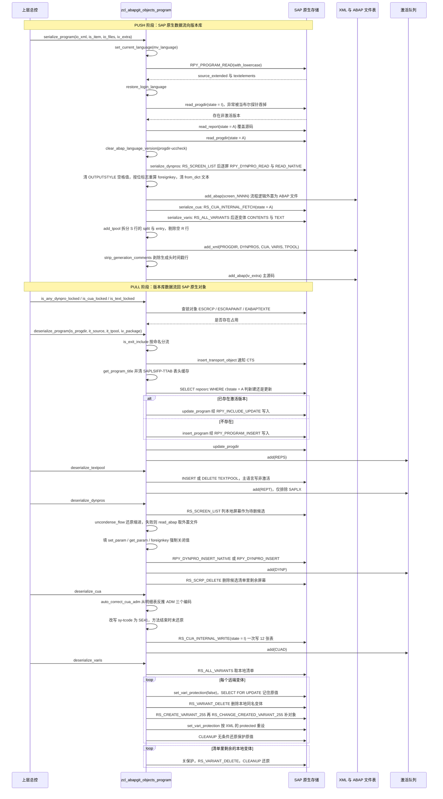

# ZCL_ABAPGIT_OBJECTS_PROGRAM 分析报告

> 分析对象：`abapGit/abapGit — zcl_abapgit_objects_program.clas.abap`（1597 行，全局类，继承自 `zcl_abapgit_objects_super`）
> 报告视角：代码 onboarding 走读，按真实调用链展开
> 源码 sha256：`bf5661698e3d35b125a8fa4abc435daf686d4d173226aaa172531c29170a9fe6`

---

## 一、程序定位与业务背景

### 1.1 这段代码在解决什么问题

先说清楚它**不是**什么：它不是报表，不做业务计算，不写任何业务表，也**不决定**一个程序该不该被版本化。它是一个**对象序列化适配器**——ABAPGit 里专门负责 ABAP 程序（对象类型 `REPS`）的那一个。

业务场景是这样的：Git 的存储与比对单位是**扁平的文本文件**。而 SAP 里的一个 ABAP 程序，物理上是一堆互相纠缠的东西：

- 一段 ABAP 源码（`REPOSRC`，且同时存在 active / inactive 两个版本）；
- 一份程序目录记录（`PROGDIR`：程序类型 `SUBC`、作者、开发类、Unicode 检查标志……）；
- N 个屏幕（`D020S` / `D021S` / `D021T`，每个屏幕又分传统屏幕和"native"屏幕两套存储格式）；
- 一套 CUA 界面元素（自定义按钮、菜单、状态、功能代码——共 11 张 `RSMPE_*` 表）；
- 若干变体（`VARID` / `VARIT`，还有 RS 参数、变体屏清单、对象清单）；
- 文本池（`TPOOL`，多语言）。

要把这样一个对象塞进 Git，就得有一个"翻译器"：向前把它**摊平**成一束可版本化的单元（一份 XML 元数据文件 + 若干 `.abap` 源码文件），向后把这一束单元**拼回**成 SAP 认识的原生对象。这个类就是那个翻译器，`serialize_program` 是"摊平"入口，`deserialize_program` 是"拼装"入口。

它的业务价值定位可以这样定性：

| 它做的事 | 它刻意不做的事 |
|---|---|
| 把 `REPS` 对象摊平成 1 份 XML + N 份 ABAP 源码文件 | 不生成 Git 提交、不碰 `.git`、不管理仓库目录 |
| 把摊平结果按对象类型 `REPS` / `DYNP` / `CUAD` / `REPT` 送进激活队列 | 自己不做激活，激活统一交给 `zcl_abapgit_objects_activation` |
| 用标准 FM 读写屏幕、CUA、变体（`RPY_*`、`RS_*`） | 不自己 `INSERT` / `UPDATE` 屏幕与 CUA 的底层表 |
| 提供 3 个锁探针，让推送前能发现"别人正在编辑" | 不自己取锁、不自己释放锁 |
| 处理跨 SAP 版本差异（参数在新旧版本里叫法不同、字段不存在） | 不做版本协商，靠 `TRY`/`CATCH` 现场降级 |

一句话设计范式定性：

> **"双向序列化适配器（bidirectional serializer）"——公开契约只有两个方法，中间夹着一层 PROTECTED 的中间结构类型，底层是一批把 SAP 内部表结构直接映射成 XML 节点的原生 API 包装。写侧（serialize）与读侧（deserialize）刻意不对称：读侧要比写侧多做一些"清洗与纠正"，因为 Git 往返一圈必然有信息损耗。**

### 1.2 为什么值得单独做成一个类

三个理由，按重要性排：

1. **`REPS` 是 SAP 里最"复合"的对象类型之一**。类、函数组、数据元素都是单形态对象（一份代码或一份定义），而报表对象天生带屏幕、带 CUA、带变体。把它塞进别的类里，那个类会立刻变成 2000 行且无法复用；独立成类，`zcl_abapgit_object_fugr` 之类兄弟适配器就能只复用它们需要的公共件（本文件里的 `add_tpool` / `read_tpool` 已被 FUGR 适配器跨类调用）。
2. **SAP 的屏幕与 CUA API 极其不稳定**。同一个函数模块在新版本里多了一个参数、少了一个字段、改了个返回码含义——这些差异必须被集中吸收在一处，否则每个调用点都要写一遍兼容逻辑。
3. **锁与并发是这类工具的命门**。abapGit 把用户本地改动的代码灌进系统时，可能正好撞上另一个顾问在 SE80 里打开同一个屏幕。这个类因此专门暴露了 `is_any_dynpro_locked` / `is_cua_locked` / `is_text_locked` 三个只读探针，供上层在动手前先问一句"能不能动"。

代价也在这里：类里出现了大量"魔法数字 + 系统字段改写 + 动态访问标准 include 内部变量"这类脆弱写法（见 3.11、3.16 与第五节）。

### 1.3 依赖清单（读这段代码前必须知道的地形）

```
父类                  zcl_abapgit_objects_super     提供 ms_item / mo_files / mv_language / mo_i18n_params /
                                                exists_a_lock_entry_for / clear_abap_language_version
协作类                zcl_abapgit_factory           拿到 sap_report / cts_api 两个服务实例
                        zcl_abapgit_objects_activation  收集待激活对象（REPS / DYNP / CUAD / REPT）
                        zcl_abapgit_language        临时切换语言环境并还原
                        zcl_abapgit_xml_output      XML 输出缓冲区
                        zif_abapgit_sap_report      progdir / report 源码的读写抽象
                        zcx_abapgit_exception       统一异常，raise / raise_t100
兄弟类（被调用方）     zcl_abapgit_object_fugr       反向调用本类的 CLASS-METHODS add_tpool / read_tpool
标准 FM（读侧）        RPY_PROGRAM_READ              一次取源码 + 文本元素
                        RPY_DYNPRO_READ             屏幕的容器 / 字段 / 流程逻辑
                        RPY_DYNPRO_READ_NATIVE      屏幕的原生格式字段表 + 字段文本
                        RS_SCREEN_LIST              列出程序的全部屏幕
                        RS_CUA_INTERNAL_FETCH       取 CUA 全部 11 张表
                        RS_ALL_VARIANTS_4_1_REPORT  列报表变体目录
                        RS_VARIANT_VALUES_TECH_DAT_255 变体技术数据（VARID）
                        RS_VARIANT_CONTENTS_255     变体值 + 对象清单
                        RS_GET_SCREENS_4_1_VARIANT  变体关联的屏幕
标准 FM（写侧）        RPY_PROGRAM_INSERT / RPY_INCLUDE_UPDATE  建程序 / 更新 include
                        RPY_DYNPRO_INSERT_NATIVE / RPY_DYNPRO_INSERT  写屏幕
                        RS_SCRP_DELETE              删屏幕
                        RS_CUA_INTERNAL_WRITE       写 CUA
                        RS_CREATE_VARIANT_255 / RS_CHANGE_CREATED_VARIANT_255 / RS_VARIANT_DELETE  变体增删改
标准表                TADIR / REPOSRC / VARID / VARIT / D020S / D021S / D021T / TPOOL
消息类                EU（更新消息，510 / 522 被本类特判）
SAP Note              2159455（deserialize_cua 里改写 sy-tcode 绕过的检查）
Issue 编号            #1807（CUA 的 ADM 补全） #2746（foreignkey 重算） #2747（foreignkey 空值）
                      #3680（uncondense_flow 的兼容期） #562（SAPlink 迁移）
```

### 1.4 两个入口 + 三个探针：先记住这个拓扑

本类对外的公开方法只有两个：

- `serialize_program` —— PUSH 方向，本地系统 → Git 仓库。
- `deserialize_program` —— PULL 方向，Git 仓库 → 本地系统。

另外三个 `is_*_locked` 方法是**只读探针**，在真实 abapGit 流程里由上层（拉取/推送的总控）在调用上面两个方法**之前**触发；本文件内部没有任何地方调用它们。

`deserialize_textpool` / `deserialize_dynpros` / `deserialize_cua` / `deserialize_varis` 这四个方法在**本文件内也没有任何调用者**——它们由上层拉取流程直接驱动。这一点很重要：读它们时要意识到它们是"被外部按序编排"的独立片段，而不是 `deserialize_program` 的子步骤。上层具体怎么编排，需在 abapGit 源码树（`zcl_abapgit_objects_super` 与主程序）核实。

---

## 二、程序执行流程总览

本类没有单一入口，两条主干各走各的。下面这张图把两条主干和它们共享的叶子方法画在一起；节点是"子程序名 + 一句话职责"。

```mermaid
flowchart TD
    subgraph PUSH["PUSH：本地到仓库（serialize_program 驱动）"]
        S0["锁探针 is_any_dynpro_locked / is_cua_locked / is_text_locked<br/>推送前确认无人正在编辑（本文件内无调用者，由上层触发）"]
        S1["serialize_program 摊平总控：读源码与 progdir，按 SUBC 决定是否附带屏幕/CUA/变体"]
        S2["serialize_dynpros 逐屏读取传统格式与原生格式，流程逻辑另存为独立 ABAP 文件"]
        S3["serialize_cua 一次取回 CUA 的 11 张表"]
        S4["serialize_varis 遍历 SAP 与 CUS 两类变体并逐个展开"]
        S5["get_varis_for_report 用 FM 目录按前缀筛出 SAP 与 CUS 变体名"]
        S6["get_vari_data 取变体技术数据、变体值、对象清单、多语言文本"]
        S7["get_vari_screens 取变体关联的屏幕清单"]
        S8["add_tpool 把文本池转成语言无关的行结构"]
        S9["strip_generation_comments 剥掉 MV 函数组的生成头时间戳行"]
        S1 --> S2
        S1 --> S3
        S1 --> S4
        S4 --> S5
        S5 --> S6
        S4 --> S7
        S1 --> S8
        S1 --> S9
    end

    subgraph PULL["PULL：仓库到本地（deserialize_program 驱动）"]
        P0["锁探针 is_any_dynpro_locked / is_cua_locked / is_text_locked"]
        P1["deserialize_program 拼装总控：判 exit include、CTS 检查、决定 insert 还是 update"]
        P2["is_exit_include 按命名规则识别退出码 include"]
        P3["deserialize_exit_include 退出码 include 的独立写路径"]
        P4["insert_program 新建程序，失败时降级为直写 REPOSRC"]
        P5["update_program 更新程序并分类处理 EU 更新消息"]
        P6["get_program_title 从文本池取 R 行标题并清掉一个标准 FM 的内部缓存"]
        P7["deserialize_textpool 写文本池并按语言决定是否排队激活"]
        P8["deserialize_dynpros 写屏幕、删除多余屏幕、兼容旧的压缩流程逻辑"]
        P9["uncondense_flow 用空格表还原流程逻辑的缩进"]
        P10["deserialize_cua 写 CUA 并排队 CUAD 激活"]
        P11["auto_correct_cua_adm 为历史遗留的缺失 ADM 补全三个编码"]
        P12["deserialize_varis 用删除重建同步变体并保护受保护变体"]
        P13["set_vari_protection 行级锁读改写变体保护标志"]
        P14["create_vari 两段式创建变体"]
        P15["delete_vari 删除变体并兼容旧版本参数"]
        P1 --> P2
        P1 --> P3
        P1 --> P4
        P1 --> P5
        P1 --> P6
        P8 --> P9
        P10 --> P11
        P12 --> P13
        P12 --> P14
        P12 --> P15
    end

    L1["zcl_abapgit_objects_activation 统一排队激活 REPS / DYNP / CUAD / REPT"]
    S1 -.-> L1
    P1 -.-> L1
    P7 -.-> L1
    P8 -.-> L1
    P10 -.-> L1
```



### 责任链表

| 子程序 | 调用者 | 职责 |
|---|---|---|
| `serialize_program` | 上层推送总控（`zcl_abapgit_objects_super` 系） | PUSH 总控：定位程序名、取源码与 progdir、按 `SUBC` 决定附带哪些子对象、装配 XML 并交给文件表 |
| `deserialize_program` | 上层拉取总控 | PULL 总控：分流 exit include、CTS 检查、按 `REPOSRC` 现有状态决定新建还是更新、登记 `REPS` 激活 |
| `is_any_dynpro_locked` / `is_cua_locked` / `is_text_locked` | 上层推送/拉取总控（本文件内无调用） | 三个只读锁探针，分别查 `ESCRCP` / `ESCUAPAINT` / `EABAPTEXTE` |
| `serialize_dynpros` | `serialize_program`（仅 `SUBC` 为 `1` 或 `M` 时） | 摊平所有屏幕；跳过生成的选择屏；流程逻辑外置成 ABAP 文件 |
| `serialize_cua` | `serialize_program`（同上） | 取回 CUA 的 11 张表，只读 active 状态 |
| `serialize_varis` | `serialize_program`（同上） | 摊平变体；只收 `SAP&*` 与 `CUS&*` 两类 |
| `get_varis_for_report` | `serialize_varis` / `deserialize_varis` | 用 `RS_ALL_VARIANTS_4_1_REPORT` 取变体目录并按前缀过滤 |
| `get_vari_data` | `serialize_varis` | 展开单个变体的技术数据、值、对象、多语言文本 |
| `get_vari_screens` | `serialize_varis` | 取变体关联屏幕清单 |
| `add_tpool` | `serialize_program`；并被 `zcl_abapgit_object_fugr` 跨类调用 | 文本池 → 语言无关行结构（`S` 行拆分 split/entry） |
| `read_tpool` | 本文件内**无调用者**；被 `zcl_abapgit_object_fugr` 跨类调用 | `add_tpool` 的逆操作（`S` 行拼回 split+entry） |
| `strip_generation_comments` | `serialize_program` | 仅对 `FUGR` 对象剥除生成头里带时间戳/版本号的行，稳定 diff |
| `insert_program` | `deserialize_program` / `deserialize_exit_include` | 新建程序；`name_not_allowed` 时降级为直写 `REPOSRC` 双版本 |
| `update_program` | `deserialize_program` / `deserialize_exit_include` | 更新程序；对 `EU510` / `EU522` 做特判分流 |
| `get_program_title` | `deserialize_program` / `deserialize_exit_include` | 取文本池 `R` 行标题，并清掉 `RPY_PROGRAM_UPDATE` 的一个内部缓存 bug |
| `deserialize_textpool` | 上层拉取总控（本文件内无调用） | 写文本池，区分主语言/翻译、包含/非包含，登记 `REPT` 激活 |
| `deserialize_dynpros` | 上层拉取总控（本文件内无调用） | 写屏幕（原生/传统两分支）、删除多余屏幕、登记 `DYNP` 激活 |
| `uncondense_flow` | `deserialize_dynpros` | 用空格位移表还原流程逻辑缩进（兼容旧 XML，#3680 兼容期） |
| `deserialize_cua` | 上层拉取总控（本文件内无调用） | 写 CUA，登记 `CUAD` 激活；空 CUA 直接跳过 |
| `auto_correct_cua_adm` | `deserialize_cua` | 为 #1807 之前保存时漏掉的 `RSMPE_ADM` 三个编码补值 |
| `deserialize_varis` | 上层拉取总控（本文件内无调用） | 变体同步：远端有的删除重建，远端删掉的本地删除；全程用 `CLEANUP` 恢复保护标志 |
| `set_vari_protection` | `deserialize_varis` | `SELECT FOR UPDATE` 行锁后改写 `VARID-PROTECTED` |
| `create_vari` | `deserialize_varis` | 两段式：`RS_CREATE_VARIANT_255` 再 `RS_CHANGE_CREATED_VARIANT_255` |
| `delete_vari` | `deserialize_varis` | 删除变体，`TRY`/`CATCH` 兼容旧版本缺失参数 |
| `is_exit_include` | `deserialize_program` / `update_program` | 按命名规则判断是否退出码 include |

下面按这条流程，逐个子程序展开。要提前说明：本类 28 个方法里，`serialize_program` 与 `deserialize_program` 是两条真正的脊柱，其余基本都是它们调用的叶子；所以下面第三节把叶子按"跟着哪条脊柱走"分组，而不是按源码出现顺序讲。

---

## 三、分组分析

### 3.1 类声明段：类型体系与可见性分层（类定义段）

读这个类之前，最值得先看的是**声明段的可见性布局**——它把这个类的边界画得非常清楚：

- `PUBLIC SECTION`：只有 `ty_cua` 一个类型 + 2 个入口方法 `serialize_program` / `deserialize_program`；
- `PROTECTED SECTION`：中间结构类型（`ty_dynpro`、`ty_vari` 家族）、三个锁探针、`serialize_*` / `deserialize_*` 主体、以及两个 `CLASS-METHODS` 文本池转换器；
- `PRIVATE SECTION`：常量 + 纯内部实现（`insert_program`、`update_program`、`get_program_title`、`get_vari_*`、`create_vari`、`delete_vari`、`set_vari_protection`、`uncondense_flow`、`auto_correct_cua_adm`）。

分层的含义是：**PUBLIC 是文件格式契约**（`ty_cua` 的形状决定了 XML 里 `CUA` 节点长什么样，所以必须让外部可读），**PROTECTED 是"可被上层编排、也可被兄弟适配器复用"的中等粒度块**（`add_tpool` / `read_tpool` 确实被 `zcl_abapgit_object_fugr` 跨类调用过），**PRIVATE 是绝对不该被外部依赖的实现细节**。

#### ① `ty_cua`：CUA 的 11 张表被压成一个结构

```abap
    TYPES:
      BEGIN OF ty_cua,
        adm TYPE rsmpe_adm,
        sta TYPE STANDARD TABLE OF rsmpe_stat WITH DEFAULT KEY,
        fun TYPE STANDARD TABLE OF rsmpe_funt WITH DEFAULT KEY,
        men TYPE STANDARD TABLE OF rsmpe_men WITH DEFAULT KEY,
        mtx TYPE STANDARD TABLE OF rsmpe_mnlt WITH DEFAULT KEY,
        act TYPE STANDARD TABLE OF rsmpe_act WITH DEFAULT KEY,
        but TYPE STANDARD TABLE OF rsmpe_but WITH DEFAULT KEY,
        pfk TYPE STANDARD TABLE OF rsmpe_pfk WITH DEFAULT KEY,
        set TYPE STANDARD TABLE OF rsmpe_staf WITH DEFAULT KEY,
        doc TYPE STANDARD TABLE OF rsmpe_atrt WITH DEFAULT KEY,
        tit TYPE STANDARD TABLE OF rsmpe_titt WITH DEFAULT KEY,
        biv TYPE STANDARD TABLE OF rsmpe_buts WITH DEFAULT KEY,
      END OF ty_cua.
```

**做什么** — 把 CUA 界面设计器用到的全部 11 张表（状态 `sta`、功能代码 `fun`、菜单 `men`、菜单链接 `mtx`、动作 `act`、按钮 `but`、按钮链接 `pfk`、状态字段 `set`、动作描述 `doc`、菜单项文本 `tit`、按钮信息 `biv`）外加一张 `RSMPE_ADM` 头表，平铺成一个结构的 12 个成分。

**为什么** — `RS_CUA_INTERNAL_FETCH` / `RS_CUA_INTERNAL_WRITE` 这两个 FM 本身就是"一次拿 12 张表"的接口，用 `TABLES` 参数一张一张往外吐。把 12 张表塞进一个结构再交给 `li_xml->add`，等于用一次结构转 XML 的动作换来 12 个 XML 节点，比自己写 12 遍循环省得多。这也是为什么 `ty_cua` 必须 PUBLIC——它就是 `CUA` XML 节点的 schema。

**风险与改进** — 两点。第一，成分名 `set` 和 `doc` 与 ABAP 语句关键字同名，虽然作为结构成分合法（代码里全都写成 `is_cua-set`、`is_cua-doc` 的限定形式），但对读者极其不友好，任何一次重构都容易误以为写错了。第二，12 张表全部是 `STANDARD TABLE ... WITH DEFAULT KEY`，没有哈希表、没有次键——因为 XML 序列化需要稳定的行序，这个选择是对的；代价是后面 `deserialize_cua` 里那段 11 个 `lines()` 判空只能一个个数。

#### ② `ty_dynpro` 与 `ty_spaces_tt`：屏幕的两种存储格式被并排放进一个结构

```abap
    TYPES:
      ty_spaces_tt TYPE STANDARD TABLE OF i WITH DEFAULT KEY .
    TYPES:
      BEGIN OF ty_dynpro,
        header     TYPE rpy_dyhead,
        containers TYPE dycatt_tab,
        fields     TYPE dyfatc_tab,
        flow_logic TYPE swydyflow,
        spaces     TYPE ty_spaces_tt,
        nat_header TYPE d020s,
        nat_fields TYPE STANDARD TABLE OF d021s WITH DEFAULT KEY,
        nat_texts  TYPE STANDARD TABLE OF d021t WITH DEFAULT KEY,
      END OF ty_dynpro .
    TYPES:
      ty_dynpro_tt TYPE STANDARD TABLE OF ty_dynpro WITH DEFAULT KEY .
```

**做什么** — 一个屏幕被描述成 8 个成分：表头、容器、字段、流程逻辑、空格位移表，再加一组"原生格式"三件套（`d020s` 表头、`d021s` 字段表、`d021t` 文本表）。

**为什么** — SAP 屏幕有两套物理存储：传统格式（容器 + 字段的 `DYNPRO` 抽象）和原生格式（`D020S`/`D021S`/`D021T` 三张表，带 splitter 的屏幕只能走这套）。把两套都塞进同一个结构、由 `serialize_dynpros` 决定填哪一半，可以让 `serialize_program` 完全不需要知道屏幕是哪一种格式——它只管把整表交给 XML。`ty_spaces_tt`（整数数组）是为流程逻辑的缩进还原服务的，见 3.15。

**风险与改进** — 结构里同时存在 `fields` 和 `nat_fields`、`containers` 和 `nat_header`，两套字段并存意味着**任何一个消费者都必须先看 `header-type` 才知道该读哪一半**；XML 里则表现为同一个 `DYNPRO` 节点里一半字段有值一半为空。这是"用稀疏结构换代码统一"的典型取舍，可接受，但建议在类型声明处加一句注释说明互斥关系——目前只有 `serialize_dynpros` 里的一个 `IF ... ELSE` 体现了它。

#### ③ `ty_vari` 家族：变体形状被"剪过键"

```abap
    TYPES:
      ty_varikey_tt        TYPE STANDARD TABLE OF rsvarkey WITH DEFAULT KEY,
      ty_vari_dynnr_tt     TYPE STANDARD TABLE OF rsdynnr WITH DEFAULT KEY,
      ty_vari_value_tt     TYPE STANDARD TABLE OF rsparamsl_255 WITH DEFAULT KEY,
      ty_vari_text_crea_tt TYPE STANDARD TABLE OF varit WITH DEFAULT KEY,
      ty_vari_object_tt    TYPE STANDARD TABLE OF vanz WITH DEFAULT KEY.
    TYPES:
      BEGIN OF ty_vari_text,
        langu TYPE langu,
        vtext TYPE rvart_vtxt,
      END OF ty_vari_text,
      ty_vari_text_tt TYPE STANDARD TABLE OF ty_vari_text WITH DEFAULT KEY.
    TYPES:
      BEGIN OF ty_vari,
        variant     TYPE varid-variant,
        flag1       TYPE varid-flag1,
        flag2       TYPE varid-flag2,
        transport   TYPE varid-transport,
        environmnt  TYPE varid-environmnt,
        protected   TYPE varid-protected,
        secu        TYPE varid-secu,
        xflag1      TYPE varid-xflag1,
        xflag2      TYPE varid-xflag2,
        variscreens TYPE ty_vari_dynnr_tt,
        objects     TYPE STANDARD TABLE OF vanz WITH DEFAULT KEY,
        values      TYPE ty_vari_value_tt,
        texts       TYPE STANDARD TABLE OF ty_vari_text WITH DEFAULT KEY,
      END OF ty_vari.
    TYPES:
      ty_vari_tt TYPE STANDARD TABLE OF ty_vari WITH DEFAULT KEY.
```

**做什么** — 定义"变体"这个 XML 节点的形状：9 个 `VARID` 标志字段 + 变体屏幕清单 + 对象清单 + 变体值 + 多语言文本；`ty_varikey_tt`（`RSVARKEY` = 报表名 + 变体名）是内部寻址用的最小键。

**为什么** — `VARID` 表本身的主键是 `MANDT + REPORT + VARIANT`，但**这三列全部没有进 `ty_vari`**：`REPORT` 就是被序列化对象自己，`MANDT` 恒为 `'000'`（系统客户），所以它们作为上下文存在、不必进版本库。`ty_vari_text` 同理只保留 `langu` + `vtext`。好处是 XML 小而干净；代价是读侧必须把它们补回来——`deserialize_varis` 里的 `ls_varid-mandt = c_sysvari_clnt` 和 `ls_varid-report = iv_program_name` 就是在做这件事。另外它没有直接 `TYPE varid`，而是逐字段挑选，这样 `VARID` 后续新增的字段不会意外被版本化。

**风险与改进** — 逐字段复制 `VARID` 的代价是**SAP 给 `VARID` 加字段时本类必须手动跟上**，漏了一个字段就是一次静默的信息丢失（比如保护相关的新标志）。这是一个必然随 SAP 版本漂移的维护点，值得在类文档里明确"字段清单需随 `VARID` 结构变更复核"。

#### ④ 常量区：状态位、屏幕类型、变体寻址

```abap
    CONSTANTS:
      BEGIN OF c_state,
        active   TYPE r3state VALUE 'A',
        inactive TYPE r3state VALUE 'I',
        off      TYPE r3state VALUE '',
      END OF c_state.

    CONSTANTS c_native_dynpro TYPE c LENGTH 2 VALUE 'IN'.

    CONSTANTS c_sysvari_clnt        TYPE mandt      VALUE '000'.
    CONSTANTS c_sysvari_pattern_sap TYPE c LENGTH 5 VALUE 'SAP&*'.
    CONSTANTS c_sysvari_pattern_cus TYPE c LENGTH 5 VALUE 'CUS&*'.
```

**做什么** — 把三个状态位打包成 `c_state` 结构（`active` = `A`、`inactive` = `I`、`off` = 空字符串表示"不改变状态"）；`c_native_dynpro = 'IN'` 用于识别原生屏幕；`c_sysvari_clnt = '000'` 是系统变体所在客户；后两个常量是 `CP` 模式，限定只处理 `SAP*` 与 `CUS*` 前缀的变体。

**为什么** — `c_state` 用结构打包而不是三个独立常量，这样 `DEFAULT c_state-inactive` 这类默认参数值可以读成"默认保存为非激活版本"，语义比 `DEFAULT 'I'` 清楚得多。`c_sysvari_pattern_sap` / `cus` 这两个模式把"我们只管理哪一类变体"锁成常量，避免魔法字符串散落在代码各处。

**风险与改进** — 两个。第一，`c_native_dynpro` 是用 `CA`（contains）去比对 `rpy_dyhead-type` 的两字符值，所以**任何包含子串 `IN` 的屏幕类型都会被当成原生屏幕**（例如假想值 `SIN`、`LIN`）；这个匹配面比字面直觉宽，具体哪些类型值会被命中需在 SE11 查 `RPTY` 的取值域核实。第二，`c_sysvari_clnt = '000'` 把"系统变体住在客户 000"这个假设写死进常量——对绝大多数实例成立，但一旦 RS 变体的客户归属规则变化，序列化与反序列化的寻址会同时失效且毫无报错。

声明段看完了，接下来从"动手之前"的三个锁探针开始，因为它们决定了这个类什么时候**允许**改动系统。

### 3.2 并发防线：三个锁探针（`is_cua_locked` / `is_any_dynpro_locked` / `is_text_locked`）

这三个方法在本文件内没有任何调用者，由上层推送/拉取总控在动手前先问一遍。它们共同的模式是：**把对象名拼成锁对象要求的参数格式，然后调用父类的 `exists_a_lock_entry_for`**。全部难点都在于"参数怎么拼"。

#### ① CUA 锁：`is_cua_locked`

```abap
    DATA: lv_object TYPE eqegraarg.

    lv_object = |CU{ iv_program }|.
    OVERLAY lv_object WITH '                                          '.
    lv_object = lv_object && '*'.

    rv_is_cua_locked = exists_a_lock_entry_for( iv_lock_object = 'ESCUAPAINT'
                                                iv_argument    = lv_object ).
```

**做什么** — 用 `"CU"` + 程序名拼出锁参数，再用一段 42 个空格的字符串做 `OVERLAY` 把整体长度固定下来，最后追加通配符 `"*"`，然后去查锁对象 `ESCUAPAINT` 是否存在占用。

**为什么** — `ESCUAPAINT`（CUA/PAINT 锁）的参数是定长的，程序名只占开头一小段，其余位置必须用空格补齐，末尾通配符覆盖子对象层级。用 `OVERLAY` 而不是 `SPACE()` 或 `PAD`，是因为它同时能**截断**和**补齐**：程序名不足时补空格，超出时直接截掉，一次搞定双向对齐。这是 ABAP 里做定长参数最省事的写法。

**风险与改进** — 这段的 42 个空格是**唯一的正确性支点**，也是最脆弱的一行。我按字面数过：字符串里正好 42 个空格，`"CU"` + 程序名（`SYREPID` 上限 10 位）经 `OVERLAY` 后总长 42，再拼 `"*"` 得 43 字符。**但 42 这个数完全靠"数空格"确认，代码里没有任何注释说明它对应 `ESCUAPAINT` 的参数长度**，接手的人看不出它是 42 还是 41。一旦长度算错，`OVERLAY` 会静默地生成一个"看起来对"的参数，锁查询命中不到任何东西 → 探针恒返回 `abap_false` → abapGit 会覆盖另一个顾问正在编辑的 CUA 界面。**建议在 SE54 核实 `ESCUAPAINT` 的参数长度后，把这个 42 提成语义化常量并在旁边写一行注释。** 另一个次级问题：本方法改了系统字段 `sy-tcode` 吗？——没有，只有 `deserialize_cua` 改了（见 3.16）。

#### ② 屏幕锁：`is_any_dynpro_locked`

```abap
    DATA: lt_dynpros TYPE ty_dynpro_tt,
          lv_object  TYPE seqg3-garg.

    FIELD-SYMBOLS: <ls_dynpro> TYPE ty_dynpro.

    lt_dynpros = serialize_dynpros( iv_program ).

    LOOP AT lt_dynpros ASSIGNING <ls_dynpro>.

      lv_object = |{ <ls_dynpro>-header-screen }{ <ls_dynpro>-header-program }|.

      IF exists_a_lock_entry_for( iv_lock_object = 'ESCRCP'
                                  iv_argument    = lv_object ) = abap_true.
        rv_is_any_dynpro_locked = abap_true.
        EXIT.
      ENDIF.

    ENDLOOP.
```

**做什么** — 先把该程序的**全部屏幕**摊平一遍，再逐个把"屏幕号 + 程序名"拼成锁参数去查 `ESCRCP`；命中任一屏就返回 `abap_true` 并 `EXIT`。

**为什么** — 锁是按"单个屏幕"粒度发的，所以必须知道有哪些屏幕。用 `header-screen`（`SCRNR`，4 位数字型）直接接 `header-program`（10 位）得到 14 字符参数，正好是 `ESCRCP` 的参数宽度。短路与 `EXIT` 保证只要有一个锁就立刻停手，不做无用功。

**风险与改进** — 最大的问题是**手段与目的不匹配**：为了拿一份"屏幕号清单"，它调用了 `serialize_dynpros`——而那个方法对每个屏幕要做两次 FM 调用（`RPY_DYNPRO_READ` + `RPY_DYNPRO_READ_NATIVE`）外加 XML 文件写入逻辑。`serialize_dynpros` 内部会把流程逻辑塞给 `mo_files->add_abap`，所以**一次"能不能动"的只读探测，副作用地把屏幕源码文件登记进了待推送文件表**。这里更合适的做法是直接 `RS_SCREEN_LIST` 拿 `D020S` 清单（`serialize_dynpros` 自己第一步就是这么做的），成本差一到两个数量级。另外，`serialize_dynpros` 内部会 `raise_t100`，所以这个"只读探针"其实**可能抛异常**，调用方必须把它当作非只读操作来处理。

#### ③ 文本锁：`is_text_locked`

```abap
    DATA: lv_object TYPE eqegraarg.

    lv_object = |*{ iv_program }|.

    rv_is_text_locked = exists_a_lock_entry_for( iv_lock_object = 'EABAPTEXTE'
                                                 iv_argument    = lv_object ).
```

**做什么** — 用 `"*"` + 程序名拼出锁参数，查 `EABAPTEXTE`（文本锁）是否有占用。

**为什么** — 文本锁的参数格式就是"通配符 + 对象名"，比屏幕和 CUA 那两个简单得多，不需要定长补齐。

**风险与改进** — 三个探针里最干净的一个，无明显风险。唯一值得注意的是三个锁对象（`ESCUAPAINT` / `ESCRCP` / `EABAPTEXTE`）的参数宽度各不相同、格式互不通用，这段代码把三种约定分散在三个方法里，没有一处集中说明"哪个锁对象对应哪个参数格式"——建议在类级文档里列一张三行小表，接手的人就不用去 SE54 翻了。

---

### 3.3 PUSH 总控：`serialize_program`

这是 PUSH 方向的脊柱，分六步：定位程序名并切语言、读源码、补齐双版本、按程序类型决定附带哪些子对象、装配文本池、把源码落盘。

```abap
    DATA: ls_progdir      TYPE zif_abapgit_sap_report=>ty_progdir,
          lv_program_name TYPE syrepid,
          lt_dynpros      TYPE ty_dynpro_tt,
          ls_cua          TYPE ty_cua,
          lt_varis        TYPE ty_vari_tt,
          li_report       TYPE REF TO zif_abapgit_sap_report,
          lt_source       TYPE TABLE OF abaptxt255,
          lt_tpool        TYPE textpool_table,
          ls_tpool        LIKE LINE OF lt_tpool,
          li_xml          TYPE REF TO zcl_abapgit_xml_output.
```

**做什么** — 声明九个局部变量：程序目录结构、程序名、屏幕表、CUA 结构、变体表、`sap_report` 服务引用、源码表、文本池表及其工作区行、XML 输出引用。

**为什么** — `li_xml` 声明成本地引用而不是直接用参数 `io_xml`，是为了支持"外部传入"与"内部自建"两条路径的统一；`ls_tpool` 作为工作区行单独声明，是因为后面要用 `READ TABLE ... INTO` 只读一行。

**风险与改进** — 这一段的 `lt_source TYPE TABLE OF abaptxt255` 是写死的行类型，而 `strip_generation_comments` 的注释明说它也可能是 `string`（FUGR 的情况）。也就是说源码表在这里被假定是 255 定长字符，FUGR 走的是另一条约定；两者在本方法里通过 `ct_source TYPE STANDARD TABLE` 的多态形参兼容，但**类型约定本身在类内没有被文档化**，建议在方法注释里写明"报表是 `ABAPTXT255`，函数组是 `STRING`"。

#### ① 定位程序名并切换语言环境

```abap
    IF iv_program IS INITIAL.
      lv_program_name = is_item-obj_name.
    ELSE.
      lv_program_name = iv_program.
    ENDIF.

    zcl_abapgit_language=>set_current_language( mv_language ).
```

**做什么** — 程序名取参数 `iv_program`，没传就退回当前对象的 `obj_name`；随后把系统语言临时切到 `mv_language`。

**为什么** — `RPY_PROGRAM_READ` 按当前语言返回文本元素，而 abapGit 要的是"某个确定语言的快照"，不是"登录用户看到的语言"。所以读之前必须锁语言。程序名允许覆盖，是因为同一个对象条目下可能要摊平被 include 的附属程序。

**风险与改进** — `set_current_language` 在这里被调用，但**还原动作分散在三处**（见步骤②）。这种"设置在这里、还原在别处"的写法，任何一次中途 `RETURN` 或抛异常都可能漏还原。更稳妥的做法是用一个 `TRY ... CLEANUP` 包住整个读取段，把 `restore_login_language` 放进 `CLEANUP`——本类在 `deserialize_varis` 里就是这么做的（见 3.17），说明作者知道这个模式，但这里没用上。

#### ② 一次性取源码与文本元素

```abap
    CALL FUNCTION 'RPY_PROGRAM_READ'
      EXPORTING
        program_name     = lv_program_name
        with_includelist = abap_false
        with_lowercase   = abap_true
      TABLES
        source_extended  = lt_source
        textelements     = lt_tpool
      EXCEPTIONS
        cancelled        = 1
        not_found        = 2
        permission_error = 3
        OTHERS           = 4.

    IF sy-subrc = 2.
      zcl_abapgit_language=>restore_login_language( ).
      RETURN.
    ELSEIF sy-subrc <> 0.
      zcl_abapgit_language=>restore_login_language( ).
      zcx_abapgit_exception=>raise_t100( ).
    ENDIF.

    zcl_abapgit_language=>restore_login_language( ).
```

**做什么** — 调用 `RPY_PROGRAM_READ` 一次取回源码（`ABAPTXT255` 表）和文本元素（文本池表）；`with_lowercase = abap_true` 取小写源码；不带 include 清单。随后按返回码分流：`2`（对象不存在）先还原语言再静默返回，其他非零先还原语言再抛 `T100` 消息异常，正常路径也还原语言。

**为什么** — 三条路径都在还原语言，这是刻意的健壮性设计：不管走哪条路，语言环境都必须回到登录语言，否则同一次运行里后续对象会串语言。`not_found` 走静默 `RETURN` 而不是抛异常，是因为"远端对象已经不存在"在推送场景下是合法状态——没有东西可推。

**风险与改进** — 静默 `RETURN` 是双刃剑：对推送它合理，但**调用方完全无法区分"对象不存在"和"读到了空对象"**，因为它两个分支的行为一样（都不往 `io_files` 里放任何东西）。如果上层靠"文件表是否为空"来判断推送有无内容，这两种情况会被折叠成同一个结论。建议在 `not_found` 分支至少记一条 trace 日志，或在方法上暴露一个可选输出参数表明"对象未找到"。另外 `with_lowercase = abap_true` 意味着版本库里存的是小写源码，拉回时要靠 `RPY_INCLUDE_UPDATE` 自己重新大写化——这条隐性约定同样值得写注释。

#### ③ 补齐双版本：探测 inactive，强制取 active

```abap
    " If inactive version exists, then RPY_PROGRAM_READ does not return the active code
    li_report = zcl_abapgit_factory=>get_sap_report( ).

    TRY.
        " Raises exception if inactive version does not exist
        ls_progdir = li_report->read_progdir(
          iv_name  = lv_program_name
          iv_state = c_state-inactive ).

        " Explicitly request active source code
        lt_source = li_report->read_report(
          iv_name  = lv_program_name
          iv_state = c_state-active ).
      CATCH zcx_abapgit_exception ##NO_HANDLER.
    ENDTRY.

    ls_progdir = li_report->read_progdir(
      iv_name  = lv_program_name
      iv_state = c_state-active ).

    clear_abap_language_version( CHANGING cv_abap_language_version = ls_progdir-uccheck ).
```

**做什么** — 先用 `TRY` 试探性读取**非激活**版本的 progdir；如果这次读取成功（说明存在非激活版本），就再去显式取**激活**版本的源码覆盖 `lt_source`。无论探测结果如何，最后都会再读一次激活版本的 progdir 作为正式结果。随后用父类的 `clear_abap_language_version` 把 progdir 里的 `uccheck`（ABAP 语言版本标志）清空。

**为什么** — 这是全类最"了解 SAP 内部"的一段。注释说得很清楚：`RPY_PROGRAM_READ` 在存在非激活版本时**不会**返回激活代码。所以 abapGit 的策略是——**永远版本化激活版本**（`save what runs`），而不是开发者的未保存编辑。用 `TRY`/`CATCH` 当作"是否存在非激活版本"的探针，是一种以异常控制流的实用主义写法，比多打一次 `SELECT` 省事。最后清掉 `uccheck` 是因为 ABAP 语言版本是本地系统属性、不该进版本库，否则每次升级都会制造无意义 diff。

**风险与改进** — 两处。第一，**第三个 `read_progdir`（激活版本）在 `TRY` 外面**，如果对象只有非激活版本（新建后从未激活），这里的行为取决于 `read_progdir` 是抛异常还是返回空——本文件无法判断，**需在 SE38 核实 `zif_abapgit_sap_report=>read_progdir` 在无激活版本时的行为**；若是抛异常，新建未激活的程序会在推送时炸掉。第二，`CATCH zcx_abapgit_exception ##NO_HANDLER` 是"用异常当布尔值"的典型用法，`##NO_HANDLER` 只是抑制了静态分析警告。可读性上，一段 `TRY` 块里没有任何补偿动作，容易被误改。建议改成显式探测（例如先 `SELECT SINGLE ... FROM reposrc WHERE r3state = 'I'`），代价只是一条索引查询。第三，"只版本化激活版本"这个策略意味着**开发者改了但没激活的屏幕/CUA/源码不会被推送**——这与 3.5、3.6 的读取侧一致，属于刻意选择，但应在文档里明说，否则用户会以为是 bug。

#### ④ 按程序类型决定附带哪些子对象

```abap
    IF io_xml IS BOUND.
      li_xml = io_xml.
    ELSE.
      CREATE OBJECT li_xml TYPE zcl_abapgit_xml_output.
    ENDIF.

    li_xml->add( iv_name = 'PROGDIR'
                 ig_data = ls_progdir ).
    IF ls_progdir-subc = '1' OR ls_progdir-subc = 'M'.
      lt_dynpros = serialize_dynpros( lv_program_name ).
      li_xml->add( iv_name = 'DYNPROS'
                   ig_data = lt_dynpros ).

      ls_cua = serialize_cua( lv_program_name ).
      li_xml->add( iv_name = 'CUA'
                   ig_data = ls_cua ).

      lt_varis = serialize_varis( lv_program_name ).
      li_xml->add( iv_name = 'VARIS'
                   ig_data = lt_varis ).
    ENDIF.
```

**做什么** — 决定 XML 缓冲区来源：外部传了就用外部的，否则自己 `CREATE OBJECT`。然后无条件写入 `PROGDIR` 节点；只有当程序类型 `SUBC` 是 `1`（可执行报表）或 `M`（主程序）时，才追加 `DYNPROS`、`CUA`、`VARIS` 三个节点。

**为什么** — `io_xml` 这个开关是 abapGit 的"内嵌序列化"机制：函数组适配器在摊平 `FUGR` 时，会把成员程序的元数据内嵌进函数组自己的 XML 里（因此传入已创建的 `io_xml`），而源码文件仍然单独落盘。只有报表类对象才有屏幕、CUA 和变体，所以用 `SUBC` 做门槛，`SUBC = '0'`（include）之类直接跳过。

**风险与改进** — 两个。第一，`SUBC` 只认 `'1'` 和 `'M'`，其他类型**静默跳过**且无任何诊断输出。如果某个环境的报表用了非标准的 `SUBC` 值，屏幕就会从版本库里无声消失，排查时没有任何线索。建议在这个 `IF` 后面加一个 `ELSE` 分支，至少记一条 trace。第二，`CREATE OBJECT li_xml` 用的是无参构造，与前面 `li_report = zcl_abapgit_factory=>get_sap_report( )` 走工厂的风格不一致——XML 输出器没有工厂化，意味着测试时无法注入替身。这是可维护性问题而非正确性问题。

#### ⑤ 文本池装配：剔除空的 R 行

```abap
    READ TABLE lt_tpool WITH KEY id = 'R' INTO ls_tpool.
    IF sy-subrc = 0 AND ls_tpool-key = '' AND ls_tpool-length = 0.
      DELETE lt_tpool INDEX sy-tabix.
    ENDIF.

    li_xml->add( iv_name = 'TPOOL'
                 ig_data = add_tpool( lt_tpool ) ).
```

**做什么** — 在文本池表里找 `id = 'R'`（报表标题）那一行；如果它的 `key` 为空且 `length` 为 0，就把这一行删掉。然后把整张表经 `add_tpool` 转成语言无关结构，写入 `TPOOL` 节点。

**为什么** — 这是个针对 SAP 行为的小补丁：某些程序存在一条"标题字段存在但内容为空"的 `R` 行。留着它会在 Git 里制造一个空节点，并且往返一次后可能被当成"有标题"而污染数据；删掉它，空标题就与"没有 R 行"归一化成同一种状态。

**风险与改进** — 判断条件只检查了 `key` 和 `length`，没有检查 `entry` 本身是否为空。如果一条 `R` 行的 `entry` 有内容但 `length = 0`（数据不一致时可能出现），会被错误删除。另外 `READ TABLE ... WITH KEY id = 'R'` 在标准表上是线性扫描，且**只取第一条命中**——多语言文本池里 `R` 行按语言重复出现，这里依赖了"语言已切换、返回的是单语言文本元素"这个上游约定。建议至少把 `entry` 一并纳入判断。

#### ⑥ 落盘：XML 进文件表，源码经清洗后落盘

```abap
    IF NOT io_xml IS BOUND.
      io_files->add_xml( iv_extra = iv_extra
                         ii_xml   = li_xml ).
    ENDIF.

    strip_generation_comments( CHANGING ct_source = lt_source ).

    io_files->add_abap( iv_extra = iv_extra
                        it_abap  = lt_source ).
```

**做什么** — 只有自建 XML 缓冲区时才把它登记进文件表（外部传入的由调用方自己收）；然后把源码交给 `strip_generation_comments` 做原地清洗，最后把源码登记为 `.abap` 文件。

**为什么** — 这两条 `add_*` 的顺序不是随意的：`strip_generation_comments` 是 `CHANGING` 原地修改，必须在交给文件表之前完成，否则带时间戳的生成头会被写进版本库，**每次 MV 函数组重新生成都会产生一份无意义 diff**。

**风险与改进** — 这段本身没有明显风险，但有一个隐含约定值得写清楚：当 `io_xml` 有值时，**源码仍然会落盘**——也就是说"内嵌元数据"和"源码外置"是两件事，不要因为 `io_xml IS BOUND` 就以为整个对象被内嵌了。建议在方法文档里明确这两条 `add_*` 的触发条件矩阵。

---

### 3.4 屏幕摊平：`serialize_dynpros`

屏幕是本类最复杂的部分，分四步：列清单并过滤生成屏幕、双格式读取、字段级清洗、装配与外置。

#### ① 列屏幕清单并过滤生成屏幕

```abap
    "#2746: relevant flag values (taken from include MSEUSBIT)
    CONSTANTS: lc_flg1ddf TYPE x VALUE '20',
               lc_flg3fku TYPE x VALUE '08',
               lc_flg3for TYPE x VALUE '04',
               lc_flg3fdu TYPE x VALUE '02'.


    CALL FUNCTION 'RS_SCREEN_LIST'
      EXPORTING
        dynnr     = ''
        progname  = iv_program_name
      TABLES
        dynpros   = lt_d020s
      EXCEPTIONS
        not_found = 1
        OTHERS    = 2.
    IF sy-subrc = 2.
      zcx_abapgit_exception=>raise_t100( ).
    ENDIF.

    SORT lt_d020s BY dnum ASCENDING.
```

**做什么** — 声明四个局部常量（从 SAP 标准 include `MSEUSBIT` 抄来的位标志值），然后调用 `RS_SCREEN_LIST` 列出该程序的全部屏幕（`D020S` 行），按屏幕号升序排序。

**为什么** — `dynnr` 传空表示"全部屏幕"。排序不是为了输出好看，而是为了让 XML 里的 `DYNPROS` 节点顺序在多次摊平之间**稳定可 diff**——`D020S` 的自然顺序不保证与屏幕号一致。

**风险与改进** — `sy-subrc = 2` 才抛异常，`sy-subrc = 1`（`not_found`，程序根本没有屏幕）被当作正常情况放行——这个区分是对的，一个没有屏幕的报表不该报错。但反过来说，**这段没有任何日志表明"这个程序没有屏幕"**，与 3.3 步骤④ 的静默跳过一样，属于诊断黑洞。

#### ② 逐屏双格式读取

```abap
* loop dynpros and skip generated selection screens
    LOOP AT lt_d020s ASSIGNING <ls_d020s>
        WHERE type <> 'S' AND type <> 'W' AND type <> 'J'
        AND NOT dnum IS INITIAL.

      CALL FUNCTION 'RPY_DYNPRO_READ'
        EXPORTING
          progname             = iv_program_name
          dynnr                = <ls_d020s>-dnum
        IMPORTING
          header               = ls_header
        TABLES
          containers           = lt_containers
          fields_to_containers = lt_fields_to_containers
          flow_logic           = lt_flow_logic
        EXCEPTIONS
          cancelled            = 1
          not_found            = 2
          permission_error     = 3
          OTHERS               = 4.
      IF sy-subrc <> 0.
        zcx_abapgit_exception=>raise_t100( ).
      ENDIF.

      "#2746: we need the dynpro fields in internal format:
      FREE lt_fieldlist_int.

      CALL FUNCTION 'RPY_DYNPRO_READ_NATIVE'
        EXPORTING
          progname   = iv_program_name
          dynnr      = <ls_d020s>-dnum
        TABLES
          fieldlist  = lt_fieldlist_int
          fieldtexts = lt_texts.
```

**做什么** — 遍历屏幕清单，用 `LOOP AT ... WHERE` 一次性过滤掉三种类型（`'S'`、`'W'`、`'J'`）和屏幕号为空的记录（`RS_SCREEN_LIST` 总会带一条 `dnum` 为空的总行）。对每个屏幕调 `RPY_DYNPRO_READ` 取传统格式（表头、容器、字段、流程逻辑），返回码非零即抛 `T100`；然后 `FREE` 掉上一轮的原生字段表，调 `RPY_DYNPRO_READ_NATIVE` 取原生格式的字段表与字段文本。

**为什么** — 过滤掉的是**生成的选择屏**：这类屏幕由 ABAP 运行时空根据选择屏代码自动生成，不需要也不应该进版本库——进了反而会在每次代码变化后被系统重新生成时产生冲突。`FREE lt_fieldlist_int` 放在 FM 调用前，是因为 `TABLES` 参数是追加式的，不清空会把上一屏的字段混进来。至于为什么要"双格式都读"，因为后面装配时要根据屏幕类型决定填哪一半（见步骤④），而判断依据之一就藏在原生字段表里。

**风险与改进** — 这是全类最明显的健壮性缺口：**`RPY_DYNPRO_READ_NATIVE` 的返回码完全没有检查**。同一个 FM 家族里，`RPY_DYNPRO_READ` 上一行就认真做了 `IF sy-subrc <> 0`，紧接着的这个调用却直接往下走。后果是原生读取失败时 `lt_fieldlist_int` 可能为空或残留，后面的 `foreignkey` 重算（步骤③）和原生屏幕判定（步骤④）都会基于脏数据做决策，而且**不会有任何错误提示**。另一个问题：过滤条件里 `'W'` 和 `'J'` 的含义在源码里没有注释，只有一句 "skip generated selection screens"；这三个类型值的确切语义**需在 SE11 查 `D020S-TYPE` 的取值域核实**。此外，每个屏幕两次 FM 调用是 O(屏幕数×2) 的固定开销，对一个屏幕上百的旧报表来说是可感知的延迟——但这是读屏幕唯一可靠的方式，不构成改进空间。

#### ③ 字段级清洗：`foreignkey` 重算与文本精简

```abap
      LOOP AT lt_fields_to_containers ASSIGNING <ls_field>.
* output style is a NUMC field, the XML conversion will fail if it contains invalid value
* field does not exist in all versions
        ASSIGN COMPONENT 'OUTPUTSTYLE' OF STRUCTURE <ls_field> TO <lv_outputstyle>.
        IF sy-subrc = 0 AND <lv_outputstyle> = '  '.
          CLEAR <lv_outputstyle>.
        ENDIF.

        "2746: we apply the same logic as in SAPLWBSCREEN
        "for setting or unsetting the foreignkey field:
        UNASSIGN <ls_field_int>.
        READ TABLE lt_fieldlist_int ASSIGNING <ls_field_int> WITH KEY fnam = <ls_field>-name.
        IF <ls_field_int> IS ASSIGNED.
          IF <ls_field_int>-flg1 O lc_flg1ddf AND
              <ls_field_int>-flg3 O lc_flg3for AND
              <ls_field_int>-flg3 Z lc_flg3fdu AND
              <ls_field_int>-flg3 Z lc_flg3fku.
            <ls_field>-foreignkey = 'X'.
          ELSE.
            CLEAR <ls_field>-foreignkey.
          ENDIF.
        ENDIF.

        IF <ls_field>-from_dict = abap_true AND
           <ls_field>-modific   <> 'F' AND
           <ls_field>-modific   <> 'X'.
          CLEAR <ls_field>-text.
        ENDIF.
      ENDLOOP.

      LOOP AT lt_containers ASSIGNING <ls_container>.
        IF <ls_container>-c_resize_v = abap_false.
          CLEAR <ls_container>-c_line_min.
        ENDIF.
        IF <ls_container>-c_resize_h = abap_false.
          CLEAR <ls_container>-c_coln_min.
        ENDIF.
      ENDLOOP.
```

**做什么** — 对每个屏幕字段做三件事：一是用 `ASSIGN COMPONENT` 动态取 `OUTPUTSTYLE` 字段（可能不存在），如果它等于两个空格就清空；二是用原生字段表里按字段名查到的行，按四组位标志的组合重算 `foreignkey`，命中就设 `'X'`，否则清空；三是当字段来自 DDIC（`from_dict = abap_true`）且 `modific` 既不是 `'F'` 也不是 `'X'` 时，清掉该字段的 `text`。对每个容器，若不允许纵向/横向调整大小，就清掉对应的最小行数/列数。

**为什么** — 这三件事分别对应三个真实的跨版本/跨环境陷阱。`OUTPUTSTYLE` 是 `NUMC` 字段，`'  '` 这种纯空格值在 `NUMC` 语义下不是合法数字，**XML 序列化会直接失败**，所以必须先清掉；而该字段在不同版本里可能根本不存在，所以只能动态 `ASSIGN`，靠 `sy-subrc` 判断而不是硬编码字段。`foreignkey` 的重算是 #2746 的核心：SAP 自己用 `SAPLWBSCREEN` 里的一段位运算决定一个字段是不是外键，abapGit 把这段逻辑复刻过来，而不是信任 FM 返回的 `foreignkey`——因为那个值在不同版本/不同调用方式下不一致，直接抄会导致往返一次后属性漂移。位运算的语义是：`flg1 O '20'`（字段由数据字典维护）、`flg3 O '04'`（有外键/下拉）、`flg3 Z '02'`（非 DDU 类型）、`flg3 Z '08'`（无 F4 帮助），四者同时满足才算"需要手动重算的外键"。文本精简与 3.15 读侧的 `modific = 'X'` 补齐**是一对互逆操作**：写侧把可从 DDIC 派生的文本扔掉以减小 XML，读侧再把必要的那一类补回来。容器的最小尺寸同理——不可调整大小的容器根本没有"最小尺寸"这个概念，留着就是脏数据。

**风险与改进** — 第一，**四个位常量来自 `MSEUSBIT`，语义完全依赖 SAP 标准 include**，本文件除了注释"taken from include MSEUSBIT"之外没有任何说明；`flg3` 的四个值分别代表什么，**需在 SE37 查 `MSEUSBIT` 确认**。一旦 SAP 改动这些位定义，这段逻辑会静默产生错误的 `foreignkey`，而且从代码上看不出来。第二，`READ TABLE lt_fieldlist_int ASSIGNING <ls_field_int> WITH KEY fnam = ...` 是**标准表上的线性查找**，外层还套着字段循环——单屏字段数是几十到几百，整体是 O(字段数 × 原生字段数)，对一个字段很多的大屏幕会明显变慢。这里若把 `lt_fieldlist_int` 建成以 `fnam` 为键的哈希表（或至少 `SORT` 后用 `BINARY SEARCH`），代价很低而收益直接。第三，`UNASSIGN <ls_field_int>` 写在循环开头是必要的（否则第一次 `READ` 未命中会残留上一次的成功赋值），这个细节做得对。

#### ④ 装配结果：流程逻辑外置，原生/传统二选一

```abap
      APPEND INITIAL LINE TO rt_dynpro ASSIGNING <ls_dynpro>.
      <ls_dynpro>-header = ls_header.

      " Store flow logic as separate ABAP files instead of XML
      mo_files->add_abap(
        iv_extra = 'screen_' && ls_header-screen
        it_abap  = lt_flow_logic ).

      READ TABLE lt_fieldlist_int TRANSPORTING NO FIELDS WITH KEY fill = 'X'.
      IF ls_header-type CA c_native_dynpro AND sy-subrc = 0.
        " In particular for dynpros with splitter
        <ls_dynpro>-nat_header = <ls_d020s>.
        CLEAR: <ls_dynpro>-nat_header-dgen, <ls_dynpro>-nat_header-tgen.
        <ls_dynpro>-nat_fields = lt_fieldlist_int.
        <ls_dynpro>-nat_texts  = lt_texts.
      ELSE.
        <ls_dynpro>-containers = lt_containers.
        <ls_dynpro>-fields     = lt_fields_to_containers.
      ENDIF.

    ENDLOOP.
```

**做什么** — 为当前屏幕追加一行结果，填表头；然后把**流程逻辑单独存成一个 `screen_NNNN` 命名的 ABAP 文件**；再用"原生字段表里有没有 `fill = 'X'` 的行"结合"表头类型是否包含 `IN`"来决定填原生三件套还是传统两套，并在填原生表头时清掉 `dgen`/`tgen` 两个生成时间戳。

**为什么** — 流程逻辑外置是这个项目最有品味的设计决策之一：流程逻辑本质上是**带缩进的文本**，把它塞进 XML 会丢掉缩进（`SWYDYFLOW` 是定长行，缩进信息不在字段里），而缩进对可读性和后续 diff 都至关重要。存成 ABAP 文件，Git 就能像对待普通代码一样 diff 它。原生/传统的分叉判定用两个信号交叉验证——`header-type` 含 `IN` 表明屏幕类型是原生的，`fill = 'X'` 表明该屏有分屏控件（分屏屏只能走原生格式）——两个都命中才走原生分支，这是防御式的判定方式。清掉 `dgen`/`tgen`（生成日期/时间）是因为它们是每次生成都会变的噪声，留进版本库必然制造假 diff；读侧会自己重新填（见 3.15）。

**风险与改进** — 三处。第一，`mo_files->add_abap` 用的是 `ls_header-screen` 而不是外层循环变量 `<ls_d020s>-dnum`，两者理论上相等，但**混用两个来源的屏幕号没有任何断言保护**；一旦上游 FM 行为变化导致二者不一致，屏幕文件名和屏幕元数据会错位而无人察觉。第二，"原生屏幕才填原生字段、传统屏幕才填容器/字段"这个互斥约定，在 `ELSE` 分支里意味着**原生三件套被默认清空、传统两套被默认清空**，靠的是 `APPEND INITIAL LINE` 的初始值——这是隐式不变量，建议加一句注释。第三，`READ TABLE lt_fieldlist_int TRANSPORTING NO FIELDS WITH KEY fill = 'X'` 又是标准表线性查找，虽然只跑一次每屏，但仍可改为排序后二分。另外，`header-type CA c_native_dynpro` 的包含匹配面偏宽的问题已在 3.1 指出。

---

### 3.5 CUA 摊平：`serialize_cua`

```abap
    CALL FUNCTION 'RS_CUA_INTERNAL_FETCH'
      EXPORTING
        program         = iv_program_name
        language        = mv_language
        state           = c_state-active
      IMPORTING
        adm             = rs_cua-adm
      TABLES
        sta             = rs_cua-sta
        fun             = rs_cua-fun
        men             = rs_cua-men
        mtx             = rs_cua-mtx
        act             = rs_cua-act
        but             = rs_cua-but
        pfk             = rs_cua-pfk
        set             = rs_cua-set
        doc             = rs_cua-doc
        tit             = rs_cua-tit
        biv             = rs_cua-biv
      EXCEPTIONS
        not_found       = 1
        unknown_version = 2
        OTHERS          = 3.
    IF sy-subrc > 1.
      zcx_abapgit_exception=>raise_t100( ).
    ENDIF.
```

**做什么** — 一次调用取回 CUA 的 ADM 头表和 11 张明细表，语言取 `mv_language`，**状态取激活版本**；返回码大于 1 才抛异常。

**为什么** — `RS_CUA_INTERNAL_FETCH` 的返回码 1 是 `not_found`（这个程序没有 CUA 界面），这是完全正常的情况，所以放行；返回码 2 是 `unknown_version`，属于数据异常，必须报错。写起来只有两行，因为结构 `ty_cua` 与 FM 的 12 个输出参数**一一对应**。

**风险与改进** — 最关键的是**只读激活状态**这一选择。整个 PUSH 侧都遵循"版本化激活版本"的一致性原则，但要注意它的后果：**一个开发者改了 CUA 界面却还没激活，这次改动不会进入版本库**，而下一次别人拉取会用激活版本覆盖他的工作区——这在团队共享工作区的场景下是真金白银的数据丢失风险。同样的不对称也存在于 `serialize_dynpros`（`RS_SCREEN_LIST` 读的是已生成的 `D020S`/`D021S`）。abapGit 的实际流程可能在推送前统一激活对象以规避这个问题，**但这一约定在本文件内看不到，需在 abapGit 源码树核实**。相比之下 `deserialize_cua` 写入时用的是 `c_state-inactive`，读写两侧的状态策略确实是反的——这是刻意设计（写入后要排队激活），但也意味着"未激活的 CUA 改动"这个状态在往返中不可表示。

---

### 3.6 变体摊平：`serialize_varis` 与三个 `get_vari_*`

#### ① 主循环：`serialize_varis`

```abap
    lt_varis = get_varis_for_report( iv_program_name ).

    LOOP AT lt_varis ASSIGNING <ls_varikey>.
      CLEAR: ls_vari,
             ls_varid.

      get_vari_data( EXPORTING is_vari    = <ls_varikey>
                     IMPORTING es_varid   = ls_varid
                               et_values  = ls_vari-values
                               et_objects = ls_vari-objects
                               et_texts   = ls_vari-texts ).

      MOVE-CORRESPONDING ls_varid TO ls_vari.

      " Clear texts - they will be provided in TEXTPOOL section
      LOOP AT ls_vari-objects ASSIGNING <ls_object>.
        CLEAR <ls_object>-text.
      ENDLOOP.

      ls_vari-variscreens = get_vari_screens( <ls_varikey> ).

      INSERT ls_vari INTO TABLE rt_varis.
    ENDLOOP.
```

**做什么** — 先拿到该报表的变体键清单，然后逐个变体：清空两个工作结构，调 `get_vari_data` 取回技术数据/值/对象/文本，用 `MOVE-CORRESPONDING` 把 `VARID` 技术数据映射进 `ty_vari`（只拷贝同名字段，天然完成 3.1 说的"剪键"），清掉对象清单里的 `text` 字段，再取变体关联屏幕，最后插入结果表。

**为什么** — 循环开头 `CLEAR` 两个复用结构是必要的，否则上一个变体的残余值会被带进下一个。清掉 `objects` 里的 `text` 是刻意的去重：变体对象的描述文本会由 `TEXTPOOL` 段提供，如果两处都存，往返时会因为两处更新不同步而产生漂移。`MOVE-CORRESPONDING` 在这里是**优点**而非坏味道：它自动忽略 `ty_vari` 里没有的字段（`mandt`、`report`），实现了编译期就确定的字段投影。

**风险与改进** — 第一，`get_vari_data` 内部会 `raise_t100`，**单个变体出错会中断整个报表的摊平**，前面已成功处理的变体也拿不到结果。对 20 个变体里有 1 个损坏的报表来说，这是"全有或全无"。第二，`MOVE-CORRESPONDING` 依赖字段名匹配，如果未来 `VARID` 或 `ty_vari` 改名但含义未变，映射会静默断裂——建议改成显式字段赋值，代价是十几行代码。第三，`<ls_object>-text` 被清掉，但**注释只说"会在 TEXTPOOL 段提供"**，本文件内并没有任何代码把变体对象文本写进 `TPOOL` 段——`serialize_program` 的 `TPOOL` 段来自 `RPY_PROGRAM_READ` 的 `textelements`，与变体对象无关。这条注释的准确性**需在上层核实**，否则就是一个悬空承诺。

#### ② 变体目录：`get_varis_for_report`

```abap
    CALL FUNCTION 'RS_ALL_VARIANTS_4_1_REPORT'
      EXPORTING
        program = iv_repid
      IMPORTING
        cat     = ls_catalog
      EXCEPTIONS
        OTHERS  = 1.
    IF sy-subrc <> 0.
      zcx_abapgit_exception=>raise_t100( ).
    ENDIF.

    ls_vari-report = iv_repid.
    LOOP AT ls_catalog-cat ASSIGNING <ls_cat>
         WHERE variant CP c_sysvari_pattern_sap
         OR variant CP c_sysvari_pattern_cus.
      ls_vari-variant = <ls_cat>-variant.
      INSERT ls_vari INTO TABLE rt_varis.
    ENDLOOP.

    SORT rt_varis.
```

**做什么** — 用 `RS_ALL_VARIANTS_4_1_REPORT` 取回该报表的变体目录，失败即抛 `T100`；然后用 `LOOP AT ... WHERE variant CP 'SAP&*' OR variant CP 'CUS&*'` 只保留这两类前缀的变体，组装成 `RSVARKEY` 表并排序。

**为什么** — 变体在 SAP 里有若干类别（`SAP*` 系统变体、`CUS*` 客户变体、`PROJ*`、`USER*` 等）。**abapGit 明确只接管 `SAP*` 和 `CUS*` 两类**——前者是程序作者维护的、随程序走的，后者是客户定制的；用户个人变体和项目变体是本地状态，不该被版本库覆盖。用 `CP` + 常量模式过滤，配合 `LOOP AT ... WHERE` 的 `OR`，一次遍历完成，比先取全表再 `DELETE WHERE` 干净。

**风险与改进** — 过滤面是刻意收窄的，但**收窄是静默的**：一个报表有 5 个 `USER*` 变体和 2 个 `SAP*` 变体，摊平结果里只有 2 个，用户不会知道剩下的 3 个被永久排除在版本管理之外。这是一个产品语义决策，建议在类文档里显式列出"本类只管理 `SAP*` 与 `CUS*` 变体"。另外，`rs_catalog-cat` 的字段结构来自 `RSCAT`/`CAT_VAR`，这里只用到了 `variant` 一个字段——如果同一目录里有同名变体但不同类别（理论上不应出现），会被折叠。

#### ③ 单个变体展开：`get_vari_data`

```abap
    CALL FUNCTION 'RS_VARIANT_VALUES_TECH_DAT_255'
      EXPORTING
        report         = is_vari-report
        variant        = is_vari-variant
        sorted         = abap_true
      IMPORTING
        techn_data     = es_varid
      TABLES
        variant_values = et_values " is ignored
      EXCEPTIONS
        OTHERS         = 1.
    IF sy-subrc <> 0.
      zcx_abapgit_exception=>raise_t100( ).
    ENDIF.

    " Use variant values from CONTENTS call
    " both calls have this parameter as non-optional
    CLEAR et_values.
```

**做什么** — 先调 `RS_VARIANT_VALUES_TECH_DAT_255` 取变体的技术数据（`VARID` 行），这个 FM 的 `variant_values` 表参数是强制必填的，于是把 `et_values` 传进去；但取回之后**立刻清空**，并注释说明真正要用的值来自后面的 `CONTENTS` 调用。

**为什么** — 这是典型的"填必填参数"手法：两个 FM 都把变体值表声明为非可选，但 abapGit 想统一从 `RS_VARIANT_CONTENTS_255` 拿值（因为那个调用能顺带拿到 `objects`，一次往返拿两样东西）。注释把原因写清楚了，这是很好的做法。

**风险与改进** — 代价是**每个变体多做一次全量值展开**：`RS_VARIANT_VALUES_TECH_DAT_255` 已经把所有变体值算了一遍，然后被丢弃，`RS_VARIANT_CONTENTS_255` 再算一遍。对单个变体可以接受，但如果一个报表有几十个变体、每个变体又有上百个参数，这份重复计算是可测量的浪费。真正的改进需要 FM 层支持"只要技术数据不要值"，那已超出本类的控制范围。另外 `sorted = abap_true` 在这里其实没意义（结果马上被清空），属于遗留参数。

```abap
    IF mo_i18n_params->ms_params-main_language_only <> abap_true.
      lt_language_filter = mo_i18n_params->build_language_filter( ).
    ENDIF.
    ls_language_filter-sign   = 'I'.
    ls_language_filter-option = 'EQ'.
    ls_language_filter-low    = mv_language.
    CLEAR ls_language_filter-high.
    INSERT ls_language_filter INTO TABLE lt_language_filter.

    " SELECT because RS_VARIANT_TEXT and related FMs cannot list available languages
    SELECT langu vtext FROM varit CLIENT SPECIFIED
      INTO CORRESPONDING FIELDS OF TABLE et_texts
      WHERE mandt = c_sysvari_clnt
        AND report = is_vari-report
        AND variant = is_vari-variant
        AND langu IN lt_language_filter
      ORDER BY langu.
```

**做什么** — 构造语言过滤器：如果没限定"只要主语言"，就先从 i18n 参数取一个允许语言集合，再插入一条 `sign = 'I'`（排除）的规则把当前语言剔出去；然后用 `SELECT ... FROM varit CLIENT SPECIFIED` 直接查变体文本，按语言排序。

**为什么** — 语言过滤器的语义是"**取所有已翻译语言，但不含主语言**"，因为主语言的文本已经在别处处理（随对象主数据走），这里只要翻译，避免重复存储。注释明确说了为什么要绕开 `RS_VARIANT_TEXT` 等 FM：**这些 FM 无法列出可用的语言清单**，所以只能直接查 `VARIT` 表。`CLIENT SPECIFIED` 配合 `mandt = '000'` 把查询钉在系统客户。

**风险与改进** — 第一，**`lt_language_filter` 的构造顺序有隐式依赖**：先用 i18n 参数填充允许集合，再追加排除规则。如果 `main_language_only = abap_true`，则 `lt_language_filter` 只有一条"排除当前语言"的规则，此时 `langu IN` 只剩排除项——语义变成"取除主语言外的全部语言"，与注释一致。但这段没有断言"过滤器非空"，若未来 `build_language_filter` 返回空表，`langu IN` 一张只有排除项的表在 SQL 里的行为是"取全部再排除"，仍是预期结果，只是**推理链条长到难以一眼确认**。第二，`SELECT ... ORDER BY langu` 保证输出顺序稳定（对 diff 有利），但**没有 `BYPASSING BUFFER`**，读的是缓冲后的 `VARIT`——在并发修改变体文本的场景下可能读到旧值；对版本化工具来说这是个小概率但真实的隐患。第三，`mandt = c_sysvari_clnt` 依赖常量正确，同 3.1 的风险。

```abap
    CALL FUNCTION 'RS_VARIANT_CONTENTS_255'
      EXPORTING
        report         = is_vari-report
        variant        = is_vari-variant
        execute_direct = abap_true
      TABLES
        valutab        = et_values
        objects        = et_objects
      EXCEPTIONS
        OTHERS         = 1.
    IF sy-subrc <> 0.
      zcx_abapgit_exception=>raise_t100( ).
    ENDIF.

    " reproducible order
    SORT et_values.
    SORT et_objects.
    SORT et_texts.
```

**做什么** — 调 `RS_VARIANT_CONTENTS_255` 取变体值和对象清单（`execute_direct = abap_true`），返回码非零即抛 `T100`；最后把三张表全部排序。

**为什么** — `execute_direct = abap_true` 让 FM 直接展开变体内容（含参数解析），而不是返回未经展开的原始值——这样存进版本库的是"用户实际设置的筛选条件"，而不是内部表示。三张表全部 `SORT` 是因为 FM 的返回顺序不保证稳定，**不排序就会在两次摊平之间产生假 diff**。

**风险与改进** — 第一，`execute_direct = abap_true` 意味着**摊平一个变体等于完整执行一次变体解析**，对包含大量参数或引用子变体的变体，开销可能远超取一行 `VARID`。这是"存语义值"与"存原始值"之间的取舍，选前者换来可读性和跨系统可移植性，代价是性能——可接受，但值得在文档里说明。第二，`SORT et_texts` 在 `SELECT` 已经 `ORDER BY langu` 的情况下是**冗余的**（不过成本可忽略，属于防御式写法）。第三，这个 FM 的 `report`/`variant` 参数没有校验存在性，`OTHERS = 1` 把所有失败折叠成一个 `T100` 消息——诊断信息有限。

#### ④ 变体屏幕：`get_vari_screens`

```abap
    DATA lt_dynnr LIKE rt_vari_screens ##NEEDED.

    CALL FUNCTION 'RS_GET_SCREENS_4_1_VARIANT'
      EXPORTING
        program     = is_vari-report
        variant     = is_vari-variant
      TABLES
        dynnr       = lt_dynnr
        variscreens = rt_vari_screens
      EXCEPTIONS
        OTHERS      = 1.
    IF sy-subrc <> 0.
      zcx_abapgit_exception=>raise_t100( ).
    ENDIF.

    SORT rt_vari_screens.
```

**做什么** — 声明一个与返回表同类型的工作表 `lt_dynnr`（带 `##NEEDED` 抑制"未使用"警告），调用 `RS_GET_SCREENS_4_1_VARIANT` 取变体关联的屏幕清单，返回码非零即抛 `T100`，最后排序。

**为什么** — `RS_GET_SCREENS_4_1_VARIANT` 有两个强制表参数，`dynnr` 那个不想要，只能声明一个变量填进去。`##NEEDED` 是这个场景的标准解法：**保留静态分析的可见性（警告被显式抑制而不是忽略），同时不产生噪音**。最后 `SORT` 同样是为了 diff 稳定。

**风险与改进** — 无明显正确性风险，属于标准的"填必填参数"套路。唯一可说的是 `##NEEDED` 这种抑制标记在类里有 7 处以上（`##WRITE_OK`、`##SUBRC_OK`、`##FM_SUBRC_OK`、`##NO_HANDLER`、`##NEEDED`），整体构成了一个**静态分析警告抑制面**——每一处都对应一个真实存在的警告被有意接受，这个面本身应当定期复核，因为它是"已知问题清单"的隐式载体。

---

### 3.7 文本池双向转换：`add_tpool` 与 `read_tpool`

```abap
    LOOP AT it_tpool ASSIGNING <ls_tpool_in>.
      APPEND INITIAL LINE TO rt_tpool ASSIGNING <ls_tpool_out>.
      MOVE-CORRESPONDING <ls_tpool_in> TO <ls_tpool_out>.
      IF <ls_tpool_out>-id = 'S'.
        <ls_tpool_out>-split = <ls_tpool_out>-entry.
        <ls_tpool_out>-entry = <ls_tpool_out>-entry+8.
      ENDIF.
    ENDLOOP.
```

**做什么** — 逐行把文本池行搬到输出表，用 `MOVE-CORRESPONDING` 做字段投影；对 `id = 'S'` 的行（程序名称的短文本），把 `entry` 整体复制进 `split`，再把 `entry` 截断到第 9 个字符之后（即去掉前 8 个字符）。

**为什么** — 这是文本池格式与"语言无关行结构"之间的关键差异点：`S` 行在物理存储上把"程序名 + 描述"合在一个字段里，前 8 位是程序名。版本库需要的行结构把它们分成 `split` 和 `entry` 两个字段，所以这里做拆分。**注意 `entry+8` 这个偏移量是个硬编码的字节偏移**，对应 `S` 行前 8 个字符的程序名。

**风险与改进** — 第一，`entry+8` 是**字节偏移而不是字符偏移**，而 `S` 行的描述部分若含多字节字符，`+8` 在字符模式与字节模式下的语义可能不同——ABAP 的 `+n` 默认按字符计数，但这里操作的是 `TPOOL` 的定长字段，实际行为**需在 SE11 核实 `TEXTPOOL`/`TPOOL` 的 `ENTRY` 字段长度与编码假设**。这是典型的"能跑但不能想当然"的写法。第二，`split` 与 `entry` 的值来自同一个源的两次读取，中间没有中间变量，可读性上容易看错顺序。

```abap
    LOOP AT it_tpool ASSIGNING <ls_tpool_in>.
      APPEND INITIAL LINE TO rt_tpool ASSIGNING <ls_tpool_out>.
      MOVE-CORRESPONDING <ls_tpool_in> TO <ls_tpool_out>.
      IF <ls_tpool_out>-id = 'S'.
        CONCATENATE <ls_tpool_in>-split <ls_tpool_in>-entry
          INTO <ls_tpool_out>-entry
          RESPECTING BLANKS.
      ENDIF.
    ENDLOOP.
```

**做什么** — `add_tpool` 的逆操作：逐行拷贝，对 `S` 行用 `CONCATENATE ... RESPECTING BLANKS` 把 `split` 和 `entry` 拼回一个 `entry`。

**为什么** — `RESPECTING BLANKS` 是这里的关键：默认 `CONCATENATE` 会在两侧为空白时省略空格，而 `S` 行的拼接需要精确还原字节布局，所以必须保留空格。两个方法合起来构成一对可逆转换，`read_tpool` 被 `zcl_abapgit_object_fugr` 跨类调用。

**风险与改进** — 可逆性依赖一个隐式前提：`add_tpool` 的 `entry+8` 切出来的部分，与 `read_tpool` 拼回去时得到的结果**必须逐字节相等**。这要求 `S` 行前 8 个字符恒为程序名、且不含多字节字符。如果某条 `S` 行的程序名不足 8 个字符或含特殊字符，`add_tpool` → `read_tpool` 往返就会丢字符或错位。**建议在两处之间加一条注释互相引用，并明确"S 行按 8 字符定长程序名切分"这个契约。** 另外 `read_tpool` 在本文件内没有调用者，若它确实只被 FUGR 适配器使用，考虑把它移过去或标注为"公共工具"。

---

### 3.8 diff 稳定器：`strip_generation_comments`

```abap
    FIELD-SYMBOLS <lv_line> TYPE any. " Assuming CHAR (e.g. abaptxt255_tab) or string (FUGR)

    IF ms_item-obj_type <> 'FUGR'.
      RETURN.
    ENDIF.

    " Case 1: MV FM main prog and TOPs
    READ TABLE ct_source INDEX 1 ASSIGNING <lv_line>.
    IF sy-subrc = 0 AND <lv_line> CP '#**regenerated at *'.
      DELETE ct_source INDEX 1.
      RETURN.
    ENDIF.
```

**做什么** — 声明一个 `TYPE any` 的多态字段符号，若非 `FUGR` 对象直接返回；情况一：若第 1 行匹配 `#**regenerated at *`，删掉第 1 行并返回。

**为什么** — MV（表维护）函数组每次重新生成时，会在源码顶部写一行"regenerated at <时间戳>"。这行内容每次都变，但语义上毫无价值——**留着它，每次重新生成都会产生一份纯噪声 diff**，污染版本历史。用 `TYPE any` 的字段符号是为了同时兼容 `ABAPTXT255`（定长字符）和 `STRING`（FUGR 的源码类型），一处代码覆盖两种对象。

**风险与改进** — `TYPE any` 换来了兼容性，代价是**失去静态类型检查**：`<lv_line>` 的任何属性访问都变成运行时行为。这里只用 `CP` 做模式匹配，是安全的用法，但属于"以类型安全换灵活性"的取舍，建议限制在这一个方法内不扩散。模式串 `#**regenerated at *` 与后面的四个模式一起，**硬编码了 SAP 生成器的输出格式**，SAP 改格式时这段会静默失效（不会报错，只是不再剥除）——失效的后果是 diff 变脏，而不是数据损坏，属于可接受的低风险。

```abap
    " Case 2: MV FM includes
    IF lines( ct_source ) < 5. " Generation header length
      RETURN.
    ENDIF.

    READ TABLE ct_source INDEX 1 ASSIGNING <lv_line>.
    ASSERT sy-subrc = 0.
    IF NOT <lv_line> CP '#*---*'.
      RETURN.
    ENDIF.

    READ TABLE ct_source INDEX 2 ASSIGNING <lv_line>.
    ASSERT sy-subrc = 0.
    IF NOT <lv_line> CP '#**'.
      RETURN.
    ENDIF.

    READ TABLE ct_source INDEX 3 ASSIGNING <lv_line>.
    ASSERT sy-subrc = 0.
    IF NOT <lv_line> CP '#**generation date:*'.
      RETURN.
    ENDIF.

    READ TABLE ct_source INDEX 4 ASSIGNING <lv_line>.
    ASSERT sy-subrc = 0.
    IF NOT <lv_line> CP '#**generator version:*'.
      RETURN.
    ENDIF.

    READ TABLE ct_source INDEX 5 ASSIGNING <lv_line>.
    ASSERT sy-subrc = 0.
    IF NOT <lv_line> CP '#*---*'.
      RETURN.
    ENDIF.

    DELETE ct_source INDEX 4.
    DELETE ct_source INDEX 3.
```

**做什么** — 情况二（MV 函数组的 include）：先检查源码至少 5 行，然后**逐行严格校验 5 行生成头的完整形态**（`#*---*` / `#**` / `#**generation date:*` / `#**generator version:*` / `#*---*`），任何一行不匹配就返回；全部匹配才删掉第 3 行（生成日期）和第 4 行（生成器版本）。

**为什么** — 这段的严谨程度值得学习：**先验证完整形态再动手删除**，避免"删错行导致源码损坏"这种灾难性后果。只删两行而保留三行框架（`#*---*` / `#**` / `#*---*`）是因为完全删掉会让 SAP 的生成器识别不出这是生成代码，而留下框架、去掉易变的两行，恰好达到"可识别但不产生 diff"的效果。删第 4 行再删第 3 行（倒序）是刻意的，避免删除后索引位移影响后续删除。

**风险与改进** — 第一，**5 个 `ASSERT sy-subrc = 0` 是硬失败机制**：一旦上游 `READ TABLE INDEX` 越界（理论上被 `lines( ct_source ) < 5` 的前置检查挡住了），就会直接 short dump 而不是优雅返回。当前逻辑下前置检查确实挡住了越界，所以 `ASSERT` 永不触发——但**这个安全性依赖于"前置检查与后续访问之间的代码永不被插队修改"**，属于结构脆弱。第二，真正的风险在"格式漂移"：如果 SAP 未来把生成头从 5 行改成 6 行（多加一行版本说明），这段代码会在第 5 行校验处 `RETURN`，**静默保留全部 6 行生成头**，diff 噪声回归。这个失败模式是无声的，建议加一条 trace 或单元测试覆盖"6 行头"的情形。第三，模式匹配区分大小写（`CP` 默认不区分？——ABAP 的 `CP` 对字符串比较是区分大小写的），生成头是固定的大写格式所以没问题，但若源码被小写化（`with_lowercase = abap_true` 在 3.3 已启用），**这里的模式匹配是否会失效取决于大小写敏感性**，需核实 `CP` 的字符比较规则。

---

### 3.9 PULL 总控：`deserialize_program`

从 PUSH 侧的"只读摊平"切换到 PULL 侧的"有副作用拼装"。这个方法比 `serialize_program` 短得多，但它的每个决定都直接改动系统。

```abap
    DATA:
      lv_progname TYPE reposrc-progname,
      lv_title    TYPE rglif-title.

    IF is_exit_include( is_progdir-name ) = abap_true.
      deserialize_exit_include(
        is_progdir = is_progdir
        it_source  = it_source
        it_tpool   = it_tpool
        iv_package = iv_package ).
      RETURN.
    ENDIF.
```

**做什么** — 先判别这个程序名是不是退出码 include；如果是，转交给 `deserialize_exit_include` 并直接返回，不走后面的常规路径。

**为什么** — 退出码 include（`LX*` / `SAPLX*` 及带子目录前缀的形式）在 SAP 里有一项特殊检查（源码注释点名了 `RS_INSERT_INTO_WORKING_AREA`），必须按激活状态处理，与常规程序不同，所以必须分流。用早返回把特殊路径隔离在外，主干保持线性。

**风险与改进** — 分流是干净的，但**分流之后 `RETURN` 意味着退出码 include 完全跳过了 CTS 检查、`update_progdir` 和 `REPS` 激活登记**（见下面步骤③）。这三件事对退出码 include 是否也该做，源码没有说明理由；从结果看，退出码 include 拉取后**不会进入激活队列**，与常规程序的行为不一致。这是一个值得在文档里澄清的语义差异，而不是显而易见的 bug。

```abap
    zcl_abapgit_factory=>get_cts_api( )->insert_transport_object(
      iv_object   = 'ABAP'
      iv_obj_name = is_progdir-name
      iv_package  = iv_package
      iv_language = mv_language ).

    lv_title = get_program_title( it_tpool ).
```

**做什么** — 通过工厂拿到 CTS（跨系统传输）服务并调用 `insert_transport_object`，把对象登记为待传输；然后从文本池表里取出标题。

**为什么** — CTS 是 SAP 的增强系统（如 IS-U、BC-X）用来拦截对象创建/变更的机制。abapGit 把对象创建这个动作**主动通知 CTS**，是为了在启用了 CTS 的系统里不破坏标准传输流程。放在决定 insert/update 之前，说明"新建"和"更新"两条路都要经过这个登记。

**风险与改进** — 第一，`get_cts_api( )->insert_transport_object(...)` 是**链式调用工厂方法**，若 `get_cts_api` 返回 `NULL`（例如 CTS 未启用时工厂可能返回空引用），这里会直接 dump；工厂的返回语义**需在 abapGit 源码树核实**。第二，`insert_transport_object` 的返回类型和异常策略在本文件内不可见，调用点没有做任何错误处理——如果这个调用会抛检查型异常，异常会一路传到拉取总控；如果它返回布尔值，返回值被丢弃，失败会被静默忽略。两种情况的后果完全不同，同样需要核实。

```abap
    " Check if program already exists
    SELECT SINGLE progname FROM reposrc INTO lv_progname
      WHERE progname = is_progdir-name
      AND r3state = c_state-active.

    IF sy-subrc = 0.
      update_program(
        is_progdir = is_progdir
        it_source  = it_source
        iv_title   = lv_title ).
    ELSE.
      insert_program(
        is_progdir = is_progdir
        it_source  = it_source
        iv_title   = lv_title
        iv_package = iv_package ).
    ENDIF.

    zcl_abapgit_factory=>get_sap_report( )->update_progdir(
      is_progdir = is_progdir
      iv_package = iv_package ).

    zcl_abapgit_objects_activation=>add(
      iv_type = 'REPS'
      iv_name = is_progdir-name ).
```

**做什么** — 用 `SELECT SINGLE` 查 `REPOSRC` 里是否存在该程序的**激活版本源码**；存在就走更新，否则走新建。无论走哪条路，最后都会更新程序目录，并把该对象以 `REPS` 类型登记进激活队列。

**为什么** — 这是 PULL 侧的核心分岔：**"更新"保留传输要求和作者信息，"新建"才需要开发类**。用 `REPOSRC` 而不是 `PROGDIR` 做存在性判断，是因为 `PROGDIR` 可能有一条空壳记录而源码并不存在（例如创建到一半失败留下的残留），检查源码更贴近"这个程序真的有代码"这一语义。激活对象统一交给 `zcl_abapgit_objects_activation` 排队，而不是就地激活，这是全项目的架构约定——把所有激活攒到最后一次性做，可以合并事务、减少激活失败时的中间状态。

**风险与改进** — 四处，这是本类最需要警惕的方法。

1. **只看激活版本，漏掉了非激活残留**。判定条件是 `r3state = c_state-active`，所以一个只有非激活版本的残留对象（创建过但从未激活成功）会被判成"不存在"，于是走 `insert_program`。而 `insert_program` 里 `RPY_PROGRAM_INSERT` 遇到已存在的对象返回码 1（`already_exists`），落到 `ELSEIF sy-subrc > 0` 分支抛出笼统的 `raise_t100`。结果是一个**完全可自愈的场景（该更新却走成新建）被表达成一条无诊断信息的消息异常**。更稳妥的存在性判断应该是查 `PROGDIR`，或者把 `r3state` 条件放宽为 `IN ('A', 'I')`。
2. **`insert_program` 这条分支的语言环境没有被切换**。`update_program` 内部有 `set_current_language` / `restore_login_language` 的成对调用，而 `insert_program` 直接调 `RPY_PROGRAM_INSERT`，**没有做任何语言切换**。新建对象时会写入标题和文本元素，此时用的是登录语言而不是 `mv_language`——在多语言环境里，被拉取的程序标题可能以错误的语言落库。这是两条分支的**行为不对称**，很可能是遗漏。
3. **`it_tpool` 参数在本方法里只被用来取标题，从未被写回**。也就是说 `deserialize_program` 不负责文本池落库（那由 3.14 的 `deserialize_textpool` 独立完成），但方法签名上的 `it_tpool` 会让人以为它被完整处理了。建议把这个参数改名或在注释里写明"仅用于提取标题"。
4. **`update_progdir` 在两条分支之后无条件执行**，包括刚新建完的程序。如果 `insert_program` 内部已经写了 progdir（通过 `RPY_PROGRAM_INSERT`），这里就是第二次写入；如果 `insert_program` 走了 `sy-subrc = 3` 的降级路径（直接写 `REPOSRC`，见 3.12），那么 progdir 可能根本没被创建过，这次 `update_progdir` 就成了唯一一次写入——**同一个调用在两条路径下语义完全不同**，但代码里没有任何注释说明这一点。

---

### 3.10 退出码 include 分流：`is_exit_include` 与 `deserialize_exit_include`

#### ① 命名判别：`is_exit_include`

```abap
    rv_is_exit_include = boolc(
      iv_program CP 'LX*' OR iv_program CP 'SAPLX*' OR
      iv_program+1 CP '/LX*' OR iv_program+1 CP '/SAPLX*' ).
```

**做什么** — 用四个 `CP` 模式判定程序名是否属于退出码 include：以 `LX` 或 `SAPLX` 开头，或者**从第二个字符起**以 `/LX` 或 `/SAPLX` 开头（即 `Z/LX...` 这类带命名空间前缀的形式）。结果用 `boolc` 直接转成布尔返回。

**为什么** — 退出码 include 的命名是 SAP 的约定：`LX` 开头是本地退出 include，`SAPLX` 是 SAP 标准的退出 include；加了客户命名空间前缀（如 `/HE`）时，真正的判断位置会后移一位，所以用 `iv_program+1` 跳过第一个字符再匹配。`boolc` 让四个条件合成一个表达式，比写四段 `IF` 短得多。

**风险与改进** — 第一，这个方法与 3.14 里 `deserialize_textpool` 的排除条件 **`iv_program NP 'SAPLX*'` 不一致**：`deserialize_textpool` 只排除了 `SAPLX*`，而这个方法识别四类。结果是 `LX*`、`/LX*`、`/SAPLX*` 这三种退出码 include 会被 `deserialize_textpool` 当作普通程序处理，**提交 `REPT` 激活请求**，而按退出码 include 的语义它们不应该走文本池激活。这是一个真实的分支不一致，直接影响激活行为。第二，`iv_program+1` 这个技巧假设 `SYREPID` 至少有一个字符；空字符串输入时 `iv_program+1` 得到空串，四个 `CP` 都不匹配，返回 `abap_false`——行为安全，但没有断言保护。

#### ② 退出码 include 的写路径：`deserialize_exit_include`

```abap
    DATA:
      lv_progname TYPE reposrc-progname,
      lv_title    TYPE rglif-title.

    " Includes in SAP exit function groups must be processed in active state only
    " (check in RS_INSERT_INTO_WORKING_AREA)
    lv_title = get_program_title( it_tpool ).

    SELECT SINGLE progname FROM reposrc INTO lv_progname
      WHERE progname = is_progdir-name
      AND r3state = c_state-active.

    IF sy-subrc = 0.
      update_program(
        is_progdir = is_progdir
        it_source  = it_source
        iv_title   = lv_title
        iv_state   = c_state-off ).
    ELSE.
      insert_program(
        is_progdir = is_progdir
        it_source  = it_source
        iv_title   = lv_title
        iv_package = iv_package ).
    ENDIF.
```

**做什么** — 与常规路径几乎同构：取标题、查激活版本是否存在、存在则更新否则新建。唯一的实质差异是更新时显式传入 `iv_state = c_state-off`（空字符串，即"不改变状态"）。

**为什么** — 源码注释点明了原因：SAP 退出函数组里的 include 在 `RS_INSERT_INTO_WORKING_AREA` 中有一项检查，**只允许以激活状态处理**。所以不能像普通程序那样先存非激活版本再排队激活——那样会踩上标准检查。传 `c_state-off` 让 `RPY_INCLUDE_UPDATE` 保持现有状态不动，绕开了这个约束。

**风险与改进** — 两处。第一，注释说"必须按激活状态处理"，但代码传的是 `c_state-off`（不改状态）而不是 `c_state-active`——**注释与代码的表述存在语义落差**：严格来说 `off` 只是"不主动改变"，它是否等价于"以激活状态处理"取决于对象的现有状态。如果该 include 当前是非激活状态，`off` 不会把它变成激活，那么注释声称的保证就不成立。这个差异**需在 SE38 里用真实退出码 include 验证**，属于"看起来对但需要实测确认"的典型。第二，与方法 3.9 相同的问题：只看 `r3state = 'A'`，非激活残留会走新建分支；以及 `insert_program` 无语言切换。

---

### 3.11 标题提取与标准 FM 缓存清理：`get_program_title`

```abap
    DATA ls_tpool LIKE LINE OF it_tpool.

    FIELD-SYMBOLS <lg_any> TYPE any.

    READ TABLE it_tpool INTO ls_tpool WITH KEY id = 'R'.
    IF sy-subrc = 0.
      " there is a bug in RPY_PROGRAM_UPDATE, the header line of TTAB is not
      " cleared, so the title length might be inherited from a different program.
      ASSIGN ('(SAPLSIFP)TTAB') TO <lg_any>.
      IF sy-subrc = 0.
        CLEAR <lg_any>.
      ENDIF.

      rv_title = ls_tpool-entry.
    ENDIF.
```

**做什么** — 从文本池表里读 `id = 'R'` 的行（报表标题）；如果读到，就用 `ASSIGN` 动态访问标准函数组 `SAPLSIFP` 的静态变量 `TTAB`，把它的表头行清掉；最后把 `R` 行的 `entry` 赋给返回值。

**为什么** — 这是一个针对 **SAP 标准代码 bug** 的补丁，注释写得很直白：`RPY_PROGRAM_UPDATE` 不会清掉 `TTAB` 的表头行，导致新程序的标题长度可能继承自**上一个被处理的不同程序**。`TTAB` 是函数组 `SAPLIFP` 的 TOP include（`SAPLSIFP`）里的静态工作区表，其表头行缓存了上一轮的标题长度信息。因为 `TTAB` 不是公共对象、只能通过符号动态访问，这里用了 `ASSIGN ('(SAPLSIFP)TTAB') TO <lg_any>` 这种字符串化的动态赋值，并用 `sy-subrc` 判断该 include 是否真的存在于当前系统。

**风险与改进** — 这段是全类最"侵入式"的代码，风险也最高。

1. **动态访问标准 include 的内部静态变量**，本质上是在依赖 SAP 标准代码的**实现细节而非接口**。`SAPLSIFP` 这个 include 名在不同 SAP 版本里可能改名或消失（虽然注释用 `sy-subrc` 做了存在性判断，缺失时优雅跳过）；而 `TTAB` 这个变量名若被 SAP 重命名，补丁会**静默失效**——bug 复发，且没有任何报错。这是"打补丁到别人家的代码里"的固有风险。
2. **`<lg_any>` 从未 `UNASSIGN`**。字段符号在整个类实例的生命周期里保持赋值状态，指向一个即将随 LUW 或会话结束而失效的静态变量。虽然 `TYPE any` 的字段符号不会导致内存问题，但不 `UNASSIGN` 是 ABAP 的常见隐患来源——如果后续代码误用这个字段符号，会拿到一个悬挂引用。
3. **`READ TABLE it_tpool INTO ls_tpool WITH KEY id = 'R'` 的 `WITH KEY` 顺序**：这里把 `INTO` 写在 `WITH KEY` 之前，语法上是合法的，但与同文件里 `serialize_program` 的 `READ TABLE lt_tpool WITH KEY id = 'R' INTO ls_tpool` 写法相反。两种写法等价，但**同一文件内风格不统一**属于可读性瑕疵。
4. 标题长度为 0 时（`R` 行存在但 `entry` 为空），`rv_title` 会得到空串，下游 `RPY_INCLUDE_UPDATE` 收到空 `title_string`——是否会清空已有标题**需在 SE38 核实 `RPY_INCLUDE_UPDATE` 对空 `title_string` 的行为**。这与 3.3 步骤⑤ 里"删除空 R 行"的处理方向相反（写侧删、读侧不判），两侧对"空标题"的处理不一致。

---

### 3.12 程序落盘：`insert_program`

分三步：标准插入、失败降级、异常收尾。

#### ① 标准插入（带跨版本兼容）

```abap
    TRY.
        CALL FUNCTION 'RPY_PROGRAM_INSERT'
          EXPORTING
            development_class = iv_package
            program_name      = is_progdir-name
            program_type      = is_progdir-subc
            title_string      = iv_title
            save_inactive     = iv_state
            suppress_dialog   = abap_true
            uccheck           = is_progdir-uccheck " does not exist on lower releases
          TABLES
            source_extended   = it_source
          EXCEPTIONS
            already_exists    = 1
            cancelled         = 2
            name_not_allowed  = 3
            permission_error  = 4
            OTHERS            = 5 ##FM_SUBRC_OK.
      CATCH cx_sy_dyn_call_param_not_found.
        CALL FUNCTION 'RPY_PROGRAM_INSERT'
          EXPORTING
            development_class = iv_package
            program_name      = is_progdir-name
            program_type      = is_progdir-subc
            title_string      = iv_title
            save_inactive     = iv_state
            suppress_dialog   = abap_true
          TABLES
            source_extended   = it_source
          EXCEPTIONS
            already_exists    = 1
            cancelled         = 2
            name_not_allowed  = 3
            permission_error  = 4
            OTHERS            = 5 ##FM_SUBRC_OK.
    ENDTRY.
```

**做什么** — 调 `RPY_PROGRAM_INSERT` 新建程序，传入开发类、程序名、程序类型、标题、保存状态、静默标志，以及 `uccheck`（ABAP 语言版本检查标志）；`uccheck` 这个参数"在低版本里不存在"，所以外面套了 `TRY`/`CATCH cx_sy_dyn_call_param_not_found`：一旦动态调用发现参数不存在，就用**去掉 `uccheck` 的版本重试一次**。

**为什么** — 这是 abapGit 应对"SAP 版本碎片化"的标准手法，本类里出现了三处（这里、3.17 的 `delete_vari`、以及 `update_program` 的无对应版本）。`uccheck` 在较新版本才被加入 `RPY_PROGRAM_INSERT`，用 `CATCH` 捕获参数不存在的运行时异常并降级重试，比写版本判断（`SY-RELID`）优雅得多——它**用异常代替版本比较**，而且对中间的过渡版本也能正确工作。代价是两段几乎相同的 FM 调用代码并列存在。

**风险与改进** — 第一，**两段 FM 调用是复制粘贴的**，参数清单一有变化就得改两处，极易漏改——这是全类重复度最高的代码块。可以考虑把 FM 调用封装成内部方法，或用变参方式构造参数表，但后者在 ABAP 里没有干净的写法，所以复制粘贴在这里可能是现实约束下的合理选择。第二，`CATCH cx_sy_dyn_call_param_not_found` 只捕获"参数不存在"这一种异常；如果**低版本里 `RPY_PROGRAM_INSERT` 的其他行为也不同**（返回码含义变化、异常表缺失），这段兼容逻辑就不够了。第三，`suppress_dialog = abap_true` 静默了用户交互，意味着任何需要用户确认的情况都会被跳过——对后台工具是正确的，但错误会被折叠进返回码而不是弹给用户。第四，`##FM_SUBRC_OK` 抑制了"返回码未检查"的警告，但返回码其实**在后面被检查了**（步骤②），这个抑制标记是**多余的**，属于噪音。

#### ② `name_not_allowed` 时的降级路径

```abap
    IF sy-subrc = 3.

      " For cases that standard function does not handle (like FUGR),
      " we save active and inactive version of source with the given PROGRAM TYPE.
      " Without the active version, the code will not be visible in case of activation errors.
      zcl_abapgit_factory=>get_sap_report( )->insert_report(
        iv_name         = is_progdir-name
        iv_package      = iv_package
        it_source       = it_source
        iv_state        = c_state-active
        iv_version      = is_progdir-uccheck
        iv_program_type = is_progdir-subc ).

      zcl_abapgit_factory=>get_sap_report( )->insert_report(
        iv_name         = is_progdir-name
        iv_package      = iv_package
        it_source       = it_source
        iv_state        = c_state-inactive
        iv_version      = is_progdir-uccheck
        iv_program_type = is_progdir-subc ).

    ELSEIF sy-subrc > 0.
      zcx_abapgit_exception=>raise_t100( ).
    ENDIF.
```

**做什么** — 若返回码是 3（`name_not_allowed`，程序名不被标准函数接受，函数组这类对象就是这种情况），就绕过标准 FM，直接调 `insert_report` **两次**：先写激活版本，再写非激活版本。其他任何非零返回码则抛 `T100` 消息异常。

**为什么** — 注释解释得很清楚：标准 FM 处理不了函数组这类对象，所以只能直接写 `REPOSRC`。**先写激活版本再写非激活版本**的顺序是关键设计——如果只写非激活版本，一旦后续激活失败，SE80 里将看不到任何代码，排错无从下手；先有激活版本在手，激活失败时代码仍然可见。这个"失败可观测性"的考量是很成熟的工程判断。

**风险与改进** — 这是全类最严重的健壮性缺口。

1. **两次 `insert_report` 调用之间没有任何事务控制**：没有 `TRY`/`CATCH`，没有失败回滚，没有 `sy-subrc` 检查。如果第一次（激活版本）成功、第二次（非激活版本）失败，系统会停留在"只有激活版本"的中间状态——这正是注释想避免的坏状态的反面，而且**失败时抛出的异常信息里不会提到"只写了一半"**。调用方看到异常会以为什么都没发生，实际上对象已经部分创建。
2. **降级路径没有对应的 progdir 创建**：直接写 `REPOSRC` 意味着程序目录记录可能被跳过（取决于 `insert_report` 内部实现，需在 abapGit 源码树核实）。如果 progdir 没被创建，后续 `deserialize_program` 里的 `update_progdir` 就成了唯一一次 progdir 写入，语义完全不同（见 3.9 的风险第 4 条）。
3. **`sy-subrc = 3` 是唯一被特殊处理的返回码**，返回码 1（`already_exists`）、2（`cancelled`）、4（`permission_error`）全部落到 `ELSEIF sy-subrc > 0` 分支，抛出一条**不带任何上下文的 `T100` 消息**。特别是返回码 1：结合 3.9 的分析，"只存在非激活版本"的残留对象会走到这里，被表达成一条笼统错误——这是**最难排查的失败模式**，因为它既不是权限问题也不是命名问题，而用户看到的只有一句标准消息。建议至少把 `sy-msgno`/`sy-msgv*` 拼进异常消息。
4. `iv_state` 参数在这个方法里有默认值 `c_state-inactive`，而这里显式传了 `active` 和 `inactive` 两次，与默认值无关——但**默认值 `inactive` 掩盖了"这个参数其实代表写入状态"这一事实**，调用方不传就得到非激活版本，容易在需要激活状态的场景下默认失效。

---

### 3.13 程序更新：`update_program`

```abap
    zcl_abapgit_language=>set_current_language( mv_language ).

    CALL FUNCTION 'RPY_INCLUDE_UPDATE'
      EXPORTING
        include_name     = is_progdir-name
        title_string     = iv_title
        save_inactive    = iv_state
      TABLES
        source_extended  = it_source
      EXCEPTIONS
        not_found        = 1
        cancelled        = 2
        permission_error = 3
        OTHERS           = 4.

    IF sy-subrc <> 0.
      zcl_abapgit_language=>restore_login_language( ).

      IF sy-msgid = 'EU' AND sy-msgno = '510'.
        zcx_abapgit_exception=>raise( 'User is currently editing program' ).
      ELSEIF sy-msgid = 'EU' AND sy-msgno = '522'.
        " for generated table maintenance function groups, the author is set to SAP* instead of the user which
        " generates the function group. This hits some standard checks, pulling new code again sets the author
        " to the current user which avoids the check
        IF is_exit_include( is_progdir-name ) = abap_false.
          zcx_abapgit_exception=>raise( |Delete function group and pull again, { is_progdir-name } (EU522)| ).
        ENDIF.
      ELSE.
        zcx_abapgit_exception=>raise_t100( ).
      ENDIF.
    ENDIF.

    zcl_abapgit_language=>restore_login_language( ).
```

**做什么** — 切换语言环境，调 `RPY_INCLUDE_UPDATE` 更新程序（标题、状态、源码）；若失败，先还原语言，再按消息标识和消息号分类处理：`EU 510` 表示用户正在编辑该程序，抛中文描述异常；`EU 522` 是生成式表维护函数组的作者检查问题，**除非是退出码 include**，否则抛出带程序名的提示异常；其他情况抛 `T100`。成功后还原语言。

**为什么** — 两个设计亮点。第一，**失败分支里第一件事是还原语言**，而不是抛异常——这保证了无论走哪条路，语言环境都不会泄漏到调用方。对照 3.3 步骤② 里"三条路径各自还原"的写法，这里是更紧凑的等价实现。第二，**按 `sy-msgid`/`sy-msgno` 做错误分类**是把 SAP 的标准错误转换成对用户有意义的诊断信息：`EU510`（用户正在编辑）和 `EU522`（作者检查失败）都是 abapGit 场景下真实高频的失败，给出针对性提示能省掉用户一大圈排查。

**风险与改进** — 这里藏着本类最值得注意的一个行为缺陷。

1. **`EU522` 分支对退出码 include 是"静默放行"的**。代码结构是：`ELSEIF sy-msgid = 'EU' AND sy-msgno = '522'` → 内部 `IF is_exit_include( ... ) = abap_false. raise( ... ). ENDIF.`。**当程序是退出码 include 时，这个 `IF` 什么都不做，然后方法正常返回**——也就是说 `RPY_INCLUDE_UPDATE` 已经失败了（返回码非零），但 `update_program` 表现得像成功了。调用链一路返回到 `deserialize_exit_include`，后者也不检查返回值，于是**拉取流程报告成功，而该 include 的源码实际上还是旧的**。这是一个真实的静默失败：用户在版本库里改了退出码 include 的代码，拉取后什么都不报错，但系统里没有变化。注释解释的是"生成式表维护函数组"的场景（作者被设成 `SAP*`），却把**所有退出码 include** 都排除在报错之外——注释的理由与代码的条件并不吻合，**建议在 SE38 里验证退出码 include 遇到 `EU522` 时的真实行为，并考虑至少记一条警告日志**。
2. **消息号判断是硬编码的**：`'EU'`/`'510'`/`'522'` 是 SAP 标准消息类的编号，理论上跨版本稳定，但**消息号被 SAP 复用或改文案的风险始终存在**。更稳妥的做法是用 `sy-msgty`/`sy-msgv*` 组合判断，或至少把这两条消息的原文写进注释便于日后核对。
3. **成功路径只在末尾还原语言一次**，与失败路径的还原合起来覆盖完整；但**如果 `RPY_INCLUDE_UPDATE` 抛出运行时短转储（而不是设置返回码）**，两处还原都不会执行——这是 FM 调用的固有短板，用 `TRY`/`CLEANUP` 包住才能彻底解决。本类在 3.17 的 `deserialize_varis` 里已经用了 `TRY`/`CLEANUP` 模式，这里却没有，属于同一个模式在类内应用不一致。
4. 异常消息用英文硬编码（`'User is currently editing program'`）且未走文本池，与 SAP 系统语言无关——对工具类程序可接受，但提示用户"删除函数组后重新拉取"这类操作建议，本地化价值较高。

---

### 3.14 文本池写回：`deserialize_textpool`

这个方法只有 50 行，却是本类**分支密度最高**的：语言 × 是否为 include × 文本池是否为空，三个维度交叉出四条写入路径。

```abap
    DATA lv_language TYPE sy-langu.
    DATA lv_state    TYPE c.
    DATA lv_delete   TYPE abap_bool.

    IF iv_language IS INITIAL.
      lv_language = mv_language.
    ELSE.
      lv_language = iv_language.
    ENDIF.

    IF lv_language = mv_language.
      lv_state = c_state-inactive. "Textpool in main language needs to be activated
    ELSE.
      lv_state = c_state-active. "Translations are always active
    ENDIF.
```

**做什么** — 先确定目标语言（参数为空则用 `mv_language`），然后按"是否等于主语言"决定写入状态：主语言写非激活版本，翻译写激活版本。

**为什么** — 这是文本池最反直觉的一点：**主语言的文本池改动必须走"非激活 + 排队激活"**，因为文本池与程序主体是同一次激活的单位，单独激活主语言文本池会与程序主体的激活时序冲突；而翻译文本池不参与程序激活，可以直接以激活状态写入。用 `c_state` 结构常量表达这个决策，比两个魔法字符串清晰得多。

**风险与改进** — `lv_state` 声明成 `TYPE c` 而不是 `r3state`，与 `c_state` 结构里的字段类型不一致——虽然赋值没问题，但类型收窄会让静态分析的检查变弱。这是个小的类型卫生问题。

```abap
    IF it_tpool IS INITIAL.
      IF iv_is_include = abap_false OR lv_state = c_state-active.
        DELETE TEXTPOOL iv_program "Remove initial description from textpool if
          LANGUAGE lv_language     "original program does not have a textpool
          STATE lv_state.

        lv_delete = abap_true.
      ELSE.
        INSERT TEXTPOOL iv_program "In case of includes: Deletion of textpool in
          FROM it_tpool            "main language cannot be activated because
          LANGUAGE lv_language     "this would activate the deletion of the textpool
          STATE lv_state.          "of the mail program -> insert empty textpool
      ENDIF.
    ELSE.
      INSERT TEXTPOOL iv_program
        FROM it_tpool
        LANGUAGE lv_language
        STATE lv_state.
      IF sy-subrc <> 0.
        zcx_abapgit_exception=>raise( 'error from INSERT TEXTPOOL' ).
      ENDIF.
    ENDIF.
```

**做什么** — 四条路径：文本池为空且（非 include 或写激活状态）→ 删除文本池并记 `lv_delete`；文本池为空且是 include 且写非激活状态 → **插入一个空文本池**；文本池非空 → 正常插入并检查返回码。

**为什么** — 注释把最绕的那个分支讲透了：**对于 include，主语言文本池的删除不能被激活**，因为激活这个删除会连带激活主程序文本池的删除，造成主程序标题丢失。所以退而求其次——插入一个空文本池，达到"不保留旧内容"的效果而不触发删除激活。这是很典型的生产系统经验：知道标准机制会连带做什么，然后绕开它。非 include 的程序没有这个连带风险，所以可以直接删除。

**风险与改进** — 三处。第一，**`DELETE TEXTPOOL` 分支完全没有检查 `sy-subrc`**，而紧接着的 `INSERT` 分支却检查了。`DELETE TEXTPOOL` 是原生语句而非 FM，失败可能是静默的（例如对象被锁、无权限），这里会直接标记 `lv_delete = abap_true` 并继续排队激活——**排队激活一个实际上没删掉的对象**。第二，`INSERT TEXTPOOL ... FROM it_tpool` 在"空文本池"分支里传的是空表，语义变成"插入一个空文本池"，这个用法依赖 `INSERT TEXTPOOL FROM` 接受空表——**ABAP 原生语句对空表的插入行为需在 SE38 核实**，如果它把空表当作"无操作"，这个分支的实际效果就与"删除"完全不同，而注释声称的"insert empty textpool"就不成立。第三，注释里有个拼写错误 `mail program`（应为 `main program`）——**源码原文如此**，说明这段注释在评审时没有被逐字核对过，也侧面提示注释的可靠性需要打折。

```abap
    "Textpool in main language needs to be activated (not for FUGS/FUGX)
    IF lv_state = c_state-inactive AND iv_program NP 'SAPLX*'.
      zcl_abapgit_objects_activation=>add(
        iv_type   = 'REPT'
        iv_name   = iv_program
        iv_delete = lv_delete ).
    ENDIF.
```

**做什么** — 只有当写的是非激活状态（即主语言）且程序名不以 `SAPLX*` 开头时，才把对象以 `REPT` 类型登记进激活队列，并带上 `iv_delete` 标志表明这次是删除。

**为什么** — 注释里写的是"not for FUGS/FUGX"（函数组主程序与 include），但代码里排除的却是 `SAPLX*`。这两个说法指向的是同一类东西——**退出码 include**（`SAPLX` 是 SAP 标准退出 include 的前缀），只是注释用了"函数组"的泛称。排除它们的理由与 3.10 一致：退出码 include 必须保持激活状态，不能排队激活其文本池。`iv_delete` 这个参数让激活队列知道"要激活的是一次删除"，这是 abapGit 激活层的精细设计。

**风险与改进** — 这是本类第二个分支不一致问题，而且是**行为层面的**。3.10 的 `is_exit_include` 识别四类退出码 include：`LX*`、`SAPLX*`、`/LX*`、`/SAPLX*`。而这里只排除 `SAPLX*`。结果是：**名为 `LX*`、`/LX*` 或 `/SAPLX*` 的退出码 include，其主语言文本池会被登记进 `REPT` 激活队列**，与 `is_exit_include` 的分流结论矛盾。对一个客户自定义命名的退出 include（`LX` 前缀是最常见的形式），这可能导致一次不该发生的文本池激活。正确做法是复用 `is_exit_include( )` 而不是硬编码 `NP 'SAPLX*'`——这个方法就在同一个类里，调用成本为零。

---

### 3.15 屏幕写回：`deserialize_dynpros` 与 `uncondense_flow`

读侧比写侧多做的事很多，因为 Git 往返必然有信息损耗。分五步：列待删清单、逐屏匹配与流程逻辑还原、字段级纠正、双格式写入、删除多余屏幕。

#### ① 列出本地屏幕清单，作为"待删候选"

```abap
    CONSTANTS lc_rpyty_force_off TYPE c LENGTH 1 VALUE '/'.

    DATA: lv_name            TYPE dwinactiv-obj_name,
          lt_d020s_to_delete TYPE TABLE OF d020s,
          ls_d020s           LIKE LINE OF lt_d020s_to_delete,
          lt_params          TYPE TABLE OF d023s,
          ls_dynpro          LIKE LINE OF it_dynpros.

    FIELD-SYMBOLS: <ls_field> TYPE rpy_dyfatc.

    " Delete DYNPROs which are not in the list
    CALL FUNCTION 'RS_SCREEN_LIST'
      EXPORTING
        dynnr     = ''
        progname  = ms_item-obj_name
      TABLES
        dynpros   = lt_d020s_to_delete
      EXCEPTIONS
        not_found = 1
        OTHERS    = 2.
    IF sy-subrc = 2.
      zcx_abapgit_exception=>raise_t100( ).
    ENDIF.

    SORT lt_d020s_to_delete BY dnum ASCENDING.
```

**做什么** — 声明一个常量 `lc_rpyty_force_off = '/'`（屏幕生成器里表示"强制关闭"的值），列出该程序当前所有屏幕作为"待删候选清单"，并按屏幕号排序。

**为什么** — 同步算法是**差集删除**：先把本地全部屏幕列出来，然后在遍历远端屏幕时逐个把匹配项从清单里删掉，**循环结束后清单里剩下的就是远端已经删除的屏幕**，统一在最后删掉。这样把"新增/更新"和"删除"分离到两个阶段，避免了边删边加时 `RS_SCRP_DELETE` 与 `RPY_DYNPRO_INSERT` 互相干扰。`SORT` 是为了下面用 `BINARY SEARCH`。

**风险与改进** — `sy-subrc = 2` 才抛异常、`= 1`（程序没有屏幕）放行，与 3.4 的写法一致，是正确的。但 `lt_params` 声明后从未被填充，仅作为空表传给 `RPY_DYNPRO_INSERT_NATIVE`——这里**没有像 3.6 那样加 `##NEEDED` 抑制标记**，同一个"填必填参数"的手法在类内两种写法，属于风格不统一。

#### ② 逐屏匹配，还原流程逻辑

```abap
* ls_dynpro is changed by the function module, a field-symbol will cause
* the program to dump since it_dynpros cannot be changed
    LOOP AT it_dynpros INTO ls_dynpro.

      READ TABLE lt_d020s_to_delete WITH KEY dnum = ls_dynpro-header-screen
        TRANSPORTING NO FIELDS
        BINARY SEARCH.
      IF sy-subrc = 0.
        DELETE lt_d020s_to_delete INDEX sy-tabix.
      ENDIF.

      " todo: kept for compatibility, remove after grace period #3680
      ls_dynpro-flow_logic = uncondense_flow(
        it_flow   = ls_dynpro-flow_logic
        it_spaces = ls_dynpro-spaces ).

      IF ls_dynpro-flow_logic IS INITIAL.
        ls_dynpro-flow_logic = mo_files->read_abap( iv_extra = 'screen_' && ls_dynpro-header-screen ).
      ENDIF.
```

**做什么** — 用 `LOOP AT ... INTO`（**值传递而非引用**）遍历远端屏幕；对每个屏幕用二分查找在待删清单里找匹配项并删除；然后调用 `uncondense_flow` 用空格表还原流程逻辑的缩进；如果还原后仍为空，就从版本库里读回 `screen_NNNN` 那个 ABAP 文件作为流程逻辑。

**为什么** — 三个细节都值一提。第一，**`INTO` 而不是 `ASSIGNING` 是刻意的**，注释解释了原因：后面的 `RPY_DYNPRO_INSERT` 会修改传入的结构，如果这里用字段符号指向 `it_dynpros`，导入的只读表会被改写导致 dump。这个注释是全类最好的防御性注释之一——它记录的不是"做什么"，而是"为什么不能那样做"。第二，`BINARY SEARCH` 用对了（表已按 `dnum` 排序），配合 `TRANSPORTING NO FIELDS` 只做存在性判断，效率与语义都干净。第三，流程逻辑有**两条来源**：XML 里带的压缩形式（老格式，需要 `uncondense_flow` 还原缩进）和外部 ABAP 文件（新格式，3.4 步骤④ 存进去的）。先尝试还原旧的，还原后仍为空才去读文件——这就是那条 `todo #3680` 兼容期注释的含义：**保留对老格式 XML 的读取能力，等新格式普及后再删**。

**风险与改进** — 第一，`mo_files->read_abap( ... )` 的返回值被直接使用，**没有任何错误处理**：如果那个 ABAP 文件在版本库里缺失（被手工删除、或推送时没写进去），这里会得到空表，流程逻辑保持为空，然后 `RPY_DYNPRO_INSERT` 带着空流程逻辑写入——**屏幕会变成一个没有任何流控的壳**，而且全程没有报错。这是"静默降级到坏状态"的典型。第二，兼容期代码带 `todo` 注释是很好的实践，但**"grace period"没有截止日期**，这类 TODO 在开源项目里很容易无限期存活。建议改成带 issue 链接和预期版本的注释。第三，`uncondense_flow` 在这里被无条件调用，即使 `ls_dynpro-spaces` 为空——此时方法内部会退化为原样复制（见下方分析），无害但每次屏幕都白跑一遍。

#### ③ 字段级纠正：三类"强制关闭"

```abap
      LOOP AT ls_dynpro-fields ASSIGNING <ls_field>.
* if the DDIC element has a PARAMETER_ID and the flag "from_dict" is active
* the import will enable the SET-/GET_PARAM flag. In this case: "force off"
        IF <ls_field>-param_id IS NOT INITIAL
            AND <ls_field>-from_dict = abap_true.
          IF <ls_field>-set_param IS INITIAL.
            <ls_field>-set_param = lc_rpyty_force_off.
          ENDIF.
          IF <ls_field>-get_param IS INITIAL.
            <ls_field>-get_param = lc_rpyty_force_off.
          ENDIF.
        ENDIF.

* If the previous conditions are met the value 'F' will be taken over
* during de-serialization potentially overlapping other fields in the screen,
* we set the tag to the correct value 'X'
        IF <ls_field>-type = 'CHECK'
            AND <ls_field>-from_dict = abap_true
            AND <ls_field>-text IS INITIAL
            AND <ls_field>-modific IS INITIAL.
          <ls_field>-modific = 'X'.
        ENDIF.

        "fix for issue #2747:
        IF <ls_field>-foreignkey IS INITIAL.
          <ls_field>-foreignkey = lc_rpyty_force_off.
        ENDIF.

      ENDLOOP.
```

**做什么** — 对每个屏幕字段做三项纠正：一是当字段有 `param_id` 且来自 DDIC 时，若 `set_param`/`get_param` 为空就填 `'/'`（强制关闭）；二是当字段是 `CHECK` 类型、来自 DDIC、无文本、无修改标志时，把 `modific` 设为 `'X'`；三是 `foreignkey` 为空时填 `'/'`。

**为什么** — 这三项都源于同一个根本问题：**屏幕生成器对空值有"继承"语义**。`RPY_DYNPRO_INSERT` 在导入字段时，如果某个标志位为空，会从 DDIC 定义或上下文推导出一个值——推导出来的值不一定是用户想要的。`'/'` 这个字符在屏幕生成器的取值域里表示"显式关闭"，所以把空值填成 `'/'`，等于**用明确的"不要"取代了模糊的"没说"**。第 2 项是 3.4 步骤③ "清空 `from_dict` 字段的 `text`" 的**精确逆操作**：写侧为了减小 XML 把可从 DDIC 派生的文本扔掉，读侧发现某个 `CHECK` 字段没有文本也没有修改标志时，就把 `modific` 补成 `'X'`（"文本由系统生成"），避免空值导致生成器误取 `'F'` 而与屏幕上其他字段重叠。第 3 项是 #2747 的修复，与写侧的 `foreignkey` 重算配套。

**风险与改进** — 第一，**这三段纠正都是"读侧打补丁"，但它们修正的是写侧主动造成的信息丢失**。理想情况下应该让写侧直接存下 `set_param`/`get_param`/`foreignkey` 的真实值，而不是读侧再猜一遍。当前设计的代价是：如果写侧某次改造（比如未来不再清空 `text`），读侧的这些纠正会变成错误的多此一举——而代码里没有任何机制能发现这种耦合失效。建议在 `serialize_dynpros` 与 `deserialize_dynpros` 之间建立显式的"字段处理契约"注释，互相引用。第二，三项纠正的条件都很具体（多字段组合判断），**但它们依赖的字段语义（`param_id`、`from_dict`、`modific` 的 `'F'`/`'X'` 取值）在源码里只有注释描述，没有在类内集中定义常量**——`'CHECK'`、`'X'`、`'F'` 这些字面量散落在两个方法里，改动时容易漏改。第三，这个循环里没有 `FOREIGNKEY` 之外的字段被校验，说明**读侧只修了三类已知问题**，其他可能的继承副作用仍在。

#### ④ 双格式写入

```abap
      IF ls_dynpro-header-type CA c_native_dynpro AND ls_dynpro-nat_header IS NOT INITIAL.
        DELETE FROM d021t WHERE prog = ls_dynpro-header-program AND dynr = ls_dynpro-header-screen ##SUBRC_OK.
        INSERT d021t FROM TABLE ls_dynpro-nat_texts ##SUBRC_OK.

        ls_dynpro-nat_header-dgen = sy-datum.
        ls_dynpro-nat_header-tgen = sy-uzeit.

        CALL FUNCTION 'RPY_DYNPRO_INSERT_NATIVE'
          EXPORTING
            header             = ls_dynpro-nat_header
            dynprotext         = ls_dynpro-header-descript
          TABLES
            fieldlist          = ls_dynpro-nat_fields
            flowlogic          = ls_dynpro-flow_logic
            params             = lt_params
          EXCEPTIONS
            cancelled          = 1
            already_exists     = 2
            program_not_exists = 3
            not_executed       = 4
            OTHERS             = 5.
      ELSE.
        CALL FUNCTION 'RPY_DYNPRO_INSERT'
          EXPORTING
            header                 = ls_dynpro-header
            suppress_exist_checks  = abap_true
            suppress_generate      = ls_dynpro-header-no_execute
          TABLES
            containers             = ls_dynpro-containers
            fields_to_containers   = ls_dynpro-fields
            flow_logic             = ls_dynpro-flow_logic
          EXCEPTIONS
            cancelled              = 1
            already_exists         = 2
            program_not_exists     = 3
            not_executed           = 4
            missing_required_field = 5
            illegal_field_value    = 6
            field_not_allowed      = 7
            not_generated          = 8
            illegal_field_position = 9
            OTHERS                 = 10.
      ENDIF.
      IF sy-subrc <> 2 AND sy-subrc <> 0.
        zcx_abapgit_exception=>raise_t100( ).
      ENDIF.
```

**做什么** — 与写侧对称地分叉：原生屏幕走 `RPY_DYNPRO_INSERT_NATIVE`，传统屏幕走 `RPY_DYNPRO_INSERT`。原生分支先删掉 `D021T`（字段文本）表里的旧行再插入新行，并把 `dgen`/`tgen` 两个生成时间戳重设为当前日期时间；传统分支传入容器、字段和流程逻辑。两个分支共用一个返回码检查：只有 0 和 2（`already_exists`）被接受。

**为什么** — 原生分支手动操作 `D021T` 是因为 `RPY_DYNPRO_INSERT_NATIVE` 只接受字段表不接受文本表，文本必须自己写；而写入前必须先删旧行，否则重复插入。`dgen`/`tgen` 在这里被重新填上是 3.4 步骤④ 清空它们的**精确逆操作**——写侧清掉时间戳以稳定 diff，读侧用自己的时间重新生成，因为这两列在 `D020S` 里是不允许为空的。`suppress_exist_checks = abap_true` 让 FM 不因为"屏幕已存在"而中止，配合返回码 2 被接受，实现幂等覆盖。`suppress_generate` 绑定 `header-no_execute`，让"不生成"这个屏幕属性得以保留。

**风险与改进** — 三处。第一，**`DELETE FROM d021t` 和 `INSERT d021t` 都带 `##SUBRC_OK`，即两处的失败都被显式忽略**。这两条语句直接改系统表，失败场景包括无权限、表锁、字段长度不匹配（`D021T-TXLF` 长度固定，超长文本会被截断甚至报错）。忽略的后果是**屏幕字段的描述文本可能停留在旧值或为空，而方法仍然返回成功**。这两条是原生 SQL，没有 FM 的异常表兜底，静默失败的代价更高。第二，**两条 `DELETE`/`INSERT` 与后面的 FM 调用不在同一事务边界里显式声明**——如果 FM 调用失败抛异常，前面的 `D021T` 修改仍在同一个 LUW 里，会被上层回滚；但如果上层没有回滚（例如 `raise_t100` 之后被某个 `CATCH` 吞掉），就会留下"文本已换、屏幕未更新"的不一致状态。第三，`sy-subrc <> 2 AND sy-subrc <> 0` 这个写法把"已存在"当作成功，对幂等性是有利的，但它也**掩盖了真正的重复数据问题**：如果两个远端屏幕号相同（数据错误），第二个会被静默吞掉。

```abap
      CONCATENATE ls_dynpro-header-program ls_dynpro-header-screen
        INTO lv_name RESPECTING BLANKS.
      ASSERT NOT lv_name IS INITIAL.

      zcl_abapgit_objects_activation=>add(
        iv_type = 'DYNP'
        iv_name = lv_name ).

    ENDLOOP.
```

**做什么** — 把程序名和屏幕号拼接（保留空格）成激活对象名，断言非空后以 `DYNP` 类型登记激活。

**为什么** — `DYNP` 对象的命名约定就是"程序名 + 屏幕号"，`RESPECTING BLANKS` 保证屏幕号的空格前导不被省略（`0001` 而不是 `1`），因为激活系统按定长匹配。`ASSERT NOT ... IS INITIAL` 是防御性断言，防止空名进激活队列。

**风险与改进** — 这里的拼接顺序是**程序名在前、屏幕号在后**，而 3.2 步骤② 的 `is_any_dynpro_locked` 拼锁参数时是**屏幕号在前、程序名在后**。两种顺序分别对应 `DYNP` 激活命名和 `ESCRCP` 锁参数格式，都是正确的，但**同一个类里两种顺序、没有任何注释说明**，是接手时极易搞混的地方——建议至少在其中一处加一行注释点明"这里与锁参数顺序相反"。`ASSERT` 失败会直接 dump，考虑到程序名来自版本库、屏幕号来自 XML，两者都非空的概率极高，用 `ASSERT` 而非 `IF ... raise` 在这里是可接受的。

#### ⑤ 删除多余屏幕

```abap
    " Delete obsolete screens
    LOOP AT lt_d020s_to_delete INTO ls_d020s.

      CALL FUNCTION 'RS_SCRP_DELETE'
        EXPORTING
          dynnr                  = ls_d020s-dnum
          progname               = ms_item-obj_name
          with_popup             = abap_false
        EXCEPTIONS
          enqueued_by_user       = 1
          enqueue_system_failure = 2
          not_executed           = 3
          not_exists             = 4
          no_modify_permission   = 5
          popup_canceled         = 6.
      IF sy-subrc <> 0.
        zcx_abapgit_exception=>raise_t100( ).
      ENDIF.

    ENDLOOP.
```

**做什么** — 遍历第①步剩下的待删清单，逐个调 `RS_SCRP_DELETE` 删除屏幕，`with_popup = abap_false` 关闭确认弹窗，任何非零返回码都抛 `T100`。

**为什么** — `with_popup = abap_false` 是因为这个工具运行在后台/批量流程里，不能被确认弹窗卡住。删除放在所有插入之后，保证不会因为删掉一个屏幕而影响正在写入的屏幕（例如屏幕号被复用）。

**风险与改进** — 第一，**删除阶段的任何失败都会抛笼统的 `T100`**，而 `RS_SCRP_DELETE` 的异常表有六种具体情况（被他人锁定、锁系统故障、无修改权限等）。特别是 `enqueued_by_user`（别人正锁着这个屏幕）——虽然 3.2 已经做过锁检查，但锁检查和实际删除之间有时间窗口（TOCTOU），并发场景下仍然可能命中；此时给用户一条笼统消息而不是"屏幕 X 正被 Y 用户编辑"，排查成本很高。建议把 `sy-msgno`/`sy-msgv1` 拼进异常。第二，**删除阶段没有对应的激活登记**：被删掉的屏幕不会进入激活队列，这是合理的（删除屏幕本身即时生效），但如果上层依赖激活队列来"确认哪些对象被改动过"，这里就有一个盲点。第三，插入阶段和删除阶段之间没有事务边界说明，两个阶段的原子性依赖上层。

#### ⑥ 缩进还原：`uncondense_flow`

```abap
    DATA: lv_spaces LIKE LINE OF it_spaces.

    FIELD-SYMBOLS: <ls_flow>   LIKE LINE OF it_flow,
                   <ls_output> LIKE LINE OF rt_flow.


    LOOP AT it_flow ASSIGNING <ls_flow>.
      APPEND INITIAL LINE TO rt_flow ASSIGNING <ls_output>.
      <ls_output>-line = <ls_flow>-line.

      READ TABLE it_spaces INDEX sy-tabix INTO lv_spaces.
      IF sy-subrc = 0.
        SHIFT <ls_output>-line RIGHT BY lv_spaces PLACES IN CHARACTER MODE.
      ENDIF.
    ENDLOOP.
```

**做什么** — 逐行复制流程逻辑；对每一行，按相同位置从 `it_spaces` 里读出该行的缩进空格数，用 `SHIFT ... RIGHT BY n PLACES IN CHARACTER MODE` 把整行右移 `n` 个字符。

**为什么** — 这是为了解决 `SWYDYFLOW` 这个定长结构无法携带缩进信息的问题。**写侧在序列化时会把每行的缩进"抽出来"记成一张整数表（`ty_spaces_tt`），流程逻辑本身只留去掉缩进后的内容**；读侧再用这张表把缩进还原回去。这样做的原因是流程逻辑的缩进对人类可读性至关重要（`AT FIRST-SCREEN` / `AT MODULE-101` 的嵌套层级全靠缩进表达），而 XML 里存定长字符行时缩进会被压掉。用字符模式 `SHIFT` 是因为要按字符而不是按字节移动，多字节环境下才正确。

**风险与改进** — 两处。第一，`READ TABLE it_spaces INDEX sy-tabix` 假定**两张表的行数一一对应**：`it_flow` 有 20 行、`it_spaces` 只有 15 行时，后 5 行的 `sy-subrc` 非零，缩进就静默丢失——**没有断言、没有警告、没有报错**。这是从老 XML 读入时的真实风险，因为老版本可能不会为每一行都写缩进。第二，`SHIFT RIGHT BY lv_spaces` 里 `lv_spaces` 是 `TYPE i`（整数），当它大于行长度时会把整行右移出去变成全空格——XML 里存一个错误的整数就会让流程逻辑某行消失。建议至少加一个上界检查。第三，这个方法被标注为"兼容期保留"，但它**同时是新格式的必要组件**吗？——从代码看，新格式走的是 `mo_files->read_abap` 那条路，所以这个方法确实只服务于老格式，可以在兼容期结束后整体删除，包括 `ty_spaces_tt` 类型和 XML 里的对应节点。

---

### 3.16 CUA 写回：`deserialize_cua` 与 `auto_correct_cua_adm`

#### ① 空 CUA 短路、传输键组装

```abap
    IF lines( is_cua-sta ) = 0
        AND lines( is_cua-fun ) = 0
        AND lines( is_cua-men ) = 0
        AND lines( is_cua-mtx ) = 0
        AND lines( is_cua-act ) = 0
        AND lines( is_cua-but ) = 0
        AND lines( is_cua-pfk ) = 0
        AND lines( is_cua-set ) = 0
        AND lines( is_cua-doc ) = 0
        AND lines( is_cua-tit ) = 0
        AND lines( is_cua-biv ) = 0.
      RETURN.
    ENDIF.

    SELECT SINGLE devclass INTO ls_tr_key-devclass
      FROM tadir
      WHERE pgmid = 'R3TR'
      AND object = ms_item-obj_type
      AND obj_name = ms_item-obj_name.                  "#EC CI_GENBUFF
    IF sy-subrc <> 0.
      zcx_abapgit_exception=>raise( 'not found in tadir' ).
    ENDIF.

    ls_tr_key-obj_type = ms_item-obj_type.
    ls_tr_key-obj_name = ms_item-obj_name.
    ls_tr_key-sub_type = 'CUAD'.
    ls_tr_key-sub_name = iv_program_name.
```

**做什么** — 如果 CUA 的 11 张明细表全部为空，直接返回（`adm` 头表不参与判断）。否则查 `TADIR` 拿该对象的开发类填进传输键，然后按"父对象 + 子类型 `CUAD` + 子名 = 程序名"组装 `TRKEY`。

**为什么** — 空 CUA 短路是 3.5 `serialize_cua` 对"没有 CUA 的程序"放行（`sy-subrc = 1` 不报错）的**精确闭环**：一个没有 CUA 的程序在写侧产出空结构，在读侧必须变成无操作，否则会对一个不存在的 CUA 对象发起写入。传输键需要开发类是因为 `RS_CUA_INTERNAL_WRITE` 要把这次写入登记到传输要求里，而 `TRKEY` 的开发类字段只能来自 `TADIR`（`RS_CUA_INTERNAL_WRITE` 自己不接受开发类参数）。

**风险与改进** — 三处。第一，**11 个 `lines() = 0` 的连写是 `ty_cua` 全部是标准表结构的直接代价**：`ty_cua` 里 11 个成分字段名与语句关键字有重合（`set`、`doc`），这段代码读起来要逐个辨认。如果 `ty_cua` 是一个表，或者提供一个 `is_empty` 辅助方法，这段就能压成一行。第二，`TADIR` 查不到就抛 `raise( 'not found in tadir' )`——**英文硬编码消息、不带对象名**，而调用方是批量拉取流程，拿到这条消息时很难定位是哪个程序。建议把 `ms_item-obj_name` 拼进去。第三，`#EC CI_GENBUFF` 抑制了"TADIR 走 CI 缓冲"的警告——这是标准做法，但意味着这里读到的是**CI 缓冲后的开发类**，在对象刚被创建、CI 尚未刷新的场景下可能读到旧值；对拉取流程而言这个时序风险很低，但值得知道。

#### ② ADM 补全与写入

```abap
    ls_adm = is_cua-adm.
    auto_correct_cua_adm( EXPORTING is_cua = is_cua CHANGING cs_adm = ls_adm ).

    sy-tcode = 'SE41' ##WRITE_OK. " evil hack, workaround to handle fixes in note 2159455
    CALL FUNCTION 'RS_CUA_INTERNAL_WRITE'
      EXPORTING
        program   = iv_program_name
        language  = mv_language
        tr_key    = ls_tr_key
        adm       = ls_adm
        state     = c_state-inactive
      TABLES
        sta       = is_cua-sta
        fun       = is_cua-fun
        men       = is_cua-men
        mtx       = is_cua-mtx
        act       = is_cua-act
        but       = is_cua-but
        pfk       = is_cua-pfk
        set       = is_cua-set
        doc       = is_cua-doc
        tit       = is_cua-tit
        biv       = is_cua-biv
      EXCEPTIONS
        not_found = 1
        OTHERS    = 2.
    IF sy-subrc <> 0.
* if moving code from SAPlink, see https://github.com/abapGit/abapGit/issues/562
      zcx_abapgit_exception=>raise_t100( ).
    ENDIF.

    zcl_abapgit_objects_activation=>add(
      iv_type = 'CUAD'
      iv_name = iv_program_name ).
```

**做什么** — 把 XML 里的 ADM 拷到工作变量，交给 `auto_correct_cua_adm` 就地补全；然后**改写系统字段 `sy-tcode` 为 `'SE41'`**，调 `RS_CUA_INTERNAL_WRITE` 以非激活状态写入全部 12 张表，失败抛 `T100`；最后登记 `CUAD` 激活。

**为什么** — 三件事各有一个理由。`CHANGING cs_adm = ls_adm` 而不是传原结构，是因为要保留一份"未修正前"的副本供排查，同时避免修改 XML 传入的结构。改写 `sy-tcode` 是为了绕过 **SAP Note 2159455** 引入的检查——源码里作者自己写了 `" evil hack` 四个字，注释点明了这是变通手段：`RS_CUA_INTERNAL_WRITE` 在打了那个 Note 的系统里会检查调用程序是不是 SE41（CUA 界面设计器事务），非 SE41 调用会被拒绝。伪造 `sy-tcode` 是最短路径。`state = c_state-inactive` 与 3.5 的 `state = c_state-active` 构成**读激活、写非激活**的对称，因为写入后要排队激活。

**风险与改进** — 这两处是全类最"脏"的代码，但也是最诚实的。

1. **`sy-tcode` 被改写后从未还原**。这是本方法最实质的缺陷。`sy-tcode` 是会话级的系统字段，很多 SAP 标准代码（包括权限检查、日志、调试辅助）会读它做判断。本方法改它而不还原，意味着：一旦这个对象在一个会话里被拉取，该会话后续的**任何**代码看到的 `sy-tcode` 都是 `'SE41'` 而不是真实事务。对于 abapGit 这种通常在后台会话或单会话里连续处理多个对象的工具，**这个污染会持续整个会话生命周期**。正确的做法是在 `CLEANUP` 里还原原值——而本类在 3.17 里已经展示了 `TRY`/`CLEANUP` 的成熟用法，这里却没有。`##WRITE_OK` 抑制了"写系统字段"的静态警告，掩盖的正是这个问题。
2. **伪造事务代码是安全敏感操作**。`sy-tcode` 常出现在审计与权限逻辑里；虽然这里的目的是通过一个数据检查而非绕过授权，但**从代码审查的角度，这类改动应当在类文档或安全清单里显式登记**，否则下一个审查者会把它当成疏忽。注释里引用了 Note 编号是很好的做法，但它没有说明"这个变通在哪些 SAP 版本/Note 状态下才必要"。
3. `state = c_state-inactive` 写入后**没有对应的失败回滚**：12 张表由一个 FM 一次写入，原子性由 FM 保证，这是好的；但如果 FM 返回非零抛异常，上层是否会回滚整个 LUW 取决于拉取总控——**本类不做任何回滚**，需要核实上层行为。
4. `OTHERS = 2` 把所有失败折叠成一个返回码，异常消息是笼统的 `T100`，与 3.15 删除屏幕的问题一样：诊断信息有限。

#### ③ 历史数据补全：`auto_correct_cua_adm`

```abap
    " issue #1807 automatic correction of CUA interfaces saved incorrectly in the past (ADM was not saved in the XML)

    CONSTANTS:
      lc_num_n_space TYPE string VALUE ' 0123456789',
      lc_num_only    TYPE string VALUE '0123456789'.

    FIELD-SYMBOLS:
      <ls_pfk> TYPE rsmpe_pfk,
      <ls_act> TYPE rsmpe_act,
      <ls_men> TYPE rsmpe_men.

    IF cs_adm IS NOT INITIAL
        AND cs_adm-actcode CO lc_num_n_space
        AND cs_adm-mencode CO lc_num_n_space
        AND cs_adm-pfkcode CO lc_num_n_space. "Check performed in form check_adm of include LSMPIF03
      RETURN.
    ENDIF.

    LOOP AT is_cua-act ASSIGNING <ls_act>.
      IF <ls_act>-code+6(14) IS INITIAL AND <ls_act>-code(6) CO lc_num_only.
        cs_adm-actcode = <ls_act>-code.
      ENDIF.
    ENDLOOP.

    LOOP AT is_cua-men ASSIGNING <ls_men>.
      IF <ls_men>-code+6(14) IS INITIAL AND <ls_men>-code(6) CO lc_num_only.
        cs_adm-mencode = <ls_men>-code.
      ENDIF.
    ENDLOOP.

    LOOP AT is_cua-pfk ASSIGNING <ls_pfk>.
      IF <ls_pfk>-code+6(14) IS INITIAL AND <ls_pfk>-code(6) CO lc_num_only.
        cs_adm-pfkcode = <ls_pfk>-code.
      ENDIF.
    ENDLOOP.
```

**做什么** — 这是为修复 issue #1807 写的向后兼容补丁：早期版本的 abapGit 没有把 CUA 的 `RSMPE_ADM` 头表存进 XML，所以老 XML 里 `adm` 是空的。这个方法从三张明细表里**反推**出 ADM 的三个编码：遍历动作表，取"后 14 位为空且前 6 位是纯数字"的行的 code 作为 `actcode`；菜单表和按钮链接表同理。开头先做"已经有效就返回"的短路检查，注释说明这段校验镜像了标准 include `LSMPIF03` 的 `check_adm` 表单。

**为什么** — 设计意图是**让老版本保存的数据在新版本里还能正确拉取**，而不是让用户手工修 XML。用 `code+6(14) IS INITIAL` 来识别"这是一条纯编码行而非编码+名称行"，是因为 `RSMPE_ACT-CODE` 这类字段在明细表里既用于存 6 位编码本身，也用于存"编码 + 描述"的拼接形式；只有前者才是 ADM 要引用的值。`CO lc_num_only` 进一步排除掉非数字的拼接值。

**风险与改进** — 这是本类里逻辑缺陷最集中的一段。

1. **"已经有效"的短路检查有逻辑漏洞**。条件是 `cs_adm IS NOT INITIAL AND actcode CO 模式 AND mencode CO 模式 AND pfkcode CO 模式`。但 `lc_num_n_space = ' 0123456789'` **包含空格字符**，而 ABAP 的 `CO` 比较中，**一个全空格的字段会匹配包含空格的模式**——所以 `mencode` 或 `pfkcode` 为空字符串时，`CO` 判断为真。结果是：如果 `ADM` 只有 `actcode` 有值（结构因此 `IS NOT INITIAL`），而 `mencode`/`pfkcode` 为空，这个 `IF` 会整体成立并 `RETURN`，**缺失的编码永远不会被补上**。这正是 #1807 要修的场景的一个变体（部分缺失而非全缺失），而这个补丁恰好处理不了它。修复方向是把三个 `CO` 判断前面各加一个 `IS NOT INITIAL`。
2. **循环里没有 `EXIT`，最后一个命中者获胜**。如果动作表里有多行满足条件（例如同时存在编码 `0001` 和 `0002` 的纯编码行），`cs_adm-actcode` 会被反复覆盖，最终取到**表里最后一行**的值。而 CUA 的 ADM 应该引用的是**该界面的唯一状态/菜单/按钮组编码**，多个纯编码行通常意味着数据本身有问题——此时"静默取最后一个"比报错更危险，因为它会把一个错的编码写进系统且看起来完全正常。建议加 `EXIT` 并在多命中时抛异常。
3. **三段循环结构完全同构**（同一段 IF 判断换三个表），是复制粘贴的第三个实例。可以用一个内部方法加"表 + 目标字段"的参数化写法压缩，但 ABAP 对"传字段符号给字段符号"的支持有限，复制粘贴在此处可能是现实选择。
4. 注释引用了 `LSMPIF03` 的 `check_adm`，说明这段逻辑是**复刻标准代码的校验规则**；但本方法的实现与标准表单并不等价（标准表单会报错，这里只是补值），这种"部分复刻"的语义差异值得在注释里点明。

---

### 3.17 变体同步：`deserialize_varis` 及其三个协作方法

这是本类**并发与事务设计最好的一段**，也是最复杂的一段。核心思路是"删除重建"加"保护标志的保存-恢复"。

#### ① 主同步：`deserialize_varis`

```abap
    lt_local_varis = get_varis_for_report( iv_program_name ).

    ls_varikey-report = iv_program_name.

    LOOP AT it_varis ASSIGNING <ls_vari>.
      CLEAR: lt_vari_text,
             ls_varid,
             lv_recreate,
             lv_was_protected,
             lv_exists_locally.

      ls_varikey-variant = <ls_vari>-variant.

      DELETE lt_local_varis WHERE variant = <ls_vari>-variant.
      lv_exists_locally = boolc( sy-subrc = 0 ).

      lv_was_protected = set_vari_protection( is_vari    = ls_varikey
                                              iv_protect = abap_false ).

      TRY.
          IF lv_exists_locally = abap_true.
            delete_vari( ls_varikey ).
          ENDIF.

          MOVE-CORRESPONDING <ls_vari> TO ls_varid.
          ls_varid-mandt  = c_sysvari_clnt.
          ls_varid-report = iv_program_name.

          " Assemble text table
          LOOP AT <ls_vari>-texts ASSIGNING <ls_vari_text_remote>.
            ls_vari_text_create-mandt   = c_sysvari_clnt.
            ls_vari_text_create-report  = iv_program_name.
            ls_vari_text_create-variant = <ls_vari>-variant.
            ls_vari_text_create-langu   = <ls_vari_text_remote>-langu.
            ls_vari_text_create-vtext   = <ls_vari_text_remote>-vtext.
            INSERT ls_vari_text_create INTO TABLE lt_vari_text.
          ENDLOOP.

          create_vari( is_varid   = ls_varid
                       it_values  = <ls_vari>-values
                       it_texts   = lt_vari_text
                       it_screens = <ls_vari>-variscreens
                       it_objects = <ls_vari>-objects ).

          set_vari_protection( is_vari    = ls_varikey
                               iv_protect = ls_varid-protected ).

        CLEANUP.
          set_vari_protection( is_vari    = ls_varikey
                               iv_protect = lv_was_protected ).
      ENDTRY.
    ENDLOOP.

    " remaining variants have been deleted on remote
    " => delete
    LOOP AT lt_local_varis INTO ls_varikey.
      CLEAR lv_was_protected.

      lv_was_protected = set_vari_protection( is_vari    = ls_varikey
                                              iv_protect = abap_false ).

      TRY.
          delete_vari( ls_varikey ).
        CLEANUP.
          set_vari_protection( is_vari    = ls_varikey
                               iv_protect = lv_was_protected ).
      ENDTRY.
    ENDLOOP.
```

**做什么** — 分两阶段。第一阶段遍历远端变体：从本地清单里删掉同名的项（用 `sy-subrc` 判断本地是否存在），先把保护标志关掉并记住原值，然后（若本地存在）删除旧变体，用 `MOVE-CORRESPONDING` 把 `ty_vari` 映射回 `varid` 并补上 `mandt`/`report`，组装多语言文本表，调 `create_vari` 重建，最后按 XML 里的 `protected` 重新设置保护；`CLEANUP` 里无条件把保护标志恢复成原值。第二阶段遍历剩下的本地清单（即远端已删除的变体），同样"关保护 → 删除 → 恢复保护"。

**为什么** — 这段的设计价值很高。第一，**"消费式差集"**：用 `DELETE lt_local_varis WHERE ...` 在遍历中消耗本地清单，循环结束后剩下的自然就是"远端已删除"的那部分，一个变量同时充当差集结果，避免了第二遍遍历或临时表。`boolc( sy-subrc = 0 )` 把 `DELETE` 的返回码直接转成布尔，干净。第二，**删除重建而不是更新**：`RS_VARIANT_*` 家族的更新接口不支持整体替换（值、对象、屏幕清单需要分别调不同的 FM），删除重建是一次调用、语义完整，也天然处理了"远端删掉了某个变体的参数"这种情况。第三，也是最关键的，**`TRY`/`CLEANUP` 包住"关保护 → 危险操作 → 恢复保护"**：`CLEANUP` 无论正常返回还是异常抛出都会执行，所以**即使 `delete_vari` 或 `create_vari` 失败，保护标志也一定会被还原**。这是处理"临时绕过安全标志"的正确范式——保护标志的开关必须与操作同生命周期，不能靠"记得在末尾还原"。第四，`MOVE-CORRESPONDING` 在这里是从 `ty_vari` 回投到 `varid`，与 3.6 的序列化方向相反，两个方向靠同一个字段名约定对齐。

**风险与改进** — 这是本类**设计最好但仍有硬伤**的一段。

1. **删除重建没有事务保证，中间失败会丢变体**。如果 `delete_vari` 成功而 `create_vari` 失败，这个变体就**永久丢失**了——旧的已删、新的没建，而 `CLEANUP` 只还原保护标志，不回滚删除。对"从 Git 恢复一个变体"这个场景来说，这个失败模式很糟：用户以为拉取会覆盖本地，结果拉取把变体删了还报错。可行的改进是在删除前先做一次内存快照（`VARID` + `VARIT` + 值 + 对象），失败时用快照重建；代价是代码量显著增加。至少应该在异常消息里明确告知"变体已删除，重建失败"。
2. **`lv_recreate` 被声明并 `CLEAR`，但整个方法从未使用它**——这是一个死变量，说明这段代码经历过重构（可能原本有一个"是否重建"的开关），残留下来未被清理。
3. **删除重建会改变变体的作者**。`ty_vari` 丢弃了 `VARID` 的 `autor` 字段（见 3.1 的"剪键"分析），重建时 `autor` 会被设成当前用户。结果是**每次拉取，所有被同步变体的作者都会变成执行拉取的人**——审计上这是有实际影响的：无法从 `VARID-AUTOR` 追溯变体最初是谁建的。如果这是刻意选择（"变体归属执行者"），值得在文档里写明；如果不是，应当把 `autor` 也纳入 `ty_vari` 并在重建时回填。
4. **`set_vari_protection` 的返回参数在无数据时的语义不确定**（详见下方分析）。这个值直接决定了 `CLEANUP` 要恢复成什么，所以它的不确定性会传导到"恢复保护标志"这个关键保证上。
5. 第一阶段的 `TRY` 没有 `CATCH`，异常会在 `CLEANUP` 执行后继续向上传播——这是正确的（保护被还原，错误不被吞掉），但**传播到上层后，前面的变体已经写入、后面的变体还没处理**，整体同步处于半完成状态。这与 3.12 的问题同源：批量操作的原子性完全依赖上层。

#### ② 保护标志的原子开关：`set_vari_protection`

```abap
    SELECT SINGLE FOR UPDATE protected
      FROM varid CLIENT SPECIFIED
      INTO rv_was_protected
      WHERE mandt   = c_sysvari_clnt
        AND report  = is_vari-report
        AND variant = is_vari-variant
        AND flag1   = space
        AND flag2   = space.

    IF sy-subrc <> 0 OR rv_was_protected = iv_protect.
      RETURN.
    ENDIF.

    UPDATE varid CLIENT SPECIFIED
      SET protected = iv_protect
      WHERE mandt   = c_sysvari_clnt
        AND report  = is_vari-report
        AND variant = is_vari-variant
        AND flag1   = space
        AND flag2   = space.
```

**做什么** — 用 `SELECT SINGLE FOR UPDATE` 锁定 `VARID` 行并读出当前 `protected` 值作为返回参数；若行不存在或当前值已等于目标值，直接返回；否则更新 `protected`。

**为什么** — 三个细节都到位。`FOR UPDATE` 是数据库行锁，保证"读-比较-写"三步不会被并发会话打断，这是保护标志这种**读改写**操作的正确并发策略。`CLIENT SPECIFIED` 配合 `mandt = '000'` 把操作钉在系统客户，避免被登录客户过滤。`flag1 = space AND flag2 = space` 复用了 3.6 的类别过滤（只操作 `SAP*`/`CUS*` 变体），保证不会误改用户个人变体。"已等于目标值就返回"是幂等性优化，也避免了无意义的更新和锁持有时间。

**风险与改进** — 两处，其中一处是真实的正确性隐患。

1. **`INTO rv_was_protected` 在无数据时的取值语义随版本变化**。`rv_was_protected` 既是 `SELECT` 的目标变量又是方法的 `RETURNING VALUE`。当 `SELECT SINGLE` 未命中（`sy-subrc = 4`）时，`RETURNING VALUE` 是否被清空**取决于 ABAP 版本**（较新版本会清空，较老版本行为不确定）。虽然这里 `sy-subrc <> 0` 会直接 `RETURN`，但**返回给调用方的 `rv_was_protected` 可能不是初始值**——而调用方（3.17 ①）会拿这个值在 `CLEANUP` 里还原保护标志。如果一个变体在 `VARID` 里不存在（例如本地清单里有条目但行已删除），返回的可能是上一次调用的残留值，`CLEANUP` 就会把一个不存在的变体"还原"成一个奇怪的标志状态。这属于典型的"依赖系统字段/内建行为在某版本下的值"的判断，**需在 SE38 里用具体版本实测确认，并在方法开头显式 `CLEAR rv_was_protected` 以消除歧义**。
2. **`UPDATE` 没有检查 `sy-subrc`**。更新失败（例如行在 `SELECT` 与 `UPDATE` 之间被别的事务删除，虽然 `FOR UPDATE` 大大降低了这个概率）会被完全忽略。这里的危害有限（下次调用会重试），但与前文其他"检查过就不检查"的不一致同样值得修正。
3. **行锁的持有时间值得注意**：`FOR UPDATE` 的锁在 LUW 提交或回滚时才释放。3.17 ① 的循环会对每个变体各取一次锁，而循环中间没有提交——**处理 20 个变体就会同时持有 20 个行锁**直到整个拉取流程结束。对变体数量大的对象，这可能接近锁上限；更重要的是，这些锁会阻塞其他会话对这些变体的修改，而这个阻塞在用户看来是"系统卡住了"。建议缩小锁的作用域，或在方法级文档里说明锁的持有范围。

#### ③ 两段式创建：`create_vari`

```abap
    CALL FUNCTION 'RS_CREATE_VARIANT_255'
      EXPORTING
        curr_report    = is_varid-report
        curr_variant   = is_varid-variant
        vari_desc      = is_varid
      TABLES
        vari_contents  = it_values
        vari_text      = it_texts
        vscreens       = it_screens
      EXCEPTIONS
        variant_exists = 0
        OTHERS         = 1.
    IF sy-subrc <> 0.
      zcx_abapgit_exception=>raise_t100( ).
    ENDIF.

    CALL FUNCTION 'RS_CHANGE_CREATED_VARIANT_255'
      EXPORTING
        curr_report   = is_varid-report
        curr_variant  = is_varid-variant
        vari_desc     = is_varid
      TABLES
        vari_contents = it_values
        vari_text     = it_texts
        objects       = it_objects
      EXCEPTIONS
        OTHERS        = 1.
    IF sy-subrc <> 0.
      zcx_abapgit_exception=>raise_t100( ).
    ENDIF.
```

**做什么** — 先调 `RS_CREATE_VARIANT_255` 创建变体（带值、文本、屏幕清单），若返回码非零抛 `T100`；再调 `RS_CHANGE_CREATED_VARIANT_255` 补上对象清单。

**为什么** — 这是典型的"**接口不完美导致的两段式调用**"：创建 FM 不接受 `objects` 参数（只有变更 FM 接受），所以必须先创建再用变更接口补数据。两处都检查了返回码，这比 3.15 的 `DELETE`/`INSERT` 严谨得多。

**风险与改进** — 第一，`EXCEPTIONS` 里 `variant_exists = 0` 的写法值得注意：这个 FM 用 **0** 表示"变体已存在"，而 ABAP 惯例是 0 表示成功。所以 `sy-subrc <> 0` 在这里的含义是"存在或者出错了都算失败"——这个约定**只在这个 FM 内部成立**，阅读者很容易误判。好在调用方（3.17 ①）已保证本地变体被删除，正常情况下不会命中。建议在 `EXCEPTIONS` 旁加一句注释说明"此 FM 的 0 表示变体已存在"。第二，**两段调用之间同样没有事务保证**：创建成功、变更失败会留下一个"缺对象清单"的变体。与上一段的删除-重建问题叠加，这个方法的失败状态有三种（未创建、已创建未变更、已完整），而调用方只知道"抛了异常"。第三，`vari_desc = is_varid` 整个结构传进去，FM 内部会用它取作者、描述等字段——**这里再次印证了 `autor` 丢失的问题**：重建的变体作者会是当前会话用户。

#### ④ 兼容式删除：`delete_vari`

```abap
    TRY.
        CALL FUNCTION 'RS_VARIANT_DELETE'
          EXPORTING
            report                = is_vari-report
            variant               = is_vari-variant
            flag_confirmscreen    = abap_true " true = No confirm screen
            " suppress parameters do not exist in older releases
            suppress_message      = abap_true
            suppress_input_dialog = abap_true
          EXCEPTIONS
            OTHERS                = 1 ##FM_SUBRC_OK.
      CATCH cx_sy_dyn_call_param_not_found.
        CALL FUNCTION 'RS_VARIANT_DELETE'
          EXPORTING
            report             = is_vari-report
            variant            = is_vari-variant
            flag_confirmscreen = abap_true " true = No confirm screen
          EXCEPTIONS
            OTHERS             = 1 ##FM_SUBRC_OK.
    ENDTRY.
    IF sy-subrc <> 0.
      zcx_abapgit_exception=>raise_t100( ).
    ENDIF.
```

**做什么** — 用与 `insert_program` 完全相同的"带新参数调用 → 捕获参数不存在 → 降级重试"模式调 `RS_VARIANT_DELETE`，传入报表名、变体名和三个静默标志；失败抛 `T100`。

**为什么** — `suppress_message` 和 `suppress_input_dialog` 这两个参数在旧版本 SAP 里不存在（源码注释点明了），所以用 `CATCH cx_sy_dyn_call_param_not_found` 降级。三个静默标志都是为了**确保这个操作不会弹出任何对话框**——在批量拉取流程里，一个确认弹窗会让整个流程挂起。

**风险与改进** — 第一，**`flag_confirmscreen = abap_true` 的极性值得怀疑**。注释写的是 `" true = No confirm screen`，但按 ABAP 参数命名惯例，`flag_confirmscreen = abap_true` 通常表示"**显示**确认屏"。如果注释写反了，那么这段代码实际效果是"弹确认屏"，与它想达到的"无交互删除"完全相反——而在后台流程里，弹屏的后果可能是流程挂起或被自动取消。注释与惯例相悖这一点本身就是一个强信号，**建议在 SE37 里核实 `RS_VARIANT_DELETE-FLAG_CONFIRMSCREEN` 的确切极性，并验证批量场景下的实际行为**。第二，`##FM_SUBRC_OK` 抑制了返回码警告，但返回码在下面确实被检查了——**这个抑制标记是多余的**，与 3.12 的问题相同。第三，降级重试只处理"参数不存在"这一种失败；如果旧版本里 `RS_VARIANT_DELETE` 的**返回码语义**也不同，这里没有保护。第四，与前两处一样，两段 FM 调用是复制粘贴，参数变更需同步两处。

---

## 四、执行流程全景图（数据视角）

前两张图讲的是"谁调谁"，这张图讲的是"数据从哪来、变成什么、交给谁"。PUSH 侧的数据流是"SAP 原生表 → 中间结构 → XML/ABAP 文件"，PULL 侧则多了一段"文件 → 中间结构 → 系统表 + 激活队列"，并且**每一段都夹着一次数据清洗**。



数据视角下最值得注意的三点：

1. **PUSH 与 PULL 在语言与状态两个维度上都是不对称的**。语言：读侧 `RPY_PROGRAM_READ` 前有 `set_current_language`，写侧只有 `update_program` 有、`insert_program` 没有；状态：`serialize_cua` 读 `state = A`，`deserialize_cua` 写 `state = I`。两处不对称一处是刻意（写后排队激活），一处疑似遗漏（insert 无语言切换）。
2. **流程逻辑走了"外置"通道，其余数据都走 XML**。`screen_NNNN` 这个 ABAP 文件是唯一脱离 XML 结构的数据，读侧因此有两条数据来源（XML 内嵌压缩形式、外置 ABAP 文件）且需要判断该用哪条。
3. **激活队列是本类的统一出口**：`REPS`、`REPT`、`DYNP`、`CUAD` 四种类型从这里出去，本类自己不做激活、也不做提交。这意味着**本类的所有写入都在同一个未提交的 LUW 里**，回滚与否完全由上层决定。

---

## 五、问题清单（按优先级）

### 🔴 P0 业务正确性

1. **退出码 include 的更新失败被静默吞掉**（方法 `update_program` + `deserialize_exit_include`）。`EU522` 分支的结构是"若非退出码 include 才抛异常"，因此**退出码 include 遇到 `EU522` 时，`RPY_INCLUDE_UPDATE` 已经失败，但方法正常返回**，调用链一路返回成功。后果：用户在版本库里修改了退出码 include 的源码，拉取后系统无任何变化却报告成功——这是数据正确性问题而非体验问题。建议至少记一条警告日志，最好核实 `EU522` 对退出码 include 的真实语义后再决定是抛错还是放行。

2. **退出码 include 的识别在两处不一致**（方法 `is_exit_include` vs `deserialize_textpool`）。前者识别 `LX*`、`SAPLX*`、`/LX*`、`/SAPLX*` 四类，后者的激活排除条件只写 `iv_program NP 'SAPLX*'`。后果：`LX*`、`/LX*`、`/SAPLX*` 三种退出码 include 的主语言文本池会被登记进 `REPT` 激活队列，而按退出码 include 的语义它们不应触发文本池激活。修复成本极低：`deserialize_textpool` 直接复用同类的 `is_exit_include( )`。

3. **存在性判定只看激活版本，残留对象无法自愈**（方法 `deserialize_program` + `insert_program`）。判定条件是 `r3state = c_state-active`，因此只有非激活版本的残留对象被判为"不存在"而走新建分支，`RPY_PROGRAM_INSERT` 返回 `already_exists`（返回码 1），最终落入 `ELSEIF sy-subrc > 0` 抛出笼统的 `raise_t100`。后果：一个本可自愈的场景变成一条无诊断信息的错误。建议查 `PROGDIR` 或把 `r3state` 放宽为 `IN ('A','I')`。

4. **ADM 补全的短路检查有逻辑漏洞**（方法 `auto_correct_cua_adm`）。模式 `lc_num_n_space = ' 0123456789'` 含空格，而 ABAP 的 `CO` 比较中**全空格字段会匹配含空格的模式**，所以 `actcode` 有值而 `mencode`/`pfkcode` 为空时，"已经有效"的判断整体成立并 `RETURN`——**部分缺失的 ADM 永远不会被补上**。这恰好是 #1807 要修的同一类数据的另一形态。建议在每个 `CO` 前加 `IS NOT INITIAL`。

5. **删除重建没有回滚，失败即永久丢变体**（方法 `deserialize_varis` + `create_vari`）。`CLEANUP` 只还原保护标志，不回滚删除。若 `RS_VARIANT_DELETE` 成功而 `RS_CREATE_VARIANT_255` 失败，变体已删、重建未成，且异常消息不说明这一点。建议删除前做内存快照供失败时重建，或至少在异常里明确"变体已删除，重建失败"。

6. **PUSH 侧只读激活版本，未激活改动不进版本库**（方法 `serialize_cua` 的 `state = c_state-active`、`serialize_dynpros` 读已生成的 `D020S`/`D021S`、`serialize_program` 步骤③ 显式取激活源码）。三处一致，所以这是刻意策略而非个别遗漏；但它的后果是：**开发者改完 CUA 或屏幕、还没激活，这次改动不会被推走**，而下次别人拉取会用激活版本覆盖其工作区。abapGit 的实际流程可能在推送前统一激活以规避，**这一约定在本文件内看不到，需在源码树核实**——如果不能核实，这条应当按数据丢失风险对待。

### 🟠 P1 健壮性

1. **`RPY_DYNPRO_READ_NATIVE` 的返回码完全未检查**（方法 `serialize_dynpros`）。同一个 FM 家族里，上一行的 `RPY_DYNPRO_READ` 认真检查了 `sy-subrc`，紧接着的这个调用直接往下走。后果：原生读取失败时 `lt_fieldlist_int` 可能为空或残留，后续的 `foreignkey` 重算与原生/传统分支判定都基于脏数据，且无任何提示。

2. **`sy-tcode` 被改写后从未还原**（方法 `deserialize_cua`）。`sy-tcode = 'SE41'` 是绕过 SAP Note 2159455 检查的"evil hack"（作者自己这样写的），但会话级系统字段一旦污染就持续整个会话，后续任何依赖 `sy-tcode` 的标准检查都会误判。本类在 `deserialize_varis` 里已展示了 `TRY`/`CLEANUP` 范式，这里应当同样处理。

3. **降级路径两次 `insert_report` 之间无事务控制**（方法 `insert_program`）。没有 `TRY`/`CATCH`、没有 `sy-subrc` 检查、没有回滚。第一次成功第二次失败会留下"只有激活版本"的中间状态——正是注释想避免的坏状态的反面，且调用方无法感知。

4. **`D021T` 的 DELETE 与 INSERT 都带 `##SUBRC_OK`**（方法 `deserialize_dynpros`）。两条原生 SQL 直接改系统表，失败场景（无权限、表锁、字段超长）被显式忽略。后果：屏幕字段描述可能停留在旧值或为空，而方法返回成功。

5. **`DELETE TEXTPOOL` 分支未检查 `sy-subrc`**（方法 `deserialize_textpool`）。紧接着的 `INSERT` 分支却检查了。后果：排队激活一个实际上没删掉的对象。

6. **外置流程逻辑文件缺失时无任何处理**（方法 `deserialize_dynpros`）。`mo_files->read_abap( )` 的返回值直接用，文件不存在时流程逻辑保持为空，屏幕会被写成一个没有流控的壳，全程无报错。

7. **屏幕号来源混用且无断言**（方法 `serialize_dynpros`）。`add_abap` 用 `ls_header-screen`，而外层循环变量是 `<ls_d020s>-dnum`；两者理论上相等，但一旦上游 FM 行为变化导致不一致，文件名与屏幕元数据会错位而无人察觉。

8. **`update_program` 无 `TRY`/`CLEANUP`**（方法 `update_program`）。FM 抛出短转储时，两处 `restore_login_language` 都不会执行，语言环境泄漏到调用方。同类问题也见于 `deserialize_program` 的 `insert_program` 分支**没有做任何语言切换**——新建对象时标题会以登录语言而非 `mv_language` 落库。

9. **`set_vari_protection` 的 `RETURNING VALUE` 在无数据时语义随版本变化**（方法 `set_vari_protection`）。`rv_was_protected` 既是 `SELECT` 目标又是返回参数，`SELECT SINGLE` 未命中时是否被清空取决于 ABAP 版本。调用方拿这个值在 `CLEANUP` 里还原保护标志，所以歧义会传导到"恢复保护"这个关键保证上。建议在方法开头显式 `CLEAR`。

10. **`flag_confirmscreen = abap_true` 的极性可疑**（方法 `delete_vari`）。注释写 `" true = No confirm screen`，但按 ABAP 参数命名惯例，`flag_...screen = abap_true` 通常表示"显示"确认屏。若注释写反，实际效果与"无交互删除"相反，在后台流程里可能挂起。建议在 SE37 核实该参数的确切极性。

11. **`entry+8` 的偏移假设未验证**（方法 `add_tpool` / `read_tpool`）。`S` 行按"前 8 字符是程序名"硬编码切分，`+n` 在 ABAP 中按字符计数而定长字段可能按字节布局，两者不一致时往返会丢字符或错位。建议在 SE11 核实 `TPOOL-ENTRY` 的长度与编码假设。

12. **`read_progdir(state = A)` 在 `TRY` 之外**（方法 `serialize_program` 步骤③）。若对象只有非激活版本，此处的行为（抛异常还是返回空）在本文件内无法判断，需在 SE38 核实 `zif_abapgit_sap_report=>read_progdir` 的契约。

13. **动态访问标准 include 的内部变量**（方法 `get_program_title`）。`ASSIGN ('(SAPLSIFP)TTAB')` 依赖 SAP 标准代码的实现细节，`SAPLSIFP` 或 `TTAB` 改名会让补丁**静默失效**（bug 复发且无报错）；且 `<lg_any>` 从未 `UNASSIGN`，字段符号保持悬挂赋值。

14. **`get_cts_api( )->insert_transport_object( )` 链式调用无空引用保护**（方法 `deserialize_program`）。工厂返回 `NULL` 时直接 dump；且该调用的返回值/异常策略在本文件内不可见，失败可能被静默忽略。

### 🟡 P2 性能与规范

1. **锁探针调用了重量级的序列化方法**（方法 `is_any_dynpro_locked`）。为了拿屏幕号清单，它调 `serialize_dynpros`——每屏两次 FM 调用，且该方法内部会 `mo_files->add_abap` **把屏幕源码登记进待推送文件表**，一次"能不能动"的只读探测产生了写入副作用。直接用 `RS_SCREEN_LIST` 即可，成本差一到两个数量级。

2. **嵌套循环内的线性查找**（方法 `serialize_dynpros`）。`READ TABLE lt_fieldlist_int ... WITH KEY fnam` 在标准表上是线性扫描，外层套着字段循环，整体 O(字段数 × 原生字段数)。改为按 `fnam` 排序后 `BINARY SEARCH` 或建哈希表，代价很低。写侧同类的 `fill = 'X'` 查找也是线性。

3. **变体值被展开两次**（方法 `get_vari_data`）。`RS_VARIANT_VALUES_TECH_DAT_255` 取回的 `variant_values` 立即被 `CLEAR`，再由 `RS_VARIANT_CONTENTS_255` 重新展开一遍。变体多、参数多时可测量浪费，但受限于 FM 接口，属"知道代价但不得不付"。

4. **`SELECT` 未加 `BYPASSING BUFFER`**（方法 `get_vari_data`）。读的是缓冲后的 `VARIT`，并发修改变体文本时可能读到旧值；另外 `SORT et_texts` 在 `SELECT ... ORDER BY langu` 之后是冗余的。

5. **补全循环无 `EXIT`，最后命中者获胜**（方法 `auto_correct_cua_adm`）。多行满足条件时目标字段被反复覆盖，取到表里最后一行；而 CUA 的 ADM 应引用唯一编码。建议加 `EXIT` 并在多命中时抛异常。三段同构循环是复制粘贴的又一实例。

6. **返回码失败一律折叠成 `raise_t100`**（方法 `insert_program`、`deserialize_dynpros`、`deserialize_cua`）。`RS_SCRP_DELETE` 有六种异常（含"被他人锁定"）、`RS_CUA_INTERNAL_WRITE` 有 `not_found`，全部变成一条笼统消息。锁检查与实际删除之间存在 TOCTOU 窗口，命中并发时给用户"屏幕 X 正被 Y 编辑"比给一条标准消息有价值得多。

7. **`##FM_SUBRC_OK` 等抑制标记存在多余使用**（方法 `insert_program`、`delete_vari`）。这两处的返回码在下面确实被检查了，抑制标记是纯噪音。整个类的抑制标记面广（`##WRITE_OK`、`##SUBRC_OK`、`##FM_SUBRC_OK`、`##NO_HANDLER`、`##NEEDED`），每一处都对应一个被有意接受的警告，构成一份隐式的"已知问题清单"，建议定期复核。

8. **风格与类型卫生不一致**（多处）。`lv_state` 声明为 `TYPE c` 而非 `r3state`；`READ TABLE` 的 `INTO` 与 `WITH KEY` 顺序在同一文件内两种写法；`lt_params` 声明未用却无 `##NEEDED`（而 `get_vari_screens` 的同类写法有）；`deserialize_varis` 里 `lv_recreate` 被声明并 `CLEAR` 但从未使用（死变量）；锁参数拼接顺序（屏幕号在前）与激活名拼接顺序（程序名在前）相反且无任何注释说明。

9. **行锁在循环中累积持有**（方法 `deserialize_varis` + `set_vari_protection`）。`SELECT ... FOR UPDATE` 的锁在 LUW 提交前不释放，循环处理 N 个变体就同时持有 N 个行锁，阻塞其他会话且接近锁上限。

10. **`strip_generation_comments` 的安全依赖结构**（方法 `strip_generation_comments`）。5 个 `ASSERT` 的安全性完全依赖前置的 `lines( ct_source ) < 5` 检查永不被插队修改；而格式漂移（生成头从 5 行变 6 行）会让方法在第 5 行校验处 `RETURN`，**静默保留全部生成头**、diff 噪声回归，且无日志。

### 🟢 P3 可扩展性

1. **`ty_vari` 逐字段复制 `VARID`，新增字段需手工跟上**（类定义段）。好处是不意外版本化 `VARID` 的新字段，代价是 SAP 加字段时漏改就是静默信息丢失。更实际的影响是 **`autor` 被丢弃**：删除重建后所有被同步变体的作者都会变成执行拉取的人，`VARID-AUTOR` 失去追溯价值。若这是刻意选择，值得写进文档。

2. **两处 `MOVE-CORRESPONDING` 双向依赖字段名**（方法 `serialize_varis`、`deserialize_varis`）。序列化方向靠它完成字段投影，反序列化方向靠它回投到 `varid`；任何一侧改名但语义未变，映射都会**静默断裂**。建议改为显式字段赋值。

3. **大量取值域语义无文档**（多处）。屏幕类型过滤的 `'S'`/`'W'`/`'J'`、`c_native_dynpro = 'IN'` 且用 `CA` 包含匹配（命中面偏宽，如假想值 `SIN`/`LIN` 也会被当成原生屏幕）、`flg1`/`flg3` 四个位常量（取自 `MSEUSBIT`）、`'/'` 这个"强制关闭"值、`'CHECK'`/`'X'`/`'F'` 字面量——全部靠注释或干脆无说明。建议在类级文档集中列一张取值域表。

4. **`c_sysvari_clnt = '000'` 把系统变体的客户归属写死**（类定义段）。序列化与反序列化的寻址同时依赖这个常量，一旦 RS 变体的客户规则变化，两侧同时失效且毫无报错。

5. **XML 输出器无工厂化**（方法 `serialize_program`）。`CREATE OBJECT li_xml TYPE zcl_abapgit_xml_output` 直接构造，而同类依赖（`sap_report`、`cts_api`）都走工厂；测试时无法注入替身，这个类很难做隔离单元测试。

6. **兼容期与静默跳过的边界不清**（多处）。`deserialize_dynpros` 的 `todo #3680` 兼容期没有截止日期；`serialize_program` 对 `SUBC` 只认 `'1'` 和 `'M'`，其他类型**静默跳过且无诊断**；`get_varis_for_report` 只收 `SAP*` 与 `CUS*` 变体，被排除的用户变体用户毫不知情。三处都是"刻意收窄"，但都没有把收窄的范围与后果写出来。

7. **源码注释里有拼写错误**（方法 `deserialize_textpool`）。`"of the mail program -> insert empty textpool` 原文如此（应为 `main program`），说明这段注释未经逐字核对——按同样标准看待该处"插入空文本池即可避免删除激活"的论证，其可靠性也应打折，建议在 SE38 实测确认。

8. **读侧的字段纠正是写侧信息丢失的补偿，但缺少契约**（方法 `serialize_dynpros` + `deserialize_dynpros`）。写侧清 `from_dict` 字段的 `text`、清 `OUTPUTSTYLE` 空格值、重算 `foreignkey`；读侧用三段 `IF` 把 `set_param`/`get_param`/`modific`/`foreignkey` 补成"强制关闭"值。两半是配对的，但**没有任何机制能发现其中一半被单独改造后的失配**。建议在两处方法之间建立显式互相引用的"字段处理契约"注释。

---

## 六、整体评价与启发

**优点**

- **并发与临时状态的处理是本类的最高水准**：`deserialize_varis` 用 `TRY`/`CLEANUP` 保证"关保护 → 危险操作 → 恢复保护"无论成功失败都还原，配合 `set_vari_protection` 的 `SELECT FOR UPDATE` 行锁与"值未变就不写"的幂等判断，这是一个处理"临时绕过安全标志"的教科书级写法。可惜同一个范式没有用在 `deserialize_cua` 的 `sy-tcode` 和 `update_program` 的语言切换上。
- **对 SAP 内部行为的理解深度远超普通业务代码**：`RPY_PROGRAM_READ` 在有非激活版本时不返回激活代码、`TTAB` 表头不清空导致标题长度继承、`RS_VARIANT_*` 系列无法列出可用语言、`RS_CREATE_VARIANT_255` 不接受 `objects`、退出码 include 的状态约束、`RS_CREATE_VARIANT_255` 用 0 表示"已存在"——每一处都对应一条标准行为的具体细节，而且绝大多数都写成了注释。
- **为 diff 稳定性做了大量刻意的设计**：流程逻辑外置成 ABAP 文件、清掉生成时间戳与生成器版本号、`foreignkey` 与 `OUTPUTSTYLE` 归一化、所有返回表强制 `SORT`、空标题行剔除、只版本化激活版本。这些不是为了"代码好看"，而是为了让 Git 的 diff 有意义。
- **注释承担了架构文档的角色**：`ls_dynpro is changed by the function module, a field-symbol will cause the program to dump` 这类注释记录的不是"做什么"而是"为什么不能那样做"，是接手者最需要的信息。
- **可见性分层严格**：PUBLIC 只有文件格式契约与两个入口，PROTECTED 是中间粒度块（确实被兄弟类跨类复用），PRIVATE 是纯内部实现。边界清晰。

**短板**

- **失败语义太粗**：大量分支把具体返回码折叠成 `raise_t100`，最有价值的诊断信息（`sy-msgno`、`sy-msgv*`、哪个对象、哪个屏幕）在抛出前就丢了。对一个要处理几百个对象的批量工具，这直接决定了出问题时排查的成本。
- **原子性完全外包**：类内不做提交、不做回滚、不做快照，所有写入堆在同一个未提交的 LUW 里。删除重建变体、降级写两次 `insert_report`、写屏幕前先 `DELETE D021T`——这三处都依赖"上层一定会回滚"这个未在类内声明的前提。
- **写侧与读侧的配对关系是隐式的**：清与补、删与查、激活与排队的对应关系散落在六个方法里，靠读代码串起来。任何一侧单独改造都可能造成失配，而没有注释把它们绑定在一起。
- **跨版本兼容靠复制粘贴**：`TRY`/`CATCH cx_sy_dyn_call_param_not_found` 的降级重试出现了三次，每次都是两段几乎相同的 FM 调用并列。参数一变要改两处，这是本类最容易产生回归的地方。

**可学到的设计经验**

1. **"用异常代替版本判断"是应对 SAP 版本碎片化的实用手法**。本类用 `CATCH cx_sy_dyn_call_param_not_found` 而不是 `SY-RELID` 比较来处理参数在新旧版本的存在差异，对中间过渡版本也能正确工作。代价是代码重复，收益是不必维护版本矩阵——在标准 FM 频繁演进的领域里，这笔交易通常划算。

2. **"消费式差集"可以用一个变量表达增删两种操作**。`DELETE lt_local_varis WHERE variant = ...` 在遍历中消耗本地清单，循环结束后剩下的就是待删集合——比维护两张表加一次 join 简洁得多，而且 `boolc( sy-subrc = 0 )` 把删除的返回码直接变成存在性判断，一行两用。

3. **`CLEANUP` 只应用在你必须还原的东西上，而不是笼统包住一切**。本类的保护标志开关用 `CLEANUP`，语言切换却用"每个分支各写一次"，`sy-tcode` 干脆没还原——三种写法对比恰好说明了 `CLEANUP` 的适用边界：它适合"获取了一个必须归还的资源"，而 `sy-tcode` 这类会话级污染更需要显式的"存原值 - 改 - 恢复"三步骤，否则 `CLEANUP` 里恢复的还是被污染的值。

4. **当你要修的是"标准代码的 bug"而不是"自己的代码"时，先把假设写下来**。`get_program_title` 里那段动态访问 `SAPLSIFP-TTAB` 的代码，注释把标准 bug 的表现、影响、以及为什么只能动态访问都写清楚了——这是可贵的。但它缺少另一半：**这个假设在什么条件下会失效**。凡是有"依赖标准实现细节"的补丁，都应当补上一句"若 SAP 改动 X，本补丁会静默失效"，让未来的审查者能主动复核而不是被动踩坑。

5. **为"diff 有意义"而做的设计，优先级高于为"代码简洁"而做的设计**。这个类里最耐看的部分——流程逻辑外置、时间戳归一化、返回表强制排序——都不是算法上的创新，而是一种价值观：**版本库的价值在于 diff 的可读性，任何制造噪声的数据都应该在进入之前被消掉**。这条原则对任何做代码同步、配置管理、数据迁移的工具都成立。

---

