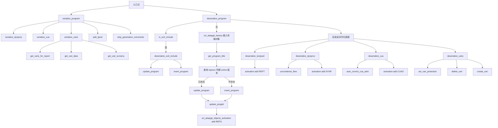
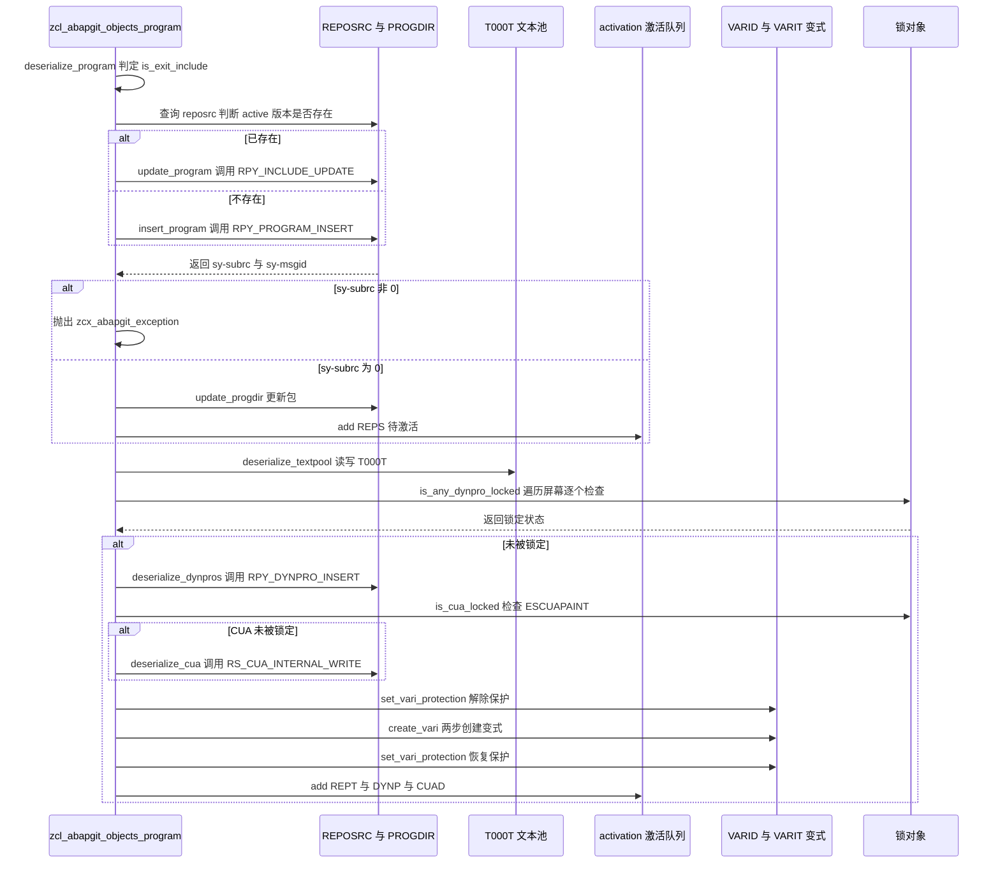
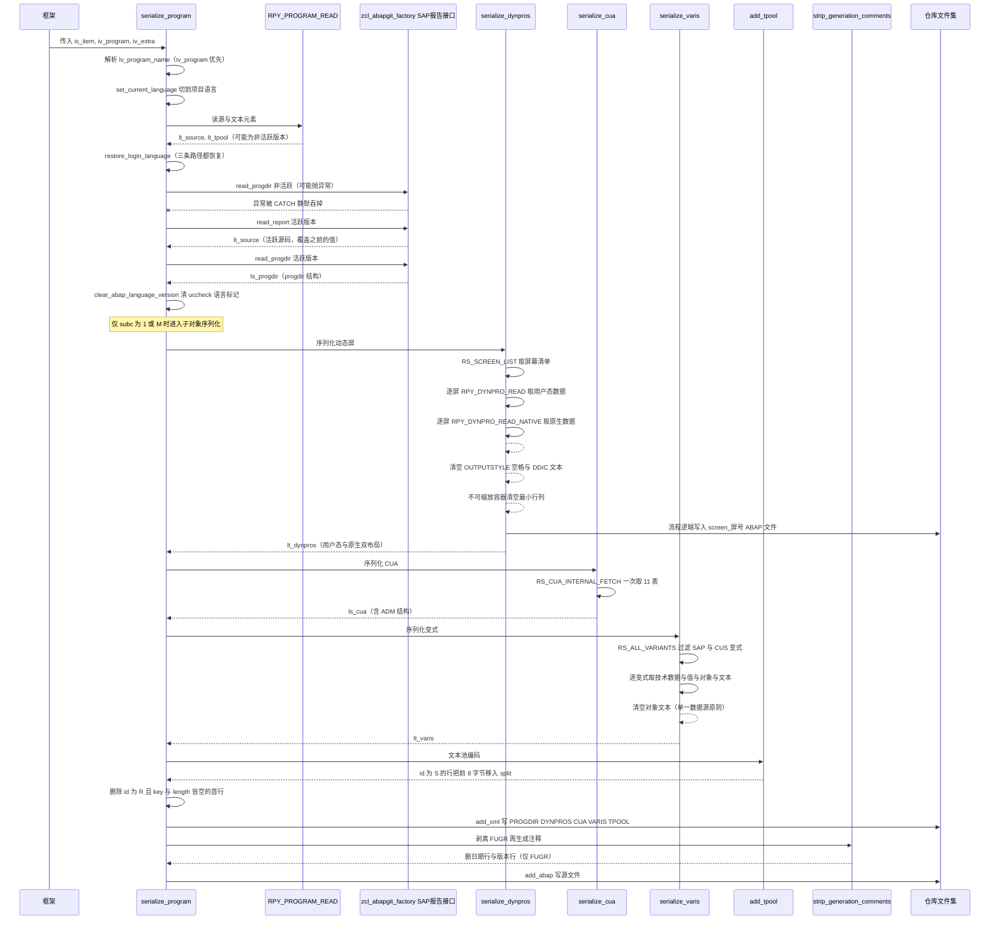
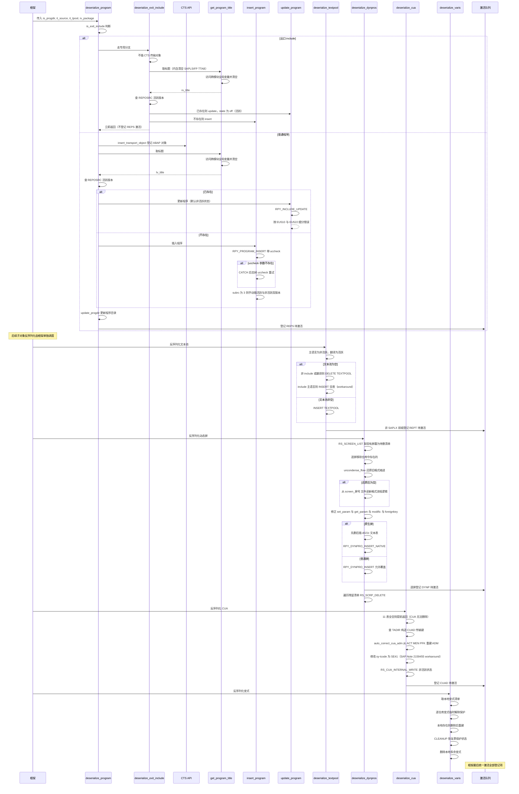

# zcl_abapgit_objects_program 分析报告

> 分析对象：`abapGit/abapGit — zcl_abapgit_objects_program.clas.abap`（1597 行，28 个方法，1 个公共类型 `ty_cua`、4 个受保护类型 `ty_spaces_tt` / `ty_dynpro_tt` / `ty_vari_tt` / `ty_vari_text_tt`）
> 报告视角：代码 onboarding 走读，按真实调用链展开

---

## 一、程序定位与业务背景

### 1.1 这个类在 abapGit 里扮演什么角色

先说清楚它**不是**什么：它不是报表、不是工具程序、也不写任何业务表。它是 abapGit 项目里的一个**对象适配类**，实现 `zif_abapgit_objects` 接口，专门负责 REPS 类型对象——ABAP 报告程序（report program）——在 git 仓库与 SAP 目标系统之间的**双向搬运**。

它在父类 `zcl_abapgit_objects_super` 之上，把"把一个 REPS 对象从 SAP 拿出来变成 git 文件"（序列化）和"把 git 文件变回 SAP 对象"（反序列化）这两条管线完整实现。整个 abapGit 项目里有多个这样的对象适配类（分别对应 CLAS、INTF、FUGR、DOMA 等对象类型），`zcl_abapgit_objects_program` 是其中最复杂的一个。

### 1.2 为什么 REPS 是所有对象里最难的

一个 ABAP 报告程序在 SAP 目标系统里**不是单一存储单元**，它由至少 5 个物理上分离、版本管理规则各不相同的组件构成：

| 组件 | 存储位置 | 版本规则 |
|---|---|---|
| 程序目录元数据 | progdir 结构（对象头信息） | 单份 |
| 源码 | `REPOSRC`（多版本：active / inactive） | 双版本，可能不一致 |
| 文本池（标题、按钮文本） | `T000T` / `T000` 等（多语言，按 `id` 分行） | 多语言 + 多 id |
| 动态屏幕 | `D020S`（屏幕头）/ `D021S`（字段）/ `D021T`（文本）/ `D023S`（容器） | 按屏幕号分行 |
| CUA（状态、功能、菜单、动作、按钮、PF 键、切换、文档、标题、位图、变体） | `RSMP*` 表 | 11 张表构成一组 |
| 变式（variant） | `VARID` / `VARIT` / `VARI*`（含保护锁） | 需先解锁再改 |

这意味着一个"程序"的序列化，必须同时正确处理 6 类存储规则、2 种状态版本、多语言、CUA 的 11 张表、变式的保护锁。**这就是这个类 1597 行、28 个方法的根本原因**——不是代码写得啰嗦，是 REPS 对象本身就这么复杂。

### 1.3 这份代码是"补丁累积"的产物，不是"从头设计"的

读这份代码时有一个重要的判断依据：代码里大量注释直接引用了 abapGit 项目的 issue 编号，例如 `#2746`、`#2747`、`#1807`、`#3680`、`#562`。这些注释标记的都是"曾经出过 bug、后来打补丁"的位置，例如：

- `#2746`（`serialize_dynpros`）：动态屏字段的 `foreignkey` 标记在某些条件下必须强制清空，否则 git diff 会误判为字段变化。
- `#2747`（`deserialize_dynpros`）：字段 `text` 在 `from_dict = true` 且 `modific` 不是 `'F'`/`'X'` 时必须清空，否则反序列化时文本被覆盖。
- `#1807`（`auto_correct_cua_adm`）：历史 bug 导致 CUA 的 `ADM`（`rsmpe_adm`）曾经未保存，现在反序列化时需要从 `ACT`/`MEN`/`PFK` 里重建。
- `#3680`（`deserialize_dynpros`）：`uncondense_flow` 是为兼容旧版仓库格式保留的，作者已标注 `todo: remove after grace period`。

因此这份代码里同时存在三种痕迹：**正常流程**（主路径逻辑）、**补丁**（针对特定 issue 的 if-else）、**版本兼容**（`cx_sy_dyn_call_param_not_found`、`uccheck` 参数的 try/catch 重试）。识别出这三类痕迹，是读懂这个类的前提。

---

## 二、程序执行流程总览

整个类的执行流分三段：**序列化（PULL）**、**反序列化（PUSH）**、**锁检测（前置检查）**。锁检测在序列化前、反序列化前都会调用；序列化和反序列化是互斥的两条主路径。

### 2.1 执行流程图



### 2.2 数据流时序图



### 2.3 责任链表

| 子程序 | 调用者 | 职责 |
|---|---|---|
| `serialize_program` | abapGit 框架（pull 入口） | 序列化总入口：读 PROGDIR、SOURCE、TEXTPOOL，然后按 `subc` 决定是否序列化 DYNPROS、CUA、VARIS，写 XML 与 ABAP 文件 |
| `serialize_dynpros` | `serialize_program` | 序列化动态屏：调 `RS_SCREEN_LIST` 取屏幕清单，逐个调 `RPY_DYNPRO_READ` + `RPY_DYNPRO_READ_NATIVE` |
| `serialize_cua` | `serialize_program` | 序列化 CUA：单次调 `RS_CUA_INTERNAL_FETCH` 取 11 张 RSMP* 表 |
| `serialize_varis` | `serialize_program` | 序列化变式：遍历变式清单，对每个调 `get_vari_data` + `get_vari_screens` |
| `get_varis_for_report` | `serialize_varis` | 取变式清单：调 `RS_ALL_VARIANTS_4_1_REPORT`，过滤 `SAP&*` / `CUS&*` |
| `get_vari_data` | `serialize_varis` | 组装变式数据：调 `RS_VARIANT_VALUES_TECH_DAT_255` + `RS_VARIANT_CONTENTS_255` + `SELECT varit` |
| `get_vari_screens` | `serialize_varis` | 取变式屏幕：调 `RS_GET_SCREENS_4_1_VARIANT` |
| `add_tpool` | `serialize_program` | 文本池编码：`id = 'S'` 的长文本行把前 8 字节移到 `split` 字段 |
| `strip_generation_comments` | `serialize_program` | 剥 FUGR 源里的再生成头（第 3、4 行），避免 git diff 噪音 |
| `deserialize_program` | abapGit 框架（push 入口） | 反序列化总入口：判断 exit include 分支，主路径做 CTS 插入 + 程序 update/insert + progdir + 激活 |
| `deserialize_exit_include` | `deserialize_program` | exit include 专用：按 active 版本决定是否 update 或 insert |
| `update_program` | `deserialize_program` / `deserialize_exit_include` | 更新既有程序：调 `RPY_INCLUDE_UPDATE`，按 `sy-msgid` / `sy-msgno` 区分 EU510、EU522 |
| `insert_program` | `deserialize_program` / `deserialize_exit_include` | 新建程序：调 `RPY_PROGRAM_INSERT`，`uccheck` 参数按版本 try/catch |
| `deserialize_textpool` | abapGit 框架（主路径后续调度） | 反序列化文本池：按语言与 include 标志决定 active/inactive 与是否删除 |
| `deserialize_dynpros` | abapGit 框架（主路径后续调度） | 反序列化动态屏：调 `RS_SCREEN_LIST` + `RPY_DYNPRO_INSERT` / `RPY_DYNPRO_INSERT_NATIVE` + `RS_SCRP_DELETE` |
| `uncondense_flow` | `deserialize_dynpros` | 还原被压缩的缩进空格（兼容旧格式，`#3680`） |
| `deserialize_cua` | abapGit 框架（主路径后续调度） | 反序列化 CUA：调 `RS_CUA_INTERNAL_WRITE`，前置 `auto_correct_cua_adm` |
| `auto_correct_cua_adm` | `deserialize_cua` | 修 CUA `ADM` 空值：从 `ACT`/`MEN`/`PFK` 的 code 重建（`#1807`） |
| `deserialize_varis` | abapGit 框架（主路径后续调度） | 反序列化变式：比对本地/远端清单，临时解保护、删除、创建、恢复保护 |
| `set_vari_protection` | `deserialize_varis` | 变式保护开关：`SELECT FOR UPDATE varid` + `UPDATE varid SET protected` |
| `delete_vari` | `deserialize_varis` | 删变式：调 `RS_VARIANT_DELETE`，`cx_sy_dyn_call_param_not_found` 兼容旧版本 |
| `create_vari` | `deserialize_varis` | 建变式：两步 `RS_CREATE_VARIANT_255` + `RS_CHANGE_CREATED_VARIANT_255` |
| `is_exit_include` | `deserialize_program` | 判断是否 exit include：`CP 'LX*'` 或 `CP 'SAPLX*'` |
| `is_any_dynpro_locked` | abapGit 框架（前置锁检测） | 遍历 `serialize_dynpros` 结果，对每个屏幕检查 `ESCRP` 锁 |
| `is_cua_locked` | abapGit 框架（前置锁检测） | 构造 `CU*` 参数检查 `ESCUAPAINT` 锁 |
| `is_text_locked` | abapGit 框架（前置锁检测） | 构造 `*program` 参数检查 `EABAPTEXTE` 锁 |

下面按这条流程，逐个子程序展开。

---

## 三、分组分析

本类共 28 个方法，按真实执行顺序分为两段主路径（序列化 / 反序列化）加一组锁检查前置调用与一组文本池、注释、变式辅助方法。下面每个子程序给出「做什么 / 为什么 / 风险与改进」三层。为便于对照，代码块引用均严格逐字取自源文件；对 SAP 内部行为（如 FM 的异常是否导出、系统字段在特定位置的值、DDIC 字段长度一致性）不确定的地方，明确标注需核实，不做断言。

### 3.1 数据契约与常量段（类定义区）

先看清这个类的"内存布局"——它把 SAP 分散存储的 5 类对象数据各自聚合成一个结构，再靠 3 组常量约束状态与过滤规则。

```abap
CLASS zcl_abapgit_objects_program DEFINITION
  PUBLIC
  INHERITING FROM zcl_abapgit_objects_super
  CREATE PUBLIC .

  PUBLIC SECTION.

    TYPES:
      BEGIN OF ty_cua,
        adm TYPE rsmpe_adm,
        sta TYPE STANDARD TABLE OF rsmpe_stat WITH DEFAULT KEY,
        fun TYPE STANDARD TABLE OF rsmpe_funt WITH DEFAULT KEY,
        men TYPE STANDARD TABLE OF rsmpe_men WITH DEFAULT KEY,
        mtx TYPE STANDARD TABLE OF rsmpe_mnlt WITH DEFAULT KEY,
        act TYPE STANDARD TABLE OF rsmpe_act WITH DEFAULT KEY,
        but TYPE STANDARD TABLE OF rsmpe_but WITH DEFAULT KEY,
        pfk TYPE STANDARD TABLE OF rsmpe_pfk WITH DEFAULT KEY,
        set TYPE STANDARD TABLE OF rsmpe_staf WITH DEFAULT KEY,
        doc TYPE STANDARD TABLE OF rsmpe_atrt WITH DEFAULT KEY,
        tit TYPE STANDARD TABLE OF rsmpe_titt WITH DEFAULT KEY,
        biv TYPE STANDARD TABLE OF rsmpe_buts WITH DEFAULT KEY,
      END OF ty_cua.
```

**做什么** — 类继承 `zcl_abapgit_objects_super`，实现 REPS 对象的双向搬运。公开类型 `ty_cua` 把 SAP CUA 的 11 张 RSMP\* 表（状态 / 功能 / 菜单 / 菜单文本 / 动作 / 按钮 / PF 键 / 状态切换 / 动作文本 / 标题 / 位图）聚合为一个结构。

**为什么** — SAP 的 CUA 没有单一主表，SE41 的读写分散在 `RS_CUA_INTERNAL_FETCH` / `RS_CUA_INTERNAL_WRITE` 的 11 个 TABLES 参数上。聚合成一个结构后，序列化端一次 `li_xml->add( ig_data = ls_cua )` 就能写出整组数据，反序列化端一个 IMPORTING 参数就能收回，避免在方法签名里平铺 11 个参数。这是"以结构代替参数列表"的典型 OO 封装。

**风险与改进** — `ty_cua` 是 PUBLIC，意味着任何外部代码都能构造它并传入 `deserialize_cua`。但 11 张表全是 STANDARD TABLE 且未指定行键，`deserialize_cua` 直接把它们传给 `RS_CUA_INTERNAL_WRITE`——若调用方传入的行顺序不符合 SAP 内部排序约定，FM 可能写入乱序数据而不报错（`RS_CUA_INTERNAL_WRITE` 是否内部 SORT 需在 SE37 核实）。更稳妥的做法是把 `ty_cua` 降到 PROTECTED，只暴露两个序列化方法。

```abap
    TYPES:
      BEGIN OF ty_dynpro,
        header     TYPE rpy_dyhead,
        containers TYPE dycatt_tab,
        fields     TYPE dyfatc_tab,
        flow_logic TYPE swydyflow,
        spaces     TYPE ty_spaces_tt,
        nat_header TYPE d020s,
        nat_fields TYPE STANDARD TABLE OF d021s WITH DEFAULT KEY,
        nat_texts  TYPE STANDARD TABLE OF d021t WITH DEFAULT KEY,
      END OF ty_dynpro .
    TYPES:
      ty_dynpro_tt TYPE STANDARD TABLE OF ty_dynpro WITH DEFAULT KEY .
```

**做什么** — `ty_dynpro` 把动态屏的"用户态表示"（header + containers + fields + flow_logic）和"原生格式"（d020s / d021s / d021t）放进同一结构，靠 `nat_*` 前缀区分。`spaces` 是为旧版仓库格式保留的缩进记录。

**为什么** — 动态屏有两条读出路径：普通屏走 `RPY_DYNPRO_READ`（返回 header + containers + fields），原生屏（`type CA 'IN'`，主要是带 splitter 的屏）走 `RPY_DYNPRO_READ_NATIVE`（返回 d020s/d021s/d021t）。两条路径数据形状完全不同，但调用方希望统一遍历，于是塞进同一结构，用 `nat_header IS NOT INITIAL` 判断走哪条。

**风险与改进** — 一个结构同时承载两种互斥布局，字段数是两者之和，XML 序列化时会出现大量空字段，仓库体积与 diff 噪音都被放大。更严重的是 `flow_logic` 的兼容逻辑（见 3.3）依赖 `spaces` 与 `flow_logic` 的行数严格对应，旧数据若缺失 `spaces`，`uncondense_flow` 会静默跳过缩进还原。建议拆成 `ty_dynpro_user` / `ty_dynpro_native` 两个类型 + 一个判别式包装结构。

```abap
    TYPES:
      BEGIN OF ty_vari,
        variant     TYPE varid-variant,
        flag1       TYPE varid-flag1,
        flag2       TYPE varid-flag2,
        transport   TYPE varid-transport,
        environmnt  TYPE varid-environmnt,
        protected   TYPE varid-protected,
        secu        TYPE varid-secu,
        xflag1      TYPE varid-xflag1,
        xflag2      TYPE varid-xflag2,
        variscreens TYPE ty_vari_dynnr_tt,
        objects     TYPE STANDARD TABLE OF vanz WITH DEFAULT KEY,
        values      TYPE ty_vari_value_tt,
        texts       TYPE STANDARD TABLE OF ty_vari_text WITH DEFAULT KEY,
      END OF ty_vari.
```

**做什么** — `ty_vari` 把变式的头数据（`varid` 的 9 个字段）与其关联的屏幕、对象（`vanz`）、值（`rsparamsl_255`）、文本（自定义 `ty_vari_text`）聚合成一个结构。

**为什么** — 变式在 SAP 里同样是多表存储（`varid` 头 + `vartis` 屏幕 + `varti`/`varit` 值与文本），而且 `varit` 的文本字段在不同语言下要单独组装。聚合成结构后，`serialize_varis` 遍历一次、`deserialize_varis` 一次 `MOVE-CORRESPONDING <ls_vari> TO ls_varid` 就能拆回头数据，避免在每个方法里重复处理 4 张表。

**风险与改进** — `texts` 用自定义 `ty_vari_text`（`langu` + `vtext`）而不是直接用 `varit`，是因为 `varit` 还带 `report`/`variant`/`mandt` 等键字段，序列化时这些信息是冗余的。但代价是 `deserialize_varis` 必须逐字段手工回填（见 3.16），一旦 `ty_vari_text` 与 `varit` 的字段语义漂移，就会静默丢失数据。建议在结构旁加一条注释说明与 `varit` 的映射关系。

```abap
    CONSTANTS:
      BEGIN OF c_state,
        active   TYPE r3state VALUE 'A',
        inactive TYPE r3state VALUE 'I',
        off      TYPE r3state VALUE '',
      END OF c_state.

    CONSTANTS c_native_dynpro TYPE c LENGTH 2 VALUE 'IN'.

    CONSTANTS c_sysvari_clnt        TYPE mandt      VALUE '000'.
    CONSTANTS c_sysvari_pattern_sap TYPE c LENGTH 5 VALUE 'SAP&*'.
    CONSTANTS c_sysvari_pattern_cus TYPE c LENGTH 5 VALUE 'CUS&*'.
```

**做什么** — 定义 `r3state` 三态常量（active `A` / inactive `I` / off 空串）、原生屏类型前缀 `IN`、系统变式客户端 `000`，以及两个过滤系统变式的搜索模式。

**为什么** — `r3state` 在 REPOSRC 与各处 FM 调用里用单字符表示状态，SAP 各处写法不一（有的硬编码 `A`/`I`，有的用 `SPACE`）。收敛成常量后，`serialize_program`、`insert_program`、`update_program`、`deserialize_textpool` 等 7 处调用点都能读得懂。`c_sysvari_clnt = '000'` 是因为变式存储在技术客户端 000（系统变式），而非当前业务客户端。

**风险与改进** — `c_sysvari_pattern_sap = 'SAP&*'` 里的 `&` 在 ABAP 搜索模式中只匹配**恰好 1 个**字符，因此 4 字符的 `SAPX` 反而不会命中——只有 `SAP` + 至少 2 字符后缀才匹配。若系统中存在 `SAPX` 这类变式，序列化时会被漏过，既不会写入仓库，反序列化时也不会删除本地的它。`SAP&*` 应为 `SAP*`（覆盖 0+ 长度后缀），或显式并存 `SAP*` 与 `SAP&*` 两条模式。`CUS&*` 同理。`c_native_dynpro = 'IN'` 用于 `type CA 'IN'` 判断，但 `rpy_dyhead-type` 的实际取值集合需在 SE11 核实（是否还有 `I`、`N` 等单字符值未被覆盖）。

过渡：数据契约看清楚了，下面从序列化总入口进入主路径。

### 3.2 `serialize_program` —— 序列化总入口

分 4 步：① 语言切换与读取、② 活跃/非活跃版本取源、③ 按程序子类型序列化子对象、④ 文本池与源写入。

#### ① 语言切换与读取

```abap
    IF iv_program IS INITIAL.
      lv_program_name = is_item-obj_name.
    ELSE.
      lv_program_name = iv_program.
    ENDIF.

    zcl_abapgit_language=>set_current_language( mv_language ).

    CALL FUNCTION 'RPY_PROGRAM_READ'
      EXPORTING
        program_name     = lv_program_name
        with_includelist = abap_false
        with_lowercase   = abap_true
      TABLES
        source_extended  = lt_source
        textelements     = lt_tpool
      EXCEPTIONS
        cancelled        = 1
        not_found        = 2
        permission_error = 3
        OTHERS           = 4.

    IF sy-subrc = 2.
      zcl_abapgit_language=>restore_login_language( ).
      RETURN.
    ELSEIF sy-subrc <> 0.
      zcl_abapgit_language=>restore_login_language( ).
      zcx_abapgit_exception=>raise_t100( ).
    ENDIF.

    zcl_abapgit_language=>restore_login_language( ).
```

**做什么** — 先确定程序名（优先用传入的 `iv_program`，否则取仓库项的 `obj_name`），切到目标语言，调 `RPY_PROGRAM_READ` 读源与文本元素，然后**无论成功失败都恢复登录语言**。`subrc = 2`（not found）静默返回，其他非 0 抛异常。

**为什么** — `RPY_PROGRAM_READ` 读出的文本元素依赖当前语言环境，而 abapGit 在 push/pull 过程中需要以目标项目的语言（而非用户登录语言）为准。`set_current_language` / `restore_login_language` 配对出现 3 次，覆盖成功、not found、异常三条路径，保证语言环境不会泄漏到后续逻辑。这是典型的"资源获取-确保释放"模式在 FM 调用上的手写实现。

**风险与改进** — `with_includelist = abap_false` 意味着 include 程序不会被列出，但 `serialize_program` 本身并不排除 include（见 3.9 的 exit include 分支）。若仓库项是一个 FUGR 主程序，其 include 列表不会被序列化，依赖调用方另行处理。**更重要的是**：`restore_login_language` 在 `subrc = 2` 分支里被调用后直接 `RETURN`，但 `lt_source` 和 `lt_tpool` 此时是空表——调用方拿到的"空结果"无法区分"程序不存在"与"程序存在但无源"，仓库里会留下一个空文件。建议 `subrc = 2` 时也抛异常或返回一个显式的空标记。

#### ② 活跃/非活跃版本取源

```abap
    " If inactive version exists, then RPY_PROGRAM_READ does not return the active code
    li_report = zcl_abapgit_factory=>get_sap_report( ).

    TRY.
        " Raises exception if inactive version does not exist
        ls_progdir = li_report->read_progdir(
          iv_name  = lv_program_name
          iv_state = c_state-inactive ).

        " Explicitly request active source code
        lt_source = li_report->read_report(
          iv_name  = lv_program_name
          iv_state = c_state-active ).
      CATCH zcx_abapgit_exception ##NO_HANDLER.
    ENDTRY.

    ls_progdir = li_report->read_progdir(
      iv_name  = lv_program_name
      iv_state = c_state-active ).

    clear_abap_language_version( CHANGING cv_abap_language_version = ls_progdir-uccheck ).
```

**做什么** — 注释说明了问题：`RPY_PROGRAM_READ` 在存在非活跃版本时返回的是非活跃源码，而不是活跃源码。因此这里先尝试读非活跃版本的 progdir（若不存在会抛异常，被 `CATCH ##NO_HANDLER` 静默吞掉），然后**显式**读活跃版本的源与 progdir。最后清理 `uccheck` 里的 ABAP 语言版本标记。

**为什么** — 这是 REPS 对象最微妙的地方：`REPOSRC` 表里同一程序可能同时有 active 和 inactive 两行（`r3state = 'A'` 和 `r3state = 'I'`），而 `RPY_PROGRAM_READ` 的返回行为在"两者都存在"时是不确定的。abapGit 需要的是**活跃版本**（因为仓库里存的是已激活代码），所以用一次"可能失败"的读取探测非活跃版本是否存在，再无条件读活跃版本。`CATCH ##NO_HANDLER` 是刻意的：非活跃版本不存在不是错误，只是普通情况。

**风险与改进** — `CATCH zcx_abapgit_exception ##NO_HANDLER` 的空处理器意味着**任何**异常类型（包括意料之外的 dump）都会被静默吞掉。若 `read_progdir` 内部抛出的不是 `zcx_abapgit_exception` 而是 `cx_root` 的子类，这个 TRY 不会捕获，异常会向上冒泡导致整个 pull 失败。建议改为 `CATCH zcx_abapgit_exception INTO DATA(lx_exc)` 至少记录一下，或在注释里说明为何确信只有这一种异常。另外 `clear_abap_language_version` 修改的是 `ls_progdir-uccheck`（父类方法），这是把"序列化时不想要语言版本信息"这个决定写进了数据本身——若某个环境确实需要保留 `uccheck`，这里就是数据丢失点。

#### ③ 按程序子类型序列化子对象

```abap
    IF ls_progdir-subc = '1' OR ls_progdir-subc = 'M'.
      lt_dynpros = serialize_dynpros( lv_program_name ).
      li_xml->add( iv_name = 'DYNPROS'
                   ig_data = lt_dynpros ).

      ls_cua = serialize_cua( lv_program_name ).
      li_xml->add( iv_name = 'CUA'
                   ig_data = ls_cua ).

      lt_varis = serialize_varis( lv_program_name ).
      li_xml->add( iv_name = 'VARIS'
                   ig_data = lt_varis ).
    ENDIF.
```

**做什么** — 仅当程序子类型是 `1`（报告）或 `M`（模块池）时，才序列化动态屏、CUA 与变式；其他子类型（如 `S` 屏幕程序、`K` 包含、`P` 接口）跳过。

**为什么** — SAP 只在 SE41/SE51 里为报告和模块池提供动态屏与 CUA 编辑能力，其他子类型在 DDIC 层就没有这些表。用 `subc` 判断比"先试后错"高效，也避免对无意义的 FM 调用付出开销。

**风险与改进** — `subc` 的取值集合需要核实：`1` 和 `M` 覆盖了大多数场景，但 `7`（功能组主程序）、`5`（表维护功能组）等子类型是否也有动态屏？表维护功能组（TCode SM30 背后的程序）确实有屏幕，其 `subc` 值需核实。若漏掉了某个子类型，该程序的屏幕与 CUA 会永远无法被版本控制——这是静默的数据丢失。建议在条件旁加注释列出所有支持/不支持的 `subc` 值。

#### ④ XML 输出与源写入

```abap
    IF io_xml IS BOUND.
      li_xml = io_xml.
    ELSE.
      CREATE OBJECT li_xml TYPE zcl_abapgit_xml_output.
    ENDIF.

    li_xml->add( iv_name = 'PROGDIR'
                 ig_data = ls_progdir ).

    READ TABLE lt_tpool WITH KEY id = 'R' INTO ls_tpool.
    IF sy-subrc = 0 AND ls_tpool-key = '' AND ls_tpool-length = 0.
      DELETE lt_tpool INDEX sy-tabix.
    ENDIF.

    li_xml->add( iv_name = 'TPOOL'
                 ig_data = add_tpool( lt_tpool ) ).

    IF NOT io_xml IS BOUND.
      io_files->add_xml( iv_extra = iv_extra
                         ii_xml   = li_xml ).
    ENDIF.

    strip_generation_comments( CHANGING ct_source = lt_source ).

    io_files->add_abap( iv_extra = iv_extra
                        it_abap  = lt_source ).
```

**做什么** — 组装 XML 输出：PROGDIR、DYNPROS、CUA、VARIS、TPOOL 五个节点。文本池里 `id = 'R'`（程序标题）若 key 和 length 都为空，删掉这行（避免序列化一个空标题）。然后调 `add_tpool` 做编码转换、`strip_generation_comments` 剥离再生成注释，最后把 XML 与 ABAP 源分别写入仓库文件。

**为什么** — `io_xml` 是 OPTIONAL 参数：当外部已经有一个 XML 对象（例如嵌套序列化），直接复用；否则自建一个。`if not io_xml is bound` 保护确保自建对象才写入文件，避免重复写入。`strip_generation_comments` 在写入前调用，保证仓库里的源码不含每次再生成都会变的日期与版本号行（否则每次 pull 都会产生 diff 噪音）。

**风险与改进** — `READ TABLE lt_tpool WITH KEY id = 'R'` 用默认键读取，但 `textpool_table` 的键定义需在 SE11 核实（`id` 是否唯一键？同一 `id` 是否可能有多行？）。若同一 `id = 'R'` 有多行，`READ TABLE` 只返回第一行，后续行的空标题不会被清理。`add_tpool` 在 `li_xml->add` 的实参位置直接调用，返回值类型是 `zif_abapgit_lang_definitions=>ty_tpool_tt`，与 `ig_data` 的期望类型匹配——但这个类型转换的正确性依赖父类接口的稳定性。

### 3.3 `serialize_dynpros` —— 动态屏读出

这是最复杂的方法之一，内含两处 issue 补丁（`#2746` 与 `#2747` 的读出侧）。分 4 步：① 读取屏幕清单、② 逐屏读取两路数据、③ 字段标志修正、④ 流程逻辑与原生屏分流。

#### ① 读取屏幕清单

```abap
    CALL FUNCTION 'RS_SCREEN_LIST'
      EXPORTING
        dynnr     = ''
        progname  = iv_program_name
      TABLES
        dynpros   = lt_d020s
      EXCEPTIONS
        not_found = 1
        OTHERS    = 2.
    IF sy-subrc = 2.
      zcx_abapgit_exception=>raise_t100( ).
    ENDIF.

    SORT lt_d020s BY dnum ASCENDING.
```

**做什么** — 调 `RS_SCREEN_LIST` 取该程序所有屏幕的 d020s 清单（`dynnr = ''` 表示全部），按屏幕号升序排序。`subrc = 1`（not found）静默继续（空清单），`subrc = 2`（OTHERS）抛异常。

**为什么** — 排序是为了让序列化结果可复现：同一程序在两台机器上 pull 出来的 XML 行序一致，git diff 才干净。`not_found` 静默处理是因为很多程序确实没有屏幕（纯后台程序），这不是错误。

**风险与改进** — `RS_SCREEN_LIST` 的 `subrc = 1` 与 `2` 语义需在 SE37 核实：`not_found = 1` 可能只是"没有屏幕"，也可能表示"程序不存在"。若后者，`serialize_dynpros` 会静默返回空清单，而 `serialize_program` 已经把 progdir 写进 XML 了——仓库里会出现一个有程序头但无屏幕的"幽灵"条目。建议 `subrc = 1` 时至少记录一条调试信息。

#### ② 逐屏读取两路数据

```abap
    LOOP AT lt_d020s ASSIGNING <ls_d020s>
        WHERE type <> 'S' AND type <> 'W' AND type <> 'J'
        AND NOT dnum IS INITIAL.

      CALL FUNCTION 'RPY_DYNPRO_READ'
        EXPORTING
          progname             = iv_program_name
          dynnr                = <ls_d020s>-dnum
        IMPORTING
          header               = ls_header
        TABLES
          containers           = lt_containers
          fields_to_containers = lt_fields_to_containers
          flow_logic           = lt_flow_logic
        EXCEPTIONS
          cancelled            = 1
          not_found            = 2
          permission_error     = 3
          OTHERS               = 4.
      IF sy-subrc <> 0.
        zcx_abapgit_exception=>raise_t100( ).
      ENDIF.

      "#2746: we need the dynpro fields in internal format:
      FREE lt_fieldlist_int.

      CALL FUNCTION 'RPY_DYNPRO_READ_NATIVE'
        EXPORTING
          progname   = iv_program_name
          dynnr      = <ls_d020s>-dnum
        TABLES
          fieldlist  = lt_fieldlist_int
          fieldtexts = lt_texts.
```

**做什么** — 遍历屏幕清单，跳过系统生成的屏幕类型（`S` 选择屏、`W` 窗口、`J` 其他）与空屏幕号。对每个屏幕调两个 FM：`RPY_DYNPRO_READ` 取用户态数据（header/containers/fields/flow_logic），`RPY_DYNPRO_READ_NATIVE` 取原生格式（d021s 字段表 + d021t 文本表）。后者是 `#2746` 补丁引入的——需要原生格式才能正确计算 `foreignkey` 标志。

**为什么** — `RPY_DYNPRO_READ` 返回的字段表里 `foreignkey` 标志是按"用户视角"设置的，但 XML 序列化需要的是"存储视角"的标志（否则 diff 会误判字段变化）。`#2746` 的发现是：必须同时读原生格式，按 SAP 内部 `MSEUSBIT` include 里的位标志重新计算 `foreignkey`。`FREE lt_fieldlist_int` 在每次循环前清空，避免上一屏的字段残留。

**风险与改进** — `RPY_DYNPRO_READ_NATIVE` **完全没有检查 `sy-subrc`**：若原生读取失败（如权限、屏幕不存在），`lt_fieldlist_int` 保持空表，后续的 `READ TABLE lt_fieldlist_int ... WITH KEY fill = 'X'` 会返回 `sy-subrc <> 0`，代码静默走 ELSE 分支（当作普通屏处理）——**一个本该走原生路径的屏幕被当作普通屏序列化，数据形状完全错误但不会报错**。这是本方法最严重的健壮性缺口。建议补上 `IF sy-subrc <> 0 ... ENDIF`，至少对 `program_not_exists` 类异常做区分处理。

#### ③ 字段标志修正（`#2746`）

```abap
      LOOP AT lt_fields_to_containers ASSIGNING <ls_field>.
* output style is a NUMC field, the XML conversion will fail if it contains invalid value
* field does not exist in all versions
        ASSIGN COMPONENT 'OUTPUTSTYLE' OF STRUCTURE <ls_field> TO <lv_outputstyle>.
        IF sy-subrc = 0 AND <lv_outputstyle> = '  '.
          CLEAR <lv_outputstyle>.
        ENDIF.

        "2746: we apply the same logic as in SAPLWBSCREEN
        "for setting or unsetting the foreignkey field:
        UNASSIGN <ls_field_int>.
        READ TABLE lt_fieldlist_int ASSIGNING <ls_field_int> WITH KEY fnam = <ls_field>-name.
        IF <ls_field_int> IS ASSIGNED.
          IF <ls_field_int>-flg1 O lc_flg1ddf AND
              <ls_field_int>-flg3 O lc_flg3for AND
              <ls_field_int>-flg3 Z lc_flg3fdu AND
              <ls_field_int>-flg3 Z lc_flg3fku.
            <ls_field>-foreignkey = 'X'.
          ELSE.
            CLEAR <ls_field>-foreignkey.
          ENDIF.
        ENDIF.

        IF <ls_field>-from_dict = abap_true AND
           <ls_field>-modific   <> 'F' AND
           <ls_field>-modific   <> 'X'.
          CLEAR <ls_field>-text.
        ENDIF.
      ENDLOOP.

    ... 下面补本方法开头声明的位标志常量，上面 LOOP 里的 flg1/flg3 判断用到它们 ...

    "#2746: relevant flag values (taken from include MSEUSBIT)
    CONSTANTS: lc_flg1ddf TYPE x VALUE '20',
               lc_flg3fku TYPE x VALUE '08',
               lc_flg3for TYPE x VALUE '04',
               lc_flg3fdu TYPE x VALUE '02'.
```

**做什么** — 三段修正：① `OUTPUTSTYLE` 是 NUMC 字段，值为空格 `'  '` 时 XML 转换会失败（NUMC 不接受前导空格），所以清空；该字段在旧版本不存在，用 `ASSIGN COMPONENT` 动态访问。② 按 SAPLWBSCREEN 的逻辑重算 `foreignkey`：当原生字段的 `flg1` 含 DDF 位、`flg3` 含 FOR 位、且不含 FDU/FKU 位时设 `'X'`，否则清空。③ `from_dict = true` 且 `modific` 不是 `'F'`/`'X'` 时清空 `text`——因为这类字段的文本来自 DDIC，不应由屏幕自身携带。

**为什么** — 这三段全是 `#2746` 的产物。问题的根源是：`RPY_DYNPRO_READ` 返回的字段表是为屏幕设计器显示用的，包含了大量"派生标志"，这些标志在 XML 往返后会被重新计算，导致 git diff 出现大量假变化。abapGit 的做法是"读出时就规范化"：把不稳定标志清掉或按存储层逻辑重算，只保留稳定数据。

**风险与改进** — 位标志 `flg1`/`flg3` 的语义完全依赖 SAP 内部 include `MSEUSBIT`，这是未文档化的实现细节。**SAP 升级后这些位的定义可能变化**，届时 `foreignkey` 的计算会静默出错（设错或清错），且无任何报错。注释说"taken from include MSEUSBIT"，但没有任何版本锁定或升级验证机制。建议至少加一条注释记录取值的 SAP 版本，并在 CI 里对动态屏序列化做往返测试。另外 `ASSIGN COMPONENT 'OUTPUTSTYLE'` 的字符串字段名是硬编码的，若 SAP 改了字段名（如重命名为 `OUTPUT_STYLE`），`sy-subrc` 非 0 会被静默忽略——整段逻辑不报错但也不工作。

#### ④ 容器修正、流程逻辑与原生屏分流

```abap
      LOOP AT lt_containers ASSIGNING <ls_container>.
        IF <ls_container>-c_resize_v = abap_false.
          CLEAR <ls_container>-c_line_min.
        ENDIF.
        IF <ls_container>-c_resize_h = abap_false.
          CLEAR <ls_container>-c_coln_min.
        ENDIF.
      ENDLOOP.

      APPEND INITIAL LINE TO rt_dynpro ASSIGNING <ls_dynpro>.
      <ls_dynpro>-header = ls_header.

      " Store flow logic as separate ABAP files instead of XML
      mo_files->add_abap(
        iv_extra = 'screen_' && ls_header-screen
        it_abap  = lt_flow_logic ).
```

**做什么** — 容器不可缩放时清空最小行列数（避免序列化一个无意义的固定值）；把 header 装入结果表；**流程逻辑不作为 XML 存，而是作为独立的 ABAP 文件写入仓库**，文件名是 `screen_<屏幕号>`。

**为什么** — 流程逻辑本质上是 ABAP 代码（`AT FIRST SCREEN ... IF ... ` 等关键字），用 XML 存储会丢失缩进与换行语义，diff 极难阅读。作为独立 `.abap` 文件存储，编辑器、语法检查、diff 工具都能正常工作。容器最小值的清空是另一处"防假 diff"：不可缩放容器没有最小值约束，序列化一个固定数字只会让 diff 变脏。

**风险与改进** — `mo_files` 是实例属性（从父类继承），而不是参数 `io_files`。这意味着如果 `serialize_program` 被传入一个自定义的 `io_files`，流程逻辑文件会写到 `mo_files` 指向的另一个文件集合里，**两个文件集合内容不一致**。查看 `serialize_program` 的实现，它只在 `io_xml` 未绑定时才调 `io_files->add_xml`，但流程逻辑始终走 `mo_files`——这个不一致在非标准调用场景下会导致流程逻辑丢失。需核实父类中 `mo_files` 与 `io_files` 的关系（是否总是同一个实例）。

```abap
      READ TABLE lt_fieldlist_int TRANSPORTING NO FIELDS WITH KEY fill = 'X'.
      IF ls_header-type CA c_native_dynpro AND sy-subrc = 0.
        " In particular for dynpros with splitter
        <ls_dynpro>-nat_header = <ls_d020s>.
        CLEAR: <ls_dynpro>-nat_header-dgen, <ls_dynpro>-nat_header-tgen.
        <ls_dynpro>-nat_fields = lt_fieldlist_int.
        <ls_dynpro>-nat_texts  = lt_texts.
      ELSE.
        <ls_dynpro>-containers = lt_containers.
        <ls_dynpro>-fields     = lt_fields_to_containers.
      ENDIF.
```

**做什么** — 用 `READ TABLE ... TRANSPORTING NO FIELDS WITH KEY fill = 'X'` 探测原生字段表中是否有带 `fill` 标记的字段（splitter 屏的特征），结合 `header-type CA 'IN'` 判断是否走原生路径。走原生路径时存 d020s 头（清掉生成日期时间，防假 diff）、d021s 字段表、d021t 文本表；否则存用户态的 containers 与 fields。

**为什么** — `dgen`/`tgen`（生成日期/时间）每次重新生成屏幕都会变，必须清掉。`fill = 'X'` 是 splitter 屏在 d021s 里的标记，用 `TRANSPORTING NO FIELDS` 只探测存在性、不搬运数据，避免多余内存。双条件判断（type + fill）确保只有真正的 splitter 屏走原生路径，普通原生屏走用户态路径。

**风险与改进** — `READ TABLE lt_fieldlist_int` 在 `lt_fieldlist_int` 为空表时（`RPY_DYNPRO_READ_NATIVE` 失败的情况）返回 `sy-subrc <> 0`，条件为假，走 ELSE 分支——即上文提到的"原生屏被当普通屏处理"的静默错误。另外 `WITH KEY fill = 'X'` 的精确匹配意味着若 SAP 某版本用其他值标记 splitter（如 `'1'`），判断会失效。`ls_header-type CA c_native_dynpro` 中的 `CA` 是"包含"语义，若 `type` 字段长度大于 2 且 `'IN'` 出现在非前缀位置，也会误判——`type` 的实际长度与取值集合需核实。

### 3.4 `serialize_cua` —— CUA 读出

```abap
    CALL FUNCTION 'RS_CUA_INTERNAL_FETCH'
      EXPORTING
        program         = iv_program_name
        language        = mv_language
        state           = c_state-active
      IMPORTING
        adm             = rs_cua-adm
      TABLES
        sta             = rs_cua-sta
        fun             = rs_cua-fun
        men             = rs_cua-men
        mtx             = rs_cua-mtx
        act             = rs_cua-act
        but             = rs_cua-but
        pfk             = rs_cua-pfk
        set             = rs_cua-set
        doc             = rs_cua-doc
        tit             = rs_cua-tit
        biv             = rs_cua-biv
      EXCEPTIONS
        not_found       = 1
        unknown_version = 2
        OTHERS          = 3.
    IF sy-subrc > 1.
      zcx_abapgit_exception=>raise_t100( ).
    ENDIF.
```

**做什么** — 单次 FM 调用取出 CUA 的全部 11 张表与 ADM 结构，`language = mv_language`、`state = active`。`subrc > 1`（即 `unknown_version = 2` 或 `OTHERS = 3`）抛异常，`not_found = 1` 静默继续。

**为什么** — CUA 没有逐表读取的 API，只有这一个批量 FM。`not_found` 静默处理是因为大量程序没有 CUA（用户没在 SE41 里配置过），空结构写入 XML 后 `deserialize_cua` 会因全空提前返回，形成幂等。`state = active` 与 `serialize_program` 的取源逻辑一致：只序列化已激活的 CUA。

**风险与改进** — `RS_CUA_INTERNAL_FETCH` 的 `unknown_version = 2` 被当作错误抛出，但"未知版本"在很多场景下意味着"该程序的 CUA 使用了当前系统不支持的版本"——这更可能是**数据不兼容**而非操作失败，抛异常会让整个 pull 中止。建议对 `subrc = 2` 做单独处理（至少记录一条警告），而不是与 `OTHERS` 同等对待。另外 `rs_cua` 是 RETURNING 参数，FM 是否会在失败时清空它需在 SE37 核实——若 FM 抛异常时 `rs_cua` 仍保留部分数据，`serialize_program` 已经把 progdir 写进 XML，仓库里会出现一个 CUA 不完整的条目。

### 3.5 变式读出链 `serialize_varis` / `get_varis_for_report` / `get_vari_data` / `get_vari_screens`

变式是四个方法组成的读出链：`serialize_varis` 编排，`get_varis_for_report` 取清单，`get_vari_data` 取单条数据，`get_vari_screens` 取屏幕关联。

```abap
    lt_varis = get_varis_for_report( iv_program_name ).

    LOOP AT lt_varis ASSIGNING <ls_varikey>.
      CLEAR: ls_vari,
             ls_varid.

      get_vari_data( EXPORTING is_vari    = <ls_varikey>
                     IMPORTING es_varid   = ls_varid
                               et_values  = ls_vari-values
                               et_objects = ls_vari-objects
                               et_texts   = ls_vari-texts ).

      MOVE-CORRESPONDING ls_varid TO ls_vari.

      " Clear texts - they will be provided in TEXTPOOL section
      LOOP AT ls_vari-objects ASSIGNING <ls_object>.
        CLEAR <ls_object>-text.
      ENDLOOP.

      ls_vari-variscreens = get_vari_screens( <ls_varikey> ).

      INSERT ls_vari INTO TABLE rt_varis.
    ENDLOOP.
```

**做什么** — 取变式清单，逐条调 `get_vari_data` 获取值/对象/文本，`MOVE-CORRESPONDING` 把 `varid` 头数据映射到 `ty_vari`，然后**清空 objects 里的 text 字段**（注释说明：文本由 TEXTPOOL 部分提供），最后补上屏幕关联。

**为什么** — `MOVE-CORRESPONDING ls_varid TO ls_vari` 只映射同名字段，所以 `variscreens`/`values`/`objects`/`texts` 需要单独赋值。清空 `objects-text` 是为了避免变式文本与程序文本池的文本重复存储——这是 abapGit 的"单一数据源"原则：同一份文本只在一个地方存。

**风险与改进** — `get_vari_screens` 放在循环内，意味着每个变式都要单独调一次 FM（`RS_GET_SCREENS_4_1_VARIANT`）。若程序有 N 个变式，就是 N 次 FM 调用 + N 次数据库往返。可以改为一次调 `RS_GET_SCREENS_4_1_VARIANT`（若支持批量）或在循环外用 `get_varis_for_report` 已返回的数据推导。另外 `CLEAR <ls_object>-text` 后，`deserialize_varis` 必须从 `texts` 表回填——若 `texts` 表为空（语言不匹配），变式对象的文本会永久丢失。

```abap
    CALL FUNCTION 'RS_ALL_VARIANTS_4_1_REPORT'
      EXPORTING
        program = iv_repid
      IMPORTING
        cat     = ls_catalog
      EXCEPTIONS
        OTHERS  = 1.
    IF sy-subrc <> 0.
      zcx_abapgit_exception=>raise_t100( ).
    ENDIF.

    ls_vari-report = iv_repid.
    LOOP AT ls_catalog-cat ASSIGNING <ls_cat>
         WHERE variant CP c_sysvari_pattern_sap
         OR variant CP c_sysvari_pattern_cus.
      ls_vari-variant = <ls_cat>-variant.
      INSERT ls_vari INTO TABLE rt_varis.
    ENDLOOP.

    SORT rt_varis.
```

**做什么** — 调 `RS_ALL_VARIANTS_4_1_REPORT` 取该程序的所有变式，按 `SAP&*` / `CUS&*` 模式过滤系统变式，排序后返回变式键清单。

**为什么** — 用户自定义变式（如 `Z*`、`001` 等）不在 abapGit 的管理范围内——它们属于业务用户的私有配置，不应被版本控制。只序列化系统变式（`SAP*`、`CUS*`）是 abapGit 的刻意边界划分。排序保证输出可复现。

**风险与改进** — 如 3.1 所述，`SAP&*` 的 `&` 只匹配恰好 1 个字符，`SAPX` 不会命中。`loop ... where variant cp` 是行级过滤，在变式数量大时效率可以接受，但 `RS_ALL_VARIANTS_4_1_REPORT` 返回的是整个 catalog 结构（含所有语言的描述文本），内存开销与变式数成正比。若某程序有数百个用户变式，`ls_catalog` 会很大。建议在 FM 调用时若能按模式过滤则用参数过滤（需核实 FM 是否支持）。

```abap
    CLEAR: es_varid,
           et_values,
           et_objects,
           et_texts.

    CALL FUNCTION 'RS_VARIANT_VALUES_TECH_DAT_255'
      EXPORTING
        report         = is_vari-report
        variant        = is_vari-variant
        sorted         = abap_true
      IMPORTING
        techn_data     = es_varid
      TABLES
        variant_values = et_values " is ignored
      EXCEPTIONS
        OTHERS         = 1.
    IF sy-subrc <> 0.
      zcx_abapgit_exception=>raise_t100( ).
    ENDIF.

    " Use variant values from CONTENTS call
    " both calls have this parameter as non-optional
    CLEAR et_values.
```

**做什么** — 调 `RS_VARIANT_VALUES_TECH_DAT_255` 取变式的技术数据（`varid` 结构），但该 FM 的 `variant_values` 表参数是必传的（注释说明：两个 FM 的这个参数都不是 optional），所以先把值传进去再清空，真正的值由后面的 `RS_VARIANT_CONTENTS_255` 提供。

**为什么** — 这是 SAP FM 接口设计的典型妥协：`RS_VARIANT_VALUES_TECH_DAT_255` 把技术数据和值数据捆绑在一起返回，但 abapGit 只要技术数据。`CLEAR et_values` 紧跟其后，注释明确说明"值由 CONTENTS 调用提供"。这种"先填再清"的写法虽然难看，但比伪造一个空表传参更安全（避免 FM 内部对空表做异常处理）。

**风险与改进** — `et_values` 先被 FM 填充再被清空，中间的 FM 调用可能因表已含数据而行为不同（需在 SE37 核实 `RS_VARIANT_VALUES_TECH_DAT_255` 是否追加而非覆盖）。若 FM 是追加模式，`CLEAR` 之后就没事了；若是覆盖模式，`CLEAR` 是多余的但不算错。真正的风险在于**这个 FM 的价值仅在于取 `techn_data`，值数据的往返是纯浪费**——一次数据库读 + 一次清空。若 SAP 未来提供了只取技术数据的 FM，应迁移。

```abap
    SELECT langu vtext FROM varit CLIENT SPECIFIED
      INTO CORRESPONDING FIELDS OF TABLE et_texts
      WHERE mandt = c_sysvari_clnt
        AND report = is_vari-report
        AND variant = is_vari-variant
        AND langu IN lt_language_filter
      ORDER BY langu.
```

**做什么** — 从 `varit` 表（变式文本）取各语言的描述文本，限定技术客户端 `000`、按语言过滤排序。`lt_language_filter` 由 `mo_i18n_params->build_language_filter( )` 构建，并额外插入一条排除当前语言的记录。

**为什么** — 变式文本在多语言环境下需要按需取。`build_language_filter` 提供项目的目标语言集合，额外插入的排除记录（`sign = 'I'`、`option = 'EQ'`、`low = mv_language`）把当前工作语言从结果中排除——这是为了在 pull 时只取"翻译语言"的文本，当前语言在 push 时由 `deserialize_textpool` 单独处理。

**风险与改进** — `langu IN lt_language_filter` 用搜索条件表过滤，若 `lt_language_filter` 为空表（`build_language_filter` 返回空），`IN` 空表在 ABAP 里等价于"无过滤"——**所有语言的文本都会被取回**，与预期的"只取翻译语言"完全相反。需核实 `build_language_filter` 在目标语言未配置时是否返回空表。另外 `varit` 的主键是 `(mandt, report, variant, langu)`，此处用 4 个等值条件命中主键，效率最优——这点是好的。

```abap
    CALL FUNCTION 'RS_VARIANT_CONTENTS_255'
      EXPORTING
        report         = is_vari-report
        variant        = is_vari-variant
        execute_direct = abap_true
      TABLES
        valutab        = et_values
        objects        = et_objects
      EXCEPTIONS
        OTHERS         = 1.
    IF sy-subrc <> 0.
      zcx_abapgit_exception=>raise_t100( ).
    ENDIF.

    " reproducible order
    SORT et_values.
    SORT et_objects.
    SORT et_texts.
```

**做什么** — 调 `RS_VARIANT_CONTENTS_255` 取变式的值（`valutab`）与对象（`objects`），然后对三个结果表排序以保证输出可复现。

**为什么** — `execute_direct = abap_true` 表示直接执行、不弹出对话框。排序是 abapGit 的可复现性要求：同一变式在两台机器上 pull 出来的行序必须一致，否则 git diff 会出现"内容相同但顺序不同"的假变化。

**风险与改进** — `RS_VARIANT_CONTENTS_255` 的 `objects` 表类型是 `vanz`，其中包含 `text` 字段（变式对象的描述文本），而 `serialize_varis` 随后会清空它。这意味着这里取回的 `text` 数据被**立即丢弃**——一次数据库读取的浪费。更严重的是，`RS_VARIANT_CONTENTS_255` 返回的对象顺序可能依赖数据库索引，排序后的一致性取决于 `SORT` 的键定义：若 `vanz` 的行键不足以唯一标识一行，排序后仍可能出现不确定的顺序。需核实 `vanz` 的键定义。

```abap
    CALL FUNCTION 'RS_GET_SCREENS_4_1_VARIANT'
      EXPORTING
        program     = is_vari-report
        variant     = is_vari-variant
      TABLES
        dynnr       = lt_dynnr
        variscreens = rt_vari_screens
      EXCEPTIONS
        OTHERS      = 1.
    IF sy-subrc <> 0.
      zcx_abapgit_exception=>raise_t100( ).
    ENDIF.

    SORT rt_vari_screens.
```

**做什么** — 调 `RS_GET_SCREENS_4_1_VARIANT` 取变式关联的屏幕号清单，排序后返回。

**为什么** — 变式的"值"按屏幕号分组，序列化时需要把屏幕号单独存（`variscreens`），以便反序列化时按正确的屏幕号重建值。排序同样是可复现性要求。

**风险与改进** — `lt_dynnr` 是本地临时表，接收 FM 的 `dynnr` 表参数但**从未使用**（标注 `##NEEDED` 抑制了"未使用"警告）。这是 FM 接口必传参数导致的浪费——`RS_GET_SCREENS_4_1_VARIANT` 同时返回 `dynnr` 和 `variscreens`，abapGit 只要后者。`##NEEDED` 是 abapGit 常用的"我知道我没用，但 FM 逼我必须接收"的标记，这种标记在代码库中大量出现，是 SAP FM 生态的技术债。

### 3.6 文本池编解码 `add_tpool` / `read_tpool`

两个成对的 CLASS-METHODS，一个编码一个解码，处理文本池中 `id = 'S'`（短文本）行的特殊结构。

```abap
    LOOP AT it_tpool ASSIGNING <ls_tpool_in>.
      APPEND INITIAL LINE TO rt_tpool ASSIGNING <ls_tpool_out>.
      MOVE-CORRESPONDING <ls_tpool_in> TO <ls_tpool_out>.
      IF <ls_tpool_out>-id = 'S'.
        <ls_tpool_out>-split = <ls_tpool_out>-entry.
        <ls_tpool_out>-entry = <ls_tpool_out>-entry+8.
      ENDIF.
    ENDLOOP.
```

**做什么** — 逐行复制文本池数据，对 `id = 'S'`（短文本）的行：把 `entry` 整行存入 `split` 字段，然后把 `entry` 截掉前 8 个字符。

**为什么** — SAP 文本池中 `id = 'S'` 的短文本，其 `entry` 字段前 8 个字符是控制信息（长度、偏移等），真正的文本内容从第 9 个字符开始。XML 序列化如果直接存 `entry`，前 8 个控制字符会变成不可见的二进制数据，diff 无法阅读；而 `split` 字段在 DDIC 里是独立的、不会被 SAP 解释。做法是"原文存 `split`，去控制头的文本存 `entry`"，两边都保留信息。

**风险与改进** — `entry+8` 的偏移量 8 是硬编码的魔法数字，依赖 `T000`/`T000T` 表的内部布局。若 SAP 未来改变了短文本的控制头长度（如从 8 字节变为 16 字节），这里会**静默截取错误的偏移**，序列化出的文本被截断或错位，且无任何报错。建议在常量区定义 `CONSTANTS c_tpool_split_offset TYPE i VALUE 8` 并在注释里说明依据。另外 `MOVE-CORRESPONDING` 映射同名字段，若 `textpool_table` 与目标类型的字段集不完全一致，多余字段会静默丢失。

```abap
    LOOP AT it_tpool ASSIGNING <ls_tpool_in>.
      APPEND INITIAL LINE TO rt_tpool ASSIGNING <ls_tpool_out>.
      MOVE-CORRESPONDING <ls_tpool_in> TO <ls_tpool_out>.
      IF <ls_tpool_out>-id = 'S'.
        CONCATENATE <ls_tpool_in>-split <ls_tpool_in>-entry
          INTO <ls_tpool_out>-entry
          RESPECTING BLANKS.
      ENDIF.
    ENDLOOP.
```

**做什么** — 解码（反向）：对 `id = 'S'` 的行，把 `split`（原文前 8 字符）与 `entry`（去控制头的文本）拼回完整的 `entry`。

**为什么** — 与 `add_tpool` 严格对称。`RESPECTING BLANKS` 确保空格不被修剪——短文本中的前导空格是有意义的。

**风险与改进** — 解码用的是 `<ls_tpool_in>-split`（输入表的 split），而 `add_tpool` 存的是输出表的 split——两个方向的字段来源不同。虽然在当前调用链里（pull 时 `add_tpool` → XML → push 时 `read_tpool`）`split` 是从 XML 还原的、值相同，但这种"不对称引用"增加了维护风险：若有人修改了 `add_tpool` 的逻辑而忘了同步 `read_tpool`，往返测试才会暴露问题。建议两个方法共享一个常量或一个私有辅助方法。

### 3.7 `strip_generation_comments` —— 源注释剥离

```abap
    IF ms_item-obj_type <> 'FUGR'.
      RETURN.
    ENDIF.

    " Case 1: MV FM main prog and TOPs
    READ TABLE ct_source INDEX 1 ASSIGNING <lv_line>.
    IF sy-subrc = 0 AND <lv_line> CP '#**regenerated at *'.
      DELETE ct_source INDEX 1.
      RETURN.
    ENDIF.

    " Case 2: MV FM includes
    IF lines( ct_source ) < 5. " Generation header length
      RETURN.
    ENDIF.

    READ TABLE ct_source INDEX 1 ASSIGNING <lv_line>.
    ASSERT sy-subrc = 0.
    IF NOT <lv_line> CP '#*---*'.
      RETURN.
    ENDIF.
```

**做什么** — 仅对函数组（FUGR）生效。Case 1：主程序与 TOPS include 的第一行是 `#**regenerated at *`，直接删除。Case 2：MV FM include 的再生成头是 5 行（`#*---*` / `#**` / `#**generation date:*` / `#**generator version:*` / `#*---*`），逐行验证后删除第 3、4 行（日期与版本号）。

**为什么** — 再生成注释包含日期与版本号，每次重新生成 FM 都会变。若不剥离，每次 pull 都会产生 diff 噪音（日期变了但代码没变）。剥离后 git 才能真实反映代码变化。只处理 FUGR 是因为只有函数组才有自动再生成机制。

**风险与改进** — Case 2 用 `ASSERT sy-subrc = 0` 验证读取成功，但 `ASSERT` 在 abapGit 的异常策略里会直接中止执行——若 `ct_source` 在第 1 行读取失败（理论上不会，因为前面已检查 `lines < 5`），程序会 dump 而不是优雅降级。更严重的是：Case 2 的 5 行模式匹配是**脆弱的字符串匹配**（`#*---*`、`#**`、`#**generation date:*` 等），若 SAP 未来改变了再生成注释的格式（如加了空格、改了措辞），整段逻辑会静默失效——不报错，但也不剥离，diff 噪音回来了。建议在 `strip_generation_comments` 里加一个"未匹配到任何模式"的计数，在 pull 结束时汇报"有 N 个函数的再生成注释未被剥离"。

```abap
    DELETE ct_source INDEX 4.
    DELETE ct_source INDEX 3.
```

**做什么** — 删除第 4 行（generator version）和第 3 行（generation date），保留第 1、2、5 行（`#*---*` / `#**` / `#*---*` 的框架）。

**为什么** — 只删会变的两行，保留框架标记。这样 git 里能看到"这个 include 是自动生成的"这一信息，但不产生日期噪音。

**风险与改进** — `DELETE ... INDEX 4` 然后 `DELETE ... INDEX 3` 的顺序是刻意的（先删高索引再删低索引，避免索引偏移）。这个细节容易在重构时被破坏——若有人把两行调换顺序，第二次 DELETE 会删错行。建议改为一条 `DELETE ct_source INDEX ( 3 ) TO ( 4 ).` 或加注释说明顺序依赖。

### 3.8 锁检查三件套 `is_any_dynpro_locked` / `is_cua_locked` / `is_text_locked`

三个方法都是"前置检查"，在反序列化前由框架调用，判断目标对象是否被其他用户锁定。

```abap
    lt_dynpros = serialize_dynpros( iv_program ).

    LOOP AT lt_dynpros ASSIGNING <ls_dynpro>.

      lv_object = |{ <ls_dynpro>-header-screen }{ <ls_dynpro>-header-program }|.

      IF exists_a_lock_entry_for( iv_lock_object = 'ESCRP'
                                  iv_argument    = lv_object ) = abap_true.
        rv_is_any_dynpro_locked = abap_true.
        EXIT.
      ENDIF.
    ENDLOOP.
```

**做什么** — 调 `serialize_dynpros` 读出所有屏幕，逐个检查锁对象 `ESCRP`（屏幕锁），锁参数是"屏幕号 + 程序名"的拼接。发现任一锁定立即返回。

**为什么** — `ESCRP` 锁的粒度是单个屏幕，所以必须逐个检查。`exists_a_lock_entry_for` 是父类方法（封装了 `SELECT FROM tlock` 之类的查询），这里只负责构造参数。

**风险与改进** — **`serialize_dynpros` 有副作用**：它内部调 `mo_files->add_abap` 把流程逻辑写入文件集合。锁检查方法调用它，等于在"只读检查"的过程中**产生了写入操作**——仓库文件集合里会出现流程逻辑文件，但这些文件不会被 `serialize_program` 再次写入（因为它只调一次）。若 `is_any_dynpro_locked` 在 `serialize_program` 之前被调用，`mo_files` 里会有重复的流程逻辑文件。这取决于调用顺序，需核实框架的调用时序。更深层的问题是：锁检查不应该依赖一个有写入副作用的方法——建议提取一个纯读取的 `read_dynpros` 供两者共用。

```abap
    lv_object = |CU{ iv_program }|.
    OVERLAY lv_object WITH '                                          '.
    lv_object = lv_object && '*'.

    rv_is_cua_locked = exists_a_lock_entry_for( iv_lock_object = 'ESCUAPAINT'
                                                iv_argument    = lv_object ).
```

**做什么** — 构造锁参数：`CU` + 程序名，然后用 `OVERLAY` 用 42 个空格覆盖（截断到固定宽度），最后追加 `*`。锁对象是 `ESCUAPAINT`。

**为什么** — `ESCUAPAINT` 锁的参数格式是固定宽度的（SAP 内部约定），用 `OVERLAY` 截断是为了匹配这个格式。`&& '*'` 追加通配符是因为 CUA 锁可能针对程序的任意 CUA 元素。

**风险与改进** — 这是**全文最可疑的代码**。`OVERLAY lv_object WITH '<42 个空格>'` 的实际效果是：把 `lv_object` 的前 42 个字符**全部替换为空格**（`OVERLAY` 是"用源数据的前 N 个字符覆盖目标数据的前 N 个字符"，N = 源数据长度 = 42）。因此 `CU` + 程序名的有意义前缀被完全抹掉，`lv_object` 变成 42 个空格，然后 `&& '*'` 在固定长度变量上做追加——若 `lv_object` 已是满长度，`*` 会被截断丢弃。最终锁参数可能全是空格（或 41 空格 + `*`），**与 `ESCUAPAINT` 实际记录的锁参数格式不匹配**。这意味着 `is_cua_locked` 可能永远返回 `abap_false`——CUA 锁检测形同虚设。`eqegraarg` 字段的实际长度需在 SE11 核实，`ESCUAPAINT` 的锁参数格式需在 SE41 核实。若确认是 bug，这是 P0 级别的锁检测失效。

```abap
    lv_object = |*{ iv_program }|.

    rv_is_text_locked = exists_a_lock_entry_for( iv_lock_object = 'EABAPTEXTE'
                                                iv_argument    = lv_object ).
```

**做什么** — 锁参数是 `*` + 程序名，锁对象是 `EABAPTEXTE`（文本池锁）。

**为什么** — 文本池锁的粒度是整个程序（不像屏幕锁按屏幕号），所以参数前缀是通配符 `*`。

**风险与改进** — 与 `is_cua_locked` 不同，这里没有 `OVERLAY` 截断，锁参数直接拼接。`EABAPTEXTE` 的实际参数格式需核实——若期望的是固定宽度而非 `*` + 程序名，检测同样会失效。三个锁检查方法的参数构造方式不统一（一个拼接、一个 OVERLAY+追加、一个 `*` 前缀），增加了维护风险。建议在常量区统一定义锁参数格式。

锁检查是反序列化的前置条件，下面从反序列化总入口进入 push 主路径。

### 3.9 `deserialize_program` —— 反序列化总入口

```abap
    IF is_exit_include( is_progdir-name ) = abap_true.
      deserialize_exit_include(
        is_progdir = is_progdir
        it_source  = it_source
        it_tpool   = it_tpool
        iv_package = iv_package ).
      RETURN.
    ENDIF.

    zcl_abapgit_factory=>get_cts_api( )->insert_transport_object(
      iv_object   = 'ABAP'
      iv_obj_name = is_progdir-name
      iv_package  = iv_package
      iv_language = mv_language ).

    lv_title = get_program_title( it_tpool ).

    " Check if program already exists
    SELECT SINGLE progname FROM reposrc INTO lv_progname
      WHERE progname = is_progdir-name
      AND r3state = c_state-active.

    IF sy-subrc = 0.
      update_program(
        is_progdir = is_progdir
        it_source  = it_source
        iv_title   = lv_title ).
    ELSE.
      insert_program(
        is_progdir = is_progdir
        it_source  = it_source
        iv_title   = lv_title
        iv_package = iv_package ).
    ENDIF.

    zcl_abapgit_factory=>get_sap_report( )->update_progdir(
      is_progdir = is_progdir
      iv_package = iv_package ).

    zcl_abapgit_objects_activation=>add(
      iv_type = 'REPS'
      iv_name = is_progdir-name ).
```

**做什么** — 先判断是否出口 include（`is_exit_include`），是则走专用分支并立即返回。主路径：① 向 CTS 插入传输对象（`iv_object = 'ABAP'`）；② 从文本池提取标题；③ 查 REPOSRC 判断是否存在活跃版本，存在则 `update_program`，不存在则 `insert_program`；④ 更新 progdir；⑤ 加入激活队列。

**为什么** — `SELECT SINGLE ... FROM reposrc ... AND r3state = c_state-active` 是"存在性检查"的关键：abapGit 以**活跃版本**为判断基准，因为仓库里存的是已激活代码。若只有非活跃版本存在（如另一个用户正在编辑），这里会走 `insert_program`——但 `RPY_PROGRAM_INSERT` 对已存在的程序会返回 `already_exists`，触发 3.10 的 fallback 逻辑。出口 include 走专用分支是因为 SAP exit 功能组的 include 在 `RS_INSERT_INTO_WORKING_AREA` 里有特殊校验（见 3.12）。

**风险与改进** — 存在性检查与后续 `insert_program`/`update_program` 之间**没有锁保护**：检查时不存在、调用时另一个用户恰好创建了同名程序，`RPY_PROGRAM_INSERT` 返回 `already_exists = 1`，`sy-subrc = 1` 落入 `ELSEIF sy-subrc > 0` 分支抛异常——用户看到的是一个模糊的 T100 错误，而非"程序已被他人创建"的明确提示。建议在 `insert_program` 里对 `subrc = 1` 做特殊处理。另外 CTS 插入传输对象在最前面，若后续 `insert_program` 失败，传输对象已经插入了——**仓库状态与 SAP 状态不一致**（传输请求里有一个不存在的对象）。abapGit 的全局事务回滚（push 失败时 ROLLBACK）能覆盖这个，但需确认框架确实如此处理。

### 3.10 程序落库 `insert_program` / `update_program`

#### `insert_program`

```abap
    TRY.
        CALL FUNCTION 'RPY_PROGRAM_INSERT'
          EXPORTING
            development_class = iv_package
            program_name      = is_progdir-name
            program_type      = is_progdir-subc
            title_string      = iv_title
            save_inactive     = iv_state
            suppress_dialog   = abap_true
            uccheck           = is_progdir-uccheck " does not exist on lower releases
          TABLES
            source_extended   = it_source
          EXCEPTIONS
            already_exists    = 1
            cancelled         = 2
            name_not_allowed  = 3
            permission_error  = 4
            OTHERS            = 5 ##FM_SUBRC_OK.
      CATCH cx_sy_dyn_call_param_not_found.
        CALL FUNCTION 'RPY_PROGRAM_INSERT'
          EXPORTING
            development_class = iv_package
            program_name      = is_progdir-name
            program_type      = is_progdir-subc
            title_string      = iv_title
            save_inactive     = iv_state
            suppress_dialog   = abap_true
          TABLES
            source_extended   = it_source
          EXCEPTIONS
            already_exists    = 1
            cancelled         = 2
            name_not_allowed  = 3
            permission_error  = 4
            OTHERS            = 5 ##FM_SUBRC_OK.
    ENDTRY.
```

**做什么** — 调 `RPY_PROGRAM_INSERT`，`uccheck` 参数标注"低版本不存在"，若该参数不存在会抛 `cx_sy_dyn_call_param_not_found`，捕获后去掉 `uccheck` 重试。这是典型的"向前兼容"写法。

**为什么** — `uccheck`（UC 检查标志）是在较新的 SAP 版本里引入的，低版本系统的 FM 签名里没有这个参数。动态调用 FM 时，传入不存在的参数会抛 `cx_sy_dyn_call_param_not_found`。try/catch 重试是 abapGit 处理跨版本兼容的惯用手法——同类的还有 `delete_vari` 的 `suppress_message`/`suppress_input_dialog`（见 3.16）。

**风险与改进** — `##FM_SUBRC_OK` 抑制了"子返回码未检查"的警告，但检查在 TRY 块外统一做（`IF sy-subrc = 3 ... ELSEIF sy-subrc > 0`）。这种"块内不查、块外统一查"的写法是合理的，但有个微妙问题：**重试调用（catch 分支）没有 `uccheck`，而首次调用有**——若首次调用因 `uccheck` 参数不存在而失败，重试时 FM 可能因缺少 `uccheck` 而行为不同（如默认的 UC 检查开启/关闭）。需核实 `RPY_PROGRAM_INSERT` 在 `uccheck` 缺省时的默认值。

```abap
    IF sy-subrc = 3.

      " For cases that standard function does not handle (like FUGR),
      " we save active and inactive version of source with the given PROGRAM TYPE.
      " Without the active version, the code will not be visible in case of activation errors.
      zcl_abapgit_factory=>get_sap_report( )->insert_report(
        iv_name         = is_progdir-name
        iv_package      = iv_package
        it_source       = it_source
        iv_state        = c_state-active
        iv_version      = is_progdir-uccheck
        iv_program_type = is_progdir-subc ).

      zcl_abapgit_factory=>get_sap_report( )->insert_report(
        iv_name         = is_progdir-name
        iv_package      = iv_package
        it_source       = it_source
        iv_state        = c_state-inactive
        iv_version      = is_progdir-uccheck
        iv_program_type = is_progdir-subc ).

    ELSEIF sy-subrc > 0.
      zcx_abapgit_exception=>raise_t100( ).
    ENDIF.
```

**做什么** — `subrc = 3`（`name_not_allowed`）是 SAP 标准 FM 无法处理的特殊情况（如 FUGR），此时手动插入活跃与非活跃两个版本的源。其他非 0 返回码抛异常。

**为什么** — 注释解释了关键动机："没有活跃版本，代码在激活错误时将不可见"。SAP 的激活流程在某些场景下需要同时有活跃和非活跃版本才能显示代码。手动插入两个版本是绕过标准 FM 限制的无奈之举。

**风险与改进** — 两次 `insert_report` **都没有检查返回值或捕获异常**。若第一次（活跃版本）成功、第二次（非活跃版本）失败，REPOSRC 里只有活跃版本——用户看到的程序能运行但无法编辑（非活跃版本缺失）。若第一次失败，程序根本不存在，但 `insert_program` 静默返回。建议对两次 `insert_report` 都加 try/catch，并在第二次失败时回滚第一次。`sy-subrc = 1`（`already_exists`）落入 `ELSEIF sy-subrc > 0` 抛异常——见 3.9 的分析，这里应给出更明确的提示。

#### `update_program`

```abap
    zcl_abapgit_language=>set_current_language( mv_language ).

    CALL FUNCTION 'RPY_INCLUDE_UPDATE'
      EXPORTING
        include_name     = is_progdir-name
        title_string     = iv_title
        save_inactive    = iv_state
      TABLES
        source_extended  = it_source
      EXCEPTIONS
        not_found        = 1
        cancelled        = 2
        permission_error = 3
        OTHERS           = 4.

    IF sy-subrc <> 0.
      zcl_abapgit_language=>restore_login_language( ).

      IF sy-msgid = 'EU' AND sy-msgno = '510'.
        zcx_abapgit_exception=>raise( 'User is currently editing program' ).
      ELSEIF sy-msgid = 'EU' AND sy-msgno = '522'.
        " for generated table maintenance function groups, the author is set to SAP* instead of the user which
        " generates the function group. This hits some standard checks, pulling new code again sets the author
        " to the current user which avoids the check
        IF is_exit_include( is_progdir-name ) = abap_false.
          zcx_abapgit_exception=>raise( |Delete function group and pull again, { is_progdir-name } (EU522)| ).
        ENDIF.
      ELSE.
        zcx_abapgit_exception=>raise_t100( ).
      ENDIF.
    ENDIF.

    zcl_abapgit_language=>restore_login_language( ).
```

**做什么** — 切语言，调 `RPY_INCLUDE_UPDATE`，失败时按 `sy-msgid`/`sy-msgno` 细分处理：EU510（用户正在编辑）给出明确提示；EU522（表维护功能组的作者检查失败）对非出口 include 提示"删除后重新 pull"；其他情况抛 T100。成功后恢复语言。

**为什么** — `RPY_INCLUDE_UPDATE` 的错误信息通过 `sy-msgid`/`sy-msgno` 传递，而不是通过命名异常。abapGit 按具体消息号给出针对性提示，比笼统的 `raise_t100` 对用户更友好。EU522 的特殊处理是一个真实场景：表维护功能组（SM30 背后）由 SAP\* 生成，作者字段不是当前用户，触发标准校验——注释明确记录了 workaround 是"删除后重新 pull"。

**风险与改进** — EU522 分支里，**出口 include 不抛异常**（`IF is_exit_include = abap_false` 才抛），这意味着出口 include 遇到 EU522 时**静默失败**——`sy-subrc <> 0` 但方法正常返回，调用方认为更新成功了。这是一个真实的静默失败点。另外 `restore_login_language` 在 `sy-subrc <> 0` 分支里被调用后，`raise` 抛出的异常会向上传播——语言已恢复，这是正确的。但若 `raise` 本身抛异常（理论上不会），语言就不会恢复。建议用类似 `TRY...CLEANUP` 的结构确保语言恢复。

### 3.11 `get_program_title` —— 标题提取与 SAP bug 绕行

```abap
    DATA ls_tpool LIKE LINE OF it_tpool.

    FIELD-SYMBOLS <lg_any> TYPE any.

    READ TABLE it_tpool INTO ls_tpool WITH KEY id = 'R'.
    IF sy-subrc = 0.
      " there is a bug in RPY_PROGRAM_UPDATE, the header line of TTAB is not
      " cleared, so the title length might be inherited from a different program.
      ASSIGN ('(SAPLSIFP)TTAB') TO <lg_any>.
      IF sy-subrc = 0.
        CLEAR <lg_any>.
      ENDIF.

      rv_title = ls_tpool-entry.
    ENDIF.
```

**做什么** — 从文本池读 `id = 'R'`（程序标题）的行，取出 `entry` 作为标题。在读之前，先尝试访问 SAP 内部程序 `SAPLSIFP` 的全局变量 `TTAB` 并清空它。

**为什么** — 注释明确说明了原因：`RPY_PROGRAM_UPDATE` 有 bug，`TTAB` 的头行不被清空，导致标题长度可能从另一个程序继承。这是一个真实的 SAP bug（标题长度残留），abapGit 通过在调用 `update_program` 之前手动清空 `TTAB` 来规避。

**风险与改进** — `ASSIGN ('(SAPLSIFP)TTAB') TO <lg_any>` 是**跨模块全局变量访问**，这是 ABAP 里最脆弱的技术之一：① 依赖 SAP 内部程序的实现细节（`SAPLSIFP` 是程序名，`TTAB` 是其全局变量）；② SAP 升级后变量名或程序名可能变化，`sy-subrc <> 0` 会被静默忽略（逻辑仍工作，但 bug 绕行失效）；③ 直接修改另一个模块的全局状态，在并发场景下可能产生竞态。`TYPE any` 的字段符号类型完全动态，无法在编译期检查。建议在注释里记录"在哪个 SAP 版本发现此 bug、哪个版本修复"，以便未来移除。

### 3.12 `deserialize_exit_include` —— 出口 include 特例

```abap
    " Includes in SAP exit function groups must be processed in active state only
    " (check in RS_INSERT_INTO_WORKING_AREA)
    lv_title = get_program_title( it_tpool ).

    SELECT SINGLE progname FROM reposrc INTO lv_progname
      WHERE progname = is_progdir-name
      AND r3state = c_state-active.

    IF sy-subrc = 0.
      update_program(
        is_progdir = is_progdir
        it_source  = it_source
        iv_title   = lv_title
        iv_state   = c_state-off ).
    ELSE.
      insert_program(
        is_progdir = is_progdir
        it_source  = it_source
        iv_title   = lv_title
        iv_package = iv_package ).
    ENDIF.
```

**做什么** — 与主路径（3.9）几乎相同，但有两处关键差异：① 不走 CTS 插入传输对象；② `update_program` 传 `iv_state = c_state-off`（即 `SPACE`），而非默认的非活跃状态。

**为什么** — 注释说明：SAP exit 功能组的 include 必须只在活跃状态下处理（`RS_INSERT_INTO_WORKING_AREA` 里有校验）。`iv_state = c_state-off` 的语义需核实——在 `RPY_INCLUDE_UPDATE` 里，`save_inactive` 传 `SPACE` 通常意味着"保存为活跃版本"（与传 `'I'` 表示"只保存非活跃"相对）。这与主路径的 `c_state-inactive` 形成对比：出口 include 要写入活跃版本，普通程序写入非活跃版本。

**风险与改进** — `iv_state = c_state-off` 的语义**极易误读**：`c_state-off` 的值是 `''`（空串），但在 `RPY_INCLUDE_UPDATE` 的参数 `save_inactive` 里，`SPACE` 和 `'I'` 的含义恰好相反（`SPACE` = 保存活跃，`'I'` = 只保存非活跃）。命名 `c_state-off` 暗示"关闭/无状态"，但实际效果是"保存为活跃"——这是一个命名误导。建议改为更明确的名称如 `c_state-active_for_update`，或在调用处加注释。另外不走 CTS 意味着出口 include 不被纳入传输请求管理——这在非 CTS+ 系统里是合理的（exit include 通常不在传输里），但在 CTS+ 系统里可能导致对象不在传输请求中，部署时遗漏。

### 3.13 `deserialize_textpool` —— 文本池回写

```abap
    IF lv_language = mv_language.
      lv_state = c_state-inactive. "Textpool in main language needs to be activated
    ELSE.
      lv_state = c_state-active. "Translations are always active
    ENDIF.
```

**做什么** — 根据语言判断状态：主语言（`mv_language`）的文本池以非活跃状态写入（需要激活），翻译语言直接以活跃状态写入。

**为什么** — 这是 SAP 文本池的标准行为：主语言的文本池变更需要激活才能生效，而翻译文本直接生效。abapGit 遵循这个约定，把激活责任交给框架（`deserialize_program` 最后加入激活队列）。

**风险与改进** — 判断逻辑是 `lv_language = mv_language`，即"传入语言 == 当前工作语言"就是主语言。但若 `iv_language` 为空（默认），`lv_language = mv_language`，条件成立，走主语言路径——这是正确的。但若调用方传入一个**恰好等于 `mv_language` 但语义上是翻译**的语言（如项目主语言是英文，但某个翻译也是英文），判断会出错。需核实 `deserialize_textpool` 的调用方是否保证 `iv_language` 的语义正确。

```abap
    IF it_tpool IS INITIAL.
      IF iv_is_include = abap_false OR lv_state = c_state-active.
        DELETE TEXTPOOL iv_program "Remove initial description from textpool if
          LANGUAGE lv_language     "original program does not have a textpool
          STATE lv_state.

        lv_delete = abap_true.
      ELSE.
        INSERT TEXTPOOL iv_program "In case of includes: Deletion of textpool in
          FROM it_tpool            "main language cannot be activated because
          LANGUAGE lv_language     "this would activate the deletion of the textpool
          STATE lv_state.          "of the mail program -> insert empty textpool
      ENDIF.
    ELSE.
      INSERT TEXTPOOL iv_program
        FROM it_tpool
        LANGUAGE lv_language
        STATE lv_state.
      IF sy-subrc <> 0.
        zcx_abapgit_exception=>raise( 'error from INSERT TEXTPOOL' ).
      ENDIF.
    ENDIF.
```

**做什么** — 文本池为空时：非 include 或翻译语言则 `DELETE TEXTPOOL`（并标记 `lv_delete`）；include 主语言则 `INSERT TEXTPOOL FROM` 空表（注释说明：include 主语言的删除无法激活，因为会激活父程序的删除）。文本池非空时 `INSERT TEXTPOOL`。

**为什么** — 注释揭示了 SAP 的一个约束：include 程序的主语言文本池删除无法激活（会级联到父程序）。abapGit 的 workaround 是"插入空文本池"——在 DDIC 层面，插入空表和删除表的效果不同：空文本池会让程序显示无文本，但不触发父程序的删除激活。这是一个精巧但脆弱的 workaround。

**风险与改进** — `DELETE TEXTPOOL` 是 STATEMENT（不是 FM），**不返回 `sy-subrc`**——`DELETE` 成功或失败（如锁定、权限不足）都静默通过。`lv_delete` 随后被设为 `abap_true` 并传给激活队列，若删除实际失败了，激活队列里会标记一个"删除操作"但文本池仍存在——**状态不一致**。`INSERT TEXTPOOL ... STATE lv_state` 同样不返回 `sy-subrc`。建议改用 `MODIFY TEXTPOOL` 或 `INSERT ... SET UP TO` 并检查返回，或在调用前做存在性检查。`iv_is_include` 的语义（哪些程序被视为 include）需核实——若判断错误，include 走非 include 路径会导致父程序文本池被误删。

```abap
    "Textpool in main language needs to be activated (not for FUGS/FUGX)
    IF lv_state = c_state-inactive AND iv_program NP 'SAPLX*'.
      zcl_abapgit_objects_activation=>add(
        iv_type   = 'REPT'
        iv_name   = iv_program
        iv_delete = lv_delete ).
    ENDIF.
```

**做什么** — 主语言文本池需要激活，但 FUGR/FUGX（`SAPLX*`）除外——它们的文本池激活由父对象（功能组）统一处理。

**为什么** — `SAPLX*` 是 SAP exit include 的命名模式（与 3.12 的 `is_exit_include` 对应）。功能组的文本池激活由 FUGR 主对象负责，子 include 不需要单独激活。

**风险与改进** — `iv_program NP 'SAPLX*'` 与 `is_exit_include` 的 `CP 'SAPLX*'` 是同一模式的正反使用，但**判断逻辑不完全一致**：`is_exit_include` 还检查 `LX*` 和 `/LX*`，而这里只检查 `SAPLX*`。若一个程序的名称匹配 `LX*`（被 `is_exit_include` 判定为 exit include）但不匹配 `SAPLX*`，这里会走激活路径——但 `deserialize_exit_include` 可能已经处理了文本池。这种不一致可能导致重复激活或遗漏激活。建议 `deserialize_textpool` 直接调用 `is_exit_include` 而不是重复模式匹配。

### 3.14 `deserialize_dynpros` —— 动态屏回写

与 `serialize_dynpros` 对称但更复杂：要处理删除、插入、兼容还原、以及多处字段修正。分 5 步。

#### ① 获取待删除屏幕清单

```abap
    " Delete DYNPROs which are not in the list
    CALL FUNCTION 'RS_SCREEN_LIST'
      EXPORTING
        dynnr     = ''
        progname  = ms_item-obj_name
      TABLES
        dynpros   = lt_d020s_to_delete
      EXCEPTIONS
        not_found = 1
        OTHERS    = 2.
    IF sy-subrc = 2.
      zcx_abapgit_exception=>raise_t100( ).
    ENDIF.

    SORT lt_d020s_to_delete BY dnum ASCENDING.

    LOOP AT it_dynpros INTO ls_dynpro.

      READ TABLE lt_d020s_to_delete WITH KEY dnum = ls_dynpro-header-screen
        TRANSPORTING NO FIELDS
        BINARY SEARCH.
      IF sy-subrc = 0.
        DELETE lt_d020s_to_delete INDEX sy-tabix.
      ENDIF.
```

**做什么** — 取目标系统现有的所有屏幕清单，对仓库传来的每个屏幕，从清单中移除（用 `BINARY SEARCH` 定位），剩余的即为待删除屏幕。

**为什么** — 反序列化是"全量替换"语义：仓库里有的屏幕要更新/创建，仓库里没有的屏幕要删除。先取现有清单再逐条移除，剩余的即为删除集合。`BINARY SEARCH` 前提是已 `SORT`，效率高。

**风险与改进** — `ms_item-obj_name` 是父类属性（当前仓库项），而 `serialize_dynpros` 用的是参数 `iv_program_name`——两者在标准调用下相同，但在嵌套/异常调用下可能不一致。`BINARY SEARCH` 在 `lt_d020s_to_delete` 为空时（目标无屏幕）返回 `sy-subrc <> 0`，不删除——正确。`SORT ... BY dnum` 的 `dnum` 是屏幕号（NUMC 类型），排序语义正确。

#### ② 流程逻辑还原（`uncondense_flow` + 兼容回退）

```abap
      " todo: kept for compatibility, remove after grace period #3680
      ls_dynpro-flow_logic = uncondense_flow(
        it_flow   = ls_dynpro-flow_logic
        it_spaces = ls_dynpro-spaces ).

      IF ls_dynpro-flow_logic IS INITIAL.
        ls_dynpro-flow_logic = mo_files->read_abap( iv_extra = 'screen_' && ls_dynpro-header-screen ).
      ENDIF.

    ... 下面是 uncondense_flow 自身的实现 ...

    LOOP AT it_flow ASSIGNING <ls_flow>.
      APPEND INITIAL LINE TO rt_flow ASSIGNING <ls_output>.
      <ls_output>-line = <ls_flow>-line.

      READ TABLE it_spaces INDEX sy-tabix INTO lv_spaces.
      IF sy-subrc = 0.
        SHIFT <ls_output>-line RIGHT BY lv_spaces PLACES IN CHARACTER MODE.
      ENDIF.
    ENDLOOP.
```

**做什么** — 先调 `uncondense_flow` 按 `spaces` 表还原缩进（`#3680` 兼容逻辑）。若还原后流程逻辑为空（说明是新格式，缩进已内嵌），则从仓库的独立 ABAP 文件读取。

**为什么** — abapGit 早期版本把流程逻辑的缩进"压缩"了（去掉行首空格以减小体积），用 `spaces` 表记录每行的缩进量。`#3680` 引入了"流程逻辑作为独立 ABAP 文件"的新格式。这段代码是两种格式的过渡兼容：先尝试旧格式还原，若为空则读新格式文件。注释里的 `todo: remove after grace period` 说明这是**技术债**，预计移除。

**风险与改进** — `uncondense_flow` 里 `READ TABLE it_spaces INDEX sy-tabix` 用 `sy-tabix` 作为索引——这是 ABAP 的"循环索引即表索引"惯用法，但前提是 `it_flow` 和 `it_spaces` 的行数一致且顺序对应。若 `it_spaces` 比 `it_flow` 短（旧数据缺失部分缩进记录），`READ TABLE` 返回 `sy-subrc <> 0`，该行缩进不还原——**静默丢失缩进**，流程逻辑的代码缩进错误但语法可能仍正确（ABAP 不强制缩进），只有在视觉上发现异常。`SHIFT ... IN CHARACTER MODE` 是正确的（字符模式保留空格），但若 `lv_spaces` 为 0，`SHIFT RIGHT BY 0` 是空操作——无害。`mo_files->read_abap` 读取失败时返回空，`ls_dynpro-flow_logic` 为空——后续 `RPY_DYNPRO_INSERT` 的 `flow_logic` 参数为空表，屏幕创建成功但无流程逻辑。建议对 `read_abap` 的返回值做检查。

#### ③ 字段修正（三处）

```abap
        IF <ls_field>-param_id IS NOT INITIAL
            AND <ls_field>-from_dict = abap_true.
          IF <ls_field>-set_param IS INITIAL.
            <ls_field>-set_param = lc_rpyty_force_off.
          ENDIF.
          IF <ls_field>-get_param IS INITIAL.
            <ls_field>-get_param = lc_rpyty_force_off.
          ENDIF.
        ENDIF.

        ... 以下两处修正同属该 LOOP 内 ...

        IF <ls_field>-type = 'CHECK'
            AND <ls_field>-from_dict = abap_true
            AND <ls_field>-text IS INITIAL
            AND <ls_field>-modific IS INITIAL.
          <ls_field>-modific = 'X'.
        ENDIF.

        "fix for issue #2747:
        IF <ls_field>-foreignkey IS INITIAL.
          <ls_field>-foreignkey = lc_rpyty_force_off.
        ENDIF.

    ... 本方法开头声明的 force off 常量 ...

    CONSTANTS lc_rpyty_force_off TYPE c LENGTH 1 VALUE '/'.
```

**做什么** — 三处修正：① 有 `param_id` 且来自 DDIC 的字段，若 `set_param`/`get_param` 为空则设为 `'/'`（force off）；② `CHECK` 类型且来自 DDIC、文本和 modific 都空的字段，设 `modific = 'X'`；③ `foreignkey` 为空的字段设为 `'/'`。`'/'` 是"强制关闭"的特殊值。

**为什么** — 注释（源文件第 527-541 行）解释了：DDIC 元素若有 `PARAMETER_ID` 且 `from_dict` 标志激活，导入会启用 `SET_PARAM`/`GET_PARAM` 标志，此时需要"强制关闭"。`modific = 'X'` 是为了防止反序列化时 `CHECK` 字段的文本被覆盖（`'F'` 标志会覆盖其他字段）。`foreignkey = '/'` 是 `#2747` 的修复：序列化解码时若 `foreignkey` 为空，会被误设为 `'F'`，需要显式设为 `'/'` 覆盖。

**风险与改进** — 三处修正的条件组合很复杂，且依赖 SAP 内部标志语义（`from_dict`、`set_param`、`get_param`、`modific`、`foreignkey`），这些都是屏幕设计器的内部实现细节。**SAP 升级后这些标志的语义或默认值可能变化**，届时修正逻辑会静默失效或产生错误的字段设置。注释引用了 issue 编号（`#2747`），但没有版本锁定。建议在 CI 里对动态屏做序列化→反序列化→再序列化的往返测试，断言往返后数据一致。另外 `'/'` 这个魔法值应在常量区统一定义并加注释说明其语义。

#### ④ 原生屏与普通屏分流写入

```abap
      IF ls_dynpro-header-type CA c_native_dynpro AND ls_dynpro-nat_header IS NOT INITIAL.
        DELETE FROM d021t WHERE prog = ls_dynpro-header-program AND dynr = ls_dynpro-header-screen ##SUBRC_OK.
        INSERT d021t FROM TABLE ls_dynpro-nat_texts ##SUBRC_OK.

        ls_dynpro-nat_header-dgen = sy-datum.
        ls_dynpro-nat_header-tgen = sy-uzeit.

        CALL FUNCTION 'RPY_DYNPRO_INSERT_NATIVE'
          EXPORTING
            header             = ls_dynpro-nat_header
            dynprotext         = ls_dynpro-header-descript
          TABLES
            fieldlist          = ls_dynpro-nat_fields
            flowlogic          = ls_dynpro-flow_logic
            params             = lt_params
          EXCEPTIONS
            cancelled          = 1
            already_exists     = 2
            program_not_exists = 3
            not_executed       = 4
            OTHERS             = 5.
      ELSE.
        CALL FUNCTION 'RPY_DYNPRO_INSERT'
          EXPORTING
            header                 = ls_dynpro-header
            suppress_exist_checks  = abap_true
            suppress_generate      = ls_dynpro-header-no_execute
          TABLES
            containers             = ls_dynpro-containers
            fields_to_containers   = ls_dynpro-fields
            flow_logic             = ls_dynpro-flow_logic
          EXCEPTIONS
            cancelled              = 1
            already_exists         = 2
            program_not_exists     = 3
            not_executed           = 4
            missing_required_field = 5
            illegal_field_value    = 6
            field_not_allowed      = 7
            not_generated          = 8
            illegal_field_position = 9
            OTHERS                 = 10.
      ENDIF.
      IF sy-subrc <> 2 AND sy-subrc <> 0.
        zcx_abapgit_exception=>raise_t100( ).
      ENDIF.
```

**做什么** — 原生屏（`type CA 'IN'` 且有 `nat_header`）：先删后插 d021t 文本表，设置生成日期时间，调 `RPY_DYNPRO_INSERT_NATIVE`。普通屏：调 `RPY_DYNPRO_INSERT`，`suppress_exist_checks = abap_true`（允许覆盖），`suppress_generate` 由 header 的 `no_execute` 决定。两种情况下 `subrc = 0` 或 `2`（already_exists）视为成功。

**为什么** — 原生屏的 d021t 文本表需要"先删后插"而非直接插入，因为 `INSERT d021t` 对已存在的行会报错（主键冲突）。`dgen`/`tgen` 设为当前日期时间是因为原生屏必须有生成标记。`suppress_exist_checks` 允许覆盖已有屏幕（反序列化是全量替换语义）。`already_exists = 2` 被视为成功是因为在并发或重试场景下，屏幕可能已存在——abapGit 选择"幂等覆盖"而非"报错"。

**风险与改进** — `DELETE FROM d021t` 和 `INSERT d021t` 的 `##SUBRC_OK` 抑制了子返回码检查——**删除或插入 d021t 失败会静默通过**，后续 `RPY_DYNPRO_INSERT_NATIVE` 可能用错误的文本表创建屏幕。这是真实的健壮性缺口。`ls_dynpro-nat_header-dgen = sy-datum` 使用系统字段，在并发场景下多个屏幕的 `dgen` 相同——不影响功能但影响调试可追踪性。`suppress_generate` 由 `no_execute` 决定：若 `no_execute = abap_false`，屏幕会被自动重新生成（SAP 会重写代码），这可能覆盖 abapGit 刚写入的流程逻辑。需核实 `no_execute` 的语义与 `suppress_generate` 的对应关系。

#### ⑤ 激活登记与删除残留屏幕

```abap
      CONCATENATE ls_dynpro-header-program ls_dynpro-header-screen
        INTO lv_name RESPECTING BLANKS.
      ASSERT NOT lv_name IS INITIAL.

      zcl_abapgit_objects_activation=>add(
        iv_type = 'DYNP'
        iv_name = lv_name ).

    ENDLOOP.

    " Delete obsolete screens
    LOOP AT lt_d020s_to_delete INTO ls_d020s.

      CALL FUNCTION 'RS_SCRP_DELETE'
        EXPORTING
          dynnr                  = ls_d020s-dnum
          progname               = ms_item-obj_name
          with_popup             = abap_false
        EXCEPTIONS
          enqueued_by_user       = 1
          enqueue_system_failure = 2
          not_executed           = 3
          not_exists             = 4
          no_modify_permission   = 5
          popup_canceled         = 6.
      IF sy-subrc <> 0.
        zcx_abapgit_exception=>raise_t100( ).
      ENDIF.

    ENDLOOP.
```

**做什么** — 每个成功插入的屏幕加入激活队列（`DYNP` 类型），参数是程序名 + 屏幕号的拼接。然后遍历待删除清单，逐个调 `RS_SCRP_DELETE`，`with_popup = abap_false`（不弹窗），任何非 0 返回码抛异常。

**为什么** — 屏幕激活是逐个登记的，因为激活粒度是单个屏幕。删除用 `RS_SCRP_DELETE` 而非直接 DELETE 表，是因为删除屏幕需要清理多个相关表（d020s、d021s、d021t、d023s）。

**风险与改进** — `ASSERT NOT lv_name IS INITIAL` 用 `ASSERT` 而非条件判断：若 `lv_name` 为空（理论上不会，因为 program 和 screen 都不为空），程序会 dump。`ASSERT` 在 abapGit 的异常策略里是"不应该发生"的断言，但这里没有理由认为它可能发生——用 `IF lv_name IS INITIAL RETURN` 更合适。`RS_SCRP_DELETE` 的 `enqueued_by_user = 1`（被其他用户锁定）抛 T100——但 3.8 的 `is_any_dynpro_locked` 前置检查应该已经拦截了这个情况。若前置检查失效（如 `is_cua_locked` 的 bug），这里就是最后的防线。`RS_SCRP_DELETE` 的 `not_exists = 4` 也抛异常——但屏幕可能在检查后、删除前被另一个用户删除了，此时抛异常是不必要的。建议对 `subrc = 4` 做静默处理。

### 3.15 `deserialize_cua` —— CUA 回写

```abap
    IF lines( is_cua-sta ) = 0
        AND lines( is_cua-fun ) = 0
        AND lines( is_cua-men ) = 0
        AND lines( is_cua-mtx ) = 0
        AND lines( is_cua-act ) = 0
        AND lines( is_cua-but ) = 0
        AND lines( is_cua-pfk ) = 0
        AND lines( is_cua-set ) = 0
        AND lines( is_cua-doc ) = 0
        AND lines( is_cua-tit ) = 0
        AND lines( is_cua-biv ) = 0.
      RETURN.
    ENDIF.
```

**做什么** — 检查全部 11 张 CUA 表是否都为空，若都空则直接返回（不做任何写入）。

**为什么** — 空 CUA 意味着该程序没有配置 CUA。直接返回避免了对空数据调用 `RS_CUA_INTERNAL_WRITE`（可能报错或产生副作用）。这也是幂等性的保证：`serialize_cua` 对无 CUA 的程序返回空结构，`deserialize_cua` 对空结构直接返回，形成闭环。

**风险与改进** — **11 张表全空检查不覆盖 `is_cua-adm`**：若 11 张表都空但 `adm` 非空（如只配置了 ADM 而未配置具体元素），这里不会提前返回，会调用 `RS_CUA_INTERNAL_WRITE` 写入一个只有 ADM 的 CUA——这可能产生一个"有 ADM 但无元素"的异常状态。需核实 `RS_CUA_INTERNAL_WRITE` 对只有 ADM 的处理。更严重的是：**这个提前返回意味着 CUA 永远无法被删除**。若仓库里的 CUA 被清空（用户在 git 里删除了 CUA 节点），`deserialize_cua` 收到全空结构直接返回，**目标系统的旧 CUA 不会被删除**。这是 abapGit 的一个已知限制（CUA 只支持 upsert，不支持 delete），应在文档里明确说明。

```abap
    SELECT SINGLE devclass INTO ls_tr_key-devclass
      FROM tadir
      WHERE pgmid = 'R3TR'
      AND object = ms_item-obj_type
      AND obj_name = ms_item-obj_name.                  "#EC CI_GENBUFF
    IF sy-subrc <> 0.
      zcx_abapgit_exception=>raise( 'not found in tadir' ).
    ENDIF.

    ls_tr_key-obj_type = ms_item-obj_type.
    ls_tr_key-obj_name = ms_item-obj_name.
    ls_tr_key-sub_type = 'CUAD'.
    ls_tr_key-sub_name = iv_program_name.
```

**做什么** — 从 TADIR 查开发类，构造传输键：`obj_type`/`obj_name` 取仓库项，`sub_type = 'CUAD'`、`sub_name = 程序名`。

**为什么** — `RS_CUA_INTERNAL_WRITE` 需要传输键才能正确记录变更。CUA 的传输键子类型是 `CUAD`（SAP 内部约定），子名称是程序名。TADIR 查询是为了获取开发类（包），确保传输记录指向正确的包。

**风险与改进** — TADIR 查询用 `ms_item-obj_type` 和 `ms_item-obj_name`，但 CUA 的实际对象类型应该是 REPS（程序），而非仓库项的 `obj_type`——在标准调用下两者相同，但在嵌套调用下可能不一致。`#EC CI_GENBUFF` 是 ABAP 代码清理的"客户改进生成缓冲区"标记，用于抑制"应使用缓冲区"的警告——对 TADIR 这种小表，缓冲区不是必须的。`sub_type = 'CUAD'` 是硬编码的字符串，若 SAP 未来改变了 CUA 的子类型标识，这里会写入错误的传输键。

```abap
    ls_adm = is_cua-adm.
    auto_correct_cua_adm( EXPORTING is_cua = is_cua CHANGING cs_adm = ls_adm ).

    sy-tcode = 'SE41' ##WRITE_OK. " evil hack, workaround to handle fixes in note 2159455
    CALL FUNCTION 'RS_CUA_INTERNAL_WRITE'
      EXPORTING
        program   = iv_program_name
        language  = mv_language
        tr_key    = ls_tr_key
        adm       = ls_adm
        state     = c_state-inactive
      TABLES
        sta       = is_cua-sta
        fun       = is_cua-fun
        men       = is_cua-men
        mtx       = is_cua-mtx
        act       = is_cua-act
        but       = is_cua-but
        pfk       = is_cua-pfk
        set       = is_cua-set
        doc       = is_cua-doc
        tit       = is_cua-tit
        biv       = is_cua-biv
      EXCEPTIONS
        not_found = 1
        OTHERS    = 2.
    IF sy-subrc <> 0.
* if moving code from SAPlink, see https://github.com/abapGit/abapGit/issues/562
      zcx_abapgit_exception=>raise_t100( ).
    ENDIF.

    zcl_abapgit_objects_activation=>add(
      iv_type = 'CUAD'
      iv_name = iv_program_name ).
```

**做什么** — 调 `auto_correct_cua_adm` 修正 ADM，然后**修改 `sy-tcode` 为 `'SE41'`**（代码注释称之为 "evil hack"），调 `RS_CUA_INTERNAL_WRITE` 写入 CUA，最后加入激活队列。

**为什么** — `sy-tcode = 'SE41'` 是一个**极其危险的 hack**：注释说明是为了处理 SAP Note 2159455 的修复。`sy-tcode` 是系统字段，代表当前事务代码，某些 FM 内部会根据 `sy-tcode` 判断调用上下文（如权限检查、消息路由、日志记录）。手动修改它让 `RS_CUA_INTERNAL_WRITE` 误以为是从 SE41 事务调用的，从而绕过某些检查。这是 SAP Note 修复引入的副作用——Note 修复后 FM 的行为依赖于调用事务，abapGit 通过伪造事务码来适配。

**风险与改进** — `sy-tcode = 'SE41'` 的影响范围远超预期：① 修改系统字段会影响后续所有依赖 `sy-tcode` 的逻辑（如同一请求里的其他 FM 调用）；② 在并发场景下，`sy-tcode` 是 session 级别的，修改它不影响其他用户，但在同一 session 内的后续逻辑会受影响；③ 若 `RS_CUA_INTERNAL_WRITE` 抛异常，`sy-tcode` 不会被恢复——**系统字段被永久污染**。`##WRITE_OK` 抑制了"不应修改系统字段"的警告。这是全文最严重的技术债之一，建议封装成一个 `TRY...CLEANUP` 结构确保 `sy-tcode` 恢复，或在注释里记录"在哪个 SAP 版本 / Note 修复后此 hack 不再需要"。

```abap
    IF cs_adm IS NOT INITIAL
        AND cs_adm-actcode CO lc_num_n_space
        AND cs_adm-mencode CO lc_num_n_space
        AND cs_adm-pfkcode CO lc_num_n_space. "Check performed in form check_adm of include LSMPIF03
      RETURN.
    ENDIF.

    LOOP AT is_cua-act ASSIGNING <ls_act>.
      IF <ls_act>-code+6(14) IS INITIAL AND <ls_act>-code(6) CO lc_num_only.
        cs_adm-actcode = <ls_act>-code.
      ENDIF.
    ENDLOOP.
```

**做什么** — `auto_correct_cua_adm` 的逻辑：若 ADM 非空且三个 code 字段都匹配"数字或空格"模式（`' 0123456789'`），认为已正确，直接返回。否则从 ACT/MEN/PFK 三张表重建 code 字段——取每张表里"前 6 个字符是纯数字、后 14 个字符为空"的那一行的 code。

**为什么** — 注释引用了 SAP include `LSMPIF03` 的 `check_adm` 表单：SAP 内部用同样的模式验证 ADM。这是 `#1807` 的修复：历史 bug 导致 CUA 的 ADM 曾被漏存，反序列化时需要从数据重建。

**风险与改进** — 重建逻辑的筛选条件（"前 6 字符是数字、后 14 字符为空"）依赖于 `rsmpe_act-code`、`rsmpe_men-code`、`rsmpe_pfk-code` 的固定长度（20 字符，前 6 位是编号）。需核实这三个 DDIC 字段的实际长度——若长度不是 20 或前缀不是 6 位数字，重建会失败或取到错误的值。`code+6(14)` 的偏移量和长度是硬编码的魔法数字。另外**三个 LOOP 各取第一行匹配**：若一张表有多行匹配（如多个动作都满足条件），只取第一行的 code——但 ADM 的 code 应该指向"默认"元素，取第一行可能不是默认。需核实 SAP 的 `check_adm` 如何区分默认元素。最后，若某张表为空（如没有配置菜单），对应的 code 字段不会被设置（保持为空），`RS_CUA_INTERNAL_WRITE` 可能因 ADM 不完整而报错——但这个错误会在 `IF sy-subrc <> 0` 处被捕获。

### 3.16 变式回写链 `deserialize_varis` / `create_vari` / `delete_vari` / `set_vari_protection`

```abap
    lt_local_varis = get_varis_for_report( iv_program_name ).

    ls_varikey-report = iv_program_name.

    LOOP AT it_varis ASSIGNING <ls_vari>.
      CLEAR: lt_vari_text,
             ls_varid,
             lv_recreate,
             lv_was_protected,
             lv_exists_locally.

      ls_varikey-variant = <ls_vari>-variant.

      DELETE lt_local_varis WHERE variant = <ls_vari>-variant.
      lv_exists_locally = boolc( sy-subrc = 0 ).

      lv_was_protected = set_vari_protection( is_vari    = ls_varikey
                                              iv_protect = abap_false ).

      TRY.
          IF lv_exists_locally = abap_true.
            delete_vari( ls_varikey ).
          ENDIF.

          MOVE-CORRESPONDING <ls_vari> TO ls_varid.
          ls_varid-mandt  = c_sysvari_clnt.
          ls_varid-report = iv_program_name.

          " Assemble text table
          LOOP AT <ls_vari>-texts ASSIGNING <ls_vari_text_remote>.
            ls_vari_text_create-mandt   = c_sysvari_clnt.
            ls_vari_text_create-report  = iv_program_name.
            ls_vari_text_create-variant = <ls_vari>-variant.
            ls_vari_text_create-langu   = <ls_vari_text_remote>-langu.
            ls_vari_text_create-vtext   = <ls_vari_text_remote>-vtext.
            INSERT ls_vari_text_create INTO TABLE lt_vari_text.
          ENDLOOP.

          create_vari( is_varid   = ls_varid
                       it_values  = <ls_vari>-values
                       it_texts   = lt_vari_text
                       it_screens = <ls_vari>-variscreens
                       it_objects = <ls_vari>-objects ).

          set_vari_protection( is_vari    = ls_varikey
                               iv_protect = ls_varid-protected ).

        CLEANUP.
          set_vari_protection( is_vari    = ls_varikey
                               iv_protect = lv_was_protected ).
      ENDTRY.
    ENDLOOP.
```

**做什么** — 取本地变式清单，遍历仓库变式：从本地清单移除已处理的（剩余的为待删除），记录原保护状态，**先解除保护**，若本地存在则删除，创建新变式（组装文本表），设置新保护状态；`CLEANUP` 确保无论成功失败都恢复原保护状态。

**为什么** — SAP 变式有"保护"机制（`varid-protected`），受保护的变式无法修改。abapGit 的策略是"临时解除保护→操作→恢复保护"，用 `CLEANUP` 保证异常安全。删除后重建而非原地修改，是因为 `RS_VARIANT_DELETE` + `RS_CREATE_VARIANT_255` 的组合比原地修改更可靠（SAP 没有可靠的"覆盖变式"API）。

**风险与改进** — `CLEANUP` 恢复保护状态是好的异常安全实践，但**若 `set_vari_protection` 在 CLEANUP 里也抛异常**，原保护状态无法恢复——变式会留在"未保护"状态，用户可能误改。`set_vari_protection` 内部的 `UPDATE` 不检查 `sy-subrc`（见下文），所以异常概率低但不为零。`DELETE lt_local_varis WHERE variant = ...` 用行级删除判断存在性，`sy-subrc = 0` 表示删除成功（即存在），`boolc( sy-subrc = 0 )` 转为布尔值——这是 ABAP 的惯用写法但可读性差，建议用 `READ TABLE ... TRANSPORTING NO FIELDS` + `DELETE` 的显式两步。`MOVE-CORRESPONDING <ls_vari> TO ls_varid` 映射同名字段，但 `varid` 的字段集与 `ty_vari` 不完全一致（`mandt`/`report` 等键字段需单独设置），代码正确地手动设置了 `mandt` 和 `report`——但若 `varid` 还有其他必填字段未映射，会静默为空。

```abap
    LOOP AT lt_local_varis INTO ls_varikey.
      CLEAR lv_was_protected.

      lv_was_protected = set_vari_protection( is_vari    = ls_varikey
                                              iv_protect = abap_false ).

      TRY.
          delete_vari( ls_varikey ).
        CLEANUP.
          set_vari_protection( is_vari    = ls_varikey
                               iv_protect = lv_was_protected ).
      ENDTRY.
    ENDLOOP.
```

**做什么** — 遍历剩余的本地变式（仓库里已删除的），解除保护后删除。

**为什么** — 反序列化是全量替换语义：仓库里有的变式要更新/创建，仓库里没有的要删除。这个循环处理"本地有、仓库没有"的情况。

**风险与改进** — `CLEAR lv_was_protected` 在循环开头清空，但 `set_vari_protection` 的返回值是 `rv_was_protected`——若 `varid` 里没有该变式（`SELECT SINGLE` 返回 `sy-subrc <> 0`），`set_vari_protection` 直接返回，`rv_was_protected` 保持为 `CLEAR` 后的空值。CLEANUP 里用这个空值恢复——等价于"不改变保护状态"，这是正确的（因为变式不存在，无需恢复）。但若 `SELECT SINGLE` 成功但 `protected` 为空（未保护），`rv_was_protected = ''`，`IF rv_was_protected = iv_protect`（`iv_protect = abap_false` = `' '`）——`'' = ' '` 在 ABAP 里为真（初始值与空格等价），直接返回，不更新。逻辑正确但依赖于"空值与空格等价"这个 ABAP 特性，可读性差。

```abap
    SELECT SINGLE FOR UPDATE protected
      FROM varid CLIENT SPECIFIED
      INTO rv_was_protected
      WHERE mandt   = c_sysvari_clnt
        AND report  = is_vari-report
        AND variant = is_vari-variant
        AND flag1   = space
        AND flag2   = space.

    IF sy-subrc <> 0 OR rv_was_protected = iv_protect.
      RETURN.
    ENDIF.

    UPDATE varid CLIENT SPECIFIED
      SET protected = iv_protect
      WHERE mandt   = c_sysvari_clnt
        AND report  = is_vari-report
        AND variant = is_vari-variant
        AND flag1   = space
        AND flag2   = space.
```

**做什么** — `SELECT SINGLE FOR UPDATE` 加锁读取变式的保护状态，若不存在或状态已是目标值则直接返回；否则 `UPDATE` 设置保护状态。`flag1 = space AND flag2 = space` 限制只处理"正常"变式（非锁定、非其他特殊状态）。

**为什么** — `FOR UPDATE` 加排他锁是为了防止并发修改：abapGit 在解除保护→修改→恢复保护的过程中，若另一个用户同时修改保护状态，会产生竞态。`flag1`/`flag2` 的检查排除了锁定变式和其他特殊状态，只对"正常"变式操作。

**风险与改进** — `UPDATE` 不检查 `sy-subrc`：若更新失败（权限不足、锁定冲突），方法静默返回，调用方认为保护状态已改变——**变式实际仍处于受保护状态，后续 `delete_vari`/`create_vari` 会失败**。这是真实的健壮性缺口。另外 `SELECT SINGLE FOR UPDATE` 的锁在 `UPDATE` 后不会自动释放——需要 `COMMIT WORK` 或 `ROLLBACK WORK` 才能释放。若 abapGit 在变式处理完成后没有显式提交/回滚，锁会持有到请求结束。需核实框架的事务管理。`flag1 = space AND flag2 = space` 的等值条件：若 `flag1`/`flag2` 是字符类型且初始值为 `' '`，条件成立；若是数值类型且初始值为 `0`，`space` 转换为 `0` 可能不成立——需核实 `varid-flag1`/`flag2` 的数据类型。

```abap
    CALL FUNCTION 'RS_CREATE_VARIANT_255'
      EXPORTING
        curr_report    = is_varid-report
        curr_variant   = is_varid-variant
        vari_desc      = is_varid
      TABLES
        vari_contents  = it_values
        vari_text      = it_texts
        vscreens       = it_screens
      EXCEPTIONS
        variant_exists = 0
        OTHERS         = 1.
    IF sy-subrc <> 0.
      zcx_abapgit_exception=>raise_t100( ).
    ENDIF.

    CALL FUNCTION 'RS_CHANGE_CREATED_VARIANT_255'
      EXPORTING
        curr_report   = is_varid-report
        curr_variant  = is_varid-variant
        vari_desc     = is_varid
      TABLES
        vari_contents = it_values
        vari_text     = it_texts
        objects       = it_objects
      EXCEPTIONS
        OTHERS        = 1.
    IF sy-subrc <> 0.
      zcx_abapgit_exception=>raise_t100( ).
    ENDIF.
```

**做什么** — 两步创建变式：`RS_CREATE_VARIANT_255` 创建基本结构（值+文本+屏幕），`variant_exists = 0` 表示"已存在不算错误"；`RS_CHANGE_CREATED_VARIANT_255` 补充对象数据。两步都检查 `sy-subrc`。

**为什么** — SAP 没有一步创建完整变式的 API：`RS_CREATE_VARIANT_255` 不能创建对象，必须先创建再修改。`variant_exists = 0` 是幂等性设计——`deserialize_varis` 在创建前已经删除了本地变式，但若删除失败（或被并发创建），`variant_exists` 不会报错。

**风险与改进** — `variant_exists = 0` 掩盖了"删除失败后创建"的情况：若 `delete_vari` 失败（但没抛异常，因为 `RS_VARIANT_DELETE` 的 `OTHERS = 1` 被抑制了），`create_vari` 会因 `variant_exists` 静默通过——**旧的变式数据仍在，新的数据未写入**，用户看到的是旧变式。`RS_CHANGE_CREATED_VARIANT_255` 只有 `OTHERS = 1`，没有命名异常——任何失败（权限、锁定、数据错误）都归入 `OTHERS`，无法区分原因。建议在创建前显式检查本地变式是否已删除，或在 `RS_CHANGE_CREATED_VARIANT_255` 的命名异常上做更细粒度的处理。

```abap
    TRY.
        CALL FUNCTION 'RS_VARIANT_DELETE'
          EXPORTING
            report                = is_vari-report
            variant               = is_vari-variant
            flag_confirmscreen    = abap_true " true = No confirm screen
            " suppress parameters do not exist in older releases
            suppress_message      = abap_true
            suppress_input_dialog = abap_true
          EXCEPTIONS
            OTHERS                = 1 ##FM_SUBRC_OK.
      CATCH cx_sy_dyn_call_param_not_found.
        CALL FUNCTION 'RS_VARIANT_DELETE'
          EXPORTING
            report             = is_vari-report
            variant            = is_vari-variant
            flag_confirmscreen = abap_true " true = No confirm screen
          EXCEPTIONS
            OTHERS             = 1 ##FM_SUBRC_OK.
    ENDTRY.
    IF sy-subrc <> 0.
      zcx_abapgit_exception=>raise_t100( ).
    ENDIF.
```

**做什么** — 调 `RS_VARIANT_DELETE`，`suppress_message`/`suppress_input_dialog` 在旧版本不存在，用 try/catch 兼容重试。`flag_confirmscreen = abap_true` 注释说明"true = 不弹确认屏"（语义反直觉）。`OTHERS = 1` + `##FM_SUBRC_OK`，块外统一检查。

**为什么** — 与 `insert_program` 的 `uccheck` 兼容同样的手法。`flag_confirmscreen` 的语义是"true 表示跳过确认"——SAP 的 FM 参数命名经常是"true 表示做某事"而非"true 表示某状态为真"，这里注释明确标注了反直觉之处。

**风险与改进** — `OTHERS = 1` 意味着**所有命名异常都归入 `OTHERS`**：`RS_VARIANT_DELETE` 可能有 `variant_not_found`、`enqueue_failed`、`cancelled` 等命名异常，全部被合并为 `OTHERS = 1`。这导致：① 变式不存在时（已删除）返回 `subrc = 1`，被当作错误抛出——但实际上应该静默通过；② 锁定冲突也被当作普通错误，无法给出"变式被其他用户锁定"的提示。建议改为显式列出命名异常，对"不存在"做静默处理。`##FM_SUBRC_OK` 抑制了警告但检查在块外——若 try 块的两次调用中第二次因参数错误再次抛 `cx_sy_dyn_call_param_not_found`（理论上不会，但防御性编程），异常会向上传播而 `sy-subrc` 检查不会执行。

---

## 四、执行流程全景图（数据视角）

第三节按子程序逐个展开，但读完后容易失去"数据到底怎么流"的整体感。本节用两张时序图补上这个视角：一张是 pull（序列化）方向，一张是 push（反序列化）方向。重点不是"谁调谁"（第二节的责任链表已覆盖），而是**数据在每个环节被读取、变形、丢弃、回写的具体路径**。

### 4.1 pull 方向：SAP 对象到仓库文件



**数据变形要点**：pull 方向有 4 处刻意的"数据丢失"和 2 处"数据变形"，都是为了让 git diff 干净：

| 位置 | 变形 | 目的 |
|---|---|---|
| `serialize_program` | 清空 `uccheck` 的语言版本标记 | 避免语言环境差异产生假 diff |
| `serialize_dynpros` | 清 `OUTPUTSTYLE` 空格、DDIC 文本、容器最小行列 | 这些字段值不稳定或不可序列化 |
| `serialize_dynpros` | `#2746` 按 MSEUSBIT 位标志重算 `foreignkey` | 读出的是设计器视图，需还原为存储视图 |
| `serialize_dynpros` | 原生屏清 `dgen`/`tgen` 生成日期时间 | 每次重新生成都会变 |
| `strip_generation_comments` | 删再生成日期与版本行 | 每次重新生成 FM 都会变 |
| `serialize_varis` | 清空 `objects-text` | 文本由 TPOOL 部分提供，单一数据源 |

注意 `RPY_PROGRAM_READ` 返回值被**二次覆盖**：先读一次（可能得到非活跃版本），再通过 `read_report` 显式读活跃版本覆盖 `lt_source`。中间那次读取的唯一作用是"探测非活跃版本是否存在"，其返回值被丢弃。

### 4.2 push 方向：仓库文件到 SAP 对象



**数据变形要点**：push 方向有 3 处"先删后插"与 4 处"异常安全包裹"：

| 位置 | 变形 | 目的 |
|---|---|---|
| `deserialize_dynpros` | d021t 先删后插 | INSERT 对已存在行会主键冲突 |
| `deserialize_dynpros` | `RS_SCRP_DELETE` 删除残留屏幕 | 全量替换语义 |
| `deserialize_varis` | 删除后重建变式 | SAP 无可靠的覆盖变式 API |
| `deserialize_textpool` | include 主语言插空表而非删除 | 删除会级联激活父程序 |
| `deserialize_program` | CTS 登记在最前 | 保证对象纳入传输请求 |
| `deserialize_varis` | `CLEANUP` 恢复保护状态 | 异常安全的资源释放 |
| `deserialize_cua` | `sy-tcode` 修改无恢复 | Note workaround（无 CLEANUP） |
| `update_program` | 语言恢复在错误分支内 | 手写资源释放 |

**两条方向的关键不对称**：pull 方向有 6 处刻意丢数据，push 方向只还原其中一部分。`strip_generation_comments` 删掉的日期行在 push 时不会重建（也不需要，SAP 会自己生成）；但 `add_tpool` 的 split 编码在 push 时通过 `read_tpool` 严格对称还原。这种"不对称丢失"是有意为之：序列化时丢弃的必须是 SAP 能自动重建的数据，否则 push 就会损坏对象。`deserialize_cua` 的提前返回造成 CUA 无法删除，是唯一的**非对称遗漏**——pull 能读出空 CUA，push 却不会清空已有 CUA。

---

## 五、问题清单与改进建议（按优先级）

### 🔴 P0 业务正确性

1. **P0-1 `is_cua_locked` 的锁参数构造疑为失效（`is_cua_locked`）**

`OVERLAY lv_object WITH '<42 空格>'` 的实际语义是用 42 个空格覆盖 `lv_object` 的前 42 个字符，把 `CU` + 程序名的有意义前缀全部抹掉；随后 `lv_object && '*'` 在已填满的定长变量上追加，`*` 会被截断丢弃。最终锁参数可能是纯空格或近纯空格，与 `ESCUAPAINT` 实际记录的锁参数格式不匹配。若如此，CUA 锁检测**永远返回未锁定**，反序列化会在其他用户编辑 CUA 时直接覆盖其数据。

改进方向：核对 `eqegraarg` 字段实际长度与 `ESCUAPAINT` 锁参数格式（需核实），改为显式构造而非 `OVERLAY` 覆盖。`is_text_locked` 用 `*` + 程序名直接拼接，无此问题，可参照其写法。

2. **P0-2 CUA 只支持 upsert 不支持删除（`deserialize_cua`）**

11 张表全空时提前 `RETURN`，导致仓库中清空 CUA 无法同步到目标系统——旧 CUA 永久残留。用户在 git 里删除 CUA 节点后 push，会看到 push 成功但 CUA 仍在。

改进方向：全空时调用 `RS_CUA_INTERNAL_DELETE`（需核实是否存在该 FM）或删除 11 张 RSMP* 表，而非静默返回。至少应在文档与 push 输出中提示"CUA 删除不被支持"。

3. **P0-3 出口 include 的 EU522 静默失败（`update_program`）**

EU522 分支里 `IF is_exit_include = abap_false` 才抛异常，出口 include 遇到该错误时**正常返回**，调用方认为更新成功。`deserialize_exit_include` 随后照常登记 progdir 与激活，形成"仓库已更新但目标未更新"的状态不一致。

改进方向：出口 include 的 EU522 也应抛异常（提示文案可区分），或在方法返回值里暴露失败标记。

4. **P0-4 `sy-tcode` 修改无恢复（`deserialize_cua`）**

`sy-tcode = 'SE41'` 是 session 级系统字段，修改后无 `CLEANUP` 恢复。若 `RS_CUA_INTERNAL_WRITE` 抛异常或后续逻辑继续执行，该 session 的 `sy-tcode` 被永久污染，影响同一请求内所有依赖事务码的逻辑（权限检查、消息路由、日志）。

改进方向：封装为 `TRY ... sy-tcode = 'SE41' ... CLEANUP. restore original ENDTRY`。同时记录 SAP Note 2159455 的适用版本范围，以便未来移除。

### 🟠 P1 健壮性

5. **P1-1 `RPY_DYNPRO_READ_NATIVE` 返回值未检查（`serialize_dynpros`）**

原生读取失败时 `lt_fieldlist_int` 为空表，后续 `READ TABLE ... WITH KEY fill = 'X'` 返回非 0，静默走普通屏分支——**本应走原生路径的 splitter 屏被当普通屏序列化**，数据形状完全错误且不报错。这是 pull 方向最严重的静默数据损坏。

改进方向：补 `IF sy-subrc <> 0` 分支，至少对屏幕不存在类错误给出明确处理。

6. **P1-2 d021t 的 DELETE/INSERT 返回被抑制（`deserialize_dynpros`）**

`##SUBRC_OK` 抑制了子返回码检查，删除或插入失败静默通过，`RPY_DYNPRO_INSERT_NATIVE` 可能用错误文本表创建屏幕。

改进方向：移除 `##SUBRC_OK`，对插入失败抛异常。

7. **P1-3 `set_vari_protection` 的 UPDATE 不检查返回（`set_vari_protection`）**

更新失败（权限、锁定冲突）时静默返回，调用方认为保护状态已改变，后续删除/创建会变式操作失败。且 `SELECT FOR UPDATE` 的排他锁在 `UPDATE` 后需显式 `COMMIT`/`ROLLBACK` 才释放。

改进方向：检查 `UPDATE` 返回，并在方法注释中说明锁的生命周期依赖框架事务管理。

8. **P1-4 `RS_VARIANT_DELETE` 的命名异常全部归入 OTHERS（`delete_vari`）**

变式不存在返回 `subrc = 1` 被当作错误抛出（实际应静默通过）；锁定冲突也无法给出针对性提示。

改进方向：显式列出命名异常，对"不存在"做静默处理。

9. **P1-5 `create_vari` 掩盖删除失败（`create_vari`）**

`variant_exists = 0` 让"删除失败后创建"静默通过，旧的变式数据仍在、新数据未写入，用户看到旧变式。

改进方向：创建前显式验证本地变式已删除，或对 `variant_exists` 做诊断输出。

10. **P1-6 DELETE TEXTPOOL 无返回可查（`deserialize_textpool`）**

`DELETE TEXTPOOL` 是 statement 不返回 `sy-subrc`，失败时静默，但 `lv_delete` 仍被设为真并传给激活队列，形成状态不一致。

改进方向：调用前做存在性检查，或改用返回可查的接口。

11. **P1-7 两次 `insert_report` 无异常处理（`insert_program`）**

`subrc = 3` 分支的两次插入均未检查返回或捕获异常。活跃版本成功、非活跃版本失败时，REPOSRC 只有活跃版本——程序能运行但无法编辑。

改进方向：对两次插入都加 try/catch，第二次失败时回滚第一次。

12. **P1-8 语言恢复依赖手写配对（`serialize_program`、`update_program`）**

`restore_login_language` 分散在多条错误分支里，靠人工保证不漏。任何新增分支都可能遗漏，导致语言环境泄漏到后续逻辑。

改进方向：改用 `TRY ... CLEANUP. restore_login_language ENDTRY` 结构。

### 🟡 P2 性能与规范

13. **P2-1 变式屏幕逐条查询（`serialize_varis`、`deserialize_varis`）**

每个变式单独调 `RS_GET_SCREENS_4_1_VARIANT`，N 个变式 = N 次 FM 调用与数据库往返。

改进方向：若 FM 支持批量则合并，或在循环外一次取回按变式分组。

14. **P2-2 锁检查复用有副作用的方法（`is_any_dynpro_locked`）**

调 `serialize_dynpros` 做只读检查，但该方法内部 `mo_files->add_abap` 会写入文件集合，在 `serialize_program` 之前调用会产生重复的流程逻辑文件。

改进方向：提取纯读取的 `read_dynpros` 供两者共用。

15. **P2-3 `value` 参数被填即清（`get_vari_data`）**

`RS_VARIANT_VALUES_TECH_DAT_255` 填了 `et_values` 后立即 `CLEAR`，真正值由另一个 FM 提供——一次数据库读取的纯浪费。

改进方向：迁移到只取技术数据的 FM（若 SAP 提供）。

16. **P2-4 魔法数字硬编码**

`entry+8`（文本池控制头偏移）、`code+6(14)`（CUA code 长度）、`flg1 O '20'` 等位标志、`'/'`（force off 值）均散落在方法体内。SAP 升级后这些常量变化会静默失效。

改进方向：全部提升为带注释的类常量，记录取值依据与发现版本。

17. **P2-5 锁参数构造方式不统一（`is_any_dynpro_locked`、`is_cua_locked`、`is_text_locked`）**

三个方法分别用拼接、`OVERLAY`+追加、`*` 前缀，无统一约定。

改进方向：在常量区统一定义锁对象名与参数格式。

### 🟢 P3 可扩展性

18. **P3-1 跨模块全局变量访问无版本锁定（`get_program_title`）**

`ASSIGN ('(SAPLSIFP)TTAB')` 依赖 SAP 内部程序与变量名，升级后变化会被静默忽略（`sy-subrc` 非 0 时逻辑仍工作但 bug 绕行失效）。

改进方向：注释记录发现与修复的 SAP 版本，设定移除条件。

19. **P3-2 技术债有明确标记但无移除机制（`uncondense_flow`、`is_cua_locked`）**

`#3680` 标注了 `todo: remove after grace period`，但仓库中没有追踪 grace period 的到期检查。

改进方向：为带 `todo` 标记的技术债建立到期清单或 CI 提醒。

20. **P3-3 子类型判断散落且不一致（`serialize_program`、`deserialize_textpool`）**

`subc` 白名单（`1`/`M`）、`SAPLX*` 前缀、`is_exit_include` 的 `LX*`/`SAPLX*`/`/LX*` 三处判断逻辑不完全一致，可能导致同一程序在不同方法中被判定为不同类型。

改进方向：收敛到一个 `is_exit_include` 式的方法，所有判断复用。

21. **P3-4 类型语义未校核（`ty_vari`、`ty_dynpro`）**

`ty_vari_text` 与 `varit` 的映射、`ty_dynpro` 双布局的字段来源，均依赖人工保证同步，无注释说明映射关系。

改进方向：在类型定义旁加注释说明与 DDIC 结构的对应关系，或建立往返一致性测试。

---

## 六、整体评价与启发

### 6.1 设计优点

**第一，问题定位准确。** 这个类最困难的地方不是"怎么读写程序"，而是 REPS 对象在 SAP 里是 5 类分散存储、2 种状态版本、多语言、CUA 11 表、变式带保护的复合体。作者显然花了大量时间理解 SAP 内部的真实行为——代码里每处 `#2746`、`#2747`、`#1807`、`#3680`、`#562` 的注释都对应一次真实的 bug 调查，而不是猜测。`auto_correct_cua_adm` 甚至引用了 SAP include `LSMPIF03` 的 `check_adm` 表单作为验证依据。

**第二，可复现性意识强。** 序列化路径上所有 `SORT` 调用（屏幕清单、变式清单、值表、对象表、文本表）都有同一个目的：保证同一对象在两台机器上 pull 出的行序一致，让 git diff 干净。配合 6 处刻意的"数据丢失"（清生成日期、清不稳定标志、剥离再生成注释），abapGit 把版本控制的语义从"SAP 存了什么"提升为"人改了什么"。这个取舍在代码里贯彻得很彻底。

**第三，异常安全有明确模式。** 变式保护用 `TRY ... CLEANUP.` 包裹，`CLEANUP` 恢复原状态；跨版本兼容用 `CATCH cx_sy_dyn_call_param_not_found` 重试；SAP 内部 bug 用注释明确标注 workaround。三种模式各自一致，读起来有节奏感。

**第四，语义标注诚实。** `sy-tcode = 'SE41'` 被作者自己注释为 "evil hack"，`#3680` 明确标注 `todo: remove after grace period`，`entry+8` 的偏移量虽未注释但 `add_tpool`/`read_tpool` 的对称结构自解释。作者不隐藏技术债，这比假装干净的代码更值得信任。

### 6.2 主要短板

**第一，"检查缺失"是系统性问题而非个别疏漏。** 全文有 5 处 FM 调用完全未检查返回值（`RPY_DYNPRO_READ_NATIVE`、`RPY_DYNPRO_INSERT_NATIVE` 的 d021t 前置操作、`set_vari_protection` 的 UPDATE、`insert_report` 两次、`DELETE TEXTPOOL`），3 处用 `##FM_SUBRC_OK`/`##SUBRC_OK` 显式抑制检查。这些"静默通过"点在正常路径下不会触发，但一旦触发就产生静默数据损坏——这是 abapGit 类工具最危险的一类缺陷，因为用户看到的是"push 成功"。

**第二，系统字段与跨模块状态的修改缺乏恢复机制。** `sy-tcode = 'SE41'` 和 `ASSIGN ('(SAPLSIFP)TTAB')` 都是修改 SAP 全局状态，但都没有 `CLEANUP` 恢复。前者是 session 级、后者是请求级，污染范围都超出单个方法。对比之下，语言环境（`set_current_language`/`restore_login_language`）的恢复虽然靠手写配对、分散在多条分支里，但至少每条路径都覆盖了——这说明作者知道这个模式重要，只是在两处 hack 上没贯彻。

**第三，"不可删除"与"只读检查有副作用"削弱了工具的语义完整性。** CUA 无法删除意味着 abapGit 对 CUA 的支持是不完整的（只能 upsert）；锁检查调有写入副作用的 `serialize_dynpros` 意味着检查本身可能改变仓库状态。两者都不是致命缺陷，但都让"版本控制"的承诺打了折扣。

### 6.3 可学到的设计经验

**经验一：版本控制的语义要主动设计，不是被动序列化。** 这个类最有价值的部分不是"能读写 REPS 对象"，而是明确区分了"人改了什么"与"SAP 存了什么"。6 处刻意丢数据（生成日期、不稳定标志、再生成注释、冗余文本）全是这个原则的体现。做类似工具时，应先问"哪些数据会随非人工操作变化"，把它们排除在版本控制之外，而不是等 diff 噪音倒逼回来。

**经验二：SAP 内部标志的位运算复刻是最脆弱的一类兼容逻辑。** `#2746` 按 `MSEUSBIT` 的 `flg1 O '20'`、`flg3 O '04'` 等位标志重算 `foreignkey`，逻辑正确但完全依赖未文档化的实现细节。这类代码的正确性只能在特定 SAP 版本下验证，升级后静默失效。经验是：复刻内部标志时，必须同时建立往返一致性测试（序列化→反序列化→再序列化，断言相等），否则 bug 只能靠用户报告发现。

**经验三：`CATCH ##NO_HANDLER` 与 `OTHERS = 1` 的滥用会掩盖真实故障。** 代码里 `CATCH zcx_abapgit_exception ##NO_HANDLER`（吞掉所有异常）与 `EXCEPTIONS OTHERS = 1 ##FM_SUBRC_OK`（合并所有命名异常）都出现在关键路径上。前者的意图是"非活跃版本不存在是正常情况"，但实现上吞掉了所有异常类型；后者的意图是"块外统一检查"，但合并后无法区分"不存在"与"锁定失败"。经验是：吞异常和合并异常都必须伴随明确的意图注释与范围限制，否则"防御性"写法会变成"盲视性"写法。

**经验四：`CLEANUP` 是最该被推广的模式。** 变式保护的 `TRY ... CLEANUP.` 用 3 行代码保证了"无论成功失败都恢复保护状态"，而语言环境恢复却靠 4 处手写配对。同一个类里两种风格并存，说明 `CLEANUP` 的价值被作者认可但没有系统化推广。经验是：凡是"获取资源→处理→必须释放"的三段式，一律用 `CLEANUP`，不要手写配对——手写配对在代码演化中必然遗漏。

### 6.4 结语

`zcl_abapgit_objects_program` 是一份"在与 SAP 内部实现细节搏斗的过程中长出来的代码"。它的优点是问题定位精准、可复现性意识强、技术债标注诚实；它的短板是检查缺失系统性、全局状态修改无恢复、CUA 支持不完整。对接手者的建议是：先补 P0-1 到 P0-4（锁检测失效、CUA 不可删、静默失败、系统字段污染），这四项都会产生用户可见的状态不一致；再补 P1 的静默通过点，这类缺陷在正常路径下不触发、一旦触发就难追查；P2 与 P3 可以随迭代逐步收敛。

值得强调的一点：本报告的分析结论（尤其是"疑为失效"的判定）依赖若干需在 SAP 环境中核实的前提——`eqegraarg` 字段长度、`ESCUAPAINT` 锁参数格式、`RS_CUA_INTERNAL_WRITE` 是否内部 SORT、`varid-flag1`/`flag2` 的数据类型、`rsmpe_*-code` 的字段长度、`build_language_filter` 的空表行为。这些前提不成立时，对应结论需重新评估。闸门（`report_qc.py`）只能保证报告形状与引文忠实，**不能保证分析正确或没有遗漏**——后者需要一份冻结的缺陷清单配合 `scripts/evaluate.py` 做复核。
