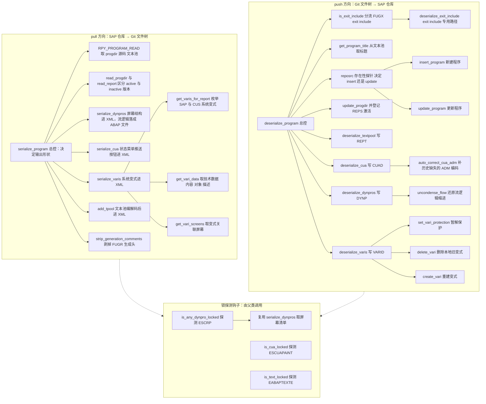
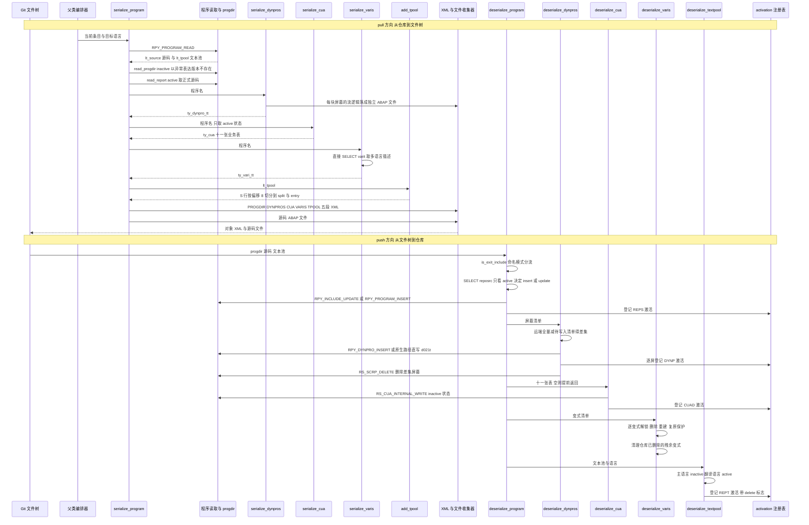

# ZCL_ABAPGIT_OBJECTS_PROGRAM 分析报告

> 分析对象：`abapGit__abapGit__zcl_abapgit_objects_program.clas.abap`（1597 行，全局类，继承自 `ZCL_ABAPGIT_OBJECTS_SUPER`）
> 报告视角：代码 onboarding 走读，按真实调用链展开，覆盖 pull（序列化）与 push（反序列化）两条完整链路

---

## 一、程序定位与业务背景

### 1.1 它解决什么问题

先说清楚它的身份：它不是报表、不是工具程序、也不参与任何业务计算。它是 **abapGit 这个"把 SAP 仓库对象当成 Git 文件管理"的工具里，负责"程序对象"这一族的双向转换器**。

abapGit 的核心假设是：SAP 里的对象应该能被拉成文件、进 Git、再推回去。但对"程序（REPS）"这个对象族来说，这个假设从一开始就站不住脚——因为在 SE38 里看起来是"一个程序"的东西，在技术存储层是**五个各自独立、各走各写入通道、各有一把激活开关的对象**：

| 逻辑上看到的 | 技术上的对象 | 独立写入通道 | 独立锁对象 |
|---|---|---|---|
| 程序本身（源码 + 属性） | `REPS` | `RPY_PROGRAM_INSERT` / `RPY_INCLUDE_UPDATE` | `EABAPPROG` |
| 屏幕（Screen Painter） | `DYNP` | `RPY_DYNPRO_INSERT` / `RS_SCRP_DELETE` | `ESCRP` |
| 状态/菜单/推送按钮 | `CUAD` | `RS_CUA_INTERNAL_WRITE` | `ESCUAPAINT` |
| 文本池（多语言描述） | `REPT` | `INSERT TEXTPOOL` / `DELETE TEXTPOOL` | `EABAPTEXTE` |
| 变式 | `VARID` / `VARIT` | `RS_CREATE_VARIANT_255` 等 | — |

这个类做的事，就是把这五类东西在两个方向上各走一遍：

- **pull（序列化）**：从 SAP 仓库读出来，落成 Git 能吃的形状——程序属性与屏幕/CUA/变式的结构化数据进一个 XML，ABAP 源码和**屏幕流逻辑**各自落成独立的 `.abap` 文件；
- **push（反序列化）**：反向把这些文件还原成 SAP 对象，并且——这是关键——**一律以 inactive 状态落地，最后把对象名登记进 `zcl_abapgit_objects_activation`，由外层统一 activate**。

它不做的也非常明确：不做编译、不做激活决策（只登记）、不判断对象该不该被拉取、不处理 include 列表的递归（`with_includelist = abap_false`）。这些责任都在父类 `zcl_abapgit_objects_super` 和工厂类里。

### 1.2 为什么不能拿一个 FM 一把梭

看起来"读程序"和"写程序"就是各调一个 FM 的事，实际上有六层麻烦，每一层都是这个类存在的理由：

1. **一个 UI 对象 = 五个技术对象**。SE38 的"程序"是一个概念包装；`RPY_PROGRAM_READ` 只能给你 progdir 和源码，屏幕、CUA、文本池、变式各自有各自的读接口，且互不感知。不做适配，pull 出来的东西就只剩源码，屏幕和菜单在 Git 里凭空消失。
2. **文本池的语言语义不对称**。主语言（`mv_language`）的文本池必须以 inactive 写入再激活；翻译语言的文本池直接以 active 写入即可。同一份代码里必须为这两条路准备不同的状态参数（见 `deserialize_textpool`），否则要么激活失败、要么激活掉不该激活的东西。
3. **屏幕流逻辑不能塞进 XML**。Flow logic 是屏幕的生成代码，如果和 CUA/屏幕结构一起序列化成 XML 元素，Git diff 里会看到满屏难以 review 的机器生成内容，也无法直接编辑。abapGit 的选择是把它**落成独立的 `.abap` 文件**（`screen_<dynnr>`），这样开发者可以像改普通 ABAP 一样改流逻辑，也让 diff 变得有意义。
4. **变式分阵营**。`SAP&*` / `CUS&*` 前缀的变式是 client 000 的系统变式（只读、可复用），其余是用户私有的。abapGit 只接管系统变式——否则 pull 会把其他用户的私有变式也卷进来，push 时会越权创建别人的变式。这个边界是**权限与安全**考量，不是技术便利。
5. **跨版本参数集不一致**。`uccheck`、`suppress_message`、`suppress_input_dialog` 这些参数在低版本 SAP 上根本不存在，而动态 FM 调用在参数不存在时抛 `cx_sy_dyn_call_param_not_found`。这个类用"先带新参数调一次，捕获异常后退化为不带新参数再调一次"的模式吸收差异——同一个模式在 `insert_program` 和 `delete_vari` 里各出现一次。
6. **SAP 自身有一批必须在调用侧打补丁的缺陷**。代码里至少四处留下"绕开 SAP bug"的痕迹：`sy-tcode = 'SE41'`（note 2159455）、清 `SAPLSIFP` 的全局 `TTAB`（`RPY_PROGRAM_UPDATE` 的 header 行未清零导致标题长度串台）、EU522 的 SAP\* 作者问题、以及 CUA 的 ADM 字段历史缺失。这些不是本类的设计选择，是被 SAP 逼出来的。

### 1.3 一句话范式定性

> **"双向适配器 + 激活注册表"**：`serialize_*` 一族负责读（SAP 仓库 → Git 文件树），`deserialize_*` 一族负责写（Git 文件树 → SAP 仓库）；所有写入都以 inactive 状态落地，对象名压进 `zcl_abapgit_objects_activation` 由外层统一激活；跨版本差异用"降级重试"吸收，SAP 缺陷用局部 hack 绕过。

这个范式有一个必须记住的推论：**序列化侧的每一次"静默放过"，都会变成反序列化侧的一次踩坑**。两侧必须成对阅读、成对修改。这是本类最容易出事故的地方，也是本报告第三节的组织原则。

### 1.4 依赖清单（本文件看不到的地形）

读这段代码前，有相当一部分关键依赖**不在本文件里**，必须知道它们的存在与角色：

```
继承成员（父类 zcl_abapgit_objects_super，本文件不可见）
  ms_item                     当前处理的仓库对象条目（obj_type / obj_name），
                              被 deserialize_dynpros 用于 RS_SCREEN_LIST 的 progname
  mo_files                    文件收集器：add_xml / add_abap / read_abap，
                              pull 时攒文件、push 时取文件
  mv_language                 本次操作的目标语言
  mo_i18n_params              国际化参数（main_language_only / build_language_filter）
  exists_a_lock_entry_for     锁探测封装，返回 abap_bool
  clear_abap_language_version 清掉 progdir-uccheck 里的 ABAP 语言版本标记

协作类（本文件调用，实现不可见）
  zcl_abapgit_factory         get_cts_api / get_sap_report
  zcl_abapgit_objects_activation   add(iv_type, iv_name, iv_delete)
                                   激活注册表：pull/push 只登记，激活由外层执行
  zcl_abapgit_language        set_current_language / restore_login_language
  zcl_abapgit_xml_output      add(iv_name, ig_data)
  zcx_abapgit_exception       raise / raise_t100

关键 FM
  RPY_PROGRAM_READ / RPY_PROGRAM_INSERT / RPY_INCLUDE_UPDATE
  RPY_DYNPRO_READ / RPY_DYNPRO_INSERT / RPY_DYNPRO_READ_NATIVE / RPY_DYNPRO_INSERT_NATIVE
  RS_SCREEN_LIST / RS_SCRP_DELETE
  RS_CUA_INTERNAL_FETCH / RS_CUA_INTERNAL_WRITE
  RS_ALL_VARIANTS_4_1_REPORT / RS_GET_SCREENS_4_1_VARIANT
  RS_VARIANT_VALUES_TECH_DAT_255 / RS_VARIANT_CONTENTS_255
  RS_CREATE_VARIANT_255 / RS_CHANGE_CREATED_VARIANT_255 / RS_VARIANT_DELETE

直接读写的 DDIC 表（绕过 FM，直接 SQL）
  tadir      取 devclass，构造 trkey
  d021t      原生屏幕文本：DELETE + INSERT（无 FM 封装）
  varid      SELECT FOR UPDATE + UPDATE（变式保护标志）
  varit      SELECT（变式描述，绕过 FM，因为 FM 无法枚举可用语言）
  reposrc    SELECT（判断 active 版本是否存在，决定 insert 还是 update）

锁对象
  ESCRP / ESCUAPAINT / EABAPTEXTE
```

三个值得提前注意的点：`d021t`、`varid`、`varit` 都是**直接 SQL 操作 SAP 内部表**，绕过了所有 change document 与 buffering 语义；`reposrc` 的只读查询被当成"是否存在 active 版本"的存在性探针；而 `ms_item` / `mo_files` / `mv_language` 这类父类成员贯穿全类，是本文件里所有"隐式上下文"的来源。

### 1.5 读这份代码要换的三副眼镜

这个类的写法决定了三种普通的阅读方式都会失手，建议一开始就固定下来：

1. **对称性眼镜**。`serialize_*` 与 `deserialize_*` 必须成对读。序列化侧的 `IF sy-subrc > 1`（放过 not_found）、`IF ls_progdir-subc = '1' OR 'M'`（条件输出 DYNPRO/CUA/VARIS）都对应反序列化侧的一个前提；任何一侧单独看都会觉得"这判断没问题"，合起来看才知道它保护的是什么。
2. **激活顺序眼镜**。本类里几乎所有写入都以 inactive 落地，激活只登记不执行。所以阅读时必须追踪"写入顺序"和"登记顺序"：先写程序主体、再写屏幕、再写 CUA、再写变式、文本池最后激活——顺序错了的表现是"push 成功但对象没生效"或"生效了又被下一块覆盖"。
3. **静默降级眼镜**。全类有大量 `##SUBRC_OK`、`##FM_SUBRC_OK`、空 `CATCH`、`IF sy-subrc > 1`、`ELSEIF sy-subrc > 0` 这类"放过"。每遇到一个都要问一句：**放过之后，下一步会不会基于错误的前提继续执行**。第三节会把这类问题按子程序点出来，第五节汇总。

---

## 二、程序执行流程总览

本类没有单一入口，而是暴露**两个方向的主入口 + 三个锁探测钩子**，加上若干被父类直接调用的辅助方法。两个主入口互不调用，但在真实 pull/push 流程里各带一串子调用。



两张图之外还有一条隐含路径：`add_tpool` 与 `read_tpool` 是一对编解码方法，`add_tpool` 在 pull 时被 `serialize_program` 调用，`read_tpool` 则**不被本类调用**（供其他语言处理组件使用）；同理 `deserialize_exit_include` 只被 `deserialize_program` 调用。

### 责任链表

| 子程序 | 调用者 | 职责 |
|---|---|---|
| 类型与常量声明区 | — | 定义 `ty_cua` / `ty_dynpro` / `ty_vari` 三大承载结构，以及 `c_state`、`c_native_dynpro = 'IN'`、`c_sysvari_clnt = '000'`、`c_sysvari_pattern_sap = 'SAP&*'`、`c_sysvari_pattern_cus = 'CUS&*'` 等判定基准 |
| `serialize_program`（pull 总控） | 父类 `zcl_abapgit_objects_super`（pull 流程） | 编排整个 pull：读程序 → 按 subc 决定是否输出屏幕/CUA/变式 → 编解码文本池 → 剥生成注释 → 落文件 |
| `strip_generation_comments` | `serialize_program` | 仅对 FUGR 生效，剥掉 MV FM 的生成头，避免生成内容污染 diff |
| `serialize_dynpros` | `serialize_program`；`is_any_dynpro_locked`（复用取屏幕清单） | 枚举并读取全部屏幕，结构进返回表，流逻辑另存为 ABAP 文件 |
| `serialize_cua` | `serialize_program` | 读 active 状态的 CUA 十张表 |
| `serialize_varis` | `serialize_program` | 逐个系统变式组装 `ty_vari` |
| `get_varis_for_report` | `serialize_varis`；`deserialize_varis` | 枚举本程序的 `SAP&*` / `CUS&*` 系统变式 |
| `get_vari_data` | `serialize_varis` | 取变式技术数据、内容、关联对象、多语言描述 |
| `get_vari_screens` | `serialize_varis` | 取变式关联的屏幕号 |
| `add_tpool` | `serialize_program` | 文本池序列化方向编码，`S` 行的 8 字符前缀搬进 `split` |
| `read_tpool` | 本文件内无调用点（供语言处理组件使用） | `add_tpool` 的反向解码 |
| `deserialize_program`（push 总控） | 父类（push 流程） | 分流 exit include → 写程序主体 → 更新 progdir → 登记 REPS 激活 |
| `is_exit_include` | `deserialize_program`；`update_program`（EU522 分支） | 按命名模式判定是否为 FUGX exit include |
| `deserialize_exit_include` | `deserialize_program` | exit include 专用写入路径，state 传 `c_state-off` |
| `get_program_title` | `deserialize_program`；`deserialize_exit_include` | 从文本池 `R` 行取标题，并清掉 `SAPLSIFP` 的全局 `TTAB` |
| `insert_program` | `deserialize_program`；`deserialize_exit_include` | 新建程序，低版本退化重试，name_not_allowed 时走双份写入兜底 |
| `update_program` | `deserialize_program`；`deserialize_exit_include` | 更新程序，按 msgid/msgno 区分 EU510 与 EU522 |
| `deserialize_textpool` | 父类（push 子对象阶段） | 按主语言/翻译语言分状态写 REPT，必要时 DELETE，并登记激活 |
| `deserialize_dynpros` | 父类 | 写入屏幕（原生/常规两条路）、还原流逻辑缩进、删除多余屏幕、登记激活 |
| `uncondense_flow` | `deserialize_dynpros` | 用随包存储的空白表还原流逻辑缩进 |
| `deserialize_cua` | 父类 | 全空则提前返回；构造 trkey；修正 ADM；以 inactive 写 CUAD；登记激活 |
| `auto_correct_cua_adm` | `deserialize_cua` | 从 act/men/pfk 表反推历史缺失的 ADM 三个编码 |
| `deserialize_varis` | 父类 | 暂解保护 → 删本地 → 重建 → 复原保护；末尾清理远端已删的本地变式 |
| `set_vari_protection` | `deserialize_varis` | `SELECT FOR UPDATE` 读保护标志，必要时 UPDATE |
| `create_vari` | `deserialize_varis` | 两步 FM：先建后改，覆盖式写入 |
| `delete_vari` | `deserialize_varis` | 删除变式，低版本退化重试 |
| `is_any_dynpro_locked` | 父类（pull/push 前的锁检查） | 遍历屏幕，逐个探测 `ESCRP` 锁 |
| `is_cua_locked` | 父类 | 构造 `CU<program>` 参数探测 `ESCUAPAINT` 锁 |
| `is_text_locked` | 父类 | 构造 `*<program>` 参数探测 `EABAPTEXTE` 锁 |

下面按这条流程，逐个子程序展开。第三节的顺序刻意按"pull 链路 → push 链路 → 锁钩子"排列，而不是按源码里的字母序，因为源码里方法是按字母排列的，而真实执行顺序与字母序几乎不重合。

---

## 三、分组分析（按程序流程 / 子程序）

### 3.1 pull 总控 `serialize_program`

这个方法是整个 pull 方向的编排器，本身不做取数，全部工作分给五个步骤。

#### ① 程序名回退与语言切换

```abap
    IF iv_program IS INITIAL.
      lv_program_name = is_item-obj_name.
    ELSE.
      lv_program_name = iv_program.
    ENDIF.

    zcl_abapgit_language=>set_current_language( mv_language ).
```

**做什么** — 如果调用方没显式指定程序名，就用当前处理的仓库条目名（`ms_item-obj_name`）兜底；随后把会话语言切到本次操作的目标语言 `mv_language`。

**为什么** — `iv_program` 存在是为了支持"只序列化程序的某个 include/子对象"这类调用（例如 `deserialize_dynpros` 的对称场景），而常规 pull 传的是条目本身。语言必须前置切换，因为下一步的 `RPY_PROGRAM_READ` 会按当前语言返回文本池，语言不对就取到别的语言的描述。

**风险与改进** — 语言切换是**跨方法的全局副作用**，后面有三次 `restore_login_language`，但只要中间任一路径提前 `RETURN`（见步骤②）或抛异常，都可能留下未还原的会话语言。目前靠"每个出口都手动调用一次"来保证，这种"人工配对"的模式一旦有人新增一条退出路径就会失配。更稳的做法是把切换与还原收进一个可复用的作用域封装（类似 `TRY...CLEANUP` 的形状），让还原不可能被漏掉。

#### ② `RPY_PROGRAM_READ` 取数与 subrc 分诊

```abap
    CALL FUNCTION 'RPY_PROGRAM_READ'
      EXPORTING
        program_name     = lv_program_name
        with_includelist = abap_false
        with_lowercase   = abap_true
      TABLES
        source_extended  = lt_source
        textelements     = lt_tpool
      EXCEPTIONS
        cancelled        = 1
        not_found        = 2
        permission_error = 3
        OTHERS           = 4.

    IF sy-subrc = 2.
      zcl_abapgit_language=>restore_login_language( ).
      RETURN.
    ELSEIF sy-subrc <> 0.
      zcl_abapgit_language=>restore_login_language( ).
      zcx_abapgit_exception=>raise_t100( ).
    ENDIF.
```

**做什么** — 从程序目录读源码与文本元素：`with_includelist = abap_false` 明确不要 include 列表，`with_lowercase = abap_true` 要小写源码；`not_found`（subrc 2）时还原语言后**静默返回**，其他非零（取消、权限、其他）还原语言后抛 T100 消息异常。

**为什么** — 这里有两个刻意的设计取舍。第一，`not_found` 不抛异常：pull 是在遍历"Git 里记录的条目清单"，如果某条目在 SAP 仓库里已被别人删掉，正确行为是跳过而不是让整个 pull 失败。第二，`with_lowercase = abap_true` 保证源码形态稳定——不做小写化会让同一份代码在不同环境下 diff 出噪声。

**风险与改进** — 静默 `RETURN` 让调用方**无法区分"程序已被删除"与"pull 成功但产出为空"**，这两者对上层（比如 abapGit 的 push 决策）含义完全不同：前者应该从 Git 索引里移除该条目，后者意味着一次空提交。另外 `cancelled`（subrc 1）走 `raise_t100`，但在非交互式场景下 subrc 1 的实际含义值得在 SE37 核实——如果 SAP 在某些条件下用它表达"用户取消"，那么在后台任务里抛 T100 消息会带出一条几乎无诊断信息的报错。建议在 `not_found` 分支至少留一条 debug/sy-log 记录，让"静默跳过"变成"可追溯的跳过"。

#### ③ 用 TRY/CATCH 探测 inactive 版本是否存在

```abap
    " If inactive version exists, then RPY_PROGRAM_READ does not return the active code
    li_report = zcl_abapgit_factory=>get_sap_report( ).

    TRY.
        " Raises exception if inactive version does not exist
        ls_progdir = li_report->read_progdir(
          iv_name  = lv_program_name
          iv_state = c_state-inactive ).

        " Explicitly request active source code
        lt_source = li_report->read_report(
          iv_name  = lv_program_name
          iv_state = c_state-active ).
    CATCH zcx_abapgit_exception ##NO_HANDLER.
    ENDTRY.

    ls_progdir = li_report->read_progdir(
      iv_name  = lv_program_name
      iv_state = c_state-active ).

    clear_abap_language_version( CHANGING cv_abap_language_version = ls_progdir-uccheck ).
```

**做什么** — 先尝试读 inactive 版本的 progdir 和 active 版本的源码；如果 inactive 版本不存在，`read_progdir` 抛异常，被 `CATCH ... ##NO_HANDLER` 静默吞掉，`lt_source` 就保留步骤②里 `RPY_PROGRAM_READ` 拿到的内容。随后**无条件**再读一次 active progdir（这一步失败会向上传播），并清掉 `uccheck` 里的 ABAP 语言版本标记。

**为什么** — 注释把根因说得很清楚：`RPY_PROGRAM_READ` 在程序存在 inactive 版本时**不会返回 active 代码**。这意味着 pull 如果直接信任 `RPY_PROGRAM_READ` 的源码，得到的可能是没激活的草稿。用"探测 inactive → 命中则显式取 active"是绕开这个行为差异的最短路径，而 `##NO_HANDLER` 把"inactive 不存在"这个正常分支折叠成异常，是刻意的控制流技巧。

**风险与改进** — 用异常表达"数据不存在"是本段最脆弱之处，有两个具体后果：

1. **吞掉的异常面太宽**。`CATCH zcx_abapgit_exception` 不区分原因：如果 `read_progdir(inactive)` 因为**权限**或**网络/锁**问题抛异常，会被当成"inactive 不存在"静默放过，`lt_source` 保持 `RPY_PROGRAM_READ` 的返回值——也就是可能拿到 inactive 草稿，然后被当成正式源码写进 Git。这在"程序恰好处于未激活状态且调用者无权限读 active 版本"的组合下会产出错误的 pull 结果。
2. **`read_report(active)` 的异常与 `read_progdir(inactive)` 的异常无法区分**。两者都在同一个 TRY 里、被同一个空 CATCH 吃掉。若源码读取失败，`lt_source` 保留旧值而不报错。

改进方向是把这个"存在性探测"显式化——用一次只读 `reposrc`/`progdir` 的存在性查询代替"读失败即不存在"的推断（`deserialize_program` 里就是这么做的，见 3.8），让两条链路的判断方式一致。另外 `ls_progdir` 的第二次赋值在 TRY 之外，一旦 active progdir 也不存在就会以裸异常向上传播，报错信息里不会带程序名上下文，排查成本偏高。

#### ④ 按 `subc` 决定是否序列化屏幕 / CUA / 变式

```abap
    li_xml->add( iv_name = 'PROGDIR'
                 ig_data = ls_progdir ).
    IF ls_progdir-subc = '1' OR ls_progdir-subc = 'M'.
      lt_dynpros = serialize_dynpros( lv_program_name ).
      li_xml->add( iv_name = 'DYNPROS'
                   ig_data = lt_dynpros ).

      ls_cua = serialize_cua( lv_program_name ).
      li_xml->add( iv_name = 'CUA'
                   ig_data = ls_cua ).

      lt_varis = serialize_varis( lv_program_name ).
      li_xml->add( iv_name = 'VARIS'
                   ig_data = lt_varis ).
    ENDIF.
```

**做什么** — 无论 subc 是什么都写 `PROGDIR` 段；只有当程序类型是 `'1'` 或 `'M'` 时才调用三个序列化子方法并把结果写成 `DYNPROS`、`CUA`、`VARIS` 三个 XML 段。

**为什么** — 不是所有程序都有屏幕与菜单：函数组的 include、接口、模块化程序等类型没有屏幕 Painter 数据，去读只会白跑一次 FM 甚至报错。把判断放在总控而不是各子方法内部，能保证"要么三段齐全，要么三段都没有"，避免出现半拉 XML。`'1'` 是标准可执行程序；`'M'` 的具体语义**需在 SE11 的 `PROGDIR-SUBC` 取值列表核实**（本报告不对其含义作断言）。

**风险与改进** — 这个白名单是**硬编码的枚举**，SAP 未来若新增带屏幕的程序子类型，这里不会跟着扩展，结果是新类型的程序被拉出来只剩源码、屏幕和菜单在 Git 里静默丢失——而且因为 `serialize_dynpros` 内部对"无屏幕"是容忍的（`RS_SCREEN_LIST` 的 not_found 被放过），**连报错都不会有**。改进方向是把"这个程序是否带 UI 子对象"的判断收敛到一个明确的分类方法，并对"判定为无 UI 的程序"在日志里留痕，让这类退化可发现。

#### ⑤ 文本池清理与落盘

```abap
    READ TABLE lt_tpool WITH KEY id = 'R' INTO ls_tpool.
    IF sy-subrc = 0 AND ls_tpool-key = '' AND ls_tpool-length = 0.
      DELETE lt_tpool INDEX sy-tabix.
    ENDIF.

    li_xml->add( iv_name = 'TPOOL'
                 ig_data = add_tpool( lt_tpool ) ).

    IF NOT io_xml IS BOUND.
      io_files->add_xml( iv_extra = iv_extra
                         ii_xml   = li_xml ).
    ENDIF.

    strip_generation_comments( CHANGING ct_source = lt_source ).

    io_files->add_abap( iv_extra = iv_extra
                        it_abap  = lt_source ).
```

**做什么** — 在文本池里找 `id = 'R'`（程序标题行）的记录，如果它的 `key` 与 `length` 都为空就删掉这一行；然后整体交给 `add_tpool` 编码写入 `TPOOL` 段。若调用方没自带 XML 输出器，就把自建的 `li_xml` 交给 `io_files` 落盘。最后剥掉生成注释，把源码作为 ABAP 文件追加进文件收集器。

**为什么** — 空标题行是 `RPY_PROGRAM_READ` 的已知噪声：程序没有标题时它仍会返回一行 `id='R'` 的空记录，写进 XML 会成为每次 pull 都不变的脏数据。`io_xml` 可选的设计是为了支持"把多个子对象写进同一个 XML"的复用场景；但注意**ABAP 源码文件在两种情况下都会被追加**——即使 XML 是外部提供的，源码仍然落独立文件。

**风险与改进** — 两处：

1. `READ TABLE ... WITH KEY id = 'R'` 只返回**第一个**匹配，随后的 `DELETE ... INDEX sy-tabix` 也只删那一行。如果文本池里存在多条 `id='R'` 的空记录（跨语言或历史残留），只会清掉第一条。实际影响很小，但这是个"看起来全量、其实是单行"的隐蔽假设。
2. `io_files` 在接口里**不是 OPTIONAL**，这里也无条件解引用。这本身没问题，但它与 `io_xml` 的可选性不对称：调用方可以不带 XML 输出器，却必须带文件收集器。如果未来出现"只想取数据不落文件"的调用场景，这个接口形状会迫使人造一个空收集器。

---

### 3.2 屏幕序列化 `serialize_dynpros`

pull 链路里最复杂的一个方法，分四步走。

#### ① 枚举屏幕并过滤生成屏

```abap
    CALL FUNCTION 'RS_SCREEN_LIST'
      EXPORTING
        dynnr     = ''
        progname  = iv_program_name
      TABLES
        dynpros   = lt_d020s
      EXCEPTIONS
        not_found = 1
        OTHERS    = 2.
    IF sy-subrc = 2.
      zcx_abapgit_exception=>raise_t100( ).
    ENDIF.

    SORT lt_d020s BY dnum ASCENDING.

* loop dynpros and skip generated selection screens
    LOOP AT lt_d020s ASSIGNING <ls_d020s>
        WHERE type <> 'S' AND type <> 'W' AND type <> 'J'
        AND NOT dnum IS INITIAL.
```

**做什么** — 列出该程序的所有屏幕（`dynnr = ''` 表示全部），排序后遍历，跳过 `type` 为 `'S'`（选择屏幕）、`'W'`、`'J'` 的行以及 `dnum` 为空的行。

**为什么** — 选择屏幕是 ABAP 根据选择屏代码**自动生成**的，它的屏幕数据是派生物，序列化它等于把生成物当源数据存进 Git——push 时会与重新生成的结果冲突。`dnum IS INITIAL` 的行是列表里的占位/汇总行。

**风险与改进** — 这个过滤条件是一个**写死的类型白名单的反面（黑名单）**。`'S'`、`'W'`、`'J'` 三个值散落在 WHERE 子句里，没有命名常量；而反序列化侧（`deserialize_dynpros`）判断原生屏幕用的是常量 `c_native_dynpro TYPE c LENGTH 2 VALUE 'IN'`。两侧的"哪种屏幕需要特殊处理"的知识分散在两个方法、两种表达方式里，改动一处很容易忘另一处。另外 `RS_SCREEN_LIST` 的 `not_found`（subrc 1）被静默放过——这是正确的（无屏幕是合法状态），但 `OTHERS = 2` 抛的是 T100 消息，不含程序名，排查时得回来看代码才知道查的是哪个程序。

#### ② 逐屏读取结构与原生字段

```abap
      CALL FUNCTION 'RPY_DYNPRO_READ'
        EXPORTING
          progname             = iv_program_name
          dynnr                = <ls_d020s>-dnum
        IMPORTING
          header               = ls_header
        TABLES
          containers           = lt_containers
          fields_to_containers = lt_fields_to_containers
          flow_logic           = lt_flow_logic
        EXCEPTIONS
          cancelled            = 1
          not_found            = 2
          permission_error     = 3
          OTHERS               = 4.
      IF sy-subrc <> 0.
        zcx_abapgit_exception=>raise_t100( ).
      ENDIF.

      "#2746: we need the dynpro fields in internal format:
      FREE lt_fieldlist_int.

      CALL FUNCTION 'RPY_DYNPRO_READ_NATIVE'
        EXPORTING
          progname   = iv_program_name
          dynnr      = <ls_d020s>-dnum
        TABLES
          fieldlist  = lt_fieldlist_int
          fieldtexts = lt_texts.
```

**做什么** — 对每个屏幕调 `RPY_DYNPRO_READ` 取 header、容器、字段、流逻辑；然后调 `RPY_DYNPRO_READ_NATIVE` 取**内部格式**的字段列表与字段文本。第二个调用前显式 `FREE lt_fieldlist_int`。

**为什么** — 注释指向 issue #2746：外部格式（`fields_to_containers`）里的 `foreignkey` 字段并不可靠，需要用内部格式（`d021s`）的 `flg1`/`flg3` 标志位重新推导。`FREE` 是为了避免上一个屏幕的字段残留——注意 `RPY_DYNPRO_READ_NATIVE` **没有 `EXCEPTIONS` 子句**，它失败时不会返回可判断的 subrc，所以只能靠 `FREE` 保证起点干净。

**风险与改进** — `RPY_DYNPRO_READ` 失败即抛，但 `RPY_DYNPRO_READ_NATIVE` 无任何错误处理：如果原生读取失败，`lt_fieldlist_int` 就是空的，后续步骤③里所有"内部格式推导"都会得到"无字段"的结论，`foreignkey` 被全部清空，然后**静默地**写进 XML。push 时这批屏幕的 foreign key 属性就丢了，且没有任何告警。这是 pull/push 对称性上一个真实的缺口：两侧都假设原生读取成功，但只有外部读取有失败通道。

#### ③ 用内部标志推导字段属性

```abap
    "#2746: relevant flag values (taken from include MSEUSBIT)
    CONSTANTS: lc_flg1ddf TYPE x VALUE '20',
               lc_flg3fku TYPE x VALUE '08',
               lc_flg3for TYPE x VALUE '04',
               lc_flg3fdu TYPE x VALUE '02'.

      LOOP AT lt_fields_to_containers ASSIGNING <ls_field>.
* output style is a NUMC field, the XML conversion will fail if it contains invalid value
* field does not exist in all versions
        ASSIGN COMPONENT 'OUTPUTSTYLE' OF STRUCTURE <ls_field> TO <lv_outputstyle>.
        IF sy-subrc = 0 AND <lv_outputstyle> = '  '.
          CLEAR <lv_outputstyle>.
        ENDIF.

        "2746: we apply the same logic as in SAPLWBSCREEN
        "for setting or unsetting the foreignkey field:
        UNASSIGN <ls_field_int>.
        READ TABLE lt_fieldlist_int ASSIGNING <ls_field_int> WITH KEY fnam = <ls_field>-name.
        IF <ls_field_int> IS ASSIGNED.
          IF <ls_field_int>-flg1 O lc_flg1ddf AND
              <ls_field_int>-flg3 O lc_flg3for AND
              <ls_field_int>-flg3 Z lc_flg3fdu AND
              <ls_field_int>-flg3 Z lc_flg3fku.
            <ls_field>-foreignkey = 'X'.
          ELSE.
            CLEAR <ls_field>-foreignkey.
          ENDIF.
        ENDIF.

        IF <ls_field>-from_dict = abap_true AND
           <ls_field>-modific   <> 'F' AND
           <ls_field>-modific   <> 'X'.
          CLEAR <ls_field>-text.
        ENDIF.
      ENDLOOP
```

**做什么** — 先声明四个位标志常量（`lc_flg1ddf = '20'`、`lc_flg3fku = '08'`、`lc_flg3for = '04'`、`lc_flg3fdu = '02'`），然后对每个屏幕字段做三件事：(a) `OUTPUTSTYLE` 是 NUMC 字段，若值为空格串 `'  '`（NUMC 的空值表示）就清空，否则 XML 转换会因非法 NUMC 值失败；(b) 按内部格式的 `flg1`/`flg3` 位标志重新计算 `foreignkey`——同时满足"是 DDF 字段"、"有 foreign key"、且**没有**"foreign key 更新"和"foreign key 上传"两个标志时才置 `'X'`，否则清空；(c) 对来自 DDIC 的字段（`from_dict = abap_true`），若 `modific` 既不是 `'F'`（固定文本）也不是 `'X'`，就清空 `text`——因为这种情况下的文本是从 DDIC 取的，序列化它没有意义。

**为什么** — 这三处都是"SAP 内部格式与外部格式不一致"的补丁。`ASSIGN COMPONENT 'OUTPUTSTYLE'` 的写法尤其关键：注释说明了"该字段在所有版本中并不存在"，用运行时组件名访问加 subrc 判断是唯一能跨版本安全处理的方式。foreign key 的位运算逻辑直接抄自 `SAPLWBSCREEN`——注释里点明了出处，这让"为什么是这四个位"变得可追溯，是很好的做法。

**风险与改进** — 这段代码把**SAP 屏幕 Painter 的位标志语义硬编码进了 abapGit**。四个十六进制常量 `20`/`08`/`04`/`02` 的含义完全依赖注释里那句"taken from include MSEUSBIT"：一旦 SAP 调整这些标志位（历史上确实发生过），这里会静默产生错误的 foreign key 结果，而且没有任何校验手段。`modific <> 'F' AND modific <> 'X'` 这个双重否定也偏难读，建议提为具名条件。更大的结构性问题是：这层"SAP 格式修复"知识分散在 pull 侧（本节）和 push 侧（`deserialize_dynpros`）各一份，两边靠人工保持一致。

#### ④ 容器最小尺寸清理与落盘分流

```abap
      LOOP AT lt_containers ASSIGNING <ls_container>.
        IF <ls_container>-c_resize_v = abap_false.
          CLEAR <ls_container>-c_line_min.
        ENDIF.
        IF <ls_container>-c_resize_h = abap_false.
          CLEAR <ls_container>-c_coln_min.
        ENDIF.
      ENDLOOP

      APPEND INITIAL LINE TO rt_dynpro ASSIGNING <ls_dynpro>.
      <ls_dynpro>-header = ls_header.

      " Store flow logic as separate ABAP files instead of XML
      mo_files->add_abap(
        iv_extra = 'screen_' && ls_header-screen
        it_abap  = lt_flow_logic ).

      READ TABLE lt_fieldlist_int TRANSPORTING NO FIELDS WITH KEY fill = 'X'.
      IF ls_header-type CA c_native_dynpro AND sy-subrc = 0.
        " In particular for dynpros with splitter
        <ls_dynpro>-nat_header = <ls_d020s>.
        CLEAR: <ls_dynpro>-nat_header-dgen, <ls_dynpro>-nat_header-tgen.
        <ls_dynpro>-nat_fields = lt_fieldlist_int.
        <ls_dynpro>-nat_texts  = lt_texts.
      ELSE.
        <ls_dynpro>-containers = lt_containers.
        <ls_dynpro>-fields     = lt_fields_to_containers.
      ENDIF.
```

**做什么** — 清掉不可缩放容器上的最小行/列数（这些值在非可缩放容器上没有意义，留着会污染 XML）；然后把当前屏幕追加进返回表：header 总是存，**流逻辑单独作为 ABAP 文件**（文件名前缀 `screen_`）交给 `mo_files`；再用 `fill = 'X'` 探测内部字段表里是否存在"原生填充"字段——若屏幕类型包含原生标记 `'IN'` 且探测命中，就走原生分支（存 nat_header / nat_fields / nat_texts，并把生成时间 `dgen`/`tgen` 清空），否则走常规分支（存 containers + fields）。

**为什么** — 把流逻辑落成独立 ABAP 文件是本类最重要的一次设计选择：流逻辑是屏幕的生成代码，混进 XML 会让 Git diff 变成一堵无法 review 的墙；独立成 `.abap` 后开发者可以像改普通代码一样改它，diff 也变成有意义的。清空 `dgen`/`tgen` 是因为生成时间是每次保存都变的值，序列化它只会制造无意义 diff。用 `fill = 'X'` 作探测器是刻意的——比按 header type 判断更贴近"这块屏幕是否真按原生格式存储"的事实。

**风险与改进** — 三个点：

1. `mo_files->add_abap` 在这里**无条件调用**，即使该屏幕没有任何流逻辑（`lt_flow_logic` 为空），也会往文件收集器里塞一个空 ABAP 文件。push 侧对应的 `mo_files->read_abap` 有容错（空流逻辑会从字段还原），但空文件的累积仍是无谓的仓库膨胀。
2. `READ TABLE ... WITH KEY fill = 'X'` 的探测**没有判断 `lt_fieldlist_int` 是否为空**——若原生读取失败（见步骤②），探测必然 miss，屏幕会被错误地归入常规分支，随后用外部格式数据 push 一块原生屏幕。这与步骤②的"原生读取无错误处理"是同一个缺口的下游表现。
3. `header-type CA c_native_dynpro` 用的是 `CA`（contains），而 `c_native_dynpro` 是 2 字符 `'IN'`。`CA` 会命中任何**包含** `IN` 的类型值。这个宽松匹配在当前取值集合下没问题，但它与 push 侧同样的 `CA` 判断必须严格一致，且未来新增取值时的行为不可预测——建议改成等值判断并明确列出所有原生类型。

---

### 3.3 菜单/CUA 序列化 `serialize_cua`

屏幕之后是状态、菜单、推送按钮这一族数据。这个方法是 pull 链路里最短的一个，全部是一条 FM 调用。

```abap
    CALL FUNCTION 'RS_CUA_INTERNAL_FETCH'
      EXPORTING
        program         = iv_program_name
        language        = mv_language
        state           = c_state-active
      IMPORTING
        adm             = rs_cua-adm
      TABLES
        sta             = rs_cua-sta
        fun             = rs_cua-fun
        men             = rs_cua-men
        mtx             = rs_cua-mtx
        act             = rs_cua-act
        but             = rs_cua-but
        pfk             = rs_cua-pfk
        set             = rs_cua-set
        doc             = rs_cua-doc
        tit             = rs_cua-tit
        biv             = rs_cua-biv
      EXCEPTIONS
        not_found       = 1
        unknown_version = 2
        OTHERS          = 3.
    IF sy-subrc > 1.
      zcx_abapgit_exception=>raise_t100( ).
    ENDIF.
```

**做什么** — 调 `RS_CUA_INTERNAL_FETCH` 一次性取回 CUA 的十张业务表（状态 sta、功能 fun、菜单 men、菜单项 mtx、动作 act、按钮 but、推送按钮 pfk、设置 set、文档 doc、标题 tit、按钮图 biv）加一张 ADM 头表，全部装进返回结构 `rs_cua`。只取 `state = c_state-active`（已激活）的数据，语言用 `mv_language`。

**为什么** — CUA 是典型的"一个 FM 覆盖一族表"的场景：SAP 把状态/菜单/按钮的读取收在一个内部 FM 里，自己拆表反而要读多张 `rsmpe_*` 表。取 active 而非 inactive 与 `serialize_program` 步骤③的选择一致——pull 的目标是"仓库里正式生效的那一版"，inactive 是草稿，不该进 Git。

**风险与改进** — 两点：

1. `IF sy-subrc > 1` 的写法把 `not_found`（subrc 1）静默放过，这本身是对的（没有 CUA 的程序合法存在，且很多程序确实没有菜单）；但 `unknown_version`（subrc 2）也一起被放过了，返回一个**部分填充**的 `rs_cua` 写进 XML。"未知版本"和"没有数据"是两个语义完全不同的信号，前者意味着仓库里的 CUA 处于工具不认识的状态，后者只是空。建议至少区分对待 subrc 2，给出可识别的日志或警告。
2. 这个方法**不做任何 ADM 一致性检查**。而 push 侧有一个专门的 `auto_correct_cua_adm` 方法来修补历史遗留的 ADM 缺失（见 3.14）——这说明 ADM 字段确实存在过"没被保存"的缺陷期。pull 侧既然完全不校验，那么一份在缺陷期内 pull 下来的 XML 就会带着空 ADM 存进 Git，直到下次 push 才被静默修正。修正发生在 push 侧意味着"修正"本身不可见：仓库里的 XML 没变，但 SAP 里被改了一个字段。

---

### 3.4 变式序列化 `serialize_varis` 及其三个取数助手

变式是 CUA 的"兄弟族"：一堆程序级的保存值集合。pull 侧的编排很薄，复杂度全在三个取数助手里。

#### ① 编排：`serialize_varis`

```abap
    lt_varis = get_varis_for_report( iv_program_name ).

    LOOP AT lt_varis ASSIGNING <ls_varikey>.
      CLEAR: ls_vari,
             ls_varid.

      get_vari_data( EXPORTING is_vari    = <ls_varikey>
                     IMPORTING es_varid   = ls_varid
                               et_values  = ls_vari-values
                               et_objects = ls_vari-objects
                               et_texts   = ls_vari-texts ).

      MOVE-CORRESPONDING ls_varid TO ls_vari.

      " Clear texts - they will be provided in TEXTPOOL section
      LOOP AT ls_vari-objects ASSIGNING <ls_object>.
        CLEAR <ls_object>-text.
      ENDLOOP.

      ls_vari-variscreens = get_vari_screens( <ls_varikey> ).

      INSERT ls_vari INTO TABLE rt_varis.
    ENDLOOP.
```

**做什么** — 先用 `get_varis_for_report` 拿到该程序所有变式的键（report + variant），逐个：清掉工作变量 → 调 `get_vari_data` 取技术数据/值/对象/多语言描述 → 把技术数据结构 `ls_varid` 整体 `MOVE-CORRESPONDING` 进 `ty_vari` → 清空 `objects` 里的 `text` 字段 → 用 `get_vari_screens` 取该变式关联的屏幕号 → 追加进返回表。

**为什么** — 关键在注释点明的那句：**对象的文本走 TEXTPOOL 段，不重复放在变式里**。如果两处都存，push 时会出现"两处文本不一致，以哪个为准"的歧义。这里显式清空 `objects-text`，把"变式对象描述"的责任单一地交给文本池，是刻意的去重。`MOVE-CORRESPONDING` 而非逐字段赋值，是为了让 `varid` 结构未来的字段扩展自动被吸收。

**风险与改进** — `ls_vari` 与 `ls_varid` 每轮 `CLEAR` 是必要的（上一轮残留会串到下一轮），这点做得对。但 `et_texts` 被直接填进 `ls_vari-texts` 后**从未被使用过**：变式的多语言描述既没有清空也没有单独落段。如果 `ty_vari-texts` 会被 XML 序列化器输出，那么变式描述实际是被**存了但 push 侧可能用不上**的冗余数据；如果序列化器忽略了它，那这三行取数是纯浪费。**需要对照 `zcl_abapgit_xml_output` 的实现核实**——这是本报告中标注为"需在 SE38/反编译核实"的一处，因为单看本文件无法判断 `texts` 是否真正进入 XML。

#### ② 枚举变式：`get_varis_for_report`

```abap
    CALL FUNCTION 'RS_ALL_VARIANTS_4_1_REPORT'
      EXPORTING
        program = iv_repid
      IMPORTING
        cat     = ls_catalog
      EXCEPTIONS
        OTHERS  = 1.
    IF sy-subrc <> 0.
      zcx_abapgit_exception=>raise_t100( ).
    ENDIF.

    ls_vari-report = iv_repid.
    LOOP AT ls_catalog-cat ASSIGNING <ls_cat>
         WHERE variant CP c_sysvari_pattern_sap
         OR variant CP c_sysvari_pattern_cus.
      ls_vari-variant = <ls_cat>-variant.
      INSERT ls_vari INTO TABLE rt_varis.
    ENDLOOP

    SORT rt_varis.
```

**做什么** — 调 `RS_ALL_VARIANTS_4_1_REPORT` 取该程序所有变式的目录，然后在目录里只保留 variant 名匹配 `SAP&*` 或 `CUS&*` 的行，装配成 `ty_varikey_tt` 并排序。

**为什么** — `SAP&*` / `CUS&*` 两个模式常量（`c_sysvari_pattern_sap = 'SAP&*'`、`c_sysvari_pattern_cus = 'CUS&*'`）对应 SAP 的**系统变式**约定：这类变式存在 client 000（常量 `c_sysvari_clnt = '000'`），是跨用户共享、可被程序复用的"官方"变式；而其他用户的私有变式不该被 pull 到共享仓库里——那会把某个人的个人工作配置泄漏成团队可见的 Git 内容。这是权限边界，不是过滤偏好。

**风险与改进** — `SORT rt_varis` 是为了让 pull 结果可复现（Git 里同一程序两次 pull 不产生顺序差异），这是正确的做法。但注意 `SORT` 作用于 `rsvarkey`，其默认排序键包含 report 与 variant；由于 report 是常量，实际按 variant 排序。这个"排序保证可复现"的意图只在序列化这一个路径上成立——如果将来有人新增一个返回变式的入口而忘了排序，可复现性就会破掉。**建议在返回方法的入口处（而非调用方）保证顺序**，让契约不依赖调用方的自觉。

#### ③ 取变式数据：`get_vari_data`

```abap
    CALL FUNCTION 'RS_VARIANT_VALUES_TECH_DAT_255'
      EXPORTING
        report         = is_vari-report
        variant        = is_vari-variant
        sorted         = abap_true
      IMPORTING
        techn_data     = es_varid
      TABLES
        variant_values = et_values " is ignored
      EXCEPTIONS
        OTHERS         = 1.
    IF sy-subrc <> 0.
      zcx_abapgit_exception=>raise_t100( ).
    ENDIF.

    " Use variant values from CONTENTS call
      " both calls have this parameter as non-optional
      CLEAR et_values.

    IF mo_i18n_params->ms_params-main_language_only <> abap_true.
      lt_language_filter = mo_i18n_params->build_language_filter( ).
    ENDIF.
    ls_language_filter-sign   = 'I'.
    ls_language_filter-option = 'EQ'.
    ls_language_filter-low    = mv_language.
    CLEAR ls_language_filter-high.
    INSERT ls_language_filter INTO TABLE lt_language_filter.

    " SELECT because RS_VARIANT_TEXT and related FMs cannot list available languages
    SELECT langu vtext FROM varit CLIENT SPECIFIED
      INTO CORRESPONDING FIELDS OF TABLE et_texts
      WHERE mandt = c_sysvari_clnt
        AND report = is_vari-report
        AND variant = is_vari-variant
        AND langu IN lt_language_filter
      ORDER BY langu.

    CALL FUNCTION 'RS_VARIANT_CONTENTS_255'
      EXPORTING
        report         = is_vari-report
        variant        = is_vari-variant
        execute_direct = abap_true
      TABLES
        valutab        = et_values
        objects        = et_objects
      EXCEPTIONS
        OTHERS         = 1.
    IF sy-subrc <> 0.
      zcx_abapgit_exception=>raise_t100( ).
    ENDIF.

    " reproducible order
    SORT et_values.
    SORT et_objects.
    SORT et_texts.
```

**做什么** — 三次取数：(a) `RS_VARIANT_VALUES_TECH_DAT_255` 取变式技术数据 `es_varid`，它的 `variant_values` 输出被显式忽略；(b) `RS_VARIANT_CONTENTS_255` 重新取值与关联对象，覆盖掉前一次的 `et_values`；(c) 直接 `SELECT varit` 取变式的多语言描述，语言过滤器先按 i18n 参数构建，再追加一条 `sign = 'I'`（排除）规则把当前语言 `mv_language` 排除掉。最后三张表全部 `SORT`。

**为什么** — 三处决定都带注释，且都能读出背后的约束：

- 注释 `" both calls have this parameter as non-optional"` 解释了为什么要把第一个 FM 的返回值 `CLEAR` 掉再用第二个 FM 覆盖——两个 FM 的 `variant_values` 参数都非可选，只能调两次取同一个东西，但 `RS_VARIANT_CONTENTS_255` 的版本才是想要的。这是被 FM 接口形状逼出来的写法，不是疏忽。
- `langu IN lt_language_filter` 里的排除规则：注释说明 `RS_VARIANT_TEXT` 系列 FM **无法枚举可用语言**，所以只能自己 SELECT。而排除当前语言是为了避免"主语言描述"与 push 时重建产生重复——主语言文本走别的通道，这里只取翻译。
- 三个 `SORT` 的注释是 `reproducible order`，与 `get_varis_for_report` 的排序是同一个诉求：pull 输出必须字节稳定，否则 Git 里每次 pull 都是虚假变更。

**风险与改进** — 三处：

1. **绕过 FM 直接 SELECT `varit`** 是全类里最需要谨慎对待的一处：`varit` 是 SAP 内部表，直接读绕过了任何 change document / 授权 / 缓冲语义。注释给出了理由（FM 无法列语言），理由成立；但风险在于 SAP 未来若改变 `varit` 的键结构或语义，这里没有编译期依赖能发现问题。建议在方法注释里明确标注"直接依赖 DDIC 表 `varit`，键为 mandt/report/variant/langu"，让未来的维护者知道这是一条会随 SAP 版本漂移的耦合点。
2. **语言过滤的排除规则只在 `main_language_only = abap_true` 时被跳过构建基础过滤器**。也就是说：当用户勾选"仅主语言"时，`lt_language_filter` 只有那条排除项，`langu IN (排除 mv_language)` 会选出**除主语言之外的所有语言**——与"仅主语言"的语义正好相反。需要确认 `mo_i18n_params->build_language_filter` 在 `main_language_only` 场景下是否返回空表以及本处的预期行为；如果确实如此，这是一个语义反转缺陷，表现为"勾选仅主语言反而 pull 出了全部翻译"。这一点**需在运行时验证**。
3. `RS_VARIANT_VALUES_TECH_DAT_255` 的 `OTHERS = 1` 把所有失败合并成一个分支，而失败时 `es_varid` 是未填充的技术数据，随后会被 `MOVE-CORRESPONDING` 进 `ls_vari` 并写进 XML——即失败会产出**看似完整实则全空**的变式记录，push 时会覆盖掉远端已有的正确变式。建议在 `sy-subrc <> 0` 时区分"变式不存在"与"取数失败"。

---

### 3.5 文本池编解码对 `add_tpool` / `read_tpool`

pull 链路最后一个环节是文本池的格式转换。这对方法很短，但有一个"8"贯穿其中，值得单独讲。

#### ① 序列化方向 `add_tpool`

```abap
    LOOP AT it_tpool ASSIGNING <ls_tpool_in>.
      APPEND INITIAL LINE TO rt_tpool ASSIGNING <ls_tpool_out>.
      MOVE-CORRESPONDING <ls_tpool_in> TO <ls_tpool_out>.
      IF <ls_tpool_out>-id = 'S'.
        <ls_tpool_out>-split = <ls_tpool_out>-entry.
        <ls_tpool_out>-entry = <ls_tpool_out>-entry+8.
      ENDIF.
    ENDLOOP
```

**做什么** — 把 SAP 的 `textpool_table` 逐行搬到 abapGit 自己的文本池行结构：`MOVE-CORRESPONDING` 照抄同名同型字段；只有 `id = 'S'` 的行做特殊处理——先整份赋值给 `split`，再把 `entry` 改写为"从偏移 8 起的子串"。

**为什么** — `id = 'S'` 是屏幕标题行。SAP 在这类行的 `ENTRY` 里把屏幕号作为固定宽度的技术前缀放在最前面，真正的标题文本跟在后面。Git 侧想把"技术前缀"与"人类可读文本"分开存放（前缀进 `split`，正文留在 `entry`），于是把 `entry` 从第 9 个字符处切开。`MOVE-CORRESPONDING` 而非逐字段赋值，让两个结构未来的字段增删自动被吸收。

**风险与改进** — 两处：

1. **`8` 是一个没有任何注释支撑的魔法数字**，而 `add_tpool` 的切分点必须与 `split` 字段的实际宽度、以及 `read_tpool` 的重组逻辑三方一致。如果目标结构里 `split` 的宽度不是 8，那么 `split = entry` 按目标宽度截断的位置与 `entry+8` 的偏移就不重合，round-trip 会丢字符或重复字符——而这类错误不会报错，只会表现为屏幕标题显示异常。**需要在 SE11 里核实 `zif_abapgit_lang_definitions=>ty_tpool_tt` 的 `split` 字段宽度确为 8**，本报告不对其作断言。
2. `entry` 的 RHS 用的是**已被 `MOVE-CORRESPONDING` 填充后的输出侧字段**（`<ls_tpool_out>-entry`），而不是输入侧。这在语义上正确（输出侧此时等于输入侧），但下一行 `read_tpool` 的对称逻辑用的是输入侧字段。两处引用侧不一致会让读者反复确认"这里到底读的是哪边"，建议统一。

#### ② 反序列化方向 `read_tpool`

```abap
    LOOP AT it_tpool ASSIGNING <ls_tpool_in>.
      APPEND INITIAL LINE TO rt_tpool ASSIGNING <ls_tpool_out>.
      MOVE-CORRESPONDING <ls_tpool_in> TO <ls_tpool_out>.
      IF <ls_tpool_out>-id = 'S'.
        CONCATENATE <ls_tpool_in>-split <ls_tpool_in>-entry
          INTO <ls_tpool_out>-entry
          RESPECTING BLANKS.
      ENDIF.
    ENDLOOP
```

**做什么** — 反向操作：非 `'S'` 行照抄；`'S'` 行把 `split` 与 `entry` 拼回 `entry`，并用 `RESPECTING BLANKS` 保留拼接结果的前导空格。

**为什么** — `RESPECTING BLANKS` 不是可选的洁癖：`CONCATENATE` 在不带这个关键字时会**截掉结果的前导空格**。屏幕号前缀恰好是空格填充的定宽字段（如 `'     0100'`），不带这个关键字就会把前导空格吃掉，屏幕号变成乱码。这是本方法里唯一"少一个关键字就会坏"的地方。

**风险与改进** — 三个点：

1. **这对方法是全类唯一一处完全没有注释的转换逻辑**。全类其他方法几乎每处非平凡逻辑都带注释（很多还挂着 GitHub issue 号），而这里最关键的"为什么是 8"却只字未提。对一个负责"字节级 round-trip 保真"的编解码对来说，这是文档缺口里最危险的一种——因为它看起来太简单了，没人会怀疑。
2. **`read_tpool` 在本文件内没有任何调用点**。它是 `CLASS-METHODS`，供其他语言处理组件调用。这意味着本类的 push 链路**不经过它**——反序列化文本池走的是 `deserialize_textpool` 里的 `INSERT TEXTPOOL`，而不是这对编解码方法。所以这对方法承担的职责是"跨组件复用的格式转换"，与 pull/push 主链路的耦合是间接的；评估它的变更风险时要到调用方那里找，本文件看不到全貌。
3. 两个方法都没有任何防御性检查（不判空表、不校验 `id` 取值集合、不处理 `MOVE-CORRESPONDING` 的字段名不匹配）。作为纯转换函数这是可以接受的取舍，但它们的返回类型是 `VALUE(...)` 返回，**调用方没有任何信号可以知道转换是否真的保真**。建议至少为这对方法补一组 round-trip 单测（构造 `S` 行 → `add_tpool` → `read_tpool` → 断言逐字节相等），这是本类里最容易自动化验证的部分。

---

### 3.6 push 总控 `deserialize_program` 及其分流路径

push 方向的入口。它与 `serialize_program` 形成镜像，但**有一个重要差异**：它只管程序主体，屏幕 / CUA / 变式 / 文本池各自的反序列化方法在本文件内不被它调用，而是由父类分别调用。

#### ① 分流 exit include

```abap
    IF is_exit_include( is_progdir-name ) = abap_true.
      deserialize_exit_include(
        is_progdir = is_progdir
        it_source  = it_source
        it_tpool   = it_tpool
        iv_package = iv_package ).
      RETURN.
    ENDIF.

  METHOD is_exit_include.
    rv_is_exit_include = boolc(
      iv_program CP 'LX*' OR iv_program CP 'SAPLX*' OR
      iv_program+1 CP '/LX*' OR iv_program+1 CP '/SAPLX*' ).
  ENDMETHOD.
```

**做什么** — 用命名模式判定是否为 FUGX exit include：直接以 `LX*` / `SAPLX*` 开头，或从第二个字符起以 `/LX*` / `/SAPLX*` 开头（对应命名空间形式）。命中就走 `deserialize_exit_include` 并直接返回。

**为什么** — exit include 是用户自定义的扩展点代码，SAP 要求它只能以 **active 状态**处理（源码注释在 `deserialize_exit_include` 里点明了这一点：`" Includes in SAP exit function groups must be processed in active state only (check in RS_INSERT_INTO_WORKING_AREA)`）。如果走常规路径以 inactive 写入再激活，会在 SAP 内部检查里失败。所以必须在总控的第一行就把它分出去。

**风险与改进** — `iv_program+1 CP '/LX*'` 的写法比较绕：`+1` 取从第二个字符起的子串，再判断它是否以 `/LX*` 开头——等价于"第二个字符是 `/`"。四种模式覆盖了 `LXFOO`、`SAPLXFOO`、`Z/LXFOO` 这类命名空间形式。这段逻辑本身没有注释，而它决定了一条完全不同的写入路径，建议补一行说明每种模式对应的实际命名形态。另外 `boolc( )` 直接返回四个模式的或，判定是纯命名启发式——**若存在非标准命名的 exit include（例如通过 `EXIT` 定义但改了名的），会被误判为普通程序而走常规路径**，随后在 SAP 内部检查处失败。这类误判的表现是 push 报一个上游的 T100 消息，而不是本类自身的、带上下文的可读异常。

#### ② 常规路径：CTS 注册、标题、insert/update 判定

```abap
    zcl_abapgit_factory=>get_cts_api( )->insert_transport_object(
      iv_object   = 'ABAP'
      iv_obj_name = is_progdir-name
      iv_package  = iv_package
      iv_language = mv_language ).

    lv_title = get_program_title( it_tpool ).

    " Check if program already exists
    SELECT SINGLE progname FROM reposrc INTO lv_progname
      WHERE progname = is_progdir-name
      AND r3state = c_state-active.

    IF sy-subrc = 0.
      update_program(
        is_progdir = is_progdir
        it_source  = it_source
        iv_title   = lv_title ).
    ELSE.
      insert_program(
        is_progdir = is_progdir
        it_source  = it_source
        iv_title   = lv_title
        iv_package = iv_package ).
    ENDIF.

    zcl_abapgit_factory=>get_sap_report( )->update_progdir(
      is_progdir = is_progdir
      iv_package = iv_package ).

    zcl_abapgit_objects_activation=>add(
      iv_type = 'REPS'
      iv_name = is_progdir-name ).
```

**做什么** — 四步：(a) 先在 CTS（变更传输系统）里注册这个对象属于哪个包；(b) 从文本池取标题；(c) 用 `reposrc` 做**存在性探针**——只查 active 版本是否存在，`sy-subrc = 0` 走 `update_program`，否则走 `insert_program`；(d) 无论走了哪条分支，都更新 progdir 并把 `REPS` 对象登记进激活表。

**为什么** — 这里有一个与 pull 侧形成鲜明对比的设计：**push 侧用显式存在性查询决定 insert/update，而 pull 侧用异常来探测**。push 侧的写法更稳——`SELECT SINGLE` 是一次廉价索引查询，语义明确；pull 侧的 `TRY/CATCH` 探测则是被 `RPY_PROGRAM_READ` 的行为差异逼出来的。两者不对称的原因在于：pull 侧要处理的是"SAP 里可能存在各种中间状态"，push 侧只需要二选一。

**风险与改进** — 三处：

1. **存在性探针只看 active 版本**。注释写的是 `" Check if program already exists`，但 WHERE 条件带了 `r3state = c_state-active`。这意味着：如果程序**只有 inactive 版本**（已新建但未激活），探针会 miss，走 `insert_program` 而不是 `update_program`——对一个已存在但处于 inactive 状态的程序执行 insert 会失败或产生冲突。pull 侧恰恰相反地显式探测 inactive 版本，两侧的"存在性"定义不一致。**建议把判定改为"任一版本存在即视为存在"**，与 SAP 的语义对齐。
2. `insert_transport_object` 是这条路径上**唯一没有 subrc/异常检查**的调用。它在 insert/update 之前执行，如果它失败（比如对象已被别人锁住），后续仍然继续执行写入，最终可能以"写入了源码但没进变更号"的形式结束。
3. `update_progdir` 与激活登记在 insert/update **之外**无条件执行。若前面抛异常，这两步不会执行——这是正确的（失败就不登记激活）；但 `update_progdir` 本身没有 subrc 检查，它的失败会被 `zcl_abapgit_factory` 侧的异常吞掉或直接 dump，报错信息里同样不带程序名。

#### ③ exit include 专用路径 `deserialize_exit_include`

```abap
    " Includes in SAP exit function groups must be processed in active state only
    " (check in RS_INSERT_INTO_WORKING_AREA)
    lv_title = get_program_title( it_tpool ).

    SELECT SINGLE progname FROM reposrc INTO lv_progname
      WHERE progname = is_progdir-name
      AND r3state = c_state-active.

    IF sy-subrc = 0.
      update_program(
        is_progdir = is_progdir
        it_source  = it_source
        iv_title   = lv_title
        iv_state   = c_state-off ).
    ELSE.
      insert_program(
        is_progdir = is_progdir
        it_source  = it_source
        iv_title   = lv_title
        iv_package = iv_package ).
    ENDIF.
```

**做什么** — 与常规路径同构的三条（取标题 → 存在性探针 → insert/update），但 `update_program` 的 `iv_state` 传 `c_state-off`（空字符串 `''`，即常量表里的 `c_state-off TYPE r3state VALUE ''`），且不传 package 给 update 分支。

**为什么** — 注释给出了精确的根因：SAP 的 `RS_INSERT_INTO_WORKING_AREA` 对 exit include 强制要求 active 状态。`c_state-off` 传递空状态值，是让 SAP 侧跳过 inactive/active 判定、直接按 active 处理的技术手段。

**风险与改进** — 两个点：

1. **两条路径的插入分支完全相同，但更新分支不同**（常规路径用 `c_state-inactive`，exit 路径用 `c_state-off`）。这里的差异是刻意的，但**没有任何注释说明 `c_state-off` 与 `c_state-inactive` 在这个位置的行为区别**。`c_state-off` 是个空字符串常量，名字里的 "off" 含义模糊，建议改成更具描述性的常量名或在注释里点明"空状态值 = 让 SAP 按 active 处理"。
2. 这条路径**不调用 `insert_transport_object`，也不调用 `update_progdir` 与激活登记**。这与常规路径的差异是否符合预期需要确认：exit include 是否本来就不走 CTS、也不需要单独激活（因为它们作为 include 会随主程序激活）？如果设计如此，建议在方法头注释里写明"exit include 路径不做 CTS 注册与独立激活，原因是……"，否则下一个维护者会认为这是漏写。

#### ④ 标题提取与全局变量清理 `get_program_title`

```abap
    READ TABLE it_tpool INTO ls_tpool WITH KEY id = 'R'.
    IF sy-subrc = 0.
      " there is a bug in RPY_PROGRAM_UPDATE, the header line of TTAB is not
      " cleared, so the title length might be inherited from a different program.
      ASSIGN ('(SAPLSIFP)TTAB') TO <lg_any>.
      IF sy-subrc = 0.
        CLEAR <lg_any>.
      ENDIF.

      rv_title = ls_tpool-entry.
    ENDIF.
```

**做什么** — 从文本池里取 `id = 'R'` 的行作为程序标题；若取到了，就用运行时字段名访问 SAP include `SAPLSIFP` 的全局变量 `TTAB`，赋给 `any` 类型的字段符号，成功就清空它；最后把标题赋值给返回值。

**为什么** — 注释把一个 SAP 缺陷说得非常清楚：`RPY_PROGRAM_UPDATE` 不复位它内部全局表 `TTAB` 的 header 行，导致**标题长度可能从上一个程序继承过来**——表现就是新程序的标题被截断到上一个程序的长度。这里在调用 `RPY_INCLUDE_UPDATE`（`update_program` 里调的 FM）之前，先把那个全局变量清掉，避免长度串台。

**风险与改进** — 这段代码是全类里"绕过 SAP 缺陷"写法的极端样本，有两层值得注意：

1. **它是刻意的、注释充分的 hack，且做了降级保护**。`ASSIGN ('(SAPLSIFP)TTAB') TO <lg_any>` 用字符串形式的运行时字段名访问，本身在 ABAP 里会报 warning，这里用 `any` 类型兜住；`IF sy-subrc = 0` 保证了如果该版本 SAP 里不存在这个变量（改名或删除），代码只是"清理没生效"，不会 dump。**这种"优雅降级"的 hack 是可接受的技术债**，与那些无注释、无保护的 hack 有本质区别。
2. **但它的存在意味着 `RPY_INCLUDE_UPDATE` 的全局状态会跨调用污染**。`get_program_title` 只在 `sy-subrc = 0`（标题存在）时才清理；如果本次 push 没有标题行（例如空标题），`TTAB` 就会保留**上一次 push 的残留**。也就是说，"上一个有标题的程序"的长度会污染"下一个无标题的程序"。建议在无条件分支之外，把清理逻辑移到**无条件执行**的位置——因为它要防的是"继承上一个程序的值"，而这个风险与本次是否有标题无关。
3. 顺带一提：这里 `READ TABLE ... WITH KEY id = 'R'` 与 `serialize_program` 步骤⑤用的是**同一个键但不同的写法**（一处带 `sy-tabix` 用于删除，一处仅取值）。两处对"哪个是标题行"的判断必须一致，否则 pull 删掉的行与 push 提取的行可能不是同一行。

---

### 3.7 程序落库 `insert_program` 与 `update_program`

push 链路真正的写盘动作在这两个方法里。它们的共同点是：**都要跨 SAP 版本，都要处理"SAP 说成功但实际没成功"的分支**。

#### ① 新建 `insert_program`

```abap
    TRY.
        CALL FUNCTION 'RPY_PROGRAM_INSERT'
          EXPORTING
            development_class = iv_package
            program_name      = is_progdir-name
            program_type      = is_progdir-subc
            title_string      = iv_title
            save_inactive     = iv_state
            suppress_dialog   = abap_true
            uccheck           = is_progdir-uccheck " does not exist on lower releases
          TABLES
            source_extended   = it_source
          EXCEPTIONS
            already_exists    = 1
            cancelled         = 2
            name_not_allowed  = 3
            permission_error  = 4
            OTHERS            = 5 ##FM_SUBRC_OK.
      CATCH cx_sy_dyn_call_param_not_found.
        CALL FUNCTION 'RPY_PROGRAM_INSERT'
          EXPORTING
            development_class = iv_package
            program_name      = is_progdir-name
            program_type      = is_progdir-subc
            title_string      = iv_title
            save_inactive     = iv_state
            suppress_dialog   = abap_true
          TABLES
            source_extended   = it_source
          EXCEPTIONS
            already_exists    = 1
            cancelled         = 2
            name_not_allowed  = 3
            permission_error  = 4
            OTHERS            = 5 ##FM_SUBRC_OK.
    ENDTRY.
```

**做什么** — 用 `RPY_PROGRAM_INSERT` 新建程序，带上包名、程序类型、标题、状态、`uccheck`（ABAP 语言版本校验位）并压制对话框。若因为 `uccheck` 这个参数在低版本 SAP 上不存在而抛出 `cx_sy_dyn_call_param_not_found`，就去掉该参数重试一次。

**为什么** — 这是全类里出现两次的**"降级重试"版本兼容模式**（另一处是 `delete_vari`）。动态 FM 调用在参数不存在时会抛这个特定异常，而 ABAP 没有编译期或运行期的廉价方式去探测"这个 FM 版本有没有这个参数"。所以用 TRY/CATCH 把"新参数不可用"折叠成一次重试，是 abapGit 支持从很低版本到最新版 SAP 的代价。注释 `" does not exist on lower releases` 精确定位了触发原因。

**风险与改进** — 两个点：

1. **重试分支是约十行的完整复制**。`insert_program` 与 `delete_vari` 各自持有一份"带新参数 + 去新参数"的重复调用。四处几乎相同的 FM 调用块意味着：若将来 `RPY_PROGRAM_INSERT` 的另一个参数也需要版本兼容，要在两处同步修改。建议把版本兼容收进一个小的辅助方法（例如 `call_program_insert_with_version_fallback`），让"带 uccheck 调 / 不带 uccheck 调"的分支只存在一处。
2. `OTHERS = 5 ##FM_SUBRC_OK` 里的 `##FM_SUBRC_OK` 是在**抑制 ABAP 的静态检查警告**（"OTHERS 分支未被使用"）。这说明作者刻意不处理 subrc 5，但 `OTHERS` 是 SAP 的兜底分支——把它并入"不处理"意味着任何未列出的失败都会走后续 `sy-subrc > 0` 分支，与 `already_exists` / `permission_error` 一视同仁。合理但值得留一行注释说明"OTHERS 由下方统一处理"。

#### ② 兜底双份写入（`name_not_allowed` 分支）

```abap
    IF sy-subrc = 3.

      " For cases that standard function does not handle (like FUGR),
      " we save active and inactive version of source with the given PROGRAM TYPE.
      " Without the active version, the code will not be visible in case of activation errors.
      zcl_abapgit_factory=>get_sap_report( )->insert_report(
        iv_name         = is_progdir-name
        iv_package      = iv_package
        it_source       = it_source
        iv_state        = c_state-active
        iv_version      = is_progdir-uccheck
        iv_program_type = is_progdir-subc ).

      zcl_abapgit_factory=>get_sap_report( )->insert_report(
        iv_name         = is_progdir-name
        iv_package      = iv_package
        it_source       = it_source
        iv_state        = c_state-inactive
        iv_version      = is_progdir-uccheck
        iv_program_type = is_progdir-subc ).

    ELSEIF sy-subrc > 0.
      zcx_abapgit_exception=>raise_t100( ).
    ENDIF.
```

**做什么** — 当 `RPY_PROGRAM_INSERT` 返回 subrc 3（`name_not_allowed`）时，放弃标准 FM，改用工厂的 `insert_report` 直接写**两份**源码：先 active，再 inactive，都带上原始的程序类型与 uccheck。其他任何非零 subrc 则抛 T100 消息异常。

**为什么** — 注释把动机说得很完整：标准 FM 处理不了某些对象类型（点名了 FUGR），所以对这类对象绕过 FM 直接落库；而**必须同时写 active 版本**，因为"如果没有 active 版本，激活失败时代码就看不到了"。最后一句是这个分支存在的真正理由——它不是功能冗余，而是**可调试性保障**：push 后激活失败时，用户至少能在 SE38 里看到刚推上来的代码。

**风险与改进** — 三处：

1. **两次 `insert_report` 之间没有事务保护**。如果 active 写入成功而 inactive 写入失败（抛异常），就留下一个只有 active 版本、没有 inactive 版本的程序——这正好破坏了本分支要建立的"可调试"状态：active 存在意味着 SE38 里能看到代码，但缺少 inactive 版本会让后续的 update 流程（`reposrc` 存在性探针只看 active，会命中 → 走 update 分支）产生与预期不符的行为。建议把两次写入包在 savepoint 里，或者在第二次失败时至少给出一条明确提示。
2. `iv_version = is_progdir-uccheck` 的**参数语义发生了偏移**：调用方把 "uccheck"（语言版本校验位）传给了名为 "version" 的参数。这两个概念是否等价**需要在 `zcl_abapgit_objects_sap_report=>insert_report` 的实现里核实**。若不等价，这里就是类型与语义的双向错配——能编译通过（同为字符型），但运行时语义可能是错的。
3. `ELSEIF sy-subrc > 0` 把 `already_exists`（1）、`cancelled`（2）、`permission_error`（4）、`OTHERS`（5）全部合并成一个 `raise_t100`。其中 **`already_exists` 正是 3.6 ① 里"存在性探针只看 active"问题的下游表现**：程序只有 inactive 版本时，探针 miss → 走 insert → SAP 返回 `already_exists` → 抛出 T100。用户看到的是 SAP 消息而不是"这个程序在本地有未激活版本"的可读提示。合并分支省代码，但把三个语义不同的失败压成了一个信号。

#### ③ 更新 `update_program`

```abap
    zcl_abapgit_language=>set_current_language( mv_language ).

    CALL FUNCTION 'RPY_INCLUDE_UPDATE'
      EXPORTING
        include_name     = is_progdir-name
        title_string     = iv_title
        save_inactive    = iv_state
      TABLES
        source_extended  = it_source
      EXCEPTIONS
        not_found        = 1
        cancelled        = 2
        permission_error = 3
        OTHERS           = 4.

    IF sy-subrc <> 0.
      zcl_abapgit_language=>restore_login_language( ).

      IF sy-msgid = 'EU' AND sy-msgno = '510'.
        zcx_abapgit_exception=>raise( 'User is currently editing program' ).
      ELSEIF sy-msgid = 'EU' AND sy-msgno = '522'.
        " for generated table maintenance function groups, the author is set to SAP* instead of the user which
        " generates the function group. This hits some standard checks, pulling new code again sets the author
        " to the current user which avoids the check
        IF is_exit_include( is_progdir-name ) = abap_false.
          zcx_abapgit_exception=>raise( |Delete function group and pull again, { is_progdir-name } (EU522)| ).
        ENDIF.
      ELSE.
        zcx_abapgit_exception=>raise_t100( ).
      ENDIF.
    ENDIF.

    zcl_abapgit_language=>restore_login_language( ).
```

**做什么** — 切语言 → 调 `RPY_INCLUDE_UPDATE` 更新源码与标题 → 失败时按消息类/消息号分三支：`EU510` 抛"用户正在编辑"、`EU522`（且非 exit include）抛"删除函数组并重新 pull"、其他抛 T100 → 无论成败都还原语言。

**为什么** — 用**消息类+消息号**而不是 subrc 做分支，是这段代码最值得注意的是地方。subrc 只能告诉"失败了"，但 `EU510` / `EU522` 这两类失败是**需要用户介入才能继续**的（有人在编辑、作者字段是 SAP\*），把它们翻译成带明确补救动作的英文提示，比让用户去读 SAP 消息目录高效得多。EU522 的补救建议"Delete function group and pull again"甚至精确到了操作路径——注释里还解释了根因（生成式表维护函数组的 author 被设成 SAP\*，撞上标准检查）。

**风险与改进** — 三处：

1. **`EU522` 分支对 exit include 是静默吞掉异常的**。`IF is_exit_include( ) = abap_false` 为假时，整个 `ELSEIF` 分支什么都不做，方法**正常返回**——而更新实际上失败了。调用方 `deserialize_exit_include` 拿到的是一个"成功"的返回，后续没有任何补偿动作。结果就是：**Git 里认为推送成功，SAP 里代码没变**。这是本类里风险最高的一处静默失败。建议即使不抛异常，也要走一条明确的"降级但可见"路径（例如返回一个 abap_bool 让调用方记录，或抛一个可区分的异常）。
2. **语言还原在两个出口各写一次**，与 `serialize_program` 的三次 `restore_login_language` 是同一个"人工配对"模式。这里有一个具体隐患：若未来有人在 `IF sy-subrc <> 0` 块内**新增一个提前 `RETURN`**（而不是 `raise`），语言就不会被还原——因为还原调用写在 `IF` 的第一行，位于新增语句之后才执行不到。建议把"切语言 / 还原语言"包成可复用的作用域。
3. `sy-msgid = 'EU' AND sy-msgno = '510'` 是**硬编码的 SAP 消息编号**。SAP 在版本升级中可能调整消息号或消息类；一旦变更多，这里会静默退化到 `ELSE` 的 `raise_t100` 分支——功能不坏，但用户会失去那条"用户正在编辑程序"的可读提示。这类耦合点值得在注释里标注"依赖 SAP EU 消息类的 510/522 消息号，跨版本升级需复核"。

---

### 3.8 文本池反序列化 `deserialize_textpool`

这个方法处理的是 push 链路里语义最绕的一个对象：文本池的语言状态决定激活语义，而激活语义又反过来决定能不能删除。

```abap
    IF lv_language = mv_language.
      lv_state = c_state-inactive. "Textpool in main language needs to be activated
    ELSE.
      lv_state = c_state-active. "Translations are always active
    ENDIF.

    IF it_tpool IS INITIAL.
      IF iv_is_include = abap_false OR lv_state = c_state-active.
        DELETE TEXTPOOL iv_program "Remove initial description from textpool if
          LANGUAGE lv_language     "original program does not have a textpool
          STATE lv_state.

        lv_delete = abap_true.
      ELSE.
        INSERT TEXTPOOL iv_program "In case of includes: Deletion of textpool in
          FROM it_tpool            "main language cannot be activated because
          LANGUAGE lv_language     "this would activate the deletion of the textpool
          STATE lv_state.          "of the mail program -> insert empty textpool
      ENDIF.
    ELSE.
      INSERT TEXTPOOL iv_program
        FROM it_tpool
        LANGUAGE lv_language
        STATE lv_state.
      IF sy-subrc <> 0.
        zcx_abapgit_exception=>raise( 'error from INSERT TEXTPOOL' ).
      ENDIF.
    ENDIF.

    "Textpool in main language needs to be activated (not for FUGS/FUGX)
    IF lv_state = c_state-inactive AND iv_program NP 'SAPLX*'.
      zcl_abapgit_objects_activation=>add(
        iv_type   = 'REPT'
        iv_name   = iv_program
        iv_delete = lv_delete ).
    ENDIF.
```

**做什么** — 五步：(a) 语言默认回退到 `mv_language`；(b) 语言决定状态——主语言用 inactive（需激活），翻译语言用 active（直接生效）；(c) 文本池为空时删除，但 include 的主语言例外，改为插入空文本池；(d) 非空则插入并检查 subrc；(e) 主语言且非 `SAPLX*` 时登记 `REPT` 激活，并带上 `lv_delete` 标志告诉激活器"这次激活是一个删除操作"。

**为什么** — 三段注释把三个非显然的决定都解释清楚了，值得逐条看：

- `"Textpool in main language needs to be activated"`：主语言文本池与程序源码是同一个激活单元的组成部分，必须以 inactive 写入、随程序一起激活，否则会出现"标题与代码不同步"的中间状态。
- `"Translations are always active"`：翻译是纯数据，不参与编译，直接 active 写入即可。
- **include 的例外是这段代码最有深度的一处**：注释说明"include 的主语言文本池不能通过删除来处理，因为那会激活主程序文本池的删除"——也就是激活器会把 include 的删除操作连带激活到主程序上。所以改为**插入一个空文本池**来等价表达"没有内容"。这是被 SAP 的激活语义逼出来的绕行，注释写得很清楚，是好的工程实践。

**风险与改进** — 三处：

1. **`DELETE TEXTPOOL` 没有 subrc 检查**。非空分支的 `INSERT` 有 `IF sy-subrc <> 0` 保护，删除分支却完全没有。删除失败时会：(a) 静默继续；(b) 仍然把 `lv_delete = abap_true` 传给激活器。结果是激活器收到"请激活这个文本池的删除"的指令，而实际删除并未发生——两边状态不一致。这与 `INSERT` 分支的严谨形成明显反差，建议补上同样的 subrc 检查。
2. **注释与代码不一致**：末尾注释写的是 `"not for FUGS/FUGX"`，但排除条件只有 `iv_program NP 'SAPLX*'`，这只排除了 FUGX。按 SAP 的命名约定，FUGR 主程序与 FUGS 屏幕 include 都以 `SAPL` 开头但不以 `SAPLX` 开头，**它们不会被排除**，因此会登记 `REPT` 激活。注释说排除两族、代码只排除一族——要么注释过时了，要么排除条件漏了 `SAPL*`。**这需要与实际意图核对后才能判断哪边是错的**，但作为现状它是一处明确的不一致。
3. **`lv_delete` 在翻译语言场景下是死赋值**：当 `it_tpool` 为空且 `lv_state = c_state-active`（翻译语言删除）时，`lv_delete = abap_true` 被设置，但末尾的激活登记条件要求 `lv_state = c_state-inactive`，所以这个值永远不会被用到。翻译语言的删除不需要激活（它们本就是 active），逻辑上正确；但 `lv_delete` 的赋值位置与使用位置的条件不对齐，读代码时容易误以为"翻译语言删除也会被激活"。建议把 `lv_delete = abap_true` 移到激活登记的条件块内，让"设置"与"使用"在物理上靠近。

另外顺带一提：注释里 `"of the mail program"` 是 `"of the main program"` 的笔误。无关功能，但在一处解释关键绕行逻辑的注释里出现拼写错误，会轻微削弱读者对这段注释的信任感。

---

### 3.9 屏幕反序列化 `deserialize_dynpros` 与流逻辑还原 `uncondense_flow`

push 链路里最长、分支最多的一个方法，也是 pull 侧 `serialize_dynpros` 的镜像。它有一个 pull 侧没有的动作：**删除远端多余屏幕**。

#### ① 用"全量清单 - 待写入清单"算出要删的屏幕

```abap
    CONSTANTS lc_rpyty_force_off TYPE c LENGTH 1 VALUE '/'.

    DATA: lv_name            TYPE dwinactiv-obj_name,
          lt_d020s_to_delete TYPE TABLE OF d020s,
          ls_d020s           LIKE LINE OF lt_d020s_to_delete,
          lt_params          TYPE TABLE OF d023s,
          ls_dynpro          LIKE LINE OF it_dynpros.

    FIELD-SYMBOLS: <ls_field> TYPE rpy_dyfatc.

    " Delete DYNPROs which are not in the list
    CALL FUNCTION 'RS_SCREEN_LIST'
      EXPORTING
        dynnr     = ''
        progname  = ms_item-obj_name
      TABLES
        dynpros   = lt_d020s_to_delete
      EXCEPTIONS
        not_found = 1
        OTHERS    = 2.
    IF sy-subrc = 2.
      zcx_abapgit_exception=>raise_t100( ).
    ENDIF.

    SORT lt_d020s_to_delete BY dnum ASCENDING.

* ls_dynpro is changed by the function module, a field-symbol will cause
* the program to dump since it_dynpros cannot be changed
    LOOP AT it_dynpros INTO ls_dynpro.

      READ TABLE lt_d020s_to_delete WITH KEY dnum = ls_dynpro-header-screen
        TRANSPORTING NO FIELDS
        BINARY SEARCH.
      IF sy-subrc = 0.
        DELETE lt_d020s_to_delete INDEX sy-tabix.
      ENDIF.
```

**做什么** — 先用 `RS_SCREEN_LIST` 取该程序**当前**的全部屏幕作为"待删除候选集"；然后遍历要写入的屏幕清单，对每个存在于候选集的屏幕从候选集里移除。循环结束后，`lt_d020s_to_delete` 里剩下的就是"远端有、本地没有"的屏幕——即本次 push 应当删除的。

**为什么** — 这是 Git 语义在 SAP 对象上的正确投影：**Git 里删掉的屏幕，push 后应该在 SAP 里真的消失**。如果只是"写入清单里的屏幕"，远端那些被删的屏幕会永远残留。用集合差而不是逐个判断删除标志，是更简洁正确的做法。`SORT ... BINARY SEARCH` 的组合也正确——`BINARY SEARCH` 要求表已按查找键排序，这里先按 `dnum` 排序再二分查找，是规范的用法。

**风险与改进** — 两个点：

1. **`progname = ms_item-obj_name` 用的是父类的 `ms_item`，而不是任何入参**。对比 pull 侧 `serialize_dynpros( iv_program_name )` 接收显式参数，push 侧这里绕过了参数直接读实例状态。这意味着：`deserialize_dynpros` 的"写入"与"删除"两个动作操作的是**同一个程序**（`ms_item`），但如果有人直接调用这个方法而 `ms_item` 尚未指向正确对象，删除动作就会作用在错误的程序上。**删除是一个不可逆的破坏性操作**，把它绑定在隐式实例状态而不是显式入参上，是全类里风险最高的一处耦合。
2. 注释解释了为什么用工作区 `ls_dynpro` 而不是字段符号：`" ls_dynpro is changed by the function module, a field-symbol will cause the program to dump since it_dynpros cannot be changed`。这是很实在的经验注释——`LOOP AT ... ASSIGNING` 得到的字段符号指向只读的内部表，若 FM 试图修改它会导致 dump。不过注释的因果链写得有点绕（"FM 会修改它"与"it_dynpros 不可修改"是两回事），建议改写成"字段符号指向只读工作区，FM 需要修改字段时需可写的工作副本"。

#### ② 兼容期回退：流逻辑从文件读取

```abap
      " todo: kept for compatibility, remove after grace period #3680
      ls_dynpro-flow_logic = uncondense_flow(
        it_flow   = ls_dynpro-flow_logic
        it_spaces = ls_dynpro-spaces ).

      IF ls_dynpro-flow_logic IS INITIAL.
        ls_dynpro-flow_logic = mo_files->read_abap( iv_extra = 'screen_' && ls_dynpro-header-screen ).
      ENDIF.

  METHOD uncondense_flow.

    DATA: lv_spaces LIKE LINE OF it_spaces.

    FIELD-SYMBOLS: <ls_flow>   LIKE LINE OF it_flow,
                   <ls_output> LIKE LINE OF rt_flow.


    LOOP AT it_flow ASSIGNING <ls_flow>.
      APPEND INITIAL LINE TO rt_flow ASSIGNING <ls_output>.
      <ls_output>-line = <ls_flow>-line.

      READ TABLE it_spaces INDEX sy-tabix INTO lv_spaces.
      IF sy-subrc = 0.
        SHIFT <ls_output>-line RIGHT BY lv_spaces PLACES IN CHARACTER MODE.
      ENDIF.
    ENDLOOP.

  ENDMETHOD.
```

**做什么** — 两阶段还原流逻辑：先用 `uncondense_flow` 按随包存储的"空白数表"逐行右移，把序列化时被压缩掉的缩进还原回去；如果还原后仍为空，就回退到从 `mo_files` 里读 `screen_<dynnr>` 的 ABAP 文件作为流逻辑来源。

**为什么** — 这里藏着 pull 侧步骤④那个设计选择的另一半：流逻辑在 pull 时被存成独立 ABAP 文件，但**同时**在 XML 里也保留了一份（缩进被压缩、伴随一张空白数表）。push 时先尝试从 XML 的紧凑表示还原；还原不出来才去读文件。注释里的 `todo: ... remove after grace period #3680` 说明这是**过渡期的双轨兼容**——新 pull 的数据两个来源都有，老 pull 的数据可能只有文件。

`uncondense_flow` 的细节值得看：`READ TABLE it_spaces INDEX sy-tabix INTO lv_spaces` 用的是**外层循环的 `sy-tabix`** 作为索引，靠"两张表行号一一对应"来配对缩进。`IF sy-subrc = 0` 保证了空白表比流逻辑表短时不会越界。

**风险与改进** — 三处：

1. **`uncondense_flow` 的配对完全依赖"两张表行号一一对应"这个隐含约定**，且用 `sy-tabix` 隐式传递索引。这是 ABAP 里典型的"位置耦合"——如果有人修改 `serialize_dynpros` 让它生成的 `spaces` 表行数与 `flow_logic` 不一致（例如未来优化掉某些行的空白），这里不会报错，只会**静默丢失缩进**。建议在方法入口加一个 `ASSERT lines( it_flow ) = lines( it_spaces )`，让约定变成可执行的检查。
2. `SHIFT ... RIGHT BY lv_spaces PLACES IN CHARACTER MODE` 中 `lv_spaces` 是 `i` 类型（`ty_spaces_tt TYPE STANDARD TABLE OF i`），用作位移量是合法的。但如果 `lv_spaces` 为负值或异常大，`SHIFT` 的行为会退化（负值相当于不移动，超大值会清空该行）。这里没有对 `lv_spaces` 做合法性校验——数据来源是 pull 时自己生成的，正常情况下没问题，但作为反序列化入口，**输入来自外部仓库**，应当做防御性校验。
3. **回退分支用 `mo_files->read_abap` 读取文件内容作为流逻辑**，这是把"文件内容"当作"屏幕数据"使用。如果仓库里的 `screen_<dynnr>` 文件被人工编辑成语法错误的代码，push 会把这个错误代码原样写进屏幕。这符合 abapGit"文件即真相"的设计哲学，但意味着**用户的一次错误编辑可以破坏屏幕功能**，且错误要到激活阶段才暴露。

#### ③ 字段级修正：SET/GET_PARAM 与文本覆盖

```abap
      LOOP AT ls_dynpro-fields ASSIGNING <ls_field>.
* if the DDIC element has a PARAMETER_ID and the flag "from_dict" is active
* the import will enable the SET-/GET_PARAM flag. In this case: "force off"
        IF <ls_field>-param_id IS NOT INITIAL
            AND <ls_field>-from_dict = abap_true.
          IF <ls_field>-set_param IS INITIAL.
            <ls_field>-set_param = lc_rpyty_force_off.
          ENDIF.
          IF <ls_field>-get_param IS INITIAL.
            <ls_field>-get_param = lc_rpyty_force_off.
          ENDIF.
        ENDIF.

* If the previous conditions are met the value 'F' will be taken over
* during de-serialization potentially overlapping other fields in the screen,
* we set the tag to the correct value 'X'
        IF <ls_field>-type = 'CHECK'
            AND <ls_field>-from_dict = abap_true
            AND <ls_field>-text IS INITIAL
            AND <ls_field>-modific IS INITIAL.
          <ls_field>-modific = 'X'.
        ENDIF.

        "fix for issue #2747:
        IF <ls_field>-foreignkey IS INITIAL.
          <ls_field>-foreignkey = lc_rpyty_force_off.
        ENDIF.

      ENDLOOP
```

**做什么** — 对每个字段做三类修正：(a) 若字段有 `param_id` 且来自 DDIC，就把 `set_param` / `get_param` 置为 `'/'`（强制关闭）——注释说明 SAP 的导入会把这两个标志自动打开；(b) 对 `CHECK` 类型、来自 DDIC、文本与 modific 都为空的字段，把 `modific` 设为 `'X'`，避免在反序列化时把值 `'F'` 继承过来而**覆盖屏幕上其他字段**；(c) `foreignkey` 为空时置 `'/'`（issue #2747 的修复）。

**为什么** — 这一整段都是"SAP 导入行为的副作用修补"：`RPY_DYNPRO_INSERT` 在导入字段时会应用一批默认推断（自动打开 SET/GET_PARAM、继承 modific 值），这些推断对于"从屏幕 Painter 手工改"的场景是便利的，对于"从 Git 精确还原"的场景就是污染。**"force off"用 `/` 表达**是一种在 SAP 屏幕域里表示"显式关闭"的约定值。

**风险与改进** — 两处：

1. **注释与代码有一个细微的不一致**：第二段的注释说 `" If the previous conditions are met the value 'F' will be taken over"`，但条件里判断的是 `modific IS INITIAL`（空），而不是 `modific = 'F'`。注释描述的是"modific 为 F 会被继承"，代码实际处理的是"modific 为空"的情形。这可能是注释在 issue 演进过程中没跟上代码修改，也可能是判断条件写错了。**建议对照 issue #2747 及原始讨论核实**——两种情况的修复方向完全不同。
2. **这三处修正全部在 push 侧，pull 侧对应的反向逻辑分散在 `serialize_dynpros` 步骤③**。两侧的"SAP 默认行为修补"知识没有集中管理，靠人工保持镜像关系。这是本类在可维护性上最明显的结构性债务：pull 和 push 各自持有一份"SAP 屏幕域脏数据处理规则"，而这两份规则必须逐条对称。建议把这类规则抽成一个独立的"屏幕字段规范化"组件，pull 与 push 共用。

#### ④ 原生 / 常规两条写入路径与多余屏幕删除

```abap
      IF ls_dynpro-header-type CA c_native_dynpro AND ls_dynpro-nat_header IS NOT INITIAL.
        DELETE FROM d021t WHERE prog = ls_dynpro-header-program AND dynr = ls_dynpro-header-screen ##SUBRC_OK.
        INSERT d021t FROM TABLE ls_dynpro-nat_texts ##SUBRC_OK.

        ls_dynpro-nat_header-dgen = sy-datum.
        ls_dynpro-nat_header-tgen = sy-uzeit.

        CALL FUNCTION 'RPY_DYNPRO_INSERT_NATIVE'
          EXPORTING
            header             = ls_dynpro-nat_header
            dynprotext         = ls_dynpro-header-descript
          TABLES
            fieldlist          = ls_dynpro-nat_fields
            flowlogic          = ls_dynpro-flow_logic
            params             = lt_params
          EXCEPTIONS
            cancelled          = 1
            already_exists     = 2
            program_not_exists = 3
            not_executed       = 4
            OTHERS             = 5.
      ELSE.
        CALL FUNCTION 'RPY_DYNPRO_INSERT'
          EXPORTING
            header                 = ls_dynpro-header
            suppress_exist_checks  = abap_true
            suppress_generate      = ls_dynpro-header-no_execute
          TABLES
            containers             = ls_dynpro-containers
            fields_to_containers   = ls_dynpro-fields
            flow_logic             = ls_dynpro-flow_logic
          EXCEPTIONS
            cancelled              = 1
            already_exists         = 2
            program_not_exists     = 3
            not_executed           = 4
            missing_required_field = 5
            illegal_field_value    = 6
            field_not_allowed      = 7
            not_generated          = 8
            illegal_field_position = 9
            OTHERS                 = 10.
      ENDIF.
      IF sy-subrc <> 2 AND sy-subrc <> 0.
        zcx_abapgit_exception=>raise_t100( ).
      ENDIF.
```

**做什么** — 屏幕类型包含原生标记且原生头非空时走原生路径：先**直接 DELETE + INSERT DDIC 表 `d021t`**（原生屏幕文本），再把生成日期时间设为当前系统日期时间，最后调 `RPY_DYNPRO_INSERT_NATIVE`。否则走常规路径 `RPY_DYNPRO_INSERT`。两条路径统一用 `sy-subrc <> 2 AND sy-subrc <> 0` 判断失败（`already_exists` 视为成功）。

**为什么** — 三个决定各有理由：

- `suppress_exist_checks = abap_true`：Git push 是"覆盖式"语义，不该因为屏幕已存在就失败。
- `suppress_generate = ls_dynpro-header-no_execute`：把"是否重新生成屏幕"的控制权交回给 pull 时保存的 header 标志，而不是硬编码。
- **原生路径用 `sy-datum` / `sy-uzeit` 覆盖生成时间**：与 pull 侧清空 `dgen`/`tgen` 形成对称——生成时间是每次保存都变的值，push 时重新生成即可，不需要还原历史值。
- `already_exists` 放行是刻意的幂等设计：重复 push 同一个仓库内容应该无副作用。

**风险与改进** — 四处：

1. **原生路径直接操作 DDIC 表 `d021t`，且两个语句都带 `##SUBRC_OK`（抑制 subrc 检查警告）**。这是全类里唯一"DELETE 一个表然后 INSERT 回来"的破坏性模式：如果 DELETE 成功而 INSERT 失败，屏幕文本就永久丢失了。而且 `##SUBRC_OK` 明确告诉我们作者知道这里没检查、且选择不检查。至少应该在 DELETE 与 INSERT 之间放一个 savepoint，让失败时可以回滚。
2. **`suppress_generate = ls_dynpro-header-no_execute` 的方向需要核实**。`suppress_generate` 是"是否抑制生成"，而 `no_execute` 的语义可能是"不执行生成"。两者若语义一致则是正确的映射；若语义是相反方向（例如 `no_execute = abap_false` 表示"要执行"），那么这里就是把"要执行"传给了"要抑制"，导致行为反转。**需要在 SE37 里核实 `RPY_DYNPRO_INSERT` 的 `suppress_generate` 与 `rpy_dyhead-no_execute` 的语义方向**。
3. 两条路径的失败判断 `sy-subrc <> 2 AND sy-subrc <> 0` 写在 `IF...ELSE...ENDIF` **之外**，这是正确的（两个分支共享）；但它把 `cancelled`（1）、`program_not_exists`（3）、`not_executed`（4）、`missing_required_field`（5）、`illegal_field_value`（6）等七种语义完全不同的失败合并成一个 `raise_t100`。`illegal_field_position` 这类失败其实是可以给用户明确指引的（"屏幕字段位置非法，请在屏幕 Painter 中检查"）。
4. 原生路径传入的 `params = lt_params` **从未被填充**——`lt_params` 在方法开头声明为 `TYPE TABLE OF d023s`，整个方法里没有任何赋值语句。传空表给 `RPY_DYNPRO_INSERT_NATIVE` 是否符合该 FM 的预期**需要核实**：如果它要求 params 非空才能正确生成，这里就是"看起来正确但实际丢失参数数据"的隐性缺陷。

#### ⑤ 激活登记与删除

```abap
      CONCATENATE ls_dynpro-header-program ls_dynpro-header-screen
        INTO lv_name RESPECTING BLANKS.
      ASSERT NOT lv_name IS INITIAL.

      zcl_abapgit_objects_activation=>add(
        iv_type = 'DYNP'
        iv_name = lv_name ).

    ENDLOOP.

    " Delete obsolete screens
    LOOP AT lt_d020s_to_delete INTO ls_d020s.

      CALL FUNCTION 'RS_SCRP_DELETE'
        EXPORTING
          dynnr                  = ls_d020s-dnum
          progname               = ms_item-obj_name
          with_popup             = abap_false
        EXCEPTIONS
          enqueued_by_user       = 1
          enqueue_system_failure = 2
          not_executed           = 3
          not_exists             = 4
          no_modify_permission   = 5
          popup_canceled         = 6.
      IF sy-subrc <> 0.
        zcx_abapgit_exception=>raise_t100( ).
      ENDIF.

    ENDLOOP.
```

**做什么** — 对每个成功写入的屏幕，拼出 `program & screen` 的激活对象名（`RESPECTING BLANKS` 保留空格填充的屏幕号），`ASSERT` 保证非空后登记 `DYNP` 激活；随后遍历"集合差"里剩下的屏幕，逐个用 `RS_SCRP_DELETE` 删除，任何非零 subrc 都抛异常。

**为什么** — `ASSERT NOT lv_name IS INITIAL` 是防御性断言：如果拼接结果为空说明 header 数据有问题，与其把一个空对象名交给激活器，不如立即失败。把删除放在**所有插入完成之后**是重要的顺序选择：先写新数据、再删旧数据，这样即使删除阶段失败，新数据也已经落盘，不会出现"旧数据删了、新数据没写"的真空状态。

**风险与改进** — 两处：

1. **`progname = ms_item-obj_name` 再次出现**（见本节①）。激活用的是从 `ls_dynpro-header` 拼出的名字，而删除用的是 `ms_item`。如果屏幕数据的 `header-program` 与 `ms_item-obj_name` 不一致（例如 pull 时程序被改名），就会出现"写入 A 程序的屏幕、激活 A 程序、删除 B 程序的屏幕"这种交叉错配。
2. **`RS_SCRP_DELETE` 的所有失败分支都抛异常，包括 `not_exists`（subrc 4）**。删除循环里如果某个屏幕在上一次失败重试后已经被删掉了，`not_exists` 会导致整个 push 失败——即**push 不具备删除阶段的幂等性**。相比之下 `RPY_DYNPRO_INSERT` 明确放行了 `already_exists`。建议对删除阶段同样放行 `not_exists`，让 push 可重复执行。

---

### 3.10 CUA 反序列化 `deserialize_cua` 与历史缺陷修补 `auto_correct_cua_adm`

这一节是全类里最"坦白"的地方——作者直接在代码里写了 `" evil hack`。

#### ① 空 CUA 提前返回

```abap
    IF lines( is_cua-sta ) = 0
        AND lines( is_cua-fun ) = 0
        AND lines( is_cua-men ) = 0
        AND lines( is_cua-mtx ) = 0
        AND lines( is_cua-act ) = 0
        AND lines( is_cua-but ) = 0
        AND lines( is_cua-pfk ) = 0
        AND lines( is_cua-set ) = 0
        AND lines( is_cua-doc ) = 0
        AND lines( is_cua-tit ) = 0
        AND lines( is_cua-biv ) = 0.
      RETURN.
    ENDIF.
```

**做什么** — 十一张 CUA 业务表全部为空就提前返回，不写入也不登记激活。

**为什么** — 很多程序没有菜单，序列化时会得到全空的 CUA 结构；对它们执行 `RS_CUA_INTERNAL_WRITE` 是浪费且可能报错。用 `lines( )` 而不是 `IS INITIAL` 是刻意选择：内表"有行但全空"与"没有行"语义不同，`lines( ) = 0` 精确表达"没有行"。

**风险与改进** — 两处：

1. **`is_cua-adm` 不在检查列表里**。这是结构性的必然（`adm` 是结构不是内表，`lines( )` 不适用），但要注意它的后果：如果 XML 里只有 `adm` 有值而十一张表全空，方法会继续执行写入。这是否符合预期取决于 `adm` 单独存在的场景是否真实存在——从 ② 的修补逻辑看，"只有 ADM 为空、其他表有值"是历史缺陷的典型形态，反向（只有 ADM 有值）则不太可能出现。此处**建议补一行注释说明 adm 为何不参与空判定**，否则读者会怀疑这是漏写。
2. **这是全类里最需要审视的一处 Git 语义缺口**。`deserialize_dynpros` 会用集合差算出"远端有、本地无"的屏幕并删除；而这里对空 CUA 只是提前返回——**Git 里删掉的 CUA 数据不会导致 SAP 里对应数据被删除**。也就是说：用户在屏幕上把菜单全删了、push 之后，SAP 里的菜单**依然存在**。这是 pull/push 对称性上一个真实且可复现的行为差异。建议改为与屏幕一致的"差集删除"语义：本地 CUA 为空时显式调用删除接口清理远端数据。

#### ② 构造变更号与系统事务码 hack

```abap
    SELECT SINGLE devclass INTO ls_tr_key-devclass
      FROM tadir
      WHERE pgmid = 'R3TR'
      AND object = ms_item-obj_type
      AND obj_name = ms_item-obj_name.                  "#EC CI_GENBUFF
    IF sy-subrc <> 0.
      zcx_abapgit_exception=>raise( 'not found in tadir' ).
    ENDIF.

    ls_tr_key-obj_type = ms_item-obj_type.
    ls_tr_key-obj_name = ms_item-obj_name.
    ls_tr_key-sub_type = 'CUAD'.
    ls_tr_key-sub_name = iv_program_name.

    ls_adm = is_cua-adm.
    auto_correct_cua_adm( EXPORTING is_cua = is_cua CHANGING cs_adm = ls_adm ).

    sy-tcode = 'SE41' ##WRITE_OK. " evil hack, workaround to handle fixes in note 2159455
```

**做什么** — 从 `tadir` 查该对象的开发类填进变更号 `trkey`（`pgmid = 'R3TR'` 限定开发对象），并填充子对象类型 `CUAD` 与子对象名；然后把 `adm` 拷贝出来交给 `auto_correct_cua_adm` 修补；最后**把系统事务码 `sy-tcode` 写成 `'SE41'`**。

**为什么** — 三段决定的理由都在注释里：

- `#EC CI_GENBUFF` 抑制的是"未使用缓存"的静态检查警告——`tadir` 是开发对象主索引，故意不启用 generic buffer 以避免脏读。
- `auto_correct_cua_adm` 修补的是 issue #1807：历史上 abapGit 没有把 `adm` 存进 XML，导致 push 时 ADM 三个编码字段为空，SAP 的 CUA 校验会失败。
- `sy-tcode = 'SE41'` 的注释写着 `" evil hack, workaround to handle fixes in note 2159455`——即 SAP note 2159455 引入的修复会检查当前事务码，而 abapGit 跑在别的交易里会被拦下。`SE41` 是 CUA 维护的交易码，伪装成它就能通过检查。`##WRITE_OK` 抑制了"写入系统字段"的静态检查警告。

**风险与改进** — 三处：

1. **`sy-tcode` 被改写后从未还原**。`sy-tcode` 是会话级系统字段，会被 SAP 的授权与安全逻辑读取。一旦写成 `'SE41'`，**同一进程后续的所有操作都会看到错误的事务码**。这带来两个风险：(a) 后续本不该被放行的操作因为"看起来在 SE41 里"而被放行——授权判断被污染；(b) 若后续代码依赖 `sy-tcode` 做其他分支，会产生不可预期的行为。建议至少在方法末尾用 `CLEANUP` 或显式还原（虽然原值在写入前就已被覆盖，需要先保存），或者把 `RS_CUA_INTERNAL_WRITE` 的调用隔离到单独的调用路径里，限制这个污染的作用域。
2. **把"绕过 SAP 检查"写进核心写入路径，是把 abapGit 与一个具体 SAP note 强耦合**。note 2159455 的修复在未来的 SAP 版本中可能被替换、撤销或改变行为；届时这个 hack 可能变成"不必要但无害"，也可能变成"错误绕过"。建议在注释里加上"SAP note 2159455，升级至 S/4HANA 某版本后需复核是否仍需要"这类时间维度提示——目前注释只有 note 号，没有复核指引。
3. `#EC CI_GENBUFF` 与 ② 里的 `SELECT` 是本类**唯一一次读 `tadir`**。这里取的是 `ms_item` 的对象类型与对象名来定位开发类，但如果 CUA 的子对象与主对象的开发类不一致（跨包迁移场景），这里会拿到主对象的开发类。这通常是期望行为，但值得确认。

#### ③ 写入与激活

```abap
    CALL FUNCTION 'RS_CUA_INTERNAL_WRITE'
      EXPORTING
        program   = iv_program_name
        language  = mv_language
        tr_key    = ls_tr_key
        adm       = ls_adm
        state     = c_state-inactive
      TABLES
        sta       = is_cua-sta
        fun       = is_cua-fun
        men       = is_cua-men
        mtx       = is_cua-mtx
        act       = is_cua-act
        but       = is_cua-but
        pfk       = is_cua-pfk
        set       = is_cua-set
        doc       = is_cua-doc
        tit       = is_cua-tit
        biv       = is_cua-biv
      EXCEPTIONS
        not_found = 1
        OTHERS    = 2.
    IF sy-subrc <> 0.
* if moving code from SAPlink, see https://github.com/abapGit/abapGit/issues/562
      zcx_abapgit_exception=>raise_t100( ).
    ENDIF.

    zcl_abapgit_objects_activation=>add(
      iv_type = 'CUAD'
      iv_name = iv_program_name ).
```

**做什么** — 以 `c_state-inactive` 状态一次性写入 ADM 与十一张表，失败抛 T100 消息；成功后把 `CUAD` 登记进激活表。

**为什么** — 与 pull 侧 `serialize_cua` 取 `c_state-active` 严格对称：**pull 读激活态，push 写未激活态，最后统一激活**。这是全类贯彻的一致性原则。失败分支的注释挂着 issue #562 的链接，说明这段错误处理是针对一个真实用户报告（从 SAPlink 迁移代码）加的。

**风险与改进** — 一处：`EXCEPTIONS not_found = 1` 与 `OTHERS = 2` 的写法把所有失败合并成 `raise_t100`，而 `not_found` 在这里的语义（程序不存在）其实与 `ELSEIF` 的通用失败完全不同。考虑到前面已经通过 `tadir` 查过对象存在性，`not_found` 在这里应该几乎不可能出现——但它出现时会给出一个不含 CUA 上下文的 T100 消息。

#### ④ ADM 自动修补 `auto_correct_cua_adm`

```abap
  METHOD auto_correct_cua_adm.
    " issue #1807 automatic correction of CUA interfaces saved incorrectly in the past (ADM was not saved in the XML)

    CONSTANTS:
      lc_num_n_space TYPE string VALUE ' 0123456789',
       lc_num_only    TYPE string VALUE '0123456789'.

    IF cs_adm IS NOT INITIAL
        AND cs_adm-actcode CO lc_num_n_space
        AND cs_adm-mencode CO lc_num_n_space
        AND cs_adm-pfkcode CO lc_num_n_space. "Check performed in form check_adm of include LSMPIF03
      RETURN.
    ENDIF.
```

**做什么** — 方法头声明两个字符集常量（`lc_num_n_space` 含空格、`lc_num_only` 纯数字）并声明三个字段符号；随后做前置校验：如果 ADM 非空且三个编码字段的字符都落在"空格+数字"集合内（`CO` 表示"只包含这些字符"），就直接返回，不做修补。行尾注释说明了这个校验的出处：SAP include `LSMPIF03` 的 `check_adm` 表单里就是这么校验的。

**为什么** — 这是"只在需要时修补"的正确做法：新的 pull 数据里 ADM 是完整的，没必要跑修补逻辑；只有历史缺陷期 pull 下来的数据（ADM 为空或含非法字符）才需要补。**校验规则直接照搬 SAP 内部的 `check_adm`**，这保证了"修补后的数据能通过 SAP 自己的校验"——比凭空定义一套规则可靠得多。

**风险与改进** — 一处：`cs_adm IS NOT INITIAL` 作为第一个条件有个隐含假设——`rsmpe_adm` 结构里除了三个编码字段还有其他字段。如果其他字段非空而三个编码为空，`IS NOT INITIAL` 为真，后续三个 `CO` 校验会失败，于是进入修补分支。逻辑上正确，但这个"用结构整体判空来表达'编码字段非空'"的写法需要读者知道 `rsmpe_adm` 的完整字段构成才能看懂。建议改成显式判断三个编码字段，语义更直白。

```abap
    LOOP AT is_cua-act ASSIGNING <ls_act>.
      IF <ls_act>-code+6(14) IS INITIAL AND <ls_act>-code(6) CO lc_num_only.
        cs_adm-actcode = <ls_act>-code.
      ENDIF.
    ENDLOOP.

    LOOP AT is_cua-men ASSIGNING <ls_men>.
      IF <ls_men>-code+6(14) IS INITIAL AND <ls_men>-code(6) CO lc_num_only.
        cs_adm-mencode = <ls_men>-code.
      ENDIF.
    ENDLOOP.

    LOOP AT is_cua-pfk ASSIGNING <ls_pfk>.
      IF <ls_pfk>-code+6(14) IS INITIAL AND <ls_pfk>-code(6) CO lc_num_only.
        cs_adm-pfkcode = <ls_pfk>-code.
      ENDIF.
    ENDLOOP.
```

**做什么** — 三次同构遍历：从动作表、菜单表、推送按钮表里找出 `code` 字段**只有前 6 个字符、后 14 个字符全空**、且前 6 个字符**全是数字**的行，把它的完整 `code` 值写回 ADM 对应的编码字段。

**为什么** — 这个筛选条件精确刻画了"主编码"的特征：SAP 在 `rsmpe_act` / `rsmpe_men` / `rsmpe_pfk` 里用 20 字符的 `code` 字段，主编码占前 6 位、纯数字；子级项会在后 14 位填内容。所以"`+6(14)` 为空"等价于"这是主编码"，"`code(6) CO '0123456789'`"保证它是纯数字而不是描述文本。**这是从数据的形状本身推断语义，而不是依赖任何外部标志**——在没有可靠标志可用的历史数据上，这种启发式是唯一可行的办法。

**风险与改进** — 两处：

1. **循环里没有 `EXIT`，若有多行匹配则最后一行胜出**。三个循环都覆盖了整个表，任何一个满足条件的行都会覆盖 `cs_adm` 的对应字段。对一个 CUA 里通常只有一个主动作/主菜单/主推送按钮的情况没问题，但**如果数据异常导致多行匹配，修补结果取决于表的行序，是确定但不透明的**。建议加 `EXIT` 并让注释说明"取第一条匹配"，或者反过来用 `SORT` + 显式取首条，让选择规则可读。
2. **`code` 字段的宽度假设（6 + 14 = 20）是硬编码的**。如果 SAP 调整了 `rsmpe_*` 的 `code` 宽度，`+6(14)` 的偏移就会错位。这三处与 `rsmpe_act` / `rsmpe_men` / `rsmpe_pfk` 的 DDIC 定义强耦合，建议在方法注释里标注依赖的字段宽度，作为跨版本复核的检查点。

---

### 3.11 变式反序列化 `deserialize_varis` 及其三个写入助手

push 链路最后一个子对象。它有一个 pull 侧完全不具备的复杂度：**变式带有一个"保护"标志，必须先解锁才能删除或重建**。

#### ① 主循环：解锁 → 删除 → 重建 → 复原

```abap
    lt_local_varis = get_varis_for_report( iv_program_name ).

    ls_varikey-report = iv_program_name.

    LOOP AT it_varis ASSIGNING <ls_vari>.
      CLEAR: lt_vari_text,
             ls_varid,
             lv_recreate,
             lv_was_protected,
             lv_exists_locally.

      ls_varikey-variant = <ls_vari>-variant.

      DELETE lt_local_varis WHERE variant = <ls_vari>-variant.
      lv_exists_locally = boolc( sy-subrc = 0 ).

      lv_was_protected = set_vari_protection( is_vari    = ls_varikey
                                              iv_protect = abap_false ).

      TRY.
          IF lv_exists_locally = abap_true.
            delete_vari( ls_varikey ).
          ENDIF.

          MOVE-CORRESPONDING <ls_vari> TO ls_varid.
          ls_varid-mandt  = c_sysvari_clnt.
          ls_varid-report = iv_program_name.

          " Assemble text table
          LOOP AT <ls_vari>-texts ASSIGNING <ls_vari_text_remote>.
            ls_vari_text_create-mandt   = c_sysvari_clnt.
            ls_vari_text_create-report  = iv_program_name.
            ls_vari_text_create-variant = <ls_vari>-variant.
            ls_vari_text_create-langu   = <ls_vari_text_remote>-langu.
            ls_vari_text_create-vtext   = <ls_vari_text_remote>-vtext.
            INSERT ls_vari_text_create INTO TABLE lt_vari_text.
          ENDLOOP.

          create_vari( is_varid   = ls_varid
                       it_values  = <ls_vari>-values
                       it_texts   = lt_vari_text
                       it_screens = <ls_vari>-variscreens
                       it_objects = <ls_vari>-objects ).

          set_vari_protection( is_vari    = ls_varikey
                               iv_protect = ls_varid-protected ).

        CLEANUP.
          set_vari_protection( is_vari    = ls_varikey
                               iv_protect = lv_was_protected ).
      ENDTRY.
    ENDLOOP.
```

**做什么** — 五步：(a) 用 `get_varis_for_report` 取远端现有变式清单作为"待删除候选集"；(b) 遍历本地（仓库里）的变式，从候选集里移除它——`DELETE` 的 `sy-subrc` 被当作存在性判断（`boolc( sy-subrc = 0 )`）；(c) 先把保护标志设为关闭并**记住原值**；(d) 若远端已存在则删除，然后用仓库数据重建（技术数据 + 多语言描述 + 屏幕 + 关联对象），最后按仓库里的 `protected` 值恢复保护；(e) `CLEANUP` 里无条件把保护标志复原为进入前的原值。

**为什么** — 三个决定都很有讲究：

- **`DELETE ... WHERE` 兼任存在性检查**，省掉一次单独的 `READ TABLE`。这是 ABAP 里惯用但需要注释才能看懂的技巧——这里靠 `boolc( sy-subrc = 0 )` 的写法让它至少还算可读。
- **先删除再重建，而不是覆盖写入**：变式的 FM 接口没有"覆盖更新"语义，`RS_CREATE_VARIANT_255` 遇到已存在的变式会报错。所以必须先删后建。
- **`TRY...CLEANUP` 保护保护标志**是本节最漂亮的设计：保护标志是外部可见的锁定状态，如果重建中途失败而保护没复原，用户就会看到一个"本该只读却处于可写状态"的变式——这是一个**授权层面的副作用**，比普通数据不一致更严重。`CLEANUP` 保证无论成功还是抛异常都会复原。

**风险与改进** — 三处：

1. **`MOVE-CORRESPONDING <ls_vari> TO ls_varid` 之后才覆盖 `mandt` 与 `report`**，这个顺序是必要的（`ty_vari` 里没有 `mandt` 字段，而 `report` 需要显式指定），但读者很难看出"为什么 `variant` 不需要再赋值而 `report` 需要"。建议在 `MOVE-CORRESPONDING` 后加一行注释说明"variant 来自结构映射，report/mandt 需显式设置"。另外 `ls_varid-mandt = c_sysvari_clnt` **硬编码了 client 000**——这是系统变式的约定，但如果未来支持非 000 client 的系统变式，这里就是硬障碍。
2. **`lv_recreate` 被 `CLEAR` 但从未被使用**。它在声明和 `CLEAR` 列表里出现，但整个方法体没有任何赋值或读取语句——是残留的死变量。无害但会误导读者以为有"重建"分支存在。
3. **主循环内嵌套了保护标志的"设→用→清"三阶段，而失败时的复原依赖 `CLEANUP`**。这里的隐含前提是 `set_vari_protection` 本身可靠（见本节④）。如果它在 `CLEANUP` 阶段也失败（例如表锁冲突），保护标志就会永久处于关闭状态。这个嵌套失败路径无法在本方法内兜住。

#### ② 残余变式清理（远端有、仓库无）

```abap
    " remaining variants have been deleted on remote
    " => delete
    LOOP AT lt_local_varis INTO ls_varikey.
      CLEAR lv_was_protected.

      lv_was_protected = set_vari_protection( is_vari    = ls_varikey
                                              iv_protect = abap_false ).

      TRY.
          delete_vari( ls_varikey ).
        CLEANUP.
          set_vari_protection( is_vari    = ls_varikey
                               iv_protect = lv_was_protected ).
      ENDTRY.
    ENDLOOP.
```

**做什么** — 主循环结束后，`lt_local_varis` 里剩下的就是"远端有、仓库已删除"的变式，逐个解锁 → 删除 → 复原保护。注释把集合差语义写得很清楚。

**为什么** — 与 `deserialize_dynpros` 的屏幕删除是同一个 Git 语义原则：**Git 里的删除必须传导到 SAP**。这一族方法（屏幕、变式）都正确实现了差集删除，说明这个模式在 abapGit 里是有意为之的设计，而不是每处独立想到的。

**风险与改进** — 两处：

1. **`CLEAR lv_was_protected.` 是死代码**：它紧跟的下一行就对这个变量做了整体赋值（`lv_was_protected = set_vari_protection( )`），CLEAR 的效果被立即覆盖。主循环里的 `CLEAR` 列表包含 `lv_was_protected` 是合理的（因为那里 `set_vari_protection` 的返回值在 TRY 之外使用），但这里的 CLEAR 完全多余。建议删除，避免读者误以为这里有"先清空再赋值"的刻意逻辑。
2. **两个循环的 TRY 块形状不对称**：主循环的 TRY 里有 `CLEANUP` 且 TRY 块包含业务逻辑，这里的 TRY 里**只有 `delete_vari` 一行**，`CLEANUP` 在外。这个不对称本身没问题，但两个循环的"解锁/复原"逻辑没有抽成公共辅助方法，而是复制了两遍。既然模式相同（解锁 → 操作 → 复原），建议抽一个 `with_variant_unprotected` 之类的作用域辅助，让保护逻辑只存在一处。

#### ③ 重建 `create_vari` 与删除 `delete_vari`

```abap
    CALL FUNCTION 'RS_CREATE_VARIANT_255'
      EXPORTING
        curr_report    = is_varid-report
        curr_variant   = is_varid-variant
        vari_desc      = is_varid
      TABLES
        vari_contents  = it_values
        vari_text      = it_texts
        vscreens       = it_screens
      EXCEPTIONS
        variant_exists = 0
        OTHERS         = 1.
    IF sy-subrc <> 0.
      zcx_abapgit_exception=>raise_t100( ).
    ENDIF.

    CALL FUNCTION 'RS_CHANGE_CREATED_VARIANT_255'
      EXPORTING
        curr_report   = is_varid-report
        curr_variant  = is_varid-variant
        vari_desc     = is_varid
      TABLES
        vari_contents = it_values
        vari_text     = it_texts
        objects       = it_objects
      EXCEPTIONS
        OTHERS        = 1.
    IF sy-subrc <> 0.
      zcx_abapgit_exception=>raise_t100( ).
    ENDIF.
```

**做什么** — 两步：先用 `RS_CREATE_VARIANT_255` 建变式（带值、文本、屏幕），再用 `RS_CHANGE_CREATED_VARIANT_255` 补上关联对象（`objects`）。两步任何一步失败都抛 T100。

**为什么** — `variant_exists = 0` 的映射是关键：**把"已存在"当作成功**。虽然调用方在主循环里已经删了本地同名变式，但把幂等性内建在方法里更稳妥——即使调用约定变化，这个方法本身也不会因为"已存在"而失败。两步调用是因为 `RS_CREATE_VARIANT_255` 不接受 `objects` 表参数（关联对象的选择/文本这类结构），必须先建后用 CHANGE 补。

**风险与改进** — 两处：

1. **两步之间没有事务保护**。若 `CREATE` 成功而 `CHANGE` 失败，就留下一个**没有关联对象**的变式——变式可用但功能不完整。而且下一次 push 会因为"变式已存在"走 `delete_vari` → `create_vari`，即**只有完整重试一次才能恢复**。建议把两步包在 savepoint 里。
2. `OTHERS = 1` 把两种调用的所有失败合并，与 ③ 之外其他地方一样的取舍。但这里有个特殊点：`RS_CHANGE_CREATED_VARIANT_255` 只声明了 `OTHERS = 1`，没有列出任何具体异常——如果该 FM 有其他具名异常分支，`OTHERS` 会捕获它们，导致无法区分失败原因。

```abap
    TRY.
        CALL FUNCTION 'RS_VARIANT_DELETE'
          EXPORTING
            report                = is_vari-report
            variant               = is_vari-variant
            flag_confirmscreen    = abap_true " true = No confirm screen
            " suppress parameters do not exist in older releases
            suppress_message      = abap_true
            suppress_input_dialog = abap_true
          EXCEPTIONS
            OTHERS                = 1 ##FM_SUBRC_OK.
      CATCH cx_sy_dyn_call_param_not_found.
        CALL FUNCTION 'RS_VARIANT_DELETE'
          EXPORTING
            report             = is_vari-report
            variant            = is_vari-variant
            flag_confirmscreen = abap_true " true = No confirm screen
          EXCEPTIONS
            OTHERS             = 1 ##FM_SUBRC_OK.
    ENDTRY.
    IF sy-subrc <> 0.
      zcx_abapgit_exception=>raise_t100( ).
    ENDIF.
```

**做什么** — 删除变式，带三个压制参数（压制确认屏、消息、输入对话框）；若 `suppress_message` / `suppress_input_dialog` 在低版本 SAP 上不存在导致抛 `cx_sy_dyn_call_param_not_found`，就去掉这两个参数重试。

**为什么** — 两条注释都很有价值：`" true = No confirm screen` 是**必须**有的——`flag_confirmscreen = abap_true` 的直觉含义是"要确认屏"，实际语义是"不要确认屏"，参数名与语义相反，没有这行注释读者会传反。`" suppress parameters do not exist in older releases` 则解释了为什么 CATCH 分支里少两个参数。

**风险与改进** — 三处：

1. **CATCH 分支退化了非交互能力**：低版本重试时少掉了 `suppress_message` 与 `suppress_input_dialog`。这意味着在老版本 SAP 上删除变式**可能弹出消息或输入对话框**——在一个无人值守的 push 会话里，这会阻塞甚至导致 dump。这是一个跨版本的能力不对称：新版本能静默删除，老版本不能。建议在方法注释或文档里标注这个限制。
2. **CATCH 只捕获 `cx_sy_dyn_call_param_not_found`**。如果第一次调用抛出的是**其他**异常类型（例如 `cx_sy_call_invalid_keyword_combination` 或业务异常），不会被捕获，直接向上传播为 dump。既然已经为"参数不存在"做了兼容，那么"参数组合非法"这类近亲异常也值得考虑。
3. 与 `insert_program` 一样，这里的降级重试是约八行的完整复制。全类已有两处这个模式（`insert_program` 与 `delete_vari`），加上 `RPY_PROGRAM_INSERT` 的两份、`RS_VARIANT_DELETE` 的两份，**总计四份高度重复的 FM 调用块**。这是"跨版本兼容"这个需求的直接成本，但没有被封装——建议集中处理。

#### ④ 保护标志管理 `set_vari_protection`

```abap
    SELECT SINGLE FOR UPDATE protected
      FROM varid CLIENT SPECIFIED
      INTO rv_was_protected
      WHERE mandt   = c_sysvari_clnt
        AND report  = is_vari-report
        AND variant = is_vari-variant
        AND flag1   = space
        AND flag2   = space.

    IF sy-subrc <> 0 OR rv_was_protected = iv_protect.
      RETURN.
    ENDIF.

    UPDATE varid CLIENT SPECIFIED
      SET protected = iv_protect
      WHERE mandt   = c_sysvari_clnt
        AND report  = is_vari-report
        AND variant = is_vari-variant
        AND flag1   = space
        AND flag2   = space.
```

**做什么** — 用 `SELECT SINGLE FOR UPDATE` 读出变式当前的保护标志作为返回值；若记录不存在、或当前值已等于目标值，直接返回（幂等）；否则 `UPDATE` 修改。两条语句的 WHERE 条件都额外带 `flag1 = space AND flag2 = space`。

**为什么** — 三个决定都很扎实：

- **`FOR UPDATE` + `UPDATE` 组成乐观锁**：先锁行再改，避免两个并发 push 互相覆盖保护标志。
- **`IF sy-subrc <> 0 OR rv_was_protected = iv_protect. RETURN.`** 一次性表达了"不存在则跳过"与"已是目标值则跳过"，让方法幂等——这对被 `CLEANUP` 反复调用（复原）的场景非常重要，因为复原调用可能传入的就是当前值。
- **`flag1` / `flag2` 等于空格的过滤**把操作范围限定在**系统变式**：这两个标志非空表示变式是用户私有或 client 特定的。这是权限边界的正确实现——与 `serialize_varis` 只用 `SAP&*`/`CUS&*` 模式过滤形成前后一致的双重保险。

**风险与改进** — 三处：

1. **`UPDATE` 没有 subrc 检查**。如果 UPDATE 影响 0 行（例如在 SELECT 与 UPDATE 之间记录被删除，或 WHERE 条件中的 `flag1`/`flag2` 在并发下变化），方法会静默返回，而调用方以为保护已经被设置了。结果是后续 `delete_vari` 会因为变式仍被保护而失败——**失败的表象离根因很远**，排查时会指向 `RS_VARIANT_DELETE` 而不是这里的 UPDATE。
2. **`SELECT FOR UPDATE` 的行锁在本方法内从未显式释放**。锁会一直持有到 LUW 提交或回滚。主循环会对每个变式各取一次锁，一次 push 若涉及 N 个变式就会积累 N 个行锁。在正常流程下这没问题（push 结束统一提交），但如果 push 中途失败且没有回滚，这些锁会**泄漏到事务之外**，可能阻塞其他用户对该变式的操作。
3. **直接读写 `varid` 表**（与 `deserialize_dynpros` 直接写 `d021t`、`get_vari_data` 直接读 `varit` 同类）绕过了 SAP 的变式维护 FM 与 change document。好处是能精确控制 `flag1`/`flag2` 过滤与乐观锁；代价是与 SAP 内部表结构强耦合，且变更不会留下 change document 记录。建议在方法注释里统一标注"直接操作 DDIC 表 `varid`，依赖键 mandt/report/variant 与标志字段 flag1/flag2"，作为跨版本复核清单的一部分。

---

### 3.12 锁探测三兄弟 `is_any_dynpro_locked` / `is_cua_locked` / `is_text_locked`

这三个方法是本类的"外围"——它们不参与 pull/push 的读写，而是被父类当作**前置检查**调用：在动手之前先问"别人是不是正锁着这个对象"。这个位置的失败后果最严重，因为它决定了要不要**放弃覆盖别人的工作**。

#### ① 屏幕锁探测 `is_any_dynpro_locked`

```abap
    lt_dynpros = serialize_dynpros( iv_program ).

    LOOP AT lt_dynpros ASSIGNING <ls_dynpro>.

      lv_object = |{ <ls_dynpro>-header-screen }{ <ls_dynpro>-header-program }|.

      IF exists_a_lock_entry_for( iv_lock_object = 'ESCRP'
                                  iv_argument    = lv_object ) = abap_true.
        rv_is_any_dynpro_locked = abap_true.
        EXIT.
      ENDIF.
```

**做什么** — 用 `serialize_dynpros` 取该程序的全部屏幕，逐个把"屏幕号 + 程序名"拼成锁参数，去查 `ESCRP` 锁对象有没有匹配的锁条目；找到第一个就置真并 `EXIT`。

**为什么** — `|{ }{ }|` 字符串模板**不裁剪前导空格**，所以固定宽度的屏幕号（如 `'  0100'`）能被完整保留——这对锁参数匹配至关重要，因为 SAP 的锁条目存的是空格填充的定宽形式。"任意一个被锁就返回真"的短路语义也与方法名 `is_any_dynpro_locked` 严格对应。

**风险与改进** — 两处：

1. **为一个"有没有锁"的判断，付出了完整序列化的代价**。`serialize_dynpros` 内部要做 `RS_SCREEN_LIST` + 每个屏幕的 `RPY_DYNPRO_READ` + `RPY_DYNPRO_READ_NATIVE` + 全部字段规范化。对一个有几十块屏幕的程序，这只是列个屏幕号清单，却把每块屏幕的内容都读了一遍并做了全部字段处理。建议改为只调 `RS_SCREEN_LIST` 拿 `dnum` 清单，与 pull 路径的完整读取分离——这也顺带解决了下一点。
2. **`serialize_dynpros` 有副作用：它会调用 `mo_files->add_abap` 把流逻辑写成 ABAP 文件**（见 3.2 ④）。用一个带文件写入副作用的方法去做只读探测，意味着**这次锁检查会把 `screen_<dynnr>` 的 ABAP 条目塞进 `mo_files`**。如果调用方随后用同一个 `mo_files` 做真正的序列化，这些条目就会重复。**需要核实父类是否用独立的 `mo_files` 实例做锁检查**；若否，这是一个真实的数据污染缺陷。
3. 另外，`lv_object TYPE seqg3-garg` 的宽度与"屏幕号(6) + 程序名(30) = 36 字符"的拼接结果是否匹配，**需要在 SR02 里核对 `ESCRP` 锁对象的锁参数长度以及 `seqg3-garg` 的实际宽度**：若字段宽度小于 36，拼接会被静默截断，锁探测就会匹配不到真实存在的锁。

#### ② CUA 锁探测 `is_cua_locked`

```abap
    DATA: lv_object TYPE eqegraarg.

    lv_object = |CU{ iv_program }|.
    OVERLAY lv_object WITH '                                          '.
    lv_object = lv_object && '*'.

    rv_is_cua_locked = exists_a_lock_entry_for( iv_lock_object = 'ESCUAPAINT'
                                                iv_argument    = lv_object ).
```

**做什么** — 三步构造锁参数：先写 `CU` + 程序名；然后用一长串空格 `OVERLAY` 覆盖该变量；最后追加通配符 `*`。拿去查 `ESCUAPAINT` 锁对象。

**为什么** — 从最终形态反推意图是清楚的：`ESCUAPAINT` 的锁参数形如 `CU` + 程序名 + 界面代码，所以要检查"该程序的任何 CUA 是否被锁"，需要构造 `CU<程序名>*` 这样一个带通配符的模式。

**风险与改进** — 一处，且是本节最需要核实的地方：

1. **中间那行 `OVERLAY` 按文档语义会把刚写入的前缀抹掉**。`OVERLAY data WITH source` 的语义是"把 source 从 data 的第 1 个位置开始覆盖进去，覆盖长度取 source 与 data 的较短者"。这里 source 是一长串空格，因此**从第 1 位开始的整段内容（也就是 `CU` + 程序名）都会被空格覆盖**；随后 `&& '*'` 追加通配符，得到的模式近似为"一串空格 + `*`"。若按此理解，`is_cua_locked` 将**永远匹配不到真实的 CUA 锁条目**，锁检查形同虚设——后果是 abapGit 会在别人正编辑 CUA 时照样覆盖写入。

   如果作者的意图是"用空格把字段补齐到末尾，再追加通配符"，正确写法应当是 `CONCATENATE lv_object <空格串> INTO lv_object` 或 `lv_object+32 = rep( ' ', <剩余宽度> )`，而不是 `OVERLAY`。**这一行必须在 SR02/SE93 里对 `ESCUAPAINT` 的实际锁条目取样核对后才能下结论**：如果实际锁参数确实是空格开头的形态，则本代码行为正确；否则这是一个会导致覆盖他人工作的静默缺陷。本报告不对其最终行为作断言。

#### ③ 文本池锁探测 `is_text_locked`

```abap
    DATA: lv_object TYPE eqegraarg.

    lv_object = |*{ iv_program }|.

    rv_is_text_locked = exists_a_lock_entry_for( iv_lock_object = 'EABAPTEXTE'
                                                 iv_argument    = lv_object ).
```

**做什么** — 构造 `*` + 程序名的锁参数，查 `EABAPTEXTE`（文本元素）锁对象。

**为什么** — `EABAPTEXTE` 的锁参数以文本 ID 开头、程序名结尾，所以用 `*` 放在前面作为通配符，表达"该程序的任何文本元素被锁"。注意这个方法的形状与 `is_cua_locked` 明显不对称：**它不需要补空格也不需要追加尾部通配符**，直接一步构造。

**风险与改进** — 两处：

1. **通配符能力完全依赖父类 `exists_a_lock_entry_for` 的实现**，而该方法在本文件之外。这里假定它把 `*` 当通配符处理；如果父类实现是精确匹配，那么 `*<程序名>` 就永远匹配不上形如 `R<程序名>` 或 `S<程序名>` 的真实锁条目——锁检查会静默失效。三个锁探测方法的正确性因此都悬在一个本文件看不到的实现上，**建议父类为这个方法的通配符语义写清文档或契约测试**。
2. 三个方法各自构造锁参数、各自调用同一个探测封装，但**没有统一的"锁参数构造"约定**。`is_any_dynpro_locked` 是"屏幕号+程序名"、`is_cua_locked` 是"CU+程序名+空格+*"、`is_text_locked` 是"*+程序名"——三种格式、三种拼接技巧（其中一种还带着可疑的 `OVERLAY`）。建议在方法注释里为每个锁对象写明其锁参数的确切格式与长度，让这段知识从代码里显式化。

---

## 四、执行流程全景图（数据视角）



这张图有三个值得停下来的形状。

**第一，pull 与 push 的中间层是同一批对象，但两端的路径不对称。** `REPC` 这一列在 pull 侧被调用四次（读源码、探测 inactive、读 active、读 active progdir），在 push 侧被调用五次以上。pull 侧的调用形态是"多轮补读"——因为 `RPY_PROGRAM_READ` 在存在 inactive 版本时不给 active 代码，只能靠 `TRY/CATCH` 探测再补读一次；push 侧的调用形态是"一次写入加一次存在性探针"。同一个对象族，两个方向用了两套完全不同的取数哲学。

**第二，`ACT` 这一列的形状是"分散登记、集中激活"。** 五个对象类型（`REPS`/`DYNP`/`CUAD`/`REPT`）的激活登记分散在四个方法里，由四个方法各自决定自己什么时候登记，而真正的激活动作发生在本文件之外。这个形状的好处是**失败即不登记**——每个方法内部抛异常，它自己的激活登记就不会执行，不会留下"写了数据但没激活"的半成品；代价是**激活顺序完全由四个方法的调用次序隐含决定**，没有任何地方显式声明"必须先激活 REPS 再激活 DYNP"。从图上看，`REPS` 最早登记、`REPT` 最晚，这个顺序是否符合 SAP 的激活依赖**需要核实**——如果顺序错了，表现会是"push 报告成功但对象处于不一致状态"。

**第三，图中有一个明显的"缺位"：`OUT` 在 push 方向几乎不出现。** pull 侧的 `mo_files` 与 XML 输出器参与了五段 XML 和两份 ABAP 文件的产出；push 侧只有 `PDYN` 通过 `mo_files->read_abap` 读回流逻辑（见 3.9 ②）。也就是说，**XML 的反序列化（把 XML 解析成 `ty_cua` / `ty_vari_tt` / `ty_dynpro_tt`）完全发生在本文件之外**。本类拿到的是已经解析好的结构，它只负责"结构 → SAP 对象"。这个边界切得很干净，但它意味着：XML 里少了一个段、多了一个段、字段名改了，本类都不会发现——错误会在更上游的解析层或者更下游的 SAP 写入层暴露。

另外还有一个从图上才看得出来的细节：**`PDYN` 的写入顺序是"先插入全部屏幕 → 再删除差集屏幕"**，而 `PVAR` 是"逐变式删后建"。两种顺序选择都避免了真空状态，但代价不同：屏幕是"旧数据保留到新数据全部落盘后才删"，所以中间态是"新旧并存"；变式是"当前这个变式先删再建"，所以中间态是"这个变式短暂缺失"。如果一次 push 被中断，两种中间态的可恢复性也不同——这个差异值得在文档里写清楚，因为它是 push 中断后手工修复的依据。

---

## 五、问题清单与改进建议（按优先级）

### 🔴 P0 业务正确性

| # | 所在子程序 | 问题 | 业务后果 | 建议 |
|---|---|---|---|---|
| P0-1 | `update_program` 的 EU522 分支（由 `deserialize_exit_include` 调用） | `IF is_exit_include( ) = abap_false` 为假时整个分支不执行任何动作，方法**正常返回**，而 `RPY_INCLUDE_UPDATE` 实际失败了 | Git 侧记录"推送成功"，SAP 侧代码未变。用户以为已同步，实际上本地与远端从此分叉——这类分叉通常要等到下次 pull 才发现，且此时会产生一次看似无关的"回退"diff | 即使不抛异常，也要让调用方能感知失败：返回一个 abap_bool 让上层记录，或抛一个可区分的异常。静默成功是这里最不可接受的形态 |
| P0-2 | `deserialize_cua` 的空 CUA 提前返回 | 十一张表全空即 `RETURN`，既不清理远端也不登记激活 | Git 里删掉的 CUA 数据不会导致 SAP 里的菜单被删除。用户在 Git 中把菜单全删并 push，SAP 里的菜单**依然存在**——与 `deserialize_dynpros` / `deserialize_varis` 都正确实现的差集删除语义不一致 | 改为与屏幕一致的差集语义：本地 CUA 为空时显式调用 SAP 的 CUA 删除接口清理远端数据 |
| P0-3 | `is_cua_locked` 的 `OVERLAY` 构造 | `OVERLAY lv_object WITH '<空格串>'` 按文档语义从第 1 位覆盖，会把刚写入的 `CU`+程序名抹掉，最终模式近似"一串空格+`*`" | 若按此理解，`is_cua_locked` 永远匹配不到真实锁条目，锁检查形同虚设——abapGit 会在别人正编辑 CUA 时照常覆盖写入，直接丢掉他人工作 | **先在 SR02/SE93 对 `ESCUAPAINT` 的实际锁条目取样核对**。若锁参数确为空格开头形态则本代码正确；否则改为 `CONCATENATE lv_object '<空格>' INTO lv_object` 之类的补齐写法。这是清单里唯一"必须先取证再定性"的一条 |
| P0-4 | `deserialize_program` 与 `deserialize_exit_include` 的存在性探针 | `SELECT SINGLE ... FROM reposrc ... AND r3state = c_state-active` 只看 active 版本，注释却写"Check if program already exists" | 只有 inactive 版本的程序（已建未激活）会被判为不存在，走 `insert_program`；SAP 返回 `already_exists` 后被合并进通用 `raise_t100`，用户看到的是 SAP 消息而非"该程序有未激活版本"的可读提示 | 把判定改为"任一版本存在即视为存在"；并对 `already_exists` 单独分支给出带上下文的提示 |
| P0-5 | `insert_program` 的 `name_not_allowed` 兜底分支 | 两次 `insert_report`（先 active 后 inactive）之间无事务保护 | active 写入成功而 inactive 失败时，留下"只有 active、没有 inactive"的程序。这正好破坏该分支要建立的"可调试"状态，且会让后续 push 的存在性探针命中而走 update，行为与预期不符 | 两次写入包在 savepoint 里；或在第二次失败时给出明确提示，说明当前处于半残状态 |
| P0-6 | `deserialize_dynpros` 原生路径的 `d021t` 处理 | `DELETE FROM d021t` 与 `INSERT d021t` 两条语句都带 `##SUBRC_OK`，且二者之间无保护 | DELETE 成功而 INSERT 失败时，该屏幕的原生文本**永久丢失**。这是本类唯一的"先删后建"破坏性模式 | 至少把 DELETE 与 INSERT 包在 savepoint 里，让失败可回滚 |
| P0-7 | `serialize_program` 的 `TRY ... CATCH zcx_abapgit_exception ##NO_HANDLER` | 用异常表达"inactive 版本不存在"，CATCH 面太宽，且 `read_progdir(inactive)` 与 `read_report(active)` 的异常无法区分 | 若探测因权限或锁失败而非版本缺失，会被静默当作"不存在"，`lt_source` 保留 `RPY_PROGRAM_READ` 的返回值——即可能把**未激活草稿当成正式源码**写进 Git | 改为与 push 侧一致的显式存在性查询（一次 `SELECT` 查 inactive 是否存在），不要用异常承担控制流 |

### 🟠 P1 健壮性

| # | 所在子程序 | 问题 | 建议 |
|---|---|---|---|
| P1-1 | `deserialize_dynpros` | 删除动作的 `progname = ms_item-obj_name` 读的是**父类实例状态**而非入参；激活名却用屏幕 header 拼接 | 破坏性操作绑定在隐式实例状态上，是本类风险最高的耦合。把程序名提升为显式入参，或至少在方法入口 `ASSERT iv_program = ms_item-obj_name` |
| P1-2 | `deserialize_cua` | `sy-tcode = 'SE41' ##WRITE_OK` 改写会话级系统字段后**从未还原** | `sy-tcode` 会被授权与安全逻辑读取；污染会持续到进程结束。建议先用局部变量保存原值并在方法末尾还原，或用 `CLEANUP` 保证执行 |
| P1-3 | `set_vari_protection` | `UPDATE varid` 无 subrc 检查；`SELECT ... FOR UPDATE` 的行锁在方法内从不显式释放 | UPDATE 影响 0 行时静默返回，调用方误以为已解锁，后续 `delete_vari` 失败且表象离根因很远。建议在 UPDATE 后检查 `sy-dbcnt`，并在 push 结束时统一提交/回滚以释放锁 |
| P1-4 | `deserialize_textpool` | `DELETE TEXTPOOL` 分支无 subrc 检查，失败后仍把 `lv_delete = abap_true` 传给激活器 | 与同方法内 `INSERT` 分支的严谨形成反差。补同样的 subrc 检查，避免"删除未发生却登记激活一个删除" |
| P1-5 | `serialize_dynpros` | `RPY_DYNPRO_READ_NATIVE` 无 `EXCEPTIONS` 子句，失败时无任何可判断信号 | 失败时 `lt_fieldlist_int` 为空，后续 foreignkey 推导全 miss、被清空后**静默**写进 XML。建议至少记录日志或降级标记 |
| P1-6 | `deserialize_dynpros` | `RS_SCRP_DELETE` 的所有非零 subrc（含 `not_exists`）都抛异常 | 删除阶段不具备幂等性：上一次失败重试后已删除的屏幕会让整次 push 失败。对比 `RPY_DYNPRO_INSERT` 明确放行了 `already_exists`，建议同样放行 `not_exists` |
| P1-7 | `create_vari` | `RS_CREATE_VARIANT_255` 与 `RS_CHANGE_CREATED_VARIANT_255` 两步之间无事务保护 | CREATE 成功而 CHANGE 失败会留下"没有关联对象"的残缺变式，需完整重试一次才能恢复。建议包在 savepoint 里 |
| P1-8 | `get_program_title` | `TTAB` 清理只在 `sy-subrc = 0`（有标题行）时执行 | 无标题的程序 push 时会继承上一次 push 的残留标题长度。要防的是"继承上一个程序的值"，与本次有无标题无关，应改为无条件清理 |
| P1-9 | `deserialize_program` | `insert_transport_object` 是这条路径上唯一无 subrc/异常检查的调用 | 它在写入之前执行，失败后仍继续写入，最终可能"写了源码但没进变更号" |
| P1-10 | `is_any_dynpro_locked` | 复用 `serialize_dynpros` 做锁探测，而后者内部会调 `mo_files->add_abap` | 只读探测产生了写文件副作用。若父类用同一个 `mo_files` 做后续序列化，`screen_<dynnr>` 条目会重复。**需核实父类是否用独立实例** |
| P1-11 | `deserialize_dynpros` | 原生路径传入的 `params = lt_params` 在整个方法内从未被填充 | 传空表是否符合 `RPY_DYNPRO_INSERT_NATIVE` 的预期需在 SE37 核实；若要求非空，则是"看起来正确但实际丢参数"的隐性缺陷 |
| P1-12 | `delete_vari` 与 `insert_program` | 降级重试的 CATCH 只捕获 `cx_sy_dyn_call_param_not_found` | 若第一次调用抛的是其他异常类型（如 `cx_sy_call_invalid_keyword_combination`）会直接 dump。既然已做参数兼容，近亲异常也值得覆盖 |

### 🟡 P2 性能与规范

| # | 所在子程序 | 问题 | 建议 |
|---|---|---|---|
| P2-1 | `is_any_dynpro_locked` | 为判断"有没有锁"付出了完整序列化代价（`RS_SCREEN_LIST` + 每屏两次 FM + 全部字段规范化） | 只调 `RS_SCREEN_LIST` 取 `dnum` 清单即可；把"列屏幕号"与"读屏幕内容"分离 |
| P2-2 | `insert_program` 与 `delete_vari` | 版本兼容的降级重试产生四份高度重复的 FM 调用块 | 抽一个 `call_with_version_fallback` 之类的辅助，让兼容分支只存在一处 |
| P2-3 | `serialize_dynpros` | `mo_files->add_abap` 无条件调用，即使 `lt_flow_logic` 为空也生成空 ABAP 文件 | 判空后再写，减少无谓的仓库膨胀 |
| P2-4 | `deserialize_varis` 残余变式循环 | `CLEAR lv_was_protected.` 紧跟的下一行就整体赋值该变量，是死代码 | 删除。主循环里的 `CLEAR` 包含它是合理的，这里的不是 |
| P2-5 | `deserialize_varis` 主循环 | `lv_recreate` 被 `CLEAR` 但整个方法从未读取或赋值 | 删除残留死变量，避免误导读者以为存在"重建"分支 |
| P2-6 | `deserialize_textpool` | 末尾注释写 `"not for FUGS/FUGX"`，但排除条件只有 `iv_program NP 'SAPLX*'`（只排除 FUGX） | 注释说排除两族、代码只排除一族。需核对意图后修正其中一边 |
| P2-7 | `add_tpool` / `read_tpool` | 全类唯一完全无注释的转换逻辑，且无任何 round-trip 测试 | 补 round-trip 单测（构造 `S` 行 → `add_tpool` → `read_tpool` → 断言逐字节相等）。这是本类最容易自动化验证的部分 |
| P2-8 | `uncondense_flow` | 靠"两张表行号一一对应"配对缩进，用 `sy-tabix` 隐式传索引，无断言 | 入口加 `ASSERT lines( it_flow ) = lines( it_spaces )`，把隐含约定变成可执行检查；并对 `lv_spaces` 做合法性校验 |
| P2-9 | `update_program` | `sy-msgid = 'EU' AND sy-msgno = '510' / '522'` 硬编码 SAP 消息编号 | 跨版本升级后可能静默退化到通用 `raise_t100`，用户失去可读提示。建议在注释里标注"依赖 EU 消息类 510/522，升级需复核" |
| P2-10 | `add_tpool` / `auto_correct_cua_adm` | 两个关键宽度假设是裸魔法数字：文本池 `entry+8`、`rsmpe` 的 `code+6(14)` | 提为命名常量并在注释里写明依赖的 DDIC 字段宽度，作为跨版本复核检查点 |
| P2-11 | `auto_correct_cua_adm` | 三次修补循环都没有 `EXIT`，多行匹配时最后一行胜出 | 选择规则确定但不透明。加 `EXIT` 并在注释里说明"取第一条匹配" |
| P2-12 | `serialize_program` 与 `get_program_title` | 语言切换与 `restore_login_language` 靠人工配对（前者三处、后者两处出口） | 未来任何新增的提前 `RETURN` 都会漏还原。建议用可复用的作用域封装 |

### 🟢 P3 可扩展性

| # | 所在子程序 | 问题 | 建议 |
|---|---|---|---|
| P3-1 | `serialize_dynpros` 步骤③ 与 `deserialize_dynpros` 步骤③ | pull 侧与 push 侧各持有一份"SAP 屏幕域脏数据处理规则"（foreignkey 推导、SET/GET_PARAM 强制关闭、modific 修正），靠人工保持镜像 | 抽成独立的"屏幕字段规范化"组件，pull 与 push 共用，避免两侧规则漂移 |
| P3-2 | 三个锁探测方法 | 锁参数构造三套不统一（屏幕号+程序名 / CU+程序名+空格+`*` / `*`+程序名），三种拼接技巧 | 为每个锁对象在注释里写明锁参数的确切格式与长度，并集中到一处 |
| P3-3 | `deserialize_program` | 屏幕、CUA、变式、文本池的反序列化方法在本文件内**不被** `deserialize_program` 调用，由父类分别调用 | 这个边界切得干净（本类拿到已解析结构，只管"结构→SAP 对象"），但没有任何文档说明。建议在类注释里写明子对象的调用归属 |
| P3-4 | 激活登记（`deserialize_program` / `deserialize_dynpros` / `deserialize_cua` / `deserialize_textpool`） | 四个方法各自决定登记时机，激活顺序完全由父类的调用次序隐含 | 建议显式声明激活顺序契约（例如"REPS → DYNP → CUAD → REPT"），让顺序错误可被发现而非靠运气 |
| P3-5 | `serialize_program` | `subc = '1' OR subc = 'M'` 硬编码枚举决定是否序列化屏幕/CUA/变式 | SAP 新增带 UI 的程序子类型时不会自动扩展，且新类型的程序被拉出来只剩源码、**连报错都没有**。建议收敛到一个分类方法并对"判定为无 UI"留痕 |
| P3-6 | `add_tpool` / `read_tpool` | 这对方法在本文件内无调用点（`read_tpool` 供其他组件使用），但也没有任何说明 | 作为跨组件复用件，建议在接口注释里写明调用方与用途 |
| P3-7 | `is_exit_include` | 四种命名模式的纯启发式判定，无注释说明各模式对应的实际命名形态 | 补注释；并考虑对"被判为普通程序但实际是 exit include"的情况给出可读异常而非上游 T100 |
| P3-8 | `deserialize_varis` | 主循环与残余循环的"解锁→操作→复原"逻辑复制了两遍 | 抽一个 `with_variant_unprotected` 之类的作用域辅助，让保护逻辑只存在一处 |

---

## 六、整体评价与启发

**优点**

1. **注释写的是根因，不是行为。** 这是这份代码最值得学的一件事。全类几乎每处非平凡逻辑都带注释，而且注释回答的是"为什么必须这样"而不是"这里做了什么"：`TTAB` 清理注明了 `RPY_PROGRAM_UPDATE` 的具体缺陷与其后果（标题长度从上一个程序继承）；`sy-tcode` hack 直接标注 `" evil hack` 并给出 SAP note 2159455 的编号；EU522 分支既写了根因（生成式表维护函数组的 author 被设成 SAP\*）也写了用户的补救动作；`flag_confirmscreen = abap_true " true = No confirm screen` 这种"参数名与语义相反"的地方，注释是**不可省略**的。多数注释还挂着 GitHub issue 号或链接，让每个决定都可追溯到一个真实用户报告。

2. **Git 语义的两个必要属性都实现了。** "Git 即真相"需要两条支撑：**Git 里的删除要传导到 SAP**（`deserialize_dynpros` 与 `deserialize_varis` 都用"远端全量 − 待写入清单"的差集删除实现），以及**pull 输出必须字节稳定**（`get_varis_for_report`、`get_vari_data` 里反复出现 `SORT`，注释统一写着 `reproducible order`）。缺任何一条，Git 都会变成谎言之树。

3. **把"文件即真相"贯彻到了生成代码上。** 屏幕流逻辑被落成独立的 `screen_<dynnr>` ABAP 文件，而不是塞进 XML。这个决定让开发者可以像改普通 ABAP 一样改生成代码，也让 Git diff 变得有意义——否则每次 pull 都是一堵无法 review 的机器生成内容墙。

4. **绕过 SAP 缺陷的 hack 大多做了降级保护。** `ASSIGN ('(SAPLSIFP)TTAB') TO <lg_any>` 用运行时字段名访问 + `IF sy-subrc = 0` 保护，SAP 版本里该变量不存在时只是"清理没生效"而不 dump；跨版本参数差异用 `TRY/CATCH cx_sy_dyn_call_param_not_found` 折叠成一次重试，不引入运行时版本探测。这两种写法与"无注释、无保护的 hack"有本质区别——它们把技术债变成了**可识别、可复核**的技术债。

5. **激活语义贯彻得极其一致。** pull 只读 active、push 只写 inactive、激活分散登记而集中执行、方法内抛异常则不登记自己的激活。这一套下来，失败时不会留下"写了数据但没激活"的半成品。

**短板**

1. **pull 与 push 的不对称是系统性的，而不是一两处疏忽。** 至少三条：存在性探测（pull 用异常、push 用 `SELECT` 探针）；差集删除（屏幕与变式都实现了，CUA 缺失）；屏幕域修补规则（pull 侧与 push 侧各持一份，靠人工镜像）。每一处单独看都能自圆其说，合起来看就是一条清晰的失效路径：**pull 侧的每一次静默放过，都会变成 push 侧的一次踩坑**。

2. **"失败不可见"是这份代码最普遍的气质。** `##SUBRC_OK`、`##FM_SUBRC_OK`、`##NO_HANDLER`、空 `CATCH`、把语义完全不同的 subrc 合并进一个 `raise_t100`——每一处单独看都有理由（省代码、兼容、容忍正常分支）。但累积起来，P0-1 那种"更新失败却返回成功"就是这套习惯的自然产物，而不是偶然的疏忽。**静默放过是需要被主动审查的设计选择，不是省事的结果。**

3. **与 SAP 内部结构的耦合面广且直接。** 直接读写 `d021t`、`varid`、`varit`，直查 `reposrc`、`tadir`，硬编码 SAP 消息号 EU510/E522、硬编码 SAP note 2159455、硬编码 `rsmpe_*` 与文本池的字段宽度。这类耦合是 abapGit 这个项目的固有代价，但它们的共同点是**没有编译期或运行期的警报机制**——SAP 版本一变，问题只在某个特定数据形态下才暴露。

4. **版本兼容靠复制。** 四份高度重复的 FM 调用块（`RPY_PROGRAM_INSERT` 两份、`RS_VARIANT_DELETE` 两份）是"支持很宽版本范围"这个需求的直接成本，但这个成本没有被封装，因此每次兼容需求都会让重复量再翻一倍。

**可学到的设计经验**

- **想让 Git 成为真相，必须同时满足"差集传导"与"字节稳定"。** 只做到其中一条，Git 就是谎言之树：只做字节稳定，Git 里的删除永远不会传导到系统；只做差集传导，Git 里每次 pull 都会产生虚假 diff。**判断一个 VCS 集成做得对不对，先看这两个属性是否都被显式实现。**

- **不要用异常表达"数据不存在"。** 本类里同一个对象族存在两套存在性哲学：push 侧用一次廉价 `SELECT`，pull 侧用 `TRY/CATCH` 探测。pull 侧的写法更脆弱，因为它无法区分"不存在"和"没权限读"——而后者的后果是把未激活草稿当正式源码入库。**存在性判断应当从"读取失败"里解耦出来**，用一次显式查询回答"在不在"，再用读取动作回答"内容是什么"。

- **判断一个 hack 是否可接受，看三条：有没有根因注释、有没有降级保护、有没有可复核的出处。** 本类里 `ASSIGN TTAB`（三条全中）与 `sy-tcode` 改写（有注释与出处，但没有还原保护）恰好构成了一组正反样本。**hack 本身不是罪，"未来没有人知道为什么要删掉它"才是罪。**

- **破坏性操作要成对出现，并且要保护"授权层面的副作用"。** 本类有三个正面范例：先写全部屏幕再删旧屏幕（避免真空状态）；`TRY...CLEANUP` 复原变式保护标志（`CLEANUP` 保证无论成功或抛异常都复原）；`set_vari_protection` 用 `SELECT FOR UPDATE` + 幂等早返回组成乐观锁。其中最精彩的是第二个——它保护的不是数据一致性，而是**一个用户可见的锁定状态**：如果重建中途失败而保护没复原，用户会看到一个"本该只读却处于可写状态"的变式，这是比数据不一致更严重的泄漏。

- **顺带一条关于阅读顺序的经验：这类"双向适配器"必须成对读，不能顺着源码读。** 源码里方法是按字母排序的，而真实执行顺序与字母序几乎不重合；更关键的是，pull 侧的任一处容忍都对应 push 侧的一个前提。**读这类代码时，把 serialize 与 deserialize 摊在同一屏上左右对照，比顺着文件往下读快得多、也准确得多。**
