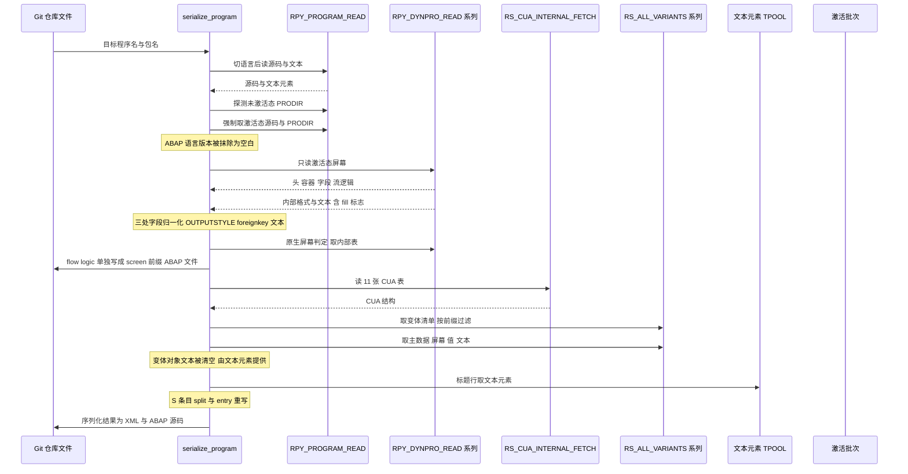
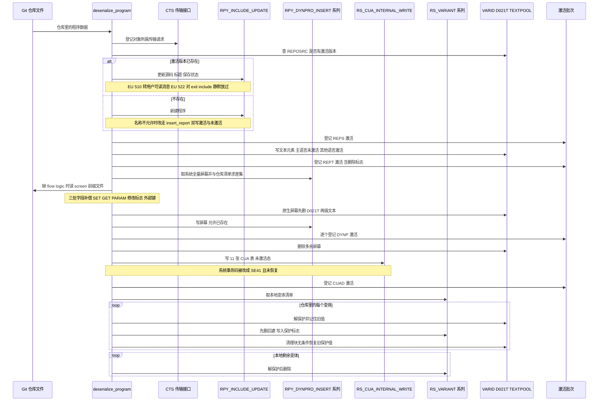

# ZCL_ABAPGIT_OBJECTS_PROGRAM 分析报告

> 分析对象：`abapGit__abapGit__zcl_abapgit_objects_program.clas.abap`（1597 行，ABAP OO 类定义段 + 实现段，abapGit 项目的对象适配层）
> 报告视角：代码 onboarding 走读，按真实调用链展开，而非按源码出现顺序

---

## 一、程序定位与业务背景

### 1.1 这段代码在解决什么问题

先说它**不是**什么：它不是一业务程序，不读任何业务表，不过账，也不和用户交互。它是 **abapGit（把 SAP 系统对象纳入 Git 版本控制的项目）里"ABAP 程序"这一对象类型的适配器**。

业务问题的具体形状是这样的。SAP 里一个"程序"（REPS 对象）远不止一段 ABAP 源码。在 SE38 里你右键一个报表能看到的东西包括：源代码、文本元素（TPOOL）、屏幕（DYNPRO，含容器 / 字段 / flow logic）、CUA 接口（按钮、状态、菜单、动作、弹窗键，分散在 11 张 `RSMPE_*` 表里）、以及用户保存的选择变体（VARID / VARIT / VANZ 一族）。而这些数据被 SAP 存在**十几个结构各不相同的系统表**里，且**没有一个统一的读写 API**：屏幕要走 `RPY_DYNPRO_READ`，CUA 要走 `RS_CUA_INTERNAL_FETCH`，变体要用三个带 `_255` 后缀的 FM，文本元素则要用 `INSERT TEXTPOOL` 语句。

要让 Git 能管住一个报表，就必须把这些碎片**装进一个 XML**（推送），并且能从 XML **完整还原回系统**（拉取）。这个类就是干这件事的：`serialize_program` 把五类数据打包成"一个 XML + 一份 ABAP 源文件"，`deserialize_program` 把 XML 拆回系统。

它的设计范式可以一句话定性：

> **"双向适配器 + 标准缺陷补偿器"** —— 主体是对 14 个 SAP 函数模块与 3 处直接 SQL 的读写封装；但它真正的难度不在"读什么、写什么"，而在 **SAP 标准 FM 本身的不对称与 bug**。类里近三分之一的代码是在给这些不对称打补丁。

### 1.2 为什么值得单独做成一个类

三个理由，按重要性排：

1. **对象类型的多态骨架**。abapGit 对每种对象类型（程序、类、函数组、数据元素、表……）各有一个 `zcl_abapgit_objects_xxx`，全部继承同一个 `zcl_abapgit_objects_super`，框架靠统一的方法名（`serialize_xxx` / `deserialize_xxx`）分派。本类是这套多态里"程序"那一支的实现。
2. **数据形态差异极大**。程序是极少数同时拥有"源码 + 文本 + 屏幕 + 交互界面 + 变体"五类数据的对象类型。把它塞进通用序列化框架会让基类臃肿；独立成类，基类只保留真正公共的能力（语言切换、锁检查、激活登记、文件容器）。
3. **补丁必须和被它修的对象放在一起**。`auto_correct_cua_adm` 修的是历史版本 CUA 存储缺陷，`get_program_title` 里的动态 `ASSIGN` 修的是 `RPY_PROGRAM_UPDATE` 的 TTAB 未清理 bug，`strip_generation_comments` 修的是再生成代码的生成日期噪音——这些都只对"程序"这一对象类型成立，放不进基类。

代价是：本文件 1597 行、27 个方法，是 abapGit 里最重的对象适配器之一。**读它不能按"一个方法一个方法地看"，必须按方向读**：先读序列化方向（推），再读反序列化方向（拉），最后回头比对两侧的补偿逻辑是否镜像对称。

### 1.3 依赖清单（读这段代码前必须知道的地形）

```
本文件可见（类内定义）
  类型     ty_cua        11 张 RSMPE_* 内表 + ADM 主结构
           ty_dynpro     6 段屏幕结构 + 原生屏幕专属段（nat_header / nat_fields / nat_texts）
           ty_vari       变体主结构 + 屏幕号 / 值 / 文本三张子表
  常量     c_state       active = 'A' / inactive = 'I' / off = ''
           c_native_dynpro = 'IN'
           c_sysvari_clnt  = '000'（变体在客户端 000）
           c_sysvari_pattern_sap = 'SAP&*' / c_sysvari_pattern_cus = 'CUS&*'
  方法     两个公开入口 serialize_program / deserialize_program + 25 个内部方法

本文件不可见（继承自 zcl_abapgit_objects_super 等，接手前必须去 SE24 补读）
  属性     ms_item（对象坐标 obj_type / obj_name）、mv_language、
           mo_files（文件容器）、mo_i18n_params（多语言参数）
  方法     exists_a_lock_entry_for( )、clear_abap_language_version( )

跨类协作
  zcl_abapgit_factory              get_sap_report( ) / get_cts_api( )，取具体工厂实例
  zcl_abapgit_objects_activation   add( )，把待激活对象登记进批次
  zcl_abapgit_language             set_current_language( ) / restore_login_language( )
  zcl_abapgit_xml_output           add( )，把结构写进 XML
  zif_abapgit_sap_report           read_progdir / read_report / insert_report / update_progdir
  zcx_abapgit_exception            raise( ) / raise_t100( )，本类的统一异常出口

SAP 标准（14 个函数模块 + 3 处直接 SQL）
  RPY_PROGRAM_READ / RPY_PROGRAM_INSERT / RPY_INCLUDE_UPDATE
  RS_SCREEN_LIST / RPY_DYNPRO_READ / RPY_DYNPRO_READ_NATIVE
  RPY_DYNPRO_INSERT / RPY_DYNPRO_INSERT_NATIVE
  RS_CUA_INTERNAL_FETCH / RS_CUA_INTERNAL_WRITE
  RS_ALL_VARIANTS_4_1_REPORT / RS_GET_SCREENS_4_1_VARIANT
  RS_VARIANT_VALUES_TECH_DAT_255 / RS_VARIANT_CONTENTS_255
  RS_CREATE_VARIANT_255 / RS_CHANGE_CREATED_VARIANT_255 / RS_VARIANT_DELETE
  直接 SQL   TADIR（读包）、VARID（SELECT ... FOR UPDATE + UPDATE）、D021T（DELETE + INSERT）
```

### 1.4 这是"框架的内脏"，读它要换一副眼睛

三条读前须知，不先说清楚容易在整个类里迷路：

- **两个公开方法不是完整的反序列化流程。** `deserialize_program` 只处理 PROGDIR 与源码，而另外四个反序列化方法（`deserialize_dynpros` / `deserialize_cua` / `deserialize_varis` / `deserialize_textpool`）**在本文件内一次都没有被调用**。按 abapGit 的框架约定，反序列化驱动应按 XML 元素名分派同名方法；但分派点不在本文件，**需在 SE38 核实**。
- **同一份数据既有"读侧"也有"写侧"，且两侧不对称是常态而非例外。** 序列化时 `RPY_DYNPRO_READ` 会清掉某些字段，反序列化时就要把它们补回来；反过来，序列化时算出来的 `foreignkey` 在写回时也要被强制归零。本类最有价值的代码就在这对镜像补偿里（见 3.2 与 3.11）。
- **大量兼容性代码是历史包袱，删不掉，但也不能当成主流路径去读。** `uncondense_flow` 带着 `todo: kept for compatibility, remove after grace period #3680`，`auto_correct_cua_adm` 修的是 issue #1807，`insert_program` / `delete_vari` 里的 `CATCH cx_sy_dyn_call_param_not_found` 是为低版本 SAP 准备的回退。**读的时候要分清"今天的主路径"与"必须长期保留的兼容分支"，否则会把兼容分支当主路径去维护。**

---

## 二、程序执行流程总览

本类有**两条主链**：序列化（推）与反序列化（拉），彼此独立，共享 3 个只读辅助方法（`get_program_title` / `add_tpool` / `strip_generation_comments`），另有 4 个锁检测方法由框架在推 / 拉之前调用作为守卫。

```mermaid
flowchart TD
    subgraph PUSH["序列化方向：推"]
      S0["serialize_program 序列化总控"] --> S0a["RPY_PROGRAM_READ 读源码与文本元素 并切换语言"]
      S0a --> S0b["read_progdir 与 read_report 兜底取激活态数据"]
      S0b --> S0c["clear_abap_language_version 抹掉 ABAP 语言版本"]
      S0c --> S1["serialize_dynpros 屏幕 含字段修正与 flow logic 拆文件"]
      S0c --> S2["serialize_cua CUA 界面 以激活态读取"]
      S0c --> S3["serialize_varis 变体"]
      S1 --> S4["strip_generation_comments 去掉再生成代码噪音"]
      S2 --> S4
      S3 --> S4
      S4 --> S5["io_files 落 XML 与 ABAP 两个文件"]
    end

    subgraph PULL["反序列化方向：拉"]
      D0["deserialize_program 反序列化总控"] --> D0a{"is_exit_include 是否 SAP 增强 include"}
      D0a -->|是| D1["deserialize_exit_include 专用路径"]
      D0a -->|否| D0b["get_cts_api 登记传输请求"]
      D0b --> D0c{"reposrc 是否已有激活版本"}
      D0c -->|有| D2["update_program"]
      D0c -->|无| D3["insert_program"]
      D1 --> D2
      D1 --> D3
      D2 --> D4["update_progdir 并登记 REPS 激活"]
      D3 --> D4
    end

    subgraph SECTIONS["框架按 XML 元素名另行分派 本文件内无调用者"]
      T1["deserialize_textpool 文本元素"]
      T2["deserialize_dynpros 屏幕 含多余屏幕删除"]
      T3["deserialize_cua CUA 含 ADM 自动校正"]
      T4["deserialize_varis 变体 以仓库为准重建"]
    end

    subgraph GUARD["锁检测 由框架在推拉之前调用"]
      L1["is_any_dynpro_locked 锁对象 ESCRP"]
      L2["is_cua_locked 锁对象 ESCUAPAINT"]
      L3["is_text_locked 锁对象 EABAPTEXTE"]
    end
```



### 责任链表

| 子程序 | 调用者 | 职责 |
|---|---|---|
| `serialize_program` | abapGit 框架序列化调度（公开入口） | 推方向总控：读源码与文本元素、判定是否需要屏幕 / CUA / 变体、落两个文件 |
| `serialize_dynpros` | `serialize_program`（仅 subc = '1' 或 'M'） | 读取全部屏幕（跳过生成的选择屏幕），做三处字段修正，把 flow logic 拆成独立 ABAP 文件 |
| `serialize_cua` | `serialize_program`（同上条件） | 以激活态读取 11 张 `RSMPE_*` 表，装进 `ty_cua` |
| `serialize_varis` | `serialize_program`（同上条件） | 列出系统 / 客户变体，逐个取主数据、值、对象、多语言文本与绑定屏幕 |
| `get_varis_for_report` | `serialize_varis`、`deserialize_varis` | 取变体目录并按 `SAP&*` / `CUS&*` 过滤，两侧共用同一个口径 |
| `get_vari_data` | `serialize_varis` | 取变体主数据 / 值表 / 对象表 / 多语言描述，并排序保证可复现 |
| `get_vari_screens` | `serialize_varis` | 取变体绑定的屏幕号集合 |
| `add_tpool` | `serialize_program` | 文本元素转"分段"格式，重写 S 条目的 `split` 与 `entry` |
| `read_tpool` | 本文件内无调用者（**需核实**） | 名义上是 `add_tpool` 的反向转换 |
| `strip_generation_comments` | `serialize_program` | 仅 FUGR：删掉再生成代码头的生成日期与生成器版本行，消掉无意义 diff |
| `deserialize_program` | abapGit 框架反序列化调度（公开入口） | 拉方向总控：exit include 分流、登记传输、按激活态决定 insert / update、更新 PRODIR、登记激活 |
| `is_exit_include` | `deserialize_program`、`update_program` | 按 `LX*` / `SAPLX*` 前缀判定 SAP 增强 include |
| `deserialize_exit_include` | `deserialize_program` | 增强 include 专用路径：按激活态查 `REPOSRC` 决定 update 还是 insert |
| `get_program_title` | `deserialize_program`、`deserialize_exit_include` | 从文本元素取程序标题，并绕开 `RPY_PROGRAM_UPDATE` 的 TTAB bug |
| `insert_program` | `deserialize_program`、`deserialize_exit_include` | 新建程序；名称不被允许时改为分别写激活与未激活两份源码 |
| `update_program` | 同上 | 更新既有程序，对 EU510 / EU522 分别给出可行动的提示 |
| `deserialize_textpool` | 框架分派 | 按主语言 / 其他语言分状态写文本元素，处理 include 的特殊情形 |
| `deserialize_dynpros` | 框架分派 | 插入 / 更新屏幕（原生屏幕走独立分支）、删除多余屏幕、补偿序列化时被抹掉的字段 |
| `deserialize_cua` | 框架分派 | 写 11 张 `RSMPE_*` 表并登记 CUAD 激活 |
| `deserialize_varis` | 框架分派 | 以仓库为准重建变体：本地先删再建、剩余删除，全程保护保护位 |
| `auto_correct_cua_adm` | `deserialize_cua` | 兼容历史 XML：ADM 三代码缺失时从 ACT / MEN / PFK 表反推 |
| `uncondense_flow` | `deserialize_dynpros` | 兼容旧 XML：按空格数组把压缩过的 flow logic 还原缩进 |
| `create_vari` / `delete_vari` / `set_vari_protection` | `deserialize_varis` | 变体创建（两步 FM）、删除（低版本参数回退）、保护位开关（`FOR UPDATE` + `UPDATE`） |
| `is_any_dynpro_locked` / `is_cua_locked` / `is_text_locked` | abapGit 框架（推 / 拉之前的守卫） | 按 ESCRP / ESCUAPAINT / EABAPTEXTE 三个锁对象判断是否被他人占用 |

下面按这两条链，逐个方法展开。先读序列化方向（推），因为它决定了"仓库里那个 XML 长什么样"；再读反序列化方向（拉），重点核对两侧的补偿逻辑是否镜像对称。

---

## 三、分组分析

### 3.1 序列化总控 `serialize_program`

这是推方向的入口，也是整个类里"读代码顺序"最容易搞错的地方。它分成四步：**取原始数据 → 兜底取激活态 → 条件序列化子对象 → 落包**。四步之间的顺序是有讲究的，后面对应的缺陷就出在这个顺序上。

#### ① 取源码与文本元素，并把语言切换成项目语言

```abap
    IF iv_program IS INITIAL.
      lv_program_name = is_item-obj_name.
    ELSE.
      lv_program_name = iv_program.
    ENDIF.

    zcl_abapgit_language=>set_current_language( mv_language ).

    CALL FUNCTION 'RPY_PROGRAM_READ'
      EXPORTING
        program_name     = lv_program_name
        with_includelist = abap_false
        with_lowercase   = abap_true
      TABLES
        source_extended  = lt_source
        textelements     = lt_tpool
      EXCEPTIONS
        cancelled        = 1
        not_found        = 2
        permission_error = 3
        OTHERS           = 4.

    IF sy-subrc = 2.
      zcl_abapgit_language=>restore_login_language( ).
      RETURN.
    ELSEIF sy-subrc <> 0.
      zcl_abapgit_language=>restore_login_language( ).
      zcx_abapgit_exception=>raise_t100( ).
    ENDIF.

    zcl_abapgit_language=>restore_login_language( ).
```

**做什么** — 先用"传入值优先、否则用对象坐标"的方式定出程序名，然后切到项目语言（`mv_language`），调 `RPY_PROGRAM_READ` 一次性取出源码（`lt_source`）与文本元素（`lt_tpool`），最后立刻恢复登录语言。三个返回码分别处理：`2`（not_found）是静默返回，其他非零是抛异常。

**为什么** — 两步语言切换是有意的：`RPY_PROGRAM_READ` 的文本元素结果按 `sy-langu` 过滤，abapGit 要把仓库里的文本固定成"项目语言"（可能不是登录语言），所以必须先切再读。`with_includelist = abap_false` 是因为 include 清单在 abapGit 里是独立的对象，不算进程序这个 XML；`with_lowercase = abap_true` 保证仓库里的源码是**小写**的（abapGit 的既定约定，也是为了 Git diff 更稳定）。把"失败时恢复语言"写进每个分支而不是放进 CLEANUP，是这段代码的取舍点——它假设 `RPY_PROGRAM_READ` 不会抛异常（只有 message），所以三条出口都能被手动覆盖到。

**风险与改进** — 第一，**语言上下文切换没有 CLEANUP 兜底**。如果调用方在 `sy-subrc` 判断之前就中断（短转储、或外层 `try` 抛异常），`sy-langu` 会一直停在项目语言，同一个请求里后续所有对象都会被错语言读一遍。稳妥写法是 `TRY. set_current_language. ... CLEANUP. restore_login_language. ENDTRY.`。第二，**`sy-subrc = 2` 走静默 RETURN**：程序在系统里被删掉之后，序列化不会产出任何文件，仓库里会残留旧文件。这在"删除操作由 abapGit 的删除路径单独负责"的前提下是对的，但前提是上层确实有 diff 检测——**需要在框架的 diff 逻辑处核实**，否则会出现"系统里删了、仓库里还在"的静默不一致。

#### ② 兜底取激活态源码与 PRODIR

```abap
    li_report = zcl_abapgit_factory=>get_sap_report( ).

    TRY.
        " Raises exception if inactive version does not exist
        ls_progdir = li_report->read_progdir(
          iv_name  = lv_program_name
          iv_state = c_state-inactive ).

        " Explicitly request active source code
        lt_source = li_report->read_report(
          iv_name  = lv_program_name
          iv_state = c_state-active ).
    CATCH zcx_abapgit_exception ##NO_HANDLER.
    ENDTRY.

    ls_progdir = li_report->read_progdir(
      iv_name  = lv_program_name
      iv_state = c_state-active ).

    clear_abap_language_version( CHANGING cv_abap_language_version = ls_progdir-uccheck ).
```

**做什么** — 先用 `RPY_PROGRAM_READ` 拿到的可能是未激活版本；这里再做一次确认：试着读**未激活态**的 PRODIR，读到了就说明存在未激活版本，于是显式再取一次**激活态**源码覆盖 `lt_source`。这个 `TRY` 只用来探测"未激活版本是否存在"，异常被 `##NO_HANDLER` 丢弃。最后无条件再读一次激活态 PRODIR，并把 `uccheck`（ABAP 语言版本）清空。

**为什么** — 源码里的注释说得很直白：*"If inactive version exists, then RPY_PROGRAM_READ does not return the active code"*。这是标准 FM 的既定行为——未激活版本优先，但 `RPY_PROGRAM_READ` 返回的是混合状态（PRODIR 取激活态、源码取未激活态），而 abapGit 想要的是**激活态的完整快照**，所以必须手动覆盖。用"异常作为控制流"来探测存在性，比再写一个 `EXISTS` 检查少一次数据库往返，代价是读起来反直觉。至于 `clear_abap_language_version`：ABAP 语言版本是随系统版本变化的字段（S/7/S9 之类），把它写进仓库会让同一个文件在不同环境的机器上产生无意义 diff，所以序列化时抹掉、拉取时按目标系统重新生成——这是 abapGit 跨环境同步的核心设计之一。

**风险与改进** — 用异常当探测手段，会让"是否存在未激活版本"这个语义只写在注释里，下一个维护者很可能把它"优化"成一个 `SELECT SINGLE` 然后引入行为差异；建议把这个探测语义命名成一个小方法（如 `has_inactive_progdir( )`）。真正需要留意的是顺序：`read_report( iv_state = active )` 只在那条 `TRY` 里执行一次，如果**只存在未激活版本**（程序新建后从未激活过），激活态源码的读取会不会返回空或抛异常，取决于 `zif_abapgit_sap_report=>read_report` 对不存在版本的实现，**需在 SE38 核实**——这直接决定"新建未激活程序"能否被正确推上 Git。

#### ③ 条件序列化屏幕 / CUA / 变体

```abap
    IF io_xml IS BOUND.
      li_xml = io_xml.
    ELSE.
      CREATE OBJECT li_xml TYPE zcl_abapgit_xml_output.
    ENDIF.

    li_xml->add( iv_name = 'PROGDIR'
                  ig_data = ls_progdir ).
    IF ls_progdir-subc = '1' OR ls_progdir-subc = 'M'.
      lt_dynpros = serialize_dynpros( lv_program_name ).
      li_xml->add( iv_name = 'DYNPROS'
                   ig_data = lt_dynpros ).

      ls_cua = serialize_cua( lv_program_name ).
      li_xml->add( iv_name = 'CUA'
                   ig_data = ls_cua ).

      lt_varis = serialize_varis( lv_program_name ).
      li_xml->add( iv_name = 'VARIS'
                   ig_data = lt_varis ).
    ENDIF.

    READ TABLE lt_tpool WITH KEY id = 'R' INTO ls_tpool.
    IF sy-subrc = 0 AND ls_tpool-key = '' AND ls_tpool-length = 0.
      DELETE lt_tpool INDEX sy-tabix.
    ENDIF.

    li_xml->add( iv_name = 'TPOOL'
                 ig_data = add_tpool( lt_tpool ) ).

    IF NOT io_xml IS BOUND.
      io_files->add_xml( iv_extra = iv_extra
                         ii_xml   = li_xml ).
    ENDIF.

    strip_generation_comments( CHANGING ct_source = lt_source ).

    io_files->add_abap( iv_extra = iv_extra
                        it_abap  = lt_source ).
```

**做什么** — XML 载体优先复用调用方传入的 `io_xml`，没有就自建。然后按固定顺序写四个元素：PROGDIR（总是写）、DYNPROS / CUA / VARIS（仅当程序子类型是 `'1'` 屏幕程序或 `'M'` 混合程序时写）、TPOOL（总是写）。写 TPOOL 之前先把 `id = 'R'` 且 `key` 与 `length` 都为空的占位行删掉。`io_xml` 未绑定时才把 XML 交给文件容器；ABAP 源码则**无条件**落文件。

**为什么** — `subc` 判断是这道门的核心：只有带屏幕的程序才可能有 DYNPRO / CUA / 变体，写进 XML 的会是三个空节点，纯白浪费。把三个空节点省掉是刻意的最小化。`io_xml` 的双路设计对应两种身份：本对象作为**独立对象**被序列化时自建 XML 并入包；作为**别的对象的组成部分**（例如被宿主对象嵌套引用）时，XML 直接写进宿主，不再单独成文件——但 ABAP 源码始终要单独成文件，因为源码是"文件型内容"，XML 是"元数据型内容"，两者的容器不同。删掉空 `R` 行的判断也是同一思路：abapGit 不想让仓库里出现"有个标题但没有标题"的假数据。

**风险与改进** — 第一，**`io_xml` 已绑定时 XML 不入包但 ABAP 源码仍入包**，两个 `add` 用的是同一个 `iv_extra`，因此在"嵌套"场景下会产出"只有 ABAP 没有 XML"的半套文件；这个行为是否正确取决于调用方是否也负责把宿主 XML 入包，**需核实 `io_xml` 的传入点**。第二，空占位行只处理了 `id = 'R'` 一种；如果 TPOOL 里出现其他 `length = 0` 的空条目，会原样进 XML。第三，`READ TABLE lt_tpool WITH KEY id = 'R'` 是线性扫描（`textpool_table` 无唯一键可用），数据量是个位数，不影响性能，但若哪天有人把这段循环搬去处理大表就会退化。

### 3.2 屏幕序列化 `serialize_dynpros`

这是本类最"脏"的一段：三个 FM、四处字段修正、两个写入路径，但每一步都在补偿标准 FM 的某个不对称。分四步读。

#### ① 取屏幕清单并跳过生成的选择屏幕

```abap
    CALL FUNCTION 'RS_SCREEN_LIST'
      EXPORTING
        dynnr     = ''
        progname  = iv_program_name
      TABLES
        dynpros   = lt_d020s
      EXCEPTIONS
        not_found = 1
        OTHERS    = 2.
    IF sy-subrc = 2.
      zcx_abapgit_exception=>raise_t100( ).
    ENDIF.

    SORT lt_d020s BY dnum ASCENDING.

* loop dynpros and skip generated selection screens
    LOOP AT lt_d020s ASSIGNING <ls_d020s>
        WHERE type <> 'S' AND type <> 'W' AND type <> 'J'
        AND NOT dnum IS INITIAL.
```

**做什么** — 用 `RS_SCREEN_LIST`（`dynnr = ''` 表示取全部）列出该程序的所有屏幕，按屏幕号升序排序，然后在循环条件里直接排除类型 `'S'` / `'W'` / `'J'` 的生成屏幕以及屏幕号为空的行。

**为什么** — `'S'` / `'W'` / `'J'` 是选择屏幕相关的生成类型，它们由 ABAP 编辑器根据选择屏定义自动生成，**不存储在需要版本化的用户数据里**，序列化它们只会产生噪音。把过滤条件写进 `LOOP ... WHERE` 而不是循环体内 `IF`，是一次性表达"我不关心这些行"的最干净写法。`not_found = 1` 不报错是对的：程序可以一个屏幕都没有，此时返回空表是正常业务态；只有 `OTHERS = 2`（真正的失败）才抛异常。排序是必要的，因为后面要拿它和反序列化侧的清单做对齐，可复现的顺序是 Git 工具的生命线。

**风险与改进** — `SORT` 之后没有 `WITH UNIQUE KEY` 之类的手段去重；`RS_SCREEN_LIST` 对同一 `dnum` 理论上不会重复返回，但**这一点的正确性完全依赖 FM 的返回口径**（`RS_SCREEN_LIST` 在不同版本上是否可能返回激活态与未激活态各一行，需在 SRU 核实）。另外 `NOT dnum IS INITIAL` 这条过滤暗示 FM 可能返回"屏幕号为空"的汇总行——如果哪天 FM 把某个合法屏幕写成空屏幕号，它会被静默跳过，属于典型的"看似无害的过滤条件"。

#### ② 逐屏读取屏幕定义与内部字段表

```abap
      CALL FUNCTION 'RPY_DYNPRO_READ'
        EXPORTING
          progname             = iv_program_name
          dynnr                = <ls_d020s>-dnum
        IMPORTING
          header               = ls_header
        TABLES
          containers           = lt_containers
          fields_to_containers = lt_fields_to_containers
          flow_logic           = lt_flow_logic
        EXCEPTIONS
          cancelled            = 1
          not_found            = 2
          permission_error     = 3
          OTHERS               = 4.
      IF sy-subrc <> 0.
        zcx_abapgit_exception=>raise_t100( ).
      ENDIF.

      "#2746: we need the dynpro fields in internal format:
      FREE lt_fieldlist_int.

      CALL FUNCTION 'RPY_DYNPRO_READ_NATIVE'
        EXPORTING
          progname   = iv_program_name
          dynnr      = <ls_d020s>-dnum
        TABLES
          fieldlist  = lt_fieldlist_int
          fieldtexts = lt_texts.
```

**做什么** — 对每个屏幕调两次读：`RPY_DYNPRO_READ` 取屏幕头、容器、字段与 flow logic（这是"显示格式"）；`RPY_DYNPRO_READ_NATIVE` 取字段的**内部格式**表（`d021s`）与文本表（`d021t`）。每次迭代前显式 `FREE lt_fieldlist_int`。第二次调用**不检查 `sy-subrc`**。

**为什么** — 为什么要两次？因为后面要判定这个屏幕是不是"原生屏幕"（含 splitter 的屏幕），而那个判据在内部字段表的 `fill` 标志里，`RPY_DYNPRO_READ` 拿不到。issue #2746 的注释说明这个需求是为了修 `foreignkey` 的还原——外部格式的 `foreignkey` 只是结果，判据在内部格式的 `flg1` / `flg3` 里。`FREE` 是必要的：这三个表在循环里反复复用，不 `FREE` 会把上一屏的数据留在表头行或残留行里。

**风险与改进** — **`RPY_DYNPRO_READ_NATIVE` 的 `sy-subrc` 完全没检查**，这是本方法最扎眼的一处。如果某个屏幕的内部格式读取失败，`lt_fieldlist_int` 保持为空，随后 `READ TABLE lt_fieldlist_int ... WITH KEY fill = 'X'` 必然失败，这个屏幕就被判成"非原生"而走进通用路径——**一个原生屏幕会被当作普通屏幕写回，splitter 等结构可能丢失，而且没有任何报错**。建议至少补 `IF sy-subrc <> 0` 的降级处理或告警。顺带一提，`FREE` 只清了 `lt_fieldlist_int`，`lt_texts` 在本段没清（后面 `nat_texts` 赋值前会整体覆盖，风险较低但仍不对称）。

#### ③ 三处字段级修正：OUTPUTSTYLE、foreignkey、from_dict 的 text

```abap
      LOOP AT lt_fields_to_containers ASSIGNING <ls_field>.
* output style is a NUMC field, the XML conversion will fail if it contains invalid value
* field does not exist in all versions
        ASSIGN COMPONENT 'OUTPUTSTYLE' OF STRUCTURE <ls_field> TO <lv_outputstyle>.
        IF sy-subrc = 0 AND <lv_outputstyle> = '  '.
          CLEAR <lv_outputstyle>.
        ENDIF.

        "2746: we apply the same logic as in SAPLWBSCREEN
        "for setting or unsetting the foreignkey field:
        UNASSIGN <ls_field_int>.
        READ TABLE lt_fieldlist_int ASSIGNING <ls_field_int> WITH KEY fnam = <ls_field>-name.
        IF <ls_field_int> IS ASSIGNED.
          IF <ls_field_int>-flg1 O lc_flg1ddf AND
              <ls_field_int>-flg3 O lc_flg3for AND
              <ls_field_int>-flg3 Z lc_flg3fdu AND
              <ls_field_int>-flg3 Z lc_flg3fku.
            <ls_field>-foreignkey = 'X'.
          ELSE.
            CLEAR <ls_field>-foreignkey.
          ENDIF.
        ENDIF.

        IF <ls_field>-from_dict = abap_true AND
           <ls_field>-modific   <> 'F' AND
           <ls_field>-modific   <> 'X'.
          CLEAR <ls_field>-text.
        ENDIF.
      ENDLOOP.
```

**做什么** — 三个修正：其一，若 `OUTPUTSTYLE` 是空白 NUMC（`'  '`），清空为真正的 `INITIAL`，避免 XML 转换失败；其二，用内部字段表的 `flg1` / `flg3` 位掩码重新计算外部格式的 `foreignkey`（命中设 `'X'`，否则清空）；其三，`from_dict = abap_true` 且 `modific` 既不是 `'F'` 也不是 `'X'` 时，清空该字段的 `text`。

**为什么** — 这三处都是**"读侧为了写出合法 XML 而做的归一化"**，也正好对应 3.11 反序列化侧要补回来的三样东西，是本类最值得记住的镜像对：

- `OUTPUTSTYLE` 是 NUMC，空白 NUMC 转 XML 会出问题（NUMC 里全是空格），所以转成真正的 `INITIAL`——一个"看起来一样的值"在 XML 世界里其实不一样。用 `ASSIGN COMPONENT` 动态访问是因为**该字段并非所有版本都有**，静态引用会编译不过；`sy-subrc = 0` 兜住旧版本。
- `foreignkey` 的判据是 `flg1 O '20'` 且 `flg3 O '04'`（for）且不命中 `fdu` / `fku` 两个位——注释明确说"apply the same logic as in SAPLWBSCREEN"，即**把 SAP 自己的判定逻辑抄过来**，因为 `RPY_DYNPRO_READ` 返回的 `foreignkey` 在低版本上不可靠。位掩码常量从 include `MSEUSBIT` 取，代码里命名为 `lc_flg1ddf` / `lc_flg3for` 等。
- `text` 的清空是因为：`from_dict`（字段来自 DDIC 数据元素）时，SAP 会在导入时自动带上数据元素自带的文本，此时再存一份 `text` 会在导入时与自动文本冲突。所以序列化时抹掉，反序列化时再把标志位补回来。

**风险与改进** — 第一，**这一段的正确性完全建立在"位掩码取值没抄错"之上**，而它们只是从 `MSEUSBIT` 抄出来的常量，没有任何交叉校验；SAP 升级 `MSEUSBIT` 后这里会静默失效。**建议在 SRU 里核对 `SAPLWBSCREEN` 的当前实现**。第二，`READ TABLE lt_fieldlist_int ... WITH KEY fnam` 是标准表线性查找，字段多的屏幕（几百个字段）会让这段变成 O(n²)；对大屏幕有实测开销，改成按 `fnam` 建哈希表或哈希索引可以消掉。第三，`UNASSIGN <ls_field_int>` 放在 `READ TABLE` 之前是正确且必要的（否则上一轮的赋值会残留），但整段依赖字段符号的赋值状态做控制流，读起来要靠注释才能跟上。

#### ④ 容器归一化与原生屏幕判定，flow logic 拆成独立文件

```abap
      LOOP AT lt_containers ASSIGNING <ls_container>.
        IF <ls_container>-c_resize_v = abap_false.
          CLEAR <ls_container>-c_line_min.
        ENDIF.
        IF <ls_container>-c_resize_h = abap_false.
          CLEAR <ls_container>-c_coln_min.
        ENDIF.
      ENDLOOP.

      APPEND INITIAL LINE TO rt_dynpro ASSIGNING <ls_dynpro>.
      <ls_dynpro>-header = ls_header.

      " Store flow logic as separate ABAP files instead of XML
      mo_files->add_abap(
        iv_extra = 'screen_' && ls_header-screen
        it_abap  = lt_flow_logic ).

      READ TABLE lt_fieldlist_int TRANSPORTING NO FIELDS WITH KEY fill = 'X'.
      IF ls_header-type CA c_native_dynpro AND sy-subrc = 0.
        " In particular for dynpros with splitter
        <ls_dynpro>-nat_header = <ls_d020s>.
        CLEAR: <ls_dynpro>-nat_header-dgen, <ls_dynpro>-nat_header-tgen.
        <ls_dynpro>-nat_fields = lt_fieldlist_int.
        <ls_dynpro>-nat_texts  = lt_texts.
      ELSE.
        <ls_dynpro>-containers = lt_containers.
        <ls_dynpro>-fields     = lt_fields_to_containers.
      ENDIF.
```

**做什么** — 先把容器上"不允许缩放"的最小行 / 列值清掉（不可缩放时这两个值无意义）；然后把屏幕头、flow logic、以及"原生或通用"两套字段数据装进 `ty_dynpro` 的行里。原生屏幕的判据是：屏幕头 `type` 包含 `'IN'` **且** 内部字段表里存在 `fill = 'X'` 的行。flow logic 不走 XML，而是用 `iv_extra = 'screen_' && 屏幕号` 单独落成一个 ABAP 文件。

**为什么** — 两个决定都值得单独说。其一，**flow logic 拆成 ABAP 文件**是刻意的：flow logic 是纯文本代码（`AT EXIT-COMMAND`、`CHAIN`、`MODULE ... `），塞进 XML 会被转义成一团难读的字符，且**无法在 Git 里被工具识别为代码**；拆出来之后，编辑器能对它做语法高亮、`git diff` 能给出有意义的逐行差异，代价是多出 N 个文件（每个屏幕一个）。其二，`dgen` / `tgen`（生成日期 / 生成时间）被显式清空——这两个字段每次导入都会变，写进 XML 等于每次同步都产生 diff，是典型的"必须剥掉的时间戳"。原生屏幕分支保留 `nat_header`（`d020s`）/ `nat_fields`（`d021s`）/ `nat_texts`（`d021t`）三张内部表，因为含 splitter 的屏幕必须走 `RPY_DYNPRO_INSERT_NATIVE`，通用路径写不出来。

**风险与改进** — `iv_extra = 'screen_' && ls_header-screen`：屏幕号是 NUMC，用 `&&` 拼接会保留前导零，这一点是对的；但如果未来有人把它改成 `|screen_{ ... }|`，行为一致，无需担心。真正值得留意的是**`READ TABLE lt_fieldlist_int TRANSPORTING NO FIELDS WITH KEY fill = 'X'` 没有指定排序方式**，标准表的 `WITH KEY` 读取是线性的，且遇到第一个匹配即停——判据是"存在性"，这没问题，但它隐式假设 `lt_fieldlist_int` 是完整的内部字段表（依赖 ② 那个未检查 `sy-subrc` 的调用）。另外，`mo_files->add_abap` 的返回值（文件是否成功入容器）没有被检查。

从 3.2 结束到 3.3，屏幕这条最复杂的路径先告一段落。接下来两个方法分别是"CUA 界面"和"变体"，它们的复杂度不在自身，而在**读侧永远只读激活态**这个约定。

### 3.3 CUA 序列化 `serialize_cua`

方法本身很短，但它定下了一条贯穿本类的规则：**CUA 只从激活态读**。

```abap
    CALL FUNCTION 'RS_CUA_INTERNAL_FETCH'
      EXPORTING
        program         = iv_program_name
        language        = mv_language
        state           = c_state-active
      IMPORTING
        adm             = rs_cua-adm
      TABLES
        sta             = rs_cua-sta
        fun             = rs_cua-fun
        men             = rs_cua-men
        mtx             = rs_cua-mtx
        act             = rs_cua-act
        but             = rs_cua-but
        pfk             = rs_cua-pfk
        set             = rs_cua-set
        doc             = rs_cua-doc
        tit             = rs_cua-tit
        biv             = rs_cua-biv
      EXCEPTIONS
        not_found       = 1
        unknown_version = 2
        OTHERS          = 3.
    IF sy-subrc > 1.
      zcx_abapgit_exception=>raise_t100( ).
    ENDIF.
```

**做什么** — 调 `RS_CUA_INTERNAL_FETCH`，以**激活态**、项目语言读取 CUA 界面的 11 张表（ADM 主结构 + sta / fun / men / mtx / act / but / pfk / set / doc / tit / biv），一次性装进 `ty_cua` 结构。返回码 `0`（正常）和 `1`（not_found）都放行，只有 `> 1`（`unknown_version` 与 `OTHERS`）才抛异常。

**为什么** — CUA 的 11 张表由一个 FM 统一读取，这本身是好事；abapGit 要做的只是把它们原样搬进一个结构，交给 XML。`language = mv_language` 保证取到的是项目语言的文档（`doc` / `tit` 是文本表）。`not_found` 放行是因为：一个带屏幕的程序可以完全没有 CUA 接口，此时仓库里就不会有 CUA 节点——与 3.1 里"能省就省"的原则一致。

**风险与改进** — 唯一但重要的一点：**只读激活态意味着"未激活的 CUA 修改"在序列化时会被静默丢弃**。用户改了 CUA 但还没激活，abapGit 推上去的是旧版本。如果 abapGit 在推送前会统一检查并激活所有未激活对象（框架里通常有这样的检查），这个约定就成立；**需要在 abapGit 的 push 流程里核实是否有这道前置检查**。这里还有一个和反序列化侧不对称的地方值得记住：序列化读激活态，反序列化（3.12）写**未激活态**再登记 CUAD 激活——一次完整的"推 → 拉"往返是通的，但"改而未激活 → 推"这个中间态会丢数据。

### 3.4 变体序列化 `serialize_varis` 与三个只读辅助

变体（选择变体）是 REPS 对象里唯一"多对一"的数据：一个程序可以有任意多个变体，每个变体自身又是一组表（主数据、屏幕、值、对象、多语言文本）。这条链是四个方法的组合，值得连着读。

#### ① 主循环：`serialize_varis`

```abap
    lt_varis = get_varis_for_report( iv_program_name ).

    LOOP AT lt_varis ASSIGNING <ls_varikey>.
      CLEAR: ls_vari,
             ls_varid.

      get_vari_data( EXPORTING is_vari    = <ls_varikey>
                     IMPORTING es_varid   = ls_varid
                               et_values  = ls_vari-values
                               et_objects = ls_vari-objects
                               et_texts   = ls_vari-texts ).

      MOVE-CORRESPONDING ls_varid TO ls_vari.

      " Clear texts - they will be provided in TEXTPOOL section
      LOOP AT ls_vari-objects ASSIGNING <ls_object>.
        CLEAR <ls_object>-text.
      ENDLOOP.

      ls_vari-variscreens = get_vari_screens( <ls_varikey> ).

      INSERT ls_vari INTO TABLE rt_varis.
    ENDLOOP.
```

**做什么** — 先列出该程序的所有（系统 / 客户）变体键，然后逐个：清空工作变量 → 取主数据与三张子表 → 把 `varid` 主结构用 `MOVE-CORRESPONDING` 投影进 `ty_vari` → 清掉每个对象行里的 `text` → 取绑定屏幕号 → 插入结果表。

**为什么** — 主循环本身是骨架，价值在两个细节。**其一，`MOVE-CORRESPONDING ls_varid TO ls_vari`**：`varid` 有 12 个字段（含 mandt / report / variant / transport / environmnt / protected / secu / flag1 / flag2 / xflag1 / xflag2），而 `ty_vari` 只挑了 8 个（见 3.15），`MOVE-CORRESPONDING` 天然只搬同名同型的字段，省掉 8 行手工赋值，且**字段集变更时不会漏**。代价是它按名匹配，字段一旦在 DDIC 里改名就静默失效。其二，**对象行的 `text` 被清空**，注释说得很清楚："they will be provided in TEXTPOOL section"——变体对象（VANZ）里的文本与程序文本元素（TPOOL）是重复数据，写两份会互相打架，所以只保留 TPOOL 那一份。

**风险与改进** — `CLEAR ls_vari, ls_varid` 放在循环体开头是对的，但**没有清 `ls_vari-variscreens`**：由于该字段每轮都被 `get_vari_screens( )` 整体赋值覆盖，实际无害；可 `ls_vari-values` / `ls_vari-objects` / `ls_vari-texts` 是靠 `IMPORTING` 从 `get_vari_data` 带回来的，而 `get_vari_data` 内部确实做了 `CLEAR`（见 ②），所以目前闭环。但这种"某处没清、靠被调方保证已清"的耦合很容易在重构时断掉——建议要么在循环开头把三个子表也一起清掉，要么在注释里写明"由 get_vari_data 负责清空"。

#### ② 变体过滤：`get_varis_for_report`

```abap
    CALL FUNCTION 'RS_ALL_VARIANTS_4_1_REPORT'
      EXPORTING
        program = iv_repid
      IMPORTING
        cat     = ls_catalog
      EXCEPTIONS
        OTHERS  = 1.
    IF sy-subrc <> 0.
      zcx_abapgit_exception=>raise_t100( ).
    ENDIF.

    ls_vari-report = iv_repid.
    LOOP AT ls_catalog-cat ASSIGNING <ls_cat>
         WHERE variant CP c_sysvari_pattern_sap
         OR variant CP c_sysvari_pattern_cus.
      ls_vari-variant = <ls_cat>-variant.
      INSERT ls_vari INTO TABLE rt_varis.
    ENDLOOP.

    SORT rt_varis.
```

**做什么** — 取该报告的变体目录（catalog），只保留变体名匹配 `SAP&*` 或 `CUS&*` 的行，拼成 `{report, variant}` 键表，最后排序。

**为什么** — `SAP&*` 与 `CUS&*` 是 SAP 变体目录里两种变体类型的命名约定：SAP 系统自带的（比如 `SAP*`、`SAP*&*`）和客户自定义的（`CUS*`）。abapGit 要版本化的就是这两类；个人变体（`USER*`）不进仓库——个人变体属于单个用户的私有配置，进仓库会把别人机器的私人配置推过来，这是明确的边界决定。`&` 在 `CP` 里是"任意单个字符"的通配，所以 `SAP&*` 会匹配 `SAP*`、`SAP*&*`、`SAPXX...` 这类。把过滤条件写进 `LOOP ... WHERE` 再一次是干净的选择。**排序是刻意的**：`SORT rt_varis` 保证多变的输入顺序在仓库里产生稳定输出，这是 Git 工具的底线要求。

**风险与改进** — 这个过滤条件**同时被序列化侧和反序列化侧复用同一个方法**，所以口径天然一致，这是本方法设计最好的地方。但要看到它的边界：一个变体名如果不匹配这两个模式（比如手工创建的 `ZZY1`），它在两侧都不可见——序列化时不进 XML，反序列化时也不会被删。**结果是这种变体会在目标系统上残留，而仓库里既没有它、也删不掉它**。如果 abapGit 的设计意图是"仓库是唯一真相"，这就是一个静默的漏口；如果意图是"个人 / 特殊变体由系统自治"，那就需要在注释里写明。**建议在 SE38 里核实一下 `RS_ALL_VARIANTS_4_1_REPORT` 返回的 `cat_var` 结构里除了 variant 之外还有没有"变体类型"字段**——如果有，用类型字段判断会比用名字前缀匹配更可靠。

#### ③ 取单个变体的全部数据：`get_vari_data`

```abap
    CLEAR: es_varid,
           et_values,
           et_objects,
           et_texts.

    CALL FUNCTION 'RS_VARIANT_VALUES_TECH_DAT_255'
      EXPORTING
        report         = is_vari-report
        variant        = is_vari-variant
        sorted         = abap_true
      IMPORTING
        techn_data     = es_varid
      TABLES
        variant_values = et_values " is ignored
      EXCEPTIONS
        OTHERS         = 1.
    IF sy-subrc <> 0.
      zcx_abapgit_exception=>raise_t100( ).
    ENDIF.

    " Use variant values from CONTENTS call
    " both calls have this parameter as non-optional
    CLEAR et_values.

    IF mo_i18n_params->ms_params-main_language_only <> abap_true.
      lt_language_filter = mo_i18n_params->build_language_filter( ).
    ENDIF.
    ls_language_filter-sign   = 'I'.
    ls_language_filter-option = 'EQ'.
    ls_language_filter-low    = mv_language.
    CLEAR ls_language_filter-high.
    INSERT ls_language_filter INTO TABLE lt_language_filter.

    " SELECT because RS_VARIANT_TEXT and related FMs cannot list available languages
    SELECT langu vtext FROM varit CLIENT SPECIFIED
      INTO CORRESPONDING FIELDS OF TABLE et_texts
      WHERE mandt = c_sysvari_clnt
        AND report = is_vari-report
        AND variant = is_vari-variant
        AND langu IN lt_language_filter
       ORDER BY langu.

    CALL FUNCTION 'RS_VARIANT_CONTENTS_255'
      EXPORTING
        report         = is_vari-report
        variant        = is_vari-variant
        execute_direct = abap_true
      TABLES
        valutab        = et_values
        objects        = et_objects
      EXCEPTIONS
        OTHERS         = 1.
    IF sy-subrc <> 0.
      zcx_abapgit_exception=>raise_t100( ).
    ENDIF.

    " reproducible order
    SORT et_values.
    SORT et_objects.
    SORT et_texts.
```

**做什么** — 三段取数：先用 `RS_VARIANT_VALUES_TECH_DAT_255` 拿到变体主数据（`varid`），它的值表输出被显式标注"is ignored"；再直接 `SELECT` 变体描述文本表 VARIT，语言过滤条件是"项目语言集合**排除**当前语言 `mv_language`"；最后用 `RS_VARIANT_CONTENTS_255` 取值表与对象表（`execute_direct = abap_true` 表示直接执行而非仅取定义）。三张结果表最后都排序。

**为什么** — 这段代码有三个必须解释的决定。**其一，为什么取两次值表？** 注释说得很直白："both calls have this parameter as non-optional"——`RS_VARIANT_VALUES_TECH_DAT_255` 的值表是必传参数，可它不是 abapGit 想要的那份（它要的是 `RS_VARIANT_CONTENTS_255` 返回的、带 `objects` 的那份），所以先传进去占位、再 `CLEAR et_values` 重新取。**这是典型的"标准 FM 参数设计不体贴，调用方只能先喂垃圾再重取"。** 其二，**为什么直接 `SELECT` VARIT 而不是用 FM？** 注释写了："RS_VARIANT_TEXT and related FMs cannot list available languages"——FM 只会返回当前语言的一条，而 abapGit 要**所有语言**的描述（因为文本要走多语言流程）。这是全类里为数不多的"绕过 FM 直接查表"，理由是明确且正当的。其三，`_255` 后缀：这是 SAP 的 255 语言版本 FM（老版本 FM 只支持 32 种语言），用带后缀的版本才能在多语言系统上不出错。语言过滤是 `IN` 选择表 + 一条 `sign = 'I'`（排除）`option = 'EQ'` 当前语言——**把当前语言排除在多语言文本之外**。三条结果都 `SORT`，注释只有一句话："reproducible order"，这是 Git 工具里最常见的正确习惯。

**风险与改进** — 第一，**"排除当前语言"这个决定在代码里没有任何解释**，而它的后果很直接：当 `mo_i18n_params->ms_params-main_language_only = abap_true` 时，`build_language_filter` 不会被调用，`lt_language_filter` 里只剩那一条排除记录——**一张只含一条 EXCLUDE 行的 `IN` 选择表，语义上等于"一个都不取"**，此时 `et_texts` 必然为空，即"只用主语言"模式下变体描述文本会被整体丢弃。这到底是有意的（主语言模式下确实不该有多语言文本）还是漏了判断，**代码里看不出理由，必须在 SE38 里结合 VARIT 的实际数据核实**。这是本报告认为最值得优先去系统上验证的一处。第二，两次 FM 调用 + 一次 SQL 一共三次往返取同一个变体的数据，变体多时开销线性放大；目前没有批量接口，属于标准 FM 的局限，可接受。第三，`SELECT ... CLIENT SPECIFIED` 配合 `mandt = c_sysvari_clnt`（客户端 000）是对的——变体存在客户端 000，不带 `CLIENT SPECIFIED` 会查不到。

#### ④ 变体绑定屏幕：`get_vari_screens`

```abap
    DATA lt_dynnr LIKE rt_vari_screens ##NEEDED.

    CALL FUNCTION 'RS_GET_SCREENS_4_1_VARIANT'
      EXPORTING
        program     = is_vari-report
        variant     = is_vari-variant
      TABLES
        dynnr       = lt_dynnr
        variscreens = rt_vari_screens
      EXCEPTIONS
        OTHERS      = 1.
    IF sy-subrc <> 0.
      zcx_abapgit_exception=>raise_t100( ).
    ENDIF.

    SORT rt_vari_screens.
```

**做什么** — 用 `RS_GET_SCREENS_4_1_VARIANT` 取变体绑定的屏幕，其中 `dynnr` 这个输出被接到一个 `##NEEDED` 标注的局部表上（即"我知道它没用，但 FM 要求必传"），真正要的是 `variscreens`，最后排序。

**为什么** — 两个细节都是"标准 FM 不得不接受的代价"。**其一，`##NEEDED` 是 abapGit 用来标注"被迫声明的无用变量"的约定**，比留一个无注释的局部变量好得多——这是本类里最被低估的良好实践之一，值得抄进自己的代码库。**其二，`SORT rt_vari_screens`**：屏幕号集合如果不排序，同一个变体在不同系统上的同步顺序会不一样，仓库里就会反复产生无意义 diff。注意 `dynnr` 参数名和 `variscreens` 参数名几乎一样，`dynnr` 是"屏幕清单"，`variscreens` 是"变体的屏幕映射"，两者语义不同，看代码时不要混。

**风险与改进** — 无明显风险。`rsdynnr` 是屏幕号类型，`SORT` 对单字段表就是按屏幕号升序。唯一可提的是这里**没有 `ABAP_LANGUAGE_VERSION` 或版本相关回退**——如果目标系统是更老版本、这个 `_4_1_VARIANT` FM 不存在，整个拉取会直接失败，但这是 abapGit 全项目统一的"按最低支持版本编码"策略，不算本方法的缺陷。

顺带把序列化侧的三个辅助方法合起来看，会得到一个很有用的判断：**abapGit 在这个类里的"最小 diff 原则"贯彻得非常彻底**——排序、清时间戳、清重复文本、跳过生成数据、去掉生成日期，五处动作都是同一个目的：**让仓库只记录"人写的意图"，不记录"系统自动生成的噪音"**。

### 3.5 文本与噪音治理 `add_tpool` / `read_tpool` / `strip_generation_comments`

这三个方法是辅助角色，但藏着本次分析最重要的一个发现。

#### ① `add_tpool`：文本元素转分段格式

```abap
    LOOP AT it_tpool ASSIGNING <ls_tpool_in>.
      APPEND INITIAL LINE TO rt_tpool ASSIGNING <ls_tpool_out>.
      MOVE-CORRESPONDING <ls_tpool_in> TO <ls_tpool_out>.
      IF <ls_tpool_out>-id = 'S'.
        <ls_tpool_out>-split = <ls_tpool_out>-entry.
        <ls_tpool_out>-entry = <ls_tpool_out>-entry+8.
      ENDIF.
    ENDLOOP.
```

**做什么** — 逐行把 SAP 的 `textpool_table` 行结构投影到 abapGit 的 `ty_tpool_tt` 行结构，遇到 `id = 'S'`（长文本条目）的行时把 `entry` 整段放进 `split`，再把 `entry` 截成从第 9 个字符起（`entry+8`）的尾巴。

**为什么** — `ty_tpool_tt` 是 abapGit 自己定义的"分段文本池"类型，`split` 与 `entry` 是并列的两个字段，而 SAP 的 TPOOL 表里 `SPLIT` 本来就存在（TPOOL 表对长文本用 ENTRY + SPLIT 两段存储，超长部分放 SPLIT）。这里的设计意图应当是**在 abapGit 自己的类型里显式保留两段，以便在 XML 里各自独立呈现**。但按现在的写法，`split` 拿的是完整原文、`entry` 拿的是尾巴——**两者有重叠**，而不是"前 8 字符 + 后段"的互补切分。这一点是下面第 ② 步的对偶问题的根源。

**风险与改进** — 见第 ② 步：`add_tpool` 与 `read_tpool` **不是彼此的逆运算**。如果这两者确实是"序列化 / 反序列化"的一对，那么 S 条目的文本会在回读时被重复拼接一次尾巴，属于数据损坏级问题；如果它们并不是一对（`read_tpool` 另有用途），则这里只是设计不清晰。**这是本报告最需要优先去系统上验证的一处，判定方式见 P0-1。**

#### ② `read_tpool`：名义上的反向转换

```abap
    LOOP AT it_tpool ASSIGNING <ls_tpool_in>.
      APPEND INITIAL LINE TO rt_tpool ASSIGNING <ls_tpool_out>.
      MOVE-CORRESPONDING <ls_tpool_in> TO <ls_tpool_out>.
      IF <ls_tpool_out>-id = 'S'.
        CONCATENATE <ls_tpool_in>-split <ls_tpool_in>-entry
          INTO <ls_tpool_out>-entry
          RESPECTING BLANKS.
      ENDIF.
    ENDLOOP.
```

**做什么** — 反向遍历：把 abapGit 的 `ty_tpool_tt` 行投影回 `textpool_table` 行，遇到 `id = 'S'` 的行时把 `split` 与 `entry` 拼回一个 `entry`。

**为什么** — 从字面意图看，它就是 `add_tpool` 的反向：`add_tpool` 拆，`read_tpool` 合。`RESPECTING BLANKS` 是对的（文本里的空格必须保留，不能用默认的 `CONCATENATE` 去前导尾随空白规则）。

**风险与改进** — **数学上这两个方法不是逆运算，可以直接推出来。** 设 S 条目的原始 `entry` 为 `E`，其第 9 位起的后缀为 `E+8`（记作 `T`），则：

- `add_tpool` 之后：`split = E`，`entry = T`
- `read_tpool` 把它合回去：`entry = split || entry = E || T`

结果比原始 `E` 多出了一段 `T`。除非中间还有别的环节把 `entry` 截回 `E`，否则这一对往返不保真。更关键的是：**`read_tpool` 在本文件里没有任何调用点**，所以它的配套使用点在别的类里，无法在本文件内确认。两条建议：一是在 SE38 里全局搜 `read_tpool` 的实际调用方，确认它是否真的与 `add_tpool` 配对；二是如果确实配对，修法应该只改一处——要么让 `add_tpool` 写 `split = entry+8` 与 `entry = entry(8)`（互补切分），要么让 `read_tpool` 只做 `MOVE-CORRESPONDING` 不做拼接。**不建议两个方法各改一半来"凑成"往返**，那样两边都失去自洽性。

#### ③ `strip_generation_comments`：去掉再生成代码的生成噪音

```abap
    FIELD-SYMBOLS <lv_line> TYPE any. " Assuming CHAR (e.g. abaptxt255_tab) or string (FUGR)

    IF ms_item-obj_type <> 'FUGR'.
      RETURN.
    ENDIF.

    " Case 1: MV FM main prog and TOPs
    READ TABLE ct_source INDEX 1 ASSIGNING <lv_line>.
    IF sy-subrc = 0 AND <lv_line> CP '#**regenerated at *'.
      DELETE ct_source INDEX 1.
      RETURN.
    ENDIF.

    " Case 2: MV FM includes
    IF lines( ct_source ) < 5. " Generation header length
      RETURN.
    ENDIF.

    READ TABLE ct_source INDEX 1 ASSIGNING <lv_line>.
    ASSERT sy-subrc = 0.
    IF NOT <lv_line> CP '#*---*'.
      RETURN.
    ENDIF.

    READ TABLE ct_source INDEX 2 ASSIGNING <lv_line>.
    ASSERT sy-subrc = 0.
    IF NOT <lv_line> CP '#**'.
      RETURN.
    ENDIF.

    READ TABLE ct_source INDEX 3 ASSIGNING <lv_line>.
    ASSERT sy-subrc = 0.
    IF NOT <lv_line> CP '#**generation date:*'.
      RETURN.
    ENDIF.

    READ TABLE ct_source INDEX 4 ASSIGNING <lv_line>.
    ASSERT sy-subrc = 0.
    IF NOT <lv_line> CP '#**generator version:*'.
      RETURN.
    ENDIF.

    READ TABLE ct_source INDEX 5 ASSIGNING <lv_line>.
    ASSERT sy-subrc = 0.
    IF NOT <lv_line> CP '#*---*'.
      RETURN.
    ENDIF.

    DELETE ct_source INDEX 4.
    DELETE ct_source INDEX 3.
```

**做什么** — 只对函数组（FUGR）生效。分两种情况：情况 1 是 MV 函数组的主程序与 TOP include，头部第一行是 `#**regenerated at *` 标记，整行删掉；情况 2 是 MV 函数组的 include，头部是一个五行的生成标记块（第 1 行 `#*---*`、第 3 行 `#**generation date:*`、第 4 行 `#**generator version:*`、第 5 行 `#*---*`，第 2 行是 `#**`），只删掉第 3、4 两行（日期与版本行），保留标记块的其余部分。删除顺序是**先删 4 再删 3**。

**为什么** — 这是"最小 diff"原则在源码层面的落地，也是本类最优雅的一段。MV（维护生成）函数组每次激活都会重新生成代码，生成的头部会写上生成日期和生成器版本；这两个字段**每次同步都会变，却没有任何语义**——它们进仓库只会造成"看起来变了、其实没变"的噪音 diff。删掉这两行、保留 `#*---*` 标记块（让"这是生成代码"这件事仍然可读），是恰到好处的取舍。至于为什么只对 FUGR 生效：其他对象类型的源码不会有这种生成头。

**风险与改进** — 三点。第一，**删除顺序是先 4 后 3 是正确的**（删掉 3 之后原第 4 行就变成第 3 行，反过来删会错位），这个细节容易被重构时搞错，值得在代码里点一句（现在只有注释提到 header 长度）。第二，**`ASSERT sy-subrc = 0` 在序列化路径上是硬失败**：虽然前面用 `lines( ct_source ) < 5` 做了保护，`READ TABLE INDEX 1/2/3/4/5` 在行数 ≥ 5 时必然成功，所以这几个 `ASSERT` 目前不会触发；但它是 `CHANGING ct_source` 的语义——**方法内任何中断都会在修改内表到一半时留下半截数据**（不过按现在的顺序，所有 `DELETE` 都在最后，所以中断前内表未被修改，是安全的）。第三，`FIELD-SYMBOLS <lv_line> TYPE any` 是泛型字段符号，注释里写明"假设是 CHAR 或 string"——**如果传入的是内联类型或内表类型（例如 `abaptxt255` 之外的字符类型），`ASSIGNING TYPE any` 会失败**；目前 `ct_source` 的注释写的是"tab of string or charX"，语义上够用，但这是个靠约定维持的类型安全，建议在注释里把可接受范围写死。

到这里，序列化方向（推）的六个方法全部读完。接下来切换到反序列化方向（拉）。**读这一段时要特别留意一件事：拉方向的公开入口 `deserialize_program` 只处理 PROGDIR 与源码，另外四个反序列化方法在本文件里没有调用者**——这是理解本类职责边界的关键。

### 3.6 反序列化总控 `deserialize_program`

```abap
    IF is_exit_include( is_progdir-name ) = abap_true.
      deserialize_exit_include(
        is_progdir = is_progdir
        it_source  = it_source
        it_tpool   = it_tpool
        iv_package = iv_package ).
      RETURN.
    ENDIF.

    zcl_abapgit_factory=>get_cts_api( )->insert_transport_object(
      iv_object   = 'ABAP'
      iv_obj_name = is_progdir-name
      iv_package  = iv_package
      iv_language = mv_language ).

    lv_title = get_program_title( it_tpool ).

    " Check if program already exists
    SELECT SINGLE progname FROM reposrc INTO lv_progname
      WHERE progname = is_progdir-name
      AND r3state = c_state-active.

    IF sy-subrc = 0.
      update_program(
        is_progdir = is_progdir
        it_source  = it_source
        iv_title   = lv_title ).
    ELSE.
      insert_program(
        is_progdir = is_progdir
        it_source  = it_source
        iv_title   = lv_title
        iv_package = iv_package ).
    ENDIF.

    zcl_abapgit_factory=>get_sap_report( )->update_progdir(
      is_progdir = is_progdir
      iv_package = iv_package ).

    zcl_abapgit_objects_activation=>add(
      iv_type = 'REPS'
      iv_name = is_progdir-name ).
```

**做什么** — 五步：(1) 若是 SAP 增强 include，交给专用路径并立即 `RETURN`；(2) 向 CTS 登记"这个对象要进传输请求"；(3) 从文本元素取标题；(4) 查 `REPOSRC` 判断**激活版本**是否已存在，存在则 `update_program`，不存在则 `insert_program`；(5) 更新 PRODIR 元数据，并把 `{REPS, 程序名}` 登记进激活批次。

**为什么** — 每一步都在处理一个真实的 SAP 约束。CTS 登记放在最前面，是因为对象一旦被写入就必须属于某个传输请求，先登记可以避免"对象写进去了但不在请求里"的孤儿状态。用 `REPOSRC` 的 `r3state = 'A'` 判断存在性，是**只认激活版本**——`REPOSRC` 是 ABAP 源码表，它的键是 `PROGNAME + R3STATE`，所以这条 `SELECT SINGLE` 直接命中键，代价可控。区分 insert / update 而不是统一 update，是因为 `RPY_INCLUDE_UPDATE` 对不存在的程序会返回 `not_found`，而新建必须走 `RPY_PROGRAM_INSERT`（它同时建 PRODIR 和源码）。最后两步行是"写完还要登记"：`update_progdir` 更新元数据（ABAP 语言版本、包等），`add` 把对象放进延迟激活批次——abapGit 不是每写一个对象就激活一次，而是攒到一批统一激活，这是它能在后台大批量拉取时不阻塞系统的关键设计。

**风险与改进** — 第一，**"存在性判定"与"插入判据"不是同一个东西**：这里用 `REPOSRC` 的激活版本判断，而 3.9 的 `RPY_PROGRAM_INSERT` 判的是 PRODIR 是否存在。若程序**只存在未激活版本**（新建后从未激活过），这里会走 `insert` 分支，而 `RPY_PROGRAM_INSERT` 对已存在的程序返回 `already_exists`（`subrc = 1`），落到 `insert_program` 的 `ELSEIF sy-subrc > 0` 分支直接抛异常——**结果是这种"只存在未激活版本"的程序，整个拉取会失败**。这个状态在系统里完全合法（新建程序就是这样的），所以值得去 SRU 核实 `RPY_PROGRAM_INSERT` 的确切判据，并考虑把存在性判定改成查 PRODIR。第二，**exit include 分支提前 `RETURN` 时跳过了三件事**：CTS 登记、`update_progdir`、`REPS` 激活登记。跳过 CTS 登记很可能是对的（SAP 增强 include 属于 SAP 包，不能进用户传输请求），但**跳过激活登记需要核实**——3.7 的新建分支保存的是未激活版本，而这条路径不登记激活，两者叠加起来可能让新建的 exit include 永远停在未激活态。第三，`insert_transport_object` 在"已存在"的更新路径里也被无条件调用，语义上更像"更新对象所属请求"；若对象已经在别的请求里，这个调用的行为需要在 SRU 核实。

### 3.7 SAP 增强 include 判定与专用路径 `is_exit_include` / `deserialize_exit_include`

```abap
    rv_is_exit_include = boolc(
      iv_program CP 'LX*' OR iv_program CP 'SAPLX*' OR
      iv_program+1 CP '/LX*' OR iv_program+1 CP '/SAPLX*' ).
```

**做什么** — 纯字符串判定：程序名匹配 `LX*` 或 `SAPLX*`，或者**从第 2 个字符起**匹配 `/LX*` / `/SAPLX*`，就认为是 SAP 增强（exit）include。返回布尔值，不抛异常、无副作用。

**为什么** — `LX` 与 `SAPLX` 是 SAP 增强 include 的命名前缀，这个判定是**用命名约定替代查表**（不查 `TADIR` 的引用关系），代价极低、速度快，代价是依赖命名规范。那个 `+1` 偏移很有意思：它说明存在一类"首字符可变、但从第二字符起是 `/LX...`"的命名变体，具体对应哪一类对象（例如某些增强点或命名空间下的 SAP include），**需在 SE38 找一个真实样例核实**。`boolc( )` 是 ABAP 把字符串表达式转布尔的惯用写法，四段 `OR` 连写在一行里，可读性靠 `OR` 的换行位置撑着。

**风险与改进** — 命名约定判定天然有误判风险：任何恰好以 `LX` 开头的用户程序都会被当成 SAP 增强 include，走进专用路径。**在 abapGit 的语境下，这个误判的方向是"安全"的**（走专用路径最多是状态标记不同，不会破坏数据），但如果哪天用户真的建了一个 `LXABC` 程序，它的拉取行为会与普通程序不同且很难排查。建议在注释里写明这个判定的误判方向。

```abap
    lv_title = get_program_title( it_tpool ).

    SELECT SINGLE progname FROM reposrc INTO lv_progname
      WHERE progname = is_progdir-name
      AND r3state = c_state-active.

    IF sy-subrc = 0.
      update_program(
        is_progdir = is_progdir
        it_source  = it_source
        iv_title   = lv_title
        iv_state   = c_state-off ).
    ELSE.
      insert_program(
        is_progdir = is_progdir
        it_source  = it_source
        iv_title   = lv_title
        iv_package = iv_package ).
    ENDIF.
```

**做什么** — 与普通路径几乎一样，但只有两处差别：update 时显式传 `iv_state = c_state-off`（空值），insert 时不传（用默认值 `c_state-inactive`）。方法开头有一句注释解释了为什么：*"Includes in SAP exit function groups must be processed in active state only (check in RS_INSERT_INTO_WORKING_AREA)"*。

**为什么** — `c_state` 是三段式常量（`active = 'A'` / `inactive = 'I'` / `off = ''`），它同时承担两个语义：一是查询 `REPOSRC` 的 `r3state` 值（用 `'A'` / `'I'`），二是传给 `RPY_*_UPDATE` 的 `save_inactive` **布尔开关**（非空 = 存未激活，空 = 存激活）。所以 `c_state-off` 作为 `save_inactive` 传进去，语义是"存成激活版本"。这个常量被复用成两种含义，是本类里最容易读错的一处——**它不是"关闭状态"，而是"当作激活存"**。exit include 只能以激活态处理，是因为 SAP 在 `RS_INSERT_INTO_WORKING_AREA`（include 写入工作区的底层检查）里有针对增强 include 的校验，走未激活态会触发。

**风险与改进** — 两处。第一，**注释与代码不完全自洽**：注释说"必须只以激活态处理"，但新建分支走的是默认 `save_inactive = 'I'`（未激活态），与注释字面意思矛盾。合理的解释是"已存在的 update 必须走激活态，而新建的 insert 不受这个检查约束"——但代码里没有区分说明。**建议在 SE38 / SRU 里核实 `RS_INSERT_INTO_WORKING_AREA` 到底在哪个调用路径上做检查**，否则这条注释对新读者是误导。第二，`insert_program` 的默认参数是 `c_state-inactive`，这个默认值来自方法签名而非调用处，**默认值把语义藏起来了**：建议在这个调用点显式传 `iv_state = c_state-inactive`，把"存未激活"写清楚。另外这里也**没有登记 `REPS` 激活**（见 3.6 的第三点），需要一并核实。

### 3.8 取程序标题 `get_program_title`

```abap
    READ TABLE it_tpool INTO ls_tpool WITH KEY id = 'R'.
    IF sy-subrc = 0.
      " there is a bug in RPY_PROGRAM_UPDATE, the header line of TTAB is not
      " cleared, so the title length might be inherited from a different program.
      ASSIGN ('(SAPLSIFP)TTAB') TO <lg_any>.
      IF sy-subrc = 0.
        CLEAR <lg_any>.
      ENDIF.

      rv_title = ls_tpool-entry.
    ENDIF.
```

**做什么** — 从文本元素内表里读 `id = 'R'`（程序标题）那一行，若命中则：用动态 `ASSIGN` 访问函数模块 `SAPLSIFP` 的全局变量 `TTAB` 并清空它，然后把 `entry` 作为标题返回。

**为什么** — 这是本类里**最"狠"的一处补丁**，也最能说明 abapGit 和 SAP 标准代码的相处方式。注释点明了根因：`RPY_PROGRAM_UPDATE` 有个 bug——**它不清理 TTAB 的表头行，导致标题长度可能从另一个程序继承过来**。TTAB 是 `SAPLSIFP` 这个 include 的全局工作区（标题字符串缓冲区），被连续更新两个程序时，第二个程序若比第一个短，残留的长度会被沿用，标题就会带上一段脏字符。abapGit 的解法是**在调用更新之前，越过封装边界把 SAP 自己的全局缓冲区清掉**。之所以用 `ASSIGN ('(SABLSIFP)TTAB')` 这种动态访问而不是直接写 `SAPLSIFP->TTAB`，是因为跨程序访问全局数据只能走动态方式；`sy-subrc = 0` 判断保证"访问成功才清"。

**风险与改进** — 三点，都是真实代价。第一，**这个补丁只在 `SAPLSIFP` 的全局变量已经被分配后才生效**。SAP 的全局变量是"首次被访问时才分配"的，如果当前请求里从未调用过 `SAPLSIFP`，`ASSIGN` 会失败（`sy-subrc <> 0`），补丁静默失效，而 bug 依然潜伏——**代码用 `IF sy-subrc = 0` 兜住了这一点，等于默认接受"有时防住、有时防不住"**。第二，**注释点名的是 `RPY_PROGRAM_UPDATE`，但本类实际调用的是 `RPY_INCLUDE_UPDATE`**（见 3.10）。这两个 FM 与 `SAPLSIFP` 之间的调用关系，**需在 SRU 核实**；如果 `RPY_INCLUDE_UPDATE` 并不走 `SAPLSIFP`，这个 `CLEAR` 就是无用的——而如果走，它也可能是必要的。第三，跨程序改全局状态在正常代码审查里是不可接受的写法；**这里唯一的正当性来自"标准 FM 有 bug 且无法修"**，建议保留注释里的根因说明，并在 SE38 里记录这是一个待 SAP 修复后可删除的补丁。

### 3.9 新建程序 `insert_program`

先说结论：这个方法的骨架是"标准 FM + 低版本参数回退 + 特殊类型兜底"，三个层级各有一次降级路径，是本类里"兼容性代码密度"最高的方法。

```abap
    TRY.
        CALL FUNCTION 'RPY_PROGRAM_INSERT'
          EXPORTING
            development_class = iv_package
            program_name      = is_progdir-name
            program_type      = is_progdir-subc
            title_string      = iv_title
            save_inactive     = iv_state
            suppress_dialog   = abap_true
            uccheck           = is_progdir-uccheck " does not exist on lower releases
          TABLES
            source_extended   = it_source
          EXCEPTIONS
            already_exists    = 1
            cancelled         = 2
            name_not_allowed  = 3
            permission_error  = 4
            OTHERS            = 5 ##FM_SUBRC_OK.
      CATCH cx_sy_dyn_call_param_not_found.
        CALL FUNCTION 'RPY_PROGRAM_INSERT'
          EXPORTING
            development_class = iv_package
            program_name      = is_progdir-name
            program_type      = is_progdir-subc
            title_string      = iv_title
            save_inactive     = iv_state
            suppress_dialog   = abap_true
          TABLES
            source_extended   = it_source
          EXCEPTIONS
            already_exists    = 1
            cancelled         = 2
            name_not_allowed  = 3
            permission_error  = 4
            OTHERS            = 5 ##FM_SUBRC_OK.
    ENDTRY.
```

**做什么** — 先调 `RPY_PROGRAM_INSERT` 新建程序，参数里带 `uccheck`（ABAP 语言版本）；若这个参数在目标版本上不存在，会抛出 `cx_sy_dyn_call_param_not_found`，此时在 `CATCH` 里用**完全相同但不含 `uccheck`** 的调用重做一次。

**为什么** — `uccheck` 这个参数是 ABAP 7.02+ 引入的（用于指定 ABAP 语言版本），在更低版本上该参数根本不存在；调用不存在的参数在 ABAP 里不是编译错误，而是运行时抛 `cx_sy_dyn_call_param_not_found`。abapGit 用 `TRY / CATCH` 把"参数是否存在"变成运行时探测，一次代价换全版本兼容——**这是全类里出现两次的兼容性模式**（另一处在 3.13 的 `delete_vari`），属于 abapGit 为"一套代码跑在 SAP 7.0x 到 7.6x 上"付出的固定成本。注释 `does not exist on lower releases` 已经把原因写在参数旁边，很好。注意 `EXCEPTIONS OTHERS = 5 ##FM_SUBRC_OK`：`##FM_SUBRC_OK` 是告诉 linter"这个 OTHERS 分支我清楚"，不是"我没处理"——本方法确实处理了（见下）。

**风险与改进** — `CATCH` 里没有显式写 `ENDCATCH`，且 `CATCH` 是"捕获后重做"而不是"捕获后放弃"，所以两次调用恰好执行一次。这个结构正确，但**如果 `RPY_PROGRAM_INSERT` 在低版本上对 `uccheck` 不是抛异常而是静默忽略**，两次调用就会都执行——不过 ABAP 对此有明确语义（抛异常），所以不成立。真正要留意的是：这个 `TRY` 结束后 `sy-subrc` 是**最后一次调用**的结果，两条路径都必须返回相同的返回码语义，否则下面的分支判断会失真。目前看两条路径的 `EXCEPTIONS` 列表完全一致，成立。

```abap
    IF sy-subrc = 3.

      " For cases that standard function does not handle (like FUGR),
      " we save active and inactive version of source with the given PROGRAM TYPE.
      " Without the active version, the code will not be visible in case of activation errors.
      zcl_abapgit_factory=>get_sap_report( )->insert_report(
        iv_name         = is_progdir-name
        iv_package      = iv_package
        it_source       = it_source
        iv_state        = c_state-active
        iv_version      = is_progdir-uccheck
        iv_program_type = is_progdir-subc ).

      zcl_abapgit_factory=>get_sap_report( )->insert_report(
        iv_name         = is_progdir-name
        iv_package      = iv_package
        it_source       = it_source
        iv_state        = c_state-inactive
        iv_version      = is_progdir-uccheck
        iv_program_type = is_progdir-subc ).

    ELSEIF sy-subrc > 0.
      zcx_abapgit_exception=>raise_t100( ).
    ENDIF.
```

**做什么** — 对返回码分三路：`3`（`name_not_allowed`）走兜底——直接用底层接口把同一份源码**分别以激活态和未激活态各写一遍**；`> 0` 的其他值抛异常；`0`（成功）什么都不做。

**为什么** — 这是全类最有信息量的一段注释。`name_not_allowed` 意味着 `RPY_PROGRAM_INSERT` 认为这个名字或类型组合不允许走标准创建流程（注释举例是 FUGR，即函数组——函数组的"程序"其实是 `SAPL...TOP` 这类 include，不是普通程序）。标准 FM 处理不了，abapGit 就退到底层 `insert_report`，用同一个 `PROGRAM TYPE` 把源码**同时写成激活版和未激活版**。为什么两份都要？注释说得很清楚：*"Without the active version, the code will not be visible in case of activation errors"*——如果只写未激活版，一旦激活失败，用户在 SE38 里什么代码都看不到（激活态是空的，未激活态要切换才能看到），排错体验极差。写成两份，激活失败时至少能看到"要激活的那段代码"。**这是"以排错体验为目标的工程取舍"，非常实在。**

**风险与改进** — 第一，**兜底路径完全依赖 `insert_report` 自己抛异常，这里不检查任何返回**——两次 `insert_report` 的返回值都没有被看，若它们内部有非异常形式的失败（例如返回 `sy-subrc` 而不抛），会静默继续。好在 abapGit 的工厂方法惯例是"失败即抛"，这是可接受的约定，但**建议在 SE38 里确认 `insert_report` 对失败的处理方式**。第二，同一份源码写两份，意味着 `REPOSRC` 里会有两条记录（激活与未激活）；如果这两次写入的 `uccheck` 与 PRODIR 不一致，后续激活可能出现语言版本不匹配——而 ABAP 语言版本正是 3.1 里序列化时被 `clear_abap_language_version` 抹掉的那个字段，**拉取时这里用 `is_progdir-uccheck` 写回，等于把仓库里存下来的版本恢复，逻辑闭环，但依赖 `update_progdir` 与之配合（3.6 第 5 步）**。第三，`program_type = is_progdir-subc` 直接透传，若仓库里的 `subc` 与目标系统当前设定不一致，会覆盖系统值；这是 VCS 的正常语义（仓库为准），但值得在文档里说明。

### 3.10 更新程序 `update_program`

```abap
    zcl_abapgit_language=>set_current_language( mv_language ).

    CALL FUNCTION 'RPY_INCLUDE_UPDATE'
      EXPORTING
        include_name     = is_progdir-name
        title_string     = iv_title
        save_inactive    = iv_state
      TABLES
        source_extended  = it_source
      EXCEPTIONS
        not_found        = 1
        cancelled        = 2
        permission_error = 3
        OTHERS           = 4.

    IF sy-subrc <> 0.
      zcl_abapgit_language=>restore_login_language( ).

      IF sy-msgid = 'EU' AND sy-msgno = '510'.
        zcx_abapgit_exception=>raise( 'User is currently editing program' ).
      ELSEIF sy-msgid = 'EU' AND sy-msgno = '522'.
        " for generated table maintenance function groups, the author is set to SAP* instead of the user which
        " generates the function group. This hits some standard checks, pulling new code again sets the author
        " to the current user which avoids the check
        IF is_exit_include( is_progdir-name ) = abap_false.
          zcx_abapgit_exception=>raise( |Delete function group and pull again, { is_progdir-name } (EU522)| ).
        ENDIF.
      ELSE.
        zcx_abapgit_exception=>raise_t100( ).
      ENDIF.
    ENDIF.

    zcl_abapgit_language=>restore_login_language( ).
```

**做什么** — 切换语言后用 `RPY_INCLUDE_UPDATE`（注意：是 include 更新，不是 `RPY_PROGRAM_UPDATE`）更新程序源码与标题。失败时按消息号分流：`EU 510`（用户正在编辑）给出面向用户的可读消息；`EU 522`（作者检查不过）只对**非** exit include 报错，exit include 分支静默放过；其他情况抛 `t100`（透传 SAP 原始消息）。成功与失败两条出口都恢复语言。

**为什么** — 三个决定都值得关注。其一，**用 `RPY_INCLUDE_UPDATE` 而不是 `RPY_PROGRAM_UPDATE`**：include 更新这个入口对"程序"同样适用，且它的行为更可控（`save_inactive` 语义清晰）。其二，**按消息号做精确分流**：`sy-msgid` + `sy-msgno` 是 ABAP 里最接近"结构化错误码"的东西，abapGit 用它把 SAP 的内部消息翻译成对使用者可行动的建议——`EU 510` 告诉用户"有人在编辑"（这是锁冲突的正确提示），`EU 522` 告诉用户"删掉函数组重新拉"（这是唯一可行的解法）。这比无脑 `raise_t100` 透传一条用户看不懂的消息好得多，是**面向终端用户的错误处理**，在 abapGit 这种"运维人员天天用"的工具里是必须的品质。其三，`EU 522` 的根因注释信息量极大：维护生成（MV）函数组的作者字段被设成 `SAP*` 而不是生成它的用户，这会撞标准检查；而"再拉一次新代码"会把作者改成当前用户从而绕过检查。**这段注释实际上是一份排障手册。**

**风险与改进** — 第一，也是最重要的一点：**`EU 522` 在 exit include 分支被静默吞掉**。看代码——`IF is_exit_include(...) = abap_false. raise(...) ENDIF.`，也就是说：如果是 exit include，`EU 522` 发生时**方法不抛异常、源码也没有被更新，却以"成功"返回**。调用方（`deserialize_exit_include`）随后会继续走，abapGit 会把这次拉取记为成功，但本地程序的实际内容与仓库不一致——**这是本类里最典型的"静默成功"缺陷**：失败被消化掉了，没有抛异常、没有消息、没有日志。修法不该是"也抛异常"（那会让 MV 函数组用户的正常工作流被打断），而应是把"这一条已经跳过"显式暴露出来（例如返回一个布尔或抛一个可被上层聚合的警告），让上层决定是否在汇总里报告。**建议按 P0-2 处理。** 第二，**语言切换同样没有 CLEANUP 兜底**，与 3.1 同款问题；这里比 3.1 稍好一些，因为两条出口都显式 `restore`，但短转储时依然会留下脏语言。第三，`update_program` 没有传 `uccheck`（`RPY_INCLUDE_UPDATE` 也没有这个参数），所以 ABAP 语言版本不在这里处理——它由 3.6 第 5 步的 `update_progdir` 负责，这个分工在代码里**没有任何注释说明**，建议在两个方法里各加一句交叉引用，否则接手的人会怀疑"为什么更新源码时不传语言版本"。

从 3.6 到 3.10，拉方向的主干读完了。接下来四节都是"框架另行分派的四个 XML 元素"的反序列化方法，它们在本文件里没有调用者，但每一个都承担了完整的写入职责。

### 3.11 文本元素 `deserialize_textpool`

```abap
    IF iv_language IS INITIAL.
      lv_language = mv_language.
    ELSE.
      lv_language = iv_language.
    ENDIF.

    IF lv_language = mv_language.
      lv_state = c_state-inactive. "Textpool in main language needs to be activated
    ELSE.
      lv_state = c_state-active. "Translations are always active
    ENDIF.
```

**做什么** — 先定语言：入参为空就用项目语言。再定状态：主语言写成**未激活**（注释：*"Textpool in main language needs to be activated"*），非主语言写成**激活**（注释：*"Translations are always active"*）。

**为什么** — 这是本类里最"违反直觉"的一个决定，但它是正确的。**主语言文本必须先写成未激活、再激活**，因为激活是"程序整体"的动作——文本元素跟着程序一起激活，而程序的激活是本方法之后由 3.6 登记的 `REPS` 批次统一完成的。非主语言（翻译）不受这个约束，因为**翻译不参与程序激活流程**，写完即用。所以这里的 `lv_state` 不是在描述"文本是什么状态"，而是在描述"这条写入该不该等激活"。这两句注释是全类最精炼的领域知识，值得抄进任何做多语言同步的代码。

**风险与改进** — 无明显风险，两句注释把语义交代得清清楚楚。唯一可提的是 `lv_state TYPE c` 是一字符宽，而 `c_state` 三常量里 `'A'` / `'I'` 都装得下；如果哪天有人给 `c_state` 加一个两位值会静默截断，属于类型宽度偏窄，可接受。

```abap
    IF it_tpool IS INITIAL.
      IF iv_is_include = abap_false OR lv_state = c_state-active.
        DELETE TEXTPOOL iv_program "Remove initial description from textpool if
          LANGUAGE lv_language     "original program does not have a textpool
          STATE lv_state.

        lv_delete = abap_true.
      ELSE.
        INSERT TEXTPOOL iv_program "In case of includes: Deletion of textpool in
          FROM it_tpool            "main language cannot be activated because
          LANGUAGE lv_language     "this would activate the deletion of the textpool
          STATE lv_state.          "of the mail program -> insert empty textpool
      ENDIF.
    ELSE.
      INSERT TEXTPOOL iv_program
        FROM it_tpool
        LANGUAGE lv_language
        STATE lv_state.
      IF sy-subrc <> 0.
        zcx_abapgit_exception=>raise( 'error from INSERT TEXTPOOL' ).
      ENDIF.
    ENDIF.
```

**做什么** — 空文本池分两种处理：普通程序直接 `DELETE TEXTPOOL` 并把 `lv_delete` 置真（记下"这是一次删除"）；而**include 在主语言下**则改写一个空文本池。非空时正常 `INSERT TEXTPOOL`，并检查 `sy-subrc`。

**为什么** — 这里那句六行的尾随注释是本类里信息密度最高的一段，值得逐字读：**include 在主语言下的文本池不能删，因为删掉之后再激活，会把"删除"这个动作一并激活，从而连主程序的文本池一起删掉**。SAP 对 include 的文本激活有一个耦合规则——include 的文本激活会连带主程序。所以 abapGit 的解法是"不删，写一个空的进去"，语义等价（都没有文本），但避免了激活时的连带删除。这是**只有踩过坑才知道的 SAP 内部耦合**，代码里用注释完整记录了下来。至于为什么普通程序敢删：普通程序的文本激活不会连带别的对象。

**风险与改进** — 第一，**`DELETE TEXTPOOL` 不检查 `sy-subrc`，而紧邻的 `INSERT TEXTPOOL` 检查了**——这是不对称的。删除失败（例如锁冲突或权限）之后 `lv_delete` 依然被置真，随后 3.13 会把"删除文本池"登记进激活批次，**激活时会去删一个本来就没删成的文本池**；如果激活流程容错，最坏是多一次无害尝试；如果不容错，会在激活阶段而不是写入阶段报错，排错时定位困难。建议补上 `sy-subrc` 检查。第二，`lv_delete` 的默认值是 `abap_false`（`DATA lv_delete TYPE abap_bool.`），只有那条 DELETE 分支会置真，所以它准确表达"这次是不是删除操作"，语义干净——但它是靠"默认值 + 单点赋值"维持的，若将来多出一个删除分支很容易漏置。第三，注释里"the mail program"应为 "the main program"，是原文的拼写错误，读的时候不要被带偏。

```abap
    "Textpool in main language needs to be activated (not for FUGS/FUGX)
    IF lv_state = c_state-inactive AND iv_program NP 'SAPLX*'.
      zcl_abapgit_objects_activation=>add(
        iv_type   = 'REPT'
        iv_name   = iv_program
        iv_delete = lv_delete ).
    ENDIF.
```

**做什么** — 只在"主语言文本池"（即 `lv_state = c_state-inactive`）时登记 `REPT` 激活，并把 `lv_delete` 作为激活的"删除"标记传进去；`iv_program NP 'SAPLX*'` 排除 SAP 增强 include。

**为什么** — 非主语言文本不需要登记激活（见上），所以条件用 `lv_state` 而不是重新判断语言，是**用状态值代替重复条件**，写法干净。排除 `SAPLX*` 是因为 SAP 增强 include 的文本激活由 SAP 自己管理，不该由 abapGit 触发。`iv_delete` 参数的存在说明 abapGit 的激活批次支持"删除"这种语义——**激活不只是"把未激活变激活"，还包括"把删除也一并生效"**，这是一个容易被忽略但很有用的设计。

**风险与改进** — 注释说"not for FUGS/FUGX"，但代码排除的模式是 `'SAPLX*'`，即字面前缀 `SAPLX`。**注释所说的 FUGS / FUGX 对象是否被这个模式覆盖，需要在 SE38 里实际生成一个 FUGX（维护生成的表）对象后核实其 include 命名**——`SAPL` 开头的是函数组 include（`SAPL<组名>TOP`），而 `SAPLX` 只匹配第四位是 `X` 的那些。如果 FUGX 的 include 不在这个模式里，这段排除就比注释承诺的窄。这是一个"注释与代码口径不一致"的典型样本，值得去系统上确认。

### 3.12 屏幕反序列化 `deserialize_dynpros` 与 `uncondense_flow`

这是本类最长、分支最多、也是最"必须和 3.2 对着读"的方法。分五步。

#### ① 取全量屏幕清单，与入表清单求差集

```abap
    CONSTANTS lc_rpyty_force_off TYPE c LENGTH 1 VALUE '/'.

    DATA: lv_name            TYPE dwinactiv-obj_name,
          lt_d020s_to_delete TYPE TABLE OF d020s,
          ls_d020s           LIKE LINE OF lt_d020s_to_delete,
          lt_params          TYPE TABLE OF d023s,
          ls_dynpro          LIKE LINE OF it_dynpros.

    FIELD-SYMBOLS: <ls_field> TYPE rpy_dyfatc.

    " Delete DYNPROs which are not in the list
    CALL FUNCTION 'RS_SCREEN_LIST'
      EXPORTING
        dynnr     = ''
        progname  = ms_item-obj_name
      TABLES
        dynpros   = lt_d020s_to_delete
      EXCEPTIONS
        not_found = 1
        OTHERS    = 2.
    IF sy-subrc = 2.
      zcx_abapgit_exception=>raise_t100( ).
    ENDIF.

    SORT lt_d020s_to_delete BY dnum ASCENDING.

* ls_dynpro is changed by the function module, a field-symbol will cause
* the program to dump since it_dynpros cannot be changed
    LOOP AT it_dynpros INTO ls_dynpro.

      READ TABLE lt_d020s_to_delete WITH KEY dnum = ls_dynpro-header-screen
        TRANSPORTING NO FIELDS
        BINARY SEARCH.
      IF sy-subrc = 0.
        DELETE lt_d020s_to_delete INDEX sy-tabix.
      ENDIF.
```

**做什么** — 先用 `RS_SCREEN_LIST` 取该程序**当前系统里的全部**屏幕（注意这里用 `ms_item-obj_name` 而不是入参），排序；然后遍历仓库来的屏幕清单，凡是系统里存在的（按 `dnum` 命中）就从"待删表"里删掉。循环结束后，`lt_d020s_to_delete` 里剩下的就是"系统里有、仓库里没有"的屏幕——也就是要删的多余屏幕。

**为什么** — 这是**"仓库为准"这一 VCS 核心语义在屏幕层面的实现**：不是"往系统里加东西"，而是"让系统变成仓库的样子"，多余的一定要删。用"先取全量、再逐条剔除"而不是"逐个判断"，实现上只需一次 `RS_SCREEN_LIST`。`BINARY SEARCH` 依赖前面的 `SORT ... BY dnum ASCENDING`，这是刻意的配对——**`BINARY SEARCH` 在未排序表上是未定义行为**，代码里 `SORT` 在前、`BINARY SEARCH` 在后，配对正确。而那句 `LOOP ... INTO ls_dynpro` 的注释值得单独说一句：*"ls_dynpro is changed by the function module, a field-symbol will cause the program to dump since it_dynpros cannot be changed"*——**FM 会改动 `ls_dynpro`，如果这里用字段符号（`ASSIGNING`），改动会穿透到只读的 `it_dynpros` 从而引发转储**，所以必须用 `INTO` 做值拷贝。这是一个非常经典的 ABAP 陷阱，注释把它讲透了，是本类里最好的教学性注释之一。

**风险与改进** — 三点。第一，**"待删表"里可能包含生成的选择屏幕**：序列化侧（3.2）明确跳过了 `type` 为 `'S'` / `'W'` / `'J'` 的屏幕，它们不会出现在仓库清单里，因此在这个差集算法中会留在待删表里，最终在 ④ 被 `RS_SCRP_DELETE` 调用。而选择屏幕是 ABAP 编辑器自动生成的，**理论上不该被单独删除**。到底会不会真的去删选择屏幕，取决于两件事：`RS_SCREEN_LIST` 在 `dynnr = ''` 下是否返回生成屏幕，以及 `RS_SCRP_DELETE` 对生成屏幕的行为（返回错误还是静默跳过）——**这两处都必须在 SRU 核实，这是接手这个类时要先验证的第一号问题**。第二，**`READ TABLE ... BINARY SEARCH` 之后用 `sy-tabix` 作为删除索引**，这里 `sy-tabix` 是 `READ TABLE` 设置的位置值，用法正确；但它依赖"外层 `LOOP AT it_dynpros` 的 `sy-tabix` 在此刻不会被覆盖"这个前提，而紧随其后的嵌套 `LOOP AT ls_dynpro-fields` 会改变 `sy-tabix`——目前 `DELETE` 发生在嵌套循环之前，安全；**但这种"用系统字段当跨循环索引"的写法很脆弱**，一旦有人在 `READ TABLE` 和 `DELETE` 之间插入一行循环就会悄悄出错。建议改用一个显式的索引变量。第三，`READ TABLE ... TRANSPORTING NO FIELDS` 只判断存在性不取值，是正确用法；但紧接着 `DELETE ... INDEX sy-tabix` 意味着**同一 `dnum` 如果系统里有多条记录（激活态与未激活态各一条），只删第一条**——`RS_SCREEN_LIST` 是否会返回重复 `dnum`，同样需要在 SRU 核实。

#### ② flow logic 还原：先解压缩，再从文件读

```abap
      " todo: kept for compatibility, remove after grace period #3680
      ls_dynpro-flow_logic = uncondense_flow(
        it_flow   = ls_dynpro-flow_logic
        it_spaces = ls_dynpro-spaces ).

      IF ls_dynpro-flow_logic IS INITIAL.
        ls_dynpro-flow_logic = mo_files->read_abap( iv_extra = 'screen_' && ls_dynpro-header-screen ).
      ENDIF.
```

**做什么** — 先调 `uncondense_flow` 把（可能经过压缩的）flow logic 按空格数组还原缩进；如果还原后仍为空，就从仓库文件里读 `screen_<屏幕号>` 这个 ABAP 文件作为 flow logic。

**为什么** — 这是**新旧两种 XML 格式共存**的读侧。旧格式把 flow logic 的缩进信息拆成一个平行的空格数组（`ty_spaces_tt`）存在 XML 里，`flow_logic` 本身是不带缩进的；新格式直接把带缩进的 flow logic 存成独立 ABAP 文件（对应 3.2 的 `mo_files->add_abap( iv_extra = 'screen_' && ... )`）。这里的判据是"还原后是否仍为空"——旧格式会填出内容，新格式是空的，于是走文件读取。`todo: kept for compatibility, remove after grace period #3680` 把这段的生命周期写得很清楚：**它有到期日**。这是很好的兼容性管理——不留无主的兼容代码。

**风险与改进** — 第一，**`mo_files->read_abap` 的返回值没有被检查**。如果仓库里缺少 `screen_0100` 这个文件（例如用户手工删了、或者 XML 与文件不同步），这里会拿到空表，随后以**空 flow logic** 去调 `RPY_DYNPRO_INSERT`——结果是屏幕被写进去但没有 flow logic，屏幕上所有 `AT EXIT-COMMAND`、`MODULE` 全部丢失，而**不会有任何报错**。这是本方法最值得加防御的一处，建议加 `IF ls_dynpro-flow_logic IS INITIAL. raise(...)` 之类的显式失败。第二，判据用的是"是否为空"而不是"格式版本号"，这意味着一个**本身就是空 flow logic 的合法旧格式屏幕**也会走进文件读取分支——不过旧格式的空 flow logic 与"走文件分支读到一个空文件"结果一致，实际无害。第三，`iv_extra = 'screen_' && ...` 与序列化侧的拼接方式完全对称，这是可维护性的关键——**两侧的 `iv_extra` 命名规则必须一致，而这个约定只写在代码里，没有常量**；建议把 `'screen_'` 提成常量。

#### ③ 三处字段补偿：SET/GET_PARAM、CHECK 的 modific、foreignkey

```abap
      LOOP AT ls_dynpro-fields ASSIGNING <ls_field>.
* if the DDIC element has a PARAMETER_ID and the flag "from_dict" is active
* the import will enable the SET-/GET_PARAM flag. In this case: "force off"
        IF <ls_field>-param_id IS NOT INITIAL
            AND <ls_field>-from_dict = abap_true.
          IF <ls_field>-set_param IS INITIAL.
            <ls_field>-set_param = lc_rpyty_force_off.
          ENDIF.
          IF <ls_field>-get_param IS INITIAL.
            <ls_field>-get_param = lc_rpyty_force_off.
          ENDIF.
        ENDIF.

* If the previous conditions are met the value 'F' will be taken over
* during de-serialization potentially overlapping other fields in the screen,
* we set the tag to the correct value 'X'
        IF <ls_field>-type = 'CHECK'
            AND <ls_field>-from_dict = abap_true
            AND <ls_field>-text IS INITIAL
            AND <ls_field>-modific IS INITIAL.
          <ls_field>-modific = 'X'.
        ENDIF.

        "fix for issue #2747:
        IF <ls_field>-foreignkey IS INITIAL.
          <ls_field>-foreignkey = lc_rpyty_force_off.
        ENDIF.

      ENDLOOP.
```

**做什么** — 遍历屏幕的字段表，做三处补偿：(1) `param_id` 非空且 `from_dict = abap_true` 时，把空的 `set_param` / `get_param` 都填成 `'/'`（"强制关闭"）；(2) 类型是 `CHECK`、来自 DDIC、且 `text` 与 `modific` 都为空时，把 `modific` 设成 `'X'`；(3) `foreignkey` 为空时填成 `'/'`。

**为什么** — 这三处**逐条对应 3.2 序列化侧的三处抹除**，是全类最值得记住的镜像对：

| 序列化侧（3.2）做了什么 | 反序列化侧（这里）补回什么 | 根因 |
|---|---|---|
| `from_dict` 且 `modific` 不是 `'F'`/`'X'` 时清空 `text` | `CHECK` + `from_dict` + `text`/`modific` 皆空 → 补 `modific = 'X'` | 序列化时抹掉重复文本，导入时 SAP 会把 `'F'` 带回来并可能覆盖其他字段，所以要把标志位改回 `'X'` |
| 用 `flg1`/`flg3` 重算 `foreignkey`，设 `'X'` 或清空 | `foreignkey` 为空 → 填 `'/'`（强制关闭） | issue #2747：低版本上 `foreignkey` 不可靠，导入时必须显式关闭而不是留空 |
| `OUTPUTSTYLE` 空白 NUMC 清为 `INITIAL` | （不补，写入侧不需要） | 只为让 XML 合法 |

注释里的两段英文写得很直白：第一段解释"如果 DDIC 元素有 `PARAMETER_ID` 且 `from_dict` 生效，导入会自动打开 SET-/GET_PARAM 标志，所以要强制关闭"；第二段解释"在这种条件下导入会带出 `'F'`，可能覆盖屏幕里其他字段，所以要把标志位设成正确的 `'X'`"。`'/'` 这个魔法值被命名成 `lc_rpyty_force_off`（取自 `RPYTY` 常量），比裸写 `'/'` 好得多。

**风险与改进** — 第一，**这三处补偿都是"无条件改写"，判据是 `IS INITIAL`**：如果仓库里的 XML 明确写了 `set_param` 有其他值（非空），这里就不会动它，这是对的；但如果**旧版 abapGit 生成的 XML 里这些字段本来就是空的**，那么补 `'/'` 是必要修复。风险在于：**这个补偿无法区分"空是因为旧格式没存"与"空是因为用户故意留空"**——不过 ABAP 屏幕字段留空的语义就是"默认"，而默认会被 SAP 自动填上，所以必须显式关闭，这个补偿是必要的。第二，第二处补偿的条件里包含 `text IS INITIAL`，这与序列化侧"清空 text"的条件（`from_dict` 且 `modific` 不是 `'F'`/`'X'`）**不是严格互逆**：序列化侧清空 text 的前提之一是 `modific` 不是 `'F'`/`'X'`，而这里补 `modific` 的前提之一是 `text` 已空。两边条件不同，意味着**存在一些字段序列化时被清了 text 但反序列化时不会被补回 modific**。这在当前数据下可能不触发，但判据不对称值得在代码里点一句，或者去 SRU 里核对 `SAPLWBSCREEN` 的实际判据。第三，`<ls_field>-type = 'CHECK'` 只覆盖了复选框；如果 `RADIOGROUP` 等其他来自 DDIC 的字段也有同类问题，这里没处理。

#### ④ 两条写入路径，以及多余屏幕的删除

```abap
      IF ls_dynpro-header-type CA c_native_dynpro AND ls_dynpro-nat_header IS NOT INITIAL.
        DELETE FROM d021t WHERE prog = ls_dynpro-header-program AND dynr = ls_dynpro-header-screen ##SUBRC_OK.
        INSERT d021t FROM TABLE ls_dynpro-nat_texts ##SUBRC_OK.

        ls_dynpro-nat_header-dgen = sy-datum.
        ls_dynpro-nat_header-tgen = sy-uzeit.

        CALL FUNCTION 'RPY_DYNPRO_INSERT_NATIVE'
          EXPORTING
            header             = ls_dynpro-nat_header
            dynprotext         = ls_dynpro-header-descript
          TABLES
            fieldlist          = ls_dynpro-nat_fields
            flowlogic          = ls_dynpro-flow_logic
            params             = lt_params
          EXCEPTIONS
            cancelled          = 1
            already_exists     = 2
            program_not_exists = 3
            not_executed       = 4
            OTHERS             = 5.
      ELSE.
        CALL FUNCTION 'RPY_DYNPRO_INSERT'
          EXPORTING
            header                 = ls_dynpro-header
            suppress_exist_checks  = abap_true
            suppress_generate      = ls_dynpro-header-no_execute
          TABLES
            containers             = ls_dynpro-containers
            fields_to_containers   = ls_dynpro-fields
            flow_logic             = ls_dynpro-flow_logic
          EXCEPTIONS
            cancelled              = 1
            already_exists         = 2
            program_not_exists     = 3
            not_executed           = 4
            missing_required_field = 5
            illegal_field_value    = 6
            field_not_allowed      = 7
            not_generated          = 8
            illegal_field_position = 9
            OTHERS                 = 10.
      ENDIF.
      IF sy-subrc <> 2 AND sy-subrc <> 0.
        zcx_abapgit_exception=>raise_t100( ).
      ENDIF.
```

**做什么** — 原生屏幕（`type` 含 `'IN'` 且有 `nat_header`）走 `RPY_DYNPRO_INSERT_NATIVE`，先删掉 `D021T` 里该屏幕的文本再插入新文本，并把 `dgen` / `tgen`（生成日期 / 时间）刷成当前时间；其他屏幕走通用的 `RPY_DYNPRO_INSERT`。两条路径都接受返回码 `0` 与 `2`（`already_exists`），其余抛异常。

**为什么** — 几个决定都值得点出。**其一，`already_exists` 不算失败**：反序列化是"覆盖写入"语义，屏幕已存在是常态，所以把 `2` 放行——**这一条决定了 abapGit 可以被反复拉取而不会因"屏幕已存在"而报错**，是整个拉取流程能幂等的关键。**其二，`suppress_exist_checks = abap_true`**：连"已存在检查"都关掉，进一步强化幂等。**其三，`suppress_generate = ls_dynpro-header-no_execute`**：把"不要自动生成代码"这个标志从仓库透传给 SAP，尊重用户在 SE51 里设置的偏好——这是"仓库记录用户意图"的又一体现。**其四，`D021T` 用直接 SQL 而不是 FM**：原生屏幕的文本表没有对外 FM 可用（或者 FM 的语义不符合需求），所以直接 `DELETE` + `INSERT`；两个 `##SUBRC_OK` 标注表明作者明确知道不检查返回码（文本表是附属数据，主数据是屏幕本身，屏幕插入失败会在下面报错）。**其五，`dgen` / `tgen` 刷当前时间**：这与序列化侧清空这两个字段正好对称——读侧清掉、写侧重新填上，保证系统里看到的生成时间是"本次导入的时间"，而不会残留一个来自别的系统的旧时间戳。**这是"最小 diff"原则的完整闭环**。

**风险与改进** — 第一，**`DELETE FROM d021t` 发生在 `RPY_DYNPRO_INSERT_NATIVE` 之前**：如果后面的插入失败，`D021T` 里的文本已经被删掉了，而 `DELETE` 的返回码被 `##SUBRC_OK` 忽略——两者叠加意味着**失败路径上可能留下"屏幕没了、文本也没了"的中间状态**。如果 abapGit 在失败时回滚事务，这没问题；如果只 catch 异常不回滚，就会残留脏数据。**这是本方法最需要核实的事务边界问题**。第二，`sy-subrc <> 2 AND sy-subrc <> 0` 这个双重判断可以更直白地写成 `IF sy-subrc <> 0 AND sy-subrc <> 2`，语义相同、可读性略好（当前写法里 `AND` 在中间会让读者多看一眼）。第三，原生路径的 `params = lt_params` 传的是一个**从未被填充的空表**（`DATA lt_params TYPE TABLE OF d023s.`），这个参数看起来是必传的，属于"被迫喂空表"，建议在旁边标一句 `##NEEDED`（就像 3.4 ④ 那样）说明原因。

```abap
      CONCATENATE ls_dynpro-header-program ls_dynpro-header-screen
        INTO lv_name RESPECTING BLANKS.
      ASSERT NOT lv_name IS INITIAL.

      zcl_abapgit_objects_activation=>add(
        iv_type = 'DYNP'
        iv_name = lv_name ).

    ENDLOOP.

    " Delete obsolete screens
    LOOP AT lt_d020s_to_delete INTO ls_d020s.

      CALL FUNCTION 'RS_SCRP_DELETE'
        EXPORTING
          dynnr                  = ls_d020s-dnum
          progname               = ms_item-obj_name
          with_popup             = abap_false
        EXCEPTIONS
          enqueued_by_user       = 1
          enqueue_system_failure = 2
          not_executed           = 3
          not_exists             = 4
          no_modify_permission   = 5
          popup_canceled         = 6.
      IF sy-subrc <> 0.
        zcx_abapgit_exception=>raise_t100( ).
      ENDIF.

    ENDLOOP.
```

**做什么** — 每个屏幕写入成功后，用 `{程序名}{屏幕号}` 拼成对象名（`RESPECTING BLANKS` 保留前导零），断言非空，然后登记 `DYNP` 激活。全部写完后，遍历"待删表"，用 `RS_SCRP_DELETE` 逐个删除多余屏幕，任何失败都抛异常。

**为什么** — `DYNP` 的锁 / 激活对象名是"屏幕号 + 程序名"这种拼接格式，这是屏幕锁的参数拼接规则。`RESPECTING BLANKS` 是必需的：屏幕号是定长数字，去掉空格会丢掉前导零，激活时就指不到屏幕。`ASSERT NOT lv_name IS INITIAL` 是一个防御性断言——它保护的是"拼接不能为空"，虽然实际上程序名永远非空。**注意这里的激活是延迟的**：屏幕删完之后并没有立即激活，而是登记进批次，由 abapGit 在批次末尾统一激活（激活会把删除也一并生效）。

**风险与改进** — 第一，**删除失败会抛异常，而此时新屏幕已经写完了**——也就是说"写入成功、删除失败"这种半成功状态会向上抛错。是否回滚取决于上层事务边界，**需在 abapGit 的拉取主流程里核实**。第二，**删除循环里的 `sy-subrc` 判断是"任何一个失败就整体失败"，没有跳过继续**：如果 20 个多余屏幕里第 3 个被别的用户锁住（`enqueued_by_user`），整个对象拉取失败，剩下 17 个不会被删。这在 VCS 语义上是可接受的（失败要显眼），但用户体验上会让用户反复遇到同一个锁。**可以考虑对 `enqueued_by_user` 单独给一个更明确的消息**。第三，`progname = ms_item-obj_name` 与 ① 里的用法一致，都是走 `ms_item` 而不是入参——这是**"方法参数与全局坐标混用"**的一个点，见 P1-6。

#### ⑤ 兼容旧格式：`uncondense_flow`

```abap
    LOOP AT it_flow ASSIGNING <ls_flow>.
      APPEND INITIAL LINE TO rt_flow ASSIGNING <ls_output>.
      <ls_output>-line = <ls_flow>-line.

      READ TABLE it_spaces INDEX sy-tabix INTO lv_spaces.
      IF sy-subrc = 0.
        SHIFT <ls_output>-line RIGHT BY lv_spaces PLACES IN CHARACTER MODE.
      ENDIF.
    ENDLOOP.
```

**做什么** — 逐行复制 flow logic，并按行号去 `it_spaces` 里查这一行应有的前置空格数，用 `SHIFT ... RIGHT BY ... PLACES IN CHARACTER MODE` 把空格补回去。若空格数组缺行（`sy-subrc <> 0`）则不补缩进。

**为什么** — 这是旧 XML 格式的解码器：旧版 abapGit 把 flow logic 的缩进信息抽出来单独存成一个整数数组（`ty_spaces_tt`），XML 里只存"去缩进后的文本"。为什么要抽出来？因为**XML 里 leading whitespace 很难稳定地保留与还原**（不同解析器、不同转义处理），把缩进转成显式数字就完全可控了。代价是解码时要按行号对齐。`IN CHARACTER MODE` 是必须的——不加会按字节移位，多字节字符会错位（虽然 flow logic 基本是 ASCII）。`sy-subrc = 0` 的判断保证"数组比 flow logic 短时不报错、只是少补几行"。

**风险与改进** — 第一，**缩进对齐完全依赖 `it_flow` 与 `it_spaces` 的长度一致**；数组短时后半部分会静默丢失缩进，而**缩进错误在 flow logic 里可能改变语义**（flow logic 是多行关键字的语法，缩进本身不影响解析，但格式错乱会让用户在 SE51 里读到一片乱码，影响维护）。第二，`READ TABLE ... INDEX sy-tabix` 里 `sy-tabix` 是外层循环的行号，用法正确；但这又是一个"用系统字段当索引"的例子，风格与 ① 一致——**在本类里这是成体系的写法，但成体系不代表安全**。第三，**这个方法有明确的到期日**（`#3680` grace period），到期后连同 `ty_dynpro` 的 `spaces` 字段一起删掉即可；**建议接手时确认一下 grace period 是否已过**——如果已过却还没删，说明它已经被遗忘了。

从 3.12 结束到 3.13：屏幕这条最重的路径读完了。接下来是 CUA，它的写入很简单，但**读侧只读激活态**这个约定在这里第一次产生实质影响。

### 3.13 CUA 反序列化 `deserialize_cua` 与 `auto_correct_cua_adm`

```abap
    IF lines( is_cua-sta ) = 0
        AND lines( is_cua-fun ) = 0
        AND lines( is_cua-men ) = 0
        AND lines( is_cua-mtx ) = 0
        AND lines( is_cua-act ) = 0
        AND lines( is_cua-but ) = 0
        AND lines( is_cua-pfk ) = 0
        AND lines( is_cua-set ) = 0
        AND lines( is_cua-doc ) = 0
        AND lines( is_cua-tit ) = 0
        AND lines( is_cua-biv ) = 0.
      RETURN.
    ENDIF.
```

**做什么** — 开头先判空：11 张表全部为空就静默 `RETURN`，不写任何东西。

**为什么** — 这与 3.3 序列化侧"CUA 为空时不写进 XML"正好配对：**仓库里没有 CUA 节点 → 框架不会调这个方法；仓库里有 CUA 节点但内容全空 → 这里静默返回**。两处配合起来表达的是同一个语义：空 CUA 不需要任何操作。

**风险与改进** — **这里有一个真实的语义缺口**：静默 `RETURN` 意味着"仓库说 CUA 是空的"这件事**不会删除系统里已有的 CUA**。也就是说，如果一个报表之前有 CUA 接口、后来用户在仓库里删掉了它，abapGit 拉取后系统里的 CUA **原封不动地留着**。这与屏幕的处理完全不同——屏幕有明确的"删除多余"循环（3.12 ④），CUA 没有对偶逻辑。如果框架在"XML 里没有 CUA 节点"时另有删除路径，那这个缺口就被补上了；**需要在框架的反序列化分派处核实**。如果确实没有，这就是一个"只能加不能减"的单向同步，与 VCS 的"仓库为准"语义相悖。

```abap
    SELECT SINGLE devclass INTO ls_tr_key-devclass
      FROM tadir
      WHERE pgmid = 'R3TR'
      AND object = ms_item-obj_type
      AND obj_name = ms_item-obj_name.                  "#EC CI_GENBUFF
    IF sy-subrc <> 0.
      zcx_abapgit_exception=>raise( 'not found in tadir' ).
    ENDIF.

    ls_tr_key-obj_type = ms_item-obj_type.
    ls_tr_key-obj_name = ms_item-obj_name.
    ls_tr_key-sub_type = 'CUAD'.
    ls_tr_key-sub_name = iv_program_name.

    ls_adm = is_cua-adm.
    auto_correct_cua_adm( EXPORTING is_cua = is_cua CHANGING cs_adm = ls_adm ).
```

**做什么** — 先查 `TADIR` 取该对象所属开发类，然后手工组装一个 `TRKEY`：主对象类型 / 名称取自 `ms_item`，子类型硬编码 `'CUAD'`，子名称是程序名。最后把 ADM 复制出来并交给 `auto_correct_cua_adm` 校正。

**为什么** — `RS_CUA_INTERNAL_WRITE` 需要一个完整的传输键，而 CUA 在传输系统里是一个**独立的子对象**（子类型 `CUAD`），所以必须手工拼。`TADIR` 查询用了 `pgmid = 'R3TR'` 限定在 ABAP 仓库，且 `object` / `obj_name` 直接命中键，代价极低。`#EC CI_GENBUFF` 是抑制"生成缓冲"相关的静态检查提示——`TADIR` 有生成缓冲，标准做法是在某些场景下不用直接查；这里显式标注了抑制原因，是好实践。注意 `ls_adm` 是**先赋值再交给校正方法**，而不是直接传 `is_cua-adm`——因为 `auto_correct_cua_adm` 是 `CHANGING` 语义，会修改它，而参数结构 `is_cua` 不能被改。

**风险与改进** — 第一，**`TRKEY` 的 `mandt` 没有被赋值**，它保持初始值（空），交给 `RS_CUA_INTERNAL_WRITE` 处理。标准 FM 内部通常会自己补 `SY-MANDT`，但**这一点需要在 SRU 核实**——如果 FM 不会补，写入就会带一个空客户端。第二，`sub_type = 'CUAD'` 与 `sub_name = iv_program_name` 是硬编码，与序列化侧 `serialize_cua` 的 `program` 参数对应，属于隐式约定。第三，**`ms_item-obj_type` / `ms_item-obj_name` 与 `iv_program_name` 混用**：这个方法的入参是 `iv_program_name`，但组装传输键时用的是全局的 `ms_item`。对"程序"这个对象类型两者应当相等（`ms_item-obj_name` 就是程序名），但**这个等式只在框架正常调用时成立**；一旦有人在 ABAP Unit 里单独调这个方法而没有设置 `ms_item`，这里就会查不到 `TADIR` 并抛"not found in tadir"。同类混用在 3.12 ① 也出现过，见 P1-6。

```abap
    sy-tcode = 'SE41' ##WRITE_OK. " evil hack, workaround to handle fixes in note 2159455
    CALL FUNCTION 'RS_CUA_INTERNAL_WRITE'
      EXPORTING
        program   = iv_program_name
        language  = mv_language
        tr_key    = ls_tr_key
        adm       = ls_adm
        state     = c_state-inactive
      TABLES
        sta       = is_cua-sta
        fun       = is_cua-fun
        men       = is_cua-men
        mtx       = is_cua-mtx
        act       = is_cua-act
        but       = is_cua-but
        pfk       = is_cua-pfk
        set       = is_cua-set
        doc       = is_cua-doc
        tit       = is_cua-tit
        biv       = is_cua-biv
      EXCEPTIONS
        not_found = 1
        OTHERS    = 2.
    IF sy-subrc <> 0.
* if moving code from SAPlink, see https://github.com/abapGit/abapGit/issues/562
      zcx_abapgit_exception=>raise_t100( ).
    ENDIF.

    zcl_abapgit_objects_activation=>add(
      iv_type = 'CUAD'
      iv_name = iv_program_name ).
```

**做什么** — 先把系统字段 `sy-tcode` 硬改成 `'SE41'`（CUA 编辑器的事务码），然后调 `RS_CUA_INTERNAL_WRITE` 以**未激活态**写入全部 11 张表，最后登记 `CUAD` 激活。

**为什么** — `state = c_state-inactive` 与 3.3 序列化侧"只读激活态"正好构成闭环：**读激活、写未激活、再排队激活**。这一整条"写未激活 → 批量激活"的链路是 abapGit 的核心设计——它让一次拉取可以在一次事务里写完整批对象，最后统一激活，中间任何失败都可以整体回滚。至于 `sy-tcode = 'SE41'` 那句，注释自己就承认是"evil hack"，是为处理 SAP note 2159455 的修复：那个 note 改了某些逻辑，会检查当前事务码；abapGit 在后台执行，`sy-tcode` 本来不是 SE41，所以它手动改过去骗过检查。`##WRITE_OK` 是抑制"不该写系统字段"的静态检查警告。而那句 `* if moving code from SAPlink, see ...issues/562` 是**跨项目血缘的记录**——这段代码是从 SAPlink（另一个 SAP 源码管理工具）迁移过来的，遇到坑就回去查原项目的 issue。这是非常可取的做法：**迁移代码时保留来源可追溯性**。

**风险与改进** — 第一，**`sy-tcode` 被改写后没有恢复**。`sy-tcode` 是"当前事务码"系统字段，本方法改完就返回，这个值会**污染整个请求的后续执行**——同一个 abapGit 请求里，接下来的所有方法、FM 都会看到 `sy-tcode = 'SE41'`。如果后续有代码依赖 `sy-tcode` 判断上下文，就会误判。正确写法是改成 `sy-tcode = 'SE41'` 之前先存旧值、结束前恢复，或者用 `try / cleanup`。这个 hack 是"为通过 SAP 检查而付出的代价"，代价应当显式归还，而不是永久占用。第二，**写入失败没有回滚**：这里只 `raise_t100`，而前面的写入已经发生了；是否回滚取决于上层事务边界（见 P1-8）。第三，`not_found = 1` 与其他失败合并成同一个 `OTHERS` 语义（`sy-subrc <> 0` 统一抛 `t100`），丢失了"是找不到还是别的失败"的信息，对排障不友好——建议至少对 `not_found` 单独给消息。

#### 兼容历史 XML：`auto_correct_cua_adm`

```abap
    CONSTANTS:
      lc_num_n_space TYPE string VALUE ' 0123456789',
      lc_num_only    TYPE string VALUE '0123456789'.

    IF cs_adm IS NOT INITIAL
        AND cs_adm-actcode CO lc_num_n_space
        AND cs_adm-mencode CO lc_num_n_space
        AND cs_adm-pfkcode CO lc_num_n_space. "Check performed in form check_adm of include LSMPIF03
      RETURN.
    ENDIF.
```

**做什么** — 定义两个数字模式：`lc_num_n_space`（数字加空格，用作匹配掩码）和 `lc_num_only`（纯数字）。守卫条件：如果 ADM 非空且三个代码（`actcode` / `mencode` / `pfkcode`）都匹配"数字或空格"模式，就认为它已经是合法的，直接返回不校正。注释说明这个检查照搬自 SAP include `LSMPIF03` 里的 `FORM check_adm`。

**为什么** — 这是一个**向后兼容守卫**：issue #1807 指出，老版本的 abapGit 在序列化 CUA 时**没有保存 ADM**（注释原话：*"automatic correction of CUA interfaces saved incorrectly in the past (ADM was not saved in the XML)"*）。所以老 XML 里的 `cs_adm` 是空的或不完整，需要反推。守卫的作用是"如果 ADM 看起来已经正常，就别动它"——**避免把已经正确的数据再改错**。把判据写成 `CO`（check operator）模式匹配而不是逐位判断，是紧凑且可读的。注释里给出判据来源（`LSMPIF03` 的 `check_adm`），让读者能去 SAP 源码里核对，这是本类里最好的可验证性实践。

**风险与改进** — 第一，**守卫的语义是"三个都合法才通过"，所以只要有一个不合法就整体重算三个**——这意味着即使 `actcode` 本来就是对的，只要 `mencode` 不合法，`actcode` 也会被下面的循环覆盖。这符合"要么都信、要么都重算"的简洁性，但如果仓库里 ADM 是**部分正确**的（用户手工改过 ADM 但没改子表），就会被覆盖。第二，**这个模式匹配依赖 CUA 代码的字符集约定**：SAP 的 CUA 代码是定长的数字字符串，`CO ' 0123456789'` 要求每个字符都是数字或空格。如果某个 CUA 代码包含非数字字符（比如字母），它会被判为不合法而重算——**这个行为是正确的**，但要意识到它不是"判空"，而是"判格式"。第三，注释里说这个检查照搬自 `LSMPIF03`，但**代码里没有引用 note 或版本范围**——建议在 SE38 里核实 `LSMPIF03` 的当前实现是否仍是这个判据，SAP 升级可能改它。

```abap
    LOOP AT is_cua-act ASSIGNING <ls_act>.
      IF <ls_act>-code+6(14) IS INITIAL AND <ls_act>-code(6) CO lc_num_only.
        cs_adm-actcode = <ls_act>-code.
      ENDIF.
    ENDLOOP.

    LOOP AT is_cua-men ASSIGNING <ls_men>.
      IF <ls_men>-code+6(14) IS INITIAL AND <ls_men>-code(6) CO lc_num_only.
        cs_adm-mencode = <ls_men>-code.
      ENDIF.
    ENDLOOP.

    LOOP AT is_cua-pfk ASSIGNING <ls_pfk>.
      IF <ls_pfk>-code+6(14) IS INITIAL AND <ls_pfk>-code(6) CO lc_num_only.
        cs_adm-pfkcode = <ls_pfk>-code.
      ENDIF.
    ENDLOOP.
```

**做什么** — 三段结构完全同构的循环：分别遍历 `act`（动作）、`men`（菜单）、`pfk`（弹窗键）三张表，对每行取 `code` 字段，若"第 7 位起为空"（即代码长度 ≤ 6）且"前 6 位是纯数字"，就把该代码写进 ADM 对应字段。

**为什么** — ADM 的三个代码是 CUA 的**"入口代码"**：动作、菜单、弹窗键各自的顶层代码。SAP 的 `check_adm` 会从子表里反推出这三个入口。这里用 `code+6(14) IS INITIAL` 判断"不是长代码"——SAP 的 CUA 代码有两种形态：短代码（≤ 6 位）和长代码（20 位，`code+6(14)` 非空）；**只有短代码才可能是入口代码**。这个判据是从 SAP 的数据约定里推出来的，不是猜的。三段循环结构同构，是刻意的一致性——**读的时候知道"后面两段和第一段一样"，不必重复分析**。

**风险与改进** — 第一，**循环里没有 `EXIT`，所以取的是"最后一个匹配的 code"**。如果一张表里有多个短数字代码（菜单表在有多层菜单时很可能有多个），最终写入 ADM 的是**最后一个**，而不是"顶层"那个。菜单的"顶层代码"通常是**没有父菜单**的那个，而这里没有判断父子关系——**这是最可能出问题的地方**。SAP 的 `check_adm` 里应该有正确的判据（很可能判断 `parent` 或层级字段），abapGit 抄了一个更弱的版本。建议在 SRU 里核对 `LSMPIF03` 的 `check_adm` 实际用什么判据选入口，并考虑补齐。第二，`code(6) CO lc_num_only` 只检查前 6 位，而 `code+6(14) IS INITIAL` 保证总长 ≤ 6，两者组合起来是"整个代码都是数字"，判据是自洽的。第三，**这三段循环是 O(n) 各一遍，且对每张表都全表扫**，规模很小，无性能问题。

从 3.13 结束到 3.14：CUA 读完了。接下来是变体——这是本类里**唯一有复杂事务编排**的方向，也是最可能出现"静默失败"的地方。

### 3.14 变体反序列化 `deserialize_varis` 与三件套

#### ① 主循环：以仓库为准重建

```abap
    lt_local_varis = get_varis_for_report( iv_program_name ).

    ls_varikey-report = iv_program_name.

    LOOP AT it_varis ASSIGNING <ls_vari>.
      CLEAR: lt_vari_text,
             ls_varid,
             lv_recreate,
             lv_was_protected,
             lv_exists_locally.

      ls_varikey-variant = <ls_vari>-variant.

      DELETE lt_local_varis WHERE variant = <ls_vari>-variant.
      lv_exists_locally = boolc( sy-subrc = 0 ).

      lv_was_protected = set_vari_protection( is_vari    = ls_varikey
                                              iv_protect = abap_false ).

      TRY.
          IF lv_exists_locally = abap_true.
            delete_vari( ls_varikey ).
          ENDIF.

          MOVE-CORRESPONDING <ls_vari> TO ls_varid.
          ls_varid-mandt  = c_sysvari_clnt.
          ls_varid-report = iv_program_name.

          " Assemble text table
          LOOP AT <ls_vari>-texts ASSIGNING <ls_vari_text_remote>.
            ls_vari_text_create-mandt   = c_sysvari_clnt.
            ls_vari_text_create-report  = iv_program_name.
            ls_vari_text_create-variant = <ls_vari>-variant.
            ls_vari_text_create-langu   = <ls_vari_text_remote>-langu.
            ls_vari_text_create-vtext   = <ls_vari_text_remote>-vtext.
            INSERT ls_vari_text_create INTO TABLE lt_vari_text.
          ENDLOOP.

          create_vari( is_varid   = ls_varid
                       it_values  = <ls_vari>-values
                       it_texts   = lt_vari_text
                       it_screens = <ls_vari>-variscreens
                       it_objects = <ls_vari>-objects ).

          set_vari_protection( is_vari    = ls_varikey
                               iv_protect = ls_varid-protected ).

        CLEANUP.
          set_vari_protection( is_vari    = ls_varikey
                               iv_protect = lv_was_protected ).
      ENDTRY.
    ENDLOOP.
```

**做什么** — 先取本地已有变体清单。然后遍历仓库里的变体：清空工作变量 → 从本地清单里删掉这个变体（`sy-subrc = 0` 说明它本地存在）→ 先解除保护并记住原保护值 → `TRY` 内：若本地存在则删除、组装 `varid` 与多语言文本表、`create_vari` 重建、再按仓库值设置保护 → `CLEANUP` 里恢复原保护值。

**为什么** — 这个编排是本类里最"重"的一段，几个决定都值得单独说。

- **"先删再建"而不是"就地更新"**：变体的值表、对象表、屏幕表是互相关联的一组数据，SAP 没有提供"覆盖式更新"的原子接口；**删掉重建是最简单可靠的语义**——不存在"改了 A 但 B 忘改"的中间态。代价是保护位、修改人、修改时间等元数据会被重置，所以才有下面那个"先解保护、后恢复"的编排。
- **保护位的处理**：变体有"保护"标志（防止用户修改），而 `RS_VARIANT_DELETE` 对受保护的变体操作需要 `SUPPRESS_PROTECTION` 之类的参数。abapGit 的选择是**在操作前显式解除保护、结束后恢复原值**，用 `CLEANUP` 保证"即使中途失败也会恢复"——**这是一个正确的事务模式**。
- **`MOVE-CORRESPONDING <ls_vari> TO ls_varid` 之后手工补 `mandt` 与 `report`**：因为 `ty_vari` 结构里没有这两个字段（它们不是"数据"而是"坐标"），所以要从常量与入参里补上。**这是一处很容易漏的检查**：忘了补 `mandt` 就会把变体建到错误客户端。
- 文本表要单独组装，因为仓库里的 `<ls_vari>-texts` 是 `ty_vari_text_tt`（`{langu, vtext}` 的简化结构），而 FM 要的是完整的 `VARIT` 行（含 `mandt` / `report` / `variant` / `langu` / `vtext`）——**坐标字段在循环里逐个补上**。

**风险与改进** — 第一，也是最值得深挖的一点：**`CLEANUP` 里的恢复会把成功路径上的保护位设置也回滚掉**。看执行顺序：`create_vari` 已经通过 `RS_CREATE_VARIANT_255` 的 `vari_desc` 参数把仓库的保护值写进 `VARID` 了；紧接着那句 `set_vari_protection( iv_protect = ls_varid-protected )` 因为"当前值等于目标值"而不做任何事；然后 `CLEANUP` 无条件执行，把保护位**改回本地旧值**。净效果是：**仓库里的变体保护设置在拉取后会被丢弃，以本地旧值为准**。对"本地不存在的新变体"更明显——`lv_was_protected` 是初始值，`CLEANUP` 会把新建变体的保护位强制清空。**最可能的解释是 `CLEANUP` 与 `CATCH` 用混了**：作者想要的应该是"失败时恢复"，但 `CLEANUP` 是无条件执行的，成功路径也被回滚。判定方式很直接：在 SE38 里建两个变体（一个受保护、一个不受保护），把保护状态改到仓库里，拉取一次看 `VARID-PROTECTED` 是否按仓库值生效。**这条建议在核实后按 P1 处理。** 第二，`lv_recreate` 在 `DATA` 里声明了、在 `CLEAR` 里清了，**但整个方法里再也没有被读写**——这是一个**死变量**，是这段编排被重构过的痕迹，也侧面印证了"上面那个保护位逻辑可能是重构时留下的残留"。建议直接删掉。第三，**文本表组装循环里没有 `CLEAR ls_vari_text_create`**，但 `langu` 与 `vtext` 每轮都被整体赋值，而 `mandt` / `report` / `variant` 三个坐标字段每轮也都赋值，所以没有残留风险——不过它依赖"每个字段都被赋值"这个不变式，多一个字段的 `VARIT` 结构就会露馅。第四，**`delete_vari` 之后如果 `create_vari` 失败**，变体就被删了而没有重建——`CLEANUP` 只恢复保护位，不恢复数据。这是"先删再建"语义的固有代价，**是否在 LUW 层面回滚取决于上层**（见 P1-8）。

#### ② 剩余变体删除：仓库里没有的本地变体

```abap
    " remaining variants have been deleted on remote
    " => delete
    LOOP AT lt_local_varis INTO ls_varikey.
      CLEAR lv_was_protected.

      lv_was_protected = set_vari_protection( is_vari    = ls_varikey
                                              iv_protect = abap_false ).

      TRY.
          delete_vari( ls_varikey ).
        CLEANUP.
          set_vari_protection( is_vari    = ls_varikey
                               iv_protect = lv_was_protected ).
      ENDTRY.
    ENDLOOP.
```

**做什么** — 遍历 `lt_local_varis` 里剩下的变体（也就是"本地有、仓库没有"的那些），逐个解除保护后删除，`CLEANUP` 恢复保护位。

**为什么** — 这是与 3.12 ④ 屏幕删除完全对应的**"仓库为准"删除逻辑**。注意一个很巧的实现：**它在第一个循环里用 `DELETE lt_local_varis WHERE variant = ...` 把仓库里存在的变体逐个从本地清单里剔掉**，所以剩下的就是"只在本地存在"的——**用一个表自身的"被删除"来表达差集**，不需要建第二个表，写法很省。注释 `remaining variants have been deleted on remote` 把语义说得很清楚：远端（仓库）删了，本地也要删。`CLEANUP` 恢复保护位在这里同样是必要的——删除失败时不能留下一个被解除保护的变体。

**风险与改进** — 第一，**保护位恢复的"必要性"在这里比 ① 强**：如果删除失败，变体还在，而它的保护位已经被解除了——`CLEANUP` 恢复是**必须**的，否则用户会拿到一个本该受保护却已被解锁的变体。这一处 `CLEANUP` 的用法是**正确且必要**的，与 ① 里"可能用错了"的那处形成对照——**同一个模式在两处的效果不同，这正说明 ① 里那处很可能是笔误**。第二，`CLEAR lv_was_protected` 放在循环体开头是防御性的（上一轮的 `CLEANUP` 可能没跑完），虽然 `set_vari_protection` 的返回值本身就够了。第三，与 3.12 ④ 一样，**这里也是"任何一个失败就整体抛异常"**，没有跳过继续，剩余变体不会被删。

#### ③ 创建变体：`create_vari`

```abap
    CALL FUNCTION 'RS_CREATE_VARIANT_255'
      EXPORTING
        curr_report    = is_varid-report
        curr_variant   = is_varid-variant
        vari_desc      = is_varid
      TABLES
        vari_contents  = it_values
        vari_text      = it_texts
        vscreens       = it_screens
      EXCEPTIONS
        variant_exists = 0
        OTHERS         = 1.
    IF sy-subrc <> 0.
      zcx_abapgit_exception=>raise_t100( ).
    ENDIF.

    CALL FUNCTION 'RS_CHANGE_CREATED_VARIANT_255'
      EXPORTING
        curr_report   = is_varid-report
        curr_variant  = is_varid-variant
        vari_desc     = is_varid
      TABLES
        vari_contents = it_values
        vari_text     = it_texts
        objects       = it_objects
      EXCEPTIONS
        OTHERS        = 1.
    IF sy-subrc <> 0.
      zcx_abapgit_exception=>raise_t100( ).
    ENDIF.
```

**做什么** — 两步：先调 `RS_CREATE_VARIANT_255` 建变体（传入主数据 `vari_desc`、值表、文本表、屏幕表），再调 `RS_CHANGE_CREATED_VARIANT_255` 补上对象表。两步都检查 `sy-subrc` 并抛 `t100`。

**为什么** — 为什么是两步而不是一个 FM？因为 SAP 把"创建变体"和"设置变体的选择对象（screen entries / objects）"拆成了两个 FM，而**第二个 FM 只能作用在刚创建完的变体上**（从名字 `RS_CHANGE_CREATED_VARIANT_255` 就能看出来）。`vari_desc = is_varid` 这个细节很重要：**主数据结构整个传进去，保护位就是在这里被写入的**——这也正是 ① 里 `CLEANUP` 会把它覆盖掉的原因。`_255` 后缀是支持 255 种语言的版本，abapGit 统一用带后缀的版本，保证多语言系统上不出错。两步都检查返回码是好的——**中间那一步失败不会静默**。

**风险与改进** — 第一，**第一步成功、第二步失败会留下"已创建但对象缺失"的半成品变体**，而上层的 `CLEANUP` 只恢复保护位、不删除已创建的变体。是否回滚取决于 LUW 边界（见 P1-8）。第二，第一步的 `EXCEPTIONS` 列表只有 `variant_exists` 和 `OTHERS` 两项，而**代码只判断 `sy-subrc <> 0`**，所以 `variant_exists` 和其他失败被当成同一种处理——对排障不利，但语义上可接受（"变体已存在"在"先删再建"的编排下本不该发生，除非删除失败被吞了）。第三，`vari_desc = is_varid` 把整个结构当描述传，**如果 `is_varid` 里有意外残留字段（例如 `CREATE_DATE` 之类的时间戳），也会被一并写入**——目前 `MOVE-CORRESPONDING` 只从 `ty_vari` 搬字段，而 `ty_vari` 里没有这些字段，所以是干净的；但这个"干净"依赖 `ty_vari` 的字段集，见 3.16 对类型定义的讨论。

#### ④ 删除变体：`delete_vari`

```abap
    TRY.
        CALL FUNCTION 'RS_VARIANT_DELETE'
          EXPORTING
            report                = is_vari-report
            variant               = is_vari-variant
            flag_confirmscreen    = abap_true " true = No confirm screen
            " suppress parameters do not exist in older releases
            suppress_message      = abap_true
            suppress_input_dialog = abap_true
          EXCEPTIONS
            OTHERS                = 1 ##FM_SUBRC_OK.
      CATCH cx_sy_dyn_call_param_not_found.
        CALL FUNCTION 'RS_VARIANT_DELETE'
          EXPORTING
            report             = is_vari-report
            variant            = is_vari-variant
            flag_confirmscreen = abap_true " true = No confirm screen
          EXCEPTIONS
            OTHERS             = 1 ##FM_SUBRC_OK.
    ENDTRY.
    IF sy-subrc <> 0.
      zcx_abapgit_exception=>raise_t100( ).
    ENDIF.
```

**做什么** — 与 3.9 同样的兼容性模式：先带 `suppress_message` / `suppress_input_dialog` 两个参数调用（用于静默删除、不弹确认屏），若这两个参数在旧版本上不存在则抛 `cx_sy_dyn_call_param_not_found`，在 `CATCH` 里用不含这两个参数的版本重做一次。之后统一检查 `sy-subrc`。

**为什么** — `flag_confirmscreen = abap_true` 是"不弹确认屏"的意思（注意 SAP 的命名反向：`true` 表示"关掉确认"），因为 abapGit 是在后台批量操作，不能弹屏等用户点。两个 `suppress_*` 参数是新版本才有的，作用是连消息都别弹。这段注释 `suppress parameters do not exist in older releases` 把原因写在参数组里，位置恰当。`##FM_SUBRC_OK` 标注说明作者知道 `OTHERS` 分支的处理方式——不过**本方法确实检查了 `sy-subrc`**，所以这个标注的含义是"这个 OTHERS 编号我不逐一分支处理"。

**风险与改进** — 第一，**`EXCEPTIONS` 只声明了 `OTHERS`，不区分"变体不存在"与"权限不足"与"锁冲突"**：删除失败时的消息只有一条笼统的 `t100`，排障时会吃亏。第二，与 3.9 一样的结构风险：**如果 `RS_VARIANT_DELETE` 在旧版本上不抛异常而是静默忽略未知参数**，两次调用会都执行——不过 ABAP 的语义是抛异常，所以不成立。第三，`report` 与 `variant` 都从 `is_vari`（`rsvarkey`）取，这个结构只有这两个字段，所以不会带上多余坐标，干净。

#### ⑤ 保护位开关：`set_vari_protection`

```abap
    SELECT SINGLE FOR UPDATE protected
      FROM varid CLIENT SPECIFIED
      INTO rv_was_protected
      WHERE mandt   = c_sysvari_clnt
        AND report  = is_vari-report
        AND variant = is_vari-variant
        AND flag1   = space
        AND flag2   = space.

    IF sy-subrc <> 0 OR rv_was_protected = iv_protect.
      RETURN.
    ENDIF.

    UPDATE varid CLIENT SPECIFIED
      SET protected = iv_protect
      WHERE mandt   = c_sysvari_clnt
        AND report  = is_vari-report
        AND variant = is_vari-variant
        AND flag1   = space
        AND flag2   = space.
```

**做什么** — 用 `SELECT SINGLE FOR UPDATE` 取变体的保护位并加排他锁；如果查不到（变体不存在）或者当前值已经等于目标值，就直接返回；否则 `UPDATE` 改成目标值。返回旧值 `rv_was_protected`。

**为什么** — 这是**整个变体编排的事务基座**，设计得很讲究。`SELECT ... FOR UPDATE` 是**行级排他锁**，它在事务提交或回滚时释放——**这个锁的作用不只是防并发，而是把"解保护 → 删/建 → 恢复保护"这一段串成一个不可分割的临界区**。`AND flag1 = space AND flag2 = space` 这个过滤条件很关键：`VARID` 里 `FLAG1` / `FLAG2` 用来区分变体的子类型（系统变体、客户变体、个人变体等），**只操作普通用户变体，不动 SAP 系统自带的变体**——这是一个很成熟的"最小侵入"边界。`CLIENT SPECIFIED` 配合 `mandt = c_sysvari_clnt`（客户端 `000`）是必需的：**变体存在客户端 000，不是业务客户端**，不带 `CLIENT SPECIFIED` 会查不到。"值相等就返回"这个短路避免了无谓的 `UPDATE`，也避免了无谓的锁持有时间。

**风险与改进** — 第一，**排他锁的释放完全依赖 LUW 边界**：如果上层在 `create_vari` 抛异常后只 catch 不回滚，这个锁会一直持有到事务结束，**期间其他用户对同一变体的操作会被阻塞**。abapGit 的调用惯例是抛异常后回滚整个对象，这个前提是成立的，但**应该在代码里写明这个前提**（见 P1-8）。第二，**`UPDATE` 的返回值没有检查**：`UPDATE` 可能影响 0 行（例如并发修改导致 `WHERE` 条件不再满足），这里不会报错。在当前实现里影响很小（值已被 `FOR UPDATE` 锁定），但属于"写操作不检查行数"的习惯，建议加上。第三，**这个方法同时是"读"和"写"，且用返回参数带出旧值**——它的签名是 `RETURNING VALUE(rv_was_protected)`，语义清晰，但这种"读写合一"的接口在 ABAP Unit 里不好测（每次调用都有数据库副作用），可测性上不如"读保护位"和"写保护位"分离。第四，**`SELECT SINGLE` 在没有唯一键索引的情况下可能退化**：`VARID` 的键是 `{MANDT, REPORT, VARIANT, FLAG1, FLAG2}`，而这里的 `WHERE` 恰好包含全部五个字段，**所以这条查询命中主键，是高效的**——这一点值得点出来，因为它看起来像"部分键查询"，实际是完整的键。

从 3.14 结束到 3.15：变体这条最复杂的路径读完了。剩下的是三个短小的锁检测方法——它们是 abapGit 防止"覆盖他人正在编辑的对象"的最后一道防线。

### 3.15 锁检测三兄弟 `is_any_dynpro_locked` / `is_cua_locked` / `is_text_locked`

这三个方法都很短，但它们的实现方式**恰好暴露了同一个设计取舍**：用"对象名拼接 + 通配符"去匹配锁表，而不是用一个干净的 API。

```abap
    lv_object = |CU{ iv_program }|.
    OVERLAY lv_object WITH '                                          '.
    lv_object = lv_object && '*'.

    rv_is_cua_locked = exists_a_lock_entry_for( iv_lock_object = 'ESCUAPAINT'
                                                iv_argument    = lv_object ).
```

**做什么** — 把锁参数拼成 `CU<程序名>`，然后 OVERLAY 一个全空格的字符串，再把通配符 `*` 追加到末尾，最后交给基类的 `exists_a_lock_entry_for` 去查锁表 `ESCUAPAINT`（CUA 界面的锁对象）。

**为什么** — 锁参数的格式是 SAP 锁表的既定约定：CUA 的锁参数以 `CU` 开头接程序名，末尾的 `*` 是**通配符**，用于匹配"该程序下所有 CUA 子对象"（CUA 由很多子表构成，锁是按子对象打的）。用字符串模板 `|CU{ iv_program }|` 是 ABAP 的字符串插值语法，比 `CONCATENATE` 简洁且类型安全。把"拼参数"和"查锁"分成两步，让查锁这件事复用基类方法——**本类只负责"我的对象名长什么样"，不负责"怎么查锁表"**，这个职责划分很干净。

**风险与改进** — 第一，**中间那行 `OVERLAY lv_object WITH '<42 个空格>'` 从语义上看是一个无效语句**：`OVERLAY` 的规则是"只在源串对应位置为非空格时才覆盖目标"，所以用一个全空格的源串去做 OVERLAY，**不会改变目标值**；而且无论源串比目标长还是短，结果都一样是"什么都不变"。那么它的真实意图是什么？只有两种可能：要么是 `eqegraarg` 的类型长度导致这段拼接需要额外的长度规整（**而 `eqegraarg` 的实际长度需在 SE11 核实**），要么这行是历史遗留的无效代码。要确认这一点，最直接的办法是打断点看 `lv_object` 在 OVERLAY 前后的值是否变化。第二，**`lv_object && '*'` 这个拼接会把结果截断到字段宽度**：字符串拼接的结果比字段宽时，赋值会自动截断，所以通配符落在字段的**最后一个位置**。这个行为是隐式的、依赖字段宽度的——**如果 `eqegraarg` 的长度小于 `2 + 程序名长度 + 1`，程序名会被截断而通配符仍占据末位，锁参数就错了**。这又是一处"依赖 DDIC 类型长度"的隐性约定，建议在 SE11 里核实一次并加注释。第三，**通配符 `*` 只加在末尾**，意味着只匹配"以该程序名开头"的锁；如果 SAP 在某些版本上把 CUA 锁参数写成别的顺序，这里就漏了。

```abap
    lv_object = |*{ iv_program }|.

    rv_is_text_locked = exists_a_lock_entry_for( iv_lock_object = 'EABAPTEXTE'
                                                 iv_argument    = lv_object ).
```

**做什么** — 锁参数拼成 `*<程序名>`（通配符在**开头**），查锁对象 `EABAPTEXTE`（ABAP 文本元素的锁）。

**为什么** — 与 CUA 的通配符在末尾相反，文本的锁参数把通配符放在开头——**因为文本是按语言分条目的，锁参数里程序名是后缀**（例如 `*ZPROG` 匹配 `*ZPROGA1` 这类语言后缀）。这个前后缀差异纯粹来自 SAP 锁表的格式约定，没有更深的道理。

**风险与改进** — 无明显风险，逻辑直白。唯一可提的是**这里没有通配符在末尾的变体**：如果某个版本的锁参数同时存在前后缀两种形式，这里会漏判。建议在 SE11 / 锁表实际数据里核实一次 `EABAPTEXTE` 的参数格式。

```abap
    lt_dynpros = serialize_dynpros( iv_program ).

    LOOP AT lt_dynpros ASSIGNING <ls_dynpro>.

      lv_object = |{ <ls_dynpro>-header-screen }{ <ls_dynpro>-header-program }|.

      IF exists_a_lock_entry_for( iv_lock_object = 'ESCRP'
                                  iv_argument    = lv_object ) = abap_true.
        rv_is_any_dynpro_locked = abap_true.
        EXIT.
      ENDIF.
    ENDLOOP.
```

**做什么** — 先调 `serialize_dynpros` 取回所有屏幕，然后逐个把 `{屏幕号}{程序名}` 拼成锁参数（`TYPE seqg3-garg`），去查锁对象 `ESCRP`（屏幕的锁）。任何一个被锁就返回真并 `EXIT`。

**为什么** — 这个锁对象的参数格式是 `OBJ_NAME`，即"屏幕号(3 位) + 程序名"直接拼接，没有分隔符、没有通配符——所以这里必须**逐个屏幕查**，无法一次查完。`EXIT` 在第一个命中时就停，是合理的短路。用 `TYPE seqg3-garg`（SEQG3 是该锁对象对应的锁表）而不是自己声明一个 CHAR 字段，**类型直接绑定到锁表字段**，这比 `TYPE eqegraarg` 那两处更严谨——一旦 SAP 改了长度，编译期就能发现问题。

**风险与改进** — 四点。第一，也是最值得说的：**这是一个"只读"的锁检查，却调用了 `serialize_dynpros` 这个序列化方法，而 `serialize_dynpros` 内部会对每个屏幕调 `mo_files->add_abap( )` 把 flow logic 追加进文件容器**（见 3.2 ④）。也就是说，**执行一次锁检查会产生"往文件容器里塞文件"的写副作用**。如果这个锁检查是在"只读"上下文中调用的（例如 abapGit 在列出仓库时检查对象状态），那么这次调用注入的文件要么被丢弃（浪费内存与时间）、要么被误当成待推送内容。**这是本类里最容易被忽略的跨方法副作用，建议核实 `mo_files` 在锁检查场景下的实例是否会被使用**；如果会被使用，就应把"取屏幕清单"与"序列化屏幕"拆成两个方法，让锁检查只调前者。第二，**这里用位置式传参调用 `serialize_dynpros( iv_program )`，而该形参在声明里带了 `!` 前缀**（`!iv_program_name`）。`!` 是"期望按名传递"的提示；按 ABAP 的规则，位置式传参在严格模式（strict mode）下会产生编译器告警或错误。**这处能否通过编译取决于目标系统的严格模式设置，需在 SE38 核实**；如果启用严格模式，这里应改成 `serialize_dynpros( iv_program_name = iv_program )`。第三，**整个方法用"序列化整个屏幕集"来做"枚举屏幕号"**，代价明显偏高：序列化要做三个 FM 调用加字段修正，而锁检查只需要屏幕号清单。用 3.2 ① 里那条 `RS_SCREEN_LIST` 就够了，能把这个方法的成本降低一个量级。这是**复用带来的隐性成本**——复用省了代码，但把不该有的依赖也一起带来了。第四，**锁对象字面值 `'ESCRP'` 与锁参数类型 `seqg3-garg` 的对应关系值得在 SE11 核实一次**：SAP 里锁对象名、锁表名、锁参数类型三者必须成套，`EABAPTEXTE` / `ESCUAPAINT` 那两处的字面值都是 10 字符的完整锁对象名，而这里多了一个 `P`；若 `'ESCRP'` 不是 `SEQG3` 所属的锁对象，`exists_a_lock_entry_for` 会查错锁表而恒返回"未锁定"，**结果是屏幕锁检查形同虚设**——用户正在编辑的屏幕会被 abapGit 覆盖写入。**这一点必须在 SE11 打开锁对象定义确认，属"看起来无害、实际可能是唯一一道防线被拆掉"的类型。**

### 3.16 类型与常量声明段

最后回头看一下这个类的"骨架"。类型定义和常量看起来是配角，但它们决定了上面所有方法的语义边界。

```abap
    TYPES:
      BEGIN OF ty_cua,
        adm TYPE rsmpe_adm,
        sta TYPE STANDARD TABLE OF rsmpe_stat WITH DEFAULT KEY,
        fun TYPE STANDARD TABLE OF rsmpe_funt WITH DEFAULT KEY,
        ...
        biv TYPE STANDARD TABLE OF rsmpe_buts WITH DEFAULT KEY,
      END OF ty_cua.
```

**做什么** — 用一个结构把 CUA 的 11 张表（`rsmpe_adm` 主结构 + `rsmpe_stat` / `rsmpe_funt` / `rsmpe_men` / `rsmpe_mnlt` / `rsmpe_act` / `rsmpe_but` / `rsmpe_pfk` / `rsmpe_staf` / `rsmpe_atrt` / `rsmpe_titt` / `rsmpe_buts`）打包成一个整体，全部是带默认键的标准内表。

**为什么** — 这是**"把散落的系统表封装成单一可序列化对象"**的标准做法：XML 序列化器一次拿一个结构，比拿 11 个独立内表干净得多；也避免了 `serialize_cua` / `deserialize_cua` 的签名变成 11 个参数。全部用 `STANDARD TABLE ... WITH DEFAULT KEY` 是现代 ABAP 的写法（显式声明键行为，不用已废弃的 `TYPE TABLE OF`）。字段名用三个字母的缩写（`adm` / `sta` / `fun` / `men` / `mtx` / `act` / `but` / `pfk` / `set` / `doc` / `tit` / `biv`）——**与 `RSMPE_*` 表名的对应关系是隐式的**，读者要靠"缩写 → 表名"的映射才能对上号。

**风险与改进** — 第一，**字段缩写与 SAP 表名的对应关系只写在代码里，没有注释**：`mtx` → `rsmpe_mnlt`、`doc` → `rsmpe_atrt`、`tit` → `rsmpe_titt`、`biv` → `rsmpe_buts`，这些映射不是直观的（`doc` 对应 `atrt`、`tit` 对应 `titt` 都能在 FM 参数里对上，但只看类型定义看不出来）。**建议在类型定义旁加一列注释写明每个字段对应的 RSMPE 表**，这是降低新读者门槛成本最低的一处改动。第二，**11 个字段全部是内表，没有一个是可选的**：这意味着"CUA 为空"只能表达成"11 个空表"，于是才有 3.13 开头那个 11 条件的 `lines( ) = 0` 判空——**这个冗长的判空是类型设计的直接后果**，可以用一个布尔标志或一个"内容表"来简化，但代价是破坏与 `RS_CUA_INTERNAL_WRITE` 的参数一一对应关系，权衡下来现在的写法是合理的。第三，`WITH DEFAULT KEY` 是标准内表，后面的 `lines( )` 判断是 O(1) 的，无性能问题。

```abap
    TYPES:
      BEGIN OF ty_dynpro,
        header     TYPE rpy_dyhead,
        containers TYPE dycatt_tab,
        fields     TYPE dyfatc_tab,
        flow_logic TYPE swydyflow,
        spaces     TYPE ty_spaces_tt,
        nat_header TYPE d020s,
        nat_fields TYPE STANDARD TABLE OF d021s WITH DEFAULT KEY,
        nat_texts  TYPE STANDARD TABLE OF d021t WITH DEFAULT KEY,
      END OF ty_dynpro .
    TYPES:
      ty_dynpro_tt TYPE STANDARD TABLE OF ty_dynpro WITH DEFAULT KEY .
```

**做什么** — 屏幕的结构定义，注意它有**两组并行的字段**：通用路径的 `containers` / `fields`（来自 `RPY_DYNPRO_READ` 的显示格式），以及原生屏幕专用的 `nat_header` / `nat_fields` / `nat_texts`（内部格式）。`spaces` 是旧格式的影子数组。

**为什么** — 这个结构是**"一个屏幕可能走两条完全不同的写入路径"这个事实的类型化表达**。与其在方法里用一堆可选参数或额外的内表传递，不如在一个结构里放两组字段，用"哪组非空"来决定走哪条路径——**类型本身承载了分支判据**。`spaces` 字段则是兼容旧格式的代价，它**只被 `uncondense_flow` 读、从不被写**，是纯粹的"向后兼容读侧字段"，与 3.12 ⑤ 的 `todo #3680` 注释相呼应。

**风险与改进** — 第一，**两组字段的"互斥性"只靠约定，不靠类型**：结构里没有任何东西阻止调用方同时填 `fields` 和 `nat_fields`，而 `deserialize_dynpros` 的分支判据是 `header-type CA c_native_dynpro AND nat_header IS NOT INITIAL`——**如果两个都填了，只有原生路径生效，`fields` 被静默丢弃**。这是一个隐式的不变式，建议在注释里写明"两者互斥"。第二，`spaces` 字段有到期日（见 3.12 ⑤），**到期删除时要连带删掉 `uncondense_flow` 方法**，两处必须一起改；建议在 `spaces` 的声明旁也加一条 `#3680` 注释，让删除的人能找到配套代码。第三，`header TYPE rpy_dyhead` 只放了一个头，而原生路径的头是 `d020s`——**同一个屏幕在两处有两份"头"信息**，`deserialize_dynpros` ④ 里从 `d020s` 取 `prog` / `dynr` 去删 `D021T`，从 `rpy_dyhead` 取 `descript` 去当屏幕描述，两者必须一致；这个"两个头必须一致"也是隐式约定。

```abap
    TYPES:
      ty_varikey_tt        TYPE STANDARD TABLE OF rsvarkey WITH DEFAULT KEY,
      ty_vari_dynnr_tt     TYPE STANDARD TABLE OF rsdynnr WITH DEFAULT KEY,
      ty_vari_value_tt     TYPE STANDARD TABLE OF rsparamsl_255 WITH DEFAULT KEY,
      ty_vari_text_crea_tt TYPE STANDARD TABLE OF varit WITH DEFAULT KEY,
      ty_vari_object_tt    TYPE STANDARD TABLE OF vanz WITH DEFAULT KEY.
    TYPES:
      BEGIN OF ty_vari_text,
        langu TYPE langu,
        vtext TYPE rvart_vtxt,
      END OF ty_vari_text,
      ty_vari_text_tt TYPE STANDARD TABLE OF ty_vari_text WITH DEFAULT KEY.
    TYPES:
      BEGIN OF ty_vari,
        variant     TYPE varid-variant,
        flag1       TYPE varid-flag1,
        ...
        variscreens TYPE ty_vari_dynnr_tt,
        objects     TYPE STANDARD TABLE OF vanz WITH DEFAULT KEY,
        values      TYPE ty_vari_value_tt,
        texts       TYPE STANDARD TABLE OF ty_vari_text WITH DEFAULT KEY,
      END OF ty_vari.
```

**做什么** — 定义变体的类型族：`ty_vari` 是变体的序列化结构，从 `varid` 里挑了 8 个字段（`variant` / `flag1` / `flag2` / `transport` / `environmnt` / `protected` / `secu` / `xflag1` / `xflag2`），**刻意不包含 `mandt`、`report` 和几个时间戳字段**；文本单独用 `ty_vari_text`（只有 `langu` + `vtext`），对象用 `vanz`，值用 `rsparamsl_255`。

**为什么** — 这是**"只序列化业务数据，不序列化坐标与系统元数据"**的类型化表达。`mandt` / `report` 是"这个变体属于哪个客户端、哪个程序"——它们是**目标环境决定的坐标**，不该从仓库里带过来（拉取时由 `c_sysvari_clnt` 与 `iv_program_name` 现场填充，见 3.14 ①）；时间戳字段同理，带过来只会制造无意义 diff。`ty_vari_text` 只留 `{langu, vtext}` 也是同一个原则：`VARIT` 里的坐标字段在拉取时补齐。**这个设计的价值在于：它让"仓库里存的是什么"变成了一个可枚举的、显式的数据契约**，而不是隐式地"把 SAP 的表原样搬过来"。

**风险与改进** — 第一，**`ty_vari` 的字段集与 `varid` 的字段集之间的差异是隐式的**：`MOVE-CORRESPONDING <ls_vari> TO ls_varid` 按名匹配，`varid` 里多出来的字段（时间戳、`mandt`、`report` 等）会保持初始值，然后由 3.14 ① 手工补 `mandt` 与 `report`——**如果 `varid` 将来新增一个必填字段，这里会静默地用初始值写进去，编译期不会报错**。这是一个真实的演进风险：`MOVE-CORRESPONDING` 的便利性与"字段集不一致无法在编译期发现"是同一枚硬币的两面。建议在 `ty_vari` 的声明处加一句注释列出"故意不搬的字段"，让后人知道这个差异是有意为之。第二，`transport` 字段被搬进仓库——**传输请求号是环境相关的**，把它序列化进去意味着拉取时会把源系统的请求号写到目标系统；abapGit 的处理通常是清空它，但**这个字段确实在 `ty_vari` 里，建议核实拉取时是否有清空逻辑**（在 3.14 ① 里没看到）。第三，`flag1` / `flag2` 被搬进来，而 3.14 ⑤ 的 `WHERE flag1 = space AND flag2 = space` 又假设它们是空——**如果仓库里 `flag1` / `flag2` 非空，写入后会落在 VARID 的另一个键位上，而保护位的 UPDATE 找不到它**，这是一个隐式的不一致，值得在 SE38 用一条真实变体核实。

```abap
    CONSTANTS:
      BEGIN OF c_state,
        active   TYPE r3state VALUE 'A',
        inactive TYPE r3state VALUE 'I',
        off      TYPE r3state VALUE '',
      END OF c_state.

    CONSTANTS c_native_dynpro TYPE c LENGTH 2 VALUE 'IN'.

    CONSTANTS c_sysvari_clnt        TYPE mandt      VALUE '000'.
    CONSTANTS c_sysvari_pattern_sap TYPE c LENGTH 5 VALUE 'SAP&*'.
    CONSTANTS c_sysvari_pattern_cus TYPE c LENGTH 5 VALUE 'CUS&*'.
```

**做什么** — 五组常量：`c_state` 三段式状态常量（同时用于 `r3state` 查询和 `save_inactive` 开关）、`c_native_dynpro = 'IN'`（原生屏幕的类型标记）、`c_sysvari_clnt = '000'`（变体所在客户端）、两个变体名匹配模式。

**为什么** — 几个决定都很有讲究。`c_state` 用 `BEGIN OF ... END OF` 的"伪枚举"写法，是 ABAP 在没有真正枚举时的惯用手法，三个值聚在一起便于阅读与引用。**`off` 这个命名值得单独说**：它的值是空字符串，名字叫 `off`，看起来像"关闭/未激活"，但它在 3.7 和 3.9 里被当作 `save_inactive` 的**布尔开关**传入，空值表示"存成激活版本"——**名字与实际语义是反的**。这个命名是误读的温床，而 3.7 的分析正是建立在这个语义之上的。`c_native_dynpro = 'IN'` 用 `TYPE c LENGTH 2` 而不是字符串常量，配合 `CA`（contains）操作符，是为了匹配"屏幕类型字段里包含 IN"这种子串语义。`c_sysvari_clnt TYPE mandt` 直接用 DDIC 类型，长度与目标表字段一致，是好的类型绑定习惯。

**风险与改进** — 第一，**`c_state-off` 的命名与其语义相反**：它表示"以激活态保存"，叫 `off` 会误导读者。虽然它复用了 `c_state-inactive` 的同一个常量组（`TYPE r3state`），但 `r3state` 的语义（`A`/`I`）与 `save_inactive` 的布尔语义（空/非空）是两个不同的世界，**把两者塞进同一个伪枚举是本类里最需要注释的一处**。建议在 `c_state` 的声明旁加一句注释，明确"active/inactive 用于 r3state 查询，off 用于 save_inactive 布尔开关，空值表示存为激活"。第二，**`c_state` 里没有出现 `r3state` 的第三个取值**（SAP 的 `r3state` 还有 `'U'` 等值），当前只用 `A` / `I` 是够的，但如果将来需要判断"部分激活"状态会不够用。第三，`c_native_dynpro = 'IN'` 是 CHAR(2)，而 `CA` 匹配的是子串——**如果 SAP 的屏幕类型字段出现新的两位取值（例如 `IN` 恰好是某个新值的子串），这里会误判**；建议在 SRU 里核实 `rpy_dyhead-type` 的全部合法取值。

到这里，这个类的 27 个方法（含两个公开入口）和类型骨架都读完了。下面从数据流的角度看一遍全貌。

---

## 四、执行流程全景图（数据视角）

上面按方法讲了实现，这一节换一个视角：**只看数据在哪些系统表、哪些 FM、哪些仓库文件之间流动**，以及每一步数据被改写成了什么形状。





**这张图说明的四件事**

1. **两个方向的激活是"分两拍"的。** 拉方向的所有写入都是"先写未激活 → 登记进批次 → 批次末尾统一激活"，推方向则始终只读激活态。这个不对称不是疏漏，而是让一次拉取可以整体回滚的前提。**代价是"未激活的修改在推送时不可见"**（P0-4 与 P1-3 都跟这个约定有关）。

2. **数据被改写的地方集中在三处，且每处都有对应项。** `ABAP 语言版本抹除`（推）↔ `uccheck 写回`（拉）；`文本清空与字段归一化`（推）↔ `字段补偿`（拉）；`split/entry 重写`（推）↔ **没有对应项**（`read_tpool` 无调用者，见 P0-1）。**三处里唯一没有镜像的一项，正是这个类最严重的问题。**

3. **仓库文件有两种形态，且它们的生命周期不同。** XML 存"结构化元数据"，`screen_` 前缀的 ABAP 文件存"flow logic 文本"。后者是后加的设计（把 flow logic 从 XML 里抽出来以获得可读的 diff），而 3.12 ② 的 `uncondense_flow` 是更早的第三种形态的解码器——**同一份数据在历史上经历过三种存储格式，代码里保留了两种解码路径**。

4. **锁检测不在主链上，但它偷偷接进了序列化方法。** 三个 `is_*_locked` 由框架在推拉之前调用，其中 `is_any_dynpro_locked` 复用了 `serialize_dynpros`——**一条只读路径调进了会写文件容器的方法**（P2-1）。这是全景图上唯一一处"箭头方向与语义方向不一致"的地方。

---

## 五、问题清单与改进建议

按严重程度排序。优先级标注：🔴 会导致数据错误或静默不一致；🟠 会在特定条件下失败或留下中间状态；🟡 是性能、可读性或规范问题；🟢 是可维护性与演进风险。

### 🔴 P0 业务正确性

| 编号 | 位置 | 问题 | 影响 | 建议 |
|---|---|---|---|---|
| P0-1 | `add_tpool` / `read_tpool` | 两者不是互逆：`add_tpool` 把 `entry` 存入 `split`、把 `entry+8` 存入 `entry`；`read_tpool` 再拼回 `split || entry`，等于 `原文 \|\| 第9位起的尾巴`，多出重复尾巴 | 文本元素的 S 条目在推/拉往返中内容被改变，属于**数据损坏**；且 `read_tpool` 在本文件内无任何调用者，无法在本文件内确认它是否被当成反向使用 | 在 SE38 全局搜 `read_tpool` 的调用者确认语义。若确为互逆对，**只改一处**：要么 `add_tpool` 写 `split = entry+8` / `entry = entry(8)`，要么 `read_tpool` 不再拼接。不要两个方法各改一半去凑出往返 |
| P0-2 | `update_program` | `EU 522` 在 `is_exit_include = abap_false` 时才抛异常，**exit include 分支静默放过**：源码未更新、无消息、无日志，方法以成功返回 | 目标系统里的 SAP 增强 include 内容停在旧版本，而 abapGit 报告拉取成功——**仓库与系统不一致且完全无痕迹**，是最难排查的一类问题 | 不应当"也抛异常"（那会打断维护生成函数组的正常流程），而应把"这一条已跳过"显式返回（布尔或可聚合的警告），由上层决定是否在汇总里报告 |
| P0-3 | `deserialize_dynpros` | 差集算法从系统全量屏幕里剔除仓库清单，但**序列化侧跳过了 `type` 为 S/W/J 的生成选择屏幕**，它们必然留在待删列表里 | 生成选择屏幕是 ABAP 编辑器自动生成的，不该被单独删除。**是否真的会删掉它们，取决于 `RS_SCREEN_LIST` 在 `dynnr` 为空时是否返回生成屏幕、以及 `RS_SCRP_DELETE` 对生成屏幕的行为** | 这是接手时**第一个要去 SRU 核实**的点。若确认会删，需在差集里排除 S/W/J 类型；若 `RS_SCRP_DELETE` 对生成屏幕直接报错，则当前代码会持续抛异常 |
| P0-4 | `deserialize_cua` | 11 张表全空时静默 `RETURN`，**没有删除逻辑** | "仓库删掉了 CUA"这一意图无法落地，系统里的 CUA 原样保留——CUA 是**单向同步**（只能加不能减），与 VCS 的"仓库为准"语义相悖；屏幕有对偶的删除循环，CUA 没有 | 确认框架在"XML 里没有 CUA 节点"时是否有删除路径；若没有，需补一个与 `deserialize_dynpros` ④ 对应的"删除 CUA"分支 |
| P0-5 | `deserialize_varis` | `CLEANUP` 里恢复旧保护值**无条件执行**，把成功路径上的仓库保护位也回滚了：`create_vari` 已把仓库值写入 VARID，紧接着的 `set_vari_protection` 因值相等而不做，随后 `CLEANUP` 又改回本地旧值 | **仓库里的变体保护设置被丢弃**；对"本地不存在的新变体"更明显——`lv_was_protected` 是初始值，`CLEANUP` 会把新建变体的保护位强制清空。**最可能是 `CLEANUP` 与 `CATCH` 用混了** | 在 SE38 建两个变体（一保护一未保护），改仓库里的保护状态后拉取一次，看 `VARID-PROTECTED` 是否按仓库值生效。若确认是笔误，把恢复逻辑从 `CLEANUP` 移到 `CATCH` |
| P0-6 | `deserialize_program` | 存在性判定用 `REPOSRC` 的**激活版本**，而插入判据是 `RPY_PROGRAM_INSERT` 查 PRODIR；两者不一致 | 若程序**只存在未激活版本**（新建后从未激活过，这在系统里完全合法），会走 `insert` 分支，`RPY_PROGRAM_INSERT` 返回 `already_exists`（`subrc = 1`）落入 `sy-subrc > 0` 抛异常——**整个对象拉取失败** | 在 SRU 核实 `RPY_PROGRAM_INSERT` 的确切判据，并把存在性判定改为查 PRODIR（或 `RPGDIR`），使"存在性"与"插入判据"是同一个东西 |

### 🟠 P1 健壮性

| 编号 | 位置 | 问题 | 影响 | 建议 |
|---|---|---|---|---|
| P1-1 | `serialize_program` / `update_program` | 语言切换用 `set_current_language` + 手动 `restore_login_language`，**没有 CLEANUP 兜底** | 切换后若发生短转储或异常，`sy-langu` 停在项目语言，同一请求里后续所有对象都会被错语言读写 | 改为 `TRY. set_current_language. ... CLEANUP. restore_login_language. ENDTRY.`，让恢复成为结构性保证 |
| P1-2 | `deserialize_cua` | `sy-tcode = 'SE41'` 是为通过 SAP note 2159455 的检查而设，**改后未恢复** | `sy-tcode` 是请求级系统字段，被永久改成 SE41 会**污染同一请求后续的上下文判断**；其他方法若依赖 `sy-tcode` 判断环境就会误判 | 写入前保存旧值，方法结束前恢复；或用 `try / cleanup` 包裹。这个 hack 的代价应当显式归还 |
| P1-3 | `serialize_dynpros` | `RPY_DYNPRO_READ_NATIVE` 的 `sy-subrc` **完全没有检查** | 该调用失败时内部字段表为空，`READ TABLE ... WITH KEY fill = 'X'` 必然失败，**原生屏幕被当作普通屏幕走通用路径写回**，splitter 等结构丢失且无任何报错 | 至少补 `IF sy-subrc <> 0` 的降级或告警。这是本方法最扎眼的一处 |
| P1-4 | `deserialize_dynpros` | `mo_files->read_abap( )` 的返回值**未检查** | 仓库缺少 `screen_0100` 文件时（手工删除、XML 与文件不同步），拿到空表后以**空 flow logic** 调 `RPY_DYNPRO_INSERT`——屏幕写进去了但所有 `AT EXIT-COMMAND`、`MODULE` 全丢，且无报错 | 加显式失败：`IF ls_dynpro-flow_logic IS INITIAL. raise( 'screen flow logic not found' ). ENDIF.` |
| P1-5 | `deserialize_textpool` | `DELETE TEXTPOOL` **不检查 `sy-subrc`**，而紧邻的 `INSERT TEXTPOOL` 检查了；删除失败后 `lv_delete` 仍被置真 | 删除失败（锁冲突、权限）后仍把"删除文本池"登记进激活批次，激活时去删一个本来就没删成的文本池；**报错时机从写入阶段推迟到激活阶段**，排错定位困难 | 补 `sy-subrc` 检查，与 `INSERT TEXTPOOL` 保持对称 |
| P1-6 | `deserialize_cua` / `deserialize_dynpros` | 同一批方法里既用入参 `iv_program_name`，又用继承属性 `ms_item-obj_type` / `ms_item-obj_name` | 两者相等只在框架正常调用时成立。**脱离框架单独调用（如 ABAP Unit）时，`TADIR` 查询查不到并抛 `not found in tadir`**，且这个前提在代码里完全没有说明 | 统一来源：要么全部走入参，要么在方法开头加一行断言校验 `ms_item-obj_name = iv_program_name` |
| P1-7 | `deserialize_dynpros` | 原生屏幕路径**先 `DELETE FROM d021t` 再调 `RPY_DYNPRO_INSERT_NATIVE`**，且 `DELETE` 的返回码被 `##SUBRC_OK` 忽略 | 插入失败时 `D021T` 的文本已被删掉，留下"屏幕没了、文本也没了"的中间状态。是否可恢复完全取决于上层事务边界 | 与 P1-8 一并处理；至少把 `DELETE` 移到插入成功之后，或明确注释"依赖 LUW 回滚" |
| P1-8 | 全类 | **没有任何事务边界声明**：`deserialize_cua` 写入失败、`deserialize_varis` 先删后建失败、`delete_vari` 内的 `SELECT ... FOR UPDATE` 排他锁，都依赖上层回滚 | 多处"写入成功、后续失败"的半成功状态，以及**排他锁在未回滚时会一直持有到事务结束**（阻塞其他用户对同一变体的操作） | 在本类注释里写明事务前提，或在 abapGit 的拉取主流程里确认"对象级失败 → 回滚整个 LUW"确实是成立的 |
| P1-9 | `auto_correct_cua_adm` | 三段循环**没有 `EXIT`，取的是"最后一个匹配的 code"**，且没有判断父子关系 | 菜单表在多层菜单时往往有多个短数字代码，最终写入 ADM 的可能是**子菜单而不是顶层入口**；注释说判据照搬自 `LSMPIF03` 的 `check_adm`，但抄的是一个更弱的版本 | 在 SRU 核对 `check_adm` 的实际判据（很可能判断 `parent` 或层级字段），并补齐判据后加 `EXIT` |
| P1-10 | `deserialize_cua` | `TRKEY` 的 `mandt` **未赋值**，保持初始值交给 `RS_CUA_INTERNAL_WRITE` | 若 FM 内部不自行补 `SY-MANDT`，写入会带一个空客户端；标准 FM 通常会补，但**这一点需在 SRU 核实** | 显式 `ls_tr_key-mandt = sy-mandt`，消除对 FM 内部行为的依赖 |
| P1-11 | `is_any_dynpro_locked` | 锁对象字面值是 `'ESCRP'`，而锁参数类型取自 `seqg3-garg`；SAP 里锁对象名、锁表名、参数类型必须成套，此处**三者的对应关系无法在代码内自证** | 若 `'ESCRP'` 不是 `SEQG3` 所属的锁对象，`exists_a_lock_entry_for` 会查错锁表并恒返回"未锁定"——**屏幕锁检查形同虚设，用户正在编辑的屏幕会被 abapGit 直接覆盖写入**。这是全类唯一一道"防覆盖他人编辑"的防线，坏了不会报错，只会静默失效 | 在 SE11 打开 `SEQG3` / 该锁对象定义确认三者成套；同时把三个 `is_*_locked` 的锁对象名提成类常量，让"锁对象—锁表"的配对集中可见 |

### 🟡 P2 性能与规范

| 编号 | 位置 | 问题 | 影响 | 建议 |
|---|---|---|---|---|
| P2-1 | `is_any_dynpro_locked` | 锁检查（只读）调用 `serialize_dynpros`（会 `mo_files->add_abap` 写文件容器），并且为此要跑三个 FM 加字段修正，**只为拿到屏幕号清单** | 一处写副作用 + 一个量级的成本浪费。序列化侧本可以用 `RS_SCREEN_LIST` 一次取到全部屏幕号 | 把"取屏幕清单"与"序列化屏幕"拆成两个方法，锁检查只调前者 |
| P2-2 | `serialize_dynpros` | `READ TABLE lt_fieldlist_int ... WITH KEY fnam` 是标准内表的线性查找，外层还套着一个字段循环 | 字段多的屏幕（几百个字段）是 O(n²) | 按 `fnam` 建哈希索引或哈希内表 |
| P2-3 | `deserialize_varis` | `lv_recreate` 声明了、在 `CLEAR` 里清了，**方法里再也没有被读写** | 死变量，是重构残留；也侧面印证 P0-5 那段保护位逻辑可能是重构时留下的 | 直接删掉 |
| P2-4 | `is_any_dynpro_locked` | 用位置式传参调用 `serialize_dynpros( iv_program )`，而该形参声明带 `!` 前缀 | `!` 表示"期望按名传递"；在严格模式（strict mode）下位置式传参会产生编译器告警或错误 | 改为 `serialize_dynpros( iv_program_name = iv_program )` |
| P2-5 | `c_state` | `c_state-off` 的值是空字符串，但作为 `save_inactive` 传入时**空值表示"存成激活版本"**——名字与语义相反 | 这是 3.7 那段逻辑最容易误读之处；同一个伪枚举里混了 `r3state` 查询语义与布尔开关语义两种世界 | 在 `c_state` 声明旁加注释，明确"active/inactive 用于 r3state 查询，off 用于 save_inactive 布尔开关" |
| P2-6 | `deserialize_dynpros` / `uncondense_flow` | 两处都用 `sy-tabix` 当跨构造的索引（`READ TABLE ... BINARY SEARCH` 后 `DELETE ... INDEX sy-tabix`；`READ TABLE ... INDEX sy-tabix`） | 目前都安全（`DELETE` 与嵌套循环的顺序恰对），但**一旦有人在中间插入一行循环就会悄悄出错** | 用显式索引变量 |
| P2-7 | `is_cua_locked` | `OVERLAY lv_object WITH '<42 个空格>'` —— `OVERLAY` 只在源串非空格时才覆盖，**全空格源串是无效操作** | 要么是无害的历史遗留，要么作者本意是"长度规整"而用错了语句（真正截断需要子串或 `TRUNCATE`） | 断点确认 OVERLAY 前后 `lv_object` 是否变化；若确为无效，删掉并加注释说明拼接口径 |
| P2-8 | `deserialize_textpool` | 注释说 "not for FUGS/FUGX"，代码却排除 `'SAPLX*'`（字面前缀 `SAPLX`） | 注释与代码口径不一致：`SAPLX` 是否覆盖注释所说的 FUGS/FUGX 对象**无法从代码判断** | 在 SE38 实际生成一个 FUGX 对象核实其 include 命名，再统一注释与模式 |
| P2-9 | `deserialize_dynpros` | `READ TABLE ... BINARY SEARCH` 命中后 `DELETE ... INDEX sy-tabix` **只删第一条** | 若 `RS_SCREEN_LIST` 对同一 `dnum` 返回激活与未激活两条记录，只剩一条被删 | 在 SRU 核实 `RS_SCREEN_LIST` 是否会返回重复 `dnum` |
| P2-10 | `delete_vari` / `deserialize_cua` | `EXCEPTIONS` 只声明了 `OTHERS`（`RS_VARIANT_DELETE`）或把 `not_found` 与 `OTHERS` 合并成同一个 `sy-subrc <> 0` 判断（`RS_CUA_INTERNAL_WRITE`） | 失败时消息笼统，"变体不存在"、"权限不足"、"锁冲突"分不出来，排障成本上升 | 对可区分的返回码分别给消息；`RS_SCRP_DELETE` 已示范了正确做法（七个分支），照它办 |
| P2-11 | `deserialize_dynpros` | `IF sy-subrc <> 2 AND sy-subrc <> 0` 可读性偏低 | `AND` 夹在中间，读者要多看一眼 | 写成 `IF sy-subrc <> 0 AND sy-subrc <> 2` |
| P2-12 | `set_vari_protection` | `UPDATE varid ... SET protected = ...` 不检查影响行数 | 并发修改导致 `WHERE` 不再满足时静默失败。当前因 `FOR UPDATE` 已加锁而风险很小 | 检查 `sy-dbcnt`，或至少加注释说明"依赖 `FOR UPDATE` 已锁定该行" |

### 🟢 P3 可扩展性

| 编号 | 位置 | 问题 | 影响 | 建议 |
|---|---|---|---|---|
| P3-1 | `serialize_dynpros` / `deserialize_dynpros` | `'screen_'` 前缀在**两侧硬编码**，无常量 | 两侧的 `iv_extra` 命名规则必须一致，而这个约定只存在于两份字符串字面量里 | 提成类常量 |
| P3-2 | `serialize_program` | 用"调 `read_progdir( iv_state = inactive )` 捕获异常"来探测未激活版本是否存在 | 把"存在性"这个语义藏在异常控制流里，只能靠注释解释；异常当控制流本身成本较高 | 抽一个命名方法如 `has_inactive_progdir( )`，把语义显式化 |
| P3-3 | `ty_cua` | 11 个字段用三字母缩写，与 `RSMPE_*` 表名的映射是隐式的（`mtx` → `rsmpe_mnlt`、`doc` → `rsmpe_atrt`、`tit` → `rsmpe_titt`、`biv` → `rsmpe_buts`） | 新读者要对齐"缩写 → 表名"才能读懂 | 在类型定义旁加注释列出对应表 |
| P3-4 | `ty_dynpro` | 通用路径字段（`containers` / `fields`）与原生路径字段（`nat_header` / `nat_fields` / `nat_texts`）的**互斥性只靠约定** | 若两者同时被填充，分支判据只走原生路径，`fields` 被静默丢弃；另外同一个屏幕有两份"头"信息（`rpy_dyhead` 与 `d020s`）也必须一致 | 在类型定义旁注释"两组字段互斥"与"两个头必须一致" |
| P3-5 | `ty_vari` / `deserialize_varis` | `MOVE-CORRESPONDING <ls_vari> TO ls_varid` 的字段集差异是隐式的：`ty_vari` 不含 `mandt` / `report` / 时间戳，靠循环里手工补 | `varid` 将来新增必填字段时，会用初始值静默写入，**编译期无法发现**。另外 `transport`（传输请求号）确实在 `ty_vari` 里，而拉取时没看到清空逻辑 | 在 `ty_vari` 声明处列出"故意不搬的字段"；核实 `transport` 是否应在拉取时清空 |
| P3-6 | `uncondense_flow` / `ty_dynpro-spaces` | 兼容旧 XML 格式的代码带 `todo: kept for compatibility, remove after grace period #3680`，**但 `spaces` 字段的声明处没有任何标记** | 同一处兼容代码分散在两个位置，删除的人可能只删一半；若 grace period 已过则整块是死代码 | 在 `spaces` 声明旁也加 `#3680` 标记，让两处可被一起搜到；并确认 grace period 是否已过 |
| P3-7 | 三个 `is_*_locked` | 各自用字符串模板拼锁参数，格式互不相同（`CU...` 尾部通配、`*...` 头部通配、`屏幕号+程序名` 无通配） | 没有统一的"锁参数构造"抽象，每加一个锁检查就要新学一种格式；且三种格式的长度依赖都写在代码里 | 抽一个"锁参数构造 + 锁对象名"的小结构或方法族，把格式约定集中 |
| P3-8 | `set_vari_protection` | 读写合一（`SELECT FOR UPDATE` 取旧值 + `UPDATE` 写新值，用 `RETURNING` 带出旧值） | 每次调用都有数据库副作用，在 ABAP Unit 里难以替换测试 | 拆成"读保护位"与"写保护位"两个方法，或提供可替换的接口 |
| P3-9 | `deserialize_textpool` | 注释里的 "the mail program" 应为 "the main program" | 原文拼写错误，读的时候容易被带偏 | 更正 |
| P3-10 | 全类 | `deserialize_dynpros` / `deserialize_cua` / `deserialize_varis` / `deserialize_textpool` **在本文件内没有任何调用者**，职责边界只存在于框架侧 | 新人很难从本文件判断这四个方法什么时候被调、按什么顺序被调 | 在本类或框架的反序列化分派处加一段说明，写明四个方法由框架按 XML 元素名分派及调用顺序 |

---

## 六、整体评价

**这个类值得作为"与遗留系统集成"的教科书来读。**

它面对的不是"设计一个新系统"，而是**在一堆无法修改、行为不对称、bug 明确存在的第三方接口之上，建立一个能可靠双向同步的数据通道**。这类工作的难度不在算法，而在"每一处奇怪的代码都有它的理由"——而这个类几乎每一处奇怪代码都有注释说明理由：`RPY_PROGRAM_UPDATE` 的 TTAB bug、SAP note 2159455 的事务码检查、issue #2746/#2747/#1807/#3680、`RS_INSERT_INTO_WORKING_AREA` 的激活态约束、include 文本激活会连带主程序……这些注释让一个 1597 行的类变得**可被陌生人理解**，这是比代码本身更值钱的东西。

**最值得学的是三件事。**

第一，**"写未激活 → 登记激活批次 → 统一激活"这条事务链路**。它把"多个对象的原子同步"变成了可能：所有写入先落在未激活态，全部成功后统一激活，中间任何失败都可以整体回滚。这个模式比"写一个激活一个"健壮得多，代价是"未激活的修改在读取时不可见"——这个代价在 3.3 和 P0-4 里都付出了，说明**架构级的取舍永远有代价，关键是知道代价在哪**。

第二，**用异常做版本探测的兼容性模式**。`RPY_PROGRAM_INSERT` 的 `uccheck` 参数和 `RS_VARIANT_DELETE` 的 `suppress_*` 参数在低版本上不存在，代码用 `TRY / CATCH cx_sy_dyn_call_param_not_found` 把它变成运行时探测，一处代价换全版本兼容。这个模式在 abapGit 里反复出现（因为 abapGit 必须同时跑在 SAP 7.0x 到 7.6x 上），是**"一套代码跨多个遗留版本"这个现实约束下的务实解**。

第三，**迁移代码时保留来源可追溯性**。`deserialize_cua` 里那句 `* if moving code from SAPlink, see https://github.com/abapGit/abapGit/issues/562` 是很好的示范——遇到坑就回去查原项目的 issue，而不是重头踩一遍。

**最该警惕的也是它自己身上暴露的东西。**

这个类里有一整类问题叫**"静默成功"**：`update_program` 吞掉 `EU 522`（P0-2）、`is_cua_locked` 之外的锁参数靠字段宽度隐式成立（P2-7）、`deserialize_varis` 的 `CLEANUP` 把仓库值回滚掉（P0-5）、`deserialize_cua` 空表静默返回导致 CUA 单向同步（P0-4）。再加上一个更隐蔽的：`is_any_dynpro_locked` 的锁对象字面值是 `'ESCRP'`，与锁参数类型 `seqg3-garg` 是否成套无法在代码内自证（P1-11）——**如果它不对，整个类唯一一道"别覆盖别人正在编辑的屏幕"的防线就是空转的，而且空转的方式是"永远报告未锁定"，一个字都不会打出来**。**它们不报错、不抛异常、不产生日志，只是让系统与仓库慢慢漂开**。对一般业务程序来说，这类问题的代价是"数据有点脏"；对一个版本控制工具来说，代价是**它失去了作为"真相来源"的资格**——用户会相信 git 里是什么，系统里就是什么，而静默成功让这句话不再成立。

反过来看，这个类在**"会失败的地方"**做得相当好：几乎所有 `CALL FUNCTION` 都检查了 `sy-subrc`（少数例外已被列入 P1），语言切换在正常路径上都成对恢复，`CLEANUP` 在变体编排里用对了地方（虽然用错了另一处），错误消息在 `EU 510` / `EU 522` 上被翻译成了可行动的用户建议。**它的问题集中在"不该失败却被当成会失败处理"和"该报错却选择了放过"这两类边界上。**

**最后说一个这个类没能解决的问题，也是所有集成层都躲不掉的。**

这个类的正确性有相当一部分**不在自己的代码里**，而在它依赖的第三方行为里：`RS_SCREEN_LIST` 是否返回生成屏幕、`RS_SCRP_DELETE` 对生成屏幕怎么处理、`RPY_DYNPRO_READ_NATIVE` 失败时 `fill` 标志是什么、`eqegraarg` 的实际长度、`eqegraarg` 与 `SEQG3-GARG` 的锁参数格式、`RPY_PROGRAM_INSERT` 的存在性判据、`LSMPIF03` 的 `check_adm` 判据、`FUGX` include 的命名规则……**这十几处都必须去 SRU / SE11 / SE38 上核实，而这个类自己也做不到**——它只能假设 SAP 的行为不变，然后在其上加一层薄薄的适配。这正是遗留集成的本质处境：**你能控制的是自己那 1597 行，你不能控制的是你脚下的 500 万行。** 报告里所有标注"需核实"的地方，都是这个处境的直接投影。

如果只记住一句话：**在这个类里，注释比代码更重要。** 代码告诉你"现在是怎么做的"，注释告诉你"为什么不能换成更自然的写法"。前者会随重构而过时，后者是这个类真正的资产。


