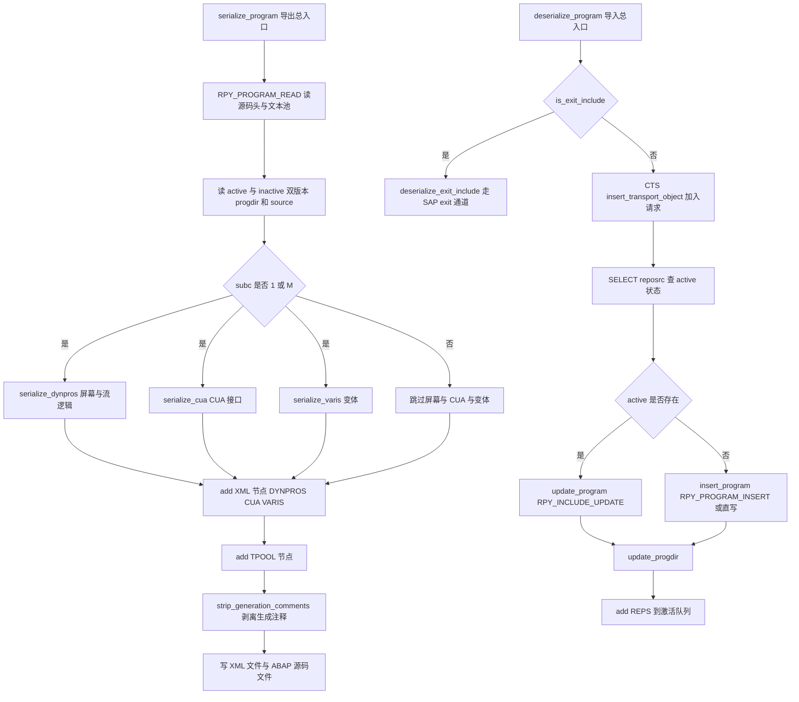
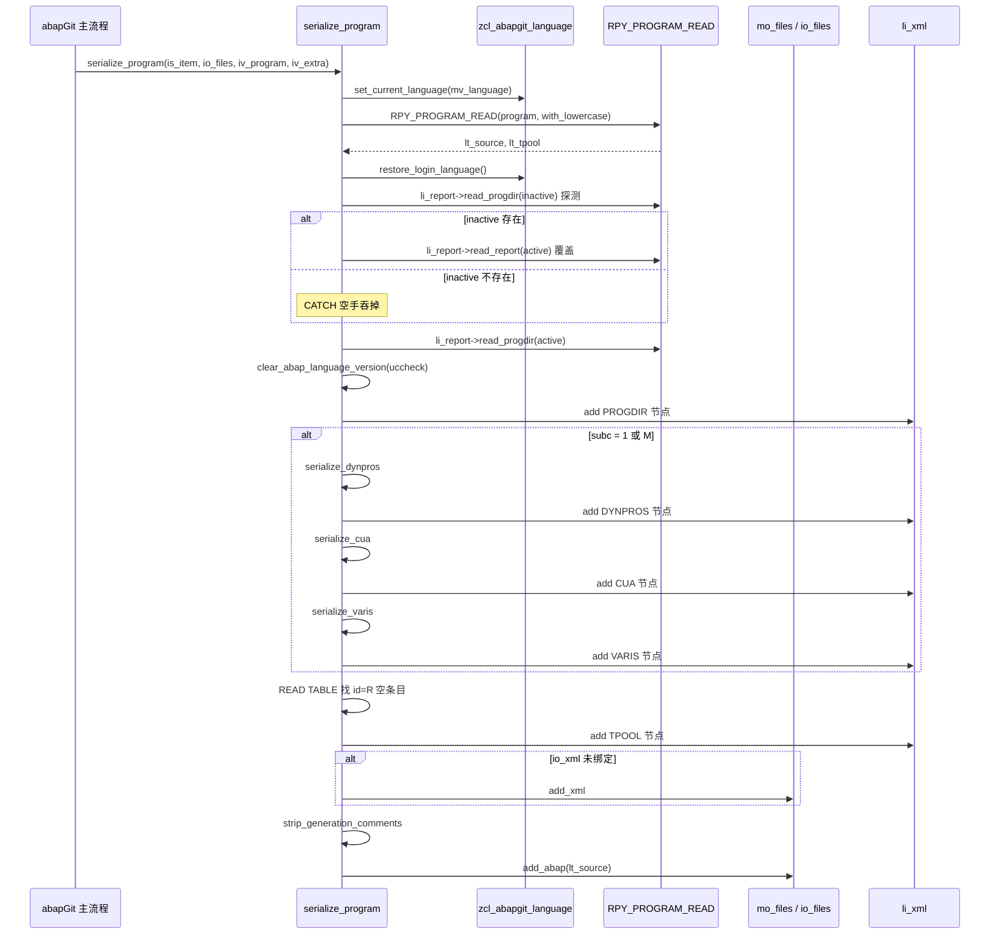
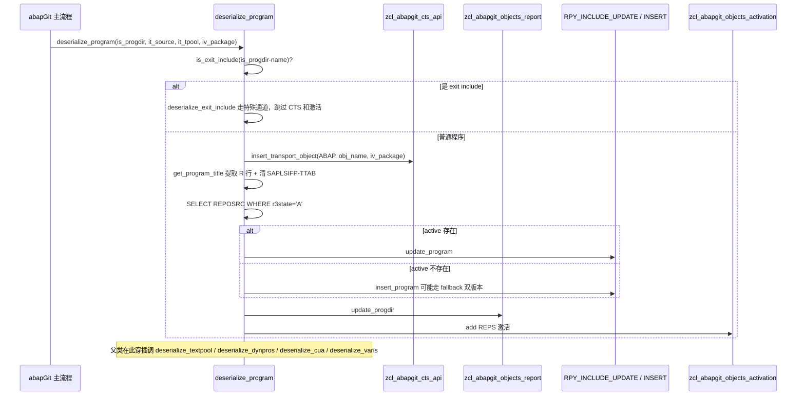

# ZCL_ABAPGIT_OBJECTS_PROGRAM 分析报告

> 分析对象：`abapGit/abapGit — src/abapgit_objects/zcl_abapgit_objects_program.clas.abap`（1597 行，abapGit 中负责 ABAP 报告程序对象的双向序列化类）
> 报告视角：代码 onboarding 走读，按"导出/导入"两条真实调用链展开

---

## 一、程序定位与业务背景

### 1.1 这个类在解决什么问题

先说清楚 abapGit 的定位：它是一个 Git 风格的 SAP 版本控制工具——把 SAP 仓库里的开发对象（程序、函数组、DDIC 结构、CDS 视图……）当作 Git 仓库里的文件，支持分支、合并、回滚、代码审查。

真正难的不是"能不能把 REPORT 那几行代码搬出来"，而是**一个 ABAP 报告程序远不止源码头那一行代码**。完整盘点下来它包含至少这些隐式部分：

- **PROGDIR 源码头**：语言版本、子类型 `subc`、创建者、更新时间戳、UC 版本号……
- **TEXTPOOL 文本池**：多语言描述——`R` 是报告标题、`S` 是屏幕标题、`M` 是消息、`E` 是错误消息……分主语言和非主语言存
- **DYNPROS 屏幕**：每个屏幕定义在 `D020S`，字段在 `D021S`，字段文本在 `D021T`，流逻辑在 `D021F`
- **原生屏幕（splitter）**：与动态屏幕并存但格式不同，也存 `D021S` / `D021T`
- **CUA 接口**：SE41 里定义的 ADM（命令管理）、状态、函数、菜单、矩阵、动作、按钮、按钮组、弹出键、集合、文档、标题、按钮图标——12 张表
- **变体 VARIANT**：SE11 里存的选择条件预设，散在 `VARID` / `VARI` / `VARIT` 三张表；还有独立的屏幕清单
- **生成代码**：函数组的 `TOP` / `F1` / `F2` / `F3` / `F5` / `F6` / `F7` / `F8` 是 RPY 自动生成的，每次重新生成都会刷新，不应该进 Git

abapGit 要把这样一个对象完整地序列化到 Git，还要在另一端完整地反序列化回来，并且要处理各种"隐藏细节"：不序列化生成代码、把流逻辑存成独立 ABAP 文件、把 CUA 的 ADM（历史版本没存过）从动作条目回填、把变体保护位在导入时临时摘掉再装回去、绕开某些 FM 的版本差异、修补某些 SAP 自身的 bug……

这就是本类的全部职责。

### 1.2 设计范式

一句话定性：

> **"对象策略类"（Strategy over an OO base）**——本类是 abapGit 众多"对象处理器"家族中的一员，父类 `zcl_abapgit_objects_super` 定义了序列化/反序列化的契约，本类负责 ABAP 报告程序这一个具体对象类型的完整实现。

关键分界线只有两根：

| 公开方法 | 谁调用 | 干什么 |
|---|---|---|
| `serialize_program` | abapGit 导出主流程 | 把程序从 SAP 仓库"抄出来" |
| `deserialize_program` | abapGit 导入主流程 | 把程序从 Git "抄回去" |

其余方法都是 `PROTECTED` 或 `PRIVATE`，只对父类/同包可见。`PROTECTED` 是子程序边界——父类会在自己流程里穿插着调它们：先 `deserialize_program` 处理程序主体，再穿插 `deserialize_textpool` / `deserialize_dynpros` / `deserialize_cua` / `deserialize_varis` 处理各个子结构。`PRIVATE` 才是真正的实现细节（`uncondense_flow`、`auto_correct_cua_adm`、`insert_program` 的兜底分支等）。

这种"公开入口少、私有细节多"的分层，让父类可以按统一接口驱动整个对象类型，同时让每个具体类自己决定内部的顺序、错误处理、兼容策略。

### 1.3 依赖清单

```
SAP 标准函数模块（大量）
  RPY_PROGRAM_READ            读程序源码 + 文本池
  RPY_PROGRAM_INSERT          新建程序
  RPY_INCLUDE_UPDATE          更新程序 / include
  RPY_DYNPRO_READ             读屏幕（容器/字段/流逻辑）
  RPY_DYNPRO_READ_NATIVE      读原生屏幕（splitter 字段清单）
  RPY_DYNPRO_INSERT           写屏幕
  RPY_DYNPRO_INSERT_NATIVE    写原生屏幕
  RS_SCREEN_LIST              列程序下的屏幕清单
  RS_SCRP_DELETE              删屏幕
  RS_CUA_INTERNAL_FETCH       读 SE41 CUA 接口
  RS_CUA_INTERNAL_WRITE       写 SE41 CUA 接口
  RS_ALL_VARIANTS_4_1_REPORT        列程序下的变体
  RS_VARIANT_VALUES_TECH_DAT_255    读变体技术数据
  RS_VARIANT_CONTENTS_255           读变体值 + 对象
  RS_GET_SCREENS_4_1_VARIANT        读单个变体的屏幕清单
  RS_CREATE_VARIANT_255             新建变体
  RS_CHANGE_CREATED_VARIANT_255     更新变体（值/对象/文本）
  RS_VARIANT_DELETE                   删变体

SAP 标准表（本类会直接读写）
  TADIR           查对象归属开发类
  REPOSRC         查程序的 active 状态
  VARID           变体保护位（SELECT FOR UPDATE + UPDATE）
  D021T           原生屏幕字段文本（DELETE + INSERT）

abapGit 自有类
  ZCL_ABAPGIT_OBJECTS_SUPER                     父类，定义契约
  ZCL_ABAPGIT_OBJECTS_FILES                     文件写入接口
  ZCL_ABAPGIT_OBJECTS_ACTIVATION=>ADD           把对象加入"待激活"队列
  ZCL_ABAPGIT_FACTORY=>GET_SAP_REPORT           程序对象 API（含 insert_report / read_progdir / read_report）
  ZCL_ABAPGIT_FACTORY=>GET_CTS_API              CTS 请求操作
  ZCL_ABAPGIT_LANGUAGE                          语言切换 / 恢复
  ZCL_ABAPGIT_XML_OUTPUT                        XML 节点组装
  ZCX_ABAPGIT_EXCEPTION=>RAISE / RAISE_T100     异常封装
```

### 1.4 读之前先知道的三件事

有三处代码是"读代码时一眼看出来的红牌"，先亮出来，后面章节里会各自展开：

1. **`sy-tcode = 'SE41' ##WRITE_OK`**（在 `deserialize_cua` 里）——源码注释原文写着 `evil hack, workaround to handle fixes in note 2159455`。写系统字段 `SY-TCODE` 会欺骗下游 FM 认为自己是从 SE41 事务里调用的。
2. **`DELETE FROM d021t ... ##SUBRC_OK` / `INSERT d021t ... ##SUBRC_OK`**（在 `deserialize_dynpros` 里）——绕开 SAP 提供的 FM，直接改数据库。这是为了让原生屏幕的字段文本能被完整保存/还原。
3. **`uncondense_flow` 是过渡兼容代码**——注释写着 `todo: kept for compatibility, remove after grace period #3680`。

这三处的共同特征是"承认了缺陷但没修"。abapGit 是一个开源项目，这类注释能保留下来，是因为修不动（涉及 SAP 内部行为）或者暂时不想改。作为 onboarding 报告，把这些"承认的债"和"隐形的坑"分开讲清楚，是最有价值的。

---

## 二、程序执行流程总览

本类有两个方向相反的入口：`serialize_program`（导出：SAP → Git）和 `deserialize_program`（导入：Git → SAP）。前者是本类被"读"时唯一入口，后者是本类被"写"时唯一入口。



导入侧的另外四个 `PROTECTED` 方法（`deserialize_textpool`、`deserialize_dynpros`、`deserialize_cua`、`deserialize_varis`）**不在 `deserialize_program` 里被调用**——它们由父类 `zcl_abapgit_objects_super` 在自己编排的流程里穿插着调。这也是"公开入口少、私有细节多"的直接后果：本类只提供方法，父类决定顺序。

### 责任链表

| 子程序 | 调用者 | 职责 |
|---|---|---|
| `serialize_program` | abapGit 导出主流程 | 导出总入口：读程序、条件化子序列化、装配 XML |
| `serialize_dynpros` | `serialize_program`（仅 subc=1 或 M） | 读屏幕清单 + 每屏的容器/字段/流逻辑；流逻辑另存为独立 ABAP 文件 |
| `serialize_cua` | `serialize_program`（仅 subc=1 或 M） | 读 SE41 CUA 接口的 11 张表 |
| `serialize_varis` | `serialize_program`（仅 subc=1 或 M） | 遍历每个变体，读技术数据、值、对象、屏幕、文本 |
| `get_varis_for_report` | `serialize_varis` | 从 `RS_ALL_VARIANTS_4_1_REPORT` 拿变体清单，只留 `SAP&*` / `CUS&*` 命名变体 |
| `get_vari_data` | `serialize_varis` | 三段式读单个变体：技术数据、VARIT 文本、值/对象 |
| `get_vari_screens` | `serialize_varis` | 读单个变体的屏幕清单 |
| `add_tpool` | `serialize_program` | `textpool_table` → abapGit 的 `ty_tpool_tt` 格式 |
| `read_tpool` | 反向路径（导入端） | `add_tpool` 的逆操作 |
| `get_program_title` | `deserialize_program`、`deserialize_exit_include` | 从 `id='R'` 条目提取标题；顺手清 `SAPLSIFP-TTAB` 的 workaround |
| `strip_generation_comments` | `serialize_program` | 仅对 FUGR：剥掉 TOP/F1..F8 生成头 |
| `uncondense_flow` | `deserialize_dynpros`（兼容分支） | 把压缩过的流逻辑按空格数还原 |
| `deserialize_program` | abapGit 导入主流程 | 导入总入口：CTS、insert/update、progdir、REPS 激活 |
| `deserialize_exit_include` | `deserialize_program`（is_exit_include 为真时） | SAP exit include 专用路径，跳过 CTS 和 REPS |
| `insert_program` | `deserialize_program`、`deserialize_exit_include` | `RPY_PROGRAM_INSERT`；子码 3 时改为直写 active+inactive 双版本 |
| `update_program` | `deserialize_program`、`deserialize_exit_include` | `RPY_INCLUDE_UPDATE`；带 `EU510` / `EU522` 错误分支 |
| `deserialize_textpool` | 父类流程穿插调用 | 文本池写入；主语言 / 非主语言分支；REPT 激活 |
| `deserialize_dynpros` | 父类流程穿插调用 | 屏幕全量替换：删多余、插新的（普通 / 原生） |
| `deserialize_cua` | 父类流程穿插调用 | SE41 写回 + CUA ADM 补全 + CUAD 激活 |
| `auto_correct_cua_adm` | `deserialize_cua` | 从 act/menu/pfk 条目回填 ADM 的 actcode/mencode/pfkcode |
| `deserialize_varis` | 父类流程穿插调用 | 变体全量替换：临时摘保护、删重建、清残留 |
| `create_vari` | `deserialize_varis` | `RS_CREATE_VARIANT_255` + `RS_CHANGE_CREATED_VARIANT_255` 二段式创建 |
| `delete_vari` | `deserialize_varis` | `RS_VARIANT_DELETE`；带 `cx_sy_dyn_call_param_not_found` 版本兼容 |
| `set_vari_protection` | `deserialize_varis` | `SELECT ... FOR UPDATE` 临时摘 / 装保护位 |
| `is_exit_include` | `deserialize_program`、`update_program` | 名字是否匹配 `LX*` / `SAPLX*` / 单字符前缀 + `/LX*` |
| `is_any_dynpro_locked` | 父类 / 调用方 | 遍历屏幕，任一带 `ESCRP` 锁则返回真 |
| `is_cua_locked` | 父类 / 调用方 | 用 `CU<program><padding>*` 检查 `ESCUAPAINT` |
| `is_text_locked` | 父类 / 调用方 | 用 `*<program>` 检查 `EABAPTEXTE` |

下面按这条流程，逐个子程序展开。因为方法多、依赖多，第三节的分组按"导出链路 → 导入链路 → 状态查询"三个大幕排列，每一幕内部按真实调用顺序展开。

---

## 三、分组分析

### 3.1 导出总入口 `serialize_program`

本方法承担导出侧的全部编排：读程序、判断是否需要处理屏幕/CUA/变体、把文本池和源码分别落到 XML 和 ABAP 文件。逻辑分四步。

#### ① 语言切换与源码头读取

```abap
    zcl_abapgit_language=>set_current_language( mv_language ).

    CALL FUNCTION 'RPY_PROGRAM_READ'
      EXPORTING
        program_name     = lv_program_name
        with_includelist = abap_false
        with_lowercase   = abap_true
      TABLES
        source_extended  = lt_source
        textelements     = lt_tpool
      EXCEPTIONS
        cancelled        = 1
        not_found        = 2
        permission_error = 3
        OTHERS           = 4.

    IF sy-subrc = 2.
      zcl_abapgit_language=>restore_login_language( ).
      RETURN.
    ELSEIF sy-subrc <> 0.
      zcl_abapgit_language=>restore_login_language( ).
      zcx_abapgit_exception=>raise_t100( ).
    ENDIF.

    zcl_abapgit_language=>restore_login_language( ).
```

**做什么** — 先切到 abapGit 目标语言（`mv_language` 是父类字段），调 `RPY_PROGRAM_READ` 一次性拿到源码 `lt_source` 和文本池 `lt_tpool`；`with_includelist = abap_false` 表示不展开 include 列表，`with_lowercase = abap_true` 保持小写风格；然后无论成功还是失败，都恢复登录语言。`sy-subrc = 2`（not found）不抛异常，直接 RETURN——本类约定"程序不存在"是正常场景，调用方要处理。

**为什么** — 一次调用取两个数据源，比分开调 `RPY_PROGRAM_READ` 和另调文本池接口快；`with_includelist = abap_false` 是因为 include 是独立对象、有自己的序列化器，不塞进主程序。语言切换+恢复的对称写法是 abapGit 里的通用模式，因为 `RPY_PROGRAM_READ` 会依赖 `SY-LANGU` 决定返回哪个语言的文本。

**风险与改进** — 语言切换不是事务安全的。`RPY_PROGRAM_READ` 如果抛出未捕获的异常（比如 `cx_sy_dyn_call_param_not_found`，虽然这里没这个参数），`restore_login_language` 就不会执行，`SY-LANGU` 会留成 abapGit 目标语言，影响后续逻辑。稳妥写法是包在 `TRY...ENDTRY` 里、在 `CLEANUP` 段里恢复语言，让异常路径也恢复。（此风险在 `update_program` 里也有，见 3.7）

#### ② 双版本读取：`TRY` 探测 inactive，无条件读 active

```abap
    " If inactive version exists, then RPY_PROGRAM_READ does not return the active code
    li_report = zcl_abapgit_factory=>get_sap_report( ).

    TRY.
        " Raises exception if inactive version does not exist
        ls_progdir = li_report->read_progdir(
          iv_name  = lv_program_name
          iv_state = c_state-inactive ).

        " Explicitly request active source code
        lt_source = li_report->read_report(
          iv_name  = lv_program_name
          iv_state = c_state-active ).
      CATCH zcx_abapgit_exception ##NO_HANDLER.
    ENDTRY.

    ls_progdir = li_report->read_progdir(
      iv_name  = lv_program_name
      iv_state = c_state-active ).
```

**做什么** — 先试着读 inactive 版本的 progdir；如果 inactive 存在，说明 `RPY_PROGRAM_READ` 刚才拿到的源码就是 inactive 的（这是 SAP 的行为约定：inactive 版本优先），此时显式再读一遍 active 源码覆盖 `lt_source`。如果 inactive 不存在，`read_progdir` 抛异常，`CATCH` 空手吞掉，`lt_source` 保持 `RPY_PROGRAM_READ` 的结果（那已经是 active）。最后无论哪种情况，都无条件读一遍 active 的 progdir 覆盖 `ls_progdir`。

**为什么** — SAP 的 `RPY_PROGRAM_READ` 没有 `state` 参数——它内部按"如果 inactive 存在就返回 inactive"来挑版本。abapGit 想拿 active 版本就必须先探测有没有 inactive，如果有就绕过 `RPY_PROGRAM_READ` 再读一遍 active。这个"用异常探测状态"的写法比先 `SELECT REPOSRC` 少一次数据库往返，代价是走了异常控制流——`##NO_HANDLER` 只是让静态分析工具闭嘴，不改变语义。

**风险与改进** — 空 `CATCH` 是代码异味：读者第一眼看到会以为是忘写异常处理。更好的写法是用一个显式的探测方法（比如 `li_report->exists_inactive_version( )`）或者一次 `SELECT REPOSRC ... WHERE r3state = 'I'`。当前写法功能上是对的，但把"用异常当控制流"当成正常模式会让下一位改代码的人照做。

#### ③ 按子类型条件序列化屏幕/CUA/变体

```abap
    li_xml->add( iv_name = 'PROGDIR'
                 ig_data = ls_progdir ).
    IF ls_progdir-subc = '1' OR ls_progdir-subc = 'M'.
      lt_dynpros = serialize_dynpros( lv_program_name ).
      li_xml->add( iv_name = 'DYNPROS'
                   ig_data = lt_dynpros ).

      ls_cua = serialize_cua( lv_program_name ).
      li_xml->add( iv_name = 'CUA'
                   ig_data = ls_cua ).

      lt_varis = serialize_varis( lv_program_name ).
      li_xml->add( iv_name = 'VARIS'
                   ig_data = lt_varis ).
    ENDIF.
```

**做什么** — 先写 PROGDIR 节点，然后按 `subc` 判断：只有子类型 `1`（Report）和 `M`（Module Pool）才继续序列化屏幕、CUA 接口和变体。其他子类型（`0` Executable、`I` Include、`R` Function Module、`S` Data module、`K` Module 等）跳过这三项。

**为什么** — 屏幕、CUA 接口、变体是**交互式程序才有的东西**，非交互式的程序根本用不到。硬序列化它们会产生一堆空节点，Git 里全是噪音；而且 `RPY_DYNPRO_READ` 之类的 FM 对没有屏幕的程序会直接抛异常。用 `subc` 做前置判断是最直接的短路。

**风险与改进** — `'1'` 和 `'M'` 是硬编码魔法值，没有对应的具名常量。虽然 `c_state-active/inactive/off` 用了结构化常量，但这里没这么做，读代码时得去查 SAP 文档才知道 `'1'` 是 Report、`'M'` 是 Module Pool。建议提常量（例如 `c_subc-report = '1'`、`c_subc-module_pool = 'M'`）。另外，把 `ls_progdir-subc` 的判断和三个子序列化方法捆在一起，意味着将来要加"如果 `subc = '0'` 也要序列化某个新东西"就得拆这里——如果这类分支继续膨胀，值得抽成一个策略方法。

#### ④ TPOOL 空条目清理与 XML 写入

```abap
    READ TABLE lt_tpool WITH KEY id = 'R' INTO ls_tpool.
    IF sy-subrc = 0 AND ls_tpool-key = '' AND ls_tpool-length = 0.
      DELETE lt_tpool INDEX sy-tabix.
    ENDIF.

    li_xml->add( iv_name = 'TPOOL'
                 ig_data = add_tpool( lt_tpool ) ).

    IF NOT io_xml IS BOUND.
      io_files->add_xml( iv_extra = iv_extra
                         ii_xml   = li_xml ).
    ENDIF.

    strip_generation_comments( CHANGING ct_source = lt_source ).

    io_files->add_abap( iv_extra = iv_extra
                        it_abap  = lt_source ).
```

**做什么** — 找出 `id='R'`（报告标题）的那行文本池条目；如果它的 `key` 是空串、`length` 是 0，就从 `lt_tpool` 里删掉。然后把剩下的 `lt_tpool` 转成 abapGit 格式并写进 XML 的 `TPOOL` 节点。如果调用方没传 `io_xml`，就通过 `io_files->add_xml` 落盘。最后剥生成注释、把源码写进 ABAP 文件。

**为什么** — 空 `R` 条目是"程序存在但没有标题"的典型形态：SAP 在建立程序时会插入一条 `id='R'` 但 `key=''`、`length=0` 的空占位。这条空记录序列化到 Git 里既没信息量又会造成 diff 噪音，因此这里主动清理。`io_xml IS BOUND` 的分支处理的是两种调用场景：外部已经持有一个 XML 实例（比如要把多个对象合并成一个 XML），或者本方法自己创建新实例然后写文件。

**风险与改进** — `sy-tabix` 在 `READ TABLE` 命中之后是稳定可用的，但 `sy-subrc = 0 AND ... AND ...` 的合取判断里，只要前两个条件为真就已经读过 `ls_tpool`；此时 `sy-tabix` 就是那行的索引。这里写法是对的。真正的风险是 `io_xml IS BOUND` 分支：如果调用方传了一个 `io_xml`，本方法就不写 `io_files`，但 `strip_generation_comments` 和 `io_files->add_abap` 依然在无条件执行。也就是说，如果调用方只想把程序合并进 XML 而不希望额外写 ABAP 源码文件，本方法还是会写——这个隐含约定没有通过方法签名声明，只能靠读代码知道。建议加一个 `io_abap_files` 参数或者在注释里写明"本方法总会写 ABAP 源码文件，XML 可以合并也可以独立"。

**风险与改进** — `strip_generation_comments` 和 `io_files->add_abap` 是导出链的最后两步，见 3.5 展开。

### 3.2 屏幕与 CUA 序列化 `serialize_dynpros` / `serialize_cua`

屏幕和 CUA 是导出侧最"重"的两个方法。屏幕涉及 5 张 DDIC 结构，CUA 涉及 11 张表。分开讲。

#### ① `serialize_dynpros` — 屏幕清单 + 双通道读屏

```abap
    CALL FUNCTION 'RS_SCREEN_LIST'
      EXPORTING
        dynnr     = ''
        progname  = iv_program_name
      TABLES
        dynpros   = lt_d020s
      EXCEPTIONS
        not_found = 1
        OTHERS    = 2.
    IF sy-subrc = 2.
      zcx_abapgit_exception=>raise_t100( ).
    ENDIF.

    SORT lt_d020s BY dnum ASCENDING.

* loop dynpros and skip generated selection screens
    LOOP AT lt_d020s ASSIGNING <ls_d020s>
        WHERE type <> 'S' AND type <> 'W' AND type <> 'J'
        AND NOT dnum IS INITIAL.
```

**做什么** — 先用 `RS_SCREEN_LIST` 拿整个程序下的屏幕清单（`dynnr=''` 表示不筛指定屏幕，返回全部）；按 `dnum` 升序排序；然后循环时跳过三种类型：`S`（Selection Screen，选择屏）、`W`（Dialog Workarea）、`J`（Dialog with PBO/Pai，即"仅屏幕无程序"），并且跳过 `dnum` 为空的行。

**为什么** — 选择屏（`S`）、Dialog Workarea（`W`）、Dialog with PBO/Pai（`J`）都不是用户"真正设计的"屏幕——`S` 是选择屏模板，`W` 是工作区容器，`J` 是没绑逻辑的空壳。序列化它们没意义，还会带出大量 SAP 系统内部字段。按 `WHERE` 子句在循环时就跳过，避免为它们白调 `RPY_DYNPRO_READ`。

**风险与改进** — `sy-subrc = 1`（not_found）不抛异常，直接把空的 `lt_d020s` 往下传，导致后续循环空转、返回一个空表——这对上游是**正常路径**（一个刚创建的 Report 还没有屏幕，`serialize_dynpros` 应该返回空表）。但和 3.1 ① 里的处理对比来看，`serialize_program` 里 `sy-subrc = 2` 才抛异常的模式是"没找到不算错，其他错才算错"，这里保持一致。真正的隐患是 `SORT ... BY dnum ASCENDING`：如果 `lt_d020s` 是排序表以外的类型（这里是 `TABLE OF d020s`，默认标准表），排序没有稳定键——虽然 dnum 是主键所以实际不会重，但如果 SAP 未来改了 `d020s` 结构，这种"隐式假设 dnum 唯一"的写法就脆。

#### ② `serialize_dynpros` — 双通道读屏：`RPY_DYNPRO_READ` + `RPY_DYNPRO_READ_NATIVE`

```abap
      CALL FUNCTION 'RPY_DYNPRO_READ'
        EXPORTING
          progname             = iv_program_name
          dynnr                = <ls_d020s>-dnum
        IMPORTING
          header               = ls_header
        TABLES
          containers           = lt_containers
          fields_to_containers = lt_fields_to_containers
          flow_logic           = lt_flow_logic
        EXCEPTIONS
          cancelled            = 1
          not_found            = 2
          permission_error     = 3
          OTHERS               = 4.
      IF sy-subrc <> 0.
        zcx_abapgit_exception=>raise_t100( ).
      ENDIF.

      "#2746: we need the dynpro fields in internal format:
      FREE lt_fieldlist_int.

      CALL FUNCTION 'RPY_DYNPRO_READ_NATIVE'
        EXPORTING
          progname   = iv_program_name
          dynnr      = <ls_d020s>-dnum
        TABLES
          fieldlist  = lt_fieldlist_int
          fieldtexts = lt_texts.
```

**做什么** — 对每个屏幕调两次读接口：`RPY_DYNPRO_READ` 拿容器/字段/流逻辑（这是"用户看到的"视图），`RPY_DYNPRO_READ_NATIVE` 拿内部字段清单和字段文本（这是"底层存储"视图）。前者失败要抛异常，后者不检查 `sy-subrc`。

**为什么** — 屏幕上字段的"可见属性"和"底层属性"其实存在两套结构里：`fields_to_containers` 是 SE52 上能编辑的形态，`lt_fieldlist_int` 是屏幕保存时写的形态。abapGit 序列化时两份都要拿——因为反序列化时，判断"这个字段是否 foreignkey"需要看内部格式的标志位（`flg1`、`flg3`），而普通读接口读不到这些标志位。第二个 FM 不检查 `sy-subrc` 是因为对非原生屏幕（普通屏幕），这个 FM 本来就没有意义。

**风险与改进** — 第二个 `CALL FUNCTION` 完全没有错误处理：如果因为它自己的参数缺失抛异常，整个方法会中断但错误消息会是 `cx_sy_dyn_call_param_not_found` 而不是业务化异常。这在 3.1 的 `RPY_PROGRAM_READ` 上已经提过，是全类的问题——`CALL FUNCTION` 应该统一包在 `TRY...ENDTRY` 里处理参数异常。

#### ③ `serialize_dynpros` — 字段级清洗：foreignkey 反算、`from_dict` 时清空 text

```abap
      LOOP AT lt_fields_to_containers ASSIGNING <ls_field>.
* output style is a NUMC field, the XML conversion will fail if it contains invalid value
* field does not exist in all versions
        ASSIGN COMPONENT 'OUTPUTSTYLE' OF STRUCTURE <ls_field> TO <lv_outputstyle>.
        IF sy-subrc = 0 AND <lv_outputstyle> = '  '.
          CLEAR <lv_outputstyle>.
        ENDIF.

        "2746: we apply the same logic as in SAPLWBSCREEN
        "for setting or unsetting the foreignkey field:
        UNASSIGN <ls_field_int>.
        READ TABLE lt_fieldlist_int ASSIGNING <ls_field_int> WITH KEY fnam = <ls_field>-name.
        IF <ls_field_int> IS ASSIGNED.
          IF <ls_field_int>-flg1 O lc_flg1ddf AND
              <ls_field_int>-flg3 O lc_flg3for AND
              <ls_field_int>-flg3 Z lc_flg3fdu AND
              <ls_field_int>-flg3 Z lc_flg3fku.
            <ls_field>-foreignkey = 'X'.
          ELSE.
            CLEAR <ls_field>-foreignkey.
          ENDIF.
        ENDIF.

        IF <ls_field>-from_dict = abap_true AND
           <ls_field>-modific   <> 'F' AND
           <ls_field>-modific   <> 'X'.
          CLEAR <ls_field>-text.
        ENDIF.
      ENDLOOP.
```

**做什么** — 遍历每个字段的可见形态，做三件事：（a）如果存在 `OUTPUTSTYLE` 组件且值为 `'  '`（两个空格），清成 `''`——因为 XML 转 `NUMC(2)` 遇到全空格会报错；（b）从内部字段清单里读对应字段的标志位，按 SAP 标准位运算规则（`flg1 & '20'`、`flg3 & '04'`、`flg3 & NOT '02'`、`flg3 & NOT '08'`）反算 `foreignkey` 字段，命中就设 `'X'`，否则清空；（c）如果字段是从 DDIC 继承来的（`from_dict = abap_true`）且修改标志既不是 `'F'` 也不是 `'X'`，清空 `text` 字段。

**为什么** — 这三件事都是为了让序列化结果和"屏幕真正存储的内容"一致：`OUTPUTSTYLE` 的空格是 XML 转码问题；`foreignkey` 在 SE52 的存储里是通过内部标志位表达的，普通读接口读不到，必须自己算；`from_dict` 的字段的 `text` 是 DDIC 自动生成的，SE52 上没编辑过，序列化时不该带出。

**风险与改进** — 第一个隐患是 `ASSIGN COMPONENT 'OUTPUTSTYLE' ... TO <lv_outputstyle>`：动态按组件名取值，如果未来 DDIC 改了字段名，会静默返回 `sy-subrc <> 0` 然后跳过——没有告警。第二个隐患是**位运算的常量值**（`'20'` / `'08'` / `'04'` / `'02'`）来自 SAP 内部 include `MSEUSBIT`，SAP 没公开承诺，改版本可能失效——`lc_flg*` 常量在源码里也注释了"relevant flag values (taken from include MSEUSBIT)"，等于把风险写下来了但没防御。第三，这段代码在**每次序列化**都要跑，但只影响 `foreignkey` 这一列——如果 `lt_fieldlist_int` 里根本没有这个 `fnam`，`READ TABLE` 就跳过 foreignkey 赋值，字段保持原值——如果原值是 `'X'` 但实际不该是 `'X'`，序列化结果就会错。稳妥做法是找不到时显式 `CLEAR <ls_field>-foreignkey`。

#### ④ `serialize_dynpros` — 流逻辑拆成独立 ABAP 文件

```abap
      APPEND INITIAL LINE TO rt_dynpro ASSIGNING <ls_dynpro>.
      <ls_dynpro>-header = ls_header.

      " Store flow logic as separate ABAP files instead of XML
      mo_files->add_abap(
        iv_extra = 'screen_' && ls_header-screen
        it_abap  = lt_flow_logic ).
```

**做什么** — 建一行输出结构，把屏幕 header 塞进去；然后把流逻辑表 `lt_flow_logic`（类型 `swydyflow`，行结构 `swydyflo`）作为**独立的 ABAP 文件**写入 `mo_files`，附加名 `screen_<screen>`。

**为什么** — 流逻辑是"ABAP 代码"（`AT NEW-...` / `PROCESS AFTER INPUT` / `END-OF-PAGE` 等），不是数据。如果整个塞进 XML，Git diff 会显示成 XML 属性变化，非常难读。拆成独立 `.abap` 文件后，Git diff 就是标准的 ABAP diff，可以正常审查、回滚、行级合并。同时 XML 里的 `DYNPROS` 节点仍然保留 `header`、`containers`、`fields`（或 `nat_header` / `nat_fields` / `nat_texts`），流逻辑部分只留个引用。

**风险与改进** — `iv_extra = 'screen_' && ls_header-screen` 是拼接字符串，如果 `ls_header-screen` 是 NUMC 且含前导空格，文件路径会带空格——虽然 ABAP 屏幕号通常是 `'0100'` 这种四位数字，但拼接时不加校验。另外，`mo_files->add_abap` 直接调用而**不像** 3.1 ④ 里的 `io_files->add_abap` 那样接受外部文件对象——这里硬编码了 `mo_files`（父类字段），意味着如果子类想自定义文件写入位置，得重写整个方法。这是私有字段 vs 接口方法的取舍，属于设计取舍而非缺陷。

#### ⑤ `serialize_dynpros` — 原生 vs 普通屏幕的分岔

```abap
      READ TABLE lt_fieldlist_int TRANSPORTING NO FIELDS WITH KEY fill = 'X'.
      IF ls_header-type CA c_native_dynpro AND sy-subrc = 0.
        " In particular for dynpros with splitter
        <ls_dynpro>-nat_header = <ls_d020s>.
        CLEAR: <ls_dynpro>-nat_header-dgen, <ls_dynpro>-nat_header-tgen.
        <ls_dynpro>-nat_fields = lt_fieldlist_int.
        <ls_dynpro>-nat_texts  = lt_texts.
      ELSE.
        <ls_dynpro>-containers = lt_containers.
        <ls_dynpro>-fields     = lt_fields_to_containers.
      ENDIF.
```

**做什么** — 检查两个条件：（a）屏幕类型 `ls_header-type` 包含 `'IN'`（`c_native_dynpro = 'IN'`，即 Inactive Native）；（b）内部字段清单里存在 `fill = 'X'` 的行（原生屏幕的特征）。两个都满足，走原生分支：把 `d020s` 整个作为 `nat_header`（但清空 `dgen` / `tgen` 生成时间戳），把内部字段清单和字段文本作为 `nat_fields` / `nat_texts`。否则走普通分支：把 `containers` 和 `fields_to_containers` 塞进去。

**为什么** — 原生屏幕（splitter 屏幕）在 SAP 内部是用 `D021S` / `D021T` 存的，不是用容器+字段的方式。SE52 上创建 splitter 屏幕时用的是不同代码路径。序列化时要按存储方式还原，反序列化时也按不同方式写回。清空 `dgen` / `tgen` 是避免序列化出**每次导入都会变**的时间戳字段（`dgen` = generation date，`tgen` = generation time），否则 Git diff 永远是"时间戳变了"。

**风险与改进** — `READ TABLE ... TRANSPORTING NO FIELDS WITH KEY fill = 'X'` 是在**已经排序过的表**上按主键查找，但 `lt_fieldlist_int` 并没有 SORT，所以这是标准表的线性查找——每个屏幕都要跑一次 O(N)，如果屏幕多会慢。真正的问题是 `ls_header-type CA c_native_dynpro` 的判断依赖 SAP 内部字符串，如果 SAP 未来加了新的原生子类型（比如 `'INX'` 之类），条件不会自动匹配——建议用白名单表或者文档化的常量列表。

#### ⑥ `serialize_cua` — 简单的一次读取

```abap
    CALL FUNCTION 'RS_CUA_INTERNAL_FETCH'
      EXPORTING
        program         = iv_program_name
        language        = mv_language
        state           = c_state-active
      IMPORTING
        adm             = rs_cua-adm
      TABLES
        sta             = rs_cua-sta
        fun             = rs_cua-fun
        men             = rs_cua-men
        mtx             = rs_cua-mtx
        act             = rs_cua-act
        but             = rs_cua-but
        pfk             = rs_cua-pfk
        set             = rs_cua-set
        doc             = rs_cua-doc
        tit             = rs_cua-tit
        biv             = rs_cua-biv
      EXCEPTIONS
        not_found       = 1
        unknown_version = 2
        OTHERS          = 3.
    IF sy-subrc > 1.
      zcx_abapgit_exception=>raise_t100( ).
    ENDIF.
```

**做什么** — 一次 `RS_CUA_INTERNAL_FETCH` 拿到 ADM（命令管理数据）和 11 张表（状态、函数、菜单、矩阵、动作、按钮、弹出键、集合、文档、标题、按钮图标）。用 `mv_language` 决定取哪个语言的文本，`c_state-active` 表示只取 active 版本。

**为什么** — SE41 的 CUA 接口本来就是这么设计的：一个 FM 一次读所有相关表。abapGit 不需要做任何后处理，直接映射到返回结构。用 active 状态是因为导出时关心的是"用户看到什么"，不是"最近一次未激活的编辑"。

**风险与改进** — `sy-subrc > 1` 的判断意味着 `not_found`（1）不报错，其他错误才报错——和 3.2 ① 的模式一致。但 `unknown_version`（2）会被 `raise_t100` 抛掉，这个错误的典型触发场景是"程序没有 CUA 接口"或"CUA 接口处于某种 abapGit 不认识的版本"——用户看到的错误消息会是 t100 的通用错误而不是"C UA 接口版本异常"，不利于诊断。建议对 `unknown_version` 单独 raise 一个明确的业务消息。

导出链路的四个方法（3.1–3.5）到这里就完成主干了。下一节看变体这个更复杂的分支。

### 3.3 变体序列化 `serialize_varis` 与三个取数辅助

变体在 SAP 里跨三张表（`VARID` 存元数据、`VARI` 存技术数据、`VARIT` 存多语言文本），加上一张屏幕清单和值/对象数据，是 abapGit 里最"分散"的对象之一。序列化分一层总控（`serialize_varis`）+ 三个取数辅助（`get_varis_for_report`、`get_vari_data`、`get_vari_screens`）。

#### ① `serialize_varis` — 总控：遍历变体、组装输出

```abap
    lt_varis = get_varis_for_report( iv_program_name ).

    LOOP AT lt_varis ASSIGNING <ls_varikey>.
      CLEAR: ls_vari,
             ls_varid.

      get_vari_data( EXPORTING is_vari    = <ls_varikey>
                     IMPORTING es_varid   = ls_varid
                               et_values  = ls_vari-values
                               et_objects = ls_vari-objects
                               et_texts   = ls_vari-texts ).

      MOVE-CORRESPONDING ls_varid TO ls_vari.

      " Clear texts - they will be provided in TEXTPOOL section
      LOOP AT ls_vari-objects ASSIGNING <ls_object>.
        CLEAR <ls_object>-text.
      ENDLOOP.

      ls_vari-variscreens = get_vari_screens( <ls_varikey> ).

      INSERT ls_vari INTO TABLE rt_varis.
    ENDLOOP.
```

**做什么** — 先拿变体清单；对每个变体：调 `get_vari_data` 拿技术数据/值/对象/文本；用 `MOVE-CORRESPONDING` 把 `varid` 结构塞到输出结构 `ls_vari` 里；然后遍历对象表把 `text` 字段清空；再调 `get_vari_screens` 拿屏幕清单；最后插入结果表。

**为什么** — 分两次调用（`get_vari_data` 拿数据、`get_vari_screens` 拿屏幕）是因为两者查询的表不同、失败模式不同，分开调可以精细处理错误。清空 `<ls_object>-text` 是因为对象的 `text` 是描述信息，会在 XML 的 TEXTPOOL 段里单独出现（作为变体的对象描述），避免重复序列化。`MOVE-CORRESPONDING` 是最简单的"同名同型字段自动映射"，代价是编译期不检查字段一致性。

**风险与改进** — `MOVE-CORRESPONDING` 是全类唯一一处使用，且没有 `EXCEPT` 子句排除任何字段——如果 `varid` 和 `ty_vari` 里某个字段名同但类型不同，运行时会静默截断。稳妥做法是显式逐字段赋值。清空 `text` 的注释说"they will be provided in TEXTPOOL section"，但看 XML 输出结构（`TPOOL` 是程序文本池，不是变体文本），实际变体的文本走的是 `ls_vari-texts`——注释可能有误或者遗漏了这个映射逻辑。这一点需要**在 SE11 核实 `VARIT` 表字段以及 XML 里 `TPOOL` 节点是否会同时包含变体文本**，从代码上看，`add_tpool( lt_tpool )` 只处理程序文本池，变体的 `texts` 存在 `ty_vari-texts` 里独立输出。

#### ② `get_varis_for_report` — 只留 `SAP&*` / `CUS&*` 命名的变体

```abap
    CALL FUNCTION 'RS_ALL_VARIANTS_4_1_REPORT'
      EXPORTING
        program = iv_repid
      IMPORTING
        cat     = ls_catalog
      EXCEPTIONS
        OTHERS  = 1.
    IF sy-subrc <> 0.
      zcx_abapgit_exception=>raise_t100( ).
    ENDIF.

    ls_vari-report = iv_repid.
    LOOP AT ls_catalog-cat ASSIGNING <ls_cat>
         WHERE variant CP c_sysvari_pattern_sap
         OR variant CP c_sysvari_pattern_cus.
      ls_vari-variant = <ls_cat>-variant.
      INSERT ls_vari INTO TABLE rt_varis.
    ENDLOOP.

    SORT rt_varis.
```

**做什么** — 调 `RS_ALL_VARIANTS_4_1_REPORT` 拿整个程序下的变体目录（catalog），然后只保留名字匹配 `SAP&*` 或 `CUS&*` 的变体，其他（用户自定义变体）过滤掉。最后按主键排序。

**为什么** — abapGit 只管理"共享变体"，不管"个人变体"。SAP 的约定是：以 `SAP&` 开头的是 SAP 标准变体、以 `CUS&` 开头的是客户自定义的共享变体；其他名字是用户个人变体（保存在用户自己的账户里）。个人变体不属于对象版本控制范畴，个人化了也没法在团队 Git 仓库里同步。

**风险与改进** — 这个设计决策是**正确且必要**的，但实现上有两个隐含假设：（a）个人变体的命名**不会**以 `SAP&` 或 `CUS&` 开头（用户如果手抖命名 `SAP&foo`，会被 abapGit 误认为共享变体）；（b）没有共享变体时，本方法返回空表，上游 `serialize_varis` 循环体不执行——这是正常路径。真正的隐患在常量定义：`c_sysvari_pattern_sap TYPE c LENGTH 5 VALUE 'SAP&*'` 和 `c_sysvari_pattern_cus TYPE c LENGTH 5 VALUE 'CUS&*'`——长度硬编码 5，如果 SAP 未来把前缀从 `CUS&` 变成 `CUS_`（长度变了），这个常量就不对。建议改成 `CONSTANTS c_sysvari_pattern_sap TYPE string VALUE 'SAP&*'` 之类，长度自适应。

#### ③ `get_vari_data` — 三段式读取（技术数据 + VARIT 文本 + 值/对象）

```abap
    CLEAR: es_varid,
           et_values,
           et_objects,
           et_texts.

    CALL FUNCTION 'RS_VARIANT_VALUES_TECH_DAT_255'
      EXPORTING
        report         = is_vari-report
        variant        = is_vari-variant
        sorted         = abap_true
      IMPORTING
        techn_data     = es_varid
      TABLES
        variant_values = et_values " is ignored
      EXCEPTIONS
        OTHERS         = 1.
    IF sy-subrc <> 0.
      zcx_abapgit_exception=>raise_t100( ).
    ENDIF.

    " Use variant values from CONTENTS call
    " both calls have this parameter as non-optional
    CLEAR et_values.
```

**做什么** — 先调 `RS_VARIANT_VALUES_TECH_DAT_255` 拿技术数据（`es_varid`）；这个 FM 的 `variant_values` 表参数是必需的，abapGit 传了 `et_values` 但**忽略它**（注释明确写了 "is ignored"）；然后立即 `CLEAR et_values`。

**为什么** — SAP 的这个 FM 有两个必需表参数：`variant_values` 和 `variant_objects`（本方法没传对象，因为对象在下面单独取）。abapGit 只需要 `es_varid`，就必须给 `variant_values` 塞一个表来消除"缺参数"错误。传进去的值马上清空，因为真正的值要走下面的 `RS_VARIANT_CONTENTS_255`。

**风险与改进** — 这是"用必需参数承载无用数据"的经典 hack，代码可读性差。abapGit 用注释说明意图是对的。真正的隐患是 `et_values` 在这里被填又被清——如果 `RS_VARIANT_VALUES_TECH_DAT_255` 内部用了传进来的表做校验或日志，清空可能改变 FM 的语义。稳妥做法是把 `et_values` 换成一个 `DATA lt_scratch`，明确表示"临时占位"。

#### ④ `get_vari_data` — 语言过滤与 VARIT 读取

```abap
    IF mo_i18n_params->ms_params-main_language_only <> abap_true.
      lt_language_filter = mo_i18n_params->build_language_filter( ).
    ENDIF.
    ls_language_filter-sign   = 'I'.
    ls_language_filter-option = 'EQ'.
    ls_language_filter-low    = mv_language.
    CLEAR ls_language_filter-high.
    INSERT ls_language_filter INTO TABLE lt_language_filter.

    " SELECT because RS_VARIANT_TEXT and related FMs cannot list available languages
    SELECT langu vtext FROM varit CLIENT SPECIFIED
      INTO CORRESPONDING FIELDS OF TABLE et_texts
      WHERE mandt = c_sysvari_clnt
        AND report = is_vari-report
        AND variant = is_vari-variant
        AND langu IN lt_language_filter
      ORDER BY langu.
```

**做什么** — 先构造语言过滤器：如果 abapGit 参数不是"只取主语言"，先构建语言过滤器；然后**无条件**把当前语言 `mv_language` 追加进去。最后用 `SELECT langu vtext FROM varit CLIENT SPECIFIED` 直接查 `VARIT` 表，条件包括 `mandt = '000'`（系统客户端，变体都存在这里）、report、variant 和语言过滤器。

**为什么** — abapGit 有一个"只序列化主语言文本"的选项，用于多语言项目。默认情况下 `main_language_only = abap_false`，此时用 `build_language_filter` 构造要导出的语言列表；然后**追加当前语言**保证至少要有一个（用户可能没配任何语言，但至少当前登录语言要有）。直接 `SELECT` 而不是用 `RS_VARIANT_TEXT` 是因为后者"不能列出可用语言"（源码注释原话），要主动构造查询。

**风险与改进** — 两个隐患：（a）`mandt = c_sysvari_clnt` 把变体查询限制在**系统客户端 000**，但 abapGit 运行在**当前客户端**——如果当前客户端不是 000（生产系统客户端常见），变体可能不在 000 客户端里，`SELECT` 拿不到。这需要**在特定系统的变体存储策略上核实**：如果客户自定义把变体存在当前客户端而不是 000，本方法会漏掉。**这是本方法最实质的隐患**。（b）`ls_language_filter-low = mv_language` 硬编码当前语言进过滤器，如果 `mv_language` 是空（父类没初始化），会查不到任何语言。稳妥做法是在方法开头加一个前置校验。

#### ⑤ `get_vari_data` — 值/对象读取与排序

```abap
    CALL FUNCTION 'RS_VARIANT_CONTENTS_255'
      EXPORTING
        report         = is_vari-report
        variant        = is_vari-variant
        execute_direct = abap_true
      TABLES
        valutab        = et_values
        objects        = et_objects
      EXCEPTIONS
        OTHERS         = 1.
    IF sy-subrc <> 0.
      zcx_abapgit_exception=>raise_t100( ).
    ENDIF.

    " reproducible order
    SORT et_values.
    SORT et_objects.
    SORT et_texts.
```

**做什么** — 调 `RS_VARIANT_CONTENTS_255` 拿变体的值（选择条件选项）和对象（对象定义，比如 ALV 布局、变体应用等）；然后对三张表都按主键排序。

**为什么** — `execute_direct = abap_true` 是告诉 FM "别管当前上下文，直接执行变体查询"，避免在批量导出时被中断。三张表都排序是为了让 XML 输出**顺序稳定**：Git diff 对相同内容但不同顺序的行会显示成 "删 + 加" 而不是 "无变化"，排序保证 diff 干净。

**风险与改进** — 三个 `SORT` 没有指定字段，走"按行结构主键"的默认行为；如果主键字段类型复杂（比如 `varit` 的主键是 `(mandt, report, variant, langu)`），排序会先按 mandt——但所有行都是 `'000'`，等于按剩下的字段排序。这个假设是对的。真正的问题是 `SORT` 后 `et_texts` 的顺序可能和 `VARIT` 表的物理顺序不同——虽然对 XML 输出没影响，但如果下游代码依赖物理顺序就麻烦。稳妥做法是显式写排序字段，比如 `SORT et_texts BY langu`。

#### ⑥ `get_vari_screens` — 一个纯粹的封装

```abap
    DATA lt_dynnr LIKE rt_vari_screens ##NEEDED.

    CALL FUNCTION 'RS_GET_SCREENS_4_1_VARIANT'
      EXPORTING
        program     = is_vari-report
        variant     = is_vari-variant
      TABLES
        dynnr       = lt_dynnr
        variscreens = rt_vari_screens
      EXCEPTIONS
        OTHERS      = 1.
    IF sy-subrc <> 0.
      zcx_abapgit_exception=>raise_t100( ).
    ENDIF.

    SORT rt_vari_screens.
```

**做什么** — 调 `RS_GET_SCREENS_4_1_VARIANT` 拿变体的屏幕清单，返回到 `rt_vari_screens`；`lt_dynnr` 是必需的表参数但不用（用 `##NEEDED` 静态分析提示标注）；最后排序。

**为什么** — 纯封装，为了统一错误处理。`lt_dynnr LIKE rt_vari_screens ##NEEDED` 声明了一个和返回类型一样但没实际用的变量——`##NEEDED` 是给静态分析工具看的"这个变量是必需的，别删"。

**风险与改进** — `##NEEDED` 是 abapGit 里反复出现的静态分析抑制标记，功能上没风险，属于风格选择。唯一的隐患是 `SORT rt_vari_screens` 没有指定字段——同上。

变体序列化的六个子步骤到这里结束。接下来看文本池的三个辅助方法，以及导出链最后的两个清洗方法。

### 3.4 文本池与标题辅助 `add_tpool` / `read_tpool` / `get_program_title`

这三个方法都围绕 `textpool_table` 结构做格式转换。前两个是逆操作对，第三个是从文本池里提标题并附带一个 workaround。

#### ① `add_tpool` — `textpool_table` → abapGit 格式

```abap
    LOOP AT it_tpool ASSIGNING <ls_tpool_in>.
      APPEND INITIAL LINE TO rt_tpool ASSIGNING <ls_tpool_out>.
      MOVE-CORRESPONDING <ls_tpool_in> TO <ls_tpool_out>.
      IF <ls_tpool_out>-id = 'S'.
        <ls_tpool_out>-split = <ls_tpool_out>-entry.
        <ls_tpool_out>-entry = <ls_tpool_out>-entry+8.
      ENDIF.
    ENDLOOP.
```

**做什么** — 遍历输入文本池表，每行复制到输出表；对 `id='S'`（屏幕标题）的行做特殊处理：把整个 `entry` 复制到 `split`，然后 `entry` 只保留 `entry+8`（第 9 个字符及之后的部分）。

**为什么** — SAP 的 `textpool_table` 里 `id='S'` 行的 `entry` 字段前 8 个字符是屏幕号（比如 `'00010001'`），后面才是标题文本。abapGit 的 XML 格式希望把屏幕号和标题分开存（`split` 存屏幕号，`entry` 存标题），所以这里做切分。

**风险与改进** — 硬编码的 `entry+8` 是**偏移量魔法值**，如果 SAP 未来改了屏幕号长度（比如变成 4 位或 6 位），这个切分就错了。这个假设在 SAP 内部有几十年没变，属于"稳态依赖"，但建议提为常量并加注释指向具体的 SAP 结构定义。另一个隐患是 `MOVE-CORRESPONDING`——`textpool_table` 的行结构和 abapGit 的 `ty_tpool_tt` 行结构不是完全同型，如果有字段同名字段类型不同，会静默截断。

#### ② `read_tpool` — 反向操作

```abap
    LOOP AT it_tpool ASSIGNING <ls_tpool_in>.
      APPEND INITIAL LINE TO rt_tpool ASSIGNING <ls_tpool_out>.
      MOVE-CORRESPONDING <ls_tpool_in> TO <ls_tpool_out>.
      IF <ls_tpool_out>-id = 'S'.
        CONCATENATE <ls_tpool_in>-split <ls_tpool_in>-entry
          INTO <ls_tpool_out>-entry
          RESPECTING BLANKS.
      ENDIF.
    ENDLOOP.
```

**做什么** — 遍历 abapGit 格式的行，对 `id='S'` 的行把 `split` 和 `entry` 拼接回 `entry`。

**为什么** — `add_tpool` 的逆操作，用于反序列化路径（虽然本类没有直接调 `read_tpool`，但父类或其他调用方会用）。`RESPECTING BLANKS` 是因为屏幕号可能是 `'0001'`（含前导零），拼接时要保留空白，不能按默认规则把 `'0001' && '标题'` 变成 `'1标题'`。

**风险与改进** — `CONCATENATE` 默认会做截断（按目标字段长度），`RESPECTING BLANKS` 只影响空白处理。如果 `split` 是 8 字节而 `entry` 是 255 字节，拼接结果是 8+entry_length，不会截断。但如果 SAP 未来改了 `textpool_table` 的结构，`split` 字段的长度变了，拼接就可能会溢出。这里比 `add_tpool` 稍微安全一点，因为 `CONCATENATE` 不会像 `entry+8` 那样依赖固定偏移。

#### ③ `get_program_title` — 提取标题 + 清 SAPLSIFP 全局

```abap
    DATA ls_tpool LIKE LINE OF it_tpool.

    FIELD-SYMBOLS <lg_any> TYPE any.

    READ TABLE it_tpool INTO ls_tpool WITH KEY id = 'R'.
    IF sy-subrc = 0.
      " there is a bug in RPY_PROGRAM_UPDATE, the header line of TTAB is not
      " cleared, so the title length might be inherited from a different program.
      ASSIGN ('(SAPLSIFP)TTAB') TO <lg_any>.
      IF sy-subrc = 0.
        CLEAR <lg_any>.
      ENDIF.

      rv_title = ls_tpool-entry.
    ENDIF.
```

**做什么** — 在文本池里找 `id='R'`（Report 标题）的行；如果找到，先动态取到 `SAPLSIFP` 程序的全局变量 `TTAB`，如果取到就清空它；然后把该行 `entry` 作为返回值。

**为什么** — SAP 的 `RPY_PROGRAM_UPDATE` FM 有个 bug：它内部使用 `SAPLSIFP` 程序的 `TTAB` 表来暂存标题，但不清空表头行的 `length` 字段。abapGit 如果连续调 `RPY_PROGRAM_UPDATE`（比如串行导入多个程序），第二个程序的标题长度可能会继承第一个程序的 length 值，导致标题被截断或者多出脏字符。这里通过直接访问 `SAPLSIFP` 的 `TTAB` 并清空来规避。

**风险与改进** — 这个 workaround 有**三重**风险：
1. **跨程序访问全局变量**——`ASSIGN ('(SAPLSIFP)TTAB')` 是动态访问其他程序的全局，SAP 官方不推荐。如果 SAP 未来重构 `SAPLSIFP`（比如把 `TTAB` 改名、移到 include 里），这个 workaround 会静默失效（`sy-subrc <> 0` 就跳过），`RPY_PROGRAM_UPDATE` 的 bug 就会暴露。
2. **`<lg_any> TYPE any` 的动态访问**——`any` 是万能引用类型，编译期不检查，如果 `TTAB` 类型变了，`CLEAR <lg_any>` 可能清不完全（比如原来是表，现在变成结构，`CLEAR` 语义不同）。
3. **只在 `sy-subrc = 0` 时清空**——如果 `SAPLSIFP-TTAB` 取不到（`sy-subrc <> 0`），静默跳过，但 bug 依然存在。至少应该记录一条 `sy-warn` 或 `cl_abap_log` 让运维知道 workaround 失效了。

这个 workaround 的注释明确说这是 SAP 的 bug，但没给出 SAP 的官方修复编号——如果这个 bug 已经在某个 release 修了，abapGit 应该移除 workaround；如果没修，就该在文档里显式记录"依赖 SAPLSIFP 的 TTAB 未清空"这个假设。**接手这个类的人第一件事应该是去 SAP 支持门户确认 `RPY_PROGRAM_UPDATE` 的标题继承 bug 是否已修复**，再决定是否保留 workaround。

### 3.5 清洗与兼容 `strip_generation_comments` / `uncondense_flow`

两个"清洗/兼容"方法——一个剥离函数组生成代码的头，一个还原被压缩的流逻辑。

#### ① `strip_generation_comments` — 函数组的生成代码剥离

```abap
    FIELD-SYMBOLS <lv_line> TYPE any. " Assuming CHAR (e.g. abaptxt255_tab) or string (FUGR)

    IF ms_item-obj_type <> 'FUGR'.
      RETURN.
    ENDIF.

    " Case 1: MV FM main prog and TOPs
    READ TABLE ct_source INDEX 1 ASSIGNING <lv_line>.
    IF sy-subrc = 0 AND <lv_line> CP '#**regenerated at *'.
      DELETE ct_source INDEX 1.
      RETURN.
    ENDIF.

    " Case 2: MV FM includes
    IF lines( ct_source ) < 5. " Generation header length
      RETURN.
    ENDIF.

    READ TABLE ct_source INDEX 1 ASSIGNING <lv_line>.
    ASSERT sy-subrc = 0.
    IF NOT <lv_line> CP '#*---*'.
      RETURN.
    ENDIF.

    READ TABLE ct_source INDEX 2 ASSIGNING <lv_line>.
    ASSERT sy-subrc = 0.
    IF NOT <lv_line> CP '#**'.
      RETURN.
    ENDIF.

    READ TABLE ct_source INDEX 3 ASSIGNING <lv_line>.
    ASSERT sy-subrc = 0.
    IF NOT <lv_line> CP '#**generation date:*'.
      RETURN.
    ENDIF.

    READ TABLE ct_source INDEX 4 ASSIGNING <lv_line>.
    ASSERT sy-subrc = 0.
    IF NOT <lv_line> CP '#**generator version:*'.
      RETURN.
    ENDIF.

    READ TABLE ct_source INDEX 5 ASSIGNING <lv_line>.
    ASSERT sy-subrc = 0.
    IF NOT <lv_line> CP '#*---*'.
      RETURN.
    ENDIF.

    DELETE ct_source INDEX 4.
    DELETE ct_source INDEX 3.
```

**做什么** — 只对 FUGR 对象生效（其他对象类型直接 RETURN）。然后分两种情况：（Case 1）主程序或 TOP include 的第一行是 `#**regenerated at ...`——删掉第一行；（Case 2）其他生成 include（F1、F2、F3、F5、F6、F7、F8）的前五行是固定的"生成头"模式：`#*---*` / `#**` / `#**generation date:*` / `#**generator version:*` / `#*---*`——如果五行全匹配，删掉第 3、4 行（`generation date` 和 `generator version`，因为它们每次生成都会变，导致 Git diff 噪音）。

**为什么** — 函数组的 include 是 RPY 自动生成的，每次保存或激活时都会刷新，`generation date` 和 `generator version` 是**每次都会变**的元数据。abapGit 只保留生成结构标记（`#*---*` 分隔符、`#**` 起始标记），删掉日期和版本号，让 Git diff 只反映真正的代码变化。

**风险与改进** — 这个方法的复杂性来自"用字符串模式识别 SAP 生成代码"。隐患有三个：
1. **模式硬编码**——`'#**regenerated at *'` / `'#**generation date:*'` 等模式如果 SAP 未来改了措辞（比如从 `generation date:` 变成 `generation_date:`），识别就失效。稳妥做法是用 `##` 之类的正则或者常量表，并在 SAP 版本更新时回归测试。
2. **`READ TABLE ... INDEX N` 与 `ASSERT sy-subrc = 0`**——`READ TABLE INDEX 1` 之后加 `ASSERT sy-subrc = 0` 是"预期这里一定有值"，如果表空会直接 dump。前面已经有 `IF lines( ct_source ) < 5. RETURN. ENDIF` 保护，但**只保护了 Case 2**——Case 1 的 `READ TABLE INDEX 1` 没有前置检查，如果表空会返回 `sy-subrc <> 0`，然后条件判断自然失败（`AND <lv_line> CP '#**regenerated at *'` 里的 `<lv_line>` 未初始化），不会 dump，但代码读起来像"忘了写 ASSERT"。
3. **`DELETE INDEX 4` 后紧跟 `DELETE INDEX 3`**——故意先删大的再删小的，避免索引前移。**顺序是刻意的**，但没注释说明。如果下次改代码时不小心改成 `DELETE INDEX 3` 在前，行为会立刻变。稳妥做法是先 `DELETE INDEX 3` 再 `DELETE INDEX 4`（不对，那样 index 4 变成 3 了）——正确的意图是"先删大的"，但源码没写。应该在代码旁加一句 `DELETE ct_source INDEX 3 " after 4 to keep indices stable`。

`<lv_line> TYPE any` 也是全类的模式——用 `any` 类型动态访问 char 或 string 类型的行，兼容不同源表类型（`abaptxt255_tab` 是 char，`FUGR` 的 source 是 string）。这个技巧在 abapGit 内部有约定，属于**"约定优于配置"的取舍**。

#### ② `uncondense_flow` — 兼容过渡代码

```abap
    DATA: lv_spaces LIKE LINE OF it_spaces.

    FIELD-SYMBOLS: <ls_flow>   LIKE LINE OF it_flow,
                   <ls_output> LIKE LINE OF rt_flow.


    LOOP AT it_flow ASSIGNING <ls_flow>.
      APPEND INITIAL LINE TO rt_flow ASSIGNING <ls_output>.
      <ls_output>-line = <ls_flow>-line.

      READ TABLE it_spaces INDEX sy-tabix INTO lv_spaces.
      IF sy-subrc = 0.
        SHIFT <ls_output>-line RIGHT BY lv_spaces PLACES IN CHARACTER MODE.
      ENDIF.
    ENDLOOP.
```

**做什么** — 遍历压缩后的流逻辑表，为每行创建对应输出行，把 `<ls_flow>-line` 复制到 `<ls_output>-line`；然后按当前行的 `sy-tabix` 从 `it_spaces` 读一个空格数，如果读到就按这个数向右 shift（用 `SHIFT ... RIGHT BY ... IN CHARACTER MODE` 保持空白格式）。

**为什么** — 这是**兼容过渡代码**——源码里 `deserialize_dynpros` 的注释明确写了 `todo: kept for compatibility, remove after grace period #3680`。历史背景是：早期 abapGit 版本把流逻辑"压缩"后再存（去掉行首空白，用单独的空间表记录每行的原始缩进）；新版本直接存原始格式，但为了兼容老仓库，反序列化时如果发现有 `spaces` 表就调这个方法还原。

**风险与改进** — 三处隐患：
1. **过渡代码长期留存**——`#3680` 是 abapGit issue 号，标记了"grace period"的移除计划。但这份源码里方法还在，说明 grace period 还没结束或者已被遗忘。作为 onboarding 报告应该提醒：**接手这个类之前先去 abapGit 的 issue 追踪里确认 `#3680` 的当前状态**，如果已关闭就该删这个方法。
2. **`READ TABLE it_spaces INDEX sy-tabix`**——`sy-tabix` 是外层 `LOOP` 的当前行号，用作 `it_spaces` 的索引。**假设 `it_flow` 和 `it_spaces` 严格对齐**（长度相同、行号一一对应）。如果 `it_spaces` 比 `it_flow` 短，`READ TABLE INDEX` 会返回 `sy-subrc <> 0`，跳过 shift——这个降级路径是安全的（保留原始格式）。但如果 `it_spaces` 比 `it_flow` 长，多余的空间被忽略——也安全。真正的隐患是**两个表的顺序被打乱**（比如 `it_flow` 是排序表但 `it_spaces` 是标准表），`sy-tabix` 就不对应了。
3. **`SHIFT ... RIGHT BY lv_spaces PLACES IN CHARACTER MODE`**——`lv_spaces` 是 `i` 类型（空间数），`SHIFT` 的 `BY` 值可以是变量；`IN CHARACTER MODE` 保证按字符数 shift 而不是按字节数（对 Unicode 字符重要）。这段写法正确，唯一隐患是 `lv_spaces` 可能为 0（`it_spaces` 有空行），此时 `SHIFT RIGHT BY 0` 是 no-op，也安全。

三个辅助方法（3.4）和两个清洗方法（3.5）到这里就完成了导出链的补齐。下面进入**导入链**——这是本类问题最密集的部分。

### 3.6 导入总入口 `deserialize_program` 与 SAP exit 分支 `deserialize_exit_include`

导入侧的编排比导出侧更复杂：先判断是不是 SAP exit include（走特殊通道）、决定是新建还是更新、然后触发 CTS 传输、激活。

#### ① `deserialize_program` — 主流程

```abap
    IF is_exit_include( is_progdir-name ) = abap_true.
      deserialize_exit_include(
        is_progdir = is_progdir
        it_source  = it_source
        it_tpool   = it_tpool
        iv_package = iv_package ).
      RETURN.
    ENDIF.

    zcl_abapgit_factory=>get_cts_api( )->insert_transport_object(
      iv_object   = 'ABAP'
      iv_obj_name = is_progdir-name
      iv_package  = iv_package
      iv_language = mv_language ).

    lv_title = get_program_title( it_tpool ).

    " Check if program already exists
    SELECT SINGLE progname FROM reposrc INTO lv_progname
      WHERE progname = is_progdir-name
      AND r3state = c_state-active.

    IF sy-subrc = 0.
      update_program(
        is_progdir = is_progdir
        it_source  = it_source
        iv_title   = lv_title ).
    ELSE.
      insert_program(
        is_progdir = is_progdir
        it_source  = it_source
        iv_title   = lv_title
        iv_package = iv_package ).
    ENDIF.

    zcl_abapgit_factory=>get_sap_report( )->update_progdir(
      is_progdir = is_progdir
      iv_package = iv_package ).

    zcl_abapgit_objects_activation=>add(
      iv_type = 'REPS'
      iv_name = is_progdir-name ).
```

**做什么** — 分五步：（1）如果是 SAP exit include（`is_exit_include` 为真），走特殊分支并 RETURN；（2）调 CTS API 把对象加入传输请求；（3）从文本池提取标题；（4）用 `SELECT REPOSRC WHERE r3state = 'A'` 判断 active 版本是否存在——存在则 `update_program`，否则 `insert_program`；（5）更新 progdir（不管新建还是更新都要刷一次 progdir 元数据），然后把对象加入激活队列。

**为什么** — 五步各有其因：
- Exit include 是 SAP 的"钩子"程序（`LX*` / `SAPLX*`），属于 SAP 系统的一部分而不是用户自定义对象，走不同的 CTS 和激活通道（下面 3.6 ② 展开）。
- 先 `insert_transport_object` 而不是最后加，是因为 `insert_program` 和 `update_program` 都会**隐式**把对象绑定到当前传输请求；如果当前会话已经有一个传输请求在编辑这个对象，先加入会失败——abapGit 的选择是**先加再加**，如果当前没有请求就新建一个。
- `REPOSRC` 查 `r3state = 'A'` 而不是全查，是因为**"程序存在但没有 active 版本"**是合法的（刚创建还没激活的程序只有 inactive 版本）——abapGit 把这种情况当成"不存在"处理，走 `insert_program` 路径。
- 最后 `update_progdir` 是因为 `insert_program` 和 `update_program` 只写源码，progdir 的其他字段（`pdate`、`puser` 等）要单独更新。

**风险与改进** — 三个隐患：
1. **`SELECT SINGLE ... r3state = c_state-active` 的边界条件**——如果 active 版本不存在，`sy-subrc = 1` 走到 `insert_program`；但 `insert_program` 内部调 `RPY_PROGRAM_INSERT`，如果**已有 inactive 版本**，FM 会返回 `already_exists` 子码 1，abapGit 抛异常。这就是"程序存在但只有 inactive 版本"的经典冲突场景——abapGit 无法处理，会失败。稳妥做法是在 SELECT 里同时查 `r3state IN ('A','I')` 或者查 `reposrc` 是否有任何行；如果有 inactive 版本，可以先删除再插入或者走 update 路径。**这是本方法最实质的隐患**。
2. **`insert_transport_object` 放在判断之前**——如果后面的 `insert_program` 或 `update_program` 失败，CTS 里已经留下了一个对象条目，但没有对应的程序变更。虽然 abapGit 有异常处理和回滚机制（在父类里），但这里没有本地 `CLEANUP`。
3. **`update_progdir` 在成功路径才调**——如果 `insert_program` 或 `update_program` 抛异常，progdir 就不会更新，激活也不会触发——这是正确的降级。但如果它们成功返回了**但数据实际上有错**（比如源码为空），progdir 会被强行更新、激活队列里也会加入——激活时会失败。这里缺少对"数据有效性"的前置校验。

#### ② `deserialize_exit_include` — SAP exit include 分支

```abap
    " Includes in SAP exit function groups must be processed in active state only
    " (check in RS_INSERT_INTO_WORKING_AREA)
    lv_title = get_program_title( it_tpool ).

    SELECT SINGLE progname FROM reposrc INTO lv_progname
      WHERE progname = is_progdir-name
      AND r3state = c_state-active.

    IF sy-subrc = 0.
      update_program(
        is_progdir = is_progdir
        it_source  = it_source
        iv_title   = lv_title
        iv_state   = c_state-off ).
    ELSE.
      insert_program(
        is_progdir = is_progdir
        it_source  = it_source
        iv_title   = lv_title
        iv_package = iv_package ).
    ENDIF.
```

**做什么** — 结构和主流程几乎一样，但有三处差别：（1）不调 `insert_transport_object`（因为 SAP exit 属于系统对象，不参与 CTS）；（2）`update_program` 时显式传 `iv_state = c_state-off`（空串，不是 `'A'` 或 `'I'`）；（3）不调 `update_progdir`、不调 `zcl_abapgit_objects_activation=>add`。

**为什么** — SAP exit include 是系统"钩子"程序（`LX*` / `SAPLX*`），属于 SAP 系统代码的一部分。abapGit 不能通过常规通道修改它——注释说得很清楚："Includes in SAP exit function groups must be processed in active state only (check in RS_INSERT_INTO_WORKING_AREA)"。`iv_state = c_state-off` 是告诉 `RPY_INCLUDE_UPDATE` "直接写，别走 inactive 缓冲"。不走 CTS 和激活队列是因为这些对象在激活时会被 SAP 系统重新生成覆盖。

**风险与改进** — 这里的关键问题是**"只改不激活"是否真的安全**：如果 abapGit 强行修改了 SAP 的 exit include，SAP 系统的下一次代码生成（比如重新生成 exit 函数组）会把 abapGit 的修改**覆盖**掉，用户不会得到任何提示。这是一个业务正确性风险——用户在 Git 里看到"修改成功"，但实际运行时用的是 SAP 系统重新生成的版本。稳妥做法是在导入 exit include 后至少给用户一个警告（`MESSAGE W` 或 `sy-warn`），或者在文档里明确写"abapGit 修改 SAP exit include 后，SAP 系统重新生成 exit 时会覆盖"。

### 3.7 程序主体写入 `insert_program` / `update_program`

这两个方法承载了导入侧真正的写入工作。`insert_program` 有复杂的多级 fallback，`update_program` 有两个专门的错误消息分支。

#### ① `insert_program` — 主路径：`RPY_PROGRAM_INSERT`

```abap
    TRY.
        CALL FUNCTION 'RPY_PROGRAM_INSERT'
          EXPORTING
            development_class = iv_package
            program_name      = is_progdir-name
            program_type      = is_progdir-subc
            title_string      = iv_title
            save_inactive     = iv_state
            suppress_dialog   = abap_true
            uccheck           = is_progdir-uccheck " does not exist on lower releases
          TABLES
            source_extended   = it_source
          EXCEPTIONS
            already_exists    = 1
            cancelled         = 2
            name_not_allowed  = 3
            permission_error  = 4
            OTHERS            = 5 ##FM_SUBRC_OK.
```

**做什么** — 调 `RPY_PROGRAM_INSERT` 新建程序，传入开发类、程序名、子类型、标题、保存状态、抑制对话框标志，以及 `uccheck`（版本检查）字段。`uccheck` 在低版本 SAP 上不存在——所以整个 `CALL FUNCTION` 包在 `TRY...CATCH cx_sy_dyn_call_param_not_found` 里，如果 `uccheck` 参数不存在，就走到 catch 分支再调一次不带 `uccheck` 的版本。

**为什么** — `uccheck` 是 SAP 引入 UC 版本管理（Version Control for ABAP Programs）后的字段。老系统没有这个字段，新版本有。abapGit 要同时支持两个版本，用 `cx_sy_dyn_call_param_not_found` 是标准 ABAP 技巧：**如果 FM 参数不存在，动态调用会抛这个异常**，catch 之后重试不含该参数的调用。

**风险与改进** — 这是 abapGit 全类里**最优雅的多版本兼容模式**，比 `TRY...ENDTRY` 包 `CALL FUNCTION` 处理语言切换的做法更好——因为它是**主动探测**而不是"希望不抛异常"。但两处隐患：
1. `EXCEPTIONS OTHERS = 5 ##FM_SUBRC_OK` —— 把 `OTHERS` 的子码赋给 `5`，加上 `##FM_SUBRC_OK` 静态分析抑制。这意味着 `sy-subrc = 5` 时**不会**触发异常。但 `RPY_PROGRAM_INSERT` 除了 1/2/3/4 之外的其他子码（比如 6 及以上）会被静默吞掉——如果 SAP 未来加了新子码，abapGit 会误以为"操作成功"。稳妥做法是 `OTHERS = 5` 后面加 `IF sy-subrc = 5. raise_t100. ENDIF`，让未知的子码显式报错。
2. 主路径的 `uccheck` 参数在注释里标注了 `does not exist on lower releases`——但 catch 分支里**完全删掉了这个参数**，没有留下任何提示。如果 SAP 未来把 `uccheck` 从"可选"改成"必需"，abapGit 会走 catch 分支然后失败。虽然这不是当前 bug，但值得加注释提醒未来维护者。

#### ② `insert_program` — fallback 分支：直写双版本

```abap
    IF sy-subrc = 3.

      " For cases that standard function does not handle (like FUGR),
      " we save active and inactive version of source with the given PROGRAM TYPE.
      " Without the active version, the code will not be visible in case of activation errors.
      zcl_abapgit_factory=>get_sap_report( )->insert_report(
        iv_name         = is_progdir-name
        iv_package      = iv_package
        it_source       = it_source
        iv_state        = c_state-active
        iv_version      = is_progdir-uccheck
        iv_program_type = is_progdir-subc ).

      zcl_abapgit_factory=>get_sap_report( )->insert_report(
        iv_name         = is_progdir-name
        iv_package      = iv_package
        it_source       = it_source
        iv_state        = c_state-inactive
        iv_version      = is_progdir-uccheck
        iv_program_type = is_progdir-subc ).

    ELSEIF sy-subrc > 0.
      zcx_abapgit_exception=>raise_t100( ).
    ENDIF.
```

**做什么** — 如果 `RPY_PROGRAM_INSERT` 返回子码 3（`name_not_allowed`），改用 `zcl_abapgit_objects_report->insert_report` 分别写 active 和 inactive 两个版本。否则如果子码 > 0（`already_exists`、`cancelled`、`permission_error` 等），抛 `raise_t100`。

**为什么** — `RPY_PROGRAM_INSERT` 对某些"非标准"程序名（尤其是 FUGR 相关的名字，比如 `/LMENU` 类型的函数组 include）会拒绝。abapGit 用 `insert_report` 直写 `REPOSRC` 和 `REPOSRC2` 表绕过这个限制。同时写 active 和 inactive 是为了让"激活失败时用户能看到代码"——注释明确说了："Without the active version, the code will not be visible in case of activation errors"。

**风险与改进** — 这个 fallback 是本类**最"侵入"**的代码——绕开标准 FM 直接改数据库（`insert_report` 内部调 `REPOSRC_INSERT` 或类似）。隐患有三个：
1. **只处理子码 3**——如果 `RPY_PROGRAM_INSERT` 未来加了其他"名字不允许"的拒绝子码（比如 4 或新加的 6），abapGit 会走 `ELSEIF sy-subrc > 0` 抛异常。稳妥做法是白名单式处理，或者用 `is_exit_include` 之类的判定条件而不是靠 FM 返回码。
2. **同时写 active 和 inactive**——如果第二次 `insert_report`（inactive）失败，第一次（active）已经成功了，程序会处于"有 active 但没 inactive"的中间状态。用户下次修改时会看到 active 版本，但 abapGit 认为导入失败。稳妥做法是把两次插入包在同一个事务里，或者在第二次失败时回滚第一次。
3. **`iv_version = is_progdir-uccheck`** 在 active 和 inactive 都用同一个值——如果这两个版本应该有不同版本（比如 inactive 是新版、active 是旧版），这里就有语义错误。虽然对新建的程序两个版本通常一致，但值得核实。

#### ③ `update_program` — 主路径与 `EU510` / `EU522` 错误分支

```abap
    zcl_abapgit_language=>set_current_language( mv_language ).

    CALL FUNCTION 'RPY_INCLUDE_UPDATE'
      EXPORTING
        include_name     = is_progdir-name
        title_string     = iv_title
        save_inactive    = iv_state
      TABLES
        source_extended  = it_source
      EXCEPTIONS
        not_found        = 1
        cancelled        = 2
        permission_error = 3
        OTHERS           = 4.

    IF sy-subrc <> 0.
      zcl_abapgit_language=>restore_login_language( ).

      IF sy-msgid = 'EU' AND sy-msgno = '510'.
        zcx_abapgit_exception=>raise( 'User is currently editing program' ).
      ELSEIF sy-msgid = 'EU' AND sy-msgno = '522'.
        " for generated table maintenance function groups, the author is set to SAP* instead of the user which
        " generates the function group. This hits some standard checks, pulling new code again sets the author
        " to the current user which avoids the check
        IF is_exit_include( is_progdir-name ) = abap_false.
          zcx_abapgit_exception=>raise( |Delete function group and pull again, { is_progdir-name } (EU522)| ).
        ENDIF.
      ELSE.
        zcx_abapgit_exception=>raise_t100( ).
      ENDIF.
    ENDIF.

    zcl_abapgit_language=>restore_login_language( ).
```

**做什么** — 切语言、调 `RPY_INCLUDE_UPDATE` 更新源码；失败时按消息号分支：`EU510`（用户在编辑）抛"用户正在编辑"；`EU522`（作者是 SAP* 但用户不是）在**非 exit include** 时抛"请删除函数组后重新拉取"；其他错误抛通用 t100。成功时恢复语言。

**为什么** — SAP 对 include 更新有两类严格检查：
- `EU510`："User is currently editing program"——用户在 SE80/SE38 里打开了这个程序正在编辑，另一个用户不能同时改。这是并发保护。
- `EU522`："The author of the include ... is not the user generating the function group"——针对**自动生成的 table maintenance 函数组**：这类函数组每次生成时把 include 的 `author` 字段设为 `SAP*`，后续任何用户改都会触发这个检查。abapGit 的判断是："如果是 exit include（用户不该改），忽略；否则报错，让用户先删掉函数组重新生成一次"。

**风险与改进** — 三处隐患：
1. **语言切换不是事务安全**——和 3.1 ① 里的隐患相同：`RPY_INCLUDE_UPDATE` 如果抛出未捕获的 `cx_sy_dyn_call_param_not_found`（比如某个参数在低版本 SAP 上不存在），`restore_login_language` 不会执行。稳妥做法是包 `TRY...CLEANUP`。
2. **`EU522` 分支的降级路径**——如果是 exit include，`EU522` 会被静默吞掉（走 `IF is_exit_include = abap_false` 的 else 分支不做任何事，然后掉出 IF/ENDIF 到方法末尾）。但注意：**静默吞掉 `EU522` 后，`update_program` 依然返回成功**，`deserialize_program` 会继续走 `update_progdir` 和 `zcl_abapgit_objects_activation=>add`——意味着一次实际失败的更新被报告成成功。这是**业务正确性隐患**。稳妥做法是在 `EU522` 且是 exit include 时也 raise 一个警告级别的消息，而不是完全吞掉。
3. **`sy-msgid = 'EU'` 和 `sy-msgno = '510'` 的硬编码**——SAP 错误消息号如果未来变了（虽然很少见），abapGit 就识别不出来。稳妥做法是提常量或者用消息类白名单。

导入主流程的两个方法（`deserialize_program` / `deserialize_exit_include`）+ 程序主体写入（`insert_program` / `update_program`）到这里完成。接下来是导入链最复杂的三个：文本池、屏幕、CUA。

### 3.8 文本池反序列化 `deserialize_textpool`

这是导入侧唯一带"数据删除"语义的方法，逻辑分三条路径。

```abap
    IF iv_language IS INITIAL.
      lv_language = mv_language.
    ELSE.
      lv_language = iv_language.
    ENDIF.

    IF lv_language = mv_language.
      lv_state = c_state-inactive. "Textpool in main language needs to be activated
    ELSE.
      lv_state = c_state-active. "Translations are always active
    ENDIF.

    IF it_tpool IS INITIAL.
      IF iv_is_include = abap_false OR lv_state = c_state-active.
        DELETE TEXTPOOL iv_program "Remove initial description from textpool if
          LANGUAGE lv_language     "original program does not have a textpool
          STATE lv_state.

        lv_delete = abap_true.
      ELSE.
        INSERT TEXTPOOL iv_program "In case of includes: Deletion of textpool in
          FROM it_tpool            "main language cannot be activated because
          LANGUAGE lv_language     "this would activate the deletion of the textpool
          STATE lv_state.          "of the mail program -> insert empty textpool
      ENDIF.
    ELSE.
      INSERT TEXTPOOL iv_program
        FROM it_tpool
        LANGUAGE lv_language
        STATE lv_state.
      IF sy-subrc <> 0.
        zcx_abapgit_exception=>raise( 'error from INSERT TEXTPOOL' ).
      ENDIF.
    ENDIF.

    "Textpool in main language needs to be activated (not for FUGS/FUGX)
    IF lv_state = c_state-inactive AND iv_program NP 'SAPLX*'.
      zcl_abapgit_objects_activation=>add(
        iv_type   = 'REPT'
        iv_name   = iv_program
        iv_delete = lv_delete ).
    ENDIF.
```

**做什么** — 分三个决策：（1）语言：如果 `iv_language` 空就用 `mv_language`；（2）状态：主语言用 `inactive`（需要激活），非主语言用 `active`（翻译总是 active）；（3）数据来源：如果 `it_tpool` 空，分两种情况——非 include 或翻译语言就直接 `DELETE TEXTPOOL`；主语言 include 就 `INSERT TEXTPOOL FROM it_tpool`（空表，实际上不插入任何东西，但确保有一个空文本池）。如果 `it_tpool` 不空，就正常 `INSERT TEXTPOOL FROM`。最后如果状态是 inactive 且不是 exit include，加入激活队列。

**为什么** — 三条决策各自有原因：
- **主语言需要激活**：SAP 里主语言文本池的修改需要先 inactive 保存再激活，因为激活时会校验。翻译语言（非主语言）不受激活影响。
- **空 include 特殊处理**：SAP 的 `DELETE TEXTPOOL ... STATE 'I'`（inactive）会连带删除主程序关联的空文本池——如果 include 的文本池被删了，激活时会激活"删除"操作，导致主程序的文本池也被删。所以主语言 include 的空文本池改成"插入空表"（实际上是 no-op，但保留了一个空占位）。
- **exit include 不激活**：exit include 是 SAP 系统代码，激活会引发系统重新生成。

**风险与改进** — 四个隐患：
1. **`DELETE TEXTPOOL ... STATE lv_state` 没有检查 `sy-subrc`**——`DELETE TEXTPOOL` 可能因为各种原因失败（权限、锁、并发），失败时静默继续。稳妥做法是加 `IF sy-subrc <> 0. raise_t100. ENDIF`。**这是本方法最实质的隐患**：删除失败会报告成功，激活队列里也会加入一个"删了但没真删"的对象。
2. **`INSERT TEXTPOOL FROM it_tpool` 用 `it_tpool` 空表作为来源**——空 `INSERT` 相当于 no-op，但会写一个空占位。注释说得很清楚，这是 SAP 行为的 workaround。真正的问题是**注释和代码耦合**：如果读者跳过注释只看代码，会困惑"为什么要 INSERT 一个空表"。稳妥做法是加一个显式的 `IF it_tpool IS INITIAL AND iv_is_include AND lv_state = c_state-inactive. "placeholder"` 的分支标记，让代码自解释。
3. **`iv_program NP 'SAPLX*'`** 是硬编码模式——如果 SAP 未来加了新的 exit include 前缀（比如 `/SAPLX*`），这里不会匹配。稳妥做法是用 `is_exit_include` 方法而不是重复模式判断。
4. **`iv_delete` 传入激活队列的语义**——`zcl_abapgit_objects_activation=>add` 接收一个 `iv_delete` 参数，表示"这个对象是被删除的，激活时要执行删除操作"。这个语义在 abapGit 内部约定，但**从本方法看不出**——如果读者没看过 activation 类的定义，会困惑为什么"删除"要传个 bool。稳妥做法是在方法内加注释说明。

### 3.9 屏幕反序列化 `deserialize_dynpros`

这是本类**最长也最复杂**的方法（约 150 行），逻辑分五步：拿现有屏幕清单、逐个删除/插入、清理遗留屏幕、处理特殊字段、处理原生屏幕。

#### ① 现有屏幕清单与差集准备

```abap
    " Delete DYNPROs which are not in the list
    CALL FUNCTION 'RS_SCREEN_LIST'
      EXPORTING
        dynnr     = ''
        progname  = ms_item-obj_name
      TABLES
        dynpros   = lt_d020s_to_delete
      EXCEPTIONS
        not_found = 1
        OTHERS    = 2.
    IF sy-subrc = 2.
      zcx_abapgit_exception=>raise_t100( ).
    ENDIF.

    SORT lt_d020s_to_delete BY dnum ASCENDING.
```

**做什么** — 拿程序现有的屏幕清单作为 `lt_d020s_to_delete`（"待删除"列表）；后面循环里，如果某个屏幕在待导入列表里就把它从这个表里删掉，最后剩下的就是"要删除的屏幕"。

**为什么** — 这是一个"用差集实现删除"的经典模式：先把"所有需要检查的"放进一个表，遍历输入时逐个匹配并移除，最后剩下的就是"应该删除的"。比先构建待导入的屏幕集合再做集合差集要简单。

**风险与改进** — `sy-subrc = 1`（not_found）不报错，直接把空表当"没有需要删除的"往下传——正常路径。`SORT ... BY dnum ASCENDING` 是为了后面能用 `READ TABLE WITH KEY dnum ... BINARY SEARCH`。

#### ② 主循环：逐个处理待导入屏幕

```abap
* ls_dynpro is changed by the function module, a field-symbol will cause
* the program to dump since it_dynpros cannot be changed
    LOOP AT it_dynpros INTO ls_dynpro.

      READ TABLE lt_d020s_to_delete WITH KEY dnum = ls_dynpro-header-screen
        TRANSPORTING NO FIELDS
        BINARY SEARCH.
      IF sy-subrc = 0.
        DELETE lt_d020s_to_delete INDEX sy-tabix.
      ENDIF.

      " todo: kept for compatibility, remove after grace period #3680
      ls_dynpro-flow_logic = uncondense_flow(
        it_flow   = ls_dynpro-flow_logic
        it_spaces = ls_dynpro-spaces ).

      IF ls_dynpro-flow_logic IS INITIAL.
        ls_dynpro-flow_logic = mo_files->read_abap( iv_extra = 'screen_' && ls_dynpro-header-screen ).
      ENDIF.
```

**做什么** — 遍历待导入的屏幕表（`it_dynpros`），对每个屏幕：先检查它在"待删除"列表里，如果在就从列表里删掉；然后处理流逻辑——先调 `uncondense_flow` 做兼容（3.5 ② 讲过），如果流逻辑还是空的（老版本 abapGit 没存流逻辑），就尝试从 `mo_files` 里读独立 ABAP 文件。

**为什么** — 注释里的 `LOOP AT it_dynpros INTO ls_dynpro`（不是 `ASSIGNING`）是关键：`ls_dynpro` 是**工作区变量**而不是字段符号，因为下游 FM（`RPY_DYNPRO_INSERT` 等）会**修改**传进去的参数，如果用字段符号直接指向 `it_dynpros` 的行，会让 `it_dynpros` 也被改，触发 "cannot change" 错误。这是"字段符号 vs 工作区"的经典取舍。

**风险与改进** — 三处隐患：
1. **`LOOP INTO` 的代价**——每次循环都拷贝一次 `ls_dynpro`，比 `ASSIGNING` 慢。但注释明确说是**故意的**，因为下游 FM 会改参数。这是正确的取舍，但值得在代码里加更多注释说明"为什么不能用 ASSIGNING"。
2. **`BINARY SEARCH` 的依赖**——用 `BINARY SEARCH` 要求 `lt_d020s_to_delete` 已经按 `dnum` 排序，前面 `SORT ... BY dnum` 是前置条件。**如果有人在中间插入其他排序或修改操作**，BINARY SEARCH 就会失效。稳妥做法是在 `READ TABLE` 前加一行注释提示"这里依赖前置 SORT"。
3. **`mo_files->read_abap` 的降级路径**——如果独立 ABAP 文件也不存在（老仓库），`ls_dynpro-flow_logic` 保持为空。后面调 `RPY_DYNPRO_INSERT` 时会传空流逻辑，SAP 会创建一个"没有流逻辑"的屏幕——用户看到的是一个空壳屏幕。这是**静默降级**，用户不知道流逻辑丢失了。稳妥做法是在降级时至少给用户一个警告。

#### ③ 字段级修补：`set_param` / `get_param` / `foreignkey` / `modific`

```abap
      LOOP AT ls_dynpro-fields ASSIGNING <ls_field>.
* if the DDIC element has a PARAMETER_ID and the flag "from_dict" is active
* the import will enable the SET-/GET_PARAM flag. In this case: "force off"
        IF <ls_field>-param_id IS NOT INITIAL
            AND <ls_field>-from_dict = abap_true.
          IF <ls_field>-set_param IS INITIAL.
            <ls_field>-set_param = lc_rpyty_force_off.
          ENDIF.
          IF <ls_field>-get_param IS INITIAL.
            <ls_field>-get_param = lc_rpyty_force_off.
          ENDIF.
        ENDIF.

* If the previous conditions are met the value 'F' will be taken over
* during de-serialization potentially overlapping other fields in the screen,
* we set the tag to the correct value 'X'
        IF <ls_field>-type = 'CHECK'
            AND <ls_field>-from_dict = abap_true
            AND <ls_field>-text IS INITIAL
            AND <ls_field>-modific IS INITIAL.
          <ls_field>-modific = 'X'.
        ENDIF.

        "fix for issue #2747:
        IF <ls_field>-foreignkey IS INITIAL.
          <ls_field>-foreignkey = lc_rpyty_force_off.
        ENDIF.

      ENDLOOP.
```

**做什么** — 遍历每个字段，做三件事：（1）如果字段是从 DDIC 继承的（`from_dict = abap_true`）且有 `param_id`，强制关闭 `set_param` 和 `get_param`（因为 SE52 会在导入时自动打开，但用户可能不希望）；（2）如果是 CHECK 类型且从 DDIC 继承且 text 和 modific 都空，把 `modific` 设成 `'X'`（因为反序列化时会继承 `'F'` 值，可能覆盖其他字段）；（3）修复 issue #2747——如果 `foreignkey` 为空，强制设为 off。

**为什么** — 这些都是**反序列化时 SAP 会自动覆盖字段**的 workaround。SAP 在 SE52 保存屏幕时，会根据字段的其他属性（比如 `from_dict`、`param_id`）自动设置 `set_param`、`get_param`、`modific`、`foreignkey` 等标志位。abapGit 想保持"用户设置的原状"，就必须主动把这些标志位写成"强制关闭"或"正确值"，否则导入后字段属性会和导出前不一样。

**风险与改进** — 三处隐患：
1. **`lc_rpyty_force_off = '/'`**（在方法开头定义的常量）——`'/'` 是 SAP 的"强制关闭"标志位，硬编码字符常量。如果 SAP 未来改了标志位（虽然不太可能），abapGit 就错了。稳妥做法是提为全局常量并在注释里指向 SAP 文档。
2. **注释写"fix for issue #2747"**——是 abapGit issue 号，标记了这是一个具体 bug 的修复。但代码里没有测试用例验证这个修复，也没有条件判断"如果版本 >= 某个 release 才应用"。稳妥做法是加一个版本检查或者单元测试。
3. **`modific` 强制设为 `'X'`** 的条件是"type=CHECK 且 from_dict 且 text 空 且 modific 空"——这个组合条件非常具体，只对特定场景生效。如果 SAP 未来改了反序列化行为（比如不再自动继承 `'F'`），abapGit 会把 modific 强制改成 `'X'`，而用户可能希望是别的值。稳妥做法是加一个 abapGit 参数让用户控制这个行为。

#### ④ 原生 vs 普通屏幕的分岔（与序列化侧对称）

```abap
      IF ls_dynpro-header-type CA c_native_dynpro AND ls_dynpro-nat_header IS NOT INITIAL.
        DELETE FROM d021t WHERE prog = ls_dynpro-header-program AND dynr = ls_dynpro-header-screen ##SUBRC_OK.
        INSERT d021t FROM TABLE ls_dynpro-nat_texts ##SUBRC_OK.

        ls_dynpro-nat_header-dgen = sy-datum.
        ls_dynpro-nat_header-tgen = sy-uzeit.

        CALL FUNCTION 'RPY_DYNPRO_INSERT_NATIVE'
          EXPORTING
            header             = ls_dynpro-nat_header
            dynprotext         = ls_dynpro-header-descript
          TABLES
            fieldlist          = ls_dynpro-nat_fields
            flowlogic          = ls_dynpro-flow_logic
            params             = lt_params
          EXCEPTIONS
            cancelled          = 1
            already_exists     = 2
            program_not_exists = 3
            not_executed       = 4
            OTHERS             = 5.
      ELSE.
        CALL FUNCTION 'RPY_DYNPRO_INSERT'
          EXPORTING
            header                 = ls_dynpro-header
            suppress_exist_checks  = abap_true
            suppress_generate      = ls_dynpro-header-no_execute
          TABLES
            containers             = ls_dynpro-containers
            fields_to_containers   = ls_dynpro-fields
            flow_logic             = ls_dynpro-flow_logic
          EXCEPTIONS
            cancelled              = 1
            already_exists         = 2
            program_not_exists     = 3
            not_executed           = 4
            missing_required_field = 5
            illegal_field_value    = 6
            field_not_allowed      = 7
            not_generated          = 8
            illegal_field_position = 9
            OTHERS                 = 10.
      ENDIF.
      IF sy-subrc <> 2 AND sy-subrc <> 0.
        zcx_abapgit_exception=>raise_t100( ).
      ENDIF.
```

**做什么** — 判断是原生屏幕还是普通屏幕，走不同分支：
- **原生分支**：先 `DELETE FROM d021t` 删除该屏幕的字段文本表，然后 `INSERT d021t FROM TABLE` 插入新文本；把 `nat_header` 的 `dgen` 和 `tgen` 设为当前日期和时间；调 `RPY_DYNPRO_INSERT_NATIVE` 写入。
- **普通分支**：调 `RPY_DYNPRO_INSERT`，`suppress_exist_checks = abap_true`（不检查是否已存在），`suppress_generate = ls_dynpro-header-no_execute`（是否抑制生成）。

两个分支都走统一的错误处理：`sy-subrc <> 2` 且 `sy-subrc <> 0` 才报错。子码 2 是 `already_exists`——被静默接受（意味着"重刷一遍没关系"）。

**为什么** — 原生屏幕用 `RPY_DYNPRO_INSERT_NATIVE` 而不是 `RPY_DYNPRO_INSERT`，因为前者接受内部字段格式。字段文本表 `d021t` 是原生屏幕专用的，普通屏幕没有。手动 DELETE + INSERT 是因为 `RPY_DYNPRO_INSERT_NATIVE` 不会自动清理 `d021t` 里的旧数据。

**风险与改进** — 三处隐患：
1. **`DELETE FROM d021t ... ##SUBRC_OK` / `INSERT d021t ... ##SUBRC_OK`**——**直接改数据库**，绕开 SAP FM。`##SUBRC_OK` 是静态分析抑制标记，表示"我知道这里没检查 subrc"。这个 workaround 的问题是：如果 DELETE 失败（比如权限），后续 INSERT 依然会执行，可能导致"新文本插入但旧文本残留"的混乱状态。稳妥做法是至少对 DELETE 加 subrc 检查。
2. **`ls_dynpro-nat_header-dgen = sy-datum` / `tgen = sy-uzeit`**——每次导入都设为当前时间，导致每次导入后 Git diff 都会显示"时间戳变了"。这和序列化侧的 `CLEAR: <ls_dynpro>-nat_header-dgen, <ls_dynpro>-nat_header-tgen` **不对称**——序列化时清空避免 diff，反序列化时反而设置当前时间。这看起来是故意的（SAP 需要 dgen/tgen 有值），但**破坏了 Git 的可回滚性**：用户导入后再导出，会看到 dgen/tgen 字段变化，产生噪音 diff。稳妥做法是让反序列化使用**导出时的原始 dgen/tgen**（如果有的话），而不是每次设当前时间。
3. **`suppress_exist_checks = abap_true`** 会让 SAP 不检查"屏幕是否已存在"，直接覆盖。如果用户手工在 SE52 里做了修改，abapGit 会静默覆盖。这是设计取舍（abapGit 假设 Git 是唯一的真源），但值得在文档里说明。

#### ⑤ 清理遗留屏幕

```abap
    " Delete obsolete screens
    LOOP AT lt_d020s_to_delete INTO ls_d020s.

      CALL FUNCTION 'RS_SCRP_DELETE'
        EXPORTING
          dynnr                  = ls_d020s-dnum
          progname               = ms_item-obj_name
          with_popup             = abap_false
        EXCEPTIONS
          enqueued_by_user       = 1
          enqueue_system_failure = 2
          not_executed           = 3
          not_exists             = 4
          no_modify_permission   = 5
          popup_canceled         = 6.
      IF sy-subrc <> 0.
        zcx_abapgit_exception=>raise_t100( ).
      ENDIF.

    ENDLOOP.
```

**做什么** — 遍历第 ① 步留下的"待删除"表（也就是那些在输入列表里找不到的现有屏幕），逐个调 `RS_SCRP_DELETE` 删除。`with_popup = abap_false` 表示不弹确认框。

**为什么** — 差集模式的收尾：前面主循环里凡是匹配到输入列表的都被删出"待删除"表，剩下的是"输入里没有但现存里有"的屏幕，需要删除。

**风险与改进** — 三个隐患：
1. **删除失败会中断整个方法**——`IF sy-subrc <> 0. raise_t100` 表示任何一个屏幕删除失败，整个导入就失败，但**前面的屏幕已经插入/更新了**。这是**部分成功**的经典风险：用户看到的是"导入失败"，但实际一部分屏幕已经改动了。稳妥做法是记录已成功的操作，让上游可以回滚；或者把所有删除放在一个事务里。
2. **`enqueue_system_failure` 和 `enqueued_by_user`** 是**锁冲突**——如果用户在 SE52 里打开了某个屏幕正在编辑，abapGit 删除会失败。abapGit 的选择是抛异常，但错误消息是通用 t100，用户不知道具体是哪个屏幕被谁锁了。稳妥做法是把 `ls_d020s-dnum` 和 `enqueued_by_user` 用户名写进异常消息。
3. **删除操作是**"静默"的**——用户不会得到"这个屏幕在 Git 里被删除了，所以 SE52 里的版本也被删了"这样的提示**。如果用户在 SE52 里手工创建了屏幕但没进 Git，abapGit 导入时会删掉。设计取舍（Git 是唯一真源），但值得在文档里强调。

导入侧的四个核心方法到这里完成。接下来是 CUA 反序列化，包含那个"evil hack"。

### 3.10 CUA 反序列化 `deserialize_cua` 与 ADM 补全 `auto_correct_cua_adm`

CUA 反序列化是导入链里**最"侵入"**的方法——直接写系统字段、直接改数据库、还有兼容历史版本的 workaround。

#### ① 空表提前返回

```abap
    IF lines( is_cua-sta ) = 0
        AND lines( is_cua-fun ) = 0
        AND lines( is_cua-men ) = 0
        AND lines( is_cua-mtx ) = 0
        AND lines( is_cua-act ) = 0
        AND lines( is_cua-but ) = 0
        AND lines( is_cua-pfk ) = 0
        AND lines( is_cua-set ) = 0
        AND lines( is_cua-doc ) = 0
        AND lines( is_cua-tit ) = 0
        AND lines( is_cua-biv ) = 0.
      RETURN.
    ENDIF.
```

**做什么** — 如果 CUA 接口的 11 张表都是空的，直接 RETURN，不写任何东西。

**为什么** — 如果一个程序没有 CUA 接口（大部分程序都没有），就不需要写。这是**幂等性**的关键：如果导入的是一个空 CUA（导出时就是空），不要写一个空 CUA 到系统里（会污染）。

**风险与改进** — 硬编码 11 个 `AND` 判断，未来如果 CUA 加了新表（虽然不太可能），这里不会自动匹配。稳妥做法是用一个辅助方法 `is_cua_empty( is_cua )` 或者在结构上加一个 `has_any_data` 方法。

#### ② 查 TADIR 拿开发类 + `evil hack` 写 SY-TCODE

```abap
    SELECT SINGLE devclass INTO ls_tr_key-devclass
      FROM tadir
      WHERE pgmid = 'R3TR'
      AND object = ms_item-obj_type
      AND obj_name = ms_item-obj_name.                  "#EC CI_GENBUFF
    IF sy-subrc <> 0.
      zcx_abapgit_exception=>raise( 'not found in tadir' ).
    ENDIF.

    ls_tr_key-obj_type = ms_item-obj_type.
    ls_tr_key-obj_name = ms_item-obj_name.
    ls_tr_key-sub_type = 'CUAD'.
    ls_tr_key-sub_name = iv_program_name.

    ls_adm = is_cua-adm.
    auto_correct_cua_adm( EXPORTING is_cua = is_cua CHANGING cs_adm = ls_adm ).

    sy-tcode = 'SE41' ##WRITE_OK. " evil hack, workaround to handle fixes in note 2159455
    CALL FUNCTION 'RS_CUA_INTERNAL_WRITE'
      EXPORTING
        program   = iv_program_name
        language  = mv_language
        tr_key    = ls_tr_key
        adm       = ls_adm
        state     = c_state-inactive
      TABLES
        sta       = is_cua-sta
        fun       = is_cua-fun
        men       = is_cua-men
        mtx       = is_cua-mtx
        act       = is_cua-act
        but       = is_cua-but
        pfk       = is_cua-pfk
        set       = is_cua-set
        doc       = is_cua-doc
        tit       = is_cua-tit
        biv       = is_cua-biv
      EXCEPTIONS
        not_found = 1
        OTHERS    = 2.
    IF sy-subrc <> 0.
* if moving code from SAPlink, see https://github.com/abapGit/abapGit/issues/562
      zcx_abapgit_exception=>raise_t100( ).
    ENDIF.
```

**做什么** — 分四步：（1）用 `SELECT SINGLE FROM TADIR` 查程序的开发类；（2）构造 `tr_key`（传输对象键），包含 obj_type、obj_name、sub_type='CUAD'、sub_name=程序名；（3）调 `auto_correct_cua_adm` 补全 ADM 字段（下面展开）；（4）**直接写 `SY-TCODE = 'SE41'`**，然后调 `RS_CUA_INTERNAL_WRITE` 写回 CUA 接口。

**为什么** — 写 `SY-TCODE = 'SE41'` 是**"evil hack"**——源码注释原文写着 `evil hack, workaround to handle fixes in note 2159455`。SAP 支持单 `2159455` 里对 `RS_CUA_INTERNAL_WRITE` 做了某个修复，但这个修复依赖 `SY-TCODE = 'SE41'`（意思是"当前事务是 SE41"）。abapGit 不是从 SE41 事务调用的，所以必须伪造 `SY-TCODE`。

**风险与改进** — 这一整段是**全类最"侵入"**的代码，问题最密集：

1. **`SELECT SINGLE FROM TADIR` 的 WHERE 子句不完整**——只按 `pgmid='R3TR'`、`object`、`obj_name` 过滤，但**没有 `sub_type` 和 `sub_name`**。TADIR 表里同一个 object 可以有多个 sub_type/sub_name 组合（比如同一个程序可能有 CUAD 和 DYNP 两个 sub_type）。如果 TADIR 里有多行匹配，`SELECT SINGLE` 会返回**任意一行**，可能拿到错的 devclass。稳妥做法是加 `AND sub_type IS INITIAL AND sub_name IS INITIAL` 之类的过滤，或者用 `WHERE object = ... AND sub_type = 'CUAD'` 明确要 CUAD 那行。

2. **`#EC CI_GENBUFF`**——静态分析抑制，标记"这里的 CI_GENBUFF（缓存检查）已知"。功能上无风险，属于风格选择。

3. **写 `SY-TCODE = 'SE41'`**——这是**全类最"侵入"**的单行代码。SY-TCODE 是系统字段，SAP 官方不推荐写。隐患：
   - `##WRITE_OK` 只是静态分析抑制，不改语义。
   - 写完 `SY-TCODE = 'SE41'` 之后**没有恢复**——如果后续代码依赖 `SY-TCODE`（比如日志、审计、权限检查），会看到错误的值。
   - 如果在写 `SY-TCODE` 之后抛异常，`SY-TCODE` 保持 `'SE41'`，可能影响后续事务。
   - **稳妥做法**：包在 `TRY...CLEANUP` 里，`CLEANUP` 段恢复原始 `SY-TCODE`。abapGit 应该把原始 `SY-TCODE` 存到一个局部变量里，CLEANUP 时恢复。

4. **`rs_cua-adm` 的赋值方式**——`ls_adm = is_cua-adm` 然后调 `auto_correct_cua_adm` 修改 `ls_adm`（传 CHANGING）。这个"先复制再修改"的模式是**防御性编程**，避免直接修改输入参数。稳妥做法。

5. **`sy-subrc <> 0` 的检查包含子码 1（not_found）**——`RS_CUA_INTERNAL_WRITE` 返回 `not_found = 1` 意味着"程序找不到 CUA 接口"。abapGit 把它当成错误抛出。但如果导入的是一个没有 CUA 接口的程序，这个方法不应该被调用（前面 `if all empty` 已经返回了）。所以这个子码实际上不应该出现——但 abapGit 的选择是"防御性报错"，稳妥。

6. **注释里的 `if moving code from SAPlink`**——提到了 abapGit issue #562 和 SAPlink 这个历史工具。这是**历史包袱**：abapGit 是从 SAPlink 演变而来的，很多代码保留了 SAPlink 时代的兼容逻辑。对于 onboarding，值得提醒读者：**如果这段代码看起来奇怪，先去 abapGit issue #562 看历史背景**。

#### ③ CUA 激活入队

```abap
    zcl_abapgit_objects_activation=>add(
      iv_type = 'CUAD'
      iv_name = iv_program_name ).
```

**做什么** — 把 CUA 接口加入激活队列，激活时会调 `RS_CUA_INTERNAL_ACTIVATE` 之类的 FM。

**为什么** — CUA 接口和程序类似，修改后需要激活。`CUAD` 是 CUA 接口的对象类型。

**风险与改进** — 无。这是标准的"修改入队"模式。

#### ④ `auto_correct_cua_adm` — 兼容历史版本

```abap
  METHOD auto_correct_cua_adm.
    " issue #1807 automatic correction of CUA interfaces saved incorrectly in the past (ADM was not saved in the XML)

    CONSTANTS:
      lc_num_n_space TYPE string VALUE ' 0123456789',
      lc_num_only    TYPE string VALUE '0123456789'.

    FIELD-SYMBOLS:
      <ls_pfk> TYPE rsmpe_pfk,
      <ls_act> TYPE rsmpe_act,
      <ls_men> TYPE rsmpe_men.

    IF cs_adm IS NOT INITIAL
        AND cs_adm-actcode CO lc_num_n_space
        AND cs_adm-mencode CO lc_num_n_space
        AND cs_adm-pfkcode CO lc_num_n_space. "Check performed in form check_adm of include LSMPIF03
      RETURN.
    ENDIF.

    LOOP AT is_cua-act ASSIGNING <ls_act>.
      IF <ls_act>-code+6(14) IS INITIAL AND <ls_act>-code(6) CO lc_num_only.
        cs_adm-actcode = <ls_act>-code.
      ENDIF.
    ENDLOOP.

    LOOP AT is_cua-men ASSIGNING <ls_men>.
      IF <ls_men>-code+6(14) IS INITIAL AND <ls_men>-code(6) CO lc_num_only.
        cs_adm-mencode = <ls_men>-code.
      ENDIF.
    ENDLOOP.

    LOOP AT is_cua-pfk ASSIGNING <ls_pfk>.
      IF <ls_pfk>-code+6(14) IS INITIAL AND <ls_pfk>-code(6) CO lc_num_only.
        cs_adm-pfkcode = <ls_pfk>-code.
      ENDIF.
    ENDLOOP.

  ENDMETHOD.
```

**做什么** — 检查 ADM 的三个 code 字段（actcode、mencode、pfkcode）是否已经填了**纯数字**或者"空格+数字"的组合。如果都是，RETURN。否则遍历 act/menu/pfk 表，找出**首 6 个字符是纯数字、后面 14 个字符是空**的条目，把它的 code 复制到对应 ADM 字段。

**为什么** — 这是历史兼容代码。老 abapGit 版本（issue #1807 之前）在序列化时**不保存 ADM**（因为 ADM 是"命令管理数据"，abapGit 早期认为没意义）。所以老仓库里的 CUA 接口的 XML 只有 act/menu/pfk 表但没有 ADM。反序列化时如果 ADM 为空，SAP 的 `RS_CUA_INTERNAL_WRITE` 会报错。abapGit 用这个 workaround 从 act/menu/pfk 表反推 ADM——因为每个 act/menu/pfk 条目的 code 就对应 ADM 里的那个 code 字段。

**风险与改进** — 三处隐患：

1. **首 6 位数字 + 后 14 位空白的假设**——`code(6)` 是前 6 个字符，`code+6(14)` 是后 14 个字符。这个假设是 SAP 内部结构（`rsmpe_act-code` 等字段是 20 字符，前 6 是编号、后 14 是描述）。如果 SAP 未来改了结构，这个 workaround 会失效。稳妥做法是提常量并加注释指向具体的 SAP 结构定义。

2. **只取第一个匹配项**——`LOOP AT ... IF ... cs_adm-actcode = ... ENDIF. ENDLOOP.` 会遍历所有条目，如果多个条目匹配，`cs_adm-actcode` 会被最后一个匹配的覆盖。这在语义上是"最后一个匹配项胜出"——如果 act 表里只有一个 code 条目，没问题；如果有多个（比如同时有 `'000001'` 和 `'000002'`），会取 `'000002'`。稳妥做法是加 `EXIT` 让第一个匹配就返回。

3. **老版本 workaround 长期留存**——和 3.5 ② 一样，是"grace period"的过渡代码。区别是 3.5 ② 明确写了 issue #3680 和"remove after grace period"，而这个方法只写了 issue #1807 没说"remove when"。稳妥做法是加类似的注释。

导入链到这里完成。最后是变体反序列化——本类里最"精妙"的方法，包含 `SELECT FOR UPDATE` 行锁、`CLEANUP` 异常恢复、临时摘保护位等一系列防御性编程。

### 3.11 变体反序列化 `deserialize_varis` 与保护位操作

变体反序列化是导入侧**防御性编程最重**的部分，因为它要处理"删除 + 新建 + 恢复保护位"的事务一致性。

#### ① `deserialize_varis` — 主流程：删除 → 重建 → 清残留

```abap
    lt_local_varis = get_varis_for_report( iv_program_name ).

    ls_varikey-report = iv_program_name.

    LOOP AT it_varis ASSIGNING <ls_vari>.
      CLEAR: lt_vari_text,
             ls_varid,
             lv_recreate,
             lv_was_protected,
             lv_exists_locally.

      ls_varikey-variant = <ls_vari>-variant.

      DELETE lt_local_varis WHERE variant = <ls_vari>-variant.
      lv_exists_locally = boolc( sy-subrc = 0 ).

      lv_was_protected = set_vari_protection( is_vari    = ls_varikey
                                              iv_protect = abap_false ).

      TRY.
          IF lv_exists_locally = abap_true.
            delete_vari( ls_varikey ).
          ENDIF.

          MOVE-CORRESPONDING <ls_vari> TO ls_varid.
          ls_varid-mandt  = c_sysvari_clnt.
          ls_varid-report = iv_program_name.

          " Assemble text table
          LOOP AT <ls_vari>-texts ASSIGNING <ls_vari_text_remote>.
            ls_vari_text_create-mandt   = c_sysvari_clnt.
            ls_vari_text_create-report  = iv_program_name.
            ls_vari_text_create-variant = <ls_vari>-variant.
            ls_vari_text_create-langu   = <ls_vari_text_remote>-langu.
            ls_vari_text_create-vtext   = <ls_vari_text_remote>-vtext.
            INSERT ls_vari_text_create INTO TABLE lt_vari_text.
          ENDLOOP.

          create_vari( is_varid   = ls_varid
                       it_values  = <ls_vari>-values
                       it_texts   = lt_vari_text
                       it_screens = <ls_vari>-variscreens
                       it_objects = <ls_vari>-objects ).

          set_vari_protection( is_vari    = ls_varikey
                               iv_protect = ls_varid-protected ).

        CLEANUP.
          set_vari_protection( is_vari    = ls_varikey
                               iv_protect = lv_was_protected ).
      ENDTRY.
    ENDLOOP.

    " remaining variants have been deleted on remote
    " => delete
    LOOP AT lt_local_varis INTO ls_varikey.
      CLEAR lv_was_protected.

      lv_was_protected = set_vari_protection( is_vari    = ls_varikey
                                              iv_protect = abap_false ).

      TRY.
          delete_vari( ls_varikey ).
        CLEANUP.
          set_vari_protection( is_vari    = ls_varikey
                               iv_protect = lv_was_protected ).
      ENDTRY.
    ENDLOOP.
```

**做什么** — 分两个循环：
- **第一个循环**（重建）：遍历待导入的变体列表，对每个变体：先记下它原来是否有保护位（`lv_was_protected`）；临时关闭保护位；如果本地有这个变体就删掉（`delete_vari`）；从 Git 数据构造 `varid` 和 `varit` 表；调 `create_vari` 创建；恢复保护位。`CLEANUP` 段保证即使抛异常也会恢复保护位。
- **第二个循环**（清残留）：`lt_local_varis` 里剩下的是"Git 里没有但本地有"的变体（用户在 Git 里删了），逐个删除，同样包 `TRY...CLEANUP`。

**为什么** — 变体在 SAP 里有 `protected` 保护位（`VARID-PROTECTED`），表示"此变体不允许修改/删除"。abapGit 要修改变体必须先临时关闭保护位，操作完再恢复。用 `TRY...CLEANUP` 是标准 ABAP 模式：`CLEANUP` 无论成功或抛异常都会执行，用来恢复保护位。这是**事务安全的关键**：如果中间失败不恢复保护位，用户就会看到"变体一直被解锁"的奇怪状态。

**风险与改进** — 三处隐患：

1. **`DELETE lt_local_varis WHERE variant = <ls_vari>-variant`** —— 每次循环都从 `lt_local_varis` 里删掉当前处理的那条，这样第二个循环拿到的就是"Git 里没有的"。这是"用删除实现差集"的经典模式，和 3.9 ① 的屏幕处理一致。**但这里用的是 `DELETE ... WHERE`（按条件删除）**，不是 `BINARY SEARCH` + `DELETE INDEX`——如果 `lt_local_varis` 是排序表且按 variant 排序，这个删除是 O(log n)；否则是 O(n)。abapGit 没有显式排序，走 O(n)。**这是性能隐患**，变体多时会慢。

2. **`lv_exists_locally = boolc( sy-subrc = 0 )`** —— 巧妙：`DELETE` 成功删除一行时 `sy-subrc = 0`，没找到时 `sy-subrc = 1`。`boolc` 把整数 subrc 转成布尔。写法紧凑但**依赖 subrc 语义**——如果未来 SAP 改了 DELETE 的 subrc 约定，这里会错。稳妥做法是加一行注释。

3. **`MOVE-CORRESPONDING <ls_vari> TO ls_varid`** —— 同 3.3 ① 的问题，隐式映射没检查字段一致性。

4. **`ls_varid-mandt = c_sysvari_clnt` 和 `ls_varid-report = iv_program_name`** —— 手动覆盖 `mandt` 和 `report` 字段。`MOVE-CORRESPONDING` 可能已经把这两个字段从 `<ls_vari>` 复制过去了，但这里的显式赋值是**防御性覆盖**——确保 mandt 是系统客户端、report 是当前程序。稳妥做法。

5. **`CLEANUP` 段只恢复保护位，不处理已经删除的变体** —— 如果 `delete_vari` 成功但 `create_vari` 失败，CLEANUP 只恢复保护位，变体就已经被删除了。用户看到的是"Git 说导入失败，但本地变体没了"。稳妥做法是在 CLEANUP 段加"如果删除成功但创建失败，尝试恢复"的回滚逻辑——但 ABAP 没有事务级别的回滚，只能靠应用层重做。

#### ② `set_vari_protection` — `SELECT ... FOR UPDATE` 行锁

```abap
    SELECT SINGLE FOR UPDATE protected
      FROM varid CLIENT SPECIFIED
      INTO rv_was_protected
      WHERE mandt   = c_sysvari_clnt
        AND report  = is_vari-report
        AND variant = is_vari-variant
        AND flag1   = space
        AND flag2   = space.

    IF sy-subrc <> 0 OR rv_was_protected = iv_protect.
      RETURN.
    ENDIF.

    UPDATE varid CLIENT SPECIFIED
      SET protected = iv_protect
      WHERE mandt   = c_sysvari_clnt
        AND report  = is_vari-report
        AND variant = is_vari-variant
        AND flag1   = space
        AND flag2   = space.
```

**做什么** — 用 `SELECT SINGLE FOR UPDATE` 锁定 VARID 表里对应的一行，读出当前的 protected 值；如果找不到或者当前值已经等于目标值，直接 RETURN；否则 UPDATE 修改。

**为什么** — `SELECT ... FOR UPDATE` 是 ABAP 的**行级排它锁**：锁定行直到事务提交或显式释放。abapGit 用它来防止并发修改——如果两个 abapGit 实例同时改同一个变体，第一个拿到锁，第二个会等。`AND flag1 = space AND flag2 = space` 是过滤条件，确保只处理"共享变体"（个人变体的 flag1/flag2 有值）。

**风险与改进** — 三处隐患：

1. **行锁的生命周期**——`SELECT ... FOR UPDATE` 的锁会在**事务提交**时释放。如果 abapGit 在同一个事务里连续改多个变体，锁会一直持有到事务结束。这可能导致**死锁**：如果两个 abapGit 实例改同一批变体但顺序不同（A 先改 X 再改 Y，B 先改 Y 再改 X），会互相等待。稳妥做法是在 SELECT 上加 `NOWAIT`（等不到锁就立即返回错误）或者按 variant 名排序处理。

2. **`UPDATE` 没有检查 `sy-subrc`** —— `SELECT` 后紧接着 `UPDATE`，中间没有检查 `sy-subrc`。如果 SELECT 成功但 UPDATE 失败（并发修改、权限问题），abapGit 会静默认为成功。稳妥做法是加 `IF sy-subrc <> 0. raise_t100. ENDIF`。

3. **`CLIENT SPECIFIED` 的语义** —— `CLIENT SPECIFIED` 告诉 ABAP 运行时"用显式指定的 client"（这里是 `mandt = c_sysvari_clnt = '000'`），不用当前 client。这是变体存储的标准做法——变体都存在系统客户端。但如果客户自定义把变体存在当前客户端而不是 000，本方法会找不到。**同 3.3 ④ 的隐患**。

#### ③ `create_vari` — 二段式创建

```abap
    CALL FUNCTION 'RS_CREATE_VARIANT_255'
      EXPORTING
        curr_report    = is_varid-report
        curr_variant   = is_varid-variant
        vari_desc      = is_varid
      TABLES
        vari_contents  = it_values
        vari_text      = it_texts
        vscreens       = it_screens
      EXCEPTIONS
        variant_exists = 0
        OTHERS         = 1.
    IF sy-subrc <> 0.
      zcx_abapgit_exception=>raise_t100( ).
    ENDIF.

    CALL FUNCTION 'RS_CHANGE_CREATED_VARIANT_255'
      EXPORTING
        curr_report   = is_varid-report
        curr_variant  = is_varid-variant
        vari_desc     = is_varid
      TABLES
        vari_contents = it_values
        vari_text     = it_texts
        objects       = it_objects
      EXCEPTIONS
        OTHERS        = 1.
    IF sy-subrc <> 0.
      zcx_abapgit_exception=>raise_t100( ).
    ENDIF.
```

**做什么** — 分两步：（1）`RS_CREATE_VARIANT_255` 创建变体（值 + 文本 + 屏幕）；（2）`RS_CHANGE_CREATED_VARIANT_255` 补充对象数据（ALV 布局、变体应用等）。

**为什么** — SAP 的变体创建是分两步的：第一步创建基本结构，第二步补充"对象"数据（这些对象数据在 SE11 里是独立编辑的）。abapGit 按 SAP 的流程走。`EXCEPTIONS variant_exists = 0` 表示"变体已存在"是**正常**（子码 0），不抛异常。

**风险与改进** — 一处隐患：**第一步成功但第二步失败**时，变体处于"有基本结构但没对象数据"的中间状态。用户会看到"变体存在但功能不完整"。稳妥做法是把两次调用包在同一个事务里，或者第二步失败时删除第一步创建的变体。

#### ④ `delete_vari` — 版本兼容处理

```abap
    TRY.
        CALL FUNCTION 'RS_VARIANT_DELETE'
          EXPORTING
            report                = is_vari-report
            variant               = is_vari-variant
            flag_confirmscreen    = abap_true " true = No confirm screen
            " suppress parameters do not exist in older releases
            suppress_message      = abap_true
            suppress_input_dialog = abap_true
          EXCEPTIONS
            OTHERS                = 1 ##FM_SUBRC_OK.
      CATCH cx_sy_dyn_call_param_not_found.
        CALL FUNCTION 'RS_VARIANT_DELETE'
          EXPORTING
            report             = is_vari-report
            variant            = is_vari-variant
            flag_confirmscreen = abap_true " true = No confirm screen
          EXCEPTIONS
            OTHERS             = 1 ##FM_SUBRC_OK.
    ENDTRY.
    IF sy-subrc <> 0.
      zcx_abapgit_exception=>raise_t100( ).
    ENDIF.
```

**做什么** — 和 3.7 ① 的 `insert_program` 一样，用 `TRY...CATCH cx_sy_dyn_call_param_not_found` 做版本兼容：先试带 `suppress_message` 和 `suppress_input_dialog` 的调用（新版本 SAP 有这两个参数），如果参数不存在抛异常，catch 之后重试不含这两个参数的调用（老版本 SAP）。

**为什么** — 这是 abapGit 全类里最优雅的版本兼容模式，和 3.7 ① 一致。老版本 SAP 的 `RS_VARIANT_DELETE` 没有 `suppress_message` 和 `suppress_input_dialog` 参数，会弹确认框，abapGit 想避免弹窗所以新版才用这两个参数。

**风险与改进** — 同 3.7 ① 的隐患：`OTHERS = 1 ##FM_SUBRC_OK` 意味着**未知的子码会被静默接受**（`sy-subrc = 1` 但 `##FM_SUBRC_OK` 抑制静态分析）。如果 SAP 未来加了新子码，abapGit 会误以为删除成功。稳妥做法是对 `sy-subrc = 1` 显式抛异常。

### 3.12 状态查询 `is_exit_include` 与三个 lock 检查

这四个方法是"状态查询"，被父类在导入前后调用，用来判断"这个对象是不是 SAP exit"、"这个对象现在有没有被锁"。

#### ① `is_exit_include` — 硬编码模式匹配

```abap
    rv_is_exit_include = boolc(
      iv_program CP 'LX*' OR iv_program CP 'SAPLX*' OR
      iv_program+1 CP '/LX*' OR iv_program+1 CP '/SAPLX*' ).
```

**做什么** — 判断程序名是否匹配四种模式：`LX*`（用户命名空间 LX）、`SAPLX*`（SAP 命名空间 LX）、`?/LX*`（任意 1 字符前缀 + `/LX`）、`?/SAPLX*`（任意 1 字符前缀 + `/SAPLX`）。

**为什么** — SAP exit include 的命名约定：`LX*` 是客户 exit include、`SAPLX*` 是 SAP exit include、`?/LX*` 和 `?/SAPLX*` 是命名空间分隔的形式。四种模式覆盖了所有可能的 SAP exit 命名。

**风险与改进** — 三处隐患：

1. **`iv_program+1 CP '/LX*'`** —— 取程序名的第 2 个字符开始的子串，匹配 `'/LX*'`。这意味着**完整程序名**是"1 字符 + /LX + 其余"。如果程序名是 `Z/LX...`，第 2 个字符开始是 `/LX...`，匹配；如果是 `ZLX...`（没有 `/`），第 2 个字符开始是 `LX...`，不匹配 `'/LX*'`。**这个判断是对的**，但读起来需要想一想。

2. **硬编码 4 种模式** —— 如果 SAP 未来加了新的 exit 命名约定（比如 `SAPLX2*`），这里不会匹配。稳妥做法是用 `is_exit_include` 的注释指向 SAP 官方文档，并在 SAP 版本更新时回归测试。

3. **`CP` 的语义** —— `CP` 是 ABAP 的模式匹配运算符，支持 `*` 通配符。这里四种模式都是"前缀匹配"，语义清楚。

#### ② `is_any_dynpro_locked` — 遍历屏幕检查锁

```abap
    DATA: lt_dynpros TYPE ty_dynpro_tt,
          lv_object  TYPE seqg3-garg.

    FIELD-SYMBOLS: <ls_dynpro> TYPE ty_dynpro.

    lt_dynpros = serialize_dynpros( iv_program ).

    LOOP AT lt_dynpros ASSIGNING <ls_dynpro>.

      lv_object = |{ <ls_dynpro>-header-screen }{ <ls_dynpro>-header-program }|.

      IF exists_a_lock_entry_for( iv_lock_object = 'ESCRP'
                                  iv_argument    = lv_object ) = abap_true.
        rv_is_any_dynpro_locked = abap_true.
        EXIT.
      ENDIF.

    ENDLOOP.
```

**做什么** — 先调 `serialize_dynpros` 拿屏幕清单，然后遍历每个屏幕，构造锁对象名 `lv_object = <screen><program>`（比如 `'0001MYPROG'`），调父类的 `exists_a_lock_entry_for` 检查是否有 `ESCRP` 锁。

**为什么** — `ESCRP` 是 SAP 的屏幕锁对象（Screen Lock）。用户如果在 SE52 里打开了某个屏幕正在编辑，会锁住这个对象。abapGit 要修改屏幕前先检查是否有锁，避免冲突。锁对象名是 `screen + program` 的拼接——这是 SAP 内部约定。

**风险与改进** — 三处隐患：

1. **`serialize_dynpros` 只是为了拿锁信息** —— 这个方法**只是为了拿屏幕清单**而调用 `serialize_dynpros`，但 `serialize_dynpros` 内部会调 `RS_SCREEN_LIST` + `RPY_DYNPRO_READ` + `RPY_DYNPRO_READ_NATIVE`，做了大量工作。如果只需要屏幕号，用 `RS_SCREEN_LIST` 就够了。**这是性能隐患**——为了检查锁做了全量屏幕序列化。

2. **`exists_a_lock_entry_for` 是父类方法** —— 从父类继承的方法，本类只调用不实现。父类的实现决定了锁检查的语义。稳妥做法是文档化父类方法的行为。

3. **`lv_object` 是 `seqg3-garg` 类型** —— SAP 的锁对象参数类型（固定长度字符字段）。拼接后的字符串如果被截断（超过字段长度），锁检查会失败。稳妥做法是加长度检查。

#### ③ `is_cua_locked` — CUA 锁检查

```abap
    DATA: lv_object TYPE eqegraarg.

    lv_object = |CU{ iv_program }|.
    OVERLAY lv_object WITH '                                          '.
    lv_object = lv_object && '*'.

    rv_is_cua_locked = exists_a_lock_entry_for( iv_lock_object = 'ESCUAPAINT'
                                                iv_argument    = lv_object ).
```

**做什么** — 构造锁对象名：`CU` + 程序名 + 24 个空格 + `*`。调 `exists_a_lock_entry_for` 检查 `ESCUAPAINT` 锁。

**为什么** — CUA 接口的锁对象名格式是 `CU<program><padding>*`——SAP 内部约定。`OVERLAY lv_object WITH '                                          '` 是用 24 个空格"填充"（overlay 是 ABAP 的"按位置覆盖"运算符）。

**风险与改进** — 三处隐患：

1. **24 个空格是硬编码魔法值** —— 如果 SAP 未来改了 padding 长度，这里不会匹配。稳妥做法是提为常量并加注释。

2. **`OVERLAY ... WITH` 的语义** —— `OVERLAY` 是按字节位置覆盖，不检查源和目标长度。如果 `lv_object` 长度不足以容纳 24 个空格，会截断。稳妥做法是用 `CONCATENATE` 或者字符串拼接。

3. **`lv_object && '*'`** —— `&&` 是 ABAP 7.40+ 的字符串连接运算符。如果 `lv_object` 是 `eqegraarg` 类型（固定长度 CHAR），拼接后的字符串可能超过类型长度，导致截断。稳妥做法是检查长度。

#### ④ `is_text_locked` — 文本锁检查

```abap
    DATA: lv_object TYPE eqegraarg.

    lv_object = |*{ iv_program }|.

    rv_is_text_locked = exists_a_lock_entry_for( iv_lock_object = 'EABAPTEXTE'
                                                 iv_argument    = lv_object ).
```

**做什么** — 构造锁对象名 `*<program>`（星号在前），调 `exists_a_lock_entry_for` 检查 `EABAPTEXTE` 锁。

**为什么** — 文本（`REPT` 对象）的锁对象名是 `*<program>`——SAP 内部约定。和屏幕锁对象名 `<screen><program>` 不同，文本锁对象名前面有星号。

**风险与改进** — 和 `is_cua_locked` 相同的隐患：`eqegraarg` 类型长度固定，拼接可能截断。

---

## 四、执行流程全景图（数据视角）

两张时序图分别展示导出和导入两条数据链。

### 4.1 导出流程（SAP → Git）



### 4.2 导入流程（Git → SAP）



从数据视角看这两张图，本类有三个"形状特征"值得记住：

1. **导出是"单向"数据流**——从 SAP 到 abapGit 的临时结构到 XML/ABAP 文件，数据只朝一个方向流。唯一的例外是 `mo_files->read_abap`（`deserialize_dynpros` 里的兼容降级路径，见 3.9 ②）——那是从**反向**读数据，且只在兼容模式下触发。
2. **导入是"多路并发"的**——`deserialize_program` 只处理程序主体（源码 + progdir + CTS + 激活），文本池、屏幕、CUA、变体分别由**其他方法**在父类流程里穿插调用。这意味着导入是**分阶段**的：程序主体先写入，子结构后写入，激活最后触发。任何一步失败都不会自动回滚前面成功的步骤——**这是本类最大的事务一致性风险**。
3. **锁和激活是"跨方法"的状态**——`set_vari_protection` 在单个变体上短暂持有行锁（3.11 ②），`zcl_abapgit_objects_activation=>add` 在多个方法里累积待激活对象，最后由父类统一触发激活。这些"跨方法状态"是理解本类执行流的关键。

---

## 五、问题清单与改进建议（按优先级）

### 🔴 P0 业务正确性

| # | 所在子程序 | 问题 | 业务后果 | 建议 |
|---|---|---|---|---|
| P0-1 | `update_program` | `EU522` 错误在非 exit include 场景下抛异常，但在 **exit include 场景下被静默吞掉**，`update_program` 依然返回成功 | abapGit 报告"更新成功"，但实际 `RPY_INCLUDE_UPDATE` 失败了；用户下次激活时会看到 exit include 处于不一致状态，或者 SAP 系统重新生成 exit 时覆盖用户的修改（3.6 ② 已提） | 在 `EU522` 且是 exit include 时也 raise 一个警告级别的消息，让用户明确知道"这次更新实际上被 SAP 拒绝k了" |
| P0-2 | `deserialize_cua` | `sy-tcode = 'SE41'` 后**不恢复**，且 `RS_CUA_INTERNAL_WRITE` 失败时 `SY-TCODE` 保持 `'SE41'` | 后续同会话的 SAP 操作（日志、审计、权限检查、事务上下文）都会看到错误的 `SY-TCODE`；如果 abapGit 在失败后继续处理其他对象，可能被 SAP 内部代码误认为"当前事务是 SE41" | 把 `sy-tcode = 'SE41'` 包在 `TRY...CLEANUP` 里，先存原始 `SY-TCODE` 到局部变量，`CLEANUP` 段恢复 |
| P0-3 | `deserialize_cua` | `SELECT SINGLE FROM TADIR WHERE pgmid='R3TR' AND object=... AND obj_name=...` **没有 `sub_type` / `sub_name` 过滤** | 如果 TADIR 里同一个 object 有多行（CUAD、DYNP 等 sub_type），`SELECT SINGLE` 返回任意一行，可能拿到错的 devclass；后续 `tr_key` 会指向错的开发类 | 加 `AND sub_type = 'CUAD' AND sub_name = iv_program_name` 明确要 CUAD 那行；或者用 `sub_type IS INITIAL AND sub_name IS INITIAL` 拿主条目 |
| P0-4 | `deserialize_program` | `SELECT SINGLE ... r3state = c_state-active` 判断"active 是否存在"来决定 insert 还是 update，但**没有考虑"存在但只有 inactive 版本"的情况** | 走 `insert_program` 路径，`RPY_PROGRAM_INSERT` 返回 `already_exists`，abapGit 抛异常；用户看到"导入失败"但 Git 里已经有这个程序 | 用 `SELECT REPOSRC ... WHERE progname=...`（不加 `r3state` 过滤）判断"是否有任何版本存在"；如果只有 inactive，先删 inactive 再走 insert，或者走 update 路径 |
| P0-5 | `deserialize_textpool` | `DELETE TEXTPOOL ... STATE lv_state` **没有检查 `sy-subrc`**，失败时静默继续 | 删除失败会报告成功，激活队列里也会加入一个"删了但没真删"的对象；下次激活时 SAP 会发现不一致 | 加 `IF sy-subrc <> 0. raise_t100. ENDIF` |
| P0-6 | `set_vari_protection` | `UPDATE varid` **没有检查 `sy-subrc`**，失败时静默继续 | 保护位修改失败会报告成功；用户看到的是"变体被解锁"但其实没解锁；后续 `delete_vari` 会失败 | 加 `IF sy-subrc <> 0. raise_t100. ENDIF` |

### 🟠 P1 健壮性

| # | 所在子程序 | 问题 | 建议 |
|---|---|---|---|
| P1-1 | `serialize_program` ①、`update_program` ③ | 语言切换用 `IF sy-subrc` 分支恢复，**异常路径不恢复** | 包在 `TRY...CLEANUP` 里，`CLEANUP` 段恢复语言；异常路径也恢复 |
| P1-2 | `insert_program` ①②、`delete_vari` ④ | `EXCEPTIONS OTHERS = N ##FM_SUBRC_OK` 静默接受未知子码 | 对 `sy-subrc = N` 显式抛异常，让未知的子码报错 |
| P1-3 | `deserialize_dynpros` ③④ | 字段修补逻辑（`set_param` / `get_param` / `foreignkey` / `modific`）依赖硬编码标志位 `'/'`、`'X'`、`'F'` | 提为全局常量，加注释指向 SAP 文档；加版本检查 |
| P1-4 | `deserialize_dynpros` ④ | 原生屏幕分支里 `DELETE FROM d021t` 和 `INSERT d021t` 都是 `##SUBRC_OK`，**直接改数据库且失败静默** | 至少对 DELETE 加 subrc 检查；考虑改用 SAP 标准 FM |
| P1-5 | `deserialize_dynpros` ④ | 原生屏幕导入时 `dgen` / `tgen` 设为当前时间，与序列化侧的 `CLEAR` 不对称 | 让反序列化使用导出时的原始 `dgen` / `tgen`；或者让序列化侧也保留原始时间戳 |
| P1-6 | `deserialize_dynpros` ⑤ | 删除遗留屏幕时任何一个失败就抛异常，但**前面的屏幕已经插入/更新**，部分成功无法回滚 | 记录已成功的操作，让上游可以回滚；或者把所有删除放在最后 |
| P1-7 | `deserialize_varis` ① | `delete_vari` 成功但 `create_vari` 失败时，CLEANUP 只恢复保护位，**变体已经被删除** | 在 CLEANUP 段加回滚逻辑（重新插入原数据），或者用应用层事务 |
| P1-8 | `set_vari_protection` ② | `SELECT ... FOR UPDATE` 行锁会一直持有到事务结束，多个变体串行处理可能死锁 | 加 `NOWAIT` 或者按 variant 名排序处理 |
| P1-9 | `create_vari` ③ | 第一步成功但第二步失败时，变体处于"有基本结构但没对象数据"的中间状态 | 把两次调用包在同一个事务里，或者第二步失败时删除第一步创建的变体 |
| P1-10 | `get_program_title` ③ | 跨程序访问 `SAPLSIFP-TTAB` 是 SAP bug 的 workaround，**依赖 SAP 内部结构** | 确认 `RPY_PROGRAM_UPDATE` 的标题继承 bug 是否已修复；如已修复则移除 workaround；如未修复则在文档里显式记录这个依赖 |

### 🟡 P2 性能与规范

| # | 所在子程序 | 问题 | 建议 |
|---|---|---|---|
| P2-1 | `is_any_dynpro_locked` ② | 为了检查锁调用 `serialize_dynpros`，做全量屏幕序列化 | 只用 `RS_SCREEN_LIST` 拿屏幕清单 |
| P2-2 | `get_vari_data` ③ | `RS_VARIANT_VALUES_TECH_DAT_255` 的必需参数 `et_values` 传了又清 | 换成明确的临时占位变量 `lt_scratch` |
| P2-3 | `serialize_dynpros` ③ | `READ TABLE ... WITH KEY fill = 'X'` 在标准表上线性查找 | 先 SORT 再 BINARY SEARCH |
| P2-4 | `deserialize_varis` ① | `DELETE lt_local_varis WHERE variant=...` 每次 O(n)，且 `lt_local_varis` 未排序 | 先 SORT BY variant，改用 BINARY SEARCH + DELETE INDEX |
| P2-5 | `serialize_cua` ⑥ | `unknown_version` 子码抛通用 t100，不利于诊断 | 单独 raise 一个明确的业务消息 |
| P2-6 | 多处 | `MOVE-CORRESPONDING` 隐式映射，没检查字段一致性 | 显式逐字段赋值；或者加静态分析检查 |
| P2-7 | 多处 | `#EC CI_GENBUFF` / `##FM_SUBRC_OK` / `##NEEDED` / `##NO_HANDLER` / `##WRITE_OK` 静态分析抑制标记散布各处 | 在文档里统一说明这些标记的用途；考虑用注释替代 |
| P2-8 | `is_cua_locked` ③ | 24 个空格的 padding 是硬编码魔法值 | 提为常量并加注释 |
| P2-9 | `is_cua_locked` ③、`is_text_locked` ④ | `eqegraarg` 类型长度固定，拼接可能截断 | 加长度检查 |
| P2-10 | `serialize_program` ③ | `subc = '1' OR subc = 'M'` 是硬编码魔法值 | 提为具名常量（`c_subc-report` / `c_subc-module_pool`） |

### 🟢 P3 可扩展性

| # | 所在子程序 | 问题 | 建议 |
|---|---|---|---|
| P3-1 | `get_varis_for_report` ②、`deserialize_varis` ②、`set_vari_protection` ② | `mandt = c_sysvari_clnt = '000'` 硬编码系统客户端 | 提为参数或者从 abapGit 配置里读；考虑支持"变体存在当前客户端"的场景 |
| P3-2 | `get_varis_for_report` ② | 个人变体过滤用硬编码前缀 `SAP&*` / `CUS&*` | 提为配置参数，让用户可以控制哪些变体前缀被视为"共享" |
| P3-3 | `deserialize_exit_include` ② | exit include 的"只改不激活"策略在注释里有说明，但缺少运行时警告 | 在导入 exit include 后给用户一个警告，提醒"激活时会被 SAP 系统覆盖" |
| P3-4 | `uncondense_flow` ②、`auto_correct_cua_adm` ④ | 过渡兼容代码（issue #3680 / #1807）长期留存 | 加类似 `remove after grace period #NNNN` 的注释；确认 issue 当前状态 |
| P3-5 | `strip_generation_comments` ① | 函数组生成代码识别用硬编码字符串模式 | 提为常量表，加版本回归测试 |
| P3-6 | 多处 | abapGit 版本兼容（`cx_sy_dyn_call_param_not_found`）模式优雅但没文档化 | 在文档里说明这个模式，作为多版本兼容的标准写法 |
| P3-7 | `serialize_program` ①③、`update_program` ③ | 语言切换模式（`set_current_language` + `IF sy-subrc` 恢复）不是事务安全 | 用 `TRY...CLEANUP` 模式替代 |
| P3-8 | `insert_program` ② | fallback 直写 active + inactive 双版本，是**侵入**代码 | 在文档里说明这个 fallback 的存在条件和风险；考虑用 SAP 标准 API 替代 |
| P3-9 | 全类 | 没有单元测试，所有 workaround 都靠注释说明 | 为每个 workaround 加一个单元测试，覆盖"正常路径"和"fallback 路径" |

---

## 六、整体评价与启发

### 优点

1. **"策略类 + 薄壳"的分层设计是对的。** 本类是 abapGit 众多对象处理器中的一个，公开入口只有 `serialize_program` 和 `deserialize_program` 两个方法，其余都是 PROTECTED 或 PRIVATE。父类 `zcl_abapgit_objects_super` 提供统一接口，具体类决定内部顺序和兼容策略。这种分层让父类可以按统一方式驱动整个对象类型，同时让每个具体类可以独立演进——这是"策略模式"在 ABAP 里的标准实现。
2. **版本兼容的模式优雅且一致。** 本类反复使用 `TRY...CATCH cx_sy_dyn_call_param_not_found` 做版本兼容（3.7 ①、3.11 ④），用 `##WRITE_OK` 标记系统字段写入，用 `##FM_SUBRC_OK` 标记已知的子码。这些是 abapGit 项目级的"约定"，虽然散布各处，但**用法一致**——读者看到第一个就能猜到后面所有的意图。
3. **事务安全的意识值得学习。** 3.11 ① 的 `TRY...CLEANUP` 模式是全类最漂亮的代码：用 CLEANUP 保证保护位在异常路径也恢复。这是 ABAP 里没有事务级别回滚时的**应用层回滚**标准写法。
4. **兼容历史包袱的代码都加了注释。** `uncondense_flow` 标记了 issue #3680，`auto_correct_cua_adm` 标记了 issue #1807，`strip_generation_comments` 明确写了 Case 1 和 Case 2 的区分。虽然过渡代码长期留存，但至少**读者能看到"这是历史包袱"**。
5. **防御性编程的密度高。** `is_cua_locked` 用 `OVERLAY` 填充 24 个空格、`set_vari_protection` 用 `SELECT FOR UPDATE` 加行锁、`deserialize_dynpros` ③ 用"先复制再修改"避免改输入参数——这些都是防御性编程的标准技巧。虽然有些是 SAP 内部约定的强制要求，但本类把这些做法**用到了极致**。

### 短板

1. **"直接改数据库"和"写系统字段"是本类最大的技术债。** `DELETE FROM d021t` / `INSERT d021t`（3.9 ④）、`sy-tcode = 'SE41'`（3.10 ②）、`ASSIGN ('(SAPLSIFP)TTAB')`（3.4 ③）——这三处都是**绕开 SAP 标准 API** 的代码。虽然每处都有注释说明"这是 workaround"，但这类代码在 SAP 版本更新时**最先失效**，而且是**静默失效**（不会抛异常，只是行为变了）。接手这个类的第一件事应该是把这三处标记成"高风险依赖"，并在 SAP 版本升级前回归测试。
2. **部分成功的风险贯穿整个导入链。** `deserialize_program` 分五步（3.6 ①），`deserialize_dynpros` 分五步（3.9），`deserialize_varis` 分两步（3.11 ①）——每一步都可能失败，但**失败时不会回滚前面成功的步骤**。abapGit 在父类里有异常处理机制，但本类内部没有事务级回滚。这是 ABAP 的固有限制（没有事务级别回滚），但**至少在文档里应该说明"如果导入失败，可能会处于部分成功状态"**。
3. **过渡兼容代码长期留存且没计划移除。** `uncondense_flow`（issue #3680）和 `auto_correct_cua_adm`（issue #1807）都是兼容历史版本的代码，但源码里没有明确的"何时移除"标记。3.5 ② 至少写了 `remove after grace period #3680`，3.10 ④ 只有 `issue #1807` 没说"remove when"。稳妥做法是**每个过渡代码都标注"grace period"和"issue 链接"**，方便未来维护者判断是否移除。
4. **错误消息对用户不够友好。** `unknown_version` 子码抛通用 t100（3.2 ⑥）、`enqueue_system_failure` 抛通用 t100（3.9 ⑤）、`EU522` 在 exit include 场景下静默吞掉（3.7 ③）——这些都是**"用户看到错误但不知道该怎么处理"**的场景。稳妥做法是对每个错误场景提供明确的业务消息，告诉用户"这个错误的典型原因是什么、该怎么解决"。
5. **静态分析抑制标记散布各处，缺统一说明。** `#EC CI_GENBUFF`、`##FM_SUBRC_OK`、`##NEEDED`、`##NO_HANDLER`、`##WRITE_OK`、`##SUBRC_OK`——六种标记散布在全类各处，每种都有不同的语义。虽然都是标准 ABAP 标记，但**本类没有文档化它们的用途**。接手这个类的人需要逐个查文档。稳妥做法是在文件头加一个"标记说明"块。

### 可学到的设计经验

- **策略类 + 薄壳：让父类决定"顺序"，让子类决定"细节"。** abapGit 的对象处理器家族都是这个模式：父类定义接口和调用顺序，子类实现具体逻辑。这种分层让"添加新对象类型"变成"写一个新类"，而不是"改父类的 if-else"。**判断一段代码好不好扩展，先看它的分支是 if-else 还是策略类**——if-else 越膨胀，扩展成本越高。

- **多版本兼容用 `TRY...CATCH cx_sy_dyn_call_param_not_found`，不要用 `TRY...CATCH cx_root` 捕获所有异常。** 前者精准匹配"参数不存在"这一个错误，后者会吞掉所有异常（包括真正的 bug）。abapGit 的做法是**主动探测**——先试带新参数的调用，失败再重试老参数版本。这种写法比"猜测版本"或者"查 SAP 版本表"都优雅，且**不会静默失败**（如果两个版本的参数都不存在，会抛另一个异常）。

- **应用层回滚用 `TRY...CLEANUP`，不要用 `IF sy-subrc` 分支恢复。** CLEANUP 无论成功或抛异常都会执行，`IF sy-subrc` 只在成功路径执行。3.11 ① 的 `CLEANUP` 段是本类最漂亮的代码——它保证了"保护位一定被恢复"，即使中间抛异常。**判断一段代码的事务安全性，先看它有没有 CLEANUP 段**——没有 CLEANUP 就意味着"异常路径不恢复"。

- **SAP 内部结构的 workaround 要标记成"高风险依赖"，并在文档里说明。** `ASSIGN ('(SAPLSIFP)TTAB')`、`sy-tcode = 'SE41'`、`DELETE FROM d021t`——这三处都是绕开 SAP 标准 API 的代码，SAP 版本升级时最先失效。稳妥做法是**每处 workaround 都加一个"依赖声明"注释**，指向具体的 SAP note 或者 issue，让接手的人知道"这段代码依赖什么、什么时候该检查"。

- **过渡兼容代码要标注"grace period"和"issue 链接"。** 3.5 ② 的 `uncondense_flow` 写了 `remove after grace period #3680`，3.10 ④ 的 `auto_correct_cua_adm` 只写了 `issue #1807` 没说"remove when"。前者更专业——它不仅告诉读者"这是兼容代码"，还告诉读者"什么时候可以移除"。稳妥做法是**每个过渡代码都标注"grace period"和"issue 链接"**，让未来维护者能判断是否移除。

- **"直接改数据库"和"写系统字段"是最后的手段，不是常规做法。** 本类这三处 workaround 都有注释说明为什么绕开标准 API，但**注释不能消除风险**——它们依然是"高风险依赖"。稳妥做法是**每处"直接改数据库"都要有测试覆盖**，确保 SAP 版本升级时能第一时间发现失效。

---

> 本报告只覆盖形状（六节、三层、四桶、Mermaid、位置标签）。分析对不对、漏没漏，需要一份冻结的缺陷清单对照——见 `scripts/evaluate.py` 与 `evals/README.md`。
